# خواننده تلگرام

<!-- TOP_NAV START -->

<a href="https://github.com/ProAlit/aio-downloader/blob/main/telegram/content/archive_1.md" style="display:inline-block; padding:6px 12px; margin:0 4px; background-color:#2ea44f; color:white; text-decoration:none; border-radius:4px; font-weight:bold;">صفحه بعد</a>

<!-- TOP_NAV END -->

<!-- MSG START -->

---
📅 بروزرسانی: 1405/03/14 17:24
---

## VahidOOnLine — post 243668

  

کایا کالاس، مسئول سیاست خارجی اتحادیه اروپا، اعلام کرد اتحادیه اروپا با اختصاص ۱۰۰ میلیون یوروی دیگر به نیروهای مسلح لبنان موافقت کرده است.
او همچنین گفت: بهترین راه برای کاهش تهدید ناشی از حزب‌الله، تقویت دولت لبنان است.
‌🏁 🇬🇧 IranintlTV

🤖 @VahidOOnLine

## WithYashar — post 13491

چرا شاهزاده گفته جانفدا!!! جاویدنامان باید میگفت

## WithYashar — post 13490

چرا شاهزاده گفته جانفدا!!! جاویدنامان باید میگفت

## WithYashar — post 13489

  <a href="telegram/content/WithYashar_13489_1780581287.mp4" target="_blank">🎬 Download video</a>

رضایت شهبازی از کار 😂
@withyashar

## DEJradio — post 5332

⭕️ جاده‌های شمال در سالمرگ خمینی بازهم به گذرگاه تفریحی تبدیل شد

خبرگزاری دولت جمهوری اسلامی گزارش داد جاده‌های منتهی به مقاصد گردشگری و تفریحی شمال ایران، روز پنج‌شنبه ۱۴ خردادماه با ترافیک سنگین مواجه است.
رئیس پلیس راه مازندران، با اعلام وقوع ترافیک سنگین در محورهای ورودی استان، گفت احتمال اعمال محدودیت در جاده‌های کندوان و هراز وجود دارد.
تعطیلی رسمی حکومتی برای «سوگواری» مرگ روح‌الله خمینی در چهاردهم خرداد هر سال، با سفرهای تفریحی میلیون‌ها تن از شهروندان همراه می‌شود.
از دهه‌های پیشین بسیاری از مردم، مراسم حکومتی «ارتحال» خمینی را مراسم «عشق‌وحال» نامگذاری کرده‌اند.

#خبر #دژ #ارتحال_پارتی
@DEJradio

## IranIntlTV — post 340518

  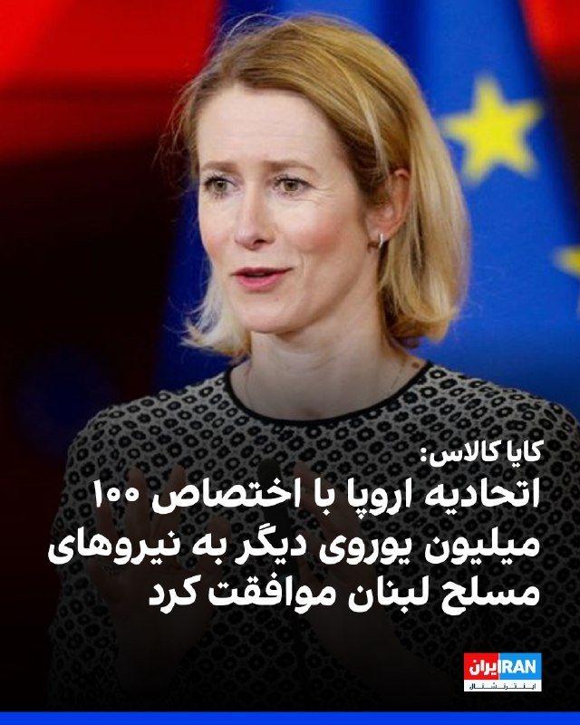

کایا کالاس، مسئول سیاست خارجی اتحادیه اروپا، اعلام کرد اتحادیه اروپا با اختصاص ۱۰۰ میلیون یوروی دیگر به نیروهای مسلح لبنان موافقت کرده است.
او همچنین گفت: بهترین راه برای کاهش تهدید ناشی از حزب‌الله، تقویت دولت لبنان است.
https://iranintl.com/202606043254

## FarsiVOA — post 219571

تصاویر منتشرشده در شبکه‌های اجتماعی، لحظه حمله هوایی ارتش آمریکا به پل بیلقان (بی۱) کرج را نشان می‌دهد.

در سی‌و‌چهارمین روز عملیات نظامی آمریکا و اسرائیل علیه جمهوری اسلامی، پل نیمه‌کاره‌«بی‌یک» در عظیمیه کرج، دو بار در روز پنجشنبه ۱۳ فروردین هدف حمله قرار گرفت.

ساعاتی پس از این حمله دونالد ترامپ، رئیس جمهوری آمریکا،‌با انتشار ویدیویی از انفجار این پل در پیامی در شبکه تروت سوشال نوشت: «بزرگترین پل در ایران فرو ریخت، دیگر هرگز مورد استفاده قرار نخواهد گرفت.»

او با این هشدار که «بسیاری دیگر در راهند» گفت: «وقت آن است که ایران قبل از این که خیلی دیر شود و چیزی از کشوری که هنوز می‌تواند به یک کشور بزرگ تبدیل شود، باقی نماند، توافق کند!»

@FarsiVOA

## Dirty_Kids — post 390979

  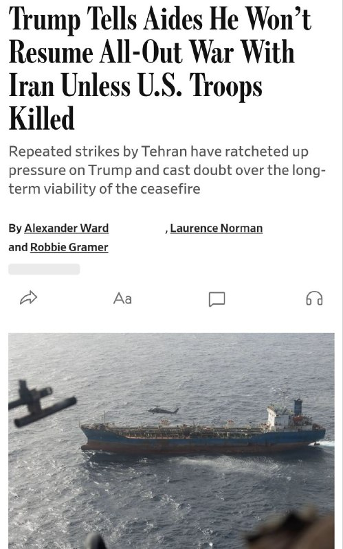

🔴 وال استریت ژورنال:
ترامپ به طور خصوصی به دستیاراش گفته که در صورت کشته شدن نیروهای آمریکایی توسط تهران، آتش‌بس با ایران رو تموم و جنگ رو شروع کنید.

@Dirty_Kids 👻

## Dirty_Kids — post 390977

عکسی که از رپر مملکت، سروش ولی زاده (هیپاپولوژیست) درحال خوردن پای دوست دخترش وایرال شده :

@Dirty_Kids 👻

---
📅 بروزرسانی: 1405/03/14 17:14
---

## VahidOOnLine — post 243667

⭕️پلیس ترکیه ۳۰ مهاجر غیرقانونی را از داخل یک تانکر در شهر وان نجات داد

♦️پلیس ترکیه روز پنجشنبه ۱۴ خردادماه از «نجات» و بازداشت ۳۰ مهاجر غیرقانونی که داخل یک کامیون تانکردار در شهر وان پنهان شده بودند خبر داد.
تصاویر منتشرشده از سوی پلیس مبارزه با قاچاق شهر وان نشان می‌دهد، ماموران این افراد را از داخل مخزن خودرو خارج می‌کنند.

مقام‌های ترکیه با توجه به اینکه تمامی این ۳۰ نفر مدارک جعلی همراه داشتند، اعلام کردند که تحقیقات درباره شبکه‌های قاچاق انسان مرتبط با این پرونده ادامه دارد.

شهر وان در شرق ترکیه و هم‌مرز با ایران، یکی از اصلی‌ترین مسیرهای عبور مهاجران غیرقانونی به سمت ترکیه و اروپا به شمار می‌رود.
نیروهای امنیتی ترکیه به‌طور منظم عملیات‌هایی را برای مقابله با قاچاق انسان و مهاجرت غیرقانونی در این منطقه انجام می‌دهند.
‌🇸🇦 Indypersian

🤖 @VahidOOnLine

## VahidOOnLine — post 243666

  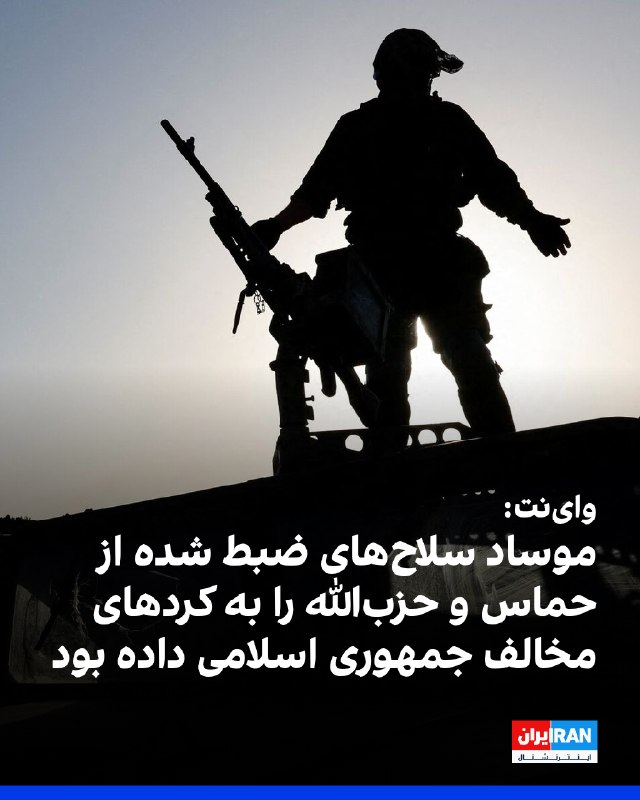

وای‌نت گزارش داد موساد در اقدامی با هدف سرنگونی جمهوری اسلامی سلاح‌هایی را که از حماس در غزه و حزب‌الله در لبنان ضبط شده بود، به «شبه‌نظامیان کرد» تحویل داده است.
بر اساس این گزارش، سازمان اطلاعات مرکزی آمریکا، سیا، نیز در طرح استفاده از نیروهای کرد به‌عنوان بخشی از تلاش گسترده‌تر علیه حکومت ایران مشارکت داشته است.
وای‌نت نوشت این طرح در نهایت پس از فشار رجب طیب اردوغان، رییس‌جمهوری ترکیه، و در پی هشدارها درباره خطر گسترش درگیری منطقه‌ای، از سوی دونالد ترامپ لغو شد.
‌🏁 🇬🇧 IranintlTV

🤖 @VahidOOnLine

## DEJradio — post 5331

⭕️ قیمت نفت برنت به ۹۷ دلار نزدیک شد

بهای هر بشکه نفت برنت دریای شمال در معاملات صبح پنج‌شنبۀ آسیا به درحدود ۹۷ دلار برای هر بشکه رسید.
حملات جمهوری اسلامی به کویت و بحرین و درگیری‌های تازۀ آمریکا و جمهوری اسلامی در جنوب ایران، بازار نفت را بازهم متلاطم کرد.
تحلیلگران انتظار دارند توافق آتش‌بس لبنان و اسرائیل، مانع شود که بهای نفت برنت در روزهای آخر هفته از مرز ۱۰۰ دلا عبور کند.

#خبر #دژ #نفت
@DEJradio

## DEJradio — post 5330

⭕️ ارمنستان و آمریکا سند توسعۀ کریدور زنگزور را امضا کردند

آرارات میرزویان، وزیر امور خارجۀ ارمنستان روز پنج‌شنبه اعلام کرد سند توسعۀ کریدور زنگزور را امضا کرده است.
این سند پیش‌تر به تأیید مارکو روبیو، وزیر امور خارجۀ آمریکا رسیده بود.
با امضای این سند، روند اتصال جمهوری آذربایجان به نخجوان از خاک ارمنستان آغاز می‌شود.
قرار است شرکت‌های آمریکایی توسعۀ این مسیر ترانزیتی را برعهده بگیرند.
جمهوری اسلامی پیش‌تر بارها با راه‌اندازی این کریدور مخالفت کرد و آن را تهدیدی برای موقعیت ترانزیتی ایران دانسته بود.
از سویی جمهوری آذربایجان از صادرات ۱۸ واگن گازوئیل و ترانزیت غلات روسیه به ارمنستان از مسیر خاک خود خبر داد.

#خبر #دژ #زنگزور
@DEJradio

## DEJradio — post 5329

⭕️ اختلاف بر سر دارایی‌های بلوکه‌شده مذاکرات تهران و واشینگتن را به بن‌بست کشاند

روزنامۀ اورشلیم‌پست روز پنج‌شنبه به نقل از دو منبع آگاه گزارش داد اختلاف بر سر آزادسازی دارایی‌های بلوکه‌شدۀ جمهوری اسلامی به مانعی جدی در مذاکرات تهران و واشینگتن تبدیل شده است.
بر اساس این گزارش، جمهوری اسلامی خواهان دسترسی فوری به میلیاردها دلار دارایی مسدودشده در همان مرحلۀ نخست توافق است.
اورشلیم‌پست نوشت آمریکا با آزادسازی منابع مالی، پیش از اقدامات قابل به راستی‌آزمایی جمهوری اسلامی ،موافق نیست.
بنا بر این گزارش، واشینگتن تأکید کرده آزادسازی دارایی‌ها باید در برابر امتیازهای ملموس در پروندۀ هسته‌ای و تنگۀ هرمز انجام شود.

#خبر #دژ #تحریم
@DEJradio

## DEJradio — post 5328

  <a href="telegram/content/DEJradio_5328_1780580673.mp4" target="_blank">🎬 Download video</a>

🔺🎥 جنگ ۴۰ روزه؛
انهدام گاراژ کامیون‌ها در تبریز به دلیل استقرار دو لانچر

در تبریز به علت استقرار دو لانچر موشک در گاراژ کامیون‌ها ده‌ها دستگاه تریلی در بمباران از بین رفتند و هیچ مقامی پاسخگو نیست.

#جنگ۴۰روزه #تبریز #کامیونداران
@DEJradio

## IranIntlTV — post 340517

محاصره تنگه هرمز و راه‌های فرعی تجارت ایران؛ خَصَب شلوغ شد، ام‌القصر فعال

🖋 فرناز داوری

بیش از ۵۰ روز پس از آغاز محاصره دریایی بنادر جنوبی ایران به‌دست آمریکا، تلاش برای رساندن کالا از راه‌های جایگزین ادامه دارد. فعالیت بندر کوچک خصب در عمان زیر فشار افزایش تقاضا کندتر شده و هم‌زمان، بندر ام‌القصر عراق به مسیری تازه برای انتقال برخی محموله‌ها به ایران تبدیل شده است.

بندر خصب در شمال عمان، طی هفته‌های گذشته به یکی از مسیرهای اصلی انتقال غیرمستقیم کالا به ایران تبدیل شده است.

ایران‌اینترنشنال پیش‌تر گزارش داد که با بسته شدن مسیرهای اصلی در تنگه هرمز به روی کشتی‌های ایرانی و کشتی‌های مرتبط با جمهوری اسلامی، بخشی از کالاها به مقصد ایران از مسیر بنادر امارات متحده عربی به خصب منتقل می‌شوند و از آنجا با شناورهای ایرانی، راهی بنادر جنوب ایران می‌شوند.

منابع تجاری به ایران‌اینترنشنال گفتند پس از افزایش استفاده از مسیر خصب، تجمع شناورها در این بندر بیشتر شده و روند بارگیری و انتقال کالا به ایران، کندتر از روزهای نخست پیش می‌رود.

به گفته این منابع، محدود بودن ظرفیت بندر، افزایش شمار شناورها و بالا رفتن حجم محموله‌ها، باعث شده انتقال بار از این مسیر زمان‌برتر و هزینه‌برتر شود.

ام‌القصر؛ مسیر مکمل از عراق
در کنار مسیر عمان، اطلاعات تازه نشان می‌دهد بندر ام‌القصر عراق نیز به مسیر تازه‌ای برای انتقال برخی محموله‌ها به ایران تبدیل شده است.
 
بر اساس اطلاعات رسیده به ایران‌اینترنشنال، خودرو از جمله محموله‌هایی بوده که از این مسیر به ایران رفته است.
 
در این روش، خودروها یا محموله‌های به مقصد ایران، ابتدا با کشتی از اسکله‌هایی در امارات، از جمله دبی، و با پرچم کشورهایی غیر از ایران، به بندر ام‌القصر عراق منتقل می‌شوند. سپس بار از آنجا یا از مسیر زمینی به ایران می‌رسد یا از مسیر آبی به بنادر جنوب غربی ایران منتقل می‌شود.
 
در مسیر زمینی، محموله از ام‌القصر به بصره و سپس به گذرگاه مرزی شلمچه منتقل می‌شود و از آنجا به خرمشهر و دیگر نقاط ایران می‌رود.
 
در مسیر آبی، شناورها برای رسیدن به خرمشهر باید وارد اروندرود شوند و از آن مسیر به اسکله‌های ایران برسند.
 
بخشی از محموله‌ها نیز می‌توانند از ام‌القصر از مسیر خور عبدالله به سوی بنادر جنوبی ایران، از جمله بندر لنگه، منتقل شوند.
 
چرا خصب همچنان پرطرفدار است؟
با وجود کندی و افزایش هزینه‌ها، مسیر خصب همچنان برای بسیاری از تجار جذاب‌تر از مسیرهای جایگزین است که یکی از دلایل آن، امکان انتقال بار به عمان از دو مسیر زمینی و دریایی است.

بخشی از بارها می‌توانند از خاک امارات به سوی عمان منتقل شوند و به گفته منابع تجاری، نظارت بر برخی محموله‌هایی که از مسیر زمینی به عمان می‌روند، در مقایسه با مسیرهای کاملا دریایی، کمتر است.

در مقابل، محموله‌هایی که قرار است از امارات به بندر ام‌القصر عراق منتقل شوند، معمولا باید از اسکله‌های رسمی در دبی یا دیگر بنادر امارات بارگیری شوند.

اهمیت بندر ام‌القصر برای عراق و جمهوری اسلامی
بندر ام‌القصر از مهم‌ترین بنادر عراق در خلیج فارس است و حدود ۶۰ کیلومتری جنوب بصره قرار دارد.

بخش مهمی از واردات کالاهای اساسی عراق، از جمله غلات و شکر، از طریق این بندر انجام می‌شود و این بندر نقش مهمی در اتصال عراق به مسیرهای تجاری خلیج فارس دارد.

نزدیکی ام‌القصر به بصره، مرز شلمچه و خوزستان، این بندر را از نظر جغرافیایی به گزینه‌ای قابل استفاده برای انتقال کالا به ایران تبدیل کرده است.

جواد کاظم‌نسب الباجی، معاون هماهنگی امور اقتصادی استانداری خوزستان، اردیبهشت‌ماه در دیدار با رییس کل گمرک ایران گفته بود توافق‌هایی برای ورود کالاهای اساسی و اقلام امدادی از طریق بندر ام‌القصر عراق صورت گرفته است.

حادثه اخیر در ام‌القصر
اما استفاده از مسیر ام‌القصر بدون ریسک نیست. نیروی دریایی سپاه پاسداران اخیرا یک کشتی تجاری را در این بندر هدف قرار داد و آن را «آمریکایی-اسرائیلی» خواند.

سپاه پاسداران اعلام کرد این حمله در تلافی هدف قرار دادن کشتی ایرانی «لیان استار» از سوی آمریکا انجام شده است.

این حمله نشان داد حتی مسیرهای جایگزین در عراق نیز از تنش‌های نظامی و امنیتی در امان نیستند. با این حال، افزایش فشار بر مسیرهای سنتی تجارت دریایی ایران باعث شده تجار و واسطه‌های حمل‌ونقل به استفاده از مسیرهای پرریسک‌تر نیز فکر کنند.
 
🔗متن کامل گزارش را اینجا بخوانید
@iranintltv

## IranIntlTV — post 340516

  

وای‌نت گزارش داد موساد در اقدامی با هدف سرنگونی جمهوری اسلامی سلاح‌هایی را که از حماس در غزه و حزب‌الله در لبنان ضبط شده بود، به «شبه‌نظامیان کرد» تحویل داده است.
بر اساس این گزارش، سازمان اطلاعات مرکزی آمریکا، سیا، نیز در طرح استفاده از نیروهای کرد به‌عنوان بخشی از تلاش گسترده‌تر علیه حکومت ایران مشارکت داشته است.
وای‌نت نوشت این طرح در نهایت پس از فشار رجب طیب اردوغان، رییس‌جمهوری ترکیه، و در پی هشدارها درباره خطر گسترش درگیری منطقه‌ای، از سوی دونالد ترامپ لغو شد.
https://iranintl.com/202606047869

## Shin_Persian — post 6498

↩️ Quoted tweet: Afshin Ismaeli ✓ @Afshin_Ismaeli Thu, 04 Jun 2026 12:26:22 UTC New Video appears to show the destruction of a tunnel in the Borujerd Mountains near Khorramabad, western Iran. The underground facility was reportedly used to conceal missile…

## Shin_Persian — post 6497

  <a href="telegram/content/Shin_Persian_6497_1780580675.mp4" target="_blank">🎬 Download video</a>

↩️ Quoted tweet:
Afshin Ismaeli ✓ @Afshin_Ismaeli
Thu, 04 Jun 2026 12:26:22 UTC

New Video appears to show the destruction of a tunnel in the Borujerd Mountains near Khorramabad, western Iran.
The underground facility was reportedly used to conceal missile launchers during the recent conflict.

↩️ توییت نقل‌قول شده — برای پاسخ، پست زیر را ببینید.

فارسی

ویدیو جدید به نظر می‌رسد انهدام یک تونل را در کوه‌های بروجرد در نزدیکی خرم‌آباد در غرب ایران نشان می‌دهد.
گزارش شده است که از این تاسیسات زیرزمینی برای پنهان کردن پرتابگرهای موشکی در طول درگیری‌های اخیر استفاده شده است.

𝕏 · @shin_persian

## FarsiVOA — post 219570

🔺مرجان ساتراپی، خالق کتاب مصور «پرسپولیس» درگذشت

▪️مرجان ساتراپی، نویسنده، کارگردان، و فعال حقوق بشر که با کتاب مصور «پرسپولیس» به شهرت رسیده بود، در ۵۶ سالگی درگذشت. خانم ساتراپی بعد از آن‌که همسرش را از دست داد، طی چند ماه اخیر از رسانه‌ها فاصله گرفته بود.

⬇️ بیشتر بخوانید:

https://ir.voanews.com/a/marjane-satrapi-french-iranian-author-persepolis-dies/8157257.html/?nocach=1

## BBCPersian — post 282852

  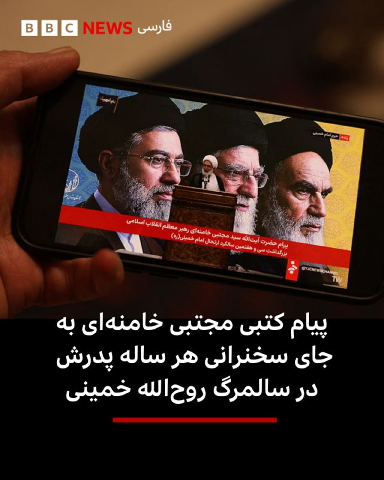

‌
بر خلاف ۳۶ سال گذشته،‌ که علی خامنه‌ای، رهبر سابق جمهوری اسلامی در مراسم سالمرگ روح الله خمینی سخنرانی می‌کرد، امسال فقط متنی از سوی مجتبی خامنه‌ای،‌ رهبر جدید ایران توسط محمدجواد حاج‌علی‌اکبری، امام جمعه موقت تهران قرائت شد.

در پیام مجتبی خامنه‌ای، آمده است که آمریکا و اسرائیل در جنگ با ایران «دچار شکست» شدند و «ضربه قاطعی» خوردند. او گفت که دشمنان اکنون «تحقیری پرمعنا و عمیق را تجربه می‌کنند.»

این اظهارات در حالی مطرح می‌شود که سرنوشت مذاکرات ایران و آمریکا و جنگ اخیر مشخص نیست.

در پیام منتسب به مجتبی خامنه‌ای که در این مراسم خوانده شد، او می‌گوید که ابزار اصلی «دشمن» ایجاد «بدگمانی و اختلاف است» و از همه خواست که با «ایستادگی و حفظ وحدت و انسجام و اعتماد متقابل نقشه دشمن را خنثی کنند.»

بعد از حمله آمریکا و اسرائیل در روز نهم اسفند ماه،‌ مجتبی خامنه‌ای که به جای پدرش انتخاب شد، از انظار عمومی مخفی مانده، صدایش هم شنیده نشده است و فقط چند پیام کتبی از او منتشر شده است.

از لینک ⬇️ ادامه این مطلب را در سایت بی‌بی‌سی فارسی بخوانید.
https://bbc.in/43PvKOA
📷AFP via Getty Images

@BBCPersian

## BBCPersian — post 282851

  <a href="telegram/content/BBCPersian_282851_1780580677.mp4" target="_blank">🎬 Download video</a>

🔻سرخط خبرهای پنجشنبه ۱۴ خرداد ۱۴۰۵

@BBCPersian

## alonews — post 125069

  <a href="telegram/content/alonews_125069_1780580679.mp4" target="_blank">🎬 Download video</a>

👈 ماجرا و محتوای این پست بسیار دردناک و ناراحت کننده‌اس، اگه بیماری قلبی دارین به هیچ وجه نخونین.

توی سنندج یه زن و شوهر از هم طلاق میگیرن، بعدش مَرده حضانت بچه هارو به عهده میگیره و میره یه زن دیگه میگیره.
دیشب همسایه‌ها بعد از شنیدن صدای جیغ وارد این خونه میشن، می بینن دو تا دختر 7 و 15 ساله داخل دستشویی حبس شدن.
با اومدن پلیس و اورژانس معلوم میشه توی این مدت پدر و نامادری‌شون تا سر حد مرگ شکنجه‌شون میدادن!
یکیشون فکش ۳ ماه بود شکسته بود، اون یکی دست، پا و دنده‌اش، شکسته بود. رحمِ دختر بچه رو سوزونده بودن!
به بچه کوچیکه انقد غذا ندادن مثل چوب بستنی لاغر شده بود. انقد موهاشون رو کشیدن که مو روی سرشون نمونده!
کل بدنشون جای سوختگی بود. دکترا گفتن هر لحظه ممکنه بمیرن انقد عذاب کشیدن. پدر حرومزاده‌شون بهشون تجاوز کرده و برای اینکه معلوم نشه آبجوش ریخته روی واژن دختره!

این پدر و مادر امروز دستگیر شدن

✅ @AloNews خبر جنگ

## alonews — post 125068

امروز عراق با اسپانیا بازی دوستانه داره و جمهوری اسلامی با مالی😐

@AloSport

---
📅 بروزرسانی: 1405/03/14 17:04
---

## VahidOOnLine — post 243665

  <a href="telegram/content/VahidOOnLine_243665_1780580087.mp4" target="_blank">🎬 Download video</a>

یک شهروند با ارسال ویدیویی به ایران اینترشنال گفت که به دلیل درخواست فرزندش ناچار شده است یک عدد بستنی را ۲۰۰ هزار تومان بخرد و قیمت‌ها را «سرسام‌آور» توصیف کرد.
‌🏁 🇬🇧 IranintlTV

🤖 @VahidOOnLine

## VahidOOnLine — post 243664

  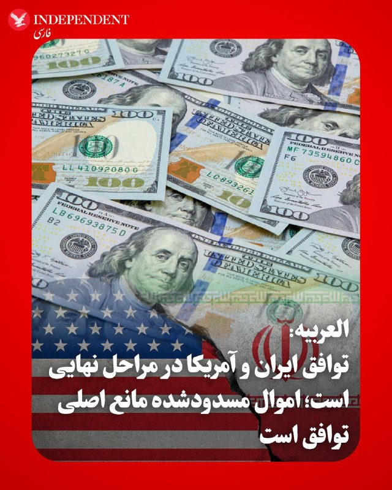

♦️العربیه روز پنجشنبه ۱۴ خرداد به نقل از یک منبع آگاه اعلام کرد که توافق میان جمهوری اسلامی و ایالات متحده در مراحل پایانی خود قرار دارد و مانع اصلی باقی‌مانده، مربوط به نحوه مدیریت بخشی از دارایی‌های مسدودشده ایران است.

به گفته این منبع، دونالد ترامپ به میانجی‌گران اطلاع داده است که با آزادسازی هرگونه وجهی پیش از امضای رسمی توافق مخالفت خواهد کرد. همچنین بر اساس اظهارات این منبع، در حال حاضر پیشنهاد ایجاد یک صندوق ویژه برای تودیع دارایی‌های مسدودشده ایران در دست بررسی و گفتگو قرار دارد.
‌🇸🇦 Indypersian

🤖 @VahidOOnLine

## mwarmonitor — post 10142

🔴 دولت کویت حکم زندان سه‌ساله برای یک شهروند زن صادر کرده است، به اتهام ابراز همدلی با حملات موشکی ایران که پایگاه‌های آمریکا را هدف قرار داده بود.

📝 واقعاً خنده‌دار است؛ طرف در کشوری لم داده که دینارش پادشاه بازارهای مالی است و پاسپورتش سنگین‌ترین درها را باز می‌کند، اما کلِ خروجیِ آن مغزِ آکبندش می‌شود حمایت از حکومتی که ریالش از پهنِ شتر کم‌ارزش‌تر است و پاسپورتش به درد سطل زباله می‌خورد!

🔸این نابغه‌ی خلقت را نباید در زندان‌های باکیفیت کویت هدر داد؛ این نمونه‌ی اعلای یک «شیعه‌ی رافضی ۱۲ امامی» که کل جهان‌بینی‌اش در تعصبات کور و روضه‌های حماقت خلاصه شده را باید جفت‌پا شوت کرد وسط همان بهشتِ موشکی‌اش در ایران! بگذارید بیاید همین‌جا در صف مرغِ دولتی با همان پولِ پشگل‌نشان زندگی کند، تا بفهمد این ایدئولوژیِ پوسیده‌اش در واقعیت چه بوی گندی می‌دهد. فرستادن این قماش به زندانِ کویت لطف است، حقشان زیستن ابدی در همان ویرانه‌ای است که برایش غش و ضعف می‌کنند!

@mwarmonitor

## FoxNewsTwitter — post 342598

‌Fox News (Twitter/X)

RT @EricShawnTV: Lewis Kasman on being at John Gotti’s side. Watch “Gotti’s Guy,” now streaming on Fox Nation. @TheMobMuseum @MOBFAX @MobCandy @MafiaNews @FoxNews @foxnation @ganglandnews @GravanoTheBull @GangsterPodcast @patrickbetdavid

## pm_afshaa — post 92269

حمله پهپادی حزب الله به شمال اسرائیل

💧 Rainbet.com the #1 Non-KYC Crypto Casino & Sportsbook @rainbetcom

😁 @Pm_Afshaa

## DEJradio — post 5327

⭕️ مکزیک ویزای همۀ اعضای تیم فوتبال جمهوری اسلامی را صادر کرد

بخش رسانه‌ای تیم فوتبال جمهوری اسلامی اعلام کرد همۀ اعضای این تیم ویزای مکزیک را دریافت کرده‌اند.
بنا بر گزارش‌ها تیم ملی فوتبال جمهوری اسلامی روز شنبه ۱۶ خرداد از ترکیه راهی تیخوانا در مکزیک می‌شود.
مقام‌های جمهوری اسلامی پیش‌تر به‌ناچار محل اقامت تیم در جام جهانی ۲۰۲۶ را از آمریکا به مکزیک منتقل کرده بودند.
مهدی تاج، رئیس فدراسیون روز چهارشنبه گفته بود به جز دو نفر، ویزای مکزیک برای همۀ اعضا صادر شده، اما وضعیت صدور ویزای آمریکا هنوز مشخص نیست.
مارکو روبیو پیش‌تر گفته بود آمریکا اجازۀ ورود افراد مرتبط با سپاه در هیئت همراه تیم فوتبال جمهوری اسلامی را به خاک این کشور نمی‌دهد.
نام سپاه توسط ایالات متحده در سیاهۀ سازمان‌های تروریستی قرار گرفته است.
مهدی تاج پیشینۀ عضویت در سپاه را دارد. همچنین شماری از اعضای اکیپ جمهوری اسلامی، در دوران خدمت سربازی یا مأموریت، در سپاه بوده‌اند.

#خبر #دژ #فوتبال #جام_جهانی
@DEJradio

## IranIntlTV — post 340515

  <a href="telegram/content/IranIntlTV_340515_1780580090.mp4" target="_blank">🎬 Download video</a>

یک شهروند با ارسال ویدیویی به ایران اینترشنال گفت که به دلیل درخواست فرزندش ناچار شده است یک عدد بستنی را ۲۰۰ هزار تومان بخرد و قیمت‌ها را «سرسام‌آور» توصیف کرد.

## IranIntlTV — post 340514

  <a href="telegram/content/IranIntlTV_340514_1780580092.mp4" target="_blank">🎬 Download video</a>

در پی انتشار گزارش‌هایی درباره آزار شدید دو کودک در سنندج از سوی پدر و نامادری‌شان، تصاویر انتقال آن‌ها به بیمارستان در شبکه‌های اجتماعی بازتاب گسترده‌ای پیدا کرد. این موضوع با موجی از واکنش‌های کاربران رسانه‌های اجتماعی همراه شده است.

آیه دریس، عضو تحریریه ایران‌اینترنشنال، از واکنش کاربران می‌گوید
@iranintltv

## DW_Farsi — post 125488

  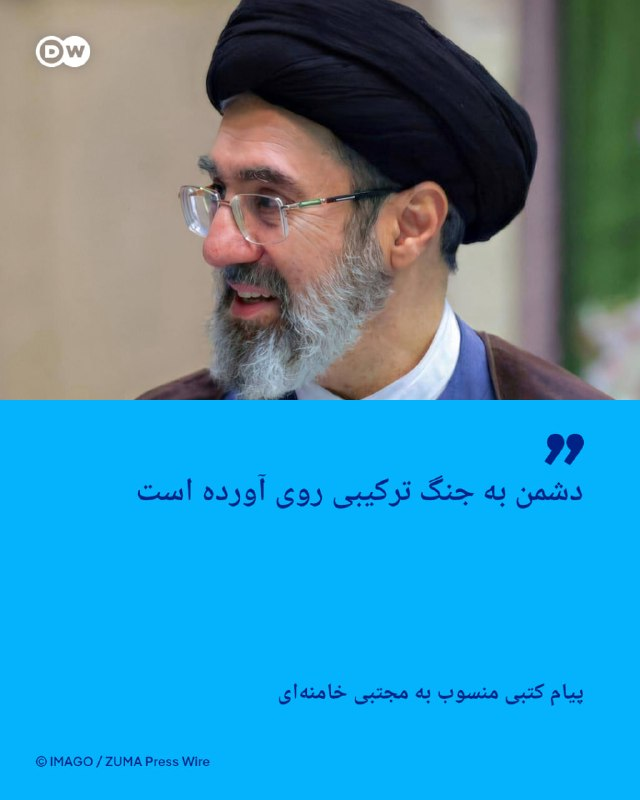

🔶پیام کتبی منسوب به مجتبی خامنه‌ای: دشمن به جنگ ترکیبی روی آورده است

مجتبی خامنه‌ای، رهبر جدید جمهوری اسلامی روز پنجشنبه با انتشار بیانیه‌ای به مناسبت ۱۴ خرداد، سال‌روز مرگ روح‌‌الله خمینی با بیان این ادعا که "دشمن خبیث" به خاطر مواجهه با "ضربه قاطع"، "چه در نبرد نظامی و چه در میدان و خیابان" شکست خورده است گفت دشمن به همین خاطر، تلاش خود را روی "جنگ ترکیبی متمرکز ساخته است".

مجتبی خامنه‌ای با بیان این که دو محور این جنگ ترکیبی، شامل "تاب‌آوری مردم" و "ایجاد خطا در دستگاه محاسباتی مسئولان کشور" می‌شود گفت: «ابزار اصلی او در این هر دو، کاشت بذر تردید، یأس، ترس، بدگمانی، و اختلاف است. لذا در مقام مقابله با این بدخواهی‌ها باید همگان با ایستادگی و روشن‌بینی و حفظ وحدت و انسجام و اعتماد متقابل و همصدایی نکردن با دشمن، نقشه‌ شوم او را خنثی نمایند.»

در این پیام منسوب به مجتبی خامنه‌ای همچنین ضمن هشدار نسبت به "هرگونه اقدامی که موجب بدبینی و سرخوردگی آحاد مردم شود" آمده است که چنین اقداماتی، "نوعی کمک به دشمن این کشور و مردمانش محسوب می‌گردد".

@dw_farsi

## Persian_Trend_Official — post 15695

  <a href="telegram/content/Persian_Trend_Official_15695_1780580095.mp4" target="_blank">🎬 Download video</a>

ادعای حنظله درباره کشته شدن یک مقام ارشد موساد:

گروه هکری «حنظله» در تازه‌ترین بیانیه خود مدعی شده است که یکی از مدیران ارشد موساد در بخش مرتبط با پرونده ایران، بر اثر انفجار بمب در خودروی شخصی‌اش کشته شده است.

این گروه جزئیاتی درباره هویت فرد مورد ادعا، محل وقوع حادثه یا شواهد مرتبط با این عملیات منتشر نکرده و تاکنون نیز هیچ مقام رسمی اسرائیلی این خبر را تأیید نکرده است.

در صورت صحت این ادعا، با یکی از مهم‌ترین رخدادهای امنیتی مرتبط با موساد در سال‌های اخیر روبه‌رو خواهیم بود. با این حال، تا زمان انتشار اطلاعات مستقل یا تأیید رسمی، این خبر صرفاً در حد یک ادعای رسانه‌ای و اطلاعاتی باقی می‌ماند.

👺Phantom

📌 @persian_trend_official
پرشین ترند | متفاوت‌ترین کانال نظامی

## IranianMinds — post 21366

🔴نعیم قاسم، رهبر حزب‌الله لبنان:

مذاکرات با لبنان بی‌شرمانه است و تا زمانی‌که اسرائیل در لبنان حضور دارد هیچ توافقی انجام نخواهد شد و مقاومت ادامه خواهد داشت.

@IranianMinds

## alonews — post 125067

  <a href="telegram/content/alonews_125067_1780580097.mp4" target="_blank">🎬 Download video</a>

👈ویرانی در تبنین، جنوب لبنان، پس از چندین حمله هوایی اسرائیلی.

✅ @AloNews خبر جنگ

## alonews — post 125066

  <a href="telegram/content/alonews_125066_1780580099.webm" target="_blank">🎬 Download video</a>

🤚 اینترنت مخصوص جنگ 
🚀
💙 
🔥 نامحدود فقط 690 تومن 
🔥 
⭐️ فقط گیگی 7 هزار تومان
😍 
✅ بدون قطعی‌های آزاردهنده 
✅ سرعت بالا حتی ساعات شلوغ 
✅ مناسب تلگرام، اینستاگرام و یوتیوب 
✅ همراه با ساب 
✅ تعداد محدود با این قیمت 
🤖 @NetAazaadBot 
🤖 @NetAazaadBot

## alonews — post 125065

  <a href="telegram/content/alonews_125065_1780580099.webm" target="_blank">🎬 Download video</a>

🤚 اینترنت مخصوص جنگ 
🚀
💙

🔥 نامحدود فقط 690 تومن 
🔥

⭐️ فقط گیگی 7 هزار تومان
😍

✅ بدون قطعی‌های آزاردهنده

✅ سرعت بالا حتی ساعات شلوغ

✅ مناسب تلگرام، اینستاگرام و یوتیوب

✅ همراه با ساب

✅ تعداد محدود با این قیمت

🤖 @NetAazaadBot

🤖 @NetAazaadBot

---
📅 بروزرسانی: 1405/03/14 16:54
---

## VahidOOnLine — post 243663

  

⭕️نعیم قاسم، دبیرکل حزب‌الله لبنان: مذاکرات مستقیم لبنان با اسرائیل نمایشی مضحک و توهین‌آمیز است

♦️نعیم قاسم، دبیرکل حزب‌الله لبنان، توافق دولت لبنان با اسرائیل که با میانجی‌گری آمریکا تدوین شده است را «تسلیم و شکست تمام‌عیار» توصیف کرد و گفت حزب‌الله تنها به توقف کامل حملات، آتش‌بس و خروج اسرائیل از خاک لبنان متعهد است.

او همچنین خلع سلاح حزب‌الله را به معنای از بین رفتن قدرت لبنان دانست و تاکید کرد این موضوع برای حزب‌الله قابل پذیرش نیست.

پس از توافق آتش‌بس میان اسرائیل و حزب‌الله لبنان، آمریکا برای حل‌وفصل اختلافات مرزی و مسائل امنیتی میان دو طرف نقش میانجی را بر عهده گرفته است. در همین حال، موضوع خلع سلاح حزب‌الله و نحوه اجرای آتش‌بس همچنان از مهم‌ترین محورهای اختلاف میان دولت لبنان، حزب‌الله و اسرائیل به شمار می‌رود.
‌🇸🇦 Indypersian

🤖 @VahidOOnLine

## WithYashar — post 13488

اقا ری اکشن کوچکترین تمرین هست برای پذیرش دموکراسی
وقتی یه عده همه ش دنبال کم و زیاد کردن ری اکشن هستن و دنبال اینن که کی چه ری اکشنی زده در آینده ی ایران چطور میخوایم همدیگه رو تحمل بکنیم و باهمدیگه حرف بزنیم؟

همه ری اکشنا باید باز باشه و کاملا مخفی

## mwarmonitor — post 10141

🔴بریتانیا و فرانسه برنامه‌ریزی عملیاتی یک مأموریت مین‌روبی در تنگه هرمز را نهایی کرده‌اند — بلومبرگ

@mwarmonitor

## DEJradio — post 5326

⭕️ بحران انرژی در هرمز، سبب گسترش همکاری بین ونزوئلا و هند می‌شود

دلسی رودریگز، رئیس جمهوری موقت ونزوئلا، برای گفت‌وگو درمورد همکاری‌های انرژی به هندوستان سفر کرد.
رویترز گزارش داد مقامات دو کشور دربارۀ گسترش پروژه‌های تولید و پالایش نفت ونزوئلا مذاکره کردند.
هندوستان در ماه پیشین روزانه ۴۲۷ هزار بشکه نفت از ونزوئلا وارد کرد و به دومین مشتری بزرگ نفت این کشور تبدیل شد.
مقام‌های هندی می‌گویند افزایش واردات نفت ونزوئلا، بخشی از فشار ناشی از اختلال تنگۀ هرمز را جبران کرده است.
رودرندرا تاندون، مقام وزارت خارجۀ هندوستان گفت ونزوئلا هند را شریک اصلی خود در حوزۀ انرژی می‌داند.

#خبر #دژ #انرژی #خاورمیانه
@DEJradio

## DEJradio — post 5325

⭕️ بحرین ۱۵ نفر را به دلیل ارتباط با سپاه بازداشت کرد

وزارت کشور بحرین از بازداشت پانزده نفر به اتهام ارتباط با سپاه پاسداران خبر داد.
رسانه‌ها به نقل از مقام‌های بحرینی خبر دادند بازداشت‌شدگان به اجرای دستورهای تحریک‌آمیز متهم شده‌اند.
وزارت کشور بحرین اعلام کرد این افراد برای تأثیرگذاری بر شهروندان و هدایت آنها به اقدامات مجرمانه فعالیت می‌کردند.
پیش‌تر دادگاه جنایی بحرین یک زن را به اتهام همکاری با سپاه و ارسال اطلاعات حساس امنیتی، به حبس ابد محکوم کرده بود.

#خبر #دژ #بحرین
@DEJradio

## VahidOnline — post 75939

  

⭕️نعیم قاسم، دبیرکل حزب‌الله لبنان: مذاکرات مستقیم لبنان با اسرائیل نمایشی مضحک و توهین‌آمیز است

♦️نعیم قاسم، دبیرکل حزب‌الله لبنان، توافق دولت لبنان با اسرائیل که با میانجی‌گری آمریکا تدوین شده است را «تسلیم و شکست تمام‌عیار» توصیف کرد و گفت حزب‌الله تنها به توقف کامل حملات، آتش‌بس و خروج اسرائیل از خاک لبنان متعهد است.

او همچنین خلع سلاح حزب‌الله را به معنای از بین رفتن قدرت لبنان دانست و تاکید کرد این موضوع برای حزب‌الله قابل پذیرش نیست.

پس از توافق آتش‌بس میان اسرائیل و حزب‌الله لبنان، آمریکا برای حل‌وفصل اختلافات مرزی و مسائل امنیتی میان دو طرف نقش میانجی را بر عهده گرفته است. در همین حال، موضوع خلع سلاح حزب‌الله و نحوه اجرای آتش‌بس همچنان از مهم‌ترین محورهای اختلاف میان دولت لبنان، حزب‌الله و اسرائیل به شمار می‌رود.
@VahidOOnLine

📡 @VahidOnline

## IranIntlTV — post 340513

  <a href="telegram/content/IranIntlTV_340513_1780579462.mp4" target="_blank">🎬 Download video</a>

هفته سوم رسیدگی به پرونده حمله با چاقو به پوریا زراعتی، مجری ایران‌اینترنشنال، در دادگاه سلطنتی وولیچ لندن برگزار شد. قاضی دادگاه در جمع‌بندی خود به پیشینه تهدیدهای منتسب به جمهوری اسلامی علیه خبرنگاران و استفاده از نیروهای نیابتی در بریتانیا اشاره کرد و یادآور شد که ایران‌اینترنشنال پیش‌تر به دلیل تهدیدهای امنیتی ناچار به جابه‌جایی دفتر خود در لندن شده است.

علی رشید، خبرنگار ایران‌اینترنشنال، گزارش می‌دهد
@iranintltv

## FarsiVOA — post 219567

وزارت امور خارجه آمریکا تصاویری از حضور مارکو روبیو، وزیر خارجه ایالات متحده، در کنگره منتشر کرد.

این تصاویر با عنوان «بدون ترس در صحنه» منتشر شده‌ است.

@FarsiVOA

## DW_Farsi — post 125487

  

🔸 سفر "اعلام‌نشده" وزیر کشور پاکستان به تهران

محسن نقوی، وزیر کشور پاکستان روز شنبه برای ادامه گفت‌وگوها با مقام‌های ارشد جمهوری اسلامی وارد تهران شد.

انتشار این خبر در حالی صورت می‌گیرد که پاکستان پس از شکست مذاکراتی که پیش از این در پایتخت این کشور برگزار شده بود، تلاش‌های میانجی‌گرانه خود را برای دستیابی به یک آتش‌بسپایدار میان ایالات متحده آمریکا و ایران افزایش داده است.

این اقدام تازه‌ترین ابتکار دیپلماتیک اسلام‌آباد در میانه تلاش‌های جاری برای میانجی‌گری در منطقه به شمار می‌رود. رسانه‌های دولتی ایران چند ساعت پیش‌تر ورود او را گزارش کرده بودند و این سفر را "اعلام‌نشده" خواندند.

با وجود این، سخنگوی وزارت کشور پاکستان به خبرگزاری آناتولی گفته است که این سفر "از پیش برنامه‌ریزی شده" بود، هرچند جزئیات مشخص آن تا زمان برگزاری نشست‌های رسمی محرمانه باقی مانده است.

این وزارتخانه همچنین اعلام کرد پس از دیدار میان نقوی و مقام‌های جمهوری اسلامی، بیانیه‌ای منتشر خواهد کرد، اما درباره دستور کار این دیدار توضیح بیشتری نداد.

@dw_farsi

---
📅 بروزرسانی: 1405/03/14 16:44
---

## WithYashar — post 13487

شاهزاده رضا پهلوی : مسابقات جام جهانی فوتبال فرصتی کم‌نظیر برای رساندن صدای ملت ایران به جهانیان فراهم می‌کند. از این فرصت تاریخی بهره بگیریم؛ پرچم شیر و خورشید را در ورزشگاه‌ها، خیابان‌ها و میدان‌های شهرها به اهتزاز درآوریم و تصاویر جان‌فداییان راه آزادی…

## FoxNewsTwitter — post 342597

Fox News (Twitter/X)

WATCH LIVE: Officials hold press conference on illegal immigration, human smuggling in South Carolina
https://twitter.com/i/broadcasts/1YxNrrQYNlbxw

## VahidOnline — post 75938

  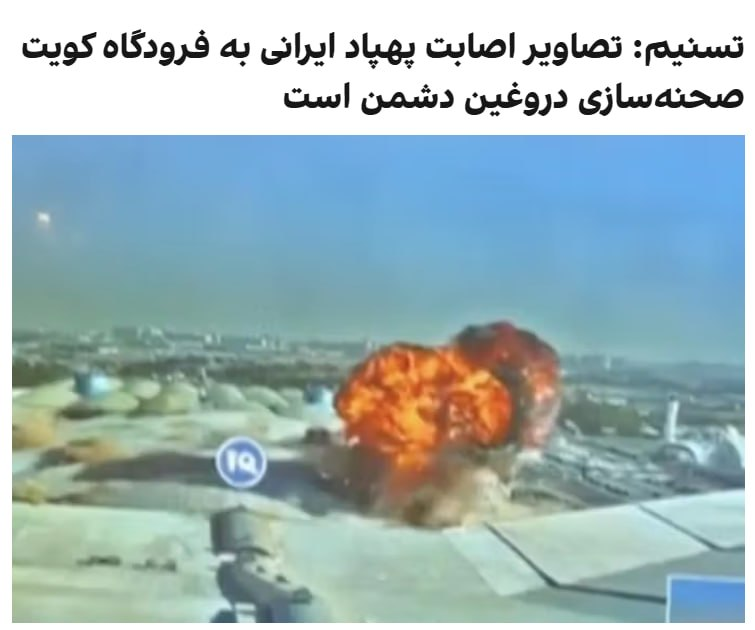

خبرگزاری تسنیم، وابسته به سپاه پاسداران روز پنجشنبه ۱۴ خردادماه و ساعاتی پس از انتشار ویدیوها و تصاویری از برخورد پهپاد سپاه به فرودگاه بین‌المللی کویت، به نقل از یک منبع نظامی، آن‌ها را «تصویرسازی دروغین دشمن» خواند.

این منبع نظامی به تسنیم گفت:‌«پرتاب پهپادهای هوافضای سپاه به سوی اهداف آمریکایی در کویت، در نیمه شب و اصابت هم در نیمه شب (و در تاریکی هوا) صورت گرفته است درحالی که در فیلم و عکسهای ادعایی که از پهپاد در فرودگاه منتشر شده، هوا کاملاً روشن و مربوط به روز است.»

سپاه پاسداران پیش از انتشار تصاویر برخورد پهپاد با پایانه مسافربری شماره ۱ فرودگاه کویت ادعا کرده بود که موشک‌های سامانه ضدهوایی آمریکا به این محل برخورد کرده بودند.

این منبع نظامی که نامش فاش نشده به تسنیم گفت:‌ «فاصله «هدف» پهپادهای هوافضای سپاه تا فرودگاه کویت بیش از ۴۰ کیلومتر است و این نیز نشان می‌دهد که اصابت به فرودگاه کویت ارتباطی به پهپادهای ایران ندارد.»
@VahidOOnLine

📡 @VahidOnline

## VahidOnline — post 75937

  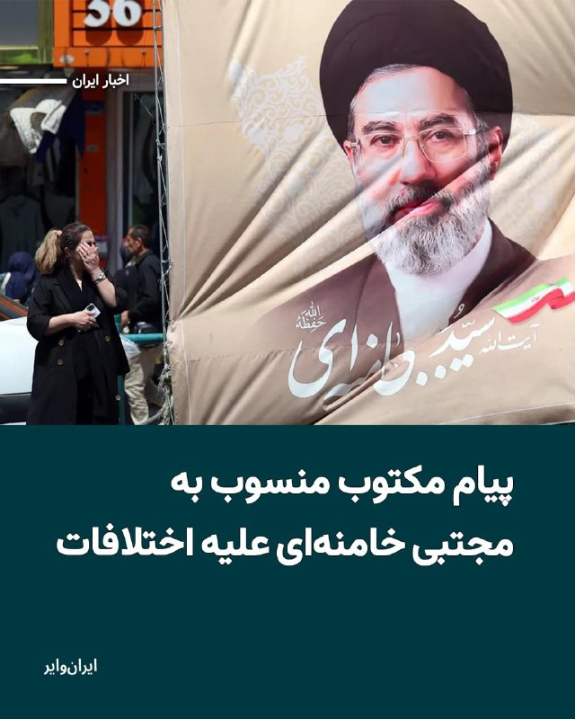

پیام مکتوب و منسوب به مجتبی خامنه‌ای، سومین رهبر جمهوری اسلامی، در مراسم سالگرد مرگ روح‌الله خمینی در تهران، خوانده شد.

در این پیام که محمدجواد حاج‌علی‌اکبری، امام جمعه تهران، روز پنجشنبه ۱۴خرداد خواند، رهبر جمهوری اسلامی‌ آمریکا و اسرائیل را به «جنگ ترکیبی» با ایران متهم کرد و گفت این جنگ «بر دو نقطه متمرکز است؛ یکی تاب‌آوری مردم و دیگری ایجاد اخلال در دستگاه محاسباتی مسئولان کشور».

مجتبی خامنه‌ای همچنین هرگونه اقدامی که به‌گفتهٔ او «موجب بدبینی و سرخوردگی» شود را «کمک به دشمن» خواند و خواستار «حفظ وحدت و انسجام و اعتماد متقابل» مردم و مسئولان نظام شد.

مجتبی خامنه‌ای هفتهٔ گذشته نیز به تمام کسانی که آن‌ها را «جان‌فدایانی که دل‌شان برای اسلام و انقلاب یا استقلال و سربلندی ایران می‌تپد» نامیده، هشدار داده بود که «اختلافات غیرموجه و حتی موجه را به تنازع و تفرقه تبدیل نکنند».

در بخش دیگری از این پیام، اسرائیل «پادگانی متعلق به نظام سلطه» توصیف شده و تاکید شده است این کشور از هر اقدامی برای جلوگیری از پیشرفت ایران کوتاهی نمی‌کند.

این پیام همچنین اعلام کرده است: «دشمن خبیث در مصاف با فرزندان دلاور شما در نیروهای مسلح دچار شکست شده است» و افزوده است دشمن پس از آنچه «تحقیری پرمعنا و عمیق» خوانده شده، تمرکز خود را بر تضعیف تاب‌آوری مردم و ایجاد خطا در دستگاه محاسباتی مسئولان قرار داده است.

در پایان، در این پیام از همگان خواسته شده است با ایستادگی، روشن‌بینی، حفظ وحدت و انسجام و همصدایی نکردن با دشمن، «نقشه شوم» او را خنثی کنند.

از زمان اعلام نام مجتبی خامنه‌ای، به عنوان سومین رهبر جمهوری اسلامی، تصویر یا صدایی از او منتشر نشده و رسانه‌های ایران فقط پیام‌های کتبی از او منتشر می‌کنند.

مراسم سالگرد مرگ روح‌الله خمینی که هر سال ۱۴ خرداد با سخنرانی رهبر جمهوری اسلامی و با حضور پرشمار مقامات و فرماندهان ارشد نظامی برگزار می‌شد، امسال به‌صورت خیلی محدود و بدون حضور مقامات نظام برگزار شد.
@VahidHeadline

📡 @VahidOnline

## IranianMinds — post 21365

  <a href="telegram/content/IranianMinds_21365_1780578873.mp4" target="_blank">🎬 Download video</a>

😂😂😂

@IranianMinds

## BBCPersian — post 282849

🔻ترامپ: محدود کردن اختیارات جنگی من در میانه مذاکرات با ایران اقدامی غیرمیهن‌پرستانه است

دونالد ترامپ، رئیس‌جمهور آمریکا، از رای مجلس نمایندگان آن کشور برای محدود کردن اختیارات جنگی خود انتقاد کرد و گفت که این اقدام در حالی انجام شده که او در حال «مذاکرات نهایی» برای پایان دادن به جنگ با جمهوری اسلامی ایران است.

آقای ترامپ در شبکه اجتماعی تروث سوشال نوشت: «دیروز، در یک رأی‌گیری بی‌معنا، مجلس نمایندگان با رای چهار جمهوری‌خواه و همه دموکرات‌ها به محدود کردن اختیارات جنگی من رای داد؛ آن هم درست در میانه مذاکرات نهایی من برای پایان دادن به جنگ با جمهوری اسلامی ایران.»

او افزود:«چه کسی چنین اقدام غیرمیهن‌پرستانه‌ای انجام می‌دهد؟ آنها می‌دانند مذاکرات در چه مرحله‌ای قرار دارد.»

مجلس نمايندگان آمريکا روز چهارشنبه در اقدامی کم سابقه، با تصويب يک قطعنامه که به رهبری دموکرات‌ها تهیه و دنبال شده است، مخالفت خود را با جنگ دونالد ترامپ عليه ايران ابراز کرد؛ اقدامی که برخلاف خواست رهبران جمهوری‌خواه مجلس انجام شد.

آقای ترامپ همچنین دموکرات‌ها را متهم کرد که تحت تاثیر «سندروم نفرت از ترامپ» قرار دارند و گفت: «آنها ترجیح می‌دهند که کشور شکست بخورد تا اینکه من به یک پیروزی دیگر، از میان پیروزی‌های فراوانم، دست پیدا کنم.»

رئیس‌جمهور آمریکا در ادامه از چهار نماینده جمهوری‌خواهی که به این طرح رأی داده‌اند نیز انتقاد کرد و آنها را «خودنمایی‌کننده» خواند و گفت: «آنها باید از خودشان خجالت بکشند.»

با اين حال، اين قطعنامه آقای ترامپ را به پايان دادن جنگ ملزم نمی‌کند و بيشتر يک اعلام نمادين مخالفت مجلس با سياست جنگی او در قبال ايران به شمار می‌رود.

https://bbc.in/49ELDej
@BBCPersian

## alonews — post 125064

  <a href="telegram/content/alonews_125064_1780578874.webm" target="_blank">🎬 Download video</a>

👈الجزیره: قیمت نفت پس از توافق آتش‌بس لبنان و اسرائیل کاهش یافت

🔴قیمت نفت پس از توافق آتش‌بس بین اسرائیل و لبنان کاهش یافت، زیرا امیدها برای توافقی گسترده‌تر برای پایان دادن به جنگ آمریکا و اسرائیل علیه ایران افزایش یافت که می‌تواند به بازگشایی تنگه هرمز منجر شود.

🔴معاملات با احتیاط انجام شد و کاهش قیمت محدود بود. قیمت معاملات آتی برنت ۱.۱۴ دلار یا ۱.۲ درصد کاهش یافت و به ۹۶.۶۷ دلار در هر بشکه در ساعت ۱۰:۲۲ به وقت گرینویچ رسید، در حالی که نفت خام وست تگزاس اینترمدیت ۹۰ سنت یا ۰.۹ درصد کاهش یافت و به ۹۵.۱۲ دلار رسید.

🔴دو قرارداد روز چهارشنبه حدود دو درصد افزایش یافته بودند، پس از آنکه خصومت‌های تازه در خاورمیانه، از جمله حملات ایران به کویت و حملات نظامیان آمریکایی در نزدیکی تنگه هرمز، روی داد.

🔴جان ایوانز، تحلیلگر نفت پی‌وی‌ام، گفت: «ایران بر توقف تجاوز اسرائیل به لبنان، یعنی حزب‌الله، تأکید دارد و به نظر می‌رسد واقعاً پیشرفتی حاصل شده است.»

✅ @AloNews خبر جنگ

---
📅 بروزرسانی: 1405/03/14 16:34
---

## VahidOOnLine — post 243662

  

♦️پاکستان گزارش‌های مربوط به انتقال اطلاعات درباره جمهوری اسلامی به ایالات متحده را تکذیب کرده است. به گزارش ایرنا، طاهر اندرابی، سخنگوی وزارت امور خارجه پاکستان، روز پنج‌شنبه ۱۴ خرداد گفت: «این گزارش‌ها کاملا کذب و گمانه‌زنی‌های بی‌موردی هستند که به باور ما بخشی از تلاش‌های منفی برای تاثیرگذاری بر روند دیپلماتیک جاری است».

اندرابی در نشست خبری هفتگی خود در اسلام‌آباد، ادعاهای مربوط به اشتراک‌گذاری اطلاعات در جریان سفر اخیر وزیر امور خارجه پاکستان به واشنگتن را رد کرد. او همچنین ضمن ابراز نگرانی از تشدید تنش‌ها در خلیج فارس، حملات روز چهارشنبه ایران به کویت را محکوم کرد و افزود: «این‌گونه اقدامات خصمانه، فضا را برای گفتگو و دیپلماسی تنگ می‌کند». او در پایان تاکید کرد که پاکستان همچنان با جمهوری اسلامی و ایالات متحده در تماس است و روند مذاکرات ادامه دارد.
‌🇸🇦 Indypersian

🤖 @VahidOOnLine

## VahidOOnLine — post 243661

♦️تصاویری که روز پنجشنبه ۱۴ خردادماه و با وصل شدن اینترنت ایرانیان بعد از ۸۸ روز در شبکه‌های اجتماعی منتشر شده، لحظه حمله هوایی ارتش آمریکا به پل بیلقان (بی‌۱) کرج را از زوایای مختلف نشان می‌دهد.

مدیرعامل شرکت ساخت و توسعه حمل‌ونقل شهری روز پنجشنبه ۱۷ اردیبهشت اعلام کرد که «عملیات آواربرداری این پل آغاز شده و پیش‌بینی می‌شود یک هفته زمان ببرد.»

این‌ مقام در گفتگو با فرارو گفت: «بازسازی پل بی ۱ کمتر از یک سال زمان خواهد برد و هزینه بازسازی آن حدود ۳.۷ هزار میلیارد تومان برآورد می‌شود.»
‌🇸🇦 Indypersian

🤖 @VahidOOnLine

## WithYashar — post 13486

چند گزارش ساعت ۱۵:۵۴ دقیقه محدوده شمال شرق تهران همچنین نیاوران صدا پدافند شنیده شد🚨
@withyashar

## WithYashar — post 13485

شاهزاده رضا پهلوی : مسابقات جام جهانی فوتبال فرصتی کم‌نظیر برای رساندن صدای ملت ایران به جهانیان فراهم می‌کند. از این فرصت تاریخی بهره بگیریم؛ پرچم شیر و خورشید را در ورزشگاه‌ها، خیابان‌ها و میدان‌های شهرها به اهتزاز درآوریم و تصاویر جان‌فداییان راه آزادی را در برابر چشم جهانیان قرار دهیم.
@withyashar
وی به این موضوع که ورود پرچم ما به ورزشگاه ممنوع است و چه راهکاری باید داشته باشیم اشاره نکرد.

## WithYashar — post 13484

  

ارتش اسرائیل : سازمان تروریستی حزب‌الله گلوله‌های خمپاره‌ای شلیک کرده که به یک موقعیت نیروهای سازمان ملل اصابت کرده و در نتیجه یک نفر از کارکنان سازمان ملل در جنوب لبنان کشته شده است
شلیک‌های حزب‌الله نیروهای بین‌المللی را در معرض خطر قرار می‌دهد و به کارکنان سازمان ملل که در منطقه فعالیت می‌کنند آسیب می‌زند
@withyashar

## pm_afshaa — post 92268

پروکسی متصل سرعت بالا

tg://proxy?server=213.133.102.106&port=443&secret=dd104462821249bd7ac519130220c25d09

💧 Rainbet.com the #1 Non-KYC Crypto Casino & Sportsbook @rainbetcom

😁 @Pm_Afshaa

## pm_afshaa — post 92267

  <a href="telegram/content/pm_afshaa_92267_1780578279.mp4" target="_blank">🎬 Download video</a>

حملات شدید اسرائیل به لبنان

💧 Rainbet.com the #1 Non-KYC Crypto Casino & Sportsbook @rainbetcom

😁 @Pm_Afshaa

## VahidOnline — post 75936

  

♦️دونالد ترامپ، رئیس جمهوری آمریکای روز پنجشنبه ۱۴ خردادماه از تصویب قطعنامه «پایان جنگ ترامپ با ایران» به‌شدت انتقاد کرد.

رئیس جمهوری آمریکا در این پیام نوشت:‌ «دیروز، در یک رای‌گیری بی‌معنی، مجلس نمایندگان، چهار جمهوریخواه بد و تمام دموکرات‌ها، درست در میانه مذاکرات نهایی من برای پایان دادن به جنگ با جمهوری اسلامی ایران، به محدود کردن اختیارات جنگی من رای دادند. چه کسی چنین کار غیرمیهن‌پرستانه‌ای انجام می‌دهد؟ آنها می‌دانند مذاکرات در چه مرحله‌ای است.»

ترامپ با انتقاد تند از نمایندگان حامی این طرح نوشت: «دموکرات‌ها از سندرم اختلال روانی [بیماری مخالفت] ترامپ تغذیه می‌شوند. آنها ترجیح می‌دهند کشورمان شکست بخورد تا اینکه به من یک پیروزی دیگر، از پیروزی‌های بسیار، بدهند. چهار نماینده جمهوریخواه، داستان آن‌ها کاملا متفاوت است. آن‌ها خودنما هستند! آن‌ها باید از خودشان خجالت بکشند.»
@VahidOOnLine

📡 @VahidOnline

## VahidOnline — post 75935

  

مرجان ساتراپی، نویسنده، تصویرگر و فیلمساز ایرانی-فرانسوی و خالق کتاب مصور «پرسپولیس»، در ۵۶ سالگی درگذشت.

به گزارش خبرگزاری فرانسه، نزدیکان ساتراپی اعلام کردند او «کمی بیش از یک سال پس از درگذشت ماتیاس ریپا، همسرش و عشق زندگی‌اش، از غم درگذشت.»

ساتراپی سال گذشته نشان لژیون دونور دولت فرانسه را در اعتراض به ریاکاری دولت فرانسه در قبال مردم ایران و جمهوری اسلامی رد کرد.

مرجان ساتراپی با انتشار «پرسپولیس»، کتابی مصور درباره زندگی خود در ایران و مهاجرت، به شهرت جهانی رسید. این اثر با استقبال گسترده مخاطبان روبه‌رو شد و به یکی از آثار شاخص ادبیات مصور معاصر تبدیل شد.
@VahidOOnLine

📡 @VahidOnline

## VahidOnline — post 75934

  

سازمان هه‌نگاو و سازمان کوییرهای ایرانی سیمرغ با انتشار اطلاعیه‌هایی خبر کشته‌شدن مهشید فلاحی، زن ترنس، در سنندج را تکذیب کردند.
این سازمان‌ها ضمن عذرخواهی درباره انتشار این خبر نادرست، با وجود راستی‌آزمایی‌های قبلی، گفتند اسناد جدید نشان می‌دهد این شهروند زنده است.
@VahidOOnLine

📡 @VahidOnline

## Persian_Trend_Official — post 15694

  <a href="telegram/content/Persian_Trend_Official_15694_1780578281.webm" target="_blank">🎬 Download video</a>

شیخ نعیم قاسم: هر آتش‌بس باید کل لبنان را در بر گیرد، نیازمند خروج کامل اسرائیل باشد و هرگونه عملیات نظامی اسرائیل در خاک لبنان را مستثنی کند.

دبیرکل حزب‌الله: دولت برای خلع سلاح ما مذاکره می‌کند و کشور لبنان بدون حزب‌الله نابود می‌شود و این چیزی است این دولت نمی‌فهمد. ما آتش‌بس کامل و خروج کامل از لبنان را می‌خواهیم، آتش‌بس جزئی یعنی شکست ما

📝 Amir

📌 @persian_trend_official
پرشین ترند | متفاوت‌ترین کانال نظامی

## RadioFarda — post 157893

  <a href="https://t.me/radiofarda/157893" target="_blank">📎 Download file</a>

🔸اپیزود ۵۳ پادکست لایه هفتم | روایت‌های زیست روزمره در قطعی اینترنت

🔸وقتی اینترنت قطع بود، دیگران چه کار می‌کردند؟

🔸از اضطراب بی‌خبری در میانه بمباران تا مهاجرت‌های کوتاه‌مدت برای چند دقیقه اتصال؛ از خانه‌های «تخت و اینترنت» در نزدیکی مرز، بازار سیاه کانفیگ، کانال‌های مخفی آپلود فیلم و موسیقی، تا شبکه‌های پنهان همبستگی.

🔸در این اپیزود همراه با سوما نگهدارنیا (روزنامه‌نگار و پژوهشگر علوم اجتماعی)، به جای آمارها، داستان‌های واقعی و تکان‌دهنده‌ای از قطع اینترنت را از زبان شما می‌شنویم.

🔸فردا پادکست 🎧

## RadioFarda — post 157892

  <a href="https://t.me/radiofarda/157892" target="_blank">📎 Download file</a>

🔸پادکست #شوخی_با_تاریخ ۷۹

🔸اپیزود بازگشت؛ خنده‌دارهای تاریخی خردادماه

🔸در اپیزود هفتاد و نهم، بعد از ۱۴ ماه غیبت به آغوش گرم شما برمی‌گردیم و با زبان طنز مروری داریم بر رویدادهای جالب خردادماهی مثل نبرد دندانقان، قرارداد دارسی و زندگی شاه اسماعیل صفوی

🔸#پادکست شوخی با تاریخ را می‌توانید در همه پادگیرها هم گوش کنید و اگر از شنیدنش لذت می‌برید آن را با دوستانتان هم به اشتراک بگذارید.

🔸شما می‌توانید نظرات و پیشنهادهای خود درباره این پادکست را برای ما به آدرس: fardapodcasts@rferl.org بفرستید یا از طریق @contactfardapodcast به ما پیام دهید.

فردا پادکست 🎧

## IranianMinds — post 21364

ترامپ: اورانیوم ایران را خیلی زود میگیریم.

@IranianMinds

## BBCPersian — post 282848

📽جامعه، حاکمیت یا شرایطی که مدام به تحقیر و سرکوب فرزندان و مردمان‌اش می پردازد، سرانجام با چه چیزی مواجه خواهد شد؟
🔹چطوری یک آدم ب‌ آزار می تواند تبدیل به یک هیولا بشود؟
🔹تا حالا فیلمی دیدید که موسیقی‌اش نفس کشیدن باشه؟ با «پرویز» نفس بکشید.

📺 برنامه این هفته آپارات
پرویز
🎬ساخته مجید برزگر

🔹ساعات پخش
جمعه ۹:۰۰ شب
شنبه ۱:۰۰ بامداد
شنبه ۶:۰۰ صبح
شنبه ۱۲:۰۰ ظهر
دو‌شنبه ۲:۰۰ بامداد
تکرار جمعه ۱۱:۰۰ صبح

🔹از برنامه آپارات همیشه فیلم متفاوت ببینید.

@BBCPersian

## alonews — post 125063

  <a href="telegram/content/alonews_125063_1780578283.webm" target="_blank">🎬 Download video</a>

👈رسانه اسرائیلی i24news : یکی از پیشنهادات مصالحه «صندوق کمک‌های بشردوستانه» برای ایران به مبلغ میلیاردها دلار (من شنیدم ۶ میلیارد دلار) بود تا دارو، غذا و مسائل بشردوستانه خریداری شود - تا کنون ایران این پیشنهاد را رد کرده است.

✅ @AloNews خبر جنگ

---
📅 بروزرسانی: 1405/03/14 16:24
---

## VahidOOnLine — post 243660

  

کاظم غریب‌آبادی، معاون امور حقوقی و بین‌المللی وزارت خارجه جمهوری اسلامی، در گفت‌وگو با خبرگزاری مهر گفت حداقل انتظار تهران این است که ۵۰ درصد از اموال بلوکه‌شده بلافاصله با امضای یادداشت تفاهم در اختیار جمهوری اسلامی قرار گیرد و مابقی آن هم باید بعد از طی یک مدت معقول، در اختیار جمهوری اسلامی قرار گیرد.
او افزود اگر آمریکا محاصره دریایی را لغو کند، به معنای باز شدن تنگه هرمز نیست و این دو اقدام معادل یکدیگر به شمار نمی‌روند.
‌🏁 🇬🇧 IranintlTV

🤖 @VahidOOnLine

## VahidOOnLine — post 243659

  

نعیم قاسم، دبیر کل حزب‌الله لبنان، با انتقاد از توافق دولت لبنان با اسرائیل گفت این گروه فقط به «توقف کامل حملات، آتش‌بس و خروج اسرائیل از لبنان» متعهد است.
او خلع سلاح حزب‌الله را به معنای نابودی قدرت لبنان دانست و افزود مذاکرات مستقیم دولت لبنان با اسرائیل «نمایش مضحک و توهین‌آمیز» است.
‌🏁 🇬🇧 IranintlTV

🤖 @VahidOOnLine

## WithYashar — post 13483

نعیم قاسم، رهبر حزب الله: نتیجه مذاکرات دولت لبنان با اسرائیل شرم آور و پوچ است و اونو بطور کامل مردود اعلام میکنم.

تا زمانی که تجاوز ادامه داره به هر جایی که تصمیم بگیریم و بتونیم حمله می‌کنیم.
@withyashar

## mwarmonitor — post 10140

  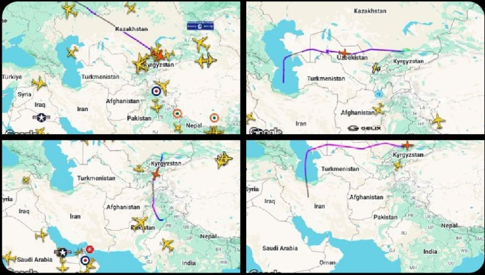

✈️ هواپیمای دولتی روسیه از نوع توپولف با شناسه RIF4026 از مسکو به بیشکک، قرقیزستان پرواز کرده است.

✈️ جت‌های دولتی ایران (با رجیسترهای EP-IGC و 9011) از تهران به بیشکک اعزام شده‌اند.

✈️ جت دولتی پاکستان (با رجیستر N881JJ) از لاهور به بیشکک پرواز کرده است.

🗞️ بنا بر گزارش رسانه‌های ایرانی، این پروازها در ارتباط با نشست وزرای کشور انجام شده است.

@mwarmonitor

## mwarmonitor — post 10139

🔴در چارچوب طرح جاه‌طلبانه برای سرنگونی رژیم آیت‌الله‌ها در ایران، موساد سلاح‌ها و مهماتی را که از حماس و حزب‌الله به‌دست آمده بود، به کردها منتقل کرده است.

🔴در این میان نوعی طنز تلخ هم وجود دارد: سلاحی که ایران خریده بود قرار بود علیه خودش به کار گرفته شود — و شاید هنوز هم چنین شود. آمیت سیگال خبرنگار کانال ۱۲ اسرائیل

@mwarmonitor

## pm_afshaa — post 92266

https://t.me/proxy?server=195.254.165.23&port=8443&secret=ee1603010200010001fc030386e24c3add646565707365656B2E636F6D

پروکسی سرعت بالا متصل

💧 Rainbet.com the #1 Non-KYC Crypto Casino & Sportsbook @rainbetcom

😁 @Pm_Afshaa

## pm_afshaa — post 92265

بنا به درخواست دخترای بی ادب یکبار دیگه چنل داشاقو میذارم فقط سریع عضو بشید چون کل پستاش +18 😂😂👇🏼

@Dashagh
@Dashagh

## IranIntlTV — post 340511

  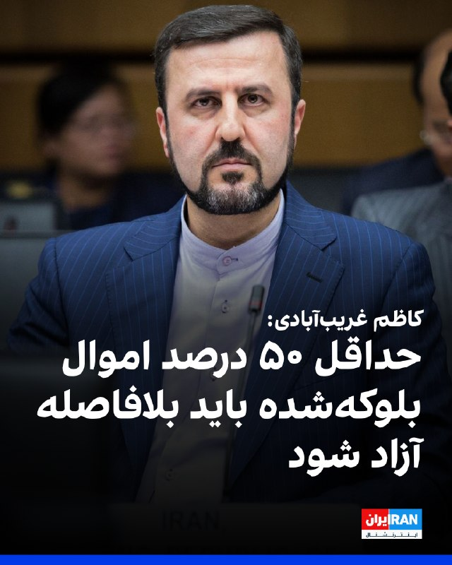

کاظم غریب‌آبادی، معاون امور حقوقی و بین‌المللی وزارت خارجه جمهوری اسلامی، در گفت‌وگو با خبرگزاری مهر گفت حداقل انتظار تهران این است که ۵۰ درصد از اموال بلوکه‌شده بلافاصله با امضای یادداشت تفاهم در اختیار جمهوری اسلامی قرار گیرد و مابقی آن هم باید بعد از طی یک مدت معقول، در اختیار جمهوری اسلامی قرار گیرد.
او افزود اگر آمریکا محاصره دریایی را لغو کند، به معنای باز شدن تنگه هرمز نیست و این دو اقدام معادل یکدیگر به شمار نمی‌روند.
https://iranintl.com/202606047663

## IranIntlTV — post 340510

  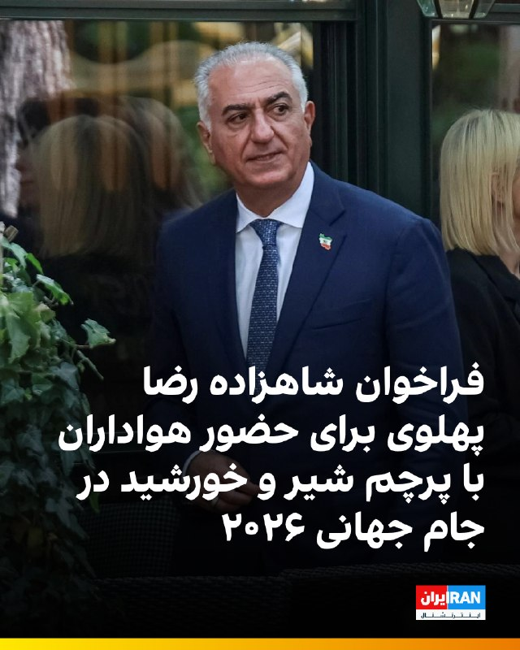

🔻دفتر شاهزاده رضا پهلوی با انتشار بیانیه‌ای از ایرانیان ساکن آمریکای شمالی و دیگر نقاط جهان خواست هم‌زمان با مسابقات جام جهانی فوتبال ۲۰۲۶ و سالروز تولد مجیدرضا رهنورد، در ورزشگاه‌ها و فضاهای عمومی حضور یابند و پرچم شیر و خورشید و تصاویر جان‌باختگان اعتراضات سراسری ایران را به نمایش بگذارند.

🔹در این بیانیه از هواداران خواسته شده است در ورزشگاه‌ها، خیابان‌ها و میدان‌های شهرهای میزبان مسابقات حضور پیدا کنند و با نمایش پرچم شیر و خورشید و تصاویر جان‌باختگان اعتراضات، پیام خود را به افکار عمومی جهان برسانند.

🔹این فراخوان در حالی منتشر شده است که گزارش‌هایی از تلاش جمهوری اسلامی برای محدود کردن نمایش پرچم شیر و خورشید در جریان جام جهانی منتشر شده است. بر اساس این گزارش‌ها، مقام‌های فدراسیون فوتبال جمهوری اسلامی از فیفا خواسته‌اند از ورود این پرچم به ورزشگاه‌های محل برگزاری مسابقات جلوگیری شود.

🔹موضوع نمایش پرچم شیر و خورشید و نمادهای اعتراضی پیش‌تر نیز در جام جهانی ۲۰۲۲ قطر مطرح شده بود.

🔹جزییات بیشتر را در سایت بخوانید

@iranintltvsport

## IranIntlTV — post 340509

  <a href="telegram/content/IranIntlTV_340509_1780577663.mp4" target="_blank">🎬 Download video</a>

یک روز پس از تصویب قطعنامه‌ای در مجلس نمایندگان آمریکا برای محدود کردن اختیارات جنگی در قبال حکومت، دونالد ترامپ، رییس‌جمهوری آمریکا، در شبکه اجتماعی تروت سوشال این اقدام را «بی‌معنی» توصیف کرد و دموکرات‌ها را به «سندرم جنون ترامپ» متهم کرد.

ارزیابی بیشتر با علی‌حسین قاضی‌زاده، عضو تحریریه ایران‌اینترنشنال
@iranintltv

## IranIntlTV — post 340508

  <a href="telegram/content/IranIntlTV_340508_1780577664.mp4" target="_blank">🎬 Download video</a>

با وجود توافق آتش‌بسی که پیش‌تر در واشنگتن به دست آمده بود، روز پنجشنبه ستون‌های غلیظی از دود بر فراز مناطق جنوبی لبنان مشاهده شد. این در حالی است که جمهوری اسلامی ایران نیز ادامه مذاکرات را به برقراری آتش‌بس در تمام جبهه‌ها مشروط کرده است.

هم‌زمان با این تحولات، جوزف عون، فرمانده ارتش لبنان، اعلام کرد که اجرای توافق ممکن است ظرف ۲۴ ساعت پس از موافقت نهایی آغاز شود؛ او در گفتگو با رسانه‌های محلی، این آتش‌بس را «آخرین فرصت» توصیف کرد.
@iranintltv

## IranIntlTV — post 340507

  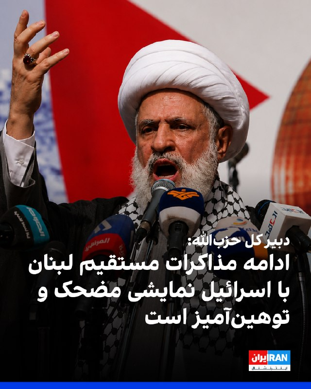

نعیم قاسم، دبیر کل حزب‌الله لبنان، با انتقاد از توافق دولت لبنان با اسرائیل گفت این گروه فقط به «توقف کامل حملات، آتش‌بس و خروج اسرائیل از لبنان» متعهد است.
او خلع سلاح حزب‌الله را به معنای نابودی قدرت لبنان دانست و افزود مذاکرات مستقیم دولت لبنان با اسرائیل «نمایش مضحک و توهین‌آمیز» است.
https://iranintl.com/202606041013

## FarsiVOA — post 219566

🔺بنیاد برومند: جمهوری اسلامی از ابتدای سال ۲۰۲۶ تاکنون ۶۸۵ نفر را اعدام کرده است

▪️بنیاد عبدالرحمن برومند اعلام کرد از ابتدای سال ۲۰۲۶ تاکنون ۶۸۵ مورد اعدام را در ایران مستند کرده است که دست‌کم ۵۴ مورد آن در ماه مه (نیمه اردیبهشت تا نیمه خرداد ۱۴۰۵) رخ داده است.

⬇️ بیشتر بخوانید:

https://ir.voanews.com/a/prison-execution-protest-iran-broomand-foundation-islamic-republic/8156541.html/?nocach=1

## DW_Farsi — post 125486

🔶رونمایی کره شمالی از یک تاسیسات تولید سوخت سلاح‌های هسته‌ای

کره شمالی اعلام کرد یک تاسیسات جدید برای تولید اورانیوم مورد استفاده در بمب هسته‌ای را رونمایی کرده است. خبرگزاری رسمی این کشور نوشت این مجموعه از فناوری "پیشرفته‌تر" برخوردار است، اما جزئیات بیشتری درباره محل استقرار یا زمان آغاز فعالیت آن ارائه نکرد. هم‌زمان، کیم جونگ اون گفت توان تولید اورانیوم با غنای نظامی باید با "نرخی تصاعدی" افزایش یابد.

خبرگزاری دولتی کره شمالی تصاویری منتشر کرده که به نظر می‌رسد سالن سانتریفیوژها را نشان می‌دهد؛ موضوعی که این احتمال را تقویت می‌کند که این تاسیسات برای غنی‌سازی اورانیوم در سطح مورد نیاز سلاح هسته‌ای به کار می‌رود.

در گزارش منتشرشده، کیم جونگ اون از ضرورت تقویت بازدارندگی هسته‌ای در برابر آنچه "سرسخت‌ترین دشمنان" خوانده، سخن گفته و تاکید کرده است ظرفیت تولید اورانیوم با غنای تسلیحاتی در پنج سال گذشته بیش از دو برابر شده است.

@dw_farsi

## RadioFarda — post 157891

  <a href="https://t.me/radiofarda/157891" target="_blank">📎 Download file</a>

تحریم صرافی‌های رمزارز ایرانی؛ چه گزینه‌هایی پیش رو است؟

🔸وزارت خزانه‌داری آمریکا چهار شهروند ایرانی و چهار صرافی رمزارز از جمله نوبیتکس، بیت‌پین، رمزینکس و والکس را تحریم کرد. معصومه طاهرخانی تحلیلگر اقتصادی به محمد ضرغامی در ایستگاه ۱۹ رادیو فردا از پیامدهای احتمالی این تحریم‌ها گفته است.
رئیس‌جمهور آمریکا همچنین از «چهار جمهوری‌خواه بد» و آن‌چه او «دموکرات‌های کودن» نامید، انتقاد کرد و گفت آن چهار نمایندهٔ جمهوری‌خواه «فقط به دنبال جلب توجه هستند. باید از خودشان شرمنده باشند.»

@RadioFarda

## IranianMinds — post 21363

دقیقا یک هفته باقی مانده تا جام جهانی

@IranianMinds

## IranianMinds — post 21362

کانال ۱۲ اسرائیل:

به عنوان بخشی از یک طرح بلندپروازانه برای سرنگونی رژیم جمهوری اسلامی، موساد سلاح‌ها و مهماتی را که از حماس و حزب‌الله ضبط کرده بود به نیروهای کرد منتقل کرد.

@IranianMinds

## Dirty_Kids — post 390976

🔴 دسترسی به اسپاتیفای بدون vpn ممکن شد

بررسی‌ها نشان می‌دهد دسترسی به سرویس پخش موسیقی اسپاتیفای (Spotify) بدون نیاز به استفاده از VPN امکان‌پذیر شده است.

@Dirty_Kids 👻

## Dirty_Kids — post 390975

  <a href="telegram/content/Dirty_Kids_390975_1780577666.mp4" target="_blank">🎬 Download video</a>

این تیتراژ کارتون پاندای کونگ‌فو کار نیست این مداحی رضا هلالی به زبان چینیه!😂

@Dirty_Kids 👻

## Dirty_Kids — post 390974

  <a href="telegram/content/Dirty_Kids_390974_1780577667.mp4" target="_blank">🎬 Download video</a>

مدرس شیمی پایه یازدهم

من گلمراد و مداحی کربلایی حاج مراد ویسیانم دیدم

@Dirty_Kids 👻

## alonews — post 125062

  <a href="telegram/content/alonews_125062_1780577668.webm" target="_blank">🎬 Download video</a>

👈کرایه حمل‌ونقل عمومی جاده‌ای از ۱۶ خرداد ۲۱ درصد افزایش می یابد

✅ @AloNews خبر جنگ

## alonews — post 125061

  <a href="telegram/content/alonews_125061_1780577669.webm" target="_blank">🎬 Download video</a>

👈مراکش در حال ساخت بزرگترین استادیوم فوتبال جهان، با ظرفیت ۱۱۵,۰۰۰ نفره

🔴نام این ورزشگاه «گرند استاد دو کازابلانکا» هستش، با هزینه ۵۰۰ میلیون دلار قراره ساخته بشه.

✅ @AloNews خبر جنگ

## alonews — post 125060

  <a href="telegram/content/alonews_125060_1780577669.webm" target="_blank">🎬 Download video</a>

👈 بریتانیا و فرانسه برنامه‌های نهایی برای رهبری عملیات چندملیتی پاک‌سازی مین‌ها در تنگه هرمز را تکمیل کرده‌اند که ممکن است ظرف چند روز پس از توافق آمریکا و ایران برای بازگشایی این مسیر آبی آغاز شود، گزارش بلومبرگ.

🔴 ائتلافی متشکل از ۱۵ کشور نیرو و تجهیزات برای این ماموریت اختصاص داده‌اند، اگرچه استقرار تنها پس از بازگشت حمل‌ونقل تجاری عادی از طریق تنگه آغاز خواهد شد.

🔴 مقامات بریتانیایی و فرانسوی معتقدند که تلاش پاک‌سازی مین باید توسط ائتلاف مدیریت شود نه ایران

✅ @AloNews خبر جنگ

---
📅 بروزرسانی: 1405/03/14 16:14
---

## mwarmonitor — post 10138

  <a href="telegram/content/mwarmonitor_10138_1780577057.mp4" target="_blank">🎬 Download video</a>

✈️ ارابه فرود جلوی یک هواپیمای Lufthansa از نوع Boeing 787-9 هنگام پارک در گیت در فرودگاه فرانکفورت دچار فروپاشی شد.

🔸تاکنون بیانیه‌ای درباره علت حادثه یا احتمال وجود مصدوم منتشر نشده است.

@mwarmonitor

## FoxNewsTwitter — post 342596

  <a href="telegram/content/FoxNewsTwitter_342596_1780577058.mp4" target="_blank">🎬 Download video</a>

Fox News (Twitter/X)

New video released by the Kuwaiti government shows the moment an Iranian drone strike slammed into the country’s major international airport.

The footage captures what looks like a direct impact followed by a massive explosion, sending smoke and debris into the air as part of the airport complex erupts.

Kuwaiti authorities say one person was killed and more than 60 others were injured in the strike.

Wednesday’s attack marks a major escalation as tensions across the region continue to rise.

## pm_afshaa — post 92264

  <a href="telegram/content/pm_afshaa_92264_1780577060.webm" target="_blank">🎬 Download video</a>

🔴نعیم قاسم، رهبر حزب الله: نتیجه مذاکرات دولت لبنان با اسرائیل شرم آور و پوچ است و اونو بطور کامل مردود اعلام میکنم.

تا زمانی که تجاوز ادامه داره به هر جایی که تصمیم بگیریم و بتونیم حمله می‌کنیم.

💧 Rainbet.com the #1 Non-KYC Crypto Casino & Sportsbook @rainbetcom

😁 @Pm_Afshaa

## IranIntlTV — post 340506

  <a href="telegram/content/IranIntlTV_340506_1780577061.mp4" target="_blank">🎬 Download video</a>

یک شهروند بازنشسته با ارسال پیامی صوتی به ایران اینترنشنال گفت پس از ۳۰ سال کار، ماهانه ۱۳ میلیون تومان حقوق دریافت می‌کند که این مبلغ در سه روز نخست ماه تمام می‌شود و او برای تامین هزینه‌های باقی‌ روزهای ماه، حتی خرید نان و مخارج خانواده با مشکل روبه‌رو است.

او همچنین گفت امسال بازنشستگان را تحت پوشش بیمه «آتیه‌سازان» برده‌اند؛ شرکتی که ماهانه یک میلیون تومان از حقوق آنان کم می‌کند، اما به‌گفته او هیچ داروخانه و پزشکی آن را نمی‌پذیرد و بازنشستگان باید پس از پرداخت هزینه، فاکتور بگیرند و با پرداخت هزینه‌ای دیگر از طریق پیشخوان دولت اقدام کنند.

صدای او با هوش مصنوعی تغییر یافته است.

## Dirty_Kids — post 390973

  

به کیرم چقدر کسشر میشناسید @Dirty_Kids 👻

## Hranews — post 113383

  

دادگاه تجدیدنظر؛ محمد حسینی چمنی به بیش از ۳۰ ماه حبس محکوم شد

❗️
❗️
❗️
❗️
❗️– شعبه ۱۸ دادگاه تجدیدنظر استان خوزستان، محمد حسینی چمنی، زندانی سیاسی محبوس در زندان شیبان اهواز را به دو سال و شش ماه و دو روز حبس محکوم کرد. وی در مرحله بدوی دادگاه، به چهار سال زندان و مجازات تکمیلی محکوم شده بود.

به گزارش خبرگزاری هرانا، ارگان خبری مجموعه فعالان حقوق بشر در ایران، شعبه ۱۸ دادگاه تجدیدنظر استان خوزستان مبادرت به کاهش حکم بدوی محمد حسینی چمنی کرده است.

بر اساس رای صادره، آقای حسینی چمنی از بابت اتهام «اخلال در نظم عمومی» به ۱۵ ماه و یک روز حبس و از بابت اتهام «توهین به رهبری» نیز به ۱۵ ماه و یک روز زندان محکوم شده است. همچنین مجازات‌های تکمیلی تعیین‌شده در مرحله بدوی، از محکومیت وی حذف شده است.

ادامه مطلب

#محمد_حسینی_چمنی

↘️
@hranews_bot تماس ✉️ - @Hranews کانال هرانا 🆑

---
📅 بروزرسانی: 1405/03/14 16:04
---

## VahidOOnLine — post 243658

  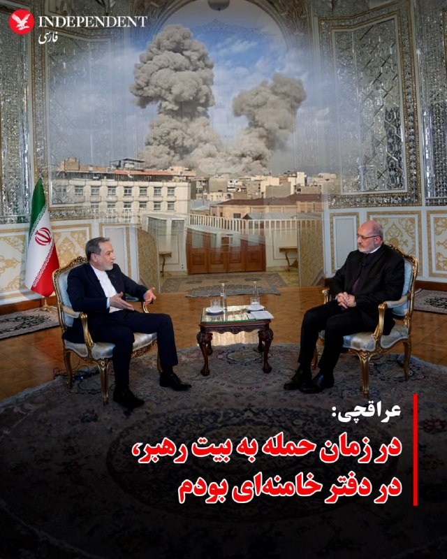

♦️عباس عراقچی، وزیر امور خارجه جمهوری اسلامی در گفتگو با شبکه المیادین، وابسته به حزب‌الله لبنان، گفت در زمان حمله به بیت رهبر در روز نهم اسفندماه سال گذشته در دفتر خامنه‌ای بوده است.

به گزارش انتخاب، عراقچی به المیادین گفت: «پس از بازگشت از مذاکرات ژنو در روز جمعه، روز شنبه ساعت ۹ صبح به دفتر ایشان رفتم تا گزارش خود را ارائه دهم.
 گزارش من درباره مذاکرات و فضایی بود که روز جمعه پیش آمد و احتمال جنگ را بسیار بیشتر کرد.»

 عراقچی افزود: «ساختمانی که در آن نشسته بودیم، هدف قرار گرفت، اما بالی [سمتی] که ما در آن بودیم، سالم ماند. اولین سوالی که به ذهنم رسید و اولین نگرانی که به من دست داد، این بود که وضعیت رهبری چگونه خواهد بود؟»

علی خامنه‌ای به همراه جمعی از مقام‌های ارشد نظامی و سیاسی جمهوری اسلامی روز نهم اسفندماه در موج اول حملات آمریکا و اسرائیل کشته شد.
‌🇸🇦 Indypersian

🤖 @VahidOOnLine

## VahidOOnLine — post 243657

  

خبرگزاری تسنیم، وابسته به سپاه پاسداران، به نقل از یک منبع آگاه نظامی نوشت تصاویر منتشرشده از اصابت پهپاد ایرانی به فرودگاه کویت «صحنه‌سازی دروغین دشمن» است.
این منبع به تسنیم گفت پرتاب پهپادهای هوافضای سپاه به سوی اهداف آمریکایی در کویت نیمه‌شب انجام شده و اصابت نیز در همان زمان بوده، در حالی که در فیلم‌ها و عکس‌های منتشرشده، هوا روشن و مربوط به روز است.
این در حالی است که پیش‌تر حسین محبی، سخنگوی سپاه پاسداران، گفت تخریب ترمینال مسافربری فرودگاه کویت ناشی از خطای سامانه‌های پاتریوت آمریکایی بوده است.
‌🏁 🇬🇧 IranintlTV

🤖 @VahidOOnLine

## mwarmonitor — post 10137

🔴نعیم قاسم، می‌گوید تا زمانی که روستاهای لبنان بمباران می‌شوند و مردم کشته می‌شوند، شمال اسرائیل «امن نخواهد بود». او نتیجه گفت‌وگوهای مستقیم لبنان و اسرائیل را رد کرده و مذاکرات با اسرائیل را «شرم‌آور» خواند.

🔸او تأکید کرد هرگونه آتش‌بس باید شامل سراسر لبنان باشد، خروج اسرائیل از جنوب را در بر بگیرد و هیچ ارتباطی میان حضور حزب‌الله و برقراری آتش‌بس وجود نداشته باشد.

@mwarmonitor

## IranIntlTV — post 340505

  <a href="telegram/content/IranIntlTV_340505_1780576478.mp4" target="_blank">🎬 Download video</a>

در حالی که لبنان و اسرائیل با میانجیگری آمریکا بر سر اجرای آتش‌بس به توافق رسیدند، حزب‌الله این توافق را نپذیرفته است. حزب‌الله در بیانیه‌ای که به جوزف عون، رییس‌جمهور لبنان نیز ابلاغ شده، اعلام کرده هرگونه توافق تنها در صورتی قابل قبول است که با خروج کامل اسرائیل از تمامی خاک لبنان آغاز شود.

جزییات بیشتر با بابک اسحاقی، خبرنگار ایران‌اینترنشنال
@iranintltv

## FarsiVOA — post 219565

🔺انتقاد شدید پرزیدنت ترامپ از رای‌ مجلس نمایندگان به محدود کردن «اختیارات جنگی»: «غیرمیهن‌پرستانه‌» بود

▪️پرزیدنت ترامپ با انتشار پیامی از رای مجلس نمایندگان به محدود کردن اختیارات جنگی رئیس جمهوری آمریکا به شدت انتقاد کرد.

⬇️ بیشتر بخوانید:

https://ir.voanews.com/a/donald-trump-limiting-war-powers-iranian-regime/8157248.html/?nocach=1

## FarsiVOA — post 219564

آب زاینده‌رود پس از بازگشایی سد زاینده‌رود وارد اصفهان و پارک ناژوان شد.

پس از ماه‌ها خشکی، آب دوباره در بستر زاینده‌رود در شهر اصفهان جاری شد و به گفته کاربران، شور و نشاط را به این شهر بازگرداند.

@FarsiVOA

## Persian_Trend_Official — post 15693

  

کانال 12 اسرائیل: موساد سلاح‌ها و مهمات گرفته شده از حماس و حزب‌الله را به عنوان بخشی از طرح سرنگونی دولت ایران به گروه های کرد منتقل کرده است.

📝 Amir

📌 @persian_trend_official
پرشین ترند | متفاوت‌ترین کانال نظامی

## Persian_Trend_Official — post 15692

  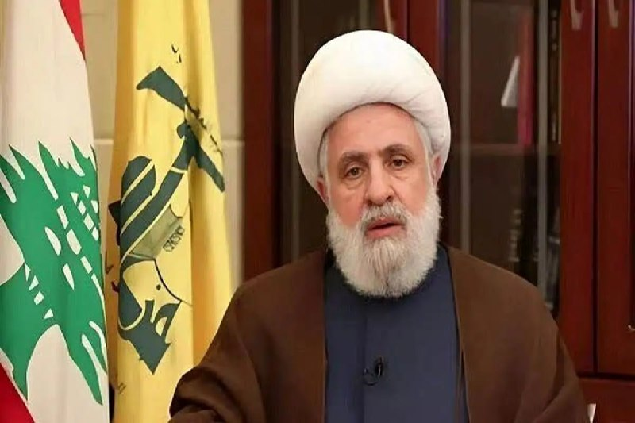

شیخ نعیم قاسم: با وجود دشواری‌ها ایران، از تمام جنبش‌های رهایی بخش حمایت کرد!

دبیرکل حزب الله لبنان: با وجود تمام دشواری‌هایی که انقلاب اسلامی ایران با آن روبرو شد، ایران در تمام زمینه ها پیشرفت کرد و از تمام جنبشهای رهایی بخش حمایت کرده است.

قدرت‌های جهانی و منطقه‌ای با تحمیل هشت سال جنگ و محاصره اقتصادی تلاش کردند نظام جمهوری اسلامی را ساقط کنند، اما این نظام با ایستادگی رهبری و ملت پابرجا ماند.

چرا ایران تحریم شده و از دستیابی به قدرت دفاعی و غنی‌سازی صلح‌آمیز اورانیوم منع می‌شود؟ چون ایران از وابستگی سر باز می‌زند و در مسیر استقلال و عدالت ایستاده است.

دشمنان در شکستن اراده ملتی که با فرهنگ عاشورایی و روحیه ایثار تربیت شده است، ناکام مانده‌اند و در آینده نیز به اهداف خود نخواهند رسید.

📝 Amir

📌 @persian_trend_official
پرشین ترند | متفاوت‌ترین کانال نظامی

## RadioFarda — post 157890

  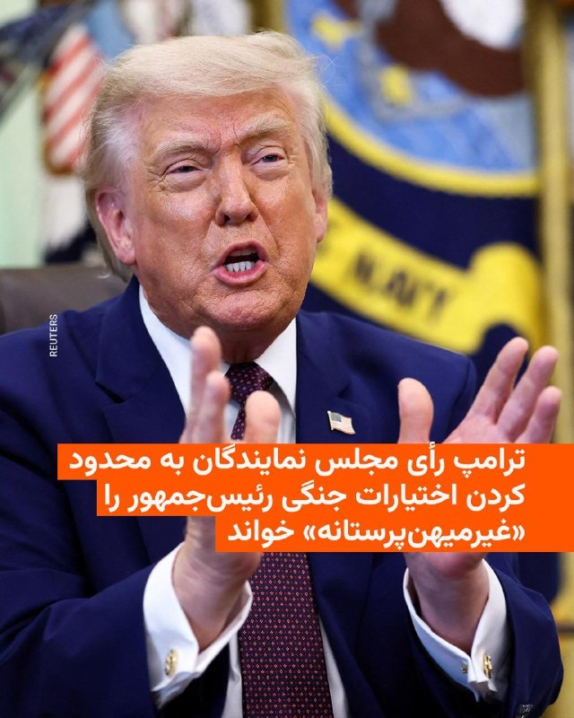

🔸دونالد ترامپ، رئیس‌جمهور آمریکا، از رأی مجلس نمایندگان برای محدود کردن اختیارات جنگی او انتقاد کرد و این اقدام را «بی‌معنا» و «غیرمیهن‌پرستانه» خواند.

🔸مجلس نمایندگان آمریکا با پیوستن چهار نماینده جمهوری‌خواه به دموکرات‌ها به طرحی که بیشتر جنبهٔ نمادین دارد رأی داد که اختیارات جنگی رئیس‌جمهور را محدود می‌کند.

🔸 ترامپ گفت این اقدام در میانهٔ مذاکرات نهایی برای پایان دادن به جنگ با جمهوری اسلامی ایران انجام شده و نمایندگان می‌دانند که مذاکرات در چه مرحله‌ای قرار دارد.

🔸او در پیامی در شبکه اجتماعی تروث سوشال نوشت: «چه کسی ممکن است چنین کار غیرمیهن‌پرستانه‌ای انجام دهد؟»
آقای ترامپ همچنین گفت دموکرات‌ها به دلیل «سندرم جنون ترامپ» حاضرند کشور شکست بخورد تا او به پیروزی دیگری دست نیابد.

🔸رئیس‌جمهور آمریکا همچنین از «چهار جمهوری‌خواه بد» و آن‌چه او «دموکرات‌های کودن» نامید، انتقاد کرد و گفت آن چهار نمایندهٔ جمهوری‌خواه «فقط به دنبال جلب توجه هستند. باید از خودشان شرمنده باشند.»

@RadioFarda

## idfinfarsi — post 11747

رئیس ستاد کل ارتش اسرائیل در ارزیابی وضعیت با رؤسای شوراهای محلی و مجمع ستاد کل در فرماندهی شمال: «تصمیم گرفتیم یک ارزیابی وضعیت مشترک برگزار کنیم تا گفت‌وگو را عمیق‌تر کرده و همکاری را تقویت کنیم. ما هدف مشترکی داریم — دفاع از ساکنان و شهرک های شمال و بازگرداندن آرامش و امنیت در بلندمدت. ما در کنار یکدیگر، شانه‌به‌شانه برای این هدف عمل می‌کنیم»*

رئیس ستاد کل ارتش اسرائیل، سپهبد ایال زامیر، امروز (پنج‌شنبه) یک ارزیابی وضعیت و گفت‌وگو با مجمع رؤسای شوراهای محلی شمال و مجمع ستاد کل در فرماندهی شمال برگزار کرد.

رئیس ستاد کل از رزمندگان ارتش اسرائیل و فرماندهی شمال به‌خاطر دستاوردهایشان تا این مرحله از جنگ قدردانی کرده و تأکید کرد که هدف ارتش، دفاع از شهرک‌های شمال، ایجاد یک واقعیت امنیتی جدید و تعمیق ضربه به سازمان تروریستی حزب‌الله است.

همچنین، رئیس ستاد کل از رؤسای شوراها به‌خاطر رهبری، همکاری و حمایت در طول جنگ قدردانی کرده و تأکید کرد که ارتش اسرائیل به ایستادن در کنار آن‌ها و همکاری نزدیک برای تأمین امنیت ساکنان ادامه خواهد داد.

در سخنان رئیس ستاد کل ارتش اسرائیل، سپهبد ایال زامیر آمده است:
«تصمیم گرفتیم یک ارزیابی وضعیت مشترک برگزار کنیم تا گفت‌وگو را عمیق‌تر کرده و همکاری را تقویت کنیم. ما هدف مشترکی داریم — دفاع از ساکنان و شهرک های شمال و بازگرداندن آرامش و امنیت در بلندمدت. ما در کنار هم، شانه‌به‌شانه برای این هدف عمل می‌کنیم.

ما در آمادگی چندجبهه‌ای قرار داریم و به تصویر کلی خاورمیانه نگاه می‌کنیم، اما تمرکز ما بر مرز شمالی است. دستور من این است که تلاش اصلی در اینجا متمرکز شود — بخش عمده‌ای از نیروها و توانمندی‌های ارتش اسرائیل در جبهه شمال مستقر است. حتی در همین لحظه، نیروهای ما به فعالیت زمینی و آتش برای انهدام زیرساخت‌های تروریستی و رفع تهدیدها ادامه می‌دهند. تنها در همین هفته، نیروهای ارتش اسرائیل ارتفاعات بوفور را تصرف کرده و زیرساخت‌های تروریستی مهم و حیاتی برای حزب‌الله را که طی سال‌ها ساخته شده بود، منهدم کردند و فعالیت تهاجمی را گسترش دادند.

ما به‌طور بی‌سابقه‌ای ایران و محور آن را تضعیف کرده‌ایم و در نتیجه، حزب‌الله را نیز که یکی از مراکز ثقل ایران است، به‌طور قابل توجهی تضعیف کرده‌ایم. ما یک واقعیت امنیتی جدید ایجاد کرده‌ایم و در خط مقدم مقابل شهرک‌ها ایستاده و تهدیدها را از آن‌ها دور کرده‌ایم.

در جریان عملیات «غرش شیران»، زمانی که پیوستن حزب‌الله به نبرد را شناسایی کردیم، با سرعت و قاطعیت برای رفع تهدید نفوذ و تهدید موشک‌های ضدتانک علیه شهرک‌ها اقدام کردیم. این سیاست ماست — عدم پذیرش تهدید. ما با ابتکار عمل و رویکرد تهاجمی در برابر هر تهدید در حال شکل‌گیری عمل می‌کنیم.

من از دشواری‌ها و هزینه‌ای که می‌پردازید آگاه هستم. این زمان برای رهبری، قاطعیت و پایداری است. ما در یک نبرد طولانی قرار داریم، دستاوردهای مهمی داشته‌ایم و دست بالاتر را داریم. مأموریت ما امنیت شما و دفاع از شماست — بازگرداندن آرامش و امنیت در بلندمدت. ما متعهد هستیم که با هم یک واقعیت امنیتی بهتر ایجاد کنیم».

## alonews — post 125059

  <a href="telegram/content/alonews_125059_1780576481.webm" target="_blank">🎬 Download video</a>

👈دبیرکل حزب‌الله: از ایران سپاسگزاریم که با وجود چالش‌های بزرگ خود، به ما برای بازپس‌گیری سرزمین و حق‌مان در مواجهه با تجاوزات اسرائیل و آمریکا کمک می‌کند

✅ @AloNews خبر جنگ

## alonews — post 125058

  <a href="telegram/content/alonews_125058_1780576481.webm" target="_blank">🎬 Download video</a>

👈 رهبر حزب‌الله، نعیم قاسم: مذاکرات با اسرائیل بی‌شرمانه است

🔴 تا زمانی که اسرائیل در لبنان حضور دارد مقاومت ادامه خواهد داشت

✅ @AloNews خبر جنگ

---
📅 بروزرسانی: 1405/03/14 15:54
---

## VahidOOnLine — post 243656

در پی آغاز کارزار مردمی کشف حقیقت، فرنوش فرجی، عضو تحریریه ایران‌اینترنشنال از گزارش‌های رسیده مبنی بر شلیک تیر خلاص بر پیشانی شماری از مجروحان در بیمارستان پورسینای رشت می‌گوید و در ادامه یکی از کارکنان سابق این بیمارستان به‌عنوان شاهد عینی، رخدادهای فاجعه‌بار کشتار دی‌ماه را شرح می‌دهد.
‌🏁 🇬🇧 IranintlTV

🤖 @VahidOOnLine

## IranIntlTV — post 340504

  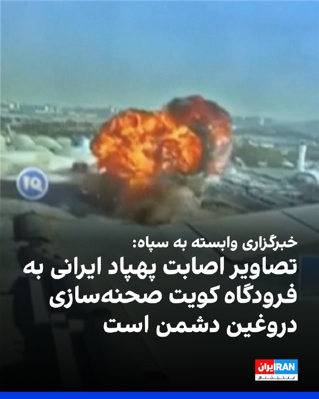

خبرگزاری تسنیم، وابسته به سپاه پاسداران، به نقل از یک منبع آگاه نظامی نوشت تصاویر منتشرشده از اصابت پهپاد ایرانی به فرودگاه کویت «صحنه‌سازی دروغین دشمن» است.
این منبع به تسنیم گفت پرتاب پهپادهای هوافضای سپاه به سوی اهداف آمریکایی در کویت نیمه‌شب انجام شده و اصابت نیز در همان زمان بوده، در حالی که در فیلم‌ها و عکس‌های منتشرشده، هوا روشن و مربوط به روز است.
این در حالی است که پیش‌تر حسین محبی، سخنگوی سپاه پاسداران، گفت تخریب ترمینال مسافربری فرودگاه کویت ناشی از خطای سامانه‌های پاتریوت آمریکایی بوده است.
https://iranintl.com/202606049781

## IranIntlTV — post 340503

در پی آغاز کارزار مردمی کشف حقیقت، فرنوش فرجی، عضو تحریریه ایران‌اینترنشنال از گزارش‌های رسیده مبنی بر شلیک تیر خلاص بر پیشانی شماری از مجروحان در بیمارستان پورسینای رشت می‌گوید و در ادامه یکی از کارکنان سابق این بیمارستان به‌عنوان شاهد عینی، رخدادهای فاجعه‌بار کشتار دی‌ماه را شرح می‌دهد.

## IranIntlTV — post 340502

  <a href="https://t.me/IranintlTV/340502" target="_blank">📎 Download file</a>

🎧نسخه صوتی اخبار نیم‌روزی | پنج‌شنبه ۱۴ خرداد
@iranintlTV

## Dirty_Kids — post 390972

‏فیله مرغ کیلویی ۸۵۰ هزار تومن.
اگه کسی رو دیدید اضافه ‌وزن نداره، شک نکنید خیلی پولداره.
هزینه‌ی رژیم بودن خیلی بیشتر از رژیم نبودنه.

@Dirty_Kids 👻

## Dirty_Kids — post 390971

  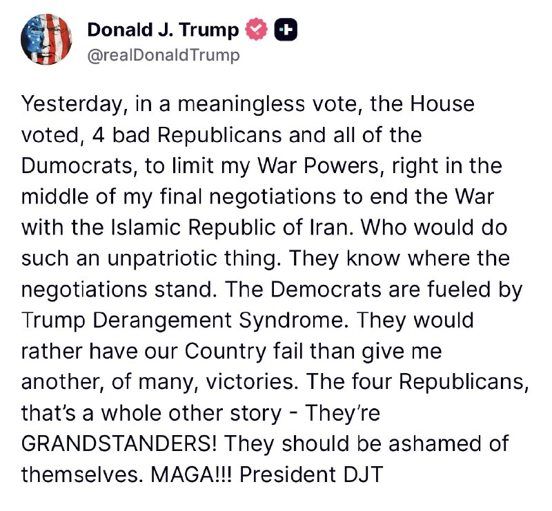

ترامپ در پست جدیدی در تروث‌سوشال در واکنش به لایحه‌ی ضد جنگی که دیروز در کنگره به تصویب رسید نوشته:

«دیروز در یک رای‌گیری بی‌معنی در مجلس نمایندگان، ۴ جمهوری‌خواه همه‌ی دموکرات‌های احمق و قحبه رای دادند تا اختیارات جنگی منو محدود کنند،
اونم چی عزیزان، درست وسط مذاکرات نهایی من برای پایان دادن به جنگ با رژیم شیعه‌سانان رافضی.

کدوم مادرخرابی دست به چنین کار غیرمیهن‌پرستانه‌ای می‌زنه؟

این مادر خراب‌ها خوب می‌دونن که مذاکرات در چه مرحله‌ای قرار داره. دموکرات‌ها‌ی قحبه‌زاده از سوخت سندروم جنون ترامپ تغذیه می‌کنن. قرمساق‌ها ترجیح می‌دن کشورمون شکست بخوره تا اینکه یک پیروزی دیگه از بین پیروزی‌های بی‌شمارم به من بدن.

اون چهار جمهوری‌خواه چاقال هم که کلاً داستان دیگه‌ای دارن. اون جنده‌های توجه فقط دنبال خودنمایی هستن. باید از خود جاکششون خجالت بکشن.
ماگا.

پرزیدنت دی‌جی‌تی»

@Dirty_Kids 👻

## alonews — post 125057

  <a href="telegram/content/alonews_125057_1780575858.webm" target="_blank">🎬 Download video</a>

👈ادعای موساد به گفته کانال ۱۲ اسرائیل، سلاح‌ها و مهماتی را که از حماس و حزب‌الله گرفته بود، به کردها منتقل کرد تا بخشی از طرحی برای سرنگونی رژیم ایران باشد.

✅ @AloNews خبر جنگ

## alonews — post 125056

  <a href="telegram/content/alonews_125056_1780575859.webm" target="_blank">🎬 Download video</a>

👈بررسی دقیق کمک‌های مالی آمریکا در عملیات «خشم حماسی» توسط USAID

🔴 ون نگوین، بازرس کل موقت آژانس توسعه بین‌المللی آمریکا (USAID)، اعلام کرد که این نهاد برای تضمین «شفافیت و پاسخگویی دقیق»، هرگونه کمک مالی خارجی مرتبط با عملیات «خشم حماسی» را مورد بررسی قرار خواهد داد.

✅ @AloNews خبر جنگ

---
📅 بروزرسانی: 1405/03/14 15:45
---

## VahidOOnLine — post 243655

  

هرانا گزارش داد حمیرا شریفی، تبعه افغانستان و از بازداشت‌شدگان انقلاب ملی ایرانیان در دی ماه ۱۴۰۴، به پنج سال حبس محکوم شده و این حکم به‌تازگی در زندان اوین به او ابلاغ شده است.
بر اساس این گزارش، او با وجود ابتلا به بیماری پوستی و مشکلات روحی، از دسترسی کافی به خدمات درمانی و روانی محروم مانده است.
یک منبع مطلع به هرانا گفت شریفی مدارک هویتی در اختیار ندارد و از زمان انتقال به زندان اوین تاکنون دو بار اقدام به خودکشی کرده است. به گفته این منبع، پس از ابراز نگرانی زندانیان، او برای یک جلسه مشاوره اعزام شد اما رسیدگی موثری ادامه نیافت.
حمیرا شریفی در جریان اعتراضات سراسری ۱۴۰۴ بازداشت و ۲۷ بهمن ۱۴۰۴ از زندان قرچک ورامین به اوین منتقل شد و همچنان در این زندان نگهداری می‌شود.
(به توصیه کارشناسان، اگر با فردی روبه‌رو شدید که از جملات یا عباراتی حاکی از افسردگی یا تمایل به پایان زندگی استفاده می‌کند، از او بخواهید با یک پزشک متخصص معتمد، نهادهای فعال در این زمینه یا فردی مورد اعتماد درباره نگرانی‌هایش صحبت کند. اگر خودتان به خودکشی فکر می‌کنید، در ایران می‌توانید با اورژانس اجتماعی با شماره ۱۲۳ تماس بگیرید.)
http
‌🏁 🇬🇧 IranintlTV

🤖 @VahidOOnLine

## WithYashar — post 13482

ترامپ: در وسط مذاکرات پایانی برای پایان دادن به جنگ هستیم
@withyashar

## DW_Farsi — post 125485

  

🔶 کاتس از آتش‌بس اسرائیل با لبنان استقبال کرد

یسرائیل کاتس، وزیر دفاع اسرائیل، از آتش‌بس میان این کشور و لبنان با میانجی‌گری ایالات متحده استقبال کرد و گفت که "اعضای اپوزیسیون باید عذرخواهی کنند و این دستاورد بزرگ در لبنان را در سطح میدانی و دیپلماتیک بپذیرند."

وزیر دفاع اسرائیل در بیانیه‌ای این توافق را "بازتاب واقعیتی دانست که اسرائیل در لبنان ایجاد کرده؛ واقعیتی که می‌تواند به توافق صلح با دولت لبنان منجر شود."

کاتس در ادامه تاکید کرد: «ما به ساکنان شمال امنیت وعده دادیم و آن را محقق کردیم.»

به گفته وزیر دفاع اسرائیل این توافق شامل "تصریح روشن درباره خلع سلاح حزب‌الله، خروج نیروهای حزب‌الله از جنوب رود لیتانی، ادامه حضور ارتش اسرائیل در منطقه امنیتی و آزادی عمل اسرائیل" است.

در بیانیه مشترک اسرائیل و لبنان که روز چهارشنبه ۱۳ خرداد (۳ ژوئن) در واشنگتن منتشر شد، آمده است که آتش‌بس مشروط به توقف حملات حزب‌الله و عقب‌نشینی نیروهای آن به شمال رود لیتانی است.

با این حال، از زمان اعلام آتش‌بس، اسرائیل یک هدف هوایی مشکوک را در نزدیکی مرز خود با لبنان رهگیری کرده و رسانه‌های لبنانی نیز از حملات پهپادی اسرائیل در جنوب این کشور خبر داده‌اند.

@dw_farsi

## BBCPersian — post 282847

  

🔻خبرگزاری ایرنا به نقل از بخش رسانه‌ای تیم ملی فوتبال ایران گزارش داد که «با صدور ویزای دو نفر باقیمانده از اعضای تیم»، ویزاهای اعضای تیم برای سفر به مکزیک تکمیل شده است.

بر اساس این گزارش، تیم ملی فوتبال ایران که روز شنبه ۱۶ خرداد ماه ساعت ۳ و بیست دقیقه به وقت ترکیه عازم تیخوانا مکزیک خواهد شد.

پیشتر، فدراسیون فوتبال ایران اعلام کرده بود که با موافقت فیفا، کمپ و محل استقرار تیم ملی فوتبال در جریان جام جهانی ۲۰۲۶ به شهر مرزی تیخوانا در مکزیک منتقل شده است.

دو بازی اول تیم ملی فوتبال ایران در لس‌آنجلس برگزار می‌شود و هنوز خبری درباره صدور ویزای آمریکا برای اعضای تیم ایران و همراهانشان منتشر نشده است.

📷 IRNA
@BBCPersian

## alonews — post 125055

  <a href="telegram/content/alonews_125055_1780575307.webm" target="_blank">🎬 Download video</a>

کاتز: توافق کردیم؛ اما با آزادی عمل کامل برای حمله به بیروت

👈 وزیر جنگ اسرائیل جزئیات تازه‌ای از توافق با دولت لبنان فاش کرد: ماندن ارتش اشغالگر در منطقه امنیتی تا «خط زرد»، ایجاد منطقه غیرنظامی در جنوب لیتانی و آزادی عمل برای حمله به بیروت با چراغ سبز آمریکا.

🔴 ارتش اسرائیل به هدف‌گیری زیرساخت‌های متعلق به حزب‌الله در لبنان ادامه خواهد داد.

🔴 وضعیتی که در لبنان تحمیل کرده‌ایم ممکن است در آینده به توافق صلح با این کشور منجر شود.

✅ @AloNews خبر جنگ

---
📅 بروزرسانی: 1405/03/14 15:34
---

## VahidOOnLine — post 243654

  

♦️دونالد ترامپ، رئیس جمهوری آمریکای روز پنجشنبه ۱۴ خردادماه از تصویب قطعنامه «پایان جنگ ترامپ با ایران» به‌شدت انتقاد کرد.

رئیس جمهوری آمریکا در این پیام نوشت:‌ «دیروز، در یک رای‌گیری بی‌معنی، مجلس نمایندگان، چهار جمهوریخواه بد و تمام دموکرات‌ها، درست در میانه مذاکرات نهایی من برای پایان دادن به جنگ با جمهوری اسلامی ایران، به محدود کردن اختیارات جنگی من رای دادند. چه کسی چنین کار غیرمیهن‌پرستانه‌ای انجام می‌دهد؟ آنها می‌دانند مذاکرات در چه مرحله‌ای است.»

ترامپ با انتقاد تند از نمایندگان حامی این طرح نوشت: «دموکرات‌ها از سندرم اختلال روانی [بیماری مخالفت] ترامپ تغذیه می‌شوند. آنها ترجیح می‌دهند کشورمان شکست بخورد تا اینکه به من یک پیروزی دیگر، از پیروزی‌های بسیار، بدهند. چهار نماینده جمهوریخواه، داستان آن‌ها کاملا متفاوت است. آن‌ها خودنما هستند! آن‌ها باید از خودشان خجالت بکشند.»
‌🇸🇦 Indypersian

🤖 @VahidOOnLine

## IranIntlTV — post 340501

  

هرانا گزارش داد حمیرا شریفی، تبعه افغانستان و از بازداشت‌شدگان انقلاب ملی ایرانیان در دی ماه ۱۴۰۴، به پنج سال حبس محکوم شده و این حکم به‌تازگی در زندان اوین به او ابلاغ شده است.
بر اساس این گزارش، او با وجود ابتلا به بیماری پوستی و مشکلات روحی، از دسترسی کافی به خدمات درمانی و روانی محروم مانده است.
یک منبع مطلع به هرانا گفت شریفی مدارک هویتی در اختیار ندارد و از زمان انتقال به زندان اوین تاکنون دو بار اقدام به خودکشی کرده است. به گفته این منبع، پس از ابراز نگرانی زندانیان، او برای یک جلسه مشاوره اعزام شد اما رسیدگی موثری ادامه نیافت.
حمیرا شریفی در جریان اعتراضات سراسری ۱۴۰۴ بازداشت و ۲۷ بهمن ۱۴۰۴ از زندان قرچک ورامین به اوین منتقل شد و همچنان در این زندان نگهداری می‌شود.
(به توصیه کارشناسان، اگر با فردی روبه‌رو شدید که از جملات یا عباراتی حاکی از افسردگی یا تمایل به پایان زندگی استفاده می‌کند، از او بخواهید با یک پزشک متخصص معتمد، نهادهای فعال در این زمینه یا فردی مورد اعتماد درباره نگرانی‌هایش صحبت کند. اگر خودتان به خودکشی فکر می‌کنید، در ایران می‌توانید با اورژانس اجتماعی با شماره ۱۲۳ تماس بگیرید.)
http

## FarsiVOA — post 219563

  

‏وزیر خارجه ارمنستان از امضای سند توسعه کریدور زنگزور برای اتصال جمهوری آذربایجان به نخجوان از خاک این کشور خبر داد.

آرارات میرزویان در جریان پخش زنده در شبکه اجتماعی، اعلام کرد که امضای خود را پای سندی گذاشته که پیش از این توسط مارکو روبیو وزیر امور خارجه آمریکا تأیید شده بود و ‏بدین ترتیب کارهای اجرایی کریدور زنگه‌زور رسماً آغاز شد.

قرار است شرکت‌های آمریکایی توسعه این کریدور ترانزیتی را بر عهده بگیرند و با راه‌اندازی آن، مسیر جدید ترانزیتی میان آسیای مرکزی، قفقاز و غرب ایجاد خواهد شد.

هم‌زمان جمهوری آذربایجان از صادرات ۱۸ واگن گازوئیل این کشور و ترانزیت غلات روسیه از مسیر آذربایجان به ارمنستان در روز پنج‌شنبه خبر داد.

جمهوری اسلامی بارها با این کریدور مخالفت کرده و راه‌اندازی آن را مانعی برای تبدیل خود ایران به کریدور ترانزیتی منطقه قلمداد می‌کند.
@FarsiVOA

## DW_Farsi — post 125484

  

📸 عکس روز: دامن پرچین و شکن

تیم ملی هلند برای آماده‌سازی خود در رقابت‌های جام‌جهانی فوتبال ۲۰۲۶ مقابل الجزایر در ورزشگاه شهر روتردام به میدان رفت. در بین دو نیمه، رکسان هازس، خواننده و هنرپیشه ۳۳ ساله هلندی، به اجرای برنامه پرداخت. او برای این اجرا که زیر باد و باران شدید انجام گرفت در "لباسی" هنری و خیره‌کننده مورد تشویق حاضران قرار گرفت.

@dw_farsi

## RadioFarda — post 157889

  <a href="https://t.me/radiofarda/157889" target="_blank">📎 Download file</a>

📻بشنوید: ساعت ۱۴ با رادیوفردا، چهاردهم خرداد ۱۴۰۵‌

@RadioFarda

## BBCPersian — post 282846

🔻آیت‌الله محمد اسحاق فیاض، از مراجع شیعیان جهان اهل افغانستان در ۹۶ سالگی در عراق درگذشت.

وب‌سایت رسمی این مرجع تقلید خبر درگذشت او را منتشر کرده است که متولد ۱۹۳۰ میلادی بود و نه تنها در میان افغان‌ها بلکه در دیگر کشورها ازجمله عراق و افغانستان، نیز پیروان و مقلدان زیادی دارد.

آیت‌الله محمد اسحاق فیاض، بعد از وفات آیت‌الله محمد سعید حکیم در سپتامبر سال گذشته در کنار آیت‌الله علی سیستانی و آیت‌الله بشیر نجفی، یکی از سه مرجع تقلید عمده در نجف به شمار می‌رفت.

علی فالح کاظم زیدی، نخست‌وزیر عراق با تسلیت درگذشت آیت‎‌الله فیاض، سه روز عزای عمومی اعلام کرد.

https://bbc.in/4vkDuDW
@BBCPersian

## alonews — post 125054

  <a href="telegram/content/alonews_125054_1780574681.webm" target="_blank">🎬 Download video</a>

👈وال‌استریت ژورنال: کشورهای حاشیه خلیج فارس در حال سرمایه‌گذاری در خطوط لوله، راه‌آهن و تأسیسات ذخیره‌سازی هستند تا جریان نفت را حتی در صورت بسته بودن تنگه هرمز حفظ کنند

✅ @AloNews خبر جنگ

## alonews — post 125053

  <a href="telegram/content/alonews_125053_1780574682.webm" target="_blank">🎬 Download video</a>

👈ترامپ درباره قطعنامه اختیارات جنگ: دیروز، در یک رأی‌گیری بی‌معنی، مجلس با ۴ جمهوری‌خواه بد و همه دموکرات‌ها، اختیارات جنگ من را محدود کرد، درست در میانه مذاکرات نهایی من برای پایان دادن به جنگ با جمهوری اسلامی ایران. چه کسی چنین کار غیرمیهن‌پرستانه‌ای انجام…

## alonews — post 125052

  <a href="telegram/content/alonews_125052_1780574682.webm" target="_blank">🎬 Download video</a>

👈قراردادهای آتی نفت خام برنت و نفت آمریکا با امید به پیشرفت در توافق صلح آمریکا و ایران، بیش از ۳٪ کاهش یافته و ضررهای خود را افزایش دادند

✅ @AloNews خبر جنگ

## alonews — post 125051

  <a href="telegram/content/alonews_125051_1780574682.webm" target="_blank">🎬 Download video</a>

👈نیروهای اوکراینی به یه شناور گشتی کلاس «Svetlyak» در کریمه حمله کردن

✅ @AloNews خبر جنگ

## alonews — post 125050

  <a href="telegram/content/alonews_125050_1780574682.webm" target="_blank">🎬 Download video</a>

👈 ۲ عضو شورای شهر ایلام با دستور مقام قضایی بازداشت شدند.

✅ @AloNews خبر جنگ

---
📅 بروزرسانی: 1405/03/14 15:24
---

## VahidOOnLine — post 243653

🗣روایت شما از بحران اقتصادی و زندگی در آتش‌بس- پنج‌شنبه ۱۴ خرداد:

🔹به موضوع کمبود کاغذ باطله و افزایش قیمت کتاب‌ها کمتر توجه شده. قیمت کتاب از ۶۰۰ هزار تومان رسیده به یک میلیون و ۵۰۰ هزار تومان.

🔹شش ماه پیش می‌شد با کالابرگی که می‌دهند ماست، تخم‌مرغ و روغن خرید، اما حالا روغن یک‌لیتری بالای یک میلیون، تخم‌مرغ دانه‌ای ۲۵ هزار، ماست ۲.۵ کیلویی حدود نیم میلیون و پنیر ۴۰۰ گرمی ۱۸۰ هزار تومان است. این غذای ساده ما بود که دیگر قابل خرید نیست.

🔹از الیگودرز پیام می‌دهم؛ بسته چایی که ۳۶۵ هزار تومان بود، الان شده یک میلیون و ۳۰۰ هزار تومان.

🔹افزایش قیمت‌ها روز به روز شده. نه می‌توانیم بیرون برویم و نه در خونه راحت بنشینیم. همه چیز گران شده. از نان سفره تا ساده‌ترین خوراکی و نوشیدنی در کافه. نان سنگگ بالای ۲۰ هزار تومان است. اسپرسوی ۵۰ هزار تومانی هم به ۱۲۰ هزار تومان رسیده.

🔹من شغلم خیاطی است. قبل جنگ نخ می‌خریدم دوکی ۷۰ هزار تومان، الان شده دوکی ۲۰۰ هزار تومان.

🔹مرغ کیلویی ۴۰۰ هزار تومان، تخم مرغ دانه‌ای ۲۰ هزار تومان، سس مایونز ۴۳۰ هزار تومان، سیب‌زمینی کیلویی ۷۵ هزار تومان.

🔹از تبریز پیام می‌دهم؛ انسولین به‌شدت افزایش قیمت داشته و بیمه ۱۰ درصد هزینه‌اش را هم پرداخت نمی‌کند.

🔹من ۱۷ سالم است و الان باید بهترین سال‌های زندگیم باشد اما واقعا روزی نیست که به یاد جاویدنام‌ها گریه نکنم، بهترین سال‌های زندگی‌مان در افسردگی گذشت.

🔹من هنوز بچه‌ام و نباید دغدغه‌ هزینه‌های زندگی را داشته باشم، اما گرانی باعث شده حتی روز تولدم هم با یک کیک یزدی ساده جشن بگیرم تا خرجی روی دوش خانواده‌ام نگذارم. وقتی بچه‌ها نگران هزینه‌ها می‌شوند، یعنی اوضاع اصلا خوب نیست.

🔹داروهای کودکان بیش فعال و اوتیسم نایاب شده. موارد موجود تنها نمونه‌های ایرانی و فاقد کیفیت است. قرص ریتالین خارجی مهم‌ترین دارویی است که از چند ماه پیش پیدا نمی‌شود. بعضی کودکان مبتلا، دچار مشکلات روحی روانی و در مراکز و بخش‌های روانپزشکی بستری شده‌اند.

🔹تاب‌آوری اقتصادی ۷۰ درصد مردم ایران ظرف نهایت دو ماه دیگه تمام خواهد شد. این موضوع هم قابل مدیریت نیست، چون مردم دیگه چیزی ندارند که بخواهند با صرفه‌جویی و نخوردن و نپوشیدن زنده بمانند. خیلی‌ها هم بیکارند. اگر هم درآمدی داشته باشند، کفاف زندگی را نمی‌دهد.
‌🏁 🇬🇧 IranintlTV

🤖 @VahidOOnLine

## WithYashar — post 13481

  

ترامپ عکسی از نشان‌هایی با نماد جمجمه به سبک ترامپ منتشر کرد
@withyashar

## FoxNewsTwitter — post 342595

  

Fox News (Twitter/X)

BREAKING: "Who would do such an unpatriotic thing?"

President Trump blasting Democrats and Republicans in the House who voted to limit his war powers on Iran, saying the lawmakers are undermining the U.S. at a critical moment.

"They know where the negotiations stand. The Democrats are fueled by Trump Derangement Syndrome."

## pm_afshaa — post 92263

  <a href="telegram/content/pm_afshaa_92263_1780574097.webm" target="_blank">🎬 Download video</a>

🔴عراقچی به المیادین:
در لحظه شهادت رهبری، من در دفتر ایشون بودم که مورد حمله قرار گرفت؛ پس از بازگشت از مذاکرات ژنو در روز جمعه، روز شنبه ساعت 9 صبح به دفترشون رفتم تا گزارش خودم رو ارائه بدم. ساختمانی که در آن نشسته بودیم، هدف قرار گرفت، اما بالی که ما در آن بودیم، سالم موند.

💧 Rainbet.com the #1 Non-KYC Crypto Casino & Sportsbook @rainbetcom

😁 @Pm_Afshaa

## IranIntlTV — post 340500

🗣روایت شما از بحران اقتصادی و زندگی در آتش‌بس- پنج‌شنبه ۱۴ خرداد:

🔹به موضوع کمبود کاغذ باطله و افزایش قیمت کتاب‌ها کمتر توجه شده. قیمت کتاب از ۶۰۰ هزار تومان رسیده به یک میلیون و ۵۰۰ هزار تومان.

🔹شش ماه پیش می‌شد با کالابرگی که می‌دهند ماست، تخم‌مرغ و روغن خرید، اما حالا روغن یک‌لیتری بالای یک میلیون، تخم‌مرغ دانه‌ای ۲۵ هزار، ماست ۲.۵ کیلویی حدود نیم میلیون و پنیر ۴۰۰ گرمی ۱۸۰ هزار تومان است. این غذای ساده ما بود که دیگر قابل خرید نیست.

🔹از الیگودرز پیام می‌دهم؛ بسته چایی که ۳۶۵ هزار تومان بود، الان شده یک میلیون و ۳۰۰ هزار تومان.

🔹افزایش قیمت‌ها روز به روز شده. نه می‌توانیم بیرون برویم و نه در خونه راحت بنشینیم. همه چیز گران شده. از نان سفره تا ساده‌ترین خوراکی و نوشیدنی در کافه. نان سنگگ بالای ۲۰ هزار تومان است. اسپرسوی ۵۰ هزار تومانی هم به ۱۲۰ هزار تومان رسیده.

🔹من شغلم خیاطی است. قبل جنگ نخ می‌خریدم دوکی ۷۰ هزار تومان، الان شده دوکی ۲۰۰ هزار تومان.

🔹مرغ کیلویی ۴۰۰ هزار تومان، تخم مرغ دانه‌ای ۲۰ هزار تومان، سس مایونز ۴۳۰ هزار تومان، سیب‌زمینی کیلویی ۷۵ هزار تومان.

🔹از تبریز پیام می‌دهم؛ انسولین به‌شدت افزایش قیمت داشته و بیمه ۱۰ درصد هزینه‌اش را هم پرداخت نمی‌کند.

🔹من ۱۷ سالم است و الان باید بهترین سال‌های زندگیم باشد اما واقعا روزی نیست که به یاد جاویدنام‌ها گریه نکنم، بهترین سال‌های زندگی‌مان در افسردگی گذشت.

🔹من هنوز بچه‌ام و نباید دغدغه‌ هزینه‌های زندگی را داشته باشم، اما گرانی باعث شده حتی روز تولدم هم با یک کیک یزدی ساده جشن بگیرم تا خرجی روی دوش خانواده‌ام نگذارم. وقتی بچه‌ها نگران هزینه‌ها می‌شوند، یعنی اوضاع اصلا خوب نیست.

🔹داروهای کودکان بیش فعال و اوتیسم نایاب شده. موارد موجود تنها نمونه‌های ایرانی و فاقد کیفیت است. قرص ریتالین خارجی مهم‌ترین دارویی است که از چند ماه پیش پیدا نمی‌شود. بعضی کودکان مبتلا، دچار مشکلات روحی روانی و در مراکز و بخش‌های روانپزشکی بستری شده‌اند.

🔹تاب‌آوری اقتصادی ۷۰ درصد مردم ایران ظرف نهایت دو ماه دیگه تمام خواهد شد. این موضوع هم قابل مدیریت نیست، چون مردم دیگه چیزی ندارند که بخواهند با صرفه‌جویی و نخوردن و نپوشیدن زنده بمانند. خیلی‌ها هم بیکارند. اگر هم درآمدی داشته باشند، کفاف زندگی را نمی‌دهد.

## FarsiVOA — post 219562

🔺ارتش اسرائیل: نیروی سازمان ملل با خمپاره حزب‌الله کشته شد

▪️ارتش اسرائیل اعلام کرد که اصابت گلوله‌های خمپاره پرتاب‌شده از سوی حزب‌الله به پایگاه صلح‌بانان سازمان ملل متحد، یونیفیل، منجر به کشته شدن یک نفر از نیروهای این سازمان در جنوب لبنان شد.

▪️ارتش اسرائیل روز پنجشنبه گزارش داد که طی شامگاه چهارشنبه، چندین شلیک را از منطقه القاطرانی شناسایی کرد که توسط سازمان تروریستی حزب‌الله انجام شده و در داخل یکی از پایگاه‌های نیروهای یونیفیل در منطقه دبین در جنوب لبنان اصابت کردند.

▪️بر اساس بیانیه ارتش اسرائیل، در نتیجه این شلیک‌ها، یک نفر از نیروهای سازمان ملل کشته و دو نفر دیگر زخمی شدند.

▪️صربستان اعلام کرده که نیروی حافظ صلح کشته شده، از اتباع این کشور بوده است.

⬇️ بیشتر بخوانید:
https://ir.voanews.com/a/8157247.html

## DW_Farsi — post 125483

  

🔶 جروزالم پست: اصرار ایران برای آزادی دارایی‌های مسدودشده مذاکرات را به بن‌بست کشانده است

روزنامه اسرائیلی "جروزالم پست" روز پنجشنبه ۱۴ خرداد (۴ ژوئن) گزارش داد مذاکرات میان ایالات متحده آمریکا و ایران با بن‌بست جدی روبرو شده، زیرا تهران بر این موضع پافشاری می‌کند که میلیاردها دلار از دارایی‌های مسدودشده باید در همان مرحله نخست هرگونه توافق اولیه آزاد شود.

به گزارش منابع آگاه از روند گفت‌وگوها، این اختلاف به یکی از موانع اصلی در مسیر پیشرفت به سوی تفاهم‌نامه میان تهران و واشنگتن تبدیل شده است؛ تفاهمی که قرار است نخستین گام برای یک توافق گسترده‌تر هسته‌ای باشد.

در ادامه این گزارش آمده است در روزهای اخیر، میانجی‌های منطقه‌ای تلاش کرده‌اند شکاف میان دو طرف را کاهش دهند و چندین طرح مصالحه ارائه کرده‌اند. یکی از این پیشنهادها ایجاد یک "صندوق بشردوستانه" چند میلیارد دلاری بوده که تنها برای خرید دارو، غذا و کالاهای کشاورزی در اختیار ایران قرار گیرد.

مذاکره‌کنندگان ایرانی اما خواستار دسترسی فوری به منابع نقدی و بلوکه‌شده خود به‌عنوان بخشی از مرحله نخست توافق هستند، پیش از آنکه هرگونه اقدام اساسی در عمل اجرا شود.

در مقابل، مقام‌های آمریکایی ضمن رد این درخواست تاکید کرده‌اند که رفع تحریم‌ها و آزادسازی دارایی‌ها باید مستقیما به اقدامات قابل راستی‌آزمایی ایران در حوزه هسته‌ای مرتبط باشد.

مقام‌های ارشد دولت آمریکا همچنین به میانجی‌ها گفتند که واشنگتن در آغاز هرگونه توافقی، بدون دریافت "امتیازات مشخص" از سوی ایران در زمینه برنامه هسته‌ای و "ترتیبات امنیتی مرتبط با تنگه هرمز"، هیچ‌گونه منابع مالی مسدود‌شده را آزاد نخواهد کرد.

به گفته مقام‌های آمریکایی، آزادسازی زودهنگام دارایی‌ها می‌تواند اهرم فشار واشنگتن را تضعیف کرده و دستیابی به یک توافق هسته‌ای پایدار را نیز دشوارتر کند.

@dw_farsi

## BBCPersian — post 282845

🔻قاآنی: اسرائیل باید به مواضع پیش از شروع جنگ ۴۰ روزه عقب نشینی کند

اسماعیل قاآنی، فرمانده نیروی قدس، شاخه برون‌مرزی سپاه پاسداران می‌گوید که «اسرائیل باید به نقطه قبل از شروع جنگ ۴۰ روزه عقب‌نشینی کند.»

او در پیامی ضمن حمایت از مقاومت لبنان، «اسرائیل زدایی» از منطقه را از «اهداف قابل تحقق جهان اسلام» دانسته است.

به گفته آقای قاآنی عقب‌نشینی اسرائیل به مواضع پیش از شروع جنگ ۴۰ روزه، «حداقل مطالبه مقاومت» است.

لبنان و اسرائیل شب گذشته اعلام کردند که در جریان مذاکرات در واشنگتن بر سر اجرای آتش‌بس به توافق رسیده‌اند. اجرای اين توافق «منوط به توقف کامل» حملات حزب‌الله و همچنين تحقق چند شرط ديگر است.

حزب‌الله با مذاکرات مستقیم مخالف است و به حملاتش به نیروهای اسرائیلی در لبنان ادامه داده است. همزمان حملات اسرائیل به جنوب لبنان هم ادامه دارد.

https://bbc.in/4e1fIGh
@BBCPersian

## Dirty_Kids — post 390970

یارو رو انقدر خاک نکردن تبدیل شده به یه مطالبه. یعنی الان اگر انتخابات بود، یکی می‌تونست با وعده خاک کردن خامنه‌ای رئیس‌جمهور بشه.

@Dirty_Kids 👻

## Dirty_Kids — post 390969

  <a href="telegram/content/Dirty_Kids_390969_1780574099.mp4" target="_blank">🎬 Download video</a>

فیلمی از ۱۸دی خ سهرودی که تازه رسیده است

@Dirty_Kids 👻

## Hranews — post 113382

  

پس از نقض حکم در دیوان عالی کشور؛ یعقوب درخشان مجددا به اعدام محکوم شد

❗️
❗️
❗️
❗️
❗️– یعقوب درخشان، زندانی سیاسی محبوس در زندان لاکان رشت، پس از نقض حکم اعدامش در دیوان عالی کشور و ارجاع پرونده به شعبه هم‌عرض، مجدداً در دادگاه انقلاب رشت به اعدام محکوم شد.

به گزارش خبرگزاری هرانا، ارگان خبری مجموعه فعالان حقوق بشر در ایران، یعقوب درخشان مجددا به اعدام محکوم شد.

براساس اطلاعات دریافتی هرانا، پس از رسیدگی مجدد به پرونده آقای درخشان، او توسط شعبه دوم دادگاه انقلاب رشت مجددا از بابت اتهام «بغی» به اعدام محکوم شد. این حکم هفته گذشته صادر و اخیرا در زندان به وی ابلاغ شده است.

حکم #اعدام پیشین آقای درخشان پیشتر در دیوان عالی کشور نقض و پرونده او برای رسیدگی مجدد به شعبه دو دادگاه انقلاب رشت ارجاع شده بود.

ادامه مطلب

#یعقوب_درخشان

↘️
@hranews_bot تماس ✉️ - @Hranews کانال هرانا 🆑

## alonews — post 125049

  <a href="telegram/content/alonews_125049_1780574102.webm" target="_blank">🎬 Download video</a>

👈ترامپ عکسی از نشان‌های پلیس و اصلاحات با نماد جمجمه به سبک ترامپ منتشر کرد

✅ @AloNews خبر جنگ

---
📅 بروزرسانی: 1405/03/14 15:14
---

## FoxNewsTwitter — post 342594

‌Fox News (Twitter/X)

👉 Full story here:

## FoxNewsTwitter — post 342593

  

Fox News (Twitter/X)

DELANEY HALL 100: Fox News Digital investigation reveals network of roughly 100 groups with $825 million in combined annual revenue coordinating Newark ICE protests through encrypted Signal chats, strategic comms documents and military-style supply operations.

The groups — including the ACLU, Indivisible and Democratic Socialists of America — direct activists to call the detention center a 'concentration camp' and detainees 'captives' who were 'kidnapped.' About 70 of the organizations enjoy tax-exempt nonprofit status, now under congressional investigation for alleged abuse of those designations.

## IranianMinds — post 21361

  

🔴پست جدید ترامپ درباره قطعنامه اختیارت جنگ:

دیروز در یک رأی‌گیری بی‌اساس، مجلس با ۴ رأی جمهوری‌خواه بد و همه دموکرات‌ها، اختیار جنگ من را محدود کرد، درست در میانه مذاکرات نهایی من برای پایان دادن به جنگ با جمهوری اسلامی. چه کسی چنین کار غیر میهن‌پرستانه‌ای انجام می‌دهد؟ آنها می‌دانند مذاکرات در چه مرحله‌ای است. دموکرات‌ها با سندرم اختلال ترامپ سوخت‌رسانی می‌شوند، اما ترجیح می‌دهند کشور ما شکست بخورد تا اینکه من یکی دیگر از پیروزی‌های متعددم را کسب کنم. چهار جمهوری‌خواه، داستانی کاملأ متفاوت است. آنها فقط نمایش‌گر هستند! آنها باید از خودشان شرمنده باشند. ماگا!!! رئیس‌جمهور DJT

@IranianMinds

## Hranews — post 113381

  

حبس بدون تصمیم؛ تداوم بلاتکلیفی و محرومیت از درمان سارا سپهری در زندان عادل آباد شیراز

❗️
❗️
❗️
❗️
❗️– سارا سپهری، شهروند بهائی ساکن شیراز ۵۷ روز است که بازداشت شده و همچنان به صورت بلاتکلیف در زندان عادل آباد این شهر نگهداری می‌شود. وی از مشکلات جسمی نیز رنج می‌برد و از دریافت رسیدگی پزشکی مکفی محروم مانده است.

به گزارش خبرگزاری هرانا، ارگان خبری مجموعه فعالان حقوق بشر در ایران، سارا سپهری، شهروند بهائی ساکن شیراز، همچنان در بلاتکلیفی قضایی به‌سر می‌برد.

یک منبع مطلع نزدیک به خانواده این شهروند بهائی، ضمن تایید این خبر به هرانا گفت: “سارا سپهری با گذشت ۵۷ روز از زمان بازداشت، کماکان در زندان عادل‌آباد شیراز نگهداری می‌شود. بر اساس نظر پزشک معالج، وضعیت بیماری چشم او بحرانی بوده و وی را در معرض خطر خونریزی چشمی قرار داده است. اگرچه اخیرا و پس از وخامت حال، اقدامات درمانی اولیه برای او انجام شده، اما این اقدامات کافی نبوده و او نیازمند دسترسی به مراقبت‌های پزشکی تخصصی و مستمر است. وی پیش از بازداشت نیز سابقه خونریزی معده و مشکلات التهابی چشم داشته است.“

ادامه مطلب

#سارا_سپهری

↘️
@hranews_bot تماس ✉️ - @Hranews کانال هرانا 🆑

## alonews — post 125048

  <a href="telegram/content/alonews_125048_1780573461.mp4" target="_blank">🎬 Download video</a>

👈ترامپ در حال توضیح‌دادن این موضوع که طول استخر کاخ سفید (از پروژه‌های محبوب ترامپ) از ارتفاع آسمان‌خراش‌های معروف دنیا بیشتره!

✅ @AloNews خبر جنگ

## alonews — post 125046

  

برای اولین بار پارک ویژه آقایان توی قزوین راه اندازی شد!!!

[@AloTweet]

## alonews — post 125045

  <a href="telegram/content/alonews_125045_1780573463.mp4" target="_blank">🎬 Download video</a>

👈جنگنده‌های اسرائیلی حملات هوایی به ساختمان‌هایی در تبنین و حاروف در جنوب لبنان انجام دادند

✅ @AloNews خبر جنگ

## alonews — post 125044

  

فروش دکتر باز شد فقط با گیگی 8 فقط برای الو نیوزی ها با کد تخفیف
🔥

Alonews

همراه با لینک ساب
🔗 و مدت زمان 30 روزه

❌بدون هیچ ضریبی 
❌

⚠️ظرفیت به شدت محدوده 
⚠️

📥جهت خرید سرویس کیلیک کنید 
📥

🤖@Xvpn021Bot 
🤖

🤖@Xvpn021Bot 
🤖

🤖@Xvpn021Bot 
🤖

🤖@Xvpn021Bot 
🤖

---
📅 بروزرسانی: 1405/03/14 15:04
---

## VahidOOnLine — post 243652

  <a href="telegram/content/VahidOOnLine_243652_1780572883.mp4" target="_blank">🎬 Download video</a>

ویدیوی رسیده به ایران اینترنشنال نشان می‌دهد که صبح ۱۴ خرداد، مادر و خواهر سجاد سلیمانی همراه شماری از دوستان و آشنایان او، مراسم تولد این جاویدنام را کنار مزارش در بهشت زهرای تهران برگزار کردند.

سجاد سلیمانی، معترض ۴۲ ساله و پدر یک دختر خردسال، ۱۸ دی در آریاشهر تهران از ناحیه پا و کمر با گلوله جنگی ماموران هدف قرار گرفت. او به بیمارستان ابن‌سینا منتقل شد و ۱۹ دی طی تماسی به خانواده اعلام شد برای شناسایی پیکر بی‌جانش به کهریزک مراجعه کنند.
‌🏁 🇬🇧 IranintlTV

🤖 @VahidOOnLine

## VahidOOnLine — post 243651

  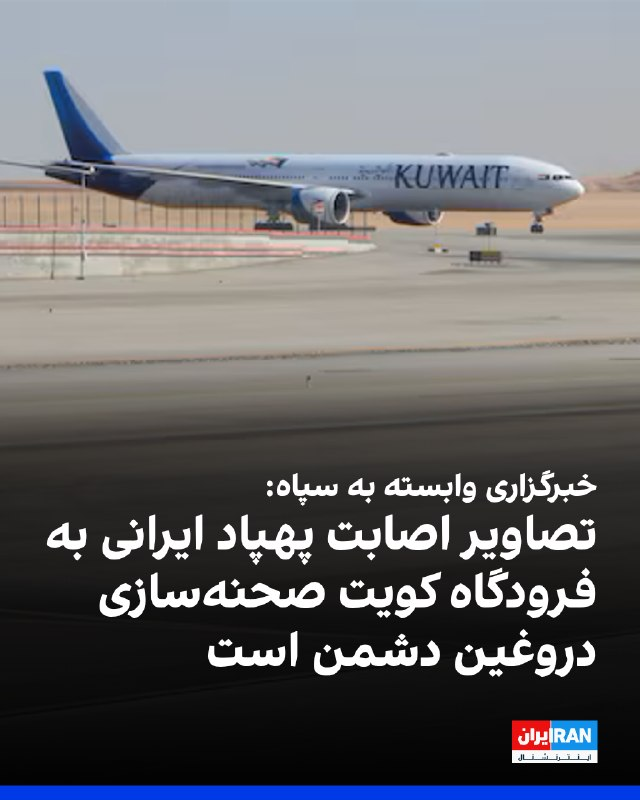

خبرگزاری تسنیم، وابسته به سپاه پاسداران، به نقل از یک منبع آگاه نظامی نوشت تصاویر منتشرشده از اصابت پهپاد ایرانی به فرودگاه کویت «صحنه‌سازی دروغین دشمن» است.
این منبع به تسنیم گفت پرتاب پهپادهای هوافضای سپاه به سوی اهداف آمریکایی در کویت نیمه‌شب انجام شده و اصابت نیز در همان زمان بوده، در حالی که در فیلم‌ها و عکس‌های منتشرشده، هوا روشن و مربوط به روز است.
این در حالی است که پیش‌تر حسین محبی، سخنگوی سپاه پاسداران، گفت تخریب ترمینال مسافربری فرودگاه کویت ناشی از خطای سامانه‌های پاتریوت آمریکایی بوده است.
‌🏁 🇬🇧 IranintlTV

🤖 @VahidOOnLine

## mwarmonitor — post 10136

🔴دیروز، در یک رای‌گیری بی‌معنی، مجلس نمایندگان—شامل ۴ جمهوری‌خواه بد و تمامی دموکرات‌های احمق (Dumocrats)—رای دادند تا اختیارات جنگی من را محدود کنند؛ آن هم درست در بحبوحه مذاکرات نهایی من برای پایان دادن به جنگ با جمهوری اسلامی ایران. چه کسی دست به چنین اقدام غیروطن‌پرستانه‌ای می‌زند؟ آن‌ها خودشان می‌دانند که مذاکرات در چه مرحله‌ای قرار دارد.
سوخت دموکرات‌ها از "سندروم جنون ترامپ" (Trump Derangement Syndrome) تامین می‌شود. آن‌ها ترجیح می‌دهند کشورمان شکست بخورد تا اینکه پیروزی دیگری را—از میان پیروزی‌های بی‌شمارم—به من تقدیم کنند. آن چهار جمهوری‌خواه هم که اصلاً داستانشان جداست؛ آن‌ها فقط شوآف‌کننده و به‌دنبال جلب‌توجه‌ (GRANDSTANDERS) هستند! آن‌ها باید از خودشان خجالت بکشند. MAGA!!! (دوباره آمریکا را عالی کنیم)

رئیس‌جمهور دونالد جی ترامپ»

@mwarmonitor

## pm_afshaa — post 92262

  <a href="telegram/content/pm_afshaa_92262_1780572886.webm" target="_blank">🎬 Download video</a>

🔴پست جدید ترامپ:
دیروز، در یک رأی‌گیری بی‌معنی، مجلس با 4 جمهوری‌خواه بد و همه دموکرات‌ها، اختیارات جنگ من رو محدود کرد، درست در میانه مذاکرات نهایی من برای پایان دادن به جنگ با جمهوری اسلامی ایران. چه کسی چنین کار غیرمیهن‌پرستانه‌ای انجام میده؟

آنها میدونن مذاکرات در چه مرحله‌ای است. دموکرات‌ها با سندرم اختلال ترامپ مواجه هستن. آنها ترجیح میدن کشور ما شکست بخوره تا اینکه من یکی دیگر از پیروزی‌های متعددم رو کسب کنم.

چهار جمهوری‌خواه، داستانی کاملاً متفاوت است - آنها فقط نمایش‌گر هستند! آنها باید از خودشان شرمنده باشند. ماگا!!!

💧 Rainbet.com the #1 Non-KYC Crypto Casino & Sportsbook @rainbetcom

😁 @Pm_Afshaa

## DEJradio — post 5321

  <a href="telegram/content/DEJradio_5321_1780572887.webm" target="_blank">🎬 Download video</a>

🔺📌 دلیل اصلی سقوط بشار اسد دیکتاتور سوریه، فروپاشی ساختار نظامی و امنیتی ارتش، گارد و سرویس امنیتی رژیم او بود. نارضایتی اقتصادی نظامی‌های سوری در این ساختار که بعد از بیش از ۱۲ سال جنگ، فرسوده شده بود به اوج خود رسیده بود. آنها با مشکلات شدید معیشتی دست به گریبان بودند اما فرماندهان ارشد، اطرافیان اسد و مهره‌های نزدیک به سـ.ـپاه و حزب‌الله جیبشان پر پول شده بود.

روزنامه «گاردین» گزارش داده بود بخشی از نیروهای نظامی و امنیتی سوریه عملاً از جنگیدن برای رژیم دست کشیده بودند، فرار کرده بودند یا با مخالفان تماس برقرار کرده بودند. بخشی از نخبگان نظامی به این نتیجه رسیده بودند که حکومت دیگر قابل حفظ نیست و به همین دلیل مقاومت مؤثری انجام ندادند.

اکنون به نوعی همین وضعیت برای ساختار نظامی و امنیتی جمهوری اسلامی در حال تکرار است. هرچند بسیاری از فرماندهان ارشد نظامی ارتش و سـ.ـپاه در جنگ کشته شدند اما وضعیت زندگی آنها نشان می‌دهد از امکانات و شراط قابل ملاحظه‌ای در مقایسه با پرسنل برخوردار بودند.

مشکلات معیشتی نظامی‌ها آنقدر زیاد شده است که صدای خبرگزاری فارس وابسته به سـ.ـپاه نیز درآمده است. آنها بویژه بعد از دو جنگ سخت و سرکوب گسترده مردم پس از خیزش ملی توقع دارند جیره و مواجب بیشتری بگیرند اما خبری از افزایش حقوق نیست.

بسیاری از نیروهای مسلح و نیروهای میدانی با مشکلات اقتصادی و معیشتی جدی نیز روبه‌رو هستند. خبرگزاری فارس می‌نویسد «با وجود سختی‌های شغلی، بسیاری معتقدند دریافتی و مزایای آنان متناسب با حجم مسئولیت، شرایط کاری و تورم موجود نیست.»

#بشار_اسد #سقوط #نیروهای_مسلح
@DEJradio

## IranIntlTV — post 340499

  <a href="telegram/content/IranIntlTV_340499_1780572888.mp4" target="_blank">🎬 Download video</a>

ویدیوی رسیده به ایران اینترنشنال نشان می‌دهد که صبح ۱۴ خرداد، مادر و خواهر سجاد سلیمانی همراه شماری از دوستان و آشنایان او، مراسم تولد این جاویدنام را کنار مزارش در بهشت زهرای تهران برگزار کردند.

سجاد سلیمانی، معترض ۴۲ ساله و پدر یک دختر خردسال، ۱۸ دی در آریاشهر تهران از ناحیه پا و کمر با گلوله جنگی ماموران هدف قرار گرفت. او به بیمارستان ابن‌سینا منتقل شد و ۱۹ دی طی تماسی به خانواده اعلام شد برای شناسایی پیکر بی‌جانش به کهریزک مراجعه کنند.

## FarsiVOA — post 219561

  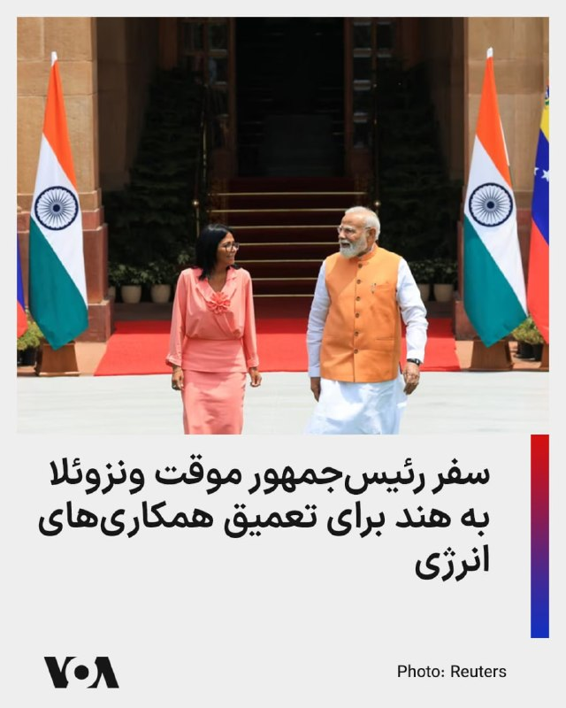

دلسی رودریگز رئیس‌جمهوری موقت ونزوئلا برای تعمیق همکاری‌های انرژی با هند به این کشور سفر کرده است. خبرگزاری رویترز می‌نویسد در این دیدار توسعه پروژه‌های تولید و پالایش نفت ونزوئلا با هند مذاکره شده است.

هند ماه گذشته با واردات روزانه ۴۲۷ هزار بشکه نفت ونزوئلا، دومین مشتری بزرگ نفتی این کشور بعد از آمریکا شد.

در شرایط انسداد تنگه هرمز توسط جمهوری اسلامی، نفت ونزوئلا به منبع مهمی برای کاهش فشار ناشی از اخلال سوخت در هند تبدیل شده است.

رودرندرا تاندون، دبیر امور شرق در وزارت خارجه هند بعد از مذاکرات خانم رودریگز به خبرنگاران گفت ونزوئلا هند را «شریک ترجیحی» خود در بخش انرژی می‌داند.
@FarsiVOA

## FarsiVOA — post 219560

  <a href="telegram/content/FarsiVOA_219560_1780572892.mp4" target="_blank">🎬 Download video</a>

حملات هم‌زمان هوایی و زمینی ارتش اسرائیل در ارتفاعات بوفور؛ کشته شدن دو نیروی مسلح حزب الله؛

در جریان عملیات روزهای اخیر در جنوب لبنان، نیروهای تیپ گولانی تحت فرماندهی لشکر ۳۶ ارتش اسرائیل موفق شدند کنترل عملیاتی منطقه ارتفاعات بوفور (محور قلعه شقیف) را به دست بگیرند.

بر اساس گزارش‌ ارتش اسرائیل، نیروهای زمینی تیپ گولانی در جریان پیشروی و حمله به این ارتفاعات در نزدیکی قلعه بوفور، دو نیروی مسلح حزب الله را در فاصله حدود ۱۵۰ متری از مواضع خود شناسایی کردند.

پس از شناسایی، ابتدا یک تانک متعلق به تیپ گولانی مواضع این افراد را هدف حمله قرار داد. در ادامه این درگیری، نیروی هوایی اسرائیل وارد عمل شده و با هدف قرار دادن دقیق این دو نفر، آن‌ها را از پا درآورد.

در حالی که ارتش اسرائیل تاکید کرده است به فعالیت‌های عملیاتی خود برای رفع هرگونه تهدید علیه شهروندان این کشور ادامه خواهد داد، حزب الله تحت حمایت جمهوری اسلامی اعلام کرده آتش‌بس را نمی‌پذیرد.

اسرائیل و لبنان روز چهارشنبه پس از مذاکراتی با میانجی‌گری ایالات متحده بر سر آتش‌بس جدیدی توافق کردند.
@FarsiVOA

## RadioFarda — post 157888

«حملات اسرائیل» به جنوب لبنان، ساعاتی پس از اعلام توافق برای آتش‌بس

🔸تنها ساعاتی پس از اعلام توافق اسرائیل و لبنان بر سر آتش‌بس، رسانه‌های رسمی لبنان از حملات دوباره اسرائیل به جنوب این کشور در روز پنج‌شنبه، ۱۴ خردادماه، خبر دادند.

🔸خبرگزاری فرانسه به نقل از خبرگزاری رسمی لبنان نوشت که ارتش اسرائیل در جاده‌های چند نقطه در جنوب لبنان «دست به حمله پهپادی زده است».

🔸رسانه‌های رسمی در اسرائیل از جمله حساب ارتش این کشور در شبکه ایکس هنوز به این خبر واکنش نشان نداده‌اند.

🔸با این حال یسرائیل کاتز، وزیر دفاع اسرائیل، پس از اعلام توافق بر سر تمدید آتش‌بس با لبنان گفته بود که به ارتش این کشور «آزادی عمل» داده تا در صورت حمله حزب‌الله به مناطق اسرائیلی، اهدافی را در بیروت هدف قرار دهد.

🔸همزمان رئیس‌جمهور لبنان این توافق را «آخرین فرصت» خواند و گفت آتش‌بس ممکن است ظرف ۲۴ ساعت آینده آغاز شود.

🔸بیشتر بخوانید.

@RadioFarda

## BBCPersian — post 282844

🔻گزارش ایلنا درباره تاثیر جنگ و قطعی چند ماهه اینترنت بر وضعیت سوزن‌دوزی در سیستان و بلوچستان

خبرگزاری کار ایران، ایلنا، در گزارشی به تاثیر جنگ و قطعی چند ماهه اینترنت بر وضعیت صنایع‌دستی سیستان و بلوچستان، به‌ویژه هنر سوزن‌دوزی بلوچ، پرداخته است.

براساس این گزارش «قطع طولانی مدت اینترنت، ارتباط هنرمندان بلوچ با مشتریان، فروشگاه‌های آنلاین و بازارهای خارج از استان را مختل کرده و باعث از بین رفتن یکی از مهم‌ترین مسیرهای فروش محصولات صنایع‌دستی شده است.»

بر اساس این گزارش، «سوزن‌دوزی بلوچ» که در سال‌های اخیر توانسته بود جایگاه قابل‌توجهی در بازارهای داخلی و خارجی پیدا کند و منبع درآمد بسیاری از زنان سرپرست خانوار و بدسرپرست باشد، در اثر جنگ و محدودیت‌های ارتباطی با رکود و کاهش فروش مواجه شده و چرخه تولید و عرضه آن آسیب دیده است.

مینا شیرانی، مدیر یک کارگاه سوزن‌دوزی با بیش از ۲۵۰ هنرمند، به ایلنا گفت که «قطعی اینترنت موجب قطع ارتباط سوزن‌دوزان بلوچ با مشتریان و توقف فروش بسیاری از کارگاه‌ها شد»؛ وضعیتی که به گفته او حتی پس از بازگشت نسبی اینترنت نیز به طور کامل جبران نشده است.

او همچنین از بیکاری شمار زیادی از زنان فعال در این حوزه و نبود چشم‌انداز روشن برای بهبود شرایط ابراز نگرانی کرده است.

https://bbc.in/43MG0XQ
@BBCPersian

## alonews — post 125043

  <a href="telegram/content/alonews_125043_1780572894.webm" target="_blank">🎬 Download video</a>

👈فیفا در آستانه آغاز جام جهانی ۲۰۲۶، ورود بطری‌های آب چند بار مصرف را به‌تمامی ورزشگاه‌های این رقابت‌ها ممنوع کرد؛ این نهاد پیش‌تر اجازه ورود بطری‌های پلاستیکی شفاف و خالی را داده بود، اما با اصلاح آیین‌نامه ورزشگاه‌ها، این مجوز لغو شد.

🔴دلیل این تصمیم مسائل امنیتی و جلوگیری از خطر آسیب‌دیدگی ناشی از پرتاب بطری‌ها و سایر اشیا به داخل زمین یا سکوها عنوان شده است. همچنین ورود اقلامی مانند قوطی، لیوان و شیشه نیز ممنوع خواهد بود.

✅ @AloNews خبر جنگ

## alonews — post 125042

  <a href="telegram/content/alonews_125042_1780572895.webm" target="_blank">🎬 Download video</a>

👈اسکای‌نیوز: حزب‌الله توافق آتش‌بس دولت لبنان و اسرائیل را رد کرد و نپذیرفت!

✅ @AloNews خبر جنگ

---
📅 بروزرسانی: 1405/03/14 14:54
---

## VahidOOnLine — post 243650

  

♦️خبرگزاری تسنیم، وابسته به سپاه پاسداران روز پنجشنبه ۱۴ خردادماه و ساعاتی پس از انتشار ویدیوها و تصاویری از برخورد پهپاد سپاه به فرودگاه بین‌المللی کویت، به نقل از یک منبع نظامی، آن‌ها را «تصویرسازی دروغین دشمن» خواند.

این منبع نظامی به تسنیم گفت:‌«رتاب پهپادهای هوافضای سپاه به سوی اهداف آمریکایی در کویت، در نیمه شب و اصابت هم در نیمه شب (و در تاریکی هوا) صورت گرفته است درحالی که در فیلم و عکسهای ادعایی که از پهپاد در فرودگاه منتشر شده، هوا کاملاً روشن و مربوط به روز است.»

سپاه پاسداران پیش از انتشار تصاویر برخورد پهپاد با پایانه مسافربری شماره ۱ فرودگاه کویت ادعا کرده بود که موشک‌های سامانه ضدهوایی آمریکا به این محل برخورد کرده بودند.

این منبع نظامی که نامش فاش نشده به تسنیم گفت:‌ «فاصله «هدف» پهپادهای هوافضای سپاه تا فرودگاه کویت بیش از ۴۰ کیلومتر است و این نیز نشان می‌دهد که اصابت به فرودگاه کویت ارتباطی به پهپادهای ایران ندارد.»
‌🇸🇦 Indypersian

🤖 @VahidOOnLine

## WithYashar — post 13480

  

ترامپ در تروث : دیروز، در یک رأی‌گیری بی‌اهمیت، مجلس نمایندگان با رأی ۴ جمهوری‌خواه بد و همه دموکرات‌ها، تلاش کرد اختیارات جنگی من را محدود کند؛ درست در میانه آخرین مذاکرات من برای پایان دادن به جنگ با جمهوری اسلامی ایران. چه کسی چنین کار غیرمیهن‌پرستانه‌ای انجام می‌دهد؟ آن‌ها می‌دانند وضعیت مذاکرات در چه مرحله‌ای است. دموکرات‌ها با چیزی به نام «سندروم جنون ترامپ» هدایت می‌شوند. آن‌ها ترجیح می‌دهند کشور ما شکست بخورد تا اینکه من یک پیروزی دیگر از میان پیروزی‌های بسیارم به دست بیاورم. آن چهار جمهوری‌خواه، ماجرای دیگری دارند آن‌ها اهل خودنمایی هستند! باید از کار خود شرمنده باشند.
MAGA!!!
@withyashar

## pm_afshaa — post 92261

  <a href="telegram/content/pm_afshaa_92261_1780572269.webm" target="_blank">🎬 Download video</a>

🔴آکسیوس: دو مقام ارشد آمریکایی گفتن در حالی که ترامپ میخواد به جنگ پایان بده، به نظر میرسه نتانیاهو میخواد اونو از سر بگیره.

💧 Rainbet.com the #1 Non-KYC Crypto Casino & Sportsbook @rainbetcom

😁 @Pm_Afshaa

## pm_afshaa — post 92260

  <a href="telegram/content/pm_afshaa_92260_1780572270.webm" target="_blank">🎬 Download video</a>

🔴وال استریت ژورنال:
ترامپ به طور خصوصی به دستیارانش گفته که قصد داره آتش بس فعلی با ایران رو حفظ کنه و فقط در صورتی که حملات ایران منجر به کشته شدن نیروهای آمریکایی بشه، شروع مجدد یک کارزار نظامی تمام عیار رو در نظر خواهد گرفت.

💧 Rainbet.com the #1 Non-KYC Crypto Casino & Sportsbook @rainbetcom

😁 @Pm_Afshaa

## IranIntlTV — post 340498

  

خبرگزاری تسنیم، وابسته به سپاه پاسداران، به نقل از یک منبع آگاه نظامی نوشت تصاویر منتشرشده از اصابت پهپاد ایرانی به فرودگاه کویت «صحنه‌سازی دروغین دشمن» است.
این منبع به تسنیم گفت پرتاب پهپادهای هوافضای سپاه به سوی اهداف آمریکایی در کویت نیمه‌شب انجام شده و اصابت نیز در همان زمان بوده، در حالی که در فیلم‌ها و عکس‌های منتشرشده، هوا روشن و مربوط به روز است.
این در حالی است که پیش‌تر حسین محبی، سخنگوی سپاه پاسداران، گفت تخریب ترمینال مسافربری فرودگاه کویت ناشی از خطای سامانه‌های پاتریوت آمریکایی بوده است.
https://iranintl.com/202606049781

## IranIntlTV — post 340497

  <a href="telegram/content/IranIntlTV_340497_1780572271.mp4" target="_blank">🎬 Download video</a>

ایران‌اینترنشنال در کارزاری مردمی برای ثبت حقیقت، به اطلاعات تازه‌ای درباره کشتار معترضان دی‌ماه در رشت خبر داده است. این گزارش شامل روایت‌هایی از شلیک مستقیم، ممانعت از امدادرسانی، فشار بر خانواده جان‌باختگان و محدودیت در برگزاری مراسم خاک‌سپاری است.

جزییات بیشتر با فرنوش فرجی، عضو تحریریه ایران‌اینترنشنال
@iranintltv

## Shin_Persian — post 6496

  

Shin ✓ @hey_itsmyturn Thu, 04 Jun 2026 11:15:41 UTC POTUS: "Yesterday, in a meaningless vote, the House voted, 4 bad Republicans and all of the Dumocrats, to limit my War Powers, right in the middle of my final negotiations to end the War with the Islamic…

## Shin_Persian — post 6495

Shin ✓ @hey_itsmyturn
Thu, 04 Jun 2026 11:15:41 UTC

POTUS:
"Yesterday, in a meaningless vote, the House voted, 4 bad Republicans and all of the Dumocrats, to limit my War Powers, right in the middle of my final negotiations to end the War with the Islamic Republic of Iran. Who would do such an unpatriotic thing. They know where the negotiations stand. The Democrats are fueled by Trump Derangement Syndrome. They would rather have our Country fail than give me another, of many, victories. The four Republicans, that’s a whole other story - They’re GRANDSTANDERS! They should be ashamed of themselves. MAGA!!! President DJT"

فارسی

رئیس‌جمهور ایالات متحده (POTUS):

«دیروز، در یک رای‌گیری بی‌معنا، مجلس نمایندگان با همراهی ۴ جمهوری‌خواه بد و تمام دموکرات‌های احمق (Dumocrats)، به محدود کردن اختیارات جنگی من رای داد، آن هم درست در میانه مذاکرات نهایی من برای پایان دادن به جنگ با جمهوری اسلامی ایران. چه کسی دست به چنین اقدام غیرمیهن‌پرستانه‌ای می‌زند. آن‌ها می‌دانند مذاکرات در چه مرحله‌ای است. دموکرات‌ها از «سندروم جنون ترامپ» تغذیه می‌کنند. آن‌ها ترجیح می‌دهند کشور ما شکست بخورد تا اینکه پیروزی دیگری را از میان پیروزی‌های بی‌شمارم، به من نسبت دهند. آن چهار جمهوری‌خواه، خود داستان دیگری دارند - آن‌ها خودنمای پیشه‌اند! آن‌ها باید از خودشان شرم کنند. MAGA!!! رئیس‌جمهور دی‌جی‌تی (DJT)»

𝕏 · @shin_persian

## FarsiVOA — post 219559

  

رئیس هیئت‌مدیره کانون هموفیلی ایران اعلام کرد که عملاً هیچ ذخیره دارویی برای بیماران مبتلا به کمبود فاکتور۱۳ و بیماری فون‌ویلبراند در کشور وجود ندارد.

امین افشار در گفتگو با خبرگزاری ایلنا یادآور شد که نگرانی‌هایی نیز درباره تأمین برخی داروهای مورد نیاز بیماران هموفیلی آ و ب وجود دارد. او علت این بحران را ناشی از تشدید مشکلات مربوط به محدودیت‌های بانکی، اختلال در زنجیره تامین و دشواری‌های واردات دارو توصیف کرد.

پیش از انتشار اخبار مربوط به کمبود دارو، گزارش‌هایی نیز از گرانی دارو و افزایش هزینه‌های درمان منتشر شده بود.

در همین ارتباط روزنامه شرق در گزارشی از گسترش پدیده‌ای نوشت که آن را «بحران خاموش ترک درمان» نامیده است؛ وضعیتی که در آن بیماران به دلیل افزایش هزینه‌ها، درمان‌‌ و مراقبت از بیماری‌های مزمن را به تعویق می‌اندازند یا به‌کلی کنار می‌گذارند.
@FarsiVOA

## DW_Farsi — post 125482

🎥 اولین دیتا سنتر زیرآبی تجاری جهان در چین؛ صرفه‌جویی میلیون‌ها کیلووات ساعت برق و میلیون‌ها لیتر آب شیرین

آیا مراکز داده مستقر در دریا راه‌حل مشکل مصرف انرژی هوش مصنوعی هستند؟ یک شرکت چینی و سرمایه‌گذاران فناوری آمریکا در حال بازنگری اساسی در روش‌های خنک‌سازی و مکان‌یابی هستند.

@dw_farsi

## idfinfarsi — post 11746

  

‼️سازمان تروریستی حزب‌الله گلوله‌های خمپاره شلیک کرد که در پایگاه یونیفیل اصابت کرده و منجر به کشته شدن یک نفر از نیروهای سازمان ملل در جنوب لبنان شد

⭕️ارتش اسرائیل در طول شب گذشته چندین شلیک را از منطقه القاطرانی شناسایی کرد که توسط سازمان تروریستی حزب‌الله انجام شده و در داخل یکی از پایگاه‌های نیروهای یونیفیل در منطقه دبین در جنوب لبنان اصابت کردند.

⭕️در نتیجه این شلیک‌ها، یک نفر از نیروهای سازمان ملل کشته و دو نفر دیگر زخمی شدند.

⭕️بررسی مسیر شلیک‌ها به‌طور واضح نشان می‌دهد که این آتش توسط سازمان تروریستی حزب‌الله انجام شده است.

⭕️شلیک‌های سازمان تروریستی حزب‌الله، نیروهای بین‌المللی را به خطر انداخته و به نیروهای سازمان ملل که در منطقه فعالیت می‌کنند نیز آسیب می‌زند.

## Hranews — post 113380

  

بیش از ۵ ماه بلاتکلیفی؛ هومان شایانی در زندان نورآباد ممسنی اعتصاب کرد

❗️
❗️
❗️
❗️
❗️– هومان شایانی، متهم سیاسی که اوایل دی ماه ۱۴۰۴ توسط نیروهای امنیتی بازداشت شده بود، با گذشت بیش از پنج ماه از زمان دستگیری کماکان در بازداشت و بلاتکلیفی بسر میبرد. این متهم سیاسی از تاریخ ۱۰ خردادماه در اعتراض به عدم رسیدگی به وضعیت پرونده و بلاتکلیفی خود در زندان دست به اعتصاب غذا زده است.

به گزارش خبرگزاری هرانا، ارگان خبری مجموعه فعالان حقوق بشر در ایران، هومان شایانی، متهم سیاسی کماکان در بازداشت به‌سر می برد.

یک منبع مطلع نزدیک به خانواده هومان شایانی با تایید این موضوع به هرانا گفت: آقای شایانی بیش از پنج ماه است که به‌صورت بلاتکلیف در زندان نورآباد ممسنی به‌سر می برد. وی با اتهاماتی همچون محاربه از طریق اقدام علیه امنیت ملی و تبلیغ علیه نظام مواجه شده است. با این حال، تاکنون دادگاهی برای رسیدگی به اتهامات این زندانی برگزار نشده است.

به گفته این منبع مطلع، این متهم سیاسی از تاریخ ۱۰ خردادماه در اعتراض به عدم رسیدگی به وضعیت پرونده و بلاتکلیفی خود در زندان دست به اعتصاب غذا زده است.

ادامه مطلب

#هومان_شایانی

↘️
@hranews_bot تماس ✉️ - @Hranews کانال هرانا 🆑

## alonews — post 125041

  <a href="telegram/content/alonews_125041_1780572275.webm" target="_blank">🎬 Download video</a>

👈ترامپ درباره قطعنامه اختیارات جنگ:
دیروز، در یک رأی‌گیری بی‌معنی، مجلس با ۴ جمهوری‌خواه بد و همه دموکرات‌ها، اختیارات جنگ من را محدود کرد، درست در میانه مذاکرات نهایی من برای پایان دادن به جنگ با جمهوری اسلامی ایران. چه کسی چنین کار غیرمیهن‌پرستانه‌ای انجام می‌دهد؟

🔴آنها می‌دانند مذاکرات در چه مرحله‌ای است. دموکرات‌ها با سندرم اختلال ترامپ سوخت‌رسانی می‌شوند. آنها ترجیح می‌دهند کشور ما شکست بخورد تا اینکه من یکی دیگر از پیروزی‌های متعددم را کسب کنم.

🔴چهار جمهوری‌خواه، داستانی کاملاً متفاوت است - آنها فقط نمایش‌گر هستند! آنها باید از خودشان شرمنده باشند. ماگا!!!

✅ @AloNews خبر جنگ

---
📅 بروزرسانی: 1405/03/14 14:44
---

## pm_afshaa — post 92259

  <a href="telegram/content/pm_afshaa_92259_1780571683.webm" target="_blank">🎬 Download video</a>

🔴کاتز، وزیر دفاع اسرائیل:
توافق با لبنان شامل خلع سلاح حزب‌الله و محکومیت دخالت جمهوری اسلامیه.

💧 Rainbet.com the #1 Non-KYC Crypto Casino & Sportsbook @rainbetcom

😁 @Pm_Afshaa

## pm_afshaa — post 92258

  <a href="telegram/content/pm_afshaa_92258_1780571684.webm" target="_blank">🎬 Download video</a>

🔴الحدث: آمریکا و جمهوری اسلامی به توافق 4 مرحله‌ای نزدیک شدن.

توافقی که از کاهش تنش‌ها آغاز می‌شه و در مراحل بعدی به امنیت تنگه هرمز، کاهش برخی تحریم‌ها و در نهایت پرونده هسته‌ای ایران می‌پردازه.

💧 Rainbet.com the #1 Non-KYC Crypto Casino & Sportsbook @rainbetcom

😁 @Pm_Afshaa

## IranIntlTV — post 340496

  <a href="https://t.me/IranintlTV/340496" target="_blank">📎 Download file</a>

🎧نسخه صوتی اخبار بامدادی | پنج‌شنبه ۱۴ خرداد
@iranintlTV

## FarsiVOA — post 219558

  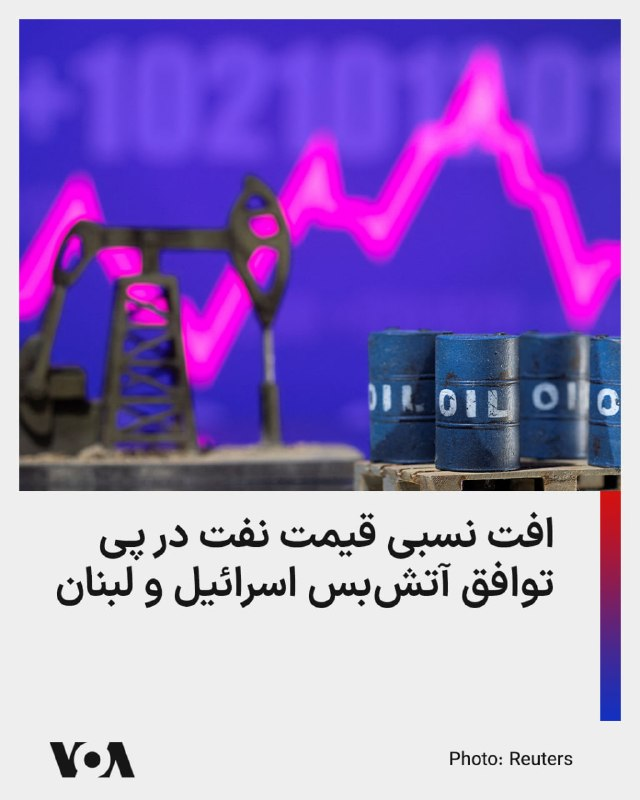

در پی توافق آتش‌بس اسرائیل و لبنان، قیمت نفت در بازارهای جهانی بیش از ۱ درصد افت کرد.

قیمت نفت شاخص برنت در روز پنج‌شنبه به زیر ۹۷ دلار و قیمت نفت وست تگزاس اینترمیدیت آمریکا و شاخص نفت موربان امارات نیز هر کدام به حدود ۹۵ دلار کاهش یافت.

قیمت‌های کنونی نفت کماکان ۳۵ درصد بالاتر از دوران پیش از انسداد تنگه هرمز توسط جمهوری اسلامی است.
@FarsiVOA

## FarsiVOA — post 219557

  <a href="telegram/content/FarsiVOA_219557_1780571687.mp4" target="_blank">🎬 Download video</a>

حمله مرگبار ارتش آمریکا به قایق قاچاقچیان مورد حمایت شبکه‌های تروریستی در اقیانوس آرام؛

بنا بر اعلام فرماندهی جنوبی ایالات متحده، نیروهای مشترک این فرماندهی روز چهارشنبه، به دستور ژنرال فرانسیس داناوان، یک حمله هدفمند و مرگبار علیه شناور متعلق به سازمان‌های تروریستیِ شناسایی‌شده انجام دادند.

بر اساس داده‌های اطلاعاتی، این شناور در حال حرکت در مسیرهای شناخته‌شده قاچاق مواد مخدر در شرق اقیانوس آرام و انجام عملیات انتقال محموله بود.

در جریان این اقدام، دو قاچاقچی تروریست کشته شدند. در این عملیات به هیچ‌یک از نیروهای نظامی آمریکا آسیبی نرسید.
@FarsiVOA

## IranianMinds — post 21360

🔴آموزش و پرورش:

اعلام برنامه امتحانات نهایی کذب است.

@IranianMinds

## Dirty_Kids — post 390968

  <a href="telegram/content/Dirty_Kids_390968_1780571689.mp4" target="_blank">🎬 Download video</a>

چالش کون 
🍑 به ایران هم رسید.

@Dirty_Kids 👻

## Dirty_Kids — post 390967

  <a href="telegram/content/Dirty_Kids_390967_1780571690.mp4" target="_blank">🎬 Download video</a>

سوتی مجری صدا و سیما روز اول جنگ .
همه در رفتن 😂

@Dirty_Kids 👻

## Dirty_Kids — post 390966

  <a href="telegram/content/Dirty_Kids_390966_1780571692.mp4" target="_blank">🎬 Download video</a>

تموم شد رفت!! حالا پیکاسو همینو ۶۰۰روز طول میداد

فقط کفتر و گنجیشک‌ش کمه

@Dirty_Kids 👻

## Dirty_Kids — post 390965

  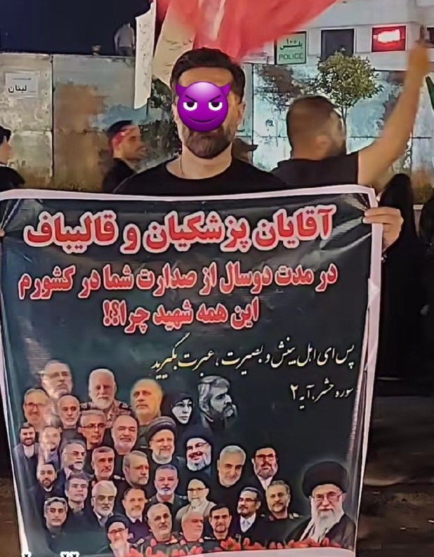

تو تجمعات شبانه علاوه بر پزشکیان، دارن به قالیباف هم حمله میکنن؛

@Dirty_Kids 👻

## alonews — post 125040

  <a href="telegram/content/alonews_125040_1780571696.webm" target="_blank">🎬 Download video</a>

👈فارین پالیسی: جایگاه متمایز آمریکا، چین، روسیه و بریتانیا در صحنه جهانی

🔴 نشریه فارین پالیسی در تحلیلی به قلم برندن سیمز استدلال می‌کند که اگرچه ایالات متحده و چین از نظر اقتصادی و نظامی بسیار جلوتر از روسیه و بریتانیا هستند، اما هر چهار کشور دارای ویژگی‌هایی هستند که آنها را از رده بعدی بازیگران اصلی در صحنه جهانی متمایز می‌کند.

✅ @AloNews خبر جنگ

## alonews — post 125039

  <a href="telegram/content/alonews_125039_1780571697.webm" target="_blank">🎬 Download video</a>

👈گزارش نشنال اینترست: استفاده ایران از موشک چینی برای سرنگونی جنگنده آمریکایی

🔴 نشریه نشنال اینترست گزارش داده است که به نظر می‌رسد چین سخت‌افزار نظامی در اختیار ایران قرار داده و ایران در جریان عملیات «خشم حماسی» از یک موشک چینی برای سرنگونی یک فروند جنگنده F-15E Strike Eagle آمریکایی استفاده کرده است.

✅ @AloNews خبر جنگ

---
📅 بروزرسانی: 1405/03/14 14:35
---

## VahidOOnLine — post 243649

♦️حمله یک خرس سیاه آسیایی به یک مجتمع صنعتی و مسکونی در شمال‌شرق ژاپن، چهار نفر را زخمی کرد و باعث تعطیلی مدارس و توقف فعالیت یک کارخانه شد.
تصاویر دوربین‌های مداربسته کارخانه فولاد فوکوشیما نشان می‌دهد این خرس روز سه‌شنبه ۱۲ خرداد یک کارگر را در ورودی کارخانه تعقیب کرده، او را به زمین انداخته و سپس وارد یکی از ساختمان‌ها شده است. در این تصاویر همچنین دیده می‌شود که یک خودرو در تلاش برای تعقیب حیوان است.
بر اساس گزارش رسانه‌های محلی، این خرس علاوه بر آن کارگر، یک مرد حدودا ۶۰ ساله در همان مجتمع و یک زن حدودا ۸۰ ساله در منطقه اطراف را نیز زخمی کرده است.این حیوان سپس وارد محوطه کارخانه دیگری شد و به یک کارمند دیگر حدودا ۶۰ ساله حمله کرد.
رسانه‌های محلی گزارش داده‌اند که خرس همچنان در محوطه کارخانه حضور دارد و پلیس برای مقابله با آن وضعیت اضطراری اعلام کرده است تا در صورت لزوم به این حیوان شلیک شود.
در پی این حادثه، مدارس ابتدایی و راهنمایی اطراف تعطیل شده‌اند و کارخانه محل حادثه نیز فعالیت خود را متوقف کرده است.
‌🇸🇦 Indypersian

🤖 @VahidOOnLine

## WithYashar — post 13479

دوربین‌های مداربسته لحظه‌ای را ثبت کردند که یک پهپاد کامیکازه شاهد-۱۳۶ ایرانی، اوایل صبح چهارشنبه به ترمینال ۱ فرودگاه بین‌المللی کویت حمله کرد. @withyashar 😟

## DEJradio — post 5318

  <a href="telegram/content/DEJradio_5318_1780571129.webm" target="_blank">🎬 Download video</a>

🔺📌 دلیل اصلی سقوط بشار اسد دیکتاتور سوریه، فروپاشی ساختار نظامی و امنیتی ارتش، گارد و سرویس امنیتی رژیم او بود. نارضایتی اقتصادی نظامی‌های سوری در این ساختار که بعد از بیش از ۱۲ سال جنگ، فرسوده شده بود به اوج خود رسیده بود. آنها با مشکلات شدید معیشتی دست به گریبان بودند اما فرماندهان ارشد، اطرافیان اسد و مهره‌های نزدیک به سـ.ـپاه و حزب‌الله جیبشان پر پول شده بود.

روزنامه «گاردین» گزارش داده بود بخشی از نیروهای نظامی و امنیتی سوریه عملاً از جنگیدن برای رژیم دست کشیده بودند، فرار کرده بودند یا با مخالفان تماس برقرار کرده بودند. بخشی از نخبگان نظامی به این نتیجه رسیده بودند که حکومت دیگر قابل حفظ نیست و به همین دلیل مقاومت مؤثری انجام ندادند.

اکنون به نوعی همین وضعیت برای ساختار نظامی و امنیتی جمهوری اسلامی در حال تکرار است. هرچند بسیاری از فرماندهان ارشد نظامی ارتش و سـ.ـپاه در جنگ کشته شدند اما وضعیت زندگی آنها نشان می‌دهد از امکانات و شراط قابل ملاحظه‌ای در مقایسه با پرسنل برخوردار بودند.

مشکلات معیشتی نظامی‌ها آنقدر زیاد شده است که صدای خبرگزاری فارس وابسته به سـ.ـپاه نیز درآمده است. آنها بویژه بعد از دو جنگ سخت و سرکوب گسترده مردم پس از خیزش ملی توقع دارند جیره و مواجب بیشتری بگیرند اما خبری از افزایش حقوق نیست.

بسیاری از نیروهای مسلح و نیروهای میدانی با مشکلات اقتصادی و معیشتی جدی نیز روبه‌رو هستند. خبرگزاری فارس می‌نویسد «با وجود سختی‌های شغلی، بسیاری معتقدند دریافتی و مزایای آنان متناسب با حجم مسئولیت، شرایط کاری و تورم موجود نیست.»

#بشار_اسد #سقوط #نیروهای_مسلح
@DEJradio

## IranIntlTV — post 340495

  <a href="telegram/content/IranIntlTV_340495_1780571130.mp4" target="_blank">🎬 Download video</a>

شورای هماهنگی تشکل‌های صنفی فرهنگیان ایران با محکوم کردن فضای سرکوب پس از جنگ، نسبت به احتمال اجرای حکم اعدام علیرضا مرداسی، معلم زندانی سیاسی، و دیگر محکومان هشدار داد

گفت‌وگو با رضا اکوانیان، روزنامه‌نگار و فعال حقوق بشر
@iranintltv

## FarsiVOA — post 219556

  

بخش رسانه‌ای تیم فوتبال جمهوری اسلامی اعلام کرد که مکزیک ویزای تمامی اعضای این تیم را صادر کرده است.

به این ترتیب، تیم فوتبال جمهوری اسلامی روز شنبه ۱۶ خرداد، از ترکیه عازم شهر «تیخوانا» مکزیک، محل اقامت خود خواهد شد. مقامات جمهوری اسلامی، محل اقامت این تیم در جام جهانی ۲۰۲۶ را از آمریکا به مکزیک منتقل کردند.

روز چهارشنبه ۱۳ خرداد، مهدی تاج، رئيس فدراسیون فوتبال اعلام کرده بود که به جز دو نفر که همراه تیم هستند، سایر ویزاها صادر شد و تا چند ساعت آینده ویزای آنها نیز صادر می‌شود. مهدی‌ تاج درباره مراحل صدور ویزای ورود به آمریکا نیز گفته است که «اگر از من بپرسند می‌گویم نمی‌دانم در چه مرحله‌ای است، به ما اعلام کردند منتظر باشید و پیگیر این موضوع هستیم.»

مارکو روبیو، وزیر خارجه ایالات متحده می‌گوید آمریکا اجازه ورود افراد مرتبط با سپاه در هیئت همراه تیم فوتبال جمهوری اسلامی را نمی‌دهد.
@FarsiVOA

## Persian_Trend_Official — post 15691

  <a href="telegram/content/Persian_Trend_Official_15691_1780571133.webm" target="_blank">🎬 Download video</a>

دولت کویت ویدیویی از لحظه اصابت پهپاد انتحاری شاهد-136 به ترمینال شماره یک فرودگاه بین‌المللی خود منتشر کرد. در این حمله 1 نفر کشته و بیش از 60 شهروند کویتی زخمی شدند. سخنگوی سپاه تا پیش از این، حمله به فرودگاه را تکذیب کرده بود و ادعا داشت که موشک رهگیر…

## alonews — post 125038

  <a href="telegram/content/alonews_125038_1780571134.webm" target="_blank">🎬 Download video</a>

👈چت جی‌پی‌تی، دیپ‌سیک و گراک بدون فیلترشکن در دسترس قرار گرفت

✅ @AloNews خبر جنگ

## alonews — post 125037

  <a href="telegram/content/alonews_125037_1780571134.webm" target="_blank">🎬 Download video</a>

👈تسنیم: پرتاب پهپادهای هوافضای سپاه به سوی اهداف آمریکایی در کویت، در نیمه شب و اصابت هم در نیمه شب (و در تاریکی هوا) صورت گرفته است درحالی که در فیلم و عکسهای ادعایی که از پهپاد در فرودگاه منتشر شده، هوا کاملاً روشن و مربوط به روز است.

✅ @AloNews خبر جنگ

## alonews — post 125036

  <a href="telegram/content/alonews_125036_1780571134.webm" target="_blank">🎬 Download video</a>

⚫
🏆 به دنیای هیجان‌انگیز فوتبال خوش اومدی!

⭐️اینجا قراره باهم لحظه‌به‌لحظه‌ی جام جهانی رو زندگی کنیم؛
از بازی‌های حساس و نتایج داغ گرفته تا حاشیه‌ها، کری‌خونی‌ها و اتفاقاتی که همه درباره‌ش حرف میزنن! 
🔥
🔥

✅ پوشش کامل مسابقات

💀ترول تیم‌ها و بازیکن‌ها

🎥ویدیوها و لحظه‌های فان فوتبالی

📊آمار، ترکیب‌ها و اخبار فوری

🌍حواشی جذاب از سراسر جام جهانی

📢اینجا فقط یک کانال خبری نیست؛
یک جمع فوتبالیه برای کسایی که فوتبال رو با هیجان، شوخی و احساس واقعی دنبال میکنن 
📛
💟

🆘
🔞 آماده باش چون قراره جام جهانی رو متفاوت تجربه کنیم!

⚡ @Vaarzesh_Plus

⚡ @Vaarzesh_Plus

## alonews — post 125035

  <a href="telegram/content/alonews_125035_1780571135.webm" target="_blank">🎬 Download video</a>

👈نخست‌وزیر آلبانی، ادی راما، در برنامه CNN با ایسا سوارس درباره تنش‌های پروژه پیشنهادی جرد کوشنر برای یک مجتمع لوکس ۴ میلیارد دلاری در خط ساحلی محافظت‌شده آدریاتیک به شدت واکنش نشان داد و گفت «هنوز پروژه‌ای وجود ندارد»، و گزارش‌های منتشر شده را به عنوان اخبار جعلی رد کرد.

✅ @AloNews خبر جنگ

---
📅 بروزرسانی: 1405/03/14 14:24
---

## VahidOOnLine — post 243648

  <a href="telegram/content/VahidOOnLine_243648_1780570455.mp4" target="_blank">🎬 Download video</a>

‌🏁 🇬🇧 IranintlTV

🤖 @VahidOOnLine

## IranIntlTV — post 340494

  <a href="telegram/content/IranIntlTV_340494_1780570457.mp4" target="_blank">🎬 Download video</a>

‏«سمانه میرزایی» شامگاه ۱۹ دی‌ماه در جریان اعتراضات مردمی بر اثر شلیک مستقیم گلوله جنگی نیروهای جمهوری اسلامی در منطقه سلسبیل تهران کشته شد. نام او در حافظه این سرزمین می‌ماند و یادش چراغ راه آزادی‌خواهان است

@iranintltv

## IranIntlTV — post 340493

  

🔻روزنامه اتلتیک در گزارشی به بررسی عملکرد درخشان‌ترین ستاره‌های تاریخ جام جهانی پرداخته است؛ بازیکنانی که سهمشان در قهرمانی تیم‌هایشان چنان حیاتی و تعیین‌کننده بود که نام آن‌ها با سال برگزاری آن تورنمنت گره خورده است.

🔹لیونل مسی؛ آرژانتین ۲۰۲۲
مسی در سال ۲۰۲۲ و در پنجمین تلاش خود، سرانجام جام جهانی را بالای سر برد. تجربه‌های قبلی او در این مسابقات افت‌وخیزهای زیادی داشت؛ او در سال ۲۰۰۶ یک تعویضی درخشان بود، در سال ۲۰۱۰ مهره‌ای مهارناپذیر، اما بدون گل زده، به شمار می‌رفت و در سال ۲۰۱۴ توپ طلای مسابقات را برد.

🔹روماریو؛ برزیل ۱۹۹۴
برزیل سال ۱۹۹۴ به اندازه تیم‌های سال‌های ۱۹۵۸، ۱۹۶۲ یا ۱۹۷۰ هیجان‌انگیز نبود. آن‌ها با سیستم نسبتا خشک ۴-۴-۲ بازی می‌کردند و کار را در خط حمله به روماریو و ببتو می‌سپردند تا هر کاری دلشان می‌خواهد انجام دهند.

🔹دیگو مارادونا؛ آرژانتین ۱۹۸۶
این دوره، بدون شک، برترین نمایش انفرادی یک بازیکن در تاریخ جام جهانی است. آرژانتین کاملا حول محور مارادونا می‌چرخید و او با ثباتی بی‌نظیر به این اعتماد پاسخ داد.

🔹گزارش کامل را در سایت بخوانید.

@iranintltvsport

## FarsiVOA — post 219555

  

مرجان ساتراپی نویسنده، کارگردان، فعال حقوق بشر که با کتاب مصور «پرسپولیس» به شهرت رسیده بود، در ۵۶ سالگی درگذشت. خانم ساتراپی، ۵۶ ساله، پس از از دست دادن همسرش، طی چند ماه اخیر از رسانه‌ها فاصله گرفته بود.

ساتراپی که از مخالفان جمهوری اسلامی بود، سرکوب زنان از سوی حکومت جمهوری اسلامی را به ویژه در سال‌های ابتدایی شکل‌گیری آن در «پرسپولیس» نشان داد. او در سال‌های اخیر نیز همچنان از اقدامات جمهوری اسلامی انتقاد می‌کرد.

در بیانیه‌ای که نزدیکان او در اختیار خبرگزاری فرانسه قرار دادند، آمده است: «مرجان ساتراپی اندکی بیش از یک سال پس از درگذشت ماتیاس ریپا، همسرش و عشق زندگی‌اش، از غصه درگذشت.»

ماتیاس ریپا، تهیه‌کننده، بازیگر و فیلم‌نامه‌نویس، در ۸ آوریل ۲۰۲۵ درگذشته بود.

این هنرمند متولد آذر ۱۳۴۸ در ایران، دوران کودکی و بخشی از نوجوانی خود را در دوران جمهوری اسلامی گذراند، سپس برای ادامه تحصیل کشورش را ترک کرد و به وین رفت و بعد به فرانسه مهاجرت کرد.

او داستان زندگی خود را در کتاب مصور «پرسپولیس» روایت کرد؛ اثری که پس از انتشار در فاصله سال‌های ۲۰۰۰ تا ۲۰۰۳ در سه جلد، به موفقیتی جهانی دست یافت.
@FarsiVOA

## FarsiVOA — post 219554

🔺نتانیاهو پیشنهاد ارتش اسرائیل برای عملیات در جنوب لبنان را مورد تردید قرار داد

▪️رادیو ارتش اسرائیل گزارش داد که بنیامین نتانیاهو، نخست‌وزیر این کشور، در جریان یک نشست امنیتی محدود در شامگاه چهارشنبه، پیشنهاد ارتش برای عملیات زمینی در لبنان را زیر سؤال برده است.

▪️در این نشست، ارتش اسرائیل به نخست‌وزیر و دیگر وزرا پیشنهادی برای یک عملیات زمینی در مقیاس بزرگ در لبنان ارائه کرد، اما نتانیاهو با توجه به فشار آمریکا علیه تشدید بیشتر تنش‌ها، ابراز تردید کرد.

▪️اسرائیل و لبنان روز چهارشنبه پس از مذاکراتی با میانجی‌گری ایالات متحده بر سر آتش‌بس جدیدی توافق کردند.

▪️جوزف عون، رئیس‌جمهور لبنان، پنجشنبه اعلام کرد که اجرای آتش‌بس ممکن است ظرف ۲۴ ساعت پس از موافقت آغاز شود.

⬇️ بیشتر بخوانید:
https://ir.voanews.com/a/8157244.html

## DW_Farsi — post 125481

  

🔶 ایتامار بن‌گویر: آتش‌بس اسرائیل با لبنان یک اشتباه فاحش است

ایتامار بن‌گویر، وزیر امنیت ملی اسرائیل، آتش‌بس میان لبنان و اسرائیل با میانجی‌گری آمریکا را محکوم کرد و آن را "یک اشتباه فاحش" دانست.

او در شبکه اجتماعی ایکس مدعی شد که حزب‌الله لبنان از منطقه جنوب رود لیتانی خارج نشده و ارتش لبنان نیز توانایی اجرای خروج این گروه را ندارد.

این سیاستمدار راست‌گرای افراطی همچنین ادعا کرد که "دولت لبنان شریک حزب‌الله است" و در کابینه این کشور وزیرانی حضور دارند که نماینده حزب‌الله هستند و اعضای خانواده نیروهای حزب‌الله نیز در ارتش لبنان خدمت می‌کنند.

بن‌گویر همچنین پیش‌بینی کرد که حزب‌الله لبنان قدرتمندتر خواهد شد و اسرائیل به جای شکست دادن این گروه، موجودیت آن را پذیرفته است.

او همچنین هشدار داد که گاهی باید حتی با دونالد ترامپ، رئیس‌جمهور آمریکا مخالفت کرد و افزود در غیر این صورت، اسرائیل در آینده با حزب‌الله‌ در حالی‌که قوی‌تر و خطرناک‌تر شده، روبه‌رو خواهد شد.

وزیر امنیت ملی اسرائیل در پایان خواستار برگزاری نشست کامل کابینه و رای‌گیری درباره توافق آتش‌بس شد.

لبنان و اسرائیل عصر روز چهارشنبه ۱۳ خرداد (۳ ژوئن) در پایان مذاکرات دو روزه خود در واشنگتن توافق کردند آتش‌بس میان خود را تمدید کنند.

هر دو طرف در یک بیانیه مشترک تاکید کردند که اجرای آتش‌بس منوط به "توقف کامل حملات حزب‌الله علیه اسرائیل و خروج نیروهای این گروه از بخش جنوبی رود لیتانی در نزدیکی مرز اسرائیل است".

@dw_farsi

## alonews — post 125034

  <a href="telegram/content/alonews_125034_1780570461.webm" target="_blank">🎬 Download video</a>

👈سردار قاآنی: اسرائیل باید به نقطه قبل از شروع جنگ ۴۰ روزه عقب‌نشینی کند

✅ @AloNews خبر جنگ

---
📅 بروزرسانی: 1405/03/14 14:14
---

## VahidOOnLine — post 243647

  <a href="telegram/content/VahidOOnLine_243647_1780569851.mp4" target="_blank">🎬 Download video</a>

یک عضو ارتش با سابقه طولانی خدمت در نقطه صفر مرزی سیستان و بلوچستان، در پیامی صوتی که به ایران اینترنشنال فرستاد از حقوق ۲۵ میلیون تومانی و وضعیت معیشتی خانوار پنج‌نفره‌اش انتقاد کرد و گفت: «هیچ چیز عوض نخواهد شد، مگر این‌که اصلا این نظام تغییر کند و این‌ها بروند.»

صدای او با هوش مصنوعی تغییر یافته است.
‌🏁 🇬🇧 IranintlTV

🤖 @VahidOOnLine

## WithYashar — post 13478

اکسیوس : یک شکاف رو به رشد بین ترامپ و نتانیاهو در مورد آینده منطقه در حال شکل‌گیری است.

بر اساس گفته مقامات آمریکایی، ترامپ می‌خواهد تنش‌ها را کاهش دهد، درگیری‌های جاری را پایان دهد و به دنبال یک توافق دیپلماتیک با ایران باشد.
در مقابل، نتانیاهو به نظر می‌رسد تمایل بیشتری به حفظ فشار نظامی بر ایران و متحدانش، از جمله حزب‌الله، دارد.
@withyashar

## IranIntlTV — post 340492

  <a href="telegram/content/IranIntlTV_340492_1780569852.mp4" target="_blank">🎬 Download video</a>

شهروندان در اعتراض به برگزاری جشن‌های پرهزینه حکومت برای مراسم عید غدیر و سالگرد مرگ روح‌الله خمینی، پیام‌هایی را به مدیابات ایران‌اینترنشنال ارسال کرده‌اند

گفت‌وگو با لیلا سعادتی، عضو تحریریه ایران‌اینترنشنال
@iranintltv

## IranIntlTV — post 340491

  <a href="telegram/content/IranIntlTV_340491_1780569854.mp4" target="_blank">🎬 Download video</a>

سرخط خبرهای پنج‌شنبه ۱۴ خرداد
@iranintltv

## IranIntlTV — post 340490

  <a href="telegram/content/IranIntlTV_340490_1780569855.mp4" target="_blank">🎬 Download video</a>

ویدیوی ارسالی به ایران اینترنشنال نشان‌دهنده برگزاری یک تجمع شبانه حکومتی در کرج است. فرستنده ویدیو در پیام خود گفت که حامیان حکومت در بلوار «امام‌زاده حسن» از ساعت ۶ صبح تا ۱۰:۳۰ شب با بستن خیابان و ایجاد آلودگی صوتی مزاحم ساکنان منطقه شدند و افزود: «ارزشی‌ها…

## FarsiVOA — post 219553

🔺حزب‌الله آتش‌بس را رد کرد؛ تأکید اسرائیل بر هدف قرار دادن این گروه

▪️در حالی که ارتش اسرائیل تاکید کرده که همچنان به هدف قرار دادن حزب‌الله در جنوب لبنان ادامه می‌دهد، این گروه تحت حمایت جمهوری اسلامی اعلام کرد که آتش‌بس اعلام شده را نمی‌پذیرد.

▪️سخنگوی ارتش اسرائیل، اعلام کرد: «درگیری‌ها در جنوب لبنان ادامه دارد و ارتش اسرائیل همچنان تأسیسات و زیرساخت‌های حزب‌الله را که در داخل و نزدیک روستاهای شما قرار دارند هدف قرار می‌دهد».

▪️پیشتر وزیر دفاع اسرائیل اعلام کرد که نیروهای نظامی این کشور فعلا به انجام عملیات در لبنان ادامه خواهند داد و از این کشور خارج نخواهند شد.

▪️اسرائیل و لبنان روز چهارشنبه پس از مذاکراتی با میانجی‌گری ایالات متحده بر سر آتش‌بس جدیدی توافق کردند.

⬇️ بیشتر بخوانید:
https://ir.voanews.com/a/8157243.html

## Persian_Trend_Official — post 15690

  

سردار قاآنی: اسرائیل باید به نقطه قبل از شروع جنگ 40 روزه عقب‌نشینی کند!

فرمانده نیروی قدس سپاه: پشتیبانی از مقاومت در لبنان، وظیفه همه ما و اسرائیل‌زدایی از منطقه، آرمان دست یافتنی مسلمانان.

کف خواسته‌های مقاومت، عقب‌نشینی رژیم غاصب به نقطه قبل از شروع جنگ 40 روزه است. مجاهدین لبنانی، به زودی نتایج مقاومت شجاعانه خود را خواهند دید.

📝 Amir

📌 @persian_trend_official
پرشین ترند | متفاوت‌ترین کانال نظامی

## Persian_Trend_Official — post 15689

  <a href="telegram/content/Persian_Trend_Official_15689_1780569857.webm" target="_blank">🎬 Download video</a>

الحدث: ارتش لبنان می‌گوید نیروهای اسرائیلی به طور کامل از مناطق دبین و بلات در جنوب لبنان عقب‌نشینی کرده‌اند.

نیروهای لبنانی شروع به استقرار در امتداد جاده دبین کرده‌اند و در حال استقرار در مناطقی هستند که نیروهای اسرائیلی آنها را تخلیه کرده‌اند.

ارتش همچنین اعلام کرد که پس از عقب‌نشینی، بازگشایی مسیر مرجعیون-دبین-ابلساقی را آغاز کرده است.

📝 Amir

📌 @persian_trend_official
پرشین ترند | متفاوت‌ترین کانال نظامی

## IranianMinds — post 21359

  

🔴اسماعیل قا‌آنی/ مرکز پیام جنگ:

پشتیبانی از مقاومت در لبنان، وظیفه همه ما و اسرائیل‌زدایی از منطقه، آرمان دست‌یافتنی مسلمانان.

@IranianMinds

---
📅 بروزرسانی: 1405/03/14 14:04
---

## VahidOOnLine — post 243646

  

اسماعیل قاآنی، فرمانده نیروی قدس سپاه پاسداران، در پیامی نوشت کف خواسته‌های مقاومت، عقب‌نشینی اسرائیل به نقطه پیش از آغاز جنگ ۴۰ روزه است.
او نوشت پشتیبانی از «مقاومت در لبنان» وظیفه همه است و «اسرائیل‌زدایی» از منطقه را آرمانی دست‌یافتنی برای مسلمانان دانست و افزود نیروهای لبنانی به‌زودی نتایج مقاومت خود را خواهند دید.
‌🏁 🇬🇧 IranintlTV

🤖 @VahidOOnLine

## IranIntlTV — post 340489

  <a href="telegram/content/IranIntlTV_340489_1780569262.mp4" target="_blank">🎬 Download video</a>

مراسم سالمرگ روح‌الله خمینی برای نخستین بار بدون حضور علی خامنه‌ای برگزار شد. در این مراسم تنها غلامحسین محسنی‌اژه‌ای، رییس قوه قضاییه، حضور داشت و سایر سران قوا در این مراسم شرکت نکردند.

ارزیابی بیشتر با علی شیرازی، عضو تحریریه ایران‌اینترنشنال
@iranintltv

## IranIntlTV — post 340488

  

اسماعیل قاآنی، فرمانده نیروی قدس سپاه پاسداران، در پیامی نوشت کف خواسته‌های مقاومت، عقب‌نشینی اسرائیل به نقطه پیش از آغاز جنگ ۴۰ روزه است.
او نوشت پشتیبانی از «مقاومت در لبنان» وظیفه همه است و «اسرائیل‌زدایی» از منطقه را آرمانی دست‌یافتنی برای مسلمانان دانست و افزود نیروهای لبنانی به‌زودی نتایج مقاومت خود را خواهند دید.
https://iranintl.com/202606046348

## IranianMinds — post 21358

  

(:

@IranianMinds

## BBCPersian — post 282843

🔻یک نیروی حافظ صلح سازمان ملل در جنوب لبنان کشته شد

یک نیروی صلح‌بان سازمان ملل متحد با ملیت صرب پس از اصابت خمپاره به یک موضع سازمان ملل در جنوب شرقی لبنان کشته شد.

دو نفر دیگر در حمله روز چهارشنبه زخمی شدند.

هیئت صلح‌بانان نگفته که اسرائیل یا حزب‌الله مسئول این حمله بوده‌اند، اما تحقیقاتی را آغاز کرده است.

https://bbc.in/4vtcO4e
@BBCPersian

## alonews — post 125033

  <a href="telegram/content/alonews_125033_1780569264.webm" target="_blank">🎬 Download video</a>

👈اکسیوس : یک شکاف رو به رشد بین ترامپ و نتانیاهو در مورد آینده منطقه در حال شکل‌گیری است.

🔴بر اساس گفته مقامات آمریکایی، ترامپ می‌خواهد تنش‌ها را کاهش دهد، درگیری‌های جاری را پایان دهد و به دنبال یک توافق دیپلماتیک با ایران باشد.

🔴در مقابل، نتانیاهو به نظر می‌رسد تمایل بیشتری به حفظ فشار نظامی بر ایران و متحدانش، از جمله حزب‌الله، دارد.

✅ @AloNews خبر جنگ

---
📅 بروزرسانی: 1405/03/14 13:54
---

## VahidOOnLine — post 243645

  

♦️دادگاهی در بریتانیا به پرونده یوهانس ناتلند، شهروند ۱۹ ساله نروژی رسیدگی می‌کند که متهم است پس از ارتباط با یک سازمان تبهکار سوئدی مرتبط با جمهوری اسلامی، برای قتل به این کشور سفر کرده بود.

به گزارش کانال ۴ تلویزیون دولتی بریتانیا، متهم که یوهانس ناتلند نام دارد ۲۸ اسفندماه با دو سلاح و ۱۲ فشنگ در شهر هادرزفیلد انگلستان بازداشت شد.

دادستانی بریتانیا اعلام کرد براساس شواهد و مدارک، متهم ۱۹ ساله پس از برقراری ارتباط با گروه تبهکاران «فاکسترات» سوئد، برای قتل یک نفر به انگلستان سفر کرد. فاکسترات، گروهی است که جمهوری اسلامی از آن برای عملیات غیرقانونی در اروپا استفاده می‌کند.

متهم در نخستین جلسه دادگاه با رد اتهام تلاش برای قتل ادعای بی‌گناهی کرده است.
‌🇸🇦 Indypersian

🤖 @VahidOOnLine

## WithYashar — post 13477

فیلم جدیدی که حمله هوایی آمریکا به پل B1 در کرج، ایران، را در طول جنگ نشان می‌دهد.
@withyashar

## mwarmonitor — post 10135

📌ارتش لبنان اعلام کرد که نیروهای اسرائیلی به‌طور کامل از مناطق دبین و بلات در جنوب لبنان عقب‌نشینی کرده‌اند. نیروهای لبنانی به سمت جاده دبین مستقر شده‌اند و پس از این عقب‌نشینی، بازگشایی مسیر مارجعیون–دبین–ابل‌السقی را آغاز کرده‌اند. — الحدث

@mwarmonitor

## mwarmonitor — post 10134

🔴 خبر فوری: یک منبع آگاه به شبکه العربیه می‌گوید گفت‌وگوها درباره سازوکار آزادسازی بخشی از دارایی‌های مسدودشده ایران در حال انجام است.

🔴 یک توافق میان آمریکا و ایران در مراحل پایانی قرار دارد و مانع اصلی مربوط به نحوه مدیریت بخشی از این دارایی‌های بلوکه‌شده ایران است.

🔴 این منبع اضافه می‌کند که ترامپ به میانجی‌ها اعلام کرده است پیش از امضای توافق، حاضر به آزادسازی هیچ‌گونه پولی برای ایران نیست.

🔴 همچنین پیشنهادی برای ایجاد یک صندوق ویژه جهت واریز دارایی‌های مسدودشده ایران در حال بررسی است، طبق گفته این منبع.

@mwarmonitor

## DW_Farsi — post 125480

  

🔶 کاندولیزا رایس: نداشتن توافق، بهتر از یک توافق بد با تهران است

کاندولیزا رایس، وزیر خارجه پیشین آمریکا در سخنانی در کنفرانس BNY Insite 2026 از اقدام‌های اخیر آمریکا علیه ایران حمایت کرد و گفت این تصمیم "عاقلانه" بوده و باید توان ایران برای اعمال نفوذ در خاورمیانه را تضعیف کرد.

به گفته او، اولویت فوری باید باز شدن تنگه هرمز و بازگشت جریان تجارت جهانی باشد. رایس تاکید کرد ترجیح می‌دهد هیچ توافقی حاصل نشود تا این‌که توافقی بد با تهران امضا شود.

او همچنین گفت با وجود آن‌که ایران سطح غنی‌سازی اورانیوم را به حدود ۶۰ درصد رسانده، اما هنوز تا سطح مورد نیاز برای ساخت سلاح فاصله دارد و به باور او، حملات اخیر به زیرساخت‌های کلیدی ایران نیز این مسیر را دشوارتر کرده است. رایس در جمع‌بندی این بخش گفت هنوز "زمان" وجود دارد.

رایس در بخشی دیگر از سخنانش به مدل جهانی‌شدن مبتنی بر تجارت آزاد پرداخت و افزود زنجیره‌های تأمین کارآمد و جریان نسبتا آزاد کالا و سرمایه، اکنون زیر فشار رقابت‌های ژئوپولیتیک، ملی‌گرایی اقتصادی و دغدغه‌های امنیتی در حال فرسایش است.

@dw_farsi

## Dirty_Kids — post 390964

  

‏از صبح دارم به این فکر میکنم چطور تونستن برای این راست کنن ، مگر دسته بیلی چیزی کرده باشن تو کونش وگرنه آدم سالم نمیتونه برای این جاکش راست کنه .

@Dirty_Kids 👻

## Hranews — post 113379

  

حمیرا شریفی به ۵ سال حبس محکوم شد؛ محرومیت از درمان در زندان اوین

❗️
❗️
❗️
❗️
❗️– حمیرا شریفی، از بازداشت شدگان اعتراضات ۱۴۰۴، محبوس در زندان اوین به پنج سال حبس محکوم شد. همچین این زندانی تبعه کشور افغانستان، از مشکلات جسمی و روحی رنج می‌برد و از رسیدگی پزشکی کافی محروم مانده است.

به گزارش خبرگزاری هرانا، ارگان خبری مجموعه فعالان حقوق بشر در ایران، حمیرا شریفی از بازداشت شدگان اعتراضات ۱۴۰۴، به حبس محکوم شد.

حکم پنج سال حبس این زندانی تبعه کشور افغانستان اخیرا در زندان اوین به وی ابلاغ شده است. بر اساس اطلاعات دریافتی هرانا، خانم شریفی به بیماری پوستی مبتلا است و از وضعیت روحی نامناسبی رنج می‌برد. با این حال، رسیدگی کافی به وضعیت پزشکی و روانی وی صورت نگرفته است.

ادامه مطلب

#حمیرا_شریفی

↘️
@hranews_bot تماس ✉️ - @Hranews کانال هرانا 🆑

## alonews — post 125032

  <a href="telegram/content/alonews_125032_1780568652.mp4" target="_blank">🎬 Download video</a>

👈 فیلم جدیدی از حمله هوایی آمریکا و اسرائیل به پل B1 در کرج

✅ @AloNews خبر جنگ

---
📅 بروزرسانی: 1405/03/14 13:44
---

## VahidOOnLine — post 243644

  

رییس هیات‌مدیره کانون هموفیلی ایران گفت برای برخی داروهای مورد نیاز بیماران مبتلا به اختلالات خونریزی‌دهنده، عملا هیچ ذخیره‌ای در کشور وجود ندارد و درباره تامین برخی فرآورده‌های انعقادی نیز نگرانی‌هایی مطرح است.
امین افشار در گفت‌وگو با ایلنا گفت همزمان با تشدید محدودیت‌های بانکی و مشکلات واردات، دسترسی بیماران به برخی داروهای حیاتی با چالش جدی روبه‌رو شده است.
او افزود بیماران مبتلا به کمبود فاکتور ۱۳ و بیماری فون‌ویلبراند بیشترین نگرانی را دارند و درباره تامین فرآورده‌های مورد نیاز بیماران هموفیلی A و B نیز ابهام وجود دارد.
افشار گفت این بیماران نقشی در شکل‌گیری محدودیت‌ها ندارند، اما امروز هزینه آن را با تهدید سلامت و جان خود پرداخت می‌کنند.
‌🏁 🇬🇧 IranintlTV

🤖 @VahidOOnLine

## mwarmonitor — post 10133

🔴مرجان ساتراپی، نویسنده ایرانی-فرانسوی که مجموعه رمان گرافیکی «پرسپولیس» او، مبارزات ایرانیان در دوران انقلاب اسلامی را به تصویر کشید، در سن ۵۶ سالگی درگذشت. نیویورک تایمز

@mwarmonitor

## mwarmonitor — post 10132

🔴نتانیاهو در منگنه میان ترامپ و سیاست‌های سال انتخابات

📝باراک راوید AXIOS

🔰تنش اخیر بنیامین نتانیاهو، نخست‌وزیر اسرائیل، با رئیس‌جمهور ترامپ بر سر لبنان، نشان داد که چگونه اهداف نظامی او—و احتمالاً بقای سیاسی‌اش—به یک رئیس‌جمهور آمریکا وابسته است که تمایل چندانی به تشدید تنش‌ها ندارد.

🔸چرا این موضوع اهمیت دارد: ترامپ و نتانیاهو هماهنگی بسیار نزدیکی در قبال ایران دارند و تقریباً هر روز با یکدیگر گفتگو می‌کنند. اما مقامات دو طرف همواره آگاه بوده‌اند که ممکن است زمانی فرا برسد که منافع و اهداف این دو متحد از هم فاصله بگیرد. برخی در اردوگاه نتانیاهو نگرانند که آن زمان، همین حالا باشد.
خود نتانیاهو روز سه‌شنبه اعلام کرد که این یک «سوال بی‌پاسخ» است که آیا او و ترامپ در مورد نحوه پایان دادن به جنگ با ایران همسو هستند یا خیر.

تصویر کلی
با توجه به اینکه انتظار می‌رود انتخابات در ماه اکتبر برگزار شود، نتانیاهو هنوز به وعده خود مبنی بر نابودی حماس یا برنامه‌هایش برای تغییر رژیم در ایران جامه عمل نپوشانده است و در داخل کشور نیز به دلیل حملات مداوم حزب‌الله با انتقادات شدیدی مواجه است.
هر بار که آژیر خطر در نزدیکی مرز، خبر از ورود یک پهپاد یا موشک می‌دهد، نتانیاهو با فشار داخلی برای پاسخگویی روبرو می‌شود. در همین راستا بود که او متعهد شد حملات بزرگی را علیه اهداف حزب‌الله در بیروت انجام دهد؛ اما در نهایت با عقب‌نشینی اجباری توسط ترامپِ خشمگین مواجه شد—رئیس‌جمهوری که به لبنان بسیار کمتر از توافق با ایران اهمیت می‌دهد.
پشت پرده اخبار
زمانی که ترامپ روز دوشنبه در یک تماس تلفنی نتانیاهو را توبیخ کرد و مانع از حملات به بیروت شد، یک طوفان سیاسی نیز در داخل اسرائیل به پا کرد.
رقبا و حتی برخی از متحدان تندرو او در دولت ادعا کردند که نتانیاهو اسرائیل را به «دست‌نشانده» آمریکا تبدیل کرده یا حاکمیت اسرائیل را به ترامپ واگذار کرده است. تماس تلفنی ترامپ و نتانیاهو پس از آن برقرار شد که ایران تهدید کرد به دلیل اقدامات اسرائیل در لبنان، مذاکرات با آمریکا را رها کرده و به سمت اسرائیل موشک پرتاب خواهد کرد.
یک منبع اسرائیلی گفت: «این یک تماس تلفنی وحشتناک بود. ترامپ واقعاً بی‌بی [نتانیاهو] را کوبید. او صراحتاً خواستار آن شد که نتانیاهو فوراً از طرح حمله به بیروت عقب‌نشینی کند تا وضعیت در لبنان—و به تبع آن، مذاکرات با ایران—منفجر نشود.»

نگاه نزدیک‌تر
یک منبع اسرائیلی که به طور منظم با نخست‌وزیر و مشاوران نزدیکش گفتگو می‌کند، گفت که نتانیاهو نگران است این تماس تلفنی تنش‌آمیز، مقدمه‌ای برای محدودیت‌های بیشتر آمریکا بر آزادی عمل اسرائیل در لبنان باشد. این منبع افزود نتانیاهو بیم آن دارد که آمریکا معیارهای بسیار سختگیرانه‌تری را برای حملات اسرائیل در لبنان—و نه فقط در بیروت—پیش از دادن «چراغ سبز» خود اعمال کند.
مواردی که باید زیر نظر داشت
روز چهارشنبه، پس از دو روز گفتگو میان دیپلمات‌های اسرائیلی و لبنانی در واشنگتن، دو کشور طرحی را برای یک آتش‌بس کامل، مشروط به گام‌هایی از سوی حزب‌الله، اعلام کردند. هنوز مشخص نیست که آیا این شبه‌نظامیان شیعه شرایط جدید را خواهند پذیرفت یا خیر.
اگر یک آتش‌بس پایدار حاصل نشود و حزب‌الله به شلیک به سمت اسرائیل ادامه دهد، نتانیاهو ممکن است در نهایت بتواند ترامپ را متقاعد کند که به او اجازه بمباران بیروت را بدهد.
ترامپ روز چهارشنبه گفت که تلاش می‌کند منازعه میان اسرائیل و حزب‌الله را از جنگ با ایران تفکیک کند و فکر می‌کند توافق با ایران می‌تواند همین آخر هفته حاصل شود.
خط پایانی (کلام آخر)
نتانیاهو نسبت به خویشتن‌داری در لبنان و توافق با ایران بدبین است و هر دوی این موارد از نظر سیاسی برای او سم تلقی می‌شوند. مقامات آمریکایی نگران بوده‌اند که او ممکن است تلاش کند دیپلماسی آن‌ها را در هر دو جبهه تضعیف کند.
با این حال، آنچه او به هیچ وجه نمی‌تواند از عهده آن برآید، ایجاد یک شکاف علنی با ترامپ، آن هم چهار ماه مانده به انتخابات است.

@mwarmonitor

## pm_afshaa — post 92257

250 گیگ اختصاصی سرعت بالا بزنین وصل شین عشق کنین

https://sub.jetservices.ir:2096/sub/djMsMjYzNTAzLDE3ODA1Njc1MTI41e56a4de7

💧 Rainbet.com the #1 Non-KYC Crypto Casino & Sportsbook @rainbetcom

😁 @Pm_Afshaa

## pm_afshaa — post 92256

حملات سنگین اسراییل به لبنان

💧 Rainbet.com the #1 Non-KYC Crypto Casino & Sportsbook @rainbetcom

😁 @Pm_Afshaa

## pm_afshaa — post 92255

https://t.me/proxy?server=87.248.129.224&port=4455&secret=ee1603010200010001fc030386e24c3add626973636f7474692e79656b74616e65742e636f6d

💧 Rainbet.com the #1 Non-KYC Crypto Casino & Sportsbook @rainbetcom

😁 @Pm_Afshaa

## DEJradio — post 5317

  <a href="telegram/content/DEJradio_5317_1780568075.webm" target="_blank">🎬 Download video</a>

🚨📢 بر اساس گزارش منابع میدانی، بامداد شامگاه چهارشنبه ۱۳ خرداد ۱۴۰۵ حوالی بزرگراه «اشرفی اصفهانی» تهران درگیری مسلحانه رخ داد. یکی از مأموران کلانتری ۱۴۰ باغ فیض که به علت ویران شدن ساختمان این مرکز در جنگ ۴۰ روزه بی‌جا و مکان به اسم گشت در خیابان پرسه می‌زد به سه نفر مشکوک می‌شود که بعد از جدال لفظی درگیری میان آنها آغاز می‌شود یکی از آن سه نفر مامور کلانتری را با کلت می‌کشد و فرار می‌کنند.

پس از این تیراندازی تیم‌های عملیاتی وارد می‌شوند و در نهایت بعد از چند دقیقه درگیری، یکی از آن سه نفر گلوله می‌خورد و دستگیر می‌شوند. پلیس ادعا کرده آنها سارق و خرده فروش مواد مخدر بودند.

اغلب کلانتری‌های تهران در جنگ ۴۰ روزه ویران شده‌اند و ماموران صبح تا شب اطراف آن در ماشین و کانکس موقت مستقرند یا مجبورند ساعت‌ها پرسه بزنند تا شیفت‌شان تمام شود.

#جنگ۴۰روزه #تهران
@DEJradio

## mamlekate — post 103615

📝 مرجان ساتراپی، نویسنده و فیلمساز، در ۵۶ سالگی درگذشت

مرجان ساتراپی، نویسنده، تصویرگر و فیلمساز ایرانی-فرانسوی و خالق کتاب مصور «پرسپولیس»، در ۵۶ سالگی درگذشت. نزدیکان ساتراپی اعلام کردند او «کمی بیش از یک سال پس از درگذشت ماتیاس ریپا، همسرش و عشق زندگی‌اش، از غم درگذشت.»

💎 کتاب ساتراپی در کنار شناسوندن فضای ایران به مردم دنیا، پروپاگاندای جمهوری اسلامی درباره سینما رکس رو هم به خطا نشر داد:

t.me/mamlekate/83903

## IranIntlTV — post 340487

  

رییس هیات‌مدیره کانون هموفیلی ایران گفت برای برخی داروهای مورد نیاز بیماران مبتلا به اختلالات خونریزی‌دهنده، عملا هیچ ذخیره‌ای در کشور وجود ندارد و درباره تامین برخی فرآورده‌های انعقادی نیز نگرانی‌هایی مطرح است.
امین افشار در گفت‌وگو با ایلنا گفت همزمان با تشدید محدودیت‌های بانکی و مشکلات واردات، دسترسی بیماران به برخی داروهای حیاتی با چالش جدی روبه‌رو شده است.
او افزود بیماران مبتلا به کمبود فاکتور ۱۳ و بیماری فون‌ویلبراند بیشترین نگرانی را دارند و درباره تامین فرآورده‌های مورد نیاز بیماران هموفیلی A و B نیز ابهام وجود دارد.
افشار گفت این بیماران نقشی در شکل‌گیری محدودیت‌ها ندارند، اما امروز هزینه آن را با تهدید سلامت و جان خود پرداخت می‌کنند.
https://iranintl.com/202606041218

## FarsiVOA — post 219552

  <a href="telegram/content/FarsiVOA_219552_1780568077.mp4" target="_blank">🎬 Download video</a>

لحظه برخورد «پهپاد جمهوری اسلامی» به فرودگاه بین‌المللی کویت؛

سازمان کل هوانوردی کشوری کویت، تصاویر ثبت شده توسط دوربین‌های نظارتی را منتشر کرده که لحظه برخورد «پهپاد جمهوری اسلامی» به فرودگاه بین‌المللی این کشور را از زوایای مختلف نشان می‌دهند.

وزارت خارجه کویت با انتشار بیانیه‌ای اعلام کرد در حملات موشکی و پهپادی جمهوری اسلامی که بامداد چهارشنبه رخ داد، یک نفر کشته و شماری دیگر زخمی شدند.

بر اساس این بیانیه، حملات بار دیگر زیرساخت‌های حیاتی و غیرنظامی، از جمله فرودگاه بین‌المللی کویت را هدف گرفت.

این حمله باعث تعطیلی موقت فرودگاه شد. سازمان کل هوانوردی کشوری کویت بعداً اعلام کرد پروازهای شرکت کویت‌ایرویز از ترمینال چهار، پس از ارزیابی خسارت‌ها و انجام اقدامات ایمنی از سر گرفته شده است.
@FarsiVOA

## Dirty_Kids — post 390963

  

توی مراسم امروز سالگرد خمینی، جلوی عکس خامنه‌ای میکروفون گذاشتن تا سخنرانی کنه😂

رسما مملکت رو کردن برره

@Dirty_Kids 👻

## Dirty_Kids — post 390962

  

🔴 توی چندین جای کرج برای مجتبی بنر مفقودی نصب کردن :))

@Dirty_Kids 👻

## Dirty_Kids — post 390961

  

تعارف نمی‌کنم جون داداش داشتم میومدم چهار تا کاسه شیر خوردم

@Dirty_Kids 👻

## Dirty_Kids — post 390960

  <a href="telegram/content/Dirty_Kids_390960_1780568081.mp4" target="_blank">🎬 Download video</a>

🔴 این فیلم از حمله به مقر سپاه توی نسیم شهر تهران یکی از پشم ریزون ترین فیلمای جنگه، حجم و موج انفجار واقعا دیوونه کننده‌اس.

@Dirty_Kids 👻

## Dirty_Kids — post 390959

  <a href="telegram/content/Dirty_Kids_390959_1780568082.webm" target="_blank">🎬 Download video</a>

🆕 اپلیکیشن MelBet 
🔄

🎁 کد هدیه 100 دلاری: Sport100

🔵 کاملترین برنامه موبایل

🤝 اسپانسر رسمی لالیگا

☄️ صرافی معتبر

🤖 ربات راهنما

🇮🇷 برای تغییر زبان برنامه، زبان موبایل خود را تغییر دهید.

✅ ورود به اپلیکیشن بدون فیلترشکن

## Dirty_Kids — post 390958

💛 هنوز توی MelBet با این همه آپشن خفن و ضرایب فوق العاده ثبتنام نکردی 
⁉️

بعد میاید سوال میکنید کدوم سایت معتبره 
❗️

👀 اگه میخواید توی شرطبندی موفق باشید و درآمد کسب کنید در اولین قدم باید سایتی با آپشن های بی نظیر و ضرایب استاندارد و امنیت مالی بالا داشته باشید 
✔️

🎚️ همین حالا از طریق لینک زیر ثبتنام کنید و وارد دنیای جدیدی از شرطبندی بشید 
🆕

🎁 کد هدیه 100 دلاری: Sport100

✅ معرفی سایت و اپلیکیشن مل‌بت

💛 ورود به سایت مل‌بت (فیلترشکن خاموش)

## alonews — post 125031

  <a href="telegram/content/alonews_125031_1780568082.webm" target="_blank">🎬 Download video</a>

👈سفیر آمریکا در اسرائیل : لبنان و اسرائیل بر سر لزوم توقف کشتار اسرائیلی‌ها توسط حزب‌الله و عقب‌نشینی از جنوب این کشور به توافق رسیده‌اند.

🔴لبنان و اسرائیل توافق کرده‌اند که ایران هیچ نقشی در تعیین آینده هیچ یک از طرفین ندارد.

✅ @AloNews خبر جنگ

---
📅 بروزرسانی: 1405/03/14 13:34
---

## VahidOOnLine — post 243643

  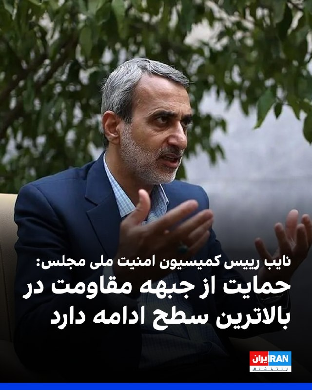

عباس مقتدایی، نایب رییس کمیسیون امنیت ملی مجلس شورای اسلامی، در گفت‌وگو با روز پلاس گفت هماهنگی برای حمایت از هم‌پیمانان «جبهه مقاومت» در بالاترین سطح وجود دارد و آنچه رییس مجلس مطرح کرده، نشان‌دهنده اراده‌ای گسترده برای حمایت از لبنان است.

او افزود کشورهای متخاصم می‌دانند اگر تهران اراده کند اقدامی انجام دهد، آن اقدام محقق می‌شود.
مقتدایی افزود «تنبیه متجاوز»، مقابله با اسرائیل و متوقف کردن دشمنان در همه جوانب به عنوان یک اصل در حال پیگیری است و جمهوری اسلامی در موضع قدرت منطقه‌ای برای حراست از مجموعه مقاومت عزم جدی دارد.
‌🏁 🇬🇧 IranintlTV

🤖 @VahidOOnLine

## DEJradio — post 5316

  <a href="telegram/content/DEJradio_5316_1780567465.webm" target="_blank">🎬 Download video</a>

🔺📷 یخچال خالی نظامی‌ها؛ هشدار درباره ناکافی بودن جیره و مواجب سرکوبگران

#سرکوبگران #بودجه
@DEJradio

## IranIntlTV — post 340486

  <a href="telegram/content/IranIntlTV_340486_1780567465.mp4" target="_blank">🎬 Download video</a>

روزنامه گاردین در گزارشی با استناد به روایت بازداشت‌شدگان، خانواده‌ها و نهادهای حقوق بشری در ایران از ضرب‌وجرح شدید، محرومیت از غذا و درمان، شکنجه و مرگ در بازداشتگاه‌ها و زندان‌های جمهوری اسلامی خبر داده است.

علیرضا محبی، خبرنگار ایران‌اینترنشنال، گزارش می‌دهد
@iranintltv

## IranIntlTV — post 340485

  

عباس مقتدایی، نایب رییس کمیسیون امنیت ملی مجلس شورای اسلامی، در گفت‌وگو با روز پلاس گفت هماهنگی برای حمایت از هم‌پیمانان «جبهه مقاومت» در بالاترین سطح وجود دارد و آنچه رییس مجلس مطرح کرده، نشان‌دهنده اراده‌ای گسترده برای حمایت از لبنان است.

او افزود کشورهای متخاصم می‌دانند اگر تهران اراده کند اقدامی انجام دهد، آن اقدام محقق می‌شود.
مقتدایی افزود «تنبیه متجاوز»، مقابله با اسرائیل و متوقف کردن دشمنان در همه جوانب به عنوان یک اصل در حال پیگیری است و جمهوری اسلامی در موضع قدرت منطقه‌ای برای حراست از مجموعه مقاومت عزم جدی دارد.
https://iranintl.com/202606040941

## BBCPersian — post 282842

  <a href="telegram/content/BBCPersian_282842_1780567468.mp4" target="_blank">🎬 Download video</a>

تصاویری از حمله خرس به مردی در کارخانه فولاد فوکوشیما در ژاپن منتشر شده است. امدادگران سازمان اورژانس فوکوشیما در پی تماسی که از حمله خرس به چندین نفر از کارکنان کارخانه فولاد خبر می‌داد، به منطقه‌ای مسکونی در ناحیه ساساکینو این شهر اعزام شدند.

در ژاپن دو نوع خرس وجود دارد؛ خرس‌های سیاه آسیایی و خرس‌های قهوه‌ای بزرگ‌تر که در جزیره هوکایدو یافت می‌شوند. در سال ۲۰۲۵، تعداد افرادی که در این کشور بر اثر حمله خرس‌ها کشته شدند به بالاترین میزان ثبت‌شده رسید.

@BBCPersian
https://bbc.in/4fl2BSy

## Hranews — post 113378

  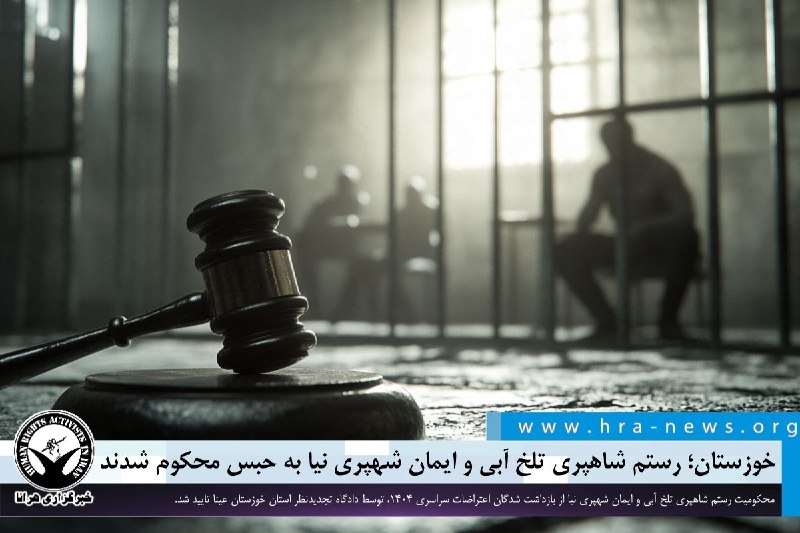

اعتراضات ۱۴۰۴؛ رستم شاهپری تلخ آبی و ایمان شهپری نیا به حبس محکوم شدند

❗️
❗️
❗️
❗️
❗️– محکومیت رستم شاهپری تلخ آبی و ایمان شهپری نیا، از بازداشت شدگان اعتراضات سراسری ۱۴۰۴، توسط دادگاه تجدیدنظر استان خوزستان عینا تایید شد. این افراد در یک پرونده مشترک توسط شعبه اول دادگاه انقلاب اهواز هر یک به دو سال حبس و مجازاتهای تکمیلی محکوم شده بودند.

به گزارش خبرگزاری هرانا، ارگان خبری مجموعه فعالان حقوق بشر در ایران، رستم شاهپری تلخ آبی و ایمان شهپری نیا، به حبس و مجازاتهای تکمیلی محکوم شدند.

بر اساس حکمی که اخیراً توسط شعبه ۱۴ دادگاه تجدیدنظر استان خوزستان صادر شده، آقایان شاهپری تلخ آبی و شهپری نیا، از بابت اتهام اخلال در نظم عمومی با استناد به تبصره ماده ۲۶۸ قانون مجازات اسلامی هر یک به دو سال حبس، دو سال منع خروج از کشور و یک سال حضور در ستاد امر به معروف و نهی از منکر محکوم شده‌اند.

ادامه مطلب

#رستم_شاهپری_تلخ‌آبی #ایمان_شهپری‌نیا #اعتراضات_۱۴۰۴

↘️
@hranews_bot تماس ✉️ - @Hranews کانال هرانا 🆑

## alonews — post 125030

  <a href="telegram/content/alonews_125030_1780567469.webm" target="_blank">🎬 Download video</a>

👈آموزش و پرورش: اعلام برنامه امتحانات نهایی کذب است

✅ @AloNews خبر جنگ

---
📅 بروزرسانی: 1405/03/14 13:24
---

## DW_Farsi — post 125479

  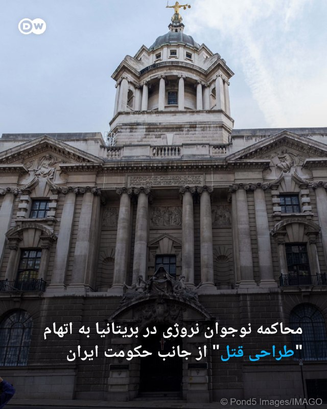

🔶 محاکمه نوجوان نروژی در بریتانیا به اتهام "طراحی قتل" از جانب حکومت ایران

دادستان‌های بریتانیایی در جریان محاکمه یک نوجوان نروژی در دادگاهی در لندن اعلام کردند که او سال گذشته از طرف یک گروه تبهکار سوئدی مرتبط با ایران در ازای دریافت پول، برای انجام یک قتل سفارشی به بریتانیا سفر کرده بود.

به گفته دادستان پرونده، یوهانس ناتلند ۱۹ ساله از سوی شبکه‌ تبهکار "فاکس‌ترات" جذب شده و موافقت کرده بود تا در قبال دریافت پول برای انجام "یک ترور" به بریتانیا بیاید.

ناتلند مارس ۲۰۲۵ در اتاق هتلی در هادرزفیلد در شمال انگلستان بازداشت شد. او در هنگام بازداشت، دو قبضه سلاح گرم و مهمات همراه داشت.

این نوجوان نروژی اتهام توطئه برای قتل یک فرد ناشناس را رد کرده است. با این حال، دادستان به هیات منصفه گفت او پیش‌تر در ماه اکتبر به نگهداری یک تپانچه نیمه‌خودکار، یک رولور و مهمات جنگی اعتراف کرده بود.

دادستان همچنین گفت هنوز مشخص نیست هدف نهایی این قتل چه کسی بوده، اما بر اساس پیام‌ها و نیز حرف‌هایی که متهم پیش از سفر به بریتانیا به دوستانش در نروژ زده بود، روشن است که او قصد انجام قتل را داشته است.

رسیدگی به این پرونده همچنان ادامه دارد.

@dw_farsi

## RadioFarda — post 157887

هشدار مجدد در مورد پرهیز از اختلاف در بیانیه منسوب به مجتبی خامنه‌ای

🔸در مراسم حکومتی سالگرد مرگ روح‌الله خمینی در تهران، پیامی منسوب به مجتبی خامنه‌ای خوانده شد که در آن بار دیگر بر لزوم پرهیز از اختلاف و حفظ وحدت تأکیده است.

🔸در این پیام که محمدجواد حاج‌علی‌اکبری، امام جمعه تهران، روز پنجشنبه ۱۴ خرداد خواند، رهبر جمهوری اسلامی‌ آمریکا و اسرائیل را به «جنگ ترکیبی» با ایران متهم کرد و گفت این جنگ «بر دو نقطه متمرکز است؛ یکی تاب‌آوری مردم و دیگری ایجاد اخلال در دستگاه محاسباتی مسئولان کشور».

🔸مجتبی خامنه‌ای همچنین هرگونه اقدامی که به‌گفتهٔ او «موجب بدبینی و سرخوردگی» شود را «کمک به دشمن» خواند و خواستار «حفظ وحدت و انسجام و اعتماد متقابل» مردم و مسئولان نظام شد.

🔸مجتبی خامنه‌ای هفتهٔ گذشته نیز به تمام کسانی که آن‌ها را «جان‌فدایانی که دل‌شان برای اسلام و انقلاب یا استقلال و سربلندی ایران می‌تپد» نامیده، هشدار داده بود که «اختلافات غیرموجه و حتی موجه را به تنازع و تفرقه تبدیل نکنند».

🔸از زمان اعلام نام مجتبی خامنه‌ای، به عنوان سومین رهبر جمهوری اسلامی، تصویر یا صدایی از او منتشر نشده و رسانه‌های ایران فقط پیام‌های کتبی از او منتشر می‌کنند.

🔸مراسم سالگرد مرگ روح‌الله خمینی که هر سال ۱۴ خرداد با سخنرانی رهبر جمهوری اسلامی و با حضور پرشمار مقامات و فرماندهان ارشد نظامی برگزار می‌شد، امسال به‌صورت خیلی محدود و بدون حضور مقامات نظام برگزار شد.

@RadioFarda

## BBCPersian — post 282841

🔻پیام کتبی مجتبی خامنه‌ای در مراسم سالگرد درگذشت روح‌الله خمینی: دشمن شکست خورده است

بر خلاف ۳۶ سال گذشته،‌ که علی خامنه‌ای رهبر سابق جمهور اسلامی در مراسم سالگرد مرگ بنیان‌گذار جمهوری اسلامی سخنرانی می‌کرد امسال فقط متنی از سوی مجتبی خامنه‌ای توسط محمدجواد حاج‌علی‌اکبری، امام جمعه موقت تهران قرائت شد.

در این پیام آمده: «دشمن در مصاف با فرزندان دلاور شما در نیروهای مسلح دچار شکست شده،‌ و بخصوص به خاطر مواجهه با ضربه قاطع چه در نبرد نظامی و چه در میدان و خیابان، تحقیری پر معنا و عمیق را تجربه می‌کند.»

در ادامه این پیام گفته شد که «دشمن جنگ ترکیبی خود را بر دو نقطه متمرکز کرده است: یکی تاب آوری مردم و دیگری ایجاد خطا در دستگاه محاسباتی مسئولان کشور.»

از قول مجتبی خامنه‌ای نقل شد که ابزار اصلی «دشمن» ایجاد «بدگمانی و اختلاف است» و رهبر جمهوری اسلامی از همه خواست که با «ایستادگی و حفظ وحدت و انسجام و اعتماد متقابل نقشه دشمن را خنثی کنند.»

«در این مقام، نقش مسئولان در پشتیبانی از این امور بسیار مهم است. هرگونه اقدامی که موجب بدبینی و سرخوردگی آحاد مردم شود، نوعی کمک به دشمن این کشور و مردمانش محسوب می‌گردد.»

مجتبی خامنه‌ای، رهبر جمهوری اسلامی ایران از زمان حمله آمریکا و اسرائیل در انظارعمومی ظاهر نشده و فقط از سوی او پیام‌های کتبی منتسب به او خوانده شده است.

https://bbc.in/4vnSIYY
@BBCPersian

## alonews — post 125029

  <a href="telegram/content/alonews_125029_1780566857.webm" target="_blank">🎬 Download video</a>

👈شبکه ۱۴ اسرائیل : کابینه امنیتی اسرائیل امشب جلسه تشکیل میده

✅ @AloNews خبر جنگ

---
📅 بروزرسانی: 1405/03/14 13:14
---

## VahidOOnLine — post 243642

🗣روایت شما از بحران اقتصادی و زندگی در آتش‌بس- پنج‌شنبه ۱۴ خرداد:

🔹از گلستان پیام می‌دم، ۳۲ هستم و معلولیت دارم، از این گرونی خسته شدم، هیچی نداریم بخوریم، درآمدی نیست.

🔹بیشترین حقوقی که به من جوان ۲۱ ساله پیشنهاد می‌دهند، ۱۵ میلیون تومان است. بدنساز حرفه‌ای بودم اما به‌خاطر یک مصدومیت ساده مجبور شدم ورزش را کنار بگذارم. از بس هزینه درمان بالا رفته دندون پزشکی هم نمی‌توانم بروم. وقتی جایی از بدنم درد می‌گیرد، ترس کل وجودم را فرا می‌گیرد...

🔹پوست و ضایعات مرغ کیلویی ۱۰۰ هزار تومان، اسکلت مرغ ۱۸۰ هزار، سنگدان ۲۸۰ هزار و پای مرغ ۱۵۰ هزار تومان شده است. حتی غذا دادن به گربه‌های خیابانی هم سخت شده. اگر پولی بماند به آنها نان و ماست می‌دهیم، اما یک ظرف کوچک ماست هم حدود ۲۰۰ هزار تومان قیمت دارد.

🔹من بازنشسته تامین اجتماعی هستم الان سه ماه از سال گذشته هنوز افزایش حقوق سال ۱۴۰۵ را ندادند. ۱۳ خرداد پیام آمد که بانک مرکزی بودجه ندارد و این افزایش، شاید برای ماه بعد اعمال شود.

🔹بازنشسته تامین‌اجتماعی هستم، دو ماه ابتدایی سال مانند سال قبل حقوق گرفتم. این ماه قرار بود افزایش بدن ولی مثل اینکه به‌خاطر برداشت ۵۰ هزار میلیارد تومان از صندوق تامین‌اجتماعی توسط بانک مرکزی، این ماه هم واریزی مثل سال قبل خواهد بود.

🔹از مازندران پیام می‌دهم و شغلم سیستم سرمایشی است. کپسول گاز ۱۳ کیلوایی R۴۱۰ را قبل عید می‌خریدیم ۱۵ میلیون تومان، الان باید شده ۴۵ میلیون. نمی‌دانم باید کیلویی چقد بزنم که مشتری از افزایش قیمت خدمات، ناراضی نشود.

🔹من یک هنرجوی رشته فنی حرفه‌ای هستم و در مدرسه غیرانتفاعی درس می‌خونم. شهریه مدرسه دو سال پیش ۲۰ میلیون تومن بود سال پیش به ۴۰ تومن رسید و امسال شده ۷۰ میلیون تومن. خانواده‌ام دیگر پول ندارند که در این مدرسه نام‌نویسی کنم.
‌🏁 🇬🇧 IranintlTV

🤖 @VahidOOnLine

## WithYashar — post 13476

کانال ۱۳ اسرائیل: «کابینه امنیتی اسرائیل امشب ساعت ۱۷:۰۰ تشکیل جلسه خواهد داد»
@withyashar

## IranIntlTV — post 340484

🗣روایت شما از بحران اقتصادی و زندگی در آتش‌بس- پنج‌شنبه ۱۴ خرداد:

🔹از گلستان پیام می‌دم، ۳۲ ساله هستم و معلولیت دارم، از این گرونی خسته شدم، هیچی نداریم بخوریم، درآمدی نیست.

🔹بیشترین حقوقی که به من جوان ۲۱ ساله پیشنهاد می‌دهند، ۱۵ میلیون تومان است. بدنساز حرفه‌ای بودم اما به‌خاطر یک مصدومیت ساده مجبور شدم ورزش را کنار بگذارم. از بس هزینه درمان بالا رفته دندون پزشکی هم نمی‌توانم بروم. وقتی جایی از بدنم درد می‌گیرد، ترس کل وجودم را فرا می‌گیرد...

🔹پوست و ضایعات مرغ کیلویی ۱۰۰ هزار تومان، اسکلت مرغ ۱۸۰ هزار، سنگدان ۲۸۰ هزار و پای مرغ ۱۵۰ هزار تومان شده است. حتی غذا دادن به گربه‌های خیابانی هم سخت شده. اگر پولی بماند به آنها نان و ماست می‌دهیم، اما یک ظرف کوچک ماست هم حدود ۲۰۰ هزار تومان قیمت دارد.

🔹من بازنشسته تامین اجتماعی هستم الان سه ماه از سال گذشته هنوز افزایش حقوق سال ۱۴۰۵ را ندادند. ۱۳ خرداد پیام آمد که بانک مرکزی بودجه ندارد و این افزایش، شاید برای ماه بعد اعمال شود.

🔹بازنشسته تامین‌اجتماعی هستم، دو ماه ابتدایی سال مانند سال قبل حقوق گرفتم. این ماه قرار بود افزایش بدن ولی مثل اینکه به‌خاطر برداشت ۵۰ هزار میلیارد تومان از صندوق تامین‌اجتماعی توسط بانک مرکزی، این ماه هم واریزی مثل سال قبل خواهد بود.

🔹از مازندران پیام می‌دهم و شغلم سیستم سرمایشی است. کپسول گاز ۱۳ کیلوایی R۴۱۰ را قبل عید می‌خریدیم ۱۵ میلیون تومان، الان باید شده ۴۵ میلیون. نمی‌دانم باید کیلویی چقد بزنم که مشتری از افزایش قیمت خدمات، ناراضی نشود.

🔹من یک هنرجوی رشته فنی حرفه‌ای هستم و در مدرسه غیرانتفاعی درس می‌خونم. شهریه مدرسه دو سال پیش ۲۰ میلیون تومن بود سال پیش به ۴۰ تومن رسید و امسال شده ۷۰ میلیون تومن. خانواده‌ام دیگر پول ندارند که در این مدرسه نام‌نویسی کنم.

## DW_Farsi — post 125478

🔶 آلمان کرسی شورای امنیت سازمان ملل را به دست نیاورد

آلمان در کسب یک کرسی به عنوان عضو غیردائم در شورای امنیت سازمان ملل شکست خورد. آنالنا بربوک، رئیس مجمع عمومی سازمان ملل و وزیر خارجه پیشین آلمان اعلام کرد که در جریان رای‌گیری در نیویورک، آلمان در همان دور نخست از پرتغال و اتریش عقب ماند.

آلمان ۱۰۴ رای به دست آورد، در حالی که برای کسب اکثریت دوسوم به ۱۲۷ رای نیاز داشت. پرتغال ۱۳۴ رای و اتریش ۱۳۱ رای کسب کردند. در مجموع ۱۹۳ کشور عضو سازمان ملل هستند. افغانستان و وزنزئلا فعلا حق رای ندارند.

این ناکامی ضربه‌ای دیپلماتیک برای فریدریش مرتس، صدراعظم و یوهان واده‌فول وزیر خارجه‌ بود که امید داشتند با حضور آلمان در شورای امنیت، این کشور را نسبت به سال‌های گذشته به یک بازیگر کلیدی‌تر در عرصه بین‌الملل به ویژه در حل بحران‌هایی مانند جنگ اوکراین یا آینده غزه تبدیل کنند.

واده‌فول در آستانه رای‌گیری، به دلیل رقابت نزدیک و پرتنش تلاش کرده بود تا رای‌دهندگان مردد را متقاعد کند اما این تلاش‌ها موفقیت‌آمیز نبود.

@dw_farsi

## RadioFarda — post 157886

مرجان ساتراپی، نویسنده و فیلمساز، در ۵۶ سالگی درگذشت

🔸مرجان ساتراپی، نویسنده و فیلمساز برجسته ایرانی فرانسوی و خالق رمان مصور پرسپولیس، در ۵۶ سالگی درگذشت.

🔸خانواده مرجان ساتراپی که با همین رمان و فیلم آن به شهرت جهانی رسید، روز پنج‌شنبه، ۱۴ خردادماه، اعلام کردند که او در ۵۶ سالگی درگذشته است.

🔸ساتراپی در اول آذرماه سال ۱۳۴۸ در شهر رشت متولد شده بود.

🔸خانواده او در بیانیه‌ای به خبرگزاری فرانسه گفتند: «مرجان ساتراپی کمی بیش از یک سال پس از مرگ ماتیاس ریپا، همسر و عشق زندگی‌اش، از شدت اندوه درگذشت.»

🔸همسر مرجان ساتراپی ماتیاس ریپا، تهیه‌کننده، بازیگر و فیلمنامه‌نویس که اصلا سوئدی بود، در ۸ آوریل ۲۰۲۵ درگذشت.

🔸ساتراپی اخیرا در چند پیام اینستاگرامی نوشته بود که «چون من عشق زندگی‌ام را از دست دادم».

🔸رمان مصور و بعدا فیلم انیمیشن «پرسپولیس» که بر اساس زندگی شخصی خانم ساتراپی پیش از ترک ایران و سپس زندگی در اتریش و فرانسه نوشته شده است، برنده جایزه بزرگ منتقدان فیلم در جشنواره کن سال ۲۰۰۷ و جایزهٔ سزار بهترین فیلمنامه اقتباسی در سال ۲۰۰۸ شد.

https://www.radiofarda.com/a//33772435.html

@RadioFarda

## IranianMinds — post 21357

  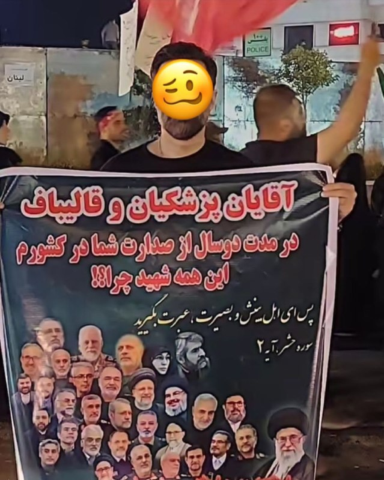

چرا خب واقعا 😔 ؟؟

@IranianMinds

## alonews — post 125028

  <a href="telegram/content/alonews_125028_1780566253.webm" target="_blank">🎬 Download video</a>

👈آکسیوس به نقل از دو مقام ارشد آمریکایی: در حالی که ترامپ می‌خواهد جنگ در لبنان را پایان دهد، به نظر می‌رسد نتانیاهو می‌خواهد آن را از سر بگیرد

✅ @AloNews خبر جنگ

## alonews — post 125027

  <a href="telegram/content/alonews_125027_1780566253.webm" target="_blank">🎬 Download video</a>

👈ادعای العربیه: مذاکرات پیرامون دستیابی به توافق برای آزادسازی بخشی از دارایی‌های مسدود شده ایران به مراحل پایانی خود نزدیک شده

🔴 رایزنی‌های فشرده درباره نحوه و سازوکار آزادشدن این دارایی‌ها همچنان ادامه دارد

🔴اصلی‌ترین گره و مانع کنونی در مسیر مذاکرات، به سازوکار و چگونگی مدیریت و استفاده از این اموال آزاد شده بازمی‌گردد

🔴 پیشنهادی مبنی بر تشکیل یک «صندوق ویژه» جهت واریز و نگهداری دارایی‌های آزاد شده ایران تحت نظارت مشخص، روی میز مذاکره قرار گرفته و در حال بررسی است.

✅ @AloNews خبر جنگ

## alonews — post 125024

  <a href="telegram/content/alonews_125024_1780566253.webm" target="_blank">🎬 Download video</a>

👈جنگنده‌های اسرائیلی حملات هوایی به تبنین و نبطیه الفوقا در جنوب لبنان انجام داده‌اند.

✅ @AloNews خبر جنگ

---
📅 بروزرسانی: 1405/03/14 13:04
---

## VahidOOnLine — post 243641

  <a href="telegram/content/VahidOOnLine_243641_1780565660.mp4" target="_blank">🎬 Download video</a>

ویدیوی ارسالی به ایران اینترنشنال نشان‌دهنده برگزاری یک تجمع شبانه حکومتی در کرج است. فرستنده ویدیو در پیام خود گفت که حامیان حکومت در بلوار «امام‌زاده حسن» از ساعت ۶ صبح تا ۱۰:۳۰ شب با بستن خیابان و ایجاد آلودگی صوتی مزاحم ساکنان منطقه شدند و افزود: «ارزشی‌ها مسیر نیم‌ساعته را به سه ساعت رساندند.»
‌🏁 🇬🇧 IranintlTV

🤖 @VahidOOnLine

## IranIntlTV — post 340483

  <a href="telegram/content/IranIntlTV_340483_1780565662.mp4" target="_blank">🎬 Download video</a>

ویدیوی ارسالی به ایران اینترنشنال نشان‌دهنده برگزاری یک تجمع شبانه حکومتی در کرج است. فرستنده ویدیو در پیام خود گفت که حامیان حکومت در بلوار «امام‌زاده حسن» از ساعت ۶ صبح تا ۱۰:۳۰ شب با بستن خیابان و ایجاد آلودگی صوتی مزاحم ساکنان منطقه شدند و افزود: «ارزشی‌ها مسیر نیم‌ساعته را به سه ساعت رساندند.»

## IranIntlTV — post 340482

  <a href="telegram/content/IranIntlTV_340482_1780565663.mp4" target="_blank">🎬 Download video</a>

در آستانه برگزاری مسابقات جام جهانی، کانادا برای میزبانی از تیم‌های ملی آماده شده است. مهسا مرتضوی، خبرنگار ایران‌اینترنشنال، از حال‌وهوای این کشور در آستانه برگزاری این مسابقات گزارش می‌دهد
@iranintltv

## IranIntlTV — post 340481

  <a href="telegram/content/IranIntlTV_340481_1780565665.mp4" target="_blank">🎬 Download video</a>

مرتضی کاظمیان، عضو تحریریه ایران‌اینترنشنال، می‌گوید دونالد ترامپ از نظر نظامی توان وارد کردن ضربه‌ای تعیین‌کننده به جمهوری اسلامی را دارد، اما با توجه به مخالفتش با مداخله زمینی، به دنبال تحقق اهداف خود از طریق افزایش فشارها و محاصره دریایی است. به گفته او، هدف اصلی این رویکرد، از بین بردن توانایی هسته‌ای جمهوری اسلامی است.
@iranintltv

## IranianMinds — post 21355

  <a href="telegram/content/IranianMinds_21355_1780565667.mp4" target="_blank">🎬 Download video</a>

اکانت اسرائیل به فارسی:

شهروندان در گلشهر کرج، اطلاعیه‌ای با عنوان «مفقودی» برای رهبر مفقودالاثر جمهوری اسلامی نصب کرده‌اند😂😂😂😂😂

@IranianMinds

## BBCPersian — post 282840

🔻بیمه مرکزی ایران: ۱۴۳۰ میلیارد تومان خسارت به صاحبان خودروهای آسیب‌دیده در جنگ پرداخت شد

بیمه مرکزی ایران اعلام کرد که تاکنون خسارت ۱۷ هزار پرونده مربوط به خودروهای آسیب‌دیده در حملات آمریکا و اسرائیل به ایران و جنگ ۱۲ روزه با اعتباری بالغ بر ۱۴۳۰ میلیارد تومان به مالکان پرداخت شده است.

پیش از این اعلام شده بود که در مجموع حدود ۳۰ هزار خودرو در جریان این دو جنگ آسیب دیده‌اند.

موسی رضایی میرقائد، رئیس بیمه مرکزی ایران اوایل این هفته گفته بود «در حوزه هواپیما و کشتی» هم پرداخت‌های علی‌الحساب به زودی آغاز خواهد شد.

https://bbc.in/3Qj3dhm
@BBCPersian

## alonews — post 125020

  <a href="telegram/content/alonews_125020_1780565669.mp4" target="_blank">🎬 Download video</a>

👈 درگیری‌ها بین نیروهای دولت فدرال و واحدهای امنیتی وفادار به رئیس‌جمهور حسن شیخ محمود و نخست‌وزیر سابق حسن علی خیر در طول شب در موگادیشو، سومالی ادامه داشت.

✅ @AloNews خبر جنگ

---
📅 بروزرسانی: 1405/03/14 12:53
---

## VahidOOnLine — post 243640

  

♦️مجتبی خامنه‌ای، سومین رهبر جمهوری اسلامی، روز پنجشنبه ۱۴ خرداد با ارسال پیامی به مراسم سی‌وهفتمین سالگرد مرگ خمینی، به مردم و مسئولان نظام هشدار داد که دشمن در پی ایجاد فشار، تفرقه و خطای محاسباتی در میان آن‌ها است.

پیام مجتبی خامنه‌ای را محمدجواد حاج‌علی‌اکبری، یکی از امامان جمعه تهران در مراسم روح‌الله خمینی قرائت کرد. از زمان انتصاب مجتبی خامنه‌ای به رهبری جمهوری اسلامی، هیچ صداوتصویری از او منتشر نشده است.

سومین رهبر جمهوری اسلامی در این پیام و با ستایش از خمینی و علی خامنه‌ای، مدعی شکست دشمن در جنگ اخیر با نیروهای مسلح و طرفداران حکومت در «خیابان» شد و گفت که دشمن «کید [حیله] خود را در جنگ ترکیبی بر دو نقطه متمرکز ساخته است: یکی تاب آوری مردم، دیگری ایجاد خطا در دستگاه محاسباتی مسئولان کشور ابزار اصلی او در این هر دو کاشت بذر تردید یأس ترس، بدگمانی، و اختلاف است.»

این هشدار در حالی صادر می‌شود که گزارش‌های غیررسمی حاکی از بروز اختلاف در میان مقام‌ها عالی‌رتبه نظام است. گزارش‌هایی که رسما از طرف مقام‌ها تکذیب می‌شود.

مجتبی خامنه‌ای خطاب به مسئولان جمهوری اسلامی نوشت: «هرگونه اقدامی که موجب بدبینی و سرخوردگی آحاد مردم شود نوعی کمک به دشمن این کشور و مردمانش محسوب می‌گردد.»
‌🇸🇦 Indypersian

🤖 @VahidOOnLine

## VahidOOnLine — post 243639

  <a href="telegram/content/VahidOOnLine_243639_1780565040.mp4" target="_blank">🎬 Download video</a>

♦️در جریان دیدار سامیه سولوهو حسن، رئیس‌جمهوری تانزانیا، و هیئت همراه او با ولادیمیر پوتین در کرملین، لحظه‌ای کوتاه اما جالب توجه دوربین‌ها را به خود جلب کرد.
بر اساس ویدیوهای منتشرشده از این مراسم، پوتین متوجه شد کارت شناسایی یکی از وزیران تانزانیایی در گردن او پیچ خورده است و آن را مرتب کرد.
این اقدام قدرتمند‌ترین فرد روسیه، مورد توجه رسانه‌ها و کاربران شبکه‌های اجتماعی قرار گرفت.
رئیس‌جمهوری تانزانیا برای سفری سه‌روزه به روسیه رفته است.
‌🇸🇦 Indypersian

🤖 @VahidOOnLine

## VahidOOnLine — post 243631

  <a href="telegram/content/VahidOOnLine_243631_1780565042.mp4" target="_blank">🎬 Download video</a>

پاسخگویی فقط یک واژه سیاسی نیست؛ وجه تمایز «دولت» و «رژیم» است.
در جلسه استماع سنای آمریکا، مارکو روبیو درباره جنگ ایران، تنگه هرمز، تحریم‌ها و هزینه‌های سیاست دولت مورد پرسش قرار گرفت.
نکته مهم فقط پاسخ‌های او نبود؛ این بود که مجبور بود پاسخ بدهد. ورق بزنید.
‌🏁 🇬🇧 ManotoTV

🤖 @VahidOOnLine

## VahidOOnLine — post 243622

  <a href="telegram/content/VahidOOnLine_243622_1780565042.mp4" target="_blank">🎬 Download video</a>

آیا دولت بغداد می‌تواند انحصار سلاح را در دست بگیرد، یا حشدالشعبی همچنان به‌عنوان یک قدرت موازی باقی خواهد ماند؟

اعلام آمادگی برخی گروه‌های نزدیک به جمهوری اسلامی برای تحویل سلاح، در نگاه اول نشانه‌ای از تقویت اقتدار دولت عراق به نظر می‌رسد. اما مخالفت گروه‌های بانفوذی مانند کتائب حزب‌الله و جنبش نجبا نشان می‌دهد که مسیر خلع سلاح هنوز با موانع جدی روبه‌رو است.

پرسش اصلی فقط آینده حشدالشعبی نیست؛ بلکه آینده حاکمیت عراق است.

آیا تصمیم جنگ و صلح در بغداد گرفته خواهد شد یا همچنان در دست گروه‌های مسلح و شبکه‌های فراملی باقی می‌ماند؟

گزارشی درباره حشدالشعبی، نفوذ جمهوری اسلامی در عراق، و نبرد دولت بغداد برای بازپس‌گیری انحصار قدرت. ورق بزنید.
‌🏁 🇬🇧 ManotoTV

🤖 @VahidOOnLine

## WithYashar — post 13475

وال‌استریت ژورنال : آخرین پیشنهاد ارائه‌شده از سوی ایران نتوانسته رضایت کامل دولت ترامپ را جلب کند و هنوز اختلافات اساسی بر سر برنامه هسته‌ای، سرنوشت اورانیوم غنی‌شده، رفع تحریم‌ها و آزادسازی دارایی‌های ایران باقی مانده است.

وال‌استریت ژورنال تأکید می‌کند که تماس‌ها و تلاش‌های دیپلماتیک همچنان ادامه دارد ، ترامپ همچنان به دنبال توافقی است که از دید او برنامه هسته‌ای ایران را به‌طور مؤثر محدود یا برچیده کند. در مقابل، ایران خواهان امتیازهایی مانند آزاد شدن بخشی از دارایی‌های مسدودشده و کاهش فشارهای اقتصادی پیش از پذیرش محدودیت‌های گسترده‌تر است.
اما مذاکرات هنوز زنده است و کانال‌های ارتباطی بسته نشده‌اند.
@withyashar

## mwarmonitor — post 10129

  <a href="telegram/content/mwarmonitor_10129_1780565043.mp4" target="_blank">🎬 Download video</a>

🚫 ادعا: ایران امروز مدعی شد که ترمینال مسافربری فرودگاه بین‌المللی کویت را هدف قرار نداده و خسارت واردشده در واقع ناشی از اصابت یک موشک رهگیر آمریکایی بوده است. این ادعا کاملاً نادرست است. ✅ حقیقت: ایران عمداً و با برنامه‌ریزی قبلی فرودگاه غیرنظامی را با…

## pm_afshaa — post 92254

پروکسی متصل سرعت بالا

tg://proxy?server=213.133.102.106&port=443&secret=dd104462821249bd7ac519130220c25d09

💧 Rainbet.com the #1 Non-KYC Crypto Casino & Sportsbook @rainbetcom

😁 @Pm_Afshaa

## pm_afshaa — post 92253

  

جهت تبلیغات با بازدهی بالا دایرکت کانال پیام بدین

## IranIntlTV — post 340480

  

🔻روزنامه تلگراف در گزارشی به اتهام‌های جدید علیه فیفا در رابطه با فروش بلیت‌های جام جهانی پرداخت. فیفا متهم شده است که برای فروش بلیت‌های جام جهانی با قیمت ارزان‌تر، به‌طور مخفیانه از وب‌سایت‌های غیررسمی فروش مجدد استفاده می‌کند تا ناچار به بازپرداخت وجه به خریداران بلیت‌های گران‌قیمت نشود.

🔹این جنجال پس از آن ابعاد تازه‌ای یافت که دادستان‌های کل نیویورک و نیوجرسی برای این نهاد احضاریه صادر کردند. فلوریان ادرر، استاد اقتصاد دانشگاه بوستون، با انتشار نقشه صندلی‌های بازی عربستان و کیپ‌ورد، می‌گوید که بلوک‌های بزرگی از بلیت‌ها در سایت سیت‌گیک (SeatGeek) با قیمت ۲۰۰ دلار عرضه شده‌اند؛ یعنی کمتر از ۳۰ درصد قیمت ۷۰۰ دلاری آن‌ها در پلتفرم رسمی فیفا.

🔹او تاکید کرد که عرضه ناگهانی ردیف‌های کامل و متصل، رفتار هواداران یا دلالان عادی نیست، بلکه نشان‌دهنده ورود عمده موجودی بلیت‌ها از سوی برگزارکننده است. به گفته ادرر، فیفا با این ترفند، قیمت رسمی را بالا نگه می‌دارد تا از دردسرهای حقوقی با خریداران قبلی فرار کند و هم‌زمان صندلی‌های خالی را در بازار آب کند.

@iranintltvsport

## IranIntlTV — post 340479

  <a href="telegram/content/IranIntlTV_340479_1780565046.mp4" target="_blank">🎬 Download video</a>

بلومبرگ به نقل از داده‌های آژانس بین‌المللی انرژی اتمی گزارش داد ریسک گریز هسته‌ای جمهوری اسلامی برای ساخت بمب اتمی بیش از هر زمان دیگری افزایش یافته است

گفت‌وگو با احمد صمدی، خبرنگار ایران‌اینترنشنال
@iranintltv

## ManotoTV — post 105918

  <a href="telegram/content/ManotoTV_105918_1780565047.mp4" target="_blank">🎬 Download video</a>

پاسخگویی فقط یک واژه سیاسی نیست؛ وجه تمایز «دولت» و «رژیم» است.
در جلسه استماع سنای آمریکا، مارکو روبیو درباره جنگ ایران، تنگه هرمز، تحریم‌ها و هزینه‌های سیاست دولت مورد پرسش قرار گرفت.
نکته مهم فقط پاسخ‌های او نبود؛ این بود که مجبور بود پاسخ بدهد. ورق بزنید.

## ManotoTV — post 105909

  <a href="telegram/content/ManotoTV_105909_1780565048.mp4" target="_blank">🎬 Download video</a>

آیا دولت بغداد می‌تواند انحصار سلاح را در دست بگیرد، یا حشدالشعبی همچنان به‌عنوان یک قدرت موازی باقی خواهد ماند؟

اعلام آمادگی برخی گروه‌های نزدیک به جمهوری اسلامی برای تحویل سلاح، در نگاه اول نشانه‌ای از تقویت اقتدار دولت عراق به نظر می‌رسد. اما مخالفت گروه‌های بانفوذی مانند کتائب حزب‌الله و جنبش نجبا نشان می‌دهد که مسیر خلع سلاح هنوز با موانع جدی روبه‌رو است.

پرسش اصلی فقط آینده حشدالشعبی نیست؛ بلکه آینده حاکمیت عراق است.

آیا تصمیم جنگ و صلح در بغداد گرفته خواهد شد یا همچنان در دست گروه‌های مسلح و شبکه‌های فراملی باقی می‌ماند؟

گزارشی درباره حشدالشعبی، نفوذ جمهوری اسلامی در عراق، و نبرد دولت بغداد برای بازپس‌گیری انحصار قدرت. ورق بزنید.

## FarsiVOA — post 219551

  

مأموریت حافظ صلح سازمان ملل در لبنان (یونیفیل) اعلام کرد یک نیروی این نهاد بر اثر جراحات ناشی از اصابت گلوله‌های خمپاره به مواضع یونیفل در نزدیکی مرجعیون در جنوب‌شرقی لبنان، جان خود را از دست داده است.

در بیانیه یونیفل که پنجشنبه منتشر شد، مشخص نشده این گلوله‌ها از کجا شلیک شده‌اند.

این نیروی سازمان ملل اعلام کرد دو سرباز حافظ صلح دیگر نیز زخمی شده‌اند و تحقیقات درباره این حادثه را آغاز کرده است.

این بیانیه در شرایطی منتشر می‌شود که چهارشنبه توافق آتش‌بس در لبنان که با میانجیگری آمریکا به دست آمده، اعلام شد.
@FarsiVOA

## DW_Farsi — post 125477

🔶 جام ۲۰۱۸؛ لوکا مودریچ، کرایف بالکان و "سرکه" خلاق کرواسی

🔺 گزارشی از شهرام احدی

به نظر می‌رسد که هواداران تیم ملی فوتبال کرواسی نفسی راحت کشیده‌اند. سرمربی این تیم روز دوشنبه ۱۸ مه ۲۰۲۶ (۲۸ اردیبهشت) کادر بازیکنان خود برای حضور در جام جهانی فوتبال ۲۰۲۶ را اعلام کرد. در فهرست بازیکان یک نام همچنان می‌درخشد: لوکا مودریچ. ستاره و کاپیتان تیم ملی فوتبال کرواسی به این ترتیب برای پنجمین بار است که در بازی‌های جام جهانی حضور می‌یابد.

نخستین بازی مودریچ در تیم ملی بزرگسالان کرواسی به مارس ۲۰۰۶ میلادی برمی‌گردد. او که در آن زمان ۲۰ سال داشت برای حضور در جام جهانی آلمان دعوت شد. کرواسی در آن دوره از بازی‌ها که نخستین تجربه جام جهانی مودریچ بود، در همان مرحله گروهی مسابقات را وداع گفت.

کرواسی پس از غیبت در جام جهانی ۲۰۱۰ توانست بلیت حضور در دور نهایی جام جهانی ۲۰۱۴ برزیل را کسب کند، اما این بار نیز در همان مرحله گروهی از گردونه رقابت‌ها حذف شد.

@dw_farsi

## Dirty_Kids — post 390957

  

مامورای موساد قبلاً میکشتن، الان میکنن

@Dirty_Kids 👻

## Dirty_Kids — post 390956

  

🔴 اسرائیل مسئولیت تجاوز به شهبازی رو به عهده گرفت! همچنین اشاره کردن وقتی داشتن میکردنش زنشم حضور داشته!!!

@Dirty_Kids 👻

## alonews — post 125019

  <a href="telegram/content/alonews_125019_1780565049.webm" target="_blank">🎬 Download video</a>

👈فارس: فعلا آقا رو دفن نمیکنیم

✅ @AloNews خبر جنگ

## alonews — post 125018

  <a href="telegram/content/alonews_125018_1780565049.webm" target="_blank">🎬 Download video</a>

👈رادیوی ارتش اسرائیل: نتانیاهو دیروز یک جلسه امنیتی محدود برگزار کرد که در آن ارتش طرحی را برای یک عملیات نظامی گسترده در لبنان ارائه داد.

🔴در حالی که کاتس و بن گویر از اجرای این عملیات حمایت کردند، نتانیاهو به دلیل فشارهای آمریکایی نسبت به آن محافظه‌کاری نشان داد.

✅ @AloNews خبر جنگ

---
📅 بروزرسانی: 1405/03/14 12:43
---

## WithYashar — post 13474

وال استریت ژورنال: «ترامپ به مشاورانش گفته است که جنگ تمام‌عیار با ایران را از سر نخواهد گرفت، مگر اینکه نیروهای نظامی آمریکا کشته شوند.»
مقام‌ها می‌گویند حملات مکرر ایران فشار بر رئیس‌جمهور را افزایش داده و تردیدهایی درباره دوام بلندمدت آتش‌بس ایجاد کرده است.
@withyashar

## WithYashar — post 13473

انتقاد مارک لوین از تصمیمات جدید ترامپ:
جمهوری اسلامی شاید نیروی دریایی و نیروی هوایی قابل ‌اعتنایی نداشته باشد، اما همچنان سپاه پاسداران و یک رژیم ایدئولوژیک دارد که شکست نخورده است؛ ما ملت ایران را برای سرنگونی رژیم مسلح نکرده‌ایم. رژیم کماکان در حال شلیک موشک های بالستیک و پهپاد ها است و هنوز مشخص نیست این تبادل آتش بخشی از مذاکرات است یا نه؛ هرچند در نهایت، چنین مواردی قابل راستی‌آزمایی نخواهد بود.
به نظر میرسد ما از نابود شدن سازمان حزب‌الله لبنان ممانعت می‌کنیم؛ حزب‌الله، قدرتمندترین نیروی نیابتی رژیم ایران میباشد که در 40 سال گذشته آمریکایی‌ها را کشته است؛ همچنین حماس به جای خلع سلاح، در حال تجدید قوا است.
این وضعیت برای آینده و پس از پایان دولت ترامپ، نشانه خوبی نیست. من فکر نمی‌کنم چین کمونیست که بزرگترین تهدید برای ما است، تحت تأثیر قرار گرفته باشد.
@withyashar

## pm_afshaa — post 92252

مجتبی خامنه‌ای: هدف دشمن اینه فشار اقتصادی بیاره تا مردم ناامید بشن، مردم باید مقاومت کنن تا به قله برسیم

💧 Rainbet.com the #1 Non-KYC Crypto Casino & Sportsbook @rainbetcom

😁 @Pm_Afshaa

## pm_afshaa — post 92251

پروکسی متصل سرعت بالا

https://t.me/proxy?server=195.254.165.18&port=8443&secret=ee1603010200010001fc030386e24c3add646565707365656B2E636F6D

💧 Rainbet.com the #1 Non-KYC Crypto Casino & Sportsbook @rainbetcom

😁 @Pm_Afshaa

## pm_afshaa — post 92250

پروکسی متصل سرعت بالا

https://t.me/proxy?server=195.254.165.23&port=8443&secret=ee1603010200010001fc030386e24c3add646565707365656B2E636F6D

💧 Rainbet.com the #1 Non-KYC Crypto Casino & Sportsbook @rainbetcom

😁 @Pm_Afshaa

## pm_afshaa — post 92249

## FarsiVOA — post 219550

🔺افت تحویل نفت ایران به چین به پایین‌ترین سطح طی ۱۷ ماه گذشته

▪️آمارهای شرکت‌های ردیابی نفتکش‌ها نشان می‌دهد که تحویل روزانه نفت ایران به چین در ماه گذشته میلادی به ۱.۱ میلیون بشکه سقوط کرده که کمترین میزان طی ۱۷ ماه گذشته گذشته است.

▪️بارگیری نفت ایران نیز از زمان محاصره دریایی جمهوری اسلامی توسط آمریکا به روزانه ۳۰۰ هزار بشکه سقوط کرده و صادرات نفت از ایران به بازارهای خارجی نیز به شدت سقوط کرده و بین ۱۲۰ تا ۲۶۰ هزار بشکه در روز گزارش شده است.

▪️در این میان خبرگزاری رویترز گزارش داده است که عدم تمایل پالایشگاه‌های نفتی چین به خرید نفت گران باعث شده ایران دوباره تخفیف‌های نفتی به مشتریان چینی را از سر بگیرد.

⬇️ بیشتر بخوانید:
https://ir.voanews.com/a/8157242.html

## Hranews — post 113377

صدور ۸۰۶ فقره مجازات جایگزین حبس با هدف تجهیز مدارس در زنجان

❗️
❗️
❗️
❗️
❗️– رئیس کل دادگستری استان زنجان از صدور ۸۰۶ حکم #جایگزین_حبس در سال گذشته خبر داد. به گفته وی، اجرای این احکام ضمن جلوگیری از زندانی شدن محکومان، منجر به اختصاص ۱۱ میلیارد تومان برای هوشمندسازی و تجهیز مدارس استان شده است.

ادامه مطلب

↘️
@hranews_bot تماس ✉️ - @Hranews کانال هرانا 🆑

## manototv — post 105918

  <a href="telegram/content/manototv_105918_1780564430.mp4" target="_blank">🎬 Download video</a>

پاسخگویی فقط یک واژه سیاسی نیست؛ وجه تمایز «دولت» و «رژیم» است.
در جلسه استماع سنای آمریکا، مارکو روبیو درباره جنگ ایران، تنگه هرمز، تحریم‌ها و هزینه‌های سیاست دولت مورد پرسش قرار گرفت.
نکته مهم فقط پاسخ‌های او نبود؛ این بود که مجبور بود پاسخ بدهد. ورق بزنید.

## manototv — post 105909

  <a href="telegram/content/manototv_105909_1780564431.mp4" target="_blank">🎬 Download video</a>

آیا دولت بغداد می‌تواند انحصار سلاح را در دست بگیرد، یا حشدالشعبی همچنان به‌عنوان یک قدرت موازی باقی خواهد ماند؟

اعلام آمادگی برخی گروه‌های نزدیک به جمهوری اسلامی برای تحویل سلاح، در نگاه اول نشانه‌ای از تقویت اقتدار دولت عراق به نظر می‌رسد. اما مخالفت گروه‌های بانفوذی مانند کتائب حزب‌الله و جنبش نجبا نشان می‌دهد که مسیر خلع سلاح هنوز با موانع جدی روبه‌رو است.

پرسش اصلی فقط آینده حشدالشعبی نیست؛ بلکه آینده حاکمیت عراق است.

آیا تصمیم جنگ و صلح در بغداد گرفته خواهد شد یا همچنان در دست گروه‌های مسلح و شبکه‌های فراملی باقی می‌ماند؟

گزارشی درباره حشدالشعبی، نفوذ جمهوری اسلامی در عراق، و نبرد دولت بغداد برای بازپس‌گیری انحصار قدرت. ورق بزنید.

## alonews — post 125016

  <a href="telegram/content/alonews_125016_1780564431.mp4" target="_blank">🎬 Download video</a>

👈سناتور جان فتترمن: من همیشه به هر چیزی که اسرائیل نیاز داشته باشد، چه نظامی، مالی یا اطلاعاتی، رای خواهم داد.

🔴می‌دانید، آنها یک معجزه هستند و نمونه‌ای از دموکراسی و ارزش‌هایی هستند که ما در کشورمان و در کل آن منطقه زندگی می‌کنیم.

✅ @AloNews خبر جنگ

## alonews — post 125015

  <a href="telegram/content/alonews_125015_1780564433.webm" target="_blank">🎬 Download video</a>

👈آژانس بین‌المللی انرژی اتمی (IAEA):
آژانس بین‌المللی انرژی اتمی توسط نیروگاه هسته‌ای زاپوریژژیا (ZNPP) مطلع شده است که نیروگاه حرارتی زاپوریژژیا (ZTPP) که سوییچ‌یارد آن به تأمین برق ZNPP کمک می‌کند، امروز صبح تحت حمله سنگینی قرار گرفته است.

🔴تیم آژانس در ZNPP دود کم‌نوری را از سمت ZTPP مشاهده کرده و صدای فعالیت‌های نظامی را شنیده است.

🔴فعلاً خط برق هنوز متصل است. کارکنان ZTPP به دلیل حمله در حال پناه‌گیری هستند، طبق اطلاعات موجود

✅ @AloNews خبر جنگ

## alonews — post 125012

  <a href="telegram/content/alonews_125012_1780564433.webm" target="_blank">🎬 Download video</a>

👈 جنگنده‌های اسرائیلی همچنان جنوب لبنان را بمباران می‌کنند.

✅ @AloNews خبر جنگ

---
📅 بروزرسانی: 1405/03/14 12:34
---

## WithYashar — post 13472

  <a href="telegram/content/WithYashar_13472_1780563862.mp4" target="_blank">🎬 Download video</a>

مجری نیویورک پست: آیا آیت‌الله (مجتبی خامنه‌ای) همجنسگرا است

ترامپ: بله.

مجری: واقعا

دونالد ترامپ: بله، و فکر میکنم خیلی احترام براش قائل هستند.
@withyashar

## DEJradio — post 5315

  <a href="telegram/content/DEJradio_5315_1780563864.mp4" target="_blank">🎬 Download video</a>

🔺🎥 کرج؛ اطلاعیه مفقودی مجتبی خامنه‌ای

در خیابان‌های کرج اطلاعیه‌ای به در و دیوار نصب شده که در آن اعلام شده مجتبی خامنه‌ای مفقود شده است و یابنده خواسته شده او را پیدا کنند و یک میلیون تومان پاداش بگیرند.

#مفقودی #موشتبا
@DEJradio

## FarsiVOA — post 219549

  

وزارت کشور بحرین از بازداشت ۱۵ نفر به اتهام ارتباط با سپاه پاسداران خبر داد.

الشرق الأوسط به نقل از این وزارتخانه اعلام کرد که تحقیقات و گزارش‌های امنیتی نشان می‌دهد «بازداشت‌شدگان مسئول اجرای دستورهای تحریک‌آمیز» بوده‌اند.

این افراد به تلاش برای تأثیرگذاری بر شهروندان، با هدف کشاندن آن‌ها به فعالیت‌هایی که طبق قانون جرم محسوب می‌شود، متهم هستند.

پیشتر دادگاه جنایی بحرین، یک زن را به اتهام همکاری با سپاه، ارسال اطلاعات حساس درباره مراکز امنیتی و کشوری بحرین، و اقدام خصمانه علیه این کشور، به حبس ابد محکوم کرده بود.
@FarsiVOA

## Dirty_Kids — post 390955

دوستان تراپی خیلی گرون شده
لطفاً ازین به بعد فقط آسیب جسمی وارد کنید ممنون.

@Dirty_Kids 👻

## alonews — post 125011

  <a href="telegram/content/alonews_125011_1780563868.webm" target="_blank">🎬 Download video</a>

👈رادیوی ارتش اسرائیل: پهپادی که حزب‌الله پرتاب کرده بود، لحظاتی پس از پیاده شدن «رافی میلولو» فرمانده فرماندهی شمالی ارتش از خودرویش، در آن خودرو منفجر شد.

✅ @AloNews خبر جنگ

## alonews — post 125010

  <a href="telegram/content/alonews_125010_1780563868.webm" target="_blank">🎬 Download video</a>

👈نیروهای دفاعی اسرائیل هشدار تخلیه خود را به همه ساکنان جنوب لبنان مجدداً اعلام کرده و از آنها خواسته‌اند که به شمال رودخانه زهرانی تخلیه کنند.

✅ @AloNews خبر جنگ

---
📅 بروزرسانی: 1405/03/14 12:23
---

## FarsiVOA — post 219548

🔺جمهوری اسلامی چه سهمی در ایجاد و گسترش بحران آب و برق دارد؟

▪️وزیر نیرو در دولت جمهوری اسلامی بدون اشاره به عدم تحقق وعده راه‌اندازی ۱۱ هزار مگاوات نیروگاه تجدیدپذیر تا تابستان امسال، شهروندان را به قطع برق تهدید کرد.

▪️ایران مانند ترکیه، عربستان و دیگر کشورهای منطقه سالانه نیازمند رشد ۵ تا ۷ درصدی تولید برق است تا جوابگوی رشد مصرف باشد.

▪️آمارهای وزارت نیرو تا خرداد پارسال نشان می‌دهد که تنها یک سوم اهداف رشد تولید برق طی سال‌های گذشته محقق شده؛ موضوعی که باعث بدتر شدن وضعیت کسری برق شده است.

▪️علی‌آبادی بدون اشاره به این وضعیت، تهدید کرد «هر مشترکی از الگوی مصرف تجاوز کند اول جریمه‌های مادی را دریافت خواهد کرد و اگر ادامه دهد برق و آب‌شان را قطع خواهیم کرد».

⬇️ بیشتر بخوانید:
https://ir.voanews.com/a/8157241.html

## IranianMinds — post 21354

🔴اسپاتیفای رفع فیلتر شد

حالا دیگه میتونید با خیال راحت تو ایران زندگی کنید☺️☺️

@IranianMinds

## alonews — post 125009

  <a href="telegram/content/alonews_125009_1780563238.webm" target="_blank">🎬 Download video</a>

👈گویا اسپاتیفای رفع فیلتر شده

✅ @AloNews خبر جنگ

## alonews — post 125008

  <a href="telegram/content/alonews_125008_1780563239.webm" target="_blank">🎬 Download video</a>

👈 شبکه عبری کان: پهپاد حزب‌الله به خودروی فرمانده فرماندهی شمال ارتش اسرائیل اصابت زد

🔴 یک پهپاد حزب‌الله به خودروی فرمانده فرماندهی شمال ارتش در جنوب لبنان اصابت زده است بدون اینکه تلفاتی در پی داشته باشد.

✅ @AloNews خبر جنگ

---
📅 بروزرسانی: 1405/03/14 12:14
---

## IranIntlTV — post 340478

  <a href="telegram/content/IranIntlTV_340478_1780562668.mp4" target="_blank">🎬 Download video</a>

مجلس نمایندگان آمریکا با ۲۱۵ رای موافق در برابر ۲۰۸ رای مخالف، قطعنامه‌ای را تصویب کرد که مشارکت نظامی آمریکا در جنگ با جمهوری اسلامی را بدون مجوز صریح کنگره محدود می‌کند.

مرضیه حسینی، خبرنگار ایران‌اینترنشنال، گزارش می‌دهد
@iranintltv

## IranIntlTV — post 340477

  <a href="telegram/content/IranIntlTV_340477_1780562669.mp4" target="_blank">🎬 Download video</a>

شایان سمیعی، کارشناس امنیت ملی، درباره رویکرد دوگانه دونالد ترامپ در قبال گزینه‌های توافق و فشار بر جمهوری اسلامی به ایران‌اینترنشنال گفت ترامپ تصور می‌کند با این روش می‌تواند اهرم فشار بر حکومت ایران را در اختیار داشته باشد
@iranintltv

## FarsiVOA — post 219547

  

مدیرکل آژانس بین‌المللی انرژی اتمی از «دیدار مهم» خود با وزیر خارجه عربستان سعودی در جریان سفر به این کشور خبر داد.

رافائل گروسی در شبکه ایکس نوشت: «دیدار با فیصل بن فرحان، وزیر خارجه عربستان سعودی در ریاض و تبادل نظر به‌موقع درباره وضعیت ایران و سایر مسائل مهم مربوط به عدم اشاعه، موضوعاتی که در آن‌ها دیپلماسی همچنان ضروری است، مهم بود.»

او خطاب به مقامات سعودی نوشت: «از حمایت شما از نقش آژانس بین‌المللی انرژی اتمی در این حوزه‌ها سپاسگزارم.»

مدیرکل آژانس بین‌المللی انرژی اتمی همچنین تأکید کرد که گفت‌وگویش با وزیر خارجه عربستان سعودی «بر اهمیت چندجانبه‌گرایی مؤثر و یک سازمان ملل قوی در زمانی که بی‌ثباتی رو به افزایش است»، تأکید داشت.

گروسی پیشتر به قطر و امارات متحده عربی سفر کرده است.

او در ابوظبی از «حمایت فنی» آژانس بین‌المللی انرژی اتمی از نیروگاه اتمی براکه که به تازگی هدف حمله پهپادی قرار گرفت، خبر داد.
@FarsiVOA

## alonews — post 125007

  <a href="telegram/content/alonews_125007_1780562672.webm" target="_blank">🎬 Download video</a>

👈منبع مطلع به العربیه: ترامپ به واسطه‌ها اعلام کرده که پیش از امضای توافق، با آزادسازی پول‌ها به ایران مخالف است

✅ @AloNews خبر جنگ

## alonews — post 125006

  <a href="telegram/content/alonews_125006_1780562672.webm" target="_blank">🎬 Download video</a>

🤚 اینترنت مخصوص جنگ 
🚀
💙 
🔥 نامحدود فقط 690 تومن 
🔥 
⭐️ فقط گیگی 7 هزار تومان
😍 
✅ بدون قطعی‌های آزاردهنده 
✅ سرعت بالا حتی ساعات شلوغ 
✅ مناسب تلگرام، اینستاگرام و یوتیوب 
✅ همراه با ساب 
✅ تعداد محدود با این قیمت 
🤖 @NetAazaadBot 
🤖 @NetAazaadBot

## alonews — post 125005

  <a href="telegram/content/alonews_125005_1780562672.webm" target="_blank">🎬 Download video</a>

🤚 اینترنت مخصوص جنگ 
🚀
💙

🔥 نامحدود فقط 690 تومن 
🔥

⭐️ فقط گیگی 7 هزار تومان
😍

✅ بدون قطعی‌های آزاردهنده

✅ سرعت بالا حتی ساعات شلوغ

✅ مناسب تلگرام، اینستاگرام و یوتیوب

✅ همراه با ساب

✅ تعداد محدود با این قیمت

🤖 @NetAazaadBot

🤖 @NetAazaadBot

## alonews — post 125004

  <a href="telegram/content/alonews_125004_1780562672.webm" target="_blank">🎬 Download video</a>

👈تصویر ماهواره ای از ناوچه Boykiy نیروی دریایی روسیه پس از حمله پهپادی روز گذشته اوکراین

✅ @AloNews خبر جنگ

## alonews — post 125003

  <a href="telegram/content/alonews_125003_1780562673.webm" target="_blank">🎬 Download video</a>

👈جروزالم پست: سرهنگ دوم آویخای ادرعی می‌گوید ارتش اسرائیل اولین هشدار تخلیه در جنوب لبنان را از زمان اعلام آتش‌بس توسط ترامپ صادر کرده و تأسیسات حزب‌الله را هدف قرار داده است.

✅ @AloNews خبر جنگ

---
📅 بروزرسانی: 1405/03/14 12:04
---

## VahidOOnLine — post 243621

  

مرجان ساتراپی، نویسنده، تصویرگر و فیلمساز ایرانی-فرانسوی و خالق کتاب مصور «پرسپولیس»، در ۵۶ سالگی درگذشت.

به گزارش خبرگزاری فرانسه، نزدیکان ساتراپی اعلام کردند او «کمی بیش از یک سال پس از درگذشت ماتیاس ریپا، همسرش و عشق زندگی‌اش، از غم درگذشت.»

ساتراپی سال گذشته نشان لژیون دونور دولت فرانسه را در اعتراض به ریاکاری دولت فرانسه در قبال مردم ایران و جمهوری اسلامی رد کرد.

مرجان ساتراپی با انتشار «پرسپولیس»، کتابی مصور درباره زندگی خود در ایران و مهاجرت، به شهرت جهانی رسید. این اثر با استقبال گسترده مخاطبان روبه‌رو شد و به یکی از آثار شاخص ادبیات مصور معاصر تبدیل شد.
‌🏁 🇬🇧 IranintlTV

🤖 @VahidOOnLine

## pm_afshaa — post 92248

🔴وال‌استریت‌ ژورنال:ترامپ پیشنهاد آخر ایرانو رد کرده

💧 Rainbet.com the #1 Non-KYC Crypto Casino & Sportsbook @rainbetcom

😁 @Pm_Afshaa

## IranIntlTV — post 340476

  <a href="telegram/content/IranIntlTV_340476_1780562075.mp4" target="_blank">🎬 Download video</a>

دونالد ترامپ، رییس‌جمهوری آمریکا، در گفت‌وگو با پادکست «پاد فورس وان» گفت مجتبی خامنه‌ای در روند مذاکرات با آمریکا مشارکت دارد و مقام‌های جمهوری اسلامی می‌گویند این گفت‌وگوها با تایید او انجام می‌شود.

گزارش سمیرا قرایی، خبرنگار ایران‌اینترنشنال
@iranintltv

## IranIntlTV — post 340475

  <a href="telegram/content/IranIntlTV_340475_1780562077.mp4" target="_blank">🎬 Download video</a>

یک شهروند با ارسال ویدیویی به ایران اینترنشنال گفت که در فاصله میان آغاز جنگ اخیر تا امروز، قیمت سوسیس و همبرگر تولیدی یکی از کارخانه‌‌های شناخته‌شده محصولات گوشتی، نزدیک به دو برابر شده است.

## IranIntlTV — post 340474

  

مرجان ساتراپی، نویسنده، تصویرگر و فیلمساز ایرانی-فرانسوی و خالق کتاب مصور «پرسپولیس»، در ۵۶ سالگی درگذشت.

به گزارش خبرگزاری فرانسه، نزدیکان ساتراپی اعلام کردند او «کمی بیش از یک سال پس از درگذشت ماتیاس ریپا، همسرش و عشق زندگی‌اش، از غم درگذشت.»

ساتراپی سال گذشته نشان لژیون دونور دولت فرانسه را در اعتراض به ریاکاری دولت فرانسه در قبال مردم ایران و جمهوری اسلامی رد کرد.

مرجان ساتراپی با انتشار «پرسپولیس»، کتابی مصور درباره زندگی خود در ایران و مهاجرت، به شهرت جهانی رسید. این اثر با استقبال گسترده مخاطبان روبه‌رو شد و به یکی از آثار شاخص ادبیات مصور معاصر تبدیل شد.
https://iranintl.com/202606046685

## RadioFarda — post 157885

گفت‌وگو با تحلیلگر آمریکایی؛ «شاید درگیری با ایران رسماً پایان یافته باشد، اما خطر همچنان پابرجاست»

🔸مجلس نمایندگان آمریکا قطعنامه‌ای عمدتاً نمادین را تصویب کرده که هدف آن محدود کردن توانایی دونالد ترامپ، رئیس‌جمهور آمریکا، برای ادامهٔ عملیات نظامی علیه ایران است.

🔸این اقدام نشان‌دهندهٔ افزایش نگرانی‌ها در کنگره دربارهٔ این درگیری است. هم‌زمان، مقام‌های ارشد دولت آمریکا تأکید کرده‌اند که این رویارویی عملاً پایان یافته است، هرچند تبادل حملات نظامی در نقاط مختلف منطقه همچنان ادامه دارد.

🔸رادیو اروپای آزاد/رادیو آزادی برای بررسی این تحولات با جیک سوتیریادیس، پژوهشگر ارشد غیرمقیم در مرکز راهبرد و امنیت اسکوکرافت وابسته به شورای آتلانتیک، گفت‌وگو کرده است.

👈🏼جیک سوتیریادیس: «هر زمان که وضعیت تا این حد بی‌ثبات باشد، خطر ازسرگیری عملیات نظامی وجود دارد. اما اگر به شرایط فعلی نگاه کنیم، چه گزینه‌هایی برای دولت آمریکا باقی مانده است؟ یک گزینه این است که آمریکا به سادگی از موضوع کنار بکشد، اما چنین کاری برای واشینگتن واقعاً امکان‌پذیر نیست و از نظر سیاسی نیز تصویر مناسبی ایجاد نمی‌کند. گزینهٔ دیگر تشدید عملیات نظامی و آغاز یک کارزار گسترده‌تر بمباران برای وادار کردن تهران به مذاکره است. اما به نظر من اکنون هر دو طرف ترجیح می‌دهند مذاکره کنند و دست‌کم مواضع اعلامی دولت آمریکا نیز همین را نشان می‌دهد.»

👈🏼«مشکل این‌جا است که هنوز اختلافات حل‌ناشدنی فراوانی وجود دارد. چه بر سر وضعیت اورانیوم غنی‌شده و چه بر سر غرامت ۲۵ میلیارد دلاری که گفته می‌شود ایران خواستار آن است، این مطالبات برای واشینگتن قابل پذیرش نخواهد بود. به همین ترتیب، خواسته‌های آمریکا نیز برای تهران پذیرفتنی نیست. تا زمانی که نوعی توافق موقت حاصل نشود، مثلاً یک وقفهٔ ۶۰ روزه که فرصت رسیدن به راه‌حلی بلندمدت را فراهم کند، احتمالاً در همین وضعیت بلاتکلیف باقی خواهیم ماند. به نظر من این شرایط می‌تواند چند ماه دیگر نیز ادامه پیدا کند.»

🔸کامل این گفت‌وگو را در وبسایت رادیوفردا بخوانید.

@RadioFarda

## RadioFarda — post 157884

اسرائیل: در صورت حمله حزب‌الله، حق حمله به بیروت را برای خود محفوظ می‌دانیم

🔸یسرائیل کاتز، وزیر دفاع اسرائیل، پس از اعلام توافق تمدید آتش‌بس با لبنان گفت به ارتش این کشور «آزادی عمل» داده تا در صورت حمله حزب‌الله به مناطق اسرائیلی، اهدافی را در بیروت هدف قرار دهد.

🔸وزیر دفاع اسرائیل در بیانیه‌ای که روز پنجشنبه ۱۴ خرداد منتشر کرد، از توافق حاصل‌شده میان اسرائیل و لبنان استقبال کرد، اما افزود «ارتش اسرائیل در این مرحله به عملیات زمینی و حملات خود در جنوب لبنان ادامه خواهد داد و در منطقه امنیتی ایجادشده در لبنان، از جمله در منطقه بوفور، باقی خواهد ماند.»

🔸آقای کاتز همچنین گفت اسرائیل با حمایت ایالات متحده «آزادی عمل» دارد که در پاسخ به هرگونه حمله علیه شهرها و قلمرو اسرائیل، در بیروت دست به حمله بزند.

🔸اسرائیل و لبنان روز چهارشنبه با میانجی‌گری ایالات متحده بر سر تمدید آتش‌بس شکننده‌ای که میان دو طرف برقرار شده بود، به توافق رسیدند.

🔸بر اساس بیانیه مشترکی که از سوی لبنان، اسرائیل و ایالات متحده منتشر شد، ادامه آتش‌بس به توقف کامل حملات حزب‌الله و خروج نیروهای این گروه از مناطق جنوبی رود لیتانی در نزدیکی مرز اسرائیل مشروط شده است.

🔸وزارت خارجه آمریکا در این بیانیه همچنین از ایجاد مناطق امنیتی «آزمایشی» خبر داد که کنترل آن‌ها به طور انحصاری در اختیار ارتش لبنان خواهد بود و هیچ نیروی مسلح غیردولتی اجازه فعالیت در آن‌ها را نخواهد داشت. جزئیات نحوه ایجاد این مناطق امنیتی اعلام نشده است.

🔸حزب‌الله لبنان که از حمایت جمهوری اسلامی ایران برخوردار است اما آمریکا آن را یک سازمان تروریستی می‌داند، پس از شروع عملیات مشترک آمریکا و اسرائیل علیه ایران، حملات خود به اسرائیل را از سر گرفت.

@RadioFarda

## BBCPersian — post 282839

  

🔻خانواده مرجان ساتراپی، نویسنده و تصویرگر ایرانی - فرانسوی که بیشتر برای کتاب و فیلم «پرسپولیس» شناخته می‌شود، روز پنجشنبه اعلام کردند که او در سن ۵۶ سالگی درگذشت.

ساتراپی منتقد صریح حکومت ایران بود، در سال ۱۹۹۴ به فرانسه آمد و در سال ۲۰۰۶ تابعیت فرانسوی گرفت. او در سال ۲۰۲۵، به دلیل آنچه «ریاکاری» فرانسه در روابطش با ایران خواند، دریافت نشان لژیون دونور را رد کرد.

کتاب مصور مشهور او «پرسپولیس»، داستان کودکی و نوجوانی زندگی ساتراپی در تهران را روایت می‌کند.

@BBCPersian

## alonews — post 125002

  <a href="telegram/content/alonews_125002_1780562081.webm" target="_blank">🎬 Download video</a>

👈ترامپ: ترجیح می‌دهم آتش‌بس در لبنان را از «مشکل بزرگ‌تر ایران» جدا کنم

✅ @AloNews خبر جنگ

---
📅 بروزرسانی: 1405/03/14 11:54
---

## VahidOOnLine — post 243620

  

♦️مرجان ساتراپی، هنرمند فرانسوی ایرانی‌تبار که با کتاب مصور و فیلم پویانمایی «پرسپولیس» شهرتی جهانی داشت، روز پنجشبنه ۱۴ خرداد در ۵۶ سالگی درگذشت.

خبرگزاری فرانسه این خبر را به نقل از نزدیکان او اعلام کرد و نوشت: «خانواده مرجان ساتراپی با ارسال بیانیه‌ای به این خبرگزاری اعلام کردند که این هنرمند، اندکی پس از یک سال بعد از فوت همسر و عشق زندگی‌اش، ماتیاس ریپا، درگذشت.»

علت مرگ مرجان ساتراپی هنوز اعلام نشده است.

مرجان ساتراپی علاوه بر پرسپولیس با فیلم «مرغ و آلو» و شرکت در تدوین کتاب‌های مصور، تلاش کرده بود مخاطبان فرانسوی‌زبان را با جامعه و تاریخ ایران آشنا کند. روایت ساتراپی از ایران، به‌ویژه در سال‌های اخیر با واکنش‌های متفاوت ایرانیان مهاجر مواجه شده بود.
‌🇸🇦 Indypersian

🤖 @VahidOOnLine

## VahidOOnLine — post 243619

  

در مراسم سی‌وهفتمین سالمرگ روح‌الله خمینی، پیام کتبی منتسب به مجتبی خامنه‌ای خوانده شد. در این پیام آمده است که ابزار دشمن «کاشت بذر تردید، یاس، ترس، بدگمانی و اختلاف» است.

در بخش دیگری از این پیام آمده است: «نظام سلطه پادگانی به نام اسرائیل از هر اقدامی برای جلوگیری از پیشرفت ایران کوتاهی نمی‌کند.»

همچنین در این پیام تاکید شده است: «دشمن خبیث در مصاف با نیروهای مسلح دچار شکست شده است.»
‌🏁 🇬🇧 IranintlTV

🤖 @VahidOOnLine

## WithYashar — post 13471

در مراسم سی‌وهفتمین سال به درک رفتن روح‌الله خمینی، پیام کتبی منتسب به مجتبی خامنه‌ای خوانده شد. در این پیام آمده است «نظام سلطه پادگانی به نام اسرائیل از هر اقدامی برای جلوگیری از پیشرفت ایران کوتاهی نمی‌کند.»
@withyashar

## WithYashar — post 13470

الحدث گزارش داد آمریکا و جمهوری اسلامی به توافقی چهار مرحله‌ای نزدیک شده‌اند که با کاهش تنش‌ها آغاز می‌شود و به پرونده هسته‌ای و ترتیبات امنیتی منطقه ختم خواهد شد و انتقال از هر مرحله به مرحله بعدی، پس از «اجرای تعهدات» انجام می‌شود.
طبق این گزارش، مرحله نخست توافق شامل توقف عملیات نظامی مستقیم و پرهیز از هرگونه تشدید تنش یا گشودن جبهه‌های جدید در منطقه است. مرحله دوم نیز بر امنیت کشتیرانی، بازگشایی تنگه هرمز و ترتیبات امنیتی ویژه گذرگاه‌های دریایی و خطوط انرژی متمرکز است.
به نوشته الحدث، مرحله سوم این توافق شامل اعتمادسازی اقتصادی، کاهش محدود برخی تحریم‌های جمهوری اسلامی، آزادسازی بخشی از اموال مسدودشده ایران و ارائه تسهیلات مرتبط با صادرات نفت است.
بر اساس این گزارش، مرحله چهارم توافق پیچیده‌ترین مرحله به شمار می‌رود و ممکن است ماه‌ها طول بکشد. این مرحله شامل بررسی برنامه هسته‌ای ایران، سطح غنی‌سازی اورانیوم و سازوکارهای نظارتی و ترتیبات امنیتی منطقه‌ای است.
@withyashar

## mamlekate — post 103614

📝 بازداشت جمشید قمی میلیارد ایرانی- آمریکایی به اتهام تأمین قطعات برای برنامه‌های نظامی و هسته‌ای جمهوری اسلامی

@mamlekate

## IranIntlTV — post 340473

  

در مراسم سی‌وهفتمین سالمرگ روح‌الله خمینی، پیام کتبی منتسب به مجتبی خامنه‌ای خوانده شد. در این پیام آمده است که ابزار دشمن «کاشت بذر تردید، یاس، ترس، بدگمانی و اختلاف» است.

در بخش دیگری از این پیام آمده است: «نظام سلطه پادگانی به نام اسرائیل از هر اقدامی برای جلوگیری از پیشرفت ایران کوتاهی نمی‌کند.»

همچنین در این پیام تاکید شده است: «دشمن خبیث در مصاف با نیروهای مسلح دچار شکست شده است.»
https://iranintl.com/202606043498

## RadioFarda — post 157883

پاراگراف اول؛ دو نگاه از درون و بیرون به آیندهٔ اقتصادی ایران

🔸مقام‌های جمهوری اسلامی ایران می‌گویند که قفسه‌های فروشگاه‌ها همچنان پر است، کامیون‌ها بی‌وقفه در جاده‌ها در رفت‌وآمدند و از کمبود گستردهٔ کالا خبری نیست.

🔸با این حال، برای بسیاری از شهروندان، اقتصاد ایران این روزها بیش از آن‌که با «بحران عرضه» تعریف شود، با «بحران دسترسی» معنا پیدا می‌کند؛ کالا در بازار هست، اما توان خرید آن هر روز کمتر می‌شود.

🔸در میانهٔ جنگ، رکود، از دست رفتن مشاغل، اختلال در زیرساخت‌ها و فشارهای فزایندهٔ معیشتی، روایت رسمی از تاب‌آوری اقتصاد ایران با تجربهٔ روزمرهٔ خانواده‌هایی در تقابل قرار می‌گیرد که هزینه‌های درمان، خوراک و زندگی روزمره را تاب می‌آورند.

🔸حالا بار دیگر پرسشی قدیمی به مرکز بحث‌های اقتصادی بازگشته است؛ اقتصاد ایران تا چه اندازه تاب‌آور است و بهای این تاب‌آوری را چه کسانی می‌پردازند؟

🔸در برنامهٔ رادیویی «پاراگراف اول»، جواد رحیم‌پور، کارشناس مطالعات اقتصادی، پروژه‌های برنامه‌ریزی شهری و منطقه‌ای از تهران همراه با هادی کحال‌زاده، پژوهشگر ارشد مرکز توسعه و پایداری جهانی در دانشگاه برندایس از واشینگتن، به چشم‌انداز اقتصاد ایران در شرایط جنگ و پسا‌جنگ پرداخته‌اند.

🔸جواد رحیم‌پور دربارهٔ کنار هم قرار دادن مفهوم تاب‌آوری و جنگ از سوی مقام‌های حکومتی ایران به عنوان یک دستاورد مهم، معتقد است این مفهوم گسترده در سطح ادراک عمومی شهروندان بیش از هر چیز با حفظ قدرت خرید معنا پیدا می‌کند.

🔸به گفتهٔ او، شهروندان تاب‌آوری را از طریق توانایی حفظ سطح زندگی و قدرت خرید خود درک می‌کنند.

کامل متن این گفت‌وگو را در وب‌سایت رادیوفردا بخوانید.

@RadioFarda

## Hranews — post 113376

  

مدیرکل راه و شهرسازی استان زنجان، از شناسایی حدود ۴۵۶ هکتار بافت ناکارآمد شهری در شهرهای ابهر، زنجان و قیدار خبر داد. سعید شاهین‌فر اعلام کرد که بیش از ۵۰ هزار نفر در این مناطق سکونت دارند. این مقام راه و شهرسازی زنجان با اشاره به فرسودگی بناها، ریزدانگی قطعات و کمبود زیرساخت‌های شهری به‌عنوان مهم‌ترین شاخص‌های این مناطق، اعلام که اجرای طرح‌های بازآفرینی شهری، به دلیل محدودیت منابع مالی با چالش‌هایی روبرو است.
#بافت_ناکارآمد_شهری

↘️
@hranews_bot تماس ✉️ - @Hranews کانال هرانا 🆑

## alonews — post 125001

  <a href="telegram/content/alonews_125001_1780561458.webm" target="_blank">🎬 Download video</a>

👈مجتبی خامنه ای : نظام سلطه پایگاه نظامی به نام «اسرائیل» ایجاد کرد و ایران از موضع خود در قبال «اسرائیل» عقب‌نشینی نخواهد کرد

✅ @AloNews خبر جنگ

---
📅 بروزرسانی: 1405/03/14 11:44
---

## VahidOOnLine — post 243618

  

یسرائیل کاتز، وزیر دفاع اسرائیل، گفت سند توافق اخیر درباره لبنان شامل تصریح روشن بر هدف خلع سلاح حزب‌الله در سراسر لبنان و محکومیت رسمی دخالت جمهوری اسلامی در منطقه است.

او تاکید کرد آتش‌بس پیش‌بینی‌شده در این چارچوب، مشروط به خروج نیروهای حزب‌الله از مناطق جنوبی رود لیتانی و ایجاد منطقه‌ای غیرنظامی تحت کنترل ارتش لبنان خواهد بود.

کاتز در عین حال گفت ارتش اسرائیل در این مرحله به عملیات خود ادامه می‌دهد و حضورش را در منطقه امنیتی لبنان تا خط زرد حفظ می‌کند.

وزیر دفاع اسرائیل افزود این توافق به اسرائیل با پشتیبانی آمریکا آزادی عمل می‌دهد تا در صورت هرگونه شلیک به خاک اسرائیل، در بیروت اقدام نظامی انجام دهد.
‌🏁 🇬🇧 IranintlTV

🤖 @VahidOOnLine

## DEJradio — post 5314

  <a href="telegram/content/DEJradio_5314_1780560893.mp4" target="_blank">🎬 Download video</a>

🤡
🔺 چی،اوی،‌چون
مداحی هلالی به زبان چینی به مناسبت "عید غدیر"

رضا هلالی مداح حکومتی برای جذب شهروندان جمهوری خلق چین که اغلب خداناباورند، به زبان چینی مداحی کرد.

#مداح #غدیر
@DEJradio

## IranIntlTV — post 340472

  

یسرائیل کاتز، وزیر دفاع اسرائیل، گفت سند توافق اخیر درباره لبنان شامل تصریح روشن بر هدف خلع سلاح حزب‌الله در سراسر لبنان و محکومیت رسمی دخالت جمهوری اسلامی در منطقه است.

او تاکید کرد آتش‌بس پیش‌بینی‌شده در این چارچوب، مشروط به خروج نیروهای حزب‌الله از مناطق جنوبی رود لیتانی و ایجاد منطقه‌ای غیرنظامی تحت کنترل ارتش لبنان خواهد بود.

کاتز در عین حال گفت ارتش اسرائیل در این مرحله به عملیات خود ادامه می‌دهد و حضورش را در منطقه امنیتی لبنان تا خط زرد حفظ می‌کند.

وزیر دفاع اسرائیل افزود این توافق به اسرائیل با پشتیبانی آمریکا آزادی عمل می‌دهد تا در صورت هرگونه شلیک به خاک اسرائیل، در بیروت اقدام نظامی انجام دهد.
https://iranintl.com/202606042005

## FarsiVOA — post 219546

  

🔺روایت مژده هاشمی بازرگانی از زندان قزوین؛ از شکنجه و بازجویی تا پرونده‌سازی‌های امنیتی

▪️مژده هاشمی بازرگانی، شهروند زندانی در زندان مرکزی قزوین، در یک فایل صوتی از زندان به بیان روایتی تکان‌دهنده از بازداشت شبانه، ضرب‌وشتم، بازجویی‌های طولانی، فشار برای اعتراف اجباری و نگرانی از وضعیت مادر سالخورده‌اش پرداخته است.

⬇️ بیشتر بخوانید:
https://ir.voanews.com/a/iranian-protester-mojdeh-hashemi-abuse-qazvin-prison/8157026.html

## FarsiVOA — post 219545

  

با وجود گذشت ۹۵ روز از کشته شدن علی خامنه‌ای در نهم اسفند ۱۴۰۴، مقامات جمهوری اسلامی به تازگی برای مراسم دفن او ستاد تشکیل داده‌اند.

این ستاد با صدور نخستین بیانیه خود، تنها به بیان اینکه برنامه‌ریزی‌های لازم برای برگزاری مراسم در حال پیگیری است، اکتفا کرده است. در این بیانیه، شایعات و برخی گمانه‌زنی‌های رسانه‌ای درباره زمان دفن علی خامنه‌ای تکذیب شده است.

این بیانیه را «دفتر حفظ و نشر آثار» علی خامنه‌ای منتشر کرده که گفته می‌شود توسط پسرش مسعود خامنه‌ای اداره می‌شود.

پیشتر برخی گمانه‌زنی‌ها مبنی بر برگزاری مراسم دفن رهبر سابق جمهوری اسلامی در روز «عید غدیر» مطرح شده بود که ساسان زارع، سخنگوی ستاد برگزاری مراسم‌های حکومتی این روز، این گمانه‌زنی‌ها را تکذیب کرد.
@FarsiVOA

## IranianMinds — post 21353

۳۷ سال پیش در چنین روزی، خمینی مُردو رفت لابی😔😔😔😔 نفری یه قلب مشکی براش کامنت کنید😔 @IranianMinds

## IranianMinds — post 21352

  

۳۷ سال پیش در چنین روزی، خمینی مُردو رفت لابی😔😔😔😔

نفری یه قلب مشکی براش کامنت کنید😔

@IranianMinds

## alonews — post 125000

  <a href="telegram/content/alonews_125000_1780560898.webm" target="_blank">🎬 Download video</a>

👈امروز ۱۴ خرداد؛ سالگرد درگذشت روح‌الله خمینی، بنیان‌گذار جمهوری اسلامی هست

🔴وی در اولین سخنرانی خود بعد انقلاب گفته بود که شما را به مقام انسانیت میرسانیم

نظرتون؟

✅ @AloNews خبر جنگ

---
📅 بروزرسانی: 1405/03/14 11:34
---

## VahidOOnLine — post 243617

  

♦️گروهی از دانشمندان به تازگی در قلب بیابان‌های مصر موفق به کشف مجموعه‌ای از فسیل ماهی‌ها با قدمت ۶۲ میلیون سال شده‌اند که پنجره‌ای تازه رو به دنیای ناشناخته پس از نابودی دایناسورها باز می‌کند. به گفته دانشمندان، این مجموعه که به «آکواریوم سنگ‌شده» شهرت‌ یافته است، راز بقا و تکامل ماهی‌های امروزی را در خود پنهان دارد.
به گزارش نشنال جئوگرافی، این گنجینه باستانی که شامل مجموعه‌ای بی‌نظیر از فسیل‌های ماهی‌های استخوانی است، متعلق به دوره‌ای است که زمین پس از برخورد آن شهاب‌سنگ ویرانگر و انقراض بزرگ دایناسورها، در حال بازسازی خود بود. این فسیل‌ها به طرزی شگفت‌انگیز جزئیات ساختاری ماهی‌ها را حفظ کرده‌اند و به زیست‌شناسان نشان می‌دهند که چگونه اجداد ماهی‌های مدرن و امروزی توانستند از آن بحران آخرالزمانی جان سالم به در ببرند، با محیط جدید سازگار شوند و در نهایت اقیانوس‌های جهان را به تسخیر خود درآورند.
تیم تحقیقاتی به سرپرستی «سنا السید»، دیرینه‌شناس دانشگاه منصوره مصر، دست‌کم ۲۱ گونه ماهی از ۹ گروه مختلف را در این مجموعه فسیل شناسایی کرده است. در میان این گونه‌ها، قدیمی‌ترین نمونه‌های شناخته‌شده برخی ماهیان امروزی از جمله ماهی جک، ماهی ماه و خویشاوندان اولیه اسب‌های دریایی دیده می‌شود.
‌🇸🇦 Indypersian

🤖 @VahidOOnLine

## VahidOOnLine — post 243616

  

دادستان‌های بریتانیا چهارشنبه ۱۳ خرداد در دادگاهی در لندن اعلام کردند یک نوجوان نروژی که از سوی فاکس‌تروت، گروه تبهکاری سوئدی مرتبط با حکومت ایران جذب شده بود، در ازای دریافت پول به بریتانیا سفر کرد تا فردی را بکشد. این پرونده در دادگاه اولد بیلی لندن در حال رسیدگی است.

به گفته دادستان‌ها، یوهانس ناتلند که اکنون ۱۹ سال دارد، اسفند سال ۱۴۰۳ در هتل در هادرسفیلد در شمال انگلستان بازداشت شد. آلیستر ریچاردسون، دادستان پرونده، گفت هنگام بازداشت دو قبضه سلاح گرم و مهمات همراه او بود.

ریچاردسون در دادگاه گفت: «او از سوی سازمانی به نام شبکه فاکسترات جذب شد و توافق کرده بود در ازای دریافت پول به اینجا سفر کند و یک قتل انجام دهد.» او افزود: «شبکه فاکس‌تروت، یک گروه جرایم سازمان‌یافته سوئدی است که حکومت ایران از آن استفاده می‌کند.»

ناتلند اتهام توطیه برای کشتن فردی نامشخص را رد کرده است. با این حال، دادستان به هیات منصفه گفت او پیش‌تر به در اختیار داشتن یک تپانچه نیمه‌خودکار، یک رولور و مهمات جنگی اعتراف کرده است.

ریچاردسون همچنین گفت: «ما نمی‌دانیم متهم قصد کشتن چه کسی را داشت.»
‌🏁 🇬🇧 IranintlTV

🤖 @VahidOOnLine

## mamlekate — post 103613

📝 کویت می‌گوید در حمله پهپادی ایران یک نفر کشته و ۶۳ تن دیگر زخمی شدند

وزارت خارجه کویت روز چهارشنبه ۱۳ خرداد اعلام کرد در حملهٔ پهپادی ایران به «تأسیسات غیرنظامی» این کشور، از جمله فرودگاه بین‌المللی کویت و برخی نمایندگی‌های دیپلماتیک، یک نفر کشته شده است.

📝 کویت ۲۴ ساعت وقت داده اعضای سفارت ایران کشور و ترک کنن

@mamlekate

## FarsiVOA — post 219544

🔺وزیر دفاع اسرائیل: وعده امنیت در شمال کشور را محقق کردیم

▪️اسرائیل کاتز، وزیر دفاع این کشور، از آتش‌بس در لبنان که میانجی‌گری‌ آمریکا به دست آمده، تمجید و اعلام کرد دولت اسرائیل وعده خود برای برقراری امنیت در شمال کشور را محقق کرده است.

▪️او افزود توافق آتش‌بس «بیانگر واقعیتی است که ما تا این لحظه در لبنان ایجاد کرده‌ایم؛ واقعیتی که می‌تواند به یک توافق صلح با دولت لبنان منجر شود.»

▪️او تاکید کرد: «اعلامیه توافق شامل یک نکته روشن درباره خلع سلاح حزب‌الله، خارج کردن نیروهای حزب‌الله از منطقه جنوب رود لیتانی، ادامه حضور ارتش اسرائیل در منطقه امنیتی، و آزادی عمل برای اسرائیل است.»

⬇️ بیشتر بخوانید:
https://ir.voanews.com/a/katz-hails-lebanon-truce/8157240.html

## DW_Farsi — post 125475

  

🔶 اردوغان: امنیت عرضه انرژی مسئله حاکمیت و امنیت ملی است

رجب طیب اردوغان، رئیس‌جمهور ترکیه، در مراسمی در آنکارا درباره سرمایه‌گذاری‌ در زمینه انرژی‌های تجدیدپذیر گفت جنگ روسیه و اوکراین و بسته شدن تنگه هرمز نشان داد تضمین امنیت عرضه انرژی صرفا یک مسئله اقتصادی یا توسعه‌ای نیست، بلکه به موضوعی مرتبط با حاکمیت و امنیت ملی تبدیل شده است.

اردوغان گفت با بسته شدن عملی تنگه هرمز، که مسیر اصلی اتصال کشورهای خلیج فارس به آب‌های آزاد است، بزرگ‌ترین اختلال در عرضه نفت در تاریخ رخ داد.

او افزود این وضعیت باعث شد حدود ۲۵ درصد از عرضه جهانی نفت و ۲۰ درصد از تجارت گاز طبیعی مایع مختل شود و قیمت نفت که پیش‌تر در محدوده ۶۰ دلار در هر بشکه قرار داشت، تا دو برابر افزایش یابد.

رئیس‌جمهوری ترکیه اظهار داشت تبعات این بحران فقط به بازار نفت و گاز محدود نماند و قیمت همه کالاهای وابسته به مشتقات نفتی، از جمله کودهای شیمیایی و پلاستیک، افزایش پیدا کرد.

او همچنین گفت برخی کشورها، مشابه دوره همه‌گیری کرونا، برای کاهش مصرف انرژی محدودیت‌های مختلفی اعمال کردند؛ از تعطیلی مدارس و محدودیت تردد خودروهای شخصی گرفته تا لغو شمار زیادی از پروازها و شکل‌گیری صف‌های طولانی در پمپ‌بنزین‌ها.

اردوغان در بخش دیگری از سخنانش گفت ترکیه روزبه‌روز جایگاه پررنگ‌تری به‌عنوان یک هاب منطقه‌ای انرژی پیدا می‌کند.

او همچنین اعلام کرد ترکیه سرمایه‌گذاری‌هایی به ارزش ۵ میلیارد دلار برای نیروگاه‌هایی با ظرفیت ۶ هزار و ۸۱۸ مگاوات به بهره‌برداری رسانده است. به گفته او، ادامه بحران تنگه هرمز در شرایطی که جهان تا چند ماه پیش انتظار احیای اقتصادی داشت، اکنون بسیاری از کشورها را به‌سمت آماده شدن برای رکود سوق داده است.

@dw_farsi

## BBCPersian — post 282838

🔻کاتز: اسرائیل به عملیات زمینی در جنوب لبنان ادامه می‌دهد

اسرائیل کاتز، وزیر دفاع اسرائیل، روز پنجشنبه گفت که این کشور فعلاً به عملیات زمینی خود در جنوب لبنان ادامه خواهد داد و ساکنان جنوب لبنان که توسط اسرائیل از خانه‌های خود رانده شده‌اند، قادر به بازگشت نخواهند بود.

این گفته‌ها یک روز پس از آن مطرح شد که لبنان و اسرائیل اعلام کردند که در جریان مذاکرات در واشنگتن بر سر اجرای آتش‌بس به توافق رسیده‌اند. اجرای اين توافق «منوط به توقف کامل» حملات حزب‌الله و همچنين تحقق چند شرط ديگر است.

کاتز در بیانیه‌ امروزش گفت که نیروهای ارتش اسرائیل در منطقه به اصطلاح حائل امنیتی در جنوب لبنان، از جمله در منطقه قلعه بوفور، قلعه‌ای ۹۰۰ ساله که روز شنبه توسط اسرائیل تصرف شد، باقی خواهند ماند.

او گفت که اسرائیل به «برچیدن زیرساخت‌های تروریستی در منطقه» ادامه خواهد داد، در حالی که «با حمایت ایالات متحده، آزادی عمل برای حمله به بیروت در پاسخ به حملات به جوامع و خاک اسرائیل را خواهد داشت.»

لبنان و اسرائیل روز چهارشنبه بر سر آتش‌بس جدیدی با حمایت آمریکا در لبنان توافق کردند. آنها پیش از این در ماه آوریل با توقف خصومت‌ها موافقت کرده بودند که در ماه مه تمدید شد، اما درگیری‌ها همچنان ادامه دارد.

https://bbc.in/4fqouA2
@BBCPersian

## Dirty_Kids — post 390954

  

‏با من از ریسک کردن حرف نزنید

@Dirty_Kids 👻

## Dirty_Kids — post 390953

  

‏آخرین عکس دیده شده از رهبر شهید!

@Dirty_Kids 👻

## alonews — post 124998

  <a href="telegram/content/alonews_124998_1780560269.webm" target="_blank">🎬 Download video</a>

👈جنگنده‌های اسرائیلی به حملات هوایی در سراسر جنوب لبنان ادامه می‌دهند.

🔴 عکس‌ها از زواتر الشرقیه و المنصوریه است

✅ @AloNews خبر جنگ

## alonews — post 124997

  <a href="telegram/content/alonews_124997_1780560269.webm" target="_blank">🎬 Download video</a>

👈مدیرعامل شرکت «ایران تک»، جمشید قمی ۶۳ ساله اهل نیوپورت بیچ، به اتهام تأمین تجهیزات آمریکایی برای تأسیسات هسته‌ای و نظامی ایران بازداشت شده است.

🔴نخستین تصاویر مربوط به بازداشت او در آمریکا منتشر شده است

✅ @AloNews خبر جنگ

## alonews — post 124996

  <a href="telegram/content/alonews_124996_1780560269.webm" target="_blank">🎬 Download video</a>

👈وزارت خارجه پاکستان: روند مذاکرات میان ایران و آمریکا ادامه دارد.

🔴هرگونه افشای اطلاعات درباره ایران به آمریکا در سفر اخیر وزیر خارجه پاکستان به واشنگتن صحت ندارد.

🔴در جریان این گفت‌و‌گو هیچ اطلاعاتی به اشتراک گذاشته نشده.

✅ @AloNews خبر جنگ

---
📅 بروزرسانی: 1405/03/14 11:24
---

## WithYashar — post 13469

مجتبی خامنه‌ای: هدف دشمن اینه فشار اقتصادی بیاره تا مردم ناامید بشن، مردم باید مقاومت کنن تا به قله برسیم
@withyashar 🥴

## WithYashar — post 13468

ممد امین میمندیان، نویسنده پاورقی : شایعه تجاوز به محمدرضا شهبازی، خزعبل و شایعه است و کاملا تکذیب می‌کنم. برنامه طبق روال در حال پخش است و امشب هم منتشر می‌شود @withyashar

## WithYashar — post 13467

  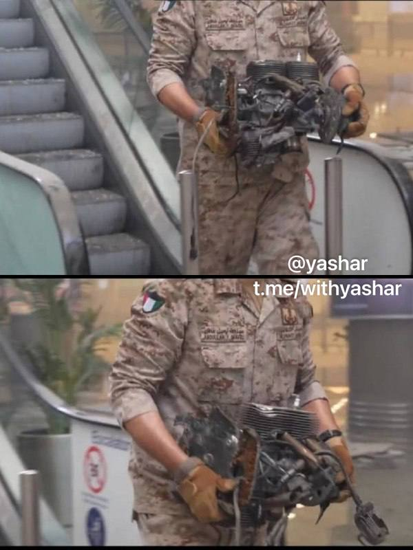

موتور پهپاد شاهدی که به فرودگاه کویت برخورد کرد پیدا شد
@withyashar

## mamlekate — post 103612

📝 مجلس نمایندگان آمریکا به محدود کردن قدرت ترامپ برای ادامۀ جنگ رأی مثبت داد

مجلس نمایندگان آمریکا روز چهارشنبه به قطعنامۀ محدود‌ کردن قدرت دونالد ترامپ در ادامه جنگ با ایران رأی مثبت داد. هدف از این لایحه منوط کردن جنگ با ایران به موافقت و مجوز کنگره است.

📝 ترامپ: مذاکرات با جمهوری اسلامی خیلی خوب پیش می‌رود؛ به امضای توافق خیلی نزدیک‌ شده‌ایم

دونالد ترامپ رئیس جمهوری آمریکا چهارشنبه ۱۳ خرداد طی مراسم امضای چند فرمان اجرایی در کاخ سفید به خبرنگاران گفت مذاکرات با جمهوری اسلامی خیلی خوب پیش می‌رود و «به امضای یک توافق با ایران خیلی نزدیک‌ هستیم»، اما نتیجه این مذاکرات همچنان معلوم نیست شاید تا آخر هفته مشخص ‌شود.

@mamlekate

## IranIntlTV — post 340471

  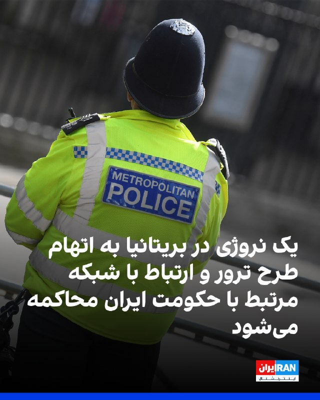

دادستان‌های بریتانیا چهارشنبه ۱۳ خرداد در دادگاهی در لندن اعلام کردند یک نوجوان نروژی که از سوی فاکس‌تروت، گروه تبهکاری سوئدی مرتبط با حکومت ایران جذب شده بود، در ازای دریافت پول به بریتانیا سفر کرد تا فردی را بکشد. این پرونده در دادگاه اولد بیلی لندن در حال رسیدگی است.

به گفته دادستان‌ها، یوهانس ناتلند که اکنون ۱۹ سال دارد، اسفند سال ۱۴۰۳ در هتل در هادرسفیلد در شمال انگلستان بازداشت شد. آلیستر ریچاردسون، دادستان پرونده، گفت هنگام بازداشت دو قبضه سلاح گرم و مهمات همراه او بود.

ریچاردسون در دادگاه گفت: «او از سوی سازمانی به نام شبکه فاکسترات جذب شد و توافق کرده بود در ازای دریافت پول به اینجا سفر کند و یک قتل انجام دهد.» او افزود: «شبکه فاکس‌تروت، یک گروه جرایم سازمان‌یافته سوئدی است که حکومت ایران از آن استفاده می‌کند.»

ناتلند اتهام توطیه برای کشتن فردی نامشخص را رد کرده است. با این حال، دادستان به هیات منصفه گفت او پیش‌تر به در اختیار داشتن یک تپانچه نیمه‌خودکار، یک رولور و مهمات جنگی اعتراف کرده است.

ریچاردسون همچنین گفت: «ما نمی‌دانیم متهم قصد کشتن چه کسی را داشت.»
https://iranintl.com/202606041922

## IranIntlTV — post 340470

  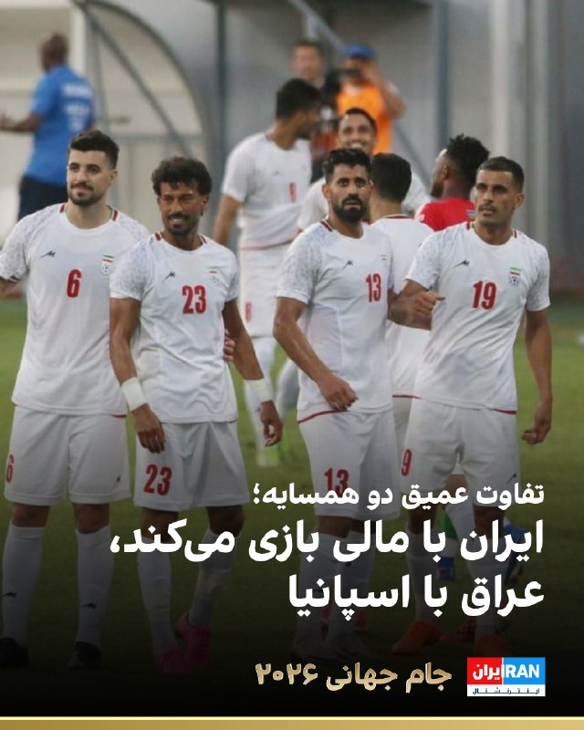

🔻تیم ملی فوتبال ایران امشب ساعت ۲۰:۳۰ در آخرین دیدار تدارکاتی خود پیش از سفر به مکزیک، به مصاف مالی، تیم ۵۱ رنکینگ فیفا، می‌رود؛ مسابقه‌ای که با تصمیم کادر فنی، پشت درهای بسته و بدون حضور رسانه‌ها برگزار خواهد شد.

🔹این در حالی است که درست پس از پایان بازی ایران، تیم ملی فوتبال عراق در ورزشگاه خانگی دپورتیوو لاکرونیا، رو‌در‌روی اسپانیا قرار می‌گیرد؛ یکی از مدعیان اصلی قهرمانی با ستاره‌هایی چون لامین یامال.

🔹در حالی که تیم ملی عراق با یکی از قدرت‌های فوتبال جهان بازی می‌کند، فدراسیون فوتبال ایران پس از لغو بازی با اسپانیا، پرتغال، مقدونیه و آنگولا به دلیل مسائل سیاسی و جنگ، مجبور شد چهار بار با خودش و یک‌ بار با گامبیا، تیم ۱۱۶ رنکینگ فیفا، بازی کند. مهدی تاج گفته است برای همین بازی با مالی، ۱۰۰ هزار دلار به همراه هزینه پرواز و هتل تیم ملی مالی را پرداخت کرده‌اند.

🔹برنامه بازی با پورتوریکو در آمریکا نیز لغو شد تا ایران پس از انتقال کمپ خود به تیخوانا، احتمالا با گرانادا دیدار کند؛ تدارکاتی ناامیدکننده برای تیمی که برخلاف همسایگانش، مانند عراق، نتوانسته بازی‌های تدارکاتی مناسب داشته باشد.

@iranintltvsport

## IranianMinds — post 21351

  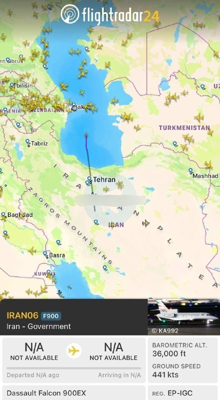

یک فروند فالکون 900EX دولتی جمهوری اسلامی در حال حرکت به سمت مسکو

@IranianMinds

## alonews — post 124995

  <a href="telegram/content/alonews_124995_1780559664.webm" target="_blank">🎬 Download video</a>

👈 در ادامه موج بازداشت‌ها در شهرداری و شورای شهر سقز، یکی از اعضای شورا و یک کارمند شهرداری به اتهام فساد مالی دستگیر شدند.

✅ @AloNews خبر جنگ

## alonews — post 124994

  <a href="telegram/content/alonews_124994_1780559664.webm" target="_blank">🎬 Download video</a>

👈حمله به پزشکیان و قالیباف در تجمعات شبانه

✅ @AloNews خبر جنگ

## alonews — post 124993

  <a href="telegram/content/alonews_124993_1780559664.webm" target="_blank">🎬 Download video</a>

👈کیم جونگ اون به رسانه‌های دولتی کره شمالی گفت که قصد دارد «نیروهای هسته‌ای کشورمان را با سرعتی تصاعدی تقویت کند» و اینکه آنها ظرفیت خود را برای تولید مواد هسته‌ای با درجه تسلیحاتی در پنج سال گذشته دو برابر کرده‌اند

✅ @AloNews خبر جنگ

---
📅 بروزرسانی: 1405/03/14 11:14
---

## WithYashar — post 13466

وزیر دفاع اسرائیل: به هدف قرار دادن زیرساخت های حزب الله در لبنان ادامه خواهیم داد
@withyashar

## WithYashar — post 13465

  

یک هواپیمای Falcon 900EX متعلق به دولت ایران در حال پرواز بر فراز دریای خزر به سمت روسیه است. این هواپیمای خاص توسط مقامات ارشد ایرانی استفاده می‌شود.
@withyashar

## IranIntlTV — post 340468

  <a href="telegram/content/IranIntlTV_340468_1780559085.mp4" target="_blank">🎬 Download video</a>

روح‌الله رحیم‌پور، تحلیلگر سیاسی، درباره بازداشت ۲۰ نفر در بحرین به اتهام همکاری با سپاه پاسداران به ایران‌اینترنشنال گفت که این افراد به عنوان عوامل میدانی سپاه برای جذب نیرو، تاثیرگذاری بر جوانان و جمع‌آوری اطلاعات درباره تاسیسات و مراکز حساس فعالیت می‌کردند
@iranintltv

## Hranews — post 113375

  

اجرای حکم حبس؛ نهاله شهیدی یزدی به زندان کرمان منتقل شد

❗️
❗️
❗️
❗️
❗️– نهاله شهیدی یزدی، شهروند بهائی ساکن کرج، جهت اجرای حکم بازداشت و به زندان شهرستان کرمان منتقل شد.

به گزارش خبرگزاری هرانا، ارگان خبری مجموعه فعالان حقوق بشر در ایران، نهاله شهیدی یزدی، شهروند بهائی به زندان منتقل شد.

بر اساس اطلاعات دریافتی هرانا، خانم شهیدی یزدی روز سه شنبه ۱۲ خردادماه، پس از حضور در شعبه اجرای احکام دادگاه انقلاب کرمان بازداشت و جهت تحمل دوران محکومیت حبس خود به زندان کرمان منتقل شد.

ادامه مطلب

#نهاله_شهیدی_یزدی

↘️
@hranews_bot تماس ✉️ - @Hranews کانال هرانا 🆑

## alonews — post 124992

👈مجتبی خامنه‌ای: هدف دشمن اینه فشار اقتصادی بیاره تا مردم ناامید بشن، مردم باید مقاومت کنن تا به قله برسیم

## alonews — post 124991

  <a href="telegram/content/alonews_124991_1780559089.mp4" target="_blank">🎬 Download video</a>

👈فیلمی از پرواز پهپاد پنهانکار RA-01 اسرائیل در آسمان تهران

🔴پهپاد RA-01 یک پهپاد شناسایی-رزمی پنهانکار اسرائیلی است که برای ماموریت‌های اطلاعاتی، نظارتی و حمله استفاده می‌شود.

🔴ویدیو مربوط به زمان جنگ است

✅ @AloNews خبر جنگ

## alonews — post 124990

  <a href="telegram/content/alonews_124990_1780559091.webm" target="_blank">🎬 Download video</a>

👈ارتش اسرائیل می‌گوید درگیری‌ها در جنوب لبنان ادامه دارد و به ساکنان لبنانی هشدار می‌دهد که به سمت جنوب حرکت نکنند

✅ @AloNews خبر جنگ

## alonews — post 124989

  <a href="telegram/content/alonews_124989_1780559091.webm" target="_blank">🎬 Download video</a>

👈موتور پهپاد شاهدی که به فرودگاه کویت برخورد کرد

✅ @AloNews خبر جنگ

---
📅 بروزرسانی: 1405/03/14 11:04
---

## VahidOOnLine — post 243615

  <a href="telegram/content/VahidOOnLine_243615_1780558464.mp4" target="_blank">🎬 Download video</a>

♦️۳۷ سال پس از حضور علی خامنه‌ای، رهبر پیشین جمهوری اسلامی در مراسم سالگرد مرگ روح‌الله خمینی، اولین «رهبر انقلاب اسلامی»، برگزارکنندگان این مراسم سالانه، یک صندلی خالی به جای او گذاشتند.

علی خامنه‌ای روز نهم اسفند و در اولین موج حمله آمریکا و اسرائیل به تهران، به همراه چندین نفر دیگر از مقام‌های ارشد نظامی و سیاسی نظام و چند تن از اعضای خانواده‌اش، کشته شد.
‌🇸🇦 Indypersian

🤖 @VahidOOnLine

## DW_Farsi — post 125474

  

🔶 "ترامپ در صورت کشته‌شدن نیروهای آمریکایی ممکن است آتش‌بس با ایران را لغو کند"

روزنامه وال‌استریت ژورنال روز چهارشنبه ۱۳ خرداد (۳ ژوئن) به نقل از منابع آگاه گزارش داد دونالد ترامپ، رئیس جمهور آمریکا به‌صورت خصوصی به دستیاران و مشاوران خود گفته است که در صورت کشته‌شدن نیروهای آمریکایی توسط ایران، او آتش‌بس با ایران را بررسی کرده و ممکن است آن را لغو کند.

رویترز با بازنشر این خبر نوشته است که این خبرگزاری نتوانسته مستقلا این اظهارات را تأیید کند.

واشنگتن و تهران بارها یکدیگر را به نقض آتش‌بس متهم کرده‌اند و حملاتی را علیه هم انجام داده‌اند. با این حال ترامپ تاکید کرده است که اطمینان دارد دولتش در مذاکرات با ایران در حال پیشرفت است و گفتگوها به خوبی پیش می‌روند.

@dw_farsi

## alonews — post 124988

  <a href="telegram/content/alonews_124988_1780558466.webm" target="_blank">🎬 Download video</a>

👈یک هواپیمای Falcon 900EX متعلق به دولت ایران در حال پرواز بر فراز دریای خزر به سمت روسیه است. این هواپیمای خاص توسط مقامات ارشد ایرانی استفاده می‌شود.

✅ @AloNews خبر جنگ

## alonews — post 124987

  <a href="telegram/content/alonews_124987_1780558466.mp4" target="_blank">🎬 Download video</a>

👈ویدیویی جدید از حمله آمریکا/اسرائیل به آزادراه بروجرد - خرم‌آباد در طول جنگ اخیر

✅ @AloNews خبر جنگ

---
📅 بروزرسانی: 1405/03/14 10:54
---

## VahidOOnLine — post 243614

  

♦️قیمت نفت در بازارهای جهانی روز پنجشنبه ۱۴ خرداد و همزمان با ادامه تنش‌ها میان جمهوری اسلامی ایران و آمریکا در تنگه هرمز، به مرز ۱۰۰ دلار رسید.

قیمت نفت هر بشکه نفت خام برنت دریای شمال نیمه‌شب چهارشنبه و پس از انتشار خبر شلیک موشک‌های ارتش جمهوری اسلامی ایران به سوی یک ناوشکن آمریکایی از ۹۸ دلار گذشت.

 با این حال پس از آنکه سنتکام اعلام کرد آسیبی به شناورهای نظامی آن وارد نشده است و پاسخی به این حمله نداد، بهای نفت کاهش یافت و همزمان با آغاز به کار بازارهای اروپایی، به ۹۷ دلار رسید.
‌🇸🇦 Indypersian

🤖 @VahidOOnLine

## DEJradio — post 5313

  <a href="telegram/content/DEJradio_5313_1780557898.mp4" target="_blank">🎬 Download video</a>

🔺🎥 ۱۸ دی ۱۴۰۵؛
اردبیل، پهلوی برمی‌گرده

#اردبیل #دی۱۴۰۴
@DEJradio

## FarsiVOA — post 219543

  

عبدالکریم هاشمی نخل ابراهیمی، نماینده هرمزگان و عضو کمیسیون برنامه و بودجه می‌گوید تجارت ایران با امارات به صورت «غیرمستقیم» ادامه دارد.

امارات بزرگترین مبدأ واردات کالا به ایران است و یک سوم کل واردات ایران از این کشور انجام می‌شود.

این نماینده مجلس توضیح نداده که تجارت ایران و امارات از طریق کدام کشورها و با چه سازوکاری به شکل «غیرمستقیم» ادامه دارد.

با این حال، خود امارات طی دهه‌های گذشته مهم‌ترین هاب بازصادرات کالا به ایران بوده و بخش عمده واردات ثبت‌شده از این کشور، در واقع کالاهایی است که در سایر کشورها تولید شده و از طریق بنادر و مناطق آزاد امارات به ایران ارسال می‌شود.

در شرایط فعلی به نظر می‌رسد محدودیت‌های جدید، یک واسطه دیگر به این زنجیره افزوده و مسیر تأمین کالا برای ایران را طولانی‌تر و پرهزینه‌تر کرده است.

ایران پارسال ۲۲.۵ میلیارد دلار واردات از امارات داشت.
@FarsiVOA

## RadioFarda — post 157882

  

🔸رادیو فردا گزارش مربوط به کشته شدن مهشید فلاحی، زن ترنس ساکن سنندج، را که روز چهارشنبه ۱۳ خرداد، بر اساس اطلاعات چند گروه حقوق بشری، از جمله «هه‌نگاو»، منتشر کرده بود، حذف کرده است.

🔸«هه‌نگاو» اطلاعات این گزارش را پس گرفت و اعلام کرد خبر قتل مهشید فلاحی نادرست بوده است و او خوشبختانه در قید حیات است. رادیو فردا از مخاطبان خود پوزش می‌خواهد.

@RadioFarda

## Hranews — post 113374

  

تداوم بازداشت؛ کیفرخواست پرونده حامد تیزرویان صادر شد

❗️
❗️
❗️
❗️
❗️– حامد تیزرویان، عکاس حیات وحش و دانشجوی دکترای محیط زیست دانشگاه شهید بهشتی، ۳۲ روز است که در بازداشت به سر می‌برد. اخیرا کیفرخواست آقای تیزرویان صادر و پرونده وی به دادگاه ارجاع شده است.

به گزارش خبرگزاری هرانا، ارگان خبری مجموعه فعالان حقوق بشر در ایران، حامد تیزرویان همچنان در بازداشت به‌سر میبرد.

با وجود صدور کیفرخواست پرونده حامد تیزرویان در اواخر اردیبهشت‌ماه امسال، متن این کیفرخواست تاکنون به صورت رسمی به وی ابلاغ نشده است. این موضوع باعث شده که او همچنان از جزئیات و عناوین اتهامی مندرج در پرونده خود بی‌اطلاع باشد.

ادامه مطلب

#حامد_تیزرویان

↘️
@hranews_bot تماس ✉️ - @Hranews کانال هرانا 🆑

## alonews — post 124986

  <a href="telegram/content/alonews_124986_1780557903.webm" target="_blank">🎬 Download video</a>

👈هشدار هواشناسی برای مسافران شمال/ رگبار شدید و آبگرفتگی در جاده‌ها؛ باد شدید در شرق اصفهان

✅ @AloNews خبر جنگ

## alonews — post 124985

  <a href="telegram/content/alonews_124985_1780557903.mp4" target="_blank">🎬 Download video</a>

👈روز گذشته/بدشانسی عروس و داماد سنندجی و تصادف شدید با یک پراید

✅ @AloNews خبر جنگ

## alonews — post 124984

  <a href="telegram/content/alonews_124984_1780557906.webm" target="_blank">🎬 Download video</a>

👈رسانه‌های اسرائیلی: از زمان اعلام آتش‌بس، حزب‌الله ۶موشک به سمت نیروهای ما که در جنوب لبنان فعالیت می‌کنند، شلیک کرده است

✅ @AloNews خبر جنگ

---
📅 بروزرسانی: 1405/03/14 10:44
---

## DEJradio — post 5312

  <a href="telegram/content/DEJradio_5312_1780557258.webm" target="_blank">🎬 Download video</a>

🔺📢 یک شهروند با ارسال پیامی درباره مفقودالاثر بودن شماری از شهروندان پس از خیزش ملی نوشت: «در بهشت زهرای تهران قطعه ۸۷، چند روز بعد از ۱۸ دی‌ماه، قبرهای سرتاسری ایجاد کردن و به صورت ناشناس خاک کردن که اصلا معلوم نیس کی هستن و چه زمانی فوت شدن. فکر میکنم هنوزم اوضاع قبرها مثل عکسی باشه که میخوام براتون بفرستم. تعدادشون خیلی زیاده، از شرق تا غرب اون قطعه ردیفی خاک شدن. شاید عزیزان خیلی‌ها اونجا باشه»

#دی۱۴۰۴
@DEJradio

## DEJradio — post 5311

  <a href="telegram/content/DEJradio_5311_1780557259.webm" target="_blank">🎬 Download video</a>

🔺📢 نیروی دریایی ارتش جمهوری اسلامی چهارشنبه شب ۱۳ خرداد اعلام کرد، «مرکز فرماندهی و کنترل شرارت‌های ارتش آمریکا در دریای عمان» را هدف قرار داده است. اعلام شد این مرکز در یک فروند ناوشکن آمریکایی مستقر بود.

ساعاتی بعد دونالد ترامپ رئیس جمهوری آمریکا اعلام کرد مذاکرات با جمهوری اسلامی «خیلی خوب پیش می‌رود.»

دونالد ترامپ در کاخ سفید درباره حمله حکومت ایران به کویت و نقض آتش‌بس گفت: «سه‌شنبه شب ضربه سنگینی به جمهوری اسلامی زدیم و دیشب هم همین‌طور. وقتی موضوع را برایم توضیح دادند، گفتم بسیار خب، همین کار را انجام می‌دهیم، اما ما هم شدید به آن‌ها ضربه می‌زدیم.»

او افزود: «مذاکرات بسیار خوب پیش می‌رود. ممکن است به نتیجه برسد یا نرسد، اما اگر قرار باشد اتفاقی بیفتد، شاید همین آخر هفته رخ دهد. آن منطقه بخش متفاوتی از جهان است؛ آنجا آتش‌بس یعنی به شکلی ملایم‌تر به تیراندازی ادامه دادن.»
ترامپ گفت: «هر اتفاقی ممکن است بیفتد وقتی با جمهوری اسلامی طرف هستید. این یکی از بی‌ثبات‌ترین مناطق جهان است.»

#آتشبس #مذاکرات
@DEJradio

## DEJradio — post 5308

  <a href="telegram/content/DEJradio_5308_1780557259.webm" target="_blank">🎬 Download video</a>

🚨📷 ماموران فدرال چهارشنبه ۱۳ خرداد در یک یورش غافلگیرانه به عمارت مجلل ۳۵ میلیون دلاری در «نیوپورت بیچ» کالیفرنیا، جمشید قمی، مدیر ۶۳ ساله یک شرکت فناوری را بازداشت کردند.

قمی که دارای تابعیت دوگانه ایران و ایالات متحده است، متهم به توطئه برای نقض «قانون اختیارات اقتصادی در شرایط اضطراری بین‌المللی» از مسیر تامین سخت‌افزارهای کامپیوتری برای برنامه‌های نظامی و هسته‌ای جمهوری اسلامی است.

به گزارش نیویورک‌پست، ده‌ها مامور مسلح با تجهیزات کامل، ملک او در منطقه حفاظت‌شده «های‌واتر» را محاصره کردند. بازپرسان معتقدند او به مدت بیش از یک دهه از مسیر شرکت خود در تهران به نام «فراز پرداز رایانه»، بیش از ۲۵۰ تُن تجهیزات کنترل‌شده تکنولوژی را به‌صورت مخفیانه خریداری کرده است. او متهم است که با استفاده از حساب‌های شخصی در eBay و PayPal و از مسیر شرکت‌های صوری در امارات متحده عربی، کالاها را تهیه و به ایران ارسال می‌کرده است.

وزارت دادگستری آمریکا اعلام کرد که جمشید قمی، مدیرعامل شرکت فناوری در کالیفرنیا، به اتهام تأمین تجهیزات برای برنامه‌های هسته‌ای و نظامی رژیم ایران دستگیر شده است.
او بیش از ۳۸ سال است که در آمریکا اقامت دارد و حالا مشخص شده در سال‌های گذشته به‌صورت غیرقانونی و از مسیر مرز زمینی ترکیه به ایران رفت و آمد داشته است.

#جمشید_قمی
@DEJradio

## FarsiVOA — post 219542

  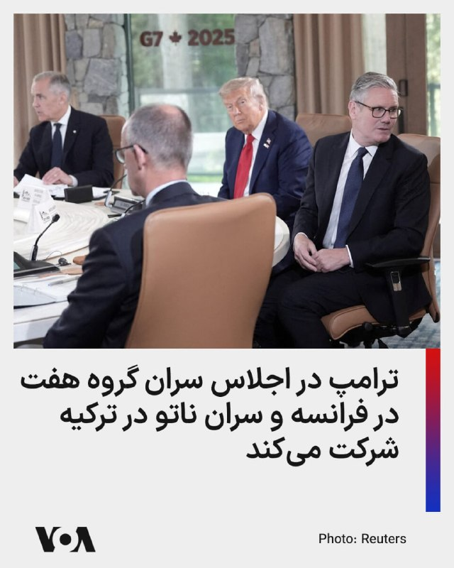

دونالد ترامپ، رئیس‌جمهوری ایالات متحده، در اجلاس سران گروه هفت در فرانسه و همچنین سران ناتو در ترکیه شرکت می‌کند.

آقای ترامپ روز چهارشنبه در پیامی در شبکه اجتماعی تروث سوشال نوشت: «من بلافاصله پس از آنچه یکی از سرگرم‌کننده‌ترین شب‌های تاریخ آمریکا خواهد بود، یعنی مسابقات قهرمانی جهان یو‌اف‌سی در چمن جنوبی کاخ سفید، برای شرکت در اجلاس گروه هفت به فرانسه خواهم رفت.»

خبرگزاری رویترز نوشت که مسابقه یو‌اف‌سی در ۱۴ ژوئن در کاخ سفید برگزار خواهد شد.

همچنین مارکو روبیو، وزیر خارجه ایالات متحده آمریکا، اعلام کرد که پرزیدنت ترامپ، در نشست سران پیمان آتلانتیک شمالی، ناتو، که اوایل ژوئیه در ترکیه برگزار می‌شود، شرکت خواهد کرد.

روبیو در جلسه‌ای در کنگره گفت با وجود تنش‌ها و نارضایتی‌های اخیر ترامپ نسبت به این پیمان، او همچنان در نشست حضور خواهد داشت. به گفته او، یکی از دلایل نارضایتی ترامپ این است که برخی اعضای این پیمان در زمان بحران، اجازه استفاده ایالات متحده از پایگاه‌های نظامی خود را نداده‌اند.

این نشست در روزهای ۷ و ۸ ژوئیه در آنکارا برگزار می‌شود.
@FarsiVOA

## BBCPersian — post 282837

🔻اعلام مرگ شش فرزند رانيا عباسی، دندانپزشک و قهرمان پیشین شطرنج سوریه، پس از بیش از ۱۳ سال ابهام و انتظار، یکی از دردناک‌ترین پرونده‌های ناپدیدسازی اجباری در سوریه را دوباره به کانون توجه افکار عمومی بازگردانده است.

هیئت ملی مفقودان سوریه اعلام کرد که پس از بررسی داده‌ها، ویدیوها و اطلاعات موجود، به نتایجی «قابل اعتماد» رسیده که مرگ کودکان رانيا عباسی را تایید می‌کند. این اعلامیه نه تنها پایانی بر یکی از طولانی‌ترین انتظارهای یک خانواده سوری بود، بلکه بار دیگر بحثی گسترده‌تر را درباره سرنوشت هزاران مفقود و ناپدیدشده دوران حکومت بشار اسد زنده کرد.

https://bbc.in/4xfF7Vx
@BBCPersian

## alonews — post 124983

  <a href="telegram/content/alonews_124983_1780557260.webm" target="_blank">🎬 Download video</a>

👈حمله مجدد اسرائیل به منطقه نبطیه لبنان

✅ @AloNews خبر جنگ

## alonews — post 124982

  <a href="telegram/content/alonews_124982_1780557260.webm" target="_blank">🎬 Download video</a>

👈شهبازی مجری محبوب صدا و سیما: من سالم هستم و خبر تجاوز گروپ به من کاملا کذبه 
✅ @AloNews خبر جنگ

---
📅 بروزرسانی: 1405/03/14 10:34
---

## pm_afshaa — post 92247

🔴وزیر دفاع اسرائیل: به هدف قرار دادن زیرساخت های حزب الله در لبنان ادامه خواهیم داد

💧 Rainbet.com the #1 Non-KYC Crypto Casino & Sportsbook @rainbetcom

😁 @Pm_Afshaa

## IranIntlTV — post 340467

  <a href="telegram/content/IranIntlTV_340467_1780556672.mp4" target="_blank">🎬 Download video</a>

منابع پاکستانی از تشدید تلاش‌های اسلام‌آباد برای کاهش تنش میان ایالات متحده و جمهوری اسلامی خبر داده‌اند. همزمان گفته می‌شود قطر نیز در پی برگزاری دور دوم مذاکرات احتمالی در دوحه است

گفت‌وگو با جواد همدانی، خبرنگار ایران‌اینترنشنال
@iranintltv

## DW_Farsi — post 125472

  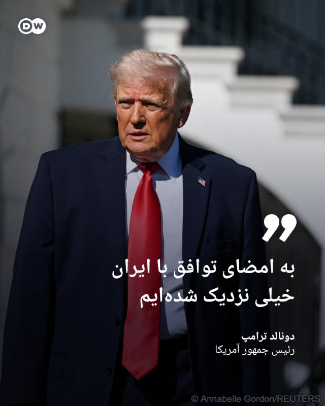

🔶 ترامپ: به امضای توافق با ایران خیلی نزدیک شده‌ایم

دونالد ترامپ، رئیس جمهور آمریکا روز چهارشنبه ۱۳ خرداد (۳ ژوئن) در جمع خبرنگاران گفت که مذاکرات با ایران ممکن است در روزهای آینده به نتیجه برسد و این گفت‌وگوها "به‌خوبی" پیش می‌رود.

ترامپ همچنین افزود بر اساس توافق، ایالات متحده ذخایر اورانیوم با غنای بالای ایران را "دریافت خواهد کرد"؛ موضوعی که یکی از اصلی‌ترین نقاط اختلاف در مذاکرات است.

رئیس جمهور آمریکا بار دیگر تاکید کرد که این مواد باید از ایران خارج شوند. ترامپ همچنین خاطرنشان کرد که هدف اصلی او جلوگیری از دستیابی ایران به سلاح هسته‌ای از طریق اورانیوم با غنای بالاست.

ترامپ همچنین گفت که می‌خواهد مذاکرات مربوط به جنگ در لبنان را از گفت‌وگوهای مربوط به جنگ میان آمریکا و ایران جدا کند. این در حالی است که جمهوری اسلامی بارها توقف حملات اسرائیل در لبنان و تضمین امنیت این کشور را پیش‌شرط مذاکرات خود با آمریکا عنوان کرده است.

عباس عراقچی، وزیر خارجه ایران هشدار داده است که هرگونه حمله به بیروت می‌تواند به "ازسرگیری کامل" جنگ در خاورمیانه منجر شود. او همچنین گفت که خطوط ارتباطی با ایالات متحده همچنان باز است، اما "هیچ پیشرفت ملموسی" در مذاکرات حاصل نشده است.

@dw_farsi

## alonews — post 124979

  <a href="telegram/content/alonews_124979_1780556675.mp4" target="_blank">🎬 Download video</a>

👈صور، جنوب لبنان

✅ @AloNews خبر جنگ

## alonews — post 124978

  <a href="telegram/content/alonews_124978_1780556677.mp4" target="_blank">🎬 Download video</a>

👈 تصاویری از حمله به انبار نفت کرج (فردیس) در جنگ

✅ @AloNews خبر جنگ

## alonews — post 124977

  <a href="telegram/content/alonews_124977_1780556679.webm" target="_blank">🎬 Download video</a>

👈ترامپ: دموکرات‌ها دوباره شروع کرده‌اند! آن‌ها در تلاش‌اند تا فرماندار کالیفرنیا و شهردار لس‌آنجلس را از دو کاندیدای بزرگ جمهوری‌خواه بدزدند

✅ @AloNews خبر جنگ

---
📅 بروزرسانی: 1405/03/14 10:24
---

## alonews — post 124976

  <a href="telegram/content/alonews_124976_1780556043.webm" target="_blank">🎬 Download video</a>

👈وال استریت ژورنال : ترامپ جمعه گذشته آخرین پیشنهاد ایران را رد کرد و به دستیارانش گفت که ایران باید از قبل امتیازات جدی بدهد، نه در یک دوره طولانی

✅ @AloNews خبر جنگ

---
📅 بروزرسانی: 1405/03/14 10:14
---

## VahidOOnLine — post 243613

  

شورای هماهنگی تشکل‌های صنفی فرهنگیان ایران با ابراز نگرانی از احتمال اجرای حکم اعدام علیرضا مرداسی، معلم زندانی سیاسی و دیگر محکومان به مرگ، ضمن محکوم کردن فضای «ارعاب، سرکوب و اعدام» به‌ویژه پس از جنگ اخیر، خواستار توقف صدور و اجرای احکام اعدام شد.
این تشکل صنفی، در بیانیه‌ای با ابراز نگرانی از احتمال اجرای احکام افراد زیر حکم اعدام، از تمام مخالفان اعدام خواست برای توقف روند جاری و لغو مجازات مرگ، یک‌صدا تلاش کنند.
بیانیه شورای هماهنگی فرهنگیان در حالی منتشر شده است که دیوان عالی کشور به‌تازگی احکام اعدام فرشاد اعتمادی‌فر، مسعود جامعی و علیرضا مرداسی، سه زندانی سیاسی محبوس در زندان شیبان اهواز را تایید کرده است.
شورای هماهنگی تشکل‌های صنفی فرهنگیان نوشت در میان این افراد، نام مرداسی، معلم زندانی که سال‌ها در عرصه آموزش فعالیت داشته، بیش از همه توجه جامعه فرهنگیان را به خود جلب کرده است.
جمهوری اسلامی از ۲۷ اسفند ۱۴۰۴ تا ۱۳ خرداد سال جاری دست‌کم ۴۲ زندانی سیاسی را در زندان‌های ایران اعدام کرده و برای ده‌ها زندانی سیاسی دیگر حکم مرگ صادر کرده است.
‌🏁 🇬🇧 IranintlTV

🤖 @VahidOOnLine

## mwarmonitor — post 10127

🔸سناتور آمریکایی «کریس ون هالن» خواستار آزادی یک شهروند آمریکایی شد که توسط ارتش اسرائیل (IDF) بازداشت شده است.

🔹به گفته ارتش اسرائیل، «سما صفی» ۲۰ ساله اوایل این هفته به همراه چند نفر دیگر در دانشگاه بیرزیت بازداشت شده و مظنون به «ترویج فعالیت‌های تروریستی و سایر اقدامات مرتبط با تروریسم» است.

📌ون هالن می‌گوید ارتش اسرائیل «او را بدون هیچ توضیحی بازداشت کرده» و مدعی است که وی بدون تفهیم اتهام در بازداشت نگه داشته می‌شود. او از سفیر آمریکا، مایک هاکبی، و وزیر امور خارجه ایالات متحده، مارکو روبیو، خواسته است برای آزادی فوری او اقدام کنند.

@mwarmonitor

## IranIntlTV — post 340466

  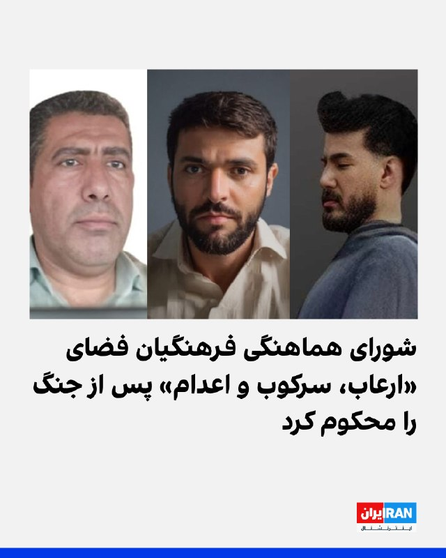

شورای هماهنگی تشکل‌های صنفی فرهنگیان ایران با ابراز نگرانی از احتمال اجرای حکم اعدام علیرضا مرداسی، معلم زندانی سیاسی و دیگر محکومان به مرگ، ضمن محکوم کردن فضای «ارعاب، سرکوب و اعدام» به‌ویژه پس از جنگ اخیر، خواستار توقف صدور و اجرای احکام اعدام شد.
این تشکل صنفی، در بیانیه‌ای با ابراز نگرانی از احتمال اجرای احکام افراد زیر حکم اعدام، از تمام مخالفان اعدام خواست برای توقف روند جاری و لغو مجازات مرگ، یک‌صدا تلاش کنند.
بیانیه شورای هماهنگی فرهنگیان در حالی منتشر شده است که دیوان عالی کشور به‌تازگی احکام اعدام فرشاد اعتمادی‌فر، مسعود جامعی و علیرضا مرداسی، سه زندانی سیاسی محبوس در زندان شیبان اهواز را تایید کرده است.
شورای هماهنگی تشکل‌های صنفی فرهنگیان نوشت در میان این افراد، نام مرداسی، معلم زندانی که سال‌ها در عرصه آموزش فعالیت داشته، بیش از همه توجه جامعه فرهنگیان را به خود جلب کرده است.
جمهوری اسلامی از ۲۷ اسفند ۱۴۰۴ تا ۱۳ خرداد سال جاری دست‌کم ۴۲ زندانی سیاسی را در زندان‌های ایران اعدام کرده و برای ده‌ها زندانی سیاسی دیگر حکم مرگ صادر کرده است.
https://iranintl.com/202606049693

## DW_Farsi — post 125471

  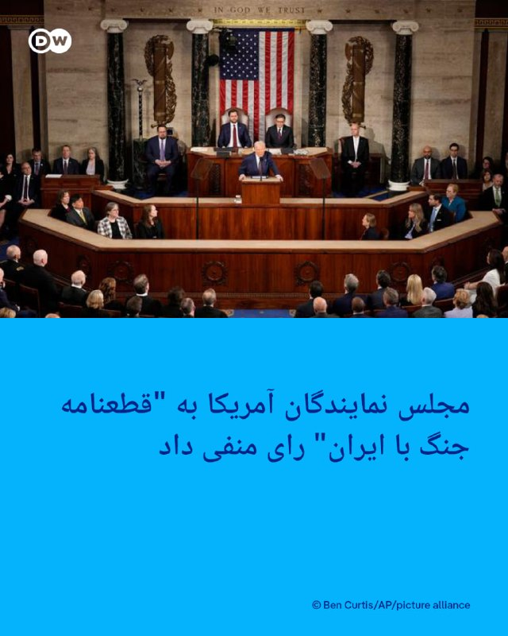

🔶 مجلس نمایندگان آمریکا به "قطعنامه جنگ با ایران" رای منفی داد

مجلس نمایندگان آمریکا قطعنامه توقف جنگ با ایران را تصویب کرد و بدین ترتیب فشار سیاسی بر رئیس‌جمهور آمریکا را افزایش داد.

در قطعنامه آمده است که انجام یک عملیات رزمی و اعلام رسمی جنگ با ایران منوط به موافقت و صدور مجوز از سوی کنگره است. با این حال عملیات‌هایی که برای دفاع از ایالات متحده یا یکی از متحدان آن در برابر حملات قریب‌الوقوع لازم باشند، از این قاعده مستثنی هستند.

این قطعنامه شامگاه چهارشنبه ۱۴ خرداد (۴ ژوئن) با ۲۱۵ رای موافق و ۲۰۸ رای مخالف تصویب شد. چهار نماینده از حزب جمهوری‌خواه در همراهی با نمایندگان دموکرات‌ به این قطعنامه رای موافق دادند و به این ترتیب باعث تصویب آن شدند.

این قطعنامه پیامد فوری برای سیاست آمریکا در قبال ایران ندارد، اما نشان‌دهنده افزایش فشار سیاسی بر ترامپ است؛ به‌ویژه با توجه به اینکه پنج ماه دیگر انتخابات میان‌دوره‌ای کنگره برگزار خواهد شد.

شمار بیشتری از جمهوری‌خواهان اکنون آشکارا علیه راهبرد جنگی دونالد ترامپ موضع می‌گیرند.

در حال حاضر در جنگ آمریکا و اسرائیل علیه جمهوری اسلامی ایران آتش‌بس برقرار است و مذاکراتی درباره یک توافق احتمالی برای پایان دادن به جنگ در جریان است. با این وجود، در روزهای گذشته بارها حملات متقابل میان طرف‌های درگیر رخ داده است.

این قطعنامه اکنون باید به تصویب سنا، دیگر مجلس قانون‌گذاری آمریکا، نیز برسد. اما حتی اگر این اتفاق هم رخ دهد، رئیس‌جمهور می‌تواند مصوبه هر دو مجلس را وتو کند. برای بی‌اثر کردن وتوی رئیس‌جمهور، اکثریت دو سوم آرا لازم است؛ امری که بسیار بعید به نظر می‌رسد.

@dw_farsi

## RadioFarda — post 157881

  <a href="telegram/content/RadioFarda_157881_1780555463.mp4" target="_blank">🎬 Download video</a>

🔸تصاویر تازه منتشر شده، از حمله هوایی ۱۸ اسفند به خیابان جاجرودی در نزدیکی میدان رسالت در شرق تهران، وسعت ویرانی ساختمان‌ها را نشان می‌دهند.

🔸روزنامه شرق پیش‌تر گزارش داده بود که در این حمله یک «ساختمان اداری» هدف قرار گرفته است، اما جزئیاتی درباره هویت یا کاربری این ساختمان منتشر نکرد.

🔸در عین حال، برخی گزارش‌های غیررسمی حاکی از آن است که هدف حمله یک پایگاه بسیج در خیابان جاجرودی بوده است.

🔸به نوشته روزنامه شرق، در این بمباران ۱۴ نفر کشته شدند.

@RadioFarda

## Dirty_Kids — post 390952

  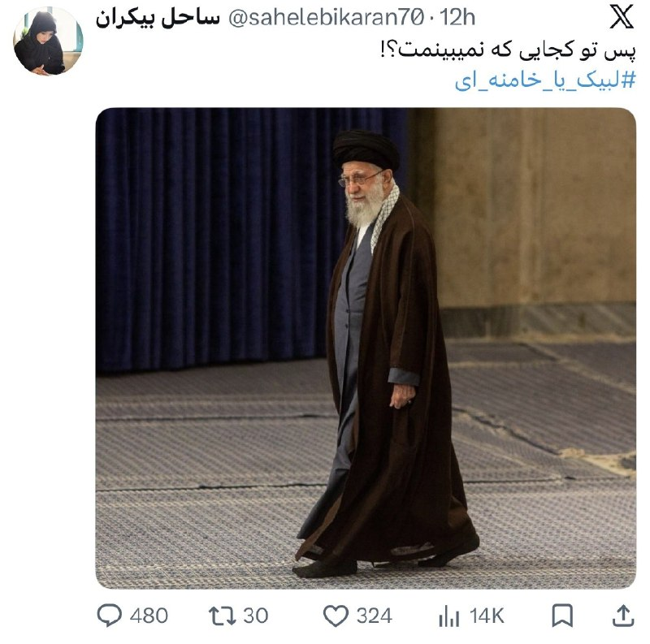

دونه‌دونه باید به همه‌تون بگم؟
طبقه بالای بخچال، پشت شیشه مربای هویج.

@Dirty_Kids 👻

## Dirty_Kids — post 390951

  <a href="telegram/content/Dirty_Kids_390951_1780555466.mp4" target="_blank">🎬 Download video</a>

دیالوگ ماندگار: بچه سوسول، بیا اینجا کارت دارم… :)))

@Dirty_Kids 👻

## alonews — post 124975

  <a href="telegram/content/alonews_124975_1780555468.webm" target="_blank">🎬 Download video</a>

👈حملات هوایی اسرائیل شهر صور در جنوب لبنان را هدف قرار داد

✅ @AloNews خبر جنگ

## alonews — post 124974

  <a href="telegram/content/alonews_124974_1780555468.webm" target="_blank">🎬 Download video</a>

👈آمریکا بیشتر از عربستان و روسیه روی هم نفت تولید می‌کند / ایران در رتبه هفتم

🔴بر اساس آمار سال ۲۰۲۶، آمریکا با تولید روزانه ۱۳.۲۵ میلیون بشکه نفت، بزرگترین تولیدکننده نفت جهان است. این رقم بیشتر از مجموع تولید عربستان (۱۰.۱۱) و روسیه (۱۰.۰۳ میلیون بشکه) می‌باشد.

🔴ده کشور برتر تولیدکننده نفت در سال ۲۰۲۶ (میلیون بشکه در روز):

🔴۱. آمریکا: ۱۳.۲۵

🔴۲. عربستان: ۱۰.۱۱

🔴۳. روسیه: ۱۰.۰۳

🔴۴. کانادا: ۵.۰۶

🔴۵. چین: ۴.۴۲

🔴۶. عراق: ۴.۳۹

🔴۷. ایران: ۴.۰۳

🔴۸. امارات: ۴.۰۱

🔴۹. برزیل: ۳.۹۵

🔴۱۰. کویت: ۲.۶۶

✅ @AloNews خبر جنگ

## alonews — post 124973

  <a href="telegram/content/alonews_124973_1780555469.webm" target="_blank">🎬 Download video</a>

👈لیبرمن، وزیر جنگ سابق اسرائیل: آتش‌بس با لبنان چیزی جز مهلتی اضافی برای حزب‌الله نیست تا بتواند دوباره صف‌بندی کند و قدرت خود را تازه بازیابد.

🔴این آتش‌بس نیست، بلکه بازگشت به همان رویکردی است که ما را به هفتم اکتبر کشاند.

✅ @AloNews خبر جنگ

---
📅 بروزرسانی: 1405/03/14 10:04
---

## VahidOOnLine — post 243612

🗣روایت شما از زندگی در آتش‌بس- پنج‌شنبه ۱۴ خرداد:

🔹من دانش‌آموز سال نهمم و برای انتخاب رشته سردرگمم. دوست دارم بر اساس علاقه‌ام تصمیم بگیرم اما آینده آن‌قدر نامعلومه که بیشتر نگران فردا هستم. در سنی که باید به رویاهایمان فکر کنیم ذهنمان درگیر گرانی، جنگ و غم جاویدنام‌هاست. انگار در جهنم گیر کرده‌ایم.

🔹از روستای کلوده پیام می‌دهم، خیلی زندگی کردن سخت شده است، هرکاری می‌کنم هزینه خورد و خوراک دربیاورم، باز وسط ماه کم می‌آورم.

🔹ما ایرانی‌ها انگار در «اسکویید گیم» داریم زندگی می‌کنیم، هر مرحله چند نفرمان می‌میرند و بقیه می‌روند مرحله بعدی...

🔹زندگی کردنمان شده شبیه کسی که از بالای کوه به دره سقوط کرده و طناب نجاتش را با دندان نگه داشته. اما معلوم نیست چقدر دیگر می‌تواند طاقت بیارود تا طناب را رها کند.

🔹از ۱۸ و ۱۹ دی دیگر هیچ‌چیز مثل قبل نیست. زندگی حس قبلش را ندارد و بدتر شده. انگار از زندگی خودمان برمان داشتند و گذاشتند در یک دنیای موازی. چه گناهی کرده‌ایم که باید نوجوونی‌مان اینطور باشد؟

🔹من دانش‌آموز سال نهم هستم و برای انتخاب رشته سردرگمم. دوست دارم بر اساس علاقه‌ام تصمیم بگیرم اما آینده آن‌قدر نامعلوم است که بیشتر نگران فردا هستم. در سنی که باید به رویاهایمان فکر کنیم ذهنمان درگیر گرانی، جنگ و غم جاویدنام‌هاست. انگار در جهنم گیر کرده‌ایم.

🔹ما دهه هشتادی‌ها نسلی هستیم که پیری را در اوج جوانی تجربه کردیم، من گیمر هستم و هدفم استریمر شدن بود. چندتا از وسایل مورد نیازم را تهیه کردم ولی روز به روز قیمت‌ها بالاتر رفت و هدف من هم هر روز بیشتر از روز قبل دست‌نیافتنی شد.

🔹از لرستان پیام می‌دهم؛ به‌عنوان یک دانش‌آموز پایه یازدهمی، کلی آرزو داشتم ولی با این وضعیت، دیپلم هم نمی‌توان گرفت. روزها و شب‌هایمان با استرس می‌گذرد.

🔹من ۱۶ سالم است و الان باید به فکر شادی و بازی کردن باشم نه اینکه بروم سر کار یا به سیاست و قیمت طلا و دلار فکر کنم.

🔹من ۱۷ ساله و کلاس یازدهم رشته کامپیوتر هستم. قرار بود امسال سر کار نروم و روی درس تمرکز کنم، اما متاسفانه با شرایط جنگی و اقتصادی مجبور شدم کار کنم و الان درسم روی هوا معلق مانده. چطور قرار است با این وضعیت، سال دیگر کنکور بدهم؟
‌🏁 🇬🇧 IranintlTV

🤖 @VahidOOnLine

## VahidOOnLine — post 243611

  

♦️درحالی که حکومت به دنبال استفاده از احساسات ملی‌گرایانه مردم ایران به نفغ خود است، محمدرضا با هنر، عضو مجمع تشخیص مصلحت‌نظام به خبرآنلاین گفت در حال حاضر «بازی» ما «ملی» است و یکی از شگردهای ستون پنجم ایجاد شکاف است. او گفت که «دشمن» می‌خواهد بین «امت» و امام فاصله بیندازد تا «سرمایه اجتماعی» نظام جمهوری اسلامی را کاهش دهند. باهنر افزود: «اگر بخواهیم مثالی بزنیم، ما یک سری باشگاه لیگ برتری در فوتبال داریم که با هم باید مسابقه دهند. طرفداران هر کدام تعصب جدی روی تیم خود دارند، ولی همین‌هایی که متعصب روی تیم خود هستند، زمانی که یک بازی ملی پیش می‌آید و تیم ملی انتخاب می‌شود و می‌خواهد با تیم‌های قدرتمند جهان روبه‌رو شود، دیگر آبی‌ها از قرمزها و قرمزها از آبی‌ها حمایت می‌کنند و دیگر برایشان مهم نیست که فردی که در تیم ملی بازی می‌کند، قرمز است یا آبی یا زرد و...». عضو مجمع تشخیص مصلحت نظام در ادامه گفت: «باید حواسمان جمع باشد که نقطه اصلی که دشمن می‌خواهد بزند، انسجام ملی است.»
‌🇸🇦 Indypersian

🤖 @VahidOOnLine

## WithYashar — post 13464

مقام اسرائیلی: ایران تصمیم گرفته در صورت آزادسازی اموال بلوکه‌شده‌‌اش، بخشی از آن را به حزب‌الله اختصاص دهد.
@withyashar

## IranIntlTV — post 340465

🗣روایت شما از زندگی در آتش‌بس- پنج‌شنبه ۱۴ خرداد:

🔹من دانش‌آموز سال نهمم و برای انتخاب رشته سردرگمم. دوست دارم بر اساس علاقه‌ام تصمیم بگیرم اما آینده آن‌قدر نامعلومه که بیشتر نگران فردا هستم. در سنی که باید به رویاهایمان فکر کنیم ذهنمان درگیر گرانی، جنگ و غم جاویدنام‌هاست. انگار در جهنم گیر کرده‌ایم.

🔹از روستای کلوده پیام می‌دهم، خیلی زندگی کردن سخت شده است، هرکاری می‌کنم هزینه خورد و خوراک دربیاورم، باز وسط ماه کم می‌آورم.

🔹ما ایرانی‌ها انگار در «اسکویید گیم» داریم زندگی می‌کنیم، هر مرحله چند نفرمان می‌میرند و بقیه می‌روند مرحله بعدی...

🔹زندگی کردنمان شده شبیه کسی که از بالای کوه به دره سقوط کرده و طناب نجاتش را با دندان نگه داشته. اما معلوم نیست چقدر دیگر می‌تواند طاقت بیارود تا طناب را رها کند.

🔹از ۱۸ و ۱۹ دی دیگر هیچ‌چیز مثل قبل نیست. زندگی حس قبلش را ندارد و بدتر شده. انگار از زندگی خودمان برمان داشتند و گذاشتند در یک دنیای موازی. چه گناهی کرده‌ایم که باید نوجوونی‌مان اینطور باشد؟

🔹من دانش‌آموز سال نهم هستم و برای انتخاب رشته سردرگمم. دوست دارم بر اساس علاقه‌ام تصمیم بگیرم اما آینده آن‌قدر نامعلوم است که بیشتر نگران فردا هستم. در سنی که باید به رویاهایمان فکر کنیم ذهنمان درگیر گرانی، جنگ و غم جاویدنام‌هاست. انگار در جهنم گیر کرده‌ایم.

🔹ما دهه هشتادی‌ها نسلی هستیم که پیری را در اوج جوانی تجربه کردیم، من گیمر هستم و هدفم استریمر شدن بود. چندتا از وسایل مورد نیازم را تهیه کردم ولی روز به روز قیمت‌ها بالاتر رفت و هدف من هم هر روز بیشتر از روز قبل دست‌نیافتنی شد.

🔹از لرستان پیام می‌دهم؛ به‌عنوان یک دانش‌آموز پایه یازدهمی، کلی آرزو داشتم ولی با این وضعیت، دیپلم هم نمی‌توان گرفت. روزها و شب‌هایمان با استرس می‌گذرد.

🔹من ۱۶ سالم است و الان باید به فکر شادی و بازی کردن باشم نه اینکه بروم سر کار یا به سیاست و قیمت طلا و دلار فکر کنم.

🔹من ۱۷ ساله و کلاس یازدهم رشته کامپیوتر هستم. قرار بود امسال سر کار نروم و روی درس تمرکز کنم، اما متاسفانه با شرایط جنگی و اقتصادی مجبور شدم کار کنم و الان درسم روی هوا معلق مانده. چطور قرار است با این وضعیت، سال دیگر کنکور بدهم؟

## IranIntlTV — post 340464

  <a href="telegram/content/IranIntlTV_340464_1780554840.mp4" target="_blank">🎬 Download video</a>

در حالی که مقام‌های چین درباره گزارش‌های حمله جمهوری اسلامی به جنگنده اف-۱۵ آمریکا با استفاده از سلاح دوش‌پرتاب چینی سکوت کرده‌اند، تحلیلگران چینی گفته‌اند برای آمریکا راحت‌تر است که سقوط جنگنده را به سلاح‌های چین نسبت دهند

گفت‌و گو با توماج طاهباز، خبرنگار ایران‌اینترنشنال
@iranintltv

## Persian_Trend_Official — post 15688

🔹 رسانه‌های عربی از توقف کامل فعالیت فرودگاه‌ها و تمام پروازها در بحرین، کویت و امارات متحده عربی به دنبال وقوع حملات هوایی خبر دادند.

جزئیات

📑بولتن خبری ۲۴ ساعت گذشته

۱۳ خرداد ۱۴۰۵

💬تهیه شده در تحریریه پرشین ترند

⚔️ آکسیوس: تماس تلفنی ترامپ و نتانیاهو به یکی از پرتنش‌ترین مکالمات دو طرف تبدیل شد؛ ترامپ تشدید تنش اسرائیل در لبنان را تهدیدی برای مذاکرات با ایران دانسته و با لحنی تند از نتانیاهو انتقاد کرد

⚔️ کانال ۱۲ اسرائیل: ترامپ و نتانیاهو پیش‌تر درباره صدور هشدار تخلیه ضاحیه بدون اجرای حمله توافق کرده بودند؛ اختلاف بر سر تبدیل این تهدید به اقدام واقعی بالا گرفت

⚔️ ترامپ ادعای توقف مذاکرات با ایران را رد کرد و گفت گفت‌وگوها به‌صورت مداوم ادامه دارد

⚔️ فارس: تبادل پیام میان ایران و آمریکا طی روزهای اخیر متوقف شده است

⚔️ مهر: تهران همچنان در حال بررسی متن نهایی توافق پیشنهادی آمریکا است و پاسخی ارائه نشده است

⚔️ گروسی: گزینه رقیق‌سازی اورانیوم در حال بررسی است؛ انتقال ذخایر با غنای بالا دشوار اما ممکن است

⚔️ وال‌استریت ژورنال: واشنگتن فشار بر عمان برای فاصله گرفتن از ایران را افزایش داده و حتی تهدید به تحریم کرده است

⚔️ بلومبرگ: برخی تولیدکنندگان بزرگ انرژی مانند قطر در حال عبور از قواعد دریانوردی در بحران هرمز هستند

⚔️ جروزالم‌پست: اسرائیل پدافند هوایی خود را در ایلات در برابر تهدیدات احتمالی انصارالله تقویت کرده است

⚔️ نخستین گزارش‌ها از حمله موشکی و پهپادی گسترده به کویت و بحرین؛ آژیرهای خطر، انفجارهای متعدد و فعال شدن پدافند تأیید شد

⚔️ منابع عربی: پایگاه‌های آمریکا در کویت (علی‌السالم و عریفجان) و بحرین هدف حملات قرار گرفتند

⚔️ سپاه: حملات به کویت و بحرین در پاسخ به حمله آمریکا به مواضع راداری و پدافندی در قشم انجام شده است

⚔️ سنتکام: چندین موشک و پهپاد ایرانی رهگیری شد و حملات دفاعی علیه اهدافی در قشم انجام گرفت

⚔️ گزارش‌ها از انفجار در اربیل همزمان با حملات منطقه‌ای؛ گروه کومله اصابت دو موشک به مقر خود را تأیید کرد

⚔️ رسانه‌ها: پروازها در بحرین، کویت و امارات به‌دلیل ناامنی هوایی متوقف شد

⚔️ صداوسیما: اصابت یک پرتابه به ساحل جنوبی قشم در محدوده سوزا تأیید شد

⚔️ سنتکام: یک نفتکش در مسیر ایران با شلیک موشک هلفایر از کار انداخته شد

⚔️ سپاه: در پاسخ به حمله به نفتکش ایرانی، شناور «پانایا» و همچنین پایگاه‌های آمریکا در منطقه هدف قرار گرفتند

⚔️ افزایش فعالیت هوایی آمریکا در خلیج فارس و دریای عمان با حضور هواپیماهای P-8 و تانکرهای KC-135

⚔️ تصاویر ماهواره‌ای از استقرار حدود ۸۰ شناور تندرو سپاه در اطراف قشم منتشر شد

⚔️ وزیر دفاع اسرائیل: در صورت ادامه حملات، ضاحیه بیروت هدف قرار خواهد گرفت؛ ۶۰۰ هزار نفر تخلیه شده‌اند

⚔️ ارتش اسرائیل از ادامه عملیات در لبنان و عدم وجود آتش‌بس خبر داد

⚔️ حملات هوایی و انفجارهای مکرر در جنوب لبنان گزارش شد

⚔️ حزب‌الله یک سامانه گنبد آهنین را با پهپادهای FPV هدف قرار داد

⚔️ اسرائیل: یکی از اعضای حماس مرتبط با حملات ۷ اکتبر کشته شد

⚔️ رئیس پیشین موساد: مأموریت علیه ایران تا تغییر نظام ادامه خواهد داشت

⚔️ رئیس جدید موساد: عملیات مخفی و غافلگیرکننده علیه محور ایران ادامه می‌یابد

⚔️ روبیو: ایران عملاً نیروی دریایی مؤثری ندارد و توان آن به‌شدت تضعیف شده است

⚔️ روبیو: هیچ‌گونه رفع تحریمی در ازای بازگشایی هرمز انجام نخواهد شد

⚔️ روبیو: ایران بخش‌هایی از تنگه هرمز را مین‌گذاری کرده و به کشتی‌ها حمله می‌کند

⚔️ روبیو: نشانه‌هایی از نقش‌آفرینی بیشتر مجتبی خامنه‌ای در تصمیم‌گیری‌ها وجود دارد

⚔️ NBC: بیش از نیمی از پست‌های سفارت آمریکا در جهان خالی است

⚔️ وزارت خزانه‌داری آمریکا چند صرافی ارز دیجیتال ایرانی را تحریم کرد

⚔️ بحرین سفر شهروندان خود به ایران و عراق را ممنوع اعلام کرد

⚔️ ارتش آمریکا و بریتانیا: یک نظامی آمریکایی و یک نظامی بریتانیایی در اربیل کشته شدند

⚔️ قیمت نفت در پی تحولات منطقه از ۹۷ دلار عبور کرد

⚔️ مرکز آمار: تورم نقطه‌ای روستایی به بیش از ۱۰۱ درصد رسید

⚔️ سازمان مالیاتی: خبر معافیت مالیاتی ۶۰ میلیاردی تکذیب شد

⚔️ انفجار بمب باقی‌مانده از جنگ جهانی دوم در اندونزی ۵ کشته برجای گذاشت

⚔️ بحران زباله در کوبا؛ مردم اقدام به سوزاندن زباله‌ها کرده‌اند

⚔️ سقوط بیت‌کوین به محدوده ۶۷ هزار دلار

👺Phantom

📌 @persian_trend_official
پرشین ترند | متفاوت‌ترین کانال

## Persian_Trend_Official — post 15687

صداوسیما: انفجار بین شهر سوزا و روستای مسن در ساحل جنوبی قشم
خبرگزاری صداوسیما بامداد امروز نوشت: طبق بررسی های خبرنگار ما در قشم، انفجار ساعت گذشته مربوط به محدوده ساحل جنوبی قشم بوده است. به گفته اهالی سوزای قشم،صدای چند انفجار در محدوده مسن و سوزا شنیده شده است.برآورد اولیه این است احتمال اصابت پرتابه به سواحل خالی از سکنه در محدوده بین شهر سوزا و روستای مسن روی داده است.

ادعای سنتکام: نفتکشی را که به سمت یکی از بنادر ایران در حرکت بود، متوقف کردیم
سنتکام مدعی شد: نیروهای ما یک نفتکش خالی را در خلیج فارس که به سمت یکی از بنادر ایران در حرکت بود، متوقف کردند. نفتکش توقیف‌شده توسط نیروهای ما، پرچم بوتسوانا را برافراشته بود و خدمه آن به دستورات داده‌شده تمکین نکردند. یک هواپیمای آمریکایی با شلیک موشک به موتورخانه نفتکش، آن را از کار انداخت.

امواج: ممکن است در آستانه یک تحول مهم قرار داشته باشیم
رسانه بریتانیایی امواج مدعی شد: یک منبع ارشد سیاسی گفت که هیچ گونه قطعی در ارتباط ایران با آمریکا از طریق واسطه‌ها صورت نگرفته است. همزمان، قطر در کنار سایر واسطه‌های منطقه‌ای، به طور فشرده در پشت صحنه کار می‌کند تا از شعله‌ور شدن دوباره جنگ بر سر لبنان جلوگیری کند.  منابع آگاه عرب و ایرانی گفته‌اند که یکی از نزدیکان نبیه بری، رئیس پارلمان لبنان، به همین منظور در دوحه به سر می‌برد.

تحریم جدید آمریکا علیه افراد و پلتفرم‌های تبادل ارز دیجیتال ایران
وزارت خزانه‌داری آمریکا اعلام کرد که واشنگتن تحریم‌های جدیدی مرتبط با ایران را وضع کرده است که افراد و پلتفرم‌های تبادل ارز دیجیتال را هدف قرار می‌دهد.

ادعای گروسی: تغییر اساسی در ارزیابی برنامه هسته‌ای ایران ایجاد شده 
رافائل گروسی مدیرکل آژانس بین‌المللی انرژی اتمی در اظهاراتی مدعی شد که ارزیابی این نهاد بین‌المللی از برنامه هسته‌ای ایران در پی جنگ اخیر دچار تغییر اساسی شده است. تارنمای شبکه الجزیره نوشت: رافائل گروسی گفته است که بسیاری از فعالیت‌های هسته‌ای که در ایران جریان داشت، اکنون متوقف شده است.

اعلام آمادگی مالک ۱۵۰ کشتی یونانی برای پرداخت عوارض تنگه هرمز با هدف جبران خسارات ایران در جنگ
میدل ایست آی نوشت: اوانجلس ماریناکیس، غول کشتیرانی یونان، گفت: «به نظر من، بهتر است بسته به اندازه محموله یا اندازه کشتی، ۱۰۰ یا ۲۰۰ هزار دلار عوارض پرداخت کنم تا اینکه با این همه دردسر مواجه شوم.» ماریناکیس، که مالک بیش از ۱۵۰ فروند کشتی شامل تانکرهای نفت‌کش، حمل‌کننده‌های گاز طبیعی مایع و کشتی‌های فله‌بر است، گفت که درآمد حاصل از عوارض «می‌تواند تمام خساراتی را که تاکنون [به ایران] وارد شده، جبران کند.» ماریناکیس همچنین مالک باشگاه‌های فوتبال ناتینگهام فارست و المپیاکوس است.

ادعای توافق ترامپ و نتانیاهو برای صدور دستور تخلیه ضاحیه و در عین حال عدم حمله 
کانال ۱۲ رژیم صهیونیستی اعلام کرد: ترامپ و نتانیاهو چند روز پیش یک تماس تلفنی محرمانه داشتند که در آن توافق کردند دستور تخلیه ضاحیه صادر شود، اما حمله اجرا نشود، تا در مذاکرات بر ایران فشار وارد شود.

فارس: تبادل پیام بین ایران و آمریکا متوقف شده
فارس نوشت: یک منبع آگاه می‌گوید که تبادل پیام بین ایران و ایالات متحده برای آنچه دست‌یابی به یادداشت تفاهم اولیه بین تهران و واشنگتن خوانده می‌شود، دست‌کم چند روز است که متوقف شده است.  

ادعای ترامپ: توقف صحبت‌های ایران و آمریکا نادرست است
ترامپ مدعی شد: گزارش‌های جعلی مبنی بر اینکه جمهوری اسلامی ایران و ایالات متحده آمریکا چند روز پیش صحبت با یکدیگر را متوقف کرده‌اند، نادرست و اشتباه هستند. گفت‌وگوهای بین ما به طور مداوم ادامه داشته است، از جمله چهار روز پیش، سه روز پیش، دو روز پیش، یک روز پیش، و امروز. 

بحرین سفر به ایران و عراق را ممنوع کرد
وزارت کشور بحرین سفر شهروندان خود به ایران و عراق را تا اطلاع ثانوی ممنوع کرد و اعلام کرد «کلیه اقدامات قانونی لازم در برابر مخالفان قانون انجام خواهد شد.»

مهر: متن نهایی ایران در حال بررسی است و تاکنون پاسخی ارسال نشده
مهر نوشت: یک منبع آگاه درباره آخرین وضعیت بررسی متن تفاهم‌نامه احتمالی ایران و آمریکا برای پایان جنگ گفت: متن نهایی ایران همچنان در حال گفتگو در تهران است و هنوز پاسخی ارسال نشده است.

خبرگزاری تاس:

از سرگیری مذاکرات درباره اوکراین به تحولات پیرامون ایران بستگی دارد.

واشنگتن در حال حاضر به هیچ وجه علاقه‌ای به حل و فصل مسالمت آمیز اوضاع در اوکراین ندارد. / انتخاب

الجزیره:

سنتکام اعلام کرده نیروهای نظامی آمریکا حملات هوایی در جزیره قشم انجام داده‌اند.

ایالات متحده تأکید می‌کند که آتش‌بس همچنان برقرار است / انتخاب

♦️ پروازها در بحرین، کویت و امارات لغو شد

## Persian_Trend_Official — post 15686

🔹️پیش از این اخطار داده بودیم که در صورت تجاوز پاسخ متفاوت و سنگین تر خواهد بود و همینطور اقدام کردیم. این پاسخ ها باید عبرت شده باشد.

🔹️ تکرار می کنیم برهم زدن امنیت تنگه هرمز تاوان سختی برای ارتش متجاوز آمریکا خواهد داشت.

و ما النصر الا من عندالله العزیز الحکیم

منبع: فارس

📝 Nick

📌 @persian_trend_official
پرشین ترند | متفاوت‌ترین کانال نظامی

سنتکام: نیروهای آمریکایی در پاسخ به حملات ایران در سراسر خاورمیانه، در تاریخ 2 ژوئن، با موفقیت چندین موشک بالستیک و پهپاد ایرانی را شکست دادند و حملات دفاع شخصی را در جزیره قشم انجام دادند.

ایران چندین موشک بالستیک به سمت همسایگان منطقه‌ای شلیک کرد؛ با این حال، همه آنها نتوانستند به اهداف مورد نظر خود اصابت کنند. دو موشک ایرانی که به سمت کویت شلیک شدند، در مسیر خود به هدف نرسیدند یا متلاشی شدند و سه موشک شلیک شده به سمت بحرین بلافاصله توسط نیروهای دفاع هوایی ایالات متحده و بحرین رهگیری شدند.

لحظاتی پیش از آن، نیروهای فرماندهی مرکزی ایالات متحده (سنتکام) سه پهپاد تهاجمی یک طرفه را که توسط ایران به سمت دریانوردان غیرنظامی که به طور قانونی در حال عبور از آب‌های منطقه‌ای بودند، شلیک شده بود، سرنگون کردند. نیروهای آمریکایی همچنین حملات دفاع شخصی را به یک ایستگاه کنترل زمینی نظامی ایران در جزیره قشم انجام دادند.

هیچ پرسنل آمریکایی آسیبی ندیدند. نیروهای سنتکام در طول آتش‌بس جاری هوشیار و آماده دفاع در برابر تجاوز بی‌مورد ایران هستند.

📝 Amir

📌 @persian_trend_official
پرشین ترند | متفاوت‌ترین کانال نظامی

گروه تروریستی و تجزیه طلب کومله در بیانیه‌ای اعلام کرد که دو موشک ایرانی روز سه‌شنبه ساعت 23:00 به وقت محلی به مقر این گروه در دره آلانا، شمال شرقی اربیل، اصابت کردند.

در این بیانیه هیچ جزئیات فوری در مورد تلفات ارائه نشده است.

📝 Amir

📌 @persian_trend_official
پرشین ترند | متفاوت‌ترین کانال نظامیپایگاه خبری انتخاب:
#صبحانه_خبری، ۱۳ خرداد ۱۴۰۵؛ از پاسخ ایران به تجاوز اخیر آمریکا با حمله به شناور پانایا و پایگاه‌های واشنگتن در کشور‌های منطقه تا اعلام آمادگی مالک ۱۵۰ کشتی یونانی برای پرداخت عوارض تنگه هرمز با هدف جبران خسارات ایران در جنگ

در بسته خبری پیش رو، مهمترین اخبار ۲۴ ساعت گذشته را با هم مرور می‌کنیم. این صبحانه خبری مفید و مختصر را بخوانید.

پاسخ ایران به تجاوز اخیر آمریکا با حمله به شناور پانایا و پایگاه‌های واشنگتن در کشورهای منطقه 
روابط عمومی سپاه پاسداران انقلاب اسلامی اعلام کرد: در اواخر شب گذشته ارتش متجاوز آمریکا یک نفتکش ایرانی را در حوالی تنگه هرمز مورد اصابت پرتابه هوایی قرار داد که این نفتکش از محل موتورخانه دچار خسارت گردید. در پاسخ به این تجاوز و نقض مقررات تنگه هرمز شناور متعلق به دشمن آمریکایی صهیونی به نام پانایا مورد هدف موشک های نیروی دریایی سپاه قرار گرفت. دشمن آمریکایی در تجاوزی مجدد یک دکل مخابراتی سپاه در جنوب جزیره قشم را هدف پرتابه های هوایی خود قرار داد. در پاسخ به این تجاوز، پایگاه هوایی و بالگردی آنان مستقر در یکی از کشورهای منطقه و همچنین مرکز ناوگان پنجم دریایی آمریکا مورد تهاجم موشکی و پهپادی نیروی هوافضای سپاه قرار گرفتند.

قیمت نفت از ۹۷ دلار عبور کرد
در پی تحولات بامداد امروز در منطقه خاورمیانه، از جمله حملات آمریکا به اهداف ایرانی و پاسخ ایران با حمله به یک شناور آمریکایی و پایگاه های آمریکا در کشورهای منطقه،  قیمت نفت صعودی شد و از ۹۷ دلار عبور کرد.

حمله به عربستان و امارات
بامداد امروز کانال ۱۴ رژیم صهیونیستی از حمله به عربستان و امارات خبر داد.

کومله: دو موشک از ایران به مقر حزب ما اصابت کرد
گروه تروریستی کومله در بیانیه‌ای اعلام کرد که ساعت ۲۳:۰۰ به وقت محلی روز سه‌شنبه، دو موشک ایرانی به مقر حزب کومله در دره آلانه، واقع در شمال شرقی اربیل، اصابت کرده است.

پایگاه‌های آمریکایی الظفره، الصفران و المنهاد و بخش نظامی فرودگاه دبی هدف قرار گرفت
بامداد امروز خبرگزاری دانشجو نوشت: پایگاه‌های آمریکا، از جمله الظفره، الصفران و المنهاد و بخش نظامی فرودگاه بین‌المللی دبی در امارات متحده عربی هدف حملات هماهنگ و گسترده قرار گرفتند.

صدای انفجار در بحرین
بامداد امروز منابع خبری از شنیده شدن صدای چندین انفجار شدی در پایگاه‌های آمریکا در بحرین خبر دادند. 

حمله به کویت گسترده‌تر از دو حمله موشکی قبلی 
اکانت اوسینت تکنیکال نوشت:حمله امشب به کویت به نظر می‌رسد گسترده‌تر از دو حمله موشکی قبلی باشد. ساکنان محلی از چندین انفجار (بیش از ۴ یا ۵ انفجار) پشت سر هم خبر می‌دهند. ساعاتی بعد آژیر خطر مجدد در کویت به صدا درآمد و منابع از صدای ۳ انفجار در کویت خبر دادند.

## Persian_Trend_Official — post 15685

تامپا، فلوریدا — نیروهای ایالات متحده روز ۲ ژوئن یک نفتکشِ بدون بار را که در تلاش بود به سوی یک بندر ایرانی در خلیج فارس حرکت کند، از کار انداختند.

فرماندهی مرکزی ایالات متحده (سنتکام) هنگام عبور نفتکش M/T Lexie با پرچم بوتسوانا به‌سوی جزیرهٔ خارگ، تدابیر محاصره‌ای را علیه آن اجرا کرد. خدمهٔ این کشتی در طول یک بازهٔ ۲۴ ساعته، بارها هشدارهای مکرر را نادیده گرفتند و از تبعیت از دستورهای نیروهای آمریکایی سر باز زدند.

در نهایت، یک فروند هواگرد آمریکایی با شلیک یک موشک هلفایر به اتاق موتور کشتی، آن را از کار انداخت و مانع از رسیدن نفتکش به ایران شد.

سنتکام از ۱۳ آوریل اجرای محاصرهٔ همهٔ ترافیک دریاییِ ورودی و خروجیِ بنادر ایران را آغاز کرده است. با ادامهٔ آتش‌بس با ایران، نیروهای آمریکایی تاکنون شش کشتی تجاری را از کار انداخته و ۱۲۲ فروند شناور را به مسیر دیگری هدایت کرده‌اند.

📝 Nick

📌 @persian_trend_official
پرشین ترند | متفاوت‌ترین کانال نظامی

⭕️ همزمان با حملات موشکی به کویت، خبرها از انفجار های متعدد در اربیل عراق خبر می‌دهند.

📝 Nick

📌 @persian_trend_official
پرشین ترند | متفاوت‌ترین کانال نظامی

⭕️ مهر: یک پرتابه به ساحل ایران برخورد کرد

خبرگزاری مهر گزارش داد یک پرتابه در محدوده ساحلی بین شهر سوزا و روستای ماسان برخورد کرده است.

📝 Nick

📌 @persian_trend_official
پرشین ترند | متفاوت‌ترین کانال نظامی

🚨فووری!!!!!

آژیر های هشدار در بحرین نیز فعال شدند!

📝 Nick

📌 @persian_trend_official
پرشین ترند | متفاوت‌ترین کانال نظامی

تایید نشده:

سیگنالی در ایران، اعدادی را به زبان انگلیسی و با صدای گوینده انسانی ارسال می‌کند که نشان می‌دهد پیام به سمت عدد "۱۷۳" است.

پ.ن: روز اول جنگ هم چنین اتفاق مشابهی رخ داد و یکسری رشته اعداد به صورت رمزنگاری مخابره شده بود!

📝 Nick

📌 @persian_trend_official
پرشین ترند | متفاوت‌ترین کانال نظامی

⭕️ تکمیلی:

یک موشک از برازجان به سمت بحرین پرتاب شده است.

📝 Nick

📌 @persian_trend_official
پرشین ترند | متفاوت‌ترین کانال نظامی

⭕️ تلاش برای رهگیری موشک‌ها بر فراز منامه

📝 Nick

📌 @persian_trend_official
پرشین ترند | متفاوت‌ترین کانال نظامی

⭕️ سپاه پاسداران در اطلاعیه ای اعلام کرد حملات انجام شده به کویت و بحرین در پاسخ به حمله نیروهای امریکایی به چند سایت راداری و پدافندی در جزیره قشم انجام شده است.

📝 Nick

📌 @persian_trend_official
پرشین ترند | متفاوت‌ترین کانال نظامی

لحظه فیل شدن موشک رهگیر پاتریوت در کویت که تصاویر آن پخش شده است.

📝 Nick

📌 @persian_trend_official
پرشین ترند | متفاوت‌ترین کانال نظامی

❗️فعال شدن آژیرها در ستاد ناوگان پنجم نیروی دریایی ایالات متحده در منامه، بحرین.

📝 Nick

📌 @persian_trend_official
پرشین ترند | متفاوت‌ترین کانال نظامی

منابع عربی: پایگاه «الجفری» و مقر ناوگان پنجم نیروی دریایی آمریکا در بحرین مورد اصابت قرار گرفته است!

📝 Amir

📌 @persian_trend_official
پرشین ترند | متفاوت‌ترین کانال نظامی

🚨 رسانه‌های عربی گزارش دادند که فعالیت فرودگاه‌ها و تمام پروازها در بحرین، کویت و امارات عربی متحده به‌دلیل حملات هوایی متوقف شده است.

📝 Nick

📌 @persian_trend_official
پرشین ترند | متفاوت‌ترین کانال نظامی

⭕️ اختلال در ترافیک هوایی بر فراز خلیج فارس:

📝 Nick

📌 @persian_trend_official
پرشین ترند | متفاوت‌ترین کانال نظامی

لحظه فیل شدن و انفجار موشک پدافندی سامانه پدافندی پاتریوت مستقر در کویت در جریان تلاش برای مقابله با موشک‌های بالستیک ایرانی

📝 Amir

📌 @persian_trend_official
پرشین ترند | متفاوت‌ترین کانال نظامی

⭕️ فارس:

مرکز ناوگان پنجم دریایی آمریکا مورد تهاجم موشکی و پهپادی نیروی هوافضای سپاه قرار گرفت

روابط عمومی سپاه پاسداران انقلاب اسلامی:

بسم الله القاصم الجبارین
فَمَنِ اعْتَدَىٰ عَلَيْكُمْ فَاعْتَدُوا عَلَيْهِ بِمِثْلِ مَا اعْتَدَىٰ عَلَيْكُمْ

🔹️در اواخر شب گذشته ارتش متجاوز آمریکا یک نفتکش ایرانی را در حوالی تنگه هرمز مورد اصابت پرتابه هوایی قرار داد که این نفتکش از محل موتورخانه دچار خسارت گردید.

🔹️در پاسخ به این تجاوز و نقض مقررات تنگه هرمز شناور متعلق به دشمن آمریکایی صهیونی به نام پانایا مورد هدف موشک های نیروی دریایی سپاه قرار گرفت.

🔹️دشمن آمریکایی در تجاوزی مجدد یک دکل مخابراتی سپاه در جنوب جزیره قشم را هدف پرتابه های هوایی خود قرار داد در پاسخ به این تجاوز پایگاه هوایی و بالگردی آنان مستقر در یکی از کشورهای منطقه و همچنین مرکز ناوگان پنجم دریایی آمریکا مورد تهاجم موشکی و پهپادی نیروی هوافضای سپاه قرار گرفتند.

## Persian_Trend_Official — post 15684

خبرنگار: اگر رئیس جمهور ترامپ از سلامت کامل برخوردار است، چرا مدام برای معاینات پزشکی مراجعه می‌کند؟

دکتر آز: او از نتایج راضی است. او واقعاً خوب عمل می‌کند. او هر روز در آزمایش‌ها عالی عمل می‌کند.

📝 Amir

📌 @persian_trend_official
پرشین ترند | متفاوت‌ترین کانال نظامی

یکی از خلبانان های F-15 ساقط شده در ایران خلبان یکی از F-15 های ساقط شده در کویت است!

یک مجله آمریکایی مدعی شده است که یکی از خدمه جنگنده F-15E Strike Eagle متعلق به نیروهای ایالات متحده که بر فراز ایران ساقط شد، خلبانی است که پیش‌تر نیز به عنوان خلبان یک جنگنده F-15 دیگر، بر فراز کویت توسط یک جنگنده F/A-18 Hornet در حادثه آتش خودی سرنگون شده بود.

📝 Amir

📌 @persian_trend_official
پرشین ترند | متفاوت‌ترین کانال نظامی

افزایش فعالیت هوایی نیروهای نظامی آمریکا:

۲ فروند تانکر سوخت‌رسان KC-135R نیروی هوایی آمریکا
در حال حاضر بر فراز خلیج فارس در حال عملیات هستند.
یک جفت دیگر از تانکرهای KC-135R نیروی هوایی آمریکا
بر فراز دریای عمان مشغول عملیات هستند و در کنار آن‌ها یک فروند هواپیمای گشت دریایی P-8A نیروی دریایی آمریکا نیز فعالیت می‌کند.
هواپیمای گشت دریایی P-8A نیروی دریایی آمریکا
در حال انجام مأموریت‌های گشت و پایش دریایی در دریای عمان است.

👺Phantom

📌 @persian_trend_official
پرشین ترند | متفاوت‌ترین کانال نظامی

⭕️ وزارت خزانه‌داری آمریکا چهار صرافی ارز دیجیتال ایرانی نوبیتکس، بیت‌پین، رمزینکس و والکس را در لیست سیاه قرار داد و تحریم کرد.

📝 Nick

📌 @persian_trend_official
پرشین ترند | متفاوت‌ترین کانال نظامی

⭕️ وزیر خارجه آمریکا: ما به ایران (ج.ا) اجازه نخواهیم داد که هر کسی را که با سپاه پاسداران مرتبط است در هیئت اعزامی جام جهانی خود بگنجاند.

📝 Nick

📌 @persian_trend_official
پرشین ترند | متفاوت‌ترین کانال نظامی

🚨خبرگزاری مهر از شنیده شدن صدای انفجار در محدوده جزیره قشم خبر داد.

📝 Nick

📌 @persian_trend_official
پرشین ترند | متفاوت‌ترین کانال نظامی

⭕️ صدای آژیر خطر در کویت فعال شد.

📝 Nick

📌 @persian_trend_official
پرشین ترند | متفاوت‌ترین کانال نظامی

⭕️🚨 وزارت دفاع کویت گزارش داد:

ما در معرض حمله موشکی و پهپادهای متخاصم هستیم.

📝 Nick

📌 @persian_trend_official
پرشین ترند | متفاوت‌ترین کانال نظامی

⭕️ کویت به شهروندان خود اعلام کرده است که به مکان‌های امن بروند، زیرا که پدافند در حال مقابله با موشک‌ها و پهپادهاست.

📝 Nick

📌 @persian_trend_official
پرشین ترند | متفاوت‌ترین کانال نظامی

⭕️ پایگاه هوایی علی‌السالم در کویت هدف قرار گرفته است.

📝 Nick

📌 @persian_trend_official
پرشین ترند | متفاوت‌ترین کانال نظامی

⭕️ تصویری از رد دو موشک بالستیک شلیک‌شده از سایت موشکی شیراز.

📝 Nick

📌 @persian_trend_official
پرشین ترند | متفاوت‌ترین کانال نظامی

⭕️ منابع عربی: آژیرها هنوز در کویت به صدا در می‌آیند، تقریباً به مدت ده دقیقه بدون توقف. حداقل ۴ تا ۵ انفجار گزارش شده است.

📝 Nick

📌 @persian_trend_official
پرشین ترند | متفاوت‌ترین کانال نظامی

این سری دیگه آتش‌بس نقص شد؟
یا هنوز از ته دل نقض نشده؟

📝 Nick

📌 @persian_trend_official
پرشین ترند | متفاوت‌ترین کانال نظامی

⭕️ وزارت دفاع کویت اعلام کرد که پدافند هوایی کشور در حال حاضر در حال پاسخگویی به حملات موشکی و پهپادی متخاصم است.

ستاد کل ارتش کویت خاطرنشان می‌کند که صدای انفجارها ناشی از رهگیری پدافند هوایی است.

📝 Nick

📌 @persian_trend_official
پرشین ترند | متفاوت‌ترین کانال نظامی

⭕️ کمپ عریفجان، در جنوب کویت نیز هدف قرار گرفته است.

📝 Nick

📌 @persian_trend_official
پرشین ترند | متفاوت‌ترین کانال نظامی

⭕️ به گزارش خبرگزاری صدا و سیما، تحقیقات خبرنگار این خبرگزاری در قشم نشان می‌دهد که صدای انفجاری که ساعت گذشته شنیده شده مربوط به سواحل جنوبی جزیره بوده است. ساکنان سوزا از شنیدن صدای چندین انفجار در منطقه ماسان و سوزا خبر دادند و برآوردهای اولیه حاکی از آن است که یک پرتابه به خط ساحلی خالی از سکنه بین شهر سوزا و روستای ماسان برخورد کرده است.

📝 Nick

📌 @persian_trend_official
پرشین ترند | متفاوت‌ترین کانال نظامی

⭕️ اسرائیل هیوم:

سپاه پاسداران به صورت مداوم در حال شلیک پهپاد و موشک به سمت اهدافی در اربیل و کویت است و تاکنون شلیک ۲۰ پرتابه تایید شده است.

📝 Nick

📌 @persian_trend_official
پرشین ترند | متفاوت‌ترین کانال نظامی

⚠️ خلیج فارس بوده، خلیج فارس هست و خلیج فارس خواهد بود. 😠

⭕️ سنتکام یک شناورِ سرپیچی‌کننده را در خلیج فارس از کار انداخت.

## Persian_Trend_Official — post 15683

او همچنین گفت که پس از هشدارهای ارتش اسرائیل، 600.000 نفر از 950.000 ساکن ضاحیه تا عصر دوشنبه تخلیه شده‌اند و فشار سنگینی بر حزب‌الله و دولت لبنان وارد کرده‌اند. کاتز همچنین اظهار داشت که هیچ آتش‌بس در داخل لبنان وجود ندارد؛ نیروهای ارتش اسرائیل به عملیات خود ادامه می‌دهند.

منطقه امنیتی در جنوب لبنان اکنون حدود 600 کیلومتر مربع را پوشش می‌دهد و به قلعه بوفورت می‌رسد. هدف فوری، پاکسازی منطقه تا رودخانه لیتانی از سلاح‌ها و شبه‌نظامیان حزب‌الله است، در حالی که هدف بلندمدت همچنان خلع سلاح کامل حزب‌الله است.

کاتز اظهار داشت: بدون پاسخ قدرتمند علیه منطقه ضاحیه در بیروت، هیچ وضعیت آتش‌سوزی علیه جوامع ما وجود نخواهد داشت.

📝 Amir

📌 @persian_trend_official
پرشین ترند | متفاوت‌ترین کانال نظامی

انهدام خودروی حامل کنیسترهای سامانه پدافندی گنبد آهنین توسط مولتی روتورهای FPV حزب‌الله لبنان

احتمالا اسرائیل قصد دارد سامانه پدافندی گنبد آهنین را در خاک لبنان مستقر کند تا بتواند با راکت های پرتاب شده از سوی حزب‌الله به سمت شهرک های اشغال شده مقابله کند.

📝 Amir

📌 @persian_trend_official
پرشین ترند | متفاوت‌ترین کانال نظامی

آویخای ادرعی، سخنگوی عربی ارتش اسرائیل: هفته گذشته، در پی فعالیت‌های تروریستی حزب‌الله در منطقه و نقض توافق آتش‌بس توسط آن، هشدار تخلیه مناطقی از شهر صور را صادر کردیم. این هشدار شامل محله مسیحی‌نشین شهر نمی‌شد.

در سال‌های اخیر، ارتش اسرائیل فعالیت‌های ده‌ها نفر از عوامل حزب‌الله را در محله مسیحی‌نشین شناسایی کرده است. این اولین باری نیست که ما فعالیت‌های حزب‌الله را از داخل مناطق مسیحی‌نشین افشا می‌کنیم، زیرا معتقدیم این مناطق پناهگاه امن‌تری برای آنها فراهم می‌کنند.

به جامعه مسیحی شهر صور: حزب‌الله همچنان در اطراف شما فعالیت می‌کند. برای ایمنی و امنیت شما، خواستار خروج عوامل حزب‌الله از مناطق شما هستیم.

به عوامل حزب‌الله در شهر صور: شما در آنجا امن نیستید. اگر به ماندن و فعالیت در این منطقه ادامه دهید، ارتش دستور تخلیه محله مسیحی‌نشین را صادر کرده و اقدامات لازم را علیه شما انجام خواهد داد.

📝 Amir

📌 @persian_trend_official
پرشین ترند | متفاوت‌ترین کانال نظامی

به کجا چنین شتابان ؟!
سقوط بیتکوین به کانال 67 هزار دلاری

📌 @persian_trend_official
پرشین ترند | متفاوت‌ترین کانال نظامی

ترامپ خبر لغو مذاکرات فارس را تکذیب کرد!

ترامپ در حساب تروث سوشال خود: گزارش‌های اخبار جعلی مبنی بر اینکه جمهوری اسلامی ایران و ایالات متحده چند روز پیش صحبت‌هایشان را قطع کرده‌اند، نادرست و اشتباه است.

مکالمات بین ما به طور مداوم ادامه داشته است، از جمله چهار روز پیش، سه روز پیش، دو روز پیش، یک روز پیش و امروز.

هیچ‌کس نمی‌داند به کجا ختم می‌شود، اما همانطور که به ایران گفتم، وقت آن رسیده است که به هر طریقی که شده، به توافق برسید. شما 47 سال است که این کار را می‌کنید و دیگر نمی‌توان اجازه داد که این روند ادامه یابد!

📝 Amir

📌 @persian_trend_official
پرشین ترند | متفاوت‌ترین کانال نظامی

کانال 12 اسرائیل جزئیاتی از تماس محرمانه ترامپ و نتانیاهو درباره بیروت منتشر کرد.

شبکه 12 اسرائیل گزارش داد چند روز پیش یک تماس محرمانه میان دونالد ترامپ و بنیامین نتانیاهو انجام شد که در آن دو طرف توافق کردند اسرائیل تنها به‌عنوان یک تهدید، هشدار تخلیه برای منطقه ضاحیه بیروت صادر کند و قصدی برای اجرای حمله نداشته باشد.

هدف از این اقدام، افزایش فشار بر حزب‌الله برای توقف حملات و همچنین تحت فشار قرار دادن دولت لبنان عنوان شده است. شمار محدودی از مقامات ارشد اسرائیلی نیز در جریان این توافق قرار گرفته بودند.

براساس این گزارش، دولت ترامپ بعداً به این نتیجه رسید که نتانیاهو پس از اظهارات خود و وزیر دفاع اسرائیل، در تلاش است تهدید مورد توافق را به یک طرح واقعی برای حمله به بیروت تبدیل کند.

گفته می‌شود واشنگتن برای جلوگیری از این حملات وارد عمل شد و این موضوع به یک تماس تلفنی پرتنش میان ترامپ و نتانیاهو منجر شد؛ به‌ویژه پس از تهدیدهای مطرح‌شده علیه شمال اسرائیل.

ساعاتی بعد، نتانیاهو در بیانیه‌ای اعلام کرد که به ترامپ گفته است در صورت ادامه حملات حزب‌الله به غیرنظامیان و شهرهای اسرائیل، بیروت هدف حمله قرار خواهد گرفت.

طبق این گزارش، این بیانیه موجب خشم ترامپ شد و به دومین تماس پرتنش میان دو رهبر انجامید. همچنین برخی مقامات امنیتی اسرائیل از این بیانیه انتقاد کرده و معتقد بودند که چنین موضعی این برداشت را ایجاد می‌کند که حمله به نیروهای نظامی با حمله به غیرنظامیان متفاوت تلقی می‌شود؛ پیامی که به باور آن‌ها در نهایت به سود حزب‌الله تمام خواهد شد.

📝 Amir

📌 @persian_trend_official
پرشین ترند | متفاوت‌ترین کانال نظامی

## Persian_Trend_Official — post 15682

رومن گافمن در مراسم معارفه خود: چرخش استراتژیکی که علیه محور ایرانی و طرح برای نابودی اسرائیل انجام دادیم، معادله قدرت در کل منطقه تغییر یافته است. محور شیعی که پرچم و هدف خود را نابودی کشور ما کرده بود، به شدت ضربه خورد اما کار ما تمام نشده است.

قلب موساد فعالیت مخفی در میدان است طوری که آنها نمی‌دانند از کجا ضربه می‌خورند. ما این را با هر وسیله‌ای محافظت خواهیم کرد، به تکمیل و توسعه توانایی‌ها و روش‌ها برای غافلگیر کردن و تأثیرگذاری ادامه خواهیم داد.

📝 Amir

📌 @persian_trend_official
پرشین ترند | متفاوت‌ترین کانال نظامی

اگر ایالات متحده و ایران به تفاهم‌نامه‌ای دست یابند و مذاکراتی را در مورد برنامه هسته‌ای ایران آغاز کنند، نقش آژانس بین‌المللی انرژی اتمی در اجرای آن بسیار مهم خواهد بود. طرفین احتمالاً باید به توافق قاهره در سپتامبر ۲۰۲۵ که با میانجیگری مصر حاصل شد، بازگردند.

📌 @persian_trend_official
پرشین ترند | متفاوت‌ترین کانال نظامی

وضعیت حملات ارتش اسرائیل به لبنان
ولی روایت جمهوری اسلامی این هست که بخاطر بیانیه قرارگاه خاتم اسرائیلی ها از حمله به بیروت ترسیدن !!!!

📌 @persian_trend_official
پرشین ترند | متفاوت‌ترین کانال نظامی

هیچی نیست !
گربست ...

انفجار های جنوب لبنان

📌 @persian_trend_official
پرشین ترند | متفاوت‌ترین کانال نظامی

امید من به شما پشت کنکوری هاست 😄

اعتراضات دانش آموزی این روزها

📌 @persian_trend_official
پرشین ترند | متفاوت‌ترین کانال نظامی

مارکو روبیو، وزیر امور خارجه امریکا: امروز نیروی دریایی ایران وجود ندارد. چنین چیزی وجود ندارد.

تعدادی کشتی شکار نهنگ با مسلسل وجود دارند، اما نیروی دریایی وجود ندارد. نیروی دریایی ایران وجود ندارد. این نیرو در کف اقیانوس قرار دارد و به زودی، ظرف چند سال، به نقاط اصلی ماهیگیری تبدیل خواهد شد زیرا به صخره‌های مرجانی تبدیل می‌شوند.

سپر دریایی متعارف ایران به طور قابل توجهی فرسوده شده است.

📝 Amir

📌 @persian_trend_official
پرشین ترند | متفاوت‌ترین کانال نظامی

مارکو روبیو، وزیر امور خارجه: ما نمی‌توانیم جهانی داشته باشیم که در آن فقط کشتی‌های ایرانی از تنگه‌ها عبور کنند.

اگر قرار است تنگه‌ها را برای همه ببندند، ما هم تنگه‌ها را برای آنها خواهیم بست. هزینه روزانه و درآمد از دست رفته ایران در نتیجه این اقدام، صدها میلیون دلار است.

📝 Amir

📌 @persian_trend_official
پرشین ترند | متفاوت‌ترین کانال نظامی

مارکو روبیو، وزیر امور خارجه: ما در حال مذاکره هستیم، من می‌گویم مذاکره چون مذاکره با ایران مثل مذاکره با سوئیس نیست، باشه؟ خیلی متفاوت هستند. متأسفانه نیاز به استفاده از واسطه‌ها دارند.

این چشم‌انداز پیش روی ماست، که می‌تواند امروز اتفاق بیفتد، می‌تواند فردا اتفاق بیفتد، می‌تواند هفته آینده اتفاق بیفتد، که برای اولین بار، قطعاً تا جایی که من به یاد دارم، آنها موافقت کرده‌اند که در مورد جنبه‌هایی از برنامه هسته‌ای خود مذاکره کنند که همین یک ماه پیش، همین یک سال پیش، حتی از ذکر آن خودداری می‌کردند، چه برسد به اینکه وارد بحث در مورد آنها شوند.

📝 Amir

📌 @persian_trend_official
پرشین ترند | متفاوت‌ترین کانال نظامی

روبیو: ایران بخش های بزرگی از تنگه هرمز را مین‌گذاری کرده است. آن ها در حال شلیک به کشتی های تجاری هستند.

📝 Amir

📌 @persian_trend_official
پرشین ترند | متفاوت‌ترین کانال نظامی

مارکو روبیو، وزیر امور خارجه: نشانه‌هایی وجود دارد مبنی بر اینکه مجتبی خامنه‌ای، رهبر ایران، زنده است و به طور فزاینده‌ای در تصمیم‌گیری‌ها مشارکت دارد.

📝 Amir

📌 @persian_trend_official
پرشین ترند | متفاوت‌ترین کانال نظامی

مارکو روبیو، وزیر امور خارجه: در ازای بازگشایی تنگه هرمز هیچ تحریمی رفع نخواهد شد، بلکه این امتیاز فقط در ازای برنامه هسته‌ای داده می‌شود.

📝 Amir

📌 @persian_trend_official
پرشین ترند | متفاوت‌ترین کانال نظامی

تصاویر ماهواره ای از یک ژوئن نشان میدهد که دست کم 80 شناور تندرو سپاه پاسداران در جنوب جزیره قشم در حال گشت زنی بوده اند.

📝 Amir

📌 @persian_trend_official
پرشین ترند | متفاوت‌ترین کانال نظامی

ارتش اسرائیل اعلام کرد یوسف عایش رمضان،از اعضای حماس که در 7 اکتبر حضور داشته را کشته است.

📌 @persian_trend_official
پرشین ترند | متفاوت‌ترین کانال نظامی

وزیر دفاع اسرائیل، یسرائیل کاتز: حمله به جوامع اسرائیلی با حمله به دژ ادعایی حزب‌الله در منطقه ضاحیه بیروت پاسخ داده خواهد شد.

## Persian_Trend_Official — post 15681

تکذیب خبر معافیات مالیاتی فروش تا ۶۰ میلیارد در سال ١۴٠۵

سازمان امور مالیاتی کشور در واکنش به انتشار خبر نادرست در خبرگزاری ایسنا، ضمن تکذیب شایعه «معافیت مالیاتی تا سقف ۶۰ میلیارد تومان»، تاکید کرد: موضوع برداشت اشتباه خبرگزاری ایسنا از سقف بهره‌مندی از «تسهیلات تبصره ماده ۱۰۰» بوده است

به گزارش رسانه مالیاتی ایران، سازمان امور مالیاتی کشور شفاف‌سازی کرد: برای سال ۱۴۰۵، مشاغلی که مجموع فروش سالانه آن‌ها تا سقف ۷۲ میلیارد تومان باشد، می‌توانند از امکانات و تسهیلات مقرر در تبصره ماده ۱۰۰ قانون مالیات‌های مستقیم استفاده کنند؛ در این صورت، این مودیان از مزیت «عدم نیاز به ارائه اسناد و مدارک و اظهارنامه مالیاتی» برخوردار خواهند بود.

📌 @persian_trend_official
پرشین ترند | متفاوت‌ترین کانال نظامی

وزارت کشور بحرین اعلام کرد که به دلایل امنیتی، سفر شهروندان این کشور به ایران و عراق ممنوع است.

📝 Amir

📌 @persian_trend_official
پرشین ترند | متفاوت‌ترین کانال نظامی

وال استریت ژورنال: ایالات متحده در حال افزایش فشار بر عمان برای فاصله گرفتن از ایران است و این امر سیاست دیرینه بی‌طرفی و میانجیگری مسقط بین واشنگتن و تهران را تحت فشار قرار می‌دهد.

بر اساس این گزارش، مقامات آمریکایی به طور فزاینده‌ای از روابط نزدیک عمان با ایران و امتناع آن از همراهی علنی با تلاش‌های منطقه‌ای با هدف منزوی کردن تهران، ناامید شده‌اند.

مقامات عمانی از رویکرد خود دفاع کرده‌اند و استدلال می‌کنند که حفظ روابط با همه طرف‌ها برای ثبات و دیپلماسی منطقه‌ای ضروری است، در حالی که اتهامات مبنی بر اینکه بی‌طرفی آنها به نفع ایران است را رد می‌کنند.

📝 Amir

📌 @persian_trend_official
پرشین ترند | متفاوت‌ترین کانال نظامی

جروزالم پست: اسرائیل در بحبوحه نگرانی‌های فزاینده در مورد حملات احتمالی دوربرد از سوی حوثی‌های یمن با گسترش درگیری‌ها در منطقه، در حال تقویت پدافند هوایی خود در منطقه ایلات است.

این تقویت نظامی شامل استقرار سامانه‌های گنبد آهنین و تجهیزات دریایی اضافی در دریای سرخ است که نشان دهنده ارزیابی‌های اطلاعاتی مبنی بر تلاش انصارالله که اخیراً آمادگی خود را برای پیوستن به جنگ در کنار حزب‌الله اعلام کرده است برای حمله به عمق خاک اسرائیل است.

این اقدام پس از گزارش‌هایی مبنی بر هماهنگی مداوم بین انصارالله، حزب‌الله و سایر گروه‌های تحت حمایت ایران صورت می‌گیرد و مقامات یمنی قول می‌دهند که حزب‌الله به تنهایی در برابر اسرائیل نخواهد ایستاد. نهاد دفاعی اسرائیل علیرغم فاصله جغرافیایی، این تهدید را جدی می‌گیرد.

📝 Amir

📌 @persian_trend_official
پرشین ترند | متفاوت‌ترین کانال نظامی

به گزارش CBS نیوز، یک مقام ایرانی می‌گوید با ادامه جنگ اسرائیل و حزب‌الله، جنگ مجدد با آمریکا اجتناب‌ناپذیر به نظر می‌رسد.

یک افسر ارشد نظامی ایران روز سه‌شنبه گفت که بازگشت به خصومت‌ها در جنگ با آمریکا اجتناب‌ناپذیر به نظر می‌رسد، زیرا ملت ایران هرگز تسلیم نخواهد شد.

📝 Amir

📌 @persian_trend_official
پرشین ترند | متفاوت‌ترین کانال نظامی

نتانیاهو، نخست وزیر اسرائیل: پایه‌های این رژیم ترور در ایران ترک برداشته است.

این رژیم به حالت قبل برنمی‌گردد و به شما می‌گویم، محکوم به سقوط است.

📝 Amir

📌 @persian_trend_official
پرشین ترند | متفاوت‌ترین کانال نظامی

خبرگزاری فارس: مذاکرات با آمریکا متوقف شد!

یک منبع مطلع می‌گوید ایران و آمریکا در حال حاضر پیام رد و بدل نمی‌کنند و مذاکراتی که هدف آن رسیدن به تفاهم اولیه بود، ظاهراً برای چند روز متوقف شده است.

این موضوع با ادعای اخیر ترامپ که گفته بود مذاکرات به سرعت پیش می‌رود، در تضاد است. این منبع افزود که آخرین پیام ایران به واشنگتن مربوط به لبنان بوده است.

📝 Amir

📌 @persian_trend_official
پرشین ترند | متفاوت‌ترین کانال نظامی

وال استریت ژورنال: روسیه برای نخستین بار پس از سقوط حکومت اسد، کمک‌ها و تجهیزات خود را به پایگاه هوایی حمیمیم در سواحل سوریه ارسال نموده است.

اقدامی که نشان‌دهنده آمادگی این کشور برای تداوم کنترل بر این منطقه می‌باشد. روسیه حتی در دوران دولت احمد الشرع نیز از این پایگاه بهره می‌برد. کشتی باری روسی اسپارتا که در غرب تحت تحریم قرار دارد، در ماه مه به بندر طرطوس رسید و در طول مسیر توسط ناوگان نیروی دریایی روسیه اسکورت گردید.

📝 Amir

📌 @persian_trend_official
پرشین ترند | متفاوت‌ترین کانال نظامی

دور چهارم مذاکرات اسرائیل و لبنان در واشنگتن آغاز شد.‌‌

📝 Amir

📌 @persian_trend_official
پرشین ترند | متفاوت‌ترین کانال نظامی

رومن گافمن به طور رسمی ریاست موساد را برعهده گرفت.

## Persian_Trend_Official — post 15680

غیرعملیاتی شدن یک سامانه‌ پدافندی طبس توسط پهپادهای FPV موساد در کرج

طبق تصاویر منتشر شده توسط یک چنل میلیتاری و ادعای مطرح شده، یک سامانه پدافندی طبس در دوران جنگ 40 روزه وارد شهر می‌شود و به دنبال موضع مناسب برای استقرار میگردد، در حین حرکت دو پهپاد به جلوی سامانه برخورد می‌کند که باعث نابودی رادار و سیکر موشک های پدافندی می‌شود.

پس از گذشت چند دقیقه از اصابت دو پهپاد FPV، باقی مانده سامانه توسط دو بمب پرتاب شده از جنگنده‌های امریکایی/اسرائیلی به طور کامل منهدم می‌شود.

📝 Amir

📌 @persian_trend_official
پرشین ترند | متفاوت‌ترین کانال نظامی

سردار اسدی: هنوز برگ‌های برنده را رو نکرده‌ایم

معاون بازرسی قرارگاه مرکزی خاتم‌الانبیا:
🔹بارها گفته‌ایم که هنوز همه برگ‌های برنده خود را رو نکرده‌ایم و برگ‌های زیادی وجود دارد که اگر لازم شود، از آن‌ها استفاده خواهیم کرد.

🔹آمریکا فقط خواهان تسلیم کامل ما است و ملت ایران هم هرگز تسلیم نخواهد شد.

🔹وقتی تسلیم در کار نیست، جنگ در پیش است؛ بنابراین ما منتظریم و مشکلی با جنگ نداریم؛ لذا اگر ناتو هم در این عرصه حاضر شود، ما هیچ‌گونه نگرانی نداریم.

📌 @persian_trend_official
پرشین ترند | متفاوت‌ترین کانال نظامی

آسمان شهر زاپوریژژیا در اوکراین، امشب در جریان حمله هوایی روسیه با نور سبز روشن شد.

این روس ها معلوم نیست چی استفاده کردن ولی اگر این صحنه در قم اتفاق می افتاد تا دو سال تو کانال های انقلابی به عنوان نشانه ظهور امام زمان ازش یاد میکردن ! 😄

📌 @persian_trend_official
پرشین ترند | متفاوت‌ترین کانال نظامی

سخنگوی سپاه: توان نظامی و عملیاتی سپاه در دوره آتش‌بس افزایش داشته است.

سردار محبی، سخنگوی سپاه پاسداران: سپاه برای تمامی سناریوهای احتمالی آمادگی دارد. در صورت بازگشت دشمن به عرصه نظامی، نوع عملیات، جغرافیای نبرد و حتی نوع جنگ‌افزارهای مورد استفاده متفاوت خواهد بود.

📝 Amir

📌 @persian_trend_official
پرشین ترند | متفاوت‌ترین کانال نظامی

⭕️ برایان مست (Brian Mast)، نماینده جمهوری‌خواه کنگره آمریکا، در یک برنامه فاکس‌نیوز درباره سیاست آمریکا در قبال ایران گفته:

دموکرات‌ها در کنگره مانع سیاست‌های رئیس‌جمهور در قبال ایران می‌شوند و به‌زعم او، در عمل به «توان ایران برای پیشبرد اهدافش» کمک می‌کنند.

او در بخشی از صحبت‌هایش از عبارت بسیار جنجالی استفاده کرده و گفته:

دموکرات‌ها «مانع اصلی» سیاست فشار علیه ایران هستند

و آن‌ها را به‌طور سیاسی به عنوان «نزدیک به منافع ایران» توصیف کرده است

📌 منبع فاکس‌نیوز این نقل‌قول را در قالب یک مصاحبه تلویزیونی منتشر کرده است.

📝 Nick

📌 @persian_trend_official
پرشین ترند | متفاوت‌ترین کانال نظامی

امروز ۲ ژوئن، در تقویم جهانی با عنوان روز جهانی کارگران جنسی شناخته می‌شود؛ مناسبتی که ریشه آن به سال ۱۹۷۵ در شهر لیون فرانسه برمی‌گردد، زمانی که گروهی از زنان فعال در صنعت سکس در اعتراض به خشونت، فشار پلیس، شرایط ناامن و بی‌توجهی دولت، دست به اعتراض زدند.

این روز بیش از آنکه درباره «تبلیغ» یا «عادی‌سازی» صنعت سکس باشد، درباره یک مسئله انسانی و حقوقی است:
افرادی که در این حوزه حضور دارند، حتی اگر از نگاه بسیاری از جوامع کارشان غیرقانونی، غیراخلاقی یا محل بحث باشد، نباید قربانی خشونت، تحقیر، اخاذی، قاچاق انسان، سوءاستفاده باندهای جنایی یا محرومیت از درمان و امنیت شوند.

در بحث‌های حقوق بشری، معمولاً میان چند مفهوم تفاوت گذاشته می‌شود:

کار جنسیِ مبتنی بر رضایت افراد بالغ با قاچاق انسان، اجبار، فریب و بهره‌کشی جنسی یکی نیست. دومی یک جرم سنگین و مصداق آشکار برده‌داری مدرن است؛ اما درباره اولی، کشورها و جریان‌های فکری مختلف دیدگاه‌های کاملاً متفاوتی دارند.

حامیان جرم‌زدایی می‌گویند وقتی این حوزه کاملاً زیرزمینی شود، افراد آسیب‌پذیر بیشتر در معرض خشونت، بیماری، باج‌گیری و سوءاستفاده پلیس یا شبکه‌های جنایی قرار می‌گیرند. مخالفان اما معتقدند صنعت سکس ذاتاً با فقر، استثمار، نگاه کالایی به بدن انسان و قاچاق جنسی پیوند دارد و نباید به آن مشروعیت اجتماعی داده شود.

📌 @persian_trend_official
پرشین ترند | متفاوت‌ترین کانال نظامی

من نمیخوام بیخود از کسی اسطوره سازی کنم
حتما رضا شاه نقاط تاریک و اشتباه در عملکرد خودش داشته !

اما چیزی که باعث شده ما احساس کنیم حقمون بیشتر از این چیزیه که داریم
یا منتظر باشم یک فرصت ایجاد بشه و از زیر سایه سنگین ارتجاع سیاه بیرون بیایم تا دوباره بتونیم اوج بگیریم
یا همین که الان تفاوت چشمگیری با افغانستان داریم !

همش بخاطر این بزرگمرد هست .
رضا شاه میتونست به رسم پادشاهان قبلی فقط به شکم و زیر شکمش اهمییت بده اما برای دوباره زنده شدن تمدن ایرانی از خودش گذشت.

روحت شاد مرد بزرگ
ارادتمند
الیاس فرخ

## Persian_Trend_Official — post 15679

بر اساس این گزارش، از حدود ۱۹۵ پست سفیر آمریکا، بیش از ۱۰۰ سمت هنوز سفیر تأییدشده ندارند و توسط کارداران یا مقام‌های موقت اداره می‌شوند.

همچنین به نقل از انجمن دیپلمات‌های آمریکا (AFSA)، حدود ۲۰۰۰ دیپلمات آمریکایی طی یک سال گذشته در نتیجه تعدیل نیرو، بازنشستگی یا خروج از خدمت، وزارت خارجه آمریکا را ترک کرده‌اند.

این تحولات در حالی رخ می‌دهد که دولت ترامپ در حال اجرای یکی از بزرگ‌ترین برنامه‌های بازسازی و کوچک‌سازی وزارت خارجه آمریکا در دهه‌های اخیر است.

📝 Nick

📌 @persian_trend_official
پرشین ترند | متفاوت‌ترین کانال نظامی

⭕️ ارتش دفاعی اسرائیل:

‼️به منظور رفع یک تهدید فوری: ارتش اسرائیل در نوار غزه پنج تروریست را که در روزهای اخیر به پیشبرد طرح‌های تروریستی علیه نیروهای ارتش اسرائیل می‌پرداختند، به هلاکت رساند

⭕️نیروهای لشکر ۲۵۲ تحت فرماندهی جنوب در روزهای اخیر پنج تروریست از سازمان‌های تروریستی در نوار غزه را که در بازه زمانی فوری در حال پیشبرد طرح‌های تروریستی علیه نیروهای ما بودند، به هلاکت رساندند.

⭕️در میان تروریست‌های به هلاکت رسیده:
❌سالم فایز حامد کرکعه – تروریست در گردان شجاعیه در سازمان تروریستی حماس که در آماده‌سازی مواد منفجره و پیشبرد طرح‌های تک‌تیراندازی علیه نیروهای ارتش اسرائیل فعالیت داشت
❌سعید فایز سعید شمالی – فرمانده یک تیم نخبه در سازمان تروریستی حماس
❌احمد علی عبد الرحیم خلس – فرمانده بخش تک‌تیراندازی در سازمان تروریستی جهاد اسلامی فلسطین که طرح‌های تک‌تیراندازی علیه نیروهای ما را پیش می‌برد
دو فرمانده دیگر در سازمان تروریستی حماس که اقدام به کارگذاری مواد منفجره برای آسیب رساندن به نیروهای ارتش اسرائیل کرده بودند

⭕️نیروهای ارتش اسرائیل تحت فرماندهی جنوب مطابق با توافق در منطقه مستقر هستند و به فعالیت برای رفع هرگونه تهدید فوری ادامه خواهند داد.

📝 Nick

📌 @persian_trend_official
پرشین ترند | متفاوت‌ترین کانال نظامی

دلار نــقدی تهران 💵 174,500 فروش

📌 @persian_trend_official
پرشین ترند | متفاوت‌ترین کانال نظامی

سخنگوی سازمان مالیاتی:

فروش تا ۶۰ میلیارد تومان برای امسال معاف از مالیات درنظر گرفته شده است

📌 @persian_trend_official
پرشین ترند | متفاوت‌ترین کانال نظامی

موساد اعلام کرد دیوید بارنئا، رییس این سازمان در مراسم بازنشستگی خود، خواستار تداوم تلاش‌ها برای سرنگونی جمهوری اسلامی پس از جنگ اخیر شد.

بارنئا گفت: «وعده داده بودم جمهوری اسلامی هرگز به سلاح هسته‌ای دست پیدا نکند. اکنون که حکومت ایران در ضعیف‌ترین و آسیب‌دیده‌ترین وضعیت خود قرار دارد، زمان آن است که کار را کامل کنیم.»

او افزود: «همچنان معتقدم تغییر واقعیت در ایران از طریق سرنگونی حکومت هدفی ممکن و دست‌یافتنی است، اما تحقق آن به پایداری، خونسردی و تعهد نیاز دارد.»

رییس پیشین موساد تاکید کرد: «این ماموریت باید همچنان اولویت اصلی ما باقی بماند.»

📌 @persian_trend_official
پرشین ترند | متفاوت‌ترین کانال نظامی

حمله هوایی اسرائیل به نبطیه !

📌 @persian_trend_official
پرشین ترند | متفاوت‌ترین کانال نظامی

⭕️ ارتش آمریکا و وزارت دفاع بریتانیا اعلام کردند که یک سرباز آمریکایی و یک سرباز بریتانیایی در جریان یک حادثه حین تمرین نظامی در پایگاه هوایی اربیل عراق، در تاریخ ۳۱ مه جان خود را از دست داده‌اند.

مقام‌های نظامی جزئیات بیشتری درباره علت این حادثه منتشر نکرده‌اند و تحقیقات در این زمینه ادامه دارد.

این اتفاق در حالی رخ داده که در همان روز، گزارش‌هایی از حملات موشکی ایران به مواضع گروه‌های مسلح کرد مخالف جمهوری اسلامی در استان اربیل منتشر شد.

با این حال، تاکنون هیچ منبع رسمی ارتباطی میان مرگ این دو نظامی و حملات موشکی ایران اعلام نکرده است.

📝 Nick

📌 @persian_trend_official
پرشین ترند | متفاوت‌ترین کانال نظامی

⭕️ بر اساس گزارش آکسیوس، دونالد ترامپ در تماس تلفنی روز دوشنبه با بنیامین نتانیاهو از تشدید حملات اسرائیل در لبنان به‌شدت ناراضی بوده و لحن تندی داشته است. آکسیوس به نقل از چند مقام آمریکایی نوشته ترامپ نتانیاهو را «دیوانه» خطاب کرده، از او بابت ادامه این روند انتقاد کرده و حتی برنامه اسرائیل برای حمله به بیروت را متوقف کرده است.

در این گزارش آمده ترامپ نگران بوده که حملات اسرائیل به لبنان، مذاکرات واشنگتن با ایران را به خطر بیندازد و انزوای بین‌المللی اسرائیل را بیشتر کند. پس از این تماس، ترامپ در شبکه اجتماعی خود نوشت که گفت‌وگوهای ایران «با سرعت زیاد» ادامه دارد. دفتر نتانیاهو نیز بعداً اعلام کرد که اسرائیل در صورت ادامه حملات حزب‌الله، به اهدافی در بیروت حمله خواهد کرد.

📝 Nick

📌 @persian_trend_official
پرشین ترند | متفاوت‌ترین کانال نظامی

## Persian_Trend_Official — post 15678

کانال رسمی پرشین ترند:
اکسیوس: دونالد ترامپ، رئیس جمهور آمریکا، در تماس تلفنی با بنیامین نتانیاهو، نخست وزیر اسرائیل، به دلیل تشدید تنش‌ها توسط اسرائیل در لبنان، با عصبانیت روبرو شد و طبق گزارش‌ها، ترامپ به او گفته است:

تو دیوانه‌ای. داری چه غلطی می‌کنی؟ اگر من نبودم الان زندان بودی. من دارم جونت رو نجات میدم. الان همه از تو متنفرند. همه به خاطر این از اسرائیل متنفرند.

یک مقام آمریکایی گفت که این تماس تلفنی یکی از پرتنش ترین تماس‌های بین دو رهبر بوده است و ترامپ تشدید تنش‌ها توسط اسرائیل را تهدیدی برای دیپلماسی جاری با ایران می‌داند.

📝 Amir

📌 @persian_trend_official
پرشین ترند | متفاوت‌ترین کانال نظامی

⭕️ با گذشت حدود ۸۰ سال از پایان جنگ‌جهانی دوم، در پی انفجار بمب برجای مانده از این جنگ در شرق اندونزی، پنج نفر کشته و سه اندونزیایی مفقود شدند.

📝 Nick

📌 @persian_trend_official
پرشین ترند | متفاوت‌ترین کانال نظامی

⭕️ کوبا غرق در زباله

مردم برای مقابله با این وضعیت، شروع به آتش زدن زباله کرده‌اند که می‌تواند همراه با آسیب‌های جدی برای سلامت مردم باشد.

📝 Nick

📌 @persian_trend_official
پرشین ترند | متفاوت‌ترین کانال نظامی

⭕️ رهبر اپوزیسیون اسرائیل، یائیر لاپید، بنیامین نتانیاهو را به این دلیل متهم کرد که با اطاعت از دستور ترامپ برای عدم حمله به بیروت، اسرائیل را به یک «دولت محافظه‌کار تمام‌عیار» تبدیل کرده است.

📝 Nick

📌 @persian_trend_official
پرشین ترند | متفاوت‌ترین کانال نظامی

⭕️ مرکز آمار: تورم نقطه‌به‌نقطه اردیبهشت ماه در مناطق روستایی به ۱۰۱.۸ درصد رسید.

تورم خوراکی‌ها در مناطق شهری ۱۲۹ و در مناطق روستایی به ۱۳۵ درصد رسیده است.

📝 Nick

📌 @persian_trend_official
پرشین ترند | متفاوت‌ترین کانال نظامی

⭕️ مهر: ایران هنوز در حال بررسی متن نهایی توافق با آمریکا است.

خبرگزاری مهر به نقل از یک منبع آگاه گزارش داد ایران همچنان در حال بررسی متن نهایی توافق پیشنهادی آمریکا است و هنوز پاسخ رسمی خود را ارائه نکرده است.
این منبع اعلام کرد تهران به دلیل سابقه بی‌اعتمادی و آنچه «نقض تعهدات از سوی آمریکا» می‌داند، با احتیاط به پیشنهاد جدید نگاه می‌کند.
بر اساس این گزارش، ایران پیش از اتخاذ تصمیم نهایی به دنبال دریافت تضمین‌ها و منافع ملموس از هرگونه توافق احتمالی است.

📝 Nick

📌 @persian_trend_official
پرشین ترند | متفاوت‌ترین کانال نظامی

⭕️ رافائل گروسی: گزینه کاهش غنای اورانیوم (رقیق‌سازی) نیز در دست بررسی است؛ انتقال اورانیوم با غنای بالا از ایران دشوار است، اما غیرممکن نیست.

📝 Nick

📌 @persian_trend_official
پرشین ترند | متفاوت‌ترین کانال نظامی

⭕️ اسرائیل به فارسی:

دو دختر نوجوان ۱۷ و ۱۵ ساله، دیروز در حمله تروریست فلسطینی‌ در مجاورت اورشلیم زخمی شدند. حال یکی از آن‌ها وخیم است.

تروریست فلسطینی که با ماشین به یک ایستگاه اتوبوس حمله‌ور شد، توسط سرباز اسرائیلی به هلاکت رسید.

برای این دختران آرزوی بهبودی کامل و سریع داریم. 💔

📝 Nick

📌 @persian_trend_official
پرشین ترند | متفاوت‌ترین کانال نظامی

⭕️ اسرائیل به فارسی:

گردابی به نام جاه‌طلبی هسته‌ای، به قیمت نابودی یک سرزمین.

📝 Nick

📌 @persian_trend_official
پرشین ترند | متفاوت‌ترین کانال نظامی

⭕️ بلومبرگ: تولیدکنندگان بزرگ گاز، مانند قطر، که زمان و صبرشان رو به پایان است، در حال زیر پا گذاشتن قوانین دریانوردی هستند؛ اقدامی که می‌تواند پیامدهای ماندگاری به دنبال داشته باشد.

📝 Nick

📌 @persian_trend_official
پرشین ترند | متفاوت‌ترین کانال نظامی

🔴 WSJ:

واشنگتن، مسقط را برای قطع روابط با تهران تحت فشار قرار می‌دهد.

گزارش می‌گوید آمریکا به‌ویژه در خصوص تنگه هرمز و برخی طرح‌های مطرح‌شده درباره مدیریت یا اخذ عوارض از کشتی‌ها، عمان را تحت فشار قرار داده و حتی آن را به تحریم تهدید کرده است.

واشنگتن معتقد است عمان در برخی موارد بیش از حد به ایران نزدیک شده و بی‌طرفی این کشور عملاً به نفع تهران تمام می‌شود.

📝 Nick

📌 @persian_trend_official
پرشین ترند | متفاوت‌ترین کانال نظامی

⭕️ رئیس پیشین موساد، دیوید بارنيا:

«مأموریت ما در قبال ایران هنوز به پایان نرسیده است و این تعهد تنها زمانی محقق خواهد شد که حکومت کنونی ایران جایگزین شود.»

📝 Nick

📌 @persian_trend_official
پرشین ترند | متفاوت‌ترین کانال نظامی

⭕️ ارتش اسرائیل در حال اجرای آتش‌بس در شهر نبطیه در جنوب لبنان. 😁

📝 Nick

📌 @persian_trend_official
پرشین ترند | متفاوت‌ترین کانال نظامی

⭕️ به گزارش NBC News، بیش از نیمی از پست‌های سفیر آمریکا در جهان در حال حاضر خالی است.

## BBCPersian — post 282836

🔻برگزاری مراسم سالگرد درگذشت روح‌الله خمینی بدون حضور مقام‌های ارشد

مراسم سی و هفتمین سالگرد درگذشت روح‌الله خمینی، نخستین رهبر جمهوری اسلامی، در تهران در حال برگزاری است، اما برای نخستین بار این مراسم به دلیل شرایط امنیتی در ایران بدون حضور مقام‌های ارشد سیاسی و نظامی برگزار می‌شود.

حسن خمینی، نوه او هم بر خلاف روند چندین سال‌ اخیر در این مراسم سخنرانی نخواهد داشت.

ستاد برگزاری این مراسم اعلام کرده «قرائت پیام مجتبی خامنه‌ای» مهم‌ترین قسمت مراسم امروز خواهد بود.

مجتبی خامنه‌ای که در پی کشته شدن پدرش از سوی مجلس خبرگان به عنوان رهبر ایران معرفی شد، تاکنون در انظار عمومی ظاهر نشده است.

https://bbc.in/4uij262
@BBCPersian

## alonews — post 124972

  <a href="telegram/content/alonews_124972_1780554842.mp4" target="_blank">🎬 Download video</a>

👈فرماندهی جنوبی ایالات متحده:
نیروهای آمریکایی به یک قایق مظنون به قاچاق مواد مخدر در شرق اقیانوس آرام حمله کردند و دو «تروریست مواد مخدر» را کشتند.

✅ @AloNews خبر جنگ

## alonews — post 124971

  <a href="telegram/content/alonews_124971_1780554842.mp4" target="_blank">🎬 Download video</a>

👈مداحی به زبان چینی!

✅ @AloNews خبر جنگ

## alonews — post 124970

  <a href="telegram/content/alonews_124970_1780554844.webm" target="_blank">🎬 Download video</a>

👈اپل برای رونمایی از نسل بعدی سیستم‌ عامل موبایل خود آماده می‌شود. بر اساس اعلام رسمی، iOS 27 کمتر از چهار روز دیگر در WWDC 2026 معرفی خواهد شد

✅ @AloNews خبر جنگ

---
📅 بروزرسانی: 1405/03/14 09:54
---

## IranIntlTV — post 340463

  

🔻تنها یک هفته به شروع جام جهانی ۲۰۲۶ باقی مانده است. به نظر شما کدام تیم قهرمان این دوره می‌شود؟

🔹در این نظرسنجی دو مرحله‌ای، ۸ تیمی که از نظر کارشناسان بالاترین شانس را برای قهرمانی دارند، در دو گروه به رای مخاطبان ایران اینترنشنال گذاشته می‌شوند.

🔹برای شرکت در این نظرسنجی به صفحه اینستاگرام ایران اینترنشنال ورزشی مراجعه کنید؛👇🏽
https://www.instagram.com/p/DZJ0n90Ay7J/

@iranintltvsport

## FarsiVOA — post 219541

  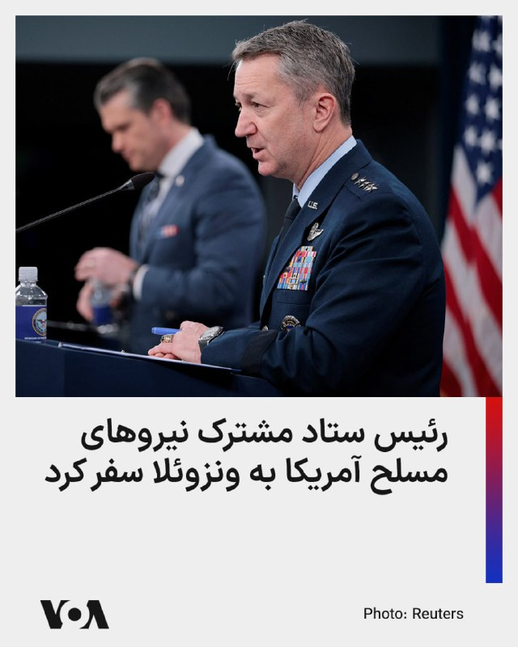

دفتر ژنرال دن کین، رئیس ستاد مشترک نیروهای مسلح آمریکا، اعلام کرد که او چهارشنبه به کاراکاس، پایتخت ونزوئلا سفر کرد.

در بیانیه‌ دفتر رئیس ستاد مشترک نیروهای مسلح آمریکا آمده است: «ژنرال کین در گفت‌وگوهای دوجانبه با رهبران ارشد دولت موقت [ونزوئلا]، همچنین با رهبری و کارکنان سفارت ایالات متحده شرکت کرد و از واحد تقویتی امنیت تفنگداران دریایی سفارت نیز بازدید به عمل آورد.»

در این بیانیه همچنین تأکید شده که این نخستین سفر رسمی کین به ونزوئلا بوده است.

این سفر کمتر از دو هفته پس از آن انجام می‌شود که ژنرال فرانسیس دوناوان، فرمانده عملیات نظامی ایالات متحده در آمریکای لاتین، در چارچوب یک رزمایش واکنش سریع با مشارکت تفنگداران دریایی و هواپیماهای نظامی، از کاراکاس بازدید کرده بود.

دلسی رودریگز، رئیس‌جمهور موقت ونزوئلا، در حال حاضر در چارچوب یک سفر رسمی دولتی، در هند به سر می‌برد.
@FarsiVOA

## IranianMinds — post 21350

  <a href="telegram/content/IranianMinds_21350_1780554281.mp4" target="_blank">🎬 Download video</a>

🔴 ترامپ در مورد خاورمیانه :

در اون بخش از جهان آتش بس یعنی به جای توقف کامل شلیک ، فقط به شدت کمتری شلیک میکنن همین!

@IranianMinds

## IranianMinds — post 21349

  <a href="telegram/content/IranianMinds_21349_1780554283.webm" target="_blank">🎬 Download video</a>

🆗
🔡
🔡
5️⃣ تومان هدیه فقط برای ثبت‌نام! 
🆗

💥 بدون واریز

3️⃣ قدم تا دریافت هدیه:
✅ ثبت‌نام در سایت

✅ دریافت بونوس
0️⃣
0️⃣
5️⃣ هزار تومانی

✅ تبدیل بونوس به موجودی واقعی با شرط‌بندی

فقط تا 
3️⃣ روز دیگه میتونی هدیه بگیری!

پس از پایان افتتاحیه، امکان دریافت این هدیه وجود نخواهد داشت.

🚩
🚩 خرداد افتتاحیه بزرگ سایت وینرو
🟥 اگر هنوز ثبت‌نام نکردی، همین حالا اقدام کن و جزو دریافت‌کنندگان بونوس ویژه افتتاحیه باش.
ar14

🔤 Winro.io         معتبرترین سایت ایران

🔤 Winro.io

📱 کانال اخبار و هدایــا 
🌟

📱 @winro_io

## IranianMinds — post 21348

  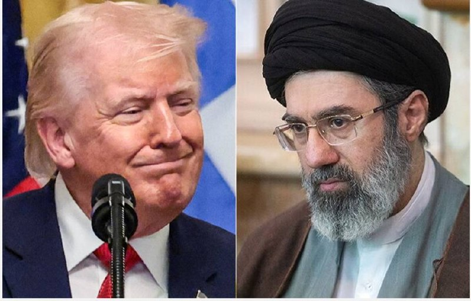

🔴 ترامپ:

طبق اطلاعاتی که به من رسیده مجتبی خامنه ای حال و روز خوبی نداره و بیشتر اعضای بدنشو از دست داده.

@IranianMinds

## alonews — post 124969

  <a href="telegram/content/alonews_124969_1780554285.webm" target="_blank">🎬 Download video</a>

👈کاتز: اسرائیل این آزادی عمل را دارد که با حمایت آمریکا در پاسخ به هرگونه آتش‌سوزی به سمت شهرک‌ها یا اسرائیل، به بیروت حمله کند

🔴حضور ارتش ما در منطقه امنیتی شامل منطقه قلعه بوفورت می‌شود و ساکنان از بازگشت به آنجا منع شده‌اند

🔴یک منطقه غیرنظامی در جنوب رودخانه لیتانی ایجاد خواهد شد

✅ @AloNews خبر جنگ

## alonews — post 124967

  <a href="telegram/content/alonews_124967_1780554285.mp4" target="_blank">🎬 Download video</a>

👈دیده شدن دونالد ترامپ در یکی از پارک های شیراز

✅ @AloNews خبر جنگ

## alonews — post 124966

  <a href="telegram/content/alonews_124966_1780554288.webm" target="_blank">🎬 Download video</a>

👈وزیر دفاع اسرائیل: به هدف قرار دادن زیرساخت های حزب الله در لبنان ادامه خواهیم داد

✅ @AloNews خبر جنگ

---
📅 بروزرسانی: 1405/03/14 09:43
---

## VahidOOnLine — post 243610

  

♦️اسرائیل کاتس، وزیر دفاع اسرائیل صبح پنجشنبه ۱۴ خردادماه و ساعاتی پس از اعلام توافق لبنان با اسرائیل برای برقراری آتش‌بس، گفت این توافق، شامل خلع سلاح حز‌ب‌الله می‌شود و دخالت منطقه‌ای جمهوری اسلامی ایران را محکوم می‌کند.

نمایندگان اسرائیل و لبنان بامداد پنجشنبه به وقت خاورمیانه در واشنگتن و با میانجیگری آمریکا بر سر آتش‌بس به توافق رسیدند.

با وجود این توافق، اسرائیل کاتس گفت که با موافقت دولت آمریکا، در صورت ادامه حملات حزب‌الله، عملیات اسرائیل تا بیروت هم ادامه خواهد یافت. به‌علاوه، ارتش اسرائیل در خاک لبنان و تا «خط زرد» رودخانه لیتانی باقی خواهد ماند و به عملیات خود ادامه خواهد داد.

به‌گزارش اورشلیم‌پست، وزیر دفاع اسرائیل گفت ارتش این کشور با تحمیل توان خود برای اولین بار در ۵۰ سال گذشته موفق شده امنیت را برای ساکنان مناطق شمالی این کشور فراهم کند.
‌🇸🇦 Indypersian

🤖 @VahidOOnLine

## WithYashar — post 13463

جنگ ترامپ با ایران و اختلال در حمل و نقل نفت از طریق تنگه هرمز، ذخایر نفتی آمریکا را به پایین‌ترین سطح خود از سال ۲۰۰۴ رسانده است.

برای کمک به مهار افزایش قیمت سوخت، آمریکا میلیون‌ها بشکه از ذخیره استراتژیک خود را آزاد کرده و همچنین صادرات به اروپا و آسیا را افزایش داده است تا جایگزین عرضه از دست رفته خاورمیانه شود.
@withyashar

## mwarmonitor — post 10126

  <a href="telegram/content/mwarmonitor_10126_1780553639.mp4" target="_blank">🎬 Download video</a>

⭕️ تصاویر ماهواره‌ای جدید ظاهراً نشان می‌دهد که در پی حملات اخیر ایران، به پایگاه هوایی آمریکا «علی السالم» در کویت خساراتی وارد شده است.

🔹فرماندهی مرکزی آمریکا (سنتکام) دیروز تأکید کرده بود که تمامی موشک‌ها و پهپادهای ورودی «منهدم شده‌اند»، اما مقام‌های کویتی همچنین ویدئوهایی منتشر کردند که ادعا می‌شود برخورد یک پهپاد ایرانی با فرودگاه این کشور و وقوع یک انفجار بزرگ را نشان می‌دهد.

@mwarmonitor

## mwarmonitor — post 10125

🔴بر اساس گزارش وال‌استریت ژورنال، ترامپ جمعه گذشته آخرین پیشنهاد ایران را رد کرد و به مشاورانش گفت که ایران باید از همان ابتدا امتیازهای جدی بدهد، نه اینکه این امتیازها را در یک بازه زمانی طولانی ارائه کند.

@mwarmonitor

## mwarmonitor — post 10124

🔹بر اساس گزارش وال‌استریت ژورنال، رئیس‌جمهور ترامپ به‌طور خصوصی به مشاوران خود گفته است که اگر تهران نیروهای آمریکایی را بکشد، احتمال پایان دادن به آتش‌بس با ایران را بررسی خواهد کرد.

@mwarmonitor

## mwarmonitor — post 10123

🔸رسانه‌های اسرائیلی: از زمان اعلام آتش‌بس، حزب‌الله ۶ موشک به‌سوی نیروهای ما که در جنوب لبنان فعالیت می‌کنند، شلیک کرده است.

@mwarmonitor

## DW_Farsi — post 125470

  

🔶 اسرائیل و لبنان بر سر تمدید آتش‌بس توافق کردند

اسرائیل و لبنان در مذاکرات دو روزه خود در واشنگتن بر سر اجرای یک آتش‌بس به توافق رسیدند.

بر اساس بیانیه مشترکی که شامگاه چهارشنبه ۱۳ خرداد (۳ ژوئن) در واشنگتن منتشر شد، قرار است برخی مناطق بطور آزمایشی تحت کنترل انحصاری ارتش لبنان ایجاد شوند و در ظرف این ماه نیز گفت‌وگوهای بیشتری میان طرفین انجام گیرد.

با این حال، هر دو طرف در بیانیه خود تاکید کردند که اجرای آتش‌بس منوط به "توقف کامل حملات حزب‌الله" علیه اسرائیل و خروج نیروهای این گروه از بخش جنوبی رود لیتانی در نزدیکی مرز اسرائیل است.

بین اسرائیل و لبنان از ۱۷ آوریل سال جاری تا کنون آتش‌بس برقرار بوده است اما با وجود این آتش‌بس، اسرائیل و شبه‌نظامیان حزب‌الله لبنان که مورد حمایت تهران هستند، روزانه حملاتی علیه یکدیگر انجام می‌دهند.

حزب‌الله نه تنها با آتش‌بس مخالفت می‌کند، بلکه با مذاکرات میان اسرائیل و لبنان در واشنگتن نیز مخالف است؛ مذاکراتی که بدون مشارکت این گروه برگزار می‌شود.

لبنان اوایل ماه مارس عملا به جنگ ایران کشیده شد. از آن زمان تا کنون حزب‌الله در واکنش به کشته‌شدن علی خامنه‌ای، بارها موشک‌هایی را به سوی اسرائیل شلیک کرده است. اسرائیل نیز در مقابل حملات هوایی علیه اهداف حزب‌الله در لبنان انجام داده و نیروهای زمینی این کشور وارد خاک لبنان شدند.

@dw_farsi

## Persian_Trend_Official — post 15677

  

اگر حملات ایران منجر به کشته شدن یک سرباز امریکایی شود، جنگ را آغاز می‌کنیم!

به گزارش وال استریت ژورنال، ترامپ به دستیارانش گفته است که اگر اقدامات ایران منجر به کشته شدن نیروهای آمریکایی شود، در نظر دارد به آتش بس با ایران پایان دهد.

مقامات آمریکایی می گویند که حملات مکرر فشار بر ترامپ را افزایش داده و سوالاتی را در مورد دوام طولانی مدت آتش بس ایجاد کرده است. بی‌میلی ترامپ برای شعله‌ور کردن مجدد جنگ نشان می‌دهد که او ممکن است مایل باشد برای هفته‌ها یا حتی ماه‌ها برای جلوگیری از درگیری گسترده‌تر در خاورمیانه، در برابر شعله‌های کوچک‌تر مقاومت کند

📝 Amir

📌 @persian_trend_official
پرشین ترند | متفاوت‌ترین کانال نظامی.

## IranianMinds — post 21347

🔴 اسرائیل و لبنان پس از مذاکرات با میانجی‌گری آمریکا، با اجرای آتش‌بس موافقت کرده‌اند؛

اما این توافق مشروط به توقف کامل حملات حزب‌الله است.

نیروهای حزب‌الله باید از مناطق جنوب لبنان، بین رود لیتانی و مرز اسرائیل، عقب‌نشینی کنند

ارتش لبنان کنترل مناطق تعیین‌شده را در دست خواهد گرفت

اجرای توافق منوط به توقف کامل حملات حزب‌الله است

@IranianMinds

## BBCPersian — post 282835

🔻 حمله پهپادی اسرائیل به خودرویی در جنوب لبنان

شبکه تلویزیونی الجزیره قطر گزارش کرده که که یک پهپاد اسرائیلی به خودرویی در جنوب لبنان حمله کرده است.

براساس این خبر این حادثه بین شهرهای کفرکلا و زفتا اتفاق افتاده است.

هنوز گزارشی در خصوص خسارت و یا کشته و زخمی‌های این حمله منتشر نشده است.

همزمان گزارش‌هایی از حمله یک پهپاد اسرائیلی به جاده‌ای بین کفررمان و حبوش در منطقه نبطیه در جنوب لبنان هم منتشر شده است.

https://bbc.in/4aabhHS
@BBCPersian

## idfinfarsi — post 11745

  <a href="telegram/content/idfinfarsi_11745_1780553642.mp4" target="_blank">🎬 Download video</a>

‼️ از هوا و زمین: حمله و به هلاکت رساندن تروریست‌ها در جریان یورش به ارتفاعات البوفور توسط هواگرد و تانک

⭕️در روزهای اخیر، نیروهای تیم رزمی تیپ گولانی تحت فرماندهی لشکر ۳۶ به کنترل عملیاتی در منطقه ارتفاعات البوفور دست یافتند.

⭕️در جریان حمله به این ارتفاعات در نزدیکی قلعه بوفور، نیروها دو تروریست مسلح را در فاصله‌ای حدود ۱۵۰ متری از نیروها شناسایی کردند.

⭕️در یک چرخه اقدام سریع، یک تانک متعلق به تیم رزمی تیپ گولانی به این تروریست‌ها حمله کرد و پس از آن، رزمندگان یگان هواگردی نیروی هوایی تروریست‌ها را هدف قرار داده و به هلاکت رساندند.

⭕️ارتش اسرائیل به فعالیت خود برای رفع هرگونه تهدید علیه شهروندان کشور اسرائیل ادامه خواهد داد.

## alonews — post 124965

  <a href="telegram/content/alonews_124965_1780553643.webm" target="_blank">🎬 Download video</a>

👈رافائل گروسی» مدیرکل آژانس بین‌المللی انرژی اتمی در سفر به ریاض با «عبدالعزیز بن سلمان» وزیر انرژی عربستان سعودی دیدار و در مورد پیشرفت این کشور در برنامه هسته‌ای غیرنظامی ریاض گفت‌و‌گو کرد.

🔴 گروسی در صفحه شخصی خود در شبکه اجتماعی ایکس نوشت: «برای من مهم است که در عربستان سعودی باشم، زیرا ریاض در حال پیشبرد برنامه هسته‌ای غیرنظامی خود است.»

✅ @AloNews خبر جنگ

## alonews — post 124964

  <a href="telegram/content/alonews_124964_1780553644.webm" target="_blank">🎬 Download video</a>

👈کاهش قیمت نفت با امیدواری به آتش‌بس لبنان و اسرائیل و خوشبینی به پیشرفت مذاکرات ایران و امریکا

✅ @AloNews خبر جنگ

---
📅 بروزرسانی: 1405/03/14 09:34
---

## VahidOOnLine — post 243609

  <a href="telegram/content/VahidOOnLine_243609_1780553045.mp4" target="_blank">🎬 Download video</a>

♦️رضا هلالی، مداح حکومتی به همراه یک گروه سرد، ویدیویی از مداحی به شش زبان فارسی، عربی، ترکی، اسپانیایی، آلمانی و چینی منتشر کرده است.

این ویدیو به نام «یک جهان علی» به‌مناسبت عید غدیر در رسانه‌های حکومتی پیام‌رسان‌های داخلی منتشر شده است.

مداحی هلالی به زبان‌های مختلف و به‌خصوص چینی، واکنش کاربران شبکه‌های اجتماعی را برانگیخته است.
‌🇸🇦 Indypersian

🤖 @VahidOOnLine

## IranianMinds — post 21346

  

تظاهرات علیه قانون حجاب اجباری در اسفند ۱۳۵۷ ، فردای این روز حجاب در ایران اجباری شد.

@IranianMinds

## alonews — post 124963

  <a href="telegram/content/alonews_124963_1780553047.webm" target="_blank">🎬 Download video</a>

👈وزارت امور خارجه فرانسه با انتشار بیانیه‌ای همبستگی کامل پاریس را با کویت و بحرین اعلام کرد.

✅ @AloNews خبر جنگ

## alonews — post 124961

  <a href="telegram/content/alonews_124961_1780553048.webm" target="_blank">🎬 Download video</a>

👈وزارت امور خارجه آمریکا به درخواست نماینده تگزاس، واکین کاسترو، برای پاسخ به این سوال که آیا اسرائیل سلاح هسته‌ای دارد یا خیر، پاسخ داد.

🔴وزارت امور خارجه پاسخ داد: «ما شما را به دولت اسرائیل برای سوالاتتان درباره توانمندی‌های اسرائیل ارجاع می‌دهیم.»

✅ @AloNews خبر جنگ

## alonews — post 124960

  <a href="telegram/content/alonews_124960_1780553048.webm" target="_blank">🎬 Download video</a>

👈محمود قماطی، نایب‌رئیس شورای سیاسی حزب‌الله: تمام تلاش‌های آمریکا و اسرائیل با شکست مواجه خواهد شد.

🔴 رویارویی ادامه دارد و مقاومت در برابر تجاوز اسرائیل همچنان پابرجاست.

🔴 آمریکا و اسرائیل هیچ حقی در مورد سلاح‌های مقاومت ندارند، زیرا این یک موضوع داخلی لبنان است که ما در مورد آن توافق داریم

✅ @AloNews خبر جنگ

---
📅 بروزرسانی: 1405/03/14 09:24
---

## mwarmonitor — post 10122

🔴 بیانیه مشترک میان ایالات متحده، لبنان و اسرائیل: 📌ایالات متحده در روزهای ۲ و ۳ ژوئن ۲۰۲۶ چهارمین نشست سه‌جانبه سطح‌بالا را میان نمایندگان اسرائیل و لبنان برگزار کرد. 🔸در نتیجه مذاکراتی که به رهبری ایالات متحده انجام شد، اسرائیل و لبنان بر اجرای آتش‌بس…

## mwarmonitor — post 10121

🔴در پی تیراندازی در جریان یک مراسم فارغ‌التحصیلی مدرسه‌ای در شهر فیرفیلد آمریکا، یک نفر کشته و ۳ نفر دیگر زخمی شدند. CBS

@mwarmonitor

## IranianMinds — post 21345

از دی ماه تا الان انگار چند قرن گذشته …

@IranianMinds

## alonews — post 124959

  <a href="telegram/content/alonews_124959_1780552451.webm" target="_blank">🎬 Download video</a>

👈بن گویر وزیر امنیت ملی اسرائیل:
آتش بس با لبنان یک اشتباه بزرگ است

✅ @AloNews خبر جنگ

## alonews — post 124958

  <a href="telegram/content/alonews_124958_1780552451.webm" target="_blank">🎬 Download video</a>

👈اکونومیست در مورد مذاکرات ایران و آمریکا: هر دو طرف به آرامی به سمت توافقی حرکت می‌کنند که ممکن است پایدار نباشد. آنها طوری رفتار می‌کنند که انگار این توافق دائمی خواهد شد.

✅ @AloNews خبر جنگ

## alonews — post 124957

  <a href="telegram/content/alonews_124957_1780552452.webm" target="_blank">🎬 Download video</a>

👈فایننشال تایمز: همزمان با جنگ آمریکا علیه ایران و اختلال در عرضه انرژی، ذخایر نفت آمریکا به پایین‌ترین سطح از ۲۰۰۴ رسید و در صورت بسته ماندن تنگه هرمز، احتمال افزایش قیمت نفت تا ۲۰۰ دلار وجود دارد

✅ @AloNews خبر جنگ

## alonews — post 124956

  <a href="telegram/content/alonews_124956_1780552452.webm" target="_blank">🎬 Download video</a>

👈بیت کوین برای اولین بار از ۲۴ فوریه به زیر ۶۳٬۰۰۰ دلار سقوط کرده است

🔴 بیش از ۱.۱ میلیارد دلار موقعیت‌های اهرمی ارز دیجیتال در ۲۴ ساعت گذشته نقد شده‌اند

✅ @AloNews خبر جنگ

---
📅 بروزرسانی: 1405/03/14 09:14
---

## Persian_Trend_Official — post 15676

  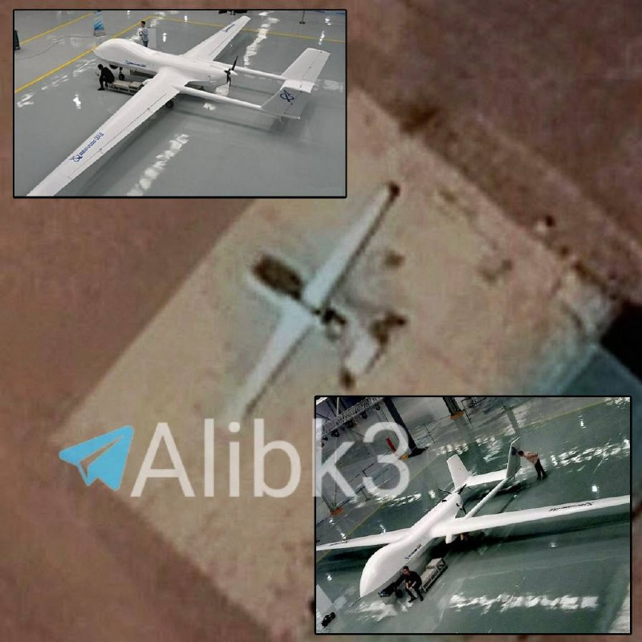

یک پهپاد BZK-005E ساخت چین که متعلق به امارات است، در فرودگاه دارفور سودان مشاهده شده است.

این امر نشان می‌دهد امارات به طور قابل توجهی در حال دامن زدن به جنگ داخلی در سودان برای تضمین ادامه آن است.

📝 Amir

📌 @persian_trend_official
پرشین ترند | متفاوت‌ترین کانال نظامی

## IranianMinds — post 21344

  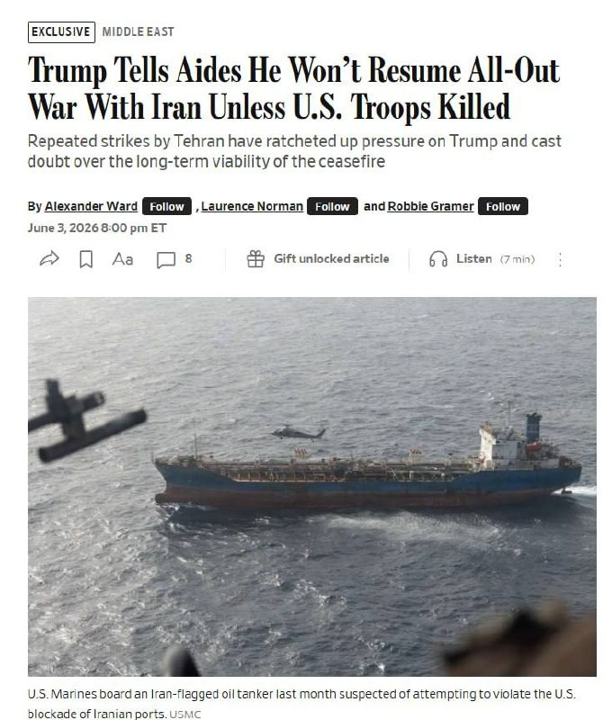

🔴 وال استریت ژورنال :

ترامپ دستور داده که اگه ایران حمله ای انجام بده و یک سرباز آمریکایی آسیب ببینه فورا به آتش بس پایان بدن و‌ جنگ رو مجدد شروع کنن.

@IranianMinds

## BBCPersian — post 282834

  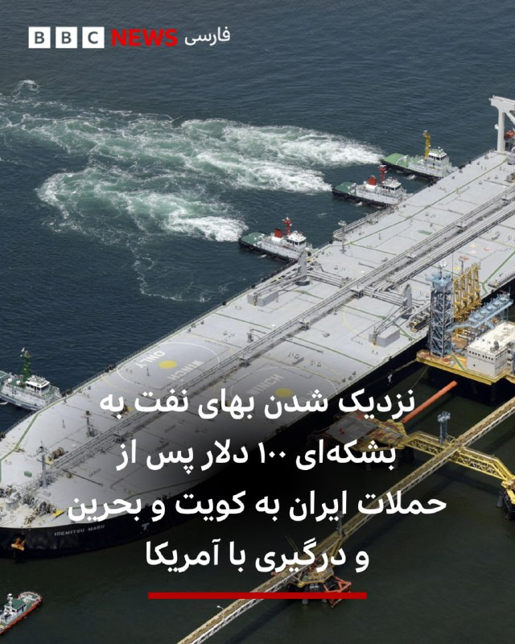

‌ ‌ ‌
بهای نفت برنت شمال در بازارهای صبح پنجشنبه آسیا به حدود ۹۷ دلار برای هر بشکه رسید.

حمله روز گذشته ایران به کویت و بحرین و حمله ارتش آمریکا به یک نفتکش در مسیر بنادر ایران و همچنین نقاطی در جنوب جزیره قشم، به تلاطم مجدد در بازار نفت منجر شده است.

با این حال انتظار می‌رود خبر توافق آتش‌بس میان لبنان و اسرائیل مانع از صعود بهای نفت برنت دریای شمال به بالای ۱۰۰ دلار در هر بشکه در روزهای آخر هفته شود.

https://bbc.in/3RNA7XQ
📷Reuters
@BBCPersian

## alonews — post 124955

  <a href="telegram/content/alonews_124955_1780551843.webm" target="_blank">🎬 Download video</a>

👈وال استریت ژورنال: مقامات آمریکایی گفتند حملات مکرر تهران فشار بر ترامپ را افزایش داده و در مورد دوام آتش بس در درازمدت تردید ایجاد کرده است

✅ @AloNews خبر جنگ

## alonews — post 124954

  <a href="telegram/content/alonews_124954_1780551843.webm" target="_blank">🎬 Download video</a>

👈 معاریو به نقل از یک مقام امنیتی اسرائیلی: ما یک پنجره عملیاتی برای انجام مأموریت در بیروت داشتیم، اما بیانیه نتانیاهو و کاتس آن را بست.

🔴 ما می‌توانیم در صور و صیدا آزادانه عمل کنیم، اما بیروت تابع محدودیت‌ها است.

✅ @AloNews خبر جنگ

## alonews — post 124953

  <a href="telegram/content/alonews_124953_1780551843.mp4" target="_blank">🎬 Download video</a>

👈تصاویر ماهواره‌ای با وضوح بالاتر از خسارات وارده به یکی از پناهگاه‌های پهپاد/هواگرد در پایگاه آمریکایی علی‌السالم کویت در پی حملات موشکی سپاه

✅ @AloNews خبر جنگ

## alonews — post 124952

  <a href="telegram/content/alonews_124952_1780551845.webm" target="_blank">🎬 Download video</a>

👈 ۲۰۰,۰۰۰,۰۰۰,۰۰۰ دلار از ارزش بازار رمزارزها در ۲۴ ساعت گذشته کاهش یافته است

✅ @AloNews خبر جنگ

## alonews — post 124951

  <a href="telegram/content/alonews_124951_1780551845.webm" target="_blank">🎬 Download video</a>

👈سی‌ان‌ان گزارش داد ترامپ به مشاوران خود اعلام کرده است هیچ توافقی را که شامل ارائه بودجه مستقیم ایالات متحده به ایران باشد، امضا نخواهد کرد.

🔴 این در حالی است که بحث‌هایی درباره ایجاد صندوقی برای واگذاری میلیاردها دلار به ایران پس از دستیابی به توافق نهایی مطرح شده است

✅ @AloNews خبر جنگ

## alonews — post 124950

  <a href="telegram/content/alonews_124950_1780551845.webm" target="_blank">🎬 Download video</a>

👈 تصاویر مربوط به اصابت پهپاد انتحاری به فرودگاه کویت از دید دوربین‌های مداربسته.

✅ @AloNews خبر جنگ

---
📅 بروزرسانی: 1405/03/14 09:04
---

## IranIntlTV — post 340462

  <a href="telegram/content/IranIntlTV_340462_1780551252.mp4" target="_blank">🎬 Download video</a>

پارلمان سوئد چهارشنبه میزبان نشستی تخصصی با عنوان «پروژه شکوفایی ایران» بود که در آن پژوهشگران ایرانی درباره چشم‌انداز بازسازی ایران و استقرار نهادهای دموکراتیک در دوران پس از جمهوری اسلامی با نمایندگان این پارلمان گفت‌وگو کردند

گزارش مهران عباسیان، خبرنگار ایران‌اینترنشنال
@iranintltv

## Persian_Trend_Official — post 15675

  <a href="telegram/content/Persian_Trend_Official_15675_1780551254.webm" target="_blank">🎬 Download video</a>

📰وال‌استریت ژورنال: خط قرمز ترامپ برای آغاز جنگ با ایران، کشته شدن نیروهای آمریکایی است:

🇺🇸دونالد ترامپ در گفت‌وگوهای خصوصی با مشاوران خود تأکید کرده است که تا زمانی که نیروهای آمریکایی توسط ایران کشته نشوند، قصد پایان دادن به آتش‌بس و ورود به یک جنگ تمام‌عیار با تهران را ندارد.

این گزارش می‌افزاید حملات و فشارهای مستمر ایران علیه منافع آمریکا و متحدانش در منطقه، بحث‌ها در داخل دولت آمریکا درباره پایداری آتش‌بس را افزایش داده است. با این حال، کاخ سفید همچنان کشته شدن نظامیان آمریکایی را مهم‌ترین آستانه برای تغییر رویکرد نظامی خود در قبال ایران می‌داند.

همزمان برخی مقام‌های آمریکایی نسبت به شکننده بودن وضعیت فعلی هشدار داده‌اند و معتقدند هرگونه حادثه‌ای که به تلفات نیروهای آمریکایی منجر شود، می‌تواند به‌سرعت شرایط را از فاز بازدارندگی به رویارویی مستقیم نظامی تغییر دهد.

پیام اصلی این گزارش روشن است؛ واشنگتن فعلاً به‌دنبال جلوگیری از گسترش جنگ است، اما کشته شدن نیروهای آمریکایی را خط قرمز خود می‌داند؛ رخدادی که می‌تواند آتش‌بس را به‌سرعت به رویارویی مستقیم تبدیل کند.

👺Phantom

📌 @persian_trend_official
پرشین ترند | متفاوت‌ترین کانال نظامی

## Persian_Trend_Official — post 15674

  <a href="telegram/content/Persian_Trend_Official_15674_1780551254.mp4" target="_blank">🎬 Download video</a>

ارتش امریکا روز چهارشنبه حمله هوایی به یک قایق مظنون به قاچاق مواد مخدر در شرق اقیانوس آرام انجام داده است.

هر دو سرنشین این قایق در حمله امریکا کشته شدند.

📝 Amir

📌 @persian_trend_official
پرشین ترند | متفاوت‌ترین کانال نظامی

## RadioFarda — post 157880

  <a href="telegram/content/RadioFarda_157880_1780551256.mp4" target="_blank">🎬 Download video</a>

🔸سازمان هواپیمایی کشوری کویت ویدئوی دوربین‌های نظارتی را منتشر کرده که به گفته این نهاد، نشان‌دهنده برخورد یک پهپاد ایرانی به فرودگاه بین‌المللی کویت در روز چهارشنبه ۳ ژوئن است.

🔸رویترز با بررسی ساختمان‌ها، ساختار سقف، ستون‌ها و فضای داخلی ترمینال فرودگاه و تطبیق آن با تصاویر آرشیوی و ماهواره‌ای، محل وقوع این حادثه را تأیید کرده است.

🔸مقام‌های کویتی و رسانه‌های دولتی اعلام کردند که پس از حمله پهپادی و موشکی که به تأسیسات فرودگاهی و مراکز دیپلماتیک آسیب رساند، پروازها در فرودگاه بین‌المللی کویت متوقف شد. در این حمله یک نفر کشته و بیش از ۶۰ نفر زخمی شدند.

🔸خبرگزاری دولتی کویت به نقل از سازمان هواپیمایی کشوری گزارش داد که این حمله «خسارت شدید» به ساختمان ترمینال شماره ۱ فرودگاه وارد کرده است.

🔸در مقابل، سپاه پاسداران ایران اعلام کرد که فرودگاه کویت را هدف قرار نداده و تخریب‌های به‌وجودآمده ناشی از موشک‌های رهگیر آمریکایی بوده که نتوانسته‌اند اهداف خود را منهدم کنند.

🔸ارتش آمریکا این ادعا را رد کرد و گفت پهپادهای ایرانی عمداً فرودگاه را هدف قرار داده‌اند.

@RadioFarda

## alonews — post 124949

  <a href="telegram/content/alonews_124949_1780551258.mp4" target="_blank">🎬 Download video</a>

👈اعتراض به حمایت آمریکا از اسرائیل در جلسه استماع وزیر امورخارجه آمریکا

✅ @AloNews خبر جنگ

## alonews — post 124948

  <a href="telegram/content/alonews_124948_1780551258.webm" target="_blank">🎬 Download video</a>

👈العربیه: ایران و آمریکا به توافق موقت ۴ مرحله‌ای نزدیک شده‌اند

🔴از تثبیت آتش‌بس و امنیت در تنگه هرمز تا کاهش محدود تحریم‌ها و سپس بحث غنی‌سازی اورانیوم

✅ @AloNews خبر جنگ

---
📅 بروزرسانی: 1405/03/14 08:54
---

## IranIntlTV — post 340461

  <a href="telegram/content/IranIntlTV_340461_1780550652.mp4" target="_blank">🎬 Download video</a>

مقامات فدرال آمریکا اعلام کردند جمشید قمی، تاجر ۶۳ ساله ساکن کالیفرنیا، به اتهام تامین تجهیزات رایانه‌ای و شبکه‌ای ساخت آمریکا برای نهادهای وابسته به جمهوری اسلامی بازداشت شده است

نیلوفر منصوری، خبرنگار ایران‌اینترنشنال گزارش می‌دهد
@iranintltv

---
📅 بروزرسانی: 1405/03/14 08:44
---

هیچ پیام جدیدی در این بروزرسانی ارسال نشد.

---
📅 بروزرسانی: 1405/03/14 08:34
---

## VahidOOnLine — post 243608

  

سازمان حقوق بشری هه‌نگاو و سازمان کوییرهای ایرانی سیمرغ با انتشار اطلاعیه‌ای خبر کشته‌شدن مهشید فلاحی، زن ترنس، در سنندج را تکذیب کردند. این سازمان‌ها ضمن عذرخواهی درباره انتشار این خبر نادرست، با وجود راستی‌آزمایی‌های قبلی، گفتند اسناد جدید نشان می‌دهد این شهروند زنده است.
در هفته گذشته چندین سازمان حقوق بشری از قتل مهشید فلاحی خبر داده و از مخاطبان خواسته بودند درباره هرگونه اطلاعات موثق در ارتباط با این شهروند کوییر اطلاع‌رسانی کنند.
‌🏁 🇬🇧 IranintlTV

🤖 @VahidOOnLine

## VahidOOnLine — post 243607

♦️پس از برقراری تدریجی دسترسی به اینترنت در ایران، ویدیوهای منتشرشده در شبکه‌های اجتماعی نشان می‌دهد فرزندان جاویدنام علی‌اصغر شیری در سالروز تولد ۳۶ سالگی پدرشان، شمع‌های کیک تولد او را با گریه خاموش کردند.

علی‌اصغر شیری، ۳۵ ساله، متولد میانه ساکن صباشهر شهریار، پدر دو فرزند و کارگر ساختمان بود که ۱۹ دی‌ماه سال ۱۴۰۴ در جریان اعتراضات سراسری هدف شلیک گلوله نیروهای سرکوبکر جمهوری اسلامی قرار گرفت. گلوله به سینه او اصابت کرد و در نتیجه این تیراندازی کشته شد.
‌🇸🇦 Indypersian

🤖 @VahidOOnLine

## IranIntlTV — post 340460

  

سازمان حقوق بشری هه‌نگاو و سازمان کوییرهای ایرانی سیمرغ با انتشار اطلاعیه‌ای خبر کشته‌شدن مهشید فلاحی، زن ترنس، در سنندج را تکذیب کردند. این سازمان‌ها ضمن عذرخواهی درباره انتشار این خبر نادرست، با وجود راستی‌آزمایی‌های قبلی، گفتند اسناد جدید نشان می‌دهد این شهروند زنده است.
در هفته گذشته چندین سازمان حقوق بشری از قتل مهشید فلاحی خبر داده و از مخاطبان خواسته بودند درباره هرگونه اطلاعات موثق در ارتباط با این شهروند کوییر اطلاع‌رسانی کنند.
https://iranintl.com/202606041964

## FarsiVOA — post 219540

Farsi VOA pinned an audio file

## FarsiVOA — post 219539

  <a href="https://t.me/farsivoa/219539" target="_blank">📎 Download file</a>

🔴📢‌ پادکست خبری چهارشنبه ۱۳خرداد ۱۴۰۵

🛜در صورتی که با مشکل اینترنت مواجه هستید میتوانید اخبار صدای آمریکا را از نسخه‌های پادکست خبری ما روزانه دنبال کنید و یا اخبار را از نسخه سبک وب‌سایت ما پیگیر باشید:
https://ir.voanews.com/lite

📡بروزترین فرکانسهای ماهواره‌ای را نیز میتوانید از صفحه زیر پیگیری کنید:
https://ir.voanews.com/satellite

🔔دیگر شبکه‌های اجتماعی ما هم دنبال کنید:
https://linktr.ee/voafarsi

ما را به اشتراک بگذارید
@farsivoa

## Persian_Trend_Official — post 15673

  <a href="telegram/content/Persian_Trend_Official_15673_1780549448.mp4" target="_blank">🎬 Download video</a>

دولت کویت ویدیویی از لحظه اصابت پهپاد انتحاری شاهد-136 به ترمینال شماره یک فرودگاه بین‌المللی خود منتشر کرد.

در این حمله 1 نفر کشته و بیش از 60 شهروند کویتی زخمی شدند. سخنگوی سپاه تا پیش از این، حمله به فرودگاه را تکذیب کرده بود و ادعا داشت که موشک رهگیر پاتریوت به آن اصابت کرده است.

📝 Amir

📌 @persian_trend_official
پرشین ترند | متفاوت‌ترین کانال نظامی

## Persian_Trend_Official — post 15667

  <a href="telegram/content/Persian_Trend_Official_15667_1780549449.webm" target="_blank">🎬 Download video</a>

💰 بازداشت مدیر ایرانی-آمریکایی در کالیفرنیا؛ اتهام تأمین تجهیزات برای برنامه هسته‌ای ایران

مقامات فدرال آمریکا روز چهارشنبه ۱۳ خرداد، جمشید قمی، مدیر ۶۳ ساله یک شرکت فناوری و دارای تابعیت دوگانه ایران و آمریکا را در جریان عملیاتی غافلگیرانه در عمارت ۳۵ میلیون دلاری‌اش در نیوپورت بیچ کالیفرنیا بازداشت کردند.
بر اساس اعلام دادستانی، قمی به توطئه برای نقض «قانون اختیارات اقتصادی در شرایط اضطراری بین‌المللی» (IEEPA) متهم است. به گفته بیل عسایلی، دادستان ارشد فدرال در لس‌آنجلس، وی از طریق فروش تجهیزات شبکه‌ای ساخت آمریکا به ایران و کسب سودهای کلان، در نقض تحریم‌ها و کمک به برنامه‌های نظامی و هسته‌ای جمهوری اسلامی نقش داشته است. دادستانی همچنین اعلام کرده علاوه بر درخواست مجازات حبس، پیگیر مصادره دارایی‌های او از جمله این ملک لوکس خواهد بود.
طبق کیفرخواست، قمی طی بیش از یک دهه با استفاده از شرکت مستقر در تهران با نام «فراز پرداز رایانه» اقدام به خرید و انتقال مخفیانه بیش از ۲۵۰ قلم تجهیزات کنترل‌شده فناوری کرده است. گزارش‌ها حاکی است وی برای دور زدن تحریم‌ها از حساب‌های شخصی در پلتفرم‌هایی مانند eBay و PayPal و همچنین شبکه‌ای از شرکت‌های صوری در امارات متحده عربی بهره می‌برده است.

👺Phantom

📌 @persian_trend_official
پرشین ترند | متفاوت‌ترین کانال نظامی

---
📅 بروزرسانی: 1405/03/14 08:24
---

## IranIntlTV — post 340459

  <a href="telegram/content/IranIntlTV_340459_1780548868.mp4" target="_blank">🎬 Download video</a>

سرخط خبرهای پنج‌شنبه ۱۴ خرداد
@iranintltv

## FarsiVOA — post 219538

  

ارتش اسرائیل اعلام کرد که یک «هدف هوایی مشکوک» باعث به صدا درآمدن آژیرهای هشدار در ساعات اولیه پنجشنبه در منطقه مسکونی کفار یووال در شمال اسرائیل شده است.

این اتفاق تنها چند ساعت پس از اعلام آتش‌بس میان اسرائیل و لبنان رخ داده است.

در بیانیه ارتش اسرائیل توضیح داده نشده که چه بر سر این هدف آمده است و تنها گفته شده که این حادثه پایان یافته و هیچ مصدومی بر جای نگذاشته است.

علاوه بر این، ارتش اعلام کرده است که آژیرهایی که در شهر عرب العرامشه به صدا درآمده بودند، هشدار اشتباه بوده‌اند.

اسرائیل و لبنان در هفته‌های اخیر در نتیجه تلاش‌های گسترده ایالات متحده و چندین کشور دیگر، به یک توافق آتش‌بس دست یافتند. اما در پی نقض آتش‌بس توسط حزب‌الله، اسرائیل در واکنش به تحرکات این گروه در جنوب لبنان حملاتی را علیه مواضع آن انجام داده است.
@FarsiVOA

## RadioFarda — post 157879

ترامپ بار دیگر از احتمال توافق با ایران طی چند روز آینده خبر داد

🔸رئیس‌جمهور ایالات متحده که در کاخ سفید با خبرنگاران صحبت می‌کرد، با تأکید بر این‌که «مذاکرات به‌خوبی پیش می‌رود»، گفت ممکن است همین‌روزها و چه‌بسا همین شنبه و یکشنبه، به توافق برسیم.

🔸دونالد ترامپ، به خبرنگاران گفت: «شاید نشود، اما ممکن است همین آخر هفته به نتیجه برسیم».

🔸رئیس‌جمهور آمریکا همزمان از تمایلش به جدا کردن موضوع لبنان از مذاکرات ایران سخن گفت. دونالد ترامپ به خبرنگاران گفت: «ترجیح می‌دهم جدای‌شان کنم. چون در واقع دو موضوع مجزا هستند».

🔸این در حالی‌است که مقام‌های جمهوری اسلامی، بارها تضمین امنیت لبنان را از پیش‌شرط‌های ادامۀ گفت‌وگو با آمریکا عنوان کرده‌اند. عباس عراقچی وزیر خارجۀ جمهوری اسلامی هم در روز چهارشنبه هشدار داد که در صورت حملۀ اسرائیل به بیروت، ممکن است جنگ به شکل کامل از سر گرفته شود.

🔸دونالد ترامپ در مورد ذخیرۀ اورانیوم غنی‌شدۀ ایران هم تکرار کرد که این ذخیره را از ایران خواهد گرفت. رئیس‌جمهور آمریکا حتی تأکید کرد که این موضوع در «آینده‌ای نه‌چندان دور» اتفاق خواهد افتاد.

@RadioFarda

## RadioFarda — post 157878

وال‌استریت جورنال: در صورت کشته‌شدن سربازان آمریکایی، ترامپ ممکن است آتش‌بس با ایران را پایان دهد

🔸روزنامۀ وال‌استریت جورنال روز چهارشنبه به نقل از مقام‌های آمریکایی نوشت که دونالد ترامپ به‌شکل خصوصی به دستیارانش گفته چنانچه تهران سربازان آمریکایی را بکشد، پایان‌دادن به آتش‌بس با ایران را به‌عنوان یک گزینه مد نظر قرار خواهد داد.

🔸رئیس‌جمهور آمریکا در عین حال در همین روز، درگیری‌های دو شب گذشته در حوالی خلیج فارس را «کم‌اهمیت» و «از ویژگی‌های این منطقه از جهان» خوانده بود.

@RadioFarda

---
📅 بروزرسانی: 1405/03/14 08:14
---

## VahidOOnLine — post 243606

  

کاندولیزا رایس، وزیر خارجه پیشین آمریکا، در مقاله‌ای در وال‌استریت ژورنال با ارزیابی نتایج جنگ ایران، استدلال کرد که جمهوری اسلامی به‌طور قابل توجهی تضعیف شده و واشینگتن نباید برای دستیابی به یک توافق هسته‌ای شتاب‌زده امتیاز بدهد.
او تاکید کرد که در شرایط کنونی، «نداشتن توافق» به‌مراتب بهتر از پذیرش یک «توافق بد» با تهران است.
رایس در این یادداشت نوشت که اگرچه جنگ با ایران به سرنگونی جمهوری اسلامی منجر نشد، اما توان نظامی، منطقه‌ای و هسته‌ای تهران را به‌شدت تضعیف کرده و زمینه شکل‌گیری خاورمیانه‌ای باثبات‌تر را فراهم آورده است.
وزیر خارجه پیشین آمریکا در دولت جورج دبلیو بوش، در این مقاله‌ استدلال کرده است که جنگ سه‌ماهه آمریکا و متحدانش علیه [حکومت] ایران، با وجود آنکه به نتیجه‌ای قطعی یا تغییر رژیم منجر نشده، دستاوردهای راهبردی مهمی برای واشینگتن، اسرائیل و کشورهای عربی منطقه به همراه داشته است.
ادامه مطلب را در اینجا بخوانید:
‌🏁 🇬🇧 IranintlTV

🤖 @VahidOOnLine

## IranIntlTV — post 340458

  

کاندولیزا رایس، وزیر خارجه پیشین آمریکا، در مقاله‌ای در وال‌استریت ژورنال با ارزیابی نتایج جنگ ایران، استدلال کرد که جمهوری اسلامی به‌طور قابل توجهی تضعیف شده و واشینگتن نباید برای دستیابی به یک توافق هسته‌ای شتاب‌زده امتیاز بدهد.
او تاکید کرد که در شرایط کنونی، «نداشتن توافق» به‌مراتب بهتر از پذیرش یک «توافق بد» با تهران است.
رایس در این یادداشت نوشت که اگرچه جنگ با ایران به سرنگونی جمهوری اسلامی منجر نشد، اما توان نظامی، منطقه‌ای و هسته‌ای تهران را به‌شدت تضعیف کرده و زمینه شکل‌گیری خاورمیانه‌ای باثبات‌تر را فراهم آورده است.
وزیر خارجه پیشین آمریکا در دولت جورج دبلیو بوش، در این مقاله‌ استدلال کرده است که جنگ سه‌ماهه آمریکا و متحدانش علیه [حکومت] ایران، با وجود آنکه به نتیجه‌ای قطعی یا تغییر رژیم منجر نشده، دستاوردهای راهبردی مهمی برای واشینگتن، اسرائیل و کشورهای عربی منطقه به همراه داشته است.
ادامه مطلب را در اینجا بخوانید:
https://iranintl.com/202606046929

## RadioFarda — post 157877

اسرائیل و لبنان بر سر تمدید آتش‌بس توافق کردند

🔸بر اساس بیانیۀ مشترکی که از سوی لبنان، اسرائیل و ایالات متحده منتشر شد، اسرائیل و لبنان بر سر تمدید آتش‌بس شکننده‌ای که با میانجی‌گری واشینگتن برقرار شده بود، توافق کردند.

🔸این توافق، آتش‌بس را به توقف کامل حملات حزب‌الله و خروج نیروهای این گروه شیعی تحت حمایت تهران از نواحی جنوبی رود لیتانی در نزدیکی مرز اسرائیل مشروط کرده است. این موضوع در بیانیۀ مشترکی که عصر چهارشنبه از سوی وزارت خارجۀ ایالات متحده منتشر شد، دیده می‌شود.

🔸در این بیانیه به ایجاد مناطق امنیتی «آزمایشی» هم اشاره شده که کنترلشان، به‌طور انحصاری در دست نیروهای مسلح لبنان خواهد بود و هیچ نیروی نظامی غیر دولتی‌ای اجازه فعالیت در آنها را نخواهد داشت. در این بیانیه مشخص نشده که این مناطق امنیتی، چطور ایجاد خواهند شد.

🔸این بیانیه می‌افزاید که «برداشتن این گام‌ها، حرکت به سوی یک توافق جامع صلح و امنیت را امکان‌پذیر خواهد کرد».

https://www.radiofarda.com/a/iran-us-war-liveblog/33647192.html

@RadioFarda

## RadioFarda — post 157876

مجلس نمایندگان آمریکا به قطعنامۀ محدود‌کردن قدرت دونالد ترامپ در زمینۀ جنگ ایران رأی مثبت داد

🔸هدف این لایحه که از سوی نمایندگان دموکرات طراحی و ارائه شده، منوط کردن جنگ با ایران، به موافقت و صدور مجوز کنگره است.

🔸طراحی و حالا تصویب این لایحه، از نگرانی فزایندۀ اعضای کنگره، حتی تعدادی از جمهوری‌خواهان نسبت به جنگ با ایران حکایت دارد.

🔸در رأی‌گیری چهارشنبه، با پیوستن ۴ نمایندۀ جمهوری‌خواه به دموکرات‌ها، این لایحه با ۲۱۵ رأی موافق در مقابل ۲۰۸ رأی مخالف تصویب شد.

🔸سناتورهای دموکرات هم بارها برای تصویب لایحه‌ای مشابه تلاش کرده‌اند که تاکنون موفق نبوده اند.

🔸تصویب این لایجه در مجلس نمایندگان البته تا حد زیادی نمادین است؛ چراکه حتی در صورت تأیید سنا، رئیس‌جمهور می‌تواند آن‌را وتو کند.

🔸این لایحه برای در امان ماندن از وتوی رئیس‌جمهور باید هم در مجلس نمایندگان و هم در سنا رأی مثبت دست‌کم دو سوم اعضا را داشته باشد.

@RadioFarda

## BBCPersian — post 282833

🔻 ارتش اسرائیل از شناسایی یک «پرتابه هوایی مشکوک» بر فراز شمال این کشور خبر داد

ارتش اسرائیل اعلام کرد که در پی شناسایی «یک پرتابه هوایی مشکوک» بر فراز منطقه کفار یووال در شمال این کشور آژیرهای هشدار به صدا در آمده‌اند.

به گفته ارتش اسرائیل، این هشدار در حال حاضر به پایان رسیده و هیچ زخمی گزارش نشده است.

همزمان این ارتش گفت که هشدار جداگانه‌ای بر اثر شناسایی پهپاد در روستای عرب‌ارامشه در همان نزدیکی فعال شده بود، که آن را به عنوان هشدار کاذب تشخیص داده شد.

https://bbc.in/4uVN14S
@BBCPersian

## BBCPersian — post 282825

‌ ‌ ‌ ‌
در حالی که هیجان برای آغاز جام جهانی در ۱۱ ژوئن رو به افزایش است، گروهی که در مکزیک به دنبال افراد ناپدیدشده بر اثر خشونت‌ها هستند، در حال تهیه آلبومی تاثیرگذار و تکان‌دهنده حاوی استیکرها است.

فعالان گروه «نور امید خالیسکو» (لوس د اسپرانسا خالیسکو) که بسیاری از آن‌ها پدران و مادران افرادی هستند که در ایالت خالیسکو ناپدید شده‌اند، مجموعه‌ای از استیکرها با حال‌وهوای جام جهانی منتشر کرده‌اند که تصویر عزیزانشان، که هنوز پیدا نشده‌اند، روی آن‌ها دیده می‌شود.

در این استیکرها، چهره‌ها با عکس‌های خانوادگی‌ که جوانان در آن‌ها لبخند بر لب دارند، با همان طرح آلبوم محبوب برای جام جهانی ۲۰۲۶ دیده می‌شوند، جام جهانی‌ که در آمریکا، مکزیک و کانادا برگزار می‌شود.

https://bbc.in/4x3Otnf
📸GettyImages/ Light of Hope Collective/ Anadolu via Getty Images/ AFP via Getty Images
@BBCPersian

---
📅 بروزرسانی: 1405/03/14 08:04
---

## VahidOOnLine — post 243605

  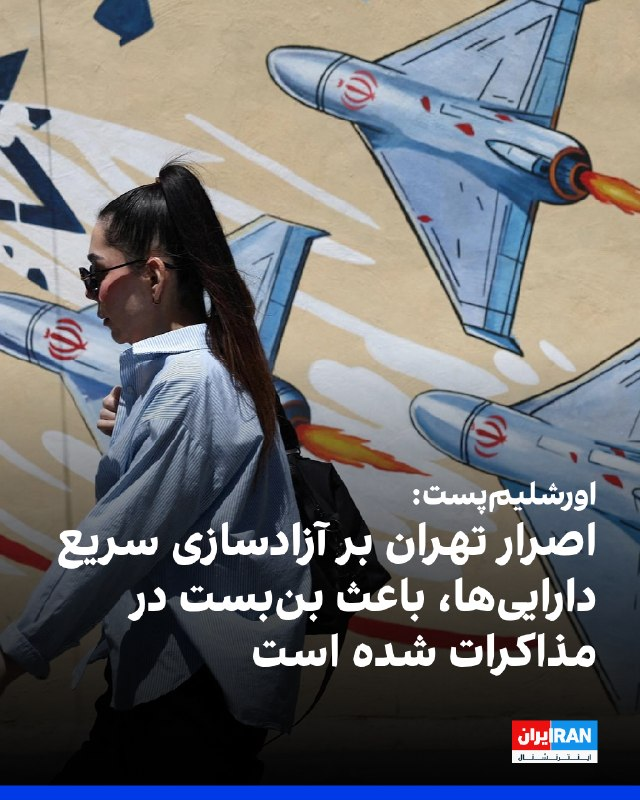

روزنامه اورشلیم‌پست به نقل از دو منبع آگاه گزارش داد مذاکرات جمهوری اسلامی و آمریکا به بن‌بستی جدی رسیده است، زیرا تهران اصرار دارد میلیاردها دلار از دارایی‌های مسدودشده ایران در همان مرحله نخست توافق آزاد شود.
طبق این گزارش، میانجی‌های منطقه‌ای در روزهای اخیر برای کاهش شکاف میان دو طرف چند فرمول مصالحه‌آمیز پیشنهاد کرده‌اند، از جمله صندوقی بشردوستانه که برای خرید دارو، غذا و کالاهای کشاورزی برای ایران اختصاص می‌یابد.
با این حال، به نوشته اورشلیم‌پست، مذاکره‌کنندگان ایرانی خواستار دسترسی فوری به منابع نقدی در مرحله نخست توافق هستند؛ اما مقام‌های آمریکایی این درخواست را رد کرده‌ و آزادسازی منابع را به اقدامات قابل راستی‌آزمایی جمهوری اسلامی گره زده‌اند.
مقام‌های آمریکایی به میانجی‌ها گفته‌اند واشینگتن بدون امتیازهای مشخص جمهوری اسلامی درباره برنامه هسته‌ای و ترتیبات امنیتی تنگه هرمز، منابع مالی قابل توجهی را آزاد نخواهد کرد، زیرا نگران است اهرم فشار خود را از دست بدهد.

‌🏁 🇬🇧 IranintlTV

🤖 @VahidOOnLine

## IranIntlTV — post 340457

  

روزنامه اورشلیم‌پست به نقل از دو منبع آگاه گزارش داد مذاکرات جمهوری اسلامی و آمریکا به بن‌بستی جدی رسیده است، زیرا تهران اصرار دارد میلیاردها دلار از دارایی‌های مسدودشده ایران در همان مرحله نخست توافق آزاد شود.
طبق این گزارش، میانجی‌های منطقه‌ای در روزهای اخیر برای کاهش شکاف میان دو طرف چند فرمول مصالحه‌آمیز پیشنهاد کرده‌اند، از جمله صندوقی بشردوستانه که برای خرید دارو، غذا و کالاهای کشاورزی برای ایران اختصاص می‌یابد.
با این حال، به نوشته اورشلیم‌پست، مذاکره‌کنندگان ایرانی خواستار دسترسی فوری به منابع نقدی در مرحله نخست توافق هستند؛ اما مقام‌های آمریکایی این درخواست را رد کرده‌ و آزادسازی منابع را به اقدامات قابل راستی‌آزمایی جمهوری اسلامی گره زده‌اند.
مقام‌های آمریکایی به میانجی‌ها گفته‌اند واشینگتن بدون امتیازهای مشخص جمهوری اسلامی درباره برنامه هسته‌ای و ترتیبات امنیتی تنگه هرمز، منابع مالی قابل توجهی را آزاد نخواهد کرد، زیرا نگران است اهرم فشار خود را از دست بدهد.

https://iranintl.com/202606040487

## Persian_Trend_Official — post 15666

  <a href="telegram/content/Persian_Trend_Official_15666_1780547647.mp4" target="_blank">🎬 Download video</a>

صبحتون بخیر 🌄
F-22 Raptor

📌 @persian_trend_official
پرشین ترند | متفاوت‌ترین کانال نظامی

---
📅 بروزرسانی: 1405/03/14 07:54
---

## Shin_Persian — post 6494

ماینهوف @donya_meinhof
Tue, 02 Jun 2026 03:02:46 UTC

آخرش معلوم میشه اون کبودی روی دست دانلد حسین ترامپ اثر انفجار پیجر حزب الله‌ش بوده.

English

In the end, it will turn out that the bruise on Donald "Hossein" Trump's hand was the result of his Hezbollah pager exploding.

𝕏 · @shin_persian

## Shin_Persian — post 6493

  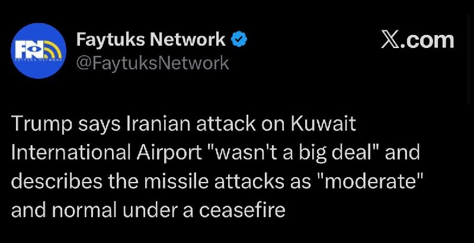

↩️ Quoted tweet: Shin ✓ @hey_itsmyturn Tue, 02 Jun 2026 23:46:54 UTC GHWB: “You attacking Kuwait? we’re coming” DJT: “You attacking Kuwait? We won’t even condemn it, their cabinet will gently ask them to stop the strikes” ↩️ توییت نقل‌قول شده — برای پاسخ،…

## Shin_Persian — post 6492

↩️ Quoted tweet:
Shin ✓ @hey_itsmyturn
Tue, 02 Jun 2026 23:46:54 UTC

GHWB: “You attacking Kuwait? we’re coming”

DJT: “You attacking Kuwait? We won’t even condemn it, their cabinet will gently ask them to stop the strikes”

↩️ توییت نقل‌قول شده — برای پاسخ، پست زیر را ببینید.

فارسی

جورج اچ. دبلیو. بوش: «شما به کویت حمله می‌کنید؟ ما داریم می‌آییم»

دونالد جی. ترامپ: «شما به کویت حمله می‌کنید؟ ما حتی آن را محکوم هم نخواهیم کرد، کابینه‌شان با ملایمت از آن‌ها خواهد خواست که حملات را متوقف کنند»

𝕏 · @shin_persian

## RadioFarda — post 157875

  <a href="https://t.me/radiofarda/157875" target="_blank">📎 Download file</a>

📻بشنوید: سرخط خبرها با رادیوفردا، ۱۴ خرداد ۱۴۰۵‌

@RadioFarda

---
📅 بروزرسانی: 1405/03/14 07:44
---

## VahidOOnLine — post 243604

  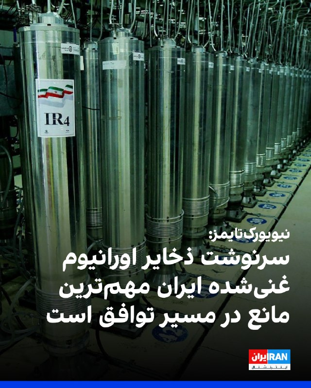

نیویورک‌تایمز به نقل از برآوردهای آژانس بین‌المللی انرژی اتمی گزارش داد سرنوشت ذخایر اورانیوم غنی‌شده جمهوری اسلامی به مهم‌ترین مانع در مسیر هرگونه توافق احتمالی میان تهران و واشینگتن تبدیل شده است.
بر اساس این گزارش، بخش عمده این ذخایر احتمالا در تونل‌های عمیق و مستحکم مجتمع هسته‌ای اصفهان نگهداری می‌شود و بخش‌هایی دیگر نیز در تاسیسات فردو و نطنز قرار دارد.
به نوشته نیویورک‌تایمز، نگرانی اصلی مقام‌های آمریکایی و کارشناسان هسته‌ای این است که بخشی از ذخایر اورانیوم ایران به مکان‌های اعلام‌نشده و خارج از نظارت آژانس منتقل شده باشد و این موضوع می‌تواند مذاکرات آینده را پیچیده‌تر کند.

‌🏁 🇬🇧 IranintlTV

🤖 @VahidOOnLine

## alonews — post 124947

  <a href="telegram/content/alonews_124947_1780546492.webm" target="_blank">🎬 Download video</a>

👈عوستاد رائفی پور: کمک امام زمان باعث شد جنگ ۴۰روزه رو ببریم

✅ @AloNews خبر جنگ

---
📅 بروزرسانی: 1405/03/14 07:34
---

## IranIntlTV — post 340456

  

نیویورک‌تایمز به نقل از برآوردهای آژانس بین‌المللی انرژی اتمی گزارش داد سرنوشت ذخایر اورانیوم غنی‌شده جمهوری اسلامی به مهم‌ترین مانع در مسیر هرگونه توافق احتمالی میان تهران و واشینگتن تبدیل شده است.
بر اساس این گزارش، بخش عمده این ذخایر احتمالا در تونل‌های عمیق و مستحکم مجتمع هسته‌ای اصفهان نگهداری می‌شود و بخش‌هایی دیگر نیز در تاسیسات فردو و نطنز قرار دارد.
به نوشته نیویورک‌تایمز، نگرانی اصلی مقام‌های آمریکایی و کارشناسان هسته‌ای این است که بخشی از ذخایر اورانیوم ایران به مکان‌های اعلام‌نشده و خارج از نظارت آژانس منتقل شده باشد و این موضوع می‌تواند مذاکرات آینده را پیچیده‌تر کند.

https://iranintl.com/202606045929

## IranianMinds — post 21343

  <a href="telegram/content/IranianMinds_21343_1780545854.mp4" target="_blank">🎬 Download video</a>

ترامپ : اگه توافق ایران نتیجه بده، شاید مردم بتونن شروع کنن به ساخت آپارتمان‌ها و ساختمان‌های اداری تو ایران

@IranianMinds

## BBCPersian — post 282824

🔻جمهوری خواهان سنا يک ميليارد دلار بودجه تالار میهمانی جديد کاخ‌سفيد ترامپ را حذف کردند

سنای آمريکا به شرط حذف يک ميليارد دلار بودجه در نظر گرفته شده برای سالن جديد کاخ سفيد دونالد ترامپ از سوی جمهوری‌خواهان، با آزاد کردن لایحه بودجه اداره مهاجرت این کشور - آیس - موافقت کرد.

اين يک ميليارد دلار قرار بود برای ارتقای تدابير امنيتی سرويس مخفی آمريکا در چارچوب ساخت اين مجموعه اختصاص يابد؛ درخواستی که پس از تيراندازی ماه آوريل در مراسمی که ترامپ در يک هتل در آن حضور داشت، مطرح شده بود.

آقای ترامپ استدلال کرده بود که ساخت اين بخش جديد برای برگزاری مراسم رسمی دولتی و به روزرسانی امکانات امنيتی ضروری است. او بارها تاکيد کرده بود که هزينه ساخت آن از طريق کمک‌های مالی خصوصی تامين خواهد شد.

لايحه موسوم به «مصالحه بودجه‌ای» حدود ۷۲ ميليارد دلار بودجه برای نهادهای مهاجرتی اختصاص می‌دهد. دموکرات‌ها استدلال کرده بودند که بودجه امنيتی مربوط به سالن جديد کاخ سفيد نبايد به اين لايحه پيوست شود؛ ديدگاهی که از سوی مقام مسئول تفسير مقررات سنا نيز تاييد شد.

سناتورها روز چهارشنبه با ۵۳ رأی موافق در برابر ۴۵ رأی مخالف با ادامه بررسی اين لايحه موافقت کردند. اين بودجه شامل منابع مالی برای نهادهايی مانند اداره مهاجرت و گمرک آمريکا (آيس) و گشت مرزی است.
@BBCPersian

---
📅 بروزرسانی: 1405/03/14 07:24
---

## VahidOOnLine — post 243603

  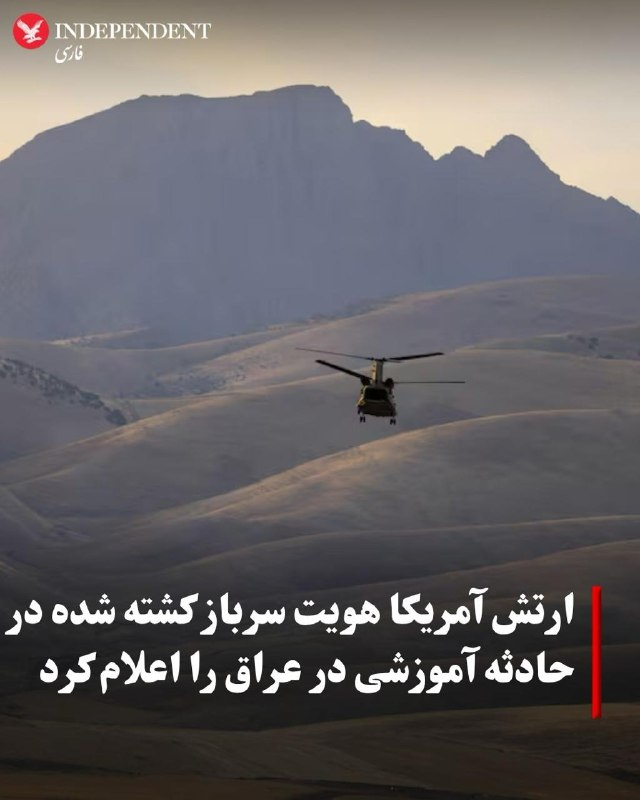

♦️ارتش آمریکا هویت سرباز آمریکایی را که روز یکشنبه همراه با یک سرباز ارتش بریتانیا در جریان یک حادثه آموزشی نظامی در عراق کشته شد، اعلام کرد.
بر اساس بیانیه‌ای که اواخر چهارشنبه منتشر شد، گروهبان دوین ای. سیبل، ۲۶ ساله، اهل رابینسون در ایالت تگزاس، روز ۳۱ مه در پایگاه هوایی اربیل در آنچه پنتاگون «حادثه مرتبط با آموزش» توصیف کرد، کشته شد.
سیبل در حمایت از عملیات عزم راسخ، عملیات آمریکا علیه گروه داعش، خدمت می‌کرد و به «شرکت آمبولانس هوایی»، گردان دوم، تیپ چهارم هوانوردی رزمی مستقر در فورت کارسونِ کلرادو، اختصاص داشت.
جزئیاتی درباره این حادثه منتشر نشده است. در این حادثه، جیمز فریمن، سرجوخه ۲۹ ساله ارتش بریتانیا نیز کشته شد. این آموزش به‌طور مشترک با ارتش بریتانیا برگزار می‌شد.
این حادثه در دست بررسی است.
‌🇸🇦 Indypersian

🤖 @VahidOOnLine

---
📅 بروزرسانی: 1405/03/14 07:14
---

هیچ پیام جدیدی در این بروزرسانی ارسال نشد.

---
📅 بروزرسانی: 1405/03/14 07:04
---

## VahidOOnLine — post 243602

♦️با گذشت چند روز از وصل شدن تدریجی اینترنت در ایران، تصاویررسیده به ایندیپندنت فارسی از روستای چلرود در شهرستان نور مازندران، مراسم بیست‌وپنجمین سالروز تولد رضا اسماعیلی را نشان می‌دهد.

رضا اسماعیلی، جوان ۲۴ ساله اهل روستای چلرود، ۱۸ دی‌ماه ۱۴۰۴ در جریان اعتراضات سراسری در قیامدشت شهرری بر اثر اصابت گلوله جنگی ماموران سرکوبگرجمهوری اسلامی کشته شد.
‌🇸🇦 Indypersian

🤖 @VahidOOnLine

## alonews — post 124946

  <a href="telegram/content/alonews_124946_1780544049.mp4" target="_blank">🎬 Download video</a>

👈تصاویری از لحظه برخورد یک پهپاد انتحاری به فرودگاه بین‌المللی کویت

✅ @AloNews خبر جنگ

---
📅 بروزرسانی: 1405/03/14 06:54
---

هیچ پیام جدیدی در این بروزرسانی ارسال نشد.

---
📅 بروزرسانی: 1405/03/14 06:47
---

هیچ پیام جدیدی در این بروزرسانی ارسال نشد.

---
### ⚠️ کانال‌های با خطا در این بروزرسانی

* WithYashar
* reutersworldchannel
* Persian_Trend_Official

دلایل احتمالی: مسدود بودن کانال، حذف کانال، یا خطای شبکه.
---

---
📅 بروزرسانی: 1405/03/14 06:34
---

## VahidOOnLine — post 243601

  <a href="telegram/content/VahidOOnLine_243601_1780542271.mp4" target="_blank">🎬 Download video</a>

♦️در پی جاری شدن دوباره آب در بستر زاینده‌رود، موجی از شادی و نشاط به اصفهان بازگشت و جمع زیادی از مردم در محدوده پل تاریخی خواجو گرد هم آمدند.

ویدیوهای منتشرشده در شبکه‌های اجتماعی، تجمع پرشور مردم اصفهان را در دو سوی زاینده‌رود نشان می‌دهد؛ جایی که بازگشت آب به این رودخانه را جشن گرفتند.

زاینده‌رود، مهم‌ترین رودخانه فلات مرکزی ایران، در سال‌های اخیر بارها با خشکی و کاهش شدید جریان آب روبه‌رو بوده است. از همین رو، بازگشت آب به بستر این رودخانه تاریخی همواره با استقبال گسترده و ابراز شادی مردم اصفهان همراه می‌شود.
‌🇸🇦 Indypersian

🤖 @VahidOOnLine

## IranianMinds — post 21342

  <a href="telegram/content/IranianMinds_21342_1780542272.mp4" target="_blank">🎬 Download video</a>

🔴 پشماتون بریزه
فیلم از حمله به مقر سپاه توی نسیم شهر تهران که واقعا دیوونه کننده‌اس.

@IranianMinds

## BBCPersian — post 282815

‌🖊مکمل احسان، محمد زبیر خان و گریس تسوی

گاهی دریا آن‌قدر آرام است که کاپیتان حسن خان فراموش می‌کند کشتی‌اش سه ماه است در میانه یک منطقه جنگی گرفتار شده است.

این دریانورد پاکستانی که نمی‌خواهد نام واقعی‌اش فاش شود، می‌گوید: «واقعا عجیب است که همه‌چیز از بیرون عادی به نظر می‌رسد، اما درون کشتی خبری از آرامش نیست.»

خان و ۲۰ هزار دریانورد دیگر از اواخر فوریه، به دلیل جنگ آمریکا و اسرائیل با ایران، در تنگه هرمز یا اطراف آن گرفتار شده‌اند. این آبراه که زمانی یکی از پرترددترین مسیرهای دریایی جهان بود و یک‌پنجم نفت و گاز جهان از آن عبور می‌کرد، اکنون با پرواز موشک‌ها بر فراز آسمانش و مین‌گذاری در زیر امواجش، عملا از حرکت باز ایستاده است.

با وجود این، خدمه کشتی خان تلاش کرده‌اند برنامه معمول کاری خود را حفظ کنند؛ هرچند تقریبا هیچ‌کس تمایلی ندارد از مرخصی‌های کوتاه و نادری که برای رفتن به ساحل داده می‌شود استفاده کند.

خان می‌گوید: «اضطراب دست از سرمان برنمی‌دارد.»
ادامه از:
https://bbc.in/439SMzD
📸BBC/Rashedul Hasan/ GettyImages/ Reuters/ AFP / Royal Thai Navy/ Rex Pereira
@BBCPersian

---
📅 بروزرسانی: 1405/03/14 06:23
---

## BBCPersian — post 282814

  

‌🔻وزارت خارجه آمريکا اعلام کرد اسرائيل و لبنان بر سر اجرای يک آتش‌بس به توافق رسيده‌اند.

بر اساس بيانيه منتشر شده، اجرای اين توافق «منوط به توقف کامل» حملات حزب‌الله و همچنين تحقق چند شرط ديگر است.

اين توافق پس از آن اعلام شد که حملات اسرائيل به جنوب لبنان در روز چهارشنبه دست کم ۹ کشته بر جای گذاشت و حزب‌الله نيز راکت هايی را به سوی شمال اسرائيل شليک کرد.

در بيانيه چهارشنبه شب وزارت خارجه آمريکا آمده است: «همه طرف‌ها بار ديگر تاکيد کردند که آينده روابط ميان اسرائيل و لبنان بايد توسط دو دولت مستقل و حاکم تعيين شود. آنها هرگونه تلاش از سوی دولت‌ها يا بازيگران غيردولتی برای گروگان گرفتن آينده لبنان را رد کردند.»

حزب‌الله تاکنون به صورت رسمی درباره اين توافق اظهار نظر نکرده است.
ادامه از:
https://bbc.in/4uaeFcZ
📷AFP via Getty
@BBCPersian

---
📅 بروزرسانی: 1405/03/14 06:17
---

هیچ پیام جدیدی در این بروزرسانی ارسال نشد.

---
### ⚠️ کانال‌های با خطا در این بروزرسانی

* WithYashar
* reutersworldchannel
* Persian_Trend_Official

دلایل احتمالی: مسدود بودن کانال، حذف کانال، یا خطای شبکه.
---

---
📅 بروزرسانی: 1405/03/14 06:04
---

هیچ پیام جدیدی در این بروزرسانی ارسال نشد.

---
📅 بروزرسانی: 1405/03/14 05:54
---

هیچ پیام جدیدی در این بروزرسانی ارسال نشد.

---
📅 بروزرسانی: 1405/03/14 05:47
---

## VahidOOnLine — post 243600

  

وال‌استریت ژورنال به نقل از مقام‌های آمریکایی گزارش داد ترامپ به طور خصوصی به دستیاران خود گفته است در صورتی که جمهوری اسلامی نیروهای آمریکایی را بکشد، پایان دادن به آتش‌بس با تهران را بررسی خواهد کرد و تاکید کرده است که وقفه چند هفته‌ای در حملات هوایی همچنان برقرار است.
این گزارش با اشاره به ادامه درگیری‌های پراکنده با جمهوری اسلامی افزود با این حال مقام‌های آمریکایی گفتند ادامه حمله‌ها فشار بر ترامپ را افزایش داده و تردیدهایی درباره دوام بلندمدت آتش‌بس ایجاد کرده است.
یک مقام کاخ سفید تاکید کرد ترامپ ترجیح می‌دهد از راه دیپلماتیک برنامه هسته‌ای ایران را برچیند، اما درباره خطوط قرمز خود شفاف بوده است.

‌🏁 🇬🇧 IranintlTV

🤖 @VahidOOnLine

## FoxNewsTwitter — post 342592

  <a href="telegram/content/FoxNewsTwitter_342592_1780539421.mp4" target="_blank">🎬 Download video</a>

Fox News (Twitter/X)

"You advocate for a terrorist regime every single day."

A House debate over Hezbollah suddenly exploded into a shouting match.

GOP Rep. Max Miller accused Rep. Rashida Tlaib of "advocating for terrorists on a daily basis" during remarks on the House floor, prompting immediate objections from the Michigan Democrat.

The confrontation forced House leaders to restore order and added another flashpoint to the already tense debate over U.S. policy in the Middle East.

## IranIntlTV — post 340455

  

وال‌استریت ژورنال به نقل از مقام‌های آمریکایی گزارش داد ترامپ به طور خصوصی به دستیاران خود گفته است در صورتی که جمهوری اسلامی نیروهای آمریکایی را بکشد، پایان دادن به آتش‌بس با تهران را بررسی خواهد کرد و تاکید کرده است که وقفه چند هفته‌ای در حملات هوایی همچنان برقرار است.
این گزارش با اشاره به ادامه درگیری‌های پراکنده با جمهوری اسلامی افزود با این حال مقام‌های آمریکایی گفتند ادامه حمله‌ها فشار بر ترامپ را افزایش داده و تردیدهایی درباره دوام بلندمدت آتش‌بس ایجاد کرده است.
یک مقام کاخ سفید تاکید کرد ترامپ ترجیح می‌دهد از راه دیپلماتیک برنامه هسته‌ای ایران را برچیند، اما درباره خطوط قرمز خود شفاف بوده است.

https://iranintl.com/202606049482

---
### ⚠️ کانال‌های با خطا در این بروزرسانی

* WithYashar
* reutersworldchannel
* Persian_Trend_Official

دلایل احتمالی: مسدود بودن کانال، حذف کانال، یا خطای شبکه.
---

---
📅 بروزرسانی: 1405/03/14 05:35
---

هیچ پیام جدیدی در این بروزرسانی ارسال نشد.

---
📅 بروزرسانی: 1405/03/14 05:24
---

## VahidOOnLine — post 243599

  

♦️وال‌استریت ژورنال بامداد پنجشنبه ۱۴ خردادماه به نقل از مقام‌های آمریکایی مدعی شد دونالد ترامپ به‌طور خصوصی به دستیارانش گفته است در صورتی که جمهوری اسلامی نیروهای آمریکایی را بکشد، ازسرگیری جنگ و پایان دادن به آتش‌بس را بررسی خواهد کرد.

این روزنامه نوشت با وجود درگیری‌های اخیر میان جمهوری اسلامی و نیروهای آمریکا، ترامپ همچنان تمایلی به آغاز دوباره یک جنگ گسترده در خاورمیانه ندارد و ترجیح می‌دهد از گسترش درگیری جلوگیری کند.

وال‌استریت ژورنال همچنین مدعی شد حملات اخیر جمهوری اسلامی به پایگاه‌های آمریکا در منطقه و فرودگاه بین‌المللی کویت، «فشارها بر کاخ سفید را افزایش داده و درباره دوام آتش‌بس تردیدهایی ایجاد کرده است.»

این گزارش می‌افزاید ترامپ همچنان معتقد است دستیابی به توافق با جمهوری اسلامی ممکن است و چنین توافقی می‌تواند به پایان جنگ، بازگشایی تنگه هرمز و محدود شدن برنامه هسته‌ای جمهوری اسلامی منجر شود.
‌🇸🇦 Indypersian

🤖 @VahidOOnLine

---
📅 بروزرسانی: 1405/03/14 05:13
---

## FoxNewsTwitter — post 342591

  

Fox News (Twitter/X)

"Even if it does pass in the Senate, Trump will just veto it."

Jesse Watters reacts to the House voting to sharply curb President Trump's war powers in Iran. https://twitter.com/JesseBWatters/status/2062336921104261291#m

---
📅 بروزرسانی: 1405/03/14 05:04
---

## VahidOOnLine — post 243598

  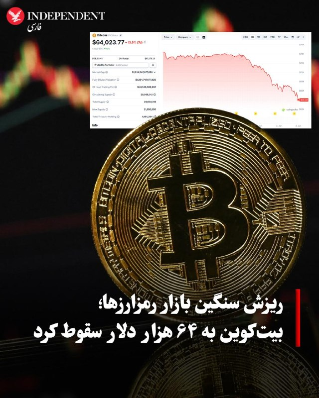

♦️بزرگ‌ترین ارز دیجیتال جهان از نظر ارزش بازار، پس از ثبت یک ریزش ۴ درصدی سرانجام سطح روانی ۶۴ هزار دلار را از دست داد و به سمت سقوط به زیر این کانال حرکت کرد. به گزارش خبرگزاری رویترز، بیت‌کوین با رسیدن به قیمت ۶۴,۷۲۱.۳۹ دلار، کمترین ارزش خود را از تاریخ ۹ اسفند (۲۸ فوریه) گذشته تجربه کرده است. این سقوط ناگهانی، موجی از فشار فروش سنگین را در بازار رمزارزها به دنبال داشت.
به دنبال این نوسانات شدید و سقوط قیمت، حجم نقد شدن اجباری دارایی‌ها در بازار کریپتو به مرز نزدیک به ۱ میلیارد دلار رسید؛ وضعیتی که گمانه‌زنی‌ها درباره احتمال تداوم روند نزولی و روزهای سخت‌تر پیش‌رو برای این بازار را افزایش داده است.
‌🇸🇦 Indypersian

🤖 @VahidOOnLine

---
📅 بروزرسانی: 1405/03/14 04:54
---

هیچ پیام جدیدی در این بروزرسانی ارسال نشد.

---
📅 بروزرسانی: 1405/03/14 04:44
---

## VahidOOnLine — post 243597

  

♦️بنیامین نتانیاهو، نخست‌وزیر اسرائیل، در گفتگو با شبکه سی‌ان‌بی‌سی در پاسخ به پرسش مجری درباره تماس تلفنی اخیرش با دونالد ترامپ و تایید این موضوع که رئیس‌جمهوری آمریکا او را «دیوانه» خطاب کرده است، از ورود به جزئیات این گفتگو خودداری کرد و گفت که آن‌ها تاکنون هزاران مکالمه با یکدیگر داشته‌اند. نتانیاهو با کم‌اهمیت خواندن این حواشی اشاره کرد که اگر کسی این موضوع را یک بحران می‌داند، باید در جریان دیگر گفتگوها قرار بگیرد. او تاکید کرد که آن‌ها همیشه راهی برای همکاری پیدا می‌کنند.
نخست‌وزیر اسرائیل با اشاره به اینکه آن‌ها در موضوعات اصلی توافق دارند، تصریح کرد هدف مشترک آن‌ها پایان دادن به برنامه هسته‌ای ایران و تضمین این موضوع است که جمهوری اسلامی تهدیدی برای اسرائیل، خاورمیانه و آمریکا ایجاد نکند. او اضافه کرد که ایران نباید به تسلیحات هسته‌ای و ابزارهای پرتاب آن دست یابد که نه تنها اسرائیل و پایتخت‌های اروپایی، بلکه شهرهای ایالات متحده را نیز تهدید کند.او در پایان اختلافات موجود را صرفا «تاکتیکی» و مشابه اختلافات در بهترین خانواده‌ها دانست و افزود که آن‌ها مانند دوستانی صمیمی همیشه راهی برای حل مسائل پیدا می‌کنند، به طوری که ممکن است صبح با هم اختلاف‌نظر داشته باشند اما تا بعدازظهر به یک اقدام مشترک برسند.
‌🇸🇦 Indypersian

🤖 @VahidOOnLine

## FoxNewsTwitter — post 342590

  <a href="telegram/content/FoxNewsTwitter_342590_1780535649.mp4" target="_blank">🎬 Download video</a>

Fox News (Twitter/X)

“No sir, I actually said I was going to kick his a--.”

Treasury Secretary Scott Bessent delivered the blunt response when Sen. Thom Tillis asked about reports he once threatened Bill Pulte during a dinner party dispute.

The exchange came just days after President Trump elevated Pulte to one of the government’s most sensitive national security positions, renewing attention on the reported clash between the two men.

Despite the history, Bessent told lawmakers he recently called Pulte to congratulate him on the appointment as director of national intelligence.

## FoxNewsTwitter — post 342589

  

Fox News (Twitter/X)

"This is for everybody."

Vanilla Ice says he has no plans to back out of an upcoming Freedom 250 concert despite pressure from critics demanding performers pull out of the event.

The rapper said he refuses to let anyone tell him he can't be proud of his country, arguing the celebration is about America and honoring those who served, not politics.

## pm_afshaa — post 92246

  <a href="telegram/content/pm_afshaa_92246_1780535652.webm" target="_blank">🎬 Download video</a>

🔴امشب مجلس نمایندگان آمریکا قطعنامه‌ای واسه مجبور کردن ترامپ به خارج کردن ارتش آمریکا از جنگ با ایران تصویب کرد؛

215 موافق - مخالف 208

+ این مصوبه تصویب سنا رو هم لازم داره و پایان کار نیست و فکر نکنم به جایی برسه.

💧 Rainbet.com the #1 Non-KYC Crypto Casino & Sportsbook @rainbetcom

😁 @Pm_Afshaa

---
📅 بروزرسانی: 1405/03/14 04:34
---

## FoxNewsTwitter — post 342588

  <a href="telegram/content/FoxNewsTwitter_342588_1780535051.mp4" target="_blank">🎬 Download video</a>

Fox News (Twitter/X)

Vanilla Ice on why he's not backing down from performing at the Freedom 250 concert: "I don't like anybody telling me I can't be proud of my country where I'm from." https://twitter.com/TheStoryFNC/status/2062261676917899690#m

## FoxNewsTwitter — post 342587

  <a href="telegram/content/FoxNewsTwitter_342587_1780535053.mp4" target="_blank">🎬 Download video</a>

Fox News (Twitter/X)

Laura Ingraham breaks down how Texas Democratic Senate candidate James Talarico's views on Christianity and the Bible could cause him to flame out with Texas voters. https://twitter.com/IngrahamAngle/status/2062324014614274432#m

## pm_afshaa — post 92245

  <a href="telegram/content/pm_afshaa_92245_1780535055.webm" target="_blank">🎬 Download video</a>

🔴دونالد ترامپ:
در اون بخش از جهان (خاورمیانه)، آتش‌بس یعنی ملایم‌تر به تیراندازی ادامه بدید.

💧 Rainbet.com the #1 Non-KYC Crypto Casino & Sportsbook @rainbetcom

😁 @Pm_Afshaa

---
📅 بروزرسانی: 1405/03/14 04:25
---

## VahidOOnLine — post 243596

  <a href="telegram/content/VahidOOnLine_243596_1780534518.mp4" target="_blank">🎬 Download video</a>

اداره کل هواپیمایی کشوری کویت با انتشار ویدیویی در شبکه اجتماعی ایکس، لحظه برخورد پهپاد شاهد ۱۳۶ جمهوری اسلامی به فرودگاه بین‌المللی این کشور را نشان می‌دهد. این ویدیو، که توسط دوربین مداربسته ثبت شده است، انفجار شدید ناشی از این برخورد را به تصویر می‌کشد.
در پی حمله جمهوری اسلامی به کویت، یک شهروند هندی کشته و ۶۳ نفر زخمی شدند.
‌🏁 🇬🇧 IranintlTV

🤖 @VahidOOnLine

---
📅 بروزرسانی: 1405/03/14 04:18
---

## VahidOOnLine — post 243595

  <a href="telegram/content/VahidOOnLine_243595_1780534089.mp4" target="_blank">🎬 Download video</a>

♦️دونالد ترامپ، رئیس‌جمهوری آمریکا، چهارشنبه ۱۳ خردادماه در پاسخ به سوالی درباره تعریف آتش‌بس، بدون اشاره به درگیری سه‌شنبه‌شب میان جمهوری اسلامی و نیروهای آمریکا، گفت: «تقریبا به همین شکلی که اکنون وجود دارد.»

او افزود: «آنجا بخش متفاوتی از جهان است. در آن قسمت از جهان، آتش‌بس یعنی طرف‌ها با شدت کمتری به تیراندازی ادامه می‌دهند.»
‌🇸🇦 Indypersian

🤖 @VahidOOnLine

## VahidOOnLine — post 243594

  

ترامپ در گفت‌وگو با پادکست «پاد فورس وان» در پاسخ به این پرسش که آیا مجتبی خامنه‌ای از سلامت عقل برخوردار است یا در کما به سر می‌برد، گفت: «افتخار دیدارش را نداشته‌ام، اما نشنیده‌ام حالش خوب باشد. اگر روایت‌ها را باور کنید، او بسیاری از اعضای مختلف بدنش را از دست داده است.»
‌🏁 🇬🇧 IranintlTV

🤖 @VahidOOnLine

## IranIntlTV — post 340454

  <a href="telegram/content/IranIntlTV_340454_1780534091.mp4" target="_blank">🎬 Download video</a>

اداره کل هواپیمایی کشوری کویت با انتشار ویدیویی در شبکه اجتماعی ایکس، لحظه برخورد پهپاد شاهد ۱۳۶ جمهوری اسلامی به فرودگاه بین‌المللی این کشور را نشان می‌دهد. این ویدیو، که توسط دوربین مداربسته ثبت شده است، انفجار شدید ناشی از این برخورد را به تصویر می‌کشد.
در پی حمله جمهوری اسلامی به کویت، یک شهروند هندی کشته و ۶۳ نفر زخمی شدند.

## IranIntlTV — post 340453

  

ترامپ در گفت‌وگو با پادکست «پاد فورس وان» در پاسخ به این پرسش که آیا مجتبی خامنه‌ای از سلامت عقل برخوردار است یا در کما به سر می‌برد، گفت: «افتخار دیدارش را نداشته‌ام، اما نشنیده‌ام حالش خوب باشد. اگر روایت‌ها را باور کنید، او بسیاری از اعضای مختلف بدنش را از دست داده است.»
https://iranintl.com/202606048309

## BBCPersian — post 282813

🔻لحظه هدف قرار گرفتن فرودگاه بین‌المللی کویت

سازمان هواپیمایی کشوری کویت با انتشار ویدیویی گزارش کرده که «نخستین تصاویر» حمله پهپادی به فرودگاه بین‌المللی این کشور که از طریق دوربین‌های مداربسته بیرون و داخل فرودگاه ثبت شده را علنی می‌کند.

در این تصاویر که از چند زاویه بیرون و داخل فرودگاه را نشان می‌دهد، دیده می‌شود یک پرتابه مشابه پهپادهای انتحاری به سقف ترمینال فرودگاه برخورد کرده و موجب انفجاری بزرگ می‌شود.

در ویدیویی دیگر، وزارت کشور کویت با انتشار ویدیویی اعلام کرد که شیخ فهد یوسف سعود الصباح، معاون اول نخست‌وزیر و وزیر کشور نیز ضمن بازدید از ساختمان ترمینال ۱ فرودگاه بین‌المللی کویت، این حمله را «تجاوز فجیع ایران» خواند.

کویت اعلام کرده در جریان این حمله یک نفر کشته و بیش از ۶۰ نفر مجروح شدند. فرد کشته شده تبعه هندی بوده و وزارت خارجه هند گفته چند شهروند دیگر این کشور نیز در این حمله زخمی شده‌اند.

سپاه پاسداران که شب گذشته از حملات موشکی و پهپادی خود به پایگاه‌های آمریکایی در کویت و بحرین خبر داده بود، روز چهارشنبه گفت «هیچ شلیکی به سوی فرودگاه کویت» انجام نداده است.

@BBCPersian

---
### ⚠️ کانال‌های با خطا در این بروزرسانی

* WithYashar
* reutersworldchannel
* Persian_Trend_Official

دلایل احتمالی: مسدود بودن کانال، حذف کانال، یا خطای شبکه.
---

---
📅 بروزرسانی: 1405/03/14 04:06
---

## VahidOOnLine — post 243593

  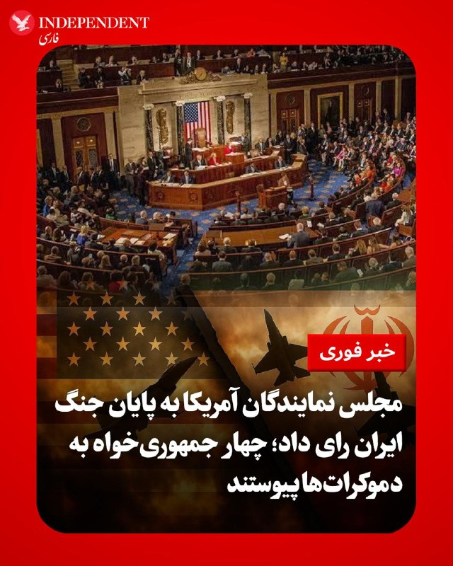

♦️مجلس نمایندگان آمریکا روز چهارشنبه ۱۳ خرداد با طرح اختیارات جنگی موافقت کرد؛ طرحی که هدف آن توقف اقدامات نظامی آمریکا علیه ایران است و برای نخستین بار با وجود مخالفت دونالد ترامپ، از مجلس نمایندگان عبور کرد.
به گزارش آسوشیتدپرس، این طرح با ۲۱۵ رای موافق در برابر ۲۰۸ رای مخالف تصویب شد و چهار نماینده جمهوری‌خواه نیز در رای‌گیری به دموکرات‌ها پیوستند؛ اتفاقی که به‌عنوان نشانه‌ای از افزایش مخالفت‌ها با ادامه جنگ تعبیر شده است.
دموکرات‌ها پس از هفت تلاش ناموفق، سرانجام در هشتمین رای‌گیری موفق شدند این طرح را در مجلس نمایندگان تصویب کنند. این مصوبه اکنون به سنا می‌رود؛ جایی که ماه گذشته چند سناتور جمهوری‌خواه نیز از طرح مشابهی حمایت کرده بودند، اما هنوز رای‌گیری نهایی انجام نشده است.
این طرح به‌طور فوری جنگ را متوقف نمی‌کند، اما در صورت تبدیل شدن به قانون، رییس جمهوری آمریکا برای ادامه عملیات نظامی علیه ایران نیازمند دریافت مجوز رسمی کنگره خواهد بود. در صورت تصویب سنا، این مصوبه برای امضا به کاخ سفید ارسال می‌شود؛ جایی که دونالد ترامپ اختیار وتوی آن را دارد.
‌🇸🇦 Indypersian

🤖 @VahidOOnLine

## FoxNewsTwitter — post 342586

  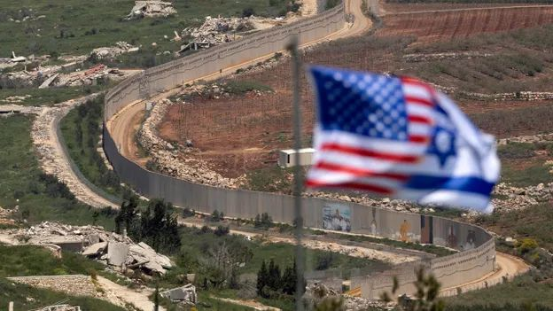

Fox News (Twitter/X)

BREAKING: Israel and Lebanon have agreed to a ceasefire in a major U.S.-brokered diplomatic breakthrough.

The agreement was reached after days of negotiations led by the Trump administration, with both countries committing to halt hostilities and continue direct talks aimed at a broader peace deal.

The ceasefire remains conditional on Hezbollah ending attacks, withdrawing fighters from southern Lebanon, and preventing the return of armed groups to the area.

## FarsiVOA — post 219537

⚡️لنزهایی که می‌توانند آینده فناوری‌های پوشیدنی را تغییر دهند؛ از نمایش واقعیت افزوده و اتصال به اینترنت تا پایش سلامت بدن - همه روی چشم. آیا این فناوری جای موبایل و عینک‌های هوشمند را می‌گیرد؟ گزارشی از تازه‌ترین پیشرفت‌ها و چالش‌ها.
@FarsiVOA

---
📅 بروزرسانی: 1405/03/14 03:55
---

## FarsiVOA — post 219536

🔺توافق اسرائیل و لبنان در واشنگتن بر سر «آتش‌بس مشروط»؛ اقدامات بی‌ثبات‌کننده رژیم ایران محکوم شد

آ▪️مریکا، لبنان، و اسرائیل شامگاه چهارشنبه ۱۳ خرداد با انتشار بیانیه‌ای مشترک اعلام کردند که در پی برگزاری دور تازه مذاکرات سه‌جانبه به میزبانی واشنگتن، اسرائیل و لبنان بر سر اجرای آتش‌بس، به شرط توقف کامل آتش از سوی حزب‌الله لبنان و خروج نیروهای آن از منطقه جنوب رودخانه لیتانی، به توافق رسیده‌اند.

⬇️ بیشتر بخوانید:
https://ir.voanews.com/a/israel-lebanon-reach-conditional-ceasefire-iranian-regime-actiones-condemned/8157036.html
@FarsiVOA

---
📅 بروزرسانی: 1405/03/14 03:45
---

## VahidOOnLine — post 243592

  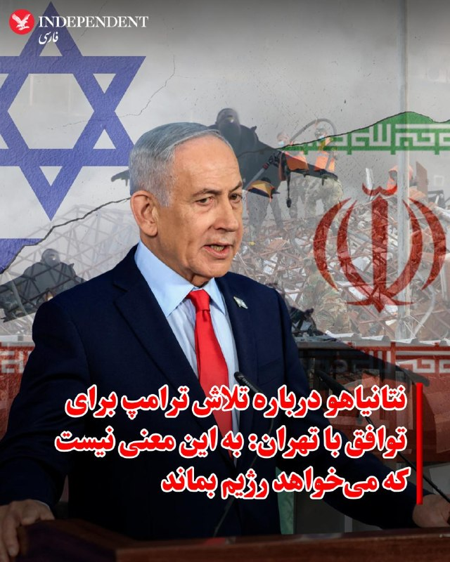

♦️بنیامین نتانیاهو، نخست‌وزیر اسرائیل درپاسخ به مجری سی‌ان‌بی‌سی که از او پرسید، چرا دیگر درباره تغییر رژیم در ایران صحبت نمی‌کنید؟ گفت: «چه کسی گفته صحبت نمی‌کنم، همین چند روز پیش صحبت کردم.» اشاره نتانیاهو به تاکید بر محکوم بودن رژیم ایران به فروپاشی در مراسم  معرفی رئیس جدید موساد است. مجری سپس به نتانیاهو گفت: اما دونالد ترامپ از توافق با رژیم ایران صحبت می‌کند. و نتانیاهو پاسخ داد: اما به معنی این نیست که می‌خواهد رژیم ایران بماند. نتانیاهو در ادامه به غیرقابل پیش‌بینی بودن زمان سقوط دیکتاتوری‌ها اشاره کرد و گفت درباره رومانی یا سقوط دیوار برلین پیش‌بینی نشد اما اتفاق افتاد چون ترک‌ها زیر پوست رژیم‌ها ایجاد شده بود
‌🇸🇦 Indypersian

🤖 @VahidOOnLine

---
📅 بروزرسانی: 1405/03/14 03:35
---

## VahidOOnLine — post 243591

  

♦️گزارش‌های رسانه‌های داخلی حاکی از آن است که کف قیمت خودرو در بازار به دست‌کم یک میلیارد و ۲۵۰ میلیون تومان رسیده که قیمت ساینا دنده‌ای است. این در حالی است که بسیاری از خودروهای تولید داخل، کیفیت و سطح ایمنی نامناسبی دارند. در بین محصولات سایپا، ری‌را توربو ۶ سرعته، سه میلیارد و ۴۰۰ میلیون تومان قیمت دارد و بسیاری دیگر از محصولات آن نیز بالای یک‌و‌نیم میلیارد تومان هستند.
‌🇸🇦 Indypersian

🤖 @VahidOOnLine

## FarsiVOA — post 219535

⚡️پایان دوران شبه‌نظامیان وابسته به جمهوری اسلامی در عراق با فرمول سلاح در برابر شغل
@FarsiVOA

## FarsiVOA — post 219534

🔺مارکو روبیو در سالگرد کشتار «تیان‌آن‌من» در چین: سانسور نمی‌تواند گذشته را پاک کند

▪️وزیر امور خارجه آمریکا در سی‌وهفتمین سالگرد سرکوب خونین اعتراضات میدان تیان‌آن‌من در چین، با گرامی‌داشت یاد قربانیان این رویداد، گفت سرانجام حقانیت کسانی که جان‌شان را برای آزادی بیان و تجمع مسالمت‌آمیز فدا کردند، ثابت خواهد شد.

⬇️ بیشتر بخوانید:
https://ir.voanews.com/a/sec-rubio-tiananmen-square-massacre-anniversary/8157035.html
@FarsiVOA

---
📅 بروزرسانی: 1405/03/14 03:25
---

## VahidOOnLine — post 243590

  <a href="telegram/content/VahidOOnLine_243590_1780530945.mp4" target="_blank">🎬 Download video</a>

دونالد ترامپ، رییس‌جمهوری آمریکا، چهارشنبه ۱۳ خرداد، گفت ممکن است طی چند روز آینده در مذاکرات با ایران پیشرفت حاصل شود و در صورت دستیابی به توافق، آمریکا انتظار دارد ذخایر اورانیوم غنی‌شده جمهوری اسلامی را در اختیار بگیرد و نابود کند. او افزود این توافق شاید تا آخر هفته حاصل شود.
‌🏁 🇬🇧 IranintlTV

🤖 @VahidOOnLine

## IranIntlTV — post 340452

  <a href="telegram/content/IranIntlTV_340452_1780530947.mp4" target="_blank">🎬 Download video</a>

دونالد ترامپ، رییس‌جمهوری آمریکا، چهارشنبه ۱۳ خرداد، گفت ممکن است طی چند روز آینده در مذاکرات با ایران پیشرفت حاصل شود و در صورت دستیابی به توافق، آمریکا انتظار دارد ذخایر اورانیوم غنی‌شده جمهوری اسلامی را در اختیار بگیرد و نابود کند. او افزود این توافق شاید تا آخر هفته حاصل شود.

---
📅 بروزرسانی: 1405/03/14 03:15
---

## VahidOOnLine — post 243589

  

وزارت خارجه آمریکا اعلام کرد لبنان و اسرائیل، پس از مذاکرات واشینگتن و در قالب بیانیه‌ای مشترک با ایالات متحده، ضمن اعلام موافقت با اجرای آتش‌بس، توافق کردند از هفته پایانی خرداد مسیرهای سیاسی و امنیتی را با هدف دستیابی به توافقی جامع از سر بگیرند.
این بیانیه ضمن محکوم کردن حمله‌های جمهوری اسلامی به کشورهای منطقه، اجرای آتش‌بس را به توقف کامل حمله‌های حزب‌الله و خروج همه نیروهای این گروه از جنوب رود لیتانی مشروط دانست.
وزارت خارجه آمریکا گفت دو طرف با راهنمایی واشینگتن توافق کرده‌اند به صورت فوری مناطقی در لبنان ایجاد شود که در آن نیروهای مسلح لبنان کنترل انحصاری قلمرو را در دست می‌گیرند و همه بازیگران غیردولتی کنار گذاشته می‌شوند.

‌🏁 🇬🇧 IranintlTV

🤖 @VahidOOnLine

## IranIntlTV — post 340451

  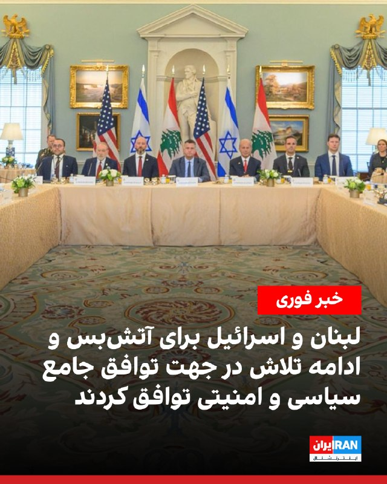

وزارت خارجه آمریکا اعلام کرد لبنان و اسرائیل، پس از مذاکرات واشینگتن و در قالب بیانیه‌ای مشترک با ایالات متحده، ضمن اعلام موافقت با اجرای آتش‌بس، توافق کردند از هفته پایانی خرداد مسیرهای سیاسی و امنیتی را با هدف دستیابی به توافقی جامع از سر بگیرند.
این بیانیه ضمن محکوم کردن حمله‌های جمهوری اسلامی به کشورهای منطقه، اجرای آتش‌بس را به توقف کامل حمله‌های حزب‌الله و خروج همه نیروهای این گروه از جنوب رود لیتانی مشروط دانست.
وزارت خارجه آمریکا گفت دو طرف با راهنمایی واشینگتن توافق کرده‌اند به صورت فوری مناطقی در لبنان ایجاد شود که در آن نیروهای مسلح لبنان کنترل انحصاری قلمرو را در دست می‌گیرند و همه بازیگران غیردولتی کنار گذاشته می‌شوند.

https://iranintl.com/202606030210

## Persian_Trend_Official — post 15665

  <a href="telegram/content/Persian_Trend_Official_15665_1780530309.mp4" target="_blank">🎬 Download video</a>

شبتون بخیر 🌃
Su-33 Flanker-D

📌 @persian_trend_official
پرشین ترند | متفاوت‌ترین کانال نظامی

## IranianMinds — post 21341

  <a href="telegram/content/IranianMinds_21341_1780530310.mp4" target="_blank">🎬 Download video</a>

🔴 با این واکنشی که این نشون داد دیگه مطمعن شدم گذاشتن درش

واکنش شهبازی ، مجری پاورقی به خبری که توش گفته بودن کونش گذاشتن :

@IranianMinds

## IranianMinds — post 21339

  

🔴فقط 
4️⃣ روز فرصت باقی مونده
🔴

🎉 500 هزارتومن بونوس رایگان فقط با ثبت نام بدون هیچگونه واریزی!

😮 تنها سایتی که با عضویت بدون واریز 500,000 تومان شارژ بی قیدو شرط میده #وینرو هست
💰

7️⃣
1️⃣ خرداد، افتتاحیه سایت با جوایز بزرگ
🔥

👑 #معتبرترین سایت ایرانی 
⬇️

🌐 Winro.io

🌐 Winro.io

📱کانال اخبار و هدایا Sa13 
🎁

📱 @winro_io

---
📅 بروزرسانی: 1405/03/14 03:05
---

## Persian_Trend_Official — post 15664

  

اسرائیل و لبنان پس از مذاکرات در واشنگتن، با میانجیگری ایالات متحده بر سر آتش‌بس به توافق رسیدند.

طبق این توافق، آتش‌بس منوط به توقف کامل آتش‌بس توسط حزب‌الله و خروج تمام نیروهای حزب‌الله از منطقه جنوب رودخانه لیتانی است.

در این بیانیه، لبنان اعلام کرد که هیچ نیت خصمانه‌ای نسبت به اسرائیل ندارد و حزب‌الله را به عنوان دشمن دولت لبنان معرفی کرد.

طرفین همچنین توافق کردند که با ایجاد مناطق آزمایشی که در آن نیروهای مسلح لبنان کنترل امنیتی انحصاری را اعمال می‌کنند، به استثنای تمام گروه‌های مسلح غیردولتی، پیش بروند.

اسرائیل و لبنان مجدداً تأکید کردند که هیچ نیت خصمانه‌ای نسبت به یکدیگر ندارند و متعهد به ادامه مذاکرات مستقیم با هدف ایجاد اعتماد، حل اختلافات معوقه و تلاش برای دستیابی به یک توافق صلح و امنیت گسترده‌تر هستند.

دو طرف در 22 ژوئن مذاکرات سیاسی و امنیتی را از سر خواهند گرفت و ایالات متحده در این مدت به تسهیل مذاکرات ادامه خواهد داد.

📝 Amir

📌 @persian_trend_official
پرشین ترند | متفاوت‌ترین کانال نظامی

## Persian_Trend_Official — post 15663

  <a href="telegram/content/Persian_Trend_Official_15663_1780529743.webm" target="_blank">🎬 Download video</a>

وزارت‌ خارجه آمریکا: اسرائیل و لبنان با میانجیگری آمریکا به توافق موقت رسیدند.

📝 Amir

📌 @persian_trend_official
پرشین ترند | متفاوت‌ترین کانال نظامی

## BBCPersian — post 282806

‌🖊دنیل سندفورد

دادگاهی در بریتانیا در حال بررسی پرونده یک جوان نروژی است که به گفته دادستانی، از طرف یک گروه جرایم سازمان‌یافته سوئدی مرتبط با ایران، برای «انجام یک ترور» وارد بریتانیا شده بود.

یوهانس ناتلند، ۱۹ ساله، پس از سفر به بریتانیا با گذرنامه اضطراری، روز ۱۹ مارس ۲۰۲۵ در هتلی در شهر هادرزفیلد، با دو اسلحه و ۱۲ فشنگ بازداشت شد.

دادستانی می‌گوید او این سلاح‌ها را از یک «مخفیگاه» در منطقه‌ای جنگلی در این شهر واقع در یورکشایر غربی تحویل گرفته بود.

یوهانس ناتلند اتهام نگهداری دو قبضه سلاح گرم قابل استفاده - یک تپانچه نیمه‌خودکار و یک هفت‌تیر - به همراه ۱۲ فشنگ جنگی را پذیرفته است، اما اتهام توطئه برای قتل را رد می‌کند.

آلیستر ریچاردسون، دادستان پرونده، در آغاز ارائه اظهارات دادستانی گفت ناتلند از سوی «سازمانی به نام شبکه فاکسترات» جذب شده بود و موافقت کرده بود در ازای دریافت پول «یک ترور انجام دهد».

در دادگاه گفته شد که «افراد دیگری او را به یک هتل، سپس به محل نگهداری پول و بعد به مخفیگاه سلاح‌ها هدایت کردند».

ادامه از:
https://bbc.in/4ucwFUc
📷PA/Metropolitan Police/ Julia Quenzler
@BBCPersian

---
📅 بروزرسانی: 1405/03/14 02:55
---

## VahidOOnLine — post 243588

  

الحدث گزارش داد آمریکا و جمهوری اسلامی به توافقی چهار مرحله‌ای نزدیک شده‌اند که با کاهش تنش‌ها آغاز می‌شود و به پرونده هسته‌ای و ترتیبات امنیتی منطقه ختم خواهد شد و انتقال از هر مرحله به مرحله بعدی، پس از «اجرای تعهدات» انجام می‌شود.
طبق این گزارش، مرحله نخست توافق شامل توقف عملیات نظامی مستقیم و پرهیز از هرگونه تشدید تنش یا گشودن جبهه‌های جدید در منطقه است. مرحله دوم نیز بر امنیت کشتیرانی، بازگشایی تنگه هرمز و ترتیبات امنیتی ویژه گذرگاه‌های دریایی و خطوط انرژی متمرکز است.
به نوشته الحدث، مرحله سوم این توافق شامل اعتمادسازی اقتصادی، کاهش محدود برخی تحریم‌های جمهوری اسلامی، آزادسازی بخشی از اموال مسدودشده ایران و ارائه تسهیلات مرتبط با صادرات نفت است.
بر اساس این گزارش، مرحله چهارم توافق پیچیده‌ترین مرحله به شمار می‌رود و ممکن است ماه‌ها طول بکشد. این مرحله شامل بررسی برنامه هسته‌ای ایران، سطح غنی‌سازی اورانیوم و سازوکارهای نظارتی و ترتیبات امنیتی منطقه‌ای است.

‌🏁 🇬🇧 IranintlTV

🤖 @VahidOOnLine

## VahidOOnLine — post 243587

  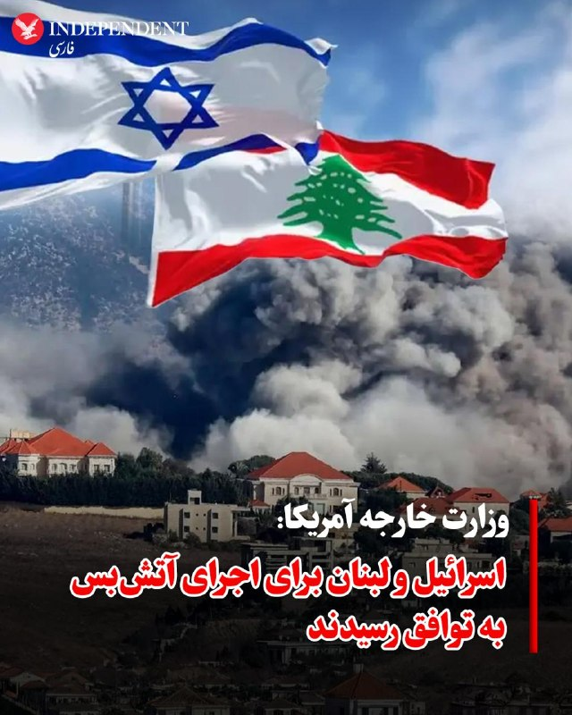

♦️به گزارش رویترز، وزارت خارجه آمریکا روز چهارشنبه اعلام کرد اسرائیل و لبنان پس از مذاکرات انجام‌شده در واشنگتن، بر سر اجرای آتش‌بس به توافق رسیده‌اند.
بر اساس بیانیه مشترک منتشرشده، دو طرف توافق کرده‌اند مسیرهای سیاسی و امنیتی را بار دیگر از هفته اول تیر از سر بگیرند؛ اقدامی که با هدف دستیابی به یک توافق جامع انجام خواهد شد.
‌🇸🇦 Indypersian

🤖 @VahidOOnLine

## VahidOnline — post 75933

  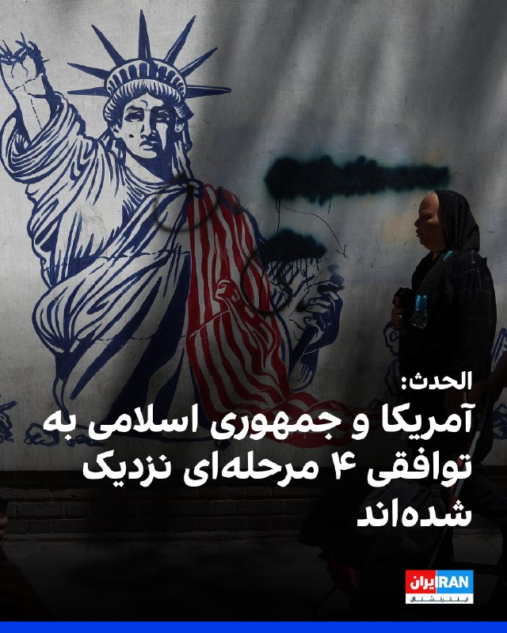

الحدث گزارش داد آمریکا و جمهوری اسلامی به توافقی چهار مرحله‌ای نزدیک شده‌اند که با کاهش تنش‌ها آغاز می‌شود و به پرونده هسته‌ای و ترتیبات امنیتی منطقه ختم خواهد شد و انتقال از هر مرحله به مرحله بعدی، پس از «اجرای تعهدات» انجام می‌شود.
طبق این گزارش، مرحله نخست توافق شامل توقف عملیات نظامی مستقیم و پرهیز از هرگونه تشدید تنش یا گشودن جبهه‌های جدید در منطقه است. مرحله دوم نیز بر امنیت کشتیرانی، بازگشایی تنگه هرمز و ترتیبات امنیتی ویژه گذرگاه‌های دریایی و خطوط انرژی متمرکز است.
به نوشته الحدث، مرحله سوم این توافق شامل اعتمادسازی اقتصادی، کاهش محدود برخی تحریم‌های جمهوری اسلامی، آزادسازی بخشی از اموال مسدودشده ایران و ارائه تسهیلات مرتبط با صادرات نفت است.
بر اساس این گزارش، مرحله چهارم توافق پیچیده‌ترین مرحله به شمار می‌رود و ممکن است ماه‌ها طول بکشد. این مرحله شامل بررسی برنامه هسته‌ای ایران، سطح غنی‌سازی اورانیوم و سازوکارهای نظارتی و ترتیبات امنیتی منطقه‌ای است.

@VahidOOnLine

📡 @VahidOnline

## VahidOnline — post 75932

  

♦️به گزارش رویترز، وزارت خارجه آمریکا روز چهارشنبه اعلام کرد اسرائیل و لبنان پس از مذاکرات انجام‌شده در واشنگتن، بر سر اجرای آتش‌بس به توافق رسیده‌اند.
بر اساس بیانیه مشترک منتشرشده، دو طرف توافق کرده‌اند مسیرهای سیاسی و امنیتی را بار دیگر از هفته اول تیر از سر بگیرند؛ اقدامی که با هدف دستیابی به یک توافق جامع انجام خواهد شد.
@VahidOOnLine

📡 @VahidOnline

## IranIntlTV — post 340450

  

الحدث گزارش داد آمریکا و جمهوری اسلامی به توافقی چهار مرحله‌ای نزدیک شده‌اند که با کاهش تنش‌ها آغاز می‌شود و به پرونده هسته‌ای و ترتیبات امنیتی منطقه ختم خواهد شد و انتقال از هر مرحله به مرحله بعدی، پس از «اجرای تعهدات» انجام می‌شود.
طبق این گزارش، مرحله نخست توافق شامل توقف عملیات نظامی مستقیم و پرهیز از هرگونه تشدید تنش یا گشودن جبهه‌های جدید در منطقه است. مرحله دوم نیز بر امنیت کشتیرانی، بازگشایی تنگه هرمز و ترتیبات امنیتی ویژه گذرگاه‌های دریایی و خطوط انرژی متمرکز است.
به نوشته الحدث، مرحله سوم این توافق شامل اعتمادسازی اقتصادی، کاهش محدود برخی تحریم‌های جمهوری اسلامی، آزادسازی بخشی از اموال مسدودشده ایران و ارائه تسهیلات مرتبط با صادرات نفت است.
بر اساس این گزارش، مرحله چهارم توافق پیچیده‌ترین مرحله به شمار می‌رود و ممکن است ماه‌ها طول بکشد. این مرحله شامل بررسی برنامه هسته‌ای ایران، سطح غنی‌سازی اورانیوم و سازوکارهای نظارتی و ترتیبات امنیتی منطقه‌ای است.

https://iranintl.com/202606035253

## FarsiVOA — post 219532

⚡️پرزیدنت ترامپ چهارشنبه ۱۳ خرداد در جریان امضای چند فرمان اجرایی در کاخ سفید به پرسش‌های خبرنگاران درباره موضوعات گوناگون - از جمله وضعیت جاری در تنگه هرمز، شرایط منطقه، و مذاکره با جمهوری اسلامی - پاسخ داد. صدای آمریکا این مراسم را با پوشش ویژه و با ترجمه همزمان پژواک کیومرثی پخش کرد.
@FarsiVOA

## FarsiVOA — post 219531

⚡️روایت حمید آصفی و ویدا ربانی به گاردین در بریتانیا؛ اعدام فتح‌الله آوری در ایران
@FarsiVOA

---
📅 بروزرسانی: 1405/03/14 02:46
---

## mwarmonitor — post 10120

🔴 بیانیه مشترک میان ایالات متحده، لبنان و اسرائیل:

📌ایالات متحده در روزهای ۲ و ۳ ژوئن ۲۰۲۶ چهارمین نشست سه‌جانبه سطح‌بالا را میان نمایندگان اسرائیل و لبنان برگزار کرد.

🔸در نتیجه مذاکراتی که به رهبری ایالات متحده انجام شد، اسرائیل و لبنان بر اجرای آتش‌بس توافق کردند. اجرای آتش‌بس مشروط به توقف کامل آتش از سوی حزب‌الله و خروج تمامی عناصر این گروه از منطقه جنوبی لیتانی است.

🔹دو طرف، با هدایت ایالات متحده، توافق کردند روند ایجاد مناطق آزمایشی را تسریع کنند؛ مناطقی که در آن‌ها نیروهای مسلح لبنان کنترل کامل امنیتی را در دست خواهند داشت و از ورود هرگونه بازیگر غیردولتی جلوگیری خواهد شد.

این اقدامات امکان پیشرفت به‌سوی یک توافق جامع برای صلح و امنیت را فراهم می‌کند. همه کشورها بار دیگر تأکید کردند که آینده روابط میان اسرائیل و لبنان باید توسط دولت‌های دارای حاکمیت دو کشور تعیین شود و هرگونه تلاش از سوی هر دولت یا بازیگر غیردولتی برای گروگان گرفتن آینده لبنان را رد کردند.
اسرائیل و لبنان همچنین تأکید کردند که هیچ نیت خصمانه‌ای نسبت به یکدیگر ندارند و متعهد شدند مذاکرات مستقیم را برای اعتمادسازی، حل‌وفصل تمامی مسائل باقی‌مانده و تلاش برای دستیابی به یک توافق جامع میان دو کشور ادامه دهند.

دو هیأت درباره یک چارچوب امنیتی، بر پایه گفت‌وگوهایی که در ۲۹ مه در پنتاگون انجام شد، بحث کردند؛ چارچوبی که هدف آن تضمین پایدار حاکمیت، امنیت و تمامیت ارضی لبنان و اسرائیل است و شامل برچیدن گروه‌های مسلح غیردولتی و جلوگیری از بازگشت دوباره آن‌ها می‌شود.

همه طرف‌ها حملات ایران به کشورهای منطقه و فعالیت‌های مداومی را که از طریق حمایت از نیروهای نیابتی یا دیگر اقدامات تهاجمی موجب بی‌ثباتی در سراسر خاورمیانه می‌شود، محکوم کردند.

ایالات متحده حمایت مستمر خود از دولت‌های دو کشور برای اعمال حاکمیت‌شان را تجدید کرد و بار دیگر تأکید نمود که هرگونه توافق برای توقف خصومت‌ها باید مستقیماً میان دولت‌ها و با میانجی‌گری آمریکا حاصل شود و نه از طریق مسیرهای جداگانه.
آمریکا همچنین بر عزم خود برای حمایت از نیروهای مسلح لبنان به‌منظور تقویت توانمندی‌های آن‌ها و امکان اعمال مؤثر حاکمیت در سراسر خاک لبنان تأکید کرد.
اسرائیل نیز بر اظهارات وزیر خارجه روبیو در ۲ ژوئن تأکید کرد که گفته بود حزب‌الله نه‌تنها دشمن اسرائیل و آمریکا، بلکه دشمن لبنان نیز هست.

اسرائیل بار دیگر اعلام کرد که امنیت و احترام به تمامیت ارضی‌اش تنها از طریق خلع سلاح حزب‌الله و برچیدن زیرساخت‌های آن در سراسر لبنان قابل تحقق است و بر اهمیت مذاکرات مستقیم به رهبری ایالات متحده برای حل همه مسائل باقی‌مانده و دستیابی به صلح و امنیت پایدار تأکید نمود.

لبنان نیز بر ضرورت احترام متقابل به مرزهای به‌رسمیت‌شناخته‌شده بین‌المللی و نیاز فوری به اجرای کامل آتش‌بس، همراه با تأکید بر اصول وحدت سرزمینی و حاکمیت کامل دولت، تصریح کرد. لبنان با حمایت ایالات متحده متعهد شد توانمندی‌های نیروهای مسلح لبنان را برای اعمال کنترل مؤثر در سراسر کشور تقویت کند.

در پایان، دو طرف توافق کردند مسیرهای سیاسی و امنیتی را در هفته‌ای که از ۲۲ ژوئن آغاز می‌شود از سر بگیرند، با هدف دستیابی به یک توافق جامع. ایالات متحده نیز موافقت کرد در این دوره به تسهیل ارتباط میان دو طرف ادامه دهد.

@mwarmonitor

## FarsiVOA — post 219530

⚡️پرزیدنت ترامپ چهارشنبه ۱۳ خرداد در جریان امضای چند فرمان اجرایی در کاخ سفید به پرسش‌های خبرنگاران درباره موضوعات گوناگون - از جمله وضعیت جاری در تنگه هرمز، شرایط منطقه، و مذاکره با جمهوری اسلامی - پاسخ داد. صدای آمریکا این مراسم را با پوشش ویژه و با ترجمه همزمان پژواک کیومرثی پخش کرد.
@FarsiVOA

## FarsiVOA — post 219529

⚡️پرزیدنت ترامپ چهارشنبه ۱۳ خرداد در جریان امضای چند فرمان اجرایی در کاخ سفید به پرسش‌های خبرنگاران درباره موضوعات گوناگون - از جمله وضعیت جاری در تنگه هرمز، شرایط منطقه، و مذاکره با جمهوری اسلامی - پاسخ داد. صدای آمریکا این مراسم را با پوشش ویژه و با ترجمه همزمان پژواک کیومرثی پخش کرد.
@FarsiVOA

## FarsiVOA — post 219528

⚡️پرزیدنت ترامپ چهارشنبه ۱۳ خرداد در جریان امضای چند فرمان اجرایی در کاخ سفید به پرسش‌های خبرنگاران درباره موضوعات گوناگون - از جمله وضعیت جاری در تنگه هرمز، شرایط منطقه، و مذاکره با جمهوری اسلامی - پاسخ داد. صدای آمریکا این مراسم را با پوشش ویژه و با ترجمه همزمان پژواک کیومرثی پخش کرد.
@FarsiVOA

## IranianMinds — post 21338

  

🔴 ترامپ به رویترز :

بمولا راست میگم ایندفه دیگه ایرانیا موافقت کردن سلاح هسته ای نداشته باشن.

@IranianMinds

---
📅 بروزرسانی: 1405/03/14 02:35
---

## VahidOOnLine — post 243586

♦️ سازمان هوانوردی کشوری کویت بامداد پنجشنبه ۱۴ خردادماه، ویدیوی لحظات اولیه حمله پهپادی جمهوری اسلامی به ساختمان ترمینال شماره ۱ فرودگاه بین‌المللی کویت را منتشر کرد.

بر اساس گزارش‌ وزارت بهداشت کویت، این حمله به کشته شدن یک نفر و زخمی شدن ۶۳ نفر دیگر منجر شده و خساراتی نیز به فرودگاه بین‌المللی کویت وارد کرده است.

خبرگزاری تسنیم، وابسته به سپاه پاسداران، پیش‌تر با انتشار بیانیه‌ای از سپاه ادعا کرد جمهوری اسلامی فرودگاه کویت را هدف قرار نداده و خسارت واردشده به ساختمان مسافران این فرودگاه ناشی از «خطای سامانه‌های پاتریوت آمریکا پس از ناکامی در رهگیری موشک‌های ایرانی» بوده است.

ارتش آمریکا چهارشنبه‌شب ۱۳ خرداد این روایت را رد کرد و اعلام کرد آسیب واردشده به فرودگاه بین‌المللی کویت ناشی از اصابت موشک رهگیر آمریکایی نبوده است.

ارتش ایالات متحده همچنین تاکید کرد جمهوری اسلامی با استفاده از پهپادها فرودگاه غیرنظامی کویت را در یک «حمله عمدی، حساب‌شده و غیرقابل توجیه» هدف قرار داده است.
‌🇸🇦 Indypersian

🤖 @VahidOOnLine

## FarsiVOA — post 219527

⚡️پرزیدنت ترامپ چهارشنبه ۱۳ خرداد در جریان امضای چند فرمان اجرایی در کاخ سفید به پرسش‌های خبرنگاران درباره موضوعات گوناگون - از جمله وضعیت جاری در تنگه هرمز، شرایط منطقه، و مذاکره با جمهوری اسلامی - پاسخ داد. صدای آمریکا این مراسم را با پوشش ویژه و با ترجمه همزمان پژواک کیومرثی پخش کرد.
@FarsiVOA

## IranianMinds — post 21337

  

🔴 وضعیت :

@IranianMinds

---
📅 بروزرسانی: 1405/03/14 02:25
---

## FarsiVOA — post 219526

⚡️دونالد ترامپ، رئیس جمهوری آمریکا، چهارشنبه ۱۳ خرداد در جریان امضای چند فرمان اجرایی در کاخ سفید به پرسش‌های خبرنگاران درباره وضعیت جاری در تنگه هرمز، شرایط منطقه، و مذاکره با جمهوری اسلامی پاسخ داد. صدای آمریکا این مراسم را با پوشش ویژه و با ترجمه همزمان پژواک کیومرثی پخش کرد.
@FarsiVOA

## FarsiVOA — post 219525

  <a href="telegram/content/FarsiVOA_219525_1780527306.mp4" target="_blank">🎬 Download video</a>

⚡️شاهین مدرس در برنامه تفسیر خبر: دیدار احتمالی پرزیدنت ترامپ با مجتبی خامنه‌ای مشروعیت‌زدایی از جمهوری اسلامی است
@FarsiVOA

## BBCPersian — post 282805

  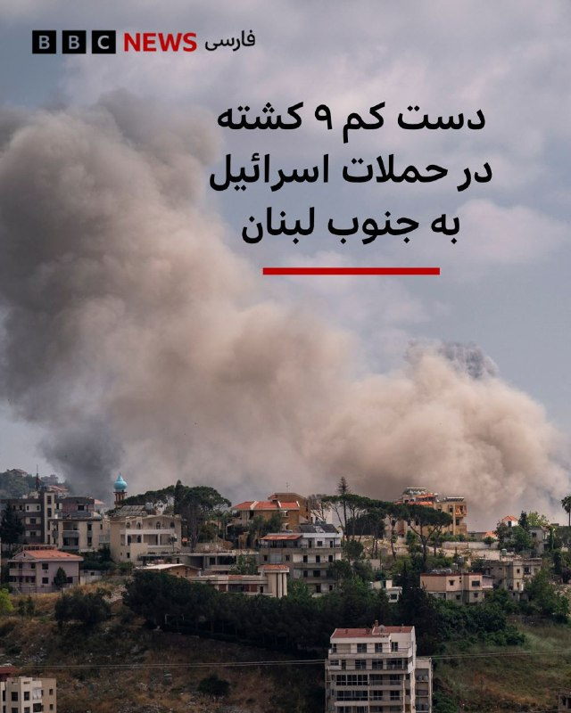

‌🔻مقام‌های لبنانی اعلام کردند در حملات روز چهارشنبه اسرائيل به جنوب لبنان دست کم ۹ نفر کشته شدند. همزمان، حزب الله اعلام کرد که راکت‌هايی را به سوی شمال اسرائيل شليک کرده است.

وزارت بهداشت لبنان اعلام کرد در ميان کشته شدگان دو امدادگر حضور دارند که آمبولانس آنها در حمله ای در منطقه چحور در جنوب لبنان هدف قرار گرفت.

همچنين يک خودرو در منطقه‌ای در جنوب بيروت هدف حمله قرار گرفت.

در مقابل، ارتش اسرائيل اعلام کرد يک پهپاد و دو پرتابه را که از مرز این کشور عبور کرده بودند رهگيری کرده است. حزب الله نيز گفت يک تجمع نيروهای اسرائيلی را هدف قرار داده است.
ادامه از:

📷Getty
@BBCPersian

---
📅 بروزرسانی: 1405/03/14 02:15
---

## VahidOOnLine — post 243585

  <a href="telegram/content/VahidOOnLine_243585_1780526714.mp4" target="_blank">🎬 Download video</a>

وزارت کشور کویت در شبکه اجتماعی ایکس ویدیویی منتشر کرده است که میزان تخریب ناشی از حملات پهپادی جمهوری اسلامی به فرودگاه بین‌المللی این کشور را نشان می‌دهد.
فرماندهی مرکزی ایالات متحده، سنتکام، اعلام کرده است جمهوری اسلامی با پهپاد به این فرودگاه غیرنظامی حمله کرده و این اقدام را «عامدانه، محاسبه‌شده و بی‌دلیل» توصیف کرده است.
وزارت دفاع کویت نیز از حمله ۱۳ موشک و ۱۷ پهپاد از سوی جمهوری اسلامی به این کشور خبر داده بود.
‌🏁 🇬🇧 IranintlTV

🤖 @VahidOOnLine

## VahidOOnLine — post 243584

  <a href="telegram/content/VahidOOnLine_243584_1780526716.mp4" target="_blank">🎬 Download video</a>

♦️جریان رودخانه زاینده‌رود چهارشنبه‌شب ۱۳ خردادماه، همزمان با افزایش خروجی سد، بار دیگر به شهر اصفهان رسید و در بستر این رودخانه تاریخی جاری شد. ویدیوهای منتشرشده در شبکه‌های اجتماعی نشان می‌دهد که شماری از شهروندان با حضور در محدوده پل تاریخی خواجو، از بازگشت آب استقبال کردند.
رودخانه زاینده‌رود با طولی بیش از ۴۰۰ کیلومتر، در دهه‌های اخیر به‌طور مداوم با خشکی مکرر و کاهش شدید جریان آب مواجه بوده است.
‌🇸🇦 Indypersian

🤖 @VahidOOnLine

## IranIntlTV — post 340449

  <a href="telegram/content/IranIntlTV_340449_1780526717.mp4" target="_blank">🎬 Download video</a>

وزارت کشور کویت در شبکه اجتماعی ایکس ویدیویی منتشر کرده است که میزان تخریب ناشی از حملات پهپادی جمهوری اسلامی به فرودگاه بین‌المللی این کشور را نشان می‌دهد.
فرماندهی مرکزی ایالات متحده، سنتکام، اعلام کرده است جمهوری اسلامی با پهپاد به این فرودگاه غیرنظامی حمله کرده و این اقدام را «عامدانه، محاسبه‌شده و بی‌دلیل» توصیف کرده است.
وزارت دفاع کویت نیز از حمله ۱۳ موشک و ۱۷ پهپاد از سوی جمهوری اسلامی به این کشور خبر داده بود.

## FarsiVOA — post 219524

  <a href="telegram/content/FarsiVOA_219524_1780526718.mp4" target="_blank">🎬 Download video</a>

⚡️حسن هاشمیان در برنامه تفسیر خبر: انتخاب جمهوری اسلامی محاصره دریایی با درگیری محدود است
@FarsiVOA

---
📅 بروزرسانی: 1405/03/14 02:05
---

## FoxNewsTwitter — post 342585

  <a href="telegram/content/FoxNewsTwitter_342585_1780526154.mp4" target="_blank">🎬 Download video</a>

Fox News (Twitter/X)

FOX NEWS REPORT: The House has passed a war powers resolution directing President Trump to either end U.S. military action against Iran or seek authorization from Congress to continue it, according to FOX News' @BillMelugin_.

## IranIntlTV — post 340448

  <a href="telegram/content/IranIntlTV_340448_1780526157.mp4" target="_blank">🎬 Download video</a>

در نامه‌ای به مجتبی؛
نمایندگان مجلس: باید بُرد موشک‌ها به دفتر ترامپ برسد

گروهی از نمایندگان مجلس در نامه‌ای به مجتبی خامنه‌ای خواستار افزایش بُرد موشک‌های جمهوری اسلامی تا سطحی شدند که به گفته آن‌ها «به دفتر کار دونالد ترامپ برسد».

کامبیز حسینی در «برنامه» به این موضوع می‌پردازد.

«یک ایران صدای شما را می‌شنود»
دوشنبه تا پنجشنبه ۱۱ شب تهران
از تلویزیون ایران اینترنشنال

تماشای نسخه کامل این قسمت از «برنامه» در یوتیوب:
https://youtu.be/6zvdzHHR308
@iranintltv

## IranIntlTV — post 340447

  <a href="telegram/content/IranIntlTV_340447_1780526160.mp4" target="_blank">🎬 Download video</a>

خبرگزاری سپاهی فارس خبر داد:
پویش «فعال‌سازی قطع داوطلبانه دسترسی به اینترنت بین‌الملل»

خبرگزاری فارس از راه‌اندازی پویش «فعال‌سازی قطع داوطلبانه دسترسی به اینترنت بین‌الملل» خبر داده است.

در حالی که میلیون‌ها ایرانی برای کار، آموزش، ارتباطات و کسب‌وکار به اینترنت وابسته‌اند و سال‌ها با فیلترینگ و محدودیت دست‌وپنجه نرم کرده‌اند، حالا عده‌ای پیشنهاد می‌کنند مردم داوطلبانه اینترنت جهانی را برای خودشان قطع کنند.

کامبیز حسینی در «برنامه» به این موضوع می‌پردازد.

«یک ایران صدای شما را می‌شنود»
دوشنبه تا پنجشنبه ۱۱ شب تهران
از تلویزیون ایران اینترنشنال

تماشای نسخه کامل این قسمت از «برنامه» در یوتیوب:
https://youtu.be/6zvdzHHR308
@iranintltv

## IranIntlTV — post 340446

  <a href="telegram/content/IranIntlTV_340446_1780526162.mp4" target="_blank">🎬 Download video</a>

آرین از تهران: ما برای خودمان رفتیم به خیابان و جنگیدیم

«یک ایران صدای شما را می‌شنود»
دوشنبه تا پنجشنبه ۱۱ شب تهران
از تلویزیون ایران اینترنشنال

تماشای نسخه کامل این قسمت از «برنامه» در یوتیوب:
https://youtu.be/6zvdzHHR308
@iranintltv

## IranIntlTV — post 340445

  <a href="telegram/content/IranIntlTV_340445_1780526164.mp4" target="_blank">🎬 Download video</a>

حسین از اهواز: در هر محله ۲۰ نفر با پرچم حزب‌الله بیرون می‌آیند، بعد به ما می‌گویند وطن‌فروش

«یک ایران صدای شما را می‌شنود»
دوشنبه تا پنجشنبه ۱۱ شب تهران
از تلویزیون ایران اینترنشنال

تماشای نسخه کامل این قسمت از «برنامه» در یوتیوب:
https://youtu.be/6zvdzHHR308
@iranintltv

## IranIntlTV — post 340444

  <a href="telegram/content/IranIntlTV_340444_1780526167.mp4" target="_blank">🎬 Download video</a>

اشکان از تهران: در این سه ماهی که ما نبودیم...

«یک ایران صدای شما را می‌شنود»
دوشنبه تا پنجشنبه ۱۱ شب تهران
از تلویزیون ایران اینترنشنال

تماشای نسخه کامل این قسمت از «برنامه» در یوتیوب:
https://youtu.be/6zvdzHHR308
@iranintltv

## IranIntlTV — post 340443

  <a href="https://t.me/IranintlTV/340443" target="_blank">📎 Download file</a>

🎧نسخه صوتی سیاست با مراد ویسی: ایرانِ امروز؛ میراث سیاه و خونین خمینی و خامنه‌ای
@iranintlTV

## FarsiVOA — post 219523

🔺روایت مژده هاشمی بازرگانی از زندان قزوین؛ از شکنجه و بازجویی تا پرونده‌سازی‌های امنیتی

▪️مژده هاشمی بازرگانی، شهروند زندانی در زندان مرکزی قزوین، در یک فایل صوتی از زندان به بیان روایتی تکان‌دهنده از بازداشت شبانه، ضرب‌وشتم، بازجویی‌های طولانی، فشار برای اعتراف اجباری و نگرانی از وضعیت مادر سالخورده‌اش پرداخته است.

⬇️ بیشتر بخوانید:
https://ir.voanews.com/a/iranian-protester-mojdeh-hashemi-abuse-qazvin-prison/8157026.html
@FarsiVOA

---
📅 بروزرسانی: 1405/03/14 01:54
---

## VahidOOnLine — post 243583

  

♦️به گزارش رویترز، مجلس نمایندگان آمریکا روز چهارشنبه از طرحی حمایت کرد که هدف آن محدود کردن اختیارات دونالد ترامپ درباره ادامه جنگ ایران بدون دریافت مجوز رسمی کنگره است.
این طرح با ۲۱۵ رای موافق در برابر ۲۰۸ رای مخالف تصویب شد؛ چهار نماینده جمهوری‌خواه نیز در رای‌گیری به دموکرات‌ها پیوستند.
دمکرات‌ها پس از هفت تلاش ناموفق، در هشتمین رای‌گیری سرانجام توانستند این طرح را برای مهار اختیارات نظامی کاخ سفید به تصویب برسانند. با این حال، طرح مذکور اکنون باید در سنای آمریکا به تصویب نهایی برسد و در صورت موافقت سنا، به کاخ سفید ارسال خواهد شد؛ جایی که دونالد ترامپ حق وتو دارد.
‌🇸🇦 Indypersian

🤖 @VahidOOnLine

## VahidOnline — post 75931

  <a href="telegram/content/VahidOnline_75931_1780525495.mp4" target="_blank">🎬 Download video</a>

لحظه اصابت پهپاد انتحاری شاهد 136 به ترمینال فرودگاه کویت از دید دوربین مدار بسته.
mohsenreyhani01

📡 @VahidOnline

## IranIntlTV — post 340442

  <a href="telegram/content/IranIntlTV_340442_1780525496.mp4" target="_blank">🎬 Download video</a>

همزمان با گزارش‌ها از مذاکرات میان تهران و واشینگتن، حملات موشکی و پهپادی سپاه به مواضعی در کشورهای منطقه، از جمله کویت و بحرین، با واکنش‌های گسترده مواجه شده است. قالیباف نیز گفت دوران تهدید بی‌هزینه جمهوری اسلامی به پایان رسیده است.

گفت‌وگو با بیژن کیان، کارشناس امنیت ملی
@iranintltv

## IranIntlTV — post 340441

  <a href="telegram/content/IranIntlTV_340441_1780525497.mp4" target="_blank">🎬 Download video</a>

مقام‌های آمریکایی از بازداشت جمشید قمی، مدیرعامل ایرانی-آمریکایی، در کالیفرنیا خبر دادند. او متهم است تجهیزات پیشرفته ساخت آمریکا را به نهادهای نظامی و هسته‌ای جمهوری اسلامی منتقل و میلیون‌ها دلار درآمد کسب کرده است.

جزییات بیشتر با امیر گیتی، عضو تحریریه ایران‌اینترنشنال
@iranintltv

## FarsiVOA — post 219522

⚡️اتحادیه اروپا پیشنهاد کرده است مأموریت دریایی «آسپیدس» نقش اصلی را در پاک‌سازی مین‌ها در تنگه هرمز بر عهده بگیرد؛ اقدامی که می‌تواند در قالب یک ائتلاف به رهبری فرانسه و بریتانیا انجام شود.
@FarsiVOA

## IranianMinds — post 21336

  <a href="telegram/content/IranianMinds_21336_1780525499.mp4" target="_blank">🎬 Download video</a>

🔴مجلس نمایندگان ایالات متحده، قطعنامه‌ای درباره اختیارات جنگی مرتبط با جنگ ایران با رأی ۲۱۵ به ۲۰۸ تصویب کرد.
این قطعنامه تا وقتی‌که توسط سنا نیز تصویب نشود، اثر قانونی الزام‌آور ندارد و بنابراین تأثیر فوری آن محدود می‌باشد.

@IranianMinds

---
📅 بروزرسانی: 1405/03/14 01:46
---

## VahidOOnLine — post 243582

  

مجلس نمایندگان آمریکا چهارشنبه با ۲۱۵ رای موافق و ۲۰۸ رای مخالف قطعنامه‌ مربوط به اختیارات جنگی ترامپ را که هدف آن توقف جنگ با جمهوری اسلامی و مشروط کردن درگیری‌ها به مجوز کنگره است، تصویب کرد. چهار جمهوری‌خواه نیز به این قطعنامه پیشنهادی دموکرات‌ها رای مثبت دادند.
این رای‌گیری تا حد زیادی جنبه نمادین دارد. هر قطعنامه‌ای برای اجرایی شدن باید در سنا نیز تصویب شود و برای غلبه بر وتوی ترامپ، به اکثریت دوسوم در هر دو مجلس نیاز دارد.
با این حال، این اقدام پس از آن صورت گرفت که سه قطعنامه پیشین درباره اختیارات جنگی در مجلس نمایندگان با اختلاف آرای رو به کاهش ناکام مانده بودند. سنا نیز ماه گذشته در یک رای‌گیری رویه‌ای، قطعنامه‌ای جداگانه اما مشابه را پیش برد که قبل از آن هفت بار رد شده بود.

‌🏁 🇬🇧 IranintlTV

🤖 @VahidOOnLine

## WithYashar — post 13462

  <a href="telegram/content/WithYashar_13462_1780524992.mp4" target="_blank">🎬 Download video</a>

دوربین‌های مداربسته لحظه‌ای را ثبت کردند که یک پهپاد کامیکازه شاهد-۱۳۶ ایرانی، اوایل صبح چهارشنبه به ترمینال ۱ فرودگاه بین‌المللی کویت حمله کرد.
@withyashar 😟

## FarsiVOA — post 219521

🔺صدور حکم سه سال زندان علیه سوری بابایی چگینی، از بازداشت‌شدگان اعتراضات دی

▪️سوری بابایی چگینی، از بازداشت‌شدگان اعتراضات دی‌ ۱۴۰۴، به سه سال حبس محکوم شد.

⬇️ بیشتر بخوانید:
https://ir.voanews.com/a/iranian-protester-souri-babaei-chegini-sentenced-three-years/8157018.html
@FarsiVOA

## FarsiVOA — post 219520

  <a href="telegram/content/FarsiVOA_219520_1780524995.mp4" target="_blank">🎬 Download video</a>

⚡️رضا پرچیزاده در برنامه تفسیر خبر: پرزیدنت ترامپ حرف آخر را همان اول زده است
@FarsiVOA

## Dirty_Kids — post 390950

بچه ها اسم این بازی عبور مرغ از خیابون  هست ویدئو نگاه کنید خیلی راحت 8 میلیون ازش سود گرفتیم😍 
😤اگ توم دوس داری خیلی راحت از بازی های انلاین پول در بیاری حتما عضو کازینو شبانه شو
✅ توی کازینو شبانه بهت اموزش میدیم از بازی های انلاین پول دربیاری👌 کانال کازینو…

## Dirty_Kids — post 390949

  <a href="telegram/content/Dirty_Kids_390949_1780524996.mp4" target="_blank">🎬 Download video</a>

بچه ها اسم این بازی عبور مرغ از خیابون  هست ویدئو نگاه کنید خیلی راحت 8 میلیون ازش سود گرفتیم😍

😤اگ توم دوس داری خیلی راحت از بازی های انلاین پول در بیاری حتما عضو کازینو شبانه شو
✅

توی کازینو شبانه بهت اموزش میدیم از بازی های انلاین پول دربیاری👌

کانال کازینو شبانه راهی برای چند برابر کردن سرمایت 🤷‍♂

کسب درامد انلاین با یه ادم حرفه ای یاد بگیر و‌ پول دربیار 
💵
A13
🎯همین حالا عضو شو و شروع کن👇N
https://t.me/+6ckCmywafrxiYzk0
https://t.me/+6ckCmywafrxiYzk0

## Dirty_Kids — post 390948

  

#بخوابیم

@Dirty_Kids 👻

## Dirty_Kids — post 390947

  <a href="telegram/content/Dirty_Kids_390947_1780525001.mp4" target="_blank">🎬 Download video</a>

به زودی در مشهد 😂😂😂😂

@Dirty_Kids 👻

## Dirty_Kids — post 390946

  <a href="telegram/content/Dirty_Kids_390946_1780525002.mp4" target="_blank">🎬 Download video</a>

#شهبازی‌ کان پر

@Dirty_Kids 👻

## Dirty_Kids — post 390945

  <a href="telegram/content/Dirty_Kids_390945_1780525004.mp4" target="_blank">🎬 Download video</a>

این دختر استریمر اخیرا بدلیل بسیار، مودب بودن، با نزاکت بودن، باشعور بودن، کص بودن، صورتی بودن و ممه بزرگ بودن خیلی معروف شده:

@Dirty_Kids 👻

## Dirty_Kids — post 390944

  <a href="telegram/content/Dirty_Kids_390944_1780525007.mp4" target="_blank">🎬 Download video</a>

نزدیک بود تو تجمعات شبانه تلفات بدن که مویی رد شد :

@Dirty_Kids 👻

## Dirty_Kids — post 390943

  <a href="telegram/content/Dirty_Kids_390943_1780525009.mp4" target="_blank">🎬 Download video</a>

دوس پسرم جوابمو نمیده حتما داره بهم خیانت میکنه😡💔 همون موقع دوس پسرش تو باشگاه:

@Dirty_Kids 👻

---
📅 بروزرسانی: 1405/03/14 01:34
---

## FoxNewsTwitter — post 342584

  

Fox News (Twitter/X)

BREAKING: President Trump suffered a rare defeat in the House after Democrats and a handful of Republicans voted to sharply curb his war powers in Iran.

Lawmakers voted 215-208 to withdraw troops from using military force against Iran absent congressional authorization.

All Democrats present backed the measure, joined by Reps. Thomas Massie, Warren Davidson, Brian Fitzpatrick, and Tom Barrett — the only Republicans to break with the president.

The vote is largely symbolic for now. Trump is expected to veto the resolution, and supporters do not have the votes needed to override it. But the bipartisan rebuke highlights growing divisions on Capitol Hill over U.S. involvement in Iran.

## FoxNewsTwitter — post 342583

  

Fox News (Twitter/X)

The NBA Finals are coming back to Madison Square Garden — and President Trump is expected to be in the building.

Trump plans to attend Game 3 when the Knicks host the Spurs in New York, adding another layer of attention to the franchise's first Finals appearance since 1999.

The president has openly praised the Knicks' playoff run and said he was invited by owner James Dolan to attend a game.

Now all eyes turn to the Garden as New York gets ready for one of the biggest basketball nights the city has seen in a generation.

## FoxNewsTwitter — post 342582

  <a href="telegram/content/FoxNewsTwitter_342582_1780524298.mp4" target="_blank">🎬 Download video</a>

Fox News (Twitter/X)

"[America is] truly a bastion of freedom and liberty... and that's what we need to continue to hold on to and fight for." — Actor Zachary Levi

## VahidOnline — post 75930

  

مجلس نمایندگان آمریکا روز چهارشنبه از قطعنامه‌ای به رهبری دموکرات‌ها حمایت کرد که هدف آن متوقف کردن جنگ با حکومت ایران تا زمان صدور مجوز از سوی کنگره است.

به گزارش رویترز این قطعنامه با ۲۱۵ رای موافق در برابر ۲۰۸ رای مخالف تصویب شد و چهار نماینده جمهوری‌خواه نیز به دموکرات‌ها پیوستند.

این رای‌گیری تازه‌ترین شکست سیاسی دونالد ترامپ در کنگره به شمار می‌رود؛ با وجود آنکه جمهوری‌خواهان در هر دو مجلس اکثریت شکننده‌ای دارند.

بنا به این گزارش، این اقدام عمدتا جنبه نمادین دارد، زیرا برای اجرایی شدن باید در سنا نیز تصویب شود و همچنین برای عبور از وتوی احتمالی دونالد ترامپ به حمایت دو سوم اعضای هر دو مجلس نیاز دارد.

با این حال، این رای‌گیری نشان‌دهنده افزایش نگرانی در کنگره درباره جنگ با حکومت ایران است.
سه قطعنامه مشابه پیشین در مجلس نمایندگان شکست خورده بودند، اما با اختلاف آرای کمتر از دفعات قبل.
همچنین سنا ماه گذشته یک قطعنامه مشابه را در یک رای‌گیری رویه‌ای به پیش برد؛ اتفاقی که پس از هفت تلاش ناموفق قبلی رخ داد.
iranintl

📡 @VahidOnline

## IranIntlTV — post 340440

  

مجلس نمایندگان آمریکا چهارشنبه با ۲۱۵ رای موافق و ۲۰۸ رای مخالف قطعنامه‌ مربوط به اختیارات جنگی ترامپ را که هدف آن توقف جنگ با جمهوری اسلامی و مشروط کردن درگیری‌ها به مجوز کنگره است، تصویب کرد. چهار جمهوری‌خواه نیز به این قطعنامه پیشنهادی دموکرات‌ها رای مثبت دادند.
این رای‌گیری تا حد زیادی جنبه نمادین دارد. هر قطعنامه‌ای برای اجرایی شدن باید در سنا نیز تصویب شود و برای غلبه بر وتوی ترامپ، به اکثریت دوسوم در هر دو مجلس نیاز دارد.
با این حال، این اقدام پس از آن صورت گرفت که سه قطعنامه پیشین درباره اختیارات جنگی در مجلس نمایندگان با اختلاف آرای رو به کاهش ناکام مانده بودند. سنا نیز ماه گذشته در یک رای‌گیری رویه‌ای، قطعنامه‌ای جداگانه اما مشابه را پیش برد که قبل از آن هفت بار رد شده بود.

https://iranintl.com/202606031436

## alonews — post 124945

  <a href="telegram/content/alonews_124945_1780524302.webm" target="_blank">🎬 Download video</a>

💢 اینترنت مخصوص جنگ 
🚀
✅

⭐️ فقط گیگی 8 هزار تومان
😍

✅ بدون قطعی‌های آزاردهنده

✅ سرعت بالا حتی ساعات شلوغ

✅ مناسب تلگرام، اینستاگرام و یوتیوب

✅ همراه با ساب

📈تعداد محدود با این قیمت

🤖 @NetAazaadBot

🤖 @NetAazaadBot

---
📅 بروزرسانی: 1405/03/14 01:24
---

## WithYashar — post 13461

  <a href="telegram/content/WithYashar_13461_1780523678.mp4" target="_blank">🎬 Download video</a>

مجلس نمایندگان ایالات متحده قطعنامه‌ای درباره اختیارات جنگ مرتبط با جنگ ایران را با رای ۲۱۵ به ۲۰۸ تصویب کرد.
این قطعنامه تا زمانی که توسط سنا نیز تصویب نشود، اثر قانونی الزام‌آور ندارد و بنابراین تأثیر فوری آن محدود است.
با این حال، این اولین رای موفق مجلس نمایندگان است که قدرت‌های جنگی کنگره را در مورد جنگ ایران تأیید می‌کند و اقدام نظامی آینده بدون تأیید کنگره را محدود می‌سازد.
چهار جمهوری‌خواه به نفع آن رای دادند.
@withyashar

## WithYashar — post 13460

  <a href="telegram/content/WithYashar_13460_1780523680.webm" target="_blank">🎬 Download video</a>

داداش اون بحث خیلی طولانیه اون میشه زمان ریست فکتوری طوفان بزرگ ( که با داستان خیالی نوح میشناسید ) تا اینجا بدون که قبلش تمدنهای بسیار پیشرفته بود روی زمین ، باشه برای بعد از آزادی 
😂

## IranIntlTV — post 340439

  <a href="telegram/content/IranIntlTV_340439_1780523681.mp4" target="_blank">🎬 Download video</a>

مراد ویسی، تحلیل‌گر ارشد ایران‌اینترنشنال، گفت: «پس از جنایت بزرگ جمهوری اسلامی در دی‌ماه، بسیاری از ایرانیان در برابر یک انتخاب قرار گرفته‌اند؛ ایستادن در کنار جمهوری اسلامی یا در کنار بازپس‌گیری ایران؟ ترساندن مردم از تغییر دیگر کارایی گذشته را ندارد و بسیاری بر سرنگونی و براندازی جمهوری اسلامی اصرار دارند.»
@iranintltv

## IranIntlTV — post 340438

  <a href="telegram/content/IranIntlTV_340438_1780523682.mp4" target="_blank">🎬 Download video</a>

مراد ویسی، تحلیل‌گر ارشد ایران‌اینترنشنال، گفت: «مردم ایران در طول سال‌های حکومت خمینی و خامنه‌ای، آرام‌آرام بخش‌های مختلف زندگی و رفاه خود را از دست داده‌اند تا جایی که امروز دغدغه بسیاری از آنها به تامین هزینه‌های اولیه زندگی، اجاره یا قسط خانه محدود شده است. پرسش مشترک بسیاری از ایرانیان این است که چگونه کار به جایی رسیده که سفر، تفریح، پس‌انداز و حتی گذران ماهانه زندگی به آرزو تبدیل شده است.»
@iranintltv

## IranIntlTV — post 340437

  <a href="https://t.me/IranintlTV/340437" target="_blank">📎 Download file</a>

🎧نسخه صوتی برنامه با کامبیز حسینی؛ خمینی و خامنه‌ای چه گلی به سر ایران زدند؟
@iranintlTV

## FarsiVOA — post 219519

🔺ابلاغ حکم اعدام حسن مصلاوی، فعال مدنی محبوس در زندان شیبان اهواز

▪️سازمان حقوق بشر کارون روز چهارشنبه ۱۳ خرداد ۱۴۰۵ اعلام کرد که حکم اعدام حسن مصلاوی (طرفی)، فعال مدنی و فرهنگی ۳۸ ساله اهل خوزستان، پس از گذشت بیش از دو سال از تایید آن در دیوان عالی کشور، به‌تازگی به‌طور رسمی در زندان شیبان اهواز به او ابلاغ شده است.

⬇️ بیشتر بخوانید:
https://ir.voanews.com/a/death-sentence-served-to-ahvaz-activist-hassan-maslawi/8157016.html
@FarsiVOA

## FarsiVOA — post 219518

⚡️دونالد ترامپ از احتمال دستیابی به نتایجی در مذاکرات با جمهوری اسلامی تا پایان این هفته خبر داد
@FarsiVOA

## alonews — post 124944

  <a href="telegram/content/alonews_124944_1780523684.webm" target="_blank">🎬 Download video</a>

👈مجلس نمایندگان ایالات متحده قطعنامه‌ای درباره اختیارات جنگ مرتبط با جنگ ایران را با رای ۲۱۵ به ۲۰۸ تصویب کرد. 
🔴این قطعنامه تا زمانی که توسط سنا نیز تصویب نشود، اثر قانونی الزام‌آور ندارد و بنابراین تأثیر فوری آن محدود است. 
🔴با این حال، این اولین رای موفق…

## alonews — post 124943

  <a href="telegram/content/alonews_124943_1780523684.mp4" target="_blank">🎬 Download video</a>

👈مجلس نمایندگان ایالات متحده قطعنامه‌ای درباره اختیارات جنگ مرتبط با جنگ ایران را با رای ۲۱۵ به ۲۰۸ تصویب کرد.

🔴این قطعنامه تا زمانی که توسط سنا نیز تصویب نشود، اثر قانونی الزام‌آور ندارد و بنابراین تأثیر فوری آن محدود است.

🔴با این حال، این اولین رای موفق مجلس نمایندگان است که قدرت‌های جنگی کنگره را در مورد جنگ ایران تأیید می‌کند و اقدام نظامی آینده بدون تأیید کنگره را محدود می‌سازد.

🔴چهار جمهوری‌خواه به نفع آن رای دادند.

✅ @AloNews خبر جنگ

---
📅 بروزرسانی: 1405/03/14 01:15
---

## VahidOOnLine — post 243581

♦️دونالد ترامپ رئیس جمهوری آمریکا چهارشنبه ۱۳ خرداد طی مراسم امضای چند فرمان اجرایی در کاخ سفید به خبرنگاران گفت برای نخستین بار میان آمریکا و حزب‌الله گفتگو انجام شده است.
ترامپ گفت: «ما در واقع برای نخستین بار با حزب‌الله صحبت کردیم. نمی‌دانستیم آن‌ها حرف می‌زنند.»
رئیس‌جمهوری آمریکا افزود: «آن‌ها دیروز پذیرفتند شلیک نکنند و اسرائیل هم شلیک نخواهد کرد.»
ترامپ در ادامه گفت ترجیح می‌دهد موضوع حزب‌الله را از سایر پرونده‌ها جدا نگه دارد و آن را به‌عنوان یک موضوع مستقل دنبال کند.
‌🇸🇦 Indypersian

🤖 @VahidOOnLine

## WithYashar — post 13459

درود ولی من‌میرملاس لرستان رفتم اونجا دیوار نوشته هست‌مربوط به 12000 سال پیش

## WithYashar — post 13458

یاشار : دمت آقا دایی ، مردی ، خواستم تکمیل کنم که عدد ۲۵۰۰ سال به طور مشخص به سابقه پادشاهی شاهنشاهی ایران اشاره دارد، نه به کل تمدن ایران ، تمدن در فلات ایران ۵۰۰۰ الی ۷۰۰۰ سال حتی بیشتر سابقه دارد
@withyashar 😁🙌🏾

## WithYashar — post 13457

ثعلی دایی: هیچ قدرتی توان شکستن تمدن ۲۵۰۰ ساله ایران را ندارد

هرگز قدرتی نتوانسته و نخواهد توانست تمدن و فرهنگ ۲۵۰۰ ساله ایران باستان را که در قلب و جان یکایک ماست در هم بشکند.
‏ایران زمین، روزگارها دیده است آنچه سرافراز می‌ماند همیشه تا ابد وطن است.
@withyashar

## WithYashar — post 13456

دو منبع مطلع در مذاکرات به i24NEWS عبری:
مذاکرات بین آمریکا و ایران به دلیل اصرار ایرانی‌ها بر آزادسازی پول‌ها، «پول نقد»، از میلیاردهایی که مسدود شده‌اند، حتی در مرحله اول، متوقف شده است .
در روزهای اخیر، میانجی‌ها تلاش کرده‌اند در این موضوع مصالحه کنند اما ایرانی‌ها بر دریافت پول در همان مرحله اول، در چارچوب توافق کلی، قبل از انجام هر اقدام واقعی در میدان، اصرار دارند.
مقامات ارشد آمریکایی تأکید می‌کنند: در ابتدا پولی آزاد نخواهیم کرد مگر اینکه ایران گام مهمی در مسئله هسته‌ای و هرمز بردارد و همچنین توافق کلی بسیار معنادارتر باشد.
@withyashar

## mwarmonitor — post 10119

🔴مجلس نمایندگان آمریکا قطعنامه‌ای را تصویب کرده که اختیارات جنگی رئیس‌جمهور ترامپ در قبال ایران را محدود می‌کند. بر اساس گزارش وال‌استریت ژورنال، این قطعنامه «به رئیس‌جمهور دستور می‌دهد نیروهای مسلح آمریکا را از درگیری‌ها علیه ایران خارج کند، مگر اینکه به‌طور صریح از سوی کنگره مجوز داده شده باشد؛ به‌جز در موارد دفاع از آمریکا، یک متحد یا شریک در برابر “حمله قریب‌الوقوع”».

🔴این رأی‌گیری تنها چند هفته پس از آن انجام می‌شود که سنا نیز به محدود کردن اختیارات جنگی ترامپ درباره ایران رأی داده بود. این قطعنامه هنوز می‌تواند توسط رئیس‌جمهور ترامپ وتو شود؛ وتویی که تنها با رأی دوسوم اکثریت در هر دو مجلس نمایندگان و سنا قابل لغو است.

@mwarmonitor

## BBCPersian — post 282804

  

‌🔻مجلس نمايندگان آمريکا روز چهارشنبه در اقدامی کم سابقه، با تصويب يک قطعنامه که به رهبری دموکرات‌ها تهیه و دنبال شده است، مخالفت خود را با جنگ دونالد ترامپ عليه ايران ابراز کرد؛ اقدامی که برخلاف خواست رهبران جمهوری‌خواه مجلس انجام شد.

قطعنامه اختيارات جنگی مربوط به ايران که از سوی گرگوری ميکس، نماينده دموکرات ايالت نيويورک و عضو ارشد کميته روابط خارجی مجلس ارائه شده بود، قرار بود پيش از آغاز تعطيلات روز يادبود کنگره در ۲۱ مه - دو هفته پیش - به رأی گذاشته شود. اما زمانی که مشخص شد شمار زيادی از جمهوری‌خواهان برای رأی‌گيری حضور ندارند و احتمال شکست آن وجود دارد، ناگهان از دستور کار خارج شد.

اين قطعنامه سرانجام روز چهارشنبه با ۲۱۵ رأی موافق در برابر ۲۰۸ رأی مخالف تصويب شد. چهار نماينده جمهوری‌خواه نيز همراه با تمامی دموکرات‌ها به آن رأی مثبت دادند.

بر اساس اين قطعنامه، از دونالد ترامپ خواسته می‌شود نيروهای مسلح آمريکا را از درگيری‌های نظامی با ايران خارج کند، مگر آنکه کنگره رسما اعلان جنگ کند يا مجوز استفاده از نيروی نظامی عليه ايران را صادر کند.
ادامه از:
https://bbc.in/4eqwgb1
📷EPA
@BBCPersian

---
📅 بروزرسانی: 1405/03/14 01:06
---

## WithYashar — post 13455

  

مقامات آمریکا جمشید قومی، شهروند دوتابعیتی ایران و آمریکا و مدیرعامل شرکت «فرار پرداز رایانه» در تهران را به نقض تحریم‌ها متهم کرده‌اند. طبق ادعای دادستانی، او طی بیش از یک دهه تجهیزات شبکه، امنیتی و رمزنگاری ساخت آمریکا را از طریق واسطه‌هایی در دبی به ایران، از جمله سازمان انرژی اتمی و وزارت دفاع، منتقل کرده است. همچنین متهم است حدود ۱۵ میلیون دلار درآمد حاصل از این فعالیت‌ها را به آمریکا منتقل کرده و با آن یک عمارت ۳۵ میلیون دلاری در کالیفرنیا ساخته است. در صورت محکومیت، با حداکثر ۲۰ سال زندان فدرال روبه‌رو خواهد شد.
@withyashar

## IranIntlTV — post 340436

  <a href="telegram/content/IranIntlTV_340436_1780522566.mp4" target="_blank">🎬 Download video</a>

در جلسه کمیته روابط خارجی مجلس نمایندگان آمریکا، مارکو روبیو، وزیر خارجه آمریکا، گفت پیش‌شرط آغاز مذاکرات با جمهوری اسلامی، بازگشایی تنگه هرمز و تعهد کتبی آن‌ها به عدم حمله به کشتی‌ها در خلیج فارس است. او تاکید کرد در برابر این اقدام، هیچ امتیازی به ایران داده نخواهد شد.
روبیو در این جلسه از پایان عملیات خشم حماسی در جنگ با جمهوری اسلامی خبر داد.
مرضیه حسینی، خبرنگار ایران‌اینترنشنال، گزارش می‌دهد
@iranintltv

## alonews — post 124942

  <a href="telegram/content/alonews_124942_1780522569.webm" target="_blank">🎬 Download video</a>

👈علی دایی: هیچ قدرتی توان شکستن تمدن ۲۵۰۰ ساله ایران را ندارد

🔴هرگز قدرتی نتوانسته و نخواهد توانست تمدن و فرهنگ ۲۵۰۰ ساله ایران باستان را که در قلب و جان یکایک ماست در هم بشکند.

🔴‏ایران زمین، روزگارها دیده است آنچه سرافراز می‌ماند همیشه تا ابد وطن است.

✅ @AloNews خبر جنگ

---
📅 بروزرسانی: 1405/03/14 00:54
---

## mwarmonitor — post 10118

📝 سوالی دارید دایرکت جواب میدم ...

## IranIntlTV — post 340435

  <a href="telegram/content/IranIntlTV_340435_1780521896.mp4" target="_blank">🎬 Download video</a>

مراد ویسی، تحلیل‌گر ارشد ایران‌اینترنشنال، گفت: «ایرانی که دغدغه بسیاری از مردمش تامین گوشت، مرغ، تخم‌مرغ، شیر، نان و برنج شده، ایرانی که یخچال‌های خالی، رویای دست‌نیافتنی خرید خانه و اجاره‌های سرسام‌آور زندگی را برای میلیون‌ها نفر دشوار کرده است؛ این وضعیت، میراث ۴۸ سال حکومت خمینی و خامنه‌ای است.»
@iranintltv

## FarsiVOA — post 219517

⚡️اظهارات تازه یک مقام جمهوری اسلامی نشان می‌دهد خبر کشته شدن علی خامنه‌ای ساعت‌ها پس از اطمینان مقام‌ها از مرگ او اعلام شد. همزمان، گزارش‌های داخلی حاکی از آن است که با وجود اعلام بازگشایی اینترنت، فیلترینگ و ابزارهای محدودسازی دسترسی کاربران با سرعت در حال بازگشت و به‌روزرسانی هستند.
@FarsiVOA

---
📅 بروزرسانی: 1405/03/14 00:44
---

## VahidOOnLine — post 243580

  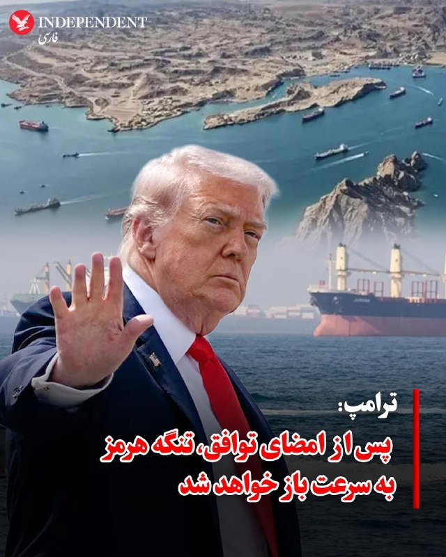

♦️دونالد ترامپ، رییس جمهوری ایالات متحده، چهارشنبه ۱۳ خرداد در کاخ سفید و در پاسخ به سوالی درباره روند مذاکرات و وضعیت تنگه هرمز گفت: «بلافاصله پس از امضای توافق، تنگه هرمز باز خواهد شد.»
رئیس‌جمهوری آمریکا در ادامه با اشاره به آمادگی پدافندی و پیش‌دستانه واشنگتن برای تامین امنیت این شاهراه حیاتی انرژی افزود: «ما از قبل کشتی‌های مین‌روب خود را در آنجا مستقر کرده‌ایم؛ همان‌طور که احتمالا شنیده‌اید، نیروهای ما در حال حاضر مشغول عملیات مین‌روبی در منطقه هستند.»
‌🇸🇦 Indypersian

🤖 @VahidOOnLine

## FoxNewsTwitter — post 342581

  <a href="telegram/content/FoxNewsTwitter_342581_1780521287.mp4" target="_blank">🎬 Download video</a>

Fox News (Twitter/X)

NEW: Dem Rep. Al Green tells Secretary Mullin to "shut up" during a heated committee hearing:

MULLIN: "Are you calling me a racist?"

GREEN: "Reclaiming my time. Ask him to shut up."

MULLIN: "That's a pretty..."

GREEN: "Shut up, up, up, up. Shut up. It's my time."

MULLIN: "I'm not gonna let anyone call me a racist, Chairman."

## IranIntlTV — post 340434

  <a href="telegram/content/IranIntlTV_340434_1780521289.mp4" target="_blank">🎬 Download video</a>

🔻رسانه‌های دولتی کره شمالی روز سه‌شنبه گزارش دادند که کیم جونگ اون، رهبر این کشور، در پیونگ‌یانگ از تیم‌های قهرمان فوتبال زنان استقبال کرده است.

🔹در ویدیویی که از تلویزیون دولتی KRT پخش شد، بازیکنان باشگاه نائگو‌هی‌انگ زنان و تیم ملی زیر ۱۷ سال زنان در حالی دیده می‌شدند که هنگام دیدار با رهبر کشور، تشویق می‌کردند و اشک می‌ریختند.

🔹کیم و مقام‌های همراهش همچنین یک دیدار دوستانه میان دو تیم را تماشا کردند.

🔹باشگاه نائگو‌هی‌انگ زنان در ماه گذشته به کره جنوبی سفر کرد و با شکست توکیو وردی بِلِزا قهرمان لیگ قهرمانان زنان آسیا شد. این تیم نخستین ورزشکاران کره شمالی بودند که پس از هشت سال به کره جنوبی سفر کردند و با این قهرمانی، سهمیه حضور در جام قهرمانان زنان فیفا در سال آینده را نیز به دست آوردند.

🔹همچنین تیم ملی زیر ۱۷ سال زنان کره شمالی در ماه گذشته قهرمان جام ملت‌های زنان زیر ۱۷ سال آسیا شد.

@iranintltvsport

## Persian_Trend_Official — post 15662

  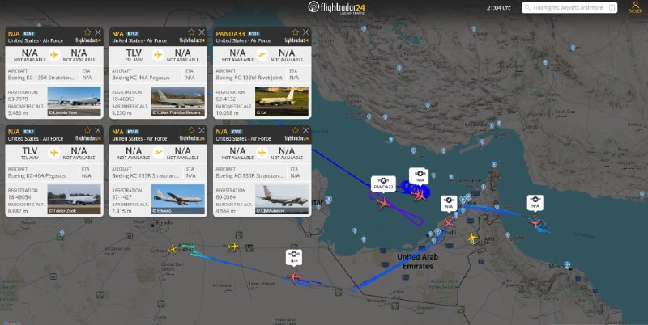

هواپیمای Boeing RC-135W Rivet Joint یکی از مهم‌ترین و محرمانه‌ترین هواپیماهای جاسوسی آمریکا و بریتانیاست؛ پرنده‌ای که مأموریت اصلی آن نه حمله است، نه رهگیری، نه بمباران؛ بلکه شنیدن، کشف کردن و نقشه‌برداری از میدان نبرد الکترونیکی دشمن است.
این هواپیما در اصل بر پایه بدنه بوئینگ ۷۰۷ ساخته شده، اما آنچه آن را خطرناک می‌کند ظاهرش نیست؛ مجموعه عظیمی از آنتن‌ها، گیرنده‌ها، پردازنده‌ها و اپراتورهای اطلاعاتی داخل آن است. RC-135W می‌تواند از فاصله صدها کیلومتری، بدون ورود به حریم هوایی دشمن، امواج راداری، مکالمات نظامی، ارتباطات رمزگذاری‌شده، فعالیت سامانه‌های پدافندی و حتی الگوی کار شبکه فرماندهی و کنترل طرف مقابل را رصد کند.
مهم‌ترین قابلیت Rivet Joint، جمع‌آوری اطلاعات SIGINT یا اطلاعات سیگنالی است. یعنی این پرنده می‌تواند بفهمد چه راداری روشن شده، از کجا سیگنال می‌فرستد، چه نوع سامانه‌ای فعال است، چه فرکانسی استفاده می‌شود و احتمالاً به چه شبکه‌ای متصل است. این اطلاعات برای طراحی حمله هوایی، شناسایی پدافند دشمن، آماده‌سازی جنگ الکترونیک و حتی تعیین مسیر امن برای جنگنده‌ها و موشک‌ها حیاتی است.

RC-135W معمولاً در نزدیکی مناطق بحران‌زده پرواز می‌کند؛ نه آن‌قدر نزدیک که هدف آسان باشد، و نه آن‌قدر دور که اطلاعات ارزشمند از دست برود. برای همین حضور آن در نزدیکی روسیه، دریای سیاه، بالتیک، خلیج فارس، عراق، سوریه یا شرق مدیترانه معمولاً نشانه‌ای از افزایش سطح رصد اطلاعاتی غرب است.
این هواپیما همچنین می‌تواند در عملیات‌های مشترک با جنگنده‌ها، آواکس‌ها، پهپادها و ناوهای جنگی نقش «گوش بزرگ میدان نبرد» را بازی کند. به زبان ساده، اگر آواکس چشم آسمان باشد، Rivet Joint گوش الکترونیکی جنگ است؛ پرنده‌ای که سکوت رادیویی دشمن، روشن شدن رادارها و حتی تغییرات کوچک در فعالیت شبکه‌های نظامی را به داده قابل تحلیل تبدیل می‌کند.
در جنگ مدرن، فقط موشک و جنگنده تعیین‌کننده نیستند. هر ارتشی که زودتر بفهمد دشمن چه سامانه‌ای را روشن کرده، از کجا ارتباط می‌گیرد و چه زمانی در حال آماده‌سازی عملیات است، یک قدم جلوتر است. به همین دلیل RC-135W یکی از ارزشمندترین دارایی‌های اطلاعاتی آمریکا و ناتو محسوب می‌شود؛ پرنده‌ای بدون سلاح، اما با تأثیری مستقیم بر نتیجه عملیات‌های نظامی.

📌 @persian_trend_official
پرشین ترند | متفاوت‌ترین کانال نظامی

## alonews — post 124941

  <a href="telegram/content/alonews_124941_1780521291.mp4" target="_blank">🎬 Download video</a>

👈صحنه‌ای آخرالزمانی از بمباران پایگاه چهارم شکاری دزفول در ۱فروردین

🔴موج انفجار رو فقط ببینید
‼️

✅ @AloNews خبر جنگ

## alonews — post 124940

  <a href="telegram/content/alonews_124940_1780521293.webm" target="_blank">🎬 Download video</a>

👈شهبازی مجری محبوب صدا و سیما: من سالم هستم و خبر تجاوز گروپ به من کاملا کذبه 
✅ @AloNews خبر جنگ

---
📅 بروزرسانی: 1405/03/14 00:35
---

## VahidOOnLine — post 243579

  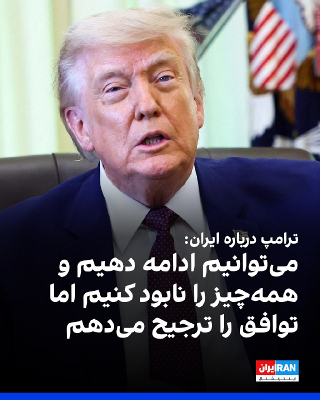

دونالد ترامپ در کاخ سفید درباره ایران گفت: «ما از سه تیم رهبری عبور کرده‌ایم. این یک وضعیت نظامی است و هیچ ارتشی مانند ارتش ما وجود ندارد. می‌توانیم دو یا سه هفته دیگر ادامه دهیم و همه‌چیز را کاملا نابود کنیم، اما ترجیح می‌دهم این کار را نکنم. انجامش آسان است و آن‌ها آماده انجام آن هستند.»

او افزود: «اما اگر بتوانیم چیزی را به‌صورت مکتوب به دست بیاوریم که همان نتیجه را بدون کشتن همه به همراه داشته باشد، آن را ترجیح می‌دهم. فکر می‌کنم بیشتر افراد من هم همین را می‌خواهند.»
‌🏁 🇬🇧 IranintlTV

🤖 @VahidOOnLine

## mwarmonitor — post 10117

  <a href="telegram/content/mwarmonitor_10117_1780520703.mp4" target="_blank">🎬 Download video</a>

«...توافق هسته‌ای ایران که به قلم باراک حسین اوباما نوشته شد. این یکی از احمقانه‌ترین توافق‌هایی بود که تا به حال دیده‌ام. و این [توافق جدید] هیچ ارتباطی... می‌دانید، من از این ابله‌ها خوشم می‌آید، این دموکرات‌ها (با تلفظ طعنه‌آمیز: D-U-M-B، دموکرات‌های کودن)، که به تلویزیون می‌روند و می‌گویند: "اوه، خب، این دقیقاً مثل همان کاری است که اوباما کرد." این دقیقاً عکس آن است.
این [توافق جدید] هیچ راهی برای رسیدن به سلاح هسته‌ای باقی نمی‌گذارد؛ در حالی که آن [توافق قبلی] یک مسیر قطعی به سمت سلاح هسته‌ای بود که شما نمی‌توانستید هیچ کاری در موردش انجام دهید. این دقیقاً عکس آن است.
آن‌ها میلیاردها میلیارد دلار به ایران دادند؛ از جمله ۱.۷ میلیارد دلار که در یک بوئینگ ۷۵۷ قرار داده شد، در حالی که صندلی‌های هواپیما را برداشته بودند، چون اگر صندلی‌ها سر جایشان می‌بود، فضای کافی وجود نداشت. با ۱.۷ میلیارد دلار پول نقد که از بانک‌های دی‌سی (واشنگتن)، مریلند و ویرجینیا برداشته و به ایران فرستاده شد؛ ۱.۷ میلیارد دلار پول نقدِ سبز! و سپس، ده‌ها میلیارد دلار دیگر که توسط دولت ما به ایران داده شد.»

@mwarmonitor

## pm_afshaa — post 92244

رویترز:ترامپ مدعی شد ایران موافقت کرده که سلاح هسته‌ای نداشته باشد

💧 Rainbet.com the #1 Non-KYC Crypto Casino & Sportsbook @rainbetcom

😁 @Pm_Afshaa

## IranIntlTV — post 340433

  

دونالد ترامپ در کاخ سفید درباره ایران گفت: «ما از سه تیم رهبری عبور کرده‌ایم. این یک وضعیت نظامی است و هیچ ارتشی مانند ارتش ما وجود ندارد. می‌توانیم دو یا سه هفته دیگر ادامه دهیم و همه‌چیز را کاملا نابود کنیم، اما ترجیح می‌دهم این کار را نکنم. انجامش آسان است و آن‌ها آماده انجام آن هستند.»

او افزود: «اما اگر بتوانیم چیزی را به‌صورت مکتوب به دست بیاوریم که همان نتیجه را بدون کشتن همه به همراه داشته باشد، آن را ترجیح می‌دهم. فکر می‌کنم بیشتر افراد من هم همین را می‌خواهند.»
https://iranintl.com/202606038118

## FarsiVOA — post 219516

🔺ترامپ: مذاکرات با جمهوری اسلامی خیلی خوب پیش می‌رود؛ به امضای توافق خیلی نزدیک‌ شده‌ایم

▪️دونالد ترامپ رئیس جمهوری آمریکا چهارشنبه ۱۳ خرداد طی مراسم امضای چند فرمان اجرایی در کاخ سفید به خبرنگاران گفت مذاکرات با جمهوری اسلامی خیلی خوب پیش می‌رود و «به امضای یک توافق با ایران خیلی نزدیک‌ هستیم»، اما نتیجه این مذاکرات همچنان معلوم نیست شاید تا آخر هفته مشخص ‌شود.

⬇️ بیشتر بخوانید:
https://ir.voanews.com/a/8157006.html
@FarsiVOA

## Persian_Trend_Official — post 15661

  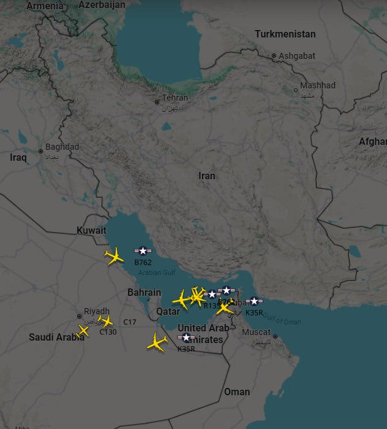

اگر موافقید امشب یکم بیشتر بیدار باشیم ...

## alonews — post 124939

  <a href="telegram/content/alonews_124939_1780520707.webm" target="_blank">🎬 Download video</a>

👈شهبازی مجری محبوب صدا و سیما: من سالم هستم و خبر تجاوز گروپ به من کاملا کذبه

✅ @AloNews خبر جنگ

## alonews — post 124938

  <a href="telegram/content/alonews_124938_1780520708.mp4" target="_blank">🎬 Download video</a>

👈تجمعات شبانه تلفات داد
‼️

✅ @AloNews خبر جنگ

---
📅 بروزرسانی: 1405/03/14 00:24
---

## VahidOOnLine — post 243578

  

♦️دونالد ترامپ، رئیس‌جمهوری آمریکا، روز چهارشنبه ۱۳ خرداد در گفتگو با خبرنگاران در کاخ سفید با اشاره به توانمندی‌های نظامی ایالات متحده و در پاسخ به موضوعات مربوط به ایران اعلام کرد که واشنگتن از قدرتمندترین ارتش تاریخ خود برخوردار است. ترامپ تاکید کرد: «ما می‌توانیم دو تا سه هفته دیگر ادامه دهیم و همه را نابود کنیم؛ انجام این کار بسیار آسان است و نیروهای ما آماده و خواستار آن هستند، اما من ترجیح می‌دهم این کار را نکنم.»
ترامپ در ادامه گفت: «اگر بتوانیم به چیزی مکتوب برسیم که همان نتیجه را بدون کشتن همه به دست آورد، ترجیح می‌دهم همان کار را انجام دهم.»
‌🇸🇦 Indypersian

🤖 @VahidOOnLine

## VahidOOnLine — post 243577

  

دونالد ترامپ در کاخ سفید درباره حمله تهران به کویت و نقض آتش‌بس گفت: «سه‌شنبه شب ضربه سنگینی به جمهوری اسلامی زدیم و دیشب هم همین‌طور. وقتی موضوع را برایم توضیح دادند، گفتم بسیار خب، همین کار را انجام می‌دهیم، اما ما هم شدید به آن‌ها ضربه می‌زدیم.»
او افزود: «مذاکرات بسیار خوب پیش می‌رود. ممکن است به نتیجه برسد یا نرسد، اما اگر قرار باشد اتفاقی بیفتد، شاید همین آخر هفته رخ دهد. آن منطقه بخش متفاوتی از جهان است؛ آنجا آتش‌بس یعنی به شکلی ملایم‌تر به تیراندازی ادامه دادن.»
ترامپ گفت: «هر اتفاقی ممکن است بیفتد وقتی با جمهوری اسلامی طرف هستید. این یکی از بی‌ثبات‌ترین مناطق جهان است.»
او همچنین گفت: «ما از سه تیم رهبری عبور کرده‌ایم. این یک وضعیت نظامی است و هیچ ارتشی مانند ارتش ما نیست. می‌توانیم دو یا سه هفته دیگر ادامه دهیم و همه را کاملا نابود کنیم، اما ترجیح می‌دهم این کار را نکنم. انجامش آسان است و آن‌ها آماده انجام آن هستند.»
‌🏁 🇬🇧 IranintlTV

🤖 @VahidOOnLine

## WithYashar — post 13454

منابع العربیه: پیشرفت‌هایی در مذاکرات لبنان و اسرائیل حاصل شده است، اما هنوز توافق دائمی به دست نیامده است

اختلاف بر سر سلاح‌های حزب‌الله همچنان مانع اصلی هرگونه توافق بلندمدت است
@withyashar

## mwarmonitor — post 10116

🔵خبرنگار: دو سوال درباره ایران، قربان. اول اینکه، شما هفته گذشته گفتید که ایالات متحده وارد خواهد شد و مواد هسته‌ای دفن شده را با همکاری آن‌ها [ایران] بیرون خواهد کشید...
🔴دونالد ترامپ: با آن‌ها، درسته.
🔵خبرنگار: ...با آن‌ها. درسته. آیا ایران واقعاً با این موضوع موافقت کرد؟
🔴دونالد ترامپ: خب، بستگی دارد که درباره کدام روز صحبت کنید. آن‌ها موافقت کردند و بعد گاهی اوقات... آن‌ها موافقت کردند. خب، این همان چیزی است که می‌گویم، این یکی از چیزهایی است که درباره‌اش صحبت می‌کنیم.
این موضوع خیلی بزرگ‌نمایی شده است؛ من کسی هستم که آن را بزرگ‌نمایی کرد. از نظر من این موضوع مهم بود، برای بقیه مهم نیست؛ چون آن بی‌-۲های (B-2) زیبایِ آنجا، بمب‌افکن‌های بی‌-۲، آن‌ها نابودش کردند.
می‌دانید، وقتی سی‌ان‌ان (CNN) گفت: «شاید این یک نابودی کامل نبوده»، آن‌ها می‌دانستند... یعنی حتی قبل از اینکه خلبان‌ها به خانه برگردند، قبل از اینکه کسی محل را ببیند. اما بعداً کمیسیون انرژی اتمی به آنجا رفت و گفتند که کاملاً نابود شده است.
آن مواد زیر کوهی دفن شده‌اند که تقریباً ریزش کرده است. دسترسی به آن بسیار بسیار سخت است. اما با این وجود، من می‌خواهم آن را به دست بیاورم. ما تنها کسانی هستیم... ما و احتمالاً چین، تنها دو کشوری هستیم که تجهیزات لازم برای انجام این کار را داریم. بنابراین، بله، من می‌خواهم آن را به دست بیاورم.
ما در زمان‌های مختلف، چیزهای مختلفی... منظورم این است که آن‌ها چند بار نظرشان را عوض کرده‌اند، اما در حال حاضر، وضعیت این‌گونه است که ما در آینده‌ای نه چندان دور وارد خواهیم شد. اکنون آنجا بسیار امن است. می‌دانید، ما با «نیروی فضایی»، دوربین‌هایی داریم که از هر زاویه‌ای، آن سه سایت را در تمام اوقات تحت نظر دارند. اگر کسی به آنجا برود، دقیقاً خواهیم دید چه اتفاقی در حال رخ دادن است و ما آن را کمی بیشتر منفجر خواهیم کرد!
اما تا جایی که به به دست آوردن آن مربوط می‌شود، بسیار... بمب‌افکن‌های بی‌-۲ کاری کردند که تا به حال کسی مشابهش را ندیده است. در شب، بدون ماه، تاریکی مطلق، حدود ساعت ۱ بامداد یا همان حدود. آن‌ها آن بمب‌ها را رها کردند، بزرگ‌ترین بمب‌هایی که می‌توانید پیدا کنید، و دقیقاً اصابت کرد؛ از هواکش‌ها پایین رفت. باورش سخت است که بتوانند چنین کاری را با این فناوری انجام دهند. یک پرتو [لیزر] را دقیقاً تا داخل هواکش‌ها دنبال کرد و همان‌جا منفجر شد.
به دست آوردن آن مواد بسیار سخت است، اما من با این وجود، هنوز آن را می‌خواهم. و من نمی‌خواهم این کار را در زمان درگیری انجام دهم؛ نمی‌خواهم نیروها را در چنین خطری قرار دهم. من به یاد دارم که جیمی کارتر مشکلات بدی در ایران با گروگان‌ها داشت. من هرگز نمی‌خواهم مردم خودمان را در چنین خطری قرار دهم. اما وقتی [درگیری] تمام شود، تا این لحظه توافق شده است که ما با همراهی خودِ آن‌ها وارد خواهیم شد، آن را به دست خواهیم آورد و نابودش خواهیم کرد. نابود خواهد شد.

@mwarmonitor

## mwarmonitor — post 10115

  <a href="telegram/content/mwarmonitor_10115_1780520088.mp4" target="_blank">🎬 Download video</a>

🎬 Video

## mwarmonitor — post 10114

  <a href="telegram/content/mwarmonitor_10114_1780520091.mp4" target="_blank">🎬 Download video</a>

🔵خبرنگار: «آقای رئیس‌جمهور، با توجه به حملات ایران به کویت... این آخرین حمله به کویت؛ آیا آتش‌بس با ایران همچنان برقرار است؟»
🔴دونالد ترامپ: «خب، می‌دونید، هر چیزی دلیلی داره. و ما شب قبلش و در واقع دیشب، ضربه نسبتاً سختی به اون‌ها زدیم. و وقتی این موضوع برام توضیح داده شد، گفتم: "خیلی خب، پس ما این کار رو انجام می‌دیم." اما ما... ما ضربه نسبتاً سختی به اون‌ها زدیم، یه جورایی. بنابراین برای بعضی چیزها دلیلی وجود داره و معمولاً دلیلی هست که... ما کمی تحریک شدیم، چون ما به دلیل دیگه‌ای اقدام شدیدی انجام دادیم. و خود... خود مذاکره در واقع خیلی خوب پیش رفته، خیلی خوب. اگر قرار باشه اتفاقی بیفته... شاید هم نیفته، کسی چه می‌دونه؟ اما اگر اتفاق بیفته، ممکنه مثلاً در طول آخر هفته رخ بده.»

@mwarmonitor

## FoxNewsTwitter — post 342580

  <a href="telegram/content/FoxNewsTwitter_342580_1780520093.mp4" target="_blank">🎬 Download video</a>

Fox News (Twitter/X)

“We don't have to live like this. We don't have to put up with this.”

Steve Hilton rips into the current Democratic leadership over rising costs for Californians, warning voters that crushing living costs and high taxes are a direct result of choices made by those in power.

“We don't have to have the highest housing costs in the country.”

“We don't have to have the highest gas prices in the country.”

“We don't have to have the highest taxes in the country for the worst results. These are all choices. These are choices made by the people in charge.”

## pm_afshaa — post 92243

  <a href="telegram/content/pm_afshaa_92243_1780520095.webm" target="_blank">🎬 Download video</a>

🔴ترامپ: خود مذاکرات خیلی خوب پیش میره؛ ممکنه انجام نشه، اما اگر انجام بشه، احتمالا در آخر هفته خواهد بود. 
💧 Rainbet.com the #1 Non-KYC Crypto Casino & Sportsbook @rainbetcom 
😁 @Pm_Afshaa

## pm_afshaa — post 92242

🔴فاکس نیوز : جمشید قمی، مدیرعامل یه شرکت فناوری تو ایالت کالیفرنیا، به اتهام تأمین تجهیزات برای برنامه‌های هسته‌ای و نظامی ایران بازداشت شد

💧 Rainbet.com the #1 Non-KYC Crypto Casino & Sportsbook @rainbetcom

😁 @Pm_Afshaa

## pm_afshaa — post 92241

  <a href="telegram/content/pm_afshaa_92241_1780520096.webm" target="_blank">🎬 Download video</a>

🔴ترامپ: خود مذاکرات خیلی خوب پیش میره؛ ممکنه انجام نشه، اما اگر انجام بشه، احتمالا در آخر هفته خواهد بود.

💧 Rainbet.com the #1 Non-KYC Crypto Casino & Sportsbook @rainbetcom

😁 @Pm_Afshaa

## IranIntlTV — post 340432

  

دونالد ترامپ در کاخ سفید درباره حمله تهران به کویت و نقض آتش‌بس گفت: «سه‌شنبه شب ضربه سنگینی به جمهوری اسلامی زدیم و دیشب هم همین‌طور. وقتی موضوع را برایم توضیح دادند، گفتم بسیار خب، همین کار را انجام می‌دهیم، اما ما هم شدید به آن‌ها ضربه می‌زدیم.»
او افزود: «مذاکرات بسیار خوب پیش می‌رود. ممکن است به نتیجه برسد یا نرسد، اما اگر قرار باشد اتفاقی بیفتد، شاید همین آخر هفته رخ دهد. آن منطقه بخش متفاوتی از جهان است؛ آنجا آتش‌بس یعنی به شکلی ملایم‌تر به تیراندازی ادامه دادن.»
ترامپ گفت: «هر اتفاقی ممکن است بیفتد وقتی با جمهوری اسلامی طرف هستید. این یکی از بی‌ثبات‌ترین مناطق جهان است.»
او همچنین گفت: «ما از سه تیم رهبری عبور کرده‌ایم. این یک وضعیت نظامی است و هیچ ارتشی مانند ارتش ما نیست. می‌توانیم دو یا سه هفته دیگر ادامه دهیم و همه را کاملا نابود کنیم، اما ترجیح می‌دهم این کار را نکنم. انجامش آسان است و آن‌ها آماده انجام آن هستند.»
https://iranintl.com/202606036172

## IranIntlTV — post 340431

  <a href="telegram/content/IranIntlTV_340431_1780520098.mp4" target="_blank">🎬 Download video</a>

رییس‌جمهوری آمریکا در مصاحبه با نیویورک‌پست لحن صریح خود در گفت‌وگوی تلفنی با بنیامین نتانیاهو درباره موضوع لبنان را تایید کرد. دونالد ترامپ گفت از جنگ اسرائیل با لبنان راضی نیست اما روابط او با نتانیاهو همچنان بسیار خوب است.

گفت‌وگو با بهنام بن‌طالب‌لو، مدیر ارشد برنامه ایران در بنیاد دفاع از دموکراسی‌ها
@iranintltv

## FarsiVOA — post 219515

  <a href="telegram/content/FarsiVOA_219515_1780520100.mp4" target="_blank">🎬 Download video</a>

⚡️مارکو روبیو وزیر امور خارجه آمریکا در پاسخ به درخواست تقویت صدای آمریکا و رادیوفردا توسط سناتور میچ مک‌کانل به قطع اینترنت توسط رژیم ایران اشاره کرد و گفت که سازمان رسانه‌های جهانی آمریکا ابزاری ارزشمند برای ایالات متحده است
@FarsiVOA

## FarsiVOA — post 219514

  <a href="telegram/content/FarsiVOA_219514_1780520102.mp4" target="_blank">🎬 Download video</a>

⚡️در گفت‌وگو با معصومه طاهرخانی به تحریم صرافی‌های رمزارز، سقوط ۳۲ درصدی واردات، موج تازه گرانی و ارزیابی‌ نشریه واشنگتن اگزمینر درباره «جنگ ژئواکونومیک» آمریکا علیه جمهوری اسلامی پرداختیم.
@FarsiVOA

## BBCPersian — post 282803

  

🔻خبرگزاری‌های داخل ایران به نقل از نیروی دریایی ارتش این کشور، از «هدف قرار دادن یک ناوشکن آمریکایی» خبر داده‌اند و تصاویری منتسب به شلیک موشک مرتبط با این حمله را هم منتشر کرده‌اند.

در بیانیه چهارشنبه شب نیروی دریایی ارتش ایران که خبرگزاری فارس و چند رسانه دیگر داخل ایران منتشر کرده‌اند آمده است: «ساعاتی قبل و درپی اقدامات تجاوزکارانه، نقض مقررات تنگهٔ هرمز و شرارت علیه شناورهای تجاری ایرانی در دریای عمان از سوی ارتش تروریستی و متجاوز آمریکا، نیروی دریایی ارتش جمهوری اسلامی ایران، به‌محض کشف و شناسایی، «مرکز فرماندهی و کنترل» این شرارت، مستقر در یک فروند ناوشکن آمریکایی که قصد نزدیک‌شدن به آب‌های جمهوری اسلامی ایران در دریای عمان را داشت، هدف قرار داد.»

ستاد فرماندهی مرکزی ارتش آمریکا - سنتکام - دقایقی پیش با رد ادعای حمله به یک ناوشکن این کشور گزارش ایران را «دروغ» خواند و اعلام کرد تمام نیروهای آمریکایی در منطقه «سالم و فعال‌اند».

تصویر آرشیوی
📷PA
@BBCPersian

## Dirty_Kids — post 390942

  <a href="telegram/content/Dirty_Kids_390942_1780520104.mp4" target="_blank">🎬 Download video</a>

ترامپ:
مذاکره با ایران خیلی خوب پیش میره... ممکنه انجام نشه، ولی اگه بشه، احتمالاً تا آخر هفته میشه..

@Dirty_Kids 👻

## Dirty_Kids — post 390941

  

🔴سنتکام ادعای حمله به ناو آمریکایی رو رد کرد.

حقیقت اینه که ایران دروغ میگه؛
تمام دارایی‌های نظامی ایالات متحده تو دریا همچنان به پرواز، حرکت و عملیات خود به طور ایمن و بدون هیچ مانعی ادامه میدن.

@Dirty_Kids 👻

## Dirty_Kids — post 390940

🔴 واکنش شهبازی(سوراخ فوری)، مجری پاورقی به خبری که توش گفته بودن کونش گذاشتن :

@Dirty_Kids 👻

## Dirty_Kids — post 390939

  <a href="telegram/content/Dirty_Kids_390939_1780520107.mp4" target="_blank">🎬 Download video</a>

🔴 عرزشیا بنر گرفتن دستشون خسته شدی از بس مجردی اومدی تجمع؟ بیا ما برات خانوم جور میکنیم، دو نفری یه صفای دیگه داره

@Dirty_Kids 👻

## Dirty_Kids — post 390938

  

اینقدر با نمک بازی در اوردی تا کردنت😕

@Dirty_Kids 👻

## alonews — post 124937

👈جهت رزرو تبلیغات فوتبالی ویژه جام جهانی و vpn در الونیوز به اینجا مراجعه کنید
⬇️

https://t.me/ads_alonews
https://t.me/ads_alonews

## alonews — post 124936

  <a href="telegram/content/alonews_124936_1780520108.mp4" target="_blank">🎬 Download video</a>

👈 آلمان برای اولین بار در تاریخ مدرن خود در کسب کرسی شورای امنیت سازمان ملل شکست خورد و تنها ۱۰۴ رای دریافت کرد.

🔴به جای آن، پرتغال و اتریش انتخاب شدند

✅ @AloNews خبر جنگ

## alonews — post 124935

  <a href="telegram/content/alonews_124935_1780520110.webm" target="_blank">🎬 Download video</a>

👈منابع العربیه: پیشرفت‌هایی در مذاکرات لبنان و اسرائیل حاصل شده است، اما هنوز توافق دائمی به دست نیامده است

🔴اختلاف بر سر سلاح‌های حزب‌الله همچنان مانع اصلی هرگونه توافق بلندمدت است

✅ @AloNews خبر جنگ

---
📅 بروزرسانی: 1405/03/14 00:14
---

## VahidOOnLine — post 243576

  <a href="telegram/content/VahidOOnLine_243576_1780519494.mp4" target="_blank">🎬 Download video</a>

♦️ دونالد ترامپ، رئیس‌جمهوری ایالات متحده، چهارشنبه‌شب ۱۳ خردادماه در کاخ سفید و در پاسخ به سوالی درباره مذاکرات با جمهوری اسلامی گفت احتمال دارد این مذاکرات به نتیجه برسد و حتی ممکن است این اتفاق همین آخر هفته رخ دهد.

ترامپ گفت: «ممکن است این اتفاق بیفتد. اگر رخ دهد، هرچند ممکن است هم رخ ندهد، چه کسی می‌داند، اما اگر اتفاق بیفتد، احتمال دارد همین آخر هفته به نتیجه برسد.»
‌🇸🇦 Indypersian

🤖 @VahidOOnLine

## VahidOOnLine — post 243575

  <a href="telegram/content/VahidOOnLine_243575_1780519495.mp4" target="_blank">🎬 Download video</a>

ویدیوی رسیده به ایران‌اینترنشنال نشان می‌دهد با ادامه اختفای مجتبی خامنه‌ای، شهروندان در گلشهر کرج، اطلاعیه‌ای با عنوان «مفقودی» برای رهبر جمهوری اسلامی نصب کرده‌اند.
‌🏁 🇬🇧 IranintlTV

🤖 @VahidOOnLine

## VahidOOnLine — post 243574

  

دونالد ترامپ گفت ممکن است به‌زودی و حتی همین آخر هفته پیشرفتی در مذاکرات با ایران حاصل شود و تهران به امضای اسناد نزدیک است.

او در کاخ سفید به خبرنگاران گفت: «ممکن است اتفاق نیفتد، اما ممکن است همین آخر هفته رخ دهد.»

ترامپ درباره اورانیوم غنی‌شده ایران گفت: «می‌خواهم آن را به دست بیاوریم و در آینده‌ای نه‌چندان دور به دست خواهیم آورد.»

ترامپ همچنین گفت در تلاش است موضوع بازگشایی تنگه هرمز را از درگیری‌ها در لبنان جدا کند.
‌🏁 🇬🇧 IranintlTV

🤖 @VahidOOnLine

## WithYashar — post 13453

ترامپ: ما در واقع برای اولین بار با حزب‌الله صحبت کردیم. نمی‌دانستیم آن‌ها صحبت می‌کنند.
@withyashar

## WithYashar — post 13452

ترامپ : تنگه هرمز فوراً باز می‌شه وقتی من یادداشت تفاهم رو با ایران امضا کنم
تنگه هرمز باز خواهد شد، مین‌روب‌هامون اونجاست

زیر آب هستن، خیلی خوبن، تکنولوژی‌شون فوق‌العاده‌ست

ما مین‌ها رو جمع کردیم، بیشترش رو پاکسازی کردیم.
@withyashar

## WithYashar — post 13451

دوستان خواهش میکنم دایرکت جای کامنت دادن به مطالب نیست 😟 خدایا به چه زبونی بگم ؟ بفرستید برای دوستون و باهاش‌چت کنید ، به بچه آدمیزاد چند بار میگن

## WithYashar — post 13450

خبرنگار: شما هفته قبل گفتید آمریکا می‌ره داخل و مواد هسته‌ای دفن‌شده رو در هماهنگی با ایران بیرون می‌کشه. آیا ایران واقعاً با این موافقت کرده؟

ترامپ: خب، بستگی داره داری درباره کدوم روز حرف می‌زنی. این چیزها خیلی هم بزرگ‌نمایی شده. من خودم هم اون رو یه‌جورایی بزرگ‌تر از واقعیت نشون دادم.
@withyashar 🤣

## IranIntlTV — post 340430

  <a href="telegram/content/IranIntlTV_340430_1780519499.mp4" target="_blank">🎬 Download video</a>

ویدیوی رسیده به ایران‌اینترنشنال نشان می‌دهد با ادامه اختفای مجتبی خامنه‌ای، شهروندان در گلشهر کرج، اطلاعیه‌ای با عنوان «مفقودی» برای رهبر جمهوری اسلامی نصب کرده‌اند.

## RadioFarda — post 157874

  <a href="https://t.me/radiofarda/157874" target="_blank">📎 Download file</a>

📻بشنوید: سرخط خبرهای نیمه‌شب با رادیوفردا، ۱۴خرداد ۱۴۰۵‌

@RadioFarda

## alonews — post 124934

  <a href="telegram/content/alonews_124934_1780519502.webm" target="_blank">🎬 Download video</a>

👈ترامپ: ما طبق توافقی که با ایران در حال مذاکره است، ذخایر اورانیوم با غنای بالای ایران را دریافت خواهیم کرد

✅ @AloNews خبر جنگ

## alonews — post 124933

  <a href="telegram/content/alonews_124933_1780519503.mp4" target="_blank">🎬 Download video</a>

👈ترامپ : تنگه هرمز فوراً باز می‌شه وقتی من یادداشت تفاهم رو با ایران امضا کنم

🔴تنگه هرمز باز خواهد شد، مین‌روب‌هامون اونجاست

🔴 زیر آب هستن، خیلی خوبن، تکنولوژی‌شون فوق‌العاده‌ست

🔴ما مین‌ها رو جمع کردیم، بیشترش رو پاکسازی کردیم.

✅ @AloNews خبر جنگ

## alonews — post 124932

  <a href="telegram/content/alonews_124932_1780519505.mp4" target="_blank">🎬 Download video</a>

👈ترامپ : اگه توافق ایران نتیجه بده، شاید مردم بتونن شروع کنن به ساخت آپارتمان‌ها و ساختمان‌های اداری تو ایران

✅ @AloNews خبر جنگ

## alonews — post 124931

  <a href="telegram/content/alonews_124931_1780519507.webm" target="_blank">🎬 Download video</a>

👈ترامپ درمورد ایران: ایران یک مشکل واقعی برای جهان است و نه فقط برای منطقه.

✅ @AloNews خبر جنگ

## alonews — post 124930

  <a href="telegram/content/alonews_124930_1780519507.mp4" target="_blank">🎬 Download video</a>

👈 ترامپ درباره ایران:در آن بخش از جهان، آتش‌بس زمانی است که شما به شکلی معتدل‌تر تیراندازی می‌کنید.

✅ @AloNews خبر جنگ

## alonews — post 124929

  <a href="telegram/content/alonews_124929_1780519509.webm" target="_blank">🎬 Download video</a>

👈 ترامپ: توافق فعلی، در صورت حصول با ایران، نقطه مقابل توافق قبلی امضا شده توسط اوباما خواهد بود.

🔴محاصره ایران شاید شدیدترین باشد و نتایج آن بسیار قابل توجه است.

🔴این توافق مورد انتظار مانع از دستیابی ایران به سلاح هسته‌ای خواهد شد و تنگه هرمز پس از امضا به سرعت بازگشایی خواهد شد

🔴 می‌خواهم موضوع بازگشایی تنگه هرمز را از خصومت‌ها و تحولات جاری در لبنان جدا کنم

✅ @AloNews خبر جنگ

---
📅 بروزرسانی: 1405/03/14 00:04
---

## VahidOOnLine — post 243573

  

♦️دیوان امیری قطر اعلام کرد که شیخ تمیم بن حمد آل ثانی، امیر قطر، چهارشنبه ۱۳ خردادماه در گفتگویی تلفنی با دونالد ترامپ، رئیس‌جمهوری ایالات متحده، آخرین تحولات خاورمیانه و تلاش‌های منطقه‌ای و بین‌المللی برای کاهش تنش و تقویت ثبات را بررسی کرد.

بر اساس این بیانیه، امیر قطر در این گفتگو بر ضرورت اولویت دادن به راه‌حل‌های سیاسی و دیپلماتیک و گفتگوی همه طرف‌ها تاکید کرد و گفت این رویکرد به تقویت امنیت و ثبات منطقه‌ای و جلوگیری از تشدید تنش‌ها کمک می‌کند.
دو طرف همچنین بر اهمیت ادامه مسیرهای گفتگو برای رسیدگی به مسائل جاری، حفظ امنیت کشتیرانی، ایمنی گذرگاه‌های راهبردی دریایی و تضمین تداوم زنجیره‌های تامین و جریان انرژی در سطح جهانی تاکید کردند.
‌🇸🇦 Indypersian

🤖 @VahidOOnLine

## WithYashar — post 13449

  <a href="telegram/content/WithYashar_13449_1780518874.mp4" target="_blank">🎬 Download video</a>

ترامپ درباره ایران:

«ما می‌توانیم دو یا سه هفته دیگر ادامه بدهیم و همه را از بین ببریم. انجام این کار خیلی آسان است.

اما اگر بتوانیم چیزی را روی کاغذ بیاوریم و مکتوب کنیم که بدون کشتن همه، همان نتیجه را به دست بدهد، ترجیح می‌دهم آن راه را انتخاب کنیم.»
@withyashar

## WithYashar — post 13448

  <a href="telegram/content/WithYashar_13448_1780518876.mp4" target="_blank">🎬 Download video</a>

ترامپ درباره ایران:

در آن بخش از جهان«خاورمیانه»، آتش‌بس زمانی است که شما به شیوه‌ای معتدل‌تر تیراندازی می‌کنید.
@withyashar 🤣

## WithYashar — post 13447

ترامپ درباره حمله ایران به کویت:

برای هر چیزی دلیلی وجود دارد، و ما به آنها ضربه‌ای سخت زدیم... آنها کمی تحریک شده بودند؛ آنها در حال پاسخ دادن بودند.
@withyashar

## WithYashar — post 13446

ترامپ : مذاکرات عالی پیش میره

می‌توانیم جنگ را دو یا سه هفته دیگر ادامه دهیم و همه را نابود کنیم اما ترجیح می‌دهم این کار را نکنم

هر اتفاقی ممکن است برای ایران بیفتد، و رهبری ایران سه بار تغییر کرده است
@withyashar

## pm_afshaa — post 92240

  <a href="telegram/content/pm_afshaa_92240_1780518878.webm" target="_blank">🎬 Download video</a>

🔴سنتکام:

ادعا: ایران اکنون مدعی شده که یک ناوشکن نیروی دریایی آمریکا رو در خلیج عمان هدف قرار داده.

حقیقت: ایران دروغ میگه. تجهیزات و نیروهای نظامی آمریکا در دریا همچنان بدون هیچ مانعی، ایمن و طبق روال به پرواز، دریانوردی و عملیات خود ادامه می‌دهند.

💧 Rainbet.com the #1 Non-KYC Crypto Casino & Sportsbook @rainbetcom

😁 @Pm_Afshaa

## pm_afshaa — post 92239

  <a href="telegram/content/pm_afshaa_92239_1780518878.webm" target="_blank">🎬 Download video</a>

🔴ترامپ: حملات ایران و کویت یک واکنش متقابل بود.

💧 Rainbet.com the #1 Non-KYC Crypto Casino & Sportsbook @rainbetcom

😁 @Pm_Afshaa

## VahidOnline — post 75929

  

📡 @VahidOnline

## IranIntlTV — post 340429

  

دونالد ترامپ گفت ممکن است به‌زودی و حتی همین آخر هفته پیشرفتی در مذاکرات با ایران حاصل شود و تهران به امضای اسناد نزدیک است.

او در کاخ سفید به خبرنگاران گفت: «ممکن است اتفاق نیفتد، اما ممکن است همین آخر هفته رخ دهد.»

ترامپ درباره اورانیوم غنی‌شده ایران گفت: «می‌خواهم آن را به دست بیاوریم و در آینده‌ای نه‌چندان دور به دست خواهیم آورد.»

ترامپ همچنین گفت در تلاش است موضوع بازگشایی تنگه هرمز را از درگیری‌ها در لبنان جدا کند.
https://iranintl.com/202606032010

## IranIntlTV — post 340428

  <a href="telegram/content/IranIntlTV_340428_1780518880.mp4" target="_blank">🎬 Download video</a>

بلومبرگ به نقل از مقام‌های غربی و بر اساس داده‌های جدید آژانس بین‌المللی انرژی اتمی گزارش داد خطر تلاش مخفیانه تهران برای دستیابی به سلاح هسته‌ای در مقایسه با پیش از جنگ افزایش یافته است.

گفت‌وگو با امید معماریان، تحلیلگر سیاسی در موسسه دان
@iranintltv

## IranianMinds — post 21335

🔴 ترامپ:

دیشب و پریشب به ایران حمله کردیم و ضربات سختی بهشون زدیم.

مذاکرات با ایران خوب پیش می‌ره و اگر توافقی امضاء شه می‌تونه آخر هفته باشه

من ترجیحم اینه که ایران رو نابود نکنم.

@IranianMinds

## alonews — post 124928

  <a href="telegram/content/alonews_124928_1780518881.webm" target="_blank">🎬 Download video</a>

👈ترامپ: سی‌ان‌ان یک سازمان بسیار فاسد است، با یک خبرنگار فاسد که درست آنجا ایستاده است. هرگز لبخند نمی‌زند. زنی جوان و زیبا، هرگز لبخند نمی‌زند. من هرگز لبخندی بر صورتش نمی‌بینم. او را می‌بینم که با نفرت در چشمانش ایستاده است.

✅ @AloNews خبر جنگ

## alonews — post 124927

  <a href="telegram/content/alonews_124927_1780518882.webm" target="_blank">🎬 Download video</a>

👈 ترامپ: آتش‌بس در لبنان با آتش‌بس در سایر نقاط جهان متفاوت است

🔴اگر توافق کتبی امکان‌پذیر باشد، ما آن را ترجیح می‌دهیم.

🔴ایران موافقت کرد که ما وارد شویم و اورانیوم غنی‌شده را بیرون بیاوریم اما سپس موافقت نکردند.

🔴نیروهای ما آماده‌اند، اما بهترین گزینه رسیدن به توافقی با ایران است که بدون کشتن همه، به همان نتیجه برسد.

🔴ما برای اولین بار با حزب‌الله صحبت کردیم و آنها موافقت کردند که به اسرائیل شلیک نکنند

🔴ایران علاوه بر اسرائیل، به ۵ کشور در منطقه موشک پرتاب کرده است

✅ @AloNews خبر جنگ

## alonews — post 124926

  <a href="telegram/content/alonews_124926_1780518882.webm" target="_blank">🎬 Download video</a>

👈ترامپ درباره ایران: آنها به امضای اسناد نزدیک هستند. اما برای رقص تانگو دو نفر لازم است

✅ @AloNews خبر جنگ

## alonews — post 124925

  <a href="telegram/content/alonews_124925_1780518882.webm" target="_blank">🎬 Download video</a>

👈ترامپ : شی‌جین پینگ برای چین خوبه

✅ @AloNews خبر جنگ

## alonews — post 124924

  <a href="telegram/content/alonews_124924_1780518882.mp4" target="_blank">🎬 Download video</a>

👈خبرنگار : آتش‌بس رو چطور تعریف می‌کنید؟

🔴ترامپ : تو اون منطقه از دنیا، آتش‌بس یعنی وقتی دارن با یه شدت کمتر و کنترل‌شده‌تر همدیگه رو می‌زنن

✅ @AloNews خبر جنگ

## alonews — post 124923

  <a href="telegram/content/alonews_124923_1780518883.mp4" target="_blank">🎬 Download video</a>

👈خبرنگار : با توجه به حملات ایران به کویت، آتش‌بس با ایران هنوز سر جاشه؟

🔴ترامپ : ببین، برای هر چیزی یه دلیلی هست. ما شب قبلش بهشون حسابی ضربه زدیم، حتی دیشب هم همین کارو کردیم.

🔴(بقیه حرفاش به خاطر مشکل صدا قطع شد)

✅ @AloNews خبر جنگ

## alonews — post 124922

  <a href="telegram/content/alonews_124922_1780518885.webm" target="_blank">🎬 Download video</a>

👈ترامپ: ترجیح می‌دهم ایران را نابود نکنم، ما میتوانیم ۲ تا ۳ هفته دیگر ادامه دهیم

✅ @AloNews خبر جنگ

---
📅 بروزرسانی: 1405/03/13 23:54
---

## VahidOOnLine — post 243572

  

بر اساس اطلاعاتی که به ایران‌اینترنشنال رسیده، الیاس رافعی، از جان‌باختگان اعتراضات سراسری دی‌ماه، شامگاه هجدهم دی‌ماه بر اثر اصابت هشت گلوله جنگی کشته شد.

طبق این اطلاعات، الیاس رافعی به دلیل شرایط دشوار اقتصادی خانواده، دوران کودکی خود را در پرورشگاه گذراند و پس از ۱۸ سالگی در کنار مادرش زندگی می‌کرد. او ورزشکار بود و به عنوان نان‌آور خانواده از مادرش حمایت می‌کرد.

پس از کشته شدن الیاس، از مادر او برای تحویل گرفتن پیکرش درخواست پول شده بود. مادر الیاس به دلیل ناتوانی مالی ناچار شده مدارکی را امضا کند که در آن فرزندش به عنوان عضو بسیج معرفی شده بود تا بتواند جسد او را تحویل بگیرد.
‌🏁 🇬🇧 IranintlTV

🤖 @VahidOOnLine

## WithYashar — post 13445

گزارش انفجار‌ قشم 🚨
@withyashar

## WithYashar — post 13444

ترامپ:دیشب و پریشب به ایران حمله کردیم و ضربه سختی به آنها زدیم
@withyashar

## VahidOnline — post 75928

  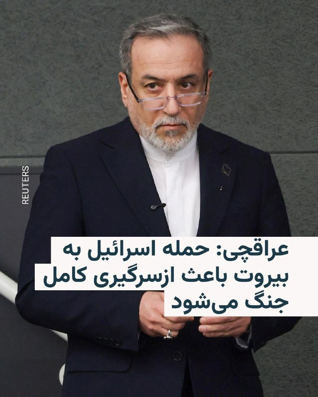

عباس عراقجی، وزیر خارجه جمهوری اسلامی، روز چهارشنبه تهدید کرد که حمله احتمالی اسرائیل به بیروت، پایتخت لبنان، باعث «ازسرگیری کامل جنگ» ایران با آمریکا و اسرائیل خواهد شد.

او در گفت‌وگو با شبکه المیادین، نزدیک به حزب‌الله لبنان، همچنین ادعا کرد که بعد از تهدید اسرائیل برای حمله به ضاجیه، حومه جنوبی بیروت و مقر اصلی حزب‌الله، نیروهای نظامی ایران در «وضعیت آماده‌باش کامل» قرار گرفتند.

عباس عراقچی در گفت‌وگوی روز چهارشنبه خود همجنین اعلام کرد که ارتباط با دولت آمریکا «قطع» نشده است، اما افزود که «هیچ پیشرفت ملموسی در روند مذاکرات حاصل نشده است».

ساعتی پیش مارکو روبیو، وزیر خارجه آمریکا، اعلام کرد که ایران هنوز تصمیم نهایی خود برای پایان دادن به جنگ را اعلام نکرده است.
@VahidHeadline

📡 @VahidOnline

## IranIntlTV — post 340427

  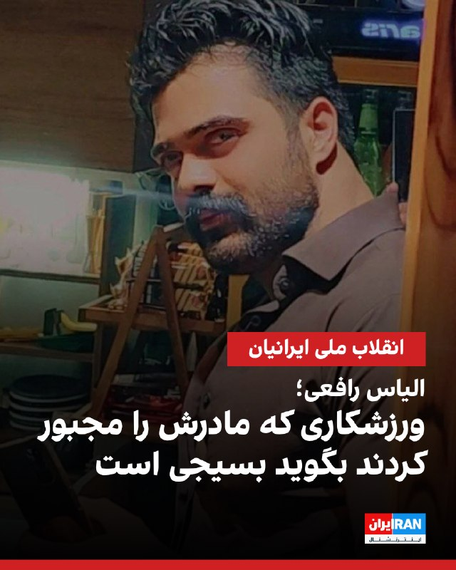

بر اساس اطلاعاتی که به ایران‌اینترنشنال رسیده، الیاس رافعی، از جان‌باختگان اعتراضات سراسری دی‌ماه، شامگاه هجدهم دی‌ماه بر اثر اصابت هشت گلوله جنگی کشته شد.

طبق این اطلاعات، الیاس رافعی به دلیل شرایط دشوار اقتصادی خانواده، دوران کودکی خود را در پرورشگاه گذراند و پس از ۱۸ سالگی در کنار مادرش زندگی می‌کرد. او ورزشکار بود و به عنوان نان‌آور خانواده از مادرش حمایت می‌کرد.

پس از کشته شدن الیاس، از مادر او برای تحویل گرفتن پیکرش درخواست پول شده بود. مادر الیاس به دلیل ناتوانی مالی ناچار شده مدارکی را امضا کند که در آن فرزندش به عنوان عضو بسیج معرفی شده بود تا بتواند جسد او را تحویل بگیرد.
https://iranintl.com/202606037895

## IranianMinds — post 21334

  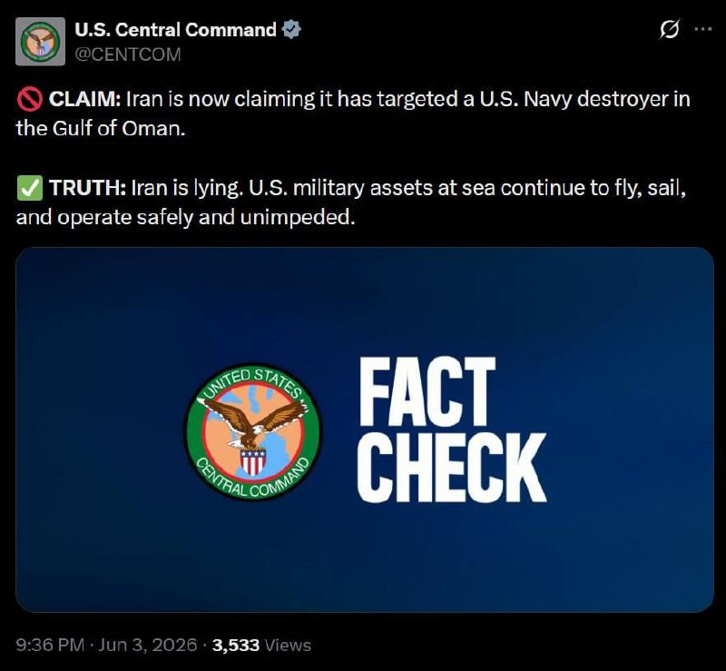

🔴سنتکام:

ادعا: ایران اکنون ادعا می‌کند که یک ناوشکن نیروی دریایی ایالات متحده در خلیج عمان را هدف قرار داده است.

حقیقت: ایران در حال دروغ گفتن است و دارایی‌های نظامی ایالات متحده در دریا همچنان به پرواز، حرکت و عملیات ایمن و بدون ممانعت ادامه دارد.

@IranianMinds

## alonews — post 124921

  <a href="telegram/content/alonews_124921_1780518268.webm" target="_blank">🎬 Download video</a>

👈ترامپ: پریشب و دیشب به ایران حمله کردیم، ضربه خیلی محکمی به آنها زدیم

🔴شنیده‌ام مذاکرات با ایران خیلی خوب پیش می‌رود، اگر توافقی با ایران حاصل شود، می‌تواند آخر هفته انجام شود.

✅ @AloNews خبر جنگ

---
📅 بروزرسانی: 1405/03/13 23:48
---

## VahidOOnLine — post 243571

  <a href="telegram/content/VahidOOnLine_243571_1780517938.mp4" target="_blank">🎬 Download video</a>

ویدیوی رسیده به ایران‌اینترنشنال نشان می‌دهد جوانی در استان مازندران شعار «جاوید شاه» را در یکی از شهرهای استان دیوارنویسی کرده و به آن احترام نظامی می‌گذارد.
‌🏁 🇬🇧 IranintlTV

🤖 @VahidOOnLine

## WithYashar — post 13443

  

مذاکرات بین اسرائیل و لبنان به زودی به پایان خواهد رسید. به زودی اعلامیه‌ای از سوی ایالات متحده منتشر میشه.
@withyashar

## FoxNewsTwitter — post 342579

  <a href="telegram/content/FoxNewsTwitter_342579_1780517942.mp4" target="_blank">🎬 Download video</a>

Fox News (Twitter/X)

NEW: President Trump gives an exclusive first glimpse of the newly reconstructed Lincoln Reflecting Pool.

Trump shows off its massive scale by comparing it to some of America's most iconic skyscrapers — the Freedom Tower, the Empire State Building, and the Sears Tower.

## FoxNewsTwitter — post 342578

  

Fox News (Twitter/X)

HAPPENING NOW: President Trump speaks at the White House. https://twitter.com/i/broadcasts/1nJOLLXgXErxR

## IranIntlTV — post 340426

  

🔻یواخیم کلمنت، اقتصاددان آلمانی که با ابداع یک فرمول ریاضی قهرمانان جام‌های جهانی ۲۰۱۴، ۲۰۱۸ و ۲۰۲۲ درست پیش‌بینی کرده بود، تازه‌ترین پیش‌بینی خود را برای جام جهانی ۲۰۲۶ منتشر کرده است. مدل آماری او به‌طور شگفت‌انگیزی هلند را به‌عنوان قهرمان بعدی جهان معرفی می‌کند.

🔹به نوشته اس‌بی‌اس پیش از جام جهانی ۲۰۱۴ برزیل، مدل کلمنت، آلمان را به‌عنوان مدعی اصلی معرفی کرد. چهار سال بعد، فرانسه را گزینه نخست دانست و پیش از قطر ۲۰۲۲ نیز با پیش‌بینی قهرمانی آرژانتین بار دیگر شگفتی آفرید.

🔹این بار او پیش‌بینی کرده هلند قهرمان خواهد شد.

🔹پیش‌بینی‌ای که برخلاف اغلب برآوردهای سنتی است که معمولاً فرانسه، آرژانتین، اسپانیا یا انگلیس را مدعیان اصلی می‌دانند.

🔹هلند تاکنون قهرمان جام جهانی نشده، اما با رسیدن به فینال‌های ۱۹۷۴، ۱۹۷۸ و ۲۰۱۰ نایب‌قهرمان جهان شده است.

🔹تیم ملی هلند در حال حاضر در رده هفتم رنکینگ فیفا قرار دارد. شرکت‌های شرط‌بندی نیز به‌طور کلی هلند را هشتمین مدعی قهرمانی می‌دانند؛ اسپانیا بخت نخست محسوب می‌شود و پس از آن فرانسه و انگلیس قرار دارند.

🔹جزییات بیشتر را در سایت بخوانید

@iranintltvsport

## IranIntlTV — post 340425

  <a href="telegram/content/IranIntlTV_340425_1780517947.mp4" target="_blank">🎬 Download video</a>

ویدیوی رسیده به ایران‌اینترنشنال نشان می‌دهد جوانی در استان مازندران شعار «جاوید شاه» را در یکی از شهرهای استان دیوارنویسی کرده و به آن احترام نظامی می‌گذارد.

## FarsiVOA — post 219513

  

⚡️وزیر امور خارجه آمریکا روز چهارشنبه ۱۳ خرداد با حضور در یک کمیته فرعی سنا در پاسخ به نگرانی سناتور لیندسی گراهام درباره توافق احتمالی میان آمریکا با جمهوری اسلامی تایید کرد که رژیم ایران حتی پس از توافق هم «اگر بتواند حتما دست به تقلب می‌زند.»
سناتور گراهام همچنین خواستار آن شد که در توافق‌ با رژیم ایران علاوه بر جلوگیری از دستیابی به سلاح هسته‌ای، موضوع گروه‌های تروریستی نیابتی و لغو کامل غنی‌سازی در ایران هم گنجانده شود که با واکنش مثبت آقای روبیو مواجه شد.

@FarsiVOA

## FarsiVOA — post 219512

⚡️میدان: خصومت ایران و اسرائیل چه پیشینه‌ای دارد و چگونه بر توافق احتمالی میان ایران و آمریکا اثر خواهد گذاشت؟
@FarsiVOA

## FarsiVOA — post 219511

  <a href="telegram/content/FarsiVOA_219511_1780517949.mp4" target="_blank">🎬 Download video</a>

⚡️گزارش نرگس صبا در برنامه تفسیر خبر از اهداف حملات جمهوری اسلامی در طول آتش بس
@FarsiVOA

## Persian_Trend_Official — post 15659

  

FACT CHECK
(بررسی حقیقت)
❌ ادعا: ایران اکنون مدعی شده که یک ناوشکن نیروی دریایی آمریکا را در خلیج عمان هدف قرار داده است.
✅ واقعیت: ایران دروغ می‌گوید. دارایی‌های نظامی ایالات متحده در دریا همچنان به پرواز، حرکت و عملیات ادامه می‌دهند و کاملاً ایمن و بدون هیچ مانعی فعالیت می‌کنند.

👺Phantom

📌 @persian_trend_official
پرشین ترند | متفاوت‌ترین کانال نظامی

## RadioFarda — post 157873

🔸عباس عراقجی، وزیر خارجه جمهوری اسلامی، روز چهارشنبه تهدید کرد که حمله احتمالی اسرائیل به بیروت، پایتخت لبنان، باعث «ازسرگیری کامل جنگ» ایران با آمریکا و اسرائیل خواهد شد. 🔸او در گفت‌وگو با شبکه المیادین، نزدیک به حزب‌الله لبنان، همچنین ادعا کرد که بعد از…

## RadioFarda — post 157872

  

🔸عباس عراقجی، وزیر خارجه جمهوری اسلامی، روز چهارشنبه تهدید کرد که حمله احتمالی اسرائیل به بیروت، پایتخت لبنان، باعث «ازسرگیری کامل جنگ» ایران با آمریکا و اسرائیل خواهد شد.

🔸او در گفت‌وگو با شبکه المیادین، نزدیک به حزب‌الله لبنان، همچنین ادعا کرد که بعد از تهدید اسرائیل برای حمله به ضاجیه، حومه جنوبی بیروت و مقر اصلی حزب‌الله، نیروهای نظامی ایران در «وضعیت آماده‌باش کامل» قرار گرفتند.

🔸دونالد ترامپ، رئیس‌جمهور آمریکا، روز دوشنبه خبر داد که بعد از تماس با نخست‌وزیر اسرائیل، نیروهای اسرائیلی به بیروت حمله نخواهند کرد.

🔸پیش‌ از آن قرارگاه مرکزی خاتم‌الانبیا گفته بود اگر اسرائیل به ضاحیه حمله کند، شمال اسرائیل را هدف قرار خواهد داد.

@RadioFarda

## alonews — post 124920

  <a href="telegram/content/alonews_124920_1780517953.webm" target="_blank">🎬 Download video</a>

👈اتریوم به زیر 1,800 دلار سقوط کرد

✅ @AloNews خبر جنگ

---
📅 بروزرسانی: 1405/03/13 23:34
---

## VahidOOnLine — post 243570

  

فرماندهی مرکزی ایالات متحده، سنتکام، اعلام کرد ادعای تهران مبنی بر هدف قرار دادن یک ناوشکن نیروی دریایی آمریکا در دریای عمان نادرست است.
سنتکام همچنین تاکید کرد تمامی شناورها و تجهیزات نظامی آمریکا در دریا بدون هیچ‌گونه اختلالی به فعالیت خود ادامه می‌دهند.
‌🏁 🇬🇧 IranintlTV

🤖 @VahidOOnLine

## VahidOOnLine — post 243569

  

یواخیم کلمنت، اقتصاددان آلمانی که با ابداع یک فرمول ریاضی قهرمانان جام‌های جهانی ۲۰۱۴، ۲۰۱۸ و ۲۰۲۲ درست پیش‌بینی کرده بود، تازه‌ترین پیش‌بینی خود را برای جام جهانی ۲۰۲۶ منتشر کرده است. مدل آماری او به‌طور شگفت‌انگیزی هلند را به‌عنوان قهرمان بعدی جهان معرفی می‌کند.

به نوشته اس‌بی‌اس پیش از جام جهانی ۲۰۱۴ برزیل، مدل کلمنت، آلمان را به‌عنوان مدعی اصلی معرفی کرد. چهار سال بعد، فرانسه را گزینه نخست دانست و پیش از قطر ۲۰۲۲ نیز با پیش‌بینی قهرمانی آرژانتین بار دیگر شگفتی آفرید.

این بار او روی یک مدعی نه‌چندان مطرح شرط بسته و پیش‌بینی کرده هلند قهرمان خواهد شد.

پیش‌بینی‌ای که برخلاف اغلب برآوردهای سنتی است که معمولاً فرانسه، آرژانتین، اسپانیا یا انگلیس را مدعیان اصلی می‌دانند.

هلند تاکنون قهرمان جام جهانی نشده، اما با رسیدن به فینال‌های ۱۹۷۴، ۱۹۷۸ و ۲۰۱۰ نایب‌قهرمان جهان شده است.

تیم ملی هلند در حال حاضر در رده هفتم رنکینگ فیفا قرار دارد. شرکت‌های شرط‌بندی نیز به‌طور کلی هلند را هشتمین مدعی قهرمانی می‌دانند؛ اسپانیا بخت نخست محسوب می‌شود و پس از آن فرانسه و انگلیس قرار دارند.
‌🏁 🇬🇧 IranintlTV

🤖 @VahidOOnLine

## VahidOOnLine — post 243568

  

♦️فرماندهی مرکزی ارتش آمریکا (سنتکام) روز چهارشنبه ۱۳ خرداد ادعای سپاه پاسداران درباره علت تخریب پایانه مسافربری فرودگاه بین‌المللی کویت را رد کرد و گفت این فرودگاه در جریان یک حمله پهپادی ایران هدف قرار گرفته است.

سنتکام در بیانیه‌ای اعلام کرد ادعای جمهوری اسلامی مبنی بر آسیب دیدن فرودگاه در نتیجه سقوط یک موشک رهگیر آمریکایی «کاملا نادرست» است.

در این بیانیه آمده است که ایران در یک حمله «عمدی، حساب‌شده و غیرقابل توجیه» فرودگاه غیرنظامی کویت را هدف قرار داده و خسارت واردشده به پایانه مسافربری ناشی از این حمله بوده است.

این واکنش ساعاتی پس از آن منتشر شد که حسین محبی، سخنگوی سپاه پاسداران، اعلام کرد فرودگاه بین‌المللی کویت هدف حمله ایران نبوده و تخریب پایانه مسافربری در پی سقوط موشک‌های سامانه پدافندی پاتریوت رخ داده است.

کویت پیش‌تر در واکنش به حملات موشکی و پهپادی بامداد چهارشنبه، دو دیپلمات ایرانی را عنصر نامطلوب اعلام و از کشور اخراج کرده بود. همچنین کاردار سفارت ایران در کویت به وزارت خارجه این کشور احضار شد.
‌🇸🇦 Indypersian

🤖 @VahidOOnLine

## WithYashar — post 13442

دفتر بازرس کل وزارت دفاع آمریکا در حال آغاز یک بررسی (بازبینی و تحقیق رسمی) درباره «عملیات خشم حماسی» (Operation Epic Fury) است؛ کارزار نظامی آمریکا علیه ایران که با هدف برچیدن تهدید هسته‌ای تهران انجام شد.
@withyashar
این آغاز یک بررسی یا بازرسی رسمی است، نه لزوماً افشای تخلف یا شکست.
Office of Inspector General (OIG) نهاد بازرسی داخلی وزارت دفاع آمریکاست و معمولاً پس از عملیات‌های بزرگ نظامی، نحوه برنامه‌ریزی، اجرای عملیات، هزینه‌ها، تلفات، رعایت قوانین و عملکرد فرماندهان را بررسی می‌کند

## mwarmonitor — post 10113

  

🔴نیروی دریایی ارتش جمهوری اسلامی ایران، مرکز فرماندهی و کنترل شرارت‌های ارتش آمریکا علیه کشورمان را هدف قرار داد 📝 با این دست فرمان و آمارهای روابط عمومی، کلاً منطق ریاضی و فیزیک دریاها به فنا رفته است. طنز اینجاست که طبق بیانیه‌های رسمی، نیروی دریایی ما…

## mwarmonitor — post 10112

  

«من بلافاصله پس از رویدادی که به یکی از سرگرم‌کننده‌ترین شب‌های تاریخ آمریکا تبدیل خواهد شد—یعنی مسابقات قهرمانی جهان UFC در محوطه چمن جنوبی کاخ سفید—به اجلاس G7 در فرانسه خواهم رفت. اسناد و سوابق نشان می‌دهند که اگرچه در طول تاریخ طولانی و پرفرازونشیب کاخ سفید، مبارزاتی در سطوح بسیار پایین‌تر در آنجا برگزار شده است، اما هیچ‌چیز حتی نزدیک به این رویداد—یعنی حضور بزرگ‌ترین مبارزان جهان که همگی قهرمان هستند—حتی برای "خانه مردم" (کاخ سفید) تصور هم نشده بود!

رئیس‌جمهور دونالد جی. ترامپ»

@mwarmonitor

## IranIntlTV — post 340424

  

فرماندهی مرکزی ایالات متحده، سنتکام، اعلام کرد ادعای تهران مبنی بر هدف قرار دادن یک ناوشکن نیروی دریایی آمریکا در دریای عمان نادرست است.
سنتکام همچنین تاکید کرد تمامی شناورها و تجهیزات نظامی آمریکا در دریا بدون هیچ‌گونه اختلالی به فعالیت خود ادامه می‌دهند.
https://iranintl.com/202606037985

## IranIntlTV — post 340423

  <a href="telegram/content/IranIntlTV_340423_1780517079.mp4" target="_blank">🎬 Download video</a>

وزارت دفاع کویت اعلام کرد پس از حمله ۱۳ موشک و ۱۷ پهپاد از سوی جمهوری اسلامی، دو دیپلمات ایرانی را اخراج و کاردار ایران را احضار کرده است. در این حمله یک شهروند هندی کشته و ۶۳ نفر زخمی شدند. بحرین نیز از رهگیری چند موشک و پهپاد شلیک‌شده به سمت اهداف غیرنظامی در این کشور خبر داد.
@iranintltv

## IranIntlTV — post 340422

  <a href="https://t.me/IranintlTV/340422" target="_blank">📎 Download file</a>

🎧نسخه صوتی ۲۴ با فرداد فرحزاد: نتانیاهو: تصمیم حمله دوباره به ایران با ترامپ است
@iranintlTV

## Persian_Trend_Official — post 15658

https://youtube.com/live/d-mhVuRpBpc?feature=share

## RadioFarda — post 157871

🔸مارکو روبیو، وزیر امور خارجه آمریکا، روز چهارشنبه گفت که سرنوشت ذخایر اورانیوم ۶۰ درصدی ایران در مرکز مذاکرات با واشینگتن قرار دارد و تهران هنوز با یک توافق صلح موافقت نکرده است. 🔸روبیو در جلسه کمیته روابط خارجی مجلس نمایندگان آمریکا گفت: «فکر می‌کنم اکنون…

## RadioFarda — post 157870

  

🔸مارکو روبیو، وزیر امور خارجه آمریکا، روز چهارشنبه گفت که سرنوشت ذخایر اورانیوم ۶۰ درصدی ایران در مرکز مذاکرات با واشینگتن قرار دارد و تهران هنوز با یک توافق صلح موافقت نکرده است.

🔸روبیو در جلسه کمیته روابط خارجی مجلس نمایندگان آمریکا گفت: «فکر می‌کنم اکنون در برخی از اسنادی که میان دو طرف رد و بدل شده، این موضوع به‌طور واضح مورد توجه قرار گرفته است، اما تا صبح امروز هنوز تأیید نهایی از سوی نظام تصمیم‌گیری آن‌ها را دریافت نکرده‌ایم.»

🔸ساعاتی پیش دونالد ترامپ، رئیس‌جمهور آمریکا، در یک گفت‌وگو اعلام کرد حکومت ایران پذیرفته که به سلاح هسته‌ای دست پیدا نکند. با این حال مقام‌های ایرانی بارها تأکید کرده‌اند که برنامه هسته‌ای ایران در دستور کار مذاکرات فعلی با آمریکا نیست و تفاهم احتمالی طرفین بر پایان دادن به جنگ متمرکز است.

@RadioFarda

## alonews — post 124919

  <a href="telegram/content/alonews_124919_1780517081.webm" target="_blank">🎬 Download video</a>

👈نیروی دریایی ارتش ویدیویی منتشر کرد که نشان میدهد موشک‌های ضد کشتی به سمت یک ناوشکن آمریکایی در خلیج عمان شلیک شده است. 
✅ @AloNews خبر جنگ

---
📅 بروزرسانی: 1405/03/13 23:24
---

## VahidOOnLine — post 243567

روایت شما از زندگی در دوران پس از انقلاب ملی و جنگ - پنج‌شنبه ۱۴ خرداد ۱۴۰۵

🔹از پاکدشت: از ساعت ۷ تا ساعت ۱۰:۳۰ الان ۳ تا صدای انفجار اومده است.
🔹از یزد: آقای ترامپ، درسته که دموکرات‌ها بی‌وقفه فشار میارن برای خاتمه جنگ با رژیم دیکتاتوری ایران، اشتباه نکنید. هرگونه فرصت تنفس به جمهوری اسلامی در آینده نه‌چندان دور امنیت ملی آمریکا و اروپا را هدف قرار می‌ده. روش آقای نتانیاهو را دنبال کنید نه مخالفت با ایشان.
🔹صبح‌ها دیر بیدار می‌شیم، در واقع یه وعده غذای خودمون رو این‌طوری حذف می‌کنیم.
🔹از ورامین صدای مهیب پدافند ساعت ۱۰:۲۲ شنیده شد.
🔹درسته فقر و گرونی و بیکاری هست و هممون داریم له می‌شیم، ولی قسم به خون یاران ایستاده‌ایم تا پایان.
🔹از اسلامشهر: امروز چهارشنبه انفجار مهیب و صدای پدافند در اسلامشهر ساعت ۲۳:۰۰.
🔹مرزداران تهران صدای بلند پدافند و تیراندازی می‌آید.
🔹از کرج پیام میدم، ۲ ساعته مدام صدای تیراندازی میاد و الانم پدافندهایی فعال شدن.
🔹من خودم پرسنل داروخانه هستم و مصرف‌کننده قرص concor۲/۵ هر بسته ۳۰ عدد شده ۳۷۰ هزار تومن. امروز دوتا مرغ با یک کیلو پاچه مرغ خریدم شده دو میلیون تومان.
‌🏁 🇬🇧 IranintlTV

🤖 @VahidOOnLine

## VahidOOnLine — post 243566

♦️پس از حدود ۱۱ ماه خشکی، آب بار دیگر در بستر زاینده‌رود جاری شد و روز چهارشنبه ۱۳ خرداد به شهر اصفهان رسید. بر اساس ویدیوهای منتشرشده، افزایش خروجی سد زاینده‌رود موجب ازسرگیری جریان آب در این رودخانه شده و شهروندان اصفهانی با حضور در محدوده سی‌وسه‌پل، بازگشت آب به زاینده‌رود را جشن گرفتند.
پیش‌تر، منصور شیشه‌فروش، مدیرکل مدیریت بحران استانداری اصفهان، اعلام کرده بود که رهاسازی آب با هدف تامین نیاز باغات، بخش کشاورزی و حقابه‌های زیست‌محیطی انجام می‌شود. به گفته او، توزیع آب در کانال‌ها و شبکه‌های آبیاری نیز بر اساس مصوبات کارگروه سازگاری با کم‌آبی و با مشارکت نمایندگان کشاورزان برنامه‌ریزی شده است.
مدیریت بحران استانداری اصفهان همچنین اعلام کرد که بستر زاینده‌رود طی ۱۱ ماه گذشته خشک بوده و اکنون با افزایش رهاسازی آب از سد، جریان آب دوباره در این رودخانه برقرار شده است.
‌🇸🇦 Indypersian

🤖 @VahidOOnLine

## VahidOOnLine — post 243565

  

بر اساس اطلاعاتی که به ایران‌اینترنشنال رسیده، الیاس رافعی، از جان‌باختگان اعتراضات سراسری دی‌ماه، شامگاه هجدهم دی‌ماه بر اثر اصابت هشت گلوله جنگی کشته شد.

طبق این اطلاعات، الیاس رافعی به دلیل شرایط دشوار اقتصادی خانواده، دوران کودکی خود را در پرورشگاه گذراند و پس از ۱۸ سالگی در کنار مادرش زندگی می‌کرد. او ورزشکار بود و به عنوان نان‌آور خانواده از مادرش حمایت می‌کرد.

پس از کشته شدن الیاس، از مادر او برای تحویل گرفتن پیکرش درخواست پول شده بود. مادر الیاس به دلیل ناتوانی مالی ناچار شده مدارکی را امضا کند که در آن فرزندش به عنوان عضو بسیج معرفی شده بود تا بتواند جسد او را تحویل بگیرد.
‌🏁 🇬🇧 IranintlTV

🤖 @VahidOOnLine

## WithYashar — post 13441

پدافند شهریار فعال شد🚨
@withyashar
اینو دیگه دوستم اونجاست و وارده

## WithYashar — post 13440

  

من بلافاصله پس از یکی از سرگرم‌کننده‌ترین شب‌های تاریخ آمریکا، یعنی مسابقات قهرمانی جهان UFC در چمن جنوبی کاخ سفید، به اجلاس گروه ۷ در فرانسه خواهم رفت. سوابق نشان می‌دهد که اگرچه در طول تاریخ طولانی و پرماجرای کاخ سفید، مبارزاتی در سطح بسیار پایین‌تر در این کاخ برگزار شده است، اما هیچ رویدادی حتی نزدیک به این، یعنی بزرگترین مبارزان جهان، قهرمانان جهان، برای مجلس عوام در نظر گرفته نشده است! رئیس جمهور دونالد جی. ترامپ
@withyashar

## WithYashar — post 13439

وزارت کشور بحرین به دلیل خطر احتمالی آژیر خطر را فعال کرد و از شهروندان خواست به نزدیک‌ترین مکان امن بروند.🚨🚨🚨
@withyashar

## pm_afshaa — post 92238

  <a href="telegram/content/pm_afshaa_92238_1780516475.webm" target="_blank">🎬 Download video</a>

🔴سنتکام:

ادعا: ایران امروز مدعی شد که به ترمینال مسافربری فرودگاه بین‌المللی کویت حمله نکرده و خسارت واردشده در واقع ناشی از یک موشک رهگیر آمریکایی بوده است. کاملا نادرست.

واقعیت: ایران در یک حمله عمدی، برنامه‌ریزی‌شده و بدون توجیه، فرودگاه غیرنظامی کویت را با پهپاد هدف قرار داد.

💧 Rainbet.com the #1 Non-KYC Crypto Casino & Sportsbook @rainbetcom

😁 @Pm_Afshaa

## pm_afshaa — post 92237

  <a href="telegram/content/pm_afshaa_92237_1780516476.webm" target="_blank">🎬 Download video</a>

وضعیت ترمینال مسافربری فرودگاه بین‌المللی کویت بعد از حمله شبانه ایران : 
💧 Rainbet.com the #1 Non-KYC Crypto Casino & Sportsbook @rainbetcom 
😁 @Pm_Afshaa

## pm_afshaa — post 92236

  <a href="telegram/content/pm_afshaa_92236_1780516477.webm" target="_blank">🎬 Download video</a>

🔴عراقچی: اگه اسرائیل به لبنان حمله کنه، ما پاسخ میدیم.

💧 Rainbet.com the #1 Non-KYC Crypto Casino & Sportsbook @rainbetcom

😁 @Pm_Afshaa

## IranIntlTV — post 340420

روایت شما از زندگی در دوران پس از انقلاب ملی و جنگ - پنج‌شنبه ۱۴ خرداد ۱۴۰۵

🔹از پاکدشت: از ساعت ۷ تا ساعت ۱۰:۳۰ الان ۳ تا صدای انفجار اومده است.
🔹از یزد: آقای ترامپ، درسته که دموکرات‌ها بی‌وقفه فشار میارن برای خاتمه جنگ با رژیم دیکتاتوری ایران، اشتباه نکنید. هرگونه فرصت تنفس به جمهوری اسلامی در آینده نه‌چندان دور امنیت ملی آمریکا و اروپا را هدف قرار می‌ده. روش آقای نتانیاهو را دنبال کنید نه مخالفت با ایشان.
🔹صبح‌ها دیر بیدار می‌شیم، در واقع یه وعده غذای خودمون رو این‌طوری حذف می‌کنیم.
🔹از ورامین صدای مهیب پدافند ساعت ۱۰:۲۲ شنیده شد.
🔹درسته فقر و گرونی و بیکاری هست و هممون داریم له می‌شیم، ولی قسم به خون یاران ایستاده‌ایم تا پایان.
🔹از اسلامشهر: امروز چهارشنبه انفجار مهیب و صدای پدافند در اسلامشهر ساعت ۲۳:۰۰.
🔹مرزداران تهران صدای بلند پدافند و تیراندازی می‌آید.
🔹از کرج پیام میدم، ۲ ساعته مدام صدای تیراندازی میاد و الانم پدافندهایی فعال شدن.
🔹من خودم پرسنل داروخانه هستم و مصرف‌کننده قرص concor۲/۵ هر بسته ۳۰ عدد شده ۳۷۰ هزار تومن. امروز دوتا مرغ با یک کیلو پاچه مرغ خریدم شده دو میلیون تومان.

## IranIntlTV — post 340419

  <a href="https://t.me/IranintlTV/340419" target="_blank">📎 Download file</a>

🎧نسخه صوتی چشم‌انداز: حمله جنون‌آمیز سپاه پاسداران به بحرین و کویت
@iranintlTV

## FarsiVOA — post 219510

  

⚡️وزیر امور خارجه آمریکا روز چهارشنبه ۱۳ خرداد با حضور در یک کمیته فرعی سنا با اشاره به سرکوب، سانسور اخبار توسط جمهوری اسلامی و قطع اینترنت در ایران گفت که صدای آمریکا ابزار بسیار مهمی برای مقابله با دولت‌های سرکوبگری همچون چین، روسیه و رژیم جمهوری اسلامی است.
@FarsiVOA

## Persian_Trend_Official — post 15657

  <a href="telegram/content/Persian_Trend_Official_15657_1780516479.webm" target="_blank">🎬 Download video</a>

💥منابع محلی از شنیده شدن صدای انفجار در شهرهای قم و بندرعباس خبر می‌دهند.

تاکنون هیچ مقام رسمی درباره علت این انفجارها، محل دقیق وقوع یا خسارات احتمالی آن‌ها اطلاعیه‌ای منتشر نکرده است.

👺Phantom

📌 @persian_trend_official
پرشین ترند | متفاوت‌ترین کانال نظامی

## RadioFarda — post 157869

🔸وزارت دادگستری آمریکا روز چهارشنبه اعلام کرد مدیرعامل یک شرکت فناوری در کالیفرنیا به اتهام تأمین تجهیزات آمریکایی برای نهادهای هسته‌ای و نظامی ایران بازداشت شد. 🔸بر اساس بیانیه این وزارتخانه، جمشید قُمی، ۶۳ ساله، شهروند دو تابعیتی ایران و آمریکا و ساکن نیوپورت…

## RadioFarda — post 157868

  

🔸وزارت دادگستری آمریکا روز چهارشنبه اعلام کرد مدیرعامل یک شرکت فناوری در کالیفرنیا به اتهام تأمین تجهیزات آمریکایی برای نهادهای هسته‌ای و نظامی ایران بازداشت شد.

🔸بر اساس بیانیه این وزارتخانه، جمشید قُمی، ۶۳ ساله، شهروند دو تابعیتی ایران و آمریکا و ساکن نیوپورت کوست در ایالت کالیفرنیا، به «تبانی برای نقض قانون اختیارات اقتصادی در شرایط اضطراری بین‌المللی» متهم شده است.

🔸او متهم است که «تجهیزات پیشرفته شبکه، امنیتی و رمزنگاری ساخت آمریکا را برای مشتریان ایرانی، از جمله نهادهای هسته‌ای و نظامی حکومت ایران تهیه کرده است.»

@RadioFarda

## IranianMinds — post 21333

  <a href="telegram/content/IranianMinds_21333_1780516480.mp4" target="_blank">🎬 Download video</a>

🔴میگن ترامپ در پارک زرقان شیراز دیده شده.

@IranianMinds

## BBCPersian — post 282802

  <a href="https://t.me/bbcpersian/282802" target="_blank">📎 Download file</a>

📻پادکست برنامه شصت دقیقه چهارشنبه ۱۳ خرداد ۱۴۰۵

این نسخه رادیویی برنامه شصت دقیقه تلویزیون فارسی بی‌بی‌سی است که هرشب بعد از پخش، با حجم کم از اپلیکیشن‌های پادگیر و صفحه تلگرام بی‌بی‌سی فارسی در دسترس است.

با هشتگ BBCPersianRadio# با ما در ارتباط باشید
@BBCPersian

## Dirty_Kids — post 390936

  <a href="telegram/content/Dirty_Kids_390936_1780516483.mp4" target="_blank">🎬 Download video</a>

🔴هم‌اکنون ترامپ تو پارک‌ِ زرقان - شیراز درحال بازی و شادی با کودکان:

@Dirty_Kids 👻

## alonews — post 124918

  <a href="telegram/content/alonews_124918_1780516485.webm" target="_blank">🎬 Download video</a>

👈گفت و گوی ترامپ با امیر قطر

✅ @AloNews خبر جنگ

## alonews — post 124917

  <a href="telegram/content/alonews_124917_1780516485.webm" target="_blank">🎬 Download video</a>

👈ادعای واشینگتن تایمز: دفتر بازرس کل وزارت دفاع آمریکا در حال بررسی عملیات خشم حماسی، کمپین ایالات متحده علیه ایران برای از بین بردن تهدید هسته‌ای تهران، است.

✅ @AloNews خبر جنگ

## alonews — post 124916

  <a href="telegram/content/alonews_124916_1780516485.webm" target="_blank">🎬 Download video</a>

👈رویترز: ترامپ مدعی شد ایران موافقت کرده که سلاح هسته‌ای نداشته باشد.

✅ @AloNews خبر جنگ

## alonews — post 124915

👈 ترامپ: من بلافاصله پس از رویداد UFC در کاخ سفید به اجلاس G7 در فرانسه خواهم رفت

✅ @AloNews خبر جنگ

## alonews — post 124914

  <a href="telegram/content/alonews_124914_1780516486.webm" target="_blank">🎬 Download video</a>

👈صدای انفجار در بحرین واربیل واقع در اقلیم کردستان عراق شنیده شد

✅ @AloNews خبر جنگ

## alonews — post 124913

  <a href="telegram/content/alonews_124913_1780516486.webm" target="_blank">🎬 Download video</a>

👈سخنگوی سازمان بهداشت جهانی:
ما در کشف وسعت شیوع ابولا در جمهوری دموکراتیک کنگو بسیار دیر عمل کردیم

🔴نوع جدید ابولا به واکسن‌های قبلی پاسخ نمی‌دهد و ما در حال تلاش برای یافتن راه‌حلی برای آن هستیم

✅ @AloNews خبر جنگ

<!-- MSG END -->

<!-- NAV START -->

<a href="https://github.com/ProAlit/aio-downloader/blob/main/telegram/content/archive_1.md" style="display:inline-block; padding:6px 12px; margin:0 4px; background-color:#2ea44f; color:white; text-decoration:none; border-radius:4px; font-weight:bold;">صفحه بعد</a>

<!-- NAV END -->
