# خواننده تلگرام

<!-- TOP_NAV START -->

<a href="https://github.com/ProAlit/aio-downloader/blob/main/telegram/content/archive_1.md" style="display:inline-block; padding:6px 12px; margin:0 4px; background-color:#2ea44f; color:white; text-decoration:none; border-radius:4px; font-weight:bold;">صفحه بعد</a>

<!-- TOP_NAV END -->

<!-- MSG START -->

---
📅 بروزرسانی: 1405/03/09 12:13
---

## VahidOOnLine — post 242893

  

♦️پروازهای فرودگاه مونیخ پس از مشاهده پهپاد مشکوک تعلیق شد
پلیس آلمان، روز شنبه نهم خرداد ماه اعلام کرد پروازهای فرودگاه مونیخ پس از گزارش مشاهده یک پهپاد مشکوک از سوی دو خلبان، به حالت تعلیق درآمده است.
به گفته سخنگوی پلیس، این مشاهده اندکی پس از ساعت ۹ صبح رخ داد و مقام‌های امنیتی در هماهنگی با مرکز کنترل ترافیک هوایی آلمان تصمیم گرفتند باندهای فرودگاه را موقتا مسدود کنند.
این مقام افزود در حال حاضر مشخص نیست این محدودیت تا چه زمانی ادامه خواهد داشت.
مونیخ یکی از شلوغ‌ترین فرودگاه‌های آلمان به شمار می‌رود و تعطیلی باندها می‌تواند موجب اختلال در برنامه پروازهای داخلی و بین‌المللی شود.
‌🇸🇦 Indypersian

🤖 @VahidOOnLine

## DEJradio — post 5127

  <a href="telegram/content/DEJradio_5127_1780130582.webm" target="_blank">🎬 Download video</a>

🚨📢 بر اساس گزارش بلومبرگ در حمله موشکی [پهپادی] جمهوری اسلامی به یک پایگاه هوایی در کویت که جمعه هشتم خرداد صورت گرفت، چند آمریکایی مجروح شدند و به دو پهپاد تهاجمی «ام‌کیو-۹ ریپر» آسیب جدی وارد شد؛ این در حالی است که دونالد ترامپ، رییس‌جمهور آمریکا، در حال بررسی توافقی برای تمدید یک آتش‌بس شکننده است.

به گفته یک منبع آگاه از جزئیات آسیب‌های این حمله، حدود ۵ نفر، شامل پیمانکاران و پرسنل نظامی در حال خدمت، دچار جراحات شدند. یکی از پهپادهای ریپر منهدم شده و دست‌کم یک پهپاد دیگر آسیب جدی دیده است. ارزش هر یک از این پهپادها حدود ۳۰ میلیون دلار برآورد می‌شود.

#کویت #حمله_موشکی
@DEJradio

## DEJradio — post 5126

  <a href="telegram/content/DEJradio_5126_1780130583.webm" target="_blank">🎬 Download video</a>

🔺📢 بر اساس گزارش‌های دریافتی دست‌کم ۳۲۰ نفر از کارکنان شرکت پلیمر آریاساسول بعد از جنگ ۴۰ روزه بیکار شدند.

یکی از کارکنان به دژ می‌گوید: "پتروشیمی آریاساسول در بخش طرح توسعه نیروهای پیمانکاریش رو تعدیل کرده. از ۹ اسفند که جنگ شد و به اداره کار برای بیمه بیکاری ارجاع داده و بیمه بیکاری که اصلا جوابگو نیست متاسفانه و نیروهای پیمانکاری هم هر چند پیگیری میکنن که برگردن سرکار ولی گویا اریاساسول فعلا قصد نداره قرارداد ببنده. حدود ۳۲۰ نفر از کار بیکار شدند."

#جنگ۴۰روزه
@DEJradio

## FarsiVOA — post 219048

🔺پنتاگون از نشست نظامی اسرائیل و لبنان در واشنگتن خبر داد

▪️وزارت جنگ آمریکا اعلام کرد البریج کولبی، معاون وزیر جنگ در امور سیاست‌گذاری، روز جمعه در پنتاگون میزبان هیئت‌های نظامی اسرائیل و لبنان بوده است.

▪️بر اساس اطلاعیه پنتاگون، این نشست برای آغاز «مسیر امنیتی» در پشتیبانی از مذاکرات جاری میان دو کشور برگزار شد.

▪️وزارت جنگ آمریکا این گفت‌وگوهای نظامی‌به‌نظامی را «سازنده» خواند و گفت تمرکز آن بر ایجاد چارچوب‌های عملی برای امنیت و ثبات منطقه‌ای بوده است.

▪️این نشست در ادامه دور قبلی گفت‌وگوهای واشنگتن برگزار شد؛ جایی که اسرائیل و لبنان با تمدید ۴۵ روزه آتش‌بس موافقت کردند و مذاکرات به دو مسیر سیاسی و امنیتی تقسیم شد.

⬇️ بیشتر بخوانید:
https://ir.voanews.com/a/8155535.html

## DW_Farsi — post 125307

  

📸 عکس روز: دنالی، بلندترین قله آمریکای شمالی

"دنالی" که با نام پیشین رسمی خود، "مک‌کینلی" نیز شناخته می‌شود با ارتفاع حدود ۶ هزار و ۱۹۰ متر بلندترین قله آمریکای شمالی است. این کوه در پارک و منطقه حفاظت‌شده دنالی در آلاسکا قرار دارد. پس از سال‌ها تلاش بومیان محلی، دولت آمریکا در سال ۲۰۱۵ نام این کوه را رسما به دنالی تغییر داد که در زبان بومی آتاباسکی که خانواده‌ای از زبان‌های سرخ‌پوستان آمریکای شمالی به شمار می‌رود، "غول‌پیکر" معنا می‌دهد.
@dw_farsi

## Persian_Trend_Official — post 15318

  <a href="telegram/content/Persian_Trend_Official_15318_1780130584.mp4" target="_blank">🎬 Download video</a>

انهدام یک فروند پهپاد MQ-9 و زخمی شدن 5 سرباز آمریکایی در پی حمله موشکی ایران به کویت! بلومبرگ در گزارش جدید خود نوشت: حمله موشکی بالستیک ایران به پایگاه هوایی کویت در تاریخ 30 مه، علیرغم رهگیری موشک توسط پدافند هوایی کویت، چندین آمریکایی را زخمی و به دو…

## Dirty_Kids — post 390544

بابای من چون خودش کله ی سحر بیدار میشه هر روز به یه بهانه ایی مامانمو صبح بیدار می کنه
امروز دیگه هیچ بهانه ایی نداشته
۸ صبح گفته میخوام برم پمپ بنزین نمیای؟ :)))))

جدا مرد بازنشسته پدیده ی عجیبیه.

@Dirty_Kids 👻

## Dirty_Kids — post 390543

  

بعد به سیم شارژر من می‌گی بالا چشمت ابرو دیگه شارژ نمی‌کنه.

@Dirty_Kids 👻

---
📅 بروزرسانی: 1405/03/09 12:03
---

## DEJradio — post 5125

  <a href="telegram/content/DEJradio_5125_1780130002.mp4" target="_blank">🎬 Download video</a>

🔺🎥 یکی از شهروندان با ارسال ویدیویی نوشت: اینجا سپاه استان یا همون سپاه "صاحب‌الزمان است. از روزی که اینجا بمباران شده الان مدت یک ماهه هرشب تا صبح معلوم نیست چی اتیش می‌زنن که بوی بدی داره و واقعا مارو اذیت می‌کنه. جوابگو هم نیستن من اوایل فکر می‌کردم چوبه ولی تمومی نداره.

#اصفهان
@DEJradio

## DEJradio — post 5121

💀
🚨 در جریان جنگ ۴۰ روزه، نیروی دریایی ارتش متحمل خسارات و تلفات سنگینی شد که بخش قابل توجهی از آن تاکنون سانسور یا رسانه‌ای نشده است.

درباره تلفات ناوشکن «دنا» که در آب‌های اقیانوس هند هدف قرار گرفت، اطلاعات بیشتری در دسترس است. بر اساس این اطلاعات، ۱۰۴ نفر از پرسنل این شناور جان خود را از دست دادند که از این میان، پیکر ۲۰ نفر هنوز پیدا نشده و در شمار مفقودین قرار دارند.
فرماندهان درباره تلفات ناوشکن «جماران» سکوت اختیار کرده‌اند. این ناو در نهم اسفند ۱۴۰۴ هنگام استقرار در اسکله پایگاه کنارک هدف قرار گرفت.

منابع آگاه می‌گویند: «در نخستین اصابت، خدمه ناو در داخل شناور گرفتار شدند و ۵۳ نفر از پرسنل، از جمله امیربهادر مایوان، فرمانده ناوشکن، کشته شدند.» به گفته این منابع، ناو جماران در آن زمان آماده جدایی از اسکله و عزیمت به دریا بود.

پس از آن، ناو «نقدی» نیز هدف قرار گرفت. اما به دلیل اصابت اولیه به جماران و فاصله زمانی کوتاه میان حملات به دو ناو، خدمه فرصت انتقال شناورها به دریا را پیدا نکردند. در نتیجه، با ادامه حملات، پایگاه به تدریج تخلیه شد و نیروها برای در امان ماندن به مناطق بیابانی اطراف پناه بردند.

#جنگ۴۰روزه #حملات_هدفمند
@DEJradio

## IranIntlTV — post 339707

  <a href="telegram/content/IranIntlTV_339707_1780130004.mp4" target="_blank">🎬 Download video</a>

یک شهروند با ارسال ویدیویی به ایران اینترنشنال با روایتی از وضعیت بد معیشتی در ایران می‌گوید که قیمت یک صبحانه شامل تخم‌مرغ نیمرو و نان سنگک ۱۰۰ هزار تومان برای او تمام شده است.

## Persian_Trend_Official — post 15317

  

انهدام یک فروند پهپاد MQ-9 و زخمی شدن 5 سرباز آمریکایی در پی حمله موشکی ایران به کویت!

بلومبرگ در گزارش جدید خود نوشت: حمله موشکی بالستیک ایران به پایگاه هوایی کویت در تاریخ 30 مه، علیرغم رهگیری موشک توسط پدافند هوایی کویت، چندین آمریکایی را زخمی و به دو پهپاد MQ-9 Reaper آسیب جدی وارد کرد.

قطعات موشک رهگیری شده فاتح-110 به پایگاه هوایی علی السالم برخورد کرد(؟) و باعث جراحات جزئی حدود پنج پرسنل و پیمانکار آمریکایی شد. یک پهپاد Reaper منهدم و دیگری به شدت آسیب دید.

📝 Amir

📌 @persian_trend_official
پرشین ترند | متفاوت‌ترین کانال نظامی

## RadioFarda — post 157711

  

🔸بنیامین نتانیاهو، نخست‌وزیر اسرائیل، روز جمعه گفت نیروهای این کشور در عمق جنوب لبنان پیشروی کرده‌اند؛ همزمان هیئت‌های نظامی اسرائیل و لبنان در واشینگتن مذاکرات امنیتی برگزار کردند.

🔸نتانیاهو اعلام کرد که نیروهای اسرائیلی از رودخانه لیتانی که حدود ۳۰ کیلومتر در شمال مرز لبنان و اسرائیل امتداد دارد، فراتر رفته‌اند.

🔸روز جمعه، خبرگزاری رسمی لبنان از حملات هوایی اسرائیل به بیش از ۲۰ نقطه در جنوب این کشور خبر داد؛ این حملات پیش و پس از صدور هشدارهای ارتش اسرائیل برای تخلیه هشت شهرک صورت گرفت و به موج دیگری از آوارگی مردم این کشور دامن زد.

🔸به گزارش خبرگزاری فرانسه، اسرائیل در همین روز حملات سنگین خود به جنوب لبنان را ادامه داد و وزارت بهداشت لبنان اعلام کرد در حملات اسرائیل به شهر صور ۱۱ نفر کشته شده‌اند.

🔸در همین حال، ژوزف عون، رئیس جمهور لبنان، در تماسی تلفنی با مارکو روبیو، وزیر امور خارجه ایالات متحده، بر «لزوم به کارگیری تمام تلاش‌ها برای دستیابی به آتش‌بس» تأکید کرد.

RadioFarda

## Hranews — post 113232

  

دادگاه تجدیدنظر؛ آرمان شاهپوری‌خو به ۲ سال حبس و مجازات‌های تکمیلی محکوم شد

❗️
❗️
❗️
❗️
❗️ – محکومیت آرمان شاهپوری‌خو، معلم بازداشت‌ شده در جریان اعتراضات سراسری ۱۴۰۴، توسط دادگاه تجدیدنظر استان خوزستان عینا تایید شد. وی پیشتر توسط دادگاه انقلاب اهواز به دو سال حبس و مجازات‌های تکمیلی محکوم شده بود.

به گزارش خبرگزاری هرانا، ارگان خبری مجموعه فعالان حقوق بشر در ایران، اخیرا حکم صادر شده علیه آرمان شاهپوری‌خو، بدون تغییر در دادگاه تجدیدنظر استان خوزستان، عینا تایید شده است.

بر اساس رای صادره، آقای شاهپوری‌خو، بابت اتهام اخلال در نظم و امنیت عمومی به دو سال حبس، دو سال ممنوعیت خروج از کشور و یک سال حضور در ستاد امر به معروف و نهی از منکر شهرستان ایذه محکوم شده است.

#آرمان_شاهپوری_‌خو

ادامه مطلب

↘️
@hranews_bot تماس ✉️ -  @Hranews  کانال هرانا 🆑

## alonews — post 123634

  <a href="telegram/content/alonews_123634_1780130008.webm" target="_blank">🎬 Download video</a>

👈از امروز محدودیت‌های چک برگشتی و لحاظ شدن بدهی‌های غیرجاری وام‌های زیر ۷۰۰ میلیون تومانی در امتیاز اعتباری، پس از پایان مهلت سه‌ماهه بازگشت

✅ @AloNews خبر جنگ

## alonews — post 123633

  <a href="telegram/content/alonews_123633_1780130008.webm" target="_blank">🎬 Download video</a>

👈ارتش : انهدام یک فروند پهپاد «اوربیتر» در منطقه قشم

✅ @AloNews خبر جنگ

---
📅 بروزرسانی: 1405/03/09 11:53
---

## VahidOOnLine — post 242892

  

فرودگاه مونیخ پس از گزارش مشاهده یک پهپاد، هر دو باند خود را بست. سخنگوی پلیس فدرال آلمان گفت یک خلبان فعالیت مشکوک را اعلام کرده است.
به گزارش ر سانه آلمانی فوکوس آنلاین، فرودگاه برای ساعاتی تعطیل است و هلیکوپترها در حال جست‌وجوی پهپاد هستند. وضعیت همچنان نامشخص اعلام شده است.
‌🏁 🇬🇧 IranintlTV

🤖 @VahidOOnLine

## VahidOOnLine — post 242891

🗣روایت شما از زندگی در دوران پس از انقلاب ملی و جنگ- شنبه ۹ خرداد ۱۴۰۵

🔹امروز شنبه ۹ خرداد برازجان ساعت ۹:۱۱ صبح سه بار صدای انفجار آمد و خانه‌ها لرزید.

🔹نفت پالایش بندرعباس دو ماه کار کردیم، ۱۰ ماه می‌گذرد با حقوق ۲۵۰۰ فقط ۳۹ میلیون دادند، بعدش بیرونمان کردند.

🔹از سمنان. اینجا حکومتی‌های بی‌شرف هر روز یک جایی پاتوق می‌کنند، شیرینی و ساندیس و چای می‌خورند، انگار آمدند جشن و دور هر میدانی ده نفر می‌گذارند که بگویند ما همه‌جا هستیم، ولی ما که می‌دانیم تعدادتان به ۴۰۰ نفر هم نمی‌رسد.

🔹اسمش را گذاشتند وصلی اینترنت، فقط با فیلترشکن پولی وصل می‌شود، خیلی‌ها توان خرید ندارند، رحم کنید.

🔹ما خانواده ۱۰ نفره هستیم و فقط بابام کار می‌کند اما هیچ‌وقت نتوانسته برای ما چیزهایی که دوست داریم بخرد و مجبور به دست‌فروشی است، سال‌هاست مجبورم برای خانواده‌ام کار کنم، کار پاره‌وقت، حسرت کار کردن مثل مردم عادی تو دلم مانده.

🔹من یک جوان ۲۰ ساله هستم که با حقوق ۲۰ میلیون تومانی چندین ماه است تلاش دارم موتورسیکلت فرسوده خودم را بفروشم و یک موتورسیکلت بهتر بخرم اما نمی‌توانم، چرا باید یک موتورسیکلت عادی بشود ۵۰۰ میلیون تومان؟

🔹دیگر زندگی جوری شده که یخچال‌ها نه تنها خالی شده، حتی حقوق بازنشستگی‌ام واریز بشود باز هم همان‌جور خالی می‌ماند، هیچ فرقی نمی‌کند، ۸۰ میلیون گرسنه.

🔹الان ماه خرداد است، هنوز اضافه‌حقوق بازنشسته‌های تأمین اجتماعی را ندادند، ۱۳ میلیون فقط می‌گیریم بعد از ۳۰ سال، دروغ گفتند ۶۰ درصد حقوق اضافه شده، تا الان ندادند.

🔹از تهران پیام می‌دهم، اینجا دیگر گوشت و مرغ از سفره‌ها حذف شده و همین مانده که با نان و پنیر خودمان را سیر می‌کنیم.

🔹از بهارستان اصفهان هستم، اوضاع کار و بازار در حدی بد است که تو خرج روزانه مانده‌ام که هیچ، حتی پول بنزین ندارم تا اسنپ کار کنم.

🔹از بلوچستان هستم، اینجا شرایط خیلی سخت است، همه‌چیز گران شده و هر روز اینجا طعم فقر را مزه‌مزه می‌کنیم.

🔹شنبه ۹ خرداد دو تا تخم‌مرغ ۵۰ هزار تومان، نان سنگک دانه‌ای ۵۰ هزار تومان.

🔹از تبریز: فقر و بیکاری و گرانی و تورم و تعطیلی کسب‌وکارها باعث شده پدران شرمنده خانواده‌ها شوند، کمر سرپرستان خانواده‌ها زیر بار گرانی شکسته است.

🔹از تبریز: قیمت میوه نوبرانه فصل چنان نجومی است که پدران در حسرت خرید حتی نیم‌کیلو میوه برای خانواده‌ها مانده‌اند.

🔹آن‌هایی که به سیگار اعتیاد دارند دیگر نمی‌توانند بکشند، وینستون لایت پاکتی ۳۰۰ تومن شده.
‌🏁 🇬🇧 IranintlTV

🤖 @VahidOOnLine

## VahidOOnLine — post 242890

  

♦️رسانه‌های ایران روز شنبه نهم خرداد به نقل از رئیس دادگستری استان خوزستان از محکومیت هفت نفر به جرم سرقت «هفت هزار و ۸۸۷ بشکه نفت خام» خبر دادند.

به گزارش خبرگزاری قوه قضائیه (میزان) متهمان ردیف اول تا چهارم به ۱۳ سال حبس و شلاق
و متهمان ردیف پنجم تا هفتم به تحمل حبس و مجازت‌های تکمیلی محکوم شدند.
‌🇸🇦 Indypersian

🤖 @VahidOOnLine

## mwarmonitor — post 9910

📌امارات متحده عربی در طول جنگ، در هماهنگی با آمریکا و اسرائیل، ده‌ها حمله هوایی علیه ایران انجام داد - وال استریت ژورنال @mwarmonitor

## DEJradio — post 5120

  <a href="telegram/content/DEJradio_5120_1780129388.webm" target="_blank">🎬 Download video</a>

🚨
⭕️ به گزارش رویترز، اسکات بسنت وزیر خزانه‌داری آمریکا اعلام کرد این کشور یک میلیارد دلار از دارایی‌های رمزارزی مرتبط با جمهوری اسلامی را توقیف کرده است.

#رمزارز #جمهوری_اسلامی
@DEJradio

## DEJradio — post 5114

  <a href="telegram/content/DEJradio_5114_1780129389.webm" target="_blank">🎬 Download video</a>

🔺📷 یلدا پایلوت؛ خلبان خونشو

در میان بسیاری از آنها که در تجمعات شبانه سلاح به‌دست می‌گیرند و کنار سرکوبگران می‌ایستند برخی سرسپرده‌ترند؛ آنهایی که ظاهرشان امروزی اما در باطن، خود پلیدی هستند.

یکی از آنها "یلدا" خلبان خونشوست که در کنار محمدرضا طاهری مداح حکومتی‌‌ عکس دارد و در تجمعات شبانه با سلاح مردم را تهدید می‌کند اما ظاهری امروزی دارد.

#پرستو #حکومتی
@DEJradio

## IranIntlTV — post 339706

  

فرودگاه مونیخ پس از گزارش مشاهده یک پهپاد، هر دو باند خود را بست. سخنگوی پلیس فدرال آلمان گفت یک خلبان فعالیت مشکوک را اعلام کرده است.
به گزارش ر سانه آلمانی فوکوس آنلاین، فرودگاه برای ساعاتی تعطیل است و هلیکوپترها در حال جست‌وجوی پهپاد هستند. وضعیت همچنان نامشخص اعلام شده است.
https://iranintl.com/202605304627

## IranIntlTV — post 339705

🗣روایت شما از زندگی در دوران پس از انقلاب ملی و جنگ- شنبه ۹ خرداد ۱۴۰۵

🔹امروز شنبه ۹ خرداد برازجان ساعت ۹:۱۱ صبح سه بار صدای انفجار آمد و خانه‌ها لرزید.

🔹نفت پالایش بندرعباس دو ماه کار کردیم، ۱۰ ماه می‌گذرد با حقوق ۲۵۰۰ فقط ۳۹ میلیون دادند، بعدش بیرونمان کردند.

🔹از سمنان. اینجا حکومتی‌های بی‌شرف هر روز یک جایی پاتوق می‌کنند، شیرینی و ساندیس و چای می‌خورند، انگار آمدند جشن و دور هر میدانی ده نفر می‌گذارند که بگویند ما همه‌جا هستیم، ولی ما که می‌دانیم تعدادتان به ۴۰۰ نفر هم نمی‌رسد.

🔹اسمش را گذاشتند وصلی اینترنت، فقط با فیلترشکن پولی وصل می‌شود، خیلی‌ها توان خرید ندارند، رحم کنید.

🔹ما خانواده ۱۰ نفره هستیم و فقط بابام کار می‌کند اما هیچ‌وقت نتوانسته برای ما چیزهایی که دوست داریم بخرد و مجبور به دست‌فروشی است، سال‌هاست مجبورم برای خانواده‌ام کار کنم، کار پاره‌وقت، حسرت کار کردن مثل مردم عادی تو دلم مانده.

🔹من یک جوان ۲۰ ساله هستم که با حقوق ۲۰ میلیون تومانی چندین ماه است تلاش دارم موتورسیکلت فرسوده خودم را بفروشم و یک موتورسیکلت بهتر بخرم اما نمی‌توانم، چرا باید یک موتورسیکلت عادی بشود ۵۰۰ میلیون تومان؟

🔹دیگر زندگی جوری شده که یخچال‌ها نه تنها خالی شده، حتی حقوق بازنشستگی‌ام واریز بشود باز هم همان‌جور خالی می‌ماند، هیچ فرقی نمی‌کند، ۸۰ میلیون گرسنه.

🔹الان ماه خرداد است، هنوز اضافه‌حقوق بازنشسته‌های تأمین اجتماعی را ندادند، ۱۳ میلیون فقط می‌گیریم بعد از ۳۰ سال، دروغ گفتند ۶۰ درصد حقوق اضافه شده، تا الان ندادند.

🔹از تهران پیام می‌دهم، اینجا دیگر گوشت و مرغ از سفره‌ها حذف شده و همین مانده که با نان و پنیر خودمان را سیر می‌کنیم.

🔹از بهارستان اصفهان هستم، اوضاع کار و بازار در حدی بد است که تو خرج روزانه مانده‌ام که هیچ، حتی پول بنزین ندارم تا اسنپ کار کنم.

🔹از بلوچستان هستم، اینجا شرایط خیلی سخت است، همه‌چیز گران شده و هر روز اینجا طعم فقر را مزه‌مزه می‌کنیم.

🔹شنبه ۹ خرداد دو تا تخم‌مرغ ۵۰ هزار تومان، نان سنگک دانه‌ای ۵۰ هزار تومان.

🔹از تبریز: فقر و بیکاری و گرانی و تورم و تعطیلی کسب‌وکارها باعث شده پدران شرمنده خانواده‌ها شوند، کمر سرپرستان خانواده‌ها زیر بار گرانی شکسته است.

🔹از تبریز: قیمت میوه نوبرانه فصل چنان نجومی است که پدران در حسرت خرید حتی نیم‌کیلو میوه برای خانواده‌ها مانده‌اند.

🔹آن‌هایی که به سیگار اعتیاد دارند دیگر نمی‌توانند بکشند، وینستون لایت پاکتی ۳۰۰ تومن شده.

## FarsiVOA — post 219047

  

ارتش اسرائیل با انتشار اطلاعیه‌ای فوری از ساکنان مناطق «جدیده انصار»، «الزراریه»، «مزرعه کفوریه‌الرز» و «مشغره» خواست خانه‌های خود را فوراً تخلیه کرده و به شمال رودخانه زهرانی منتقل شوند.

در این اطلاعیه آمده است که به‌دلیل فعالیت‌های حزب‌الله، از جمله حفر تونل‌ها و استفاده از این مناطق برای شلیک و اقدامات نظامی، ارتش اسرائیل قصد دارد با قدرت علیه مواضع حزب‌الله وارد عمل شود.

ارتش اسرائیل تأکید کرده هدفش آسیب رساندن به غیرنظامیان نیست، اما هر فردی که در نزدیکی نیروها، تأسیسات یا تجهیزات جنگی حزب‌الله حضور داشته باشد، جان خود را در معرض خطر قرار می‌دهد.
@FarsiVOA

## Persian_Trend_Official — post 15316

  <a href="telegram/content/Persian_Trend_Official_15316_1780129391.webm" target="_blank">🎬 Download video</a>

🎥 لاشۀ پهپاد منهدم‌شده در قشم 
👺Phantom 📌 @persian_trend_official پرشین ترند | متفاوت‌ترین کانال نظامی

## alonews — post 123632

  <a href="telegram/content/alonews_123632_1780129391.webm" target="_blank">🎬 Download video</a>

👈حسین شریعتمداری: ایران باید فورا از طریق یمن تنگه باب‌المندب را ببندد

✅ @AloNews خبر جنگ

---
📅 بروزرسانی: 1405/03/09 11:43
---

## DEJradio — post 5113

  <a href="telegram/content/DEJradio_5113_1780128787.webm" target="_blank">🎬 Download video</a>

🔺📢 خبرگزاری تسنیم، وابسته به سـ.ـپاه پاسداران گزارش داد که شامگاه آدینه هشتم خرداد، در پی رصد ریزپرنده متخاصم «دشمن آمریکایی-اسرائیلی» در حوالی قشم از سوی پدافند هوایی ارتش، مورد اصابت قرار گرفت و منهدم شد.
در شبکه‌های اجتماعی تصاویری از شلیک ممتد پدافند در محدوده قشم منتشر شد.

#قشم #پدافند
@DEJradio

## Persian_Trend_Official — post 15315

  <a href="telegram/content/Persian_Trend_Official_15315_1780128788.mp4" target="_blank">🎬 Download video</a>

التماس تفکر 🙏

📝 Nick

📌 @persian_trend_official
پرشین ترند | متفاوت‌ترین کانال نظامی

## RadioFarda — post 157710

🔸تصاویر پهپادی، کشتی‌های تنگه هرمز را در نور صبحگاهی روز شنبه نهم خرداد نشان می‌دهد، در حالی که پیت هگست، وزیر دفاع ایالات متحده، اعلام کرده که ایالات متحده آماده است در صورت عدم دستیابی به توافق، حملات به ایران را از سر بگیرد.

🔸چهار نهاد مالی و انرژی جهان روز پنجشنبه با اشاره به محاصره تنگه هرمز نسبت به خطرات فزاینده‌ برای امنیت سوخت، شرایط بازار و تاب‌آوری گسترده‌تر اقتصاد جهانی هشدار دادند.

🔸در پی حملات مشترک آمریکا و اسرائیل به ایران در نهم اسفند سال گذشته و آغاز جنگ، نیروهای نظامی ایران تنگه هرمز را مسدود کردند.

🔸آمریکا در واکنش به اقدام ایران در بستن تنگه هرمز، یک محاصره دریایی بر بنادر و کشتیرانی ایران اعمال کرده است که بر مبنای آن ورود و خروج هر کشتی از مبدأ یا به مقصد بنادر ایران ممنوع است.

🔸قبل از شروع جنگ، ترافیک کشتیرانی از طریق این تنگه به ​​طور متوسط ​​۱۲۵ تا ۱۴۰ بار در روز بود. حدود ۲۰ هزار دریانورد همچنان در صدها کشتی در خلیج فارس سرگردان هستند.

RadioFarda

## Hranews — post 113231

یک فرد در تهران به اتهام جاسوسی بازداشت شد

❗️
❗️
❗️
❗️
❗️ – یک فرد در تهران به دلیل آنچه که “جاسوسی و ارتباط با رسانه‌های خارج از کشور” عنوان شده است، توسط پلیس اطلاعات و امنیت بازداشت شد.

ادامه مطلب

↘️
@hranews_bot تماس ✉️ -  @Hranews  کانال هرانا 🆑

---
📅 بروزرسانی: 1405/03/09 11:33
---

## VahidOOnLine — post 242889

  <a href="telegram/content/VahidOOnLine_242889_1780128216.mp4" target="_blank">🎬 Download video</a>

♦️طرفداران دوآتشه تیم‌های آرسنال و پاری‌سن‌ژرمن، پیش از دیدار فینال لیگ قهرمانان اروپا در منطقه ویژه هواداران در بوداپست تجمع کردند.
پایتخت مجارستان، شامگاه شنبه نهم خرداد ماه، میزبان مهم‌ترین رقابت فوتبالی جهان پیش از جام جهانی خواهد بود.
«توپچی‌های لندن» و «آبی‌قرمزهای پاریسی» فصل داخلی درخشانی پشت سر گذاشتند و برای کسب دومین و مهم‌ترین جام فصل، یعنی قهرمانی در لیگ قهرمانان اروپا آماده‌اند.
آرسنال مایکل آرتتا که پس از ۲۰ سال، موفق به کسب جام قهرمانی لیگ برتر انگلستان شده است، به مصاف پاری‌سن ژرمنی می‌رود که با هدایت لوئیس انریکه، سرمربی محبوب اسپانیایی‌اش، از همیشه قوی‌تر است.
‌🇸🇦 Indypersian

🤖 @VahidOOnLine

## WithYashar — post 12927

ان‌بی‌سی: جنگنده اف-۱۵ای آمریکا،ماه گذشته احتمالا با یک موشک دوش‌پرتاب چینی در ایران سرنگون شد! @withyashar

## pm_afshaa — post 91885

  <a href="telegram/content/pm_afshaa_91885_1780128219.mp4" target="_blank">🎬 Download video</a>

ویدیویی از شب اول به درک واصل شدن خامنه ای و خوشحالی مردم

💧 Rainbet.com the #1 Non-KYC Crypto Casino & Sportsbook @rainbetcom

😁 @Pm_Afshaa

## pm_afshaa — post 91883

🔴ایالات متحده تحریم‌های جدیدی را علیه شماری از شهروندان و نهادهای مرتبط با جمهوری اسلامی اعمال کرد و همزمان از متلاشی شدن یک شبکه انتقال فناوری‌های حساس به ایران خبر داد

💧 Rainbet.com the #1 Non-KYC Crypto Casino & Sportsbook @rainbetcom

😁 @Pm_Afshaa

## IranIntlTV — post 339704

  <a href="telegram/content/IranIntlTV_339704_1780128219.mp4" target="_blank">🎬 Download video</a>

🔻تیم ملی فوتبال در حالی در اردوی آماده‌سازی برای حضور در جام جهانی ۲۰۲۶ به سر می‌برد و ختی دیروز یک بازی تدارکاتی مقابل گامبیا داشت که مهدی محمدنبی، سرپرست تیم ملی، اعلام کرد هنوز ویزای مکزیک و آمریکا صادر نشده است.

🔹گفتگو با احسان اکبری، عضو تحریریه ایران اینترنشنال

@iranintltvsport

## FarsiVOA — post 219046

بنیامین نتانیاهو: «ما ضربات مهلک و شدیدی به حزب‌الله وارد می‌کنیم»؛

بنیامین نتانیاهو، نخست‌وزیر اسرائیل، به همراه یسرائیل کاتس، وزیر دفاع و تامیر یدعی، جانشین رئیس ستاد مشترک ارتش، از لشکر ۳۶ در مرزهای شمالی بازدید کرد.

در جریان این بازدید، مقامات ارشد نظامی آخرین گزارش‌ها از روند عملیات در خاک لبنان را به نخست‌وزیر ارائه دادند.

نتانیاهو با تقدیر از روحیه نیروهای حاضر در میدان اعلام کرد که ارتش اسرائیل با عبور از رودخانه لیتانی و تسلط بر مناطق کلیدی، حملات شدیدی را علیه مواضع حزب‌الله در بیروت، بقاع و سرتاسر خط مقدم هدایت می‌کند.
@FarsiVOA

## DW_Farsi — post 125306

  

🔶 "جنگنده آمریکایی احتمالا با موشک چینی در ایران سرنگون شده است"

شبکه "ان‌بی‌سی" روز شنبه ۹ خرداد (۳۰ مه) به نقل از سه منبع آگاه خبر داد جنگنده اف-۱۵ ای آمریکا که در جنوب‌غرب ایران سرنگون شده بود احتمالا با یک موشک دوش‌پرتاب ساخت چین هدف قرار گرفته است.

در اوایل جنگ، چین احتمالا یک رادار هشدار زودهنگام دوربرد نیز در اختیار ایران قرار داده است که قادر است هواپیماهای رادارگریز را شناسایی کند. این موضوع را یکی از منابع آگاه و یک مقام آمریکایی در گفتگو با شبکه ان‌بی‌سی تائید کرده‌اند.

مقام‌های آمریکایی در حال بررسی جزئیات سرنگونی این جنگنده در ماه آوریل هستند. به گفته منابع، این نخستین‌بار در چند دهه اخیر است که یک جنگنده آمریکایی توسط آتش دشمن سرنگون می‌شود.

زمان دقیق انتقال تجهیزات چینی به جمهوری اسلامی مشخص نیست، اما استفاده ایران از سلاح‌های ساخت چین روابط آمریکا و چین را پیچیده‌تر کرده است؛ در شرایطی که دولت ترامپ به دنبال کمک پکن برای پایان دادن به درگیری بوده است.

چین که بزرگ‌ترین خریدار نفت ایران است، اعلام کرده که این جنگ باید پایان یابد.
@dw_farsi

## alonews — post 123631

  <a href="telegram/content/alonews_123631_1780128223.webm" target="_blank">🎬 Download video</a>

👈کلش ریپورت: روسیه سفیر خود را از ارمنستان فراخواند و خواستار مشورت شد و همسویی روزافزون ایروان با اتحادیه اروپا را دلیل آن اعلام کرد.

🔴روسیه تهدید کرد که در صورت ادامه حرکت ارمنستان به سمت غرب، عرضه گاز و نفت بدون تعرفه را قطع خواهد کرد.

✅ @AloNews خبر جنگ

---
📅 بروزرسانی: 1405/03/09 11:23
---

## WithYashar — post 12926

ان‌بی‌سی: جنگنده اف-۱۵ای آمریکا،ماه گذشته احتمالا با یک موشک دوش‌پرتاب چینی در ایران سرنگون شد!

@withyashar

## FarsiVOA — post 219045

  

خبرگزاری فارس از ورود محموله صادراتی گاز مایع (ال‌پی‌جی) ایران از طریق «تانکر‌های مخصوص خطوط ریلی» به پاکستان خبر داد.

این گزارش به حجم محموله گاز مایع اشاره نکرد، اما ایران پیش از محاصره دریایی آمریکا سالانه ۱۱ میلیون تن صادرات گاز مایع داشت که معادل تقریبا ۹ برابر کل واردات ال‌پی‌جی پاکستان است.

البته ایران پیش از محاصره دریایی نیز سهمی ۶۰ درصدی در واردات ال‌پی‌جی پاکستان داشت و اتفاقا بخش بسیار نازلی از آن از طریق مسیر دریایی انجام می‌شد. این محصول خام نفتی سالانه بیش از ۱۰ میلیارد دلار برای جمهوری اسلامی ارزآوری دارد و بعد از نفت و پترشیمی، مهم‌ترین منبع صادراتی ایران است.

خبرگزاری فارس همچنین مدعی شده است که پاکستان با شروع محاصره دریایی جمهوری اسلامی، «مسیر تجاری جدید» راه‌اندازی کرده و جمهوری اسلامی از طریق خط آهن به چین نفت صادر می‌کند.

این گزارش بدون ارائه ارقام و مستندات می‌نویسد تعداد قطارهای باری ایران به مقصد چین سه برابر شده است.
@FarsiVOA

## FarsiVOA — post 219044

  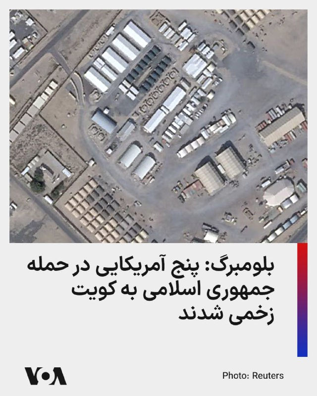

بلومبرگ گزارش داد در حمله موشکی جمهوری اسلامی به پایگاه هوایی علی‌السالم در کویت، حدود پنج آمریکایی زخمی شده‌اند.

به نوشته بلومبرگ، پدافند هوایی کویت یک موشک بالستیک را رهگیری کرد، اما قطعات آن به این پایگاه برخورد کرد و چند نیروی آمریکایی، شامل نیروهای فعال و پیمانکاران، دچار جراحت‌های سطحی شدند. در این حمله همچنین یک پهپاد ام‌کیو-۹ ریپر منهدم و دست‌کم یک پهپاد دیگر به‌شدت آسیب دید.

سنتکام روز گذشته این حمله را «نقض فاحش آتش‌بس» از سوی تهران خوانده بود.

فرماندهی مرکزی آمریکا اعلام کرده بود ایران یک موشک بالستیک به سمت کویت شلیک کرده و پیش از آن نیز پنج پهپاد تهاجمی یک‌طرفه در نزدیکی تنگه هرمز به پرواز درآمده بودند که همه رهگیری شدند. سنتکام همچنین گفت از پرتاب یک پهپاد ششم از بندرعباس جلوگیری شده است.

کویت میزبان یک پایگاه هوایی آمریکا است و کشورهای حوزه خلیج فارس، از جمله کویت، در جریان جنگ اخیر هدف حملات موشکی و پهپادی سپاه بودند.
@FarsiVOA

## alonews — post 123630

  <a href="telegram/content/alonews_123630_1780127586.webm" target="_blank">🎬 Download video</a>

👈آخرین قیمت نفت ۹۱.۱۲ دلار

✅ @AloNews خبر جنگ

## alonews — post 123628

  <a href="telegram/content/alonews_123628_1780127586.webm" target="_blank">🎬 Download video</a>

👈حملات ارتش اسرائیل به مواضع حزب‌الله در جنوب لبنان

✅ @AloNews خبر جنگ

## alonews — post 123627

  <a href="telegram/content/alonews_123627_1780127586.webm" target="_blank">🎬 Download video</a>

👈 ان‌بی‌سی: جنگنده اف-۱۵ای آمریکا، ماه گذشته با یک موشک دوش‌پرتاب چینی در ایران سرنگون شد!

✅ @AloNews خبر جنگ

---
📅 بروزرسانی: 1405/03/09 11:13
---

## VahidOOnLine — post 242888

  

وال‌استریت ژورنال گزارش داد برخی کشتی‌ها برای عبور از تنگه هرمز در هماهنگی با ارتش آمریکا سامانه‌های موقعیت‌یاب خود را خاموش می‌کنند تا از حملات جمهوری اسلامی در امان بمانند.
به نوشته این روزنامه، نرخ بیمه کشتی‌ها در منطقه به ۲.۵ تا ۴ درصد ارزش کشتی رسیده است؛ رقمی که پیش از جنگ حدود ۰.۲۵ درصد بود.
سنتکام اعلام کرد سپاه پاسداران در هفته گذشته اقدام به مین‌گذاری و شلیک پهپاد کرده و آمریکا نیز به این حملات پاسخ داده است.
‌🏁 🇬🇧 IranintlTV

🤖 @VahidOOnLine

## mwarmonitor — post 9909

🔴زخمی شدن آمریکایی‌ها در حمله موشکی ایران به پایگاه هوایی کویت

📝نویسنده: گری دویل ، بلومبرگ

🔰یک حمله موشکی بالستیک از سوی ایران به یک پایگاه هوایی در کویت طی ۲۴ ساعت گذشته، منجر به جراحت‌های سطحی چند آمریکایی و آسیب جدی به دو پهپاد تهاجمی «ام‌کیو-۹ ریپر» (MQ-9 Reaper) شده است؛ این در حالی است که دونالد ترامپ، رئیس‌جمهور آمریکا، در حال بررسی توافقی برای تمدید یک آتش‌بس متزلزل است.
به گفته یک منبع آگاه که از جزئیات این حمله اطلاع مستقیم دارد و به دلیل عمومی نشدن اطلاعات خواستار عدم افشای نامش شده است، پدافند هوایی کویت موشک «فاتح-۱۱۰» را رهگیری کرده، اما سقوط قطعات و بقایای آن به پایگاه هوایی «علی السالم» اصابت کرده است.

@mwarmonitor

## IranIntlTV — post 339703

  

وال‌استریت ژورنال گزارش داد برخی کشتی‌ها برای عبور از تنگه هرمز در هماهنگی با ارتش آمریکا سامانه‌های موقعیت‌یاب خود را خاموش می‌کنند تا از حملات جمهوری اسلامی در امان بمانند.
به نوشته این روزنامه، نرخ بیمه کشتی‌ها در منطقه به ۲.۵ تا ۴ درصد ارزش کشتی رسیده است؛ رقمی که پیش از جنگ حدود ۰.۲۵ درصد بود.
سنتکام اعلام کرد سپاه پاسداران در هفته گذشته اقدام به مین‌گذاری و شلیک پهپاد کرده و آمریکا نیز به این حملات پاسخ داده است.
https://iranintl.com/202605303453

## FarsiVOA — post 219043

  

دیمیتری مدودف، معاون شورای امنیت روسیه، به رهبران اروپایی هشدار داد که باید منتظر تکرار حوادث پهپادی در کشورهای خود باشند.

این موضع‌گیری پس از آن مطرح شد که رومانی، عضو ناتو و اتحادیه اروپا، اعلام کرد یک پهپاد روسی هنگام حمله به اوکراین، به یک ساختمان مسکونی در خاک این کشور اصابت کرده است.

ناتو این حادثه را نشانه «رفتار بی‌ملاحظه» روسیه خواند و تأکید کرد از خاک متحدان خود دفاع می‌کند.

مدودف گفت هنوز مالکیت پهپاد روشن نیست، اما همزمان اروپا را به مشارکت مستقیم در جنگ علیه روسیه متهم کرد و گفت این حوادث ادامه خواهد داشت.

رومانی سفیر روسیه را احضار کرده و خواستار دریافت توانمندی‌های دفاع ضدپهپادی از اتحادیه اروپا شده است. وزارت دفاع رومانی می‌گوید از آغاز حملات روسیه به بنادر اوکراین در امتداد دانوب، حریم هوایی این کشور ۲۸ بار نقض شده است.

همزمان، لتونی نیز دفاع ضدپهپادی در مرزهای خود با روسیه و بلاروس را تقویت می‌کند.
@FarsiVOA

## Dirty_Kids — post 390542

  

کسکش تو بخوای به خلیج فارس برسی باید دو روز تو صندوق‌عقبه پژو بخوابی😂😂

@Dirty_Kids 👻

## Dirty_Kids — post 390541

چهار سال پیش ترمینال بودم، یه اقایی بغل دستم نشسته بود گفت اتوبوسم نیم ساعت دیگه حرکت میکنه یه چُرت کوچولو میزنم بیست دقیقه بعد بیدارم کن،
الان یادم اومد

@Dirty_Kids 👻

## Dirty_Kids — post 390540

  

‏شما با این حجم از شجاعت موافقید؟

یجور حرف میزنه انگار بی‌حجابی اجباریه و این دل شیر داشته که با چادر رفتی کافه، عقب مونده

@Dirty_Kids 👻

## alonews — post 123626

  <a href="telegram/content/alonews_123626_1780126991.webm" target="_blank">🎬 Download video</a>

👈 کاخ سفید آخرین معاینه پزشکی ترامپ را منتشر کرد و اعلام کرد که رئیس‌جمهور ۷۹ ساله در «سلامت عالی» با عملکرد طبیعی ریه و سیستم عصبی قرار دارد، هم‌چنین قلب او ۱۴ سال از سن او جوان تر است

✅ @AloNews خبر جنگ

---
📅 بروزرسانی: 1405/03/09 11:03
---

## VahidOOnLine — post 242887

  <a href="telegram/content/VahidOOnLine_242887_1780126385.mp4" target="_blank">🎬 Download video</a>

ویدیوهایی که به تازگی و پس از وصل‌شدن نسبی اینترنت به ایران اینترنشنال رسیده نشان می‌دهد یک شهروند در روزهای جنگ جمهوری اسلامی با آمریکا و اسرائیل در محله نارمک تهران شعار «جاوید شاه» را دیوارنویسی کرد.
‌🏁 🇬🇧 IranintlTV

🤖 @VahidOOnLine

## WithYashar — post 12925

نتانیاهو خطاب به لبنان : درخواست اتش بس دولت شمارو رد میکنیم
باید بگم که اسرائیل تا نابودی کامل حزب الله ادامه خواهد داد
@withyashar

## WithYashar — post 12924

کاخ سفید به الجزیره گفت:

ترامپ تا زمانی که خواسته‌های آمریکا برآورده نشود، توافقی نخواهد کرد و ایران هرگز به سلاح هسته‌ای دست نخواهد یافت
@withyashar

## mwarmonitor — post 9908

  

✈️یک فروند هواپیمای هشدار زودهنگام (آواکس) Boeing E-3C Sentry متعلق به نیروی هوایی آمریکا، در حال گشت‌زنی و پرواز دایره‌ای در حریم هوایی شرق عربستان سعودی (نزدیکی مرز قطر و امارات) در ارتفاع ۹,۴۴۹ متری رصد شد.

@mwarmonitor

## IranIntlTV — post 339702

  <a href="telegram/content/IranIntlTV_339702_1780126387.mp4" target="_blank">🎬 Download video</a>

ویدیوهایی که به تازگی و پس از وصل‌شدن نسبی اینترنت به ایران اینترنشنال رسیده نشان می‌دهد یک شهروند در روزهای جنگ جمهوری اسلامی با آمریکا و اسرائیل در محله نارمک تهران شعار «جاوید شاه» را دیوارنویسی کرد.

## alonews — post 123625

  <a href="telegram/content/alonews_123625_1780126389.webm" target="_blank">🎬 Download video</a>

👈کنکور سراسری به همراه آزمون پذیرش دانشجومعلم پنجشنبه و جمعه ۲۹ و ۳۰ مرداد ماه برگزار خواهد شد

✅ @AloNews خبر جنگ

---
📅 بروزرسانی: 1405/03/09 10:52
---

## VahidOOnLine — post 242886

  

♦️رسانه بلومبرگ، روز شنبه نهم خرداد ماه، به نقل از یک منبع آگاه گزارش داد در جریان حمله موشکی جمهوری اسلامی ایران به یک پایگاه هوایی در کویت، چند «شهروند آمریکایی» دچار جراحات جزئی شده و دو فروند پهپاد تهاجمی «ام‌کیو-۹ ریپر» نیز به شدت آسیب دیده‌اند.
بر اساس این گزارش، سامانه‌های پدافند هوایی کویت موفق شدند یک فروند موشک بالستیک «فاتح-۱۱۰» را رهگیری کنند، اما بقایای موشک پس از رهگیری به پایگاه هوایی «علی السالم» اصابت کرد.
وزارت امور خارجه کویت، پنجشنبه گذشته و ساعاتی پس از تبادل آتش سنگین میان نیروهای مسلح ایران و نظامیان ارتش آمریکا در منطقه خلیج فارس، از حملات موشکی و پهپادی جمهوری اسلامی به خاک این کشور خبر داده بود.
سپاه پاسداران جمهوری اسلامی ایران نیز بامداد پنجشنبه در بیانیه‌ای اعلام کرد بود، در پاسخ به حمله موشکی آمریکا به نزدیکی فرودگاه بندرعباس، «مبداء این حمله» را هدف قرار داده است. سپاه در این بیانیه از کویت نامی نبرد.
مقام‌های کویت و آمریکا تاکنون به طور رسمی جزئیاتی درباره شمار مجروحان یا میزان خسارت‌های وارد شده منتشر نکرده‌اند.
‌🇸🇦 Indypersian

🤖 @VahidOOnLine

## IranIntlTV — post 339701

  <a href="telegram/content/IranIntlTV_339701_1780125774.mp4" target="_blank">🎬 Download video</a>

یک منبع آگاه از روند مذاکرات تهران و واشینگتن به ایران‌اینترنشنال گفت سفر هیئت عالی‌رتبه ایرانی به ریاست محمدباقر قالیباف به دوحه با یک «ناکامی بزرگ دیپلماتیک برای جمهوری اسلامی» پایان یافت. به گفته این منبع، با وجود اصرار تهران بر آزادسازی فوری ۱۲ میلیارد دلار از دارایی‌های مسدودشده، مقام‌های قطری این درخواست را رد و تنها با آزادسازی ۶ میلیارد دلار در قالب یک خط اعتباری محدود برای خرید کالاهای اساسی از بازار قطر موافقت کردند.

گفت‌وگو با علی شیرازی، عضو تحریریه ایران‌اینترنشنال
@iranintltv

## IranIntlTV — post 339700

  <a href="telegram/content/IranIntlTV_339700_1780125776.mp4" target="_blank">🎬 Download video</a>

نهاد ناظر مالی کانادا نسبت به افزایش جرایمی مانند قاچاق انسان و بهره‌کشی از نیروی کار هم‌زمان با برگزاری جام جهانی ۲۰۲۶ هشدار داد. این نهاد اعلام کرد شبکه‌های مجرمانه ممکن است با سوءاستفاده از ورود صدها هزار مسافر و افزایش تقاضا برای خدمات مختلف، فعالیت خود را در زمینه بهره‌کشی جنسی و کار اجباری گسترش دهند.

گزارش مهسا مرتضوی، خبرنگار ایران‌اینترنشنال
@iranintltv

## DW_Farsi — post 125305

  

🔶 آمریکا: ارزش رمزارزهای توقیف‌شده ایران به یک میلیارد دلار رسید

اسکات بسنت، وزیر خزانه‌داری ایالات متحده اعلام کرد مجموع دارایی‌های رمزارزی مرتبط با جمهوری اسلامی که تا کنون توسط آمریکا توقیف شده به حدود یک میلیارد دلار رسیده است. او همچنین گفت این رقم مربوط به کل دارایی‌های توقیف‌شده تا امروز است و به یک اقدام واحد محدود نمی‌شود.

بسنت همچنین توضیح داد که این رقم نسبت به آوریل ۲۰۲۶ دو برابر شده است؛ زمانی که میزان دارایی‌های توقیف‌شده حدود ۵۰۰ میلیون دلار اعلام شده بود.

به گفته وزیر خزانه‌داری آمریکا بخشی از این دارایی‌ها شامل ۳۴۴ میلیون دلار تتر (USDT) در شبکه ترون است که در قالب عملیاتی موسوم به "خشم اقتصادی" توقیف شده است.

وزیر خزانه‌داری آمریکا همچنین تاکید کرد این اقدامات با هدف مقابله با شبکه‌های دور زدن تحریم‌ها و مسیرهای مالی مرتبط با جمهوری اسلامی انجام می‌شود.

مقام‌های آمریکایی می‌گویند جمهوری اسلامی از رمزارزها برای دور زدن تحریم‌ها و تامین منابع مالی استفاده کرده است.

جمهوری اسلامی درباره اظهارات وزیر خزانه‌داری آمریکا تا کنون واکنشی نشان نداده است.
@dw_farsi

## alonews — post 123624

  <a href="telegram/content/alonews_123624_1780125777.webm" target="_blank">🎬 Download video</a>

👈مقام ایرانی به الجزیره: هنوز هیچ چیز نهایی نشده است

🔴او مدعی شد تیم مذاکره‌کننده آمریکا چارچوب حرفه‌ای و اخلاقی مشخصی ندارد و مواضع و خواسته‌های خود را به‌طور مداوم تغییر می‌دهد.

🔴این اظهارات در حالی مطرح می‌شود که گزارش‌های مختلفی از ادامه مذاکرات، تبادل پیام‌ها و تلاش میانجی‌ها برای کاهش اختلاف‌های باقی‌مانده منتشر شده است.

✅ @AloNews خبر جنگ

## alonews — post 123623

  <a href="telegram/content/alonews_123623_1780125778.webm" target="_blank">🎬 Download video</a>

👈نیویورک پست : آزادسازی منابع ایران مشروط به بازگشایی تنگه هرمز و پاکسازی مین ها است

✅ @AloNews خبر جنگ

---
📅 بروزرسانی: 1405/03/09 10:42
---

## pm_afshaa — post 91882

🔴اسرائیل هیوم: مقام‌های موساد معتقدند عملیات‌های اخیر علیه ایران فقط یک مرحله در مسیر سقوط جمهوری اسلامی بوده است. رئیس پیشین شاخه نفوذ گفت این واحد اکنون با شدت بیشتری فعالیت می‌کند و هدف آن سریع‌تر کردن ساعت شنی پایان حکومت است

💧 Rainbet.com the #1 Non-KYC Crypto Casino & Sportsbook @rainbetcom

😁 @Pm_Afshaa

## IranIntlTV — post 339699

  <a href="telegram/content/IranIntlTV_339699_1780125175.mp4" target="_blank">🎬 Download video</a>

وزارت خزانه‌داری آمریکا اعلام کرد ارزش دارایی‌های رمزارزی مرتبط با جمهوری اسلامی که در چارچوب تحریم‌های واشینگتن مسدود شده‌اند، به یک میلیارد دلار رسیده است.

نیلوفر منصوری، خبرنگار ایران‌اینترنشنال، گزارش می‌دهد
@iranintltv

## DW_Farsi — post 125298

🔶 جام‌های ۱۹۹۸ تا ۲۰۰۶؛ زین‌الدین زیدان؛ ققنوس شماره ۱۰ فرانسه

زین‌الدین زیدان نامی‌ست که در کنار میشل پلاتینی، هرگز از حافظه‌ تاریخی فوتبال فرانسه و جهان پاک نخواهد شد؛ کارگردانی همه‌فن‌حریف و خلاق که در پیراهن شماره‌ی ۱۰، پس از سال‌ها به فوتبال فرانسه روح و جان تازه‌ای بخشید.

📌برای دسترسی کامل به گزارش به وبسایت دویچه‌وله فارسی مراجعه کنید.
@dw_farsi

## BBCPersian — post 282409

🔻گفت‌وگو با شرق‌شناس روس؛ آیا هنوز امکان «توافق بزرگ» میان آمریکا و ایران وجود دارد؟
رسانه‌ها تاکنون چندین بار از احتمال دستیابی به توافقی میان آمریکا و ایران برای ازسرگیری کشتیرانی در تنگه هرمز خبر داده‌اند، اما مذاکرات با میانجی‌های مختلف همچنان ادامه دارد و مقام‌های جمهوری اسلامی با بدبینی به آن نگاه می‌کنند.
روسلان سلیمانوف، شرق‌شناس روس، می‌گوید پس از آتش‌بس هشتم آوریل تغییری جدی رخ نداده و مواضع تهران و واشنگتن در موضوع‌های اصلی همچنان سخت‌گیرانه، آشتی‌ناپذیر و بدون آمادگی برای مصالحه باقی مانده است.
به گفته او، تنها زمینه ممکن برای توافق، گسترش آتش‌بس و تعیین قواعدی برای جلوگیری از جنگ تازه است و توافقی مشابه برجام در سال ۲۰۱۵ فعلا غیرواقع‌بینانه به نظر می‌رسد.
در حالی که گزارش‌هایی درباره انتقال اورانیوم غنی‌شده ایران به چین یا روسیه منتشر شده، آقای سلیمانوف می‌گوید تصمیم نهایی در اختیار نیروهای امنیتی و نزدیکان مجتبی خامنه‌ای است که به نظر می‌آید مخالف امتیاز دادن هستند.
متن کامل خبر را در لینک زیر بخوانید:
https://bbc.in/436N0yF
📸 GettyImages/Reuters
@BBCPersian

## alonews — post 123622

  <a href="telegram/content/alonews_123622_1780125176.webm" target="_blank">🎬 Download video</a>

👈نفت برنت بیش از ۹ درصد ریخت و طلا با رشد ۰.۸ درصدی به ۴۵۹۳ دلار رسید.

✅ @AloNews خبر جنگ

## alonews — post 123621

  <a href="telegram/content/alonews_123621_1780125176.webm" target="_blank">🎬 Download video</a>

👈نفت برنت بیش از ۹ درصد ریخت و طلا با رشد ۰.۸ درصدی به ۴۵۹۳ دلار رسید

✅ @AloNews خبر جنگ

## alonews — post 123620

  <a href="telegram/content/alonews_123620_1780125177.webm" target="_blank">🎬 Download video</a>

👈سپاه اصفهان: به‌دلیل انجام انفجارهای کنترل‌شده تا ساعت ۱۴ امروز در جنوب اصفهان، احتمال شنیدن صدای انفجار در این منطقه وجود دارد.

✅ @AloNews خبر جنگ

---
📅 بروزرسانی: 1405/03/09 10:33
---

## Persian_Trend_Official — post 15314

  

🔺🔻هشدار فوری ارتش اسرائیل به ساکنان مناطق جنوب لبنان

ارتش اسرائیل با انتشار اطلاعیه‌ای فوری از ساکنان مناطق «جدیده انصار»، «الزراریه»، «مزرعه کفوریه‌الرز» و «مشغره» خواست خانه‌های خود را فوراً تخلیه کرده و به شمال رودخانه زهرانی منتقل شوند.

در این اطلاعیه آمده است که به‌دلیل فعالیت‌های حزب‌الله، از جمله حفر تونل‌ها و استفاده از این مناطق برای شلیک و اقدامات نظامی، ارتش اسرائیل قصد دارد با قدرت علیه مواضع حزب‌الله وارد عمل شود.

ارتش اسرائیل تأکید کرده هدفش آسیب رساندن به غیرنظامیان نیست، اما هر فردی که در نزدیکی نیروها، تأسیسات یا تجهیزات جنگی حزب‌الله حضور داشته باشد، جان خود را در معرض خطر قرار می‌دهد.

👺Phantom

📌 @persian_trend_official
پرشین ترند | متفاوت‌ترین کانال نظامی

## alonews — post 123618

  <a href="telegram/content/alonews_123618_1780124582.mp4" target="_blank">🎬 Download video</a>

👈یک راکت حزب‌الله به مرکز کیریات شمونا در منطقه گالیل پان هندل، شمال اسرائیل، لحظاتی پیش اصابت کرد

✅ @AloNews خبر جنگ

## alonews — post 123617

  <a href="telegram/content/alonews_123617_1780124584.webm" target="_blank">🎬 Download video</a>

👈سی‌بی‌اس: انتظار نمی‌رود که ترامپ پیش از تصمیم‌گیری درباره فروش تسلیحات آمریکا به تایوان، با رئیس‌جمهور تایوان، لای چینگ-ته، تماس بگیرد.

🔴تماس برنامه‌ریزی شده توجه‌ها را جلب کرده بود زیرا هیچ رئیس‌جمهور فعلی آمریکا از سال ۱۹۷۹ به طور مستقیم با رهبر تایوان صحبت نکرده است.

🔴ترامپ قبلاً گفته بود که قصد دارد پیش از اتخاذ تصمیم درباره بسته تسلیحاتی با لای صحبت کند.

✅ @AloNews خبر جنگ

---
📅 بروزرسانی: 1405/03/09 10:22
---

## IranIntlTV — post 339698

  <a href="telegram/content/IranIntlTV_339698_1780123970.mp4" target="_blank">🎬 Download video</a>

جاویدنامان انقلاب ملی ایرانیان
«سیما موسوی» در شامگاه ۱۹ دی‌ماه جان خود را فدای مردم معترض کرد. نامش در حافظه‌ این سرزمین می‌ماند و یادش چراغ راه آزادی‌خواهان است.
@iranintltv

## RadioFarda — post 157709

  

🔸ایالات متحده روز شنبه هشدار داد که برای ازسرگیری جنگ با ایران حتی «بیش از آنچه لازم است توانایی» دارد.

🔸این هشدار پس از آن صادر شد که دونالد ترامپ، رئیس‌جمهور آمریکا، اعلام کرد هرگونه توافق صلح باید بر اساس خط قرمزهای او باشد، از جمله اینکه تهران هرگز نتواند به سلاح‌های هسته‌ای دست یابد.

🔸کاخ سفید اشاره کرده بود که ترامپ پس از هفته‌ها پیام‌های متناقض در ارتباط با مذاکرات شکننده، به تصمیم‌گیری در مورد یک توافق اولیه نزدیک شده است، هرچند تهران وجود هرگونه توافق نهایی برای پایان دادن به درگیری در خاورمیانه را که اقتصاد جهانی را تکان داده است، تکذیب کرد.

🔸در همین حال، پیت هگست، رئیس پنتاگون، روز شنبه به وقت محلی در جریان شرکت در یک نشست بزرگ دفاعی آسیا در سنگاپور گفت که واشینگتن در صورت تمایل می‌تواند جنگ را از سر بگیرد.

🔸او گفت: «توانایی ما برای شروع مجدد در صورت نیاز به گونه‌ای است که بیش از حد توانایی داریم و انبار‌های مهمات ما برای این کار کاملاً مناسب هستند، هم در آنجا و هم در سراسر جهان؛ چرا که ما میان مهمات پیشرفته و مهمات فراوان‌تر تعادل برقرار کرده‌ایم.»

RadioFarda

## BBCPersian — post 282399

🔻گفت‌وگو با شرق‌شناس روس؛ آیا هنوز امکان «توافق بزرگ» میان آمریکا و ایران وجود دارد؟
رسانه‌ها تاکنون چندین بار از احتمال دستیابی به توافقی میان آمریکا و ایران برای ازسرگیری کشتیرانی در تنگه هرمز خبر داده‌اند، اما مذاکرات با میانجی‌های مختلف همچنان ادامه دارد و مقام‌های جمهوری اسلامی با بدبینی به آن نگاه می‌کنند.
روسلان سلیمانوف، شرق‌شناس روس، می‌گوید پس از آتش‌بس هشتم آوریل تغییری جدی رخ نداده و مواضع تهران و واشنگتن در موضوع‌های اصلی همچنان سخت‌گیرانه، آشتی‌ناپذیر و بدون آمادگی برای مصالحه باقی مانده است.
به گفته او، تنها زمینه ممکن برای توافق، گسترش آتش‌بس و تعیین قواعدی برای جلوگیری از جنگ تازه است و توافقی مشابه برجام در سال ۲۰۱۵ فعلا غیرواقع‌بینانه به نظر می‌رسد.
در حالی که گزارش‌هایی درباره انتقال اورانیوم غنی‌شده ایران به چین یا روسیه منتشر شده، آقای سلیمانوف می‌گوید تصمیم نهایی در اختیار نیروهای امنیتی و نزدیکان مجتبی خامنه‌ای است که به نظر می‌آید مخالف امتیاز دادن هستند.
متن کامل خبر را در لینک زیر بخوانید:
https://bbc.in/436N0yF
📸 GettyImages/Reuters
@BBCPersian

## alonews — post 123616

  <a href="telegram/content/alonews_123616_1780123972.webm" target="_blank">🎬 Download video</a>

👈 ارتش اسرائیل یک وانت را در بزرگراه حبوش - دیر الزهرانی، جنوب لبنان هدف قرار داد

✅ @AloNews خبر جنگ

---
📅 بروزرسانی: 1405/03/09 10:13
---

## VahidOOnLine — post 242885

  <a href="telegram/content/VahidOOnLine_242885_1780123382.mp4" target="_blank">🎬 Download video</a>

ویدیوی رسیده به ایران اینترنشنال نشان می‌دهد خودروهای حامیان حکومت در مسیر چالوس به رامسر در استان مازندران با حمل پرچم‌های حزب‌الله و جمهوری اسلامی برای تردد مردم در یکی از خطوط جاده آزار ترافیکی ایجاد کردند.
‌🏁 🇬🇧 IranintlTV

🤖 @VahidOOnLine

## VahidOOnLine — post 242884

  <a href="telegram/content/VahidOOnLine_242884_1780123386.mp4" target="_blank">🎬 Download video</a>

♦️مارک کارنی، نخست وزیر کانادا، روز شنبه نهم خرداد در اتاوا با وانگ یی، وزیر امور خارجه چین دیدار کرد.

این دیدار نخستین گام در تنش‌زدایی در روابط کانادا با چین، پس از یک دهه مناسبات سرد دیپلماتیک و در اوج تشدید رقابت‌ها میان پکن و واشنگتن به شمار می‌رود.
کانادا از زمان به‌قدرت رسیدن مارک کارنی در انتخابات سال گذشته و در واکنش به درخواست‌های ترامپ برای الحاق این کشور به آمریکا و افزایش تعرفه‌ها، سیاستی دوری از همسایه قدرتمند خود را در پیش گرفته است.
‌🇸🇦 Indypersian

🤖 @VahidOOnLine

## WithYashar — post 12923

  

پزشک ترامپ: «دست دادن مکرر»، علت کبودی دست‌های رئیس‌جمهور آمریکا است

این یک اثر شایع و خوش‌خیم است
@withyashar

## IranIntlTV — post 339697

  <a href="telegram/content/IranIntlTV_339697_1780123389.mp4" target="_blank">🎬 Download video</a>

ویدیوی رسیده به ایران اینترنشنال نشان می‌دهد خودروهای حامیان حکومت در مسیر چالوس به رامسر در استان مازندران با حمل پرچم‌های حزب‌الله و جمهوری اسلامی برای تردد مردم در یکی از خطوط جاده آزار ترافیکی ایجاد کردند.

## FarsiVOA — post 219042

  

دبیرکل صنف کارفرمایان صنعت سیمان ایران از ابلاغیه جدید وزارت نیرو مبنی بر اعمال «محدودیت‌های گسترده» در تأمین برق صنایع سیمان خبر داد.

علی اکبر الوندیان می‌گوید در ماه‌های خرداد و شهریور تنها ۴۰ درصد از برق مورد نیاز تأمین خواهد شد و در تیر و مرداد این میزان به ۱۵ درصد کاهش می‌یابد.

او گفت این میزان محدودیت، در عمل کارخانه‌ها را مجبور به توقف تولید خواهد کرد.

ایران به خاطر عدم تحقق برنامه‌های رشد تولید برق، هر سال با کسری فزاینده برق مواجه می‌شود. دولت در پیک مصرف تابستانی برق صنایع را محدود و برنامه خاموشی‌های بخش خانگی را اعمال می‌کند.
@FarsiVOA

## Dirty_Kids — post 390539

  <a href="telegram/content/Dirty_Kids_390539_1780123393.mp4" target="_blank">🎬 Download video</a>

بزرگترین سوال بی جواب از جمهوری اسلامی ملایان!

@Dirty_Kids 👻

## Dirty_Kids — post 390538

  <a href="telegram/content/Dirty_Kids_390538_1780123396.mp4" target="_blank">🎬 Download video</a>

مداحی سوزناک «من به یادت» برای عاغا موشعلی

@Dirty_Kids 👻

## Dirty_Kids — post 390537

پولدار بودن خیلی خوبه.
درستو میخونی، زبانتو فول میکنی، هر تخصص یا هنری رو دلت بخواد یاد میگیری، باشگاه میری به هیکلت میرسی،
به دوست دختر/پسرت میرسی،
سفرتو میری،
تفریحتو داری.
تهشم از اراده ات حرف میزنی.

@Dirty_Kids 👻

## alonews — post 123615

  <a href="telegram/content/alonews_123615_1780123398.webm" target="_blank">🎬 Download video</a>

👈بلومبرگ: پنج پرسنل نظامی آمریکایی و پیمانکار پس از آنکه آوار ناشی از موشک بالستیک فاتح-۱۱۰ ایران که رهگیری شده بود، پایگاه هوایی علی الصالح کویت را هدف قرار داد، مجروح شدند. یک پهپاد MQ-9A ریپر نابود شد و دیگری آسیب دید. جراحات تهدیدکننده جان نیستند؛ این حادثه پیش‌تر فاش نشده بود.

✅ @AloNews خبر جنگ

## alonews — post 123614

👈جهت رزرو تبلیغات در کانال #الونیوز به کانال زیر مراجعه کنید👇

📃https://t.me/ads_alonews

📃https://t.me/ads_alonews

## alonews — post 123613

  <a href="telegram/content/alonews_123613_1780123399.webm" target="_blank">🎬 Download video</a>

👈ادعای وال استریت ژورنال: موج کوچکی از کشتی‌ها در تاریکی مطلق در حال عبور از تنگه هرمز هستند و بدون چراغ یا سیستم‌های ناوبری خودکار و با کمک ارتش ایالات متحده، از این آبراه خطرناک عبور می‌کنند.

✅ @AloNews خبر جنگ

## alonews — post 123612

  <a href="telegram/content/alonews_123612_1780123399.webm" target="_blank">🎬 Download video</a>

👈ابراهیم عزیزی رئیس کمیسیون امنیت ملی مجلس ایران در گفتگو با ریانووستی: ایران همواره برای شرکای خود احترام ویژه‌ای قائل بوده‎ و خواهد بود.

🔴 روسیه و چین به عنوان شرکای راهبردی ایران در موضوع تردد شناورهایشان در تنگه هرمز مورد اقدام مثبت بوده و خواهند بود

✅ @AloNews خبر جنگ

---
📅 بروزرسانی: 1405/03/09 10:03
---

## VahidOOnLine — post 242883

  

بر اساس گزارش بلومبرگ، حمله موشک بالستیک جمهوری اسلامی به یک پایگاه هوایی در کویت طی ۲۴ ساعت گذشته، باعث جراحات سطحی چند آمریکایی شد و به دو پهپاد تهاجمی «ام‌کیو-۹ ریپر» آسیب جدی وارد کرد؛ این در حالی است که دونالد ترامپ، رییس‌جمهور آمریکا، در حال بررسی توافقی برای تمدید یک آتش‌بس شکننده است.

به گفته یک منبع آگاه از جزئیات آسیب‌های این حمله، حدود ۵ نفر، شامل پیمانکاران و پرسنل نظامی در حال خدمت، دچار جراحات شدند. یکی از پهپادهای ریپر منهدم شده و دست‌کم یک پهپاد دیگر آسیب جدی دیده است. ارزش هر یک از این پهپادها حدود ۳۰ میلیون دلار برآورد می‌شود.

ستاد فرماندهی مرکزی ایالات متحده (سنتکام) تاکنون به درخواست‌ها برای اظهارنظر در این باره پاسخی نداده است.
‌🏁 🇬🇧 IranintlTV

🤖 @VahidOOnLine

## pm_afshaa — post 91881

🔴سنت‌کام:تمام شناورهای نظامی ایرانی که در فعالیت‌های نظامی شرکت دارند هدف قرار خواهند گرفت

💧 Rainbet.com the #1 Non-KYC Crypto Casino & Sportsbook @rainbetcom

😁 @Pm_Afshaa

## IranIntlTV — post 339696

  

بر اساس گزارش بلومبرگ، حمله موشک بالستیک جمهوری اسلامی به یک پایگاه هوایی در کویت طی ۲۴ ساعت گذشته، باعث جراحات سطحی چند آمریکایی شد و به دو پهپاد تهاجمی «ام‌کیو-۹ ریپر» آسیب جدی وارد کرد؛ این در حالی است که دونالد ترامپ، رییس‌جمهور آمریکا، در حال بررسی توافقی برای تمدید یک آتش‌بس شکننده است.

به گفته یک منبع آگاه از جزئیات آسیب‌های این حمله، حدود ۵ نفر، شامل پیمانکاران و پرسنل نظامی در حال خدمت، دچار جراحات شدند. یکی از پهپادهای ریپر منهدم شده و دست‌کم یک پهپاد دیگر آسیب جدی دیده است. ارزش هر یک از این پهپادها حدود ۳۰ میلیون دلار برآورد می‌شود.

ستاد فرماندهی مرکزی ایالات متحده (سنتکام) تاکنون به درخواست‌ها برای اظهارنظر در این باره پاسخی نداده است.
https://iranintl.com/202605309688

## DW_Farsi — post 125297

  

🔶 پنتاگون: مذاکرات نظامی میان اسرائیل و لبنان سازنده بود

البریج کولبی، معاون وزیر دفاع (جنگ) آمریکا صبح روز شنبه ۹ خرداد (۳۰ مه) در شبکه اجتماعی ایکس خبر داد مذاکرات نظامی میان اسرائیل و لبنان "سازنده" بوده است.

کولبی اعلام کرد که پنتاگون از هیئت‌های نظامی اسرائیل و لبنان میزبانی کرده و گفت‌وگوهای نظامی "سازنده‌ای" میان طرفین انجام شده که قرار است هفته آینده روند سیاسی تحت هدایت وزارت امور خارجه آمریکا را تکمیل و تقویت کند.

کولبی در ادامه پیام خود همچنین تاکید کرده است که وزارت دفاع آمریکا برای همکاری با نیروهای دفاعی اسرائیل و ارتش لبنان ارزش قائل است و از حاکمیت و تمامیت ارضی لبنان به‌ویژه در شرایطی که این کشور از حضور گروه‌های مسلح غیردولتی رها شده باشد حمایت می‌کند.

حزب‌الله لبنان در مذاکرات با اسرائیل حضور ندارد. این گروه که در فهرست تروریستی بسیاری از کشورها قرار دارد، با آتش‌بسی که میان اسرائیل و لبنان با میانجی‌گری آمریکا برقرار شده و از اواسط آوریل سال جاری اجرایی شده بود، مخالفت کرده است؛ توافقی که از نظر رسمی همچنان پابرجاست.
@dw_farsi

## BBCPersian — post 282398

🔻فاطمه مهاجرانی، سخنگوی دولت ایران در یادداشتی تصمیم دولت «برای بازگشایی همگانی اینترنت بین‌الملل» را «نه صرفا رفع یک محدودیت فنی»، بلکه «گامی در جهت احقاق حقوق عمومی مردم» توصیف کرد.

او محدودیت‌های اعمال شده ماه‌های اخیر را ناشی از «تهدیدات امنیتی، تجاوز دشمن و اقتضائات ناشی از آن» خواند و گفت بنابر قانون اساسی «هیچ وضعیت استثنایی نمی‌تواند به رویه‌ای دائمی تبدیل شود.»

خانم مهاجرانی با انتقاد از «شکل‌گیری دسترسی‌های نابرابر و چندلایه به اینترنت» در ماه‌های اخیر نوشته است که این وضعیت «احساس تبعیض را در جامعه افزایش داد.»

بعد از چند ماه قطعی اینترنت در ایران در پی جنگ آمریکا و اسرائیل با ایران، دو روز پیش اینترنت در ایران به طور نسبی وصل شد. پیش از این، دولت مسعود پزشکیان چند بار خواستار برقراری مجدد اینترنت شده و تاکید کرده بود که قطعی اینترنت موجب ضربه به حوزه علمی و آموزشی و خسارات اقتصادی می‌شود و مستقیم و غیرمستقیم بر کسب و کارها تاثیر می‌گذارد.

@BBCPersian

## alonews — post 123611

  <a href="telegram/content/alonews_123611_1780122788.webm" target="_blank">🎬 Download video</a>

👈پزشک ترامپ: «دست دادن مکرر»، علت کبودی دست‌های رئیس‌جمهور آمریکا است

🔴 این یک اثر شایع و خوش‌خیم است

✅ @AloNews خبر جنگ

---
📅 بروزرسانی: 1405/03/09 09:52
---

## pm_afshaa — post 91880

🔴سی‌ان‌ان: اسرائیلی‌ها می‌گویند ترامپ در جنگ با ایران، ما را زیر اتوبوس انداخته

+نتانیاهو، کوشنر و ویتکاف را به خاطر هدایت رئیس‌جمهور آمریکا به سمت پایان دادن به درگیری‌ها، سرزنش می‌کند

💧 Rainbet.com the #1 Non-KYC Crypto Casino & Sportsbook @rainbetcom

😁 @Pm_Afshaa

## FarsiVOA — post 219041

🔺مقام قضایی با ادعای «بازدارندگی»، از گسترش توقیف اموال متهمان به «همکاری با دشمن» دفاع کرد

▪️یک مقام قضایی می‌گوید قوه قضائیه در شرایط به ادعای او «جنگ ترکیبی»، فقط به برخورد کیفری بسنده نمی‌کند و با توقیف اموال و اقدامات قضایی، به دنبال «افزایش هزینه همکاری با دشمن» است.

▪️او اضافه کرده توقیف اموال و دارایی‌ها یکی از ابزارهای بازدارنده دستگاه قضایی برای ایجاد بازدارندگی پایدار است.

▪️پس از هشدارها و تهدیدهای مقام‌های قضایی، گزارش‌های رسمی از توقیف اموال صدها نفر حکایت دارد و فقط در چند استان از جمله آذربایجان غربی از توقیف اموال بیش از صد نفر خبر داده شده است.

▪️سخنگوی قوه قضائیه جمهوری اسلامی نیز ۱۹ اردیبهشت اعلام کرد تاکنون ۲۶۲ فقره ملک در کشور توقیف شده است.

⬇️ بیشتر بخوانید:
https://ir.voanews.com/a/8155534.html

## Persian_Trend_Official — post 15312

📍بولتن خبری ۲۴ ساعت اخیر
🗓 ۹ خرداد ۱۴۰۵

◾️ رویترز به نقل از مقام ایرانی: به تفاهم سیاسی با آمریکا رسیده‌ایم، اما کارهای نهایی باقی مانده است

◾️ فارس: متن توافق با قالب «تعهد در برابر تعهد» در مراحل نهایی تصویب در ایران است؛ تا آزادسازی ۱۲ میلیارد دلار دارایی بلوکه‌شده، وارد مرحله بعدی نمی‌شویم

◾️ تسنیم: متن توافق هنوز جمع‌بندی نهایی نشده؛ روایت‌ رسانه‌های غربی «فاقد دقت» است

◾️ نیویورک‌تایمز: پیش‌نویس یادداشت تفاهم شامل تأسیس صندوق سرمایه‌گذاری ۳۰۰ میلیارد دلاری برای ایران شده است؛ ترامپ هنوز آن را امضا نکرده

◾️ نیویورک‌تایمز: ترامپ پس از دو ساعت نشست در اتاق وضعیت، بدون اتخاذ هیچ تصمیمی جلسه را ترک کرد

◾️ ترامپ در تروث‌سوشال: کشتی‌های گیرافتاده در محاصره می‌توانند به خانه برگردند — بعداً خبرنگاران کاخ سفید توضیح دادند منظور شرط لغو محاصره بوده، نه لغو فوری

◾️ وزارت خزانه‌داری آمریکا: محاصره بنادر ایران به‌تدریج برداشته خواهد شد

◾️ الجزیره: پست ترامپ درباره لغو محاصره، اولین شرط پیش از برداشتن گام‌های بعدی در مسیر تفاهم بوده است

◾️ رویترز: ایران ممکن است با انتقال نیمی از ذخایر اورانیوم ۶۰ درصدی موافقت کند

◾️ گروسی رئیس آژانس: قزاقستان آماده است ذخایر اورانیوم غنی‌شده ایران را در صورت حصول توافق نگهداری کند

◾️ خبرنگار فیگارو: جرد کوشنر، داماد ترامپ، مانع از نهایی‌شدن توافق واشنگتن و تهران است

◾️ استیون میلر معاون کاخ سفید: ایران امتیازات قابل توجهی داده که تا چند وقت پیش غیرممکن بود

◾️ هگست وزیر دفاع آمریکا: ایران یا توافق می‌کند یا با نیروی نظامی مواجه می‌شود

◾️ عراقچی: تبادل پیام‌ها ادامه دارد؛ هیچ‌طرفی نمی‌تواند با زبان «باید» با جمهوری اسلامی صحبت کند

◾️ قالیباف: امتیازات را با موشک می‌گیریم؛ هیچ اقدامی پیش از اقدام طرف مقابل انجام نخواهد شد

◾️ پدافند هوایی ایران در قشم و بندرعباس فعال شد؛ دو انفجار گزارش شد

◾️ تسنیم: پهپاد آمریکایی در حوالی قشم توسط پدافند ارتش رهگیری و منهدم شد

◾️ سنتکام به دریانوردان هشدار داد: در تنگه هرمز عملیات نظامی انجام خواهیم داد؛ هر کشتی مشکوک به مین‌گذاری هدف قرار می‌گیرد

◾️ ان‌بی‌سی به نقل از مقامات آمریکایی: ارتش آمریکا تأیید نکرده که ایران در تنگه هرمز مین کار گذاشته باشد

◾️ وال‌استریت‌ژورنال: امارات از روزهای اول جنگ ده‌ها حمله هوایی به ایران انجام داده؛ اهداف شامل قشم، ابوموسی، بندرعباس، جزیره لاوان و عسلویه بوده‌اند

◾️ سی‌ان‌ان: تصاویر ماهواره‌ای نشان می‌دهد ایران در حال بازگشت به دسترسی به ذخایر موشکی زیرزمینی‌اش است؛ این با ادعاهای ترامپ مغایرت دارد

◾️ تصاویر ماهواره‌ای از پایگاه موشکی یزد: تمامی تأسیسات روی سطح منهدم شده، اما پایگاه عملیاتی مانده است

◾️ وزارت خزانه‌داری آمریکا: حدود یک میلیارد دلار از دارایی‌های رمزارزی سپاه مصادره شده است

◾️ نهاد مدیریت آب‌راه خلیج فارس: تسلط بر تنگه هرمز را که در میدان به دست نیاوردید، با تحریم هم به دست نخواهید آورد

◾️ ان‌بی‌سی به نقل از سه منبع آگاه: جنگنده اف-۱۵ای آمریکا احتمالاً با موشک دوش‌پرتاب ساخت چین در ایران سرنگون شده است

◾️ ان‌بی‌سی: چین ممکن است رادار هشداردهنده دوربردی با توانایی شناسایی هواپیماهای رادارگریز به ایران داده باشد

◾️ کاخ سفید: شی‌جین‌پینگ به ترامپ اطمینان داده که پکن تجهیزات نظامی به ایران نمی‌دهد

◾️ یک پهپاد به ساختمانی در شهر گالاتس رومانی اصابت کرد؛ دو نفر مجروح شدند

◾️ پوتین: تازه از ماجرا باخبر شدم؛ بدون کارشناسی نمی‌توان تعلق پهپاد را تأیید کرد

◾️ مدودوف در واکنش: خواب آرام شهروندان اروپایی به پایان رسیده است

◾️ نتانیاهو: نیروهای ما از رود لیتانی عبور کرده‌اند؛ نتایج بسیار چشمگیری در جبهه لبنان حاصل شده

◾️ ارتش اسرائیل: فرمانده گردان زیتون حماس، عماد اسلیم، در شمال غزه کشته شد

◾️ حزب‌الله: ویدیوی شلیک موشک کروز قدس (برد ۱۶۵۰ کیلومتر) به مواضع اسرائیل منتشر شد

◾️ ارتش اسرائیل: یک راکت حزب‌الله به کلیسای شهر مرجعیون اصابت کرده است

◾️ رسانه‌ عبری: ارتش اسرائیل به‌زودی فراخوان جذب نیروهای زمینی با ملیت‌های مختلف را گسترش خواهد داد

◾️ سوئد با حضور زلنسکی در پایگاه اوپسالا، ۱۶ فروند جنگنده گریپن C/D به اوکراین اهدا خواهد کرد

◾️ راکت نیو گلن شرکت Blue Origin در آزمایش زمینی کیپ کاناورال منفجر شد؛

◾️ رویترز: چین بیش از ۸۰ سکوی پرتاب در نزدیکی سیلوهای هسته‌ای خود در حال ساخت دارد

◾️ ارمنستان در رژه سالانه، رادار ایرانی کاوش را برای اولین بار به نمایش درآورد

◾️ حوثی‌های یمن یک پهپاد از نوع MQ-9 آمریکایی را در استان مارب منهدم کردند

◾️ پاکستان:هیچ انعطافی در موضعمان نداریم و به پیمان ابراهیم نخواهیم پیوست

👺Phantom

📌 @persian_trend_official
پرشین ترند | متفاوت‌ترین کانال نظامی

## Persian_Trend_Official — post 15311

  

ماه مه هنوز تمام نشده است و ما شاهد افزایش بی‌سابقه‌ای در پروازهای مشکوک باری امارات متحده عربی به اتیوپی هستیم. تاکنون، ۴۴ پرواز در این ماه ثبت شده است، از جمله بیش از هشت پرواز تایید شده به فرودگاه بهیر دار در شمال اتیوپی.

📌 @persian_trend_official
پرشین ترند | متفاوت‌ترین کانال نظامی

## BBCPersian — post 282397

  

🔻پزشک دونالد ترامپ، در یادداشتی که روز جمعه از سوی کاخ سفید منتشر شد، اعلام کرد که رئیس‌جمهور آمریکا همچنان از سلامت بسیار خوبی برخوردار است. به گفته او، نتایج معاینات انجام‌شده در هفته جاری نشان می‌دهد که آقای ترامپ ۷۹ ساله همچنان دچار «تورم خفیف در ناحیه پایینی پاها و کبودی خوش‌خیم در دست‌ها» است.

دکتر شان باربابلا در یادداشتی که شامگاه جمعه منتشر شد، تأکید کرد که «دونالد ترامپ از سلامت جسمانی بسیار مطلوبی برخوردار است و عملکرد قلب، ریه‌، سیستم عصبی و وضعیت کلی بدنی او در شرایطی قوی و طبیعی قرار دارد.»

به گفته پزشک آقای ترامپ، او از آمادگی کامل برای انجام مسئولیت‌های رئیس‌جمهور و فرماندهی کل نیروهای مسلح آمریکا برخوردار است.

معاینات سالانه آقای ترامپ روز ۲۶ مه (۵ خرداد) انجام شده است.

دونالد ترامپ که در ماه ژوئن ۸۰ ساله می‌شود، مسن‌ترین فردی بود که مسئولیت ریاست‌جمهوری را بر عهده گرفته است.

او اغلب خود را پرانرژی‌تر و از نظر جسمانی آماده‌تر از جو بایدن، رئیس‌جمهور دموکرات پیشین، معرفی می‌کند.

📸رویترز
@BBCPersian

## alonews — post 123610

  <a href="telegram/content/alonews_123610_1780122169.webm" target="_blank">🎬 Download video</a>

👈توجه‌ها به شبه‌جزیره مسندم؛ نزدیک محل عملیات نیروی دریایی آمریکا

🔴گزارش‌ها و تصاویر منتشرشده توجه‌ها را به منطقه شبه‌جزیره مسندم در عمان جلب کرده‌اند؛ منطقه‌ای که در نزدیکی محل برخی عملیات‌های اخیر نیروی دریایی آمریکا قرار دارد.
شبه‌جزیره مسندم به دلیل موقعیت راهبردی خود در نزدیکی تنگه هرمز، یکی از مهم‌ترین نقاط ژئوپلیتیکی منطقه محسوب میشود و تحرکات نظامی در اطراف آن همواره مورد توجه رسانه‌ها و تحلیلگران قرار میگیرد.

✅ @AloNews خبر جنگ

## alonews — post 123608

  <a href="telegram/content/alonews_123608_1780122169.webm" target="_blank">🎬 Download video</a>

👈نیروی دریایی آمریکا: کشتی‌های تجاری از تنگه هرمز دوری کنند

🔴فرماندهی مرکزی نیروی دریایی ایالات متحده (USNAVCENT) روز گذشته با انتشار یک بیانیه فوری دریایی، به مالکان کشتی، بهره‌برداران و دریانوردان نسبت به آنچه «عملیات نظامی خطرناک در جریان» در تنگه هرمز خوانده شده، هشدار داد.

🔴در این بیانیه ادعا شده که ایران در تلاش برای «کنترل غیرقانونی» این آبراه استراتژیک از طریق آنچه «مین‌ریزی خطرناک و غیرقانونی» خوانده شده، است؛ اقدامی که به گفته سنتکام، کشتی‌ها و خدمه آن‌ها را در معرض خطر قرار داده است.

🔴بر اساس این بیانیه، به تمامی دریانوردان توصیه شده است که از «طرح تفکیک تردد» در تنگه هرمز اجتناب کرده و در عوض، عبور خود را با «مرکز همکاری و راهنمایی نیروی دریایی ایالات متحده برای کشتیرانی» هماهنگ کنند.

🔴در بخش پایانی این بیانیه، هشداری قاطع مطرح شده است مبنی بر اینکه هر شناوری که در حال انجام فعالیت‌های مین‌ریزی یا پشتیبانی از آن مشاهده شود، در چارچوب آنچه «دفاع مشروع» خوانده شده، از سوی نیروهای آمریکایی هدف قرار خواهد گرفت.

✅ @AloNews خبر جنگ

## alonews — post 123607

  <a href="telegram/content/alonews_123607_1780122170.webm" target="_blank">🎬 Download video</a>

👈وزیر جنگ آمریکا: نگرانی به حقی در مورد تقویت تاریخی ارتش چین و گسترش فعالیت‌های نظامی آن در منطقه وجود دارد 
🔴 یک شبکه قوی‌تر و خوداتکاءتر از متحدان آسیایی برای حفظ تعادل قدرت، ضروری است 
✅ @AloNews خبر جنگ

---
📅 بروزرسانی: 1405/03/09 09:42
---

## VahidOOnLine — post 242882

  

♦️حمید رسایی، نماینده مجلس شورای اسلامی و عضو جبهه پایداری، روز شنبه نهم خرداد به محمدباقر قالیباف، رئیس مجلس و مذاکره‌کننده ارشد جمهوری اسلامی هشدار داد اشتباه محمد جواد ظریف و حسن روحانی در مذاکره با آمریکا را تکرار نکند.

رسایی در واکنش به پیام روز گذشته قالیباف درباره «بی‌اعتمادی به آمریکا» و «گرفتن امتیاز با موشک‌ها و نه با مذاکره» نوشت: «موضع امروز شما درباره اینکه هیچ اعتمادی به تضمین‌ها و حرف‌های طرف آمریکایی نیست و امتیازات را نه با گفتگو که با موشک می‌گیرید، قابل تقدیر است اما مشکلش اینجاست که همچنان بر پایه انجام مذاکره و توافق با آمریکا سوار است و تاکید دارد.»

این عضو جبهه پایداری در همین پیام ادامه به پیشروی ارتش اسرائیل در جنوب لبنان و آزاد نشدن دارایی‌های بلوکه شده ایران را نقض پیش‌شرط‌های جمهوری اسلامی در مذاکرات با واشنگتن توصیف کرد و نوشت: «موضع یک ماه و نیم قبل خودتان را هم به یاد دارید؟ قبل از شروع مذاکرات پاکستان، وقتی هرگونه مذاکره با آمریکایی‌ها را مشروط به تحقق دو مسأله دانستید: آتش‌بس در لبنان و بازگشت دارایی‌های بلوکه شده. پولی که برنگشت، وضعیت لبنان را هم حتما شنیده‌اید.»

رسایی با یادآوری سرنوشت «برجام» و ابراز ناامیدی از دستیابی به توافق با آمریکا به مذاکره‌کننده ارشد جمهوری اسلامی هشدار داد: «آقای قالیباف، روی دیوار مذاکره با آمریکا، یادگیری نوشتن غلط است. امید بستن به آن هم غلط است. ظریف و روحانی که تازه خدای باج‌دادن و وادادگی در مذاکره بودند هم یک پر کاه از طریق مذاکرات نگرفتند. اشتباه را تکرار نکنید.»
‌🇸🇦 Indypersian

🤖 @VahidOOnLine

## IranIntlTV — post 339695

  <a href="https://t.me/IranintlTV/339695" target="_blank">📎 Download file</a>

🎧نسخه صوتی اخبار بامدادی | شنبه ۹ خرداد
@iranintlTV

## IranIntlTV — post 339694

  <a href="telegram/content/IranIntlTV_339694_1780121567.mp4" target="_blank">🎬 Download video</a>

آرام حسامی، استاد علوم سیاسی کالج مونتگومری، گفت اکنون جمهوری اسلامی و آمریکا بیش از هر زمان دیگری در ۹ سال گذشته به دستیابی به یک توافق نزدیک شده‌اند.
@iranintltv

## IranIntlTV — post 339693

  <a href="telegram/content/IranIntlTV_339693_1780121569.mp4" target="_blank">🎬 Download video</a>

وزارت امور خارجه آمریکا از انهدام یک شبکه ایرانی خبر داد که با جعل هویت و کلاهبرداری از شرکت‌های آمریکایی، فناوری‌های حساس را برای ارتش جمهوری اسلامی تامین می‌کرد.

نیلوفر منصوری، خبرنگار ایران‌اینترنشنال، گزارش می‌دهد
@iranintltv

## DW_Farsi — post 125296

  

🔶 هگست: آمریکا توانایی کامل برای ازسرگیری جنگ با ایران را دارد

پیت هگست، وزیر دفاع (جنگ) آمریکا شامگاه جمعه ۸ خرداد (۲۹ مه) اعلام کرد ایالات متحده از نظر تسلیحاتی "بیش از نیاز خود ذخایر در اختیار دارد" و در صورت لزوم، توانایی کامل برای از سرگیری جنگ با جمهوری اسلامی را حفظ کرده است.

هگست که در نشست امنیتی سنگاپور صحبت می‌کرد با اشاره به ظرفیت تسلیحاتی ایالات متحده گفت این کشور چه در خاورمیانه و چه در سایر نقاط جهان، از آمادگی نظامی بالایی برخوردار است.

او همچنین افزود که هرگونه توافق با حکومت ایران را "توافقی خوب" می‌داند.
@dw_farsi

---
📅 بروزرسانی: 1405/03/09 09:33
---

## IranIntlTV — post 339692

  <a href="telegram/content/IranIntlTV_339692_1780120980.mp4" target="_blank">🎬 Download video</a>

رضا گوهرزاد، روزنامه‌نگار و تحلیل‌گر سیاسی، گفت اصرار جمهوری اسلامی بر دریافت مستقیم دارایی‌های بلوکه‌شده از آن روست که می‌خواهد این منابع را صرف پاسخ‌گویی حداقلی به مطالبات گسترده داخلی کند. گوهرزاد افزود، حکومت نگران است که در صورت ناتوانی در کاهش فشارهای اقتصادی و معیشتی، موج نارضایتی‌های عمومی دوباره اوج گیرد و خیابان بار دیگر به صحنه اعتراضات گسترده تبدیل شود.
@iranintltv

## DW_Farsi — post 125295

  

🔶 نشست ترامپ در اتاق وضعیت درباره ایران بدون اعلام نتیجه‌ای پایان یافت

جلسه دونالد ترامپ، رئیس‌ جمهور آمریکا در "اتاق وضعیت" کاخ سفید به منظور "تصمیم‌گیری" نهایی درباره توافق با ایران بدون اعلام نتیجه‌ای پایان یافت.

نشست ترامپ و مشاورانش درباره توافق احتمالی با ایران حدود دو ساعت به طول انجامید. با این حال، پس از پایان این جلسه، رئیس‌ جمهور آمریکا کاخ سفید را بدون اعلام هیچ تصمیم نهایی یا صدور بیانیه رسمی درباره نتیجه مذاکرات ترک کرده است.

منابع خبری می‌گویند گفت‌وگوها در "مرحله بررسی و تبادل مواضع" قرار دارد و اختلافات مهم میان طرفین همچنان پابرجاست.

یک مقام کاخ سفید بعد از جلسه اتاق وضعیت گفته است ترامپ تنها در صورتی یک توافق صلح با حکومت ایران را امضا خواهد کرد که تهران تمامی شروط او را برآورده کند.

این مقام که خواست نامش فاش نشود، در گفت‌وگو با خبرگزاری فرانسه تاکید کرده است که ترامپ فقط توافقی را امضا خواهد کرد که "به نفع آمریکا باشد و خطوط قرمز او را تامین کند". این مقام کاخ سفید همچنین گفته است ایران هرگز نمی‌تواند به سلاح هسته‌ای دست پیدا کند.
@dw_farsi

## BBCPersian — post 282388

🔻رضا ثابتی
روزنامه‌نگار

ذخایر اورانیوم غنی‌شده ایران یکی از موارد اختلاف جدی میان تهران و واشنگتن برای پایان دادن به جنگ است. اما سرنوشت و مکان نگهداری این مواد،‌ خود به معمایی پیچیده در پرونده هسته‌ای جمهوری اسلامی تبدیل شده است.

این اختلاف بر سر حدود چهارصد کیلوگرم اورانیومی است که ایران طی سال‌های اخیر تا سطح ۶۰ درصد غنی‌سازی کرده است؛ سطحی که هنوز برای مصارف تسلیحاتی کافی نیست، اما از نظر فنی تنها فاصله کوتاهی با غنای ۹۰ درصدی مورد نیاز برای ساخت بمب هسته‌ای دارد.

با گذشت حدود یک سال از حملات آمریکا و اسرائیل به تاسیسات هسته‌ای فردو، نطنز و اصفهان در جریان جنگ ۱۲ روزه، هنوز هیچ مرجع مستقلی نتوانسته با قطعیت بگوید چه مقدار از این ذخایر باقی مانده، در چه وضعیتی است و دقیقا کجا نگهداری می‌شود.

چرا ایران چنین ذخایری در اختیار دارد و چه سرنخ‌هایی درباره سرنوشت آن در دست است؟
متن کامل خبر در لینک زیر:
https://bbc.in/4acMu5V

📸BBC/ GettyImages/ Le Monde, Airbus DS (2026)/ Reuters/ AFP via Getty Images/ Satellite image (c) 2026 Vantor
@BBCPersian

## alonews — post 123606

  <a href="telegram/content/alonews_123606_1780120982.webm" target="_blank">🎬 Download video</a>

👈بلومبرگ: چین خبرنگار نیویورک تایمز را به دلیل مصاحبه با رئیس جمهور تایوان اخراج کرد

🔴چین در حالی که پکن کمپین خود را برای منزوی کردن تایوان در عرصه جهانی تشدید می‌کند، یک روزنامه‌نگار نیویورک تایمز را به دلیل مصاحبه‌ای که این روزنامه آمریکایی با رئیس جمهور تایوان انجام داده بود، از این کشور اخراج کرد.

✅ @AloNews خبر جنگ

## alonews — post 123605

  <a href="telegram/content/alonews_123605_1780120983.webm" target="_blank">🎬 Download video</a>

👈وزیر جنگ آمریکا: نگرانی به حقی در مورد تقویت تاریخی ارتش چین و گسترش فعالیت‌های نظامی آن در منطقه وجود دارد

🔴 یک شبکه قوی‌تر و خوداتکاءتر از متحدان آسیایی برای حفظ تعادل قدرت، ضروری است

✅ @AloNews خبر جنگ

---
📅 بروزرسانی: 1405/03/09 09:22
---

## IranIntlTV — post 339691

  <a href="telegram/content/IranIntlTV_339691_1780120376.mp4" target="_blank">🎬 Download video</a>

شورای امنیت سازمان ملل اعلام کرد مقام‌ها و نیروهای طالبان مرتکب خشونت جنسی علیه زنان شده‌اند. در گزارش هیئت معاونت سازمان ملل متحد در افغانستان، یوناما، ۲۱ مورد خشونت جنسی از جمله تجاوز گروهی علیه ۱۵ زن و ۶ دختر در سال گذشته میلادی مستند شده است.

مریم رحمتی، خبرنگار ایران‌اینترنشنال، گزارش می‌دهد
@iranintltv

---
📅 بروزرسانی: 1405/03/09 09:12
---

## VahidOOnLine — post 242881

  

سنتکام، ستاد فرماندهی مرکزی آمریکا، شنبه نهم خرداد تصویری از گشت‌زنی یک فروند جنگنده اف-۱۶ نیروی هوایی ایالات متحده بر فراز خاورمیانه در شبکه ایکس منتشر کرد.
سنتکام در توضیح این تصویر نوشت: «نیروهای آمریکایی در سراسر منطقه حضور دارند و هوشیار هستند.»
‌🏁 🇬🇧 IranintlTV

🤖 @VahidOOnLine

## IranIntlTV — post 339690

  <a href="telegram/content/IranIntlTV_339690_1780119774.mp4" target="_blank">🎬 Download video</a>

ترکیه به دلیل همسایگی با ایران و بی‌نیازی شهروندان ایرانی از دریافت ویزا، یکی از آسان‌ترین مقاصد خارجی گردشگری برای ایرانیان است. با این حال، آمارهای تازه از افت قابل توجه سفر ایرانیان به این کشور خبر می‌دهد. همچنین سرمایه‌گذاری و خرید مسکن از سوی ایرانی‌ها در ترکیه در سال‌های اخیر روندی نزولی داشته است.

گزارش فرزیا ثابتی، خبرنگار ایران‌اینترنشنال
@iranintltv

## IranIntlTV — post 339689

  

سنتکام، ستاد فرماندهی مرکزی آمریکا، شنبه نهم خرداد تصویری از گشت‌زنی یک فروند جنگنده اف-۱۶ نیروی هوایی ایالات متحده بر فراز خاورمیانه در شبکه ایکس منتشر کرد.
سنتکام در توضیح این تصویر نوشت: «نیروهای آمریکایی در سراسر منطقه حضور دارند و هوشیار هستند.»
https://iranintl.com/202605306939

## Persian_Trend_Official — post 15310

  <a href="telegram/content/Persian_Trend_Official_15310_1780119777.mp4" target="_blank">🎬 Download video</a>

🎥 لاشۀ پهپاد منهدم‌شده در قشم

👺Phantom

📌 @persian_trend_official
پرشین ترند | متفاوت‌ترین کانال نظامی

## IranianMinds — post 21057

  <a href="telegram/content/IranianMinds_21057_1780119779.mp4" target="_blank">🎬 Download video</a>

(((((((:

@IranianMinds

## alonews — post 123604

  <a href="telegram/content/alonews_123604_1780119781.webm" target="_blank">🎬 Download video</a>

👈سی‌ان‌ان: اسرائیلی‌ها می‌گویند ترامپ در جنگ با ایران، ما را زیر اتوبوس انداخته

🔴 نتانیاهو، کوشنر و ویتکاف را به خاطر هدایت رئیس‌جمهور آمریکا به سمت پایان دادن به درگیری‌ها، سرزنش می‌کند

🔴 اسرائیلی‌ها درک نمی‌کردند که جنگ می‌تواند به تغییر رژیم در واشنگتن منجر شود

🔴 شاید نتیجه این درگیری، روایت سیاسی نتانیاهو را پیش از انتخابات پیش رو، پیچیده کند

✅ @AloNews خبر جنگ

---
📅 بروزرسانی: 1405/03/09 09:02
---

## Shin_Persian — post 6318

  

ايران اينترنشنال ✓ @IranIntl Sat, 30 May 2026 00:17:43 UTC یک منبع آگاه از روند مذاکرات به ایران‌اینترنشنال گفت سفر قالیباف به قطر به شکستی دیپلماتیک منجر شد و با وجود درخواست تهران برای آزادسازی فوری و بی‌قید و شرط ۱۲ میلیارد دلار به صورت نقدی همزمان با…

## Shin_Persian — post 6317

ايران اينترنشنال ✓ @IranIntl
Sat, 30 May 2026 00:17:43 UTC

یک منبع آگاه از روند مذاکرات به ایران‌اینترنشنال گفت سفر قالیباف به قطر به شکستی دیپلماتیک منجر شد و با وجود درخواست تهران برای آزادسازی فوری و بی‌قید و شرط ۱۲ میلیارد دلار به صورت نقدی همزمان با امضای یک یادداشت تفاهم اولیه با آمریکا، مقام‌های قطری این درخواست را رد کردند.
به گفته این منبع، مقام‌های قطری تنها با آزادسازی نیمی از این مبلغ تحت محدودیت‌های سخت‌گیرانه موافقت کردند.
بر اساس گفته‌های یک منبع نزدیک به یک مقام قطری حاضر در این گفت‌وگوها، دوحه از انتقال مستقیم یا نقدی این منابع به ایران خودداری کرده است. در عوض، این پول تنها به صورت اعتبار در اختیار تهران قرار می‌گیرد تا کالاها و محصولات اساسی را مستقیما از قطر خریداری کند.
این محدودیت در شرایطی اعمال شده که آمریکا به شدت با اعطای دسترسی مستقیم و بدون محدودیت جمهوری اسلامی به دارایی‌های نقدی مخالفت کرده است.
آمریکا ابراز نگرانی کرده است که تزریق مستقیم پول نقد می‌تواند برای تهران فضای تنفسی اقتصادی حیاتی ایجاد کند و به آن اجازه دهد حقوق‌های معوقه بخش عمومی را پرداخت کرده و در دوره‌ای از تنش شدید منطقه‌ای، تجهیزات نظامی را از کشورهای دیگر تامین کند.
https://iranintl.com/202605298848

English

An informed source on the negotiation process told Iran International that Ghalibaf’s trip to Qatar resulted in a diplomatic failure. Despite Tehran's request for the immediate and unconditional release of $12 billion in cash simultaneously with the signing of an initial memorandum of understanding with the United States, Qatari officials rejected the demand.

According to this source, Qatari officials agreed to the release of only half of this amount under strict restrictions.

Based on statements from a source close to a Qatari official present in these talks, Doha has refused the direct or cash transfer of these funds to Iran. Instead, this money will only be made available to Tehran as credit to purchase essential goods and products directly from Qatar.

This restriction has been imposed as the United States strongly opposes granting the Islamic Republic direct and unrestricted access to liquid assets.

The U.S. has expressed concern that a direct injection of cash could provide a vital economic lifeline for Tehran, allowing it to pay overdue public sector salaries and procure military equipment from other countries during a period of intense regional tension.

𝕏 · @shin_persian

## Persian_Trend_Official — post 15308

👑فرزند ایران 💔 جان فدای میهن جاوید نام نیوشا حمیدی‏۱۵ساله. ۱۸دی در آستانه اشرفیه با شلیک مستقیم کشته شده.

👑فرزند ایران 💔 جان فدای میهن جاوید نام امیرمهدی مرادی گلدره ۱۵ساله. ۱۹دی در اسلامشهر تهران با شلیک مستقیم کشته شده.

👑
👑
👑 
👑
👑
👑
روحشان شاد يادشان وظیفه 💔❤️‍🔥

👺Phantom

📌 @persian_trend_official
پرشین ترند | متفاوت‌ترین کانال نظامی

## RadioFarda — post 157708

  

🔸جلسه دونالد ترامپ با مشاوران ارشدش که طبق وعده او قرار بود نتیجه چند هفته مذاکره را روشن کند پس از بیش از دو ساعت بدون اعلام نتیجه به پایان رسید.

🔸بامداد شنبه، نهم خردادماه، روزنامه نیویورک تایمز به نقل از یک مقام ارشد دولت که به نامش اشاره نکرد نوشت که ترامپ در این جلسه به نتیجه‌ای درباره تفاهم‌نامه با تهران نرسیده است.

🔸رئیس‌جمهور آمریکا پیشتر اعلام کرده بود که روز جمعه در اتاق وضعیت کاخ سفید جلسه‌ای با حضور مشاورانش برگزار خواهد کرد تا تصمیم نهایی درباره توافق با ایران را اتخاذ کند.

🔸ترامپ گفت که که توافق پایان دادن جنگ باید شامل مواردی مانند تعهد ایران به باز شدن تنگه هرمز و نابودی ذخایر اورانیوم باشد.

🔸با این حال ساعتی بعد سخنگوی وزارت خارجه جمهوری اسلامی در واکنش به این پیام دونالد ترامپ دربارهٔ محتوای توافق میان آمریکا و ایران اعلام کرد که تفاهم میان دو کشور هنوز نهایی نشده است.

@RadioFarda

## IranianMinds — post 21056

سنتکام :

به دریانوردان و ملوانان و خلبانان هشدار میدیم که سنتکام عملیات نظامی تو تنگه هرمز، شمال شبه‌جزیره مسندم عمان که در وسط تنگه قرار داره، بزودی انجام خواهد داد
مراقب باشید و با ما هماهنگی های لازم انجام بدید

این عملیات به عهده ناو های جورج بوش و آبراهام لینکن خواهد بود

@IranianMinds

## alonews — post 123603

  <a href="telegram/content/alonews_123603_1780119165.webm" target="_blank">🎬 Download video</a>

👈رکوردشکنی گرما در مازندران؛ دمای دشت ناز به ۴۷ درجه رسید!

✅ @AloNews خبر جنگ

## alonews — post 123602

  <a href="telegram/content/alonews_123602_1780119165.webm" target="_blank">🎬 Download video</a>

👈آسوشیتدپرس: جمهوری خواهان دولت ترامپ از توافق در حال شکل‌گیری به شدت شاکی هستن و هشدار دادن این توافق ممکنه که توان هسته ای جمهوری اسلامی رو به طور کامل نابود نکنه و دستاورد های نظامی جنگ چهل روزه رو از بین ببره

✅ @AloNews خبر جنگ

## alonews — post 123601

  <a href="telegram/content/alonews_123601_1780119165.webm" target="_blank">🎬 Download video</a>

👈آغاز امتحانات دانش‌آموزان از امروز؛ اکثر امتحانات مجازی است

🔴رئیس مرکز ارزشیابی آموزش‌وپرورش: سال تحصیلی امسال به‌جای ۲۹ اردیبهشت، تا ۷ خرداد ادامه یافت و از امروز ۹ خرداد، امتحانات پایه‌های اول تا دهم آغاز می‌شود.

🔴امتحانات دوره ابتدایی غیرحضوری است و بر اساس ارزشیابی تکوینی و تشخیص معلم انجام می‌شود.

🔴امتحانات پایه‌های هفتم تا دهم به استان‌ها تفویض اختیار شده و اکثر امتحانات مجازی برگزار می‌شود

🔴امتحانات نهایی پایه‌های یازدهم و دوازدهم از ۲۱ تیر، به‌شرط عادی‌شدن وضعیت با اعلام مراجع ذی‌صلاح، به صورت حضوری آغاز می‌شود و احتمالاً تا چند روز آینده برنامه امتحانی این پایه‌ها نیز اعلام می‌شود.

✅ @AloNews خبر جنگ

---
📅 بروزرسانی: 1405/03/09 08:52
---

## VahidOOnLine — post 242880

  

♦️قیمت نفت دربازارهای جهانی صبح شنبه نهم خردادماه با وجود روشن نبودن وضعیت توافق احتمالی میان جمهوری اسلامی ایران و ایالات متحده آمریکا، برای دومین روز پیاپی کاهش یافت.

بهای هر بشکه نفت خام برنت دریای شمال، قیمت معیار نفت، برای تحویل در ماه اوت، پس از بسته شدن بازارهای آمریکایی در آخرین روز کاری هفته، با ۱.۷ درصد کاهش نسبت به روز قبل به ۹۱.۱۲ دلار کاهش یافت.

روند کاهش قیمت نفت خام پس از پیام دونالد ترامپ درباره بازگشایی قریب‌الوقوع تنگه هرمز و خروج کشتی‌های گرفتار در خلیج فارس از سه ماه پیش، شدت گرفت. با وجود آنکه رئیس جمهوری آمریکا هنوز تصمیم قطعی خود درباره توافق پایان جنگ را اعلام نکرده است، بازارهای جهانی با خوشبینی منتظر بازگشایی تنگه هرمز هستند.
‌🇸🇦 Indypersian

🤖 @VahidOOnLine

## IranIntlTV — post 339688

  <a href="telegram/content/IranIntlTV_339688_1780118558.mp4" target="_blank">🎬 Download video</a>

سرخط خبرهای شنبه ۹ خرداد
@iranintltv

## alonews — post 123600

  <a href="telegram/content/alonews_123600_1780118559.webm" target="_blank">🎬 Download video</a>

👈فارس : متن توافق که تحت قالب «تعهد در برابر تعهد» تدوین شده، در مراحل نهایی تصویب در ایران قرار دارد و هنوز تصمیم قطعی اتخاذ نشده است

✅ @AloNews خبر جنگ

## alonews — post 123599

  <a href="telegram/content/alonews_123599_1780118559.webm" target="_blank">🎬 Download video</a>

👈 یک مقام کاخ سفید به الجزیره: ترامپ هیچ توافقی با ایران امضا نخواهد کرد، مگر اینکه برای آمریکا سودمند باشد و با خطوط قرمز او مطابقت کند.

✅ @AloNews خبر جنگ

---
📅 بروزرسانی: 1405/03/09 08:42
---

## VahidOOnLine — post 242879

  <a href="telegram/content/VahidOOnLine_242879_1780117958.mp4" target="_blank">🎬 Download video</a>

♦️در آستانه جام جهانی ۲۰۲۶، تدابیر امنیتی در اطراف محل استقرار تیم ملی فوتبال ایران در شهر تیخوانای مکزیک افزایش یافته است.
به گزارش خبرگزاری فرانسه، کارلوس والدورده، مدیر اجرایی گروه کالینته، مالک باشگاه تیخوانا (شولوس)، اعلام کرد پس از آنکه فیفا با انتقال محل اردو و استقرار تیم ایران از توسانِ آریزونا به مکزیک موافقت کرد، مقامات تصمیم به تقویت تدابیر امنیتی گرفتند.
کلودیا شینباوم، رئیس جمهوری مکزیک دوشنبه گذشته از موافقت کشورش با درخواست آمریکا، برای اقامت کاروان تیم‌ملی فوتبال مردان ایران در مکزیک خبر داده بود.

پیشتر دکتر جمشید ایرانی، وکیل دیوان عالی آمریکا، از صدور «مجوز موقت و مشروط برای ورود» (Parole) به بازیکنان تیم ملی فوتبال ایران خبر داد.
 این وکیل در پیامی که در صفحه فیسبوک خود به اشتراک گذاشت، با اشاره به تحقیق و پی بردن به تصمیم واشنگتن در قبال کاروان ورزشی ایران توضیح داد که وزارت امور خارجه آمریکا برای اعضای تیم ملی «ویزای معمولی» صادر نخواهد کرد، بلکه ورود آن‌ها به خاک این کشور در قالب این طرح مشروط خواهد بود که امتیازات ویزای عادی را ندارد.
این تحولات درحالی رخ می‌دهد که تا روز جمعه هشتم خرداد ماه، وضعیت ویزای اعضای تیم ملی فوتبال مردان جمهوری اسلامی ایران، در کمتر از دو هفته به آغاز جام جهانی، با ابهاماتی روبه‌رو بود.
‌🇸🇦 Indypersian

🤖 @VahidOOnLine

## VahidOOnLine — post 242878

  

حمید رسایی، عضو مجلس جمهوری اسلامی، در کانال تلگرامی خود خطاب به قالیباف نوشت: «روی دیوار مذاکره با آمریکا، یادگاری نوشتن غلط است. امید بستن به آن هم غلط است. ظریف و روحانی که تازه خدای باج‌دادن و وادادگی در مذاکره بودند هم یک پر کاه از طریق مذاکرات نگرفتند. اشتباه را تکرار نکنید.»
او افزود: «موضع یک ماه و نیم قبل خودتان را هم به یاد دارید؟ قبل از شروع مذاکرات پاکستان، وقتی هرگونه مذاکره با آمریکایی‌ها را مشروط به تحقق دو مسئله دانستید، یعنی آتش‌بس در لبنان و بازگشت دارایی‌های بلوکه شده. پولی که برنگشت، وضعیت لبنان را هم حتما شنیده‌اید. قلعه شقیف و روستای ارنون لبنان سقوط کرد. استان نبطیه و منطقه اقلیم التفاح هم در معرض خطر سقوط هستند.»

‌🏁 🇬🇧 IranintlTV

🤖 @VahidOOnLine

## VahidOOnLine — post 242877

  

حمید رسایی، عضو مجلس جمهوری اسلامی، در کانال تلگرامی خود خطاب به قالیباف نوشت: «روی دیوار مذاکره با آمریکا، یادگاری نوشتن غلط است. امید بستن به آن هم غلط است. ظریف و روحانی که تازه خدای باج‌دادن و وادادگی در مذاکره بودند هم یک پر کاه از طریق مذاکرات نگرفتند. اشتباه را تکرار نکنید.»
او افزود: «موضع یک ماه و نیم قبل خودتان را هم به یاد دارید؟ قبل از شروع مذاکرات پاکستان، وقتی هرگونه مذاکره با آمریکایی‌ها را مشروط به تحقق دو مسئله دانستید، یعنی آتش‌بس در لبنان و بازگشت دارایی‌های بلوکه شده. پولی که برنگشت، وضعیت لبنان را هم حتما شنیده‌اید. قلعه شقیف و روستای ارنون لبنان سقوط کرد. استان نبطیه و منطقه اقلیم التفاح هم در معرض خطر سقوط هستند.»

‌🏁 🇬🇧 IranintlTV

🤖 @VahidOOnLine

## VahidOOnLine — post 242876

  

حمید رسایی، عضو مجلس جمهوری اسلامی، در کانال تلگرامی خود خطاب به قالیباف نوشت: «روی دیوار مذاکره با آمریکا، یادگاری نوشتن غلط است. امید بستن به آن هم غلط است. ظریف و روحانی که تازه خدای باج‌دادن و وادادگی در مذاکره بودند هم یک پر کاه از طریق مذاکرات نگرفتند. اشتباه را تکرار نکنید.»
او افزود: «موضع یک ماه و نیم قبل خودتان را هم به یاد دارید؟ قبل از شروع مذاکرات پاکستان، وقتی هرگونه مذاکره با آمریکایی‌ها را مشروط به تحقق دو مسئله دانستید، یعنی آتش‌بس در لبنان و بازگشت دارایی‌های بلوکه شده. پولی که برنگشت، وضعیت لبنان را هم حتما شنیده‌اید. قلعه شقیف و روستای ارنون لبنان سقوط کرد. استان نبطیه و منطقه اقلیم التفاح هم در معرض خطر سقوط هستند.»

‌🏁 🇬🇧 IranintlTV

🤖 @VahidOOnLine

## mamlekate — post 103604

قطر اعلام کرده پول نقد نمیده به نظام، خط اعتباری باز میکنه براشون هر چی میخوان بخرن :))

[قبلا کشورهای حاشیه خلیج‌فارس می‌گفتند، نظام موشکش را میسازد فرو میکند در کون آمریکا، مشکل ما نیست، مدارا میکنیم، نظام در وقایع اخیر ثابت کرد چون تفنگدار مست عمل میکند. کسی تفنگ چنین موجودی را پر نمیکند
خصوصا قطر و امارات که با نظام خیلی راه‌آمدند.]

tired_phantom
@mamlekate

## IranIntlTV — post 339686

  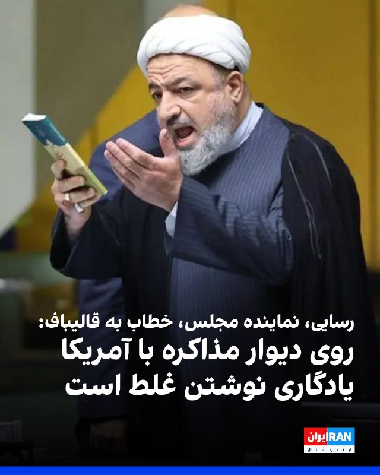

حمید رسایی، عضو مجلس جمهوری اسلامی، در کانال تلگرامی خود خطاب به قالیباف نوشت: «روی دیوار مذاکره با آمریکا، یادگاری نوشتن غلط است. امید بستن به آن هم غلط است. ظریف و روحانی که تازه خدای باج‌دادن و وادادگی در مذاکره بودند هم یک پر کاه از طریق مذاکرات نگرفتند. اشتباه را تکرار نکنید.»
او افزود: «موضع یک ماه و نیم قبل خودتان را هم به یاد دارید؟ قبل از شروع مذاکرات پاکستان، وقتی هرگونه مذاکره با آمریکایی‌ها را مشروط به تحقق دو مسئله دانستید، یعنی آتش‌بس در لبنان و بازگشت دارایی‌های بلوکه شده. پولی که برنگشت، وضعیت لبنان را هم حتما شنیده‌اید. قلعه شقیف و روستای ارنون لبنان سقوط کرد. استان نبطیه و منطقه اقلیم التفاح هم در معرض خطر سقوط هستند.»

https://iranintl.com/202605302857

## FarsiVOA — post 219040

Farsi VOA pinned an audio file

## FarsiVOA — post 219039

  <a href="https://t.me/farsivoa/219039" target="_blank">📎 Download file</a>

🔴📢‌ پادکست خبری جمعه ۸ خرداد ۱۴۰۵

🛜در صورتی که با مشکل اینترنت مواجه هستید میتوانید اخبار صدای آمریکا را از نسخه‌های پادکست خبری ما به صورت صوتی دنبال کنید و یا اخبار را از نسخه سبک وب‌سایت ما پیگیر باشید:
https://ir.voanews.com/lite

📡بروزترین فرکانسهای ماهواره‌ای را نیز میتوانید از صفحه زیر پیگیری کنید:
https://ir.voanews.com/satellite

🔔دیگر شبکه‌های اجتماعی ما را هم دنبال کنید:
https://linktr.ee/voafarsi

با دوستانتان به اشتراک بگذارید
@farsivoa

## FarsiVOA — post 219038

🔺ارتش اسرائیل از رهگیری چند پرتابه از لبنان و انهدام پرتابگر حزب‌الله خبر داد

▪️ارتش اسرائیل اعلام کرد چند پرتابه شلیک‌شده از لبنان به سمت شمال اسرائیل را رهگیری کرده و یک پرتابه نیز در اطراف کریات شمونا فرود آمده است. بنا بر اعلام ارتش اسرائیل، در این حمله گزارشی از تلفات یا مجروحان منتشر نشده است.

▪️در همین راستا ارتش اسرائیل اعلام کرد یک پرتابگر راکتی را که حزب‌الله در حملات شبانه به شمال اسرائیل از آن استفاده کرده بود، منهدم کرده است.

▪️دور تازه حملات از لبنان به شمال اسرائیل نشان می‌دهد جبهه شمالی، همزمان با مذاکرات سیاسی و امنیتی، همچنان فعال و شکننده مانده است؛ وضعیتی که خطر فروپاشی عملی آتش‌بس و گسترش دوباره جنگ در لبنان را افزایش می‌دهد.

⬇️ بیشتر بخوانید:
https://ir.voanews.com/a/idf-destroyed-rocket-launcher-that-hezbollah-used-to-attack-israel-overnight/8155532.html

## BBCPersian — post 282387

  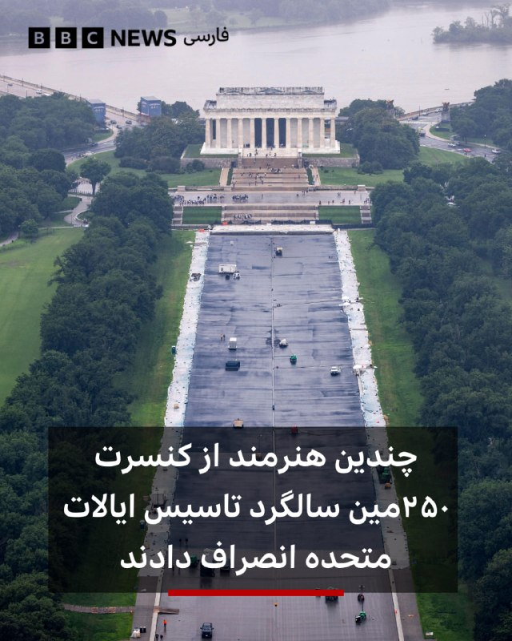

‌ ‌ ‌
چندین هنرمند از برنامه‌ دویست و پنجاهمین سالگرد تولد آمریکا، کنار کشیده‌اند و بسیاری از آنها گفتند که در مورد وابستگی سیاسی این رویداد گمراه شده‌اند.

گروه فریدم ۲۵۰ که گروه پشت صحنه نمایشگاه بزرگ ایالتی آمریکا است، روز چهارشنبه هنرمندانی را که قرار است در این رویداد ۱۶ روزه برنامه اجرا کنند معرفی کرد.

این جشنواره قرار است بین ۲۵ ژوئن تا ۱۰ ژوئیه در نشنال مال در شهر واشنگتن برگزار شود.

هنرمندانی از جمله کومودورس، موریس دی، یانگ ام‌سی، برت مایکلز، خواننده گروه پویزون و مارتینا مک‌براید، خواننده کانتری، همگی از آن زمان اعلام کرده‌اند که در این رویداد شرکت نخواهند کرد.

برگزارکننده، فریدم ۲۵۰ وابستگی سیاسی این نمایشگاه را رد کرده و گفته‌اند که اگرچه به تصمیم هنرمندان برای انصراف احترام می‌گذارد، اما بی‌طرف هستند.

این گروه اعلام کرده است که یک سازمان غیرانتفاعی است که «به اتحاد آمریکایی‌ها در دویست و پنجاهمین سالگرد این کشور اختصاص دارد.»

📷EPA/Shutterstock
@BBCPersian

## alonews — post 123598

  <a href="telegram/content/alonews_123598_1780117964.webm" target="_blank">🎬 Download video</a>

👈 ان‌بی‌سی به نقل از مقامات آمریکایی:
ارتش آمریکا، با وجود انجام عملیات‌های جست‌وجو، تأیید نکرده است که ایران در تنگه هرمز مین کار گذاشته باشد

✅ @AloNews خبر جنگ

## alonews — post 123597

  <a href="telegram/content/alonews_123597_1780117964.webm" target="_blank">🎬 Download video</a>

👈پیشنهاد کیهان برای دریافت عوارض از فیبرهای نوری در تنگه هرمز

🔴روزنامه کیهان پیشنهاد داد از فیبرهای نوری مستقر در کف تنگه هرمز که سرمایه‌ای معادل ۱۰ تریلیون دلار را شامل می‌شود، عوارض دریافت شود.

✅ @AloNews خبر جنگ

## alonews — post 123595

  <a href="telegram/content/alonews_123595_1780117964.mp4" target="_blank">🎬 Download video</a>

👈جنگنده‌های اسرائیل حملات هوایی به ارتفاعات جبل علی الطاهر در جنوب لبنان انجام دادند

✅ @AloNews خبر جنگ

---
📅 بروزرسانی: 1405/03/09 08:32
---

## pm_afshaa — post 91879

🔴نتانیاهو خطاب به لبنان : درخواست اتش بس دولت شمارو رد میکنیم
باید بگم که اسرائیل تا نابودی کامل حزب الله ادامه خواهد داد

💧 Rainbet.com the #1 Non-KYC Crypto Casino & Sportsbook @rainbetcom

😁 @Pm_Afshaa

## pm_afshaa — post 91878

🔴پیت هگست وزیر جنگ آمریکا:ایران بهتره زودتر انتخاب کنه یا مذاکره هسته ای یا جنگ با آمریکا , ایندفه نه بلکه از روی آسمان و دریا از روی زمین هم باید با ما روبرو بشن

💧 Rainbet.com the #1 Non-KYC Crypto Casino & Sportsbook @rainbetcom

😁 @Pm_Afshaa

## RadioFarda — post 157707

  

🔸مرکز عملیات تجارت دریایی بریتانیا و فرماندهی مرکزی نیروهای دریایی آمریکا روز جمعه هشتم خرداد در اطلاعیه‌ای مشترک به شناورها هشدار دادند که فعالیت‌ها در محدوده تنگه هرمز با خطرات حساس امنیتی همراه است.

🔸در این اطلاعیه با اشاره به ادامه محاصره دریایی بنادر ایران و عملیات‌ها در خلیج فارس، خلیج عمان، شمال دریای عرب و تنگه هرمز، به هواپیماها و کشتی‌هایی که قصد عبور از منطقه مشخص شده را دارند، توصیه شده تا با احتیاط حرکت کنند و در صورت امکان از پیمایش در این منطقه خودداری کنند.

🔸این اطلاعیه به کشتی‌هایی که با انجام یا شرکت در انتقال کشتی به کشتی، محاصره را نقض می‌کنند، هشدار داده است که در حال نقض محاصره هستند و اگر فوراً از نیروهای محاصره‌کننده پیروی نکنند شامل اقدامات اجرایی شده و هدف قرار خواهند گرفت.

🔸این اطلاعیه با تاکید بر اینکه وضعیت کنونی تا اطلاع ثانوی ادامه خواهد داشت، هشدار داد هر شناوری که از دستورهای نیروهای آمریکا پیروی نکند، ممکن است تهدیدی قریب‌الوقوع تلقی شود و مطابق حقوق بین‌الملل هدف اقدام متناسب نظامی قرار گیرد.

@RadioFarda

---
📅 بروزرسانی: 1405/03/09 08:22
---

## VahidOOnLine — post 242875

  

البریج کولبی، معاون وزیر جنگ آمریکا، با اشاره به نشست جمعه هیات‌های نظامی اسرائیل و لبنان در پنتاگون برای تعیین مسیر امنیتی حمایت از مذاکرات صلح جاری بین این دو کشور، این نشست را سازنده خواند.
او گفت: «ما مذاکرات نظامی سازنده‌ای داشتیم که مسیر سیاسی به رهبری وزارت خارجه [آمریکا] را در هفته آینده شکل خواهد داد.»
کولبی افزود وزارت جنگ آمریکا «از حاکمیت و تمامیت ارضی لبنان، بدون بازیگران مسلح غیردولتی» و همچنین «تلاش‌های تاریخی برای تحقق چشم‌انداز ترامپ برای صلح» استقبال می‌کند.

‌🏁 🇬🇧 IranintlTV

🤖 @VahidOOnLine

## mamlekate — post 103603

📝 کاخ سفید: ترامپ تنها توافقی را خواهد پذیرفت که خواسته‌های اصلی او را برآورده کند

کاخ سفید در پی جلسه دونالد ترامپ با مشاورانش برای تمدید آتش‌بس با ایران و اتخاذ تصمیم نهایی می‌گوید که او تنها توافقی را خواهد پذیرفت که خواسته‌های اصلی‌اش را برآورده کند. پیشتر آقای ترامپ گفت که توافق با ایران باید شامل تعهد به عدم دستیابی به سلاح هسته‌ای، باز کردن تنگه هرمز بدون دریافت عوارض، مین‌روبی کامل این آبراه و خارج‌سازی ذخایر اورانیوم ‌غنی‌شده با همکاری آمریکا و تحت نظارت آژانس و نابودی این مواد است. او تاکید کرد که «تا اطلاع ثانوی هیچ پولی رد و بدل نخواهد شد.» سخنگوی وزارت خارجه ایران هم اعلام کرد که هنوز هیچ توافقی با آمریکا نهایی نشده است.

📝 اسکات بسنت: املاک مقامات رژیم در اروپا توقیف می‌شود

اسکات بسنت، وزیر خزانه‌داری آمریکا روز جمعه ۸ خرداد گفت ایالات متحده با همکاری شرکای اروپایی در حال پیدا کردن و توقیف «ویلاها، خانه‌ها و املاک» مقامات جمهوری اسلامی در اروپا است. آقای بسنت این سخنان را در «مجمع ملی اقتصادی ریگان ۲۰۲۶» بیان کرد.

📝 پاداش تا سقف ۱۵ میلیون دلار برای اطلاعات دربارهٔ شبکه‌های مالی سپاه

برنامه «پاداش برای عدالت» وزارت امور خارجه آمریکا روز جمعه ۸ خرداد اعلام کرد «هر فردی که درباره شبکه‌های مالی سپاه پاسداران انقلاب اسلامی اطلاعاتی ارائه کند، می‌تواند تا سقف ۱۵ میلیون دلار پاداش دریافت کند.»

@mamlekate

## IranIntlTV — post 339684

  

البریج کولبی، معاون وزیر جنگ آمریکا، با اشاره به نشست جمعه هیات‌های نظامی اسرائیل و لبنان در پنتاگون برای تعیین مسیر امنیتی حمایت از مذاکرات صلح جاری بین این دو کشور، این نشست را سازنده خواند.
او گفت: «ما مذاکرات نظامی سازنده‌ای داشتیم که مسیر سیاسی به رهبری وزارت خارجه [آمریکا] را در هفته آینده شکل خواهد داد.»
کولبی افزود وزارت جنگ آمریکا «از حاکمیت و تمامیت ارضی لبنان، بدون بازیگران مسلح غیردولتی» و همچنین «تلاش‌های تاریخی برای تحقق چشم‌انداز ترامپ برای صلح» استقبال می‌کند.

https://iranintl.com/202605303267

---
📅 بروزرسانی: 1405/03/09 08:13
---

## VahidOOnLine — post 242874

  

آسوشیتدپرس گزارش داد که توافق در حال شکل‌گیری میان آمریکا و جمهوری اسلامی برای پایان دادن به جنگ، با انتقاد شدید بخشی از جمهوری‌خواهان مواجه شده است؛ منتقدانی که هشدار می‌دهند این توافق ممکن است بدون از بین بردن توان هسته‌ای ایران، دستاوردهای نظامی ماه‌های گذشته را از بین ببرد.
به گزارش آسوشیتدپرس، در حالی که دولت ترامپ از نزدیک شدن به چارچوب یک توافق با حکومت ایران خبر می‌دهد، شماری از چهره‌های حزب جمهوری‌خواه این توافق را مورد انتقاد قرار داده و آن را عقب‌نشینی از اهداف اعلام‌شده آمریکا در جنگ با جمهوری اسلامی توصیف کرده‌اند.
بر اساس گزارش ای‌پی، توافقی که هنوز نهایی نشده است، شامل تمدید آتش‌بس، بازگشایی تنگه هرمز و آغاز مذاکرات جدید درباره برنامه هسته‌ای ایران است. در مقابل، حکومت ایران باید مسیر عبور کشتی‌ها از تنگه هرمز را باز نگه دارد و درباره سرنوشت ذخایر اورانیوم غنی‌شده خود وارد مذاکرات تکمیلی شود.
با این حال، منتقدان جمهوری‌خواه ترامپ می‌گویند این چارچوب ممکن است به حکومت ایران فرصت دهد بدون برچیدن کامل برنامه هسته‌ای خود، از کاهش فشارهای اقتصادی و سیاسی بهره‌مند شود.
ادامه مطلب را اینجا بخوانید:
h
‌🏁 🇬🇧 IranintlTV

🤖 @VahidOOnLine

## IranIntlTV — post 339683

  

آسوشیتدپرس گزارش داد که توافق در حال شکل‌گیری میان آمریکا و جمهوری اسلامی برای پایان دادن به جنگ، با انتقاد شدید بخشی از جمهوری‌خواهان مواجه شده است؛ منتقدانی که هشدار می‌دهند این توافق ممکن است بدون از بین بردن توان هسته‌ای ایران، دستاوردهای نظامی ماه‌های گذشته را از بین ببرد.
به گزارش آسوشیتدپرس، در حالی که دولت ترامپ از نزدیک شدن به چارچوب یک توافق با حکومت ایران خبر می‌دهد، شماری از چهره‌های حزب جمهوری‌خواه این توافق را مورد انتقاد قرار داده و آن را عقب‌نشینی از اهداف اعلام‌شده آمریکا در جنگ با جمهوری اسلامی توصیف کرده‌اند.
بر اساس گزارش ای‌پی، توافقی که هنوز نهایی نشده است، شامل تمدید آتش‌بس، بازگشایی تنگه هرمز و آغاز مذاکرات جدید درباره برنامه هسته‌ای ایران است. در مقابل، حکومت ایران باید مسیر عبور کشتی‌ها از تنگه هرمز را باز نگه دارد و درباره سرنوشت ذخایر اورانیوم غنی‌شده خود وارد مذاکرات تکمیلی شود.
با این حال، منتقدان جمهوری‌خواه ترامپ می‌گویند این چارچوب ممکن است به حکومت ایران فرصت دهد بدون برچیدن کامل برنامه هسته‌ای خود، از کاهش فشارهای اقتصادی و سیاسی بهره‌مند شود.
ادامه مطلب را اینجا بخوانید:
h

## Persian_Trend_Official — post 15307

  <a href="telegram/content/Persian_Trend_Official_15307_1780116195.mp4" target="_blank">🎬 Download video</a>

صبحتون بخیر 🌄
Mig-31 Foxhound

📌 @persian_trend_official
پرشین ترند | متفاوت‌ترین کانال نظامی

## BBCPersian — post 282386

  

‌ ‌ ‌
بی‌بی‌سی دریافته است که اوکراین از نسل جدیدی از پهپادهای مجهز به هوش مصنوعی برای افزایش حملات خود به اهداف روسی استفاده می‌کند.

با استفاده از این نسل جدید پهپادها، حملات علیه وسایل نقلیه و لجستیک در مناطق جنوبی اشغال شده اوکراین افزایش یافته و همین امر ممکن است تدارکات به خط مقدم را مختل کند.

این پهپادها وسایل نقلیه‌ای را که بین شهرهای اوکراین در امتداد مسیر اصلی متصل کننده روسیه به شبه‌جزیره کریمه حرکت می‌کنند را هدف قرار می‌دهد.

تحلیلگران می‌گویند پهپاد هورنت مجهز به هوش مصنوعی اوکراین با استفاده از هزاران ساعت ویدیو برای شناسایی اهداف نظامی روسیه آموزش دیده است.

📷Reuters
@BBCPersian

---
📅 بروزرسانی: 1405/03/09 08:02
---

## VahidOOnLine — post 242873

  

نیکی هیلی، سفیر پیشین آمریکا در سازمان ملل، با هشدار درباره سیاست وقت‌کشی جمهوری اسلامی در مذاکرات، در ایکس نوشت: « تا زمانی که به مواد هسته‌ای آنها دسترسی کامل و کنترل داشته باشیم، ما نباید دارایی‌ها را آزاد کنیم یا تحریم‌ها را لغو کنیم.»
او گفت: «حکومت ایران هرگز بر اساس حسن نیت عمل نکرده است. همیشه همان بازی را ادامه می‌دهد: وقت‌کشی، خریدن زمان، تغییر موضع.»

‌🏁 🇬🇧 IranintlTV

🤖 @VahidOOnLine

## VahidOnline — post 75800

  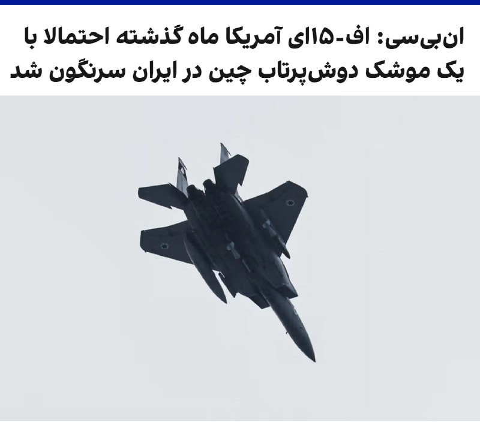

ان‌بی‌سی به نقل از سه منبع آگاه گزارش داد جنگنده اف-۱۵ای آمریکا که ماه گذشته در ایران سرنگون شد، احتمالا با یک موشک دوش‌پرتاب ساخت چین هدف قرار گرفته است.

به گفته یکی از این منابع و یک مقام آمریکایی آگاه، چین همچنین ممکن است در روزهای نخست درگیری، یک رادار هشداردهنده دوربرد را در اختیار ایران قرار داده باشد که این رادار توانایی شناسایی هواپیماهای رادارگریز را دارد.

ان‌بی‌سی نوشت مقام‌های آمریکایی همچنان در حال بررسی سرنگونی جنگنده اف-۱۵ای هستند و هنوز روشن نیست تجهیزات نظامی احتمالی چه زمانی به تهران تحویل داده شده است.

کاخ سفید به ان‌بی‌سی گفت شی جین‌پینگ به ترامپ اطمینان داده پکن تجهیزات نظامی به ایران نمی‌دهد. سخنگوی سفارت چین در واشینگتن نیز گفت پکن صادرات نظامی را «با احتیاط و مسئولیت‌پذیری» کنترل می‌کند و با «تهمت بی‌اساس» مخالف است.
@VahidOOnLine

📡 @VahidOnline

## IranIntlTV — post 339682

  

نیکی هیلی، سفیر پیشین آمریکا در سازمان ملل، با هشدار درباره سیاست وقت‌کشی جمهوری اسلامی در مذاکرات، در ایکس نوشت: « تا زمانی که به مواد هسته‌ای آنها دسترسی کامل و کنترل داشته باشیم، ما نباید دارایی‌ها را آزاد کنیم یا تحریم‌ها را لغو کنیم.»
او گفت: «حکومت ایران هرگز بر اساس حسن نیت عمل نکرده است. همیشه همان بازی را ادامه می‌دهد: وقت‌کشی، خریدن زمان، تغییر موضع.»

https://iranintl.com/202605304244

---
📅 بروزرسانی: 1405/03/09 07:53
---

## VahidOOnLine — post 242872

  

ان‌بی‌سی به نقل از سه منبع آگاه گزارش داد جنگنده اف-۱۵ای آمریکا که ماه گذشته در ایران سرنگون شد، احتمالا با یک موشک دوش‌پرتاب ساخت چین هدف قرار گرفته است.
به گفته یکی از این منابع و یک مقام آمریکایی آگاه، چین همچنین ممکن است در روزهای نخست درگیری، یک رادار هشداردهنده دوربرد را در اختیار ایران قرار داده باشد که این رادار توانایی شناسایی هواپیماهای رادارگریز را دارد.
ان‌بی‌سی نوشت مقام‌های آمریکایی همچنان در حال بررسی سرنگونی جنگنده اف-۱۵ای هستند و هنوز روشن نیست تجهیزات نظامی احتمالی چه زمانی به تهران تحویل داده شده است.
کاخ سفید به ان‌بی‌سی گفت شی جین‌پینگ به ترامپ اطمینان داده پکن تجهیزات نظامی به ایران نمی‌دهد. سخنگوی سفارت چین در واشینگتن نیز گفت پکن صادرات نظامی را «با احتیاط و مسئولیت‌پذیری» کنترل می‌کند و با «تهمت بی‌اساس» مخالف است.

‌🏁 🇬🇧 IranintlTV

🤖 @VahidOOnLine

## IranIntlTV — post 339681

  

ان‌بی‌سی به نقل از سه منبع آگاه گزارش داد جنگنده اف-۱۵ای آمریکا که ماه گذشته در ایران سرنگون شد، احتمالا با یک موشک دوش‌پرتاب ساخت چین هدف قرار گرفته است.
به گفته یکی از این منابع و یک مقام آمریکایی آگاه، چین همچنین ممکن است در روزهای نخست درگیری، یک رادار هشداردهنده دوربرد را در اختیار ایران قرار داده باشد که این رادار توانایی شناسایی هواپیماهای رادارگریز را دارد.
ان‌بی‌سی نوشت مقام‌های آمریکایی همچنان در حال بررسی سرنگونی جنگنده اف-۱۵ای هستند و هنوز روشن نیست تجهیزات نظامی احتمالی چه زمانی به تهران تحویل داده شده است.
کاخ سفید به ان‌بی‌سی گفت شی جین‌پینگ به ترامپ اطمینان داده پکن تجهیزات نظامی به ایران نمی‌دهد. سخنگوی سفارت چین در واشینگتن نیز گفت پکن صادرات نظامی را «با احتیاط و مسئولیت‌پذیری» کنترل می‌کند و با «تهمت بی‌اساس» مخالف است.

https://iranintl.com/202605301515

---
📅 بروزرسانی: 1405/03/09 07:42
---

## RadioFarda — post 157706

  <a href="https://t.me/radiofarda/157706" target="_blank">📎 Download file</a>

📻بشنوید: سرخط خبرها با رادیوفردا، نهم خرداد ۱۴۰۵‌

@RadioFarda

## BBCPersian — post 282385

  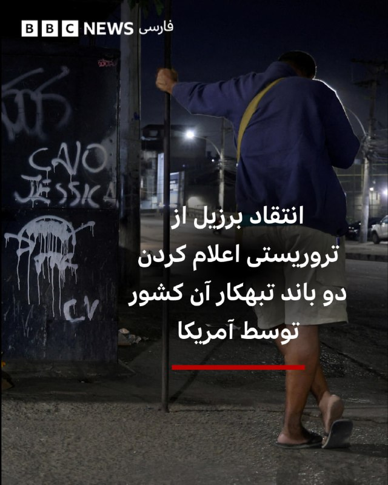

‌ ‌ ‌
لوئیز ایناسیو لولا دا سیلوا، رئیس جمهور برزیل، تصمیم دولت ایالات متحده برای تعیین دو باند بزرگ جرایم سازمان یافته کشورش به عنوان گروه‌های تروریستی خارجی را محکوم کرد.

آقای لولا روز جمعه در سخنانی خشمگین، واشنگتن را به بازی با حاکمیت برزیل و رفتار با این کشور مانند یک جمهوری بی‌ارزش، متهم کرد.

برازیلیا مدت‌هاست که با تروریست خواندن این گروه‌ها با نام‌های فرماندهی سرخ و فرماندهی اول پایتخت، مخالفت کرده و اصرار دارد که مداخله ایالات متحده ضروری نیست.

با این حال، واشنگتن می‌گوید دامنه فعالیت این باندها اکنون در سراسر منطقه و به داخل ایالات متحده گسترش یافته است.

📷Reuters
@BBCPersian

## alonews — post 123594

  <a href="telegram/content/alonews_123594_1780114365.webm" target="_blank">🎬 Download video</a>

👈وزیر خارجه پاکستان: ابداً قرار نیست اسرائیل را به رسمیت بشناسیم

✅ @AloNews خبر جنگ

---
📅 بروزرسانی: 1405/03/09 07:33
---

هیچ پیام جدیدی در این بروزرسانی ارسال نشد.

---
📅 بروزرسانی: 1405/03/09 07:22
---

هیچ پیام جدیدی در این بروزرسانی ارسال نشد.

---
📅 بروزرسانی: 1405/03/09 07:12
---

## VahidOOnLine — post 242871

  

نیروهای دریایی آمریکا و بریتانیا در اطلاعیه‌ای با اشاره به تلاش جمهوری اسلامی برای اختلال در روند پاکسازی مین و عبور ایمن در تنگه هرمز و ادامه عملیات نظامی در شمال این تنگه در نزدیکی شبه‌جزیره مسندم عمان، به شناورها هشدار دادند که فعالیت‌ها در این منطقه با خطرات حساس امنیتی همراه است.
مرکز عملیات تجارت دریایی بریتانیا و فرماندهی مرکزی نیروهای دریایی آمریکا روز جمعه با صدور اطلاعیه‌ای هشدار دادند جمهوری اسلامی همچنان در تلاش است روند پاکسازی مین و عبور ایمن در تنگه هرمز را مختل کند و نیروهای آمریکایی فعال در تنگه هرمز در آماده‌باش بالا در برابر حمله ایران هستند.
این اطلاعیه با اشاره به ادامه عملیات نظامی در شمال تنگه هرمز در نزدیکی شبه‌جزیره مسندم عمان، از دریانوردان خواست با رعایت نهایت احتیاط و پیگیری هشدارهای رادیویی، عبور خود از این منطقه را با واحد راهنمایی کشتیرانی نیروی دریایی آمریکا هماهنگ کنند.
این اطلاعیه با تاکید بر اینکه وضعیت کنونی تا اطلاع ثانوی ادامه خواهد داشت، هشدار داد هر شناوری که از دستورهای نیروهای آمریکا پیروی نکند، ممکن است تهدیدی فوری تلقی شود و هدف اقدام نظامی متناسب قرار گیرد.
https:
‌🏁 🇬🇧 IranintlTV

🤖 @VahidOOnLine

## alonews — post 123592

  <a href="telegram/content/alonews_123592_1780112559.webm" target="_blank">🎬 Download video</a>

👈فرماندهی مرکزی نیروی دریایی ایالات متحده به دریانوردان و پرسنل نیروی هوایی هشدار داده است که سنتکام در تنگه هرمز، در شمال "شبه جزیره مسندم" عمان که در وسط تنگه واقع شده است، عملیات نظامی انجام خواهد داد.

🔴فرماندهی مرکزی نیروی دریایی ایالات متحده به دریانوردان توصیه کرده است که هنگام عبور از تنگه هرمز با ایالات متحده همکاری کنند. فرماندهی مرکزی نیروی دریایی ایالات متحده همچنین اعلام کرده است که هر شناوری که در حال انجام یا حمایت از فعالیت‌های مین‌گذاری دیده شود، توسط ایالات متحده هدف قرار خواهد گرفت.

✅ @AloNews خبر جنگ

---
📅 بروزرسانی: 1405/03/09 07:03
---

## VahidOOnLine — post 242870

  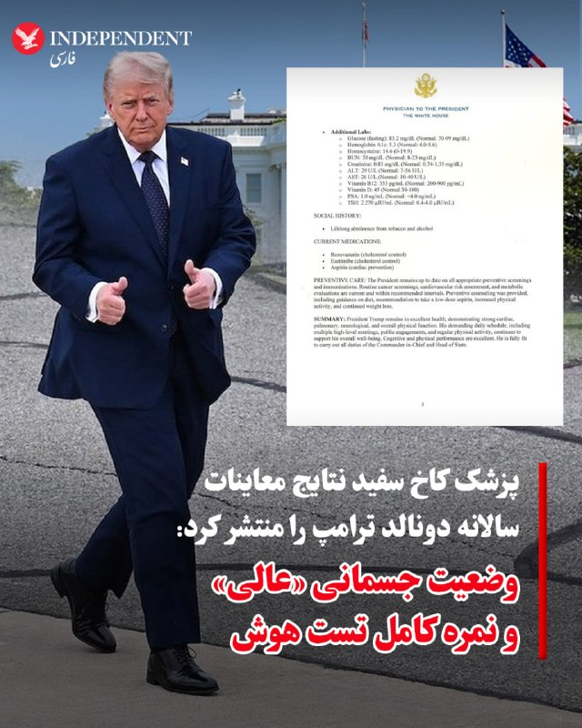

♦️دکتر شان باربابلا، پزشک مخصوص رئیس‌جمهوری آمریکا، با انتشار یادداشتی رسمی از نتایج معاینات سالانه دونالد ترامپ خبر داد و اعلام کرد که رئیس‌جمهوری ۷۹ ساله ایالات متحده در وضعیت «سلامت عالی» به سر می‌برد و کاملا برای ایفای وظایف خود آماده است. بر اساس این گزارش تفصیلی، ترامپ که در تاریخ پنجم خردادماه در مرکز پزشکی نظامی «والتر رید» تحت آزمایش‌های جامع قرار گرفته، عملکرد بسیار قدرتمندی در بخش‌های قلبی، ریوی و عصبی نشان داده و در ارزیابی‌های شناختی و تست هوش نمره کامل ۳۰ از ۳۰ را کسب کرده است. در این گزارش رسمی با اشاره به پرهیز دائمی او از الکل و دخانیات و به‌روز بودن واکسیناسیون‌ها، وجود جای زخم در گوش راست او ناشی از جراحت گلوله (سوءقصد گذشته) نیز رسما مستند و تایید شده است.
‌🇸🇦 Indypersian

🤖 @VahidOOnLine

## IranIntlTV — post 339680

  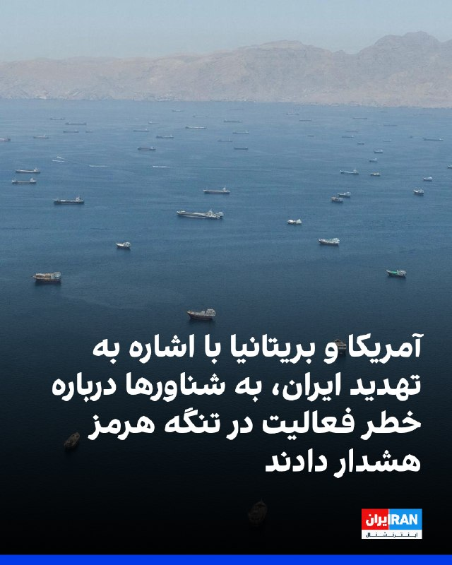

نیروهای دریایی آمریکا و بریتانیا در اطلاعیه‌ای با اشاره به تلاش جمهوری اسلامی برای اختلال در روند پاکسازی مین و عبور ایمن در تنگه هرمز و ادامه عملیات نظامی در شمال این تنگه در نزدیکی شبه‌جزیره مسندم عمان، به شناورها هشدار دادند که فعالیت‌ها در این منطقه با خطرات حساس امنیتی همراه است.
مرکز عملیات تجارت دریایی بریتانیا و فرماندهی مرکزی نیروهای دریایی آمریکا روز جمعه با صدور اطلاعیه‌ای هشدار دادند جمهوری اسلامی همچنان در تلاش است روند پاکسازی مین و عبور ایمن در تنگه هرمز را مختل کند و نیروهای آمریکایی فعال در تنگه هرمز در آماده‌باش بالا در برابر حمله ایران هستند.
این اطلاعیه با اشاره به ادامه عملیات نظامی در شمال تنگه هرمز در نزدیکی شبه‌جزیره مسندم عمان، از دریانوردان خواست با رعایت نهایت احتیاط و پیگیری هشدارهای رادیویی، عبور خود از این منطقه را با واحد راهنمایی کشتیرانی نیروی دریایی آمریکا هماهنگ کنند.
این اطلاعیه با تاکید بر اینکه وضعیت کنونی تا اطلاع ثانوی ادامه خواهد داشت، هشدار داد هر شناوری که از دستورهای نیروهای آمریکا پیروی نکند، ممکن است تهدیدی فوری تلقی شود و هدف اقدام نظامی متناسب قرار گیرد.
https:

---
📅 بروزرسانی: 1405/03/09 06:52
---

## BBCPersian — post 282384

🔻 هشدار صندوق بین‌المللی پول و بانک جهانی نسبت به پیامدهای اقتصادی جنگ خاورمیانه

روسای آژانس بین‌المللی انرژی، صندوق بین‌المللی پول، بانک جهانی و سازمان تجارت جهانی روز جمعه هشدار دادند که جنگ در خاورمیانه عرضه جهانی انرژی را تحت فشار قرار داده و بیشترین آسیب را به اقتصادهای آسیب‌پذیر وارد کرده است.

به گفته این نهادها، جنگ آمریکا و اسرائیل با ایران باعث اختلال در تجارت، نوسان در بازارهای مالی و افزایش نگرانی‌ها درباره عرضه جهانی انرژی، به‌ویژه از طریق تنگه هرمز، شده است؛ آبراهی که یکی از مهم‌ترین مسیرهای انتقال نفت و گاز در جهان به شمار می‌رود.

به گزارش رویترز، این نهادها در بیانیه‌ای مشترک اعلام کردند که اقتصاد جهانی همچنان از خود تاب‌آوری نشان داده است، اما کشورهای فقیرتر به‌طور نامتناسبی تحت تاثیر افزایش قیمت سوخت و کود شیمیایی، افزایش نااطمینانی و تهدید مشاغل قرار گرفته‌اند.

روسای این سازمان‌ها برای بررسی نحوه واکنش به پیامدهای اقتصادی جنگ تشکیل جلسه دادند.

در این بیانیه همچنین آمده است: «اگر جریان کشتیرانی به وضعیت عادی بازنگردد، کاهش سریع ذخایر جهانی نفت در آستانه اوج تقاضای تابستانی در نیمکره شمالی، خطرهای فزاینده‌ای برای امنیت تامین سوخت، شرایط بازارها و تاب‌آوری اقتصاد جهانی ایجاد خواهد کرد.»

https://bbc.in/4u10Dul
@BBCPersian

---
📅 بروزرسانی: 1405/03/09 06:42
---

## VahidOOnLine — post 242869

  

بر اساس گزارشی از نیویورک‌تایمز، گروهی پرصدای از تندروهای ایرانی در تلاش‌اند مذاکرات با ایالات متحده را مختل کنند؛

این گزارش می‌گوید چهره‌های تندرو در مجلس، رسانه‌های حکومتی و شورای عالی امنیت ملی، با وجود حمایت رهبری ایران از مذاکرات، از طریق تجمع‌ها، کارزارهای رسانه‌ای و فشار سیاسی، علنا با دادن امتیاز به واشینگتن مخالفت کرده‌اند.

به نوشته این روزنامه، مسعود پزشکیان، رییس‌جمهوری ایران، اخیرا از تلویزیون دولتی انتقاد کرده که مذاکرات را شکست‌خورده نشان می‌دهد و شکاف‌ها را عمیق‌تر می‌کند؛ در حالی که تیم مذاکره‌کننده ایران گفت‌وگوها با ایالات متحده را ادامه داده است.

این گزارش به نقل از تحلیلگران و مقام‌ها نوشت اردوگاه تندروها نماینده دیدگاه اقلیت است، اما همچنان در بخش‌هایی از ساختار سیاسی و میان حامیان جمهوری اسلامی نفوذ دارد.

نیویورک‌تایمز همچنین از تنش میان چهره‌های تندرو و اعضای تیم مذاکره‌کننده بر سر مسیر گفت‌وگوها با واشینگتن خبر داد.
‌🏁 🇬🇧 IranintlTV

🤖 @VahidOOnLine

## IranIntlTV — post 339679

  

بر اساس گزارشی از نیویورک‌تایمز، گروهی پرصدای از تندروهای ایرانی در تلاش‌اند مذاکرات با ایالات متحده را مختل کنند؛

این گزارش می‌گوید چهره‌های تندرو در مجلس، رسانه‌های حکومتی و شورای عالی امنیت ملی، با وجود حمایت رهبری ایران از مذاکرات، از طریق تجمع‌ها، کارزارهای رسانه‌ای و فشار سیاسی، علنا با دادن امتیاز به واشینگتن مخالفت کرده‌اند.

به نوشته این روزنامه، مسعود پزشکیان، رییس‌جمهوری ایران، اخیرا از تلویزیون دولتی انتقاد کرده که مذاکرات را شکست‌خورده نشان می‌دهد و شکاف‌ها را عمیق‌تر می‌کند؛ در حالی که تیم مذاکره‌کننده ایران گفت‌وگوها با ایالات متحده را ادامه داده است.

این گزارش به نقل از تحلیلگران و مقام‌ها نوشت اردوگاه تندروها نماینده دیدگاه اقلیت است، اما همچنان در بخش‌هایی از ساختار سیاسی و میان حامیان جمهوری اسلامی نفوذ دارد.

نیویورک‌تایمز همچنین از تنش میان چهره‌های تندرو و اعضای تیم مذاکره‌کننده بر سر مسیر گفت‌وگوها با واشینگتن خبر داد.
https://iranintl.com/202605307153

## BBCPersian — post 282383

🔻 روبیو: تام باراک همچنان در پرونده‌های سوریه و عراق نقش محوری خواهد داشت

مارکو روبیو، وزیر خارجه آمریکا از پایان ماموریت تام باراک به‌عنوان نماینده ویژه آمریکا در سوریه خبر داد.

او در شبکه ایکس نوشت: «سفیر باراک در مقام نماینده ویژه آمریکا در امور سوریه نقشی بسیار ارزشمند ایفا کرده است.»

آقای روبیو افزود: «اگرچه این سمت اکنون به پایان می‌رسد، او همچنان در دولت ترامپ نقش مهمی در ارتباط با سوریه و عراق خواهد داشت؛ جایی که تخصص، روابط و درک او از سیاست "اول آمریکا" همچنان به کسب دستاوردهایی برای کشورمان کمک خواهد کرد.»

https://bbc.in/4u7f0xb
@BBCPersian

---
📅 بروزرسانی: 1405/03/09 06:33
---

## BBCPersian — post 282373

‌ ‌ ‌ ‌
پهپادهای مجهز به فیبر نوری به سلاح اصلی حزب‌الله علیه سربازان و غیرنظامیان اسرائیلی در دو سوی مرز لبنان تبدیل شده‌اند و با ادامه درگیری‌ها، در حالی که شش هفته از آتش‌بس اعلام‌شده می‌گذرد، اکنون به‌عنوان بزرگ‌ترین تهدید در این منطقه شناخته می‌شوند.

روز چهارشنبه، یک سرباز اسرائیلی در حمله پهپادی نزدیک شهرک مرزی شومرا کشته و دو سرباز دیگر زخمی شدند.

از میان ۱۱ سرباز اسرائیلی و یک پیمانکار غیرنظامی دفاعی که از زمان اجرایی شدن آتش‌بس کشته شده‌اند، هشت نفر بر اثر حملات پهپادهای فیبر نوری جان باخته‌اند.

بیشتر این حملات نیروهای اسرائیلی را هدف گرفته‌اند. نیروهایی که در حال حاضر بخش وسیعی از جنوب لبنان را در اشغال دارند. اما به گفته مرکز تحقیقاتی آلما، اندیشکده‌ای اسرائیلی که این درگیری را زیر نظر دارد، حزب‌الله به‌طور فزاینده‌ای شهرک‌های اسرائیلی آن سوی مرز را نیز هدف قرار می‌دهد.

https://bbc.in/3RGOME8
📸GettyImages/ Reuters/ Anadolu via Getty Images/ EPA/Shutterstock/ AFP via Getty Images
@BBCPersian

---
📅 بروزرسانی: 1405/03/09 06:23
---

## VahidOOnLine — post 242868

  <a href="telegram/content/VahidOOnLine_242868_1780109580.mp4" target="_blank">🎬 Download video</a>

♦️ستاد فرماندهی جنوبی ارتش آمریکا (SOUTHCOM) با انتشار ویدیویی در اکس اعلام کرد نیروهای مشترک «نیزه جنوبی» روز ۸ خرداد، به دستور ژنرال فرانسیس داناون، فرمانده این ستاد، به یک قایق مرتبط با کارتل‌های مواد مخدر در شرق اقیانوس آرام حمله کردند.
بر اساس این بیانیه، در جریان این حمله هدفمند و مرگبار، سه نفر از «تروریست‌های قاچاقچی» کشته شدند. ارتش آمریکا همچنین اعلام کرد هیچ‌یک از نیروهای این کشور در جریان این عملیات آسیب ندیدند.
‌🇸🇦 Indypersian

🤖 @VahidOOnLine

---
📅 بروزرسانی: 1405/03/09 06:13
---

## FarsiVOA — post 219037

  

⚡️مقامات نظامی اسرائیل و لبنان روز جمعه در واشنگتن به میزبانی وزارت جنگ آمریکا مذاکره کردند. البریدج کولبی، معاون وزیر جنگ آمریکا این گفت‌وگوها را «سازنده‌» خواند و افزود که این دیدار مکمل گفتگوهای دیپلماتیک آینده خواهد بود.
@FarsiVOA

---
📅 بروزرسانی: 1405/03/09 06:03
---

## VahidOOnLine — post 242867

  <a href="telegram/content/VahidOOnLine_242867_1780108395.mp4" target="_blank">🎬 Download video</a>

♦️پیت هگست، وزیر جنگ ایالات متحده، روز جمعه در نشست دفاعی برتر آسیا در سنگاپور با نقل قول از اظهارات اخیر دونالد ترامپ در جلسه کابینه دولت، به تهران هشدار داد و اعلام کرد: «رئیس‌جمهور آمریکا تاکید کرده است که اگر ایران نخواهد یک توافق عالی را برای تضمین عدم دستیابی به سلاح هسته‌ای امضا کند، باید با وزارت جنگ معامله کند.» هگست با جدی خواندن این موضع و تاکید بر آمادگی نظامی واشنگتن افزود: «توانایی ما برای ازسرگیری درگیری‌ها در صورت نیاز، بیش از حد کفایت است؛ ما ذخایر تسلیحاتی کاملا مناسب و پیشرفته‌ای در سراسر جهان داریم و اکنون در موقعیت نظامی بسیار قدرتمندی قرار گرفته‌ایم.»
‌🇸🇦 Indypersian

🤖 @VahidOOnLine

## VahidOOnLine — post 242866

  

پیت هگست، وزیر جنگ آمریکا، در نشست امنیتی گفت‌وگوی شانگری‌لا در سنگاپور گفت: «کشورهایی که فکر می‌کنند می‌توانند همچنان از سخاوت مالیات‌دهندگان آمریکایی سواری مجانی بگیرند، همین حالا بشنوند؛ آن روزها به پایان رسیده است.»
او گفت متحدانی که از افزایش سهم خود و پذیرش مسئولیتشان خودداری کنند، با تغییری روشن در نحوه همکاری آمریکا روبه‌رو خواهند شد.
هگست تاکید کرد اولویت آمریکا بر همکاری با متحدانی است که توانمندتر، واقع‌بین و آماده هستند.
او با اشاره به اینکه ترامپ امسال ۱.۵ تریلیون دلار سرمایه‌گذاری نسلی در حوزه دفاع انجام خواهد داد، از متحدان و شرکای آمریکا خواست ۳.۵ درصد از تولید ناخالص داخلی خود را به هزینه‌های دفاعی اختصاص دهند.
هگست گفت آمریکا در حال اجرای بسیج تاریخی ملی برای تقویت پایه صنعتی دفاعی خود است.

‌🏁 🇬🇧 IranintlTV

🤖 @VahidOOnLine

## FarsiVOA — post 219036

🔺وزیر جنگ آمریکا: توانایی ازسرگیری عملیات نظامی علیه جمهوری اسلامی را داریم؛ وضعیت مهمات ما بیش‌ از اندازه مناسب است

▪️پیت هگست، وزیر جنگ آمریکا، روز شنبه ۹ خرداد در نشست دفاعی «دیالوگ شانگری-لا ۲۰۲۶» در سنگاپور گفت ایالات متحده همچنان «تعهدات جهانی» خود را حفظ کرده است و از جمله این تعهدات را جلوگیری از دستیابی جمهوری اسلامی به سلاح هسته‌ای خواند و گفت واشنگتن روی این تعهد متمرکز است.

⬇️ بیشتر بخوانید:
https://ir.voanews.com/a/8155529.html
@FarsiVOA

## BBCPersian — post 282372

  

🔻 هگست: آمریکا کاملا توان از سرگیری جنگ با ایران را دارد

پیت هگست، وزیر دفاع آمریکا، روز شنبه در سنگاپور گفت که کشورش ذخایر تسلیحاتی «بیش از حد کافی» در اختیار دارد و در صورت لزوم «کاملا توان» ازسرگیری جنگ با ایران را دارد.

او در نشست امنیتی شانگری-لا، مهم‌ترین مجمع دفاعی آسیا، گفت: «توانایی ما برای ازسرگیری عملیات در صورت لزوم کاملا وجود دارد. ذخایر تسلیحاتی ما برای چنین اقدامی کاملا کافی است؛ چه در منطقه و چه در سایر نقاط جهان، به دلیل توازنی که میان تسلیحات پیشرفته و مهمات در مقیاس گسترده برقرار کرده‌ایم.»

https://bbc.in/4fgAm7s
@BBCPersian

## BBCPersian — post 282371

🔻 واکنش نهاد مدیریت آبراه خلیج فارس به تحریم آمریکا

نهاد مدیریت آبراه خلیج فارس در اطلاعیه‌ای که رسانه‌های ایران منتشر کرده‌اند به تحریم این نهاد از سوی آمریکا واکنش نشان داد و این اقدام را محکوم کرد.

این نهاد نوشت:‌ «تحریم‌شدن توسط کشوری را که رئیس آن به دزدی دریایی افتخار می‌کند، نشانه‌ای از عملکرد مثبت خود می‌داند.»

نهاد مدیریت آبراه خلیج فارس همچنین می‌گوید که «تسلط بر تنگه هرمز را که در میدان و دیپلماسی به دست نیاوردید، با تحریم هم به دست نخواهید آورد.»

این نهاد تاکید کرده است که همچنان برای «تسهیل تردد، بی‌وقفه به بررسی و ارائه مجوز عبور به شناورهای غیرمتخاصم ادامه می‌دهد.»

وزارت دارایی آمریکا دیروز در بیانیه‌اش تاسیس این نهاد را تلاش سپاه پاسداران برای «کسب درآمد از عبور شناورها از تنگه هرمز» خواند و «تمام کسانی را که با این نهاد همکاری می‌کنند» را در فهرست تحریم‌های خود قرار داد.

ایران پس از بستن تنگه هرمز و محاصره بنادرش توسط آمریکا، این نهاد را برای نظارت و هماهنگی عبور شناورها با آن کشور تاسیس کرده است.

https://bbc.in/4u9mC1X
@BBCPersian

---
📅 بروزرسانی: 1405/03/09 05:53
---

## FoxNewsTwitter — post 342418

  <a href="telegram/content/FoxNewsTwitter_342418_1780107801.mp4" target="_blank">🎬 Download video</a>

Fox News (Twitter/X)

KAYLEE MCGHEE WHITE: “The Biden years weren't an aberration, they weren't an accident. They were the blueprint. They were exactly what Democrats plan to do every single time they regain power.” https://twitter.com/IngrahamAngle/status/2060512372586909976#m

## IranIntlTV — post 339678

  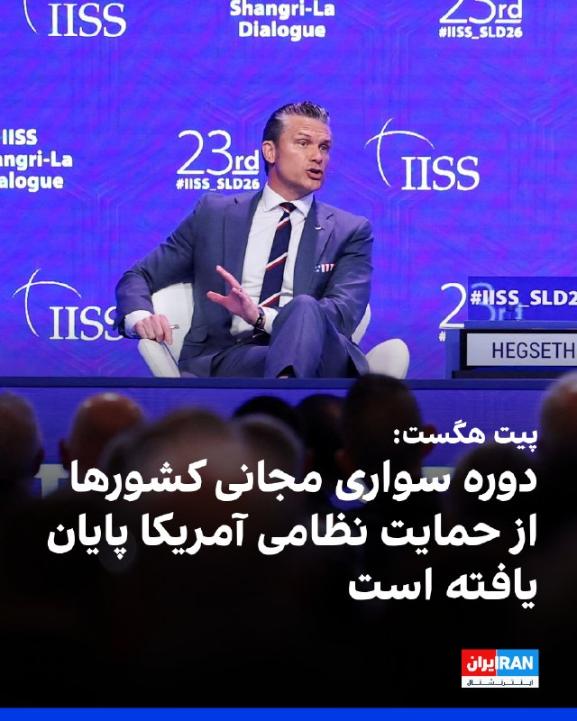

پیت هگست، وزیر جنگ آمریکا، در نشست امنیتی گفت‌وگوی شانگری‌لا در سنگاپور گفت: «کشورهایی که فکر می‌کنند می‌توانند همچنان از سخاوت مالیات‌دهندگان آمریکایی سواری مجانی بگیرند، همین حالا بشنوند؛ آن روزها به پایان رسیده است.»
او گفت متحدانی که از افزایش سهم خود و پذیرش مسئولیتشان خودداری کنند، با تغییری روشن در نحوه همکاری آمریکا روبه‌رو خواهند شد.
هگست تاکید کرد اولویت آمریکا بر همکاری با متحدانی است که توانمندتر، واقع‌بین و آماده هستند.
او با اشاره به اینکه ترامپ امسال ۱.۵ تریلیون دلار سرمایه‌گذاری نسلی در حوزه دفاع انجام خواهد داد، از متحدان و شرکای آمریکا خواست ۳.۵ درصد از تولید ناخالص داخلی خود را به هزینه‌های دفاعی اختصاص دهند.
هگست گفت آمریکا در حال اجرای بسیج تاریخی ملی برای تقویت پایه صنعتی دفاعی خود است.

https://iranintl.com/202605308362

---
📅 بروزرسانی: 1405/03/09 05:43
---

## VahidOOnLine — post 242865

  

♦️پیت هگست، وزیر جنگ ایالات متحده، روز جمعه، با تاکید بر قدرت نظامی واشنگتن در قبال تهران اعلام کرد: «در صورت لزوم، توانایی ما برای آغاز مجدد و ازسرگیری درگیری با ایران، بیش از حد تصور و کاملا آماده و توانمند است. با این حال، هرگونه توافقی با ایران یک توافق خوب خواهد بود.» هگست با اشاره به مواضع کاخ سفید در قبال پرونده هسته‌ای افزود که ایالات متحده همچنان تعهدات جهانی دارد تا تضمین کند کشورهایی مانند ایران هرگز به سلاح هسته‌ای دست پیدا نخواهند کرد.
‌🇸🇦 Indypersian

🤖 @VahidOOnLine

---
📅 بروزرسانی: 1405/03/09 05:33
---

## BBCPersian — post 282361

‌ ‌ ‌ ‌
شصتمین سالگرد انقلاب فرهنگی چین فرارسیده است؛ رویدادی مهم که این کشور را به‌مدت یک دهه دچار بحران و آشفتگی کرد.

در ۱۶ مه ۱۹۶۶، مائو تسه‌تونگ، رهبر کمونیست چین، کارزاری را برای پاکسازی کشور از نفوذ سرمایه‌داری و تفکر بورژوایی آغاز کرد و همزمان در پی حذف رقبای خود برآمد.

سازمانی از جوانان به نام گاردهای سرخ در سراسر کشور شکل گرفت که آموزه‌های مائو تسه‌تونگ را تبلیغ می‌کرد.

آن‌ها میراث فرهنگی را نابود کردند و بازجویی، تحقیر و کتک‌زدن معلمان، روشنفکران و دشمنان سنتی حکومت را هدایت کردند.

این انقلاب میلیون‌ها نفر را آواره کرد و بنا بر برآوردها بین ۵۰۰ هزار تا دو میلیون نفر کشته شدند. سال‌های آشوب و خونریزی تنها با مرگ مائو در سال ۱۹۷۶ پایان یافت.

https://bbc.in/3QcM4Wu
📷 Getty/ ullstein bild via Getty Images/ BBC
@BBCPersian

---
📅 بروزرسانی: 1405/03/09 05:23
---

## VahidOOnLine — post 242864

  

پیت هگست، وزیر جنگ آمریکا، در نشست امنیتی گفت‌وگوی شانگری‌لا در سنگاپور گفت هر توافقی که با جمهوری اسلامی حاصل شود، «توافق خوبی» خواهد بود و افزود توانایی آمریکا برای ازسرگیری درگیری، در صورت لزوم، کاملا کفایت می‌کند.
او افزود: ایالات متحده «تعهدی جهانی» دارد تا اطمینان حاصل کند حکومت ایران به سلاح هسته‌ای دست پیدا نمی‌کند. او تاکید کرد واشینگتن همچنان مسئولیت‌های جهانی خود را در این زمینه دنبال می‌کند.

‌🏁 🇬🇧 IranintlTV

🤖 @VahidOOnLine

## VahidOOnLine — post 242863

  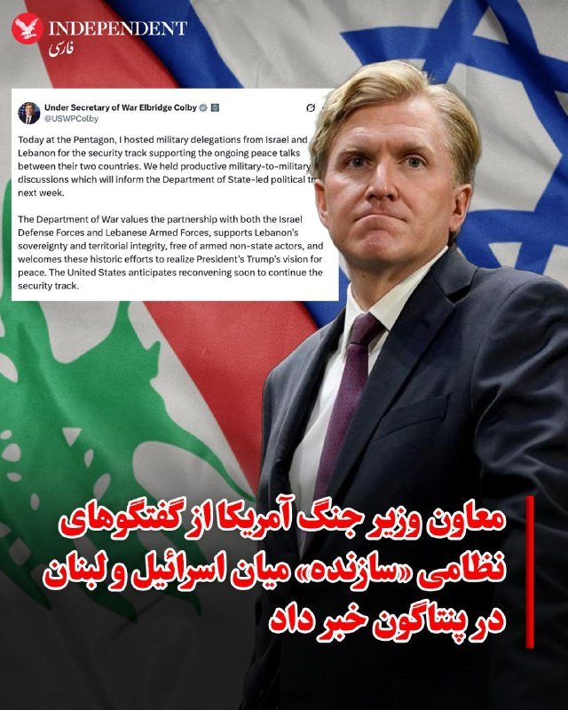

♦️البریج کولبی، معاون وزیر جنگ آمریکا، با انتشار پیامی در اکس اعلام کرد: «امروز (جمعه، هشتم خردادماه) در پنتاگون، میزبان هیات‌های نظامی اسرائیل و لبنان در چارچوب روند امنیتی حامی گفتگوهای صلح جاری میان دو کشور بودم و ما گفتگوهای نظامی ثمر‌بخشی داشتیم که روند سیاسی هفته آینده به رهبری وزارت امور خارجه را مطلع خواهد ساخت.» کولبی با تاکید بر اینکه وزارت جنگ آمریکا به شراکت با نیروهای دفاعی اسرائیل و نیروهای مسلح لبنان ارج می‌نهد، افزود: «ایالات متحده از حاکمیت و تمامیت ارضی لبنان، به دور از بازیگران مسلح غیردولتی حمایت و از این تلاش‌های تاریخی برای تحقق چشم‌انداز ترامپ برای صلح استقبال می‌کند. واشنگتن در انتظار ازسرگیری زودهنگام این نشست‌ها برای ادامه این مسیر امنیتی است.»
‌🇸🇦 Indypersian

🤖 @VahidOOnLine

## IranIntlTV — post 339677

  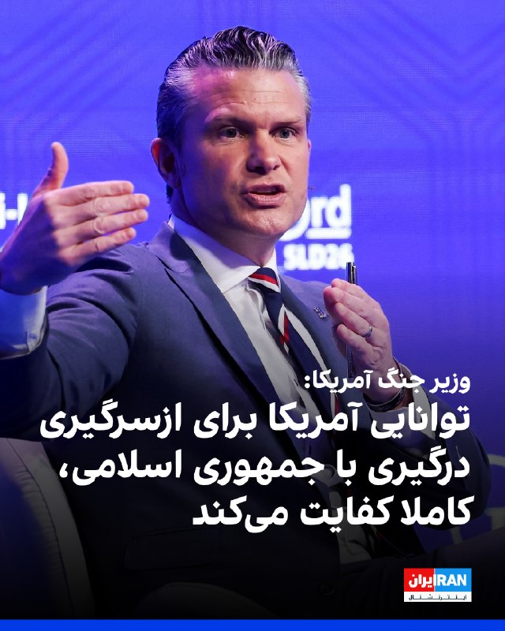

پیت هگست، وزیر جنگ آمریکا، در نشست امنیتی گفت‌وگوی شانگری‌لا در سنگاپور گفت هر توافقی که با جمهوری اسلامی حاصل شود، «توافق خوبی» خواهد بود و افزود توانایی آمریکا برای ازسرگیری درگیری، در صورت لزوم، کاملا کفایت می‌کند.
او افزود: ایالات متحده «تعهدی جهانی» دارد تا اطمینان حاصل کند حکومت ایران به سلاح هسته‌ای دست پیدا نمی‌کند. او تاکید کرد واشینگتن همچنان مسئولیت‌های جهانی خود را در این زمینه دنبال می‌کند.

https://iranintl.com/202605303662

---
📅 بروزرسانی: 1405/03/09 05:13
---

هیچ پیام جدیدی در این بروزرسانی ارسال نشد.

---
📅 بروزرسانی: 1405/03/09 05:03
---

## VahidOOnLine — post 242862

♦️استیون میلر، مشاور ارشد سیاسی و امنیت داخلی دونالد ترامپ، در گفتگو با شبکه فاکس با اشاره به روند مذاکرات بیان کرد که ایران امتیازهای قابل‌توجه، اساسی و چشمگیری به ایالات متحده داده است؛ امتیازهایی که تا مدت کوتاهی پیش به دلیل فشارهای نظامی و اقتصادی غیرممکن به نظر می‌رسید. او تاکید کرد که رئیس‌جمهوری ترامپ به طور مستقیم و شخصا در این مذاکرات حضور دارد تا مطمئن شود نتایج مطابق با استانداردهای اوست.
میلر در ادامه افزود با وجود این امتیازها، تا زمانی که توافقی نهایی نشود، هیچ توافقی وجود ندارد و هیچ چیز قطعی نیست. او خاطرنشان کرد که دونالد ترامپ به صراحت اعلام کرده است که اکنون یا در هر زمان دیگری در آینده، این اختیار را برای خود محفوظ می‌دارد تا هر اقدامی را که برای دفاع و حفاظت از امنیت ملی آمریکا لازم باشد، انجام دهد.
‌🇸🇦 Indypersian

🤖 @VahidOOnLine

## FarsiVOA — post 219035

  

⚡️پیت هگست، وزیر جنگ آمریکا، روز شنبه در نشست امنیتی «دیالوگ شانگری-لا» در سنگاپور تأکید کرد که جمهوری اسلامی نباید به سلاح هسته‌ای دست یابد. به گزارش کلی میرز، خبرنگار نیوزنیشن، هگست همچنین با اشاره به دستگیری نیکلاس مادورو در ونزوئلا توسط نیروهای آمریکایی گفت ایالات متحده در حال «بازگرداندن بازدارندگی آمریکا» در جهان است.
@FarsiVOA

---
📅 بروزرسانی: 1405/03/09 04:53
---

هیچ پیام جدیدی در این بروزرسانی ارسال نشد.

---
📅 بروزرسانی: 1405/03/09 04:43
---

## VahidOOnLine — post 242861

  <a href="telegram/content/VahidOOnLine_242861_1780103589.mp4" target="_blank">🎬 Download video</a>

♦️ساکنان و گردشگران نیویورک با تلفن‌های همراه و دوربین‌های خود به خیابان‌ها آمدند تا پدیده «منهتن‌هنج» را تماشا کنند؛ پدیده‌ای که خورشید هنگام غروب به شکلی تقریبا کامل میان خیابان‌ها و آسمان‌خراش‌های منهتن قرار می‌گیرد.
این پدیده حدود چهار بار در سال و در روزهایی نزدیک به انقلاب تابستانی و زمستانی رخ می‌دهد؛ زمانی که خورشید در امتداد خیابان‌های شرقی-غربی منهتن، مانند خیابان ۴۲ که از میدان تایمز می‌گذرد، دیده می‌شود.
اصطلاح «منهتن‌هنج» با الهام از استون‌هنج، بنای باستانی مشهور بریتانیا، ابداع شد؛ زیرا همانند آن سازه، خورشید در زمان‌های مشخصی در راستای دقیقی با ساختارهای اطراف قرار می‌گیرد. این نام نخستین بار از سوی نیل دگراس تایسون، اخترشناس آمریکایی، مطرح شد.
‌🇸🇦 Indypersian

🤖 @VahidOOnLine

## BBCPersian — post 282360

  

‌ ‌ ‌ ‌
اورسولا فون در لاین، رئیس کمیسیون اروپا، به نخست وزیر جدید مجارستان گفته است که میلیاردها یورو از بودجه اتحادیه اروپا قرار است آزاد شود، مشروط بر اینکه دولت او مجموعه‌ای از «اصلاحات معوقه» را به اجرا بگذارد.

این تصمیم، تقویت قابل توجهی برای پیتر ماگیار است که کمتر از سه هفته پس از پیروزی قاطع در انتخابات بر ویکتور اوربان، نخست‌وزیر مجارستان شده است.

او توافق خود با اتحادیه اروپا را «یک پیشرفت تاریخی» توصیف کرد، در حالی که فون در لاین گفت: «ما همین حالا هم می‌توانیم تغییرات را احساس کنیم که در سراسر مجارستان قابل مشاهده است.»

رئیس کمیسیون اروپا گفت که در مجموع بسته مالی ۱۶/۴ میلیارد یورویی بوداپست آزاد خواهد شد. آقای ماگیار امیدوار است که این پول نقد به رونق اقتصاد رو به زوال مجارستان کمک کند.

این بودجه به دلیل عقبگرد دموکراتیک و ادعاهای مربوط به فساد در دولت تحت رهبری آقای اوربان، توسط اتحادیه اروپا مسدود شده بود. نخست‌وزیر جدید مجارستان در آستانه انتخابات ماه گذشته، آزادسازی میلیاردها یورو را به عنوان یک وعده کلیدی برای حزب خود، قرار داده بود.

📷EPA/Shutterstock
@BBCPersian

---
📅 بروزرسانی: 1405/03/09 04:33
---

## VahidOOnLine — post 242860

  

ان‌بی‌سی‌نیوز به نقل از دو مقام آمریکایی و یک فرد آگاه گزارش داد ارتش آمریکا با وجود ادامه جست‌وجوها در تنگه هرمز، هنوز تایید نکرده است که جمهوری اسلامی در این آبراه حیاتی مین‌گذاری کرده باشد.
بر اساس این گزارش، جست‌وجوهای نظامی با پهپادهای زیرآبی، سامانه‌های رباتیک و هواپیماهای سرنشین‌دار و بدون سرنشین، برخی اشیای شبیه مین را شناسایی کرده‌اند، اما هیچ‌یک به‌طور قطعی به‌عنوان مین تایید نشده‌اند.

‌🏁 🇬🇧 IranintlTV

🤖 @VahidOOnLine

## IranIntlTV — post 339676

  

ان‌بی‌سی‌نیوز به نقل از دو مقام آمریکایی و یک فرد آگاه گزارش داد ارتش آمریکا با وجود ادامه جست‌وجوها در تنگه هرمز، هنوز تایید نکرده است که جمهوری اسلامی در این آبراه حیاتی مین‌گذاری کرده باشد.
بر اساس این گزارش، جست‌وجوهای نظامی با پهپادهای زیرآبی، سامانه‌های رباتیک و هواپیماهای سرنشین‌دار و بدون سرنشین، برخی اشیای شبیه مین را شناسایی کرده‌اند، اما هیچ‌یک به‌طور قطعی به‌عنوان مین تایید نشده‌اند.

https://iranintl.com/202605301832

---
📅 بروزرسانی: 1405/03/09 04:23
---

هیچ پیام جدیدی در این بروزرسانی ارسال نشد.

---
📅 بروزرسانی: 1405/03/09 04:13
---

## VahidOOnLine — post 242859

  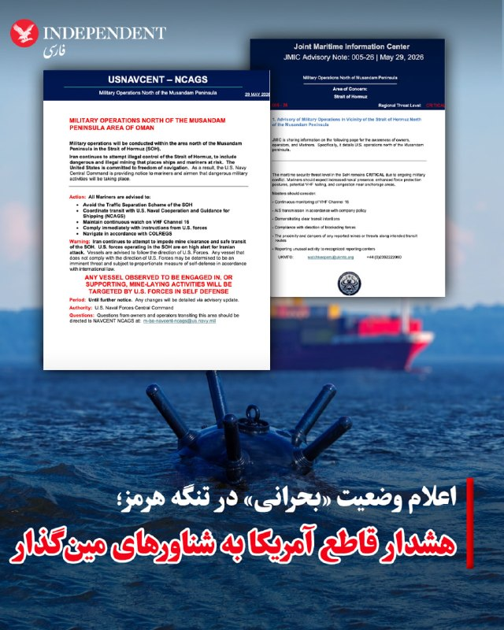

♦️«مرکز مشترک اطلاعات دریایی» (JMIC) روز جمعه، هشتم خردادماه، با انتشار بیانیه رسمی، سطح تهدیدات امنیتی در تنگه هرمز را «بحرانی» اعلام کرد و از آغاز عملیات نظامی گسترده نیروهای دریایی ایالات متحده در شمال شبه‌جزیره مسندم خبر داد. در این بیانیه اضطراری که با هماهنگی سازمان تجارت دریایی بریتانیا (UKMTO) صادر شده، هشدار داده شده است که نیروهای آمریکایی برای مقابله با حملات احتمالی در حالت آماده‌باش کامل قرار دارند و هر شناوری که در حال انجام یا پشتیبانی از فعالیت‌های مین‌گذاری در این آبراه حیاتی مشاهده شود، فورا در راستای دفاع از خود هدف حملات نظامی قرار خواهد گرفت. این مرکز با اشاره به افزایش حضور ناوهای جنگی در منطقه، از تمامی کشتی‌های تجاری و دریانوردان خواست تا ضمن دوری از طرح‌های تفکیک ترافیک دریانوردی، رادیوی خود را روی کانال ۱۶ فعال نگه داشته و به طور کامل از دستورات نیروهای آمریکایی تبعیت کنند؛ در غیر این صورت، به عنوان «تهدید فوری» تلقی شده و بر اساس قوانین بین‌المللی با پاسخ متناسب مواجه خواهند شد.
‌🇸🇦 Indypersian

🤖 @VahidOOnLine

---
📅 بروزرسانی: 1405/03/09 04:03
---

## VahidOnline — post 75799

  

'به جای پول نقد قطر موافقت کرده ۶ میلیارد دلار اعتبار در اختیار تهران قرار بگیرد تا کالاها و محصولات اساسی را از قطر خریداری کند'

یک منبع آگاه از روند مذاکرات به ایران‌اینترنشنال گفت سفر قالیباف به قطر به شکستی دیپلماتیک منجر شد و با وجود درخواست تهران برای آزادسازی فوری و بی‌قید و شرط ۱۲ میلیارد دلار به صورت نقدی همزمان با امضای یک یادداشت تفاهم اولیه با آمریکا، مقام‌های قطری این درخواست را رد کردند.

به گفته این منبع، مقام‌های قطری تنها با آزادسازی نیمی از این مبلغ تحت محدودیت‌های سخت‌گیرانه موافقت کردند.

بر اساس گفته‌های یک منبع نزدیک به یک مقام قطری حاضر در این گفت‌وگوها، دوحه از انتقال مستقیم یا نقدی این منابع به ایران خودداری کرده است. در عوض، این پول تنها به صورت اعتبار در اختیار تهران قرار می‌گیرد تا کالاها و محصولات اساسی را مستقیما از قطر خریداری کند.

این محدودیت در شرایطی اعمال شده که آمریکا به شدت با اعطای دسترسی مستقیم و بدون محدودیت جمهوری اسلامی به دارایی‌های نقدی مخالفت کرده است.
آمریکا ابراز نگرانی کرده است که تزریق مستقیم پول نقد می‌تواند برای تهران فضای تنفسی اقتصادی حیاتی ایجاد کند و به آن اجازه دهد حقوق‌های معوقه بخش عمومی را پرداخت کرده و در دوره‌ای از تنش شدید منطقه‌ای، تجهیزات نظامی را از کشورهای دیگر تامین کند.
@VahidOOnLine

📡 @VahidOnline

## BBCPersian — post 282359

🔻 آمریکا شبکه تامین فناوری‌های دفاعی برای ایران را تحریم کرد

خبرگزاری فرانسه گزارش داد که آمریکا در تازه‌ترین دور تحریم‌های مرتبط با ایران، شبکه‌ای را که به گفته واشنگتن فناوری‌های حساس آمریکایی را برای بخش دفاعی ایران تهیه می‌کرد، هدف تحریم‌های خود قرار داده است.

پیشتر خبرگزاری رویترز هم گزارش داد که آمریکا فهرست جدیدی از تحریم‌های مرتبط با ایران را منتشر کرده است که در چارچوب مقررات مقابله با تروریسم اعمال شده‌اند.

وزارت دارایی آمریکا می‌گوید که این شبکه به ریاست علی مجد سپهر، با استفاده از شرکت‌های صوری و وب‌سایت‌های جعلی، ده‌ها شرکت فناوری آمریکایی را فریب داده و تجهیزات حساس مورد نیاز بخش دفاعی ایران را تهیه کرده است.

به گفته مقام‌های آمریکایی، اعضای این شبکه با معرفی خود به‌عنوان شرکت‌های قانونی آمریکایی، فناوری‌های پیشرفته‌ای از جمله تحلیلگرهای طیف فرکانسی و تجهیزات امنیتی را خریداری کرده و از طریق واسطه‌هایی در دبی به ایران منتقل می‌کردند.

واشنگتن می‌گوید که این اقدامات نقض تحریم‌های آمریکا بوده و به تقویت توانایی‌های دفاعی ایران کمک کرده است.

https://bbc.in/4e0QWpQ
@BBCPersian

---
📅 بروزرسانی: 1405/03/09 03:53
---

## VahidOOnLine — post 242858

  

یک منبع آگاه از روند مذاکرات به ایران‌اینترنشنال گفت سفر قالیباف به قطر به شکستی دیپلماتیک منجر شد و با وجود درخواست تهران برای آزادسازی فوری و بی‌قید و شرط ۱۲ میلیارد دلار به صورت نقدی همزمان با امضای یک یادداشت تفاهم اولیه با آمریکا، مقام‌های قطری این درخواست را رد کردند.
به گفته این منبع، مقام‌های قطری تنها با آزادسازی نیمی از این مبلغ تحت محدودیت‌های سخت‌گیرانه موافقت کردند.
بر اساس گفته‌های یک منبع نزدیک به یک مقام قطری حاضر در این گفت‌وگوها، دوحه از انتقال مستقیم یا نقدی این منابع به ایران خودداری کرده است. در عوض، این پول تنها به صورت اعتبار در اختیار تهران قرار می‌گیرد تا کالاها و محصولات اساسی را مستقیما از قطر خریداری کند.
این محدودیت در شرایطی اعمال شده که آمریکا به شدت با اعطای دسترسی مستقیم و بدون محدودیت جمهوری اسلامی به دارایی‌های نقدی مخالفت کرده است.
آمریکا ابراز نگرانی کرده است که تزریق مستقیم پول نقد می‌تواند برای تهران فضای تنفسی اقتصادی حیاتی ایجاد کند و به آن اجازه دهد حقوق‌های معوقه بخش عمومی را پرداخت کرده و در دوره‌ای از تنش شدید منطقه‌ای، تجهیزات نظامی را از کشورهای دیگر تامین کند.
‌🏁 🇬🇧 IranintlTV

🤖 @VahidOOnLine

## VahidOOnLine — post 242857

  <a href="telegram/content/VahidOOnLine_242857_1780100583.mp4" target="_blank">🎬 Download video</a>

♦️خواهر جاویدنام امیرمحمد شاه‌کرمی با انتشار ویدیویی در صفحه اینستاگرام خود نوشت: «شصت روز بین امید و کابوس گذشت تا بالاخره برادر جاویدنامم، امیرمحمد شاه‌کرمی را در سردخانه دیدم. ما بعد از ۶۰ روز گریه، دلتنگی و چشم‌انتظاری، صورت برادرم را دیدیم. آن لحظه انگار دنیا روی سرمان خراب شد.»
او در ادامه نوشت: «شیون مادر، لرزش دست پدر و بغض... برادرم خوابیده بود؛ سرد، بی‌صدا. هیچ‌کس نمی‌فهمد دیدن پیکر برادرت بعد از ۶۰ روز یعنی چه.»
امیرمحمد شاه‌کرمی، ۱۴ ساله، ۱۸ دی‌ در شهر قدس بازداشت شد و پیکرش پس از دو ماه تحویل داده شد.
‌🇸🇦 Indypersian

🤖 @VahidOOnLine

## VahidOOnLine — post 242856

  

♦️براساس دستور ویژه‌ امامعلی رحمان، رئیس‌جمهوری تاجیکستان، وزارت معارف و دیگر نهادهای مسئول موظفند کیفیت تدریس «الفبای نیاکان» (خط فارسی) را در تمامی موسسات آموزشی و مدارس کشور بهبود بخشند. بر اساس گزارش رسمی پایگاه اطلاع‌رسانی ریاست‌جمهوری تاجیکستان، روز پنجشنبه در جریان جلسه هیات دولت، این تصمیم در راستای سیاست‌های کلان دولت دوشنبه برای گسترش پژوهش، آموزش و ترویج تاریخ و «فرهنگ اصیل آریایی» اتخاذ شده است تا نسل جوان ارتباط نزدیک‌تری با میراث مکتوب و کهن خود برقرار کند.
در این جلسه که به بررسی برنامه‌های مختلف توسعه‌ای، بهداشت و بومی‌سازی صنایع اختصاص داشت، رئیس‌جمهوری تاجیکستان تاکید کرد که احیای زبان و خط نیاکان، بخشی جدایی‌ناپذیر از برنامه‌های ملی برای آگاهی فرهنگی و آماده‌سازی جامعه جهت بزرگداشت سی‌وپنجمین سالگرد استقلال این کشور است. در همین راستا، کتاب‌های درسی ویژه‌ای از جمله «الفبا و متن نیاکان» برای پایه‌های مختلف تحصیلی در نظر گرفته شده است تا دانش‌آموزان تاجیک مهارت خواندن و نوشتن به خط فارسی را به طور استاندارد و با کیفیت بالا فرا بگیرند.
‌🇸🇦 Indypersian

🤖 @VahidOOnLine

## IranIntlTV — post 339675

  

یک منبع آگاه از روند مذاکرات به ایران‌اینترنشنال گفت سفر قالیباف به قطر به شکستی دیپلماتیک منجر شد و با وجود درخواست تهران برای آزادسازی فوری و بی‌قید و شرط ۱۲ میلیارد دلار به صورت نقدی همزمان با امضای یک یادداشت تفاهم اولیه با آمریکا، مقام‌های قطری این درخواست را رد کردند.
به گفته این منبع، مقام‌های قطری تنها با آزادسازی نیمی از این مبلغ تحت محدودیت‌های سخت‌گیرانه موافقت کردند.
بر اساس گفته‌های یک منبع نزدیک به یک مقام قطری حاضر در این گفت‌وگوها، دوحه از انتقال مستقیم یا نقدی این منابع به ایران خودداری کرده است. در عوض، این پول تنها به صورت اعتبار در اختیار تهران قرار می‌گیرد تا کالاها و محصولات اساسی را مستقیما از قطر خریداری کند.
این محدودیت در شرایطی اعمال شده که آمریکا به شدت با اعطای دسترسی مستقیم و بدون محدودیت جمهوری اسلامی به دارایی‌های نقدی مخالفت کرده است.
آمریکا ابراز نگرانی کرده است که تزریق مستقیم پول نقد می‌تواند برای تهران فضای تنفسی اقتصادی حیاتی ایجاد کند و به آن اجازه دهد حقوق‌های معوقه بخش عمومی را پرداخت کرده و در دوره‌ای از تنش شدید منطقه‌ای، تجهیزات نظامی را از کشورهای دیگر تامین کند.

---
📅 بروزرسانی: 1405/03/09 03:43
---

## FarsiVOA — post 219034

  <a href="telegram/content/FarsiVOA_219034_1780099991.mp4" target="_blank">🎬 Download video</a>

⚡️چرا جمهوری اسلامی زمان کنکور را مشخص نمی کند؟ گفت‌وگو با جبران مقدم
@FarsiVOA

---
📅 بروزرسانی: 1405/03/09 03:33
---

## VahidOOnLine — post 242847

این نام‌ها،
روایت زندگی‌هایی هستند که با خشونت در خیابان‌های ایران متوقف شدند.<
یکی سه روز بعد از پدر شدن کشته شد، یکی تنها شش ماه از ازدواجش گذشته بود، یکی برای نجات مادرش خودش را سپر کرد و دیگری با ساز و موسیقی، زندگی را معنا می‌کرد. نسل جوانی که هر کدام آینده‌ای پیش رو داشتند، با گلوله، باتوم و خشونت جمهوری اسلامی از ادامه زندگی بازماندند.<
میعاد ساده‌میری، مهران شیخ‌الاسلامی، نیما احمدی، مهران مظفری، امیرمحمد استاددوست، روح‌الله ستاره مشتری، صنم پوربابایی و محمدرضا مرادعلی؛
جاویدنامان انقلاب ملی ایرانیان.<
این روایت‌ها کوتاه‌اند، چون جای خالی این انسان‌ها را هیچ متنی نمی‌تواند کامل توضیح دهد؛ اما نامشان باید تکرار شود، تا فراموش نشوند.<
این روایت‌ها کوتاه‌اند، چون جای خالی این انسان‌ها را هیچ متنی نمی‌تواند کامل توضیح دهد؛ این روایت‌ها بخشی از حافظه زنده مردم ایران‌اند.<
#جاویدنامان_انقلاب_ملی_ایرانیان
‌🏁 🇬🇧 IranintlTV

🤖 @VahidOOnLine

## VahidOOnLine — post 242846

  

نهاد مدیریت آبراه خلیج فارس در واکنش به اقدام اخیر وزارت خزانه‌داری آمریکا در تحریم این نهاد، ضمن محکومیت این اقدام تاکید کرد: «تسلط بر تنگه هرمز را که در میدان و دیپلماسی به دست نیاوردید، با تحریم هم به دست نخواهید آورد.»
این نهاد تحریم شدن از سوی «کشوری که رییس آن به دزدی دریایی افتخار می‌کند» را نشانه‌ای از «عملکرد مثبت» خود دانست و افزود: «علیرغم اقدامات تنش‌زای ایالات متحده در آب‌های خلیج فارس و دریای عمان، این نهاد در راستای تسهیل تردد، بی‌وقفه به بررسی و ارائه مجوز عبور به شناورهای غیرمتخاصم ادامه می‌دهد.»

‌🏁 🇬🇧 IranintlTV

🤖 @VahidOOnLine

## FoxNewsTwitter — post 342417

  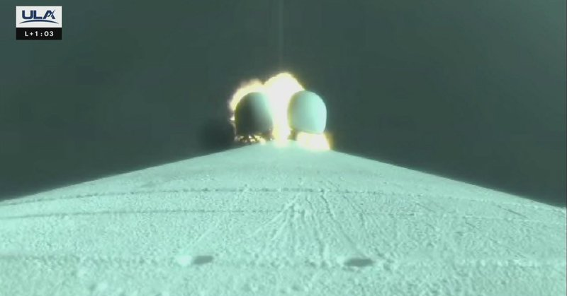

Fox News (Twitter/X)

WATCH LIVE: Atlas 5 rocket launches 29 Amazon Leo satellites from Florida https://twitter.com/i/broadcasts/1lJQRRBLyOWxE

## IranIntlTV — post 339666

این نام‌ها،
روایت زندگی‌هایی هستند که با خشونت در خیابان‌های ایران متوقف شدند.
یکی سه روز بعد از پدر شدن کشته شد، یکی تنها شش ماه از ازدواجش گذشته بود، یکی برای نجات مادرش خودش را سپر کرد و دیگری با ساز و موسیقی، زندگی را معنا می‌کرد. نسل جوانی که هر کدام آینده‌ای پیش رو داشتند، با گلوله، باتوم و خشونت جمهوری اسلامی از ادامه زندگی بازماندند.
میعاد ساده‌میری، مهران شیخ‌الاسلامی، نیما احمدی، مهران مظفری، امیرمحمد استاددوست، روح‌الله ستاره مشتری، صنم پوربابایی و محمدرضا مرادعلی؛
جاویدنامان انقلاب ملی ایرانیان.
این روایت‌ها کوتاه‌اند، چون جای خالی این انسان‌ها را هیچ متنی نمی‌تواند کامل توضیح دهد؛ اما نامشان باید تکرار شود، تا فراموش نشوند.
این روایت‌ها کوتاه‌اند، چون جای خالی این انسان‌ها را هیچ متنی نمی‌تواند کامل توضیح دهد؛ این روایت‌ها بخشی از حافظه زنده مردم ایران‌اند.
#جاویدنامان_انقلاب_ملی_ایرانیان

## FarsiVOA — post 219033

⚡️سرنوشت نامعلوم ویزا برای تیم ملی فوتبال در گفت‌وگو با فرید اشرفیان خبرنگار ورزشی دویچه وله
@FarsiVOA

## FarsiVOA — post 219032

⚡️«اولویت» جمهوری اسلامی در اوج بمباران و قطع اینترنت، شکنجه‌ نسرین ستوده‌‌ها
@FarsiVOA

## BBCPersian — post 282358

  

‌ ‌ ‌ ‌
یک قاضی دادگاهی در آمریکا، اقدام برای تغییر نام مرکز هنری معروف کندی در واشنگتن به «مرکز کندی ترامپ» را مسدود کرد و دستور داد که نام رئیس جمهور ترامپ از روی آن حذف شود.

در واکنش به این حکم، دونالد ترامپ گفت: «دموکرات‌ها بیشتر به مخالفت با رئیس‌جمهور ... اهمیت می‌دهند تا نجات یک مرکز هنرهای نمایشی در حال مرگ.»

قاضی کریستوفر کوپر حکم داد که کنگره نام این مرکز هنری را تصویب کرده است و فقط کنگره می‌تواند آن را تغییر دهد.

این آخرین ناکامی رئیس جمهور آمریکا است که به دنبال تغییر شکل و نام‌گذاری بخش‌هایی از پایتخت بوده است.

یکی از اعضای هیئت مدیره این مرکز، این تغییر نام را که توسط هیئت مدیره‌ای که توسط او انتخاب شده بود، در دادگاه به چالش کشیده بود.

آقای ترامپ پس از صدور این حکم در شبکه اجتماعی تروث سوشال، قاضی را «چپ» و منصوب باراک اوباما خواند که با این حکمش جلوی تعمیرات و بازسازی موسسه کندی را خواهد گرفت.

https://bbc.in/4fKf16A
📷 Al Drago/Getty Images
@BBCPersian

---
📅 بروزرسانی: 1405/03/09 03:23
---

## VahidOOnLine — post 242845

  

♦️فرماندهی مرکزی ایالات متحده، سنتکام، روز جمعه، با انتشار تصاویری در اکس، از اجرای موفقیت‌آمیز عملیات پرواز شبانه توسط ملوانان آمریکایی بر فراز ناو هواپیمابر «یو‌اس‌اس جرج اچ.دبلیو بوش» خبر داد. سنتکام با تمجید از آمادگی نیروهای خود اعلام کرد که در این مانور، خلبانان بسیار ماهر آمریکایی موفق شدند در تاریکی نزدیک به مطلق، پرنده‌های خود را بر روی عرشه کوچک این ناو که در میان امواج دریا در حال تکان خوردن و چرخیدن بود، به سلامت فرود آورند.
‌🇸🇦 Indypersian

🤖 @VahidOOnLine

## WithYashar — post 12922

سنتکام: هر شناوری که در حال انجام یا حمایت از فعالیت‌ های مین‌گذاری در تنگهٔ هرمز دیده بشه، توسط ما هدف قرار خواهد گرفت!
@withyashar

## IranIntlTV — post 339665

  

نهاد مدیریت آبراه خلیج فارس در واکنش به اقدام اخیر وزارت خزانه‌داری آمریکا در تحریم این نهاد، ضمن محکومیت این اقدام تاکید کرد: «تسلط بر تنگه هرمز را که در میدان و دیپلماسی به دست نیاوردید، با تحریم هم به دست نخواهید آورد.»
این نهاد تحریم شدن از سوی «کشوری که رییس آن به دزدی دریایی افتخار می‌کند» را نشانه‌ای از «عملکرد مثبت» خود دانست و افزود: «علیرغم اقدامات تنش‌زای ایالات متحده در آب‌های خلیج فارس و دریای عمان، این نهاد در راستای تسهیل تردد، بی‌وقفه به بررسی و ارائه مجوز عبور به شناورهای غیرمتخاصم ادامه می‌دهد.»

https://iranintl.com/202605291729

## Shin_Persian — post 6316

  

Shin ✓ @hey_itsmyturn
Fri, 29 May 2026 23:45:58 UTC

Even Fars News and regime websites are barely accessible at the moment

فارسی

حتی خبرگزاری فارس و وب‌سایت‌های رژیم در حال حاضر به سختی در دسترس هستند.

𝕏 · @shin_persian

## Shin_Persian — post 6315

Shin ✓ @hey_itsmyturn
Fri, 29 May 2026 23:44:20 UTC

A number of users are reporting internet (FilterNet) disruption in Iran right now.

فارسی

تعدادی از کاربران در حال حاضر از اختلال در اینترنت (فیلترنت) در ایران خبر می‌دهند.

𝕏 · @shin_persian

---
📅 بروزرسانی: 1405/03/09 03:13
---

هیچ پیام جدیدی در این بروزرسانی ارسال نشد.

---
📅 بروزرسانی: 1405/03/09 03:03
---

## VahidOOnLine — post 242844

  

♦️نیکی هیلی، سفیر پیشین آمریکا در سازمان ملل، با انتشار پیامی در اکس نوشت: «رژیم ایران هرگز با حسن نیت عمل نکرده است. همیشه همان بازی را ادامه می‌دهد؛ وقت‌کشی، خرید زمان و تغییر موضع.»
هیلی افزود تا زمانی که دسترسی کامل و کنترل بر مواد هسته‌ای ایران به دست نیامده، نباید دارایی‌ها آزاد یا تحریم‌ها کاهش داده شود.
‌🇸🇦 Indypersian

🤖 @VahidOOnLine

## FoxNewsTwitter — post 342416

‌Fox News (Twitter/X)

👉 Full story here:

## FoxNewsTwitter — post 342415

  

Fox News (Twitter/X)

CodePink co-founder Medea Benjamin confirms Treasury Department inquiry into her group's Cuba convoy. The probe demands answers to 12 detailed questions about 170 participants, $600,000 in supplies, and every hour spent on the communist island, she said, acknowledging that "it's serious."

## IranianMinds — post 21054

🔴 وضعیت :

@IranianMinds

## IranianMinds — post 21053

  

⭕️ تا حالا بدون واریزی روی فوتبال ها شرط بستی؟!

🎉 500 هزارتومن بونوس رایگان فقط با ثبت نام بدون هیچگونه واریزی!

😮 تنها سایتی که با عضویت بدون واریز 500,000 تومان شارژ بی قیدو شرط میده #وینرو هست
💰

👑 #معتبرترین سایت ایرانی 
⬇️

🌐 Winro.io

🌐 Winro.io

📱کانال اخبار و هدایا a8 
🎁

📱 @winro_io

## BBCPersian — post 282357

🔻 حمایت کیهان کلهر از کسب‌وکارهای فرهنگی و هنری

کیهان کلهر، موسیقی‌دان برجسته ایران صفحه اینستاگرامش را به مدت ۸۸ روز به تبلیغ و حمایت از کسب‌وکار اهالی فرهنگ و هنر اختصاص داد.

او نوشت که این اقدام را به دلیل حمایت از آنهایی انجام می‌دهد که «در ماه‌های اخیر به‌دلیل قطع اینترنت دچار خسارت شده‌اند.»

آقای کلهر تاکید کرده است که این فراخوان تنها شامل کسب‌وکارهای داخل ایران می‌شود.

حکومت ایران در چند دهه گذشته اشاعه موسیقی را به شدت محدود کرد اما پس از گسترش شبکه‌های اجتماعی، هنرمندان به معرفی خود و آثارشان پرداختند و به این ترتیب بازار خوبی برای محصولات فرهنگی و هنری فراهم شد.

پس از جنگ آمریکا و اسرائیل با ایران و قطعی کامل اینترنت برای بیش از هشتاد روز بسیاری از مشاغل مجازی به‌ویژه اهالی فرهنگ و هنر از فعالیت بازماندند که خسارات قابل توجهی به آنها وارد شده است.

https://bbc.in/4vbIbjs
@BBCPersian

---
📅 بروزرسانی: 1405/03/09 02:53
---

## IranIntlTV — post 339664

  <a href="telegram/content/IranIntlTV_339664_1780097021.mp4" target="_blank">🎬 Download video</a>

شورای امنیت سازمان ملل اعلام کرد مقامات و نیروهای طالبان مرتکب خشونت جنسی علیه زنان شده‌اند. براساس این گزارش، ۲۱ مورد خشونت جنسی، از جمله تجاوز گروهی علیه ۱۵ زن و شش دختر، در سال گذشته میلادی ثبت شده و برخی زنان نیز هدف برهنه‌سازی یا ازدواج اجباری قرار گرفته‌اند.

گفت‌وگو با راضیه دانش، عضو تحریریه ایران‌اینترنشنال
@iranintltv

---
📅 بروزرسانی: 1405/03/09 02:43
---

## VahidOOnLine — post 242843

  

♦️مارکو روبیو، وزیر امور خارجه آمریکا، روز جمعه با انتشار پیامی در اکس اعلام کرد: «سفیر تام باراک نقشی بی‌بدیل و ارزشمند به عنوان فرستاده ویژه ما در امور سوریه ایفا کرده است. هرچند دوره این عنوان رسمی رو به پایان است، اما او همچنان به ایفای نقشی کلیدی برای دولت ترامپ هم در سوریه و هم در عراق ادامه خواهد داد، چرا که تخصص، روابط و درک عمیق او از دستور کار «اول آمریکا» به ارمغان آوردن دستاوردهای بزرگ به نمایندگی از کشور بزرگمان را تضمین می‌کند.»
‌🇸🇦 Indypersian

🤖 @VahidOOnLine

## IranIntlTV — post 339663

  <a href="telegram/content/IranIntlTV_339663_1780096427.mp4" target="_blank">🎬 Download video</a>

در دو هفته گذشته حملات اسرائیل به مناطق مختلف لبنان افزایش یافته و به حدود ۴۷ حمله در روز رسیده است.

این در حالی است که مذاکرات میان اسرائیل و لبنان در واشینگتن در حال برگزاری است.

گفت‌وگو با بن سبطی، پژوهشگر ایران و اسرائیل
@iranintltv

## Persian_Trend_Official — post 15305

فرماندهی مرکزی نیروی دریایی امریکا: در تنگه هرمز عملیات نظامی انجام خواهیم داد!

فرماندهی مرکزی نیروی دریایی ایالات متحده به دریانوردان و پرسنل نیروی هوایی هشدار داده است که سنتکام در تنگه هرمز، در شمال شبه جزیره مسندم عمان که در وسط تنگه واقع شده است، عملیات نظامی انجام خواهد داد.

ستاد فرماندهی مرکزی نیروی دریایی ایالات متحده به دریانوردان توصیه کرده است که هنگام عبور از تنگه هرمز با ایالات متحده همکاری کنند. فرماندهی مرکزی نیروی دریایی ایالات متحده همچنین اعلام کرده است که هر کشتی که در حال انجام یا پشتیبانی از فعالیت‌های مین‌گذاری مشاهده شود، توسط ایالات متحده هدف قرار خواهد گرفت.

📝 Amir

📌 @persian_trend_official
پرشین ترند | متفاوت‌ترین کانال نظامی

---
📅 بروزرسانی: 1405/03/09 02:33
---

## VahidOOnLine — post 242842

  

♦️به گزارش «ای‌بی‌سی نیوز»، در پی برگزاری یک نشست دو ساعته در «اتاق وضعیت» (Situation Room) به منظور اتخاذ تصمیم نهایی درباره توافق با تهران، یک مقام کاخ سفید با انتشار بیانیه‌ای اعلام کرد: «دونالد ترامپ تنها توافقی را امضا خواهد کرد که برای آمریکا خوب باشد و خطوط قرمز او را به طور کامل برآورده کند؛ ایران هرگز نمی‌تواند به سلاح هسته‌ای دست یابد.» براساس این گزارش، رئیس‌جمهوری ایالات متحده روز جمعه پس از ساعت‌ها رایزنی با تیم امنیت ملی خود برای تعیین تکلیف نهایی این پرونده، هنوز تصمیم رسمی خود را اعلام نکرده و مشخص نیست که چرا اعلام این موضع با تاخیر مواجه شده است.
‌🇸🇦 Indypersian

🤖 @VahidOOnLine

## IranIntlTV — post 339662

  <a href="telegram/content/IranIntlTV_339662_1780095790.mp4" target="_blank">🎬 Download video</a>

نیویورک‌تایمز گزارش داد آمریکا هنوز درباره هیچ توافق جدیدی با تهران به تصمیم نهایی نرسیده است.

همزمان، سخنگوی وزارت خارجه جمهوری اسلامی اعلام کرد تفاهم با آمریکا هنوز نهایی نشده است.

گفت‌وگو با امیر گیتی، عضو تحریریه ایران‌اینترنشنال
@iranintltv

## BBCPersian — post 282356

  

بنیامین نتانیاهو، نخست‌وزیر اسرائیل، می‌گوید که نیروهای کشورش در خاک لبنان پیشروی بیشتری کرده‌اند؛ این در حالی است که هیئت‌های نظامی اسرائیل و لبنان در واشنگتن در حال برگزاری مذاکرات امنیتی هستند.

اسرائیل همچنین روز جمعه به بمباران گسترده جنوب لبنان ادامه داد. دفتر جوزف عون، رئیس‌جمهور لبنان، اعلام کرد که او در تماس تلفنی با مارکو روبیو، وزیر خارجه آمریکا، بر «لزوم به‌کارگیری همه تلاش‌ها برای دستیابی به آتش‌بس» به‌عنوان نخستین گام ضروری تاکید کرده است.

قرار بود آتش‌بس میان اسرائیل و حزب‌الله، گروه مورد حمایت ایران، از ۱۷ آوریل اجرایی شود، اما این آتش‌بس هرگز به‌طور کامل رعایت نشده است.

دو طرف یکدیگر را به نقض آتش‌بس متهم می‌کنند و حملات خود را با استناد به تخلفات طرف مقابل توجیه می‌کنند.

حزب‌الله اعلام کرد که روز جمعه مجموعه‌ای از حملات را علیه نیروها، پادگان‌ها و یک اردوگاه نظامی در شمال اسرائیل انجام داده است.

https://bbc.in/4dXZb61
📷 Reuters
@BBCPersian

---
📅 بروزرسانی: 1405/03/09 02:22
---

## VahidOOnLine — post 242841

♦️خبرگزاری تسنیم، وابسته به سپاه پاسداران، بامداد شنبه ۹ خرداد با انتشار تصاویری مدعی شد بقایای یک پهپاد متعلق به آمریکا و اسرائیل که در حوالی قشم هدف قرار گرفته، کشف شده است. تسنیم بیان کرد این پهپاد پس از شناسایی یک ریزپرنده در حوالی قشم، با واکنش پدافند هوایی ارتش هدف قرار گرفت و منهدم شد.
پیش از این، خبرنگار صدا و سیما در قشم نیز از فعال شدن سامانه پدافند هوایی در این منطقه خبر داده بود. هم‌زمان، خبرگزاری مهر به نقل از منابع محلی گزارش داد یک ریزپرنده در حوالی قشم از سوی پدافند هوایی هدف قرار گرفته و منهدم شده است.
‌🇸🇦 Indypersian

🤖 @VahidOOnLine

## WithYashar — post 12921

  <a href="telegram/content/WithYashar_12921_1780095179.mp4" target="_blank">🎬 Download video</a>

گلزار: نماز میخونم و شبا هم هر موقع بیدار شم شروع میکنم به دعا کردن
@withyashar 🥶

## WithYashar — post 12920

یک مقام کاخ سفید در گفت‌و‌گو با خبرنگار شبکۀ الجزیره مدعی شد: دونالد ترامپ هیچ توافقی را امضا نخواهد کرد مگر آنکه این توافق مطالبات آمریکا را تأمین کرده و با خطوط قرمز تعیین‌شده از سوی او همخوانی داشته باشد.
«واشنگتن هرگز اجازه نخواهد داد ایران به سلاح هسته‌ای دست پیدا کند».
@withyashar

## VahidOnline — post 75798

  <a href="telegram/content/VahidOnline_75798_1780095181.mp4" target="_blank">🎬 Download video</a>

خبرگزاری تسنیم، وابسته به سپاه پاسداران، بامداد شنبه ۹ خرداد با انتشار تصاویری مدعی شد بقایای یک پهپاد متعلق به آمریکا و اسرائیل که در حوالی قشم هدف قرار گرفته، کشف شده است.
تسنیم بیان کرد این پهپاد با واکنش پدافند هوایی ارتش هدف قرار گرفت و منهدم شد.
پیش از این خبرگزاری مهر به نقل از منابع محلی گزارش داد یک ریزپرنده در حوالی قشم از سوی پدافند هوایی هدف قرار گرفته و منهدم شده است.
@VahidOOnLine

📡 @VahidOnline

## Persian_Trend_Official — post 15304

  <a href="telegram/content/Persian_Trend_Official_15304_1780095182.mp4" target="_blank">🎬 Download video</a>

شبتون بخیر 🌃

Mig-25 Foxbat vs F-15 Eagle

📌 @persian_trend_official
پرشین ترند | متفاوت‌ترین کانال نظامی

---
📅 بروزرسانی: 1405/03/09 02:12
---

## VahidOOnLine — post 242840

  

♦️دکتر جمشید ایرانی، وکیل دیوان عالی آمریکا، اطلاع دادند که وزارت خارجه ایالات متحده با دادن «مجوز موقت و مشروط برای ورود» (Parole) به بازیکنان تیم ملی فوتبال ایران موافقت کرده‌ است. این وکیل در نوشته‌ای که در صفحه فیسبوک خود به اشتراک گذاشت، با اشاره به تحقیق و پی بردن به تصمیم واشنگتن در قبال کاروان ورزشی ایران توضیح داد که وزارت امور خارجه آمریکا برای اعضای تیم ملی «ویزای معمولی» صادر نخواهد کرد، بلکه ورود آن‌ها به خاک این کشور در قالب این طرح مشروط خواهد بود که امتیازات ویزای عادی را ندارد. به گفته دکتر جمشید ایرانی، این مجوز تحت طبقه‌بندی «پی-۱» (P-1، ویژه ورزشکاران) صادر می‌شود که به دولت آمریکا اجازه می‌دهد در هر لحظه این امتیاز را لغو و افراد را بدون نیاز به حکم دادگاه اخراج کند؛ ضمن اینکه احتمال اعمال محدودیت مکانی ۴۰ کیلومتری (۲۵ مایلی) پیرامون ورزشگاه و نظارت ماموران ماموریت‌های مهاجرت و گمرک آمریکا (ICE) بر این کاروان وجود دارد.
پیش از این، درحالی‌که تنها ۱۲ روز تا آغاز جام جهانی ۲۰۲۶ باقی مانده و تیم ملی فوتبال ایران در اردوی آماده‌سازی به سر می‌برد، مهدی محمدنبی، سرپرست تیم ملی، پس از بازی مقابل گامبیا به خبرنگاران گفته بود که تا آن لحظه ویزای مکزیک و آمریکا «صادر نشده است». سرپرست تیم ملی فوتبال ایران با گلایه از این وضعیت اعلام کرده بود: «به فیفا ایمیل زدیم و پرسیدیم که چه روزی قرار است ویزا صادر شود. ما ویزای مولتی آمریکا و مکزیک را نیاز داریم. اینکه هنوز ویزای ما صادر نشده و همه از آن اطلاع دارند، عادلانه نیست».
‌🇸🇦 Indypersian

🤖 @VahidOOnLine

## BBCPersian — post 282355

  

‌ ‌ ‌ ‌
مقام‌های فدراسیون فوتبال ایران اعلام کردند که پس از انتقال اردوی تیم ملی برای جام جهانی از آریزونا به شهر تیخوانا در مکزیک، از فیفا خواسته‌اند تا زمان صدور ویزاهای این رقابت‌ها را مشخص کند.

تیم ملی ایران روز جمعه در دیداری تدارکاتی در شهر آنتالیا ترکیه با نتیجه سه بر یک، گامبیا را شکست داد.

ایران قرار است که هر سه مسابقه خود در مرحله گروهی جام جهانی را در آمریکا برگزار کند، اما از زمان حملات آمریکا و اسرائیل به ایران در اواخر فوریه، ابهام‌هایی درباره حضور این تیم در مسابقات به وجود آمده است.

به گفته مقام‌های فدراسیون فوتبال ایران، انتقال اردو به تیخوانا به‌دلیل مشکلات دیپلماتیک و مسائل مربوط به ویزا انجام شده و اکنون تیم ملی برای حضور در مسابقات خود در لس‌آنجلس و سیاتل، علاوه بر ویزای آمریکا، به مجوزهای تردد میان مکزیک و آمریکا نیز نیاز دارد.

مهدی محمدنبی، نایب‌رئیس اول فدراسیون فوتبال ایران، به رویترز گفت: «امروز برای فیفا ایمیل فرستادیم و خواستیم هرچه زودتر نتیجه را اعلام کند و بگوید که ویزاها در چه تاریخی صادر خواهند شد.»

https://bbc.in/4u8Us7o
📷 EPA/Shutterstock
@BBCPersian

## BBCPersian — post 282354

  

‌ ‌ ‌ ‌
روزنامه «اسرائیل هیوم» چاپ تل‌آویو گزارشی منتشر کرده است از عملیات پیچیده موساد برای نفوذ در ایران و برانداختن حکومت جمهوری اسلامی. در این گزارش به نقل از منابعی در موساد، از جمله یک مقام ارشد که تا حدود سه ماه پیش رئیس شاخه نفوذ این سازمان بود، جزئیات منتشر شده در این گزارش بسیار کم سابقه است.

در این گزارش آمده است که داوید برنع وقتی در ژوئن سال ۲۰۲۱ ریاست موساد را به عهده گرفت، تغییراتی در رویکرد و ساختار این سازمان ایجاد کرد.

یکی از این تغییرات، که با مقاومت درونی زیادی هم روبرو شد، تجدید ساختار واحد اطلاعات انسانی موساد، معروف به زومت (Tzomet) بود.

https://bbc.in/49wmP8a
📷Reuters
@BBCPersian

---
📅 بروزرسانی: 1405/03/09 02:03
---

## VahidOOnLine — post 242839

  

♦️به گزارش خبرگزاری رویترز، فرانسیس داناوان، فرمانده ستاد جنوبی ارتش ایالات متحده، روز جمعه در اقدامی کم‌سابقه با مقامات ارشد نظامی کوبا در خط مرزی پایگاه دریایی گوانتانامو دیدار و گفتگو کرد. ارتش آمریکا اعلام کرد که در این ماموریت، مسائلی چون امنیت عملیاتی مرزها، حفاظت از نیروها و آمادگی رزمی پایگاه مورد بررسی قرار گرفته است.
این دیدار در شرایطی انجام می‌شود که تنش‌ها میان واشنگتن و هاوانا به شدت بالا گرفته است. دونالد ترامپ پیش از این اشاره کرده بود که پس از پایان موضوع ایران، تمرکز خود را بر تغییر حکومت در کوباخواهد گذاشت. دولت ترامپ با اعمال محاصره سوختی، فشار اقتصادی شدیدی را بر کوبا وارد کرده است؛ موضوعی که واکنش تند وزیر امور خارجه کوبا را به همراه داشت و هشدار داد که هرگونه اقدام نظامی آمریکا به یک «حمام خون» با هزاران کشته از هر دو طرف منجر خواهد شد.
‌🇸🇦 Indypersian

🤖 @VahidOOnLine

## WithYashar — post 12919

بریم به لایک اینستاگرام … دیر وقته ولی خوب… 
🔴
🔴
🔴

## mwarmonitor — post 9906

🔴ترامپ ملزم به پاسخگویی درباره «اتهامات سنگین» در پرونده آی‌آر‌اس (سازمان امور مالیاتی) شد

📝نویسنده: آیوری لاتز AXIOS

🔸یک قاضی فدرال به پرزیدنت ترامپ دستور داد تا به اتهامات «سنگین» مطرح شده پاسخ دهد؛ اتهاماتی که ادعا می‌کنند توافق او با سازمان امور مالیاتی (IRS) — که منجر به ایجاد صندوق مبارزه با استفاده ابزاری از نهادها (anti-weaponization fund) شد — «بر پایه فریبکاری» بوده است.

📌چرا این موضوع اهمیت دارد؟
این دستور درست در همان روزی صادر شد که قاضی دیگری موقتاً این صندوق مالی ۱.۷۷۶ میلیارد دلاری را مسدود کرد؛ اقدامی که مانع بالقوه دیگری بر سر راه طرح توافق جنجالی دولت ترامپ ایجاد می‌کند.

🔸پشت صحنه ماجرا (محور اخبار):
دستور قاضی دادگاه منطقه‌ای ایالات متحده، کاتلین ویلیامز، در پی درخواست قبلی ۳۵ قاضی سابق فدرال صادر شد. این قضات از او خواسته بودند پرونده‌ای را که در ماه ژانویه در رابطه با لو رفتن اظهارنامه‌های مالیاتی ترامپ تشکیل شده بود، دوباره باز کند.

@mwarmonitor

## FoxNewsTwitter — post 342414

  

Fox News (Twitter/X)

A former mayor pleaded guilty Friday to acting as an illegal agent of the Chinese government.

Eileen Li Wang, the former mayor of Arcadia, California, allegedly acted "at the direction and control" of Chinese government officials between 2020 and 2022, without notifying U.S. authorities, prior to taking office.

According to court documents, Wang worked alongside a convicted Chinese agent, who is already serving a four-year federal prison sentence, to operate a website posing as a local Chinese-American news outlet.

Prosecutors described the website as a propaganda arm for the Chinese Communist Party that published content supplied directly by Chinese government officials.

She faces up to 10 years in prison. The judge has scheduled sentencing for October 6, 2026.

## Shin_Persian — post 6314

  <a href="telegram/content/Shin_Persian_6314_1780093984.mp4" target="_blank">🎬 Download video</a>

Shin ✓ @hey_itsmyturn
Fri, 29 May 2026 22:26:44 UTC

Reported video of a UAV wreckage in Qeshm island
Hormozgan Province, #Iran
Source: IRIB on TG

فارسی

ویدئوی منتشر شده از لاشه یک پهپاد در جزیره قشم
استان هرمزگان، #Iran
منبع: صدا و سیما در تلگرام

𝕏 · @shin_persian

## FarsiVOA — post 219031

  

⚡️ستاد فرماندهی جنوبی آمریکا اعلام کرد که ژنرال فرانسیس داناون، فرمانده ارشد ناظر بر نیروهای ایالات متحده در آمریکای لاتین، روز جمعه با مقامات ارشد نظامی کوبا در حاشیه پایگاه دریایی آمریکا در خلیج گوانتانامو در کوبا دیدار و گفت‌وگو کرد.
@FarsiVOA

## Dirty_Kids — post 390536

  <a href="telegram/content/Dirty_Kids_390536_1780093986.webm" target="_blank">🎬 Download video</a>

☢️خفن ترین و‌ قدیمی ترین  انالیزور  ایران ینی دکتر بت 
👍 
🔴مسابقات جذاب جام جهانی به زودی شروع میشه بیا توی کانال دکتر بت و باهاش همراه شو و پول در بیار
💵 رایگان بهترین شرط هارو براتون میذاره حتی هزار تومن هم دریافت نمیکنه روزانه میتونی از پیش بینی فوتبال باهاش…

## Dirty_Kids — post 390535

  <a href="telegram/content/Dirty_Kids_390535_1780093987.webm" target="_blank">🎬 Download video</a>

☢️خفن ترین و‌ قدیمی ترین  انالیزور  ایران ینی دکتر بت 
👍

🔴مسابقات جذاب جام جهانی به زودی شروع میشه بیا توی کانال دکتر بت و باهاش همراه شو و پول در بیار
💵

رایگان بهترین شرط هارو براتون میذاره
حتی هزار تومن هم دریافت نمیکنه
روزانه میتونی از پیش بینی فوتبال باهاش پول در بیاری 👌
A8

🌟اگ اهل پیش بینی فوتبالی این کانال اصلا از دست ندین
👇

✅https://t.me/+4_ADqwB9e-QwYjlk

✅https://t.me/+4_ADqwB9e-QwYjlk

## Dirty_Kids — post 390534

  

#بخوابیم

@Dirty_Kids 👻

## Dirty_Kids — post 390530

  <a href="telegram/content/Dirty_Kids_390530_1780093988.mp4" target="_blank">🎬 Download video</a>

جفت کنید، اینا 👆۲۰ میلیارد ناقابل دادن فقط برای عروسی گرفتن😕

۹۰ درصد مردم تمام آرزوشون ۲۰ میلیارده یه خونه و ماشین بگیرن، این دیگه اختلاف طبقاتی نیست شیاف طبقاتیه

@Dirty_Kids 👻

## Dirty_Kids — post 390529

  <a href="telegram/content/Dirty_Kids_390529_1780093988.mp4" target="_blank">🎬 Download video</a>

از اول جنگ تا حالا ۱۶بار نتانیاهو رو کشتن 😂😂

یعنی اول بچه‌شیعه بوده بعد کصخلا و کونی‌پرو‌ها از روش یاد گرفتن کصخلیت و کونی‌‌پروگریو

@Dirty_Kids 👻

## Dirty_Kids — post 390528

  <a href="telegram/content/Dirty_Kids_390528_1780093989.mp4" target="_blank">🎬 Download video</a>

حاجی قبلن شهریاری ویدیو رقصش تو عروسی درمیومد ممنوع صحنه میشد

ببینید اثرات موشک بی‌بی‌ و ترامپو

چقد تخمیه این دختره

@Dirty_Kids 👻

---
📅 بروزرسانی: 1405/03/09 01:52
---

## WithYashar — post 12918

@withyashar وضعیت

## WithYashar — post 12916

اسرائیل هیوم: مقام‌های موساد معتقدند عملیات‌های اخیر علیه ایران فقط یک مرحله در مسیر سقوط جمهوری اسلامی بوده است. رئیس پیشین شاخه نفوذ گفت این واحد اکنون با شدت بیشتری فعالیت می‌کند و هدف آن «سریع‌تر کردن ساعت شنی پایان حکومت است».
@withyashar

## VahidOnline — post 75797

  

به گزارش نیویورک‌پست، یکی از آخرین موارد اختلاف بر سر راه توافق احتمالی میان واشینگتن و تهران، چگونگی آزادسازی مرحله‌ای دارایی‌های ایران است که در قطر نگهداری می‌شود و برای اهداف بشردوستانه در نظر گرفته شده است.

بر اساس این گزارش، منابع مالی مورد بحث مستقیما در اختیار حکومت ایران قرار نخواهد گرفت، بلکه برای خرید مواد غذایی و تجهیزات پزشکی استفاده می‌شود و سپس این اقلام به ایران ارسال خواهد شد.

نیویورک‌پست به نقل از یک مقام دولت آمریکا نوشت پرداخت تدریجی این منابع به اجرای تعهدات از سوی ایران، از جمله بازگشایی تنگه هرمز و پاکسازی مین‌ها در تنگه هرمز، وابسته خواهد بود.
@VahidOOnLine

📡 @VahidOnline

## Dirty_Kids — post 390527

اون پولی که بابت فیلتر شکن دادی چوب زوری بوده که جمهوری اسلامی تو کونت کرده، با چوب تو کونتم فلکس میکنی عقب مونده؟

@Dirty_Kids 👻

## Dirty_Kids — post 390525

  <a href="telegram/content/Dirty_Kids_390525_1780093378.mp4" target="_blank">🎬 Download video</a>

🔴 این ویدیو ها مربوط به شبی هست که خامنه‌ای کشته شد، مردم کِل میکشن و پایکوبی میکنن.

@Dirty_Kids 👻

---
📅 بروزرسانی: 1405/03/09 01:43
---

## mwarmonitor — post 9905

🔴رهبران سه سازمان اقتصادی بین‌المللی روز جمعه هشدار دادند که اگر حمل‌ونقل نفت به حالت عادی بازنگردد، ممکن است با افزایش «ریسک برای امنیت سوخت، شرایط بازار و تاب‌آوری گسترده‌تر اقتصاد» مواجه شویم؛ به‌ویژه زمانی که تقاضا در تابستان افزایش پیدا کند. CBS

@mwarmonitor

## IranianMinds — post 21051

🔴 یک قاضی فدرال حکم داد که نام ترامپ باید از مرکز هنرهای نمایشی جان اف کندی حذف شود. این دادگاه اعلام کرد که نام این مجموعه را نمی‌توان بدون تایید رسمی کنگره تغییر داد.

کریستوفر کوپر، قاضی منطقه‌ای ایالات متحده، به دولت ترامپ دستور داد تا ظرف ۱۴ روز آینده، تمامی تابلوهای حاوی نام ترامپ را جمع‌آوری کرده و عبارت «مرکز کندی ترامپ» را از تمامی اسناد و مکاتبات رسمی حذف کنه

ترامپ هم فشاری شده از این سمت اومده 518 خط متن نوشته و داره فحشش میده :))

@IranianMinds

---
📅 بروزرسانی: 1405/03/09 01:33
---

## VahidOOnLine — post 242838

♦️حسین علایی، فرمانده سابق نیروی دریایی سپاه پاسداران، در مصاحبه با «بر مدار ایران» گفت که پیش از آغاز جنگ اخیر، سناریوی ترور مقامات ارشد نظام را پیش‌بینی کرده و آن را با علی شمخانی، دبیر وقت شورای عالی امنیت ملی، در میان گذاشته بود. علایی گفت: «من سه روز قبل از جنگ جدید به شمخانی گفتم که نقشه اول آمریکا جنگ ۱۲ روزه و نقشه دوم آنها اعتراضات دی‌ماه بود، اما آنها اکنون روی نقشه سوم تمرکز کرده‌اند که استراتژی آن، هدف قرار دادن و ترور رهبر (علی خامنه‌ای) در همان نخستین روزهای آغاز جنگ است.» او در ادامه گفت که شمخانی در آن زمان با تکیه بر عدم توانایی دشمن در شناسایی موقعیت‌ها، این احتمال را رد کرده بود.
علی خامنه‌ای، دومین رهبر جمهوری اسلامی، و علی شمخانی، از مشاوران او، صبح ۹ اسفندماه در اولین روز جنگ، طی حمله مشترک آمریکا و اسرائیل کشته شدند.
‌🇸🇦 Indypersian

🤖 @VahidOOnLine

## WithYashar — post 12915

https://t.me/boost/withyashar

بچه‌ها عالی بود👏👏، بوست ۳۴۸ تا دیگه لازم داره. لطفاً این پیام رو برای تمام دوستانتون که تلگرام پرمیوم(تیک) دارن بفرستین و ازشون خواهش کنین که چنل رو بوست کنن ❤️‍🩹چیزی‌ تا ایموجی نمونده🤰🫃🏻

## IranIntlTV — post 339661

  <a href="telegram/content/IranIntlTV_339661_1780092186.mp4" target="_blank">🎬 Download video</a>

یک زن سرپرست خانوار با ارسال پیامی به ایران اینترنشنال می‌گوید که به دلیل افزایش قیمت‌ها و اجاره خانه توان تامین معاش خود و خانواده را ندارد. صدای او برای حفظ امنیتش تغییر داده شده است.

## IranianMinds — post 21050

هر وقت این بیانیات قبل جنگ حضرت عاقارو میبینم واقعا دلم میگیره , خودشم میدونست چخبره 💔

@IranianMinds

## IranianMinds — post 21049

دیگه قرار نیست این صدارو بشنویم 😭

@IranianMinds

---
📅 بروزرسانی: 1405/03/09 01:23
---

## VahidOOnLine — post 242837

  

به گزارش نیویورک‌پست، یکی از آخرین موارد اختلاف بر سر راه توافق احتمالی میان واشینگتن و تهران، چگونگی آزادسازی مرحله‌ای دارایی‌های ایران است که در قطر نگهداری می‌شود و برای اهداف بشردوستانه در نظر گرفته شده است.
بر اساس این گزارش، منابع مالی مورد بحث مستقیما در اختیار حکومت ایران قرار نخواهد گرفت، بلکه برای خرید مواد غذایی و تجهیزات پزشکی استفاده می‌شود و سپس این اقلام به ایران ارسال خواهد شد.
نیویورک‌پست به نقل از یک مقام دولت آمریکا نوشت پرداخت تدریجی این منابع به اجرای تعهدات از سوی ایران، از جمله بازگشایی تنگه هرمز و پاکسازی مین‌ها در تنگه هرمز، وابسته خواهد بود.

‌🏁 🇬🇧 IranintlTV

🤖 @VahidOOnLine

## WithYashar — post 12914

شکست مذاکرات پنتاگون؛ اصرار تل‌آویو بر تداوم جنگ در لبنان

منبع رسمی لبنانی: طرف اسرائیلی با درخواست هیئت لبنانی برای آتش بس مخالفت کرد

یک منبع رسمی لبنانی در گفت‌وگو با المیادین اعلام کرد:  هیئت نظامی مذاکره‌کننده در پنتاگون، به درخواست خود برای برقراری آتش‌بس واقعی دست نیافت. این هیئت بر مطالبه آتش‌بس پافشاری کرد، اما با مخالفت مکرر اسرائیل مواجه شد.

به گفته این منبع، هیئت اسرائیلی از عقب‌نشینی از اراضی اشغالی لبنان خودداری کرده و بر «نابودی (توانمندی‌های نظامی) حزب الله» اصرار کرد.
@withyashar

## IranIntlTV — post 339660

  

به گزارش نیویورک‌پست، یکی از آخرین موارد اختلاف بر سر راه توافق احتمالی میان واشینگتن و تهران، چگونگی آزادسازی مرحله‌ای دارایی‌های ایران است که در قطر نگهداری می‌شود و برای اهداف بشردوستانه در نظر گرفته شده است.
بر اساس این گزارش، منابع مالی مورد بحث مستقیما در اختیار حکومت ایران قرار نخواهد گرفت، بلکه برای خرید مواد غذایی و تجهیزات پزشکی استفاده می‌شود و سپس این اقلام به ایران ارسال خواهد شد.
نیویورک‌پست به نقل از یک مقام دولت آمریکا نوشت پرداخت تدریجی این منابع به اجرای تعهدات از سوی ایران، از جمله بازگشایی تنگه هرمز و پاکسازی مین‌ها در تنگه هرمز، وابسته خواهد بود.

https://iranintl.com/202605292135

## IranianMinds — post 21048

یادش بخیر 91 روز پیش موشو پدرو کشتن @IranianMinds

## IranianMinds — post 21047

یادش بخیر 91 روز پیش موشو پدرو کشتن

@IranianMinds

## alonews — post 123591

  

🚀همراه با ساب + حجم مصرفی برای استفاده طولانی‌تر و بهینه‌تر 😍

@NetAazaadBot
@NetAazaadBot

⚡️ سرعت واقعی بدون افت
🛡 اتصال پایدار و بدون قطعی
🚀 مناسب گیم، دانلود و استفاده روزانه

@NetAazaadBot
@NetAazaadBot

💎 گیگی فقط 19T
📩 برای خرید استارت بزن و سریع وصل شو 🚀

## alonews — post 123590

  <a href="telegram/content/alonews_123590_1780091612.webm" target="_blank">🎬 Download video</a>

👈شورای امنیت سازمان ملل متحد در گزارشی تازه از افزایش خشونت‌های جنسی، تجاوز گروهی، شکنجه و رفتارهای تحقیر‌آمیز علیه زنان و دختران در افغانستان پرده برداشت و مقام‌ها و نیروهای وابسته به طالبان را مسئول بخش عمده این موارد دانست.

✅ @AloNews خبر جنگ

---
📅 بروزرسانی: 1405/03/09 01:13
---

## VahidOOnLine — post 242836

  

♦️«ان‌بی‌سی نیوز» به نقل از منابع آگاه، روز جمعه گزارش داد، ارتش ایالات متحده علی‌رغم جستجوهای گسترده و مداوم در آبراه حیاتی تنگه هرمز، هنوز نتوانسته است ادعای مین‌گذاری رژیم ایران در این منطقه را به طور قطعی تایید کند. دو مقام رسمی آمریکا و یک فرد مطلع از این پرونده اعلام کرده‌اند که با وجود ارزیابی‌های اولیه اطلاعاتی مبنی بر اقدام حکومت ایران به مین‌گذاری در بخش جنوبی این تنگه در آغاز جنگ در ماه فوریه، بازرسی‌های مکرر با استفاده از پهپادهای زیرسطحی، ربات‌های آبی و پرنده‌های سرنشین‌دار و بدون سرنشین هنوز به کشف هیچ مین مشخصی منجر نشده است؛ موضوعی که بر ابهامات و سردرگمی‌های موجود پیرامون این نبرد افزوده است.
بر اساس این گزارش، عدم دستیابی به شواهد قطعی در آستانه ورود این جنگ به چهارمین ماه خود، سوالات کلیدی را درباره میزان «جدی و مستحکم بودن» این تهدیدات برانگیخته است. این در حالی است که دونالد ترامپ و مقامات ارشد دولت او پیش از این بارها گفته بودند که ایران ممکن است در حال پر کردن تنگه با مین‌های دریایی باشد؛ مطلبی که به عنوان دلیل اصلی توقف تردد کشتی‌ها و جهش بی‌سابقه قیمت نفت مطرح می‌شد. با این حال، کارشناسان تاکید می‌کنند که مین‌گذاری موثر این آبراه حیاتی مستلزم به‌کارگیری حجم بسیار بالایی از مواد منفجره پنهان در یک منطقه مشخص است که ارتش آمریکا هنوز نشانه‌ای از آن پیدا نکرده است.
‌🇸🇦 Indypersian

🤖 @VahidOOnLine

## mwarmonitor — post 9904

🔴ایران و مسیر پیش‌رو: ترامپ باید از اهرم فشار خود استفاده کند و به دنبال «صلح از طریق قدرت» باشد

📝 نویسنده: ربکا ال. هاینریش ، انستیتو هادسون

🔸عملیات‌های «پتک نیمه‌شب» (Midnight Hammer) و «خشم حماسی» (Epic Fury) با موفقیت برنامه‌ تسلیحات هسته‌ای و قدرت‌نمایی منطقه‌ای ایران را تضعیف کردند. ایالات متحده و اسرائیل توان نظامیِ نیروی دریایی و هوایی ایران را به شدت کاهش دادند و در عین حال، به ارکان اصلی پایه صنعتی دفاعی آن، به‌ویژه تولید فولاد و پلاستیک مرتبط با صنایع نظامی، آسیب سنگینی وارد کردند. عملیات‌های نظامی متحدان همچنین باعث ایجاد شکاف در درون رژیم ایران شده است؛ از جمله فروپاشی در ساختار فرماندهی و کنترل که به نظر می‌رسد توانایی چهره‌های سیاسی را برای کنترل عملیات‌های سپاه پاسداران انقلاب اسلامی در تنگه هرمز تحت تأثیر قرار داده است.

اگرچه ایالات متحده و اسرائیل رژیم را تضعیف کرده‌اند، اما واشنگتن در مذاکرات با یک مانع روبرو است؛ زیرا مشخص نیست چه کسی در تهران قدرت را در دست دارد و آیا نمایندگان سیاسی ایران می‌توانند تعهدات خود را بر سپاه پاسداران تحمیل و اجرا کنند یا خیر. مسئله اصلی صرفاً دستیابی به یک توافق نیست، بلکه پایداری و دوام هرگونه توافق است. این چالش پابرجا خواهد ماند زیرا رژیم از درون دچار چنددستگی است، جمهوری اسلامی سابقه‌ای طولانی در عدم حسن نیت در مذاکرات دارد و همچنان حاضر نیست از ادعای نادرست خود مبنی بر «حق غنی‌سازی اورانیوم» دست بکشد.
اگر ایالات متحده موفق شود یک یادداشت تفاهم از بقایای رژیم ایران (حتی با وجود رهبری متفرق فعلی) دریافت کند، باید از ایرانی‌ها بخواهد که توقف واقعی تجاوزات در تنگه هرمز و رویکردی تعاملی برای برچیدن سایر عناصر برنامه تسلیحات هسته‌ای خود را نشان دهند. دولت ترامپ متعهد شده است تا زمانی که ایران ابتدا پایبندی خود را به یک تنگه آزاد و باز نشان نداده و برنامه هسته‌ای خود را برچیند، هیچ توافقی را نخواهد پذیرفت و فشار اقتصادی یا نظامی را کاهش نخواهد داد.
دستاوردهای نظامی و آسیب‌پذیری‌ها
عملیات «خشم حماسی» با موفقیت ساختارهای فرماندهی و کنترل و رهبران کلیدی نظامی ایران را مختل کرد و توانمندی‌های متعارف کلیدی آن را کاهش داد. اما این عملیات تا مرز نابودی کامل تشکیلات سپاه پاسداران پیش نرفت. واحدهای سپاه در امتداد سواحل خلیج [فارس] هنوز می‌توانند با خودمختاری قابل‌توجهی عمل کنند، قایق‌های تندرو را مستقر کنند، پرتابگرها را به کار بگیرند، به سمت هواپیماهای آمریکایی که محاصره کشتیرانی ایران را اجرا می‌کنند موشک‌های زمین به هوا شلیک کنند و حتی در شرایطی که مقامات سیاسی ایران در حال مذاکره هستند، مزاحم کشتیرانی بین‌المللی شوند.
این ازهم‌گسیختگی یک مشکل اساسی برای دیپلماسی ایجاد می‌کند: رهبری سیاسی تهران ممکن است تضمین‌هایی بدهد که توانایی اجرای آن‌ها را ندارد. ادامه فعالیت‌های سپاه در تنگه هرمز در طول مذاکرات، این سوال عمیق‌تر را برجسته می‌کند که آیا اصلاً کسی در تهران هست که بتواند به طور قابل اعتمادی سپاه را مجبور به پایبندی به یک توافق کند؟
تنگه هرمز: یک اهرم فشار، نه منوط به اجازه
تضمین آزادی کشتیرانی در تنگه هرمز یک اولویت فوری و کوتاه‌مدت است، زیرا اختلال در آنجا بر بازارهای جهانی، به‌ویژه در حوزه انرژی و ثبات اقتصادی تأثیر می‌گذارد. اما ایالات متحده باید از هرگونه چارچوبی که مستلزم مذاکره برای کسب مجوزهای گام‌به‌گام از ایران باشد یا کنترل باقی‌مانده بر این آبراه حیاتی جهانی را در دست تهران باقی بگذارد، خودداری کند.
هرگونه توافقی که در ازای همکاری محدود ایران در زمینه کشتیرانی، تحریم‌ها را کاهش دهد یا بخش‌هایی از محاصره را لغو کند، خطر از دست رفتن اهرم فشاری را به همراه دارد که برای برچیدن دائمی برنامه هسته‌ای ایران نیاز است. رویکرد مؤثرتر، از سرگیری «پروژه آزادی» (Project Freedom) خواهد بود. این پروژه شامل پاکسازی تهدیدها در طول تنگه، خنثی کردن قایق‌های تندرو سپاه، سایت‌های موشکی ساحلی و سیستم‌های مستقر در غارها، و اسکورت ترافیک تجاری از طریق این آبراه است، به جای اینکه منتظر اجازه ایران بمانند. شرکت‌های بیمه و خطوط کشتیرانی تا زمانی که واحدهای سپاه به فعالیت خود در طول خط ساحلی ادامه می‌دهند، بعید است تنها به تضمین‌های سیاسی اعتماد کنند.



@mwarmonitor

## FarsiVOA — post 219030

🔺روبیو در تماس تلفنی با جوزف عون: حزب الله تلاش‌ می‌کند با به خطر انداختن جان مردم لبنان مذاکرات با اسرائيل را از مسیر خارج کند

▪️وزارت امور خارجه آمریکا، روز جمعه، ۸ خردادماه، از گفت‌وگوی تلفنی مارکو روبیو، وزیر امور خارجه ایالات متحده با جوزف عون، رئیس‌جمهوری لبنان خبر داد.

⬇️ بیشتر بخوانید:
https://ir.voanews.com/a/8155376.html
@FarsiVOA

## alonews — post 123589

  <a href="telegram/content/alonews_123589_1780091010.webm" target="_blank">🎬 Download video</a>

👈وضعیت مردم ایران

✅ @AloNews خبر جنگ

---
📅 بروزرسانی: 1405/03/09 01:03
---

## VahidOOnLine — post 242835

  

♦️یک منبع رسمی ایرانی در گفتگو با خبرنگار الجزیره، با اشاره به روند مذاکرات و توافق موقت با ایالات متحده آمریکا اعلام کرد که «با تیمی که فاقد هرگونه چارچوب حرفه‌ای یا اخلاقیِ پایدار است، بر اساس روحیات و خلق‌وخوی شخصی رفتار می‌کند و خواسته‌های خود را به طور مداوم تغییر می‌دهد، نمی‌توان هیچ چیز را نهایی‌شده توصیف کرد.»
‌🇸🇦 Indypersian

🤖 @VahidOOnLine

## mwarmonitor — post 9903

  

🔴 تانکر تارکرز: در روزهای اخیر، نفتکش‌ها در امتداد ساحل ایران و در تأسیسات دریایی اقدام به بارگیری نفت خام و انواع فرآورده‌های پالایش‌شده کرده‌اند. امروز (۲۹ مه ۲۰۲۶) نیز شاهد بارگیری یک نفتکش بسیار بزرگ (VLCC) به میزان دو میلیون بشکه نفت خام هستیم. @mwarmonitor

## IranIntlTV — post 339659

  <a href="telegram/content/IranIntlTV_339659_1780090418.mp4" target="_blank">🎬 Download video</a>

در حالی که دولت آمریکا از پایان محاصره دریایی ایران و پیشرفت در تفاهم‌نامه با تهران خبر داده، در کنگره آمریکا پرسش‌هایی درباره هزینه‌های جنگ با ایران مطرح شده است. منتقدان، دولت ترامپ را به ارائه آمار ناقص و متناقض متهم می‌کنند.

گزارش نیلوفر منصوری، خبرنگار ایران‌اینترنشنال
@iranintltv

## Persian_Trend_Official — post 15303

https://youtube.com/live/24Mc1cJMDgQ?feature=share

## alonews — post 123588

  <a href="telegram/content/alonews_123588_1780090419.webm" target="_blank">🎬 Download video</a>

👈فردی که در تصویر می‌بینید به گزارش روزنامه فایننشیال تایمز مالک شبکه ایران اینترنشنال است! 
✅ @AloNews خبر جنگ

## alonews — post 123587

  <a href="telegram/content/alonews_123587_1780090419.webm" target="_blank">🎬 Download video</a>

👈خبرنگار الجزیره:
یک منبع رسمی ایرانی همین الان به من گفت: با تیمی که هیچ چارچوب حرفه‌ای یا اخلاقی ثابتی ندارد، دمدمی مزاج است و مدام خواسته‌هایش را تغییر می‌دهد، نمی‌توان گفت که هیچ چیز «نهایی» شده است.

✅ @AloNews خبر جنگ

---
📅 بروزرسانی: 1405/03/09 00:54
---

## VahidOOnLine — post 242834

  

♦️به گزارش روزنامه نیویورک‌پست، یکی از آخرین موانع باقی‌مانده در مسیر توافق صلح موقت میان آمریکا و جمهوری اسلامی ایران، نحوه آزادسازی مرحله‌به‌مرحله ۶ میلیارد دلار از دارایی‌های ایران در قطر است. دونالد ترامپ و مذاکره‌کنندگان ایرانی در حال چانه‌زنی بر سر جزئیات نهایی یک تفاهم‌نامه هستند که بر اساس آن، تنگه هرمز به روی کشتیرانی بین‌المللی بازگشایی می‌شود و در مقابل، زمان بیشتری برای دور دوم مذاکرات درباره سرنوشت اورانیوم غنی‌شده ایران داده خواهد شد. این اموال مستقیما به ایران پرداخت نمی‌شود بلکه برای خرید غذا و دارو هزینه خواهد شد و آزادسازی تدریجی آن به پایبندی ایران به تعهداتی چون بازگشایی و مین‌روبی تنگه هرمز مشروط است.
نیویورک‌پست به نقل از یک مقام مسئول افزود که این نزدیک‌ترین وضعیت دو کشور به توافق است؛ با این حال، روند صلح به دلیل پنهان شدن مجتبی خامنه‌ای، رهبر جمهوری اسلامی، از ترس ترور توسط آمریکا و اسرائیل و نیاز به فرآیند چندروزه تبادل پیام از طریق پیک، با کندی پیش می‌رود.
‌🇸🇦 Indypersian

🤖 @VahidOOnLine

## mwarmonitor — post 9902

  

📌ملوانان نیروی دریایی آمریکا عملیات پرواز شبانه را روی ناو هواپیمابر «USS George H. W. Bush (CVN-77)» انجام می‌دهند. در شب، خلبانان بسیار ماهر می‌توانند در تاریکی تقریباً کامل، روی یک عرشه کوچک که در حال بالا و پایین رفتن و تکان خوردن است فرود بیایند.

@mwarmonitor

## mwarmonitor — post 9901

🔴فرمانده فرماندهی جنوبی ارتش آمریکا، ژنرال دونوفان، امروز در حاشیه خلیج گوانتانامو با فرماندهان ارشد نظامی کوبا دیدار کرده است. رویترز

@mwarmonitor

## FarsiVOA — post 219029

  <a href="telegram/content/FarsiVOA_219029_1780089861.mp4" target="_blank">🎬 Download video</a>

⚡️بانک مرکزی اروپا می‌گوید برای مهار تورم آمادگی دارد
@FarsiVOA

## Persian_Trend_Official — post 15302

  <a href="telegram/content/Persian_Trend_Official_15302_1780089863.webm" target="_blank">🎬 Download video</a>

نهاد مدیریت آب‌راه خلیج فارس: تسلط بر تنگهٔ هرمز را با تحریم هم به دست نخواهید آورد.

نهاد مدیریت آب‌راه خلیج فارس: تسلط بر تنگهٔ هرمز را که در میدان و دیپلماسی به دست نیاوردید، با تحریم هم به دست نخواهید آورد.

📝 Amir

📌 @persian_trend_official
پرشین ترند | متفاوت‌ترین کانال نظامی

## IranianMinds — post 21046

  

🔴 پیت هگزت وزیر جنگ آمریکا :

ایران بهتره زودتر انتخاب کنه یا مذاکره هسته ای یا جنگ با آمریکا , ایندفه نه بلکه از روی آسمان و دریا از روی زمین هم باید با ما روبرو بشن!

@IranianMinds

## IranianMinds — post 21045

  <a href="telegram/content/IranianMinds_21045_1780089864.mp4" target="_blank">🎬 Download video</a>

🔴 ویدئویی از دقایق اول حمله اسرائیل به بیت رهبری.

@IranianMinds

---
📅 بروزرسانی: 1405/03/09 00:43
---

## VahidOOnLine — post 242833

  

♦️درحالی‌که تنها ۱۲ روز تا آغاز جام جهانی ۲۰۲۶ باقی مانده و تیم ملی فوتبال ایران در اردوی آماده‌سازی به سر می‌برد، مهدی محمدنبی، سرپرست تیم ملی، پس از بازی مقابل گامبیا به خبرنگاران گفت که تا این لحظه ویزای مکزیک و آمریکا «صادر نشده است». او گفت: «به فیفا ایمیل زدیم و پرسیدیم که چه روزی قرار است ویزا صادر شود. ما ویزای مولتی آمریکا و مکزیک را نیاز داریم. اینکه هنوز ویزای ما صادر نشده و همه از آن اطلاع دارند، عادلانه نیست».
‌🇸🇦 Indypersian

🤖 @VahidOOnLine

## Shin_Persian — post 6312

Shin ✓ @hey_itsmyturn
Fri, 29 May 2026 21:03:59 UTC

Source tells me that an Iranian Lieutenant has been killed by shrapnel.
Qeshm island, Hormozgan Province, #Iran

فارسی

منابع به من می‌گویند که یک ستوان ایرانی بر اثر اصابت ترکش کشته شده است.
جزیره قشم، استان هرمزگان، #Iran_

𝕏 · @shin_persian

## FarsiVOA — post 219028

🔺اسکات بسنت: در ایران از طرفی «دین‌سالاری» روحانیون را داریم و از طرف دیگر «اوباش‌سالاری» سپاه؛ املاک مقامات رژیم در اروپا توقیف می‌شود

▪️اسکات بسنت، وزیر خزانه‌داری آمریکا روز جمعه ۸ خرداد گفت ایالات متحده با همکاری شرکای اروپایی در حال پیدا کردن و توقیف «ویلاها، خانه‌ها و املاک» مقامات جمهوری اسلامی در اروپا است.

⬇️ بیشتر بخوانید:
https://ir.voanews.com/a/8155375.html
@FarsiVOA

## Persian_Trend_Official — post 15300

  <a href="telegram/content/Persian_Trend_Official_15300_1780089233.mp4" target="_blank">🎬 Download video</a>

ارتش اسرائیل با انتشار مستنداتی می‌گوید که شب گذشته یکی از چند راکت شلیک شده از سوی حزب‌الله لبنان به سمت شهر مرجعیون به کلیسای این شهر اصابت کرده است.

ارتش اسرائیل همچنین گفت که سربازان ارتش اسرائیل در منطقه نزدیک کلیسا عملیاتی انجام نمی‌دهند.

📝 Amir

📌 @persian_trend_official
پرشین ترند | متفاوت‌ترین کانال نظامی

## Persian_Trend_Official — post 15299

  

وزیر خارجه پاکستان: به پیمان ابراهیم ملحق‌ نمی شویم.

وزیر امور خارجه پاکستان در پاسخ به گفته چند شب پیش دونالد ترامپ رئیس جمهور امریکا گفت: هیچ انعطاف‌پذیری در موضع ما وجود ندارد و ما حامی تشکیل کشور مستقل فلسطینی هستیم.

📝 Amir

📌 @persian_trend_official
پرشین ترند | متفاوت‌ترین کانال نظامی

## Persian_Trend_Official — post 15298

  <a href="telegram/content/Persian_Trend_Official_15298_1780089237.mp4" target="_blank">🎬 Download video</a>

معجزات حضرت عاقا روز به روز بیشتر افشا میشه !
چندوقت دیگه خاطرات صیغه جور کردن برای اعضای بیت درمیاد !

حالا یک درصد احتمال ندادید دختر پسر رو نخواد ؟
نیم درصد ازمایش خون مشکل داشته باشه ؟
تفاهم و این حرفها هم که سوسول بازیه !
جایگاه زن در ولایت فقیه ...

## IranianMinds — post 21044

  

🔴 داماد 17 ساله عروس 16 ساله در تجمعات حکومتی !

اینا تا بزرگ شن یه 30 40 تا توله هم میندازن بعد میگید چرا اینا زیاد شدن ...

@IranianMinds

## BBCPersian — post 282353

🔻 نتیجه نشست ترامپ درباره تمدید آتش‌بس با ایران هنوز مشخص نیست

دونالد ترامپ جلسه‌ای با مشاوران خود برگزار کرده است تا درباره تمدید آتش‌بس با ایران تصمیم نهایی را اتخاذ کند، اما نتیجه این نشست هنوز مشخص نیست.

او پیش از این جلسه در اتاق بحران کاخ سفید تاکید کرده بود که توافق مورد مذاکره تضمین خواهد کرد که ایران تنگه هرمز را بازگشایی کند و متعهد شود هرگز به سلاح هسته‌ای دست پیدا نکند.

او همچنین گفت که ذخایر اورانیوم غنی‌شده ایران از زیر زمین خارج و نابود خواهد شد.

با این حال، مقام‌های ایرانی تاکید کرده‌اند که پیش‌نویس توافق شامل بازگشایی تنگه هرمز بدون دریافت عوارض و نیز تعهد به نابودی مواد هسته‌ای نیست.

تهران همچنین می‌گوید که هنوز درباره تمدید آتش‌بس برای ۶۰ روز دیگر، به‌منظور ادامه مذاکرات درباره جزئیات پیچیده‌تر توافق، تصمیم نهایی نگرفته است.

https://bbc.in/49xolqx
@BBCPersian

## BBCPersian — post 282352

🔻 خوش‌بینی به آتش‌بس با ایران، بازده اوراق قرضه دولت آمریکا را کاهش داد

بازده اوراق قرضه دولت آمریکا روز جمعه برای چهارمین روز متوالی کاهش یافت و هفته‌ای را به پایان رساند که گزارش‌های پیشرفت در دستیابی به آتش‌بس میان آمریکا و ایران، به خوش‌بینی نسبی در بازارها دامن زده بود.

میشل بومن، نایب‌رئیس نظارت بانک مرکزی آمریکا، در سخنانی گفت که هنوز برای ارزیابی تاثیر جنگ خاورمیانه بر اقتصاد زود است، اما یک شوک طولانی‌مدت در بازار انرژی می‌تواند این بانک را ناگزیر به تغییر رویکرد خود در سیاست پولی کند.

بر اساس داده‌های وزارت بازرگانی آمریکا که روز پنجشنبه منتشر شد، شاخص تورمی مورد توجه بانک مرکزی آمریکا در ماه گذشته به بالاترین سطح در سه سال گذشته رسید. این آمار بخشی از مجموعه داده‌های اقتصادی بود که به گفته تحلیلگران نشانه‌هایی از خطر «رکود تورمی» را در خود داشت.

لو براین، استراتژیست بازار در شرکت دی‌آر‌دبلیو تریدینگ، گفت که توقف شکننده درگیری‌ها از ماه گذشته تاکنون، فشار صعودی بر قیمت نفت خام و انتظارات تورمی را کاهش داده و به افت بازده اوراق دولت آمریکا کمک کرده است.

https://bbc.in/3RDgsK6
@BBCPersian

## Dirty_Kids — post 390524

  

تصویری از داماد ۱۷ ساله و عروس ۱۶ ساله خرزشی در تجمعات شبانه

جزیره اپستین داریم لایو میبینیم

@Dirty_Kids 👻

---
📅 بروزرسانی: 1405/03/09 00:34
---

## VahidOOnLine — post 242832

♦️اسکات بسنت، وزیر خزانه‌داری ایالات متحده، روز جمعه هشتم خرداد در «مجمع اقتصادی ملی ریگان» اعلام کرد که واشنگتن حدود یک میلیارد دلار از دارایی‌های رمزارزی مرتبط با حکومت ایران را به طور مستقیم توقیف و کیف‌پول‌های دیجیتال آن‌ها را ضبط کرده است. او با تاکید بر اینکه این اموال در واقع پول‌های دزدیده‌شده از مردم ایران است، اشاره کرد که بسیاری از صاحبان این حساب‌ها هنوز متوجه ضبط دارایی و کیف‌پول دیجیتال خود نشده‌اند.
وزیر خزانه‌داری آمریکا همچنین افزود واشنگتن با همکاری نزدیک متحدان اروپایی خود در حال ردیابی و توقیف املاک و مستغلات، از جمله ویلاها و خانه‌های متعلق به این افراد در سراسر اروپا است.
‌🇸🇦 Indypersian

🤖 @VahidOOnLine

## VahidOOnLine — post 242831

  

♦️وزارت خزانه‌داری ایالات متحده، روز جمعه، در ادامه کارزار فشار حداکثری علیه جمهوری اسلامی تحت عنوان طرح «خشم اقتصادی»، از وضع تحریم‌های جدید ضد تروریستی علیه شبکه تدارکاتی و مالی مرتبط با تهران خبر داد؛ بر اساس بیانیه رسمی این وزارتخانه، ۸ فرد و ۵ نهاد به دلیل کلاهبرداری، جعل هویت شرکت‌های آمریکایی و دور زدن تحریم‌ها برای تامین قطعات و نرم‌افزارهای امنیتی مورد نیاز وزارت دفاع ایران و سپاه پاسداران در فهرست سیاه قرار گرفته‌اند. این تحریم‌ها عمدتا شبکه‌ای مرتبط با علی مجد سپهر و برخی شرکت‌های وابسته به وزارت دفاع و پشتیبانی نیروهای مسلح جمهوری اسلامی را هدف قرار داده است. وزارت خزانه‌داری آمریکا در این بیانیه اعلام کرد علی مجد سپهر، محمدعلی منصور دره‌شیری، سعید زاهدی، پیام اختریان، هدی باقری، فرزانه رضایی، رودابه سرمدی و منوچهر زندیان هشت فرد تحریم شده هستند. واشنگتن هم‌زمان با مسدود کردن دارایی‌های رمزارزی مرتبط با تهران، به شرکت‌های بین‌المللی و پالایشگاه‌های مستقل در خصوص هرگونه تسهیل تجاری یا پرداخت عوارض عبور به ایران در تنگه هرمز هشدار داده و تأکید کرده است که متخلفان با تحریم‌های ثانویه سنگین روبرو خواهند شد.
‌🇸🇦 Indypersian

🤖 @VahidOOnLine

## WithYashar — post 12913

  

تصویری از داماد ۱۷ ساله و عروس ۱۶ ساله در تجمعات شبانه
@withyashar
زبانم قاسمه کتلته…🥴

## WithYashar — post 12912

صداوسیما: منابع محلی از فعال شدن سامانه پدافندی در جزیره قشم حوالی ساعت ۲۱:۲۵ خبر دادند.

بررسی‌های اولیه حاکی است این اقدام به احتمال زیاد در مقابله با ریزپرنده‌ها انجام شده و با موفقیت همراه بوده است.
سامانه‌های پدافندی آرش‌ کمان‌گیر در روزهای اخیر عملکرد موفقی در مقابله با پهپادهای دشمن داشته‌اند.
@withyashar

## WithYashar — post 12911

حسین علایی:
سه روز قبل از ۹ اسفند به شمخانی گفتم امریکا جنگ رو با تـرور رهبر شروع میکنه؛ گفت نمیتونن اینکارو کنن. چون نمیتونن پیداش کنن.
سه روز بعد هم خودشو زدن هم رهبر رو. اونا اطلاعاتشون خیلی قویه.
@withyashar

## IranIntlTV — post 339658

  <a href="telegram/content/IranIntlTV_339658_1780088666.mp4" target="_blank">🎬 Download video</a>

یک موشک نیو گلن متعلق به شرکت بلو اوریجین در جریان آزمایش روی سکوی پرتاب در کیپ کاناورال فلوریدا منفجر شد و ستون بزرگی از آتش و دود به هوا برخاست. این موشک بدون سرنشین برای چهارمین پرتاب آزمایشی و حمل ماهواره‌های پروژه آمازون لئو به مدار پایین زمین آماده می‌شد.…

## IranIntlTV — post 339657

  <a href="telegram/content/IranIntlTV_339657_1780088670.mp4" target="_blank">🎬 Download video</a>

وال‌استریت ژورنال در گزارشی اختصاصی از جزییات حملات امارات به ایران در جریان جنگ اخیر خبر داد. براساس این گزارش، این حملات با هماهنگی آمریکا و اسرائیل انجام شده و قشم، ابوموسی، بندرعباس، لاوان و عسلویه را هدف قرار داده است.

گفت‌وگو با غسان عاشور، تحلیل‌گر مسائل خاورمیانه
@iranintltv

## IranIntlTV — post 339656

  <a href="telegram/content/IranIntlTV_339656_1780088673.mp4" target="_blank">🎬 Download video</a>

وال‌استریت ژورنال در گزارشی اختصاصی از جزییات حملات امارات به ایران در جریان جنگ اخیر خبر داد. براساس این گزارش، این حملات با هماهنگی آمریکا و اسرائیل انجام شده و قشم، ابوموسی، بندرعباس، لاوان و عسلویه را هدف قرار داده است.

گفت‌وگو با غسان عاشور، تحلیل‌گر مسائل خاورمیانه
@iranintltv

## IranIntlTV — post 339655

  

🔻تیم‌های فوتبال پاری‌سن‌ژرمن و آرسنال عصر شنبه در استادیوم پوشکاش آرنا شهر بوداپست مجارستان، در فینال لیگ قهرمانان اروپا، به مصاف یکدیگر می‌روند.

🔹به نظر شما کدام تیم کاپ قهرمانی را به خانه می‌برد؟ شاگردان لوییس انریکه یا میکل آرتتا؟

🔹برای شرکت در این نظرسنجی به صفحه اینستاگرام ایران اینترنشنال ورزشی مراجعه کنید؛👇
https://www.instagram.com/p/DY78FG6gjNx/

@iranintltvsport

## IranIntlTV — post 339654

  

🔻تیم ملی فوتبال در حالی در اردوی آماده‌سازی برای حضور در جام جهانی ۲۰۲۶ به سر می‌برد که مهدی محمدنبی، سرپرست تیم ملی، اعلام کرد هنوز ویزای مکزیک و آمریکا صادر نشده است.

🔹او گفت: «ایمیلی به فیفا زدیم تا بدانیم چه روزی ویزاها صادر می‌شود. ما هم به ویزای مولتی مکزیک نیاز داریم و هم به ویزای مولتی آمریکا.»

🔹او که جمعه‌شب پس از بازی تیم ملی با گامبیا با خبرنگاران گفت‌وگو می‌کرد، افزود در آخرین مذاکرات اعلام شده است که «پروسه اداری، به احتمال بسیار زیاد، در همین هفته انجام می‌شود.»

🔹این اظهارات در حالی مطرح می‌شود که تنها ۱۲ روز تا آغاز جام جهانی باقی مانده و تکلیف ویزا و محل اقامت بسیاری از تیم‌های حاضر در جام جهانی در کانادا، آمریکا و مکزیک مشخص شده و به‌زودی اردوهای نهایی در کمپ‌های از پیش اعلام‌شده برپا می‌شود.

🔹با این حال، تیم ملی فوتبال ایران در آخرین لحظات از کمپ آریزونای آمریکا به کمپ تیخوانای مکزیک منتقل شد.

🔹رئیس‌جمهور مکزیک گفته است آمریکا علاقه‌ای نداشت تیم ایران در آن کشور اقامت داشته باشد و به همین دلیل مکزیک پذیرفته است تیم ملی کمپ خود را در این کشور برپا کند.

@iranintltvsport

## Shin_Persian — post 6311

Shin ✓ @hey_itsmyturn
Fri, 29 May 2026 21:01:23 UTC

Ali Hashem is Barak Ravid, but the Al Jazeera version

فارسی

علی هاشم همان باراک راوید است، اما در نسخه الجزیره.

𝕏 · @shin_persian

## FarsiVOA — post 219027

  <a href="https://t.me/farsivoa/219027" target="_blank">📎 Download file</a>

🔴📢‌ پادکست خبری جمعه ۸ خرداد ۱۴۰۵

🛜در صورتی که با مشکل اینترنت مواجه هستید میتوانید اخبار صدای آمریکا را از نسخه‌های پادکست خبری ما به صورت صوتی دنبال کنید و یا اخبار را از نسخه سبک وب‌سایت ما پیگیر باشید:
https://ir.voanews.com/lite

📡بروزترین فرکانسهای ماهواره‌ای را نیز میتوانید از صفحه زیر پیگیری کنید:
https://ir.voanews.com/satellite

🔔دیگر شبکه‌های اجتماعی ما را هم دنبال کنید:
https://linktr.ee/voafarsi

با دوستانتان به اشتراک بگذارید
@farsivoa

## Persian_Trend_Official — post 15297

  <a href="telegram/content/Persian_Trend_Official_15297_1780088678.mp4" target="_blank">🎬 Download video</a>

وقتی طرف مقابل وضعیت نظامی خود را در همین شرایط حفظ کند، یعنی حفظ سایه جنگ بر کشور را پذیرفتیم. در حالی که دشمن باید از منطقه اخراج شود تا جمهوری اسلامی ایران چهارپایه طناب دار اقتصادی که در تنگه هرمز به گردن غرب انداخته را نکشد.

📌 @persian_trend_official
پرشین ترند | متفاوت‌ترین کانال نظامی

## Persian_Trend_Official — post 15296

  <a href="telegram/content/Persian_Trend_Official_15296_1780088681.webm" target="_blank">🎬 Download video</a>

Elyas Farokh – اتاق جنگ جمعه 8 خرداد | بوی جنگ از توافق ترامپ با جمهوی اسلامی!

## Persian_Trend_Official — post 15295

  <a href="https://t.me/persian_trend_official/15295" target="_blank">📎 Download file</a>

فایل صوتی لایو اول
نسخه کم حجم - 6 مگابایت

اتاق جنگ جمعه 8 خرداد | بوی جنگ از توافق ترامپ با جمهوی اسلامی!

📝 Nick

📌 @persian_trend_official
پرشین ترند | متفاوت‌ترین کانال نظامی

## IranianMinds — post 21043

  <a href="telegram/content/IranianMinds_21043_1780088682.mp4" target="_blank">🎬 Download video</a>

🔴 وزیر خزانه داری آمریکا :

ما حدود ۱ میلیارد دلار از ارزهای دیجیتال ایران را توقیف کرده‌ایم؛ یعنی خیلی ساده و مستقیم کیف پول‌هایشان را تصاحب کردیم.

برخی از آن‌ها ممکن است همین حالا در حال تایپ کردن و چک کردن حسابشان باشند و هنوز متوجه نشده باشند که کیف پولشان از دست رفته است.

این‌ها پول‌هایی است که از مردم ایران دزدیده شده است.

@IranianMinds

## IranianMinds — post 21042

  <a href="telegram/content/IranianMinds_21042_1780088685.mp4" target="_blank">🎬 Download video</a>

🔴 وزیر خزانه داری آمریکا :

ما حکومت را سرنگون نکردیم، اما ساختار آن را تغییر دادیم.

رهبران سطح اول حذف شدند، رهبران سطح دوم هم حذف شدند.

بنابراین، ما اکنون با مدیران و فرماندهان سطح سوم سر و کار داریم.

@IranianMinds

## alonews — post 123586

  <a href="telegram/content/alonews_123586_1780088688.webm" target="_blank">🎬 Download video</a>

👈مدیرعامل جی‌پی‌مورگان:
داشتن سلاح هسته‌ای توسط ایران، میتواند بزرگ‌ترین تهدیدی باشد که بشریت در طول تاریخ با آن مواجه شده باشد.

✅ @AloNews خبر جنگ

## alonews — post 123585

  <a href="telegram/content/alonews_123585_1780088688.webm" target="_blank">🎬 Download video</a>

👈نیویورک پست: ۶ میلیارد دلار از وجوه نگهداری شده در قطر از جمله آخرین نکات مبهم در توافق صلح با ایران است

🔴این وجوه مستقیماً به ایران منتقل نخواهد شد، بلکه برای خرید مواد غذایی و لوازم پزشکی استفاده خواهد شد.

✅ @AloNews خبر جنگ

## alonews — post 123584

  <a href="telegram/content/alonews_123584_1780088688.webm" target="_blank">🎬 Download video</a>

👈 تصویری از داماد ۱۷ ساله و عروس ۱۶ ساله در تجمعات شبانه

✅ @AloNews خبر جنگ

---
📅 بروزرسانی: 1405/03/09 00:23
---

## VahidOOnLine — post 242830

  

وزارت خزانه‌داری آمریکا جمعه تحریم‌های جدیدی در چارچوب مقابله با تروریسم علیه شماری از افراد و نهادهای ایرانی و همچنین برخی اشخاص و شرکت‌های دیگر اعمال کرد.

بر اساس اعلام وزارت خزانه‌داری آمریکا هشت فرد و پنج نهاد را به فهرست تحریم‌های خود افزود. این تحریم‌ها عمدتا شبکه‌ای مرتبط با علی مجد سپهر و برخی شرکت‌های وابسته به وزارت دفاع و پشتیبانی نیروهای مسلح جمهوری اسلامی را هدف قرار داده است.

وزارت خزانه‌داری آمریکا افزود علی مجد سپهر، محمدعلی منصور دره‌شیری، سعید زاهدی، پیام اختریان، هدی باقری، فرزانه رضایی، رودابه سرمدی و منوچهر زندیان هشت فرد تحریم شده هستند.
‌🏁 🇬🇧 IranintlTV

🤖 @VahidOOnLine

## WithYashar — post 12910

  

مالک شبکه ایران اینترنشنال به ادعای فاینانشال تایمز

گزارش Financial Times درباره ایران اینترنشنال می‌گوید این شبکه به‌صورت رسمی توسط شرکت بریتانیایی Volant Media UK اداره می‌شود، اما ساختار مالکیت آن پیچیده و چندلایه است و از طریق شرکت‌هایی در بریتانیا و جزایر کیمن انجام می‌شود. طبق این گزارش، این شرکت در سال‌های اخیر با زیان‌های سنگین و بدهی‌های بزرگ (بیش از ۴۰۰ میلیون پوند) روبه‌رو بوده و اخیراً بخشی از بدهی‌ها از طریق تبدیل بدهی به سهام بازسازی شده است. در جریان این تغییرات، سهام قابل توجهی به یک شرکت ثبت‌شده در جزایر کیمن به نام Info-Cast Cayman Limited منتقل شده که مدیر آن فردی به نام صالح حسین الدویس معرفی شده است؛ او در گزارش FT به‌عنوان مدیری مرتبط با گروه رسانه‌ای سعودی SRMG شناخته می‌شود. این گزارش تأکید می‌کند که مالکیت شبکه شفاف و مستقیم نیست و در قالب ساختارهای مالی پیچیده و آفشور انجام شده است
@withyashar

## IranIntlTV — post 339653

  

وزارت خزانه‌داری آمریکا جمعه تحریم‌های جدیدی در چارچوب مقابله با تروریسم علیه شماری از افراد و نهادهای ایرانی و همچنین برخی اشخاص و شرکت‌های دیگر اعمال کرد.

بر اساس اعلام وزارت خزانه‌داری آمریکا هشت فرد و پنج نهاد را به فهرست تحریم‌های خود افزود. این تحریم‌ها عمدتا شبکه‌ای مرتبط با علی مجد سپهر و برخی شرکت‌های وابسته به وزارت دفاع و پشتیبانی نیروهای مسلح جمهوری اسلامی را هدف قرار داده است.

وزارت خزانه‌داری آمریکا افزود علی مجد سپهر، محمدعلی منصور دره‌شیری، سعید زاهدی، پیام اختریان، هدی باقری، فرزانه رضایی، رودابه سرمدی و منوچهر زندیان هشت فرد تحریم شده هستند.
https://iranintl.com/202605291930

## IranIntlTV — post 339652

  <a href="telegram/content/IranIntlTV_339652_1780087997.mp4" target="_blank">🎬 Download video</a>

نیویورک‌تایمز به نقل از یک مقام ارشد آمریکایی گزارش داد نشست دونالد ترامپ در اتاق وضعیت کاخ سفید پس از دو ساعت به پایان رسیده، اما او هنوز درباره هیچ توافق جدیدی با تهران به تصمیم نهایی نرسیده است.

گفت‌وگو با شایان سمیعی، کارشناس امنیت ملی، و لیلا مروتی، تحلیل‌گر سیاس
@iranintltv

## Persian_Trend_Official — post 15294

  

نیویورک تایمز: ترامپ هیچ تصمیمی درباره ایران نگرفت!

نیویورک تایمز گزارش داد که دونالد ترامپ رئیس‌جمهور آمریکا پس از یک نشست دو ساعته در کاخ سفید درباره احتمال تمدید آتش‌بس با ایران، بدون اتخاذ تصمیم نهایی جلسه را ترک کرد.

📝 Amir

📌 @persian_trend_official
پرشین ترند | متفاوت‌ترین کانال نظامی

---
📅 بروزرسانی: 1405/03/09 00:13
---

## VahidOOnLine — post 242829

  

♦️«نهاد مدیریت آبراهه خلیج فارس» (PGSA) روز جمعه، هشتم خردادماه، با انتشار بیانیه‌ای در حساب رسمی خود در اکس، تحریم‌های اخیر وزارت خزانه‌داری آمریکا علیه این نهاد را به شدت محکوم کرد و نوشت: «تسلط بر تنگه هرمز را که در میدان و دیپلماسی به دست نیاوردید با تحریم هم به دست نخواهید آورد». این نهاد اعلام کرد که علی‌رغم «اقدامات تنش‌زای آمریکا» در آب‌های خلیج فارس و دریای عمان، بی‌وقفه به بررسی و ارائه مجوز عبور به شناورهای غیرمتخاصم در راستای تسهیل تردد ادامه می‌دهد و به زودی آمار ماه اول فعالیت خود را منتشر خواهد کرد.
به گزارش اسوشیتدپرس، دولت ترامپ روز چهارشنبه در چارچوب کارزار گسترده فشار اقتصادی، تحریم‌های بیشتری علیه حکومت ایران اعمال کرد؛ این بار با هدف قرار دادن آژانس تازه‌تاسیس رژیم ایران که تلاش می‌کند کشتیرانی از طریق تنگه را کنترل و عوارض دریافت کند.
‌🇸🇦 Indypersian

🤖 @VahidOOnLine

## VahidOOnLine — post 242828

  

یک مقام ایرانی به الجزیره گفت هیچ‌چیز را نمی‌توان با تیمی که چارچوب حرفه‌ای یا اخلاقی مشخصی ندارد، رفتاری غیرقابل پیش‌بینی از خود نشان می‌دهد و مدام خواسته‌هایش را تغییر می‌دهد، «نهایی‌شده» توصیف کرد.

پیش‌تر سخنگوی وزارت خارجه جمهوری اسلامی اعلام کرده بود مشکل اصلی در رسیدن به توافق، تغییر مواضع طرف آمریکایی است.
‌🏁 🇬🇧 IranintlTV

🤖 @VahidOOnLine

## WithYashar — post 12909

شاهزاده رضا پهلوی :اگر اروپا می‌تواند اتحادیه خودش را داشته باشد، چرا ما نتوانیم در خاورمیانه اتحادیه‌ای داشته باشیم؟
چرا نتوانیم در پروژه‌های مشترک مربوط به امنیت ملی، اطلاعات و حتی همکاری‌های نظامی همکاری کنیم؟
چرا باید بخش زیادی از بودجه‌مان را صرف تسلیحات و مسابقه تسلیحاتی کنیم، به جای اینکه این منابع را صرف رفاه، صندوق‌های بازنشستگی، بهداشت و آموزش کنیم؟
@withyashar

## WithYashar — post 12908

نیویورک پست: وجوه مسدود شده مستقیما به ایران ارسال نخواهد شد، بلکه برای خرید مواد غذایی و تجهیزات پزشکی استفاده خواهد شد و پرداخت آنها منوط به تعهد تهران به باز کردن تنگه هرمز و پاکسازی مین‌ها خواهد بود
@withyashar

## mwarmonitor — post 9900

🔴یکی از آخرین گره‌های باقی‌مانده در مسیر توافق با ایران، آزادسازی مرحله‌ای منابع مالی است که در قطر نگهداری می‌شود و قرار است برای اهداف بشردوستانه مورد استفاده قرار گیرد — نیویورک تایمز.

@mwarmonitor

## FoxNewsTwitter — post 342412

Fox News (Twitter/X)

What are illegal migrants actually eating inside Delaney Hall?

According to a menu released by DHS, detainees are being served a wide range of meals including fajitas, burritos, jambalaya, chicken fried steak, fruit, vegetables, salads, brownies, and cake.

The release comes as New Jersey Democrats and far-left protesters criticize conditions at the ICE detention facility and stage demonstrations that have turned chaotic throughout the week.

NJ Governor Mikie Sherrill now says she is working to establish a "peaceful, protected, protest zone" with hopes to "lower the temperature."

## IranIntlTV — post 339651

  <a href="telegram/content/IranIntlTV_339651_1780087416.mp4" target="_blank">🎬 Download video</a>

در سردابی تاریک در تفلیس، گنجینه‌ ۴۰ هزار بطری شراب متعلق به استالین برای نخستین‌بار گشوده شده؛ مجموعه‌ای که گرجستان می‌خواهد آن را به سرمایه‌ای برای آینده تبدیل کند.

آرین ریسباف گزارش می‌دهد.
@iranintltv

## IranIntlTV — post 339650

  

یک مقام ایرانی به الجزیره گفت هیچ‌چیز را نمی‌توان با تیمی که چارچوب حرفه‌ای یا اخلاقی مشخصی ندارد، رفتاری غیرقابل پیش‌بینی از خود نشان می‌دهد و مدام خواسته‌هایش را تغییر می‌دهد، «نهایی‌شده» توصیف کرد.

پیش‌تر سخنگوی وزارت خارجه جمهوری اسلامی اعلام کرده بود مشکل اصلی در رسیدن به توافق، تغییر مواضع طرف آمریکایی است.
https://iranintl.com/202605294023

## Shin_Persian — post 6310

↩️ Quoted tweet: Nevo @Nevo2702 Fri, 29 May 2026 20:31:54 UTC @hey_itsmyturn תרגם ↩️ Quoted tweet — see the post below for the reply. English @hey_itsmyturn Translate ↩️ توییت نقل‌قول شده — برای پاسخ، پست زیر را ببینید. فارسی درخواست ترجمه @hey_itsmyturn…

## Shin_Persian — post 6309

↩️ Quoted tweet:
Nevo @Nevo2702
Fri, 29 May 2026 20:31:54 UTC

@hey_itsmyturn תרגם

↩️ Quoted tweet — see the post below for the reply.

English

@hey_itsmyturn Translate

↩️ توییت نقل‌قول شده — برای پاسخ، پست زیر را ببینید.

فارسی

درخواست ترجمه @hey_itsmyturn

𝕏 · @shin_persian

## FarsiVOA — post 219026

  <a href="telegram/content/FarsiVOA_219026_1780087418.mp4" target="_blank">🎬 Download video</a>

⚡️کامبیز غفوری در برنامه تفسیر خبر: در درجه اول تمام تیغ ملامت به حکومتی است که این بلا را سر مردم ایران آورده است
@FarsiVOA

## FarsiVOA — post 219025

  <a href="telegram/content/FarsiVOA_219025_1780087419.mp4" target="_blank">🎬 Download video</a>

⚡️چرا ناتو در عملیات «خشم حماسی» در کنار آمریکا قرار نگرفت؟ گفت‌وگو با فرزانه روستایی
@FarsiVOA

## alonews — post 123583

  <a href="telegram/content/alonews_123583_1780087420.webm" target="_blank">🎬 Download video</a>

👈فیلد مارشال محسن رضایی: آمریکا تاب‌ مقاومت جلوی قدرت ما رو نداره

✅ @AloNews خبر جنگ

## alonews — post 123582

  <a href="telegram/content/alonews_123582_1780087420.webm" target="_blank">🎬 Download video</a>

👈فردی که در تصویر می‌بینید به گزارش روزنامه فایننشیال تایمز مالک شبکه ایران اینترنشنال است!

✅ @AloNews خبر جنگ

---
📅 بروزرسانی: 1405/03/09 00:03
---

## VahidOOnLine — post 242827

  

♦️رؤسای صندوق بین‌المللی پول (IMF)، بانک جهانی و آژانس بین‌المللی انرژی (IEA) روز جمعه هشتم خرداد، هشدار دادند که در صورت باز نگشتن تردد نفتکش‌ها در تنگه هرمز به روال عادی، امنیت سوخت در ماه‌های پرتقاضای تابستان با خطرات جدی مواجه خواهد شد.

روسای این نهادهای بین‌المللی در یک بیانیه مشترک اعلام کردند: «ذخایر جهانی نفت در واکنش به کاهش شدید عرضه ناشی از بحران تنگه هرمز، با سرعتی بی‌سابقه در حال کاهش است. اگر جریان کشتیرانی به حالت عادی بازنگردد، تخلیه سریع و مداوم ذخایر جهانی نفت در آستانه اوج تقاضای تابستانی در نیم‌کره شمالی، مخاطرات فزاینده‌ای را برای امنیت سوخت، شرایط بازار و انعطاف‌پذیری کلان اقتصادی به همراه خواهد داشت.»
‌🇸🇦 Indypersian

🤖 @VahidOOnLine

## pm_afshaa — post 91877

  <a href="telegram/content/pm_afshaa_91877_1780086798.mp4" target="_blank">🎬 Download video</a>

ویدیویی از دقایق اول حمله اسراییل به بیت رهبری

💧 Rainbet.com the #1 Non-KYC Crypto Casino & Sportsbook @rainbetcom

😁 @Pm_Afshaa

## Shin_Persian — post 6308

Shin ✓ @hey_itsmyturn
Fri, 29 May 2026 20:31:19 UTC

Treasury's Economic Fury campaign targets Iran-based procurement network that impersonated U.S. businesses to fraudulently acquire restricted military goods for Iran's Ministry of Defense and Armed Forces Logistics (MODAFL). The scheme defrauded dozens of U.S. IT companies out of millions of dollars while procuring network security equipment and encryption technology.

𝐈𝐧𝐝𝐢𝐯𝐢𝐝𝐮𝐚𝐥𝐬:
- 𝐀𝐥𝐢 𝐌𝐚𝐣𝐝 𝐒𝐞𝐩𝐞𝐡𝐫 (Iran) - Mastermind who operated through Sorena company to impersonate U.S. small businesses and procure restricted goods including spectrum analyzers and non-linear junction detectors for MODAFL
- 𝐑𝐨𝐮𝐝𝐚𝐛𝐞𝐡 𝐒𝐚𝐫𝐦𝐚𝐝𝐢 (Iran) - Chairperson of board of directors for Sorena Hushmand Samaneh Company
- 𝐌𝐨𝐡𝐚𝐦𝐦𝐚𝐝𝐚𝐥𝐢 𝐌𝐚𝐧𝐬𝐨𝐮𝐫 𝐃𝐚𝐫𝐞𝐡𝐬𝐡𝐢𝐫𝐢 (Iran) - Dubai-based intermediary who paid U.S. freight forwarders and facilitated shipments through UAE front companies
- 𝐒𝐚𝐢𝐞𝐝 𝐙𝐚𝐡𝐞𝐝𝐢 (Italy, Iranian national) - Used U.S. financial account to pay for domain registration services that impersonated legitimate U.S. businesses
- 𝐌𝐚𝐧𝐨𝐨𝐜𝐡𝐞𝐡𝐫 𝐙𝐚𝐧𝐝𝐢𝐚𝐧 (Iran) - Sorena sales manager who assisted in transferring U.S.-origin products to Iran
- 𝐇𝐨𝐝𝐚 𝐁𝐚𝐫𝐚𝐝𝐚𝐫𝐚𝐧 𝐁𝐚𝐠𝐡𝐞𝐫𝐢 (Iran) - Sorena sales manager involved in procurement scheme
- 𝐅𝐚𝐫𝐳𝐚𝐧𝐞𝐡 𝐑𝐞𝐳𝐚𝐞𝐢 (Iran) - Sorena sales manager facilitating illegal transfers
- 𝐒𝐚𝐲𝐲𝐚𝐝 𝐏𝐚𝐲𝐚𝐦 𝐀𝐤𝐡𝐭𝐚𝐫𝐢𝐚𝐧 (Iran) - Sorena sales manager supporting procurement operations

𝐄𝐧𝐭𝐢𝐭𝐢𝐞𝐬:
- 𝐒𝐨𝐫𝐞𝐧𝐚 𝐇𝐮𝐬𝐡𝐦𝐚𝐧𝐝 𝐒𝐚𝐦𝐚𝐧𝐞𝐡 𝐂𝐨𝐦𝐩𝐚𝐧𝐲 (Iran) - Primary front company used to impersonate U.S. businesses for fraudulent procurement
- 𝐒𝐚𝐢𝐫𝐚𝐧 𝐈𝐧𝐟𝐨𝐫𝐦𝐚𝐭𝐢𝐨𝐧 𝐄𝐱𝐜𝐡𝐚𝐧𝐠𝐞 𝐒𝐩𝐚𝐜𝐞 𝐒𝐞𝐜𝐮𝐫𝐢𝐭𝐲 𝐈𝐧𝐝𝐮𝐬𝐭𝐫𝐢𝐞𝐬 𝐂𝐨𝐦𝐩𝐚𝐧𝐲 (𝐒𝐀𝐀𝐅𝐓𝐀) (Iran) - MODAFL-controlled entity that received procured goods
- 𝐆𝐫𝐞𝐞𝐧 𝐋𝐢𝐠𝐡𝐭 𝐂𝐨𝐦𝐩𝐮𝐭𝐞𝐫 𝐂𝐨 𝐋𝐋𝐂 (Dubai, UAE) - Front company controlled by Darehshiri for receiving and re-exporting shipments
- 𝐀𝐥 𝐊𝐚𝐰𝐭𝐡𝐞𝐫 𝐍𝐞𝐨𝐧 𝐋𝐋𝐂 (Dubai, UAE) - Additional Dubai-based front company used alongside Green Light for facilitation

𝐊𝐞𝐲 𝐎𝐩𝐞𝐫𝐚𝐭𝐢𝐨𝐧𝐬 𝐃𝐞𝐭𝐚𝐢𝐥𝐬:
- Network targeted network security and encryption software/hardware from U.S. small businesses
- Fraudulent procurement involved creating fake domain names mimicking legitimate U.S. companies
- Goods were shipped from U.S. to UAE, then re-exported to Iran
- Scheme specifically sourced spectrum analyzers and non-linear junction detectors for Iranian military

𝐄𝐜𝐨𝐧𝐨𝐦𝐢𝐜 𝐅𝐮𝐫𝐲 𝐂𝐚𝐦𝐩𝐚𝐢𝐠𝐧 𝐂𝐨𝐧𝐭𝐞𝐱𝐭:
Treasury reports disrupting tens of billions in Iranian regime revenue, including freezing nearly $500 million in regime-linked cryptocurrency. Campaign includes targeting shadow banking networks, oil trade facilitation, and digital asset exploitation. State Department offers $15 million reward for information disrupting IRGC financial mechanisms.

All designated persons' U.S.-based assets are blocked. Foreign financial institutions risk secondary sanctions for facilitating transactions with designated persons.

ترجمه فارسی در بخش نظرات

𝕏 · @shin_persian

## FarsiVOA — post 219024

  <a href="telegram/content/FarsiVOA_219024_1780086800.mp4" target="_blank">🎬 Download video</a>

⚡️تکرار پدیده زن‌کشی در ایران؛ دلایل آن، ریشه‌های فرهنگی و نواقص قانونی؛ گفت‌وگو با جلال ایجادی
@FarsiVOA

## FarsiVOA — post 219023

  <a href="telegram/content/FarsiVOA_219023_1780086801.mp4" target="_blank">🎬 Download video</a>

⚡️روند خلع سلاح گروه‌های شبه نظامی عراقی و ماهیت پشت پرده این اتفاق؛ گفت‌وگو با فرزین کرباسی
@FarsiVOA

## FarsiVOA — post 219022

⚡️بخشی از برنامه تفسیر خبر: گزارش نرگس صبا از سابقه فعالیت‌های موساد در ایران
@FarsiVOA

## BBCPersian — post 282351

  

‌ ‌ ‌ ‌
مارکو روبیو، وزیر خارجه آمریکا و محمد اسحاق‌دار، معاون نخست‌وزیر و وزیر خارجه پاکستان در محل ساختمان وزارت خارجه آمریکا در واشنگتن دیدار کردند.

پاکستان میانجی رسمی میان آمریکا و ایران در جریان مذاکرات اخیر دو کشور برای برقراری صلح است.

آقای روبیو هم در شبکه ایکس عکس از دیدارشان منتشر کرد و نوشت که از محمد اسحاق‌دار به خاطر نقشی که پاکستان همچنان در پیشبرد صلح در خاورمیانه ایفا می‌کند، تشکر کرده است.

او افزود: «ما درباره اهمیت همکاری برای تقویت بیشتر یک مشارکت معنادار برای امنیت بهتر و رفاه بیشتر هر دو ملت توافق کردیم.»

تامی پیگوت، سخنگوی وزارت خارجه آمریکا هم گفت که در این دیدار آقای روبیو از آقای اسحاق‌دار به دلیل «نقش سازنده‌ای» که پاکستان در تحقق دیدگاه‌های دونالد ترامپ، رئیس‌جمهور آمریکا برای صلح در خاورمیانه و تلاش‌های میانجی‌گرایانه این کشور با ایران داشته، تشکر کرد.

آقای پیگوت گفت که وزرای خارجه دو کشور بر همکاری مشترک برای یک مشارکت واقعی که امنیت و رفاه را برای آمریکایی‌ها و پاکستانی‌ها تقویت کند،‌ توافق کردند.

https://bbc.in/4u0PsS7
📷 Reuters
@BBCPersian

## Dirty_Kids — post 390523

  <a href="telegram/content/Dirty_Kids_390523_1780086803.mp4" target="_blank">🎬 Download video</a>

جدیدترین ویدئو از 30 موشکی که به بیت خامنه‌ای برخورد کرد

@Dirty_Kids 👻

## alonews — post 123581

  <a href="telegram/content/alonews_123581_1780086805.webm" target="_blank">🎬 Download video</a>

🔴فوری/وزیر خزانه داری آمریکا درباره رفع تحریم‌های ایران 
🔴به گزارش الجزیره،  وزیر خزانه‌داری آمریکا مدعی شد که تحریم‌های ایران به تدریج لغو خواهد شد. 
✅ @AloNews خبر جنگ

## alonews — post 123580

  <a href="telegram/content/alonews_123580_1780086805.webm" target="_blank">🎬 Download video</a>

👈وزارت خزانه‌داری آمریکا: محاصره اعمال‌شده بر بنادر ایران به‌تدریج برداشته خواهد شد

✅ @AloNews خبر جنگ

---
📅 بروزرسانی: 1405/03/08 23:53
---

## VahidOOnLine — post 242826

  

♦️وزارت امور خارجه آمریکا، روز جمعه، هشتم خردادماه، با انتشار بیانیه‌ای رسمی، جزئیات گفتگوی تلفنی مارکو روبیو، وزیر امور خارجه این کشور، با جوزف عون، رئیس‌جمهوری لبنان را اعلام کرد. در این بیانیه که از سوی تامی پیگات، سخنگوی وزارت خارجه صادر شده، آمده است که مارکو روبیو از «شجاعت و چشم‌انداز» ژوزف عون در پیشبرد مذاکرات مستقیم با اسرائیل تمجید کرده است. روبیو تاکید کرد که این تلاش‌ها در حالی صورت می‌گیرد که حزب‌الله همچنان به تلاش‌های خود برای به بن‌بست کشاندن این گفتگوها به قیمت منافع مردم لبنان ادامه می‌دهد.
وزیر امور خارجه آمریکا در این تماس بار دیگر حزب‌الله را مسئول کامل درگیری‌های جاری دانست و بر لزوم توقف فوری حملات و اقدامات تحریک‌آمیز این گروه برای فراهم شدن زمینه تنش‌زدایی تأکید کرد. او همچنین خاطرنشان کرد که ایالات متحده به طور کامل از دولت لبنان در مسیر دستیابی به یک فرصت تاریخی برای برقراری صلح، بازسازی کشور و ساختن آینده‌ای بهتر برای مردمش حمایت می‌کند.
‌🇸🇦 Indypersian

🤖 @VahidOOnLine

## WithYashar — post 12907

شاهزاده رضا پهلوی:تصور کنید که فردا مدل سیلیکون ولی در سیستان و بلوچستان اجرا شود. چرا که نه؟

هر چیزی که کشور نیاز داشته باشد از هوش مصنوعی گرفته تا فناوری و نوآوری می‌تواند در آنجا توسعه یابد.
@withyashar

## pm_afshaa — post 91876

  <a href="telegram/content/pm_afshaa_91876_1780086209.mp4" target="_blank">🎬 Download video</a>

شاهزاده رضا پهلوی:اگر اروپا می‌تواند اتحادیه خودش را داشته باشد، چرا ما نتوانیم در خاورمیانه اتحادیه‌ای داشته باشیم؟

چرا نتوانیم در پروژه‌های مشترک مربوط به امنیت ملی، اطلاعات و حتی همکاری‌های نظامی همکاری کنیم؟

چرا باید بخش زیادی از بودجه‌مان را صرف تسلیحات و مسابقه تسلیحاتی کنیم، به جای اینکه این منابع را صرف رفاه، صندوق‌های بازنشستگی، بهداشت و آموزش کنیم؟

💧 Rainbet.com the #1 Non-KYC Crypto Casino & Sportsbook @rainbetcom

😁 @Pm_Afshaa

## pm_afshaa — post 91875

  <a href="telegram/content/pm_afshaa_91875_1780086212.mp4" target="_blank">🎬 Download video</a>

شاهزاده رضا پهلوی:تصور کنید که فردا مدل سیلیکون ولی در سیستان و بلوچستان اجرا شود. چرا که نه؟

هر چیزی که کشور نیاز داشته باشد از هوش مصنوعی گرفته تا فناوری و نوآوری می‌تواند در آنجا توسعه یابد.

💧 Rainbet.com the #1 Non-KYC Crypto Casino & Sportsbook @rainbetcom

😁 @Pm_Afshaa

## pm_afshaa — post 91874

  <a href="telegram/content/pm_afshaa_91874_1780086216.mp4" target="_blank">🎬 Download video</a>

شاهزاده رضا پهلوی:چرا می‌گوییم جهان باید از مردم ایران در پیگیری آزادی حمایت کند؟

آنها به خاطر چشم‌های زیبای من یا شما این کار را نمی‌کنند.

آنها این کار را انجام می‌دهند چون به نفع منافع خودشان است.

ما باید آنها را قانع کنیم که حمایت از مردم ایران به نفعشان است.

💧 Rainbet.com the #1 Non-KYC Crypto Casino & Sportsbook @rainbetcom

😁 @Pm_Afshaa

## DEJradio — post 5112

  <a href="telegram/content/DEJradio_5112_1780086218.mp4" target="_blank">🎬 Download video</a>

👑
🚨 شاهزاده رضا پهلوی: «از تمام ظرفیت تاثیرگذاری خود در راه انقلاب شیر و خورشید استفاده کنید.»

بخشی دیگر از نشست آنلاین با شماری از فعالان و چهره‌های رسانه‌ای و هنری، ۱ خرداد ۲۵۸۵/۱۴۰۵

#شاهزاده_رضا_پهلوی
#ایران_را_پس_میگیریم
@DEJradio

## FarsiVOA — post 219021

⚡️واشنگتن منتظر تصمیم پرزیدنت ترامپ؛ جمهوری اسلامی درگیر روایت‌های متناقض
@FarsiVOA

## FarsiVOA — post 219020

🔺گزارش وال‌استریت ژورنال: نقش پنهان امارات در جنگ شامل ده‌ها حمله به جمهوری اسلامی ایران بود

▪️روزنامه وال‌استریت ژورنال در گزارشی نوشت که امارات متحده عربی از آغاز روزهای نخست جنگ، ده‌ها حمله هوایی علیه جمهوری اسلامی انجام داده است.

⬇️ بیشتر بخوانید:
https://ir.voanews.com/a/8155371.html
@FarsiVOA

## FarsiVOA — post 219019

  <a href="telegram/content/FarsiVOA_219019_1780086221.mp4" target="_blank">🎬 Download video</a>

⚡️نیک آهنگ کوثر در برنامه تفسیر خبر: در اسرائیل کسانی تمایل ندارند تفاهم نامه احتمالی بین جمهوری اسلامی و آمریکا به یک توافق نامه برسد
@FarsiVOA

## alonews — post 123579

  <a href="telegram/content/alonews_123579_1780086223.mp4" target="_blank">🎬 Download video</a>

👈حسین علایی: سه روز قبل از جنگ ۴۰ روزه به شمخانی گفتم: آمریکا و اسرائیل با ترور رهبری جنگ را آغاز می کنند؛ او گفت: نمی‌توانند! گفتم چرا نمی توانند. گفت نمی توانند پیداش کنند.

✅ @AloNews خبر جنگ

## alonews — post 123578

  <a href="telegram/content/alonews_123578_1780086225.webm" target="_blank">🎬 Download video</a>

قیمت استثنایی و کیفیت بالا
❤️

تحویل زیر یک دقیقه
✅
دارای لینک سابسکریشن جهت دیدن حجم و کنترل مصرف
✅
بدون قطعی 
✅
بدون محدودیت کاربر و زمان
✅
جمینایو چت جی بی تی و... کامل اوکیه با سرورامون
✅

🏪پشتیبانی کامل
✅
شروع فعالیت از سال 2022 
✅
پرداخت ریالی
✅

از رباتمونم میتونید تهیه کنید 
💞
👇

✅
➡️ @Napsternetiran_bot 
☑️

ضریب و این چیزا ندارن و تا آخرین مگابایت برای پشتیبانیش درختمتیم
🥂

چنل کانالمون
👇

📣
➡️ @Napsternetvirani 
☑️

## alonews — post 123577

  <a href="telegram/content/alonews_123577_1780086226.mp4" target="_blank">🎬 Download video</a>

👈اولین ماشین حاشیه ساز لکسوس Lx700H با قیمت ۱۱۰ میلیارد تومانی پلاک ملی شد.

✅ @AloNews خبر جنگ

---
📅 بروزرسانی: 1405/03/08 23:43
---

## VahidOOnLine — post 242825

  

اسکات بسنت، وزیر خزانه‌داری آمریکا، ضمن اعلام توقیف یک میلیارد دلار رمزارز مرتبط با جمهوری اسلامی، گفت: «ما در حال همکاری با متحدانمان در سراسر اروپا هستیم تا ویلاها، خانه‌ها و املاک مقامات جمهوری اسلامی را توقیف کنیم.»
او افزود: «این پولی است که از مردم ایران دزدیده شده است.»
‌🏁 🇬🇧 IranintlTV

🤖 @VahidOOnLine

## mwarmonitor — post 9899

🔸یک منبع رسمی ایرانی همین حالا به من گفت:
«هیچ چیزی را نمی‌توان با تیمی که چارچوب حرفه‌ای یا اخلاقی ثابتی ندارد، دمدمی‌مزاج است و مدام خواسته‌هایش را تغییر می‌دهد، نهایی‌شده تلقی کرد.» علی هاشم خبرنگار الجزیره

@mwarmonitor

## mwarmonitor — post 9898

  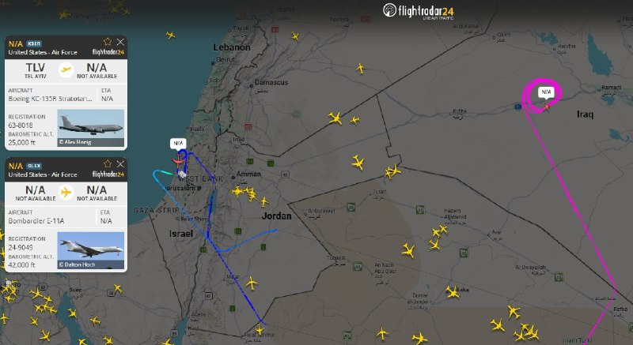

✈️در حال حاضر تنها پروازی که بر فراز اسرائیل در حال ارسال سیگنال است، یک هواپیمای سوخت‌رسان KC-135R Stratotanker متعلق به نیروی هوایی ایالات متحده است؛ در همین حال، یک فروند E-11A (گره ارتباطی هوابرد میدان نبرد – BACN) از پایگاه هوایی شاهزاده سلطان بر فراز عراق در حال گشت‌زنی (لوئیتر کردن) است.

@mwarmonitor

## mwarmonitor — post 9897

🔴دونالد ترامپ، رئیس‌جمهور آمریکا، یک نشست حدوداً دو ساعته در «اتاق وضعیت» را بدون اتخاذ تصمیم درباره توافق جدید با ایران ترک کرد. یک مقام ارشد دولت آمریکا این موضوع را به نیویورک‌تایمز گفته است.

🔴به گفته این مقام، دولت آمریکا معتقد است که رسیدن به توافق نزدیک است، اما همچنان اختلافاتی وجود دارد؛ از جمله بر سر آزادسازی دارایی‌های مسدودشده ایران.

@mwarmonitor

## pm_afshaa — post 91873

🔴الجزیره:وزیر خزانه‌داری آمریکا مدعی شد که تحریم‌های ایران به تدریج لغو خواهد شد

💧 Rainbet.com the #1 Non-KYC Crypto Casino & Sportsbook @rainbetcom

😁 @Pm_Afshaa

## IranIntlTV — post 339649

  

اسکات بسنت، وزیر خزانه‌داری آمریکا، ضمن اعلام توقیف یک میلیارد دلار رمزارز مرتبط با جمهوری اسلامی، گفت: «ما در حال همکاری با متحدانمان در سراسر اروپا هستیم تا ویلاها، خانه‌ها و املاک مقامات جمهوری اسلامی را توقیف کنیم.»
او افزود: «این پولی است که از مردم ایران دزدیده شده است.»
https://iranintl.com/202605295555

## FarsiVOA — post 219018

  <a href="telegram/content/FarsiVOA_219018_1780085582.mp4" target="_blank">🎬 Download video</a>

⚡️برخورد با دارندگان استارلینک با قوانین جمهوری اسلامی هم هم‌خوانی ندارد؛ گفت‌وگو با حسین احمدی‌نیاز؛ حقوق‌دان
@FarsiVOA

## FarsiVOA — post 219017

🔺تداوم بلاتکلیفی معترضان بازداشت‌شده در ایران؛ گزارش‌ها: یک دانش‌آموز ۴ ماه در بازداشت بوده است

▪️بر اساس گزارش‌های رسیده به کمیته پیگیری وضعیت بازداشت‌شدگان، سه شهروند به نام‌های دیانا طاهرآبادی، مائده رحیمی، و نیما حسینی همچنان در بازداشت به سر می‌برند و نگرانی‌ها درباره وضعیت حقوقی، روند رسیدگی قضایی و شرایط نگهداری آنان ادامه دارد.

⬇️ بیشتر بخوانید:
https://ir.voanews.com/a/detained-citizens-including-student/8155283.html
@FarsiVOA

## RadioFarda — post 157705

  

🔸اسکات بسنت، وزیر خزانه‌داری آمریکا، روز جمعه اعلام کرد که ایالات متحده در چارچوب بخش اقتصادی جنگ دولت دونالد ترامپ علیه جمهوری اسلامی، «یک میلیارد دلار» از دارایی‌های رمزارزی مرتبط با ایران را توقیف کرده است.

🔸او اواخر فروردین خبر داده بود که آمریکا بیش از ۳۴۰ میلیون دلار رمزارز را به‌ظن ارتباط با ایران مسدود کرد.

🔸آقای بسنت پیش از این گفته است که بعد از برقراری آتش‌بس، به دستور دونالد ترامپ برنامه «خشم اقتصادی» را علیه حکومت ایران اجرا می‌کند و در این چارچوب تا به حال ده‌ها صرافی، کشتی، شرکت و فرد حقیقی به فهرست تحریم‌های وزارت خزانه‌داری افزوده شده‌اند.

🔸وزیر خزانه‌داری آمریکا همچنین روز جمعه گفت که هرگونه کاهش یا لغو محاصره مالی و اقتصادی آمریکا علیه ایران، به‌صورت تدریجی انجام خواهد شد.

🔸او اعلام کرد: «خواهیم دید... هر چیزی که برداشته شود، به‌آرامی و مرحله‌به‌مرحله برداشته خواهد شد.»

@RadioFarda

## Dirty_Kids — post 390521

نمیدونم چی بگم
فقط لایکاش😂😂😂😂😂😂😂😂

تو تیک‌تاک یا همه ۱۵ سالشونه یا مغزشون کص میزنه وگرنه در این حد کصخلیت طبیعی نیست

@Dirty_Kids 👻

## Dirty_Kids — post 390520

راستی شماها که نبودین علی شریفی زارچی یه سوراخ تو سایت جانفداشون پیدا کرد که ثابت شد تعداد ثبت نام ها ۳ میلیون نهصد هزار نفره :))))

@Dirty_Kids 👻

## Dirty_Kids — post 390519

  

🔴 این روزا دخترا این تیشترتو در حمایت از دوس پسرشون میپوشن:

من نیازی به CHATGPT ندارم، چون دوس پسرم همه چیزو میدونه.

@Dirty_Kids 👻

## Dirty_Kids — post 390518

  <a href="telegram/content/Dirty_Kids_390518_1780085584.mp4" target="_blank">🎬 Download video</a>

تصاویر جدید از قیام ملت ایران در ۱۸ و ۱۹ دی

@Dirty_Kids 👻

## alonews — post 123576

  <a href="telegram/content/alonews_123576_1780085586.mp4" target="_blank">🎬 Download video</a>

👈رضا پهلوی: کشور های جهانی به خاطر چشم‌های زیبای من یا شما این کار را نمی‌کنند، آنها این کار را انجام می‌دهند چون به نفع منافع شان است.

✅ @AloNews خبر جنگ

## alonews — post 123575

  <a href="telegram/content/alonews_123575_1780085588.webm" target="_blank">🎬 Download video</a>

👈وزیر خارجه پاکستان: هرگونه گمانه‌زنی درباره پیوستن پاکستان به طرح سازش [پیمان ابراهیم] با اسرائیل را قویا رد می‌کنیم

🔴تا زمانی که سرزمین فلسطین مطابق مرزهای قبل از ۱۹۶۷ به پایتختی قدس شریف به رسمیت شناخته نشود، هیچ انعطاف‌پذیری در موضع ما وجود نخواهد داشت.

✅ @AloNews خبر جنگ

## alonews — post 123574

  <a href="telegram/content/alonews_123574_1780085588.webm" target="_blank">🎬 Download video</a>

👈وزیر خزانه‌داری آمریکا: یک میلیارد دلار از دارایی‌های رمزارز ایران را مصادره کردیم! 
✅ @AloNews خبر جنگ

---
📅 بروزرسانی: 1405/03/08 23:33
---

## VahidOOnLine — post 242824

  <a href="telegram/content/VahidOOnLine_242824_1780084982.mp4" target="_blank">🎬 Download video</a>

یک شهروند در پیامی به ایران اینترنشنال می‌گوید سرعت اینترنت جهانی در ایران بسیار پایین است. پیام او با هوش مصنوعی خوانده شده است.
‌🏁 🇬🇧 IranintlTV

🤖 @VahidOOnLine

## WithYashar — post 12906

نیویورک تایمز به نقل از یک مقام دولتی:
نشست ترامپ در اتاق عملیات به وایان رسید وحدود دو ساعت به طول انجامید.
@withyashar

## WithYashar — post 12905

نیویورک پست: زمان نهایی شدن تفاهم‌نامه بین آمریکا و ایران مشخص نیست
@withyashar

## FoxNewsTwitter — post 342411

Fox News (Twitter/X)

“I’ll kill your whole f–king family. Your whole f–king family is dead. Your children, your wife, all dead."

That's just one of the chilling threats made to ICE agents outside a New Jersey facility, as the DOJ says it's now working to identify and arrest the demonstrators.

@AlexisMcAdamsTV shows just some of the moments investigators are looking into as chaotic protests continue at the Newark facility. | @AmericaRpts

## FoxNewsTwitter — post 342410

  

Fox News (Twitter/X)

Rep. Ilhan Omar is officially seeking another term in Congress.

The Minnesota Democrat has filed paperwork to run again, as a separate debate over who can serve in federal office is picking up steam on Capitol Hill.

Rep. Nancy Mace is currently pushing a constitutional amendment that would require members of Congress, federal judges, and Senate-confirmed appointees to be natural-born U.S. citizens.

The proposal faces a steep path forward, but it's already drawing attention as Omar prepares for another campaign.

Mace directly accused Omar of "foreign allegiance" when discussing her proposal.

## pm_afshaa — post 91872

رئیس شورای هماهنگی اسلامی :قرار است یک مراسم تشییع ده‌ها میلیون نفری برای رهبر شهید مفعولمون برگزار کنیم

💧 Rainbet.com the #1 Non-KYC Crypto Casino & Sportsbook @rainbetcom

😁 @Pm_Afshaa

## pm_afshaa — post 91871

  

کانفیگ استارلینک رایگان👇

## VahidOnline — post 75796

  <a href="telegram/content/VahidOnline_75796_1780084984.mp4" target="_blank">🎬 Download video</a>

اسکات بسنت:
ما حدود ۱ میلیارد دلار از ارزهای دیجیتال ایران را توقیف کرده‌ایم - کیف پول‌ها را کاملاً توقیف کرده‌ایم.

ممکن است برخی از آنها همین الان در حال تایپ کردن باشند و متوجه نشوند که کیف پولشان توقیف شده است.

این پولی است که از مردم ایران دزدیده شده است.
@VahidOOnLine

📡 @VahidOnline

## IranIntlTV — post 339648

  <a href="https://t.me/IranintlTV/339648" target="_blank">📎 Download file</a>

🎧نسخه صوتی ۲۴ با فرداد فرحزاد: ترامپ: تهران پولی نخواهد گرفت و سلاح هسته‌ای نخواهد داشت
@iranintlTV

## IranIntlTV — post 339647

  <a href="telegram/content/IranIntlTV_339647_1780084985.mp4" target="_blank">🎬 Download video</a>

یک شهروند در پیامی به ایران اینترنشنال می‌گوید سرعت اینترنت جهانی در ایران بسیار پایین است. پیام او با هوش مصنوعی خوانده شده است.

## FarsiVOA — post 219016

  <a href="telegram/content/FarsiVOA_219016_1780084986.mp4" target="_blank">🎬 Download video</a>

⚡️اقتصاد ویران و بازگشت اینترنت نصف‌ونیمه؛ نظرات کاربران شبکه‌های اجتماعی
@FarsiVOA

## FarsiVOA — post 219015

  <a href="telegram/content/FarsiVOA_219015_1780084986.mp4" target="_blank">🎬 Download video</a>

⚡️منشه امیر در برنامه تفسیر خبر: از دیدگاه اسرائیل خطر موشکی جمهوری اسلامی مهمتر از خطر اتمی آن است
@FarsiVOA

## BBCPersian — post 282350

  <a href="telegram/content/BBCPersian_282350_1780084987.mp4" target="_blank">🎬 Download video</a>

‌ ‌ ‌
آخرین خبرهای مهم جمعه ۸ خرداد ۱۴۰۵

@BBCPersian

## BBCPersian — post 282349

🔻 تسنیم: پهپاد دشمن در اطراف جزیره قشم هدف قرار گرفت و منهدم شد

در پی گزارش‌ها درباره شنیده شدن صدای پدافند در جزیره قشم، خبرگزاری تسنیم،‌ نزدیک به منابع امنیتی گزارش داد که یک «ریزپرنده» آمریکایی اسرائیلی در حوالی جزیره قشم هدف پدافند هوایی ارتش ایران قرار گرفته و منهدم شده است.

منابع آمریکا درباره این گزارش اظهارنظری نکردند.

دیشب هم سپاه پاسداران مدعی سرنگون کردن یک پهپاد شده بود.

https://bbc.in/4nZZvWf
@BBCPersian

---
📅 بروزرسانی: 1405/03/08 23:23
---

## VahidOOnLine — post 242823

ویدیوی منتشرشده، لحظه کشته شدن جاویدنام بابک سلطانی را در اصفهان نشان می‌دهد.
سلطانی، ۵۹ ساله، شامگاه ۱۹ دی ۱۴۰۴ هنگامی که معترضان را در اصفهان پناه می‌داد هدف شلیک گلوله ماموران قرار گرفت و جان باخت.
‌🏁 🇬🇧 IranintlTV

🤖 @VahidOOnLine

## VahidOOnLine — post 242822

  

اتحادیه اروپا با انتشار بیانیه‌ای اعلام کرد که حمله اخیر حکومت ایران علیه کویت را به شدت محکوم می‌کند.

در این بیانیه آمده که این حمله بنا بر حقوق بین‌الملل نقض حاکمیت کویت محسوب می‌شود.

اتحادیه اروپا همبستگی کامل خود را با دولت و مردم کویت بار دیگر اعلام کرد و افزود: «چنین حملاتی تهدیدی جدی برای امنیت و ثبات منطقه به شمار می‌روند.»
‌🏁 🇬🇧 IranintlTV

🤖 @VahidOOnLine

## VahidOOnLine — post 242821

  

♦️ اسکات بسنت، وزیر خزانه‌داری ایالات متحده، روز جمعه هشتم خرداد، اعلام کرد که این کشور در راستای بخش اقتصادی جنگ دونالد ترامپ، رئیس‌جمهوری آمریکا، علیه جمهوری اسلامی، که به عنوان «خشم اقتصادی» شناخته می‌شود، یک میلیارد دلار از دارایی‌های رمزارزی ایران را توقیف کرده است.
‌🇸🇦 Indypersian

🤖 @VahidOOnLine

## VahidOOnLine — post 242820

🗣روایت شما از بحران اقتصادی و زندگی در آتش‌بس- جمعه ۸ خرداد:

🔹جوانی ما سوخت پای سفاهت عده‌ای که هیچ درک و فهمی از شادی و سرور ندارند، نزدیک به ۵۰ سال سرمایه‌های کشور رو به یغما دادند، ولی آدمی به امید زنده است.

🔹از اصفهان: گرونی بیداد می‌کنه. از صبح تا شب کار می‌کنیم برای یک میلیون که اونم هیچی نمی‌شه باهاش بخری.

🔹اینا توافق بکنن یا نکنن، هیچ فرقی به حال ما مردم نداره. جمهوری اسلامی به زودی به دست مردم نابود خواهد شد، چون مردم تو شرایط وحشتناکی دارن زندگی می‌کنن.

🔹من یه نوجوون ۱۵ ساله‌ام. چرا باید به فکر قیمت طلا و دلار باشم؟ تنها آرزوی زندگیم فقط خرید موتوریه که آخرین بار قیمتش ۸۰ میلیون تومان بود و الان قیمت گرفتم شده ۲۰۰ تومان. این یعنی خاک کردن آرزوهامون. این حق ما نیست.

🔹من یه بچه ۱۲ ساله هستم، دارم حسرت می‌خورم چرا یه دوچرخه ندارم، هر روز آرزو می‌کنم شاهزاده برگرده، هم مردم خوشحال بشن و هم کسانی که آرزوی چیزی داشتن بتونن بخرنش.

🔹ما نوجوان‌ها واقعا بدبخت شدیم نه امیدی نه آرزویی نه آینده‌ای. از بدو تولد با کرونا، آلودگی، قطعی برق و آب، جنگ و کشتار سر کردیم.

🔹به عنوان یه جوان ۲۸ ساله خیلی وقته دیگه انگیزه و امیدی برای آینده ندارم؛ جوانی که از وقتی که یادشه فقط داره کار می‌کنه و حتی پاش رو از شهر خودش برای یه مسافرت دو روزه بیرون نذاشته. پرایدی که ۱۵ سال از عمر خودش گذشته رو نمی‌تونم بخرم. ما سوختیم.

🔹جمهوری اسلامی با این وحشی‌گری‌هاش به زودی به جایی می‌ره که اسکندر و چنگیز رفتند. به دست مردم شجاع ایران، نه ترامپ. زنده‌باد امید، زنده‌باد ایران، زنده‌باد آزادی.

🔹مردم عزیز ایران، این روزهای سخت هم می‌گذره. امیدتون رو از دست ندین؛ ما ملتی هستیم که بارها دوباره از نو بلند شده. کنار هم می‌مونیم، می‌جنگیم و ایران‌مون رو پس می‌گیریم. آینده از آنِ مردمه.
‌🏁 🇬🇧 IranintlTV

🤖 @VahidOOnLine

## WithYashar — post 12904

  <a href="telegram/content/WithYashar_12904_1780084384.mp4" target="_blank">🎬 Download video</a>

وزیر خزانه‌داری آمریکا، اسکات بسنت:
ما حدود ۱ میلیارد دلار از رمزارزهای ایران را توقیف کرده‌ایم فقط مستقیم کیف‌پول‌ها را گرفته‌ایم.
برخی از آن‌ها شاید همین الان در حال تایپ کردن باشند و هنوز متوجه نشده‌اند که کیف‌پولشان گرفته شده است.
این پولی است که از مردم ایران دزدیده شده است.
@withyashar

## pm_afshaa — post 91870

https://t.me/proxy?server=87.248.129.12&port=15&secret=ee1603010200010001fc030386e24c3add626973636f7474692e79656b74616e65742e636f6d

پروکسی مخصوص دانلود

💧 Rainbet.com the #1 Non-KYC Crypto Casino & Sportsbook @rainbetcom

😁 @Pm_Afshaa

## IranIntlTV — post 339646

  <a href="telegram/content/IranIntlTV_339646_1780084387.mp4" target="_blank">🎬 Download video</a>

اسرائیل‌هیوم در گزارشی از وجود یک شاخه محرمانه در موساد خبر داد که ماموریت آن عملیات نفوذ، جنگ روانی و بی‌ثبات‌سازی جمهوری اسلامی با هدف تغییر رژیم در ایران است.

گفت‌وگو با منشه امیر، کارشناس امور خاورمیانه
@iranintltv

## IranIntlTV — post 339645

  <a href="telegram/content/IranIntlTV_339645_1780084389.mp4" target="_blank">🎬 Download video</a>

رومانی سفیر روسیه را پس از برخورد یک پهپاد روسی به ساختمانی در خاک این کشور احضار کرد. مقام‌های اروپایی این حادثه را نقض حریم هوایی اتحادیه اروپا دانستند. کایا کالاس، مسئول سیاست خارجه اتحادیه اروپا، هم گفته مسکو نباید حریم این منطقه را نقض کند.
این برخورد هم‌زمان با حملات شبانه روسیه به اوکراین رخ داد و دست‌کم دو نفر زخمی شدند.
@iranintltv

## IranIntlTV — post 339644

ویدیوی منتشرشده، لحظه کشته شدن جاویدنام بابک سلطانی را در اصفهان نشان می‌دهد.
سلطانی، ۵۹ ساله، شامگاه ۱۹ دی ۱۴۰۴ هنگامی که معترضان را در اصفهان پناه می‌داد هدف شلیک گلوله ماموران قرار گرفت و جان باخت.

## IranIntlTV — post 339643

  

اتحادیه اروپا با انتشار بیانیه‌ای اعلام کرد که حمله اخیر حکومت ایران علیه کویت را به شدت محکوم می‌کند.

در این بیانیه آمده که این حمله بنا بر حقوق بین‌الملل نقض حاکمیت کویت محسوب می‌شود.

اتحادیه اروپا همبستگی کامل خود را با دولت و مردم کویت بار دیگر اعلام کرد و افزود: «چنین حملاتی تهدیدی جدی برای امنیت و ثبات منطقه به شمار می‌روند.»
https://iranintl.com/202605296946

## IranIntlTV — post 339642

  <a href="telegram/content/IranIntlTV_339642_1780084392.mp4" target="_blank">🎬 Download video</a>

با وجود گزارش‌هایی درباره توافق میان واشینگتن و تهران، سرنوشت مذاکرات همچنان در هاله‌ای از ابهام قرار دارد.

دونالد ترامپ برای تصمیم‌گیری نهایی درباره توافق احتمالی با جمهوری اسلامی در نشست اتاق وضعیت کاخ سفید شرکت می‌کند.

گفت‌وگو با شهیر شهیدثالث، تحلیل‌گر روابط بین‌الملل
@iranintltv

## IranIntlTV — post 339641

🗣روایت شما از بحران اقتصادی و زندگی در آتش‌بس- جمعه ۸ خرداد:

🔹جوانی ما سوخت پای سفاهت عده‌ای که هیچ درک و فهمی از شادی و سرور ندارند، نزدیک به ۵۰ سال سرمایه‌های کشور رو به یغما دادند، ولی آدمی به امید زنده است.

🔹از اصفهان: گرونی بیداد می‌کنه. از صبح تا شب کار می‌کنیم برای یک میلیون که اونم هیچی نمی‌شه باهاش بخری.

🔹اینا توافق بکنن یا نکنن، هیچ فرقی به حال ما مردم نداره. جمهوری اسلامی به زودی به دست مردم نابود خواهد شد، چون مردم تو شرایط وحشتناکی دارن زندگی می‌کنن.

🔹من یه نوجوون ۱۵ ساله‌ام. چرا باید به فکر قیمت طلا و دلار باشم؟ تنها آرزوی زندگیم فقط خرید موتوریه که آخرین بار قیمتش ۸۰ میلیون تومان بود و الان قیمت گرفتم شده ۲۰۰ تومان. این یعنی خاک کردن آرزوهامون. این حق ما نیست.

🔹من یه بچه ۱۲ ساله هستم، دارم حسرت می‌خورم چرا یه دوچرخه ندارم، هر روز آرزو می‌کنم شاهزاده برگرده، هم مردم خوشحال بشن و هم کسانی که آرزوی چیزی داشتن بتونن بخرنش.

🔹ما نوجوان‌ها واقعا بدبخت شدیم نه امیدی نه آرزویی نه آینده‌ای. از بدو تولد با کرونا، آلودگی، قطعی برق و آب، جنگ و کشتار سر کردیم.

🔹به عنوان یه جوان ۲۸ ساله خیلی وقته دیگه انگیزه و امیدی برای آینده ندارم؛ جوانی که از وقتی که یادشه فقط داره کار می‌کنه و حتی پاش رو از شهر خودش برای یه مسافرت دو روزه بیرون نذاشته. پرایدی که ۱۵ سال از عمر خودش گذشته رو نمی‌تونم بخرم. ما سوختیم.

🔹جمهوری اسلامی با این وحشی‌گری‌هاش به زودی به جایی می‌ره که اسکندر و چنگیز رفتند. به دست مردم شجاع ایران، نه ترامپ. زنده‌باد امید، زنده‌باد ایران، زنده‌باد آزادی.

🔹مردم عزیز ایران، این روزهای سخت هم می‌گذره. امیدتون رو از دست ندین؛ ما ملتی هستیم که بارها دوباره از نو بلند شده. کنار هم می‌مونیم، می‌جنگیم و ایران‌مون رو پس می‌گیریم. آینده از آنِ مردمه.

## IranIntlTV — post 339640

  <a href="telegram/content/IranIntlTV_339640_1780084394.mp4" target="_blank">🎬 Download video</a>

اسرائیل‌هیوم گزارش داده موساد شاخه‌ای محرمانه برای عملیات نفوذ و جنگ روانی علیه جمهوری اسلامی با هدف تغییر رژیم ایجاد کرده است. این گزارش همچنین گفته رییس موساد معتقد است در صورت ادامه محاصره دریایی و شکست توافق با جمهوری اسلامی، حکومت ایران تا پایان ۲۰۲۶ سقوط می‌کند.
@iranintltv

## FarsiVOA — post 219014

🔺دیدگاه | توقیف و ادعای توقیف با مکث بر نمونه اخیر فیلم «تهران، کنارت»

▪️اواخر برگزاری جشنواره چهل و چهارم فیلم فجر بود. اوایل نیمه دوم بهمن ۱۴۰۴. دبیر جشنواره در تلویزیون حکومتی جمهوری اسلامی گفت: «جهان و سینما محل رفت و آمد است. باید پیش از آن که نوبت به ما برسد، با احترام به غصه‌های هم، مدارا و تحمل را در این خانه تمرین کنیم». مقصود منوچهر شاهسواری از این حرف که به ظاهر، هم فلسفی و مرگ‌آگاهانه جلوه می‌‌کرد و هم عاطفی، چه بود؟

⬇️ بیشتر بخوانید:
https://ir.voanews.com/a/opinion-iran-cinema-movie-kenarat-tehran-another-view/8154837.html
@FarsiVOA

## Persian_Trend_Official — post 15293

  <a href="telegram/content/Persian_Trend_Official_15293_1780084397.webm" target="_blank">🎬 Download video</a>

https://youtube.com/live/24Mc1cJMDgQ?feature=share

## RadioFarda — post 157704

آیا توافق موقت ایران و آمریکا در آستانهٔ رسیدن به مرحلهٔ پایانی است؟

🔸با وجود انتشار گزارش‌های ضدونقیض از تهران و واشینگتن دربارهٔ احتمال یک توافق موقت، کاخ سفید هنوز به‌طور شفاف اعلام نکرده است که آیا دو کشور به توافق نزدیک شده‌اند یا نه.

🔸اسکات بسنت، وزیر خزانه‌داری آمریکا، به خبرنگاران گفته است مذاکرات همچنان ادامه دارد و تأکید کرده که دونالد ترامپ، رئیس‌جمهور آمریکا، «توافق بدی» را برای ایالات متحده نخواهد پذیرفت.

🔸همزمان، گزارش‌هایی منتشر شده که نشان می‌دهد ایران و آمریکا پیرامون یک توافق موقت ۶۰ روزه برای تمدید آتش‌بس و احیای مذاکرات هسته‌ای به جمع‌بندی رسیده‌اند.

🔸انتشار این گزارش‌ها اختلاف دیدگاه‌ها در دولت ترامپ و میان جمهوری‌خواهان را برجسته کرده است. منتقدان می‌گویند کاخ سفید در شرایطی موضع نرم‌تری در قبال تهران در پیش گرفته که تنش‌ها در تنگه هرمز همچنان ادامه دارد.

🔸برای درک بهتر آن‌چه ممکن است پشت صحنه در جریان باشد، رادیو اروپای آزاد/رادیو آزادی با الکساندر گری، رئیس دفتر شورای امنیت ملی در دورهٔ نخست ریاست‌جمهوری دونالد ترامپ و مدیرعامل کنونی شرکت مشاوره ژئوپلیتیک «امریکن گلوبال استراتجیز»، گفت‌وگو کرده است.

🔸متن کامل این گفت‌وگو را در وب‌سایت رادیوفردا بخوانید.

@RadioFarda

## BBCPersian — post 282348

🔻 شنیده شدن صدای پدافند و انفجار در محدوده جزیره قشم

خبرگزاری مهر شامگاه روز جمعه گزارش داد که تعدادی از ساکنان در جزیره قشم از شنیده شدن صدای فعالیت پدافند هوایی خبر دادند.

این خبرگزاری می‌گوید که هنوز هیچ یک از نهادهای رسمی در ایران درباره علت این صداها اظهارنظری نکردند.

وحیدآنلاین هم می‌گوید که تعدادی از مخاطبانش حدود ساعت ۹ و نیم شب روز جمعه هشتم خرداد ماه در پیام‌هایی از شنیده شدن و دیدن شلیک پدافند خبر دادند.

برخی هم از شنیدن صداهایی شبیه به انفجار گفتند.

https://bbc.in/4wZIkbv
@BBCPersian

## alonews — post 123573

  <a href="telegram/content/alonews_123573_1780084397.webm" target="_blank">🎬 Download video</a>

🔴فوری/وزیر خزانه داری آمریکا درباره رفع تحریم‌های ایران

🔴به گزارش الجزیره،  وزیر خزانه‌داری آمریکا مدعی شد که تحریم‌های ایران به تدریج لغو خواهد شد.

✅ @AloNews خبر جنگ

---
📅 بروزرسانی: 1405/03/08 23:12
---

## VahidOOnLine — post 242819

  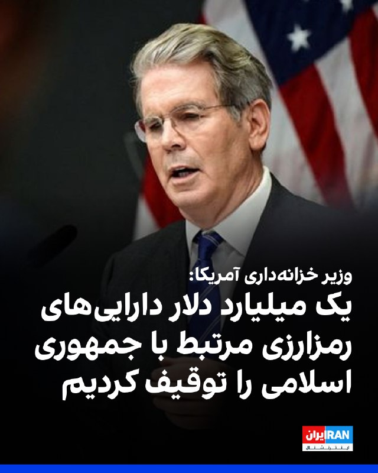

اسکات بسنت، وزیر خزانه‌داری آمریکا اعلام کرد این کشور یک میلیارد دلار از دارایی‌های رمزارزی مرتبط با جمهوری اسلامی را توقیف کرده است.

بسنت در پاسخ به پرسشی درباره محاصره دریایی بنادر ایران گفت هر اقدامی برای کاهش یا لغو محدودیت‌ها، به‌صورت تدریجی انجام خواهد شد.

وزیر خزانه‌داری آمریکا پیش‌تر نیز اعلام کرده بود دسترسی شرکت‌های هواپیمایی ایران به محل‌های فرود، سوخت‌گیری و فروش بلیت را قطع خواهیم کرد.
‌🏁 🇬🇧 IranintlTV

🤖 @VahidOOnLine

## VahidOOnLine — post 242818

  

علی خزایی، عضو کمیسیون آموزش مجلس گفت که هرگونه تعرض و تجاوز از سوی آمریکا، اسرائیل و متحدانشان با «پاسخ قاطع، سخت و دندان‌شکن» مواجه خواهد شد.

خزایی افزود: «دشمن بار دیگر دچار خطای محاسباتی شده و تصور کرده جمهوری اسلامی در میدان نبرد دچار سکوت یا انفعال شده است.»
‌🏁 🇬🇧 IranintlTV

🤖 @VahidOOnLine

## WithYashar — post 12903

شبکه کان اسرائیل :
نتانیاهو خواستار از سرگیری حملات به ایران است.
@withyashar

## FoxNewsTwitter — post 342409

  <a href="telegram/content/FoxNewsTwitter_342409_1780083767.mp4" target="_blank">🎬 Download video</a>

Fox News (Twitter/X)

"Hand to God" this video is real.

A Florida deputy thought he had caught a distracted driver red-handed.

Then he walked up to the window and discovered the driver...only had one hand.

Kathleen Thomas was pulled over on suspicion of using a cellphone with her right hand while driving, but the stop quickly took an unexpected turn when she explained she doesn't have a right hand.

In the video, the officer asks Thomas to swear "hand to God" that she did not have the phone in her hand.

After video of the encounter went viral, officials dropped the citation over what they called a lack of evidence.

## FoxNewsTwitter — post 342408

  <a href="telegram/content/FoxNewsTwitter_342408_1780083769.mp4" target="_blank">🎬 Download video</a>

Fox News (Twitter/X)

“Let them hear you at the f***ing White House.”

Bruce Springsteen rages against President Trump and his administration during his latest Washington, DC show:

"This White House is destroying the American idea and our reputation around the world."

"We are America, the reckless, unpredictable, predatory, untrustworthy, rogue nation."

The crowd at Nationals Park roared as Springsteen urged fans to “fight back.”

## pm_afshaa — post 91869

🔴کان اسرائیل:نتانیاهو خواستار از سرگیری حملات به ایران است

💧 Rainbet.com the #1 Non-KYC Crypto Casino & Sportsbook @rainbetcom

😁 @Pm_Afshaa

## IranIntlTV — post 339639

  

اسکات بسنت، وزیر خزانه‌داری آمریکا اعلام کرد این کشور یک میلیارد دلار از دارایی‌های رمزارزی مرتبط با جمهوری اسلامی را توقیف کرده است.

بسنت در پاسخ به پرسشی درباره محاصره دریایی بنادر ایران گفت هر اقدامی برای کاهش یا لغو محدودیت‌ها، به‌صورت تدریجی انجام خواهد شد.

وزیر خزانه‌داری آمریکا پیش‌تر نیز اعلام کرده بود دسترسی شرکت‌های هواپیمایی ایران به محل‌های فرود، سوخت‌گیری و فروش بلیت را قطع خواهیم کرد.
https://iranintl.com/202605296456

## IranIntlTV — post 339638

  

علی خزایی، عضو کمیسیون آموزش مجلس گفت که هرگونه تعرض و تجاوز از سوی آمریکا، اسرائیل و متحدانشان با «پاسخ قاطع، سخت و دندان‌شکن» مواجه خواهد شد.

خزایی افزود: «دشمن بار دیگر دچار خطای محاسباتی شده و تصور کرده جمهوری اسلامی در میدان نبرد دچار سکوت یا انفعال شده است.»
https://iranintl.com/202605297926

## FarsiVOA — post 219013

  <a href="telegram/content/FarsiVOA_219013_1780083773.mp4" target="_blank">🎬 Download video</a>

⚡️افزایش تهدیدات جمهوری اسلامی در کشورهای اسکاندیناوی
@FarsiVOA

## FarsiVOA — post 219012

⚡️دیدار وزیر خارجه آمریکا با همتای پاکستانی‌اش و گفتگوی‌ تلفنی او با رئیس جمهور لبنان در میانه تحولات منطقه‌ای
@FarsiVOA

## Persian_Trend_Official — post 15292

  <a href="telegram/content/Persian_Trend_Official_15292_1780083774.webm" target="_blank">🎬 Download video</a>

وزیر خزانه‌داری ایالات‌متحده : یک میلیارد دلار از دارایی‌های رمزارز ایران(سپاه) را مصادره کردیم.

🔹اسکات بسنت، وزیر خزانه‌داری آمریکا، روز (جمعه) مدعی شد که ایالات متحده حدود یک میلیارد دلار از دارایی‌های رمزارزی ایران را مصادره کرده است.

👺Phantom

📌 @persian_trend_official
پرشین ترند | متفاوت‌ترین کانال نظامی

## alonews — post 123572

  <a href="telegram/content/alonews_123572_1780083774.webm" target="_blank">🎬 Download video</a>

👈 تانکر ترکرز اعلام کرد: صادرات نفت و فرآورده‌های نفتی ایران تداوم دارد و امروز یک ابرنفتکش دو میلیون بشکه نفت خام ایران را بارگیری کرده است.

✅ @AloNews خبر جنگ

## alonews — post 123571

  <a href="telegram/content/alonews_123571_1780083774.webm" target="_blank">🎬 Download video</a>

👈وزیر خزانه‌داری آمریکا: یک میلیارد دلار از دارایی‌های رمزارز ایران را مصادره کردیم!

✅ @AloNews خبر جنگ

## alonews — post 123570

  <a href="telegram/content/alonews_123570_1780083774.webm" target="_blank">🎬 Download video</a>

👈کان اسرائیل: نتانیاهو خواستار از سرگیری حملات به ایران است

✅ @AloNews خبر جنگ

---
📅 بروزرسانی: 1405/03/08 23:02
---

## VahidOOnLine — post 242817

  

♦️ یک مقام ارشد دولت آمریکا که خواست نامش فاش نشود، روز جمعه هشتم خرداد، در گفتگو با نیویورک‌تایمز اعلام کرد که جلسه دونالد ترامپ، رئیس‌جمهوری آمریکا، در اتاق وضعیت کاخ سفید حدود دو ساعت به طول انجامید، اما او هنوز تصمیم نهایی را درباره توافق جدید با ایران اتخاذ نکرده است.

به گفته این مقام مسئول، دولت ترامپ بر این باور است که طرفین به یک توافق نزدیک شده‌اند، اما همچنان موضوعات مشخصی از جمله مسئله آزادسازی دارایی‌های مسدودشده ایران مورد بحث و رایزنی قرار دارد. ترامپ در پیامی که پیش از این جلسه منتشر کرد، تاکید کرد که فعلا پولی آزاد نخواهد شد.
‌🇸🇦 Indypersian

🤖 @VahidOOnLine

## WithYashar — post 12902

پست جدیددد اتاق جنگ داغ داغ کلیک کنید و کارای اداریش رو انجام بدید 💥

https://www.instagram.com/reel/DY7xeuCRP_4/?igsh=aW9oOXNnbno1NDJ6

## pm_afshaa — post 91868

🔴1 میلیارد دلار ارز دیجیتال سپاه توسط آمریکا مسدود شد

💧 Rainbet.com the #1 Non-KYC Crypto Casino & Sportsbook @rainbetcom

😁 @Pm_Afshaa

## pm_afshaa — post 91867

ثابتی؛ نماینده مجلس:پزشکیان به صداوسیما فشار اورده که دیگه سخنرانی های رهبر شهید علیه آمریکا رو پخش نکنن تا ترامپ لج نکنه و توافق رو بهم بزنه

💧 Rainbet.com the #1 Non-KYC Crypto Casino & Sportsbook @rainbetcom

😁 @Pm_Afshaa

## FarsiVOA — post 219011

🔺روایت دو برادر معترض ایرانی؛ فرار پس از ماه‌ها زندگی مخفیانه

▪️دو برادر معترض ایرانی که پس از شرکت در اعتراضات ضدحکومتی و ماه‌ها زندگی مخفیانه، ایران را ترک کرده‌اند می‌گویند پس از حضور در دو دوره اعتراضات، احساس کردند جانشان در خطر بازداشت، زندان یا حتی اعدام قرار دارد.

⬇️ بیشتر بخوانید:
https://ir.voanews.com/a/iranian-brothers-describe-fleeing-after-months-in-hiding/8155356.html
@FarsiVOA

## DW_Farsi — post 125294

🔶 قالیباف: امتیازات را نه با گفت‌وگو بلکه با موشک‌ها می‌گیریم

محمدباقر قالیباف، مذاکره‌کننده ارشد ایران در پیامی تازه تهدید کرد که جمهوری اسلامی امتیازات خود برای رسیدن به توافق در مذاکرات‌ با آمریکا را "نه با گفت‌وگو" بلکه با "موشک‌ها"ی خود می‌گیرد.

او در این پیام که جمعه هشتم خرداد در شبکه ایکس نوشته افزود: «هیچ اعتمادی به تضمین‌ها و حرف‌ها نداریم. فقط رفتارها معیار است. اقدامی پیش از اقدام طرف مقابل انجام نخواهد شد.»

قالیباف این اظهارات را همزمان با انتشار گزارش‌های رسانه‌ای در مورد قوی بودن امکان رسیدن به توافق در مذاکرات دو طرف بیان کرده است.

همزمان دونالد ترامپ، رئیس‌جمهور آمریکا در روز جمعه هشتم خرداد (۲۹ مه) در پیامی تازه در شبکه تروث سوشال اعلام کرد که در جلسه‌ای در اتاق وضعیت کاخ سفید در مورد توافق با ایران تصمیم نهایی را خواهد گرفت.

او در این پیام موارد مد نظر آمریکا برای توافق با ایران را فهرست کرده است.

طبق پیام ترامپ، این موارد شامل موافقت جمهوری اسلامی با عدم توسعه سلاح هسته‌ای، بازگشایی تنگه هرمز، انهدام تمامی مین‌های دریایی کارگذاشته‌شده توسط ایران، لغو محاصره دریایی این کشور توسط ایالات متحده و همچنین خار‌ج‌کردن اورانیوم بسیار غنی‌شده از زیر آوار توسط آمریکا و نابودسازی آن می‌شود.

رئیس‌جمهور آمریکا ادامه داد: «تا اطلاع ثانوی، هیچ پولی مبادله نخواهد شد. در مورد سایر موارد که از اهمیت بسیار کم‌تری برخوردار هستند، توافق حاصل شده است.»
@dw_farsi

## BBCPersian — post 282347

  

‌
❌هشدار: در این مطلب به موضوع خودکشی اشاره شده است. اگر به خودکشی فکر می‌کنید، با نهادهای تخصصی یا افراد متخصص تماس بگیرید.❌

کنت لا،‌ یک مرد کانادایی در دادگاهی در انتاریو اعتراف کرد که با فروش مواد شیمیایی کشنده در مرگ ۱۴ نفر که قصد خودکشی داشتند مشارکت داشته است. دادگاه او را به معاونت در مرگ،‌ متهم و مجرم شناخت.

اعتراف او بخشی از توافق با دادستان‌ها بود، که اتهامات جدی قتل عمد را از پرونده او حذف کنند.

آقای لا ۶۰ ساله است و پیشتر سرآشپز بوده است. او مواد شیمیایی قانونی اما سمی را به صورت آنلاین به افرادی که در تالارهای گفت‌وگوی خودکشی در اینترنت با آنها آشنا شده بود، می‌فروخت.

به گفته دادستان‌ها او حدود ۱۲۰۰ بسته مواد سمی را برای افرادی در ۴۱ کشور جهان ارسال کرده است.

گفته می‌شود که آقای لا به بیش از ۷۳ بریتانیایی مواد سمی فروخته است.

خانواده قربانیان بریتانیایی از دادستان‌ها در بریتانیا به دلیل متهم نکردن آقای لا در رابطه با مرگ بیش از ۷۳ بریتانیایی خشمگین هستند.

📷Peel Regional Police/PA Wire

@BBCPersian

## Hranews — post 113230

گزارشی از اجرای حکم اعدام ۷ زندانی در زندان‌های مختلف

❗️
❗️
❗️
❗️
❗️ – حکم هفت زندانی که پیشتر از بابت اتهامات مرتبط با جرائم مواد مخدر و قتل به مجازات #اعدام محکوم شده بودند، در زندان‌های زاهدان، بیرجند، مشهد و کرمانشاه به اجرا درآمد.

ادامه مطلب

↘️
@hranews_bot تماس ✉️ -  @Hranews  کانال هرانا 🆑

## alonews — post 123569

  <a href="telegram/content/alonews_123569_1780083168.webm" target="_blank">🎬 Download video</a>

👈بسنت وزیر خزانه داری آمریکا: احتمالاً تورم ایران بیش از ۲۰۰٪ است.

🔴ما فکر می‌کنیم ایران ماهانه ۴۰۰ تا ۵۰۰ میلیون دلار سرقت می‌کرد!

✅ @AloNews خبر جنگ

---
📅 بروزرسانی: 1405/03/08 22:53
---

## VahidOOnLine — post 242816

  

♦️ ابراهیم عزیزی، رئیس کمیسیون امنیت ملی مجلس شورای اسلامی با انتشار پیامی در شبکه اجتماعی ایکس، ایران را «پیروز و فاتح میدان» دانست و نوشت: «ترامپ باید بداند که ایران، به عنوان پیروز و فاتح میدان شرایط را تعیین می‌کند: نقد مقابل نقد، نسیه مقابل نسیه، هیچ مقابل هیچ؛ البته برای موضوعاتی که مورد مذاکره است نه آرزوهایش!»

این پیام ساعاتی پس از آن منتشر شد که ترامپ، با انتشار جزئیاتی از تفاهم‌نامه مورد مذاکره اعلام کرد که بازگشایی تنگه هرمز، برقرار نشدن هرگونه سازوکار اخذ عوارض از کشتی‌ها و نابودی ذخایر اورانیوم با غنای بالا از موارد ذکر شده هستند. اسماعیل بقایی، سخنگوی وزارت خارجه این موارد را رد کرد. ترامپ بارها تاکید کرده که تنها توافقی را می‌پذیرد که مسئله تنگه هرمز و برنامه هسته‌ای جمهوری اسلامی را در بر بگیرد.
‌🇸🇦 Indypersian

🤖 @VahidOOnLine

## VahidOOnLine — post 242815

  

خبرگزاری رویترز به نقل از منابع جمهوری اسلامی گزارش داد که تهران ممکن است با انتقال نیمی از ذخایر اورانیوم غنی‌شده ۶۰درصدی به یک کشور ثالث موافقت کند.

بر اساس این گزارش، در این حالت، جمهوری اسلامی در مقابل این مقدار، اورانیوم با غنای ۵ درصد دریافت می‌کند.

رویترز نوشت که همچنین ممکن است نیم دیگر این ذخایر در داخل ایران رقیق‌سازی شود.
‌🏁 🇬🇧 IranintlTV

🤖 @VahidOOnLine

## WithYashar — post 12901

  

پوستر
@withyashar

## FoxNewsTwitter — post 342406

  <a href="telegram/content/FoxNewsTwitter_342406_1780082582.mp4" target="_blank">🎬 Download video</a>

Fox News (Twitter/X)

"They're among us"

The White House has a new message on aliens: They are not coming from outer space — they are already here and ICE is tracking them.
A new website, Aliens.gov tracks illegal immigrant arrests, migrant encounters and ICE operations nationwide, using a live heat map and searchable arrest data by city, state and alleged crime.

“Millions arrived under the cover of darkness,” the site says, accusing past leaders of covering up and accelerating the problem.

A White House official told Fox News Digital this is a “first of its kind effort” to draw attention to the fallout from the previous administration’s border policies.

## pm_afshaa — post 91866

https://t.me/proxy?server=87.248.129.50&port=15&secret=ee1603010200010001fc030386e24c3add626973636f7474692e79656b74616e65742e636f6d

پروکسی سرعت بالا مخصوص دانلود

💧 Rainbet.com the #1 Non-KYC Crypto Casino & Sportsbook @rainbetcom

😁 @Pm_Afshaa

## IranIntlTV — post 339637

  

🔻نوواک جوکوویچ، مرد شماره ۴ تنیس جهان، در دور سوم رولان گاروس پس از پیش افتادن در دو ست، در نهایت مقابل ژوائو فونسکا، پدیده ۱۹ ساله برزیلی، باخت و حذف شد. پس از ۴ ساعت و ۵۳ دقیقه رقابت نفس‌گیر، شگفتی کامل شد و ورزشگاه فیلیپ شاتریه پس از حذف یانیک سینر، دومین شوک فصل را دید.

🔹اکنون قطعی است که دومین گرنداسلم سال را بازیکنی فتح خواهد کرد که تاکنون چنین عنوانی را به دست نیاورده است. نوواک جوکوویچ آخرین قهرمان گرنداسلم حاضر در پاریس بود.

🔹جدی‌ترین مدعی حال حاضر الکساندر زورف است که امشب در دور سوم به مصاف کوئنتن آلیس می‌رود.

🔹حذف جوکوویچ، به این معناست که از میان پنج نفر برتر رنکینگ، تنها زورف در جدول باقی مانده است.

🔹یانیک سینر، نفر اول جهان، در دور دوم و آن هم پس از برتری ۲-۰ در ست‌ها مقابل خوان مانوئل سروندولو از آرژانتین، به دلیل گرمازدگی شکست خورد.

🔹کارلوس آلکاراس، نفر دوم جهان، به دلیل آسیب‌دیدگی دست از حضور در پاریس انصراف داد.

🔹امشب، نواک جوکوویچ در میان تشویق پرشور تماشاگران زمین را ترک کرد؛ آیا این آخرین باری است که این ستاره ۳۹ ساله را در رولان گاروس می‌بینیم؟

@iranintltvsport

## Persian_Trend_Official — post 15291

تا دقایقی دیگه لایو آغاز میشه

## IranianMinds — post 21041

فاکس نیوز :
خبرهای مهمی از نشست ترامپ در کاخ سفید بیرون خواهد آمد

@IranianMinds

## IranianMinds — post 21040

  

🔴شش فروند هواپیمای نظامی Boeing C-17A Globemaster lll متعلق به نیروی هوایی ایالات متحده در حال ورود به خاورمیانه هستند.

@IranianMinds

## Dirty_Kids — post 390517

  <a href="telegram/content/Dirty_Kids_390517_1780082586.mp4" target="_blank">🎬 Download video</a>

حسین علایی از فرمانده‌های پیشین نیروی دریایی سپاه تروریستی تو این ویدئو می‌گه موشعلی رو شمخانی بگا داد و باعث کسپر شدنش شد،

«سه روز قبل از جنگ چهل روزه به شمخانی قحبه گفتم آمریکا و اسرائیل با کسپر کردن رهبری جنگ رو شروع می‌کنند اما شمخانی زن‌هزارتختخوابی شونه‌ش رو انداخت بالا و گفت نووچ، نمی‌تونن،
گفتم چرا نمی‌تونن کسمشنگ؟
گفت نمی‌تونن پیداش کنن»


@Dirty_Kids 👻

## Dirty_Kids — post 390516

  <a href="telegram/content/Dirty_Kids_390516_1780082588.mp4" target="_blank">🎬 Download video</a>

🔴 یه پست جدید و جنجالیِ دیگه از اکانت کاخ سفید همراه این کپشن:

اونا [آدم فضاییا] بین ما راه میرن.

@Dirty_Kids 👻

## Dirty_Kids — post 390512

  <a href="telegram/content/Dirty_Kids_390512_1780082590.mp4" target="_blank">🎬 Download video</a>

🔴 مردم ایران ۳ ماه اینترنت نداشتن، حالا که اینترنتشون برگشته به روال سابق، لابد دیگه به نحو احسنت ازش استفاده میکنن؛

+ همچنان یسری ایرنی‌ها تو اینستاگرام:

@Dirty_Kids 👻

## Hranews — post 113229

  

تداوم بازداشت؛ گزارشی از آخرین وضعیت عبدالرحیم سلیمانی در زندان قم

❗️
❗️
❗️
❗️
❗️ – عبدالرحیم سلیمانی اردستانی، پژوهشگر دینی و استاد دانشگاه، با وجود گذشت بیش از دو ماه از زمان بازداشت، همچنان به‌صورت بلاتکلیف در زندان ساحلی قم نگهداری می‌شود. این زندانی سیاسی اخیراً با نگارش نامه‌ای از داخل زندان، به تشریح آخرین وضعیت خود پرداخته است.

به گزارش خبرگزاری هرانا، ارگان خبری مجموعه فعالان حقوق بشر در ایران، عبدالرحیم سلیمانی اردستانی، کماکان به‌صورت بلاتکلیف قضایی در زندان ساحلی قم به‌سر می‌برد.

آقای سلیمانی اخیرا با نگارش نامه‌ای اعلام کرده است که با ۱۱ اتهام از جمله «تشویش اذهان عمومی»، «توهین به مقدسات»، «توهین به رهبری» (به دو شخص علی و مجتبی خامنه‌ای)، «تجمع در اعتراض به حصر میرحسین موسوی»، «اجتماع و تبانی علیه امنیت داخلی»، «توهین به مقدسات تشیع»، «فعالیت تبلیغی ضد نظام»، «نشر اکاذیب رایانه‌ای به قصد تشویش اذهان عمومی»، «توهین به مراجع»، «هتک حیثیت روحانیت» و «کنترل ذهن و القائات روانی» مواجه شده است و در ادامه از خود نسبت به این اتهامات مذکور دفاع کرده است.
در بخشی از این نامه آمده است که وی بدون ارائه حکم قضایی و با برخوردی خشونت‌آمیز و توأم با بی‌احترامی بازداشت شده و حدود دو ساعت تحت ضرب‌وشتم ماموران امنیتی قرار گرفته است. همچنین، با گذشت بیش از دو ماه از زمان بازداشت، او همچنان از حق ملاقات محروم مانده و یک ماه از این مدت را در سلول انفرادی سپری کرده است.

ادامه مطلب

#عبدالرحیم_سلیمانی_اردستانی

↘️
@hranews_bot تماس ✉️ -  @Hranews  کانال هرانا 🆑

## alonews — post 123568

  <a href="telegram/content/alonews_123568_1780082592.webm" target="_blank">🎬 Download video</a>

👈 پنتاگون در حال جذب صدها عضو نیروهای مسلح برای حضور در رویداد UFC برنامه‌ریزی‌شده توسط رئیس‌جمهور ترامپ در کاخ سفید در ۱۴ ژوئن است، گزارش واشنگتن پست.

🔴بر اساس یادداشت‌های داخلی که واشنگتن پست بررسی کرده است، نیروهای انتخاب‌شده برای حضور به عنوان تماشاگر با یونیفرم باید هزینه‌های سفر و اقامت خود را بپردازند، استانداردهای فعلی آمادگی جسمانی نظامی — از جمله الزامات قد به کمر — را رعایت کنند و یونیفرم رسمی بپوشند.

🔴مقامات به دنبال جذب پرسنل درجه‌دار جوان و افسران جوان برای حضور هستند.

✅ @AloNews خبر جنگ

---
📅 بروزرسانی: 1405/03/08 22:43
---

## VahidOOnLine — post 242814

  

♦️خبرنگار صداوسیما در قشم از فعال شدن سامانه پدافند هوایی در این منطقه خبر داد و اعلام کرد این اقدام دقایقی پیش انجام شده است.
در ادامه، خبرگزاری مهر به نقل از منابع محلی گزارش داد یک ریزپرنده در حوالی قشم توسط پدافند هوایی هدف قرار گرفته و منهدم شده است.
بر اساس این گزارش‌ها، جزئیات بیشتری درباره ماهیت این ریزپرنده و نتیجه نهایی عملیات پدافندی تاکنون منتشر نشده است.
‌🇸🇦 Indypersian

🤖 @VahidOOnLine

## VahidOOnLine — post 242813

  

نیویورک‌تایمز به نقل از یک مقام ارشد آمریکایی گزارش داد نشست دونالد ترامپ در «اتاق وضعیت» کاخ سفید دو ساعت به طول انجامید، اما رییس‌جمهور آمریکا هنوز درباره هیچ توافق جدیدی با تهران به تصمیم نهایی نرسیده است.

این مقام افزود دولت آمریکا معتقد است به دستیابی به توافق نزدیک شده، اما برخی مسائل از جمله آزادسازی دارایی‌های مسدودشده همچنان محل بررسی و اختلاف‌نظر است.
‌🏁 🇬🇧 IranintlTV

🤖 @VahidOOnLine

## VahidOOnLine — post 242812

  <a href="telegram/content/VahidOOnLine_242812_1780082000.mp4" target="_blank">🎬 Download video</a>

یک شهروند با اشاره به وضعیت بد معیشتی به مقایسه قدرت خرید خانواده‌های ایرانی با شهروندان کشورهای دیگر پرداخته و می‌گوید که بازگشت نسبی اتصال به اینترنت به این علت است که «حواسمان را پرت کنند.»

پیام او با هوش مصنوعی خوانده شده است.
‌🏁 🇬🇧 IranintlTV

🤖 @VahidOOnLine

## WithYashar — post 12900

المانیتور: تیم ترامپ، در اقدامی قابل توجه، ایده ایجاد یک صندوق ۳۰۰ میلیارد دلاری را برای ایران مطرح کرده است.
این پیشنهاد در شرایطی مطرح می‌شود که پیش از این، تهران یک پیشنهاد تجاری مشابه را رد کرده بود.
@withyashar

## FoxNewsTwitter — post 342405

  

Fox News (Twitter/X)

WATCH LIVE: NJ Gov. Sherrill holds press conference on Delaney Hall detention center https://twitter.com/i/broadcasts/1aKbddMqbnqJX

## pm_afshaa — post 91865

https://t.me/proxy?server=87.248.129.12&port=15&secret=ee1603010200010001fc030386e24c3add626973636f7474692e79656b74616e65742e636f6d

پروکسی پینگ 100 متصل

💧 Rainbet.com the #1 Non-KYC Crypto Casino & Sportsbook @rainbetcom

😁 @Pm_Afshaa

## pm_afshaa — post 91864

🔴نیویورک تایمز:ترامپ حدود دو ساعت در اتاق وضعیت با تیم ارشد امنیت ملی ملاقات کرد اما هیچ تصمیمی برای توافق با ایران نگرفت

💧 Rainbet.com the #1 Non-KYC Crypto Casino & Sportsbook @rainbetcom

😁 @Pm_Afshaa

## IranIntlTV — post 339636

  

خبرگزاری رویترز به نقل از منابع جمهوری اسلامی گزارش داد که تهران ممکن است با انتقال نیمی از ذخایر اورانیوم غنی‌شده ۶۰درصدی به یک کشور ثالث موافقت کند.

بر اساس این گزارش، در این حالت، جمهوری اسلامی در مقابل این مقدار، اورانیوم با غنای ۵ درصد دریافت می‌کند.

رویترز نوشت که همچنین ممکن است نیم دیگر این ذخایر در داخل ایران رقیق‌سازی شود.
https://iranintl.com/202605295732

## IranIntlTV — post 339635

  

نیویورک‌تایمز به نقل از یک مقام ارشد آمریکایی گزارش داد نشست دونالد ترامپ در «اتاق وضعیت» کاخ سفید دو ساعت به طول انجامید، اما رییس‌جمهور آمریکا هنوز درباره هیچ توافق جدیدی با تهران به تصمیم نهایی نرسیده است.

این مقام افزود دولت آمریکا معتقد است به دستیابی به توافق نزدیک شده، اما برخی مسائل از جمله آزادسازی دارایی‌های مسدودشده همچنان محل بررسی و اختلاف‌نظر است.
https://iranintl.com/202605292981

## IranIntlTV — post 339634

  <a href="telegram/content/IranIntlTV_339634_1780082005.mp4" target="_blank">🎬 Download video</a>

یک شهروند با اشاره به وضعیت بد معیشتی به مقایسه قدرت خرید خانواده‌های ایرانی با شهروندان کشورهای دیگر پرداخته و می‌گوید که بازگشت نسبی اتصال به اینترنت به این علت است که «حواسمان را پرت کنند.»

پیام او با هوش مصنوعی خوانده شده است.

## FarsiVOA — post 219010

🔺افزایش نگران‌کننده اعدام‌ها در ایران؛ بنیاد برومند: ۶۶۰ اعدام در سال ۲۰۲۶ مستند شده است

▪️بنیاد عبدالرحمن برومند می‌گوید که از ابتدای سال جاری میلادی (۱۱ دی ۱۴۰۴) تاکنون، اجرای ۶۶۰ مورد اعدام توسط جمهوری اسلامی ایران را مستند کرده است.

⬇️ بیشتر بخوانید:
https://ir.voanews.com/a/boroumand-center-documented-660-execution/8155307.html
@FarsiVOA

## DW_Farsi — post 125293

🔶 دو فعال کرد و از معترضان دی‌‌ماه "با تیراندازی سپاه" کشته شدند

سازمان حقوق بشری هه‌نگاو و شبکه حقوق بشر کردستان از کشته شدن دو برادر و فعال فرهنگی کرد که بعد از شرکت در اعتراضات دی‌ماه مخفیانه زندگی می‌کردند با "شلیک مستقیم" نیروهای سپاه پاسداران خبر داده‌اند.

شبکه حقوق بشر کردستان به نقل از یک منبع مطلع اعلام کرد، صبح روز پنج‌شنبه هفتم خرداد نیروهای سپاه پس از شناسایی محل اختفای آن‌ها در روستای "قلعه‌کوهش" شهرستان دالاهو به محل اقامت این دو برادر یورش بردند: «نیروهای سپاه در جریان این عملیات، منزل محل سکونت آنان را بدون هشدار قبلی هدف تیراندازی قرار داده و مجتبی و میثم ویسی را با شلیک گلوله کشتند.»

هه‌نگاو نیز با روایتی مشابه نوشته، یک شهروند دیگر که صاحب این خانه بوده "سرنوشتش نامعلوم است."

این سازمان حقوق بشری می‌‌گوید، این دو برادر "از چهره‌های خوش‌نام و مردمی و پیروان آیین یارسان" و از مؤسسان کتابخانه شهرک دره‌دریژ (شهرک مهدیه) کرمانشاه و از برگزارکنندگان اصلی مراسم‌ نوروز کردی در این منطقه بودند.

همچنین مجتبی ویسی علاوه بر فعالیت‌های مدنی، از "ورزشکاران برجسته و مقام‌آور رشته کشتی در استان کرمانشاه بود."

خبرگزاری فرانسه می‌نویسد، رسانه‌های داخلی ایران نیز این اتفاق که پنج‌شنبه رخ داده را تأیید کرده‌اند اما می‌گویند، آن‌ها زمانی که از مخفی‌گاه خود اقدام به تیراندازی به نیروهای امنیتی کردند هدف آتش قرار گرفته و کشته شدند.

خبرگزاری تسنیم، وابسته به سپاه پاسداران آن‌ها را "دو تن از عاملان اصلی" ناآرامی‌های دی‌ماه در منطقه دره‌دراز کرمانشاه معرفی کرده و مدعی شده که آنان ابتدا به سوی نیروهای امنیتی تیراندازی کردند.

در ادامه این گزارش آمده است که "در نهایت، نیروهای امنیتی در راستای مأموریت قانونی و به جهت دفاع از خود، اقدام به تیراندازی متقابل کردند که منجر" به کشته شدن این دو نفر شد.
@dw_farsi

## Persian_Trend_Official — post 15290

  <a href="telegram/content/Persian_Trend_Official_15290_1780082008.webm" target="_blank">🎬 Download video</a>

وضعیت فعلی آسمان منطقه

📌 @persian_trend_official
پرشین ترند | متفاوت‌ترین کانال نظامی

## Persian_Trend_Official — post 15289

  

اونوقت به خامنه ای شربت شهادت دادن نامردا !

📌 @persian_trend_official
پرشین ترند | متفاوت‌ترین کانال نظامی

## Persian_Trend_Official — post 15288

  <a href="telegram/content/Persian_Trend_Official_15288_1780082009.webm" target="_blank">🎬 Download video</a>

«ترامپ باید بداند که ایران به عنوان پیروز و فاتح میدان شرایط را تعیین می‌کند:
نقد مقابل نقد
نسیه مقابل نسیه
هیچ مقابل هیچ
البته برای موضوعاتی که مورد مذاکره است نه آرزوهایش»

-ایراهیم عزیزی،رئیس کمسیون امنیت ملی مجلس شورای اسلامی

📌 @persian_trend_official
پرشین ترند | متفاوت‌ترین کانال نظامی

## RadioFarda — post 157703

  

🔸رؤسای آژانس بین‌المللی انرژی، صندوق بین‌المللی پول، بانک جهانی و سازمان تجارت جهانی روز پنج‌شنبه برای بررسی واکنش نهادهای خود به پیامدهای جنگ در خاورمیانه دیدار کردند. این موضوع در بیانیه مشترکی که روز جمعه منتشر شد، اعلام شده است.

🔸این نهادها در بیانیه خود با اشاره به محاصره در تنگه هرمز، هشدار دادند: «اگر جریان حمل‌ونقل دریایی به حالت عادی بازنگردد، کاهش سریع و ادامه‌دار ذخایر جهانی نفت، همزمان با اوج تقاضای تابستانی در نیمکره شمالی، خطرات فزاینده‌ای برای امنیت سوخت، شرایط بازار و تاب‌آوری گسترده‌تر اقتصاد جهانی ایجاد خواهد کرد.»

🔸در ادامه این بیانیه آمده است که این نهادها همچنین گزینه‌هایی را برای «تقویت بیشتر حمایت جمعی از طریق اقدامات چندجانبه و دوجانبه» بررسی کرده‌اند.

🔸در پی حملات مشترک آمریکا و اسرائیل به ایران در نهم اسفند سال گذشته و آغاز جنگ، نیروهای نظامی ایران تنگه هرمز را مسدود کردند. این آبراه محل عبور حدود ۲۰ درصد از نفت و گاز در جهان بود و اختلال در حرکت کشتی‌ها باعث افزایش قیمت نفت و کمبود گاز و سایر محصولات نفتی در برخی کشورها شد.

@RadioFarda

## RadioFarda — post 157702

  

🔸سخنگوی وزارت خارجه جمهوری اسلامی در واکنش به پیام دونالد ترامپ دربارهٔ محتوای توافق میان آمریکا و ایران اعلام کرد که تفاهم میان دو کشور هنوز نهایی نشده است.

🔸اسماعیل بقائی روز جمعه گفت: «تبادل پیام‌ها البته ادامه دارد، ولی تفاهم نهایی نشده است.»

🔸دونالد ترامپ، رئیس‌جمهور آمریکا ساعتی پیش اعلام کرد که توافق پایان دادن جنگ باید شامل مواردی مانند تعهد ایران به باز شدن تنگه هرمز و نابودی ذخایر اورانیوم باشد.

🔸به گزارش رسانه‌های ایران، بقائی دربارهٔ وضعیت تنگه هرمز با اشاره به واقع شدن آن در آب‌های سرزمینی ایران و عمان گفت که دو کشور «باید ساز و کارهایی را اتخاذ کنند که هم منافع و امنیت ملی خودشان به عنوان کشورهای ساحلی حفظ شود و هم این‌که به جامعه جهانی این اطمینان را بدهند که کشتی‌رانی از این مسیر به صورت ایمن انجام می‌شود.»

🔸او همچنین مدعی شد که مدیریت تنگه هرمز به ایران و عمان مرتبط است. این در حالی است که رئیس‌جمهور و وزیر خزانه‌داری آمریکا اخیرا عمان را تهدید کرده‌اند که نباید تلاشی برای کنترل این آبراه و اخذ عوارض از کشتی‌ها داشته باشد.

@RadioFarda

## IranianMinds — post 21039

  

🔴 همزمان با گزارش‌هایی مبنی بر وقوع انفجار و فعالیت پدافند هوایی ایران در جزیره قشم در نزدیکی تنگه هرز، یک تانکر سوخت‌گیری هوایی پگاسوس KC-46A پگاسوس که از تل‌آویو پرواز می‌کرد، بر فراز خلیج فارس مشاهده شد.

@IranianMinds

<!-- MSG END -->

<!-- NAV START -->

<a href="https://github.com/ProAlit/aio-downloader/blob/main/telegram/content/archive_1.md" style="display:inline-block; padding:6px 12px; margin:0 4px; background-color:#2ea44f; color:white; text-decoration:none; border-radius:4px; font-weight:bold;">صفحه بعد</a>

<!-- NAV END -->
