# خواننده تلگرام

<!-- TOP_NAV START -->

<a href="https://github.com/ProAlit/aio-downloader/blob/main/telegram/content/archive_1.md" style="display:inline-block; padding:6px 12px; margin:0 4px; background-color:#2ea44f; color:white; text-decoration:none; border-radius:4px; font-weight:bold;">صفحه بعد</a>

<!-- TOP_NAV END -->

<!-- MSG START -->

---
📅 بروزرسانی: 1405/03/13 05:04
---

## Shin_Persian — post 6454

🔁 Quoting above tweet:
Shin ✓ @hey_itsmyturn
Wed, 03 Jun 2026 01:26:27 UTC

U.S. Central Command says Iranian drones attempted to attack U.S. forces in Kuwait tonight. Air defenses downed multiple drones; no American personnel or assets were harmed.

Source: @CENTCOM
https://x.com/CENTCOM/status/2061982709723906359

فارسی

فرماندهی مرکزی ایالات متحده (سنتکام) اعلام کرد پهپادهای ایرانی امشب تلاش کردند به نیروهای آمریکایی در کویت حمله کنند. پدافند هوایی چندین پهپاد را سرنگون کرد؛ به هیچ‌یک از پرسنل یا دارایی‌های آمریکا آسیبی وارد نشده است.

منبع: @CENTCOM
https://x.com/CENTCOM/status/2061982709723906359

𝕏 · @shin_persian

## FarsiVOA — post 219432

⚡️آیا بیانیه ائتلاف شیعه حاکم، پایان دوران شبه‌نظامیان وابسته به جمهوری اسلامی در عراق است؟
@FarsiVOA

---
📅 بروزرسانی: 1405/03/13 04:53
---

## FoxNewsTwitter — post 342535

  

Fox News (Twitter/X)

U.S. forces intercepted multiple Iranian missiles and drones and carried out self-defense strikes on Qeshm Island after Iran launched attacks across the Middle East on Tuesday, according to U.S. Central Command. https://twitter.com/JesseBWatters/status/2061975277480165832#m

## VahidOnline — post 75890

  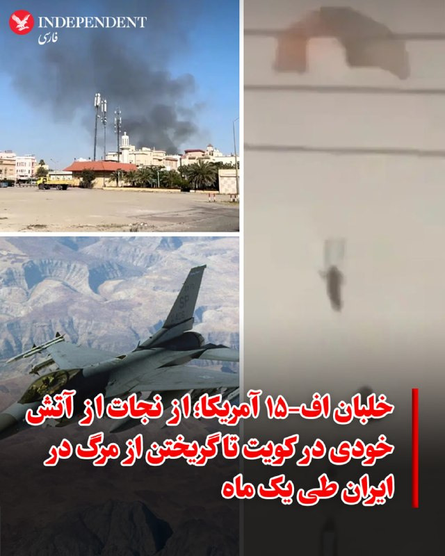

نیویورک‌پست می‌نویسد، بر اساس گزارشی جدید، یک خلبان جنگنده «اف-۱۵ئی استرایک ایگل» نیروی هوایی آمریکا در جریان جنگ ایران در کمتر از یک ماه دو بار در کویت (آتش خودی) و ایران سرنگون شد، اما هر دو بار زنده ماند.

هویت این خلبان هرگز به‌طور علنی اعلام نشده است. مقام‌های کنونی و سابق نظامی به نشریه «های ساید ساب‌استک» گفتند که او یکی از دشوارترین پنج هفته‌های دوران خدمت یک خلبان نیروی هوایی آمریکا را از زمان جنگ ویتنام پشت سر گذاشته است.

به نوشته نیویورک‌پست، بدبیاری او از دوم مارس آغاز شد؛ زمانی که در یک حادثه آتش خودی در کویت، نیروهای دفاعی این کشور به اشتباه به سوی سه فروند جنگنده اف-۱۵ئی آمریکایی شلیک کردند.
در این حادثه، هر شش خدمه این سه جنگنده مجبور شدند با استفاده از صندلی پران از هواپیما خارج شوند و با چتر در خاک کویت فرود آیند. همه آن‌ها سالم نجات پیدا کردند.

با وجود این حادثه، به گفته پیت هگست، وزیر جنگ آمریکا، خلبانان تنها چهار هفته بعد دوباره به ماموریت بازگشتند و در عملیات بمباران اهدافی در تهران شرکت کردند؛ اقدامی که او آن را نشانه شجاعت و فداکاری این نیروها دانست.
نیویورک‌پست می‌نویسد، اما چند روز پس از آن ماموریت، بدشانسی بار دیگر به سراغ یکی از این خلبانان آمد. یک جنگنده اف-۱۵ئی بر فراز ایران هدف قرار گرفت و دو سرنشین آن در خاک ایران سقوط کردند.
این خلبان در سوم آوریل به‌سرعت نجات داده شد، اما افسر سامانه‌های تسلیحاتی همراه او زخمی شده بود و پس از آنکه ایران برای دستگیری او جایزه تعیین کرد، ناچار شد مخفی شود. او روز بعد در عملیاتی نجات پیدا کرد.
@VahidOOnLine

📡 @VahidOnline

## FarsiVOA — post 219431

⚡️صدور حکم اعدام برای پهلوان جوان شیرازی؛ بنیامین نقدی پنجمین قهرمانی که به مرگ محکوم شد
@FarsiVOA

---
📅 بروزرسانی: 1405/03/13 04:43
---

## VahidOOnLine — post 243462

  

♦️نیویورک‌پست می‌نویسد، بر اساس گزارشی جدید، یک خلبان جنگنده «اف-۱۵ئی استرایک ایگل» نیروی هوایی آمریکا در جریان جنگ ایران در کمتر از یک ماه دو بار در کویت (آتش خودی) و ایران سرنگون شد، اما هر دو بار زنده ماند.
هویت این خلبان هرگز به‌طور علنی اعلام نشده است. مقام‌های کنونی و سابق نظامی به نشریه «های ساید ساب‌استک» گفتند که او یکی از دشوارترین پنج هفته‌های دوران خدمت یک خلبان نیروی هوایی آمریکا را از زمان جنگ ویتنام پشت سر گذاشته است.
به نوشته نیویورک‌پست، بدبیاری او از دوم مارس آغاز شد؛ زمانی که در یک حادثه آتش خودی در کویت، نیروهای دفاعی این کشور به اشتباه به سوی سه فروند جنگنده اف-۱۵ئی آمریکایی شلیک کردند.
در این حادثه، هر شش خدمه این سه جنگنده مجبور شدند با استفاده از صندلی پران از هواپیما خارج شوند و با چتر در خاک کویت فرود آیند. همه آن‌ها سالم نجات پیدا کردند.
با وجود این حادثه، به گفته پیت هگست، وزیر جنگ آمریکا، خلبانان تنها چهار هفته بعد دوباره به ماموریت بازگشتند و در عملیات بمباران اهدافی در تهران شرکت کردند؛ اقدامی که او آن را نشانه شجاعت و فداکاری این نیروها دانست.
نیویورک‌پست می‌نویسد، اما چند روز پس از آن ماموریت، بدشانسی بار دیگر به سراغ یکی از این خلبانان آمد. یک جنگنده اف-۱۵ئی بر فراز ایران هدف قرار گرفت و دو سرنشین آن در خاک ایران سقوط کردند.
این خلبان در سوم آوریل به‌سرعت نجات داده شد، اما افسر سامانه‌های تسلیحاتی همراه او زخمی شده بود و پس از آنکه ایران برای دستگیری او جایزه تعیین کرد، ناچار شد مخفی شود.
این سرهنگ نیروی هوایی روز بعد در عملیاتی نجات پیدا کرد. ارتش آمریکا محل اختفای او را در کوه‌های زاگرس شناسایی کرده بود؛ جایی که برای در امان ماندن پناه گرفته بود.
مقام‌های نظامی به های ساید گفته‌اند این خلبان که ظرف پنج هفته دو بار سرنگون شده است، «تقریبا با قطعیت» نخستین خلبان هواپیمای بال‌ثابت نیروی هوایی آمریکا از زمان جنگ ویتنام به شمار می‌رود که در یک درگیری واحد دو بار سرنگون شده است.
فرماندهی مرکزی آمریکا (سنتکام) به درخواست روزنامه نیویورک پست برای اظهارنظر درباره این گزارش پاسخی نداد.
‌🇸🇦 Indypersian

🤖 @VahidOOnLine

## VahidOOnLine — post 243461

  

♦️فرماندهی مرکزی آمریکا (سنتکام)، بامداد چهارشنبه اعلام کرد، نیروهای این کشور در پاسخ به تلاش‌های نافرجام سپاه برای حمله در سراسر خاورمیانه، حملاتی تدافعی را علیه یک ایستگاه کنترل زمینی نظامی در جزیره قشم انجام داده و هم‌زمان چندین موشک بالستیک و پهپاد سپاه را منهدم کرده‌اند. به گفته سنتکام، سپاه چندین موشک بالستیک را به سمت کشورهای همسایه شلیک کرد که همگی ناکام ماندند؛ از جمله دو موشک شلیک‌شده به سمت کویت قبل از رسیدن به هدف سقوط کردند و سه موشک شلیک‌شده به سمت بحرین نیز بلافاصله توسط نیروهای پدافند هوایی آمریکا و بحرین رهگیری و نابود شدند. همچنین ارتش آمریکا سه پهپاد انتحاری را که به سمت کشتی‌های تجاری غیرنظامی در آب‌های منطقه هدایت می‌شدند، سرنگون کرد.
در همین حال، سنتکام با تکذیب ادعای سپاه پاسداران مبنی بر اصابت موشک و پهپاد به مقر ناوگان پنجم آمریکا در بحرین و یک پایگاه هوایی دیگر در منطقه، این ادعا را کاملا «دروغ» خواند و تاکید کرد که تمامی حملات ایران علیه نیروهای آمریکایی شکست خورده است و هیچ نیروی آمریکایی آسیب ندیده‌اند.
‌🇸🇦 Indypersian

🤖 @VahidOOnLine

## FoxNewsTwitter — post 342534

  

Fox News (Twitter/X)

Acting Deputy Attorney General Todd Blanche says President Trump would have faced prison time if he hadn't won the 2024 election.

Blanche, who represented Trump during the New York criminal trial that resulted in 34 felony convictions, called the case an "incredible travesty" during an interview on "Hang Out with @seanhannity."

Asked whether it was "the White House or the big house," Blanche's answer was simple: "Absolutely."

## FoxNewsTwitter — post 342530

Fox News (Twitter/X)

Legendary singer-songwriter Peabo Bryson has died at age 75.

Bryson died on Tuesday after suffering a stroke, according to a statement from the family.

"While our hearts are broken, we find comfort in knowing how deeply Peabo was loved and how many lives were touched by his voice and his generous spirit. His legacy and music will live on for generations to come," the family said.

Best known for performing Disney classics like Beauty and the Beast with Celine Dion and A Whole New World with Regina Belle, Bryson's soaring vocals made him one of the most recognizable voices in pop and R&B.

## FarsiVOA — post 219430

⚡️نگرانی خانواده فاطمه سپهری از وضعیت وخیم جسمانی این فعال سیاسی
@FarsiVOA

## FarsiVOA — post 219429

  <a href="telegram/content/FarsiVOA_219429_1780449233.mp4" target="_blank">🎬 Download video</a>

⚡️ابرتورم در ایران؛ مرکز آمار نرخ تورم را حدود ۸۴ درصد اعلام کرد؛ گفت‌وگو با رضا غیبی
@FarsiVOA

---
📅 بروزرسانی: 1405/03/13 04:33
---

## FarsiVOA — post 219428

  <a href="telegram/content/FarsiVOA_219428_1780448637.mp4" target="_blank">🎬 Download video</a>

⚡️بازگشت محدود اینترنت و بلاتکلیفی خریداران «پرو»؛ واکنش کاربران شبکه‌های اجتماعی
@FarsiVOA

---
📅 بروزرسانی: 1405/03/13 04:23
---

## VahidOOnLine — post 243460

  

♦️به گزارش رسانه های داخلی، قرار است تیم فوتبال ایران پیش از شروع جام جهانی به جای پورتوریکو به مصاف تیم ملی گرنادا برود.
گرنادا منطقه‌ای جزیره‌ای در بخش جنوب شرقی دریای کارائیب و در بخش شمال ونزوئلا و جنوب شرقی میامی قرار دارد.
قرار بود طبق برنامه از قبل تعیین شده، تیم ایران در آخرین دیدار تدارکاتی خود پیش از شروع مسابقات جام جهانی ۲۰۲۶ در آمریکا به مصاف پورتوریکو برود. از آنجایی که کمپ تیم از آمریکا به کمپی در منطقه تیخوانا مکزیک منتقل شد، برگزاری این مسابقه در هاله‌ای از ابهام قرار گرفت.
فرارو می‌نویسد، روز سه‌شنبه رایزنی مسئولان فدراسیون فوتبال با پورتوریکو برای برگزاری بازی تدارکاتی در مکزیک به جایی نرسید تا به فکر گزینه دیگری بیفتند. بر اساس این گزارش، با توجه به زمان کم، فدراسیون فوتبال با کشور گرنادا صحبت‌هایی انجام داد تا شاگردان امیر قلعه‌نویی در مکزیک به مصاف این تیم بروند. قرار است جزئیات این موضوع مورد بررسی قرار بگیرد و در صورت نهایی شدن دو تیم به مصاف هم بروند.
‌🇸🇦 Indypersian

🤖 @VahidOOnLine

## VahidOOnLine — post 243459

  

♦️فرماندهی مرکزی ایالات متحده، سنتکام، در اطلاعیه‌ای ادعای سپاه مبنی بر حمله موشکی و پهپادی به «ناوگان پنجم آمریکا در بحرین» را تکذیب کرد. در این پیام آمده است: «سپاه پاسداران انقلاب اسلامی ایران ادعا می‌کند که امروز با موشک و پهپاد به مقر ناوگان پنجم آمریکا در بحرین و یک پایگاه هوایی آمریکا در منطقه حمله کرده است. این ادعا نادرست است.» در ادامه این پیام آمده است: «حقیقت: همه حملات ایران علیه نیروهای آمریکایی شکست خورده‌اند. نیروهای آمریکا همچنان هوشیار هستند و برای دفاع در برابر اقدامات تهاجمی غیرموجه ایران آماده‌اند.»
‌🇸🇦 Indypersian

🤖 @VahidOOnLine

## VahidOOnLine — post 243458

  

تامی پیکوت، سخنگوی وزارت خارجه آمریکا، در ایکس با اشاره به برگزاری چهارمین دور گفت‌وگوهای مستقیم هیئت‌های سیاسی و امنیتی اسرائیل و لبنان در وزارت خارجه آمریکا گفت این مذاکرات در مسیر پیشرفت و توافق جامع قرار دارد و دور دیگری از این گفت‌وگوها چهارشنبه برگزار می‌شود.
او افزود: «ما از ناکامی‌های ۲۰ سال گذشته فاصله می‌گیریم و به سوی توافقی جامع حرکت می‌کنیم که هدف آن بازگرداندن حاکمیت لبنان و تضمین امنیت اسرائیل است. ایالات متحده همچنان به طور کامل به تسهیل این مذاکرات تاریخی متعهد است.»

‌🏁 🇬🇧 IranintlTV

🤖 @VahidOOnLine

## FoxNewsTwitter — post 342529

  

Fox News (Twitter/X)

The progressive Democrat who campaigned alongside "Abolish ICE" activists is moving on to November.

Rep. Analilia Mejia secured victory in New Jersey's Democratic primary, keeping her on track to seek a full term in Congress just months after winning a special election.

Mejia has drawn national attention for her support of abolishing ICE and her criticism of Trump's immigration agenda.

## FoxNewsTwitter — post 342528

  

Fox News (Twitter/X)

"Karen Bass just violated election law."

LA mayoral candidate Spencer Pratt says his campaign has filed a formal complaint accusing Los Angeles Mayor Karen Bass of illegally campaigning too close to a ballot box.

Pratt says Bass filmed herself campaigning within 100 feet of a ballot box, calling it a blatant violation of election law and evidence of what he calls a "rules for thee, but not for me" culture at City Hall.

"We must protect our democracy," he wrote on X, saying the complaint is about protecting election integrity and holding public officials accountable.

The 42-year-old included a photo of the complaint in his post, saying "Enjoy your conference calls with your lawyers, Karen!"

## VahidOnline — post 75889

  

ستاد فرماندهی مرکزی آمریکا در شبکه‌های اجتماعی اعلام کرد که سپاه پاسداران مدعی شده که در حملات امروز با موشک و پهپاد به مقر ناوگان پنجم آمریکا در بحرین و یک پایگاه هوایی آمریکا در منطقه ضربه زده است.
سنتکام گفت این ادعا نادرست است و تمام حملات جمهوری اسلامی به نیروهای آمریکایی شکست خورد.
@VahidHeadline
(مثل دو روز گذشته در این ساعت، ده‌ها پیام دیگر از تهران دریافت کردم درباره صدای عجیب پرواز هواپیما که منجر به بیدار شدن خیلی‌ها شد.)
📡 @VahidOnline

## IranIntlTV — post 340306

  

تامی پیکوت، سخنگوی وزارت خارجه آمریکا، در ایکس با اشاره به برگزاری چهارمین دور گفت‌وگوهای مستقیم هیئت‌های سیاسی و امنیتی اسرائیل و لبنان در وزارت خارجه آمریکا گفت این مذاکرات در مسیر پیشرفت و توافق جامع قرار دارد و دور دیگری از این گفت‌وگوها چهارشنبه برگزار می‌شود.
او افزود: «ما از ناکامی‌های ۲۰ سال گذشته فاصله می‌گیریم و به سوی توافقی جامع حرکت می‌کنیم که هدف آن بازگرداندن حاکمیت لبنان و تضمین امنیت اسرائیل است. ایالات متحده همچنان به طور کامل به تسهیل این مذاکرات تاریخی متعهد است.»

https://iranintl.com/202606033066

## FarsiVOA — post 219427

⚡️«الفبای نیاکان» دوباره در تاجیکستان مورد توجه قرار گرفته است.
@FarsiVOA

## FarsiVOA — post 219426

  

⚡️کاخ سفید، هشدار دونالد ترامپ، رئیس‌جمهوری آمریکا به جمهوری اسلامی را روز سه‌شنبه در حساب خود در شبکه اجتماعی ایکس منتشر کرد. آقای ترامپ در هشداری که در تروت‌سوشال منتشر کرده بود، گفت که «همانطور که به [جمهوری اسلامی] ایران گفتم، 'وقت آن رسیده که به هر طریقی شده، به توافق برسید. شما ۴۷ سال است که این کار را می‌کنید و دیگر نمی‌توان اجازه داد که [این وضعیت] ادامه یابد!'»
@FarsiVOA

---
📅 بروزرسانی: 1405/03/13 04:13
---

## VahidOOnLine — post 243457

  <a href="telegram/content/VahidOOnLine_243457_1780447421.mp4" target="_blank">🎬 Download video</a>

♦️به گزارش فرارو، حمام تاریخی گنجعلی‌خان کرمان، یکی از شاخص‌ترین بناهای دوره صفوی، با آسیب‌های جدی در تزئینات کاشی‌کاری خود روبه‌رو شده است. بخش‌هایی از کاشی‌ها به‌قدری فرسوده شده‌اند که با کوچک‌ترین تماس فرو می‌ریزند و در برخی نقاط دیوار گرمینه نیز تورم و جداشدگی کاشی‌ها، خطر ریزش کامل آن‌ها را افزایش داده است. این حمام که در مجموعه تاریخی گنجعلی‌خان قرار دارد، به‌دلیل معماری منحصربه‌فرد کاشی‌کاری‌های نفیس، مقرنس‌کاری‌ها، حجاری‌ها و نقاشی‌های دیواری، از ارزشمندترین گرمابه‌های تاریخی ایران به شمار می‌رود. حمام گنجعلی‌خان که تا حدود ۶۰ تا ۷۰ سال پیش فعال بود، اکنون به موزه مردم‌شناسی تبدیل شده و از پربازدیدترین جاذبه‌های گردشگری کرمان است. با این حال، روند فرسودگی و تخریب آن در سایه بی‌توجهی مسئولان ادامه دارد.
‌🇸🇦 Indypersian

🤖 @VahidOOnLine

## VahidOOnLine — post 243456

♦️تصاویر منتشر شده در شبکه‌های اجتماعی، بامداد چهارشنبه، هدف قرار گرفتن و سقوط موشک‌های سپاه را در کویت نشان می‌دهد. همزمان سنتکام در بیانیه‌ای اعلام کرد چندین موشک بالستیک با موفقیت رهگیری شدند و تاکید کرده که رژیم ایران حمله‌های موشکی متعددی علیه همسایگان منطقه‌ای خود انجام داده اما هیچ‌یک به هدف برخورد نکرده‌اند. قطعات دو موشک نیز در راه کویت از هم پاشیده است. سپاه نیز با انتشار بیانیه‌ای اعلام کرد ناوگان پنجم نیروی دریایی آمریکا که مقر آن در بحرین است را مورد تهاجم پهپادی و موشکی قرار داده است.
‌🇸🇦 Indypersian

🤖 @VahidOOnLine

## Shin_Persian — post 6451

## Shin_Persian — post 6448

  <a href="telegram/content/Shin_Persian_6448_1780447424.mp4" target="_blank">🎬 Download video</a>

Shin ✓ @hey_itsmyturn
Wed, 03 Jun 2026 00:37:30 UTC

𝕏 · @shin_persian

## Shin_Persian — post 6447

Shin ✓ @hey_itsmyturn
Wed, 03 Jun 2026 00:35:45 UTC

Got visuals now, not a fighter jet, but a twin engine low passing NW -&gt; SE

فارسی

تصاویر را دریافت کردم، یک جنگنده نیست، بلکه یک هواپیمای دو موتوره است که در ارتفاع پایین از سمت شمال غربی به سمت جنوب شرقی عبور می‌کند.

𝕏 · @shin_persian

## FarsiVOA — post 219425

⚡️رزمایش سالانه ناتو در دریای بالتیک در مقیاس کوچکتر برگزار می‌شود
@FarsiVOA

## FarsiVOA — post 219424

  <a href="telegram/content/FarsiVOA_219424_1780447425.mp4" target="_blank">🎬 Download video</a>

⚡️افزایش چشمگیر اعدام زندانیان سیاسی و بازداشت‌شدگان اعتراضات دی‌ماه ۱۴۰۴؛ گفت‌وگو با سینا یوسفی
@FarsiVOA

## IranianMinds — post 21285

🔴 بنده خدا اومد یه تور گذاشت برن یکم آب بازی کنن و بگردن بعد از شانسش رسانه ای شد همه جا پخشش کردن و این حکومتیام دیدن دختر پسر با همن و مختلطه توره و ریختن سرشو نذاشتن برگزار کنه چیزیو ...

@IranianMinds

## IranianMinds — post 21284

  

🔴فقط 
5️⃣ روز فرصت باقی مونده
🔴

🎉 500 هزارتومن بونوس رایگان فقط با ثبت نام بدون هیچگونه واریزی!

😮 تنها سایتی که با عضویت بدون واریز 500,000 تومان شارژ بی قیدو شرط میده #وینرو هست
💰

7️⃣
1️⃣ خرداد، افتتاحیه سایت با جوایز بزرگ
🔥

👑 #معتبرترین سایت ایرانی 
⬇️

🌐 Winro.io

🌐 Winro.io

📱کانال اخبار و هدایا Aa12 
🎁

📱 @winro_io

---
📅 بروزرسانی: 1405/03/13 04:03
---

## VahidOOnLine — post 243455

  

ستاد فرماندهی مرکزی آمریکا، سنتکام، با اشاره به درگیری‌های جدید نیروهای آمریکایی و سپاه اعلام کرد جمهوری اسلامی چندین موشک بالستیک به سمت کشورهای همسایه منطقه شلیک کرد، اما هیچ‌کدام به اهداف مورد نظر اصابت نکردند و هیچ‌یک از نیروهای آمریکایی نیز آسیب ندیدند.
طبق این اطلاعیه، دو موشک ایرانی که به سوی کویت شلیک شدند، در مسیر سقوط کردند یا حین حرکت متلاشی شدند و سه موشک که به سمت بحرین پرتاب شده بودند، بلافاصله از سوی سامانه‌های پدافند هوایی آمریکا و بحرین رهگیری شدند.
پیش‌تر سپاه اعلام کرد در پاسخ به حمله‌ پرتابه‌های آمریکا به یک دکل مخابراتی سپاه در جنوب جزیرۀ قشم، نیروی هوافضای سپاه پایگاه هوایی و بالگردی ایالات‌متحده در یکی از کشورهای منطقه و همچنین مرکز ناوگان پنجم دریایی آمریکا را هدف حملات موشکی و پهپادی قرار داده است.

‌🏁 🇬🇧 IranintlTV

🤖 @VahidOOnLine

## FoxNewsTwitter — post 342527

  <a href="telegram/content/FoxNewsTwitter_342527_1780446840.mp4" target="_blank">🎬 Download video</a>

Fox News (Twitter/X)

Caitlyn Jenner supports Spencer Pratt for Los Angeles mayor ahead of primary results: "We need people like Spencer Pratt to make the changes." https://twitter.com/TheStoryFNC/status/2061897203153588227#m

## IranIntlTV — post 340305

  

ستاد فرماندهی مرکزی آمریکا، سنتکام، با اشاره به درگیری‌های جدید نیروهای آمریکایی و سپاه اعلام کرد جمهوری اسلامی چندین موشک بالستیک به سمت کشورهای همسایه منطقه شلیک کرد، اما هیچ‌کدام به اهداف مورد نظر اصابت نکردند و هیچ‌یک از نیروهای آمریکایی نیز آسیب ندیدند.
طبق این اطلاعیه، دو موشک ایرانی که به سوی کویت شلیک شدند، در مسیر سقوط کردند یا حین حرکت متلاشی شدند و سه موشک که به سمت بحرین پرتاب شده بودند، بلافاصله از سوی سامانه‌های پدافند هوایی آمریکا و بحرین رهگیری شدند.
پیش‌تر سپاه اعلام کرد در پاسخ به حمله‌ پرتابه‌های آمریکا به یک دکل مخابراتی سپاه در جنوب جزیرۀ قشم، نیروی هوافضای سپاه پایگاه هوایی و بالگردی ایالات‌متحده در یکی از کشورهای منطقه و همچنین مرکز ناوگان پنجم دریایی آمریکا را هدف حملات موشکی و پهپادی قرار داده است.

https://iranintl.com/202606030219

## Shin_Persian — post 6445

Shin ✓ @hey_itsmyturn
Wed, 03 Jun 2026 00:32:01 UTC

Jet activity over western Tehran.

فارسی

فعالیت جنگنده‌ها برفراز غرب تهران.

𝕏 · @shin_persian

## FarsiVOA — post 219423

⚡️حقوق ۱۶ میلیون تومانی در برابر تورم ۷۳ درصدی؛ رونمایی از پدیده «شاغلان فقیر»
@FarsiVOA

## Persian_Trend_Official — post 15589

  <a href="telegram/content/Persian_Trend_Official_15589_1780446843.webm" target="_blank">🎬 Download video</a>

قیمت نفت صعودی شد و به حدود 97 دلار رسید!

📝 Amir

📌 @persian_trend_official
پرشین ترند | متفاوت‌ترین کانال نظامی

## IranianMinds — post 21283

  

🔴سنتکام:

سپاه ادعا کرده که مقر ناوگان پنجم آمریکا در بحرین و یک پایگاه هوایی آمریکا را یا موشک و پهپاد هدف قرار داده است. همش دروغ است و در حقیقت حملات ایران به نیروهای آمریکا ناموفق بوده است. آمریکا هیچ آسیبی ندیده است و همیشه در هوشیاری کامل است که در برابر هر حمله‌ای واکنش نشان بدهد.

@IranianMinds

---
📅 بروزرسانی: 1405/03/13 03:54
---

## VahidOOnLine — post 243454

  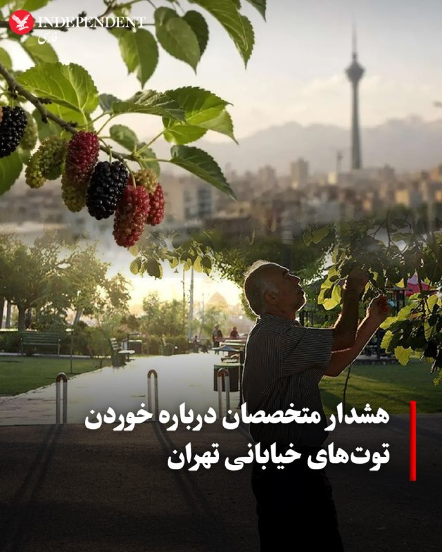

♦️پزشکان و کارشناسان سلامت نسبت به مصرف توت‌های چیده‌شده از درختان خیابان‌های تهران هشدار داده‌اند و می‌گویند آلودگی هوا، گرد و غبار و آلاینده‌های شیمیایی می‌تواند این میوه‌ها را به تهدیدی برای سلامت تبدیل کند.
ایرج خسرونیا، فوق‌تخصص بیماری‌های گوارش و کبد، رئیس جامعه متخصصان داخلی ایران و عضو هیئت علمی دانشگاه بهشتی، گفت مصرف توت در باغ‌ها و مناطق خارج از شهرهای شلوغ از نظر بهداشتی مشکلی ندارد، اما چیدن و خوردن توت از درختان واقع در معابر و خیابان‌های شهرهای بزرگ، به‌ویژه تهران، می‌تواند با خطرات جدی همراه باشد.
او در گفتگو با فرارو توضیح داد که آلاینده‌های موجود در هوای کلان‌شهرها، از جمله مواد شیمیایی، میکروب‌ها و ویروس‌ها، از طریق باران یا حتی رطوبت هوا روی سطح میوه‌ها می‌نشینند و در صورت مصرف بدون شست‌وشوی مناسب می‌توانند باعث بروز مشکلاتی مانند اسهال، استفراغ و ضعف عمومی شوند.
خسرونیا همچنین هشدار داد که آلودگی‌های سطح زمین و گرد و غبار نیز به این میوه‌ها منتقل می‌شود و از طریق دستگاه گوارش وارد بدن خواهد شد.
به گفته این متخصص، در موارد شدیدتر، مصرف مداوم مواد آلوده می‌تواند خطر ابتلا به بیماری‌های مزمن از جمله مشکلات کلیوی، قلبی و کبدی را افزایش دهد. او افزود افرادی که به بیماری‌های زمینه‌ای مبتلا هستند یا از ضعف جسمانی رنج می‌برند، در صورت ابتلا به اسهال شدید ناشی از مصرف این میوه‌ها، با عوارض خطرناک‌تری روبه‌رو خواهند شد.
رئیس جامعه متخصصان داخلی ایران با اشاره به آلودگی هوای تهران و بارش‌های حاوی ترکیبات شیمیایی و اسیدی گفت این آلاینده‌ها روی مواد غذایی و میوه‌های در معرض هوای آزاد می‌نشینند و سلامت مصرف‌کنندگان را تهدید می‌کنند.
او همچنین از شهرداری‌ها خواست از کاشت درختان میوه، به‌ویژه توت، در خیابان‌ها و معابر عمومی خودداری کنند و به جای آن از درختان زینتی استفاده شود.
تهران از گذشته به درختان توت خود شهرت داشته است، اما پزشکان می‌گویند تغییر شرایط محیطی، افزایش آلودگی هوا و تراکم ترافیک باعث شده مصرف میوه‌های چیده‌شده از درختان حاشیه خیابان‌ها دیگر مانند گذشته بی‌خطر نباشد.
‌🇸🇦 Indypersian

🤖 @VahidOOnLine

## WithYashar — post 13338

منبع آمریکایی: اگر پاسخ ندهیم، باید به رهبری کاخ سفید شک کرد
@withyashar

## pm_afshaa — post 92198

خلاصه کل اتفاقات امشب: آمریکا یه نفتکش ایرانی که داشته به جزیره خارک میرفته رو بعد از بی توجهی به هشدارها، به موتورخونه‌ نفتکش شلیک میکنه و متوقف میشه. در جواب سپاه یه نفتکش آمریکایی رو میزنه و بعد آمریکا یه دکل مخابراتی یا ایستگاه کنترل زمینی نظامی تو قشم…

## pm_afshaa — post 92197

خلاصه کل اتفاقات امشب:

آمریکا یه نفتکش ایرانی که داشته به جزیره خارک میرفته رو بعد از بی توجهی به هشدارها، به موتورخونه‌ نفتکش شلیک میکنه و متوقف میشه. در جواب سپاه یه نفتکش آمریکایی رو میزنه و بعد آمریکا یه دکل مخابراتی یا ایستگاه کنترل زمینی نظامی تو قشم رو میزنه و بعد از اون سپاه به پایگاه و ناوگان پنجم دریایی آمریکا در کویت و بحرین حمله موشکی و پهبادی میکنه؛ که به گفته سنتکام تمام موشک‌ها رهگیری شده و آسیبی نرسیده.

💧 Rainbet.com the #1 Non-KYC Crypto Casino & Sportsbook @rainbetcom

😁 @Pm_Afshaa

## FarsiVOA — post 219422

  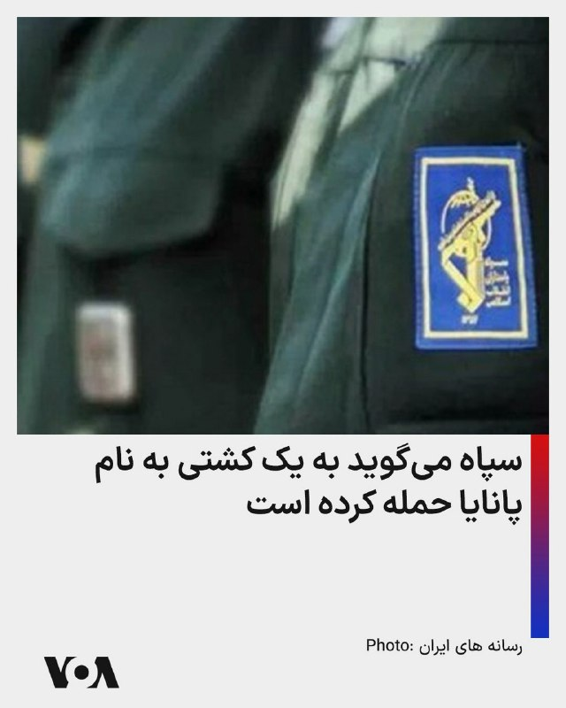

⚡️سپاه پاسداران در بیانیه‌ای که رسانه‌های حکومتی در ایران منتشر کردند، اعلام کرد به کشتی «پانایا» حمله کرده است. این نهاد که در فهرست تروریستی آمریکا و چند کشور دیگر قرار دارد، دلیل حمله به این کشتی را واکنش به اقدام نیروهای آمریکایی در جلوگیری از نقض محاصره دریایی بنادر ایران توسط یک نفتکش عنوان کرد. ستاد فرماندهی مرکزی آمریکا، سنتکام، ‌در دقایقی قبل در بیانیه‌ای با اشاره به اقدام جمهوری اسلامی در حمله به دریانوردان غیرنظامی، گفت که یک مرکز نظامی در جزیره قشم را در اقدامی دفاعی، هدف حمله نظامی قرار داد.
@FarsiVOA

## Persian_Trend_Official — post 15588

  <a href="telegram/content/Persian_Trend_Official_15588_1780446267.mp4" target="_blank">🎬 Download video</a>

ویدیویی از لحظه فیل شدن موشک پدافندی کویت در منطقه ای مسکونی

📝 Amir

📌 @persian_trend_official
پرشین ترند | متفاوت‌ترین کانال نظامی

## BBCPersian — post 282726

سنتکام اعلام کرد نيروهای آمريکايی در چارچوب دفاع از خود، يک ايستگاه کنترل زمينی نظامی ايران را در جزيره قشم هدف قرار داده‌اند.

این همسو با گزارش سپاه پاسداران است که هدف قرار گرفتن یک دکل مخابراتی خود در جنوب جزیره قشم را علت حملات خود به مقر ناوگان پنجم نیروی دریایی آمریکا عنوان کرده است.

به گفته مقام‌های آمريکايی، در اين درگیری‌ها هيچ يک از نيروهای آمريکايی آسيب نديده‌اند.

فرماندهی مرکزی آمريکا افزوده نيروهای اين کشور همچنان در دوران آتش‌بس جاری در حالت آماده باش باقی خواهند ماند و برای مقابله با آنچه «تجاوزهای غيرموجه ايران» توصيف شد، آمادگی کامل دارند.

سپاه پاسداران هم در اطلاعیه خود تاکید کرده است «پیش از این اخطار داده بودیم که در صورت تجاوز پاسخ متفاوت و سنگین تر خواهد بود و همین‌طور اقدام کردیم.»

@BBCPersian

## BBCPersian — post 282725

  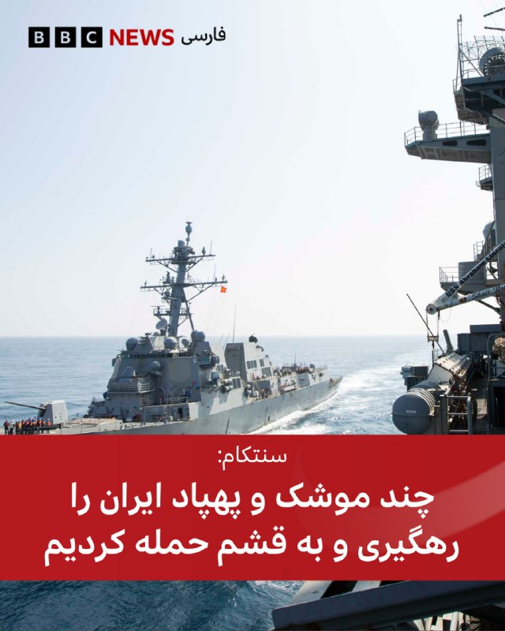

🔻ستاد فرماندهی مرکزی ارتش آمریکا - سنتکام - اعلام کرد چندين موشک بالستيک و پهپاد ايرانی را رهگيری و منهدم کرده و در پاسخ به آنچه «تلاش‌های ايران برای حمله در سراسر منطقه» خوانده، حملاتی را در قالب دفاع از خود عليه اهدافی در جزيره قشم انجام داده است.

بر اساس اين بيانيه، ايران چندين موشک بالستيک به سوی کشورهای منطقه شليک کرد، اما هيچ يک به اهداف مورد نظر اصابت نکردند.

آمريکا مدعی شد دو موشک شليک شده به سوی کويت پيش از رسيدن به هدف سقوط کردند يا در مسير متلاشی شدند و سه موشک ديگر که به سمت بحرين پرتاب شده بودند، بلافاصله توسط سامانه‌های پدافند هوايی آمريکا و بحرين رهگيری شدند.

این در حالی است که منابع ایرانی مدعی وقوع دست کم سه انفجار در کویت و همچنین از کار افتادن یک سامانه پاتریوت آمریکا شدند.

در اين بيانيه سنتکام همچنین آمده است که «دقايقی پيش از آن، نيروهای فرماندهی مرکزی ارتش آمريکا (سنتکام) سه پهپاد انتحاری را که از سوی ايران به سمت کشتی‌های غيرنظامی در حال عبور از آب‌های منطقه پرتاب شده بودند را سرنگون کردند.»

📷 Centcom / U.S. Central Command
https://bbc.in/3SfXLwa
@BBCPersian

---
📅 بروزرسانی: 1405/03/13 03:43
---

## VahidOOnLine — post 243453

  

سپاه اعلام کرد در پاسخ به حمله‌ پرتابه‌های آمریکا به یک دکل مخابراتی سپاه در جنوب جزیرۀ قشم، نیروی هوافضای سپاه پایگاه هوایی و بالگردی ایالات‌متحده در یکی از کشورهای منطقه و همچنین مرکز ناوگان پنجم دریایی آمریکا را هدف حملات موشکی و پهپادی قرار داد.
این اطلاعیه همچنین با اشاره به اینکه در اواخر شب‌گذشته ارتش آمریکا یک نفتکش ایرانی را در حوالی تنگۀ هرمز مورد اصابت پرتابه هوایی قرار داد و این نفتکش از محل موتورخانه دچار خسارت شد، گفت در پاسخ به این حمله و «نقض مقررات تنگه هرمز»، یک شناور متعلق به آمریکا و اسرائیل به نام پانایا هدف موشک‌های نیروی دریایی سپاه قرار گرفت.

‌🏁 🇬🇧 IranintlTV

🤖 @VahidOOnLine

## WithYashar — post 13337

ترامپ الان میاد میگه چون موشک ها از رو آب رد شده مسافر حساب‌ میشن و رعب و وحشتشون شکسته حساب میشه پس این جنگ نیست !!! هرچی شده رفع بلا بوده فکر کنین دادین خمس و زکات ، حالا هم آشتی و من به یک جنگ دیگه پایان دادم و رژیم هم تغییر کرد ولی سلاح هسته ای نباید…

## WithYashar — post 13336

گروه کومله کردستان در بیانیه‌ای اعلام کرد که ساعت ۲۳:۰۰ به وقت محلی دیشب ، دو موشک ایرانی به مقر حزب کومله در دره آلانه، واقع در شمال شرقی اربیل، اصابت کرده است

در این خبر جزئیات دقیقی از تلفات احتمالی ارائه نشده است.
@withyashar

## FoxNewsTwitter — post 342526

  <a href="telegram/content/FoxNewsTwitter_342526_1780445632.mp4" target="_blank">🎬 Download video</a>

Fox News (Twitter/X)

"His whole aura seems to be contrived."

Laura Ingraham and Reince Priebus break down Democrats' "Platner problem" as Maine Senate candidate Graham Platner's controversies continue to grow. https://twitter.com/IngrahamAngle/status/2061958690559668539#m

## FoxNewsTwitter — post 342525

  <a href="telegram/content/FoxNewsTwitter_342525_1780445633.mp4" target="_blank">🎬 Download video</a>

Fox News (Twitter/X)

U.S. forces disabled an oil tanker headed for an Iranian port after the vessel allegedly ignored repeated warnings for nearly 24 hours.

Newly released CENTCOM footage shows the moment a Hellfire missile strikes the ship's engine room, stopping the tanker before it could reach Kharg Island.

Military officials say the vessel was unladen at the time and had repeatedly failed to comply with U.S. directives.

## FoxNewsTwitter — post 342524

Fox News (Twitter/X)

RT @TreyYingst: NEW: American forces conducted self-defense strikes on an Iranian military ground control station on Qeshm Island, according to CENTCOM.

## pm_afshaa — post 92196

  <a href="telegram/content/pm_afshaa_92196_1780445635.webm" target="_blank">🎬 Download video</a>

🔴سنتکام: سپاه پاسداران ادعا کرده که مقر ناوگان پنجم آمریکا تو بحرین و یه پایگاه هوایی آمریکا رو با موشک و پهپاد هدف قرار داده.

همش دروغه و در حقیقت حملات ایران به نیروهای آمریکا ناموفق بوده. آمریکا هیچ آسیبی ندیده و همچنان آماده و هوشیاره تا در برابر هر حمله‌ای واکنش نشون بده.

💧 Rainbet.com the #1 Non-KYC Crypto Casino & Sportsbook @rainbetcom

😁 @Pm_Afshaa

## IranIntlTV — post 340304

  

سپاه اعلام کرد در پاسخ به حمله‌ پرتابه‌های آمریکا به یک دکل مخابراتی سپاه در جنوب جزیرۀ قشم، نیروی هوافضای سپاه پایگاه هوایی و بالگردی ایالات‌متحده در یکی از کشورهای منطقه و همچنین مرکز ناوگان پنجم دریایی آمریکا را هدف حملات موشکی و پهپادی قرار داد.
این اطلاعیه همچنین با اشاره به اینکه در اواخر شب‌گذشته ارتش آمریکا یک نفتکش ایرانی را در حوالی تنگۀ هرمز مورد اصابت پرتابه هوایی قرار داد و این نفتکش از محل موتورخانه دچار خسارت شد، گفت در پاسخ به این حمله و «نقض مقررات تنگه هرمز»، یک شناور متعلق به آمریکا و اسرائیل به نام پانایا هدف موشک‌های نیروی دریایی سپاه قرار گرفت.

https://iranintl.com/202606039128

## FarsiVOA — post 219421

  

⚡️ستاد فرماندهی مرکزی آمریکا در شبکه‌های اجتماعی اعلام کرد که سپاه پاسداران مدعی شده که در حملات امروز با موشک و پهپاد به مقر ناوگان پنجم آمریکا در بحرین و یک پایگاه هوایی آمریکا در منطقه ضربه زده است. سنتکام گفت این ادعا نادرست است و تمام حملات جمهوری اسلامی به نیروهای آمریکایی شکست خورد.
@FarsiVOA

## Dirty_Kids — post 390892

بچه ها اسم این بازی عبور مرغ از خیابون  هست ویدئو نگاه کنید خیلی راحت 8 میلیون ازش سود گرفتیم😍 
😤اگ توم دوس داری خیلی راحت از بازی های انلاین پول در بیاری حتما عضو کازینو شبانه شو
✅ توی کازینو شبانه بهت اموزش میدیم از بازی های انلاین پول دربیاری👌 کانال کازینو…

## Dirty_Kids — post 390891

  <a href="telegram/content/Dirty_Kids_390891_1780445636.mp4" target="_blank">🎬 Download video</a>

بچه ها اسم این بازی عبور مرغ از خیابون  هست ویدئو نگاه کنید خیلی راحت 8 میلیون ازش سود گرفتیم😍

😤اگ توم دوس داری خیلی راحت از بازی های انلاین پول در بیاری حتما عضو کازینو شبانه شو
✅

توی کازینو شبانه بهت اموزش میدیم از بازی های انلاین پول دربیاری👌

کانال کازینو شبانه راهی برای چند برابر کردن سرمایت 🤷‍♂

کسب درامد انلاین با یه ادم حرفه ای یاد بگیر و‌ پول دربیار 
💵
A12
🎯همین حالا عضو شو و شروع کن👇N
https://t.me/+6ckCmywafrxiYzk0
https://t.me/+6ckCmywafrxiYzk0

## Dirty_Kids — post 390890

  

#بخوابیم

@Dirty_Kids 👻

## Dirty_Kids — post 390886

  <a href="telegram/content/Dirty_Kids_390886_1780445638.mp4" target="_blank">🎬 Download video</a>

🔴 تو این مدت که شما نت نداشتید، کلی دختر و پسر از جاهای مختلف جهان با هوش مصنوعی می‌رفتن استادیوم‌های مختلف و عشق میکردن با خودشون؛

● حالا چطور این کارو میکردن؟

وارد ChatGPT میشی ، عکست رو آپلود میکنی و زیرش اینو می‌نویسی :

Ultra-realistic TV broadcast screenshot, identity preserved exactly from reference image. Young woman sitting in the crowd at a (اسم تیمتون) home soccer match, filmed by a live broadcast camera.
She is seated in stadium chairs, leaned back, looking off to the side with a surprised caught-on-camera expression. She wears a (اسم تیمتون) home jersey with jeans, casual match-day styling, relaxed pose, one arm resting on the chair. The jersey should look like a normal full jersey, not a crop top, not rolled up, not tied. Around her are other fans in stadium seats, blurred. Keep the crowd mixed and natural. Add a scoreboard graphic in the top corner, subtle broadcast compression, digital noise, bright stadium lighting, and imperfect live-TV framing. Telephoto sports camera look, authentic televised soccer crowd shot, natural skin texture, no smoothing, 4K.

ویدئو هم میشه درست کرد ولی خب اون دیگه رایگان نیست و باید پول خرج کنید.

- 1 : وارد سایت http://openart.ai/home میشی.
- 2 : گزینه text to video رو انتخاب و عکسی که درست کردید رو آپلود میکنید.
- 3 : پرامپت زیر رو هم وارد می‌کنید و تمام.

character identity reference only (face, hairstyle, proportions).Preserve exact face, hairstyle, skin texture, and identity. Do NOT stylize or beautify.Output: single continuous live sports broadcast shot, 4-5s, 16:9, 1080p, no cuts. SUBJECT:A young woman based on @image1, sitting in a [WRITE YOUR TEAM HERE] football stadium audience.Hands resting naturally on her lap or lightly placed on the seat.Neutral, slightly distant expression.Natural breathing, minimal movement.
ENVIRONMENT: [اسم تیمتون] stadium crowd during live match.Plastic seats, fans around her wearing [اسم تیمتون] jerseys. Background slightly out of focus.Realistic stadium lighting - day or night.Slight haze from broadcast compression. MOOD:Unstaged, candid, real broadcast moment No cinematic drama. Pure live TV capture. CAMERA:Telephoto broadcast lens (120-150mm).Long-distance zoom from upper stands camera.Strong compression, shallow depth of field.Eye-level, very slight upward tilt.Subtle micro-shake from broadcast stabilization. ACTION (4-5s):[0-2s] She sits still, blinks once. Hands resting naturally.[2-4s] Subtle weight shift, naturally adjusting posture. Minimal body movement.[4-5s] Small hand reposition on lap or seat. Slight head turn toward the field._ DETAILS:No posing. No eye contact with camera. Skin texture realistic, no smoothing or beautification. Slight motion blur on background crowd.Faint broadcast scoreboard UI visible in corner.

@Dirty_Kids 👻

## Dirty_Kids — post 390885

  

🔴 فوری: گزارش هایی منتشر شده که محمدرضا شهبازی، مجری برنامه پاورقی دیشب مورد تجاوزِ ۳ نفر قرار گرفته و برنامه پاورقی فعلا به طور موقت متوقف شده!

+ هنوز جزئیات دقیقی بیرون نیومده و پلیس در حال بررسیه!

@Dirty_Kids 👻

---
📅 بروزرسانی: 1405/03/13 03:33
---

## VahidOOnLine — post 243452

♦️مارکو روبیو، وزیر امور خارجه ایالات متحده، سه‌شنبه ۱۲ خرداد در جلسه استماع سنا، در پاسخ به سوال تد کروز، سناتور ارشد جمهوری‌خواه آمریکا، درباره برنامه واشنگتن برای تسلیح معترضان در ایران گفت: «من از هیچ برنامه‌ای برای مسلح کردن غیرنظامیان در ایران به منظور سرنگونی حکومتشان آگاهی ندارم.»
پیش از این اظهارات، تد کروز با تاکید بر اینکه منصفانه نیست از مردم و معترضان ایرانی انتظار داشت با سنگ در برابر سربازان مسلح به تیربار ایستادگی کنند، اعلام کرد که پیش از این از دولت آمریکا و اسرائیل خواسته بود تا معترضان را در ایران مسلح کنند. روبیو در پاسخ به این موضع‌گیری افزود: «منظورم این است که ممکن است کشورها یا عناصر دیگری دست به این کار بزنند، اما دولت ایالات متحده قطعا چنین برنامه‌ای ندارد.»
‌🇸🇦 Indypersian

🤖 @VahidOOnLine

## WithYashar — post 13335

ترامپ الان میاد میگه چون موشک ها از رو آب رد شده مسافر حساب‌ میشن و رعب و وحشتشون شکسته حساب میشه پس این جنگ نیست !!! هرچی شده رفع بلا بوده فکر کنین دادین خمس و زکات حالا، هم آشتی و من به یک جنگ دیگه پایان دادم و رژیم هم تغییر کرد ولی سلاح هسته ای نباید داشته باشن
@withyashar 👱🏽‍♂️📿

## pm_afshaa — post 92195

ترامپ الان میاد میگه من یه جنگ دیگه رو پایان دادم

## pm_afshaa — post 92194

  <a href="telegram/content/pm_afshaa_92194_1780445036.webm" target="_blank">🎬 Download video</a>

🔴بیانیه سپاه پاسداران: در اواخر شب گذشته ارتش متجاوز آمریکا یک نفتکش ایرانی رو در حوالی تنگه هرمز مورد اصابت پرتابه هوایی قرار داد که این نفتکش از محل موتورخانه دچار خسارت گردید. در پاسخ به این تجاوز و نقض مقررات تنگه هرمز شناور متعلق به دشمن آمریکایی صهیونی…

## pm_afshaa — post 92193

تو آتش‌بس همدیگه رو میزنن هردو طرف هم میگن اقدام دفاعی کردیم!
خاورمیانه عالیهههههه

## pm_afshaa — post 92192

  <a href="telegram/content/pm_afshaa_92192_1780445037.webm" target="_blank">🎬 Download video</a>

🔴سنتکام: نیروهای آمریکایی چندین موشک بالستیک و پهپاد ایرانی رو رهگیری کردن و پس از تلاش ایران برای حمله به نقاط مختلف خاورمیانه، یک ایستگاه کنترل زمینی نظامی در جزیره قشم رو هدف قرار دادن. دو موشک ایرانی پرتاب‌شده به سمت کویت قبل از اصابت به هدف نرسیدن، در…

## IranIntlTV — post 340303

  <a href="telegram/content/IranIntlTV_340303_1780445037.mp4" target="_blank">🎬 Download video</a>

ستاد فرماندهی مرکزی آمریکا، سنتکام، با انتشار ویدیویی در ایکس از هدف قرار دادن یک نفتکش خالی از محموله که در حال حرکت به سوی جزیره خارک در خلیج فارس بود، خبر داد.

به گفته سنتکام، خدمه این کشتی که با پرچم بوتسوانا در حال حرکت بود، طی یک دوره ۲۴ ساعته به هشدارهای نیروهای آمریکایی توجه نکردند. در نهایت، یک هواپیمای آمریکایی با شلیک یک موشک به اتاق موتور کشتی، سامانه پیشران آن را از کار انداخت و مانع رسیدن نفتکش به ایران شد.

بر اساس بیانیه سنتکام، ارتش آمریکا تاکنون شش کشتی تجاری را از کار انداخته و ۱۲۲ کشتی دیگر را وادار به تغییر مسیر کرده است.
@iranintltv

## Shin_Persian — post 6444

  

🔁 Quoting above tweet: Shin ✓ @hey_itsmyturn Tue, 02 Jun 2026 23:57:31 UTC Following IRGC claims of striking U.S. 5th Fleet headquarters and a regional air base, U.S. Central Command says the claims are false and all Iranian attacks on American forces failed.…

## Shin_Persian — post 6443

🔁 Quoting above tweet:
Shin ✓ @hey_itsmyturn
Tue, 02 Jun 2026 23:57:31 UTC

Following IRGC claims of striking U.S. 5th Fleet headquarters and a regional air base, U.S. Central Command says the claims are false and all Iranian attacks on American forces failed.

Source: @CENTCOM
https://x.com/CENTCOM/status/2061960381245891028

فارسی

در پی ادعاهای سپاه پاسداران انقلاب اسلامی (IRGC) مبنی بر هدف قرار دادن مقر ناوگان پنجم ایالات متحده و یک پایگاه هوایی منطقه‌ای، فرماندهی مرکزی ایالات متحده (سنتکام - CENTCOM) اعلام کرد که این ادعاها کذب است و تمامی حملات ایران به نیروهای آمریکایی شکست خورده است.

منبع: @CENTCOM
https://x.com/CENTCOM/status/2061960381245891028

𝕏 · @shin_persian

## Shin_Persian — post 6442

  

↩️ Quoted tweet: U.S. Central Command ✓ @CENTCOM Tue, 02 Jun 2026 23:57:18 UTC 🚫 CLAIM: Iran’s Islamic Revolutionary Guard Corps claims they struck U.S. 5th Fleet headquarters in Bahrain and a U.S. air base in the region with missiles and drones today. FALSE.…

## Shin_Persian — post 6441

↩️ Quoted tweet:
U.S. Central Command ✓ @CENTCOM
Tue, 02 Jun 2026 23:57:18 UTC

🚫 CLAIM: Iran’s Islamic Revolutionary Guard Corps claims they struck U.S. 5th Fleet headquarters in Bahrain and a U.S. air base in the region with missiles and drones today. FALSE.

✅ TRUTH: All Iranian attacks on American forces failed. U.S. forces remain vigilant and ready to

↩️ توییت نقل‌قول شده — برای پاسخ، پست زیر را ببینید.

فارسی

🚫 ادعا: سپاه پاسداران انقلاب اسلامی ایران (IRGC) ادعا می‌کند که امروز با موشک و پهپاد به مقر ناوگان پنجم ایالات متحده در بحرین و یک پایگاه هوایی آمریکا در منطقه حمله کرده است. کذب.

✅ واقعیت: تمام حملات ایران به نیروهای آمریکایی شکست خورد. نیروهای ایالات متحده هوشیار و آماده باقی می‌مانند.

𝕏 · @shin_persian

## BBCPersian — post 282724

🔻ساعتی پس از مخابره گزارش‌های متعدد از حملات موشکی به نقاطی در کویت و بحرین، سپاه پاسداران با انتشار اطلاعیه‌ای رسما از حمله به پایگاه ناوگان پنجم نیروی دریایی آمریکا خبر داد. در بیانیه بامداد چهارشنبه سپاه پاسداران آمده است: «در اواخر شب گذشته ارتش متجاوز…

## BBCPersian — post 282723

  

🔻ساعتی پس از مخابره گزارش‌های متعدد از حملات موشکی به نقاطی در کویت و بحرین، سپاه پاسداران با انتشار اطلاعیه‌ای رسما از حمله به پایگاه ناوگان پنجم نیروی دریایی آمریکا خبر داد.

در بیانیه بامداد چهارشنبه سپاه پاسداران آمده است: «در اواخر شب گذشته ارتش متجاوز آمریکا یک نفتکش ایرانی را در حوالی تنگه هرمز مورد اصابت پرتابه هوایی قرار داد که این نفتکش از محل موتورخانه دچار خسارت گردید. در پاسخ به این تجاوز و نقض مقررات تنگه هرمز شناور متعلق به دشمن آمریکایی صهیونی به نام پانایا مورد هدف موشک های نیروی دریایی سپاه قرار گرفت.» ️در ادامه این بیانیه آمده است که نیروهای آمریکایی همچنین یک دکل مخابراتی سپاه در جنوب جزیره قشم را هدق قرار داده‌اند و در مقابل: «در پاسخ به این تجاوز پایگاه هوایی و بالگردی آنان مستقر در یکی از کشورهای منطقه و همچنین مرکز ناوگان پنجم دریایی آمریکا مورد تهاجم موشکی و پهپادی نیروی هوافضای سپاه قرار گرفتند.»

📷 Getty Images
https://bbc.in/43Jbe25
@BBCPersian

## Dirty_Kids — post 390884

  <a href="telegram/content/Dirty_Kids_390884_1780445040.mp4" target="_blank">🎬 Download video</a>

ترور هدفمند در خودرو در استان میسان در جنوب عراق

@Dirty_Kids 👻

## Dirty_Kids — post 390883

کانال ۱۴ اسرائیل:
اگر رژیم ایران امشب حتی یک گلوله به سمت اسرائیل شلیک کند، تمام دروازه های جهنم به رویشان باز خواهد شد.

@Dirty_Kids 👻

## Dirty_Kids — post 390882

  <a href="telegram/content/Dirty_Kids_390882_1780445041.mp4" target="_blank">🎬 Download video</a>

حمله جمهوری اسلامی به عربستان

@Dirty_Kids 👻

## Dirty_Kids — post 390881

  

🔴 فوری، سنتکام: موشک هایی که ایران به سمت کویت و بحرین پرتاب کرد یا تو راه خراب شدن یا توسط ما منهدم شدن و هیچ اصابتی نداشتیم.

ایران به ما حمله کرد و ما هم طی اقدامی دفاعی، ایستگاه کنترل زمینی نظامی ایران رو تو جزیره قشم زدیم.

@Dirty_Kids 👻

---
📅 بروزرسانی: 1405/03/13 03:23
---

## VahidOOnLine — post 243451

  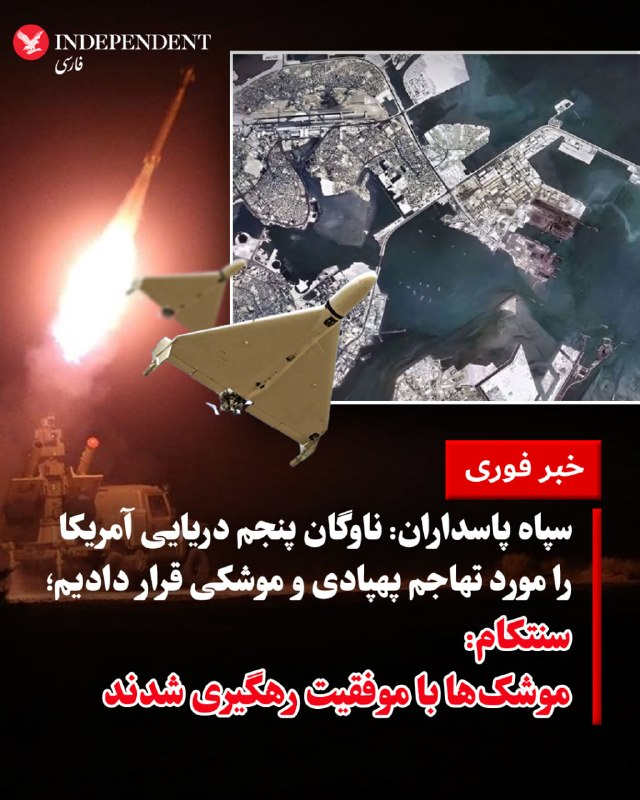

♦️در ساعات اولیه بامداد چهارشنبه، به دنبال شنیده شدن صدای آژیر خطر در بحرین، سپاه پاسداران در بیانیه‌ای اعلام کرد ناوگان پنجم نیروی دریایی آمریکا که مقر آن در بحرین است را مورد تهاجم پهپادی و موشکی قرار داده است. همزمان سنتکام نیز در بیانیه‌ای اعلام کرد چندین موشک بالستیک با موفقیت رهگیری شدند. در این بیانیه آمده که «حمله‌های دفاعی» در جزیره قشم در پاسخ به حمله‌های حکومت ایران در روز سه‌شنبه نیز به پایان رسیده است. سنتکام تاکید کرده که رژیم ایران حمله‌های موشکی متعددی علیه همسایگان منطقه‌ای خود انجام داده اما هیچ‌یک به هدف برخورد نکرده‌اند. قطعات دو موشک نیز در راه کویت از هم پاشیده است. بر اساس این گزارش، سه موشک شیلک شده به سمت بحرین نیز فورا از سوی نیروهای آمریکایی و نیروهای بحرین رهگیری شدند.سنتکام می‌گوید، دقایقی قبل از این حملات، سه پهپاد انتحاری ایران که به سمت یک شناور غیرنظامی در پرواز بودند نیز رهگیری و منهدم شدند. سنتکام می‌گوید در پاسخ به این حمله‌ها، نیرو‌های آمریکایی، به ایستگاه کنترل نظامی در جزیره قشم حمله کردند.
‌🇸🇦 Indypersian

🤖 @VahidOOnLine

## VahidOOnLine — post 243450

  

ستاد فرماندهی مرکزی آمریکا، سنتکام، اعلام کرد در پاسخ به تلاش‌های جمهوری اسلامی برای حمله در سراسر خاورمیانه، چندین موشک بالستیک و پهپاد ایرانی و یک ایستگاه کنترل زمینی نظامی در قشم را منهدم کرده است.
به گفته سنتکام، جمهوری اسلامی چندین موشک بالستیک به سمت کشورهای همسایه منطقه شلیک کرد، اما هیچ‌کدام به اهداف مورد نظر اصابت نکردند و هیچ‌یک از نیروهای آمریکایی نیز آسیب ندیدند.
طبق این اطلاعیه، دو موشک ایرانی که به سوی کویت شلیک شدند، در مسیر سقوط کردند یا حین حرکت متلاشی شدند و سه موشک که به سمت بحرین پرتاب شده بودند، بلافاصله از سوی سامانه‌های پدافند هوایی آمریکا و بحرین رهگیری شدند.
به گفته ارتش آمریکا، لحظاتی پیش از آن، نیروهای سنتکام سه پهپاد انتحاری را که ایران به سمت کشتی‌های غیرنظامی در حال عبور از آب‌های منطقه‌ای پرتاب کرده بود، سرنگون کردند. نیروهای آمریکایی همچنین یک ایستگاه کنترل زمینی نظامی جمهوری اسلامی در جزیره قشم را هدف حملات دفاعی قرار دادند.

‌🏁 🇬🇧 IranintlTV

🤖 @VahidOOnLine

## WithYashar — post 13334

کانال ۱۴ اسرائیل: اگر رژیم ایران امشب حتی یک گلوله به سمت اسرائیل شلیک کند، تمام دروازه های جهنم به رویشان باز خواهد شد.
@withyashar

## pm_afshaa — post 92191

  <a href="telegram/content/pm_afshaa_92191_1780444435.webm" target="_blank">🎬 Download video</a>

🔴کانال 14 اسرائیل: اگه ایران امشب حتی یک گلوله به سمت اسرائیل شلیک کنه، تمام دروازه‌های جهنم به روشون باز خواهد شد.

💧 Rainbet.com the #1 Non-KYC Crypto Casino & Sportsbook @rainbetcom

😁 @Pm_Afshaa

## pm_afshaa — post 92190

  <a href="telegram/content/pm_afshaa_92190_1780444436.webm" target="_blank">🎬 Download video</a>

🔴بیانیه سپاه پاسداران: در اواخر شب گذشته ارتش متجاوز آمریکا یک نفتکش ایرانی رو در حوالی تنگه هرمز مورد اصابت پرتابه هوایی قرار داد که این نفتکش از محل موتورخانه دچار خسارت گردید. در پاسخ به این تجاوز و نقض مقررات تنگه هرمز شناور متعلق به دشمن آمریکایی صهیونی…

## pm_afshaa — post 92189

  <a href="telegram/content/pm_afshaa_92189_1780444437.webm" target="_blank">🎬 Download video</a>

🔴سنتکام: نیروهای آمریکایی چندین موشک بالستیک و پهپاد ایرانی رو رهگیری کردن و پس از تلاش ایران برای حمله به نقاط مختلف خاورمیانه، یک ایستگاه کنترل زمینی نظامی در جزیره قشم رو هدف قرار دادن. دو موشک ایرانی پرتاب‌شده به سمت کویت قبل از اصابت به هدف نرسیدن، در…

## VahidOnline — post 75888

  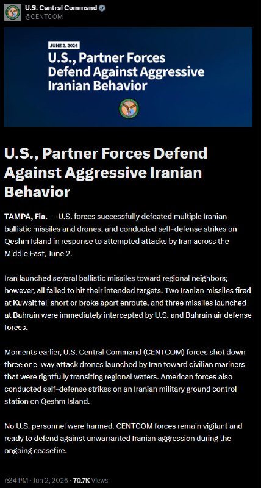

سنتکام از حمله به جزیره قشم پس از دفع حملات موشکی جمهوری اسلامی در سراسر خاورمیانه خبر داد

ترجمه ماشین:
نیروهای آمریکا و شرکایش در برابر رفتار تهاجمی ایران دفاع کردند

تامپا، فلوریدا — نیروهای آمریکا در تاریخ ۲ ژوئن با موفقیت چندین موشک بالستیک و پهپاد ایرانی را منهدم کردند و در پاسخ به تلاش‌های ایران برای حمله در سراسر خاورمیانه، حملات دفاع از خود را در جزیره قشم انجام دادند.

ایران چندین موشک بالستیک به سوی همسایگان منطقه‌ای شلیک کرد؛ با این حال، هیچ‌کدام به اهداف مورد نظر خود اصابت نکردند.
دو موشک ایرانی که به سوی کویت شلیک شده بودند، پیش از رسیدن به هدف سقوط کردند یا در مسیر متلاشی شدند و سه موشکی که به سوی بحرین شلیک شده بودند، بلافاصله توسط نیروهای پدافند هوایی آمریکا و بحرین رهگیری شدند.

لحظاتی پیش از آن، نیروهای فرماندهی مرکزی آمریکا، سنتکام، سه پهپاد تهاجمی یک‌طرفه را که ایران به سوی دریانوردان غیرنظامی در حال عبور قانونی از آب‌های منطقه‌ای شلیک کرده بود، سرنگون کردند.

نیروهای آمریکایی همچنین حملات دفاع از خود را علیه یک ایستگاه کنترل زمینی نظامی ایران در جزیره قشم انجام دادند.
هیچ‌یک از نیروهای آمریکایی آسیبی ندیدند. نیروهای سنتکام در جریان آتش‌بس جاری، همچنان هوشیار و آماده دفاع در برابر تجاوز بی‌دلیل ایران هستند.
CENTCOM

📡 @VahidOnline

## IranIntlTV — post 340302

  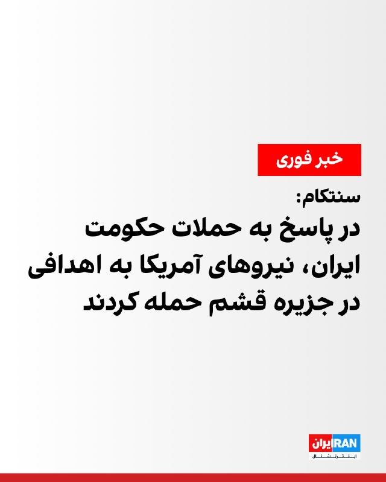

ستاد فرماندهی مرکزی آمریکا، سنتکام، اعلام کرد در پاسخ به تلاش‌های جمهوری اسلامی برای حمله در سراسر خاورمیانه، چندین موشک بالستیک و پهپاد ایرانی و یک ایستگاه کنترل زمینی نظامی در قشم را منهدم کرده است.
به گفته سنتکام، جمهوری اسلامی چندین موشک بالستیک به سمت کشورهای همسایه منطقه شلیک کرد، اما هیچ‌کدام به اهداف مورد نظر اصابت نکردند و هیچ‌یک از نیروهای آمریکایی نیز آسیب ندیدند.
طبق این اطلاعیه، دو موشک ایرانی که به سوی کویت شلیک شدند، در مسیر سقوط کردند یا حین حرکت متلاشی شدند و سه موشک که به سمت بحرین پرتاب شده بودند، بلافاصله از سوی سامانه‌های پدافند هوایی آمریکا و بحرین رهگیری شدند.
به گفته ارتش آمریکا، لحظاتی پیش از آن، نیروهای سنتکام سه پهپاد انتحاری را که ایران به سمت کشتی‌های غیرنظامی در حال عبور از آب‌های منطقه‌ای پرتاب کرده بود، سرنگون کردند. نیروهای آمریکایی همچنین یک ایستگاه کنترل زمینی نظامی جمهوری اسلامی در جزیره قشم را هدف حملات دفاعی قرار دادند.

https://iranintl.com/202606024373

## Shin_Persian — post 6440

↩️ Quoted tweet: الجزيرة - عاجل ✓ @AJABreaking Tue, 02 Jun 2026 17:41:45 UTC عاجل | مجلس الوزراء الكويتي: نطالب #إيران بالوقف الفوري دون شرط لاعتداءاتها ونحملها المسؤولية الكاملة عنها ↩️ Quoted tweet — see the post below for the reply. English Urgent…

## Shin_Persian — post 6439

↩️ Quoted tweet:
الجزيرة - عاجل ✓ @AJABreaking
Tue, 02 Jun 2026 17:41:45 UTC

عاجل | مجلس الوزراء الكويتي: نطالب #إيران بالوقف الفوري دون شرط لاعتداءاتها ونحملها المسؤولية الكاملة عنها

↩️ Quoted tweet — see the post below for the reply.

English

Urgent | Kuwaiti Council of Ministers: We demand that Iran immediately and unconditionally cease its aggressions, and we hold it fully responsible for them.

𝕏 · @shin_persian

## FarsiVOA — post 219420

🔺سنتکام از حمله دفاعی نیروهای آمریکایی به جزیره قشم و دفع حملات موشکی جمهوری اسلامی در سراسر خاورمیانه خبر داد

▪️در پی گزارش‌ها در مورد حملات موشکی جمهوری اسلامی به کویت و بحرین (چهارشنبه صبح به وقت ایران)، ستاد فرماندهی مرکزی آمریکا، سنتکام در بیانیه‌ای گفت که نیروهای آمریکایی در پاسخ به حملات جمهوری اسلامی «در سراسر خاورمیانه، در ۲ ژوئن (۱۲ خرداد به وقت واشنگتن)، «با موفقیت» حملات موشک‌های بالستیک و پهپاد‌های جمهوری اسلامی را شکست دادند.

⬇️ بیشتر بخوانید:
https://ir.voanews.com/a/8156568.html
@FarsiVOA

## Persian_Trend_Official — post 15587

  

گروه تروریستی و تجزیه طلب کومله در بیانیه‌ای اعلام کرد که دو موشک ایرانی روز سه‌شنبه ساعت 23:00 به وقت محلی به مقر این گروه در دره آلانا، شمال شرقی اربیل، اصابت کردند.

در این بیانیه هیچ جزئیات فوری در مورد تلفات ارائه نشده است.

📝 Amir

📌 @persian_trend_official
پرشین ترند | متفاوت‌ترین کانال نظامی

## Persian_Trend_Official — post 15586

  <a href="telegram/content/Persian_Trend_Official_15586_1780444439.webm" target="_blank">🎬 Download video</a>

خب فکر میکنم دیگه تموم شد. 🗿

مثل اینکه آتش‌بس هم پر قدرت پابرجاست.

شبتون بخیر 😑

📝 Nick

## IranianMinds — post 21282

🔴کانال ۱۴ اسرائیل:

اگر امشب ایران فقط یک گلوله به سمت اسرائیل شلیک کند، تمام دروازه‌های جهنم به سویشان باز خواهد شد.

@IranianMinds

---
📅 بروزرسانی: 1405/03/13 03:13
---

## VahidOOnLine — post 243449

  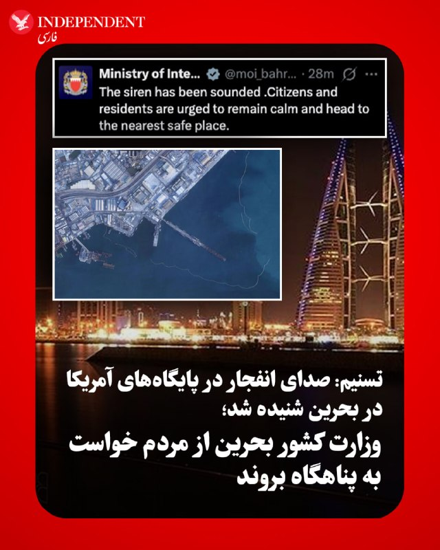

♦️وزارت کشور بحرین، بامداد چهارشنبه، ۱۳ خردادماه، با انتشار بیانیه‌ای فوری اعلام کرد که آژیرهای هشدار و خطر در این کشور به صدا درآمده‌اند. مقامات امنیتی بحرین ضمن دعوت مردم به حفظ آرامش، از آن‌ها خواسته‌اند تا سریعا به نزدیک‌ترین مکان امن و پناهگاه‌ها بروند. همزمان تسنیم، خبرگزاری وابسته به سپاه، به نقل از «منابع عربی» از هدف قرار گرفتن «پایگاه‌های آمریکا» در بحرین خبر داد.
‌🇸🇦 Indypersian

🤖 @VahidOOnLine

## VahidOOnLine — post 243448

  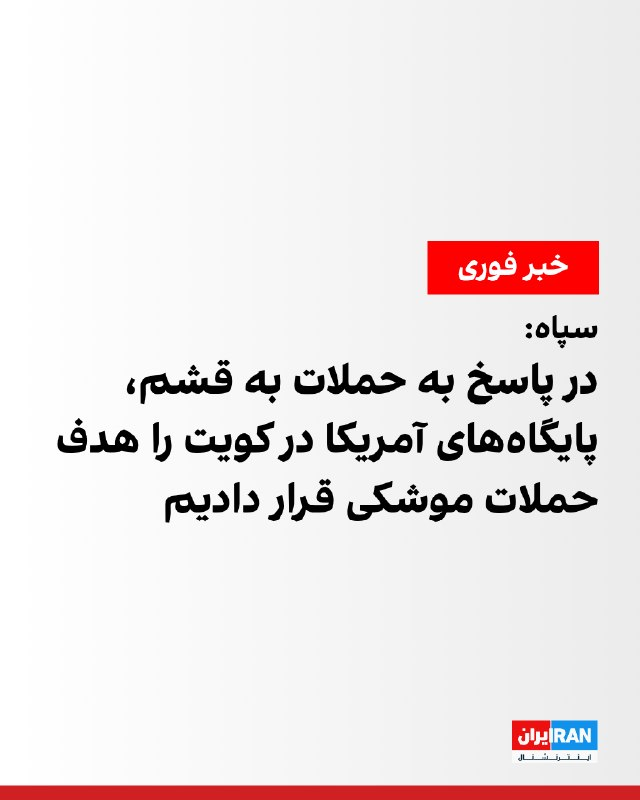

سپاه اعلام کرد در پاسخ به حمله‌های جدید به قشم، نیروی هوایی سپاه با حملات موشکی پایگاه‌های آمریکا در کویت را هدف قرار داده است.
سپاه تاکید کرد: «زمان بزن و فرار کن به پایان رسیده است و نیروهای ستمگر باید عواقب وخیم نادانی و ماجراجویی‌های بی‌محاسبه خود را بپذیرند.»

‌🏁 🇬🇧 IranintlTV

🤖 @VahidOOnLine

## WithYashar — post 13333

سنتکام : نیروهای آمریکایی با موفقیت چندین موشک بالستیک و پهپاد ایرانی را سرنگون کردند و در پاسخ به حملات احتمالی ایران در سراسر خاورمیانه، امروز ، حملات دفاعی به جزیره قشم انجام دادند.

ایران چندین موشک بالستیک به سمت همسایگان منطقه‌ای پرتاب کرد؛ اما همه آنها نتوانستند به اهداف مورد نظر خود اصابت کنند. دو موشک ایرانی که به کویت شلیک شده بودند، کوتاه آمدند یا در مسیر شکسته شدند و سه موشک پرتاب شده به بحرین بلافاصله توسط نیروهای دفاع هوایی آمریکا و بحرین رهگیری شدند.

لحظاتی پیش‌تر، نیروهای فرماندهی مرکزی آمریکا (سنتکام) سه پهپاد حمله یک‌طرفه را که ایران به سمت دریانوردان غیرنظامی که به‌حق در حال عبور از آب‌های منطقه‌ای بودند، شلیک کرده بود، سرنگون کردند. نیروهای آمریکایی همچنین حملات دفاعی به یک ایستگاه کنترل زمینی نظامی ایرانی در جزیره قشم انجام دادند.

هیچ یک از پرسنل آمریکایی آسیب ندیدند. نیروهای سنتکام هوشیار باقی مانده و آماده دفاع در برابر تجاوزات بی‌دلیل ایران در طول آتش‌بس جاری هستند.
@withyashar

## WithYashar — post 13332

اصابت در عربستان

@withyashar

## mwarmonitor — post 10063

  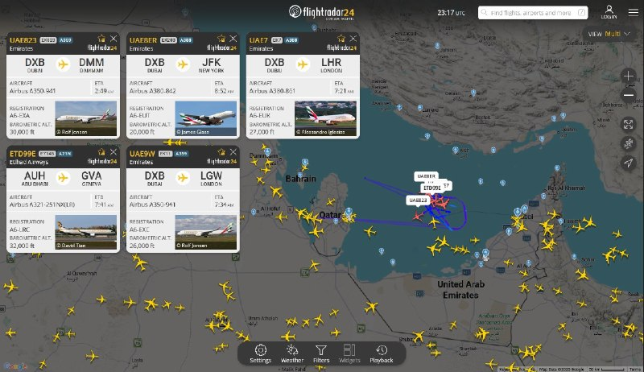

✈️چندین پرواز در حال انتظار در آسمان امارات متحده عربی هستند.

@mwarmonitor

## mwarmonitor — post 10062

🚨آژیرهای هشدار در بحرین متوقف شده‌اند و هشدار مربوط به حمله موشکی نیز لغو شده است. @mwarmonitor

## mwarmonitor — post 10061

🔴دفاع نیروهای آمریکا و شرکا در برابر رفتار تهاجمی ایران

🔹ستاد فرماندهی مرکزی ایالات متحده (CENTCOM)

🔰تامپا، فلوریدا — در پاسخ به تلاش‌های ایران برای انجام حملاتی در سراسر خاورمیانه در تاریخ ۲ ژوئن، نیروهای آمریکایی با موفقیت چندین موشک بالستیک و پهپاد ایرانی را منهدم کرده و حملات دفاع از خود را در جزیره قشم انجام دادند.
ایران چندین موشک بالستیک را به سمت همسایگان منطقه‌ای خود شلیک کرد؛ با این حال، همه آن‌ها در اصابت به اهداف مورد نظر خود ناکام ماندند. دو موشک ایرانی شلیک شده به سمت کویت در میان راه سقوط کردند یا متلاشی شدند، و سه موشک پرتاب شده به سمت بحرین نیز بلافاصله توسط نیروهای پدافند هوایی آمریکا و بحرین رهگیری و منهدم شدند.
لحظاتی پیش از آن، نیروهای ستاد فرماندهی مرکزی آمریکا (سنتکام) سه پهپاد انتحاری (یک‌طرفه) را که از سوی ایران به سمت دریانوردان غیرنظامی در حال عبور قانونی از آب‌های منطقه پرتاب شده بودند، سرنگون کردند. نیروهای آمریکایی همچنین حملاتی را در قالب دفاع از خود علیه یک ایستگاه کنترل زمینی نظامی ایران در جزیره قشم انجام دادند.
هیچ‌یک از پرسنل آمریکایی آسیب ندیده‌اند. نیروهای سنتکام همچنان هوشیار و آماده دفاع در برابر تجاوزات بی‌دلیل ایران در طول آتش‌بس جاری هستند.

@mwarmonitor

## mwarmonitor — post 10060

  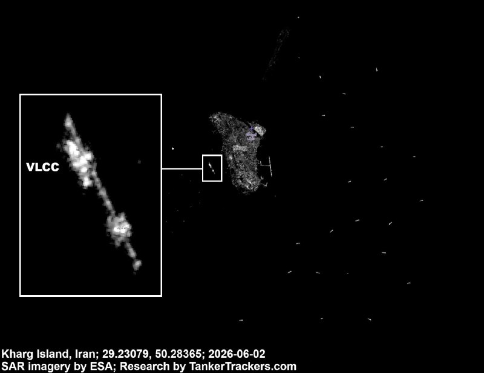

🔴یک نفتکش بسیار بزرگ (VLCC) برای نخستین بار طی چهار هفته گذشته در جزیره خارک در ایران در حال بارگیری نفت خام است.

@mwarmonitor

## pm_afshaa — post 92188

  <a href="telegram/content/pm_afshaa_92188_1780443837.webm" target="_blank">🎬 Download video</a>

🔴سنتکام: نیروهای آمریکایی چندین موشک بالستیک و پهپاد ایرانی رو رهگیری کردن و پس از تلاش ایران برای حمله به نقاط مختلف خاورمیانه، یک ایستگاه کنترل زمینی نظامی در جزیره قشم رو هدف قرار دادن. دو موشک ایرانی پرتاب‌شده به سمت کویت قبل از اصابت به هدف نرسیدن، در…

## pm_afshaa — post 92187

  <a href="telegram/content/pm_afshaa_92187_1780443838.webm" target="_blank">🎬 Download video</a>

🔴سنتکام: نیروهای آمریکایی چندین موشک بالستیک و پهپاد ایرانی رو رهگیری کردن و پس از تلاش ایران برای حمله به نقاط مختلف خاورمیانه، یک ایستگاه کنترل زمینی نظامی در جزیره قشم رو هدف قرار دادن.

دو موشک ایرانی پرتاب‌شده به سمت کویت قبل از اصابت به هدف نرسیدن، در حالی که سه موشک پرتاب‌شده به سمت بحرین توسط دفاع هوایی آمریکا و بحرین رهگیری شدن. نیروهای آمریکایی همچنین سه پهپاد یک‌طرفه حمله‌ای پرتاب‌شده به سمت کشتی‌های تجاری رو سرنگون کردن و درکل هیچ نیروی آمریکایی مجروح نشد.

💧 Rainbet.com the #1 Non-KYC Crypto Casino & Sportsbook @rainbetcom

😁 @Pm_Afshaa

## pm_afshaa — post 92186

  <a href="telegram/content/pm_afshaa_92186_1780443839.webm" target="_blank">🎬 Download video</a>

🔴سپاه: مرکز ناوگان پنجم دریایی آمریکا مورد تهاجم موشکی و پهپادی نیروی هوافضای سپاه قرار گرفتن.

💧 Rainbet.com the #1 Non-KYC Crypto Casino & Sportsbook @rainbetcom

😁 @Pm_Afshaa

## pm_afshaa — post 92185

  <a href="telegram/content/pm_afshaa_92185_1780443839.webm" target="_blank">🎬 Download video</a>

🔴گزارش‌ها از پرواز جت‌های جنگی آمریکا بر فراز آسمان بغداد عراق.

💧 Rainbet.com the #1 Non-KYC Crypto Casino & Sportsbook @rainbetcom

😁 @Pm_Afshaa

## pm_afshaa — post 92184

  <a href="telegram/content/pm_afshaa_92184_1780443840.webm" target="_blank">🎬 Download video</a>

🔴یک نفتکش در سواحل امارات هدف قرار گرفته.

💧 Rainbet.com the #1 Non-KYC Crypto Casino & Sportsbook @rainbetcom

😁 @Pm_Afshaa

## IranIntlTV — post 340301

  

سپاه اعلام کرد در پاسخ به حمله‌های جدید به قشم، نیروی هوایی سپاه با حملات موشکی پایگاه‌های آمریکا در کویت را هدف قرار داده است.
سپاه تاکید کرد: «زمان بزن و فرار کن به پایان رسیده است و نیروهای ستمگر باید عواقب وخیم نادانی و ماجراجویی‌های بی‌محاسبه خود را بپذیرند.»

https://iranintl.com/202606026647

## Shin_Persian — post 6438

U.S. Central Command ✓ @CENTCOM
Tue, 02 Jun 2026 23:34:40 UTC
Centcom:
"U.S., Partner Forces Defend Against Aggressive Iranian Behavior
TAMPA, Fla. — U.S. forces successfully defeated multiple Iranian ballistic missiles and drones, and conducted self-defense strikes on Qeshm Island in response to attempted attacks by Iran across the Middle East, June 2.

Iran launched several ballistic missiles toward regional neighbors; however, all failed to hit their intended targets. Two Iranian missiles fired at Kuwait fell short or broke apart enroute, and three missiles launched at Bahrain were immediately intercepted by U.S. and Bahrain air defense forces.

Moments earlier, U.S. Central Command (CENTCOM) forces shot down three one-way attack drones launched by Iran toward civilian mariners that were rightfully transiting regional waters. American forces also conducted self-defense strikes on an Iranian military ground control station on Qeshm Island.

No U.S. personnel were harmed. CENTCOM forces remain vigilant and ready to defend against unwarranted Iranian aggression during the ongoing ceasefire."

𝕏 · @shin_persian

## Persian_Trend_Official — post 15585

  <a href="telegram/content/Persian_Trend_Official_15585_1780443841.mp4" target="_blank">🎬 Download video</a>

⭕️ فیلم ضبط‌شده از دوربین داشبورد یک خودرو در کویت که انفجار موشک بالستیک ایران با کلاهک خوشه‌ای را نشان می‌دهد.

📝 Nick

📌 @persian_trend_official
پرشین ترند | متفاوت‌ترین کانال نظامی

## Persian_Trend_Official — post 15584

  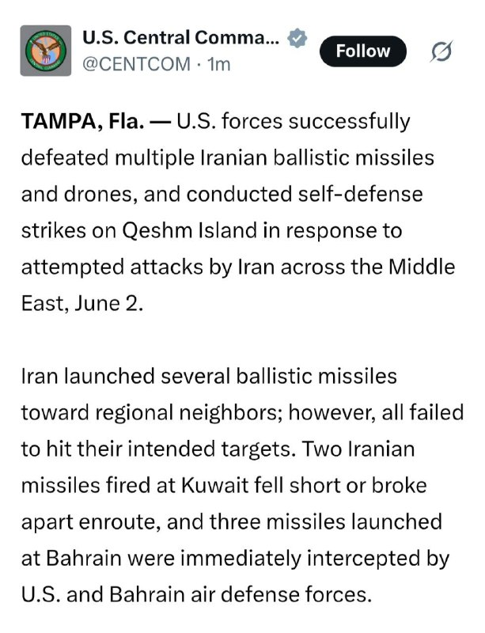

سنتکام: نیروهای آمریکایی در پاسخ به حملات ایران در سراسر خاورمیانه، در تاریخ 2 ژوئن، با موفقیت چندین موشک بالستیک و پهپاد ایرانی را شکست دادند و حملات دفاع شخصی را در جزیره قشم انجام دادند.

ایران چندین موشک بالستیک به سمت همسایگان منطقه‌ای شلیک کرد؛ با این حال، همه آنها نتوانستند به اهداف مورد نظر خود اصابت کنند. دو موشک ایرانی که به سمت کویت شلیک شدند، در مسیر خود به هدف نرسیدند یا متلاشی شدند و سه موشک شلیک شده به سمت بحرین بلافاصله توسط نیروهای دفاع هوایی ایالات متحده و بحرین رهگیری شدند.

لحظاتی پیش از آن، نیروهای فرماندهی مرکزی ایالات متحده (سنتکام) سه پهپاد تهاجمی یک طرفه را که توسط ایران به سمت دریانوردان غیرنظامی که به طور قانونی در حال عبور از آب‌های منطقه‌ای بودند، شلیک شده بود، سرنگون کردند. نیروهای آمریکایی همچنین حملات دفاع شخصی را به یک ایستگاه کنترل زمینی نظامی ایران در جزیره قشم انجام دادند.

هیچ پرسنل آمریکایی آسیبی ندیدند. نیروهای سنتکام در طول آتش‌بس جاری هوشیار و آماده دفاع در برابر تجاوز بی‌مورد ایران هستند.

📝 Amir

📌 @persian_trend_official
پرشین ترند | متفاوت‌ترین کانال نظامی

## Persian_Trend_Official — post 15583

⭕️ فارس:

مرکز ناوگان پنجم دریایی آمریکا مورد تهاجم موشکی و پهپادی نیروی هوافضای سپاه قرار گرفت

روابط عمومی سپاه پاسداران انقلاب اسلامی:

بسم الله القاصم الجبارین
فَمَنِ اعْتَدَىٰ عَلَيْكُمْ فَاعْتَدُوا عَلَيْهِ بِمِثْلِ مَا اعْتَدَىٰ عَلَيْكُمْ

🔹️در اواخر شب گذشته ارتش متجاوز آمریکا یک نفتکش ایرانی را در حوالی تنگه هرمز مورد اصابت پرتابه هوایی قرار داد که این نفتکش از محل موتورخانه دچار خسارت گردید.

🔹️در پاسخ به این تجاوز و نقض مقررات تنگه هرمز شناور متعلق به دشمن آمریکایی صهیونی به نام پانایا مورد هدف موشک های نیروی دریایی سپاه قرار گرفت.

🔹️دشمن آمریکایی در تجاوزی مجدد یک دکل مخابراتی سپاه در جنوب جزیره قشم را هدف پرتابه های هوایی خود قرار داد در پاسخ به این تجاوز پایگاه هوایی و بالگردی آنان مستقر در یکی از کشورهای منطقه و همچنین مرکز ناوگان پنجم دریایی آمریکا مورد تهاجم موشکی و پهپادی نیروی هوافضای سپاه قرار گرفتند.

🔹️پیش از این اخطار داده بودیم که در صورت تجاوز پاسخ متفاوت و سنگین تر خواهد بود و همینطور اقدام کردیم. این پاسخ ها باید عبرت شده باشد.

🔹️ تکرار می کنیم برهم زدن امنیت تنگه هرمز تاوان سختی برای ارتش متجاوز آمریکا خواهد داشت.

و ما النصر الا من عندالله العزیز الحکیم

منبع: فارس

📝 Nick

📌 @persian_trend_official
پرشین ترند | متفاوت‌ترین کانال نظامی

## Persian_Trend_Official — post 15581

  <a href="telegram/content/Persian_Trend_Official_15581_1780443843.webm" target="_blank">🎬 Download video</a>

🇸🇦🇦🇪 اصلاحیه: ادعاهای مبنی بر حمله به عربستان و امارات صحیح نبوده‌اند و تا این لحظه حمله‌ای به این دو کشور انجام نشده است. 📝 Nick 📌 @persian_trend_official پرشین ترند | متفاوت‌ترین کانال نظامی

## Persian_Trend_Official — post 15580

⭕️ هشدار حملات در عربستان نیز به صدا درآمد! 📝 Nick 📌 @persian_trend_official پرشین ترند | متفاوت‌ترین کانال نظامی

## IranianMinds — post 21281

  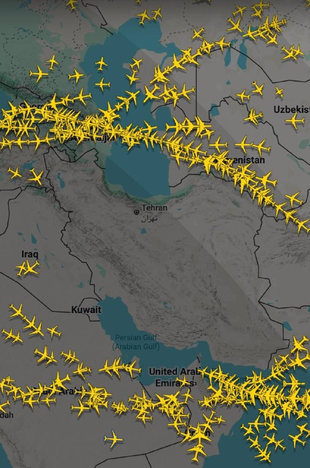

🔴آسمان ایران، کویت و بحرین کلیر شد.

@IranianMinds

## Dirty_Kids — post 390879

🔴 اگه امشب آتش بس نقض نشد، دیگه حتی مجتبی کون ملانیا بذاره، بازم نقض نمیشه.

@Dirty_Kids 👻

## Dirty_Kids — post 390878

معلوم نیست آمریکا در قشم چه هدفی را زده که آخوند رم کرده و از یک ساعت قبل تا الان به چهار کشور عراق، بحرین، کویت و عربستان حمله موشکی کرده!

@Dirty_Kids 👻

---
📅 بروزرسانی: 1405/03/13 03:03
---

## VahidOOnLine — post 243447

♦️به گزارش رویترز، مقامات قضایی آمریکا از کشف یک تونل فوق‌پیشرفته و مجهز در مرز ایالات متحده و مکزیک خبر دادند که برای قاچاق گسترده مواد مخدر استفاده می‌شد. بر اساس بیانیه دادستانی حوزه جنوبی کالیفرنیا، این تونل به طول ۵۸۹ متر، شهر «تیخوانا» در مکزیک را به انباری در نزدیکی گذرگاه مرزی «اوتی مِسا» در سن‌دیگوی آمریکا متصل می‌کرد. این تونل زیرزمینی به دیوارهای بتنی مقاوم، سیستم برق‌رسانی، تهویه هوا و ریل‌کشی مجهز بوده و خروجی آن در خاک آمریکا، زیر کف یک فروشگاه خرده‌فروشی و مجهز به بالابر هیدرولیکی پنهان شده بود. ماموران امنیتی در این عملیات بیش از یک تُن کوکائین به ارزش تقریبی ۴۵ میلیون دلار کشف و ۴ متهم را بازداشت کردند.
کشف این تونل بزرگ قاچاق در تیخوانا در حالی خبرساز می‌شود که این شهر محل برگزاری کمپ و اردوهای تیم ملی فوتبال ایران است. پیش‌تر، مهدی تاج، رئیس فدراسیون فوتبال، در گفتگو با صداوسیما در پاسخ به ابهامات و نگرانی‌ها درباره ناامنی شدید این شهر مکزیکی و حضور گسترده کارتل‌های بزرگ مخدر گفته بود: «ما کار به موادفروش‌ها نداریم و نمی‌خواهیم برویم آنجا اصلاحشان کنیم»
‌🇸🇦 Indypersian

🤖 @VahidOOnLine

## WithYashar — post 13331

امارات هیچ آلارمی ‌نیست سایت فرودگاه هم کنسل شدن پرواز نشون نمیده فیکه !
@withyashar

## mwarmonitor — post 10059

حمله موشکی به دبی

## mwarmonitor — post 10058

🚨آژیرهای هشدار در بحرین متوقف شده‌اند و هشدار مربوط به حمله موشکی نیز لغو شده است.

@mwarmonitor

## mwarmonitor — post 10057

حمله به عربستان

## mwarmonitor — post 10056

  

❌حریم هوایی بحرین به‌طور کامل به روی تمامی پروازها از ساعت ۰۳:۳۰ به وقت UTC تا ۱۶:۰۰ بسته شده است و تنها پروازهای محدودِ از پیش تأیید شده اجازه خروج دارند.

@mwarmonitor

## pm_afshaa — post 92183

امارات:

## pm_afshaa — post 92182

🔴گزارشاتی از حمله به فرودگاه دبی 
💧 Rainbet.com the #1 Non-KYC Crypto Casino & Sportsbook @rainbetcom 
😁 @Pm_Afshaa

## pm_afshaa — post 92181

ترامپ الان میاد میگه درحال توافقیم و همه‌چی خوب پیش میره

## pm_afshaa — post 92180

  <a href="telegram/content/pm_afshaa_92180_1780443235.webm" target="_blank">🎬 Download video</a>

🔴آسمان ایران، کویت و بحرین کلیر شد و کلیه‌ی پروازها در دبی در پی آژیر هشدار لغو شدن.

💧 Rainbet.com the #1 Non-KYC Crypto Casino & Sportsbook @rainbetcom

😁 @Pm_Afshaa

## pm_afshaa — post 92179

  <a href="telegram/content/pm_afshaa_92179_1780443236.webm" target="_blank">🎬 Download video</a>

🔴طبق گزارشات، یک کشتی نظامی در سواحل امارات هدف قرار گرفته.

💧 Rainbet.com the #1 Non-KYC Crypto Casino & Sportsbook @rainbetcom

😁 @Pm_Afshaa

## pm_afshaa — post 92178

🔴پروازهای بحرین و کویت لغو شدن. 
💧 Rainbet.com the #1 Non-KYC Crypto Casino & Sportsbook @rainbetcom 
😁 @Pm_Afshaa

## pm_afshaa — post 92177

🔴پروازهای بحرین و کویت لغو شدن.

💧 Rainbet.com the #1 Non-KYC Crypto Casino & Sportsbook @rainbetcom

😁 @Pm_Afshaa

## Shin_Persian — post 6437

  

Shin ✓ @hey_itsmyturn
Tue, 02 Jun 2026 23:29:02 UTC

Jet activity over Ilam Province, #Iran

فارسی

فعالیت جنگنده‌ها بر فراز استان ایلام، #Iran

𝕏 · @shin_persian

## Shin_Persian — post 6436

  

Shin ✓ @hey_itsmyturn
Tue, 02 Jun 2026 23:25:11 UTC

Disrupted Air traffic over Persian Gulf

فارسی

اختلال در ترافیک هوایی برفراز خلیج فارس

𝕏 · @shin_persian

## Shin_Persian — post 6435

Shin ✓ @hey_itsmyturn
Tue, 02 Jun 2026 23:23:59 UTC

Jet activity over Tehran, Tehran Province, #Iran

فارسی

فعالیت جت‌ها بر فراز تهران، استان تهران، #Iran

𝕏 · @shin_persian

## Persian_Trend_Official — post 15578

  <a href="telegram/content/Persian_Trend_Official_15578_1780443237.mp4" target="_blank">🎬 Download video</a>

لحظه فیل شدن و انفجار موشک پدافندی سامانه پدافندی پاتریوت مستقر در کویت در جریان تلاش برای مقابله با موشک‌های بالستیک ایرانی

📝 Amir

📌 @persian_trend_official
پرشین ترند | متفاوت‌ترین کانال نظامی

## Persian_Trend_Official — post 15577

  <a href="telegram/content/Persian_Trend_Official_15577_1780443238.webm" target="_blank">🎬 Download video</a>

⭕️ اختلال در ترافیک هوایی بر فراز خلیج فارس:

📝 Nick

📌 @persian_trend_official
پرشین ترند | متفاوت‌ترین کانال نظامی

## Persian_Trend_Official — post 15576

🚨 رسانه‌های عربی گزارش دادند که فعالیت فرودگاه‌ها و تمام پروازها در بحرین، کویت و امارات عربی متحده به‌دلیل حملات هوایی متوقف شده است.

📝 Nick

📌 @persian_trend_official
پرشین ترند | متفاوت‌ترین کانال نظامی

## Persian_Trend_Official — post 15574

  <a href="telegram/content/Persian_Trend_Official_15574_1780443239.mp4" target="_blank">🎬 Download video</a>

تصاویری از فعالیت پدافند هوایی در آسمان کویت در پی حمله موشکی پهپادی ایران

📝 Amir

📌 @persian_trend_official
پرشین ترند | متفاوت‌ترین کانال نظامی

## Persian_Trend_Official — post 15573

⭕️ صداهایی در تهران!!!

📝 Nick

📌 @persian_trend_official
پرشین ترند | متفاوت‌ترین کانال نظامی

## IranianMinds — post 21280

🔴آژیرها در بحرین به صدا درآمدند و از مردم خواسته شده به مناطق امن بروند .

@IranianMinds

---
📅 بروزرسانی: 1405/03/13 02:53
---

## VahidOOnLine — post 243446

  

وزارت کشور بحرین با اعلام به صدا درآمدن آژیرهای هشدار در این کشور به دلیل حمله‌های پهپادی و موشکی، از شهروندان و ساکنان خواست ضمن حفظ آرامش، به نزدیک‌ترین مکان امن بروند.
‌🏁 🇬🇧 IranintlTV

🤖 @VahidOOnLine

## WithYashar — post 13330

اخبار تایید نشده از صدای آژیر خطر در عربستان
@withyashar

## WithYashar — post 13329

## mwarmonitor — post 10055

حمله موشکی به دبی

## mwarmonitor — post 10054

📌رسانه‌های آمریکایی گزارش دادند مردی که ادعا می‌کند بمبی به بدنش بسته شده، حداقل یک نفر را به گروگان در یکی از شعب بانک چیس در شهر بیکرزفیلد در ایالت کالیفرنیا در ایالات متحده آمریکا گرفته است.

@mwarmonitor

## pm_afshaa — post 92176

🔴فعالیت پدافند در عربستان

💧 Rainbet.com the #1 Non-KYC Crypto Casino & Sportsbook @rainbetcom

😁 @Pm_Afshaa

## pm_afshaa — post 92175

صدای توافق تو کل خاورمیانه پیچیده🔥

## pm_afshaa — post 92174

🔴گزارشاتی از حمله به فرودگاه دبی

💧 Rainbet.com the #1 Non-KYC Crypto Casino & Sportsbook @rainbetcom

😁 @Pm_Afshaa

## pm_afshaa — post 92173

امارات:

## pm_afshaa — post 92172

  <a href="telegram/content/pm_afshaa_92172_1780442630.mp4" target="_blank">🎬 Download video</a>

امارات:

## pm_afshaa — post 92171

🔴آژیر خطر در عربستان فعال شد

💧 Rainbet.com the #1 Non-KYC Crypto Casino & Sportsbook @rainbetcom

😁 @Pm_Afshaa

## pm_afshaa — post 92170

عربستان هم زدن😂

## pm_afshaa — post 92169

ترامپ خطاب به کانفیگ‌ فروشا:
کمک در راه است!

## pm_afshaa — post 92168

قشم صدای انفجار شنیده شده

💧 Rainbet.com the #1 Non-KYC Crypto Casino & Sportsbook @rainbetcom

😁 @Pm_Afshaa

## pm_afshaa — post 92167

  <a href="telegram/content/pm_afshaa_92167_1780442631.webm" target="_blank">🎬 Download video</a>

🔴گزارش‌ها از آژیر حمله هوایی در پایگاه ناوگان پنجم نیروی دریایی ارتش آمریکا در بحرین.

💧 Rainbet.com the #1 Non-KYC Crypto Casino & Sportsbook @rainbetcom

😁 @Pm_Afshaa

## pm_afshaa — post 92165

  <a href="telegram/content/pm_afshaa_92165_1780442631.mp4" target="_blank">🎬 Download video</a>

ویدیویی از حمله به کویت :

💧 Rainbet.com the #1 Non-KYC Crypto Casino & Sportsbook @rainbetcom

😁 @Pm_Afshaa

## IranIntlTV — post 340300

  

وزارت کشور بحرین با اعلام به صدا درآمدن آژیرهای هشدار در این کشور به دلیل حمله‌های پهپادی و موشکی، از شهروندان و ساکنان خواست ضمن حفظ آرامش، به نزدیک‌ترین مکان امن بروند.
https://iranintl.com/202606025087

## Shin_Persian — post 6434

Shin ✓ @hey_itsmyturn
Tue, 02 Jun 2026 23:14:35 UTC

New blasts in Qeshm island, Hormozgan Province, #Iran

فارسی

انفجارهای جدید در جزیره قشم، استان هرمزگان، #Iran_

𝕏 · @shin_persian

## Persian_Trend_Official — post 15572

منابع عربی: پایگاه «الجفری» و مقر ناوگان پنجم نیروی دریایی آمریکا در بحرین مورد اصابت قرار گرفته است!

📝 Amir

📌 @persian_trend_official
پرشین ترند | متفاوت‌ترین کانال نظامی

## Persian_Trend_Official — post 15571

  <a href="telegram/content/Persian_Trend_Official_15571_1780442633.webm" target="_blank">🎬 Download video</a>

⭕️ گزارش های اولیه از حمله ج.ا به امارات 🇦🇪

📝 Nick

📌 @persian_trend_official
پرشین ترند | متفاوت‌ترین کانال نظامی

## Persian_Trend_Official — post 15570

⭕️ گزارش‌های اولیه از حمله ج.ا به یک کشتی در تنگه هرمز.

📝 Nick

📌 @persian_trend_official
پرشین ترند | متفاوت‌ترین کانال نظامی

## Persian_Trend_Official — post 15569

⭕️ هشدار حملات در عربستان نیز به صدا درآمد!

📝 Nick

📌 @persian_trend_official
پرشین ترند | متفاوت‌ترین کانال نظامی

## Persian_Trend_Official — post 15568

  <a href="telegram/content/Persian_Trend_Official_15568_1780442633.webm" target="_blank">🎬 Download video</a>

⭕️ سپاه پاسداران در اطلاعیه ای اعلام کرد حملات انجام شده به کویت و بحرین در پاسخ به حمله نیروهای امریکایی به چند سایت راداری و پدافندی در جزیره قشم انجام شده است. 📝 Nick 📌 @persian_trend_official پرشین ترند | متفاوت‌ترین کانال نظامی

## Persian_Trend_Official — post 15567

  <a href="telegram/content/Persian_Trend_Official_15567_1780442634.webm" target="_blank">🎬 Download video</a>

❗️فعال شدن آژیرها در ستاد ناوگان پنجم نیروی دریایی ایالات متحده در منامه، بحرین.

📝 Nick

📌 @persian_trend_official
پرشین ترند | متفاوت‌ترین کانال نظامی

## BBCPersian — post 282722

🔻‌ساعتی پس از انتشار بیانیه سنتکام مبنی بر متوقف کردن یک نفتکش در مسیر بنادر ایران، خبرگزاری‌های داخل ایران و نزدیک به سپاه پاسداران از به صدا در آمدن آژیرهای خطر در کویت در پی حمله موشکی به پایگاه‌های نظامی آمریکا در این کشور خبر دادند. خبرگزاری تسنیم اگر…

## Dirty_Kids — post 390877

انتقامی که کانفیگ فروشا میخوان ازمون بگیرن از حمله آمریکا ترسناک تره.

@Dirty_Kids 👻

---
📅 بروزرسانی: 1405/03/13 02:44
---

## VahidOOnLine — post 243445

♦️ساعاتی پس از اینکه ستاد کل نیروهای مسلح کویت با انتشار بیانیه‌ای فوری اعلام کرد که سیستم‌های پدافند هوایی این کشور، بامداد چهارشنبه، مشغول مقابله با حملات موشکی و پهپادهای «متخاصم» در آسمان کویت هستند، ارتش سعود عبدالعزیز العطوان، سخنگوی رسمی وزارت دفاع کویت، با انتشار بیانیه‌ای از مردم و ساکنان این کشور خواست تا به هیچ‌عنوان به بقایا یا اجسام مشکوک و ناشناسی که ممکن است در پی عملیات پدافند هوایی برای رهگیری و انهدام «اهداف متخاصم» در زمین سقوط کرده باشند، نزدیک نشوند و آن‌ها را لمس نکنند. در این بیانیه تاکید شده که این ضایعات خطر جدی برای سلامت عمومی دارند و مردم باید در صورت مشاهده، فورا مراتب را به مراجع مربوطه گزارش داده، دستورالعمل‌های ایمنی را رعایت کنند.
‌🇸🇦 Indypersian

🤖 @VahidOOnLine

## WithYashar — post 13328

حملات جدید به کویت
@withyashar

## WithYashar — post 13327

رژیم جمهوری اسلامی به بحرین حمله کرد پدافند بحرین فعال شد @withyashar

## WithYashar — post 13326

۳‌پا اعلام کرد در پاسخ به آنچه «حمله آمریکا به حاکمیت ایران در جزیره قشم» خوانده، پایگاه‌های نظامی آمریکا در کویت را با حملات موشکی هدف قرار داده و این اقدام را «پاسخ اولیه» توصیف کرده است.

در این بیانیه به آمریکا و هر کشوری که خاک یا آسمان خود را برای عملیات علیه ایران در اختیار بگذارد هشدار داده شده که هرگونه اقدام جدید با پاسخی شدیدتر و فراتر از «قواعد متعارف» روبه‌رو خواهد شد.

۳پا همچنین تأکید کرده است که دوران «بزن و فرار کن» پایان یافته و نیروهای آمریکایی و متحدانشان باید منتظر پیامدهای اقدامات خود باشند.
@withyashar

## mwarmonitor — post 10052

🔴هدف قرار گرفتن پایگاه الجُفَير منامه و مقر ناوگان پنجم آمریکا در بحرین.

@mwarmonitor

## mwarmonitor — post 10051

🚨وزارت کشور بحرین وزارت کشور اعلام کرد:
در پی حملات خصمانه با موشک‌ها و پهپادها، آژیرهای هشدار به صدا درآمدند.

@mwarmonitor

## pm_afshaa — post 92164

  <a href="telegram/content/pm_afshaa_92164_1780442040.webm" target="_blank">🎬 Download video</a>

🔴طبق گزارشات رسانه‌های داخلی تا الان 10 موشک بالستیک به سمت کویت شلیک شده.

💧 Rainbet.com the #1 Non-KYC Crypto Casino & Sportsbook @rainbetcom

😁 @Pm_Afshaa

## pm_afshaa — post 92163

هنوز دارن حمله میکنن به کویت
آژیر خطر فعاله

## pm_afshaa — post 92162

اسپویل: ترامپ میاد میگه نیروهای آمریکایی هیچ آسیبی ندیدن و آتش‌بس همچنان برقراره. قبلشم چندتا قایق تندرو سپاه رو میزنن

## pm_afshaa — post 92161

  <a href="telegram/content/pm_afshaa_92161_1780442040.webm" target="_blank">🎬 Download video</a>

🔴سپاه پاسداران اعلام کرد در پاسخ به آنچه «حمله آمریکا به حاکمیت ایران در جزیره قشم» خوانده، پایگاه‌های نظامی آمریکا در کویت رو با حملات موشکی هدف قرار داده و این اقدام رو «پاسخ اولیه» توصیف کرده. 
💧 Rainbet.com the #1 Non-KYC Crypto Casino & Sportsbook @rainbetcom…

## pm_afshaa — post 92160

  <a href="telegram/content/pm_afshaa_92160_1780442041.mp4" target="_blank">🎬 Download video</a>

🔴ویدیویی از موشکی از بوشهر به سوی کویت شلیک شد :

💧 Rainbet.com the #1 Non-KYC Crypto Casino & Sportsbook @rainbetcom

😁 @Pm_Afshaa

## pm_afshaa — post 92159

  <a href="telegram/content/pm_afshaa_92159_1780442043.webm" target="_blank">🎬 Download video</a>

🔴سپاه پاسداران اعلام کرد در پاسخ به آنچه «حمله آمریکا به حاکمیت ایران در جزیره قشم» خوانده، پایگاه‌های نظامی آمریکا در کویت رو با حملات موشکی هدف قرار داده و این اقدام رو «پاسخ اولیه» توصیف کرده.

💧 Rainbet.com the #1 Non-KYC Crypto Casino & Sportsbook @rainbetcom

😁 @Pm_Afshaa

## VahidOnline — post 75887

  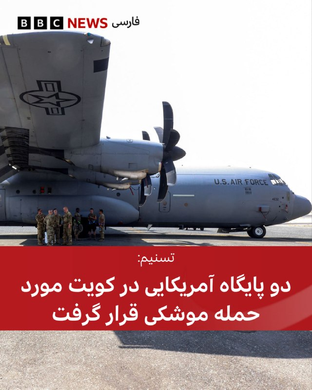

‌ساعتی پس از انتشار بیانیه سنتکام مبنی بر متوقف کردن یک نفتکش در مسیر بنادر ایران، خبرگزاری‌های داخل ایران و نزدیک به سپاه پاسداران از به صدا در آمدن آژیرهای خطر در کویت در پی حمله موشکی به پایگاه‌های نظامی آمریکا در این کشور خبر دادند.

خبرگزاری تسنیم اگر چه رسما این حمله را از جانب ایران گزارش نکرده اما به نقل از منابع عربی خود نوشت: «دست کم صدای سه انفجار» در کویت شنیده شده و دو پایگاه علی السالم و عریفجان مورد حمله قرار گرفته‌اند.

ایران در واکنش به حمله هفته گذشته نیروهای امریکایی به نقاطی در نزدیکی بندرعباس، به پایگاه‌های آمریکایی در کویت حمله موشکی پهپادی کرده بود که در پی آن به گزارش رسانه‌های امریکا چند نظامی این کشور زخمی شدند.
@VahidHeadline

📡 @VahidOnline

## FarsiVOA — post 219419

  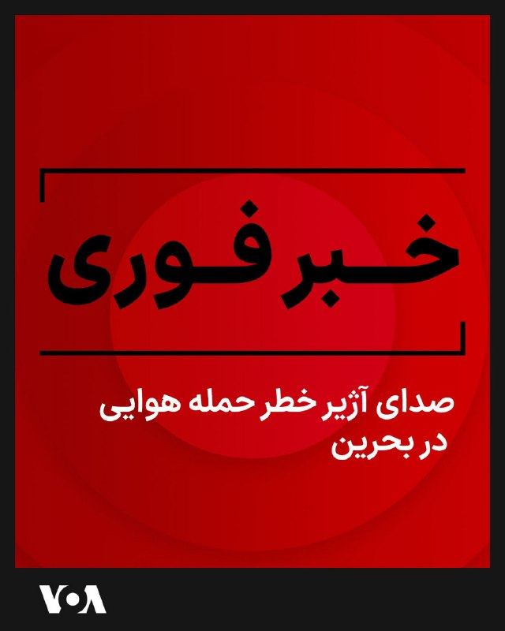

⚡️وزارت کشور بحرین دقایقی قبل از به صدا در آمدن «آژیر خطر» خبر داد و از ساکنان این کشور خواست به نزدیکترین مکان امن بروند. این هشدار پس از آن است که کویت نیز اعلام کرد مشغول مقابله با حملات هوایی است.

@FarsiVOA

## Persian_Trend_Official — post 15566

  <a href="telegram/content/Persian_Trend_Official_15566_1780442044.mp4" target="_blank">🎬 Download video</a>

لحظه فیل شدن موشک رهگیر پاتریوت در کویت که تصاویر آن پخش شده است.

📝 Nick

📌 @persian_trend_official
پرشین ترند | متفاوت‌ترین کانال نظامی

## Persian_Trend_Official — post 15565

⭕️ سپاه پاسداران در اطلاعیه ای اعلام کرد حملات انجام شده به کویت و بحرین در پاسخ به حمله نیروهای امریکایی به چند سایت راداری و پدافندی در جزیره قشم انجام شده است.

📝 Nick

📌 @persian_trend_official
پرشین ترند | متفاوت‌ترین کانال نظامی

## Persian_Trend_Official — post 15564

  <a href="telegram/content/Persian_Trend_Official_15564_1780442046.mp4" target="_blank">🎬 Download video</a>

⭕️ تلاش برای رهگیری موشک‌ها بر فراز منامه

📝 Nick

📌 @persian_trend_official
پرشین ترند | متفاوت‌ترین کانال نظامی

## BBCPersian — post 282721

  

🔻‌ساعتی پس از انتشار بیانیه سنتکام مبنی بر متوقف کردن یک نفتکش در مسیر بنادر ایران، خبرگزاری‌های داخل ایران و نزدیک به سپاه پاسداران از به صدا در آمدن آژیرهای خطر در کویت در پی حمله موشکی به پایگاه‌های نظامی آمریکا در این کشور خبر دادند.

خبرگزاری تسنیم اگر چه رسما این حمله را از جانب ایران گزارش نکرده اما به نقل از منابع عربی خود نوشت: «دست کم صدای سه انفجار» در کویت شنیده شده و دو پایگاه علی السالم و عریفجان مورد حمله قرار گرفته‌اند.

ایران در واکنش به حمله هفته گذشته نیروهای امریکایی به نقاطی در نزدیکی بندرعباس، به پایگاه‌های آمریکایی در کویت حمله موشکی پهپادی کرده بود که در پی آن به گزارش رسانه‌های امریکا چند نظامی این کشور زخمی شدند.

دقایقی بعد از گزارش خبرگزاری‌های نزدیک به سپاه پاسداران مبنی بر «حملات موشکی» به پایگاه‌های آمریکایی در کویت، خبرگزاری تسنیم - نزدیک به سپاه پاسداران - از حمله به پایگاه‌های آمریکایی در بحرین خبر داد و همزمان مدعی شد در کویت دست کم صدای سه انفجار شنیده شده است.

📷 AFP via Getty Images
https://bbc.in/43fljUn
@BBCPersian

## alonews — post 124659

  

🤚 اینترنت مخصوص جنگ 🚀✅

⭐️ فقط گیگی 8 هزار تومان😍

✅ بدون قطعی‌های آزاردهنده
✅ سرعت بالا حتی ساعات شلوغ
✅ مناسب تلگرام، اینستاگرام و یوتیوب
✅ همراه با ساب

✅ تعداد محدود با این قیمت

🤖 @NetAazaadBot
🤖 @NetAazaadBot

## alonews — post 124658

  <a href="telegram/content/alonews_124658_1780442048.webm" target="_blank">🎬 Download video</a>

👈رسانه‌های عربی می‌گویند که حملات موشکی و پهپادی به محل استقرار نظامیان آمریکایی در کویت و بحرین ادامه داشته و آژیرهای هشدار قطع نمی‌شوند

✅ @AloNews خبر جنگ

## alonews — post 124657

  <a href="telegram/content/alonews_124657_1780442048.mp4" target="_blank">🎬 Download video</a>

👈صدای پهپادهای شاهد-۱۳۶ در آسمان بحرین شنیده می‌شود.

✅ @AloNews خبر جنگ

## alonews — post 124656

  <a href="telegram/content/alonews_124656_1780442049.webm" target="_blank">🎬 Download video</a>

👈جت های اسرائیلی بر فراز بیروت

✅ @AloNews خبر جنگ

## alonews — post 124655

  <a href="telegram/content/alonews_124655_1780442049.webm" target="_blank">🎬 Download video</a>

👈گزارش از حملات متداوم سپاه به بحرین؛ کویت و کردستان عراق ادامه داره

✅ @AloNews خبر جنگ

---
📅 بروزرسانی: 1405/03/13 02:34
---

## VahidOOnLine — post 243444

  <a href="telegram/content/VahidOOnLine_243444_1780441442.mp4" target="_blank">🎬 Download video</a>

یکی از مخاطبان ایران‌اینترنشنال با اشاره به تغییر زمان امتحانات نهایی «به‌دلیل پیاده‌روی اربعین» گفت دانش‌آموزان به زمان‌بندی قبلی نیز معترض بودند و این تغییرات «بازی با روح و روان دانش‌آموزان است
‌🏁 🇬🇧 IranintlTV

🤖 @VahidOOnLine

## WithYashar — post 13325

حمله دوباره جمهوری اسلامی به اقلیم کردستان
@withyashar

## WithYashar — post 13324

مهر: یک موشک به ساحل ایران برخورد کرد

خبرگزاری مهر گزارش داد یک پرتابه در محدوده ساحلی بین شهر سوزا و روستای ماسان برخورد کرده است
@withyashar

## WithYashar — post 13323

انفجار در بحرین
@withyashar

## WithYashar — post 13322

  

رژیم جمهوری اسلامی به بحرین حمله
کرد
پدافند بحرین فعال شد
@withyashar

## mwarmonitor — post 10050

🔴روزنامه وال‌استریت ژورنال گزارش ما را تأیید کرده و می‌نویسد دونالد ترامپ با عصبانیت صدایش را بالا برد و به بنیامین نتانیاهو گفت که باید اطاعت کند، زیرا بدون حمایت کاخ سفید در زندان خواهد بود. باراک راوید

@mwarmonitor

## pm_afshaa — post 92158

  <a href="telegram/content/pm_afshaa_92158_1780441444.mp4" target="_blank">🎬 Download video</a>

ویدیویی از حمله موشکی به بحرین :

💧 Rainbet.com the #1 Non-KYC Crypto Casino & Sportsbook @rainbetcom

😁 @Pm_Afshaa

## pm_afshaa — post 92157

عجیبه امارات رو نزدن هنوز

## pm_afshaa — post 92156

  

هم‌اکنون آسمان بحرین :

💧 Rainbet.com the #1 Non-KYC Crypto Casino & Sportsbook @rainbetcom

😁 @Pm_Afshaa

## pm_afshaa — post 92155

  <a href="telegram/content/pm_afshaa_92155_1780441446.webm" target="_blank">🎬 Download video</a>

🔴منابع عربی: نیروی هوایی ایران دقایقی قبل با جنگنده مواضع کردها در اربیل، کردستان عراق رو بمباران کرده.

💧 Rainbet.com the #1 Non-KYC Crypto Casino & Sportsbook @rainbetcom

😁 @Pm_Afshaa

## pm_afshaa — post 92154

  

رد موشک در بحرین

💧 Rainbet.com the #1 Non-KYC Crypto Casino & Sportsbook @rainbetcom

😁 @Pm_Afshaa

## pm_afshaa — post 92153

  <a href="telegram/content/pm_afshaa_92153_1780441447.webm" target="_blank">🎬 Download video</a>

🔴تصویر رد موشک شلیک شده از شیراز

💧 Rainbet.com the #1 Non-KYC Crypto Casino & Sportsbook @rainbetcom

😁 @Pm_Afshaa

## pm_afshaa — post 92152

  <a href="telegram/content/pm_afshaa_92152_1780441447.webm" target="_blank">🎬 Download video</a>

🔴شلیک چندین موشکی بالستیک از ایران به سمت پایگاه آمریکا در کویت و بحرین.

💧 Rainbet.com the #1 Non-KYC Crypto Casino & Sportsbook @rainbetcom

😁 @Pm_Afshaa

## pm_afshaa — post 92151

🔴آژیر خطر در بحرین هم فعال شد. 
💧 Rainbet.com the #1 Non-KYC Crypto Casino & Sportsbook @rainbetcom 
😁 @Pm_Afshaa

## pm_afshaa — post 92150

🔴آژیر خطر در بحرین هم فعال شد.

💧 Rainbet.com the #1 Non-KYC Crypto Casino & Sportsbook @rainbetcom

😁 @Pm_Afshaa

## VahidOnline — post 75886

  

پیام‌های دریافتی:
عکس بالا: بندر کنگان دو تا موشک شلیک شد سمت کشور های عربی 2.19

ساعت ۲:۲۰ از جم بوشهر موشک زدن

درود همین الان از جم دو عدد موشک شلیک شد به سمت خلیج فارس

از جم ساعت ۲:۲۱
دو تا موشک پرتاب شد

از جم بوشهر هم دو تا زدن
همين الان

شلیک موشک از شهرک موشکی شهید چمران جم هم اکنون
ساعت ۲:۲۳ دقیقه صبح دو موشک همزمان

آپدیت: پرتاب سوم

سومی هم پرتاب شد

یکی دیگه هم همین الان شلیک شد

۲:۲۴ از جم یکی دیگه پرتاب شد

📡 @VahidOnline

## IranIntlTV — post 340299

  <a href="telegram/content/IranIntlTV_340299_1780441448.mp4" target="_blank">🎬 Download video</a>

یکی از مخاطبان ایران‌اینترنشنال با اشاره به تغییر زمان امتحانات نهایی «به‌دلیل پیاده‌روی اربعین» گفت دانش‌آموزان به زمان‌بندی قبلی نیز معترض بودند و این تغییرات «بازی با روح و روان دانش‌آموزان است

## Shin_Persian — post 6433

Shin ✓ @hey_itsmyturn
Tue, 02 Jun 2026 23:01:41 UTC

And it was Khorramshahr 4 BM.

فارسی

و آن موشک بالستیک خرمشهر ۴ بود.

𝕏 · @shin_persian

## Shin_Persian — post 6432

Shin ✓ @hey_itsmyturn
Tue, 02 Jun 2026 22:53:12 UTC

Source on the ground tells me the previous missile was launched from Borazjan, Bushehr Province, #Iran

فارسی

منابع میدانی به من می‌گویند موشک قبلی از برازجان، استان بوشهر، #Iran پرتاب شده است.

𝕏 · @shin_persian

## FarsiVOA — post 219418

  

⚡️کانال تلگرامی وحید‌آنلاین گزارش‌هایی از کاربران منتشر کرده است که از شنیده شدن صدای انفجار در داراب و همچنین در کویت خبر داده‌اند. جمهوری اسلامی در روزهای اخیر به کویت حمله موشکی کرده بود. ارتش کویت دقایقی قبل گفته بود با حملات هوایی متخاصم در حال مقابله است و صداهای انفجار ممکن است ناشی از رهگیری باشد.
@FarsiVOA

## Persian_Trend_Official — post 15563

  <a href="telegram/content/Persian_Trend_Official_15563_1780441450.mp4" target="_blank">🎬 Download video</a>

شبتون بخیر 🌃
Su-34 Fullback

📌 @persian_trend_official
پرشین ترند | متفاوت‌ترین کانال نظامی

## Persian_Trend_Official — post 15562

  <a href="telegram/content/Persian_Trend_Official_15562_1780441451.mp4" target="_blank">🎬 Download video</a>

🇧🇭 بحرین هم اکنون:

📝 Nick

📌 @persian_trend_official
پرشین ترند | متفاوت‌ترین کانال نظامی

## Persian_Trend_Official — post 15561

🚨فووری!!!!! آژیر های هشدار در بحرین نیز فعال شدند! 📝 Nick 📌 @persian_trend_official پرشین ترند | متفاوت‌ترین کانال نظامی

## Persian_Trend_Official — post 15560

  <a href="telegram/content/Persian_Trend_Official_15560_1780441451.webm" target="_blank">🎬 Download video</a>

تایید نشده:

سیگنالی در ایران، اعدادی را به زبان انگلیسی و با صدای گوینده انسانی ارسال می‌کند که نشان می‌دهد پیام به سمت عدد "۱۷۳" است.

پ.ن: روز اول جنگ هم چنین اتفاق مشابهی رخ داد و یکسری رشته اعداد به صورت رمزنگاری مخابره شده بود!

📝 Nick

📌 @persian_trend_official
پرشین ترند | متفاوت‌ترین کانال نظامی

## Dirty_Kids — post 390876

گزارشات اولیه از حمله به بحرین (هنوز تایید نمیشه)

@Dirty_Kids 👻

## alonews — post 124654

  <a href="telegram/content/alonews_124654_1780441452.webm" target="_blank">🎬 Download video</a>

👈تاکنون ۸ انفجار در بحرین گزارش شده است

✅ @AloNews خبر جنگ

## alonews — post 124653

  <a href="telegram/content/alonews_124653_1780441452.webm" target="_blank">🎬 Download video</a>

👈آژیر هشدای موشکی در بحرین مجدد به صدا درآمد

✅ @AloNews خبر جنگ

## alonews — post 124652

  <a href="telegram/content/alonews_124652_1780441452.mp4" target="_blank">🎬 Download video</a>

👈ویدیویی از حمله به بحرین

✅ @AloNews خبر جنگ

## alonews — post 124651

  <a href="telegram/content/alonews_124651_1780441453.webm" target="_blank">🎬 Download video</a>

👈بیانیه صادر شده از سوی فرماندهی سپاه پاسداران انقلاب اسلامی:

🔴بسم الله الرحمن الرحیم
﴿قَاتِلُوهُمْ يُعَذِّبْهُمُ اللَّهُ بِأَيْدِيكُمْ وَيُخْزِهِمْ وَيَنْصُرْكُمْ عَلَيْهِمْ وَيَشْفِ صُدُورَ قَوْمٍ مُؤْمِنِينَ﴾
(خداوند بزرگ و بلندمرتبه راست گفته است)

ای فرزندان آزاد امت اسلامی و مردم مقاوم و سربلند ایران:

🔴در پاسخ به گستاخی و تجاوز آشکاری که نیروهای تروریستی آمریکایی با هدف قرار دادن حاکمیت ملی جمهوری اسلامی ایران در جزیره عزیز "قشم" مرتکب شدند، نیروی هوافضای سپاه پاسداران انقلاب اسلامی، به فضل خدا و یاری او و وفاداری به عهد خود در حفاظت از خاک وطن، با حملات دقیق و متمرکز موشکی، پایگاه‌های نظامی اشغالگران آمریکایی در کشور کویت را هدف قرار داد که منجر به نابودی موفقیت‌آمیز اهداف و شعله‌ور شدن آتش در دژهای متجاوزان شد.

🔴سپاه پاسداران انقلاب اسلامی ضمن اعلام این پاسخ اولیه برای ضربه زدن دو برابر، هشدار شدیداللحن و قاطعانه‌ای به دولت آمریکا و رأس استکبار جهانی و هر کسی که اجازه استفاده از خاک یا آسمان خود را برای آغاز تجاوز علیه ایران می‌دهد، می‌دهد:

🔴هر حماقت جدید، تجاوز دیگر یا حرکتی که حتی یک وجب از مرزها و حاکمیت ما را لمس کند، با پاسخی لرزه‌انگیز، خردکننده و قاطع مواجه خواهد شد که از قواعد و مرزهای معمول فراتر خواهد رفت و نیروهای شجاع ما در تبدیل تمام مقرهای متجاوزان و منافعشان در منطقه به خاکستر تردید نخواهند کرد.

🔴زمان "بزن و فرار کن" به پایان رسیده است و نیروهای ستمگر باید عواقب وخیم نادانی و ماجراجویی‌های بی‌محاسبه خود را بپذیرند.

﴿وَمَا النَّصْرُ إِلَّا مِنْ عِنْدِ اللَّهِ الْعَزِيزِ الْحَكِيمِ﴾

✅ @AloNews خبر جنگ

## alonews — post 124650

  <a href="telegram/content/alonews_124650_1780441453.webm" target="_blank">🎬 Download video</a>

👈این نخستین تشدید تنش بزرگ از سوی ایران از زمان آتش‌بس است که به‌طور هم‌زمان سه کشور مختلف را هدف قرار داده است.

✅ @AloNews خبر جنگ

## alonews — post 124649

  <a href="telegram/content/alonews_124649_1780441453.mp4" target="_blank">🎬 Download video</a>

👈آسمان بحرین.

✅ @AloNews خبر جنگ

## alonews — post 124648

  <a href="telegram/content/alonews_124648_1780441454.webm" target="_blank">🎬 Download video</a>

👈حمله موشکی ایران از استان بوشهر

✅ @AloNews خبر جنگ

## alonews — post 124647

  <a href="telegram/content/alonews_124647_1780441454.webm" target="_blank">🎬 Download video</a>

👈سامانه‌های پدافند هوایی در بحرین فعال شدند.

✅ @AloNews خبر جنگ

## alonews — post 124646

  <a href="telegram/content/alonews_124646_1780441454.webm" target="_blank">🎬 Download video</a>

👈شلیک موشک به سمت پایگاه‌ آمریکا در بحرین

✅ @AloNews خبر جنگ

---
📅 بروزرسانی: 1405/03/13 02:23
---

## VahidOOnLine — post 243443

  <a href="telegram/content/VahidOOnLine_243443_1780440826.mp4" target="_blank">🎬 Download video</a>

♦️مارکو روبیو، وزیر امور خارجه ایالات متحده، روز سه‌شنبه ۱۲ خرداد در جلسه استماع سنا گفت عوامل جمهوری اسلامی ایران به طور مداوم در حال برنامه‌ریزی برای ترور مقام‌های سیاسی آمریکا بوده‌اند.
روبیو گفت: «افرادی در آمریکا محکوم شده‌اند و روز گذشته نیز یک نفر بازداشت شد؛ عوامل ایرانی برای ترور مقام‌های سیاسی آمریکا، از جمله رئیس‌جمهوری ایالات متحده، برنامه‌ریزی کرده‌اند.»
‌🇸🇦 Indypersian

🤖 @VahidOOnLine

## WithYashar — post 13321

  <a href="telegram/content/WithYashar_13321_1780440828.mp4" target="_blank">🎬 Download video</a>

تصادف در خیابان های کویت بر اثر تماشای موشکهای ایران
@withyashar

## mwarmonitor — post 10049

💥انفجار در اربیل

## mwarmonitor — post 10048

💥انفجار در بحرین

## mwarmonitor — post 10047

  <a href="telegram/content/mwarmonitor_10047_1780440829.mp4" target="_blank">🎬 Download video</a>

💥۳ انفجار شدید دیگر در کویت شنیده شد

## FoxNewsTwitter — post 342523

  <a href="telegram/content/FoxNewsTwitter_342523_1780440830.mp4" target="_blank">🎬 Download video</a>

Fox News (Twitter/X)

FOX NEWS REPORT: Secretary of State Marco Rubio told lawmakers that Iran reopening the Strait of Hormuz is a prerequisite for talks to move forward, and said dysfunction within the Iranian regime has slowed progress toward a potential agreement. @BillMelugin_ has the latest.

## FoxNewsTwitter — post 342522

  

Fox News (Twitter/X)

The numbers are in: FOX News was the most-watched news brand on YouTube in May.

Our content generated more than 338 million views — more than tripling the viewership of every broadcast network — as audiences continue turning to FOX News for the biggest stories shaping the country and the world.

## pm_afshaa — post 92149

  <a href="telegram/content/pm_afshaa_92149_1780440832.webm" target="_blank">🎬 Download video</a>

🔴تصاویری از فعال شدن پدافند کویت درپی حمله موشکی و پهبادی ایران : 
💧 Rainbet.com the #1 Non-KYC Crypto Casino & Sportsbook @rainbetcom 
😁 @Pm_Afshaa

## pm_afshaa — post 92148

  <a href="telegram/content/pm_afshaa_92148_1780440833.webm" target="_blank">🎬 Download video</a>

🔴تصاویری از فعال شدن پدافند کویت درپی حمله موشکی و پهبادی ایران : 
💧 Rainbet.com the #1 Non-KYC Crypto Casino & Sportsbook @rainbetcom 
😁 @Pm_Afshaa

## pm_afshaa — post 92145

  <a href="telegram/content/pm_afshaa_92145_1780440833.mp4" target="_blank">🎬 Download video</a>

🔴تصاویری از فعال شدن پدافند کویت درپی حمله موشکی و پهبادی ایران :

💧 Rainbet.com the #1 Non-KYC Crypto Casino & Sportsbook @rainbetcom

😁 @Pm_Afshaa

## pm_afshaa — post 92144

  <a href="telegram/content/pm_afshaa_92144_1780440834.webm" target="_blank">🎬 Download video</a>

🔴ایران موشک و پهباد زده سمت کویت

💧 Rainbet.com the #1 Non-KYC Crypto Casino & Sportsbook @rainbetcom

😁 @Pm_Afshaa

## Shin_Persian — post 6431

Shin ✓ @hey_itsmyturn
Tue, 02 Jun 2026 22:43:34 UTC

3 more loud blasts in #Kuwait 🇰🇼 right now
(4 in total within 1 minute)

فارسی

هم‌اکنون ۳ انفجار بلند دیگر در #Kuwait 🇰🇼
(در مجموع ۴ مورد طی ۱ دقیقه)

𝕏 · @shin_persian

## Shin_Persian — post 6427

Shin ✓ @hey_itsmyturn
Tue, 02 Jun 2026 22:43:01 UTC

Huge blast in #Kuwait 🇰🇼

فارسی

انفجار عظیم در #Kuwait 🇰🇼

𝕏 · @shin_persian

## Persian_Trend_Official — post 15559

🚨فووری!!!!!

آژیر های هشدار در بحرین نیز فعال شدند!

📝 Nick

📌 @persian_trend_official
پرشین ترند | متفاوت‌ترین کانال نظامی

## Persian_Trend_Official — post 15558

  <a href="telegram/content/Persian_Trend_Official_15558_1780440835.webm" target="_blank">🎬 Download video</a>

⭕️ مهر: یک پرتابه به ساحل ایران برخورد کرد

خبرگزاری مهر گزارش داد یک پرتابه در محدوده ساحلی بین شهر سوزا و روستای ماسان برخورد کرده است.

📝 Nick

📌 @persian_trend_official
پرشین ترند | متفاوت‌ترین کانال نظامی

## Persian_Trend_Official — post 15557

⭕️ همزمان با حملات موشکی به کویت، خبرها از انفجار های متعدد در اربیل عراق خبر می‌دهند.

📝 Nick

📌 @persian_trend_official
پرشین ترند | متفاوت‌ترین کانال نظامی

## Persian_Trend_Official — post 15556

  <a href="telegram/content/Persian_Trend_Official_15556_1780440835.mp4" target="_blank">🎬 Download video</a>

⭕️ یه راننده کویتی از ترس رفت تو بلوار 🗿

📝 Nick

📌 @persian_trend_official
پرشین ترند | متفاوت‌ترین کانال نظامی

## Persian_Trend_Official — post 15555

  

⚠️ خلیج فارس بوده، خلیج فارس هست و خلیج فارس خواهد بود. 😠

⭕️ سنتکام یک شناورِ سرپیچی‌کننده را در خلیج فارس از کار انداخت.

تامپا، فلوریدا — نیروهای ایالات متحده روز ۲ ژوئن یک نفتکشِ بدون بار را که در تلاش بود به سوی یک بندر ایرانی در خلیج فارس حرکت کند، از کار انداختند.

فرماندهی مرکزی ایالات متحده (سنتکام) هنگام عبور نفتکش M/T Lexie با پرچم بوتسوانا به‌سوی جزیرهٔ خارگ، تدابیر محاصره‌ای را علیه آن اجرا کرد. خدمهٔ این کشتی در طول یک بازهٔ ۲۴ ساعته، بارها هشدارهای مکرر را نادیده گرفتند و از تبعیت از دستورهای نیروهای آمریکایی سر باز زدند.

در نهایت، یک فروند هواگرد آمریکایی با شلیک یک موشک هلفایر به اتاق موتور کشتی، آن را از کار انداخت و مانع از رسیدن نفتکش به ایران شد.

سنتکام از ۱۳ آوریل اجرای محاصرهٔ همهٔ ترافیک دریاییِ ورودی و خروجیِ بنادر ایران را آغاز کرده است. با ادامهٔ آتش‌بس با ایران، نیروهای آمریکایی تاکنون شش کشتی تجاری را از کار انداخته و ۱۲۲ فروند شناور را به مسیر دیگری هدایت کرده‌اند.

📝 Nick

📌 @persian_trend_official
پرشین ترند | متفاوت‌ترین کانال نظامی

## alonews — post 124645

  

🤚 اینترنت مخصوص جنگ 🚀✅

⭐️ فقط گیگی 8 هزار تومان😍

✅ بدون قطعی‌های آزاردهنده
✅ سرعت بالا حتی ساعات شلوغ
✅ مناسب تلگرام، اینستاگرام و یوتیوب
✅ همراه با ساب

✅ تعداد محدود با این قیمت

🤖 @NetAazaadBot
🤖 @NetAazaadBot

## alonews — post 124644

  <a href="telegram/content/alonews_124644_1780440837.webm" target="_blank">🎬 Download video</a>

👈تا این لحظه حداقل پنج موشک به سمت کویت شلیک شده است

✅ @AloNews خبر جنگ

## alonews — post 124643

  <a href="telegram/content/alonews_124643_1780440838.webm" target="_blank">🎬 Download video</a>

👈مهر: یک پرتابه به ساحل ایران برخورد کرد
خبرگزاری مهر گزارش داد یک پرتابه در محدوده ساحلی بین شهر سوزا و روستای ماسان برخورد کرده است

✅ @AloNews خبر جنگ

## alonews — post 124642

  <a href="telegram/content/alonews_124642_1780440838.webm" target="_blank">🎬 Download video</a>

👈سه انفجار دیگر در کویت گزارش شده

✅ @AloNews خبر جنگ

## alonews — post 124641

  <a href="telegram/content/alonews_124641_1780440838.mp4" target="_blank">🎬 Download video</a>

👈یه راننده کویتی از ترس صدای موشک رفت تو بلوار

✅ @AloNews خبر جنگ

## alonews — post 124640

  <a href="telegram/content/alonews_124640_1780440839.webm" target="_blank">🎬 Download video</a>

💢فووووووووووووووری/همین الان چند جنگنده آمریکایی در مرز ایران درحال پرواز هستن 
🚨 @AkhbareFouri

## alonews — post 124639

  <a href="telegram/content/alonews_124639_1780440840.webm" target="_blank">🎬 Download video</a>

👈آژیرهای هشدار در کویت بار دیگر فعال شدند

✅ @AloNews خبر جنگ

---
📅 بروزرسانی: 1405/03/13 02:13
---

## VahidOOnLine — post 243435

  <a href="telegram/content/VahidOOnLine_243435_1780440227.mp4" target="_blank">🎬 Download video</a>

کاهش قیمت بنزین در آمریکا فقط یک خبر اقتصادی نیست، می‌تواند نشانه‌ای از امید بازارها به کاهش تنش و ادامه مذاکرات باشد.

اما در حالی که واشنگتن ممکن است برای حفظ ثبات بازار انرژی انگیزه بیشتری پیدا کرده باشد، تجربه چهار دهه گذشته نشان می‌دهد جمهوری اسلامی بارها فرصت‌های کاهش بحران را از بین برده است.
‌🏁 🇬🇧 ManotoTV

🤖 @VahidOOnLine

## WithYashar — post 13320

  <a href="telegram/content/WithYashar_13320_1780440227.mp4" target="_blank">🎬 Download video</a>

تیکه دیگری از لاشه موشک
@withyashar

## WithYashar — post 13319

  <a href="telegram/content/WithYashar_13319_1780440228.mp4" target="_blank">🎬 Download video</a>

لاشه موشک منهدم شده ایرانی‌توسط پدافند امریکایی کویت @withyashar

## WithYashar — post 13318

اینترنت ایران داره به همین سرعت محدود میشه 🚨😞
@withyashar

## WithYashar — post 13317

  <a href="telegram/content/WithYashar_13317_1780440230.mp4" target="_blank">🎬 Download video</a>

آسمان کویت کمی‌پیش
@withyashar

## FoxNewsTwitter — post 342521

  <a href="telegram/content/FoxNewsTwitter_342521_1780440231.mp4" target="_blank">🎬 Download video</a>

Fox News (Twitter/X)

"These aren't peaceful protesters. These are rioters."

DHS Secretary Markwayne Mullin refutes protesters' allegations about conditions at Delaney Hall, saying the facility has twice the square footage and twice the medical staff of the state penitentiary.

His comments come as the New Jersey ICE facility faces intense left-wing scrutiny and chaotic protests over the detention center's conditions, operations, and treatment of detainees.

Several protesters have been arrested outside the ICE facility after clashes with law enforcement, including one man facing DOJ charges for threatening to kill an ICE officer and his family.

## DEJradio — post 5274

  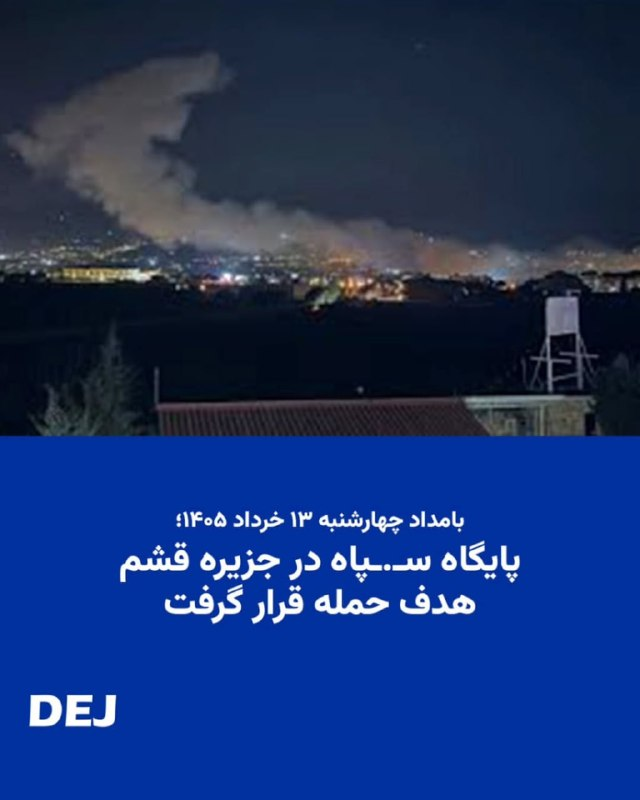

🛩️
🔥 بر اساس گزارش منابع محلی یکی از پایگاه‌های موشکی سـ.ـپاه پاسداران در جزیره قشم بامداد چهارشنبه ۱۳ خرداد ۱۴۰۵ هدف حمله قرار گرفت.

خبرگزاری مهر به نقل از ساکنین جزیره از «شنیده‌شدن صدای انفجار‌هایی در محدوده جزیره قشم» خبر داد. مهر نوشت: «ماهیت این صداها به طور دقیق مشخص نیست و هیچ‌ یک از نهادهای رسمی نظامی و انتظامی تا این لحظه درباره علت وقوع این صداها اظهارنظری نکرده‌اند».

*عکس آرشیوی

#IRGCterrorists #قشم #جنگ
@DEJradio

## DEJradio — post 5273

  <a href="telegram/content/DEJradio_5273_1780440234.webm" target="_blank">🎬 Download video</a>

🚨📢 منابع محلی سه‌شنبه شب ۱۱ خرداد ۱۴۰۵ گزارش دادند دو موشک سـ.ـپاه پاسداران یک مقر حزب کومله در نزدیکی دره آلانه، در شمال اربیل اصابت کرد.

*عکس آرشیوی

#کومله #اربیل
@DEJradio

## VahidOnline — post 75885

پیام‌های دریافتی:

۲:۰۷ همین چند ثانیه پیش صدای پرتاب موشک از توی خود شهر داراب شنیده شد.

الان دوباره صدای پرتاب موشک اومد

وحید سلام
یکی دیگه هم الان زدن از داراب
۲ دقیقه پیش
۲ تای قبلی هم یکیش تو هوا ترکید

کویت: دوباره صدای آژیر

📡 @VahidOnline

## IranIntlTV — post 340298

  <a href="telegram/content/IranIntlTV_340298_1780440234.mp4" target="_blank">🎬 Download video</a>

مقام‌های آمریکایی روز دوشنبه ۱۱ خرداد اعلام کردند تونلی پیشرفته به طول تقریبی ۵۸۹ متر را که برای قاچاق مواد مخدر از شهر تیخوانای مکزیک به آمریکا استفاده می‌شد، در سن‌دیگو کشف کرده‌اند. این تونل دارای برق، سیستم تهویه و ریل حمل‌ونقل بود.

به گفته آن‌ها، در این رابطه بیش از یک تُن کوکایین به ارزش حدود ۴۵ میلیون دلار کشف و توقیف شد.

پیش‌تر، مهدی تاج، رییس فدراسیون فوتبال، با رد نگرانی‌ها درباره میزان تبهکاری در شهر تیخوانای مکزیک، محل کمپ تیم ملی، گفته بود قرار نیست مردم آن‌جا را اصلاح و ارشاد کنیم.
@iranintltv

## IranIntlTV — post 340297

  <a href="telegram/content/IranIntlTV_340297_1780440236.mp4" target="_blank">🎬 Download video</a>

دانش‌آموزان؛ قربانیان خاموش بحران‌ها

آموزش‌وپرورش ایران در سال گذشته زیر فشار سه بحران هم‌زمان قرار گرفت: شرایط جنگی و امنیتی، تعطیلی‌های مکرر مدارس و محدودیت‌های گستردهٔ اینترنت.

با قطع یا اختلال شدید اینترنت، آموزش آنلاین و فعالیت پلتفرم «شاد» با مشکلات جدی روبه‌رو شد و شکاف آموزشی میان دانش‌آموزان عمیق‌تر شد.

هم‌زمان، تصمیم برای برگزاری حضوری امتحانات نهایی و تأثیر قطعی ۶۰ درصدی سوابق تحصیلی در کنکور، موجی از اعتراضات دانش‌آموزی را در شهرهای مختلف به همراه داشت که در برخی موارد با برخورد نیروهای امنیتی مواجه شد.

نتیجهٔ این شرایط، افزایش اضطراب، افت یادگیری و شکل‌گیری نسلی است که بیش از آن‌که مدرسه را محل آموزش بداند، آن را نمادی از بی‌ثباتی و بحران‌های مداوم تجربه کرده است.

کامبیز حسینی در «برنامه» به این موضوع می‌پردازد.

«یک ایران صدای شما را می‌شنود»

دوشنبه تا پنجشنبه ۱۱ شب تهران

از تلویزیون ایران اینترنشنال

تماشای نسخه کامل این قسمت از «برنامه» در یوتیوب:

https://youtu.be/zGKIdbA9wXc
@iranintltv

## Shin_Persian — post 6426

Shin ✓ @hey_itsmyturn
Tue, 02 Jun 2026 22:40:50 UTC

NOW -
Renewed sirens in #Kuwait 🇰🇼

فارسی

هم‌اکنون -
تجدید صدای آژیرهای خطر در #Kuwait 🇰🇼

𝕏 · @shin_persian

## Shin_Persian — post 6425

  

Shin ✓ @hey_itsmyturn
Tue, 02 Jun 2026 22:37:28 UTC

Kuwait Ministry of Defense spokesperson warns citizens and residents not to approach or touch any debris or unidentified objects resulting from the interception of hostile aerial targets. #Kuwait 🇰🇼

فارسی

سخنگوی وزارت دفاع کویت به شهروندان و ساکنان هشدار داد که از نزدیک شدن یا لمس هرگونه لاشه یا اشیاء ناشناس ناشی از رهگیری اهداف هوایی متخاصم خودداری کنند. #Kuwait 🇰🇼

𝕏 · @shin_persian

## Shin_Persian — post 6424

🔁 Quoting above tweet:
Shin ✓ @hey_itsmyturn
Tue, 02 Jun 2026 22:37:28 UTC

Source: @KuwaitArmyGHQ
https://x.com/KuwaitArmyGHQ/status/2061940239636328899

فارسی

@KuwaitArmyGHQ
https://x.com/KuwaitArmyGHQ/status/2061940239636328899

𝕏 · @shin_persian

## Shin_Persian — post 6423

  

↩️ Quoted tweet: KUWAIT ARMY - الجيش الكويتي ✓ @KuwaitArmyGHQ Tue, 02 Jun 2026 22:37:16 UTC بيان رقم (62) صرّح المتحدث الرسمي لوزارة الدفاع العقيد الركن سعود عبدالعزيز العطوان تهيب رئاسة الأركان العامة للجيش بالإخوة المواطنين والمقيمين عدم الاقتراب أو…

## Shin_Persian — post 6422

↩️ Quoted tweet:
KUWAIT ARMY - الجيش الكويتي ✓ @KuwaitArmyGHQ
Tue, 02 Jun 2026 22:37:16 UTC

بيان رقم (62)

صرّح المتحدث الرسمي لوزارة الدفاع
العقيد الركن سعود عبدالعزيز العطوان

تهيب رئاسة الأركان العامة للجيش بالإخوة المواطنين والمقيمين عدم الاقتراب أو لمس أي حطام أو شظايا أو أجسام مجهولة قد تكون ناتجة عن عمليات اعتراض الأهداف الجوية المعادية، نظراً لما قد تشكله من خطر

↩️ Quoted tweet — see the post below for the reply.

English

Statement No. (62)

Official Statement by the Ministry of Defense Spokesperson
Colonel Staff Saud Abdulaziz Al-Atwan

The General Staff of the Army urges citizens and residents not to approach or touch any debris, fragments, or unknown objects that may have resulted from the interception of hostile aerial targets, due to the danger they may pose.

𝕏 · @shin_persian

## ManotoTV — post 105900

  <a href="telegram/content/ManotoTV_105900_1780440239.mp4" target="_blank">🎬 Download video</a>

کاهش قیمت بنزین در آمریکا فقط یک خبر اقتصادی نیست، می‌تواند نشانه‌ای از امید بازارها به کاهش تنش و ادامه مذاکرات باشد.

اما در حالی که واشنگتن ممکن است برای حفظ ثبات بازار انرژی انگیزه بیشتری پیدا کرده باشد، تجربه چهار دهه گذشته نشان می‌دهد جمهوری اسلامی بارها فرصت‌های کاهش بحران را از بین برده است.

## Persian_Trend_Official — post 15554

⭕️ اسرائیل هیوم:

سپاه پاسداران به صورت مداوم در حال شلیک پهپاد و موشک به سمت اهدافی در اربیل و کویت است و تاکنون شلیک ۲۰ پرتابه تایید شده است.

📝 Nick

📌 @persian_trend_official
پرشین ترند | متفاوت‌ترین کانال نظامی

## Persian_Trend_Official — post 15553

  <a href="telegram/content/Persian_Trend_Official_15553_1780440239.webm" target="_blank">🎬 Download video</a>

⭕️ صدا و سیما: شنیده شدن صدای انفجار در محدوده جزیره قشم! 📝 Nick 📌 @persian_trend_official پرشین ترند | متفاوت‌ترین کانال نظامی

## Persian_Trend_Official — post 15552

  <a href="telegram/content/Persian_Trend_Official_15552_1780440240.mp4" target="_blank">🎬 Download video</a>

فیلمی از بقایای موشک رهگیر در کویت 🇰🇼

📝 Nick

📌 @persian_trend_official
پرشین ترند | متفاوت‌ترین کانال نظامی

## IranianMinds — post 21279

  <a href="telegram/content/IranianMinds_21279_1780440241.mp4" target="_blank">🎬 Download video</a>

🔴فیلمی از تکه‌های موشک‌های رهگیر که در کویت افتاده.

@IranianMinds

## BBCPersian — post 282711

🖋جرمی بوئن
سردبیر امور بین‌الملل

ایالات متحده و ایران هر دو نشان داده‌اند که ترجیح می‌دهند به جنگی که از زمان اعلام آتش‌بس در روز هشتم آوریل متوقف شده است، بازنگردند.

هیچ ‌یک از دو طرف اجازه نداده‌اند تبادل مداوم حملات نظامی میان آن‌ها، گفت‌وگوهایی را که با میانجیگری پاکستان، قطر و دیگران در جریان است متوقف کند.

آمریکا همچنان نیروهای قدرتمند دریایی و هوایی خود را در فاصله‌ای قرار داده است که بتوانند ایران را هدف قرار دهند.

می‌توان با اطمینان فرض کرد که حکومت ایران نیروهای خود را در حالت آماده‌باش کامل نگه داشته و از آتش‌بس برای سازماندهی مجدد و ترمیم خسارت‌هایی که آمریکا و اسرائیل وارد کرده‌اند استفاده می‌کند.

تنش نظامی در منطقه خلیج فارس و اطراف آن، خطر آشکار سوءمحاسبه و سوءبرداشت را برای هر دو طرف به همراه دارد.

آلبوم را ورق بزنید و ادامه مطلب را از لینک زیر در وبسایت بی‌بی‌سی فارسی بخوانید.

📷 Reuters / Getty Images
https://bbc.in/4fFO18v
@BBCPersian

## Dirty_Kids — post 390875

  <a href="telegram/content/Dirty_Kids_390875_1780440242.mp4" target="_blank">🎬 Download video</a>

در راستای لوپ زیز که صحبتش شد،
این ویدئو از حمله‌ی امشب روافض قحبه به کویت قرمساق منتشر شده و رسانه‌های روافض می‌گن هدف پایگاه عریفجان آمریکا در کویت بوده

@Dirty_Kids 👻

## Dirty_Kids — post 390874

  <a href="telegram/content/Dirty_Kids_390874_1780440243.mp4" target="_blank">🎬 Download video</a>

یکی داره از موشکا فیلم میگیره که همون لحظه یکی کصدست بازی درمیاره میماله به گاردریل

@Dirty_Kids 👻

## manototv — post 105900

  <a href="telegram/content/manototv_105900_1780440244.mp4" target="_blank">🎬 Download video</a>

کاهش قیمت بنزین در آمریکا فقط یک خبر اقتصادی نیست، می‌تواند نشانه‌ای از امید بازارها به کاهش تنش و ادامه مذاکرات باشد.

اما در حالی که واشنگتن ممکن است برای حفظ ثبات بازار انرژی انگیزه بیشتری پیدا کرده باشد، تجربه چهار دهه گذشته نشان می‌دهد جمهوری اسلامی بارها فرصت‌های کاهش بحران را از بین برده است.

## alonews — post 124638

  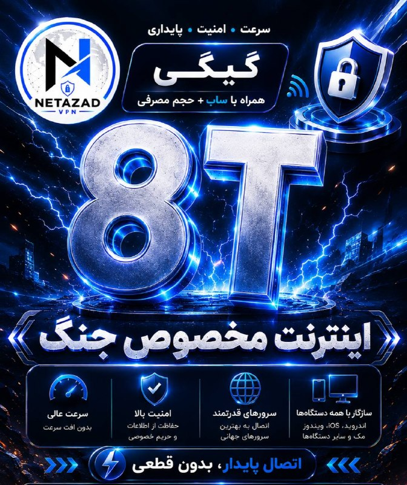

🤚 اینترنت مخصوص جنگ 🚀✅

⭐️ فقط گیگی 8 هزار تومان😍

✅ بدون قطعی‌های آزاردهنده
✅ سرعت بالا حتی ساعات شلوغ
✅ مناسب تلگرام، اینستاگرام و یوتیوب
✅ همراه با ساب

✅ تعداد محدود با این قیمت

🤖 @NetAazaadBot
🤖 @NetAazaadBot

## alonews — post 124637

  <a href="telegram/content/alonews_124637_1780440245.webm" target="_blank">🎬 Download video</a>

👈اسرائیل هیوم:
سپاه پاسداران به صورت مداوم در حال شلیک پهپاد و موشک به سمت اهدافی در اربیل و کویت است و تاکنون شلیک ۲۰ پرتابه تایید شده است.

✅ @AloNews خبر جنگ

## alonews — post 124636

  <a href="telegram/content/alonews_124636_1780440245.webm" target="_blank">🎬 Download video</a>

👈صداوسیما صدای انفجار در قشم را تایید کرد

✅ @AloNews خبر جنگ

## alonews — post 124635

  <a href="telegram/content/alonews_124635_1780440246.mp4" target="_blank">🎬 Download video</a>

👈فیلمی از تکه‌های موشک‌های رهگیر که تو کویت افتاده

✅ @AloNews خبر جنگ

---
📅 بروزرسانی: 1405/03/13 02:03
---

## VahidOOnLine — post 243434

  <a href="telegram/content/VahidOOnLine_243434_1780439613.mp4" target="_blank">🎬 Download video</a>

♦️بزرگ‌ترین گروه کشتیرانی جهان، ام‌اس‌سی (MSC)، اعلام کرد که کشتی باری «ساریسکا ۵» متعلق به این شرکت، روز دوشنبه در بندر ام‌قصر عراق در خلیج فارس هدف اصابت دو پرتابه قرار گرفته و دچار آتش‌سوزی شده است، اما تمامی خدمه آن «در سلامت کامل» هستند. رویترز با انتشار تصاویری جدید از این کشتی گزارش داد، در حالی که شرکت ام‌اس‌سی این حادثه را یک «حمله بی‌دلیل» به یک شناور تجاری بی‌طرف و بدون هیچ‌گونه وابستگی به آمریکا یا اسرائیل توصیف کرده، رسانه‌های دولتی ایران گزارش دادند که سپاه پاسداران با پذیرش مسئولیت این اقدام، اعلام کرده است که این کشتی را با یک موشک کروز و در «اقدامی تلافی‌جویانه» در پاسخ به حمله قبلی به یک کشتی ایرانی هدف قرار داده است.
‌🇸🇦 Indypersian

🤖 @VahidOOnLine

## WithYashar — post 13315

جنگنده‌های اسرائیلی پرواز کردن

@withyashar

## WithYashar — post 13314

## WithYashar — post 13313

پست جدید از صحبت‌های بسیار زیبای شاهنشاه آریامهر ارتباط قلبی ما❤️‍🩹 فرا مرزی شده https://www.instagram.com/reel/DZGNeRLxq-Y/?igsh=MXQ1dTZmdXk2bGZpdQ==

## WithYashar — post 13312

  <a href="telegram/content/WithYashar_13312_1780439615.mp4" target="_blank">🎬 Download video</a>

دفع موشک های ایرانی در کویت
@withyashar

## mwarmonitor — post 10046

  

🔴وزارت دفاع کویت اعلام کرد که پدافند هوایی کویت در حال حاضر درگیر مقابله با حملات خصمانه موشکی و پهپادی است.

@mwarmonitor

## IranIntlTV — post 340296

  <a href="telegram/content/IranIntlTV_340296_1780439618.mp4" target="_blank">🎬 Download video</a>

عاطفه از مشهد: توافق چیزی جز ضرر برای ما ندارد؛ اگر توافقی صورت بگیرد، امنیت نخواهیم داشت

«یک ایران صدای شما را می‌شنود»

دوشنبه تا پنجشنبه ۱۱ شب تهران

از تلویزیون ایران اینترنشنال

تماشای نسخه کامل این قسمت از «برنامه» در یوتیوب:

https://youtu.be/zGKIdbA9wXc
@iranintltv

## IranIntlTV — post 340295

  <a href="telegram/content/IranIntlTV_340295_1780439619.mp4" target="_blank">🎬 Download video</a>

اردلان از آلمان: توافق تأثیری بر زندگی مردم ندارد؛ آنها نگران غزه هستند، نه مردم ایران

«یک ایران صدای شما را می‌شنود»

دوشنبه تا پنجشنبه ۱۱ شب تهران

از تلویزیون ایران اینترنشنال

تماشای نسخه کامل این قسمت از «برنامه» در یوتیوب:

https://youtu.be/zGKIdbA9wXc
@iranintltv

## IranIntlTV — post 340294

  <a href="telegram/content/IranIntlTV_340294_1780439621.mp4" target="_blank">🎬 Download video</a>

سینا از اسلامشهر: توافقی نمی‌کنند؛ چون هیچ‌ کدام به دیگری اعتماد ندارند

«یک ایران صدای شما را می‌شنود»

دوشنبه تا پنجشنبه ۱۱ شب تهران

از تلویزیون ایران اینترنشنال

تماشای نسخه کامل این قسمت از «برنامه» در یوتیوب:

https://youtu.be/zGKIdbA9wXc
@iranintltv

## IranIntlTV — post 340293

  <a href="telegram/content/IranIntlTV_340293_1780439622.mp4" target="_blank">🎬 Download video</a>

سیروان از زاهدان:در سیستان و بلوچستان،گرانی بنزین مانع رساندن بیماران به بیمارستان شده است

«یک ایران صدای شما را می‌شنود»

دوشنبه تا پنجشنبه ۱۱ شب تهران

از تلویزیون ایران اینترنشنال

تماشای نسخه کامل این قسمت از «برنامه» در یوتیوب:

https://youtu.be/zGKIdbA9wXc
@iranintltv

## FarsiVOA — post 219417

  

⚡️کانال تلگرامی وحید‌آنلاین گزارش‌هایی از کاربران منتشر کرده است که از شنیده شدن صدای انفجار در داراب و همچنین در کویت خبر داده‌اند. جمهوری اسلامی در روزهای اخیر به کویت حمله موشکی کرده بود. ارتش کویت دقایقی قبل گفته بود با حملات هوایی متخاصم در حال مقابله است و صداهای انفجار ممکن است ناشی از رهگیری باشد.
@FarsiVOA

## Persian_Trend_Official — post 15551

  <a href="telegram/content/Persian_Trend_Official_15551_1780439624.webm" target="_blank">🎬 Download video</a>

⭕️ صدا و سیما:

شنیده شدن صدای انفجار در محدوده جزیره قشم!

📝 Nick

📌 @persian_trend_official
پرشین ترند | متفاوت‌ترین کانال نظامی

## Persian_Trend_Official — post 15550

  <a href="telegram/content/Persian_Trend_Official_15550_1780439624.mp4" target="_blank">🎬 Download video</a>

⭕️ آسمان کویت لحظاتی قبل:

📝 Nick

📌 @persian_trend_official
پرشین ترند | متفاوت‌ترین کانال نظامی

## Persian_Trend_Official — post 15548

  <a href="telegram/content/Persian_Trend_Official_15548_1780439626.mp4" target="_blank">🎬 Download video</a>

⭕️ ویدیو از انفجار ها و فعالیت پدافند در کویت:

📝 Nick

📌 @persian_trend_official
پرشین ترند | متفاوت‌ترین کانال نظامی

## Persian_Trend_Official — post 15547

  <a href="telegram/content/Persian_Trend_Official_15547_1780439627.mp4" target="_blank">🎬 Download video</a>

🔴 آسمان کویت:

📝 Nick

📌 @persian_trend_official
پرشین ترند | متفاوت‌ترین کانال نظامی

## IranianMinds — post 21278

  

🔴کویت تأیید کرد که به موشک‌ها و پهباد‌های فرستاده شده از ایران پاسخ می‌دهد.

@IranianMinds

## BBCPersian — post 282710

🔻رسانه‌های ایران از گفتگوی تلفنی عباس عراقچی، وزیر امور خارجه ایران با همتای عربستانی خود،‌ فیصل بن فرحان، خبر داده‌اند و محور این مکالمه را مسائل جاری منطقه عنوان کرده‌اند.

با آغاز جنگ آمریکا و اسرائیل با ایران در اسفند ماه گذشته، عربستان همچون قطر، امارات، بحرین و کویت، با حملات پهپادی و موشکی ایران روبرو شد و اگر چه تهران این حمللات را متوجه پایگاه‌ها و منافع آمریکا در خاک عربستان خواند، اما روابط دیپلماتیک دو کشور به شدت تحت تاثیر قرار گرفت.

چند روز پیش که ایران اعلام کرد در پاسخ به حمله هوایی آمریکا به نزدیکی فرودگاه بندرعباس، یک پایگاه آمریکایی در کویت را هدف قرار داده، عربستان با انتشار بیانیه‌ای این حملات را «شدیدا محکوم» کرد.

با این حال، دو کشور که پس از سال‌ها قطع روابط، اخیرا با وساطت چین مجددا روابط دیپلماتیک برقرار کردند، همچنان امیدوار به پایان مخاصمه در منطقه و رسیدن به توافقی برای صلح پایدار در خاورمیانه‌اند.‌

https://bbc.in/4xnnfIr
@BBCPersian

## Dirty_Kids — post 390873

عزیزان،

یه لوپ جالبی که هیچ آتش‌بسی رو نقض نمی‌کنه ایجاد شده به این شکل که آمریکایی‌ها یک کشتی، نفت‌کشی، قایقی چیزی از روافض می‌زنن [گاهی بالعکس، اول روافض می‌زنن]،

یکی دو ساعت بعدش روافض قحبه یکی دوتا آبگرمکن و پهپاد ول می‌دن سمت کویت و این داستان بدون نقض آتش‌بس همینجا تموم می‌شه تا فرداشب همین‌موقع‌ها دوباره از اول.

@Dirty_Kids 👻

## alonews — post 124634

  <a href="telegram/content/alonews_124634_1780439628.webm" target="_blank">🎬 Download video</a>

🔴فوری/انفجار مجدد در کویت

✅ @AloNews خبر جنگ

## alonews — post 124633

  <a href="telegram/content/alonews_124633_1780439628.webm" target="_blank">🎬 Download video</a>

💢فوووووووری/جنگنده‌های اسرائیلی پرواز کردن 
🚨 @AkhbareFouri

## alonews — post 124632

  <a href="telegram/content/alonews_124632_1780439629.webm" target="_blank">🎬 Download video</a>

👈پرواز جنگنده های نسل ششم f4 فانتوم ارتش برفراز اهواز

✅ @AloNews خبر جنگ

## alonews — post 124631

  <a href="telegram/content/alonews_124631_1780439629.mp4" target="_blank">🎬 Download video</a>

👈آسمان کویت لحظاتی قبل

✅ @AloNews خبر جنگ

## alonews — post 124629

⌛️

## alonews — post 124628

  <a href="telegram/content/alonews_124628_1780439630.webm" target="_blank">🎬 Download video</a>

👈ادعای وب‌سایت عبری حدشوت بتخون:

🔴نیروهای آمریکایی چندین موشک از خاک کویت به سمت جزیره قشم در ایران شلیک کردند و سپاه پاسداران ایران بلافاصله به مبدا آتش حمله کرد.

✅ @AloNews خبر جنگ

---
📅 بروزرسانی: 1405/03/13 01:53
---

## WithYashar — post 13311

## WithYashar — post 13310

پایگاه عریفجان در جنوب کویت، نیز هدف قرار گرفت
@withyashar

## WithYashar — post 13309

## WithYashar — post 13308

یاشار این به معنای شروع جنگ هست بنظرت یا امریکا میخواد بگه نقض نشده

## Iliaen — post 4441

نیروی دریایی ایالات متحده یک نفتکش را که به سمت جزیره خارک حرکت می‌کرد، هدف قرار داد.

@iliaen

## Persian_Trend_Official — post 15546

⭕️ پایگاه هوایی علی‌السالم در کویت هدف قرار گرفته است. 📝 Nick 📌 @persian_trend_official پرشین ترند | متفاوت‌ترین کانال نظامی

## Persian_Trend_Official — post 15545

  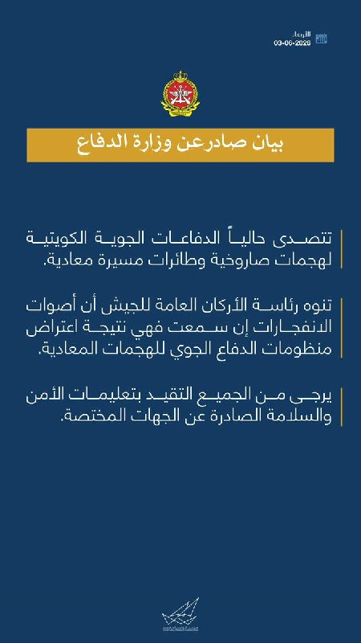

⭕️ وزارت دفاع کویت اعلام کرد که پدافند هوایی کشور در حال حاضر در حال پاسخگویی به حملات موشکی و پهپادی متخاصم است.

ستاد کل ارتش کویت خاطرنشان می‌کند که صدای انفجارها ناشی از رهگیری پدافند هوایی است.

📝 Nick

📌 @persian_trend_official
پرشین ترند | متفاوت‌ترین کانال نظامی

## Persian_Trend_Official — post 15544

این سری دیگه آتش‌بس نقص شد؟
یا هنوز از ته دل نقض نشده؟

📝 Nick

📌 @persian_trend_official
پرشین ترند | متفاوت‌ترین کانال نظامی

## IranianMinds — post 21277

  <a href="telegram/content/IranianMinds_21277_1780439027.mp4" target="_blank">🎬 Download video</a>

🔴کویت در حال رهگیری موشک‌های رژیم.

@IranianMinds

## IranianMinds — post 21276

اینجور که مشخصه احتمالا آمریکا به قشم یه حمله ای داشته و سپاه هم برای جواب به کویت حمله کرده

@IranianMinds

## IranianMinds — post 21275

  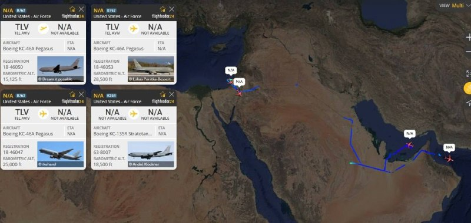

🔴سوخت‌رسان‌های آمریکایی از تل‌آویو به پرواز دراومدن.

@IranianMinds

## Dirty_Kids — post 390872

نیروی دریایی ایالات متحده یک نفتکش را که به سمت جزیره خارک حرکت می‌کرد، هدف قرار داد.

@Dirty_Kids 👻

## Dirty_Kids — post 390871

امریکا هم قشم رو زده

@Dirty_Kids 👻

## Dirty_Kids — post 390870

🔴 کانالای سپاه: منابع خبری از حمله به پایگاه عریفجان «بزرگ‌ترین پایگاه زمینی ارتش آمریکا در منطقه» خبر میدن!

@Dirty_Kids 👻

## alonews — post 124627

  <a href="telegram/content/alonews_124627_1780439030.webm" target="_blank">🎬 Download video</a>

👈شاهدان عینی از کویت:

🔴خونه ما سمت سفارت امريكا هست سفارت امريكا هم داشت موشك میخورد صداي انفجار خيلي بلندي بود.

🔴انفجار های سنگین در منطقه سورا کویت با چشم قابل رویت بود.

🔴همين الان اژير كويت فعال شد دوباره
٦ تا انفجار خيلي سنگين تا الان
توي اين ٣ ماه اينقد صداش سنگين نبود.

✅ @AloNews خبر جنگ

## alonews — post 124626

  <a href="telegram/content/alonews_124626_1780439031.mp4" target="_blank">🎬 Download video</a>

👈کویت لحظاتی قبل

✅ @AloNews خبر جنگ

## alonews — post 124625

  <a href="telegram/content/alonews_124625_1780439033.webm" target="_blank">🎬 Download video</a>

👈گزارش العربیه: ایران در یک حمله واحد، هم پایگاه هوایی علی السالم و هم کمپ عریفجان را هدف قرار داد

🔴ایالات متحده و ایران در روزهای اخیر حملات کوچک مقیاسی را در جزیره قشم و کویت رد و بدل کرده‌اند، اما این حمله بزرگ‌تر بوده است

✅ @AloNews خبر جنگ

## alonews — post 124624

  <a href="telegram/content/alonews_124624_1780439033.webm" target="_blank">🎬 Download video</a>

👈پایگاه عریفجان در جنوب کویت، نیز هدف قرار گرفت

✅ @AloNews خبر جنگ

## alonews — post 124622

  <a href="telegram/content/alonews_124622_1780439034.mp4" target="_blank">🎬 Download video</a>

👈ویدیوئی از انفجار تو کویت، و فعالیت پدافند

✅ @AloNews خبر جنگ

---
📅 بروزرسانی: 1405/03/13 01:43
---

## VahidOOnLine — post 243433

  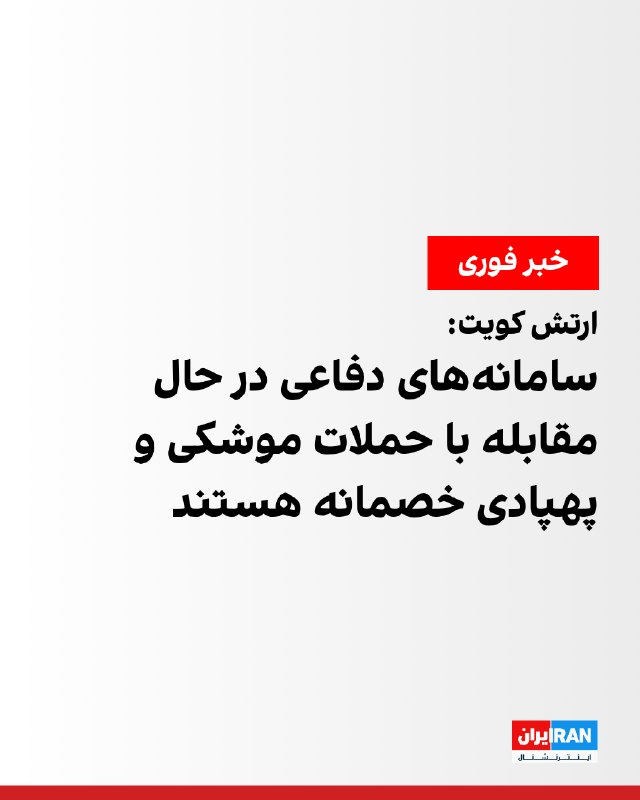

ارتش کویت اعلام کرد سامانه‌های دفاعی این کشور در حال مقابله با حملات موشکی و پهپادی خصمانه هستند.
دقایقی پیش نیز گزارش‌هایی از صداهای انفجار در محدوده قشم منتشر شد.

‌🏁 🇬🇧 IranintlTV

🤖 @VahidOOnLine

## VahidOOnLine — post 243432

  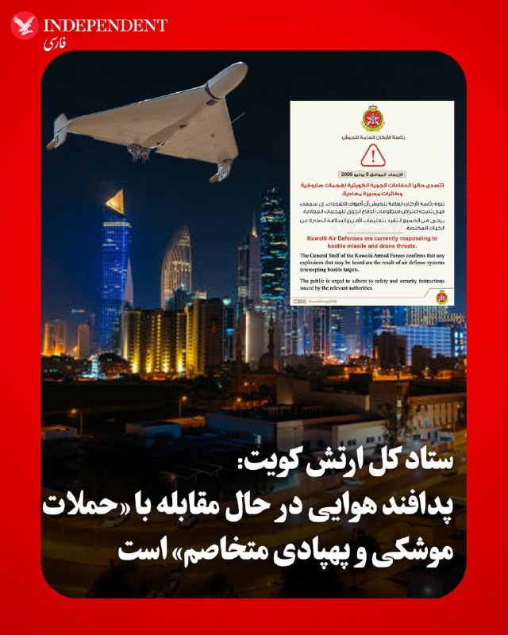

♦️ستاد کل نیروهای مسلح کویت با انتشار بیانیه‌ای فوری اعلام کرد که سیستم‌های پدافند هوایی این کشور، بامداد چهارشنبه، ۱۳ خردادماه، مشغول مقابله با حملات موشکی و پهپادهای متخاصم در آسمان کویت هستند. ارتش کویت در این اطلاعیه تاکید کرد که صدای انفجارهای شنیده‌شده در مناطق مختلف، ناشی از عملیات موفقیت‌آمیز سامانه‌های دفاع جوی در رهگیری و انهدام این «اهداف متخاصم» است. مقامات نظامی کویت از تمامی شهروندان و ساکنان این کشور خواسته‌اند تا آرامش خود را حفظ کرده و به طور کامل به دستورالعمل‌های امنیتی و ایمنی صادر شده از سوی مراجع مربوطه پایبند باشند.
‌🇸🇦 Indypersian

🤖 @VahidOOnLine

## VahidOOnLine — post 243431

  <a href="telegram/content/VahidOOnLine_243431_1780438408.mp4" target="_blank">🎬 Download video</a>

یکی از مخاطبان ایران‌اینترنشنال از اصفهان با اشاره به گرانی گفت شرایط معیشتی به‌قدری سخت شده که خوراک مردم محدود شده و «بهداشت و درمان دیگر اولویت نیست».
‌🏁 🇬🇧 IranintlTV

🤖 @VahidOOnLine

## WithYashar — post 13307

  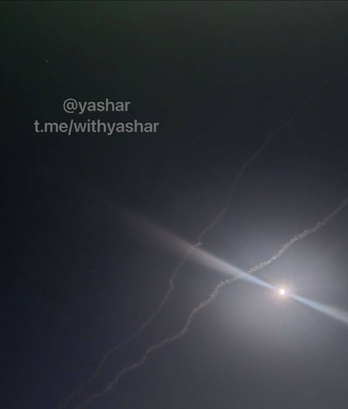

رد موشکهای بالستیک در آسمان شیراز
@withyashar

## WithYashar — post 13306

الان شلیک ۲ موشک از سایت موشکی زین آباد داراب احتمالا به کویت @withyashar

## WithYashar — post 13305

  <a href="telegram/content/WithYashar_13305_1780438410.mp4" target="_blank">🎬 Download video</a>

🎬 Video

## WithYashar — post 13304

  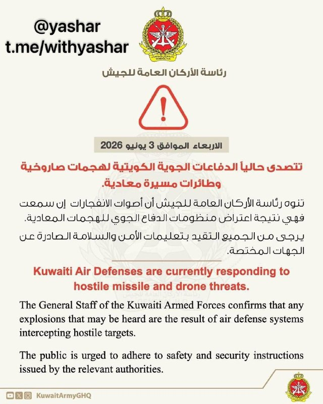

کویت تأیید کرد که به موشک‌ها و پهپادهای پرتاب شده از ایران پاسخ می‌دهد
@withyashar

## FoxNewsTwitter — post 342520

  

Fox News (Twitter/X)

"I don't know what you have to be so proud of right now."

Black Crowes frontman Chris Robinson stopped a crowd of concertgoers after "U.S.A." chants broke out during the band's Tampa show because the band's mascot appeared dressed as Uncle Sam on a video screen.

The remark was met with boos, and some attendees reportedly walked out before the concert ended.

Videos circulating online show Robinson doubling down, telling critics in the crowd that "some of us have real faith" and are "not afraid" or "ignorant.

## IranIntlTV — post 340292

  

ارتش کویت اعلام کرد سامانه‌های دفاعی این کشور در حال مقابله با حملات موشکی و پهپادی خصمانه هستند.
دقایقی پیش نیز گزارش‌هایی از صداهای انفجار در محدوده قشم منتشر شد.

https://iranintl.com/202606022811

## IranIntlTV — post 340291

  <a href="https://t.me/IranintlTV/340291" target="_blank">📎 Download file</a>

🎧نسخه صوتی سیاست با مراد ویسی: جمهوری اسلامی؛ آخرین بازمانده اردوگاه یاغیان جهان
@iranintlTV

## IranIntlTV — post 340290

  <a href="telegram/content/IranIntlTV_340290_1780438414.mp4" target="_blank">🎬 Download video</a>

مراد ویسی، تحلیلگر ارشد ایران‌اینترنشنال، گفت: «جدای از آمریکا و اسرائیل که بازیگران اصلی تقابل با جمهوری اسلامی هستند، اکثریت مردم ایران نیز برای سرنگونی حکومت مصمم هستند. گرانی و تورم تشدیدشده ناشی از جنگ، یکی از عوامل مهم خیزش آینده مردم خواهد بود.»
@iranintltv

## IranIntlTV — post 340289

  <a href="telegram/content/IranIntlTV_340289_1780438415.mp4" target="_blank">🎬 Download video</a>

یکی از مخاطبان ایران‌اینترنشنال از اصفهان با اشاره به گرانی گفت شرایط معیشتی به‌قدری سخت شده که خوراک مردم محدود شده و «بهداشت و درمان دیگر اولویت نیست».

## Iliaen — post 4440

دو موشک از اطراف داراب (استان فارس) به سمت کشور کویت شلیک شد.

گزارش‌ها از انفجار یک موشک در آسمان ایران، لحظاتی پس از شلیک حکایت دارد.

@iliaen

## Persian_Trend_Official — post 15543

⭕️ منابع عربی: آژیرها هنوز در کویت به صدا در می‌آیند، تقریباً به مدت ده دقیقه بدون توقف. حداقل ۴ تا ۵ انفجار گزارش شده است.

📝 Nick

📌 @persian_trend_official
پرشین ترند | متفاوت‌ترین کانال نظامی

## Persian_Trend_Official — post 15542

  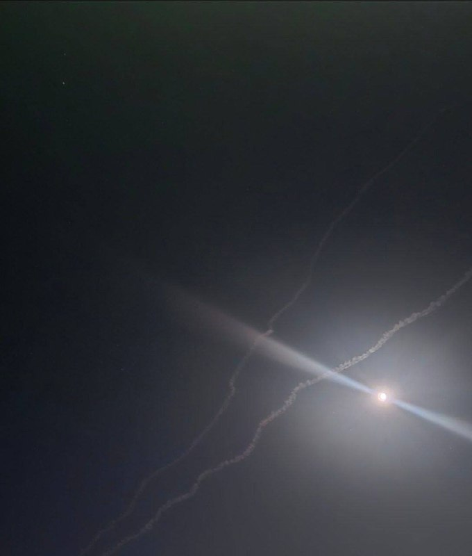

⭕️ تصویری از رد دو موشک بالستیک شلیک‌شده از سایت موشکی شیراز.

📝 Nick

📌 @persian_trend_official
پرشین ترند | متفاوت‌ترین کانال نظامی

## Persian_Trend_Official — post 15541

⭕️ کویت به شهروندان خود اعلام کرده است که به مکان‌های امن بروند، زیرا که پدافند در حال مقابله با موشک‌ها و پهپادهاست. 📝 Nick 📌 @persian_trend_official پرشین ترند | متفاوت‌ترین کانال نظامی

## Persian_Trend_Official — post 15540

  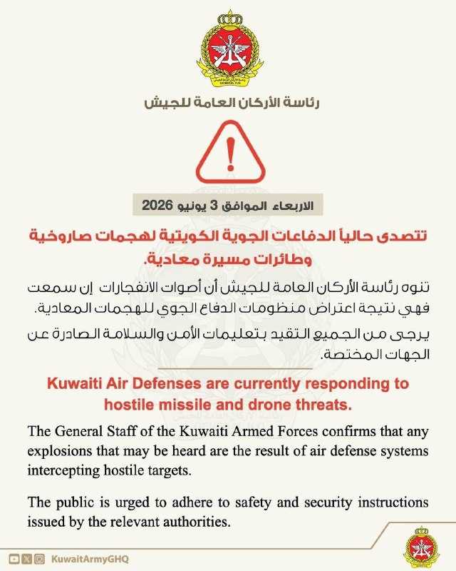

⭕️ کویت به شهروندان خود اعلام کرده است که به مکان‌های امن بروند، زیرا که پدافند در حال مقابله با موشک‌ها و پهپادهاست.

📝 Nick

📌 @persian_trend_official
پرشین ترند | متفاوت‌ترین کانال نظامی

## IranianMinds — post 21274

🔴 طبق گزارشات ایران به کویت حمله کرده و با موشک بالستیک پایگاه علی السالم رو مورد حمله قرار داده. + عکس رد موشک شلیک شده از شیراز @IranianMinds

## IranianMinds — post 21273

  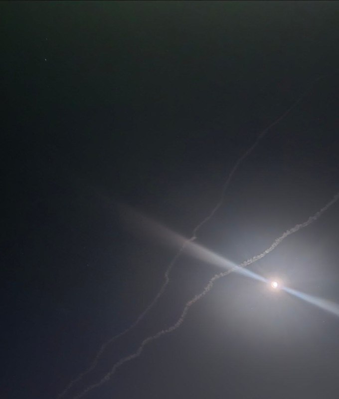

🔴 طبق گزارشات ایران به کویت حمله کرده و با موشک بالستیک پایگاه علی السالم رو مورد حمله قرار داده.

+ عکس رد موشک شلیک شده از شیراز

@IranianMinds

## Dirty_Kids — post 390869

🔴 آژیر هشدار و صدای انفجار تو کویت شنیده شده.

@Dirty_Kids 👻

## Dirty_Kids — post 390868

طبق پیام کاربران ساعت ۱:۳۰ بامداد از داراب استان فارس ۲ تا موشک پرتاب کردن که ‌تمام شیشه ها لرزیده

@Dirty_Kids 👻

## Dirty_Kids — post 390867

🔴 فوری
ارتش آمریکا از حمله موشکی به یک ابر نفتکش ایران در خلیج فارس که در تلاش برای حرکت به سمت جزیره خارک بود خبر داد.

@Dirty_Kids 👻

## alonews — post 124621

  <a href="telegram/content/alonews_124621_1780438419.webm" target="_blank">🎬 Download video</a>

👈رد شلیک موشک در آسمان شیراز

✅ @AloNews خبر جنگ

## alonews — post 124620

  <a href="telegram/content/alonews_124620_1780438419.webm" target="_blank">🎬 Download video</a>

🔴فوری/موشک‌های بالستیک ایران پایگاه هوایی علی‌السالم تو کویت رو زدن

✅ @AloNews خبر جنگ

---
📅 بروزرسانی: 1405/03/13 01:33
---

## VahidOOnLine — post 243430

  

خبرگزاری مهر از شنیده شدن صداهای انفجار در محدوده قشم در بامداد چهارشنبه خبر داد. طبق این گزارش، هنوز ماهیت این صداها مشخص نیست و هیچ‌‌یک از نهادهای رسمی نظامی تاکنون درباره علت این صداها اظهارنظر نکرده‌اند.
‌🏁 🇬🇧 IranintlTV

🤖 @VahidOOnLine

## VahidOOnLine — post 243429

  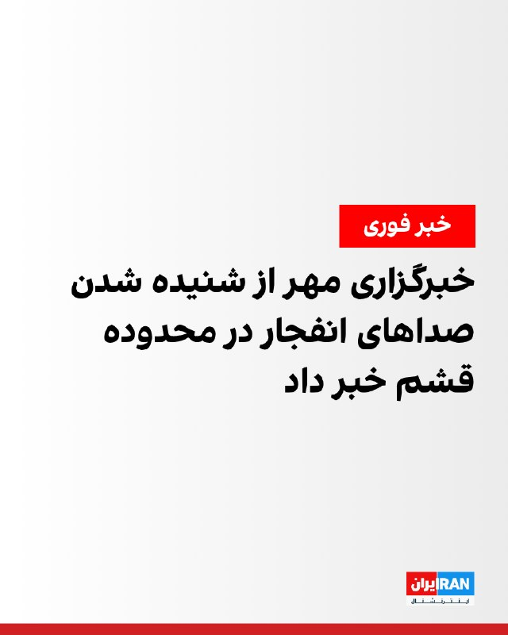

خبرگزاری مهر از شنیده شدن صداهای انفجار در محدوده قشم در بامداد چهارشنبه خبر داد. طبق این گزارش، هنوز ماهیت این صداها مشخص نیست و هیچ‌‌یک از نهادهای رسمی نظامی تاکنون درباره علت این صداها اظهارنظر نکرده‌اند.
‌🏁 🇬🇧 IranintlTV

🤖 @VahidOOnLine

## VahidOOnLine — post 243428

  

خبرگزاری مهر از شنیده شدن صداهای انفجار در محدوده قشم در بامداد چهارشنبه خبر داد. طبق این گزارش، هنوز ماهیت این صداها مشخص نیست و هیچ‌‌یک از نهادهای رسمی نظامی تاکنون درباره علت این صداها اظهارنظر نکرده‌اند.
‌🏁 🇬🇧 IranintlTV

🤖 @VahidOOnLine

## WithYashar — post 13303

آژیر در کویت🚨🚨
@withyashar

## WithYashar — post 13302

  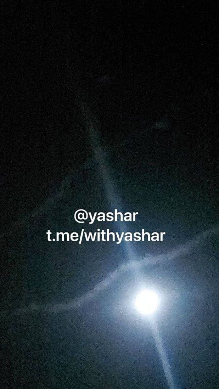

الان شلیک ۲ موشک از سایت موشکی زین آباد داراب احتمالا به کویت
@withyashar

## WithYashar — post 13301

خبرگزاری مهر بعد از ساعتی چک کردن چنل ما گفت : بامداد چهارشنبه صدای انفجار‌هایی در محدوده شهرستان قشم از سوی منابع محلی و ساکنان این جزیره گزارش شده است.
پیگیری‌ها برای کسب اطلاع از ماهیت دقیق این انفجار ادامه دارد.
@withyashar 🤣

## FoxNewsTwitter — post 342519

  <a href="telegram/content/FoxNewsTwitter_342519_1780437823.mp4" target="_blank">🎬 Download video</a>

Fox News (Twitter/X)

RT @EricShawnTV: Life with John Gotti. Watch our exclusive: “Gotti’s Guy,” now streaming on Fox Nation! @foxnation @FoxNews @foxnewsradio @foxnewspolitics #foxnation #fox #mafia #crime #streaming

## VahidOnline — post 75884

  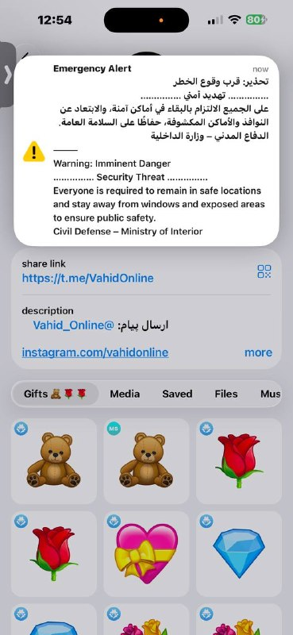

پیام‌های دریافتی هم‌زمان درباره شلیک موشک از داراب و اعلام هشدار در کویت

سلام همین الان ساعت ۱:۲۳ دقیقه دوتا موشک از داراب استان فارس پرتاب شد
یکیش حین رفتن ترکید

همین الان داراب صدای انفجار شدید اومد و شیشه ها لرزید
کل همسایه ها ریختن تو کوچه ببینن چه خبره

📡 @VahidOnline

## VahidOnline — post 75883

پیام‌های دریافتی:

صدای انفجار روستای نخل گل قشم

قشم صدای پایان جنگ در همه جبهه ها از جمله لبنان میاد

📡 @VahidOnline

## IranIntlTV — post 340288

  <a href="telegram/content/IranIntlTV_340288_1780437826.mp4" target="_blank">🎬 Download video</a>

رومان گوفمن، رییس جدید موساد، در مراسم معارفه‌اش گفت تحول راهبردی که اسرائیل در محور ایران ایجاد کرده، موازنه قدرت منطقه را تغییر داده و محور شیعه، که به گفته او نابودی اسرائیل را در دستور کار خود قرار داده بود، ضربه شدیدی خورده است.

گفت‌وگو با امیر گیتی، عضو تحریریه ایران‌اینترنشنال
@iranintltv

## IranIntlTV — post 340287

  

خبرگزاری مهر از شنیده شدن صداهای انفجار در محدوده قشم در بامداد چهارشنبه خبر داد. طبق این گزارش، هنوز ماهیت این صداها مشخص نیست و هیچ‌‌یک از نهادهای رسمی نظامی تاکنون درباره علت این صداها اظهارنظر نکرده‌اند.
https://iranintl.com/202606023526

## IranIntlTV — post 340286

  

خبرگزاری مهر از شنیده شدن صداهای انفجار در محدوده قشم در بامداد چهارشنبه خبر داد. طبق این گزارش، هنوز ماهیت این صداها مشخص نیست و هیچ‌‌یک از نهادهای رسمی نظامی تاکنون درباره علت این صداها اظهارنظر نکرده‌اند.
https://iranintl.com/202606023526

## IranIntlTV — post 340285

  

خبرگزاری مهر از شنیده شدن صداهای انفجار در محدوده قشم در بامداد چهارشنبه خبر داد. طبق این گزارش، هنوز ماهیت این صداها مشخص نیست و هیچ‌‌یک از نهادهای رسمی نظامی تاکنون درباره علت این صداها اظهارنظر نکرده‌اند.
https://iranintl.com/202606023526

## IranIntlTV — post 340284

  <a href="telegram/content/IranIntlTV_340284_1780437829.mp4" target="_blank">🎬 Download video</a>

🔻خواهر جاویدنام احمد خسروانی، بسکتبالیست ۲۱ ساله که در شامگاه پنجشنبه ۱۸ دی ۱۴۰۴ با شلیک مستقیم گلوله کشته شد، با انتشار ویدیویی از حضور او در مسابقات بسکتبال نوشت: «احمد جانم، بلندقامتم،‌ ویدیو‌هات هنوز نفس می‌کشند، اما خودت نیستی؛ چجوری می‌توانم باور کنم کسی که این‌قدر تو زمین زنده بود، الان فقط تصویرش مانده؟»

🔹او نوشت: «۱۴۵ روز است که نبودنت را نفس می‌کشیم، هر روزش انگار یک عمر گذشته،‌ولی من هنوز هملن‌جا موندم، در لحظه‌ای که دنبال پیکر بی‌جانت می‌گشتیم.»

🔹خواهر جاویدنام احمد خسروانی نوشته است: «بهار آمد، تابستون آمد،‌ ولی من هنوز در زمستان جا ماندم، من توی دی ماندم. دردی در دلم هر روز عمیق‌تر می‌شود. زخمی که با هیچ مرهمی درمان نمی‌شود.»

🔹جاویدنام احمد خسروانی، دانشجوی ۲۱ ساله دانشگاه صنعتی شریف و بسکتبالیست که با تیم فرزان شمیران در مسابقات بسکتبال سه نفره تهران قهرمان شده بود و عنوان برترین بازیکن لیگ تهران در سال ۱۴۰۴ هم داشت، شامگاه پنجشنبه ۱۸ دی ۱۴۰۴ با شلیک مستقیم گلوله کشته شد.

@iranintltvsport

## IranIntlTV — post 340283

  <a href="https://t.me/IranintlTV/340283" target="_blank">📎 Download file</a>

🎧نسخه صوتی برنامه با کامبیز حسینی؛ نظر شما دربارهٔ مذاکرات جمهوری اسلامی و آمریکا
@iranintlTV

## Shin_Persian — post 6421

  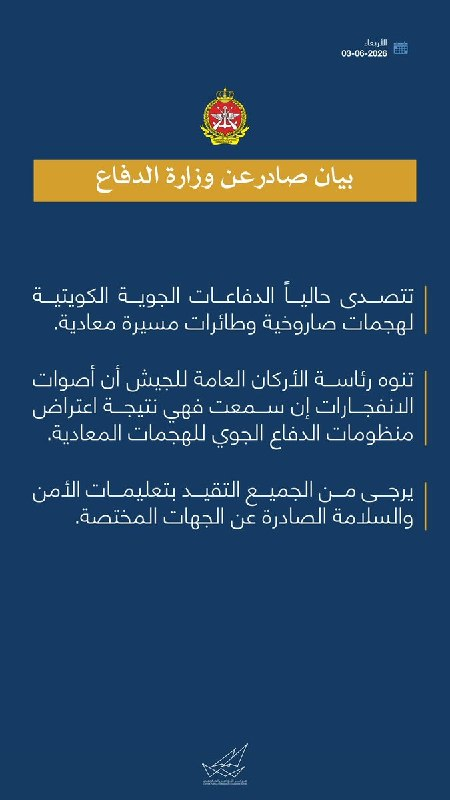

↩️ Quoted tweet: مركز التواصل الحكومي ✓ @CGCKuwait Tue, 02 Jun 2026 21:58:48 UTC بيان صادر عن وزارة الدفاع #CGCKuwait ↩️ Quoted tweet — see the post below for the reply. English Statement issued by the Ministry of Defense #CGCKuwait 𝕏 · @shin_persian

## Shin_Persian — post 6420

  

↩️ Quoted tweet:
مركز التواصل الحكومي ✓ @CGCKuwait
Tue, 02 Jun 2026 21:58:48 UTC

بيان صادر عن وزارة الدفاع

#CGCKuwait

↩️ Quoted tweet — see the post below for the reply.

English

Statement issued by the Ministry of Defense

#CGCKuwait

𝕏 · @shin_persian

## Shin_Persian — post 6419

Shin ✓ @hey_itsmyturn
Tue, 02 Jun 2026 21:57:30 UTC

BM was launched from Fars Province, #Iran
Sirens went off @ 2155Z in #Kuwait 🇰🇼

فارسی

یک موشک بالستیک از استان فارس، #Iran شلیک شد
آژیرهای خطر در ساعت ۲۱۵۵ زولو (۰۱:۲۵ به وقت تهران) در #Kuwait 🇰🇼 به صدا درآمدند

𝕏 · @shin_persian

## Shin_Persian — post 6418

  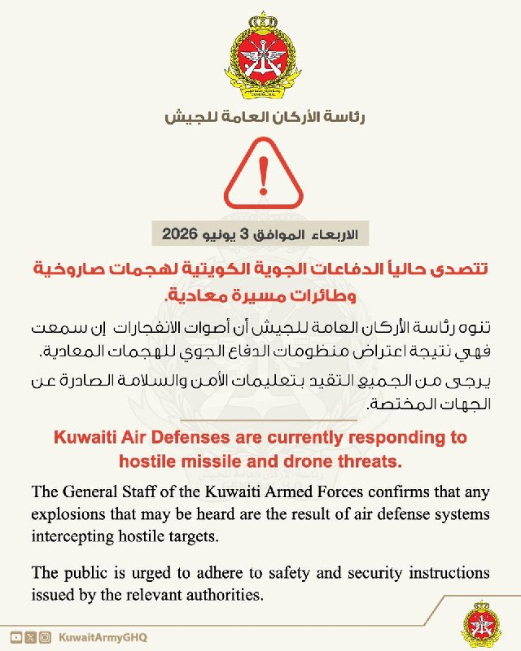

🔁 Quoting above tweet:
Shin ✓ @hey_itsmyturn
Tue, 02 Jun 2026 21:57:26 UTC

Kuwaiti Air Defenses are currently responding to hostile missile and drone attacks.

The General Staff of the Army states that any explosions heard are the result of air defense interceptions.

F…

Source: @KuwaitArmyGHQ
https://x.com/KuwaitArmyGHQ/status/2061930167338197059

فارسی

پدافند هوایی کویت در حال حاضر در حال پاسخگویی به حملات موشکی و پهپادی متخاصم است.

ستاد کل ارتش اعلام کرد که هرگونه صدای انفجار شنیده شده، ناشی از رهگیری‌های پدافند هوایی است.

ف…

منبع: @KuwaitArmyGHQ
https://x.com/KuwaitArmyGHQ/status/2061930167338197059

𝕏 · @shin_persian

## Shin_Persian — post 6417

  

↩️ Quoted tweet: KUWAIT ARMY - الجيش الكويتي ✓ @KuwaitArmyGHQ Tue, 02 Jun 2026 21:57:15 UTC تتصدى حالياً الدفاعات الجوية الكويتية لهجمات صاروخية وطائرات مسيرة معادية. تنوه رئاسة الأركان العامة للجيش أن أصوات الانفجارات إن سمعت فهي نتيجة اعتراض منظومات الدفاع…

## Shin_Persian — post 6416

↩️ Quoted tweet:
KUWAIT ARMY - الجيش الكويتي ✓ @KuwaitArmyGHQ
Tue, 02 Jun 2026 21:57:15 UTC

تتصدى حالياً الدفاعات الجوية الكويتية لهجمات صاروخية وطائرات مسيرة معادية.

تنوه رئاسة الأركان العامة للجيش أن أصوات الانفجارات إن سمعت فهي نتيجة اعتراض منظومات الدفاع الجوي للهجمات المعادية.

يرجى من الجميع التقيد بتعليمات الأمن والسلامة الصادرة عن الجهات المختصة.

↩️ Quoted tweet — see the post below for the reply.

English

Kuwaiti air defenses are currently confronting hostile missile attacks and drones.

The General Staff of the Army notes that if sounds of explosions are heard, they are the result of the air defense systems intercepting hostile attacks.

Everyone is requested to adhere to the security and safety instructions issued by the competent authorities.

𝕏 · @shin_persian

## Shin_Persian — post 6415

Shin ✓ @hey_itsmyturn
Tue, 02 Jun 2026 21:55:59 UTC

NOW -
Sirens in #Kuwait 🇰🇼

فارسی

هم‌اکنون -
آژیرهای خطر در #Kuwait 🇰🇼

𝕏 · @shin_persian

## FarsiVOA — post 219416

  <a href="telegram/content/FarsiVOA_219416_1780437834.mp4" target="_blank">🎬 Download video</a>

⚡️سنتکام اعلام کرد که یک نفتکش‌ را که به سمت جزیره خارک در حرکت بود و به هشدارهای پیاپی نیروهای آمریکایی بی‌اعتنایی کرد، روز سه‌شنبه ۱۲ خرداد با شلیک یک موشک از یک هواگرد از کار انداخت.
@FarsiVOA

## Persian_Trend_Official — post 15539

  <a href="telegram/content/Persian_Trend_Official_15539_1780437834.webm" target="_blank">🎬 Download video</a>

⭕️ صدای آژیر خطر در کویت فعال شد. 📝 Nick 📌 @persian_trend_official پرشین ترند | متفاوت‌ترین کانال نظامی

## Persian_Trend_Official — post 15538

🚨خبرگزاری مهر از شنیده شدن صدای انفجار در محدوده جزیره قشم خبر داد. 📝 Nick 📌 @persian_trend_official پرشین ترند | متفاوت‌ترین کانال نظامی

## Persian_Trend_Official — post 15537

  <a href="telegram/content/Persian_Trend_Official_15537_1780437835.webm" target="_blank">🎬 Download video</a>

🚨خبرگزاری مهر از شنیده شدن صدای انفجار در محدوده جزیره قشم خبر داد.

📝 Nick

📌 @persian_trend_official
پرشین ترند | متفاوت‌ترین کانال نظامی

## IranianMinds — post 21272

یه انفجار در قشم رخ داده خبرگذاری های داخلی هم تایید کردن و هنوز منشا مشخص نیست

@IranianMinds

## alonews — post 124619

  <a href="telegram/content/alonews_124619_1780437835.webm" target="_blank">🎬 Download video</a>

👈وزارت دفاع کویت :
- پدافند هوایی کویت در حال حاضر داره با حملات موشکی و پهپادیِ دشمن مقابله می‌کنه

✅ @AloNews خبر جنگ

## alonews — post 124618

  <a href="telegram/content/alonews_124618_1780437835.webm" target="_blank">🎬 Download video</a>

👈آژیر هشدار و صدای انفجار در کویت

🔴رسانه‌های عربی از فعال‌شدن آژیرهای هشدار در کویت و شنیده‌شدن انفجارهایی در این کشور خبر دادند.

✅ @AloNews خبر جنگ

---
📅 بروزرسانی: 1405/03/13 01:24
---

## VahidOOnLine — post 243427

  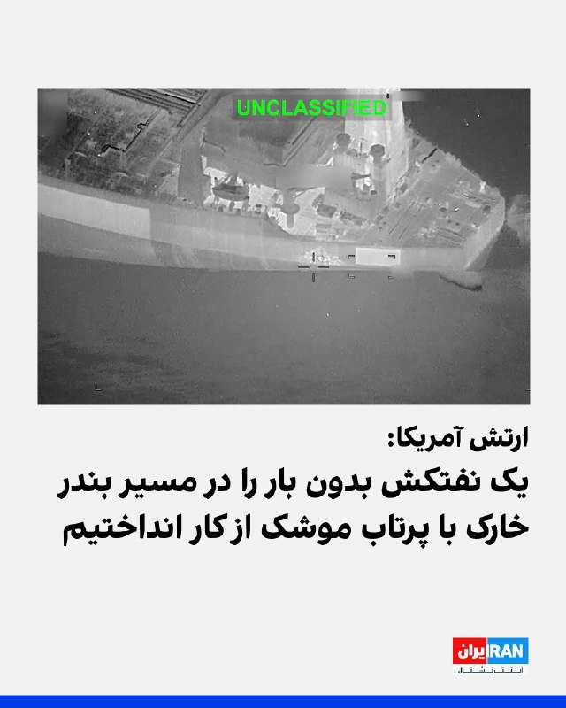

ستاد فرماندهی مرکزی آمریکا، سنتکام، اعلام کرد نیروهای این کشور یک نفتکش بدون بار با پرچم بوتسوانا در مسیر حرکت به سمت بندر خارک را که به هشدارهای نیروهای آمریکایی بی‌توجهی کرد، از کار انداخته‌اند.
طبق این گزارش، در پی بی‌توجهی این کشتی به هشدارها، یک هواپیمای آمریکایی با پرتاب موشک به موتورخانه آن، کشتی را از کار انداخت و مانع ادامه مسیرش شد.
سنتکام افزود که از ابتدای محاصره دریایی بنادر ایران تاکنون شش کشتی تجاری توسط نیروهای آمریکایی از کار انداخته شده‌ و ۱۲۲ کشتی تجاری نیز مجبور به تغییر مسیر شده‌اند.

‌🏁 🇬🇧 IranintlTV

🤖 @VahidOOnLine

## VahidOOnLine — post 243426

  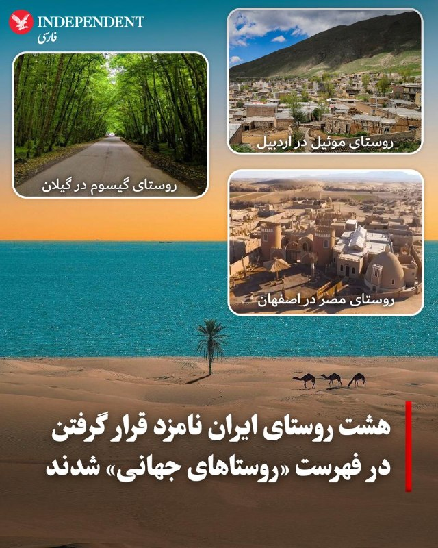

♦️معاون گردشگری ایران اعلام کرد هشت روستا از استان‌های مختلف کشور به‌عنوان نامزدهای ایران برای رقابت در فهرست «بهترین روستاهای گردشگری جهان» در سال ۲۰۲۶ معرفی شده‌اند.

روستاهای پامنار در خوزستان، گیسوم در گیلان، شانه‌تراش در مازندران، ریاب در خراسان رضوی، درک در سیستان و بلوچستان، قلعه‌بالا در سمنان، موئیل در اردبیل و مصر در اصفهان، برای قرار گرفتن در فهرست جهانی سازمان گردشگری ملل متحد (UN Tourism) رقابت خواهند کرد.

به گفته مسئولان گردشگری، تعداد روستاهای ایرانی پذیرفته‌شده در این برنامه از یک روستا در سال‌های ۲۰۲۳ و ۲۰۲۴ به سه روستا در سال ۲۰۲۵ افزایش یافته است.

ارزیابی روستاها بر اساس معیارهایی مانند حفاظت از میراث فرهنگی، پایداری اقتصادی و زیست‌محیطی، زیرساخت‌ها، مشارکت جوامع محلی و توسعه گردشگری پایدار انجام می‌شود.
‌🇸🇦 Indypersian

🤖 @VahidOOnLine

## mwarmonitor — post 10045

صدای انفجار در قشم

## pm_afshaa — post 92143

  <a href="telegram/content/pm_afshaa_92143_1780437283.webm" target="_blank">🎬 Download video</a>

🔴تو جزیره قشم صدای انفجار شنیده شده.

💧 Rainbet.com the #1 Non-KYC Crypto Casino & Sportsbook @rainbetcom

😁 @Pm_Afshaa

## IranIntlTV — post 340282

  

ستاد فرماندهی مرکزی آمریکا، سنتکام، اعلام کرد نیروهای این کشور یک نفتکش بدون بار با پرچم بوتسوانا در مسیر حرکت به سمت بندر خارک را که به هشدارهای نیروهای آمریکایی بی‌توجهی کرد، از کار انداخته‌اند.
طبق این گزارش، در پی بی‌توجهی این کشتی به هشدارها، یک هواپیمای آمریکایی با پرتاب موشک به موتورخانه آن، کشتی را از کار انداخت و مانع ادامه مسیرش شد.
سنتکام افزود که از ابتدای محاصره دریایی بنادر ایران تاکنون شش کشتی تجاری توسط نیروهای آمریکایی از کار انداخته شده‌ و ۱۲۲ کشتی تجاری نیز مجبور به تغییر مسیر شده‌اند.

https://iranintl.com/202606024534

## Shin_Persian — post 6414

Shin ✓ @hey_itsmyturn
Tue, 02 Jun 2026 21:46:22 UTC

State-owned Mehr News

Explosion sounds reported in Qeshm Island area, Hormozgan Province, #Iran

Local sources report multiple explosions heard early Wednesday. Nature of sounds unclear, no official statement from Islamic Regime military or police authorities.

فارسی

خبرگزاری دولتی مهر

گزارش‌هایی از شنیده شدن صدای انفجار در محدوده جزیره قشم، استان هرمزگان، #Iran

منابع محلی از شنیده شدن صدای چندین انفجار در ساعات اولیه روز چهارشنبه خبر می‌دهند. ماهیت این صداها هنوز مشخص نیست و هیچ بیانیه رسمی از سوی مقامات نظامی یا انتظامی رژیم اسلامی صادر نشده است.

𝕏 · @shin_persian

## IranianMinds — post 21271

باز شب شدو صدای انفجار های مختلف از جنوب کشور میاد و خب مشخصه که هیچکدومش هم نقض آتش بس نیست

@IranianMinds

## alonews — post 124617

  <a href="telegram/content/alonews_124617_1780437285.webm" target="_blank">🎬 Download video</a>

👈شنیده شدن صدای انفجار در محدوده جزیره قشم

🔴بامداد چهارشنبه صدای انفجار‌هایی در محدوده شهرستان قشم از سوی منابع محلی و ساکنان این جزیره گزارش شده است.

🔴بر اساس این گزارش، هنوز ماهیت این صداها به طور دقیق مشخص نیست و هیچ‌ یک از نهادهای رسمی نظامی و انتظامی تا این لحظه درباره علت وقوع این صداها اظهارنظری نکرده‌اند.

🔴پیگیری‌ها برای کسب اطلاع از ماهیت دقیق این انفجار ادامه دارد.

✅ @AloNews خبر جنگ

## alonews — post 124616

  <a href="telegram/content/alonews_124616_1780437285.mp4" target="_blank">🎬 Download video</a>

👈فرماندهی مرکزی ایالات متحده:
امروز نیروهای آمریکایی یک نفتکش بدون بار را که در تلاش برای حرکت به سمت یک بندر ایرانی در خلیج فارس بود، از کار انداختند

🔴فرماندهی مرکزی ایالات متحده (centcom) اقدامات محاصره‌ای را علیه نفتکش m/t lexie با پرچم بوتسوانا که در حال عبور از آب‌های بین‌المللی به سمت جزیره خارگ بود، اعمال کرد.

🔴خدمه کشتی هشدارهای مکرر را نادیده گرفتند و چندین بار در طول ۲۴ ساعت از تبعیت از دستورات نیروهای آمریکایی خودداری کردند.

🔴در نهایت یک هواپیمای آمریکایی با شلیک موشک هلفایر به اتاق موتور کشتی، آن را از کار انداخت و مانع رسیدن نفتکش به ایران شد.

✅ @AloNews خبر جنگ

## alonews — post 124615

  <a href="telegram/content/alonews_124615_1780437287.webm" target="_blank">🎬 Download video</a>

👈ایران دومین تیم پیر جام جهانی شد!

✅ @AloNews خبر جنگ

---
📅 بروزرسانی: 1405/03/13 01:14
---

## VahidOOnLine — post 243425

  

♦️خبرگزاری مهر، بامداد چهارشنبه، ۱۳ خردادماه، از «شنیده‌شدن صدای انفجار‌هایی در محدوده جزیره قشم» خبر داد. مهر نوشت: «ماهیت این صداها به طور دقیق مشخص نیست و هیچ‌ یک از نهادهای رسمی نظامی و انتظامی تا این لحظه درباره علت وقوع این صداها اظهارنظری نکرده‌اند».
‌🇸🇦 Indypersian

🤖 @VahidOOnLine

## VahidOOnLine — post 243424

  

♦️یک مقام آمریکایی و منابع آگاه، روز سه‌شنبه، به «ای‌بی‌سی نیوز» اعلام کردند که دونالد ترامپ، رئیس‌جمهوری آمریکا، در جریان نشست روز جمعه در «اتاق وضعیت» کاخ سفید، تضمین‌های شفاهی مذاکره‌کنندگان ایرانی را ناکافی دانسته و خواستار مکتوب شدن تعهدات هسته‌ای مشخص از سوی تهران در توافق اولیه شده است. مارکو روبیو، وزیر امور خارجه آمریکا، در جلسه استماع کمیته روابط خارجی سنا تایید کرد که واشنگتن پیش از هرگونه پیشرفتی، خواهان تعهد مکتوب ایران برای تعیین تکلیف اورانیوم غنی‌شده در اعماق کوه‌ها و پذیرش محدودیت‌های شدید یا لغو کامل غنی‌سازی است و تاکید کرد که تا زمان اجرای این تعهدات، هیچ دارایی آزاد نخواهد شد و تحریمی لغو نمی‌شود. در حالی که ترامپ گفته انتظار دارد ایران ظرف یک هفته این شروط را بپذیرد، مقامات آمریکایی درباره یکپارچگی رژیم ایران در تصمیم‌گیری ابراز تردید کرده‌اند؛ هرچند روبیو اشاره کرد نشانه‌هایی وجود دارد که مجتبی خامنه‌ای، سومین رهبر جمهوری اسلامی، که پس از مجروح شدن در ساعات اولیه جنگ در انظار عمومی دیده نشده، این روزها تا حدی در جریان این توافقات قرار گرفته است.
‌🇸🇦 Indypersian

🤖 @VahidOOnLine

## WithYashar — post 13300

خاورمیانه جنگشم مثل آدمیزاد نیست !
@withyashar

## FoxNewsTwitter — post 342518

  

Fox News (Twitter/X)

The DOJ is officially walking away from President Trump's proposed Anti-Weaponization Fund.

Acting Attorney General Todd Blanche told lawmakers Tuesday that the department will not move forward with the controversial fund, which was created as part of Trump's settlement with the IRS.

"We are not moving forward with the fund, period," Blanche said during a House Appropriations hearing.

The announcement comes after a federal judge temporarily blocked the effort and just days before a court hearing that was set to examine whether the fund had a legal basis.

## IranIntlTV — post 340281

  <a href="telegram/content/IranIntlTV_340281_1780436662.mp4" target="_blank">🎬 Download video</a>

مراد ویسی، تحلیلگر ارشد ایران‌اینترنشنال، گفت: «اسرائیل و مردم ایران مصمم‌ترین و همسوترین بازیگران در مسیر سرنگونی جمهوری اسلامی هستند. آمریکا نیز در نهایت، همان‌گونه که در برابر دیگر بازیگران چالش‌گر نظم جهانی عمل کرده، به مسیر اقدام قاطع علیه جمهوری اسلامی خواهد پیوست.»
@iranintltv

## IranIntlTV — post 340280

  <a href="telegram/content/IranIntlTV_340280_1780436663.mp4" target="_blank">🎬 Download video</a>

مراد ویسی، تحلیلگر ارشد ایران‌اینترنشنال، گفت: «جمهوری اسلامی آخرین حکومت یاغی جهان است که جهان نیز آن را تحمل نخواهد کرد. جمهوری اسلامی نه در برابر مردم ایران و نه در برابر جهان عقب‌نشینی نخواهد کرد. مردم ایران و نظم جهانی نیز آن را تحمل نخواهند کرد.»
@iranintltv

## IranianMinds — post 21270

  <a href="telegram/content/IranianMinds_21270_1780436664.mp4" target="_blank">🎬 Download video</a>

🔴سنتکام:

امروز دوم ژوئن ، نیروهای آمریکا یک کشتی بدون بار را که قصد داشت به یکی از بنادر ایران برود با شلیک موشک به موتورخانه آن کشتی از کار انداخت. با وجود اخطارهای پی‌درپی ارتش آمریکا، کشتی اخطارات را نادیده گرفته بود و به همین علت مورد حمله موشکی قرار گرفت.

@IranianMinds

## BBCPersian — post 282709

🔻فرماندهی مرکزی ارتش آمریکا اعلام کرد يک نفتکش خالی از محموله را که در حال حرکت به سوی يکی از بنادر ايران در خليج فارس بود، روز سه‌شنبه از کار انداخته‌اند. سنتکام، عصر ۱۲ خرداد، اعلام کرد اقدامات مربوط به محاصره دريايی را عليه نفتکش «ام تی لکسی» با پرچم بوتسوانا،…

## BBCPersian — post 282708

  

🔻فرماندهی مرکزی ارتش آمریکا اعلام کرد يک نفتکش خالی از محموله را که در حال حرکت به سوی يکی از بنادر ايران در خليج فارس بود، روز سه‌شنبه از کار انداخته‌اند.

سنتکام، عصر ۱۲ خرداد، اعلام کرد اقدامات مربوط به محاصره دريايی را عليه نفتکش «ام تی لکسی» با پرچم بوتسوانا، در حالی که در آب‌های بين‌المللی به سمت جزيره خارک در حرکت بود، اجرا کرده است.

بر اساس اين بيانيه، خدمه اين کشتی هشدارهای مکرر را ناديده گرفتند و طی ۲۴ ساعت چندين بار از اجرای دستورهای نيروهای آمريکايی خودداری کردند.

سنتکام افزود در نهايت يک هواپيمای آمريکايی با شليک يک موشک هلفاير به اتاق موتور کشتی، آن را از کار انداخت و مانع رسيدن نفتکش به ايران شد.

فرماندهی مرکزی آمريکا همچنين اعلام کرد اجرای محاصره تمامی رفت وآمدهای دريايی به بنادر ايران و از بنادر ايران را که از ۱۳ آوريل آغاز کرده ادامه خواهد داد.

📷 Reuters
https://bbc.in/4fXEWHX
@BBCPersian

## alonews — post 124614

  <a href="telegram/content/alonews_124614_1780436666.mp4" target="_blank">🎬 Download video</a>

🔴چرا پادشاه بریتانیا اسلام رو میراث بریتانیا میدونه؟ جواب رو از آرش اعلایی بشنویم.

🔴نقش برادران شرلی در پیدایش و رسمی شدن مذهب شیعه در ایران.

🤔آخوند انگلیسی

✅@AloNews

---
📅 بروزرسانی: 1405/03/13 01:04
---

## WithYashar — post 13299

اتاق جنگ با شما : صدای انفجار از سمت دریا نبود
به اون کوهه زدن که پر از مهماته نزدیکمونه قشنگ به چشم دیدیم
@withyashar

## WithYashar — post 13298

گزارش انفجار قشم 🚨🚨🚨🚨 @withyashar

## mwarmonitor — post 10044

📌خلبان جنگنده F-15E که بر فراز ایران سرنگون شد، همان خلبانی بود که یکی از جنگنده‌هایش در ابتدای جنگ بر اثر آتش خودی کویت هدف قرار گرفته و سقوط کرده بود.

🔸تنها کمی بیش از ۳۰ روز پس از آن‌که در آن حادثه با موفقیت ایجکت کرده و جان سالم به در برده بود، او در مأموریتی بر فراز ایران بود که جنگنده‌اش توسط یک موشک زمین به هوا هدف قرار گرفت. CBS

@mwarmonitor

## mwarmonitor — post 10043

🔸ایالات متحده صرافی نوبیتکس، بزرگ‌ترین صرافی دارایی دیجیتال ایران، و ۳ صرافی دیگر را تحریم کرده و آن‌ها را به حمایت از شبکه دور زدن تحریم‌های تهران متهم کرده است.

@mwarmonitor

## DEJradio — post 5272

  <a href="telegram/content/DEJradio_5272_1780436066.mp4" target="_blank">🎬 Download video</a>

🚨
🔸 خبر ۲۱
سه‌شنبه ۱۲ خرداد ۱۴۰۵

#خبر۲۱
@DEJradio

## DEJradio — post 5271

  <a href="telegram/content/DEJradio_5271_1780436068.webm" target="_blank">🎬 Download video</a>

🔺📷 تصاویر ماهواره‌ای شرکت «ایرباس دی‌اس» جاده‌های منتهی به تأسیسات اتمی فُردو با موانع سنگی-خاکی پر شده است، تا در صورت عملیات احتمالی زمینی آمریکا و اسرائیل برای تخلیه اورانیوم‌ها سخت شود.

#فردو
@DEJradio

## DEJradio — post 5270

  <a href="telegram/content/DEJradio_5270_1780436068.mp4" target="_blank">🎬 Download video</a>

🛩️
🚨 سنتکام اعلام کرد نیروهای آمریکایی یک نفتکش را که در مسیر یکی از بنادر جمهوری اسلامی در خلیج فارس در حرکت بود، از کار انداختند.

بر اساس بیانیه فرماندهی مرکزی ایالات متحده، نفتکش «لکسی» با پرچم بوتسوانا هنگام حرکت به سوی جزیره خارک، به هشدارهای مکرر نیروهای آمریکایی بی‌اعتنایی کرده و طی ۲۴ساعت چندین بار از اجرای دستورهای صادرشده خودداری کرده است.
سنتکام افزود در نهایت یک هواگرد آمریکایی با شلیک موشک هلفایر به اتاق موتور این کشتی، آن را از کار انداخت و مانع رسیدن آن به ایران شد.
فرماندهی مرکزی ایالات متحده همچنین اعلام کرد از زمان آغاز اجرای محاصره دریایی بنادر جمهوری اسلامی، تاکنون شش کشتی تجاری را از کار انداخته و ۱۲۲کشتی دیگر را ناگزیر به تغییر مسیر کرده است.

#خبر #محاصره_دریایی #سنتکام
@DEJradio

## FarsiVOA — post 219415

⚡️علی خامنه‌ای کشته شد اما رد جنایات او همچنان باقی است؛ هم بر جان و روانِ جمعی ملتی و هم در سینه‌ تاریخ. آیا راهی برای دست یافتن به عدالت هست؟

@FarsiVOA

## alonews — post 124613

  <a href="telegram/content/alonews_124613_1780436069.webm" target="_blank">🎬 Download video</a>

👈 مقر گروهک‌های تجزیه‌طلب کرد هدف قرار گرفت

🔴منابع عراقی از انفجار در یک مقر گروهک‌های کرد تجزیه‌طلب در شمال اربیل خبر دادند.

✅ @AloNews خبر جنگ

## alonews — post 124612

  <a href="telegram/content/alonews_124612_1780436070.webm" target="_blank">🎬 Download video</a>

👈تعداد ماهواره هایی که شرکت های مختلف جهان در فضا دارند

✅ @AloNews خبر جنگ

---
📅 بروزرسانی: 1405/03/13 00:54
---

## VahidOOnLine — post 243423

♦️فرماندهی مرکزی آمریکا (سنتکام)، روز سه‌شنبه، ۱۲ خردادماه، اعلام کرد نیروهای ایالات متحده یک نفت‌کش خالی را که در حال حرکت به سمت بندر جزیره خارگ در ایران بود، در آب‌های بین‌المللی خلیج فارس متوقف و زمین‌گیر کرده‌اند. به گفته سنتکام، خدمه این نفت‌کش با پرچم بوتسوانا (M/T Lexie)، در یک بازه زمانی ۲۴ ساعته بارها هشدارهای ارتش آمریکا را نادیده گرفتند. در نهایت یک جنگنده آمریکایی با شلیک موشک هلفایر به اتاق موتور کشتی، آن را از کار انداخت و مانع رسیدن آن به ایران شد. سنتکام از ۲۴ فروردین‌ماه محاصره دریایی بنادر ایران را آغاز کرده و گزارش داد که در طول دوران آتش‌بس، تاکنون ۶ کشتی تجاری را متوقف و ۱۲۲ کشتی دیگر را تغییر مسیر داده است.
‌🇸🇦 Indypersian

🤖 @VahidOOnLine

## WithYashar — post 13297

  <a href="telegram/content/WithYashar_13297_1780435487.mp4" target="_blank">🎬 Download video</a>

نیروهای ایالات متحده ساعاتی پیش یک نفتکش خالی از محموله را که در حال حرکت به سوی یکی از بنادر ایران در خلیج فارس بود، از کار انداختند.

فرماندهی مرکزی ایالات متحده (سنتکام) اعلام کرد که اقدامات مربوط به محاصره دریایی را علیه نفتکش ام/تی لکسی (M/T Lexie) با پرچم بوتسوانا، در حالی که از آب‌های بین‌المللی به سمت جزیره خارک در حرکت بود، اجرا کرده است.

به گفته سنتکام، خدمه کشتی هشدارهای مکرر را نادیده گرفتند و طی یک دوره ۲۴ ساعته چندین بار از تبعیت از دستورات نیروهای آمریکایی خودداری کردند.

در نهایت، یک هواپیمای آمریکایی با شلیک یک موشک هلفایر به اتاق موتور کشتی، آن را از کار انداخت و مانع رسیدن نفتکش به ایران شدند
@withyashar

## mwarmonitor — post 10042

🔴ترامپ در حال تحت فشار گذاشتن ایران است تا به‌عنوان بخشی از یک توافق اولیه با ایران، تعهدات هسته‌ای محکم‌تری را به‌صورت کتبی ارائه دهد — ABC

@mwarmonitor

## mwarmonitor — post 10041

  <a href="telegram/content/mwarmonitor_10041_1780435490.mp4" target="_blank">🎬 Download video</a>

🔴سنتکام:
یک هواپیمای آمریکایی در تاریخ ۲ ژوئن با شلیک موشک هلفایر به اتاق موتور نفتکش M/T Lexie با پرچم بوتسوانا، این شناور را از کار انداخت.
به گفته سنتکام، این نفتکش پس از آن هدف قرار گرفت که هشدارها را نادیده گرفت و در نقض تدابیر محاصره‌ای به حرکت خود به سمت جزیره خارک ایران ادامه داد.

@mwarmonitor

## FoxNewsTwitter — post 342517

  <a href="telegram/content/FoxNewsTwitter_342517_1780435493.mp4" target="_blank">🎬 Download video</a>

Fox News (Twitter/X)

WATCH: @willcain reveals jaw-dropping statistics about homelessness in Karen Bass' Los Angeles as he breaks down the key issues at stake tonight's mayoral election:

64% of homeless individuals in LA are from outside the city, while 6% came from other countries including North Korea, Cuba, and Venezuela.

All eyes are on Los Angeles tonight as voters head to the polls for closely watched primary election, where concerns over homelessness, public safety, and incumbent city leadership have dominated the conversation.
@WillCainShow

## pm_afshaa — post 92142

  <a href="telegram/content/pm_afshaa_92142_1780435496.mp4" target="_blank">🎬 Download video</a>

🔴سنتکام: ساعتی پیش یک نفتکش بدون محموله که به سمت جزیره خارک درحال حرکت بود رو از کار انداختیم. این کشتی به هشدارها توجه نکرد و ما با یک موشک موتورخانه رو هدف قرار دادیم و متوقف شد.

💧 Rainbet.com the #1 Non-KYC Crypto Casino & Sportsbook @rainbetcom

😁 @Pm_Afshaa

## FarsiVOA — post 219414

🔺آمریکا چهار صرافی رمزارز در ایران و مدیرانشان را تحریم کرد؛ وزارت‌خارجه: این اقدام گامی است برای مقابله با تروریسم و فرار از تحریم‌ها

▪️سخنگوی وزارت امور خارجه آمریکا، تامی پیگوت، گفت وزارت خزانه‌داری آمریکا، روز سه‌شنبه ۱۲ خرداد «بزرگترین صرافی‌های دارایی‌های دیجیتال» جمهوری اسلامی ایران را تحریم کرد.

⬇️ بیشتر بخوانید:
https://ir.voanews.com/a/us-sanctions-iran-s-largest-crypto-exchange-over-irgc-links/8156547.html
@FarsiVOA

## IranianMinds — post 21269

🔴 ترامپ :

مذاکرات با ایران ادامه داره و زمان توافق فرا رسیده.

@IranianMinds

## alonews — post 124611

  <a href="telegram/content/alonews_124611_1780435497.webm" target="_blank">🎬 Download video</a>

👈ادعای رسانه بریتانیایی امواج:
یک منبع ارشد سیاسی گفت که هیچ گونه قطعی در ارتباط ایران با آمریکا از طریق واسطه‌ها صورت نگرفته است.

🔴 همزمان، قطر در کنار سایر واسطه‌های منطقه‌ای، به طور فشرده در پشت صحنه کار می‌کند تا از شعله‌ور شدن دوباره جنگ بر سر لبنان جلوگیری کند.

🔴 منابع آگاه عرب و ایرانی گفته‌اند که یکی از نزدیکان نبیه بری، رئیس پارلمان لبنان، به همین منظور در دوحه به سر می‌برد.

🔴نخست‌وزیر قطر نیز امروز با رافائل گروسی، مدیرکل آژانس بین‌المللی انرژی اتمی، دیدار کرد.

🔴این تحرکات در مسیرهای موازی اما به هم پیوسته نشان می‌دهد که ممکن است در آستانه یک تحول مهم قرار داشته باشیم.

🔴با این حال، آنچه بیش از هر اعلامیه‌ای اهمیت خواهد داشت، اجرا و عمل به توافقات است.

✅ @AloNews خبر جنگ

---
📅 بروزرسانی: 1405/03/13 00:45
---

## VahidOOnLine — post 243422

  

♦️تسنیم سه‌شنبه‌شب، ۱۲ خردادماه، خبر از صدور ویزای برای بازیکنان تیم ملی فوتبال داد. خبرگزاری وابسته به سپاه به نقل از رسانه‌های ترکیه گزارش داد:‌ «ویزای کلیه اعضای تیم ملی فوتبال ایران برای سفر به مکزیک صادر و تحویل سفارت ایران در آنکارا شده است». درحالی‌که تنها ۹ روز به آغاز مسابقات جام‌جهانی ۲۰۲۶ باقی مانده، هنوز ویزای آمریکا برای بازیکنان تیم فوتبال ایران صادر نشده است.
‌🇸🇦 Indypersian

🤖 @VahidOOnLine

## WithYashar — post 13296

گزارش انفجار قشم 🚨🚨🚨🚨
@withyashar

## WithYashar — post 13295

رسانه‌های ترکیه اعلام کردند که ویزای مکزیک کلیه اعضای تیم ملی فوتیال ایران برای سفر صادر و تحویل سفارت ایران در آنکارا شده است.
@withyashar

## VahidOnline — post 75882

  <a href="telegram/content/VahidOnline_75882_1780434955.mp4" target="_blank">🎬 Download video</a>

ارتش آمریکا به یک کشتی دیگر شلیک کرد.

بیانه سنتکام، ترجمه ماشین:
تامپا، فلوریدا — نیروهای آمریکا [امروز] ۲ ژوئن یک نفتکش بدون بار را که قصد داشت به سوی یکی از بنادر ایران در خلیج [فارس] حرکت کند، از کار انداختند.

فرماندهی مرکزی آمریکا، سنتکام، تدابیر محاصره را علیه نفتکش M/T Lexie با پرچم بوتسوانا اجرا کرد؛ این کشتی هنگام عبور از آب‌های بین‌المللی به سوی جزیره خارک در حرکت بود. خدمه کشتی هشدارهای مکرر را نادیده گرفتند و طی یک دوره ۲۴ ساعته چندین بار از اجرای دستورهای نیروهای آمریکایی سر باز زدند.

در نهایت، یک هواپیمای آمریکایی با شلیک یک موشک هل‌فایر به موتورخانه کشتی، آن را از کار انداخت و مانع رسیدن نفتکش به ایران شد.

سنتکام از ۱۳ آوریل اجرای محاصره همه رفت‌وآمدهای دریایی به بنادر ایران و خروج از آن‌ها را آغاز کرده است. با ادامه آتش‌بس با ایران، نیروهای آمریکا تاکنون شش کشتی تجاری را از کار انداخته و مسیر ۱۲۲ کشتی را تغییر داده‌اند.

📡 @VahidOnline

## FarsiVOA — post 219413

⚡️سازمان ملل متحد: بحران خاورمیانه کمک‌رسانی به کودکان جهان را مختل کرده است
@FarsiVOA

## FarsiVOA — post 219412

🔺سنتکام روز سه‌شنبه از اقدام نظامی علیه یک کشتی دیگر که محاصره دریایی بنادر ایران را نقض می‌کرد خبر داد

▪️ستاد فرماندهی مرکزی آمریکا، سنتکام، روز سه‌شنبه ۱۲ خرداد اعلام کرد که نیروهای ایالات متحده در همین روز با استفاده از زور یک نفتکش خالی از محموله را که در تلاش بود به سمت یکی از بنادر ایران در خلیج فارس حرکت کند، از کار انداختند.

⬇️ بیشتر بخوانید:
https://ir.voanews.com/a/8156548.html
@FarsiVOA

## alonews — post 124610

  <a href="telegram/content/alonews_124610_1780434956.mp4" target="_blank">🎬 Download video</a>

👈ارتش آمریکا به یک کشتی دیگر شلیک کرد.

🔴بیانه سنتکام : تامپا، فلوریدا — نیروهای آمریکا [امروز] ۲ ژوئن یک نفتکش بدون بار را که قصد داشت به سوی یکی از بنادر ایران در خلیج [فارس] حرکت کند، از کار انداختند

✅ @AloNews خبر جنگ

## alonews — post 124609

  <a href="telegram/content/alonews_124609_1780434957.webm" target="_blank">🎬 Download video</a>

👈توماس میسی نماینده کنگره: فقط کافی است کمک‌های خارجی به اسرائیل را به مدت یک ماه قطع کنید، آن وقت آنها بمباران همسایگانشان را متوقف می‌کنند - صلح فوری برقرار می‌شود، تنگه هرمز باز می‌شود، و قیمت بنزین در هر گالن دو دلار پایین می‌آید. اسرائیل بزرگترین دریافت‌کننده کمک‌های مالی از جیب مالیات‌دهندگان آمریکایی بوده و همچنان هم هست.

✅ @AloNews خبر جنگ

## alonews — post 124608

  <a href="telegram/content/alonews_124608_1780434957.webm" target="_blank">🎬 Download video</a>

👈قدیری‌ابیانه: نتانیاهو فیلم تجاوز ترامپ به دختربچه‌های کوچک را دارد!

🔴علت جنگ آمریکا علیه ایران این است که نتانیاهو علیه ترامپ آتو دارد و فیلم تجاوز ترامپ به دختربچه‌های کوچک را دارد و نتانیاهو این را اهرم فشار علیه ترامپ قرار داده تا هر کاری اسرائیل می‌خواهد، آمریکا انجام دهد.

✅ @AloNews خبر جنگ

---
📅 بروزرسانی: 1405/03/13 00:34
---

## VahidOOnLine — post 243421

  <a href="telegram/content/VahidOOnLine_243421_1780434277.mp4" target="_blank">🎬 Download video</a>

ویدیویی که به تازگی به ایران اینترنشنال رسیده نشان می‌دهد که ۱۸ دی در راهپیمایی مردم معترض در گلسار رشت، شعار «این آخرین نبرده، پهلوی برمی‌گرده» سر داده شد.
‌🏁 🇬🇧 IranintlTV

🤖 @VahidOOnLine

## VahidOOnLine — post 243420

♦️یک مقام اسرائیلی به «سی‌ان‌آن» اعلام کرد که مذاکرات میان اسرائیل و لبنان در روز سه‌شنبه به پایان رسیده و چهارشنبه نیز ادامه خواهد یافت. این گفتگوها در حالی جریان دارد که تبادل آتش میان اسرائیل و حزب‌الله و تهدیدهای دولت بنیامین نتانیاهو برای تشدید عملیات نظامی، مذاکرات موازی میان واشنگتن و تهران را به خطر انداخته است. به‌طوری‌که تنها چند ساعت پس از اظهارات دونالد ترامپ مبنی بر عدم پیشروی نیروهای اسرائیلی به سمت بیروت، نتانیاهو بر ادامه حملات به جنوب لبنان تاکید کرد.
‌🇸🇦 Indypersian

🤖 @VahidOOnLine

## WithYashar — post 13294

## IranIntlTV — post 340279

  <a href="telegram/content/IranIntlTV_340279_1780434279.mp4" target="_blank">🎬 Download video</a>

ویدیویی که به تازگی به ایران اینترنشنال رسیده نشان می‌دهد که ۱۸ دی در راهپیمایی مردم معترض در گلسار رشت، شعار «این آخرین نبرده، پهلوی برمی‌گرده» سر داده شد.

## IranianMinds — post 21268

  <a href="telegram/content/IranianMinds_21268_1780434281.mp4" target="_blank">🎬 Download video</a>

🔴 محمود قیم، مداح حرومی حکومت :

کوروش اگه سگِ آستان اهل بیت نیست،‌ پس خاک بر تمدن ایران باستان !

@IranianMinds

## IranianMinds — post 21267

  

@IranianMinds

---
📅 بروزرسانی: 1405/03/13 00:24
---

## VahidOOnLine — post 243419

  

تد کروز، سناتور جمهوری‌خواه، در پیامی نوشت: جمهوری اسلامی برای تولید انرژی هسته‌ای غیرنظامی نیازی به غنی‌سازی اورانیوم ندارد و غنی‌سازی تنها یک هدف دارد: ساخت سلاح هسته‌ای.

او افزود خطوط قرمز ترامپ «درست» است و شامل غنی‌سازی صفر، بازگشایی تنگه هرمز، تحویل ذخایر اورانیوم غنی‌شده و توقف تامین مالی تروریسم می‌شود.
‌🏁 🇬🇧 IranintlTV

🤖 @VahidOOnLine

## VahidOOnLine — post 243418

  

♦️به گزارش رویترز، مارکو روبیو، وزیر امور خارجه آمریکا، روز سه‌شنبه، در جلسه استماع مجلس نمایندگان اعلام کرد که واشنگتن به افراد مرتبط با سپاه پاسداران اجازه نخواهد داد در قالب هیات اعزامی ایران برای مسابقات جام جهانی فوتبال وارد این کشور شوند. روبیو با اشاره به اینکه بازی‌های تیم ملی ایران در خاک آمریکا برگزار می‌شود اما محل اقامت آن‌ها در مکزیک خواهد بود، تاکید کرد که ایالات متحده مشکلی با ورود بازیکنان و کادر فنی تیم فوتبال ایران ندارد، اما با نظارت دقیق و سخت‌گیرانه، جلوی ورود هر فردی را که ارتباطی با ورزش نداشته و با سپاه پاسداران در ارتباط باشد خواهد گرفت.
‌🇸🇦 Indypersian

🤖 @VahidOOnLine

## IranIntlTV — post 340278

  

تد کروز، سناتور جمهوری‌خواه، در پیامی نوشت: جمهوری اسلامی برای تولید انرژی هسته‌ای غیرنظامی نیازی به غنی‌سازی اورانیوم ندارد و غنی‌سازی تنها یک هدف دارد: ساخت سلاح هسته‌ای.

او افزود خطوط قرمز ترامپ «درست» است و شامل غنی‌سازی صفر، بازگشایی تنگه هرمز، تحویل ذخایر اورانیوم غنی‌شده و توقف تامین مالی تروریسم می‌شود.
https://iranintl.com/202606025610

## Dirty_Kids — post 390866

  

دهنتون سرویس اینا چیه درست میکنید :))))))))

@Dirty_Kids 👻

## Dirty_Kids — post 390865

  

🔴 آمریکا بزرگترین صرافی‌های ایرانی شامل: نوبیتکس، والکس، بیت‌پین و رمزینکس رو تحریم کرد.

چه تبعاتی می‌تونه داشته باشه؟

ممکنه دارایی برخی کاربران مسدود بشه.
ممکنه توی برداشت پول به مشکل بخورین!
احتمالا دارایی های تحت کنترل آمریکا برای خود صرافی مسدود میشه.
صرافی های بین المللی نمیتونن با این صرافی ها کار کنن.

@Dirty_Kids 👻

## Dirty_Kids — post 390864

  

مامان روبیکا دست هرکیه سریع بره پس بده
‌

@Dirty_Kids 👻

## alonews — post 124607

  <a href="telegram/content/alonews_124607_1780433688.webm" target="_blank">🎬 Download video</a>

👈گلرو، عضو کمیسیون امنیت ملی و سیاست خارجی مجلس : تیم مذاکره کننده با قدرت ایستاده تا آمریکا به خواسته هایش نرسد

✅ @AloNews خبر جنگ

---
📅 بروزرسانی: 1405/03/13 00:15
---

## WithYashar — post 13293

پست جدید از صحبت‌های بسیار زیبای شاهنشاه آریامهر

ارتباط قلبی ما❤️‍🩹 فرا مرزی شده

https://www.instagram.com/reel/DZGNeRLxq-Y/?igsh=MXQ1dTZmdXk2bGZpdQ==

## FarsiVOA — post 219411

🔺روبیو: جمهوری اسلامی حاضر به مذاکره درباره بخش‌هایی از برنامه هسته‌ای خود شده که قبلا حاضر نبود درباره آن‌ها گفت‌وگو کند

▪️مارکو روبیو، وزیر خارجه ایالات متحده، روز سه‌شنبه ۱۲ خرداد در نخستین حضور علنی خود در کنگره از زمان آغاز عملیات «خشم حماسی» علیه رژیم ایران، نسبت به ازسرگیری مذاکرات هسته‌ای با تهران ابراز خوش‌بینی کرد، هرچند تاکید کرد که هیچ تضمینی برای دستیابی به توافق نهایی وجود ندارد.

⬇️ بیشتر بخوانید:
https://ir.voanews.com/a/rubio-optimistic-on-eventual-iran-nuclear-talks-despite-congressional-skepticism/8156545.html
@FarsiVOA

## Persian_Trend_Official — post 15536

⭕️ وزیر خارجه آمریکا: ما به ایران (ج.ا) اجازه نخواهیم داد که هر کسی را که با سپاه پاسداران مرتبط است در هیئت اعزامی جام جهانی خود بگنجاند.

📝 Nick

📌 @persian_trend_official
پرشین ترند | متفاوت‌ترین کانال نظامی

## RadioFarda — post 157832

  <a href="https://t.me/radiofarda/157832" target="_blank">📎 Download file</a>

📻بشنوید: سرخط خبرهای نیمه‌شب با رادیوفردا، ۱۳خرداد ۱۴۰۵‌

@RadioFarda

## BBCPersian — post 282707

🔻خانواده زوج بریتانیایی که در ایران به اتهام جاسوسی بازداشت و به ۱۰ سال زندان محکوم شده‌اند، می‌‌گویند درخواست تجدیدنظرشان رد شده است. مقام‌های قضائی یا رسانه‌های رسمی ایران هنوز این خبر را تایید نکرده‌اند. لیندزی و کریگ فورمن در سفر دور دنیا بودند که در…

## BBCPersian — post 282706

  

🔻خانواده زوج بریتانیایی که در ایران به اتهام جاسوسی بازداشت و به ۱۰ سال زندان محکوم شده‌اند، می‌‌گویند درخواست تجدیدنظرشان رد شده است.

مقام‌های قضائی یا رسانه‌های رسمی ایران هنوز این خبر را تایید نکرده‌اند.

لیندزی و کریگ فورمن در سفر دور دنیا بودند که در دی سال ۱۴۰۳ در ایران بازداشت شدند.

این زوج بریتانیایی که حکمشان اواخر بهمن صادر شد، در حال حاضر در زندان اوین در اعتصاب غذا به‌سر می‌برند.

جو بنت، پسر لیندزی فورمن، گفت که «مادرم لیندزی و ناپدری‌‌ام کریگ، اجازه نیافتند در جلسه دادگاه تجدیدنظر حضور داشته باشند.»

به گفته جو بنت، از این زوج خواسته‌اند که اسنادی را به زبان فارسی امضا کنند اما چون این زبان را بلد نبودند از امضا خودداری کرده‌اند.

یکی از اعضای تیم حقوقی لیندزی و کریگ فورمن به بی‌بی‌سی گفت که به این زوج هیچ توضیحی در مورد دلیل رد درخواست تجدیدنظرشان داده نشده است.

به گفته آقای بنت، پرونده این زوج زندانی اکنون به دیوان عالی ایران ارجاع شده است.

📷 Social Media
https://bbc.in/4ajpnXp
@BBCPersian

## alonews — post 124606

  <a href="telegram/content/alonews_124606_1780433145.webm" target="_blank">🎬 Download video</a>

👈وضعیت آسمان منطقه

✅ @AloNews خبر جنگ

## alonews — post 124605

  <a href="telegram/content/alonews_124605_1780433145.webm" target="_blank">🎬 Download video</a>

👈الحدث: وزارت خزانه‌داری آمریکا اعلام کرد واشنگتن تحریم‌های جدیدی مرتبط با ایران را وضع کرده است که افراد و پلتفرم‌های تبادل ارز دیجیتال را هدف قرار می‌دهد.

✅ @AloNews خبر

---
📅 بروزرسانی: 1405/03/13 00:04
---

## VahidOOnLine — post 243417

  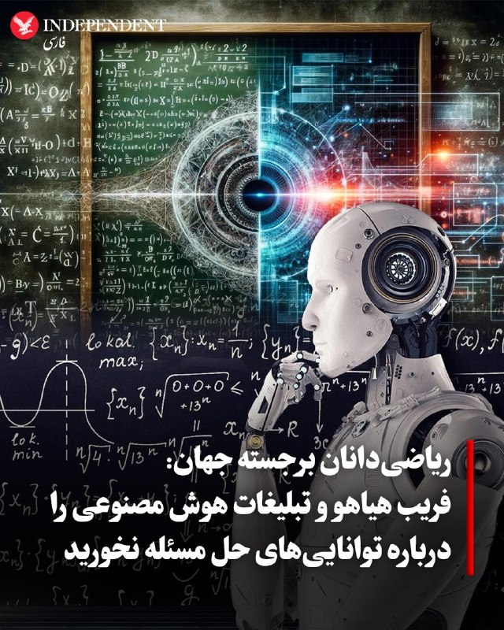

♦️به گزارش خبرگزاری فرانسه، بیش از ۱۵۰ ریاضی‌دان برجسته از سراسر جهان با امضای «بیانیه لیدن» به دولت‌ها و عموم مردم هشدار دادند که فریب تبلیغات و هیاهوی رسانه‌ای شرکت‌های هوش مصنوعی را درباره توانایی‌های حل مسئله این فناوری نخورند. این دانشمندان معتقدند غول‌های فناوری برای جذب سرمایه‌های نجومی چندصد میلیارد دلاری، در نمایش قدرت استدلال مدل‌های خود اغراق می‌کنند. در حالی که این سیستم‌ها ممکن است با ارائه پاسخ‌های به‌ظاهر درست اما ساختگی، نه‌تنها داوری‌های علمی را به جاده خاکی بکشانند، بلکه با ورود به حوزه‌هایی مثل جنگ‌افزارها و نظارت توده‌ای، صدمات جبران‌ناپذیری به بار آورند. نویسندگان این بیانیه تاکید کرده‌اند که آینده پژوهش‌های علمی باید همچنان تحت هدایت و قضاوت آزادانه عقل انسان باقی بماند، نه بر اساس زمان‌بندی بازار و منافع تجاری چند آزمایشگاه بزرگ.
‌🇸🇦 Indypersian

🤖 @VahidOOnLine

## VahidOOnLine — post 243416

  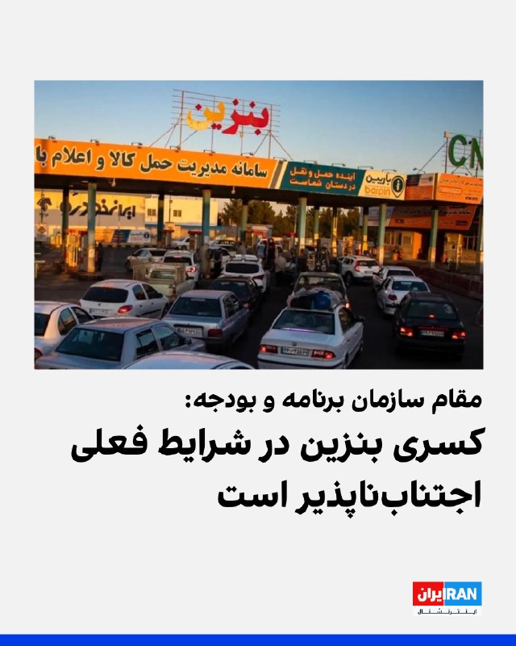

محمدصادق کریمی، رییس امور انرژی سازمان برنامه و بودجه گفت که بحران انرژی در کشور پیش از جنگ وجود داشت و اصل مسئله در جنگ تشدید شد. او افزود: «در شرایط فعلی، مسئله کسری بنزین اجتناب‌ناپذیر است و باید برای آن تصمیم گرفته شود.»

کریمی گفت: «قرار بود نرخ سوم بنزین به‌صورت فصلی به‌روزرسانی شود تا آینده قابل پیش‌بینی باشد اما با تغییر شرایط کشور و آغاز جنگ، اجرای این تصمیم موقتا متوقف شد.»
‌🏁 🇬🇧 IranintlTV

🤖 @VahidOOnLine

## VahidOOnLine — post 243415

  

مارکو روبیو درباره جام جهانی گفت ایالات متحده مصمم است اجازه ندهد هیچ فردی مرتبط با سپاه پاسداران در هیات اعزامی ایران حضور داشته باشد.

روبیو پیش‌تر نیز گفته بود که آمریکا با حضور تیم ملی فوتبال در مسابقات جام جهانی در این کشور مخالفتی ندارد، اما درباره همراهان تیم گفته بود: «آن‌ها نمی‌توانند یک مشت تروریست عضو سپاه را به‌عنوان روزنامه‌نگار یا مربی ورزشی وارد کشور ما کنند.»
‌🏁 🇬🇧 IranintlTV

🤖 @VahidOOnLine

## WithYashar — post 13292

آمریکا ۴ صرافی بزرگ ایرانی
نوبیتکس، بیت‌پین، رمزینکس و والکس رو تحریم کرد.
@withyashar
این صرافی ها ولت هاشون فلگ بود و از قبلم هر ولتی که با این صرافی ها ارتباط داشت کثیف میشد
اما الان خطر فریز شدن دارایی در صرافی است

## mwarmonitor — post 10040

سناتور بوکر: و فکر می‌کنم... نتیجه‌ای که من با توجه به پایان یافتن وقتم به آن رسیده‌ام این است که، تنگه هرمز پیش از این جنگ توجیه ناپذیر، باز بود. ما اکنون دستپاچه شده‌ایم تا راهی پیدا کنیم که بتوانیم آن را دوباره باز کنیم. این نه تنها باعث هرج و مرج اقتصادی در کشورمان شده است و شهروندان در سراسر این ملت، خانواده‌ها تلاش می‌کنند تا از پس مخارج زندگی برآیند؛ بلکه علاوه بر آن، می‌بینید ایرانی‌ها راه‌هایی برای بهره‌برداری از این موضوع پیدا کرده‌اند، همانطور که ما به آن‌ها اجازه دادیم این کار را با چینی‌ها در قبال ده‌ها میلیارد دلار انجام دهند. بنابراین منظور من این است که پیش از اینکه حتی به یک مذاکره هسته‌ای برسیم، این رژیم دارد برای بازسازی پول دریافت می‌کند، تا پهپادهای بیشتری خریداری کند، هرج و مرج بیشتری ایجاد کند، و این قبل از آن است که ما حتی تلاش کنیم به یک...
مارکو روبیو (وزیر امور خارجه): اما من متوجه نمی‌شوم، پوزش می‌خواهم، متوجه نمی‌شوم آن‌ها چطور این پول را به دست می‌آورند. به چه درآمدی اشاره می‌کنید؟
سناتور بوکر: خب، دو منبع درآمد وجود دارد که ما شاهدش هستیم؛ یکی درآمد حاصل از چینی‌ها است که به صورت مستند و واقعی ثبت شده است. و دوم، درآمدی که شما پیشنهاد می‌کنید آن‌ها باید با رها کردن تمام اورانیوم غنی‌شده خود دریافت کنند، و همچنین با تعهد دادن درباره ظرفیت‌های غنی‌سازی‌شان. صبر کنید، و این دقیقاً همان توافقی بود که شما آن را بدنام کردید، هم رئیس‌جمهور و هم شما، پرزیدنت اوباما را برای داشتن چنین توافقی بدنام کردید. و اکنون ما با وضعیت بدتری مواجه هستیم که در آن رقیب و دشمن ما، کسی که در منطقه هرج و مرج ایجاد می‌کند، کسی که از نیروهای نیابتی و تروریست‌ها حمایت مالی می‌کند، به لطف شما، به قدرت بستن تنگه هرمز پی برده است.
مارکو روبیو: نه، آن‌ها پی نبرده‌اند. آن‌ها این را از خیلی وقت پیش می‌دانستند و قبلاً هم این کار را انجام داده‌اند.
سناتور بوکر: خب، واضح است که همه ما این را از مدت‌ها پیش می‌دانستیم. برای همین است که این جنگ نسنجیده هرگز نباید اتفاق می‌افتاد. شما رقیب ما را در موقعیت مذاکراتی قوی‌تری قرار داده‌اید. ما قوی‌ترین ملت روی کره زمین هستیم و در یک بن‌بست با ایران قرار داریم. و اکنون، ما التماس می‌کنیم تا به توافقی بازگردیم که شما در وهله اول آن را نابود کردید. واضح است که این یک...
مارکو روبیو: ما التماس نمی‌کنیم. کسی التماس نمی‌کند. من متوجه نمی‌شوم... سناتور بوکر، سناتور بوکر وقت شما تمام شده است.
سناتور بوکر: مرتب به ما می‌گویند که چگونه در این جنگ پیروز می‌شویم، رئیس‌جمهور مدام می‌گوید...
مارکو روبیو: خب، جنگ تمام شده است.
سناتور بوکر: ...ما کاملاً نابود کرده‌ایم... جنگ تمام نشده است! و با این حال مردم آمریکا می‌بینند که چگونه ما در پمپ بنزین‌ها و با هزینه‌هایشان داریم می‌بازیم، و با این حال این موضوع هنوز حل نشده است. او هر روز توئیت می‌زند که «اوه، ما آن‌ها را محو کردیم، ما آن‌ها را نابود کردیم، آن‌ها تسلیم خواهند شد»؛ اما با این حال می‌بینیم که همچنان میلیاردها دلار در هفته برای جنگی در خارج از کشور هزینه می‌کنیم.

@mwarmonitor

## mwarmonitor — post 10039

  <a href="telegram/content/mwarmonitor_10039_1780432469.mp4" target="_blank">🎬 Download video</a>

🎬 Video

## pm_afshaa — post 92141

  <a href="telegram/content/pm_afshaa_92141_1780432470.webm" target="_blank">🎬 Download video</a>

🔴العربی الجدید: مذاکرات لبنان و اسرائیل در واشنگتن به پایان رسید و فردا هم ادامه پیدا میکنه.

💧 Rainbet.com the #1 Non-KYC Crypto Casino & Sportsbook @rainbetcom

😁 @Pm_Afshaa

## IranIntlTV — post 340277

  

محمدصادق کریمی، رییس امور انرژی سازمان برنامه و بودجه گفت که بحران انرژی در کشور پیش از جنگ وجود داشت و اصل مسئله در جنگ تشدید شد. او افزود: «در شرایط فعلی، مسئله کسری بنزین اجتناب‌ناپذیر است و باید برای آن تصمیم گرفته شود.»

کریمی گفت: «قرار بود نرخ سوم بنزین به‌صورت فصلی به‌روزرسانی شود تا آینده قابل پیش‌بینی باشد اما با تغییر شرایط کشور و آغاز جنگ، اجرای این تصمیم موقتا متوقف شد.»
https://iranintl.com/202606024473

## IranIntlTV — post 340276

  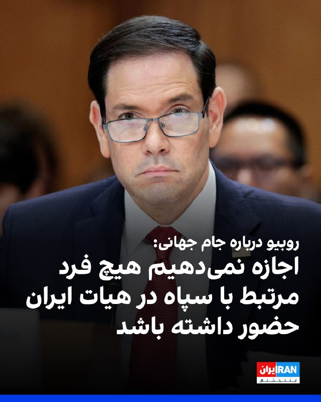

مارکو روبیو درباره جام جهانی گفت ایالات متحده مصمم است اجازه ندهد هیچ فردی مرتبط با سپاه پاسداران در هیات اعزامی ایران حضور داشته باشد.

روبیو پیش‌تر نیز گفته بود که آمریکا با حضور تیم ملی فوتبال در مسابقات جام جهانی در این کشور مخالفتی ندارد، اما درباره همراهان تیم گفته بود: «آن‌ها نمی‌توانند یک مشت تروریست عضو سپاه را به‌عنوان روزنامه‌نگار یا مربی ورزشی وارد کشور ما کنند.»
https://iranintl.com/202606027774

## FarsiVOA — post 219410

🔺رافائل گروسی پس از بازدید از نیروگاه اتمی «براکه» امارات: حمله به تأسیسات هسته‌ای کاملاً غیرقابل قبول است

▪️رافائل گروسی، رئیس آژانس بین‌المللی انرژی اتمی، روز سه‌شنبه ۱۲ خرداد در جریان بازدید از نیروگاه اتمی «براکه» در امارات متحده عربی، حمله پهپادی اخیر به این مجموعه را محکوم کرد و گفت تأسیسات هسته‌ای «هرگز نباید هدف حمله قرار گیرند.»

⬇️ بیشتر بخوانید:
https://ir.voanews.com/a/rafael-grossi-says-nuclear-facilities-must-never-be-targeted-barakah-uae/8156540.html
@FarsiVOA

## IranianMinds — post 21266

🔴 آمریکا بزرگترین صرافیای ایران یعنی نوبیتکس،بیت‌پین، رمزینکس و والکس رو تحریم کرد. +چیزی نیست اثرات مذاکرس @IranianMinds

## IranianMinds — post 21265

🔴 آمریکا بزرگترین صرافیای ایران یعنی نوبیتکس،بیت‌پین، رمزینکس و والکس رو تحریم کرد. +چیزی نیست اثرات مذاکرس @IranianMinds

## alonews — post 124604

  <a href="telegram/content/alonews_124604_1780432471.webm" target="_blank">🎬 Download video</a>

👈رکورد تورم در ایران از زمان جنگ جهانی دوم تاکنون شکسته شد.

🔴بر اساس داده‌های بانک مرکزی، نرخ تورم نقطه‌به‌نقطه در اردیبهشت ۱۴۰۵ به ۷۷.۲ درصد رسید

✅ @AloNews خبر جنگ

---
📅 بروزرسانی: 1405/03/12 23:55
---

## VahidOOnLine — post 243414

  

♦️رافائل گروسی، مدیرکل آژانس بین‌المللی انرژی اتمی (IAEA)، گفت حمله پهپادی ماه گذشته به نیروگاه هسته‌ای براکه در امارات متحده عربی «به دقت طراحی و هدف‌گذاری شده بود» و عاملان آن از پیامدهای احتمالی این اقدام آگاهی کامل داشتند.
به گفته گروسی، این حمله در ۲۷ اردیبهشت یک تاسیسات برق‌رسانی در نیروگاه هسته‌ای براکه در امارات متحده عربی را هدف قرار داد و می‌توانست به قطع برق خارجی و توقف فعالیت راکتور منجر شود. او این حادثه را «وضعیتی بسیار جدی» توصیف کرد.
مدیرکل آژانس افزود کارکنان اماراتی با واکنش سریع توانستند شرایط را کنترل کنند و مانع بروز پیامدهای گسترده‌تر شوند. او هشدار داد حمله به زیرساخت‌های هسته‌ای می‌تواند خطرات قابل توجهی برای منطقه ایجاد کند.
گروسی همچنین اعلام کرد آژانس بین‌المللی انرژی اتمی در حال ارائه پشتیبانی فنی به امارات متحده عربی است و این موضوع را در نشست ویژه شورای حکام مطرح خواهد کرد.
نیروگاه هسته‌ای براکه در امارات متحده عربی، تنها نیروگاه هسته‌ای فعال در جهان عرب به شمار می‌رود.
‌🇸🇦 Indypersian

🤖 @VahidOOnLine

## VahidOOnLine — post 243413

  

♦️هاکان فیدان، وزیر امور خارجه ترکیه، روز سه‌شنبه در گفتگو با «بلومبرگ» اعلام کرد که دونالد ترامپ، رئیس‌جمهوری آمریکا، قصد دارد در اجلاس سران ناتو که در روزهای هفتم و هشتم ژوئیه (۱۶ و ۱۷ تیرماه) در آنکارا برگزار می‌شود، شرکت کند. فیدان با اشاره به گفتگوهای تلفنی متعدد ترامپ و اردوغان تایید کرد هیچ نشانه‌ای از تمایل واشنگتن برای خروج از ناتو دیده نمی‌شود و پنتاگون و وزارت خارجه آمریکا همچنان به همکاری نزدیک با این ائتلاف ادامه می‌دهند.
وزیر خارجه ترکیه همچنین با حمایت از مذاکرات میان واشنگتن و تهران، تلاش‌های دو طرف را برای تمدید آتش‌بس «صادقانه» خواند. با این حال، او هشدار داد که حملات و عملیات نظامی گسترده اسرائیل در لبنان، خطر بزرگی ایجاد کرده و می‌تواند توافقات به‌دست‌آمده میان ایران و آمریکا را به شدت به خطر بیندازد؛ بحرانی که به گفته فیدان به دلیل ایجاد نوسان در قیمت انرژی و تشدید تورم، مستقیما بر اقتصاد ترکیه نیز فشار می‌آورد.
‌🇸🇦 Indypersian

🤖 @VahidOOnLine

## VahidOOnLine — post 243412

روایت شما از زندگی در دوران پس از انقلاب ملی و جنگ - سه‌شنبه ۱۲ خرداد ۱۴۰۵

🔹در اهواز هر روز بیشتر از ۱۴ ساعت آب قطع می‌شود.
🔹از اصفهان: شرایط اینقدر سخت شده که خوراک ما شده سیب‌زمینی یا ماکارونی با نون و پنیر، لعنت به جمهوری اسلامی که زندگی را از مردم گرفته، دیگه تحمل این شرایط را نداریم، بهداشت و درمان هم به‌خاطر گرونی اصلا دیگه اولویت نداره.
🔹من از کرج پیام می‌دم، هرچقدر بگیم گرونی بیداد می‌کنه، بازم کمه. توی برنامه دیوار وقتی می‌چرخی می‌بینی حتی برای یه وعده‌ی غذایی، مردم از یه حلقه‌ی ساده‌ی استیلشونم می‌گذرن برای فروش.
🔹من ماه پیش با خالم رفته بودیم فروشگاه برای کالابرگ. از اینکه کل مبلغ جوری بود که حتی نتونستیم یه حبوبات تهیه کنیم. ماه قبل دو برابر این قیمت وسایل برای منزل تهیه کردم، ولی اردیبهشت ماه یک‌سوم فروردین‌ماه هم نشد، چه برسه به این ماه.
🔹من یک دانش‌آموز نهم هستم. با این شرایط گرونی و فشار اقتصادی هیچ آینده‌ای برای نسل ما نیست، فقط می‌خواستم یک چیز رو بگم. عمو ترامپ لطفا لطفا کار رو یکسره بکن.
🔹تکلیف یازدهمی‌های امسال و دوازدهمی‌ها اصلا مشخص نیست، یه روز می‌گن از ۲۱ تیر امتحان نهایی رو حضوری می‌گیریم، یه روز می‌گن از ۱۳ تیر. خستمون کردن، جدی همه چی رو هواست عملا.
🔹دزدی خیلی زیاد شده، دیگه مردم نمیتونن ادامه بدن. هر روز هزاران نفر زیر فشار اقتصادی دارن آب می‌شن. چیزی نمونده که مردم از گرسنگی بریزن بیرون.
🔹از خوزستان: ما وارثان ایرانیم. ایران ارث پدری ماست.
🔹من دانش‌آموز نهمی هستم و امسال آزمون دارم، ولی به قدری استرس داشتیم توی این مدت که اخبار جنگ رو از درس‌هام بهتر بلدم. قراره چند روز دیگه آزمون بگیرن بدون هیچ ملاحظه‌ای از یادگیری دروس هم که نگم.
🔹تقریباً می‌شه گفت قیمت همه‌چیز ۳ برابر یا حتی بیشتر شده. دیگه تو این کشور با این حکومت نمی‌شه زندگی کرد. اینترنت هم که نداریم، به سختی وصل می‌شیم. لطفاً یه فکری به حال ما کنید.
🔹رفتم بازار برای بچه‌م کفش بخرم، کفش ۶۰۰ هزاری شده دو میلیون و ششصد. چند وقت دیگه مجبورم با پای برهنه تو خیابون راه بریم.
🔹جمهوری اسلامی می‌گه ما با سنگ هم شده با آمریکا مبارزه می‌کنیم. اگه راست می‌گن تفنگ رو کنار بذارن و با مردم ایران با سنگ مبارزه کنن.
🔹از دورود لرستان هستم. چرا هیچ‌کس به فکر مردم لرستان به‌خصوص دورود نیست؟ شهرداری دورود داره می‌بینه گرونی و بدبختیه، حقوق کارگراش رو هنوز نریخته.
‌🏁 🇬🇧 IranintlTV

🤖 @VahidOOnLine

## WithYashar — post 13291

العربی الجدید: مذاکرات لبنان و اسرائیل در واشنگتن به پایان رسید و قرار است فردا ادامه یابد
@withyashar

## FoxNewsTwitter — post 342516

  

Fox News (Twitter/X)

WATCH LIVE: Acting AG Todd Blanche testifies at House DOJ oversight hearing https://twitter.com/i/broadcasts/1nGnRRbXBeoGO

## IranIntlTV — post 340275

روایت شما از زندگی در دوران پس از انقلاب ملی و جنگ - سه‌شنبه ۱۲ خرداد ۱۴۰۵

🔹در اهواز هر روز بیشتر از ۱۴ ساعت آب قطع می‌شود.
🔹از اصفهان: شرایط اینقدر سخت شده که خوراک ما شده سیب‌زمینی یا ماکارونی با نون و پنیر، لعنت به جمهوری اسلامی که زندگی را از مردم گرفته، دیگه تحمل این شرایط را نداریم، بهداشت و درمان هم به‌خاطر گرونی اصلا دیگه اولویت نداره.
🔹من از کرج پیام می‌دم، هرچقدر بگیم گرونی بیداد می‌کنه، بازم کمه. توی برنامه دیوار وقتی می‌چرخی می‌بینی حتی برای یه وعده‌ی غذایی، مردم از یه حلقه‌ی ساده‌ی استیلشونم می‌گذرن برای فروش.
🔹من ماه پیش با خالم رفته بودیم فروشگاه برای کالابرگ. از اینکه کل مبلغ جوری بود که حتی نتونستیم یه حبوبات تهیه کنیم. ماه قبل دو برابر این قیمت وسایل برای منزل تهیه کردم، ولی اردیبهشت ماه یک‌سوم فروردین‌ماه هم نشد، چه برسه به این ماه.
🔹من یک دانش‌آموز نهم هستم. با این شرایط گرونی و فشار اقتصادی هیچ آینده‌ای برای نسل ما نیست، فقط می‌خواستم یک چیز رو بگم. عمو ترامپ لطفا لطفا کار رو یکسره بکن.
🔹تکلیف یازدهمی‌های امسال و دوازدهمی‌ها اصلا مشخص نیست، یه روز می‌گن از ۲۱ تیر امتحان نهایی رو حضوری می‌گیریم، یه روز می‌گن از ۱۳ تیر. خستمون کردن، جدی همه چی رو هواست عملا.
🔹دزدی خیلی زیاد شده، دیگه مردم نمیتونن ادامه بدن. هر روز هزاران نفر زیر فشار اقتصادی دارن آب می‌شن. چیزی نمونده که مردم از گرسنگی بریزن بیرون.
🔹از خوزستان: ما وارثان ایرانیم. ایران ارث پدری ماست.
🔹من دانش‌آموز نهمی هستم و امسال آزمون دارم، ولی به قدری استرس داشتیم توی این مدت که اخبار جنگ رو از درس‌هام بهتر بلدم. قراره چند روز دیگه آزمون بگیرن بدون هیچ ملاحظه‌ای از یادگیری دروس هم که نگم.
🔹تقریباً می‌شه گفت قیمت همه‌چیز ۳ برابر یا حتی بیشتر شده. دیگه تو این کشور با این حکومت نمی‌شه زندگی کرد. اینترنت هم که نداریم، به سختی وصل می‌شیم. لطفاً یه فکری به حال ما کنید.
🔹رفتم بازار برای بچه‌م کفش بخرم، کفش ۶۰۰ هزاری شده دو میلیون و ششصد. چند وقت دیگه مجبورم با پای برهنه تو خیابون راه بریم.
🔹جمهوری اسلامی می‌گه ما با سنگ هم شده با آمریکا مبارزه می‌کنیم. اگه راست می‌گن تفنگ رو کنار بذارن و با مردم ایران با سنگ مبارزه کنن.
🔹از دورود لرستان هستم. چرا هیچ‌کس به فکر مردم لرستان به‌خصوص دورود نیست؟ شهرداری دورود داره می‌بینه گرونی و بدبختیه، حقوق کارگراش رو هنوز نریخته.

## Persian_Trend_Official — post 15535

  <a href="telegram/content/Persian_Trend_Official_15535_1780431935.webm" target="_blank">🎬 Download video</a>

⭕️ وزارت خزانه‌داری آمریکا چهار صرافی ارز دیجیتال ایرانی نوبیتکس، بیت‌پین، رمزینکس و والکس را در لیست سیاه قرار داد و تحریم کرد.

📝 Nick

📌 @persian_trend_official
پرشین ترند | متفاوت‌ترین کانال نظامی

## alonews — post 124603

  <a href="telegram/content/alonews_124603_1780431936.webm" target="_blank">🎬 Download video</a>

👈بررسی ورود سرمایه‌گذاری خصوصی به بخش برق ونزوئلا در مجلس ملی

🔴 مجلس ملی ونزوئلا قرار است اصلاحاتی را مورد بحث و بررسی قرار دهد که در صورت تصویب، مسیر را برای ورود سرمایه‌گذاری خصوصی به بخش برق این کشور هموار می‌کند.

✅ @AloNews خبر جنگ

## alonews — post 124602

  <a href="telegram/content/alonews_124602_1780431937.webm" target="_blank">🎬 Download video</a>

👈العربی الجدید: مذاکرات لبنان و اسرائیل در واشنگتن به پایان رسید و قرار است فردا ادامه یابد

✅ @AloNews خبر جنگ

## alonews — post 124601

  <a href="telegram/content/alonews_124601_1780431937.webm" target="_blank">🎬 Download video</a>

👈ریزش 2 هزار تومانی تتر در پی خبر تحریم نوبیتکس

✅ @AloNews خبر جنگ

## alonews — post 124600

  <a href="telegram/content/alonews_124600_1780431937.mp4" target="_blank">🎬 Download video</a>

👈گلرو، عضو کمیسیون امنیت ملی و سیاست خارجی مجلس : تیم مذاکره کننده با قدرت ایستاده تا آمریکا به خواسته هایش نرسد

✅ @AloNews خبر جنگ

---
📅 بروزرسانی: 1405/03/12 23:44
---

## VahidOOnLine — post 243411

  

♦️وزارت خزانه‌داری ایالات متحده روز سه‌شنبه ۱۲ خرداد، صرافی «نوبیتکس»، بزرگ‌ترین صرافی ارز دیجیتال ایران، را به اتهام تسهیل دور زدن تحریم‌های غرب برای دولت و نهادهای تحت تحریم، هدف قرار داد. این اقدام پس از تحقیقات خبرگزاری رویترز انجام شد که نشان می‌داد نوبیتکس به گره مرکزی یک سیستم مالی موازی برای جابه‌جایی صدها میلیون دلار متعلق به بانک مرکزی و سپاه پاسداران تبدیل شده است.

اسکات بسنت، وزیر خزانه‌داری آمریکا، در بیانیه‌ای اعلام کرد که جمهوری اسلامی در بحبوحه سقوط آزاد اقتصاد، از فناوری‌های دیجیتال برای پیشبرد برنامه‌های فاسد خود، از جمله خروج ثروت از کشور، استفاده کرده است. بر اساس سوابق شرکتی، این صرافی توسط دو برادر از خانواده «خرازی» به نام‌های سید محمدعلی و سید محمد آقامیر محمدعلی اداره می‌شود که به همراه مدیرعامل شرکت، امیرحسین راد، در فهرست تحریم‌های انفرادی قرار گرفتند.

گزارش‌ها حاکی از آن است که نوبیتکس حتی در زمان قطعی اینترنت و پس از آغاز عملیات نظامی آمریکا در ایران، به جابه‌جایی دارایی‌ها برای محافظت از ثروت رژیم کمک کرده است.
‌🇸🇦 Indypersian

🤖 @VahidOOnLine

## VahidOOnLine — post 243410

  <a href="telegram/content/VahidOOnLine_243410_1780431266.mp4" target="_blank">🎬 Download video</a>

ویدیوهای رسیده به ایران‌اینترنشنال نشان می‌دهند گروهی از ایرانیان مقیم آلمان سه‌شنبه ۱۲ خرداد در اعتراض به اعدام‌های جمهوری اسلامی و در حمایت از شاهزاده رضا پهلوی در شهر هانوفر تجمع کردند و تصاویر اعدام‌شدگان و جاویدنامان را به دست گرفتند.
‌🏁 🇬🇧 IranintlTV

🤖 @VahidOOnLine

## WithYashar — post 13290

## FoxNewsTwitter — post 342515

  <a href="telegram/content/FoxNewsTwitter_342515_1780431268.mp4" target="_blank">🎬 Download video</a>

Fox News (Twitter/X)

JUST IN: Senate Minority Leader Chuck Schumer doubles down on his endorsement of Graham Platner in his high-stakes race to flip Maine's Senate seat.

"As I said I endorsed Graham Platner... We're going to beat Susan Collins and take back to the Senate."

## IranianMinds — post 21264

🔴 آمریکا بزرگترین صرافیای ایران یعنی نوبیتکس،بیت‌پین، رمزینکس و والکس رو تحریم کرد.

+چیزی نیست اثرات مذاکرس

@IranianMinds

## alonews — post 124599

فیلترشکن گیگی 
8️⃣ هزار تومان 
😂

❌فیلترشکن گیگی 20 تومان دیگه نخر

کف قیمت فیلترشکن 
👇

3️⃣
0️⃣ 
💿 
2️⃣
8️⃣
5️⃣ 
💸

5️⃣
0️⃣ 
💿 
4️⃣
5️⃣
0️⃣ 
💸

7️⃣
0️⃣ 
💿 
5️⃣
9️⃣
5️⃣ 
💸

1️⃣
0️⃣
0️⃣ 
💿 
8️⃣
0️⃣
0️⃣ 
💸

برای خرید پیام بدین 
👇

🔤 @MrTh_Vpn

🔤 @MrTh_Vpn

🔤 @MrTh_Vpn

---
📅 بروزرسانی: 1405/03/12 23:34
---

## VahidOOnLine — post 243409

  <a href="telegram/content/VahidOOnLine_243409_1780430680.mp4" target="_blank">🎬 Download video</a>

ویدیوهایی که به تازگی به ایران اینترنشنال رسیده صحنه‌هایی از درگیری ماموران حکومت با مردم معترض در گوهردشت کرج در ۱۸ دی‌ماه را نشان می‌دهد. در این صحنه ماموران اقدام به تیراندازی می کنند.
‌🏁 🇬🇧 IranintlTV

🤖 @VahidOOnLine

## VahidOOnLine — post 243408

  

به گزارش رویترز، اسکات بسنت، وزیر خزانه‌داری آمریکا، درباره تحریم‌های جدید این کشور علیه جمهوری اسلامی گفت: «در حالی که اقتصاد ایران در حال سقوط آزاد است، حکومت تصمیم گرفته فناوری دارایی‌های دیجیتال را برای دستورکار فاسد خود به کار بگیرد، از جمله برای دور زدن تحریم‌ها و انتقال ثروت از کشور.»

وزارت خزانه‌داری آمریکا در بیانیه خود درباره تحریم صرافی نوبیتکس اعلام کرد که این صرافی «حمایت قابل توجهی» به جمهوری اسلامی ارائه داده و تعداد «قابل توجهی» از تراکنش‌های دیجیتال مرتبط با سپاه و بانک مرکزی ایران را تسهیل کرده است.

همچنین در بیانیه وزارت خزانه‌داری آمریکا آمده است: «پس از آغاز عملیات نظامی آمریکا در ایران، نوبیتکس نقش مهمی در حفاظت و جابه‌جایی دارایی‌ها و انتقال وجوه از ایران ایفا کرد تا ثروت حکومت را حتی با وجود قطعی اینترنت محفوظ نگه دارد.»
‌🏁 🇬🇧 IranintlTV

🤖 @VahidOOnLine

## WithYashar — post 13289

## WithYashar — post 13288

## IranIntlTV — post 340274

  <a href="telegram/content/IranIntlTV_340274_1780430683.mp4" target="_blank">🎬 Download video</a>

ویدیوهای رسیده به ایران‌اینترنشنال نشان می‌دهند گروهی از ایرانیان مقیم آلمان سه‌شنبه ۱۲ خرداد در اعتراض به اعدام‌های جمهوری اسلامی و در حمایت از شاهزاده رضا پهلوی در شهر هانوفر تجمع کردند و تصاویر اعدام‌شدگان و جاویدنامان را به دست گرفتند.

## IranIntlTV — post 340273

  <a href="telegram/content/IranIntlTV_340273_1780430685.mp4" target="_blank">🎬 Download video</a>

ویدیوهایی که به تازگی به ایران اینترنشنال رسیده صحنه‌هایی از درگیری ماموران حکومت با مردم معترض در گوهردشت کرج در ۱۸ دی‌ماه را نشان می‌دهد. در این صحنه ماموران اقدام به تیراندازی می کنند.

## IranIntlTV — post 340272

  <a href="https://t.me/IranintlTV/340272" target="_blank">📎 Download file</a>

🎧نسخه صوتی ۲۴ با فرداد فرحزاد: روایت‌های متضاد در تهران و واشینگتن درباره مذاکرات
@iranintlTV

## IranIntlTV — post 340271

  

به گزارش رویترز، اسکات بسنت، وزیر خزانه‌داری آمریکا، درباره تحریم‌های جدید این کشور علیه جمهوری اسلامی گفت: «در حالی که اقتصاد ایران در حال سقوط آزاد است، حکومت تصمیم گرفته فناوری دارایی‌های دیجیتال را برای دستورکار فاسد خود به کار بگیرد، از جمله برای دور زدن تحریم‌ها و انتقال ثروت از کشور.»

وزارت خزانه‌داری آمریکا در بیانیه خود درباره تحریم صرافی نوبیتکس اعلام کرد که این صرافی «حمایت قابل توجهی» به جمهوری اسلامی ارائه داده و تعداد «قابل توجهی» از تراکنش‌های دیجیتال مرتبط با سپاه و بانک مرکزی ایران را تسهیل کرده است.

همچنین در بیانیه وزارت خزانه‌داری آمریکا آمده است: «پس از آغاز عملیات نظامی آمریکا در ایران، نوبیتکس نقش مهمی در حفاظت و جابه‌جایی دارایی‌ها و انتقال وجوه از ایران ایفا کرد تا ثروت حکومت را حتی با وجود قطعی اینترنت محفوظ نگه دارد.»
https://iranintl.com/202606028099

## IranIntlTV — post 340270

  <a href="telegram/content/IranIntlTV_340270_1780430688.mp4" target="_blank">🎬 Download video</a>

پژوهشگران از نتایج امیدوارکننده یک داروی آزمایشی جدید به نام «داراکسون‌راسیب» در درمان سرطان پانکراس خبر دادند؛ دارویی که با هدف قرار دادن جهش‌های ژنی مرتبط با این بیماری، می‌تواند روند پیشرفت آن را کند و عمر بیماران را افزایش دهد.

گفت‌وگو با شهرام کردستی، استاد و مدیر تحقیقات دانشکده سرطان‌شناسی و علوم دارویی کینگز کالج
@iranintltv

## FarsiVOA — post 219409

  <a href="telegram/content/FarsiVOA_219409_1780430689.mp4" target="_blank">🎬 Download video</a>

⚡️ترامپ: گفت‌وگو بین ما و حکومت ایران ادامه داشته و گزارش‌های قطع مذاکرات نادرست بوده است
@FarsiVOA

## FarsiVOA — post 219408

🔺ترامپ فرمان جدید ریاست‌جمهوری «هوش مصنوعی» را امضا کرد؛ دولت می‌تواند مدل‌های پیشرفته را قبل از عرضه عمومی بررسی کند

◾️دونالد ترامپ، رئیس جمهوری ایالات متحده، روز سه‌شنبه ۱۲ خرداد یک فرمان ریاست‌جمهوری مهم در حوزه هوش مصنوعی امضا کرد که بر اساس آن دولت فدرال می‌تواند پیش از آنکه شرکت‌های آمریکایی مدل‌های پیشرفته هوش مصنوعی را به شرکای مطمئن عرضه کنند، آن‌ها را از نظر مخاطرات امنیتی و سایبری ارزیابی کند.

⬇️ بیشتر بخوانید:
https://ir.voanews.com/a/president-trump-signs-executive-order-for-early-access-to-powerful-ai-models-before-release/8156531.html
@FarsiVOA

## RadioFarda — post 157831

  <a href="https://t.me/radiofarda/157831" target="_blank">📎 Download file</a>

جزئیات تایید حکم اعدام برای زهرا شهباز طبری در گفت‌وگو با فرزندش

🔸بنا بر خبرها از ایران، حکم اعدام زهرا شهباز طبری، زندانی سیاسی محبوس در زندان لاکان رشت، در دادگاه تجدیدنظر تایید شده است. زهرا شهباز طبری که ۶۸ ساله است دانش‌آموختهٔ رشتهٔ انرژی‌های پایدار از سوئد است. او حدود پنج سال پیش اولین بار در پی به اشتراک گذاشتن یک پست در شبکه‌های اجتماعی بازداشت شد و بعد از سه ماه با پابند الکترونیکی آزاد شد. سپس فروردین سال ۱۴۰۴ بار دیگر در منزلش در گیلان بازداشت شد و چند ماه بعد با اتهام‌های امنیتی به اعدام محکوم شد و حالا این حکم در دادگاه تجدید نظر تایید شده است. سروش سماک فرزند خانم شهباز طبری در سوئد درباره این پرونده به رادیوفردا می‌گوید.

@RadioFarda

## BBCPersian — post 282705

🔻فرماندهی مرکزی آمریکا (سنتکام) با انتشار عکسی از ناو هواپیمابر آبراهام لینکلن نوشته است که این ناو در حال عبور از دریای عرب است و همچنان از عملیات محاصره دریایی آمریکا علیه ایران پشتیبانی می‌کند.

سنتکام در پستی در شبکه اجتماعی ایکس نوشته است: «نیروهای آمریکایی برای اطمینان از اجرای این محاصره، ۱۲۲ کشتی تجاری را وادار به تغییر مسیر کرده‌اند.»

https://bbc.in/4dN1PwA
@BBCPersian

## Dirty_Kids — post 390863

  <a href="telegram/content/Dirty_Kids_390863_1780430691.mp4" target="_blank">🎬 Download video</a>

🔴 اگه میخوای گوشت تنت بریزه، این ویدیو رو تا آخر ببین :

@Dirty_Kids 👻

## Dirty_Kids — post 390862

  <a href="telegram/content/Dirty_Kids_390862_1780430692.mp4" target="_blank">🎬 Download video</a>

🔴 محمود قیم، مداح: کوروش اگه سگِ آستان اهل بیت نیست،‌ پس خاک بر تمدن ایران باستان!!!!!!!!

@Dirty_Kids 👻

## alonews — post 124598

  <a href="telegram/content/alonews_124598_1780430693.webm" target="_blank">🎬 Download video</a>

👈میدل ایست آی: مالک برجسته کشتی‌های یونانی حاضر به پرداخت عوارض عبور از تنگه هرمز به ایران است

🔴 غول کشتیرانی یونان و مالک بیش از ۱۵۰ فروند کشتی: این عوارض می‌تواند «خسارات» وارد شده به ایران در اثر جنگ آمریکا و اسرائیل را جبران کند

✅ @AloNews خبر جنگ

## alonews — post 124597

  <a href="telegram/content/alonews_124597_1780430694.mp4" target="_blank">🎬 Download video</a>

👈محمود قیم، مداح: کوروش اگه سگِ آستان اهل بیت نیست،‌ پس خاک بر تمدن ایران باستان
‼️

🔴پ.ن: محمود کاش اون شب بابات میرفت داروخونه

✅ @AloNews خبر جنگ

## alonews — post 124596

  <a href="telegram/content/alonews_124596_1780430695.webm" target="_blank">🎬 Download video</a>

👈تسلیحات و پیمان ابراهیم؛ پیشی گرفتن فروش سلاح اسرائیل به اعراب نسبت به آمریکا

🔴 آمارهای جدید نشان می‌دهد تحت تأثیر پیمان ابراهیم، میزان فروش تسلیحات اسرائیل به متحدان عرب خود از میزان صادرات نظامی آن به ایالات متحده فراتر رفته است.

✅ @AloNews خبر جنگ

---
📅 بروزرسانی: 1405/03/12 23:24
---

## pm_afshaa — post 92140

  <a href="telegram/content/pm_afshaa_92140_1780430079.webm" target="_blank">🎬 Download video</a>

🔴شبکه کان اسرائیل:
آمریکا قصد داره ارتش لبنان رو برای مقابله با حزب‌الله آموزش بده.

💧 Rainbet.com the #1 Non-KYC Crypto Casino & Sportsbook @rainbetcom

😁 @Pm_Afshaa

## pm_afshaa — post 92139

  <a href="telegram/content/pm_afshaa_92139_1780430080.webm" target="_blank">🎬 Download video</a>

🔴آمریکا چهار صرافی ایرانی نوبیتکس، بیت‌پین، رمزینکس و والکس و 6 فرد مرتبط با اونا رو تحریم کرد.

💧 Rainbet.com the #1 Non-KYC Crypto Casino & Sportsbook @rainbetcom

😁 @Pm_Afshaa

## IranIntlTV — post 340269

  <a href="telegram/content/IranIntlTV_340269_1780430080.mp4" target="_blank">🎬 Download video</a>

مصادره اموال؛ ارعاب جامعه یا ترفند رژیم مجتبی خامنه‌ای؟!

«چشم‌انداز با مهدی مهدوی‌ازاد»

تماشای نسخه کامل برنامه در یوتیوب:

https://youtu.be/6tSV6_dfnQE?si=zy5i_JlB4I2st5Cb
@iranintltv

## IranIntlTV — post 340268

  <a href="telegram/content/IranIntlTV_340268_1780430083.mp4" target="_blank">🎬 Download video</a>

مدیر تحقیقات بالینی مرکز جامع سرطان دانشگاه آریزونا از کشف داروی «داراکسون‌راسیب» در درمان سرطان لوزالمعده خبر داد و گفت مصرف این دارو جهش‌های ژنی عامل گسترش سرطان را هدف قرار می‌دهد

گفت‌وگو با شهرام کردستی، مدیر تحقیقات دانشکده سرطان‌شناسی کینگز کالج
@iranintltv

## IranIntlTV — post 340267

  <a href="https://t.me/IranintlTV/340267" target="_blank">📎 Download file</a>

🎧نسخه صوتی چشم‌انداز: مصادره اموال؛ ارعاب جامعه یا ترفند رژیم مجتبی خامنه‌ای؟!
@iranintlTV

## Shin_Persian — post 6413

Shin ✓ @hey_itsmyturn
Tue, 02 Jun 2026 19:47:15 UTC

هر روشی برای قطعی کامل اینترنت در دسترستون هست رو آپدیت نگه دارید، و ایضا دم دست.

English

Keep any method you have for a total internet shutdown updated and, likewise, close at hand.

𝕏 · @shin_persian

## Persian_Trend_Official — post 15534

https://youtube.com/live/saGG96TRkbs?feature=share

## IranianMinds — post 21263

  <a href="telegram/content/IranianMinds_21263_1780430087.mp4" target="_blank">🎬 Download video</a>

🔴ترور هدفمند😂

@IranianMinds

## alonews — post 124595

  <a href="telegram/content/alonews_124595_1780430089.webm" target="_blank">🎬 Download video</a>

👈یک سرباز ذخیره ارتش دفاعی اسرائیل (IDF) امروز صبح در جنوب لبنان توسط یک پهپاد انفجاری حزب‌الله به طور متوسط زخمی شد و سه سرباز دیگر نیز به طور سطحی آسیب دیدند، طبق گزارش ارتش دفاعی اسرائیل

✅ @AloNews خبر جنگ

## alonews — post 124594

  <a href="telegram/content/alonews_124594_1780430089.webm" target="_blank">🎬 Download video</a>

👈آمریکا چهار صرافی ایرانی نوبیتکس، بیت‌پین، رمزینکس و والکس و 6 فرد مرتبط با اونا رو تحریم کرد.

✅ @AloNews خبر جنگ

## alonews — post 124593

  <a href="telegram/content/alonews_124593_1780430089.webm" target="_blank">🎬 Download video</a>

👈معاون قرارگاه مرکزی خاتم‌الانبیا :
اگه هیچ چیز هم نداشته باشیم، با سنگ به جنگ با آمریکا میریم

✅ @AloNews خبر جنگ

## alonews — post 124592

  <a href="telegram/content/alonews_124592_1780430090.mp4" target="_blank">🎬 Download video</a>

👈پرواز شبانه جنگنده‌های ارتش روی کرج، استان البرز

✅ @AloNews خبر جنگ

## alonews — post 124591

  <a href="telegram/content/alonews_124591_1780430092.webm" target="_blank">🎬 Download video</a>

👈طبق گزارشات منتشر شده،مصرف دخانیات تو دخترای ۱۳ تا ۱۵ ساله ایران نسبت به سال ۱۳۹۵ حدود ۱۳۵ درصد افزایش پیدا کرد

✅ @AloNews خبر جنگ

---
📅 بروزرسانی: 1405/03/12 23:14
---

## DEJradio — post 5269

  <a href="telegram/content/DEJradio_5269_1780429473.mp4" target="_blank">🎬 Download video</a>

👑
🔺 تجمع هم میهنان مقیم اسپانیا در حمایت از انقلاب شیر و خورشید و آگاه‌سازی افکار عمومی در این کشور

#همبستگی #اسپانیا #ایران_را_پس_میگیریم
@DEJradio

## alonews — post 124588

  <a href="https://t.me/alonews/124588" target="_blank">📎 Download file</a>

@AloNews

## alonews — post 124587

  <a href="telegram/content/alonews_124587_1780429476.webm" target="_blank">🎬 Download video</a>

🔴در تاریخ ۹ خرداد ۱۴۰۵ (۳۰ می ۲۰۲۶)، محسن سازگارا در اتاق «طرح نو» کلاب‌هاوس حضور داشت. او در پاسخ به یک نقد بی‌پرده، مطالب و ادعاهایی را مطرح کرد. او در صحبت‌هایش صراحتاً ادعا کرد که در تمام طول عمرش، از هیچ فرد، سازمان یا دولتی فاند دریافت نکرده است.

🔴اما با بررسی هایی که در رسمی‌ترین اسناد مالیاتی ثبت‌شده در ایالات متحده، واقعیت دیگری را نشان می‌دهد که با این ادعای کلاب‌هاوسی در تضاد است:
بر اساس فرم اظهارنامه مالیاتی ۹۹۰ مربوط به «موسسه تحقیقاتی ایران معاصر» (موسسه‌ای که سازگارا خود از سال ۲۰۰۶ رئیس و امضاکننده قانونی آن است)، این سازمان در سال ۲۰۲۴ مبلغ ۲۰۰,۰۰۰ دلار فاند مستقیم از دولت آمریکا دریافت کرده است.

🔴طبق اطلاعات درج‌شده در صفحه ۹، بخش ۸، خط 1e این سند، این مبلغ ۲۰۰ هزار دلاری به طور رسمی و قانونی تحت عنوان «فاند دولتی» ثبت شده است.

🔴این سند رسمی که تحت جریمه شهادت دروغ به مراجع قانونی آمریکا تحویل داده شده، ثابت می‌کند که موسسه و فعالیت‌های محسن سازگارابه طور مستقیم از فاند دولتی تأمین مالی شده است. این پست با مرور اسناد رسمی، نقض آشکار ادعای اخیر او در کلاب‌هاوس را اثبات می‌کند.

🤔محسن سازگار تاسیس کننده سپاه پاسداران و از همراهان اصلی خمینی بود.

✅@AloNews

## alonews — post 124586

  <a href="telegram/content/alonews_124586_1780429477.webm" target="_blank">🎬 Download video</a>

👈تحریم‌های جدید آمریکا علیه ایران

🔴وزارت خزانه‌داری آمریکا روز سه‌شنبه اعلام کرد که تحریم‌های جدیدی علیه ایران اعمال کرده است.

🔴طبق بیانیه دفتر کنترل دارایی‌های خارجی وزارت خزانه‌داری آمریکا (اوفک)، چهار فرد و چهار نهاد مرتبط با ایران، به فهرست تحریمی آمریکا افزوده شدند.

✅ @AloNews خبر جنگ

## alonews — post 124585

  <a href="telegram/content/alonews_124585_1780429477.webm" target="_blank">🎬 Download video</a>

👈گزارشاتی از فعالیت جنگنده های ارتش بر فراز کرج

✅ @AloNews خبر جنگ

## alonews — post 124584

  <a href="telegram/content/alonews_124584_1780429477.webm" target="_blank">🎬 Download video</a>

👈دوستان این تبلیغاتی که پائین کانال نمایش داده میشه توسط تلگرامه و دست ما نیست و کلاهبرداری هست و فریب نخورید

✅ @AloNews خبر جنگ

---
📅 بروزرسانی: 1405/03/12 23:05
---

## VahidOOnLine — post 243407

  

وزارت خزانه‌داری آمریکا اعلام کرد دور تازه‌ای از تحریم‌های مرتبط با جمهوری اسلامی را اعمال کرده است.

بر اساس این اعلام، محمد آقامیر، محمدعلی آقامیر، علی خویی و امیرحسین راد به دلیل ارتباط با صرافی رمزارز نوبیتکس تحریم شده‌اند.

همچنین چهار شرکت فعال در حوزه خدمات مالی و رمزارز شامل نوبیتکس، بیت‌پین، رمزینکس و والکس به فهرست تحریم‌ها اضافه شده‌اند.

وزارت خزانه‌داری آمریکا همچنین دو فرد از جمهوری دموکراتیک کنگو را در این فهرست قرار داده است.
‌🏁 🇬🇧 IranintlTV

🤖 @VahidOOnLine

## VahidOOnLine — post 243406

  

وزارت خزانه‌داری آمریکا اعلام کرد دور تازه‌ای از تحریم‌های مرتبط با جمهوری اسلامی را اعمال کرده است.

بر اساس این اعلام، محمد آقامیر، محمدعلی آقامیر، علی خویی و امیرحسین راد به دلیل ارتباط با صرافی رمزارز نوبیتکس تحریم شده‌اند.

همچنین چهار شرکت فعال در حوزه خدمات مالی و رمزارز شامل نوبیتکس، بیت‌پین، رمزینکس و والکس به فهرست تحریم‌ها اضافه شده‌اند.

وزارت خزانه‌داری آمریکا همچنین دو فرد از جمهوری دموکراتیک کنگو را در این فهرست قرار داده است.
‌🏁 🇬🇧 IranintlTV

🤖 @VahidOOnLine

## VahidOOnLine — post 243405

  

وزارت خزانه‌داری آمریکا اعلام کرد دور تازه‌ای از تحریم‌های مرتبط با جمهوری اسلامی را اعمال کرده است.

بر اساس این اعلام، محمد آقامیر، محمدعلی آقامیر، علی خویی و امیرحسین راد به دلیل ارتباط با صرافی رمزارز نوبیتکس تحریم شده‌اند.

همچنین چهار شرکت فعال در حوزه خدمات مالی و رمزارز شامل نوبیتکس، بیت‌پین، رمزینکس و والکس به فهرست تحریم‌ها اضافه شده‌اند.

وزارت خزانه‌داری آمریکا همچنین دو فرد از جمهوری دموکراتیک کنگو را در این فهرست قرار داده است.
‌🏁 🇬🇧 IranintlTV

🤖 @VahidOOnLine

## pm_afshaa — post 92138

🔴روبیو: یک ایرانی دیروز به اتهام تلاش برای ترور رئیس‌جمهور آمریکا دستگیر شد

💧 Rainbet.com the #1 Non-KYC Crypto Casino & Sportsbook @rainbetcom

😁 @Pm_Afshaa

## pm_afshaa — post 92137

🔴وزارت خزانه‌داری آمریکا یه دور جدید تحریم علیه ایران اعلام کرد

💧 Rainbet.com the #1 Non-KYC Crypto Casino & Sportsbook @rainbetcom

😁 @Pm_Afshaa

## pm_afshaa — post 92136

  

دوباره فروش رو باز کردیم ولی این بار با کاهش قیمت
😉

⭐️ تضمین کیفیت: امکان دریافت تست رایگان قبل از خرید برای اطمینان از سرعت

💳 خرید امن: دارای گارانتی و ضمانت بازگشت وجه در صورت عدم رضایت

⚡️ تعرفه ثابت: هر گیگابایت ترافیک با ساب، فقط و فقط ۱۸ هزار تومان!

برای تحویل آنی و پشتیبانی، همین حالا به آیدی زیر پیام دهید:
👇
👇
👇

🔤 @Gliitch_Admin

🔤 @Gliitch_Admin

🔤 @Gliitch_Admin

## mamlekate — post 103610

📝 ظاهرا" پدافندهای شمال کرج، دارن شلیک می‌کنند. سه شنبه ۱۲ خرداد ساعت ۲۲:۲۰ دقیقه. منطقه عظیمیه کرج

@mamlekate

## mamlekate — post 103609

📝 روبیو: تحریم‌های ایران با کنار گذاشتن فعالیت‌های هسته‌ایش کاهش خواهد یافت

مارکو روبیو می‌گوید ایران با مذاکره دربارهٔ برخی جنبه‌های برنامهٔ هسته‌ایش که پیش‌تر از گفت‌وگو درباره آن‌ها خودداری می‌کرد، موافقت کرده است.

@mamlekate

## IranIntlTV — post 340266

  <a href="telegram/content/IranIntlTV_340266_1780428937.mp4" target="_blank">🎬 Download video</a>

یک روز پس از حمله جمهوری اسلامی به کویت، انور قرقاش گفت کشورهای منطقه از جمله یمن، لبنان و عراق بهای جاه‌طلبی‌های تهران را می‌پردازند. همزمان، بحرین با اشاره به ادامه تنش‌ها، سفر شهروندانش به ایران و عراق را تا اطلاع ثانوی ممنوع کرد.

ارزیابی شهرام خلدی، پژوهشگر تاریخ خاورمیانه و روابط بین‌الملل
@iranintltv

## IranIntlTV — post 340265

  

وزارت خزانه‌داری آمریکا اعلام کرد دور تازه‌ای از تحریم‌های مرتبط با جمهوری اسلامی را اعمال کرده است.

بر اساس این اعلام، محمد آقامیر، محمدعلی آقامیر، علی خویی و امیرحسین راد به دلیل ارتباط با صرافی رمزارز نوبیتکس تحریم شده‌اند.

همچنین چهار شرکت فعال در حوزه خدمات مالی و رمزارز شامل نوبیتکس، بیت‌پین، رمزینکس و والکس به فهرست تحریم‌ها اضافه شده‌اند.

وزارت خزانه‌داری آمریکا همچنین دو فرد از جمهوری دموکراتیک کنگو را در این فهرست قرار داده است.
https://iranintl.com/202606022111

## IranIntlTV — post 340264

  

وزارت خزانه‌داری آمریکا اعلام کرد دور تازه‌ای از تحریم‌های مرتبط با جمهوری اسلامی را اعمال کرده است.

بر اساس این اعلام، محمد آقامیر، محمدعلی آقامیر، علی خویی و امیرحسین راد به دلیل ارتباط با صرافی رمزارز نوبیتکس تحریم شده‌اند.

همچنین چهار شرکت فعال در حوزه خدمات مالی و رمزارز شامل نوبیتکس، بیت‌پین، رمزینکس و والکس به فهرست تحریم‌ها اضافه شده‌اند.

وزارت خزانه‌داری آمریکا همچنین دو فرد از جمهوری دموکراتیک کنگو را در این فهرست قرار داده است.
https://iranintl.com/202606022111

## IranIntlTV — post 340263

  

وزارت خزانه‌داری آمریکا اعلام کرد دور تازه‌ای از تحریم‌های مرتبط با جمهوری اسلامی را اعمال کرده است.

بر اساس این اعلام، محمد آقامیر، محمدعلی آقامیر، علی خویی و امیرحسین راد به دلیل ارتباط با صرافی رمزارز نوبیتکس تحریم شده‌اند.

همچنین چهار شرکت فعال در حوزه خدمات مالی و رمزارز شامل نوبیتکس، بیت‌پین، رمزینکس و والکس به فهرست تحریم‌ها اضافه شده‌اند.

وزارت خزانه‌داری آمریکا همچنین دو فرد از جمهوری دموکراتیک کنگو را در این فهرست قرار داده است.
https://iranintl.com/202606022111

## IranIntlTV — post 340262

  <a href="telegram/content/IranIntlTV_340262_1780428941.mp4" target="_blank">🎬 Download video</a>

دونالد ترامپ، رییس‌جمهوری آمریکا، در تروت سوشال نوشت: «گزارش‌های مربوط به توقف مذاکره با جمهوری اسلامی نادرست و اشتباه است.»

گفت‌وگو با حسین علیزاده، تحلیل‌گر مسائل بین‌الملل
@iranintltv

## Shin_Persian — post 6412

Shin ✓ @hey_itsmyturn
Tue, 02 Jun 2026 19:31:05 UTC

Treasury's Economic Fury campaign targets Iran's largest digital asset exchange 𝐍𝐨𝐛𝐢𝐭𝐞𝐱 for processing over 50% of Iranian crypto inflows in 2025 and facilitating IRGC-linked transactions, sanctions evasion, and terror finance. Action includes designation of three additional Iranian exchanges and key Nobitex leadership with connections to Supreme Leader Khamenei's inner circle.

𝐈𝐍𝐃𝐈𝐕𝐈𝐃𝐔𝐀𝐋𝐒 𝐃𝐄𝐒𝐈𝐆𝐍𝐀𝐓𝐄𝐃:

• 𝐀𝐦𝐢𝐫 𝐇𝐨𝐬𝐬𝐞𝐢𝐧 𝐑𝐚𝐝 (Iranian) - Nobitex chairman, co-founder, and former CEO who helped reconstitute operations after $90 million hack in June 2025

• 𝐒𝐞𝐲𝐞𝐝 𝐌𝐨𝐡𝐚𝐦𝐦𝐚𝐝 𝐀𝐥𝐢 𝐀𝐠𝐡𝐚𝐦𝐢𝐫 𝐌𝐨𝐡𝐚𝐦𝐦𝐚𝐝 𝐀𝐥𝐢 (Iranian) - Nobitex co-founder and member of Kharrazi family, part of Supreme Leader Khamenei's inner circle

• 𝐒𝐞𝐲𝐞𝐝 𝐌𝐨𝐡𝐚𝐦𝐦𝐚𝐝 𝐀𝐠𝐡𝐚𝐦𝐢𝐫 𝐌𝐨𝐡𝐚𝐦𝐦𝐚𝐝 𝐀𝐥𝐢 (Iranian) - Nobitex co-founder and blockchain lead, member of Kharrazi family

• 𝐒𝐞𝐲𝐞𝐝 𝐀𝐥𝐢 𝐊𝐡𝐨𝐞𝐞 (Iranian) - Current Nobitex CEO, previously director of product and marketing

𝐄𝐍𝐓𝐈𝐓𝐈𝐄𝐒 𝐃𝐄𝐒𝐈𝐆𝐍𝐀𝐓𝐄𝐃:

• 𝐍𝐨𝐛𝐢𝐭𝐞𝐱 (Tehran) - Iran's largest digital asset exchange processing 50%+ of Iranian crypto inflows, facilitated IRGC ransomware payments and Central Bank of Iran stablecoin access worth hundreds of millions

• 𝐖𝐚𝐥𝐥𝐞𝐱 (Iran) - Second-largest Iranian exchange by volume, received 12% of Iranian crypto inflows in 2025, facilitated IRGC-linked transactions

• 𝐁𝐢𝐭𝐩𝐢𝐧 (Iran) - Digital asset exchange receiving 10% of Iranian crypto inflows, processed millions in IRGC-linked transactions, investors reportedly tied to sanctions evasion

• 𝐑𝐚𝐦𝐳𝐢𝐧𝐞𝐱 (Tehran) - Exchange founded 2018, processed $2.45 billion including IRGC and Iranian government-backed financial institution transactions

𝐊𝐄𝐘 𝐓𝐄𝐂𝐇𝐍𝐈𝐂𝐀𝐋 𝐃𝐄𝐓𝐀𝐈𝐋𝐒:

• State Department offers $15 million reward for information disrupting IRGC financial mechanisms
• Treasury references FAQ 1250 and FAQ 1257 for Iranian digital asset sanctions risk guidance
• Economic Fury has frozen nearly $500 million in regime-linked cryptocurrency
• Treasury recently designated Iran's "Persian Gulf Strait Authority" for Strait of Hormuz extortion scheme on May 27, 2026

Designations made under E.O. 13224 (counterterrorism) and E.O. 13902 (Iranian financial sector) as part of NSPM-2 maximum pressure strategy during ongoing U.S. combat operations in Iran.

ترجمه فارسی در بخش نظرات

𝕏 · @shin_persian

## DW_Farsi — post 125439

  

🔶 ترامپ توقف مذاکرات میان واشنگتن و تهران را دوباره تکذیب کرد

دونالد ترامپ، رئیس‌جمهور آمریکا با انتشار پیامی در شبکه اجتماعی تروث سوشال، گزارش‌ها مبنی بر توقف مذاکرات میان واشنگتن و تهران را تکذیب کرد.

ترامپ این اخبار را "جعلی" خواند و تاکید کرد، "گفتگوها میان دو کشور به‌طور مستمر در جریان و حتی در تمامی روزهای اخیر نیز ادامه داشته است".

خبرگزاری فارس، نزدیک به سپاه پاسداران روز سه‌شنبه ۱۲ خرداد مدعی شد، "روند تبادل پیام بین ایران و آمریکا بر خلاف گزارش رسانه‌ها و مقام‌های غربی، دست‌کم چند روزی است که متوقف شده است.»

خبرگزاری تسنیم هم روز گذشته در خبری مشابه اعلام کرد: «با توجه به اینکه وضعیت لبنان از پیش‌شرط‌های آتش‌بس بوده و این آتش‌بس حالا در همه جبهه‌ها از جمله لبنان نقض شده است، تیم مذاکره‌کننده ایران گفتگوها و تبادل متون از طریق میانجی را متوقف می‌کند.»

ترامپ همان دیروز در واکنش به خبر تسنیم گفت که "گزارشی مبنی بر توقف مذاکرات با ایران دریافت نکرده است".

@dw_farsi

## Persian_Trend_Official — post 15533

تا دقایقی دیگه لایو آغاز میشه

## RadioFarda — post 157830

🔸برادر فاطمه سپهری، زندانی سیاسی، از وخامت وضعیت جسمی خواهرش در زندان خبر داد و گفت که روند درمان او از زمان بازگشت به زندان پس از عمل قلب باز، «تحت کنترل و تصمیم مسئولان زندان» بوده است. 🔸اصغر سپهری روز سه‌شنبه ۱۲ خرداد در شبکهٔ اجتماعی ایکس نوشت خانواده…

## RadioFarda — post 157829

  

🔸برادر فاطمه سپهری، زندانی سیاسی، از وخامت وضعیت جسمی خواهرش در زندان خبر داد و گفت که روند درمان او از زمان بازگشت به زندان پس از عمل قلب باز، «تحت کنترل و تصمیم مسئولان زندان» بوده است.

🔸اصغر سپهری روز سه‌شنبه ۱۲ خرداد در شبکهٔ اجتماعی ایکس نوشت خانواده در ملاقات با فاطمه سپهری گزارش داده‌اند که از مهرماه ۱۴۰۲، پس از انتقال او از بخش مراقبت‌های ویژه به زندان، تهیه داروها، انتخاب پزشک و اعزام برای معاینه با تصمیم مسئولان زندان انجام شده است.

🔸به گفته او، اخیراً به خانواده اعلام شده که برخی داروهای قلبی خانم سپهری به‌دلیل گرانی و نایاب شدن دیگر قابل تهیه نیست.

@RadioFarda

## BBCPersian — post 282704

  <a href="telegram/content/BBCPersian_282704_1780428946.mp4" target="_blank">🎬 Download video</a>

🔻آخرین خبرهای مهم سه‌شنبه ۱۲ خرداد ۱۴۰۵
@BBCPersian

## Hranews — post 113347

  

تداوم بازداشت و بلاتکلیفی مرتضی مهدی و مهدی خسروی در زندان تربت حیدریه

❗️
❗️
❗️
❗️
❗️– مرتضی مهدی و مهدی خسروی، دو شهروند ساکن سبزوار، با گذشت ماه‌ها از زمان بازداشت، همچنان به‌صورت بلاتکلیف در زندان تربت حیدریه نگهداری می‌شوند. مرتضی مهدی از بازداشت‌شدگان اعتراضات دی‌ماه ۱۴۰۴ و مهدی خسروی در رابطه با درگیری‌های نظامی اخیر بازداشت شده است.

به گزارش خبرگزاری هرانا، ارگان خبری مجموعه فعالان حقوق بشر در ایران، مرتضی مهدی و مهدی خسروی کماکان در بازداشت به‌سر می‌برند.

بر اساس اطلاعات دریافتی هرانا، این دو شهروند در حال حاضر به‌صورت بلاتکلیف در زندان تربت حیدریه نگهداری می‌شوند و رسیدگی قضایی نتیجه‌بخشی به پرونده آنها صورت نگرفته است.

#مرتضی_مهدی
#مهدی_خسروی

ادامه مطلب

↘️
@hranews_bot تماس ✉️ - @Hranews کانال هرانا 🆑

## Hranews — post 113346

دستکم ۲ تجمع اعتراضی برگزار شد

❗️
❗️
❗️
❗️
❗️– امروز سه‌ شنبه ۱۲ خردادماه، شماری از کارگران قراردادی، شرکتی و پیمانکاری شرکت پایانه‌ها و مخازن پتروشیمی ماهشهر، با برگزاری تجمع اعتراضی در این شهر خواستار رسیدگی به مطالبات خود شدند. از سوی دیگر، جمعی از مالباختگان شرکت فرهان دیزل در اسلامشهر طی روزهای اخیر دست به تجمع اعتراضی زدند.

#تجمع

ادامه مطلب

↘️
@hranews_bot تماس ✉️ - @Hranews کانال هرانا 🆑

## alonews — post 124583

📱لطفا توییتر الونیوز رو دنبال کنین 
🔴پست های انگلیسی در رابطه با جنایت های حکومت به انگلیسی نوشته شده و افراد مهم منشن و هشتگ های مهم قرار داده شده. 
🔴ریپست کنین. مهمترین کمک این روزها جلوگیری از پروپاگاندا حکومت علیه این قتل عام مردم هستش. خونشون نباید پایمال…

## alonews — post 124582

  <a href="telegram/content/alonews_124582_1780428950.mp4" target="_blank">🎬 Download video</a>

👈مارکو روبیو: بگذارید بگویم ونزوئلا امروز آن جایی نیست که ما برای مردم ونزوئلا آرزو داریم.

🔴اما در مسیری قرار دارد که فکر می‌کنم اگر ادامه یابد، بسیار مثبت است و باید ادامه یابد

✅ @AloNews خبر جنگ

## alonews — post 124581

  <a href="telegram/content/alonews_124581_1780428952.webm" target="_blank">🎬 Download video</a>

👈بانک مرکزی اروپا اعلام کرده است که طلا جایگزین اوراق قرضه خزانه‌داری آمریکا به عنوان برترین دارایی ذخیره‌ای جهان شده است.

✅ @AloNews خبر جنگ

## alonews — post 124580

  <a href="telegram/content/alonews_124580_1780428953.webm" target="_blank">🎬 Download video</a>

👈الجزیره: ترامپ ترمز نتانیاهو را کشید

✅ @AloNews خبر جنگ

## alonews — post 124579

  <a href="telegram/content/alonews_124579_1780428953.webm" target="_blank">🎬 Download video</a>

👈هم اکنون پرواز گسترده پهپاد های اسرائیلی بر فراز بیروت

✅ @AloNews خبر جنگ

## alonews — post 124578

  <a href="telegram/content/alonews_124578_1780428953.mp4" target="_blank">🎬 Download video</a>

🔴خیلی اتفاقی علی جوانمردی معروف به علی تجزیه که مدعی آزادی برای مردم ایران هستن، بصورت کاملا خواسته در راستای جمهوری اسلامی که بیش از 47 ساله مردم ایران رو به گروگان گرفته صحبت میکنن.

🤔حرام زاده های کراواتی رو بهتر بشناسید.

✅@AloNews

## alonews — post 124577

  <a href="telegram/content/alonews_124577_1780428956.mp4" target="_blank">🎬 Download video</a>

👈روبیو در جلسه استماع کنگره مدعی شد: اکنون ما افرادی را داریم که در آمریکا به‌جرم تلاش برای ترور محکوم شده‌اند و یک نفر هم دیروز دستگیر شد؛ از مأموران ایرانی که درحال توطئه برای ترور رهبران سیاسی، از جمله رئیس‌جمهور آمریکا بودند

✅ @AloNews خبر جنگ

## alonews — post 124576

  <a href="telegram/content/alonews_124576_1780428957.webm" target="_blank">🎬 Download video</a>

🔴فوری / روبیو در کنگره مدعی شد یک ایرانی دیروز به اتهام تلاش برای ترور رئیس‌جمهور آمریکا دستگیر شده است.

✅ @AloNews خبر جنگ

## alonews — post 124575

  <a href="telegram/content/alonews_124575_1780428957.webm" target="_blank">🎬 Download video</a>

👈وزارت خزانه داری آمریکا از اعمال تحریم‌های علیه ایران خبر داد.

✅ @AloNews خبر جنگ

---
📅 بروزرسانی: 1405/03/12 22:54
---

## VahidOOnLine — post 243404

روایت شما از زندگی در دوران پس از انقلاب ملی و جنگ - سه‌شنبه ۱۲ خرداد ۱۴۰۵

🔹ترامپ با مذاکره فقط و فقط جلوی سقوط این رژیم را گرفته است.
🔹فقط می‌خوام بدونم چرا آن‌قدر آتش‌بس داره ادامه پیدا می‌کنه؟ ما آماده‌ی همچی هستیم، بی‌بی کارو تموم کن لطفا.
🔹در شهرستان انار از معترضان دستگیر شده که با وثیقه آزاد شده‌اند، خواسته شده که در تجمعات حکومتی و نماز جمعه و مناسک مذهبی شرکت کنند و تصاویر افراد در رسانه‌های حکومتی محلی انتشار یابد. به افراد وعده داده شده با شرکت در این مراسم در مجازات آن‌ها تخفیف داده می‌شود.
🔹امتحانای نهایی قرار بود ۲۱ تیر برگزار بشه که در این حالت هم ما معترض بودیم و نیاز به زمان بیشتری داشتیم، حالا اومدن میگن به خاطر پیاده‌روی اربعین میخوان امتحانارو زودتر شروع کنن. کاملا مشخصه هدفشون بازی با روح و روان ماست.
🔹ما یه کارگاه خانوادگی داریم، نهاد دولتی اجاره کارگاه رو از ۲۰ میلیون کرده ۸۰ میلیون و مجبوریم تعطیل کنیم. لعنت به جمهوری اسلامی که زندگی و جونیمونو گرفت.
‌🏁 🇬🇧 IranintlTV

🤖 @VahidOOnLine

## VahidOOnLine — post 243403

  

عبدالله بن زاید آل‌نهیان، وزیر خارجه امارات متحده عربی و رافائل گروسی، مدیرکل آژانس انرژی اتمی دیدار کردند.

به گزارش رسانه‌های اماراتی، دو طرف در این دیدار درباره پیامدهای «حملات تروریستی و خیانت‌آمیز جمهوری اسلامی» به تاسیسات و زیرساخت‌های غیرنظامی امارات متحده عربی و تاثیر آن بر امنیت کشتیرانی بین‌المللی، تامین انرژی و اقتصاد جهانی گفت‌وگو کردند.

وزیر خارجه امارات و گروسی همچنین درباره حملات پهپادی که از خاک عراق انجام شد و یکی از آن‌ها نیروگاه هسته‌ای براکه را هدف قرار داد گفت‌وگو کردند؛ این پهپاد به یک ژنراتور برق در خارج از محدوده داخلی نیروگاه اصابت کرد و هیچ مصدومی نداشت و سطح ایمنی پرتویی تحت تاثیر قرار نگرفت.

در این دیدار، روابط همکاری طولانی‌مدت میان امارات و آژانس و راه‌های تقویت آن در حوزه‌های مورد علاقه مشترک نیز بررسی شد.
‌🏁 🇬🇧 IranintlTV

🤖 @VahidOOnLine

## WithYashar — post 13287

دایرکت باز شد بریم برای پاسخ به سوالات💥

## FoxNewsTwitter — post 342514

  

Fox News (Twitter/X)

WATCH LIVE: House Minority Leader Hakeem Jeffries holds news conference in Washington https://twitter.com/i/broadcasts/1AKEmmjbqOeKL

## IranIntlTV — post 340261

روایت شما از زندگی در دوران پس از انقلاب ملی و جنگ - سه‌شنبه ۱۲ خرداد ۱۴۰۵

🔹ترامپ با مذاکره فقط و فقط جلوی سقوط این رژیم را گرفته است.
🔹فقط می‌خوام بدونم چرا آن‌قدر آتش‌بس داره ادامه پیدا می‌کنه؟ ما آماده‌ی همچی هستیم، بی‌بی کارو تموم کن لطفا.
🔹در شهرستان انار از معترضان دستگیر شده که با وثیقه آزاد شده‌اند، خواسته شده که در تجمعات حکومتی و نماز جمعه و مناسک مذهبی شرکت کنند و تصاویر افراد در رسانه‌های حکومتی محلی انتشار یابد. به افراد وعده داده شده با شرکت در این مراسم در مجازات آن‌ها تخفیف داده می‌شود.
🔹امتحانای نهایی قرار بود ۲۱ تیر برگزار بشه که در این حالت هم ما معترض بودیم و نیاز به زمان بیشتری داشتیم، حالا اومدن میگن به خاطر پیاده‌روی اربعین میخوان امتحانارو زودتر شروع کنن. کاملا مشخصه هدفشون بازی با روح و روان ماست.
🔹ما یه کارگاه خانوادگی داریم، نهاد دولتی اجاره کارگاه رو از ۲۰ میلیون کرده ۸۰ میلیون و مجبوریم تعطیل کنیم. لعنت به جمهوری اسلامی که زندگی و جونیمونو گرفت.

## IranIntlTV — post 340260

  

عبدالله بن زاید آل‌نهیان، وزیر خارجه امارات متحده عربی و رافائل گروسی، مدیرکل آژانس انرژی اتمی دیدار کردند.

به گزارش رسانه‌های اماراتی، دو طرف در این دیدار درباره پیامدهای «حملات تروریستی و خیانت‌آمیز جمهوری اسلامی» به تاسیسات و زیرساخت‌های غیرنظامی امارات متحده عربی و تاثیر آن بر امنیت کشتیرانی بین‌المللی، تامین انرژی و اقتصاد جهانی گفت‌وگو کردند.

وزیر خارجه امارات و گروسی همچنین درباره حملات پهپادی که از خاک عراق انجام شد و یکی از آن‌ها نیروگاه هسته‌ای براکه را هدف قرار داد گفت‌وگو کردند؛ این پهپاد به یک ژنراتور برق در خارج از محدوده داخلی نیروگاه اصابت کرد و هیچ مصدومی نداشت و سطح ایمنی پرتویی تحت تاثیر قرار نگرفت.

در این دیدار، روابط همکاری طولانی‌مدت میان امارات و آژانس و راه‌های تقویت آن در حوزه‌های مورد علاقه مشترک نیز بررسی شد.
https://iranintl.com/202606029320

## FarsiVOA — post 219407

⚡️امضای قرارداد ۳۶ میلیون پوندی بریتانیا برای خرید موشک‌های ضد پهپاد
@FarsiVOA

## FarsiVOA — post 219406

  <a href="telegram/content/FarsiVOA_219406_1780428264.mp4" target="_blank">🎬 Download video</a>

⚡️در گفت‌وگو با معصومه طاهرخانی به جهش تورم، و تصمیم حکومت برای اعمال کنترل‌های امنیتی بر بازار پرداختیم. به گفته او، جمهوری اسلامی یا درک درستی از ریشه‌های تورم ندارد، یا با آدرس‌های غلط، هزینه بحران معیشت را به دوش مردم می‌اندازد.
@FarsiVOA

## DW_Farsi — post 125438

  

🔶 صادرات تسلیحات اسرائیل؛ یک رکورد دیگر در سال ۲۰۲۵

وزارت دفاع اسرائیل اعلام کرد، این کشور رکورد صادرات تسلیحات خود را در سال ۲۰۲۵ شکست.

با قراردادهایی به ارزش ۱۹.۲ میلیارد دلار آمریکا (۱۷.۷ میلیارد یورو)، این رقم افزایش نزدیک به ۳۰ درصدی نسبت به سال گذشته را نشان می‌دهد.

گفته شده است، ۳۶ درصد از این صادرات به مقصد اروپا بوده اما نام دقیق این کشورها مشخص نشده است.

وزارت دفاع اسرائیل مدعی شده است، "سامانه‌هایی که در شرایط جنگ در غزه، لبنان و علیه ایران آزمایش شده‌اند، در حال حاضر در سراسر جهان خواهان زیادی دارند".

صادرات تسلیحات اسرائیل؛ یک رکورد دیگر در سال ۲۰۲۵

بر اساس گزارش وزارت دفاع اسرائیل، این کشور قراردادهایی به ارزش ۱۰ میلیارد دلار با دولت‌های دیگر نیز منعقد کرده است.

همچنین شرکت‌های صنایع دفاعی اسرائیل در سال گذشته صدها قرارداد جدید در سراسر جهان امضا کرده‌اند که به گفته این وزارتخانه، با "حمایت و هدایت وزارت دفاع اسرائیل" صورت گرفته است.

بیشترین تقاضا نیز مربوط به سامانه‌های موشکی، موشک‌های هدایت‌شونده و پدافند هوایی اسرائیل بوده است.

@dw_farsi

## BBCPersian — post 282703

🔻شرکت هواپیمایی سوئیس ازسرگیری پروازهایش به تل‌آویو را به تعویق انداخت
شرکت هواپیمایی ملی سوئیس اعلام کرد ازسرگیری پروازهای خود به تل‌آویو را تا اوت یا اوایل مرداد امسال به تعویق می‌اندازد.

پیش از این برخی از شرکت‌های هواپیمایی دیگر هم با توجه به تداوم بحران در خاورمیانه، تصمیم‌های مشابهی گرفته بودند.

از جمله بریتیش ایرویز ازسرگیری پروازهایش از بریتانیا به سه شهر خاورمیانه شامل دوبی، دوحه و تل‌آویو را تا دهم مرداد به تعویق انداخته است.

https://bbc.in/4x9D8SE
@BBCPersian

## alonews — post 124574

  <a href="telegram/content/alonews_124574_1780428266.webm" target="_blank">🎬 Download video</a>

⚫
🏆 به دنیای هیجان‌انگیز فوتبال خوش اومدی!

⭐️اینجا قراره باهم لحظه‌به‌لحظه‌ی جام جهانی رو زندگی کنیم؛
از بازی‌های حساس و نتایج داغ گرفته تا حاشیه‌ها، کری‌خونی‌ها و اتفاقاتی که همه درباره‌ش حرف میزنن! 
🔥
🔥

✅ پوشش کامل مسابقات

💀ترول تیم‌ها و بازیکن‌ها

🎥ویدیوها و لحظه‌های فان فوتبالی

📊آمار، ترکیب‌ها و اخبار فوری

🌍حواشی جذاب از سراسر جام جهانی

📢اینجا فقط یک کانال خبری نیست؛
یک جمع فوتبالیه برای کسایی که فوتبال رو با هیجان، شوخی و احساس واقعی دنبال میکنن 
📛
💟

🆘
🔞 آماده باش چون قراره جام جهانی رو متفاوت تجربه کنیم!

⚡ @Vaarzesh_Plus

⚡ @Vaarzesh_Plus

## alonews — post 124573

  <a href="telegram/content/alonews_124573_1780428266.mp4" target="_blank">🎬 Download video</a>

👈مارکو روبیو: این گروه‌های تروریستی خشونت‌طلب، مارکسیست، چپ‌گرا و رادیکال که در بسیاری از کشورها فعالیت می‌کنند، برای مثال سال‌ها کلمبیا را بی‌ثبات کرده‌اند و دیگران نیز سرمایه اولیه خود را از کوبا دریافت کرده‌اند

✅ @AloNews خبر جنگ

## alonews — post 124572

  <a href="telegram/content/alonews_124572_1780428268.mp4" target="_blank">🎬 Download video</a>

👈روبیو: ما پیشرفت‌های چشمگیری در نحوه ارائه کمک‌های خارجی آمریکا در سراسر جهان داشته‌ایم

✅ @AloNews خبر جنگ

## alonews — post 124571

  <a href="telegram/content/alonews_124571_1780428269.webm" target="_blank">🎬 Download video</a>

👈گزارش فایننشال تایمز حاکی از آن است که ایالات متحده در نظر دارد دارایی‌های هسته‌ای بیشتری را به کشورهای بیشتری از ناتو در اروپا مستقر کند.

🔴 گفته می‌شود لهستان و چند کشور بالتیک علاقه‌مند به میزبانی پایگاه‌هایی برای هواپیماهای دو منظوره‌ای هستند که قادر به حمل سلاح‌های هسته‌ای هستند.

🔴 انتظار نمی‌رود به زودی توافقی حاصل شود.

✅ @AloNews خبر جنگ

## alonews — post 124570

  <a href="telegram/content/alonews_124570_1780428269.mp4" target="_blank">🎬 Download video</a>

حتی سازنده جم تیوی و فیلمای ترکی پشماشون از این کلیپ ریخته:

[@AloTweet]

## alonews — post 124569

🔴در یکی دو روز گذشته کمپین «ایران ارث پدری ماست» رو همگی دیدیم.

🔴حالا بشنوید از پادشاه بریتانیا در سال ۱۹۹۳: «اسلام میراث ماست!»

🤔آخوند انگلیسی که میگن همینه که ما تو ایران داریم

✅@AloNews

## alonews — post 124568

  <a href="telegram/content/alonews_124568_1780428270.mp4" target="_blank">🎬 Download video</a>

👈تئوری‌پردازی فاکس نیوز برای شروع مجدد حملات اسرائیل به لبنان با چراغ سبز ترامپ/ جک کین، ژنرال بازنشسته ارتش آمریکا: دونالد ترامپ هر دو طرف را متوقف کرده است. حداقل به یک توافق شفاهی رسیده‌ایم.

🔴 می‌دانم که اسرائیل به آن توافق پایبند خواهد ماند.

🔴 از ۱۷ آوریل به بعد شواهد زیادی داریم که نشان می‌دهد حزب‌الله چنین نخواهد کرد. و فرض من این است که اگر حزب‌الله مثل گذشته این توافق را نقض کند، رئیس‌جمهور به اسرائیل چراغ سبز نشان می‌دهد تا هر کاری برای دفاع کافی از خود و همچنین انجام عملیات تهاجمی برای از بین بردن این توانایی لازم است، انجام دهد.

✅ @AloNews خبر جنگ

---
📅 بروزرسانی: 1405/03/12 22:40
---

## VahidOOnLine — post 243402

  <a href="telegram/content/VahidOOnLine_243402_1780427418.mp4" target="_blank">🎬 Download video</a>

بر اساس گزارش‌های رسیده به ایران‌اینترنشنال، سجاد (داود) صادقی مولان، شهروند ساکن کیانشهر تهران، در جریان اعتراضات روز ۱۹ دی‌ماه در این منطقه، بر اثر اصابت گلوله نیروهای حکومتی به سرش کشته شد.

بنا بر این گزارش، پیکر این جاویدنام عصر ۲۱ دی‌ماه در کهریزک به خانواده تحویل داده شد و همان شب در شرایطی که امکان برگزاری مراسم عادی وجود نداشت، با نور تلفن‌های همراه به خاک سپرده شد. همچنین به خانواده و همراهان او هشدار داده شده بود که از اطلاع‌رسانی عمومی درباره کشته شدن او خودداری کنند.

در گواهی فوت علت مرگ «اصابت شی تیز به سر» عنوان شده است.

سجاد (داود) صادقی مولان کارگر بود و دو فرزند خردسال، یک دختر ۹ ساله و یک پسر ۲ ساله، از او به یادگار مانده‌اند.
‌🏁 🇬🇧 IranintlTV

🤖 @VahidOOnLine

## VahidOOnLine — post 243401

  

♦️ کاخ تاریخی سنا که در سال سال‌های ۱۳۳۲ تا ۱۳۳۷ خورشیدی به دستور محمدرضاشاه پهلوی ساخته شده بود، در جریان حملات مشترک اسرائیل و آمریکا به تهران آسیب جدی دید. در حمله اولیه، بخش اداری این بنا به‌طور کامل از بین رفتن و سقف سالن اصلی نیز در اثر شدت آسیب به ستون‌ها فرو ریخت.

این بنا که در ابتدا به‌عنوان ساختمان سنا و در شمال خیابان سپه ساخته شده بود، بعد از انقلاب اسلامی مدتی به‌عنوان ساختمان مجلس شورای اسلامی مورد استفاده قرار گرفت. پس از انتقال مجلس به ساختمان فعلی در بهارستان، این بنا محل برگزاری جلسات سالانه مجلس خبرگان بود. به گفته اسکندر مختاری، مرمتگر، معمار و پژوهشگر میراث شهری فرآیند مرمت و بازسازی ساختمان سنا پیش از جنگ آغاز شده و تصویربرداری سه‌بعدی لیزری از آن نیز تا حدی انجام شده بود.

مختاری در گفتگو با ایسنا اعلام کرد که موشک بخش اداری ساختمان در شمال را تا ۸۰ درصد از بین برده و سقف صحن، بالکن‌های بخش خبرنگاران و ستون‌ها نیز آسیب جدی دیده‌اند اما نمای سمت خیابان سپه، تا حد زیادی پابرجا باقی‌مانده است.
‌🇸🇦 Indypersian

🤖 @VahidOOnLine

## WithYashar — post 13286

کرج صدای پدافند 🚨
@withyashar

## FoxNewsTwitter — post 342513

  <a href="telegram/content/FoxNewsTwitter_342513_1780427423.mp4" target="_blank">🎬 Download video</a>

Fox News (Twitter/X)

"I know your staff wrote up this cute statement for your TikTok video, but it's not true."

Secretary Marco Rubio shuts down Democrat Senator Jacky Rosen's talking points trying to claim that he has been skipping critical U.S. negotiations.

"You're 100% inaccurate and 100% wrong."

The Secretary of State said he has been in constant communication with the U.S.-Iranian negotiators and President Trump throughout the high-stakes talks between countries, speaking with the team multiple times on secure lines while negotiations were underway.

## FoxNewsTwitter — post 342512

  

Fox News (Twitter/X)

WATCH LIVE: Homeland Security Secretary Markwayne Mullin faces first Senate budget grilling https://twitter.com/i/broadcasts/1OxwbbWBdbDJB

## iaghapour — post 2650

⭕️ کدهای مخفی چت جی‌پی‌تی؛ ۸ ترفندی که پاسخ‌ها را متحول می‌کند!

بیشتر افراد از چت جی‌پی‌تی فقط مثل یک موتور جستجوی ساده استفاده می‌کنند و پاسخ‌های کلیشه‌ای می‌گیرند. اما کاربران حرفه‌ای می‌دانند که با اضافه کردن چند فرمان کوتاه، می‌توان نحوه تفکر و خروجی این هوش مصنوعی را کاملا تغییر داد.

🔹 ساده‌سازی مفاهیم (ELI5): اگر موضوع علمی یا پیچیده‌ای را متوجه نمی‌شوید، در درخواست خود بنویسید «توضیح بده مثل اینکه ۵ ساله هستم (ELI5)». چت جی‌پی‌تی تمام اصطلاحات تخصصی را حذف و موضوع را به ساده‌ترین شکل بیان می‌کند.

🔸 استخراج چکیده (TL;DR): اگر حوصله خواندن یک مقاله یا ایمیل طولانی را ندارید، متن را ارسال کنید و در انتها بنویسید «خلاصه کوتاه (TL;DR)» تا در چند جمله لپ مطلب را بگیرید.

🔹 خروجی جدولی (FORMAT: TABLE): به جای دریافت پاراگراف‌های نامرتب، مثلا هنگام مقایسه دو محصول، عبارت «نمایش به صورت جدول (FORMAT: TABLE)» را اضافه کنید تا اطلاعات کاملا منظم و خوانا تحویل داده شود.

🔸 کشف نقاط ضعف (DEVIL’S_ADVOCATE): یک ایده کاری دارید؟ با اضافه کردن عبارت «وکیل مدافع شیطان»، هوش مصنوعی تمام دلایل احتمالی شکست ایده و نقاط ضعف آن را بی‌رحمانه به شما گوشزد می‌کند.

🔹 درخواست اطلاعات ناقص (MISSING_INFORMATION): به جای اینکه هوش مصنوعی با اطلاعات کم شما یک جواب ناقص بسازد، عبارت «ابتدا اطلاعات ناقص را مشخص کن» را بنویسید. با این کار، چت جی‌پی‌تی ابتدا سوالات ضروری را از شما می‌پرسد تا دقیق‌ترین خروجی را بسازد.

🔸 تحلیل گام‌به‌گام (CHAIN_OF_THOUGHT): با استفاده از دستور «تفکر زنجیره‌ای»، هوش مصنوعی مجبور می‌شود مراحل استدلال و حل مسئله را قدم‌به‌قدم به شما نشان دهد که خطای منطقی پاسخ‌ها را به شدت کم می‌کند.

🔹 شبیه‌ساز مصاحبه شغلی (MOCK_INTERVIEW): با نوشتن دستور «مصاحبه شبیه‌سازی‌شده برای موقعیت...»، چت جی‌پی‌تی نقش یک مصاحبه‌گر را می‌گیرد، مرحله‌به‌مرحله از شما سوال می‌پرسد و پاسخ‌هایتان را ارزیابی می‌کند.

🔸 ریست کردن حافظه (IGNORE_PREVIOUS): وقتی مکالمه طولانی می‌شود و هوش مصنوعی گیج می‌زند، با فرمان «بازنشانی دستورهای قبلی» به او بگویید کل پیام‌های قبلی را نادیده بگیرد و با یک نقش جدید شروع به کار کند.

با استفاده از این دستورات ساده، می‌توانید هوش مصنوعی را از یک ربات پاسخ‌گوی ساده، به یک مشاور، تحلیلگر و همکار حرفه‌ای تبدیل کنید.

🧠 @NovinAIplus

## IranIntlTV — post 340259

  <a href="telegram/content/IranIntlTV_340259_1780427427.mp4" target="_blank">🎬 Download video</a>

بر اساس گزارش‌های رسیده به ایران‌اینترنشنال، سجاد (داود) صادقی مولان، شهروند ساکن کیانشهر تهران، در جریان اعتراضات روز ۱۹ دی‌ماه در این منطقه، بر اثر اصابت گلوله نیروهای حکومتی به سرش کشته شد.

بنا بر این گزارش، پیکر این جاویدنام عصر ۲۱ دی‌ماه در کهریزک به خانواده تحویل داده شد و همان شب در شرایطی که امکان برگزاری مراسم عادی وجود نداشت، با نور تلفن‌های همراه به خاک سپرده شد. همچنین به خانواده و همراهان او هشدار داده شده بود که از اطلاع‌رسانی عمومی درباره کشته شدن او خودداری کنند.

در گواهی فوت علت مرگ «اصابت شی تیز به سر» عنوان شده است.

سجاد (داود) صادقی مولان کارگر بود و دو فرزند خردسال، یک دختر ۹ ساله و یک پسر ۲ ساله، از او به یادگار مانده‌اند.

## FarsiVOA — post 219405

  <a href="telegram/content/FarsiVOA_219405_1780427430.mp4" target="_blank">🎬 Download video</a>

⚡️گزارش نرگس صبا در برنامه تفسیر خبر از زندگی روزانه مردم در ایران
@FarsiVOA

## FarsiVOA — post 219404

علی جوانمردی: عبور کامل از جمهوری اسلامی در داخل ایران صورت می‌گیرد

## DW_Farsi — post 125437

  <a href="telegram/content/DW_Farsi_125437_1780427431.mp4" target="_blank">🎬 Download video</a>

🎥 ربات خدمتکار در خانه؛ کمک‌حال یا تازه‌کار؟
 
ربات خدمتکار آماده کمک است؛ البته اگر صبور باشید.
ربات‌ها هنوز در گرفتن دقیق اشیا، حرکت در فضاهای تنگ و تصمیم‌گیری مشکل دارند.

@dw_farsi

## IranianMinds — post 21262

  

🔴 آکسیوس :

ترامپ فکر‌ میکنه که نتانیاهو‌ دیگه کنترلی روی خودش نداره و داره از دست میره.

@IranianMinds

## Dirty_Kids — post 390858

  <a href="telegram/content/Dirty_Kids_390858_1780427434.mp4" target="_blank">🎬 Download video</a>

خب دیگه کافیه؛ اینترنتارو قطع کنید.

+هندزفری🔞

@Dirty_Kids 👻

## Dirty_Kids — post 390857

  <a href="telegram/content/Dirty_Kids_390857_1780427436.mp4" target="_blank">🎬 Download video</a>

این یه عربه که هیچکدوم از ما ایرانیا از صحبتاش هیچی نمیفهمیم ولی ۲۰ میلیون نفر از ایرانیا ویدیوشو بدون اینکه بفهمن چی میگه لایک کردن! عجیب نیست؟

@Dirty_Kids 👻

## Hranews — post 113345

  

امنیتی‌سازی جامعه با اتهام جاسوسی/ هرمینه هورداد

📡
📡
📡
📡
📡– جمهوری اسلامی، به‌عنوان پدیده‌ای در قالب و جلوه‌ی حکومت مستقر در ایران، از ابتدای استقرارش تاکنون، یکی از اصلی‌ترین اقداماتش این بوده است که هر چیزی را از مفهوم اصلی خودش تهی کند و مفهوم مورد نظر خودش را در آن قالب کرده و به جامعه تحمیل نماید. اتهام جاسوسی نیز از این اصل مبرا نیست، به‌طوری‌که از ابتدای استقرارش و قالب شدنش به کشور و مردم، برای سرکوب بیش‌تر از این نوع اتهام‌زنی بهره برده است. در این مقاله ابتدا با بررسی مفهوم جاسوسی تلاش می‌کنیم این مفهوم را –که در ادبیات سیاسی و در تاریخ سیاسی جهان وجود داشته و دارد—، توصیف کنیم تا ادامه بتوان از دالان فهم واقعیت به این دریافت رسید که جمهوری اسلامی چگونه از هر مفهومی ابزار سرکوب می‌سازد و از آن برای کنترل جامعه استفاده می‌کند. در واقع، آن‌چه در این مقاله به آن می‌پردازیم، اگرچه موضوع تازه‌ای نیست، اما کنار زدن پرده از روی الگوهای قدرت‌ورزی جمهوری اسلامی است. شناخت این الگوها سبب می‌شود با رمزگشایی از آن‌ها، از این فرم امنیتیِ اتهام‌زنی مشروعیت‌زدایی شود و جمهوری اسلامی، دست‌کم از لحاظ بهره‌برداری مفهومی، خلع سلاح گردد.

در جهان معاصر، امنیت ملی به یکی از بنیادی‌ترین ارکان بقا و تداوم حکومت‌ها تبدیل شده است. دولت‌ها برای حفظ اقتدار سیاسی، ثبات اجتماعی و کنترل ساختار قدرت، همواره تلاش می‌کنند تهدیدات داخلی و خارجی را شناسایی و مدیریت کنند. در این میان، قوانین مرتبط با جرایم امنیتی، به‌ویژه جرم جاسوسی، جایگاهی ویژه پیدا می‌کنند؛ زیرا حکومت‌ها جاسوسی را نه‌فقط یک تخلف حقوقی، بلکه تهدیدی مستقیم علیه موجودیت سیاسی و امنیتی خود تلقی می‌کنند. به همین دلیل، در شرایط جنگی، بحران‌های امنیتی، ناآرامی‌های اجتماعی یا تنش‌های ژئوپولیتیکی، روند تشدید قوانین ضدجاسوسی و افزایش مجازات‌های امنیتی معمولاً سرعت بیش‌تری می‌گیرد و دولت‌ها از این قوانین به‌عنوان ابزاری برای بازدارندگی، کنترل جامعه و مدیریت فضای سیاسی استفاده می‌کنند.

ادامه مطلب

لینک به مطلب در وبسایت خط صلح

#هرمینه_هورداد
#اتهام_جاسوسی

↘️
@hranews_bot تماس ✉️ - @Hranews کانال هرانا 🆑

## Hranews — post 113344

رشت؛ حکم اعدام ۲ زندانی اجرا شد

❗️
❗️
❗️
❗️
❗️– حکم دو زندانی که پیشتر در پرونده های جداگانه از بابت اتهام قتل به اعدام محکوم شده بودند، مورخ ۳۰ اردیبهشت ماه در زندان لاکان رشت به اجرا درآمد.

#اعدام

ادامه مطلب

↘️
@hranews_bot تماس ✉️ - @Hranews کانال هرانا 🆑

## alonews — post 124567

  <a href="telegram/content/alonews_124567_1780427440.webm" target="_blank">🎬 Download video</a>

👈نتانیاهو تا چند دقیقه دیگه یه جلسه امنیتی برگزار میکنه

✅ @AloNews خبر جنگ

## alonews — post 124566

  <a href="telegram/content/alonews_124566_1780427440.webm" target="_blank">🎬 Download video</a>

👈گروسی: به دلیل جنگ و هدف قرار گرفتن برنامه هسته‌ای ایران، ارزیابی آژانس تغییر اساسی کرده و بسیاری از فعالیت‌های هسته‌ای ایران اکنون متوقف شده است

✅ @AloNews خبر جنگ

## alonews — post 124565

  <a href="telegram/content/alonews_124565_1780427441.webm" target="_blank">🎬 Download video</a>

👈هشت نفر کشته و ۴۲ نفر دیگر در مالی روز دوشنبه پس از برخورد یک اتوبوس با مین زمینی در جاده بین باماکو و کایس زخمی شدند، به گزارش رویترز و به نقل از یک مقام اتحادیه حمل و نقل

🔴 انفجار در منطقه‌ای رخ داد که جبهه نجات ملی برای تغییر و اصلاح (JNIM) همراه با جبهه آزادی مالی (FLA) فعالیت می‌کنند.

🔴 هیچ‌کس مسئولیت گذاشتن مین زمینی را بر عهده نگرفته است

✅ @AloNews خبر جنگ

## alonews — post 124564

  <a href="telegram/content/alonews_124564_1780427441.webm" target="_blank">🎬 Download video</a>

👈ترامپ از طریق Truth Social:
داشتن فلاویو بولسونارو در دفتر بیضی کاخ سفید بسیار خوشایند بود — جوانی باهوش که کشورش، برزیل، را بسیار دوست دارد!

✅ @AloNews خبر جنگ

## alonews — post 124563

  <a href="telegram/content/alonews_124563_1780427441.webm" target="_blank">🎬 Download video</a>

👈وزیر امور اقتصادی و دارایی: تعیین مالیات مقطوع صفر برای بیش از ۹۰ درصد صاحبان مشاغل که در سال گذشته با موفقیت اجرا شد، امسال نیز تداوم خواهد یافت.
 

✅ @AloNews خبر جنگ

## alonews — post 124562

  <a href="telegram/content/alonews_124562_1780427442.webm" target="_blank">🎬 Download video</a>

👈 روبیو: امارات و کویت در جنگ علیه ایران فعالانه و جدی با آمریکا همکاری می‌کنند.

✅ @AloNews خبر جنگ

## alonews — post 124560

  <a href="telegram/content/alonews_124560_1780427442.webm" target="_blank">🎬 Download video</a>

👈ناو «یو‌اس‌اس باکسر» (USS Boxer) که مدتها قبل به منظور عملیات آبی-خاکی در ایران اعزام شده بود، علی‌رغم انتظارات به دریای جنوبی چین رفت و از منطقه دورتر شد!

✅ @AloNews خبر جنگ

## alonews — post 124556

  <a href="telegram/content/alonews_124556_1780427442.webm" target="_blank">🎬 Download video</a>

👈فرماندهی مرکزی ایالات متحده:

🔴تمرین همکاری منطقه‌ای ۲۶ دیروز در قلعه هریسون، مونتانا، با مراسم افتتاحیه و یک دوره موانع آغاز شد.

🔴همکاری منطقه‌ای بزرگ‌ترین تمرین آموزشی فرماندهی مرکزی با کشورهای آسیای مرکزی و جنوبی است.

✅ @AloNews خبر جنگ

## alonews — post 124553

  <a href="telegram/content/alonews_124553_1780427443.mp4" target="_blank">🎬 Download video</a>

🔴عرزشی‌ها ،عرزشی‌ها را پاره کردند!

🔴عرزشی ها، عرزشی‌های مخالف مذاکره را کتک زدند و پلاکارد گفته خامنه‌ای را هم پاره کردند.

🔴چند عرزشی در تجمع شبانه مشهد از لباس شخصی ها کتک خوردن و حالا قرار شده موافق و محالف در میدانهای مختلف جنع بشوند!

✅@AloNews

## alonews — post 124552

  <a href="telegram/content/alonews_124552_1780427445.webm" target="_blank">🎬 Download video</a>

👈احتمال وقوع سیلاب در ۱۱ استان کشور

🔴سازمان مدیریت بحران: احتمال وقوع بارش شدید، سیلاب، تگرگ و صاعقه در ۳ روز آینده در استان‌های آذربایجان شرقی، گیلان، مازندران، گلستان، خراسان شمالی، خراسان رضوی، سمنان، ارتفاعات تهران، البرز و نیمه شمالی آذربایجان غربی وجود دارد.

✅ @AloNews خبر جنگ

---
📅 بروزرسانی: 1405/03/12 22:24
---

## VahidOOnLine — post 243400

  

شبکه کان اسرائیل به نقل از منابع آگاه گزارش داد آمریکا در حال بررسی طرحی است که بر اساس آن ارتش لبنان را برای مقابله با حزب‌الله و در نهایت خلع سلاح این گروه آموزش دهد.

بر اساس این گزارش، این طرح از حمایت اسرائیل برخوردار است و در جریان گفت‌وگوهای هیات‌های اسرائیلی و لبنانی در واشینگتن برای دستیابی به یک توافق آتش‌بس پایدار و پیشبرد روند خلع سلاح حزب‌الله مطرح شده است.
‌🏁 🇬🇧 IranintlTV

🤖 @VahidOOnLine

## WithYashar — post 13285

گزارش ها از درگیری شدید مرزی میان هند و پاکستان
@withyashar

## pm_afshaa — post 92135

گزارش ها از درگیری شدید مرزی میان هند و پاکستان

💧 Rainbet.com the #1 Non-KYC Crypto Casino & Sportsbook @rainbetcom

😁 @Pm_Afshaa

## IranIntlTV — post 340258

  <a href="telegram/content/IranIntlTV_340258_1780426453.mp4" target="_blank">🎬 Download video</a>

۲۴ با فرداد فرحزاد
@iranintltv

## IranIntlTV — post 340257

  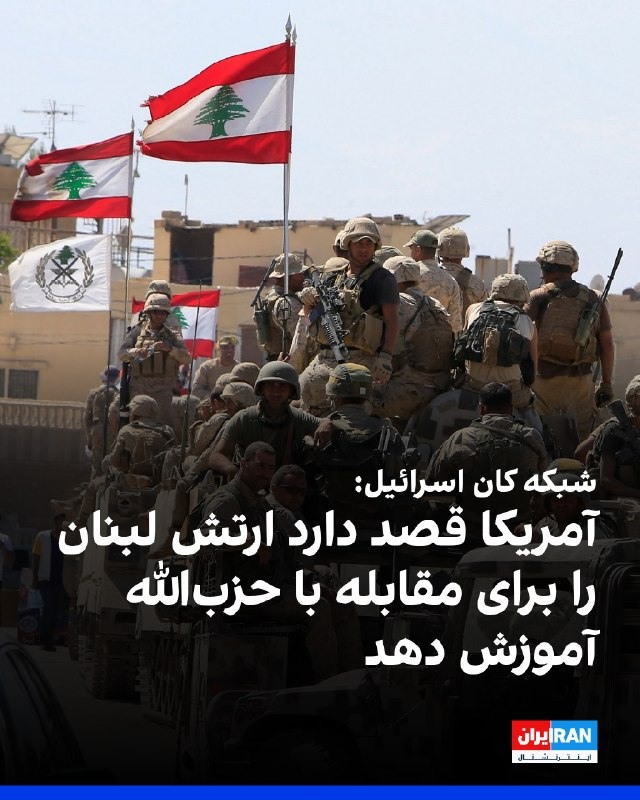

شبکه کان اسرائیل به نقل از منابع آگاه گزارش داد آمریکا در حال بررسی طرحی است که بر اساس آن ارتش لبنان را برای مقابله با حزب‌الله و در نهایت خلع سلاح این گروه آموزش دهد.

بر اساس این گزارش، این طرح از حمایت اسرائیل برخوردار است و در جریان گفت‌وگوهای هیات‌های اسرائیلی و لبنانی در واشینگتن برای دستیابی به یک توافق آتش‌بس پایدار و پیشبرد روند خلع سلاح حزب‌الله مطرح شده است.
https://iranintl.com/202606023965

## FarsiVOA — post 219403

دفاع مارکو روبیو در سنا از بودجه ۲۰۲۷ وزارت خارجه؛ جمهوری اسلامی محور پرسش سناتورها

## FarsiVOA — post 219402

مارکو روبیو، وزیر خارجه آمریکا در جلسه کمیته روابط خارجی سنا در پاسخ به سناتور بوکر گفت: «اینجا هیچ‌کس برای چیزی التماس نمی‌کند. این ایرانی‌ها هستند که ممکن است التماس کنند، چرا که اقتصادشان روزانه صدها میلیون دلار از دست می‌دهد.» او افزود: «نمی‌دانم این تصور را از کجا آورده‌اید که ایران قوی‌تر شده است.»

## alonews — post 124551

  <a href="telegram/content/alonews_124551_1780426455.webm" target="_blank">🎬 Download video</a>

👈فرهنگستان زبان فارسی: واژه مصوب قدیمی «دوگوشی» برای هدفون دیگر کاربردی نیست؛ پیشنهادهای جدید مانند «نیوشه»، «شنوه» و «آوایار» را بررسی می‌کنیم.

✅ @AloNews خبر جنگ

## alonews — post 124550

  <a href="telegram/content/alonews_124550_1780426455.webm" target="_blank">🎬 Download video</a>

🔴فوری/گزارش ها از درگیری شدید مرزی میان هند و پاکستان!

✅ @AloNews خبر جنگ

---
📅 بروزرسانی: 1405/03/12 22:14
---

## WithYashar — post 13284

گزارش زیاد شیراز صدای پدافند / انفجار 🚨
@withyashar

## pm_afshaa — post 92134

پرواز جنگنده های ارتش بر فراز تهران

💧 Rainbet.com the #1 Non-KYC Crypto Casino & Sportsbook @rainbetcom

😁 @Pm_Afshaa

## FarsiVOA — post 219401

رویا حسن‌آبادی، فعال حقوق دیجیتال در پاسخ سوال میدان در ارتباط با آینده اینترنت در ایران میگوید: ترس کاربران از قطع مجدد اینترنت آنها را در وضعیت انفعال قرار داده است

## Dirty_Kids — post 390856

  

‏این عکس دوا لیپا از روز عروسیش انگار توی راه‌پله یه محضر توی ستارخان گرفته شده!

@Dirty_Kids 👻

## Dirty_Kids — post 390855

  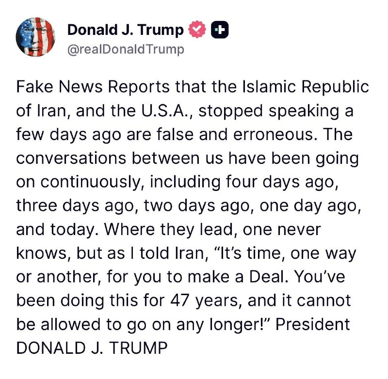

‏ترامپ الان:

گزارش‌ فیک نیوزها مبنی بر اینکه جمهوری اسلامی ایران و ایالات متحده آمریکا چند روز پیش گفت‌وگوهای خود را متوقف کرده‌اند، نادرست و گمراه‌کننده است.
گفت‌وگوهای میان ما به‌طور مداوم ادامه داشته است از چهار روز پیش، سه روز پیش، دو روز پیش، دیروز و همچنین امروز.
این گفت‌وگوها به کجا خواهد رسید، کسی نمی‌داند اما همان‌طور که به ایران گفتم: وقت آن رسیده است که، به هر شکل ممکن، یک توافق انجام دهید.
شما ۴۷ سال است که این روند را ادامه داده‌اید و دیگر نمی‌توان اجازه داد که بیش از این ادامه پیدا کند!

@Dirty_Kids 👻

---
📅 بروزرسانی: 1405/03/12 22:06
---

## VahidOOnLine — post 243399

  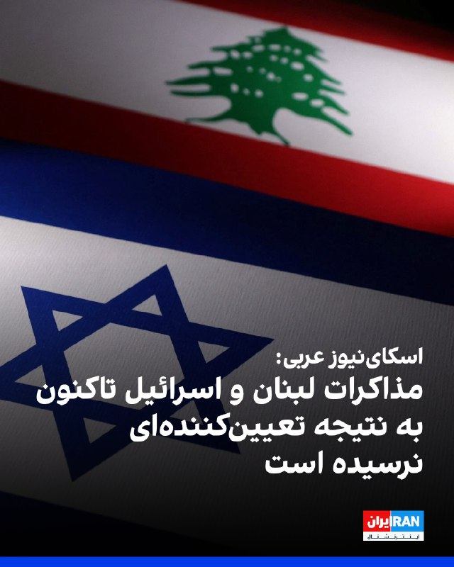

اسکای‌نیوز عربی به نقل از منابع لبنانی اعلام کرد هیات‌های لبنانی و اسرائیلی تاکنون نتوانسته‌اند به نقاط تعیین‌کننده‌ای در موضوع آتش‌بس دست پیدا کنند.
بر اساس این گزارش، هیات اسرائیلی بر حفظ آزادی عمل نظامی در صورت شناسایی هرگونه تهدید مرتبط با حزب‌الله تاکید دارد.
‌🏁 🇬🇧 IranintlTV

🤖 @VahidOOnLine

## VahidOOnLine — post 243398

  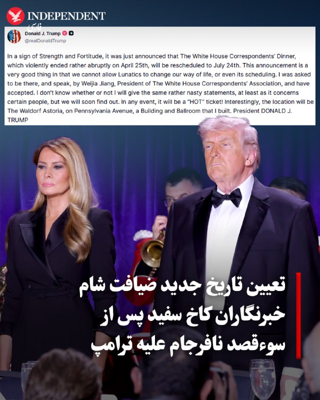

♦️ انجمن خبرنگاران کاخ سفید (WHCA) تاریخ جدید ضیافت سالانه خود را ۲۴ ژوئیه اعلام کرد. این تصمیم در حالی اتخاذ شده که مراسم پیشین در ۲۵ آوریل، در پی تلاش یک فرد مسلح به نام «کول آلن» برای ترور دونالد ترامپ، ناتمام مانده بود. در جریان آن حادثه، صدای تیراندازی باعث فرار میهمانان شد و یکی از ماموران سرویس مخفی از ناحیه قفسه سینه مورد اصابت گلوله قرار گرفت.

دونالد ترامپ با انتشار پیامی ضمن تایید حضور و سخنرانی خود در این مراسم، اعلام کرد که دعوت ویجیا جیانگ، رئیس این انجمن را پذیرفته است. ترامپ این اقدام را نشانه «قدرت و استقامت» دانست و تاکید کرد که نباید اجازه داد «افراد مجنون» شیوه زندگی یا برنامه‌ریزی‌های کشور را تغییر دهند. ترامپ اعلام کرد که این مراسم در هتل «والدروف آستوریا» که خود او ساخته است، برگزار خواهد شد.

ویجیا جیانگ، رئیس این انجمن، تاکید کرد که اجازه نخواهند داد یک اقدام خشونت‌آمیز حرف آخر را بزند. با این‌وجود او تاکید کرد که مراسم شامل فرآیندهای جدید دسترسی و تدابیر حفاظتی ویژه خواهد بود تا از تکرار حوادث خشونت‌آمیز جلوگیری شود.
‌🇸🇦 Indypersian

🤖 @VahidOOnLine

## VahidOOnLine — post 243397

⭕️لبنان و ایران در یک چرخه مشترک بحران

📌بقای جمهوری اسلامی زمینه‌ساز تداوم بحران‌های منطقه‌ای است

♦️لبنان امروز با پیامدهای خونین و ویرانگر جنگی روبرو است که خود آن را انتخاب نکرده است. این جنگ را رژیم جمهوری اسلامی بر پایه محاسبات و زمان‌بندی موردنظر خود، برگزید و اکنون نیز ممکن است بر اساس منافعش و در چارچوب مذاکره با واشنگتن، به آن پایان دهد. در عین حال، تهران نمی‌پذیرد که لبنان خود طرف مذاکره با واشنگتن باشد و بدین‌سان می‌کوشد سرنوشت این کشور را همچنان در انحصار خود نگه دارد.

نواف سلام، نخست‌وزیر لبنان، با صراحت اعلام کرد: «لبنان درگیر جنگی شده که خود آن را انتخاب نکرده است و ما نمی‌پذیریم کشورمان به صندوق پستی پیام‌های منطقه‌ای و بین‌المللی تبدیل شود.» نخست‌وزیر لبنان در این اظهارات به جمهوری اسلامی اشاره داشت؛ رژیمی که سال ۲۰۲۳ حزب‌الله را به ورود به آنچه «جنگ حمایت از غزه» می‌خواند، واداشت. آن هم در حالی که از پیامدهای ویرانگر این اقدام برای لبنان آگاه بود و می‌دانست این مداخله بر روند جنگ غزه تاثیر محسوسی نخواهد داشت.

در سال ۲۰۲۶ نیز تهران بار دیگر تصمیم گرفت که لبنان به صحنه «جنگ حمایت از جمهوری اسلامی» تبدیل شود؛ جنگی که با هدایت و نظارت افسران سپاه پاسداران مستقر در لبنان انجام شد. در نتیجه، لبنان بار دیگر بهای درگیری‌ را پرداخت که خود آغازگر آن نبود و در قالب ویرانی‌های گسترده‌تر، افزایش فشارهای امنیتی و تقویت موقعیت اسرائیل و دولت نتانیاهو نمود پیدا کرد.

در این نگاه، آنچه رخ داد نه به تقویت جایگاه لبنان انجامید و نه موازنه جنگ را تغییر داد، بلکه کشور را بیش‌ازپیش در معرض خسارت و بی‌ثباتی قرار داد.

در واقع، سرنوشت مردم ایران و لبنان به هم گره خورده و هر دو به‌عنوان قربانیان سیاست‌های جمهوری اسلامی و نیروهای شبه‌نظامی وابسته به آن شناخته می‌شوند. مردم ایران نیز در شکل‌گیری این تنش‌ها نقشی نداشتند و طی بیش از چهار دهه گذشته، هزینه‌های مستقیم و غیرمستقیم این سیاست‌ها را متحمل شده‌اند. همان‌گونه که رفتارهای تنش‌زا و سیاست‌های تهدیدآمیز جمهوری اسلامی تحریم‌ها و فشارهای اقتصادی را بر ایران تحمیل کرد، ادامه سیاست‌های مبتنی بر توسعه برنامه‌های هسته‌ای و موشکی و نیز حمایت از نیروهای شبه‌نظامی، بار دیگر به تشدید بحران‌ها و حتی بروز درگیری‌های نظامی انجامید و در نهایت آسیب بیشتری به اقتصاد کشور و معیشت مردم ایران وارد کرد.

سیاست‌های جمهوری اسلامی بار سنگینی بر دوش مردم ایران و لبنان گذاشته است. به‌گونه‌ای که پیامدهای آن زندگی و معیشت هر دو جامعه را به‌شدت تحت تاثیر قرار داده است. این دو ملت در مقاطع مختلف نه به‌عنوان بازیگران مستقل، بلکه به‌عنوان بخشی از محاسبات راهبردی این نظام دیده می‌شوند؛ نظامی که از ظرفیت‌ها و موقعیت آن‌ها در تعاملات و چانه‌زنی‌های خود با غرب بهره می‌گیرد و هدف نهایی‌اش حفظ بقا و گسترش دامنه نفوذ جمهوری اسلامی در منطقه است.

اسرائیل سال ۲۰۰۰ از لبنان خارج شد، اما در سال ۲۰۰۶، حزب‌الله با اقدام‌هایی تنش‌زا، زمینه‌ساز جنگ ویرانگر ۳۳ روزه شد. سپس همین روند در سال‌های ۲۰۲۴، ۲۰۲۵ و ۲۰۲۶ نیز تکرار شد و لبنان بار دیگر به صحنه درگیری‌هایی تبدیل شد که هزینه‌های سنگینی بر این کشور تحمیل کردند.

تصمیم اصلی جنگ و صلح در تهران اتخاذ می‌شود، نه در بیروت و حزب‌الله به‌عنوان ابزاری برای اجرای سیاست‌های منطقه‌ای جمهوری اسلامی عمل می‌کند. این گروه با ترجیح دادن اهداف راهبردی جمهوری اسلامی بر منافع لبنان، کشور را به میدان تسویه‌حساب‌های منطقه‌ای تبدیل کرده است و هزینه این سیاست را مردم لبنان با ویرانی، ناامنی و بحران‌های پی‌درپی پرداخته‌اند.

بحرانی که امروز لبنان با آن دست‌وپنجه نرم می‌کند، در واقع امتداد همان سیاستی است که جمهوری اسلامی از سال ۱۹۷۹ در پیش گرفته است. این نظام در حالی بخش قابل‌توجهی از منابع و ظرفیت‌های کشور را صرف پروژه‌های منطقه‌ای و حمایت از گروه‌های مسلح کرده است که مردم ایران طی دهه‌های گذشته با فقر، فشارهای اقتصادی و سرکوب اعتراضات مردمی مواجه بوده‌اند.

جمهوری اسلامی با حمایت مالی، تسلیحاتی و سیاسی از نیروهای نیابتی، خاورمیانه را بیش‌ازپیش در معرض تنش و بی‌ثباتی قرار داد و زمینه را برای گسترش دامنه درگیری‌ها و عملیات نظامی اسرائیل فراهم کرد. این رژیم با وجود شعارهای حمایت از فلسطین، از ورود مستقیم به جنگ پرهیز کرد و در عوض از جبهه‌ها و بازیگران دیگر منطقه برای اعمال فشار بهره گرفت؛ رویکردی که پیامدهای آن از پیش قابل پیش‌بینی بود و هزینه‌های سنگینی را بر کشورهای منطقه و ملت‌های آن تحمیل کرد.
‌🇸🇦 Indypersian

🤖 @VahidOOnLine

## pm_afshaa — post 92133

  <a href="telegram/content/pm_afshaa_92133_1780425372.webm" target="_blank">🎬 Download video</a>

🔴اسکای‌نیوز عربی: هیات‌های لبنانی و اسرائیلی تا الان نتونستن به نقاط تعیین‌کننده‌ای در موضوع آتش‌بس دست پیدا کنن.

💧 Rainbet.com the #1 Non-KYC Crypto Casino & Sportsbook @rainbetcom

😁 @Pm_Afshaa

## IranIntlTV — post 340255

  

اسکای‌نیوز عربی به نقل از منابع لبنانی اعلام کرد هیات‌های لبنانی و اسرائیلی تاکنون نتوانسته‌اند به نقاط تعیین‌کننده‌ای در موضوع آتش‌بس دست پیدا کنند.
بر اساس این گزارش، هیات اسرائیلی بر حفظ آزادی عمل نظامی در صورت شناسایی هرگونه تهدید مرتبط با حزب‌الله تاکید دارد.
https://iranintl.com/202606029401

## FarsiVOA — post 219400

🔺پرزیدنت ترامپ ویلیام پولت را به عنوان سرپرست اطلاعات ملی آمریکا منصوب کرد

◾️دونالد ترامپ، رئیس جمهوری ایالات متحده، روز سه‌شنبه ۱۲ خرداد ویلیام جی. پولت، مدیر «آژانس فدرال تأمین مالی مسکن» و رئیس هیئت مدیره شرکت‌های فنی‌می و فردی‌مک، را به عنوان سرپرست سازمان اطلاعات ملی آمریکا منصوب کرد.

⬇️ بیشتر بخوانید:

https://ir.voanews.com/a/president-trump-appoints-william-pulte-acting-director-of-national-intelligence/8156469.html

## Persian_Trend_Official — post 15532

  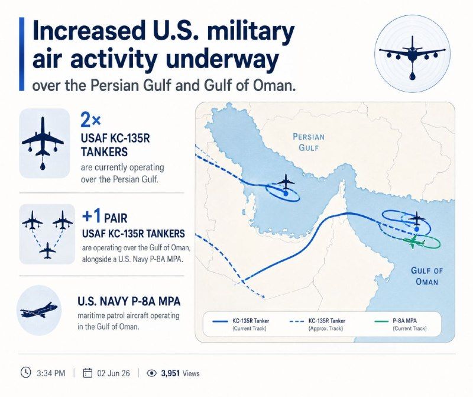

افزایش فعالیت هوایی نیروهای نظامی آمریکا:

در حال انجام بر فراز خلیج فارس و دریای عمان
۲ فروند تانکر سوخت‌رسان KC-135R نیروی هوایی آمریکا
در حال حاضر بر فراز خلیج فارس در حال عملیات هستند.
یک جفت دیگر از تانکرهای KC-135R نیروی هوایی آمریکا
بر فراز دریای عمان مشغول عملیات هستند و در کنار آن‌ها یک فروند هواپیمای گشت دریایی P-8A نیروی دریایی آمریکا نیز فعالیت می‌کند.
هواپیمای گشت دریایی P-8A نیروی دریایی آمریکا
در حال انجام مأموریت‌های گشت و پایش دریایی در دریای عمان است.

👺Phantom

📌 @persian_trend_official
پرشین ترند | متفاوت‌ترین کانال نظامی

## IranianMinds — post 21261

  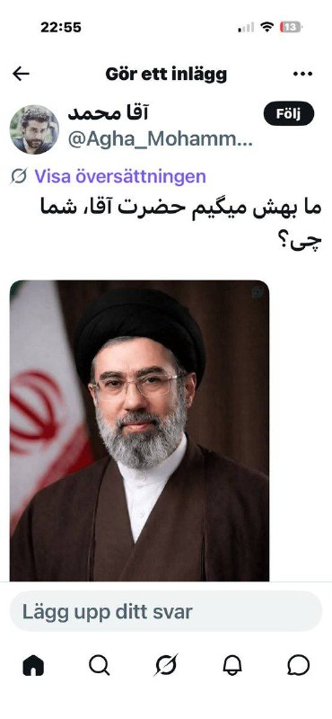

شما چی میگید ؟

@IranianMinds

## BBCPersian — post 282702

  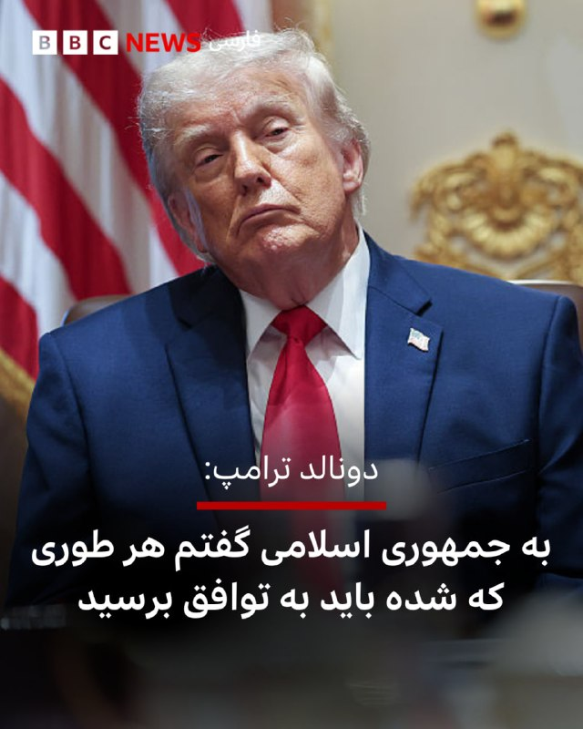

🔻دونالد ترامپ گزارش‌های برخی رسانه‌ها مبنی بر توقف گفت‌وگوها بین آمریکا و جمهوری اسلامی ایران را «جعلی و گمراه‌کننده» خواند.

رئیس‌جمهور آمریکا، در پستی در تروث‌سوشال، شبکه اجتماعی خود، نوشته است: «تماس‌ها و گفت‌وگوهای میان دو طرف به‌طور مستمر ادامه داشته است. از چهار روز پیش، سه روز پیش، دو روز پیش، دیروز و حتی امروز. اینکه این مذاکرات در نهایت به کجا خواهد انجامید، هنوز مشخص نیست، اما همان‌طور که به ایران گفته‌ام، زمان آن رسیده است که به هر شکل ممکن به توافق برسید.»

آقای ترامپ اضافه کرد که به مقام‌های جمهوری اسلامی گفته است:‌ « شما ۴۷ سال است که این روند را ادامه داده‌اید و دیگر نمی‌توان اجازه داد که این وضعیت بیش از این ادامه پیدا کند.»

پیشتر، مارکو روبیو، وزیر امور خارجه آمریکا، نیز تاکید کرده بود که گفت‌وگو با ایران ادامه دارد اما تضمینی وجود ندارد که به پایان جنگ منتهی شود.

📸Getty Images
@BBCPersian

## Dirty_Kids — post 390854

  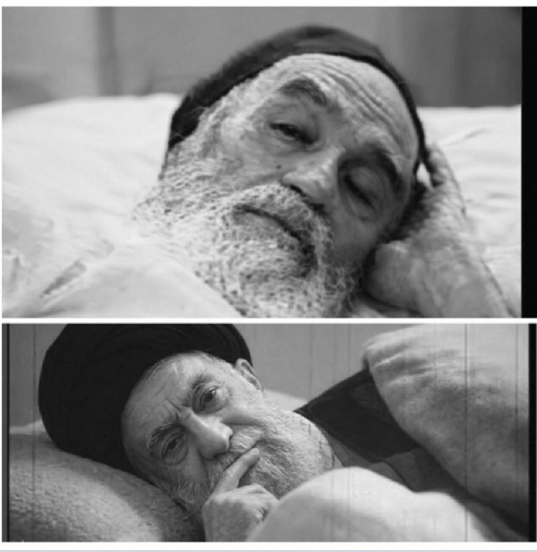

شب سال من هم رسید، نمیخوان چالت کنن؟!

@Dirty_Kids 👻

## Dirty_Kids — post 390853

  <a href="telegram/content/Dirty_Kids_390853_1780425377.mp4" target="_blank">🎬 Download video</a>

اعتماد به نفس اکسم:

@Dirty_Kids 👻

## Dirty_Kids — post 390852

  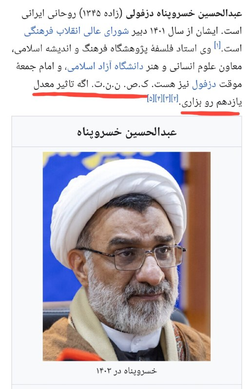

الان دیگه رسما سرنوشت حدود یک میلیون کنکوری افتاده دست خسرو ‌‌ @Dirty_Kids 👻

## alonews — post 124549

  <a href="telegram/content/alonews_124549_1780425379.webm" target="_blank">🎬 Download video</a>

👈گفتگوی تلفنی وزرای خارجه ایران و عربستان

✅ @AloNews خبر جنگ

## alonews — post 124548

  <a href="telegram/content/alonews_124548_1780425379.webm" target="_blank">🎬 Download video</a>

👈سخنگوی دولت : امتحانات نهایی دانش آموزان و داوطلبان آزاد ۱۳ تا ۲۳ تیرماه آغاز می شود

✅ @AloNews خبر جنگ

---
📅 بروزرسانی: 1405/03/12 21:53
---

## WithYashar — post 13283

## FoxNewsTwitter — post 342511

  

Fox News (Twitter/X)

NEW: President Trump confirms he will attend the rescheduled WHCA Dinner after an assassination attempt interrupted the original event:

"This announcement is a very good thing in that we cannot allow Lunatics to change our way of life, or even its scheduling."

"I was asked to be there, and speak, by Weijia Jiang, President of The White House Correspondents’ Association, and have accepted. I don’t know whether or not I will give the same rather nasty statements, at least as it concerns certain people, but we will soon find out. In any event, it will be a “HOT” ticket!"

## FoxNewsTwitter — post 342510

  

Fox News (Twitter/X)

WATCH LIVE: Rubio testifies on the State Department budget before House subcommittee https://twitter.com/i/broadcasts/1nGnRRbjjkBGO

## FoxNewsTwitter — post 342509

  <a href="telegram/content/FoxNewsTwitter_342509_1780424632.mp4" target="_blank">🎬 Download video</a>

Fox News (Twitter/X)

“Treating stupid is really hard.”

CMS Administrator Dr. Oz gives his medical advice for Americans suffering from "the very serious ailment" of Trump Derangement Syndrome.

## pm_afshaa — post 92132

مبارک باشه طبق آمار جدید 60 درصدمون زیر خط فقر قرار گرفتیم

## pm_afshaa — post 92131

  <a href="telegram/content/pm_afshaa_92131_1780424634.webm" target="_blank">🎬 Download video</a>

🔴یکی از رهبران حزب‌الله:
آتش‌بس باید مقدمه‌ای برای عقب‌نشینی اسرائیل از تمام سرزمین‌های لبنان باشه.

💧 Rainbet.com the #1 Non-KYC Crypto Casino & Sportsbook @rainbetcom

😁 @Pm_Afshaa

## DEJradio — post 5268

⭕️ ترامپ اخبار توقف مذاکره با جمهوری اسلامی را ساختگی خواند

دونالد ترامپ، گزارش‌ رسانه‌‌ها درمورد توقف گفت‌وگو با جمهوری اسلامی را رد کرد و آن‌ها را ساختگی خواند.
رئیس جمهوری آمریکا گفت گفت‌وگوها به‌طور مداوم ادامه دارد.
ترامپ شامگاه سه‌شنبه تأکید کرد واشینگتن چهار روز پیش، سه روز پیش، دو روز پیش، یک روز پیش و امروز نیز با تهران گفت‌وگو کرد.
ترامپ از سویی به جمهوری اسلامی هشدار داد که زمان توافق فرا رسیده است.
او در تروث سوشال نوشت به جمهوری اسلامی گفته زمان آن رسیده است که توافق «به هر طریق ممکن» انجام شود.
او افزود مشخص نیست مذاکرات به کجا برسد، اما ادامهٔ وضعیت کنونی هم ممکن نیست.
به گفتهٔ رئیس جمهوری آمریکا، رژیم حاکم ‌بر ایران ۴۷ سال این پرونده را به تعویق انداخته است.
ترامپ گفت دیگر نمی‌توان اجازه داد که این روند ادامه یابد.
در روزهای اخیر، گزارش‌هایی دربارهٔ توقف یا کند شدن روند مذاکرات منتشر شده بود.

#خبر #دژ #مذاکره
@DEJradio

## IranIntlTV — post 340254

  <a href="https://t.me/IranintlTV/340254" target="_blank">📎 Download file</a>

🎧نسخه صوتی تیتراول با نیوشا صارمی: تنش در لبنان؛ ترامپ توقف مذاکره را رد کرد؛ پشت‌پرده لحن تند او با نتانیاهو
@iranintlTV

## IranIntlTV — post 340253

  <a href="telegram/content/IranIntlTV_340253_1780424635.mp4" target="_blank">🎬 Download video</a>

مهدی مهدوی‌آزاد در برنامه «چشم‌انداز» گفت: «جمهوری اسلامی پس از مرگ علی خامنه‌ای در گرداب هرج‌ومرج سیاسی فرو رفته است. در چنین شرایطی، قوه قضاییه بار دیگر به دنبال مصادره اموال شهروندان است. این روند از سال ۱۳۵۷ و پس از انقلاب آغاز شد؛ زمانی که با گنجاندن اصولی در قانون اساسی، به این اقدامات ظاهری قانونی بخشیده شد.»
@iranintltv

## Shin_Persian — post 6411

  <a href="telegram/content/Shin_Persian_6411_1780424636.mp4" target="_blank">🎬 Download video</a>

Shin ✓ @hey_itsmyturn
Tue, 02 Jun 2026 18:06:19 UTC

Jet activity over Karaj
Alborz Province, #Iran

فارسی

فعالیت جنگنده‌ها در آسمان کرج
استان البرز، #Iran

𝕏 · @shin_persian

## FarsiVOA — post 219399

🔺تاکید سناتور گراهام بر لزوم توجه به شرط «عدم حمایت از گروه‌های تروریستی نیابتی» در توافق با رژیم ایران

▪️سناتور لیندسی گراهام روز سه‌شنبه ۱۲ خرداد، با انتشار پستی در رسانه اجتماعی ایکس تاکید کرد: «هرگونه توافق با جمهوری اسلامی باید به وضوح بیان کند که حمایت رژیم ایران از سازمان‌های تروریستی مانند حزب‌الله در آینده، منجر به تحریم‌های فلج‌کننده و سایر اقدامات تنبیهی خواهد شد.»

⬇️ بیشتر بخوانید:

https://ir.voanews.com/a/lindsey-graham-agreement-with-the-iranian-regime-no-support-for-proxy-terrorist-groups-iran/8156438.html/?nocach=1

## FarsiVOA — post 219398

مارکو روبیو، وزیر خارجه آمریکا در جلسه کمیته روابط خارجی سنا گفت که نشانه‌هایی وجود دارد مجتبی خامنه‌ای رهبر جدید جمهوری اسلامی در سطحی به شکل فزاینده‌ای در حال مشارکت در روند مذاکرات است، «اگرچه تمام ارتباطات او به صورت مکتوب و از طریق واسطه‌ها بوده است.» بخشی از پوشش ویژه صدای آمریکا با ترجمه همزمان مهرناز صمیمی

## FarsiVOA — post 219397

علیرضا منافی در میدان در ارتباط با بحران دسترسی آزاد به اینترنت می‌گوید: جمهوری اسلامی اینترنت رازمانی قطع کرد که مردم بیشترین نیاز را به آن داشتند

## DW_Farsi — post 125436

  

🔶 روبیو: نشانه‌هایی از مشارکت مجتبی خامنه‌ای در روند مذاکرات مشاهده کردیم

مارکو روبیو، وزیر امور خارجه ایالات متحده در تازه‌ترین نشست‌های پرسش و پاسخ کنگره آمریکا که تحت تاثیر تحولات جنگ ایران و چشم‌انداز مذاکرات تهران و واشنگتن قرار داشت، به پرسش‌های نمایندگان درباره روند دیپلماسی دولت ترامپ و آخرین وضعیت مذاکرات با تهران پاسخ داد.

روبیو در اظهارات خود مدعی شد، "مذاکره‌کنندگان آمریکایی نشانه‌هایی از مشارکت مجتبی خامنه‌ای، رهبر جدید ایران در روند مذاکرات مشاهده کرده‌اند، هرچند او تاکنون به‌صورت علنی ظاهر نشده است."

به گفته وزیر خارجه آمریکا، ارتباطات مربوط به این روند به شکل مکتوب و از طریق واسطه‌ها انجام شده و عدم حضور عمومی او با توجه به شرایط داخلی جمهوری اسلامی "قابل درک" است.

وزیر امور خارجه آمریکا همچنین از برخی پیشرفت‌ها در روند گفت‌وگوها سخن گفت و اظهار داشت، "ایران پذیرفته است درباره بخش‌هایی از برنامه هسته‌ای خود مذاکره کند که تا پیش از این، حاضر به طرح آنها نبود".

با این حال، او تاکید کرد، "این موضوع به معنای دستیابی قطعی به توافقی قابل قبول برای کنگره آمریکا نیست".

@dw_farsi

## Persian_Trend_Official — post 15531

  <a href="telegram/content/Persian_Trend_Official_15531_1780424638.webm" target="_blank">🎬 Download video</a>

یکی از خلبانان های F-15 ساقط شده در ایران خلبان یکی از F-15 های ساقط شده در کویت است!

یک مجله آمریکایی مدعی شده است که یکی از خدمه جنگنده F-15E Strike Eagle متعلق به نیروهای ایالات متحده که بر فراز ایران ساقط شد، خلبانی است که پیش‌تر نیز به عنوان خلبان یک جنگنده F-15 دیگر، بر فراز کویت توسط یک جنگنده F/A-18 Hornet در حادثه آتش خودی سرنگون شده بود.

📝 Amir

📌 @persian_trend_official
پرشین ترند | متفاوت‌ترین کانال نظامی

## IranianMinds — post 21260

🔴سازمان رادیو و تلویزیون اسرائیل:

آمریکا با ادامه حضور نظامی اسرائیل در جنوب لبنان موافقت کرد.

@IranianMinds

## BBCPersian — post 282701

  <a href="https://t.me/bbcpersian/282701" target="_blank">📎 Download file</a>

پادکست برنامه رادیویی جام جهان‌نما، سه‌شنبه ۱۲ خرداد ۱۴۰۵

این برنامه رادیویی را می‌توانید هر شب ساعت ۲۰ به وقت ایران، روی موج متوسط ۷۰۲ کیلوهرتز و موج کوتاه ۹۴۶۵ کیلوهرتز بشنوید.
تکرار برنامه را هم می‌توانید ساعت ۲۱:۳۰ روی موج متوسط ۷۰۲ کیلوهرتز و موج کوتاه ۵۳۹۵ کیلوهرتز گوش کنید.
@BBCPersian

## Hranews — post 113343

پس از تحمل ۱۷ سال حبس؛ یک زندانی زن از مجازات اعدام رهایی یافت

❗️
❗️
❗️
❗️
❗️– یک زندانی زن در خوزستان که پیشتر از بابت اتهام قتل به اعدام محکوم شده بود، پس از تحمل ۱۷ سال حبس، با کسب رضایت از اولیای دم، از مجازات مرگ رهایی یافت.

#اعدام

ادامه مطلب

↘️
@hranews_bot تماس ✉️ - @Hranews کانال هرانا 🆑

## Hranews — post 113342

گزارشی از معوقات مزدی، بیمه‌ای و اخراج کارگران پتروشیمی و شهرداری چابهار

❗️
❗️
❗️
❗️
❗️– شماری از کارکنان پتروشیمی چابهار از تداوم معوقات مزدی و تعدیل نیرو در این مجموعه خبر دادند. همچنین، کارگران شهرداری چابهار با اشاره به عدم پرداخت مطالبات مزدی و حق بیمه خود، خواستار رسیدگی به وضعیتشان شدند.

#چابهار

ادامه مطلب

↘️
@hranews_bot تماس ✉️ - @Hranews کانال هرانا 🆑

## alonews — post 124547

  <a href="telegram/content/alonews_124547_1780424639.webm" target="_blank">🎬 Download video</a>

👈یک املاکی دیگر جایگزین تولسی گابارد شد !

🔴پس از استعفای تولسی گابارد مدیر اطلاعات ملی امریکا ، بیل پالت مدیر آژانس فدرال تامین مالی مسکن (FHFA) از سوی ترامپ به عنوان سرپرست اداره اطلاعات ملی امریکا انتخاب شد.

✅ @AloNews خبر جنگ

## alonews — post 124546

  <a href="telegram/content/alonews_124546_1780424639.webm" target="_blank">🎬 Download video</a>

👈آزاده مختاری، خبرنگار: قدرت خرید مردم با سرعتی بی‌سابقه در حال سوختن است و مقامات با بهانه جویی درباره فقط جنگ ۱۴۰۴، واقعیت ۸ سال سیاست‌گذاری غلط را سانسور می‌کنند.

✅ @AloNews خبر جنگ

## alonews — post 124544

  <a href="telegram/content/alonews_124544_1780424639.webm" target="_blank">🎬 Download video</a>

👈آژانس بین‌المللی انرژی اتمی (IAEA) اعلام کرد که انعقاد هرگونه توافق با ایران بدون سازوکارهای دقیق راستی‌آزمایی و نظارت سخت‌گیرانه بر تأسیسات هسته‌ای، غیرمنطقی  است.

✅ @AloNews خبر جنگ

## alonews — post 124543

  <a href="telegram/content/alonews_124543_1780424640.webm" target="_blank">🎬 Download video</a>

👈 ترامپ: در نشانه‌ای از قدرت و استقامت، به تازگی اعلام شده است که شام خبرنگاران کاخ سفید که به طور ناگهانی و خشونت‌آمیز در ۲۵ آوریل به پایان رسید، به تاریخ ۲۴ ژوئیه موکول شده است.

🔴این اعلامیه خبر بسیار خوبی است زیرا نمی‌توانیم اجازه دهیم دیوانگان سبک زندگی ما یا حتی زمان‌بندی آن را تغییر دهند. از من خواسته شده بود که در آنجا حضور داشته باشم و سخنرانی کنم، توسط ویجیا جیانگ، رئیس انجمن خبرنگاران کاخ سفید، و من پذیرفته‌ام.

🔴نمی‌دانم آیا همان اظهارات نسبتاً تند را خواهم داشت، حداقل در مورد برخی افراد، اما به زودی خواهیم فهمید. به هر حال، این یک بلیت "داغ" خواهد بود!

🔴جالب است که مکان برگزاری، والدورف آستوریا در خیابان پنسیلوانیا خواهد بود، ساختمانی و سالن رقصی که من ساخته‌ام.

✅ @AloNews خبر جنگ

## alonews — post 124542

  <a href="telegram/content/alonews_124542_1780424640.mp4" target="_blank">🎬 Download video</a>

👈پرواز شبانه جنگنده‌های ارتش روی کرج، استان البرز

✅ @AloNews خبر جنگ

---
📅 بروزرسانی: 1405/03/12 21:34
---

## VahidOOnLine — post 243396

  

رافائل گروسی، مدیرکل آژانس بین‌المللی انرژی اتمی، در ابوظبی اعلام کرد بسیاری از فعالیت‌های هسته‌ای که در ایران در حال انجام بود، اکنون متوقف شده است.

او گفت ارزیابی از برنامه هسته‌ای ایران به‌طور بنیادین تغییر کرده، زیرا شرایط جنگی حاکم است و این برنامه هدف قرار گرفته است.

گروسی افزود قرار است نشست‌هایی برای بررسی درس‌های آموخته‌شده و نحوه آمادگی در آینده برگزار شود و مجموعه‌ای از فعالیت‌ها نیز برای تکمیل روند تعمیرات انجام خواهد شد.

او همچنین گفت مقام‌های امارات متحده عربی در واکنش به حمله به نیروگاه هسته‌ای براکه بسیار سریع عمل کردند و به دلیل از دست رفتن برق خارجی، یک راکتور را خاموش کردند. گروسی تاکید کرد این موضوع نشان می‌دهد عاملان این حمله دقیقا می‌دانسته‌اند چه می‌کنند.

مدیرکل آژانس تصریح کرد دستیابی به توافق برای پایان جنگ ایران بدون راستی‌آزمایی و نظارت بسیار قوی بر مفاد آن قابل تصور نیست. او افزود آژانس علاوه بر حمایت اخلاقی، حمایت فنی نیز به امارات ارائه می‌دهد.
‌🏁 🇬🇧 IranintlTV

🤖 @VahidOOnLine

## VahidOOnLine — post 243395

  <a href="telegram/content/VahidOOnLine_243395_1780423465.mp4" target="_blank">🎬 Download video</a>

یکی از مخاطبان ایران‌اینترنشنال گفت میان مردم ایران و جمهوری اسلامی «دریایی از خون فاصله است» و با اشاره به شرایط سخت زندگی افزود: «دوام بیاوریم تا از این شب سیاه بگذریم؛ نور بر تاریکی پیروز است.»

صدای او با هوش مصنوعی تغییر داده شده است.
‌🏁 🇬🇧 IranintlTV

🤖 @VahidOOnLine

## VahidOOnLine — post 243394

  

♦️ دونالد ترامپ، رئیس‌جمهوری آمریکا، در پیامی در شبکه اجتماعی «تروث سوشال»، گزارش‌ها مبنی بر توقف مذاکرات میان واشنگتن و تهران را تکذیب کرد. ترامپ با «جعلی» خواندن این اخبار، تاکید کرد که گفتگوها میان دو کشور به‌طور مستمر در جریان است و حتی در تمامی روزهای اخیر نیز ادامه داشته است.

او با اشاره به نامشخص بودن نتیجه این مذاکرات، تاکید کرد که در این مذاکرات پیام او به ایران واضح بوده است: «وقت آن رسیده که به هر شکلی توافق کنید؛ شما ۴۷ سال است که به این رویه ادامه داده‌اید و دیگر نمی‌توان اجازه داد این وضع تداوم یابد.»
‌🇸🇦 Indypersian

🤖 @VahidOOnLine

## WithYashar — post 13282

بریم برای سوال و جواب، هر سوالی دارین توی متن کامل بنویسین و دایرکت کنین، فقط در یک پیام.

## FoxNewsTwitter — post 342508

  <a href="telegram/content/FoxNewsTwitter_342508_1780423469.mp4" target="_blank">🎬 Download video</a>

Fox News (Twitter/X)

BREAKING: Dr. Oz reveals why President Trump gets so many medical check-ups from his team of doctors:

REPORTER: "If the president is in such perfect health, why does he keep going back in for checkups?"

DR. OZ: "I think he likes the results. He does really well. He aces the test every single day. I do actually believe that he is curious to make sure everything is going in the right direction."

"He's a very meticulous person in so many ways that are often under appreciated. But for him to want to know all the numbers and keep on top of him, it's the same reason he calls people at you know, odd hours because something's on his mind. He wants to deal with it."

## pm_afshaa — post 92130

🔴سازمان رادیو و تلویزیون اسرائیل:آمریکا با ادامه حضور نظامی اسرائیل در جنوب لبنان موافقت کرد

💧 Rainbet.com the #1 Non-KYC Crypto Casino & Sportsbook @rainbetcom

😁 @Pm_Afshaa

## pm_afshaa — post 92129

♨️
♨️
♨️

## pm_afshaa — post 92128

#مهم
عزیزای دلم همگی الان چنل زاپاس‌مون رو جوین بشید کانال تحت ریپورت شدیده اگه چیزی شد زاپاس رو داشته باشید فعالیت میاد اونور
👇

https://t.me/pmtvzapas
https://t.me/pmtvzapas

## IranIntlTV — post 340252

  

رافائل گروسی، مدیرکل آژانس بین‌المللی انرژی اتمی، در ابوظبی اعلام کرد بسیاری از فعالیت‌های هسته‌ای که در ایران در حال انجام بود، اکنون متوقف شده است.

او گفت ارزیابی از برنامه هسته‌ای ایران به‌طور بنیادین تغییر کرده، زیرا شرایط جنگی حاکم است و این برنامه هدف قرار گرفته است.

گروسی افزود قرار است نشست‌هایی برای بررسی درس‌های آموخته‌شده و نحوه آمادگی در آینده برگزار شود و مجموعه‌ای از فعالیت‌ها نیز برای تکمیل روند تعمیرات انجام خواهد شد.

او همچنین گفت مقام‌های امارات متحده عربی در واکنش به حمله به نیروگاه هسته‌ای براکه بسیار سریع عمل کردند و به دلیل از دست رفتن برق خارجی، یک راکتور را خاموش کردند. گروسی تاکید کرد این موضوع نشان می‌دهد عاملان این حمله دقیقا می‌دانسته‌اند چه می‌کنند.

مدیرکل آژانس تصریح کرد دستیابی به توافق برای پایان جنگ ایران بدون راستی‌آزمایی و نظارت بسیار قوی بر مفاد آن قابل تصور نیست. او افزود آژانس علاوه بر حمایت اخلاقی، حمایت فنی نیز به امارات ارائه می‌دهد.
https://iranintl.com/202606027114

## IranIntlTV — post 340251

  <a href="telegram/content/IranIntlTV_340251_1780423472.mp4" target="_blank">🎬 Download video</a>

یکی از مخاطبان ایران‌اینترنشنال گفت میان مردم ایران و جمهوری اسلامی «دریایی از خون فاصله است» و با اشاره به شرایط سخت زندگی افزود: «دوام بیاوریم تا از این شب سیاه بگذریم؛ نور بر تاریکی پیروز است.»

صدای او با هوش مصنوعی تغییر داده شده است.

## IranIntlTV — post 340250

اکسیوس به نقل از یک منبع آگاه گزارش داد مقام‌های آمریکایی به بری گفته‌اند تصور نمی‌کنند نتانیاهو با چنین طرحی موافقت کند

گفت‌وگو با اردوان روزبه و بابک اسحاقی، خبرنگارهای ایران‌اینترنشنال
@iranintltv

## FarsiVOA — post 219396

🔺ارتش اسرائیل خبر داد:کشته شدن یک فرمانده دیگر حماس در غزه

▪️ارتش اسرائیل اعلام کرد: «یوسف عایش عواد رمضان، تروریست عضو حماس که در جنایت ربودن شهروندان اسرائیلی در هفتم اکتبر شرکت داشت، در غزه کشته شد.»

⬇️ بیشتر بخوانید:

https://ir.voanews.com/a/hamas-commander-yusuf-ramadan-israel/8156477.html/?nocach=1

## FarsiVOA — post 219395

🔺وصیت‌نامه عرفان شکورزاده، نخبه اعدام‌شده: ترسی از مرگ ندارم؛ به زودی ایران‌مان آزاد خواهد شد

▪️عرفان شکورزاده، دانشجوی نخبه رشته هوافضای دانشگاه علم‌و‌صنعت که ۲۱ اریبهشت ۱۴۰۵، توسط جمهوری اسلامی به اتهام واهی جاسوسی اعدام شد در وصیت‌نامه‌ای به برادرش از او خواسته تا به یادش و برای رشد و شکوفایی علمی فرزندان ایران یک «بنیاد علمی» بنا شود.

⬇️ بیشتر بخوانید:

https://ir.voanews.com/a/erfan-shakurzadeh-elite-forced-confession-will-execution/8156491.html/?nocach=1

## FarsiVOA — post 219394

پیام تازه آمریکا به عراق؛ خلع سلاح روی کاغذ کافی نیست

## DW_Farsi — post 125435

  

🔶 آغاز مذاکرات حساس و فشرده میان اسرائیل و لبنان در آمریکا

در حالی که درگیری‌ها میان اسرائیل و حزب‌الله همچنان ادامه دارد، مذاکرات حساس و فشرده میان اسرائیل و لبنان در وزارت امور خارجه آمریکا آغاز شد.

مایک نیدهام، معاون جدید مشاور امنیت ملی آمریکا، رهبری این دور از گفتگوها که با حضور سفیران اسرائیل و لبنان در ایالات متحده برگزار می‌شود را برعهده دارد.

آغاز این گفت‌وگوها در حالی است که رسانه‌های دولتی ایران اعلام کردند، جمهوری اسلامی به دلیل اقدامات بنیامین نتانیاهو، نخست‌وزیر اسرائیل در لبنان، مذاکرات صلح با آمریکا را به حالت تعلیق درآورده است.

با این حال، خبرگزاری سی‌ان‌ان اعلام کرده است،روز سه‌شنبه دوم ژوئن (۱۲ خرداد) سیگنال‌هایی از ایران مبنی بر اینکه گفت‌وگوها میان تهران و واشنگتن همچنان در جریان است، فرستاده شده است.

گفت‌وگوهای حساس میان اسرائیل و لبنان همچنین در حالی آغاز شده است که سفارت لبنان در واشنگتن با صدور بیانیه‌ای اعلام کرد، "مقامات لبنانی تاییدیه موافقت حزب‌الله با طرح پیشنهادی آمریکا برای برقراری آتش‌بس با اسرائیل را دریافت کرده‌اند".

@dw_farsi

## Persian_Trend_Official — post 15530

  <a href="telegram/content/Persian_Trend_Official_15530_1780423475.mp4" target="_blank">🎬 Download video</a>

خبرنگار: اگر رئیس جمهور ترامپ از سلامت کامل برخوردار است، چرا مدام برای معاینات پزشکی مراجعه می‌کند؟

دکتر آز: او از نتایج راضی است. او واقعاً خوب عمل می‌کند. او هر روز در آزمایش‌ها عالی عمل می‌کند.

📝 Amir

📌 @persian_trend_official
پرشین ترند | متفاوت‌ترین کانال نظامی

## alonews — post 124541

  <a href="telegram/content/alonews_124541_1780423477.webm" target="_blank">🎬 Download video</a>

👈سازمان رادیو و تلویزیون اسرائیل:
آمریکا با ادامه حضور نظامی اسرائیل در جنوب لبنان موافقت کرد

✅ @AloNews خبر جنگ

## alonews — post 124540

  <a href="telegram/content/alonews_124540_1780423477.webm" target="_blank">🎬 Download video</a>

👈خبرنگار وال استریت ژورنال: چیزی که ایرانی‌ها گفتند این بود که دیگر پیشنهاد رد و بدل نمی‌کنند. کاملاً مشخص بود که میانجیگری ادامه دارد. بنابراین اینجا تناقض مستقیمی وجود ندارد

✅ @AloNews خبر جنگ

## alonews — post 124539

  <a href="telegram/content/alonews_124539_1780423477.webm" target="_blank">🎬 Download video</a>

👈شبکه کان به نقل از یک مقام اسرائیلی:
تل‌آویو به دلیل فشار آمریکا انتظار حمله به بیروت را ندارد، با این حال تأکید کرد که ارتش اسرائیل از "منطقه امنیتی" که اسرائیل در داخل مرزهای لبنان در آن نفوذ کرده، خارج نمی‌شود.

✅ @AloNews خبر جنگ

---
📅 بروزرسانی: 1405/03/12 21:24
---

## FoxNewsTwitter — post 342507

  <a href="telegram/content/FoxNewsTwitter_342507_1780422847.mp4" target="_blank">🎬 Download video</a>

Fox News (Twitter/X)

NOW: CMS Administrator Dr. Oz gives his review of every other administration official who has filled in behind the podium while Karoline Leavitt is on maternity leave:

"I think Scott Bessent's dry humor is fabulous. Marco is just an earnestly funny person.”

“I think JD was spectacular, he's just very on his game, understands the issues, and he understands the American people, which I appreciated his presentation so much."

## pm_afshaa — post 92127

  <a href="telegram/content/pm_afshaa_92127_1780422849.webm" target="_blank">🎬 Download video</a>

🔴آکسیوس به نقل از یک مقام آمریکایی:
ترامپ احساس میکنه نتانیاهو کنترل خودش رو از دست داده.

💧 Rainbet.com the #1 Non-KYC Crypto Casino & Sportsbook @rainbetcom

😁 @Pm_Afshaa

## IranIntlTV — post 340249

  <a href="telegram/content/IranIntlTV_340249_1780422850.mp4" target="_blank">🎬 Download video</a>

مارکو روبیو، وزیر خارجه آمریکا، برای نخستین بار از زمان آغاز جنگ ایران برای ادای شهادت در کنگره حاضر شد. محور رسمی جلسه بودجه سالانه وزارت خارجه است، اما تمرکز اصلی بر جنگ و آتش‌بس تهران و واشینگتن بود.

مرضیه حسینی، خبرنگار ایران‌اینترنشنال، گزارش می‌دهد
@iranintltv

## FarsiVOA — post 219393

  <a href="telegram/content/FarsiVOA_219393_1780422853.mp4" target="_blank">🎬 Download video</a>

احسان خاندوزی، وزیر پیشین اقتصاد جمهوری اسلامی، در صداوسیمای جمهوری اسلامی، با تایید اثرگذاری محاصره دریایی گفت آمریکا در پی آن است که از این مسیر «یک فشار جدید» علیه جمهوری اسلامی ایجاد کند.

او با اذعان به اینکه «واقعاً محدودیت‌هایی در حوزه نفتی و تجاری» به جمهوری اسلامی وارد شده، هشدار داد که اگر محاصره دریایی باعث عقب‌نشینی جمهوری اسلامی شود، این مسئله «تا سال‌های سال گریبان کشور را خواهد گرفت.»

## RadioFarda — post 157828

  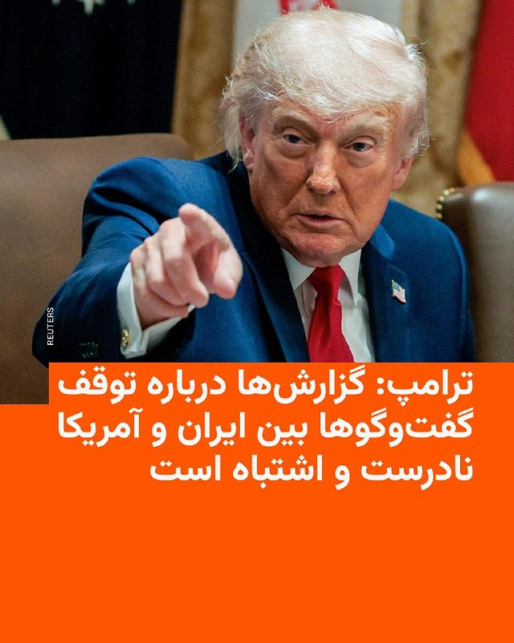

🔸رئیس‌جمهور ایالات متحده روز سه‌شنبه ۱۲ خرداد گزارش‌های برخی رسانه‌ها در مورد متوقف شدن گفت‌وگوها بین ایران و آمریکا را «نادرست» و «اشتباه» خواند.

🔸دونالد ترامپ در پیامی در شبکهٔ اجتماعی خود، تروث سوشال، نوشت: «گزارش‌های جعلی رسانه‌ای مبنی بر این‌که جمهوری اسلامی ایران و ایالات متحده آمریکا چند روز پیش گفت‌وگوها را متوقف کرده‌اند، نادرست و اشتباه است».

🔸به گفته او، «گفت‌وگوهای ما به‌طور مستمر ادامه داشته، از جمله چهار روز پیش، سه روز پیش، دو روز پیش، یک روز پیش و امروز».

🔸رئیس‌جمهور آمریکا می‌گوید: این‌که این گفت‌وگوها به کجا خواهد انجامید، کسی نمی‌داند، اما همان‌طور که به ایران گفته‌ام: «زمان آن رسیده است که به هر شکلی که شده، به یک توافق برسید. شما ۴۷ سال است که این روند را ادامه می‌دهید و دیگر نمی‌توان اجازه داد بیش از این ادامه پیدا کند!»

@RadioFarda

## IranianMinds — post 21257

  <a href="telegram/content/IranianMinds_21257_1780422857.mp4" target="_blank">🎬 Download video</a>

🔴ارتش اسرائیل، یوسف عارش عواد رمضان را که در کشتار ۷ اکتبر مشارکت داشت را به هلاکت رساند.

@IranianMinds

## BBCPersian — post 282698

ماهواره‌های تلویزیون بی‌بی‌سی فارسی در روزهای آینده به تدریج تغییراتی خواهد داشت.

یوتل‌ست طول موج ۱۱۳۰۴ از ۱۵ خرداد، هاتبرد ترنسپوندر ۸۹ از ۴ تیر و یاه‌ست ترنسپوندر ۱۴ از ۱۰ تیر در دسترس نخواهد بود.

در روزهای آینده به تدریج می‌توانید به ماهواره‌های اصلی بی‌بی‌سی فارسی منتقل شوید:
یاه‌ست ۵۲/۵ شرقی فرکانس ۱۱۹۹۶ ترنسپوندر ۱۵ پولاریزاسیون عمودی
هات‌برد ۱۳ شرقی فرکانس ۱۱۷۲۷ ترنسپوندر ۵۰ پولاریزاسیون عمودی
@BBCPersian

## alonews — post 124538

  <a href="telegram/content/alonews_124538_1780422858.webm" target="_blank">🎬 Download video</a>

👈المیادین به نقل از منابع آگاه: هیئت لبنانی جلسه را با تأکید بر لزوم دستیابی به آتش‌بس جامع آغاز کرد.

🔴مذاکرات شامل پرونده‌های مختلف و مفاهیم مرجع مرتبط با سازوکار آتش‌بس و تثبیت آن می‌شود.

🔴تخمین ما این است که مذاکرات امروز به نتیجه قطعی منجر نخواهد شد و احتمالاً مذاکرات فردا ادامه می‌یابد.

🔴در طول جلسه، ایده‌ها و راهکارهای عملی از سوی طرف لبنانی و «اسرائیلی» و همچنین پیشنهادهایی از میانجی آمریکایی درباره آتش‌بس مطرح شد.

🔴 یک جدیت آشکار و یک تلاش واقعی آمریکایی برای دستیابی به تثبیت کامل و پایدار آتش‌بس وجود دارد.

✅ @AloNews خبر جنگ

## alonews — post 124537

  <a href="telegram/content/alonews_124537_1780422859.webm" target="_blank">🎬 Download video</a>

👈بی‌بی‌سی‌ : ترامپ به پایان جنگ ایران نیاز دارد، اما تهران عقب‌نشینی نمی‌کند

✅ @AloNews خبر جنگ

---
📅 بروزرسانی: 1405/03/12 21:14
---

## VahidOOnLine — post 243393

  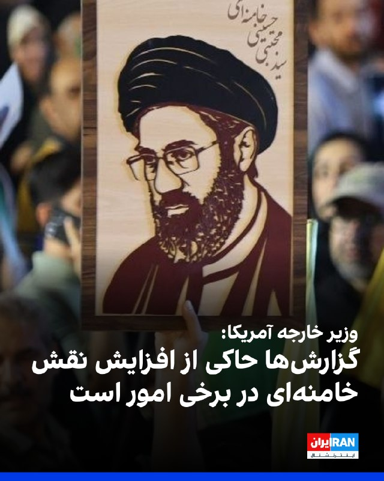

مارکو روبیو، وزیر خارجه آمریکا، سه‌شنبه ۱۲ خرداد در سنای این کشور گفت نشانه‌هایی وجود دارد که مجتبی خامنه‌ای، رهبر جمهوری اسلامی، پس از زخمی شدن در آغاز جنگ، «به‌طور فزاینده‌ای در سطحی درگیر امور شده است».

او گفت: «ما او را در انظار عمومی ندیده‌ایم و فکر می‌کنم با توجه به اتفاقی که برای چند مقام ارشد نظام افتاده، احتمالا به آنها توصیه نمی‌شود حضور علنی گسترده داشته باشند.»

روبیو گفت: «با این حال، فکر می‌کنم نشانه‌هایی وجود دارد که او به‌تدریج، دست‌کم تا حدی، در امور دخیل‌ می‌شود، هرچند همه تماس‌های او مکتوب و از طریق واسطه‌ها بوده است.»
‌🏁 🇬🇧 IranintlTV

🤖 @VahidOOnLine

## WithYashar — post 13281

  <a href="telegram/content/WithYashar_13281_1780422252.mp4" target="_blank">🎬 Download video</a>

نتانیاهو: «موساد همچنان در خط مقدم نیزه در نبرد ما علیه تجاوز ایران باقی خواهد ماند.

ما اجازه نخواهیم داد رژیم ایران چرخ تاریخ را به عقب برگرداند. ما اجازه نخواهیم داد به سلاح هسته‌ای دست پیدا کند. ما اجازه نخواهیم داد موجودیت ما را تهدید کند.

این رژیم محکوم به زوال که پایانش فرا خواهد رسید و ما به رسیدن آن به این سرنوشت کمک خواهیم کرد.

این رژیم دیگر باز نخواهد گشت تا ما را با بمب‌های هسته‌ای و هزاران موشک بالستیک مرگبار تهدید کند.
این دستور من است و این مأموریت شماست، رومن.»
@withyashar

## mwarmonitor — post 10038

🔴 رسانه‌های آمریکایی: سازمان اطلاعات مرکزی آمریکا (CIA) مشارکت خود را در برخی از ارزیابی‌های اطلاعاتی دفتر مدیر اطلاعات ملی آمریکا متوقف کرده است؛ از جمله ارزیابی‌هایی که به جنگ ایران مربوط می‌شود. این اقدام در پی اختلافی یک‌ساله میان دو نهاد بر سر دامنه کار و حدود وظایف انجام شده است.

@mwarmonitor

## FoxNewsTwitter — post 342506

  <a href="telegram/content/FoxNewsTwitter_342506_1780422254.mp4" target="_blank">🎬 Download video</a>

Fox News (Twitter/X)

NEW: Dr. Oz says some of the most important people helping expose Medicare fraud are industry insiders who know exactly how the system can be manipulated — and are willing to speak up when they see abuse.

"We benefit from whistleblowers. Our most important whistleblowers have been members of industry who know the game, know how you can cheat it if you're unethical. And they point out to us when these problems occur."

"We do not want to hurt the folks who are earnestly involved in hospice and durable medical equipment suppliers... but we're going to slow down the growth of these sectors so we can get our arms around the problem, because it is of massive magnitude to us."

## FoxNewsTwitter — post 342505

  <a href="telegram/content/FoxNewsTwitter_342505_1780422256.mp4" target="_blank">🎬 Download video</a>

Fox News (Twitter/X)

BREAKING: CMS Administrator Dr. Mehmet Oz announces a massive expansion to the TrumpRx program, adding 160 more medications to the platform, pushing the total to over 750 drugs.

"We are adding 160 more drugs to this site. Now, the site already has 700 or so or 600 or so, drugs. So it's going to take it over 750 total.”

“But that is an important number for other reasons. It means the four out of five medications that are picked up by Americans going into that same drug store that I mentioned earlier, now have the opportunity to double check that the price they're getting in that drugstore, wherever they're buying it from, is the best price out there."

## pm_afshaa — post 92126

  <a href="telegram/content/pm_afshaa_92126_1780422258.webm" target="_blank">🎬 Download video</a>

🔴سنتکام: ناو هواپیمابر آبراهام لینکلن در حال عبور از دریای عرب، به حمایت از محاصره آمریکا علیه ایران ادامه میده.

همچنین نیروهای آمریکایی تاکنون مسیر 122 کشتی تجاری رو برای اجرای این محاصره تغییر دادن.

💧 Rainbet.com the #1 Non-KYC Crypto Casino & Sportsbook @rainbetcom

😁 @Pm_Afshaa

## pm_afshaa — post 92125

  <a href="telegram/content/pm_afshaa_92125_1780422259.webm" target="_blank">🎬 Download video</a>

🔴زلنسکی: ممکنه حمله عظیم روسیه به اوکراین همین امشب رخ بده. 
💧 Rainbet.com the #1 Non-KYC Crypto Casino & Sportsbook @rainbetcom 
😁 @Pm_Afshaa

## pm_afshaa — post 92124

  <a href="telegram/content/pm_afshaa_92124_1780422259.webm" target="_blank">🎬 Download video</a>

🔴زلنسکی: ممکنه حمله عظیم روسیه به اوکراین همین امشب رخ بده.

💧 Rainbet.com the #1 Non-KYC Crypto Casino & Sportsbook @rainbetcom

😁 @Pm_Afshaa

## IranIntlTV — post 340248

  

مارکو روبیو، وزیر خارجه آمریکا، سه‌شنبه ۱۲ خرداد در سنای این کشور گفت نشانه‌هایی وجود دارد که مجتبی خامنه‌ای، رهبر جمهوری اسلامی، پس از زخمی شدن در آغاز جنگ، «به‌طور فزاینده‌ای در سطحی درگیر امور شده است».

او گفت: «ما او را در انظار عمومی ندیده‌ایم و فکر می‌کنم با توجه به اتفاقی که برای چند مقام ارشد نظام افتاده، احتمالا به آنها توصیه نمی‌شود حضور علنی گسترده داشته باشند.»

روبیو گفت: «با این حال، فکر می‌کنم نشانه‌هایی وجود دارد که او به‌تدریج، دست‌کم تا حدی، در امور دخیل‌ می‌شود، هرچند همه تماس‌های او مکتوب و از طریق واسطه‌ها بوده است.»
https://iranintl.com/202606025183

## IranIntlTV — post 340247

  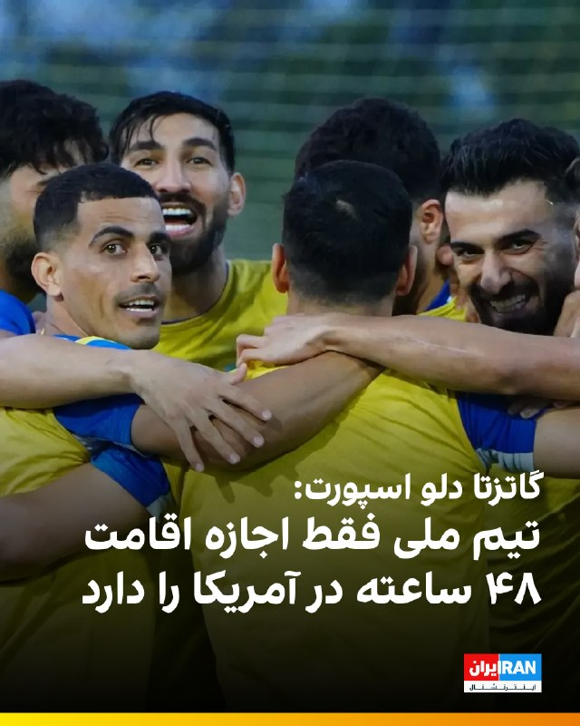

🔻گاتزتا دلو اسپورت گزارش داد که تیم ملی فوتبال در جام جهانی ۲۰۲۶، در هر بار ورود به آمریکا، فقط ۴۸ ساعت در این کشور حضور خواهد داشت. پس از تمایل نداشتن آمریکا به میزبانی از ایران، کمپ اصلی تیم ملی به تیخوانای مکزیک منتقل شد و این تیم تنها برای برگزاری مسابقات به آمریکا سفر می‌کند.

🔹این روزنامه ایتالیایی معتقد است که فدراسیون فوتبال ایران با انتخاب تیخوانای مکزیک، «ترامپ را دور زده است».

گاتزتا دلو اسپورت در این‌باره می‌نویسد:
🔹ماجرا از آنجا آغاز شد که دونالد ترامپ، رئیس‌جمهوری آمریکا، در اسفند گذشته با انتشار پیامی در شبکه‌های اجتماعی اعلام کرد که تیم ملی ایران «به جام جهانی خوش‌آمده است»، اما حضور این تیم در آمریکا را برای امنیت خود ایران مناسب نمی‌داند.

🔹فدراسیون فوتبال ایران درخواست کرد سه مسابقه این تیم که قرار است در لس‌آنجلس و سیاتل برگزار شود، به مکزیک منتقل شود، اما فیفا موافقت نکرد.

🔹در عوض، کمپ اصلی تیم ملی از آریزونا به تیخوانا در مکزیک منتقل شد. آمریکایی‌ها از حضور دائمی تیم ملی در خاک خود رضایت نداشتند.

@iranintltvsport

## Shin_Persian — post 6410

نسخه جدید SNI Spoofing (زبان rust) به همراه رابط گرافیکی منتشر شد. MacOS / Linux / Windows دریافت: GitHub (آموزش فارسی هم هست) [خیر، امکان انتشار نسخه اندروید با توجه به اینکه اغلب کاربران روت نیستن تقریبا ممکن نیست، می تونید روی کامپیوتر اجرا کنید و روی…

## FarsiVOA — post 219392

  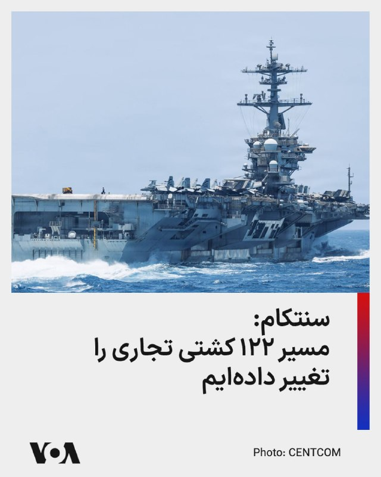

ستاد فرماندهی مرکزی ایالات متحده آمریکا، سنتکام، اعلام کرد در جریان اجرای محاصره دریایی آمریکا علیه جمهوری اسلامی، تاکنون مسیر ۱۲۲ کشتی تجاری را تغییر داده است.

سنتکام این به‌روزرسانی را در شبکه اجتماعی ایکس همراه با تصویری از ناو هواپیمابر «یو‌اس‌اس آبراهام لینکلن» در دریای عرب منتشر کرده است.

ایالات متحده از اواخر فروردین ۱۴۰۵، محاصره دریایی علیه جمهوری اسلامی ایران را در واکنش به اقدام رژیم ایران در بستن تنگه هرمز آغاز کرده است.

## Persian_Trend_Official — post 15529

  <a href="telegram/content/Persian_Trend_Official_15529_1780422262.webm" target="_blank">🎬 Download video</a>

کانال 12 اسرائیل جزئیاتی از تماس محرمانه ترامپ و نتانیاهو درباره بیروت منتشر کرد.

شبکه 12 اسرائیل گزارش داد چند روز پیش یک تماس محرمانه میان دونالد ترامپ و بنیامین نتانیاهو انجام شد که در آن دو طرف توافق کردند اسرائیل تنها به‌عنوان یک تهدید، هشدار تخلیه برای منطقه ضاحیه بیروت صادر کند و قصدی برای اجرای حمله نداشته باشد.

هدف از این اقدام، افزایش فشار بر حزب‌الله برای توقف حملات و همچنین تحت فشار قرار دادن دولت لبنان عنوان شده است. شمار محدودی از مقامات ارشد اسرائیلی نیز در جریان این توافق قرار گرفته بودند.

براساس این گزارش، دولت ترامپ بعداً به این نتیجه رسید که نتانیاهو پس از اظهارات خود و وزیر دفاع اسرائیل، در تلاش است تهدید مورد توافق را به یک طرح واقعی برای حمله به بیروت تبدیل کند.

گفته می‌شود واشنگتن برای جلوگیری از این حملات وارد عمل شد و این موضوع به یک تماس تلفنی پرتنش میان ترامپ و نتانیاهو منجر شد؛ به‌ویژه پس از تهدیدهای مطرح‌شده علیه شمال اسرائیل.

ساعاتی بعد، نتانیاهو در بیانیه‌ای اعلام کرد که به ترامپ گفته است در صورت ادامه حملات حزب‌الله به غیرنظامیان و شهرهای اسرائیل، بیروت هدف حمله قرار خواهد گرفت.

طبق این گزارش، این بیانیه موجب خشم ترامپ شد و به دومین تماس پرتنش میان دو رهبر انجامید. همچنین برخی مقامات امنیتی اسرائیل از این بیانیه انتقاد کرده و معتقد بودند که چنین موضعی این برداشت را ایجاد می‌کند که حمله به نیروهای نظامی با حمله به غیرنظامیان متفاوت تلقی می‌شود؛ پیامی که به باور آن‌ها در نهایت به سود حزب‌الله تمام خواهد شد.

📝 Amir

📌 @persian_trend_official
پرشین ترند | متفاوت‌ترین کانال نظامی

## IranianMinds — post 21256

  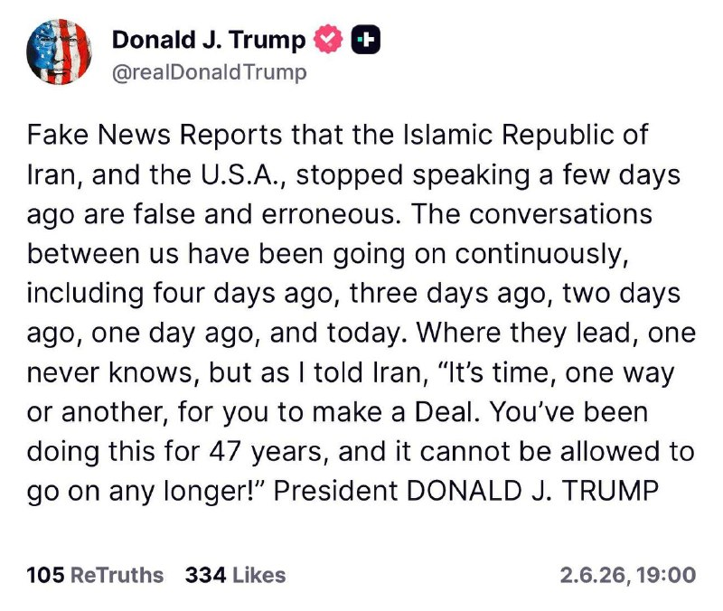

🔴پست ترامپ:

گزارش‌های فیک‌نیوز که می‌گویند جمهوری اسلامی ایران و آمریکا چند روز است که با هم گفت‌و‌گو ندارند، کاملا اشتباه و نادرست است. گفت‌و‌گوها میان ما پیوسته ادامه داشته است، همینطور چهار روز پیش، سه روز پیش، دو روز پیش، یک روز پیش و امروز.
اینکه این صحبت‌ها به کجا می‌رسد، کسی نمی‌داند، اما همانطور که به ایران گفتم، وقتش رسیده که به هر شکل ممکن، به یک توافق برسید، شما ۴۷ سال است که این‌ کار را ادامه داده‌اید و دیگر نمی‌توان اجازه داد ادامه پیدا کند!

@IranianMinds

## BBCPersian — post 282697

  <a href="telegram/content/BBCPersian_282697_1780422264.mp4" target="_blank">🎬 Download video</a>

توپ فوتبالی مجهز به هوش مصنوعی که به تشخیص آفساید کمک می‌کند، در جام جهانی استفاده خواهد شد. توپ رسمی مسابقه می‌تواند داده‌ها را با سرعت ۵۰۰ بار در ثانیه ثبت کند، به این معنا که هر ضربه به توپ تحت نظارت قرار دارد.

@BBCPersian
https://bbc.in/4vqkeoN

## Hranews — post 113341

فقدان ایمنی کار منجر به قطع عضو یک کارگر شد

❗️
❗️
❗️
❗️
❗️– در سایه فقدان ایمنی محیط و شرایط نامناسب کار، یک کارگر در شهرستان دشتی واقع در استان بوشهر حین انجام کار طی حادثه ای مصدوم و دچار قطع عضو از ناحیه انگشت دست شد.

#کارگر

ادامه مطلب

↘️
@hranews_bot تماس ✉️ - @Hranews کانال هرانا 🆑

## alonews — post 124536

  <a href="telegram/content/alonews_124536_1780422266.webm" target="_blank">🎬 Download video</a>

👈آکسیوس به نقل از یک مقام آمریکایی:
ترامپ احساس می‌کند نتانیاهو کنترل خود را از دست داده است

✅ @AloNews خبر جنگ

---
📅 بروزرسانی: 1405/03/12 21:03
---

## VahidOOnLine — post 243392

  <a href="telegram/content/VahidOOnLine_243392_1780421637.mp4" target="_blank">🎬 Download video</a>

♦️نروژ ظروف چینی و قطعات لوستر را از یک کشتی غرق‌شده متعلق به قرن هجدهم بیرون کشید

باستان‌شناسان مجموعه‌ای ارزشمند از ظروف چینی ساخت چین و کالاهای تولیدشده در اروپا را از یک کشتی غرق‌شده متعلق به قرن هجدهم که به‌تازگی در سواحل نروژ کشف شده، بیرون آورده‌اند.

به گفته موزه دریایی نروژ، در میان اشیای کشف‌شده از بقایای این کشتی بادبانی ناشناس، کاسه‌های چینی سفید و آبی که به‌طور منظم روی هم چیده شده بودند، جام‌ها، منسوجات، غلات و قطعاتی از لوسترها دیده می‌شود.

این کشتی که گمان می‌رود در میانه دهه ۱۷۰۰ میلادی غرق شده باشد، توسط مالک یک شرکت نجات دریایی در تنگه اسکاگرک در جنوب نروژ و در عمق حدود ۶۰۰ متری زیر آب پیدا شد.

مبدأ و مقصد این کشتی هنوز مشخص نیست، اما پژوهش‌ها برای شناخت بیشتر این کشتی غرق‌شده و محموله آن همچنان ادامه دارد.
‌🇸🇦 Indypersian

🤖 @VahidOOnLine

## VahidOOnLine — post 243391

  

♦️ فرماندهی مرکزی ارتش آمریکا، سنتکام، روز سه‌شنبه ۱۲ خرداد، اعلام کرد که در ادامه اعمال محاصره دریایی علیه بنادر و کشتی‌های ایران، تعداد شناورهایی که با دستور ارتش آمریکا تغییر مسیر داده‌اند به ۱۲۲ رسید. سنتکام پیش‌تر اعلام کرده بود که پنج شناور که از این دستورات پیروی نکرده بودند، هدف قرار گرفته و از کار افتادند.
‌🇸🇦 Indypersian

🤖 @VahidOOnLine

## WithYashar — post 13280

ربطی نداره ناو لینکلن ، بوش و ناو آبی خاکی‌ تریپلی و کلی‌ ناوشکن هستند و کافیه!

## FoxNewsTwitter — post 342504

  

Fox News (Twitter/X)

WATCH LIVE: Dr. Mehmet Oz holds White House press briefing https://twitter.com/i/broadcasts/1dGYllLDpNDKX

## pm_afshaa — post 92123

  <a href="telegram/content/pm_afshaa_92123_1780421639.webm" target="_blank">🎬 Download video</a>

🔴شبکه 12 اسرائیل: دستور تخلیه ضاحیه جنوبی بخشی از هماهنگی نتانیاهو و ترامپ برای فشار به ایران تو مذاکرات بوده و حمله مستقیم به ضاحیه بیروت در برنامه نبوده. 
💧 Rainbet.com the #1 Non-KYC Crypto Casino & Sportsbook @rainbetcom 
😁 @Pm_Afshaa

## IranIntlTV — post 340246

  <a href="telegram/content/IranIntlTV_340246_1780421639.mp4" target="_blank">🎬 Download video</a>

هم‌زمان با ادامه تنش‌ها در منطقه، بنیامین نتانیاهو دستور حمله به مواضع حزب‌الله در ضاحیه بیروت را صادر کرد.

فرزین ندیمی، پژوهشگر ارشد امور دفاعی و امنیتی به برنامه تیتر اول گفت وضعیت کنونی میان حزب‌الله و اسرائیل نشان‌دهنده نوعی توقف حملات است و آتش‌بس محسوب نمی‌شود
@iranintltv

## IranIntlTV — post 340245

  <a href="telegram/content/IranIntlTV_340245_1780421641.mp4" target="_blank">🎬 Download video</a>

هما میرافشار، شاعر و ترانه‌سرای برجسته ایرانی و خالق صدها ترانه، در ۸۹ سالگی در لس‌آنجلس درگذشت. او با هنرمندانی چون حمیرا، هایده، مهستی، ابی، داریوش، معین و مرتضی همکاری داشت.

گفت‌وگو با مرتضی برجسته، خواننده و آهنگ‌ساز، درباره کارنامه هنری هما میرافشار
@iranintltv

## FarsiVOA — post 219391

مارکو روبیو، وزیر خارجه آمریکا در جلسه کمیته روابط خارجی سنا گفت در پاسخ به سناتور دموکرات کریس مورفی، کاهش تحریم‌ها در ازای بازگشایی تنگه هرمز را رد کرد و گفت که هرگونه کاهش تحریم‌ها باید پس از امتیازات عمده در مسئله هسته‌ای و اورانیوم غنی‌شده صورت گیرد. بخشی از پوشش ویژه صدای آمریکا با ترجمه همزمان مهرناز صمیمی

## FarsiVOA — post 219390

  <a href="telegram/content/FarsiVOA_219390_1780421643.mp4" target="_blank">🎬 Download video</a>

نزدیکان حامد دلدار، از کشته‌شدگان دی ماه ۱۴۰۴، بعد از بازگشایی محدود اینترنت در ایران، ویدیویی از بی‌قراری مادرش بر آرامگاه او منتشر کرده‌اند.

حامد دلدار، ۳۲ ساله، ۱۸ دی ۱۴۰۴ از پشت هدف گلوله نیروهای حکومتی در رشت قرار گرفت. به دلیل نگرانی از بازداشت در بیمارستان، ⁨ابتدا او را به خانه بردند. اما درپی وخامت حال، درد و خون‌ریزی در نهایت او را به بیمارستان منتقل کردند. به رغم عمل جراحی، ‌حامد دلدار کشته شد.

نسخه اصلی این ویدیو با موسیقی متن منتشر شده است.

## Persian_Trend_Official — post 15528

  

باور کنید ترامپ یه دستی هم در بیزینس تریاک داره با پامپ و دامپ کردن بازار میخواد نوسانگیری کنه !

بخدا تقصیر ما هم نیست. شما فعلا تو کف قیمت یک کیلو بگیر بهت قول میدم اگر نکشی تا سال دیگه خیلی سود میکنی 😄

## Persian_Trend_Official — post 15527

  

خبرگزاری فارس: مذاکرات با آمریکا متوقف شد! یک منبع مطلع می‌گوید ایران و آمریکا در حال حاضر پیام رد و بدل نمی‌کنند و مذاکراتی که هدف آن رسیدن به تفاهم اولیه بود، ظاهراً برای چند روز متوقف شده است. این موضوع با ادعای اخیر ترامپ که گفته بود مذاکرات به سرعت…

## RadioFarda — post 157827

  <a href="telegram/content/RadioFarda_157827_1780421646.mp4" target="_blank">🎬 Download video</a>

🔸کاوه زرین قلم، کنشگر و مستندنگار مستقل حیات وحش تصاویری از آزادی کبوتران دربند توسط خود را در صفحه اینستاگرامش منتشر کرده است.

🔸کاوه زرین قلم همراه با انتشار این تصاویر نوشت: «آزادی کبوتران در بند
تقدیم به همه مردم ایران.»

🔸این تصاویر که با موسیقی منتشر شده، ۱۱ خرداد ثبت شده است.

@RadioFarda

## Dirty_Kids — post 390851

  

‏بی شک؛ جمعه ای نه چندان دور!

@Dirty_Kids 👻

## Dirty_Kids — post 390850

  

پرتاب شدم😂😂😂😂😂😂😂😂😂

@Dirty_Kids 👻

## Dirty_Kids — post 390849

  

🔴 کاظمی، وزیر آموزش و پرورش: تاثیر قطعی معدل تو کنکور، بخاطر شورای عالی انقلاب فرهنگیه و هیچ ربطی به آموزش و پرورش نداره. ما هم خودمون به خسروپناه و رفیقاش پیشنهاد کردیم که امسال رو استثنا قائل بشن و این تاثیر قطعی رو بردارن. به هرحال کشور شرایط جنگی داشته…

## Dirty_Kids — post 390848

  <a href="telegram/content/Dirty_Kids_390848_1780421649.mp4" target="_blank">🎬 Download video</a>

🔴 کاظمی، وزیر آموزش و پرورش:
تاثیر قطعی معدل تو کنکور، بخاطر شورای عالی انقلاب فرهنگیه و هیچ ربطی به آموزش و پرورش نداره.

ما هم خودمون به خسروپناه و رفیقاش پیشنهاد کردیم که امسال رو استثنا قائل بشن و این تاثیر قطعی رو بردارن.
به هرحال کشور شرایط جنگی داشته و آموزش‌ها مجازی و کم کیفیت بودن؛ یه عیدی به این بچه‌ها بدید.

@Dirty_Kids 👻

## alonews — post 124535

  <a href="telegram/content/alonews_124535_1780421651.webm" target="_blank">🎬 Download video</a>

👈رئیس جمهور اوکراین ولادیمیر زلنسکی:
ما از طریق اطلاعات می‌دانیم که یک حمله عظیم روسی ممکن است در زودترین وقت امشب رخ دهد.

✅ @AloNews خبر جنگ

## alonews — post 124534

  <a href="telegram/content/alonews_124534_1780421651.webm" target="_blank">🎬 Download video</a>

👈فرماندهی مرکزی آمریکا: ناو هواپیمابر آبراهام لینکلن به حمایت از محاصره دریایی اعمال‌شده علیه ایران ادامه می‌دهد

✅ @AloNews خبر جنگ

---
📅 بروزرسانی: 1405/03/12 20:53
---

## VahidOOnLine — post 243390

  

دونالد ترامپ در شبکه تروث سوشال نوشت گزارش‌های «رسانه‌های جعلی» مبنی بر اینکه جمهوری اسلامی و آمریکا چند روزی است گفت‌وگوها را متوقف کرده‌اند، نادرست و اشتباه است.
او افزود گفت‌وگوها به‌طور مستمر ادامه داشته، از جمله چهار روز پیش، سه روز پیش، دو روز پیش، یک روز پیش و امروز.
ترامپ اضافه کرد: «این گفت‌وگوها به کجا می‌رسد، کسی نمی‌داند، اما همان‌طور که به ایران گفتم، وقت آن است، به هر شکلی، توافقی انجام دهید. شما ۴۷ سال است این کار را می‌کنید و دیگر نمی‌توان اجازه داد ادامه پیدا کند.»
‌🏁 🇬🇧 IranintlTV

🤖 @VahidOOnLine

## VahidOOnLine — post 243389

  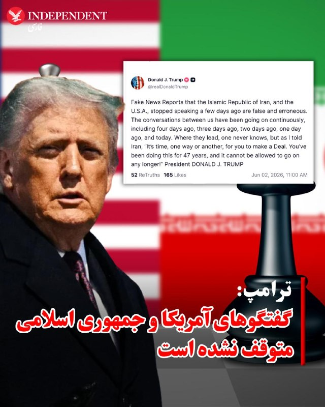

♦️دونالد ترامپ، رئیس‌جمهوری آمریکا، روز سه‌شنبه ۱۲ خردادماه، در تروث سوشال گزارش‌های منتشرشده درباره توقف گفتگوها میان ایالات متحده و جمهوری اسلامی را رد کرد و گفت این مذاکرات به‌طور مداوم ادامه داشته است.

ترامپ نوشت: «گزارش‌های منتشرشده مبنی بر اینکه جمهوری اسلامی ایران و ایالات متحده چند روز پیش گفتگوها را متوقف کرده‌اند، نادرست و اشتباه است. گفتگوهای میان ما به‌طور مداوم ادامه داشته است؛ از جمله چهار روز پیش، سه روز پیش، دو روز پیش، یک روز پیش و امروز.»

او افزود که مشخص نیست این گفتگوها به چه نتیجه‌ای منجر خواهد شد، اما به جمهوری اسلامی گفته است: «زمان آن رسیده است که به هر شکل ممکن، توافقی حاصل شود. شما ۴۷ سال است که این کار را ادامه می‌دهید و دیگر نمی‌توان اجازه داد این وضعیت ادامه پیدا کند.»
‌🇸🇦 Indypersian

🤖 @VahidOOnLine

## WithYashar — post 13279

ادعای شبکه ۱۲ اسرائیل : دستور تخلیه ضاحیه جنوبی بخشی از هماهنگی نتانیاهو و ترامپ برای فشار به ایران تو مذاکرات بوده و نه برای حمله مستقیم به ضاحیه
@withyashar

## pm_afshaa — post 92122

  <a href="telegram/content/pm_afshaa_92122_1780421027.webm" target="_blank">🎬 Download video</a>

🔴شبکه 12 اسرائیل: دستور تخلیه ضاحیه جنوبی بخشی از هماهنگی نتانیاهو و ترامپ برای فشار به ایران تو مذاکرات بوده و حمله مستقیم به ضاحیه بیروت در برنامه نبوده.

💧 Rainbet.com the #1 Non-KYC Crypto Casino & Sportsbook @rainbetcom

😁 @Pm_Afshaa

## pm_afshaa — post 92121

  <a href="telegram/content/pm_afshaa_92121_1780421027.webm" target="_blank">🎬 Download video</a>

🔴مارکو روبیو، وزیر خارجه آمریکا:
من از هیچ برنامه‌ای برای مسلح کردن شهروندان و غیرنظامی‌ها در ایران برای سرنگونی دولت‌شون آگاه نیستم.

منظورم اینه که ممکنه کشورهای دیگر یا گروه‌های دیگر چنین کاری انجام بدن، اما قطعاً دولت ایالات متحده آمریکا اینکارو نمیکنه.

💧 Rainbet.com the #1 Non-KYC Crypto Casino & Sportsbook @rainbetcom

😁 @Pm_Afshaa

## IranIntlTV — post 340244

  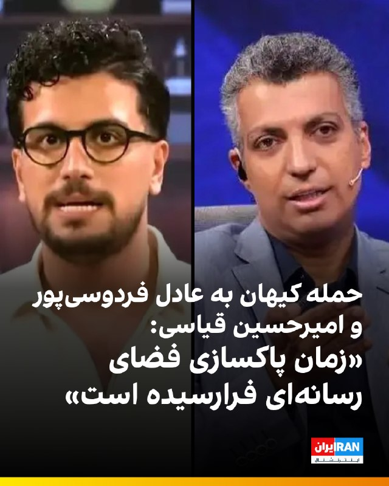

🔻روزنامه کیهان در یادداشتی با حمله به عادل فردوسی‌پور و امیرحسین قیاسی، آنها را «ستاره‌های حلبی» خطاب کرده و خواستار «پاکسازی فضای رسانه‌ای» شده است.

🔹یادداشت روزنامه وابسته به رهبر جمهوری اسلامی به بهانه واکنش‌های این دو به کشتار بی‌سابقه مردم ایران توسط جمهوری اسلامی و همچنین جنگ منتشر شده.

🔹کیهان نوشته که واکنش نداشتن قیاسی به جنگ و نام نبردن فردوسی‌پور در گزارش بازی فینال لیگ قهرمانان اروپا از آمریکا و اسرائیل و همچنین اشاره نکردن به حمله به مدرسه میناب باعث «مردودی» و «رسوایی» آنها در آزمون «شرف، وطن‌دوستی و حریت» شده است.

🔹روزنامه زیر نظر حسین شریعتمداری تاکید کرده «به نظر می‌رسد زمان «پاکسازی فضای رسانه‌ای» فرا رسیده است» و در ادامه نوشته: «این چهره‌ها که به وقت موج‌سواری از غار بیرون می‌آیند و طلب اینترنت می‌کنند، چرا در برابر خون پاک شهدای میناب لال‌مانی می‌گیرند؟»

🔹این روزنامه همچنین نوشته است: «چرخه‌ باطل سکوت، فاصله و بازگشت به پروژه‌های پردرآمد بدون پاسخگویی باید متوقف شود. مراجع نظارتی باید با تشکیل کمیته‌های ویژه، راه را بر بازگشت بی‌هزینه این کاسبان مصلحت بازدارند.»

@iranintltvsport

## IranIntlTV — post 340243

  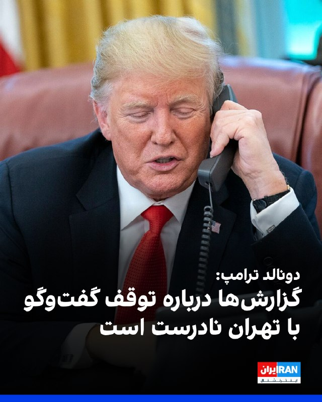

دونالد ترامپ در شبکه تروث سوشال نوشت گزارش‌های «رسانه‌های جعلی» مبنی بر اینکه جمهوری اسلامی و آمریکا چند روزی است گفت‌وگوها را متوقف کرده‌اند، نادرست و اشتباه است.
او افزود گفت‌وگوها به‌طور مستمر ادامه داشته، از جمله چهار روز پیش، سه روز پیش، دو روز پیش، یک روز پیش و امروز.
ترامپ اضافه کرد: «این گفت‌وگوها به کجا می‌رسد، کسی نمی‌داند، اما همان‌طور که به ایران گفتم، وقت آن است، به هر شکلی، توافقی انجام دهید. شما ۴۷ سال است این کار را می‌کنید و دیگر نمی‌توان اجازه داد ادامه پیدا کند.»
https://iranintl.com/202606022484

## Persian_Trend_Official — post 15526

  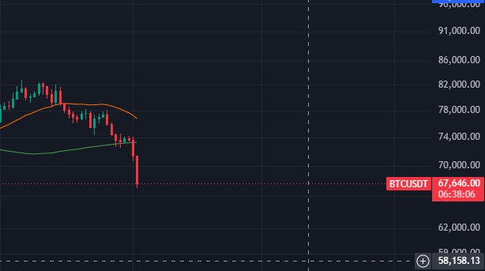

به کجا چنین شتابان ؟!
سقوط بیتکوین به کانال 67 هزار دلاری

📌 @persian_trend_official
پرشین ترند | متفاوت‌ترین کانال نظامی

## Persian_Trend_Official — post 15525

  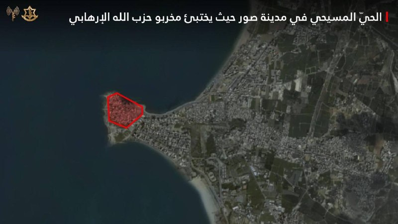

آویخای ادرعی، سخنگوی عربی ارتش اسرائیل: هفته گذشته، در پی فعالیت‌های تروریستی حزب‌الله در منطقه و نقض توافق آتش‌بس توسط آن، هشدار تخلیه مناطقی از شهر صور را صادر کردیم. این هشدار شامل محله مسیحی‌نشین شهر نمی‌شد.

در سال‌های اخیر، ارتش اسرائیل فعالیت‌های ده‌ها نفر از عوامل حزب‌الله را در محله مسیحی‌نشین شناسایی کرده است. این اولین باری نیست که ما فعالیت‌های حزب‌الله را از داخل مناطق مسیحی‌نشین افشا می‌کنیم، زیرا معتقدیم این مناطق پناهگاه امن‌تری برای آنها فراهم می‌کنند.

به جامعه مسیحی شهر صور: حزب‌الله همچنان در اطراف شما فعالیت می‌کند. برای ایمنی و امنیت شما، خواستار خروج عوامل حزب‌الله از مناطق شما هستیم.

به عوامل حزب‌الله در شهر صور: شما در آنجا امن نیستید. اگر به ماندن و فعالیت در این منطقه ادامه دهید، ارتش دستور تخلیه محله مسیحی‌نشین را صادر کرده و اقدامات لازم را علیه شما انجام خواهد داد.

📝 Amir

📌 @persian_trend_official
پرشین ترند | متفاوت‌ترین کانال نظامی

## RadioFarda — post 157826

  <a href="https://t.me/radiofarda/157826" target="_blank">📎 Download file</a>

📻بشنوید: ایستگاه ۱۹ با رادیوفردا، ۱۲ خرداد ۱۴۰۵

@RadioFarda

## alonews — post 124533

  <a href="telegram/content/alonews_124533_1780421031.mp4" target="_blank">🎬 Download video</a>

👈 ماریا کورینا ماچادو رهبر اوپوزیسیون ونزوئلا می گوید به زودی به ونزوئلا بازخواهد گشت.

✅ @AloNews خبر جنگ

## alonews — post 124532

  <a href="telegram/content/alonews_124532_1780421034.mp4" target="_blank">🎬 Download video</a>

👈 مارکو روبیو: حزب‌الله نه تنها دشمن اسرائیل و دشمن آمریکا است؛ حزب‌الله دشمن لبنان و مردم لبنان است.

✅ @AloNews خبر جنگ

## alonews — post 124531

  <a href="telegram/content/alonews_124531_1780421035.webm" target="_blank">🎬 Download video</a>

👈فرستاده اسرائیل در سازمان ملل، درباره پهپادهای حزب‌الله: این پهپادها کمتر از ۲ کیلوگرم وزن دارند. می‌توانید آنها را به صورت آنلاین تهیه کنید. بسیار آسان است. می‌توانند آن را از میان یک پنجره به داخل یک خودرو هدایت کنند.

🔴پرواز آن پایین است. شناسایی آن بسیار دشوار است. و تا وقتی صدای آن را بالای سرتان بشنوید، دیگر دیر شده است

✅ @AloNews خبر جنگ

---
📅 بروزرسانی: 1405/03/12 20:43
---

## VahidOOnLine — post 243388

  <a href="telegram/content/VahidOOnLine_243388_1780420436.mp4" target="_blank">🎬 Download video</a>

یکی از مخاطبان ایران‌اینترنشنال گفت به‌دلیل افزایش قیمت تجهیزات گیمینگ (بازی کامپیوتری) در یک سال گذشته، نتوانسته سیستم جدیدی بخرد و افزود قیمت یک کیبورد که هفته گذشته ۶ میلیون تومان بوده، اکنون به ۷ میلیون و ۲۰۰ هزار تومان رسیده و این افزایش قیمت‌ها فشار زیادی بر مردم وارد می‌کند. صدای او با هوش مصنوعی تغییر داده شده است.
‌🏁 🇬🇧 IranintlTV

🤖 @VahidOOnLine

## VahidOOnLine — post 243387

  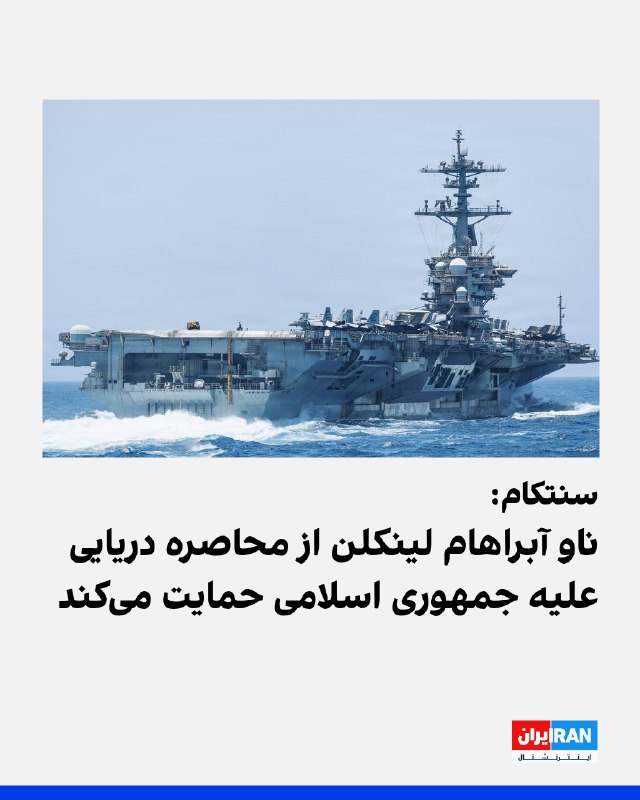

فرماندهی مرکزی آمریکا، سنتکام، با انتشار تصویری از ناو هواپیمابر یو‌اس‌اس آبراهام لینکلن نوشت که این ناو در حال عبور از دریای عرب است و همچنان از محاصره دریایی آمریکا علیه جمهوری اسلامی حمایت می‌کند.
سنتکام اضافه کرد نیروهای آمریکایی تاکنون ۱۲۲ کشتی تجاری را برای تضمین اجرای این محاصره تغییر مسیر داده‌اند.
‌🏁 🇬🇧 IranintlTV

🤖 @VahidOOnLine

## WithYashar — post 13278

  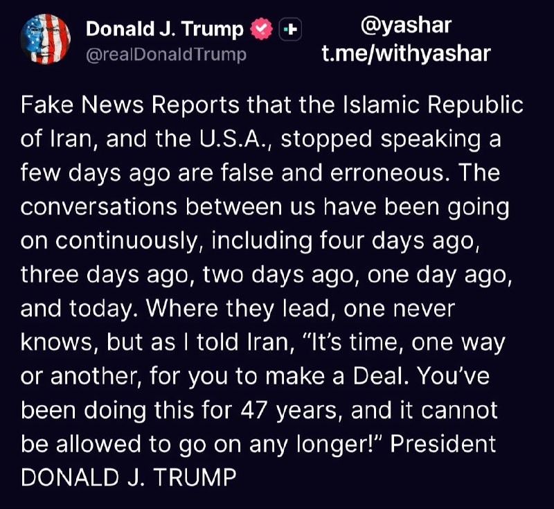

ترامپ در تروث :«گزارش‌های فیک‌نیوز که می‌گویند جمهوری اسلامی ایران و ایالات متحده آمریکا چند روز است با هم صحبت نمی‌کنند، کاملاً نادرست و اشتباه است.

گفت‌وگوها میان ما به‌صورت پیوسته ادامه داشته است؛ از جمله چهار روز پیش، سه روز پیش، دو روز پیش، یک روز پیش و امروز.

این گفت‌وگوها به کجا می‌رسد، کسی نمی‌داند؛ اما همان‌طور که به ایران گفتم: “وقت آن رسیده، به هر شکل ممکن، به یک توافق برسید. شما ۴۷ سال است که این کار را ادامه داده‌اید و دیگر نمی‌توان اجازه داد ادامه پیدا کند!”

رئیس‌جمهور دونالد جی. ترامپ»
@withyashar

## mwarmonitor — post 10037

🔴ترامپ در سوشال تروث

گزارش‌های اخبار جعلی مبنی بر اینکه جمهوری اسلامی ایران و ایالات متحده آمریکا چند روز پیش گفتگوها را متوقف کرده‌اند، کذب و نادرست است. گفتگوهای میان ما به طور مداوم در جریان بوده است؛ از جمله چهار روز پیش، سه روز پیش، دو روز پیش، یک روز پیش و امروز.
هیچ‌کس نمی‌داند این گفتگوها به کجا ختم می‌شوند، اما همان‌طور که به ایران گفتم: «وقت آن رسیده که به هر طریقی، به یک توافق دست پیدا کنید. شما ۴۷ سال است که دارید این کار را انجام می‌دهید و دیگر اجازه داده نخواهد شد که این وضع ادامه پیدا کند!»

رئیس‌جمهور دونالد جی. ترامپ

@mwarmonitor

## pm_afshaa — post 92120

  <a href="telegram/content/pm_afshaa_92120_1780420439.webm" target="_blank">🎬 Download video</a>

🔴پست جدید ترامپ در تروث سوشال:

گزارش‌های فیک‌نیوز که میگن ایران و آمریکا چند روزه که با هم صحبت نمی‌کنند، کاملاً نادرست و اشتباه است. گفت‌وگوها میان ما به‌صورت پیوسته ادامه داشته؛ از جمله چهار روز پیش، سه روز پیش، دو روز پیش، یک روز پیش و امروز.

اینکه این گفت‌وگوها به کجا میرسه، کسی نمیدونه، اما همان‌طور که به ایران گفتم: «وقتش رسیده که به هر شکل ممکن، به یک توافق برسید. شما 47 ساله که این کار رو ادامه دادید و دیگر نمی‌توان اجازه داد ادامه پیدا کنه!»

💧 Rainbet.com the #1 Non-KYC Crypto Casino & Sportsbook @rainbetcom

😁 @Pm_Afshaa

## pm_afshaa — post 92119

  <a href="telegram/content/pm_afshaa_92119_1780420440.webm" target="_blank">🎬 Download video</a>

🔴پاول دورف، مالک تلگرام اعلام کرد قصد داره نام ارز دیجیتال TON رو به «Gram» تغییر بده.

به گفته دورف، نام اولیه این ارز «گرام» بوده و حالا پیشنهاد بازگشت به همون نام مطرح شده. اون برای این موضوع یک نظرسنجی هم منتشر کرده و در صورت موافقت کاربران، نام TON طی روزهای آینده به Gram تغییر خواهد کرد.

💧 Rainbet.com the #1 Non-KYC Crypto Casino & Sportsbook @rainbetcom

😁 @Pm_Afshaa

## VahidOnline — post 75881

  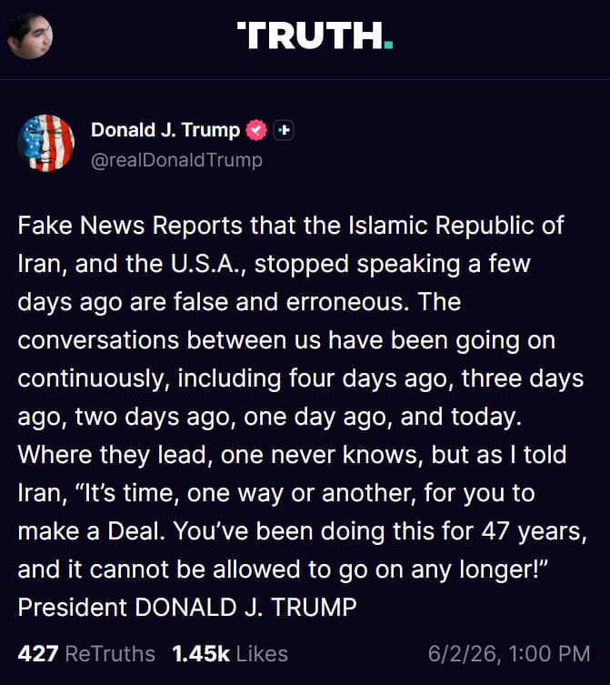

ترامپ: گزارش‌ها درباره توقف مذاکرات درست نیست

ترجمه ماشین:
گزارش‌های رسانه‌های اخبار جعلی مبنی بر اینکه جمهوری اسلامی ایران و ایالات متحده آمریکا چند روز پیش گفت‌وگو را متوقف کرده‌اند، نادرست و خطاست.
گفت‌وگوهای میان ما به‌طور مداوم ادامه داشته است؛ از جمله چهار روز پیش، سه روز پیش، دو روز پیش، یک روز پیش، و امروز.

اینکه این گفت‌وگوها به کجا می‌رسند، هیچ‌کس نمی‌داند؛ اما همان‌طور که به ایران گفتم: «وقت آن رسیده است، به هر شکل ممکن، توافقی انجام دهید. شما ۴۷ سال است که مشغول این کار بوده‌اید و دیگر نمی‌توان اجازه داد این وضعیت ادامه پیدا کند!»

رئیس‌جمهور دونالد جی. ترامپ
realDonaldTrump

📡 @VahidOnline

## IranIntlTV — post 340242

  <a href="telegram/content/IranIntlTV_340242_1780420441.mp4" target="_blank">🎬 Download video</a>

یکی از مخاطبان ایران‌اینترنشنال گفت به‌دلیل افزایش قیمت تجهیزات گیمینگ (بازی کامپیوتری) در یک سال گذشته، نتوانسته سیستم جدیدی بخرد و افزود قیمت یک کیبورد که هفته گذشته ۶ میلیون تومان بوده، اکنون به ۷ میلیون و ۲۰۰ هزار تومان رسیده و این افزایش قیمت‌ها فشار زیادی بر مردم وارد می‌کند. صدای او با هوش مصنوعی تغییر داده شده است.

## IranIntlTV — post 340241

  

فرماندهی مرکزی آمریکا، سنتکام، با انتشار تصویری از ناو هواپیمابر یو‌اس‌اس آبراهام لینکلن نوشت که این ناو در حال عبور از دریای عرب است و همچنان از محاصره دریایی آمریکا علیه جمهوری اسلامی حمایت می‌کند.
سنتکام اضافه کرد نیروهای آمریکایی تاکنون ۱۲۲ کشتی تجاری را برای تضمین اجرای این محاصره تغییر مسیر داده‌اند.
https://iranintl.com/202606028128

## Shin_Persian — post 6409

  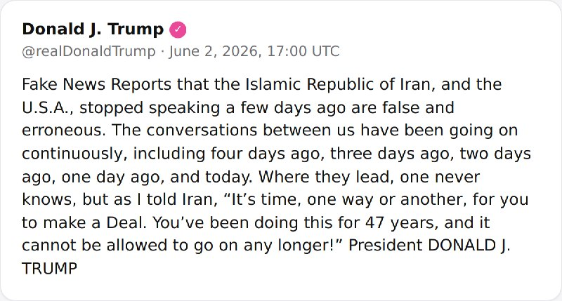

Shin ✓ @hey_itsmyturn Tue, 02 Jun 2026 17:05:47 UTC POTUS: "Fake News Reports that the Islamic Republic of Iran, and the U.S.A., stopped speaking a few days ago are false and erroneous. The conversations between us have been going on continuously, including…

## Shin_Persian — post 6408

Shin ✓ @hey_itsmyturn
Tue, 02 Jun 2026 17:05:47 UTC

POTUS:
"Fake News Reports that the Islamic Republic of Iran, and the U.S.A., stopped speaking a few days ago are false and erroneous. The conversations between us have been going on continuously, including four days ago, three days ago, two days ago, one day ago, and today. Where they lead, one never knows, but as I told Iran, “It’s time, one way or another, for you to make a Deal. You’ve been doing this for 47 years, and it cannot be allowed to go on any longer!” President DONALD J. TRUMP"

فارسی

رئیس‌جمهور ایالات متحده (POTUS):
«گزارش‌های خبری جعلی مبنی بر اینکه جمهوری اسلامی ایران و ایالات متحده آمریکا چند روز پیش گفتگوها را متوقف کرده‌اند، کذب و نادرست است. گفتگوها میان ما به طور مداوم در جریان بوده است، از جمله چهار روز پیش، سه روز پیش، دو روز پیش، یک روز پیش و امروز. اینکه این گفتگوها به کجا ختم می‌شوند را هیچ‌کس نمی‌داند، اما همان‌طور که به ایران گفتم: "زمان آن فرا رسیده که به هر شکلی، به یک توافق برسید. شما ۴۷ سال است که این کار را انجام می‌دهید و دیگر اجازه داده نخواهد شد که این وضع ادامه یابد!" رئیس‌جمهور دونالد جی. ترامپ»

𝕏 · @shin_persian

## FarsiVOA — post 219389

  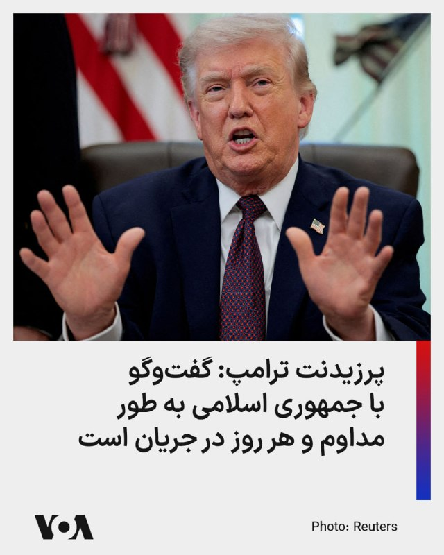

⚡️دونالد ترامپ، رئیس جمهوری آمریکا گزارش‌های رسانه‌ای از توقف گفت‌وگوها با جمهوری اسلامی را جعلی نامید و گفت: « گفتگوها میان ما به طور مداوم در جریان بوده است؛ از جمله چهار روز پیش، سه روز پیش، دو روز پیش، یک روز پیش و امروز.»
پرزیدنت ترامپ روز سه‌شنبه ۱۲ خرداد در تروت سوشال نوشت: «این که این گفت‌وگوها به کجا می‌رسد، هرگز معلوم نیست، اما همان‌طور که به ایران گفتم زمان آن فرا رسیده است که به هر طریق ممکن، توافقی انجام دهید.»
او همچنین عنوان کرد که جمهوری اسلامی ۴۷ سال است این موضوع را به تاخیر می‌اندازد اما «دیگر نمی‌توان اجازه داد این روند ادامه یابد!»

## alonews — post 124530

  <a href="telegram/content/alonews_124530_1780420445.webm" target="_blank">🎬 Download video</a>

👈ادعای شبکه ۱۲ اسرائیل : دستور تخلیه ضاحیه جنوبی بخشی از هماهنگی نتانیاهو و ترامپ برای فشار به ایران تو مذاکرات بوده و نه برای حمله مستقیم به ضاحیه

✅ @AloNews خبر جنگ

## alonews — post 124529

  <a href="telegram/content/alonews_124529_1780420446.webm" target="_blank">🎬 Download video</a>

👈 ترامپ: گزارش‌های جعلی مبنی بر اینکه جمهوری اسلامی ایران و ایالات متحده آمریکا چند روز پیش از صحبت کردن دست کشیده‌اند، نادرست و اشتباه است.

🔴گفتگوهای ما به طور مداوم ادامه داشته است، از جمله چهار روز پیش، سه روز پیش، دو روز پیش، یک روز پیش و امروز.

🔴اینکه این گفتگوها به کجا منتهی می‌شود، هیچ‌کس نمی‌داند، اما همانطور که به ایران گفتم، «زمان آن رسیده است که به هر نحوی یک توافق انجام دهید. شما ۴۷ سال است که این کار را انجام می‌دهید و دیگر نمی‌توان اجازه داد که ادامه یابد!»

✅ @AloNews خبر جنگ

## alonews — post 124528

  <a href="telegram/content/alonews_124528_1780420446.webm" target="_blank">🎬 Download video</a>

👈نخست‌وزیر مجارستان، پتر ماگار:
مجارستان سرباز یا سلاحی به اوکراین ارسال نخواهد کرد.

🔴نه حتی تحت دولت جدید مجارستان.

✅ @AloNews خبر جنگ

---
📅 بروزرسانی: 1405/03/12 20:33
---

## WithYashar — post 13277

  <a href="telegram/content/WithYashar_13277_1780419830.mp4" target="_blank">🎬 Download video</a>

روبیو ادعای مسلح کردن مخالفین حکومت ایران توسط دولت آمریکا را رد کرد:

«من از هیچ برنامه‌ای برای مسلح کردن غیرنظامیان در ایران برای سرنگونی دولتشان آگاه نیستم.
منظورم این است که ممکن است کشورهای دیگری این کار را انجام دهند، یا گروه‌های دیگری این کار را انجام دهند، اما مطمئناً دولت ایالات متحده این کار را نمی‌کند.»
@withyashar

## DEJradio — post 5267

⭕️ انتقال اورانیوم غنی‌شدۀ جمهوری اسلامی دشوار، اما ممکن است

رافائل گروسی، مدیر آژانس جهانی انرژی اتمی گفت انتقال ذخایر اورانیوم غنی‌شدۀ جمهوری اسلامی به خارج از کشور، اگرچه دشوار است، اما ناشدنی نیست.
مدیرکل آژانس جهانی انرژی اتمی گفت این مواد به شکل گاز نگهداری می‌شود و به همین دلیل حمل‌ونقل آن‌ حساس و فنی است.
گروسی افزود گزینه‌هایی مانند رقیق‌سازی اورانیوم نیز در حال بررسی است.
برآورد می‌شود جمهوری اسلامی درحدود ۴۴۰ کیلوگرم اورانیوم با غنای ۶۰ درصد در اختیار داشته باشد.
به گفتۀ رافائل گروسی، ذخایر اورانیوم پس از حملات همچنان دست‌نخورده در همان تأسیسات باقی مانده است.
از قزاقستان به عنوان یکی از گزینه‌های ممکن برای انتقال احتمالی این ذخایر یاد شده است.

#خبر #دژ #اورانیوم
@DEJradio

## DW_Farsi — post 125434

  

🔶 صدور حکم اعدام برای دو برادر در زندان اصفهان

نیکی نیکبخت، خواهر محمد، هادی و فضل‌الله نیک‌بخت، زندانیان سیاسی در زندان دستگرد اصفهان با انتشار ویدیویی اعلام کرد، حکم اعدام دو عضو این خانواده صادر شده است.

او در این ویدیو با بیان اینکه از طریق برادرش، هادی در جریان این حکم قرار گرفته است، گفت: «محمد از زندان تماس گرفت و گفت، حکم اعدام دو برادر دیگرم، هادی و فضل‌الله صادر شده است.»

بنا به گفته او، خانواده این سه برادر پیش‌تر از طریق دادگاه گلپایگان پیگیر پرونده شده بودند و به آنها گفته شده بود، قاضی پرونده حکم یک سال و پنج سال برای هر کدام صادر خواهد کرد اما به اتهام افساد فی‌الارض حکم اعدام صادر شده است.»

بنا بر اظهارات نیکی نیکبخت، امام جمعه گلپایگان و اطلاعات سپاه بر روی پرونده اعمال نفود بسیاری داشته‌اند.

خواهر این سه برادر زندانی در پیام ویدیویی خود گفت: «ما نگران جان دیگر برادرم، محمد نیک‌بخت هم هستیم. او هم مدت دو ماه است که بلاتکلیف در زندان مرکزی اصفهان به سر می‌برد.»

@dw_farsi

## IranianMinds — post 21255

  <a href="telegram/content/IranianMinds_21255_1780419832.mp4" target="_blank">🎬 Download video</a>

🔴 مارکو روبیو:

حزب‌الله فقط دشمن اسرائیل و آمریکا نیست.

حزب‌الله دشمن لبنان و مردم لبنان نیز هست.

@IranianMinds

## Hranews — post 113340

دادگاه تجدیدنظر؛ احکام حبس لیندزی و کریگ فورمن، دو زندانی بریتانیایی تایید شد

❗️
❗️
❗️
❗️
❗️– محکومیت کریگ فورمن و لیندزی فورمن، دو شهروند بریتانیایی محبوس در زندان اوین، توسط دادگاه تجدیدنظر عینا تایید شد. این افراد پیشتر توسط شعبه ۱۵ دادگاه انقلاب تهران، از بابت اتهام “جاسوسی” به ۱۰ سال حبس محکوم شده بودند.

ادامه مطلب

#کریگ_فورمن #لیندزی_فورمن

↘️
@hranews_bot تماس ✉️ - @Hranews کانال هرانا 🆑

## alonews — post 124527

  <a href="telegram/content/alonews_124527_1780419834.mp4" target="_blank">🎬 Download video</a>

👈فیلمی از لحظه برخورد موشک به کیف در شب گذشته

✅ @AloNews خبر جنگ

---
📅 بروزرسانی: 1405/03/12 20:23
---

## VahidOOnLine — post 243386

  

رافائل گروسی، مدیرکل آژانس بین‌المللی انرژی اتمی، در دوحه با نخست‌وزیر قطر دیدار کرد.

وزارت خارجه قطر در شبکه ایکس اعلام کرد که در این دیدار، طرفین درباره تقویت همکاری‌های دوجانبه میان قطر و آژانس و همچنین آخرین تحولات مربوط به مذاکرات درباره برنامه هسته‌ای ایران گفت‌وگو کردند.
‌🏁 🇬🇧 IranintlTV

🤖 @VahidOOnLine

## WithYashar — post 13276

الان کجاست احمدی نژاد

## WithYashar — post 13275

الان کجاست احمدی نژاد

## mwarmonitor — post 10036

🔸سناتور انگس کینگ (ایالت مین – مستقل)، عضو کمیته اطلاعات سنای آمریکا، در واکنش به انتخاب دونالد ترامپ برای منصوب کردن بیل پولته به‌عنوان مدیر اطلاعات ملی گفت:

🔸«مدیر اطلاعات ملی شغلی فوق‌العاده مهم است؛ زیرا همه نهادهای اطلاعاتی آمریکا را در سراسر دولت ایالات متحده هماهنگ می‌کند و نقشی محوری در شکل‌گیری سیاست خارجی صحیح دارد.

🔹من از این انتصاب متحیرم؛ زیرا با وجود تمام افرادی که در نهادهای اطلاعاتی ما دخیل‌اند و با وجود همه کسانی که در دستگاه امنیت ملی ما برای حفاظت از آمریکایی‌ها در سراسر کشور و جهان فعالیت می‌کنند، رئیس‌جمهور فردی را انتخاب کرده که هیچ‌گونه تجربه‌ای در این حوزه پیچیده و به‌شدت حیاتی ندارد.

🔸بر اساس هر ارزیابی عینی—از نظر تجربه، تخصص و پیشینه—این انتصاب هیچ منطقی ندارد.» فاکس‌نیوز

@mwarmonitor

## pm_afshaa — post 92118

سخنگوی دولت :امتحانای نهایی دانش‌آموزا و داوطلبای آزاد از 13 تا 23 تیر شروع میشه

💧 Rainbet.com the #1 Non-KYC Crypto Casino & Sportsbook @rainbetcom

😁 @Pm_Afshaa

## DEJradio — post 5266

⭕️ هما میرافشار، شاعر و ترانه‌سرای ایرانی درگذشت

هما میرافشار، شاعر و ترانه‌سرای شناخته‌شدۀ ایرانی، در ۸۹ سالگی در لس‌آنجلس درگذشت.
مرتضی اشراقی، خوانندۀ شناخته‌شده، با اعلام خبر درگذشت هما میرافشار نوشت خانوادۀ او با تأخیر یک هفته‌ای این خبر را منتشر کرده‌اند.
هما میرافشار با سرودن بیش از ۶۰۰ ترانه، از پرکارترین ترانه‌سرایان ایرانی به‌شمار می‌رود.
او با خوانندگانی از جمله هایده، حمیرا، مهستی، ابی، داریوش، معین، عارف و ستار همکاری داشت.
ترانه‌های دلِ کوچولو، صبحت به‌خیر عزیزم و همزبونم باش، از شناخته‌شده‌ترین آثار این هنرمند ایرانی است.
هما میرافشار سال‌ها با بیماری آلزایمر دست‌وپنجه نرم می‌کرد. او متولد ۱۳۱۵ تهران بود و فعالیت حرفه‌ای را از اواخر دهۀ ۴۰ سرگرفت.
به گفتۀ مرتضی اشراقی، هما میرافشار با آرزوی دیدار دوبارۀ میهن درگذشت.

#خبر #دژ #هنرمندان #هما_میرافشار
@DEJradio

## DEJradio — post 5265

⭕️ نتانیاهو: عملیات اسرائیل در جنوب لبنان طبق برنامه ادامه دارد

بنیامین نتانیاهو گفت در تماس با دونالد ترامپ تأکید کرده اگر حزب‌الله حملات خود را متوقف نکند، اسرائیل اهداف وابسته به این گروه در بیروت را هدف قرار می‌دهد.
او افزود موضع اسرائیل در این زمینه تغییری نکرده است.
نتانیاهو همچنین گفت ارتش اسرائیل عملیات خود در جنوب لبنان را طبق برنامه ادامه می‌دهد.
برخی رسانه‌های غربی از اختلاف میان نتانیاهو و ترامپ بر سر حمله به بیروت خبر داده‌اند.

#خبر #دژ #نتانیاهو #لبنان
@DEJradio

## IranIntlTV — post 340240

  

رافائل گروسی، مدیرکل آژانس بین‌المللی انرژی اتمی، در دوحه با نخست‌وزیر قطر دیدار کرد.

وزارت خارجه قطر در شبکه ایکس اعلام کرد که در این دیدار، طرفین درباره تقویت همکاری‌های دوجانبه میان قطر و آژانس و همچنین آخرین تحولات مربوط به مذاکرات درباره برنامه هسته‌ای ایران گفت‌وگو کردند.
https://iranintl.com/202606025688

## IranIntlTV — post 340239

  

امروز مارکو روبیو، وزیر خارجه آمریکا، گفت: «ما همچنان در حال گفت‌وگو با جمهوری اسلامی هستیم.» پیش‌تر، خبرگزاری فارس، رسانه وابسته به سپاه پاسداران، به نقل از یک منبع آگاه نوشته بود که تبادل پیام میان جمهوری اسلامی و آمریکا برای آنچه «دستیابی به یادداشت تفاهم اولیه میان تهران و واشینگتن» خوانده شده، دست‌کم چند روز است متوقف شده است.

نظر شما درباره مذاکرات جمهوری اسلامی و آمریکا چیست؟

در صورت توافق احتمالی با آمریکا، تأثیر آن را بر زندگی مردم ایران چگونه می‌بینید؟

«برنامه» صدای شماست.

اگر در ایران به اینترنت دسترسی دارید، بیایید و نظرتان را با یک ایران در میان بگذارید.

تاریخ با صدای شما نوشته می‌شود.

برای شرکت در برنامه، همین حالا در واتس‌اپ پیام بدهید:

۰۰۴۴۷۵۲۲۱۱۰۱۱۰

۰۰۴۴۷۵۴۴۱۱۰۱۱۰

۰۰۴۴۷۵۱۱۱۰۲۵۵۳

«برنامه با کامبیز حسینی»

«یک ایران صدای شما را می‌شنود»

@iranintltv

## DW_Farsi — post 125433

  

🔶 اولیانوف: ارسال اورانیوم غنی‌شده ایران به خارج ابداَ ضروری نیست

میخائیل اولیانوف، دیپلمات روس و نماینده دائم روسیه در سازمان‌های بین‌المللی مستقر در وین با انتشار پیامی اعلام کرد: «خروج اورانیوم غنی‌شده ایران از کشور به هیچ وجه امری ضروری نیست و برای این کار به موافقت تهران نیاز است.»

اولیانوف این پیام را در شبکه اجتماعی ایکس در واکنش به اظهارات اخیر رافائل گروسی، رئیس آژانس بین‌المللی انرژی اتمی نوشت که گفته بود، "انتقال ذخایر اورانیوم غنی‌شده ایران به خارج از کشور دشوار اما غیرممکن نیست چرا که این انتقال، کاری بسیار حساس و از نظر فنی پیچیده است.»

نماینده روسیه در سازمان‌های بین‌المللی در وین همچنین در پیام خود اعلام کرد: «از نظر تئوری، این گزینه نیز وجود دارد که در صورت توافق دو طرف، اورانیوم غنی‌شده در خاک ایران رقیق‌سازی شود. بنابراین، گمانه‌زنی‌ها در این زمینه زودهنگام است.»

بحث انتقال ذخایر اورانیوم غنی‌شده ایران، یکی از موضوعات حساس در مذاکرات ایران و آمریکا است که این مواد یا از کشور خارج شوند یا تحت محدودیت‌های سخت‌گیرانه داخل ایران رقیق‌سازی و کنترل شوند.

@dw_farsi

## Persian_Trend_Official — post 15524

  <a href="telegram/content/Persian_Trend_Official_15524_1780419239.mp4" target="_blank">🎬 Download video</a>

انهدام خودروی حامل کنیسترهای سامانه پدافندی گنبد آهنین توسط مولتی روتورهای FPV حزب‌الله لبنان

احتمالا اسرائیل قصد دارد سامانه پدافندی گنبد آهنین را در خاک لبنان مستقر کند تا بتواند با راکت های پرتاب شده از سوی حزب‌الله به سمت شهرک های اشغال شده مقابله کند.

📝 Amir

📌 @persian_trend_official
پرشین ترند | متفاوت‌ترین کانال نظامی

## Hranews — post 113339

  

آریانا کوچکی، دانشجوی دانشگاه صنعتی شریف بازداشت شد

❗️
❗️
❗️
❗️
❗️– آریانا کوچکی، دانشجوی دانشگاه صنعتی شریف، روز گذشته توسط نیروهای امنیتی در تهران بازداشت و به مکان نامعلومی منتقل شد.

ادامه مطلب

#آریانا_کوچکی

↘️
@hranews_bot تماس ✉️ - @Hranews کانال هرانا 🆑

## alonews — post 124526

  <a href="telegram/content/alonews_124526_1780419242.webm" target="_blank">🎬 Download video</a>

👈روبیو: اگر ایران سلاح‌های هسته‌ای به دست آورد، مانند کره شمالی اما بدتر خواهد بود.

🔴آن‌ها کشور اسرائیل را نابود خواهند کرد و شما قادر به انجام کاری در این مورد نخواهید بود زیرا آن‌ها یک سلاح هسته‌ای دارند.

✅ @AloNews خبر جنگ

---
📅 بروزرسانی: 1405/03/12 20:14
---

## VahidOOnLine — post 243385

  

♦️ شیخ محمد بن عبدالرحمن آل ثانی، نخست‌وزیر و وزیر امور خارجه قطر، روز سه‌شنبه ۱۲ خرداد در دوحه با رافائل گروسی، مدیرکل آژانس بین‌المللی انرژی اتمی، دیدار و گفتگو کرد. در این نشست، دو طرف بر تقویت همکاری‌های دوجانبه میان قطر و آژانس تاکید کرده و آخرین تحولات مربوط به مذاکرات برنامه هسته‌ای ایران را مورد بررسی قرار دادند.

رافائل گروسی پس از این دیدار با انتشار پیامی، ضمن قدردانی از استقبال نخست‌وزیر قطر، این گفتگو را بخشی از سفر مهم خود به منطقه خلیج فارس در زمان افزایش نگرانی‌ها درباره ایمنی هسته‌ای توصیف کرد. او بر نقش حیاتی آژانس در موضوع عدم اشاعه تسلیحات هسته‌ای در ایران تاکید کرد و افزود که در این برهه حساس، دیپلماسی و گفتگو تنها راه پیش رو برای دستیابی به صلح، ثبات و همکاری‌های منطقه‌ای است. مدیرکل آژانس همچنین بر تعهد این سازمان به همکاری با کشورهای منطقه برای تقویت امنیت هسته‌ای و حمایت از ثبات پایدار تاکید کرد.

گروسی روز گذشته نیز در کویت با وزیر امور خارجه این کشور دیدار و گفتگو کرده بود.
‌🇸🇦 Indypersian

🤖 @VahidOOnLine

## WithYashar — post 13274

  

ال احمدی نژاد السیسی 🥴

پس بگو این مدت برای چی انقدر ‌رفت بوتاکس کرد و به خودش رسید، قیافه درست کرد.
@withyashar

## DEJradio — post 5264

⭕️ ارسال پستی از ایران به تنها ۹ کشور ازسر گرفته شد

شرکت ملی پست اعلام کرد پس از وقفه‌ای بیش از سه ماهه، ارسال مرسولات از ایران تنها به ۹ کشور برقرار شده است.
نام این کشورها افغانستان، عمان، ترکیه، چین، پاکستان، روسیه، هند، عراق و تایلند اعلام شد.
ارسال پستی از ایران از آغاز جنگ در نهم اسفندماه پیشین متوقف شده بود.

#خبر #دژ #ایران
@DEJradio

## DEJradio — post 5263

⭕️ آمریکا عمان را برای فاصله گرفتن از جمهوری اسلامی زیر فشار گذاشت

وال‌استریت ژورنال گزارش داد دولت ترامپ، عمان را برای انتخاب میان تهران و واشینگتن زیر فشار گذاشته است.
به نوشته این روزنامۀ آمریکایی، واشینگتن در هفته‌های اخیر رویۀ عمان در قبال جمهوری اسلامی را رویکردی دشمنانه نسبت به آمریکا ارزیابی می‌کند.
بر اساس این گزارش، آمریکا از مسقط خواست روابط دیپلماتیک خود را با تهران قطع کند.
وال‌استریت ژورنال نوشت تهدید آمریکا علیه عمان پس از آن شدت گرفت که بر اساس یک ارزیابی اطلاعاتی مشخص شد مسقط قصد دارد در کنار جمهوری اسلامی از کشتی‌های عبوری از تنگۀ هرمز باج بگیرد.
عمان این موضوع را رد کرده و می‌گوید برنامه‌ای برای دریافت عوارض از کشتی‌ها ندارد.
وزارت اطلاع‌رسانی عمان از اظهارنظر درمورد فشار آمریکا برای قطع رابطه با جمهوری اسلامی خودداری کرد.
عبدالله الحراصی، وزیر اطلاع‌رسانی عمان مدعی شده مسقط آمادۀ همکاری با آمریکا و همۀ شرکای مسئول برای تقویت ثبات و حفاظت از منافع راهبردی مشترک است.
او گفته است که عمان به جریان آزاد تجارت و انرژی از مسیر تنگۀ هرمز پایبند است.
به گزارش وال‌استریت ژورنال، عمان نگران از دست دادن نقش میانجی‌گری‌اش میان تهران و واشینگتن است.
وال‌استریت ژورنال نوشت عمان در سراسر جنگ تلاش کرد میان آمریکا و جمهوری اسلامی مسیر میانه را حفظ کند.
فشارهای اخیر آمریکا می‌تواند جایگاه عمان به عنوان میانجی مورد اعتماد دو طرف را تضعیف کند.

#خبر #دژ #عمان
@DEJradio

## DEJradio — post 5262

⭕️ حزب‌الله با موشک و پهپاد آتش‌بس با اسرائیل را نقض کرد

وزارت امور خارجۀ اسرائیل اعلام کرد با وجود اعلام دوبارۀ آتش‌بس در ۱۱ خرداد، حزب‌الله شامگاه دوشنبه با موشک و پهپاد از خاک لبنان به مناطق مسکونی اسرائیل حمله کرده است.
اسرائیل اعلام کرد ادامۀ نقض آتش‌بس از سوی حزب‌الله، پذیرفتنی نیست.
وزارت خارجه اسرائیل، با اشاره به این که حزب‌الله، گروه نیابتی جمهوری اسلامی است، اعلام کرد حملات ادامه‌دار این گروه با مفاد آتش‌بس سازگار نیست.
شبه‌نظامیان حزب‌الله که از سوی تهران پشتیبانی می‌شوند، در سیاهۀ تروریستی آمریکا و اتحادیۀ اروپا قرار دارند.

#خبر #دژ #اسرائیل #لبنان
@DEJradio

## IranIntlTV — post 340238

  <a href="telegram/content/IranIntlTV_340238_1780418690.mp4" target="_blank">🎬 Download video</a>

تیتراول با نیوشا صارمی، سه‌شنبه ۱۲ خرداد
@iranintltv

## FarsiVOA — post 219388

کاهش ذخایر استراتژیک جهانی نفت و تاثیر بحران در تنگه هرمز بر این وضعیت؛ گفت‌وگو با دالغا خاتین‌اغلو، تحلیلگر حوزه انرژی

## FarsiVOA — post 219387

  <a href="telegram/content/FarsiVOA_219387_1780418692.mp4" target="_blank">🎬 Download video</a>

ارتش اسرائیل اعلام کرد نیروهای تیپ گیوعاتی تحت فرماندهی لشکر ۳۶ به‌عنوان بخشی از تلاش برای تقویت کنترل عملیاتی در جنوب لبنان و رفع تهدید مستقیم علیه الجلیل و متولا، عملیاتی را با هدف کنترل و پاکسازی منطقه روستاهای زوتر الشرقیه و زوتر الغربیه آغاز کردند.

بنابر این بیانیه نیروهای ارتش اسرائیل با عبور از رود لیتانی، حمله‌های هدفمندی را علیه زیرساخت‌های تروریستی در منطقه انجام می‌دهند، تسلیحات و تروریست‌ها را شناسایی و حذف می‌کنند.

به گفته ارتش اسرائیل، علاوه بر کشف صدها مورد تسلیحات در منازل غیرنظامی در منطقه تا کنون با پشتیبانی نیروی هوایی بیش از ۱۰۰ حمله انجام و حدود ۲۰ تروریست حذف شده است.

## FarsiVOA — post 219386

مارکو روبیو، وزیر خارجه آمریکا در جلسه کمیته روابط خارجی سنا گفت که جمهوری اسلامی در حال دستیابی به سلاح هسته‌ای بود و اگر عملیات خشم حماسی صورت نمی‌گرفت دیر می‌شد. بخشی از پوشش ویژه صدای آمریکا با ترجمه همزمان مهرناز صمیمی

## Persian_Trend_Official — post 15523

این خبر که به اسم مانور شناورهای تندرو سپاه پاسداران در مدیا دست به دست می‌شود در اصل متعلق به صید ترولینگ هست.

اینها قایق های صیادی هستند که در حال صید ترولینگ هستند و دنبال گله ماهی تن می روند، با این روش گله ماهی یکجا جمع‌آوری می‌شود.

ترولینگ با سرعت های مختلف انجام می‌گیرد، ولی عموماً با سرعت 15 مایل هست که رد به جا مانده آن در عکس های بالا مشاهده می‌شود.

📝 Amir

📌 @persian_trend_official
پرشین ترند | متفاوت‌ترین کانال نظامی

## IranianMinds — post 21254

  

🔴 مهاجرانی ، سخنگوی دولت:

امتحانات نهایی دانش آموزان و داوطلبان آزاد ۱۳ تا ۲۳ تیرماه آغاز میشه.

@IranianMinds

## IranianMinds — post 21253

  <a href="telegram/content/IranianMinds_21253_1780418694.mp4" target="_blank">🎬 Download video</a>

🔴 مارکو روبیو :

اگر ایران به سلاح هسته‌ای دست پیدا کند، مثل کره شمالی خواهد شد؛ حتی بدتر.

آن‌ها اسرائیل را نابود خواهند کرد و شما هم نمی‌توانید کاری انجام دهید، چون سلاح هسته‌ای دارند.

@IranianMinds

## IranianMinds — post 21252

کانفیگ کف قیمت بازار؛ بدون افت کیفیت
☠️
اتصال پایدار و بدون قطعی آزار دهنده
❤️‍🔥

پلن‌ها:
10 گیگ: 90 تومن
20 گیگ: 160 تومن
100 گیگ: 700 تومن
@mmmsoren 
🛡

## alonews — post 124525

  <a href="telegram/content/alonews_124525_1780418695.webm" target="_blank">🎬 Download video</a>

👈روبیو: در مورد هند و پاکستان، ما آن جنگ را به پایان رساندیم؛ ما در کمک به میانجی‌گری آن نقش داشتیم.

🔴مارکو روبیو می‌گوید سودان به یک درگیری نیابتی تبدیل شده است زیرا «امارات و سعودی‌ها در دو طرف مخالف آن قرار دارند.»

✅ @AloNews خبر جنگ

---
📅 بروزرسانی: 1405/03/12 20:05
---

## VahidOOnLine — post 243384

  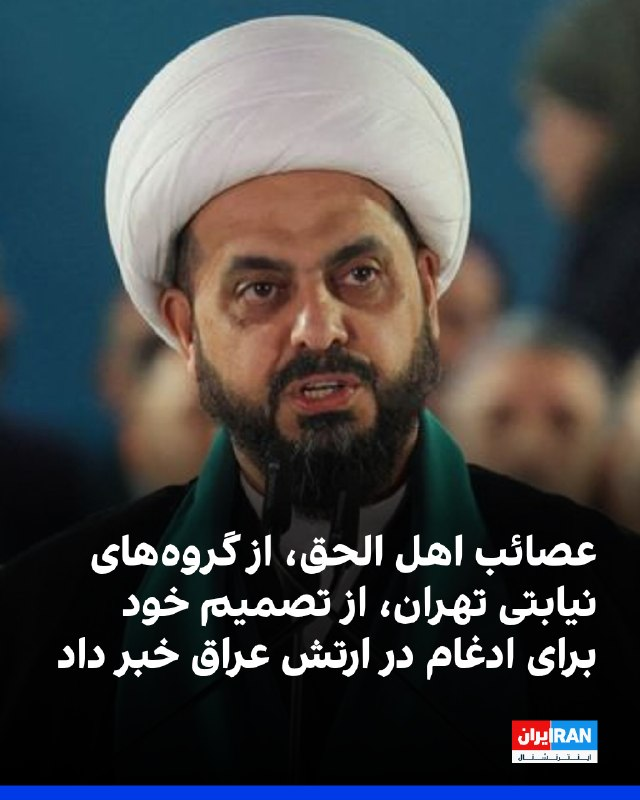

گروه شیعه «عصائب اهل الحق»، از نیروهای نیابتی جمهوری اسلامی در عراق، با انتشار بیانیه‌ای اعلام کرد ارتباط تشکیلاتی خود را با حشد الشعبی، دیگر گروه نزدیک به تهران، قطع می‌کند و سلاح‌های خود را به دولت عراق تحویل خواهد داد.

بر اساس بیانیه رهبری این گروه به ریاست قیس خزعلی که سه‌شنبه ۱۲ خرداد منتشر شد، عصائب اهل الحق در چارچوب سیاست «حصر سلاح در اختیار دولت» قصد دارد تحت فرماندهی کل نیروهای مسلح عراق فعالیت کند.

در این بیانیه همچنین آمده است که یک کمیته مرکزی برای پیگیری روند اجرایی این تصمیم تشکیل شده است.

ماموریت این کمیته شامل سرشماری کامل نیروها، تهیه فهرستی از تمامی سلاح‌ها و تجهیزات لجستیکی و همچنین تکمیل روند قطع ارتباط با حشد الشعبی و ادغام در ساختارهای امنیتی دولت عراق خواهد بود.

ریاست این کمیته به الحاج جواد الطلیباوی، از فرماندهان ارشد عصائب اهل الحق، واگذار شده است.

ادامه این گزارش را در وبسایت ایران‌اینترنشنال بخوانید
‌🏁 🇬🇧 IranintlTV

🤖 @VahidOOnLine

## VahidOOnLine — post 243383

  

ارتش اسرائیل در بیانیه‌ای اعلام کرد در عملیات روز دوشنبه در مرکز نوار غزه، یوسف عایش عواد رمضان، جانشین فرمانده نیروهای نخبه حماس، کشته شده است.

در این بیانیه آمده است او یکی از افرادی بود که در حمله هفتم اکتبر وارد خاک اسرائیل شد و در ربودن تعدادی از افراد نقش داشت همچنین تهدیدی فوری برای نیروهای اسرائیلی که در نوار غزه فعالیت می‌کنند محسوب می‌شد.
‌🏁 🇬🇧 IranintlTV

🤖 @VahidOOnLine

## FoxNewsTwitter — post 342503

  

Fox News (Twitter/X)

BREAKING: Disappearance of Lynette Hooker, who went missing in the Bahamas, is being treated as a murder investigation, US official tells Fox News

## FoxNewsTwitter — post 342502

  

Fox News (Twitter/X)

BREAKING: The White House Correspondents' Association is moving forward with a rescheduled Correspondents' Dinner after this year's event was interrupted by an assassination attempt against President Trump.

WHCA President Weijia Jiang says the July 24 gathering in Washington, D.C. will feature significantly enhanced security and serve as a message that "violence has no place in American life."

"We will not allow an act of violence to have the last word."

## pm_afshaa — post 92117

🔴کرملین: در صورت عقب‌نشینی اوکراین، جنگ امشب پایان می‌یابد

💧 Rainbet.com the #1 Non-KYC Crypto Casino & Sportsbook @rainbetcom

😁 @Pm_Afshaa

## pm_afshaa — post 92116

🔴گروه شبه‌نظامی کتائب امام علی مورد حمایت ایران در عراق اعلام کرد که با حشد الشعبی قطع ارتباط کرده و سلاح‌های خود را تحویل دولت عراق می‌دهد

💧 Rainbet.com the #1 Non-KYC Crypto Casino & Sportsbook @rainbetcom

😁 @Pm_Afshaa

## pm_afshaa — post 92115

  

😄 فروش فیلترشکن سرور V2ray قوی، بدون قطعی و از همه مهمتر بدون ضریب، آیپی ثابت

سرور حجمی:

🛡 10 گیگ: 150

🛡 20 گیگ: 250

🛡 30 گیگ: 300

نامحدود تانل شده:

🛡1 کاربره 1 ماهه: 430

🛡 2 کاربره 1 ماهه: 490

❤️‍🔥 کانالمون:
@Configmrsood

جهت خرید:
@mrsoodadmin

## DEJradio — post 5261

⭕️ هشدار اتحادیۀ اروپا: از پرواز بر فراز ایران، عراق و لبنان پرهیز کنید

آژانس ایمنی هوانوردی اتحادیۀ اروپا، هشدارهای خودداری از پرواز در آسمان ایران، عراق و لبنان را تا بیستم خردادماه امسال تمدید کرد.

#خبر #دژ #اروپا
@DEJradio

## DEJradio — post 5260

⭕️ بحرین سفر شهروندان خود به جمهوری اسلامی و عراق را ممنوع کرد

وزارت کشور بحرین اعلام کرد سفر شهروندان این کشور به جمهوری اسلامی و عراق تا اطلاع بعدی ممنوع است و متخلفان با برخورد قانونی روبه‌رو می‌شوند.
به گفتۀ مقامات بحرین، این ممنوعیت سفر به‌دلیل شرایط امنیتی منطقه بوده و برای حفاظت از شهروندان، گرفته شده است.
بحرین اعلام کرده در جریان جنگ چهل روزه ده‌ها موشک و صدها پهپاد شلیک شده توسط جمهوری اسلامی را رهگیری کرده است.

#خبر #دژ #بحرین
@DEJradio

## DEJradio — post 5259

⭕️ رئیس پیشین موساد گفت زمان پایان دادن به کار جمهوری اسلامی فرارسید

دیوید بارنئا، در آخرین روز مسئولیتش به عنوان رئیس موساد گفت جمهوری اسلامی در ضعیف‌ترین وضعیت خود قرار دارد و باید کارزار علیه آن ادامه یابد.
او گفت می‌توان جمهوری اسلامی را سرنگون کرد، اما این کار به پایداری و تعهد نیاز دارد.

#خبر #دژ #موساد
@DEJradio

## IranIntlTV — post 340237

  

گروه شیعه «عصائب اهل الحق»، از نیروهای نیابتی جمهوری اسلامی در عراق، با انتشار بیانیه‌ای اعلام کرد ارتباط تشکیلاتی خود را با حشد الشعبی، دیگر گروه نزدیک به تهران، قطع می‌کند و سلاح‌های خود را به دولت عراق تحویل خواهد داد.

بر اساس بیانیه رهبری این گروه به ریاست قیس خزعلی که سه‌شنبه ۱۲ خرداد منتشر شد، عصائب اهل الحق در چارچوب سیاست «حصر سلاح در اختیار دولت» قصد دارد تحت فرماندهی کل نیروهای مسلح عراق فعالیت کند.

در این بیانیه همچنین آمده است که یک کمیته مرکزی برای پیگیری روند اجرایی این تصمیم تشکیل شده است.

ماموریت این کمیته شامل سرشماری کامل نیروها، تهیه فهرستی از تمامی سلاح‌ها و تجهیزات لجستیکی و همچنین تکمیل روند قطع ارتباط با حشد الشعبی و ادغام در ساختارهای امنیتی دولت عراق خواهد بود.

ریاست این کمیته به الحاج جواد الطليباوی، از فرماندهان ارشد عصائب اهل الحق، واگذار شده است.

ادامه این گزارش را در وبسایت ایران‌اینترنشنال بخوانید
https://iranintl.com/202606027946

## IranIntlTV — post 340236

  <a href="telegram/content/IranIntlTV_340236_1780418115.mp4" target="_blank">🎬 Download video</a>

منشه امیر، کارشناس امور خاورمیانه، به ایران‌اینترنشنال گفت نتانیاهو در مراسم جانشینی رومن گافمن به عنوان رییس جدید موساد اعلام کرده که یکی از ماموریت‌های او تلاش برای سرنگونی جمهوری اسلامی است
@iranintltv

## IranIntlTV — post 340235

  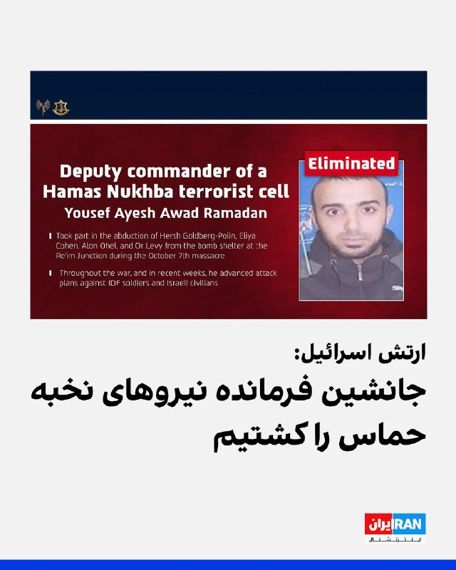

ارتش اسرائیل در بیانیه‌ای اعلام کرد در عملیات روز دوشنبه در مرکز نوار غزه، یوسف عایش عواد رمضان، جانشین فرمانده نیروهای نخبه حماس، کشته شده است.

در این بیانیه آمده است او یکی از افرادی بود که در حمله هفتم اکتبر وارد خاک اسرائیل شد و در ربودن تعدادی از افراد نقش داشت همچنین تهدیدی فوری برای نیروهای اسرائیلی که در نوار غزه فعالیت می‌کنند محسوب می‌شد.
https://iranintl.com/202606026234

## FarsiVOA — post 219385

زندگی شخصی و حرفه‌ای هما میرافشار، ترانه‌سرای بزرگ ایرانی و خالق آثار ماندگاری در عرصه موسیقی، در گفت‌وگو با مرتضی برجسته، خواننده، آهنگساز و از دوستان نزدیک او

## FarsiVOA — post 219384

🔺صدور شتابزده احکام سنگین زندان برای زنان، شهروندان بهائی و معترضان بازداشت‌شده در دی ۱۴۰۴

◾️در حالی که دستگاه حکمرانی جمهوری اسلامی، به روایت کارشناسان داخلی و خارجی، در تمام زمینه‌های سیاست داخلی و خارجی به ورطه بحران افتاده است، قوه قضائیه جمهوری اسلامی با شتابی کم‌سابقه به صدور و اجرای احکام زندان برای گروه‌های مختلفی از شهروندان ادامه می‌دهد.

⬇️ بیشتر بخوانید:

https://ir.voanews.com/a/judiciary-of-the-islamic-republic-of-iran-protesters-in-prison-health-services-iran/8156470.html

## DW_Farsi — post 125432

  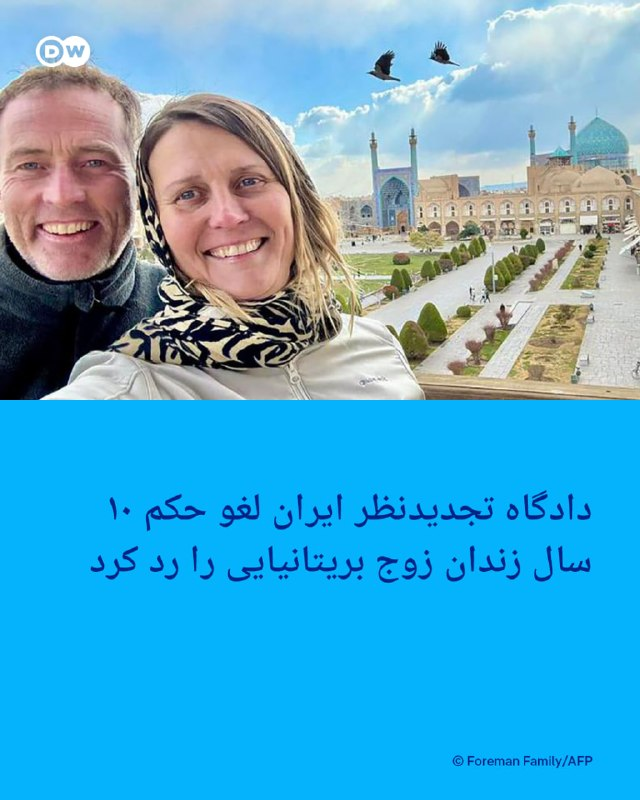

دادگاه تجدیدنظر ایران لغو حکم ۱۰ سال زندان زوج بریتانیایی را رد کرد

دادگاه تجدیدنظر ایران، درخواست زوج بریتانیایی زندانی برای لغو حکم زندان‌شان را رد کرد.

لیندزی فورمن و همسرش کریگ فورمن که در ژانویه ۲۰۲۵ هنگام سفر با موتورسیکلت در چارچوب یک سفر جهانی در ایران بازداشت شدند، به اتهام جاسوسی به ۱۰ سال زندان محکوم شده‌اند.

خانواده این زوج بریتانیایی زندانی در ایران، روز سه‌شنبه دوم ژوئن (۱۲ خرداد) اعلام کردند: «کریگ و لیندزی فورمن اجازه حضور در جلسه دادگاه را نداشتند و اطلاعات بسیار محدودی درباره روند رسیدگی در اختیارشان قرار گرفته است اما با این حال دادگاه تجدیدنظر ایران حکم ۱۰ سال زندان آنها را تایید کرده است.»

پیش‌تر وزیر امور خارجه بریتانیا صدور حکم ۱۰ سال زندان برای این زوج را "تکان‌دهنده و غیرقابل قبول" خوانده و گفته بود، دولت این کشور پرونده آنها را بی‌وقفه پیگیری خواهد کرد تا زمانی که لیندزی و کریگ فورمن سالم به بریتانیا و نزد خانوده‌شان بازگردند.

@dw_farsi

## DW_Farsi — post 125431

  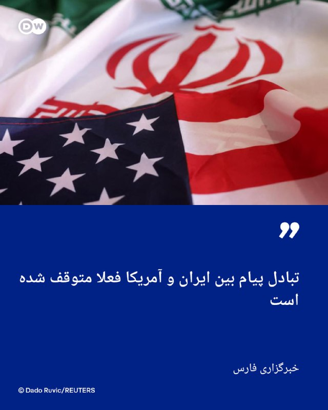

🔶 فارس: تبادل پیام بین ایران و آمریکا فعلا متوقف شده است

در حالی که مارکو روبیو، وزیر خارجه آمریکا تایید کرده، ایالات متحده همچنان در حال مذاکره با ایران است، خبرگزاری فارس، نزدیک به سپاه پاسداران مدعی شد، "روند تبادل پیام بین ایران و آمریکا بر خلاف گزارش رسانه‌ها و مقام‌های غربی، دست‌کم چند روزی است که متوقف شده است.»

علاوه بر وزیر خارجه آمریکا، شب گذشته دونالد ترامپ، رئیس‌جمهور ایالات متحده نیز اعلام کرد، "گفت‌وگوها با ایران با سرعت بالایی در جریان است".

ترامپ همچنین با اعلام اینکه از بنیامین نتانیاهو خواسته به ضاحیه در جنوب بیروت حمله نکند، به رسانه‌های آمریکا گفت: «جزئیات توافق با ایران در حال تکمیل است و احتمال دارد هفته آینده به نتیجه برسد.»

خبرگزاری فارس اما مدعی است، "آخرین پیام جمهوری اسلامی ایران به واشنگتن، پیامی آشکار در خصوص لبنان بود که بازتاب گسترده بین‌المللی یافت و پس از آن رد و بدل پیامی صورت نگرفته است".

@dw_farsi

## IranianMinds — post 21251

  <a href="telegram/content/IranianMinds_21251_1780418119.mp4" target="_blank">🎬 Download video</a>

🔴 مارکو روبیو :

اگر تصمیم با مردم ایران بود، همین فردا توافق می‌کردند.

رهبر جمهوری اسلامی و سپاه پاسداران تا حدی در برابر این فشارها و تحریم ها مصون هستند و فشار کمتری روشونه.

@IranianMinds

## alonews — post 124524

  <a href="telegram/content/alonews_124524_1780418122.mp4" target="_blank">🎬 Download video</a>

👈مارکو روبیو: برخی از متحدان ما در منطقه بسیار به صورت تهاجمی همکاری کرده‌اند، مانند امارات متحده عربی.

✅ @AloNews خبر جنگ

## alonews — post 124523

  <a href="telegram/content/alonews_124523_1780418124.webm" target="_blank">🎬 Download video</a>

👈روبیو: اگر مردم ایران اختیار داشتند، فردا توافق می‌کردند.

✅ @AloNews خبر جنگ

---
📅 بروزرسانی: 1405/03/12 19:54
---

## VahidOOnLine — post 243382

  <a href="telegram/content/VahidOOnLine_243382_1780417472.mp4" target="_blank">🎬 Download video</a>

♦️ مارکو روبیو، وزیر امور خارجه ایالات متحده، اعلام کرد که معتقد است مجتبی خامنه‌ای، رهبر جدید جمهوری اسلامی در قید حیات است و «به‌طور فزاینده‌ای در حال تعامل و فعالیت» است.

این دیپلمات ارشد آمریکایی در کمیته روابط خارجی سنا گفت: «فکر می‌کنم نشانه‌هایی وجود دارد که او در سطوحی به شکل فزاینده‌ای در حال نقش‌آفرینی است».

مجتبی خامنه‌ای از زمان حمله در آغاز جنگ که منجر به جراحات شدید او و کشته شدن پدرش و چندین تن از رهبران ارشد نظامی کشور شد، در انظار عمومی دیده نشده است. روبیو نیز با اشاره به کشته شدن این افراد، دیده نشدن مجتبی خامنه‌ای را ناشی از «توصیه‌های امنیتی» دانست.
‌🇸🇦 Indypersian

🤖 @VahidOOnLine

## WithYashar — post 13273

  <a href="telegram/content/WithYashar_13273_1780417474.mp4" target="_blank">🎬 Download video</a>

صحبت های تامر هایمن رئیس سابق سازمان اطلاعات نظامی اسرائیل (AMAN): عملیات سری ترامپ و کردها و احمدی‌نژاد !
@withyashar

## DEJradio — post 5258

⭕️ نتانیاهو: پایه‌های حکومت جمهوری اسلامی ترک برداشت

بنیامین نتانیاهو، نخست‌وزیر اسرائیل در مراسم خداحافظی با دیوید بارنئا، رئیس پیشین موساد گفت پایه‌های رژیم جمهوری اسلامی ترک خورده و دیگر به آنچه بود بازنمی‌گردد.
به گفتۀ نتانیاهو جمهوری اسلامی تا اینجا نیز هزینۀ سنگینی پرداخته است.
نخست‌وزیر اسرائیل همچنین گفت هر طرفی که در پی اقدام علیه اسرائیل باشد، باید بداند طرح‌هایش شکست می‌خورد و هزینه‌ای سنگین می‌پردازد.
رومن گوفمن، از روز سه‌شنبه کار خود را به عنوان رئیس موساد، رسما سرگرفت.

#خبر #دژ #بنیامین_نتانیاهو
@DEJradio

## DEJradio — post 5257

⭕️ ای‌بی‌سی: ترامپ گفت هفتۀ آینده با جمهوری اسلامی به توافق می‌رسد

شبکۀ ای‌بی‌سی گزارش داد دونالد ترامپ در گفت‌وگوی تلفنی با این رسانه گفته است به توافق با جمهوری اسلامی برای تمدید آتش‌بس و بازگشایی تنگۀ هرمز خوش‌بین است.
ترامپ افزوده که هنوز چند خواستۀ دیگر دارد و تفاهم نهایی نشده است.
دونالد ترامپ از سویی با بازنشر مطلبی قدیمی در تروث‌سوشال، بار دیگر از رسانه‌ها و دموکرات‌ها انتقاد کرد.
او نوشت حتی اگر جمهوری اسلامی «کاملا تسلیم شود» رسانه‌ها باز هم آن را پیروزی رژیم عنوان می‌کنند.

#خبر #دژ #توافق
@DEJradio

## DEJradio — post 5256

⭕️ عصائب اهل حق روند قطع ارتباط با حشد شعبی را سرگرفت

گروه مسلح عصائب اهل حق، اعلام کرد روند قطع ارتباط با حشد شعبی را سرگرفته است.
این گروه اعلام کرد تصمیم دارد با سیاست «انحصار سلاح در دست دولت عراق» هماهنگ شود.
عصائب اهل حق از ایجاد کمیته‌ای برای ساماندهی نیروها و سلاح‌ها خبر داد. این گروه اعلام کرد کمیته‌ای مرکزی برای ثبت نیروها، سلاح‌ها و امکانات لجستیکی تشکیل داده است.
بنا بر گزارش‌ها قرار شده این کمیتۀ تازه تأسیس، با دولت و نهادهای امنیتی عراق هماهنگ باشد.
عصائب اهل حق یکی از گروه‌های نیابتی جمهوری اسلامی در عراق است که آمریکا آن را در سیاهۀ سازمان‌های تروریستی قرار داده است.
آمریکا پیش‌تر برای اطلاعات منجر به بازداشت یا کشته شدن قیس خزعلی، رهبر این گروه ۱۰ میلیون دلار پاداش تعیین کرده است.

#خبر #دژ #نیابتی
@DEJradio

## DEJradio — post 5255

⭕️ وزیر خارجۀ آمریکا گفت نشانه‌هایی از افزایش فعالیت مجتبی خامنه‌ای دیده می‌شود

مارکو روبیو، وزیر امور خارجۀ ایالات متحده گفت نشانه‌هایی وجود دارد که نشان می‌دهد مجتبی خامنه‌ای سطح مشارکت و فعالیت خود را افزایش داده است.
او تأکید کرد که جانشین علی خامنه‌ای از زمان به‌دست گرفتن قدرت، در انظار عمومی دیده نشده است.

#خبر #دژ #موشتبا
@DEJradio

## IranIntlTV — post 340234

  <a href="https://t.me/IranintlTV/340234" target="_blank">📎 Download file</a>

🎧نسخه صوتی اخبار شبانگاهی | سه‌شنبه ۱۲ خرداد
@iranintlTV

## IranIntlTV — post 340233

حدود پنج ماه پس از سرکوب اعتراضات دی‌ماه در رشت، منابع ایران اینترنشنال گفتند در این شهر دستکم به قلب سه معترض از پشت شلیک شده و اجساد قربانیان به سوله‌ای مخفی در نزدیکی رشت منتقل می‌شد. همچنین براساس تصاویر منتشر شده، به یک معترض مجروح، تیر خلاص زده شده.

گزارشی از مجتبا پورمحسن
@iranintltv

## IranIntlTV — post 340232

  <a href="telegram/content/IranIntlTV_340232_1780417477.mp4" target="_blank">🎬 Download video</a>

مارکو روبیو، وزیر خارجه آمریکا، اعلام کرد جمهوری اسلامی با گفت‌وگو درباره بخش‌هایی از برنامه هسته‌ای خود که پیش‌تر از مذاکره درباره آن‌ها خودداری می‌کرد، موافقت کرده است. همزمان، هانا نویمان، رییس هیات روابط با ایران در پارلمان اروپا، هشدار داد تهران ممکن است با طولانی کردن مذاکرات، در انتظار تغییر شرایط سیاسی و کاهش تمرکز واشینگتن بر پرونده ایران باشد.

ارزیابی‌ها با مرضیه حسینی و لی‌لی نیکفر، خبرنگاران ایران‌اینترنشنال
@iranintltv

## Persian_Trend_Official — post 15522

  

وزیر دفاع اسرائیل، یسرائیل کاتز: حمله به جوامع اسرائیلی با حمله به دژ ادعایی حزب‌الله در منطقه ضاحیه بیروت پاسخ داده خواهد شد.

او همچنین گفت که پس از هشدارهای ارتش اسرائیل، 600.000 نفر از 950.000 ساکن ضاحیه تا عصر دوشنبه تخلیه شده‌اند و فشار سنگینی بر حزب‌الله و دولت لبنان وارد کرده‌اند. کاتز همچنین اظهار داشت که هیچ آتش‌بس در داخل لبنان وجود ندارد؛ نیروهای ارتش اسرائیل به عملیات خود ادامه می‌دهند.

منطقه امنیتی در جنوب لبنان اکنون حدود 600 کیلومتر مربع را پوشش می‌دهد و به قلعه بوفورت می‌رسد. هدف فوری، پاکسازی منطقه تا رودخانه لیتانی از سلاح‌ها و شبه‌نظامیان حزب‌الله است، در حالی که هدف بلندمدت همچنان خلع سلاح کامل حزب‌الله است.

کاتز اظهار داشت: بدون پاسخ قدرتمند علیه منطقه ضاحیه در بیروت، هیچ وضعیت آتش‌سوزی علیه جوامع ما وجود نخواهد داشت.

📝 Amir

📌 @persian_trend_official
پرشین ترند | متفاوت‌ترین کانال نظامی

## RadioFarda — post 157825

  <a href="https://t.me/radiofarda/157825" target="_blank">📎 Download file</a>

🔸چالش‌های اصلی پیش روی تهران و واشینگتن برای دستیابی به یک تفاهم اولیه چیست؟ تفاهمی که به گفته مارکو روبیو وزیر خارجه آمریکا باید شامل تعهدی از سوی ایران بشود که در فاز دوم درباره مسائل اساسی از جمله ذخیره اورانیوم با غنای بالا مذاکره کند. پیشروی‌های اسرائیل در لبنان، روند دیپلماتیک را تا یک قدمی فروپاشی پیش برد و بار دیگر با دخالت دونالد ترامپ رئیس‌جمهور ایالات متحده از لبه پرتگاه عقب رفت تا شاید طی روزهای آینده طرفین موفق به دستیابی به یک تفاهم بشوند. حمیدرضا عزیزی تحلیلگر امور بین‌الملل در برلین آلمان به پرسش‌های رادیوفردا درباره این روند پاسخ داده است.

@RadioFarda

## IranianMinds — post 21250

  

اجاره پراید برای کار در تاکسی روزی ۸۰۰ هزار تومن !

@IranianMinds

## BBCPersian — post 282696

  

🔻وزیر خارجه آمریکا می‌گوید که مجتبی خامنه‌ای، رهبر جمهوری اسلامی، زنده و به‌شکل فزاینده‌ای فعال است.

مارکو روبیو به کمیته روابط خارجی مجلس سنای آمریکا گفت: «فکر می‌کنم نشانه‌هایی هست که از نقش فزاینده او در برخی سطوح حکایت دارد.»

مجتبی خامنه‌ای از نهم اسفند که در موج اول حملات آمریکا و اسرائیل زخمی شد، در انظار عمومی دیده نشده و صدا یا ویدیویی هم از او منتشر نشده است؛ پدرش علی خامنه‌ای در همین حمله کشته شد.

معاون بین‌الملل دفتر رهبر جمهوری اسلامی یک ماه پیش گفته بود که مجتبی خامنه‌ای در «سلامت کامل» و «مشغول تدبیر امور» است.

📸Getty Images
@BBCPersian

## Dirty_Kids — post 390843

پنج مینی‌سریال برتر ۲۰۲۶ تا اینجا:

@Dirty_Kids 👻

## Dirty_Kids — post 390842

  <a href="telegram/content/Dirty_Kids_390842_1780417480.mp4" target="_blank">🎬 Download video</a>

این پاندا رو ببینید دهن سرویس چقد خوب ادا راه رفتن نگهبان رو درمیاره

@Dirty_Kids 👻

## Dirty_Kids — post 390841

  <a href="https://t.me/Dirty_Kids/390841" target="_blank">📎 Download file</a>

✅ اپلیکیشن اندروید سایت جهانی دربی بت

💰اولین سایت جهانی با امکان شارژ و برداشت ریالی(کارت به کارت)

🔗 برای ورود فیلترشکن روی کشور مناسب قرار دهید مانند فنلاند و المان و....

😀Telegram Channel
👇
https://t.me/+bcynkEgSW2dlYTc0

## Dirty_Kids — post 390840

  

😤دنبال یه سایت شرط بندی بین المللی بودی که به ایرانیا خدمات بده؟!
⛔

👍دربی بت همون انتخاب  100%

💎ویژگی های سایت جهانی Derby Bet:

⬅️امکان شارژ امن با کارت بانکی

⬅️واریز اول دوبل شارژ می شوید(بونوس۱۰۰٪)

⬅️پر اپشن ترین سایت فعال در ایران

⬅️تسویه حساب کمتر از 5 دقیقه

⬅️برگشت بخشی از باخت به صورت هفتگی

🚨کد هدیه ثبت نام:GG007

⚠️برای دانلود اپلکیشن کلیک کنید
👉

🔔کانال دربی بت :

🪙https://t.me/+bcynkEgSW2dlYTc0

## Hranews — post 113338

  

گزارشی از آخرین وضعیت امیررضا پدرام در زندان وکیل آباد مشهد

❗️
❗️
❗️
❗️
❗️– امیررضا پدرام، از بازداشت‌شدگان اعتراضات دی‌ماه ۱۴۰۴ در مشهد، دوران محکومیت خود را در زندان وکیل‌آباد این شهر سپری می‌کند. وی اخیرا توسط دادگاه انقلاب به شش سال حبس تعزیری محکوم شده است.

به گزارش خبرگزاری هرانا، ارگان خبری مجموعه فعالان حقوق بشر در ایران، امیررضا پدرام، زندانی سیاسی در حال سپری کردن دوران محکومیت خود در زندان وکیل‌آباد مشهد است.

امیررضا پدرام اخیرا توسط دادگاه انقلاب به شش سال حبس تعزیری محکوم شده است. به گفته یک منبع مطلع، وی در جریان رسیدگی به پرونده خود از حق دسترسی به وکیل انتخابی و برخورداری از دادرسی عادلانه محروم بوده است.

ادامه مطلب

#امیررضا_پدرام

↘️
@hranews_bot تماس ✉️ - @Hranews کانال هرانا 🆑

## alonews — post 124522

  <a href="telegram/content/alonews_124522_1780417482.webm" target="_blank">🎬 Download video</a>

👈کرملین: در صورت عقب‌نشینی اوکراین، جنگ امشب پایان می‌یابد

✅ @AloNews خبر جنگ

## alonews — post 124521

  <a href="telegram/content/alonews_124521_1780417482.webm" target="_blank">🎬 Download video</a>

👈حزب‌الله: در صورت بمباران ضاحیه، تل‌آویو را هدف قرار خواهیم داد

✅ @AloNews خبر جنگ

---
📅 بروزرسانی: 1405/03/12 19:44
---

## VahidOOnLine — post 243381

  <a href="telegram/content/VahidOOnLine_243381_1780416891.mp4" target="_blank">🎬 Download video</a>

یکی از مخاطبان ایران‌اینترنشنال در پیامی با قدردانی از دونالد ترامپ و بنیامین نتانیاهو گفت تغییر حکومت یک روند زمان‌بر است و مردم ناچارند سختی‌های این مسیر را تحمل کنند.

صدای این مخاطب با هوش مصنوعی تغییر یافته است.
‌🏁 🇬🇧 IranintlTV

🤖 @VahidOOnLine

## VahidOOnLine — post 243380

  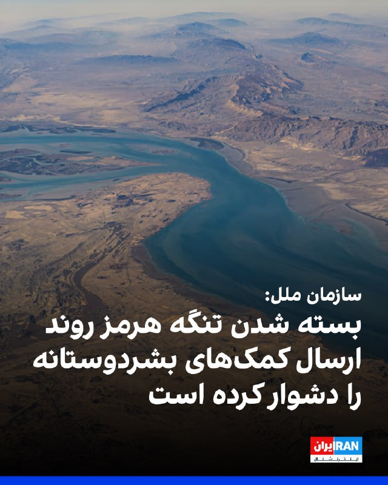

سازمان ملل متحد اعلام کرد بسته شدن تنگه هرمز باعث ایجاد «گزینه‌های دشوار» در روند ارسال کمک‌های بشردوستانه شده است.
این نهاد گفت حتی اگر جنگ خاورمیانه فورا متوقف شود، اختلال در زنجیره تامین جهانی کمک‌های انسانی تا پیش از سال ۲۰۲۷ به‌طور کامل ترمیم نخواهد شد.
‌🏁 🇬🇧 IranintlTV

🤖 @VahidOOnLine

## DEJradio — post 5254

  <a href="telegram/content/DEJradio_5254_1780416894.webm" target="_blank">🎬 Download video</a>

🔺📢 شوک ۵۰ درصدی به بازار قبر و کفن؛

*عطا حسینیان، روزنامه‌نگار اقتصادی

#تورم #شوک_اقتصادی
@DEJradio

## DEJradio — post 5253

⭕️ رژیم جنازۀ علی خامنه‌ای را سه روز در کشور می‌چرخاند

معاون اجتماعی شهردار تهران گفت مراسم تشییع جنازۀ علی خامنه‌ای سه روز طول می‌کشد.
این مقام شهرداری تهران خبر داد تشییع جنازۀ علی خامنه‌ای در شهرهای قم، مشهد و تهران قطعی شده است.
محمدامین توکلی‌زاده ادعا کرد تهران برای حضور ۱۵ تا ۲۰ میلیون نفر در این مراسم آماده می‌شود. او افزود مراسم تهران احتمالا ۲۴ ساعت ادامه می‌یابد.
زمان احتمالی تشییع جنازۀ رهبر پیشین جمهوری اسلامی، برای اواخر خرداد یا ابتدای تیرماه پیش‌بینی شده است. او قرار است در صحن امام هشتم شیعیان دفن شود.
جسد علی خامنه‌ای از ۹ اسفندماه پیشین و در پی کشته شدن او در حملات آمریکا و اسرائیل، تاکنون دفن نشده است.

#خبر #دژ #موشعلی
@DEJradio

## DEJradio — post 5252

⭕️ جمهوری‌خواهان آمریکا از تأثیر بحران هرمز بر انتخابات نوامبر نگران‌اند

به گزارش خبرگزاری رویترز، جمهوری‌خواهان امیدوارند بازگشایی تنگۀ هرمز پیش از انتخابات نوامبر، سبب کاهش بهای سوخت شود.
بنا بر این گزارش، افزایش قیمت‌ انرژی به یکی از نگرانی‌های اصلی رای‌دهندگان آمریکایی تبدیل شده است.

#خبر #دژ #تنگه_هرمز
@DEJradio

## DEJradio — post 5251

⭕️ روبیو: جمهوری اسلامی درباره بخش‌هایی از برنامۀ هسته‌ای که پیش‌تر رد می‌کرد، وارد مذاکره شد

مارکو روبیو، گفت جمهوری اسلامی اکنون دربارۀ برخی جنبه‌های برنامه هسته‌ای که پیش‌تر از مذاکره پیرامون آن خودداری می‌کرد، گفت‌وگو می‌کند.
وزیر امور خارجۀ آمریکا تأکید کرد این تحول به معنای قطعی بودن توافق نیست.
روبیو افزود جمهوری اسلامی در پی ساخت سپر دفاعی برای برنامۀ هسته‌ای بود. او گفت جمهوری اسلامی تلاش داشت توان نظامی متعارف خود را به عنوان «سپر دفاعی» برنامه هسته‌ای توسعه دهد.
مارکو روبیو گفت تهران می‌خواست پشت توانمندی‌های نظامی پنهان شود و به همین دلیل آمریکا وارد فاز عملیات نظامی شد.
وزیر امور خارجۀ آمریکا گفت واشینگتن صرفا در ازای بازگشایی تنگۀ هرمز، هیچ پیشنهاد کاهش یا لغو تحریم‌ها ارائه نکرده است. او تأکید کرد هرگونه کاهش تحریم‌ها به تحقق شروط آمریکا پیرامون برنامۀ هسته‌ای وابسته است.

#خبر #دژ #مذاکرات
@DEJradio

## VahidOnline — post 75880

  

مارکو روبیو، وزیر خارجه آمریکا در جلسه کمیته روابط خارجی سنا گفت که نشانه‌هایی وجود دارد مجتبی خامنه‌ای رهبر جدید جمهوری اسلامی در سطحی به شکل فزاینده‌ای در حال مشارکت در روند مذاکرات است، «اگرچه تمام ارتباطات او به صورت مکتوب و از طریق واسطه‌ها بوده است.»
آقای روبیو افزود: با توجه به اتفاقاتی که برای رهبران متعدد در آن سیستم رخ داده است، تصور می‌کنم که حضور بسیار علنی احتمالاً چیزی نیست که در داخل برای آن‌ها توصیه شود.
او همچنین در پاسخ به سناتور دموکرات کریس مورفی، کاهش تحریم‌ها در ازای بازگشایی تنگه هرمز را رد کرد و گفت که هرگونه کاهش تحریم‌ها باید پس از امتیازات عمده در مسئله هسته‌ای و اورانیوم غنی‌شده صورت گیرد.
@VahidHeadline

📡 @VahidOnline

## IranIntlTV — post 340231

  <a href="https://t.me/IranintlTV/340231" target="_blank">📎 Download file</a>

🎧نسخه صوتی اخبار نیم‌روزی | سه‌شنبه ۱۲ خرداد
@iranintlTV

## IranIntlTV — post 340230

  <a href="telegram/content/IranIntlTV_340230_1780416895.mp4" target="_blank">🎬 Download video</a>

یکی از مخاطبان ایران‌اینترنشنال در پیامی با قدردانی از دونالد ترامپ و بنیامین نتانیاهو گفت تغییر حکومت یک روند زمان‌بر است و مردم ناچارند سختی‌های این مسیر را تحمل کنند.

صدای این مخاطب با هوش مصنوعی تغییر یافته است.

## IranIntlTV — post 340229

  

سازمان ملل متحد اعلام کرد بسته شدن تنگه هرمز باعث ایجاد «گزینه‌های دشوار» در روند ارسال کمک‌های بشردوستانه شده است.
این نهاد گفت حتی اگر جنگ خاورمیانه فورا متوقف شود، اختلال در زنجیره تامین جهانی کمک‌های انسانی تا پیش از سال ۲۰۲۷ به‌طور کامل ترمیم نخواهد شد.
https://iranintl.com/202606026632

## FarsiVOA — post 219383

  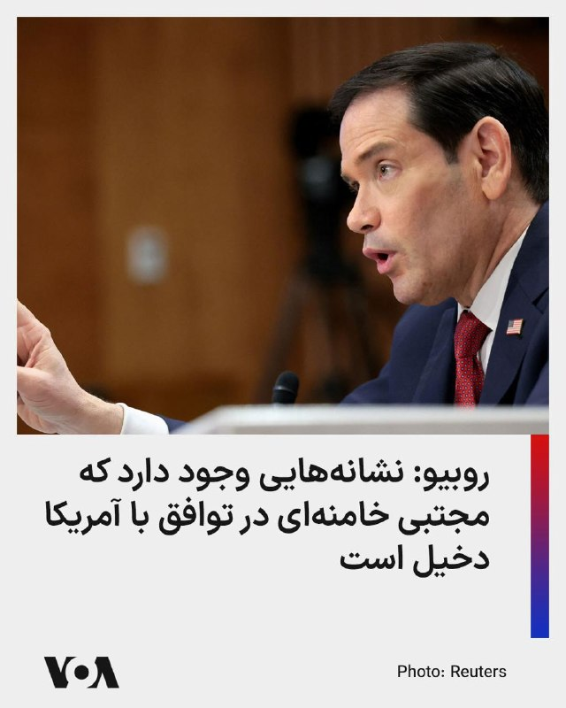

مارکو روبیو، وزیر خارجه آمریکا در جلسه کمیته روابط خارجی سنا گفت که نشانه‌هایی وجود دارد مجتبی خامنه‌ای رهبر جدید جمهوری اسلامی در سطحی به شکل فزاینده‌ای در حال مشارکت در روند مذاکرات است، «اگرچه تمام ارتباطات او به صورت مکتوب و از طریق واسطه‌ها بوده است.»
آقای روبیو افزود: با توجه به اتفاقاتی که برای رهبران متعدد در آن سیستم رخ داده است، تصور می‌کنم که حضور بسیار علنی احتمالاً چیزی نیست که در داخل برای آن‌ها توصیه شود.
او همچنین در پاسخ به سناتور دموکرات کریس مورفی، کاهش تحریم‌ها در ازای بازگشایی تنگه هرمز را رد کرد و گفت که هرگونه کاهش تحریم‌ها باید پس از امتیازات عمده در مسئله هسته‌ای و اورانیوم غنی‌شده صورت گیرد.

## alonews — post 124520

  <a href="telegram/content/alonews_124520_1780416898.webm" target="_blank">🎬 Download video</a>

👈روبیو: جنگ در ایران به پایان رسیده است. ایران به صدها میلیارد دلار برای بازسازی نگاه می‌کند

✅ @AloNews خبر جنگ

## alonews — post 124519

  <a href="telegram/content/alonews_124519_1780416898.webm" target="_blank">🎬 Download video</a>

👈مارکو روبیو: ما از تهران برای هیچ چیز التماس نمی‌کنیم.

🔴اونا ممکن است التماس کنند

✅ @AloNews خبر جنگ

---
📅 بروزرسانی: 1405/03/12 19:35
---

## VahidOOnLine — post 243379

  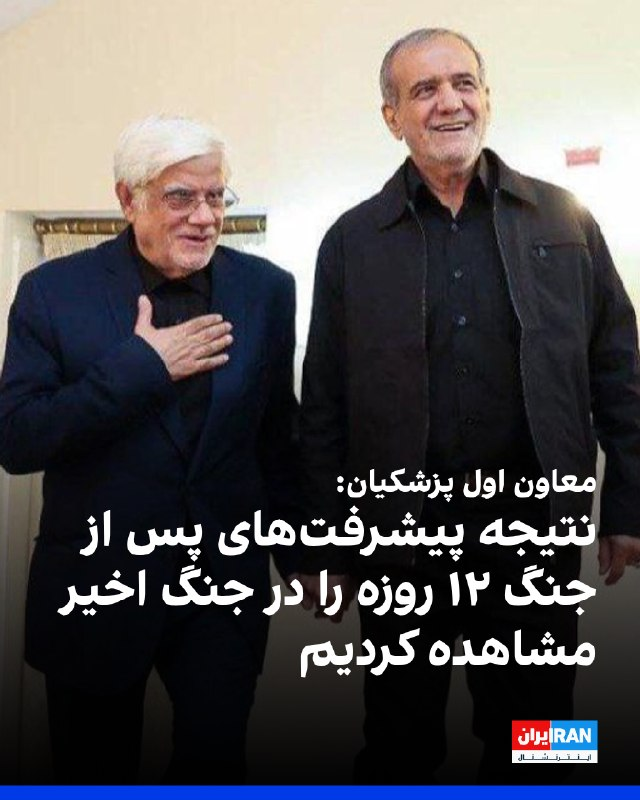

محمدرضا عارف، معاون اول مسعود پزشکیان گفت: «پس از جنگ ۱۲ روزه، ما پیشرفت‌های محسوسی در زمینه علم و فناوری بدست آوردیم که نتیجه آن را در جنگ اخیر مشاهده کردیم.»

او افزود: «حتی توانایی فناوری امروز ما نسبت به آخرین روز جنگ اخیر هم قابل مقایسه نیست.»
‌🏁 🇬🇧 IranintlTV

🤖 @VahidOOnLine

## IranIntlTV — post 340228

  

محمدرضا عارف، معاون اول مسعود پزشکیان گفت: «پس از جنگ ۱۲ روزه، ما پیشرفت‌های محسوسی در زمینه علم و فناوری بدست آوردیم که نتیجه آن را در جنگ اخیر مشاهده کردیم.»

او افزود: «حتی توانایی فناوری امروز ما نسبت به آخرین روز جنگ اخیر هم قابل مقایسه نیست.»
https://iranintl.com/202606021336

## FarsiVOA — post 219382

  <a href="telegram/content/FarsiVOA_219382_1780416303.mp4" target="_blank">🎬 Download video</a>

ارتش اسرائیل ویدیویی از هدف‌گیری «یوسف عایش عواد رمضان» منتشر و اعلام کرد «این تروریست در ربایش هیرش گلدبرگ-پولین، الی-ها کوهن، آلون اهل و اور لوی از پناهگاه در تقاطع رعیم در کشتار ۷ اکتبر مشارکت داشت.»

بنابر بیانیه ارتش اسرائیل نیروهای این ارتش، تحت فرماندهی جنوب، دوشنبه، یوسف عایش عواد رمضان، جانشین فرمانده یک سلول تروریستی نخبه حماس را در مرکز نوار غزه از بین بردند.

## FarsiVOA — post 219381

در گفت‌وگو با حسین علیزاده به وعده پرزیدنت ترامپ درباره توافق احتمالی با جمهوری اسلامی پرداختیم و بررسی کردیم چگونه ترامپ هم‌زمان با مدیریت تنش در لبنان، با محاسبات آینده‌نگرانه و ملاحظات انتخاباتی در آمریکا و اسرائیل، توجه ویژه‌ای به گسترش پیمان‌های ابراهیم دارد.

## DW_Farsi — post 125430

🔶 فلوریدا از شرکت هوش مصنوعی "اوپن‌ای‌آی" و رئیس آن شکایت کرد

ایالت فلوریدای آمریکا از شرکت هوش مصنوعی "اوپن‌ای‌آی" و مدیرعامل آن، سم آلتمن، به دلیل به خطر انداختن کودکان و نوجوانان، شکایت کرده است.

دادستان کل این ایالت در یک دعوای حقوقی، این شرکت را متهم کرده است که خطرات چت‌بات "چت‌جی‌پی‌تی" برای کودکان و نوجوانان را آگاهانه پنهان کرده و منافع تجاری را در اولویت قرار داده است.

در این شکایت آمده است که اوپن‌ای‌آی هشدارهای ایمنی داخلی را پنهان نگه داشته، کاربران را درباره خطرات محصول خود گمراه کرده و در نتیجه «کودکان نیز در معرض خطر قابل توجهی قرار گرفته‌اند».

در متن شکایت، اوپن‌ای‌آی و سم آلتمن متهم شده‌اند که بازاریابی سریع برای محصول خود و کسب سود تجاری را بر امنیت کاربران ترجیح داده‌اند.

به گفته دادستان، اوپن‌ای‌آی محصولی را روانه بازار کرده که می‌تواند به خشونت دامن بزند و اعتیادآور باشد. در این شکایت به دو مورد تیراندازی اشاره شده که عاملان آنها، طبق گزارش‌ها، هنگام برنامه‌ریزی برای ارتکاب جرم خود، از چت‌جی‌پی‌تی پرسش‌هایی کرده بودند.

در شکایت همچنین آمده است که چت‌جی‌پی‌تی داده‌های افراد زیر سن قانونی را، بدون نظارت کافی از سوی والدین، جمع‌آوری می‌کند.

دادستان فلوریدا همچنین از نبود سازوکار احراز سن کاربران برای استفاده از این اپلیکیشن انتقاد کرده است. استفاده از چت‌جی‌پی‌تی برای کودکان زیر ۱۳ سال ممنوع است و افراد زیر ۱۷ سال نیز برای استفاده از آن نیازمند رضایت والدین هستند.

با این حال، احراز هویت رسمی برای تأیید سن کاربران الزامی نیست. شرکت اوپن‌ای‌آی، خالق چت‌جی‌پی‌تی، ژانویه گذشته از سامانه‌ای رونمایی کرده بود که سن کاربران را به صورت تخمینی ارزیابی کرده و بر اساس آن، نحوه عملکرد برنامه را تنظیم می‌کند.

@dw_farsi

## idfinfarsi — post 11721

## idfinfarsi — post 11711

  <a href="telegram/content/idfinfarsi_11711_1780416304.mp4" target="_blank">🎬 Download video</a>

‼️یورش‌های هدفمند، انهدام تسلیحات و به هلاکت رساندن تروریست‌ها: فعالیت رزمندگان تیم رزمی تیپ گیوعاتی در منطقه روستاهای زوتر الشرقیه و زوتر الغربیه

⭕️در روزهای اخیر، نیروهای تیم رزمی تیپ گیوعاتی تحت فرماندهی لشکر ۳۶ عملیاتی را برای دستیابی به کنترل عملیاتی و پاکسازی منطقه روستاهای زوتر الشرقیه و زوتر الغربیه به‌عنوان بخشی از تلاش لشکر برای تقویت کنترل عملیاتی در جنوب لبنان و رفع تهدید مستقیم علیه الجلیل و متولا آغاز کردند.

⭕️نیروها از رود لیتانی عبور کرده و یورش‌های هدفمندی را علیه زیرساخت‌های تروریستی در منطقه انجام می‌دهند، تسلیحات و تروریست‌ها را شناسایی و حذف می‌کنند. تا کنون با پشتیبانی نیروی هوایی بیش از ۱۰۰ حمله انجام شده و حدود ۲۰ تروریست به هلاکت رسیده‌اند، در کنار کشف صدها مورد تسلیحات در منازل غیرنظامی در منطقه.

⭕️ارتش اسرائیل به فعالیت خود برای رفع هرگونه تهدید علیه کشور اسرائیل ادامه خواهد داد.

## alonews — post 124518

  <a href="telegram/content/alonews_124518_1780416306.webm" target="_blank">🎬 Download video</a>

👈سقوط بیت کوین به زیر ۶۷۰۰۰ دلار

🔴۷۰۰ میلیون دلار از بازار ارزهای دیجیتال در ۲ ساعت گذشته نقد شد.

✅ @AloNews خبر جنگ

## alonews — post 124517

👈روبیو درباره ارمنستان: روس‌ها از درگیری ما در ارمنستان کمتر از خوشحالی هستند.

🔴به نظر من شواهدی وجود دارد که نشان می‌دهد آن‌ها دوست دارند رئیس‌جمهور فعلی به دلیل این رابطه رو به رشد با ایالات متحده، انتخابات خود را ببازد.

✅ @AloNews خبر جنگ

## alonews — post 124516

  <a href="telegram/content/alonews_124516_1780416306.webm" target="_blank">🎬 Download video</a>

👈روبیو : در نهایت ما هنوز با چالش‌های دیگه‌ای درباره ایران روبه‌رو هستیم

🔴جدا از برنامه هسته‌ای؛ مثل این‌که پولشون رو صرف حمایت از حزب‌الله، حماس و گروه های دیگر در نقاط مختلف دنیا می‌کنن

✅ @AloNews خبر جنگ

## alonews — post 124515

  <a href="telegram/content/alonews_124515_1780416306.webm" target="_blank">🎬 Download video</a>

👈روبیو : چین این موضوع (فروش سلاح به تایوان) رو همیشه به‌عنوان یک فشار در مذاکرات مطرح می‌کنه؛

🔴 ولی این موضوع تصمیم‌گیری ما رو متوقف نکرده، در نهایت، زمان و نحوه انجامش با رئیس‌جمهوره

✅ @AloNews خبر جنگ

## alonews — post 124514

یه افسانه ژاپنی هست که میگه:
"اگر به اتوبوس نرسیدی، شاید از یک تصادف جا موندی
اگر پذیرفته نشدی، شاید از جایی اشتباه نجات پیدا کردی
اگر کسی ترکت کرد، شاید داره جا رو برای کسی که قراره وارد زندگیت بشه باز میکنه."

گاهی جهان پشت چیزی که اول شبیه بدشانسیه داره ازت محافظت میکنه
به مسیرهای غیر منتظره اعتماد کن.

[@AloTweet]

---
📅 بروزرسانی: 1405/03/12 19:21
---

## VahidOOnLine — post 243378

  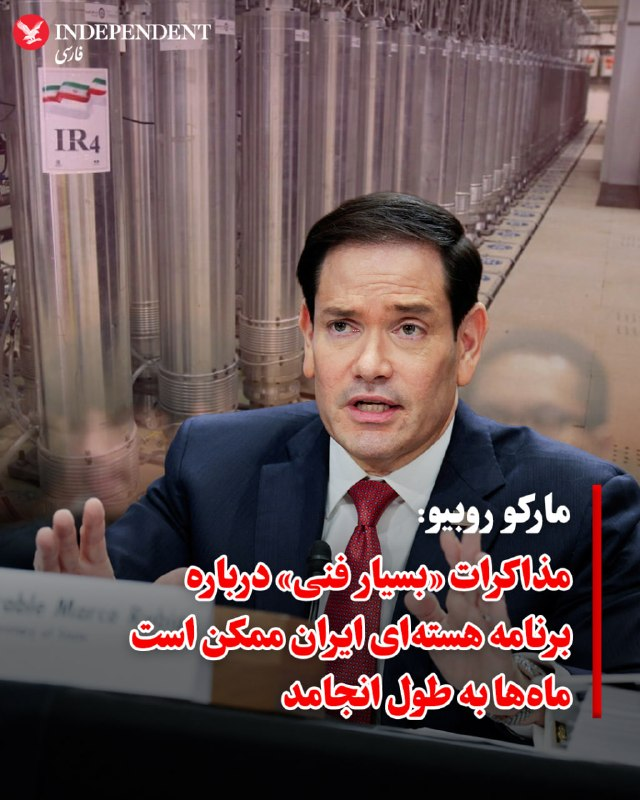

♦️ مارکو روبیو، وزیر امور خارجه ایالات متحده، روز سه‌شنبه ۱۲ خرداد اعلام کرد که مذاکرات درباره برنامه هسته‌ای ایران «بسیار فنی» خواهد بود و ممکن است ماه‌ها زمان ببرد.

روبیو تصریح کرد که ورود به این مرحله، مشروط به بازگشایی تنگه هرمز توسط ایران است. روبیو در کمیته روابط خارجی سنا گفت: «فاز دوم این است که آن‌ها باید متعهد به مذاکراتی بسیار مشخص درباره وضعیت اورانیوم با غنای بالا شوند که هنوز در جایی در دل کوه مدفون است. آن‌ها باید بر سر مذاکره برای محدودیت‌های شدید و طولانی‌مدت و یا لغو فعالیت‌های غنی‌سازی در کشورشان موافقت کنند.»

او تاکید کرد که جمهوری اسلامی ابتدا باید بازگشایی تنگه هرمز را بدون دریافت عوارض اعلام کرده و متعهد شود که مین‌ها را جمع‌آوری کرده و به سمت کشتی‌ها شلیک نخواهد کرد. روبیو همچنین خاطرنشان کرد که ایالات متحده در قبال بازگشایی تنگه، پیشنهادی برای کاهش تحریم‌ها به تهران نداده است و لغو تحریم‌ها صرفا بر اساس شرایط و اقدامات جمهوری اسلامی خواهد بود.
‌🇸🇦 Indypersian

🤖 @VahidOOnLine

## VahidOOnLine — post 243377

  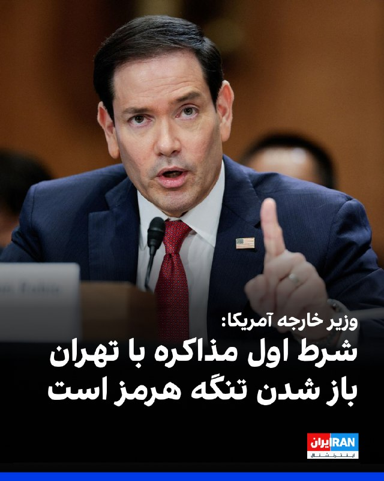

مارکو روبیو، وزیر خارجه آمریکا، در جلسه کمیته روابط خارجی سنا، گفت: «شرط شماره یک در مذاکرات با جمهوری اسلامی این است که تهران تنگه هرمز را باز کند.»

او افزود: «دولت ترامپ صرفا در ازای بازگشایی تنگه هرمز تخفیف یا لغو تحریم‌ها را به ایران پیشنهاد نکرده است.»

روبیو گفت: «هرگونه کاهش یا رفع تحریم‌ها منوط به آن خواهد بود که تهران شرایط مربوط به برنامه هسته‌ای خود را برآورده کند.»
‌🏁 🇬🇧 IranintlTV

🤖 @VahidOOnLine

## VahidOOnLine — post 243376

  <a href="telegram/content/VahidOOnLine_243376_1780415466.mp4" target="_blank">🎬 Download video</a>

♦️ مارکو روبیو، وزیر امور خارجه ایالات متحده، روز سه‌شنبه ۱۲ خرداد در جلسه استماع سنا بر موضع سختگیرانه دولت آمریکا در قبال جمهوری اسلامی تاکید کرد. او با اشاره به پیچیدگی ساختار تحریم‌ها (بین‌المللی، کنگره و اجرایی)، تصریح کرد که هرگونه کاهش فشار اقتصادی صرفا «مشروط» به تغییر رفتار هسته‌ای تهران خواهد بود.

روبیو در پاسخ به سوالات نمایندگان، غنی‌سازی اورانیوم و فعالیت‌های هسته‌ای را دلیل اصلی تحریم‌ها دانست و تاکید کرد که لغو آن‌ها تنها زمانی ممکن است که ایران از این برنامه‌ها دست بکشد. او همچنین هرگونه معامله برای کاهش تحریم‌ها در ازای بازگشایی تنگه هرمز را رد کرد و گفت چنین گزینه‌ای اصلا روی میز مذاکره نیست.
‌🇸🇦 Indypersian

🤖 @VahidOOnLine

## pm_afshaa — post 92114

  <a href="telegram/content/pm_afshaa_92114_1780415470.webm" target="_blank">🎬 Download video</a>

🔴خبرگزاری فرانسه به نقل از یه مقام اسرائیلی: همکاری نظامی و تجاری اسرائیل و امارات متحده عربی بعد جنگ تقویت شده.

💧 Rainbet.com the #1 Non-KYC Crypto Casino & Sportsbook @rainbetcom

😁 @Pm_Afshaa

## IranIntlTV — post 340227

  

مارکو روبیو، وزیر خارجه آمریکا، در جلسه کمیته روابط خارجی سنا، گفت: «شرط شماره یک در مذاکرات با جمهوری اسلامی این است که تهران تنگه هرمز را باز کند.»

او افزود: «دولت ترامپ صرفا در ازای بازگشایی تنگه هرمز تخفیف یا لغو تحریم‌ها را به ایران پیشنهاد نکرده است.»

روبیو گفت: «هرگونه کاهش یا رفع تحریم‌ها منوط به آن خواهد بود که تهران شرایط مربوط به برنامه هسته‌ای خود را برآورده کند.»
https://iranintl.com/202606021031

## FarsiVOA — post 219380

در گفت‌وگو با اسکندر لطفی، سخنگوی شورای هماهنگی تشکل‌های صنفی فرهنگیان، به تجمع کم‌سابقه دانش‌آموزان علیه تغییرات کنکور و پیامدهای جنگ پرداختیم و بررسی کردیم چگونه کاهش سن اعتراض، نشانه ورود نسل دانش‌آموز به کنشگری صنفی و اجتماعی و پبوند احتمالی آن با موج‌های اعتراضی گسترده‌تر است

## DW_Farsi — post 125429

🔶 فشار آمریکا بر عمان برای قطع روابط با ایران

روزنامه وال استریت ژورنال به نقل از مقام‌های دولتی آمریکا و کشورهای عربی، مدعی شده است، "دونالد ترامپ موضع بی‌طرفانه عمان در قبال ایران را به عنوان رفتاری خصمانه نسبت به ایالات متحده تلقی می‌کند و گفته شده، واشنگتن در حال اعمال فشار بر این کشور حوزه خلیج فارس است تا موضع خود را به نفع ایالات متحده تغییر دهد و روابط دیپلماتیک خود با ایران را قطع کند."

عمان در سیاست خارجی خود طی دهه‌های گذشته رویکردی مبتنی بر "بی‌طرفی فعال" و میانجی‌گری اتخاذ کرده است. این کشور هم‌زمان روابط نزدیک امنیتی و نظامی با ایالات متحده دارد و در کنار آن، کانال‌های دیپلماتیک باز و پایدار با ایران را حفظ کرده است.

عمان یکی از معدود کشورهای عربی است که حتی در دوره‌های تنش شدید میان تهران و واشنگتن، ارتباط مستقیم خود با ایران را قطع نکرد. در آغاز درگیری نظامی آمریکا و اسرائیل با جمهوری اسلامی ایران، مقام‌های عمانی تلاش کردند یک کانال ارتباطی غیررسمی با تهران ایجاد کنند.

به گفته مقام‌های دولت‌های عربی، این اقدام به کشورهای حاشیه خلیج فارس کمک کرد تا مسیرهای هوایی خود را دوباره بازگشایی کنند. در طول درگیری‌ها نیز ایران در مقایسه با دیگر کشورهای همسایه، توان نظامی بسیار کمتری علیه عمان به کار گرفت.

پیش از آغاز حمله نظامی آمریکا و اسرائیل به جمهوری اسلامی ایران نیز عمان نقش میانجی غیررسمی را ایفا کرده بود.

از جمله در سال‌های گذشته، این کشور در تسهیل مذاکرات محرمانه میان ایران و آمریکا که به توافق هسته‌ای ۲۰۱۵ منجر شد، نقش واسطه‌ای مهمی داشت که باعث شد مسقط در نگاه بسیاری از بازیگران منطقه‌ای به‌عنوان یک کانال ارتباطی قابل اعتماد میان ایران و غرب شناخته شود.

از نظر اقتصادی نیز روابط ایران و عمان نسبت به سایر کشورهای عربی حوزه خلیج فارس باثبات‌تر بوده است. دو کشور همکاری‌هایی در حوزه انرژی، تجارت مرزی و استفاده از بنادر داشته و دارند، هرچند حجم این روابط در مقایسه با شرکای بزرگ‌تر عمان محدود است.

در مقابل، عمان یکی از شرکای امنیتی ایالات متحده در منطقه محسوب می‌شود و آمریکا از زیرساخت‌های نظامی در خاک این کشور برای عملیات منطقه‌ای و لجستیکی استفاده می‌کند. دو کشور همچنین همکاری‌های امنیتی و نظامی طولانی‌مدتی دارند.

با این حال، عمان برخلاف برخی کشورهای شورای همکاری خلیج فارس، معمولا در تنش‌های منطقه‌ای موضع‌گیری تند علیه ایران اتخاذ نکرده است.

بنا بر گزارش وال‌استریت ژورنال، این موضوع عمان را در حفظ "بی‌طرفی تزلزل‌ناپذیر" مصمم‌تر کرده است، هرچند اکنون به نظر می‌رسد این رویکرد علیه این سلطان‌نشین واقع در سواحل جنوب شرقی شبه‌جزیره عربستان عمل می‌کند.

این سیاست دوگانه باعث شده عمان از یک سو در نگاه برخی بازیگران غربی به‌عنوان کانال ارتباطی مفید با ایران و از سوی دیگر در نگاه برخی کشورهای عربی مانند عربستان سعودی و امارات متحده عربی به‌عنوان کشوری بیش از حد نزدیک به تهران تلقی شود.

@dw_farsi

## Persian_Trend_Official — post 15520

ارتش اسرائیل اعلام کرد یوسف عایش رمضان،از اعضای حماس که در 7 اکتبر حضور داشته را کشته است.

📌 @persian_trend_official
پرشین ترند | متفاوت‌ترین کانال نظامی

## Persian_Trend_Official — post 15517

  <a href="telegram/content/Persian_Trend_Official_15517_1780415472.webm" target="_blank">🎬 Download video</a>

تصاویر ماهواره ای از یک ژوئن نشان میدهد که دست کم 80 شناور تندرو سپاه پاسداران در جنوب جزیره قشم در حال گشت زنی بوده اند.

📝 Amir

📌 @persian_trend_official
پرشین ترند | متفاوت‌ترین کانال نظامی

## IranianMinds — post 21249

  <a href="telegram/content/IranianMinds_21249_1780415473.mp4" target="_blank">🎬 Download video</a>

این چه کسشری بود من دیدم

@IranianMinds

## BBCPersian — post 282695

  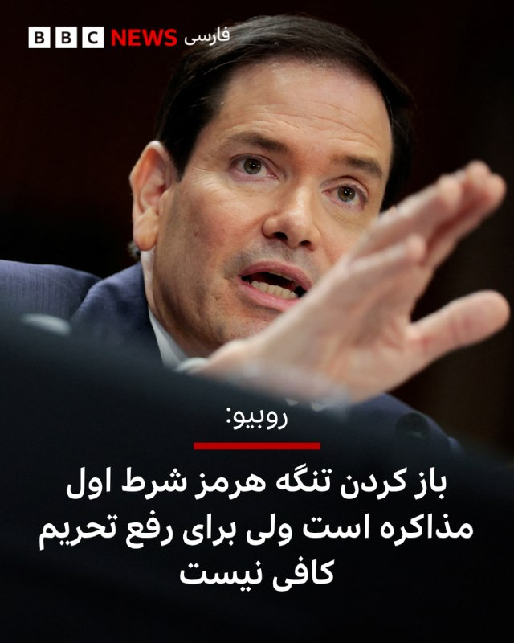

🔻مارکو روبیو به کنگره آمریکا گفت ایران قبول کرده درباره جوانبی از برنامه‌ هسته‌ایش مذاکره کند که قبلا نمی‌پذیرفت.

وزیر خارجه آمریکا گفت گفت‌وگو با ایران ادامه دارد اما تضمینی وجود ندارد که به پایان جنگ منتهی شود.

او همچنین از ایران خواست تنگه هرمز را باز کند و گفت این شرط اول آمریکاست اما صرف این کار باعث برداشته شدن تحریم‌ها نخواهد شد و رفع تحریم منوط به شرایطی خواهد بود.

ساعتی قبل خبرگزاری فارس به نقل از یک منبع آگاه که نامش را ذکر نکرد گفت تبادل پیام‌ بین ایران و آمریکا «دست‌کم از چند روز پیش متوقف شده است.»

گزارش فارس می‌گوید که آخرین پیام از تهران به واشنگتن «پیامی روشن درباره لبنان» بود اما جزئیات بیشتری ارائه نکرد.

مارکو روبیو که مشاور امنیت ملی دونالد ترامپ هم هست صبح روز سه‌شنبه در برابر کمیسیون روابط خارجی سنای آمریکا درباره بودجه درخواستی وزارت خارجه به پرسش‌های نمایندگان پاسخ داد.

دولت ترامپ به دنبال تأیید کنگره برای کاهش۳۰ درصد بودجه امور خارجی و افزایش ۵۰ درصد بودجه نظامی است.

📸Reuters
@BBCPersian

## idfinfarsi — post 11708

  <a href="telegram/content/idfinfarsi_11708_1780415476.mp4" target="_blank">🎬 Download video</a>

‼️به منظور رفع تهدید: ارتش اسرائیل تروریستی را که در ربودن زنده یاد هیرش گلدبرگ-پولین، الی-ها کوهن، آلون اهل و اور لوی از پناهگاه در تقاطع رعیم در کشتار ۷ اکتبر مشارکت داشت، به هلاکت رساند

❌نیروهای ارتش اسرائیل تحت فرماندهی جنوب روز گذشته (دوشنبه) در مرکز نوار غزه حمله کرده و تروریست یوسف عایش عواد رمضان، جانشین فرمانده یک سلول تروریستی نخبه در سازمان تروریستی حماس را به هلاکت رساندند.

⭕️رمضان در خلال کشتار ۷ اکتبر به داخل خاک کشور نفوذ کرده و در ربودن رنده یاد هیرش گلدبرگ-پولین، الی-ها کوهن، آلون اهل و اور لوی از پناهگاه در تقاطع رعیم مشارکت داشت.

⭕️همچنین این تروریست در طول جنگ و در دوره اخیر به پیشبرد طرح‌های تروریستی علیه نیروهای ارتش اسرائیل و شهروندان کشور اسرائیل پرداخته و از این رو تهدیدی فوری برای نیروهای ما که در نوار غزه فعالیت می‌کنند محسوب می‌شد.

⭕️پیش از حمله، اقداماتی برای کاهش آسیب به غیرنظامیان انجام شد، از جمله استفاده از مهمات دقیق و رصد‌های هوایی.

⭕️نیروهای ارتش اسرائیل تحت فرماندهی جنوب مطابق با توافق در منطقه مستقر هستند و به فعالیت برای رفع هرگونه تهدید فوری ادامه خواهند داد.

## Hranews — post 113337

اجرای حکم اعدام یک زندانی در زندان دامغان

❗️
❗️
❗️
❗️
❗️– سحرگاه روز دوشنبه ۱۱ خردادماه، حکم یک زندانی که پیشتر از بابت اتهامات مرتبط با جرائم موادمخدر به #اعدام محکوم شده بود، در زندان دامغان اجرا شد.

ادامه مطلب

#مرتضی_صادق‌زاده

↘️
@hranews_bot تماس ✉️ - @Hranews کانال هرانا 🆑

## alonews — post 124513

🔥 همراه با ساب + حجم مصرفی، فقط 8T! 🚀 😍فقط گیگی 8 تومن😍 ✅ باخرید 90 گیگ 100 گیگ تحویل بگیرید 😍✅ ❌ فقط تا پایان امشب ❌ 🔥 اگه دنبال یه VPN پایدار و بدون دردسر می‌گردی، این پلن مخصوص خودته! @Netaazaadbot @NetAazaadBot ✅ همراه با ساب + حجم مصرفی ✅ 15…

## alonews — post 124512

  

🔥 همراه با ساب + حجم مصرفی، فقط 8T! 🚀

😍فقط گیگی 8 تومن😍

✅ باخرید 90 گیگ 100 گیگ تحویل بگیرید 😍✅
❌ فقط تا پایان امشب ❌

🔥 اگه دنبال یه VPN پایدار و بدون دردسر می‌گردی، این پلن مخصوص خودته!

@Netaazaadbot
@NetAazaadBot

✅ همراه با ساب + حجم مصرفی
✅ 15 سرور اختصاصی پرسرعت
✅ اتصال پایدار و بدون قطعی
✅ سرعت بالا حتی در ساعات شلوغ

@Netaazaadbot
@NetAazaadBot

📩 برای خرید و دریافت سرویس استارت رو بزن✅

## alonews — post 124511

  <a href="telegram/content/alonews_124511_1780415478.webm" target="_blank">🎬 Download video</a>

👈وضعیت متروی کی‌یف پایتخت اوکراین در بحبوحه حملات سنگین روسیه

✅ @AloNews خبر جنگ

## alonews — post 124510

  <a href="telegram/content/alonews_124510_1780415479.webm" target="_blank">🎬 Download video</a>

👈بر اساس گزارش بلومبرگ، امارات متحده عربی در حال بررسی طرحی برای ساخت یک خط لوله اضافی انتقال محصولات پالایش‌شده است. این خط لوله با هدف دور زدن تنگه هرمز و انتقال مستقیم سوخت به سواحل شرقی این کشور در نظر گرفته شده است.

✅ @AloNews خبر جنگ

---
📅 بروزرسانی: 1405/03/12 19:04
---

## VahidOOnLine — post 243375

  

یک مقام ارشد اسرائیلی به خبرگزاری فرانسه گفت اسرائیل و امارات متحده عربی در پی جنگ خاورمیانه به یکدیگر نزدیک‌تر شده‌اند و به افزایش همکاری‌های نظامی و فرصت‌های گسترش روابط تجاری و اقتصادی اشاره کرد.

این مقام مستقر در منطقه خلیج فارس گفت دو هیات اسرائیلی هفته آینده وارد امارات خواهند شد، از جمله تیمی از وزارت حمل‌ونقل که درباره یک کریدور تجاری مرتبط‌کننده هند، خاورمیانه و اروپا گفت‌وگو خواهد کرد.

این نخستین سفرها از زمان آغاز جنگ در ۲۸ فوریه خواهد بود؛ زمانی که ایالات متحده و اسرائیل به جمهوری اسلامی حمله کردند و این اقدام واکنش تهران علیه کشورهای خلیج فارس میزبان پایگاه‌های نظامی آمریکا را در پی داشت.
‌🏁 🇬🇧 IranintlTV

🤖 @VahidOOnLine

## VahidOnline — post 75878

مارکو روبیو در جلسه کمیته روابط خارجی سنا گفت: «چیزی به نام نیروی دریایی جمهوری اسلامی وجود ندارد. آنچه باقی مانده تعدادی قایق کوچک است که روی آن‌ها مسلسل نصب شده و نیروی دریایی واقعی در کف اقیانوس قرار دارد.»
او افزود: جمهوری اسلامی همچنان تعداد زیادی پهپاد در اختیار دارد. توان بازدارندگی متعارف تهران به‌طور قابل توجهی تضعیف شده است.
@VahidOOnLine
وزیر امور خارجه ایالات متحده در جلسه استماع سنا تاکید کرد که شرط اول آمریکا برای مذاکره با جمهوری اسلامی، بازگشایی کامل و بدون قید و شرط تنگه هرمز است.
او در ادامه تاکید کرد که منظور از بازگشایی، بازگشت شرایط به پیش از جنگ و عبور و مرور آزاد تمام کشتی‌ها از این آبراه راهبردی، بدون محدودیت و مانند سایر آبراه‌های جهان است.
@VahidOOnLine

📡 @VahidOnline

## IranIntlTV — post 340226

  <a href="telegram/content/IranIntlTV_340226_1780414484.mp4" target="_blank">🎬 Download video</a>

در جریان انقلاب ملی ایرانیان ورزشکاران زیادی هدف گلوله ماموران حکومت قرار گرفتند و کشته شدند. سحر فرد، قهرمان تکواندو و مربی ورزش، از جمله ورزشکارانی بود که ۱۸ دی‌ماه در جریان اعتراضات سراسری در قرچک ورامین با شلیک نیروهای امنیتی جان باخت.

گزارش فربد سروندی، خبرنگار ایران‌اینترنشنال
@iranintltv

## IranIntlTV — post 340225

  

یک مقام ارشد اسرائیلی به خبرگزاری فرانسه گفت اسرائیل و امارات متحده عربی در پی جنگ خاورمیانه به یکدیگر نزدیک‌تر شده‌اند و به افزایش همکاری‌های نظامی و فرصت‌های گسترش روابط تجاری و اقتصادی اشاره کرد.

این مقام مستقر در منطقه خلیج فارس گفت دو هیات اسرائیلی هفته آینده وارد امارات خواهند شد، از جمله تیمی از وزارت حمل‌ونقل که درباره یک کریدور تجاری مرتبط‌کننده هند، خاورمیانه و اروپا گفت‌وگو خواهد کرد.

این نخستین سفرها از زمان آغاز جنگ در ۲۸ فوریه خواهد بود؛ زمانی که ایالات متحده و اسرائیل به جمهوری اسلامی حمله کردند و این اقدام واکنش تهران علیه کشورهای خلیج فارس میزبان پایگاه‌های نظامی آمریکا را در پی داشت.
https://iranintl.com/202606020409

## FarsiVOA — post 219379

تیم فوتبال جمهوری اسلامی در فاصله ۹ روز مانده تا رقابت‌های جام جهانی با بحرانی‌ترین شرایط روبروست و حالا پیرترین تیم تاریخ ایران را به میدان می‌فرستد.

## FarsiVOA — post 219378

  <a href="telegram/content/FarsiVOA_219378_1780414486.mp4" target="_blank">🎬 Download video</a>

خواهر ابوالفضل (سپهر) موسوی‌فر، از کشته‌شدگان دی ماه ۱۴۰۴، بعد از بازگشایی محدود اینترنت در ایران، ویدیویی از سوگواری پدرش بر آرامگاه سپهر منتشر کرده و نوشته است: «هزاران سال اگر باران ببارد … نشوید خون ناحق را از این خاک»

سپهر موسوی‌فر، ۱۸ ساله، ۱۹ دی ۱۴۰۴ مقابل ساختمان دادگستری با گلوله نیروهای حکومتی در فولادشهر کشته شد. ⁨

## DW_Farsi — post 125428

🔶 از جنگ ایران تا تب هوش مصنوعی؛ روزهای پرتنش بازار بورس آلمان

به نظر می‌رسد نوسان‌های شدید بازار سهام آلمان امروز سه‌شنبه دوم ژوئن (۱۲ خرداد) نیز ادامه پیدا کند. به گزارش کانال اول تلویزیون آلمان (ARD) گزارش‌های مطلوب شرکت‌ها و موج هیجان پیرامون هوش مصنوعی، به طور کلی در خدمت رشد قیمت‌ها قرار می‌گیرند. اما جنگ ایران و قیمت بالای نفت، از اشتیاق سرمایه‌گذاران برای خرید می‌کاهد.

پس از ثبت رکوردهای تازه در وال‌استریت، سرمایه‌گذاران آلمانی نیز در آغاز معاملات به خرید روی آوردند. شاخص سهام آلمان (داکس) پس از شروع معاملات، با ۲۰۴ واحد بیشتر از روز گذشته، به ۲۵ هزار و ۲۰۷ واحد رسید. به این ترتیب، این شاخص پس از آغازی نه‌چندان یکنواخت در هفته، همچنان به شکل محسوسی بالاتر از مرز ۲۵ هزار واحد باقی مانده است.

با این حال، موضوع اصلی همچنان گفت‌وگوهای صلح میان ایران و آمریکا است. تهران اعلام کرده بود که مذاکرات با واشنگتن متوقف شده است. دلیل این تصمیم، اقدامات اسرائیل علیه حزب‌الله لبنان، گروه شبه‌نظامی مورد حمایت ایران، عنوان شده است.

دونالد ترامپ، رئیس جمهور آمریکا، این موضوع را رد کرده و گفته است که مذاکرات "با سرعتی بالا" ادامه دارد. او در مصاحبه‌ای تلویزیونی در شامگاه دوشنبه گذشته بار دیگر امید به حل‌وفصل سریع مناقشه را تقویت کرد و گفت انتظار دارد ظرف "هفته آینده" توافقی با ایران حاصل شود.

با این حال، بسیاری از فعالان بازارهای مالی اکنون از اظهارات ترامپ خسته شده‌اند؛ اظهاراتی که به باور بسیاری، اغلب فاقد پشتوانه و اطلاعات قابل اتکاست.

توماس مارتین، از شرکت آمریکایی مدیریت دارایی GLOBALT، گفته است: «واقعاً نمی‌دانیم وضعیت چگونه است.» به گفته او، بازارها در مجموع روی دستیابی به توافق حساب می‌کنند، اما اطلاعات قابل اعتماد در این زمینه در دسترس نیست.

بسیاری از معامله‌گران همچنین این موضوع را مورد انتقاد قرار می‌دهند که ترامپ از نوسان‌های مداومی که با اظهارنظرهایش در بازارها ایجاد می‌کند، سود هنگفتی به دست می‌آورد.

تحقیقات شبکه دوم تلویزیون آلمان (ZDF) و روزنامه سوئیسی نویه تسورشه (NZZ) نشان می‌دهد که اظهارات رئیس جمهور آمریکا بی‌ارتباط با نحوه چینش سرمایه‌گذاری‌های سبد دارایی او نیست؛ گرچه این معاملات اغلب از طریق واسطه‌ها انجام می‌شوند.

پس از رشد قابل توجه قیمت‌ها در روز گذشته، بهای نفت خام در بازارهای جهانی بامداد امروز سه‌شنبه اندکی کاهش یافت؛ موضوعی که واکنشی به وضعیت نامطمئن جهان تلقی می‌شود.

نفت برنت دریای شمال که معیار اصلی بازار آلمان است، با کاهش سه‌دهم درصدی به ۹۴٫۷۰ دلار برای هر بشکه (۱۵۹ لیتر) رسید. نفت خام "وست تگزاس اینترمیدیت" آمریکا (WTI) نیز با افت چهار دهم درصدی، ۹۱٫۷۷ دلار معامله شد.

با این حال، مشتریان جایگاه‌های سوخت در آلمان تأثیر چندانی از این کاهش احساس نمی‌کنند. باشگاه خودروی آلمان (ADAC) بار دیگر انتقاد کرده که شرکت‌های نفتی افزایش قیمت‌ها را بلافاصله به مصرف‌کنندگان انتقال می‌دهند، اما کاهش قیمت‌ها را با تأخیر و اغلب فقط به شکل محدود اعمال می‌کنند.

در بازار سهام آمریکا و آسیا، سهام شرکت‌های فناوری در مرکز توجه قرار گرفته است. شرکت آلفابت، مالک گوگل، قصد دارد برای تأمین مالی توسعه پرهزینه زیرساخت‌های هوش مصنوعی خود، ۸۰ میلیارد دلار سرمایه اختصاص دهد. با این حال، سهام آلفابت در معاملات امروز پس از ساعات رسمی بازار، حدود دو درصد کاهش یافت.

@dw_farsi

## RadioFarda — post 157824

روبیو: ایران به‌دنبال توسعه توانمندی‌های تسلیحاتی خود به عنوان سپر دفاعی برنامه هسته‌ایش بود

🔸وزیر خارجه آمریکا روز سه‌شنبه ۱۲ خرداد گفت که ایران با مذاکره دربارهٔ برخی جنبه‌های برنامهٔ هسته‌ای خود که پیش‌تر از گفت‌وگو درباره آن‌ها خودداری می‌کرد، موافقت کرده است.

🔸مارک روبیو که در کمیتهٔ روابط خارجی سنا درباره درخواست بودجه وزارت خارجه ایالات متحده صحبت می‌کرد، در عین حال تأکید کرد که این موضوع هیچ تضمینی ایجاد نمی‌کند که مذاکرات در نهایت به توافقی برای پایان دادن به جنگ میان آمریکا و اسرائیل با ایران منجر شود.

🔸او به سناتورها گفت ایران قصد داشت توانمندی‌های تسلیحاتی متعارف خود را به‌عنوان یک «سپر دفاعی» برای برنامهٔ هسته‌ایش توسعه دهد.

🔸وزیر خارجه آمریکا گفت: «آن‌ها تلاش می‌کردند یک سپر متعارف ایجاد کنند و سپس پشت آن سپر متعارف پنهان شوند».

🔸روبیو با این توضیح در واقع تشریح کرد که چرا دونالد ترامپ معتقد بود آغاز جنگ ضروری است.
او همچنین گفت که دولت ترامپ در ازای صرفاً بازگشایی تنگه هرمز، هیچ پیشنهاد کاهش یا لغو تحریم‌ها به ایران ارائه نکرده است.

🔸وزیر خارجه آمریکا تأکید کرد که هرگونه کاهش تحریم‌ها تنها در صورتی مطرح خواهد شد که تهران شرایط تعیین‌شده مرتبط با برنامه هسته‌ای خود را برآورده کند.

🔸آقای روبیو قرار است طی دو روز آینده نیز در کمیته روابط خارجی مجلس نمایندگان و همچنین زیرکمیته‌های تخصیص بودجه سنا و مجلس حاضر شود. دولت ترامپ در حالی به دنبال جلب موافقت کنگره برای کاهش ۳۰ درصدی بودجه امور خارجی است که هم‌زمان خواستار افزایش ۵۰ درصدی هزینه‌های نظامی شده است.

🔸آقای روبیو در بخشی از اظهاراتش گفت که «ما همچنان تنها ابرقدرت جهانی جهان هستیم، قدرتمندترین کشور روی زمین».

🔸وزیر خارجه آمریکا افزود: ما بزرگ‌ترین اقتصاد دنیا را در اختیار داریم، قدرتمندترین نیروی نظامیِ شناخته‌شده در تاریخ بشر را داریم، دلار ما همچنان ارز ذخیرهٔ اصلی جهان است و زبان ما نیز در سراسر دنیا به‌طور گسترده مورد استفاده قرار می‌گیرد.

🔸روبیو پیش‌تر همراه با دیگر مقام‌های ارشد دولت در جلسات غیرعلنی درباره جنگ ایران به نمایندگان کنگره توضیحاتی داده بود، اما تاکنون به‌صورت علنی درباره این درگیری شهادت نداده بود.

🔸سناتور جین شاهین، ارشدترین عضو دموکرات کمیته روابط خارجی سنا، به‌شدت از روبیو انتقاد کرد و گفت او اطلاعات کافی دربارهٔ برنامه‌های دولت در اختیار کنگره قرار نداده است.
او گفت: «وقتی با رأی‌دهندگانم صحبت می‌کنم، آن‌ها خواهان بهبود وضعیت اقتصادی در داخل کشور هستند، نه تغییر حکومت در هاوانا، کاراکاس یا تهران».

🔸شاهین همچنین افزود: «شما به کنگره اطلاعیه‌ای دربارهٔ اختیارات جنگی ارسال کردید که در آن ادعا شده بود آمریکا درگیر خصومت‌های فعال با ایران نیست؛ در حالی که ایالات متحده در حال انجام حملات علیه ایران بود و ایران نیز سفارتخانه‌ها و پایگاه‌های آمریکا در سراسر خاورمیانه را هدف قرار می‌داد. این مشورت با کنگره نبود؛ بلکه تلاشی بود برای فرار از پاسخ‌گویی به این کمیته و این کنگره درباره این جنگ».

🔸به گزارش خبرگزاری رویترز، شهروندان آمریکایی از افزایش قیمت‌ها به‌طور فزاینده‌ای ناراضی هستند و جمهوری‌خواهان امیدوارند ترامپ بتواند تنگه هرمز را دوباره به روی کشتیرانی باز کند و قیمت بنزین را پیش از انتخابات ماه نوامبر کاهش دهد؛ انتخاباتی که مشخص خواهد کرد آیا این حزب اکثریت شکنندهٔ خود در کنگره را حفظ می‌کند یا نه.

🔸ترامپ همچنین با فشار جناح تندرو ضدایران در حزب خود روبه‌روست؛ گروهی که با هرگونه امتیازدهی به تهران مخالفت می‌کنند.

🔸قانون‌گذاران آمریکایی، از جمله برخی جمهوری‌خواهان هم‌حزبی ترامپ، همچنین خواستار اطلاعات بیشتری از دولت درباره راهبرد آن در قبال ایران و سایر اولویت‌های سیاست خارجی شده‌اند.

@RadioFarda

## IranianMinds — post 21248

  

فک کن الان همینا حرف از وطن میزنن

@IranianMinds

## Dirty_Kids — post 390839

  

رئیس بگا رفت.

@Dirty_Kids 👻

## Hranews — post 113336

  

محرومیت از تماس و ملاقات؛ تداوم بازداشت جواد علیکردی در زندان وکیل‌آباد مشهد

❗️
❗️
❗️
❗️
❗️– جواد علیکردی، برادر خسرو علیکردی، وکیل دادگستری جانباخته، با گذشت ماه‌ها از زمان بازداشت، همچنان به‌صورت بلاتکلیف در زندان وکیل‌آباد مشهد نگهداری می‌شود. وی از زمان بازداشت تاکنون از امکان برقراری تماس تلفنی و ملاقات با خانواده محروم بوده و وضعیت پرونده او کماکان نامشخص است.

به گزارش خبرگزاری هرانا، ارگان خبری مجموعه فعالان حقوق بشر در ایران، جواد علیکردی کماکان در زندان وکیل‌آباد مشهد، در بازداشت به‌سر میبرد.

بر اساس اطلاعات دریافتی هرانا، آقای علیکردی از زمان بازداشت تاکنون از امکان برقراری تماس تلفنی و ملاقات با خانواده محروم مانده است. همچنین با وجود گذشت مدت قابل توجهی از بازداشت، هنوز حکمی علیه وی صادر نشده و پرونده او در مرحله رسیدگی قرار دارد.

ادامه مطلب

#جواد_علیکردی #خسرو_علیکردی

↘️
@hranews_bot تماس ✉️ - @Hranews کانال هرانا 🆑

## alonews — post 124509

  <a href="telegram/content/alonews_124509_1780414489.webm" target="_blank">🎬 Download video</a>

👈جبهه داخلی اسرائیل: محدودیت‌ها در شهرک‌های مرزی با لبنان کاهش می‌یابد

✅ @AloNews خبر جنگ

---
📅 بروزرسانی: 1405/03/12 18:54
---

## VahidOOnLine — post 243374

  

♦️ مارکو روبیو، وزیر امور خارجه ایالات متحده، روز سه‌شنبه ۱۲ خرداد در جلسه استماع سنا تاکید کرد که شرط اول آمریکا برای مذاکره با جمهوری اسلامی، بازگشایی کامل و بدون قید و شرط تنگه هرمز است. او در ادامه تاکید کرد که منظور از بازگشایی، بازگشت شرایط به پیش از جنگ و عبور و مرور آزاد تمام کشتی‌ها از این آبراه راهبردی، بدون محدودیت و مانند سایر آبراه‌های جهان است.
‌🇸🇦 Indypersian

🤖 @VahidOOnLine

## WithYashar — post 13272

دایرکتاتون انقدر ماه بود که الان میرم اتاق جنگ 
💻

## FoxNewsTwitter — post 342501

  

Fox News (Twitter/X)

“See you at SCOTUS.”

Secretary Pete Hegseth cutting straight to the point after a federal appeals court ruled 2-1 against the Trump administration's ban on transgender troops serving in the military.

The three-judge panel found the administration likely violated the constitutional rights of transgender servicemembers and largely upheld a lower court's decision blocking the policy.

The ruling is temporarily on hold, but the legal battle now appears headed toward a potential Supreme Court showdown.

## FoxNewsTwitter — post 342500

  <a href="telegram/content/FoxNewsTwitter_342500_1780413890.mp4" target="_blank">🎬 Download video</a>

Fox News (Twitter/X)

JUST IN: Secretary of State Marco Rubio delivers a blunt assessment of Iran's military power, declaring that the regime's naval forces have been entirely eliminated.

Rubio mocked their remaining maritime assets and said their sunken ship are nothing more than soon-to-be underwater reefs.

"Today, there is no Iranian navy. There is no such thing. There's a bunch of Boston whalers with machine guns on them.”

“But there is no navy. There is no Iranian navy. It lies at the bottom of the ocean. And we'll assume, within a number of years, be prime fishing spots because they'll turn into reefs."

## pm_afshaa — post 92113

شاهدخت نور پهلوی:ما برای تاج و تخت مبارزه نمیکنیم ما برای ازادی مردم که از آنها سلب شده است مبارزه میکنیم 
💧 Rainbet.com the #1 Non-KYC Crypto Casino & Sportsbook @rainbetcom 
😁 @Pm_Afshaa

## pm_afshaa — post 92112

  <a href="telegram/content/pm_afshaa_92112_1780413892.mp4" target="_blank">🎬 Download video</a>

شاهدخت نور پهلوی:ما برای تاج و تخت مبارزه نمیکنیم ما برای ازادی مردم که از آنها سلب شده است مبارزه میکنیم

💧 Rainbet.com the #1 Non-KYC Crypto Casino & Sportsbook @rainbetcom

😁 @Pm_Afshaa

## pm_afshaa — post 92111

  <a href="telegram/content/pm_afshaa_92111_1780413893.mp4" target="_blank">🎬 Download video</a>

🔴مارکو روبیو: اگر مذاکرات به نتیجه نرسه، به وضوح همچنان مشکلی در مورد جاه‌طلبی‌های هسته‌ای آنها وجود خواهد داشت؛ اما چیزی که دیگر به عنوان سپر متعارفی برای پنهان شدن پشت آن است، ندارن.

💧 Rainbet.com the #1 Non-KYC Crypto Casino & Sportsbook @rainbetcom

😁 @Pm_Afshaa

## pm_afshaa — post 92110

🔴روبیو: اگر ایران با توقف هدف قرار دادن کشتی‌ها موافقت کند، به محاصره پایان خواهیم داد

💧 Rainbet.com the #1 Non-KYC Crypto Casino & Sportsbook @rainbetcom

😁 @Pm_Afshaa

## IranIntlTV — post 340224

  <a href="telegram/content/IranIntlTV_340224_1780413894.mp4" target="_blank">🎬 Download video</a>

خبرگزاری کار ایران (ایلنا) در گزارشی نوشت با توجه به ثابت ماندن کرایه بار و افزایش هزینه‌ها، ادامه کار برای رانندگان کامیون صرفه اقتصادی ندارد.

احمد علوی، اقتصاددان، به ایران‌اینترنشنال گفت که این مشکل ریشه در اقتصاد سیاسی حاکمیت و نحوه اختصاص منابع دارد
@iranintltv

## Shin_Persian — post 6407

  

Shin ✓ @hey_itsmyturn
Tue, 02 Jun 2026 15:20:54 UTC

Wing of Zion FCF flight from and to Nevatim AB
#Israel 🇮🇱

فارسی

پرواز FCF (چک فنی پرواز) هواپیمای «بال صهیون» از مبدأ و به مقصد پایگاه هوایی نواتیم
#Israel 🇮🇱

𝕏 · @shin_persian

## DW_Farsi — post 125427

🔶 دانشجویان زیر فشارهای امنیتی؛ موج تازه اخراج و تعلیق

🔻گزارشی از نیلوفر غلامی

روزنامه شرق در گزارشی از افزایش فشار بر دانشجویان اندکی پس از بازگشایی دانشگاه‌ها به دنبال تعطیلی دو ماهه در نتیجه جنگ خبر داده است. بر اساس این گزارش، ده‌ها و در برخی موارد صدها دانشجو در دانشگاه‌های مختلف با روندهای انضباطی، احکام تعلیق و حتی اخراج مواجه شده‌اند.

آنگونه که شرق نوشته، در دانشگاه شریف پنج تا هفت دانشجو حکم اخراج گرفته، بیش از ۲۰ دانشجو یک تا سه ترم از تحصیل تعلیق شده‌اند و سامانه‌های آموزشی ۲۰ تا ۲۵ دانشجوی دانشگاه بهشتی از دسترس‌شان خارج شده است. همچنین برای بیش از صد دانشجوی دانشگاه علم و صنعت پرونده انضباطی تشکیل شده و ۱۵۰ تا ۲۰۰ دانشجوی دانشگاه تهران در حال نوشتن دفاعیه‌های خود هستند.

به گفته شورای صنفی دانشگاه صنعتی شریف، بخش قابل توجهی از پرونده‌ها به "فعالیت دانشجویان در فضای مجازی، از جمله محتوای پروفایل، پیام در گروه‌های خصوصی یا بازنشر مطالب در شبکه‌های اجتماعی" مربوط بوده است.

لیلا حسین‌زاده، فعال سابق دانشجویی چپ، در گفت‌وگو با دویچه وله فارسی می‌گوید از نگاه او این موج برخوردها، در واقع "تکمیل پروسه‌ تصفیه‌ دانشگاه پس از دی‌ماه گذشته است". او می‌افزاید: «با فروکش کردن نسبی شرایط جنگی، رژیم با فراغ بال بیشتری انتقام از دانشگاه و مشخصا پاکسازی مجدد آن را پی گرفته است.»

خبرنگار روزنامه شرق در گزارش مفصل خود با شماری از دانشجویان در دانشگاه‌های گوناگون تهران صحبت کرده است و به گفته آنان شرایط پیش آمده باعث شده «دانشجویان در ابتدایی‌ترین امور تحصیلی خود مثل انتخاب واحد، حذف و اضافه و حتی ثبت نمرات میان‌ترم دچار مشکل جدی شوند.»

از سوی دیگر روایت‌های دانشجویان حاکی از آن است که برخوردهای صورت گرفته در دانشگاه‌ها مواد و اصول مختلفی از "شیوه‌نامه اجرایی آیین‌نامه انضباطی دانشجویان" را نقض می‌کند.

لیلا حسین‌زاده معتقد است که حتی با تشدید سرکوب دانشجویان و امنیتی‌تر شدن فضای دانشگاه نیز جمهوری اسلامی قادر به پیشبرد سیاست‌های خود نخواهد بود.

او می‌گوید: «رژیم طی سال‌های گذشته موفق شده بود کار متشکل در دانشگاه‌ها را تا حدود زیادی سرکوب کند؛ امروز در پی سرکوب تمام‌عیار وجه جنبشی دانشگاه‌ها هم هست، اما این ابدا به معنای خاموشی دانشگاه‌ها نیست. شاید دانشگاه در نقش پیشروانه و روشنفکرانه برای جنبش‌های مردمی، تحت سرکوب مداوم و تصفیه‌های سیستماتیک طبقاتی، جغرافیایی، جنسیتی و مستقیما سیاسی، توانش کاهش بیابد، اما دانشگاه به عنوان پایگاه و بخشی از جنبش جوانان در ایران، پیش خواهد رفت.»

دانشگاه در ایران هرگز تنها یک نهاد آموزشی نبوده، بلکه در دهه‌های گذشته یکی از مهم‌ترین فضاهای تولید اندیشه، شکل‌گیری مطالبات اجتماعی و سازماندهی کنش‌های سیاسی و مدنی بوده است.

از همین رو، دانشگاه همواره زیر ذره‌بین حکومت قرار داشته و جمهوری اسلامی تلاش کرده است این فضا را تحت کنترل خود نگه دارد. از "انقلاب فرهنگی" در سال‌های ابتدایی پس از انقلاب تا برخورد با تشکل‌های دانشجویی، استادان منتقد و فعالان دانشگاهی در دهه‌های بعد، دانشگاه بارها به عنوان عرصه‌ای حساس از منظر حاکمیت تعریف شده است.

این حساسیت ریشه در نقش تاریخی دانشجویان در تحولات سیاسی و اجتماعی ایران دارد. دانشگاه‌ها به دلیل تمرکز جمعیت جوان، دسترسی به اطلاعات و امکان شکل‌گیری شبکه‌های اجتماعی و فکری، اغلب به محلی برای طرح نقدها و اعتراضات تبدیل شده‌اند.

به همین دلیل، بسیاری از ناظران معتقدند که سیاست‌های کنترلی در دانشگاه‌ها تنها به مدیریت فضای آموزشی محدود نمی‌شود، بلکه بخشی از تلاش گسترده‌تر حکومت برای کنترل عرصه عمومی و جلوگیری از شکل‌گیری جنبش‌های اعتراضی است؛ رویکردی که در دوره‌های مختلف، با شدت و شیوه‌های متفاوت، ادامه یافته است.

متن کامل گزارش را در وب سایت دویچه وله فارسی بخوانید.

@dw_farsi

## Persian_Trend_Official — post 15516

مارکو روبیو، وزیر امور خارجه: در ازای بازگشایی تنگه هرمز هیچ تحریمی رفع نخواهد شد، بلکه این امتیاز فقط در ازای برنامه هسته‌ای داده می‌شود.

📝 Amir

📌 @persian_trend_official
پرشین ترند | متفاوت‌ترین کانال نظامی

## IranianMinds — post 21247

  <a href="telegram/content/IranianMinds_21247_1780413896.mp4" target="_blank">🎬 Download video</a>

🔴 حسینی؛ سردبیر خط انرژی:

وقتی میرم صداوسیما میگن یه چیزایی رو نگو تا مردم نترسن و امیدشون رو از دست ندن ولی الان اینجا میگم.

۲۵ درصد از زیرساخت انرژی کشور توی جنگ اخیر از بین رفته. منتظر تابستونی بسیار گرم و زمستونی بسیار سرد باشید.

کمبود شدید بنزین داریم. توی تابستون خاموشی زیادی داریم و زمستون هم کمبود گاز شدید داریم.
اگه الان هنوز چیزی حس نمیکنید چون فصل بهاریم.

@IranianMinds

## IranianMinds — post 21246

  

🔴فقط 
5️⃣ روز فرصت باقی مونده
🔴

🎉 500 هزارتومن بونوس رایگان فقط با ثبت نام بدون هیچگونه واریزی!

😮 تنها سایتی که با عضویت بدون واریز 500,000 تومان شارژ بی قیدو شرط میده #وینرو هست
💰

7️⃣
1️⃣ خرداد، افتتاحیه سایت با جوایز بزرگ
🔥

👑 #معتبرترین سایت ایرانی 
⬇️

🌐 Winro.io

🌐 Winro.io

📱کانال اخبار و هدایا AR12 
🎁

📱 @winro_io

## Dirty_Kids — post 390837

جنگ Ai ادامه داره
از کافه شروع شد دیگه به همه‌جا سرایت کرد

@Dirty_Kids 👻

## alonews — post 124508

  <a href="telegram/content/alonews_124508_1780413898.mp4" target="_blank">🎬 Download video</a>

👈روبیو: ناتو یک جلسه سرگرم‌کننده خواهد بود...

✅ @AloNews خبر جنگ

## alonews — post 124507

  <a href="telegram/content/alonews_124507_1780413899.webm" target="_blank">🎬 Download video</a>

👈روبیو: هیچ تغییری در سیاست ایالات متحده نسبت به تایوان ایجاد نشده است.

🔴به نظر من، به وضوح، طرف چینی دوست دارد تغییری را ببیند، اما در این زمینه هیچ تغییری ایجاد نشده است.

✅ @AloNews خبر جنگ

## alonews — post 124506

  <a href="telegram/content/alonews_124506_1780413900.mp4" target="_blank">🎬 Download video</a>

👈 وزیر امور خارجه مارکو روبیو می‌گوید نشانه‌هایی وجود دارد که نشان می‌دهد رهبر جمهوری اسلامی ایران، مجتبی خامنه‌ای، زنده است و «در سطحی» در تصمیم‌گیری‌ها مشارکت دارد.

✅ @AloNews خبر جنگ

## alonews — post 124504

  <a href="telegram/content/alonews_124504_1780413901.webm" target="_blank">🎬 Download video</a>

👈مارکو روبیو در مورد ایران: اگر مذاکرات به نتیجه نرسد، به وضوح همچنان مشکلی در مورد جاه‌طلبی‌های هسته‌ای آن‌ها وجود خواهد داشت.

🔴اما چیزی که دیگر به عنوان سپر متعارفی برای پنهان شدن پشت آن است، ندارند.

✅ @AloNews خبر جنگ

## alonews — post 124503

  <a href="telegram/content/alonews_124503_1780413902.webm" target="_blank">🎬 Download video</a>

👈روبیو، وزیر امور خارجه آمریکا در مورد ایران: اگر ایران می‌خواهد بتواند دوباره نفت خود را از طریق تنگه عبور دهد، باید تنگه‌ها را باز کند.

🔴اگر از انجام این کار خودداری کنند، گزینه‌های دیگری نیز در اختیار ما قرار دارد، اما ترجیح می‌دهیم برای باز شدن این تنگه مذاکره کنیم

✅ @AloNews خبر جنگ

---
📅 بروزرسانی: 1405/03/12 18:44
---

## pm_afshaa — post 92109

  <a href="telegram/content/pm_afshaa_92109_1780413275.webm" target="_blank">🎬 Download video</a>

🔴روبیو، وزیر خارجه آمریکا:

رهبر قبلی جمهوری اسلامی دیگه تو صحنه نیست و عملاً کنار رفته، و پسرش جای او رو گرفته؛ اما نکته اینجاست که هیچ خبری ازش نیست! طبق گزارش‌های منتشر شده، اون در همون حمله به‌شدت آسیب دیده.

شما خودتون مطمئنید هنوز زنده‌ست؟ چون واقعیت اینه که ما هیچ حضور علنی یا صحبت عمومی ازش ندیدیم؛ بنابراین تا جایی که اطلاعات عمومی نشون میده، وضعیتش کاملاً مبهمه و عملاً خبری از حضورش نیست.

💧 Rainbet.com the #1 Non-KYC Crypto Casino & Sportsbook @rainbetcom

😁 @Pm_Afshaa

## pm_afshaa — post 92108

  <a href="telegram/content/pm_afshaa_92108_1780413276.mp4" target="_blank">🎬 Download video</a>

🔴مارکو روبیو، وزیر خارجه آمریکا:
ما نمیتونیم جهانی داشته باشیم که در آن فقط کشتی‌های ایرانی از تنگه‌ها عبور کنند.

اگر آنها قصد دارن تنگه‌ها رو برای همه ببندن، ما نیز تنگه‌ها رو برای آنها می‌بندیم؛ هزینه برای ایران هر روز و درآمد از دست رفته به دلیل این اقدام، در حد صدها میلیون دلار است.

💧 Rainbet.com the #1 Non-KYC Crypto Casino & Sportsbook @rainbetcom

😁 @Pm_Afshaa

## IranIntlTV — post 340223

  <a href="telegram/content/IranIntlTV_340223_1780413277.mp4" target="_blank">🎬 Download video</a>

ارتش تایوان روز سه‌شنبه سه سگ رباتیک مخصوص گشت زنی را که ممکن است در آینده در تایوان و جزایر تحت کنترل این کشور در دریای جنوبی چین به کار گرفته شوند، به نمایش گذاشت. موسسه ملی علوم و فناوری چونگ‌شان، وابسته به ارتش تایوان، نسخه‌هایی مجهز به سامانه‌های شناسایی، نظارتی و آتش را معرفی کرد که یکی از آنها به سلاح نیز مجهز بود. مقام‌های این موسسه گفتند نیروهای نظامی نیاز خود به چنین تجهیزاتی را اعلام کرده‌اند، اما هنوز سفارش رسمی برای خرید آنها ثبت نشده است.
@iranintltv

## Persian_Trend_Official — post 15515

  <a href="telegram/content/Persian_Trend_Official_15515_1780413278.mp4" target="_blank">🎬 Download video</a>

مارکو روبیو، وزیر امور خارجه: نشانه‌هایی وجود دارد مبنی بر اینکه مجتبی خامنه‌ای، رهبر ایران، زنده است و به طور فزاینده‌ای در تصمیم‌گیری‌ها مشارکت دارد.

📝 Amir

📌 @persian_trend_official
پرشین ترند | متفاوت‌ترین کانال نظامی

## Persian_Trend_Official — post 15514

مارکو روبیو، وزیر امور خارجه: ما در حال مذاکره هستیم، من می‌گویم مذاکره چون مذاکره با ایران مثل مذاکره با سوئیس نیست، باشه؟ خیلی متفاوت هستند. متأسفانه نیاز به استفاده از واسطه‌ها دارند. این چشم‌انداز پیش روی ماست، که می‌تواند امروز اتفاق بیفتد، می‌تواند…

## IranianMinds — post 21245

  <a href="telegram/content/IranianMinds_21245_1780413280.mp4" target="_blank">🎬 Download video</a>

🔴 مارکو روبیو:

نشانه ها حاکی از اینه که مجتبی خامنه‌ای زنده است و در تصمیم گیری های حکومت هم نقش داره.

@IranianMinds

## Dirty_Kids — post 390836

  <a href="telegram/content/Dirty_Kids_390836_1780413282.mp4" target="_blank">🎬 Download video</a>

حسینی؛ سردبیر خط انرژی:

وقتی میرم صداوسیما میگن یه چیزایی رو نگو تا مردم نترسن و امیدشون رو از دست ندن ولی الان اینجا میگم.

۲۵ درصد از زیرساخت انرژی کشور توی جنگ اخیر از بین رفته. منتظر تابستونی بسیار گرم و زمستونی بسیار سرد باشید.
کمبود شدید بنزین داریم. توی تابستون خاموشی زیادی داریم و زمستون هم کمبود گاز شدید داریم.
اگه الان هنوز چیزی حس نمیکنید چون فصل بهاریم.

@Dirty_Kids 👻

## alonews — post 124502

  <a href="telegram/content/alonews_124502_1780413282.webm" target="_blank">🎬 Download video</a>

👈روبیو : شاید چند روز آینده خبری از توافق بشه

🔴 مشکل اینه که جواب‌هاشون دیر می‌رسه و همین باعث شده بیرون هم گزارش‌هایی بیاد که شاید چند روز دیگه یه توافقی بشه.

🔴 چون داخل سیستم خودشون هم طول می‌کشه پاسخ بدن، بعضی وقت‌ها حتی ۵ یا ۶ روز طول می‌کشه تا جواب‌ها و تصمیم‌هاشون رد و بدل بشه

✅ @AloNews خبر جنگ

## alonews — post 124501

  <a href="telegram/content/alonews_124501_1780413283.webm" target="_blank">🎬 Download video</a>

🔴فوری/روبیو: اگر ایران با توقف هدف قرار دادن کشتی‌ها موافقت کند، به محاصره پایان خواهیم

✅ @AloNews خبر جنگ

## alonews — post 124500

  <a href="telegram/content/alonews_124500_1780413283.mp4" target="_blank">🎬 Download video</a>

👈مارکو روبیو، وزیر امور خارجه، می‌گوید که ایالات متحده پیشنهاد لغو تحریم‌ها به ایران در ازای بازگشایی تنگه هرمز نداده است و اضافه می‌کند که لغو تحریم‌ها تنها در مذاکرات هسته‌ای مطرح خواهد بود.

✅ @AloNews خبر جنگ

## alonews — post 124499

  <a href="telegram/content/alonews_124499_1780413284.webm" target="_blank">🎬 Download video</a>

👈روبیو، درباره رهبر ایران : رهبر قبلی دیگه تو صحنه نیست و عملاً کنار رفته، و پسرش جای او رو گرفته

🔴 اما نکته اینجاست که حدود یک ماهه هیچ خبری ازش نیست

🔴طبق گزارش‌های منتشرشده، اون در همون حمله به‌شدت آسیب دیده

🔴 شما خودتون مطمئنید هنوز زنده‌ست؟ چون واقعیت اینه که ما هیچ حضور علنی یا صحبت عمومی ازش ندیدیم

🔴 بنابراین تا جایی که اطلاعات عمومی نشون میده، وضعیتش کاملاً مبهمه و عملاً خبری از حضورش نیست

✅ @AloNews خبر جنگ

## alonews — post 124498

  <a href="telegram/content/alonews_124498_1780413284.webm" target="_blank">🎬 Download video</a>

👈روبیو: شرط اول در مذاکرات با ایران، باز کردن تنگهٔ هرمز است

🔴لازم است ایران به وضوح اعلام کند که تنگهٔ هرمز از این پس باز است.

🔴روبیو: اگر ایران با توقف هدف قرار دادن کشتی‌ها موافقت کند، به محاصره پایان خواهیم داد

🔴هیچ کشوری از ادامهٔ بسته بودن تنگهٔ هرمز حمایت نمی‌کند، از جمله چین و روسیه.

✅ @AloNews خبر جنگ

---
📅 بروزرسانی: 1405/03/12 18:34
---

## VahidOOnLine — post 243373

  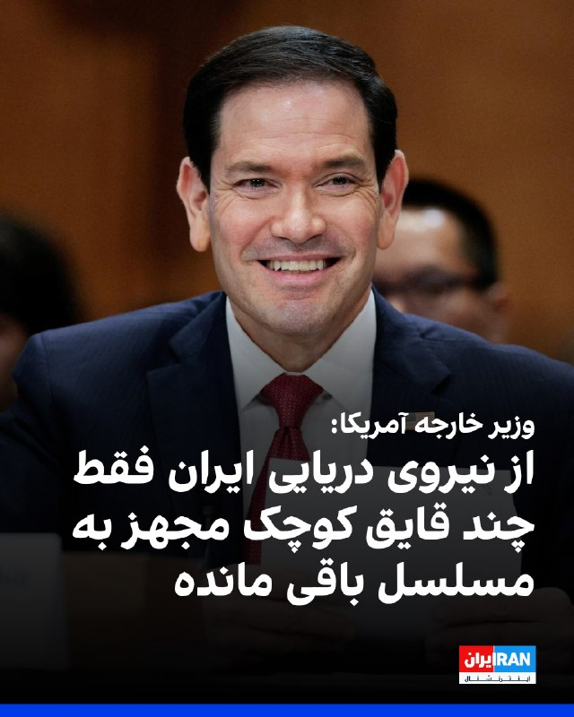

مارکو روبیو، وزیر خارجه آمریکا، در جلسه کمیته روابط خارجی سنا گفت: «چیزی به نام نیروی دریایی جمهوری اسلامی وجود ندارد. آنچه باقی مانده تعدادی قایق کوچک است که روی آن‌ها مسلسل نصب شده و نیروی دریایی واقعی در کف اقیانوس قرار دارد.»

او افزود: جمهوری اسلامی همچنان تعداد زیادی پهپاد در اختیار دارد. توان بازدارندگی متعارف تهران به‌طور قابل توجهی تضعیف شده است.
‌🏁 🇬🇧 IranintlTV

🤖 @VahidOOnLine

## VahidOOnLine — post 243372

  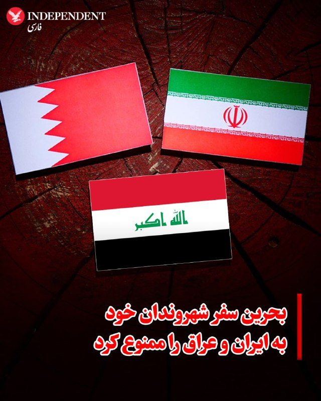

♦️ وزارت کشور بحرین با اشاره به «تنش‌های مستمر در وضعیت امنیتی کنونی»، سفر شهروندان خود به ایران و عراق را ممنوع اعلام کرد.

بیانیه این وزارتخانه از شهروندان بحرینی خواسته است تا در سایه آتش‌بس شکننده در خاورمیانه، به این تصمیم پایبند باشند.

این تصمیم بحرین چند روز پس از آن اعلام شد که دادستانی این کشور از کشف «تشکیلات مرتبط با سپاه پاسداران» خبر داد. دادسرای جرایم تروریستی این کشور، با اعلام این که این تشکیلات، به جمع‌آوری منابع مالی و انتقال بخشی از آن به خارج از کشور اقدام کرده‌اند، دستور توقیف اموال و مسدودسازی اعضای آن را صادر کرد.
‌🇸🇦 Indypersian

🤖 @VahidOOnLine

## mwarmonitor — post 10035

🔴فاکس نیوز شان هنیتی اکنون، در طول آخر هفته، شاهد لفاظی‌ها و رفتارهای خصمانه‌تری از سوی رهبران افراطی ایران بوده‌ایم. ایالات متحده در هفته گذشته چندین حمله علیه تهدیدها در داخل ایران انجام داده است تا با حملات پهپادی و موشکی مقابله کند؛ البته بخش زیادی از…

## mwarmonitor — post 10034

🔴فاکس نیوز شان هنیتی
اکنون، در طول آخر هفته، شاهد لفاظی‌ها و رفتارهای خصمانه‌تری از سوی رهبران افراطی ایران بوده‌ایم. ایالات متحده در هفته گذشته چندین حمله علیه تهدیدها در داخل ایران انجام داده است تا با حملات پهپادی و موشکی مقابله کند؛ البته بخش زیادی از آن مربوط به تنگه هرمز است.
به گفته پرزیدنت ترامپ، گفتگوهای صلح با وجود اظهارات علنی ایران مبنی بر تعلیق آن‌ها، با سرعت بالایی ادامه دارد. برای بررسی این موضوع، تحلیلگر ارشد استراتژیک فاکس نیوز و دوست ما، ژنرال جک کین همراه ماست.
ژنرال، رئیس‌جمهور به تازگی دو مطلب منتشر کرده و اشاره داشته که احساس می‌کند تندروها به حاشیه رانده شده‌اند. شما این حملات را می‌بینید؛ در هفته گذشته سه حمله مشخص رخ داده که رئیس‌جمهور دستور آن‌ها را صادر کرده است. شما اتفاقات در حال وقوع را چگونه تفسیر می‌کنید؟ فکر می‌کنید در نهایت این وضعیت به کجا ختم خواهد شد؟
🔵ژنرال جک کین
بله، خب، اول از همه، رئیس‌جمهور به وضوح مسیر دیپلماتیک را در پیش گرفته و تلاش می‌کند آن را به نتیجه برساند. برای موفقیت در این مسیر، او درصدد است تا تمامی موارد نقض آتش‌بس را تحت کنترل درآورد.
نکته‌ای که شما به آن اشاره کردید این است که چندین هفته است ایرانی‌ها حملاتی را در مجاورت تنگه هرمز و همچنین علیه پایگاه‌های ما در آمریکا و متحدانمان در خلیج [فارس] انجام می‌دهند که همگی نقض آتش‌بس محسوب می‌شوند؛ حملات پهپادی برای هدف قرار دادن کشتی‌ها و حملات موشکی بالستیک علیه پایگاه‌ها.
ما به صورت دفاعی در برابر این اقدامات عمل کرده‌ایم. روش کار رئیس‌جمهور به این صورت است که او اختیارات کامل را به دریاسالار کوپر در فرماندهی مرکزی (سنتکام) داده است؛ بنابراین او برای شلیک به سمت ایران نیازی به اجازه گرفتن ندارد، چرا که آن‌ها رفتاری تهاجمی یا هجومی از خود نشان می‌دهند. او اختیارات کامل دارد تا با ابزارهایی که صلاح می‌داند به این اقدامات پاسخ دهد، زیرا آن‌ها به او اعتماد دارند. این همان شیوه‌ای است که پرزیدنت ترامپ همیشه با فرماندهان نظامی خود کار کرده است؛ بنابراین کوپر کار خود را به بهترین شکل انجام داده است.
بخش دیگری از این ماجرا مربوط به آتش‌بسی است که در ۸ آوریل برقرار شد و به طور کلی به موضوع ایران می‌پردازد؛ این همان موردی است که ایران در چند هفته گذشته آن را نقض کرده است. اما شان، آتش‌بس دیگری نیز وجود دارد که در ۱۷ آوریل در رابطه با لبنان منعقد شد. از ۱۷ آوریل تا به امروز، حزب‌الله ۲۴۰۰ راکت و پهپاد به سمت شمال اسرائیل شلیک کرده است؛ تا جایی که ساکنان شهرها و روستاهای شمالی مجبور به تخلیه شده‌اند. در نتیجه این اقدامات، ۳۰۰ غیرنظامی مجروح و یک نفر کشته شده است.
در داخل لبنان نیز ۱۴ سرباز ارتش اسرائیل (IDF) کشته شده‌اند؛ تمام این‌ها در شرایطی رخ داده که توافق آتش‌بس برقرار بوده است. این مسئله کاملاً مضحک است. از طرفی، ایرانی‌ها امروز موضع طلبکارانه به خود گرفته و گفتند: «ما اصلاً مذاکره نخواهیم کرد، مگر اینکه رفتار اسرائیل را مهار کنید.» این واقعاً تکان‌دهنده است، آن هم با توجه به اینکه حزب‌الله به طور مداوم آتش‌بس را نقض کرده و اسرائیلی‌ها...

@mwarmonitor

## mwarmonitor — post 10033

## pm_afshaa — post 92107

  <a href="telegram/content/pm_afshaa_92107_1780412684.mp4" target="_blank">🎬 Download video</a>

🔴مارکو روبیو، وزیر خارجه آمریکا:

امروز نیروی دریایی ایرانی وجود نداره؛ فقط یه مشت نهنگ‌شکار بوستونی با مسلسل روی آنها وجود داره که در کف اقیانوس دراز کشیدن و به‌زودی در عرض چند سال به نقاط ماهیگیری عالی تبدیل خواهد شد چون به صخره‌های مرجانی تبدیل میشن.

💧 Rainbet.com the #1 Non-KYC Crypto Casino & Sportsbook @rainbetcom

😁 @Pm_Afshaa

## VahidOnline — post 75877

  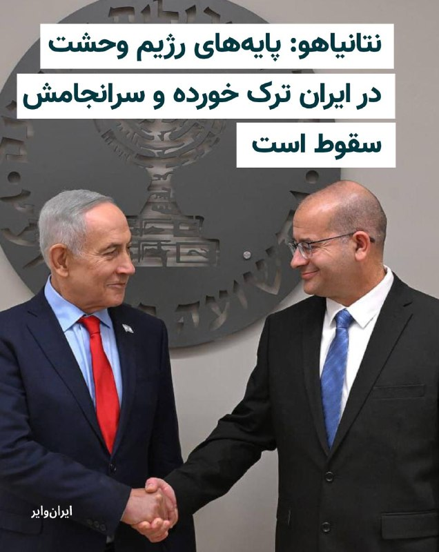

بنیامین نتانیاهو، نخست‌وزیر اسراییل، در مراسم تودیع دیوید بارنئا، رییس موساد، گفت جمهوری اسلامی تاکنون به دلیل توطئه‌هایش علیه اسراییل بهای سنگینی پرداخته و سرانجام این حکومت سقوط است.

بر اساس گزارش دفتر نخست‌وزیر اسراییل که روز سه‌شنبه ۱۲ خرداد ۱۴۰۵ در شبکه ایکس منتشر شد، نتانیاهو در این مراسم گفت: «هر کسی که بدخواهی علیه اسراییل در سر می‌پروراند، بداند که توطئه‌هایش شکست خواهد خورد و بهایی که خواهد پرداخت بسیار سنگین خواهد بود. بهایی که جمهوری اسلامی تا همین‌جا پرداخته است، بسیار سنگین است. پایه‌های رژیم وحشت در ایران ترک خورده و دیگر به آنچه بود باز نخواهد گشت. من به شما می‌گویم سرانجامش سقوط است.»
@VahidHeadline

📡 @VahidOnline

## IranIntlTV — post 340222

  <a href="telegram/content/IranIntlTV_340222_1780412686.mp4" target="_blank">🎬 Download video</a>

همزمان با انتشار گزارش‌هایی درباره درخواست جمهوری اسلامی برای آزادسازی دارایی‌های بلوکه‌شده به‌عنوان پیش‌شرط مذاکرات، سرنوشت بخش قابل توجهی از این منابع مالی همچنان نامشخص است. دارایی‌هایی که عمدتا از محل فروش نفت به دست آمده‌اند، طی سال‌های گذشته یا تحت تاثیر تحریم‌ها مسدود شده‌اند یا به گفته منتقدان در مسیر اهداف ایدئولوژیک و منطقه‌ای هزینه شده‌اند.

مهدی بیگی، عضو تحریریه ایران‌اینترنشنال، در «پیوست» به این موضوع می‌پردازد
@iranintltv

## IranIntlTV — post 340221

  

مارکو روبیو، وزیر خارجه آمریکا، در جلسه کمیته روابط خارجی سنا گفت: «چیزی به نام نیروی دریایی جمهوری اسلامی وجود ندارد. آنچه باقی مانده تعدادی قایق کوچک است که روی آن‌ها مسلسل نصب شده و نیروی دریایی واقعی در کف اقیانوس قرار دارد.»

او افزود: جمهوری اسلامی همچنان تعداد زیادی پهپاد در اختیار دارد. توان بازدارندگی متعارف تهران به‌طور قابل توجهی تضعیف شده است.
https://iranintl.com/202606026006

## DW_Farsi — post 125424

DW Persian دویچه‌‌وله فارسی pinned a photo

## DW_Farsi — post 125423

  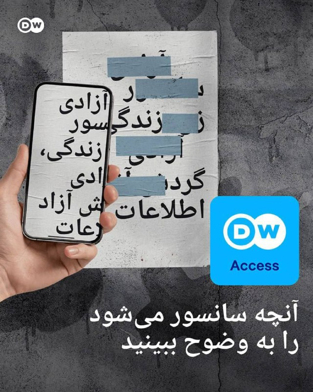

🔶با این اپ سانسور را به راحتی دور بزنید!

اپلیکیشن DW Access اکنون حتی در شرایط سانسور، اینترنت ضعیف و قطعی‌های کوتاه‌مدت نیز دسترسی به اخبار را فراهم می‌کند. با حداقل اتصال به اینترنت، این اپلیکیشن همان چیزی است که برای به‌روز ماندن در مورد خبرها نیاز دارید.

ما این نسخه را برای شما مقاوم‌تر و آسان‌تر از نو طراحی کرده‌ایم. این برنامه در فروشگاه‌های آنلاین موجود نیست و فقط از همین طریق قابل دریافت است.

لطفا هنگام اولین بارگذاری کمی صبور باشید؛ پس از آن، برنامه به‌صورت روان اجرا خواهد شد.

اگر این اپلیکیشن را دارید، به تنظیمات بروید و روی Update کلیک کنید.

سایر کاربران می‌توانند از اینجا دریافت کنند:
https://www.dwmirror.de/m1rr0r/sm/

در اینجا به پرسش‌های متداول درباره این اپلیکیشن پاسخ داده شده است:
https://pepurl.com/p/51VWC

@dw_farsi

## RadioFarda — post 157823

ترامپ رئیس ادارهٔ تأمین مالی مسکن را سرپرست مدیریت اطلاعات ملی آمریکا کرد

🔸دونالد ترامپ، رئیس‌جمهور آمریکا، روز سه‌شنبه ۱۲ خرداد بیل پولتی، مسئول نهاد فدرال ناظر بر بخش مسکن، را به‌عنوان سرپرست مدیریت اطلاعات ملی ایالات متحده منصوب کرد.

🔸ترامپ در پیامی در شبکهٔ اجتماعی خود، تروث سوشال، اعلام کرد که پولتی ۳۸ ساله همچنان مدیر ادارهٔ فدرال تأمین مالی مسکن و رئیس دو نهاد پشتیبان وام مسکن با حمایت دولت فدرال، یعنی «فَنی مِی» و «فردی مَک»، باقی خواهد ماند.

🔸ترامپ در این پیام نوشت: «ویلیام تجربه‌ای عمیق در مدیریت حساس‌ترین امور آمریکا، سلامت و ثبات بازارها، و بیش از ۱۰ تریلیون دلار در فنی می و فردی مک دارد؛ رقمی که نسبت به تنها ۱۲ ماه پیش افزایش قابل توجهی نشان می‌دهد».

🔸تولسی گابارد، نخستین مدیر اطلاعات ملی در دولت ترامپ، در ماه مه اعلام کرد که قصد دارد از این سمت کناره‌گیری کند.

🔸خبرگزاری رویترز گزارش داده بود که او به‌دلیل اختلاف با کاخ سفید از این سمت کنار گذاشته شد. خانم گابارد اما گفت استعفای او به‌دلیل تشخیص اخیر سرطان همسرش بوده است.

🔸پیشتر اختلاف دیدگاه‌هایی بین رئیس‌جمهور ایالات متحده و تولسی گابارد، به‌خصوص در قبال پروندهٔ ایران بروز کرده بود. دونالد ترامپ در فروردین‌ماه هم اشاره کرده بود که از نظر او، تولسی گابارد در قبال برچیده‌شدن بلندپروازی‌های هسته‌ای ایران، «موضع نرم‌تری» دارد.

🔸خانم گابارد بیش از یک سال پیش، پنجم فروردین‌ماه ۱۴۰۴، به کنگره گفته بود که ایران در حال ساخت سلاح هسته‌ای نیست.

🔸 گزارش کامل را در وب‌سایت رادیوفردا بخوانید.

@RadioFarda

## BBCPersian — post 282694

  <a href="https://t.me/bbcpersian/282694" target="_blank">📎 Download file</a>

تازه‌ترین خبرهای جهان سه‌شنبه ۱۲ خرداد ۱۴۰۵

## Dirty_Kids — post 390835

  <a href="telegram/content/Dirty_Kids_390835_1780412690.mp4" target="_blank">🎬 Download video</a>

سوالی که رامین کیانی، کارشناس روابط بین الملل در مناظره از ثابتی نماینده مجلس پرسید و تا آخر مناظره پاسخی به آن سوال داده نشد

@Dirty_Kids 👻

## Dirty_Kids — post 390834

🔴 وزیر آموزش و پرورش:

با توجه به شرایط جنگ، به شورای عالی انقلاب فرهنگی پیشنهاد دادیم با تاثیر مثبت معدل یازدهم موافقت کنن...
ببینیم خسرو چیکار میکنه

@Dirty_Kids 👻

## Hranews — post 113335

  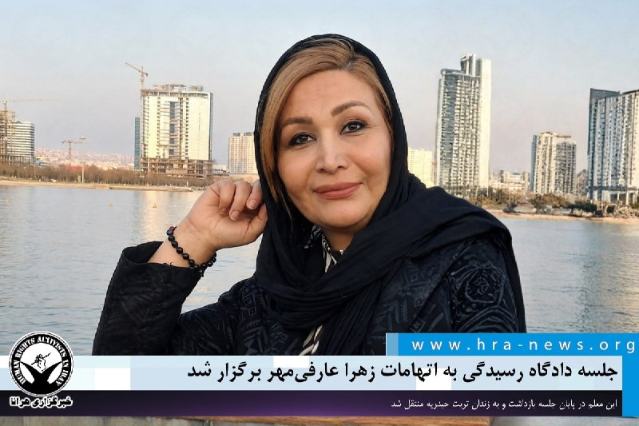

زهرا عارفی‌مهر پس از برگزاری جلسه دادگاه بازداشت شد

❗️
❗️
❗️
❗️
❗️– جلسه دادگاه رسیدگی به اتهامات زهرا عارفی مهر، معلم و هنرمند، روز شنبه ۱۰ خردادماه در دادگاه انقلاب سبزوار برگزار شد. وی در پایان این جلسه، بازداشت و به زندان تربت حیدریه منتقل شد.

به گزارش خبرگزاری هرانا، ارگان خبری مجموعه فعالان حقوق بشر در ایران، جلسه دادرسی به اتهامات زهرا عارفی‌ مهر برگزار شد.

این جلسه، روز شنبه ۱۰ خردادماه در دادگاه انقلاب سبزوار برگزار شد. خانم عارفی‌ مهر بابت اتهامات فعالیت تبلیغی علیه نظام و تشویش اذهان عمومی، بدون دسترسی به وکیل، شخصا به دفاع از خود پرداخت.

ادامه مطلب

#زهرا_عارفی‌_مهر

↘️
@hranews_bot تماس ✉️ - @Hranews کانال هرانا 🆑

## alonews — post 124497

  <a href="telegram/content/alonews_124497_1780412691.webm" target="_blank">🎬 Download video</a>

👈روبیو: عملیات خشم حماسی، برخی از شما آن را دوست نداشتند، برخی از شما آن را دوست داشتند، در دستیابی به اهداف نظامی خود بسیار موفق بود، که به طور چشمگیری پایه صنعتی دفاعی ایران را کاهش داد.

🔴آن‌ها هنوز پهپادهای زیادی دارند، زیرا ساخت این‌ها آسان است.

✅ @AloNews خبر جنگ

## alonews — post 124496

  <a href="telegram/content/alonews_124496_1780412692.webm" target="_blank">🎬 Download video</a>

👈 وزیر امور خارجه مارکو روبیو در مورد پهپادها: این یک چالش جهانی است که هر روز در سراسر جهان رخ می‌دهد.

🔴کارتل‌های مکزیکی از پهپادهای بدون سرنشین علیه یکدیگر استفاده می‌کنند و ما باید تصور کنیم که در مقطعی ممکن است از آن‌ها علیه منافع ما استفاده کنند.

✅ @AloNews خبر جنگ

## alonews — post 124495

  <a href="telegram/content/alonews_124495_1780412692.webm" target="_blank">🎬 Download video</a>

👈روبیو: اصلاً چیزی به اسم نیروی دریایی ایران وجود نداره

🔴رفته ته اقیانوس. چند سال دیگه هم تبدیل میشه به محل ماهیگیری خوب، چون مثل صخره مرجانی میشه

✅ @AloNews خبر جنگ

## alonews — post 124494

  <a href="telegram/content/alonews_124494_1780412692.webm" target="_blank">🎬 Download video</a>

👈روبیو:
هیچ کشوری در جهان، به جز ایران و شاید عمان که کمی با آن هم‌سویی داشت از کاری که ایران در تنگه‌ انجام می‌دهد حمایت نمی‌کند.

✅ @AloNews خبر جنگ

## alonews — post 124493

  <a href="telegram/content/alonews_124493_1780412692.mp4" target="_blank">🎬 Download video</a>

👈روبیو: ایران به کشتی‌های تجاری شلیک کرده و بخش‌هایی از تنگه هرمز را مین‌گذاری کرده است

✅ @AloNews خبر جنگ

## alonews — post 124492

  <a href="telegram/content/alonews_124492_1780412694.mp4" target="_blank">🎬 Download video</a>

👈مارکو روبیو، وزیر امور خارجه در مورد ایران:

ما نمی‌توانیم جهانی داشته باشیم که در آن فقط کشتی‌های ایرانی از تنگه‌ها عبور کنند.
اگر آن‌ها قصد دارند تنگه‌ها را برای همه ببندند، ما نیز تنگه‌ها را برای آن‌ها می‌بندیم.
هزینه برای ایران هر روز و درآمد از دست رفته به دلیل این اقدام، در حد صدها میلیون دلار است.

✅ @AloNews خبر جنگ

## alonews — post 124491

  <a href="telegram/content/alonews_124491_1780412695.webm" target="_blank">🎬 Download video</a>

👈نتانیاهو: علی خامنه‌ای بزرگترین تهدید تاریخ قوم یهود بود

✅ @AloNews خبر جنگ

---
📅 بروزرسانی: 1405/03/12 18:24
---

## VahidOOnLine — post 243371

  

مارکو روبیو، وزیر خارجه آمریکا، در جلسه کمیته روابط خارجی سنا گفت جمهوری اسلامی همچنان تعداد زیادی پهپاد در اختیار دارد، اما توان بازدارندگی متعارف تهران به‌طور قابل توجهی تضعیف شده است.

او افزود آمریکا همچنان در حال گفت‌وگو با جمهوری اسلامی است و این احتمال وجود دارد که تهران پذیرفته باشد درباره بخش‌هایی از برنامه هسته‌ای خود که پیش‌تر از طرح آن‌ها در مذاکرات خودداری می‌کرد، وارد گفت‌وگو شود.

پیش‌تر ‌خبرگزاری فارس، وابسته به سپاه، به نقل از یک منبع آگاه نوشت که تبادل پیام بین جمهوری اسلامی و آمریکا برای آنچه دست‌یابی به یادداشت تفاهم اولیه بین تهران و واشینگتن خوانده می‌شود، دست‌کم چند روز است که متوقف شده است.
‌🏁 🇬🇧 IranintlTV

🤖 @VahidOOnLine

## WithYashar — post 13271

  <a href="telegram/content/WithYashar_13271_1780412065.mp4" target="_blank">🎬 Download video</a>

مارکو روبیو درباره ایران:

«ما در حال مذاکره هستیم و می‌گویم مذاکره، چون مذاکره با ایران شبیه مذاکره با سوئیس نیست، درست است؟ کاملاً متفاوت است. متأسفانه این مذاکرات نیازمند استفاده از واسطه‌هاست.

اما اکنون با چشم‌اندازی روبه‌رو هستیم که ممکن است امروز، فردا یا هفته آینده به نتیجه برسد؛ اینکه برای نخستین بار، دست‌کم تا جایی که من به خاطر دارم، ایران پذیرفته است درباره بخش‌هایی از برنامه هسته‌ای خود مذاکره کند؛ موضوعاتی که تنها یک ماه پیش، یا حتی یک سال پیش، نه‌تنها حاضر به مذاکره درباره آن‌ها نبود، بلکه اساساً از مطرح کردنشان نیز خودداری می‌کرد.»
@withyashar

## mwarmonitor — post 10032

🔴مارکو روبیو می‌گوید به ایران در ازای بازگشایی تنگه هرمز، هیچ‌گونه لغو یا کاهش تحریم‌ها پیشنهاد نشده است.

@mwarmonitor

## pm_afshaa — post 92106

  <a href="telegram/content/pm_afshaa_92106_1780412067.webm" target="_blank">🎬 Download video</a>

🔴وزیر آموزش‌ و پرورش بعد از اعتراضات امروز دانش‌آموزان:

با توجه به شرایط جنگی، به شورای‌عالی انقلاب فرهنگی پیشنهاد کردیم استثنائا امسال تاثیر معدل یازدهم در کنکور از قطعی به مثبت تبدیل بشه.

💧 Rainbet.com the #1 Non-KYC Crypto Casino & Sportsbook @rainbetcom

😁 @Pm_Afshaa

## pm_afshaa — post 92105

  <a href="telegram/content/pm_afshaa_92105_1780412067.webm" target="_blank">🎬 Download video</a>

🔴روبیو، وزیر خارجه آمریکا:
آمریکا همچنان در حال مذاکره با جمهوری اسلامیه. توافق با ایران ممکنه امروز، میتونه فردا، میتونه هفته آینده انجام بشه.

💧 Rainbet.com the #1 Non-KYC Crypto Casino & Sportsbook @rainbetcom

😁 @Pm_Afshaa

## pm_afshaa — post 92104

  <a href="telegram/content/pm_afshaa_92104_1780412068.webm" target="_blank">🎬 Download video</a>

🔴سفیر اسرائیل در سازمان ملل:
اسرائیل برای دفاع از خودش از کسی اجازه نخواهد گرفت.

💧 Rainbet.com the #1 Non-KYC Crypto Casino & Sportsbook @rainbetcom

😁 @Pm_Afshaa

## pm_afshaa — post 92103

  <a href="telegram/content/pm_afshaa_92103_1780412068.webm" target="_blank">🎬 Download video</a>

🔴نتانیاهو در مراسم معارفه رییس جدید موساد: پایان جمهوری اسلامی اینه که از جهان محو بشه و ما کمک خواهیم کرد این هدف محقق بشه. جمهوری اسلامی بازنخواهد گشت تا موجودیت ما رو تهدید کنه.

💧 Rainbet.com the #1 Non-KYC Crypto Casino & Sportsbook @rainbetcom

😁 @Pm_Afshaa

## VahidOnline — post 75876

  

مارکو روبیو، وزیر خارجه آمریکا در جلسه کمیته روابط خارجی سنا گفت که جمهوری اسلامی در حال دستیابی به سلاح هسته‌ای بود و اگر عملیات خشم حماسی صورت نمی‌گرفت دیر می‌شد.
آقای روبیو با یادآوری این که توانایی نظامی جمهوری اسلامی به شدت تضعیف شده، افزود که جمهوری اسلامی ایران برای اولین بار در تاریخ، بسیاری از شرایط مدنظر آمریکا برای رسیدن به توافق را پذیرفته است.
به گفته او شکاف در ساختار قدرت سیاسی جمهوری اسلامی و زمان طولانی رسیدن پیام‌ها مذاکرات را طولانی کرده است. اما طبعا اگر مذاکرات به هدف دلخواه آمریکا نرسد، ایالات متحده گزینه‌های دیگری را درپیش خواهد گرفت.
@VahidHeadline
پیش‌تر ‌خبرگزاری فارس، وابسته به سپاه، به نقل از یک منبع آگاه نوشت که تبادل پیام بین جمهوری اسلامی و آمریکا برای آنچه دست‌یابی به یادداشت تفاهم اولیه بین تهران و واشینگتن خوانده می‌شود، دست‌کم چند روز است که متوقف شده است.
@VahidOOnLine

📡 @VahidOnline

## IranIntlTV — post 340220

  <a href="telegram/content/IranIntlTV_340220_1780412069.mp4" target="_blank">🎬 Download video</a>

به گفته مقامات، پهپادها و موشک‌های روسیه شبانه به شهرهایی در سراسر اوکراین اصابت کردند که دست‌کم ۱۸ کشته و بیش از ۱۰۰ زخمی بر جای گذاشتند و کی‌یف در میان مناطقی بود که بیشترین آسیب را دید. نیروی هوایی اوکراین اعلام کرد که روسیه ۶۵۶ پهپاد و ۷۳ موشک پرتاب کرده است که از این میان، ۴۰ موشک و ۶۰۲ پهپاد سرنگون یا خنثی شدند. الکساندر هانژا، فرماندار منطقه‌ای، اعلام کرد که در شهر دنیپرو پس از تخریب یک ساختمان مسکونی چهار طبقه، آمار کشته‌شدگان به ۱۱ نفر از جمله دو کودک افزایش یافت. وزارت دفاع روسیه اعلام کرد که با استفاده از تسلیحات دوربرد، به تاسیسات صنایع دفاعی اوکراین حمله کرده است.
@iranintltv

## IranIntlTV — post 340219

  

مارکو روبیو، وزیر خارجه آمریکا، در جلسه کمیته روابط خارجی سنا گفت جمهوری اسلامی همچنان تعداد زیادی پهپاد در اختیار دارد، اما توان بازدارندگی متعارف تهران به‌طور قابل توجهی تضعیف شده است.

او افزود آمریکا همچنان در حال گفت‌وگو با جمهوری اسلامی است و این احتمال وجود دارد که تهران پذیرفته باشد درباره بخش‌هایی از برنامه هسته‌ای خود که پیش‌تر از طرح آن‌ها در مذاکرات خودداری می‌کرد، وارد گفت‌وگو شود.

پیش‌تر ‌خبرگزاری فارس، وابسته به سپاه، به نقل از یک منبع آگاه نوشت که تبادل پیام بین جمهوری اسلامی و آمریکا برای آنچه دست‌یابی به یادداشت تفاهم اولیه بین تهران و واشینگتن خوانده می‌شود، دست‌کم چند روز است که متوقف شده است.
https://iranintl.com/202606027353

## Shin_Persian — post 6406

↩️ Quoted tweet: Open Source Intel ✓ @Osint613 Tue, 02 Jun 2026 14:29:23 UTC Rubio: “Iran has agreed to negotiate aspects of its nuclear aspects…” ↩️ توییت نقل‌قول شده — برای پاسخ، پست زیر را ببینید. فارسی روبیو: «ایران موافقت کرده است که در مورد جنبه‌هایی…

## Shin_Persian — post 6405

↩️ Quoted tweet:
Open Source Intel ✓ @Osint613
Tue, 02 Jun 2026 14:29:23 UTC

Rubio: “Iran has agreed to negotiate aspects of its nuclear aspects…”

↩️ توییت نقل‌قول شده — برای پاسخ، پست زیر را ببینید.

فارسی

روبیو: «ایران موافقت کرده است که در مورد جنبه‌هایی از ابعاد هسته‌ای خود مذاکره کند...»

𝕏 · @shin_persian

## FarsiVOA — post 219377

  <a href="telegram/content/FarsiVOA_219377_1780412071.mp4" target="_blank">🎬 Download video</a>

تیم ملی فوتبال برزیل بامداد سه‌شنبه به ایالات متحده رسید. هواپیمای حامل تیم در فرودگاه «نیوارک» فرود آمد و بازیکنان راهی محل اقامت خود شدند. تیم فوتبال برزیل با پنج قهرمانی، رکورددار قهرمانی جام‌جهانی فوتبال محسوب می‌شود. برزیل در اولین بازی خود در این دوره از مسابقات مقابل مراکش قرار می‌گیرد.

## FarsiVOA — post 219376

  

⚡️مارکو روبیو، وزیر خارجه آمریکا در جلسه کمیته روابط خارجی سنا گفت که جمهوری اسلامی در حال دستیابی به سلاح هسته‌ای بود و اگر عملیات خشم حماسی صورت نمی‌گرفت دیر می‌شد.
آقای روبیو با یادآوری این که توانایی نظامی جمهوری اسلامی به شدت تضعیف شده، افزود که جمهوری اسلامی ایران برای اولین بار در تاریخ، بسیاری از شرایط مدنظر آمریکا برای رسیدن به توافق را پذیرفته است.
به گفته او شکاف در ساختار قدرت سیاسی جمهوری اسلامی و زمان طولانی رسیدن پیام‌ها مذاکرات را طولانی کرده است. اما طبعا اگر مذاکرات به هدف دلخواه آمریکا نرسد، ایالات متحده گزینه‌های دیگری را درپیش خواهد گرفت.

## Persian_Trend_Official — post 15513

  <a href="telegram/content/Persian_Trend_Official_15513_1780412073.mp4" target="_blank">🎬 Download video</a>

مارکو روبیو، وزیر امور خارجه: ما در حال مذاکره هستیم، من می‌گویم مذاکره چون مذاکره با ایران مثل مذاکره با سوئیس نیست، باشه؟ خیلی متفاوت هستند. متأسفانه نیاز به استفاده از واسطه‌ها دارند.

این چشم‌انداز پیش روی ماست، که می‌تواند امروز اتفاق بیفتد، می‌تواند فردا اتفاق بیفتد، می‌تواند هفته آینده اتفاق بیفتد، که برای اولین بار، قطعاً تا جایی که من به یاد دارم، آنها موافقت کرده‌اند که در مورد جنبه‌هایی از برنامه هسته‌ای خود مذاکره کنند که همین یک ماه پیش، همین یک سال پیش، حتی از ذکر آن خودداری می‌کردند، چه برسد به اینکه وارد بحث در مورد آنها شوند.

📝 Amir

📌 @persian_trend_official
پرشین ترند | متفاوت‌ترین کانال نظامی

## Persian_Trend_Official — post 15512

  <a href="telegram/content/Persian_Trend_Official_15512_1780412075.mp4" target="_blank">🎬 Download video</a>

مارکو روبیو، وزیر امور خارجه: ما نمی‌توانیم جهانی داشته باشیم که در آن فقط کشتی‌های ایرانی از تنگه‌ها عبور کنند.

اگر قرار است تنگه‌ها را برای همه ببندند، ما هم تنگه‌ها را برای آنها خواهیم بست. هزینه روزانه و درآمد از دست رفته ایران در نتیجه این اقدام، صدها میلیون دلار است.

📝 Amir

📌 @persian_trend_official
پرشین ترند | متفاوت‌ترین کانال نظامی

## Persian_Trend_Official — post 15511

  <a href="telegram/content/Persian_Trend_Official_15511_1780412076.mp4" target="_blank">🎬 Download video</a>

مارکو روبیو، وزیر امور خارجه امریکا: امروز نیروی دریایی ایران وجود ندارد. چنین چیزی وجود ندارد.

تعدادی کشتی شکار نهنگ با مسلسل وجود دارند، اما نیروی دریایی وجود ندارد. نیروی دریایی ایران وجود ندارد. این نیرو در کف اقیانوس قرار دارد و به زودی، ظرف چند سال، به نقاط اصلی ماهیگیری تبدیل خواهد شد زیرا به صخره‌های مرجانی تبدیل می‌شوند.

سپر دریایی متعارف ایران به طور قابل توجهی فرسوده شده است.

📝 Amir

📌 @persian_trend_official
پرشین ترند | متفاوت‌ترین کانال نظامی

## RadioFarda — post 157822

  <a href="https://t.me/radiofarda/157822" target="_blank">📎 Download file</a>

🔸اپیزود ۵۳ پادکست لایه هفتم | روایت‌های زیست روزمره در قطعی اینترنت

🔸وقتی اینترنت قطع بود، دیگران چه کار می‌کردند؟

🔸از اضطراب بی‌خبری در میانه بمباران تا مهاجرت‌های کوتاه‌مدت برای چند دقیقه اتصال؛ از خانه‌های «تخت و اینترنت» در نزدیکی مرز، بازار سیاه کانفیگ، کانال‌های مخفی آپلود فیلم و موسیقی، تا شبکه‌های پنهان همبستگی.

🔸در این اپیزود همراه با سوما نگهدارنیا (روزنامه‌نگار و پژوهشگر علوم اجتماعی)، به جای آمارها، داستان‌های واقعی و تکان‌دهنده‌ای از قطع اینترنت را از زبان شما می‌شنویم.

🔸فردا پادکست 🎧

## BBCPersian — post 282693

🔻روبیو: هنوز با ایران در گفت‌‌وگوییم

مارکو روبیو به کنگره آمریکا گفت ایران قبول کرده درباره جوانبی از برنامه‌ هسته‌ایش مذاکره کند که قبلا نمی‌پذیرفت.

وزیر خارجه آمریکا گفت گفت‌وگو با ایران ادامه دارد اما تضمینی وجود ندارد که به پایان جنگ منتهی شود.

ساعتی قبل خبرگزاری فارس به نقل از یک منبع آگاه که نامش را ذکر نکرد گفت تبادل پیام‌ بین ایران و آمریکا «دست‌کم از چند روز پیش متوقف شده است.»

گزارش فارس می‌گوید که آخرین پیام از تهران به واشنگتن «پیامی روشن درباره لبنان» بود اما جزئیات بیشتری ارائه نکرد.

https://bbc.in/4wYAC1f
@BBCPersian

## alonews — post 124490

  <a href="telegram/content/alonews_124490_1780412078.webm" target="_blank">🎬 Download video</a>

👈دیوید بارنیا، رئیس مستعفی موساد، می گوید تغییر رژیم در ایران "هم هدفی واقع بینانه و هم قابل دستیابی است."

✅ @AloNews خبر جنگ

---
📅 بروزرسانی: 1405/03/12 18:14
---

## VahidOOnLine — post 243370

  <a href="telegram/content/VahidOOnLine_243370_1780411457.mp4" target="_blank">🎬 Download video</a>

سخنان عزت‌الله همایونفر درباره شیوه مداراگری و انسان‌دوستی ایرانیان
‌🏁 🇬🇧 ManotoTV

🤖 @VahidOOnLine

## WithYashar — post 13270

وزیر امور خارجه آمریکا , روبیو : در حال حاضر نیروی دریایی ایران وجود ندارد، بلکه گروهی از قایق‌های تندرو حامل رگبار هستند.

اگر ایران بر بستن تنگه‌ها اصرار کند، ما آنها را برایشان خواهیم بست، و این کاری است که ما از طریق محاصره مؤثر انجام داده‌ایم.

امیدواریم با ایران به توافقی برسیم که منجر به بازگشایی تنگه‌ها شود.
@withyashar

## mwarmonitor — post 10031

  

📌به‌طور رسمی، رومان جوبمان به‌عنوان رئیس موساد منصوب شد.

@mwarmonitor

## DEJradio — post 5250

  <a href="telegram/content/DEJradio_5250_1780411459.mp4" target="_blank">🎬 Download video</a>

🚨
🔸 تنفس مصنوعی به رگ‌های شهر؛

*غنچه استوارنیا

#اینترنت #خرید_اینترنتی
@DEJradio

## VahidOnline — post 75871

  <a href="telegram/content/VahidOnline_75871_1780411461.mp4" target="_blank">🎬 Download video</a>

هما میرافشار، شاعر و ترانه‌سرای نامدار ایرانی، در ۸۹ سالگی در لس‌آنجلس درگذشت.
مرتضی برجسته اشراقی، با نام هنری مرتضی، سه‌شنبه ۱۲ خرداد، در اینستاگرام نوشت که خانم افشار هفته گذشته چشم از جهان فروبست، اما خانوادهٔ او با تأخیر این خبر را منتشر کردند.
این شاعر و ترانه‌سرا، که بر اساس گزارش‌ها، سال‌ها با بیماری آلزایمر دست‌و‌پنجه نرم می‌کرد، از پُرکارترین و محبوب‌ترین ترانه‌سرایان قبل و بعد از انقلاب ۱۳۵۷ بود.
هما افشار با بسیاری از خوانندگان برجسته ایرانی از جمله حمیرا، هایده، مهستی، ستار، ابی، داریوش، معین و عارف همکاری داشت.
او در سال ۱۳۱۵ در تهران متولد شد و در جوانی با علی میرافشار، پسرعموی حمیرا، ازدواج کرد. این پیوند، دوستی نزدیکی بین هما و حمیرا ایجاد کرد که به گفته خود او، جرقهٔ تولید بسیاری از ترانه‌ها و همکاری‌های این دو با هم شد.
@VahidHeadline
هما میرافشار، روزنامه‌نگار، شاعر و ترانه‌سرای تصنیف‌های عاشقانه موسیقی دستگاهی و آثار به یادماندنی پاپ، در ۸۹ سالگی درگذشت؛ چهره‌های نامدار موسیقی و علاقه‌مندانش در شبکه‌های اجتماعی از مقام هنری او تجلیل کردند.

او در سه مجموعه شعری بیش از هزار سروده دارد که افزون بر ۲۵۰ شعرش در زمره ماندگارترین ترانه‌های ایرانی است و بی‌دلیل نیست که در جامعه موسیقی به «زن هزار ترانه» و یا «ملکه ترانه‌سرایی ایران» معروف شد. از همین روست که ایرج جنتی عطایی، ترانه‌سرای برجسته معاصر، هما میرافشار را پیشکسوت خود می‌‌داند که «پیش از ترانه نو و در کنار آن شهره بود.»

هما پیشگام سرودن اشعاری بود که یک زن برای معشوق می‌خواند و یا حرف‌های عاشقانه‌ یک مرد برای دلبرش، چرا که تصنیف‌سرایان آن دوران به جنسیت ترانه‌ها کمتر می‌پرداختند. او سال‌ها پیش در برنامه «یک‌ حرف و دو حرف» رادیو بی‌بی‌سی به زنده‌یاد محمود خوشنام، پژوهشگر موسیقی، در این باره گفت: «منیر طاها، سیمین بهبهانی یا لعبت والا که کار می‌کردند، من ندیدم که ترانه‌هایشان بوی زنانه بدهد مگر این که از زبان مرد بیرون آمده باشد. اگر خواننده آنها مرد بوده به ناچار باید چیزی را می‌نوشتند که یک مرد به یک زن بگوید.»

«یادم می‌آید که یکی از من پرسید که شما این حالت را چگونه می‌نویسید و من در پاسخ گفتم اگر بخواهم از زبان مرد شعر بگویم، مشتاق شنیدن همان‌هایی هستم که دوست دارم از او بشنوم. آن حرف‌ها را می‌گذاردم در کلام و اکبر گلپا می‌خواند، یا می‌دادم به محمودی خوانساری می‎‌خواند اما گاه طوری می‌نوشتم که مرد یا زن هر کدام بخوانند فرقی نکند.»

....
در ابتدای دهه پنجاه بود که اشعار هما میرافشار و ملودی‌های زیبای محمد حیدری در صدر جدول بهترین‌ ترانه‌ها قرار گرفت و نام هما درخشید؛ مثل ترانه «دیوونتم» با اجرای حمیرا: «بذار بگم دیوونه‏‌تم...آره دیوونه‏‌تم من...نشکن منو به سنگ غم... چراغ خونه‌تم من...» یا ترانه «دلم می‌خواد» با اجرای هایده: «دلم می‏‌خواد که روزی صدهزار بار... بهت بگم دوست دارم عزیزم...» و یا ترانه «میکده» با صدای اکبر گلپایگانی: «هوس میکده داره دل دیوونه‏‌ی من، نمی‌‏دونه بی‏‌تو ایام بهارو چه کنه...»
...
@VahidHeadline

📡 @VahidOnline

## IranIntlTV — post 340218

  <a href="telegram/content/IranIntlTV_340218_1780411461.mp4" target="_blank">🎬 Download video</a>

اعتصاب ۲۴ ساعته رانندگان مترو در لندن روز سه‌شنبه باعث اختلال گسترده در رفت‌وآمد شهروندان در ساعات اوج تردد صبحگاهی شد. مسافران در هوای بارانی در ایستگاه‌های اتوبوس و پناهگاه‌ها تجمع کردند و خطوطی که تحت تأثیر اعتصاب نبودند با ازدحام و تأخیر مواجه شدند. این اعتصاب در اعتراض به تغییرات پیشنهادی در ساعات کاری برگزار شده و انتظار می‌رود دور دیگری از این اقدام اعتراضی از ۳ تا ۴ ژوئن نیز ادامه یابد.
@iranintltv

## IranIntlTV — post 340217

  <a href="telegram/content/IranIntlTV_340217_1780411463.mp4" target="_blank">🎬 Download video</a>

سرخط خبرهای سه‌شنبه ۱۲ خرداد
@iranintltv

## ManotoTV — post 105899

  <a href="telegram/content/ManotoTV_105899_1780411464.mp4" target="_blank">🎬 Download video</a>

سخنان عزت‌الله همایونفر درباره شیوه مداراگری و انسان‌دوستی ایرانیان

## manototv — post 105899

  <a href="telegram/content/manototv_105899_1780411465.mp4" target="_blank">🎬 Download video</a>

سخنان عزت‌الله همایونفر درباره شیوه مداراگری و انسان‌دوستی ایرانیان

---
📅 بروزرسانی: 1405/03/12 18:05
---

## VahidOOnLine — post 243369

  

رومن گافمن، رییس جدید موساد، از دیوید بارنئا، رییس پیشین موساد، به‌دلیل هدایت این سازمان به دستاوردهای بزرگ قدردانی کرد و خطاب به کارکنان موساد گفت: «شما صدای آرام و قدرتمند دولت اسرائیل و ملت یهود هستید.»
او افزود: «چرخش راهبردی که ما بر محور ایران و "طرح نابودی اسرائیل" تحمیل کردیم، توازن قوا را در سراسر منطقه تغییر داد. محور شیعی که نابودی کشور ما را بر پرچم خود نوشته بود، ضربه‌ای شدید دریافت کرد. اما ماموریت کامل نشده است.»
او اضافه کرد: «هسته اصلی موساد در عملیات مخفیانه در هدف نهفته است. ما با حساسیت از آن محافظت خواهیم کرد و به بهبود و توسعه توانمندی‌ها و روش‌ها برای غافلگیری و اثرگذاری ادامه خواهیم داد.»
‌🏁 🇬🇧 IranintlTV

🤖 @VahidOOnLine

## VahidOOnLine — post 243368

♦️تصاویر ثبت‌شده بر فراز تبت، پدیده‌ای نادر و خیره‌کننده از صاعقه‌های سرخ آسمانی را نشان می‌دهد.
تخلیه‌های الکتریکی عظیمی که در لایه‌های بالایی جو و در بالای ابرهای طوفانی شکل می‌گیرند و به رنگ قرمز در آسمان دیده می‌شوند.

این پدیده که نام علمی آن اسپرایت (Sprite) است، تنها برای کسری از ثانیه رخ می‌دهد و به دلیل ارتفاع بسیار زیاد و مدت‌زمان کوتاه، ثبت تصویر آن دشوار است.

«اسپرایت‌ها» از پدیده‌های جوی نادر هستند که در ارتفاع حدود ۵۰ تا ۹۰ کیلومتری زمین رخ می‌دهند. این صاعقه‌های سرخ‌رنگ تا دهه ۱۳۶۰ خورشیدی به‌ ندرت مشاهده شده بودند و با پیشرفت فناوری تصویربرداری، ثبت و مطالعه آن‌ها امکان‌پذیر شد.
‌🇸🇦 Indypersian

🤖 @VahidOOnLine

## DEJradio — post 5249

  <a href="telegram/content/DEJradio_5249_1780410938.mp4" target="_blank">🎬 Download video</a>

🔺📢 اروپا نگران هرمز؛ ماکرون خواهان توافق شد

گزارش: ایمان صفتی

#توافق #تنگه_هرمز
@DEJradio

## IranIntlTV — post 340216

  

رومن گافمن، رییس جدید موساد، از دیوید بارنئا، رییس پیشین موساد، به‌دلیل هدایت این سازمان به دستاوردهای بزرگ قدردانی کرد و خطاب به کارکنان موساد گفت: «شما صدای آرام و قدرتمند دولت اسرائیل و ملت یهود هستید.»
او افزود: «چرخش راهبردی که ما بر محور ایران و "طرح نابودی اسرائیل" تحمیل کردیم، توازن قوا را در سراسر منطقه تغییر داد. محور شیعی که نابودی کشور ما را بر پرچم خود نوشته بود، ضربه‌ای شدید دریافت کرد. اما ماموریت کامل نشده است.»
او اضافه کرد: «هسته اصلی موساد در عملیات مخفیانه در هدف نهفته است. ما با حساسیت از آن محافظت خواهیم کرد و به بهبود و توسعه توانمندی‌ها و روش‌ها برای غافلگیری و اثرگذاری ادامه خواهیم داد.»
https://iranintl.com/202606024228

## IranIntlTV — post 340215

  <a href="telegram/content/IranIntlTV_340215_1780410942.mp4" target="_blank">🎬 Download video</a>

سازمان جهانی هواشناسی وابسته به سازمان ملل هشدار داد پدیده در حال شکل‌گیری ال‌نینو می‌تواند در ماه‌های آینده دمای جهانی را افزایش داده و خطر وقوع پدیده‌های حدی آب‌وهوایی را بیشتر کند. این نهاد اعلام کرد گرمایش آب‌های اقیانوسی عامل توسعه ال‌نینو است و این پدیده می‌تواند به تشدید موج‌های گرما، بارش‌های شدید، خشکسالی و دیگر رویدادهای اقلیمی منجر شود و فشار بیشتری بر سلامت انسان، کشاورزی، اکوسیستم‌ها و سامانه‌های انرژی وارد کند.
@iranintltv

## Persian_Trend_Official — post 15508

## Persian_Trend_Official — post 15507

  <a href="telegram/content/Persian_Trend_Official_15507_1780410943.webm" target="_blank">🎬 Download video</a>

هیچی نیست !
گربست ...

انفجار های جنوب لبنان

📌 @persian_trend_official
پرشین ترند | متفاوت‌ترین کانال نظامی

## Persian_Trend_Official — post 15506

  

وضعیت حملات ارتش اسرائیل به لبنان
ولی روایت جمهوری اسلامی این هست که بخاطر بیانیه قرارگاه خاتم اسرائیلی ها از حمله به بیروت ترسیدن !!!!

📌 @persian_trend_official
پرشین ترند | متفاوت‌ترین کانال نظامی

## RadioFarda — post 157821

  

🔸خانواده یک زوج بریتانیایی زندانی در ایران روز سه‌شنبه ۱۲ خرداد اعلام کردند که درخواست تجدیدنظر کریگ و لیندزی فورمن برای لغو حکم ۱۰ سال زندان‌شان رد شده است.

🔸به گزارش خبرگزاری رویترز، این خانواده توضیح دادند که مقام‌های قضایی جمهوری اسلامی به این زوج اجازه حضور در جلسه دادگاه را ندادند و اطلاعات بسیار کمی درباره روند دادرسی به آن‌ها ارائه کردند.

🔸دادگاهی در تهران پارسال کریگ و لیندزی فورمن را به اتهام «جاسوسی» به ۱۰ سال حبس محکوم کرد.

🔸این دو نفر اتهام جاسوسی را رد می‌کنند.

@RadioFarda

## BBCPersian — post 282692

🔻فارس: تبادل پیام بین ایران و آمریکا از چند روز پیش متوقف شده است

خبرگزاری فارس به نقل از یک منبع آگاه که نامش را ذاکر نکرد گفت تبادل پیام‌ بین ایران و آمریکا «دست‌کم از چند روز پیش متوقف شده است.»

گزارش فارس می‌گوید آخرین پیام از تهران به واشنگتن «پیامی روشن درباره لبنان» بود اما جزئیات بیشتری ارائه نکرد.

دونالد ترامپ دیشب بعد از اینکه در شبکه‌های اجتماعی نوشت از بنیامین نتانیاهو خواسته است به ضاحیه در جنوب بیروت حمله نکند، در پستی جداگانه از «پیشرفت سریع» مذاکرات با ایران صحبت کرد و بعد هم به رسانه‌های آمریکا گفت که جزئیات توافق با ایران در حال تکمیل است و احتمال دارد «هفته آینده» به نتیجه برسد.

خبرگزاری تسنیم دیروز نوشت مطلع شده که «با عنایت به اینکه لبنان جزء پیش‌شرط‌های آتش‌بس بوده است و اینک این آتش‌بس در همه جبهه‌ها از جمله لبنان نقض شده است»، تیم مذاکره‌کننده ایران «گفتگوها و تبادل متون از طریق میانجی را متوقف می‌کند.»

پس از این خبر آقای ترامپ گفت ایران چنین موضعی را به آمریکا اعلام نکرده است.

خبرگزاری فارس دیروز از قول سعید آجرلو، عضو تیم رسانه‌ای هیئت مذاکره‌کننده ایران، نوشته بود:

«پیشنهاد ارسالی جدید آمریکا در کمیته شش نفره و شورای عالی امنیت ملی در حال بررسی است. متنی از طریق میانجی‌ها به ایران ارسال شده است ولی هنوز پاسخی به پیشنهاد جدید آمریکا نداده‌ایم.»

https://bbc.in/4wYAC1f
@BBCPersian

## Hranews — post 113334

  

رئیس شورای پناهندگان نروژ، با اشاره به درگیری‌های نظامی اخیر در ایران اعلام کرد که این حملات، آسیب‌های روانی قابل توجهی بر کودکان افغانستانی و ایرانی بر جای گذاشته است. یان اگلند، با اشاره به پیامدهای اقتصادی این تحولات نظامی گفت که بسیاری از خانواده‌های مهاجر افغانستانی، در پی بحران اقتصادی ناشی از جنگ در ایران، منابع محدود درآمدی خود را از دست داده‌اند. وی بر نیاز فوری به افزایش حمایت‌ها برای بیش از چهار میلیون شهروند افغانستانی ساکن ایران تاکید کرد.
#کودکان #مهاجران

↘️
@hranews_bot تماس ✉️ - @Hranews کانال هرانا 🆑

## alonews — post 124489

  <a href="telegram/content/alonews_124489_1780410946.webm" target="_blank">🎬 Download video</a>

👈وزیر خارجه ترکیه: آنکارا در مذاکرات ایران و آمریکا میانجیگری می‌کند و هر دو طرف برای تداوم آتش‌بس و بازگشایی تنگه هرمز صادق هستند.

✅ @AloNews خبر جنگ

---
📅 بروزرسانی: 1405/03/12 17:54
---

## VahidOOnLine — post 243367

  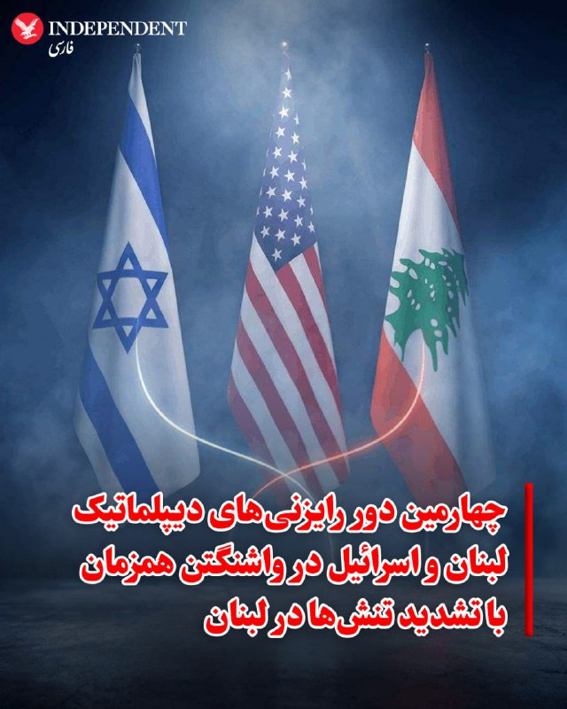

♦️ وزارت امور خارجه آمریکا روز سه‌شنبه ۱۲ خرداد، میزبان مذاکرات حساس میان نمایندگان اسرائیل و لبنان بود. به گزارش سی‌ان‌ان، این نشست که با حضور سفیران دو کشور و به رهبری مقامات ارشد امنیت ملی آمریکا برگزار شد، با هدف جلوگیری از فروپاشی مذاکرات گسترده‌تر میان ایالات متحده و جمهوری اسلامی در سایه درگیری‌های اخیر شکل گرفته است.

علی‌رغم تمدید ظاهری آتش‌بس، تبادل آتش میان اسرائیل و حزب‌الله همچنان ادامه دارد. بنیامین نتانیاهو، نخست‌وزیر اسرائیل، تاکید کرده است که حملات به جنوب لبنان طبق برنامه ادامه خواهد یافت؛ موضوعی که منجر به مکالمه‌ای پرتنش میان او و دونالد ترامپ، رئیس‌جمهوری آمریکا شده است. ترامپ ضمن فشار بر نتانیاهو برای کاهش عملیات‌ها، گفته است که با نمایندگان حزب‌الله گفتگو کرده و آن‌ها با توقف شلیک به سوی اسرائیل موافقت کرده‌اند.

در همین حال، سفارت لبنان در واشنگتن تایید کرد که بیروت موافقت حزب‌الله با طرح پیشنهادی آمریکا برای آتش‌بس را دریافت کرده است. با این حال، تهران هشدار داده است که در صورت تداوم حملات اسرائیل، احتمال تشدید تنش‌ها وجود دارد.
‌🇸🇦 Indypersian

🤖 @VahidOOnLine

## FoxNewsTwitter — post 342499

  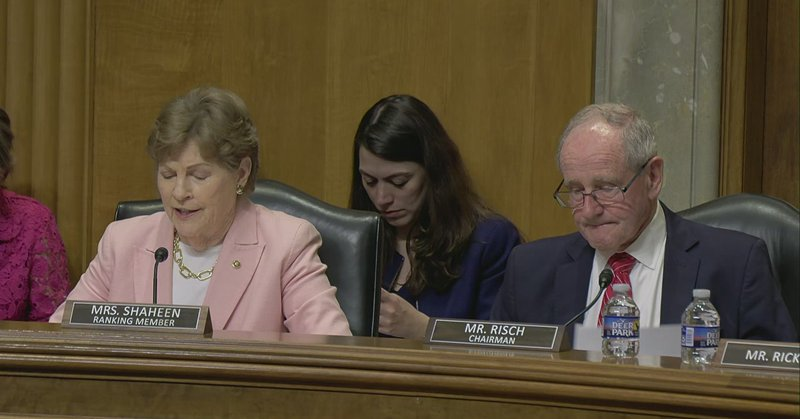

Fox News (Twitter/X)

WATCH LIVE: Rubio faces senators over State Department budget request https://twitter.com/i/broadcasts/1yxBeemVPREJN

## pm_afshaa — post 92102

🔴نتانیاهو: ایران دیگر ما را با بمب‌های هسته‌ای و هزاران موشک بالستیک تهدید نخواهد کرد و این وظیفه موساد است

💧 Rainbet.com the #1 Non-KYC Crypto Casino & Sportsbook @rainbetcom

😁 @Pm_Afshaa

## VahidOnline — post 75870

  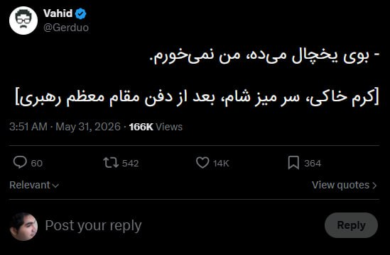

Gerduo

📡 @VahidOnline

## VahidOnline — post 75869

  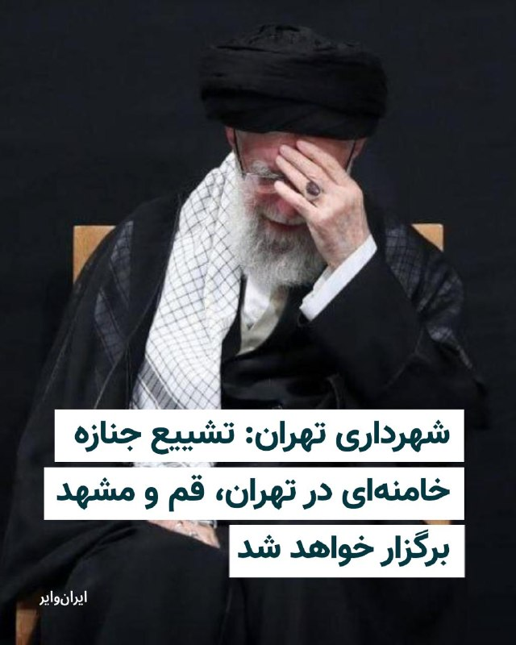

یک مقام شهرداری تهران می‌گوید که برگزاری «مراسم بدرقه» و تشییع جنازهٔ علی خامنه‌ای، رهبر کشته‌شدهٔ جمهوری اسلامی، در شهرهای قم، مشهد و تهران «قطعی شده است».

به گزارش رسانه‌های ایران، محمدامین توکلی‌زاده معاون اجتماعی شهرداری تهران روز سه‌شنبه ۱۲ خرداد گفت که این نهاد «در حال تدارک برای حضور جمعیتی بیش از ۱۵ تا ۲۰ میلیون نفر در تهران هستیم».

او به زمان دقیق برگزاری این مراسم اشاره نکرد ولی گفت که احتمالا در پایان ذی‌الحجه و اوایل محرم برگزار شود.
این زمان تقریبا مصادف با اواخر خرداد و اوایل تیرماه است.

علی خامنه‌ای از ۹ اسفند پارسال که در حملات مشترک آمریکا و اسرائیل کشته شد، هنوز دفن نشده است.
معاون اجتماعی شهرداری تهران در ادامه گفت که «مراسم بدرقه» سه روز در نظر گرفته شده و در تهران قرار است ۲۴ ساعت طول بکشد.

به گفته توکلی‌زاده، محل دفن خامنه‌ای «طبق وصیت ایشان و توصیه‌های نزدیکان‌شان» در حرم امام هشتم شیعیان تعیین شده است.
@VahidHeadline

📡 @VahidOnline

## VahidOnline — post 75868

  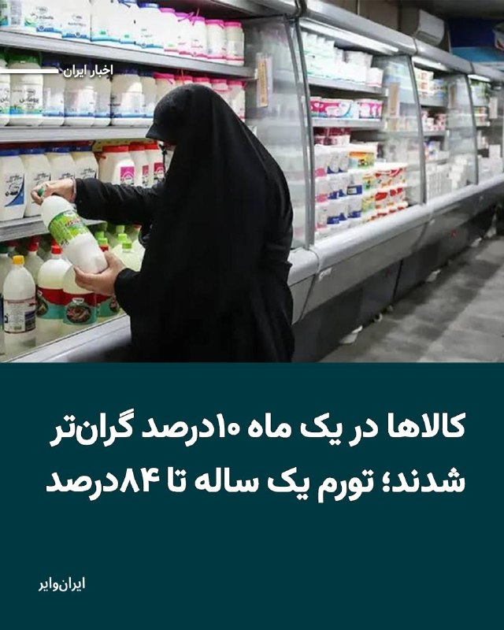

پس از چند روز تاخیر، بانک مرکزی و مرکز آمار ایران به‌طور همزمان گزارش‌های تورمی اردیبهشت‌ماه را منتشر کردند؛ گزارش‌هایی که با وجود تفاوت در ارقام، از تداوم روند صعودی قیمت‌ها و افزایش فشار معیشتی بر خانوارها حکایت دارد.

مرکز آمار ایران تورم ماهانه خانوارهای کشور را ۸.۸ درصد، تورم نقطه‌به‌نقطه را ۸۳.۹ درصد و تورم سالانه را ۵۷.۷ درصد اعلام کرد.
همزمان بانک مرکزی با تمرکز بر مناطق شهری، تورم ماهانه را ۸.۵ درصد، تورم نقطه‌ای را ۷۷.۲ درصد و تورم سالانه را ۵۳.۹ درصد برآورد کرد.

بر اساس گزارش بانک مرکزی، شاخص کالاها در اردیبهشت‌ماه نسبت به ماه قبل ۱۰ درصد و نسبت به مدت مشابه سال گذشته ۱۱۳.۸ درصد افزایش یافته است؛ آماری که از رشد شدید هزینه خرید اقلام روزمره حکایت دارد.

اختلاف ارقام منتشر شده از سوی دو نهاد آماری به تفاوت در جامعه آماری، سال پایه، شیوه نمونه‌گیری و وزن‌دهی کالاها و خدمات بازمی‌گردد. مرکز آمار کل خانوارهای شهری و روستایی را مبنا قرار می‌دهد، در حالی که بانک مرکزی تنها مناطق شهری را بررسی می‌کند.

مقایسه آمارها با ماه‌های گذشته نیز از شتاب گرفتن روند تورمی خبر می‌دهد. تورم نقطه‌به‌نقطه که در فروردین‌ماه ۷۳.۵ درصد اعلام شده بود، در اردیبهشت به ۸۳.۹ درصد رسید؛ افزایشی بیش از ۱۰ واحد درصدی تنها در یک ماه.
@VahidHeadline

📡 @VahidOnline

## VahidOnline — post 75867

  <a href="telegram/content/VahidOnline_75867_1780410253.mp4" target="_blank">🎬 Download video</a>

صدها دانش‌آموز روز سه‌شنبه ۱۲ خرداد در شهرهای تهران، مشهد، همدان و چندین شهر دیگر با تجمع مقابل ساختمان وزارت آموزش و پرورش به تغییر قوانین کنکور و افزایش تاثیر معدل در کارنامه کنکور سراسری باتوجه به تاثیر منفی جنگ بر آمادگی آن‌ها برای آزمون ورود به دانشگاه اعتراض کردند.

این تجمع در حالی برگزار شد که به گفته دانش‌آموزان، شرایط ناشی از جنگ و بلاتکلیفی در زمان برگزاری آزمون‌ها، امکان برنامه‌ریزی و آمادگی مناسب برای امتحانات نهایی و کنکور را از آنها گرفته است.

بر اساس مصوبات رسمی شورای عالی انقلاب فرهنگی و اطلاعیه‌های سازمان سنجش، تغییراتی در کنکور سراسری سال ۱۴۰۵ اعمال شده و بر اساس آن دروس عمومی از دفترچه کنکور حذف شده و سوابق تحصیلی و امتحانات نهایی پایه‌های دهم، یازدهم و دوازدهم تاثیر قطعی در کنکور خواهند داشت.
@VahidHeadline

📡 @VahidOnline

## IranIntlTV — post 340214

  <a href="telegram/content/IranIntlTV_340214_1780410253.mp4" target="_blank">🎬 Download video</a>

براساس اطلاعات رسیده به ایران‌اینترنشنال، همزمان با برگزاری جلسه واخواهی بابک شادابی، شهروند بهائی، در اعتراض به حکم غیابی صادرشده علیه او، گزارش‌ها از ادامه بازداشت شکیلا قاسمی، شهروند ۲۶ ساله بهائی در کرمان پس از ۱۲۰ روز خبر می‌دهند.

گفت‌وگو با رضا اکوانیان، روزنامه‌نگار و فعال حقوق بشر
@iranintltv

## Shin_Persian — post 6404

↩️ Quoted tweet: OSINTtechnical ✓ @Osinttechnical Tue, 02 Jun 2026 13:55:01 UTC The pilot of the USAF F-15E shot down over Iran had been shot down just weeks earlier by a Kuwaiti F/A-18C - The High Side ↩️ توییت نقل‌قول شده — برای پاسخ، پست زیر را ببینید.…

## Shin_Persian — post 6403

  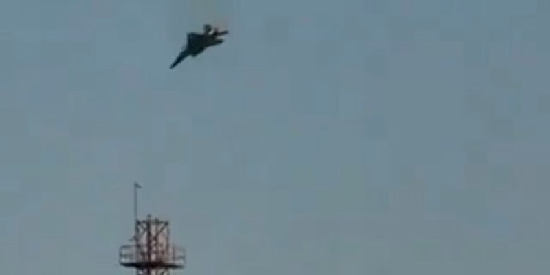

↩️ Quoted tweet:
OSINTtechnical ✓ @Osinttechnical
Tue, 02 Jun 2026 13:55:01 UTC

The pilot of the USAF F-15E shot down over Iran had been shot down just weeks earlier by a Kuwaiti F/A-18C - The High Side

↩️ توییت نقل‌قول شده — برای پاسخ، پست زیر را ببینید.

فارسی

خلبان اف-۱۵ئی نیروی هوایی ایالات متحده (USAF) که برفراز ایران سرنگون شد، تنها چند هفته قبل توسط یک اف/ای-۱۸سی کویتی سرنگون شده بود - The High Side

𝕏 · @shin_persian

## FarsiVOA — post 219375

🔺گزارش | از اعترافات اجباری تا احکام مرگ؛ پرونده‌های امنیتی چگونه به ابزار ارعاب تبدیل می‌شوند

▪️در هفته‌های اخیر، مجموعه‌ای از گزارش‌ها درباره صدور یا تأیید احکام اعدام، حبس‌های طولانی، و فشارهای امنیتی علیه معترضان، زندانیان سیاسی، شهروندان بلوچ و کرد، و حتی کسانی که تنها روایتی تصویری از اعتراضات ثبت کرده‌اند، تصویری نگران‌کننده از وضعیت حقوق بشر در ایران ترسیم کرده است.

⬇️ بیشتر بخوانید:

https://ir.voanews.com/a/forced-confessions-death-sentences-rise/8156123.html/?nocach=1

## DW_Farsi — post 125422

  <a href="telegram/content/DW_Farsi_125422_1780410255.mp4" target="_blank">🎬 Download video</a>

🎥 خاموشی هما میرافشار، خالق ترانه‌های ماندگار چند نسل
 
هما میرافشار، شاعر و ترانه‌سرای سرشناس ایرانی که آثارش با صدای بسیاری از مشهورترین خوانندگان موسیقی شنیده شد، در ۸۹ سالگی در لس‌آنجلس درگذشت. او از شناخته‌شده‌ترین ترانه‌سرایان موسیقی ایران بود که بیش از پنج دهه فعالیت هنری داشت.
 
میرافشار با خوانندگانی چون حمیرا، هایده، مهستی، ابی، داریوش و معین همکاری کرد و ترانه‌هایش به بخشی از خاطره جمعی چند نسل از ایرانیان تبدیل شد. 
 
"دل کوچولو"، "نوبهار"، "آشتی"، "شما"، "صبحت بخیر عزیزم"، "خورشید خانوم"، "مهمونی" و "افسانه هستی" از جمله آثار به یادماندنی میرافشار هستند.

@dw_farsi

## BBCPersian — post 282690

  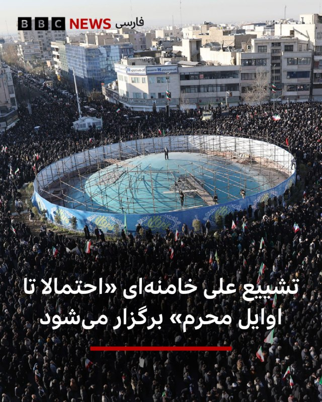

🔻به گفته معاون فرهنگی و اجتماعی شهرداری تهران، تشییع علی خامنه‌ای، رهبر سابق جمهوری اسلامی، «احتمالا در پایان ماه ذی‌الحجه و اوایل ماه محرم» یعنی حدود دو هفته دیگر برگزار خواهد شد.

محمدامین توکلی‌زاده در پنجاه و دومین کمیسیون فرهنگی اجتماعی کلانشهرهای ایران گفت متولی مراسم سپاه پاسداران است و سه روز «بدرقه مردمی» در آن در‌نظر گرفته شده است.

آقای توکلی‌زاده گفت که پس از مراسم بدرقه، نماز و آئین تشییع برگزار خواهد شد که در تهران حداقل ۲۴ ساعت طول خواهد کشید.
او گفت: «در حال تدارک برای جمعیتی بیش از ۱۵ تا ۲۰ میلیون نفر در پایتخت هستیم.»

به گفته آقای توکلی‌زاده پس از تهران تشییع در شهرهای قم و مشهد قطعی شده و استان‌های مختلف درخواست‌ میزبانی از تشییع داده‌اند.
او گفت مدفن آیت‌الله علی خامنه‌ای «براساس وصیت و توصیه‌های نزدیکان» حرم امام رضا در مشهد خواهد بود.

بیشتر بخوانید:

https://bbc.in/4vmqH43
📸EPA
@BBCPersian

## Hranews — post 113333

  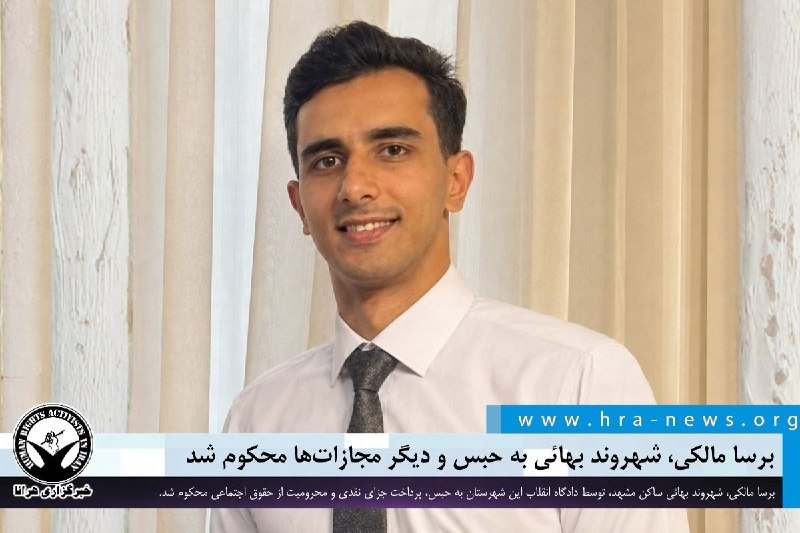

برسا مالکی، شهروند بهائی به حبس و دیگر مجازات‌ها محکوم شد

❗️
❗️
❗️
❗️
❗️– برسا مالکی، شهروند بهائی ساکن مشهد، توسط دادگاه انقلاب این شهرستان به دو سال و یک روز حبس، پرداخت جزای نقدی و محرومیت از حقوق اجتماعی محکوم شد.

به گزارش خبرگزاری هرانا، ارگان خبری مجموعه فعالان حقوق بشر در ایران، برسا مالکی، شهروند بهائی به حبس و دیگر مجازات‌ها محکوم شد.

بر اساس حکمی که توسط شعبه اول دادگاه انقلاب شهرستان مشهد صادر و به این شهروند بهائی ابلاغ شده، آقای مالکی از بابت اتهام انتسابی مطابق ماده ۵۰۰ مکرر قانون مجازات اسلامی، مبنی بر فعالیت آموزشی و یا تبلیغی انحرافی مغایر و یا مخل به شرع مقدس اسلام، به دو سال و یک روز حبس، پرداخت هشتاد میلیون تومان جزای نقدی و محرومیت از حقوق اجتماعی به مدت شش سال محکوم شده است.

ادامه مطلب

#برسا_مالکی

↘️
@hranews_bot تماس ✉️ - @Hranews کانال هرانا 🆑

## alonews — post 124488

  <a href="telegram/content/alonews_124488_1780410257.webm" target="_blank">🎬 Download video</a>

👈ترامپ: کانادا ایالت ۵۱‌ اُم

✅ @AloNews خبر جنگ

---
📅 بروزرسانی: 1405/03/12 17:44
---

## VahidOOnLine — post 243366

  

بنیامین نتانیاهو، نخست‌وزیر اسرائیل، در مراسم معارفه رومن گافمن، رئیس جدید موساد، گفت: «پایان رژیم ایران این است که از جهان محو شود و ما کمک خواهیم کرد این هدف محقق شود. جمهوری اسلامی بازنخواهد گشت تا موجودیت ما را تهدید کند.»

او افزود: موساد همچنان در خط مقدم مبارزه اسرائیل با تجاوزگری جمهوری اسلامی خواهد بود و اسرائیل اجازه نخواهد داد رژیم ایران مسیر خود را بازگرداند، به سلاح هسته‌ای دست یابد یا موجودیت اسرائیل را با بمب هسته‌ای و هزاران موشک بالستیک مرگبار تهدید کند.

‌🏁 🇬🇧 IranintlTV

🤖 @VahidOOnLine

## VahidOOnLine — post 243365

  <a href="telegram/content/VahidOOnLine_243365_1780409650.mp4" target="_blank">🎬 Download video</a>

♦️منصور شیشه‌فروش، مدیرکل مدیریت بحران استانداری اصفهان، روز سه‌شنبه ۱۲ خرداد اعلام کرد در پی افزایش خروجی سد زاینده‌رود در روز گذشته، آب در بستر این رودخانه جاری شده و به سمت شهر اصفهان در حرکت است.

او گفت رهاسازی آب با هدف تامین نیاز باغات، بخش کشاورزی و حقابه‌های محیط زیست انجام شده است و برنامه توزیع آب در کانال‌ها و شبکه‌های آبرسانی نیز از سوی شرکت میراب زاینده‌رود، بر اساس توافق‌های کارگروه سازگاری با کم‌آبی و با مشارکت صنف کشاورزان اجرا خواهد شد.
به گفته شیشه‌فروش، آب هم‌اکنون از سد چم آسمان عبور کرده و به پل کله در شهرستان باغ‌بهادران رسیده است.

مدیریت بحران استانداری اصفهان نیز اعلام کرد بستر زاینده‌رود طی ۱۱ ماه گذشته خشک بوده و با افزایش رهاسازی آب از سد، جریان آب دوباره در رودخانه برقرار شده است. این نهاد افزود انتظار می‌رود آب طی ۲۴ ساعت آینده به شهر اصفهان برسد.
‌🇸🇦 Indypersian

🤖 @VahidOOnLine

## WithYashar — post 13269

## WithYashar — post 13268

یک منبع آگاه : خلبان هواپیمای اف-۱۵ آمریکایی که در طول جنگ بر فراز ایران سرنگون شد، همان خلبانی است که هواپیمایش بر فراز کویت در اثر اشتباه پدافند کویت نیز سقوط کرده بود
@withyashar

## pm_afshaa — post 92101

🔴سی بی اس به نقل از یک مقام نظامی جمهوری اسلامی:جنگ مجدد بین سپاه، اسرائیل و آمریکا حتمی است

💧 Rainbet.com the #1 Non-KYC Crypto Casino & Sportsbook @rainbetcom

😁 @Pm_Afshaa

## IranIntlTV — post 340213

  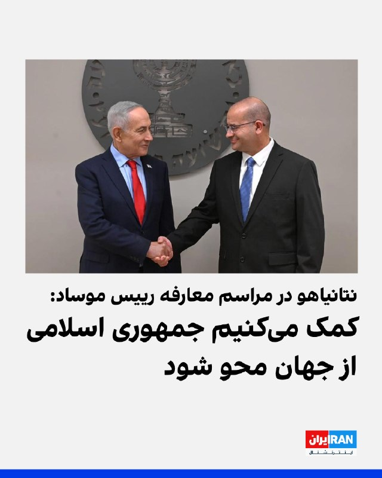

بنیامین نتانیاهو، نخست‌وزیر اسرائیل، در مراسم معارفه رومن گافمن، رئیس جدید موساد، گفت: «پایان رژیم ایران این است که از جهان محو شود و ما کمک خواهیم کرد این هدف محقق شود. جمهوری اسلامی بازنخواهد گشت تا موجودیت ما را تهدید کند.»

او افزود: موساد همچنان در خط مقدم مبارزه اسرائیل با تجاوزگری جمهوری اسلامی خواهد بود و اسرائیل اجازه نخواهد داد رژیم ایران مسیر خود را بازگرداند، به سلاح هسته‌ای دست یابد یا موجودیت اسرائیل را با بمب هسته‌ای و هزاران موشک بالستیک مرگبار تهدید کند.

https://iranintl.com/202606025529

## IranIntlTV — post 340212

  <a href="telegram/content/IranIntlTV_340212_1780409651.mp4" target="_blank">🎬 Download video</a>

بر اساس گزارش‌های شهروندان به ایران اینترنشنال، لوازم خانگی و وسایل برقی حتی در نمونه‌های تولید داخل با جهش قیمتی بالایی روبه‌رو شده‌اند

گفت‌وگو با سبا حیدرخانی، عضو تحریریه ایران‌اینترنشنال
@iranintltv

## FarsiVOA — post 219374

🔺ناتوانی جمهوری اسلامی در مهار تورم و گرانی‌ها: امنیتی‌‌‌سازی بازار با طرح تشکیل «فرماندهی واحد برای بازرسی»

▪️وزیر دادگستری و تعدادی از اعضای مجلس شورای اسلامی از طرح «تشکیل فرماندهی واحد برای بازرسی از بازار» و به کارگیری نیروهای بسیج و شماری از بازنشستگان انتظامی، نظامی و‌ امنیتی برای بازرسی و نظارت بر بازارها خبر دادند.

⬇️ بیشتر بخوانید:

https://ir.voanews.com/a/expensive-inflation-market-securitization-islamic-republic-of-iran-concerns/8156422.html/?nocach=1

## FarsiVOA — post 219373

  <a href="telegram/content/FarsiVOA_219373_1780409653.mp4" target="_blank">🎬 Download video</a>

ویدیویی که به تازگی بعد از بازگشایی محدود اینترنت در شبکه‌های اجتماعی منتشر شده منتسب است به تصاویر دوربین مداربسته از حملات هوایی به شرکت‌های پالایشگاه عسلویه در جنگ.

رسانه‌های وابسته به جمهوری اسلامی انتشار این ویدیو را «خودزنی» خوانده و خواستار برخورد شدید و برکناری مدیرعامل شرکت مربوطه شدند.

تأسیسات پتروشیمی جمهوری اسلامی در عسلویه، در اسفند ۱۴۰۴ و فروردین ۱۴۰۵ هدف حملات اسرائیل و آمریکا قرار گرفت.
این ویدیو بی‌صدا است.

## DW_Farsi — post 125421

🔶 هما میرافشار، "ملکه ترانه‌سرایی ایران" درگذشت

🔻گزارشی از میترا خلعتبری

هما میرافشار که از چهره‌های تاثیرگذار ترانه‌سرایی معاصر فارسی بود هفته گذشته در آمریکا درگذشت. او سوم اسفند سال ۱۳۱۵ در تهران چشم به جهان گشود و به هنگام خاموشی ۸۹ سال داشت.

خبر درگذشت میرافشار را مرتضی برجسته اعلام کرد.

میرافشار که ذوق شاعری اش خیلی زود، از همان دوره کودکی و دبستان آغاز شد، در طول سال‌ها فعالیت بیش از ۶۰۰ ترانه ماندگار سرود که بسیاری از آنها از سوی خوانندگان سرشناس موسیقی سنتی و پاپ خوانده شد.

اما فعالیت میرافشار که در اصل نام خانوادگی‌اش همایون بود و پس از ازدواج با علی میرافشار، آن را تغییر داد، تنها محدود به ترانه‌سرایی نبود.

او موسیقی ایرانی را به خوبی می شناخت و از شاگردان اسدالله ملک بود. همچنین در دوره‌ای کار روزنامه‌نگاری کرده بود و چند سالی نیز به عنوان مجری رادیو تلویزیون فعالیت می‌کرد.

بیش از همه اما نام او با تصانیف و ترانه‌هایی شناخته می‌شود که بسیاری از آنها به مشهورترین آثار موسیقی ایران تبدیل شده است.

نخستین ترانه او با صدای کوروس سرهنگ‌زاده منتشر شد. ترانه "آسمون" را در اوایل دهه بیست زندگی‌اش سرود و استادش، اسدالله ملک آهنگی ماندگار روی آن ساخت و از همان نخستین کار، نامش ورد زبان‌ها شد.

پس از ازدواج، از آنجا که همسرش، دختر عموی حمیرا، خواننده سرشناس بود، همکاری خود را با او که در آن سال‌ها از خوانندگان پر آوازه ایران محسوب می‌شد، آغاز کرد و ترانه‌های ماندگاری خلق شد.

ترانه‌های "دنیا دنیا"، "همزبونم باش"، "پیرت بسوزه عاشقی"، "شمال" و "اومدنت محاله" تنها نمونه‌هایی از این همکاری مشترک است.

همچنین ترانه‌های "قمار زندگی"، "دلم می‌خواد"، "میهمان"، "کتاب هستی" و "آشتی" از نمونه کارهای اوست که با صدای هایده منتشر شد و "دل میگه دلبر میاد"، "قمار زندگی"، "دل کوچولو"، "غریبه"، "حوصله عاشقی رو ندارم" و "هوس باز" را نیز مهستی خوانده است که از دیگر ترانه‌های جاویدان او هستند.

او همچنین برای دیگر خوانندگان زن مانند الهه، عهدیه، لیلا فروهر، شکیلا، شهره و نوش آفرین نیز ترانه‌سرایی کرده که بیشتر این آثار به معروف‌ترین کار این هنرمندان تبدیل شد.

با حضور هما میرافشار، گفتار زنانه در ترانه سرایی شکل گرفت و بسیاری از خوانندگان زن که تا آن زمان تنها از ترانه‌سرایان مرد خوانده بودند، این شانس را داشتند که حالا با ترانه‌هایی که احساسات زنانه از زبان یک زن بیان می‌شد را اجرا کنند. او اما ترانه‌های جاودانه دیگری نیز سرود که خوانندگان مرد آن را اجرا کردند.

شاید یکی از مشهورترین آنها، تصنیف "نگاه گرم تو" یا "زندگی" باشد که به مهمترین و ماندگار‌ترین تصنیف کارنامه موسیقایی عبدالوهاب شهیدی تبدیل شد.

او همچنین سابقه همکاری با خوانندگان دیگری هم‌چون اکبر گلپایگانی، شاهرخ، منوچهر سخایی، ستار، معین، حسن شماعی زاده، مارتیک، ابی، داریوش، داوود بهبودی، امید، هوشمند عقیلی و علیرضا افتخاری را در کارنامه داشت.

یکی دیگر از ترانه‌های مشهور او که با صدای ایرج بسطامی در سال ۱۳۶۴ جاودانه شد هم "گلپونه‌ها" با آهنگی از حسین پرنیا بود که از نخستین مجموعه اشعار او که به همین نام در سال ۱۳۵۲ منتشر شد، انتخاب شده بود.

از او به غیر از مجموعه "گلپونه‌ها"، دو کتاب دیگر نیز منتشر شد که مجموعه بیش از هزار سروده اوست.

هما میرافشار که نامش برای همیشه در فرهنگ و هنر ایران جاودانه خواهد ماند، در سال‌های آخر زندگی مبتلا به آلزایمر بود. مرتضی برجسته که خبر درگذشت او را منتشر کرد، نوشته است: «هر چند وقت یکبار به دیدنش می‌رفتم، آخرین بار با تعجب متوجه شدم که مرا نشناخت. هفته گذشته چشم از جهان فرو بست ... بانویی با بیش از ۶۰۰ ترانه ماندگار با آرزوی دیدار وطن به این جهان بدرود گفت.»

@dw_farsi

## Persian_Trend_Official — post 15505

  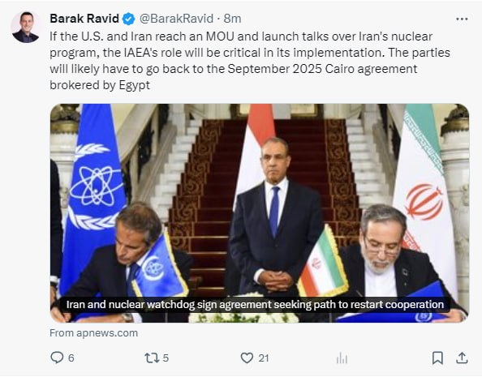

اگر ایالات متحده و ایران به تفاهم‌نامه‌ای دست یابند و مذاکراتی را در مورد برنامه هسته‌ای ایران آغاز کنند، نقش آژانس بین‌المللی انرژی اتمی در اجرای آن بسیار مهم خواهد بود. طرفین احتمالاً باید به توافق قاهره در سپتامبر ۲۰۲۵ که با میانجیگری مصر حاصل شد، بازگردند.

📌 @persian_trend_official
پرشین ترند | متفاوت‌ترین کانال نظامی

## Persian_Trend_Official — post 15504

  <a href="telegram/content/Persian_Trend_Official_15504_1780409655.mp4" target="_blank">🎬 Download video</a>

رومن گافمن به طور رسمی ریاست موساد را برعهده گرفت.

رومن گافمن در مراسم معارفه خود: چرخش استراتژیکی که علیه محور ایرانی و طرح برای نابودی اسرائیل انجام دادیم، معادله قدرت در کل منطقه تغییر یافته است. محور شیعی که پرچم و هدف خود را نابودی کشور ما کرده بود، به شدت ضربه خورد اما کار ما تمام نشده است.

قلب موساد فعالیت مخفی در میدان است طوری که آنها نمی‌دانند از کجا ضربه می‌خورند. ما این را با هر وسیله‌ای محافظت خواهیم کرد، به تکمیل و توسعه توانایی‌ها و روش‌ها برای غافلگیر کردن و تأثیرگذاری ادامه خواهیم داد.

📝 Amir

📌 @persian_trend_official
پرشین ترند | متفاوت‌ترین کانال نظامی

## Persian_Trend_Official — post 15503

  <a href="telegram/content/Persian_Trend_Official_15503_1780409657.webm" target="_blank">🎬 Download video</a>

دور چهارم مذاکرات اسرائیل و لبنان در واشنگتن آغاز شد.‌‌

📝 Amir

📌 @persian_trend_official
پرشین ترند | متفاوت‌ترین کانال نظامی

## Persian_Trend_Official — post 15502

  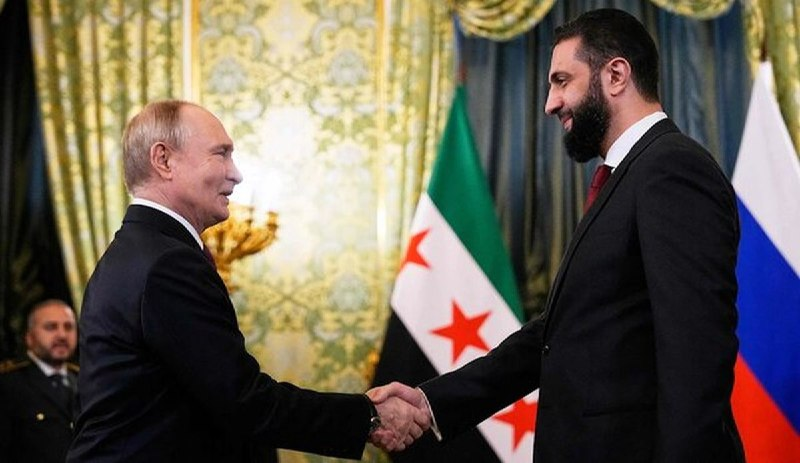

وال استریت ژورنال: روسیه برای نخستین بار پس از سقوط حکومت اسد، کمک‌ها و تجهیزات خود را به پایگاه هوایی حمیمیم در سواحل سوریه ارسال نموده است.

اقدامی که نشان‌دهنده آمادگی این کشور برای تداوم کنترل بر این منطقه می‌باشد. روسیه حتی در دوران دولت احمد الشرع نیز از این پایگاه بهره می‌برد. کشتی باری روسی اسپارتا که در غرب تحت تحریم قرار دارد، در ماه مه به بندر طرطوس رسید و در طول مسیر توسط ناوگان نیروی دریایی روسیه اسکورت گردید.

📝 Amir

📌 @persian_trend_official
پرشین ترند | متفاوت‌ترین کانال نظامی

## Dirty_Kids — post 390833

  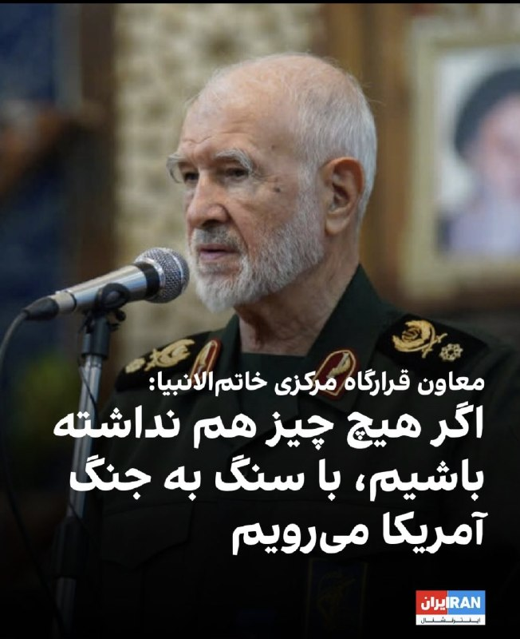

‏با حرفش کاری ندارم! چرا ابروهاش اینجوریه؟!

@Dirty_Kids 👻

## Dirty_Kids — post 390831

  <a href="telegram/content/Dirty_Kids_390831_1780409658.mp4" target="_blank">🎬 Download video</a>

‏سخنرانی ‎#شاهدخت_نور_پهلوی در
Oslo Freedom Forum 2026

@Dirty_Kids 👻

## alonews — post 124487

  <a href="telegram/content/alonews_124487_1780409658.webm" target="_blank">🎬 Download video</a>

👈نتانیاهو : موساد همیشه تو خط مقدم مقابله با «تجاوزگری ایران» هست؛ - این هم ادامه همون سیاستیه که سال‌ها دارن اجرا می‌کنن 
✅ @AloNews خبر جنگ

## alonews — post 124486

  <a href="telegram/content/alonews_124486_1780409658.mp4" target="_blank">🎬 Download video</a>

👈نتانیاهو : موساد همیشه تو خط مقدم مقابله با «تجاوزگری ایران» هست؛
- این هم ادامه همون سیاستیه که سال‌ها دارن اجرا می‌کنن

✅ @AloNews خبر جنگ

---
📅 بروزرسانی: 1405/03/12 17:34
---

## FoxNewsTwitter — post 342498

  <a href="telegram/content/FoxNewsTwitter_342498_1780409090.mp4" target="_blank">🎬 Download video</a>

Fox News (Twitter/X)

BREAKING: President Trump announcing that Bill Pulte, the current director of the Federal Housing Finance Agency, will become the acting Director of National Intelligence following DNI Tulsi Gabbard's resignation.

## pm_afshaa — post 92100

  <a href="telegram/content/pm_afshaa_92100_1780409092.webm" target="_blank">🎬 Download video</a>

🔴فارس:مذاکرات با آمریکا متوقف شد 
💧 Rainbet.com the #1 Non-KYC Crypto Casino & Sportsbook @rainbetcom 
😁 @Pm_Afshaa

## Persian_Trend_Official — post 15501

  <a href="telegram/content/Persian_Trend_Official_15501_1780409093.webm" target="_blank">🎬 Download video</a>

خبرگزاری فارس: مذاکرات با آمریکا متوقف شد!

یک منبع مطلع می‌گوید ایران و آمریکا در حال حاضر پیام رد و بدل نمی‌کنند و مذاکراتی که هدف آن رسیدن به تفاهم اولیه بود، ظاهراً برای چند روز متوقف شده است.

این موضوع با ادعای اخیر ترامپ که گفته بود مذاکرات به سرعت پیش می‌رود، در تضاد است. این منبع افزود که آخرین پیام ایران به واشنگتن مربوط به لبنان بوده است.

📝 Amir

📌 @persian_trend_official
پرشین ترند | متفاوت‌ترین کانال نظامی

## RadioFarda — post 157820

سازمان ملل از احتمال ۸۰ درصدی بازگشت ال‌نینو در فاصله خرداد تا شهریور خبر داد

🔸سازمان جهانی هواشناسی وابسته به سازمان ملل روز سه‌شنبه ۱۲ خرداد هشدار داد که احتمال شکل‌گیری پدیدهٔ گرمایش ال‌نینو بین ماه‌های ژوئن تا اوت (در فاصلهٔ خرداد تا شهریور) به ۸۰ درصد رسیده و جهان باید خود را برای افزایش خطر رخدادهای شدید آب‌وهوایی آماده کند.

🔸این نهاد مستقر در ژنو اعلام کرد آب‌های به‌طور غیرمعمول گرم در اقیانوس آرام زمینهٔ شکل‌گیری شرایط ال‌نینو را فراهم کرده و این پدیده می‌تواند الگوهای دمایی و بارشی جهان را تحت تأثیر قرار دهد.

🔸«ال‌نینو» (ال‌نینیو) و «لانینا» دو پدیدهٔ متناوب در اقیانوس آرام هستند؛ در ال‌نینو آب‌های سطحی گرم‌تر می‌شوند و بارش در بسیاری مناطق از جمله خاورمیانه افزایش می‌یابد، اما در لانینا آب اقیانوس سردتر می‌شود و معمولاً باعث کاهش بارندگی و خشکسالی می‌گردد.

🔸ال‌نینو همچنین الگوهای باد، فشار هوا و بارندگی در نقاط مختلف جهان را تغییر می‌دهد. این پدیده معمولاً هر دو تا هفت سال یک‌بار رخ می‌دهد و حدود ۹ تا ۱۲ ماه ادامه دارد.

🔸سازمان جهانی هواشناسی در گزارش فصلی خود درباره ال‌نینو و لانینا اعلام کرد که احتمال شکل‌گیری ال‌نینو تا ماه نوامبر «نزدیک به ۹۰ درصد یا بالاتر» است و بیشتر الگوهای پیش‌بینی نشان می‌دهند که شدت آن دست‌کم متوسط و احتمالاً شدید خواهد بود.

🔸به نوشته خبرگزاری فرانسه، سلست سائولو، دبیرکل سازمان جهانی هواشناسی، گفت جهان باید برای ال‌نینویی آماده شود که می‌تواند خشکسالی، بارش‌های سنگین و خطر موج‌های گرما را هم در خشکی و هم در اقیانوس‌ها تشدید کند.

🔸به گفته این نهاد، حتی یک ال‌نینوی متوسط نیز احتمال برخی رخدادهای شدید آب‌وهوایی و اقلیمی را افزایش می‌دهد.

🔸آخرین دورهٔ ال‌نینو در ثبت شدن سال ۲۰۲۳ به‌عنوان دومین سال گرمِ ثبت‌شده و سال ۲۰۲۴ به‌عنوان گرم‌ترین سال تاریخ اندازه‌گیری‌ها نقش داشت؛ سالی که میانگین دمای جهان حدود یک و ۵۵ صدم درجه سانتی‌گراد بالاتر از میانگین دوران پیشاصنعتی، یعنی سال‌های ۱۸۵۰ تا ۱۹۰۰، بود.

🔸آنتونیو گوترش، دبیرکل سازمان ملل، در پیامی ویدئویی گفت «ال‌نینو به آستانهٔ خانهٔ ما رسیده است» و جهان باید آن را «یک هشدار فوری اقلیمی» بداند. او افزود شرایط ال‌نینو «بر آتش جهانِ در حال گرم‌شدن هیزم خواهد ریخت» و تنها پاسخ مؤثر، اقدام اقلیمی متناسب با بحران، پایان دادن به وابستگی به سوخت‌های فسیلی، شتاب دادن به گذار به انرژی‌های تجدیدپذیر، حمایت از آسیب‌پذیرترین جوامع و گسترش سامانه‌های هشدار زودهنگام است.

🔸سازمان جهانی هواشناسی اعلام کرد پیش‌بینی‌ها برای ماه‌های ژوئن تا اوت از «غلبه تقریباً فراگیر دماهای بالاتر از حد معمول» در بیشتر نقاط جهان حکایت دارد. این وضعیت می‌تواند خطر رخدادهای هم‌زمان و زنجیره‌ای را در برخی مناطق افزایش دهد و در مناطقی که بارندگی کاهش می‌یابد، روند آغاز خشکسالی را سرعت بخشد.

🔸به گفته این نهاد، مراکز اقلیمی منطقه‌ای برای فصل بارندگی حیاتی ژوئن تا سپتامبر در شمال شاخ آفریقا بارش کمتر از حد معمول، در جنوب آسیا بارش موسمی کمتر از میانگین، و در آمریکای مرکزی تابستانی خشک‌تر و گرم‌تر پیش‌بینی کرده‌اند.

🔸سازمان جهانی هواشناسی می‌گوید هشدار زودهنگام درباره ال‌نینو می‌تواند به آمادگی در بخش‌های حساس به اقلیم، از جمله کشاورزی، مدیریت آب، انرژی و بهداشت کمک کند. این نهاد همچنین اعلام کرد که اکنون ۱۲۸ کشور سامانه‌های هشدار زودهنگام مدرن دارند و هدف سازمان ملل پوشش جهانی این سامانه‌ها تا پایان سال ۲۰۲۷ است.

🔸 گزارش کامل را در وب‌سایت رادیوفردا بخوانید.

@RadioFarda

## RadioFarda — post 157819

  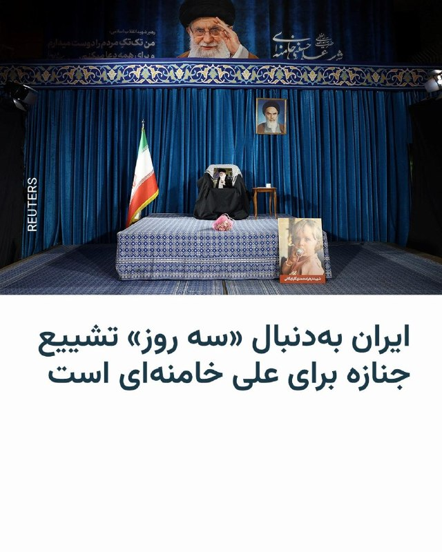

🔸یک مقام شهرداری تهران می‌گوید که برگزاری «مراسم بدرقه» و تشییع جنازهٔ علی خامنه‌ای، رهبر کشته‌شدهٔ جمهوری اسلامی، در شهرهای قم، مشهد و تهران «قطعی شده است».

🔸به گزارش رسانه‌های ایران، محمدامین توکلی‌زاده معاون اجتماعی شهرداری تهران روز سه‌شنبه ۱۲ خرداد گفت که این نهاد «در حال تدارک برای حضور جمعیتی بیش از ۱۵ تا ۲۰ میلیون نفر در تهران هستیم».

🔸او به زمان دقیق برگزاری این مراسم اشاره نکرد ولی گفت که احتمالا در پایان ذی‌الحجه و اوایل محرم برگزار شود.
این زمان تقریبا مصادف با اواخر خرداد و اوایل تیرماه است.

🔸علی خامنه‌ای از ۹ اسفند پارسال که در حملات مشترک آمریکا و اسرائیل کشته شد، هنوز دفن نشده است.
معاون اجتماعی شهرداری تهران در ادامه گفت که «مراسم بدرقه» سه روز در نظر گرفته شده و در تهران قرار است ۲۴ ساعت طول بکشد.

🔸به گفته توکلی‌زاده، محل دفن خامنه‌ای «طبق وصیت ایشان و توصیه‌های نزدیکان‌شان» در حرم امام هشتم شیعیان تعیین شده است.

@RadioFarda

## alonews — post 124482

  <a href="telegram/content/alonews_124482_1780409095.webm" target="_blank">🎬 Download video</a>

👈هم اکنون حملات بی امان اسرائیل به لبنان

✅ @AloNews خبر جنگ

---
📅 بروزرسانی: 1405/03/12 17:24
---

## VahidOOnLine — post 243364

♦️کاوه زرگران، رئیس کمیسیون کشاورزی و صنایع تبدیلی اتاق بازرگانی، در گفتگو با «اقتصاد۱۲۰» گفت تنها دلیل مهم افزایش قیمت مرغ در بازار، حذف ارز ترجیحی و افزایش ناگهانی قیمت نهاده‌های تولید است.

او افزود پس از حذف ارز ترجیحی، جوجه‌ریزی در اسفند و فروردین حدود ۴۰ درصد کاهش یافت و همین موضوع اکنون به افزایش قیمت مرغ در بازار منجر شده است.
زرگران همچنین گفت هزینه تولید کالاها پس از حذف ارز ترجیحی به طور میانگین پنج برابر شده، اما دولت هیچ حمایتی از تولیدکنندگان انجام نداده است.

رئیس کمیسیون کشاورزی و صنایع تبدیلی اتاق بازرگانی در بخش دیگری از سخنانش گفت تنها عامل گرانی کالاهای اساسی در کشور، حذف ارز ترجیحی ۲۸ هزار و ۵۰۰ تومانی بوده است و مردم اکنون آثار این تصمیم را در بازار مشاهده می‌کنند. او افزود: «گرانی‌ها را گردن جنگ نیندازید.»
‌🇸🇦 Indypersian

🤖 @VahidOOnLine

## WithYashar — post 13267

ربطی نداره ناو لینکلن ، بوش و ناو آبی خاکی‌ تریپلی و کلی‌ ناوشکن هستند و کافیه!

## WithYashar — post 13266

سلام ی سوال
اگر امریکا میخواد جنگ کنه چرا پس ناو جرالد فورد و باکسر برگردوند؟
این خودش نشونه این نیست که جنگی درکار نیست

## WithYashar — post 13265

صبح بخیر من دقیقا ۲ هفته پیش دیدم و گفتم برگشت ! تازه رسانه ها فهمیدن در این پست مستند شده !
https://www.instagram.com/reel/DYiHl04xutP/?igsh=MWZhNHllczYzNGtvaA==

## WithYashar — post 13264

تروخدا بگو ناو باکسر میگن برگشته دروغه؟

---
📅 بروزرسانی: 1405/03/12 17:14
---

## VahidOOnLine — post 243363

  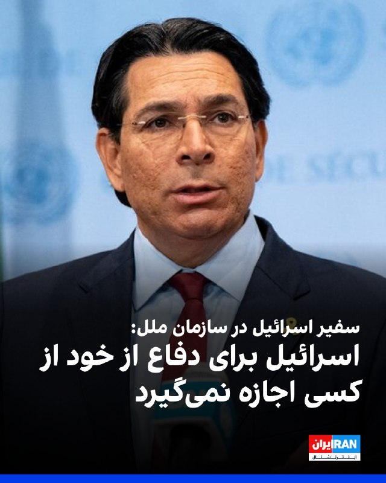

دنی دانون، سفیر اسرائیل در سازمان ملل، در شبکه ایکس نوشت: حزب‌الله از ماه مارس تاکنون حدود ۹ هزار راکت و صدها پهپاد به سوی اسرائیل شلیک کرده است. اسرائیل برای دفاع از خود از کسی اجازه نخواهد گرفت.
‌🏁 🇬🇧 IranintlTV

🤖 @VahidOOnLine

## VahidOOnLine — post 243362

  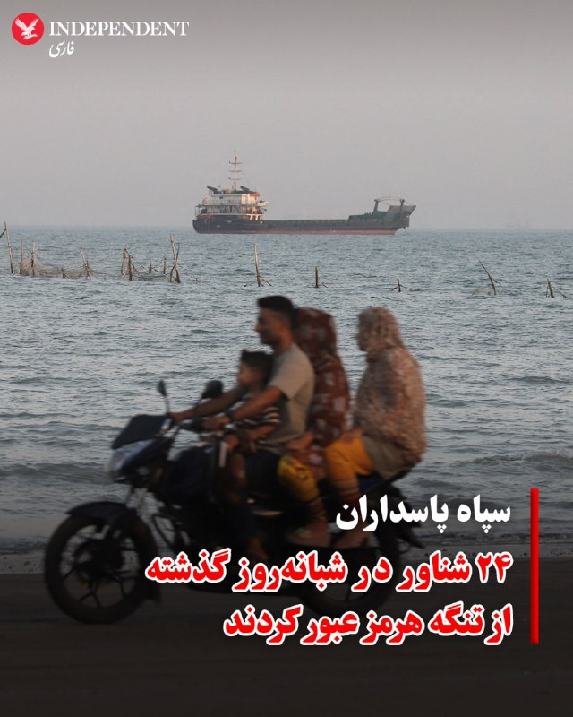

♦️ سپاه پاسداران انقلاب اسلامی، روز سه‌شنبه ۱۲ خرداد اعلام کرد که در ۲۴ ساعت گذشته در مجموع ۲۴ شناور از تنگه هرمز عبور کرده‌اند.

خبرگزاری تسنیم، وابسته به سپاه گزارش داد که این ۲۴ شناور پس از «کسب مجوز، هماهنگی و دریافت پشتیبانی امنیتی» از نیروی دریایی سپاه پاسداران، موفق به عبور از این تنگه شدند. این مسیر راهبردی از زمان آغاز حملات ایالات متحده و اسرائیل در اسفندماه، در اثر تهدیدهای جمهوری اسلامی و احتمال مین‌گذاری، مسدود شده است.
‌🇸🇦 Indypersian

🤖 @VahidOOnLine

## mwarmonitor — post 10030

📌در دوره اول ترامپ، این یک سیاست کاملاً اعلام‌شده بود که ایران نباید اجازه داشته باشد بدون پیامد، به حمایت از سازمان‌های تروریستی مانند حماس و حزب‌الله ادامه دهد.

🔸من از ترامپ در دوره دوم می‌خواهم که این سیاست را ادامه دهد. هر توافقی که ایران را در آینده به‌خاطر حمایت از گروه‌هایی مانند حزب‌الله—که هدف اعلام‌شده‌شان نابودی اسرائیل و کنترل لبنان از طریق زور اسلحه است—مجازات نکند، یک فرصت بسیار بزرگ از دست‌رفته خواهد بود. ایران از زمان ۱۹۷۹ تاکنون در ضعیف‌ترین وضعیت خود قرار دارد، اما همچنان می‌تواند از طریق حزب‌الله و دیگر گروه‌های نیابتی قدرت‌نمایی کند. توان ایران برای ایجاد حملات آینده در سطح حملات ۷ اکتبر به برنامه هسته‌ای آن‌ها مرتبط نیست، بلکه به تمایل بی‌پایانشان برای بی‌ثبات کردن منطقه و در نهایت نابودی اسرائیل از طریق نیروهای نیابتی‌شان مربوط است.

🔹هر توافقی با ایران باید به‌روشنی بیان کند که اگر ایران در آینده به سازمان‌های تروریستی مانند حزب‌الله حمایت ارائه دهد، با تحریم‌های فلج‌کننده و سایر اقدامات تنبیهی مواجه خواهد شد. سناتور لیندسی گراهام

@mwarmonitor

## mwarmonitor — post 10029

🔴به گزارش وال‌استریت ژورنال (WSJ)، دولت ترامپ به عمان فشار آورده است تا روابط دیپلماتیک خود با ایران را قطع کند و اخیراً نیز به‌دلیل ادعاهای اطلاعاتی آمریکا مبنی بر اینکه عمان در حال بررسی پیوستن به ایران برای دریافت عوارض از کشتی‌ها در تنگه هرمز بوده، این کشور را به اعمال تحریم‌ها و حتی حملات هوایی تهدید کرده است؛ بنا بر گفته مقام‌های آمریکایی و عرب.

@mwarmonitor

## IranIntlTV — post 340211

  

دنی دانون، سفیر اسرائیل در سازمان ملل، در شبکه ایکس نوشت: حزب‌الله از ماه مارس تاکنون حدود ۹ هزار راکت و صدها پهپاد به سوی اسرائیل شلیک کرده است. اسرائیل برای دفاع از خود از کسی اجازه نخواهد گرفت.
https://iranintl.com/202606029810

## FarsiVOA — post 219372

🔺فرمانده ارشد کتائب حزب‌الله در دادگاه حاضر شد؛ از همکاری با قاسم سلیمانی تا طراحی حملات تروریستی

▪️محمدباقر سعد داوود السعدی، شهروند عراقی که مقام‌های آمریکایی او را از فرماندهان ارشد «کتائب حزب‌الله» عراق می‌دانند، روز دوشنبه ۱۱ خرداد در دادگاه فدرال منهتن حاضر شد تا درباره اتهامات مربوط به طراحی و هماهنگی مجموعه‌ای از حملات تروریستی در اروپا و آمریکای شمالی پاسخگو شود.

⬇️ بیشتر بخوانید:

https://ir.voanews.com/a/man-accused-of-plotting-iran-linked-terror-attacks-in-europe-and-canada-appears-in-court/8156428.html/?nocach=1

## Persian_Trend_Official — post 15500

نتانیاهو، نخست وزیر اسرائیل: پایه‌های این رژیم ترور در ایران ترک برداشته است.

این رژیم به حالت قبل برنمی‌گردد و به شما می‌گویم، محکوم به سقوط است.

📝 Amir

📌 @persian_trend_official
پرشین ترند | متفاوت‌ترین کانال نظامی

## IranianMinds — post 21244

🔴پست ترامپ: گفت‌وگوها با جمهوری اسلامی ایران با سرعتی بالا ادامه دارد. از توجه شما به این موضوع سپاسگزارم. رئیس جمهور دونالد جی. ترامپ. این بار گفت جمهوری اسلامی ایران . @IranianMinds

## IranianMinds — post 21243

  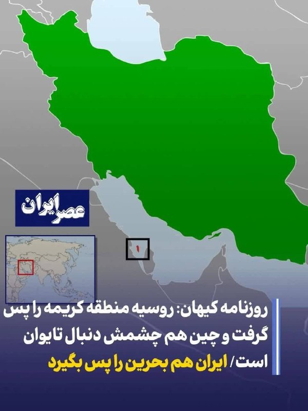

🔴 روزنامه کیهان :

حالا که روسیه منطقه کریمه رو‌ پس گرفته و چین هم دنبال اینه تایوانو بگیره مام باید بریم و بحرینو پس بگیریم.

@IranianMinds

## BBCPersian — post 282689

🔻تشییع خامنه‌ای «احتمالا تا اوایل محرم» برگزار می‌شود

به گفته معاون فرهنگی و اجتماعی شهرداری تهران، تشییع علی خامنه‌ای، رهبر سابق جمهوری اسلامی، «احتمالا در پایان ماه ذی‌الحجه و اوایل ماه محرم» یعنی حدود دو هفته دیگر برگزار خواهد شد.

محمدامین توکلی‌زاده در پنجاه‌ودومین کمیسیون فرهنگی اجتماعی کلانشهرهای ایران گفت که متولی مراسم سپاه پاسداران است و سه روز «بدرقه مردمی» در آن در‌نظر گرفته شده است.

آقای توکلی‌زاده گفت که پس از مراسم بدرقه، نماز و آئین تشییع برگزار خواهد شد که در تهران حداقل ۲۴ ساعت طول خواهد کشید.

او گفت: «در حال تدارک برای جمعیتی بیش از ۱۵ تا ۲۰ میلیون نفر در پایتخت هستیم.»

به گفته آقای توکلی‌زاده، پس از تهران تشییع در شهرهای قم و مشهد قطعی شده است و استان‌های مختلف درخواست‌ میزبانی از تشییع داده‌اند.

او گفت که مدفن آیت‌الله علی خامنه‌ای «براساس وصیت و توصیه‌های نزدیکان» حرم امام رضا در مشهد خواهد بود.

معاون شهرداری تهران گفت که پیش‌بینی می‌شود که مقام‌ها و «عزاداران» از کشورهای پاکستان، افغانستان، هند، بنگلادش، کشمیر «و دیگر مناطق شرق جهان اسلام» به مشهد سفر کنند.

علی خامنه در ۹ اسفند (۲۸ فوریه) در آغاز حملات اسرائیل و آمریکا به ایران در دفتر کارش کشته شد. برخی از اعضای خانواده‌ آقای خامنه‌ای هم همراه او کشته شدند که هفته گذشته برای آنها مراسمی در تهران برگزار شد.

پیش از این محسن محمودی، رئیس شورای هماهنگی تبلیغات اسلامی استان تهران، گفته بود که تشییع آقای خامنه‌ای «یک مراسم جهانی خواهد بود که در تاریخ جهان اسلام و ایران ثبت می‌شود. هم‌اکنون شاهد ثبت‌نام و اعلام آمادگی از کشورهای دیگر مانند عراق برای حضور در این مراسم هستیم.»

https://bbc.in/4x4rB6K
@BBCPersian

## BBCPersian — post 282688

  <a href="telegram/content/BBCPersian_282688_1780407865.mp4" target="_blank">🎬 Download video</a>

سرخط خبرها، سه‌شنبه ۱۲ خرداد ۱۴۰۵

@BBCPersian

## alonews — post 124481

  <a href="telegram/content/alonews_124481_1780407866.webm" target="_blank">🎬 Download video</a>

👈معاون شهردار تهران:
برای تشییع جنازه علی خامنه‌ای سه روز مراسم بدرقه برنامه ریزی شده
تشییع تو تهران، قم و مشهد قطعیه و تو تهران حداقل ۲۴ ساعت طول میکشه.
در حال تدارک برای جمعیتی بیش از 15 الی 20 میلیون نفر تو پایتخت هستیم.

✅ @AloNews خبر جنگ

---
📅 بروزرسانی: 1405/03/12 17:04
---

## VahidOOnLine — post 243361

  

خبرگزاری فارس، وابسته به سپاه پاسداران، به نقل از یک منبع آگاه نوشت که تبادل پیام بین جمهوری اسلامی و آمریکا برای آنچه دست‌یابی به یادداشت تفاهم اولیه بین تهران و واشینگتن خوانده می‌شود، دست‌کم چند روز است که متوقف شده است.

فارس نوشت که درحالی‌که دیشب ترامپ مدعی شده بود که گفت‌وگوها با جمهوری اسلامی با سرعت بالایی در جریان است، آخرین پیام جمهوری اسلامی به واشینگتن، پیامی آشکار در خصوص لبنان بود که بازتاب گسترده بین‌المللی یافت.
‌🏁 🇬🇧 IranintlTV

🤖 @VahidOOnLine

## WithYashar — post 13263

یک منبع آگاه به فارس: درحال حاضر تبادل پیامی با آمریکا انجام نمی‌شود

تبادل پیام بین ایران و آمریکا برای آنچه دست‌یابی به یادداشت تفاهم اولیه بین تهران و واشنگتن خوانده می‌شود، دست‌کم چند روز است که متوقف شده. درحالی‌که دیشب ترامپ مدعی شده بود که گفت‌وگوها با ایران با سرعت بالایی در جریان است، این منبع آگاه تصریح کرد که آخرین پیام جمهوری به فارس اسلامی ایران به واشنگتن، پیامی آشکار در خصوص لبنان بود که بازتاب گستردۀ بین‌المللی یافت.
@withyashar

## FoxNewsTwitter — post 342496

Fox News (Twitter/X)

BREAKING: Trump names Federal Housing Finance Agency Director Bill Pulte acting director of national intelligence after Tulsi Gabbard's resignation

## IranIntlTV — post 340210

  

خبرگزاری فارس، وابسته به سپاه پاسداران، به نقل از یک منبع آگاه نوشت که تبادل پیام بین جمهوری اسلامی و آمریکا برای آنچه دست‌یابی به یادداشت تفاهم اولیه بین تهران و واشینگتن خوانده می‌شود، دست‌کم چند روز است که متوقف شده است.

فارس نوشت که درحالی‌که دیشب ترامپ مدعی شده بود که گفت‌وگوها با جمهوری اسلامی با سرعت بالایی در جریان است، آخرین پیام جمهوری اسلامی به واشینگتن، پیامی آشکار در خصوص لبنان بود که بازتاب گسترده بین‌المللی یافت.
https://iranintl.com/202606020029

## FarsiVOA — post 219371

  <a href="telegram/content/FarsiVOA_219371_1780407295.mp4" target="_blank">🎬 Download video</a>

تصاویری دیگر از اعتراض دانش‌آموزان به تاثیر معدل در کنکور؛
صدها دانش‌آموز روز سه‌شنبه ۱۲ خرداد با تجمع مقابل ساختمان آموزش و پرورش و شورای عالی انقلاب فرهنگی به تغییر قوانین کنکور، افزایش تأثیر معدل و پیامدهای جنگ بر آمادگی برای آزمون سراسری اعتراض کردند.

در ویدئوهای منتشرشده در شبکه‌های اجتماعی، شعارهایی از جمله «دانش‌آموز بیداره، از تبعیض بیزاره»، «دانش‌آموز می‌میرد، ذلت نمی‌پذیرد»، «وعده زیاد شنیدیم، عدالت و ندیدیم» و «فشار روانی کافیه، زندگی‌مونو پس بدین» شنیده می‌شود.

## DW_Farsi — post 125419

  <a href="telegram/content/DW_Farsi_125419_1780407297.mp4" target="_blank">🎬 Download video</a>

🎥 اینجا یک غار معمولی نیست؛ سفری به عصر یخبندان در آلمان

در دل منطقه کوهستانی "شوابین یورا" یا "شوابین آلب" در جنوب غرب آلمان، غاری پنهان شده است که انسان‌های اولیه در آن زندگی می‌کردند، شکار می‌کردند و بیش از ۳۰ هزار سال پیش برخی از نخستین آثار هنری جهان را خلق کردند.

@dw_farsi

## alonews — post 124480

  <a href="telegram/content/alonews_124480_1780407298.webm" target="_blank">🎬 Download video</a>

👈شبکه اجتماعی لینکدین پس از بازگشایی تدریجی اینترنت بین‌الملل، بدون نیاز به فیلترشکن در دسترس کاربران ایرانی قرار گرفت.

✅ @AloNews خبر جنگ

## alonews — post 124479

  <a href="telegram/content/alonews_124479_1780407298.webm" target="_blank">🎬 Download video</a>

👈بانک مرکزی: سقف کارت به کارت رو از ۱۰ میلیون به ۱۵ میلیون افزایش دادیم مردم حال کنن.

✅ @AloNews خبر جنگ

---
📅 بروزرسانی: 1405/03/12 16:54
---

## VahidOOnLine — post 243360

  <a href="telegram/content/VahidOOnLine_243360_1780406664.mp4" target="_blank">🎬 Download video</a>

♦️دوربین‌های مداربسته در منطقه ماراکانا در شهر ریودوژانیرو برزیل، صبح یکشنبه دهم خردادماه، لحظه سقوط یک زن به درون یک دریچه فاضلاب را ثبت کردند. این زن پس از پیاده شدن از موتورسیکلت و در مسیر محل کار خود، روی درپوش دریچه قدم گذاشت و ناگهان به داخل گودال سقوط کرد.

خبرگزاری «گلوبو» برزیل گزارش داد بررسی تصاویر دوربین‌های مداربسته نشان می‌دهد حدود ساعت ۲ بامداد همان روز، دو مرد درپوش این دریچه را باز کرده بودند. مقام‌های شهرداری ریودوژانیرو اعلام کردند این افراد احتمالا قصد سرقت تجهیزات داخل کانال را داشتند، اما پس از ناکامی، محل را بدون ایمن‌سازی رها کردند.
موتورسوار و شماری از رهگذران بلافاصله برای کمک به زن آسیب‌دیده وارد عمل شدند. نیروهای آتش‌نشانی برزیل نیز پس از حضور در محل، او را با جراحات متوسط به بیمارستان فدرال آندارای منتقل کردند. مقام‌ها هنوز گزارشی درباره وضعیت کنونی او منتشر نکرده‌اند.

پلیس برزیل در حال بررسی ارتباط احتمالی دو مظنون با سرقت از یک دکه روزنامه‌فروشی در همان منطقه است که در ساعات اولیه بامداد رخ داده بود.
‌🇸🇦 Indypersian

🤖 @VahidOOnLine

## FoxNewsTwitter — post 342495

  

Fox News (Twitter/X)

WATCH LIVE: Newark mayor announces legal push to close ICE detention center https://twitter.com/i/broadcasts/1XxyggnBlpvGM

## FoxNewsTwitter — post 342494

  

Fox News (Twitter/X)

"You're f****** crazy. You'd be in prison if it weren't for me. I'm saving your a***. Everybody hates you now. Everybody hates Israel because of this."

That's what a U.S. official tells Axios President Trump unloaded on Israeli Prime Minister Benjamin Netanyahu during a heated phone call over Israel's military actions in Lebanon.

Trump was reportedly furious that Israel's moves risked blowing up U.S. diplomatic efforts in the region, at one point also asking Netanyahu: "What the f*** are you doing?"

## pm_afshaa — post 92099

🔴فارس:مذاکرات با آمریکا متوقف شد

💧 Rainbet.com the #1 Non-KYC Crypto Casino & Sportsbook @rainbetcom

😁 @Pm_Afshaa

## DEJradio — post 5248

  <a href="telegram/content/DEJradio_5248_1780406666.mp4" target="_blank">🎬 Download video</a>

🚨
🔸 علیرضا دبیر؛ چکیده‌ای از پلشتی‌های نظام در ورزش

#حکومتی #علیرضا_دبیر
@DEJradio

## IranIntlTV — post 340209

  <a href="telegram/content/IranIntlTV_340209_1780406669.mp4" target="_blank">🎬 Download video</a>

وزیر دفاع اسرائیل با اشاره به ضرورت ادامه عملیات نظامی در جنوب لبنان، بر خلع سلاح حزب‌الله تاکید کرد. او گفت ارتش گزینه‌های جدید را برای گسترش دامنه حملات بررسی می‌کند

گفت‌وگو با بابک اسحاقی و اردوان روزبه، خبرنگارهای ایران‌اینترنشنال
@iranintltv

## IranIntlTV — post 340208

  

🔻کنی دالگلیش، اسطوره فوتبال لیورپول و اسکاتلند، در صفحه اینستاگرام خود اعلام کرد که به سرطان مبتلا شده و در حال حاضر تحت درمان است.

🔹این ستاره پیشین خبر داد که روند درمانش به‌خوبی پیش می‌رود و از رسانه‌ها و مردم خواست که به حریم خصوصی او و خانواده‌اش احترام بگذارند.

🔹باشگاه لیورپول بلافاصله با انتشار پیامی حمایت خود را از او اعلام کرد. دالگلیش در دوران بازی خود ۱۷۲ گل برای لیورپول به ثمر رساند و به‌عنوان سرمربی نیز این تیم را به سه عنوان قهرمانی لیگ رساند.
@iranintltvsport

## IranIntlTV — post 340207

  <a href="telegram/content/IranIntlTV_340207_1780406672.mp4" target="_blank">🎬 Download video</a>

سومین هفته رسیدگی به پرونده دو متهم حمله به پوریا زراعتی، مجری ایران‌اینترنشنال، در دادگاه وولیج لندن ادامه دارد. در روز اول، دادستانی با ارائه مدارک به نقش متهمان پرداخت و در روز دوم نیز یکی از آن‌ها در جایگاه حاضر شد تا به پرسش‌ها پاسخ دهد.

علی رشید، خبرنگار ایران‌اینترنشنال، گزارش می‌دهد
@iranintltv

## IranIntlTV — post 340206

  <a href="telegram/content/IranIntlTV_340206_1780406675.mp4" target="_blank">🎬 Download video</a>

سومین هفته رسیدگی به پرونده دو متهم حمله به پوریا زراعتی، مجری ایران‌اینترنشنال، در دادگاه وولیج لندن ادامه دارد. در روز اول، دادستانی با ارائه مدارک به نقش متهمان پرداخت و در روز دوم نیز یکی از آن‌ها در جایگاه حاضر شد تا به پرسش‌ها پاسخ دهد.

علی رشید، خبرنگار ایران‌اینترنشنال، گزارش می‌دهد
@iranintltv

## Shin_Persian — post 6402

  <a href="telegram/content/Shin_Persian_6402_1780406678.mp4" target="_blank">🎬 Download video</a>

Tal Inbar @inbarspace
Tue, 02 Jun 2026 13:19:48 UTC

More footage of Israeli strikes on Iran continues to emerge - this time of an air defense system destroyed in Karg. Note the secondary explosions of the missiles - and the effect of the burning of the propellants.

فارسی

تصاویر بیشتری از حملات اسرائیل به ایران در حال انتشار است - این بار از یک سامانه پدافند هوایی منهدم شده در کرج. به انفجارهای ثانویه موشک‌ها و اثر سوختن پیشران‌ها توجه کنید.

𝕏 · @shin_persian

## FarsiVOA — post 219370

  <a href="telegram/content/FarsiVOA_219370_1780406679.mp4" target="_blank">🎬 Download video</a>

یکی از ویدیوهای دیگری که به تازگی بعد از بازگشایی محدود اینترنت منتشر و در شبکه‌های اجتماعی پربازدید شده منتسب است به لحظه انهدام ناحیه مقاومت بسیج مقداد، یکی از اصلی‌ترین نهادهای سرکوب جمهوری اسلامی، در نزدیکی میدان آزادی در غرب تهران.

این پایگاه در هفته دوم اسفند هدف حملات آمریکا و اسرائیل قرار گرفت.

## DW_Farsi — post 125418

  <a href="telegram/content/DW_Farsi_125418_1780406681.mp4" target="_blank">🎬 Download video</a>

🎥 ارزيابى تيم ملى فوتبال آلمان در آستانه جام جهانى ٢٠٢۶
 
 تیم ملی‌ فوتبال آلمان با کسب ۴ عنوان قهرمانی جهان، در جام جهانی ۲۰۲۶ نیز از مدعیان کسب مقام قهرمانی به شمار می‌رود. 
 
کیفیت کادر ۲۶ نفره ملی‌پوشان فوتبال آلمان چه ویژگی‌های منحصر به فردی دارد؟
 
بابک کیهان‌فر، مربی پیشین تیم‌های ماینتس و اونیون برلین در بوندس‌لیگا و مربی جدید تیم زیر ۲۳ سال بایرن‌مونیخ، در گفت‌و‌گوی اختصاصی با دویچه ‌وله فارسی جزئیات و تمام پست‌های تیم ملی آلمان، از دروازه‌بان مانوئل نویر، مدافع‌ها و هافبک‌ها گرفته تا دنیز اونداو در نوک حمله، را زیر ذره‌بین قرار داده است.

@dw_farsi

## alonews — post 124478

  <a href="telegram/content/alonews_124478_1780406684.webm" target="_blank">🎬 Download video</a>

👈خبرگزاری معتبر فارس: یک منبع آگاه می‌گوید که تبادل پیام بین ایران و آمریکا برای آنچه دست‌یابی به یادداشت تفاهم اولیه بین تهران و واشنگتن خوانده می‌شود، دست‌کم چند روز است که متوقف شده.

✅ @AloNews خبر جنگ

---
📅 بروزرسانی: 1405/03/12 16:44
---

## VahidOOnLine — post 243359

  

♦️ سرلشکر رومن گوفمن روز سه‌شنبه ۱۲ خرداد طی مراسمی رسما به عنوان مدیر جدید موساد منصوب شد. گوفمن که متولد بلاروس است و در کودکی به اسرائیل مهاجرت کرده، پیش از این سوابق درخشانی در سپاه زرهی داشته و اخیرا به عنوان دبیر نظامی نخست‌وزیر خدمت کرده است. انتصاب او پس از رد شکایت‌های قانونی در دیوان عالی اسرائیل نهایی شد.

دیوید بارنیا، مدیر پیشین موساد، در مراسم تودیع ضمن آرزوی موفقیت برای جانشین خود، بر تداوم تقابل با تهران تاکید کرد. بارنیا در سخنان خود اعلام کرد که تغییر واقعیت در ایران و در نهایت جایگزینی رژیم، هدفی دست‌یافتنی است که باید در صدر اولویت‌های استراتژیک اسرائیل باقی بماند. او این ماموریت را «وظیفه‌ای در قبال نسل‌های آینده» خواند.

بنیامین نتانیاهو، نخست‌وزیر اسرائیل، نیز در این مراسم با اشاره به تضعیف پایه‌های جمهوری اسلامی گفت: «پایه‌های رژیم ترور ایران لرزیده است؛ این حکومت هرگز به وضعیت قبلی باز نخواهد گشت و سرنوشت آن سقوط است». گوفمن با پیشینه‌ای قدرتمند در فرماندهی تیپ‌ها و لشکر‌های زرهی، اکنون هدایت سیزدهمین دوره ریاست این سازمان اطلاعاتی را بر عهده دارد.
‌🇸🇦 Indypersian

🤖 @VahidOOnLine

## WithYashar — post 13262

  <a href="telegram/content/WithYashar_13262_1780406064.mp4" target="_blank">🎬 Download video</a>

آهنگ تابستون کوتاه ورژن عرزشی
@withyashar

## pm_afshaa — post 92098

  <a href="telegram/content/pm_afshaa_92098_1780406066.webm" target="_blank">🎬 Download video</a>

🔴بحرین به دلیل شرایط امنیتی، سفر شهروندان خود به عراق و ایران رو ممنوع اعلام کرد.

💧 Rainbet.com the #1 Non-KYC Crypto Casino & Sportsbook @rainbetcom

😁 @Pm_Afshaa

## IranIntlTV — post 340205

«#سیاست با #مراد_ویسی»؛ شنبه تا چهارشنبه ساعت ۰۰:۳۰ تهران

در اینجا به سیاست، «آنگونه که هست» و نه « آنگونه که برای ما می‌خوانند» نگاه خواهیم کرد.

دسترسی به سایر قسمت‌ها در کانال یوتیوب و اپلیکیشن اینتل‌پلاس

لینک یوتیوب سیاست با مراد ویسی:

https://www.youtube.com/playlist?list=PLrqEUp1jEA7XbyLZn3GVY3skYdN7lMN8K

@iranintltv

## FarsiVOA — post 219369

  <a href="telegram/content/FarsiVOA_219369_1780406067.mp4" target="_blank">🎬 Download video</a>

صدها دانش‌آموز روز سه‌شنبه ۱۲ خرداد با تجمع مقابل ساختمان آموزش و پرورش و شورای عالی انقلاب فرهنگی به تغییر قوانین کنکور، افزایش تأثیر معدل و پیامدهای جنگ بر آمادگی برای آزمون سراسری اعتراض کردند.

در ویدئوهای منتشرشده در شبکه‌های اجتماعی، شعارهایی از جمله «دانش‌آموز بیداره، از تبعیض بیزاره»، «دانش‌آموز می‌میرد، ذلت نمی‌پذیرد»، «وعده زیاد شنیدیم، عدالت و ندیدیم» و «فشار روانی کافیه، زندگی‌مونو پس بدین» شنیده می‌شود.

## Dirty_Kids — post 390830

از محور مقاومت دیگه فقط ترامپ مونده.

@Dirty_Kids 👻

## Dirty_Kids — post 390829

‏امروز دوستم میخواست از دوستپسرش تعریف کنه گفت خیلی تربیت‌پذیره=)))))

@Dirty_Kids 👻

## Dirty_Kids — post 390827

خانوم رئیس (نه ببخشید)
نایب‌رئیس شورای «اسلامی» شهر دزفول!ً

@Dirty_Kids 👻

## Dirty_Kids — post 390826

  <a href="telegram/content/Dirty_Kids_390826_1780406070.mp4" target="_blank">🎬 Download video</a>

ویدئویی پش ریزون از لحظه حمله هوایی به یه سامانه موشکی تو جنگ ۴۰ روزه تو کرج:

@Dirty_Kids 👻

## alonews — post 124477

  <a href="telegram/content/alonews_124477_1780406072.webm" target="_blank">🎬 Download video</a>

👈خسروپناه؛ دبیرشورای عالی انقلاب فرهنگی:
من در زمان شاه به خاطر اینکه فیلما مبتذل بودن به سینما نرفتم؛ بعد از انقلاب هم نرفتم.
گاهی وقتا بهم میگن فلان فیلمو دیدی؟! میگم من سینما نمیرم. فیلمو بیارید اینجا ببینم. به جوونا هم توصیه میکنم سینما نرن.
در زمان شاه هر خانوم بی حجاب و پا لختی میومد مغازه پدرم من از بالا پشت بوم با تیروکمان میزدمش. پدرم هم میگفت چون حجاب ندارن کار خوبی میکنی و شرعا ضامن هستی.
جوون که بودم یه شب خواب حضرت علی رو دیدم که اومد گفت برو طلبه شو. منم رفتم طلبه شدم.
خسروپناه کسیه که تاثیر معدل نهایی بر کنکور رو تصویب کرده و دانش آموزا ازش ناراحتن.

✅ @AloNews خبر جنگ

---
📅 بروزرسانی: 1405/03/12 16:34
---

## VahidOOnLine — post 243358

  

وای‌نت گزارش داد یسرائیل کاتز، وزیر دفاع اسرائیل، در کنفرانس صادرات دفاعی و در جمع مدیران وزارت دفاع و روسای صنایع دفاعی اسرائیل، درباره وضعیت امنیتی در شمال این کشور سخن گفت.

کاتز گفت همراه با بنیامین نتانیاهو تلاش کرده است «معادله‌ای» ایجاد کند که بر اساس آن ضاحیه در بیروت مانند شهرهای شمال اسرائیل تلقی شود.

او گفت: «اگر حملات به شهرهای اسرائیل ادامه یابد، ما نیز محله ضاحیه در بیروت را هدف قرار خواهیم داد. آزمون این معادله ساده خواهد بود و در روزهای آینده روشن خواهد شد.»

وای‌نت نوشت وزیر دفاع اسرائیل در سخنان خود به لغو حملات شامگاه دوشنبه به ضاحیه بیروت که به دستور او و بنیامین نتانیاهو، نخست‌وزیر اسرائیل، انجام شد، اشاره‌ای نکرد.

بر اساس این گزارش، کاتز همچنین درباره شلیک موشک به صفد و انفجار یک پهپاد در خاک اسرائیل پس از اعلام «آتش‌بس» از سوی دونالد ترامپ، رییس‌جمهوری آمریکا، اظهارنظری نکرد.
‌🏁 🇬🇧 IranintlTV

🤖 @VahidOOnLine

## IranIntlTV — post 340204

  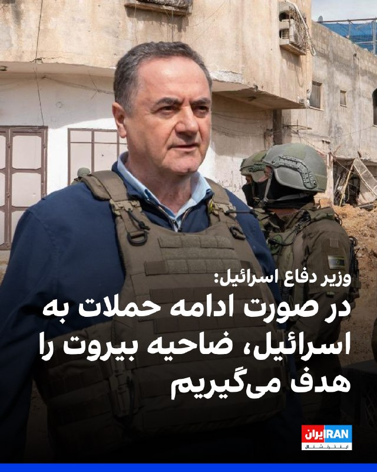

وای‌نت گزارش داد یسرائیل کاتز، وزیر دفاع اسرائیل، در کنفرانس صادرات دفاعی و در جمع مدیران وزارت دفاع و روسای صنایع دفاعی اسرائیل، درباره وضعیت امنیتی در شمال این کشور سخن گفت.

کاتز گفت همراه با بنیامین نتانیاهو تلاش کرده است «معادله‌ای» ایجاد کند که بر اساس آن ضاحیه در بیروت مانند شهرهای شمال اسرائیل تلقی شود.

او گفت: «اگر حملات به شهرهای اسرائیل ادامه یابد، ما نیز محله ضاحیه در بیروت را هدف قرار خواهیم داد. آزمون این معادله ساده خواهد بود و در روزهای آینده روشن خواهد شد.»

وای‌نت نوشت وزیر دفاع اسرائیل در سخنان خود به لغو حملات شامگاه دوشنبه به ضاحیه بیروت که به دستور او و بنیامین نتانیاهو، نخست‌وزیر اسرائیل، انجام شد، اشاره‌ای نکرد.

بر اساس این گزارش، کاتز همچنین درباره شلیک موشک به صفد و انفجار یک پهپاد در خاک اسرائیل پس از اعلام «آتش‌بس» از سوی دونالد ترامپ، رییس‌جمهوری آمریکا، اظهارنظری نکرد.
https://iranintl.com/202606029137

## FarsiVOA — post 219368

  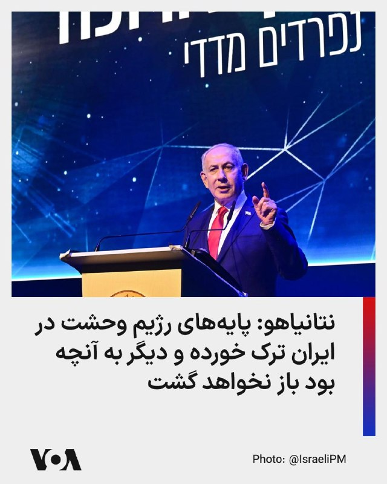

بنیامین نتانیاهو، نخست‌وزیر اسرائیل، در مراسم خداحافظی با دیوید بارنئا، رئیس پیشین موساد، با اشاره به تهدیدهای جمهوری اسلامی علیه اسرائیل گفت هر کسی که «بدخواهی علیه اسرائیل» در سر داشته باشد، باید بداند توطئه‌هایش شکست خواهد خورد و بهای سنگینی خواهد پرداخت.

او افزود جمهوری اسلامی تا همین‌جا هزینه سنگینی پرداخته و به گفته او «پایه‌های رژیم وحشت در ایران ترک خورده و دیگر به آنچه بود باز نخواهد گشت.»

همزمان، رومن گوفمن امروز رسماً کار خود را به عنوان رئیس جدید موساد آغاز کرد.

## FarsiVOA — post 219367

  <a href="telegram/content/FarsiVOA_219367_1780405474.mp4" target="_blank">🎬 Download video</a>

تجمع اعتراضی دانش‌آموزان در تهران با شعار «دانش‌آموز می‌میرد، ذلت نمی‌پذیرد»؛ صدها دانش‌آموز روز سه‌شنبه ۱۲ خرداد با تجمع مقابل ساختمان آموزش و پرورش و شورای عالی انقلاب فرهنگی به تغییر قوانین کنکور، افزایش تأثیر معدل و پیامدهای جنگ بر آمادگی برای آزمون سراسری اعتراض کردند.

## DW_Farsi — post 125417

🔶 آیا ایران می‌تواند اعتماد با همسایگان را بازسازی کند؟

از زمان آغاز جنگ ایران، کشورهای حاشیه خلیج فارس هدف هزاران موشک و پهپاد از سوی ایران قرار گرفته‌اند و تأسیسات مختلفی از جمله پایگاه‌های نظامی آمریکا و زیرساخت‌های غیرنظامی و تأسیسات انرژی هدف قرار گرفته شده‌اند.

کویت روز دوشنبه ۱۱ خرداد (اول ژوئن) اعلام کرد سامانه‌های پدافند هوایی این کشور در حال مقابله با موجی از موشک‌ها و پهپادها هستند؛ این اتفاق پس از آن رخ داد که ایالات متحده اعلام کرد سایت‌های راداری و پهپادی در جنوب ایران را هدف قرار داده است.

به دلیل نزدیکی جغرافیایی به ایران و هم‌سویی با واشنگتن، کشورهای عضو شورای همکاری خلیج فارس (GCC) در زمان تشدید تنش‌ها آسیب‌پذیری ویژه‌ای دارند.

در صورتی که جنگ از طریق مذاکره پایان یابد و جمهوری اسلامی همچنان در قدرت باقی بماند، پرسش بلندمدت برای منطقه این خواهد بود که تهران و کشورهای شورای همکاری خلیج فارس چگونه می‌توانند مسیر آینده روابط خود را ترسیم کنند؟

کشورهای عربی خلیج فارس به واشنگتن گفته‌اند که پایان جنگ به تنهایی کافی نیست و تأکید کرده‌اند توانایی ایران برای تهدید منطقه با موشک‌ها و پهپادها باید محدود شود.

بابک دربیکی، تحلیلگر سیاسی ساکن لندن و از مقام‌های پیشین مرکز تحقیقات استراتژیک ایران، به دویچه‌وله گفت: «اگر ایران و آمریکا به توافق برسند و ایران از وضعیت تقابل با غرب خارج شود، ناچار خواهد بود گام‌های مهم دیپلماتیک و اقتصادی برای بهبود شرایط منطقه‌ای و روابط خود با همسایگانش بردارد.»

دربیکی افزود از نگاه تهران، کشورهای شورای همکاری خلیج فارس که در این جنگ هدف قرار گرفته‌اند، بازیگران "بی‌طرف" محسوب نمی‌شوند، بلکه به اشکال مختلف در کارزارهای فشار علیه ایران نقش داشته‌اند؛ چه از طریق میزبانی نیروهای آمریکایی، چه ارائه کمک‌های لجستیکی و چه حمایت غیرمستقیم از اقدامات نظامی.

او گفت در کوتاه‌مدت، همسایگان ایران با سوءظن و احتیاط بیشتری به تهران نگاه خواهند کرد و این مسئله نه‌تنها بر دیپلماسی، بلکه بر مسیرهای تجاری، زیرساخت‌های منطقه‌ای و کریدورهای آینده حمل‌ونقل و انرژی نیز تأثیر خواهد گذاشت.

اواخر آوریل، رهبران کشورهای شورای همکاری خلیج فارس برای نخستین بار در عربستان سعودی گردهم آمدند تا درباره واکنش به حملات ایران رایزنی کنند. از آغاز جنگ در ۲۸ فوریه (نهم اسفند سال گذشته) تا اعلام آتش‌بس در ۸ آوریل، ایران بیش از ۴ هزار موشک و پهپاد به سوی اهدافی در کشورهای عضو این شورا شلیک کرد که بیشتر آن‌ها رهگیری شدند.

اگرچه شدت حملات ایران کاهش یافته، اما اقتصاد و زیرساخت‌های کشورهای خلیج فارس همچنان در برابر بی‌ثباتی منطقه‌ای آسیب‌پذیر هستند. وزارت خارجه قطر در جریان نشست‌های آوریل هشدار داد که یک «درگیری منجمد» می‌تواند هر زمان که انگیزه سیاسی وجود داشته باشد دوباره شعله‌ور شود.

@dw_farsi

## RadioFarda — post 157818

🔸در حالی که برخی شرکت‌های هواپیمایی پروازهای خود به خاورمیانه را به‌تدریج از سر گرفته‌اند، اختلال‌های ناشی از جنگ ایران همچنان بر مسیرهای هوایی منطقه و پروازهای اروپا-آسیا سایه انداخته است. 🔸بر اساس گزارش رویترز در روز سه‌شنبه ۱۲ خرداد، شرکت‌های هواپیمایی…

## RadioFarda — post 157817

  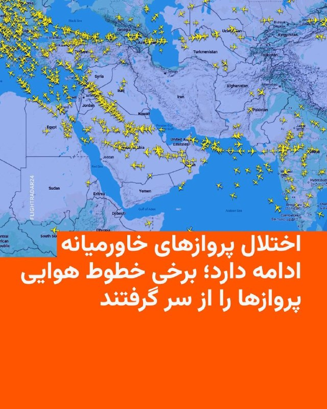

🔸در حالی که برخی شرکت‌های هواپیمایی پروازهای خود به خاورمیانه را به‌تدریج از سر گرفته‌اند، اختلال‌های ناشی از جنگ ایران همچنان بر مسیرهای هوایی منطقه و پروازهای اروپا-آسیا سایه انداخته است.

🔸بر اساس گزارش رویترز در روز سه‌شنبه ۱۲ خرداد، شرکت‌های هواپیمایی خاورمیانه پس از اختلال‌های شدید مرتبط با جنگ، ظرفیت پروازی خود را افزایش داده‌اند، اما بسیاری از شرکت‌های هوایی خارج از حوزه خلیج فارس همچنان برای پرهیز از عبور از آسمان منطقه، مسیر پروازهای اروپا به آسیا را تغییر می‌دهند.

🔸در تازه‌ترین تغییرات، شماری از شرکت‌های اروپایی و آسیایی پروازهای خود به تل‌آویو، دوبی، دوحه، ریاض، بیروت، اربیل، بغداد و تهران را تا تاریخ‌های متفاوتی در تابستان یا پاییز به حالت تعلیق درآورده‌اند. از جمله ایر فرانس پروازهای تل‌آویو را تا ۱۴ ژوئن و پروازهای بیروت و دوبی را تا ۱۷ ژوئن متوقف کرده، در حالی که کی‌ال‌ام پروازهای دوبی را تا دوم اوت و مسیرهای ریاض و دمام را تا ۱۲ ژوئیه تعلیق کرده است.

@RadioFarda

## Hranews — post 113332

  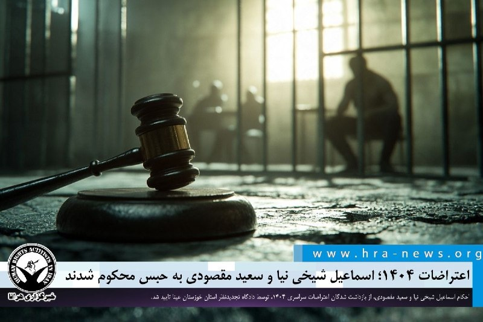

اعتراضات ۱۴۰۴؛ اسماعیل شیخی نیا و سعید مقصودی به حبس محکوم شدند

❗️
❗️
❗️
❗️
❗️– احکام اسماعیل شیخی نیا و سعید مقصودی، از بازداشت شدگان اعتراضات سراسری ۱۴۰۴، توسط دادگاه تجدیدنظر استان خوزستان عینا تایید شد. این افراد در یک پرونده قضایی مشترک توسط شعبه اول دادگاه انقلاب اهواز هر یک به دو سال حبس و مجازاتهای تکمیلی محکوم شده بودند.

به گزارش خبرگزاری هرانا، ارگان خبری مجموعه فعالان حقوق بشر در ایران، اسماعیل شیخی نیا و سعید مقصودی به حبس و مجازاتهای تکمیلی محکوم شدند.

بر اساس حکمی که توسط شعبه ۱۴ دادگاه تجدیدنظر استان خوزستان صادر و به حسین علی حاتمی، وکیل مدافع این افراد ابلاغ شده، آقایان شیخی نیا و مقصودی از بابت اتهام اخلال در نظم عمومی با استناد به تبصره ماده ۲۶۸ قانون مجازات اسلامی هر یک به دو سال حبس، دو سال منع خروج از کشور و یک سال حضور در ستاد امر به معروف و نهی از منکر شهرستان ایذه محکوم شده اند.

ادامه مطلب

#اسماعیل_شیخی_نیا #سعید_مقصودی

↘️
@hranews_bot تماس ✉️ - @Hranews کانال هرانا 🆑

---
📅 بروزرسانی: 1405/03/12 16:23
---

## VahidOOnLine — post 243357

  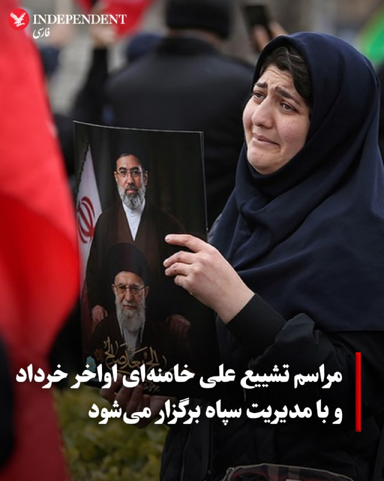

♦️ محمدعلی توکلی‌زاده، معاون اجتماعی و فرهنگی شهرداری تهران، اعلام کرد که مسئولیت فرماندهی مراسم تشییع علی خامنه‌ای به سپاه پاسداران واگذار شده است. طبق اظهارات او، برنامه‌ریزی‌ها شامل سه روز مراسم بدرقه است که تنها در تهران دست‌کم ۲۴ ساعت به طول خواهد انجامید.

توکلی‌زاده با اشاره به تقاضای بالای استان‌های مختلف برای میزبانی، خاطرنشان کرد که پس از تهران، مراسم تشییع در شهرهای قم و مشهد نیز برگزار خواهد شد. او زمان احتمالی برگزاری این مراسم را اواخر ماه ذی‌الحجه یا اوایل محرم (اواخر خرداد) اعلام کرد و افزود که بحث‌هایی برای افزایش زمان آماده‌سازی جهت برگزاری هرچه بهتر این مراسم در جریان است. در حال حاضر، تمامی استان‌ها در حال تدارک برای مشارکت در این مراسم گسترده هستند.
‌🇸🇦 Indypersian

🤖 @VahidOOnLine

## mwarmonitor — post 10028

  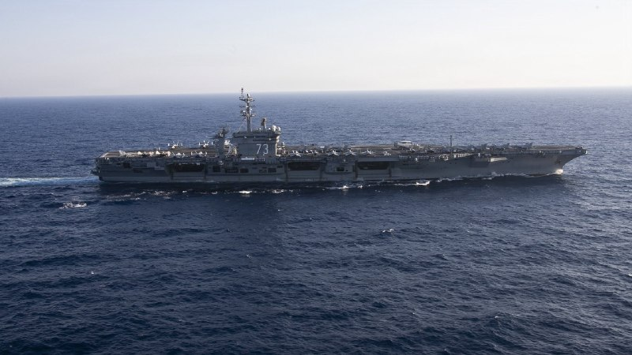

🔴ناو هواپیمابر کلاس نیمیتز یو‌اس‌اس جورج واشینگتن (CVN-73) پس از پایان یک دوره تعمیر و نگهداری در بندر خانگی جدید خود در یوکوسوکا ژاپن، برای انجام عملیات‌های معمول وارد دریای فیلیپین شده است. جورج واشینگتن تنها ناو هواپیمابر آمریکا است که به‌صورت پیش‌دستانه در خارج از خاک این کشور مستقر شده و در حال حاضر میزبان یک مجموعه کامل از جنگنده‌های F-35C لایتنینگ II است.

📌ورود جورج واشینگتن به این منطقه هم‌زمان شده با تغییر مسیر گروه آماده آبی‌خاکی یو‌اس‌اس باکسر (LHD-4) و یگان اعزامی یازدهم تفنگداران دریایی (11th MEU) همراه آن، از حوزه مسئولیت فرماندهی مرکزی آمریکا (CENTCOM) به حوزه مسئولیت فرماندهی هند-آرام آمریکا (INDOPACOM)، در بحبوحه تنش‌های منطقه‌ای با چین.

@mwarmonitor

## IranIntlTV — post 340203

جاویدنامان انقلاب ملی ایرانیان
«غزل جان‌قربان» ۱۵ساله، در اعتراضات مردمی ۱۹ دی‌ماه در اصفهان هدف گلوله نیروهای سرکوب جمهوری اسلامی قرار گرفت و در بیمارستان جان باخت . نامش در حافظه‌ی این سرزمین می‌ماند و یادش چراغ راه آزادی‌خواهان است.
@iranintltv

## IranIntlTV — post 340202

  <a href="telegram/content/IranIntlTV_340202_1780404839.mp4" target="_blank">🎬 Download video</a>

روزنامه وال‌استریت ژورنال در گزارشی نوشت که دولت ترامپ فشار بر عمان را برای فاصله گرفتن از جمهوری اسلامی افزایش داد و از این کشور خواست روابط دیپلماتیک خود را با حکومت ایران قطع کند

گفت‌وگو با مریم رحمتی، خبرنگار ایران‌اینترنشنال
@iranintltv

## FarsiVOA — post 219366

  <a href="telegram/content/FarsiVOA_219366_1780404841.mp4" target="_blank">🎬 Download video</a>

ارتش اسرائیل ویدیویی از فعالیت «رزمندگان ذخیره یگان دوودوان» در کرانه باختری منتشر و اعلام کرد این نیروها روز جمعه، با هدایت شاباک و اطلاعات «در منطقه تیپ منشه موفق شدند سه تروریست را که در مرحله آماده‌سازی برای انجام یک عملیات بودند، بازداشت کنند.»

نیروهای ارتش اسرائیل همچنین یک سلاح دست‌ساز از نوع «کارلو» را که در زیر زمین مخفی شده بود، شناسایی کردند.

ارتش اسرائیل اعلام کرد همه بازداشت‌شدگان برای بازجویی بیشتر به نیروهای امنیتی تحویل داده شدند.

## Hranews — post 113331

  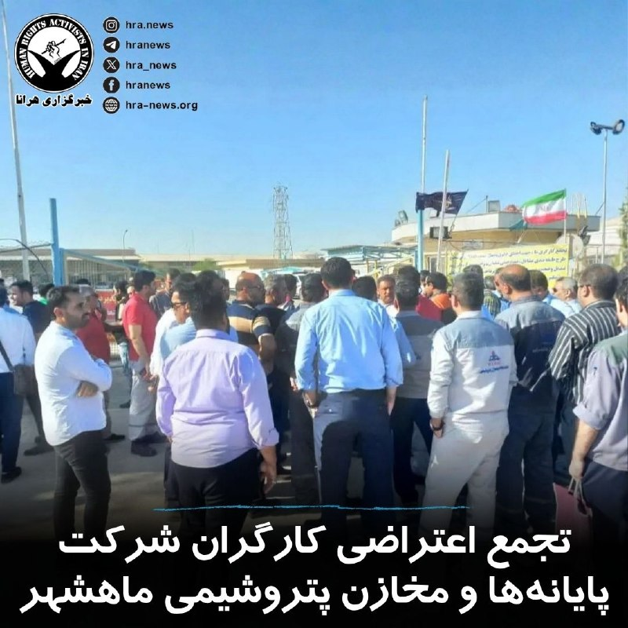

امروز سه‌شنبه، شماری از کارگران قراردادی، شرکتی و پیمانکاری شرکت پایانه‌ها و مخازن پتروشیمی ماهشهر، در مقابل اداره کار سازمان منطقه ویژه اقتصادی پتروشیمی در این شهر، تجمع اعتراضی برگزار کردند. آنان در این تجمع صنفی خواستار بازگشت همکاران قراردادی اخراج‌شده به کار شدند و نسبت به حذف برخی مزایای رفاهی و عدم رسیدگی به سایر مطالبات خود اعتراض کردند.
#تجمع_اعتراضی #کارگران

↘️
@hranews_bot تماس ✉️ - @Hranews کانال هرانا 🆑

## alonews — post 124476

  <a href="telegram/content/alonews_124476_1780404843.webm" target="_blank">🎬 Download video</a>

👈یاشار سلطانی: ‏سیاست‌گذاری و حکمرانی در صنعت خودرو، از راهزنی عبور کرده و به حرامزادگی⁩ رسیده است

🔴البته با پوزش از حرامزاده‌ها

✅ @AloNews خبر جنگ

---
📅 بروزرسانی: 1405/03/12 16:14
---

## mwarmonitor — post 10027

🔸مارک لوین: 🔹افشای این خبر نقض قانون فدرال بود و به رژیم ایران و نیروی نیابتی آن، حزب‌الله، کمک رساند. 🔹هر کسی که این داستان را به باراک راوید در Axios درز داده، خیانتی بزرگ به کشور ما، به رئیس‌جمهورمان، به اسرائیل و به نخست‌وزیر اسرائیل کرده است. رژیم ایران…

## mwarmonitor — post 10026

  

🔴افزایش فعالیت هوایی نظامی ایالات متحده بر فراز خلیج فارس و دریای عمان در جریان است.

✈️۲ فروند هواپیمای سوخت‌رسان KC-135R نیروی هوایی آمریکا در حال حاضر بر فراز خلیج فارس مشغول عملیات هستند.

✈️همچنین یک جفت دیگر از هواپیماهای سوخت‌رسان KC-135R نیروی هوایی آمریکا بر فراز دریای عمان در حال فعالیت‌اند و در کنار آن‌ها یک فروند هواپیمای گشت دریایی P-8A نیروی دریایی آمریکا نیز حضور دارد.

@mwarmonitor

## DEJradio — post 5247

  

💀
🚨 تلفات سـ.ـپاه پاسداران در عملیات خنثی‌سازی مهمات برجای مانده از جنگ رو به افزایش است. ستوانسوم پاسدار میلاد محمدی، عضو لشکر ۲۹ «نبی‌اکرم» کرمانشاه، هنگام عملیات خنثی‌سازی مهمات عمل‌نکرده جنگ ۴۰ روزه کشته شد.

همزمان گزارش شده بود دو سـ.ــپاهی در جریان انفجار مهمات باقی‌مانده از جنگ ۴۰ روزه در فردو قم کشته شدند. حسین رمضانیان فردویی و محمد اویسی عضو سـ.ـپاه «علی‌بن ابی‌طالب» بودند.

بعد از توقف موقت جنگ، دستکم ۲۶ نفر از نیروهای نظامی جمهوری اسلامی در انفجار مهمات‌ برجای مانده از جنگ یا در عملیات حنثی سازی کشته و زخمی شدند.

#جنگ #جنگ۴۰روزه
@DEJradio

## DEJradio — post 5246

  <a href="telegram/content/DEJradio_5246_1780404256.mp4" target="_blank">🎬 Download video</a>

🔺📢 پیام یک شهروند:
میگن جسد خامنه‌ای در پزشکی قانونی شهریار نگه‌داری می‌شه.

#موشعلی #شهریار
@DEJradio

## mamlekate — post 103608

📝 سه روایت از یک مکالمه تلفنی؛ دونالد ترامپ به نتانیاهو چه گفت؟

مکالمه تلفنی دونالد ترامپ و بنیامین نتانیاهو که به گفته رئیس‌جمهور آمریکا مانع حمله برنامه‌ریزی‌شده اسرائیل به ضاحیه بیروت شد، بازتاب گسترده‌ای در رسانه‌ها داشته است؛ هرچند روایت‌های رسمی و غیر‌رسمی از محتوا و لحن این گفت‌و‌گوی تلفنی متفاوت است.

@mamlekate

## IranIntlTV — post 340201

  

🔻روزنامه گاردین در فاصله ۹ روز تا شروع جام‌جهانی به بررسی تیم ملی آلمان پرداخته است.

🔹به گزارش این روزنامه، تیم ملی فوتبال آلمان با هدایت یولیان ناگلزمان و ترکیبی از ستاره‌های باانگیزه، خود را برای بازگشت به روزهای اوج در جام‌جهانی ۲۰۲۶ آماده می‌کند.

🔹آلمان پس از چند دوره ناکامی تلخ در تورنمنت‌های بزرگ، اکنون با رویکردی نوین و تغییرات تاکتیکی گسترده به میدان می‌آید تا هویت ازدست‌رفته خود را در فوتبال جهان احیا کند.

🔹شاکله اصلی این تیم بر پایه درخشش ستارگان تأثیرگذار بایرن مونیخ استوار شده که مهره‌های کلیدی ناگلزمان در پیاده‌سازی این برنامه‌های نوین هستند.

🔹ناگلزمان پس از پذیرش هدایت مانشافت، تحول بزرگی در ساختار تیمی ایجاد کرد. او با کنار گذاشتن برخی مهره‌های قدیمی و تزریق خون تازه به رگ‌های تیم، توانست توازنی میان تجربه و جوانی برقرار کند.

🔹درخشش ستارگان جوانی مانند فلوریان ویرتز و جمال موسیالا، خلاقیت و سرعت بی‌نظیری به خط حمله آلمان تزریق کرده است.

🔹جزییات بیشتر را در سایت بخوانید

@iranintltvsport

## BBCPersian — post 282686

  <a href="telegram/content/BBCPersian_282686_1780404259.mp4" target="_blank">🎬 Download video</a>

🔻جعفر پناهپور ویدیویی از یک پلنگ ایرانی در پارک ملی گلستان در صفحه اینستاگرام خود منتشر کرده که این حیوان را در میان پوشش گیاهی منطقه و لاله‌های واژگون نشان می‌دهد.

این تصاویر هنگام گشت و پایش محیط‌بانان گرفته شده است.

پارک ملی گلستان یکی از مهم‌ترین زیستگاه‌های پلنگ ایرانی، گونه در معرض خطر انقراض، در ایران به شمار می‌رود. این پارک که در شرق استان گلستان و غرب خراسان شمالی قرار دارد، قدیمی‌ترین پارک ملی ایران است و به دلیل تنوع زیستی بالا، در فهرست ذخیره‌گاه‌های زیست‌کره یونسکو ثبت شده است. پارک ملی گلستان حدود ۹۰۰ کیلومتر مربع وسعت دارد و زیستگاه بیش از ۱۳۵۰ گونه گیاهی و ۳۰۲ گونه جانوری است.

https://bbc.in/4dOoo2o
@BBCPersian

## alonews — post 124475

  <a href="telegram/content/alonews_124475_1780404260.webm" target="_blank">🎬 Download video</a>

👈پست جدید اکانت ایکس سفارت ایران در ارمنستان: طولانی‌ترین دوره ریاست جمهوری ایالات متحده

✅ @AloNews خبر جنگ

## alonews — post 124474

  <a href="telegram/content/alonews_124474_1780404260.webm" target="_blank">🎬 Download video</a>

واکنش آموزش و پرورش و وزارت علوم به تجمع اعتراضی دانش آموزان [@AloTweet]

## alonews — post 124471

  <a href="telegram/content/alonews_124471_1780404261.webm" target="_blank">🎬 Download video</a>

👈جنگنده‌های اسرائیلی حملات هوایی به میدون، نبطیه، القلیله و الحنیه در جنوب لبنان انجام داده‌اند.

✅ @AloNews خبر جنگ

---
📅 بروزرسانی: 1405/03/12 16:04
---

## VahidOOnLine — post 243356

🗣روایت شما از بحران اقتصادی و زندگی در آتش‌بس- سه‌شنبه ۱۲ خرداد:

🔹٣ تا تیکه سینه مرغ اندازه متوسط یک میلیون و ۲۵۰ هزار تومان. ماست ٩٠٠ گرمى ۳۶۸ هزار تومان!

🔹شب می‌خوابی صبح بیدار می‌شی می‌بینی آرزوهات چندین میلیون گرون‌تر شده.

🔹چرا همه به نوجوون‌ها می‌گن تو بچه‌ای هنوز هیچی نمی‌فهمی؟ من ۱۵ ساله تو این جامعه زندگی می‌کنم، له شدن مامان بابامو می‌بینم، خیلی زود بزرگ و بالغ شدم. همه نوجوونای ایران همینن. زندگی روزمره نوجوونای کشورهای دیگه برای ما رویاست.

🔹روغن رو دارن ثانیه‌به‌ثانیه گرون می‌کنن. نیم‌لیتری که ۱۲۰ هزار تومن بود شده ۶۵۰ هزار تومن. سس مایونز که قیمتش ۱۷۵ هزار تومن بود شده ۴۸۰ هزار تومن. واسه تهیه‌ یک روغن و سس چقدر باید کار کنیم؟ روزبه‌روز سفره‌مون داره کوچک‌تر می‌شه.

🔹قبلا در مراکز خرید، مردم برای اینکه پولشون به خرید لباس، لوازم خونه و... نمی‌رسید، می‌رفتن فودکورت و غذا می‌خوردن. الان صرفا طبقات رو جا‌به‌جا می‌شن و همون بخش غذا رو هم وسع‌شون نمی‌رسه.

🔹گرونی و فقر بیداد می‌کنه، دیگه هیچ امیدی نداریم، می‌ریم سوپری ده بار قیمتا رو نگاه می‌کنیم و آخرشم می‌ذاریم سر جاش. نمی‌تونیم دارو بگیریم. درس و مدرسه رو ول کردیم، افتادیم دنبال کار. پول کتاب ندارم، موهامو فروختم، دیگه واقعا خسته شدیم، قیمتا ساعتی می‌رن بالا.

🔹بچه من بیماری خاص داره، اما واقعا توان خرید داروهاش و ندارم دیگه، دارویی که با بیمه ۲ میلیون می‌گرفتم، الان با بیمه شده ۳۰ میلیون تومان.

🔹من در شرکت تولیدکننده لباس در اندیمشک مشغول بودم که ابتدای هفته ۸۰ درصد نیروهایش را اخراج کرد. در حالی‌که پروژه‌های کلان با دولت هم می‌بندد.

🔹کارگر سایپا هستم. ساعت کاری ما نصف و اضافه کاری‌هامون حذف شده، در صورتی که مدیرها خودشون اضافه کار دارن و حقوقشون ۴۰۰ میلیون تومانه، کارگر بین ۳۰ تا ۴۰ میلیون تومان دستمزد می‌گیرد.

🔹روغن‌موتور عوض می‌کردم ۳۵۰ هزار تومان، الان شده ۷۰۰ هزار تومان، دقیقا ۲ برابر.

🔹از شهرکرد: واقعا خسته شدیم، دیگه نه می‌شه چیزی فروخت، نه می‌شه خرید، دو ماه دیگه به طور کامل ورشکست می‌شم، بیشترین فشار رو ما تولیدکننده‌ها‌ داریم تحمل می‌کنیم، واقعا خیلی سخته.
‌🏁 🇬🇧 IranintlTV

🤖 @VahidOOnLine

## WithYashar — post 13261

واشنگتن‌پست: مذاکرات ایران و آمریکا در بن‌بست است
@withyashar

## mamlekate — post 103607

📝 دانش‌آموزان تهرانی در اعتراض به تاثیر قطعی معدل در کنکور تجمع کردند

شماری از دانش‌آموزان پایه‌های یازدهم و دوازدهم، ۱۲ خرداد در اعتراض به تاثیر قطعی معدل پایه یازدهم در کنکور، مقابل ساختمان وزارت آموزش و پرورش در تهران تجمع کردند.

@mamlekate

## mamlekate — post 103606

📝 تاکید رئیس در حال کناره‌گیری موساد: اکنون زمان تغییر رژیم در ایران است

سازمان اطلاعات خارجی اسرائیل موسوم به «موساد» روز سه‌شنبه صبح اعلام کرد که دیوید بارنیا، رئیس در حال کناره‌گیری این سازمان، شامگاه دوشنبه در مراسم خداحافظی خود، از اسرائیل و این سازمان خواست که همچنان به سرنگونی «رژیم اسلامی حاکم بر ایران» متعهد بمانند.

به گزارش اورشلیم پست، بارنیا در آن مراسم گفت: «من وعده داده بودم که جمهوری اسلامی هرگز به سلاح هسته‌ای دست پیدا نخواهد کرد. امروز، زمانی که رژیم ایران در ضعیف‌ترین، چالش‌برانگیزترین و آسیب‌دیده‌ترین وضعیت خود قرار دارد، وقت آن است که کار را تمام کنیم و از رژیمی که نابودی ما را به یکی از شعارهای اصلی خود تبدیل کرده است، انتقام بگیریم. ما در اوج یک کارزار تاریخی و مهم قرار داریم.»

@mamlekate

## IranIntlTV — post 340200

  <a href="telegram/content/IranIntlTV_340200_1780403666.mp4" target="_blank">🎬 Download video</a>

با افزایش خروجی سد زاینده‌رود در روز گذشته، آب در مسیر رودخانه به سمت شهر اصفهان جریان یافته است. به گفته مدیریت بحران استانداری اصفهان، این جریان پس از ۱۱ ماه خشکی بستر رودخانه ایجاد شده و انتظار می‌رود آب طی ۲۴ ساعت آینده به اصفهان برسد، بر اساس اعلام مدیریت بحران استان اصفهان.
@iranintltv

## IranIntlTV — post 340199

🗣روایت شما از بحران اقتصادی و زندگی در آتش‌بس- سه‌شنبه ۱۲ خرداد:

🔹٣ تا تيكه سينه مرغ اندازه متوسط یک ميليون و ۲۵۰ هزار تومان. ماست ٩٠٠ گرمى ۳۶۸ هزار تومان!

🔹شب می‌خوابی صبح بیدار می‌شی می‌بینی آرزوهات چندین میلیون گرون‌تر شده.

🔹چرا همه به نوجوون‌ها می‌گن تو بچه‌ای هنوز هیچی نمی‌فهمی؟ من ۱۵ ساله تو این جامعه زندگی می‌کنم، له شدن مامان بابامو می‌بینم، خیلی زود بزرگ و بالغ شدم. همه نوجوونای ایران همینن. زندگی روزمره نوجوونای کشورهای دیگه برای ما رویاست.

🔹روغن رو دارن ثانیه‌به‌ثانیه گرون می‌کنن. نیم‌لیتری که ۱۲۰ هزار تومن بود شده ۶۵۰ هزار تومن. سس مایونز که قیمتش ۱۷۵ هزار تومن بود شده ۴۸۰ هزار تومن. واسه تهیه‌ یک روغن و سس چقدر باید کار کنیم؟ روزبه‌روز سفره‌مون داره کوچک‌تر می‌شه.

🔹قبلا در مراکز خرید، مردم برای اینکه پولشون به خرید لباس، لوازم خونه و... نمی‌رسید، می‌رفتن فودکورت و غذا می‌خوردن. الان صرفا طبقات رو جا‌به‌جا می‌شن و همون بخش غذا رو هم وسع‌شون نمی‌رسه.

🔹گرونی و فقر بیداد می‌کنه، دیگه هیچ امیدی نداریم، می‌ریم سوپری ده بار قیمتا رو نگاه می‌کنیم و آخرشم می‌ذاریم سر جاش. نمی‌تونیم دارو بگیریم. درس و مدرسه رو ول کردیم، افتادیم دنبال کار. پول کتاب ندارم، موهامو فروختم، دیگه واقعا خسته شدیم، قیمتا ساعتی می‌رن بالا.

🔹بچه من بیماری خاص داره، اما واقعا توان خرید داروهاش و ندارم دیگه، دارویی که با بیمه ۲ میلیون می‌گرفتم، الان با بیمه شده ۳۰ میلیون تومان.

🔹من در شرکت تولیدکننده لباس در اندیمشک مشغول بودم که ابتدای هفته ۸۰ درصد نیروهایش را اخراج کرد. در حالی‌که پروژه‌های کلان با دولت هم می‌بندد.

🔹کارگر سایپا هستم. ساعت کاری ما نصف و اضافه کاری‌هامون حذف شده، در صورتی که مدیرها خودشون اضافه کار دارن و حقوقشون ۴۰۰ میلیون تومانه، کارگر بین ۳۰ تا ۴۰ میلیون تومان دستمزد می‌گیرد.

🔹روغن‌موتور عوض می‌کردم ۳۵۰ هزار تومان، الان شده ۷۰۰ هزار تومان، دقیقا ۲ برابر.

🔹از شهرکرد: واقعا خسته شدیم، دیگه نه می‌شه چیزی فروخت، نه می‌شه خرید، دو ماه دیگه به طور کامل ورشکست می‌شم، بیشترین فشار رو ما تولیدکننده‌ها‌ داریم تحمل می‌کنیم، واقعا خیلی سخته.

## alonews — post 124470

🔥 همراه با ساب + حجم مصرفی، فقط 8T! 🚀 😍فقط گیگی 8 تومن😍 ✅ باخرید 90 گیگ 100 گیگ تحویل بگیرید 😍✅ ❌ فقط تا پایان امشب ❌ 🔥 اگه دنبال یه VPN پایدار و بدون دردسر می‌گردی، این پلن مخصوص خودته! @Netaazaadbot @NetAazaadBot ✅ همراه با ساب + حجم مصرفی ✅ 15…

## alonews — post 124469

  

🔥 همراه با ساب + حجم مصرفی، فقط 8T! 🚀

😍فقط گیگی 8 تومن😍

✅ باخرید 90 گیگ 100 گیگ تحویل بگیرید 😍✅
❌ فقط تا پایان امشب ❌

🔥 اگه دنبال یه VPN پایدار و بدون دردسر می‌گردی، این پلن مخصوص خودته!

@Netaazaadbot
@NetAazaadBot

✅ همراه با ساب + حجم مصرفی
✅ 15 سرور اختصاصی پرسرعت
✅ اتصال پایدار و بدون قطعی
✅ سرعت بالا حتی در ساعات شلوغ

@Netaazaadbot
@NetAazaadBot

📩 برای خرید و دریافت سرویس استارت رو بزن✅

## alonews — post 124468

  <a href="telegram/content/alonews_124468_1780403667.webm" target="_blank">🎬 Download video</a>

👈بریتیش ایرویز، همه پروازهاش به اسرائیل رو تا ۲۴ اکتبر لغو کرد

✅ @AloNews خبر جنگ

## alonews — post 124467

اخبار جنگ الونیوز AloNews pinned «
👈جهت رزرو تبلیغات فوتبالی ویژه جام جهانی و vpn در الونیوز به اینجا مراجعه کنید
⬇️ https://t.me/ads_alonews https://t.me/ads_alonews»

## alonews — post 124466

  <a href="telegram/content/alonews_124466_1780403667.mp4" target="_blank">🎬 Download video</a>

👈 جان بولتون درباره ترامپ: وقتی کسی سه بار می‌گوید «اهمیت نمی‌دهم»، شاید به این معنی باشد که واقعاً اهمیت می‌دهد.

🔴اگر ترامپ نگران نبود، با نتانیاهو تماس نمی‌گرفت تا برای آتش‌بس در لبنان تلاش کند.

✅ @AloNews خبر جنگ

## alonews — post 124465

  <a href="telegram/content/alonews_124465_1780403670.mp4" target="_blank">🎬 Download video</a>

👈جان بولتون درباره ترامپ و جنگ ایران:فکر می‌کنم او به شدت به دنبال یک توافق است.

✅ @AloNews خبر جنگ

## alonews — post 124464

  <a href="telegram/content/alonews_124464_1780403673.mp4" target="_blank">🎬 Download video</a>

👈جان بولتون: ایران معتقد است که می‌تواند از ترامپ بیشتر دوام بیاورد - اینکه صبر بیشتری نسبت به او دارد زیرا او به شدت به دنبال کاهش قیمت نفت است.

✅ @AloNews خبر جنگ

## alonews — post 124463

  <a href="telegram/content/alonews_124463_1780403675.webm" target="_blank">🎬 Download video</a>

👈حماس: آماده واگذاری اداره غزه به کمیته ملی هستیم

✅ @AloNews خبر جنگ

## alonews — post 124462

  <a href="telegram/content/alonews_124462_1780403675.webm" target="_blank">🎬 Download video</a>

👈بحرین به دلیل شرایط امنیتی،
سفر شهروندان خود به عراق و ایران را ممنوع اعلام کرد.

✅ @AloNews خبر جنگ

---
📅 بروزرسانی: 1405/03/12 15:54
---

## VahidOOnLine — post 243355

  

دانشجویان متحد گزارش داد امیرحسین باقری علویجه، دانشجوی ارشد روانشناسی دانشگاه اراک و عضو پیشین شورای صنفی دانشکده هنرهای زیبای تهران، ۱۱ خردادماه از سوی ماموران امنیتی در شهر علویجه اصفهان بازداشت و به مکان نامعلومی منتقل شد.

بر اساس این گزارش، ماموران لباس‌شخصی با مراجعه به منزل این دانشجو، او را با اعمال خشونت بازداشت کردند.

همزمان منزل باقری علویجه مورد تفتیش قرار گرفته و لوازم الکترونیکی متعلق به او و اعضای خانواده‌اش ضبط شده است.
‌🏁 🇬🇧 IranintlTV

🤖 @VahidOOnLine

## WithYashar — post 13260

یک افسر ارشد ایرانی به CBS گفت که جنگ تازه با آمریکا به نظر «اجتناب‌ناپذیر» می‌آید چون اسرائیل و حزب‌الله به درگیری ادامه می‌دهند
@withyashar

## mwarmonitor — post 10025

🔴مارکو روبیو، وزیر امور خارجه، امروز ساعت ۱۰ صبح به وقت شرق آمریکا در برابر کمیته روابط خارجی سنای ایالات متحده شهادت خواهد داد. انتظار می‌رود سناتورها از او درباره موضوعاتی از جمله کوبا، لبنان، ایران، اوکراین، چین و ابولا و دیگر مسائل پرسش‌هایی مطرح کنند؛ به گزارش Punchbowl News.

@mwarmonitor

## pm_afshaa — post 92097

  <a href="telegram/content/pm_afshaa_92097_1780403066.webm" target="_blank">🎬 Download video</a>

🔴شهرداری تهران: تشییع جنازه علی خامنه‌ای احتمالا اواخر خرداد برگزار میشه و در تهران حداقل 24 ساعت طول میکشه.

💧 Rainbet.com the #1 Non-KYC Crypto Casino & Sportsbook @rainbetcom

😁 @Pm_Afshaa

## IranIntlTV — post 340198

  

دانشجویان متحد گزارش داد امیرحسین باقری علویجه، دانشجوی ارشد روانشناسی دانشگاه اراک و عضو پیشین شورای صنفی دانشکده هنرهای زیبای تهران، ۱۱ خردادماه از سوی ماموران امنیتی در شهر علویجه اصفهان بازداشت و به مکان نامعلومی منتقل شد.

بر اساس این گزارش، ماموران لباس‌شخصی با مراجعه به منزل این دانشجو، او را با اعمال خشونت بازداشت کردند.

همزمان منزل باقری علویجه مورد تفتیش قرار گرفته و لوازم الکترونیکی متعلق به او و اعضای خانواده‌اش ضبط شده است.
https://iranintl.com/202606028139

## BBCPersian — post 282685

سه روایت از یک مکالمه تلفنی؛ دونالد ترامپ به نتانیاهو چه گفت؟

مکالمه تلفنی دونالد ترامپ و بنیامین نتانیاهو که به گفته رئیس‌جمهور آمریکا مانع حمله برنامه‌ریزی‌شده اسرائیل به ضاحیه بیروت شد، بازتاب گسترده‌ای در رسانه‌ها داشته است؛ هرچند روایت‌های رسمی و غیر‌رسمی از محتوا و لحن این گفت‌و‌گوی تلفنی متفاوت است.

https://bbc.in/43G6Hxp
@BBCPersian

## Hranews — post 113330

  

زندان اوین؛ لیلا آفرین با وجود ابتلا به تومور مغزی از خدمات درمانی مناسب محروم است

❗️
❗️
❗️
❗️
❗️– لیلا آفرین، زندانی سیاسی محبوس در زندان اوین که به تومور بدخیم مغزی مبتلا است، با وجود وضعیت نامساعد جسمانی، همچنان از دسترسی به خدمات درمانی و رسیدگی پزشکی مناسب محروم مانده است.

به گزارش خبرگزاری هرانا، ارگان خبری مجموعه فعالان حقوق بشر در ایران، لیلا آفرین از رسیدگی پزشکی محروم است.

براساس اطلاعات دریافتی هرانا، خانم آفرین به تومور بدخیم مغزی مبتلا است و پیش از بازداشت نیز با ضعف شدید عضلانی مواجه شد؛ به‌طوری که توانایی راه رفتن خود را از دست داده بود. با این حال، پس از بازداشت و محکومیت، به دلیل عدم دسترسی به خدمات درمانی و رسیدگی پزشکی مناسب، علائم بیماری وی مجدداً تشدید شده است.

یک فرد نزدیک به خانواده وی به هرانا گفت: لیلا به‌طور مداوم از سردرد، سرگیجه، لرزش بدن و اختلال در کنترل پاها رنج می‌برد. او هم‌اکنون در #زندان_اوین بدون کمک سایر زندانیان یا تکیه بر دیوار قادر به ایستادن و راه رفتن نیست و علیرغم درخواست‌های مکرر، همچنان از دسترسی به خدمات پزشکی تخصصی و درمان مناسب محروم مانده است.

ادامه مطلب

#لیلا_آفرین

↘️
@hranews_bot تماس ✉️ - @Hranews کانال هرانا 🆑

## alonews — post 124461

👈جهت رزرو تبلیغات فوتبالی ویژه جام جهانی و vpn در الونیوز به اینجا مراجعه کنید
⬇️

https://t.me/ads_alonews
https://t.me/ads_alonews

## alonews — post 124460

  <a href="telegram/content/alonews_124460_1780403068.webm" target="_blank">🎬 Download video</a>

👈رئیس سابق موساد در مراسم خداحافظی:اردوغان ترامپ را متقاعد کرد که عملیات نظامی به رهبری کردها را که قرار بود اولین گام در یک طرح گسترده تر علیه رژیم ایران باشد، لغو کند.

✅ @AloNews خبر جنگ

## alonews — post 124459

  <a href="telegram/content/alonews_124459_1780403068.webm" target="_blank">🎬 Download video</a>

👈وزیر خارجه ترکیه: اسرائیل معتقد نیست که صلح بین آمریکا و ایران می‌تواند به نفعش باشد

✅ @AloNews خبر جنگ

---
📅 بروزرسانی: 1405/03/12 15:44
---

## VahidOOnLine — post 243354

  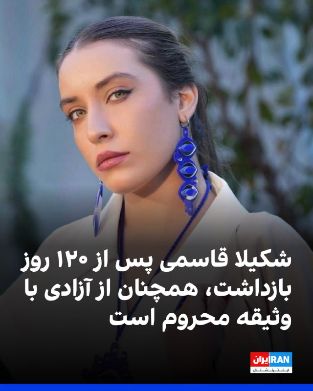

‌
بر اساس اطلاعات رسیده به ایران‌اینترنشنال، با گذشت ۱۲۰ روز از بازداشت شکیلا قاسمی، شهروند ۲۶ ساله بهائی ساکن کرمان، او همچنان بدون تعیین تکلیف قضایی در زندان کرمان محبوس است و با آزادی موقت او به قید وثیقه موافقت نشده است.

این شهروند بهائی حدود ۲۰ روز پیش از سلول انفرادی به بند عمومی زندان کرمان منتقل شد، اما همچنان در بازداشت به‌سر می‌برد. به گفته منابع مطلع، قاسمی در طول دوران بازداشت چندین بار دچار شوک عصبی شده و برای دریافت خدمات درمانی به بهداری زندان منتقل شده است.

یک منبع آگاه از وضعیت این شهروند بهائی به ایران‌اینترنشنال گفت نگهداری طولانی‌مدت او در سلول انفرادی صدمات جسمی و روحی قابل توجهی برایش به همراه داشته است.

قاسمی ۱۳ بهمن ۱۴۰۴ به‌دست ماموران امنیتی در منزل شخصی خود در کرمان بازداشت و به یکی از بازداشتگاه‌های اطلاعات سپاه منتقل شد. او حدود ۱۰۰ روز را در سلول انفرادی گذراند و سپس به بند عمومی زندان کرمان منتقل شد.
‌🏁 🇬🇧 IranintlTV

🤖 @VahidOOnLine

## VahidOOnLine — post 243353

  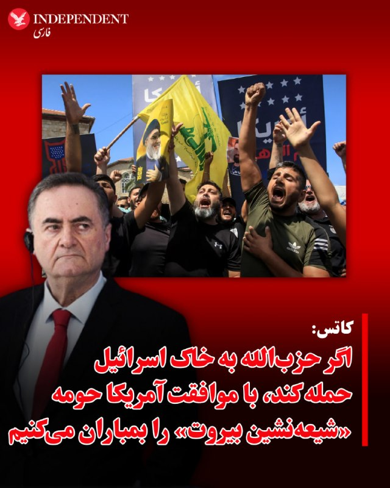

♦️اسرائیل کاتس، وزیر دفاع اسرائیل، روز سه‌شنبه ۱۲ خرداد اعلام کرد ایالات متحده از سیاست اسرائیل مبنی بر هدف قرار دادن ضاحیه جنوبی بیروت در صورت ادامه حملات حزب‌الله به مناطق شمالی اسرائیل حمایت کرده است.

به گزارش خبرگزاری فرانسه، دفتر وزیر دفاع اسرائیل با انتشار بیانیه‌ای اعلام کرد: «نخست وزیر و خودم، روندی را در پیش گرفتیم که براساس آن، وضعیت در ضاحیه به وضعیت مناطق شمالی اسرائیل مربوط باشد. اگر خاک شمال اسرائیل هدف حمله قرار گیرد، ما منطقه شیعه‌نشین بیروت، پایگاه حزب‌الله، را هدف قرار می‌دهیم.»

کاتس گفت اسرائیل به دولت لبنان و دیگر طرف‌های مرتبط اطلاع داده است که میان امنیت شهرک‌های شمالی اسرائیل و ضاحیه جنوبی بیروت «معادله‌ای جدید» برقرار شده است.

این بیانیه در حالی صادر شده است که پس از مکالمه تلفنی ترامپ و نتانیاهو، رسانه‌های اسرائیلی از تعویق حمله به ضاحیه خبر داده بودند.

ارتش اسرائیل روز دوشنبه مناطق گسترده‌ای از جنوب لبنان را بمباران کرد.
‌🇸🇦 Indypersian

🤖 @VahidOOnLine

## VahidOOnLine — post 243352

  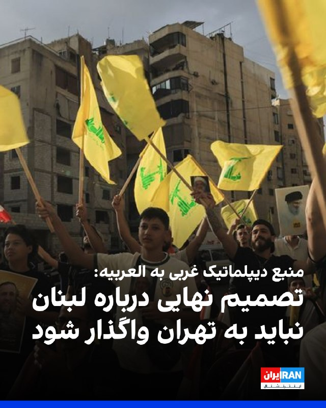

یک منبع دیپلماتیک غربی به العربیه، گفت آمریکا در حال پیشبرد تحولات مثبت درباره لبنان است و نباید سرنوشت لبنان به مذاکرات اسلام‌آباد گره بخورد.

این منبع دیپلماتیک همچنین تاکید کرد نباید تصمیم نهایی درباره لبنان به تهران واگذار شود.
‌🏁 🇬🇧 IranintlTV

🤖 @VahidOOnLine

## WithYashar — post 13259

جناب شاهزاده رضا پهلوی گرامی، پدر ، این پیام، جمع‌بندی دیدگاه‌ها و پیشنهادهای گروهی از ایرانیان داخل و خارج کشور با هدف تقویت انسجام ملی و ایجاد مسیر عملی برای دوران پیش از گذار است. عناوین چکیده از هزاران پیغام مردمی به‌صورت خلاصه: * ضرورت ایجاد ساختار…

## pm_afshaa — post 92096

🔴یک افسر ارشد ایرانی به CBS گفت که جنگ تازه با آمریکا به نظر «اجتناب‌ناپذیر» می‌آید چون اسرائیل و حزب‌الله به درگیری ادامه می‌دهند

💧 Rainbet.com the #1 Non-KYC Crypto Casino & Sportsbook @rainbetcom

😁 @Pm_Afshaa

## IranIntlTV — post 340197

  <a href="telegram/content/IranIntlTV_340197_1780402477.mp4" target="_blank">🎬 Download video</a>

قائم‌مقام سازمان نظام پزشکی تهران از تعطیلی ۵۰ مرکز کاردرمانی و گفتاردرمانی خبر داد. به گفته محمدرضا اسدی، کاهش مراجعه بیماران همزمان با پیامدهای جنگ و فشارهای اقتصادی باعث شده است بسیاری از این مراکز با بحران مالی و حتی ورشکستگی مواجه شوند.

جزییات بیشتر با منصوره حسینی‌یگانه، عضو تحریریه ایران‌اینترنشنال
@iranintltv

## IranIntlTV — post 340196

  

‌
بر اساس اطلاعات رسیده به ایران‌اینترنشنال، با گذشت ۱۲۰ روز از بازداشت شکیلا قاسمی، شهروند ۲۶ ساله بهائی ساکن کرمان، او همچنان بدون تعیین تکلیف قضایی در زندان کرمان محبوس است و با آزادی موقت او به قید وثیقه موافقت نشده است.

این شهروند بهائی حدود ۲۰ روز پیش از سلول انفرادی به بند عمومی زندان کرمان منتقل شد، اما همچنان در بازداشت به‌سر می‌برد. به گفته منابع مطلع، قاسمی در طول دوران بازداشت چندین بار دچار شوک عصبی شده و برای دریافت خدمات درمانی به بهداری زندان منتقل شده است.

یک منبع آگاه از وضعیت این شهروند بهائی به ایران‌اینترنشنال گفت نگهداری طولانی‌مدت او در سلول انفرادی صدمات جسمی و روحی قابل توجهی برایش به همراه داشته است.

قاسمی ۱۳ بهمن ۱۴۰۴ به‌دست ماموران امنیتی در منزل شخصی خود در کرمان بازداشت و به یکی از بازداشتگاه‌های اطلاعات سپاه منتقل شد. او حدود ۱۰۰ روز را در سلول انفرادی گذراند و سپس به بند عمومی زندان کرمان منتقل شد.

## IranIntlTV — post 340195

  

یک منبع دیپلماتیک غربی به العربیه، گفت آمریکا در حال پیشبرد تحولات مثبت درباره لبنان است و نباید سرنوشت لبنان به مذاکرات اسلام‌آباد گره بخورد.

این منبع دیپلماتیک همچنین تاکید کرد نباید تصمیم نهایی درباره لبنان به تهران واگذار شود.
https://iranintl.com/202606025315

## FarsiVOA — post 219365

یک تصویر، ۱۰ سال زندان؛ ماجرای پرونده مسعود پیاهو، ثبت‌کننده نماد اعتراضات دی‌ماه ۱۴۰۴ چیست

## DW_Farsi — post 125414

  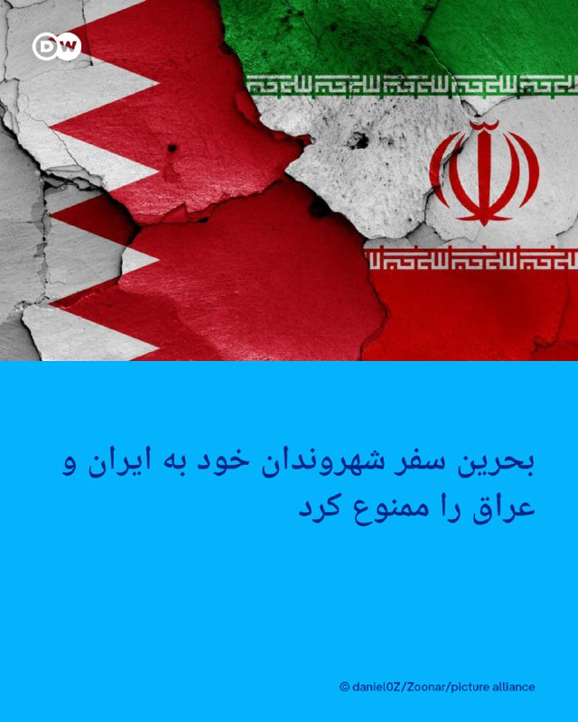

🔶 بحرین سفر شهروندان خود به ایران و عراق را ممنوع کرد
 
وزارت کشور بحرین روز سه‌شنبه اعلام کرد که این کشور به دلیل نگرانی‌های امنیتی منطقه‌ای، تا اطلاع ثانوی سفر شهروندان خود به ایران و عراق را ممنوع کرده است.
 
از زمان آغاز درگیری ایالات متحده آمریکا و اسرائیل با ایران، جمهوری اسلامی و گروه‌های نیابتی شیعه وابسته به آن در عراق حملاتی را علیه کشورهای حاشیه خلیج فارس، از جمله بحرین، انجام داده‌اند.
 
خبرگزاری دولتی بحرین اواخر ماه گذشته میلادی گزارش داده بود که دادگاهی در این کشور ۹ نفر را به اتهام همکاری به سپاه پاسداران به حبس ابد و دو نفر دیگر در همین پرونده را به سه سال زندان محکوم کرده است.
 
بحرین که از متحدان آمریکا در منطقه محسوب می‌شود سال‌هاست که با چالش نفوذ جمهوری اسلامی و "تحریک شیعیان" این کشور مواجه است. وزارت خارجه بحرین بارها به "دخالت ایران در امور داخلی این کشور" اعتراض کرده است.
@dw_farsi

## Persian_Trend_Official — post 15499

  <a href="telegram/content/Persian_Trend_Official_15499_1780402482.webm" target="_blank">🎬 Download video</a>

به گزارش CBS نیوز، یک مقام ایرانی می‌گوید با ادامه جنگ اسرائیل و حزب‌الله، جنگ مجدد با آمریکا اجتناب‌ناپذیر به نظر می‌رسد.

یک افسر ارشد نظامی ایران روز سه‌شنبه گفت که بازگشت به خصومت‌ها در جنگ با آمریکا اجتناب‌ناپذیر به نظر می‌رسد، زیرا ملت ایران هرگز تسلیم نخواهد شد.

📝 Amir

📌 @persian_trend_official
پرشین ترند | متفاوت‌ترین کانال نظامی

## Dirty_Kids — post 390825

به دنبال اعتراضات تاثیر گذار امروز دانش‌اموزان امتحانات نهایی چند روز افتاده جلو و قراره ۱۳ تیر ماه برگزار بشه

🔴 کاظمی وزیر آموزش و پرورش :‌
امتحانات نهایی از ۱۳ تیر ماه بصورت حضوری شروع خواهد شد از همین حالا یه ماه فرصت دارید برای امتحان نهایی بخونید و بعدش هم یه ماه دیگه وقت دارید برای کنکور بخونید پس تنگش کنید.

@Dirty_Kids 👻

## Hranews — post 113329

گزارش تکمیلی؛ افزایش اعدام‌شدگان در زندان عادل‌آباد شیراز به ۱۰ تن

❗️
❗️
❗️
❗️
❗️– با شناسایی پنج زندانی دیگر، تعداد زندانیان اعدام شده در زندان عادل آباد شیراز در روز یکشنبه، به ۱۰ نفر افزایش یافت. این زندانیان پیشتر در پرونده‌های جداگانه بابت اتهامات مرتبط با جرائم مواد مخدر، قتل و تجاوز به عنف، به #اعدام محکوم شده بودند.

ادامه مطلب

#محمدعثمان_دانه‌برچین #قادر_خدامرادی #محمدصدیق_بلوچی
#سعید_دهقانی‌زاده #برزو_موسی‌زاده #عباس_بیات
#علی‌اکبر_سرابی‌مقدم #سالار_شیخی

↘️
@hranews_bot تماس ✉️ - @Hranews کانال هرانا 🆑

## alonews — post 124458

  <a href="telegram/content/alonews_124458_1780402483.webm" target="_blank">🎬 Download video</a>

👈روند ۶۰ ساله قیمت نفت و اثر شوک‌ها بر آن

✅ @AloNews خبر جنگ

## alonews — post 124457

  <a href="telegram/content/alonews_124457_1780402483.webm" target="_blank">🎬 Download video</a>

⚫
🏆 به دنیای هیجان‌انگیز فوتبال خوش اومدی!

⭐️اینجا قراره باهم لحظه‌به‌لحظه‌ی جام جهانی رو زندگی کنیم؛
از بازی‌های حساس و نتایج داغ گرفته تا حاشیه‌ها، کری‌خونی‌ها و اتفاقاتی که همه درباره‌ش حرف میزنن! 
🔥
🔥

✅ پوشش کامل مسابقات

💀ترول تیم‌ها و بازیکن‌ها

🎥ویدیوها و لحظه‌های فان فوتبالی

📊آمار، ترکیب‌ها و اخبار فوری

🌍حواشی جذاب از سراسر جام جهانی

📢اینجا فقط یک کانال خبری نیست؛
یک جمع فوتبالیه برای کسایی که فوتبال رو با هیجان، شوخی و احساس واقعی دنبال میکنن 
📛
💟

🆘
🔞 آماده باش چون قراره جام جهانی رو متفاوت تجربه کنیم!

⚡ @Vaarzesh_Plus

⚡ @Vaarzesh_Plus

## alonews — post 124456

  <a href="telegram/content/alonews_124456_1780402484.mp4" target="_blank">🎬 Download video</a>

👈نیروهای حزب‌الله از فاصله کمتر ۱۰۰ متر، با آرپیچی تانک‌های اسرائیل رو میزنن!

✅ @AloNews خبر جنگ

## alonews — post 124455

  <a href="telegram/content/alonews_124455_1780402487.webm" target="_blank">🎬 Download video</a>

👈نماینده روسیه در سازمان های بین المللی در وین:انتقال اورانیوم غنی‌شده ایران به خارج از کشور لزوما ضروری نیست. برای این کار، رضایت تهران نیاز است.

🔴از لحاظ تئوری، در صورت توافق دو طرف، گزینه رقیق‌سازی اورانیوم غنی‌شده در خاک ایران نیز وجود دارد. بنابراین، گمانه‌زنی‌ها در این زمینه زودهنگام است.

✅ @AloNews خبر جنگ

---
📅 بروزرسانی: 1405/03/12 15:34
---

## VahidOOnLine — post 243351

  

محمدعلی توکلی‌زاده، معاون اجتماعی و فرهنگی شهرداری تهران، اعلام کرد فرماندهی مراسم تشییع علی خامنه‌ای بر عهده سپاه پاسداران است.

او افزود که برای جنازه علی خامنه‌ای، سه روز بدرقه در نظر گرفته شده و مراسم تشییع در تهران حداقل ۲۴ ساعت طول خواهد کشید.

توکلی‌زاده اضافه کرد که همه استان‌ها در حال تدارک برای میزبانی این مراسم هستند و به دلیل حجم بالای درخواست‌ها برای میزبانی، تصمیم‌گیری در این زمینه با دشواری همراه شده است. با این حال، روند درخواست استان‌ها برای میزبانی همچنان ادامه دارد.

به گفته توکلی‌زاده، احتمال برگزاری این مراسم در پایان ذی‌الحجه و اوایل محرم (اواخر خرداد) مطرح شده است. همچنین بحث‌هایی درباره افزایش زمان آماده‌سازی برای برگزاری بهتر مراسم نیز در جریان است.

معاون شهرداری تهران گفت که پس از تهران، در قم و مشهد هم تشییع جنازه برگزار می‌شود.
iranintl
‌🏁 🇬🇧 IranintlTV

🤖 @VahidOOnLine

## WithYashar — post 13258

جان بولتون : ایران باور دارد که می‌تواند از ترامپ بیشتر دوام بیاورد، یعنی صبرش بیشتر از اوست، چون ترامپ شدیدا نیاز دارد که قیمت نفت را پایین بیاورد.
وقتی کسی سه بار بگوید «برایم مهم نیست»، شاید یعنی واقعاً برایش مهم است.
اگر ترامپ نگران نبود، با نتانیاهو تماس نمی‌گرفت تا در لبنان آتش‌بس برقرار کند.
@withyashar

## FoxNewsTwitter — post 342493

  <a href="telegram/content/FoxNewsTwitter_342493_1780401849.mp4" target="_blank">🎬 Download video</a>

Fox News (Twitter/X)

UFOs are back in the headlines after a recent Pentagon file release and a new Steven Spielberg movie.

All the extraterrestrial buzz has everyone asking – will the U.S. confirm that aliens exist?

Our sponsor Kalshi’s prediction market shows:
— Before 2027: 17.1%
— Before 2028: 28%
— Before January 20, 2029: 36%

@foxandfriends

## IranIntlTV — post 340194

  

محمدعلی توکلی‌زاده، معاون اجتماعی و فرهنگی شهرداری تهران، اعلام کرد فرماندهی مراسم تشییع علی خامنه‌ای بر عهده سپاه پاسداران است.

او افزود که برای جنازه علی خامنه‌ای، سه روز بدرقه در نظر گرفته شده و مراسم تشییع در تهران حداقل ۲۴ ساعت طول خواهد کشید.

توکلی‌زاده اضافه کرد که همه استان‌ها در حال تدارک برای میزبانی این مراسم هستند و به دلیل حجم بالای درخواست‌ها برای میزبانی، تصمیم‌گیری در این زمینه با دشواری همراه شده است. با این حال، روند درخواست استان‌ها برای میزبانی همچنان ادامه دارد.

به گفته توکلی‌زاده، احتمال برگزاری این مراسم در پایان ذی‌الحجه و اوایل محرم (اواخر خرداد) مطرح شده است. همچنین بحث‌هایی درباره افزایش زمان آماده‌سازی برای برگزاری بهتر مراسم نیز در جریان است.

معاون شهرداری تهران گفت که پس از تهران، در قم و مشهد هم تشییع جنازه برگزار می‌شود.
iranintl.com/202606028887

## FarsiVOA — post 219364

  

خانواده نیکبخت در گلپایگان اعلام کرده‌اند که در تماس تلفنی از زندان دستگرد اصفهان مطلع شده‌اند برای هادی نیکبخت و فضل‌الله نیکبخت، دو عضو زندانی این خانواده، حکم اعدام صادر شده است.

بر اساس گزارش کانال تلگرامی محمد مهدوی‌فر، این خبر از سوی هادی نیکبخت در تماس با خانواده منتقل شده است.

بر اساس این گزارش، محمد نیکبخت هم که در همان زندان با برادرانش هادی و فضل‌الله هم‌بند است، در آخرین تماس تلفنی گفته بود که مرا تاکنون به دادگاه نبرده‌اند.

محمد نیکبخت، نوکیش مسیحی، از ۲۴ اسفند ۱۴۰۴ پس از بازداشت توسط نیروهای امنیتی همچنان در زندان دستگرد اصفهان و در بند ۲الف نگهداری می‌شود.

تا این لحظه هیچ تأیید رسمی مستقلی درباره صدور احکام یا جزئیات پرونده‌ها منتشر نشده است.
@FarsiVOA

## DW_Farsi — post 125413

  

🔶 نتانیاهو: پایه‌های رژیم تروریستی ایران ترک برداشته‌اند
 
بنیامین نتانیاهو، نخست‌وزیر اسرائیل، در مراسم تودیع دیوید بارنیا از ریاست سازمان اطلاعات خارجی اسرائیل (موساد)، گفت: «پایه‌های رژیم ایران ترک برداشته‌اند و این رژیم محکوم به سقوط است.»
 
به گزارش تایمز اسرائیل، نتانیاهو در این نشست با بیان این که "این حکومت هرگز به آنچه پیش‌تر بود باز نخواهد گشت" گفت: «بهایی که ایران تاکنون پرداخت کرده بسیار سنگین بوده است.»
 
نتانیاهو همچنین ضمن تهدید جمهوری اسلامی به پرداختن بهای اقداماتش اظهار داشت: «بگذارید هر دشمنی که برای آسیب رساندن به اسرائیل برنامه‌ریزی می‌کند بداند که نقشه‌هایش شکست خواهد خورد. بهایی که خواهد پرداخت بسیار سنگین خواهد بود.»
 
نتانیاهو در این جلسه خطاب به بارنیا گفت: «در دوران مسئولیت شما، کارهای بزرگی انجام شد.»
 
او همچنین پنج سال ریاست بارنیا بر موساد را "از سرنوشت‌سازترین سال‌ها در تاریخ اسرائیل" توصیف کرد.
 
سرلشکر رومن گوفمان، مشاور و دبیر نظامی نخست‌وزیر اسرائیل، در این مراسم رسما به‌عنوان رئیس جدید موساد معرفی شد.
 
 @dw_farsi

## RadioFarda — post 157816

یک زن غیرروحانی برای نخستین بار به ریاست یکی از دیوان‌های واتیکان منصوب شد

🔸پاپ لئو چهاردهم، رهبر کاتولیک‌های جهان، یک مدیر اجرایی زن از مجموعهٔ رسانه‌ای کاتولیک آمریکایی «ای‌دبلیو‌تی‌ان» را به‌عنوان رئیس جدید نهاد ارتباطات واتیکان منصوب کرد.

🔸بر اساس اعلام رسانه رسمی واتیکان که روز سه‌شنبه ۱۲ خرداد منتشر شد، «آلوارادو نخستین زن غیرروحانی است که به ریاست یکی از دیوان‌های مقر مقدس منصوب می‌شود.»

🔸به این ترتیب، ماریا مونتسرات آلوارادو (مونتسه آلوارادو) اهل اصلی مکزیکوسیتی، ریاست «شبکه جهانی کلمه ابدی» واتیکان را بر عهده خواهد گرفت؛ نهادی گسترده که بر درگاه خبری واتیکان، ایستگاه رادیویی، روزنامه و دفتر مطبوعاتی واتیکان و دیگر بخش‌ها نظارت می‌کند.

🔸آلوارادو که از سال ۲۰۲۳ رئیس و مدیر عملیاتی بخش خبری این شبکه بوده است، جایگزین پائولو روفینی می‌شود که از سال ۲۰۱۸ در این سمت فعالیت داشت و اکنون بازنشسته می‌شود.

🔸واتیکان نیوز این انتصاب را ادامهٔ روند اصلاحات و نوسازی توصیف کرده که در دوران پاپ فرانسیس، سلف پاپ لئو چهاردهم، آغاز شده بود.

🔸پاپ فرانسیس در ماه‌های پایانی زندگی خود، پیش از درگذشت در ۲۱ آوریل ۲۰۲۵، دو راهبه را به سمت‌های مهمی در واتیکان منصوب کرده بود و هم‌زمان از آنچه «ذهنیت مردسالارانه» در کلیسای کاتولیک خواند، انتقاد کرده بود.

🔸خواهر رافائلا پترینی به ریاست فرمانداری دولت‌شهر واتیکان منصوب شد و خواهر سیمونا برامبیلا نیز ریاست نهادی را بر عهده گرفت که بر انجمن‌ها و فرقه‌های مذهبی کاتولیک در سراسر جهان نظارت می‌کند.

🔸خانم آلوارادو از ماه نوامبر کار خود را آغاز خواهد کرد.

🔸نسخه کامل این گزارش را در وب‌سایت رادیوفردا بخوانید.

@RadioFarda

## RadioFarda — post 157815

  

🔸دبیر کل سازمان ملل متحد خواستار تمدید دورۀ مأموریت صلح‌بانان این نهاد در لبنان شد.

🔸آنتونیو گوترش روز دوشنبه گفت تمدید دورۀ حضور نیروهای حافظ صلح، موسوم به «یونیفیل» ضروری است. مأموریت فعلی این نیروها در پایان سال جاری میلادی، هفت ماه دیگر، به پایان می‌رسد.

🔸دبیر کل سازمان ملل متحد در گزارشی که برای شورای امنیت این سازمان تهیه کرد، سه گزینۀ مختلف، شامل استقرار نزدیک به ۲۰۰۰ تا بیش از ۵۵۰۰ نیروی حافظ صلح، برای نظارت بر آتش‌بس و حمایت از نیروهای مسلح لبنان را پیشنهاد کرد.

🔸یونیفیل در حال حاضر شامل حدود ۷ هزار و پانصد صلح‌بان از نزدیک به ۵۰ کشور است که در نزدیکی «خط آبی»، مرز ۱۲۰ کیلومتری لبنان و اسرائیل مستقر بوده و در حال حاضر، در میان درگیری‌های اسرائیل و حزب‌الله گیر افتاده‌اند.

🔸این نیروها از سال ۱۹۷۸، نزدیک به ۴۸ سال پیش، در مرز لبنان و اسرائیل حضور داشته‌اند، اما این حضور هم نتوانسته مانع از درگیری‌های گاه و بیگاه در این نواحی شود.

@RadioFarda

## Dirty_Kids — post 390824

  

شما شايد يادتون نياد، ولى همينها:

سال ١۴٠١ معترضان رو بستن به منوتو!
سال ٩٨ به اينستاگرام!
سال ۹۶ به تلگرام و كانال آمدنيوز!
سال ٨٨ به بى بى سی!
سال ٧٨ به روزنامه سلام!
و سال۴۰۴ به اینترنشنال…

اينها از اين مى سوزن كه پنجاه سال براى جنگ رجز خوندن، ولى همون دقيقه اول جنگ، رهبر وفرماندهانشون به درک واصل شدن و آسمان ايران شد اتوبان جنگنده‌هاى دشمنه ج.ا!

@Dirty_Kids 👻

## Dirty_Kids — post 390822

  <a href="telegram/content/Dirty_Kids_390822_1780401854.mp4" target="_blank">🎬 Download video</a>

🔴 این سبک کلیپ به ترند اول اینستا تبدیل شده و هر کدوم از این کلیپا بالای 100 میلیون بازدید داشتن!!

@Dirty_Kids 👻

## Hranews — post 113328

  

سیدصدرا حسینی در تهران بازداشت شد

❗️
❗️
❗️
❗️
❗️– سیدصدرا حسینی، فارغ‌التحصیل دانشگاه تهران، روز دوشنبه ۱۱ خردادماه، توسط نیروهای امنیتی در تهران بازداشت و به مکان نامعلومی منتقل شد.

به گزارش خبرگزاری هرانا، ارگان خبری مجموعه فعالان حقوق بشر در ایران، سیدصدرا حسینی در تهران بازداشت شد.

بر اساس اطلاعات دریافتی هرانا، بازداشت آقای حسینی روز دوشنبه ۱۱ خردادماه، توسط نیروهای امنیتی در تهران صورت گرفته است. تاکنون اطلاعی از محل نگهداری وی در دست نیست.

ادامه مطلب

#سیدصدرا_حسینی

↘️
@hranews_bot تماس ✉️ - @Hranews کانال هرانا 🆑

## alonews — post 124453

  <a href="telegram/content/alonews_124453_1780401855.mp4" target="_blank">🎬 Download video</a>

👈اسرائیل امروز سفارت خود را در فیجی افتتاح کرد

✅ @AloNews خبر جنگ

## alonews — post 124452

  <a href="telegram/content/alonews_124452_1780401858.webm" target="_blank">🎬 Download video</a>

🔴فوری / یک افسر ارشد ایرانی به CBS گفت که جنگ تازه با آمریکا به نظر «اجتناب‌ناپذیر» می‌آید چون اسرائیل و حزب‌الله به درگیری ادامه می‌دهند

✅ @AloNews خبر جنگ

## alonews — post 124451

  <a href="telegram/content/alonews_124451_1780401858.webm" target="_blank">🎬 Download video</a>

👈فیلیپ خوری، معاون اجرایی شرکت ادنوک (شرکت نفت ابوظبی)، می‌گوید:
«اگر تقاضا افزایش یابد و بحران عرضه ناشی از جنگ با ایران ادامه پیدا کند، ماه آگوست می‌تواند نقطه عطفی برای جهش شدید قیمت نفت باشد؛ و حتی پس از بازگشایی تنگه هرمز، ممکن است تا یک سال طول بکشد تا زنجیره‌های تأمین انرژی بازیابی شوند.»

✅ @AloNews خبر جنگ

## alonews — post 124450

  <a href="telegram/content/alonews_124450_1780401858.webm" target="_blank">🎬 Download video</a>

👈 منبعی در هیئت لبنانی به LBCI:
ما احساس می‌کنیم که مذاکرات این هفته مثبت خواهد بود و امیدواریم که مارکو روبیو، وزیر امور خارجه آمریکا، در جلسه مذاکره امروز حضور یابد، اگرچه این هنوز تأیید نشده است

✅ @AloNews خبر جنگ

---
📅 بروزرسانی: 1405/03/12 15:23
---

## pm_afshaa — post 92095

  <a href="telegram/content/pm_afshaa_92095_1780401230.webm" target="_blank">🎬 Download video</a>

🔴وزیر خارجه اسپانیا:
در هیچ اقدامی که تنش با ایران رو افزایش بده، شرکت نمی‌کنیم. برای این بحران هیچ راه‌حل نظامی‌ای‌ وجود نداره. انتخاب واقعی، میان «نظم مبتنی بر قانون» و «جنگ به عنوان جایگزین دیپلماسی» است.

💧 Rainbet.com the #1 Non-KYC Crypto Casino & Sportsbook @rainbetcom

😁 @Pm_Afshaa

## IranIntlTV — post 340193

  <a href="https://t.me/IranintlTV/340193" target="_blank">📎 Download file</a>

🎧نسخه صوتی اخبار بامدادی | سه‌شنبه ۱۲ خرداد
@iranintlTV

## FarsiVOA — post 219363

  <a href="telegram/content/FarsiVOA_219363_1780401231.mp4" target="_blank">🎬 Download video</a>

ارتش اسرائیل با انتشار تصاویری، ضمن اعلام هدف قرار دادن زیرساخت‌های نظامی حزب‌الله، از تداوم عملیات در جنوب لبنان خبر داد.

بر اساس اطلاعیه‌ای که ارتش اسرائیل در شبکه اجتماعی ایکس منتشر کرده، لشکر ۹۱ و نیروی هوایی این ارتش، همچنین روز دوشنبه یازدهم خرداد، «انبارهای نگهداری سلاح»، «مراکز فرماندهی» و دیگر زیرساخت‌های مرتبط با «فعالیت‌های تروریستی» حزب‌الله را جنوب لبنان هدف قرار داده است.

ایالات متحده و برخی از کشورها از جمله اسرائيل، حزب‌الله لبنان را در فهرست سازمان‌های تروریستی قرار داده و اتحادیه اروپا نیز شاخه نظامی این سازمان را تروریستی می‌داند.
@FarsiVOA

## FarsiVOA — post 219362

پرزیدنت ترامپ: مذاکرات با طرف ایرانی به سرعت پیش می‌رود

## FarsiVOA — post 219361

  

شرکت کشتیرانی ام‌اس‌سی اعلام کرد کشتی «ساریسکا وی» این شرکت روز دوشنبه در بندر ام‌قصر عراق هدف دو پرتابه قرار گرفت، اما همه اعضای خدمه سالم هستند و آسیبی ندیده‌اند.

ام‌اس‌سی، که رویترز آن را بزرگ‌ترین گروه کشتیرانی جهان معرفی کرده، روز سه‌شنبه گفت سپاه پاسداران مسئولیت این حمله را برعهده گرفته است.

این شرکت حادثه را «حمله‌ای بی‌دلیل» علیه یک کشتی تجاری بی‌طرف توصیف کرد و گفت این کشتی هیچ ارتباطی با آمریکا یا اسرائیل ندارد.

ام‌اس‌سی در بیانیه‌ای اعلام کرد از این حملات و خطری که برای دریانوردان بی‌گناه و تجارت دریایی ضروری در منطقه ایجاد می‌کند، عمیقاً نگران است.

رویترز در این گزارش جزئیات بیشتری درباره نوع پرتابه‌ها، میزان خسارت احتمالی به کشتی یا واکنش مقام‌های عراقی منتشر نکرده است.
@FarsiVOA

## BBCPersian — post 282684

  <a href="telegram/content/BBCPersian_282684_1780401235.mp4" target="_blank">🎬 Download video</a>

🔻هجوم موش‌ها در بخش‌های وسیعی از استرالیا کشاورزان را به وحشت انداخته است؛ جوندگان در اطراف خانه‌ها به‌سرعت تکثیر شدهاند و مزارع غلات را نابود می‌کنند. 
کشاورزان می‌گویند شبها صدای موش‌ها را در سقف‌ها و دستگاه‌های تهویه هوا می‌شنوند. آنها می‌گویند بوی موش‌ها «مثل جسد در حال پوسیدن» است. 
جمعیت موش‌ها پس از یک برداشت خوب محصولات و به‌دنبال آن باران‌های تابستانی که باعث فراوانی غذا شد، به‌شدت افزایش یافته است. 
این وضعیت در حالی رخ می‌دهد که کشاورزان از قبل هم به‌دلیل ناپایداری در تامین سوخت و کود، ناشی از جنگ جاری آمریکا و اسرائیل علیه ایران، تحت فشار بوده‌اند.

https://bbc.in/3RzN1bZ
@BBCPersian

## alonews — post 124446

  <a href="telegram/content/alonews_124446_1780401236.webm" target="_blank">🎬 Download video</a>

👈 جنگنده‌های اسرائیلی به حملات هوایی خود در سراسر جنوب لبنان ادامه می‌دهند.

✅ @AloNews خبر جنگ

## alonews — post 124444

  <a href="telegram/content/alonews_124444_1780401236.webm" target="_blank">🎬 Download video</a>

💔جاویدنام مازیار نوروزی اصفهانی 36 ساله، 18 دی با شلیک تیر جنگی به سر در گرگان کشته شد. پسر عزیز و شجاع ما دغدغه مالی نداشت برای آزادی وطنش رفت.

🔴حتی اجازه گرفتن مراسم و عزاداری به خانواده داده نشد.

🤔عرزشی حرام زاده از عدل علی بگو

✅@AloNews

## alonews — post 124443

  <a href="telegram/content/alonews_124443_1780401237.webm" target="_blank">🎬 Download video</a>

👈بازار داغ اجاره پراید برای کار در تاکسی آنلاین ؛ روزی ۸۰۰ هزار تومان...!

✅ @AloNews خبر جنگ

## alonews — post 124442

  <a href="telegram/content/alonews_124442_1780401237.mp4" target="_blank">🎬 Download video</a>

👈ویدیویی از حمله هوایی و انهدام سامانه موشکی در جنگ

✅ @AloNews خبر جنگ

---
📅 بروزرسانی: 1405/03/12 15:14
---

## pm_afshaa — post 92094

  <a href="telegram/content/pm_afshaa_92094_1780400650.webm" target="_blank">🎬 Download video</a>

🔴خبرگزاری مهر: متن تفاهم‌نامه احتمالی با آمریکا هنوز در تهران درحال بررسیه و هنوز پاسخی ارسال نشده.

💧 Rainbet.com the #1 Non-KYC Crypto Casino & Sportsbook @rainbetcom

😁 @Pm_Afshaa

## pm_afshaa — post 92093

  <a href="telegram/content/pm_afshaa_92093_1780400650.webm" target="_blank">🎬 Download video</a>

🔴اسدی، معاون قرارگاه مرکزی خاتم‌الانبیا:
پیام ما اینه که حتی اگه هیچ چیز هم نداشته باشیم، با سنگ به جنگ آمریکا می‌ریم؛ چون ما اهل تسلیم‌شدن در مقابل آمریکا نیستیم.

💧 Rainbet.com the #1 Non-KYC Crypto Casino & Sportsbook @rainbetcom

😁 @Pm_Afshaa

## RadioFarda — post 157814

  

🔸دونالد ترامپ بار دیگر با انتقاد تند از رسانه‌ها و دموکرات‌ها، مطلبی را که مدتی پیش در شبکۀ اجتماعی خود، «تروث سوشال» نوشته بود، دوباره منتشر کرد.

🔸رئیس‌جمهور آمریکا در این مطلب نوشته: «اگر ایران تسلیم شود، تأیید کند که نیروی دریایی‌اش به قعر دریا فرو رفته، و دیگر نیروی هوایی هم ندارد، و اگر همۀ نیروهای نظامی‌شان سلاح ها را زمین گذاشته و در حالی‌که دست‌ها را به نشانه تسلیم بالا گرفته و فریاد تسلیم سر داده‌اند، از تهران خارج شوند و به وضوح پرچم سفید نشان دهند و اگر بقایای رهبری‌شان همۀ «مدارک لازم برای تسلیم» را امضا و به شکست در مقابل قدرت عظیم و توان بی‌مانند ایالات متحده اقرار کنند، باز هم نیویورک تایمز رو به قهقرا، «چاینا استریت جورنال» (وال استریت جورنال)، سی‌ان‌ان فاسد و بی‌مخاطب، و همۀ اعضای باشگاه رسانه‌های دروغ‌پرداز خواهند گفت ایران به یک پیروزی چشم‌گیر و استادانه در مقابل ایالات متحدۀ آمریکا دست یافته است! چیزی که حتی نزدیکش هم نشده! دموکرات‌ها و رسانه‌ها کاملاً راه خود را گم کرده‌اند. کاملاً دیوانه شده‌اند!!!»

@Radiofarda

## RadioFarda — post 157813

  <a href="https://t.me/radiofarda/157813" target="_blank">📎 Download file</a>

📻بشنوید: ساعت ۱۴ با رادیوفردا، دوازدهم خرداد ۱۴۰۵‌

@Radiofarda

## BBCPersian — post 282683

🔻وزیر دفاع اسرائیل: آمریکا از حمله به ضاحیه درصورت حمله حزب‌الله به شمال اسرائیل حمایت می‌کند

وزیر دفاع اسرائیل گفت در صورت حمله حزب‌الله به شمال اسرائیل، واشنگتن از حمله به ضاحیه بیروت حمایت می‌کند.

بنابر بیانیه وزارت دفاع اسرائیل، اسرائیل کاتس در یک کنفرانس گفته است: «من و نخست وزیر به همراه ارتش اسرائیل، حرکتی هماهنگ را برای ایجاد یک معادله جدید رهبری کردیم... اگر شهرهای اسرائیل همچنان مورد حمله قرار گیرند، ما به محله شیعه‌نشین ضاحیه در بیروت، دژ حزب‌الله، دستور تخلیه داده و به آن حمله خواهیم کرد.»

آقای کاتس همچنین گفت: «ایالات متحده این اصل را تایید و به دولت لبنان و همه طرف‌های ذی‌ربط منتقل کرده است.»

دونالد ترامپ دیشب گفت از بنیامین نتانیاهو خواسته است به ضاحیه حمله نکند و او هم این درخواست را پذیرفته است.

ضاحیه پایگاه قدرت حزب‌الله در پایتخت لبنان است.

https://bbc.in/4x4rB6K
@BBCPersian

## BBCPersian — post 282682

🔻سه روایت از یک مکالمه تلفنی؛ دونالد ترامپ به نتانیاهو چه گفت؟ مکالمه تلفنی دونالد ترامپ و بنیامین نتانیاهو که به گفته رئیس‌جمهور آمریکا مانع حمله برنامه‌ریزی‌شده اسرائیل به ضاحیه بیروت شد، بازتاب گسترده‌ای در رسانه‌ها داشته است؛ هرچند روایت‌های رسمی و غیر‌رسمی…

## BBCPersian — post 282681

🔻سه روایت از یک مکالمه تلفنی؛ دونالد ترامپ به نتانیاهو چه گفت؟

مکالمه تلفنی دونالد ترامپ و بنیامین نتانیاهو که به گفته رئیس‌جمهور آمریکا مانع حمله برنامه‌ریزی‌شده اسرائیل به ضاحیه بیروت شد، بازتاب گسترده‌ای در رسانه‌ها داشته است؛ هرچند روایت‌های رسمی و غیر‌رسمی از محتوا و لحن این گفت‌و‌گوی تلفنی متفاوت است.

روایت دونالد ترامپ:

خود دونالد ترامپ گفت‌و‌گویش با بنیامین نتانیاهو را «بسیار سازنده» توصیف کرد. او در پستی در شبکه اجتماعی‌اش گفت که از نخست‌وزیر اسرائیل خواسته است «حمله‌ عمده‌ای» به بیروت انجام ندهد و بنیامین نتانیاهو هم دستور داده است که «سربازانش بازگردند.»

آقای ترامپ همچنین از تماس با نمایندگان رهبری حزب‌الله خبر داد و گفت که هم اسرائیل و هم حزب‌الله موافقت کرده‌اند که به سمت هم تیراندازی نکنند.

تماس دونالد ترامپ با بنیامین نتانیاهو بعد از هشدارهای مکرر مقام‌های ایران و تهدید قرارگاه خاتم‌الانبیا به تلافی‌کردن هرگونه حمله به ضاحیه در حومه بیروت بود.

آقای ترامپ بعد از اعلام خبر آتش‌بس جدید میان حزب‌الله و اسرائیل، در پستی جداگانه از «پیشرفت سریع» مذاکرات با ایران گفت.

https://bbc.in/4x4rB6K
@BBCPersian

## Hranews — post 113327

  

دادگاه تجدیدنظر؛ محمود تلخ آبی به ۵ سال حبس محکوم شد

❗️
❗️
❗️
❗️
❗️– محکومیت پنج سال حبس محمود تلخ آبی، یکی از بازداشت‌شدگان اعتراضات سراسری ۱۴۰۴، محبوس در زندان شیبان اهواز، توسط شعبه ۱۶ دادگاه تجدیدنظر استان خوزستان عینا تایید شد.

به گزارش خبرگزاری هرانا، ارگان خبری مجموعه فعالان حقوق بشر در ایران، محمود تلخ آبی توسط دادگاه تجدیدنظر به حبس محکوم شد.

براساس حکمی که توسط شعبه ۱۶ دادگاه تجدیدنظر استان خوزستان صادر شده است، آقای تلخ‌آبی از بابت اتهام اخلال در نظم عمومی با استناد به تبصره ماده ۲۸۶ قانون مجازات اسلامی به تحمل پنج سال حبس محکوم شده است.

ادامه مطلب

#محمود_تلخ_آبی

↘️
@hranews_bot تماس ✉️ - @Hranews کانال هرانا 🆑

## alonews — post 124441

  <a href="telegram/content/alonews_124441_1780400653.webm" target="_blank">🎬 Download video</a>

👈 فرمانده قرارگاه مشترک پدافند هوایی:
شبکه پدافند هوایی یکی از سنگین‌ترین خسارات تجهیزاتی را به دشمنان در تاریخ نبردهای هوایی وارد ساخت

🔴 پاسخ متفاوت ایران با استفاده از تاکتیک‌های پراکندگی، فریب الکترونیکی و اصابت دقیق، اثرگذاری حملات هوایی را به شدت کاهش داد

✅ @AloNews خبر جنگ

## alonews — post 124440

  <a href="telegram/content/alonews_124440_1780400653.webm" target="_blank">🎬 Download video</a>

👈رویترز: امروز در پی انتظار بازارهای مالی برای پیشرفت در مذاکرات ایران و آمریکا پس از آتش‌بس در لبنان، قیمت نفت کاهش یافت، طلا در محدوده باریکی حرکت کرد و دلار تثبیت شد

🔴عدم قطعیت‌های ژئوپلیتیکی گسترده‌، معامله‌گران را در حالت تنش نگه داشته

✅ @AloNews خبر جنگ

---
📅 بروزرسانی: 1405/03/12 15:03
---

## WithYashar — post 13257

چرا کامنت فقط 3k لایک خورده؟از کانال 280 هزار نفری انتظار بیشتری هست بخدا،به بچه ها بگو یه تکونی بخورن یه خودی نشون بدیم

## WithYashar — post 13256

چرا کامنت فقط 3k لایک خورده؟از کانال 280 هزار نفری انتظار بیشتری هست بخدا،به بچه ها بگو یه تکونی بخورن یه خودی نشون بدیم

## WithYashar — post 13255

شبکه اجتماعی لینکدین رفع فیلتر شد

شبکه اجتماعی لینکدین پس از بازگشایی تدریجی اینترنت بین‌الملل، بدون نیاز به فیلترشکن در دسترس کاربران ایرانی قرار گرفت.
صفحه من در لینکدین هم داشته باشید : https://linkedin.com/in/seyed-yashar-tavakolian-a26a61188

## IranIntlTV — post 340192

  <a href="telegram/content/IranIntlTV_340192_1780400030.mp4" target="_blank">🎬 Download video</a>

مروری بر روزنامه‌های ایران، سه‌شنبه ۱۲ خرداد، با مجتبی هاشمی، روزنامه‌نگار
@iranintltv

## RadioFarda — post 157812

رومن گوفمن، رئیس جدید موساد، کیست؟

🔸در میانه آتش‌بس در جنگ دوم اسرائیل با ایران در یک سال اخیر، رومن گوفمن از ۱۲ خرداد در مقام رئیس جدید موساد کار خود را آغاز کرد.

🔸او بر صندلی ریاست نهادی تکیه زده که ۷۷ سال پیش، یک سال پس از تشکیل کشور اسرائیل، با عنوان رسمی «سازمان اطلاعات و مأموریت‌های ویژه» برپا شد.

🔸گوفمن چهاردهمین رئیس این تشکیلات است؛ ۵۰ ساله و زادهٔ بلاروس که ۳۶ سال عمرش را در اسرائیل گذرانده است. او زمانی به دنیا آمد که بلاروس هنوز یکی از جمهوری‌های اتحاد جماهیری شوروی پیشین بود.

🔸او پس از پایان دورهٔ سه‌سالهٔ سربازی در ارتش ماند و پیاپی ارتقا درجه یافت؛ فرماندهی شماری از تیپ‌ها و لشکرهای مهم در شمال و کرانهٔ باختری بر عهده‌اش بود تا سرانجام نامش به‌عنوان یک ژنرال با سابقهٔ نظامی مملو از ابتکارات میدانی مطرح شد.

🔸بنیامین نتانیاهو پس از تشکیل آخرین دولت خود در حدود پنج سال پیش، گوفمن را به‌عنوان دستیار نظامی ویژهٔ خود در دفتر نخست‌وزیری انتخاب کرد.

🔸به‌نوشتۀ رسانه‌های اسرائیل، در حالی که نتانیاهو کمتر به سیاستمداران و مهره‌های اطرافش تکیه می‌کند، اما با سپردن مأموریت‌های محرمانه به گوفمن، اعتمادش به او را نشان داد و گوفمن نیز وفاداری خود را به نخست‌وزیر ثابت کرده است.

🔸اعلام انتخاب گوفمن موجب شگفتی برخی مقامات امنیتی اسرائیل شد و تعدادی از آن‌ها آشکارا در رسانه‌ها گلایه کردند که چرا نتانیاهو یکی از چند نامزد این پست از میان مقامات ارشد موساد را انتخاب نکرده است.

🔸نسخه کامل این گزارش را در وب‌سایت رادیوفردا بخوانید.

@RadioFarda

## IranianMinds — post 21242

  <a href="telegram/content/IranianMinds_21242_1780400032.mp4" target="_blank">🎬 Download video</a>

🔴یک کارشناس در صدا‌و‌سیما:

کوروش و ایران‌گری تخیلی هستند.

@IranianMinds

## BBCPersian — post 282680

  <a href="https://t.me/bbcpersian/282680" target="_blank">📎 Download file</a>

هما میرافشار، روزنامه‌نگار، شاعر و ترانه‌سرای تصنیف‌های عاشقانه موسیقی دستگاهی و آثار به یادماندنی پاپ در ۸۹ سالگی درگذشت و چهره‌های نامدار موسیقی و علاقه‌مندانش در شبکه‌های اجتماعی از مقام هنری او تجلیل کردند.

او در سه مجموعه شعری بیش از هزار سروده دارد که افزون بر ۲۵۰ شعرش در زمره ماندگارترین ترانه‌های ایرانی است و بی‌دلیل نیست که در جامعه موسیقی به «زن هزار ترانه» و یا «ملکه ترانه‌سرایی ایران» معروف شد. از همین روست که ایرج جنتی عطایی، ترانه‌سرای برجسته معاصر، هما میرافشار را پیش‌کسوت خود می‌‌داند که «پیش از ترانه نو و در کنار آن شهره بود.»

فرج بال‌افکن در این ویدیو زندگی هنری او را مرور کرده است. 

برای خواندن مطلب کامل در وب‌سایت از لینک زیر استفاده کنید: 
https://bbc.in/4udbQYS
@BBCPersian

## alonews — post 124439

  <a href="telegram/content/alonews_124439_1780400034.webm" target="_blank">🎬 Download video</a>

👈 کارت‌به‌کارت بین‌بانکی از ۱۰ میلیون تومان به ۱۵ میلیون تومان افزایش یافت

🔴 بانک مرکزی: سقف خرید با کارت بانکی به ۴۰۰ میلیون تومان رسید.

🔴 در حوزه انتقال وجه غیرحضوری نیز سقف حساب‌های غیرتجاری به ۳۰۰ میلیون تومان و حساب‌های تجاری به یک میلیارد تومان افزایش یافته است.

🔴 انتقال از طریق «پایا» و «ساتنا» همچنان تا سقف ۲۰۰ میلیون تومان انجام می‌شود.

🔴 سقف برداشت نقدی از خودپرداز‌ها نیز ۵۰۰ هزار تومان تعیین شده است

✅ @AloNews خبر جنگ

## alonews — post 124438

  <a href="telegram/content/alonews_124438_1780400034.webm" target="_blank">🎬 Download video</a>

👈لینکدین رفع فیلتر شد

✅ @AloNews خبر جنگ

## alonews — post 124437

  <a href="telegram/content/alonews_124437_1780400035.webm" target="_blank">🎬 Download video</a>

👈صدر اعظم آلمان مرز: ما ۴۵۰ میلیون مصرف‌کننده در اتحادیه اروپا هستیم.

🔴اتحادیه اروپا ۱۰۰ میلیون مصرف‌کننده بیشتر از ایالات متحده آمریکا دارد. نباید خودمان را کوچکتر از آنچه هستیم نشان دهیم

✅ @AloNews خبر جنگ

---
📅 بروزرسانی: 1405/03/12 14:54
---

## pm_afshaa — post 92092

کاظمی وزیر آموزش و پرورش :‌ امتحانات نهایی از 13 تیر ماه و بصورت حضوری شروع خواهد شد

💧 Rainbet.com the #1 Non-KYC Crypto Casino & Sportsbook @rainbetcom

😁 @Pm_Afshaa

## DEJradio — post 5245

  <a href="telegram/content/DEJradio_5245_1780399450.mp4" target="_blank">🎬 Download video</a>

🔺📢 موج تازه سرکوب دانشجویان دانشگاه‌های برتر ایران؛

*اشکان خسروپور

#دانشجو #سرکوب_دانشجویان
@DEJradio

## IranIntlTV — post 340191

  <a href="telegram/content/IranIntlTV_340191_1780399453.mp4" target="_blank">🎬 Download video</a>

ارمنستان در آستانه انتخابات پارلمانی ۷ ژوئن، با تشدید تنش‌های داخلی و خارجی روبه‌رو است؛ انتخاباتی که می‌تواند مسیر آینده این کشور را تغییر دهد. در حالی که ایروان به سمت تقویت روابط با غرب حرکت می‌کند، روسیه با اعمال فشار از مقام‌های ارمنستان خواسته است بین مسکو و اتحادیه اروپا انتخاب کنند.
شهناز کامل‌زاده، خبرنگار ایران‌اینترنشنال، گزارش می‌دهد
@iranintltv

## IranIntlTV — post 340190

  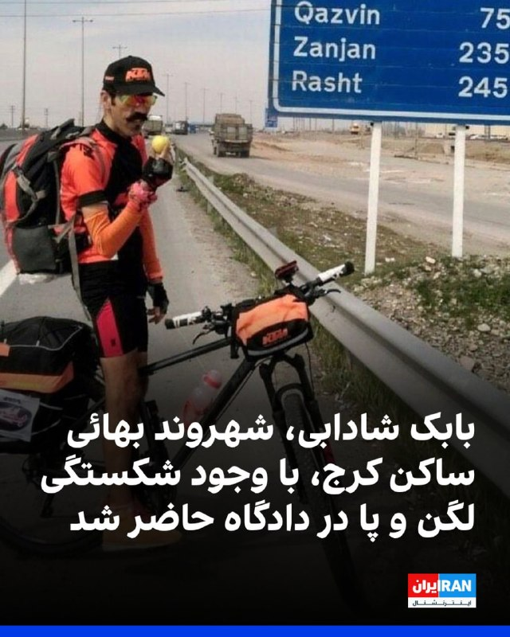

بر اساس اطلاعات ارسالی به ایران‌اینترنشنال، جلسه واخواهی بابک شادابی، شهروند بهائی، دوچرخه‌سوار و سفیر صلح ساکن کرج، ۱۲ خرداد در شعبه سوم دادگاه انقلاب کرج به ریاست مصطفی نریمانی برگزار شد.

به گفته منابع مطلع، بابک شادابی در پی یک سانحه رانندگی مشکوک دچار شکستگی لگن و پا شده و مدارک پزشکی قانونی مربوطه نیز به دادگاه ارائه شده است.

با وجود این شرایط جسمی، او ناچار شد در جلسه واخواهی حاضر شود؛ جلسه‌ای که در طبقه دوم ساختمان دادگاه برگزار شد و حضور در آن برای او با مشقت جدی همراه بود.

اطلاعات رسیده حاکی است، پرونده این شهروند بهائی پیش‌تر برای ۲۰ دی‌ماه ۱۴۰۴ تعیین وقت شده بود، اما به‌دلیل اعتراضات ۱۸ و ۱۹ دی برگزار نشد. با این حال، در ۲۳ دی‌ماه ۱۴۰۴، بدون حضور او و بدون امکان دفاع، حکم غیابی علیه شادابی صادر شد؛ حکمی که با اعتراض او مواجه شد.

این در حالی است که حساب‌های بانکی و خطوط تلفن همراه شادابی از مهرماه ۱۴۰۴، با وجود داشتن ضامن رسمی و بدون طی تشریفات قانونی یا صدور حکم رسمی، مسدود شده و او ممنوع‌الخروج شده است. با وجود پیگیری‌های متعدد، هیچ‌یک از این محدودیت‌ها رفع نشده است.
iranintl.com/202606025276

## FarsiVOA — post 219360

🔺بحرین سفر به ایران و عراق را ممنوع کرد

▪️وزارت کشور بحرین اعلام کرد شهروندان این کشور تا اطلاع ثانوی از سفر به ایران و عراق منع شده‌اند؛ تصمیمی که منامه آن را به «وضعیت امنیتی فعلی» و آنچه «پیامدهای تجاوز ایران» خوانده، مرتبط دانسته است.

▪️وزارت کشور بحرین همچنین گفته این تصمیم برای حفظ امنیت کشور و سلامت شهروندان گرفته شده و با ناقضان آن برخورد قانونی خواهد شد.

▪️منامه از زمان آغاز حملات آمریکا و اسرائیل علیه جمهوری اسلامی بارها از حملات موشکی و پهپادی منتسب به جمهوری اسلامی خبر داده و فرماندهی نیروی دفاعی بحرین، می‌گوید ده‌ها موشک و صدها پهپاد ایرانی را رهگیری و منهدم کرده است.

⬇️ بیشتر بخوانید:
https://ir.voanews.com/a/8156417.html

## DW_Farsi — post 125412

🔶 امارات اموال بیمارستان هلال احمر ایران در دبی را مسدود کرد
 
سخنگوی جمعیت هلال احمر جمهوری اسلامی از مسدود شدن اموال بیمارستان هلال احمر در دبی خبر داد.
 
به گزارش ایلنا، مجتبی خالدی با اشاره به تعطیلی بیمارستان هلال احمر در دبی گفت که امارات در جریان جنگاخیر، "درخواست تخلیه بیمارستان را به مدت دو ماه مطرح کرد".
 
او افزود: «اما این پروژه در کمتر از دو هفته به پایان رسید و در این مدت متوجه شدیم که تعدادی از فعالیت‌ها انجام شده است. در این شرایط، اقدامات متعددی اتخاذ شد که تأثیر منفی بر خدمات درمانی داشت.»
 
خالدی با اشاره به "ترخیص اجباری بیماران" و "توقف پذیرش بیماران جدید" گفت: «همچنین، لغو ویزای کار کارکنانی که در بیمارستان دبی مشغول به کار بودند، باعث کاهش نیروی انسانی شد و تخلیه فوری محل‌های اسکان پرسنل صورت گرفت. در نهایت، دسترسی به اطلاعات و سامانه‌های بیمارستان نیز قطع گردید که این امر روند ارائه خدمات را به شدت مختل کرد.»
 
سخنگوی جمعیت هلال احمر با بیان این که "تمام این اقدامات در مدت زمان کوتاه دو هفته صورت گرفت و اموال بیمارستان را نیز مسدود کردند" گفت: «جمعیت هلال احمر تمامی این موارد را به‌عنوان نقض حقوق بشردوستانه مستند کرده و روزانه گزارش‌هایی به صلیب سرخ جهانی ارسال کرده است. همچنین، پیگیری‌های حقوقی را از طریق صلیب سرخ جهانی و واحدهای کیفری بین‌المللی انجام می‌دهیم تا این مسائل به درستی بررسی و رسیدگی شوند.»
 
او با بیان این که "اموال بیمارستان بلوکه شده و همه دارایی‌ها در وضعیت نامشخصی قرار دارند" گفت: «ما به‌طور جدی پیگیر هستیم که بیمارستان دوباره فعال شود و خدمات درمانی را مجدداً برقرار کنیم.»
 
از شروع جنگ اسرائيل و آمریکا علیه جمهوری اسلامی در نهم اسفندماه، ایران حملات متعددی علیه کشورهای حاشیه خلیج فارس انجام داد. بر اساس گزارش‌ها، تنها امارات متحده عربی هدف هزاران حمله موشکی و پهپادی قرار گرفت.
 
این حملات روابط دوجانبه را تیره کرد و در ادامه باعث شد تا ابوظبی سفیر خود را از ایران فرابخواند و سفارت خود در تهران را ببندد.
 
خبرگزاری فرانسه در آن زمان گزارش داد که مقام‌های امارات به مسئولان "بیمارستان ایرانیان" که توسط جمعیت هلال احمر وابسته به جمهوری اسلامی ساخته شده مهلت یک‌ماهه برای توقف فعالیت داده است. بنا بر این گزارش، نهادهای مرتبط با جمهوری اسلامی در امارات، از جمله مدارس نیز با وجود روابط اقتصادی و اجتماعی دیرینه تعطیل شدند.
@dw_farsi

## RadioFarda — post 157811

  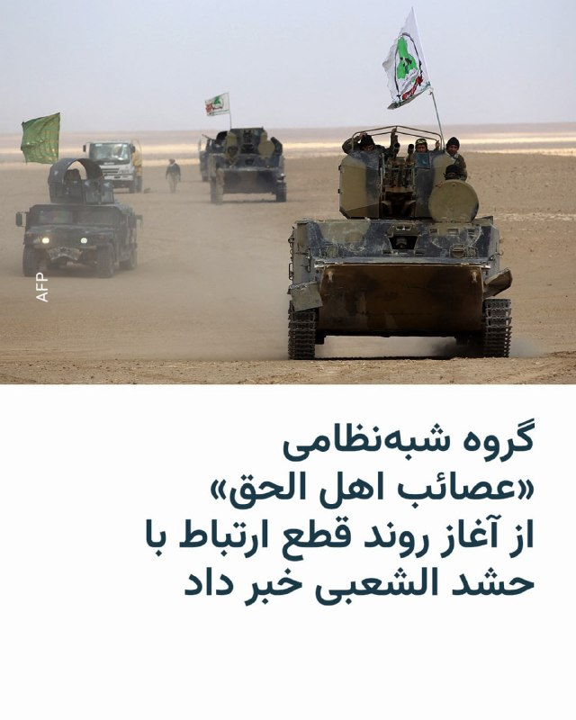

🔸گروه شبه‌نظامی «عصائب اهل الحق» عراق اعلام کرد برای اجرای تصمیم قطع ارتباط با تشکیلات حشد الشعبی و هماهنگی با سیاست انحصار سلاح در دست دولت، یک کمیتهٔ مرکزی تشکیل داده است.

🔸در بیانیه‌ای که روز سه‌شنبه ۱۲ خرداد منتشر شد، این گروه اعلام کرد این اقدام در پاسخ به دعوت مرجعیت عالی دینی و همچنین موضع اعلام‌شده از سوی «چارچوب هماهنگی» انجام می‌شود.

🔸در این بیانیه همچنین به اظهارات پیشین قیس خزعلی، دبیرکل عصائب اهل الحق، درباره ضرورت قطع ارتباط با حشد الشعبی و واگذاری انحصار سلاح به دولت اشاره شده است.

🔸عصائب اهل الحق یکی از گروه‌های مسلح شیعه نزدیک به جمهوری اسلامی ایران در عراق است که از سال ۲۰۲۰ در فهرست سازمان‌های تروریستی خارجی ایالات متحده قرار دارد. دولت آمریکا نیز اخیراً برای ارائه اطلاعاتی که به دستگیری یا کشته شدن قیس خزعلی، رهبر این گروه، منجر شود، ۱۰ میلیون دلار جایزه تعیین کرده است.

@RadioFarda

## IranianMinds — post 21241

🔴 حریف ایران تیم 163 جهان شد!

فدراسیون فوتبال ایران با فدراسیون گرانادا وارد مذاکره شده تا پیش از آغاز دیداری دوستانه با این تیم در مکزیک برگزار کند.

@IranianMinds

## IranianMinds — post 21240

🔴 سقف کارت‌به‌کارت روزانه ۱۵ میلیون تومان شد

طبق اعلام بانک مرکزی سقف کارت‌به‌کارت بین‌بانکی در شبکه شتاب از ۱۰ به ۱۵ میلیون تومان در روز افزایش و سقف خرید با کارت بانکی به ۴۰۰ میلیون تومان رسیده است.
همچنین سقف انتقال وجه غیرحضوری حساب‌های غیرتجاری به ۳۰۰ میلیون تومان و حساب‌های تجاری به یک میلیارد تومان افزایش یافت.
سقف انتقال آنی(پل) هم ۱۰۰ میلیون تومان تعیین شد و انتقال غیرحضوری برای افراد ۱۲ تا ۱۸ سال به ۳۰ میلیون تومان رسیده است.
خرید با کارت برای افراد ۱۲ تا ۱۸ سال و افراد محجور تا سقف ۱۰۰ میلیون تومان امکان‌پذیر خواهد بود.
سقف انتقال‌وجه پایا و ساتنا همچنان ۲۰۰ میلیون تومان است.

@IranianMinds

## BBCPersian — post 282679

🔻اسرائیل به ساکنان نبطیه در جنوب لبنان هشدار داد شهر را ترک کنند

ارتش اسرائیل به ساکنان نبطیه در جنوب لبنان هشدار داد که این شهر را ترک کنند.

آویخای ادرعی، سخنگوی عرب زبان ارتش اسرائیل، در پستی در شبکه ایکس نوشت: «با توجه به نقض آتش‌بس از طرف سازمان تروریستی حزب‌الله، ارتش اسرائیل ناچار است که با زور اقدام کند.»

او به ساکنان نبطیه هشدار داد: «برای امنیت خودتان، خانه‌هایتان را فورا ترک کنید و به شمال رودخانه زهرانی بروید.»

https://bbc.in/4x4rB6K
@BBCPersian

## BBCPersian — post 282678

🔻دولت بحرین شهروندانش را از سفر به ایران و عراق منع کرد

وزارت کشور بحرین به دلیل تنش‌های امنیتی، شهروندانش را تا اطلاع ثانوی از سفر به ایران و عراق منع کرد.

پس از شروع جنگ، بحرین از اتباعش خواسته بود فورا خاک ایران را ترک کنند. در طول جنگ ایران پایگاه نیروی دریایی آمریکا در بحرین را هدف حملات پهپادی و موشکی قرار می‌داد.

بحرین پس از شروع جنگ صدها نفر را به دلیل حمایت، همکاری، جاسوسی یا ارتباط با ایران یا سپاه پاسداران بازداشت و ده‌ها نفر را محاکمه و مجازات کرده است. برخی به حبس ابد و شماری به خلع تابعیت محکوم شده‌اند.

یک سخنگوی دولت بحرین به بی‌بی‌سی گفته بود که برای مقابله با پیامدهای «تجاوز آشکار ایران» و حفظ امنیت و ثبات این افراد بازداشت شده‌اند.

ایران و بحرین بیش از یک دهه است که روابط سیاسی و اقتصادی ندارند.

https://bbc.in/4x4rB6K
@BBCPersian

## idfinfarsi — post 11707

  <a href="telegram/content/idfinfarsi_11707_1780399457.mp4" target="_blank">🎬 Download video</a>

‼️ نیروهای ارتش اسرائیل به فعالیت خود در جنوب لبنان ادامه می‌دهند: لشکر ۹۱ و نیروی هوایی تروریست‌ها و زیرساخت‌های سازمان تروریستی حزب‌الله را مورد هدف قرار دادند

⭕️نیروهای ارتش اسرائیل به فعالیت خود در جنوب لبنان ادامه می‌دهند.

⭕️روز گذشته (دوشنبه)، لشکر ۹۱ و نیروی هوایی انبارهای تسلیحاتی، مقرها و سایر زیرساخت‌های تروریستی را در جنوب لبنان که از آن‌ها تروریست‌های سازمان تروریستی حزب‌الله فعالیت می‌کردند، مورد حمله قرار دادند.

## alonews — post 124436

  <a href="telegram/content/alonews_124436_1780399459.webm" target="_blank">🎬 Download video</a>

👈 صدر اعظم آلمان مرز: ما می‌خواهیم آلمان را دوباره به مکانی مقرون‌به‌صرفه برای انجام کسب‌وکار تبدیل کنیم.

🔴ما در آلمان با مشکل رقابت قیمتی مواجه هستیم.

🔴حتی اگر همه دوست نداشته باشند این را بشنوند، آلمان بیش از حد گران شده است.

🔴در بسیاری از حوزه‌ها، دیگر رقابتی نیستیم چون نمی‌توانیم از نظر قیمت با مناطق جهان که با ما رقابت می‌کنند، همگام شویم.

🔴دلیلی برای بدبینی یا ناامیدی نسبت به آینده کشورمان وجود ندارد.

🔴بهترین سال‌های آلمان پشت سر ما نیست؛ سال‌های بسیار خوبی در پیش رو داریم—در آلمان شرقی، در آلمان غربی، در کل آلمان و در اروپا.

✅ @AloNews خبر جنگ

<!-- MSG END -->

<!-- NAV START -->

<a href="https://github.com/ProAlit/aio-downloader/blob/main/telegram/content/archive_1.md" style="display:inline-block; padding:6px 12px; margin:0 4px; background-color:#2ea44f; color:white; text-decoration:none; border-radius:4px; font-weight:bold;">صفحه بعد</a>

<!-- NAV END -->
