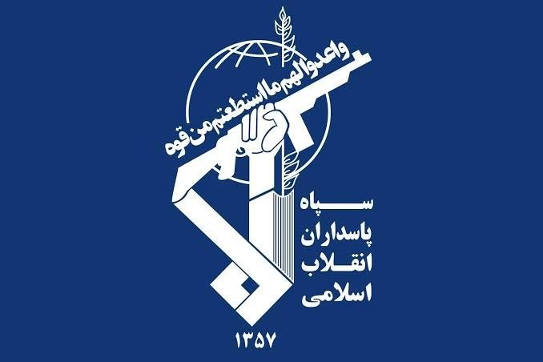

# خواننده تلگرام

<!-- TOP_NAV START -->

<a href="https://github.com/ProAlit/aio-downloader/blob/main/telegram/content/archive_1.md" style="display:inline-block; padding:6px 12px; margin:0 4px; background-color:#2ea44f; color:white; text-decoration:none; border-radius:4px; font-weight:bold;">صفحه بعد</a>

<!-- TOP_NAV END -->

<!-- MSG START -->

---
📅 بروزرسانی: 1405/03/18 08:53
---

## VahidOOnLine — post 244272

  <a href="telegram/content/VahidOOnLine_244272_1780896187.mp4" target="_blank">🎬 Download video</a>

⭕️ارتش اسرائیل حمله به سایت‌های پتروشیمی در جنوب غرب ایران را تایید کرد

♦️به دنبال گزارش خبرگزاری فارس مبنی بر حمله به مجموعه پتروشیمی کارون در ماهشهر که خساراتی به دنبال داشته، ارتش اسرائیل حمله به سایت‌های پتروشیمی در جنوب غرب ایران را تایید کرد و گفت به اهداف متعددی در مجموعه پتروشیمی ماهشهر حمله کرده و جزئیات مربوط به این حمله را به زودی ارایه خواهد داد.

ارتش اسرائیل پیش‌تر گفته بود که مواضع حکومت ایران را در غرب و مرکز ایران هدف گرفته است. حمله‌ها پس از حمله موشکی یکشنبه شب سپاه به شمال اسرائیل انجام شد.
‌🇸🇦 Indypersian

🤖 @VahidOOnLine

## WithYashar — post 13902

اسرائیل برخورد موشک @withyashar

## WithYashar — post 13901

رادیو ارتش اسرائیل: تمامی موشک‌های شلیک‌شده از سوی ایران رهگیری شده و یا در مناطق باز و غیرمسکونی سقوط کردند. این رسانه از یک انفجار در شهرک ایتمار ناشی از ترکش موشک‌های رهگیری شده خبر داد.
@withyashar

## WithYashar — post 13900

۳پا ایران: مراکز مهمی را در پایگاه‌های هوایی نواتیم و تل نوف در اسرائیل را هدف قرار دادیم.
@withyashat

## WithYashar — post 13899

رسانه های عبری :
در اسرائیل دستورات داده شده برای چند روز جنگ آماده شوید
@withyashar

## WithYashar — post 13898

معاریو : اسرائیل حملِه‌های جدیدی تو ایران رو شروع کرد
@withyashar

## Shin_Persian — post 6719

↩️ Quoted tweet: Shin ✓ @hey_itsmyturn Mon, 08 Jun 2026 05:14:32 UTC #IAF 🇮🇱 targeted radar sites overnight, IRGC terror organization confirms "3 radar sites" were targeted in Iran. ↩️ توییت نقل‌قول شده — برای پاسخ، پست زیر را ببینید. فارسی #IAF 🇮🇱 سایت‌های…

## Shin_Persian — post 6718

↩️ Quoted tweet:
Shin ✓ @hey_itsmyturn
Mon, 08 Jun 2026 05:14:32 UTC

#IAF 🇮🇱 targeted radar sites overnight, IRGC terror organization confirms "3 radar sites" were targeted in Iran.

↩️ توییت نقل‌قول شده — برای پاسخ، پست زیر را ببینید.

فارسی

#IAF 🇮🇱 سایت‌های راداری را در طول شب هدف قرار داد، سازمان تروریستی سپاه پاسداران انقلاب اسلامی هدف قرار گرفتن «۳ سایت راداری» در ایران را تایید کرد.

𝕏 · @shin_persian

## Shin_Persian — post 6717

Shin ✓ @hey_itsmyturn
Mon, 08 Jun 2026 05:14:32 UTC

#IAF 🇮🇱 targeted radar sites overnight, IRGC terror organization confirms "3 radar sites" were targeted in Iran.

فارسی

#نیروی_هوایی_اسرائیل 🇮🇱 دیشب سایت‌های راداری را هدف قرار داد، سازمان تروریستی سپاه پاسداران (IRGC) هدف قرار گرفتن «۳ سایت راداری» در ایران را تایید کرد.

𝕏 · @shin_persian

## Persian_Trend_Official — post 16080

حدود ساعت ۹:۳۰ لایو رو آغاز میکنیم

## Persian_Trend_Official — post 16078

  

آغاز عملیات نصر علیه پایگاه های تلنوف و نواتیم

روابط عمومی سپاه پاسداران انقلاب اسلامی اعلام کرد:

بسم الله الرحمن الرحیم
أُذِنَ لِلَّذِينَ يُقَاتَلُونَ بِأَنَّهُمْ ظُلِمُوا ۚ وَإِنَّ اللَّهَ عَلَىٰ نَصْرِهِمْ لَقَدِيرٌ

🔹با توکل به خدای متعال و استعانت از پروردگار قادر متعال، دقایقی پیش رزمندگان شجاع نیروی هوافضای سپاه عملیات نصر را با رمز مقدس "یا حیدر کرار" و هدیه به شهدای جنگ ۱۲ روزه با هدف قرار دادن مراکز مهم پایگاه های هوایی راهبردی نواتیم و تلنوف آغاز کردند.

🔹این عملیات در پاسخ به تجاوز موشکی رژیم کودک‌کش صهیونی به چند سایت راداری در سه نقطه کشور انجام شد.

🔹سرعت عمل در پاسخ به تجاوزات ارتش رژیم صهیونیستی و گستردگی بانک اهداف جزو اقدامات گروههای عمل کننده در این مرحله بوده است.

🔹کلیه یگانهای رزمی و عملیاتی سپاه پاسداران برای انجام عملیات عبرت آموز گسترده در تمام جبهه‌ها در آمادگی کامل بوده و برنامه های اقدام را متناسب با سناریوهای دشمن تدارک دیده اند.

و ما النصر الا من الله العزیز الحکیم

📝 Amir

📌 @persian_trend_official
پرشین ترند | متفاوت‌ترین کانال نظامی

## IranianMinds — post 21721

🔴 بیانیه سپاه :

با توکل به خداوند متعال و استعانت از پروردگار قادر متعال، دقایقی پیش رزمندگان شجاع نیروی هوافضای سپاه پاسداران عملیات «نصر» را با رمز مقدس «یا حیدر کرار» آغاز کردند و آن را به شهدای جنگ ۱۲ روزه تقدیم نمودند.

این عملیات تأسیسات مهم واقع در پایگاه‌های هوایی راهبردی تل نوف و نواتیم را هدف قرار داده است.
این عملیات در پاسخ به حمله موشکی رژیم صهیونیستیِ کودک‌کش به چندین سایت راداری در سه نقطه از کشور انجام شد.

تمامی یگان‌های رزمی و عملیاتی سپاه پاسداران در آمادگی کامل قرار دارند تا در تمامی جبهه‌ها یک عملیات بازدارنده گسترده را اجرا کنند و متناسب با سناریوهای مختلف دشمن، طرح‌های عملیاتی لازم را آماده کرده‌اند.

@IranianMinds

## IranianMinds — post 21720

🔴 سپاه :

عملیات جدیدی که علیه اسرائیل شروع کردیم عملیات نصر هستش و نه وعده صادق !

@IranianMinds

## IranianMinds — post 21719

لاشیا نیم ساعت بعد اینکه من خوابیدم زدن
الانم سپاه داره موشک میزنه سمت اسرائیل

## IranianMinds — post 21718

🔴 ارتش اسرائیل بامداد امروز به اصفهان و تهران و کرمانشاه حمله کرد.

@IranianMinds

## IranianMinds — post 21717

ولی این جنگ نشد نیست بازم یه پاسخ دفاعیه و میان میگن آتش بس هنوز برقراره

هر موقع بیدار شدید و دیدید 60 تا سپاهی همزمان کتلت شدن و بد دارن تهرانو میزنن بفهمید جنگ شروع شده باز

## IranianMinds — post 21716

  <a href="telegram/content/IranianMinds_21716_1780896190.mp4" target="_blank">🎬 Download video</a>

🔴 ویدئوهایی از تأسیسات پتروشیمی در ماهشهرِ خوزستان که هدف حمله اسرائیل قرار گرفته است.

@IranianMinds

## IranianMinds — post 21715

🔴 بر اساس گزارش شبکه ۱۳ اسرائیل، نیروی هوایی اسرائیل ۲۰ هدف را در ایران مورد حمله قرار داد.

@IranianMinds

## alonews — post 126110

  <a href="telegram/content/alonews_126110_1780896191.webm" target="_blank">🎬 Download video</a>

👈العربیه: وزیر کشور پاکستان بامداد تهران را ترک کرد

✅ @AloNews خبر جنگ

## alonews — post 126109

  <a href="telegram/content/alonews_126109_1780896192.webm" target="_blank">🎬 Download video</a>

👈معاریو : اسرائیل حملِه‌های جدیدی تو ایران رو شروع کرد

✅ @AloNews خبر جنگ

---
📅 بروزرسانی: 1405/03/18 08:43
---

## VahidOOnLine — post 244271

  

⭕️حمله هوایی اسرائیل به پتروشیمی کارون ماهشهر؛ استانداری خوزستان: بخشی از پتروشیمی آسیب دیده است

♦️معاون امنیتی و انتظامی استانداری خوزستان روز دوشنبه ۱۸ خردادماه اعلام کرد پتروشیمی کارون هدف حمله قرار گرفته است.

به گزارش خبرگزاری فارس بخشی از این شرکت پتروشیمی آسیب دیده است.
هنوز گزارشی از میزان خسارات و تلفات این حمله منتشر نشده است.

کانال ۱۴ اسرائیل به نقل از سخنگوی ارتش این کشور اعلام کرد اسرائیل این حملات را انجام داده است.
‌🇸🇦 Indypersian

🤖 @VahidOOnLine

## VahidOOnLine — post 244270

  

⭕️اعلام وضعیت عادی در منطقه اورشلیم؛ ارتش اسرائیل می‌گوید همه موشک‌های ایران صبح امروز رهگیری شدند

♦️بر اساس اعلام ارتش، تمام موشک‌های شلیک‌شده از ایران به سمت اسرائیل در صبح امروز رهگیری شده‌اند.

ارتش اسرائیل ارزیابی کرده است که برخوردی که در یک منطقه باز در کرانه باختری گزارش شده، احتمالا ناشی از یک قطعه بزرگ حاصل از عملیات رهگیری بوده است.

به گزارش تایمز اسرائیل، در همین حال، پس از صدور هشدار اولیه درباره حمله موشکی ایران، وضعیت عادی در منطقه اورشلیم اعلام شده است، زیرا به نظر می‌رسد پرتابه‌ها به داخل خاک کشور نرسیده‌اند.
‌🇸🇦 Indypersian

🤖 @VahidOOnLine

## WithYashar — post 13897

روابط عمومی سازمان منطقه ویژه‌اقتصادی پتروشیمی اعلام کرد:
بر اساس تصمیم فرماندهی ارشد پدافند غیرعامل، دستور خروج اضطراری کلیه کارکنان روزکار از این منطقه صادر شده است.
@withyashar

## WithYashar — post 13896

شبکه ۱۲ اسرائیل : نیروی هوایی اسرائیل ۲۰ تا هدف تو ایران رو زده که شامل فرودگاه مهر آباد هم میشده
@withyashar

## pm_afshaa — post 92842

🔴منابع اسراییلی:بیمارستان‌های شمال شروع به انتقال بخش‌های اورژانس به پناهگاه‌های زیرزمینی محافظت‌شده کردن 
💧 Rainbet.com the #1 Non-KYC Crypto Casino & Sportsbook @rainbetcom 
😁 @Pm_Afshaa

## pm_afshaa — post 92841

🔴منابع اسراییلی:بیمارستان‌های شمال شروع به انتقال بخش‌های اورژانس به پناهگاه‌های زیرزمینی محافظت‌شده کردن

💧 Rainbet.com the #1 Non-KYC Crypto Casino & Sportsbook @rainbetcom

😁 @Pm_Afshaa

## FarsiVOA — post 219978

  

خبرگزاری مهر گزارش داد شرکت پتروشیمی کارون در ماهشهر، در استان خوزستان، بامداد دوشنبه هدف حمله هوایی قرار گرفته است.

این خبرگزاری به نقل از ولی‌الله حیاتی، معاون امنیتی و انتظامی استانداری خوزستان، نوشت که در پی اصابت پرتابه‌ها، بخشی از این مجموعه صنعتی آسیب دیده است.

حیاتی گفت در این حمله، تا زمان اعلام اولیه، هیچ‌گونه تلفات جانی یا مجروحیت گزارش نشده است.

او افزود جزئیات بیشتر درباره میزان خسارات احتمالی، متعاقباً اعلام خواهد شد.
@FarsiVOA

## Persian_Trend_Official — post 16077

  <a href="telegram/content/Persian_Trend_Official_16077_1780895584.mp4" target="_blank">🎬 Download video</a>

پتروشیمی کارون.

👺Phantom

📌 @persian_trend_official
پرشین ترند | متفاوت‌ترین کانال نظامی

## RadioFarda — post 158028

  

🔸ولی‌الله حیاتی، معاون امنیتی و انتظامی استانداری خوزستان از حمله هوایی و موشکی اسرائیل به شرکت پتروشیمی کارون ماهشهر خبر داد.

🔸خبرگزاری فارس با انتشار این خبر به نقل از حیاتی، افزوده که بخشی از این کارخانه در این حمله آسیب دیده است.

🔸با این حال در این خبر به جزئیات این حمله و میزان دقیق خسارات مالی و نیز جانی احتمالی اشاره‌ای نشده است.

🔸در جریان حملات مشترک آمریکا و اسرائیل نیز شماری از شرکت‌های پتروشیمی در ایران، اهداف حمله بودند.

@RadioFarda

## RadioFarda — post 158027

  

🔸بهای نفت روز دوشنبه، با بازگشایی بازارها پس از تعطیلات پایان هفته، بیش از سه درصد افزایش یافت؛ افزایشی که بازتاب‌دهنده نگرانی‌های تازه از نخستین حمله ایران به اسرائیل از زمان آتش‌بس است.

🔸به نوشته خبرگزاری فرانسه، در معاملات اولیه، بهای نفت خام برنت، شاخص بین‌المللی نفت، با ۳٫۲۹ درصد افزایش به ۹۶ دلار و ۱۵ سنت برای هر بشکه رسید.

🔸شاخص آمریکایی نفت خام، وست تگزاس اینترمدیت، نیز با ۳٫۲۵ درصد افزایش به ۹۳ دلار و ۴۸ سنت برای هر بشکه رسید.

🔸تهران روز یک‌شنبه چندین موشک به سوی اسرائیل شلیک کرد که اسرائیل می‌گوید آن‌ها را رهگیری کرده است. این حملات در صدمین روز جنگ در خاورمیانه، فشار تازه‌ای بر آتش‌بس شکننده وارد کرد.

@RadioFarda

## IranianMinds — post 21714

زدن که باز

## alonews — post 126108

  <a href="telegram/content/alonews_126108_1780895586.mp4" target="_blank">🎬 Download video</a>

👈آثار اصابت در خانه یک شهروند اسرائیلی

✅ @AloNews خبر جنگ

## alonews — post 126107

  <a href="telegram/content/alonews_126107_1780895588.webm" target="_blank">🎬 Download video</a>

👈 کانال ۱۳ اسرائیل: نیروی هوایی اسرائیل ۲۰ هدف در ایران را بمباران کرد

🔴 ما به چندین هدف در مجتمع پتروشیمی ماهشهر، جنوب غربی ایران، حمله هوایی انجام دادیم

✅ @AloNews خبر جنگ

## alonews — post 126106

  <a href="telegram/content/alonews_126106_1780895588.webm" target="_blank">🎬 Download video</a>

👈مهر: هیچ‌ منطقه ای در کرمانشاه هدف قرار نکرفته است

✅ @AloNews خبر جنگ

## alonews — post 126104

  <a href="telegram/content/alonews_126104_1780895589.webm" target="_blank">🎬 Download video</a>

🔴به گزارش اخبار کانال ۱۴، یک مقام ارشد اسرائیلی تأیید کرد که نیروی هوایی اسرائیل به یک تأسیسات پتروشیمی در ماهشهر در جنوب ایران حمله کرده است.

🔴این حمله گزارش شده بخشی از تلاش‌های دفاعی مداوم اسرائیل علیه جمهوری اسلامی است که همچنان با موشک، پهپاد، گروه‌های تروریستی نیابتی و برنامه هسته‌ای در حال پیشرفت خود، غیرنظامیان را هدف قرار می‌دهد.

🔴ارتش اسرائیل تأیید کرد که نیروی هوایی اسرائیل، با هدایت اطلاعات نظامی، به چندین هدف در مجتمع پتروشیمی ماهشهر در جنوب غربی ایران حمله کرده است.

🔴با ادامه‌ی عملیات دفاعی اسرائیل علیه زیرساخت‌های نظامی، اقتصادی، هسته‌ای جمهوری اسلامی، انتظار می‌رود جزئیات بیشتری منتشر شود.

✅@AloNews

## alonews — post 126103

  <a href="telegram/content/alonews_126103_1780895589.webm" target="_blank">🎬 Download video</a>

👈کارکنان روزکار منطقه ویژه پتروشیمی تخلیه می‌شوند

✅ @AloNews خبر جنگ

<!-- MSG END -->

<!-- NAV START -->

<a href="https://github.com/ProAlit/aio-downloader/blob/main/telegram/content/archive_1.md" style="display:inline-block; padding:6px 12px; margin:0 4px; background-color:#2ea44f; color:white; text-decoration:none; border-radius:4px; font-weight:bold;">صفحه بعد</a>

<!-- NAV END -->
