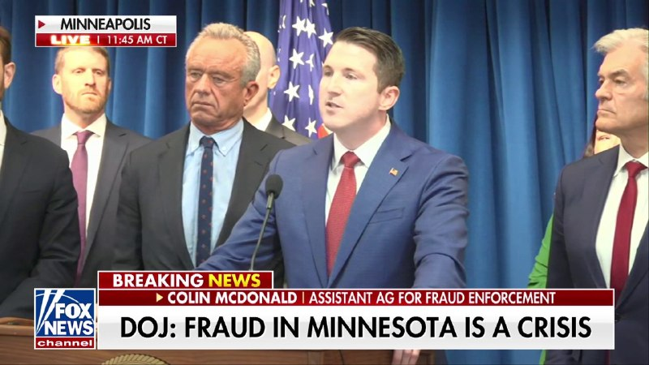

# خواننده تلگرام

<!-- TOP_NAV START -->

<a href="https://github.com/ProAlit/aio-downloader/blob/main/telegram/content/archive_1.md" style="display:inline-block; padding:6px 12px; margin:0 4px; background-color:#2ea44f; color:white; text-decoration:none; border-radius:4px; font-weight:bold;">صفحه بعد</a>

<!-- TOP_NAV END -->

<!-- MSG START -->

---
📅 بروزرسانی: 1405/02/31 20:33
---

## VahidOOnLine — post 241365

  <a href="telegram/content/VahidOOnLine_241365_1779383011.mp4" target="_blank">🎬 Download video</a>

دونالد ترامپ، رئیس‌جمهور آمریکا، در پاسخ به این سؤال که آیا جمهوری‌اسلامی می‌تواند اورانیوم با غنای بالا را حفظ کند، گفته: «نه. ما آن را خواهیم گرفت. به آن نیازی نداریم و آن را نمی‌خواهیم. احتمالا بعد از به دست آوردنش نابودش می‌کنیم، اما اجازه نخواهیم داد آن را داشته باشند.»
‌🏁 🇬🇧 ManotoTV

🤖 @VahidOOnLine

## VahidOOnLine — post 241364

  <a href="telegram/content/VahidOOnLine_241364_1779383011.mp4" target="_blank">🎬 Download video</a>

مارکو روبیو، وزیر خارجه آمریکا، گفت واشینگتن در مذاکرات با جمهوری اسلامی «پیشرفت‌هایی» داشته، اما تأکید کرد حکومت ایران با نوعی «چنددستگی و شکاف داخلی» روبه‌رو است.

روبیو در پاسخ به پرسشی درباره گزارش رسانه‌های دولتی ایران مبنی بر کاهش اختلاف‌ها میان دو طرف گفت: «فکر می‌کنم مقداری پیشرفت حاصل شده، اما بدیهی است که با سیستمی طرف هستیم که خودش تا حدی دچار شکاف است.»

او همچنین گفت قرار است مقام‌های پاکستانی امروز به تهران سفر کنند و ابراز امیدواری کرد این سفر به پیشبرد مذاکرات کمک کند.

وزیر خارجه آمریکا تأکید کرد دونالد ترامپ همچنان ترجیح می‌دهد از مسیر دیپلماسی به «یک توافق خوب» با جمهوری اسلامی برسد.

او افزود دریافت عوارض از کشتی‌ها در تنگه هرمز می‌تواند دستیابی به توافق میان آمریکا و جمهوری اسلامی را «غیرممکن» کند.

روبیو گفت: «اگر بتوانیم به یک توافق خوب برسیم، عالی خواهد بود. ما هر کاری بتوانیم انجام می‌دهیم تا ببینیم آیا رسیدن به توافق ممکن است یا نه.»

او در عین حال هشدار داد اگر توافق مطلوب حاصل نشود، ترامپ «گزینه‌های دیگری» در اختیار دارد، اما توضیح بیشتری درباره این گزینه‌ها نداد.

روبیو افزود: «نشانه‌های مثبتی وجود دارد، اما نمی‌خواهم بیش از حد خوش‌بین باشم. باید ببینیم طی چند روز آینده چه اتفاقی می‌افتد.»
‌🏁 🇬🇧 ManotoTV

🤖 @VahidOOnLine

## VahidOOnLine — post 241363

  <a href="telegram/content/VahidOOnLine_241363_1779383012.mp4" target="_blank">🎬 Download video</a>

♦️دونالد ترامپ، رئیس‌جمهوری ایالات متحده روز پنجشنبه ۳۱ اردیبهشت در کاخ سفید به خبرنگاران گفت که اجازه نخواهد داد جمهوری اسلامی ذخایر اورانیوم غنی‌شده با غنای بالای خود را حفظ کند.

ترامپ تاکید کرد که ایالات متحده اورانیوم با غنای بالا را خواهد گرفت و احتمالا آن را نابود خواهد کرد.
‌🇸🇦 Indypersian

🤖 @VahidOOnLine

## WithYashar — post 11858

  <a href="telegram/content/WithYashar_11858_1779383014.mp4" target="_blank">🎬 Download video</a>

فاکس‌نیوز: «رگ حیاتی تهران»
ژنرال جک کین هشدار می‌دهد که یک توافق جدید ممکن است ایران را زخمی اما همچنان پابرجا باقی بگذارد و این تصور را در ذهن حکومت ایجاد کند که آمریکا را وادار به عقب‌نشینی کرده است.

او می‌گوید:
«مشکل من با این توافق این است که ما ایران را زخمی اما همچنان سرپا باقی می‌گذاریم، و آن‌ها از اینجا خارج می‌شوند و خودشان را قانع می‌کنند که آمریکا را مجبور به عقب‌نشینی کرده‌اند.»
@withyashar

## WithYashar — post 11857

  <a href="telegram/content/WithYashar_11857_1779383016.mp4" target="_blank">🎬 Download video</a>

فاکس نیوز : تیم رئیس‌جمهور ترامپ شروط ایران برای دسترسی و کنترل تنگهٔ هرمز را رد کرده است.

خوب است! فقط شرایط «اول آمریکا» پذیرفته می‌شود.

«ایران نقشه‌ای منتشر کرده که آن را “منطقهٔ دریایی تحت کنترل” می‌نامد. تهران می‌گوید متعهد است تنگه را برای کشورهایی که با شروط آن موافقت کنند دوباره باز کند؛ شروطی که به‌احتمال زیاد شامل دریافت هزینه برای عبور از این تنگه خواهد بود.»

و واشنگتن، در واکنش به این موضوع، اعلام کرده که این اقدام کاملاً غیرقابل قبول است
@withyashar

## FoxNewsTwitter — post 342062

  <a href="telegram/content/FoxNewsTwitter_342062_1779383017.mp4" target="_blank">🎬 Download video</a>

Fox News (Twitter/X)

NOW: Assistant AG for Fraud Enforcement outlines the damage fraudsters have caused to programs meant to help the Minnesota community:

“Our cases today involve seven different state-managed Medicaid programs that have been systematically pilfered by fraudsters who treated Minnesota-run programs as their personal piggy bank.”

## FoxNewsTwitter — post 342061

  <a href="telegram/content/FoxNewsTwitter_342061_1779383019.mp4" target="_blank">🎬 Download video</a>

Fox News (Twitter/X)

BREAKING: Assistant Attorney General Colin McDonald announces criminal charges against 15 defendants in Minnesota for executing massive fraud schemes targeting over $90 million in taxpayer funds.

“This is not the end of the beginning of our work in Minnesota, This is the beginning of our work in Minnesota.”

## FoxNewsTwitter — post 342060

  

Fox News (Twitter/X)

BREAKING: Justice Department announces criminal charges against 15 people in 'shocking' $90 million Minnesota fraud schemes

## DEJradio — post 4826

  <a href="telegram/content/DEJradio_4826_1779383021.webm" target="_blank">🎬 Download video</a>

🚨
🔸 پرچم ملی به ورزش بازمی‌گردد؛ آنچه که حذف می‌شود جمهوری اسلامی خواهد بود

*پژمان گلچین، پژوهشگر فلسفه

#پرچم_شیروخورشید #ورزش
@DEJradio

## Shin_Persian — post 6123

Shin ✓ @hey_itsmyturn
Thu, 21 May 2026 17:01:09 UTC

Treasury designated nine Hizballah-aligned Lebanese officials obstructing peace processes and impeding the terrorist group's disarmament across Lebanon's parliament, military, and security sectors.

𝐇𝐢𝐳𝐛𝐚𝐥𝐥𝐚𝐡 𝐏𝐨𝐥𝐢𝐭𝐢𝐜𝐚𝐥 𝐑𝐞𝐩𝐫𝐞𝐬𝐞𝐧𝐭𝐚𝐭𝐢𝐯𝐞𝐬

• 𝐌𝐨𝐡𝐚𝐦𝐞𝐝 𝐀𝐛𝐝𝐞𝐥-𝐌𝐨𝐭𝐭𝐚𝐥𝐞𝐛 𝐅𝐚𝐧𝐢𝐜𝐡 (Lebanon) - Leads Hizballah's executive council, responsible for reorganizing terrorist group's administrative structure. Longtime Hizballah member since organization's founding, elected to parliament 1992, former Minister of Youth and Sports.

• 𝐇𝐚𝐬𝐬𝐚𝐧 𝐍𝐢𝐳𝐚𝐦𝐦𝐞𝐝𝐝𝐢𝐧𝐞 𝐅𝐚𝐝𝐥𝐚𝐥𝐥𝐚𝐡 (Lebanon) - Hizballah parliamentary representative since 2005, helped found U.S.-designated Al Nour Radio, senior director for U.S.-designated Al Manar TV.

• 𝐈𝐛𝐫𝐚𝐡𝐢𝐦 𝐚𝐥-𝐌𝐨𝐮𝐬𝐬𝐚𝐰𝐢 (Lebanon) - Head of Hizballah's Media Committee and elected parliamentary representative. Longtime Hizballah official.

• 𝐇𝐮𝐬𝐬𝐞𝐢𝐧 𝐀𝐥-𝐇𝐚𝐣𝐣 𝐇𝐚𝐬𝐬𝐚𝐧 (Lebanon) - Hizballah member since 1982, parliamentary representative since 1996. Key figure opposing terrorist group's disarmament.

𝐈𝐫𝐚𝐧𝐢𝐚𝐧 𝐃𝐢𝐩𝐥𝐨𝐦𝐚𝐭𝐢𝐜 𝐒𝐮𝐩𝐩𝐨𝐫𝐭

• 𝐌𝐨𝐡𝐚𝐦𝐦𝐚𝐝 𝐑𝐞𝐳𝐚 𝐒𝐡𝐞𝐢𝐛𝐚𝐧𝐢 (Iran) - Iranian Ambassador designate to Lebanon declared persona non grata by Lebanese Foreign Ministry and ordered to leave Beirut for violating diplomatic norms and supporting IRGC activities backing Hizballah military operations.

𝐀𝐦𝐚𝐥 𝐌𝐨𝐯𝐞𝐦𝐞𝐧𝐭 𝐒𝐞𝐜𝐮𝐫𝐢𝐭𝐲 𝐏𝐚𝐫𝐭𝐧𝐞𝐫𝐬

• 𝐀𝐡𝐦𝐚𝐝 𝐀𝐬𝐚𝐚𝐝 𝐁𝐚𝐚𝐥𝐛𝐚𝐤𝐢 (Lebanon) - Amal Security Director coordinating public displays of force with Hizballah leadership to intimidate political opponents.

• 𝐀𝐥𝐢 𝐀𝐡𝐦𝐚𝐝 𝐒𝐚𝐟𝐚𝐰𝐢 (Lebanon) - Commander of Lebanese Amal militia in southern Lebanon. Coordinates with and takes direction from Hizballah on attacks against Israel, leads joint Hizballah-Amal military operations.

𝐂𝐨𝐦𝐩𝐫𝐨𝐦𝐢𝐬𝐞𝐝 𝐋𝐞𝐛𝐚𝐧𝐞𝐬𝐞 𝐒𝐞𝐜𝐮𝐫𝐢𝐭𝐲 𝐎𝐟𝐟𝐢𝐜𝐢𝐚𝐥𝐬

• 𝐁𝐫𝐢𝐠𝐚𝐝𝐢𝐞𝐫 𝐆𝐞𝐧𝐞𝐫𝐚𝐥 𝐊𝐡𝐚𝐭𝐭𝐚𝐫 𝐍𝐚𝐬𝐬𝐞𝐫 𝐄𝐥𝐝𝐢𝐧 (Lebanon) - General Directorate for General Security National Security Department Chief sharing intelligence with Hizballah during ongoing conflict.

• 𝐂𝐨𝐥𝐨𝐧𝐞𝐥 𝐒𝐚𝐦𝐢𝐫 𝐇𝐚𝐦𝐚𝐝𝐢 (Lebanon) - Lebanese Armed Forces Intelligence Directorate Dahiyah Branch Chief providing intelligence support to Hizballah.

𝐃𝐞𝐬𝐢𝐠𝐧𝐚𝐭𝐢𝐨𝐧 𝐀𝐮𝐭𝐡𝐨𝐫𝐢𝐭𝐢𝐞𝐬
- Four Hizballah political representatives designated under E.O. 13224 for being owned, controlled, or directed by Hizballah
- Five security/diplomatic figures designated under E.O. 13224 for materially assisting or providing support to Hizballah

All designated persons' U.S.-based assets frozen, 50% ownership rule applies to controlled entities. Secondary sanctions risk for foreign financial institutions conducting significant transactions with designated persons.

ترجمه فارسی در بخش نظرات

𝕏 · @shin_persian

## ManotoTV — post 105724

  <a href="telegram/content/ManotoTV_105724_1779383022.mp4" target="_blank">🎬 Download video</a>

دونالد ترامپ، رئیس‌جمهور آمریکا، در پاسخ به این سؤال که آیا جمهوری‌اسلامی می‌تواند اورانیوم با غنای بالا را حفظ کند، گفته: «نه. ما آن را خواهیم گرفت. به آن نیازی نداریم و آن را نمی‌خواهیم. احتمالا بعد از به دست آوردنش نابودش می‌کنیم، اما اجازه نخواهیم داد آن را داشته باشند.»

## ManotoTV — post 105723

  <a href="telegram/content/ManotoTV_105723_1779383022.mp4" target="_blank">🎬 Download video</a>

مارکو روبیو، وزیر خارجه آمریکا، گفت واشینگتن در مذاکرات با جمهوری اسلامی «پیشرفت‌هایی» داشته، اما تأکید کرد حکومت ایران با نوعی «چنددستگی و شکاف داخلی» روبه‌رو است.

روبیو در پاسخ به پرسشی درباره گزارش رسانه‌های دولتی ایران مبنی بر کاهش اختلاف‌ها میان دو طرف گفت: «فکر می‌کنم مقداری پیشرفت حاصل شده، اما بدیهی است که با سیستمی طرف هستیم که خودش تا حدی دچار شکاف است.»

او همچنین گفت قرار است مقام‌های پاکستانی امروز به تهران سفر کنند و ابراز امیدواری کرد این سفر به پیشبرد مذاکرات کمک کند.

وزیر خارجه آمریکا تأکید کرد دونالد ترامپ همچنان ترجیح می‌دهد از مسیر دیپلماسی به «یک توافق خوب» با جمهوری اسلامی برسد.

او افزود دریافت عوارض از کشتی‌ها در تنگه هرمز می‌تواند دستیابی به توافق میان آمریکا و جمهوری اسلامی را «غیرممکن» کند.

روبیو گفت: «اگر بتوانیم به یک توافق خوب برسیم، عالی خواهد بود. ما هر کاری بتوانیم انجام می‌دهیم تا ببینیم آیا رسیدن به توافق ممکن است یا نه.»

او در عین حال هشدار داد اگر توافق مطلوب حاصل نشود، ترامپ «گزینه‌های دیگری» در اختیار دارد، اما توضیح بیشتری درباره این گزینه‌ها نداد.

روبیو افزود: «نشانه‌های مثبتی وجود دارد، اما نمی‌خواهم بیش از حد خوش‌بین باشم. باید ببینیم طی چند روز آینده چه اتفاقی می‌افتد.»

## manototv — post 105724

  <a href="telegram/content/manototv_105724_1779383023.mp4" target="_blank">🎬 Download video</a>

دونالد ترامپ، رئیس‌جمهور آمریکا، در پاسخ به این سؤال که آیا جمهوری‌اسلامی می‌تواند اورانیوم با غنای بالا را حفظ کند، گفته: «نه. ما آن را خواهیم گرفت. به آن نیازی نداریم و آن را نمی‌خواهیم. احتمالا بعد از به دست آوردنش نابودش می‌کنیم، اما اجازه نخواهیم داد آن را داشته باشند.»

## manototv — post 105723

  <a href="telegram/content/manototv_105723_1779383024.mp4" target="_blank">🎬 Download video</a>

مارکو روبیو، وزیر خارجه آمریکا، گفت واشینگتن در مذاکرات با جمهوری اسلامی «پیشرفت‌هایی» داشته، اما تأکید کرد حکومت ایران با نوعی «چنددستگی و شکاف داخلی» روبه‌رو است.

روبیو در پاسخ به پرسشی درباره گزارش رسانه‌های دولتی ایران مبنی بر کاهش اختلاف‌ها میان دو طرف گفت: «فکر می‌کنم مقداری پیشرفت حاصل شده، اما بدیهی است که با سیستمی طرف هستیم که خودش تا حدی دچار شکاف است.»

او همچنین گفت قرار است مقام‌های پاکستانی امروز به تهران سفر کنند و ابراز امیدواری کرد این سفر به پیشبرد مذاکرات کمک کند.

وزیر خارجه آمریکا تأکید کرد دونالد ترامپ همچنان ترجیح می‌دهد از مسیر دیپلماسی به «یک توافق خوب» با جمهوری اسلامی برسد.

او افزود دریافت عوارض از کشتی‌ها در تنگه هرمز می‌تواند دستیابی به توافق میان آمریکا و جمهوری اسلامی را «غیرممکن» کند.

روبیو گفت: «اگر بتوانیم به یک توافق خوب برسیم، عالی خواهد بود. ما هر کاری بتوانیم انجام می‌دهیم تا ببینیم آیا رسیدن به توافق ممکن است یا نه.»

او در عین حال هشدار داد اگر توافق مطلوب حاصل نشود، ترامپ «گزینه‌های دیگری» در اختیار دارد، اما توضیح بیشتری درباره این گزینه‌ها نداد.

روبیو افزود: «نشانه‌های مثبتی وجود دارد، اما نمی‌خواهم بیش از حد خوش‌بین باشم. باید ببینیم طی چند روز آینده چه اتفاقی می‌افتد.»

## alonews — post 121621

  <a href="telegram/content/alonews_121621_1779383025.webm" target="_blank">🎬 Download video</a>

👈 پوتین: سلاح هسته‌ای آخرین گزینه تضمین امنیت ملی ماست!

🔴رؤسای جمهور روسیه و بلاروس طی یک ارتباط ویدئوکنفرانسی، فرمان آغاز نخستین رزمایش مشترک نیروهای هسته‌ای استراتژیک و تاکتیکی دو کشور را صادر کردند. ولادیمیر پوتین در این مراسم، سه‌گانه هسته‌ای را ضامن قابل اعتماد حاکمیت «دولت متحد» دانست.

✅ @AloNews خبر جنگ

## alonews — post 121620

  <a href="telegram/content/alonews_121620_1779383025.webm" target="_blank">🎬 Download video</a>

👈عضو اتاق بازرگانی: همه مسیرها به سمت اتصال مجدد اینترنت بین‌الملل است

🔴مسعودی، رئیس کمیسیون فاوای اتاق بازرگانی ایران: در تمامی رایزنی‌ها و مذاکرات اخیر با نهادهای مسئول، روند تصمیم‌گیری‌ها به سمت اتصال مجدد اینترنت بین‌الملل برای عموم مردم پیش رفته و تاکنون بحثی درباره اینترنت طبقاتی مطرح نشده است.

✅ @AloNews خبر جنگ

<!-- MSG END -->

<!-- NAV START -->

<a href="https://github.com/ProAlit/aio-downloader/blob/main/telegram/content/archive_1.md" style="display:inline-block; padding:6px 12px; margin:0 4px; background-color:#2ea44f; color:white; text-decoration:none; border-radius:4px; font-weight:bold;">صفحه بعد</a>

<!-- NAV END -->
