# خواننده تلگرام

<!-- TOP_NAV START -->

<a href="https://github.com/ProAlit/aio-downloader/blob/main/telegram/content/archive_1.md" style="display:inline-block; padding:6px 12px; margin:0 4px; background-color:#2ea44f; color:white; text-decoration:none; border-radius:4px; font-weight:bold;">صفحه بعد</a>

<!-- TOP_NAV END -->

<!-- MSG START -->

---
📅 بروزرسانی: 1405/03/18 09:23
---

## VahidOOnLine — post 244276

  

رسانه‌های ایران گزارش دادند سامانه پدافند هوایی در شهر کرمانشاه، صبح دوشنبه و در پی مشاهده «اهداف متخاصم»، فعال شده است.

خبرگزاری مهر اعلام کرد فعالیت سامانه‌های پدافندی در نقاطی از شهر و اطراف آن مشاهده شده و صدای آن در برخی مناطق به گوش رسیده و این اقدام در راستای مقابله با «تامین امنیت آسمان منطقه» انجام شده است.
‌🏁 🇬🇧 IranintlTV

🤖 @VahidOOnLine

## VahidOOnLine — post 244275

  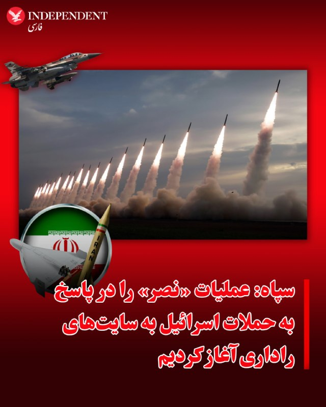

⭕️سپاه: عملیات «نصر» را در پاسخ به حملات اسرائیل به سایت‌های راداری آغاز کردیم

♦️سپاه پاسداران روز دوشنبه ۱۸ خرداد با انتشار بیانیه‌ای اعلام کرد در واکنش به حملات اسرائیل به چند «سایت راداری در سه نقطه کشور» حملات موشکی را با نام نصر علیه اسرائیل آغاز کرده است.

این برای نخستین بار از دو سال پیش و اولین حمله موشکی جمهوری اسلامی به اسرائیل است که سپاه از نام عملیات «وعده صادق» استفاده نمی‌کند.

سپاه مدعی شد در این حمله پایگاه‌های نواتیم و تلنوف هدف قرار گرفته‌اند.

ارتش اسرائیل اعلام کرد تمام موشک‌های شلیک شده از ایران در صبح دوشنبه را رهگیری و منهدم کرده است.

سپاه با اعلام این خبر اعلام کرد: «کلیه یگان‌های رزمی و عملیاتی سپاه پاسداران برای انجام عملیات عبرت آموز گسترده در تمام جبهه‌ها در آمادگی کامل بوده و برنامه های اقدام را متناسب با سناریوهای دشمن تدارک دیده‌اند.»
‌🇸🇦 Indypersian

🤖 @VahidOOnLine

## pm_afshaa — post 92846

🔴ارتش اسرائیل فراخوان گسترده در نیروهای ذخیره خود را به دلیل جنگ با ایران صادر کرد

💧 Rainbet.com the #1 Non-KYC Crypto Casino & Sportsbook @rainbetcom

😁 @Pm_Afshaa

## VahidOnline — post 76045

  <a href="telegram/content/VahidOnline_76045_1780898006.mp4" target="_blank">🎬 Download video</a>

لحظه اعلام خبر حمله موشکی به اسرائیل در تجمع هواداران گروه‌های مسلح شیعه در تهران

📡 @VahidOnline

## IranIntlTV — post 341114

اسرائیل هیوم و شبکه العربیه گزارش دادند اورشلیم حمله اخیر به مواضع جمهوری اسلامی را با واشینگتن هماهنگ کرده است.

ارزیابی حسین آقایی، عضو تحریریه ایران‌اینترنشنال
@iranintltv

## IranIntlTV — post 341113

  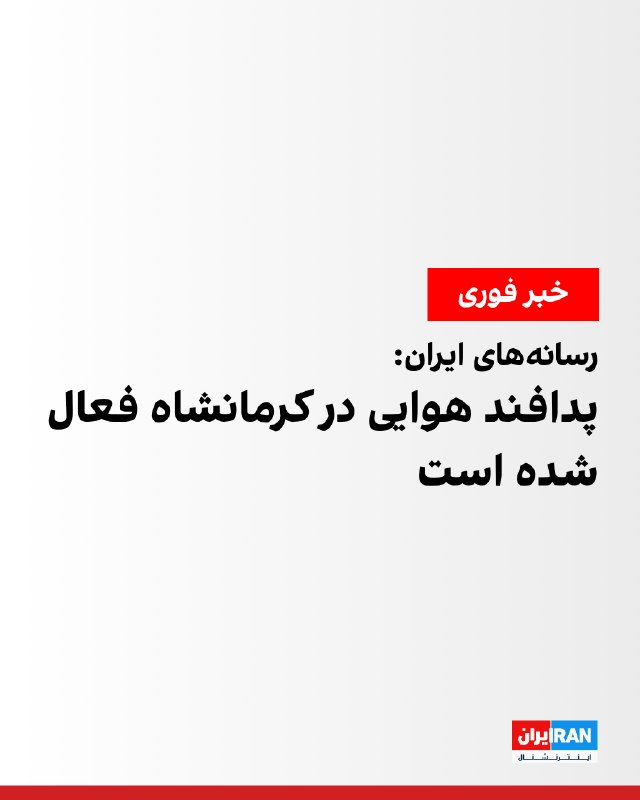

رسانه‌های ایران گزارش دادند سامانه پدافند هوایی در شهر کرمانشاه، صبح دوشنبه و در پی مشاهده «اهداف متخاصم»، فعال شده است.

خبرگزاری مهر اعلام کرد فعالیت سامانه‌های پدافندی در نقاطی از شهر و اطراف آن مشاهده شده و صدای آن در برخی مناطق به گوش رسیده و این اقدام در راستای مقابله با «تامین امنیت آسمان منطقه» انجام شده است.
https://iranintl.com/202606083767

## RadioFarda — post 158031

  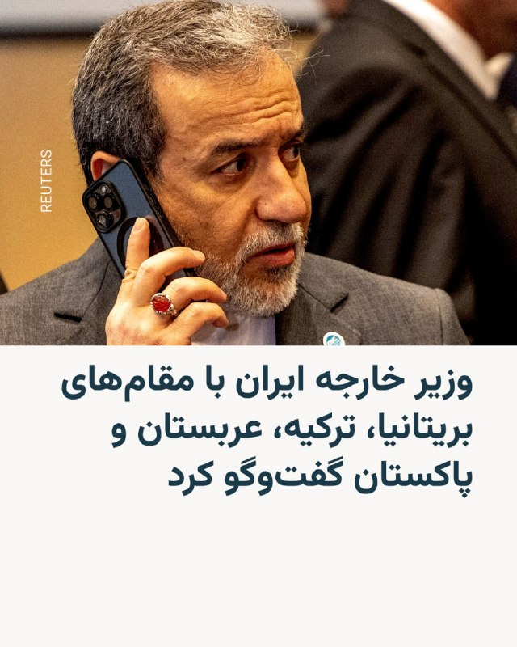

🔸وزیر خارجه ایران می‌گوید پس از «پاسخ ایران به نقض مکرر آتش‌بس در لبنان» از سوی اسرائیل، با مقام‌هایی از بریتانیا، ترکیه، عربستان و پاکستان گفت‌وگو کرده است.

🔸عباس عراقچی در تلگرام نوشت که با ایوت کوپر، وزیر خارجه بریتانیا، و هاکان فیدان، وزیر خارجه ترکیه، گفت‌وگو کرده است.

🔸او همچنین گفت با عاصم منیر، فرمانده ارتش پاکستان، گفت‌وگو کرده است؛ فردی که در تلاش‌های میانجی‌گرانه میان آمریکا و ایران نقشی کلیدی داشته است.

🔸کمی بعد نیز خبر رسید که عباس عراقچی و فیصل بن فرحان، وزیر خارجه عربستان، بامداد دوشنبه در یک تماس تلفنی درباره حمله موشکی ایران به اسرائیل و موضوع لبنان و منطقه گفت‌وگو و رایزنی کرده‌اند.

@RadioFarda

## IranianMinds — post 21729

🔴 خبرگزاری مهر :

پدافند کرمانشاه فعال شد.

@IranianMinds

## IranianMinds — post 21728

🔴 پرواز جنگنده های ارتش اسرائیل در آسمان عراق

@IranianMinds

## alonews — post 126119

  <a href="telegram/content/alonews_126119_1780898009.webm" target="_blank">🎬 Download video</a>

👈رادیو ارتش اسرائیل به نقل از منابع نظامی : پیش‌بینی می‌شود تبادل ضربات با ایران برای چند روز ادامه یابد.

✅ @AloNews خبر جنگ

## alonews — post 126118

  <a href="telegram/content/alonews_126118_1780898009.webm" target="_blank">🎬 Download video</a>

👈سفیر ایران در روسیه: «تنگه هرمز باز خواهد شد، اما تحت شرایط جدیدی که توسط ایران و عمان تعیین می‌شود، از جمله هزینه ترانزیت.»

✅ @AloNews خبر جنگ

## alonews — post 126117

  <a href="telegram/content/alonews_126117_1780898010.mp4" target="_blank">🎬 Download video</a>

👈فیلم‌های بیشتری از پرتاب‌های انجام‌شده از ایران مدتی پیش

✅ @AloNews خبر جنگ

---
📅 بروزرسانی: 1405/03/18 09:13
---

## VahidOOnLine — post 244274

  

روابط عمومی وزارت نفت جمهوری اسلامی اعلام کرد در حملات صبح دوشنبه، به منطقه ویژه اقتصادی ماهشهر، بخشی از تاسیسات پتروشیمی کارون هدف قرار گرفت.

بنا بر این گزارش، پرتابه‌های اسرائیل به بخشی از تاسیسات پتروشیمی کارون اصابت کرد.

همچنین روابط عمومی سازمان منطقه ویژه اقتصادی پتروشیمی در اطلاعیه‌ای اعلام کرد همه کارکنان روزکار باید به‌صورت اضطراری از منطقه خارج شوند.
‌🏁 🇬🇧 IranintlTV

🤖 @VahidOOnLine

## pm_afshaa — post 92845

🔴العربیه:وزیر کشور پاکستان صبح زود امروز ایران را به صورت اضطراری ترک کرد

💧 Rainbet.com the #1 Non-KYC Crypto Casino & Sportsbook @rainbetcom

😁 @Pm_Afshaa

## pm_afshaa — post 92844

🔴رادیو ارتش اسرائیل: انتظار می‌رود تبادل ضربات با ایران برای چند روز ادامه یابد

💧 Rainbet.com the #1 Non-KYC Crypto Casino & Sportsbook @rainbetcom

😁 @Pm_Afshaa

## VahidOnline — post 76044

  

ارتش اسرائیل اعلام کرد که تمامی موشک‌های پرتاب‌شده از سوی جمهوری اسلامی در صبح دوشنبه به سوی اسرائیل رهگیری شدند.

ارتش اسرائیل افزود که پرتابه‌ای که به یک زمین باز در کرانه باختری اصابت کرد، احتمالاً یک قطعه بزرگ باقی‌مانده پس از عملیات رهگیری بوده است.

در همین حال، پس از آنکه هشدار اولیه در اورشلیم درباره حمله موشکی جمهوری اسلامی صادر شده بود، برای این منطقه وضعیت پایان هشدار اعلام شد، زیرا موشک جمهوری اسلامی موفق به رسیدن به خاک اسرائیل نشد.
@VahidHeadline

📡 @VahidOnline

## IranIntlTV — post 341112

  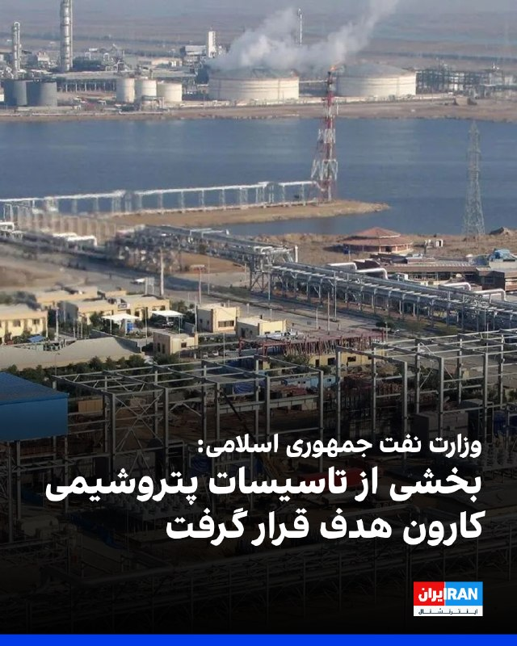

روابط عمومی وزارت نفت جمهوری اسلامی اعلام کرد در حملات صبح دوشنبه، به منطقه ویژه اقتصادی ماهشهر، بخشی از تاسیسات پتروشیمی کارون هدف قرار گرفت.

بنا بر این گزارش، پرتابه‌های اسرائیل به بخشی از تاسیسات پتروشیمی کارون اصابت کرد.

همچنین روابط عمومی سازمان منطقه ویژه اقتصادی پتروشیمی در اطلاعیه‌ای اعلام کرد همه کارکنان روزکار باید به‌صورت اضطراری از منطقه خارج شوند.
https://iranintl.com/202606088101

## FarsiVOA — post 219981

  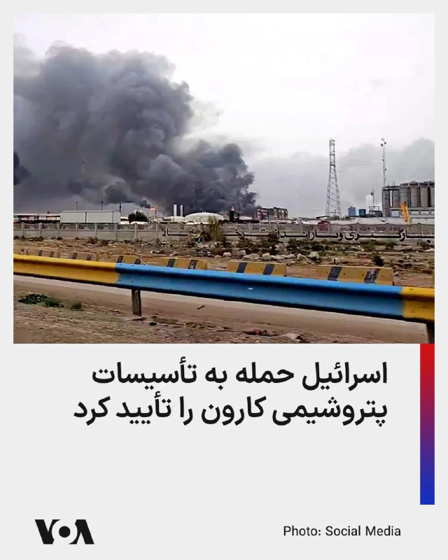

ارتش اسرائیل تأیید کرد که حملات هوایی علیه تأسیسات پتروشیمی در جنوب‌غربی ایران انجام داده است.

ارتش اسرائیل دوشنبه در بیانیه‌ای نوشت که نیروی هوایی این کشور «چندین هدف» را در مجتمع پتروشیمی منطقه ماهشهر هدف قرار داده و جزئیات بیشتر بعداً ارائه خواهد شد.

پیشتر خبرگزاری مهر گزارش داد شرکت پتروشیمی کارون در ماهشهر، در استان خوزستان، بامداد دوشنبه هدف حمله هوایی قرار گرفته است.

تا زمان اعلام اولیه، هیچ‌گونه تلفات جانی یا مجروحیت ناشی از این حمله گزارش نشده است.
@FarsiVOA

## DW_Farsi — post 125670

  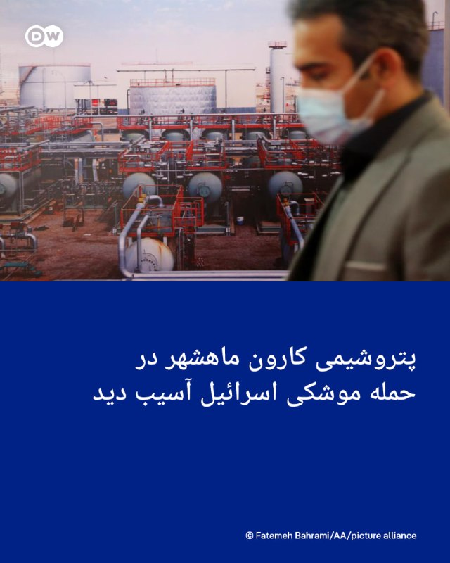

🔶 پتروشیمی کارون ماهشهر در حمله موشکی اسرائیل آسیب دید

خبرگزاری فارس از حمله هوایی اسرائیل به شرکت پتروشیمی کارون ماهشهر خبر داد.

ولی الله حیاتی‌، معاون امنیتی و انتظامی استانداری خوزستان، به فارس گفت پتروشیمی کارون صبح دوشنبه مورد "تهاجم هوایی و اصابت پرتابه‌های" اسرائیل قرار گرفت و "بخشی از آن آسیب دید". او افزود تا این لحظه هیچ تلفات جانی گزارش نشده است.

این مقام مسئول اشاره‌ای به جزئیات این حمله و میزان دقیق خسارات مالی نکرده است.

@dw_farsi

## Persian_Trend_Official — post 16084

📰شناسایی یک شبکه جاسوسی در قلب سرزمین‌های اشغالی

به گزارش سایت خبری وای نت نزدیک به روزنامه یدیعوت اخرونوت:

شاباک یک شبکه جاسوسی مرتبط با ایران را در «بیت یام»، در مرکز سرزمین‌های اشغالی را شناسایی کرده است.

در این گزارش آمده است که این شبکه جاسوسی اطلاعات حساس را در اختیار سرویس جاسوسی ایران قرار می‌داد.

👺Phantom

📌 @persian_trend_official
پرشین ترند | متفاوت‌ترین کانال نظامی

## RadioFarda — post 158030

🔸در پی حملات مجدد موشکی ایران به اسرائیل صبح دوشنبه ۱۸ خرداد آژیرها در سراسر اورشلیم به صدا درآمدند.

🔸این اتفاق پس از آن رخ داد که اسرائیل اعلام کرد روز دوشنبه به اهداف نظامی در غرب و مرکز ایران حمله کرده است.

🔸ارتش اسرائیل روز دوشنبه اعلام کرد که «موج دوم موشک‌های شلیک‌شده از ایران را شناسایی کرده و سامانه‌های دفاعی آن در حال تلاش برای رهگیری این موشک‌ها هستند.»

🔸پیشتر دونالد ترامپ، رئیس جمهور آمریکا از بنیامین نتانیاهو، نخست وزیر اسرائیل، خواسته بود که از حملات بیشتر به ایران خودداری کند.

🔸اوایل روز یکشنبه، اسرائیل برای اولین بار از زمان اعلام طرح آتش‌بس برای لبنان توسط ایالات متحده در هفته گذشته، حملاتی را در منطقه بیروت انجام داد.

🔸ایران در تلافی، موشک‌هایی را به سمت اهداف اسرائیلی شلیک کرد و مذاکرات صلح ایالات متحده و ایران را به خطر انداخت. اما ترامپ اصرار داشت که توافق برای پایان دادن به جنگ گسترده‌تر همچنان در دسترس است.

@RadioFarda

## RadioFarda — post 158029

  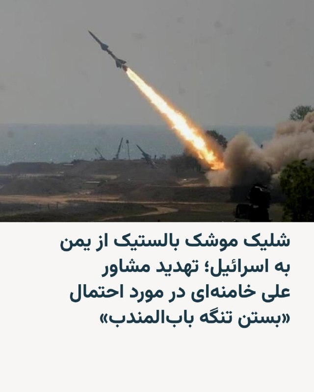

🔸یک ساعت پس از انجام حملات هوایی اسرائیل در ایران، ارتش اسرائیل اعلام کرد یک موشک بالستیک از یمن به سوی مرکز اسرائیل شلیک شد.

🔸اندکی بعد، آژیرهای خطر در تل‌آویو و چند شهر دیگر به صدا درآمد.

🔸شبکه ۱۲ اسرائیل و وب‌سایت خبری وای‌نت می‌گویند موشک شلیک‌شده از یمن رهگیری شده است.

🔸ارتش اسرائیل درباره رهگیری این موشک اظهارنظر نکرده، اما اعلام کرده است ساکنان اکنون می‌توانند از پناهگاه‌های خود خارج شوند.

🔸این نخستین حمله از یمن به سمت اسرائیل از زمان برقراری آتش‌بس ۱۹ فروردین بود.

🔸همزمان، رسانه‌های حکومتی ایران گزارش دادند که علی‌اکبر ولایتی، مشاور رهبر جمهوری اسلامی، هشدار داده و مدعی شده بود در صورت تشدید حملات اسرائیل، ایران می‌تواند تنگه باب‌المندب را مسدود کند.

🔸این تنگه میان یمن، جیبوتی و اریتره قرار دارد و یکی از مسیرهای مهم تجارت جهانی میان اروپا، آسیا و جهان عرب است.

🔸ولایتی در گفت‌وگو با پرس‌تی‌وی گفت وضعیت امنیتی کنونی در باب‌المندب نباید باعث «محاسبه اشتباه» اسرائیل شود و افزود: «انتخاب با شماست، توقف حماقت یا ورود به موازنه ضابطه‌مند شدن دو تنگه.»

@RadioFarda

## IranianMinds — post 21727

🔴 تسنیم : یه شبکه جاسوسی قوی داشتیم تو اسرائیل که امروز بعد سال ها به زور شناسایی کردن و گرفتنشون بمولا ببینید چقدر نفوذ کردیم. @IranianMinds

## IranianMinds — post 21726

  

🔴 اسرائیل هیوم:

حملات امروز اسرائیل با هماهنگی ترامپ انجام شده.

@IranianMinds

## IranianMinds — post 21725

🔴 رادیو ارتش اسرائیل :

انتظار می‌رود رویارویی و درگیری با ایران چندین روز ادامه داشته باشد !

@IranianMinds

## BBCPersian — post 283152

🔻اسرائيل گذرگاه‌های غزه را پس از حملات ايران بست

اسرائيل اعلام کرده است که در پی حملات ايران به شمال اين کشور، بار ديگر گذرگاه‌های ورودی به نوار غزه را می‌بندد.

اين اقدام شامل گذرگاه رفح و گذرگاه کرم شالوم، که يکی از مهم‌ترين مسيرهای ورود کمک‌های بشردوستانه به غزه است، می‌شود.

هماهنگ‌کننده فعاليت‌های دولتی در سرزمين ها (کوگات)، نهاد وابسته به وزارت دفاع اسرائيل، اعلام کرد اين تصميم بخشی از «مجموعه‌ای از اقدامات امنيتی ضروری» است.

کوگات در بيانيه‌ای مدعی شد که اين تعطيلی تأثيری بر وضعيت انسانی غزه نخواهد داشت، زيرا: «مقادير قابل توجهی مواد غذايی که از زمان آغاز آتش‌بس وارد نوار غزه شده، به طور چشمگيری بيش از نيازهای تغذيه‌ای جمعيت اين منطقه است.»

اسرائيل پيش از اين نيز در جريان جنگ با ايران، از جمله برای مدت کوتاهی در ماه فوريه، گذرگاه‌های غزه را بسته بود.

اين تصميم در شرايطی اتخاذ شده که نگرانی‌ها درباره تأثير تشديد تنش‌های منطقه ای بر روند ارسال کمک‌های بشردوستانه به غزه همچنان ادامه دارد.

@BBCPersian

## BBCPersian — post 283151

  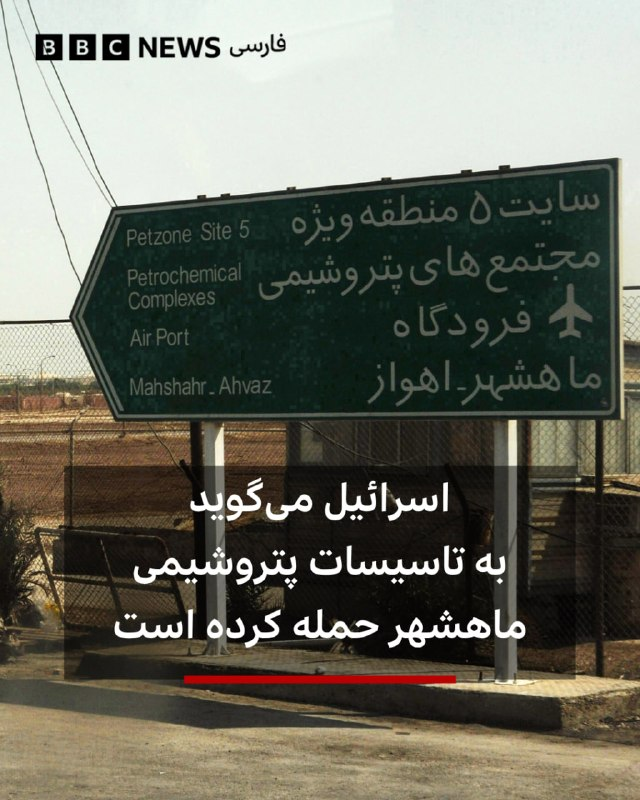

‌ ‌ ‌
ارتش اسرائیل اعلام کرد که به «چندین هدف» در تاسیسات پتروشیمی ایران در ماهشهر، در جنوب غربی این کشور، حمله کردند.

رسانه‌های دولتی ایران نیز وقوع این حمله را تایید کرده‌اند.

رسانه‌های می‌گویند که این مجتمع در نزدیکی ساحل شمالی خلیج فارس تا حدی آسیب دیده است.

هنوز در خصوص خسارات احتمالی و یا کشته‌های این حمله جزییاتی اعلام نشده اما ایران گفته به زودی در این خصوص اطلاع رسانی خواهد کرد.

https://bbc.in/4vrGu1A
📷Kaveh Kazemi/Getty Images
@BBCPersian

## alonews — post 126116

  <a href="telegram/content/alonews_126116_1780897415.webm" target="_blank">🎬 Download video</a>

👈تعداد هواپیماهای آمریکایی در پایگاه هوایی شاهزاده سلطان عربستان سعودی از قبل کاهش یافته بود. هماهنگی آشکاری بین ترامپ و اسرائیل وجود دارد.

✅ @AloNews خبر جنگ

---
📅 بروزرسانی: 1405/03/18 09:03
---

## VahidOOnLine — post 244273

  <a href="telegram/content/VahidOOnLine_244273_1780896788.mp4" target="_blank">🎬 Download video</a>

⭕️ارتش اسرائیل حمله به سایت‌های پتروشیمی در جنوب غرب ایران را تایید کرد

♦️کاربران شبکه‌های اجتماعی صبح دوشنبه ۱۸ خرداد، تصاویری را از عبور موشک‌های سپاه در آسمان ملارد در کرج منتشر کردند.

این دومین موج حملات موشکی جمهوری اسلامی به اسرائیل از دیشب به شمار می‌رود.
‌🇸🇦 Indypersian

🤖 @VahidOOnLine

## WithYashar — post 13903

پدافند کرمانشاه فعال شد
@withyashar

## pm_afshaa — post 92843

پدافند کرمانشاه فعال شد

💧 Rainbet.com the #1 Non-KYC Crypto Casino & Sportsbook @rainbetcom

😁 @Pm_Afshaa

## VahidOnline — post 76043

  <a href="telegram/content/VahidOnline_76043_1780896790.mov" target="_blank">🎬 Download video</a>

@iliaen
ارتش اسرائیل حمله به سایت‌های پتروشیمی در جنوب غرب ایران را تایید کرد

به دنبال گزارش خبرگزاری فارس مبنی بر حمله به مجموعه پتروشیمی کارون در ماهشهر که خساراتی به دنبال داشته، ارتش اسرائیل حمله به سایت‌های پتروشیمی در جنوب غرب ایران را تایید کرد و گفت به اهداف متعددی در مجموعه پتروشیمی ماهشهر حمله کرده و جزئیات مربوط به این حمله را به زودی ارایه خواهد داد.

ارتش اسرائیل پیش‌تر گفته بود که مواضع حکومت ایران را در غرب و مرکز ایران هدف گرفته است.
@VahidOOnLine

📡 @VahidOnline

## IranIntlTV — post 341111

  <a href="telegram/content/IranIntlTV_341111_1780896790.mp4" target="_blank">🎬 Download video</a>

ارتش اسرائیل اعلام کرد موشک‌های شلیک‌شده از سوی جمهوری اسلامی به سمت این کشور را شناسایی کرده است. این ارتش افزود سامانه‌های پدافندی برای رهگیری این موشک‌ها فعال شده‌اند.

گفت‌وگو با کامیار بهرنگ، عضو تحریریه ایران‌اینترنشنال
@iranintltv

## FarsiVOA — post 219980

  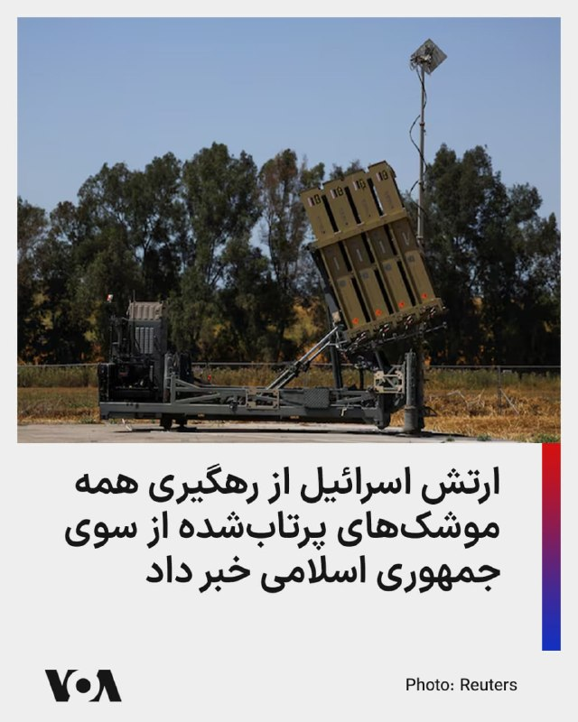

ارتش اسرائیل اعلام کرد که تمامی موشک‌های پرتاب‌شده از سوی جمهوری اسلامی در صبح دوشنبه به سوی اسرائیل رهگیری شدند.

ارتش اسرائیل افزود که پرتابه‌ای که به یک زمین باز در کرانه باختری اصابت کرد، احتمالاً یک قطعه بزرگ باقی‌مانده پس از عملیات رهگیری بوده است.

در همین حال، پس از آنکه هشدار اولیه در اورشلیم درباره حمله موشکی جمهوری اسلامی صادر شده بود، برای این منطقه وضعیت پایان هشدار اعلام شد، زیرا موشک جمهوری اسلامی موفق به رسیدن به خاک اسرائیل نشد.
@FarsiVOA

## FarsiVOA — post 219979

  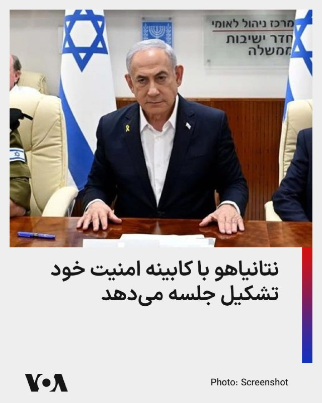

بنیامین نتانیاهو، نخست‌وزیر اسرائیل، ساعت ۱۱ صبح دوشنبه با کابینه امنیتی خود تشکیل جلسه می‌دهد. یک مقام اسرائیلی در این باره به تایمز اسرائیل گفت که تنها گروه کوچکی از وزیران کلیدی در این جلسه حضور خواهند داشت.

این جلسه در پی ازسرگیری درگیری‌ها با جمهوری اسلامی برگزار می‌شود.

آکسیوس ساعاتی پس از حمله موشکی جمهوری اسلامی به اسرائيل، به نقل یک مقام ارشد آمریکایی و یک منبع اسرائیلی گزارش داده بود که رئيس جمهوری آمریکا در تماس تلفنی خود به نخست وزیر اسرائيل گفت که حمله موشکی شبانه جمهوری اسلامی را تلافی نکند و زمان بیشتری به دیپلماسی بدهد.
@FarsiVOA

## DW_Farsi — post 125669

  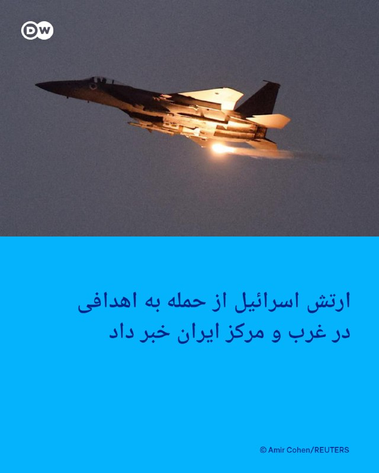

🔶 ارتش اسرائیل از حمله به اهدافی در غرب و مرکز ایران خبر داد

ارتش اسرائیل اعلام کرد "اهداف نظامی" را در مرکز و غرب ایران مورد حمله قرار داده است. در بیانیه ارتش اسرائیل به جزئیات بیشتری در مورد این اهداف اشاره نشده است.

در همین حال خبرگزاری ایرنا گزارش داد بامداد دوشنبه، "دست‌کم صدای سه انفجار در اصفهان" و "دو انفجار مهیب در تهران" شنیده شده است. اکبر صالحی، معاون امنیتی استاندار اصفهان به ایرنا گفته است که "نقطه‌ای در شهر نجف‌آباد" هدف حمله اسرائیل قرار گرفت. به گفته او این حملات تلفات جانی نداشته است.

به نوشته ایرنا نقاط مختلفی در غرب تهران حوالی ساعات ۴:۴۳ و ۴:۴۵ هدف حمله قرار گرفتند و ادعاهایی نیز در مورد هدف قرار گرفتن فرودگاه مهر‌آباد منتشر شده است. سخنگوی آتش‌نشانی تهران به ایرنا گفته است که "نقاط شهری در تهران هدف قرار نگرفته‌اند".

خبرگزاری تسنیم نوشت صدای انفجار در تهران، اصفهان، کرج، تبریز و برخی نقاط دیگر در غرب تهران شنیده شده‌اند. خبرگزاری فارس به نقل از منابع محلی از وقوع انفجارهایی در استان‌های تهران، آذربایان شرقی و اصفهان خبر داده و نوشت صدای انفجار از حوالی غرب استان تهران شنیده شده است و مردم فردیس کرج نیز صدای این انفجار را شنیده‌اند.

در همین حال سپاه پاسداران با انتشار بیانیه‌ای حملات اسرائیل به نقاطی در ایران را تأیید کرد. در این بیانیه بدون اشاره به جزئیات بیشتر در مورد مکان و اهداف این حملات گفته شده است که اسرائیل "با استفاده از موشک‌های بالستیک هواپرتاب اقدام به حمله به اهدافی" در ایران کرده است.

@dw_farsi

## Persian_Trend_Official — post 16083

🔹شنیده شدن صدای انفجار و فعالیت پدافند هوایی در کرمانشاه گزارش شده است.

## Persian_Trend_Official — post 16082

فعالیت پدافند هوایی در کرمانشاه گزارش شده

## Persian_Trend_Official — post 16081

## IranianMinds — post 21724

🔴 تسنیم :

یه شبکه جاسوسی قوی داشتیم تو اسرائیل که امروز بعد سال ها به زور شناسایی کردن و گرفتنشون بمولا ببینید چقدر نفوذ کردیم.

@IranianMinds

## IranianMinds — post 21723

  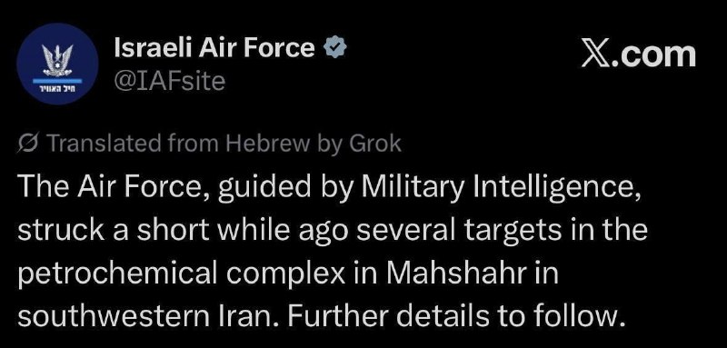

🔴 نیروی هوایی اسرائیل:

نیروی هوایی با هدایت اطلاعات نظامی کمی پیش چندین هدف را در مجتمع پتروشیمی ماهشهر در جنوب غربی ایران هدف قرار داد جزئیات بیشتری به زودی اعلام خواهد شد.

@IranianMinds

## IranianMinds — post 21722

🔴 سازمان ملل :

خیلی نگرانیم ...

@IranianMinds

## BBCPersian — post 283150

🔻اسرائیل می‌گوید به تاسیسات پتروشیمی ماهشهر حمله کرده است

ارتش اسرائیل اعلام کرد که به «چندین هدف» در تاسیسات پتروشیمی ایران در ماهشهر، در جنوب غربی این کشور، حمله کردند.

رسانه‌های دولتی ایران نیز وقوع این حمله را تایید کرده‌اند.

رسانه‌های می‌گویند که این مجتمع در نزدیکی ساحل شمالی خلیج فارس تا حدی آسیب دیده است.

هنوز در خصوص خسارات احتمالی و یا کشته‌های این حمله جزییاتی اعلام نشده اما ایران گفته به زودی در این خصوص اطلاع رسانی خواهد کرد.

@BBCPersian

## alonews — post 126115

  <a href="telegram/content/alonews_126115_1780896794.webm" target="_blank">🎬 Download video</a>

👈وزارت خارجه قطر: وزیر خارجه قطر تماس تلفنی از وزیر خارجه ایران، عباس عراقچی، دریافت کرد.

✅ @AloNews خبر جنگ

## alonews — post 126114

  <a href="telegram/content/alonews_126114_1780896794.webm" target="_blank">🎬 Download video</a>

👈کانال ۱۲ اسرائیل: تمامی فعالیت‌ها و تجمعات لغو شده و مراکز آموزشی در سراسر اسرائیل تعطیل خواهند شد

✅ @AloNews خبر جنگ

## alonews — post 126113

  <a href="telegram/content/alonews_126113_1780896795.webm" target="_blank">🎬 Download video</a>

👈صدای انفجار و فعالیت پدافند هوایی تو کرمانشاه گزارش شده

✅ @AloNews خبر جنگ

## alonews — post 126112

  <a href="telegram/content/alonews_126112_1780896795.webm" target="_blank">🎬 Download video</a>

👈کانال ۱۲ اسراییل: طبق اعلام ارتش اسرائیل، یک ساعت پس از حملات هوایی اسرائیل به ایران، یک موشک بالستیک از یمن به سمت مرکز اسرائیل شلیک شد

🔴این نخستین حمله‌ای است که از یمن پس از آتش‌بس که از هشتم آوریل اجرایی شده، انجام می‌شود.

✅ @AloNews خبر جنگ

## alonews — post 126111

  <a href="telegram/content/alonews_126111_1780896795.webm" target="_blank">🎬 Download video</a>

👈منابع عبری: بیمارستان‌های شمال شروع به انتقال بخش‌های اورژانس به پناهگاه‌های زیرزمینی محافظت‌شده کردن

✅ @AloNews خبر جنگ

---
📅 بروزرسانی: 1405/03/18 08:53
---

## VahidOOnLine — post 244272

  <a href="telegram/content/VahidOOnLine_244272_1780896187.mp4" target="_blank">🎬 Download video</a>

⭕️ارتش اسرائیل حمله به سایت‌های پتروشیمی در جنوب غرب ایران را تایید کرد

♦️به دنبال گزارش خبرگزاری فارس مبنی بر حمله به مجموعه پتروشیمی کارون در ماهشهر که خساراتی به دنبال داشته، ارتش اسرائیل حمله به سایت‌های پتروشیمی در جنوب غرب ایران را تایید کرد و گفت به اهداف متعددی در مجموعه پتروشیمی ماهشهر حمله کرده و جزئیات مربوط به این حمله را به زودی ارایه خواهد داد.

ارتش اسرائیل پیش‌تر گفته بود که مواضع حکومت ایران را در غرب و مرکز ایران هدف گرفته است. حمله‌ها پس از حمله موشکی یکشنبه شب سپاه به شمال اسرائیل انجام شد.
‌🇸🇦 Indypersian

🤖 @VahidOOnLine

## WithYashar — post 13902

اسرائیل برخورد موشک @withyashar

## WithYashar — post 13901

رادیو ارتش اسرائیل: تمامی موشک‌های شلیک‌شده از سوی ایران رهگیری شده و یا در مناطق باز و غیرمسکونی سقوط کردند. این رسانه از یک انفجار در شهرک ایتمار ناشی از ترکش موشک‌های رهگیری شده خبر داد.
@withyashar

## WithYashar — post 13900

۳پا ایران: مراکز مهمی را در پایگاه‌های هوایی نواتیم و تل نوف در اسرائیل را هدف قرار دادیم.
@withyashat

## WithYashar — post 13899

رسانه های عبری :
در اسرائیل دستورات داده شده برای چند روز جنگ آماده شوید
@withyashar

## WithYashar — post 13898

معاریو : اسرائیل حملِه‌های جدیدی تو ایران رو شروع کرد
@withyashar

## Shin_Persian — post 6719

↩️ Quoted tweet: Shin ✓ @hey_itsmyturn Mon, 08 Jun 2026 05:14:32 UTC #IAF 🇮🇱 targeted radar sites overnight, IRGC terror organization confirms "3 radar sites" were targeted in Iran. ↩️ توییت نقل‌قول شده — برای پاسخ، پست زیر را ببینید. فارسی #IAF 🇮🇱 سایت‌های…

## Shin_Persian — post 6718

↩️ Quoted tweet:
Shin ✓ @hey_itsmyturn
Mon, 08 Jun 2026 05:14:32 UTC

#IAF 🇮🇱 targeted radar sites overnight, IRGC terror organization confirms "3 radar sites" were targeted in Iran.

↩️ توییت نقل‌قول شده — برای پاسخ، پست زیر را ببینید.

فارسی

#IAF 🇮🇱 سایت‌های راداری را در طول شب هدف قرار داد، سازمان تروریستی سپاه پاسداران انقلاب اسلامی هدف قرار گرفتن «۳ سایت راداری» در ایران را تایید کرد.

𝕏 · @shin_persian

## Shin_Persian — post 6717

Shin ✓ @hey_itsmyturn
Mon, 08 Jun 2026 05:14:32 UTC

#IAF 🇮🇱 targeted radar sites overnight, IRGC terror organization confirms "3 radar sites" were targeted in Iran.

فارسی

#نیروی_هوایی_اسرائیل 🇮🇱 دیشب سایت‌های راداری را هدف قرار داد، سازمان تروریستی سپاه پاسداران (IRGC) هدف قرار گرفتن «۳ سایت راداری» در ایران را تایید کرد.

𝕏 · @shin_persian

## Persian_Trend_Official — post 16080

حدود ساعت ۹:۳۰ لایو رو آغاز میکنیم

## Persian_Trend_Official — post 16078

  

آغاز عملیات نصر علیه پایگاه های تلنوف و نواتیم

روابط عمومی سپاه پاسداران انقلاب اسلامی اعلام کرد:

بسم الله الرحمن الرحیم
أُذِنَ لِلَّذِينَ يُقَاتَلُونَ بِأَنَّهُمْ ظُلِمُوا ۚ وَإِنَّ اللَّهَ عَلَىٰ نَصْرِهِمْ لَقَدِيرٌ

🔹با توکل به خدای متعال و استعانت از پروردگار قادر متعال، دقایقی پیش رزمندگان شجاع نیروی هوافضای سپاه عملیات نصر را با رمز مقدس "یا حیدر کرار" و هدیه به شهدای جنگ ۱۲ روزه با هدف قرار دادن مراکز مهم پایگاه های هوایی راهبردی نواتیم و تلنوف آغاز کردند.

🔹این عملیات در پاسخ به تجاوز موشکی رژیم کودک‌کش صهیونی به چند سایت راداری در سه نقطه کشور انجام شد.

🔹سرعت عمل در پاسخ به تجاوزات ارتش رژیم صهیونیستی و گستردگی بانک اهداف جزو اقدامات گروههای عمل کننده در این مرحله بوده است.

🔹کلیه یگانهای رزمی و عملیاتی سپاه پاسداران برای انجام عملیات عبرت آموز گسترده در تمام جبهه‌ها در آمادگی کامل بوده و برنامه های اقدام را متناسب با سناریوهای دشمن تدارک دیده اند.

و ما النصر الا من الله العزیز الحکیم

📝 Amir

📌 @persian_trend_official
پرشین ترند | متفاوت‌ترین کانال نظامی

## IranianMinds — post 21721

🔴 بیانیه سپاه :

با توکل به خداوند متعال و استعانت از پروردگار قادر متعال، دقایقی پیش رزمندگان شجاع نیروی هوافضای سپاه پاسداران عملیات «نصر» را با رمز مقدس «یا حیدر کرار» آغاز کردند و آن را به شهدای جنگ ۱۲ روزه تقدیم نمودند.

این عملیات تأسیسات مهم واقع در پایگاه‌های هوایی راهبردی تل نوف و نواتیم را هدف قرار داده است.
این عملیات در پاسخ به حمله موشکی رژیم صهیونیستیِ کودک‌کش به چندین سایت راداری در سه نقطه از کشور انجام شد.

تمامی یگان‌های رزمی و عملیاتی سپاه پاسداران در آمادگی کامل قرار دارند تا در تمامی جبهه‌ها یک عملیات بازدارنده گسترده را اجرا کنند و متناسب با سناریوهای مختلف دشمن، طرح‌های عملیاتی لازم را آماده کرده‌اند.

@IranianMinds

## IranianMinds — post 21720

🔴 سپاه :

عملیات جدیدی که علیه اسرائیل شروع کردیم عملیات نصر هستش و نه وعده صادق !

@IranianMinds

## IranianMinds — post 21719

لاشیا نیم ساعت بعد اینکه من خوابیدم زدن
الانم سپاه داره موشک میزنه سمت اسرائیل

## IranianMinds — post 21718

🔴 ارتش اسرائیل بامداد امروز به اصفهان و تهران و کرمانشاه حمله کرد.

@IranianMinds

## IranianMinds — post 21717

ولی این جنگ نشد نیست بازم یه پاسخ دفاعیه و میان میگن آتش بس هنوز برقراره

هر موقع بیدار شدید و دیدید 60 تا سپاهی همزمان کتلت شدن و بد دارن تهرانو میزنن بفهمید جنگ شروع شده باز

## IranianMinds — post 21716

  <a href="telegram/content/IranianMinds_21716_1780896190.mp4" target="_blank">🎬 Download video</a>

🔴 ویدئوهایی از تأسیسات پتروشیمی در ماهشهرِ خوزستان که هدف حمله اسرائیل قرار گرفته است.

@IranianMinds

## IranianMinds — post 21715

🔴 بر اساس گزارش شبکه ۱۳ اسرائیل، نیروی هوایی اسرائیل ۲۰ هدف را در ایران مورد حمله قرار داد.

@IranianMinds

## alonews — post 126110

  <a href="telegram/content/alonews_126110_1780896191.webm" target="_blank">🎬 Download video</a>

👈العربیه: وزیر کشور پاکستان بامداد تهران را ترک کرد

✅ @AloNews خبر جنگ

## alonews — post 126109

  <a href="telegram/content/alonews_126109_1780896192.webm" target="_blank">🎬 Download video</a>

👈معاریو : اسرائیل حملِه‌های جدیدی تو ایران رو شروع کرد

✅ @AloNews خبر جنگ

---
📅 بروزرسانی: 1405/03/18 08:43
---

## VahidOOnLine — post 244271

  

⭕️حمله هوایی اسرائیل به پتروشیمی کارون ماهشهر؛ استانداری خوزستان: بخشی از پتروشیمی آسیب دیده است

♦️معاون امنیتی و انتظامی استانداری خوزستان روز دوشنبه ۱۸ خردادماه اعلام کرد پتروشیمی کارون هدف حمله قرار گرفته است.

به گزارش خبرگزاری فارس بخشی از این شرکت پتروشیمی آسیب دیده است.
هنوز گزارشی از میزان خسارات و تلفات این حمله منتشر نشده است.

کانال ۱۴ اسرائیل به نقل از سخنگوی ارتش این کشور اعلام کرد اسرائیل این حملات را انجام داده است.
‌🇸🇦 Indypersian

🤖 @VahidOOnLine

## VahidOOnLine — post 244270

  

⭕️اعلام وضعیت عادی در منطقه اورشلیم؛ ارتش اسرائیل می‌گوید همه موشک‌های ایران صبح امروز رهگیری شدند

♦️بر اساس اعلام ارتش، تمام موشک‌های شلیک‌شده از ایران به سمت اسرائیل در صبح امروز رهگیری شده‌اند.

ارتش اسرائیل ارزیابی کرده است که برخوردی که در یک منطقه باز در کرانه باختری گزارش شده، احتمالا ناشی از یک قطعه بزرگ حاصل از عملیات رهگیری بوده است.

به گزارش تایمز اسرائیل، در همین حال، پس از صدور هشدار اولیه درباره حمله موشکی ایران، وضعیت عادی در منطقه اورشلیم اعلام شده است، زیرا به نظر می‌رسد پرتابه‌ها به داخل خاک کشور نرسیده‌اند.
‌🇸🇦 Indypersian

🤖 @VahidOOnLine

## WithYashar — post 13897

روابط عمومی سازمان منطقه ویژه‌اقتصادی پتروشیمی اعلام کرد:
بر اساس تصمیم فرماندهی ارشد پدافند غیرعامل، دستور خروج اضطراری کلیه کارکنان روزکار از این منطقه صادر شده است.
@withyashar

## WithYashar — post 13896

شبکه ۱۲ اسرائیل : نیروی هوایی اسرائیل ۲۰ تا هدف تو ایران رو زده که شامل فرودگاه مهر آباد هم میشده
@withyashar

## pm_afshaa — post 92842

🔴منابع اسراییلی:بیمارستان‌های شمال شروع به انتقال بخش‌های اورژانس به پناهگاه‌های زیرزمینی محافظت‌شده کردن 
💧 Rainbet.com the #1 Non-KYC Crypto Casino & Sportsbook @rainbetcom 
😁 @Pm_Afshaa

## pm_afshaa — post 92841

🔴منابع اسراییلی:بیمارستان‌های شمال شروع به انتقال بخش‌های اورژانس به پناهگاه‌های زیرزمینی محافظت‌شده کردن

💧 Rainbet.com the #1 Non-KYC Crypto Casino & Sportsbook @rainbetcom

😁 @Pm_Afshaa

## FarsiVOA — post 219978

  

خبرگزاری مهر گزارش داد شرکت پتروشیمی کارون در ماهشهر، در استان خوزستان، بامداد دوشنبه هدف حمله هوایی قرار گرفته است.

این خبرگزاری به نقل از ولی‌الله حیاتی، معاون امنیتی و انتظامی استانداری خوزستان، نوشت که در پی اصابت پرتابه‌ها، بخشی از این مجموعه صنعتی آسیب دیده است.

حیاتی گفت در این حمله، تا زمان اعلام اولیه، هیچ‌گونه تلفات جانی یا مجروحیت گزارش نشده است.

او افزود جزئیات بیشتر درباره میزان خسارات احتمالی، متعاقباً اعلام خواهد شد.
@FarsiVOA

## Persian_Trend_Official — post 16077

  <a href="telegram/content/Persian_Trend_Official_16077_1780895584.mp4" target="_blank">🎬 Download video</a>

پتروشیمی کارون.

👺Phantom

📌 @persian_trend_official
پرشین ترند | متفاوت‌ترین کانال نظامی

## RadioFarda — post 158028

  

🔸ولی‌الله حیاتی، معاون امنیتی و انتظامی استانداری خوزستان از حمله هوایی و موشکی اسرائیل به شرکت پتروشیمی کارون ماهشهر خبر داد.

🔸خبرگزاری فارس با انتشار این خبر به نقل از حیاتی، افزوده که بخشی از این کارخانه در این حمله آسیب دیده است.

🔸با این حال در این خبر به جزئیات این حمله و میزان دقیق خسارات مالی و نیز جانی احتمالی اشاره‌ای نشده است.

🔸در جریان حملات مشترک آمریکا و اسرائیل نیز شماری از شرکت‌های پتروشیمی در ایران، اهداف حمله بودند.

@RadioFarda

## RadioFarda — post 158027

  

🔸بهای نفت روز دوشنبه، با بازگشایی بازارها پس از تعطیلات پایان هفته، بیش از سه درصد افزایش یافت؛ افزایشی که بازتاب‌دهنده نگرانی‌های تازه از نخستین حمله ایران به اسرائیل از زمان آتش‌بس است.

🔸به نوشته خبرگزاری فرانسه، در معاملات اولیه، بهای نفت خام برنت، شاخص بین‌المللی نفت، با ۳٫۲۹ درصد افزایش به ۹۶ دلار و ۱۵ سنت برای هر بشکه رسید.

🔸شاخص آمریکایی نفت خام، وست تگزاس اینترمدیت، نیز با ۳٫۲۵ درصد افزایش به ۹۳ دلار و ۴۸ سنت برای هر بشکه رسید.

🔸تهران روز یک‌شنبه چندین موشک به سوی اسرائیل شلیک کرد که اسرائیل می‌گوید آن‌ها را رهگیری کرده است. این حملات در صدمین روز جنگ در خاورمیانه، فشار تازه‌ای بر آتش‌بس شکننده وارد کرد.

@RadioFarda

## IranianMinds — post 21714

زدن که باز

## alonews — post 126108

  <a href="telegram/content/alonews_126108_1780895586.mp4" target="_blank">🎬 Download video</a>

👈آثار اصابت در خانه یک شهروند اسرائیلی

✅ @AloNews خبر جنگ

## alonews — post 126107

  <a href="telegram/content/alonews_126107_1780895588.webm" target="_blank">🎬 Download video</a>

👈 کانال ۱۳ اسرائیل: نیروی هوایی اسرائیل ۲۰ هدف در ایران را بمباران کرد

🔴 ما به چندین هدف در مجتمع پتروشیمی ماهشهر، جنوب غربی ایران، حمله هوایی انجام دادیم

✅ @AloNews خبر جنگ

## alonews — post 126106

  <a href="telegram/content/alonews_126106_1780895588.webm" target="_blank">🎬 Download video</a>

👈مهر: هیچ‌ منطقه ای در کرمانشاه هدف قرار نکرفته است

✅ @AloNews خبر جنگ

## alonews — post 126104

  <a href="telegram/content/alonews_126104_1780895589.webm" target="_blank">🎬 Download video</a>

🔴به گزارش اخبار کانال ۱۴، یک مقام ارشد اسرائیلی تأیید کرد که نیروی هوایی اسرائیل به یک تأسیسات پتروشیمی در ماهشهر در جنوب ایران حمله کرده است.

🔴این حمله گزارش شده بخشی از تلاش‌های دفاعی مداوم اسرائیل علیه جمهوری اسلامی است که همچنان با موشک، پهپاد، گروه‌های تروریستی نیابتی و برنامه هسته‌ای در حال پیشرفت خود، غیرنظامیان را هدف قرار می‌دهد.

🔴ارتش اسرائیل تأیید کرد که نیروی هوایی اسرائیل، با هدایت اطلاعات نظامی، به چندین هدف در مجتمع پتروشیمی ماهشهر در جنوب غربی ایران حمله کرده است.

🔴با ادامه‌ی عملیات دفاعی اسرائیل علیه زیرساخت‌های نظامی، اقتصادی، هسته‌ای جمهوری اسلامی، انتظار می‌رود جزئیات بیشتری منتشر شود.

✅@AloNews

## alonews — post 126103

  <a href="telegram/content/alonews_126103_1780895589.webm" target="_blank">🎬 Download video</a>

👈کارکنان روزکار منطقه ویژه پتروشیمی تخلیه می‌شوند

✅ @AloNews خبر جنگ

<!-- MSG END -->

<!-- NAV START -->

<a href="https://github.com/ProAlit/aio-downloader/blob/main/telegram/content/archive_1.md" style="display:inline-block; padding:6px 12px; margin:0 4px; background-color:#2ea44f; color:white; text-decoration:none; border-radius:4px; font-weight:bold;">صفحه بعد</a>

<!-- NAV END -->
