# خواننده تلگرام

<!-- TOP_NAV START -->

<a href="https://github.com/ProAlit/aio-downloader/blob/main/telegram/content/archive_1.md" style="display:inline-block; padding:6px 12px; margin:0 4px; background-color:#2ea44f; color:white; text-decoration:none; border-radius:4px; font-weight:bold;">صفحه بعد</a>

<!-- TOP_NAV END -->

<!-- MSG START -->

---
📅 بروزرسانی: 1405/03/13 12:54
---

## VahidOOnLine — post 243486

  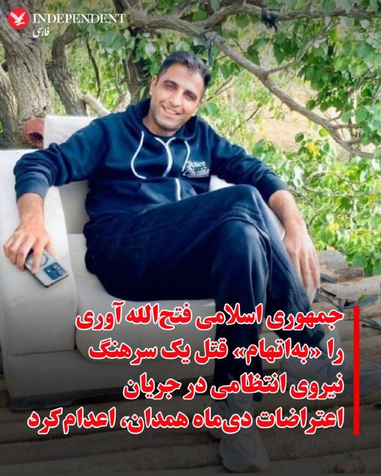

♦️میزان، خبرگزاری قوه قضائیه جمهوری اسلامی، روز چهارشنبه ۱۳ خرداد اعلام کرد فتح‌الله آوری، یکی از بازداشت‌شدگان اعتراضات دی‌ماه سال گذشته در همدان، «به‌جرم» قتل محمدجواد بخشیان، سرهنگ نیروی انتظامی، اعدام شده است.

روز گذشته برخی منابع غیررسمی خبر اعدام فتح‌الله آوری را منتشر کرده و گفته بودند که حکم اعدام او صبح سه‌شنبه اجرا شده است.

خبرگزاری قوه قضائیه گزارش کرده که براساس شواهد و قرائن و «اعترافات متهم»، شامگاه ۱۸ دی‌ماه و در حالی که محمدجواد بخشیان از «همکاران خود جدا افتاده بود»، مورد ضرب‌وشتم شدید قرار گرفت و در بیمارستان جان داد.

قوه قضائیه اعلام کرد پس از رای دادگاه کیفری، او به قصاص محکوم و حکم اعدام او اجرا شد.
‌🇸🇦 Indypersian

🤖 @VahidOOnLine

## VahidOOnLine — post 243485

  <a href="telegram/content/VahidOOnLine_243485_1780478680.mp4" target="_blank">🎬 Download video</a>

♦️رسانه‌های محلی لبنان روز چهارشنبه ۱۳ خردادماه از حمله پهپادی اسرائیل به یک خودرو در منطقه‌ای در جنوب بیروت خبر دادند.
هنوز گزارشی از تلفات یا هدف این حمله منتشر نشده است.
با وجود در جریان بودن مذاکرات میان نمایندگان دولت لبنان و اسرائیل در واشنگتن و گفته‌های ترامپ درباره توافق حزب‌الله و دولت نتانیاهو بر توقف حملات در دو روز پیش، اسرائیل به بمباران مناطق جنوبی لبنان ادامه می‌دهد و حزب‌الله عمدتا با استفاده از پهپادهای فیبر نوری، مواضع ارتش اسرائیل در خاک لبنان را هدف قرار می‌دهد.
‌🇸🇦 Indypersian

🤖 @VahidOOnLine

## WithYashar — post 13359

ادعای ای‌بی‌سی به نقل از مقامات آمریکایی: ترامپ، از تهران می‌خواهد که امتیازات مشخص هسته‌ای را به صورت مکتوب به عنوان بخشی از یک توافق مقدماتی ارائه دهد تا بتوان بر بن‌بست طولانی میان آمریکا و ایران غلبه کرد.

ایران در حال بررسی شرایط به‌روز شده است و مذاکره‌کنندگانش نشان نداده‌اند که آیا تهران این شرایط را می‌پذیرد یا خیر
@withyashar

## IranIntlTV — post 340332

  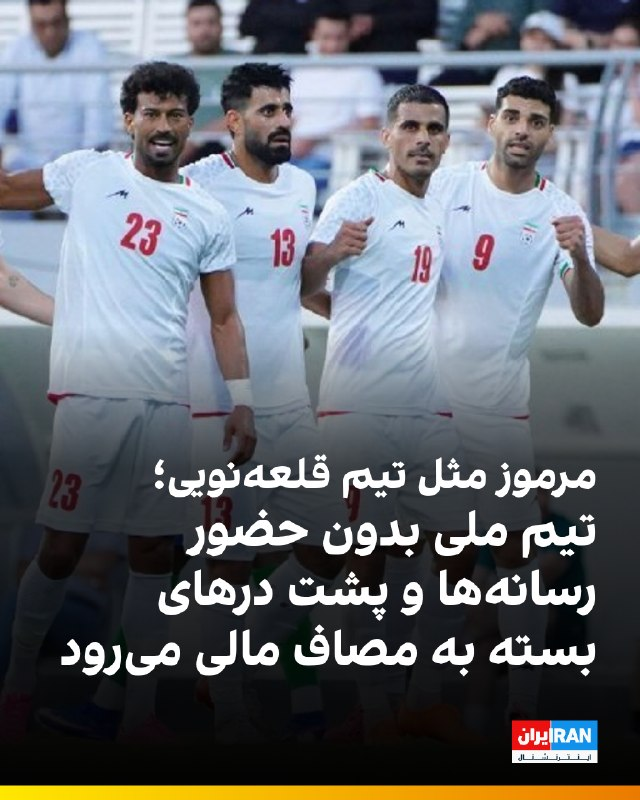

🔻تیم ملی فوتبال ایران در حالی در آخرین دیدار تدارکاتی خود پیش از سفر به مکزیک به مصاف تیم ملی مالی می‌رود که با تصمیم کادرفنی، این بازی پشت درهای بسته و بدون حضور رسانه‌ها برگزار خواهد شد.

🔹این در حالی است که سایر تیم‌های حاضر در جام جهانی با حضور تماشاگران و رسانه‌ها بازی‌های پیش از جام جهانی خود را برگزار کردند و با مراسم ویژه راهی آمریکا شدند اما تیم ملی به دلیل مسائل سیاسی داخل ایران نتوانست بازی‌های تدارکاتی خود را در تهران برگزار کند.

🔹تیم ملی قرار بود در آخرین بازی تدارکاتی خود پیش از جام جهانی در آمریکا به مصاف پورتوریکو برود، اما پس از انتقال کمپ تیم ملی به تیخوانا در مکزیک، این مسابقه لغو شد و شاگردان امیر قلعه‌نویی احتمالا با گرانادا دیدار خواهند کرد.

🔹پیشتر ‌مهدی تاج، رییس فدراسیون فوتبال در گفتگویی تلویزیونی گفت که برای بازی تدارکاتی تیم ملی با مالی،‌ چندین صد هزار دلار پرداخت شده است: «ما ۱۰۰ هزار دلار به مالی دادیم که بیاید، پول هواپیمایشان را دادیم، پول هتلشان را هم دادیم. در این شرایط بازی هماهنگ کردن خیلی سخت است.»

@iranintltvsport

## FarsiVOA — post 219453

  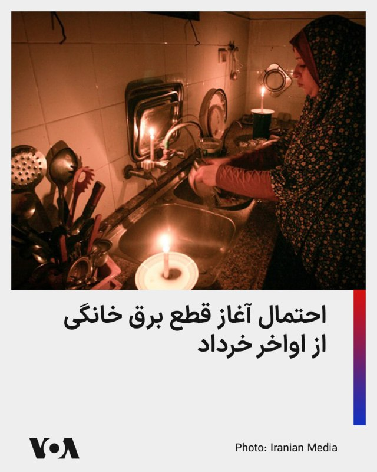

رئیس کمیسیون انرژی اتاق بازرگانی ایران، با اشاره به دستور مسعود پزشکیان مبنی بر عدم قطعی برق صنایع، از احتمال آغاز خاموشی‌های خانگی در هفته‌های آینده خبر داد.

آرش نجفی که با رسانه اقتصاد آنلاین گفتگو می‌کرد، از شهروندان خواست تا خود را برای دست‌کم دو ساعت خاموشی روزانه آماده کنند، زیرا در صورت عدم قطع برق صنایع، باید ناترازی از طریق کاهش مصرف بخش خانگی تامین شود.

او کمبود برق در سال جاری را حدود ۱۲ هزار مگاوات اعلام و پیش‌بینی کرد که مردم باید از اواخر خرداد یا اوایل تیرماه منتظر خاموشی روزانه باشند و این شرایط حدود سه ماه به طول می‌انجامد.

مقامات جمهوری اسلامی شهروندان را دعوت به استفاده از انرژی خورشیدی کرده‌اند، این در حالی است که رئیس سازمان انرژی‌های تجدیدپذیر، هزینه نصب نیروگاه خورشیدی خانگی و تجهیزات ذخیره‌سازی را تا ۷۰۰ میلیون تومان برآورد می‌کند.
@FarsiVOA

## FarsiVOA — post 219452

  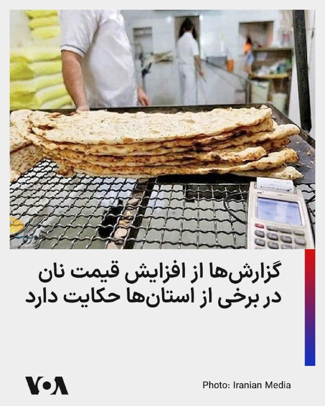

دبیر اجرایی خانه کارگر قزوین، از افزایش ناگهانی قیمت نان خبر داد و اعلام کرد که این امر به صورت رسمی در نانوایی‌های استان قزوین اعمال شده است.

عیدعلی کریمی در گفتگو با خبرگزاری کارگری ایلنا اعلام کرد که قیمت نان لواش یارانه‌ای به هزار و ۹۰۰ تومان، سنگک به هشت هزار و ۵۰۰ تومان و قیمت نان بربری نیز به شش هزار و ۷۵۰ تومان افزایش یافته است.

او این افزایش قیمت را حدود دو برابر دانست و اظهار داشت که قیمت نان در برخی موارد نزدیک به ۱۰۰ درصد رشد داشته است.

روز سه‌شنبه ۱۲ خرداد نیز مجموعه خبری حال‌وش که اخبار استان سیستان و بلوچستان را پوشش می‌دهد، با اعلام حدود دو برابر شدن قیمت نان با دستور استاندار، از افزایش قیمت نان تافتون به ۱۰ هزار تومان خبر داد.

پیشتر مرکز آمار ایران تورم ماهانه خانوارهای کشور تا اردیبهشت ماه را ۸.۸ درصد، تورم نقطه‌به‌نقطه را ۸۳.۹ درصد و تورم سالانه را ۵۷.۷ درصد اعلام کرده بود.
@FarsiVOA

## alonews — post 124726

  <a href="telegram/content/alonews_124726_1780478686.mp4" target="_blank">🎬 Download video</a>

پیام قالیباف به ترامپ

از زبان آیت الله ک.ص زمین خوار اعظم

[@AloTweet]

## alonews — post 124725

  <a href="telegram/content/alonews_124725_1780478688.webm" target="_blank">🎬 Download video</a>

👈ارتش اسرائیل: هشدار تخلیه فوری برای ساکنان شهر خریبه در شهرستان صیدا، جنوب لبنان

✅ @AloNews خبر جنگ

## alonews — post 124724

  <a href="telegram/content/alonews_124724_1780478688.webm" target="_blank">🎬 Download video</a>

👈ادعای ای‌بی‌سی به نقل از مقامات آمریکایی: ترامپ، از تهران می‌خواهد که امتیازات مشخص هسته‌ای را به صورت مکتوب به عنوان بخشی از یک توافق مقدماتی ارائه دهد تا بتوان بر بن‌بست طولانی میان آمریکا و ایران غلبه کرد.

🔴ایران در حال بررسی شرایط به‌روز شده است و مذاکره‌کنندگانش نشان نداده‌اند که آیا تهران این شرایط را می‌پذیرد یا خیر

✅ @AloNews خبر جنگ

---
📅 بروزرسانی: 1405/03/13 12:44
---

## WithYashar — post 13358

سواد ندارین مجبورین نظر بدین ؟ من کاپ عنو بدم دستتون ؟ قبلش تحقیق کنید سریع دهان را باز نکیند ! من دایرکت خیلی خشنم 😈 این دوستمون از پایین غذا میخوره ! چون این یعنی‌حرف های من رو گوش نمیدین من نوشتم آنوسکپی

## WithYashar — post 13357

آندوسکوپی از دهنشه

## WithYashar — post 13356

  

آقا یاشار مهربان

## IranIntlTV — post 340331

  <a href="https://t.me/IranintlTV/340331" target="_blank">📎 Download file</a>

🎧نسخه صوتی اخبار بامدادی | چهارشنبه ۱۳ خرداد
@iranintlTV

## FarsiVOA — post 219451

🔺پس از بازگشایی اینترنت، رسانه‌ها از به‌روزرسانی فیلترینگ می‌گویند

▪️در حالی که مقام‌های دولتی در ایران از بازگشایی اینترنت بین‌الملل سخن می‌گویند، گزارش‌های رسانه‌های داخلی نشان می‌دهد اینترنت به‌طور کامل به شرایط عادی بازنگشته و به‌روزرسانی روش‌های جدید فیلترینگ ادامه دارد.

▪️یک کارشناس حوزه فناوری اطلاعات گفته است که در دوره قطع اینترنت، مسیر خروج بسته‌های اطلاعاتی از کشور از طریق روترها مسدود شده بود و پس از اتصال دوباره، بازگشت کامل شبکه به وضعیت پایدار ممکن است بین یک هفته تا یک ماه زمان ببرد.

▪️او تأکید کرده تجهیزات مرتبط با فیلترینگ به‌طور مداوم در حال به‌روزرسانی بوده و روش‌های جدید اعمال محدودیت‌ها توسعه پیدا می‌کند.

⬇️ بیشتر بخوانید:
https://ir.voanews.com/a/8156856.html

## DW_Farsi — post 125445

  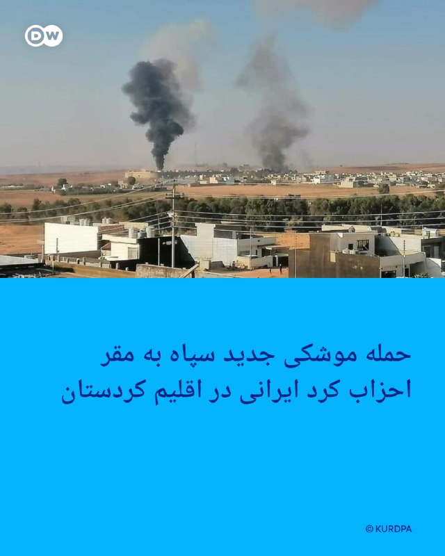

🔶 حمله موشکی جدید سپاه به مقر احزاب کرد ایرانی در اقلیم کردستان

مقرهای دو حزب "کومله زحمتکشان" و "حزب آزادی کردستان" در استان اربیل واقع در اقلیم کردستان عراق هدف حملات موشکی جدیدی قرار گرفتند.

سپاه پاسداران در هفته‌های گذشته با وجود آتش‌بس با آمریکا و اسرائیل به حملات خود علیه پایگاه‌های احزاب کرد در اقلیم کردستان ادامه داده است.

رسانه‌های ایران با استناد به منابع عراقی گزارش دادند در منطقه "دره آلانه" در حدود ۱۲۰ کیلومتری شمال شرق اربیل، مقر احزاب کرد ایرانی هدف حمله قرار گرفته است.

گروه کومله زحمتکشان در بیانیه‌ای تائید کرده است که روز سه‌شنبه ۱۲ خرداد ساعت ۲۳ به وقت محلی دو موشک به مقر این گروه در "دره آلانه" اصابت کرده است.

امجد حسین‌پناهی، مسئول مطبوعاتی کومله زحمتکشان کوردستان در شبکه ایکس نوشته است "جمهوری اسلامی از آغاز جنگ تا کنون، با بیش از ۸۲ موشک و پهپاد، پایگاه‌ها و مقرهای کومه‌له را هدف قرار داده است".

@dw_farsi

## Persian_Trend_Official — post 15621

  <a href="telegram/content/Persian_Trend_Official_15621_1780478062.mp4" target="_blank">🎬 Download video</a>

وزارت خارجه کویت اعلام کرد در اثر اصابت پهپاد ایرانی به فرودگاه بین‌المللی این کشور، یک نفر کشته شده است.

📝 Amir

📌 @persian_trend_official
پرشین ترند | متفاوت‌ترین کانال نظامی

## RadioFarda — post 157845

  <a href="telegram/content/RadioFarda_157845_1780478064.mp4" target="_blank">🎬 Download video</a>

🔸جلال ملکی سخنگوی آتش نشانی تهران از انفجار یک خودروی نیسان یخچال‌دار در جایگاه سوخت گاز در بزرگراه یاسینی، حوالی تهرانپارس در شرق تهران خبر داد.

🔸بر اساس اعلام سازمان آتش‌نشانی، انفجار این خودرو که صبح چهارشنبه ۱۳ خرداد رخ داد، آتش‌سوزی به همراه نداشت، اما به خودرو و بخش‌هایی از جایگاه خسارت وارد کرد و دو مجروح بر جای گذاشت.

🔸به گفته سخنگوی آتش نشانی تهران این انفجار منجر به آتش‌سوزی نشده بود، اما شدت آن باعث وارد آمدن خسارات قابل‌توجه به بدنه خودروی نیسان و بخش‌هایی از سقف و دیواره‌های جایگاه سوخت شده است.

🔸بنابر اعلام آتش‌نشانی علت حادثه مشخص نیست و بررسی‌های فنی برای مشخص شدن منشأ انفجار این خودروی در حال سوخت‌گیری ادامه دارد.

🔸گزارش‌ها حاکی است که در این حادثه راننده ۶۰ ساله نیسان، و یکی از متصدیان جایگاه مصدوم شدند.

🔸همزمان رسانه‌ها به نقل از کاربران از شنیده شدن صدای انفجار در مناطق شرق و شمال شرق تهران در ساعات اولیه روز چهارشنبه خبر داده‌اند.

@Radiofarda

## Hranews — post 113352

  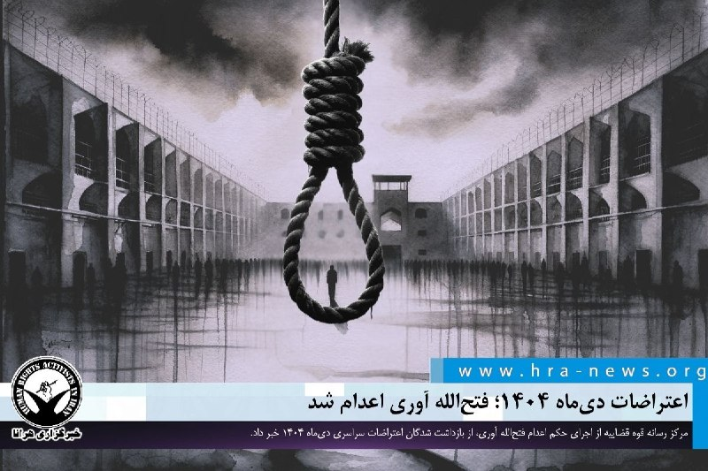

اعتراضات دی‌ماه ۱۴۰۴؛ فتح‌الله آوری اعدام شد

❗️
❗️
❗️
❗️
❗️– مرکز رسانه قوه قضاییه از اجرای حکم اعدام فتح‌الله آوری، از بازداشت شدگان اعتراضات سراسری دی‌ماه ۱۴۰۴، به اتهامات محاربه و قتل خبر داد. همزمان با آغاز درگیری‌های نظامی، روند صدور و اجرای احکام #اعدام در پرونده‌های سیاسی و امنیتی افزایش یافته و تاکنون ۴۰ زندانی در این بازه زمانی در ارتباط با همین پرونده‌ها اعدام شده‌اند.

ادامه مطلب

#فتح‌الله_آوری

↘️
@hranews_bot تماس ✉️ - @Hranews کانال هرانا 🆑

## alonews — post 124723

  <a href="telegram/content/alonews_124723_1780478067.mp4" target="_blank">🎬 Download video</a>

👈حزب الله همچنان داره موشک و پهپاد ول میده سمت اسرائیل

✅ @AloNews خبر جنگ

## alonews — post 124722

  <a href="telegram/content/alonews_124722_1780478068.webm" target="_blank">🎬 Download video</a>

👈از صبح امروز چند خودروی نیروهای حزب‌الله در جنوب لبنان هدف قرار گرفته است و طی آن چندین نفر کشته شد

✅ @AloNews خبر جنگ

---
📅 بروزرسانی: 1405/03/13 12:34
---

## VahidOOnLine — post 243484

  <a href="telegram/content/VahidOOnLine_243484_1780477455.mp4" target="_blank">🎬 Download video</a>

ویدیوی ارسالی به ایران اینترنشنال نشان می‌دهد که گروهی از ایرانیان ساکن ایالت تگزاس آمریکا در حمایت از شاهزاده رضا پهلوی، تجمعی در شهر هیوستون برگزار کردند.
‌🏁 🇬🇧 IranintlTV

🤖 @VahidOOnLine

## VahidOOnLine — post 243483

  

خبرگزاری میزان، وابسته به قوه قضاییه جمهوری اسلامی اعلام کرد حکم اعدام فتح‌الله آوری، از معترضان انقلاب ملی در دی‌ماه ۱۴۰۴، اجرا شد.

قوه قضاییه، فتح‌الله آوری را متهم به «قتل یک مامور انتظامی» کرده بود. جزییاتی از زمان بازداشت و نحوه برگزاری دادگاه فتح‌الله آوری در دست نیست.
iranintl
‌🏁 🇬🇧 IranintlTV

🤖 @VahidOOnLine

## IranIntlTV — post 340330

  <a href="telegram/content/IranIntlTV_340330_1780477457.mp4" target="_blank">🎬 Download video</a>

ویدیوی ارسالی به ایران اینترنشنال نشان می‌دهد که گروهی از ایرانیان ساکن ایالت تگزاس آمریکا در حمایت از شاهزاده رضا پهلوی، تجمعی در شهر هیوستون برگزار کردند.

## IranIntlTV — post 340329

  

خبرگزاری میزان، وابسته به قوه قضاییه جمهوری اسلامی اعلام کرد حکم اعدام فتح‌الله آوری، از معترضان انقلاب ملی در دی‌ماه ۱۴۰۴، اجرا شد.

قوه قضاییه، فتح‌الله آوری را متهم به «قتل یک مامور انتظامی» کرده بود. جزییاتی از زمان بازداشت و نحوه برگزاری دادگاه فتح‌الله آوری در دست نیست.
iranintl.com/202606033912

## Persian_Trend_Official — post 15620

  <a href="telegram/content/Persian_Trend_Official_15620_1780477459.webm" target="_blank">🎬 Download video</a>

⭕️ اسرائیل به فارسی:

چیزی برای دفن کردن باقی مانده؟

📝 Nick

📌 @persian_trend_official
پرشین ترند | متفاوت‌ترین کانال نظامی

## RadioFarda — post 157844

شلیک موشک‌های سپاه به اهدافی در منطقه؛ سنتکام حمله به نقاطی در قشم را تأیید کرد

🔸نخستین دقایق و ساعات چهارشنبه ۱۳ خردادماه، کشورهای حاشیۀ خلیج فارس شاهد جدی‌ترین دور خشونت‌ها در طول نزدیک به دو ماهی که از آتش‌بس آمریکا و اسرائیل با ایران می‌گذرد، بودند.

🔸ابتدا فرماندهی مرکزی نیروهای آمریکایی (سنتکام) در منطقه از شلیک موشک به موتورخانۀ یک نفتکش خالی در مسیر خارک خبر داد. بر اساس بیانیۀ این ستاد نظامی، نفتکش ام‌تی لِکسی که با پرچم بوتسوانا به سمت یکی از پایانه‌های نفتی جزیرۀ خارک در حرکت بوده، پس از بی‌توجهی مکرر به پیام‌های اخطار نیروی دریایی ایالات متحده، با شلیک یک مو‌شک هِل‌فایِر متوقف می‌شود.

🔸اندکی پس از انتشار بیانیۀ سنتکام، خبرگزاری‌های داخلی ایران از شنیده‌شدن صدای چند انفجار در جزیرۀ قشم خبر دادند.

🔸در سمت دیگر خلیج فارس هم،‌ ابتدا ساکنان کویت و بحرین، و دقایقی بعد، اهالی امارات متحده عربی و عربستان سعودی شاهد به صدا درآمدن آژیر‌های خطر حمله هوایی بودند؛ هشدارهایی که به سرعت با صدای چندین انفجار دنبال شد.

🔸ارتش کویت به سرعت در بیانیه‌ای اعلام کرد که مشغول رهگیری حملات موشکی و پهپادی است و از مردم این کشور خواست که دستور‌العمل‌های ایمنی را دنبال کنند.

🔸این بیانیه بدون اشاره به مبدأ حملات موشکی و پهپادی، تأکید کرده بود که همۀ صداهای انفجار، ناشی از عملیات رهگیری پرتابه‌های تهاجمی بوده است.

🔸از سوی دیگر وزارت کشور بحرین هم از به‌صدا در آمدن آژیر اخطار حملۀ‌ هوایی خبر داد و از شهروندان و ساکنان این کشور خواست ضمن حفظ آرامش، به نزدیک‌ترین پناهگاه بروند.

🔸سنتکام هم با صدور بیانیه‌ای دیگر، حمله به نقاطی در جزیره قشم، «در پاسخ به حملات موشکی و پهپادی جمهوری اسلامی» را تأیید کرد.
🔸در این بیانیه آمده بود که نیروهای آمریکایی «با موفقیت چندین موشک بالستیک و پهپاد شلیک‌شده از ایران را رهگیری و منهدم کرده و در اقدامی دفاعی، نقاطی در جزیرۀ قشم را هدف قرار داده‌اند».

🔸نسخه کامل این گزارش را در وب‌سایت رادیوفردا بخوانید.

## alonews — post 124721

  <a href="telegram/content/alonews_124721_1780477459.mp4" target="_blank">🎬 Download video</a>

🔴رفتار عجیب زائر ایرانی در عربستان

🔴میدونستین بابت این سنگ ها پول میدن؟ پول میدن سنگ میخرن که برن به شیطان سنگ بزنن!

🤔عربستان خوب احمق هایی گیر آورده برای کسب درآمد.

✅@AloNews

## alonews — post 124720

  <a href="telegram/content/alonews_124720_1780477462.webm" target="_blank">🎬 Download video</a>

👈یک کارشناس شبکه: اختلالات پس از بازگشایی مجدد اینترنت، ناشی از بازسازی مسیرهای ارتباطی است

🔴 به‌روزرسانی روش‌ها و تکنیک‌های جدید فیلترینگ هم ادامه دارد

✅ @AloNews خبر جنگ

---
📅 بروزرسانی: 1405/03/13 12:25
---

## WithYashar — post 13355

## WithYashar — post 13354

درود آقا یاشار مهربان
تحلیل هاتون خیلی جالبه
جوری توضیح میدید که درکش برای همه راحت باشه
سپاس از شما🙏🌹😊

## mwarmonitor — post 10079

🚨 تصاویر اولیه از فرودگاه کویت پس از حمله جمهوری اسلامی. @mwarmonitor

## mwarmonitor — post 10078

  <a href="telegram/content/mwarmonitor_10078_1780476917.mp4" target="_blank">🎬 Download video</a>

🔴پهپادهای تهاجمی اوکراینی صبح امروز با موفقیت به پایگاه دریایی کرونشتات روسیه حمله کردند و ناوچه کلاس «استرهگوشچی» به نام «بویکی» (Boikiy) را که در حوضچه خشک قرار داشت، هدف قرار داده و به‌شدت آسیب زدند.

🔸«بویکی» یکی از توانمندترین ناوهای سطحی در ناوگان بالتیک نیروی دریایی روسیه به شمار می‌رفت.

@mwarmonitor

## DW_Farsi — post 125444

  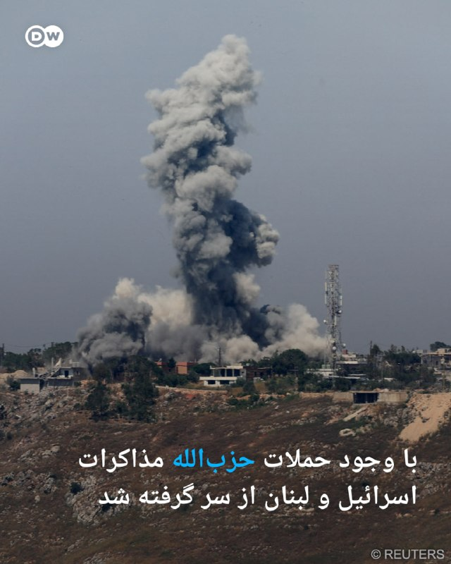

🔶 با وجود حملات حزب‌الله مذاکرات اسرائیل و لبنان از سر گرفته شد

هیئت‌های نمایندگی لبنان و اسرائیل روز سه‌شنبه ۱۲ خرداد (۲ ژوئن) در وزارت خارجه آمریکا در واشنگتن دیدار کردند تا دور برنامه‌ریزی‌شده دو روزه مذاکرات را از سر بگیرند.

در این نشست ندا حماده معوض، سفیر لبنان در واشنگتن، با همتای اسرائیلی‌اش یخیل لایتر، در وزارت خارجه آمریکا حضور دارند.

ریاست هیئت آمریکایی را مایک نیدهام، معاون دستیار رئیس‌جمهور و معاون مشاور امنیت ملی آمریکا بر عهده دارد.

بر اساس گزارش‌ها اعضای هیئت اسرائیلی گفته‌اند که حزب‌الله با وجود تعهدی که روز دوشنبه به دونالد ترامپ، رئیس‌جمهور آمریکا داده بود، به درگیری‌ها ادامه می‌دهد.

اعضای هیئت اسرائیلی اعلام کردند که حزب‌الله به‌طور علنی طرح "آتش‌بس در جنوب لبنان در برابر آتش‌بس در شمال اسرائیل" را رد کرده است.

@dw_farsi

## Persian_Trend_Official — post 15611

  <a href="telegram/content/Persian_Trend_Official_15611_1780476920.mp4" target="_blank">🎬 Download video</a>

حمله پهپادی اوکراین به تأسیسات نفتی سن‌پترزبورگ همزمان با آغاز SPIEF 2026

در نخستین ساعات آغاز مجمع اقتصادی بین‌المللی سن‌پترزبورگ (SPIEF 2026)، گزارش‌هایی از حمله پهپادهای انتحاری اوکراینی از نوع Liuty و FP-1 به یک ترمینال نفتی در حومه این شهر منتشر شده است.

بر اساس این گزارش‌ها، هدف حمله تأسیسات نفتی در نزدیکی مرکز نمایشگاهی ExpoForum عنوان شده؛ جایی که محل برگزاری این رویداد اقتصادی مهم است. نزدیکی این حمله به محل برگزاری اجلاس، توجه رسانه‌ها را به هم‌زمانی هدف و زمان عملیات جلب کرده است.

اوکراین در ماه‌های اخیر به‌طور فزاینده از پهپادهای دوربرد برای حمله به زیرساخت‌های انرژی در عمق خاک روسیه از خاک کشور های حوزه بالتیک استفاده کرده است.

📌 @persian_trend_official
پرشین ترند | متفاوت‌ترین کانال نظامی

## Persian_Trend_Official — post 15610

  <a href="telegram/content/Persian_Trend_Official_15610_1780476923.mp4" target="_blank">🎬 Download video</a>

⭕️ ناو هواپیمابر یو اس اس نیمیتز (CVN-68) در کینگستون، جامائیکا برای بازدید بندری پهلو گرفته است.

📝 Nick

📌 @persian_trend_official
پرشین ترند | متفاوت‌ترین کانال نظامی

## alonews — post 124719

  <a href="telegram/content/alonews_124719_1780476925.webm" target="_blank">🎬 Download video</a>

👈وزارت خارجه کویت: یک نفر در حمله دیشب کشته شد

✅ @AloNews خبر جنگ

## alonews — post 124718

  <a href="telegram/content/alonews_124718_1780476925.webm" target="_blank">🎬 Download video</a>

👈مقامات آمریکایی و یک منبع مطلع دیگر به شبکه آمریکایی ای‌بی‌سی نیوز گفته‌اند که دونالد ترامپ، رئیس‌جمهور آمریکا، از تهران می‌خواهد به صورت مکتوب، امتیازات هسته‌ای مشخصی را به‌ عنوان بخشی از یک توافق اولیه با آمریکا ارائه دهد

✅ @AloNews خبر جنگ

## alonews — post 124717

  <a href="telegram/content/alonews_124717_1780476926.webm" target="_blank">🎬 Download video</a>

👈فیلد مارشال ، محسن رضایی: پاسخ هر شلیک و تجاوزی رگباری از موشک و پهپاد است.

✅ @AloNews خبر جنگ

---
📅 بروزرسانی: 1405/03/13 12:15
---

## mwarmonitor — post 10077

  <a href="telegram/content/mwarmonitor_10077_1780476302.mp4" target="_blank">🎬 Download video</a>

🚨 تصاویر اولیه از فرودگاه کویت پس از حمله جمهوری اسلامی.

@mwarmonitor

## mwarmonitor — post 10076

🔴ترامپ در تصمیم‌گیری‌های نظارتی که زمانی توسط نهادهای مستقل انجام می‌شد، دخالت کرده است؛ این موضوع بر اساس مصاحبه با مدیران اجرایی، لابی‌گران و مقام‌ها گزارش شده و باعث تغییر توازن قدرت در واشنگتن و بازآرایی شیوه‌های اعمال نفوذ و لابی‌گری شده است. وال‌استریت ژورنال

@mwarmonitor

## Persian_Trend_Official — post 15609

  <a href="telegram/content/Persian_Trend_Official_15609_1780476304.mp4" target="_blank">🎬 Download video</a>

⭕️ پست اینستاگرامی‌ دیگری از بنیامین نتانیاهو:

رومن گافمن در سن ۱۴ سالگی به همراه والدینش، لودمیلا و ولادیسلاو، به اسرائیل مهاجرت کرد. آنها از بلاروس به اشدود مهاجرت کردند.

رومن به تنهایی راه خود را پیدا کرد و بر همه مشکلات غلبه کرد. پس از سال‌ها خدمت در ارتش، من او را به عنوان دبیر نظامی خود در سرنوشت‌سازترین دوره برای کشور انتخاب کردم.

امروز، پس از انتخاب او برای این سمت، او رسماً ریاست موساد را بر عهده می‌گیرد.

از طرف خودم و از طرف تمام مردم یهود به شما تبریک می‌گویم.

رومن، موفق باشی! 🇮🇱

📝 Nick

📌 @persian_trend_official
پرشین ترند | متفاوت‌ترین کانال نظامی

## Persian_Trend_Official — post 15608

  <a href="telegram/content/Persian_Trend_Official_15608_1780476307.mp4" target="_blank">🎬 Download video</a>

⭕️ بنیامین نتانیاهو:

برای رئیس موساد، رومن گافمن، آرزوی موفقیت دارم!

📝 Nick

📌 @persian_trend_official
پرشین ترند | متفاوت‌ترین کانال نظامی

## Persian_Trend_Official — post 15607

نقش حسین سلامی در شکل‌گیری دکترین جنگی جمهوری اسلامی

، حسین سلامی در فاصله سال‌های ۱۳۷۱ تا ۱۳۷۶ مؤسس و فرمانده «دوره عالی جنگ» در سپاه بوده است؛ مرکزی که به‌عنوان یکی از پایه‌های آموزش راهبردی نظامی در جمهوری اسلامی شناخته می‌شود.

در این دوره، آموزش و طراحی مفاهیم دکترین نظامی و همچنین چارچوب‌های کلان مقابله نظامی ایران با آمریکا، به‌صورت ساختاری دنبال شده است. این مرکز بعدها به یکی از نهادهای اثرگذار در تربیت فرماندهان ارشد نظامی تبدیل شد.

همچنین تأکید شده که سلامی با پیوند تجربه‌های میدانی دوران دفاع مقدس و آموزش دانشگاهی، نقش مهمی در تربیت نسل جدیدی از فرماندهان و توسعه ادبیات راهبردی نظامی ایفا کرده است.

در گزارش آمده فعالیت‌های آموزشی او از تأسیس دوره عالی جنگ (دافوس) تا تدریس در دانشگاه عالی دفاع ملی ادامه داشته و این روند در شکل‌دهی به شبکه فرماندهان ارشد نظامی اثرگذار بوده است.

از جمله دانش‌آموختگان این دوره می‌توان به چهره‌های ارشد سپاه هم چون غلام علی رشید ،یحیی رحیم صفوی محمدباقر ذوالقدر اشاره شده است.

این روایت، نشان‌دهنده نقش نهادهای آموزشی نظامی سپاه در شکل‌دهی به دکترین امنیتی و راهبردی ایران در دهه‌های اخیر شکل داده است؛

👺Phantom

📌 @persian_trend_official
پرشین ترند | متفاوت‌ترین کانال نظامی

## alonews — post 124716

  <a href="telegram/content/alonews_124716_1780476310.webm" target="_blank">🎬 Download video</a>

👈وزارت خارجه : اقدام آمریکا نقض آتش بس است

✅ @AloNews خبر جنگ

---
📅 بروزرسانی: 1405/03/13 12:03
---

## WithYashar — post 13353

خبرهای تایید نشده از اینکه که سه نفر از وطن پرست ها مجری محمدرضا شهبازی رو گیر میارن و بهش تجاوز میکنن به همین دلیل هم برنامه پاورقی فعلا متوقف شده @withyashar

## WithYashar — post 13352

@withyashar

## mwarmonitor — post 10075

  

فوری ‼️ هشدار فوری به ساکنان لبنان که در روستاها و مناطق زیر حضور دارند: جباع، حومین الفوقا، اَرکی

🔸 در پی نقض توافق آتش‌بس توسط حزب‌الله و حمله به جبهه داخلی اسرائیل، ارتش اسرائیل ناچار است با قدرت علیه آن در مناطق شما اقدام کند. ارتش اسرائیل قصد آسیب رساندن به شما را ندارد.

🔸 برای حفظ جان خود، فوراً خانه‌های خود را تخلیه کرده و از روستاها و شهرها به فاصله حداقل ۱۰۰۰ متر به مناطق باز دور شوید.

🔸 هر کسی که در نزدیکی عناصر حزب‌الله، تأسیسات یا تجهیزات نظامی آن‌ها حضور داشته باشد، جان خود را در معرض خطر قرار می‌دهد.

@mwarmonitor

## mwarmonitor — post 10074

  

📊منحنی تقاضای فرانسه تغییر کرده است.

📌موج گرمای هفته گذشته در سراسر اروپای غربی باعث تغییر در منحنی بار مصرف برق فرانسه شد. استفاده از تهویه مطبوع حدود ۳ تا ۴ گیگاوات به تقاضای بعدازظهر اضافه کرد و اوج مصرف را از ساعت ۱۰ صبح به حدود ۵ عصر (به وقت UTC) منتقل کرد.

🔸تولید انرژی خورشیدی بخش زیادی از افزایش مصرف در میانه روز را پوشش داد، اما با کاهش تولید خورشیدی، سطح تقاضا همچنان بالا باقی ماند. نتیجه این وضعیت، واکنش شدید قیمت‌ها در ساعات عصر بود؛ به‌طوری‌که قیمت‌های هر ۱۵ دقیقه از ۱۷۰ یورو بر مگاوات‌ساعت فراتر رفت و نیروگاه‌های انعطاف‌پذیر وارد مدار شدند تا پاسخگوی تقاضا باشند.

@mwarmonitor

## FarsiVOA — post 219450

  <a href="telegram/content/FarsiVOA_219450_1780475634.mp4" target="_blank">🎬 Download video</a>

تصاویری از حملات ارتش اوکراین به پایانه نفتی سن‌پترزبورگ روسیه و مرکز تولید تسلیحات در تامبوف؛

ولودیمیر زلنسکی، رئیس جمهور اوکراین، با انتشار تصاویری در حساب ایکس خود از حملات ارتش این کشور به پایانه نفتی سن‌پترزبورگ روسیه و همچنین یک مرکز تولید تسلیحات در منطقه تامبوف خبر داد.

رئیس جمهور اوکراین اعلام کرد نیروهای این کشور در حمله‌ای شبانه پایانه نفتی سن‌پترزبورگ روسیه را هدف قرار داده‌اند؛ حمله‌ای در فاصله حدود ۱۱۰۰ کیلومتری مرز اوکراین که نشان می‌دهد جنگ پهپادی و دوربرد دو کشور وارد مرحله تازه‌ای شده است.

آقای زلنسکی در پیامی نوشت اهدافی در پایگاه کرونشتات و همچنین یک مرکز مرتبط با تولید تسلیحات در منطقه تامبوف نیز هدف قرار گرفته‌اند. او این اهداف را «صرفاً نظامی» توصیف کرد.
@FarsiVOA

## FarsiVOA — post 219449

  

رسانه‌های لبنانی گزارش داده‌اند که ارتش اسرائیل از نیمه‌شب تا ساعت ۹ صبح، چندین نقطه در جنوب لبنان را هدف حملات هوایی و پهپادی قرار داده است.

بر اساس این گزارش‌ها، جنگنده‌های ارتش اسرائیل مناطقی در دیر کانون، راس‌العین، تبنین، صدیقین، بآزوریه، بلات، عربصالیم و روستای تبنیت را هدف قرار داده‌اند.

هم‌زمان، حملات پهپادی نیز در الحوش، عربصالیم، ارنون، کنا، دیر الزهرانی، صدیقین، بآزوریه و صریفا گزارش شده است.

این حملات در حالی انجام شده که ارتش اسرائیل در روزهای اخیر فشار نظامی خود در جنوب لبنان را حفظ کرده و حزب‌الله نیز، برخلاف روزهای پرحجم‌تر گذشته، واکنش‌های خود را عمدتاً به اهداف نظامی در جنوب لبنان محدود کرده است.

گزارش‌های اولیه هنوز جزئیاتی از تلفات یا میزان خسارت‌های این حملات ارائه نکرده‌اند.
@FarsiVOA

## Persian_Trend_Official — post 15604

یکی از دو ناوهواپیمابر امریکا در منطقه در فاصله 335 کیلومتری سواحل ایران مستقر شده است.

ناوهواپیمابر ابراهام لینکن یا بوش با استقرار در جنوب دریای عمان در فاصله 335 کیلومتری سواحل ایران قرار گرفته است.

📝 Amir

📌 @persian_trend_official
پرشین ترند | متفاوت‌ترین کانال نظامی

## RadioFarda — post 157843

قتل فجیع زن ترنس؛ خانواده مهشید فلاحی «از تحویل گرفتن جنازه‌اش خودداری کرده‌اند»

🔸رسانه‌های حقوق بشری و حامی حقوق اقلیت‌های جنسی و جنسیتی در ایران می‌گویند با وجود گذشت دو هفته از قتل فجیع مهشید فلاحی، زن ترنس ۳۰ ساله در سنندج، خانوادهٔ او از «تحویل‌گرفتن» پیکرش خودداری می‌کنند.

🔸سازمان حقوق بشری هه‌نگاو نوشته است مهشید فلاحی که پیشتر از سوی خانوادهٔ خود «طرد» شده بود و در وضعیت «بی‌خانمانی و کارتن‌خوابی» به سر می‌برد، در پی حمله با چاقو بە‌‌طرز فجیع به قتل رسیده است.

🔸با این حال بر اساس این گزارش که روز سه‌شنبه ۱۲ خرداد منتشر شد، تاکنون هیچ‌ یک از اعضای خانوادهٔ او برای تحویل پیکرش به پزشکی قانونی یا سردخانه «مراجعه» نکرده‌اند و پیکر او همچنان در وضعیت بلاتکلیف در یکی از سردخانه‌های سنندج باقی مانده است.

🔸علاوه بر این، یک مددکار اجتماعی در گفتگو با هەنگاو گفته است به‌رغم گذشت نزدیک به دو هفته از وقوع این قتل، تاکنون فرد یا افرادی در ارتباط با قتل مهشید فلاحی بازداشت نشده است.

🔸هه‌نگاو همچنین نوشته به نام شناسنامه‌ای فلاحی دسترسی دارد، اما از آن‌جا که او مثل بسیاری از افراد ترنس در فرایند گذار جنسیتی نام شناسنامه‌ای خود را تغییر داده، از انتشار نام قبلی‌اش که در ادبیات مربوط به این حوزه «نام مُرده» نام دارد، خودداری می‌کند.

🔸شبکه «شش رنگ» که اخبار مربوط به حقوق اقلیت‌های جنسی و جنسیتی را پوشش می‌دهد، نیز جزئیات هولناکی از وضعیت پیکر این زن ترنس بعد از قتل را منتشر کرده است.

🔸اقلیت‌های جنسی و جنسیتی در ایران با تبعیض‌های گسترده‌ای روبه‌رو هستند و حتی مقامات ارشد جمهوری اسلامی گاه با القاب نفرت‌انگیزی آن‌ها را مورد خطاب داده و «غیرانسان یا بیمار» می‌خوانند.

🔸در سال‌های گذشته اسناد و گزارش‌های متعددی از آزار، خشونت و قتل افرادی از اقلیت‌های جنسی و جنسیتی در ایران منتشر شده اما بسیاری از این موارد به‌دلیل فشارهای امنیتی، تهدید فعالان و نبود ساختارهای حمایتی و قانونی، هرگز به‌درستی ثبت یا پیگیری نشده‌اند.

🔸نسخه کامل این گزارش را در وب‌سایت رادیوفردا بخوانید.

@Radiofarda

## BBCPersian — post 282754

🔻اگر تا شروع سال ۲۰۲۷ آتش‌بس نشود، اقتصاد جهان «لطمه شدیدی» خواهد دید

🔻سازمان همکاری و توسعه و اقتصادی هشدار داد که جنگ در خاورمیانه به چشم‌انداز رشد اقتصادی در سراسر جهان آسیب رسانده است و اگر تا قبل از سال ۲۰۲۷ آتش‌بس موثری برقرار نشود، احتمالا اقتصاد دنیا لطمه شدیدتری خواهد دید.

این سازمان که متشکل از ۳۸ کشور صنعتی جهان است، در به‌روزرسانی سه‌ماهه خود اعلام کرد که اگر صادرات نفت و گاز خلیج فارس در سه‌ماهه سوم سال جاری میلادی به سطح قبل از جنگ برگردد، رشد اقتصادی جهان برای سال ۲۰۲۶ به ۲/۸ درصد تنزل می‌کند.

پیشتر، این سازمان رشد اقتصاد جهانی را ۲/۹ درصد پیش‌بینی کرده بود.

این سازمان گفت اگر جنگ خاورمیانه تا سال آینده ادامه یابد، رشد جهانی می‌تواند به ۲/۱ درصد کاهش یابد که بسیار کمتر از میانگین رشد سالانه ۳/۴ درصد است که از سال ۲۰۱۳ تا ۲۰۱۹، قبل از همه‌گیری کرونا دیده می‌شد.

استفانو اسکارپتا، اقتصاددان ارشد این سازمان در این گزارش گفت: «هرچه اختلالات طولانی‌تر شوند، هزینه‌های اقتصادی و اجتماعی بیشتر می‌شود.»

او خاطرنشان کرد که با ادامه این وضعیت، بسیاری از کشورها در خطر رکود اقتصادی قرار خواهند گرفت و کاهش سرمایه‌گذاری، «از جمله در هوش مصنوعی که به انرژی زیادی نیاز دارد»، احتمالا بیکاری را افزایش خواهد داد.

@BBCPersian

## Dirty_Kids — post 390900

  <a href="telegram/content/Dirty_Kids_390900_1780475636.mp4" target="_blank">🎬 Download video</a>

باکسکشی کار میکنیم...
هندزفری 🔞

@Dirty_Kids 👻

## Dirty_Kids — post 390899

  

عکس این بانو ورزشکار خیلی وایرال شده
دلیلشم پرواضحه

@Dirty_Kids 👻

## alonews — post 124715

  <a href="telegram/content/alonews_124715_1780475638.webm" target="_blank">🎬 Download video</a>

👈فایننشال‌تایمز به نقل از یکی از بزرگ‌ترین مالکان کشتی جهان: پرداخت ۲۰۰ هزار دلار عوارض برای هر عبور از هرمز بهتر از انسداد یا اختلال در آن است

✅ @AloNews خبر جنگ

---
📅 بروزرسانی: 1405/03/13 11:53
---

## VahidOOnLine — post 243482

  <a href="telegram/content/VahidOOnLine_243482_1780475029.mp4" target="_blank">🎬 Download video</a>

♦️پس از سه ماه خاموشی دیجیتال، با وصل تدریجی اینترنت در ایران، ویدیوهای جدیدی از بمباران مجتمع پارس جنوی عسلویه در شبکه‌های اجتماعی منتشر شده و واکنش کاربران را برانگیخته است.

اسرائیل در دوران پیش از آتش‌بس دو مرتبه مجتمع پارس جنوبی را بمباران کرد. دفعه اول در تاریخ ۲۸ اسفند (در هفته سوم جنگ) و دفعه دوم  در ۱۷ فروردین ماه.

دونالد ترامپ، رئیس جمهوری آمریکا پس از بمباران اول گفته مسئول این حمله اسرائیل بود و زیرساخت‌های نفت و گاز ایران هرگز دوباره هدف حمله قرار نخواهد گرفت. با این حال اسرائیل در آخرین روزهای پیش از آتش‌بس اعلام کرد با بمباران عسلویه، جمهوری اسلامی ایران را صادرات ۸۵ درصد محصولات پتروشیمی محروم کرده است.

وال‌استریت ژورنال هفته گذشته با انتشار گزارشی به نقل از «منابع آگاه» ناشناس گزارش کرد که امارات متحده عربی در حمله به عسلویه، نقش داشته است.
‌🇸🇦 Indypersian

🤖 @VahidOOnLine

## mwarmonitor — post 10073

📊دو سوم سنگ آهک (limestone) که در سطح جهان معامله می‌شود، از تنگه هرمز عبور می‌کند.

📈هند زمانی نیمی از تجارت جهانی سنگ آهک را برای صنعت سیمان و فولاد خود وارد می‌کرد. باقی این واردات عمدتاً مربوط به بنگلادش بود.

📌اگر تنگه به‌زودی باز نشود، هند و بنگلادش مجبور خواهند شد تولید فولاد خود را کاهش دهند و سیمان بیشتری وارد کنند.

@mwarmonitor

## IranIntlTV — post 340328

  <a href="telegram/content/IranIntlTV_340328_1780475032.mp4" target="_blank">🎬 Download video</a>

جاویدنامان انقلاب ملی ایرانیان
«ایلیا دهقانی» شامگاه ۱۹ دی‌ماه در جریان اعتراضات در منطقه تهرانپارس تهران با شلیک گلوله جنگی از سوی تک‌تیراندازی مستقر بر پشت‌بام هدف قرار گرفت. نامش در حافظه‌ی این سرزمین می‌ماند و یادش چراغ راه آزادی‌خواهان است.
@iranintltv

## FarsiVOA — post 219448

  

ویترز در گزارشی تحلیلی نوشت در حالی که بازار جهانی نفت بر اختلال صادرات خاورمیانه و افزایش عرضه آمریکا متمرکز شده، آمریکای جنوبی آرام و کم‌صدا به یکی از منابع مهم تازه عرضه نفت خام تبدیل شده است.

بر اساس داده‌های شرکت کپلر، تعطیلی تقریباً کامل تنگه هرمز از ماه مارس باعث شده صادرات نفت خاورمیانه در فاصله ژانویه تا مه نسبت به سال قبل بیش از یک‌چهارم کاهش یابد.

در همین دوره، صادرات نفت آمریکای جنوبی حدود ۱۵۵ میلیون بشکه افزایش یافته است. صادرات نفت آمریکای جنوبی در پنج ماه نخست سال به رکورد ۷۸۷ میلیون بشکه رسیده است.

براساس این گزارش صادرات نفت آمریکا نیز در ژانویه تا مه نسبت به سال قبل حدود ۱۱۲ میلیون بشکه بیشتر شده است.

رویترز می‌گوید رشد سریع برخی کشورها، سرمایه‌گذاری اکسون‌موبیل و افزایش احتمالی صادرات ونزوئلا می‌تواند نقش این منطقه را به‌عنوان منبع مهم نفت خارج از خاورمیانه تقویت کند.
@FarsiVOA

## Persian_Trend_Official — post 15603

  <a href="telegram/content/Persian_Trend_Official_15603_1780475035.mp4" target="_blank">🎬 Download video</a>

ویدیویی از جولان شب گذشته پهپاد انتحاری شاهد-136 برفراز کویت

📝 Amir

📌 @persian_trend_official
پرشین ترند | متفاوت‌ترین کانال نظامی

## Persian_Trend_Official — post 15601

اصابت پهپاد شاهد-136 به پایانه فرودگاه بین‌المللی کویت

وزارت دفاع کویت اعلام کرد چند پهپاد انتحاری نیز در حمله شب گذشته به پایانه مسافربری فرودگاه کویت اصابت کردند که منجر به خسارت شدید و زخمی شدن چند نفر شده است.

📝 Amir

📌 @persian_trend_official
پرشین ترند | متفاوت‌ترین کانال نظامی

## Hranews — post 113351

  

دبیرکل جمعیت مبارزه با استعمال دخانیات، از افزایش چشمگیر مصرف دخانیات در میان دختران ۱۳ تا ۱۵ ساله در ایران خبر داد و اعلام کرد که این میزان نسبت به سال ۱۳۹۵، حدود ۱۳۵٪ رشد داشته است. به گفته محمدرضا مسجدی، در حال حاضر حدود ۲۰ تا ۲۴٪ جمعیت کشور به نوعی مصرف‌ کننده دخانیات هستند و اگرچه نرخ مصرف در میان زنان همچنان پایین‌تر از مردان است، اما روند افزایشی در میان دختران نوجوان، به‌ویژه در سال‌های اخیر، به‌عنوان یک زنگ خطر جدی مطرح شده است.

↘️
@hranews_bot تماس ✉️ - @Hranews کانال هرانا 🆑

---
📅 بروزرسانی: 1405/03/13 11:43
---

## VahidOOnLine — post 243481

  <a href="telegram/content/VahidOOnLine_243481_1780474434.mp4" target="_blank">🎬 Download video</a>

ویدیوی رسیده به ایران اینترنشنال نشان می‌دهد که تعدادی دانش‌آموز با شعار «جاوید شاه» در اعتراض به کشته‌شدن هزاران تن از هموطنان خود به دست حکومت، عکس بنیان‌گذار جمهوری اسلامی را در مدرسه دخترانه پاره کردند.
‌🏁 🇬🇧 IranintlTV

🤖 @VahidOOnLine

## mwarmonitor — post 10072

🔴 خبرنگار الجزیره: یک حمله هوایی با پهپاد اسرائیل شهرک النبطیه الفوقا در جنوب لبنان را هدف قرار داد.

@mwarmonitor

## pm_afshaa — post 92206

اسرائیل دستور تخلیه سه شهر در منطقه صیدا در مرکز لبنان را صادر کرد

💧 Rainbet.com the #1 Non-KYC Crypto Casino & Sportsbook @rainbetcom

😁 @Pm_Afshaa

## IranIntlTV — post 340327

  <a href="telegram/content/IranIntlTV_340327_1780474436.mp4" target="_blank">🎬 Download video</a>

ویدیوی رسیده به ایران اینترنشنال نشان می‌دهد که تعدادی دانش‌آموز با شعار «جاوید شاه» در اعتراض به کشته‌شدن هزاران تن از هموطنان خود به دست حکومت، عکس بنیان‌گذار جمهوری اسلامی را در مدرسه دخترانه پاره کردند.

## alonews — post 124714

  <a href="telegram/content/alonews_124714_1780474438.webm" target="_blank">🎬 Download video</a>

👈دانشگاه آزاد اسلامی: تاریخ امتحانات ۱۸ و ۱۹ تیرماه دانشگاه آزاد اسلامی به روزهای ۲۲ و ۲۳ تیرماه تغییر کرد

🔴این تصمیم به منظور جلوگیری از تداخل امتحانات پایان ترم دانشجویان مقطع کارشناسی با آزمون کارشناسی ارشد 1405 اتخاذ شده است

✅ @AloNews خبر جنگ

## alonews — post 124713

  <a href="telegram/content/alonews_124713_1780474438.mp4" target="_blank">🎬 Download video</a>

👈خوش‌چشم، تحلیلگر صداوسیما: احتمالا نگرفتن انتقام شهدای اخیر، به‌خاطر حفظ جان قالیباف بود!

✅ @AloNews خبر جنگ

## alonews — post 124712

  <a href="telegram/content/alonews_124712_1780474441.webm" target="_blank">🎬 Download video</a>

👈براساس تازه‌ترین داده‌های هواشناسی، از بعدازظهر امروز تا اواخر روز جمعه پایتخت و شهرهای اطراف آن شاهد وزش بادهای شدید و خیزش گردوخاک خواهند بود.

🔴در روز پنجشنبه با افزایش ناپایداری جوی، در بعضی ساعات با تشدید وزش باد و بارش پراکندهٔ باران همراه خواهد شد.

✅ @AloNews خبر جنگ

---
📅 بروزرسانی: 1405/03/13 11:34
---

## VahidOOnLine — post 243480

🗣روایت شما از بحران اقتصادی و زندگی در آتش‌بس- چهارشنبه ۱۳ خرداد:

🔹از دورود لرستان پیام می‌دم؛ تورم به مردم فشار زیادی آورده. حقوق زیر ۵۰ میلیون تومان دیگه کفاف یک زندگی ۴ نفره رو نمی‌ده.

🔹من یک کارمندم با حقوق ۲۰ میلیون تومان. نصفش این دستمزد می‌ره برای اجاره خونه، نصفش هم خرج دارو و دکتر می‌کنم، دیگه برای خوراک و پوشاک چیزی نمی‌مونه.

🔹از اصفهان پیام می‌دم؛ ۵۱ سالمه و مدام از درد دست و پاهام رنج می‌برم. یک هفته پیش رفتم پیش یک دکتر ارتوپد پول ویزیتش یک میلیون تومان بود. دو تا عکس برام نوشت هر کدوم ۴ میلیون هزینه داشت. پول نداشتم قیدش رو زدم.

🔹متاسفانه اوضاع کار نیروهای پروژه‌ای خراب شده و محاصره اقتصادی آمریکا هم بسیار اوضاع را بدتر کرده. ۷۰ درصد نیروهای پروژه‌ای بیکار شده‌اند. ادامه این وضعیت غیرقابل تحمل شده.

🔹یک عدد بستنی ساده شده ۸۰ هزار تومان آب معدنی ۱.۵ لیتری شده ۳۵ هزار تومان.

🔹اکثر مراکز اوتیسم اصفهان هزینه خدماتشون رو ۸۰ درصد افزایش قیمت دادن و خیلی خلوت شده مراکز.

🔹از اول ماه که حقوق گرفتم تا آخر ماه برام سه میلیون بیشتر نمونده. با این وضعیت باید با نون و آب خودمون رو سیر کنیم.

🔹دارو کم شده و به شدت گرون. بیمه هم تقریبا هیچ کاری نمی‌کنه. هیچکدوم از ویزیت‌ها، درمان‌ها و آزمایشات رو پوشش نمی‌ده. نسخه ماهانه ۲۰۰ هزار تومان به یک میلیون و ۳۵۰ هزار تومان افزایش پیدا کرده.

🔹از شهرضا پیام می‌دم؛ اوضاع خیلی عجیبه. از تراژیک گذشته، دارک کمدی شده. دیگه تورم نیست، ورم و کوفتگیه. به کجا قراره ختم شه اوضاع؟ اصلا ختم می‌شه؟
‌🏁 🇬🇧 IranintlTV

🤖 @VahidOOnLine

## VahidOOnLine — post 243479

  

محمدرضا میرتاج‌الدینی، معاون مراسم و استان‌های شورای هماهنگی تبلیغات اسلامی، در نشست خبری اعلام کرد در مراسم سالمرگ روح‌الله خمینی در ۱۴ خرداد، «پیام کتبی» مجتبی خامنه‌ای جایگزین سخنرانی علی خامنه‌ای خواهد شد.

علی خامنه‌ای تنها در سالی که به دلیل همه‌گیری کرونا در این مراسم حضور فیزیکی نداشت، پیام مکتوب او منتشر شد.

به گفته میرتاج‌الدینی، شعار محوری این مراسم «میثاق با امامین انقلاب و بیعت با رهبر معظم انقلاب» تعیین شده است.
‌🏁 🇬🇧 IranintlTV

🤖 @VahidOOnLine

## WithYashar — post 13351

  <a href="telegram/content/WithYashar_13351_1780473847.mp4" target="_blank">🎬 Download video</a>

🎬 Video

## WithYashar — post 13350

درود یاشار عزیز ، چرا حملات اخیر جمهوری اسلامی به کشور های منطقه نقض آتش بس نیست ؟ و واکنشی خاصی از امریکا و اسرائیل دیده نمیشه ؟

## mwarmonitor — post 10071

📌انور قرقاش:
در سایه تجاوزهای مکرر ایران علیه دولت کویت و پادشاهی بحرینِ برادر، لازم است موضعی خلیجی، قاطع، متحد و منسجم اتخاذ شود.
هیچ کشور خلیجی نباید به‌تنهایی در برابر این هدف‌گیری‌ها رها شود؛ چراکه امنیت کشورهای خلیج فارس به‌هم پیوسته است، منافع‌شان مشترک و سرنوشت‌شان واحد است.

این تجاوز، تنها یک کشور را هدف قرار نمی‌دهد؛ بلکه همه ما را هدف گرفته است.

@mwarmonitor

## mwarmonitor — post 10070

  <a href="telegram/content/mwarmonitor_10070_1780473849.mp4" target="_blank">🎬 Download video</a>

🔴 رسانه‌های لبنان گزارش دادند که حمله هوایی اسرائیل یک خودرو را در بزرگراه ساحلی در جنوب بیروت هدف قرار داده است.

@mwarmonitor

## mwarmonitor — post 10069

  

✈️یک فروند هواپیمای نیروی هوایی ایالات متحده از نوع Boeing TC-135W Stratolifter با شماره [62-4129] در حال حاضر از پایگاه هوایی آفوت به مقصد فرودگاه خانیا در یونان در پرواز است.

🔸هواپیمای Stratolifter عمدتاً برای ماموریت‌های انتقال خدمه و تجهیزات در پشتیبانی از عملیات‌های RC-135W مورد استفاده قرار می‌گیرد.

@mwarmonitor

## mwarmonitor — post 10068

  

✈️هواپیماهای سوخت‌رسان هوایی نیروی هوایی ایالات متحده در حال عملیات بر فراز خلیج فارس و دریای عمان هستند؛ هم‌زمان یک فروند هواپیمای گشت دریایی P-8A متعلق به نیروی دریایی ایالات متحده از جیبوتی به سمت دریای عرب در حال حرکت است.

@mwarmonitor

## DEJradio — post 5280

  <a href="telegram/content/DEJradio_5280_1780473851.webm" target="_blank">🎬 Download video</a>

🚨📷 در حمله موشکی و پهپادی سـ.ـپاه به تأسیسات فرودگاهی و ترمینال مسافری فرودگاه کویت، شماری غیرنظامی زخمی شدند.

گزارش شد پس از درگیری بامداد چهارشنبه ۱۳ خرداد، پروازها در کویت، بحرین و امارات لغو شد.

#جنگ #کویت
@DEJradio

## IranIntlTV — post 340326

🗣روایت شما از بحران اقتصادی و زندگی در آتش‌بس- چهارشنبه ۱۳ خرداد:

🔹از دورود لرستان پیام می‌دم؛ تورم به مردم فشار زیادی آورده. حقوق زیر ۵۰ میلیون تومان دیگه کفاف یک زندگی ۴ نفره رو نمی‌ده.

🔹من یک کارمندم با حقوق ۲۰ میلیون تومان. نصفش این دستمزد می‌ره برای اجاره خونه، نصفش هم خرج دارو و دکتر می‌کنم، دیگه برای خوراک و پوشاک چیزی نمی‌مونه.

🔹از اصفهان پیام می‌دم؛ ۵۱ سالمه و مدام از درد دست و پاهام رنج می‌برم. یک هفته پیش رفتم پیش یک دکتر ارتوپد پول ویزیتش یک میلیون تومان بود. دو تا عکس برام نوشت هر کدوم ۴ میلیون هزینه داشت. پول نداشتم قیدش رو زدم.

🔹متاسفانه اوضاع کار نیروهای پروژه‌ای خراب شده و محاصره اقتصادی آمریکا هم بسیار اوضاع را بدتر کرده. ۷۰ درصد نیروهای پروژه‌ای بیکار شده‌اند. ادامه این وضعیت غیرقابل تحمل شده.

🔹یک عدد بستنی ساده شده ۸۰ هزار تومان آب معدنی ۱.۵ لیتری شده ۳۵ هزار تومان.

🔹اکثر مراکز اوتیسم اصفهان هزینه خدماتشون رو ۸۰ درصد افزایش قیمت دادن و خیلی خلوت شده مراکز.

🔹از اول ماه که حقوق گرفتم تا آخر ماه برام سه میلیون بیشتر نمونده. با این وضعیت باید با نون و آب خودمون رو سیر کنیم.

🔹دارو کم شده و به شدت گرون. بیمه هم تقریبا هیچ کاری نمی‌کنه. هیچکدوم از ویزیت‌ها، درمان‌ها و آزمایشات رو پوشش نمی‌ده. نسخه ماهانه ۲۰۰ هزار تومان به یک میلیون و ۳۵۰ هزار تومان افزایش پیدا کرده.

🔹از شهرضا پیام می‌دم؛ اوضاع خیلی عجیبه. از تراژیک گذشته، دارک کمدی شده. دیگه تورم نیست، ورم و کوفتگیه. به کجا قراره ختم شه اوضاع؟ اصلا ختم می‌شه؟

## IranIntlTV — post 340325

  

محمدرضا میرتاج‌الدینی، معاون مراسم و استان‌های شورای هماهنگی تبلیغات اسلامی، در نشست خبری اعلام کرد در مراسم سالمرگ روح‌الله خمینی در ۱۴ خرداد، «پیام کتبی» مجتبی خامنه‌ای جایگزین سخنرانی علی خامنه‌ای خواهد شد.

علی خامنه‌ای تنها در سالی که به دلیل همه‌گیری کرونا در این مراسم حضور فیزیکی نداشت، پیام مکتوب او منتشر شد.

به گفته میرتاج‌الدینی، شعار محوری این مراسم «میثاق با امامین انقلاب و بیعت با رهبر معظم انقلاب» تعیین شده است.
https://iranintl.com/202606037272

## FarsiVOA — post 219447

🔺زلنسکی از حمله اوکراین به پایانه نفتی سن‌پترزبورگ در روسیه خبر داد

▪️ولودیمیر زلنسکی، رئیس‌جمهوری اوکراین، اعلام کرد نیروهای این کشور در حمله‌ای شبانه پایانه نفتی سن‌پترزبورگ روسیه را هدف قرار داده‌اند؛ حمله‌ای در فاصله حدود ۱۱۰۰ کیلومتری مرز اوکراین که نشان می‌دهد جنگ پهپادی و دوربرد دو کشور وارد مرحله تازه‌ای شده است.

▪️زلنسکی در پیامی در تلگرام نوشت اهدافی در پایگاه کرونشتات و همچنین یک مرکز مرتبط با تولید تسلیحات در منطقه تامبوف نیز هدف قرار گرفته‌اند. او این اهداف را «صرفاً نظامی» توصیف کرد.

▪️همزمان مقام‌های روسیه از رهگیری پهپادها بر فراز منطقه لنینگراد خبر داده‌اند، اما گزارش‌های محلی از دود و اختلال در برخی مناطق سن‌پترزبورگ حکایت دارد.

⬇️ بیشتر بخوانید:
https://ir.voanews.com/a/ukraine-hits-russia-st-petersburg-oil-terminal-zelenskiy-says/8156854.html

## Hranews — post 113350

پرونده‌سازی امنیتی برای یک اقدام اعتراضی؛ صدور حکم برائت برای معلمی که به «تحریک به جنگ» متهم شده بود

❗️
❗️
❗️
❗️
❗️– حمید رحمتی، فعال صنفی معلمان و از اعضای کانون صنفی معلمان شهرضا، به‌دلیل در دست داشتن برگه‌ای اعتراضی درباره وضعیت فرهنگی جامعه، در مرحله بازپرسی با اتهام «تحریک و اغوای مردم به جنگ و کشتار به قصد برهم زدن امنیت کشور» مواجه شده بود. سرانجام، دادگاه انقلاب شهرضا، با رد این اتهام، حکم برائت وی را صادر کرده است. بررسی مفاد دادنامه، ابعاد قابل‌توجهی از نحوه طرح اتهام و استدلال قضایی برای نقض اتهام مندرج در این پرونده را نشان می‌دهد.

#حمید_رحمتی

ادامه مطلب

↘️
@hranews_bot تماس ✉️ - @Hranews کانال هرانا 🆑

## alonews — post 124711

  <a href="telegram/content/alonews_124711_1780473852.mp4" target="_blank">🎬 Download video</a>

👈رسانه‌های لبنان گزارش دادند که حمله هوایی اسرائیل یک خودرو را در بزرگراه ساحلی در جنوب بیروت هدف قرار داده است.

✅ @AloNews خبر جنگ

---
📅 بروزرسانی: 1405/03/13 11:24
---

## WithYashar — post 13347

همکنون وضعیت فرودگاه کویت
@withyashar

## pm_afshaa — post 92205

🔴کابینه ژاپن 19 میلیارد دلار بودجه اضافی برای محافظت از خانوارها در برابر تورم مرتبط با جنگ آمریکا و اسرائیل علیه ایران تصویب کرد

+حالا اینجا پول خونه های جنگو نمیدن

💧 Rainbet.com the #1 Non-KYC Crypto Casino & Sportsbook @rainbetcom

😁 @Pm_Afshaa

## DEJradio — post 5279

  <a href="telegram/content/DEJradio_5279_1780473272.webm" target="_blank">🎬 Download video</a>

🔺📢 پشت پرده رابطه تهران و حزب‌الله؛ فرمانده و فرمان‌بر کدام است؟

پژمان گلچین، پژوهشگر فلسفه

#حزب_الله_لبنان #تهران
@DEJradio

## IranIntlTV — post 340324

  <a href="telegram/content/IranIntlTV_340324_1780473272.mp4" target="_blank">🎬 Download video</a>

یک مخاطب با ارسال ویدیویی به ایران اینترنشنال، از گرانی داروهای همسر و فرزندش گفت.

## RadioFarda — post 157842

آمریکا چهار شهروند ایرانی و چهار صرافی بزرگ رمزارز در ایران را تحریم کرد

🔸وزارت خزانه‌داری آمریکا روز سه‌شنبه ۱۲ خرداد، تحریم‌های جدیدی مرتبط با ایران صادر کرد که افراد و صرافی‌های رمزارزی را هدف قرار می‌دهد.

🔸بر اساس اطلاعیه این وزارتخانه، آمریکا چهار شهروند ایرانی و چهار صرافی دارایی دیجیتال مستقر در ایران، شامل نوبیتکس (بزرگ‌ترین صرافی دارایی دیجیتال ایران)، بیت‌پین، رمزینکس و والکس را تحریم کرده است.

🔸وزارت خزانه‌داری می‌گوید که این اقدام در چارچوب «فشار اقتصادی شدید» و تلاش‌های دولت ترامپ برای از بین بردن تهدید ناشی از رژیم ایران صورت گرفته است.

🔸مؤسسات مالی خارجی و افراد نیز در صورت انجام برخی تراکنش‌ها با این چهار شرکت، ممکن است مشمول تحریم شوند.

🔸اسکات بِسنت، وزیر خزانه‌داری، در بیانیه‌ای گفت: «در حالی که اقتصاد ایران در حال سقوط آزاد است، رژیم ترجیح داده که از فناوری‌های دارایی دیجیتال برای اهداف فاسد خود، از جمله دور زدن تحریم‌ها و انتقال ثروت به خارج از کشور، استفاده کند».

🔸به گفتهٔ او، «آشفتگی اقتصادی کنونی ایران نشان می‌دهد که کارزار فشار حداکثری رئیس‌جمهور ترامپ موفق بوده است».

🔸آقای بِسنت تصریح کرد: «همان‌طور که وعده داده بودیم، وزارت خزانه‌داری برای حمایت از این سیاست، چه از طریق نظام بانکی و چه دارایی‌های دیجیتال، مسیر پول را دنبال خواهد کرد تا مانع از دستیابی رژیم به سلاح هسته‌ای شود».

🔸وزارت خزانه‌داری آمریکا در اطلاعیه خود گفته که «نوبیتکس نقش قابل‌توجهی در حمایت از رژیم جمهوری اسلامی داشته و در سال ۲۰۲۵ بیش از ۵۰ درصد از کل ورودی‌های دارایی دیجیتال ایران را پردازش کرده و پرداخت‌هایی مرتبط با فعالیت‌های تروریستی، دور زدن تحریم‌ها و تراکنش‌های مرتبط با سپاه پاسداران، از جمله فعالیت‌های مرتبط با عاملان باج‌افزار وابسته به سپاه، را تسهیل کرده است».

🔸نسخه کامل این گزارش را در وب‌سایت رادیوفردا بخوانید.

@Radiofarda

## alonews — post 124710

  <a href="telegram/content/alonews_124710_1780473275.webm" target="_blank">🎬 Download video</a>

👈نیروی دفاع بحرین:

فرماندهی کل نیروی دفاع بحرین اعلام کرد که ایران با حملات موشکی و پهپادی شوم خود که به زیرساخت‌های غیرنظامی در پادشاهی بحرین هدف قرار گرفته‌اند، به تهاجم سیستماتیک خود ادامه می‌دهد.

فرماندهی کل تأکید می‌کند که با عزمی راسخ و آمادگی رزمی بالا، سیستم‌های پدافند هوایی نیروی دفاع بحرین موفق به رهگیری و نابودی سه موشک و چندین پهپاد شده‌اند.

فرماندهی کل تأیید می‌کند که تمام سلاح‌ها و یگان‌های آن در بالاترین سطح آمادگی و آماده‌باش دفاعی برای محافظت از پادشاهی قرار دارند.

فرماندهی کل از همه می‌خواهد که احتیاط کنند و از نزدیک شدن یا لمس هرگونه اشیای ناشناس یا مشکوکی که از بقایای تهاجم وحشیانه ایران ناشی شده‌اند، خودداری کرده و بلافاصله گزارش دهند.

فرماندهی کل تأیید می‌کند که پرسنل یگان مهندسی پادشاهی کاملاً آماده‌اند تا این اشیاء را به صورت ایمن و فنی مدیریت کنند و ایمنی عمومی تمام شهروندان و ساکنان را تضمین نمایند.

فرماندهی کل تأکید می‌کند که استفاده عمدی از موشک‌ها و پهپادها برای هدف قرار دادن زیرساخت‌های غیرنظامی و اموال شخصی، نقض فاحش قوانین بشردوستانه بین‌المللی است.

فرماندهی کل نیروی دفاع بحرین افتخار و سربلندی خود را در برابر آمادگی رزمی پیشرفته و هوشیاری بالای مردان شجاع خود که وظیفه ملی مقدس خود را در دفاع از میهن انجام می‌دهند، تأیید می‌کند.

✅ @AloNews خبر جنگ

## alonews — post 124709

🤚 اینترنت مخصوص جنگ 🚀✅ ⭐️ فقط گیگی 8 هزار تومان😍 ✅ بدون قطعی‌های آزاردهنده ✅ سرعت بالا حتی ساعات شلوغ ✅ مناسب تلگرام، اینستاگرام و یوتیوب ✅ همراه با ساب ✅ تعداد محدود با این قیمت 🤖 @NetAazaadBot 🤖 @NetAazaadBot

## alonews — post 124708

  

🤚 اینترنت مخصوص جنگ 🚀✅

⭐️ فقط گیگی 8 هزار تومان😍

✅ بدون قطعی‌های آزاردهنده
✅ سرعت بالا حتی ساعات شلوغ
✅ مناسب تلگرام، اینستاگرام و یوتیوب
✅ همراه با ساب

✅ تعداد محدود با این قیمت

🤖 @NetAazaadBot
🤖 @NetAazaadBot

## alonews — post 124706

  <a href="telegram/content/alonews_124706_1780473276.mp4" target="_blank">🎬 Download video</a>

👈پهپادهای جاسوسی که با لاشه پرندگان مرده ساخته شده‌اند

✅ @AloNews خبر جنگ

## alonews — post 124704

  <a href="telegram/content/alonews_124704_1780473277.mp4" target="_blank">🎬 Download video</a>

👈کاربران رسانه‌های اجتماعی لبنان تصاویری از یک انفجار بزرگ را منتشر کردند که ارتش اسرائیل در منطقه «عریض دبین» در جنوب لبنان انجام داده است

✅ @AloNews خبر جنگ

---
📅 بروزرسانی: 1405/03/13 11:13
---

## mwarmonitor — post 10066

🔴سازمان هواپیمایی کشوری کویت اعلام کرد که حمله شبانه پهپادی و موشکی ایران که کویت را هدف قرار داد، خسارات شدیدی به ترمینال یک فرودگاه بین‌المللی کویت وارد کرده و شمار نامعلومی از افراد را مجروح کرده است. 🔸بر اساس گزارش نیوزنیشن، فرودگاه طرح واکنش اضطراری خود…

## IranIntlTV — post 340323

  <a href="telegram/content/IranIntlTV_340323_1780472634.mp4" target="_blank">🎬 Download video</a>

وال‌استریت ژورنال گزارش داد آمریکا فشار بر عمان برای کاهش روابط با جمهوری اسلامی را افزایش داده و از مسقط خواسته است میان تهران و واشینگتن یکی را انتخاب کند.

گزارش مریم رحمتی، خبرنگار ایران‌اینترنشنال
@iranintltv

## FarsiVOA — post 219446

  <a href="telegram/content/FarsiVOA_219446_1780472636.mp4" target="_blank">🎬 Download video</a>

تصاویری از مقابله پدافند هوایی با حملات موشکی جمهوری اسلامی بر فراز کویت؛

مقامات کویتی گزارش دادند که این کشور بامداد چهارشنبه مورد حمله موشکی و پهپادی جمهوری اسلامی قرار گرفته است.

ارتش آمریکا نیز اعلام کرد دو موشک سپاه پاسداران که به سوی کویت شلیک شده، متلاشی و سه موشک دیگر به سوی بحرین نیز توسط نیروهای آمریکایی و بحرینی رهگیری شدند.

سنتکام همچنین اعلام کرد رژیم ایران موشک‌های بالستیک به سوی همسایگان منطقه‌ای شلیک کرده، اما همه آنها در اصابت به اهداف ناکام مانده‌اند.
@FarsiVOA

## RadioFarda — post 157841

  

🔸کویت اعلام کرد پس از هدف قرار گرفتن ساختمان «ترمینال ۱» فرودگاه بین‌المللی کویت در حملات پهپادی ایران، طرح اضطراری این فرودگاه به اجرا درآمده و پروازها به حالت تعلیق درآمده است.

🔸سازمان هواپیمایی کشوری کویت صبح چهارشنبه ۱۳ خرداد این خبر را اعلام کرد اما جزئیات بیشتری دربارهٔ میزان خسارت احتمالی واردشده به ترمینال ۱ منتشر نکرد.

🔸خبرگزاری دولتی کویت اما گزارش دادند که در پی حمله موشکی و پهپادی ایران به فرودگاه بین‌المللی کویت، شماری زخمی شده‌اند و پروازها نیز به حالت تعلیق درآمده یا به فرودگاه‌های دیگر هدایت شده‌اند.

🔸ساعتی بعد، سخنگوی وزارت دفاع کویت این حمله را «تجاوز جنایتکارانه ایران» توصیف و اعلام کرد «خسارات مادی قابل‌توجهی به ساختمان وارد شده و شماری مجروح بر جای گذاشته است.»

🔸کویت شب گذشته هدف حملات موشکی و پهپادی سپاه پاسداران قرار گرفت و مقام‌های کویتی و سنتکام پیش‌تر از رهگیری حملات موشکی خبر داده بودند.

🔸مقام‌های کویتی تاکنون جزئیات بیشتری درباره شمار زخمی‌ها یا میزان خسارت‌های واردشده منتشر نکرده‌اند.

@Radiofarda

## Dirty_Kids — post 390898

  

به کیرم

چقدر کسشر میشناسید

@Dirty_Kids 👻

## Dirty_Kids — post 390897

  

‏- تا کجا میشه جا کرد؟
+ تا دسته!

@Dirty_Kids 👻۰۰

## Hranews — post 113349

گزارشی از بازداشت یک شهروند در زاهدان

❗️
❗️
❗️
❗️
❗️– حمیدالله مزارزهی، شهروند ساکن زاهدان روز دوشنبه ۱۱ خردادماه، توسط نیروهای امنیتی در این شهرستان بازداشت و به مکان نامعلومی منتقل شد.

#حمیدالله_مزارزهی

ادامه مطلب

↘️
@hranews_bot تماس ✉️ - @Hranews کانال هرانا 🆑

## alonews — post 124702

  <a href="telegram/content/alonews_124702_1780472641.webm" target="_blank">🎬 Download video</a>

👈آسیب‌های وارد شده به فرودگاه بین‌المللی کویت پس از هدف قرار گرفتن آن توسط پهپادها و موشک‌های ایرانی

✅ @AloNews خبر جنگ

## alonews — post 124701

  <a href="telegram/content/alonews_124701_1780472641.webm" target="_blank">🎬 Download video</a>

👈عراقچی: روابط تهران-باکو در مسیر توسعه و پیشرفت است

✅ @AloNews خبر جنگ

## alonews — post 124700

  <a href="telegram/content/alonews_124700_1780472641.webm" target="_blank">🎬 Download video</a>

👈نیکزاد، نایب رئیس مجلس: در مذاکرات پاکستان، قالیباف به آمریکایی‌ها گفت با عدم اطمینان و عدم اعتماد پای مذاکره آمدیم/ هیئت آمریکایی دیگر بازنگشت و همین باعث می‌شود آن‌ها را بدعهد بدانیم

✅ @AloNews خبر جنگ

---
📅 بروزرسانی: 1405/03/13 11:03
---

## WithYashar — post 13346

  

اتاق جنگ با شما : مشاهده شدن سه ستون دود غیر معمول سمت آزادراه تهران پردیس
@withyashar

## DEJradio — post 5278

  <a href="telegram/content/DEJradio_5278_1780472016.webm" target="_blank">🎬 Download video</a>

🔺📢 مدیون خانواده‌ جانفدایان میهن‌ هستیم؛

شهاب عنایتی، پرسنل سابق ارتش

#دی۱۴۰۴ #فرزند_ایران
@DEJradio

## DEJradio — post 5277

  <a href="telegram/content/DEJradio_5277_1780472017.mp4" target="_blank">🎬 Download video</a>

🤡
🔺 جمهوری اسلامی برای بقا به قوادی افتاده

حکومتی منتشر کردند حکومت با هدف تامین امنیت خود در مقابل خیزش مردم، تجمعات شبانه برپا می‌کند. برای رونق و برقرار نگه‌داشتند این تجمعات یکی از راه‌ها ترویج ازدواج و صیغه است، همچنان که گروه‌های تروریستی منطقه‌ای "جهاد نکاح" دارند‌. اکنون نهادهای تبلیغاتی و مذهبی با مجوز نهادهای امنیتی در تجمعات شبانه برای ازدواج و صیغه بازاریابی می‌کنند: خسته نشدی انقدر مجرد اومدی تجمع؟

#شیفت_شب #تجمعات_حکومتی
@DEJradio

## DEJradio — post 5276

  <a href="telegram/content/DEJradio_5276_1780472019.webm" target="_blank">🎬 Download video</a>

🚨📢 بر اساس گزارش منابع داخلی و منطقه‌ای سـ.ـپاه پاسداران بامداد چهارشنبه ۱۲ خرداد ۱۴۰۵ به سمت پایگاه‌های آمریکا در کویت و بحرین و اربیل عراق موشک و پهپاد شلیک کرد. سـ.ـپاه در بیانیه‌ای اعلام کرد این اقدام به تلافی هدفگیری یک نفتکش ایرانی حوالی تنگه هرمز بود. در اصابت پرتابه هوایی این نفتکش از محل موتورخانه دچار خسارت گردید.

همزمان سنتکام در بیانیه‌ای اعلام کرد چندین موشک بالستیک با موفقیت رهگیری شدند و تاکید کرده که رژیم ایران حمله‌های موشکی متعددی علیه همسایگان منطقه‌ای خود انجام داده اما هیچ‌یک به هدف برخورد نکرده‌اند. قطعات دو موشک نیز در راه کویت از هم پاشیده است.

#جنگ #IRGCterrorists
@DEJradio

## IranIntlTV — post 340322

  

🔻تیم ملی نیوزیلند، همگروه ایران در جام جهانی در دیداری دوستانه برابر هائیتی با نتیجه سنگین ۴ بر صفر شکست خورد. نیوزیلند در آخرین دیدار تدارکاتی خود پیش از جام جهانی به مصاف تیم ملی انگلیس خواهد رفت. نیوزیلند در رتبه ۸۵ رنکینگ فیفا قرار دارد و هائیتی هم در رتبه ۸۲ قرار گرفته است.

🔹تیم ملی فوتبال نیوزیلند در گروه جی جام جهانی ۲۰۲۶ با تیم‌های ایران، بلژیک و مصر هم‌گروه است و در نخستین دیدار خود باید برابر شاگردان امیر قلعه‌نویی قرار بگیرد.

🔹همچنین هائیتی در گروه سی جام جهانی باید با برزیل، مراکش و اسکاتلند روبرو شود.

@iranintltvsport

## RadioFarda — post 157840

  

🔸سنتکام در یک پیام کوتاه در شبکۀ ایکس، ادعای سپاه پاسداران، مبنی بر حمله به ستاد ناوگان پنجم و یک پایگاه هوایی آمریکا را رد کرد.

🔸سنتکام در این پیام، که با عنوان راستی‌آزمایی منتشر کرده، می‌گوید «همۀ حملات ایران علیه نیروهای آمریکایی شکست خورده است». سنتکام در ادامه می‌گوید این نیروها با هشیاری کامل، آماده دفاع در مقابل هر تهاجم ناگهانی ایران هستند.

🔸فرماندهی مرکزی نیروهای آمریکا همچنین از مقابله با موج دیگری از حملات پهپادی سپاه پاسداران خبر داد.

🔸در مطلب کوتاهی که سنتکام در شبکۀ ایکس منتشر کرد، آمده که «موج دیگری از پهپادهای تهاجمی ایران که قصد حمله به نیروهای آمریکایی مستقر در کویت را داشتند، ناکام ماندند.»

🔸در ادامۀ این پیام آمده که پدافند هوایی فرماندهی مرکزی با موفقیت کامل چندین پهپاد را ساقط، و از آسیب‌ندیدن نیروهای آمریکایی و تجهیزاتشان اطمینان حاصل کرد.

@Radiofarda

## Hranews — post 113348

  

درخواست اعاده دادرسی محمدرضا فقیهی در دیوان عالی کشور پذیرفته شد

❗️
❗️
❗️
❗️
❗️– درخواست اعاده دادرسی پرونده محمدرضا فقیهی، وکیل دادگستری محبوس در زندان اوین، توسط شعبه ۴۴ دیوان عالی کشور پذیرفته شد.

به گزارش خبرگزاری هرانا، ارگان خبری مجموعه فعالان حقوق بشر در ایران، درخواست اعاده دادرسی پرونده محمدرضا فقیهی، وکیل دادگستری، پذیرفته شد.

لیلا شفاعی، وکیل آقای فقیهی، روز گذشته ضمن انتشار این خبر نوشت: “دادنامه تجویز اعاده دادرسی محمدرضا فقیهی از شعبه ۴۴ دیوان عالی کشور مستند به بند (چ) ماده ۴۷۴ آیین دادرسی کیفری به لحاظ جرم نبودن عمل ارتکابی به من و آقای صالح نقره کار ابلاغ گردید.”

#محمدرضا_فقیهی

ادامه مطلب

↘️
@hranews_bot تماس ✉️ - @Hranews کانال هرانا 🆑

## alonews — post 124699

  <a href="telegram/content/alonews_124699_1780472021.webm" target="_blank">🎬 Download video</a>

👈وزارت خارجه چین: نگران وضعیت کنونی خاورمیانه هستیم و جنگ مجدد در ایران به نفع هیچ طرفی نیست.

✅ @AloNews خبر جنگ

---
📅 بروزرسانی: 1405/03/13 10:53
---

## VahidOOnLine — post 243478

  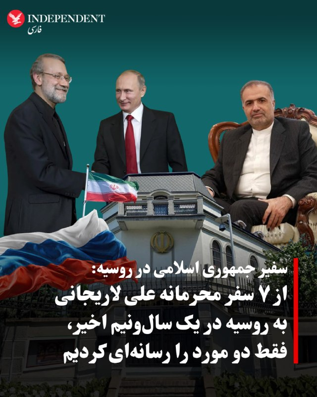

⭕️سفیر جمهوری اسلامی در روسیه: از ۷ سفر محرمانه علی لاریجانی به روسیه در یک سال‌و‌نیم اخیر، فقط دو مورد را رسانه‌ای کردیم

♦️کاظم جلالی، سفیر جمهوری اسلامی در روسیه با اشاره به سفرهای علی لاریجانی دبیر سابق شورای عالی امنیت ملی به مسکو گفت: سفرهای او، به جز دو مورد که خبری کردیم، بقیه محرمانه بود. یعنی هم ما و هم طرف روس، سفرها را رسانه‌ای نکردیم. فقط دو سفر اعلام شد.

جلالی به خبرآنلاین گفت، لاریجانی سفرهای محرمانه زیادی به روسیه داشت و در یک سال‌و‌نیم اخبر، هفت بار به روسیه سفر کرد. جلالی بدون اشاره به دلیل این سفرها و موضوعات مورد مذاکره گفت: «در یکی از این سفرها، طرف روس با من تماس گرفت و ابراز علاقه کرد که سفر رسانه‌ای شود و آقای لاریجانی هم مخالفتی نکردند و خبر آن منتشر شد. اما سفر آخری که در ۱۰ بهمن‌ماه ۱۴۰۴ صورت گرفت، به شکل دیگری رسانه‌ای شد.» جلالی افزود: «ما دیدیم وقتی هواپیمای ایشان حرکت کرد، سه یا چهار هزار نفر در فلایت‌رادار آن را تماشا می‌کنند. زمانی که هواپیما در مسکو نشست، این رقم به ۳۴ هزار نفر رسیده بود. برای فلایت‌رادار، این عدد بسیار بالایی است. بعد هم یک‌سری شایعات شکل گرفته بود. در ماشینی که ایشان سوار شدند، به ایشان گفتم که این سفر را باید رسانه‌ای کنیم. پرسیدند چرا؟ گفتم با توجه به حوادث ۱۸ و ۱۹ دی، الآن عده‌ای از ضدانقلاب‌ها تلاش می‌کنند این خبر را به شکل دیگری جلوه دهند. برخی نوشته بودند که رهبر نظام به روسیه رفته یا برخی گفتند که پول‌ها را به روسیه برده‌اند و این خبرهای عجیب زیاد شده بود.»

جلالی در ادامه گفت: در ۱۰ بهمن، زمانی که علی لاریجانی با پوتین ملاقات داشت، در پایان جلسه من گفتم اگر اجازه دهید ما یک خبر کوتاه، با هماهنگی، منتشر کنیم. به این ترتیب همان دو سفر رسانه‌ای شد.

جلالی همچنین گفت که علی لاریجانی به پوتین می‌گفت: «ببخشید وقت شما را گرفتیم.» سفیر جمهوری اسلامی در روسیه همچنین گفت: پس از کشته شدن علی لاریجانی، پوتین متن پیام تسلیت خود را آماده کرده بود اما گفتیم منتشر نکند تا اول رسانه‌های داخلی خبر مرگ را اعلام کنند.
‌🇸🇦 Indypersian

🤖 @VahidOOnLine

## VahidOOnLine — post 243477

  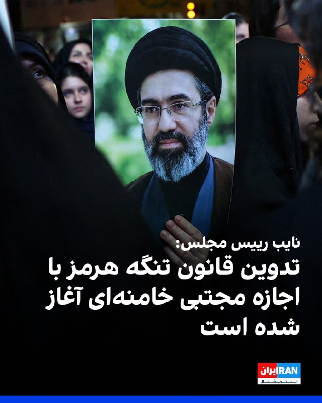

علی نیکزاد، نایب رییس مجلس جمهوری اسلامی، اعلام کرد هماهنگی گسترده‌ای میان مجلس، وزارت خارجه جمهوری اسلامی و سایر نهادهای مرتبط برای تدوین «قانون تنگه هرمز» انجام شده و این روند با اجازه مجتبی خامنه‌ای آغاز شده است.

او گفت وزارت خارجه جمهوری اسلامی در نامه‌ای از مجتبی خامنه‌ای درخواست کرده بود برای تدوین چارچوب حقوقی تنگه هرمز، کارگروهی با حضور دستگاه‌هایی از جمله نیروهای مسلح و ستاد مشترک تشکیل شود که این درخواست مورد موافقت قرار گرفت.
‌🏁 🇬🇧 IranintlTV

🤖 @VahidOOnLine

## VahidOOnLine — post 243476

  <a href="telegram/content/VahidOOnLine_243476_1780471425.mp4" target="_blank">🎬 Download video</a>

در حالیکه سنت پترزبورگ در شمال غربی روسیه برای میزبانی از نشست «مجمع اقتصادی روسیه»، معروف به «داووس روسیه» آماده می‌شود، ارتش اوکراین با شلیک چندین پهپاد، تاسیسات نفتی این شهر را هدف قرار داد.

به گزارش رسانه‌های محلی، در پی این حملات مخازن یکی از پایانه‌های صادرات نفت سنت‌پترزبورگ به شدت آسیب دیده و دود ناشی از آن در سراسر شهر دیده می‌شود.

فرماندار و دیگر مقام‌های محلی اعلام کردند ده‌ها پهپاد را در ساعات گذشته رهگیری و نابود کرده‌اند و مقابله با اهداف متخاصم همچنان ادامه دارد.

قرار است ولادیمیر پوتین، رئیس جمهوری روسیه در نشست اقتصادی سنت پترزبورگ سخنرانی کند.
‌🇸🇦 Indypersian

🤖 @VahidOOnLine

## WithYashar — post 13345

خبرهای تایید نشده از اینکه که سه نفر از وطن پرست ها مجری محمدرضا شهبازی رو گیر میارن و بهش تجاوز میکنن

به همین دلیل هم برنامه پاورقی فعلا متوقف شده
@withyashar

## WithYashar — post 13344

نایب رئیس مجلس: موشک‌هایی که به بیت اصابت کرد تنها چند کروز بود نه سنگرشکن
@withyashar

## DEJradio — post 5275

  <a href="telegram/content/DEJradio_5275_1780471427.webm" target="_blank">🎬 Download video</a>

🔺📷 یکی از مخاطبان دژ از لرستان با ارسال تصویری از آرامگاه ابدی حسام خدایاری از جانفدایان خیزش ملی دی‌ماه ۱۴۰۴ در کوهدشت استان لرستان نوشت که هنوز به خانواده او اجازه ندادند مزار عزیزشان را سنگ بگذارند.

#کوهدشت #لرستان
@DEJradio

## IranIntlTV — post 340321

  

علی نیکزاد، نایب رییس مجلس جمهوری اسلامی، اعلام کرد هماهنگی گسترده‌ای میان مجلس، وزارت خارجه جمهوری اسلامی و سایر نهادهای مرتبط برای تدوین «قانون تنگه هرمز» انجام شده و این روند با اجازه مجتبی خامنه‌ای آغاز شده است.

او گفت وزارت خارجه جمهوری اسلامی در نامه‌ای از مجتبی خامنه‌ای درخواست کرده بود برای تدوین چارچوب حقوقی تنگه هرمز، کارگروهی با حضور دستگاه‌هایی از جمله نیروهای مسلح و ستاد مشترک تشکیل شود که این درخواست مورد موافقت قرار گرفت.
https://iranintl.com/202606033314

## FarsiVOA — post 219445

  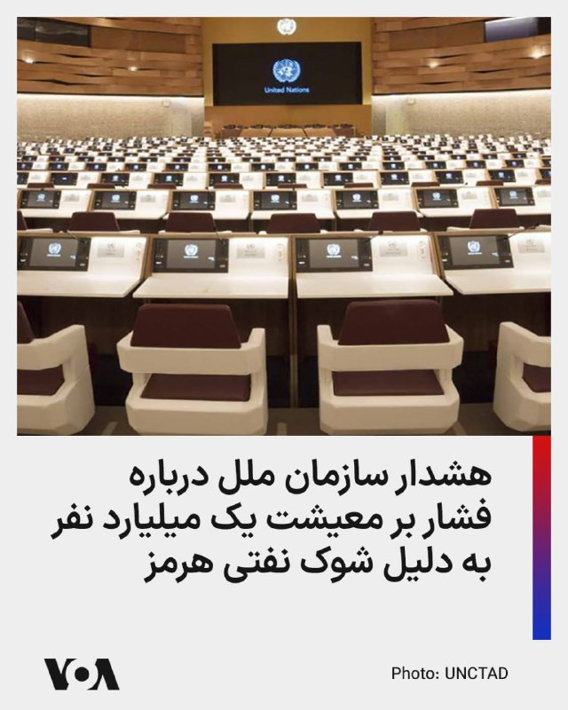

کنفرانس تجارت و توسعه سازمان ملل متحد، آنکتاد، هشدار داد اختلال در تنگه هرمز و افزایش قیمت نفت، سنگین‌ترین فشار را بر اقتصادهای آسیب‌پذیر جهان وارد می‌کند؛ کشورهایی که به واردات سوخت وابسته‌اند و توان محدودی برای جذب شوک‌های بیرونی دارند.

بر اساس گزارش تازه آنکتاد، از ۷۵ اقتصاد آسیب‌پذیر بررسی‌شده، شامل کشورهای کمتر توسعه‌یافته و کشورهای جزیره‌ای کوچک در حال توسعه، ۶۵ کشور واردکننده خالص نفت هستند. این کشورها در مجموع نزدیک به یک میلیارد نفر جمعیت دارند و بیش از ۳۰ درصد جمعیت آنها با کمتر از سه دلار در روز زندگی می‌کنند.

آنکتاد برآورد کرده است اگر قیمت فرآورده‌های نفتی به‌طور پایدار ۵۰ درصد افزایش یابد، هزینه خالص واردات نفت این کشورها سالانه بیش از ۲۰ میلیارد دلار بالا خواهد رفت.
@FarsiVOA

## BBCPersian — post 282753

  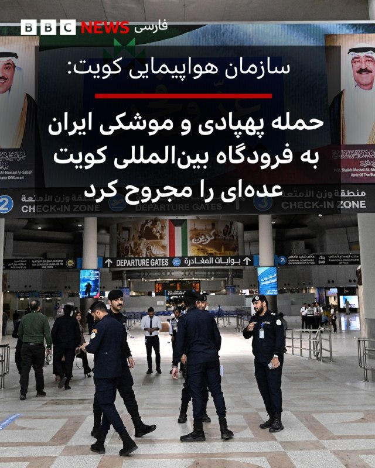

🔻خبرگزاری دولتی کویت روز چهارشنبه گزارش داد که حمله پهپادی و موشکی ایران به فرودگاه بین‌المللی کویت باعث ایجاد جراحت و همچنین تعلیق و تغییر مسیر پروازها شده است.

در این گزارش به نقل از سازمان هواپیمایی کشوری کویت آمده است که در این حمله ساختمان «تی-۱» فرودگاه بین‌المللی هدف قرار گرفته و پروازها به فرودگاه‌های جایگزین هدایت شده‌اند.

خبرگزاری رسمی کویت صبح چهارشنبه از به صدا در آمدن آژیرهای خطر خبر داد و از شهروندان خواسته بود مراقب سقوط ترکش‌های ناشی از شلیک پدافندی علیه حملات موشکی باشند.

📷AFP via Getty Images
https://bbc.in/3RGBEPu

@BBCPersian

## alonews — post 124698

  <a href="telegram/content/alonews_124698_1780471430.webm" target="_blank">🎬 Download video</a>

👈اسرائیل دستور تخلیه سه شهر در منطقه صیدا در مرکز لبنان را صادر کرد.

✅ @AloNews خبر جنگ

## alonews — post 124697

  <a href="telegram/content/alonews_124697_1780471430.webm" target="_blank">🎬 Download video</a>

👈هوای مشهد برای چهارمین روز پیاپی در شرایط ناسالم و غبارآلود برای تنفس شهروندان قرار دارد

✅ @AloNews خبر جنگ

## alonews — post 124696

  <a href="telegram/content/alonews_124696_1780471431.webm" target="_blank">🎬 Download video</a>

👈نایب رئیس مجلس: موشک‌هایی که به بیت اصابت کرد تنها چند کروز بود نه سنگرشکن

✅ @AloNews خبر جنگ

---
📅 بروزرسانی: 1405/03/13 10:43
---

## WithYashar — post 13343

سی‌ان ان : شدیدترین تبادل آتش از زمان آتش‌بس!

هم‌زمان با دور تازه حملات آمریکا، ایران کویت و بحرین را هدف قرار داد.
یکی از شدیدترین تبادل‌های آتش از زمان آغاز آتش‌بس در شرایطی رخ داده که مذاکرات همچنان شکننده و ناپایدار توصیف می‌شود.
۹۴ روز بن‌بست؛ تنگه هرمز همچنان در وضعیت انسداد باقی مانده است.
@withyashar

## IranIntlTV — post 340320

  <a href="telegram/content/IranIntlTV_340320_1780470808.mp4" target="_blank">🎬 Download video</a>

سرخط خبرهای چهارشنبه ۱۳ خرداد
@iranintltv

## FarsiVOA — post 219444

  <a href="telegram/content/FarsiVOA_219444_1780470810.mp4" target="_blank">🎬 Download video</a>

رویترز به نقل از خبرگزاری دولتی کویت گزارش داد حمله پهپادی و موشکی جمهوری اسلامی بامداد چهارشنبه به فرودگاه بین‌المللی کویت اصابت کرده و باعث زخمی شدن شماری از افراد شده است.

برهمین اساس مقام‌های کویتی، پروازها را تا اطلاع ثانوی تعلیق و هواپیماهای ورودی را به فرودگاه‌های جایگزین هدایت کردند.

بر اساس این گزارش، سازمان هواپیمایی کشوری کویت اعلام کرده این حمله به ساختمان ترمینال یک فرودگاه آسیب «شدید» وارد کرده است.

این خبر در حالی منتشر شد که ارتش آمریکا پیش‌تر گفته بود دو موشک ایرانی شلیک‌شده به سوی کویت در مسیر کوتاه آمده یا متلاشی شده‌اند و سه موشک دیگر به سوی بحرین نیز توسط نیروهای آمریکایی و بحرینی رهگیری شده‌اند.

سنتکام همچنین اعلام کرد ایران موشک‌های بالستیک به سوی همسایگان منطقه‌ای شلیک کرده، اما همه آنها در اصابت به اهداف ناکام مانده‌اند.
@FarsiVOA

## DW_Farsi — post 125443

  

🔶 قاآنی، فرمانده نیروی قدس سپاه تهدید به بستن تنگه باب‌الندب کرد

اسماعیل قاآنی، فرمانده نیروی قدس سپاه پاسداران در اظهاراتی هشدار داد که در صورت تشدید تنش نظامی از سوی ایالات متحده یا اسرائیل در غزه و لبنان، احتمال گشوده‌شدن جبهه‌های جدید در منطقه وجود دارد.

روزنامه اسرائیلی "جروزالم پست" به نقل از رسانه‌های رسمی ایران نوشته قاآنی گفته است در چنین شرایطی، وضعیت تردد و کشتیرانی در تنگه باب‌المندب می‌تواند به شرایط مشابه تنگه هرمز تبدیل شود.

قاآنی همچنین تأکید کرده است که "تجاوزات اسرائیل در غزه و جنوب لبنان" با تقویت و گسترش حمایت گروه‌های "مقاومت" فلسطینی و لبنانی و پاسخ نظامی مواجه خواهد شد.

در گزارش جروزالم پست آمده است که فرمانده نیروی قدس نسبت به هرگونه تشدید عملیات نظامی هشدار داده و بر آمادگی "محور مقاومت" برای گسترش جبهه‌های درگیری تأکید کرده است.

@dw_farsi

## alonews — post 124695

  <a href="telegram/content/alonews_124695_1780470811.webm" target="_blank">🎬 Download video</a>

👈روزنامه اطلاعات: ۸۵ درصد آب مصرفی کشور به بخش کشاورزی اختصاص دارد، آن هم با قیمت بسیار پایین/ معلوم است با این قیمت آب را هدر می دهند

✅ @AloNews خبر جنگ

## alonews — post 124694

👈خبرگزاری فرانسه: کابینه ژاپن ۱۹ میلیارد دلار بودجه اضافی برای محافظت از خانوارها در برابر تورم مرتبط با جنگ آمریکا و اسرائیل علیه ایران تصویب کرد.

🔴دفتر نخست وزیر سنائه تاکایچی گفت که بودجه تکمیلی به طور رسمی در جلسه صبح چهارشنبه تصمیم گیری شد.

🔴سخنگوی مینورو کیهارا گفت که برای به حداقل رساندن خطر در بحبوحه ابهامات مداوم خاورمیانه تدوین شده است.

🔴تاکایچی ماه گذشته گفت که این بودجه افزایش هزینه بنزین، برق و گاز را کاهش می دهد.

✅ @AloNews خبر جنگ

## alonews — post 124693

  <a href="telegram/content/alonews_124693_1780470812.webm" target="_blank">🎬 Download video</a>

👈تبریک ترامپ به «آبلاردو دِ لا اسپریِلا» به دلیل پیروزی در دور اول انتخابات ریاست جمهوری کلمبیا: آبلاردو خستگی ناپذیر برای کشور و مردم بزرگ خود می‌جنگد و عاشق آنهاست، درست مثل من برای ایالات متحده آمریکا

🔴 نتایج این انتخابات برای آینده کلمبیا و رابطه آن با امریکا بسیار مهم است

🔴 حمایت کامل و بی‌قیدوشرط خود را از آبلاردو اعلام می‌کنم

✅ @AloNews خبر جنگ

---
📅 بروزرسانی: 1405/03/13 10:33
---

## VahidOOnLine — post 243475

🗣روایت شما از زندگی در دوران پس از انقلاب ملی و جنگ - چهارشنبه ۱۳ خرداد

🔹امروز بیش از هر زمان دیگری به یاد داشته باشیم که درد یک نفر، درد همه و آرامش هر خانه، آرزوی همه ماست. در میان هیاهو اخبار و نگرانی‌ها دست یکدیگر را رها نکنیم. به هم امید بدهیم و باور داشته باشیم که هیچ شبی ماندگار نیست.

🔹آمریکا و جمهوری‌اسلامی جفتشون علنا دارن به هم حمله می‌کنن ولی بازم معتقدن که آتش‌بس نقض نشده و باز حرف از مذاکره می‌زنن. انگار این وسط فقط ما مردم ایران قربانی بودیم.

🔹من فکر می‌کردم جنگ بشه اینا نابود می‌شن، برای همین هر روز دعا می‌کردم جنگ بشه. الان ولی اصلا دلم نمی‌خواد دوباره جنگ شروع شه، چون فقط ما مردمیم که آسیب می‌بینیم؛ از جنگ فقط آسیب‌های فکری و روانی و اقتصادی به ما میرسه.

🔹من ۱۴ سالمه، باید تو این سن دنبال درس و بازی و آینده‌نگری باشم ولی افتادم دنبال اخبار، از یه کانال به کانال دیگه و از یه شبکه به شبکه دیگه. خسته شدم از این زندگی.

🔹آقای ترامپ، شما با اون همه ادعا دو ماه نتونستی این رژیم آدمکش رو تحمل کنی و کم آوردی جلوشون، می‌خوای باهاشون صلح کنی. حالا ببین ما ایرانی‌ها چطوری این‌ها رو ۴۷ سال تحمل کردیم. زنده باد ایران ایرانی.

🔹من یک نوجوان ۱۲ ساله هستم، الان ۴ ساله می‌خوام یک پی‌اس‌فایو بخرم، تقریبا پولش جور شده بود اما همه‌چی گرون شد. الان پلی‌استیشن که دیگه هیچ، حتی مرغ و گوشت هم نمی‌تونیم راحت تهیه کنیم.

🔹اگر جمهوری اسلامی از این به بعد پول نفت رو هم خرج رفاه کشور بکنه و تمام مردم ایران ثروتمند بشن، باز هم دغدغه ما نابودی جمهوری اسلامیه.

🔹می‌خوام بدونم مگر ابرقدرت‌های اروپایی چه پشت‌پرده‌ای با جمهوری اسلامی دارن که با وجود این همه کشتار، اعدام، سلاخی و نقض حقوق‌بشر در درون کشور و حملات تروریستی در خارج، باز با جمهوری‌اسلامی مصالحه و مماشات می‌کنن؟

🔹ترامپ برعکس نتانیاهو هیچ شناختی از این حکومت نداره. این‌ تروریست‌هایی که جان آدم‌ها رو به راحتی می‌گیرن و زندگی ما رو با خاک یکسان کردن رو نمیشه با دیپلماسی باهاشون برخورد کرد.

🔹ما مردم ایران غیرت خودمون رو دی‌ماه نشون دادیم. هزار بار دیگه هم باشه میایم کف خیابون و حق‌مون رو می‌گیریم.
‌🏁 🇬🇧 IranintlTV

🤖 @VahidOOnLine

## VahidOOnLine — post 243474

  

فرماندهی کل نیروی دفاع بحرین در بیانیه‌ای اعلام کرد که سامانه‌های پدافند هوایی این کشور بامداد چهارشنبه موفق شدند سه موشک و تعدادی پهپاد جمهوری اسلامی را رهگیری و منهدم کنند.

بحرین این حملات را «جنایتکارانه» توصیف کرد و نوشت: «ایران رویکرد خصمانه خود را با پرتاب موشک‌ها و پهپادهایی که تاسیسات غیرنظامی را هدف قرار می‌دهند، ادامه می‌دهد.»

فرماندهی کل بحرین تاکید کرد همه سلاح‌ها و یگان‌های این نیرو در بالاترین سطح آمادگی و آماده‌باش دفاعی برای حفاظت از کشور قرار دارند.

این نهاد همچنین اعلام کرد استفاده عمدی از موشک‌ها و پهپادها برای هدف قرار دادن تاسیسات غیرنظامی و اموال خصوصی، نقض آشکار قوانین بین‌المللی بشردوستانه است و بر آمادگی و هوشیاری نیروهای خود برای دفاع از کشور تاکید کرد.
‌🏁 🇬🇧 IranintlTV

🤖 @VahidOOnLine

## mwarmonitor — post 10065

🔸خبرنگار الجزیره: دو حمله هوایی با پهپادهای اسرائیل شهرک دیر الزهرانی در جنوب لبنان را هدف قرار داد.

@mwarmonitor

## mwarmonitor — post 10064

🔴سازمان هواپیمایی کشوری کویت اعلام کرد که حمله شبانه پهپادی و موشکی ایران که کویت را هدف قرار داد، خسارات شدیدی به ترمینال یک فرودگاه بین‌المللی کویت وارد کرده و شمار نامعلومی از افراد را مجروح کرده است.
🔸بر اساس گزارش نیوزنیشن، فرودگاه طرح واکنش اضطراری خود را فعال کرده و تمامی پروازها متوقف یا به مسیرهای جایگزین هدایت شده‌اند.

@mwarmonitor

## IranIntlTV — post 340319

🗣روایت شما از زندگی در دوران پس از انقلاب ملی و جنگ - چهارشنبه ۱۳ خرداد

🔹امروز بیش از هر زمان دیگری به یاد داشته باشیم که درد یک نفر، درد همه و آرامش هر خانه، آرزوی همه ماست. در میان هیاهو اخبار و نگرانی‌ها دست یکدیگر را رها نکنیم. به هم امید بدهیم و باور داشته باشیم که هیچ شبی ماندگار نیست.

🔹آمریکا و جمهوری‌اسلامی جفتشون علنا دارن به هم حمله می‌کنن ولی بازم معتقدن که آتش‌بس نقض نشده و باز حرف از مذاکره می‌زنن. انگار این وسط فقط ما مردم ایران قربانی بودیم.

🔹من فکر می‌کردم جنگ بشه اینا نابود می‌شن، برای همین هر روز دعا می‌کردم جنگ بشه. الان ولی اصلا دلم نمی‌خواد دوباره جنگ شروع شه، چون فقط ما مردمیم که آسیب می‌بینیم؛ از جنگ فقط آسیب‌های فکری و روانی و اقتصادی به ما میرسه.

🔹من ۱۴ سالمه، باید تو این سن دنبال درس و بازی و آینده‌نگری باشم ولی افتادم دنبال اخبار، از یه کانال به کانال دیگه و از یه شبکه به شبکه دیگه. خسته شدم از این زندگی.

🔹آقای ترامپ، شما با اون همه ادعا دو ماه نتونستی این رژیم آدمکش رو تحمل کنی و کم آوردی جلوشون، می‌خوای باهاشون صلح کنی. حالا ببین ما ایرانی‌ها چطوری این‌ها رو ۴۷ سال تحمل کردیم. زنده باد ایران ایرانی.

🔹من یک نوجوان ۱۲ ساله هستم، الان ۴ ساله می‌خوام یک پی‌اس‌فایو بخرم، تقریبا پولش جور شده بود اما همه‌چی گرون شد. الان پلی‌استیشن که دیگه هیچ، حتی مرغ و گوشت هم نمی‌تونیم راحت تهیه کنیم.

🔹اگر جمهوری اسلامی از این به بعد پول نفت رو هم خرج رفاه کشور بکنه و تمام مردم ایران ثروتمند بشن، باز هم دغدغه ما نابودی جمهوری اسلامیه.

🔹می‌خوام بدونم مگر ابرقدرت‌های اروپایی چه پشت‌پرده‌ای با جمهوری اسلامی دارن که با وجود این همه کشتار، اعدام، سلاخی و نقض حقوق‌بشر در درون کشور و حملات تروریستی در خارج، باز با جمهوری‌اسلامی مصالحه و مماشات می‌کنن؟

🔹ترامپ برعکس نتانیاهو هیچ شناختی از این حکومت نداره. این‌ تروریست‌هایی که جان آدم‌ها رو به راحتی می‌گیرن و زندگی ما رو با خاک یکسان کردن رو نمیشه با دیپلماسی باهاشون برخورد کرد.

🔹ما مردم ایران غیرت خودمون رو دی‌ماه نشون دادیم. هزار بار دیگه هم باشه میایم کف خیابون و حق‌مون رو می‌گیریم.

## IranIntlTV — post 340318

  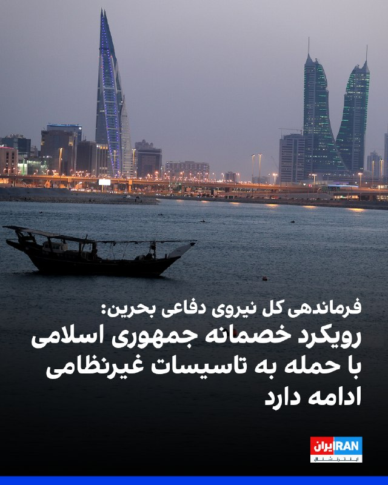

فرماندهی کل نیروی دفاع بحرین در بیانیه‌ای اعلام کرد که سامانه‌های پدافند هوایی این کشور بامداد چهارشنبه موفق شدند سه موشک و تعدادی پهپاد جمهوری اسلامی را رهگیری و منهدم کنند.

بحرین این حملات را «جنایتکارانه» توصیف کرد و نوشت: «ایران رویکرد خصمانه خود را با پرتاب موشک‌ها و پهپادهایی که تاسیسات غیرنظامی را هدف قرار می‌دهند، ادامه می‌دهد.»

فرماندهی کل بحرین تاکید کرد همه سلاح‌ها و یگان‌های این نیرو در بالاترین سطح آمادگی و آماده‌باش دفاعی برای حفاظت از کشور قرار دارند.

این نهاد همچنین اعلام کرد استفاده عمدی از موشک‌ها و پهپادها برای هدف قرار دادن تاسیسات غیرنظامی و اموال خصوصی، نقض آشکار قوانین بین‌المللی بشردوستانه است و بر آمادگی و هوشیاری نیروهای خود برای دفاع از کشور تاکید کرد.
https://iranintl.com/202606035943

## IranianMinds — post 21290

  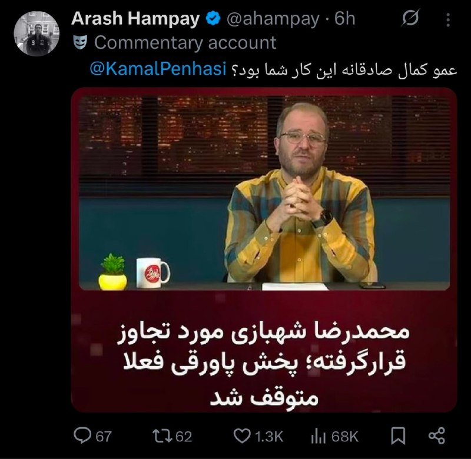

احتمالا تروله ولی باحال بود 😂

@IranianMinds

## alonews — post 124692

  <a href="telegram/content/alonews_124692_1780470228.webm" target="_blank">🎬 Download video</a>

👈خبرنگار الجزیره: بمباران اسرائیل با بمب های آتش زا به شهرک الحنیه در منطقه صور در جنوب لبنان

✅ @AloNews خبر جنگ

## alonews — post 124691

  <a href="telegram/content/alonews_124691_1780470229.webm" target="_blank">🎬 Download video</a>

👈 پس از قرار گرفتن نام چهار صرافی رمزارزی ایرانی در فهرست تحریم‌های وزارت خزانه‌داری آمریکا، نوبیتکس، والکس و بیت‌پین در بیانیه‌هایی جداگانه اعلام کردند دارایی کاربران در امنیت است و فعالیت پلتفرم‌ها بدون اختلال ادامه دارد.

🔴 این صرافی‌ها تأکید کرده‌اند تحریم اخیر به معنای توقف خدمات یا تهدید مستقیم دارایی کاربران نیست.

✅ @AloNews خبر جنگ

## alonews — post 124690

  <a href="telegram/content/alonews_124690_1780470229.webm" target="_blank">🎬 Download video</a>

👈عضو کمیسیون اقتصادی مجلس: افزایش ۳۰درصدی قیمت مواد اولیه داخلی، قیمت خودرو، لوازم خانگی و بسته‌بندی محصولات، در موج جدید گرانی در راه است

✅ @AloNews خبر جنگ

---
📅 بروزرسانی: 1405/03/13 10:24
---

## WithYashar — post 13342

  <a href="telegram/content/WithYashar_13342_1780469655.mp4" target="_blank">🎬 Download video</a>

جاباری استیون براون که در مسابقه معروف «۱۰۰ خلبان برای یک جت خصوصی» متعلق به مستر ‌بیست برنده یک جت شده بود
توسط مقامات پاراگوئه در جت خصوصی که از میامی و از طریق پاناما وارد شده بود و حدود ۲۶۱٫۶ کیلوگرم ماری‌جوانا با THC بالا به ارزش ۳.۶ میلیون دلار حمل و نقل میکرد دستگیر کردند !
@withyashar

## FarsiVOA — post 219443

  

کابینه دولت ژاپن بسته حمایتی تکمیلی ۱۹.۵ میلیارد دلاری برای تأمین مالی مجموعه اقداماتی با هدف کاهش فشار تورمی بر خانوارها که ناشی از تنش‌های خاورمیانه است، تصویب کرد.

بخش اعظم این بسته مالی که روز چهارشنبه برای تصویب نهایی به پارلمان ارسال شده، مربوط به مقابله با افزایش قیمت کالاهای اساسی، از جمله بنزین، از طریق پرداخت یارانه است.

تورم ماه گذشته در ژاپن حدود ۱.۳ درصد ثبت شده است.

این بسته مالی به طور کامل از طریق انتشار اوراق قرضه تأمین خواهد شد، اما دولت ژاپن هم‌زمان در تلاش است با سیاست‌های مالیاتی و غیرمالیات قوی از افزایش بدهی‌های دولتی ناشی از فروش اوراق قرضه جلوگیری کند.
@FarsiVOA

## DW_Farsi — post 125442

  

🔶 سناتور تد کروز: خطوط قرمز ترامپ درباره ایران درست است

تد کروز، سناتور بانفوذ جمهوری‌خواه از ایالت تگزاس شامگاه سه‌شنبه ۱۲ خرداد (۲ ژوئن) در پلتفرم ایکس نوشت خطوط قرمز تعیین‌شده از سوی دونالد ترامپ، رئیس‌جمهور آمریکا شامل "باز شدن تنگه هرمز، توقف کامل غنی‌سازی، تحویل اورانیوم غنی‌شده و قطع تامین مالی تروریسم" درست هستند.

کروز همچنین تاکید است ایران برای برنامه هسته‌ای غیرنظامی نیازی به غنی‌سازی اورانیوم ندارد.

او در ادامه افزود: «غنی‌سازی تنها یک هدف دارد؛ ساخت سلاح هسته‌ای.»

این سناتور پرنفوذ همچنین گفته است که او و مارکو روبیو، وزیر خارجه، درباره راه‌هایی گفت‌وگو کرده‌اند که اطمینان حاصل شود ایران نتواند از خطوط قرمز عبور کند.

@dw_farsi

## alonews — post 124689

  <a href="telegram/content/alonews_124689_1780469660.webm" target="_blank">🎬 Download video</a>

👈پرداخت افزایش حقوق بازنشستگان در سال ۱۴۰۵ به تأخیر می افتد

✅ @AloNews خبر جنگ

## alonews — post 124688

  <a href="telegram/content/alonews_124688_1780469661.webm" target="_blank">🎬 Download video</a>

👈یک ماه پس از آن‌که دونالد ترامپ طرحی را برای اسکورت کشتی‌های تجاری از طریق تنگه هرمز اعلام کرد و سپس از آن صرف‌نظر کرد، ارتش آمریکا در تلاش است با روش‌هایی کم‌سروصداتر از شناورها در این آبراه حیاتی محافظت کند

✅ @AloNews خبر جنگ

---
📅 بروزرسانی: 1405/03/13 10:14
---

## VahidOOnLine — post 243473

  

غلامحسین محسنی اژه‌ای، رییس قوه قضاییه جمهوری اسلامی، چهارشنبه ۱۳ خرداد در جمع تعدادی از فعالان اقتصادی و تولیدی بخش خصوصی با اشاره به حملات اخیر آمریکا و اسرائیل گفت در کوتاه‌نیامدن مقابل «دشمن» جمهوری اسلامی هیچ اختلافی میان مسئولان وجود ندارد.

او با تاکید بر ادامه جنگ افزود: «دشمن اسرائیلی، نابودی و عدم ما را می‌خواهد؛ ما هم به دنبال اضمحلال این غده سرطانی هستیم؛ فلذا جنگ ما با استکبار و اذناب او ادامه خواهد داشت.»

رییس قوه قضاییه جمهوری اسلامی همچنین گفت: «آینده بسیار بسیار بهتر، حتی بهتر از قبل از جنگ را پیش‌رو خواهیم داشت.»
‌🏁 🇬🇧 IranintlTV

🤖 @VahidOOnLine

## pm_afshaa — post 92204

  

گزارشاتی منتشر شده که محمدرضا شهبازی، مجری برنامه پاورقی دیشب مورد تجاوزِ 3 نفر قرار گرفته و برنامه پاورقی فعلا به طور موقت متوقف شده

💧 Rainbet.com the #1 Non-KYC Crypto Casino & Sportsbook @rainbetcom

😁 @Pm_Afshaa

## IranIntlTV — post 340317

  

غلامحسین محسنی اژه‌ای، رییس قوه قضاییه جمهوری اسلامی، چهارشنبه ۱۳ خرداد در جمع تعدادی از فعالان اقتصادی و تولیدی بخش خصوصی با اشاره به حملات اخیر آمریکا و اسرائیل گفت در کوتاه‌نیامدن مقابل «دشمن» جمهوری اسلامی هیچ اختلافی میان مسئولان وجود ندارد.

او با تاکید بر ادامه جنگ افزود: «دشمن اسرائیلی، نابودی و عدم ما را می‌خواهد؛ ما هم به دنبال اضمحلال این غده سرطانی هستیم؛ فلذا جنگ ما با استکبار و اذناب او ادامه خواهد داشت.»

رییس قوه قضاییه جمهوری اسلامی همچنین گفت: «آینده بسیار بسیار بهتر، حتی بهتر از قبل از جنگ را پیش‌رو خواهیم داشت.»
https://iranintl.com/202606039964

## FarsiVOA — post 219442

  

وزارت خارجه قطر از دیدار نخست‌وزیر و وزیر خارجه این کشور با رافائل گروسی، مدیرکل آژانس بین‌المللی انرژی اتمی، خبر داد.

بر اساس بیانیه وزارت خارجه قطر، گروسی روز سه‌شنبه در سفر به دوحه علاوه بر بررسی همکاری‌های دوجانبه میان آژانس و قطر، درباره آخرین تحولات مربوط به برنامه هسته‌ای جمهوری اسلامی ایران و تلاش‌های دیپلماتیک مرتبط با آن گفت‌وگو کرده است.

گروسی نیز با انتشار پیامی در شبکه اجتماعی ایکس به این دیدار اشاره کرد و نوشت که با نخست‌وزیر قطر درباره موضوع عدم اشاعه هسته‌ای در ایران و نقش «حیاتی و غیرقابل جایگزین» آژانس بین‌المللی انرژی اتمی در این زمینه گفت‌وگو کرده است.

مدیرکل آژانس افزود: «بار دیگر بر تعهد آژانس برای همکاری با کشورهای منطقه به منظور تقویت ایمنی و امنیت هسته‌ای و حمایت از ثبات تأکید کردم. در این مقطع حساس، گفت‌وگو و دیپلماسی تنها مسیر پیش‌رو برای دستیابی به صلح، ثبات و همکاری است.»
@FarsiVOA

## Persian_Trend_Official — post 15600

  <a href="telegram/content/Persian_Trend_Official_15600_1780469047.webm" target="_blank">🎬 Download video</a>

🌏 بولتن خبری ۲۴ ساعت گذشته

۱۳ خرداد ۱۴۰۵

💬تهیه شده در تحریریه پرشین ترند

⚔️ آکسیوس: تماس تلفنی ترامپ و نتانیاهو به یکی از پرتنش‌ترین مکالمات دو طرف تبدیل شد؛ ترامپ تشدید تنش اسرائیل در لبنان را تهدیدی برای مذاکرات با ایران دانسته و با لحنی تند از نتانیاهو انتقاد کرد

⚔️کانال ۱۲ اسرائیل: ترامپ و نتانیاهو پیش‌تر درباره صدور هشدار تخلیه ضاحیه بدون اجرای حمله توافق کرده بودند؛ اختلاف بر سر تبدیل این تهدید به اقدام واقعی بالا گرفت

⚔️ ترامپ ادعای توقف مذاکرات با ایران را رد کرد و گفت گفت‌وگوها به‌صورت مداوم ادامه دارد

⚔️ فارس: تبادل پیام میان ایران و آمریکا طی روزهای اخیر متوقف شده است

⚔️ مهر: تهران همچنان در حال بررسی متن نهایی توافق پیشنهادی آمریکا است و پاسخی ارائه نشده است

⚔️ گروسی: گزینه رقیق‌سازی اورانیوم در حال بررسی است؛ انتقال ذخایر با غنای بالا دشوار اما ممکن است

⚔️ وال‌استریت ژورنال: واشنگتن فشار بر عمان برای فاصله گرفتن از ایران را افزایش داده و حتی تهدید به تحریم کرده است

⚔️ بلومبرگ: برخی تولیدکنندگان بزرگ انرژی مانند قطر در حال عبور از قواعد دریانوردی در بحران هرمز هستند

⚔️ جروزالم‌پست: اسرائیل پدافند هوایی خود را در ایلات در برابر تهدیدات احتمالی انصارالله تقویت کرده است

⚔️ نخستین گزارش‌ها از حمله موشکی و پهپادی گسترده به کویت و بحرین؛ آژیرهای خطر، انفجارهای متعدد و فعال شدن پدافند تأیید شد

⚔️ منابع عربی: پایگاه‌های آمریکا در کویت (علی‌السالم و عریفجان) و بحرین هدف حملات قرار گرفتند

⚔️ سپاه: حملات به کویت و بحرین در پاسخ به حمله آمریکا به مواضع راداری و پدافندی در قشم انجام شده است

⚔️ سنتکام: چندین موشک و پهپاد ایرانی رهگیری شد و حملات دفاعی علیه اهدافی در قشم انجام گرفت

⚔️ گزارش‌ها از انفجار در اربیل همزمان با حملات منطقه‌ای؛ گروه کومله اصابت دو موشک به مقر خود را تأیید کرد

⚔️ رسانه‌ها: پروازها در بحرین، کویت و امارات به‌دلیل ناامنی هوایی متوقف شد

⚔️ صداوسیما: اصابت یک پرتابه به ساحل جنوبی قشم در محدوده سوزا تأیید شد

⚔️ سنتکام: یک نفتکش در مسیر ایران با شلیک موشک هلفایر از کار انداخته شد

⚔️ سپاه: در پاسخ به حمله به نفتکش ایرانی، شناور «پانایا» و همچنین پایگاه‌های آمریکا در منطقه هدف قرار گرفتند

⚔️ افزایش فعالیت هوایی آمریکا در خلیج فارس و دریای عمان با حضور هواپیماهای P-8 و تانکرهای KC-135

⚔️ تصاویر ماهواره‌ای از استقرار حدود ۸۰ شناور تندرو سپاه در اطراف قشم منتشر شد

⚔️ وزیر دفاع اسرائیل: در صورت ادامه حملات، ضاحیه بیروت هدف قرار خواهد گرفت؛ ۶۰۰ هزار نفر تخلیه شده‌اند

⚔️ ارتش اسرائیل از ادامه عملیات در لبنان و عدم وجود آتش‌بس خبر داد

⚔️ حملات هوایی و انفجارهای مکرر در جنوب لبنان گزارش شد

⚔️ حزب‌الله یک سامانه گنبد آهنین را با پهپادهای FPV هدف قرار داد

⚔️ اسرائیل: یکی از اعضای حماس مرتبط با حملات ۷ اکتبر کشته شد

⚔️ رئیس پیشین موساد: مأموریت علیه ایران تا تغییر نظام ادامه خواهد داشت

⚔️ رئیس جدید موساد: عملیات مخفی و غافلگیرکننده علیه محور ایران ادامه می‌یابد

⚔️ روبیو: ایران عملاً نیروی دریایی مؤثری ندارد و توان آن به‌شدت تضعیف شده است

⚔️ روبیو: هیچ‌گونه رفع تحریمی در ازای بازگشایی هرمز انجام نخواهد شد

⚔️ روبیو: ایران بخش‌هایی از تنگه هرمز را مین‌گذاری کرده و به کشتی‌ها حمله می‌کند

⚔️ روبیو: نشانه‌هایی از نقش‌آفرینی بیشتر مجتبی خامنه‌ای در تصمیم‌گیری‌ها وجود دارد

📺: بیش از نیمی از پست‌های سفارت آمریکا در جهان خالی است

⚔️ وزارت خزانه‌داری آمریکا چند صرافی ارز دیجیتال ایرانی را تحریم کرد

⚔️ بحرین سفر شهروندان خود به ایران و عراق را ممنوع اعلام کرد

⚔️ ارتش آمریکا و بریتانیا: یک نظامی آمریکایی و یک نظامی بریتانیایی در اربیل کشته شدند

⚔️ قیمت نفت در پی تحولات منطقه از ۹۷ دلار عبور کرد

⚔️ مرکز آمار: تورم نقطه‌ای روستایی به بیش از ۱۰۱ درصد رسید

⚔️ سازمان مالیاتی: خبر معافیت مالیاتی ۶۰ میلیاردی تکذیب شد

⚔️ انفجار بمب باقی‌مانده از جنگ جهانی دوم در اندونزی ۵ کشته برجای گذاشت

⚔️ بحران زباله در کوبا؛ مردم اقدام به سوزاندن زباله‌ها کرده‌اند

⚔️ سقوط بیت‌کوین به محدوده ۶۷ هزار دلار

👺Phantom

📌 @persian_trend_official
پرشین ترند | متفاوت‌ترین کانال

## Persian_Trend_Official — post 15599

⭕️ جنگنده‌های سوخو-۲۴ ایران مواضعی در نزدیکی اربیل را هدف قرار دادند.

گزارش‌ها حاکی است نیروی هوایی ارتش ایران شامگاه گذشته مواضع گروه‌های مسلح کُرد مخالف جمهوری اسلامی را در نزدیکی اربیل، مرکز اقلیم کردستان عراق، هدف حملات هوایی قرار داده است.
بر اساس این گزارش، بمب‌افکن‌های سوخو-۲۴ به پرواز درآمده و اهدافی را در چند کیلومتری اربیل مورد حمله قرار داده‌اند.
این حملات تنها یک روز پس از برگزاری رزمایش‌های گسترده و تمرینات آتش زنده نیروی هوایی در مناطق مرزی با عراق انجام شده است.

📝 Nick

📌 @persian_trend_official
پرشین ترند | متفاوت‌ترین کانال نظامی

## Dirty_Kids — post 390896

  <a href="telegram/content/Dirty_Kids_390896_1780469047.mp4" target="_blank">🎬 Download video</a>

ویدیو وایرال از دختری که دوتا دختر رو خفت کرده چکی‌شون میکنه

باران بگیرمت کردمت
توله‌هاتون از پارک جمع کنید

@Dirty_Kids 👻

## Dirty_Kids — post 390895

  

به کیرم

چقدر کسشر میشناسید

@Dirty_Kids 👻

## alonews — post 124687

  <a href="telegram/content/alonews_124687_1780469051.webm" target="_blank">🎬 Download video</a>

👈جنگنده‌های سوخو-۲۴ ایران مواضعی در نزدیکی اربیل را هدف قرار دادند

🔴گزارش‌ها حاکی است نیروی هوایی ارتش ایران شامگاه گذشته مواضع گروه‌های مسلح کُرد مخالف جمهوری اسلامی را در نزدیکی اربیل، مرکز اقلیم کردستان عراق، هدف حملات هوایی قرار داده است.

🔴بر اساس این گزارش، بمب‌افکن‌های سوخو-۲۴ به پرواز درآمده و اهدافی را در چند کیلومتری اربیل مورد حمله قرار داده‌اند.

🔴این حملات تنها یک روز پس از برگزاری رزمایش‌های گسترده و تمرینات آتش زنده نیروی هوایی در مناطق مرزی با عراق انجام شده است

✅ @AloNews خبر جنگ

## alonews — post 124686

  <a href="telegram/content/alonews_124686_1780469051.webm" target="_blank">🎬 Download video</a>

👈نیکزاد ، نایب رئیس مجلس: وزارت خارجه اذن تشکیل کارگروه تنگه هرمز را از رهبری گرفته بود

✅ @AloNews خبر جنگ

---
📅 بروزرسانی: 1405/03/13 10:03
---

## VahidOOnLine — post 243472

  

سپاه پاسداران در بیانیه‌ای درباره حملات بامداد چهارشنبه ۱۳ خرداد به قشم، خطاب به آمریکا و کشورهای منطقه اعلام کرد هرگونه «تجاوز بیشتر» یا اقدامی که حتی «یک وجب از مرزها و حاکمیت» ایران را نقض کند، با پاسخی «ویرانگر، کوبنده و قاطع» روبه‌رو خواهد شد.

در این بیانیه آمده است این پاسخ «فراتر از همه قوانین و مرزهای تعیین‌شده» خواهد بود.

سپاه پاسداران همچنین نوشت که دوران «بزن و در رو» به پایان رسیده است و «نیروهای متجاوز» باید عواقب آنچه «ماجراجویی‌های بی‌ملاحظه» خوانده شد را تحمل کنند.
‌🏁 🇬🇧 IranintlTV

🤖 @VahidOOnLine

## pm_afshaa — post 92203

سنتکام:آتش بس هنوز برقراره

💧 Rainbet.com the #1 Non-KYC Crypto Casino & Sportsbook @rainbetcom

😁 @Pm_Afshaa

## IranIntlTV — post 340316

  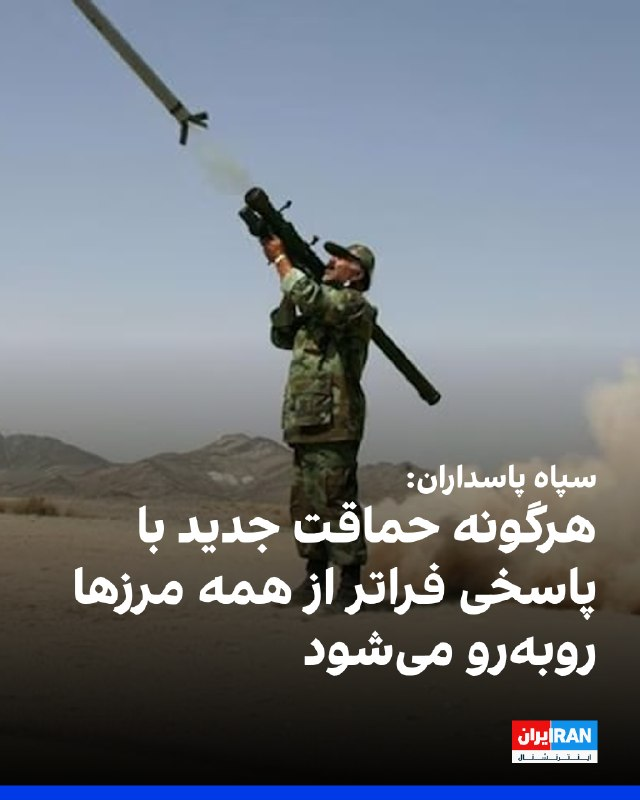

سپاه پاسداران در بیانیه‌ای درباره حملات بامداد چهارشنبه ۱۳ خرداد به قشم، خطاب به آمریکا و کشورهای منطقه اعلام کرد هرگونه «تجاوز بیشتر» یا اقدامی که حتی «یک وجب از مرزها و حاکمیت» ایران را نقض کند، با پاسخی «ویرانگر، کوبنده و قاطع» روبه‌رو خواهد شد.

در این بیانیه آمده است این پاسخ «فراتر از همه قوانین و مرزهای تعیین‌شده» خواهد بود.

سپاه پاسداران همچنین نوشت که دوران «بزن و در رو» به پایان رسیده است و «نیروهای متجاوز» باید عواقب آنچه «ماجراجویی‌های بی‌ملاحظه» خوانده شد را تحمل کنند.
https://iranintl.com/202606034678

## IranIntlTV — post 340315

  <a href="telegram/content/IranIntlTV_340315_1780468411.mp4" target="_blank">🎬 Download video</a>

امیر حمیدی، متخصص امنیت ملی، درباره تنش‌ها میان جمهوری اسلامی و آمریکا به ایران‌اینترنشنال گفت آنچه در حال حاضر جریان دارد، آزمونی برای سنجش توانایی بازدارندگی هر یک از دو طرف است
@iranintltv

## RadioFarda — post 157839

  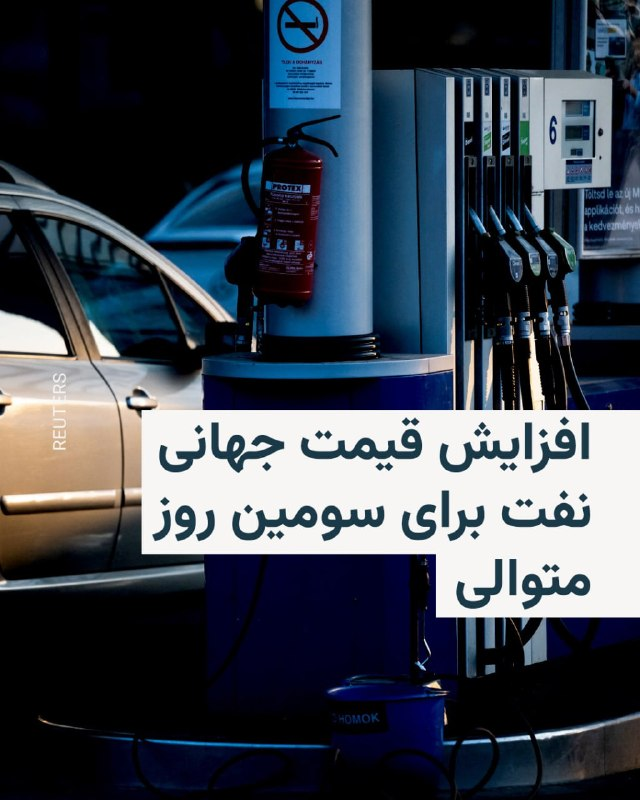

🔸همزمان با شعله‌ورشدن دوباره تنش‌ها در منطقه خلیج فارس، قیمت نفت در روز چهارشنبه ۱۳ خرداد برای سومین روز متوالی افزایش یافت و دلار نیز در آستانه عبور از مرز ۱۶۰ ین قرار گرفت.

🔸به نوشته رویترز، قراردادهای آتی نفت خام برنت با یک درصد افزایش به ۹۴.۷۴ دلار در هر بشکه رسید. دلار نیز به سطح ۱۶۰ ین صعود کرد، اما سپس متوقف شد؛ زیرا معامله‌گران نسبت به احتمال مداخله دولت ژاپن در بازار ارز در این سطح محتاط شده‌اند.

🔸با این حال، بازارهای سهام عمدتاً تحت تأثیر تداوم تقاضا برای فناوری‌های مرتبط با هوش مصنوعی رشد کردند و شاخص‌های سهام در تایوان و ژاپن به رکوردهای جدیدی رسیدند.

🔸در شرایطی که تلاش‌های دیپلماتیک میان واشینگتن و تهران پیشرفت چندانی نداشته، ارتش آمریکا اعلام کرد که حملات موشکی ایران به بحرین، کویت و دیگر اهداف منطقه‌ای یا خنثی شده‌اند یا با شکست مواجه شده‌اند.

🔸ایران و ایالات متحده هفته گذشته اعلام کرده بودند که به یک توافق اولیه برای توقف جنگ دست یافته‌اند، اما دو طرف هنوز هیچ توافقی را به طور رسمی نهایی و امضا نکرده‌اند.

@Radiofarda

## BBCPersian — post 282744

🖊بریجت کندال
خبرنگار پیشین بی‌بی‌سی در مسکو

🔻در تمام سال‌هایی که ولادیمیر پوتین رئیس‌جمهور روسیه بوده، همواره از قدرت تصویرسازی آگاه بوده است.

اولین بار که در سال ۲۰۰۱ با او مصاحبه کردم، درست پیش از آن‌که دوربین‌ها روشن شوند، یکی از دستیارانش ناگهان جلو آمد و لیوان‌های کوچک آب را که روی میز مقابل ما قرار داشت، برداشت.

از او پرسیدم: «چرا این کار را کردید؟»

پاسخ داد: «نمی‌خواهیم کسی فکر کند داخل آن‌ها ودکا بوده است. ضمن این‌که نمی‌توانیم ریسک کنیم که لیوانی هنگام پخش زنده تلویزیونی روی میز بریزد. تلویزیون از نظر تبلیغات و تاثیرگذاری مثل یک بمب هسته‌ای است.»

متن کامل خبر را از لینک زیر بخوانید:
https://bbc.in/3PQr08d

📷Getty Images/ Reuters/ BBC/ Shutterstock / Reuters/ Stasi Records Agency Dresden (Public Domain)/ AP

@BBCPersian

## alonews — post 124685

👈فرمانداری دزفول: درپی امحای مهمات از ساعت ۱۰ تا ۱۲، احتمال شنیدن صدای انفجار وجود دارد

✅ @AloNews خبر جنگ

---
📅 بروزرسانی: 1405/03/13 09:53
---

## VahidOOnLine — post 243471

  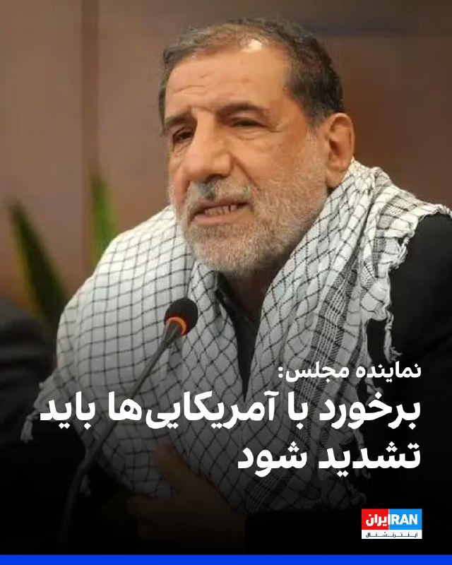

اسماعیل کوثری، عضو کمیسیون امنیت ملی مجلس جمهوری اسلامی، با اشاره به حملات بامداد چهارشنبه آمریکا به اهدافی در قشم بر لزوم «تشدید برخورد با آمریکا» تاکید کرد و گفت: «آمریکایی‌ها منطق ندارند و جز زور و قدرت چیز دیگری نمی‌فهمند.»

کوثری در مصاحبه با صدا و سیمای جمهوری اسلامی افزود: «این حرکات آمریکایی‌ها برخاسته از تفکر شیطانی آن‌هاست که می‌گویند آتش‌بس، ولی اقداماتی انجام می‌دهند که خلاف آن است.»
‌🏁 🇬🇧 IranintlTV

🤖 @VahidOOnLine

## VahidOOnLine — post 243470

  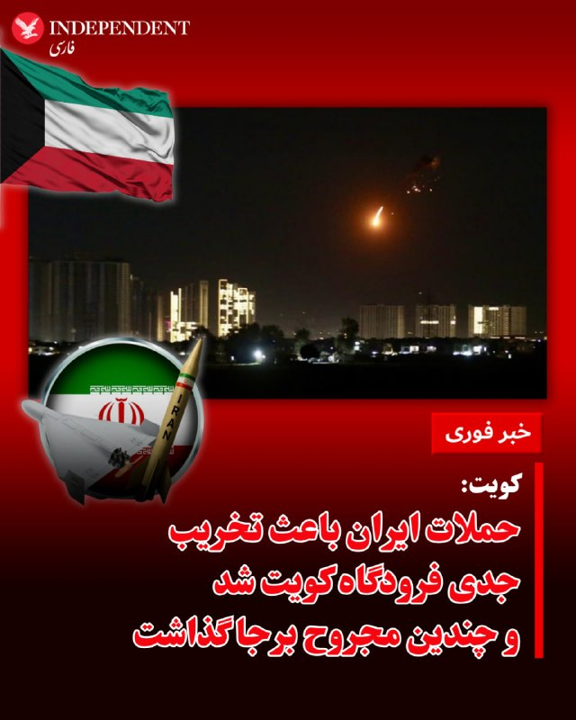

♦️وزارت دفاع کویت صبح چهارشنبه و ساعاتی پس از حملات موشکی و پهپادی سپاه به این کشور اعلام کرد که این حملات در ترمینال ۱ فرودگاه بین‌المللی کویت خسارات شدیدی برجا گذاشته و باعث مجروح شدن چندین نفر شده است.

سعود العطوان، سخنگوی وزارت دفاع کویت با اعلام این خبر گفت مجروحان این حملات کمک‌های درمانی لازم را دریافت کرده‌اند.

آخرین دور حملات موشکی و پهپادی جمهوری اسلامی به کویت و بحرین نیمه‌شب سه‌شنبه و بامداد چهارشنبه و پس از آن آغاز شد که سنتکام اهدافی نظامی را در جنوب ایران هدف قرار داد. سپاه پاسداران دقایقی پس این حملات، به سوی بحرین و کویت موشک و پهپاد شلیک کرد.
‌🇸🇦 Indypersian

🤖 @VahidOOnLine

## VahidOOnLine — post 243469

♦️رسانه‌های داخلی ایران صبح چهارشنبه ۱۳ خردادماه از وقوع انفجار در یک جایگاه سوخت‌رسانی در منطقه تهرانپارس واقع در شرق تهران خبر دادند.

به گزارش ایرنا، سخنگوی سازمان آتش‌نشانی تهران گفت یک خودروی نیسان یخچال‌دار در حال سوخت‌گیری در این جایگاه به‌دلایل نامشخص منفجر شده است.
به گفته این مقام آتش‌نشانی، راننده خودرو و یکی از کارکنان جایگاه در پی انفجار «مصدوم» شده‌اند.

صبح روز چهارشنبه کاربران شبکه‌های اجتماعی از شنیده شدن چند صدای شدید انفجار در شرق تهران خبر داده بودند.
‌🇸🇦 Indypersian

🤖 @VahidOOnLine

## IranIntlTV — post 340314

  

اسماعیل کوثری، عضو کمیسیون امنیت ملی مجلس جمهوری اسلامی، با اشاره به حملات بامداد چهارشنبه آمریکا به اهدافی در قشم بر لزوم «تشدید برخورد با آمریکا» تاکید کرد و گفت: «آمریکایی‌ها منطق ندارند و جز زور و قدرت چیز دیگری نمی‌فهمند.»

کوثری در مصاحبه با صدا و سیمای جمهوری اسلامی افزود: «این حرکات آمریکایی‌ها برخاسته از تفکر شیطانی آن‌هاست که می‌گویند آتش‌بس، ولی اقداماتی انجام می‌دهند که خلاف آن است.»
https://iranintl.com/202606032397

## DW_Farsi — post 125441

  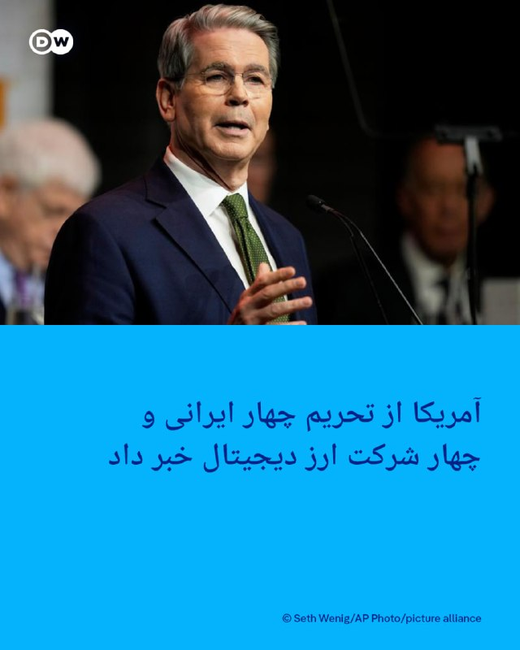

🔶 آمریکا از تحریم چهار ایرانی و چهار شرکت ارز دیجیتال خبر داد

وزارت خزانه‌داری آمریکا شامگاه سه‌شنبه ۱۲ خرداد (۲ مه) در بیانیه‌ای اعلام کرد این وزارتخانه شش فرد و چهار صرافی فعال در حوزه خدمات مالی و رمزارز مرتبط با جمهوری اسلامی ایران را در فهرست تحریم‌های خود قرار داده است.

طبق این گزارش که در تارنمای وزارت خزانه‌داری منتشر شده است، افراد ایرانی تحریم‌شده شامل محمد آقامیر، محمدعلی آقامیر، علی خویی و امیرحسین‌راد هستند که با صرافی رمزارز "نوبیتکس" مرتبط معرفی شده‌اند.

همچنین چهار صرافی نوبیتکس، بیت‌پین، رمزینکس و والکس نیز در فهرست تحریم‌ها قرار گرفته‌اند.

در بخش دیگری از این بیانیه آمده است که وزارت خزانه‌داری آمریکا دو فرد از جمهوری دموکراتیک کنگو را نیز به این فهرست افزوده است.

اسکات بسنت، وزیر خزانه‌داری آمریکا در پلتفرم ایکس نوشته است در حالی که اقتصاد ایران به شدت در حال سقوط است، حکومت تصمیم گرفته از فناوری‌های ارز دیجیتال برای پیشبرد اهداف خود استفاده کند؛ از جمله برای دور زدن تحریم‌ها و خارج کردن پول از کشور.

بسنت در ادامه تاکید کرده است که وضعیت نابسامان اقتصادی فعلی ایران نشان می‌دهد که سیاست فشار حداکثری دولت ترامپ مؤثر بوده است.

اسکات بسنت، وزیر خزانه‌داری ایالات متحده اخیرا اعلام کرد مجموع دارایی‌های رمزارزی مرتبط با جمهوری اسلامی که تا کنون توسط آمریکا توقیف شده، به حدود یک میلیارد دلار رسیده است. او گفت این رقم مربوط به کل دارایی‌های توقیف‌شده تا امروز است و به یک اقدام واحد محدود نمی‌شود.

@dw_farsi

## Persian_Trend_Official — post 15598

  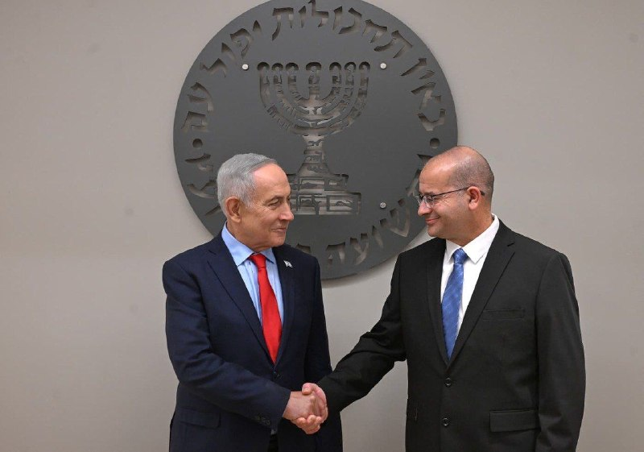

⭕️ اسرائیل به فارسی:

نخست‌وزیر نتانیاهو در مراسم معارفه رئیس جدید موساد:
سرنوشت رژیم ایران این است که از جهان محو شود و ما به آن برای رسیدن به این سرنوشت کمک خواهیم کرد. این رژیم هرگز دیگر موجودیت ما را تهدید نخواهد کرد.

📝 Nick

📌 @persian_trend_official
پرشین ترند | متفاوت‌ترین کانال نظامی

## Persian_Trend_Official — post 15596

  <a href="telegram/content/Persian_Trend_Official_15596_1780467819.mp4" target="_blank">🎬 Download video</a>

⭕️ اسرائیل به فارسی:

یوسف رمضان تروریست عضو حماس که در جنایت ربودن شهروندان اسرائیلی در هفتم اکتبر شرکت داشت، در غزه به هلاکت رسید.

📝 Nick

📌 @persian_trend_official
پرشین ترند | متفاوت‌ترین کانال نظامی

## Persian_Trend_Official — post 15595

  <a href="telegram/content/Persian_Trend_Official_15595_1780467821.mp4" target="_blank">🎬 Download video</a>

⭕️ سخنگوی آتش‌نشانی: صبح امروز خودروی نیسان در حال سوخت‌گیری در جایگاه سوخت گاز واقع در بزرگراه یاسینی بود که به‌دلایل نامشخص دچار انفجار شد.

در این حادثه دو نفر مصدوم شدند.

📝 Nick

📌 @persian_trend_official
پرشین ترند | متفاوت‌ترین کانال نظامی

## Persian_Trend_Official — post 15594

  <a href="telegram/content/Persian_Trend_Official_15594_1780467822.webm" target="_blank">🎬 Download video</a>

🎥 فواد ایزدی: آمریکا به‌دنبال عادی‌سازی حمله به ایران است.

🔹کارشناس مسائل بین‌الملل: کاری که آمریکایی‌ها می‌کنند شبیه آتش‌بس در غزه و لبنان است. حوصلۀ ایران همیشگی نیست. / فارس

📝 Nick

📌 @persian_trend_official
پرشین ترند | متفاوت‌ترین کانال نظامی

## alonews — post 124684

  <a href="telegram/content/alonews_124684_1780467823.webm" target="_blank">🎬 Download video</a>

👈شاخص کل بورس تهران در دقایق ابتدایی آخرین روز کاری بازار در هفته جاری ۱۷ هزار واحد رشد کرد و به تراز ۴ میلیون و ۳۶۱ هزار واحد رسید

✅ @AloNews خبر جنگ

## alonews — post 124683

  <a href="telegram/content/alonews_124683_1780467823.mp4" target="_blank">🎬 Download video</a>

👈ساعتی قبل، حمله پهپادهای اوکراین به سن پترزبورگ

✅ @AloNews خبرر جنگ

## alonews — post 124682

  <a href="telegram/content/alonews_124682_1780467825.webm" target="_blank">🎬 Download video</a>

👈سازمان هواپیمایی کشوری کویت همچنین مدعی شد که هدف قرار گرفتن فرودگاه کویت منجر به مجروح شدن تعدادی از افراد و وارد آمدن خسارت‌های شدید به برخی از تاسیسات آن شد.

✅ @AloNews خبر جنگ

---
📅 بروزرسانی: 1405/03/13 09:43
---

## FoxNewsTwitter — post 342549

  <a href="telegram/content/FoxNewsTwitter_342549_1780467216.mp4" target="_blank">🎬 Download video</a>

Fox News (Twitter/X)

"People just want the truth..."

LA mayoral candidate Spencer Pratt shares what he's learned from his campaign, and why the race has become personal for him as he awaits election results:

"All I do is just speak from the heart, and I try to be as true to my authentic self and express how I feel about what I see and what other people see."

"I know what people want now. They want somebody to speak the truth for their communities and fight for them."

## FarsiVOA — post 219441

🔺بلومبرگ: آمریکا بی‌سروصدا در حال باز کردن مسیر هرمز است

▪️بلومبرگ گزارش داد یک ماه پس از آنکه دونالد ترامپ طرحی علنی برای اسکورت کشتی‌های تجاری در تنگه هرمز اعلام کرد و سپس آن را کنار گذاشت، ارتش آمریکا اکنون روش‌هایی کم‌صداتر را برای حفاظت از کشتی‌ها در این آبراه حیاتی آزمایش می‌کند.

▪️بر اساس این گزارش، واشنگتن به‌جای اعلام یک چالش آشکار علیه تهران، به‌طور غیرعلنی با شرکت‌های کشتیرانی هماهنگ می‌کند؛ شرکت‌هایی که حاضرند برای عبور از هرمز، مسیر و شیوه حرکت خود را تغییر دهند.

▪️طرح تازه آمریکا نه اسکورت رسمی است و نه عقب‌نشینی از هرمز؛ بلکه نسخه‌ای کم‌صداتر و عملیاتی‌تر برای باز کردن مسیر عبور تجاری، بدون تبدیل آن به رویارویی علنی با تهران است.

⬇️ بیشتر بخوانید:
https://ir.voanews.com/a/us-looks-to-unblock-hormuz-with-quiet-version-of-project-freedom/8156777.html

## Persian_Trend_Official — post 15593

⭕️ فارس:

احتمال شنیدن صدای انفجارهای کنترل‌شده در دزفول

فرمانداری دزفول: درپی امحای مهمات از ساعت ۱۰ تا ۱۲، احتمال شنیدن صدای انفجار وجود دارد.

📝 Nick

📌 @persian_trend_official
پرشین ترند | متفاوت‌ترین کانال نظامی

## Persian_Trend_Official — post 15592

  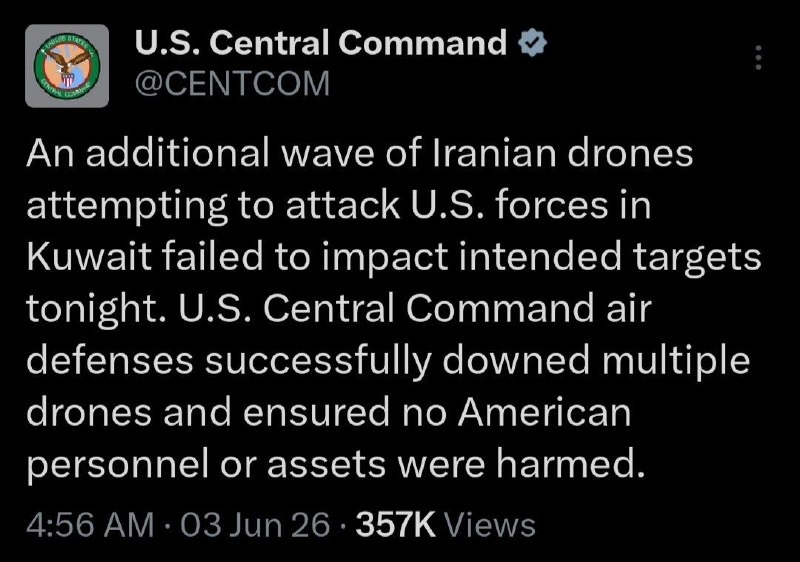

⭕️ سنتکام:

«موج دیگری از پهپادهای ایرانی که تلاش داشتند به نیروهای آمریکا در کویت حمله کنند، امشب نتوانست به اهداف موردنظر اصابت کند. پدافند هوایی فرماندهی مرکزی ایالات متحده با موفقیت چندین پهپاد را سرنگون کرد و اطمینان حاصل شد که هیچ‌یک از پرسنل یا تجهیزات آمریکایی آسیب ندیده‌اند.»

📝 Nick

📌 @persian_trend_official
پرشین ترند | متفاوت‌ترین کانال نظامی

## Persian_Trend_Official — post 15591

  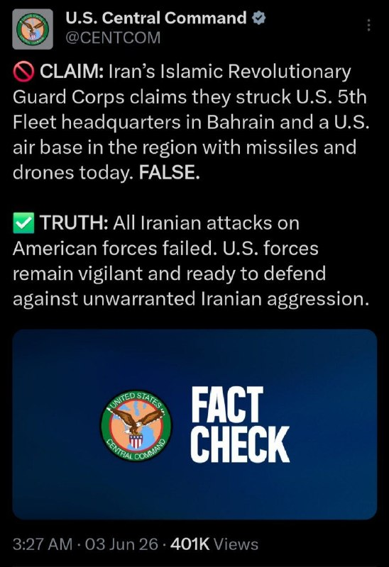

⭕️ سنتکام:

🚫 ادعا: سپاه پاسداران انقلاب اسلامی مدعی شده است که امروز با استفاده از موشک‌ها و پهپادها، مقر ناوگان پنجم نیروی دریایی آمریکا در بحرین و یک پایگاه هوایی آمریکا در منطقه را هدف قرار داده و مورد اصابت قرار داده است. نادرست.

✅ واقعیت: تمامی حملات ایران علیه نیروهای آمریکایی ناکام ماند. نیروهای ایالات متحده همچنان در حالت هوشیاری کامل قرار دارند و آماده‌اند در برابر آنچه «اقدامات تهاجمی و غیرموجه ایران» توصیف شده است، از خود دفاع کنند.

📝 Nick

📌 @persian_trend_official
پرشین ترند | متفاوت‌ترین کانال نظامی

## IranianMinds — post 21289

🔴 سنتکام:
در پاسخ به حملات جمهوری اسلامی، به اهدافی در جزیره قشم حمله کردیم.
موج دیگری از حمله پهپادی جمهوری اسلامی علیه نیروهای آمریکا در کویت ناکام مانده و هیچ آسیبی به نیروها یا تجهیزات آمریکایی وارد نشده.
سنتکام همچنین ادعاهای جمهوری اسلامی درباره هدف گرفتن مقر ناوگان پنجم در بحرین رو تکذیب کرد.

@IranianMinds

## alonews — post 124681

  <a href="telegram/content/alonews_124681_1780467218.webm" target="_blank">🎬 Download video</a>

👈نیویورک پست: خلبانی که در ایران سقوط کرد و‌ نجات یافت همان خلبانی بوده که در کویت و بر اثر آتش خودی سقوط کرده بود. دو سقوط در ۴ هفته!

✅ @AloNews خبر جنگ

## alonews — post 124680

  <a href="telegram/content/alonews_124680_1780467219.webm" target="_blank">🎬 Download video</a>

👈حمله گسترده روسیه به کی‌اف و دیگر مناطق اوکراین دست‌کم ۲۲کشته و بیش از ۱۰۰زخمی برجای گذاشت و هزاران نفر به مترو پناه بردند

✅ @AloNews خبر جنگ

---
📅 بروزرسانی: 1405/03/13 09:34
---

## WithYashar — post 13341

حرکت پهپاد شاهد۱۳۶ ، فعالیت پدافند و در پایان برخورد و انفجار در فرودگاه کویت !
@withyashar

## FoxNewsTwitter — post 342548

  <a href="telegram/content/FoxNewsTwitter_342548_1780466653.mp4" target="_blank">🎬 Download video</a>

Fox News (Twitter/X)

JUST NOW: LA mayoral candidate Spencer Pratt projects confidence as he waits for election results, dismisses the idea that he doesn't represent Democrats, Republicans and independents.

"Right now, the media likes to say, 'Oh, he's this.' I'm not that. I'm an Angeleno who said enough is enough and I had to step up."

"I didn't know I'd be here tonight, but this is obviously God's plan, and I'm going to go all the way, and I'm going to show everybody that I'm their mayor."

## FoxNewsTwitter — post 342547

  

Fox News (Twitter/X)

LA Mayor Karen Bass advances to the November runoff in her bid for reelection.

Despite being challenged from the left and right and a rocky first term, the Democrat secured a spot for the final round of voting.

Bass, for her own part, maintains that her three years as mayor have taken the city in the right direction.

The incumbent mayor and former congresswoman will now head into a high-profile November showdown as voters decide whether to give her a second term.

## pm_afshaa — post 92202

🔴کانال 14 اسرائیل:اگر ایران حتی یک گلوله به سمت اسرائیل شلیک کند، تمام دروازه های جهنم به رویشان باز خواهد شد

💧 Rainbet.com the #1 Non-KYC Crypto Casino & Sportsbook @rainbetcom

😁 @Pm_Afshaa

## RadioFarda — post 157838

روبیو: تحریم‌های ایران با کنار گذاشتن فعالیت‌های هسته‌ای‌اش کاهش خواهد یافت

🔸وزیر خارجه آمریکا روز سه‌شنبه ۱۲ خرداد گفت که تیم مذاکره‌کننده دونالد ترامپ، رئیس‌جمهور، در ازای بازگشایی تنگه هرمز هیچ پیشنهاد کاهش یا لغو تحریم‌ها به ایران ارائه نکرده و تأکید کرد که هرگونه کاهش تحریم‌ها منوط به کنار گذاشتن برنامه هسته‌ای از سوی تهران است.

🔸مارکو روبیو در جلسه پرسش و پاسخ کمیته روابط خارجی سنای آمریکا گفت: «در حال حاضر، هر آنچه با آن‌ها (ایران) مطرح شده این است که هرگونه کاهش تحریم‌ها مبتنی بر شروطی است؛ یعنی باید در ازای همان دلایلی باشد که اساساً این تحریم‌ها به خاطر آن‌ها اعمال شده‌اند، یعنی برنامه هسته‌ای‌شان».

🔸او که برای نخستین بار از زمان آغاز جنگ ایران به‌صورت علنی در کنگره شهادت می‌داد، گفت در صورتی که ایران با کنار گذاشتن فعالیت‌های هسته‌ای خود موافقت کند، کاهش تحریم‌ها برای آن در نظر گرفته خواهد شد.

🔸وزیر خارجه آمریکا افزود: «ایران به دلیل غنی‌سازی در سطوح بالا تحت تحریم است. ایران به خاطر فعالیت‌های هسته‌ایش تحریم شده است. اگر با کنار گذاشتن این موارد موافقت کنند، کاهش تحریم‌ها متناسب با تعهد و پایبندی‌شان به این توافق‌ها اعمال خواهد شد».

🔸روبیو در حالی در برابر کمیته روابط خارجی سنای آمریکا شهادت داد، که دولت ترامپ به دنبال جلب موافقت کنگره برای کاهش ۳۰ درصدی بودجه امور خارجی و افزایش ۵۰ درصدی هزینه‌های نظامی پیشنهادی خود است.

🔸وزیر خارجه آمریکا در بخشی از اظهارات خود گفت که ایران با مذاکره دربارهٔ برخی جنبه‌های برنامهٔ هسته‌ایش که پیش‌تر از گفت‌وگو درباره آن‌ها خودداری می‌کرد، موافقت کرده است.

🔸روبیو در عین حال تأکید کرد این موضوع هیچ تضمینی ایجاد نمی‌کند که مذاکرات در نهایت به توافقی برای پایان دادن به جنگ میان آمریکا و اسرائیل با ایران منجر شود.

🔸نسخه کامل این گزارش را در وب‌سایت رادیوفردا بخوانید.

@Radiofarda

## alonews — post 124679

  <a href="telegram/content/alonews_124679_1780466657.mp4" target="_blank">🎬 Download video</a>

👈کوثری: آمریکایی‌ها جز زور متوجه چیز دیگری نمی‌شوند

🔴عضو کمیسیون امنیت ملی مجلس: برخورد با آمریکایی‌ها باید تشدید شود.

✅ @AloNews خبر جنگ

## alonews — post 124678

  <a href="telegram/content/alonews_124678_1780466659.webm" target="_blank">🎬 Download video</a>

👈سخنگوی سازمان آتش‌نشانی شهر تهران:
ساعت ۳ دقیقه بامداد امروز حادثه خودرویی در زیر پل استخر محله تهرانپارس به سامانه ۱۲۵ اعلام شد.

🔴آتش‌نشانان پس از حضور در محل مشاهده کردند یک دستگاه خودروی MVM با دو سرنشین که در روی پل در حال عبور بودند، به دلیل نامشخصی با گاردریل‌های پل برخورد کرده است.

🔴پس از حضور عوامل اورژانس مشخص شد که متأسفانه هر دو سرنشین جان خود را از دست داده‌اند

✅ @AloNews خبر جنگ

---
📅 بروزرسانی: 1405/03/13 09:23
---

## WithYashar — post 13340

سازمان هواپیمایی کشوری کویت: یک ساختمان مسافربری در فرودگاه
کویت هدف پهپادها و موشک‌های ایرانی قرار گرفت و حالت اضطراری فعال شده.
@withyashar

## pm_afshaa — post 92201

🔴رسانه‌های عربی از توقف کامل فعالیت فرودگاه‌ها و تمام پروازها در بحرین، کویت و امارات متحده عربی به دنبال وقوع حملات هوایی خبر دادن

💧 Rainbet.com the #1 Non-KYC Crypto Casino & Sportsbook @rainbetcom

😁 @Pm_Afshaa

## Shin_Persian — post 6458

🔁 Quoting above tweet:
Shin ✓ @hey_itsmyturn
Wed, 03 Jun 2026 05:43:47 UTC

Armed forces are on full alert and monitoring the situation.

#Kuwait 🇰🇼

Source: @KuwaitArmyGHQ
https://x.com/KuwaitArmyGHQ/status/2062047516384690551

فارسی

نیروهای مسلح در آماده‌باش کامل هستند و اوضاع را زیر نظر دارند.

#Kuwait 🇰🇼

منبع: @KuwaitArmyGHQ
https://x.com/KuwaitArmyGHQ/status/2062047516384690551

𝕏 · @shin_persian

## Shin_Persian — post 6457

  

↩️ Quoted tweet: KUWAIT ARMY - الجيش الكويتي ✓ @KuwaitArmyGHQ Wed, 03 Jun 2026 05:43:33 UTC بيان رقم (63) صرّح المتحدث الرسمي لوزارة الدفاع، العقيد الركن سعود عبدالعزيز العطوان، بأن عدداً من الطائرات المسيّرة المعادية استهدفت اليوم مبنى الركاب (T1) بمطار…

## Shin_Persian — post 6456

↩️ Quoted tweet:
KUWAIT ARMY - الجيش الكويتي ✓ @KuwaitArmyGHQ
Wed, 03 Jun 2026 05:43:33 UTC

بيان رقم (63)

صرّح المتحدث الرسمي لوزارة الدفاع، العقيد الركن سعود عبدالعزيز العطوان، بأن عدداً من الطائرات المسيّرة المعادية استهدفت اليوم مبنى الركاب (T1) بمطار الكويت الدولي نتيجة العدوان الإيراني الآثم، ما أسفر عن أضرار مادية جسيمة في المبنى وإصابة عدد من الأشخاص، حيث تلقوا

↩️ Quoted tweet — see the post below for the reply.

English

Statement No. (63)

The official spokesperson for the Ministry of Defense, Colonel Staff Saud Abdulaziz Al-Atwan, stated that a number of hostile drones targeted Terminal 1 (T1) at Kuwait International Airport today as a result of the sinful Iranian aggression. This resulted in severe material damage to the building and injuries to several individuals, who received...

𝕏 · @shin_persian

## Shin_Persian — post 6455

  

Shin @hey_itsmyturn
Wed, 03 Jun 2026 05:43:46 UTC

Kuwait Ministry of Defense spokesperson confirms hostile drones targeted Terminal 1 (T1) at Kuwait International Airport.

Significant material damage reported and several injuries confirmed following Iranian aggression.

فارسی

سخنگوی وزارت دفاع کویت تأیید کرد که پهپادهای متخاصم ترمینال ۱ (T1) در فرودگاه بین‌المللی کویت را هدف قرار داده‌اند.

گزارش‌ها حاکی از خسارات مادی قابل توجه است و چندین جراحت در پی تهاجم ایران تأیید شده است.

𝕏 · @shin_persian

## FarsiVOA — post 219440

  

مسئول مطبوعاتی حزب کومله زحمتکشان کردستان، از حمله موشکی سپاه به مقرهای این حزب در شامگاه سه‌شنبه ۱۲خرداد، خبر داد.

امجد حسین‌پناهی با انتشار پیامی در شبکه اجتماعی ایکس، از شلیک دست‌کم دو موشک به این مقرها خبر داد، اما مکان دقیق اهداف را اعلام نکرد.

در همین ارتباط خبرگزاری تسنیم وابسته به سپاه نیز اعلام کرد که «ساعت ۲۳:۰۰ به وقت محلی روز سه‌شنبه، دو موشک به مقر حزب کومله در «دره آلانه»، واقع در شمال شرقی اربیل، اصابت کرده است.»

حسین‌پناهی اعلام کرد که جمهوری اسلامی از آغاز جنگ تاکنون، با بیش از ۸۲ موشک و پهپاد، پایگاه‌ها و مقرهای کومله را هدف قرار داده است.
@FarsiVOA

## RadioFarda — post 157837

  

🔸سپاه پاسداران هم حملۀ آمریکا به یک «دکل مخابراتی سپاه» در جزیرۀ قشم و حملات موشکی به یک کشتی و پایگاه‌های آمریکا، از جمله در بحرین را تأیید کرد.

🔸در بیانیۀ روابط عمومی سپاه پاسداران آمده که در پاسخ به حملۀ جنگندۀ آمریکایی به نفتکش «لکسی» در نزدیکی تنگۀ‌ هرمز، نیروی دریایی سپاه یک شناور «متعلق به دشمن به نام پانایا» را هدف حملۀ موشکی قرار داده است.

🔸روابط عمومی سپاه پاسداران در ادامۀ بیانیۀ خود، با اشاره به حملۀ آمریکا به هدفی در جزیرۀ قشم، از حملۀ تلافی‌جویانه به یک «پایگاه هوایی و بالگردی در یکی از کشورهای منطقه» و مرکز ناوگان پنجم آمریکا [در بحرین] خبر داده است.

🔸پیشتر فرماندهی مرکزی نیروهای آمریکایی در منطقه، سنتکام، با صدور بیانیه‌ای، حمله به نقاطی در جزیره قشم، «در پاسخ به حملات موشکی و پهپادی جمهوری اسلامی» را تأیید کرد.

@RadioFarda

## alonews — post 124677

👈حمله اسرائیل به حومه بلعت در بخش مرجعیون در جنوب لبنان

✅ @AloNews خبر جنگ

## alonews — post 124676

👈روایت سی‌ان‌ان از درگیری شب گذشته ایران و آمریکا در خلیج فارس

🔴ایالات متحده و ایران در یکی از سنگین‌ترین شب‌های حملات از زمان آغاز آتش‌بس در آوریل، دست به تبادل حمله زده‌اند

🔴به نظر می‌رسد درگیری‌های شب سه‌شنبه زمانی آغاز شد که ارتش آمریکا با استفاده از موشک هلفایر، یک نفت‌کش با پرچم بوتسوانا را که به سمت بندری ایرانی در جزیره خارک در حرکت بود، هدف قرار داد. به گفته فرماندهی مرکزی ایالات متحده (سنتکام)، این کشتی با محاصره دریایی بنادر ایران توسط آمریکا همکاری نکرده بود.

🔴در پاسخ، ایران اعلام کرد به یک کشتی با پرچم لیبریا موشک شلیک کرده است.

🔴اما تشدید خطرناک‌تر پس از آن رخ داد که آمریکا یک ایستگاه کنترل زمینی نظامی ایران را در جزیره قشم، نزدیک تنگه هرمز، هدف قرار داد و این موضوع باعث شد ایران به کشورهای کویت و بحرین در منطقه خلیج فارس موشک و پهپاد شلیک کند.

🔴ایران اعلام کرد که «یک پایگاه هوایی و بالگردی آمریکایی» در منطقه و همچنین مقر ناوگان پنجم ایالات متحده در بحرین را هدف قرار داده است

✅ @AloNews خبر جنگ

---
📅 بروزرسانی: 1405/03/13 09:13
---

## WithYashar — post 13339

وال‌استریت ژورنال: حمله سنتکام به جزیره قشم، قیمت نفت را صعودی کرد و چشم‌انداز بازگشایی تنگه هرمز را کمرنگ ساخت.
@withyashar

## IranIntlTV — post 340313

  <a href="telegram/content/IranIntlTV_340313_1780465403.mp4" target="_blank">🎬 Download video</a>

رسانه‌های دولتی و تحلیلگران چینی در ساعت‌های گذشته روایت‌هایی از بن‌بست در مذاکرات تهران و آمریکا ارائه کرده‌اند که ممکن است به رویه «جنگ همراه مذاکره» تبدیل شود.

گفت‌وگو با توماج طاهباز، عضو تحریریه ایران‌اینترنشنال
@iranintltv

## FarsiVOA — post 219439

Farsi VOA pinned an audio file

## FarsiVOA — post 219438

  <a href="https://t.me/farsivoa/219438" target="_blank">📎 Download file</a>

🔴📢‌ پادکست خبری سه‌شنبه ۱۲ خرداد ۱۴۰۵

🛜در صورتی که با مشکل اینترنت مواجه هستید میتوانید اخبار صدای آمریکا را از نسخه‌های پادکست خبری ما روزانه دنبال کنید و یا اخبار را از نسخه سبک وب‌سایت ما پیگیر باشید:
https://ir.voanews.com/lite

📡بروزترین فرکانسهای ماهواره‌ای را نیز میتوانید از صفحه زیر پیگیری کنید:
https://ir.voanews.com/satellite

🔔دیگر شبکه‌های اجتماعی ما هم دنبال کنید:
https://linktr.ee/voafarsi

ما را به اشتراک بگذارید
@farsivoa

## DW_Farsi — post 125440

  

🔶 حملات پهپادی و موشکی سپاه به کویت و بحرین

فرماندهی مرکزی آمریکا (سنتکام) و سپاه پاسداران از حملات جدید موشکی و پهپادی خبر دادند.

کویت از رهگیری حملات موشکی و پهپادی ایران خبر داد، در بحرین آژیر خطر به صدا درآمد. وزارت کشور بحرین بامداد چهارشنبه ۱۳ خرداد (۳ ژوئن) از شهروندان و ساکنان این کشور خواست که آرامش خود را حفظ کنند و به نزدیک‌ترین مکان امن بروند.

رسانه‌های نزدیک به سپاه پاسداران از حمله به فرودگاه دبی در امارات متحده عربی و همچنین از به صدا درآمدن آژیرهای خطر در شرق عربستان خبر دادند.

فرماندهی مرکزی آمریکا (سنتکام) هم تائید کرد که چند موشک بالستیک و پهپاد ایرانی و یک ایستگاه کنترل زمینی نظامی در قشم را منهدم کردند.

سنتکام همچنین گفته است بامداد روز چهارشنبه ۱۳ خرداد (۳ ژوئن) موج دیگری از پهپادهای منتسب به ایران که قصد حمله به نیروهای آمریکایی در کویت را داشتند، توسط سامانه‌های پدافند هوایی آمریکا سرنگون شدند.

طبق داده‌های سنتکام هیچ‌یک از نیروها یا تاسیسات آمریکا در کویت دچار آسیب نشده‌اند.

@dw_farsi

## alonews — post 124675

  <a href="telegram/content/alonews_124675_1780465406.webm" target="_blank">🎬 Download video</a>

👈احتمال شنیده شدن صدای انفجار کنترل شده در محدوده جنوب اصفهان

✅ @AloNews خبر جنگ

## alonews — post 124674

  <a href="telegram/content/alonews_124674_1780465406.mp4" target="_blank">🎬 Download video</a>

👈سخنگوی آتش‌نشانی: صبح امروز خودروی نیسان در حال سوخت‌گیری در جایگاه سوخت گاز واقع در بزرگراه یاسینی بود که به‌دلایل نامشخص دچار انفجار شد.

🔴در این حادثه دو نفر مصدوم شدند.

✅ @AloNews خبر جنگ

---
📅 بروزرسانی: 1405/03/13 09:03
---

## VahidOOnLine — post 243468

  <a href="telegram/content/VahidOOnLine_243468_1780464808.mp4" target="_blank">🎬 Download video</a>

⭕️سقوط بقایای موشک و پهپادهای سپاه در کویت

♦️در پی حملات موشکی و پهپادی سپاه به کویت و بحرین، تصاویری از بقایای در حال سوختن یک موشک یا پهپاد در شهر الفروانیه کویت در شبکه‌های اجتماعی منتشر شده است.

خبرگزاری رویترز صحت این ویدیو را تائید کرده است.

آخرین دور حملات متقابل سنتکام و نیروهای مسلح جمهوری اسلامی، نیمه‌شب سه‌شنبه و در نخستین ساعات بامداد چهارشنبه ۱۳ خرداد روی داد. سپاه پاسداران و رسانه‌های نزدیک به آن ادعا می‌کنند که دست‌کم یکی از موشک‌های سپاه به مرکز استقرار ناوگان پنجم نیروی دریایی آمریکا در بحرین اصابت کرده است. سنتکام این ادعاها را تکذیب کرده است.
‌🇸🇦 Indypersian

🤖 @VahidOOnLine

## FoxNewsTwitter — post 342546

  

Fox News (Twitter/X)

JUST NOW: Republican California gubernatorial candidate Steve Hilton shares an optimistic message with supporters as results continue to roll in.

"It looks very much as if Californians really will have the chance to vote for change in November...and take our state in a new direction — a fresh start for our state — which is long overdue."

"Whether you voted for me or not, I am here for you."

## FarsiVOA — post 219437

  <a href="telegram/content/FarsiVOA_219437_1780464810.mp4" target="_blank">🎬 Download video</a>

سخنگوی سازمان آتش‌نشانی تهران از انفجار یک خودروی نیسان یخچال‌دار در جایگاه سوخت گاز در بزرگراه یاسینی، حوالی تهرانپارس، خبر داد؛ حادثه‌ای که به گفته او آتش‌سوزی به همراه نداشت، اما به خودرو و بخش‌هایی از جایگاه خسارت وارد کرد.

بر اساس اعلام آتش‌نشانی، این حادثه صبح امروز چهارشنبه در جایگاه سوخت گاز واقع در بزرگراه یاسینی بعد از سه‌راه تهرانپارس گزارش شد و نیروهای دو ایستگاه آتش‌نشانی به محل اعزام شدند.

بنابر اعلام آتش‌نشانی علت حادثه مشخص نیست و بررسی‌های فنی برای مشخص شدن منشأ انفجار ادامه دارد.

شدت انفجار باعث آسیب جدی به بدنه خودرو و خسارت به سقف و دیواره‌های جایگاه شد. در این حادثه راننده نیسان، حدود ۶۰ ساله، و یکی از متصدیان جایگاه، حدود ۴۰ ساله، مصدوم شدند.

همزمان رسانه‌ها به نقل از کاربران از شنیده شدن صدای انفجار در مناطق شرق و شمال شرق تهران در ساعات اولیه روز چهارشنبه خبر داده‌اند. تا این لحظه مقام‌های رسمی هیچ علت امنیتی یا خرابکارانه‌ای برای حادثه اعلام نکرده‌اند.
@FarsiVOA

## RadioFarda — post 157836

  

🔸فرماندهی مرکزی نیروهای آمریکایی در منطقه، سنتکام، با صدور بیانیه‌ای دیگر، حمله به نقاطی در جزیره قشم، «در پاسخ به حملات موشکی و پهپادی جمهوری اسلامی» را تأیید کرد.

🔸در این بیانیه آمده که نیروهای آمریکایی با موفقیت چندین موشک بالستیک و پهپاد شلیک‌شده از ایران را رهگیری و منهدم کرده و در اقدامی دفاعی، نقاطی در جزیرۀ قشم را هدف قرار داده‌اند.

🔸این بیانیه می‌افزاید که ایران چندین موشک بالیستیک را به سمت همسایگانش شلیک کرد؛ اما همگی در اصابت به اهداف خود ناموفق بوده‌اند. دو موشک شلیک‌شده به سمت کویت، در مسیر خود و پیش از رسیدن به این کشور دچار مشکل فنی شده و سقوط کردند و سه موشک شلیک‌شده به سمت بحرین هم از سوی پدافند هوایی ایالات متحده و بحرین رهگیری و منهدم شدند.

🔸سنتکام در ادامۀ بیانیۀ تازۀ خود می‌گوید: «لحظاتی پیش نیروهای سنتکام سه پهپاد تهاجمی انتحاری ایرانی را که به سمت کشتی‌های غیر نظامی در حرکت بودند، رهگیری و ساقط کردند. نیروهای آمریکایی همزمان در اقدامی دفاعی، یک ایستگاه کنترل نظامی ایران در جزیرۀ قشم را هدف قرار دادند».

@RadioFarda

## IranianMinds — post 21288

🔴 سنتکام:
خب آره خب دیشب به قشم حمله کردیم اماااااا آتش‌بس همچنان برقراره.☺️☺️

@IranianMinds

## BBCPersian — post 282743

🔻انفجار خودرو در جایگاه سوخت‌گیری تهرانپارس تهران

🔻بنابر اعلام سخنگوی سازمان آتش‌نشانی صبح امروز(چهارشنبه سیزدهم خرداد) یک انفجار در جایگاه سوخت گاز در بزرگراه یاسینی، مسیر غرب به شرق، بعد از سه‌ راه تهرانپارس بوقوع پیوست.

دلیل این انفجار هنوز مشخص نشده است.

سخنگوی سازمان آتش‌نشانی گفته است: «در بررسی‌های اولیه مشخص شد که یک دستگاه خودرو نیسان یخچال‌دار در حال سوخت‌گیری در این جایگاه بوده که به دلایل نامشخص و در حال بررسی، دچار انفجار شده است.»

شدت این انفجار باعث وارد آمدن خسارات به خودرو و جایگاه سوخت شد.

به گزارش رسانه‌های ایران، دو نفر در این انفجار مصدوم شدند.

https://bbc.in/4o1NHmi
@BBCPersian

## BBCPersian — post 282742

🔻سنتکام هدف قرار گرفتن ناوگان پنجم ایالات متحده در حملات سپاه پاسداران را رد کرد

🔻فرماندهی مرکزی ارتش ایالات متحده، سنتکام، در اطلاعیه‌ای هدف قرارگرفتن ناوگان پنجم ایالات متحده در بحرین و یک پایگاه هوایی ایالات متحده در منطقه، در حملات «موشکی و پهپادی» سپاه پاسداران را رد کرده است.

این نهاد در پیامی که در شبکه اجتماعی ایکس منتشر کرده نوشته است: «این ادعا نادرست است.»

سنتکام همچنین اعلام کرده است: «تمام حملات ایران به نیروهای آمریکایی شکست خورد. نیروهای آمریکایی هوشیار و آماده دفاع در برابر تجاوز بی‌توجیه ایران هستند.»

ساعتی پس از انتشار گزارش‌های متعدد از حملات موشکی به نقاطی در کویت و بحرین، سپاه پاسداران با انتشار اطلاعیه‌ای رسما از حمله به پایگاه ناوگان پنجم نیروی دریایی آمریکا خبر داده بود.

سنتکام پیشتر اعلام کرده بود چندين موشک بالستيک و پهپاد ايرانی را رهگيری و منهدم کرده و در پاسخ به آنچه «تلاش‌های ايران برای حمله در سراسر منطقه» خوانده، حملاتی را در قالب دفاع از خود عليه اهدافی در جزيره قشم انجام داده است.

https://bbc.in/4x7i8M9
@BBCPersian

## alonews — post 124673

  <a href="telegram/content/alonews_124673_1780464813.webm" target="_blank">🎬 Download video</a>

👈بیت کوین در ۴۸ ساعت گذشته بدون هیچ خبر منفی مهمی؛ ۸۰۰۰ دلار (۱۰٪-) سقوط کرد

✅ @AloNews خبر جنگ

## alonews — post 124672

  <a href="telegram/content/alonews_124672_1780464813.mp4" target="_blank">🎬 Download video</a>

👈 تصادف در خیابان های کویت بر اثر تماشای موشکهای سپاه

✅ @AloNews خبر جنگ

## alonews — post 124669

  <a href="telegram/content/alonews_124669_1780464814.mp4" target="_blank">🎬 Download video</a>

👈دیشب ، حمله‌های ارتش اوکراین به روسیه

✅ @AloNews خبر جنگ

---
📅 بروزرسانی: 1405/03/13 08:53
---

## IranIntlTV — post 340312

  <a href="telegram/content/IranIntlTV_340312_1780464200.mp4" target="_blank">🎬 Download video</a>

سپاه پاسداران در بیانیه‌ای اعلام کرد در پاسخ به حمله نیروهای آمریکایی به یک نفتکش ایران در حوالی تنگه هرمز، شناوری به نام پانایا را هدف قرار داده است.

امیر گیتی، عضو تحریریه ایران‌اینترنشنال، گفت تبادل آتش میان آمریکا و جمهوری اسلامی ادامه دارد و خبری از آتش‌بس نیست
@iranintltv

## RadioFarda — post 157835

🔸تقریباً همزمان با انتشار بیانیۀ سنتکام، حاکی از شلیک یک موشک هل‌فایر به موتورخانۀ یک نفتکش خالی که قصد نزدیک‌شدن به پایانه‌های نفتی جزیرۀ خارک را داشته، خبرگزاری مهر به نقل از مردم و منابع محلی، از شنیده‌شدن صدای چند انفجار از سمت جزیرۀ قشم خبر داد.

🔸در گزارش کوتاه خبرگزاری مهر، ماهیت و علت شنیده‌شدن این صداها نامشخص اعلام و تأکید شده که مراجع نظامی و انتظامی در منطقه هم از این موضوع اظهار بی‌اطلاعی کرده‌اند.

🔸در همین حال، کویت هم از درگیری سامانه‌های دفاع هوایی‌اش با حملات موشکی و پهپادی خبر داده است.

🔸ارتش کویت در دقایق اولیه چهارشنبه به وقت محلی و کم‌وبیش همزمان با شنیده‌شدن صداهای انفجار در قشم، اعلام کرد که مشغول رهگیری حملات موشکی و پهپادی است و از مردم این کشور خواست که دستور‌العمل‌های ایمنی را دنبال کنند.

🔸این بیانیه بدون اشاره به مبدأ حملات موشکی و پهپادی، تأکید کرده که همۀ صداهای انفجار شنیده‌شده، ناشی از عملیات رهگیری پرتابه‌های تهاجمی است.

@RadioFarda

## BBCPersian — post 282732

‌🖊سعید جعفری
روزنامه‌نگار

🔻در حالی که مذاکرات ایران و آمریکا وارد مرحله‌ای حساس شده، در اسرائیل بحث‌ها درباره «روز بعد از توافق احتمالی» شدت گرفته است. سوال اصلی فقط این نیست که آیا توافقی شکل خواهد گرفت یا نه؛ بلکه این است که اگر واشنگتن و تهران به تفاهم برسند، اسرائیل چه خواهد کرد؟

در رسانه‌ها، اندیشکده‌ها و محافل امنیتی اسرائیل، به‌نظر می‌رسد بحث‌ها از مرحله تلاش برای جلوگیری کامل از توافق عبور کرده و بیشتر بر این متمرکز شده که اسرائیل چگونه باید با توافقی احتمالی کنار بیاید؛ توافقی که ممکن است نه‌تنها برنامه هسته‌ای ایران، بلکه آزادی عمل نظامی اسرائیل در منطقه را نیز تحت تاثیر قرار دهد.

متن کامل خبر را از لینک زیر بخوانید:
https://bbc.in/4dNcGq8
📷Getty Images

@‌BBCPersian

## alonews — post 124668

  <a href="telegram/content/alonews_124668_1780464201.webm" target="_blank">🎬 Download video</a>

👈 یک اطلاعیه پرواز (NOTAM) در اربیل که در روز یکشنبه صادر شده است، قرار است در صبح روز سه‌شنبه از ساعت ۰۷:۰۰ تا ۱۰:۰۰ به وقت محلی اجرا شود. دلیل ذکر شده یک تمرین نظامی است که به دلیل ماهیت از پیش برنامه‌ریزی شده‌ی آن، احتمالاً صحیح است.

✅ @AloNews خبر جنگ

## alonews — post 124667

  <a href="telegram/content/alonews_124667_1780464202.mp4" target="_blank">🎬 Download video</a>

👈 تصاویر تکمیلی از رهگیر شکست خورده موشک در کویت

✅ @AloNews خبر جنگ

## alonews — post 124666

  <a href="telegram/content/alonews_124666_1780464202.mp4" target="_blank">🎬 Download video</a>

👈فیلمی از پهپاد شاهد-۱۳۶ که دیشب به سمت آسمان کویت درحال حرکت بود

✅ @AloNews خبر جنگ

## alonews — post 124665

👈سنتکام: آتش‌بس همچنان برقرار است

✅ @AloNews خبر جنگ

---
📅 بروزرسانی: 1405/03/13 08:43
---

## FoxNewsTwitter — post 342545

  

Fox News (Twitter/X)

WATCH LIVE: GOP candidate Steve Hilton hosts election night watch party in California https://twitter.com/i/broadcasts/1dGYllLOQXvKX

## IranIntlTV — post 340311

  <a href="telegram/content/IranIntlTV_340311_1780463598.mp4" target="_blank">🎬 Download video</a>

وزارت خزانه‌داری آمریکا اعلام کرد نوبیتکس، بزرگ‌ترین صرافی رمزارز ایران را تحریم کرده است.

میعاد ملکی، رییس پیشین دفتر هدف‌گذاری تحریم‌های وزارت خزانه‌داری آمریکا، گفت این اقدام به دلیل فعالیت‌های سپاه پاسداران و پیامی به اعضای کنگره است که فشار بر جمهوری اسلامی باید ادامه یابد
@iranintltv

## IranianMinds — post 21287

  

🔴 بعد از کشته شدن استاد اسپلینتر ارتش موش ها برای انتقام به کشور حمله کردن

با اعلام مدیرکل محیط زیست موش های پا سفید که رنگ قهوه ای مایل به قرمز دارن، بخاطر گرما به کشور هجوم آوردن و بسیار هم خطرناک هستن!

@IranianMinds

## alonews — post 124664

  <a href="telegram/content/alonews_124664_1780463600.webm" target="_blank">🎬 Download video</a>

👈رسانه‌های عربی از توقف کامل فعالیت فرودگاه‌ها و تمام پروازها در بحرین، کویت و امارات متحده عربی به دنبال وقوع حملات هوایی خبر دادند

✅ @AloNews خبر جنگ

## alonews — post 124663

  <a href="telegram/content/alonews_124663_1780463600.webm" target="_blank">🎬 Download video</a>

👈 فرماندهی مرکزی ایالات متحده (سنتکام) گزارش‌ها درباره اصابت حملات ایران به مقر ناوگان پنجم آمریکا در بحرین را تکذیب کرد.

✅ @AloNews خبر جنگ

## alonews — post 124662

  <a href="telegram/content/alonews_124662_1780463601.webm" target="_blank">🎬 Download video</a>

👈وال استریت ژورنال: حمله سنتکام به جزیره قشم، قیمت نفت را صعودی کرد و چشم‌انداز بازگشایی تنگه هرمز را کمرنگ ساخت.

✅ @AloNews خبر جنگ

---
📅 بروزرسانی: 1405/03/13 08:33
---

## FoxNewsTwitter — post 342544

  

Fox News (Twitter/X)

Trump-endorsed Rep. Randy Feenstra lost Iowa’s Republican gubernatorial primary Tuesday night to businessman and farmer Zach Lahn.

Trump had praised Feenstra as “MAGA all the way” in a last-minute Truth Social endorsement last week, and the congressman was widely expected to win the race.

The upset marks a notable break from recent GOP primaries in states like Texas and Kentucky, where Trump-backed candidates prevailed.

Lahn now advances to Iowa’s general election on Nov. 3.

## VahidOnline — post 75892

  <a href="telegram/content/VahidOnline_75892_1780463004.mp4" target="_blank">🎬 Download video</a>

"انفجار خودرو در جایگاه سوخت‌گیری تهرانپارس"

خبرگزاری فارس و تسنیم با انتشار ویدیوهای بالا نوشتند:
سخنگوی سازمان آتش‌نشانی:
در ساعت ۶:۱۴ صبح امروز، وقوع یک مورد انفجار در جایگاه سوخت گاز واقع در بزرگراه یاسینی، مسیر غرب به شرق، بعد از سه‌راه تهرانپارس (نرسیده به پل ۱۲ فروردین) به سامانه ۱۲۵ اعلام شد. بلافاصله نیروهای دو ایستگاه آتش‌نشانی به محل حادثه اعزام شدند.

در بررسی‌های اولیه مشخص شد که یک دستگاه خودروی نیسان یخچال‌دار در حال سوخت‌گیری در این جایگاه بوده که به دلایل نامشخص و در حال بررسی، دچار انفجار شده است.

خوشبختانه این انفجار منجر به آتش‌سوزی نشده بود، اما شدت آن باعث وارد آمدن خسارات قابل‌توجهی به بدنه خودروی نیسان و بخش‌هایی از سقف و دیواره‌های جایگاه سوخت شده است.
در این حادثه دو نفر شامل راننده خودروی نیسان (حدوداً ۶۰ ساله) و یکی از متصدیان جایگاه (حدوداً ۴۰ ساله) دچار مصدومیت شدند.

📡 @VahidOnline

## alonews — post 124661

  <a href="telegram/content/alonews_124661_1780463004.webm" target="_blank">🎬 Download video</a>

👈قیمت جهانی هر بشکه نفت برنت از ۹۷ دلار فراتر رفت

✅ @AloNews خبر جنگ

---
📅 بروزرسانی: 1405/03/13 08:23
---

## VahidOOnLine — post 243467

  

سازمان کوییرهای ایرانی سیمرغ در ارتباط با قتل اخیر مهشید فلاحی، زن ترنس ۳۲ ساله، در سنندج به نقل از کنشگران کوییر و فعالان کرد داخل ایران گزارش داد او حدود دو هفته پیش با چاقو به قتل رسید و سرش از پیکرش جدا شد.
طبق این گزارش، پیکر مثله‌شده مهشید چند روز پیش در نزدیکی سد سنندج پیدا شد و چند روز بعد نیز سر او در یکی از خیابان‌های شهر کشف شد.
سیمرغ به نقل از کنشگران کوییر و فعالان کرد داخل ایران نوشت مهشید سال‌ها پیش از سوی خانواده خود طرد شده و بی‌خانمان و کارتن‌خواب بود و از بازماندگان خشونت جنسی به شمار می‌رفت.
طبق گزارش‌های سازمان‌های حقوق بشری، پیکر مهشید همچنان در پزشکی قانونی نگهداری می‌شود و هیچ‌یک از اعضای خانواده برای تحویل پیکر او اقدام نکرده‌اند.
در حالی که برخی گزارش‌های اولیه، قتل مهشید فلاحی را به اسلام‌گرایان سلفی نسبت داده‌ بودند، اما هنوز هویت عامل یا عاملان این قتل مشخص نیست.

‌🏁 🇬🇧 IranintlTV

🤖 @VahidOOnLine

## pm_afshaa — post 92200

آژیر خطر در بحرین فعال شد

💧 Rainbet.com the #1 Non-KYC Crypto Casino & Sportsbook @rainbetcom

😁 @Pm_Afshaa

## pm_afshaa — post 92199

🔴وزارت خزانه‌داری آمریکا چهار صرافی رمز ارز ایرانی نوبیتکس، بیت‌پین، رمزینکس و والکس را در لیست سیاه قرار داد و تحریم کرد

💧 Rainbet.com the #1 Non-KYC Crypto Casino & Sportsbook @rainbetcom

😁 @Pm_Afshaa

## IranIntlTV — post 340310

  

سازمان کوییرهای ایرانی سیمرغ در ارتباط با قتل اخیر مهشید فلاحی، زن ترنس ۳۲ ساله، در سنندج به نقل از کنشگران کوییر و فعالان کرد داخل ایران گزارش داد او حدود دو هفته پیش با چاقو به قتل رسید و سرش از پیکرش جدا شد.
طبق این گزارش، پیکر مثله‌شده مهشید چند روز پیش در نزدیکی سد سنندج پیدا شد و چند روز بعد نیز سر او در یکی از خیابان‌های شهر کشف شد.
سیمرغ به نقل از کنشگران کوییر و فعالان کرد داخل ایران نوشت مهشید سال‌ها پیش از سوی خانواده خود طرد شده و بی‌خانمان و کارتن‌خواب بود و از بازماندگان خشونت جنسی به شمار می‌رفت.
طبق گزارش‌های سازمان‌های حقوق بشری، پیکر مهشید همچنان در پزشکی قانونی نگهداری می‌شود و هیچ‌یک از اعضای خانواده برای تحویل پیکر او اقدام نکرده‌اند.
در حالی که برخی گزارش‌های اولیه، قتل مهشید فلاحی را به اسلام‌گرایان سلفی نسبت داده‌ بودند، اما هنوز هویت عامل یا عاملان این قتل مشخص نیست.

https://iranintl.com/202606031363

## RadioFarda — post 157834

  <a href="telegram/content/RadioFarda_157834_1780462401.mp4" target="_blank">🎬 Download video</a>

🔸فرماندهی مرکزی نیروهای ایالات متحده می‌گوید با شلیک یک موشک به یک نفتکش خالی، مانع از نزدیک‌شدن این شناور به یک بندر ایرانی شده است.

🔸بر اساس بیانیۀ سنتکام نیروهای نظامی آمریکا به این ترتیب جلوی رسیدن نفتکش M/T Lexie که با پرچم بوتسوانا تردد می‌کند، به ترمینال بارگیری در جزیرۀ خارک را گرفتند.

🔸این بیانیه می‌گوید خدمۀ کشتی به اخطارهای پیاپی نیروهای آمریکا بی‌اعتنایی کرده و در طول بیش از ۲۴ ساعت، حاضر به تبعیت از دستورات آنها نشدند.

🔸در نهایت یک هواپیمای جنگنده با شلیک یک موشک «هِل‌فایِر» به موتورخانۀ کشتی، مانع از رسیدن نفتکش به ایران شد.

🔸سنتکام از پنجاه روز پیش، جلوگیری از تردد همۀ شناورها به بنادر ایرانی را آغاز کرد. در این فاصله نیروهای آمریکایی شش کشتی تجاری را از کار انداخته و ۱۲۲ شناور را هم به مسیرهایی دیگر راهنمایی کرده‌اند.

🔸این در حالی‌است که آتش‌بس میان ایران و آمریکا همچنان ادامه دارد و تلاش‌های دیپلماتیک برای تمدید دست‌کم شش‌ماهۀ آن هم در جریان است.

@RadioFarda

<!-- MSG END -->

<!-- NAV START -->

<a href="https://github.com/ProAlit/aio-downloader/blob/main/telegram/content/archive_1.md" style="display:inline-block; padding:6px 12px; margin:0 4px; background-color:#2ea44f; color:white; text-decoration:none; border-radius:4px; font-weight:bold;">صفحه بعد</a>

<!-- NAV END -->
