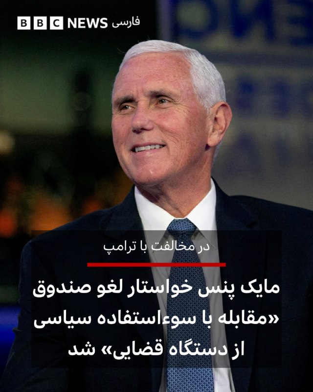
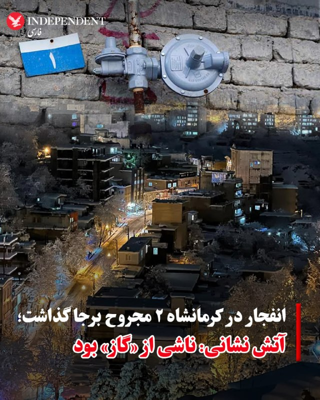
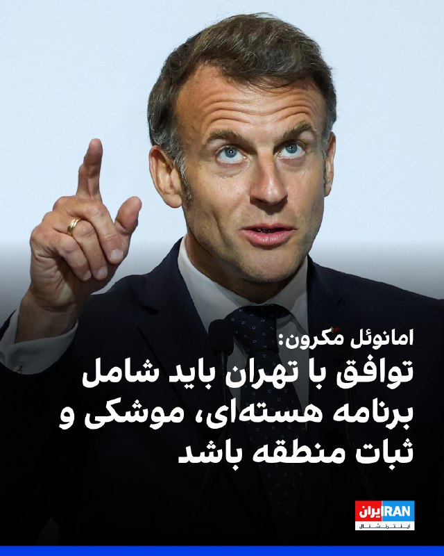
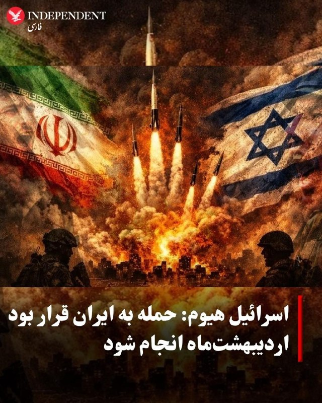

# خواننده تلگرام

<!-- TOP_NAV START -->

<a href="https://github.com/ProAlit/aio-downloader/blob/main/telegram/content/archive_1.md" style="display:inline-block; padding:6px 12px; margin:0 4px; background-color:#2ea44f; color:white; text-decoration:none; border-radius:4px; font-weight:bold;">صفحه بعد</a>

<!-- TOP_NAV END -->

<!-- MSG START -->

---
📅 بروزرسانی: 1405/03/11 04:43
---

هیچ پیام جدیدی در این بروزرسانی ارسال نشد.

---
📅 بروزرسانی: 1405/03/11 04:33
---

## VahidOOnLine — post 243133

♦️بر اساس گزارش رویترز، یکشنبه‌شب، پدیده نادر «ماه آبی» بر فراز معبد باستانی «پوزئیدون» در منطقه «دماغه‌ سونیون» یونان طلوع کرد. رویدادی نسبتا کم‌نظیر که به دومین ماه کامل در طول یک ماه تقویمی اطلاق می‌شود و این‌بار، نشانه پایانی برای فصل بهار است. با وجود نام این پدیده، رنگ ماه در واقعیت آبی نیست و طبق اعلام سازمان فضایی «ناسا»، این پدیده یکی از کوچک‌ترین ماه‌های کامل سال به شمار می‌رود که به «ماه مینیاتوری» (Micromoon) معروف است.
‌🇸🇦 Indypersian

🤖 @VahidOOnLine

## VahidOOnLine — post 243132

  

♦️دونالد ترامپ، رئیس جمهوری آمریکا در پیامی در تروث سوشال نوشت: «رسانه جعلی سی‌ان‌ان امروز طبق روال همیشگی خود ادعا کرد که توافق هسته‌ای من با ایران درباره موضوع هسته‌ای چیزی نمی‌گوید؛ در حالی که این توافق به‌روشنی تصریح می‌کند که ایران به سلاح هسته‌ای دست نخواهد یافت.
این توافق سپس با جزئیات فراوان و بسیار قاطع، به جنبه‌های مختلف دیگر موضوع هسته‌ای می‌پردازد. در واقع، بخش عمده این توافق دقیقا درباره همین موضوع است.
سی‌ان‌ان و بسیاری دیگر از رسانه‌های جعلی، به فاجعه‌ای از نظر میزان مخاطب تبدیل شده‌اند. حتی با وجود مالکان جدید نیز بعید است هرگز بهتر شوند!!»
‌🇸🇦 Indypersian

🤖 @VahidOOnLine

## BBCPersian — post 282522

‌ ‌ انتخابات رياست جمهوری کلمبيا پس از آنکه در رأی‌گيری روز يکشنبه - ۱۰ خرداد - هيچ نامزدی موفق به کسب اکثريت مطلق آرا نشد، به دور دوم در ۲۱ ژوئن (سه هفته دیگر) کشيده شد. در اين مرحله، يک نامزد چپ‌گرا و يک نامزد راست‌گرا که در دو سوی طيف سياسی قرار دارند،…

## BBCPersian — post 282521

  

‌ ‌
انتخابات رياست جمهوری کلمبيا پس از آنکه در رأی‌گيری روز يکشنبه - ۱۰ خرداد - هيچ نامزدی موفق به کسب اکثريت مطلق آرا نشد، به دور دوم در ۲۱ ژوئن (سه هفته دیگر) کشيده شد. در اين مرحله، يک نامزد چپ‌گرا و يک نامزد راست‌گرا که در دو سوی طيف سياسی قرار دارند، با يکديگر رقابت خواهند کرد.

آبلاردو د لا اسپريا، نامزد راست‌گرا و از ستايش‌گران دونالد ترامپ، در دور نخست بيشترين رأی را به دست آورد و پس از او ايوان سپدا، سناتور چپ‌گرا و متحد گوستاوو پترو، رئيس‌جمهور کنونی کلمبيا، قرار گرفت.

کارزار انتخاباتی با موجی از خشونت همراه بود؛ از جمله حملات پهپادی، آدم ربايی، قتل و ترور يک نامزد رياست‌جمهوری در جريان يک گردهمايی انتخاباتی در سال گذشته.

هر دو نامزد ديدگاه‌های متفاوتی درباره نحوه حل درگيری مسلحانه داخلی کلمبيا دارند؛ بحرانی که دهه‌ها ادامه داشته و در سال‌های اخير بار ديگر شدت گرفته است.

در رأی گيری روز يکشنبه، هيچ يک از دو نامزد نتوانست بيش از ۵۰ درصد آرا را برای پيروزی مستقيم کسب کند.

https://bbc.in/4ee3V8C
📷Reuters
@BBCPersian

---
📅 بروزرسانی: 1405/03/11 04:22
---

هیچ پیام جدیدی در این بروزرسانی ارسال نشد.

---
📅 بروزرسانی: 1405/03/11 04:13
---

## FoxNewsTwitter — post 342467

‌Fox News (Twitter/X)

👉 Full story here:

## FoxNewsTwitter — post 342466

  

Fox News (Twitter/X)

Hasan Piker gets denied entry to the UK over alleged antisemitism — then immediately blames 'Israel advocacy organizations' for wielding 'unbelievable amounts of power' over British policy.

The streamer's response to the ban landed on a classic antisemitic trope about Jewish influence, even as he insisted he harbors no antisemitism. British Jewish groups and a Labour MP had urged the government to block his visit, citing his comments about Hamas, Hezbollah, and his claim that the U.S. deserved 9/11.

The ban caps a brutal stretch for Piker: a Treasury Department subpoena over his Cuba trip, and hecklers confronting him at a Newark ICE protest calling him a 'f***ing fraud.'

---
📅 بروزرسانی: 1405/03/11 04:03
---

## VahidOOnLine — post 243131

  

مهدی انصاری، وکیل، عضو کانون وکلای دادگستری فارس و کهگیلویه و بویراحمد و از بازداشت‌شدگان اعتراضات دی‌ماه ۱۴۰۴، توسط دادگاه انقلاب اسلامی شیراز به «پنج سال حبس تعزیری و مجازات تکمیلی» محکوم شد.

به گزارش سازمان حقوق بشری هه‌نگاو، در این حکم که به انصاری ابلاغ شده است، او از بابت اتهام «اجتماع و تبانی به قصد برهم زدن امنیت کشور» به تحمل ۵ سال حبس تعزیری محکوم شده است.

انصاری همچنین به عنوان مجازات تکمیلی به دو سال منع خروج از کشور محکوم شده است.

هه‌نگاو اشاره کرد که این وکیل دادگستری هشتم بهمن سال گذشته و در جریان اعتراضات سراسری، به دست نیروهای حکومتی در منزل خود در شیراز، بازداشت شد.

او پساز پایان بازجویی، با تودیع قرار وثیقه ۵ میلیارد تومانی به صورت موقت و تا پایان مراحل دادرسی از زندان عادل‌آباد شیراز آزاد شده بود.
‌🏁 🇬🇧 IranintlTV

🤖 @VahidOOnLine

## IranIntlTV — post 339956

  

مهدی انصاری، وکیل، عضو کانون وکلای دادگستری فارس و کهگیلویه و بویراحمد و از بازداشت‌شدگان اعتراضات دی‌ماه ۱۴۰۴، توسط دادگاه انقلاب اسلامی شیراز به «پنج سال حبس تعزیری و مجازات تکمیلی» محکوم شد.

به گزارش سازمان حقوق بشری هه‌نگاو، در این حکم که به انصاری ابلاغ شده است، او از بابت اتهام «اجتماع و تبانی به قصد برهم زدن امنیت کشور» به تحمل ۵ سال حبس تعزیری محکوم شده است.

انصاری همچنین به عنوان مجازات تکمیلی به دو سال منع خروج از کشور محکوم شده است.

هه‌نگاو اشاره کرد که این وکیل دادگستری هشتم بهمن سال گذشته و در جریان اعتراضات سراسری، به دست نیروهای حکومتی در منزل خود در شیراز، بازداشت شد.

او پساز پایان بازجویی، با تودیع قرار وثیقه ۵ میلیارد تومانی به صورت موقت و تا پایان مراحل دادرسی از زندان عادل‌آباد شیراز آزاد شده بود.
https://iranintl.com/202606018525

---
📅 بروزرسانی: 1405/03/11 03:52
---

## pm_afshaa — post 91977

  <a href="telegram/content/pm_afshaa_91977_1780273374.webm" target="_blank">🎬 Download video</a>

🔴محسن رضایی: با ادامه محاصره دریایی و مطرح کردن خواسته‌های بیش از حد در مذاکرات، ترامپ‌بار دیگر ثابت کرده که تمایلی به مذاکره و توافق نداره.

💧 Rainbet.com the #1 Non-KYC Crypto Casino & Sportsbook @rainbetcom

😁 @Pm_Afshaa

## BBCPersian — post 282520

‌‌‌ ‌ مايک پنس، معاون پيشين رئيس جمهوری آمريکا، به شدت از صندوق ۱/۸ ميليارد دلاری دولت دونالد ترامپ برای پرداخت غرامت به افرادی که مدعی‌اند در دولت‌های پيشين به ناعادلانه‌ترين شکل تحت پيگرد قرار گرفته‌اند، انتقاد کرد. دولت ترامپ اوايل ماه جاری از ايجاد صندوقی…

---
📅 بروزرسانی: 1405/03/11 03:42
---

## VahidOOnLine — post 243130

  

♦️به گزارش دنیای اقتصاد، در حال حاضر هزینه خرید چهار قلم کالای اساسی خانگی تولید داخل، شامل یخچال، تلویزیون، جاروبرقی و ماشین لباسشویی، ۳۶ برابر پایه حقوق کارگران است و برای خرید فقط این چهار قلم باید سه سال همه حقوق خود را جمع کنند و هیچ هزینه‌ای انجام ندهند. براساس این گزارش، هزینه این چهار قلم کالای اساسی خانگی از نام‌های تجاری ایرانی دست‌کم ۳۷۵ میلیون تومان است . به نوشته دنیای اقتصاد، قیمت لوازن خانگی در یک دهه اخیر پنج هزار درصد افزایش یافته است.
‌🇸🇦 Indypersian

🤖 @VahidOOnLine

## VahidOnline — post 75826

  

پست ترامپ، ترجمه ماشین:
رسانه اخبار جعلی سی‌ان‌ان امروز طبق معمول گفت که توافق هسته‌ای ایرانِ من درباره مسائل هسته‌ای صحبت نمی‌کند؛ در حالی که در واقع، بسیار روشن تصریح می‌کند که ایران سلاح هسته‌ای نخواهد داشت.
سپس با جزئیات بسیار محکم و مفصل، به جنبه‌های مختلف دیگر موضوع هسته‌ای می‌پردازد.
در واقع، بیشترِ این توافق درباره همین موضوع است.
سی‌ان‌ان و بسیاری دیگر در رسانه‌های اخبار جعلی، فاجعه‌ای با رتبه‌های پایین هستند.
حتی با مالکیت جدید هم بعید است اوضاعشان هرگز بهتر شود!!!

رئیس‌جمهور، دی‌جی‌تی
realDonaldTrump

📡 @VahidOnline

## IranIntlTV — post 339955

  <a href="telegram/content/IranIntlTV_339955_1780272775.mp4" target="_blank">🎬 Download video</a>

ارتش اسرائیل روز یک‌شنبه ۱۰ خرداد با انتشار ویدیوهایی از تصرف قلعه ۹۰۰ ساله شقیف (بوفور) در ارتفاعات راهبردی جنوب لبنان خبر داد.

به گفته ارتش اسرائیل، هدف از این عملیات تضعیف شبه‌نظامیان حزب‌الله و زیرساخت‌های این گروه در ارتفاعاتی است که به گفته اسرائیل با هدایت جمهوری اسلامی در این منطقه ایجاد شده‌اند.

تصرف این قلعه و ارتفاعات اطراف آن، پیش‌روی اسرائیل در لبنان را گسترش می‌دهد.
@iranintltv

---
📅 بروزرسانی: 1405/03/11 03:33
---

## VahidOOnLine — post 243129

  

دونالد ترامپ، رییس‌جمهوری آمریکا، در پیامی در تروث‌سوشال، شبکه سی‌ان‌ان و دیگر رسانه‌هایی را که او «رسانه‌های اخبار جعلی» می‌خواند، متهم کرد محتوای توافق هسته‌ای مورد نظر او با ایران را نادرست بازتاب داده‌اند.

ترامپ نوشت سی‌ان‌ان «طبق معمول» گفته است توافق هسته‌ای او با ایران درباره موضوع هسته‌ای صحبت نمی‌کند، اما به گفته او، متن توافق «بسیار روشن» تصریح می‌کند که ایران سلاح هسته‌ای نخواهد داشت.

رییس‌جمهوری آمریکا افزود این توافق سپس «با جزئیات بسیار قوی و طولانی» به جنبه‌های مختلف دیگر موضوع هسته‌ای می‌پردازد و تاکید کرد بخش عمده توافق اساسا درباره همین موضوع است.

ترامپ در ادامه، سی‌ان‌ان و بسیاری دیگر از رسانه‌ها را «رسانه‌های اخبار جعلی» خواند و گفت آن‌ها «فاجعه‌ای با رتبه‌بندی پایین» هستند.

او همچنین نوشت حتی با تغییر مالکیت نیز بعید است وضعیت سی‌ان‌ان بهتر شود.
‌🏁 🇬🇧 IranintlTV

🤖 @VahidOOnLine

## IranIntlTV — post 339954

  

دونالد ترامپ، رییس‌جمهوری آمریکا، در پیامی در تروث‌سوشال، شبکه سی‌ان‌ان و دیگر رسانه‌هایی را که او «رسانه‌های اخبار جعلی» می‌خواند، متهم کرد محتوای توافق هسته‌ای مورد نظر او با ایران را نادرست بازتاب داده‌اند.

ترامپ نوشت سی‌ان‌ان «طبق معمول» گفته است توافق هسته‌ای او با ایران درباره موضوع هسته‌ای صحبت نمی‌کند، اما به گفته او، متن توافق «بسیار روشن» تصریح می‌کند که ایران سلاح هسته‌ای نخواهد داشت.

رییس‌جمهوری آمریکا افزود این توافق سپس «با جزئیات بسیار قوی و طولانی» به جنبه‌های مختلف دیگر موضوع هسته‌ای می‌پردازد و تاکید کرد بخش عمده توافق اساسا درباره همین موضوع است.

ترامپ در ادامه، سی‌ان‌ان و بسیاری دیگر از رسانه‌ها را «رسانه‌های اخبار جعلی» خواند و گفت آن‌ها «فاجعه‌ای با رتبه‌بندی پایین» هستند.

او همچنین نوشت حتی با تغییر مالکیت نیز بعید است وضعیت سی‌ان‌ان بهتر شود.
https://iranintl.com/202605313841

## BBCPersian — post 282519

  

‌‌‌ ‌
مايک پنس، معاون پيشين رئيس جمهوری آمريکا، به شدت از صندوق ۱/۸ ميليارد دلاری دولت دونالد ترامپ برای پرداخت غرامت به افرادی که مدعی‌اند در دولت‌های پيشين به ناعادلانه‌ترين شکل تحت پيگرد قرار گرفته‌اند، انتقاد کرد.

دولت ترامپ اوايل ماه جاری از ايجاد صندوقی با عنوان «مقابله با سوءاستفاده سياسی از دستگاه قضايی» خبر داد تا به گفته مقام‌ها، «قربانيان پيگردهای سياسی» بتوانند درخواست غرامت کنند.

اما آقای پنس که در دولت نخست ترامپ معاون او بود، اين طرح را «از همان ابتدا ايده‌ای اشتباه» توصيف کرد و گفت بايد کنار گذاشته شود.

بسياری از حاميان دونالد ترامپ که در ارتباط با یورش به ساختمان کنگره آمريکا در ۶ ژانويه ۲۰۲۱ تحت پيگرد قرار گرفتند، گفته‌اند قصد دارند برای دريافت غرامت اقدام کنند.

مایک پنس که در زمان حمله در ساختمان کنگره حضور داشت و شورشيان او را به خشونت و حتی دار زدن تهديد کرده بودند، در گفت وگو با شبکه ان‌بی‌سی اين صندوق را «عميقا توهين‌آميز» خواند.

https://trib.al/SWCYEwf
📷Reuters
@BBCPersian

---
📅 بروزرسانی: 1405/03/11 03:23
---

## VahidOOnLine — post 243128

  

♦️به گزارش نیویورک‌تایمز، نیروهای آمریکایی در هفته‌های اخیر به هماهنگی عبور ده‌ها کشتی تجاری از تنگه هرمز کمک کرده‌اند؛ اقدامی که به گفته مقام‌های ایالات متحده، در حالی انجام شده که رفت‌وآمد از این آبراه همچنان به‌دلیل بن‌بست در مذاکرات برای پایان دادن به جنگ با ایران پرخطر است.یکی از مقام‌های آمریکایی که به شرط ناشناس ماندن درباره مسائل عملیاتی صحبت می‌کرد، گفت فرماندهی مرکزی ایالات متحده در سه هفته گذشته عبور حدود ۷۰ کشتی تجاری را در مسیر ورود و خروج از خلیج فارس از طریق تنگه هرمز هدایت کرده است. مقام‌های آمریکایی افزودند که بیشتر این کشتی‌ها هنگام عبور از این آبراه باریک، برای جلوگیری از شناسایی، دستگاه‌های فرستنده و گیرنده موقعیت‌یاب خود را خاموش کرده بودند.تحلیلگران حوزه کشتیرانی می‌گویند عبورهای هدایت‌شده توسط آمریکا ظاهرا از مسیرهایی نزدیک‌تر به عمان انجام می‌شود. به نوشته این روزنامه آمریکایی، مسیر هماهنگ‌شده توسط آمریکا همچنین گزینه‌ای جایگزین برای مالکان کشتی است که نمی‌خواهند برای عبور از تنگه از ایران مجوز بگیرند یا عوارض پرداخت کنند. . به گفته سنتکام، محاصره دریایی ایران که در واکنش به اقدام تهران در بستن تنگه هرمز اجرا در خلیج عمان اجرا می‌شود تاکنون مسیر ۱۱۶ کشتی را تغییر داده است. این اقدام تا حد زیادی صادرات نفت ایران را مختل کرده است. بر اساس داده‌های شرکت اطلاعات دریایی «کلپر» (Kpler)، از میان ۸۹۵ عبور ثبت‌شده از تنگه هرمز بین اول مارس تا ۱۹ مه، کمی بیش از نیمی از آن‌ها از مسیر ایران انجام شده است. حدود ۴۰ درصد نیز از مسیرهای نامشخص یا «تاریک» عبور کرده‌اند.
‌🇸🇦 Indypersian

🤖 @VahidOOnLine

## VahidOOnLine — post 243127

♦️تصاویر منتشر شده در حساب اینستاگرام خانواده تیموری‌راد، محل خاکسپاری جاویدنامان امید، ۴۷ ساله، پسرش آرمین، ۱۹ ساله و برادرش امیر، ۴۲ ساله، کشته‌شده‌ها در دی‌ماه ۱۴۰۴ را نشان می‌دهد. امید، آرمین و امیر تیموری‌راد جمعه‌شب، ۱۹ دی‌ماه، در فردیس کرج با شلیک نیروهای سرکوبگر جمهوری اسلامی کشته ‌شدند.
‌🇸🇦 Indypersian

🤖 @VahidOOnLine

---
📅 بروزرسانی: 1405/03/11 03:13
---

## VahidOOnLine — post 243126

  

آرمان خورسند، رییس مرکز امور بین‌الملل و کنوانسیون‌های سازمان حفاظت محیط‌زیست گفت دریافت عوارض محیط‌زیستی از کشتی‌های عبوری تنگه هرمز در حقوق بین‌الملل دریاها مبنای حقوقی دارد و می‌تواند برای جبران خسارت‌های واردشده به محیط‌زیست خلیج فارس هزینه شود.

او «آلودگی‌های نفتی، فعالیت ناوگان نظامی خارجی و خسارت به زیست‌بوم‌های حساس خلیج فارس و جزایر منطقه» را از دلایل ضرورت تامین منابع مالی برای احیای محیط‌زیست این منطقه دانست.

خورسند گفت کشورهای مجاور تنگه هرمز در چارچوب نظام «عبور بی‌ضرر» می‌توانند برای خدمات دریانوردی و جبران خسارت‌های ناشی از نقض مقررات، هزینه و عوارض دریافت کنند و ادعای غیرقانونی بودن آن را «بی‌مبنا» خواند.
‌🏁 🇬🇧 IranintlTV

🤖 @VahidOOnLine

## FarsiVOA — post 219223

🔺ترامپ: برخلاف ادعای سی‌‌‌ان‌ان «توافق هسته‌ای ایران» به‌روشنی می‌گوید که جمهوری اسلامی نباید سلاح هسته‌ای داشته باشد

▪️دونالد ترامپ، رئیس‌جمهوری آمریکا یک‌شنبه شب تاکید کرد که «توافق هسته‌ای ایران» به‌روشنی می‌گوید که جمهوری اسلامی ایران نباید سلاح هسته‌ای داشته باشد.

⬇️ بیشتر بخوانید:
https://ir.voanews.com/a/8155840.html
@FarsiVOA

---
📅 بروزرسانی: 1405/03/11 03:02
---

## IranIntlTV — post 339953

  

آرمان خورسند، رییس مرکز امور بین‌الملل و کنوانسیون‌های سازمان حفاظت محیط‌زیست گفت دریافت عوارض محیط‌زیستی از کشتی‌های عبوری تنگه هرمز در حقوق بین‌الملل دریاها مبنای حقوقی دارد و می‌تواند برای جبران خسارت‌های واردشده به محیط‌زیست خلیج فارس هزینه شود.

او «آلودگی‌های نفتی، فعالیت ناوگان نظامی خارجی و خسارت به زیست‌بوم‌های حساس خلیج فارس و جزایر منطقه» را از دلایل ضرورت تامین منابع مالی برای احیای محیط‌زیست این منطقه دانست.

خورسند گفت کشورهای مجاور تنگه هرمز در چارچوب نظام «عبور بی‌ضرر» می‌توانند برای خدمات دریانوردی و جبران خسارت‌های ناشی از نقض مقررات، هزینه و عوارض دریافت کنند و ادعای غیرقانونی بودن آن را «بی‌مبنا» خواند.
https://iranintl.com/202605314484

## Shin_Persian — post 6343

  

Shin ✓ @hey_itsmyturn Sun, 31 May 2026 23:31:03 UTC President Trump @POTUS: "Fake News CNN said today, routinely, that my Iran Nuclear Deal doesn’t talk about Nuclear, when actually it states, very clearly, that Iran will not have a Nuclear Weapon. It then…

## Shin_Persian — post 6342

Shin ✓ @hey_itsmyturn
Sun, 31 May 2026 23:31:03 UTC

President Trump @POTUS:
"Fake News CNN said today, routinely, that my Iran Nuclear Deal doesn’t talk about Nuclear, when actually it states, very clearly, that Iran will not have a Nuclear Weapon. It then goes on, in very strong and lengthy detail, to discuss various other aspects of Nuclear. In fact, that’s what most of the agreement is about. CNN, and so many others in the Fake News Media, is a Low Ratings disaster. Even with new ownership, it is unlikely to ever get better!!! President DJT"

فارسی

رئیس‌جمهور ترامپ @POTUS:

«سی‌ان‌ان (CNN) که رسانه اخبار جعلی است، امروز به طور مکرر گفت که توافق هسته‌ای من با ایران درباره مسائل هسته‌ای صحبت نمی‌کند، در حالی که در واقع، این توافق به وضوح بیان می‌کند که ایران سلاح هسته‌ای نخواهد داشت. سپس، با جزئیات بسیار قوی و طولانی، به بحث درباره جنبه‌های مختلف دیگر موضوعات هسته‌ای می‌پردازد. در حقیقت، بیشتر متن توافق درباره همین موضوع است. سی‌ان‌ان و بسیاری دیگر در رسانه‌های اخبار جعلی، یک فاجعه با رتبه‌بندی پایین هستند. حتی با مدیریت جدید هم بعید است که هرگز بهتر شوند!!! رئیس‌جمهور دی‌جی‌تی (DJT)»

𝕏 · @shin_persian

## FarsiVOA — post 219222

⚡️عراق خواهان تداوم همکاری‌های مشترک استراتژیک با ایالات متحده آمریکا
@FarsiVOA

---
📅 بروزرسانی: 1405/03/11 02:52
---

## VahidOOnLine — post 243125

  

ایوت کوپر، وزیر خارجه بریتانیا، در واکنش به تشدید درگیری‌ها بین اسرائیل و حزب‌الله، از آن‌ها خواست که به آتش‌بس در لبنان احترام بگذارند.

او گفت پیشروی اسرائیل در جنوب لبنان «باید پایان یابد» و اشاره کرد که عملیات اسرائیل «غیرنظامیان را کشته و آواره کرده، زیرساخت‌ها را نابود کرده و فضای دیپلماسی را از بین برده است.»

کوپر از حزب‌الله خواست که به حملات خود به اسرائیل را پایان دهد و خلع سلاح شود.

او گفت: «همه طرفین باید به آتش‌بس احترام بگذارند و با حسن نیت در مذاکرات شرکت کنند.»
‌🏁 🇬🇧 IranintlTV

🤖 @VahidOOnLine

## IranIntlTV — post 339952

  

ایوت کوپر، وزیر خارجه بریتانیا، در واکنش به تشدید درگیری‌ها بین اسرائیل و حزب‌الله، از آن‌ها خواست که به آتش‌بس در لبنان احترام بگذارند.

او گفت پیشروی اسرائیل در جنوب لبنان «باید پایان یابد» و اشاره کرد که عملیات اسرائیل «غیرنظامیان را کشته و آواره کرده، زیرساخت‌ها را نابود کرده و فضای دیپلماسی را از بین برده است.»

کوپر از حزب‌الله خواست که به حملات خود به اسرائیل را پایان دهد و خلع سلاح شود.

او گفت: «همه طرفین باید به آتش‌بس احترام بگذارند و با حسن نیت در مذاکرات شرکت کنند.»
https://iranintl.com/202605311407

## FarsiVOA — post 219221

⚡️روز جهانی بدون دخانیات فرصتی است برای افزایش آگاهی درباره خطرات مصرف دخانیات و تأثیر آن بر سلامت افراد و جوامع. مصرف دخانیات هر سال جان میلیون‌ها نفر را در سراسر جهان می‌گیرد.
@FarsiVOA

---
📅 بروزرسانی: 1405/03/11 02:42
---

## VahidOOnLine — post 243124

  <a href="telegram/content/VahidOOnLine_243124_1780269168.mp4" target="_blank">🎬 Download video</a>

♦️دونالد ترامپ با انتشار ویدیویی تولیدشده با هوش مصنوعی در شبکه اجتماعی «تروث سوشال»، هواپیمای اختصاصی ریاست‌جمهوری آمریکا، «ایر فورس وان»، را به تصویر کشید که در میان حلقه‌ای از جنگنده‌های نظامی و بمب‌افکن‌های استراتژیک هسته‌ای ایالات متحده در حال پرواز است.
‌🇸🇦 Indypersian

🤖 @VahidOOnLine

## VahidOOnLine — post 243123

  

علی الزیدی، نخست‌وزیر عراق، بر ضرورت اولویت دادن به گفت‌وگو و دیپلماسی برای حل و فصل مناقشات و برقراری امنیت و ثبات در منطقه تأکید کرد.

به گزارش خبرگزاری قطر، الزیدی در دیدار با جاشوا هریس، کاردار سفارت آمریکا در عراق، افزود که ارتباط سازنده بین بغداد و واشینگتن باید ادامه یابد و کار مشترک در چارچوب توافقنامه چارچوب استراتژیک و یادداشت‌های تفاهم دوجانبه باید حفظ شود.

او بر تعهد هر دو طرف به تقویت مشارکت و هماهنگی در مورد مسائل مختلف دوجانبه و منطقه‌ای تاکید کرد.

در بیانیه‌ دولت عراق آمده است که دو طرف در مورد چشم‌اندازهای همکاری بین کشورهای خود و راه‌های توسعه و گسترش روابط در همه زمینه‌ها، به ویژه اقتصادی، سرمایه‌گذاری و فرهنگی، بر اساس احترام متقابل و منافع مشترک، گفت‌وگو کردند.
‌🏁 🇬🇧 IranintlTV

🤖 @VahidOOnLine

## IranIntlTV — post 339951

  

علی الزیدی، نخست‌وزیر عراق، بر ضرورت اولویت دادن به گفت‌وگو و دیپلماسی برای حل و فصل مناقشات و برقراری امنیت و ثبات در منطقه تأکید کرد.

به گزارش خبرگزاری قطر، الزیدی در دیدار با جاشوا هریس، کاردار سفارت آمریکا در عراق، افزود که ارتباط سازنده بین بغداد و واشینگتن باید ادامه یابد و کار مشترک در چارچوب توافقنامه چارچوب استراتژیک و یادداشت‌های تفاهم دوجانبه باید حفظ شود.

او بر تعهد هر دو طرف به تقویت مشارکت و هماهنگی در مورد مسائل مختلف دوجانبه و منطقه‌ای تاکید کرد.

در بیانیه‌ دولت عراق آمده است که دو طرف در مورد چشم‌اندازهای همکاری بین کشورهای خود و راه‌های توسعه و گسترش روابط در همه زمینه‌ها، به ویژه اقتصادی، سرمایه‌گذاری و فرهنگی، بر اساس احترام متقابل و منافع مشترک، گفت‌وگو کردند.
https://iranintl.com/202605319641

## FarsiVOA — post 219220

⚡️مخالفت قاطع آمریکا با حضور هرگونه گروه وابسته به جمهوری اسلامی در دولت جدید عراق
@FarsiVOA

## FarsiVOA — post 219219

⚡️«تندروهای حکومتی» تعطیلی مجلس شورای اسلامی را تلاشی برای جلوگیری از تصویب قانون تنگه هرمز می‌دانند
@FarsiVOA

## Persian_Trend_Official — post 15418

شبتون بخیر ❤️🌙

📝 Nick

📌 @persian_trend_official
پرشین ترند | متفاوت‌ترین کانال نظامی

## BBCPersian — post 282518

  

‌ ‌ ‌
بنابر گزارش رسانه‌های ایران باشگاه سپاهان اصفهان موفق به کسب مجوز حرفه‌ای مورد نظر برای شرکت در لیگ دو مسابقات باشگاه‌های آسیا نشد و نمی‌تواند در فصل آینده این مسابقات حضور یابد.

درخواست کسب مجوز حرفه‌ای توسط این باشگاه پیش‌تر رد شده بود اما سپاهان با شکایت به کمیته استیناف منتظر نظر نهایی بود. روز یکشنبه رسانه‌های ایران از رد درخواست زردپوشان در کمیته استیاف خبر دادند که به معنی حذف سپاهان از امکان حضور در مسابقات آسیایی امسال است.

پیش از این تراکتور و استقلال به عنوان نمایندگان ایران در لیگ سطح یک نخبگان آسیا معرفی شده بودند.

اکنون با کنار رفتن سپاهان، تیم‌های رده چهارم و پس از آن شانس حضور در این مسابقات را خواهند داشت.

گل گهر سیرجان هم اکنون در رتبه چهارم جدول لیگ برتر تعطیل مانده ایران است که در صورت کسب مجوز حرفه‌ای خواهد توانست جایگزین سپاهان شود.

پس از این تیم چادرملو اردکان و پرسپولیس تهران در رتبه‌های پنجم و ششم جدول قرار دارند.

https://trib.al/7i82t6A
📷 Reuters
@BBCPersian

---
📅 بروزرسانی: 1405/03/11 02:32
---

## FarsiVOA — post 219218

  

⚡️هم‌زمان با انتشار برخی گزارش‌ها از تلاش‌های جمهوری اسلامی برای دسترسی به سایت‌های زیرزمینی موشکی، وزارت امور خارجه اسرائيل با انتشار تصویر یک پرتابگر موشکی سوخته در حاشیه یک جاده، نوشت «لانچر‌های جمهوری اسلامی» نیروهای آمریکایی و اسرائيلی در طول عملیات مشترک اخیرشان پرتابگرهای موشکی بسیاری را در ایران نابود کردند. دونالد ترامپ، رئيس‌جمهوری آمریکا، پیشتر با اشاره به تلاش‌های جمهوری‌اسلامی برای دسترسی دوباره به مهماتی که بر اثر حملات آمریکا و اسرائيل از دسترسش خارج شده بود، گفته است که ایالات متحده فعالیت‌های رژیم در این باره را رصد می‌کند و می‌تواند آن تسلیحات را به‌سرعت نابود کند.
@FarsiVOA

## IranianMinds — post 21165

  <a href="telegram/content/IranianMinds_21165_1780268576.mp4" target="_blank">🎬 Download video</a>

⚫️ در شب ۹ اسفند احمدرضا و امیرحسین فیضی، دو برادر ۱۵ و ۱۹ ساله، فقط به‌ خاطر اینکه با شنیدن خبر مرگ خامنه‌ای بوق زدن و شادی کردن، توسط نیروهای نظامی به رگبار بسته شدن و کشته شدن.

@IranianMinds

## IranianMinds — post 21164

  <a href="telegram/content/IranianMinds_21164_1780268578.mp4" target="_blank">🎬 Download video</a>

بچه ها اسم این بازی عبور مرغ از خیابون  هست ویدئو نگاه کنید خیلی راحت 8 میلیون ازش سود گرفتیم😍

😤اگ توم دوس داری خیلی راحت از بازی های انلاین پول در بیاری حتما عضو کازینو شبانه شو
✅

توی کازینو شبانه بهت اموزش میدیم از بازی های انلاین پول دربیاری👌

کانال کازینو شبانه راهی برای چند برابر کردن سرمایت 🤷‍♂

کسب درامد انلاین با یه ادم حرفه ای یاد بگیر و‌ پول دربیار 
💵

🎯همین حالا عضو شو و شروع کن👇e10
https://t.me/+6ckCmywafrxiYzk0
https://t.me/+6ckCmywafrxiYzk0

## IranianMinds — post 21163

  

رژه روز اسرائیل در نیویورک.

@IranianMinds

---
📅 بروزرسانی: 1405/03/11 02:22
---

## FarsiVOA — post 219217

  <a href="telegram/content/FarsiVOA_219217_1780267972.mp4" target="_blank">🎬 Download video</a>

⚡️ترامپ: برای توافق با جمهوری اسلامی عجله ندارم؛ واکنش قانوگذاران در کنگره
@FarsiVOA

---
📅 بروزرسانی: 1405/03/11 02:13
---

## IranIntlTV — post 339950

  <a href="telegram/content/IranIntlTV_339950_1780267391.mp4" target="_blank">🎬 Download video</a>

محسن هاشمی رفسنجانی، عضو حزب کارگزاران سازندگی، با لحنی توهین‌آمیز، دونالد ترامپ را «گاو خشمگین» نامید و گفت باید راهی پیدا کرد که او صدمه بیشتری به ایران نزند. او افزود اگر توافق‌نامه‌ای به نفع جمهوری اسلامی نباشد، بعدا ما هم آن را پاره می‌کنیم و خواستار مذاکرات تازه‌ای می‌شویم.
@iranintltv

---
📅 بروزرسانی: 1405/03/11 02:03
---

## pm_afshaa — post 91976

  <a href="telegram/content/pm_afshaa_91976_1780266795.webm" target="_blank">🎬 Download video</a>

🔴فاکس نیوز:
رئیس‌جمهور ایران، درخواست استعفا داده و دلیلش رو این عنوان کرده که عملاً اختیار و نفوذ کافی در ساختار حاکمیت نداره؛ اون به دفتر رهبری اعلام کرده که خودش و دولتش از تصمیم‌گیری‌های مهم کنار گذاشته شدن.

💧 Rainbet.com the #1 Non-KYC Crypto Casino & Sportsbook @rainbetcom

😁 @Pm_Afshaa

## IranIntlTV — post 339949

  <a href="https://t.me/IranintlTV/339949" target="_blank">📎 Download file</a>

🎧نسخه صوتی سیاست با مراد ویسی: استعفای پزشکیان؛ شکاف در راس نظام
@iranintlTV

## IranIntlTV — post 339948

  <a href="telegram/content/IranIntlTV_339948_1780266797.mp4" target="_blank">🎬 Download video</a>

مراد ویسی، تحلیل‌گر ارشد ایران‌اینترنشنال، گفت: «تجربه صربستان و برکناری و مرگ میلوسویچ پس از جنگ کوزوو، نشان داد که شکست‌های نظامی می‌توانند پایه‌های حکومت‌های دیکتاتوری را متزلزل و اختلافات داخلی آنها را تشدید کنند. وضعیت کنونی جمهوری اسلامی نیز نتیجه فعال شدن بحران‌های مختلف پس از جنگ‌ها و تشدید شکاف‌های درونی در راس نظام را نشان می‌دهد.»
@iranintltv

## IranIntlTV — post 339947

  <a href="telegram/content/IranIntlTV_339947_1780266799.mp4" target="_blank">🎬 Download video</a>

پنج ماه پس از کشته‌شدن ده‌ها هزار نفر در جریان انقلاب ملی در دی‌ماه، شماری از ایرانیان در لس‌آنجلس گردهم آمدند تا یاد جان‌باختگان را گرامی بدارند.

شرکت‌کنندگان همچنین بر جایگاه پرچم شیر و خورشید به‌عنوان نمادی از همبستگی و اتحاد میان ایرانیان تاکید کردند.

گزارش نیلوفر منصوری، خبرنگار ایران‌اینترنشنال و گفت‌وگو با راحله امیری، از آسیب‌دیدگان چشمی جنبش «زن، زندگی، آزادی» و یکی دیگر از شرکت‌کنندگان
@iranintltv

## FarsiVOA — post 219216

  

⚡️رسانه‌های جمهوری اسلامی وقوع دو انفجار را که تقریبا هم‌زمان در تهران و کرمانشاه و در ساعات پایانی یکشنبه گزارش شد به نشت گاز نسبت دادند. سایت تسنیم، نزدیک به سپاه پاسداران اعلام کرد که در ساعات پایانی روز یکشنبه، «انفجار گاز» در محله باغ ابریشم کرمانشاه باعث مصدومیت ۲ نفر شد. این سایت‌ همچنین مدعی شد که انفجار در یک واحد مسکونی در «فاز یک اندیشه» در استان تهران ناشی از «نشت گاز» بوده است. خبرگزاری ایسنا به نقل از سخنگوی اورژانس استان تهران می‌گوید این انفجار تاکنون ۶ مصدوم بر جای گذاشته است.
@FarsiVOA

## Dirty_Kids — post 390705

  <a href="telegram/content/Dirty_Kids_390705_1780266802.webm" target="_blank">🎬 Download video</a>

☢️خفن ترین و‌ قدیمی ترین  انالیزور  ایران ینی دکتر بت 
👍 
🔴مسابقات جذاب جام جهانی به زودی شروع میشه بیا توی کانال دکتر بت و باهاش همراه شو و پول در بیار
💵 رایگان بهترین شرط هارو براتون میذاره حتی هزار تومن هم دریافت نمیکنه روزانه میتونی از پیش بینی فوتبال باهاش…

## Dirty_Kids — post 390704

  <a href="telegram/content/Dirty_Kids_390704_1780266803.webm" target="_blank">🎬 Download video</a>

☢️خفن ترین و‌ قدیمی ترین  انالیزور  ایران ینی دکتر بت 
👍

🔴مسابقات جذاب جام جهانی به زودی شروع میشه بیا توی کانال دکتر بت و باهاش همراه شو و پول در بیار
💵

رایگان بهترین شرط هارو براتون میذاره
حتی هزار تومن هم دریافت نمیکنه
روزانه میتونی از پیش بینی فوتبال باهاش پول در بیاری 👌
A10

🌟اگ اهل پیش بینی فوتبالی این کانال اصلا از دست ندین
👇

✅https://t.me/+4_ADqwB9e-QwYjlk

✅https://t.me/+4_ADqwB9e-QwYjlk

## Dirty_Kids — post 390703

  

#بخوابیم

@Dirty_Kids 👻

## Dirty_Kids — post 390701

اون مار از منی که تو ایران با وجود جمهوری‌اسلامی زندگی میکنم خوشبخت‌تره

@Dirty_Kids 👻

## Dirty_Kids — post 390700

  <a href="telegram/content/Dirty_Kids_390700_1780266804.mp4" target="_blank">🎬 Download video</a>

این ویدیو برای شروع جام‌جهانی خیلی وایرال شده که میپرسه کدوم تیم قهرمان جام‌جهانی میشه؟ 🏆

@Dirty_Kids 👻

## Dirty_Kids — post 390699

  <a href="telegram/content/Dirty_Kids_390699_1780266807.mp4" target="_blank">🎬 Download video</a>

بهروز رهبری‌فر در این ویدیو می‌گه «چون علی خامنه‌ای کشته شده و من خودمو فرزند او می‌دونم پس من الان فرزند شهیدم!‌»

@Dirty_Kids 👻

## Dirty_Kids — post 390698

  

‏+ مسعود لج نکن بیا بریم کار داریم
- من سوار هلیکوپتر نمیشم
+ هلیکوپتر کدومه دکتر؟!
- من استخر هم نمیام
+ لابد تو‌ حموم واجبی هم نمیزنی؟

@Dirty_Kids 👻

## Dirty_Kids — post 390697

  

فاکس هم تاید کرد پزشکیان استعفا داده
نمیدونم چرا این خبر ذره‌ای بکیرم نیست
چون ما میدونستیم رییس جمهور در جمهوری اسلامی دلقکی بیش نیست

@Dirty_Kids 👻

## Dirty_Kids — post 390691

‏ملت ورداشتن عکسای این چادری کافه‌ایارو بی‌حجاب کردن دارن پخش میکنن 😂😂😂

@Dirty_Kids 👻

## Dirty_Kids — post 390690

تسنیم استعفای پزشکیان رو تکذیب کرد
تسنیم خبر مرگ لاریجانی رو هم تکذیب کرد
تسنیم خبر مرگ تنگسیری رو هم تکذیب کرد
تو فقط تکذیب کن:)))

تو جمهوری‌اسلامی رسمه که هر وقت میخوان یک خبر یا اتفاقی رو آروم آروم به مردم بگن، اول میدن به تسنیم تکذیبش کنه.

@Dirty_Kids 👻

---
📅 بروزرسانی: 1405/03/11 01:53
---

## VahidOOnLine — post 243122

  

♦️به گزارش آذربایجان آنلاین، در پی بارش‌های مناسب ماه‌های اخیر، سطح آب تالاب «قوری‌گول» به وضعیت مطلوب رسیده و شرایط زیستگاهی این منطقه نسبت به سال‌های گذشته بهبود چشمگیری یافته است. بر اساس این گزارش، توسعه نیزارها و افزایش امنیت این زیستگاه طبیعی در آذربایجان شرقی، موجب احیای تدریجی تالاب و بازگشت گونه‌های ارزشمند، کمیاب و مهاجر شده است. رویدادی امیدوارکننده که تاثیر مستقیم و مثبت بارندگی‌ها را بر زیست‌بوم منطقه نشان می‌دهد. در همین راستا، حضور پرندگان شاخصی مانند فلامینگو و اردک سرسفید که از مهم‌ترین نشانه‌های سلامت زیست‌بوم تالاب‌ها به شمار می‌روند، در قوری‌گول ثبت شده است. همچنین در ماه‌های اخیر پرندگان دیگری نظیر آنقوت، چنگر، چوب‌پا و درنا نیز در این پهنه آبی مشاهده شده‌اند که تاییدی بر افزایش تنوع زیستی و بهبود شرایط طبیعی منطقه است. تالاب قوری‌گول از مهم‌ترین زیستگاه‌های پرندگان مهاجر در شمال‌غرب ایران محسوب می‌شود.
‌🇸🇦 Indypersian

🤖 @VahidOOnLine

## FarsiVOA — post 219215

  

⚡️رسانه‌های جمهوری اسلامی وقوع دو انفجار را که تقریبا هم‌زمان در تهران و کرمانشاه و در ساعات پایانی یکشنبه گزارش شد به نشت گاز نسبت دادند. سایت تسنیم، نزدیک به سپاه پاسداران اعلام کرد که در ساعات پایانی روز یکشنبه، «انفجار گاز» در محله باغ ابریشم کرمانشاه باعث مصدومیت ۲ نفر شد. این سایت‌ همچنین مدعی شد که انفجار در یک واحد مسکونی در «فاز یک اندیشه» در استان تهران ناشی از «نشت گاز» بوده است. خبرگزاری ایسنا به نقل از سخنگوی اورژانس استان تهران می‌گوید این انفجار تاکنون ۶ مصدوم بر جای گذاشته است.
@FarsiVOA

---
📅 بروزرسانی: 1405/03/11 01:43
---

## VahidOOnLine — post 243121

  

♦️فارس، خبرگزاری وابسته به سپاه، یکشنبه‌شب، ۱۰ خردادماه، از شنیده‌شدن صدای انفجار در محله باغ ابریشم کرمانشاه خبر داد. سازمان آتش نشانی کرمانشاه اعلام کرد: «وقوع یک حادثه ناشی از انفجار گاز در محله باغ ابریشم باعث ایجاد آتش‌سوزی در یک واحد مسکونی و سرایت آن به ساختمان‌ مجاور شد که ۲ مجروح برجا گذاشت». فارس همزمان از «نشت و انفجار شدید گاز» در یک مجتمع ۴۰ واحدی واقع در فاز یک اندیشه تهران خبر داده بود که دست‌کم ۴ نفر در آن مجروح شدند.
‌🇸🇦 Indypersian

🤖 @VahidOOnLine

## FoxNewsTwitter — post 342465

  <a href="telegram/content/FoxNewsTwitter_342465_1780265596.mp4" target="_blank">🎬 Download video</a>

Fox News (Twitter/X)

"Our community will resist again."

Los Angeles Mayor Karen Bass warned that she and her city's residents are ready to oppose federal immigration enforcement if the Trump administration attempts widespread operations during the World Cup.

Bass, who is facing a challenge in the mayoral election from Spencer Pratt, pledged her support for Los Angeles residents regardless of who they are or why they're in the city.

Last year, ICE raids in Los Angeles sparked riots across the city.

## IranIntlTV — post 339946

  <a href="telegram/content/IranIntlTV_339946_1780265598.mp4" target="_blank">🎬 Download video</a>

گزارش اختصاصی ایران‌اینترنشنال به نقل از یک منبع آگاه نشان می‌دهد مسعود پزشکیان با ارسال نامه‌ای رسمی به دفتر مجتبی خامنه‌ای خواستار کناره‌گیری فوری از سمت خود شده است.

او در این نامه تاکید کرده دولت و شخص رییس‌جمهور در عمل از روند تصمیم‌گیری‌های کلان کشور کنار گذاشته شده‌اند و ادامه مسئولیت در این شرایط ممکن نیست.

گفت‌وگو با کامیار بهرنگ، عضو تحریریه ایران‌اینترنشنال
@iranintltv

## FarsiVOA — post 219214

  <a href="https://t.me/farsivoa/219214" target="_blank">📎 Download file</a>

🔴📢‌ پادکست خبری یکشنبه ۱۰ خرداد ۱۴۰۵

🛜در صورتی که با مشکل اینترنت مواجه هستید میتوانید اخبار صدای آمریکا را از نسخه‌های پادکست خبری ما روزانه دنبال کنید و یا اخبار را از نسخه سبک وب‌سایت ما پیگیر باشید:
https://ir.voanews.com/lite

📡بروزترین فرکانسهای ماهواره‌ای را نیز میتوانید از صفحه زیر پیگیری کنید:
https://ir.voanews.com/satellite

🔔دیگر شبکه‌های اجتماعی ما هم دنبال کنید:
https://linktr.ee/voafarsi

ما را به اشتراک بگذارید
@farsivoa

## IranianMinds — post 21162

  <a href="telegram/content/IranianMinds_21162_1780265601.mp4" target="_blank">🎬 Download video</a>

حسین طاهری، مداح:

اگر مذاکره می‌کنید، اگر توافق می‌کنید، اگر جنگ هست ، به ما نتیجشو بگید که ما حداقل تکلیف خودمونو توی خیابونا بدونیم.

@IranianMinds

---
📅 بروزرسانی: 1405/03/11 01:33
---

## BBCPersian — post 282517

  

‌ ‌ ‌ ‌
امانوئل مکرون، رئیس‌جمهور فرانسه، روز یکشنبه گفت که «هیچ چیز تشدید عمده تنش در جنوب لبنان را توجیه نمی‌کند».

این اظهارات آقای مکرون بعد از آن بیان شد که نیروهای اسرائیلی حمله جدیدی را به جنوب لبنان آغاز کردند.

پس از تصرف قلعه تاریخی شقیف (بوفور)، توسط نیروهای اسرائیلی شورای امنیت سازمان ملل متحد روز دوشنبه به درخواست فرانسه جلسه اضطراری برگزار خواهد کرد.

آقای مکرون همچنین پس از صحبت با رهبران منطقه‌ای در پیامی در شبکه اجتماعی ایکس گفت که دستیابی سریع به توافق بین ایالات متحده و ایران «ضروری» است.

رئیس جمهور فرانسه با محمد بن سلمان، ولیعهد عربستان سعودی، هیثم بن طارق، سلطان عمان، محمد بن زاید، رئیس امارات متحده عربی و عبدالفتاح سیسی، همتای مصری خود گفتگو کرد.

📷Reuters
@BBCPersian

---
📅 بروزرسانی: 1405/03/11 01:23
---

## VahidOOnLine — post 243120

  

♦️به گزارش «امتداد»، مسعود پیاهو، عکاسی که تصویر نشستن یک معترض مقابل نیروهای سرکوب جمهوری اسلامی را در دی‌ماه ۱۴۰۴ ثبت کرده بود، به «همکاری با اسرائیل» متهم و به «۱۰ سال حبس» محکوم شد؛ حکمی که در شعبه ۹ دیوان تایید شده و به اجرای احکام رفته است. براساس اعلام حسن آقاخانی، وکیل مسعود پیاهو، او این فیلم کوتاه را به صورت ناخودآگاه ضبط کرده و بدون قصد انتشار، صرفا برای تعداد محدودی از دوستانش در روایتگر خصوصی اینستاگرام منتشر کرده است.
‌🇸🇦 Indypersian

🤖 @VahidOOnLine

## DEJradio — post 5194

  

📝
⭕️ براساس اطلاعات دریافتی در جنگ ۴۰ روزه، بخشی از حملات موشکی و پهپادی به اسرائیل، اقلیم کردستان عراق و اردن توسط گروه ۸۴۰ موشکی نیروی زمینی ارتش انجام شد. ستاد فرماندهی این گروه در کاشان مستقر است.
این در حالیست که دونالد ترامپ به «فاکس نیوز» گفت،«شاید شنیدن این موضوع برای خیلی‌ها تعجب‌آور باشد، اما اینکه در جنگ‌ها همه چیز را نابود کنی، اشتباه است، چرا که بعد کشوری داری که تا ۴۰ سال هم قادر به بازسازی خود نخواهد بود.»
او با اشاره به جنگ عراق، آن را نمونه‌ای از رویکرد اشتباه آمریکا در درگیری‌های گذشته دانست و گفت: «به عراق نگاه کنید؛ ما خیلی بد عمل کردیم، آن کار یک اشتباه بزرگ بود.»
ترامپ همچنین عنوان کرد آمریکا ارتش ایران را «تا حدی به حال خود گذاشته»، چون به گفته او این ارتش «تا اندازه‌ای میانه‌رو» است و واشنگتن نمی‌خواسته همه ساختار نظامی کشور را نابود کند.

#جنگ۴۰روزه
@DEJradio

## IranIntlTV — post 339945

  <a href="telegram/content/IranIntlTV_339945_1780264392.mp4" target="_blank">🎬 Download video</a>

مراد ویسی، تحلیل‌گر ارشد ایران‌اینترنشنال، گفت: «اختلاف میان پزشکیان و فرماندهان سپاه بر سر دو موضوع اصلی است؛ نحوه اداره داخلی کشور و چگونگی مواجهه با آمریکا و اسرائیل. در حالی که برخی چهره‌ها مانند قالیباف به رویکرد توافق و حفظ نظام نزدیک‌تر توصیف می‌شوند، بخشی از فرماندهان سپاه بر ادامه مسیر تقابل و جنگ تاکید دارند، فارغ از پیامدهای آن.»
@iranintltv

## FarsiVOA — post 219213

🔺ادامه راکت‌پرانی‌های حزب‌الله به شمال اسرائيل هم‌زمان با تلاش‌های دولت لبنان برای ادامه مذاکرات صلح

▪️رسانه‌های اسرائیلی از ادامه حملات راکتی گروه تروریستی حزب‌الله به شمال اسرائيل خبر می‌دهند.

⬇️ بیشتر بخوانید:
https://ir.voanews.com/a/8155833.html
@FarsiVOA

---
📅 بروزرسانی: 1405/03/11 01:13
---

## VahidOOnLine — post 243119

  

♦️وزیر دادگستری لبنان روز یکشنبه، ۱۰ خردادماه، در گفتگوی اختصاصی با «العربیه» با انتقاد شدید از عملکرد نظامی حزب‌الله اعلام کرد: «حزب‌الله لبنان را به جنگ‌هایی می‌کشاند که خود انتخاب نکرده است و با شلیک ۶ موشک، جنگ همه‌جانبه را به کشور بازگرداند. اکنون زمان آن فرا رسیده است که این گروه به ماجراجویی‌های خود پایان دهد و از گزینه دولت حمایت کند. چرا که سلاح حزب‌الله به بهانه‌ای برای تهاجم به لبنان تبدیل شده است.» او با تاکید بر ضرورت خلع سلاح این گروه افزود: «حزب‌الله باید سلاح خود را به دولت تحویل دهد و این به معنای تسلیم شدن نیست. اگر حزب‌الله سلاحش را تحویل دهد، دولت در مذاکرات قوی‌تر خواهد بود، در حالی که در وضعیت فعلی، این گروه توانایی دولت برای مذاکره از موضع قدرت را مختل کرده است. حزب‌الله پیش از این نیز لبنانی‌ها را در سوریه قربانی کرد و نبردها را صرفا در راستای منافع خود پیش می‌برد. در حال حاضر دیپلماسی مناسب‌ترین راه است».
‌🇸🇦 Indypersian

🤖 @VahidOOnLine

## FoxNewsTwitter — post 342461

Fox News (Twitter/X)

New York City's annual Israel Day parade went on without its mayor.

Zohran Mamdani skipped the event due to his stance toward Israel, breaking a decades-long tradition of New York City mayors attending the celebration.

As thousands packed Fifth Avenue waving Israeli flags, Gov. Kathy Hochul, Sen. Chuck Schumer, Attorney General Letitia James, and New York Republican gubernatorial candidate Bruce Blakeman all took part.

Mamdani's absence quickly became a political flashpoint, with critics accusing Mamdani of turning his back on New York's Jewish community amid record levels of antisemitism.

## Dirty_Kids — post 390688

استفاده خوب و درست از هوش مصنوعی

@Dirty_Kids 👻

## Dirty_Kids — post 390687

  <a href="telegram/content/Dirty_Kids_390687_1780263798.mp4" target="_blank">🎬 Download video</a>

🔴حسین طاهری، مداح :
اگه دارین مذاکره می‌کنید به ماهم بگین که حداقل تکلیف خودمونو تو این دورهم جمع شدنایِ شبانه بدونیم.

@Dirty_Kids 👻

---
📅 بروزرسانی: 1405/03/11 01:03
---

## VahidOOnLine — post 243118

♦️مهدی تاج، رئیس فدراسیون فوتبال ایران، روز یکشنبه در پاسخ به نگرانی‌ها درباره صدور ویزای بازیکنان تیم ملی فوتبال برای سفر به آمریکا گفت: «میزبان ما فیفا است و فیفا در واقع مسئول برگزاری مسابقات و از نظر ما مسئول دادن ویزا است، نه دولت آمریکا. چرا که وقتی کشوری می‌خواهد میزبانی را عهده‌دار شود، متعهد به انجام یک‌سری کارها می‌شود که یکی از آن‌ها صادر کردن ویزا است و باید این حداقل‌های قانونی را رعایت و مراعات کنند. من خودم امیدوارم با توجه به مسئولیتی که فیفا پذیرفته و صحبت‌های رخ‌به‌رخی که ما از نزدیک با مسئولین فیفا داشته‌ایم، این کار اتفاق بیفتد و مشکلی در این زمینه وجود نداشته باشد.»
همزمان، عباس عراقچی، وزیر امور خارجه جمهوری اسلامی، در گفتگو با خبرگزاری صداوسیما با اشاره به آخرین وضعیت صدور ویزا برای اعضای تیم ملی فوتبال ایران گفت: «دیروز [شنبه] دوستان ما در ترکیه با سفارت مکزیک تماس‌های نزدیکی داشتند. سفارت مکزیک در آنکارا از انگشت‌نگاری [اعضای تیم ملی] صرف‌نظر کرده و بنابر هماهنگی قرار شد به گونه‌ای جلو برود که همه ویزاها صادر بشود.»
‌🇸🇦 Indypersian

🤖 @VahidOOnLine

## DEJradio — post 5193

⭕️🕘 خبر ۲۱
یکشنبه ۱۰ خرداد ۱۴۰۵

#خبر۲۱
@DEJradio

## IranIntlTV — post 339944

  

مراد ویسی، تحلیل‌گر ارشد ایران‌اینترنشنال، گفت: «پزشکیان از ناتوانی در اداره کشور به دلیل دخالت‌های سپاه گلایه کرده، اما فرماندهان سپاه که بر بخش‌های اصلی قدرت مسلط شده‌اند حاضر به پذیرش این انتقادها نیستند. برای مردمی که جمهوری اسلامی را نمی‌خواهند، تشدید اختلافات در راس حکومت نشانه‌ای از تضعیف بیشتر نظام و درگیری میان دو جناحی تلقی می‌شود که هر دو متهم به ظلم علیه مردم هستند.»
@iranintltv

## alonews — post 124067

  <a href="telegram/content/alonews_124067_1780263198.webm" target="_blank">🎬 Download video</a>

👈خبرگزاری ‌CNN اعلام کرد که ایران اکنون 50 ورودی از 69 ورودی تونلی را که توسط ایالات متحده آمریکا و اسرائیل در 18 تأسیسات موشکی زیرزمینی مورد اصابت قرار گرفته بود، باز کرده است

🔴تصویر متعلق به یک پایگاه موشکی در دزفول است که چهار ورودی از پنج ورودی آن باز شده است

✅ @AloNews خبر جنگ

## alonews — post 124065

  <a href="telegram/content/alonews_124065_1780263198.webm" target="_blank">🎬 Download video</a>

👈رژه روز اسرائیل در نیویورک

✅ @AloNews خبر جنگ

---
📅 بروزرسانی: 1405/03/11 00:53
---

## pm_afshaa — post 91975

  <a href="telegram/content/pm_afshaa_91975_1780262593.webm" target="_blank">🎬 Download video</a>

🔴قائم‌مقام، معاون راهبردی پزشکیان:
بیش از 56 درصد مردم حداقل یک بار در تجمعات شبانه شرکت کردن.

💧 Rainbet.com the #1 Non-KYC Crypto Casino & Sportsbook @rainbetcom

😁 @Pm_Afshaa

## alonews — post 124064

  <a href="telegram/content/alonews_124064_1780262593.mp4" target="_blank">🎬 Download video</a>

این 2 دقیقه رو حتما یه جا سیو کنین و یا بفرستین پیوی رفیقتون که گمش نکنین! هر بار این کلیپ رو باز کنین مو به تنتون سیخ میشه که طی این چند سال چه اتفاقی افتاده!

[@AloTweet]

## alonews — post 124063

  <a href="telegram/content/alonews_124063_1780262594.mp4" target="_blank">🎬 Download video</a>

🔴مسعود پیاهو، کسی که ویدیوی مرد نشسته مقابل موتوسواران یگان‌ویژه در خیابان جمهوری تهران را منتشر کرد، به ۱۰ سال زندان محکوم شد.

🔴ویدیوی این مرد که در دومین روز اعتراضات دی‌ماه ۱۴۰۴ منتشر شد، به سرعت وایرال و به یکی از نمادهای اعتراضات تبدیل شد.

🤔دم از عدل علی میزنن ولی به معاویه گفتن زکی، حرام زاده ها

✅@AloNews

---
📅 بروزرسانی: 1405/03/11 00:43
---

## WithYashar — post 13108

گزارش‌ها از حمله پهپادی ایران به گروه های مخالف ایرانی-کرد در نزدیکی اربیل، شمال عراق!
@withyashar

---
📅 بروزرسانی: 1405/03/11 00:33
---

## VahidOOnLine — post 243117

  

♦️«مرکز مشترک اطلاعات دریایی» (JMIC) در جدیدترین گزارش ارزیابی امنیتی خود، سطح تهدیدات برای امنیت کشتیرانی تجاری در منطقه دریایی خاورمیانه به‌ویژه تنگه هرمز را «بحرانی» اعلام کرد. بر اساس این گزارش، حجم تردد کشتی‌های تجاری در تنگه هرمز در بازه زمانی ۱۱ اسفند تا ۱۰ خرداد به شدت کاهش یافته و شناورها ناچار به تغییر مسیر به سمت آب‌های ساحلی عمان شده‌اند. این نهاد بین‌المللی همچنین با اشاره به صدور هشدار ناوریا ۹ (NAVAREA IX) درباره رویت یک مین شناور در این آب‌راه حیاتی، نسبت به تداوم خطر مین‌گذاری در مسیرهای تردد و اختلالات شدید و مداوم در سیستم‌های موقعیت‌یاب جهانی (GNSS) هشدار داد طبق آمارهای ارائه‌شده، میانگین تردد روزانه کشتی‌ها در تنگه هرمز به تنها ۳ تا ۴ ترانزیت در روز سقوط کرده است؛ با این حال، گزارش تصریح می‌کند که جریان ترافیک دریایی در خلیج عدن و دریای سرخ جنوبی کماکان پایدار است و در ۷۲ ساعت گذشته هیچ حمله تاییدشده‌ای علیه کشتی‌های تجاری در این مناطق ثبت نشده است.
‌🇸🇦 Indypersian

🤖 @VahidOOnLine

## DEJradio — post 5192

  

⭕️
⭕️ یک منبع مطلع به دژ می‌گوید اینترنت در ایران با اصرار دولت مسعود پزشکیان مجدد وصل شد، اما بعضی افراد صاحب نفوذ در دستگاه‌های امنیتی برای قطع مجدد آن فشار می‌آورند.
این افراد به واسطه چند عضو شورای‌عالی فضای مجازی از ستاد «ساماندهی اینترنت» وابسته به دولت شکایت کردند.
همچنین چند نماینده مجلس شورای اسلامی با پشتیبانی نهادهای امنیتی به دنبال مسدودسازی مجدد اینترنت هستند. آنها گفته‌اند «ستاد ویژه فضای مجازی حق تصمیم برای اینترنت ندارد.»
در ایران با آغاز جنگ اینترنت قطع شد و بیش از سه ماه تمام کشور به جز سیم‌کارت سفیدها به آن دسترسی نداشتند.
برخی اما می‌گویند محال است، بدون نظر نهادهای امنیتی بالادستی اینترنت وصل شده باشد. به اعتقاد آنها دولت تصمیم‌گیر نیست و صرفاً یک بازی درون حکومتی است که برای دولت پزشکیان نزد افکار عمومی با وصل شدن اینترنت اعتبارسازی شود.
مخالفان باز شدن اینترنت می‌گویند، "احتمال آسیب به دستگاه امنیتی و احتمال نفوذ خارجی در عرصه حکمرانی لز طریق اینترنت بسیار زیاد است."

#اینترنت
@DEJradio

## BBCPersian — post 282516

  <a href="telegram/content/BBCPersian_282516_1780261395.mp4" target="_blank">🎬 Download video</a>

‌ ‌ ‌ ‌
در ماه‌های اخیر گزارش‌های متعددی از کمبود دارو در ایران منتشر شده است. به گفته وحید شریعت، رئیس انجمن روانپزشکی ایران، داروهای حیاتی روانپزشکی از جمله داروهای مرتبط با افسردگی، دوقطبی و اسکیزوفرنی با کمبود مواجه شده‌اند و در صورت ادامه روند فعلی، این وضعیت می‌تواند در ماه‌های آینده تشدید شود.

دکتر کیانا کثیری در برنامه رادیویی جام جهان‌نمای بی‌بی‌سی فارسی درباره پیامدهای خطرناک کمبود داروهای روانپزشکی گفت.

@BBCPersian

## BBCPersian — post 282515

  <a href="https://t.me/bbcpersian/282515" target="_blank">📎 Download file</a>

پادکست برنامه شصت دقیقه یکشنبه ۱۰ خرداد ۱۴۰۵

این نسخه رادیویی برنامه شصت دقیقه تلویزیون فارسی بی‌بی‌سی است که هرشب بعد از پخش، با حجم کم از اپلیکیشن‌های پادگیر و صفحه تلگرام بی‌بی‌سی فارسی در دسترس است.

با هشتگ BBCPersianRadio# با ما در ارتباط باشید

@BBCPersian

---
📅 بروزرسانی: 1405/03/11 00:23
---

## VahidOOnLine — post 243116

  

یوهان وادفول، وزیر خارجه آلمان، اعلام کرد ادامه پیشروی ارتش اسرائیل در جنوب لبنان مایه «نگرانی جدی» است.

به گزارش رویترز، وزیر خارجه آلمان گفت: «از همه طرف‌های درگیر به‌شدت می‌خواهم درگیری‌ها را متوقف کرده و به آتش‌بس مورد توافق بازگردند.»
‌🏁 🇬🇧 IranintlTV

🤖 @VahidOOnLine

## VahidOOnLine — post 243115

  

سناتور لیندسی گراهام، نماینده جمهوری‌خواه مجلس سنای آمریکا، در شبکه اجتماعی ایکس نوشت در گفت‌گو با دونالد ترامپ، حمایت خود را از توافقی با حکومت ایران که ‌خواسته‌های رییس‌جمهوری آمریکا برای باز کردن تنگه هرمز، شروع مذاکرات برای پایان دادن دائمی به جاه‌طلبی‌های هسته‌ای و حمایت تهران از تروریسم را بپذیرد، تأیید کرده است.

او ابراز اطمینان کرد که ترامپ با یک توافق بد با ایران موافقت نخواهد کرد.

گراهام در مورد حملات اسرائیل در لبنان نیز نوشت که باید به این کشور اجازه داد که تهدیدهای ناشی از حملات مداوم حزب‌الله را خنثی کند و افزود: بخش‌هایی از اسرائیل به دلیل اصابت موشک‌ها و راکت‌های حزب‌الله غیرقابل سکونت هستند.
‌🏁 🇬🇧 IranintlTV

🤖 @VahidOOnLine

## FoxNewsTwitter — post 342460

  

Fox News (Twitter/X)

Iran’s president has reportedly asked to resign, citing a loss of authority inside the country’s ruling system.

According to reports, Masoud Pezeshkian told the Supreme Leader’s office that he and his government have been excluded from major decision-making, leaving him unable to fulfill his responsibilities.

The reported resignation comes amid growing signs of internal power struggles within the regime and as the U.S. continues negotiations with Tehran.

President Trump has repeatedly pointed to divisions inside Iran’s leadership, previously saying the regime is “seriously fractured.”

## pm_afshaa — post 91974

پزشکیان: فقط شهادت میتونه منو از خدمت به مردم باز بداره

💧 Rainbet.com the #1 Non-KYC Crypto Casino & Sportsbook @rainbetcom

😁 @Pm_Afshaa

## pm_afshaa — post 91973

#مهم
عزیزای دلم همگی الان چنل زاپاس‌مون رو جوین بشید کانال تحت ریپورت شدیده اگه چیزی شد زاپاس رو داشته باشید فعالیت میاد اونور
👇

https://t.me/Pm_Zapas
https://t.me/Pm_Zapas

## VahidOnline — post 75825

  

فاکس نیوز هم به درخواست استعفای پزشکیان پرداخته: FoxNews

چند مقام دولتی در ایران از جمله سخنگوی دولت این کشور با تکذیب شایعه استعفای مسعود پزشکیان، آن را «خبر کذب با هدف ایجاد ناامیدی» خواندند.

فاطمه مهاجرانی، سخنگوی دولت، الیاس حضرتی و علی احمدنیا که از اعضای شورای اطلاع رسانی دولت آقای پزشکیان هستند در پست‌های جداگانه به ادامه کار رئیس جمهوری و تلاش او برای «حل مسائل کشور» اشاره کرده‌اند.
@VahidHeadline

📡 @VahidOnline

## IranIntlTV — post 339943

  

یوهان وادفول، وزیر خارجه آلمان، اعلام کرد ادامه پیشروی ارتش اسرائیل در جنوب لبنان مایه «نگرانی جدی» است.

به گزارش رویترز، وزیر خارجه آلمان گفت: «از همه طرف‌های درگیر به‌شدت می‌خواهم درگیری‌ها را متوقف کرده و به آتش‌بس مورد توافق بازگردند.»
https://iranintl.com/202605317536

## FarsiVOA — post 219212

  

⚡️مایک والتز، سفیر آمریکا در سازمان ملل متحد، در واکنش به پستی در شبکه اجتماعی ایکس که به نقل از اسکات بسنت، وزیر خزانه‌داری آمریکا، نوشته بود حملات جمهوری اسلامی به کشورهای جنوب خلیج فارس باعث شده این کشورها در شناسایی و مسدود کردن دارایی‌های تهران در بانک‌های خود با واشنگتن همکاری کنند، گفت بله، جمهوری اسلامی «اشتباه بزرگی» مرتکب شد و تا آینده قابل پیش‌بینی، بهای آن را خواهد پرداخت.
@FarsiVOA

## RadioFarda — post 157753

  <a href="https://t.me/radiofarda/157753" target="_blank">📎 Download file</a>

📻بشنوید: سرخط خبرهای نیمه‌شب با رادیوفردا، یازده خرداد ۱۴۰۵‌

@RadioFarda

## Dirty_Kids — post 390686

🔴 ایران اینترنشنال: مسعود پزشکیان بخاطر ورود سپاه به تمامی مسائل کشور و دخالت در کارای دولت نامه استعفا خودشو به مجتبی خامنه‌ای تحویل داد. @Dirty_Kids 👻

## alonews — post 124062

  

🔴 حمله شدید عارف غلامی، بازیکن استقلال به محمدحسین میثاقی
@AloSport

---
📅 بروزرسانی: 1405/03/11 00:13
---

## WithYashar — post 13107

  <a href="telegram/content/WithYashar_13107_1780260202.mp4" target="_blank">🎬 Download video</a>

اتاق جنگ با یاشار : چشم آسمان ، هواپیما آواکس
@withyashar

## pm_afshaa — post 91972

سخنگوی کمیته امنیت ملی جمهوری اسلامی: لبنان را رها نخواهیم کرد؛ برای ما به اندازه ایران مهم است

💧 Rainbet.com the #1 Non-KYC Crypto Casino & Sportsbook @rainbetcom

😁 @Pm_Afshaa

## pm_afshaa — post 91971

#مهم
عزیزای دلم همگی الان چنل زاپاس‌مون رو جوین بشید کانال تحت ریپورت شدیده اگه چیزی شد زاپاس رو داشته باشید فعالیت میاد اونور
👇

https://t.me/Pm_Zapas
https://t.me/Pm_Zapas

## IranIntlTV — post 339942

  

سناتور لیندسی گراهام، نماینده جمهوری‌خواه مجلس سنای آمریکا، در شبکه اجتماعی ایکس نوشت در گفت‌گو با دونالد ترامپ، حمایت خود را از توافقی با حکومت ایران که ‌خواسته‌های رییس‌جمهوری آمریکا برای باز کردن تنگه هرمز، شروع مذاکرات برای پایان دادن دائمی به جاه‌طلبی‌های هسته‌ای و حمایت تهران از تروریسم را بپذیرد، تأیید کرده است.

او ابراز اطمینان کرد که ترامپ با یک توافق بد با ایران موافقت نخواهد کرد.

گراهام در مورد حملات اسرائیل در لبنان نیز نوشت که باید به این کشور اجازه داد که تهدیدهای ناشی از حملات مداوم حزب‌الله را خنثی کند و افزود: بخش‌هایی از اسرائیل به دلیل اصابت موشک‌ها و راکت‌های حزب‌الله غیرقابل سکونت هستند.
https://iranintl.com/202605310697

## BBCPersian — post 282514

  

‌ ‌ ‌
چند مقام دولتی در ایران از جمله سخنگوی دولت این کشور با تکذیب شایعه استعفای مسعود پزشکیان، آن را «خبر کذب با هدف ایجاد ناامیدی» خواندند.

فاطمه مهاجرانی، سخنگوی دولت، الیاس حضرتی و علی احمدنیا که از اعضای شورای اطلاع رسانی دولت آقای پزشکیان هستند در پست‌های جداگانه به ادامه کار رئیس جمهوری و تلاش او برای «حل مسائل کشور» اشاره کرده‌اند.

در همین حال، خبرگزاری‌های رسمی ایران، روز یکشنبه چند گزارش‌ تصویری از حضور و سخنرانی آقای پزشکیان در رویدادهای مختلف داخلی منتشر کردند از جمله گفتگوی او با خبرنگاران درباره جام جهانی ۲۰۲۶.

https://trib.al/MvkvAGi
📷omidradio
@BBCPersian

## Dirty_Kids — post 390685

  

قشنگ جاهایی که میرن عین خودشون کیریه. قهوه تو لیوان دسته دار. دیزاین خیمه معاویه. اصلا کیری بودن با شماها آمیخته شده. @Dirty_Kids 👻

## alonews — post 124061

  <a href="telegram/content/alonews_124061_1780260205.webm" target="_blank">🎬 Download video</a>

👈نبیه بری، رئیس مجلس لبنان : اعلام کرده که خلع سلاح حزب‌الله را تضمین می‌کند و قول آن را می‌دهد اگر اسرائیلی‌ها حملاتشان را متوقف کنند.

✅ @AloNews خبر جنگ

---
📅 بروزرسانی: 1405/03/11 00:05
---

## VahidOOnLine — post 243114

  

علی عبدالله خانی‌، قائم‌مقام معاون راهبردی پزشکیان، با بیان اینکه «بیش از ۵۶ درصد مردم حداقل یک بار در تجمعات شبانه شرکت کردند» گفت: این حضور یعنی حفظ نظام جمهوری اسلامی را مد نظر داشتند.
او اضافه کرد: «همه رده‌های سنی با تحصیلات مختلف در این اجتماعات حضور داشتند و ۷۰ درصد عاملیت جنبش بر عهده زنان بود.»
‌🏁 🇬🇧 IranintlTV

🤖 @VahidOOnLine

## VahidOOnLine — post 243113

  <a href="telegram/content/VahidOOnLine_243113_1780259740.mp4" target="_blank">🎬 Download video</a>

♦️عباس عراقچی، وزیر امور خارجه جمهوری اسلامی، روز یکشنبه در گفتگو با خبرگزاری صداوسیما با اشاره به آخرین وضعیت صدور ویزا برای اعضای تیم ملی فوتبال ایران گفت: «دیروز [شنبه] دوستان ما در ترکیه با سفارت مکزیک تماس‌های نزدیکی داشتند. سفارت مکزیک در آنکارا از انگشت‌نگاری [اعضای تیم ملی] صرف‌نظر کرده و بنابر هماهنگی قرار شد به گونه‌ای جلو برود که همه ویزاها صادر بشود.» او گفت:‌ «هرچه به ما بیشتر فشار آوردند، بیشتر جنگیدیم».
پیش از این، دکتر جمشید ایرانی، وکیل دیوان عالی آمریکا، از صدور «مجوز موقت و مشروط برای ورود» (Parole) به بازیکنان تیم ملی فوتبال ایران خبر داد. این وکیل در پیامی که در صفحه فیسبوک خود به اشتراک گذاشت، با اشاره به تحقیق و پی بردن به تصمیم واشنگتن در قبال کاروان ورزشی ایران توضیح داد که وزارت امور خارجه آمریکا برای اعضای تیم ملی «ویزای معمولی» صادر نخواهد کرد، بلکه ورود آن‌ها به خاک این کشور در قالب این طرح مشروط خواهد بود که امتیازات ویزای عادی را ندارد.
این تحولات درحالی رخ می‌دهد که تا روز جمعه هشتم خرداد ماه، وضعیت ویزای اعضای تیم ملی فوتبال مردان جمهوری اسلامی ایران، در کمتر از دو هفته به آغاز جام جهانی، با ابهاماتی روبه‌رو بود.
‌🇸🇦 Indypersian

🤖 @VahidOOnLine

## VahidOnline — post 75824

  

به گزارش تسنیم، خبرگزاری وابسته به سپاه، یکشنبه‌شب «نشت و انفجار شدید گاز» در یک مجتمع ۴۰ واحدی واقع در فاز یک اندیشه، دست‌کم ۴ مجروح برجای گذاشت. بر اساس اعلام سازمان آتش‌نشانی، این حادثه در طبقه سوم این مجتمع رخ داده و با توجه به شدت انفجار و ارزیابی‌های اولیه در محل، احتمال افزایش شمار مجروحان وجود دارد.
@VahidOOnLine

📡 @VahidOnline

## IranIntlTV — post 339941

  <a href="telegram/content/IranIntlTV_339941_1780259744.mp4" target="_blank">🎬 Download video</a>

فاطمه مهاجرانی، سخنگوی دولت جمهوری اسلامی، گفت افزایش ارزش کالابرگ از مطلوبات دولت است، اما باید با مقدورات هماهنگ باشد. او با اشاره تلویحی به محاصره دریایی آمریکا به‌عنوان تحولات مرزهای جنوبی و اثر آن بر درآمد کشور افزود «فعلا خبری از افزایش مبلغ کالابرگ نیست.»
@iranintltv

## IranIntlTV — post 339940

  

علی عبدالله خانی‌، قائم‌مقام معاون راهبردی پزشکیان، با بیان اینکه «بیش از ۵۶ درصد مردم حداقل یک بار در تجمعات شبانه شرکت کردند» گفت: این حضور یعنی حفظ نظام جمهوری اسلامی را مد نظر داشتند.
او اضافه کرد: «همه رده‌های سنی با تحصیلات مختلف در این اجتماعات حضور داشتند و ۷۰ درصد عاملیت جنبش بر عهده زنان بود.»
https://iranintl.com/202605314070

## IranIntlTV — post 339939

  <a href="telegram/content/IranIntlTV_339939_1780259746.mp4" target="_blank">🎬 Download video</a>

🔻علیرضا دبیر، رییس فدراسیون کشتی، درباره شماری از مخالفان جمهوری اسلامی در آمریکا گفت: «من ۱۴۰ رفیق درست و حسابی در آمریکا دارم که دکتر و مهندس هستند. نگاه نکنید چهار نفر می‌آیند جلوی دوربین می‌رقصند. این افراد لش و لوش‌هایی بودند که چند سال پیش فرار کردند و رفتند.»

🔹علیرضا دبیر پیشتر بخشی از ایرانیان خارج از کشور را «آویزان»، «پلشت» و «به دردنخور» خطاب کرده بود.

@iranintltvsport

## IranIntlTV — post 339938

  <a href="telegram/content/IranIntlTV_339938_1780259749.mp4" target="_blank">🎬 Download video</a>

بعد از سه ماه خاموشی مطلق، کم‌کم عده بیشتری در ایران به اینترنت وصل می‌شوند؛ جمهوری اسلامی چطور با استقرار یک پادگان دیجیتال، حق ارتباط ده‌ها میلیون ایرانی را مصادره کرد؟ این انزوای بی‌سابقه چگونه از نظر فنی، مهندسی شد، خسارت‌ ده‌ها میلیارد دلاری آن بر دوش چه کسانی است و آمران و پیمانکاران اجرایی این خاموشی دقیقا چه کسانی هستند؟ امشب قطع سراسری اینترنت در ایران را زیر ذره‌بین می‌بریم.

اصلاحیه: در بخشی از برنامه عدد خسارت روزانه قطعی اینترنت بین «۷۰ تا ۸۰ میلیارد دلار» ذکر شده. رقم صحیح روزانه «۷۰ تا ۸۰ میلیون دلار» است.
@iranintltv

## Shin_Persian — post 6341

↩️ Quoted tweet: acceladealer ✓ @acceladealer Sun, 31 May 2026 19:44:43 UTC Damage to building following explosion (claimed targeted assassination) in SHAHRIAR [شهريار], Iran 35.680714, 51.022755 @GeoConfirmed @EpicFuryMap @FaytuksNetwork geolocated by…

## Shin_Persian — post 6340

  

↩️ Quoted tweet:
acceladealer ✓ @acceladealer
Sun, 31 May 2026 19:44:43 UTC

Damage to building following explosion (claimed targeted assassination) in SHAHRIAR [شهريار], Iran

35.680714, 51.022755

@GeoConfirmed @EpicFuryMap @FaytuksNetwork

geolocated by @acceladealer

↩️ توییت نقل‌قول شده — برای پاسخ، پست زیر را ببینید.

فارسی

خسارت به ساختمان در پی انفجار (ادعای ترور هدفمند) در شهریار، ایران

۳۵.۶۸۰۷۱۴, ۵۱.۰۲۲۷۵۵

@GeoConfirmed @EpicFuryMap @FaytuksNetwork

تایید جغرافیایی توسط @acceladealer_

𝕏 · @shin_persian

## alonews — post 124060

  <a href="telegram/content/alonews_124060_1780259753.webm" target="_blank">🎬 Download video</a>

👈اوکراین تعدادی پهپاد انتحاری به سمت روسیه پرتاب کرد

✅ @AloNews خبر جنگ

## alonews — post 124059

  <a href="telegram/content/alonews_124059_1780259754.webm" target="_blank">🎬 Download video</a>

👈مرندی: اگر نتانیاهو در جنوب لبنان متوقف نشود، اقتصاد آمریکا در ماه ژوئن فرو می‌پاشد، زمان در حال تمام شدن است!

✅ @AloNews خبر جنگ

## alonews — post 124058

  <a href="telegram/content/alonews_124058_1780259754.webm" target="_blank">🎬 Download video</a>

👈شبکه خبری المیادین گزارش داد صدای چند انفجار در مرکز منطقه کردستان عراق شنیده شده است.

🔴هنوز علت انفجارها مشخص نیست

✅ @AloNews خبر جنگ

---
📅 بروزرسانی: 1405/03/10 23:53
---

## VahidOOnLine — post 243112

  

♦️به گزارش تسنیم، خبرگزاری وابسته به سپاه، یکشنبه‌شب «نشت و انفجار شدید گاز» در یک مجتمع ۴۰ واحدی واقع در فاز یک اندیشه، دست‌کم ۴ مجروح برجای گذاشت. بر اساس اعلام سازمان آتش‌نشانی، این حادثه در طبقه سوم این مجتمع رخ داده و با توجه به شدت انفجار و ارزیابی‌های اولیه در محل، احتمال افزایش شمار مجروحان وجود دارد.
‌🇸🇦 Indypersian

🤖 @VahidOOnLine

## VahidOOnLine — post 243111

  

امانوئل مکرون، رییس‌جمهور فرانسه، در شبکه اجتماعی ایکس اعلام کرد با محمد بن سلمان، ولیعهد عربستان سعودی، هیثم بن طارق، سلطان عمان، محمد بن زاید، رییس امارات متحده عربی، و عبدالفتاح السیسی، رییس‌جمهور مصر، گفت‌وگو کرده است.

مکرون افزود به همه آن‌ها پیامی واحد منتقل کرده است: ضروری است توافقی میان ایالات متحده و جمهوری اسلامی هرچه سریع‌تر حاصل شود و این فرصت باید همین اکنون مورد استفاده قرار گیرد.

او تاکید کرد اولویت باید دستیابی به آتش‌بس و بازگشایی فوری تنگه هرمز، بدون هیچ شرطی و در چارچوب حقوق بین‌الملل، باشد. سپس گفت‌وگوها باید برای دستیابی به توافقی کامل و مستحکم درباره برنامه هسته‌ای، موشک‌های بالستیک و ثبات منطقه‌ای ادامه یابد.
‌🏁 🇬🇧 IranintlTV

🤖 @VahidOOnLine

## WithYashar — post 13106

## WithYashar — post 13105

انفجار در فاز یک اندیشه شهریار خیابان شیشم شرقی در یک ساختمان که چندین مصدوم داشته @withyashar

## pm_afshaa — post 91970

  <a href="telegram/content/pm_afshaa_91970_1780258992.webm" target="_blank">🎬 Download video</a>

🔴تسنیم به نقل از یک منبع آگاه:
ایران اصلاحیه‌های جدید درباره متن تفاهم احتمالی اعمال خواهد کرد .

ملاک برای ایران متنی است که خودمان قبول داشته باشیم و اعمال اصلاحیه از ناحیه ترامپ به معنای پذیرش آنها توسط ایران نیست؛ ایران برای وضعیت عدم تفاهم نیز کاملاً آمادگی دارد.

💧 Rainbet.com the #1 Non-KYC Crypto Casino & Sportsbook @rainbetcom

😁 @Pm_Afshaa

## IranIntlTV — post 339937

  <a href="telegram/content/IranIntlTV_339937_1780258992.mp4" target="_blank">🎬 Download video</a>

سی‌ان‌ان گزارش داد جمهوری اسلامی بخش بزرگی از مسیرهای مسدودشده به سایت‌های زیرزمینی موشکی خود را بازسازی کرده است.

به نوشته این رسانه، ایران اکنون توان شلیک شمار بیشتری موشک دوربرد به سمت اسرائیل و دیگر کشورهای منطقه را دارد.

گفت‌وگو با آرام حسامی، استاد علوم سیاسی
@iranintltv

## IranIntlTV — post 339936

  

امانوئل مکرون، رییس‌جمهور فرانسه، در شبکه اجتماعی ایکس اعلام کرد با محمد بن سلمان، ولیعهد عربستان سعودی، هیثم بن طارق، سلطان عمان، محمد بن زاید، رییس امارات متحده عربی، و عبدالفتاح السیسی، رییس‌جمهور مصر، گفت‌وگو کرده است.

مکرون افزود به همه آن‌ها پیامی واحد منتقل کرده است: ضروری است توافقی میان ایالات متحده و جمهوری اسلامی هرچه سریع‌تر حاصل شود و این فرصت باید همین اکنون مورد استفاده قرار گیرد.

او تاکید کرد اولویت باید دستیابی به آتش‌بس و بازگشایی فوری تنگه هرمز، بدون هیچ شرطی و در چارچوب حقوق بین‌الملل، باشد. سپس گفت‌وگوها باید برای دستیابی به توافقی کامل و مستحکم درباره برنامه هسته‌ای، موشک‌های بالستیک و ثبات منطقه‌ای ادامه یابد.
https://iranintl.com/202605318416

## Shin_Persian — post 6339

Shin ✓ @hey_itsmyturn
Sun, 31 May 2026 20:12:22 UTC

Explosions in Erbil, Kurdistan Region, #Iraq 🇮🇶

فارسی

انفجارها در اربیل، اقلیم کردستان، #Iraq 🇮🇶

𝕏 · @shin_persian

## FarsiVOA — post 219211

  <a href="telegram/content/FarsiVOA_219211_1780258994.mp4" target="_blank">🎬 Download video</a>

⚡️بازنشستگان ایرانی زیر فشار تورم ساختاری؛ گفت‌وگو با رضا غیبی
@FarsiVOA

## alonews — post 124057

  <a href="telegram/content/alonews_124057_1780258995.webm" target="_blank">🎬 Download video</a>

👈تانکرترکرز: چهار نفتکش ایرانی با محموله ۷ میلیون بشکه‌ای ظاهراً به ایران بازگردانده شدند

🔴 بر اساس یک تحلیل تصویری، ۴ نفتکش شرکت ملی نفتکش ایران با مجموع ۷ میلیون بشکه نفت خام در ۲ تا ۳ روز گذشته ظاهراً برای خروج از آب‌های ایران حرکت کرده‌اند، اما به احتمال زیاد مسیرشان تغییر کرده و به داخل بازگشته‌اند.

✅ @AloNews خبر جنگ

## alonews — post 124056

  <a href="telegram/content/alonews_124056_1780258995.webm" target="_blank">🎬 Download video</a>

👈انفجار گاز در مجتمع مسکونی فاز یک اندیشه با ۴ مصدوم؛ احتمال افزایش مصدومان

✅ @AloNews خبر جنگ

## alonews — post 124055

  <a href="telegram/content/alonews_124055_1780258995.webm" target="_blank">🎬 Download video</a>

👈ماکرون: ایران و آمریکا باید فورا به توافق برسند!

✅ @AloNews خبر جنگ

---
📅 بروزرسانی: 1405/03/10 23:43
---

## VahidOOnLine — post 243110

  

بر اساس اطلاعات رسیده به ایران‌اینترنشنال، اشکان مالکی و مهرداد محمدی‌نیا، دو معترض بازداشت‌شده در جریان انقلاب ملی در دی‌ماه ۱۴۰۴، در معرض خطر اجرای قریب‌الوقوع حکم اعدام قرار دارند. 
بنا بر این گزارش، این دو جوان معترض در زندان قزلحصار محبوس هستند. 
دادگاه رسیدگی به پرونده اشکان مالکی و مهرداد محمدی‌نیا روز دوم اسفند در شعبه ۱۵ دادگاه انقلاب به ریاست ابوالقاسم صلواتی برگزار شد. این دو معترض در نهایت به اعدام محکوم شدند و بر اساس اطلاعات دریافتی، در معرض اجرای حکم قرار دارند. 
اشکان مالکی و مهرداد محمدی‌نیا در این پرونده به «محاربه از طریق تحریق و تخریب مسجد جعفری و حوزه علمیه امام هادی در کوی نصر تهران» متهم شده‌اند. 
در همین پرونده، آرمان معرفتی، دیگر معترض بازداشت‌شده که هم‌اکنون در زندان تهران بزرگ نگهداری می‌شود، به «اجتماع و تبانی علیه امنیت داخلی کشور» متهم شده است.
‌🏁 🇬🇧 IranintlTV

🤖 @VahidOOnLine

## FarsiVOA — post 219210

⚡️در سایه بحران دارو و معیشت در ایران؛ دغدغه روزنامه کیهان لبنان است
@FarsiVOA

## Dirty_Kids — post 390684

  <a href="telegram/content/Dirty_Kids_390684_1780258387.mp4" target="_blank">🎬 Download video</a>

عوارض کوکائین

@Dirty_Kids 👻

## Dirty_Kids — post 390683

  <a href="telegram/content/Dirty_Kids_390683_1780258389.mp4" target="_blank">🎬 Download video</a>

لاشی جدی داشتم احساساتی میشدم :/

@Dirty_Kids 👻

## alonews — post 124054

  <a href="telegram/content/alonews_124054_1780258390.webm" target="_blank">🎬 Download video</a>

👈بلومبرگ: سه ماه پس از آغاز جنگ ایران، تقریباً غیرممکن شده است که روحیه صعودی که بازارهای جهانی را برای دارایی‌های پرریسک هدایت می‌کند، کاهش یابد

✅ @AloNews خبر جنگ

## alonews — post 124053

  <a href="telegram/content/alonews_124053_1780258390.webm" target="_blank">🎬 Download video</a>

👈فعالیت تانکر های سوخت رسان آمریکایی در خلیج فارس

🔴همچنین آواکس E3 نیز بلند شده است

✅ @AloNews خبر جنگ

## alonews — post 124052

  <a href="telegram/content/alonews_124052_1780258390.webm" target="_blank">🎬 Download video</a>

👈وزیر خارجه آلمان: پیشروی مداوم ارتش اسرائیل در جنوب لبنان نگرانی عمیقی ایجاد کرده است

✅ @AloNews خبر جنگ

---
📅 بروزرسانی: 1405/03/10 23:33
---

## WithYashar — post 13104

انفجار در فاز یک اندیشه شهریار خیابان شیشم شرقی در یک ساختمان که چندین مصدوم داشته @withyashar

## WithYashar — post 13103

  <a href="telegram/content/WithYashar_13103_1780257822.mp4" target="_blank">🎬 Download video</a>

🎬 Video

## WithYashar — post 13102

پدافند قم فعال شد 🚨
@withyashar

## mwarmonitor — post 9960

✈️یک فروند هواپیمای گشت دریایی P-8A پوزیدون نیروی دریایی ایالات متحده امروز بر فراز دریای عرب فعال بود.

✈️به‌طور جداگانه، یک فروند دیگر از هواپیماهای گشت دریایی P-8A نیروی دریایی آمریکا از کمپ لمونیه در جیبوتی به پایگاه هوایی شاهزاده سلطان در عربستان سعودی پرواز کرد.

@mwarmonitor

## mwarmonitor — post 9959

  

✈️نیروی هوایی ایالات متحده آمریکا (USAF)

Boeing E-3 Sentry: یک فروند✈️
AE11DF 77-0351 – ANDOR 54

Boeing KC-46 Pegasus: دو فروند✈️
AE5FA5 11-46058 – YETI ??
AE5FA1 18-46054 – YETI ??

Boeing KC-135 Stratotanker: یک فروند✈️
AE058B 57-1514 – علامت تماس نامشخص

📌بر اساس داده‌های فلایت‌رادار، امشب سه هواپیمای سوخت‌رسان و یک فروند آواکس E-3 بر فراز منطقه مسئولیت سنتکام مشاهده شده‌اند.

@mwarmonitor

## IranIntlTV — post 339935

  

بر اساس اطلاعات رسیده به ایران‌اینترنشنال، اشکان مالکی و مهرداد محمدی‌نیا، دو معترض بازداشت‌شده در جریان انقلاب ملی در دی‌ماه ۱۴۰۴، در معرض خطر اجرای قریب‌الوقوع حکم اعدام قرار دارند. 
بنا بر این گزارش، این دو جوان معترض در زندان قزلحصار محبوس هستند. 
دادگاه رسیدگی به پرونده اشکان مالکی و مهرداد محمدی‌نیا روز دوم اسفند در شعبه ۱۵ دادگاه انقلاب به ریاست ابوالقاسم صلواتی برگزار شد. این دو معترض در نهایت به اعدام محکوم شدند و بر اساس اطلاعات دریافتی، در معرض اجرای حکم قرار دارند. 
اشکان مالکی و مهرداد محمدی‌نیا در این پرونده به «محاربه از طریق تحریق و تخریب مسجد جعفری و حوزه علمیه امام هادی در کوی نصر تهران» متهم شده‌اند. 
در همین پرونده، آرمان معرفتی، دیگر معترض بازداشت‌شده که هم‌اکنون در زندان تهران بزرگ نگهداری می‌شود، به «اجتماع و تبانی علیه امنیت داخلی کشور» متهم شده است.
https://iranintl.com/202605317088

## IranIntlTV — post 339934

  <a href="telegram/content/IranIntlTV_339934_1780257825.mp4" target="_blank">🎬 Download video</a>

علی شیرازی، عضو تحریریه ایران‌اینترنشنال، درباره سناریوی پذیرش استعفای مسعود پزشکیان از سوی مجتبی خامنه‌ای گفت: «در چنین شرایطی، کشور وارد حکومت نظامی خواهد شد؛ وضعیتی که در آن فرماندهان سپاه پاسداران به‌طور علنی زمام امور مرتبط با زندگی مردم را در دست خواهند گرفت.»
@iranintltv

## Persian_Trend_Official — post 15417

  <a href="telegram/content/Persian_Trend_Official_15417_1780257828.webm" target="_blank">🎬 Download video</a>

https://youtube.com/live/KH1FJLD8MjM?feature=share

## BBCPersian — post 282513

  

‌ ‌ ‌ ‌
عباس عراقچی، وزیر امور خارجه ایران گفته است که گفت‌وگوها و تبادل پیام‌ها بین ایران و آمریکا برای خاتمه جنگ همچنان در جریان است و تا زمانی که به نتیجه مشخصی نرسد، نمی‌توان درباره آن قضاوت کرد.

او در گفت‌وگو با خبرگزاری صدا و سیما با اشاره به ادامه تبادل پیام‌ها بین ایران و آمریکا برای خاتمه جنگ با میانجی گری پاکستان، گفته است تا زمانی که این اقدامات به نتیجه خاصی نرسد، گمانه‌زنی‌های مطرح‌شده در این زمینه فاقد اهمیت است.

او افزود: همه آنچه در حال حاضر درباره مذاکرات در رسانه ها مطرح می‌شود، در حد گمانه‌زنی است و به نظر من نباید به این گمانه‌زنی‌ها اهمیت داده شود تا وقتی موضوعات به مرحله قطعیت برسد.

https://trib.al/c8Cs9MF
📷eghtesadnews
@BBCPersian

## alonews — post 124051

  <a href="telegram/content/alonews_124051_1780257829.webm" target="_blank">🎬 Download video</a>

👈سخنگوی کمیسیون امنیت ملی: به ساعت صفر برسیم حتما نظامیان ما اقدام خواهند کرد!

✅ @AloNews خبر جنگ

## alonews — post 124050

  <a href="telegram/content/alonews_124050_1780257830.webm" target="_blank">🎬 Download video</a>

👈 سخنگوی کمیسیون امنیت ملی مجلس: ما هیچ تعهدی در موضوع هسته‌ای در مقابل طرف آمریکایی نداریم

✅ @AloNews خبر جنگ

---
📅 بروزرسانی: 1405/03/10 23:23
---

## VahidOOnLine — post 243109

  

♦️احمد الشرع، رئیس‌جمهوری سوریه، روز یکشنبه دهم خرداد ماه، در تماس تلفنی با دونالد ترامپ، رئیس‌جمهوری آمریکا، درباره روابط دوجانبه، آخرین تحولات سیاسی و امنیتی منطقه و راه‌های تقویت همکاری‌های مشترک گفتگو کرد.
بر اساس بیانیه دفتر ریاست‌جمهوری سوریه، دو طرف در این تماس راه‌های حمایت از ثبات سوریه و کمک به روند بهبود اقتصادی این کشور در مرحله پیش رو را مورد بررسی قرار دادند.
احمد الشرع در این گفتگو بر اهمیت تداوم حمایت‌های بین‌المللی از سوریه در دوره بازسازی و احیای کشور تاکید کرد و گفت لغو تحریم‌های باقی‌مانده آمریکا علیه سوریه گامی اساسی برای احیای اقتصاد، جذب سرمایه‌گذاری و بهبود شرایط معیشتی شهروندان سوری است.
دفتر ریاست‌جمهوری سوریه همچنین اعلام کرد در این تماس تلفنی، آخرین تحولات منطقه‌ای و «مسائل مورد اهتمام مشترک دو کشور» نیز مورد بحث و تبادل نظر قرار گرفت.
‌🇸🇦 Indypersian

🤖 @VahidOOnLine

## FoxNewsTwitter — post 342459

  

Fox News (Twitter/X)

A fight over a White House ballroom is turning into a national security showdown.

President Trump is accusing a federal judge of jeopardizing Washington’s safety by slowing a project that includes a rooftop drone base and other security enhancements.

“Judge Richard Leon should stop playing games with America’s security!” Trump wrote, arguing that today’s threats demand new defensive measures beyond traditional protections.

The lawsuit is focused on whether the administration can proceed with the project and its security upgrades without congressional authorization.

## RadioFarda — post 157752

🔸حسن آقاخانی، وکیل دادگستری، روز یکشنبه خبر داد که مسعود پیاهو، موکل او، به اتهام فیلم گرفتن از معترضی که در جریان اعتراضات دی‌ماه سال گذشته مقابل مأموران پلیس ایران در خیابان روی زمین نشسته بود، به ۱۰ سال زندان محکوم شده است. 🔸او به امتداد گفت که بازداشت…

## RadioFarda — post 157751

  <a href="telegram/content/RadioFarda_157751_1780257224.mp4" target="_blank">🎬 Download video</a>

🔸حسن آقاخانی، وکیل دادگستری، روز یکشنبه خبر داد که مسعود پیاهو، موکل او، به اتهام فیلم گرفتن از معترضی که در جریان اعتراضات دی‌ماه سال گذشته مقابل مأموران پلیس ایران در خیابان روی زمین نشسته بود، به ۱۰ سال زندان محکوم شده است.

🔸او به امتداد گفت که بازداشت آقای پیاهو به پیش از هجدهم و نوزدهم دی سال گذشته برمی‌گردد.

🔸این وکیل توضیح داده است: «موکل من در حال کار در بازاری بودند که به خیابان جمهوری مشرف بوده است. شخصی در مقابل مامورین نیروی انتظامی، می‌نشیند و مسعود یک فیلم کوتاه به صورت ناخودآگاه از آن صحنه ضبط می‌کند.»

🔸او اعلام کرد که مسعود پیاهو قصد انتشار «عمومی» این ویدئو را نداشته و آن را در «استوری پرایوت» صفحه اینستاگرام خود منتشر کرد اما سپس شخص دیگری آن را به شکل عمومی منتشر کرد.

🔸انتشار این ویدئو از فردی که روز هشتم دی‌ماه و در دومین روز اعتراضات به تنهایی مقابل مأموران انتظامی روی زمین نشسته بود، به شکل گسترده منتشر شد، بازتاب‌های فراوانی ایجاد کرد و به یکی از نمادهای این اعتراض‌ها تبدیل شد.

@RadioFarda

## BBCPersian — post 282512

🔻 شورای امنیت به درخواست فرانسه «درمورد گسترش حمله اسرائیل به لبنان» جلسه اضطراری برگزار می‌کند

منابع دیپلماتیک به خبرگزاری فرانسه گفتند که شورای امنیت سازمان ملل متحد روز دوشنبه درمورد گسترش حمله اسرائیل به لبنان، پس از تصرف قلعه تاریخی شقیف (بوفور)، جلسه اضطراری برگزار خواهد کرد.

این منابع گفتند که این جلسه به درخواست فرانسه و بلافاصله پس از جلسه اضطراری درمورد اصابت یک پهپاد روسیه به آپارتمانی در رومانی خواهد بود.

پیشتر، وزیر امور خارجه فرانسه گفت که پس از تصرف قلعه شقیف (بوفور) در لبنان به دست نیروهای اسرائیل، خواستار برگزاری نشست اضطراری شورای امنیت سازمان ملل شده است.

ژان نوئل بارو به شبکه «بی‌اف‌ام تی‌وی» گفت: «با وجود آنکه حق دفاع مشروع اسرائیل را مانند هر کشوری به رسمیت می‌شناسیم، هیچ چیز نمی‌تواند ادامه عملیات نظامی اسرائیل و پیشروی هرچه بیشتر در خاک لبنان را توجیه کند.»

وزیر دفاع اسرائیل امروز در پستی در شبکه تلگرام نوشت: «۴۴ سال پس از نبرد قهرمانانه بوفور و در روزی که یادآور سربازان کشته‌ شده در جنگ اول لبنان (۱۹۸۲) است، نیروهای ما بار دیگر به این قلعه بازگشتند و پرچم اسرائیل را برافراشتند.»

این قلعه ۹۰۰ ساله که متعلق به قرون وسطی است، دید وسیعی بر جنوب لبنان دارد و از نظر نظامی بسیار مهم محسوب می‌شود.

https://trib.al/kde10vW
@BBCPersian

## BBCPersian — post 282511

🔻 تام باراک فرستاده ویژه ترامپ در امور سوریه و عراق شد

دونالد ترامپ، امروز تام باراک، سفیر آمریکا در ترکیه، را با حفظ پست کنونی، به عنوان فرستاده ویژه رئیس‌جمهور آمریکا در امور سوریه و عراق هم منصوب کرد.

دونالد ترامپ با اعلام این خبر در شبکه اجتماعی تروث سوشال از عملکرد آقای باراک در سمت سفیر آمریکا در ترکیه تمجید کرد: «تام باراک به عنوان سفیر آمریکا در ترکیه باقی خواهد ماند و با حمایت کامل وزارت امور خارجه ایالات متحده فعالیت خواهد کرد.»

او نوشت: «همکاری استراتژیک آمریکا با دولت‌های سوریه و عراق، و روابطش با این کشورها همچنان در حال گسترش است.»

https://trib.al/xnR5A7T
@BBCPersian

## Dirty_Kids — post 390680

دخترا تو اینستاگرام ديگه زیادی دارن با ما راحت میشن:

@Dirty_Kids 👻

## Dirty_Kids — post 390679

  

واکنش فیلد مارشال محسن رضایی به خبر استعفای پزشکیان 🤣

@Dirty_Kids 👻

## alonews — post 124049

  <a href="telegram/content/alonews_124049_1780257228.webm" target="_blank">🎬 Download video</a>

👈ایالات متحده شهروندان و شرکت‌های خود را از استفاده از خدمات ایران برای تأمین امنیت عبور از تنگه هرمز منع کرد.

✅ @AloNews خبر جنگ

## alonews — post 124048

  <a href="telegram/content/alonews_124048_1780257228.webm" target="_blank">🎬 Download video</a>

👈وزارت خارجه قطر: دولت قطر استمرار تجاوزات اسرائیل علیه لبنان و گسترش نفوذ زمینی آن در جنوب این کشور را محکوم می‌کند.

🔴 ما از جامعه بین‌المللی می‌خواهیم که مقامات اشغالگر اسرائیل را ملزم به توقف تجاوزات خود علیه لبنان کند.

🔴 ما بر موضع ثابت دولت قطر در قبال لبنان، وحدت، حاکمیت و تمامیت ارضی آن، و حمایت کامل ما از تمامی تلاشهایی که ثبات و شکوفایی لبنان را تقویت میکند، تأکید می‌کنیم.

✅ @AloNews خبر جنگ

## alonews — post 124047

  <a href="telegram/content/alonews_124047_1780257229.webm" target="_blank">🎬 Download video</a>

👈فارن افرز: «ایالات متحده با این فرض که قدرت آتش برتر و قابلیت‌های تکنولوژیکی‌اش می‌تواند یک پیروزی سریع را رقم بزند (و از تکرار باتلاق‌های گذشته جلوگیری کند)»، در ایران «به بن‌بست رسید».

✅ @AloNews خبر جنگ

---
📅 بروزرسانی: 1405/03/10 23:13
---

## VahidOOnLine — post 243108

  

خبرگزاری تسنیم، وابسته به سپاه، به نقل از «یک منبع مطلع» درباره روند مذاکرات نوشت: ملاک برای جمهوری اسلامی متنی است که خودمان قبول داشته باشیم و اعمال اصلاحیه از سوی ترامپ به معنای پذیرش آن از طرف ما نیست.

تسنیم افزود جمهوری اسلامی برای «وضعیت عدم تفاهم» نیز کاملا آمادگی دارد.
‌🏁 🇬🇧 IranintlTV

🤖 @VahidOOnLine

## WithYashar — post 13101

  <a href="telegram/content/WithYashar_13101_1780256589.mp4" target="_blank">🎬 Download video</a>

انفجار در فاز یک اندیشه شهریار خیابان شیشم شرقی در یک ساختمان که چندین مصدوم داشته
@withyashar

## mwarmonitor — post 9958

📝 سوالی دارید دایرکت جواب میدم

## IranIntlTV — post 339933

  

خبرگزاری تسنیم، وابسته به سپاه، به نقل از «یک منبع مطلع» درباره روند مذاکرات نوشت: ملاک برای جمهوری اسلامی متنی است که خودمان قبول داشته باشیم و اعمال اصلاحیه از سوی ترامپ به معنای پذیرش آن از طرف ما نیست.

تسنیم افزود جمهوری اسلامی برای «وضعیت عدم تفاهم» نیز کاملا آمادگی دارد.
https://iranintl.com/202605318379

## BBCPersian — post 282510

  <a href="telegram/content/BBCPersian_282510_1780256591.mp4" target="_blank">🎬 Download video</a>

آخرین خبرهای مهم روز یکشنبه ۱۰ خرداد ۱۴۰۵

@BBCPersian

## Hranews — post 113295

  

عدم رسیدگی پزشکی؛ اعزام بی‌نتیجه محشر پرندین به بیمارستان و تداوم محرومیت از درمان

❗️
❗️
❗️
❗️
❗️– محشر (محترم) پرندین، نوکیش مسیحی محبوس در زندان اوین، با وجود نیاز فوری به آنژیوگرافی قلب و جراحی تومورهای ناحیه گردن، از رسیدگی تخصصی پزشکی محروم مانده است. وی در هفته گذشته به بیمارستان اعزام شد، اما پس از انجام یک آزمایش، بدون دریافت خدمات درمانی یا تجویز دارو به زندان بازگردانده شد.

به گزارش خبرگزاری هرانا، ارگان خبری مجموعه فعالان حقوق بشر در ایران، محشر (محترم) پرندین کماکان از رسیدگی درمانی محروم است.

یک منبع مطلع از وضعیت این نوکیش مسیحی، ضمن تایید این موضوع به هرانا گفت: “خانم پرندین در هفته گذشته یک‌بار به بیمارستان اعزام شد، اما پس از انجام تنها یک آزمایش، بدون دریافت خدمات درمانی یا تجویز دارو، مجدداً به زندان بازگردانده شد. این در حالی است که بنا بر تشخیص پزشک بهداری زندان، وی نیازمند انجام آنژیوگرافی قلب و جراحی تومورهای موجود در ناحیه گردن است.”

ادامه مطلب

#محشر_پرندین #محترم_پرندین

↘️
@hranews_bot تماس ✉️ - @Hranews کانال هرانا 🆑

## alonews — post 124046

  <a href="telegram/content/alonews_124046_1780256593.webm" target="_blank">🎬 Download video</a>

👈پست جدید ترامپ

✅ @AloNews خبر جنگ

## alonews — post 124045

  <a href="telegram/content/alonews_124045_1780256593.webm" target="_blank">🎬 Download video</a>

⚫
🏆 به دنیای هیجان‌انگیز فوتبال خوش اومدی!

⭐️اینجا قراره باهم لحظه‌به‌لحظه‌ی جام جهانی رو زندگی کنیم؛
از بازی‌های حساس و نتایج داغ گرفته تا حاشیه‌ها، کری‌خونی‌ها و اتفاقاتی که همه درباره‌ش حرف میزنن! 
🔥
🔥

✅ پوشش کامل مسابقات

💀ترول تیم‌ها و بازیکن‌ها

🎥ویدیوها و لحظه‌های فان فوتبالی

📊آمار، ترکیب‌ها و اخبار فوری

🌍حواشی جذاب از سراسر جام جهانی

📢اینجا فقط یک کانال خبری نیست؛
یک جمع فوتبالیه برای کسایی که فوتبال رو با هیجان، شوخی و احساس واقعی دنبال میکنن 
📛
💟

🆘
🔞 آماده باش چون قراره جام جهانی رو متفاوت تجربه کنیم!

⚡ @Vaarzesh_Plus

⚡ @Vaarzesh_Plus

## alonews — post 124044

  <a href="telegram/content/alonews_124044_1780256594.webm" target="_blank">🎬 Download video</a>

👈حملات هوایی اسرائیل به عرب‌ سلیم در جنوب لبنان

✅ @AloNews خبر جنگ

---
📅 بروزرسانی: 1405/03/10 23:03
---

## VahidOOnLine — post 243107

  

♦️خبرگزاری حکومتی تسنیم، شامگاه یکشنبه دهم خرداد ماه، به نقل از یک «منبع مطلع» گزارش داد در پی پیشنهاد اصلاحیه‌های جدید از سوی دونالد ترامپ به متن تفاهم احتمالی میان تهران و واشنگتن، ایران نیز اصلاحیه‌های خود را بر متن اعمال خواهد کرد.
این منبع با اشاره به گزارش رسانه‌های آمریکایی درباره تغییرات پیشنهادی رئیس‌جمهوری آمریکا به تسنیم گفت: «تبادل متن‌ها همچنان ادامه دارد و ایران نیز قاعدتا اصلاحیه‌های خود را درباره متن اعمال خواهد کرد و هنوز هیچ چیز نهایی نیست.»
خبرگزاری تسنیم که به عنوان منبعی برای بازتاب دیدگاه‌ه هسته‌های نزدیک به قدرت در ایران شناخته می‌شود، به نقل از این منبع آگاه تاکید کرد: «ملاک برای ایران متنی است که خودمان آن را قبول داشته باشیم و اعمال اصلاحیه از سوی ترامپ به معنای پذیرش آن از جانب ایران نیست.»
این منبع مطلع همچنین تصریح کرد: «ایران برای وضعیت عدم تفاهم نیز کاملا آمادگی دارد.»
‌🇸🇦 Indypersian

🤖 @VahidOOnLine

## mwarmonitor — post 9957

🔴مجری (سی‌ان‌ان): اکنون باراک راوید، تحلیل‌گر امور جهانی و سیاسی سی‌ان‌ان و خبرنگار اکسیوس به ما ملحق شده است. باراک، همیشه از حضور شما در اینجا خوشحالیم. ما چند روزی است که در یک وضعیت انتظار و بلاتکلیفی به سر می‌بریم. شما موقعیت فعلی ما را در این لحظه چگونه…

## mwarmonitor — post 9956

🔴مجری (سی‌ان‌ان):
اکنون باراک راوید، تحلیل‌گر امور جهانی و سیاسی سی‌ان‌ان و خبرنگار اکسیوس به ما ملحق شده است. باراک، همیشه از حضور شما در اینجا خوشحالیم. ما چند روزی است که در یک وضعیت انتظار و بلاتکلیفی به سر می‌بریم. شما موقعیت فعلی ما را در این لحظه چگونه توصیف می‌کنید؟
🔵باراک راوید:
خب، فکر می‌کنم ما در آخرین لحظات این مذاکرات قرار داریم، یا حداقل در لحظاتی که پتانسیل این را دارند که آخرین لحظات باشند. من فکر می‌کنم هر دو طرف این موضوع را تایید و اعتراف می‌کنند؛ و این را هم از مقامات آمریکایی، هم از میانجی‌ها و هم از خود ایرانی‌ها می‌شنوم که همین موضوع را به رسانه‌های دولتی خود نیز می‌گویند؛ اینکه طرفین بسیار به یک توافق نزدیک هستند. و همیشه در لحظات پایانی مذاکرات، هر طرف تلاش می‌کند تا به آخرین دستاورد و پیروزی نهایی خود دست یابد. و من فکر می‌کنم در حال حاضر در چنین وضعیتی هستیم.
🔴مجری:
بله، و وزیر دفاع نیز اعلام کرده که ایالات متحده در صورت لزوم آماده است تا نبرد را [در خلیج فارس] از سر بگیرد. اما ارزیابی شما از تمایل رئیس‌جمهور برای گام برداشتن در این مسیر چیست؟
🔵باراک راوید:
خب، این قطعا یک گزینه است و من فکر نمی‌کنم ترامپ آن را نادیده گرفته باشد. اما در حال حاضر، برداشت من از گفتگو با افراد نزدیک به رئیس‌جمهور این است که موضوع اصلی که پرزیدنت ترامپ می‌خواهد در کوتاه‌مدت حل کند، مسئله تنگه هرمز است. و یکی از مواردی که به رئیس‌جمهور گفته شده، از جمله در جلسات اتاق وضعیت (Situation Room)، این است که اگر او توافق را نپذیرد و جنگ دوباره از سر گرفته شود، این به معنای سناریوی بسته ماندن تنگه هرمز برای ۶ تا ۱۲ ماه دیگر خواهد بود؛ با تمام پیامدهایی که برای اقتصاد جهانی و اقتصاد ایالات متحده به همراه دارد. و من فکر می‌کنم این چیزی است که پرزیدنت ترامپ می‌خواهد آن را حل کند و فکر می‌کنم این یکی از ملاحظات اصلی او در بررسی این توافق در حال حاضر است.
🔴مجری:
ارتش اسرائیل نیز درباره شدت گرفتن درگیری‌ها با حزب‌الله در لبنان هشدار می‌دهد. درگیری‌ها میان اسرائیل و حزب‌الله پس از ترور رهبر عالی ایران از سر گرفته شد. این یک جبهه دوم است، اما یک درگیری مرتبط با تمام این قضایا به شمار می‌رود. این موضوع چگونه بر این مذاکرات میان آمریکا و ایران تاثیر می‌گذارد؟
🔵باراک راوید:
در مورد ایرانی‌ها، آن‌ها تلاش می‌کنند تا به نوعی این دو درگیری را به هم پیوند بزنند و مطمئن شوند که اگر با آمریکا به توافقی دست یابند، یکی از نتایج آن این باشد که اسرائیل مجبور شود حملات خود علیه حزب‌الله را متوقف کند. فکر می‌کنم در حال حاضر، با توجه به شکلی که پیش‌نویس توافق دارد، به احتمال زیاد ایرانی‌ها قرار است حداقل...

@mwarmonitor

## mwarmonitor — post 9955

🎬 Video

## pm_afshaa — post 91969

  <a href="telegram/content/pm_afshaa_91969_1780255983.mp4" target="_blank">🎬 Download video</a>

انفجار در فاز یک اندیشه شهریار خیابان شیشم شرقی در یک ساختمان که چندین مصدوم داشته

💧 Rainbet.com the #1 Non-KYC Crypto Casino & Sportsbook @rainbetcom

😁 @Pm_Afshaa

## IranIntlTV — post 339932

  <a href="telegram/content/IranIntlTV_339932_1780255984.mp4" target="_blank">🎬 Download video</a>

🔻بازیکنان تیم فوتبال آرسنال پس از قهرمانی در لیگ برتر انگلستان، در حضور هواداران خود رژه قهرمانی در خیابان‌های لندن برگزار کردند. آرسنال پس از ۲۲ سال توانست عنوان قهرمانی لیگ برتر را از آن خود کند.

🔹گزارش آیدین مقیمی، ایران‌اینترنشنال

@iranintltvsport

## Persian_Trend_Official — post 15416

تا دقایقی دیگه لایو داریم

## Hranews — post 113294

  

محمد داوری از زندان عادل‌آباد شیراز آزاد شد

❗️
❗️
❗️
❗️
❗️– محمد داوری، زندانی سیاسی، امروز با پایان دوران محکومیت از زندان عادل‌آباد شیراز آزاد شد.

به گزارش خبرگزاری هرانا، ارگان خبری مجموعه فعالان حقوق بشر در ایران، محمد داوری آزاد شد.

براساس اطلاعات دریافتی هرانا، آقای داوری امروز یکشنبه ۱۰ خرداد ۱۴۰۵، با پایان دوران محکومیت خود از زندان عادل‌آباد شیراز آزاد شده است.

ادامه مطلب

#محمد_داوری

↘️
@hranews_bot تماس ✉️ - @Hranews کانال هرانا 🆑

## alonews — post 124043

  <a href="telegram/content/alonews_124043_1780255986.mp4" target="_blank">🎬 Download video</a>

👈لحظه‌ی اصابت پهپاد انتحاری حزب‌الله لبنان به خوابگاه نظامیان اسرائیلی

✅ @AloNews خبر جنگ

---
📅 بروزرسانی: 1405/03/10 22:52
---

## VahidOOnLine — post 243106

  <a href="telegram/content/VahidOOnLine_243106_1780255378.mp4" target="_blank">🎬 Download video</a>

سخنان الهام‌بخش دکتر عزت‌الله همایونفر، ادیب و سیاست‌مداری که واژگانش، وطن را معنا می‌کردند. در روزگاری که صداقت در سیاست نایاب بود، او ایستاد؛ با فرهنگ، با قلم، با شرف.
‌🏁 🇬🇧 ManotoTV

🤖 @VahidOOnLine

## VahidOOnLine — post 243096

  <a href="telegram/content/VahidOOnLine_243096_1780255379.mp4" target="_blank">🎬 Download video</a>

حذف احتمالی سردار آزمون از تیم ملی، فقط یک خبر ورزشی نیست.

این ماجرا دوباره پرسشی قدیمی را زنده می‌کند: در کشوری که سیاست و ورزش بارها به هم گره خورده‌اند، چه کسی حق دارد نماینده یک ملت باشد؟

از حمایت ورزشکاران از معترضان تا واکنش حکومت به صداهای مستقل، فوتبال ایران سال‌هاست فراتر از یک بازی است.

شاید امروز مهم‌ترین بحث فوتبال ایران نه ترکیب تیم ملی، بلکه معنای «تیم ملی» باشد. ورق بزنید.
‌🏁 🇬🇧 ManotoTV

🤖 @VahidOOnLine

## VahidOOnLine — post 243095

  

یدالله جوانی، معاون سیاسی سپاه پاسداران، گفت: «اعمال حاکمیت بر تنگه هرمز سلاحی راهبردی‌تر از تسلیحات اتمی است که ایران را قادر به تنبیه متجاوزان می‌کند.»

او با اشاره به جنگ میان جمهوری اسلامی، آمریکا و اسرائیل افزود: «این جنگ اجتناب‌ناپذیر بود و ما در وقوع آن غافلگیر نشدیم. همواره برای این رویارویی آماده می‌شدیم.»

معاون سیاسی سپاه پاسداران همچنین با اشاره به جنگ هشت‌ساله ایران و عراق گفت: «جنگ تحمیلی دوم و سوم نیز همان برکات را برای جامعه اسلامی ایران به همراه داشته است. ایران نه تنها در دفاع پیروز شد، بلکه از دل این جنگ، یک قدرت جهانی ظهور کرده است.»
‌🏁 🇬🇧 IranintlTV

🤖 @VahidOOnLine

## WithYashar — post 13100

تسنیم : ایران تغییرات بیشتری در یادداشت تفاهم ایجاد خواهد کرد. اینکه ترامپ در حال ایجاد تغییراتی در این یادداشت تفاهم است، به این معنی نیست که این تغییرات برای ما قابل قبول است. ایران کاملاً برای شرایطی که هیچ توافقی حاصل نشود، آماده است.
@withyashar

## mwarmonitor — post 9954

🔴مجری ؛ «یک دقیقه زمان داریم و می‌خواهم از شما بپرسم که چقدر به کسانی که در حال حاضر به رئیس‌جمهور مشاوره می‌دهند اعتماد دارید؟ حدس می‌زنم برخی از مهره‌های اصلی را می‌شناسید، چه استیو وین باشد، چه جرد کوشنر؛ شما در گذشته با آن‌ها تعامل داشته‌اید. آیا مطمئن هستید که آن‌ها از دانش استراتژیک یا درک کافی برای بهبود وضعیتی که در حال حاضر وجود دارد، برخوردارند؟»
🔵 جان بولتون:
«فکر نمی‌کنم آن‌ها متوجه نوع امتیازاتی که واگذار می‌کنند باشند. به عنوان مثال، یکی از جنجالی‌ترین ابعاد این توافق که هنوز بسیار مبهم است، این است که آیا ایالات متحده قصد دارد دارایی‌های مسدود شده ایران را آزاد کند و منابع دیگری را در اختیار آن‌ها قرار دهد یا خیر.
به نظر من این یک اشتباه بزرگ خواهد بود. آزاد کردن دارایی‌ها برای یک دولت واقعی در ایران که نماینده مردم باشد، یک چیز است؛ اما اگر ما دارایی‌های مسدود شده را در اختیار این دولت قرار دهیم، این کار جایگاه آن‌ها را بیش از پیش تثبیت خواهد کرد.
و من فکر نمی‌کنم دلالان املاک (اشاره به سابقه ترامپ و کوشنر) درک کنند که چه چیزی در اینجا در خطر است. موضوع این پول‌ها، توسعه اقتصادی در ایران نیست؛ بلکه تثبیت موقعیت و توانمندسازی رژیم برای ماندن در قدرت است. اگر کار به این شکل پیش برود، از نظر سیاسی برای ترامپ بسیار بد خواهد بود.» بلومبرگ

@mwarmonitor

## mwarmonitor — post 9953

  <a href="telegram/content/mwarmonitor_9953_1780255381.mp4" target="_blank">🎬 Download video</a>

🎬 Video

## IranIntlTV — post 339931

  

یدالله جوانی، معاون سیاسی سپاه پاسداران، گفت: «اعمال حاکمیت بر تنگه هرمز سلاحی راهبردی‌تر از تسلیحات اتمی است که ایران را قادر به تنبیه متجاوزان می‌کند.»

او با اشاره به جنگ میان جمهوری اسلامی، آمریکا و اسرائیل افزود: «این جنگ اجتناب‌ناپذیر بود و ما در وقوع آن غافلگیر نشدیم. همواره برای این رویارویی آماده می‌شدیم.»

معاون سیاسی سپاه پاسداران همچنین با اشاره به جنگ هشت‌ساله ایران و عراق گفت: «جنگ تحمیلی دوم و سوم نیز همان برکات را برای جامعه اسلامی ایران به همراه داشته است. ایران نه تنها در دفاع پیروز شد، بلکه از دل این جنگ، یک قدرت جهانی ظهور کرده است.»
https://iranintl.com/202605318586

## IranIntlTV — post 339930

  <a href="telegram/content/IranIntlTV_339930_1780255383.mp4" target="_blank">🎬 Download video</a>

دهمین نمایشگاه «تهران، بدون سانسور» با همکاری ناشران مستقل خارج از کشور در شهرهای تورنتو و اتاوا برگزار شد.

برگزارکنندگان اعلام کرده‌اند این نمایشگاه امسال به‌صورت محدود در شهرهای دیگری از جمله لندن، استکهلم و کپنهاگ نیز برگزار خواهد شد.

گزارش مهسا مرتضوی، خبرنگار ایران‌اینترنشنال و گفت‌وگو با سعید چوبک، برگزارکننده نمایشگاه
@iranintltv

## IranIntlTV — post 339929

  <a href="https://t.me/IranintlTV/339929" target="_blank">📎 Download file</a>

🎧نسخه صوتی چشم‌انداز: استعفای مسعود پزشکیان؛ بحران در حکومت اسلامی
@iranintlTV

## IranIntlTV — post 339928

  <a href="telegram/content/IranIntlTV_339928_1780255384.mp4" target="_blank">🎬 Download video</a>

استعفای مسعود پزشکیان؛ بحران در حکومت اسلامی

چشم‌انداز با مهدی مهدوی‌آزاد

نسخه کامل این برنامه در یوتیوب:
https://youtu.be/bGNMtgCM1x0
@iranintltv

## ManotoTV — post 105889

  <a href="telegram/content/ManotoTV_105889_1780255386.mp4" target="_blank">🎬 Download video</a>

سخنان الهام‌بخش دکتر عزت‌الله همایونفر، ادیب و سیاست‌مداری که واژگانش، وطن را معنا می‌کردند. در روزگاری که صداقت در سیاست نایاب بود، او ایستاد؛ با فرهنگ، با قلم، با شرف.

## ManotoTV — post 105879

  <a href="telegram/content/ManotoTV_105879_1780255387.mp4" target="_blank">🎬 Download video</a>

حذف احتمالی سردار آزمون از تیم ملی، فقط یک خبر ورزشی نیست.

این ماجرا دوباره پرسشی قدیمی را زنده می‌کند: در کشوری که سیاست و ورزش بارها به هم گره خورده‌اند، چه کسی حق دارد نماینده یک ملت باشد؟

از حمایت ورزشکاران از معترضان تا واکنش حکومت به صداهای مستقل، فوتبال ایران سال‌هاست فراتر از یک بازی است.

شاید امروز مهم‌ترین بحث فوتبال ایران نه ترکیب تیم ملی، بلکه معنای «تیم ملی» باشد. ورق بزنید.

## DW_Farsi — post 125355

🔶 عراقچی: تا وقتی گفت‌وگوها به نتیجه مشخص نرسد، قضاوت زودهنگام بی‌معناست
 
عباس عراقچی، وزیر امور خارجه جمهوری اسلامی ایران، در گفت‌وگو با خبرگزاری صدا و سیما با اشاره به ادامه روند گفت‌وگوها و تبادل پیام‌ها میان ایران و آمریکا با میانجی‌گری پاکستان، گفت تا زمانی که این روند به نتیجه مشخصی نرسد، نمی‌توان درباره آن قضاوت کرد.
 
عراقچی گفت گفت‌وگوها و تبادل پیام‌ها همچنان در جریان است و این روند ادامه دارد.
 
او تاکید کرد هرگونه ارزیابی درباره این روند باید به زمانی موکول شود که نتیجه‌ای روشن و مشخص به دست آمده باشد.
 
وزیر امور خارجه جمهوری اسلامی ایران افزود آنچه اکنون در رسانه‌ها درباره مذاکرات مطرح می‌شود، در حد گمانه‌زنی است.
 
پیشتر، محمدباقر قالیباف، رئیس مجلس شورای اسلامی با اشاره به مذاکرات جاری بین جمهوری اسلامی و آمریکا بر سر ادامه آتش‌بس و توافق هسته‌ای، با بیان این که جمهوری اسلامی "هیچ اعتمادی" به وعده‌های آمریکا ندارد گفت: «کار دیپلماسی تبدیل پیروزی‌های کسب شده در میدان نظامی به دستاوردهای سیاسی و حقوقی است.»
 
قالیباف در ادامه، مذاکره‌کنندگان جمهوری اسلامی را "سربازان میدان مبارزه‌ دیپلماسی" توصیف کرد و گفت مذاکره‌کنندگان جمهوری اسلامی "هیچ اعتمادی به حرف ها و وعده‌های دشمن ندارند".
 
این در حالی است که وبسایت خبری اکسیوس از قول یک مقام ارشد ایالات متحده گزارش داد که دونالد ترامپ، رئیس جمهور آمریکا در جریان نشست اتاق وضعیت در کاخ سفید، خواسته که چند اصلاحیه در متن توافق با جمهوری اسلامی انجام شود.
 
در این گزارش آمده است که در متن کنونی یک بازه ۶۰ روزه برای انجام مذاکره در خصوص تعهدات اتمی جمهوری اسلامی و کاهش تحریم‌ها پیش‌بینی شده و نخستین موضوعات بر سر سرنوشت ذخایر اورانیوم غنی‌شده در ایران و نیز محدود کردن غنی‌سازی بیشتر خواهد بود.
 
در همین حال، نیویورک‌تایمز از سه مقام ایالات متحده نقل کرده که ترامپ، پیش‌شرط‌های چارچوب احتمالی توافق با ایران را سخت‌تر کرده و تغییرات پیشنهادی خود را به منظور بازبینی دوباره به تهران فرستاده است.
@dw_farsi

## Dirty_Kids — post 390678

  

لانچر موشک‌های بالستیک جمهوری اسلامی.

@Dirty_Kids 👻

## Dirty_Kids — post 390677

زندگی برای قشر ما اینطوریه که اون زمان 5 تومن نداشتیم یه پراید بخریم ، بعد 10 تومن نداشتیم ، بعد 20 تومن نداشتیم
الانم یک میلیارد نداریم.
فرقی برا ما نکرده

اون موقع کمتر نداشتیم بخریم، بعد بیشتر نداشتیم بخریم، الان اصلا نداریم بخریم. :)

@Dirty_Kids 👻

## Dirty_Kids — post 390676

  

🔴 ماهی‌ای که به تازگی در ونزوئلا کشف شده و آقایون دائم در تلاشن تا بتونن صیدش کنن:|

@Dirty_Kids 👻

## manototv — post 105889

  <a href="telegram/content/manototv_105889_1780255388.mp4" target="_blank">🎬 Download video</a>

سخنان الهام‌بخش دکتر عزت‌الله همایونفر، ادیب و سیاست‌مداری که واژگانش، وطن را معنا می‌کردند. در روزگاری که صداقت در سیاست نایاب بود، او ایستاد؛ با فرهنگ، با قلم، با شرف.

## manototv — post 105879

  <a href="telegram/content/manototv_105879_1780255389.mp4" target="_blank">🎬 Download video</a>

حذف احتمالی سردار آزمون از تیم ملی، فقط یک خبر ورزشی نیست.

این ماجرا دوباره پرسشی قدیمی را زنده می‌کند: در کشوری که سیاست و ورزش بارها به هم گره خورده‌اند، چه کسی حق دارد نماینده یک ملت باشد؟

از حمایت ورزشکاران از معترضان تا واکنش حکومت به صداهای مستقل، فوتبال ایران سال‌هاست فراتر از یک بازی است.

شاید امروز مهم‌ترین بحث فوتبال ایران نه ترکیب تیم ملی، بلکه معنای «تیم ملی» باشد. ورق بزنید.

## alonews — post 124042

  <a href="telegram/content/alonews_124042_1780255390.mp4" target="_blank">🎬 Download video</a>

👈 وزیر امنیت ملی اسرائیل بن گویر : من نماینده از جانب تمام اسرائیل هستم.

✅ @AloNews خبر جنگ

---
📅 بروزرسانی: 1405/03/10 22:43
---

## VahidOOnLine — post 243094

  <a href="telegram/content/VahidOOnLine_243094_1780254789.mp4" target="_blank">🎬 Download video</a>

♦️شهر هاربین، مرکز استان هیلونگ‌جیانگ در شمال شرقی چین، عصر روز یکشنبه دهم خرداد ماه، با طوفان تندری شدید و کم‌سابقه همراه با بادهای بسیار قدرتمند مواجه شد.
بر اساس گزارش‌ رسانه‌های محلی، سرعت تندبادها در برخی نقاط به ۳۷.۵ متر بر ثانیه رسید که موجب شکل‌گیری توده‌های گسترده گردوغبار در سطح شهر شد.
وزش شدید باد و گردوغبار ناشی از آن، دید افقی را به شدت کاهش داد و بخش‌هایی از هاربین را در تاریکی فرو برد. تصاویر منتشرشده در شبکه‌های اجتماعی، آسمان تیره و شرایط نامساعد جوی در این شهر را نشان می‌دهد.
‌🇸🇦 Indypersian

🤖 @VahidOOnLine

## WithYashar — post 13099

حمله به کشتی حامل مس در تنگه هرمز

در پی درگیری‌های اخیر در تنگه هرمز، یک کشتی خارجی که حامل مس بود، مورد هدف قرار گرفت
@withyashar

## mwarmonitor — post 9952

🔴ارتش آمریکا در حملات هوایی به قایق‌هایی که آن‌ها را به قاچاق مواد مخدر متهم می‌کند، در آب‌های نزدیک آمریکای جنوبی بیش از ۲۰۰ نفر را کشته است. در کلمبیا و اکوادور، این حملات زندگی کسانی را که از راه دریا امرار معاش می‌کنند، دگرگون کرده است. نیویورک تایمز

@mwarmonitor

## DEJradio — post 5191

📡
🛑 ساعتی پیش دونالد ترامپ مصاحبه‌ای از مارک لوین، روزنامه نگار نزدیک به خود با دیویس هنسن، تاریخ نگار و پژوهشگر موسسه را در حساب کاربری خود در تروث سوشیال قرار داد.
این مصاحبه مربوط به جنگ ایالات متحده با جمهوری اسلامی است.

#ترامپ #مارک_لوین
@DEJradio

## Shin_Persian — post 6337

Shin ✓ @hey_itsmyturn
Sun, 31 May 2026 19:03:04 UTC

He was responsible for importing sat. dishes for IRIB, as well as contracts between the IRIB and IRGC Khatam Al Anbiya.

فارسی

او مسئول واردات دیش‌های ماهواره برای صدا و سیمای جمهوری اسلامی ایران (IRIB) و همچنین مسئول قراردادهای بین صدا و سیما و قرارگاه سازندگی خاتم‌الانبیا سپاه پاسداران (IRGC) بود.

𝕏 · @shin_persian

## Hranews — post 113293

دستکم ۴ تجمع اعتراضی برگزار شد

❗️
❗️
❗️
❗️
❗️– امروز یکشنبه ۱۰ خرداد، جمعی از بازنشستگان تامین اجتماعی در شهرهای تهران، رشت و شوش و گروهی از کارگران شهرداری در شوش تجمع اعتراضی برگزار کردند.

ادامه مطلب

#کارگران #بازنشستگان

↘️
@hranews_bot تماس ✉️ - @Hranews کانال هرانا 🆑

## Hranews — post 113292

  

گزارشی از آخرین وضعیت سوری چگینی بابایی در زندان قزوین

❗️
❗️
❗️
❗️
❗️– سوری چگینی بابایی، زندانی سیاسی دوران محکومیت خود را در زندان قزوین سپری می‌کند. وی پیشتر، توسط دادگاه انقلاب قزوین به سه سال حبس و مجازاتهای تکمیلی محکوم شده بود. همچنین او بیش از ۱۴۰ روز است که از ملاقات با خانواده خود محروم مانده است.

به گزارش خبرگزاری هرانا، ارگان خبری مجموعه فعالان حقوق بشر در ایران، سوری چگینی بابایی، زندان سیاسی دوران محکومیت خود را در زندان قزوین سپری می‌کند.

بر اساس اطلاعات دریافتی هرانا، خانم بابایی پس از بازداشت در اعتراضات سراسری ۱۴۰۴، با یک پرونده قضایی دو بخشی مواجه شد. وی در بخش نخست این پرونده، توسط شعبه دوم دادگاه انقلاب قزوین از بابت اتهام «توهین به رهبری» به دو سال حبس و از بابت اتهام «تبلیغ علیه نظام» به یک سال حبس و دو سال ممنوعیت خروج از کشور محکوم شده است. همچنین در بخش دوم این پرونده، شعبه ۱۰۵ دادگاه کیفری دو قزوین، وی را از اتهام «اخلال در نظم و آسایش عمومی» تبرئه کرده است.

ادامه مطلب

#سوری_چگینی_بابایی

↘️
@hranews_bot تماس ✉️ - @Hranews کانال هرانا 🆑

## alonews — post 124041

  <a href="telegram/content/alonews_124041_1780254790.webm" target="_blank">🎬 Download video</a>

👈تسنیم به نقل از یک منبع آگاه: ایران اصلاحیه‌های جدید درباره متن تفاهم احتمالی اعمال خواهد کرد

🔴تبادل متن‌ها ادامه دارد و ایران نیز قاعدتاً اصلاحیه‌های خود را درباره متن اعمال خواهد کرد و هنوز هیچ چیز نهایی نیست.

🔴ملاک برای ایران متنی است که خودمان قبول داشته باشیم و اعمال اصلاحیه از ناحیه ترامپ به معنای پذیرش آنها توسط ایران نیست.

🔴ایران برای وضعیت عدم تفاهم نیز کاملاً آمادگی دارد

✅ @AloNews خبر جنگ

## alonews — post 124040

  <a href="telegram/content/alonews_124040_1780254791.webm" target="_blank">🎬 Download video</a>

👈بانک مرکزی: رقم وام ازدواج مشابه سال ۱۴۰۴ است

✅ @AloNews خبر جنگ

---
📅 بروزرسانی: 1405/03/10 22:33
---

## VahidOOnLine — post 243093

  

♦️رسانه اسرائیل هیوم در گزارشی به نقل از مقام‌های پیشین و کنونی موساد، مدعی شده است که اعتراضات دی‌ماه ۱۴۰۴ که ابتدا از بازار تهران آغاز شد و به سرعت به دیگر شهرها گسترش یافت، زمان‌بندی برنامه‌ریزی‌شده برای حمله اسرائیل و آمریکا به ایران را تغییر داد و باعث شد این عملیات زودتر از موعد مورد نظر موساد آغاز شود.

بر اساس این گزارش، شاخه‌ای محرمانه در موساد که از سال ۲۰۲۱ برای «عملیات نفوذ» و جنگ روانی علیه جمهوری اسلامی ایجاد شده، پیش از آغاز جنگ، ماه مه ۲۰۲۶ (اردیبهشت/ خرداد ۱۴۰۵) را زمان آمادگی برای اقدام نظامی بعدی تعیین کرده بود. اما اعتراضات بازار تهران که به گفته این گزارش «از پایگاه اجتماعی سنتی حکومت» برخاست، معادلات را تغییر داد.

یک منبع آگاه به اسرائیل هیوم گفت که همین اعتراض‌ها به عاملی شتاب‌دهنده تبدیل شد و دونالد ترامپ را متقاعد کرد زودتر از آنچه موساد انتظار داشت وارد کارزار علیه ایران شود. به گفته او، «جنگ خیلی زود آغاز شد، چون پس از سرکوب خشونت‌بار اعتراض‌ها، هنوز سازوکار ترس مانع بازگشت مردم به خیابان بود.»
‌🇸🇦 Indypersian

🤖 @VahidOOnLine

## mwarmonitor — post 9951

  <a href="telegram/content/mwarmonitor_9951_1780254189.mp4" target="_blank">🎬 Download video</a>

📌«دو فروند بمب‌افکن استراتژیک B-1 امروز کمی بعد از ساعت ۶ عصر در یک پرواز آموزشی از پایگاه RAF Fairford به پرواز درآمدند و به سمت جنوب‌غربی حرکت کردند. امروز مسافت پروازشان نسبتاً طولانی بوده است.»

@mwarmonitor

## mwarmonitor — post 9950

🔴«در یک تحلیل بصری که برای مشتریان تهیه کرده‌ایم، نشان دادیم که چهار نفتکش متعلق به شرکت ملی نفتکش ایران (NITC)، با مجموع محموله‌ای حدود ۷ میلیون بشکه نفت خام، به نظر می‌رسد طی ۲ تا ۳ روز گذشته در مقطعی تلاش کرده‌اند ایران را ترک کنند، اما به احتمال زیاد دوباره به سمت ایران تغییر مسیر داده‌اند. TANKER TRACKER

@mwarmonitor

## pm_afshaa — post 91968

  <a href="telegram/content/pm_afshaa_91968_1780254191.mp4" target="_blank">🎬 Download video</a>

🎙️گزارشگر به محمد‌جواد ظریف:
میگن شما پشت پرده مذاکرات هستید.

ظریف: من اصلا هیچکاره‌ام

💧 Rainbet.com the #1 Non-KYC Crypto Casino & Sportsbook @rainbetcom

😁 @Pm_Afshaa

## IranIntlTV — post 339927

  <a href="telegram/content/IranIntlTV_339927_1780254192.mp4" target="_blank">🎬 Download video</a>

محمدجواد اکبرین، عضو تحریریه ایران‌اینترنشنال، درباره استعفای مسعود پزشکیان گفت: «در گذشته هم سابقه داشته که سر بزنگاه نظامیان به جای مدیران سیاسی تصمیم گرفته‌اند اما در آن روزها شرایط اقتصاد ایران به ویرانی امروز نبود.» او افزود پزشکیان در این شرایط باید پاسخگوی وضعیت موجود باشد، اما «می‌داند که توان اداره و پاسخگویی را ندارد و به همین دلیل نامه استعفای خود را نوشته است».
@iranintltv

## Shin_Persian — post 6336

Shin ✓ @hey_itsmyturn
Sun, 31 May 2026 19:01:19 UTC

Targeted assassination in Adniesheh, Tehran Province, #Iran
Target: Vahid Hakan
@ ~ 1820Z

فارسی

ترور هدفمند در اندیشه، استان تهران، #Iran
هدف: وحید هاکان
در حدود ۱۸۲۰Z (۲۱:۵۰ به وقت تهران)

𝕏 · @shin_persian

## FarsiVOA — post 219208

🔺دیدگاه | سقوط قلعه بوفور و شکستی که حزب‌الله و جمهوری اسلامی تقدیم جهان اسلام کردند

◾️تصرف قلعه تاریخی و راهبردی بوفور (یا بوفورت که نام عربی آن «شقیف» است) توسط ارتش اسرائیل در جنوب لبنان می‌تواند برخی معادلات نظامی و سیاسی این کشور را تغییر دهد و یک شکست تاریخی برای حزب‌الله و جمهوری اسلامی ثبت کند.

⬇️ بیشتر بخوانید:
https://ir.voanews.com/a/opinion-beaufort-castle-fall-hezbollah-defeat/8155798.html
@FarsiVOA

## FarsiVOA — post 219207

  

فرماندهی مرکزی ایالات متحده، سنتکام، تصویری از هدایت یک بالگرد «ام‌اچ-۶۰ اس سی هاوک» هنگام فرود روی عرشه ناو «یواس‌اس میلیوس» در جریان عملیات پروازی در ۸ خرداد منتشر کرد.

سنتکام می‌گوید ناو «میلیوس» از محاصره آمریکا علیه جمهوری اسلامی حمایت می‌کند؛ محاصره‌ای که تا ۱۰ خرداد، مسیر ۱۱۸ کشتی تجاری را تغییر داده و ۵ فروند را از کار انداخته است.

@FarsiVOA

## Hranews — post 113291

گزارشی از بلاتکلیفی، معوقات مزدی و بیمه‌ای کارگران در ۳ واحد مختلف

❗️
❗️
❗️
❗️
❗️– حدود ۱۷۰ نفر از کارگران کارخانه پویا نخ ایلام واقع در شهرک صنعتی ششدار در بلاتکلیفی شغلی به‌سر می‌برند. از سوی دیگر، گروهی از #کارگران کارخانه کیش چوب از عدم پرداخت مطالبات مزدی چندین ماهه خود خبر دادند. همچنین، شماری از کارگران کارخانجات مخابراتی ایران (آی‌تی‌ام‌سی) در شیراز، از عدم پرداخت چندین ماه حق بیمه و مطالبات مزدی خود ابراز نارضایتی کرده و خواستار رسیدگی به مطالباتشان شدند.

ادامه مطلب

↘️
@hranews_bot تماس ✉️ - @Hranews کانال هرانا 🆑

## alonews — post 124039

  <a href="telegram/content/alonews_124039_1780254194.mp4" target="_blank">🎬 Download video</a>

👈بن گویر وزیر امنیت ملی اسرائیل: نصرالله دیگر در میان ما نیست، و این تصادفی نیست. و هزاران عضو حزب‌الله دیگر در میان ما نیستند، و این تصادفی نیست.

🔴 و با این حال، این کافی نیست. ما پیروزی را به دست نیاورده‌ایم.

🔴 ما باید ادامه دهیم، و ادامه دهیم، و ادامه دهیم. ما نباید متوقف شویم.

✅ @AloNews خبر جنگ

## alonews — post 124038

  <a href="telegram/content/alonews_124038_1780254196.webm" target="_blank">🎬 Download video</a>

👈رئیس‌جمهور سوریه با ترامپ تماس تلفنی داشته

✅ @AloNews خبر جنگ

## alonews — post 124037

  <a href="telegram/content/alonews_124037_1780254196.webm" target="_blank">🎬 Download video</a>

👈حمله به کشتی حامل مس در تنگه هرمز

🔴 در پی درگیری‌های اخیر در تنگه هرمز، یک کشتی خارجی که حامل مس بود، مورد هدف قرار گرفت

✅ @AloNews خبر جنگ

---
📅 بروزرسانی: 1405/03/10 22:23
---

## VahidOOnLine — post 243092

  

ایران‌اینترنشنال به اسناد و اطلاعاتی اختصاصی دست یافته است که نشان می‌دهند یک شرکت چینی با هماهنگی دولت این کشور و همچنین دو شرکت مستقر در ترکیه و امارات، در تامین مواد شیمیایی لازم برای ساخت موشک‌های بالستیک به سپاه پاسداران کمک می‌‌کند.

یک سند که گروه هکری پرانا به آن دست یافته و در اختیار ایران‌اینترنشنال قرار داده است، فاش می‌کند که چین نه‌تنها آشکارا به سپاه پاسداران در تامین این مواد کمک می‌کند، بلکه با کمک شبکه‌ای از شرکت‌ها تحریم‌های آمریکا علیه جمهوری اسلامی را هم دور می‌زند.

در این میان شرکت «هاوکان انرژی» نقش اصلی را ایفا می‌‌کند. این شرکت سال‌ها واسطه فروش نفت سپاه پاسداران به پالایشگاه‌های چینی بود و چهار سال پیش به دلیل تامین مالی نیروی قدس سپاه پاسداران از سوی ایالات متحده تحریم شد.

سال گذشته یک منبع مطلع به اینترنشنال گفته بود که این شرکت بیش از یک میلیارد دلار از پول نفت سپاه را بازنگردانده است.

ادامه این گزارش را در وبسایت ایران‌اینترنشنال بخوانید
‌🏁 🇬🇧 IranintlTV

🤖 @VahidOOnLine

## VahidOOnLine — post 243091

  <a href="telegram/content/VahidOOnLine_243091_1780253599.mp4" target="_blank">🎬 Download video</a>

♦️وزارت گردشگری و آثار باستانی مصر، روز یکشنبه دهم خرداد ماه، اعلام کرد یک هیئت باستان‌شناسی مصری موفق به کشف مجموعه‌ای از آثار تاریخی در محوطه گورستان «پانهسی» در منطقه المطریة واقع در عین‌شمس در شرق قاهره شده است.
بر اساس اعلام این وزارتخانه، این مجموعه شامل نخستین اثاثیه تدفینی تقریبا کامل کشف‌شده در این منطقه، به همراه تعدادی آثار نادر و چندین گوشواره فلزی است که احتمال می‌رود از طلا ساخته شده باشند.
مقام‌های مصری می‌گویند این کشف جدید می‌تواند به روشن شدن رازهای بیشتری از گورستان باستانی هلیوپولیس، یکی از مهم‌ترین مراکز مذهبی مصر باستان، کمک کند.
وزارت گردشگری و آثار باستانی مصر در بیانیه‌ای تاکید کرد این دستاورد نشان‌دهنده موفقیت ماموریت‌های باستان‌شناسی مصری در بازخوانی و تفسیر تاریخ فرهنگی هلیوپولیس است؛ شهری که از آن به عنوان یکی از قدیمی‌ترین و مهم‌ترین شهرهای مذهبی جهان باستان یاد می‌شود.
‌🇸🇦 Indypersian

🤖 @VahidOOnLine

## VahidOOnLine — post 243090

  

♦️خبرگزاری حکومتی تسنیم، روز یکشنبه دهم خرداد ماه، به نقل از یک منبع آگاه در دولت گزارش داد اخبار و شایعات منتشرشده درباره استعفای مسعود پزشکیان، رئیس‌جمهوری ایران، صحت ندارد.
این منبع آگاه تاکید کرد پزشکیان استعفایی نداده، امروز مشغول انجام امور و برنامه‌های کاری خود بوده و برنامه‌های آتی او نیز طبق روال برگزار خواهد شد.
تسنیم به نقل از این منبع نوشت، این اخبار با هدف «خبرسازی برای کسب اطلاعات امنیتی به نفع موساد و سیا و اختلاف‌افکنی و شکستن انسجام در ایران» منتشر می‌شود.
همزمان با انتشار این گزارش، رسانه‌های داخلی ایران تصاویری از حضور پزشکیان در مراسمی دولتی در شامگاه یکشنبه را منتشر کردند.
‌🇸🇦 Indypersian

🤖 @VahidOOnLine

## VahidOOnLine — post 243089

  

تانکر ترکرز در شبکه اجتماعی ایکس اعلام کرد چهار نفتکش متعلق به شرکت ملی نفتکش ایران، با مجموع ظرفیت حدود هفت میلیون بشکه نفت خام، طی دو تا سه روز گذشته ظاهرا تلاش کرده‌اند ایران را ترک کنند، اما به احتمال زیاد مجبور به بازگشت شده‌اند.
‌🏁 🇬🇧 IranintlTV

🤖 @VahidOOnLine

## VahidOOnLine — post 243088

  

تانکر ترکرز در شبکه اجتماعی ایکس اعلام کرد چهار نفتکش متعلق به شرکت ملی نفتکش ایران، با مجموع ظرفیت حدود هفت میلیون بشکه نفت خام، طی دو تا سه روز گذشته ظاهرا تلاش کرده‌اند ایران را ترک کنند، اما به احتمال زیاد مجبور به بازگشت شده‌اند.
‌🏁 🇬🇧 IranintlTV

🤖 @VahidOOnLine

## WithYashar — post 13098

  <a href="telegram/content/WithYashar_13098_1780253604.mp4" target="_blank">🎬 Download video</a>

تردد خودرو های منطقه آزاد در سراسر کشور آزاد است
@withyashar

## IranIntlTV — post 339926

  

ایران‌اینترنشنال به اسناد و اطلاعاتی اختصاصی دست یافته است که نشان می‌دهند یک شرکت چینی با هماهنگی دولت این کشور و همچنین دو شرکت مستقر در ترکیه و امارات، در تامین مواد شیمیایی لازم برای ساخت موشک‌های بالستیک به سپاه پاسداران کمک می‌‌کند.

یک سند که گروه هکری پرانا به آن دست یافته و در اختیار ایران‌اینترنشنال قرار داده است، فاش می‌کند که چین نه‌تنها آشکارا به سپاه پاسداران در تامین این مواد کمک می‌کند، بلکه با کمک شبکه‌ای از شرکت‌ها تحریم‌های آمریکا علیه جمهوری اسلامی را هم دور می‌زند.

در این میان شرکت «هاوکان انرژی» نقش اصلی را ایفا می‌‌کند. این شرکت سال‌ها واسطه فروش نفت سپاه پاسداران به پالایشگاه‌های چینی بود و چهار سال پیش به دلیل تامین مالی نیروی قدس سپاه پاسداران از سوی ایالات متحده تحریم شد.

سال گذشته یک منبع مطلع به اینترنشنال گفته بود که این شرکت بیش از یک میلیارد دلار از پول نفت سپاه را بازنگردانده است.

ادامه این گزارش را در وبسایت ایران‌اینترنشنال بخوانید
https://iranintl.com/202605316277

## IranIntlTV — post 339925

  

تانکر ترکرز در شبکه اجتماعی ایکس اعلام کرد چهار نفتکش متعلق به شرکت ملی نفتکش ایران، با مجموع ظرفیت حدود هفت میلیون بشکه نفت خام، طی دو تا سه روز گذشته ظاهرا تلاش کرده‌اند ایران را ترک کنند، اما به احتمال زیاد مجبور به بازگشت شده‌اند.
https://iranintl.com/202605318162

## IranIntlTV — post 339924

  

تانکر ترکرز در شبکه اجتماعی ایکس اعلام کرد چهار نفتکش متعلق به شرکت ملی نفتکش ایران، با مجموع ظرفیت حدود هفت میلیون بشکه نفت خام، طی دو تا سه روز گذشته ظاهرا تلاش کرده‌اند ایران را ترک کنند، اما به احتمال زیاد مجبور به بازگشت شده‌اند.
https://iranintl.com/202605318162

## FarsiVOA — post 219206

در حالی که ماه‌ها قبل مسئولان فدراسیون فوتبال جمهوری اسلامی از تضمین‌ها و شروط حضور تیم در جام جهانی صحبت می‌کردند، حالا در فاصله ۱۱ روز تا آغاز جام جهانی گزارش‌ها حاکی از آن است که فدراسیون برای تعیین تکلیف ویزاها بار دیگر به فیفا نامه زده است.

## FarsiVOA — post 219205

🔺صدور حکم زندان علیه یک وکیل؛ وقتی مجازات اعتراض «یک‌سال حضور در ستاد امر به معروف» است

◾️منابع حقوق بشری روز یکشنبه ۱۰ خرداد، از محکومیت مهدی انصاری، وکیل دادگستری به پنج سال حبس، و محکومیت نیما حسن‌خانی، از بازداشت‌شدگان اعتراضات دی‌ ۱۴۰۴، به «یک سال حضور در ستاد امر به معروف و نهی از منکر» به علاوه محکومیت‌های دیگر خبر دادند.

⬇️ بیشتر بخوانید:

https://ir.voanews.com/a/nima-hassankhani-mehdi-ansari-protesters-prison-lawyer/8155821.html

## FarsiVOA — post 219204

روزنامه شرق در گزارشی از گسترش پدیده‌ای نوشت که آن را «بحران خاموش ترک درمان» نامیده است؛ وضعیتی که در آن بیماران به دلیل افزایش هزینه‌ها، درمان‌‌ و مراقبت از بیماری‌های مزمن را به تعویق می‌اندازند یا به‌کلی کنار می‌گذارند.

بر اساس این گزارش، فشار همزمان تورم درمانی، کاهش قدرت خرید خانوارها، رشد قیمت دارو و تجهیزات پزشکی و پوشش محدود بیمه‌ها باعث شده درمان برای بسیاری از خانواده‌ها از یک حق ضروری به کالایی وابسته به توان مالی تبدیل شود.

گزارش کامل را در وب‌سایت صدای آمریکا بخوانید.

@FarsiVOA

## DW_Farsi — post 125354

  

🔶 شورای امنیت به درخواست فرانسه درباره لبنان نشست اضطراری برگزار می‌کند
 
منابع دیپلماتیک به خبرگزاری فرانسه گفته‌اند شورای امنیت سازمان ملل نشست اضطراری درباره گسترش عملیات اسرائیل در لبنان را برگزار خواهد کرد. این نشست به درخواست فرانسه تشکیل می‌شود و بلافاصله پس از نشست اضطراری دیگری درباره سقوط یک پهپاد روسی به یک ساختمان مسکونی در رومانی، که برای ساعت ۳ بعدازظهر روز یکشنبه ۳۱ مه به وقت نیویورک برنامه‌ریزی شده، آغاز خواهد شد.
 
 به این ترتیب، پرونده لبنان در ادامه یک جلسه امنیتی دیگر در دستور کار شورای امنیت قرار خواهد گرفت.
 
درخواست فرانسه پس از آن مطرح شد که نیروهای اسرائیلی قلعه راهبردی بوفور  را در لبنان تصرف کردند. این تحول، نگرانی‌ها درباره گسترش بیشتر دامنه عملیات اسرائیل در خاک لبنان را افزایش داده است.
 
برگزاری این نشست نشان می‌دهد تحولات میدانی اخیر در جنوب لبنان، بار دیگر به سطح شورای امنیت کشیده شده و به موضوعی فوری در دستور کار سازمان ملل تبدیل شده است.
 
@dw_farsi

## Persian_Trend_Official — post 15415

  <a href="telegram/content/Persian_Trend_Official_15415_1780253610.mp4" target="_blank">🎬 Download video</a>

خبرگزاری CNN: ایران علیرغم بمباران گسترده آمریکا و اسرائیل، در کمتر از دو ماه دسترسی به اکثر پایگاه‌های موشکی زیرزمینی خود را بازیابی کرده است.

در طول جنگ، ایالات متحده و اسرائیل با تخریب جاده‌های دسترسی و فرو ریختن ورودی‌های تونل، زیرساخت‌های موشکی زیرزمینی ایران را هدف قرار دادند. اما از زمان آتش‌بس، تهران به سرعت اقدام کرده است. از 69 ورودی تونل در 18 تأسیسات زیرزمینی مورد حمله، 50 مورد از آنها تاکنون پاکسازی شده‌اند.

تصاویر ماهواره‌ای نشان می‌دهد که تلاش برای بازیابی به چیزی پیچیده‌تر از بولدوزرها، بیل مکانیکی‌ها و کامیون‌های کمپرسی متکی نیست. جاده‌ها در اکثر سایت‌ها بازسازی شده‌اند و برخی از بخش‌ها از قبل آسفالت شده‌اند.

منابع متعدد به CNN گفتند که بازیابی بسیار ارزان‌تر و ساده‌تر از خود حملات بوده است. تیمور کادیشف، محقق دانشگاه هامبورگ، گفت: "شما باید از سلاح‌های بسیار پیچیده و گران‌قیمت برای ایجاد چنین خسارتی استفاده کنید و تنها چیزی که برای تعمیر آن نیاز دارید بولدوزرها هستند."

📝 Amir

📌 @persian_trend_official
پرشین ترند | متفاوت‌ترین کانال نظامی

## RadioFarda — post 157750

🔸طالبان با قانون جدید طلاق، به‌طور ضمنی ازدواج کودکان را به رسمیت شناخته است.

🔸بر اساس این قانون، دختران ازدواج‌کرده در کودکی فقط پس از رسیدن به سن بلوغ می‌توانند درخواست جدایی بدهند؛ در این سن نیز اگر اعتراضی نکنند، سکوتشان به‌معنای رضایت تلقی می‌شود.

🔸سازمان ملل این فرمان را گامی دیگر در تضعیف حقوق زنان و دختران افغان دانسته و آن را نشانه‌ای از مجاز بودن ازدواج کودکان توصیف کرده است.

🔸طبق این قانون، حتی در صورت بدرفتاری شوهر، دختر برای فسخ ازدواج باید ادعای خود را در دادگاه ثابت کند؛ در غیر این صورت، رأی به نفع شوهر صادر می‌شود.

🔸فعالان حقوق زنان می‌گویند در افغانستانِ تحت حاکمیت طالبان، با محدودیت‌های شدید علیه زنان و تابوی اجتماعی طلاق، دسترسی دختران خردسال به عدالت عملاً بسیار دشوار است.

@RadioFarda

## Dirty_Kids — post 390675

  <a href="telegram/content/Dirty_Kids_390675_1780253613.mp4" target="_blank">🎬 Download video</a>

موافقید با نظر مرادمون در خصوص «بی‌بی»؟!

@Dirty_Kids 👻

## Dirty_Kids — post 390674

  

🔴 معاون دفتر پزشکیان: خبر استعفای رییس جمهور دروغه و پزشکیان همچنان به غصه خوردن ادامه میده.

@Dirty_Kids 👻

## alonews — post 124036

  <a href="telegram/content/alonews_124036_1780253616.webm" target="_blank">🎬 Download video</a>

⭕️ الونیوز فقط در تلگرام و توییتر (X) فعال هستش

🔴سایر شبکه های اجتماعی چه داخلی چه خارجی که با نام الونیوز فعالیت می‌کنند مرتبط به ما نیست و پیشنهاد میکنم که لفت بدید.

✅@AloNews

## alonews — post 124035

  <a href="telegram/content/alonews_124035_1780253617.mp4" target="_blank">🎬 Download video</a>

👈محمد‌جواد ظریف در پاسخ به سؤال میگن شما پشت پرده مذاکرات هستید، گفت:

🔴من اصلأ هیچکاره ‌ام

✅ @AloNews خبر جنگ

## alonews — post 124033

🔥 همراه با ساب + حجم مصرفی، فقط 9T! 🚀 ❌ آفر فقط تا پایان امشب ❌ 🔥 اگه دنبال یه VPN پایدار و بدون دردسر می‌گردی، این پلن مخصوص خودته! @Netaazaadbot @NetAazaadBot ✅ همراه با ساب + حجم مصرفی ✅ 15 سرور اختصاصی پرسرعت ✅ اتصال پایدار و بدون قطعی ✅ سرعت بالا…

## alonews — post 124032

  

🔥 همراه با ساب + حجم مصرفی، فقط 9T! 🚀

❌ آفر فقط تا پایان امشب ❌

🔥 اگه دنبال یه VPN پایدار و بدون دردسر می‌گردی، این پلن مخصوص خودته!

@Netaazaadbot
@NetAazaadBot
✅ همراه با ساب + حجم مصرفی
✅ 15 سرور اختصاصی پرسرعت
✅ اتصال پایدار و بدون قطعی
✅ سرعت بالا حتی در ساعات شلوغ

@Netaazaadbot
@NetAazaadBot
💎 کیفیتی که بعد از استفاده متوجه تفاوتش میشی!

📩 برای خرید و دریافت سرویس استارت رو بزن✅

## alonews — post 124031

  <a href="telegram/content/alonews_124031_1780253619.webm" target="_blank">🎬 Download video</a>

👈وزیر نیرو: شاهد کاهش ۱۰ تا ۱۵ درصدی مصرف آب توسط مردم‌ هستیم

✅ @AloNews خبر جنگ

## alonews — post 124030

  <a href="telegram/content/alonews_124030_1780253619.webm" target="_blank">🎬 Download video</a>

👈دادستانی بحرین، روز یکشنبه دهم خرداد ماه، اعلام کرد در چارچوب تحقیقات مربوط به آنچه «تشکیلات مرتبط با سپاه پاسداران ایران» خوانده شده، اموال و دارایی‌های اعضای این گروه توقیف و حساب‌های بانکی آنها مسدود شده است.

🔴به گزارش رسانه‌های بحرینی، رئیس دادسرای جرایم تروریستی این کشور گفت تحقیقات نشان داده اعضای این تشکیلات به جمع‌آوری منابع مالی و انتقال بخشی از آن به خارج از بحرین اقدام کرده‌اند.

🔴دادستانی بحرین افزود، در جریان بازرسی‌ها، اسناد و مدارکی مرتبط با فعالیت‌های مالی این گروه کشف شده و بر همین اساس دستور توقیف اموال و مسدودسازی حساب‌های بانکی افراد تحت تعقیب صادر شده است.

🔴مقام‌های بحرینی همچنین اعلام کردند تحقیقات درباره این پرونده همچنان ادامه دارد و اقدامات قانونی علیه متهمان در دست پیگیری است.

🔴بحرین پیش‌تر از بازداشت ده‌ها نفر در ارتباط با تشکیلاتی مرتبط با سپاه پاسداران ایران خبر داده بود.

✅ @AloNews خبر جنگ

---
📅 بروزرسانی: 1405/03/10 22:12
---

## VahidOOnLine — post 243087

  

♦️دادستانی بحرین، روز یکشنبه دهم خرداد ماه، اعلام کرد در چارچوب تحقیقات مربوط به آنچه «تشکیلات مرتبط با سپاه پاسداران ایران» خوانده شده، اموال و دارایی‌های اعضای این گروه توقیف و حساب‌های بانکی آنها مسدود شده است.

به گزارش رسانه‌های بحرینی، رئیس دادسرای جرایم تروریستی این کشور گفت تحقیقات نشان داده اعضای این تشکیلات به جمع‌آوری منابع مالی و انتقال بخشی از آن به خارج از بحرین اقدام کرده‌اند.

دادستانی بحرین افزود، در جریان بازرسی‌ها، اسناد و مدارکی مرتبط با فعالیت‌های مالی این گروه کشف شده و بر همین اساس دستور توقیف اموال و مسدودسازی حساب‌های بانکی افراد تحت تعقیب صادر شده است.

مقام‌های بحرینی همچنین اعلام کردند تحقیقات درباره این پرونده همچنان ادامه دارد و اقدامات قانونی علیه متهمان در دست پیگیری است.

بحرین پیش‌تر از بازداشت ده‌ها نفر در ارتباط با تشکیلاتی مرتبط با سپاه پاسداران ایران خبر داده بود.
‌🇸🇦 Indypersian

🤖 @VahidOOnLine

## WithYashar — post 13097

  <a href="telegram/content/WithYashar_13097_1780252972.mp4" target="_blank">🎬 Download video</a>

اسکات بسنت، وزیر خزانه‌داری ایالات متحده:

اشتباه بزرگی که ایرانی‌ها مرتکب شدند حمله به همسایگانشان در شورای همکاری خلیج فارس، همسایگانشان در خلیج فارس بود، زیرا ما متحدان بسیار خوبی داشتیم که شاید در مورد پول با ما کاملاً شفاف نبودند، پول ایران که در سیستم‌های بانکی آنها بود، ناگهان بسیار مطیع شدند و حاضر شدند حساب‌ها را تحویل دهند یا به ما در مسدود کردن حساب‌ها کمک کنند.
@withyashar

## pm_afshaa — post 91967

🔴یک مقام ارشد امنیتی اسرائیلی: ایران قرارداد با آمریکا را امضا نخواهدکرد

💧 Rainbet.com the #1 Non-KYC Crypto Casino & Sportsbook @rainbetcom

😁 @Pm_Afshaa

## IranIntlTV — post 339923

  <a href="telegram/content/IranIntlTV_339923_1780252974.mp4" target="_blank">🎬 Download video</a>

ستاد فرماندهی مرکزی آمریکا، سنتکام، با انتشار ویدیویی از یک ناو هواپیمابر نیروی دریایی خود در ایکس نوشت: «این ناو به طول تقریبی سه زمین فوتبال با بیش از ۵۰۰۰ ملوان، شهری خودکفا در دریا است که برای ادامه روان عملیات به تلاش همه اعضای تیم ــ چه روی عرشه و چه زیر عرشه ــ نیاز دارد.»
@iranintltv

## IranianMinds — post 21161

  

مسعود پیاهو، مردی که تصویر معترض نشسته مقابل نیروهای پلیس یگان ویژه در مقابل پاساژ علاالدین در آغاز اعتراضات دی ماه سال گذشته رو منتشر کرد، به گفته وکیلش به ۱۰ سال زندان محکوم شده!

@IranianMinds

## Hranews — post 113290

  

مسلم زمانی از زندان یاسوج آزاد شد

❗️
❗️
❗️
❗️
❗️– مسلم زمانی، شهروند ساکن گچساران که در رابطه با اعتراضات دی‌ماه ۱۴۰۴ بازداشت شده بود، امروز با تودیع وثیقه از زندان یاسوج آزاد شد.

به گزارش خبرگزاری هرانا، ارگان خبری مجموعه فعالان حقوق بشر در ایران، مسلم زمانی آزاد شد.

براساس اطلاعات دریافتی هرانا، آزادی آقای زمانی امروز یکشنبه ۱۰ خردادماه، با تودیع وثیقه از زندان یاسوج صورت گرفته است.

پرونده وی در شعبه دوم بازپرسی دادسرای عمومی و انقلاب گچساران با اتهاماتی از جمله «تبلیغ علیه نظام جمهوری اسلامی»، «عضویت در دسته، جمعیت یا شعبه جمعیت‌هایی که در داخل کشور با هدف برهم زدن امنیت کشور تشکیل شده‌اند» و «اجتماع و تبانی برای ارتکاب جرم علیه امنیت داخلی یا خارجی کشور» در حال رسیدگی است.

ادامه مطلب

#مسلم_زمانی

↘️
@hranews_bot تماس ✉️ - @Hranews کانال هرانا 🆑

## alonews — post 124029

  <a href="telegram/content/alonews_124029_1780252975.webm" target="_blank">🎬 Download video</a>

👈زلنسکی: فکر می‌کنم امشب یا فردا شب از طرف روسیه یک حمله بزرگ با استفاده از پهپادها، موشکهای کروز و موشکهای بالستیک خواهیم داشت.

✅ @AloNews خبر جنگ

## alonews — post 124028

  <a href="telegram/content/alonews_124028_1780252976.webm" target="_blank">🎬 Download video</a>

👈 سرپرست وزارت دفاع: دست ما روی ماشه قرار دارد و شگفتانه‌های جدیدی نیز در راه است.

✅ @AloNews خبر جنگ

## alonews — post 124027

  <a href="telegram/content/alonews_124027_1780252976.webm" target="_blank">🎬 Download video</a>

💔روز ۱۸ دی بهرام زاهدی ۴۲ ساله و مجتبی قربانی ۳۳ ساله بر سر کوچه‌ای در دروازه لاکان رشت ایستاده بودند و تنها تماشا می‌کردند که ناگهان هدف رگبار حرام زاده های عرزشی قرار گرفتند. 
🤔شما حرام زاده های عرزشی تروریست هایی هستید که این جنایت رو انجام دادید و از شما…

## alonews — post 124026

  <a href="telegram/content/alonews_124026_1780252976.webm" target="_blank">🎬 Download video</a>

👈به گزارش کانال ۱۲ اسرائیل، اسرائیل درخواست‌های رسمی خود را برای تأیید گسترش عملیات نظامی به بیروت، از جمله حملات هوایی احتمالی، به ایالات متحده ارائه کرده است.

✅ @AloNews خبر جنگ

---
📅 بروزرسانی: 1405/03/10 22:03
---

## WithYashar — post 13096

کانال ۱۵ اسرائیل: گسترش عملیات اسرائیل در لبنان با هماهنگی دولت آمریکا انجام شد.
@withyashar

## FarsiVOA — post 219201

ده سال زندان برای شهروندی که از معترض نشسته در برابر ماموران فیلمبرداری کرد

## DW_Farsi — post 125353

  

🔶 حسن و حسین امیری، دو برادر ۲۰ ساله، به اعدام محکوم شدند
 
به گزارش هرانا، حسن و حسین امیری، دو برادر دوقلوی ۲۰ ساله زندانی در قزلحصار کرج، از سوی شعبه ۲۶ دادگاه انقلاب تهران به ریاست ایمان افشاری به اعدام محکوم شده‌اند. این حکم به‌تازگی صادر شده و مبنای آن اتهام "جاسوسی برای اسرائیل" عنوان شده است. در کیفرخواست این دو برادر، مشاهده تصاویری از ساختمان‌های آسیب‌دیده مبنای طرح اتهام "جاسوسی به نفع اسرائیل" قرار گرفته است.
 
یک منبع مطلع به هرانا گفته است حسن و حسین امیری به دستور بازپرس پرونده به‌صورت جداگانه در زندان قزلحصار نگهداری می‌شوند و از حق ملاقات با یکدیگر محروم هستند.
 
این دو برادر پیش‌تر در یکی از ایست‌های بازرسی و پس از بررسی تلفن همراهشان بازداشت شدند و به مدت دو ماه به‌صورت بلاتکلیف در زندان قزلحصار کرج نگهداری شدند.
 
حسن و حسین امیری از دو سالگی در مراکز بهزیستی پرورش یافته‌اند و خانواده‌ای برای پیگیری وضعیت خود ندارند؛ موضوعی که نگرانی آشنایان آن‌ها را درباره روند رسیدگی به پرونده افزایش داده است.
 
@dw_farsi

## IranianMinds — post 21160

  

ویدیوی پشم ریزون از لحظه‌ی حمله آمریکا با موشک تاماهاک به بیت رهبری رو از «کلوز فرند» ببینید: 
🔥

@CloseFriend3
@CloseFriend3

## Dirty_Kids — post 390673

  

وقتی از عقلت استفاده میکنی🤣

@Dirty_Kids 👻

## alonews — post 124025

  <a href="telegram/content/alonews_124025_1780252395.webm" target="_blank">🎬 Download video</a>

👈به گفته منابع محلی، حداقل دو جت جنگنده نیروی هوایی ایران در حال انجام تمرینات آموزشی معمول بودند

✅ @AloNews خبر جنگ

## alonews — post 124024

  <a href="telegram/content/alonews_124024_1780252395.webm" target="_blank">🎬 Download video</a>

👈پزشکیان در جلسه امروز دولت: یا با قدرت ادامه می‌دهم یا شهید می‌شوم

✅ @AloNews خبر جنگ

---
📅 بروزرسانی: 1405/03/10 21:52
---

## VahidOOnLine — post 243086

  

فرماندهی مرکزی آمریکا اعلام کرد از آغاز عملیات محاصره دریایی بنادر ایران تاکنون ۱۱۸ کشتی تجاری مجبور به تغییر مسیر شده‌اند و پنج کشتی نیز توسط نیروهای آمریکایی از کار افتاده‌اند.
سنتکام همچنین با انتشار تصویری از ناوشکن «یو‌اس‌اس میلیوس» اعلام کرد این شناور در عملیات محاصره بنادر ایران مشارکت دارد.
‌🏁 🇬🇧 IranintlTV

🤖 @VahidOOnLine

## WithYashar — post 13095

جروزالم پست: منابع به واشنگتن پست مدعی شدند که مجتبی خامنه‌ای، رهبر ایران، هنوز به آخرین پیشنهادات ایالات متحده، از جمله تفاهم‌ نامه‌ای که در جریان مذاکرات اخیر مورد توافق قرار گرفت، پاسخی نداده است.
@withyashar

## WithYashar — post 13094

عراقچی: ویزای تیم ملی فوتبال ظرف یک تا دو روز آینده صادر می‌شود
@withyashar

## WithYashar — post 13093

  <a href="telegram/content/WithYashar_13093_1780251766.mp4" target="_blank">🎬 Download video</a>

شاهزاده رضا پهلوی:

آنها در تلاشند تا قانون شریعت را نه در دمشق یا تهران، بلکه در خیابان‌های بلژیک، خیابان‌های پاریس، خیابان‌های لندن تحمیل کنند.

تا چه حد اجازه می‌دهید این رادیکالیسم ادامه یابد؟ این تهدیدی مستقیم برای ثبات و جمعیت‌شناسی اروپا است!
@withyashar

## FoxNewsTwitter — post 342458

  <a href="telegram/content/FoxNewsTwitter_342458_1780251768.mp4" target="_blank">🎬 Download video</a>

Fox News (Twitter/X)

Video captures the moment a dog is spooked by a meteor that exploded over Massachusetts, creating a boom heard across New England.

## pm_afshaa — post 91966

  <a href="telegram/content/pm_afshaa_91966_1780251769.mp4" target="_blank">🎬 Download video</a>

شاهزاده رضا پهلوی:برخلاف این رژیم که می‌خواهد اسرائیل را از نقشه جهان پاک کند، ما آن‌ها را به عنوان شرکای استراتژیک واقعی می‌بینیم.

ما از دوستان اسرائیلی‌مان استقبال می‌کنیم تا در حل بسیاری از چالش‌هایی که ایران با آن‌ها مواجه است به ما کمک کنن ما با اسرائیل هیچ اختلافی نداریم

💧 Rainbet.com the #1 Non-KYC Crypto Casino & Sportsbook @rainbetcom

😁 @Pm_Afshaa

## pm_afshaa — post 91965

  <a href="telegram/content/pm_afshaa_91965_1780251770.mp4" target="_blank">🎬 Download video</a>

شاهزاده رضا پهلوی:آنها در تلاشند تا قانون شریعت را نه در دمشق یا تهران، بلکه در خیابان‌های بلژیک، خیابان‌های پاریس، خیابان‌های لندن تحمیل کنند.

تا چه حد اجازه می‌دهید این رادیکالیسم ادامه یابد؟ این تهدیدی مستقیم برای ثبات و جمعیت‌شناسی اروپا است!

💧 Rainbet.com the #1 Non-KYC Crypto Casino & Sportsbook @rainbetcom

😁 @Pm_Afshaa

## pm_afshaa — post 91964

  <a href="telegram/content/pm_afshaa_91964_1780251772.mp4" target="_blank">🎬 Download video</a>

شاهزاده رضا پهلوی:
مردم ایران همان نیروهای حاضر در میدان هستند. نیازی به اعزام نیروهای نظامی شما نیست، اما برای اینکه نیروهای حاضر در میدان بتوانند فرصتی برای بازگشت به خیابان‌ها داشته باشند، به حداقل محافظت نیاز دارن

💧 Rainbet.com the #1 Non-KYC Crypto Casino & Sportsbook @rainbetcom

😁 @Pm_Afshaa

## IranIntlTV — post 339922

  <a href="telegram/content/IranIntlTV_339922_1780251774.mp4" target="_blank">🎬 Download video</a>

بعد از سه ماه خاموشی مطلق، کم‌کم عده بیشتری در ایران به اینترنت وصل می‌شوند؛ جمهوری اسلامی چطور با استقرار یک پادگان دیجیتال، حق ارتباط ده‌ها میلیون ایرانی را مصادره کرد؟ این انزوای بی‌سابقه چگونه از نظر فنی، مهندسی شد، خسارت‌ ده‌ها میلیارد دلاری آن بر دوش چه کسانی است و آمران و پیمانکاران اجرایی این خاموشی دقیقا چه کسانی هستند؟ امشب قطع سراسری اینترنت در ایران را زیر ذره‌بین می‌بریم.
@iranintltv

## IranIntlTV — post 339921

  

فرماندهی مرکزی آمریکا اعلام کرد از آغاز عملیات محاصره دریایی بنادر ایران تاکنون ۱۱۸ کشتی تجاری مجبور به تغییر مسیر شده‌اند و پنج کشتی نیز توسط نیروهای آمریکایی از کار افتاده‌اند.
سنتکام همچنین با انتشار تصویری از ناوشکن «یو‌اس‌اس میلیوس» اعلام کرد این شناور در عملیات محاصره بنادر ایران مشارکت دارد.
https://iranintl.com/202605318764

## FarsiVOA — post 219200

🔺ارتش اسرائیل: از زمان آتش‌بس تاکنون ۹۰۰ تروریست حزب‌الله کشته شدند

◾️ارتش اسرائیل روز یکشنبه ۱۰ خرداد، با انتشار پیامی در حساب کاربری خود در شبکه اجتماعی ایکس اعلام کرد که از آغاز آتش‌بس میان اسرائیل و لبنان در ۲۸ فروردین تاکنون «۹۰۰ تروریست از نیروهای حزب‌الله» را از بین برده است.

⬇️ بیشتر بخوانید:

https://ir.voanews.com/a/israel-lebanon-hezbollah-iran-beaufort/8155810.html

## Persian_Trend_Official — post 15414

  

شایعه استعفای رئیس‌جمهور هیچ نسبتی با واقعیت ندارد‏

«الیاس حضرتی» رئیس شورای اطلاع‌رسانی دولت:

🔹 رئیس‌جمهور ‌پزشکیان⁩ با تمام توان مشغول پیگیری امور کشور و خدمت به مردم است

🔹 ‏برای چندمین بار در ماه‌های اخیر، برخی رسانه‌های خارجی و شبکه‌های همسو با آنها شایعه استعفای رئیس‌جمهور را مطرح کرده‌اند، شایعه‌ای که هیچ نسبتی با واقعیت ندارد و پیش از این نیز بارها تکذیب شده است.

🔹 ‏به نظر می‌رسد طراحان این اخبار بیش از آنکه در پی اطلاع‌رسانی باشند، در آرزوی ایجاد ناامیدی، اختلاف و شکاف در انسجام ملی هستند که البته ناکام خواهند ماند.

🔹 ‏ملت ایران⁩ نشان داده است که در بزنگاه‌های مهم، فارغ از تفاوت دیدگاه‌ها، برای حفظ منافع ملی و سربلندی کشور در کنار یکدیگر می‌ایستد. آرزوی شکستن وحدت این ملت و گسستن پیوند دولت و مردم، همانند گذشته، محقق نخواهد شد.

👺Phantom

📌 @persian_trend_official
پرشین ترند | متفاوت‌ترین کانال نظامی

## Dirty_Kids — post 390672

  

رفسنجانی تو خاطراتش گفته بود: همه‌ی جوجه آخوندارو میندازن تو بشکه بهشون دخول میکنن هیچی دیگه خواستم بگم حق دارن از اون محیط پاشون به این محیط باز شده ذوق کنن داستان اینه که یکی گفته تو کافه چادری میبینم چندشم میشه این گوزوها مثلا دارن دیس‌بک میدن @Dirty_Kids…

## alonews — post 124023

  <a href="telegram/content/alonews_124023_1780251777.webm" target="_blank">🎬 Download video</a>

👈 چین از یک الگوریتم جدید هوش مصنوعی برای هدایت دسته‌های پهپادی رونمایی کرده که ادعا می‌شود حتی در شرایط اخلال شدید الکترونیکی، قطع ارتباطات و محدود شدن دید نیز قادر به شناسایی و انهدام اهداف است

🔴 بر اساس ادعای پژوهشگران، این فناوری در شبیه‌سازی‌ها به «نرخ موفقیت ۱۰۰ درصدی» در انهدام اهداف دست یافته است؛ هرچند کارشناسان تأکید دارند عملکرد در میدان نبرد واقعی به دلیل عواملی مانند آب‌وهوا، فریب، آسیب‌دیدگی حسگرها و جنگ الکترونیک می‌تواند متفاوت باشد.

🔴 هدف اصلی این سامانه حفظ توان عملیاتی دسته‌های پهپادی در محیط‌های فاقد GPS و تحت اخلال شدید ارتباطی است؛ شرایطی که در جنگ‌های اخیر به‌ویژه در اوکراین به یکی از چالش‌های اصلی پهپادها تبدیل شده است.

🔴 این فناوری بخشی از رقابت فزاینده میان چین، آمریکا، روسیه و کشورهای عضو ناتو برای توسعه سامانه‌های رزمی خودمختار و دسته‌های پهپادی مبتنی بر هوش مصنوعی به شمار می‌رود.

✅ @AloNews خبر جنگ

## alonews — post 124019

  <a href="telegram/content/alonews_124019_1780251777.mp4" target="_blank">🎬 Download video</a>

👈 فعالیت جت جنگنده ناشناس نیروی هوایی بر فراز کرج، استان البرز، شمال ایران.

✅ @AloNews خبر جنگ

## alonews — post 124018

  <a href="telegram/content/alonews_124018_1780251777.webm" target="_blank">🎬 Download video</a>

👈دود مشاهده شده در اتوبان ستاری مربوط به حریق در انبار کالا بود

🔴سخنگوی سازمان آتش نشانی: حریق مربوط به یک ساختمان دو طبقه بوده که در طبقه همکف آن پارکینگ را به انباری کالا تبدیل کرده بودند و دچار حریق شده بود.

🔴این حادثه مصدومیت و تلفات جانی نداشته است.

✅ @AloNews خبر جنگ

## alonews — post 124017

  <a href="telegram/content/alonews_124017_1780251777.webm" target="_blank">🎬 Download video</a>

👈گزارش ها از پرواز جت های جنگی ارتش بر فراز آسمان تهران و کرج.

✅ @AloNews خبر جنگ

<!-- MSG END -->

<!-- NAV START -->

<a href="https://github.com/ProAlit/aio-downloader/blob/main/telegram/content/archive_1.md" style="display:inline-block; padding:6px 12px; margin:0 4px; background-color:#2ea44f; color:white; text-decoration:none; border-radius:4px; font-weight:bold;">صفحه بعد</a>

<!-- NAV END -->
