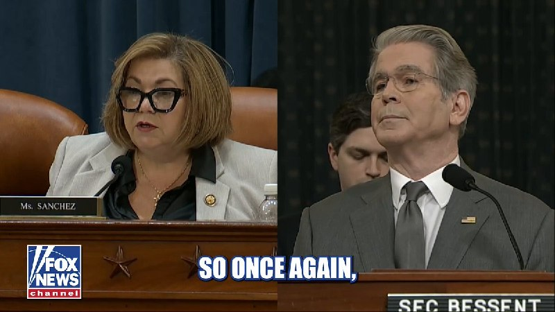
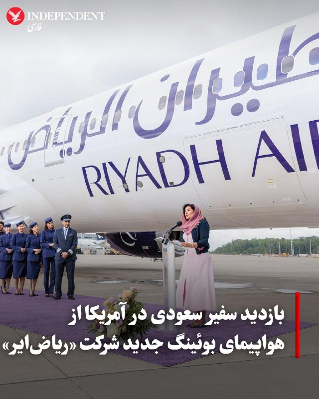
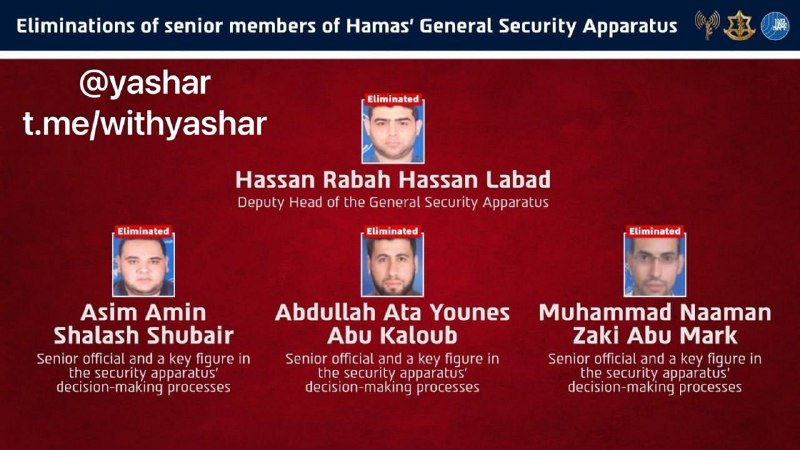
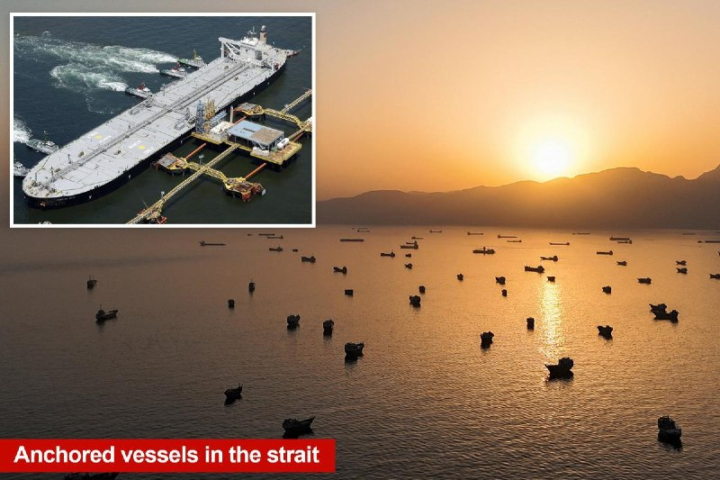
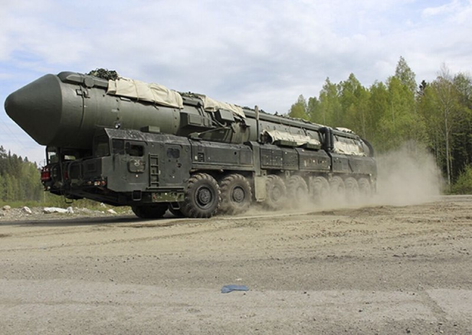
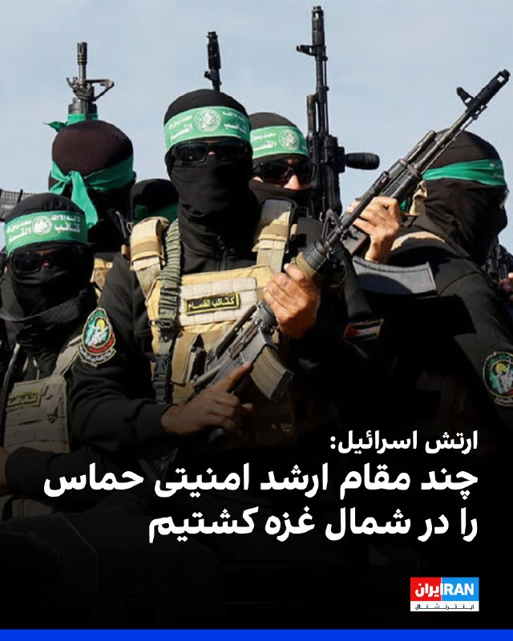
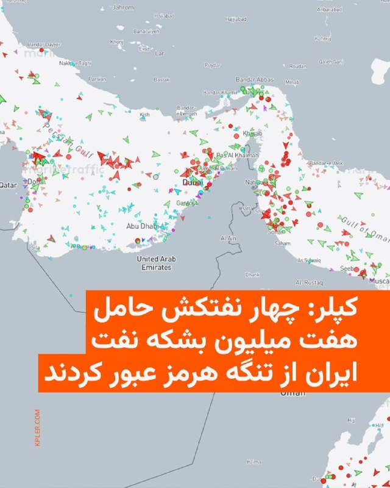
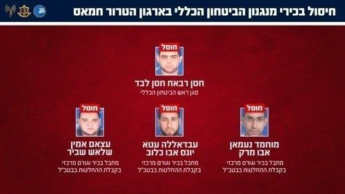

# خواننده تلگرام

<!-- TOP_NAV START -->

<a href="https://github.com/ProAlit/aio-downloader/blob/main/telegram/content/archive_1.md" style="display:inline-block; padding:6px 12px; margin:0 4px; background-color:#2ea44f; color:white; text-decoration:none; border-radius:4px; font-weight:bold;">صفحه بعد</a>

<!-- TOP_NAV END -->

<!-- MSG START -->

---
📅 بروزرسانی: 1405/03/14 22:24
---

## WithYashar — post 13511

عراقچی: ایران و عمان مدیریت تنگهٔ هرمز را براساس معیارهای حقوق بین‌الملل تنظیم خواهند کرد
@withyashar

## WithYashar — post 13510

سفارت ایالات متحده در اورشلیم هشدار عدم سفر جدیدی برای اسرائیل منتشر می‌کند
@withyashar

## FarsiVOA — post 219601

🔺صدور مجدد حکم اعدام علیه یعقوب درخشان به‌رغم نقض حکم اولیه

◾️یعقوب درخشان، زندانی سیاسی ۵۱ ساله محبوس در زندان لاکان رشت، پس از نقض حکم اعدام پیشینش در دیوان عالی کشور، بار دیگر در شعبه هم‌عرض دادگاه انقلاب رشت، به اعدام محکوم شد.

⬇️ بیشتر بخوانید:

https://ir.voanews.com/a/political-prisoner-execution-yaqub-derakhshan/8157303.html

## FarsiVOA — post 219600

علی جوانمردی: مشکل ایران در رهبری است، تغییر فقط توسط مردم ایران

## FarsiVOA — post 219599

  <a href="telegram/content/FarsiVOA_219599_1780599292.mp4" target="_blank">🎬 Download video</a>

ارتش دفاعی اسرائیل پنجشنبه ۱۴ خرداد، در شبکه اجتماعی ایکس از کشته شدن ۴ مقام ارشد حماس در نوار غزه خبر داد.

در ادامه این بیانیه آمده است: «در این حمله، تروریست حسن رباح حسن لبد، جانشین رئیس امنیت عمومی و یکی از عوامل کلیدی در تصمیم‌گیری و تدوین دستورالعمل‌ها در این نهاد، کشته شد. همچنین تروریست‌ها، عصام امین شلاش شبیر، عبدالله عطا یونس ابو کلوب و محمد نعمان زکی ابو مرق، سه مقام ارشد دیگر که نقش مرکزی در فرآیند تصمیم‌گیری این نهاد داشتند، کشته شدند.»

گزارش کامل را در وب‌سایت صدای آمریکا بخوانید.

@FarsiVOA

## Persian_Trend_Official — post 15709

  <a href="telegram/content/Persian_Trend_Official_15709_1780599292.webm" target="_blank">🎬 Download video</a>

پوتین دربارهٔ زلنسکی: او یهودی است. یادتان باشد، پدربزرگش در برابر نازی‌ها می‌جنگید. فکر می‌کنم الان در قبرش می‌‌لرزد. 📝 Amir 📌 @persian_trend_official پرشین ترند | متفاوت‌ترین کانال نظامی

## Persian_Trend_Official — post 15708

  <a href="telegram/content/Persian_Trend_Official_15708_1780599293.mp4" target="_blank">🎬 Download video</a>

پوتین دربارهٔ زلنسکی: او یهودی است. یادتان باشد، پدربزرگش در برابر نازی‌ها می‌جنگید. فکر می‌کنم الان در قبرش می‌‌لرزد.

📝 Amir

📌 @persian_trend_official
پرشین ترند | متفاوت‌ترین کانال نظامی

## alonews — post 125140

  <a href="telegram/content/alonews_125140_1780599294.webm" target="_blank">🎬 Download video</a>

👈عراقچی: ایران و عمان مدیریت تنگهٔ هرمز را براساس معیارهای حقوق بین‌الملل تنظیم خواهند کرد

✅ @AloNews خبر جنگ

## alonews — post 125138

  <a href="telegram/content/alonews_125138_1780599295.webm" target="_blank">🎬 Download video</a>

👈پوتین: ایران یک کشور دوست است و کاملاً به ما اعتماد دارد؛ از اورانیوم غنی‌شده پس از کاهش سطح غنی‌سازی، برای انرژی هسته‌ای صلح‌آمیز ایران تحت نظارت آژانس استفاده می‌شود.

✅ @AloNews خبر جنگ

## alonews — post 125136

  <a href="telegram/content/alonews_125136_1780599295.mp4" target="_blank">🎬 Download video</a>

👈پوتین در مورد اروپا: آن‌ها به سادگی مایل به گفتگو با روسیه به عنوان یک شریک برابر نیستند، اما مجبور خواهند شد که این کار را انجام دهند. ما عجله‌ای نداریم.

🔴حتی اگر نه زن باردار را با هم بگذارید، نه زن نمی‌توانند در یک ماه به یک کودک زایمان کنند.

✅ @AloNews خبر جنگ

## alonews — post 125135

  <a href="telegram/content/alonews_125135_1780599297.webm" target="_blank">🎬 Download video</a>

👈سفارت ایالات متحده در اورشلیم هشدار سفر جدیدی برای اسرائیل منتشر می‌کند

✅ @AloNews خبر جنگ

## alonews — post 125132

  <a href="telegram/content/alonews_125132_1780599297.webm" target="_blank">🎬 Download video</a>

👈طبق تصاویر جدید ماهواره ایی، ایران علاوه بر تعمیر پایگاه های فعلیش، داره به طور فعال پایگاه های موشکی جدید حفاری میکنه و قبلی هارو هم گسترش میده

✅ @AloNews خبر جنگ

---
📅 بروزرسانی: 1405/03/14 22:14
---

## VahidOOnLine — post 243702

  

ولادیمیر پوتین، رییس‌جمهوری روسیه، پنج‌شنبه اعلام کرد مسکو با جمهوری اسلامی روابطی مبتنی بر اعتماد دارد و می‌تواند برای حل بحران ایران کمک کند.

او همچنین گفت پیشنهادهای صلح دونالد ترامپ می‌تواند مبنایی برای توافق صلح با اوکراین باشد، اما ترامپ باید کی‌یف را متقاعد کند و افزود به باور او، ترامپ صادقانه در پی حل این درگیری است.

پوتین درباره انتخابات ۲۰۳۰ گفت هنوز برای تصمیم‌گیری درباره نامزدی دوباره زود است، هرچند قانون اساسی این امکان را می‌دهد، و افزود در حال حاضر به انتخابات فکر نمی‌کند.
‌🏁 🇬🇧 IranintlTV

🤖 @VahidOOnLine

## IranIntlTV — post 340555

  <a href="https://t.me/IranintlTV/340555" target="_blank">📎 Download file</a>

🎧نسخه صوتی دومینو: ناکامی سپاه در کنترل روایت قتل‌عام دی‌ماه
@iranintlTV

## IranIntlTV — post 340554

  

🔻تیم ملی فوتبال در آخرین دیدار تدارکاتی خود پیش از سفر به مکزیک برای حضور در جام جهانی،‌ پشت درهای بسته با نتیجه ۲–۰ مالی را شکست داد. سعید عزت‌اللهی و رامین رضاییان گل‌های تیم ملی را در این بازی به ثمر رساندند.

🔹این بازی به درخواست کادر فنی ایران، پشت درهای بسته و بدون حضور رسانه‌ها برگزار شد.

🔹تیم ملی در حالی برابر مالی قرار گرفت که پیش‌تر، تیم‌های ملی اسپانیا، مقدونیه و آنگولا از بازی با شاگردان امیر قلعه‌نویی انصراف داده بودند.

🔹تیم ملی برای حضور در جام جهانی ۱۶ خرداد راهی مکزیک می‌شود. این در حالی است که هنوز دولت آمریکا به بازیکنان ایران برای حضور در خاک این کشور و برگزاری سه دیدار خود در جام جهانی ویزا نداده و مشخص نیست تیم ملی بتواند بازی‌های خود در جام جهانی را برگزار کند.

@iranintltvsport

## IranIntlTV — post 340553

  

ولادیمیر پوتین، رییس‌جمهوری روسیه، پنج‌شنبه اعلام کرد مسکو با جمهوری اسلامی روابطی مبتنی بر اعتماد دارد و می‌تواند برای حل بحران ایران کمک کند.

او همچنین گفت پیشنهادهای صلح دونالد ترامپ می‌تواند مبنایی برای توافق صلح با اوکراین باشد، اما ترامپ باید کی‌یف را متقاعد کند و افزود به باور او، ترامپ صادقانه در پی حل این درگیری است.

پوتین درباره انتخابات ۲۰۳۰ گفت هنوز برای تصمیم‌گیری درباره نامزدی دوباره زود است، هرچند قانون اساسی این امکان را می‌دهد، و افزود در حال حاضر به انتخابات فکر نمی‌کند.
https://iranintl.com/202606049038

## IranIntlTV — post 340552

  <a href="telegram/content/IranIntlTV_340552_1780598684.mp4" target="_blank">🎬 Download video</a>

۲۴ با فرداد فرحزاد
@iranintltv

## IranianMinds — post 21385

  <a href="telegram/content/IranianMinds_21385_1780598685.mp4" target="_blank">🎬 Download video</a>

کلیپی که دنیا جهانبخت در حمایت از تیم جمهوری اسلامی داده بیرون.

@IranianMinds

## alonews — post 125131

  <a href="telegram/content/alonews_125131_1780598687.webm" target="_blank">🎬 Download video</a>

👈‏هواپیمای تهاجمی عمود پرواز AV-8B Harrier II بعد از نزدیک به 40 سال خدمت از سپاه تفنگداران دریایی آمریکا بازنشسته شد. جایگزین این هواپیما F-35 در مدل B خواهد بود.

✅ @AloNews خبر جنگ

## alonews — post 125130

  <a href="telegram/content/alonews_125130_1780598687.mp4" target="_blank">🎬 Download video</a>

👈آب زاینده‌رود به اصفهان رسید

✅ @AloNews خبر جنگ

## alonews — post 125129

🔻بیست سال گذشت و حالا رسیدیم به ششمین و آخرین جام جهانیِ مسی و رونالدو. این آخرین تورنمنت مشترک اوناست. 💔🫡🙌
@AloSport

## alonews — post 125128

  <a href="telegram/content/alonews_125128_1780598689.mp4" target="_blank">🎬 Download video</a>

💔جاویدنام علیرضا سلمانی 28ساله

🔴شامگاه پنج‌شنبه 18 دی‌ماه حوالی ساعت 21، با شلیک مستقیم چهار گلوله توسط حرام زاده های جمهوری تروریستی اسلامی پرپر شد. چه نازنین جوانانی!

🤔عرزشی حرام زاده، به وقتش مردم شما را پاکسازی می‌کنند.

✅@AloNews

## alonews — post 125127

  <a href="telegram/content/alonews_125127_1780598691.webm" target="_blank">🎬 Download video</a>

👈فیلد مارشال حاج محسن رضایی:
اگر آمریکا غلطی کنه آنچنان تو دهنش میزاریم تا درس عبرت بشه

✅ @AloNews خبر جنگ

---
📅 بروزرسانی: 1405/03/14 22:04
---

## WithYashar — post 13509

سی‌ان‌ان: ایران می‌گوید در تنگه هرمز هزینه خدمات دریافت خواهد کرد، نه عوارض
ایران می‌گوید به دنبال دریافت هزینه خدمات برای کشتی‌هایی است که از تنگه هرمز عبور می‌کنند، در ازای تضمین امنیت کشتی‌ها، به جای عوارض ترانزیت.
این کشور به دنبال جبران خسارت برای خدماتی است که در کنار عمان انجام می‌دهد، از جمله کمک‌های ناوبری، جست‌وجو و نجات، خدمات امنیتی و ایمنی و خدمات پاکسازی محیط زیست در صورت آلودگی.
@withyashar

## pm_afshaa — post 92282

#مهم
عزیزای دلم همگی الان چنل زاپاس‌مون رو جوین بشید کانال تحت ریپورت شدیده اگه چیزی شد زاپاس رو داشته باشید فعالیت میاد اونور
👇

https://t.me/pmtvzapas
https://t.me/pmtvzapas

## FarsiVOA — post 219598

درگذشت مرجان ساتراپی، نویسنده و فیلمساز ایرانی - فرانسوی بازتاب گسترده‌ای در رسانه‌های اروپایی داشت

## BBCPersian — post 282858

  <a href="telegram/content/BBCPersian_282858_1780598087.mp4" target="_blank">🎬 Download video</a>

ناآرامی‌ها در تیرانا، پایتخت آلبانی، در اعتراض به پروژه تفرجگاه مرتبط با خانواده دونالد ترامپ، امروز ۱۴ خرداد (۴ ژوئن) وارد چهارمین روز خود شد.
 
این اعتراضات علیه ساخت تفرجگاهی لوکس با بودجه تقریبی ۱/۴ میلیارد یورو در نزدیکی دهکده‌ای ساحلی به نام زورنک در جنوب غربی آلبانی است که از سوی شرکتی سرمایه‌گذاری به مدیریت جرد کوشنر و ایوانکا ترامپ در حال انجام است.
 
به گفته معترضان این پروژه تهدیدی زیست‌محیطی برای ساحل این روستا به شمار می‌رود که منطقه‌ای تالابی و حساس را شامل می‌شود که زیستگاه گونه‌های آسیب‌پذیری مثل فلامینگوها است.
 
این تظاهرات که «انقلاب فلامینگوها» نام گرفته است، از روستاهای ساحلی به پایتخت گسترش یافت. هزاران آلبانیایی با شعار «آلبانی فروشی نیست» و «ایوانکا برگرد خانه‌ات»، راهپیمایی کردند و بسیاری نیز خواستار استعفای ادی راما، نخست‌وزیر شده‌اند.
 
راما درخواست‌ها برای توقف این پروژه بزرگ گردشگری را رد کرده است. او به‌طور علنی از ساخت این تفرجگاه لوکس دفاع کرده و تاکید کرده که این پروژه ادامه خواهد یافت.

@bbcpersian

---
📅 بروزرسانی: 1405/03/14 21:54
---

## VahidOOnLine — post 243701

  <a href="telegram/content/VahidOOnLine_243701_1780597473.mp4" target="_blank">🎬 Download video</a>

♦️تصاویری که کاربران شبکه‌های اجتماعی روز چهارشنبه ۱۳ خرداد منتشر کرده‌اند شهروند میانسالی که «مرد کفن‌پوش» لقب گرفته را در کنار رودخانه زاینده‌رود نشان می‌دهد.
این مرد با لباسی شبیه به کفن خطاب به دولت پزشکیان می‌گوید: «می‌خواهم با لباس احرام به دولت بروم و مشکلات تورم و گرانی را برطرف کنم، مگر نگفتید هرکه می‌خواهد به میدان بیاید؟ آقای پزشکیان اجازه بدهید من به دولت بروم و مشکل معیشت و اقتصاد ایران را حل کنم».

انتشار این ویدیو دست‌مایه طنز کاربران شبکه‌های اجتماعی قرار گرفت.
‌🇸🇦 Indypersian

🤖 @VahidOOnLine

## FoxNewsTwitter — post 342613

  

Fox News (Twitter/X)

"I hope you get some social media clips.”

Treasury Secretary Scott Bessent calls out Rep. Linda Sánchez during a Ways and Means Committee hearing after the California Democrat pressed Bessent about potential IRS audits related to President Trump and his family.

SÁNCHEZ: “I'm curious to know who counts as Trump's ‘family’ for the purposes of this immunity. Is it his children, his in-laws, his grandchildren, his second or third cousin? His great-great-grandchildren? Do you know the answer to that question, Mr. Secretary?”

BESSENT: “Again, I imagine you have the Justice Department phone number. I suggest you call them.”

## FarsiVOA — post 219597

فشار بر زنان در ایران با صدور و اجرای احکام سنگین زندان وارد مرحله تازه‌ای شده است. مریم باباجانی، معترض دی و شهروند اهل ایذه به ۳۲ سال و ۶ ماه زندان محکوم شد

## FarsiVOA — post 219596

با نامشخص بودن سرنوشت مذاکرات، اختلافات درون حاکمیت جمهوری اسلامی علنی‌تر شده است. در این میان هادی خامنه‌ای، عموی رهبر جمهوری اسلامی، با انتقاد از تندروها و حمایت از رویکرد واقع‌گرایانه‌تر در قبال مذاکرات، به یکی از صداهای متفاوت در مناقشات داخلی تبدیل شده است.

## BBCPersian — post 282857

  <a href="https://t.me/bbcpersian/282857" target="_blank">📎 Download file</a>

پادکست برنامه رادیویی جام جهان‌نما، پنج‌شنبه ۱۴ خرداد ۱۴۰۵

این برنامه رادیویی را می‌توانید هر شب ساعت ۲۰ به وقت ایران، روی موج متوسط ۷۰۲ کیلوهرتز و موج کوتاه ۹۴۶۵ کیلوهرتز بشنوید.
تکرار برنامه را هم می‌توانید ساعت ۲۱:۳۰ روی موج متوسط ۷۰۲ کیلوهرتز و موج کوتاه ۵۳۹۵ کیلوهرتز گوش کنید.
@BBCPersian

## Dirty_Kids — post 391002

  <a href="telegram/content/Dirty_Kids_391002_1780597475.mp4" target="_blank">🎬 Download video</a>

شجاعت رو از خردسالی به کودکانتان بیاموزید ✌️👌😁😁

@Dirty_Kids 👻

## Dirty_Kids — post 391001

  <a href="telegram/content/Dirty_Kids_391001_1780597477.mp4" target="_blank">🎬 Download video</a>

🔴 اگه براتون سواله که اکس‌تون برگشت، باید چیکار کنین؟ حتما این کلیپو ببینین.

@Dirty_Kids 👻

## Dirty_Kids — post 391000

  <a href="telegram/content/Dirty_Kids_391000_1780597478.mp4" target="_blank">🎬 Download video</a>

ایرج میرازی زمانه‌ات را بشناس
هنر نزد میهن پرستان است و بس😏

@Dirty_Kids 👻

## alonews — post 125126

  <a href="telegram/content/alonews_125126_1780597479.webm" target="_blank">🎬 Download video</a>

👈سی‌ان‌ان: ایران می‌گوید در تنگه هرمز هزینه خدمات دریافت خواهد کرد، نه عوارض

🔴 ایران می‌گوید به دنبال دریافت هزینه خدمات برای کشتی‌هایی است که از تنگه هرمز عبور می‌کنند، در ازای تضمین امنیت کشتی‌ها، به جای عوارض ترانزیت.

🔴 این کشور به دنبال جبران خسارت برای خدماتی است که در کنار عمان انجام می‌دهد، از جمله کمک‌های ناوبری، جست‌وجو و نجات، خدمات امنیتی و ایمنی و خدمات پاکسازی محیط زیست در صورت آلودگی.

✅ @AloNews خبر جنگ

## alonews — post 125125

  <a href="telegram/content/alonews_125125_1780597479.webm" target="_blank">🎬 Download video</a>

👈پوتین درباره فلسطین: اکنون باتوجه به رویدادهای جاری در ایران و تنگه هرمز، ما فاجعه فلسطین را فراموش کرده‌ایم، اما این مسئله هنوز وجود دارد.

🔴روسیه معتقد است که راه‌حل اساسی این موضوع، تأسیس کشور فلسطین است

✅ @AloNews خبر جنگ

---
📅 بروزرسانی: 1405/03/14 21:44
---

## iaghapour — post 2655

📢 دو نکته خیلی مهم برای شما دوستان عزیز

سلام بچه‌ها! امیدوارم حالتون عالی باشه. برای اینکه بتونم تو کانال بهتر راهنماییتون کنم و محتوای باکیفیت‌تری براتون بسازم، نیاز دیدم این دو تا نکته مهم رو باهاتون در میون بذارم:

۱. درباره سوال پرسیدن از ویدیوهای قدیمی:
همون‌طور که می‌دونید تعداد ویدیوهای کانال زیاده و واقعیت اینه که من مو به مو یادم نمی‌مونه تو ویدیوهای ماه‌های گذشته یا سال‌های قبل، دقیقاً چه مواردی رو پوشش دادم یا چه جزئیاتی رو گفتم. پس اگر درباره یک ویدیوی قدیمی تو کامنت‌ها سوالی براتون پیش میاد، لطفاً خیلی دقیق و با جزئیات بپرسید. اگر ممکنه، مشکلتون رو کامل توضیح بدید یا حتی تایم‌لاین (دقیقه و ثانیه) اون بخش از ویدیو رو بنویسید تا سریع متوجه موضوع بشم و بتونم جواب درستی بهتون بدم.

۲. درباره تست روش‌های تانل:
نکته دوم در مورد آموزش‌های تانلینگ هست. ببینید بچه‌ها، وقتی ما یک روش تانل رو معرفی می‌کنیم، منطقاً امکانش وجود نداره که اون رو روی تمام روش‌ها و پروتکل‌های دیگه (مثل وایرگارد، OpenVPN و...) تست کنیم. خیلی وقت‌ها تو کامنت‌ها می‌پرسید که «آیا این تانل روی فلان پروتکل هم جواب میده؟» راستش ما هم اطلاع دقیقی نداریم؛ چون زمان و زیرساخت تست کردن یک روش روی تک‌تک سناریوها وجود نداره. بهترین کار اینه که خودتون اون روش رو روی پروتکل مدنظرتون تست کنید و اتفاقاً نتیجش رو تو کامنت‌ها بنویسید تا بقیه بچه‌ها هم از تجربه‌تون استفاده کنند.

ممنون که مثل همیشه درک می‌کنید و با انرژی خوبتون همراه کانال هستید! ❤️

---
📅 بروزرسانی: 1405/03/14 21:39
---

## VahidOOnLine — post 243700

  

رسانه‌های کویت گزارش دادند شیخ جراح جابر الاحمد الصباح، وزیر خارجه کویت، و مارکو روبیو، وزیر خارجه آمریکا، در واشینگتن درباره شراکت راهبردی میان دو کشور گفت‌وگو کردند.
در این دیدار، حملات مکرر جمهوری اسلامی به کویت محکوم و بر حق کامل این کشور برای اتخاذ اقدامات لازم جهت حفظ حاکمیت و امنیت سرزمینش تاکید شد.
دو طرف همچنین بر اهمیت تداوم هماهنگی مشترک در سطوح مختلف با توجه به شرایط حساس منطقه تاکید کردند.
‌🏁 🇬🇧 IranintlTV

🤖 @VahidOOnLine

## VahidOOnLine — post 243699

  <a href="telegram/content/VahidOOnLine_243699_1780596576.mp4" target="_blank">🎬 Download video</a>

♦️شیخ جراح جابر الاحمد الصباح، وزیر امور خارجه کویت، روز پنج‌شنبه ۱۴ خرداد در جریان سفری رسمی به واشنگتن، با مارکو روبیو، وزیر امور خارجه ایالات متحده دیدار کرد. در این نشست، دو طرف بر مشارکت راهبردی میان دو کشور تاکید کرده و درباره تحولات امنیتی منطقه گفتگو کردند.

بخش مهمی از این مذاکرات به حملات اخیر علیه کویت اختصاص داشت. هر دو وزیر آنچه را که «تجاوزات مکرر ایران علیه دولت کویت» نامیدند، محکوم کردند. همچنین بر حق کویت برای اتخاذ تمامی اقدامات لازم جهت حفاظت از حاکمیت، امنیت و تمامیت ارضی خود تاکید شد.

طرفین ضمن بررسی روابط دیرینه دو کشور، بر تعهد خود جهت تقویت همکاری‌ها در بخش‌های سیاسی، دفاعی، سرمایه‌گذاری و فرهنگی پافشاری کردند. روبیو و شیخ جراح اهمیت تلاش‌های مشترک برای مقابله با چالش‌های امنیتی در حال ظهور، تقویت ثبات منطقه‌ای و ارتقای شکوفایی در سراسر منطقه را مورد توجه قرار دادند.
‌🇸🇦 Indypersian

🤖 @VahidOOnLine

## WithYashar — post 13508

ادعای رویترز بر اساس داده‌های حمل و نقل: صادرات نفت ایران به پایین‌ترین سطح خود در حداقل ۶ سال گذشته رسیده است
@withyashar

## FoxNewsTwitter — post 342612

  

Fox News (Twitter/X)

WATCH LIVE: Lawmakers hold hearing on alleged CCP links to fentanyl crisis https://twitter.com/i/broadcasts/1kKzDDQkjMLJv

## FoxNewsTwitter — post 342611

  

Fox News (Twitter/X)

NEW: The FBI just put faces to the fraud.

The bureau dropped its most wanted fraudsters list, with alleged schemes ranging from $1.3 million to $1.2 billion dollars taken from American taxpayers.

## IranIntlTV — post 340551

  

رسانه‌های کویت گزارش دادند شیخ جراح جابر الاحمد الصباح، وزیر خارجه کویت، و مارکو روبیو، وزیر خارجه آمریکا، در واشینگتن درباره شراکت راهبردی میان دو کشور گفت‌وگو کردند.
در این دیدار، حملات مکرر جمهوری اسلامی به کویت محکوم و بر حق کامل این کشور برای اتخاذ اقدامات لازم جهت حفظ حاکمیت و امنیت سرزمینش تاکید شد.
دو طرف همچنین بر اهمیت تداوم هماهنگی مشترک در سطوح مختلف با توجه به شرایط حساس منطقه تاکید کردند.
https://iranintl.com/202606048937

## FarsiVOA — post 219595

🔺بستری شدن میرحسین موسوی در بیمارستان به‌دلیل مشکل شدید قلبی

▪️دختران میرحسین موسوی روز پنجشنبه ۱۴ خرداد گفتند وضعیت جسمی پدرشان که به‌دلیل مشکل شدید قلبی در بیمارستان بستری است، نامساعد و اوضاع جسمی‌ او ناگوار است.

⬇️ بیشتر بخوانید:

https://ir.voanews.com/a/iran-musavi-mirhossein-zahra-rahnavard-hospital-heart/8157324.html

## RadioFarda — post 157903

  <a href="https://t.me/radiofarda/157903" target="_blank">📎 Download file</a>

📻بشنوید: ایستگاه ۱۹ با رادیوفردا، ۱۴ خرداد ۱۴۰۵

@RadioFarda

## RadioFarda — post 157902

  <a href="https://t.me/radiofarda/157902" target="_blank">📎 Download file</a>

امیر چاهکی: ایران فاقد یک «تحلیل راهبردی» درباره چین است

🔸محمدباقر قالیباف روز ۱۳ خرداد جلسه‌ای را با وزرای اقتصادی دولت به همراه روسای بانک مرکزی و سازمان برنامه و بودجه برگزار کرد تا بنا بر گزارش رسانه‌ها در ایران «سطح تعاملات با چین» ارتقا پیدا کند. آقای قالیباف در هفته‌های اخیر به عنوان نماینده ویژه ایران در امور چین هم منصوب شده است. چالش‌هایی پیش‌روی بهبود و تعمیق روابط میان تهران و پکن کدامند؟ ارزیابی امیر چاهکی، تحلیلگر امور بین‌الملل در برلین پایتخت آلمان، را در این زمینه بشنوید.

@RadioFarda

## IranianMinds — post 21384

  

این حرومی هم به همراه زنش دستگیر شده.

@IranianMinds

## Dirty_Kids — post 390999

  <a href="telegram/content/Dirty_Kids_390999_1780596584.mp4" target="_blank">🎬 Download video</a>

خاله دنیا از پرستوهای قدیمی و استخون خرد کرده‌ی حکومت
وقتی دید تیم میلی کیری سپاه رو همه تحریم کردن پا پیش گذاشت تا روحیه بده بهشون، البته خودش هم احتمالا از کیر خواننده خسته شده میخواد یه فوتبالیست بکشه روش

@Dirty_Kids 👻

## Hranews — post 113391

  

گزارشی از تداوم بازداشت و بلاتکلیفی سعید اسدی در زندان تربت جام

❗️
❗️
❗️
❗️
❗️– سعید اسدی، شهروند ساکن تایباد، حدود سه ماه است که بازداشت شده و به صورت بلاتکلیف در زندان تربت جام نگهداری می‌شود.

به گزارش خبرگزاری هرانا، ارگان خبری مجموعه فعالان حقوق بشر در ایران، سعید اسدی در بلاتکلیفی قضایی به‌سر می‌برد.

بر اساس اطلاعات دریافتی هرانا، نزدیک به سه ماه از بازداشت آقای اسدی، می‌گذرد. او هم‌اکنون در زندان تربت جام نگهداری می‌شود. وی همچنان در وضعیت بلاتکلیفی قضایی قرار دارد و امکان آزادی او با وثیقه نیز تاکنون میسر نشده است.
#سعید_اسدی

ادامه مطلب

↘️
@hranews_bot تماس ✉️ - @Hranews کانال هرانا 🆑

## alonews — post 125124

  <a href="telegram/content/alonews_125124_1780596588.webm" target="_blank">🎬 Download video</a>

👈وزارت خارجه قطر: وزیر خارجه قطر تماس تلفنی از وزیر خارجه مصر دریافت کرد و آن دو درباره میانجی‌گری بین واشنگتن و تهران گفت‌وگو کردند.

🔴وزیر امور خارجه قطر بر ضرورت پاسخگویی همه طرف‌ها به تلاش‌های میانجی‌گری جاری تأکید کرد.

✅ @AloNews خبر جنگ

## alonews — post 125123

  <a href="telegram/content/alonews_125123_1780596588.webm" target="_blank">🎬 Download video</a>

👈پوتین : روسیه می‌خواد با اوکراین از راه مسالمت‌آمیز به توافق برسه

✅ @AloNews خبر جنگ

## alonews — post 125122

  <a href="telegram/content/alonews_125122_1780596588.webm" target="_blank">🎬 Download video</a>

👈 ادعای رویترز بر اساس داده‌های حمل و نقل: صادرات نفت ایران به پایین‌ترین سطح خود در حداقل ۶ سال گذشته رسیده است

✅ @AloNews خبر جنگ

## alonews — post 125120

  <a href="telegram/content/alonews_125120_1780596589.mp4" target="_blank">🎬 Download video</a>

👈صبح امروز، لبنان

✅ @AloNews خبر جنگ

---
📅 بروزرسانی: 1405/03/14 21:24
---

## VahidOOnLine — post 243698

  

♦️ولادیمیر پوتین، رئیس‌جمهوری روسیه، روز پنج‌شنبه ۱۴ خرداد اعلام کرد که دونالد ترامپ، رئیس‌جمهوری ایالات متحده، از روسیه خواسته است تا برای دستیابی به توافق صلح در اوکراین امتیازاتی بدهد. پوتین تاکید کرد که روسیه آماده انجام این مصالحه‌ها است، مشروط بر اینکه اوکراین نیز اقدام مشابهی انجام دهد.

پوتین در گفتگو با خبرنگاران در سن‌پترزبورگ اظهار داشت که روسیه تمامی منابع لازم برای دستیابی به اهداف نظامی خود را در اختیار دارد و نیروهایش در حال پیشروی در اوکراین هستند. با این حال، او تصریح کرد که کشورش آماده است تا از طریق مسالمت‌آمیز با اوکراین به توافق برسد.
‌🇸🇦 Indypersian

🤖 @VahidOOnLine

## VahidOOnLine — post 243697

در پی فراخوان شاهزاده رضا پهلوی برای بردن پرچم‌های شیروخورشید به ورزشگاه‌ها در جام جهانی، مخاطبان ایران اینترنشنال در پیام‌هایی بر بردن این پرچم‌ها و لباس‌های منقش به شیروخورشید و همچنین عکسهای جاویدنامان انقلاب ملی دی‌ماه تاکید کردند. پیام آن‌ها با هوش مصنوعی خوانده شده است.
‌🏁 🇬🇧 IranintlTV

🤖 @VahidOOnLine

## WithYashar — post 13507

کانال ۱۲ اسرائیل: واشنگتن به تهران گفته مراسم امضای توافق با آنها در سوئیس برگزار خواهد شد!
@withyashar

## FoxNewsTwitter — post 342610

  

Fox News (Twitter/X)

BREAKING: Hezbollah is rejecting a proposed Israel-Lebanon ceasefire that could impact broader negotiations involving the United States and Iran, as well as the Middle East as a whole.

The move comes as President Trump calls out House lawmakers who voted to limit his war powers and said he will continue pressuring Iran to surrender enriched uranium.

Trump also argued that ceasefires can look different depending on the region and said Iran has repeatedly changed its position during negotiations, @pdoocy reports. | @BillHemmer @AmericaNewsroom

## IranIntlTV — post 340550

در پی فراخوان شاهزاده رضا پهلوی برای بردن پرچم‌های شیروخورشید به ورزشگاه‌ها در جام جهانی، مخاطبان ایران اینترنشنال در پیام‌هایی بر بردن این پرچم‌ها و لباس‌های منقش به شیروخورشید و همچنین عکسهای جاویدنامان انقلاب ملی دی‌ماه تاکید کردند. پیام آن‌ها با هوش مصنوعی خوانده شده است.

## FarsiVOA — post 219594

🔺ارتش اسرائیل: ۴ مقام ارشد حماس را کشتیم

ارتش دفاعی اسرائیل پنجشنبه ۱۴ خرداد، در شبکه اجتماعی ایکس از کشته شدن ۴ مقام ارشد حماس در نوار غزه خبر داد.

⬇️ بیشتر بخوانید:

https://ir.voanews.com/a/hamas-terrorist-killed-in-gaza-operation/8157317.html

## DW_Farsi — post 125507

  

🔶آژانس: ایران دسترسی بازرسان هسته‌ای را مسدود کرده است

آژانس بین‌المللی انرژی اتمی با بیان این که ایران دسترسی بازرسان هسته‌ای را مسدود کرده (IAEA) خواستار دسترسی فوری به تاسیسات هسته‌ای در ایران شده است. رافائل گروسی، مدیرکل آژانس بین‌المللی انرژی اتمی، امروز با انتشار گزارشی اعلام کرد که جمهوری اسلامی در ماه‌های گذشته "تنها اجازه بازرسی یک مرکز هسته‌ای را صادر کرده است".

گروسی در ادامه تاکید کرده که انجام بازرسی‌های بیشتر از برنامه هسته‌ای ایران، "ضروری و اجتناب‌ناپذیر" است.

در این سند غیرعلنی آژانس بین‌المللی انرژی اتمی در وین که خبرگزاری آلمان (dpa) به آن دسترسی داشته است، آمده که آژانس در حال حاضر قادر نیست بررسی کند آیا ایران برنامه غنی‌سازی اورانیوم خود را متوقف کرده است یا خیر، و همچنین نمی‌تواند مشخص کند چه میزان اورانیوم غنی‌شده در حال حاضر در ایران وجود دارد.

حکومت ایران پس از جنگ با ایالات متحده آمریکا و اسرائیل، همکاری خود با بازرسان آژانس بین‌المللی انرژی اتمی را تا حد زیادی متوقف کرده است.

@dw_farsi

## Persian_Trend_Official — post 15707

  <a href="telegram/content/Persian_Trend_Official_15707_1780595687.mp4" target="_blank">🎬 Download video</a>

🎥حضور قیصر خواننده در تجمع میدان امام حسین تهران

حضور چهره‌های هنری خارج از کشور در برنامه‌های عمومی داخل ایران، همچنان موضوعی جلب‌توجه‌کننده در فضای رسانه‌ای و اجتماعی کشور است و معمولاً بازتاب گسترده‌ای در شبکه‌های اجتماعی پیدا می‌کند.

👺Phantom

📌 @persian_trend_official
پرشین ترند | متفاوت‌ترین کانال نظامی

## Persian_Trend_Official — post 15706

  <a href="telegram/content/Persian_Trend_Official_15706_1780595689.mp4" target="_blank">🎬 Download video</a>

چهار خواننده ایرانی خیلی سرشناس در آستانه بازگشت به ایران ــ بهمن بابازاده، خبرنگار حوزه موسیقی 🫆: Ⓜ 🆔:@persian_trend_official

## IranianMinds — post 21383

🔴 فوری کانال ۱۲ اسرائیل: هیچ پیشرفتی در مذاکرات بین ایالات متحده و ایران حاصل نشده است. واشنگتن از تهران خواسته که پاسخ خود را قبل از پایان هفته تحویل بدهد. @IranianMinds

## IranianMinds — post 21382

🔴 فوری کانال ۱۲ اسرائیل:

هیچ پیشرفتی در مذاکرات بین ایالات متحده و ایران حاصل نشده است.
واشنگتن از تهران خواسته که پاسخ خود را قبل از پایان هفته تحویل بدهد.

@IranianMinds

## alonews — post 125119

  

ترامپ چند وقت دیگه همزمان با محرم:

[@AloTweet]

## alonews — post 125118

  <a href="telegram/content/alonews_125118_1780595691.webm" target="_blank">🎬 Download video</a>

🤚 اینترنت مخصوص جنگ 
🚀
💙 
🔥 نامحدود فقط 690 تومن 
🔥 
⭐️ فقط گیگی 7 هزار تومان
😍 
✅ بدون قطعی‌های آزاردهنده 
✅ سرعت بالا حتی ساعات شلوغ 
✅ مناسب تلگرام، اینستاگرام و یوتیوب 
✅ همراه با ساب 
✅ تعداد محدود با این قیمت 
🤖 @NetAazaadBot 
🤖 @NetAazaadBot

## alonews — post 125117

  <a href="telegram/content/alonews_125117_1780595692.webm" target="_blank">🎬 Download video</a>

🤚 اینترنت مخصوص جنگ 
🚀
💙

🔥 نامحدود فقط 690 تومن 
🔥

⭐️ فقط گیگی 7 هزار تومان
😍

✅ بدون قطعی‌های آزاردهنده

✅ سرعت بالا حتی ساعات شلوغ

✅ مناسب تلگرام، اینستاگرام و یوتیوب

✅ همراه با ساب

✅ تعداد محدود با این قیمت

🤖 @NetAazaadBot

🤖 @NetAazaadBot

---
📅 بروزرسانی: 1405/03/14 21:12
---

## VahidOOnLine — post 243696

  

♦️امیره ریما بنت بندر آل سعود، سفیر عربستان سعودی در واشنگتن، روز چهارشنبه ۱۴ خرداد از هواپیمای بوئینگ که برای تحویل به شرکت هواپیمایی تازه‌تاسیس «ریاض‌ایر» آماده شده بود، بازدید کرد. شرکت ریاض‌ایر، بخشی از طرح توسعه عربستان سعودی تا سال ۲۰۳۰ است که بر تنوع‌بخشی به منابع اقتصادی کشور تمرکز دارد. ریاض‌ایر نیز در همین راستا و با هدف افزایش نقش عربستان سعودی در حمل و نقل هوایی و نیز کمک به گردشگری تاسیس شده است.

این شرکت هواپیمایی، روز چهارشنبه، همزمان با تحویل جدیدترین هواپیمای بوئینگ خود، اعلام کرد که با شرکت هوایپمایی «ایرایندیا» کشور هند قرارداد اشتراک کدهای پروازی امضا کرده است.
‌🇸🇦 Indypersian

🤖 @VahidOOnLine

## VahidOOnLine — post 243695

  

ارتش اسرائیل اعلام کرد در حمله‌ای مشترک از هوا و دریا، به‌همراه شاباک، شماری از مقامات ارشد دستگاه امنیت عمومی حماس را در شمال نوار غزه هدف قرار داده و کشته است.

به گفته ارتش اسرائیل، دستگاه امنیت عمومی حماس نهادی مرکزی و محرمانه است که مسئول تامین امنیت رهبران این گروه، هماهنگی ارتباطات و نشست‌های آن‌ها و جمع‌آوری اطلاعات برای کمک به تصمیم‌گیری و اجرای طرح‌ها علیه اسرائیل است.

در این حمله، حسن رباح حسن لبد، جانشین رئیس امنیت عمومی حماس، به‌همراه عصام امین شلاش شبیر، عبدالله عطا یونس ابو کلوب و محمد نعمان زکی ابو مرق، از دیگر مقام‌های ارشد این نهاد، کشته شدند.

ارتش اسرائیل اعلام کرد این افراد به‌دلیل مشارکت در بازسازی ساختار حماس و کمک به فعالیت‌های آن هدف قرار گرفتند و پیش از حمله، اقداماتی برای کاهش آسیب به غیرنظامیان، از جمله استفاده از مهمات دقیق و نظارت هوایی، انجام شده است.

ارتش اسرائیل افزود نیروهایش تحت فرماندهی منطقه جنوب در منطقه مستقر هستند و به فعالیت برای رفع هرگونه تهدید فوری ادامه خواهند داد.
‌🏁 🇬🇧 IranintlTV

🤖 @VahidOOnLine

## WithYashar — post 13506

  

ارتش اسرائیل :

اعضای ارشد امنیت حماس را ب درک واصل کردیم
این اعضا وظیفه شون حفظ امنیت سران حماس بود ولی خودشون حتی نتونستن امنیت خودشونو تامین کنن
@withyashar

## WithYashar — post 13505

خوانندگی قیصر برای کودکان میناب در میدان امام حسین
@withyashar

## mwarmonitor — post 10148

🔴برگزاری مراسم تودیع و معارفه فرماندهی ارتش مرکزی و ارتش سوم ایالات متحده

📌پایگاه نیروی هوایی شاو، کارولینای جنوبی — ارتش مرکزی ایالات متحده (ARCENT) و ارتش سوم، روز ۴ ژوئن مراسم تودیع و معارفه‌ای را در منطقه خاورمیانه برگزار کردند که نشان‌دهنده انتقال رهبری از سپهبد (ژنرال سه ستاره) «پاتریک فرانک» به سپهبد «کوین لیهی» است.

🔹این جابه‌جایی فرماندهی از طریق آیین سنتی «دست‌به‌دست کردن پرچم» نمادگذاری شد که نشان‌دهنده انتقال مسئولیت و اعتماد میان فرماندهان است.

🔸دریاسالار «براد کوپر»، فرمانده فرماندهی مرکزی ایالات متحده (سنتکام)، ریاست این مراسم را بر عهده داشت و از دستاوردهای ارتش مرکزی (ARCENT) تحت رهبری فرانک تقدیر کرد. کوپر بر نقش این سازمان در دفاع منطقه‌ای، کمک‌های بشردوستانه، لجستیک، ارتباطات و تعالی جنگاوری نیروهای مشترک در سال‌های اخیر تأکید کرد.
کوپر گفت: «سپهبد فرانک در طول ۴۷ ماه فرماندهی خود، سرباز، دیپلمات، جنگاور و رهبری تحول‌آفرین و فوق‌العاده بوده است. دستاوردهای ارتش مرکزی آمریکا در طول این دوره برای سال‌های متمادی در یادها خواهد ماند.»
فرانک در ژوئیه ۲۰۲۲ فرماندهی ARCENT را بر عهده گرفت و به طولانی‌مدت‌ترین فرمانده تاریخ این سازمان تبدیل شد. او برای بر عهده گرفتن مسئولیت معاونت فرماندهی در سنتکام، این پست را ترک می‌کند.
کوپر به سپهبد لیهی خوش‌آمد گفت و به تجربه عملیاتی گسترده، درک عمیق او از منطقه و دهه‌ها رهبری وی در بخش‌های مختلف ارتش اشاره کرد.
لیهی پس از خدمت موقت به عنوان سرپرست معاونت فرماندهی سنتکام، به ARCENT ملحق می‌شود. کوپر از رهبری و خدمت لیهی در مأموریت‌های سنتکام تمجید و نسبت به تداوم مشارکت‌های او در جایگاه فرماندهی ARCENT ابراز اطمینان کرد.
فرانک نیز در سخنرانی خداحافظی خود، از سربازان، رهبران و خانواده‌های سراسر این فرماندهی به خاطر تعهد و فداکاری‌شان تشکر کرد. او بر اهمیت برگزاری این مراسم در میان سربازان مستقر که به طور فعال از عملیات‌های منطقه پشتیبانی می‌کنند، تأکید کرد.
فرانک گفت: «هیچ جایی مناسب‌تر از حضور در منطقه عملیاتی برای برگزاری مراسم تودیع و معارفه نیست... در محاصره سربازانی که هر روز این مأموریت را اجرا می‌کنند. من نمی‌توانم بیش از این به دستاوردهای این تیم افتخار کنم.»
ارتش مرکزی (ARCENT)، بخش مؤلفه زمینی ارتش برای سنتکام است و مسئولیت تمامی عملیات‌های زمینی، مشارکت‌ها و آمادگی در خاورمیانه و آسیای مرکزی را بر عهده دارد.

@mwarmonitor

## mwarmonitor — post 10147

  

🔸دو سوم نفتکش‌های خروجی در حال «خاموش کردن سیگنال‌های ردیابی» هستند تا بتوانند از تنگه هرمز عبور کنند: تحلیلگران. «نیویورک پست »

@mwarmonitor

## mwarmonitor — post 10146

  

📌 پوتین( آخوند کت شلواری): ما در آینده احتمال اتخاذ تصمیم‌هایی درباره استفاده کامل از سامانه «اورشنیک» (Oreshnik) علیه اهداف، از جمله در مناطق شهری اوکراین را رد نمی‌کنیم.

@mwarmonitor

## mwarmonitor — post 10145

🔴رسانه‌های اسرائیلی: واشنگتن از تهران خواسته است پاسخ خود را پیش از پایان هفته تحویل دهد.

@mwarmonitor

## pm_afshaa — post 92281

  <a href="telegram/content/pm_afshaa_92281_1780594939.webm" target="_blank">🎬 Download video</a>

🔴رسانه‌های اسرائیلی: آمریکا از جمهوری اسلامی خواسته پاسخ خودش رو قبل از پایان هفته تحویل بده.

💧 Rainbet.com the #1 Non-KYC Crypto Casino & Sportsbook @rainbetcom

😁 @Pm_Afshaa

## pm_afshaa — post 92280

  <a href="telegram/content/pm_afshaa_92280_1780594940.mp4" target="_blank">🎬 Download video</a>

امروز تو مراسم خمینی، بسته‌های رایگان حاوی خوراکی و یک کارت هدیه 4 میلیونی میدادن.

💧 Rainbet.com the #1 Non-KYC Crypto Casino & Sportsbook @rainbetcom

😁 @Pm_Afshaa

## DEJradio — post 5339

  <a href="telegram/content/DEJradio_5339_1780594942.webm" target="_blank">🎬 Download video</a>

🔺🎥 جبر جغرافیایی؛ فستیوال رقص در برلین و رقص سوگ در ایران

گزارش: اشکان حاتمی

#برلین #رقص_سوگ
@DEJradio

## IranIntlTV — post 340549

  

ارتش اسرائیل اعلام کرد در حمله‌ای مشترک از هوا و دریا، به‌همراه شاباک، شماری از مقامات ارشد دستگاه امنیت عمومی حماس را در شمال نوار غزه هدف قرار داده و کشته است.

به گفته ارتش اسرائیل، دستگاه امنیت عمومی حماس نهادی مرکزی و محرمانه است که مسئول تامین امنیت رهبران این گروه، هماهنگی ارتباطات و نشست‌های آن‌ها و جمع‌آوری اطلاعات برای کمک به تصمیم‌گیری و اجرای طرح‌ها علیه اسرائیل است.

در این حمله، حسن رباح حسن لبد، جانشین رئیس امنیت عمومی حماس، به‌همراه عصام امین شلاش شبیر، عبدالله عطا یونس ابو کلوب و محمد نعمان زکی ابو مرق، از دیگر مقام‌های ارشد این نهاد، کشته شدند.

ارتش اسرائیل اعلام کرد این افراد به‌دلیل مشارکت در بازسازی ساختار حماس و کمک به فعالیت‌های آن هدف قرار گرفتند و پیش از حمله، اقداماتی برای کاهش آسیب به غیرنظامیان، از جمله استفاده از مهمات دقیق و نظارت هوایی، انجام شده است.

ارتش اسرائیل افزود نیروهایش تحت فرماندهی منطقه جنوب در منطقه مستقر هستند و به فعالیت برای رفع هرگونه تهدید فوری ادامه خواهند داد.
https://iranintl.com/202606044128

## FarsiVOA — post 219593

پرسش میدان: دشمنی ایران و اسرائیل از چه زمانی، کجا و چگونه شکل گرفت؟

## FarsiVOA — post 219592

🔺سلفی اجباری برای دانشجو در «سیرک تجمعات حکومتی»؛ «سقوط دانشگاه به شعبه بازجویی و پروپاگاندای» رژیم

▪️خبرنامه امیرکبیر روز پنجشنبه ۱۴ خرداد اعلام کرد که یک استاد دانشگاه صنعتی شریف، دانشجویانش را موظف کرده است در «سیرک تجمعات شبانه حکومتی» شرکت کنند و برای اثبات حضورشان در این مراسم از خودشان «سِلفی» بگیرند.

⬇️ بیشتر بخوانید:

https://ir.voanews.com/a/government-night-rally-forced-selfie-interrogation-students/8157315.html/?nocach=1

## DW_Farsi — post 125506

🔶سپاه: اسرائیل با فوریت حملات خود به لبنان را متوقف کند

سپاه پاسداران انقلاب اسلامی با صدور بیانیه‌ای از اسرائیل خواست "با فوریت حملات خود به مردم لبنان را متوقف کند".

در بیانیه سپاه که در خبرگزاری ایرنا منتشر شده آمده که اسرائیل باید "سریعا با تخلیه سرزمین‌های اشغال شده لبنان به پشت مرزهای بین‌المللی عقب نشینی و تمامیت ارضی لبنان را به رسمیت بشناسد".

پایگاه اطلاع رسانی سپاه، اسرائیل را متهم کرده که با "پشتیبانی بی‌پایان آمریکا و دول اروپایی"، "بر سرزمین‌های سوخته حکومت کرده است".
سپاه در بیانیه خود مدعی شده که ملت لبنان اجازه نمی‌دهد آنچه را که اسرائیل "نتوانسته در جنگ به دست آورد" با حمایت آمریکا و "با قرارداد تحمیلی به دست آورد".

بیانیه سپاه همچنین می‌افزاید: «ما با تمام وجود از آنها حمایت خواهیم کرد و هیچ آرامشی در منطقه بدون عقب نشینی از مناطق اشغالی لبنان برقرار نخواهد شد.»
در بخش دیگری از بیانیه سپاه آمده است: «شرط اولیه ما برای پذیرش آتش‌بس در جنگ منطقه‌ای، آتش‌بس در تمامی جبهه‌ها از جمله لبنان بوده است.»

@dw_farsi

## RadioFarda — post 157901

🔸شرکت ردیابی دریایی کپلر اعلام کرد چهار نفتکش با پرچم ایران روز دوشنبه ۱۱ خرداد برای نخستین بار از ۲۶ فروردین و پس از آغاز محاصره بنادر ایران توسط آمریکا از تنگه هرمز عبور کردند. 🔸این شرکت در داده‌هایی که روز پنج‌شنبه منتشر کرد، عبور چهار نفتکش «هیلدا»، «امبر»،…

## RadioFarda — post 157900

  

🔸شرکت ردیابی دریایی کپلر اعلام کرد چهار نفتکش با پرچم ایران روز دوشنبه ۱۱ خرداد برای نخستین بار از ۲۶ فروردین و پس از آغاز محاصره بنادر ایران توسط آمریکا از تنگه هرمز عبور کردند.

🔸این شرکت در داده‌هایی که روز پنج‌شنبه منتشر کرد، عبور چهار نفتکش «هیلدا»، «امبر»، «سیلویا ۱» و «هپینس ۱» را ثبت کرده است. این کشتی‌ها در مجموع حدود هفت میلیون بشکه نفت حمل می‌کردند.

@RadioFarda

## Dirty_Kids — post 390998

  <a href="telegram/content/Dirty_Kids_390998_1780594945.mp4" target="_blank">🎬 Download video</a>

🔴 مصاحبه وایرال شده از یه پرستو ولایی جلوی دوربین :

طرفداران پهلوی دیگه چشماشون باید به این پرچم عادت کنه؛

یا عادت می‌کنید، یا کور میشین، یا باید از این مملکت برید، اصلا واستون گلریزون می‌کنیم فقط برید
شما اصلاً خانواده ندارین، از بطری به عمل دراومدین، کسی که پدرومادر داشته باشه و لقمه درست خورده باشه به پرچم کشورش بی احترامی نمیکنه
رئیستون(رضا پهلوی) رو کسی آدم حساب نمیکنه، حتی ترامپ هم گردنش نمیگیره.

+ سیکتیر قحبه‌زاده ننه هزار تختخوابی

@Dirty_Kids 👻

## Hranews — post 113389

اهواز؛ مصدومیت ۳ کارگر در سایه فقدان ایمنی کار

❗️
❗️
❗️
❗️
❗️– در پی وقوع آتش‌سوزی در یک واحد صنعتی در اهواز، سه #کارگر حین انجام کار دچار مصدومیت شدند و پس از دریافت خدمات اولیه درمانی به مراکز درمانی منتقل شدند.

ادامه مطلب

↘️
@hranews_bot تماس ✉️ - @Hranews کانال هرانا 🆑

## alonews — post 125116

  <a href="telegram/content/alonews_125116_1780594948.webm" target="_blank">🎬 Download video</a>

🔴فوری / کانال ۱۲ اسرائیل: واشنگتن به تهران گفته مراسم امضای توافق با آنها در سوئیس برگزار خواهد شد!

✅ @AloNews خبر جنگ

## alonews — post 125115

  <a href="telegram/content/alonews_125115_1780594948.webm" target="_blank">🎬 Download video</a>

👈پوتین : روسیه می‌خواد با اوکراین از راه مسالمت‌آمیز به توافق برسه

🔴 ارتباطات بین روسیه و اروپا از طریق سرویس‌های اطلاعاتی همچنان ادامه داره

✅ @AloNews خبر جنگ

## alonews — post 125114

  <a href="telegram/content/alonews_125114_1780594948.mp4" target="_blank">🎬 Download video</a>

👈سفیر روسی کیرل دمتریف گفت که روسیه فردا برای پیشبرد کارهای طراحی مهندسی یک تونل پیشنهادی زیر تنگه برینگ که چوکوتکا و آلاسکا را به هم متصل می‌کند، توافق‌نامه‌ای را امضا خواهد کرد.

🔴او بعداً شفاف‌سازی کرد که امضا با یک شرکت مهندسی خصوصی است، نه مقامات آمریکایی.

✅ @AloNews خبر جنگ

## alonews — post 125113

  <a href="telegram/content/alonews_125113_1780594951.webm" target="_blank">🎬 Download video</a>

👈پوتین: ما می‌توانیم منطقه دونباس را کنترل کنیم و می‌توانیم به توافق بپردازیم.

🔴یک چیز با چیز دیگر منافات ندارد. چرا فکر می کنید که این کار را می کند؟

🔴ما بر ۸۰ درصد زاپوریژیا، بیش از ۸۵ درصد دونتسک و تمامی لوهانسک کنترل داریم

✅ @AloNews خبر جنگ

## alonews — post 125112

  <a href="telegram/content/alonews_125112_1780594951.webm" target="_blank">🎬 Download video</a>

🔴فوری / کانال ۱۲ اسرائیل: پیشرفتی در مذاکرات بین ایران و ایالات متحده حاصل نشده است

🔴 واشنگتن از تهران خواسته پاسخ خود را قبل از پایان هفته تحویل دهد

✅ @AloNews خبر جنگ

## alonews — post 125111

  <a href="telegram/content/alonews_125111_1780594951.webm" target="_blank">🎬 Download video</a>

👈پوتین: هند یکی از اقتصادهای پیشرو در جهان است که بالاترین رشد اقتصادی را نشان می‌دهد. این نتیجه کار سخت است.

✅ @AloNews خبر جنگ

## alonews — post 125110

  <a href="telegram/content/alonews_125110_1780594952.webm" target="_blank">🎬 Download video</a>

👈پوتین : تلفات ماهانه نیروهای اوکراینی حدود ۴۰ هزار نفره

🔴 روس‌ها تقریباً تو همه جبهه‌ها پیشروی داشتن؛

🔴نیروهای اوکراین هم تو این مدت حدود ۱۰۰ هزار نفر کمتر شده

✅ @AloNews خبر جنگ

---
📅 بروزرسانی: 1405/03/14 20:54
---

## VahidOOnLine — post 243694

♦️۶۰ دیپلمات از ۳۷ کشور جهان روز سه‌شنبه از یک مرکز فناوری‌های هوشمند در استان گوانگ‌دونگ در جنوب چین بازدید کردند.

در این مرکز، فناوری‌های پیشرفته‌ای از جمله خودروهای بدون راننده، ربات‌های نوازنده پیانو، ربات‌های اسکلت بیرونی و درام‌های هوایی به نمایش گذاشته شد که توجه بازدیدکنندگان را به خود جلب کرد.
این بازدید همزمان با آغاز برنامه «رشد چین، فرصت جهان» و در چارچوب معرفی ظرفیت‌های توسعه‌ای استان گوانگ‌دونگ برگزار شد.

سفیر آرژانتین، مارسلو سوارز سالویا گفت: «من تحت تأثیر همه چیز قرار گرفتم. به‌ویژه، تمام پیشرفت‌هایی که می‌توانید اینجا در گوانگژو ببینید، که نشان‌دهنده پیشرفت غافلگیرکننده و عظیم چین در زمینه‌های فناوری است. آنچه امروز دیدیم، از رباتیک گرفته تا صنایع خودروسازی، واقعاً شگفت‌انگیز است.»

مقام‌های چینی هدف از این برنامه را نمایش توانمندی‌های فناورانه و فرصت‌های همکاری بین‌المللی عنوان کرده‌اند.
‌🇸🇦 Indypersian

🤖 @VahidOOnLine

## Persian_Trend_Official — post 15704

  

اسرائیل و موساد از حذف ۴ مقام ارشد امنیتی حماس خبر دادند:

ارتش اسرائیل و موساد در بیانیه‌ای مشترک اعلام کردند که در عملیات مشترک شب گذشته در شمال غزه، چهار عضو بلندپایه دستگاه امنیت عمومی حماس را هدف قرار داده‌اند.

بر اساس این بیانیه، «حسن رباح حسن لبد» معاون رئیس دستگاه امنیت عمومی حماس، به همراه «عبدالله ابو کلوب»، «عاصم شبیر» و «محمد ابو مرق» کشته شده‌اند.

اسرائیل مدعی است این افراد در حفاظت از رهبران حماس، حفظ ارتباطات محرمانه، جابه‌جایی فرماندهان و جمع‌آوری اطلاعات برای تصمیم‌گیری‌های عملیاتی نقش کلیدی داشته‌اند. به گفته تل‌آویو، این عملیات با هدف جلوگیری از بازسازی ساختارهای امنیتی و اطلاعاتی حماس انجام شده است.

👺Phantom

📌 @persian_trend_official
پرشین ترند | متفاوت‌ترین کانال نظامی

## IranianMinds — post 21381

  <a href="telegram/content/IranianMinds_21381_1780593878.mp4" target="_blank">🎬 Download video</a>

امروز تو مراسم سالمرگ خمینی، بسته‌های رایگان حاوی خوراکی و یک کارت هدیه 4 میلیونی میدادن.

@IranianMinds

## alonews — post 125109

  <a href="telegram/content/alonews_125109_1780593879.webm" target="_blank">🎬 Download video</a>

👈شرکت ردیابی دریایی کپلر: چهار نفتکش ایرانی با مجموع ۷ میلیون بشکه نفت، روز دوشنبه از تنگه هرمز عبور کردند که اولین مورد از ۱۷ آوریل در جریان محاصره آمریکاست.

✅ @AloNews خبر جنگ

---
📅 بروزرسانی: 1405/03/14 20:46
---

## VahidOOnLine — post 243693

⭕️مرکز ریاست‌جمهوری اوباما پس از یک دهه در شیکاگو آماده افتتاح می‌شود

♦️مرکز ریاست‌جمهوری باراک اوباما در شیکاگو پس از ۱۰ سال برنامه‌ریزی و ساخت، قرار است ۲۹ خرداد به‌طور رسمی درهای خود را به روی بازدیدکنندگان باز کند.

به گزارش رویترز، این مجموعه ۷.۸ هکتاری به زندگی و میراث سیاسی باراک اوباما، رئیس‌جمهوری پیشین آمریکا اختصاص دارد و شامل یک برج موزه ۶۸ متری، باغ عمومی، زمین بازی و فضاهای اجتماعی مختلف است.

برگزارکنندگان اعلام کرده‌اند مراسم افتتاحیه با چندین برنامه ویژه همراه خواهد بود و انتظار می‌رود بازدیدکنندگانی از سراسر آمریکا و دیگر کشورهای جهان در آن شرکت کنند.

باراک اوباما، چهل‌وچهارمین رئیس‌جمهوری آمریکا، از سال ۱۳۸۷ تا ۱۳۹۵ خورشیدی در کاخ سفید حضور داشت.
مراکز ریاست‌جمهوری در آمریکا با هدف حفظ اسناد، آثار و میراث روسای جمهوری سابق ایجاد می‌شوند و به‌عنوان مراکز آموزشی، پژوهشی و فرهنگی فعالیت می‌کنند.
‌🇸🇦 Indypersian

🤖 @VahidOOnLine

## VahidOOnLine — post 243692

  

فواد مخزومی، نماینده پارلمان لبنان، به اسکای‌نیوز عربی گفت دور اخیر مذاکرات لبنان و اسرائیل در واشینگتن بسیار خوب بوده است. مسیر صلح انتخاب مردم لبنان است و حزب‌الله برخلاف این مسیر حرکت می‌کند.
او افزود لبنان وارد مرحله‌ای نهایی و سرنوشت‌ساز در مسیر دستیابی به صلح شده است.
‌🏁 🇬🇧 IranintlTV

🤖 @VahidOOnLine

## VahidOOnLine — post 243691

  

♦️فرماندهی مرکزی ایالات متحده (سنتکام) روز پنج‌شنبه ۱۴ خرداد اعلام کرد که ارتش این کشور از زمان آغاز محاصره بنادر و شناورهای ایرانی، مسیر ۱۲۷ کشتی تجاری را تغییر داده است که نسبت به دیروز نشان‌دهنده افزایش دو کشتی است.

سنتکام در شبکه‌های اجتماعی افزود که برای «تضمین پایبندی» به این محدودیت‌ها، ۶ کشتی دیگر را متوقف و از کار انداخته است. همچنین اعلام شد که به ۳۶ شناور حامل کمک‌های بشردوستانه اجازه عبور داده شده است.
‌🇸🇦 Indypersian

🤖 @VahidOOnLine

## WithYashar — post 13504

  

تنها سردار سپاهی که امروز تو مراسم سالمرگ خمینی حضور داشته:
محسن رضایی
@withyashar 🥴

## IranIntlTV — post 340548

  

«گفت‌وگوی ملی» امشب در «برنامه»، متأسفانه هم‌زمان شد با خبر ناگهانی درگذشت مرجان ساتراپی.

خانم ساتراپی، نویسنده، تصویرگر و فیلمساز ایرانی-فرانسوی و خالق کتاب مصور «پرسپولیس»، امروز در ۵۶ سالگی درگذشت.

مرجان ساتراپی زنی بود که با کتاب مصور و فیلم «پرسپولیس» فقط زندگی خودش را روایت نکرد، بلکه بخشی از حافظهٔ یک نسل را ثبت کرد. او از ایران گفت، از مهاجرت گفت، از ترس گفت، از آزادی گفت و نشان داد که یک روایت شخصی، وقتی صادقانه باشد، می‌تواند جهانی شود.

حالا نوبت شماست.

شما هم یک روایت دارید؛ از زندگی زیر سایهٔ جمهوری اسلامی، از آن‌چه دیده‌اید و از آن‌چه نمی‌خواهید فراموش شود.

اگر سکوت کنیم، نسل‌های بعدی را هم گرفتار کرده‌ایم.

«برنامه» تلاش دارد فضای این «گفت‌وگوی ملی» را فراهم کند.

ایران باید امروز دربارهٔ چه حرف بزند؟

صدای تو آغاز این گفت‌وگوست.

بیایید و روایت خودتان را ثبت کنید.

تاریخ با صدای شما نوشته می‌شود.

برای شرکت در «برنامه»، همین حالا در واتس‌اپ پیام بدهید:

۰۰۴۴۷۵۲۲۱۱۰۱۱۰

۰۰۴۴۷۵۴۴۱۱۰۱۱۰

۰۰۴۴۷۵۱۱۱۰۲۵۵۳

«برنامه با کامبیز حسینی»

«یک ایران صدای شما را می‌شنود»
@iranintltv

## IranIntlTV — post 340547

  

فواد مخزومی، نماینده پارلمان لبنان، به اسکای‌نیوز عربی گفت دور اخیر مذاکرات لبنان و اسرائیل در واشینگتن بسیار خوب بوده است. مسیر صلح انتخاب مردم لبنان است و حزب‌الله برخلاف این مسیر حرکت می‌کند.
او افزود لبنان وارد مرحله‌ای نهایی و سرنوشت‌ساز در مسیر دستیابی به صلح شده است.
https://iranintl.com/202606045830

## IranIntlTV — post 340546

  <a href="telegram/content/IranIntlTV_340546_1780593406.mp4" target="_blank">🎬 Download video</a>

نعیم قاسم، دبیرکل حزب‌الله لبنان، مذاکرات مستقیم دولت این کشور با اسرائیل را نمایشی مضحک و توهین‌آمیز خواند. او همچنین خلع سلاح حزب‌الله را به معنای از بین رفتن قدرت لبنان دانست.

گفت‌وگو با مئیر جاودانفر، تحلیل‌گر مسائل اسرائیل
@iranintltv

## idfinfarsi — post 11767

  <a href="telegram/content/idfinfarsi_11767_1780593408.mp4" target="_blank">🎬 Download video</a>

‏‼️بیش از دو سال نبرد در چندین جبهه: فرمانده تیپ گولانی مأموریت خود را به پایان رساند

‏🔸رزمندگان تیپ گولانی در نیروهای دائم و ذخیره، تحت فرماندهی فرمانده در حال اتمام مأموریت، سرهنگ عدی گانون، در دو سال گذشته در سه جبهه مختلف نبرد فعالیت کردند: غزه، لبنان و سوریه.

‏🔸در هفته‌های اخیر، نیروها در جنوب لبنان فعال بوده و در طول هفته گذشته عملیاتی را برای دستیابی به کنترل عملیاتی بر ارتفاعات بوفور تکمیل کردند. در ماه‌های گذشته نیز در پاکسازی منطقه جنوب لبنان فعالیت کرده و بیش از ۱۰۰۰ زیرساخت تروریستی را منهدم کردند.

‏🔸در نوار غزه، نیروها در پنج دور نبرد شرکت کرده، صدها تروریست را به هلاکت رسانده، هزاران مورد تسلیحات را شناسایی و منهدم کرده و مسیرهای زیرزمینی را از بین بردند.

‏🔸در چارچوب عملیات «پیکان های بشان» در سوریه، نیروهای یگان گشتی گولانی یورش‌ها و عملیات ویژه‌ای را در منطقه حائل برای جمع‌آوری اطلاعات و رفع تهدیدها علیه شهروندان کشور اسرائیل انجام دادند.

‏🔸به جای سرهنگ عدی گانون، سرهنگ ایوب کیوف این سمت را بر عهده گرفته و به رهبری تیپ در تمامی جبهه‌ها ادامه خواهد داد.

## idfinfarsi — post 11763

## Dirty_Kids — post 390997

  

دِلا دیدی که ناموس شهبازیم رفت
دلا دیدی که خورشیدی کونش پاره گشت

@Dirty_Kids 👻

## alonews — post 125108

  <a href="telegram/content/alonews_125108_1780593413.webm" target="_blank">🎬 Download video</a>

👈پوتین: رابطه دوستانه ما با چین علیه کسی نیست

✅ @AloNews خبر جنگ

## alonews — post 125107

  <a href="telegram/content/alonews_125107_1780593413.webm" target="_blank">🎬 Download video</a>

👈 ماجرا و محتوای این پست بسیار دردناک و ناراحت کننده‌اس، اگه بیماری قلبی دارین به هیچ وجه نخونین. توی سنندج یه زن و شوهر از هم طلاق میگیرن، بعدش مَرده حضانت بچه هارو به عهده میگیره و میره یه زن دیگه میگیره. دیشب همسایه‌ها بعد از شنیدن صدای جیغ وارد این خونه…

## alonews — post 125106

  <a href="telegram/content/alonews_125106_1780593414.webm" target="_blank">🎬 Download video</a>

👈وضعیت آب سد کرج ، امروز

✅ @AloNews خبر جنگ

## alonews — post 125104

  <a href="telegram/content/alonews_125104_1780593414.mp4" target="_blank">🎬 Download video</a>

👈به گزارش خبرگزاری فرانسه، حزب الله توافق صلح میان بیروت و تل آویو را رد کرده است.

🔴دقایقی بعد، گروه شبه‌نظامی شیعه شروع به پرتاب موشک به سمت کریات شمونا و شلومی کرد که ظاهراً این خبر را تأیید کرد

✅ @AloNews خبر جنگ

## alonews — post 125103

  <a href="telegram/content/alonews_125103_1780593416.webm" target="_blank">🎬 Download video</a>

👈بسته بندی رایگان هم پولی شد!

✅ @AloNews خبر جنگ

---
📅 بروزرسانی: 1405/03/14 20:35
---

## VahidOOnLine — post 243690

  

♦️کاظم غریب‌آبادی، معاون وزیر امور خارجه جمهوری اسلامی، روز پنج‌شنبه ۱۴ خرداد اعلام کرد که تهران به دنبال وضع هزینه‌هایی برای خدمات ارائه شده به کشتی‌های عبوری از تنگه هرمز است. او تاکید کرد که ایران به دنبال دریافت «عوارض عبور» نیست، بلکه هزینه‌ها در ازای خدمات خاصی که توسط ایران و عمان ارائه می‌شود، دریافت خواهد شد.

این خدمات شامل ناوبری، امداد و نجات، تامین امنیت و ایمنی، و پاک‌سازی‌های زیست‌محیطی در صورت بروز آلودگی است. غریب‌آبادی با اشاره به اینکه این آبراه استراتژیک کاملا در آب‌های سرزمینی ایران و عمان قرار دارد، تاکید کرد که این اقدامات با حقوق بین‌الملل دریاها مغایرت ندارد.

او همچنین خاطرنشان کرد که در شرایط صلح، هدف ایران تضمین عبور ایمن و روان کشتی‌های تجاری است، اما اگر مدارکی مبنی بر قصد اخلال در نظم و امنیت توسط شناوری وجود داشته باشد، اقدامات محدودکننده وضع خواهد شد. معاون وزیر خارجه با اذعان به اینکه این تصمیمات ممکن است برای برخی کشورها که دهه‌ها به‌طور رایگان از این مسیر استفاده کرده‌اند خوشایند نباشد، بر پیگیری این مواضع به عنوان حق ایران تاکید کرد.
‌🇸🇦 Indypersian

🤖 @VahidOOnLine

## VahidOOnLine — post 243689

  

رهبران سه حزب کرد ایرانی، در گفت‌وگو با ایران‌اینترنشنال گزارش‌های منتشر شده در رسانه‌های اسرائیلی مبنی بر دریافت سلاح‌های ضبط‌شده حماس و حزب‌‌الله لبنان از سوی موساد را به‌طور کامل و قاطع رد کردند.
وای‌نت پنج‌شنبه نوشت موساد پیش از توقف این طرح از سوی ترامپ شبه‌نظامیان کرد مخالف جمهوری اسلامی را با سلاح‌های به غنیمت گرفته شده از حماس و حزب‌الله، مسلح کرده و این اقدام بخشی از طرحی گسترده‌تر برای سرنگونی حکومت ایران بوده است.
عبدالله مهتدی، دبیرکل حزب کومله کردستان ایران این گزارش را تکذیب کرد و گفت حزب او هیچ سلاحی از اسرائیل و آمریکا دریافت نکرده است.
او افزود تا آنجا که اطلاع دارد هیچ یک از دیگر احزاب کرد ایرانی نیز سلاحی از این دو کشور نگرفته‌اند.
خالد عزیزی، سخنگوی حزب دموکرات کردستان ایران نیز گفت این حزب هیچ سلاحی از اسرائیل یا آمریکا دریافت نکرده است و این گزارش‌ها به هیچ‌وجه حقیقت ندارد.
رضا کعبی، دبیرکل حزب کومله زحمتکشان کردستان، دریافت سلاح از اسرائیل یا آمریکا را تکذیب و تاکید کرد دیگر احزاب کردستان ایران نیز سلاحی دریافت نکرده‌اند.

ادامه این گزارش را در وبسایت ایران‌اینترنشنال بخوانید
https://i
‌🏁 🇬🇧 IranintlTV

🤖 @VahidOOnLine

## WithYashar — post 13503

@withyashar قیصر

## pm_afshaa — post 92279

  

ترور هدفمند در نوار غزه رهبران ارشد دستگاه امنیت عمومی حماس ترور شدند

💧 Rainbet.com the #1 Non-KYC Crypto Casino & Sportsbook @rainbetcom

😁 @Pm_Afshaa

## IranIntlTV — post 340545

  <a href="telegram/content/IranIntlTV_340545_1780592728.mp4" target="_blank">🎬 Download video</a>

دو شهروند، دو تلفن همراه و دو تصویر که هر کدام به بخشی از حافظه عمومی تبدیل شدند؛ یکی در آمریکا، از لحظه جان‌باختن جرج فلوید، و دیگری در ایران، از نشستن مردی معترض مقابل نیروهای یگان ویژه. اما سرنوشت ثبت‌کنندگان این دو تصویر، دو مسیر کاملا متفاوت پیدا کرد: تقدیر پولیتزر در یک‌سو، ده سال زندان در سوی دیگر.

آرین ریسباف گزارش می‌دهد.
@iranintltv

## IranIntlTV — post 340544

دختران میرحسین موسوی: پدرمان در بیمارستان بستری و وضع جسمی او وخیم است

دختران میرحسین موسوی، از رهبران جنبش سبز که در حصر به سر می‌برد، در گفت‌وگو با رسانه آوش اعلام کردند که پدرشان به‌دلیل مشکل قلبی در بیمارستان قلب بستری شده و اوضاع جسمی او وخیم است.
 
آوش در خبری کوتاه که پنج‌شنبه ۱۴ خرداد منتشر شد، نوشت که دختران موسوی و زهرا رهنورد، از «بی‌توجهی و عدم پیگیری دولت» ابراز نارضایتی کردند.
 
در بخش دیگری از این خبر آمده است که رهنورد پیش‌تر به فرزندانش گفته بود که حال پدرشان مساعد نیست و به‌دلیل «سرگیجه، نوسانات و افت شدید فشار خون» بدون همراه نمی‌تواند راه برود.
 
اردشیر امیرارجمند که پیش از ترک ایران مشاور میرحسین موسوی بود، ۱۱ خرداد در اینستاگرام نوشته بود که خانه میرحسین موسوی و زهرا رهنورد در نخستین روز جنگ و در جریان بمباران خیابان پاستور آسیب دید و آنها به جایی دیگر منتقل شدند اما همچنان در حصر هستند.

او همچنین نوشته بود که موسوی «به‌دلیل بیماری و وضعیت جسمی» در بیمارستان بستری شده است.

۲۲ نفر از استادان دانشگاه و کنشگران مدنی و سیاسی هفتم خرداد در بیانیه‌ای، خواستار آزادی زندانیان سیاسی، به‌ویژه میرحسین موسوی و زهرا رهنورد شدند و هشدار دادند در پی جنگ اخیر، از محل نگهداری این دو نفر اطلاعی در دست نیست.

امضاکنندگان این بیانیه با استناد به «گزارش‌های موثق» اعلام کردند محل اقامت موسوی و رهنورد در جریان حمله به منطقه پاستور طی جنگ اخیر، «به‌شدت آسیب دید» و آنها پس از این رویداد به «مکانی نامعلوم» منتقل شدند.

موسوی در آخرین بیانیه خود از حصر، کشتار معترضان در روزهای ۱۸ و ۱۹ دی را «جنایتی بزرگ علیه ملت» توصیف کرد و از نظامیان خواست سلاح‌شان را زمین بگذارند. او خواستار کناره‌گیری حاکمیت از قدرت، برگزاری رفراندوم قانون اساسی و تشکیل جبهه‌ای از همه سلایق ملی شد.

او در این بیانیه، اتفاق‌های اخیر را «برگی سیاه در تاریخ ایران» خوانده و تاکید کرده بود که مردم به‌روشنی اعلام کرده‌اند که این نظام را نمی‌خواهند و دیگر به روایت‌های رسمی اعتماد ندارند.

او همچنین هشدار داد: «تداوم سرکوب، کشور را به سمت مداخله خارجی سوق داده است.»

در پی اعتراضات گسترده پس از انتخابات ریاست‌جمهوری خرداد ۱۳۸۸ و شکل‌گیری «جنبش سبز»، موسوی و مهدی کروبی، دو نامزد معترض، به همراه همسرانشان زهرا رهنورد و فاطمه کروبی از اسفند ۱۳۸۹ در حصر خانگی قرار گرفتند.

فاطمه کروبی در سال ۱۳۹۰ از حصر خارج شد و حصر مهدی کروبی نیز در اسفند ۱۴۰۳ به پایان رسید، اما حصر خانگی موسوی و رهنورد ادامه یافت.
 
🔗وب‌سایت ایران‌اینترنشنال
@iranintltv

## FarsiVOA — post 219591

دادستان‌های بریتانیا در دادگاه اولد بیلی لندن مدعی شده‌اند یک نوجوان نروژی برای انجام یک قتل سفارشی به بریتانیا فرستاده شده بود و این پرونده با شبکه جنایی «فاکسترات» ارتباط دارد؛ شبکه‌ای که به گفته دادستان‌ها، جمهوری اسلامی از آن استفاده می‌کند.

## FarsiVOA — post 219590

مرگ سرباز آمریکایی در اربیل؛ حادثه‌ای در سایه هشدارهای تازه ترامپ به جمهوری اسلامی

## RadioFarda — post 157899

  <a href="https://t.me/radiofarda/157899" target="_blank">📎 Download file</a>

گفت‌وگو با مجتبی نجفی؛ رهبر «غایب» جمهوری اسلامی در دوران «آتش‌بس برزخی»

🔸مراسم سالمرگ روح‌الله خمینی که هر سال ۱۴ خرداد با سخنرانی رهبر جمهوری اسلامی و با حضور پرشمار مقامات و فرماندهان ارشد نظامی برگزار می‌شد، امسال به‌صورت محدود و بدون حضور بسیاری از مقام‌های ارشد از جمله رئیس جمهور و رئیس مجلس برگزار شد. عالی‌ترین مقام حاضر در این مراسم غلامحسین محسنی اژه‌ای، رئیس قوه قضائیه، بود. در جریان این مراسم حکومتی پیام مجتبی خامنه‌ای رهبر تازه هم توسطحاج‌علی‌اکبری، امام جمعه تهران، خوانده شد که در آن آمریکا و اسرائیل به «جنگ ترکیبی» با ایران متهم شدند. در این پیام آمده این جنگ «بر دو نقطه متمرکز است؛ یکی تاب‌آوری مردم و دیگری ایجاد اخلال در دستگاه محاسباتی مسئولان کشور».» مجتبی خامنه‌ای همچنین هرگونه اقدامی که به‌گفتهٔ او «موجب بدبینی و سرخوردگی» شود را «کمک به دشمن» خواند و خواستار «حفظ وحدت و انسجام و اعتماد متقابل» مردم و مسئولان نظام شد. درباره این مراسم و پیام تازه منصوب به مجتبی خامنه‌ای ارزیابی مجتبی نجفی تحلیلگر ساکن فرانسه را بشنوید که از ابهام‌ها در دوران تازه جمهوری اسلامی می‌گوید.
@RadioFarda

## RadioFarda — post 157898

  <a href="https://t.me/radiofarda/157898" target="_blank">📎 Download file</a>

حکومت ایران با تشدید بازداشت‌ها به دنبال چیست؟ گفت‌وگو با شیوا نظرآهاری

🔸سمیرا نوروزی ، فیلمساز، حامد تیزرویان، فعال محیط زیست و دانشجوی دکترای تنوع زیستی، امیرحسین سعادت، دانش‌آموخته مقطع کارشناسی ارشد دانشگاه علامه طباطبایی، آریانا کوچکی، دانشجوی کارشناسی ورودی سال ۱۴۰۰ مهندسی صنایع، امیرحسین باقری علویجه، دانشجوی ارشد روانشناسی دانشگاه اراک، یاشار دارالشفا، پژوهشگر و زندانی سیاسی سابق ... این‌ها تنها چند نام از نام‌های بی‌شمار بازداشتی‌های روزها و هفته‌های اخیر است. این بازداشت‌ها طیف‌های مختلف را در برمی‌گیرد و در چند شهر ایران انجام شده است. اتهام بازداشت شد‌گان اعلام نمی‌شود و دادرسی عادلانه هم غایب همیشگی این روند است. شیوا نظرآهاری، زندانی سیاسی پیشین و از بنیانگذاری کمیته پیگیری بازداشت‌شدگان از اسلوونی، درباره این موج تازه بازداشت‌ها ، دلایل و پیامدهای آن برای جامعه مدنی ایران می‌گوید.

@RadioFarda

#رادیوفردا

## IranianMinds — post 21380

  

🔴 سطح خبرگزاری حکومت

خبرگزاری تسنیم این تصویر ساخته هوش مصنوعی که غلط نوشتاری هم داره رو با عنوان «برنامه امتحانات نهایی پایه دوازدهم» منتشر کرد.

@IranianMinds

## IranianMinds — post 21377

  <a href="telegram/content/IranianMinds_21377_1780592731.mp4" target="_blank">🎬 Download video</a>

🔴 از هوا و دریا: ارتش اسرائیل و شاباک، مقامات ارشد دستگاه امنیت عمومی سازمان تروریستی حماس را در غزه به هلاکت رساندند.

@IranianMinds

## BBCPersian — post 282856

‌ خبرگزاری فرانسه می‌گوید که در یک گزارش محرمانه که روز پنجشنبه نسخه‌ای از آن را مشاهده کرده است،‌ آژانس بین‌المللی انرژی اتمی اعلام کرد که عدم دسترسی به مراکز هسته‌ای ایران برای تایید مواد هسته‌ای در آن کشور،‌ باعث «نگرانی از گسترش سلاح‌های هسته‌ای» است و…

## BBCPersian — post 282855

  

‌
خبرگزاری فرانسه می‌گوید که در یک گزارش محرمانه که روز پنجشنبه نسخه‌ای از آن را مشاهده کرده است،‌ آژانس بین‌المللی انرژی اتمی اعلام کرد که عدم دسترسی به مراکز هسته‌ای ایران برای تایید مواد هسته‌ای در آن کشور،‌ باعث «نگرانی از گسترش سلاح‌های هسته‌ای» است و از جمهوری اسلامی خواست تا با آژانس «به طور سازنده تعامل و همکاری کند.»

آژانس بین‌المللی انرژی اتمی از زمان جنگ ۱۲ روزه سال گذشته اسرائیل و آمریکا با ایران که به حملات آمریکا به سایت‌های هسته‌ای ایران انجامید، به برخی از تاسیسات هسته‌ای مهم در این کشور دسترسی نداشته است.

آژانس بین‌المللی انرژی اتمی در این گزارش اذعان کرده است که حملات نظامی به تاسیسات و سایت‌های هسته‌ای ایران، شرایط بی‌سابقه‌ای را ایجاد کرده است و«بسیار مهم است که آژانس بدون تاخیر بتواند نظارت برای تایید فعالیت‌ها در ایران را انجام دهد.»

این سازمان افزود: «عدم دسترسی آژانس برای راستی‌آزمایی میزان غنای اورانیوم برای نزدیک به یک سال که بر اساس استانداردهای حفاظتی مدت‌هاست به تعویق افتاده است،‌ یک موضوع نگران کننده است.»

📷JOE KLAMAR/AFP via Getty Images

## Dirty_Kids — post 390996

  <a href="telegram/content/Dirty_Kids_390996_1780592733.mp4" target="_blank">🎬 Download video</a>

این خواننده دوزاری که کلا ۲ تا آهنگ داره به اسم قیصر قرومساقیان انقد خایه‌های جمهوری اسلامی رو انداخته بود گوشه لپ‌ش میک میزد تا بلاخره آوردنش ایران و تا اجرا کنه، تهران/ مهمانی کیلومتری عید غدیر

@Dirty_Kids 👻

## Hranews — post 113388

  

براساس اظهارات رئیس هیئت‌مدیره کانون هموفیلی ایران، کمبود برخی داروهای حیاتی بیماران مبتلا به اختلالات خونریزی‌دهنده در ماه‌های اخیر تشدید شده است. به گفته وی، در حال حاضر برای برخی از داروهای مورد نیاز بیماران مبتلا به کمبود فاکتور ۱۳ و بیماری فون‌ویلبراند عملاً هیچ ذخیره‌ای در کشور وجود ندارد. همچنین نگرانی‌هایی در خصوص تأمین برخی داروها و فرآورده‌های مورد نیاز بیماران هموفیلی A و B مطرح است.

امین افشار در ادامه گفت که طی هفته‌های گذشته، مجموعه‌ای از مکاتبات رسمی با فدراسیون جهانی هموفیلی (WFH)، سازمان جهانی بهداشت (WHO)، سازمان‌های بشردوستانه، شرکت‌های دارویی بین‌المللی و همچنین فدراسیون‌های هموفیلی کشورهای منطقه با هدف تأمین دارو انجام شده است.
#کمبود_دارو

↘️
@hranews_bot تماس ✉️ - @Hranews کانال هرانا 🆑

## alonews — post 125102

  <a href="telegram/content/alonews_125102_1780592735.webm" target="_blank">🎬 Download video</a>

👈رویترز: روسیه برای اولین بار اذعان کرد که تولید نفت این کشور در سال جاری کاهش یافته

🔴 این اعتراف در زمانی مطرح می‌شود که اوکراین در ماه‌های اخیر حملات پهپادی و موشکی خود را به تأسیسات انرژی روسیه تشدید کرده

🔴 آژانس بین‌المللی انرژی تخمین زده که تولید نفت خام روسیه در ماه آوریل نسبت به سال گذشته حدود ۴۶۰ هزار بشکه در روز کاهش یافته و به حدود ۸.۸ میلیون بشکه در روز رسیده

✅ @AloNews خبر جنگ

## alonews — post 125101

  <a href="telegram/content/alonews_125101_1780592735.mp4" target="_blank">🎬 Download video</a>

👈بمباران شهر بزرگ صور در جنوب لبنان ادامه دارد

✅ @AloNews خبر جنگ

## alonews — post 125100

  <a href="telegram/content/alonews_125100_1780592736.mp4" target="_blank">🎬 Download video</a>

👈گزارش‌ها حاکی است سامانه‌های پدافندی اسرائیل دست‌کم ۷ بار برای رهگیری اهداف هوایی فعال شده‌اند.

✅ @AloNews خبر جنگ

## alonews — post 125097

  <a href="telegram/content/alonews_125097_1780592737.mp4" target="_blank">🎬 Download video</a>

👈ارتش اسرائیل: تو حمله به غزه چند تا از مسئولین ارشد امنیتی حماس رو ترور کردیم

🔴 عملیات دقیق بوده و قبلش هم سعی کردیم به غیرنظامی‌ها آسیب نرسه

✅ @AloNews خبر جنگ

---
📅 بروزرسانی: 1405/03/14 20:14
---

## WithYashar — post 13502

  <a href="telegram/content/WithYashar_13502_1780591494.mp4" target="_blank">🎬 Download video</a>

حظور قیصر خواننده
لس آنجلسی در جشن غدیر 🥴
@withyashar

## FoxNewsTwitter — post 342609

  <a href="telegram/content/FoxNewsTwitter_342609_1780591496.mp4" target="_blank">🎬 Download video</a>

Fox News (Twitter/X)

NEW: Senator John Fetterman slams fellow Democrat and embattled Maine Senate candidate Graham Platner following a string of damaging personal controversies.

"Well, he lied to everybody. He said that there wasn't any after his Nazi tattoo situation, and now there's more and more other things."

“So I assume, you know, it's like they say, for every ranch you see in Texas, there are 50 that you haven't seen. So I'm sure there are plenty more ranches in P Hustle's life."

## IranIntlTV — post 340543

  

رهبران سه حزب کرد ایرانی، در گفت‌وگو با ایران‌اینترنشنال گزارش‌های منتشر شده در رسانه‌های اسرائیلی مبنی بر دریافت سلاح‌های ضبط‌شده حماس و حزب‌‌الله لبنان از سوی موساد را به‌طور کامل و قاطع رد کردند.
وای‌نت پنج‌شنبه نوشت موساد پیش از توقف این طرح از سوی ترامپ شبه‌نظامیان کرد مخالف جمهوری اسلامی را با سلاح‌های به غنیمت گرفته شده از حماس و حزب‌الله، مسلح کرده و این اقدام بخشی از طرحی گسترده‌تر برای سرنگونی حکومت ایران بوده است.
عبدالله مهتدی، دبیرکل حزب کومله کردستان ایران این گزارش را تکذیب کرد و گفت حزب او هیچ سلاحی از اسرائیل و آمریکا دریافت نکرده است.
او افزود تا آنجا که اطلاع دارد هیچ یک از دیگر احزاب کرد ایرانی نیز سلاحی از این دو کشور نگرفته‌اند.
خالد عزیزی، سخنگوی حزب دموکرات کردستان ایران نیز گفت این حزب هیچ سلاحی از اسرائیل یا آمریکا دریافت نکرده است و این گزارش‌ها به هیچ‌وجه حقیقت ندارد.
رضا کعبی، دبیرکل حزب کومله زحمتکشان کردستان، دریافت سلاح از اسرائیل یا آمریکا را تکذیب و تاکید کرد دیگر احزاب کردستان ایران نیز سلاحی دریافت نکرده‌اند.

ادامه این گزارش را در وبسایت ایران‌اینترنشنال بخوانید
https://i

## IranIntlTV — post 340542

یک شهروند با ارسال پیامی به ایران اینترنشنال از تاثیر سهمیه‌های ایثارگری و کاهش ظرفیت پذیرش در آزمون‌های تخصصی پزشکی انتقاد کرد. به گفته او، این شرایط مانع از ورود او و شمار دیگری از پزشکان عمومی به رشته‌های تخصصی موردعلاقه‌شان شده است. پیام او با هوش مصنوعی خوانده شده است.

## IranIntlTV — post 340541

احزاب کرد ایرانی گزارش‌ها از دریافت سلاح‌های حماس و حزب‌الله از سوی موساد را تکذیب کردند

رهبران سه حزب کرد ایرانی، در گفت‌وگو با ایران‌اینترنشنال گزارش‌های منتشر شده در رسانه‌های اسرائیلی مبنی بر دریافت سلاح‌های ضبط‌شده حماس و حزب‌‌الله لبنان از سوی موساد را به‌طور کامل و قاطع رد کردند.

روزنامه وای‌نت پنج‌شنبه ۱۴ خرداد در گزارشی نوشت که موساد پیش از توقف این طرح از سوی دونالد ترامپ، رییس‌جمهوری آمریکا، شبه‌نظامیان کرد مخالف جمهوری اسلامی را با سلاح‌هایی که از حماس و حزب‌الله مسلح به غنیمت گرفته شده بود، مسلح کرده و این اقدام بخشی از طرحی گسترده‌تر برای سرنگونی حکومت ایران بوده است.

با این حال، عبدالله مهتدی، دبیرکل حزب کومله کردستان ایران، در گفت‌وگو با ایران‌اینترنشنال، این گزارش را تکذیب کرد و گفت حزب او هیچ سلاحی از اسرائیل و آمریکا دریافت نکرده است.

او افزود تا آنجا که اطلاع دارد هیچ یک از دیگر احزاب کرد ایرانی نیز سلاحی از این دو کشور نگرفته‌اند.

خالد عزیزی، سخنگوی حزب دموکرات کردستان ایران، نیز به ایران‌اینترنشنال گفت این حزب هیچ سلاحی از اسرائیل یا آمریکا دریافت نکرده است و این گزارش‌ها به هیچ‌وجه حقیقت ندارد.

رضا کعبی، دبیرکل حزب کومله زحمتکشان کردستان، هم در گفت‌وگو با ایران‌اینترنشنال دریافت هرگونه سلاح از اسرائیل یا آمریکا را تکذیب و تاکید کرد که دیگر احزاب کردستان ایران نیز هیچ سلاحی از این دو کشور دریافت نکرده‌اند.

پیشتر نیز دونالد ترامپ، رییس‌جمهوری آمریکا بدون ارائه جزییات، از ارسال اسلحه برای گروه‌های کرد خبر داده بود. احزاب کردستان ایران، اظهارات ترامپ را رد و تاکید کرده‌اند که هیچ یک از آنها، هیچ سلاحی از آمریکا تحویل نگرفته‌اند.

آمریکا و اسرائیل مشخص نکرده‌اند سلاح‌هایی که ترامپ از ارسال آنها سخن گفته و یا سلاح‌های به‌دست آمده از حماس و حزب‌الله از سوی موساد در اختیار کدام گروه و حزب کرد، از جمله احزاب اقلیم کردستان، قرار گرفته است.

با این حال، روزنامه وای‌نت پنج‌شنبه ۱۴ خرداد در گزارشی جدید نوشت این سلاح‌ها در جریان جنگ از نیروهای حماس در نوار غزه و حزب‌الله در لبنان به دست آمده بودند و سازمان اطلاعات مرکزی آمریکا، سیا، نیز در طرح تجهیز نیروهای کرد مشارکت داشت، اما این برنامه در نهایت پس از فشار رجب طیب اردوغان، رییس‌جمهوری ترکیه، از سوی دونالد ترامپ متوقف شد.

در اواخر ماه مارس، روزنامه ترکیه‌ای دیلی صباح که به دولت ترکیه نزدیک است، گزارش داده بود که آنکارا موفق شده یک طرح ادعایی اسرائیل برای به‌کارگیری نیروهای کرد به‌عنوان نیروی زمینی در جنگ علیه جمهوری اسلامی را خنثی کند.

بر اساس گزارش این روزنامه، و همچنین برخی گزارش‌های دیگر، اسرائیل با همکاری ایالات متحده در نظر داشت از سازمان‌های کرد در عراق و داخل ایران به‌عنوان نیروی نیابتی در یک عملیات زمینی استفاده کند؛ عملیاتی که قرار بود پس از حمله آغازین در ۹ اسفند ۱۴۰۴ انجام شود.

طبق این گزارش، اسرائیل همچنین اهداف نظامی در نزدیکی مرز ایران و عراق را هدف قرار داده بود تا امکان جابه‌جایی نیروهای کرد فراهم شود.

دیلی صباح نوشت که حدود ۵۰۰ نیروی مسلح از عراق راهی ایران شده بودند تا به درگیری‌ها بپیوندند، اما این طرح در پی مداخله ترکیه متوقف شد.
این مداخله شامل تماس‌های سطح بالا با رهبران اقلیم کردستان عراق نیز بود.

بر اساس این گزارش، آنکارا به رهبران کرد، به‌ویژه خانواده‌های بارزانی و طالبانی، هشدار داده بود که با این طرح همکاری نکنند و به‌صراحت اعلام کرده بود که در صورت مشارکت کردها در جنگ علیه جمهوری اسلامی، از آنها حمایت نخواهد کرد.

رهبران دو حزب اصلی کُرد در عراق، مسعود بارزانی و بافل طالبانی هستند.

به‌نوشته دیلی صباح ترکیه همچنین پیام‌های هشدارآمیزی برای حزب کارگران کردستان (پ‌ک‌ک) ارسال و هشدار داده بود در صورت مشارکت این گروه در عملیات، دست به اقدام خواهد زد.

در این گزارش همچنین به عبدالله اوجالان، رهبر زندانی پ‌ک‌ک، اشاره و گفته شده بود او از نیروهای کرد خواسته بود به ابتکارهای اسرائیل پاسخ مثبت ندهند.

بر اساس گزارش این روزنامه ترکیه‌ای، اردوغان این موضوع را در گفت‌وگویی با ترامپ مطرح و مخالفت صریح خود را با استفاده از نیروهای کرد در جنگ علیه جمهوری اسلامی ابراز کرده بود.

مقام‌های دولت ترکیه هشدار داده بودند که چنین اقدامی می‌تواند موجب شعله‌ور شدن درگیری گسترده‌تری میان ملت‌های منطقه شود.

ابراهیم کالین، رییس سازمان اطلاعات ترکیه، نیز در کنفرانسی در استانبول نسبت به شکل‌گیری یک «گلوله آتشین منطقه‌ای» هشدار داده و گفته بود پیامدهای جنگ می‌تواند به رویارویی طولانی‌مدت میان ترک‌ها، کردها، عرب‌ها و ایرانیان منجر شود.
 
🔗متن کامل گزارش را اینجا بخوانید
@iranintltv

## IranIntlTV — post 340539

  <a href="https://t.me/IranintlTV/340539" target="_blank">📎 Download file</a>

🎧نسخه صوتی اخبار شبانگاهی | پنج‌شنبه ۱۴ خرداد
@iranintlTV

## FarsiVOA — post 219589

حملات اوکراین به روسیه و کریمه همزمان با اجلاس سن‌پترزبورگ؛ اروپا در مسیر تقویت کی‌یف

## DW_Farsi — post 125505

🔶امکان آغاز مذاکرات عضویت اوکراین و مولداوی در اتحادیه اروپا

مولداوی و اوکراین پس از یک دوره دو ساله بلاتکلیفی، اکنون می‌توانند به آغاز رسمی مذاکرات عضویت در اتحادیه اروپا امیدوار باشند.

به گزارش رسانه‌های آلمان، قبرس که ریاست دوره‌ای شورای اتحادیه اروپا را بر عهده دارد، اعلام کرده است مقدمات لازم برای گشایش رسمی نخستین بخش مذاکرات آغاز شده و در بهترین حالت، این گفت‌وگوها می‌تواند از ۱۵ ژوئن ۲۰۲۶ (۲۵ خرداد) در حاشیه نشست وزیران اتحادیه اروپا در لوکزامبورگ شروع شود.

اوکراین پس از حمله روسیه در ۲۲ ماه فوریه سال ۲۰۲۲ درخواست کرد تا به عضویت در اتحادیه اروپا پذیرفته شود. پس از آن، مولداوی هم چنین درخواستی را مطرح کرد. در ماه ژوئن سال ۲۰۲۲ این دو کشور به عنوان نامزد عضویت در اتحادیه اروپا معرفی شدند.

تحول اصلی زمانی رخ داد که پیتر مگیار، نخست‌وزیر جدید مجارستان، اعلام کرد با اوکراین بر سر توافقی برای تقویت حقوق اقلیت مجار در این کشور به تفاهم رسیده است.

@dw_farsi

## idfinfarsi — post 11760

  <a href="telegram/content/idfinfarsi_11760_1780591500.mp4" target="_blank">🎬 Download video</a>

‼️از هوا و دریا: ارتش اسرائیل و شاباک، مقامات ارشد دستگاه امنیت عمومی سازمان تروریستی حماس را در نوار غزه به هلاکت رساندند

⭕️ارتش اسرائیل و شاباک در طول شب (پنج‌شنبه) در شمال نوار غزه حمله کرده و مقامات ارشد دستگاه امنیت عمومی سازمان تروریستی حماس را به هلاکت رساندند.

⭕️دستگاه امنیت عمومی یک نهاد مرکزی و محرمانه است که مسئول تأمین امنیت مقامات ارشد حماس، ارتباطات میان آن‌ها و هماهنگی نشست‌های آن‌ها می‌باشد. مقامات این نهاد مسئول حفاظت از رهبران حماس، انتقال آن‌ها بین مراکز اضطراری و ایجاد تصویر اطلاعاتی، از جمله جمع‌آوری اطلاعات درباره نیروهای امنیتی هستند که به رهبران این سازمان در تصمیم‌گیری و اجرای طرح‌های تروریستی علیه کشور اسرائیل کمک می‌کند.

❌در این حمله، تروریست حسن رباح حسن لبد، جانشین رئیس امنیت عمومی و یکی از عوامل کلیدی در تصمیم‌گیری و تدوین دستورالعمل‌ها در این نهاد، به هلاکت رسید.

❌همچنین تروریست‌ها عصام امین شلاش شبیر، عبدالله عطا یونس ابو کلوب و محمد نعمان زکی ابو مرق، سه مقام ارشد دیگر که نقش مرکزی در فرآیند تصمیم‌گیری این نهاد داشتند، به هلاکت رسیدند.

⭕️مقامات این دستگاه به‌منظور رفع تهدید هدف قرار گرفتند، پس از آن‌که در دوره اخیر به بازسازی سازمان تروریستی حماس و کمک به رهبران آن برای پیشبرد فعالیت‌های تروریستی علیه کشور اسرائیل و نیروهای ارتش اسرائیل مشغول بودند.

⭕️پیش از حمله، اقداماتی برای کاهش آسیب به غیرنظامیان انجام شد، از جمله استفاده از مهمات دقیق و رصد‌های هوایی.

⭕️نیروهای ارتش اسرائیل تحت فرماندهی جنوب مطابق با توافق در منطقه مستقر هستند و به فعالیت برای رفع هرگونه تهدید فوری ادامه خواهند داد.

<!-- MSG END -->

<!-- NAV START -->

<a href="https://github.com/ProAlit/aio-downloader/blob/main/telegram/content/archive_1.md" style="display:inline-block; padding:6px 12px; margin:0 4px; background-color:#2ea44f; color:white; text-decoration:none; border-radius:4px; font-weight:bold;">صفحه بعد</a>

<!-- NAV END -->
