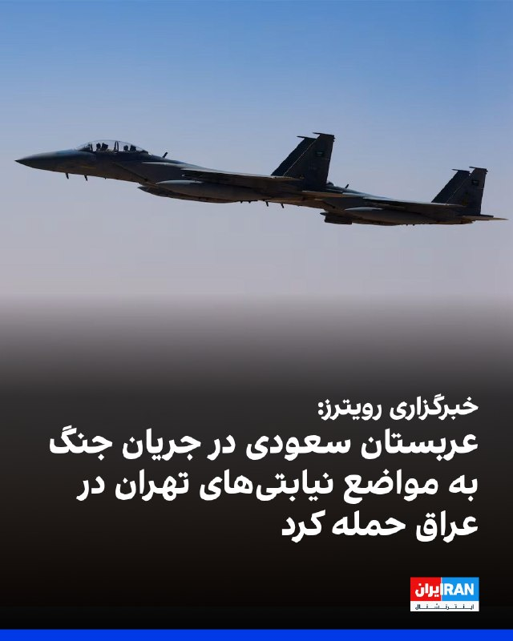

# خواننده تلگرام

<!-- TOP_NAV START -->

<a href="https://github.com/ProAlit/aio-downloader/blob/main/telegram/content/archive_1.md" style="display:inline-block; padding:6px 12px; margin:0 4px; background-color:#2ea44f; color:white; text-decoration:none; border-radius:4px; font-weight:bold;">صفحه بعد</a>

<!-- TOP_NAV END -->

<!-- MSG START -->

---
📅 بروزرسانی: 1405/02/23 22:24
---

## VahidOOnLine — post 239966

  

خبرگزاری رویترز اعلام کرد که عربستان سعودی در جریان جنگ ایران، به مواضع شبه‌نظامیان مورد حمایت جمهوری اسلامی در عراق حمله کرده است.
بر اساس این گزارش، حملات عربستان سعودی توسط جنگنده‌های نیروی هوایی این کشور و علیه مواضع شبه‌نظامی وابسته به جمهوری اسلامی در نزدیکی مرز شمالی عربستان سعودی با عراق انجام شده است. بخشی از این حملات نیز هم‌زمان با آتش‌بس ۱۸ فروردین میان تهران و واشینگتن صورت گرفته است.
همچنین بر اساس ارزیابی‌های نظامی، منابع عراقی گفته‌اند در دست‌کم دو مورد، از خاک کویت حملات راکتی به عراق انجام شده است. رویترز نتوانسته مشخص کند این راکت‌ها توسط نیروهای مسلح کویت یا نیروهای آمریکایی مستقر در این کشور شلیک شده‌اند.
‌🏁 🇬🇧 IranintlTV

🤖 @VahidOOnLine

## WithYashar — post 11163

  <a href="telegram/content/WithYashar_11163_1778698445.mp4" target="_blank">🎬 Download video</a>

پیام سد مجید موسی ، فرمانده نیروی هوافضای ۳پا
تیم ملی رو هم بردن وسط میدون مثل میمونای سیرک
@withyashar

## IranIntlTV — post 337048

  

خبرگزاری رویترز اعلام کرد که عربستان سعودی در جریان جنگ ایران، به مواضع شبه‌نظامیان مورد حمایت جمهوری اسلامی در عراق حمله کرده است.
بر اساس این گزارش، حملات عربستان سعودی توسط جنگنده‌های نیروی هوایی این کشور و علیه مواضع شبه‌نظامی وابسته به جمهوری اسلامی در نزدیکی مرز شمالی عربستان سعودی با عراق انجام شده است. بخشی از این حملات نیز هم‌زمان با آتش‌بس ۱۸ فروردین میان تهران و واشینگتن صورت گرفته است.
همچنین بر اساس ارزیابی‌های نظامی، منابع عراقی گفته‌اند در دست‌کم دو مورد، از خاک کویت حملات راکتی به عراق انجام شده است. رویترز نتوانسته مشخص کند این راکت‌ها توسط نیروهای مسلح کویت یا نیروهای آمریکایی مستقر در این کشور شلیک شده‌اند.
https://iranintl.com/202605137468

## FarsiVOA — post 217656

اروپا در دو مسیر؛ از اعزام ناوهای ایتالیا و بریتانیا به تنگه هرمز تا ابتکار دیپلماتیک فرانسه

## Hranews — post 112936

اجرای حکم اعدام ۵ زندانی در زندان‌های مختلف کشور

❗️
❗️
❗️
❗️
❗️– طی روزهای اخیر، حکم پنج زندانی که پیشتر در پرونده‌های جداگانه از بابت اتهامات مرتبط با جرائم مواد مخدر و قتل به #اعدام محکوم شده بودند، در زندان‌های کرمان، تبریز، بیرجند و گرگان به اجرا درآمد.

ادامه مطلب

#یونس_براهویی
#ناصر_لنگرانی
#امید_صادقی_سوری
#حیدر_بامری
#مهدی_بامری

↘️
@hranews_bot تماس ✉️ -  @Hranews  کانال هرانا 🆑

## alonews — post 119804

  <a href="telegram/content/alonews_119804_1778698448.webm" target="_blank">🎬 Download video</a>

👈خبرنگار: آیا شما با موضع ترامپ موافقید که وضعیت مالی آمریکایی‌ها نباید در فرآیند تصمیم‌گیری درباره [ایران] مد نظر قرار گیرد؟

🔴جی‌دی ونس: خب، فکر نمی‌کنم رئیس‌جمهور چنین چیزی گفته باشد. به نظرم این تحریف سخنان رئیس‌جمهور است.

🔴اما ببینید، من با رئیس‌جمهور موافقم که ایران نباید سلاح هسته‌ای داشته باشد.

🔴هدف اساسی این است که رئیس‌جمهور می‌خواهد جهان را ایمن کند، اما به طور خاص، مردم آمریکا را از داشتن سلاح هسته‌ای توسط ایران ایمن نگه دارد.

🔴ما به وضعیت اقتصادی مردم آمریکا اهمیت می‌دهیم. ما همچنین چالش‌های متعدد دیگری هم داریم. طبیعتاً رئیس‌جمهور باید به طور همزمان با همه این چالش‌ها مواجه شود.

✅ @AloNews خبر جنگ

---
📅 بروزرسانی: 1405/02/23 22:15
---

## mwarmonitor — post 9053

  

🇺🇸کشتی USNS Henry J. Kaiser (T-AO-187) متعلق به نیروی دریایی آمریکا و یک ناوشکن آمریکایی امروز در دریای عرب در مختصات زیر مشاهده شده‌اند:

📍22.7488, 61.2222 و 22.0751, 61.5995

🚢نفتکش گروه ضربتی ناو هواپیمابر ۳ (CSG-3) در حال انجام عملیات سوخت‌رسانی در دریا (Replenishment-at-sea) بوده و ناوشکن نیز در حال انجام عملیات دفاع چندبُعدی و مأموریت‌های امنیت دریایی است.

@mwarmonitor

## FoxNewsTwitter — post 341667

  <a href="telegram/content/FoxNewsTwitter_341667_1778697936.mp4" target="_blank">🎬 Download video</a>

Fox News (Twitter/X)

JUST IN: Vice President JD Vance rips the Biden administration’s failure to prevent medical identity theft after a California psychotherapist was stripped of her benefits.

Vance highlights the doctor's case — 40 years in the medical field only to have her Medicare "turned off" because a fraudster exploited the system.

"A fraudster had stolen her identity and signed her up for healthcare services that she didn't need, and so she had been turned off of the healthcare services that she did need."

“This happens way too much in the United States of America. And it happens because until recently, we did not have a government or an administration that actually took the fraud program and took anti-fraud prevention seriously."

## VahidOnline — post 75452

  

محمد عباسی، از بازداشت‌شدگان اعتراضات سراسری دی‌ماه ۱۴۰۴، سحرگاه روز چهارشنبه ۲۳ اردیبهشت در زندان قزلحصار اعدام شد.

یک منبع مطلع نزدیک به خانواده محمد عباسی با اعلام این خبر به خبرگزاری هرانا گفت مسوولان زندان قزلحصار از خانواده او خواسته بودند برای ملاقات به زندان مراجعه کنند، اما پس از حضور خانواده، امکان ملاقات از آن‌ها سلب شد.
به گفته این منبع، خانواده عباسی پس از ترک زندان، در تماس تلفنی از اجرای حکم اعدام او مطلع شدند.
@VahidHeadline

📡 @VahidOnline

## IranIntlTV — post 337047

  <a href="telegram/content/IranIntlTV_337047_1778697940.mp4" target="_blank">🎬 Download video</a>

۲۴ با فرداد فرحزاد

@iranintltv

## FarsiVOA — post 217655

  <a href="telegram/content/FarsiVOA_217655_1778697942.mp4" target="_blank">🎬 Download video</a>

علم صالح در برنامه تفسیر خبر: جنگ باعث شد جمهوری اسلامی نفت خود را با قیمت ۱۰۳ دلار بفروشد

## FarsiVOA — post 217654

  <a href="telegram/content/FarsiVOA_217654_1778697943.mp4" target="_blank">🎬 Download video</a>

مهدی عربشاهی در برنامه تفسیر خبر: علی خامنه‌ای با کلمه توسعه مشکل داشت

## FarsiVOA — post 217653

اعدام احسان افراشته، زندانی سیاسی، توسط جمهوری اسلامی؛ گفت‌وگو با حسین احمدی‌نیاز

## alonews — post 119803

  <a href="telegram/content/alonews_119803_1778697945.webm" target="_blank">🎬 Download video</a>

👈ادعای نیویورک تایمز: شرکت‌‌های چینی به دنبال فروش سلاح به ایران هستند و قصد دارند آنها را از طریق کشورهای دیگر ارسال کنند تا منبع خود را پنهان کنند

✅ @AloNews خبر جنگ

---
📅 بروزرسانی: 1405/02/23 22:06
---

## VahidOOnLine — post 239965

  <a href="telegram/content/VahidOOnLine_239965_1778697379.mp4" target="_blank">🎬 Download video</a>

واتس‌اپ قابلیت جدیدی به نام «حالت ناشناس» برای چت با هوش مصنوعی متا معرفی کرده که در آن، گفتگوها ذخیره یا قابل مشاهده نخواهند بود؛ حتی برای خود شرکت متا.
واتس‌اپ می‌گوید این قابلیت برای گفتگو درباره موضوعات حساسی مثل سلامت، روابط و مسائل مالی طراحی شده است.
با این حال، کارشناسان هشدار داده‌اند حذف کامل تاریخچه چت‌ها می‌تواند در صورت بروز آسیب یا سوءاستفاده، پیگیری مسئولیت را دشوار کند.
‌🏁 🇬🇧 ManotoTV

🤖 @VahidOOnLine

## VahidOOnLine — post 239964

  

♦️ حساب رسمی وزارت امور خارجه اسرائیل، روز چهارشنبه ۲۳ اردیبهشت، در شبکه اجتماعی ایکس با انتشار پیامی به نقل از دفتر نخست‌وزیری این کشور، سفر محرمانه بنیامین نتانیاهو به امارات متحده در زمان حملات به ایران را تایید کرد. دفتر نتانیاهو اعلام کرد که نخست‌وزیر اسرائیل در این سفر با شیخ محمد بن زاید، رئیس امارات متحده عربی دیدار کرده و این دیدار منجر به «یک پیشرفت تاریخی» در روابط دو کشور شده است.

پیش از این گزارش‌هایی از انتقال سامانه دفاعی گنبد آهنین اسرائیل به امارات متحده نیز مطرح شده بود که از سوی مایک هاکبی، سفیر آمریکا در اسرائیل نیز تایید شد. همچنین گزارش‌هایی نیز از انجام حملاتی علیه جمهوری اسلامی از سوی امارات متحده منتشر شده است.
‌🇸🇦 Indypersian

🤖 @VahidOOnLine

## VahidOOnLine — post 239963

  

بر اساس گزارش منابع حقوق‌بشری، دادگاه تجدیدنظر استان کهگیلویه و بویراحمد، فیض‌الله آذرنوش، پدر دادخواه پدارم آذرنوش را به ۱۵ سال حبس، میلاد کریمی‌نسب را به شش سال حبس، امیرحسین محسنی‌پور را به شش سال حبس و مهدی کرمی را به سه سال حبس محکوم کرد.
سایت حقوق‌بشری هرانا چهارشنبه ۲۳ اردیبهشت گزارش داد این شهروندان در یک پرونده مشترک، از سوی ابوالحسن دادگر و سعید جریده‌اصل، مستشاران شعبه اول دادگاه تجدیدنظر استان کهگیلویه و بویراحمد، به احکام حبس محکوم شده‌اند.
بر اساس احکام صادرشده، پنج سال حبس برای آذرنوش، پنج سال حبس برای کریمی‌نسب، سه سال حبس برای محسنی‌پور و سه سال حبس برای کرمی قابل اجرا است.
‌🏁 🇬🇧 IranintlTV

🤖 @VahidOOnLine

## FoxNewsTwitter — post 341666

  <a href="telegram/content/FoxNewsTwitter_341666_1778697381.mp4" target="_blank">🎬 Download video</a>

Fox News (Twitter/X)

NEW: VP Vance calls out officials in Hawaii for refusing to crack down on Medicaid fraud in the state:

"Guess how many convictions or indictments has Hawaii had over the last few years in its Medicaid fraud program? The answer is zero."

"Not a single indictment, not a single conviction, because the administrators of the Hawaii program just don't take it seriously. They don't think that fraud is a big enough problem."

## FoxNewsTwitter — post 341665

  <a href="telegram/content/FoxNewsTwitter_341665_1778697384.mp4" target="_blank">🎬 Download video</a>

Fox News (Twitter/X)

JUST IN: Vice President JD Vance reveals how fraudulent healthcare providers are taking advantage of patients and exploiting the American taxpayer:

"You have people who've been prescribed medications that they don't even need.

“Sometimes they've had drugs put into their bodies that they don't need because fraudsters have actually encouraged false prescriptions and false administration to medications.”

“It's a defrauding of the American taxpayer, but it's a violation of the trust that should exist between every American and the people who prescribe the medications."

## FoxNewsTwitter — post 341664

  <a href="telegram/content/FoxNewsTwitter_341664_1778697386.mp4" target="_blank">🎬 Download video</a>

Fox News (Twitter/X)

BREAKING: Vice President JD Vance announces the federal government is deferring over a billion dollars in Medicaid reimbursements to California, citing a failure by the state to combat systemic fraud.

"We're announcing that the federal government is deferring $1.3 billion in Medicaid reimbursements from the state of California.”

“And the simple reason is because the state of California has not taken fraud very seriously."

## pm_afshaa — post 90708

  <a href="telegram/content/pm_afshaa_90708_1778697388.webm" target="_blank">🎬 Download video</a>

🔴علی‌آبادی، وزیر نیرو: با همکاری مردم و افزایش ظرفیت تولید، وضعیت امسال از سال گذشته به مراتب بهتر خواهد بود و امیدواریم تابستان بدون خاموشی سپری بشه.

💧 Rainbet.com the #1 Non-KYC Crypto Casino & Sportsbook @rainbetcom

😁 @Pm_Afshaa

## pm_afshaa — post 90707

  <a href="telegram/content/pm_afshaa_90707_1778697389.webm" target="_blank">🎬 Download video</a>

🔴بلومبرگ: صادرات نفت ایران از جزیره خارک برای اولین بار از زمان شروع جنگ متوقف شده و تصاویر ماهواره‌ای نشان میده که مخازن ذخیره‌سازی نفت تقریباً به ظرفیت کامل خود رسیدن.

💧 Rainbet.com the #1 Non-KYC Crypto Casino & Sportsbook @rainbetcom

😁 @Pm_Afshaa

## iaghapour — post 2607

✍🏻 دوستان عزیز، همون‌طور که احتمالاً متوجه شدید، در یک هفته گذشته به دلایل مختلفی فعالیت ما کمتر شده.

🔹در این مدت پیام‌های زیادی داشتیم که درخواست آموزش «روش جدید سنایی» رو داشتن. وقتی بررسی کردیم، متوجه شدیم خود ایشون زحمت تهیه ویدیوی آموزشی رو کشیدن؛ بنابراین نیازی به آموزش مجدد نبود.

🔸برای اطمینان بیشتر، این آموزش رو به چند نفر از دوستان دادیم تا تست کنن. بیشتر افراد موفق به اجرا نشدن، اما یکی از کاربران تونست متصل بشه. طبق بررسی‌های ایشون، این روش به‌شدت به رنج آی‌پی‌ها (هم سرور ایران و هم خارج) وابسته است. مشکل اصلی اینجاست که بعد از اتصال و مصرف حجم کمی از اینترنت، ارتباط قطع می‌شه و باید آی‌پی رو عوض کرد؛ هرچند آی‌پی قبلی بعد از ۱ تا ۲ ساعت دوباره قابل استفاده می‌شه.

🔻متأسفانه در این بین، عده‌ای بدون این‌که تست درستی از پایداری تانل بگیرن، شروع به آموزش کردن که نتیجه‌اش فقط ضرر مالی برای کاربران بوده. چون کاربرا رفتن سرورهای گرون قیمت رو خریداری کردن که البته تعداد این افراد اصلا کم نبوده. (نمونه‌اش رو در عکس ضمیمه می‌بینید).

🟢 در مجموع، به نظر می‌رسه این روش هنوز پایدار نیست، اما از بچه‌های تیم خواستیم تست‌های بیشتری روش انجام بدن. اگر خودتون هم مایلید آموزش رو ببینید، می‌تونید مستقیماً به کانال یا گروه سنایی مراجعه کنید.

🆔 @iaghapour

## IranIntlTV — post 337046

  

بر اساس گزارش منابع حقوق‌بشری، دادگاه تجدیدنظر استان کهگیلویه و بویراحمد، فیض‌الله آذرنوش، پدر دادخواه پدارم آذرنوش را به ۱۵ سال حبس، میلاد کریمی‌نسب را به شش سال حبس، امیرحسین محسنی‌پور را به شش سال حبس و مهدی کرمی را به سه سال حبس محکوم کرد.
سایت حقوق‌بشری هرانا چهارشنبه ۲۳ اردیبهشت گزارش داد این شهروندان در یک پرونده مشترک، از سوی ابوالحسن دادگر و سعید جریده‌اصل، مستشاران شعبه اول دادگاه تجدیدنظر استان کهگیلویه و بویراحمد، به احکام حبس محکوم شده‌اند.
بر اساس احکام صادرشده، پنج سال حبس برای آذرنوش، پنج سال حبس برای کریمی‌نسب، سه سال حبس برای محسنی‌پور و سه سال حبس برای کرمی قابل اجرا است.
https://iranintl.com/202605138248

## ManotoTV — post 105414

  <a href="telegram/content/ManotoTV_105414_1778697391.mp4" target="_blank">🎬 Download video</a>

واتس‌اپ قابلیت جدیدی به نام «حالت ناشناس» برای چت با هوش مصنوعی متا معرفی کرده که در آن، گفتگوها ذخیره یا قابل مشاهده نخواهند بود؛ حتی برای خود شرکت متا.
واتس‌اپ می‌گوید این قابلیت برای گفتگو درباره موضوعات حساسی مثل سلامت، روابط و مسائل مالی طراحی شده است.
با این حال، کارشناسان هشدار داده‌اند حذف کامل تاریخچه چت‌ها می‌تواند در صورت بروز آسیب یا سوءاستفاده، پیگیری مسئولیت را دشوار کند.

## FarsiVOA — post 217652

🔺تشدید فضای امنیتی در بند زنان زندان اوین؛ محرومیت شماری از زندانیان سیاسی از حق تماس و ملاقات

◾️ در‌پی تشدید فضای امنیتی در بند زنان زندان اوین، هشت زندانی سیاسی زن، به بهانه حضور در «برنامه‌های اعتراضی»، از حق تماس و ملاقات با خانواده و وکلای خود محروم شدند.

⬇️ بیشتر بخوانید:

https://ir.voanews.com/a/evin-prison-women-prisoners-political-prisoners-iran-deprivation/8149620.html

## FarsiVOA — post 217651

امیر سلطانی در برنامه تفسیر خبر: ما دوباره نیاز به ملی کردن نفت ایران داریم

## FarsiVOA — post 217650

اشکان خسروپور، پژوهشگر سیاست‌گذاری اینترنت، می‌گوید بر اساس سند راهبردی جمهوری اسلامی، مدیریت اینترنت اساساً خارج از کنترل دولت‌ها است و ایجاد «ستاد ویژه» به ریاست محمدرضا عارف، معاون مسعود پزشکیان، صرفا جنبه نمایشی دارد.

## FarsiVOA — post 217649

  <a href="telegram/content/FarsiVOA_217649_1778697392.mp4" target="_blank">🎬 Download video</a>

ارتش اسرائیل تصاویری از هدف‌گیری نیروها و مواضع حزب‌الله در جنوب لبنان منتشر کرده است.

این ارتش اعلام کرد از ابتدای درگیری‌ها، «بیش از ۴۰۰ تروریست از جمله اعضای یگان «رضوان» را به هلاکت رسانده و بیش از ۱۰۰۰ سلاح» متعلق به حزب‌الله را شناسایی کرده‌اند.

بنابر بیانیه ارتش اسرائیل نیروهای واحد جمع‌آوری اطلاعات «شَحَف» (۸۶۹) بیش از ۱۲۰ تروریست را شناسایی و حذف کرده و ده‌ها زیرساخت تروریستی، از جمله مقرهای سازمان تروریستی حزب‌الله را نابود کرده‌اند.

این ویدیو بی‌صدا است.

## DW_Farsi — post 124666

  

🔸 ایال زمیر: اسرائیل آماده بازگشت به جنگ از کرانه باختری تا تهران است

به گزارش تایمز اسرائیل، ایال زمیر، رئیس ستاد کل ارتش اسرائیل در جریان بازدید از کرانه باختری گفت ارتش اسرائیل همچنان در حالت آماده‌باش کامل قرار دارد و در صورت نیاز، از کرانه باختری تا تهران آماده بازگشت به نبرد است. هم‌زمان، ارتش اسرائیل اعلام کرد حملاتی هوایی را علیه انبارهای سلاح، پرتابگرهای آماده شلیک و دیگر زیرساخت‌های حزب‌الله در جنوب لبنان انجام داده است.

زمیر گفت "این کارزار تمام نشده است" و ارتش اسرائیل، هم در دفاع و هم در حمله، در همه جبهه‌ها در وضعیت آمادگی دائمی قرار دارد. این موضع‌گیری در حالی مطرح شده که آتش‌بس‌های شکننده در جبهه‌های مختلف برقرار است، اما تل‌آویو همچنان از احتمال بازگشت سریع درگیری سخن می‌گوید.

ارتش اسرائیل اعلام کرد پیش از حملات در لبنان، برای هفت روستا در جنوب این کشور هشدار تخلیه صادر کرده بود. سپس موجی از حملات هوایی را علیه مواضع حزب‌الله انجام داد.
@dw_farsi

## IranianMinds — post 20087

  

🔴 اکانت اسرائیل به فارسی:

محمد عباسی و دخترش فاطمه در دی‌ماه دستگیر شدند.
محمد را بدون ملاقات آخر، امروز صبح اعدام کردند.
جمهوری اسلامی روی خون مردمش حکومت می‌کند.

@IranianMinds

## BBCPersian — post 280953

  <a href="telegram/content/BBCPersian_280953_1778697396.mp4" target="_blank">🎬 Download video</a>

⭕️در روزهای اخیر انتشار تصاویری از تظاهرات گروهی از هواداران شاهزاده رضا پهلوی در آلمان که در آن با لباس‌های یک‌شکل با نشان ساواک راهپیمایی کرده‌اند، واکنش‌برانگیز شده است.
 
در بیانیه‌ای که در تجمع رگنزبورگ آلمان خوانده شد، افرادی که خود را «گروه مردمی ساواک» معرفی می‌کنند، با ستایش از عملکرد ساواک در دوران محمدرضاشاه پهلوی، خواهان «احیا و گسترش ساواک برای شناسایی عوامل جمهوری اسلامی و اپوزیسیون‌های جعلی و نفوذی» شدند.
 
یک روز پیش از آن، گروه دیگری از ایرانیان در دانمارک با لباس‌هایی یکدست شبیه یونیفرم نظامی و پیشتر در شهرهایی از جمله لندن، منچستر و گلاسگو گروهی یک‌دست سیاهپوش با عنوان «گارد جاویدان» تجمع کرده بودند.
 
ساواک، سازمان اطلاعات و امنیت کشور در ایران بود که از ۱۳۳۵ تا ۱۳۵۷ فعالیت می‌کرد. گروهی از پادشاهی‌خواهان با ارجاع به برخورد ساواک با چهره‌هایی از جمله آنهایی که بعدها از سران جمهوری اسلامی شدند، عملکرد آن را موجه می‌دانند.
 
مخالفان اما ساواک را به «خشونت و شکنجه سیستماتیک» متهم می‌کنند. آنها می‌گویند با رژه‌های اخیر نگران «ترویج خشونت و رویکردهای اقتدارگرا و فاشیستی» شده‌اند.
@bbcpersian

## Dirty_Kids — post 389397

  <a href="telegram/content/Dirty_Kids_389397_1778697400.webm" target="_blank">🎬 Download video</a>

🔴بلومبرگ: صادرات نفت ایران از جزیره خارک برای اولین بار از زمان شروع جنگ متوقف شده و تصاویر ماهواره‌ای نشان میده که مخازن ذخیره‌سازی نفت تقریباً به ظرفیت کامل خود رسیدن.

@Dirty_Kids 👻

## Dirty_Kids — post 389396

  

صلواتی خونخوار حکم اعدام ‎#محمد_عباسی رو داد و جمهوری اسلامی امروز مخفیانه طناب دار رو دور گردنش انداخت.

@Dirty_Kids 👻

## Dirty_Kids — post 389395

  

علی قمصری در کاخ الیزه در واکنش به رابطه «گلشیفته و مکرون»

@Dirty_Kids 👻

## Dirty_Kids — post 389394

  

شما غلط کردی با صاحابت.
از طرف مردم گه نخور.

@Dirty_Kids 👻

## manototv — post 105414

  <a href="telegram/content/manototv_105414_1778697402.mp4" target="_blank">🎬 Download video</a>

واتس‌اپ قابلیت جدیدی به نام «حالت ناشناس» برای چت با هوش مصنوعی متا معرفی کرده که در آن، گفتگوها ذخیره یا قابل مشاهده نخواهند بود؛ حتی برای خود شرکت متا.
واتس‌اپ می‌گوید این قابلیت برای گفتگو درباره موضوعات حساسی مثل سلامت، روابط و مسائل مالی طراحی شده است.
با این حال، کارشناسان هشدار داده‌اند حذف کامل تاریخچه چت‌ها می‌تواند در صورت بروز آسیب یا سوءاستفاده، پیگیری مسئولیت را دشوار کند.

## alonews — post 119802

  <a href="telegram/content/alonews_119802_1778697403.webm" target="_blank">🎬 Download video</a>

👈کانال ۱۲ اسرائیل به نقل از یک منبع نظامی گزارش داد: حزب‌الله از ابتدای جنگ ۴۵۰ پهپاد پرتاب کرده است که شامل ۱۲۰ پهپادی است که با استفاده از فیبر نوری عمل می‌کنند

✅ @AloNews خبر جنگ

## alonews — post 119801

  <a href="telegram/content/alonews_119801_1778697403.webm" target="_blank">🎬 Download video</a>

👈مقام ارشد ضدتروریسم کاخ سفید: ترامپ نامه‌ای خطاب به معاون خود، «جی‌دی ونس» نوشته که در کشوی میزش در کاخ سفید نگه داشته می‌شود تا در صورت مرگ یا ترور احتمالی وی، مورد استفاده قرار گیرد.

✅ @AloNews خبر جنگ

---
📅 بروزرسانی: 1405/02/23 21:52
---

## VahidOOnLine — post 239962

♦️نخست‌وزیر کانادا در دیدار با فضانوردان ماموریت تاریخی «آرتمیس ۲»، از آن‌ها که نخستین سفر سرنشین‌دار بشر به اطراف ماه پس از دهه‌ها را انجام دادند، به‌عنوان نمادی از «شجاعت، همکاری و نبوغ انسانی» یاد کرد و گفت آن‌ها الهام‌بخش تمام مردم کانادا و جهان هستند.
مارک کارنی، روز چهارشنبه در اتاوا میزبان اعضای ماموریت آرتمیس ۲ ناسا بود؛ ماموریتی که طی آن کپسول «اوریون» با چهار فضانورد، دور ماه گردش کرد و رکورد دورترین فاصله‌ای را که انسان تاکنون در فضا پیموده، ثبت کرد.
در این دیدار، جرمی هنسن، فضانورد آژانس فضایی کانادا که به‌عنوان متخصص ماموریت در آرتمیس ۲ حضور داشت، پرچم کانادا را که در طول سفر فضایی همراه خدمه به دور ماه رفته بود، به نخست‌وزیر این کشور هدیه داد، پرچمی که در قاب مخصوص و همراه با تصویری از طلوع زمین از فضا به کارنی تحویل داده شد.
در بخشی صمیمانه از این مراسم، نخست‌وزیر کانادا سکه‌های یادبود ویژه فضانوردی را به اعضای آرتمیس ۲ هدیه داد و در مقابل، پرچمی را که روز بازگشت فضانوردان بر فراز برج صلح پارلمان کانادا برافراشته شده بود، به جرمی هنسن تقدیم کرد.
‌🇸🇦 Indypersian

🤖 @VahidOOnLine

## WithYashar — post 11162

  <a href="telegram/content/WithYashar_11162_1778696523.mp4" target="_blank">🎬 Download video</a>

رقص امشب از گلشیفته 😅
@withyashar

## IranIntlTV — post 337045

  <a href="telegram/content/IranIntlTV_337045_1778696526.mp4" target="_blank">🎬 Download video</a>

مهدی مهدوی‌آزاد در برنامه «چشم‌انداز» گفت: «تجمعات حکومتی در حال تبدیل شدن به یکی از مشکلات اصلی حاکمیت است. همان نیروهای حامی حکومت که امروز به خیابان‌ها می‌آیند، مسیر هرگونه سازش را بسته‌اند. کشوری که هم‌اکنون با بحران انرژی و مشکلات عمیق اقتصادی دست‌وپنجه نرم می‌کند، به‌زودی ممکن است حتی در مدیریت همین حامیان خود در خیابان نیز دچار چالش شود؛ چه‌بسا کار به جایی برسد که ناچار به سرکوب تجمعات حامیان شود.»
@iranintltv

## FarsiVOA — post 217648

در گفت‌وگو با شاهین مدرس، تحلیلگر مطالعات امنیتی، به شکاف میان روایت‌های رسانه‌ای غرب و ارزیابی‌های اطلاعاتی از توان نظامی جمهوری اسلامی پرداختیم؛ از «جنگ ادراکی» و بزرگ‌نمایی قدرت ایران گفتیم و پرسیدیم این روایت‌سازی‌ها چطور به جمهوری اسلامی «امید واهی» می‌دهد.

## FarsiVOA — post 217647

🔺محراب عبدالله‌زاده، از معترضان اعدام‌شده توسط رژیم ایران؛ فریاد «بی‌گناهم» تا آخرین لحظه

▪️«سلام مردم ایران، من محراب عبدالله‌زاده هستم. صدای من را از زندان مرکزی ارومیه می‌شنوید.» این سه جمله ابتدایی پیام صوتی کسی است که حالا نامش به عنوان یکی از اعدام‌شده‌های جمهوری‌ اسلامی ثبت شده است.

⬇️ بیشتر بخوانید:

https://ir.voanews.com/a/execution-iran-protest-mehrab-abdolahzadeh-/8149537.html/?nocach=1

## Hranews — post 112935

  

پرونده‌سازی در زندان؛ وریشه مرادی به حبس محکوم شد

❗️
❗️
❗️
❗️
❗️– وریشه مرادی، زندانی سیاسی محبوس در زندان اوین، از بابت پرونده جدیدی که در دوران حبس علیه وی گشوده شده است، به شش ماه حبس محکوم شده است.

به گزارش خبرگزاری هرانا، ارگان خبری مجموعه فعالان حقوق بشر در ایران، وریشه مردای به حبس محکوم شد.

براساس حکمی که اخیراً صادر و به این #زندانی_سیاسی ابلاغ شده است، خانم مرادی از بابت اتهام تبلیغ علیه نظام به شش ماه حبس محکوم شده است.

ادامه مطلب

#وریشه_مرادی

↘️
@hranews_bot تماس ✉️ -  @Hranews  کانال هرانا 🆑

## Hranews — post 112934

گزارشی از بیکاری و تاخیر در پرداخت حقوق کارگران کارخانه صاپنا و شهرداری میناب

❗️
❗️
❗️
❗️
❗️– حدود ۵۰ کارگر کارخانه صاپنا واقع در شهرستان دلفان به علت توقف تولید در این واحد صنعتی، بیکار شده‌اند. همچنین، #کارگران شهرداری میناب اعلام کردند که تاکنون ۷۵٪ از حقوق فروردین ماه خود را دریافت نکرده‌اند.

ادامه مطلب

↘️
@hranews_bot تماس ✉️ -  @Hranews  کانال هرانا 🆑

## alonews — post 119800

  

املت قسطی هم اومد

[@AloTweet]

---
📅 بروزرسانی: 1405/02/23 21:44
---

## VahidOOnLine — post 239961

  

سایت حقوق‌بشری هرانا گزارش داد حکم اعدام محمد عباسی، از بازداشت‌شدگان اعتراضات سراسری دی‌ماه ۱۴۰۴، سحرگاه چهارشنبه در زندان قزلحصار کرج اجرا شد.
هرانا چهارشنبه ۲۳ اردیبهشت به نقل از منبعی مطلع و نزدیک به خانواده این زندانی سیاسی نوشت مسئولان زندان از خانواده عباسی خواسته بودند برای ملاقات با او به زندان مراجعه کنند، اما پس از حضور خانواده، اجازه ملاقات به آنان داده نشد.
به گفته این منبع، خانواده عباسی پس از خروج از زندان، در تماسی تلفنی از اجرای حکم اعدام او مطلع شدند.
ایران‌اینترنشنال هفتم اردیبهشت خبر داده بود حکم اعدام محمد عباسی و حکم ۲۵ سال حبس دخترش، فاطمه عباسی که در بند زنان زندان اوین محبوس است، در دیوان عالی کشور تایید شده است.
اطلاعات رسیده به ایران‌اینترنشنال حاکی است عباسی و دخترش فاطمه در دوران بازجویی تحت فشار و شکنجه‌های شدید قرار گرفته بودند و از زمان بازداشت، در تمامی مراحل دادرسی، از جمله بازجویی، بازپرسی، دادگاه و رسیدگی در دیوان عالی کشور، از حق دسترسی به وکیل محروم بوده‌اند.
‌🏁 🇬🇧 IranintlTV

🤖 @VahidOOnLine

## VahidOOnLine — post 239960

  <a href="telegram/content/VahidOOnLine_239960_1778696083.mp4" target="_blank">🎬 Download video</a>

حساب رسمی سفارت آمریکا در واتیکان اعلام کرد برخلاف برخی گزارش‌های رسانه‌ای، پاپ لئون چهاردهم هیچ افتخار یا نشان ویژه و انحصاری به سفیر جمهوری‌اسلامی در واتیکان اعطا نکرده است.
در این بیانیه آمده است این مدال به همه سفیران مورد تایید واتیکان پس از بیش از دو سال خدمت داده می‌شود و سال‌هاست که یک رویه معمول و استاندارد به شمار می‌رود.
سفارت آمریکا تأکید کرده این تقدیر صرفاً جنبه شخصی دارد و به‌معنای حمایت یا مخالفت با هیچ کشور یا سیاستی نیست.
بر اساس این توضیحات، اخیراً ۱۳ سفیر این نشان را دریافت کرده‌اند و سفیران پیشین آمریکا نیز همین مدال را گرفته بودند.
در ادامه این بیانیه آمده است که این نشان نیز مستقیماً توسط پاپ اهدا نشده است.
‌🏁 🇬🇧 ManotoTV

🤖 @VahidOOnLine

## VahidOOnLine — post 239959

  <a href="telegram/content/VahidOOnLine_239959_1778696084.mp4" target="_blank">🎬 Download video</a>

روزنامه‌نگار ارشد سیاسی کانال ۱۲ اسرائیل گزارش داده دفتر نخست‌وزیری اسرائیل تأیید کرد که بنیامین نتانیاهو در جریان جنگ اسرائیل و آمریکا با ایران، سفری محرمانه به امارات متحده عربی داشته و در آنجا با محمد بن زاید آل نهیان، رئیس امارات، دیدار کرده است. در ادامه آمده گزارش‌ها حاکی است این سفر محرمانه به یک تحول تاریخی در روابط اسرائیل و امارات منجر شده است.
‌🏁 🇬🇧 ManotoTV

🤖 @VahidOOnLine

## VahidOOnLine — post 239958

  

عباس عراقچی، وزیر خارجه جمهوری اسلامی، در واکنش به بازداشت چهار فرد «وابسته به سپاه پاسداران» در کویت، در شبکه اجتماعی ایکس نوشت کویت «در تلاشی آشکار برای ایجاد تفرقه»، به یک قایق ایرانی در خلیج فارس حمله کرده و چهار شهروند ایرانی را بازداشت کرده است.

او افزود این اقدام «در نزدیکی جزیره‌ای رخ داده که آمریکا از آن برای حمله به ایران استفاده کرده است» و تاکید کرد جمهوری اسلامی خواستار آزادی فوری این افراد است و «حق پاسخ‌گویی را برای خود محفوظ می‌داند.»
‌🏁 🇬🇧 IranintlTV

🤖 @VahidOOnLine

## VahidOOnLine — post 239957

  

♦️ عباس عراقچی، وزیر امور خارجه جمهوری اسلامی، روز چهارشنبه ۲۳ اردیبهشت با انتشار پیامی در شبکه اجتماعی ایکس به بازداشت چهار مرد که به گفته کویت عضو سپاه پاسداران بوده و قصد نفوذ به یکی از جزایر این کشور را داشتند، واکنش نشان داد. عراقچی نوشت: «کویت به‌طور غیرقانونی به یک قایق ایرانی در خلیج فارس حمله کرده و چهار تن از شهروندان ما را بازداشت کرده است.» او افزود که «این اقدام غیرقانونی در نزدیکی جزیره‌ای صورت گرفته که توسط ایالات متحده برای حمله به ایران مورد استفاده قرار می‌گیرد» و هدف از آن «تلاشی آشکار برای تفرقه‌افکنی» بوده است.

کویت روز سه‌شنبه اعلام کرد چهار مرد را که متهم به عضویت در سپاه پاسداران انقلاب اسلامی هستند، بازداشت کرده است. کویت می‌گوید این افراد قصد داشتند از طریق دریا به جزیره بوبیان نفوذ کنند و در جریان این عملیات، یک سرباز کویتی را مجروح کرده‌اند. وزارت کشور کویت اعلام کرد که این عملیات در تاریخ ۱۱ اردیبهشت انجام شده و ماموران نیروی دریایی، این افراد را «سوار بر یک قایق ماهیگیری که برای انجام اقدامات خصمانه علیه کویت اجاره شده بود» بازداشت کرده‌اند.
‌🇸🇦 Indypersian

🤖 @VahidOOnLine

## WithYashar — post 11161

تاج : در جریان آهنگی که معین برای تیم ملی در جام جهنی ۲۰۲۶ می خواند هستیم
@withyashar

## mwarmonitor — post 9052

🔴رویترز: چندین منبع آگاه گفتند در جریان جنگ ایران، جنگنده‌های سعودی اهدافی مرتبط با شبه‌نظامیان قدرتمند شیعه مورد حمایت تهران در عراق را بمباران کردند. همچنین حملات تلافی‌جویانه‌ای نیز از کویت به سمت عراق انجام شده است.

@mwarmonitor

## mwarmonitor — post 9051

📊زیاد داوود، اقتصاددان ارشد بلومبرگ، می‌گوید آینده عراق «تیره و تار» است و این کشور حدود پنج ماه ذخایر و حاشیه‌های مالی دارد، پیش از آنکه وارد «بحرانی عظیم/مادرِ همه بحران‌ها» شود — شفق

@mwarmonitor

## FoxNewsTwitter — post 341663

  

Fox News (Twitter/X)

WATCH LIVE: Vance delivers remarks on Trump admin's fraud crackdown https://twitter.com/i/broadcasts/1wGWjaVqmRpKQ

## FoxNewsTwitter — post 341662

  <a href="telegram/content/FoxNewsTwitter_341662_1778696087.mp4" target="_blank">🎬 Download video</a>

Fox News (Twitter/X)

NEW: Acting ICE Director Todd Lyons honors fallen law enforcement officers and agents:

"Police week is sacred, not because of ceremony, but because behind every name we honor was a human being, a son, a daughter, a husband, a wife, a mother, a father, a partner, and a friend. Someone who kissed their family goodbye one last time without knowing it would be the last time."

"These are generations of law enforcement professionals who stood watch over this nation, accepted the risks most Americans will never fully understand."

## pm_afshaa — post 90706

🔴رویترز: عربستان و کویت درجریان جنگ 40 روزه به هدف‌های شبه‌نظامی‌های طرفدار ایران تو عراق (حشدالشعبی) حمله کردن

💧 Rainbet.com the #1 Non-KYC Crypto Casino & Sportsbook @rainbetcom

😁 @Pm_Afshaa

## VahidOnline — post 75451

  

دفتر نخست‌وزیر اسرائیل روز چهارشنبه اعلام کرد که بنیامین نتانیاهو در جریان جنگ آمریکا و اسرائیل با ایران، به‌طور «محرمانه» به امارات متحده عربی سفر کرده بود.

در این بیانیه آمده که نتانیاهو با شیخ محمد بن زاید، رئیس امارات متحده عربی، دیدار کرد.

دفتر نخست‌وزیر اسرائیل گفت: «این سفر به یک پیشرفت تاریخی در روابط میان اسرائیل و امارات متحده عربی منجر شد.»

پیش‌تر مقام‌های ارشد آمریکایی تأیید کردند که اسرائیل در جریان جنگ با ایران، یک سامانه پدافندی «گنبد آهنین» به همراه نیروهایی برای بهره‌برداری از آن به امارات اعزام کرده است.

همچنین به گفته مقام‌های عرب و یک منبع آگاه که با روزنامه وال‌استریت جورنال گفت‌وگو کردند، دیوید بارنئا، رئیس موساد، دست‌کم دو بار در طول جنگ با ایران به امارات سفر کرد تا دربارهٔ هماهنگی‌های مربوط به این درگیری رایزنی کند.
@VahidHeadline

📡 @VahidOnline

## IranIntlTV — post 337044

  

سایت حقوق‌بشری هرانا گزارش داد حکم اعدام محمد عباسی، از بازداشت‌شدگان اعتراضات سراسری دی‌ماه ۱۴۰۴، سحرگاه چهارشنبه در زندان قزلحصار کرج اجرا شد.
هرانا چهارشنبه ۲۳ اردیبهشت به نقل از منبعی مطلع و نزدیک به خانواده این زندانی سیاسی نوشت مسئولان زندان از خانواده عباسی خواسته بودند برای ملاقات با او به زندان مراجعه کنند، اما پس از حضور خانواده، اجازه ملاقات به آنان داده نشد.
به گفته این منبع، خانواده عباسی پس از خروج از زندان، در تماسی تلفنی از اجرای حکم اعدام او مطلع شدند.
ایران‌اینترنشنال هفتم اردیبهشت خبر داده بود حکم اعدام محمد عباسی و حکم ۲۵ سال حبس دخترش، فاطمه عباسی که در بند زنان زندان اوین محبوس است، در دیوان عالی کشور تایید شده است.
اطلاعات رسیده به ایران‌اینترنشنال حاکی است عباسی و دخترش فاطمه در دوران بازجویی تحت فشار و شکنجه‌های شدید قرار گرفته بودند و از زمان بازداشت، در تمامی مراحل دادرسی، از جمله بازجویی، بازپرسی، دادگاه و رسیدگی در دیوان عالی کشور، از حق دسترسی به وکیل محروم بوده‌اند.
https://iranintl.com/202605134938

## IranIntlTV — post 337043

🔻تشدید کارزار امنیتی کشورهای خلیج فارس علیه شبکه‌های وابسته به جمهوری اسلامی

کشورهای حوزه خلیج فارس هم‌زمان با ادامه تنش‌ها در خاورمیانه، کارزار امنیتی گسترده‌ای را علیه شبکه‌های وابسته به جمهوری اسلامی و حزب‌الله لبنان آغاز کرده‌اند. مقام‌های امنیتی در کویت، بحرین، امارات و قطر از کشف و متلاشی شدن ده‌ها هسته مرتبط با تهران خبر داده‌اند.

شبکه آی۲۴ چهارشنبه ۲۳ اردیبهشت گزارش داد کشورهای حاشیه خلیج فارس طی ۲۷ روز گذشته بیش از ۱۲ هسته وابسته به جمهوری اسلامی را شناسایی و متلاشی کرده‌اند.

آریل اوسران، خبرنگار آی۲۴، نیز در شبکه اجتماعی ایکس نوشت کشف این هسته‌ها «نشان‌دهنده تشدید اقدامات جمهوری اسلامی علیه همسایگان عرب خود» است؛ تحولاتی که به گفته او «چشم‌انداز امنیتی خلیج فارس را دگرگون می‌کند.»

بر اساس داده‌های رسمی، حدود ۷۴ نفر با تابعیت‌های کویت، بحرینی، لبنانی و ایرانی در ارتباط با این هسته‌ها بازداشت یا شناسایی شده‌اند.

مقام‌های امنیتی این کشورها می‌گویند بازداشت‌شدگان به جاسوسی، پول‌شویی، طراحی ترور، جمع‌آوری اطلاعات از مراکز حساس و تلاش برای ضربه زدن به امنیت و ثبات اقتصادی کشورهای منطقه متهم هستند.

روزنامه الشرق الاوسط ۱۳ فروردین، گزارش داد نیروهای امنیتی کشورهای خلیج فارس طی ۳۰ روز، ۹ هسته مرتبط با جمهوری اسلامی یا متحدانش، به‌ویژه حزب‌الله لبنان، را در چهار کشور قطر، بحرین، کویت و اماراتمه کشف کرده‌اند.

بر اساس بررسی‌های الشرق الاوسط، خبر کشف و انهدام نخستین هسته ۱۳ اسفند ۱۴۰۴ در قطر اعلام شد و آخرین مورد در ۱۰ فروردین ۱۴۰۵؛ به این معنا که هر ۹ هسته طی ۲۷ روز متلاشی شده‌اند، یعنی تقریبا هر سه روز یک هسته مرتبط با تهران کشف شده است.

طبق گزارش الشرق الاوسط، کشورهای عضو شورای همکاری خلیج فارس هم‌زمان با مقابله با حملات جمهوری اسلامی، عملیات علیه شبکه‌های وابسته به تهران و حزب‌الله را تشدید کرده‌اند.

ظافر العجمی، کارشناس امنیتی خلیج فارس، گفت جمهوری اسلامی از «راهبردی سه‌بعدی» شامل هسته‌های محلی، جذب نیرو در کشورهای خلیج فارس و استفاده از گروه‌های نیابتی مانند حزب‌الله و حوثی‌ها برای اعمال فشار امنیتی استفاده می‌کند.

پیش از آن نیز، رویترز ۳۰ اسفند ۱۴۰۴ گزارش داده بود مقام‌های امنیتی امارات شبکه‌ای دیگر را که به گفته آنها با حمایت مالی و هدایت حزب‌الله لبنان و جمهوری اسلامی فعالیت می‌کرد، متلاشی کرده‌اند.

بر اساس گزارش خبرگزاری رسمی امارات، این شبکه تحت پوشش فعالیت‌های تجاری صوری در پول‌شویی، تامین مالی تروریسم و تلاش برای ضربه زدن به ثبات مالی کشور نقش داشته است. حزب‌الله این اتهام‌ها را رد کرده و آنها را «ساختگی» خوانده است.

وزارت کشور کویت چهارشنبه ۵ فروردین ۱۴۰۵ اعلام کرد نیروهای امنیتی این کشور یک «طرح تروریستی» مرتبط با حزب‌الله لبنان را خنثی کرده‌اند. مقام‌های کویتی گفتند شش نفر، شامل پنج شهروند کویتی و یک فرد بدون تابعیت، بازداشت و ۱۴ مظنون دیگر، از جمله دو ایرانی و دو لبنانی، تحت تعقیب قرار دارند.

به گفته مقام‌ها، اعضای این شبکه به جاسوسی و برنامه‌ریزی برای ترور رهبران کشور اعتراف کرده‌اند و آموزش‌های نظامی و کار با مواد منفجره را خارج از کویت دیده بودند. کویت همچنین از بازداشت چهار ایرانی مرتبط با سپاه پاسداران خبر داد که قصد ورود دریایی به جزیره بوبیان را داشتند.

در امارات متحده عربی نیز اداره امنیت دولت این کشور ۳۱ فروردین ۱۴۰۵ اعلام کرد یک «سازمان تروریستی مخفی شیعه» وابسته به جمهوری اسلامی را متلاشی و ۲۷ نفر را بازداشت کرده است.

در بیانیه رسمی اداره امنیت امارات متحده عربی آمده بود این گروه قصد داشت با «فعالیت‌های خرابکارانه» وحدت ملی و ثبات کشور را تضعیف کند.

مقام‌های اماراتی همچنین گفتند اعضای این شبکه با برگزاری نشست‌های مخفیانه و هماهنگی با طرف‌های خارجی، جوانان اماراتی را جذب و علیه سیاست خارجی این کشور تحریک می‌کردند.

در بحرین نیز دولت ۷ اردیبهشت ۱۴۰۵ اعلام کرد تابعیت ۶۹ نفر، از جمله اعضای خانواده آنها، را به اتهام «همدردی با اقدامات خصمانه ایران» یا «ارتباط با طرف‌های خارجی» لغو کرده است.

وزارت کشور بحرین همچنین از بازداشت ۴۱ نفر خبر داد و اعلام کرد آنها عضو سازمانی مرتبط با سپاه پاسداران بوده‌اند. مقام‌های بحرینی گفتند این اقدامات در چارچوب حفظ امنیت ملی و بر اساس قانون تابعیت این کشور انجام شده است.

تحلیلگران می‌گویند ادامه تنش‌ها و درگیری‌های منطقه‌ای باعث شده کشورهای خلیج فارس همکاری‌های اطلاعاتی، نظارت امنیتی و عملیات پیشگیرانه علیه شبکه‌های وابسته به ایران و حزب‌الله را به‌طور چشمگیری افزایش دهند؛ روندی که به گفته ناظران، می‌تواند شکاف امنیتی و سیاسی میان جمهوری اسلامی و کشورهای عرب منطقه را عمیق‌تر کند.
🔗وب‌سایت ایران‌اینترنشنال
@iranintltv

## IranIntlTV — post 337042

🔻دادگاه تجدیدنظر استان کهگیلویه و بویراحمد چهار شهروند را به حبس محکوم کرد

بر اساس گزارش منابع حقوق‌بشری، دادگاه تجدیدنظر استان کهگیلویه و بویراحمد، فیض‌الله آذرنوش، پدر دادخواه پدارم آذرنوش را به ۱۵ سال حبس، میلاد کریمی‌نسب را به شش سال حبس، امیرحسین محسنی‌پور را به شش سال حبس و مهدی کرمی را به سه سال حبس محکوم کرد.

سایت حقوق‌بشری هرانا چهارشنبه ۲۳ اردیبهشت گزارش داد این شهروندان در یک پرونده مشترک، از سوی ابوالحسن دادگر و سعید جریده‌اصل، مستشاران شعبه اول دادگاه تجدیدنظر استان کهگیلویه و بویراحمد، به احکام حبس محکوم شده‌اند.

از میان این شهروندان، آذرنوش بابت اتهام‌های «مشارکت در تشکیل گروه با هدف برهم زدن امنیت کشور»، «فعالیت تبلیغی علیه نظام»، «فعالیت تبلیغی در جهت تایید و تقویت اسرائیل»، «توهین به رهبری»، «اجتماع و تبانی علیه امنیت داخلی کشور» و «توهین به مقدسات اسلام» در مجموع به ۱۵ سال حبس محکوم شده که با اعمال ماده ۱۳۴، پنج سال آن قابل اجراست.

همچنین کریمی‌نسب به اتهام‌های «مشارکت در تشکیل گروه با هدف برهم زدن امنیت کشور» و «فعالیت تبلیغی علیه نظام» در مجموع به شش سال حبس محکوم شده که با اعمال ماده ۱۳۴، پنج سال آن قابل اجراست.

محسنی‌پور نیز با اتهام‌های «عضویت در دسته یا جمعیت با هدف برهم زدن امنیت کشور»، «فعالیت تبلیغی علیه نظام» و «توهین به رهبری» در مجموع به شش سال حبس محکوم شده که با اعمال ماده ۱۳۴، سه سال آن قابل اجراست.

کرمی هم به اتهام «عضویت در دسته یا جمعیت با هدف برهم زدن امنیت کشور» به سه سال حبس محکوم شده و تمام این حکم قابل اجراست.
حمید دستوانه، متهم ردیف پنجم این پرونده، که پیش‌تر در مرحله بدوی به یک سال حبس محکوم شده بود، در مرحله تجدیدنظر از اتهامات انتسابی تبرئه شد.

شعبه ۱۰۲ دادگاه کیفری دو شهرستان کهگیلویه پیش‌تر در آذر ۱۴۰۴، آذرنوش را به ۲۳ سال حبس، کریمی‌نسب را به ۱۱ سال زندان، محسنی‌پور را به هشت سال زندان، کرمی را به پنج سال حبس و دستوانه را به یک سال حبس محکوم کرده بود.

آذرنوش ۲۸ خرداد ۱۴۰۴ در یاسوج بازداشت و پس از مدتی از زندان این شهر آزاد شد. او ۱۸ آبان ۱۴۰۴ به دست ماموران اطلاعات سپاه یاسوج احضار شد و پس از حضور در این نهاد امنیتی، چند ساعت مورد بازجویی قرار گرفت.

پسر او، پدرام آذرنوش، جوان ۱۸ ساله‌ای بود که ۳۱ شهریور ۱۴۰۱ در جریان جنبش «زن، زندگی، آزادی» در دهدشت با شلیک مستقیم ماموران امنیتی جمهوری اسلامی کشته شد.
کریمی‌نسب ۲۱ خرداد ۱۴۰۴، کرمی ۲۸ خرداد ۱۴۰۴ و محسنی‌پور دوم تیر ۱۴۰۴ از سوی نیروهای امنیتی در استان کهگیلویه و بویراحمد بازداشت شده بودند.

جمهوری اسلامی از نخستین سال‌های استقرار خود، بازداشت و زندانی کردن منتقدان، فعالان مدنی و کنشگران سیاسی را به یکی از ابزارهای اصلی سرکوب تبدیل کرده است.

از آغاز جنبش «زن، زندگی، آزادی» در شهریور ۱۴۰۱، برخورد امنیتی با معترضان و فعالان مدنی و سیاسی شدت بیشتری گرفت؛ روندی که پس از جنگ‌های ۱۲ روزه و ۴۰ روزه و اعتراضات دی‌ماه ۱۴۰۴ نیز با دامنه‌ای گسترده‌تر ادامه یافته است.
🔗وب‌سایت ایران‌اینترنشنال
@iranintltv

## IranIntlTV — post 337041

  <a href="telegram/content/IranIntlTV_337041_1778696091.mp4" target="_blank">🎬 Download video</a>

وال‌استریت ژورنال گزارش داد رییس موساد در دوران جنگ دست‌کم دو بار به‌صورت محرمانه به امارات سفر کرده است. پیش‌تر نیز خبر حملات امارات به اهدافی در ایران در طول جنگ منتشر شده بود.
همزمان رویترز گزارش داد عربستان سعودی نیز در طول جنگ حمله‌هایی به ایران انجام داده است.

گفت‌وگو با فرزین ندیمی، پژوهشگر امور دفاعی و امنیتی و علی صدرزاده، تحلیل‌گر مسائل خاورمیانه
@iranintltv

## IranIntlTV — post 337040

  

عباس عراقچی، وزیر خارجه جمهوری اسلامی، در واکنش به بازداشت چهار فرد «وابسته به سپاه پاسداران» در کویت، در شبکه اجتماعی ایکس نوشت کویت «در تلاشی آشکار برای ایجاد تفرقه»، به یک قایق ایرانی در خلیج فارس حمله کرده و چهار شهروند ایرانی را بازداشت کرده است.

او افزود این اقدام «در نزدیکی جزیره‌ای رخ داده که آمریکا از آن برای حمله به ایران استفاده کرده است» و تاکید کرد جمهوری اسلامی خواستار آزادی فوری این افراد است و «حق پاسخ‌گویی را برای خود محفوظ می‌داند.»
https://iranintl.com/202605132548

## IranIntlTV — post 337039

  <a href="https://t.me/IranintlTV/337039" target="_blank">📎 Download file</a>

🎧نسخه صوتی تیتراول با نیوشا صارمی: سفر بی‌سابقه نتانیاهو به امارات در میانه جنگ ایران؛ افشای ابعاد تازه درگیری
@iranintlTV

## ManotoTV — post 105413

  <a href="telegram/content/ManotoTV_105413_1778696094.mp4" target="_blank">🎬 Download video</a>

حساب رسمی سفارت آمریکا در واتیکان اعلام کرد برخلاف برخی گزارش‌های رسانه‌ای، پاپ لئون چهاردهم هیچ افتخار یا نشان ویژه و انحصاری به سفیر جمهوری‌اسلامی در واتیکان اعطا نکرده است.
در این بیانیه آمده است این مدال به همه سفیران مورد تایید واتیکان پس از بیش از دو سال خدمت داده می‌شود و سال‌هاست که یک رویه معمول و استاندارد به شمار می‌رود.
سفارت آمریکا تأکید کرده این تقدیر صرفاً جنبه شخصی دارد و به‌معنای حمایت یا مخالفت با هیچ کشور یا سیاستی نیست.
بر اساس این توضیحات، اخیراً ۱۳ سفیر این نشان را دریافت کرده‌اند و سفیران پیشین آمریکا نیز همین مدال را گرفته بودند.
در ادامه این بیانیه آمده است که این نشان نیز مستقیماً توسط پاپ اهدا نشده است.

## ManotoTV — post 105412

  <a href="telegram/content/ManotoTV_105412_1778696095.mp4" target="_blank">🎬 Download video</a>

تینا قاضی‌مراد، سردبیر خبر منوتو، با انتقاد از وضعیت آموزش و محدودیت‌های اینترنت در ایران گفت مسئله فقط عقب‌ماندگی درسی نیست، بلکه «خروج انسان ایرانی از چرخه تمدن» است.

او گفت جمهوری اسلامی با قطع اینترنت، تعطیلی مکرر مدارس و بی‌ثباتی آموزشی، جامعه ایران را از روند پیشرفت جهانی دور می‌کند و هشدار داد ادامه این وضعیت، انسان ایرانی را به مصرف‌کننده فناوری و در نهایت به حاشیه‌رانده‌شده جهان تبدیل خواهد کرد.

## ManotoTV — post 105411

  <a href="telegram/content/ManotoTV_105411_1778696098.mp4" target="_blank">🎬 Download video</a>

روزنامه‌نگار ارشد سیاسی کانال ۱۲ اسرائیل گزارش داده دفتر نخست‌وزیری اسرائیل تأیید کرد که بنیامین نتانیاهو در جریان جنگ اسرائیل و آمریکا با ایران، سفری محرمانه به امارات متحده عربی داشته و در آنجا با محمد بن زاید آل نهیان، رئیس امارات، دیدار کرده است. در ادامه آمده گزارش‌ها حاکی است این سفر محرمانه به یک تحول تاریخی در روابط اسرائیل و امارات منجر شده است.

## FarsiVOA — post 217646

هشدار آمریکا به دولت عراق: گروه‌های وابستە بە جمهوری اسلامی باید مهار و خلع سلاح شوند

## FarsiVOA — post 217645

  <a href="telegram/content/FarsiVOA_217645_1778696099.mp4" target="_blank">🎬 Download video</a>

مهدی تاج، رئیس فدراسیون فوتبال جمهوری اسلامی، در واکنش به سوال درباره احتمال اینکه نصرالله معین، خواننده، قرار است ترانه‌ای برای تیم ملی فوتبال ایران در جام جهانی ۲۰۲۶ آماده کند گفت: «دخالتی در آن نداشته‌ایم اما در جریان هستیم.»

مسابقات جام جهانی فوتبال ۲۰۲۶ از روز ۲۱ خرداد به میزبانی مشترک کانادا، آمریکا، و مکزیک آغاز می‌شود.

## IranianMinds — post 20086

🔴شهبازی، مجری صدا‌و‌سیما:

بهترین کار نظام تو ۴۷ سال گذشته، ملی کردن اینترنت بود.

ای حرومزاده ۱۰۰۰ پدر .

@IranianMinds

## manototv — post 105413

  <a href="telegram/content/manototv_105413_1778696101.mp4" target="_blank">🎬 Download video</a>

حساب رسمی سفارت آمریکا در واتیکان اعلام کرد برخلاف برخی گزارش‌های رسانه‌ای، پاپ لئون چهاردهم هیچ افتخار یا نشان ویژه و انحصاری به سفیر جمهوری‌اسلامی در واتیکان اعطا نکرده است.
در این بیانیه آمده است این مدال به همه سفیران مورد تایید واتیکان پس از بیش از دو سال خدمت داده می‌شود و سال‌هاست که یک رویه معمول و استاندارد به شمار می‌رود.
سفارت آمریکا تأکید کرده این تقدیر صرفاً جنبه شخصی دارد و به‌معنای حمایت یا مخالفت با هیچ کشور یا سیاستی نیست.
بر اساس این توضیحات، اخیراً ۱۳ سفیر این نشان را دریافت کرده‌اند و سفیران پیشین آمریکا نیز همین مدال را گرفته بودند.
در ادامه این بیانیه آمده است که این نشان نیز مستقیماً توسط پاپ اهدا نشده است.

## manototv — post 105412

  <a href="telegram/content/manototv_105412_1778696102.mp4" target="_blank">🎬 Download video</a>

تینا قاضی‌مراد، سردبیر خبر منوتو، با انتقاد از وضعیت آموزش و محدودیت‌های اینترنت در ایران گفت مسئله فقط عقب‌ماندگی درسی نیست، بلکه «خروج انسان ایرانی از چرخه تمدن» است.

او گفت جمهوری اسلامی با قطع اینترنت، تعطیلی مکرر مدارس و بی‌ثباتی آموزشی، جامعه ایران را از روند پیشرفت جهانی دور می‌کند و هشدار داد ادامه این وضعیت، انسان ایرانی را به مصرف‌کننده فناوری و در نهایت به حاشیه‌رانده‌شده جهان تبدیل خواهد کرد.

## manototv — post 105411

  <a href="telegram/content/manototv_105411_1778696104.mp4" target="_blank">🎬 Download video</a>

روزنامه‌نگار ارشد سیاسی کانال ۱۲ اسرائیل گزارش داده دفتر نخست‌وزیری اسرائیل تأیید کرد که بنیامین نتانیاهو در جریان جنگ اسرائیل و آمریکا با ایران، سفری محرمانه به امارات متحده عربی داشته و در آنجا با محمد بن زاید آل نهیان، رئیس امارات، دیدار کرده است. در ادامه آمده گزارش‌ها حاکی است این سفر محرمانه به یک تحول تاریخی در روابط اسرائیل و امارات منجر شده است.

## alonews — post 119799

  

🇮🇷پیراهن تیم ملی برای جام جهانی 2026 رونمایی شد که دقیقا شبیه پیراهن 2014!

@AloSport

## alonews — post 119798

  <a href="telegram/content/alonews_119798_1778696106.webm" target="_blank">🎬 Download video</a>

👈وزیر گردشگری: گردشگری پساجنگ جهش پیدا خواهد کرد چون مردم دنیا علاقه‌مندند ایران جدید پس از جنگ و واقعیت‌های آن را از نزدیک ببینند!

✅ @AloNews خبر جنگ

---
📅 بروزرسانی: 1405/02/23 21:34
---

## VahidOOnLine — post 239956

♦️پلیس فرانسه به رانندگان در مناطق روستایی هشدار داده مراقب «گوزن‌های مست» باشند، حیواناتی که پس از خوردن میوه‌های تخمیرشده، رفتارهای غیرعادی و خطرناکی از خود نشان می‌دهند و ممکن است ناگهان وارد جاده‌ها شوند.
ژاندارمری فرانسه با انتشار ویدیویی عجیب و در عین حال طنزآمیز اعلام کرد برخی گوزن‌ها در فصل بهار و اوایل تابستان، پس از مصرف میوه‌های افتاده و تخمیرشده در جنگل‌ها، دچار حالتی شبیه مستی می‌شوند، موضوعی که می‌تواند باعث حرکات نامتعادل، تغییر مسیر ناگهانی و رفتارهای غیرقابل‌پیش‌بینی این حیوانات در نزدیکی جاده‌ها شود.
پلیس فرانسه در توضیح این ویدیو با لحنی کنایه‌آمیز نوشت: «همه کاربران جاده هوشیار نیستند؛ مدرکش هم همین تصویر است.»
مقام‌های محلی همچنین از اصطلاح «آپریتیف جنگلی» برای توصیف این وضعیت استفاده کردند؛ اشاره‌ای طنز به نوشیدنی‌های الکلی سبک پیش از غذا در فرهنگ فرانسوی.
‌🇸🇦 Indypersian

🤖 @VahidOOnLine

## VahidOnline — post 75450

  

📷 Photo

## IranIntlTV — post 337038

  <a href="telegram/content/IranIntlTV_337038_1778695491.mp4" target="_blank">🎬 Download video</a>

روزهای گذشته تصاویر ماهواره‌ای از شکل‌گیری یک لکه نفتی در نزدیکی خارک خبر دادند. لکه‌ای به وسعت حدود ۷۰ کیلومتر مربع که در بخش غربی خارک نشت کرده و نگرانی‌ها درباره امنیت انرژی، آسیب زیست‌محیطی و امکان پاکسازی در شرایط جنگی را تشدید کرده است. منشا دقیق این آلودگی مشخص نیست، اما مواردی از نشت نفت تا تخلیه پسماند نفتکش‌ها مطرح شده است.

کاوه مدنی، کارشناس آب و محیط زیست و تیمش به بررسی منشا این آلودگی پرداختند.

@iranintltv

## IranianMinds — post 20084

🔴 دیگه شد یه کسب درآمد داعم براشون و همه جا شروع کردن به فروش سیمکارت و اینترنت پرو !

@IranianMinds

## BBCPersian — post 280952

  

🔻دفتر بنیامین نتنانیاهو، نخست‌وزیر اسرائیل، اعلام کرده است که آقای نتانیاهو پیش از آتش‌بس و زمانی که جنگ با ایران در جریان بود به طور مخفیانه به امارات متحده عربی سفر کرد و با شیخ محد بن زاید، رئیس‌جمهور امارات، هم دیدار کرده است.

دفتر نخست وزیر اسرائیل در اطلاعیه‌ای اعلام کرده است: «این سفر منجر به یک پیشرفت تاریخی در روابط بین اسرائیل و امارات متحده عربی شده است.»

اخیرا روزنامه «اسرائیل هیوم» به نقل از سفیر آمریکا در سازمان ملل نوشت که اسرائیل در جریان جنگ اخیر، سامانه پدافند گنبد آهنین در اختیار امارات متحده عربی قرار داده است.

این روزنامه از مایک والتس، سفیر آمریکا در سازمان ملل، نقل کرد که «ما شاهد استفاده امارات از (سامانه) گنبد آهنین بودیم که اسرائیل در اختیار آنها قرار داده است.»

هفته پیش شدیدترین درگیری‌ها در تنگه هرمز و اطراف آن از زمان آغاز آتش‌بس یک ماه پیش به‌وقوع پیوست و امارات متحده عربی نیز روز جمعه بار دیگر هدف حمله قرار گرفت.

📷Getty Images

## alonews — post 119797

  <a href="telegram/content/alonews_119797_1778695494.webm" target="_blank">🎬 Download video</a>

👈المانیتور: عربستان در زمان جنگ مخفیانه به ایران حمله کرده است

✅ @AloNews خبر جنگ

---
📅 بروزرسانی: 1405/02/23 21:23
---

## VahidOOnLine — post 239955

  

سی‌ان‌ان گزارش داد سنای آمریکا برای هفتمین بار در سال جاری، طرحی را که با هدف محدود کردن اختیارات جنگی دونالد ترامپ و الزام او به دریافت مجوز کنگره برای هرگونه اقدام نظامی آینده در ایران ارائه شده بود، رد کرد.

این طرح با ۵۰ رای مخالف در برابر ۴۹ رای موافق از پیشبرد بازماند. بر اساس این گزارش، جان فترمن، سناتور دموکرات، در کنار جمهوری‌خواهان به رد طرح رای داد و رند پال، سوزان کالینز و لیزا مورکوفسکی، سناتورهای جمهوری‌خواه، همراه دموکرات‌ها از آن حمایت کردند.

سی‌ان‌ان نوشت برخی جمهوری‌خواهان، از جمله مورکوفسکی که امروز برای نخستین بار از این تلاش برای محدود کردن اختیارات جنگی حمایت کرد و تام تیلیس، استدلال کرده‌اند که با ادامه یافتن درگیری‌ها به بیش از ۶۰ روز، کنگره باید در مجوز دادن به جنگ نقش داشته باشد یا دست‌کم نظارت بیشتری اعمال کند.
‌🏁 🇬🇧 IranintlTV

🤖 @VahidOOnLine

## WithYashar — post 11160

طبق گزارش NBC که به داده‌های ناوبری استناد کرده است.چندین کشتی باری و نفتکش مرتبط با چین در ۲۴ ساعت گذشته از تنگه هرمز عبور کرده‌اند
@withyashar

## IranIntlTV — post 337037

  

سی‌ان‌ان گزارش داد سنای آمریکا برای هفتمین بار در سال جاری، طرحی را که با هدف محدود کردن اختیارات جنگی دونالد ترامپ و الزام او به دریافت مجوز کنگره برای هرگونه اقدام نظامی آینده در ایران ارائه شده بود، رد کرد.

این طرح با ۵۰ رای مخالف در برابر ۴۹ رای موافق از پیشبرد بازماند. بر اساس این گزارش، جان فترمن، سناتور دموکرات، در کنار جمهوری‌خواهان به رد طرح رای داد و رند پال، سوزان کالینز و لیزا مورکوفسکی، سناتورهای جمهوری‌خواه، همراه دموکرات‌ها از آن حمایت کردند.

سی‌ان‌ان نوشت برخی جمهوری‌خواهان، از جمله مورکوفسکی که امروز برای نخستین بار از این تلاش برای محدود کردن اختیارات جنگی حمایت کرد و تام تیلیس، استدلال کرده‌اند که با ادامه یافتن درگیری‌ها به بیش از ۶۰ روز، کنگره باید در مجوز دادن به جنگ نقش داشته باشد یا دست‌کم نظارت بیشتری اعمال کند.
https://iranintl.com/202605133904

## Hranews — post 112933

فقدان ایمنی کار؛ مرگ و مصدومیت ۸ کارگر ساختمانی در تبریز

❗️
❗️
❗️
❗️
❗️– در سایه فقدان ایمنی محیط و شرایط نامناسب کار، امروز چهارشنبه ۲۳ اردیبهشت ماه، هشت #کارگر_ساختمانی در تبریز به دنبال ریزش یک ساختمان در حال ساخت، دچار حادثه شدند. در این حادثه دو #کارگر جان باختند و شش تن دیگر مصدوم شدند.

ادامه مطلب

↘️
@hranews_bot تماس ✉️ -  @Hranews  کانال هرانا 🆑

## alonews — post 119796

  <a href="telegram/content/alonews_119796_1778694828.webm" target="_blank">🎬 Download video</a>

👈به گزارش ان‌بی‌سی و به نقل از داده‌های ناوبری، چندین کشتی باری و نفتکش مرتبط با چین در ۲۴ ساعت گذشته از تنگه هرمز عبور کرده‌اند.

✅ @AloNews خبر جنگ

## alonews — post 119795

  <a href="telegram/content/alonews_119795_1778694828.mp4" target="_blank">🎬 Download video</a>

در دیسکوهای ایرانی دبی چه میگذرد

[@AloTweet]

## alonews — post 119794

اخبار جنگ الونیوز AloNews pinned «»

---
📅 بروزرسانی: 1405/02/23 21:16
---

## VahidOOnLine — post 239954

  

♦️ سی‌بی‌اس نیوز در گزارشی اختصاصی فاش کرد که بنیامین نتانیاهو، نخست‌وزیر اسرائیل، اخیرا در سفری محرمانه به امارات متحده عربی با شیخ محمد بن زاید، رئیس این کشور، دیدار کرده است. دفتر نتانیاهو با تأیید این سفر که در دوران جنگ علیه جمهوری اسلامی انجام شده، آن را منجر به «گشایشی تاریخی» در روابط دو کشور توصیف کرد. دولت امارات به پیگیری‌های سی‌بی‌اس در این باره پاسخی نداده است.

این دیدار در حالی فاش می‌شود که گزارش‌هایی مبنی بر حملات نظامی امارات به ایران در ماه گذشته منتشر شده است. مایک هاکبی، سفیر آمریکا در اسرائیل، تایید کرد که اسرائیل سامانه‌های پدافند هوایی «گنبد آهنین» و نیروهای متخصص را برای تقویت توان دفاعی امارات به این کشور ارسال کرده است. منابع آگاه نیز دریافت این سامانه‌ها توسط امارات را تایید کرده‌اند.

امارات که در سال ۲۰۲۰ اولین امضاکننده پیمان ابراهیم بود، پیش از این نیز در سال ۲۰۱۸ میزبان نتانیاهو بوده است.
‌🇸🇦 Indypersian

🤖 @VahidOOnLine

## VahidOOnLine — post 239953

  

دفتر نخست‌وزیری اسرائیل اعلام کرد بنیامین نتانیاهو، نخست‌وزیر این کشور، در جریان جنگ آمریکا و اسرائیل با جمهوری اسلامی، به‌طور مخفیانه به امارات متحده عربی سفر کرده است.

بر اساس این گزارش، نتانیاهو در این سفر با محمد بن زاید آل نهیان، رییس امارات متحده عربی، دیدار کرد.

دفتر نخست‌وزیری اسرائیل گفت این سفر به یک «پیشرفت تاریخی» در روابط اسرائیل و امارات متحده عربی منجر شده است.

پیش‌تر مقام‌های ارشد آمریکایی تایید کرده بودند اسرائیل در جریان جنگ با جمهوری اسلامی، یک سامانه گنبد آهنین و نیروهایی را برای راه‌اندازی آن به امارات فرستاده بود.
‌🏁 🇬🇧 IranintlTV

🤖 @VahidOOnLine

## WithYashar — post 11159

شکست هفتمین رأی‌گیری سنای امریکا برای پایان جنگ علیه ایران
@withyashar

## mwarmonitor — post 9050

🔵شبکه NBC به نقل از داده‌های ناوبری: چندین کشتی باری و نفتکش مرتبط با چین طی ۲۴ ساعت گذشته از تنگه هرمز عبور کرده‌اند.

@mwarmonitor

## FoxNewsTwitter — post 341661

  

Fox News (Twitter/X)

“Funny how they never attack my policy ideas... I’m in the arena, son.”

Spencer Pratt is firing back at his critics after L.A. mayoral candidate Nithya Raman called him to “mini Trump” and warned voters about the "fascism" he may bring to office.

Pratt says opponents are dodging substance and focusing on his past, arguing they “want the continued decline of the city.”

Raman says his rise is fueled by frustration across Los Angeles, but is trying to warn voters of heading “in the wrong direction” if that anger isn’t addressed differently.

Pratt, running as an independent after losing his home in the Pacific Palisades fire, has leaned into criticism of current leadership as recovery efforts remain a major issue.

He's been gaining ground in the race, fueled in part by voters sharing his same frustrations with the status quo.

## FoxNewsTwitter — post 341660

  

Fox News (Twitter/X)

"New York City believes in punishing success."

Dallas Mayor Eric Johnson says the clash between NYC leadership and finance giants is pushing firms to reconsider where they operate — and Texas is welcoming them with open arms.

His pitch for "Y’all Street" over Wall Street comes as a steady stream of financial firms expand their operations in Texas.

They were drawn there because of lower taxes and fewer regulations, a trend Johnson says is accelerating even more under New York City Mayor Zohran Mamdani.

## FoxNewsTwitter — post 341659

  

Fox News (Twitter/X)

WATCH LIVE: DHS Secretary Mullin delivers remarks at ICE headquarters https://twitter.com/i/broadcasts/1DxLdvpQpXRxm

## FoxNewsTwitter — post 341658

‌Fox News (Twitter/X)

Read more:

## FoxNewsTwitter — post 341657

  

Fox News (Twitter/X)

AI put her behind bars - for a crime hundreds of miles away.

Angela Lipps says she had never been to North Dakota, yet U.S. Marshals arrested her at gunpoint while babysitting in Tennessee after facial recognition technology flagged her as a match for bank fraud reports.

The grandmother spent more than five months in jail before the mistake came to light and the case was dismissed.

## IranIntlTV — post 337036

  

دفتر نخست‌وزیری اسرائیل اعلام کرد بنیامین نتانیاهو، نخست‌وزیر این کشور، در جریان جنگ آمریکا و اسرائیل با جمهوری اسلامی، به‌طور مخفیانه به امارات متحده عربی سفر کرده است.

بر اساس این گزارش، نتانیاهو در این سفر با محمد بن زاید آل نهیان، رییس امارات متحده عربی، دیدار کرد.

دفتر نخست‌وزیری اسرائیل گفت این سفر به یک «پیشرفت تاریخی» در روابط اسرائیل و امارات متحده عربی منجر شده است.

پیش‌تر مقام‌های ارشد آمریکایی تایید کرده بودند اسرائیل در جریان جنگ با جمهوری اسلامی، یک سامانه گنبد آهنین و نیروهایی را برای راه‌اندازی آن به امارات فرستاده بود.
https://iranintl.com/202605131963

## IranIntlTV — post 337035

  <a href="telegram/content/IranIntlTV_337035_1778694405.mp4" target="_blank">🎬 Download video</a>

دفتر نخست‌وزیر اسرائیل اعلام کرد بنیامین نتانیاهو در دوران جنگ به امارات متحده عربی سفر کرده است.

اردوان روزبه، خبرنگار ایران‌اینترنشنال، گزارش می‌دهد

@iranintltv

## FarsiVOA — post 217644

🔺دولت اسرائیل: نتانیاهو در جریان عملیات «غرش شیران» در سفری محرمانه با رئیس امارات دیدار کرد

▪️اسرائیل اعلام کرد که بنیامین نتانیاهو در سفری محرمانه به امارات، با رئیس دولت آن کشور دیدار کرده است.

⬇️ بیشتر بخوانید:

https://ir.voanews.com/a/netanyahu-secretly-visited-uae-met-bin-zayed/8149603.html/?nocach=1

## Persian_Trend_Official — post 14071

  

🔴اسرائیل به فارسی

▪️دفتر نخست وزیری تأیید کرد:

💢در حين عملیات «غرش شیران»، نخست وزیر نتانیاهو مخفیانه از امارات متحده عربی بازدید و با شیخ محمد بن زاید، رئیس امارات متحده عربی دیدار کرد.

💢این دیدار منجر به یک پیشرفت تاریخی در روابط بین اسرائیل و امارات متحده عربی شد.

## RadioFarda — post 157148

  

🔸دفتر نخست‌وزیر اسرائیل روز چهارشنبه اعلام کرد که بنیامین نتانیاهو در جریان جنگ آمریکا و اسرائیل با ایران، به‌طور «محرمانه» به امارات متحده عربی سفر کرده بود.

🔸در این بیانیه آمده که نتانیاهو با شیخ محمد بن زاید، رئیس امارات متحده عربی، دیدار کرد.

🔸دفتر نخست‌وزیر اسرائیل گفت: «این سفر به یک پیشرفت تاریخی در روابط میان اسرائیل و امارات متحده عربی منجر شد.»

🔸پیش‌تر مقام‌های ارشد آمریکایی تأیید کردند که اسرائیل در جریان جنگ با ایران، یک سامانه پدافندی «گنبد آهنین» به همراه نیروهایی برای بهره‌برداری از آن به امارات اعزام کرده است.

🔸همچنین به گفته مقام‌های عرب و یک منبع آگاه که با روزنامه وال‌استریت جورنال گفت‌وگو کردند، دیوید بارنئا، رئیس موساد، دست‌کم دو بار در طول جنگ با ایران به امارات سفر کرد تا دربارهٔ هماهنگی‌های مربوط به این درگیری رایزنی کند.

@RadioFarda

## IranianMinds — post 20083

  

🔴 عراقچی :

در تلاشی آشکار برای ایجاد اختلاف، کویت به ‌صورت غیرقانونی به یک قایق ایرانی در خلیج فارس حمله کرده و ۴ نفر از شهروندان ما را بازداشت کرده است. این اقدام غیرقانونی در نزدیکی جزیره ‌ای رخ داده که آمریکا از آن برای حمله به ایران استفاده میکند.

ما خواستار آزادی فوری شهروندان ‌مان هستیم و حق پاسخگویی را برای خود محفوظ می‌دانیم.

@IranianMinds

## BBCPersian — post 280951

🔻ترکیه می‌خواهد «چهار کشور خلیج فارس را به نشست ناتو دعوت کند»

یک رسانه ترکیه‌ای به همراه شبکه خبری بلومبرگ آمریکا گزارش داده ‌ند در حالی که موضوع جنگ ایران در در دستور کار نشست بعدی ناتو قرار دارد، ترکیه می‌خواهد چهار کشور حوزه خلیج فارس را به این نشست دعوت کند.

وب‌سایت انگلیسی‌زبان ترکیه تودی که روزنامه حامی دولت است اعلام کرده است که ترکیه امیدوار است قطر، کویت، امارات متحده عربی و بحرین را به نشست ناتو دعوت کند که قرار است از هفتم ژوئیه (۱۵ تیر) به مدت دو روز در آنکارا برگزار شود.

این چهار کشور در جریان حملات اسرائیل و آمریکا به ایران، هدف حملات متقابل نظامی جمهوری اسلامی ایران بودند.

در این گزارش، به نقل از منابع امنیتی آمده است که آنکارا در حال رایزنی با متحدان ناتو درباره دعوت از این کشورها به‌عنوان اعضای «ابتکار همکاری استانبول» است.

این گزارش می‌گوید که مشارکت اعضای این ائتلاف در نشست ناتو می‌تواند «فرصتی واقعی برای احیای سازوکاری باشد که مدت‌ها عملکرد ضعیفی داشته است».

همچنین گزارش شده است که منابع ترکیه‌ای هرگونه قصد آنکارا برای دعوت از احمد شرع، رئیس‌جمهور سوریه، به این نشست را رد کرده‌اند.
https://bbc.in/4uDhzre
@bbcpersian

## alonews — post 119793

## alonews — post 119792

## alonews — post 119791

  <a href="telegram/content/alonews_119791_1778694407.webm" target="_blank">🎬 Download video</a>

👈وزیر خارجه عربستان: امنیت تنگه هرمز اساس ثبات اقتصاد جهانی است

✅ @AloNews خبر جنگ

---
📅 بروزرسانی: 1405/02/23 21:03
---

## FarsiVOA — post 217643

  

⚡️ستاد فرماندهی ایالات متحده آمریکا، روز چهارشنبه ۲۳ اردیبهشت با انتشار عکسی از گشت‌زنی یک جت جنگنده رادارگریز اف ۳۵ ای نیروی هوایی ایالات متحده بر فراز آب‌های منطقه‌ای نزدیک تنگه هرمز نوشت: «این جت می‌تواند تا ۱۸ هزار پوند مهمات را در حالی که با سرعت مافوق صوت پرواز می‌کند، حمل کند.»

## FarsiVOA — post 217642

  <a href="telegram/content/FarsiVOA_217642_1778693640.mp4" target="_blank">🎬 Download video</a>

ویدیوی کاخ سفید از ورود رئیس‌جمهوری آمریکا به چین

دونالد ترامپ، رئیس جمهوری آمریکا، روز چهارشنبه ۲۳ اردیبهشت وارد پکن شد.

او در بدو ورود، از سوی معاون رئیس‌جمهوری چین، همراه با گارد احترام نظامی و شعار «خوش آمدید» حدود ۳۰۰ نوجوان و جوان چینی که پرچم‌های آمریکا و چین را در دست داشتند مورد استقبال قرار گرفت.

این دومین دیدار رهبران دو اقتصاد بزرگ جهان از زمان ملاقات آنها در بوسان کره جنوبی در مهر سال گذشته خواهد بود.

نسخه اصلی این ویدیو با موسیقی متن منتشر شده است.

## BBCPersian — post 280950

  <a href="https://t.me/bbcpersian/280950" target="_blank">📎 Download file</a>

پادکست رادیویی جام جهان‌نما چهارشنبه ۲۳ اردیبهشت ۱۴۰۵
در پی تحولات اخیر ایران و قطع و اختلال در اینترنت که امکان دسترسی مخاطبان در ایران به رسانه‌ها را با مشکل مواجه کرده است، بی‌بی‌سی فارسی از ۱۵ بهمن پخش رادیویی برنامه‌های خود را دوباره آغاز کرده است.

برنامه‌ جام جهان‌نما از این پس همه روزه از ساعت ۱۶:۳۰ گرینویچ (۲۰:۰۰ ایران) روی موج متوسط ۷۰۲ کیلوهرتز و موج کوتاه ۹۴۶۵ کیلوهرتز پخش می‌شود.

تکرار این برنامه از ساعت ۱۸:۰۰ گرینویچ (۲۱:۳۰ ایران) روی موج متوسط ۷۰۲ کیلوهرتز و موج کوتاه ۵۹۳۵ کیلوهرتز پخش می‌شود.
@bbcpersian

## alonews — post 119790

  <a href="telegram/content/alonews_119790_1778693643.webm" target="_blank">🎬 Download video</a>

👈ادعای رویترز : منابع متعددی که از جزئیات ماجرا آگاه هستند، اعلام کردند که در جریان جنگ با ایران، جنگنده‌های عربستان سعودی اهدافی مرتبط با شبه‌نظامیان تحت حمایت تهران را در عراق بمباران کردند. بعلاوه، حملات تلافی‌جویانه‌ای نیز از کویت به داخل خاک عراق انجام شد

✅ @AloNews خبر جنگ

<!-- MSG END -->

<!-- NAV START -->

<a href="https://github.com/ProAlit/aio-downloader/blob/main/telegram/content/archive_1.md" style="display:inline-block; padding:6px 12px; margin:0 4px; background-color:#2ea44f; color:white; text-decoration:none; border-radius:4px; font-weight:bold;">صفحه بعد</a>

<!-- NAV END -->
