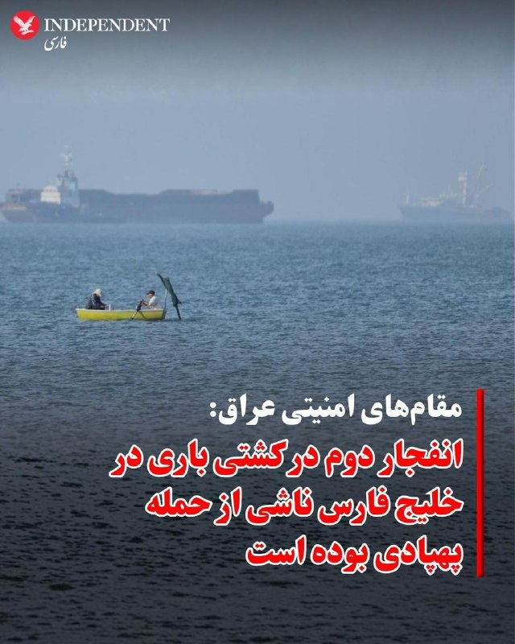
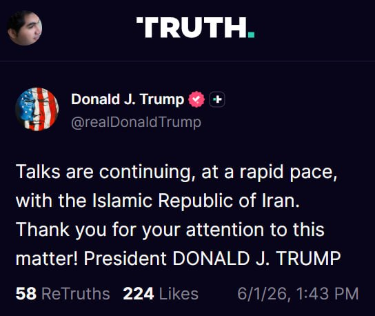
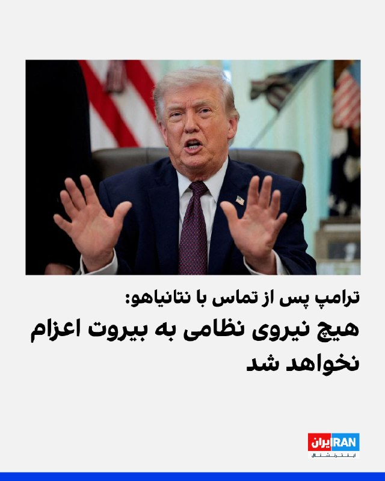
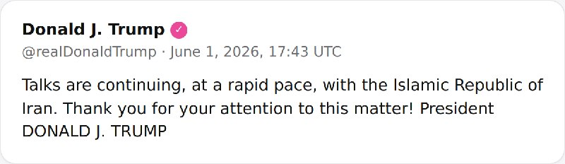
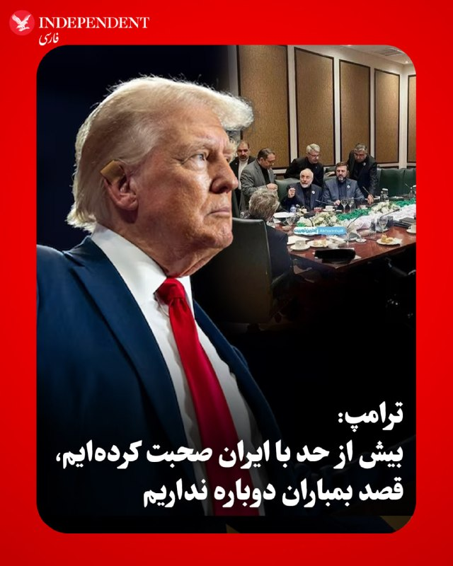
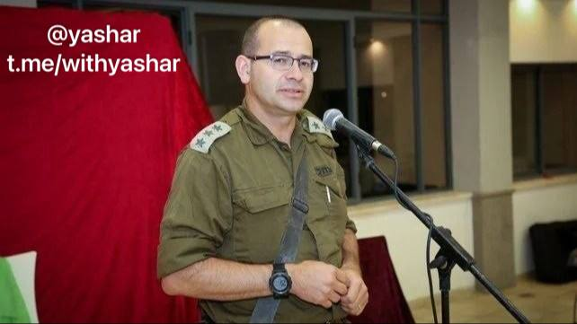
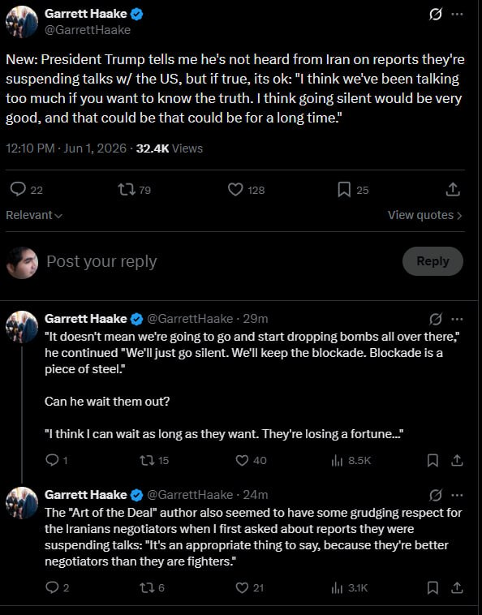
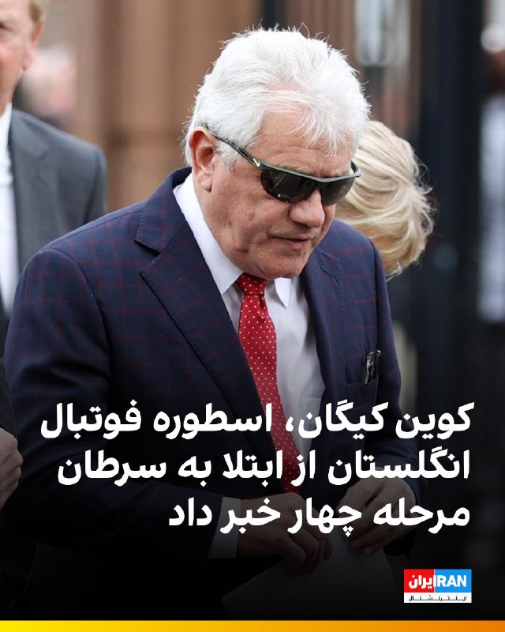
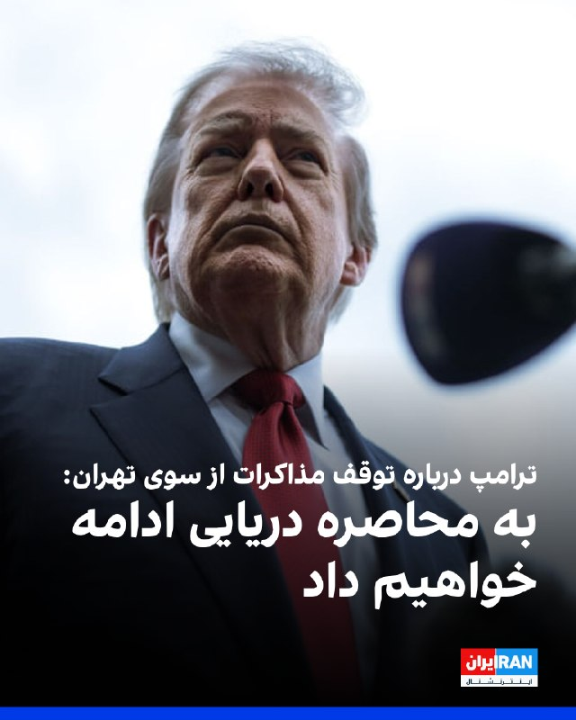
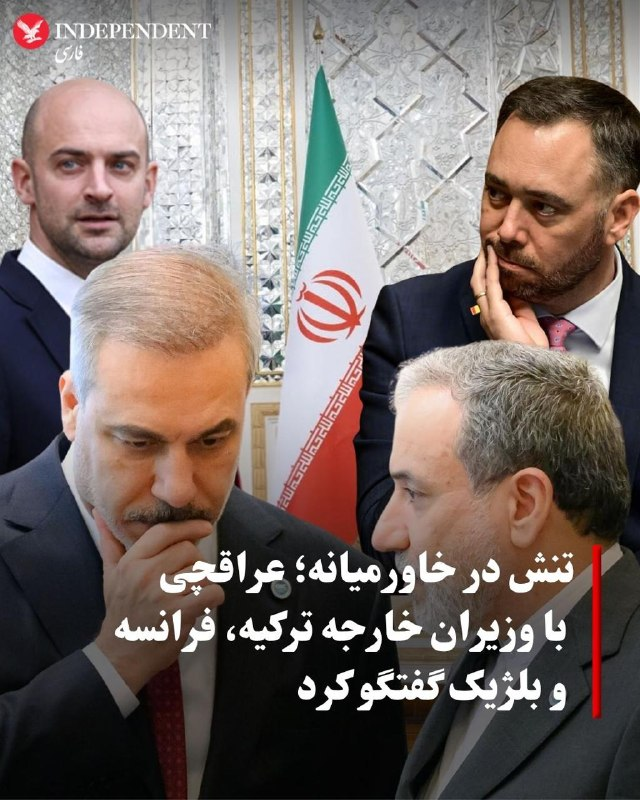

# خواننده تلگرام

<!-- TOP_NAV START -->

<a href="https://github.com/ProAlit/aio-downloader/blob/main/telegram/content/archive_1.md" style="display:inline-block; padding:6px 12px; margin:0 4px; background-color:#2ea44f; color:white; text-decoration:none; border-radius:4px; font-weight:bold;">صفحه بعد</a>

<!-- TOP_NAV END -->

<!-- MSG START -->

---
📅 بروزرسانی: 1405/03/11 22:24
---

## VahidOOnLine — post 243271

  

محمد کرمی، فرمانده نیروی زمینی سپاه، از«آمادگی ۱۰۰ درصدی» این نیرو برای مقابله با تهدیدات خبر داد و گفت: «سطح آمادگی نیرو‌های مسلح امروز حتی از زمان آغاز جنگ اخیر نیز فراتر رفته است.»

او افزود: «هیچ مشکلی در سطح نیرو وجود ندارد و برای مقابله با هرگونه تهدید و نبرد زمینی در آمادگی کامل هستیم.»
‌🏁 🇬🇧 IranintlTV

🤖 @VahidOOnLine

## WithYashar — post 13190

وزیر جنگ اسرائیل: در لبنان آتش‌بس نداریم
@withyashar

## IranIntlTV — post 340101

  <a href="telegram/content/IranIntlTV_340101_1780340047.mp4" target="_blank">🎬 Download video</a>

۲۴ با فرداد فرحزاد
@iranintltv

## IranIntlTV — post 340100

  

محمد کرمی، فرمانده نیروی زمینی سپاه، از «آمادگی ۱۰۰ درصدی» این نیرو برای مقابله با تهدیدات خبر داد و گفت: «سطح آمادگی نیرو‌های مسلح امروز حتی از زمان آغاز جنگ اخیر نیز فراتر رفته است.»

او افزود: «هیچ مشکلی در سطح نیرو وجود ندارد و برای مقابله با هرگونه تهدید و نبرد زمینی در آمادگی کامل هستیم.»
https://iranintl.com/202606015072

## FarsiVOA — post 219305

هواگردهای «ام‌وی-۲۲بی اوسپری» متعلق به نیروی تفنگداران دریایی آمریکا، توانایی‌های عملیاتی خود را بر عرشه ناو «یواس‌اس ایوو جیما» به نمایش گذاشتند. این عملیات بخشی از یک ماموریت به نام «ساوترن اسپیر» بود.

@FarsiVOA

## FarsiVOA — post 219304

  <a href="telegram/content/FarsiVOA_219304_1780340049.mp4" target="_blank">🎬 Download video</a>

سرعت گرفتن ماشین اعدام حکومت در سایه تنش‌های نظامی در گفتگو با محمود امیری مقدم رئیس سازمان حقوق بشر ایران

## FarsiVOA — post 219303

  

تصویر منتشر شده از بنر سران کشته شده جمهوری اسلامی در تهران، مورد استقبال کاربران شبکه‌های اجتماعی گرفته است. از جمله یک کاربر نوشته‌است: «به معنی واقعی شهر را زیبا کرده و باید برای اولین بار بگوییم شهرداری تهران مچکریم!»

## FarsiVOA — post 219302

روزنامه شرق در گزارشی از موج تازه احضار، تشکیل پرونده، تعلیق و صدور احکام انضباطی برای دانشجویان چند دانشگاه بزرگ ایران خبر داده است؛ روندی که به گفته دانشجویان، هم‌زمان با تعطیلی طولانی دانشگاه‌ها و با نقض اصول شیوه‌نامه انضباطی پیش می‌رود.

بر اساس این گزارش، چهار روز پس از بازگشایی دانشگاه‌ها در اسفند ۱۴۰۴، پس از دو ماه تعطیلی، دانشجویان با تماس‌ها و پیامک‌هایی درباره تشکیل پرونده انضباطی روبه‌رو شدند.

اکنون در خرداد ۱۴۰۵ و در حالی که تعطیلی دانشگاه‌ها به دلیل جنگ به سه ماه نزدیک شده، دانشگاه‌ها پیگیری همان پرونده‌ها و تشکیل پرونده‌های تازه را آغاز کرده‌اند.

گزارش کامل را در وب‌سایت صدای آمریکا بخوانید.

@FarsiVOA

## FarsiVOA — post 219301

صالح اسکندری، فعال سیاسی اصولگرا، با راه‌اندازی کارزاری در خبرگزاری حکومتی فارس، خواستار قطع داوطلبانه اینترنت بین‌المللی در ایران شد.

## IranianMinds — post 21207

🔴پست ترامپ: گفت‌وگوها با جمهوری اسلامی ایران با سرعتی بالا ادامه دارد. از توجه شما به این موضوع سپاسگزارم. رئیس جمهور دونالد جی. ترامپ. این بار گفت جمهوری اسلامی ایران . @IranianMinds

## IranianMinds — post 21206

  

🔴 توییتی که شمخانی تو جنگ ۱۲ روزه بعد ترور ناموفقش زده بود

@IranianMinds

## alonews — post 124299

  <a href="telegram/content/alonews_124299_1780340052.webm" target="_blank">🎬 Download video</a>

👈وزارت خارجه قطر: وزیر خارجه قطر با عراقچی درباره تلاش‌های میانجیگرانه پاکستان بین واشنگتن و تهران رایزنی کرد

🔴وزیر خارجه قطر بر حمایت قطر از تلاش‌ها برای دستیابی به توافقی جامع به منظور پایان دادن به بحران در منطقه تأکید کرد

✅ @AloNews خبر جنگ

## alonews — post 124298

  <a href="telegram/content/alonews_124298_1780340053.webm" target="_blank">🎬 Download video</a>

🔴فوری / وزیر جنگ اسرائیل: در لبنان آتش‌بس نداریم

✅ @AloNews خبر جنگ

---
📅 بروزرسانی: 1405/03/11 22:13
---

## WithYashar — post 13189

حملات اسرائیل به منطقه صور ادامه دارد
@withyashar

## WithYashar — post 13188

پدافند تهران فعال شد
@withyashar

## pm_afshaa — post 92060

  <a href="telegram/content/pm_afshaa_92060_1780339426.webm" target="_blank">🎬 Download video</a>

🔴نفتالی بنت، نخست‌وزیر سابق اسرائیل: دولت کنترل حاکمیت اسرائیل رو از دست داده.

💧 Rainbet.com the #1 Non-KYC Crypto Casino & Sportsbook @rainbetcom

😁 @Pm_Afshaa

## pm_afshaa — post 92059

  <a href="telegram/content/pm_afshaa_92059_1780339426.webm" target="_blank">🎬 Download video</a>

🔴بن گویر، وزیر امنیت اسرائیل:

آقای نتانیاهو شما گفتید که یک نخست‌وزیر قوی هستید که به رئیس‌جمهور آمریکا میگه در صورت امکان «بله» و در صورت لزوم «نه». وقت آن رسیده که به دوستمون، رئیس‌جمهور ترامپ بگیم «نه»

الان زمانشه که آنچه لازم و ضروریه انجام بشه: حمله به حزب‌الله، آزاد گذاشتن دست رزمندگان ما و بازگرداندن امنیت به شمال.

💧 Rainbet.com the #1 Non-KYC Crypto Casino & Sportsbook @rainbetcom

😁 @Pm_Afshaa

## pm_afshaa — post 92058

رسانه های اسرائیلی و شبکه های اسرائیلی بد گرفتن رو ترامپ 
💧 Rainbet.com the #1 Non-KYC Crypto Casino & Sportsbook @rainbetcom 
😁 @Pm_Afshaa

## DEJradio — post 5231

  <a href="telegram/content/DEJradio_5231_1780339427.mp4" target="_blank">🎬 Download video</a>

🤡
🔺 سه ماه پس از کشته شدن علی خامنه‌ای، شماری از هواداران نظام به مذاکره با قاتلان رهبرشان اعتراض کردند.

این اعتراضات به درگیری در تجمعات شبانه کشیده است. برخی مداحان حکومت را به دلیل تلاش برای توافق با آمریکا به چالش کشیده‌اند، در مقابل نیروهای امنیتی هواداران نظام را که مخالف توافق‌اند ضرب و شتم کرده‌اند.

#موشعلی #تجمعات_حکومتی
@DEJradio

## IranIntlTV — post 340099

  <a href="telegram/content/IranIntlTV_340099_1780339429.mp4" target="_blank">🎬 Download video</a>

شبکه خبری السومریه روز دوشنبه از انفجار در یک کشتی باری با پرچم پاناما پس از پایان تخلیه محموله خود در نزدیکی بندر ام‌القصر در آب‌های سرزمینی عراق خبر داد.

به گزارش این شبکه، مقام‌های امنیتی انفجار در کشتی MSC SARISKA V را ناشی از نقص فنی اعلام کردند. با این حال، سازمان عملیات تجارت دریایی بریتانیا (UKMTO) اعلام کرد گزارشی دریافت کرده که بر اساس آن، یک کشتی باری در خلیج فارس و در حدود ۴۰ مایل دریایی جنوب‌شرقی ام‌القصر، با یک پرتابه ناشناس هدف قرار گرفته است.
@iranintltv

## Shin_Persian — post 6373

🔁 Quoting above tweet:
Shin ✓ @hey_itsmyturn
Mon, 01 Jun 2026 18:33:09 UTC

THE PRESIDENT OF THE UNITED STATES OF AMERICA had a "VERY GOOD CALL WITH HEZBOLLAH", which is a designated FTO (Foreign Terror Organization)
(https://www.state.gov/foreign-terrorist-organizations)

Cool.

فارسی

رئیس‌جمهور ایالات متحده آمریکا یک «تماس بسیار خوب با حزب‌الله» داشت، که یک FTO (سازمان تروریستی خارجی) تعیین شده است.
(https://www.state.gov/foreign-terrorist-organizations)

عالیه.

𝕏 · @shin_persian

## Shin_Persian — post 6372

  

↩️ Quoted tweet: Open Source Intel ✓ @Osint613 Mon, 01 Jun 2026 17:32:55 UTC Trump: “I had a very productive call with Prime Minister Bibi Netanyahu, of Israel, and there will be no Troops going to Beirut, and any Troops that are on their way, have already…

## Shin_Persian — post 6371

↩️ Quoted tweet:
Open Source Intel ✓ @Osint613
Mon, 01 Jun 2026 17:32:55 UTC

Trump: “I had a very productive call with Prime Minister Bibi Netanyahu, of Israel, and there will be no Troops going to Beirut, and any Troops that are on their way, have already been turned back. Likewise, through highly placed Representatives, I had a very good call with

↩️ توییت نقل‌قول شده — برای پاسخ، پست زیر را ببینید.

فارسی

ترامپ: «من تماس بسیار سازنده‌ای با بی‌بی نتانیاهو، نخست‌وزیر اسرائیل داشتم و هیچ نیروی نظامی به بیروت اعزام نخواهد شد و هر نیرویی که در راه است، پیش‌تر بازگردانده شده است. به همین ترتیب، از طریق نمایندگان عالی‌رتبه، تماس بسیار خوبی با مابقی داشتم...»

𝕏 · @shin_persian

## DW_Farsi — post 125394

🔶 "بی‌اطلاعی" ترامپ از تعلیق مذاکرات؛ جلوگیری از حمله به بیروت

دونالد ترامپ، رئیس جمهور آمریکا روز دوشنبه، اول ژوئن در مصاحبه با شبکه ان بی سی، در باره برخی خبرهای رسانه‌های نزدیک به حکومت ایران دائر بر لغو تبادلات پیام‌های مذاکراتی برای توافق با تهران، گفت که در این باره گزارشی دریافت نکرده است.
او گفت: «من چنین چیزی نشنیده‌ام، نمی‌دانم که آیا صحت دارد یا خیر. اگر این‌طور باشد، چیز خوبی خواهد بود ، ما خیلی صحبت کرده‌ایم، شاید بیش از حد.»

ترامپ بعداَ تصریح کرد که "این به آن معنا نیست که ما شروع به بمباران خواهیم کرد. ما فقط سکوت خواهیم کرد. ما محاصره را حفظ می‌کنیم".

رئیس جمهور آمریکا در پاسخ به این پرسش که آیا چنین اقدامی از سوی ایران پیامدی برای تهران خواهد داشت یا خیر، گفت: «نه! مشکلی نیست. آن‌ها مذاکره‌کنندگان بسیار خوبی هستند.»

ترامپ همچنین در پاسخ به این سوال که آیا می‌تواند منتظر خروج ایران (از مذاکرات) بماند، گفت: «فکر می‌کنم می‌توانم تا هر زمان که بخواهند صبر کنم. آنها دارند ثروت زیادی را از دست می‌دهند.»

ساعاتی قبل از این اظهارات ترامپ، خبرگزاری تسنیم، نزدیک به سپاه پاسداران، نوشت که "کسب اطلاع" کرده است که "با توجه به تداوم جنایات رژیم صهیونیستی در لبنان و با عنایت به اینکه لبنان جزو پیش شرط‌های آتش‌بس بوده است و هم اینک این آتش‌بس در همه جبهه‌ها از جمله لبنان نقض شده است، تیم مذاکره‌کننده ایرانی گفتگوها و تبادل متون از طریق میانجی را متوقف می‌کند".

در ادامه خبر تسنیم گفته می‌شود که "توقف فوری عملیات تجاوزکارانه و وحشیانه ارتش اسرائیل در غزه و لبنان و ضرورت عقب‌نشینی کامل از مناطق اشغال شده در لبنان توسط مسئولان و مذاکره‌کنندگان ایرانی مورد تاکید قرار گرفته و تا زمانی که نظر ایران و مقاومت در این زمینه تامین نشود، گفتگویی در کار نخواهد بود".

تسنیم همچنین تهدید کرده است که "جبهه مقاومت و ایران عزم خود را برای انسداد کامل تنگه هرمز، و فعال کردن سایر جبهه‌ها از جمله تنگه باب‌المندب، به منظور تنبیه صهیونیست‌ها و حامیانش در دستور کار قرار داده‌اند".

همزمان فرمانده قرارگاه مرکزی خاتم‌الانبیا در واکنش به گسترش عملیات اسرائیل در لبنان و هشدار تخلیه از سوی ارتش این کشور برای ساکنان حومه جنوبی بیروت، به ساکنان مناطق شمالی اسراییل هشدار داد که "در صورت عملی شدن تهدیدهای اسراییل علیه لبنان، برای جلوگیری از آسیب، این مناطق را ترک کنند".

علی عبداللهی، در بیانیه خود با متهم‌کردن نخست‌وزیر اسرائیل به "ادامه شرارت‌ها در منطقه"، افزود: «با توجه به نقض مکرر آتش‌بس توسط اسراییل، در صورت عملی شدن این تهدید، به ساکنان بخش‌های شمالی و شهرک‌های نظامی در سرزمین‌های اشغالی هشدار می‌دهیم اگر نمی‌خواهند آسیب ببینند منطقه را ترک کنند.»
@dw_farsi

## IranianMinds — post 21205

🔴 وزیر امنیت ملی اسرائیل بن گویر:

جناب نخست‌وزیر،

شما گفتید که یک نخست‌وزیر قوی به رئیس‌جمهور آمریکا «بله» می‌گوید وقتی ممکن است و «نه» وقتی لازم است.

اکنون زمان گفتن «نه» به دوست‌مان، رئیس‌جمهور ترامپ است.

اکنون زمان انجام آنچه لازم و ضروری است برای ضربه زدن به حزب‌الله، آزاد کردن دستان رزمندگان ما و بازگرداندن امنیت به شمال است.

@IranianMinds

## alonews — post 124297

  <a href="telegram/content/alonews_124297_1780339430.webm" target="_blank">🎬 Download video</a>

👈بریتیش ایرویز تمام پروازهای خود به اسراییل را تا اواسط پاییز (۲۴ اکتبر) به دلیل تنش‌های امنیتی لغو کرد.

✅ @AloNews خبر جنگ

## alonews — post 124296

  <a href="telegram/content/alonews_124296_1780339431.webm" target="_blank">🎬 Download video</a>

👈لیبرمن وزیر دفاع و خارجه اسبق اسرائیل خطاب به نتانیاهو: این نخست‌وزیر نیست، این یک عروسک است!

✅ @AloNews خبر جنگ

## alonews — post 124295

  <a href="telegram/content/alonews_124295_1780339431.webm" target="_blank">🎬 Download video</a>

👈یائیر لاپید رهبر اپوزیسیون نتانیاهو:
یک کشور تحت الحمایه تمام عیار شده‌ایم

✅ @AloNews خبر جنگ

## alonews — post 124294

  <a href="telegram/content/alonews_124294_1780339431.webm" target="_blank">🎬 Download video</a>

👈نفتالی بنت نخست‌وزیر سابق اسرائیل:
دولت کنترل حاکمیت اسرائیل را از دست داده است

✅ @AloNews خبر جنگ

## alonews — post 124293

  <a href="telegram/content/alonews_124293_1780339431.webm" target="_blank">🎬 Download video</a>

👈بازگشت نفت برنت به ۹۴.۵ دلار

✅ @AloNews خبر جنگ

## alonews — post 124292

  <a href="telegram/content/alonews_124292_1780339432.webm" target="_blank">🎬 Download video</a>

👈حملات اسرائیل به منطقه صور ادامه دارد

✅ @AloNews خبر جنگ

---
📅 بروزرسانی: 1405/03/11 22:03
---

## VahidOOnLine — post 243270

  

علی‌اکبر ولایتی، مشاور رهبر جمهوری اسلامی در شبکه اجتماعلی ایکس نوشت که بمباران ضاحیه و نقض آتش‌بس، عجله اسرائیل برای پایان دادن به تاریخ خود است.

ولایتی افزود: شما آغاز کردید، اما برخلاف انفعال تماشاچیان منطقه، جمهوری اسلامی و جبهه مقاومت تا آخر کنار مردم عزیز لبنان، از مسلمان تا مارونی ایستاده است.
‌🏁 🇬🇧 IranintlTV

🤖 @VahidOOnLine

## WithYashar — post 13187

همانطور که از هفته پیش وعده داده بودم حدود یک ساعت دیگر ما متنی را برای شاهزاده رضا پهلوی ارسال می کنیم. همبستگی شما در این فراخوان باعث می شود صدای ما شنیده تر شود و ارتباطی بهتری بین ما و شاهزاده شکل بگیرد. ممنون از همراهی و کمک شما. تا می توانید به دوستان خود بگویید و آنها را آماده کنید.

## WithYashar — post 13186

وزیر بن‌گویر: آقای نخست‌وزیر،
شما گفتید که یک نخست‌وزیر قدرتمند در صورت امکان به رئیس‌جمهور آمریکا «بله» می‌گوید و در صورت ضرورت «نه».
اکنون زمان آن است که به دوست ما، رئیس‌جمهور ترامپ، «نه» گفته شود.
اکنون زمان آن است که آنچه لازم و ضروری است انجام شود: حمله به حزب‌الله، آزاد گذاشتن دست رزمندگان ما و بازگرداندن امنیت به شمال.
@withyashar

## mwarmonitor — post 10003

🔴سازمان UKMTO گزارش داد که یک کشتی کانتینربر (با نام MSC SARISKA V) چند ساعت پس از ترک بندر ام‌القصر عراق، در خلیج فارس هدف برخورد یک پرتابه قرار گرفته است. @mwarmonitor

## IranIntlTV — post 340098

  

علی‌اکبر ولایتی، مشاور رهبر جمهوری اسلامی در شبکه اجتماعی ایکس نوشت که بمباران ضاحیه و نقض آتش‌بس، عجله اسرائیل برای پایان دادن به تاریخ خود است.

ولایتی افزود: شما آغاز کردید، اما برخلاف انفعال تماشاچیان منطقه، جمهوری اسلامی و جبهه مقاومت تا آخر کنار مردم عزیز لبنان، از مسلمان تا مارونی ایستاده است.
https://iranintl.com/202606011355

## FarsiVOA — post 219300

علی جوانمردی: با سیاست آمریکا، ایران بە سمت دموکراسی سکولار می‌رود

## IranianMinds — post 21204

دقایقی پیش سپاه در کرج یک آزمایش موشکی انجام داد

@IranianMinds

## alonews — post 124291

  <a href="telegram/content/alonews_124291_1780338834.webm" target="_blank">🎬 Download video</a>

👈بن‌گویر وزیر اسرائیلی: وقت آن رسیده که به رئیس‌جمهور آمریکا بگوییم نه!

✅ @AloNews خبر جنگ

## alonews — post 124290

  <a href="telegram/content/alonews_124290_1780338834.webm" target="_blank">🎬 Download video</a>

⚫
🏆 به دنیای هیجان‌انگیز فوتبال خوش اومدی!

⭐️اینجا قراره باهم لحظه‌به‌لحظه‌ی جام جهانی رو زندگی کنیم؛
از بازی‌های حساس و نتایج داغ گرفته تا حاشیه‌ها، کری‌خونی‌ها و اتفاقاتی که همه درباره‌ش حرف میزنن! 
🔥
🔥

✅ پوشش کامل مسابقات

💀ترول تیم‌ها و بازیکن‌ها

🎥ویدیوها و لحظه‌های فان فوتبالی

📊آمار، ترکیب‌ها و اخبار فوری

🌍حواشی جذاب از سراسر جام جهانی

📢اینجا فقط یک کانال خبری نیست؛
یک جمع فوتبالیه برای کسایی که فوتبال رو با هیجان، شوخی و احساس واقعی دنبال میکنن 
📛
💟

🆘
🔞 آماده باش چون قراره جام جهانی رو متفاوت تجربه کنیم!

⚡ @Vaarzesh_Plus

⚡ @Vaarzesh_Plus

---
📅 بروزرسانی: 1405/03/11 21:54
---

## pm_afshaa — post 92057

  <a href="telegram/content/pm_afshaa_92057_1780338271.webm" target="_blank">🎬 Download video</a>

🔴مکرون، رئیس‌جمهور فرانسه:
چیزی که هرگز نباید در مورد اروپا و فرانسه دست کم بگیرید اینه که ما بسیار قابل پیش‌بینی هستیم.

هیچکدوم از ما نمیتونیم قوانین رو یک‌شبه تغییر بدیم. در اروپا هیچ دستور اجرایی وجود نداره و هیچ فردی نمیتونه همه چیز رو به تنهایی و بر اساس تصمیم خود تغییر بده.

💧 Rainbet.com the #1 Non-KYC Crypto Casino & Sportsbook @rainbetcom

😁 @Pm_Afshaa

## IranIntlTV — post 340097

  <a href="https://t.me/IranintlTV/340097" target="_blank">📎 Download file</a>

🎧نسخه صوتی تیتراول با نیوشا صارمی: مذاکرات متوقف شد؛ تنش چند جبهه‌ای در منطقه؛هشدار تخلیه همزمان اسرائیل و سپاه
@iranintlTV

## Shin_Persian — post 6370

  

UKMTO Operations Centre @UK_MTO
Mon, 01 Jun 2026 18:17:29 UTC

UKMTO WARNING 063-26 UPDATE 001

Click here to view the full warning⤵️
http://www.ukmto.org/-/media/ukmto/products/20260601-ukmto_warning_063-update_001.pdf?rev=759b918daac243ee8b0c2004571f13ba

#MaritimeSecurity #MarSec

فارسی

هشدار یو‌کی‌ام‌تی‌او (UKMTO) ۰۶۳-۲۶ به‌روزرسانی ۰۰۱

برای مشاهده متن کامل هشدار اینجا کلیک کنید⤵️
http://www.ukmto.org/-/media/ukmto/products/20260601-ukmto_warning_063-update_001.pdf?rev=759b918daac243ee8b0c2004571f13ba

#MaritimeSecurity #MarSec

𝕏 · @shin_persian

## Shin_Persian — post 6369

Shin ✓ @hey_itsmyturn
Mon, 01 Jun 2026 18:15:39 UTC

Jet activity over Tehran,
Tehran Province, #Iran

فارسی

فعالیت جنگنده‌ها بر فراز تهران،
استان تهران، #Iran

𝕏 · @shin_persian

## FarsiVOA — post 219299

🔺حرکت بدون توقف ماشین سرکوب جمهوری اسلامی؛ یاشار دارالشفا و منصور باسام هم بازداشت شدند

▪️کانون حقوق بشر ایران روز دوشنبه ۱۱ خرداد، از بازداشت دو شهروند‌ در شهرهای مریوان و تهران خبر داد و اعلام کرد: «هر دو بازداشت‌شدگان به مکانی نامعلوم منتقل شده‌اند و ماموران حکومتی دلیلی برای بازداشت آنها ارائه نکرده‌اند.»

⬇️ بیشتر بخوانید:

https://ir.voanews.com/a/arrest-without-cause-citizens-protesting-repressive-regime-iran-/8156114.html/?nocach=1

## Persian_Trend_Official — post 15453

کانال 12 اسرائیل: ارتش اسرائیل نخست‌وزیر نتانیاهو و وزیر دفاع اسرائیل کاتز را به‌خاطر اعلام برنامه‌هایی برای حمله به بیروت پیش از انجام عملیات، مورد انتقاد قرار داد.

مقامات نظامی گفتند اهدافی که در این طرح گنجانده شده بودند، پس از اعلام علنی قصد نتانیاهو و کاتز برای حمله به بیروت ناپدید شدند.

📝 Amir

📌 @persian_trend_official
پرشین ترند | متفاوت‌ترین کانال نظامی

## Persian_Trend_Official — post 15452

  <a href="telegram/content/Persian_Trend_Official_15452_1780338274.webm" target="_blank">🎬 Download video</a>

شبکه خبری I24 در خبری اعلام کرد به‌ دلیل نگرانی‌ها درمورد آسیب رساندن به تماس‌ها با ایران و مذاکرات بین اسرائیل و لبنان، واشنگتن در تلاش است تا به آتش‌بس جامع منجر شود.

باراک باتش خبرنگار خارجی نوشت آمریکا عمیقا نگران پیامد حمله اسرائیل به بیروت است. واشنگتن نگران تأثیر این اقدام بر تماس‌های حساس با ایران و مذاکرات جاری بین اسرائیل و لبنان است.

در نتیجه آمریکا از اسرائیل درخواست کرد که عملیات برنامه‌ریزی شده را به حالت تعلیق درآورد تا دریچه دیگری از فرصت برای تماس‌های دیپلماتیک بین کشورها فراهم شود.

درخواست آمریکا پس از آن مطرح می‌شود که طی 24 ساعت گذشته پیام‌هایی از لبنان به واشنگتن رسیده است که نشان دهنده تلاش واقعی برای دستیابی به آتش‌بس جامعی است که حزب‌الله را نیز ملزم به توقف حملات خود کند.

در عین حال دو مقام اسرائیلی که با رویترز صحبت کردند فاش کردند که اسرائیل منتظر تأیید نهایی رئیس جمهور آمریکا قبل از هرگونه اقدام نظامی احتمالی در حومه بیروت است که این امر بر هماهنگی نزدیک و وابستگی سیاسی اسرائیل و آمریکا تأکید دارد.

📝 Amir

📌 @persian_trend_official
پرشین ترند | متفاوت‌ترین کانال نظامی

## Persian_Trend_Official — post 15451

  

ترامپ: من تماس بسیار مثبتی با نخست‌وزیر بی بی نتانیاهو، از اسرائیل، داشتم و هیچ نیرویی به بیروت اعزام نخواهد شد، و هر نیرویی که در راه بود، قبلاً بازگردانده شده است.

همچنین، از طریق نمایندگان بلندپایه، تماس بسیار خوبی با حزب‌الله داشتم و آنها موافقت کردند که تمام تیراندازی‌ها متوقف شود، اسرائیل به آنها حمله نخواهد کرد و آنها نیز به اسرائیل حمله نخواهند کرد.

📝 Amir

📌 @persian_trend_official
پرشین ترند | متفاوت‌ترین کانال نظامی

## Persian_Trend_Official — post 15450

  

ترامپ: مذاکرات با جمهوری اسلامی ایران با سرعت زیادی ادامه دارد. از توجه شما به این موضوع سپاسگزارم!

📝 Amir

📌 @persian_trend_official
پرشین ترند | متفاوت‌ترین کانال نظامی

## RadioFarda — post 157787

  

🔸در پی انتشار خبر تماس تلفنی دونالد ترامپ با بنیامین نتانیاهو، رئیس جمهور آمریکا در شبکه اجتماعی خود نوشت که نیروهای ارتش اسرائیل به بیروت نخواهند رفت.

🔸او گفت: «تماسی بسیار مفید با بی‌بی نتانیاهو، نخست وزیر اسرائیل، داشتم و دیگر نیرویی به بیروت نخواهد رفت، و هر نیرویی هم که در راه بودند بازگردانده می‌شوند.»

🔸ترامپ در ادامه نوشت که «از طریق نمایندگان عالی تماسی بسیار خوب با حزب‌الله داشته» و این گروه هم موافقت کرده است که دست از شلیک بردارد.

🔸صبح دوشنبه وب‌سایت آکسیوس به نقل از منابع خود گزارش داده بود که تلاش جدید آمریکا برای آتش‌بس میان اسرائیل و لبنان «شکست» خورده است.

@RadioFarda

## IranianMinds — post 21203

  

🔴فوری
توییت جدید ترامپ

@IranianMinds

## BBCPersian — post 282591

🔻ترامپ می‌گوید اسرائیل و حزب‌الله به اوقول داده‌اند که در گیری‌ها را متوقف کنند

دونالد ترامپ، رئیس جمهور آمریکا، در پستی در شبکه اجتماعی خود، سوشال تروث، نوشت: «گفت‌وگویی بسیار سازنده با نخست‌وزیر اسرائیل داشتم و هیچ نیرویی به بیروت اعزام نخواهد شد. همچنین هر نیرویی که در مسیر اعزام بود، بازگشته است.»

او همچنین اضافه کرد: «از طریق نمایندگان عالی‌رتبه، گفت‌وگوی بسیار خوبی با حزب‌الله داشتم و آن‌ها موافقت کردند که تمامی تیراندازی متوقف شود؛ اسرائیل به آن‌ها حمله نخواهد کرد و آن‌ها نیز به اسرائیل حمله نخواهند کرد.»

آقای ترامپ در پستی دیگری نوشت: «گفتگوها با جمهوری اسلامی ایران بسرعت در جریان است.»

ساعتی پیش خبرگزاری تسنیم گفت که اطلاع یافته است «با عنایت به اینکه لبنان جزء پیش‌شرط‌های آتش‌بس بوده است و اینک این آتش‌بس در همه جبهه‌ها از جمله لبنان نقض شده است» تیم مذاکره‌کننده ایران «گفتگوها و تبادل متون از طریق میانجی را متوقف می‌کند.»

https://bbc.in/4vjnvWG
@BBCPersian

## Dirty_Kids — post 390770

  

ایست بازرسی ادمین کانال امام زمان رو گرفته، اون بدبختم سکته کرده گفته حتما کونم پاره‌اس.

بعد بسیجیه فکر کرده این از خودشونه و گفته بذارین بره😂😂

@Dirty_Kids 👻

## Dirty_Kids — post 390769

  

محاله کسی این جنایت‌ها رو فراموش کنه...

@Dirty_Kids 👻

## Hranews — post 113313

دستکم ۲ تجمع اعتراضی برگزار شد

❗️
❗️
❗️
❗️
❗️– روز گذشته، شماری از اساتید اخراجی دانشگاه فرهنگیان در مقابل ساختمان‌ وزارت آموزش و پرورش در تهران و گروهی از شهروندان ساکن روستای دهنو واقع در شهرستان دورود، در اعتراض به تداوم قطع آب در این روستا، #تجمع_اعتراضی برگزار کردند.

ادامه مطلب

↘️
@hranews_bot تماس ✉️ - @Hranews کانال هرانا 🆑

## alonews — post 124289

  <a href="telegram/content/alonews_124289_1780338279.webm" target="_blank">🎬 Download video</a>

👈عراقچی در گفت‌وگو با وزیر خارجه پاکستان نگرانی ایران از نقض آتش‌بس توسط اسرائیل در لبنان و حمله احتمالی به بیروت را ابراز کرد

✅ @AloNews خبر جنگ

## alonews — post 124288

  <a href="telegram/content/alonews_124288_1780338279.webm" target="_blank">🎬 Download video</a>

👈رئیس مجلس لبنان: حزب‌الله به آتش‌بس جامع پایبند خواهد بود

✅ @AloNews خبر جنگ

---
📅 بروزرسانی: 1405/03/11 21:44
---

## VahidOOnLine — post 243269

♦️حسن یوسفی، سرپرست هیات باستان‌شناسی آتشکده ساسانی ویگل از کشف یک ساختار آیینی با ویژگی‌های کم‌سابقه در این محوطه تاریخی خبر داد.
به گزارش ایسنا، حسن یوسفی با اعلام این خبر گفت: «در جریان فصل سوم کاوش‌های باستان‌شناسی در آتشکده ساسانی ویگل واقع در شهرستان آران و بیدگل، ساختاری آیینی شناسایی شده که از نظر معماری و کارکرد، ویژگی‌های کم‌سابقه‌ای دارد و می‌تواند اطلاعات تازه‌ای درباره آیین‌های مذهبی و سازمان فضایی نیایشگاه‌های دوره ساسانی ارائه کند.»
او افزود: «این ساختار در بخش شرقی آتشکده کشف شده و شامل فضاهایی با چیدمان ویژه و شواهدی از فعالیت‌های آیینی است که تاکنون نمونه‌های مشابه اندکی از آن در محوطه‌های ساسانی شناسایی شده است.»
به گفته یوسفی، نتایج اولیه کاوش‌ها نشان می‌دهد این بخش احتمالا نقشی فراتر از یک فضای معمول مذهبی داشته و ممکن است برای برگزاری آیین‌های خاص مورد استفاده قرار می‌گرفته است.
سرپرست هیات باستان‌شناسی آتشکده ویگل تاکید کرد بررسی‌های تخصصی و مطالعات تکمیلی برای تعیین دقیق کارکرد این ساختار همچنان ادامه دارد.
‌🇸🇦 Indypersian

🤖 @VahidOOnLine

## VahidOOnLine — post 243268

  

♦️دونالد ترامپ، رئیس‌جمهوری آمریکا اعلام کرد گفتگوها با جمهوری اسلامی ایران همچنان ادامه دارد و با سرعت در حال پیشرفت است.

ترامپ روز دوشنبه در پیامی در شبکه اجتماعی تروث سوشال نوشت: «مذاکرات با جمهوری اسلامی ایران با سرعت در حال ادامه یافتن است. از توجه شما به این موضوع سپاسگزارم!»

رئیس جمهوری آمریکا پیش از این پیام، از توقف حملات اسرائیل به بیروت و موافقت حزب‌الله به پایبندی بر آتش‌بس خبر داده بود.

اظهارات ترامپ پس از آن مطرح می‌شود که خبرگزاری تسنیم به نقل از منابع آگاه گزارش داد ایران در اعتراض به ادامه عملیات نظامی اسرائیل در لبنان، روند «تبادل متون از طریق میانجی» با آمریکا را متوقف خواهد کرد.
‌🇸🇦 Indypersian

🤖 @VahidOOnLine

## VahidOOnLine — post 243267

  <a href="telegram/content/VahidOOnLine_243267_1780337644.mp4" target="_blank">🎬 Download video</a>

♦️انتشار ویدئویی از رفتار عجیب یک زائر زن و قوی‌هیکل ایرانی در مراسم رجم شیطان، توجه بسیاری از زائران را جلب کرده و با بازتاب گسترده‌ای در رسانه‌های عربی همراه شده است. در این ویدئو، این حاجیه ایرانی با سر دادن فریاد «الله اکبر» و شعارهایی علیه اسرائیل، با شتاب و قدرت فراوان به سوی ستون‌ها سنگ‌ریزه پرتاب می‌کند.
مناسک «رجم شیطان» یکی از ارکان اصلی حج تمتع است که هر سال در شهر منا در نزدیکی مکه برگزار می‌شود و در جریان آن، زائران به سه ستون یا دیوار نمادین به نام‌های جمره صغری (کوچک)، جمره وسطی (میانی) و جمره کبری یا عقبه (بزرگ) سنگ‌ریزه پرتاب می‌کنند.
‌🇸🇦 Indypersian

🤖 @VahidOOnLine

## WithYashar — post 13185

  <a href="telegram/content/WithYashar_13185_1780337645.mp4" target="_blank">🎬 Download video</a>

دیدبان اتاق جنگ : الان ازسمت کرج موشک شلیک شد
@withyashar

## WithYashar — post 13184

۲ حمله هوایی اسرائیل به شهر نبطیه الفوقا در جنوب لبنان انجام شد.
@withyashar

## FoxNewsTwitter — post 342478

  

Fox News (Twitter/X)

HAPPY BIRTHDAY! Legendary actor and producer Morgan Freeman is celebrating his 89th birthday, marking nearly six decades in entertainment and a career that has helped define generations of film.

## iaghapour — post 2649

  

🧑‍💻 اکثر برنامه‌نویس‌ها دانش فنی فوق العاده ای دارن اما مشکلشون انگلیسیه!

🚫 چون نمیتونن:
▫️توی میتینگ راحت صحبت کنن
◾️داکیومنت‌ها رو سریع بخونن
▫️توی مصاحبه خارجی خوب عمل کنن
◾️یا با تیم بین‌المللی ارتباط بگیرن

برای همین کانال «لرنوبیت» رو ساختیم؛
آموزش انگلیسی مخصوص برنامه‌نویس‌ها و بچه‌های تکنولوژی 👇

🔹 اصطلاحات واقعی دنیای برنامه‌نویسی
🔹 مکالمه کاری و میتینگ
🔹 داکیومنت و کامنت‌نویسی
🔹 آمادگی مصاحبه و کار ریموت

Debug your English. Upgrade your career 🚀

🆔 @learnobit
🆔 @learnobit
🆔 @learnobit

## IranIntlTV — post 340096

  <a href="telegram/content/IranIntlTV_340096_1780337647.mp4" target="_blank">🎬 Download video</a>

مهدی مهدوی‌آزاد در برنامه «چشم‌انداز» گفت: «مجموعه‌ای از شواهد وجود دارد که نشان می‌دهد همین "برادران قاچاقچی" سپاه و همین نهاد فاسد، به دنبال یک ماجراجویی تازه هستند؛ تلاشی برای بیرون کشیدن حزب‌الله لبنان از زیر ضربات اسرائیل.»

او افزود: «ظاهرا حاضرند برای نجات بقایای حزب‌الله، ایران را وارد یک جنگ تازه کنند؛ به بهای ویرانی بیشتر ایران و تحمیل یک جنگ دیگر به کشور.»
@iranintltv

## IranIntlTV — post 340095

  <a href="telegram/content/IranIntlTV_340095_1780337649.mp4" target="_blank">🎬 Download video</a>

🔻علیرضا دبیر، رییس فدراسیون کشتی گفت: «من «حمال» کشتی هستم و به آن افتخار می کنم. خیلی‌ها به اسم حمالی به بالا رسیده‌اند. کشتی ما مثل خاویار و تنگه هرمز و دریای خزر، مزیت رقابتی ماست. کشتی هنوز به ظرفیتی که لایقش است، نرسیده.»

@iranintltvsport

## FarsiVOA — post 219298

  <a href="telegram/content/FarsiVOA_219298_1780337650.mp4" target="_blank">🎬 Download video</a>

مسعود پیاهو، هنرمند و موسیقی‌دانی که به دلیل ثبت تصویر «مرد تانکی تهران» به ۱۰ سال حبس محکوم شده است در پیامی ویدیویی اعلام کرد روز سه‌شنبه برای اجرای حکم، خود را به زندان معرفی می‌کند.

این تصویر که پیش از اعتراضات هجدهم و نوزدهم دی سال گذشته و در بحبوحه اعتراضات بازار ثبت شد، صحنه‌ای را نشان می‌داد که در آن یک معترض مقابل نیروهای انتظامی و یگان ویژه روی زمین نشسته بود؛ تصویری که پس از انتشار، به نمادی از اعتراض مدنی و مقاومت فردی در برابر نیروهای امنیتی تبدیل شد.

آقاخانی، وکیل دادگستری، تاکید کرد دفاع موکلش بر این اساس بوده که هیچ قصدی برای انتشار عمومی، همکاری، یا اقدام سازمان‌یافته نداشته و این ویدئو صرفاً برای تعداد محدودی از دوستانش در استوری خصوصی منتشر شده بود. به گفته او، مسعود پیاهو هنگام اطلاع‌رسانی درباره بسته بودن پاساژ، به‌طور اتفاقی صحنه نشستن معترض مقابل نیروهای امنیتی را ثبت کرده است.

## FarsiVOA — post 219297

📢‼️ اطلاعیه مهم
تبلیغات و آگهی‌هایی که در کانال تلگرام صدای آمریکا می‌بینید( از قبیل ارز دیجیتال و ...) هیچ ارتباطی با ما ندارد و به صورت خودکار توسط تلگرام نمایش داده می‌شود. صدای آمریکا محتوای آنها را تایید نمی‌کند و هیچ مسئولیتی در قبال آنها ندارد.

## RadioFarda — post 157786

وقوع «دومین انفجار» در کشتی کانتینربر در نزدیکی بندر ام قصر عراق

🔸خبرگزاری رویترز روز دوشنبه از وقوع «دومین انفجار» در یک فروند کشتی کانتینربر در نزدیکی بندر ام قصر عراق خبر داد.

🔸بر اساس این خبر به نقل از منابع امنیتی عراق، این انفجار در فاصله ۴۰ مایل دریایی در جنوب شرقی بندر ام قصر در خلیج فارس رخ داده و باعث بروز آتش‌سوزی شده است.

🔸ساعاتی پیشتر اداره دریانوردی بریتانیا در شبکه ایکس از وقوع «انفجاری بزرگ» در این کشتی کانتینربر در پی اصابت «پرتابه‌ای ناشناس» خبر داده بود.

🔸هنوز خبری درباره مجروحان احتمالی این حادثه گزارش نشده است.

@RadioFarda

## IranianMinds — post 21202

  

🔴پست ترامپ:

گفت‌وگوها با جمهوری اسلامی ایران با سرعتی بالا ادامه دارد.

از توجه شما به این موضوع سپاسگزارم.
رئیس جمهور دونالد جی. ترامپ.

این بار گفت جمهوری اسلامی ایران .

@IranianMinds

---
📅 بروزرسانی: 1405/03/11 21:36
---

## VahidOOnLine — post 243266

  

دونالد ترامپ در تروث سوشال نوشت که مذاکرات با جمهوری اسلامی با سرعت ادامه دارد.

او پیش‌تر درباره توقف ارتباط مذاکره‌کنندگان جمهوری اسلامی با آمریکا به دلیل عملیات نظامی اسرائیل در لبنان، افزود: «واقعا برایم مهم نیست، اصلا اهمیت نمی‌دهم.»

ترامپ همچنین در تروث سوشال نوشت با بنیامین نتانیاهو گفت‌وگویی بسیار سازنده داشته و هیچ نیروی نظامی به بیروت اعزام نخواهد شد و نیروهایی که در مسیر بودند نیز بازگردانده شده‌اند.

او اضافه کرد از طریق نمایندگان عالی‌رتبه، با حزب‌الله تماس بسیار خوبی داشته و توافق شده است همه تیراندازی‌ها متوقف شود؛ اسرائیل به آن‌ها حمله نخواهد کرد و آن‌ها نیز به اسرائیل حمله نخواهند کرد.
‌🏁 🇬🇧 IranintlTV

🤖 @VahidOOnLine

## pm_afshaa — post 92056

  <a href="telegram/content/pm_afshaa_92056_1780337172.webm" target="_blank">🎬 Download video</a>

🔴فوری از پست جدید ترامپ: من یک تماس بسیار سازنده با نخست‌وزیر بی‌بی نتانیاهو، از اسرائیل، داشتم و هیچ نیرویی به بیروت اعزام نخواهد شد، و هر نیرویی که در راه بود، قبلاً بازگردانده شده. همچنین، از طریق نمایندگان بلندپایه، تماس بسیار خوبی با حزب‌الله داشتم و…

## iaghapour — post 2648

  

⭕️ معرفی GenyConnect؛ جایگزین مدرن v2rayN برای مدیریت پروکسی

نرم‌افزار GenyConnect یک کلاینت تونلینگ و VPN مدرن (با کاربردی شبیه به برنامه محبوب v2rayN) است که با تمرکز بر عملکرد بالا، حریم خصوصی و کنترل دقیق ترافیک طراحی شده است. ویژگی مهم این ابزار، وابسته‌نبودن به یک پروتکل خاص است؛ به این معنی که می‌تواند به عنوان یک بستر یکپارچه برای موتورهای مختلف تونلینگ عمل کند.

🔹 مسیریابی پیشرفته: امکان تعیین مسیر ترافیک بر اساس لیست سفید، دامنه‌های خاص، و حتی مسیریابی در سطح اپلیکیشن‌ها و پروسه‌های سیستم.

🔸 سبک و شفاف: این ابزار با کمترین مصرف منابع سخت‌افزاری کار می‌کند و اطلاعات کاملی از وضعیت شبکه، لاگ‌های زنده و آمارهای لحظه‌ای ترافیک را به شما نمایش می‌دهد.

🔹 انعطاف در پلتفرم‌ها: برخلاف برخی کلاینت‌ها که فقط مختص یک سیستم‌عامل هستند، این برنامه به صورت یکپارچه برای ویندوز، مک، لینوکس و اندروید در دسترس است.

🔗 اطلاعات بیشتر در گیت‌هاب پروژه

🆔 @iAghapour

## iaghapour — post 2647

  

⭕️ تون‌کوین به (Gram) تغییر نام می‌دهد!

پاول دورف در کانال رسمی خود خبر بسیار مهمی برای کاربران و سرمایه‌گذاران شبکه TON اعلام کرد. بر اساس این اطلاعیه، ارز دیجیتال بومی این شبکه قرار است با یک ری‌برندینگ بزرگ، نام فعلی خود را کنار گذاشته و به نام اصلی و اولیه‌اش یعنی Gram تغییر کند.

نکات کلیدی که دورف در این پست به آن‌ها اشاره کرده است:

🔹 بازگشت به ایده اولیه: دورف یادآوری کرده که Gram نام اصلی ارز شبکه در اولین وایت‌پیپر این پروژه بود. او این اتفاق را بازگشت به ریشه‌ها و شروع یک فصل جدید توصیف کرده است.

🔸 زمان‌بندی انتقال: فرایند این تغییر نام و انتقال، حدود ۳ هفته زمان خواهد برد.

🔹 نام بلاک‌چین تغییر نمی‌کند: با وجود تغییر نام ارز بومی (از Toncoin به Gram)، نام خود شبکه بلاک‌چین همچنان TON باقی خواهد ماند.

🔸 قدم چهارم از یک نقشه راه: این ری‌برندینگ تنها یک تغییر اسم ساده نیست، بلکه به گفته دورف، راه را برای اتفاقات مهم بعدی هموار می‌کند و قدم چهارم از یک برنامه ۷ مرحله‌ای برای «عظمت دوباره بخشیدن به TON» است.

🆔 @iAghapour

## IranIntlTV — post 340094

  

دونالد ترامپ در تروث سوشال نوشت که مذاکرات با جمهوری اسلامی با سرعت ادامه دارد.

او پیش‌تر درباره توقف ارتباط مذاکره‌کنندگان جمهوری اسلامی با آمریکا به دلیل عملیات نظامی اسرائیل در لبنان، افزود: «واقعا برایم مهم نیست، اصلا اهمیت نمی‌دهم.»

ترامپ همچنین در تروث سوشال نوشت با بنیامین نتانیاهو گفت‌وگویی بسیار سازنده داشته و هیچ نیروی نظامی به بیروت اعزام نخواهد شد و نیروهایی که در مسیر بودند نیز بازگردانده شده‌اند.

او اضافه کرد از طریق نمایندگان عالی‌رتبه، با حزب‌الله تماس بسیار خوبی داشته و توافق شده است همه تیراندازی‌ها متوقف شود؛ اسرائیل به آن‌ها حمله نخواهد کرد و آن‌ها نیز به اسرائیل حمله نخواهند کرد.
https://iranintl.com/202606010051

## FarsiVOA — post 219296

  

دونالد ترامپ، رئیس جمهوری آمریکا در واکنش به شایعه توقف گفتگوها عنوان کرد: مذاکرات با جمهوری اسلامی ایران با سرعت بالا در جریان است.
پرزیدنت ترامپ پیش از انتشار این موضوع در تروت سوشال به شبکه خبری ان‌بی‌سی نیز گفته بود که نظر او توقف مذاکرات مشکلی ایجاد نمی‌کند چون جمهوری اسلامی در مذاکره بهتر از جنگ است.
او همچنین تاکید کرد که مخاصره دریایی جمهوری اسلامی ادامه می‌یابد.

## FarsiVOA — post 219295

دوگانگی سخنان مقامات حکومتی ازمذاکره تا ادامه جنگ در گفتگو با عرفان نوربخش

## BBCPersian — post 282590

  <a href="https://t.me/bbcpersian/282590" target="_blank">📎 Download file</a>

پادکست جام جهان‌نما، دوشنبه ۱۱ خرداد ۱۴۰۵

این برنامه رادیویی را می‌توانید هرشب ساعت ۲۰ به وقت ایران، روی موج متوسط ۷۰۲ کیلوهرتز و موج کوتاه ۹۴۶۵ کیلوهرتز بشنوید.

تکرار برنامه را هم می‌توانید ساعت ۲۱:۳۰ روی موج متوسط ۷۰۲ کیلوهرتز و موج کوتاه ۵۳۹۵ کیلوهرتز گوش کنید.

@BBCPersian

## alonews — post 124287

  <a href="telegram/content/alonews_124287_1780337177.webm" target="_blank">🎬 Download video</a>

🔴فوری / گزارش ها از حملات جدید اسرائیل به منطقه نبطیه الفوقا در لبنان

✅ @AloNews خبر جنگ

## alonews — post 124286

  <a href="telegram/content/alonews_124286_1780337177.webm" target="_blank">🎬 Download video</a>

👈رئیس دفتر پزشکیان وارد قم شد

✅ @AloNews خبر جنگ

## alonews — post 124285

  <a href="telegram/content/alonews_124285_1780337178.webm" target="_blank">🎬 Download video</a>

👈ترامپ: هیچ نیرویی به بیروت فرستاده نخواهد شد

✅ @AloNews خبر جنگ

## alonews — post 124284

  <a href="telegram/content/alonews_124284_1780337178.webm" target="_blank">🎬 Download video</a>

👈سنتکام می‌گوید نیروهای آمریکایی از آغاز محاصره بنادر ایران در ۱۳ آوریل، ۱۲۱ کشتی تجاری را منحرف کرده و ۵ کشتی را از کار انداخته‌اند

✅ @AloNews خبر جنگ

## alonews — post 124283

  <a href="telegram/content/alonews_124283_1780337178.webm" target="_blank">🎬 Download video</a>

👈العالم: حمله بزرگ اسرائیل به بیروت با مداخله امریکا به تعویق افتاد

✅ @AloNews خبر جنگ

## alonews — post 124282

  <a href="telegram/content/alonews_124282_1780337179.webm" target="_blank">🎬 Download video</a>

👈 موریا اسراف خبرنگار کانال ۱۳ اسرائیل:
در دفتر نخست‌وزیری اسرائیل سکوت حاکم است.

🔴این واقعیت که یک رئیس‌جمهور آمریکا، هرچقدر هم که طرفدار اسرائیل باشد، اداره کشور را به دست دارد، باید برای همه ما مایه نگرانی باشد.

✅ @AloNews خبر جنگ

## alonews — post 124281

  <a href="telegram/content/alonews_124281_1780337179.mp4" target="_blank">🎬 Download video</a>

💔جاویدنام معین بصیری ۲۱ ساله

🔴18 دی در تهران غرب شهرک اندیشه توسط حرام زاده های عرزشی کشته شد.

✅@AloNews

---
📅 بروزرسانی: 1405/03/11 21:23
---

## VahidOOnLine — post 243265

  

دونالد ترامپ اعلام کرد با بنیامین نتانیاهو گفت‌وگویی بسیار سازنده داشته و هیچ نیروی نظامی به بیروت اعزام نخواهد شد و نیروهایی که در مسیر بودند نیز بازگردانده شده‌اند.

او همچنین گفت از طریق نمایندگان عالی‌رتبه، با حزب‌الله تماس بسیار خوبی داشته و توافق شده است همه تیراندازی‌ها متوقف شود؛ اسرائیل به آن‌ها حمله نخواهد کرد و آن‌ها نیز به اسرائیل حمله نخواهند کرد.
‌🏁 🇬🇧 IranintlTV

🤖 @VahidOOnLine

## VahidOOnLine — post 243264

  

♦️دونالد ترامپ، رئیس‌جمهوری آمریکا، روز دوشنبه ۱۱ خرداد اعلام کرد در گفتگویی با بنیامین نتانیاهو، نخست‌وزیر اسرائیل، درباره تحولات لبنان به توافقاتی دست یافته و نیروهای اسرائیلی به بیروت اعزام نخواهند شد.
ترامپ در پیامی در شبکه اجتماعی تروث سوشال نوشت: «گفتگوی بسیار سازنده‌ای با بی‌بی نتانیاهو، نخست‌وزیر اسرائیل، داشتم و هیچ نیرویی به بیروت اعزام نخواهد شد. همچنین هر نیرویی که در مسیر اعزام بوده، بازگردانده شده است.»
او همچنین در ادامه اعلام کرد از طریق «نمایندگان عالی‌رتبه» با حزب‌الله نیز گفتگو کرده و این گروه با توقف کامل تیراندازی‌ها موافقت کرده است.
ترامپ افزود: «اسرائیل به آنها حمله نخواهد کرد و آنها نیز به اسرائیل حمله نخواهند کرد.»
رئیس‌جمهوری آمریکا جزئیات بیشتری درباره این تماس‌ها، هویت نمایندگان واسطه یا نحوه دستیابی به این توافق اعلام نکرد.
پیشتر وزارت خارجه و سپاه پاسداران جمهوری اسلامی در بیانیه‌هایی اعلام کرده بودند، تشدید حملات اسرائیل در ضاحیه بیروت، از سوی تهران نقض آتش‌بس تلقی خواهد شد.
‌🇸🇦 Indypersian

🤖 @VahidOOnLine

## VahidOOnLine — post 243263

  

♦️مقام‌های امنیتی عراق، روز دوشنبه ۱۱ خرداد ماه اعلام کردند ارزیابی‌های اولیه نشان می‌دهد دومین انفجار در کشتی باری هدف قرارگرفته در خلیج فارس، در نتیجه یک حمله پهپادی رخ داده است.

این کشتی عصر دوشنبه و در فاصله حدود ۷۴ کیلومتری جنوب‌شرق بندر ام‌القصر عراق هدف حمله قرار گرفت. پیش‌تر سازمان عملیات تجارت دریایی بریتانیا (UKMTO) گزارش داده بود یک پرتابه ناشناس به سمت راست کشتی برخورد کرده و موجب وقوع انفجار بزرگی شده است.

بر اساس اطلاعات جدید مقام‌های عراقی، بررسی‌های اولیه حاکی از آن است که انفجار دوم ناشی از حمله یک پهپاد بوده است. با این حال، جزئیاتی درباره عامل احتمالی این حمله یا میزان خسارت وارده به کشتی منتشر نشده است.
‌🇸🇦 Indypersian

🤖 @VahidOOnLine

## WithYashar — post 13183

ترامپ: مذاکرات با سرعت بالایی با جمهوری اسلامی ایران ادامه دارد
@withyashar

## mwarmonitor — post 10002

🔴رسانه‌های اسرائیلی: در حال حاضر سکوت بر دفتر نخست‌وزیر حاکم است. این واقعیت که یک رئیس‌جمهور آمریکایی—هرچقدر هم که طرفدار اسرائیل باشد—کشور را اداره می‌کند، باید همه ما را نگران کند.

@mwarmonitor

## mwarmonitor — post 10001

  

«گفتگوها با جمهوری اسلامی ایران با سرعتی بالا در حال جریان است. از توجه شما به این موضوع سپاسگزارم! رئیس‌جمهور دونالد جی. ترامپ»

@mwarmonitor

## mwarmonitor — post 10000

🔸وزارت امور خارجه ایران: ایالات متحده و اسرائیل از زمان اعلام آتش‌بس در ۱۹ مارس، بارها آن را نقض کرده‌اند؛ از جمله با حمله به کشتی‌های تجاری ایرانی، نقض حاکمیت لبنان و آواره کردن میلیون‌ها غیرنظامی لبنانی.

🔹ایران، آمریکا را مستقیماً مسئول نقض آتش‌بس در هر دو کشور ایران و لبنان می‌داند.

🔹ایران نسبت به پیامدهای خطرناک این نقض‌ها هشدار می‌دهد و تأکید می‌کند که حق دفاع از خود را با هر وسیله‌ای و در هر زمان و مکانی که لازم باشد برای خود محفوظ می‌دارد.

@mwarmonitor

## FoxNewsTwitter — post 342477

  

Fox News (Twitter/X)

BREAKING: President Trump announces that no troops will go to Lebanon and Hezbollah has agreed "all shooting will stop" after a "very productive" call with Israeli Prime Minister Netanyahu and Hezbollah.

"Israel will not attack them, and they will not attack Israel."

## FoxNewsTwitter — post 342476

  

Fox News (Twitter/X)

BREAKING: Trump tries to calm Israel-Hezbollah fighting with Iran deal on the line, saying the terror group 'agreed that all shooting will stop'

## pm_afshaa — post 92055

رسانه های اسرائیلی و شبکه های اسرائیلی بد گرفتن رو ترامپ

💧 Rainbet.com the #1 Non-KYC Crypto Casino & Sportsbook @rainbetcom

😁 @Pm_Afshaa

## pm_afshaa — post 92054

  <a href="telegram/content/pm_afshaa_92054_1780336444.webm" target="_blank">🎬 Download video</a>

🔴ترامپ: مذاکرات و گفتگوها با جمهوری اسلامی ایران با سرعت زیادی ادامه داره.

💧 Rainbet.com the #1 Non-KYC Crypto Casino & Sportsbook @rainbetcom

😁 @Pm_Afshaa

## pm_afshaa — post 92053

  <a href="telegram/content/pm_afshaa_92053_1780336444.webm" target="_blank">🎬 Download video</a>

🔴محمد مخبر، مشاور و دستیار مجتبی خامنه‌ای: آتش‌بس بدون در نظر گرفتن لبنان، موضوعیت نداره.

💧 Rainbet.com the #1 Non-KYC Crypto Casino & Sportsbook @rainbetcom

😁 @Pm_Afshaa

## VahidOnline — post 75856

  

ترامپ: مذاکرات با جمهوری اسلامی ایران با سرعتی بالا ادامه دارد.
از توجه شما به این موضوع سپاسگزارم!

رئیس‌جمهور دونالد جی. ترامپ
realDonaldTrump
این دفعه گفت "جمهوری اسلامی ایران"

📡 @VahidOnline

## IranIntlTV — post 340093

  

دونالد ترامپ اعلام کرد با بنیامین نتانیاهو گفت‌وگویی بسیار سازنده داشته و هیچ نیروی نظامی به بیروت اعزام نخواهد شد و نیروهایی که در مسیر بودند نیز بازگردانده شده‌اند.

او همچنین گفت از طریق نمایندگان عالی‌رتبه، با حزب‌الله تماس بسیار خوبی داشته و توافق شده است همه تیراندازی‌ها متوقف شود؛ اسرائیل به آن‌ها حمله نخواهد کرد و آن‌ها نیز به اسرائیل حمله نخواهند کرد.
https://iranintl.com/202606011943

## Shin_Persian — post 6367

  

Shin ✓ @hey_itsmyturn
Mon, 01 Jun 2026 17:45:43 UTC

President Trump @POTUS:
"Talks are continuing, at a rapid pace, with the Islamic Republic of Iran. Thank you for your attention to this matter! President DONALD J. TRUMP"

فارسی

رئیس‌جمهور ترامپ @POTUS:

«گفتگوها با جمهوری اسلامی ایران با سرعتی بالا در حال انجام است. از توجه شما به این موضوع سپاسگزارم! رئیس‌جمهور دونالد جی. ترامپ»

𝕏 · @shin_persian

## IranianMinds — post 21201

نمودار محبوبیت ترامپ تو ایران درحال سقوط آزاده

@IranianMinds

## alonews — post 124280

  <a href="telegram/content/alonews_124280_1780336447.webm" target="_blank">🎬 Download video</a>

👈رسانه‌ اسرائیلی : اسرائیل بعد از حرف‌های ترامپ گیج شده و از هیچ آتش‌بسی خبر نداره

✅ @AloNews خبر جنگ

## alonews — post 124279

  <a href="telegram/content/alonews_124279_1780336447.webm" target="_blank">🎬 Download video</a>

👈 ترامپ: مذاکرات با سرعت بالایی با جمهوری اسلامی ایران ادامه دارد

✅ @AloNews خبر جنگ

## alonews — post 124278

  <a href="telegram/content/alonews_124278_1780336448.webm" target="_blank">🎬 Download video</a>

🔴فوری/ آتش‌بس ترامپ حدودا ۵ دقیقه دوام داشت زیرا به دلیل شلیک راکت از حزب‌الله، هشدارها در منطقه جلیل به صدا درآمدند

✅ @AloNews خبر جنگ

---
📅 بروزرسانی: 1405/03/11 21:14
---

## VahidOOnLine — post 243262

  

♦️دونالد ترامپ، رئیس‌جمهوری آمریکا، دوشنبه شب و در واکنش به تعلیق یکسویه مذاکرات پایان جنگ از سوی تهران گفت برایش اهمیتی ندارد این مذاکرات به پایان رسیده باشد.
ترامپ در گفتگو با شبکه سی‌ان‌بی‌سی اعلام کرد: «صادقانه بگویم، اهمیتی نمی‌دهم که مذاکرات تمام شده باشد. واقعا برایم مهم نیست. أصلا اهمیتی نمی‌دهم.»

اظهارات رئیس‌جمهوری آمریکا پس از آن مطرح می‌شود که رسانه‌های ایرانی از توقف روند گفتگوها و تبادل پیام‌ها میان تهران و واشنگتن خبر داده‌اند.

ترامپ پیش‌تر نیز در گفتگویی با شبکه ان‌بی‌سی  گفته بود آمریکا عجله‌ای برای دستیابی به توافق ندارد و در صورت توقف مذاکرات، «سکوت خواهد کرد» و به حفظ محاصره دریایی علیه ایران ادامه می‌دهد.
‌🇸🇦 Indypersian

🤖 @VahidOOnLine

## WithYashar — post 13182

شلیک راکت/پهپاد توسط حزب‌الله
@withyashar

## WithYashar — post 13181

  

«من تماس بسیار سازنده‌ای با بی‌بی نتانیاهو، نخست‌وزیر اسرائیل داشتم؛ هیچ نیروی نظامی به بیروت نخواهد رفت و تمام نیروهایی که در راه بودند نیز پیش از این بازگردانده شده‌اند. به همین ترتیب، از طریق نمایندگان بلندپایه، گفتگوهای بسیار خوبی با حزب‌الله داشتم و آن‌ها موافقت کردند که تمامی تیراندازی‌ها (درگیری‌ها) متوقف شود؛ به این صورت که اسرائیل به آن‌ها حمله نخواهد کرد و آن‌ها نیز به اسرائیل حمله نمی‌کنند.

رئیس‌جمهور دونالد جی. ترامپ»

@withyashar

## pm_afshaa — post 92052

  <a href="telegram/content/pm_afshaa_92052_1780335884.webm" target="_blank">🎬 Download video</a>

🔴فوری از پست جدید ترامپ: من یک تماس بسیار سازنده با نخست‌وزیر بی‌بی نتانیاهو، از اسرائیل، داشتم و هیچ نیرویی به بیروت اعزام نخواهد شد، و هر نیرویی که در راه بود، قبلاً بازگردانده شده. همچنین، از طریق نمایندگان بلندپایه، تماس بسیار خوبی با حزب‌الله داشتم و…

## pm_afshaa — post 92051

  <a href="telegram/content/pm_afshaa_92051_1780335885.webm" target="_blank">🎬 Download video</a>

🔴فوری از پست جدید ترامپ:

من یک تماس بسیار سازنده با نخست‌وزیر بی‌بی نتانیاهو، از اسرائیل، داشتم و هیچ نیرویی به بیروت اعزام نخواهد شد، و هر نیرویی که در راه بود، قبلاً بازگردانده شده. همچنین، از طریق نمایندگان بلندپایه، تماس بسیار خوبی با حزب‌الله داشتم و آنها موافقت کردن که تمام تیراندازی‌ها متوقف بشه؛ اسرائیل به آنها حمله نخواهد کرد و آنها هم به اسرائیل حمله نخواهند کرد.

💧 Rainbet.com the #1 Non-KYC Crypto Casino & Sportsbook @rainbetcom

😁 @Pm_Afshaa

## VahidOnline — post 75855

  

ترامپ: اسرائیل و حزب‌الله پذیرفتند حمله‌ها متوقف شود

ترجمه ماشین:
من تماس بسیار سازنده‌ای با نخست‌وزیر اسرائیل، بی‌بی نتانیاهو، داشتم و هیچ نیرویی به بیروت اعزام نخواهد شد؛ و هر نیرویی هم که در مسیر بوده، همین حالا بازگردانده شده است.
همچنین، از طریق نمایندگان بلندپایه، تماس بسیار خوبی با حزب‌الله داشتم و آن‌ها پذیرفتند که همه تیراندازی‌ها متوقف شود — اینکه اسرائیل به آن‌ها حمله نکند و آن‌ها هم به اسرائیل حمله نکنند.

رئیس‌جمهور دونالد جی. ترامپ
realDonaldTrump

📡 @VahidOnline

## FarsiVOA — post 219291

تفنگداران دریایی، ملوانان و نیروهای گارد ساحلی آمریکا، ۱ خرداد در دریای کارائیب، در نزدیکی ناو «یواس‌اس فورت لادردیل»، یک تمرین عملیات رهگیری دریایی برگزار کردند.

@FarsiVOA

## RadioFarda — post 157785

بیانیه وزارت خارجه ایران: مسئولیت آثار و پیامدهای نقض آتش‌بس بر عهده آمریکا است

🔸در ادامه واکنش تند حکومت ایران به حملات اسرائیل در جنوب لبنان، وزارت خارجه جمهوری اسلامی در بیانیه‌ای هشدار داد که مسئولیت «آثار و پیامدهای نقض آتس‌بس» را بر عهده ایالات متحده می‌داند.

🔸در این بیانیه آمده است: «مسئولیت مستقیم آمریکا، چه در نقض آتش‌بس علیه ایران و چه در نقض آتش‌بس از سوی رژیم اسرائیل علیه لبنان، محرز است و مسئولیت آثار و پیامدهای این وضعیت برعهده آمریکاست.»

🔸همزمان رسانه‌ها در اسرائیل از جمله شبکه کان خبر می‌دهند که «در پی مداخله» آمریکا، ارتش اسرائیل حمله خود به منطقه ضاحیه در جنوب لبنان را عقب انداخته است.

🔸این خبر پس از آن منتشر شده است که همین رسانه‌ها از گفت‌وگوی تلفنی طولانی دونالد ترامپ با بنیامین نتانیاهو، نخست وزیر اسرائیل، خبر دادند.

🔸ساعتی پیشتر نخست‌وزیر اسرائیل به ارتش دستور داده بود که اهدافی را در حومه جنوبی بیروت هدف قرار دهد.

@RadioFarda

## IranianMinds — post 21200

🔴 فوری از پست جدید ترامپ: من یک تماس بسیار سازنده با نخست‌وزیر بی‌بی نتانیاهو، از اسرائیل، داشتم و هیچ نیرویی به بیروت اعزام نخواهد شد، و هر نیرویی که در راه بود، قبلاً بازگردانده شده. همچنین، از طریق نمایندگان بلندپایه، تماس بسیار خوبی با حزب‌الله داشتم…

## IranianMinds — post 21199

  

🔴 فوری از پست جدید ترامپ:

من یک تماس بسیار سازنده با نخست‌وزیر بی‌بی نتانیاهو، از اسرائیل، داشتم و هیچ نیرویی به بیروت اعزام نخواهد شد، و هر نیرویی که در راه بود، قبلاً بازگردانده شده. همچنین، از طریق نمایندگان بلندپایه، تماس بسیار خوبی با حزب‌الله داشتم و آنها موافقت کردن که تمام تیراندازی‌ها متوقف بشه؛ اسرائیل به آنها حمله نخواهد کرد و آنها هم به اسرائیل حمله نخواهند کرد.

@IranianMinds

## BBCPersian — post 282588

🔻اینترنت بین‌الملل در ایران، «۶۰ درصد» پیش از اعتراضات دی است

با بازگشت نسبی دسترسی به اینترنت جهانی در ایران از روز ۵ خرداد، ترافیک اینترنت تا امروز، دوشنبه ۱۱ خرداد، در حدود ۶۰ درصد سطح پیش از اعتراضات دی ماه باقی مانده است.

داده‌های شرکت کنتیک در کالیفرنیا که در زمینه اندازه‌گیری ترافیک اینترنت فعالیت می‌کند حاکی است دسترسی به اینترنت بین‌المللی در ایران همچون دوره کوتاه بازگشت اینترنت بعد از اعتراضات، با اختلال همراه است.

کاربران اینترنت در ایران با محدودیت‌های بسیاری مواجهند. علاوه بر بی‌ثباتی اینترنت، بسیاری از وبسایت‌ها یا خدمات فیلتر هستند و بدون وی‌پی‌ان در دسترس نیستند.

https://bbc.in/4vjnvWG
@BBCPersian

## Dirty_Kids — post 390768

  <a href="telegram/content/Dirty_Kids_390768_1780335887.mp4" target="_blank">🎬 Download video</a>

تابستون کوتاهه ورژن شیعه‌سان

@Dirty_Kids 👻

## Dirty_Kids — post 390767

  <a href="telegram/content/Dirty_Kids_390767_1780335888.mp4" target="_blank">🎬 Download video</a>

وقتی شما نبودید ویدئویی در شبکه های اجتماعی منتشر که از اطراف محوطه ورزشگاه آزادی و نشان میده پس از حمله اسرائیل به سالن سرپوشیده آزادی و کشتن کلی بسیجی، بسیجی ها شبانه رفتند دارند جنازه هاشون را میندازند تو کامیون یخچال‌دار بستنی میهن تا ببرند دفن کنند !

@Dirty_Kids 👻

## Hranews — post 113312

اهواز؛ مسمومیت ۴ کارگر در سایه فقدان ایمنی کار

❗️
❗️
❗️
❗️
❗️– در سایه فقدان ایمنی محیط و شرایط نامناسب کار، چهار #کارگر در اهواز حین انجام کار، بر اثر نشت و انتشار مواد پودری از یک رآکتور صنعتی، مسموم شدند.

ادامه مطلب

↘️
@hranews_bot تماس ✉️ - @Hranews کانال هرانا 🆑

## alonews — post 124277

  <a href="telegram/content/alonews_124277_1780335890.webm" target="_blank">🎬 Download video</a>

👈رویترز: اسرائیل منتظر تایید نهایی ترامپ برای هرگونه عملیات در حومه جنوبی بیروت بود

✅ @AloNews خبر جنگ

## alonews — post 124276

  <a href="telegram/content/alonews_124276_1780335890.webm" target="_blank">🎬 Download video</a>

👈رسمی/ترامپ رید

✅ @AloNews خبر جنگ

## alonews — post 124275

  <a href="telegram/content/alonews_124275_1780335890.webm" target="_blank">🎬 Download video</a>

👈ترامپ: من یک تماس بسیار سازنده با نخست‌وزیر بی‌بی نتانیاهو، از اسرائیل، داشتم و هیچ نیرویی به بیروت اعزام نخواهد شد، و هر نیرویی که در راه بود، قبلاً بازگردانده شده. همچنین، از طریق نمایندگان بلندپایه، تماس بسیار خوبی با حزب‌الله داشتم و آنها موافقت کردن که تمام تیراندازی‌ها متوقف بشه؛ اسرائیل به آنها حمله نخواهد کرد و آنها هم به اسرائیل حمله نخواهند کرد.

✅ @AloNews خبر جنگ

---
📅 بروزرسانی: 1405/03/11 21:05
---

## VahidOOnLine — post 243261

  

ترامپ در گفت‌وگو با سی‌ان‌بی‌سی در پاسخ به گزارش‌هایی درباره توقف ارتباط مذاکره‌کنندگان جمهوری اسلامی با آمریکا به دلیل عملیات نظامی اسرائیل در لبنان، افزود: «واقعا برایم مهم نیست، اصلا اهمیت نمی‌دهم.»

ترامپ درباره بستن تنگه هرمز از سوی جمهوری اسلامی نیز گفت نگران افزایش قیمت نفت نیست.
او همچنین گفت قصد دارد از بنیامین نتانیاهو درباره وضعیت لبنان سوال کند.
‌🏁 🇬🇧 IranintlTV

🤖 @VahidOOnLine

## VahidOOnLine — post 243260

  

♦️وزارت امور خارجه جمهوری اسلامی ایران روز دوشنبه ۱۱ خرداد با انتشار بیانیه‌ای آمریکا و اسرائیل را به نقض مستمر آتش‌بس متهم کرد و هشدار داد که تهران بر اساس حق دفاع مشروع از منافع خود دفاع خواهد کرد.

در این بیانیه با اشاره به توافق آتش‌بس ۱۹ فروردین ۱۴۰۵ (۸ آوریل ۲۰۲۶) که به گفته وزارت خارجه به جنگ میان آمریکا، اسرائیل و جمهوری اسلامی ایران در همه جبهه‌ها از جمله لبنان پایان داده بود، آمده است آمریکا از زمان اعلام آتش‌بس بارها آن را نقض کرده و از جمله به کشتی‌رانی تجاری ایران تعرض کرده است.

وزارت خارجه ایران همچنین اسرائیل را به نقض «فاحش» آتش‌بس در لبنان متهم کرده و نوشته است این اقدامات به کشته و زخمی شدن هزاران نفر، آوارگی حدود دو میلیون نفر و تخریب زیرساخت‌ها و منازل مسکونی در لبنان منجر شده است.

در این بیانیه تاکید شده «نقض آتش‌بس در هر یک از جبهه‌ها، به منزله نقض آن در تمامی جبهه‌ها است.»
‌🇸🇦 Indypersian

🤖 @VahidOOnLine

## WithYashar — post 13180

خبرنگار اسرائیلی :
یک منبع بسیار موثق از فرودگاه بن‌گوریون به من گفت: اتفاقاتی که داره تو فرودگاه می‌افته دیوانه‌کننده‌ست. تو این ۳۵ سالی که اینجا کار می‌کنم، تا حالا چنین چیزی ندیده بودم. ارتش آمریکا حداقل شش ماه زودتر از برنامه زمان‌بندی‌شده وارد اینجا شده. اونا قراره در هفته‌های آینده هزاران پرواز مسافربری رو لغو کنن؛ تمام مسیرها و تمام مقصدها رو.
تنها جایی که براتون می‌مونه تا بتونید یه کم از این اوضاع خارج بشید و نفس راحت بکشید، یه پایگاه بزرگه؛ پایگاهی که می‌تونید برای مدت طولانی توش بمونید.
آماده باشید.
@withyashar

## WithYashar — post 13179

رویترز به نقل از دو منبع اسرائیلی: اسرائیل منتظر تایید نهایی ترامپ برای هرگونه عملیاتی در حومه جنوبی بیروت است.
@withyashar

## WithYashar — post 13178

کانال ۱۲ عبری: تماس تلفنی ترامپ و نتانیاهو بیش از یک ساعت است که ادامه دارد
@withyashar

## mwarmonitor — post 9999

  

خب همینطور که پیشینی کرده بودم

## mwarmonitor — post 9998

خب همینطور که پیشینی کرده بودم

## mwarmonitor — post 9997

🔴اقدامات جدید پدافند غیرعامل در فردو:

🔸بین ۱۰ تا ۱۸ مه، ایران اقدامات جدیدی از نوع پدافند غیرعامل در قالب تپه‌های خاکی/سنگی و سایر موانع در مسیرهای منتهی به ورودی‌های تونل تأسیسات زیرزمینی (که قبلاً آسیب دیده/تخریب شده) فردو ایجاد کرده است.
🔹چیدمان متناوب این تپه‌ها و موانع بسیار دقیق است و مجموعه‌ای از مسیرهای زیگزاگی (چیکن/پیچ‌دار) ایجاد می‌کند. این موضوع نشان می‌دهد که هدف آن‌ها صرفاً انسداد مسیر نیست، بلکه بیشتر برای جلوگیری از ورود و خروج سریع خودروها طراحی شده و می‌تواند حرکت نیروهای مهاجم در صورت حضور در محل را دشوار کند.
🔸این نحوه قرارگیری همچنین نشان می‌دهد که ایران همچنان قصد دسترسی به محل را دارد، زیرا در غیر این صورت احتمالاً مانند موارد قبلی در مسیرهای منتهی به تونل‌های اصفهان، کل جاده‌ها با خاکریز مسدود می‌شد.
این مسیرهای زیگزاگی در ورودی شرقی ممکن است موقتی بوده و تا ۲۶ مه دوباره برداشته شده باشند، اما این موضوع نیاز به تصاویر دقیق‌تر دارد.
🔹این ورودی قبلاً توسط ایران پر شده بود و در ژوئن ۲۰۲۵ توسط اسرائیل هدف قرار گرفت که منجر به ایجاد یک دهانه (گودال) شد، اما هیچ نشانه‌ای از نفوذ به بالای ورودی تونل دیده نشد.
🔸بر اساس تصاویر تا ۲۶ مه، به نظر می‌رسد همه ورودی‌های تونل همچنان مدفون باقی مانده‌اند.

@mwarmonitor

## mwarmonitor — post 9996

  

📷 Photo

## mwarmonitor — post 9995

📌 رویترز به نقل از دو منبع اسرائیلی: اسرائیل در انتظار موافقت نهایی ترامپ برای هرگونه عملیات در ضاحیه جنوبی بیروت است.

@mwarmonitor

## mwarmonitor — post 9994

🔴مقامات آمریکایی از طریق کانال‌های دیپلماتیک رسمی لبنان مطلع شده‌اند که حزب‌الله پیشنهاد آمریکا را پذیرفته و آماده است متعهد شود از هدف قرار دادن اسرائیل خودداری کند، در ازای تعهدی متقابل مبنی بر عدم حمله به حومه جنوبی بیروت.

🔸این موضوع به‌عنوان یک گام مثبت تلقی می‌شود که می‌تواند به کاهش تنش‌ها و جلوگیری از لغزش به سمت یک درگیری گسترده‌تر کمک کند.

🔹این تحولات قرار است فردا و روز بعد در جریان نشست‌های مذاکرات مستقیم در واشنگتن مورد بحث قرار گیرد. الشرق

@mwarmonitor

## mwarmonitor — post 9993

📌مراسم انتصاب رئیس جدید موساد به‌دلیل یک تماس تلفنی میان بنیامین نتانیاهو، نخست‌وزیر، و دونالد ترامپ، رئیس‌جمهور آمریکا، به تعویق افتاده است. @mwarmonitor

## pm_afshaa — post 92050

  <a href="telegram/content/pm_afshaa_92050_1780335327.webm" target="_blank">🎬 Download video</a>

🔴کانال 12 اسرائیل: تماس تلفنی ترامپ و نتانیاهو بیش از یک ساعته که ادامه داره.

💧 Rainbet.com the #1 Non-KYC Crypto Casino & Sportsbook @rainbetcom

😁 @Pm_Afshaa

## pm_afshaa — post 92049

  <a href="telegram/content/pm_afshaa_92049_1780335328.webm" target="_blank">🎬 Download video</a>

🔴رویترز: اسرائیل منتظر تایید نهایی ترامپ برای هرگونه عملیات در حومه جنوبی بیروت است.

💧 Rainbet.com the #1 Non-KYC Crypto Casino & Sportsbook @rainbetcom

😁 @Pm_Afshaa

## pm_afshaa — post 92048

  <a href="telegram/content/pm_afshaa_92048_1780335329.webm" target="_blank">🎬 Download video</a>

🔴کانال 12 اسرائیل: تا ساعاتی دیگر مشخص خواهد شد اسرائیل حملات به لبنان رو انجام میده یا خیر. درصورت این اتفاق احتمال زیاد شروع درگیری مجدد با ایران وجود داره. 
💧 Rainbet.com the #1 Non-KYC Crypto Casino & Sportsbook @rainbetcom 
😁 @Pm_Afshaa

## pm_afshaa — post 92047

  <a href="telegram/content/pm_afshaa_92047_1780335329.webm" target="_blank">🎬 Download video</a>

🔴کانال 12 اسرائیل:
تا ساعاتی دیگر مشخص خواهد شد اسرائیل حملات به لبنان رو انجام میده یا خیر. درصورت این اتفاق احتمال زیاد شروع درگیری مجدد با ایران وجود داره.

💧 Rainbet.com the #1 Non-KYC Crypto Casino & Sportsbook @rainbetcom

😁 @Pm_Afshaa

## IranIntlTV — post 340092

  

ترامپ در گفت‌وگو با سی‌ان‌بی‌سی در پاسخ به گزارش‌هایی درباره توقف ارتباط مذاکره‌کنندگان جمهوری اسلامی با آمریکا به دلیل عملیات نظامی اسرائیل در لبنان، افزود: «واقعا برایم مهم نیست، اصلا اهمیت نمی‌دهم.»

ترامپ درباره بستن تنگه هرمز از سوی جمهوری اسلامی نیز گفت نگران افزایش قیمت نفت نیست.
او همچنین گفت قصد دارد از بنیامین نتانیاهو درباره وضعیت لبنان سوال کند.
https://iranintl.com/202606010822

## IranIntlTV — post 340091

  <a href="telegram/content/IranIntlTV_340091_1780335331.mp4" target="_blank">🎬 Download video</a>

همزمان با ردوبدل شدن پیام‌ها میان تهران و واشینگتن درباره تفاهم احتمالی، جمهوری اسلامی و آمریکا از حمله به مواضع یکدیگر در منطقه خبر می‌دهند.

گفت‌وگو با فرزین ندیمی، پژوهشگر ارشد امور دفاعی و امنیتی
@iranintltv

## Persian_Trend_Official — post 15449

  

اکسیوس: یک مقام لبنانی به آمریکا گفت که حزب‌الله آماده آتش‌بس کامل با اسرائیل است!

به گزارش از اکسیوس، علی حمدان، مشاور ارشد نبیه بری، رئیس پارلمان لبنان، به اکسیوس گفت که او به دولت ترامپ گفته است که حزب‌الله آماده آتش‌بس کامل و فوری با اسرائیل است و متعهد شده است که اجرای آن را تضمین کند.

به گفته یک منبع آگاه، مقامات آمریکایی به گفته‌اند که فکر نمی‌کنند نتانیاهو موافقت کند. یک مقام اسرائیلی تأیید کرد که حزب‌الله آمادگی خود را برای آتش‌بس کامل حتی بدون درخواست عقب‌نشینی فوری اسرائیل اعلام کرده است.

📝 Amir

📌 @persian_trend_official
پرشین ترند | متفاوت‌ترین کانال نظامی

## Persian_Trend_Official — post 15448

  

وزارت امور خارجه جمهوری اسلامی: مسئولیت مستقیم آمریکا، چه در نقض آتش‌بس علیه ایران و چه در نقض آتش‌بس از سوی رژیم اسرائیل علیه لبنان، محرز است و مسئولیت آثار و پیامدهای این وضعیت برعهده آمریکاست.

ایران از منافع خود، در هر کجا که لازم بداند دفاع خواهد کرد.

📝 Amir

📌 @persian_trend_official
پرشین ترند | متفاوت‌ترین کانال نظامی

## RadioFarda — post 157784

  

🔸شبکه ان‌بی‌سی روز دوشنبه خبر داد که رئیس جمهور آمریکا از تعلیق مذاکرات یا تلاش برای این کار توسط جمهوری اسلامی اظهار بی‌اطلاعی کرده است.

🔸دونالد ترامپ به خبرنگار این شبکه آمریکایی گفت که از ایران چنین خبری نشنیده است.

🔸رسانه‌های حکومتی در ایران عصر دوشنبه، ۱۱ خردادماه، نوشتند که جمهوری اسلامی «تبادل پیام با آمریکا» را تا زمانی که اسرائیل حملاتش به لبنان را متوقف نکرده قطع می‌کند.

🔸به نوشته خبرگزاری تسنیم، «مسئولان و مذاکره‌کنندگان ایرانی» خواستار توقف فوری حملات اسرائیل شده «و تا زمانی که نظر ایران و مقاومت در این زمینه تأمین نشود، گفت‌وگویی در کار نخواهد بود».

🔸در واکنش به این خبر، ترامپ گفت: «اگر راستش را بخواهید، به نظر من ما زیادی در این باره حرف می‌زنیم. به نظرم، [به جای این کار] سکوت کردن خیلی بهتر خواهد بود.»

🔸او در ادامه گفت: «البته معنایش این نیست که همین الان می‌رویم و شروع می‌کنیم به بمب ریختن، فقط ساکت می‌مانیم، محاصره را هم حفظ می‌کنیم.»

@RadioFarda

## alonews — post 124274

  <a href="telegram/content/alonews_124274_1780335336.webm" target="_blank">🎬 Download video</a>

🔴فوری/ ترامپ آتش‌بس لبنان را رسما اعلام کرد

✅ @AloNews خبر جنگ

## alonews — post 124273

  <a href="telegram/content/alonews_124273_1780335337.webm" target="_blank">🎬 Download video</a>

قیمت استثنایی و کیفیت بالا
❤️

تحویل زیر یک دقیقه
✅
دارای لینک سابسکریشن جهت دیدن حجم و کنترل مصرف
✅
بدون قطعی 
✅
بدون محدودیت کاربر و زمان
✅
جمینایو چت جی بی تی و... کامل اوکیه با سرورامون
✅

🏪پشتیبانی کامل
✅
شروع فعالیت از سال 2022 
✅
پرداخت ریالی
✅

از رباتمونم میتونید تهیه کنید 
💞
👇

✅
➡️ @Napsternetiran_bot 
☑️

ضریب و این چیزا ندارن و تا آخرین مگابایت برای پشتیبانیش درختمتیم
🥂

چنل کانالمون
👇

📣
➡️ @Napsternetvirani 
☑️

## alonews — post 124272

  <a href="telegram/content/alonews_124272_1780335338.webm" target="_blank">🎬 Download video</a>

👈کانال ۱۲ عبری: تماس سرنوشت‌ساز بین نتانیاهو و ترامپ در میانه‌ی ابهام درباره اجرای حمله اسرائیل به بیروت.

🔴نگرانی در اسرائیل از عقب‌نشینی از تهدید حمله به حومه جنوبی بیروت پس از فشارها و تحولات منطقه‌ای.

🔴واشنگتن تهدیدات ایران را تهدیدی مستقیم علیه منافع آمریکا می‌داند.

🔴 ایران در صورت گسترش حملات علیه لبنان، تهدید به ازسرگیری تشدید نظامی می‌کند.

🔴 نتایج تماس نتانیاهو–ترامپ ممکن است در ساعات آینده مشخص کند که آیا اسرائیل حمله را اجرا خواهد کرد، آن را به تعویق می‌اندازد یا لغو می‌کند.

✅ @AloNews خبر جنگ

## alonews — post 124271

  <a href="telegram/content/alonews_124271_1780335338.webm" target="_blank">🎬 Download video</a>

👈 به نقل از دو منبع اسرائیل: در انتظار تأیید نهایی ترامپ برای هر عملیاتی در حومه‌های جنوبی بیروت است

✅ @AloNews خبر جنگ

## alonews — post 124270

  <a href="telegram/content/alonews_124270_1780335338.webm" target="_blank">🎬 Download video</a>

👈رویترز به نقل از منابع اسرائیلی: اسرائیل برای هرگونه عملیات در حومه جنوبی بیروت منتظر تأیید نهایی ترامپ است

✅ @AloNews خبر جنگ

## alonews — post 124269

  <a href="telegram/content/alonews_124269_1780335339.webm" target="_blank">🎬 Download video</a>

👈وزارت خارجه آمریکا به تلویزیون العربی:
واشنگتن پیشنهاد داده است که حزب‌الله حملات خود را در مقابل خودداری اسرائیل از تشدید تنش نظامی در بیروت متوقف کند

🔴پیشنهاد ما با هدف فراهم کردن شرایط برای کاهش تدریجی تنش و توقف خصومت‌ها است

✅ @AloNews خبر جنگ

---
📅 بروزرسانی: 1405/03/11 20:53
---

## WithYashar — post 13177

العربیه به نقل از رادیو و تلویزیون اسرائیل:
با مداخله آمریکا حمله بزرگی به ضاحیه بیروت لغو شد!
@withyashar

## WithYashar — post 13176

منابع امنیتی اسرائیلی می گویند ترامپ دستور لغو حملات به بیروت را صادر کرده است
@withyashar

## WithYashar — post 13175

ترامپ:در تماس با نخست‌وزیر نتانیاهو فقط میخواهم شرایط را در جبهه لبنان ارزیابی کنم

@withyashar

## WithYashar — post 13174

تسنیم: اسرائیل از ترس تهدیدهای جمهوری اسلامی حمله نکرده.
@withyashar

## WithYashar — post 13173

شبکه کان اسرائیل: حمله به حومه جنوبی (بیروت) به تعویق افتاد.

تلویزیون ارتش اسرائیل: عقب‌نشینی میکنیم
@withyashar

## WithYashar — post 13172

کانال ۱۲ اسرائیل: همه منتظر نتایج گفتگوی دراماتیک بین ترامپ و نتانیاهو هستند تا بفهمند اوضاع به کدام سمت خواهد رفت
@withyashar

## mwarmonitor — post 9990

✈️یک تانکر سوخت‌رسان KC-46A نیروی هوایی آمریکا در حال حاضر بر فراز دریای عمان در حال عملیات است، در حالی که یک فروند دیگر نیز از تل‌آویو به سمت خلیج فارس در حال پرواز است.

✈️همچنین یک تانکر KC-135R نیز از پایگاه هوایی پرینس سلطان به سمت خلیج فارس در حال حرکت است.

@mwarmonitor

## mwarmonitor — post 9989

🔴هزاران نیروی نظامی آمریکا در دریا، آسمان و زمین از محاصره در حال انجام ایالات متحده علیه ایران حمایت می‌کنند. تا تاریخ ۱ ژوئن، نیروهای سنتکام ۱۲۱ کشتی تجاری را تغییر مسیر داده و ۵ کشتی را از کار انداخته‌اند تا از رعایت این اقدامات اطمینان حاصل شود.

@mwarmonitor

## pm_afshaa — post 92046

  <a href="telegram/content/pm_afshaa_92046_1780334630.webm" target="_blank">🎬 Download video</a>

🔴مراسم برای رئیس جدید موساد به دلیل گفت‌و‌گوی تلفنی ترامپ و نتانیاهو لغو شد. 
💧 Rainbet.com the #1 Non-KYC Crypto Casino & Sportsbook @rainbetcom 
😁 @Pm_Afshaa

## pm_afshaa — post 92045

  <a href="telegram/content/pm_afshaa_92045_1780334631.webm" target="_blank">🎬 Download video</a>

🔴شبکه کان اسرائیل: حمله به بیروت به دنبال دخالت آمریکا به تعویق افتاد. 
💧 Rainbet.com the #1 Non-KYC Crypto Casino & Sportsbook @rainbetcom 
😁 @Pm_Afshaa

## pm_afshaa — post 92044

  <a href="telegram/content/pm_afshaa_92044_1780334631.webm" target="_blank">🎬 Download video</a>

🔴کانال 12 اسرائیل: همه منتظر نتایج گفتگوی دراماتیک بین ترامپ و نتانیاهو هستن تا بفهمن اوضاع به کدوم سمت خواهد رفت.

💧 Rainbet.com the #1 Non-KYC Crypto Casino & Sportsbook @rainbetcom

😁 @Pm_Afshaa

## DEJradio — post 5230

  <a href="telegram/content/DEJradio_5230_1780334632.mp4" target="_blank">🎬 Download video</a>

🚨
🔸 جمهوری اسلامی بزرگترین دشمن زنان ایران

*پژمان گلچین، پژوهشگر فلسفه

#زنان_ایران #جمهوری_اسلامی
@DEJradio

## DEJradio — post 5229

  <a href="telegram/content/DEJradio_5229_1780334634.webm" target="_blank">🎬 Download video</a>

🔺📢 خبرگزاری تسنیم وابسته به سـ.ـپاه پاسداران در واکنش به حمله اسرائیل به مواضع حـ.زب‎الله در جنوب لبنان نوشت، با توجه به تداوم جنگ در لبنان و با عنایت به اینکه لبنان جزو پیش شرط‌های آتش‌بس بوده و هم اینک این آتش‌بس در همه جبهه‌ها از جمله لبنان نقض شده است، تیم مذاکره‌کننده ایرانی «گفتگوها و تبادل متون از طریق میانجی» را متوقف می‌کند.

#حزب_الله_لبنان

## IranIntlTV — post 340090

  <a href="telegram/content/IranIntlTV_340090_1780334634.mp4" target="_blank">🎬 Download video</a>

جمهوری اسلامی در واکنش به تشدید عملیات اسرائیل در لبنان، تبادل پیام با آمریکا را متوقف کرد.
همزمان، ارتش اسرائیل برای ساکنان حومه جنوبی بیروت دستور تخلیه صادر کرد.

گزارش سمیرا قرایی و بابک اسحاقی، خبرنگاران ایران‌اینترنشنال
@iranintltv

## FarsiVOA — post 219290

  <a href="telegram/content/FarsiVOA_219290_1780334636.mp4" target="_blank">🎬 Download video</a>

حسین قاضیان، جامعه‌شناس در میدان با ابراز نگرانی از خشم و ترامای درمان‌نشده در جامعه می‌گوید جنگ داخلی که درباره‌اش هشدار می‌دهند از قبل شروع شده، مردم با مسلسل کلمات به هم تیراندازی می‌کنند و ممکن است به‌زودی مسلسل واقعی هم دست بگیرند

## FarsiVOA — post 219289

  

دونالد ترامپ، رئیس جمهوری آمریکا به شبکه خبری ان‌بی‌سی گفت که در جریان تصمیم جمهوری اسلامی برای توقف گفتگوها قرار ندارد، اما از نظر او این اقدام مشکلی ایجاد نمی‌کند.
پرزیدنت ترامپ گفت: « «من فکر می‌کنم اگر کار آن‌ها با گفتگو تمام شده است، اشکالی ندارد. این سخن به‌جایی است، چون آن‌ها مذاکره‌کنندگان بهتری هستند تا جنگجو. اما آن‌ها این موضوع را به ما اطلاع نداده بودند.»
رئیس‌جمهور آمریکا با تأکید بر اینکه پایان گفتگوها لزوماً به معنای آغاز فوری حمله به جمهوری اسلامی نیست، گفت که آمریکا محاصره دریایی را حفظ خواهد کرد و گفت: «اگر آن‌ها نمی‌خواهند گفتگو کنند، برای من مشکلی نیست. من فکر می‌کنم این خوب است. من هم به‌طور ویژه تمایلی به گفتگو ندارم. ما بیش از حد گفتگو می‌کنیم.»

## Dirty_Kids — post 390766

🔴 تسنیم:
اسرائیل از ترس تهدیدای جمهوری اسلامی حمله نکرده.

+ ببین کاراتو ترامپ

@Dirty_Kids 👻

## Hranews — post 113311

جرائم مواد مخدر؛ یک زندانی در زندان قم اعدام شد

❗️
❗️
❗️
❗️
❗️– حکم اعدام یک زندانی که پیشتر از بابت اتهامات مرتبط با جرائم مواد مخدر به #اعدام محکوم شده بود، روز دوشنبه ۴ خردادماه، در زندان قم اجرا شد.

ادامه مطلب

#بهنام_حسنیانی

↘️
@hranews_bot تماس ✉️ - @Hranews کانال هرانا 🆑

## Hranews — post 113310

نریمان فرهادی به دادسرای اهواز احضار شد

❗️
❗️
❗️
❗️
❗️– نریمان فرهادی، از اعضای کانون صنفی فرهنگیان خوزستان، به شعبه ۲۲ بازپرسی دادسرای اهواز احضار شد.

ادامه مطلب

#نریمان_فرهادی

↘️
@hranews_bot تماس ✉️ - @Hranews کانال هرانا 🆑

---
📅 بروزرسانی: 1405/03/11 20:43
---

## VahidOOnLine — post 243259

  

رسانه‌های اسرائیلی گزارش دادند بنیامین نتانیاهو دوشنبه با دونالد ترامپ به‌صورت تلفنی گفت‌وگو کرده است. جزئیات بیشتری از این تماس منتشر نشده است.

دوشنبه همزمان با حملات اسرائیل به جنوب لبنان، قرارگاه مرکزی خاتم‌الانبیا به ساکنان شمال اسرائیل هشدار تخلیه داد.
خبرگزاری تسنیم نیز از توقف گفت‌وگوها با آمریکا به علت حملات اسرائیل به لبنان خبر داد.

محمد مخبر، مشاور مجتبی خامنه‌ای، گفت هرگونه آتش‌بس بدون در نظر گرفتن لبنان و سایر جبهه‌های مقاومت «فاقد موضوعیت» دانست.
‌🏁 🇬🇧 IranintlTV

🤖 @VahidOOnLine

## WithYashar — post 13171

ترامپ به CNBC : قیمت نفت به‌زودی مثل سنگ سقوط می‌کنه.
@withyashar

## WithYashar — post 13170

اتاق جنگ با یاشار : یعنی‌ عراقچی‌زنگ زده پاکستان چه پیشنهادی داده که پاکستان رنگ زده ترامپ و ترامپ هم فوری‌ زنگ زده بی بی🤬

## WithYashar — post 13169

تلویزیون اسرائیل اعلام کرد آمریکا دخالت کرده و جلوی ادامه حمله به بیروت رو گرفت
@withyashar

## mwarmonitor — post 9988

📝تعلیق روابط دیپلماتیک تهران با واشنگتن به خاطر حملات اسرائیل، کاخ سفید را وارد یک سیرک تهوع‌آور کرده است؛ جایی که دونالد ترامپ با شخصیتی فروپاشیده و لحنی التماس‌آمیز فریاد می‌زند: «تلفن رو بدید زنگ بزنم به بی‌بی! چرا این تروریست‌های گوگولی و نازنازی رو وسط…

## FoxNewsTwitter — post 342475

  

Fox News (Twitter/X)

RT @FoxTrueCrime: A Utah judge granted Tyler Robinson's defense's motion for an order to show cause after his attorneys accused prosecutors of violating the court's gag order through media interviews in the Charlie Kirk assassination case.

An evidentiary hearing lands June 12 — putting the state's own legal team under the microscope before trial even begins.

Both sides will have 90 minutes to present arguments at that hearing, when Robinson is expected to appear in person.

Credit: Rick Egan/The Salt Lake Tribune via Pool

## pm_afshaa — post 92043

  <a href="telegram/content/pm_afshaa_92043_1780334031.webm" target="_blank">🎬 Download video</a>

🔴رادیو و تلوزیون اسرائیل:
نتانیاهو درحال متقاعد‌ کردن ترامپ برای حمله به بیروت است!

💧 Rainbet.com the #1 Non-KYC Crypto Casino & Sportsbook @rainbetcom

😁 @Pm_Afshaa

## pm_afshaa — post 92042

ترامپ باز مخ نتانیاهو رو زد و حمله به بیروت رو کنسل کرد.

## pm_afshaa — post 92041

  <a href="telegram/content/pm_afshaa_92041_1780334032.webm" target="_blank">🎬 Download video</a>

🔴کانال 12 اسرائیل: هم‌اکنون نتانیاهو و ترامپ باهم تماس تلفنی برقرار کردن. 
💧 Rainbet.com the #1 Non-KYC Crypto Casino & Sportsbook @rainbetcom 
😁 @Pm_Afshaa

## pm_afshaa — post 92040

  <a href="telegram/content/pm_afshaa_92040_1780334033.webm" target="_blank">🎬 Download video</a>

🔴رادیو و تلویزیون اسرائیل: با مداخله آمریکا حمله بزرگ به ضاحیه بیروت لغو شد!

رسانه i24News:
آمریکا حمله به بیروت رو متوقف کرد.

💧 Rainbet.com the #1 Non-KYC Crypto Casino & Sportsbook @rainbetcom

😁 @Pm_Afshaa

## pm_afshaa — post 92039

  <a href="telegram/content/pm_afshaa_92039_1780334033.webm" target="_blank">🎬 Download video</a>

🔴کانال 12 اسرائیل: هم‌اکنون نتانیاهو و ترامپ باهم تماس تلفنی برقرار کردن. 
💧 Rainbet.com the #1 Non-KYC Crypto Casino & Sportsbook @rainbetcom 
😁 @Pm_Afshaa

## IranIntlTV — post 340089

  

رسانه‌های اسرائیلی گزارش دادند بنیامین نتانیاهو دوشنبه با دونالد ترامپ به‌صورت تلفنی گفت‌وگو کرده است. جزئیات بیشتری از این تماس منتشر نشده است.

دوشنبه همزمان با حملات اسرائیل به جنوب لبنان، قرارگاه مرکزی خاتم‌الانبیا به ساکنان شمال اسرائیل هشدار تخلیه داد.
خبرگزاری تسنیم نیز از توقف گفت‌وگوها با آمریکا به علت حملات اسرائیل به لبنان خبر داد.

محمد مخبر، مشاور مجتبی خامنه‌ای، گفت هرگونه آتش‌بس بدون در نظر گرفتن لبنان و سایر جبهه‌های مقاومت «فاقد موضوعیت» دانست.
https://iranintl.com/202606014520

## FarsiVOA — post 219288

بازگشت سایه موشک‌ها بر آسمان اقلیم؛ حملات تازه جمهوری اسلامی به چند نقطه در اقلیم کردستان عراق

## Persian_Trend_Official — post 15447

  

آمریکا حمله اسرائیل به ضاحیه را متوقف کرد!

کان نیوز: علیرغم تهدیدات صریح نتانیاهو، تدارکات اسرائیل برای حمله به منطقه ضاحیه بیروت در ساعات اخیر پس از مداخله ایالات متحده به تأخیر افتاد.

📝 Amir

📌 @persian_trend_official
پرشین ترند | متفاوت‌ترین کانال نظامی

## RadioFarda — post 157782

🔸رسانه‌های ایران از افزایش حجم ذخایر آب سد امیرکبیر (سد کرج) و رسیدن میزان پرشدگی مخزن این سد به حدود ۷۰ درصد خبر می‌دهند.

🔸بر اساس تصاویر منتشرشده، حجم آب ذخیره‌شده در این سد نسبت به مدت مشابه سال گذشته افزایش چشمگیری داشته است؛ موضوعی که پس از چند سال خشکسالی و کاهش ذخایر آبی، نشانه‌ای نسبتاً امیدوارکننده برای منابع آب تهران و البرز ارزیابی می‌شود.

🔸با این حال، کارشناسان تأکید می‌کنند بهبود وضعیت سد کرج به معنای پایان بحران آب نیست و وضعیت سدهایی مانند لار، لتیان و ماملو همچنان نگران‌کننده است.

@RadioFarda

## IranianMinds — post 21198

🔴 رسانه i24News :

آمریکا حمله به بیروت رو متوقف کرد

@IranianMinds

## Dirty_Kids — post 390765

🔴 فووری رادیو و تلویزیون اسرائیل: با مداخله آمریکا حمله بزرگی به ضاحیه بیروت لغو شد!

نتانیاهو در تلاش است آمریکایی‌ها را متقاعد کند که به حومه جنوبی بیروت حمله کنند

@Dirty_Kids 👻

## Dirty_Kids — post 390764

  <a href="telegram/content/Dirty_Kids_390764_1780334035.mp4" target="_blank">🎬 Download video</a>

بازیکنان PSG در حال بررسی مردانگی بانو بریجیت!

@Dirty_Kids 👻

## Dirty_Kids — post 390763

  <a href="telegram/content/Dirty_Kids_390763_1780334036.mp4" target="_blank">🎬 Download video</a>

دیروز هموطنان به استقبال شاهدخت نور رفتن,چه صحنه زیبا و باشکوهی خلق شده

@Dirty_Kids 👻

## Dirty_Kids — post 390762

🔴 فوری ترامپ:

هیچ خبری در مورد تعلیق مذاکرات با ایران دریافت نکردم
ما دیگه بیش از حد صحبت کردیم، بهتره دیگه سکوت کنیم
این به معنی شروع جنگ و بمب اندازی نیست
در ضمن تحریمامون علیه ایران به محکمی فولاده و به همین شکل باقی میمونه قرار نیست برداشته بشه

+ اَی بی‌بیضه‌ها

@Dirty_Kids 👻

## alonews — post 124268

  <a href="telegram/content/alonews_124268_1780334039.webm" target="_blank">🎬 Download video</a>

👈کانال ۱۲ اسرائیل: همه منتظر نتایج گفتگوی دراماتیک بین ترامپ و نتانیاهو هستند تا بفهمند اوضاع به کدام سمت خواهد رفت

✅ @AloNews خبر جنگ

## alonews — post 124267

  <a href="telegram/content/alonews_124267_1780334039.webm" target="_blank">🎬 Download video</a>

👈ترامپ به CNBC : قیمت نفت به‌زودی مثل سنگ سقوط می‌کنه.

✅ @AloNews خبر جنگ

## alonews — post 124266

  <a href="telegram/content/alonews_124266_1780334039.webm" target="_blank">🎬 Download video</a>

👈ترامپ به سی‌ان‌بی‌سی: برایم مهم نیست که مذاکرات با ایران تمام شده باشد و نگران قیمت نفت هم نیستم

✅ @AloNews خبر جنگ

## alonews — post 124265

  <a href="telegram/content/alonews_124265_1780334039.webm" target="_blank">🎬 Download video</a>

👈ترامپ به سی‌ان‌بی‌سی: از نتانیاهو خواهم پرسید که در لبنان چه می‌گذرد

✅ @AloNews خبر جنگ

## alonews — post 124264

  <a href="telegram/content/alonews_124264_1780334040.webm" target="_blank">🎬 Download video</a>

👈پاکستان: ایران خواستار ادامه میانجی‌گری اسلام‌آباد است

🔴وزارت خارجه پاکستان خبر داد که ایران خواستار ادامه میانجی‌گری پاکستان برای تنش‌زدایی در وضعیت کنونی و حمایت از آتش‌بس شده است.

✅ @AloNews خبر جنگ

---
📅 بروزرسانی: 1405/03/11 20:34
---

## VahidOOnLine — post 243258

  

فرماندهی مرکزی آمریکا، سنتکام در شبکه ایکس اعلام کرد که از آغاز محاصره دریایی ایران تاکنون ۱۲۱ کشتی تجاری مجبور به تغییر مسیر شده‌اند و پنج کشتی نیز توسط نیروهای آمریکایی از کار انداخته شده‌اند.

همزمان ترامپ درباره توقف مذاکرات از سوی تهران به دلیل حملات اسرائیل به لبنان، گفت که پیش از این تصمیم، از آن مطلع نشده بود. او افزود: «این به این معنا نیست که ما برویم و شروع به بمباران همه‌جا کنیم. ما محاصره را ادامه خواهیم داد».
‌🏁 🇬🇧 IranintlTV

🤖 @VahidOOnLine

## WithYashar — post 13168

رسانه عبری i24news: اسرائیل حمله در ضاحیه را متوقف کرد
@withyashar

## WithYashar — post 13167

رومن گوفمن رئیس جدید موساد شد. رومن گوفمن یک افسر ارشد ارتش اسرائیل با درجه سرتیپ‌ژنرال (Aluf) است که سابقه طولانی در یگان‌های زرهی و فرماندهی عملیاتی دارد. او در جنگ‌ها و عملیات‌های مختلف از جمله درگیری‌های لبنان، انتفاضه دوم و جنگ‌های غزه حضور داشته و در…

## mwarmonitor — post 9987

🔴ترامپ می‌گوید گزارش‌ها درباره اینکه ایران مذاکرات با آمریکا را متوقف کرده‌اند، اگر درست باشد «اشکالی ندارد» و در گفت‌وگو با NBC گفته است: «فکر می‌کنم ما بیش از حد صحبت کرده‌ایم.» او افزود: «این به این معنی نیست که ما برویم و شروع به بمباران کنیم. فقط سکوت…

## IranIntlTV — post 340088

  <a href="telegram/content/IranIntlTV_340088_1780333443.mp4" target="_blank">🎬 Download video</a>

ویدیوهای منتشرشده در شبکه‌های اجتماعی نشان می‌دهد که در پی حمله ارتش اسرائیل به مواضع حزب‌الله در جنوب لبنان، بخش‌هایی از بیمارستان جبل عامل در شهر صور آسیب دیده است.
@iranintltv

## IranIntlTV — post 340087

  

فرماندهی مرکزی آمریکا، سنتکام در شبکه ایکس اعلام کرد که از آغاز محاصره دریایی ایران تاکنون ۱۲۱ کشتی تجاری مجبور به تغییر مسیر شده‌اند و پنج کشتی نیز توسط نیروهای آمریکایی از کار انداخته شده‌اند.

همزمان ترامپ درباره توقف مذاکرات از سوی تهران به دلیل حملات اسرائیل به لبنان، گفت که پیش از این تصمیم، از آن مطلع نشده بود. او افزود: «این به این معنا نیست که ما برویم و شروع به بمباران همه‌جا کنیم. ما محاصره را ادامه خواهیم داد».
https://iranintl.com/202606019608

## IranIntlTV — post 340086

  <a href="https://t.me/IranintlTV/340086" target="_blank">📎 Download file</a>

🎧نسخه صوتی اخبار شبانگاهی | دوشنبه ۱۱ خرداد
@iranintlTV

## IranIntlTV — post 340085

  

جمهوری اسلامی می‌گوید در واکنش به حملات اسرائیل به لبنان، تبادل پیام با آمریکا را متوقف می‌کند و هشدار داده است که تشدید تنش در لبنان «قابل تحمل نخواهد بود».

به نظر شما:

چرا سرنوشت ایران باید به لبنان گره بخورد؟

چرا هر بحرانی در منطقه می‌تواند بر زندگی، اقتصاد و آیندهٔ مردم ایران تأثیر بگذارد؟

آیا منافع ملی ایران با سیاست‌های منطقه‌ای جمهوری اسلامی یکی است؟

امشب در «برنامه با کامبیز حسینی» از شما می‌پرسیم:

اگر فقط دو دقیقه فرصت داشتید، به مقام‌های جمهوری اسلامی دربارهٔ لبنان، اسرائیل و آیندهٔ ایران چه می‌گفتید؟

«برنامه» صدای شماست.

ما شما را، بدون نوبت، مستقیم از ایران روی خط می‌آوریم.

بیایید و روایت خود را برای همیشه ثبت کنید.

تاریخ با صدای شما نوشته می‌شود.

برای شرکت در برنامه، همین حالا در واتس‌اپ پیام بدهید:

۰۰۴۴۷۵۲۲۱۱۰۱۱۰

۰۰۴۴۷۵۴۴۱۱۰۱۱۰

۰۰۴۴۷۵۱۱۱۰۲۵۵۳

«برنامه با کامبیز حسینی»

«یک ایران صدای شما را می‌شنود»
@iranintltv

## FarsiVOA — post 219287

سخت تر شدن رویکرد پرزیدنت ترامپ نسبت به جمهوری اسلامی در گفتگو با حسن هاشمیان

## FarsiVOA — post 219286

  <a href="telegram/content/FarsiVOA_219286_1780333445.mp4" target="_blank">🎬 Download video</a>

هاشمی‌طبا، معاون پیشین رئیس‌جمهور، یکی از دستاوردهای رفاهی جمهوری اسلامی برای ایرانیان را مجهز بودن ۸۰ درصد خانه‌ها به «حمام» اعلام کرد، آن را با پاکستان، افغانستان و هندوستان مقایسه کرد و گفت: «نمی‌دانند حمام چیست.»

او همچنین مدعی شد جمهوری اسلامی «بهترین سوخت را به تمام خانه‌های کشور کشانده اما اسراف باعث از بین رفتن خیلی از این سرمایه‌ها شده.»

این در صورتی است که نبود لوله‌کشی گاز در بسیاری از مناطق سیستان و بلوچستان باعث سرگردانی شهروندان و تشکیل صف‌های طولانی تهیه کپسول گاز در هر زمستان می‌شود.

## FarsiVOA — post 219285

همزمان با احتمال توافق؛ نظرات قانون گذاران در حمایت و مخالفت با پرزیدنت ترامپ

## DW_Farsi — post 125392

🔶 ارتش اسرائیل: یک فرمانده حماس پزشک بیهوشی بود

ارتش اسرائیل روز دوشنبه، اول ژوئن اعلام کرد پزشکی که در بمباران روز شنبه گذشته در دیرالبلح در مرکز نوار غزه جان خود را از دست داد، در واقع در یک جایگاه مهم در شاخه نظامی جنبش مقاومت اسلامی (حماس) داشته است.

نیروهای دفاعی اسرائیل (IDF) فرد کشته‌شده را «جمال ابوعون» معرفی کرده‌اند؛ کسی که رئیس بخش بیهوشی در بیمارستان یافا بوده است. ارتش اسرائیل او را "تروریست" و "فرمانده دسته‌ای از شاخه نظامی حماس، یعنی گردان‌های عزالدین قسام" توصیف کرده است.

در بیانیه ارتش آمده است: «او نیروهای حماس را هدایت می‌کرد و در طراحی و پیشبرد عملیات علیه نیروهای ارتش اسرائیل و دولت اسرائیل نقش داشت. همچنین در دوره اخیر در تلاش‌های حماس برای تثبیت، بازسازی و تقویت توان خود مشارکت داشته است؛ اقدامی که نقض توافق آتش‌بس محسوب می‌شود.»

بر اساس این بیانیه، این پزشک هدف یک "حمله هدفمند" از سوی ارتش اسرائیل بوده و فعالیت‌های او نمونه‌ای دیگر از "استفاده ابزاری حماس از موقعیت‌های غیرنظامی برای پیشبرد فعالیت‌های نظامی" عنوان شده است.

گزارش‌ها می‌گویند ابوعون در حمله به یک ایست بازرسی پلیس داخلی حماس کشته شد؛ حمله‌ای که در آن سه نفر دیگر نیز زخمی شدند.

در همین حال، آخرین آمار منتشرشده از سوی وزارت بهداشت غزه نشان می‌دهد از زمان آتش‌بس در غزه در ماه اکتبر تاکنون ۹۲۲ نفر کشته و ۲٬۸۱۱ نفر زخمی شده‌اند. همچنین مجموع تلفات از آغاز جنگ تاکنون به ۷۲٬۹۳۸ کشته و ۱۷۲٬۹۱۹ زخمی رسیده است.

این وزارتخانه که تحت کنترل گروه تروریستی حماس است، همچنین اعلام کرده از زمان اجرای آتش‌بس در ۱۱ اکتبر ۲۰۲۵ تاکنون ۹۳۲ کشته و ۲٬۸۵۹ زخمی ثبت شده است. در ۲۴ ساعت گذشته نیز دو نفر کشته و ۴۰ نفر زخمی شده‌اند.

در ادامه گزارش آمده است از زمان آغاز حمله نظامی اسرائیل پس از حملات ۷ اکتبر ۲۰۲۳ که حدود ۱۲۰۰ کشته و نزدیک به ۲۵۰ گروگان برجای گذاشت (بر اساس آمار رسمی اسرائیل)، تاکنون ۷۲۹۴۱ کشته و ۱۷۲۹۶۷ زخمی در غزه ثبت شده است.

علاوه بر سازمان ملل مقام‌های اسرائیل نیز آمار حماس را نزدیک به واقعیت اعلام کرده‌اند.
@dw_farsi

## RadioFarda — post 157781

تهدید به «گشودن جبهه‌های جدید» از طرف سپاه در ادامه واکنش به حمله اسرائیل به لبنان

🔸همزمان با هشدار فرمانده قرارگاه خاتم‌الانبیاء‌ سپاه، سازمان اطلاعات سپاه پاسداران نیز در پیامی که به نوشته خبرگزاری فرانسه در تلویزیون حکومتی ایران نیز قرائت شده تهدید کرد که «جبهه‌هایی جدید» خواهد گشود.

🔸حساب سازمان اطلاعات سپاه در شبکه ایکس نوشت:‌ «ایران عبور از خط قرمزها در لبنان و غزه را به معنای جنگ مستقیم و تحمیل هزینه بر امنیت ملی خود و مقاومت اسلامی فرض کرده و متقابلا عزم خود را برای عملیات دفاعی با انجام اقدامات معناشکن و گشودن جبهه‌های جدید به علاوه حفظ معادله تنگه هرمز قرار می‌دهد.»

🔸جمهوری اسلامی از همان ابتدا پایان جنگ در لبنان را از جمله شرایط خود برای کنار آمدن با ایالات متحده عنوان کرده است.

🔸این در حالی است که اسرائیل و گروه حزب‌الله لبنان تحت فشار آمریکا به آتش‌بس رضایت داده، اما به‌ویژه در روزهای اخیر هر یک دیگری را به نقض این آتش‌بس متهم کرده است.

🔸تهدید به «حفظ معادله تنگه هرمز» یعنی بسته ماندن این تنگه استراتژیک در حالی است که ایران و آمریکا از طریق پاکستان و میانجی‌های دیگر در حال تلاش برای نهایی کردن یک تفاهم‌نامه در این باره هستند.

@RadioFarda

## RadioFarda — post 157780

هشدار قرارگاه مرکزی خاتم‌الانبیاء سپاه به ساکنان شمال اسرائیل

🔸در ادامه واکنش‌ مقامات جمهوری اسلامی به حملات مکرر اسرائیل به جنوب لبنان، فرمانده قرارگاه خاتم‌الانبیاء سپاه پاسداران روز دوشنبه به ساکنان شمال اسرائیل هشدار تخلیه داد.

🔸رسانه‌های حکومتی به نقل از علی عبداللهی، فرمانده این قرارگاه، نوشتند: «نتانیاهو در ادامه شرارت‌های خود در منطقه، ضاحیه و بیروت را تهدید به بمباران نموده و برای ساکنان آن هشدار تخلیه اعلام کرده است.»

🔸این فرمانده سپاه در ادامه تهدید کرده که در صورت بمباران شدن این مناطق در لبنان، ایران نیز به شمال اسرائیل حمله خواهد کرد.

🔸عبداللهی گفت: «در صورت عملی شدن این تهدید به ساکنان بخش‌های شمالی و شهرک‌های نظامی در سرزمین‌های اشغالی هشدار می‌دهیم اگر نمی‌خواهند آسیب ببینند منطقه را ترک نمایند.»

@RadioFarda

## IranianMinds — post 21197

  

احتمالا درباره حمله اسرائیل به بیروت و همچنین اعلام خارج شدن از مذاکرات توسط رژیم جمهوری اسلامی قراره صحبت بکنن امیدوارم ترامپ کصنمک بازیش گل نکنه و به نتانیاهو نگه به لبنان حمله نکن و آتش بس رو قبول کن تهشم بیاد بگه که من مرد صلح ام و یک جنگ دیگه هم پایان…

## IranianMinds — post 21196

🔴ترامپ به ان‌بی‌سی:

از ایران مفادی بر اینکه مذاکرات را به تعلیق در آورده است نشنیدم.

@IranianMinds

## alonews — post 124263

  <a href="telegram/content/alonews_124263_1780333448.webm" target="_blank">🎬 Download video</a>

🔴فوری / رسانه اسرائیلی i24news: اسرائیل حمله در ضاحیه را متوقف کرد 
✅ @AloNews خبر جنگ

## alonews — post 124262

  <a href="telegram/content/alonews_124262_1780333448.webm" target="_blank">🎬 Download video</a>

👈پخش تلویزیونی اسرائیل: نتانیاهو در تلاش است آمریکایی‌ها را متقاعد کند که به حومه جنوبی بیروت حمله کنند.

✅ @AloNews خبر جنگ

## alonews — post 124260

  <a href="telegram/content/alonews_124260_1780333448.webm" target="_blank">🎬 Download video</a>

🔴فوری / رسانه اسرائیلی i24news: اسرائیل حمله در ضاحیه را متوقف کرد

✅ @AloNews خبر جنگ

## alonews — post 124259

  <a href="telegram/content/alonews_124259_1780333448.webm" target="_blank">🎬 Download video</a>

👈سازمان ملل : جدی خیلی نگرانیم

✅ @AloNews خبر جنگ

## alonews — post 124258

  <a href="telegram/content/alonews_124258_1780333449.webm" target="_blank">🎬 Download video</a>

👈وزارت خارجه روسیه : بیشتر نقض آتش‌بس‌ها از سمت اسرائیله و هشدار میدیم حملاتش به حزب‌الله تنش‌ها رو به مرحله خطرناکی میبره

✅ @AloNews خبر جنگ

---
📅 بروزرسانی: 1405/03/11 20:23
---

## VahidOOnLine — post 243257

  

خبرگزاری صداوسیما گزارش داد محمد مخبر، مشاور و دستیار رهبر جمهوری اسلامی، در دیدار با عبدالله صفی‌الدین، نماینده حزب‌الله لبنان در تهران، با تاکید بر یکپارچگی محور مقاومت، هرگونه آتش‌بس با جمهوری اسلامی را بدون در نظر گرفتن لبنان و سایر جبهه‌های مقاومت «فاقد موضوعیت» دانست.
‌🏁 🇬🇧 IranintlTV

🤖 @VahidOOnLine

## VahidOOnLine — post 243256

  

♦️دونالد ترامپ، رئیس‌جمهوری آمریکا، در واکنش به گزارش‌ها درباره تعلیق یکسویه گفتگوهای پایان جنگ از سوی رهبران ایران گفت، واشنگتن بیش از حد با تهران مذاکره کرده است و شاید زمان سکوت فرا رسیده باشد.
ترامپ در گفتگو با شبکه خبری ان‌بی‌سی اعلام کرد: «اگر حقیقت را بخواهید، فکر می‌کنم بیش از حد صحبت کرده‌ایم. فکر می‌کنم سکوت کردن خیلی خوب خواهد بود و این وضعیت می‌تواند برای مدت طولانی ادامه داشته باشد.»
او در عین حال تاکید کرد که توقف یا کاهش ارتباطات به معنای آغاز حملات نظامی گسترده علیه ایران نیست: «این به این معنا نیست که قرار است برویم و همه‌جا را بمباران کنیم.»
اظهارات ترامپ پس از آن مطرح می‌شود که خبرگزاری تسنیم به نقل از منابع آگاه گزارش داد ایران در اعتراض به ادامه عملیات نظامی اسرائیل در لبنان، روند «تبادل متون از طریق میانجی» با آمریکا را متوقف خواهد کرد. همزمان مقام‌های جمهوری اسلامی با انتشار پیام‌هایی اسرائیل را به آغاز دوباره حملات موشکی تهدید کرده‌اند.
‌🇸🇦 Indypersian

🤖 @VahidOOnLine

## WithYashar — post 13166

  

رومن گوفمن رئیس جدید موساد شد.

رومن گوفمن یک افسر ارشد ارتش اسرائیل با درجه سرتیپ‌ژنرال (Aluf) است که سابقه طولانی در یگان‌های زرهی و فرماندهی عملیاتی دارد. او در جنگ‌ها و عملیات‌های مختلف از جمله درگیری‌های لبنان، انتفاضه دوم و جنگ‌های غزه حضور داشته و در سطوح مختلف فرماندهی تا سطح تیپ و یگان‌های عملیاتی ارتقا یافته است. همچنین در ۷ اکتبر ۲۰۲۳ مستقیماً در درگیری با نیروهای حماس شرکت کرد و مجروح شد. از سال ۲۰۲۴ به‌عنوان دبیر نظامی نخست‌وزیر بنیامین نتانیاهو فعالیت می‌کند و از سال ۲۰۲۳ نیز در ساختار تصمیم‌گیری و کابینه امنیتی او نقش فعال داشته است
@withyashar

## WithYashar — post 13165

مسکو: نقض آتش‌بس عمدتا از سوی اسرائیل است
معاون وزیر امورخارجهٔ روسیه: عمیقاً نگران گسترش تنش‌های زنجیره‌ای به لبنان هستیم و اقدامات ارتش اسرائیل علیه حزب‌الله، دور جدید و خطرناکی از درگیری مسلحانه را رقم زده است.
@withyashar

## mwarmonitor — post 9986

📌مراسم انتصاب رئیس جدید موساد به‌دلیل یک تماس تلفنی میان بنیامین نتانیاهو، نخست‌وزیر، و دونالد ترامپ، رئیس‌جمهور آمریکا، به تعویق افتاده است.

@mwarmonitor

## mwarmonitor — post 9985

📝تعلیق روابط دیپلماتیک تهران با واشنگتن به خاطر حملات اسرائیل، کاخ سفید را وارد یک سیرک تهوع‌آور کرده است؛ جایی که دونالد ترامپ با شخصیتی فروپاشیده و لحنی التماس‌آمیز فریاد می‌زند: «تلفن رو بدید زنگ بزنم به بی‌بی! چرا این تروریست‌های گوگولی و نازنازی رو وسط…

## FoxNewsTwitter — post 342473

Fox News (Twitter/X)

BREAKING: Utah judge denies Tyler Robinson's latest request to hold secret hearings in Charlie Kirk assassination case

## VahidOnline — post 75854

  

ترامپ: محاصره را حفظ می‌کنیم

توییت‌های خبرنگار NBC، ترجمه ماشین:
تازه: رئیس‌جمهور ترامپ به من گفت که درباره گزارش‌ها مبنی بر تعلیق مذاکرات ایران با آمریکا، چیزی از ایران نشنیده است؛ اما اگر درست باشد، اشکالی ندارد:
«فکر می‌کنم اگر حقیقت را بخواهید، زیادی حرف زده‌ایم. به نظرم سکوت کردن خیلی خوب خواهد بود، و این می‌تواند برای مدتی طولانی باشد.»

او ادامه داد: «این به آن معنا نیست که قرار است برویم و همه‌جا آنجا بمب بریزیم. فقط سکوت می‌کنیم. محاصره را حفظ می‌کنیم. محاصره یک تکه فولاد است.»

آیا می‌تواند آن‌ها را آن‌قدر منتظر بگذارد تا کوتاه بیایند؟
«فکر می‌کنم تا هر وقت که بخواهند می‌توانم صبر کنم. آن‌ها دارند ثروت هنگفتی از دست می‌دهند...»

همچنین وقتی از نویسنده کتاب «هنر معامله» درباره گزارش‌های تعلیق مذاکرات پرسیدم به نظر می‌رسید با اکراه نوعی احترام برای مذاکره‌کنندگان ایرانی قائل است:
«این حرف مناسبی است، چون آن‌ها مذاکره‌کنندگان بهتری هستند تا جنگجو.»
GarrettHaake
الان هم:
ترامپ و نتانیاهو دارند تلفنی صحبت میکنند.
J74wabx

📡 @VahidOnline

## IranIntlTV — post 340084

  

خبرگزاری صداوسیما گزارش داد محمد مخبر، مشاور و دستیار رهبر جمهوری اسلامی، در دیدار با عبدالله صفی‌الدین، نماینده حزب‌الله لبنان در تهران، با تاکید بر یکپارچگی محور مقاومت، هرگونه آتش‌بس با جمهوری اسلامی را بدون در نظر گرفتن لبنان و سایر جبهه‌های مقاومت «فاقد موضوعیت» دانست.
https://iranintl.com/202606011826

## IranIntlTV — post 340083

  

🔻کوین کیگان، کاپیتان و سرمربی پیشین تیم ملی انگلیس، اعلام کرد به سرطان مرحله چهار مبتلا شده است. مرحله چهار پیشرفته‌ترین مرحله سرطان محسوب می‌شود و به این معناست که بیماری به بخش‌های دیگر بدن گسترش یافته است.

🔹خانواده کیگان نخستین‌بار در زمستان گذشته فاش کردند که او با سرطان دست‌وپنجه نرم می‌کند.

🔹به نوشته بی‌بی‌سی، کیگان در یکی از نخستین حضورهای عمومی خود پس از انتشار این خبر، هنگام بازگشت به نیوکاسل برای یک برنامه زنده، گفت: «بعد از تصادف رانندگی،‌ مجبور به جراحی شدم. هنگام انجام اسکن برای عمل، فهمیدند که سرطان دارم. گفتند بهترین پزشک را برای مقابله با چیزی که داری، یعنی سرطان مرحله چهار، در اختیار داریم. برای ملاقاتش رفتم. او هوادار لیورپول بود، فهمیدم تنها نخواهم ماند.»

🔹پزشک به کوین کیگان گفته که این درمان جدید فقط ۳۳ درصد احتمال موفقیت دارد.

🔹کیگان در تیم‌های اسکونتورپ یونایتد، لیورپول، هامبورگ، ساوتهمپتون و نیوکاسل بازی کرد و دوران پرافتخاری داشت. او بعدها هدایت نیوکاسل، فولام، تیم ملی انگلستان و منچسترسیتی را نیز بر عهده گرفت.

🔹جزییات بیشتر را در سایت بخوانید

@iranintltvsport

## IranIntlTV — post 340082

  <a href="telegram/content/IranIntlTV_340082_1780332840.mp4" target="_blank">🎬 Download video</a>

تیتر اول با نیوشا صارمی، دوشنبه ۱۱ خرداد
@iranintltv

## DW_Farsi — post 125391

🔶 کارزار روایت‌ها؛ هشتگ "وقتی شما نبودید" از چه می‌گوید؟

🔻 گزارشی از آبان سرایی

جنگ‌ها تنها در آسمان و بر زمین رخ نمی‌دهند، میدان‌های دیگری هم دارند که در آن بازیگران مختلف می‌کوشند نگرش خود را به روایت مسلط تبدیل کنند.

در ساعات اخیر پس از پایان درگیری‌ها و بازگشت نسبی دسترسی به اینترنت، هشتگی با عنوان "وقتی شما نبودید" به یکی از نمودهای این کشمکش‌های روایی تبدیل شده است؛ هشتگی که در نگاه نخست قرار بود برای کاربران داخل ایران روایت کند در روزهایی که به دلیل قطع اینترنت از فضای مجازی محروم بودند، ایرانیان بیرون از مرزهای کشور چه مواضعی داشته‌اند. اما این کارزار به سرعت بستری برای طرح روایتی معکوس شد؛ برآمدن صدای کسانی که در همان روزها زیر چنگال واقعیت جنگ و پیامدهای آن زیستند.

قطع گسترده اینترنت در دوماه اخیر، شکافی ارتباط بی‌سابقه‌ای میان ایرانیان ساکن داخل و دیاسپورای خارج ایجاد کرد؛ گسستی که بسیاری از کاربران معتقدند در سایه بی‌خبری از واقعیت جاری در ایران به شکاف روایت‌ها تبدیل شد.

در این خلا اطلاعاتی‌، فضای رسانه‌ای وشبکه‌های مجازی در اختیار فارسی‌زبان خارج از کشور به یکی از مهم‌ترین عرصه‌های تولید و گردش روایت‌ها بدل شد؛ از کسانی که حملات را فرصتی برای تغییر سیاسی می‌دانستند تا کسانی که نسبت به پیامدهای انسانی و اجتماعی جنگ هشدار می‌دادند.

هشتگ "وقتی شما نبودید" در واقع تلاشی برای بازگرداندن همان لحظات به حافظه جمعی است و هم‌زمان افراد داخل ایران از همین هشتگ استفاده می‌کنند تا بگویند در روزهایی که دیگران از دور درباره جنگ سخن می‌گفتند، آنها در متن واقعه زندگی می‌کردند.

در یکی از پست‌های منتشرشده در این هشتگ آمده است: "وقتی شما نبودید، ما هنوز نمی‌توانیم توضیح دهیم در آن روزها چه گذشت. آنچه از وقایع دیدید حتی نوک کوه یخ هم نیست." در پست دیگری کاربری نوشته است: "شما به اسم ما حرف می‌زنید، در حالی که از آنچه اینجا می‌گذرد خبر ندارید."
@dw_farsi

## IranianMinds — post 21195

🔴 ترامپ و نتانیاهو درحال گفتگو به صورت تلفنی هستند @IranianMinds

## IranianMinds — post 21194

🔴ایزد‌خواه، نماینده مجلس:

راه قدس از ابوظبی می‌گذرد، باید به امارات حمله زمینی کنیم.

تا دیروز می‌گفتن از کربلا می‌گذرد😂😂

@IranianMinds

## BBCPersian — post 282587

🔻ترامپ: ایران به ما نگفته مذاکره را متوقف کرده است

دونالد ترامپ، رئیس جمهور آمریکا، گفت ایران اطلاع نداده است که تبادل پیام با آمریکا را متوقف کرده است.

رئیس‌جمهور آمریکا در گفت‌وگوی تلفنی به شبکه خبری ان‌بی‌سی گفت ایرانی‌ها در مذاکره بهتر از جنگ هستند «اما ما را از این موضوع مطلع نکرده‌اند.»

رئیس‌جمهور آمریکا گفت: «این به آن معنا نیست که ما شروع کنیم به بمباران آنجا» اما «محاصره را ادامه می‌دهیم.»

او همچنین گفت: «اگر راستش را بخواهید فکر می‌کنم زیاد حرف زده‌ایم. فکر می‌کنم سکوت کردن خیلی خوب است و می‌تواند مدت طولانی ادامه داشته باشد.»

ساعتی پیش خبرگزاری تسنیم گفت که اطلاع یافته است «با عنایت به اینکه لبنان جزء پیش‌شرط‌های آتش‌بس بوده است و اینک این آتش‌بس در همه جبهه‌ها از جمله لبنان نقض شده است» تیم مذاکره‌کننده ایران «گفتگوها و تبادل متون از طریق میانجی را متوقف می‌کند.»

https://bbc.in/4vjnvWG
@BBCPersian

---
📅 بروزرسانی: 1405/03/11 20:14
---

## VahidOOnLine — post 243255

  

دونالد ترامپ در گفت‌وگو با خبرنگار ان‌بی‌سی اعلام کرد که درباره ایران «بیش از حد صحبت شده» است و افزود: «اگر بخواهید حقیقت را بگویید، فکر می‌کنم سکوت کردن می‌تواند گزینه بهتری باشد».

دونالد ترامپ درباره توقف مذاکرات از سوی تهران به دلیل حملات به لبنان گفت که پیش از این تصمیم، از آن مطلع نشده بود. او افزود: «این به این معنا نیست که ما برویم و شروع به بمباران همه‌جا کنیم. ما محاصره را ادامه خواهیم داد».
‌🏁 🇬🇧 IranintlTV

🤖 @VahidOOnLine

## WithYashar — post 13164

  <a href="telegram/content/WithYashar_13164_1780332243.mp4" target="_blank">🎬 Download video</a>

@withyashar

## WithYashar — post 13163

مراسم رئیس جدید موساد به دلیل تماس تلفنی ترامپ و نتانیاهو لغو شد
@withyashar

## FoxNewsTwitter — post 342472

  <a href="telegram/content/FoxNewsTwitter_342472_1780332244.mp4" target="_blank">🎬 Download video</a>

Fox News (Twitter/X)

JUST IN: Sheridan Gorman's family blames sanctuary policies and "failed removal policies" for the murder of their daughter, allegedly by an illegal immigrant with a criminal background.

Speaking outside the Cook County courthouse following a discovery hearing, Sheridan's father, Thomas Gorman, says failed border enforcement, removal policies, and local cooperation allowed Jose Medina to remain in the country and ultimately cross paths with his daughter.

"Jose Medina is responsible for what he did to Sheridan, but he did not get to Sheridan himself."

"He got there through a broken system, through failed border enforcement, failed removal policies, failed local cooperation, and sanctuary policies that put ideology before safety."

"American families deserve to be protected in their own country."

## pm_afshaa — post 92038

  <a href="telegram/content/pm_afshaa_92038_1780332247.webm" target="_blank">🎬 Download video</a>

🔴کانال 12 اسرائیل: هم‌اکنون نتانیاهو و ترامپ باهم تماس تلفنی برقرار کردن. 
💧 Rainbet.com the #1 Non-KYC Crypto Casino & Sportsbook @rainbetcom 
😁 @Pm_Afshaa

## pm_afshaa — post 92037

  <a href="telegram/content/pm_afshaa_92037_1780332247.webm" target="_blank">🎬 Download video</a>

🔴کانال 12 اسرائیل: هم‌اکنون نتانیاهو و ترامپ باهم تماس تلفنی برقرار کردن.

💧 Rainbet.com the #1 Non-KYC Crypto Casino & Sportsbook @rainbetcom

😁 @Pm_Afshaa

## pm_afshaa — post 92036

  <a href="telegram/content/pm_afshaa_92036_1780332248.webm" target="_blank">🎬 Download video</a>

🔴رئیس پارلمان لبنان: حزب‌الله آماده پذیرش یک آتش‌بس کامل و فوری با اسرائیل است. 
💧 Rainbet.com the #1 Non-KYC Crypto Casino & Sportsbook @rainbetcom 
😁 @Pm_Afshaa

## pm_afshaa — post 92035

  <a href="telegram/content/pm_afshaa_92035_1780332249.webm" target="_blank">🎬 Download video</a>

🔴رئیس پارلمان لبنان:
حزب‌الله آماده پذیرش یک آتش‌بس کامل و فوری با اسرائیل است.

💧 Rainbet.com the #1 Non-KYC Crypto Casino & Sportsbook @rainbetcom

😁 @Pm_Afshaa

## DEJradio — post 5228

  <a href="telegram/content/DEJradio_5228_1780332249.webm" target="_blank">🎬 Download video</a>

🔺📷 ارتش اسرائیل با اعلام قبلی مواضع گروه تروریستی حـ.ـزب‌الله در جنوب بیروت (ضاحیه) را بمباران کرد. بنیامین نتانیاهو نخست وزیر اسرائیل در پیامی هشدار داد «اجازه نمی‌دهیم حزب‌الله به شهروندان اسرائیلی حمله کند و در بیروت در امان بماند.»

علی عبداللهی، فرمانده قرارگاه مرکزی خاتم‌الانبیا، در واکنش به صدور هشدار تخلیه برای شهروندان جنوب بیروت گفت: «با توجه به نقض مکرر آتش‌بس توسط اسرائیل، در صورت عملی‌شدن این تهدید به ساکنان بخش‌های شمالی و شهرک‌های نظامی در اسرائیل هشدار می‌دهیم اگر نمی‌خواهند آسیب ببینند منطقه را ترک نمایند.»

#ارتش_اسرائیل #حزب_الله_لبنان
@DEJradio

## IranIntlTV — post 340081

  <a href="telegram/content/IranIntlTV_340081_1780332250.mp4" target="_blank">🎬 Download video</a>

قانون جدید پناهندگی کانادا که با هدف کاهش پرونده‌های معوقه تصویب شده، نگرانی‌ها درباره وضعیت متقاضیان را افزایش داده است. منتقدان می‌گویند این قانون افرادی را که از سرکوب و نقض حقوق بشر در ایران گریخته‌اند، در شرایط بلاتکلیفی قرار دهد.

گزارش مهسا مرتضوی، خبرنگار ایران‌اینترنشنال
@iranintltv

## IranIntlTV — post 340080

  

دونالد ترامپ در گفت‌وگو با خبرنگار ان‌بی‌سی اعلام کرد که درباره ایران «بیش از حد صحبت شده» است و افزود: «اگر بخواهید حقیقت را بگویید، فکر می‌کنم سکوت کردن می‌تواند گزینه بهتری باشد».

دونالد ترامپ درباره توقف مذاکرات از سوی تهران به دلیل حملات به لبنان گفت که پیش از این تصمیم، از آن مطلع نشده بود. او افزود: «این به این معنا نیست که ما برویم و شروع به بمباران همه‌جا کنیم. ما محاصره را ادامه خواهیم داد».
https://iranintl.com/202606010169

## FarsiVOA — post 219284

  <a href="telegram/content/FarsiVOA_219284_1780332252.mp4" target="_blank">🎬 Download video</a>

فرماندهی مرکزی ایالات متحده، سنتکام اعلام کرد هزاران نیروی نظامی آمریکا در دریا، هوا و خشکی از محاصره آمریکا علیه جمهوری اسلامی حمایت می‌کنند.

سنتکام همچنین اعلام کرد تا ۱۱ خرداد، مسیر ۱۲۱ کشتی تجاری تغییر داده شده و ۵ فروند نیز از کار افتاده‌اند.

@FarsiVOA

## IranianMinds — post 21193

🔴 ترامپ و نتانیاهو درحال گفتگو به صورت تلفنی هستند

@IranianMinds

## IranianMinds — post 21192

🔴 رییس پارلمان لبنان:

حزب‌الله آماده پذیرش یک آتش‌بس کامل و فوری با اسرائیله.

@IranianMinds

## IranianMinds — post 21191

  

🔹اگر میخوای قبل جام جهانی با بازی های دوستانه مثل رضا کینگ کونگ پول دربیاری همین الان وارد کانال شو 
👇
👇

https://t.me/+YF28GUBRSZkwYTlk
https://t.me/+YF28GUBRSZkwYTlk

‼️با درآمد دلاری پیشبینی های این کانال شرایط بهتر میشه g11🔥

## Hranews — post 113309

  

امیرحسین سعادت در تبریز بازداشت شد

❗️
❗️
❗️
❗️
❗️– امروز دوشنبه ۱۱ خرداد، امیرحسین سعادت، دبیر پیشین شورای صنفی دانشگاه علامه طباطبایی، توسط ماموران اداره اطلاعات در تبریز #بازداشت و به مکان نامعلومی منتقل شد. همزمان، منزل وی مورد تفتیش قرار گرفت و شماری از لوازم شخصی این شهروند نیز توسط ماموران ضبط شد.

به گزارش خبرگزاری هرانا، ارگان خبری مجموعه فعالان حقوق بشر در ایران، امیرحسین سعادت در تبریز بازداشت شد.

بر اساس اطلاعات دریافتی هرانا، آقای سعادت صبح امروز بدون ارائه حکم قضایی توسط ماموران اداره اطلاعات در محل کار خود بازداشت و به مکان نامعلومی منتقل شد. بازداشت وی با خشونت و ضرب و شتم همراه بوده است.
یک منبع مطلع نزدیک به خانواده این شهروند ضمن تایید این موضوع به هرانا گفت: “وی طی یک تماس تلفنی کوتاه با خانواده‌اش از بازداشت خود خبر داده اما به محل نگهداری خود اشاره‌ای نکرده است. همزمان منزل امیرحسین توسط ماموران مورد تفتیش قرار گرفته است. در جریان این بازرسی، شماری از وسایل شخصی وی از جمله تلفن همراه، لپ‌تاپ و پاسپورت او ضبط شده است.”

ادامه مطلب

#امیرحسین_سعادت

↘️
@hranews_bot تماس ✉️ -  @Hranews  کانال هرانا 🆑

## alonews — post 124257

  <a href="telegram/content/alonews_124257_1780332255.webm" target="_blank">🎬 Download video</a>

🔴فوری / گفتگوی تلفنی ترامپ و نتانیاهو

✅ @AloNews خبر جنگ

## alonews — post 124256

  <a href="telegram/content/alonews_124256_1780332255.webm" target="_blank">🎬 Download video</a>

👈مشاور احمدی نژاد: نگران نباشید ، حال احمدی‌نژاد خوبه

✅ @AloNews خبر جنگ

---
📅 بروزرسانی: 1405/03/11 20:04
---

## VahidOOnLine — post 243254

  <a href="telegram/content/VahidOOnLine_243254_1780331644.mp4" target="_blank">🎬 Download video</a>

سخنان عزت‌الله همایون‌فر، ادیب و سیاستمدار، درباره روحیه قوی ملت ایران و ریشه‌های آن در سی قرن تاریخ کشور
‌🏁 🇬🇧 ManotoTV

🤖 @VahidOOnLine

## WithYashar — post 13162

ارتش اسرائیل : فرمانده یه واحد تو سامانه موشکی حزب‌الله رو از بین بردیم @withyashar

## WithYashar — post 13161

دونالد ترامپ به ان‌بی‌سی نیوز درباره مذاکرات با ایران گفت: ما بیش از حد صحبت کرده‌ایم، سکوت کردن خوب خواهد بود.

اگر گزارش‌ها مبنی بر تعلیق مذاکرات ایران با آمریکا درست باشد، «اشکالی ندارد»

ترامپ همچنین گفت: «این به آن معنا نیست که ما برویم و شروع به انداختن بمب کنیم. ما فقط سکوت می‌کنیم. محاصره را حفظ می‌کنیم.»

تحریم‌های ما علیه ایران به محکمی فولاد است و به همین شکل باقی خواهد ماند
@withyashar

## pm_afshaa — post 92034

🔴ارتش اسرائیل اعلام کرد محمد موسی متیرک یکی از فرماندهان یگان موشکی حزب‌الله را در نبطیه ترور کرده

💧 Rainbet.com the #1 Non-KYC Crypto Casino & Sportsbook @rainbetcom

😁 @Pm_Afshaa

## pm_afshaa — post 92033

  <a href="telegram/content/pm_afshaa_92033_1780331645.webm" target="_blank">🎬 Download video</a>

🔴دونالد ترامپ: زیادی با ایران صحبت کردیم؛ بنظرم الان وقت سکوته و میبینیم چی میشه. ما میتونیم مدت زیادی صبر کنیم و آنها بازنده هستند. 
💧 Rainbet.com the #1 Non-KYC Crypto Casino & Sportsbook @rainbetcom 
😁 @Pm_Afshaa

## IranIntlTV — post 340079

  <a href="telegram/content/IranIntlTV_340079_1780331646.mp4" target="_blank">🎬 Download video</a>

روزنامه شرق از تشدید برخوردهای انضباطی با دانشجویان معترض در دانشگاه صنعتی شریف خبر داد.
براساس این گزارش، حکم اخراج دست‌کم هفت دانشجو صادر شده است. شرق همچنین از فشار بر دانشجویان در دانشگاه‌های بهشتی، تهران و علم و صنعت خبر داده است.

گفت‌وگو با لیدا ایاز، خبرنگار مستقل
@iranintltv

## Shin_Persian — post 6366

  

Shin ✓ @hey_itsmyturn
Mon, 01 Jun 2026 16:32:32 UTC

#USAF 🇺🇸 Tankers in the region as of 1631Z:

KC-46A (AE5F9B | 18-46048)
KC-46A (AE5F9A | 18-46047)
KC-135R (AE0628 | 58-0122)
KC-46A (AE5FA0 | 18-46053)

فارسی

#USAF (نیروی هوایی ایالات متحده) 🇺🇸 تانکرهایی در منطقه تا ساعت ۱۶۳۱Z (۲۰:۰۱ به وقت تهران):

KC-46A (AE5F9B | 18-46048)
KC-46A (AE5F9A | 18-46047)
KC-135R (AE0628 | 58-0122)
KC-46A (AE5FA0 | 18-46053)

𝕏 · @shin_persian

## ManotoTV — post 105898

  <a href="telegram/content/ManotoTV_105898_1780331648.mp4" target="_blank">🎬 Download video</a>

سخنان عزت‌الله همایون‌فر، ادیب و سیاستمدار، درباره روحیه قوی ملت ایران و ریشه‌های آن در سی قرن تاریخ کشور

## Dirty_Kids — post 390761

آن‌ها نه نیروی دریایی دارند، نه نیروی هوایی، نه قلقلی، نه فلفلی، نه مرغ زرد کاکلی.

@Dirty_Kids 👻

## Dirty_Kids — post 390760

  <a href="telegram/content/Dirty_Kids_390760_1780331649.mp4" target="_blank">🎬 Download video</a>

حالا با عمو شوخی میکنید بکنید اما بدونید تمام جنگ‌های تاریخ اکثرا سر همین بوده

@Dirty_Kids 👻

## manototv — post 105898

  <a href="telegram/content/manototv_105898_1780331650.mp4" target="_blank">🎬 Download video</a>

سخنان عزت‌الله همایون‌فر، ادیب و سیاستمدار، درباره روحیه قوی ملت ایران و ریشه‌های آن در سی قرن تاریخ کشور

## alonews — post 124255

  <a href="telegram/content/alonews_124255_1780331651.webm" target="_blank">🎬 Download video</a>

👈وزارت خارجه پاکستان: وزیر خارجه پاکستان در تماسی با همتای ایرانی خود، وضعیت جاری منطقه را مورد بحث و تبادل نظر قرار داد.

🔴عراقچی نگرانی خود را درباره تحولات اخیر، نقض آتش‌بس در لبنان از سوی رژیم اسرائیل و حمله احتمالی به بیروت ابراز کرد.

🔴وزیر امور خارجه پاکستان به عراقچی تأکید کرد که تضمین تداوم آتش‌بس برای جلوگیری از فروپاشی تفاهم‌های موجود ضروری است.

✅ @AloNews خبر جنگ

## alonews — post 124254

  <a href="telegram/content/alonews_124254_1780331651.webm" target="_blank">🎬 Download video</a>

👈ارتش اسرائیل : فرمانده یه واحد تو سامانه موشکی حزب‌الله رو از بین بردیم 
✅ @AloNews خبر جنگ

---
📅 بروزرسانی: 1405/03/11 19:53
---

## VahidOOnLine — post 243253

  

♦️عباس عراقچی، وزیر امور خارجه جمهوری اسلامی ایران، دوشنبه شب و همزمان با بالاگرفتن احتمال از سرگیری جنگ در منطقه با محمد اسحاق دار، وزیر امور خارجه پاکستان، و فیلد مارشال عاصم منیر، فرمانده ارتش این کشور گفتگو کرد.
رسانه‌های داخلی ایران به نقل از مقام‌های آگاه گزارش کرده بودند که جمهوری اسلامی رد و بدل کردن پیام با آمریکا را در اعتراض به تداوم محاصره دریایی و تشدید حملات اسرائیل به لبنان، متوقف کرده است.

بر اساس اعلام وزارت امور خارجه ایران، محور این گفتگوها بررسی آخرین تحولات منطقه‌ای و روندهای جاری مرتبط با آتش‌بس بوده است.

این گفتگوها در حالی انجام می‌شود که پاکستان طی ماه‌های اخیر نقش میانجی میان ایران و آمریکا را بر عهده داشته و هم‌زمان با تشدید تنش‌ها در لبنان و غزه، تلاش‌های دیپلماتیک برای حفظ آتش‌بس و جلوگیری از گسترش درگیری‌ها در منطقه ادامه دارد.
‌🇸🇦 Indypersian

🤖 @VahidOOnLine

## VahidOOnLine — post 243252

  

یک منبع آگاه از وضعیت زندانیان سیاسی به ایران‌اینترنشنال گفت دست‌کم ۱۰ زندانی سیاسی در بند زنان اوین از تماس تلفنی و ملاقات محروم‌اند. هم‌زمان چند زندانی دیگر هم در اعتراض به محرومیت از تماس و ملاقات، حکم حبس و شرایط نامناسب زندان در اعتصاب غذا به‌سر می‌برند.
بر اساس اطلاعات ارائه‌شده از سوی این منبع، الهه فولادی، فروغ تقی‌پور، سکینه پروانه، شیوا اسماعیلی، زهرا صفایی، گلرخ ایرایی، لیندزی فورمن، مرضیه فارسی، نسیم سیمیاری و وریشه مرادی همچنان از تماس تلفنی و ملاقات محروم‌اند.
فولادی، تقی‌پور، پروانه، اسماعیلی، صفایی، ایرایی، فارسی و مرادی به‌دلیل اعتراض به اجرای احکام اعدام و همراهی با کارزار «سه‌شنبه‌های نه به اعدام» با این محرومیت‌ها مواجه شده‌اند. سیمیاری نیز به دلیل هم‌کلام شدن با فورمن، هم‌بندی بریتانیایی‌اش در اوین، از تماس و ملاقات محروم شده است.
لیندزی فورمن و همسرش، کریگ فورمن که ۱۷ ماه است در ایران زندانی‌اند، از تماس تلفنی، ملاقات با یکدیگر و وکیل محروم‌اند و در اعتراض به این محرومیت‌ها در اعتصاب غذا به‌سر می‌برند.
غزل مرزبان از چهارم خرداد در اعتراض به حکم ۹ سال و هشت ماه حبس خود در اعتصاب غذاست.
h
‌🏁 🇬🇧 IranintlTV

🤖 @VahidOOnLine

## VahidOOnLine — post 243251

  

علی حمدان، مشاور ارشد رییس پارلمان لبنان به اکسیوس گفت که نبیه بری، رییس پارلمان لبنان، به دولت ترامپ گفته است حزب‌الله آماده پذیرش یک آتش‌بس کامل و فوری با اسرائیل است و اجرای آن را نیز تضمین خواهد کرد.

بر اساس گزارش اکسیوس، آمریکا طی روزهای گذشته طرحی برای آتش‌بس مرحله‌ای ارائه کرده بود که بر اساس آن حزب‌الله باید حملات خود به شمال اسرائیل را متوقف می‌کرد و در مقابل، اسرائیل نیز متعهد می‌شود بیروت را هدف حمله قرار ندهد و آتش‌بس به‌تدریج به سایر مناطق گسترش یابد.

اما به گفته منابع، علی حمدان این پیشنهاد را رد کرده و خواستار آتش‌بس کامل شده است.

به گزارش اکسیوس، در مقابل، یک مقام آمریکایی گفته است که ارزیابی واشینگتن از پاسخ بری همچنان «ناامیدکننده و مبهم» باقی مانده است.
‌🏁 🇬🇧 IranintlTV

🤖 @VahidOOnLine

## VahidOOnLine — post 243250

  

♦️محسن رضایی، از فرماندهان پیشین سپاه پاسداران و مشاور نظامی مجتبی خامنه‌ای، روز دوشنبه ۱۱ خرداد با انتشار پیامی در شبکه اجتماعی ایکس نسبت به ادامه محاصره دریایی و تشدید تنش‌ها در لبنان هشدار داد.
رضایی در این پیام نوشت: «تنگه هرمز تحت مدیریت ایران است. اجازه تداوم محاصره دریایی را نخواهیم داد و تشدید تنش در لبنان هم تحمل نخواهد شد.»
او همچنین افزود: «صبر نیروهای مسلح جمهوری اسلامی ایران حدی دارد.»
این اظهارات هم‌زمان با انتشار گزارش‌هایی مبنی از توقف گفتگوهای میان تهران و واشنگتن و بررسی گزینه‌هایی از جمله تشدید فشار بر مسیرهای دریایی منطقه منتشر شده است.
‌🇸🇦 Indypersian

🤖 @VahidOOnLine

## WithYashar — post 13160

ترامپ: من هیچ خبری مبنی بر تعلیق مذاکرات با ایران دریافت نکرده‌ام
@withyashar

## WithYashar — post 13159

عراق تمام پروازهای های خود به بیروت در ساعات آینده را لغو کرد.
@withyashar

## WithYashar — post 13158

عراقچی یه تماس تلفنی فوری با میانجی پاکستانی برقرار کرد
@withyashar

## pm_afshaa — post 92032

  <a href="telegram/content/pm_afshaa_92032_1780331024.webm" target="_blank">🎬 Download video</a>

🔴ترامپ: زیادی با ایران صحبت کردیم؛ بنظرم الان وقت سکوته و میبینیم چی میشه.

💧 Rainbet.com the #1 Non-KYC Crypto Casino & Sportsbook @rainbetcom

😁 @Pm_Afshaa

## pm_afshaa — post 92031

🔴عراق تمام پروازهای های خود به بیروت در ساعات آینده را لغو کرد

💧 Rainbet.com the #1 Non-KYC Crypto Casino & Sportsbook @rainbetcom

😁 @Pm_Afshaa

## pm_afshaa — post 92030

🔴اکسیوس : حزب‌الله به دولت ترامپ گفته که آماده‌ست همین الان با اسرائیل یه آتش‌بس کامل و فوری داشته باشه 
💧 Rainbet.com the #1 Non-KYC Crypto Casino & Sportsbook @rainbetcom 
😁 @Pm_Afshaa

## pm_afshaa — post 92029

🔴اکسیوس : حزب‌الله به دولت ترامپ گفته که آماده‌ست همین الان با اسرائیل یه آتش‌بس کامل و فوری داشته باشه

💧 Rainbet.com the #1 Non-KYC Crypto Casino & Sportsbook @rainbetcom

😁 @Pm_Afshaa

## pm_afshaa — post 92028

نتا بگا رفتن

## VahidOnline — post 75853

  

علی عبداللهی، فرمانده قرارگاه مرکزی خاتم‌الانبیا سپاه پاسداران، روز دوشنبه ۱۱ خرداد ماه، به ساکنان مناطق شمالی اسرائیل و شهرک‌های نظامی این کشور هشدار داد در صورت تشدید حملات اسرائیل به بیروت، این مناطق را ترک کنند.

رسانه‌های دولتی ایران به نقل از فرمانده قرارگاه خاتم‌الانبیا نوشتند: «با توجه به نقض مکرر آتش بس توسط رژیم، در صورت عملی شدن این تهدید به ساکنان بخش‌های شمالی و شهرک‌های نظامی در اسرائیل هشدار می‌دهیم اگر نمی‌خواهند آسیب ببینند منطقه را ترک نمایند.»

علی عبداللهی، با یادآوری هشدار تخلیه اسرائیل به ساکنان منطقه ضاحیه بیروت، سخنان بنیامین نتانیاهو، نخست وزیر اسرائیل را «اقدامات خصمانه» اسرائیل در منطقه توصیف کرد.
پیش از این، خبرگزاری تسنیم به نقل از «منابع آگاه» گزارش داده بود که جمهوری اسلامی ایران در اعتراض به ادامه عملیات نظامی اسرائیل در لبنان، روند «گفتگوها و تبادل متون از طریق میانجی» با آمریکا را متوقف خواهد کرد.
@VahidOOnLine

📡 @VahidOnline

## IranIntlTV — post 340078

  

یک منبع آگاه از وضعیت زندانیان سیاسی به ایران‌اینترنشنال گفت دست‌کم ۱۰ زندانی سیاسی در بند زنان اوین از تماس تلفنی و ملاقات محروم‌اند. هم‌زمان چند زندانی دیگر هم در اعتراض به محرومیت از تماس و ملاقات، حکم حبس و شرایط نامناسب زندان در اعتصاب غذا به‌سر می‌برند.
بر اساس اطلاعات ارائه‌شده از سوی این منبع، الهه فولادی، فروغ تقی‌پور، سکینه پروانه، شیوا اسماعیلی، زهرا صفایی، گلرخ ایرایی، لیندزی فورمن، مرضیه فارسی، نسیم سیمیاری و وریشه مرادی همچنان از تماس تلفنی و ملاقات محروم‌اند.
فولادی، تقی‌پور، پروانه، اسماعیلی، صفایی، ایرایی، فارسی و مرادی به‌دلیل اعتراض به اجرای احکام اعدام و همراهی با کارزار «سه‌شنبه‌های نه به اعدام» با این محرومیت‌ها مواجه شده‌اند. سیمیاری نیز به دلیل هم‌کلام شدن با فورمن، هم‌بندی بریتانیایی‌اش در اوین، از تماس و ملاقات محروم شده است.
لیندزی فورمن و همسرش، کریگ فورمن که ۱۷ ماه است در ایران زندانی‌اند، از تماس تلفنی، ملاقات با یکدیگر و وکیل محروم‌اند و در اعتراض به این محرومیت‌ها در اعتصاب غذا به‌سر می‌برند.
غزل مرزبان از چهارم خرداد در اعتراض به حکم ۹ سال و هشت ماه حبس خود در اعتصاب غذاست.

## IranIntlTV — post 340077

  

علی حمدان، مشاور ارشد رییس پارلمان لبنان به اکسیوس گفت که نبیه بری، رییس پارلمان لبنان، به دولت ترامپ گفته است حزب‌الله آماده پذیرش یک آتش‌بس کامل و فوری با اسرائیل است و اجرای آن را نیز تضمین خواهد کرد.

بر اساس گزارش اکسیوس، آمریکا طی روزهای گذشته طرحی برای آتش‌بس مرحله‌ای ارائه کرده بود که بر اساس آن حزب‌الله باید حملات خود به شمال اسرائیل را متوقف می‌کرد و در مقابل، اسرائیل نیز متعهد می‌شود بیروت را هدف حمله قرار ندهد و آتش‌بس به‌تدریج به سایر مناطق گسترش یابد.

اما به گفته منابع، علی حمدان این پیشنهاد را رد کرده و خواستار آتش‌بس کامل شده است.

به گزارش اکسیوس، در مقابل، یک مقام آمریکایی گفته است که ارزیابی واشینگتن از پاسخ بری همچنان «ناامیدکننده و مبهم» باقی مانده است.
https://iranintl.com/202606011362

## Shin_Persian — post 6365

Shin ✓ @hey_itsmyturn
Mon, 01 Jun 2026 16:17:13 UTC

IRGC Khatam Al Anbiya's terror commander, ‌Brigadier General Abdollahi:
"Benjamin Netanyahu, in a continued escalation of his regional aggressions, has threatened to bomb Dahiya and Beirut and issued an evacuation warning to their residents.
Considering the regime's repeated violations of the ceasefire, if this threat is actualized, we warn residents of the northern sectors and military settlements in the occupied territories to evacuate the area if they wish to avoid harm."

#Iran

فارسی

سردار سرتیپ عبداللهی، فرمانده تروریستی قرارگاه خاتم‌الانبیا سپاه پاسداران (IRGC):
«بنیامین نتانیاهو در ادامه تشدید تجاوزات منطقه‌ای خود، تهدید به بمباران ضاحیه و بیروت کرده و هشدار تخلیه برای ساکنان آن‌ها صادر نموده است.
با توجه به نقض مکرر آتش‌بس توسط این رژیم، در صورت عملی شدن این تهدید، به ساکنان بخش‌های شمالی و شهرک‌های نظامی در اراضی اشغالی هشدار می‌دهیم که اگر می‌خواهند آسیبی نبینند، منطقه را تخلیه کنند.»

#Iran

𝕏 · @shin_persian

## FarsiVOA — post 219283

  <a href="telegram/content/FarsiVOA_219283_1780331026.mp4" target="_blank">🎬 Download video</a>

ویدیوی منتشر شده از مشاور احمدی‌نژاد در شبکه‌های اجتماعی پربازدید شده که در پاسخ به پرسش خبرنگار درباره حال و مکان احمدی‌نژاد می‌گوید «خوب است؛ همان‌جایی که باید باشد است.»

در ابتدای جنگ، رسانه‌های ایران ابتدا گزارش‌هایی درباره کشته‌شدن احمدی‌نژاد در حمله هوایی به خانه‌اش منتشر کردند؛ اما بعداً اعلام شد او زنده مانده است. پس از آن تصویر، صدا و پیامی از او منتشر نشده است.

تصاویر ماهواره‌ای نشان می‌داد خانه او آسیب جدی ندیده، اما پایگاه امنیتی ورودی کوچه کاملاً تخریب شده است.

## FarsiVOA — post 219282

اختصاصی صدای آمریکا: موج بازداشت، شکنجه و احکام اعدام پس از کشته‌شدن خامنه‌ای

## FarsiVOA — post 219281

سالمرگ خمینی در سایه ابهام جانشینی؛ آیا مشروعیت مجتبی خامنه‌ای تثبیت شده است؟

## RadioFarda — post 157779

  <a href="telegram/content/RadioFarda_157779_1780331028.mp4" target="_blank">🎬 Download video</a>

🔸تصویری از یک قلاده پلنگ ایرانی در پارک ملی گلستان، در جریان گشت و پایش محیطی در اردیبهشت‌ماه ۱۴۰۵ به ثبت رسید.

🔸این ویدیو که توسط جعفر پناه‌پور، از محیط‌بانان و پایشگران محیط زیست ثبت شده، حضور این گونه ارزشمند را در میان پوشش گیاهی منطقه نشان می‌دهد.

🔸پارک ملی گلستان به عنوان یکی از مهم‌ترین زیستگاه‌های حیات‌وحش ایران، نقش کلیدی در حفاظت از پلنگ ایرانی دارد؛ گونه‌ای که در فهرست جانوران در معرض خطر قرار گرفته است.

🔸پارک ملی گلستان با برخورداری از تنوع زیستی کم‌نظیر، یکی از مهم‌ترین مناطق حفاظت‌شده کشور برای بقای پلنگ ایرانی به شمار می‌رود.

@RadioFarda

## BBCPersian — post 282586

🔻هشدار قرارگاه مرکزی خاتم‌النبیا به ساکنان شمال اسرائیل

قرارگاه مرکزی خاتم‌النبیا به ساکنان بخش‌های شمالی و شهرک‌های نظامی اسرائیل هشدار داد در صورت بمباران ضاحیه و بیروت «اگر نمی‌خواهند آسیب ببینند منطقه را ترک نمایند.»

بنیامین نتانیاهو امروز در بیانیه‌ای گفت دستور حمله به اهدافی در ضاحیه در جنوب بیروت را صادر کرده است.

ضاحیه پایگاه قدرت حزب‌الله در پایتخت لبنان است.

ساعتی پیش خبرگزاری تسنیم گفت که اطلاع یافته است «با عنایت به اینکه لبنان جزء پیش‌شرط‌های آتش‌بس بوده است و اینک این آتش‌بس در همه جبهه‌ها از جمله لبنان نقض شده است» تیم مذاکره‌کننده ایران «گفتگوها و تبادل متون از طریق میانجی را متوقف می‌کند.»

در همین حال گزارش شده است که ایران به آخرین پیشنهاد آمریکا هنوز پاسخی نداده است.

به گزارش خبرگزاری فارس، سعید آجرلو، عضو تیم رسانه‌ای هیئت مذاکره‌کننده، گفت: «پیشنهاد ارسالی جدید آمریکا در کمیته شش نفره و شورای عالی امنیت ملی در حال بررسی است. از طریق میانجی‌ها متنی به ایران ارسال شده ولی هنوز پاسخی به پیشنهاد جدید آمریکا نداده‌ایم.»

آقای آجرلو گفت: «رفع نگرانی های ایران، شرط اصلی پاسخ به این پیشنهاد است. ما به دلیل اینکه نگرانی‌هایی داریم هنوز پاسخی به متن جدید آمریکا ارسال نکردیم.»

@BBCPersian

## idfinfarsi — post 11704

  

‼️ارتش اسرائیل فرمانده یک یگان در سامانه موشکی سازمان تروریستی حزب‌الله را به هلاکت رساند

❌نیروی هوایی با هدایت نیروهای تیپ گولانی روز گذشته (یکشنبه) در منطقه نبطیه حمله کرده و محمد موسی مترک، فرمانده یک یگان در سامانه موشکی سازمان تروریستی حزب‌الله را به هلاکت رساند.

⭕️مترک طی سال‌ها، مسئولیت‌های متعددی را در سامانه موشکی حزب‌الله بر عهده داشت.
او مسئول پیشبرد و اجرای صدها شلیک راکت و پرتاب هواگردهای بدون سرنشین به‌سوی شهروندان کشور اسرائیل و نیروهای ارتش اسرائیل بود، از جمله علیه نیروهای تیپ گولانی که در منطقه بوفور در حال فعالیت هستند و عملیات نیروی هوایی برای به هلاکت رساندن وی را هدایت کردند.

## alonews — post 124253

  <a href="telegram/content/alonews_124253_1780331030.webm" target="_blank">🎬 Download video</a>

👈ترامپ به ان‌بی‌سی: تحریم‌های ما علیه ایران به محکمی فولاد است و به همین شکل باقی خواهد ماند

✅ @AloNews خبر جنگ

## alonews — post 124252

  <a href="telegram/content/alonews_124252_1780331031.webm" target="_blank">🎬 Download video</a>

👈ترامپ : اگر گزارش‌ها مبنی بر تعلیق مذاکرات ایران با آمریکا درست باشد، «اشکالی ندارد»

🔴ترامپ گفت: «این به آن معنا نیست که ما برویم و شروع به انداختن بمب کنیم. ما فقط سکوت می‌کنیم. محاصره را حفظ می‌کنیم.»

✅ @AloNews خبر جنگ

## alonews — post 124251

  <a href="telegram/content/alonews_124251_1780331031.webm" target="_blank">🎬 Download video</a>

👈دونالد ترامپ به ان‌بی‌سی نیوز درباره مذاکرات با ایران گفت: ما بیش از حد صحبت کرده‌ایم، سکوت کردن خوب خواهد بود.

✅ @AloNews خبر جنگ

## alonews — post 124250

  <a href="telegram/content/alonews_124250_1780331031.webm" target="_blank">🎬 Download video</a>

🔴فوری/دونالد ترامپ: من هیچ خبری مبنی بر تعلیق مذاکرات با ایران دریافت نکرده‌ام

✅ @AloNews خبر جنگ

## alonews — post 124249

  <a href="telegram/content/alonews_124249_1780331031.webm" target="_blank">🎬 Download video</a>

👈سازمان هواپیمایی عراق: پروازهای ما به بیروت در حال حاضر به دلیل وضعیت امنیتی و شرایط حاکم بر منطقه متوقف شده است.

🔴این هشدار در آستانه احتمال حملات اسرائیل به ضاحیه جنوبی صادر شده است

✅ @AloNews خبر جنگ

---
📅 بروزرسانی: 1405/03/11 19:44
---

## WithYashar — post 13157

ارتش اسرائیل : فرمانده یه واحد تو سامانه موشکی حزب‌الله رو از بین بردیم
@withyashar

## WithYashar — post 13156

قرارگاه خاتم الانبیا:
در صورت حمله اسرائیل به بیروت،
ایران پایان آتش‌بس را اعلام می‌کند.
@withyashar

## DEJradio — post 5227

  <a href="telegram/content/DEJradio_5227_1780330463.mp4" target="_blank">🎬 Download video</a>

🔺📢 اعتراض یک راننده کامیون به مشکلات معیشتی

یک راننده کامیون از تهران با انتقاد از وضعیت زندگی خودش و همکارانش می‌گوید، سعید مصطفوی رئیس صنف کامیونداران به‌جای رسیدگی به مشکلات و چالش‌های شخصی و صنفی رانندگان شدیدا مانع از کسب درآمد آنها می‌شود و مشغول چرب زبانی و چاپلوسی در مقابل سردمداران رژیم است.

#کامیونداران
@DEJradio

## IranIntlTV — post 340076

  <a href="telegram/content/IranIntlTV_340076_1780330466.mp4" target="_blank">🎬 Download video</a>

یونسکو در مقر خود در پاریس میزبان کنفرانسی درباره منشور کوروش و نقش این سند باستانی در شکل‌گیری مفاهیم حقوق بشر و تنوع فرهنگی است.

گزارش ساجده شریفی، روزنامه‌نگار و گفت‌وگو با طهورا طباطبایی، شاعر ایرانی‌تبار
@iranintltv

## IranIntlTV — post 340075

  <a href="telegram/content/IranIntlTV_340075_1780330469.mp4" target="_blank">🎬 Download video</a>

همزمان با افزایش تنش در خلیج فارس در نتیجه شلیک‌های متقابل سپاه پاسداران و آمریکا، ترامپ و جمهوری اسلامی روایت کاملا متفاوتی از پیش‌‌نویس توافق احتمالی دارند. واقعیتی که نشان می‌دهد طرفین بر سر تنگه هرمز و برنامه هسته‌ای تهران دچار اختلاف نظر شدید هستند.

گزارشی از مجتبا پورمحسن
@iranintltv

## Shin_Persian — post 6364

🔁 Quoting above tweet:
Shin ✓ @hey_itsmyturn
Mon, 01 Jun 2026 16:06:57 UTC

U.S. forces are enforcing a blockade against Iran. As of June 1, CENTCOM has redirected 121 commercial vessels and disabled 5 others to ensure compliance.

Source: @CENTCOM
https://x.com/CENTCOM/status/2061479583631741344

فارسی

نیروهای ایالات متحده در حال اجرای محاصره علیه ایران هستند. تا تاریخ ۱ ژوئن، سنتکام (فرماندهی مرکزی ایالات متحده) ۱۲۱ کشتی تجاری را تغییر مسیر داده و ۵ فروند دیگر را برای اطمینان از پایبندی، متوقف کرده است.

منبع: @CENTCOM
https://x.com/CENTCOM/status/2061479583631741344

𝕏 · @shin_persian

## Shin_Persian — post 6363

  <a href="telegram/content/Shin_Persian_6363_1780330472.mp4" target="_blank">🎬 Download video</a>

↩️ Quoted tweet: U.S. Central Command ✓ @CENTCOM Mon, 01 Jun 2026 16:06:47 UTC Thousands of U.S. service members at sea, in the skies, and from land are supporting the ongoing U.S. blockade against Iran. As of June 1, CENTCOM forces have redirected 121 commercial…

## Shin_Persian — post 6362

↩️ Quoted tweet:
U.S. Central Command ✓ @CENTCOM
Mon, 01 Jun 2026 16:06:47 UTC

Thousands of U.S. service members at sea, in the skies, and from land are supporting the ongoing U.S. blockade against Iran. As of June 1, CENTCOM forces have redirected 121 commercial vessels and disabled 5 to ensure compliance.

↩️ توییت نقل‌قول شده — برای پاسخ، پست زیر را ببینید.

فارسی

هزاران نفر از پرسنل نظامی ایالات متحده در دریا، آسمان و زمین از محاصره جاری ایالات متحده علیه ایران حمایت می‌کنند. تا تاریخ ۱ ژوئن، نیروهای سنتکام (CENTCOM - ستاد فرماندهی مرکزی ایالات متحده) جهت اطمینان از پایبندی، مسیر ۱۲۱ کشتی تجاری را تغییر داده و ۵ فروند را متوقف کرده‌اند.

𝕏 · @shin_persian

## FarsiVOA — post 219280

کایا کالاس گفت اتحادیه اروپا در صورت شکل‌گیری توافق احتمالی میان آمریکا و حکومت ایران، می‌تواند با ابزارهای امنیت دریایی، مشوق‌های اقتصادی و ظرفیت دیپلماتیک به پایدار ماندن و اجرای آن کمک کند.

## Persian_Trend_Official — post 15446

https://youtube.com/live/bKStpJNvOXI?feature=share

## Persian_Trend_Official — post 15445

  <a href="telegram/content/Persian_Trend_Official_15445_1780330475.mp4" target="_blank">🎬 Download video</a>

رسانه نیروی هوافضا سپاه ویدیویی از لحظه سرنگونی پهپاد MQ-1 امریکایی در تاریخ بامداد 10 خرداد 1405 منتشر کرد.

📝 Amir

📌 @persian_trend_official
پرشین ترند | متفاوت‌ترین کانال نظامی

## Hranews — post 113308

  

سمیرا نوروز ناصری در تهران بازداشت شد

❗️
❗️
❗️
❗️
❗️– امروز دوشنبه، سمیرا نوروز ناصری، فیلمساز ساکن تهران پس از تفتیش منزلش توسط نیروهای امنیتی #بازداشت و به مکانی نامعلوم منتقل شده است.

به گزارش خبرگزاری هرانا، ارگان خبری مجموعه فعالان حقوق بشر در ایران، سمیرا نوروز ناصری بازداشت شد.

بر اساس اطلاعات دریافتی هرانا، بازداشت خانم نوروز ناصری صبح امروز دوشنبه ۱۱ خردادماه، توسط نیروهای امنیتی بدون ارائه حکم قضایی صورت گرفته است. ماموران همچنین اقدام به تفتیش منزل این کارگردان کرده‌اند.

ادامه مطلب

#سمیرا_نوروز_ناصری

↘️
@hranews_bot تماس ✉️ -  @Hranews  کانال هرانا 🆑

## alonews — post 124248

  <a href="telegram/content/alonews_124248_1780330478.webm" target="_blank">🎬 Download video</a>

👈مکرون: در گفتگوی دیشب خود با ترامپ درباره وضعیت خاورمیانه، از تلاشهای قاطعانه ایشان برای دستیابی سریع به توافقی بین ایالات متحده و ایران استقبال کردم؛ توافقی که فرصتی منحصربه‌فرد برای ایجاد چارچوب امنیتی جدید با مشارکت تمام بازیگران مرتبط به منظور تثبیت پایدار منطقه به شمار می‌رود.

🔴بیان داشتم که ما آماده‌ایم کاملاً از این تلاش‌ها حمایت کرده و سهم خود را در اجرای آنها ایفا کنیم. این همان هدف مأموریت بین‌المللی است که با همکاری بریتانیا و شرکای خود ساخته‌ایم و به محض حصول توافق، برای کمک به تأمین امنیت ترافیک دریایی در تنگه هرمز قابل استقرار خواهد بود. همچنین آمادگی داریم تخصص و قابلیت‌های خود را به گفتگوهای گسترده‌تری که باید آغاز شود، به ویژه در بخش هسته‌ای یک توافق، ارائه دهیم.

🔴در پایان، از تعهد پرزیدنت ترامپ به حاکمیت و تمامیت ارضی لبنان استقبال کرده و بر اهمیت آتش‌بس قوی و حمایت جمعی ما از مقامات لبنانی تأکید کردم.

✅ @AloNews خبر جنگ

## alonews — post 124247

  <a href="telegram/content/alonews_124247_1780330479.webm" target="_blank">🎬 Download video</a>

👈عراقچی یه تماس تلفنی فوری با میانجی پاکستانی برقرار کرد

✅ @AloNews خبر جنگ

## alonews — post 124246

  <a href="telegram/content/alonews_124246_1780330479.webm" target="_blank">🎬 Download video</a>

👈ارتش اسرائیل : فرمانده یه واحد تو سامانه موشکی حزب‌الله رو از بین بردیم

✅ @AloNews خبر جنگ

---
📅 بروزرسانی: 1405/03/11 19:34
---

## VahidOOnLine — post 243249

  

♦️حساب منتسب به سازمان اطلاعات سپاه پاسداران در شبکه اجتماعی ایکس، روز دوشنبه ۱۱ خرداد ماه، با انتشار پیامی هشدار داد که جمهوری اسلامی ایران عبور از «خطوط قرمز» در لبنان و غزه را به منزله جنگ مستقیم علیه امنیت ملی خود و گروه‌های هم‌پیمانش تلقی می‌کند.

در این پیام که روز دوشنبه منتشر شد، آمده است: «هرکه باد بکارد، طوفان درو می‌کند.»
این حساب همچنین اعلام کرد ایران در واکنش به تحولات اخیر، «عزم خود را برای عملیات دفاعی» حفظ کرده و اقداماتی از جمله «گشودن جبهه‌های جدید» و حفظ «معادله تنگه هرمز» را در دستور کار قرار خواهد داد.

در این پیام ادعا شده است که تشدید تحولات در لبنان و غزه می‌تواند به اقدامات متقابل ایران و گروه‌های موسوم به «مقاومت اسلامی» منجر شود.

این اظهارات در حالی مطرح می‌شود که فرمانده قرارگاه خاتم الانبیا نیز در پیامی که در رسانه‌های دولتی ایران منتشر شد، برای ساکنان شهرک‌های شمالی اسرائیل هشدار تخلیه صادر کرده است.
‌🇸🇦 Indypersian

🤖 @VahidOOnLine

## VahidOOnLine — post 243248

  

♦️علی عبداللهی، فرمانده قرارگاه مرکزی خاتم‌الانبیا سپاه پاسداران، روز دوشنبه ۱۱ خرداد ماه، به ساکنان مناطق شمالی اسرائیل و شهرک‌های نظامی این کشور هشدار داد در صورت تشدید حملات اسرائیل به بیروت، این مناطق را ترک کنند.
رسانه‌های دولتی ایران به نقل از فرمانده قرارگاه خاتم‌الانبیا نوشتند: «با توجه به نقض مکرر آتش بس توسط رژیم، در صورت عملی شدن این تهدید به ساکنان بخش‌های شمالی و شهرک‌های نظامی در اسرائیل هشدار می‌دهیم اگر نمی‌خواهند آسیب ببینند منطقه را ترک نمایند.»
علی عبداللهی، با یادآوری هشدار تخلیه اسرائیل به ساکنان منطقه ضاحیه بیروت، سخنان بنیامین نتانیاهو، نخست وزیر اسرائیل را «اقدامات خصمانه» اسرائیل در منطقه توصیف کرد.
پیش از این، خبرگزاری تسنیم به نقل از «منابع آگاه» گزارش داده بود که جمهوری اسلامی ایران در اعتراض به ادامه عملیات نظامی اسرائیل در لبنان، روند «گفتگوها و تبادل متون از طریق میانجی» با آمریکا را متوقف خواهد کرد.
‌🇸🇦 Indypersian

🤖 @VahidOOnLine

## VahidOOnLine — post 243247

  

علی عبداللهی، فرمانده قرارگاه مرکزی خاتم‌الانبیا، در واکنش به صدور هشدار تخلیه برای شهروندان مناطقی در بیروت از سوی اسرائیل، گفت: «با توجه به نقض مکرر آتش‌بس توسط اسرائیل، در صورت عملی‌شدن این تهدید به ساکنان بخش‌های شمالی و شهرک‌های نظامی در اسرائیل هشدار می‌دهیم اگر نمی‌خواهند آسیب ببینند منطقه را ترک نمایند.»

پیش‌تر ‌ارتش اسرائیل در بیانیه‌ای به ساکنان منطقه ضاحیه در جنوب بیروت هشدار داد و از آن‌ها خواست برای حفظ جان خود این منطقه را تخلیه کنند.
‌🏁 🇬🇧 IranintlTV

🤖 @VahidOOnLine

## WithYashar — post 13155

## WithYashar — post 13154

صدا و سیما: بسیار محتمل است که آتش‌بس بین ایران و آمریکا در صورت ادامه حملات در لبنان به پایان برسد
@withyashar

## WithYashar — post 13153

هشدار قرارگاه مرکزی خاتم‌الانبیا مبنی بر تخلیه شمال اسرائیل:

نتانیاهو در ادامۀ شرارت‌های خود در منطقه، ضاحیه و بیروت را تهدید به بمباران نموده و برای ساکنان آن هشدار تخلیه اعلام کرده است.
با توجه به نقض مکرر آتش‌بس ، در صورت عملی‌شدن این تهدید به ساکنان بخش های شمالی و شهرک‌های نظامی در اسرائیل هشدار می‌دهیم اگر نمی‌خواهند آسیب ببینند منطقه را ترک نمایند.
@withyashar

## FoxNewsTwitter — post 342471

  <a href="telegram/content/FoxNewsTwitter_342471_1780329874.mp4" target="_blank">🎬 Download video</a>

Fox News (Twitter/X)

BREAKING: Iran is halting its indirect talks with U.S. negotiators in protest against Israel's attacks on Hezbollah in Lebanon, Iranian state-linked media reported Monday.

Iran's Tasnim news agency, linked to the Iranian Revolutionary Guard Corps, reported that Tehran is cutting off talks due to the "continued crimes of the Zionist regime in Lebanon."

The report comes after Iranian Foreign Minister Abbas Araghchi posted to social media saying Lebanon must be included in the ongoing ceasefire between the U.S. and Iran.

"The United States and Israel bear responsibility for the consequences of any breach of the truce," Araghchi wrote.

@TreyYingst reports the latest.

## IranIntlTV — post 340074

  

علی عبداللهی، فرمانده قرارگاه مرکزی خاتم‌الانبیا، در واکنش به صدور هشدار تخلیه برای شهروندان مناطقی در بیروت از سوی اسرائیل، گفت: «با توجه به نقض مکرر آتش‌بس توسط اسرائیل، در صورت عملی‌شدن این تهدید به ساکنان بخش‌های شمالی و شهرک‌های نظامی در اسرائیل هشدار می‌دهیم اگر نمی‌خواهند آسیب ببینند منطقه را ترک نمایند.»

پیش‌تر ‌ارتش اسرائیل در بیانیه‌ای به ساکنان منطقه ضاحیه در جنوب بیروت هشدار داد و از آن‌ها خواست برای حفظ جان خود این منطقه را تخلیه کنند.
https://iranintl.com/202606012660

## IranIntlTV — post 340073

  <a href="telegram/content/IranIntlTV_340073_1780329878.mp4" target="_blank">🎬 Download video</a>

ارتش اسرائیل روز یکشنبه اعلام کرد که نیروهای این کشور قلعه ۹۰۰ ساله بوفورت و یک خط‌الراس استراتژیک را در جنوب لبنان تصرف کرده‌اند که به آن‌ها اشراف کاملی بر بخش‌های زیادی از جنوب لبنان و شمال اسرائیل می‌دهد. این پیشروی، نخستین بار پس از مه سال ۲۰۰۰ است که اسرائیل این موقعیت را در اختیار می‌گیرد؛ یعنی زمانی که اسرائیل پس از ۱۸ سال حضور، نیروهای خود را از جنوب لبنان خارج کرد. در همین حال، اسرائیل کاتس، وزیر دفاع، اعلام کرد که سربازان قلعه بوفورت را به عنوان بخشی از منطقه امنیتی اسرائیل در جنوب لبنان حفظ خواهند کرد.
@iranintltv

## FarsiVOA — post 219279

هزینه دسترسی به اینترنت آزاد در ایران، پس از سه ماه قطع مستمر و هم‌زمان با ادامه فیلترینگ و اختلال‌های گسترده، به یکی از هزینه‌های ثابت خانوارها تبدیل شده است. گزارشی که اقتصادنیوز منتشر کرده نشان می‌دهد بازار فیلترشکن نیز مانند بسیاری از کالاها و خدمات دیگر، با جهش شدید قیمت روبه‌رو شده و هزینه «وصل‌ماندن» برای کاربران ایرانی چند برابر شده است.

بر اساس این گزارش، پیش از قطعی‌های گسترده دی‌ماه ۱۴۰۴، بسته ۳۰ روزه ۳۰ گیگابایتی فیلترشکن با قیمت ۵۹ هزار و ۹۰۰ تومان فروخته می‌شد؛ یعنی هر گیگابایت حدود یک هزار و ۹۹۶ تومان. اما اکنون همین بسته به ۴۳۹ هزار تومان رسیده و قیمت هر گیگابایت آن حدود ۱۴ هزار و ۶۳۳ تومان شده است.

گزارش کامل را در وب‌سایت صدای آمریکا بخوانید.

@FarsiVOA

## Persian_Trend_Official — post 15444

گفتگوی تلفنی عراقچی با عاصم منیر و وزیر خارجه پاکستان

عراقچی در تماس‌های تلفنی جداگانه با محمد اسحق‌دار معاون نخست وزیر و وزیر امور خارجه پاکستان و فیلد مارشال عاصم منیر فرمانده ارتش پاکستان در خصوص تحولات منطقه‌ای و روندهای مرتبط با آتش‌بس گفتگو و رایزنی کرد.

📝 Amir

📌 @persian_trend_official
پرشین ترند | متفاوت‌ترین کانال نظامی

## Persian_Trend_Official — post 15443

  

سخنگوی ارتش اسرائیل: ارتش اسرائیل فرمانده یک واحد در سامانه موشکی حزب‌الله را از بین برد.

نیروی هوایی، تحت فرماندهی تیپ گولانی، دیروز (یکشنبه) در منطقه نبطیه حمله کرد و محمد موسی ماترک، فرمانده یک واحد در سامانه موشکی حزب‌الله را از بین برد.

در طول سال‌ها، ماترک سمت‌های مختلفی در سامانه موشکی حزب‌الله داشت. ماترک مسئول ترویج و اجرای صدها پرتاب موشک و پهپاد علیه شهروندان اسرائیلی و نیروهای ارتش اسرائیل، از جمله تیپ گولانی فعال در منطقه بوفورت بود که به نیروی هوایی دستور حذف او را داد.

📝 Amir

📌 @persian_trend_official
پرشین ترند | متفاوت‌ترین کانال نظامی

## Dirty_Kids — post 390759

  

گفتار علی:

زنان ناقص العقل هستند. (نهج البلاغه خطبه ٨٠)

@Dirty_Kids 👻

## Dirty_Kids — post 390758

  <a href="telegram/content/Dirty_Kids_390758_1780329880.mp4" target="_blank">🎬 Download video</a>

آخرش سوپرایز شدم😂

@Dirty_Kids 👻

## alonews — post 124245

  <a href="telegram/content/alonews_124245_1780329883.webm" target="_blank">🎬 Download video</a>

🔴فوری /صدا و سیما: بسیار محتمل است که آتش‌بس بین ایران و آمریکا در صورت ادامه حملات در لبنان به پایان برسد 
✅ @AloNews خبر جنگ

## alonews — post 124244

  <a href="telegram/content/alonews_124244_1780329883.webm" target="_blank">🎬 Download video</a>

👈اکسیوس : حزب‌الله به دولت ترامپ گفته که آماده‌ست همین الان با اسرائیل یه آتش‌بس کامل و فوری داشته باشه

✅ @AloNews خبر جنگ

## alonews — post 124243

  <a href="telegram/content/alonews_124243_1780329884.webm" target="_blank">🎬 Download video</a>

👈فیلد مارشال ، محسن رضایی : تنگه هرمز تحت مدیریت ایران است. اجازه تداوم محاصره دریایی را نخواهیم داد و تشدید تنش در لبنان هم تحمل نخواهد شد. صبر نیروهای مسلح جمهوری اسلامی ایران حدی دارد.

✅ @AloNews خبر جنگ

---
📅 بروزرسانی: 1405/03/11 19:23
---

## VahidOOnLine — post 243246

  

♦️عباس عراقچی، وزیر امور خارجه جمهوری اسلامی ایران، روز دوشنبه ۱۱ خرداد ماه، در تماس‌های تلفنی جداگانه با وزیران امور خارجه فرانسه، بلژیک و ترکیه درباره آخرین تحولات منطقه‌ای و پیامدهای جنگ در لبنان رایزنی کرد.

به گزارش کانال تلگرامی وزارت امور خارجه، عراقچی در گفتگو با هاکان فیدان، همتای ترکیه‌ای، درباره آخرین روند تحولات منطقه ناشی از حملات اسرائیل به لبنان تبادل نظر کرد.

عراقچی همچنین در تماس تلفنی با ژان نوئل بارو، وزیر خارجه فرانسه، درباره حملات اسرائیل به لبنان و پیامدهای آن رایزنی کرد.
وزیر امور خارجه ایران همچنین در گفتگو با وزیر امورخارجه بلژیک درباره روابط دوجانبه، تحولات غرب آسیا و روندهای دیپلماتیک با هدف جلوگیری از تشدید تنش‌ها و پایان دادن به جنگ تبادل نظر کرد.
‌🇸🇦 Indypersian

🤖 @VahidOOnLine

## VahidOOnLine — post 243245

  

محسن رضایی، مشاور مجتبی خامنه‌ای، در شبکه ایکس نوشت: «تنگه هرمز تحت مدیریت ایران است. اجازه تداوم محاصره دریایی را نخواهیم داد و تشدید تنش در لبنان هم تحمل نخواهد شد.»

او افزود: «صبر نیروهای مسلح جمهوری اسلامی حدی دارد.»
‌🏁 🇬🇧 IranintlTV

🤖 @VahidOOnLine

## VahidOOnLine — post 243244

  

دفتر رسانه‌ای شاهزاده رضا پهلوی در واکنش به اعدام مهرداد محمدی‌نیا و اشکان ملکی، از معترضان دی‌ماه، از سوی جمهوری اسلامی، نوشت: مانند دیگر پرونده‌های سیاسی، جمهوری اسلامی بار دیگر «اعتراف» اجباری را به‌عنوان مدرک ارائه می‌کند؛ اعترافاتی که تحت فشار، ارعاب، شکنجه و بدون رعایت دادرسی عادلانه گرفته می‌شوند.

دفتر رسانه‌ای شاهزاده رضا پهلوی نوشت: نام آن‌ها نباید فراموش شود. جمهوری اسلامی را بابت جنایت‌های روزانه‌اش علیه مردم ایران پاسخگو خواهیم کرد.
‌🏁 🇬🇧 IranintlTV

🤖 @VahidOOnLine

## WithYashar — post 13152

## mwarmonitor — post 9984

توقف مذاکرات: اندکی پس از بیانیه عراقچی، خبرگزاری تسنیم به نقل از مقامات ایرانی تاکید کرد که تا زمانی که اسرائیل حملات خود را در لبنان متوقف نکند، هیچ مذاکره‌ای با آمریکا انجام نخواهد شد.
تهدید به تلافی: گزارش تسنیم همچنین حاکی از آن بود که ایران و «محور مقاومت» آماده تلافی در تنگه هرمز و «فعال کردن جبهه‌های دیگر» از جمله تنگه باب‌المندب در دریای سرخ هستند

@mwarmonitor

## mwarmonitor — post 9983

🔴مقامات لبنانی به آمریکا: حزب‌الله آماده آتش‌بس کامل با اسرائیل است

📝نویسنده: باراک راوید AXIOS

🔰علی حمدان، مشاور ارشد نبیه بری (رئیس پارلمان لبنان)، به آکسیوس گفت که نبیه بری روز یکشنبه به دولت ترامپ اعلام کرده است که حزب‌الله برای یک آتش‌بس کامل و فوری با اسرائیل آمادگی دارد و متعهد شده که اجرای آن را تضمین کند.

🔸چرا این موضوع اهمیت دارد؟
درگیری‌ها در لبنان رو به افزایش است و احتمال آسیب دیدن فرصت‌های دستیابی به توافقی برای پایان دادن به جنگ با ایران را بالا برده است؛ به‌ویژه اکنون که بنیامین نتانیاهو، نخست‌وزیر اسرائیل، تهدید به حمله به بیروت کرده است.

خبرگزاری نیمه‌رسمی تسنیم ایران روز دوشنبه گزارش داد که تیم مذاکره‌کننده ایران در اعتراض به اقدامات اسرائیل در لبنان، تبادل پیام با آمریکا از طریق واسطه‌ها را متوقف کرده است.
جزئیات بیشتر (نمای نزدیک)
نبیه بری یکی از قدرتمندترین سیاستمداران شیعه در لبنان است و روابط نزدیکی با حزب‌الله دارد؛ اگرچه مقامات آمریکایی و اسرائیلی تردید دارند که او واقعاً بتواند پایبندی حزب‌الله را تضمین کند.
وضعیت میدانی: اگر حزب‌الله واقعاً آماده آتش‌بس کامل باشد، چنین آتش‌بسی اشغال جنوب لبنان توسط اسرائیل را فعلاً به همان شکل باقی می‌گذارد، اما در عین حال می‌تواند میدان جنگ لبنان را از جنگ با ایران تفکیک و جدا کند.
موضع آمریکا: با این حال، به گفته یک منبع آگاه، مقامات آمریکایی به بری گفته‌اند که فکر نمی‌کنند نتانیاهو با این پیشنهاد موافقت کند.
موضع اسرائیل: یک مقام اسرائیلی تأیید کرد که حزب‌الله بدون درخواست خروج فوری اسرائیل، آمادگی خود را برای آتش‌بس کامل ابراز کرده است. وزارت امور خارجه آمریکا هنوز به درخواست‌ها برای اظهار نظر پاسخ نداده است.
اظهارات علی حمدان (مشاور نبیه بری)
«من روز یکشنبه با مایکل عیسی، سفیر آمریکا در بیروت تماس گرفتم و به نیابت از رئیس پارلمان، آقای بری، به او گفتم که حزب‌الله آماده تعهد کامل به یک آتش‌بس جامع است و ما حاضر به تضمین آن هستیم.»
حمدان تأیید کرد که دولت ترامپ در آخر هفته پیشنهاد یک آتش‌بس ناامیدکننده و جزئی را داده بود؛ پیشنهادی که بر اساس گزارش آکسیوس، از حزب‌الله می‌خواست حملات به شمال اسرائیل را متوقف کند و در مقابل، اسرائیل نیز متعهد می‌شد به بیروت حمله نکند. با این حال، او توصیف یک مقام آمریکایی را که پاسخ بری را «طفره‌آمیز و ناامیدکننده» خوانده بود، رد کرد.
نقطه اختلاف:
حمدان گفت:
«پیشنهادی که دریافت کردیم این بود که حزب‌الله به شمال اسرائیل حمله نکند و در مقابل اسرائیل بیروت را بمباران نکند و سپس آتش‌بس به تدریج به مناطق دیگر گسترش یابد. پاسخ رئیس بری این بود: "چرا آتش‌بس جزئی؟ بیایید یک آتش‌بس کامل داشته باشیم."»
بری پیشنهاد یک آتش‌بس همه‌جانبه در زمین، هوا و دریا را داد که بر اساس آن اسرائیل نیز باید تخریب خانه‌ها در جنوب لبنان را متوقف کند. حمدان ادعا کرد که بری کانال ارتباطی با حزب‌الله دارد که به او اجازه می‌دهد با نعیم قاسم، رهبر این گروه که در مخفیگاه به سر می‌برد، پیام مبادله کند.
او افزود: «ما مطمئن هستیم که حزب‌الله به آتش‌بس کامل پایبند خواهد بود. فکر می‌کنیم این اقدام سازنده‌تر است. می‌دانیم که زمان رو به اتمام است.»
وضعیت کنونی
آمریکا چندین هفته است که به عنوان بخشی از یک تلاش گسترده‌تر برای کاهش تنش، اسرائیل را از حمله به بیروت برحذر داشته است، اما یک مقام آمریکایی روز یکشنبه اشاره کرد که ممکن است این موضع تعدیل شود. این مقام به آکسیوس گفت: «آمریکا انتظار ندارد که اسرائیل حملات مداوم یک سازمان تروریستی به غیرنظامیانش را تحمل کند.»
روز دوشنبه، نتانیاهو بیانیه مشترکی با وزیر دفاع، یسرائيل کاتس، صادر کرد و در آن تهدید کرد که «در پی نقض مکرر آتش‌بس» توسط این شبه‌نظامیان شیعه، اهداف حزب‌الله را در منطقه ضاحیه بیروت بمباران خواهد کرد. آنها اعلام کردند که این منطقه محل استقرار «مقر تروریستی» حزب‌الله است و دیگر نمی‌تواند «مصون از حمله» باقی بماند.
ارتش دفاعی اسرائیل (IDF) نیز بعداً بیانیه‌ای به زبان عربی صادر کرد و از «تمامی ساکنان منطقه ضاحیه در بیروت خواست تا برای حفظ امنیت خود، آنجا را تخلیه کنند.» در این بیانیه آمده است: «اگر حزب‌الله به شلیک به سمت شهرها و شهرک‌های ما ادامه دهد، ارتش اسرائیل با حمله به اهداف تروریستی در ضاحیه پاسخ خواهد داد.»
مواردی که باید زیر نظر داشت
عباس عراقچی، وزیر امور خارجه ایران، در شبکه اجتماعی X هشدار داد که اقدامات اسرائیل در لبنان نقض آتش‌بس میان آمریکا و ایران است و آمریکا و اسرائیل «عواقب هرگونه نقض توافق» را متحمل خواهند شد.

## pm_afshaa — post 92027

🔴سازمان اطلاعات سپاه:ایران عبور از خط قرمزها در لبنان و غزه را به معنای جنگ مستقیم و تحمیل هزینه بر امنیت ملی خود ومقاومت اسلامی فرض کرده و متقابلا عزم خود را برای عملیات دفاعی با انجام اقدامات معناشکن و گشودن جبهه های جدید به علاوه حفظ معادله تنگه هرمز قرار…

## pm_afshaa — post 92026

🔴سازمان اطلاعات سپاه:ایران عبور از خط قرمزها در لبنان و غزه را به معنای جنگ مستقیم و تحمیل هزینه بر امنیت ملی خود ومقاومت اسلامی فرض کرده و متقابلا عزم خود را برای عملیات دفاعی با انجام اقدامات معناشکن و گشودن جبهه های جدید به علاوه حفظ معادله تنگه هرمز قرار می‌دهد

💧 Rainbet.com the #1 Non-KYC Crypto Casino & Sportsbook @rainbetcom

😁 @Pm_Afshaa

## pm_afshaa — post 92025

  <a href="telegram/content/pm_afshaa_92025_1780329229.webm" target="_blank">🎬 Download video</a>

🔴علی عبداللهی فرمانده قرارگاه مرکزی خاتم‌الانبیا: اگه اسرائیل ضاحیه و بیروت رو بمبارون کنه، ما هم به اسرائیل حمله می‌کنیم!

به ساکنان بخش‌های شمالی و شهرک‌های نظامیِ اسرائیل هشدار میدیم که اگه نمی‌خوان آسیب ببینن، منطقه رو ترک کنن.

💧 Rainbet.com the #1 Non-KYC Crypto Casino & Sportsbook @rainbetcom

😁 @Pm_Afshaa

## pm_afshaa — post 92024

  <a href="telegram/content/pm_afshaa_92024_1780329230.webm" target="_blank">🎬 Download video</a>

🔴محسن رضایی:
تنگه هرمز تحت مدیریت ایران است. ما اجازه ادامه محاصره دریایی و تشدید تنش‌ها در لبنان رو نخواهیم داد. صبر نیروهای مسلح جمهوری اسلامی ایران محدودیت‌هایی داره.

💧 Rainbet.com the #1 Non-KYC Crypto Casino & Sportsbook @rainbetcom

😁 @Pm_Afshaa

## DEJradio — post 5226

  <a href="telegram/content/DEJradio_5226_1780329230.mp4" target="_blank">🎬 Download video</a>

🛩️
🔥 جنگ ۴۰ روزه؛
بمباران تاسیسات نفتی بندر عسلویه

#جنگ۴۰روزه
@DEJradio

## IranIntlTV — post 340072

  

محسن رضایی، مشاور مجتبی خامنه‌ای، در شبکه ایکس نوشت: «تنگه هرمز تحت مدیریت ایران است. اجازه تداوم محاصره دریایی را نخواهیم داد و تشدید تنش در لبنان هم تحمل نخواهد شد.»

او افزود: «صبر نیروهای مسلح جمهوری اسلامی حدی دارد.»
https://iranintl.com/202606013702

## IranIntlTV — post 340071

  

دفتر رسانه‌ای شاهزاده رضا پهلوی در واکنش به اعدام مهرداد محمدی‌نیا و اشکان ملکی، از معترضان دی‌ماه، از سوی جمهوری اسلامی، نوشت: مانند دیگر پرونده‌های سیاسی، جمهوری اسلامی بار دیگر «اعتراف» اجباری را به‌عنوان مدرک ارائه می‌کند؛ اعترافاتی که تحت فشار، ارعاب، شکنجه و بدون رعایت دادرسی عادلانه گرفته می‌شوند.

دفتر رسانه‌ای شاهزاده رضا پهلوی نوشت: نام آن‌ها نباید فراموش شود. جمهوری اسلامی را بابت جنایت‌های روزانه‌اش علیه مردم ایران پاسخگو خواهیم کرد.
https://iranintl.com/202606013680

## FarsiVOA — post 219278

  <a href="telegram/content/FarsiVOA_219278_1780329233.mp4" target="_blank">🎬 Download video</a>

ویدیویی که به تازگی بعد از بازگشایی محدود اینترنت منتشر شده منتسب است به روزهای نخست اعتراضات دی ماه ۱۴۰۴ و اعتراضات بازاریان در تهران؛ در این ویدیو ماموران حکومتی به مردم معترض تیراندازی کرده و گاز اشک‌آور شلیک می‌کنند.

شوک ارزی، ابتدا بازار تهران و مناطق مرکزی پایتخت را در هفته دوم دی ماه به صحنه اعتصاب و اعتراضات گسترده تبدیل کرد و اعتراضات مردمی به شهرهای مختلف ایران کشیده شد.

جمهوری اسلامی ۱۸ و ۱۹ دی ماه هزاران معترض را در شهرهای مختلف ایران کشت، مجروح و بازداشت کرد.

## Persian_Trend_Official — post 15442

  <a href="telegram/content/Persian_Trend_Official_15442_1780329235.webm" target="_blank">🎬 Download video</a>

محسن رضایی مشاور نظامی رهبر جمهوری اسلامی: تنگه هرمز تحت مدیریت ایران است. اجازه تداوم محاصره دریایی را نخواهیم داد و تشدید تنش در لبنان هم تحمل نخواهد شد. صبر نیروهای مسلح جمهوری اسلامی ایران حدی دارد.

📝 Amir

📌 @persian_trend_official
پرشین ترند | متفاوت‌ترین کانال نظامی

## Persian_Trend_Official — post 15441

  <a href="telegram/content/Persian_Trend_Official_15441_1780329235.webm" target="_blank">🎬 Download video</a>

قرارگاه مرکزی خاتم‌الانبیا اسرائیل را تهدید به حمله موشکی کرد!

سرلشکر خلبان علی عبداللهی، فرمانده قرارگاه‌ خاتم الانبیا: نتانیاهو در ادامه شرارت‌های خود در منطقه، ضاحیه و بیروت را تهدید به بمباران نموده و برای ساکنان آن هشدار تخلیه اعلام کرده است.

با توجه به نقض مکرر آتش بس توسط رژیم، در صورت عملی شدن این تهدید به ساکنان بخش‌های شمالی و شهرک‌های نظامی در سرزمین‌های اشغالی هشدار می‌دهیم اگر نمی‌خواهند آسیب ببینند منطقه را ترک نمایند.

📌 @persian_trend_official
پرشین ترند | متفاوت‌ترین کانال نظامی

## RadioFarda — post 157778

🔸رسانه‌های ایران ۱۱ خردادماه، از «نقض آتش‌بس» در همه جبهه‌ها از جمله لبنان خبر دادند
و نوشتند که تیم مذاکره‌کننده ایرانی گفتگوها و تبادل متون از طریق میانجی را متوقف می‌کند.

🔸مقامات رسمی ایران هنوز واکنشی به این خبر نشان ندادند.

🔸پیشتر سخنگوی وزارت خارجه بر «حفظ آتش‌بس» در لبنان تاکید کرده بود.

🔸همزمان نخست‌وزیر اسرائیل روز دوشنبه دستور حمله به جنوب بیروت را صادر کرد.

🔸وب‌سایت آکسیوس به نقل از منابع خود گزارش داده که تلاش جدید آمریکا برای آتش‌بس میان اسرائیل و لبنان «شکست» خورده است.

@RadioFarda

## BBCPersian — post 282585

یاسمین شاه‌کرمی، خواهر امیرمحمد، معترض ۱۴ ساله چند روز پیش بعد از وصل شدن نسبی اینترنت در ایران ویدیویی از لحظه شناسایی جسد برادرش ۶۰ روز بعد از اعتراضات دی ماه منتشر کرد.

امیرمحمد شاه‌کرمی در جریان اعتراضات دی ماه ۱۴۰۴ و کشتار بی‌سابقه معترضان به خانه بازنگشت. خواهر امیرمحمد می‌گوید پیگیری‌های خانواده بی‌نتیجه بود تا اینکه روز ۲۰ دی گوشی امیرمحمد روشن می‌شود و ماموران اطلاعات به خانواده اطلاع می‌دهند که او زنده و در بازداشت است.

براساس گفته‌های یاسمین شاه‌کرمی، در پیگیری‌های خانواده از طریق آموزش و پروزش، وضعیت امیرمحمد محرمانه اعلام شده بود. در حالی که خانواده امکان برقراری هیچ تماسی با امیرمحمد را نداشتند، جستجوی آنها در بیمارستان‌ها و سردخانه‌ها هم بی‌نتیجه بوده است.

تا اینکه ۶۰ روز بعد، از پزشکی قانونی کهریزک با آنها تماس گرفته می‌شود که برای شناسایی یک جسد مراجعه کنند.

یاسمین شاه‌کرمی می‌گوید شواهد نشان می‌دهد برادرش در بازداشت کشته شده است. او می‌گوید «سینه و پهلوی او کبود بود و اثر تیر خلاص بر شقیقه او دیده می‌شد.»
@BBCPersian

## Hranews — post 113307

  

سعید پیوندی: قانون تشدید مجازات جاسوسی، دشمنی میان جامعه و حکومت را بیش‌تر می‌کند/ نفیسه شرف‌الدینی

📡
📡
📡
📡
📡– پس از تصویب و ابلاغ «قانون تشدید مجازات جاسوسی و همکاری با رژیم صهیونیستی و کشورهای متخاصم علیه امنیت و منافع ملی»، بحث‌های گسترده‌ای درباره‌ی پیامدهای حقوقی، سیاسی و اجتماعی این قانون شکل گرفته است. بسیاری از منتقدان معتقدند که گسترش مفاهیمی چون «همکاری با دولت متخاصم»، «فعالیت امنیتی» و «اقدام علیه امنیت ملی» می‌تواند مرز میان فعالیت‌های مدنی، علمی، رسانه‌ای و امنیتی را بیش از پیش مبهم کرده و زمینه‌ی گسترش نظارت، کنترل و سرکوب اجتماعی را فراهم کند. ماهنامه‌ی خط صلح برای بررسی ابعاد جامعه‌شناختی این قانون، تاثیر آن بر آزادی‌های مدنی، اعتماد اجتماعی، خودسانسوری و امنیتی‌سازی جامعه، با «سعید پیوندی»، جامعه‌شناس ایرانی و مدیر مرکز تحقیقاتی LISEC-Lorraine در دانشگاه لورن، به گفتگو نشسته است.

متن گفتگو با سعید پیوندی را در ادامه می‌خوانید:

قانون «تشدید مجازات جاسوسی و همکاری با رژیم صهیونیستی و کشورهای متخاصم علیه امنیت و منافع ملی» چگونه مفهوم «امنیت» را از یک مقوله‌ی صرفاً حقوقی ـ امنیتی به ابزاری برای تنظیم و کنترل روابط اجتماعی، رسانه‌ای و حتی علمی گسترش می‌دهد؟ آیا می‌توان آن را نمونه‌ای از «امنیتی‌سازی» جامعه، در معنای جامعه‌شناختی، دانست؟

از نظر من، این قانون و اقدامات کنونی دستگاه قضایی ایران، سازمان‌های اطلاعاتی و نیروهای انتظامی، همه در همین چارچوب قرار می‌گیرند. یعنی ما با یک فرآیند فراگیر امنیتی‌سازی در جامعه‌ی ایران سروکار داریم و هرکسی هم می‌تواند با این تعریف، در حوزه‌هایی چون همکاری با کشورهای خارجی یا کشورهای متخاصم، فعالیت‌های امنیتی و مانند آن، متهم شود. می‌توان گفت که حکومت، از نظر خودش، تلاش می‌کند نوعی بازدارندگی برای همکاری‌های احتمالیِ برخی افراد جامعه با نیروهای خارجی ایجاد کند. اما در عمل، معنای این امر این است که حکومت به همه‌ی غیرخودی‌ها، به نوعی، مشکوک خواهد بود.

ادامه مطلب

ادامه و لینک به مطلب در وبسایت خط صلح

#سعید_پیوندی
#نفیسه_شرف‌الدینی

↘️
@hranews_bot تماس ✉️ - @Hranews کانال هرانا 🆑

## alonews — post 124242

  <a href="telegram/content/alonews_124242_1780329236.webm" target="_blank">🎬 Download video</a>

🔴فوری / هشدار قرارگاه مرکزی خاتم‌الانبیا به ساکنان اسرائیل 
🔴سرلشکر خلبان علی عبداللهی: نتانیاهو در ادامه شرارت های خود در منطقه، ضاحیه و بیروت را تهدید به بمباران نموده و برای ساکنان آن هشدار تخلیه اعلام کرده است. 
🔴با توجه به نقض مکرر آتش بس توسط رژیم، در…

## alonews — post 124241

  <a href="telegram/content/alonews_124241_1780329237.webm" target="_blank">🎬 Download video</a>

👈 حساب سازمان اطلاعات سپاه: هرکه باد بکارد،طوفان درو می‌کند

🔴ایران عبور از خط قرمزها در لبنان و غزه را به معنای جنگ مستقیم و تحمیل هزینه بر امنیت ملی خود ومقاومت اسلامی فرض کرده و متقابلا عزم خود را برای عملیات دفاعی با انجام اقدامات معناشکن و گشودن جبهه های جدید به علاوه حفظ معادله تنگه هرمز قرار می‌دهد.

✅ @AloNews خبر جنگ

## alonews — post 124238

  <a href="telegram/content/alonews_124238_1780329237.webm" target="_blank">🎬 Download video</a>

👈صحنه‌های ای دیگر از حمله‌ی سهمگین اسرائیل به صور، جنوب لبنان.

✅ @AloNews خبر جنگ

---
📅 بروزرسانی: 1405/03/11 19:14
---

## pm_afshaa — post 92023

شبکه‌ خبر: اگه حملات به لبنان متوقف نشه، جنگ رو از سر میگیریم

💧 Rainbet.com the #1 Non-KYC Crypto Casino & Sportsbook @rainbetcom

😁 @Pm_Afshaa

## pm_afshaa — post 92022

  <a href="telegram/content/pm_afshaa_92022_1780328640.mp4" target="_blank">🎬 Download video</a>

حملات شدید اسراییل به صور لبنان

💧 Rainbet.com the #1 Non-KYC Crypto Casino & Sportsbook @rainbetcom

😁 @Pm_Afshaa

## DEJradio — post 5225

  <a href="telegram/content/DEJradio_5225_1780328642.mp4" target="_blank">🎬 Download video</a>

🚨
🔸 #تمام_رخ
در شطرنج، اگه به‌موقع حمله نکنی، خب حریف حمله می‌کنه!
و ممکنه تا آخر بازی فقط مجبور به دفاع بشی 🛡♟

حمله‌ی پیش‌دستانه یعنی قبل از این‌که حریف نقشه‌اش رو کامل کنه، تو ضربه‌ی اول رو بزنی و ابتکار عمل رو به دست بگیری.

اما برای یک حمله‌ی پیش‌دستانه‌ی خوب، زمان‌بندی همه‌چیزه! ⏰
@DEJradio

## VahidOnline — post 75852

  <a href="telegram/content/VahidOnline_75852_1780328645.mp4" target="_blank">🎬 Download video</a>

«حمید سلیمیان» در حال نواختن تنبک
#حمید_سلیمیان، متأهل و پدر یک پسر چهارماهه شامگاه ۱۸ دی‌ماه ۱۴۰۴ در جریان اعتراضات در زرین‌شهر اصفهان با شلیک مستقیم گلوله جنگی جان خود را از دست داد.
حمید سلیمیان راننده یکی از شرکت‌های فولاد بود و به گفته نزدیکانش به موسیقی علاقه فراوانی داشت او تنبک و سنتور می‌نواخت.
@VahidHeadline

📡 @VahidOnline

## VahidOnline — post 75843

هم‌زمان با تشدید حملات نظامی اسراییل به لبنان، مقام‌های جمهوری اسلامی بار دیگر تاکید کردند که هرگونه آتش‌بس میان ایران و آمریکا باید شامل همه جبهه‌های درگیری، به‌ویژه لبنان، باشد و هشدار دادند ادامه حملات به این کشور می‌تواند پیامدهایی در پی داشته باشد.

بنیامین نتانیاهو، نخست‌وزیر اسراییل، روز دوشنبه ۱۱ خرداد ۱۴۰۵، اعلام کرد که به ارتش این کشور دستور داده است اهداف متعلق به حزب‌الله در ضاحیه، حومه جنوبی بیروت، را هدف قرار دهد. او در یک پیام ویدیویی گفت: «هیچ وضعیتی وجود نخواهد داشت که حزب‌الله شهرها و شهروندان ما را هدف قرار دهد اما مقرهای تروریستی آن در ضاحیه بیروت از حمله مصون بماند.»

دفتر نخست‌وزیر اسراییل در بیانیه‌ای اعلام کرد نتانیاهو و یسراییل کاتس، وزیر دفاع این کشور، در پی آنچه «نقض مکرر آتش‌بس از سوی حزب‌الله» و «حملات علیه شهرها و شهروندان اسراییل» خوانده شده، به ارتش دستور حمله به «اهداف تروریستی» در حومه جنوبی بیروت را داده‌اند.

نتانیاهو همچنین گفت عملیات زمینی ارتش اسراییل در لبنان در حال گسترش است. اسراییل در جنوب لبنان منطقه‌ای امنیتی ایجاد کرده و می‌گوید هدف از آن جلوگیری از حملات حزب‌الله به مناطق شمالی این کشور است.

در واکنش به این تحولات، عباس عراقچی، وزیر امور خارجه جمهوری اسلامی، در شبکه ایکس نوشت: «آتش‌بس میان ایران و آمریکا، بدون هیچ ابهامی، آتش‌بسی در تمام جبهه‌ها، از جمله لبنان، است.» او افزود نقض آتش‌بس در هر جبهه‌ای «به معنای نقض آتش‌بس در تمامی جبهه‌ها» خواهد بود.
عراقچی همچنین آمریکا و اسراییل را مسوول پیامدهای هرگونه نقض این آتش‌بس دانست. جمهوری اسلامی پیش از این نیز بارها اعلام کرده بود که آتش‌بس میان ایران و آمریکا باید سایر جبهه‌های درگیری، به‌ویژه لبنان، را نیز در بر بگیرد.

ابوالفضل شکارچی، سخنگوی نیروهای مسلح جمهوری اسلامی، نیز به اسراییل هشدار داد که «تداوم جنایات در لبنان برای نیروهای مسلح ایران قابل تحمل نخواهد بود.»

هم‌زمان، محمدباقر قالیباف، رییس مجلس شورای اسلامی و رییس هیات مذاکره‌کننده ایران با آمریکا، با اشاره به آنچه «محاصره دریایی و تشدید جنایات جنگی در لبنان» خواند، این اقدامات را «شواهد آشکار عدم پایبندی آمریکا به آتش‌بس» توصیف کرد.
قالیباف در پیامی به زبان انگلیسی در شبکه ایکس، بدون اشاره به جزییات بیشتر، نوشت: «هر انتخابی بهایی دارد و زمان پرداخت آن فرا می‌رسد. همه‌چیز در نهایت سر جای خود قرار خواهد گرفت.»

این اظهارات در حالی مطرح می‌شود که عملیات نظامی اسراییل علیه حزب‌الله، از گروه‌های مورد حمایت جمهوری اسلامی در منطقه، شدت گرفته است. با وجود تاکید مکرر تهران بر ضرورت گنجاندن لبنان در هر توافق آتش‌بس میان ایران و آمریکا، این مطالبه تاکنون محقق نشده است.
اسماعیل بقایی، سخنگوی وزارت امور خارجه جمهوری اسلامی، نیز روز دوشنبه در نشست خبری هفتگی خود گفت: «ما تاکید کردیم و کماکان تاکید داریم بر این نکته که آتش‌بس در لبنان بخش لاینفک هرگونه آتش‌بس و هرگونه توافق نهایی برای خاتمه جنگ است.»
او همچنین حملات اسراییل به لبنان را از عوامل ایجاد تاخیر در روند دیپلماتیک برای پایان دادن به جنگ میان ایران و آمریکا دانست و بار دیگر بر ضرورت برقراری آتش‌بس در لبنان به عنوان بخشی جدایی‌ناپذیر از هر توافق نهایی تاکید کرد.
@VahidHeadline
تازه‌تر:
خبرگزاری تسنیم، وابسته به سپاه پاسداران، گزارش داد که جمهوری اسلامی در واکنش به ادامه حملات اسراییل به لبنان و آنچه «نقض آتش‌بس در همه جبهه‌ها» خوانده شده، روند گفت‌وگوها و تبادل پیام با آمریکا از طریق میانجی‌ها را متوقف خواهد کرد.
تسنیم همچنین مدعی شده است که ایران و گروه‌های هم‌پیمان آن در «جبهه مقاومت» در حال بررسی اقداماتی از جمله انسداد تنگه هرمز و فعال‌سازی سایر جبهه‌ها از جمله تنگه باب‌المندب هستند. این گزارش می‌گوید این اقدامات با هدف واکنش به حملات اسراییل و حامیان آن در دستور کار قرار گرفته است.
@VahidHeadline
ارتش اسرائیل در بیانیه‌ای به ساکنان منطقه ضاحیه در جنوب بیروت هشدار داد و از آن‌ها خواست برای حفظ جان خود این منطقه را تخلیه کنند.
در این بیانیه آمده است اگر حزب‌الله به شلیک راکت به سوی شهرها و شهرک‌های اسرائیل ادامه دهد، ارتش اسرائیل اهدافی را در ضاحیه جنوبی هدف قرار خواهد داد.
در ادامه تاکید شده است دولت اسرائیل با مردم لبنان در حال جنگ نیست، بلکه با سازمان تروریستی حزب‌الله می‌جنگد.
@VahidOOnLine
در پی اعلام خبرگزاری تسنیم مبنی بر توقف «گفتگوها و تبادل متون از طریق میانجی» میان تهران و واشنگتن، بهای جهانی نفت بیش از ۵ درصد افزایش یافت و به بالاترین سطح خود در هفته‌های اخیر رسید.
@VahidOOnLine

📡 @VahidOnline

## VahidOnline — post 75842

  

رسانه‌های ایران از کشته شدن یک دانشجوی زن در دانشکده دندانپزشکی قزوین به ضرب گلوله خبر داده‌اند.

میزان، خبرگزاری قوه قضائیه، از قول دادستان قزوین نوشت: «بررسی‌های اولیه نشان می‌دهد این دو دانشجو که در آستانه فارغ‌التحصیلی قرار داشتند، در مرحله متارکه از یک رابطه عاطفی بوده و پیش از این نیز اختلافات خانوادگی شدیدی با یکدیگر داشتند. صبح امروز، مرد جوان با یک قبضه سلاح کلت جنگی وارد محوطه درمانگاه شده و چهار گلوله به ناحیه سینه دانشجوی دختر شلیک کرده است. شدت جراحات وارده به‌حدی بوده که متأسفانه وی در همان محل جان خود را از دست می‌دهد.

در اطلاعیه دانشگاه علوم پزشکی قزوین در این باره آمده است: «انگیزه این واقعه، مسایل شخصی و خانوادگی بوده و ارتباطی با فرآیندهای اداری یا محیط آموزشی دانشکده ندارد.»

به گفته حمیدرضا قافله باشی، رئیس دانشگاه علوم پزشکی قزوین، «این تیراندازی به دلیل خصومت‌ خانوادگی اتفاق افتاده و دو دانشجو که زن و شوهر بودند در اثر شلیک جان خود را از دست داده‌اند.»
@VahidHeadline

📡 @VahidOnline

## Persian_Trend_Official — post 15440

  

📷 Photo

## Persian_Trend_Official — post 15438

  <a href="telegram/content/Persian_Trend_Official_15438_1780328648.mp4" target="_blank">🎬 Download video</a>

یک نفتکش با پرچم پاناما که در آب‌های سرزمینی عراق فعالیت می‌کرد، در نزدیکی ام قصر مورد اصابت قرار گرفت.

به گفته UKMTO، یک پرتابه ناشناس به سمت راست کشتی برخورد کرد و باعث انفجار بزرگی شد.

📌 @persian_trend_official
پرشین ترند | متفاوت‌ترین کانال نظامی

## RadioFarda — post 157777

  

🔸در پی انتشار اخباری از مریض‌احوالی میرحسین موسوی، از رهبران جنبش سبز ایران، اردشیر امیرارجمند، مشاور او، تأیید کرد که آقای موسوی «چند روزی است» به بیمارستان منتقل شده است.

🔸میرحسین موسوی به همراه همسرش زهرا رهنورد، دیگر رهبر جنبش سبز، هم‌چنان در حصر به سر می‌برد.

🔸امیرارجمند که در فرانسه اقامت دارد روز دوشنبه به رادیوفردا گفت که خانه این دو فعال سیاسی دیگر «قابل سکونت نیست»، محل نگهداری آن‌ها پس از انتقال‌شان «نامعلوم» است، و شرایط حصر «دشوارتر» شده است.

🔸محل سکونت این دو در حملات بی‌امان اسرائیل به تهران به‌شدت آسیب دیده است.

@RadioFarda

## BBCPersian — post 282584

🔻امیرحسین سعادت، فعال دانشجویی سابق، در تبریز بازداشت شد

امیرحسین سعادت، فارغ‌التحصیل مقطع کارشناسی ارشد دانشگاه علامه طباطبایی و دبیر سابق شورای صنفی این دانشگاه، صبح روز دوشنبه ۱۱ خرداد در شهر تبریز بازداشت شد.

بر اساس گزارش‌ها، نیروهای وزارت اطلاعات با ضرب و شتم او را در محل کار بازداشت کردند. مأموران سپس به منزلش رفته و ضمن تفتیش خانه، بخشی از وسایل شخصی او را ضبط کردند.

اطلاعاتی درباره دلیل بازداشت یا محل نگهداری او منتشر نشده است.

امیرحسین سعادت از فعالان دانشجویی سابق و دبیر پیشین شورای صنفی دانشگاه علامه طباطبایی بوده است.

@BBCPersian

## alonews — post 124237

  <a href="telegram/content/alonews_124237_1780328652.webm" target="_blank">🎬 Download video</a>

🔴فوری / هشدار قرارگاه مرکزی خاتم‌الانبیا به ساکنان اسرائیل

👈سرلشکر خلبان علی عبداللهی: نتانیاهو در ادامه شرارت های خود در منطقه، ضاحیه و بیروت را تهدید به بمباران نموده و برای ساکنان آن هشدار تخلیه اعلام کرده است.

🔴با توجه به نقض مکرر آتش بس توسط رژیم، در صورت عملی شدن این تهدید به ساکنان بخش های شمالی و شهرک های نظامی در سرزمین های اشغالی هشدار می‌دهیم اگر نمی‌خواهند آسیب ببینند منطقه را ترک نمایند.

✅ @AloNews خبر جنگ

<!-- MSG END -->

<!-- NAV START -->

<a href="https://github.com/ProAlit/aio-downloader/blob/main/telegram/content/archive_1.md" style="display:inline-block; padding:6px 12px; margin:0 4px; background-color:#2ea44f; color:white; text-decoration:none; border-radius:4px; font-weight:bold;">صفحه بعد</a>

<!-- NAV END -->
