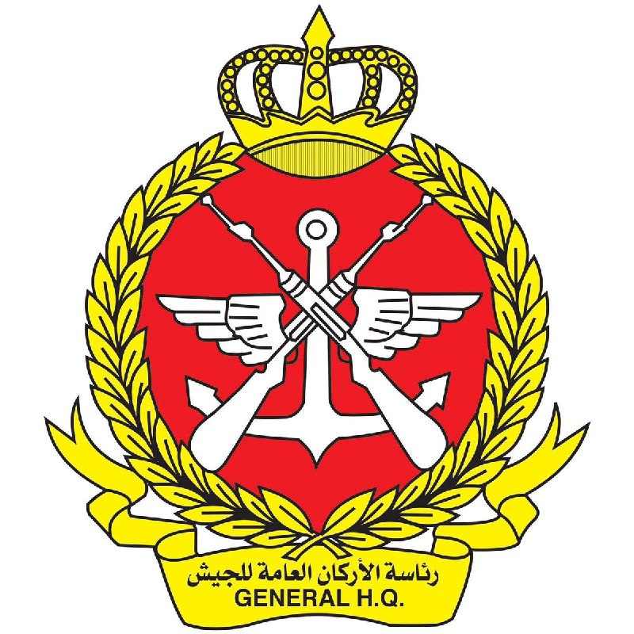
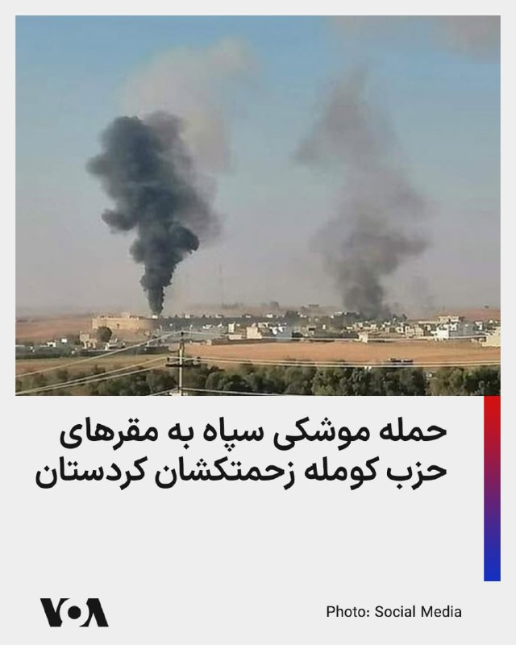
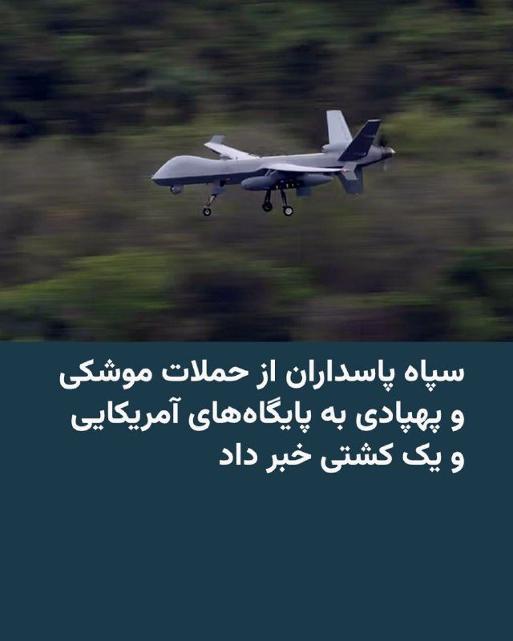
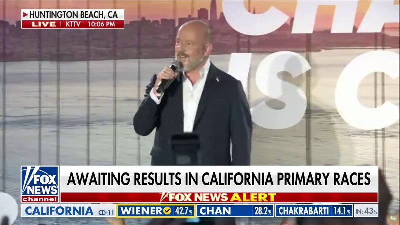
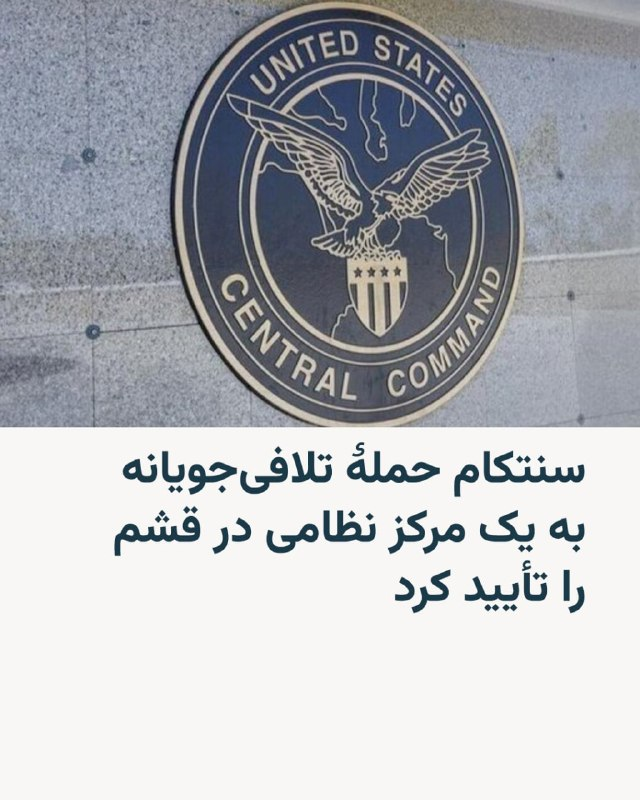
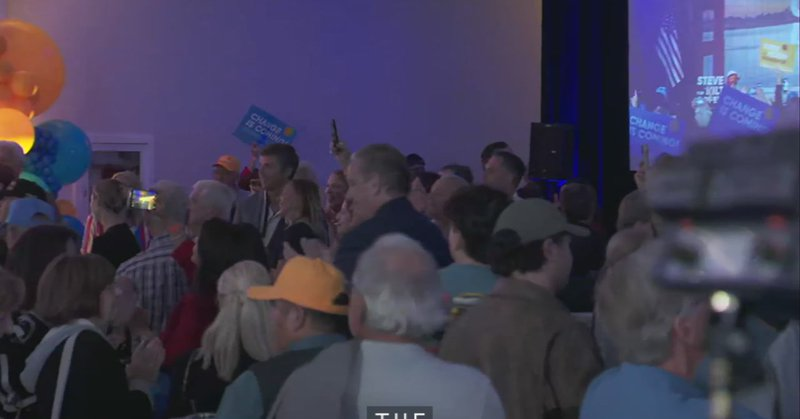
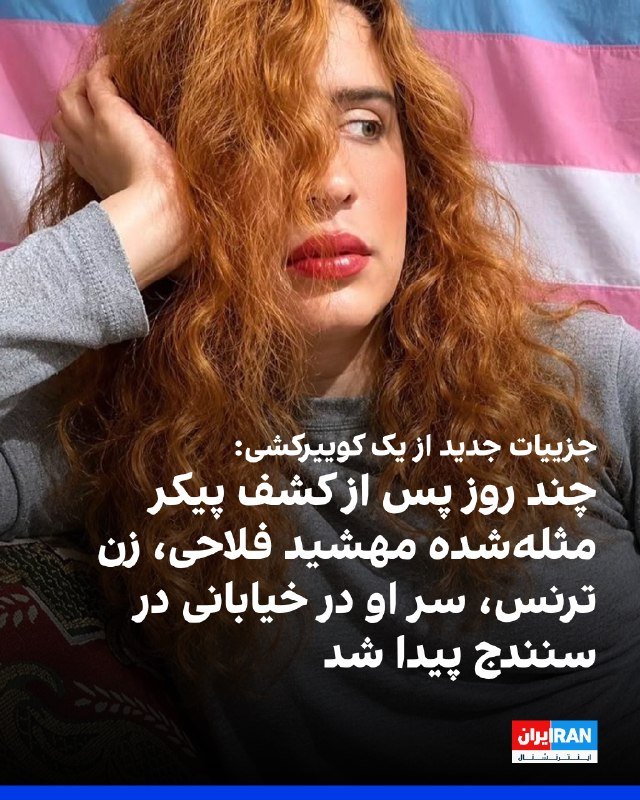

# خواننده تلگرام

<!-- TOP_NAV START -->

<a href="https://github.com/ProAlit/aio-downloader/blob/main/telegram/content/archive_1.md" style="display:inline-block; padding:6px 12px; margin:0 4px; background-color:#2ea44f; color:white; text-decoration:none; border-radius:4px; font-weight:bold;">صفحه بعد</a>

<!-- TOP_NAV END -->

<!-- MSG START -->

---
📅 بروزرسانی: 1405/03/13 09:34
---

## WithYashar — post 13341

حرکت پهپاد شاهد۱۳۶ ، فعالیت پدافند و در پایان برخورد و انفجار در فرودگاه کویت !
@withyashar

## FoxNewsTwitter — post 342548

  <a href="telegram/content/FoxNewsTwitter_342548_1780466653.mp4" target="_blank">🎬 Download video</a>

Fox News (Twitter/X)

JUST NOW: LA mayoral candidate Spencer Pratt projects confidence as he waits for election results, dismisses the idea that he doesn't represent Democrats, Republicans and independents.

"Right now, the media likes to say, 'Oh, he's this.' I'm not that. I'm an Angeleno who said enough is enough and I had to step up."

"I didn't know I'd be here tonight, but this is obviously God's plan, and I'm going to go all the way, and I'm going to show everybody that I'm their mayor."

## FoxNewsTwitter — post 342547

  

Fox News (Twitter/X)

LA Mayor Karen Bass advances to the November runoff in her bid for reelection.

Despite being challenged from the left and right and a rocky first term, the Democrat secured a spot for the final round of voting.

Bass, for her own part, maintains that her three years as mayor have taken the city in the right direction.

The incumbent mayor and former congresswoman will now head into a high-profile November showdown as voters decide whether to give her a second term.

## pm_afshaa — post 92202

🔴کانال 14 اسرائیل:اگر ایران حتی یک گلوله به سمت اسرائیل شلیک کند، تمام دروازه های جهنم به رویشان باز خواهد شد

💧 Rainbet.com the #1 Non-KYC Crypto Casino & Sportsbook @rainbetcom

😁 @Pm_Afshaa

## RadioFarda — post 157838

روبیو: تحریم‌های ایران با کنار گذاشتن فعالیت‌های هسته‌ای‌اش کاهش خواهد یافت

🔸وزیر خارجه آمریکا روز سه‌شنبه ۱۲ خرداد گفت که تیم مذاکره‌کننده دونالد ترامپ، رئیس‌جمهور، در ازای بازگشایی تنگه هرمز هیچ پیشنهاد کاهش یا لغو تحریم‌ها به ایران ارائه نکرده و تأکید کرد که هرگونه کاهش تحریم‌ها منوط به کنار گذاشتن برنامه هسته‌ای از سوی تهران است.

🔸مارکو روبیو در جلسه پرسش و پاسخ کمیته روابط خارجی سنای آمریکا گفت: «در حال حاضر، هر آنچه با آن‌ها (ایران) مطرح شده این است که هرگونه کاهش تحریم‌ها مبتنی بر شروطی است؛ یعنی باید در ازای همان دلایلی باشد که اساساً این تحریم‌ها به خاطر آن‌ها اعمال شده‌اند، یعنی برنامه هسته‌ای‌شان».

🔸او که برای نخستین بار از زمان آغاز جنگ ایران به‌صورت علنی در کنگره شهادت می‌داد، گفت در صورتی که ایران با کنار گذاشتن فعالیت‌های هسته‌ای خود موافقت کند، کاهش تحریم‌ها برای آن در نظر گرفته خواهد شد.

🔸وزیر خارجه آمریکا افزود: «ایران به دلیل غنی‌سازی در سطوح بالا تحت تحریم است. ایران به خاطر فعالیت‌های هسته‌ایش تحریم شده است. اگر با کنار گذاشتن این موارد موافقت کنند، کاهش تحریم‌ها متناسب با تعهد و پایبندی‌شان به این توافق‌ها اعمال خواهد شد».

🔸روبیو در حالی در برابر کمیته روابط خارجی سنای آمریکا شهادت داد، که دولت ترامپ به دنبال جلب موافقت کنگره برای کاهش ۳۰ درصدی بودجه امور خارجی و افزایش ۵۰ درصدی هزینه‌های نظامی پیشنهادی خود است.

🔸وزیر خارجه آمریکا در بخشی از اظهارات خود گفت که ایران با مذاکره دربارهٔ برخی جنبه‌های برنامهٔ هسته‌ایش که پیش‌تر از گفت‌وگو درباره آن‌ها خودداری می‌کرد، موافقت کرده است.

🔸روبیو در عین حال تأکید کرد این موضوع هیچ تضمینی ایجاد نمی‌کند که مذاکرات در نهایت به توافقی برای پایان دادن به جنگ میان آمریکا و اسرائیل با ایران منجر شود.

🔸نسخه کامل این گزارش را در وب‌سایت رادیوفردا بخوانید.

@Radiofarda

## alonews — post 124679

  <a href="telegram/content/alonews_124679_1780466657.mp4" target="_blank">🎬 Download video</a>

👈کوثری: آمریکایی‌ها جز زور متوجه چیز دیگری نمی‌شوند

🔴عضو کمیسیون امنیت ملی مجلس: برخورد با آمریکایی‌ها باید تشدید شود.

✅ @AloNews خبر جنگ

## alonews — post 124678

  <a href="telegram/content/alonews_124678_1780466659.webm" target="_blank">🎬 Download video</a>

👈سخنگوی سازمان آتش‌نشانی شهر تهران:
ساعت ۳ دقیقه بامداد امروز حادثه خودرویی در زیر پل استخر محله تهرانپارس به سامانه ۱۲۵ اعلام شد.

🔴آتش‌نشانان پس از حضور در محل مشاهده کردند یک دستگاه خودروی MVM با دو سرنشین که در روی پل در حال عبور بودند، به دلیل نامشخصی با گاردریل‌های پل برخورد کرده است.

🔴پس از حضور عوامل اورژانس مشخص شد که متأسفانه هر دو سرنشین جان خود را از دست داده‌اند

✅ @AloNews خبر جنگ

---
📅 بروزرسانی: 1405/03/13 09:23
---

## WithYashar — post 13340

سازمان هواپیمایی کشوری کویت: یک ساختمان مسافربری در فرودگاه
کویت هدف پهپادها و موشک‌های ایرانی قرار گرفت و حالت اضطراری فعال شده.
@withyashar

## pm_afshaa — post 92201

🔴رسانه‌های عربی از توقف کامل فعالیت فرودگاه‌ها و تمام پروازها در بحرین، کویت و امارات متحده عربی به دنبال وقوع حملات هوایی خبر دادن

💧 Rainbet.com the #1 Non-KYC Crypto Casino & Sportsbook @rainbetcom

😁 @Pm_Afshaa

## Shin_Persian — post 6458

🔁 Quoting above tweet:
Shin ✓ @hey_itsmyturn
Wed, 03 Jun 2026 05:43:47 UTC

Armed forces are on full alert and monitoring the situation.

#Kuwait 🇰🇼

Source: @KuwaitArmyGHQ
https://x.com/KuwaitArmyGHQ/status/2062047516384690551

فارسی

نیروهای مسلح در آماده‌باش کامل هستند و اوضاع را زیر نظر دارند.

#Kuwait 🇰🇼

منبع: @KuwaitArmyGHQ
https://x.com/KuwaitArmyGHQ/status/2062047516384690551

𝕏 · @shin_persian

## Shin_Persian — post 6457

  

↩️ Quoted tweet: KUWAIT ARMY - الجيش الكويتي ✓ @KuwaitArmyGHQ Wed, 03 Jun 2026 05:43:33 UTC بيان رقم (63) صرّح المتحدث الرسمي لوزارة الدفاع، العقيد الركن سعود عبدالعزيز العطوان، بأن عدداً من الطائرات المسيّرة المعادية استهدفت اليوم مبنى الركاب (T1) بمطار…

## Shin_Persian — post 6456

↩️ Quoted tweet:
KUWAIT ARMY - الجيش الكويتي ✓ @KuwaitArmyGHQ
Wed, 03 Jun 2026 05:43:33 UTC

بيان رقم (63)

صرّح المتحدث الرسمي لوزارة الدفاع، العقيد الركن سعود عبدالعزيز العطوان، بأن عدداً من الطائرات المسيّرة المعادية استهدفت اليوم مبنى الركاب (T1) بمطار الكويت الدولي نتيجة العدوان الإيراني الآثم، ما أسفر عن أضرار مادية جسيمة في المبنى وإصابة عدد من الأشخاص، حيث تلقوا

↩️ Quoted tweet — see the post below for the reply.

English

Statement No. (63)

The official spokesperson for the Ministry of Defense, Colonel Staff Saud Abdulaziz Al-Atwan, stated that a number of hostile drones targeted Terminal 1 (T1) at Kuwait International Airport today as a result of the sinful Iranian aggression. This resulted in severe material damage to the building and injuries to several individuals, who received...

𝕏 · @shin_persian

## Shin_Persian — post 6455

  

Shin @hey_itsmyturn
Wed, 03 Jun 2026 05:43:46 UTC

Kuwait Ministry of Defense spokesperson confirms hostile drones targeted Terminal 1 (T1) at Kuwait International Airport.

Significant material damage reported and several injuries confirmed following Iranian aggression.

فارسی

سخنگوی وزارت دفاع کویت تأیید کرد که پهپادهای متخاصم ترمینال ۱ (T1) در فرودگاه بین‌المللی کویت را هدف قرار داده‌اند.

گزارش‌ها حاکی از خسارات مادی قابل توجه است و چندین جراحت در پی تهاجم ایران تأیید شده است.

𝕏 · @shin_persian

## FarsiVOA — post 219440

  

مسئول مطبوعاتی حزب کومله زحمتکشان کردستان، از حمله موشکی سپاه به مقرهای این حزب در شامگاه سه‌شنبه ۱۲خرداد، خبر داد.

امجد حسین‌پناهی با انتشار پیامی در شبکه اجتماعی ایکس، از شلیک دست‌کم دو موشک به این مقرها خبر داد، اما مکان دقیق اهداف را اعلام نکرد.

در همین ارتباط خبرگزاری تسنیم وابسته به سپاه نیز اعلام کرد که «ساعت ۲۳:۰۰ به وقت محلی روز سه‌شنبه، دو موشک به مقر حزب کومله در «دره آلانه»، واقع در شمال شرقی اربیل، اصابت کرده است.»

حسین‌پناهی اعلام کرد که جمهوری اسلامی از آغاز جنگ تاکنون، با بیش از ۸۲ موشک و پهپاد، پایگاه‌ها و مقرهای کومله را هدف قرار داده است.
@FarsiVOA

## RadioFarda — post 157837

  

🔸سپاه پاسداران هم حملۀ آمریکا به یک «دکل مخابراتی سپاه» در جزیرۀ قشم و حملات موشکی به یک کشتی و پایگاه‌های آمریکا، از جمله در بحرین را تأیید کرد.

🔸در بیانیۀ روابط عمومی سپاه پاسداران آمده که در پاسخ به حملۀ جنگندۀ آمریکایی به نفتکش «لکسی» در نزدیکی تنگۀ‌ هرمز، نیروی دریایی سپاه یک شناور «متعلق به دشمن به نام پانایا» را هدف حملۀ موشکی قرار داده است.

🔸روابط عمومی سپاه پاسداران در ادامۀ بیانیۀ خود، با اشاره به حملۀ آمریکا به هدفی در جزیرۀ قشم، از حملۀ تلافی‌جویانه به یک «پایگاه هوایی و بالگردی در یکی از کشورهای منطقه» و مرکز ناوگان پنجم آمریکا [در بحرین] خبر داده است.

🔸پیشتر فرماندهی مرکزی نیروهای آمریکایی در منطقه، سنتکام، با صدور بیانیه‌ای، حمله به نقاطی در جزیره قشم، «در پاسخ به حملات موشکی و پهپادی جمهوری اسلامی» را تأیید کرد.

@RadioFarda

## alonews — post 124677

👈حمله اسرائیل به حومه بلعت در بخش مرجعیون در جنوب لبنان

✅ @AloNews خبر جنگ

## alonews — post 124676

👈روایت سی‌ان‌ان از درگیری شب گذشته ایران و آمریکا در خلیج فارس

🔴ایالات متحده و ایران در یکی از سنگین‌ترین شب‌های حملات از زمان آغاز آتش‌بس در آوریل، دست به تبادل حمله زده‌اند

🔴به نظر می‌رسد درگیری‌های شب سه‌شنبه زمانی آغاز شد که ارتش آمریکا با استفاده از موشک هلفایر، یک نفت‌کش با پرچم بوتسوانا را که به سمت بندری ایرانی در جزیره خارک در حرکت بود، هدف قرار داد. به گفته فرماندهی مرکزی ایالات متحده (سنتکام)، این کشتی با محاصره دریایی بنادر ایران توسط آمریکا همکاری نکرده بود.

🔴در پاسخ، ایران اعلام کرد به یک کشتی با پرچم لیبریا موشک شلیک کرده است.

🔴اما تشدید خطرناک‌تر پس از آن رخ داد که آمریکا یک ایستگاه کنترل زمینی نظامی ایران را در جزیره قشم، نزدیک تنگه هرمز، هدف قرار داد و این موضوع باعث شد ایران به کشورهای کویت و بحرین در منطقه خلیج فارس موشک و پهپاد شلیک کند.

🔴ایران اعلام کرد که «یک پایگاه هوایی و بالگردی آمریکایی» در منطقه و همچنین مقر ناوگان پنجم ایالات متحده در بحرین را هدف قرار داده است

✅ @AloNews خبر جنگ

---
📅 بروزرسانی: 1405/03/13 09:13
---

## WithYashar — post 13339

وال‌استریت ژورنال: حمله سنتکام به جزیره قشم، قیمت نفت را صعودی کرد و چشم‌انداز بازگشایی تنگه هرمز را کمرنگ ساخت.
@withyashar

## IranIntlTV — post 340313

  <a href="telegram/content/IranIntlTV_340313_1780465403.mp4" target="_blank">🎬 Download video</a>

رسانه‌های دولتی و تحلیلگران چینی در ساعت‌های گذشته روایت‌هایی از بن‌بست در مذاکرات تهران و آمریکا ارائه کرده‌اند که ممکن است به رویه «جنگ همراه مذاکره» تبدیل شود.

گفت‌وگو با توماج طاهباز، عضو تحریریه ایران‌اینترنشنال
@iranintltv

## FarsiVOA — post 219439

Farsi VOA pinned an audio file

## FarsiVOA — post 219438

  <a href="https://t.me/farsivoa/219438" target="_blank">📎 Download file</a>

🔴📢‌ پادکست خبری سه‌شنبه ۱۲ خرداد ۱۴۰۵

🛜در صورتی که با مشکل اینترنت مواجه هستید میتوانید اخبار صدای آمریکا را از نسخه‌های پادکست خبری ما روزانه دنبال کنید و یا اخبار را از نسخه سبک وب‌سایت ما پیگیر باشید:
https://ir.voanews.com/lite

📡بروزترین فرکانسهای ماهواره‌ای را نیز میتوانید از صفحه زیر پیگیری کنید:
https://ir.voanews.com/satellite

🔔دیگر شبکه‌های اجتماعی ما هم دنبال کنید:
https://linktr.ee/voafarsi

ما را به اشتراک بگذارید
@farsivoa

## DW_Farsi — post 125440

  

🔶 حملات پهپادی و موشکی سپاه به کویت و بحرین

فرماندهی مرکزی آمریکا (سنتکام) و سپاه پاسداران از حملات جدید موشکی و پهپادی خبر دادند.

کویت از رهگیری حملات موشکی و پهپادی ایران خبر داد، در بحرین آژیر خطر به صدا درآمد. وزارت کشور بحرین بامداد چهارشنبه ۱۳ خرداد (۳ ژوئن) از شهروندان و ساکنان این کشور خواست که آرامش خود را حفظ کنند و به نزدیک‌ترین مکان امن بروند.

رسانه‌های نزدیک به سپاه پاسداران از حمله به فرودگاه دبی در امارات متحده عربی و همچنین از به صدا درآمدن آژیرهای خطر در شرق عربستان خبر دادند.

فرماندهی مرکزی آمریکا (سنتکام) هم تائید کرد که چند موشک بالستیک و پهپاد ایرانی و یک ایستگاه کنترل زمینی نظامی در قشم را منهدم کردند.

سنتکام همچنین گفته است بامداد روز چهارشنبه ۱۳ خرداد (۳ ژوئن) موج دیگری از پهپادهای منتسب به ایران که قصد حمله به نیروهای آمریکایی در کویت را داشتند، توسط سامانه‌های پدافند هوایی آمریکا سرنگون شدند.

طبق داده‌های سنتکام هیچ‌یک از نیروها یا تاسیسات آمریکا در کویت دچار آسیب نشده‌اند.

@dw_farsi

## alonews — post 124675

  <a href="telegram/content/alonews_124675_1780465406.webm" target="_blank">🎬 Download video</a>

👈احتمال شنیده شدن صدای انفجار کنترل شده در محدوده جنوب اصفهان

✅ @AloNews خبر جنگ

## alonews — post 124674

  <a href="telegram/content/alonews_124674_1780465406.mp4" target="_blank">🎬 Download video</a>

👈سخنگوی آتش‌نشانی: صبح امروز خودروی نیسان در حال سوخت‌گیری در جایگاه سوخت گاز واقع در بزرگراه یاسینی بود که به‌دلایل نامشخص دچار انفجار شد.

🔴در این حادثه دو نفر مصدوم شدند.

✅ @AloNews خبر جنگ

---
📅 بروزرسانی: 1405/03/13 09:03
---

## VahidOOnLine — post 243468

  <a href="telegram/content/VahidOOnLine_243468_1780464808.mp4" target="_blank">🎬 Download video</a>

⭕️سقوط بقایای موشک و پهپادهای سپاه در کویت

♦️در پی حملات موشکی و پهپادی سپاه به کویت و بحرین، تصاویری از بقایای در حال سوختن یک موشک یا پهپاد در شهر الفروانیه کویت در شبکه‌های اجتماعی منتشر شده است.

خبرگزاری رویترز صحت این ویدیو را تائید کرده است.

آخرین دور حملات متقابل سنتکام و نیروهای مسلح جمهوری اسلامی، نیمه‌شب سه‌شنبه و در نخستین ساعات بامداد چهارشنبه ۱۳ خرداد روی داد. سپاه پاسداران و رسانه‌های نزدیک به آن ادعا می‌کنند که دست‌کم یکی از موشک‌های سپاه به مرکز استقرار ناوگان پنجم نیروی دریایی آمریکا در بحرین اصابت کرده است. سنتکام این ادعاها را تکذیب کرده است.
‌🇸🇦 Indypersian

🤖 @VahidOOnLine

## FoxNewsTwitter — post 342546

  

Fox News (Twitter/X)

JUST NOW: Republican California gubernatorial candidate Steve Hilton shares an optimistic message with supporters as results continue to roll in.

"It looks very much as if Californians really will have the chance to vote for change in November...and take our state in a new direction — a fresh start for our state — which is long overdue."

"Whether you voted for me or not, I am here for you."

## FarsiVOA — post 219437

  <a href="telegram/content/FarsiVOA_219437_1780464810.mp4" target="_blank">🎬 Download video</a>

سخنگوی سازمان آتش‌نشانی تهران از انفجار یک خودروی نیسان یخچال‌دار در جایگاه سوخت گاز در بزرگراه یاسینی، حوالی تهرانپارس، خبر داد؛ حادثه‌ای که به گفته او آتش‌سوزی به همراه نداشت، اما به خودرو و بخش‌هایی از جایگاه خسارت وارد کرد.

بر اساس اعلام آتش‌نشانی، این حادثه صبح امروز چهارشنبه در جایگاه سوخت گاز واقع در بزرگراه یاسینی بعد از سه‌راه تهرانپارس گزارش شد و نیروهای دو ایستگاه آتش‌نشانی به محل اعزام شدند.

بنابر اعلام آتش‌نشانی علت حادثه مشخص نیست و بررسی‌های فنی برای مشخص شدن منشأ انفجار ادامه دارد.

شدت انفجار باعث آسیب جدی به بدنه خودرو و خسارت به سقف و دیواره‌های جایگاه شد. در این حادثه راننده نیسان، حدود ۶۰ ساله، و یکی از متصدیان جایگاه، حدود ۴۰ ساله، مصدوم شدند.

همزمان رسانه‌ها به نقل از کاربران از شنیده شدن صدای انفجار در مناطق شرق و شمال شرق تهران در ساعات اولیه روز چهارشنبه خبر داده‌اند. تا این لحظه مقام‌های رسمی هیچ علت امنیتی یا خرابکارانه‌ای برای حادثه اعلام نکرده‌اند.
@FarsiVOA

## RadioFarda — post 157836

  

🔸فرماندهی مرکزی نیروهای آمریکایی در منطقه، سنتکام، با صدور بیانیه‌ای دیگر، حمله به نقاطی در جزیره قشم، «در پاسخ به حملات موشکی و پهپادی جمهوری اسلامی» را تأیید کرد.

🔸در این بیانیه آمده که نیروهای آمریکایی با موفقیت چندین موشک بالستیک و پهپاد شلیک‌شده از ایران را رهگیری و منهدم کرده و در اقدامی دفاعی، نقاطی در جزیرۀ قشم را هدف قرار داده‌اند.

🔸این بیانیه می‌افزاید که ایران چندین موشک بالیستیک را به سمت همسایگانش شلیک کرد؛ اما همگی در اصابت به اهداف خود ناموفق بوده‌اند. دو موشک شلیک‌شده به سمت کویت، در مسیر خود و پیش از رسیدن به این کشور دچار مشکل فنی شده و سقوط کردند و سه موشک شلیک‌شده به سمت بحرین هم از سوی پدافند هوایی ایالات متحده و بحرین رهگیری و منهدم شدند.

🔸سنتکام در ادامۀ بیانیۀ تازۀ خود می‌گوید: «لحظاتی پیش نیروهای سنتکام سه پهپاد تهاجمی انتحاری ایرانی را که به سمت کشتی‌های غیر نظامی در حرکت بودند، رهگیری و ساقط کردند. نیروهای آمریکایی همزمان در اقدامی دفاعی، یک ایستگاه کنترل نظامی ایران در جزیرۀ قشم را هدف قرار دادند».

@RadioFarda

## IranianMinds — post 21288

🔴 سنتکام:
خب آره خب دیشب به قشم حمله کردیم اماااااا آتش‌بس همچنان برقراره.☺️☺️

@IranianMinds

## BBCPersian — post 282743

🔻انفجار خودرو در جایگاه سوخت‌گیری تهرانپارس تهران

🔻بنابر اعلام سخنگوی سازمان آتش‌نشانی صبح امروز(چهارشنبه سیزدهم خرداد) یک انفجار در جایگاه سوخت گاز در بزرگراه یاسینی، مسیر غرب به شرق، بعد از سه‌ راه تهرانپارس بوقوع پیوست.

دلیل این انفجار هنوز مشخص نشده است.

سخنگوی سازمان آتش‌نشانی گفته است: «در بررسی‌های اولیه مشخص شد که یک دستگاه خودرو نیسان یخچال‌دار در حال سوخت‌گیری در این جایگاه بوده که به دلایل نامشخص و در حال بررسی، دچار انفجار شده است.»

شدت این انفجار باعث وارد آمدن خسارات به خودرو و جایگاه سوخت شد.

به گزارش رسانه‌های ایران، دو نفر در این انفجار مصدوم شدند.

https://bbc.in/4o1NHmi
@BBCPersian

## BBCPersian — post 282742

🔻سنتکام هدف قرار گرفتن ناوگان پنجم ایالات متحده در حملات سپاه پاسداران را رد کرد

🔻فرماندهی مرکزی ارتش ایالات متحده، سنتکام، در اطلاعیه‌ای هدف قرارگرفتن ناوگان پنجم ایالات متحده در بحرین و یک پایگاه هوایی ایالات متحده در منطقه، در حملات «موشکی و پهپادی» سپاه پاسداران را رد کرده است.

این نهاد در پیامی که در شبکه اجتماعی ایکس منتشر کرده نوشته است: «این ادعا نادرست است.»

سنتکام همچنین اعلام کرده است: «تمام حملات ایران به نیروهای آمریکایی شکست خورد. نیروهای آمریکایی هوشیار و آماده دفاع در برابر تجاوز بی‌توجیه ایران هستند.»

ساعتی پس از انتشار گزارش‌های متعدد از حملات موشکی به نقاطی در کویت و بحرین، سپاه پاسداران با انتشار اطلاعیه‌ای رسما از حمله به پایگاه ناوگان پنجم نیروی دریایی آمریکا خبر داده بود.

سنتکام پیشتر اعلام کرده بود چندين موشک بالستيک و پهپاد ايرانی را رهگيری و منهدم کرده و در پاسخ به آنچه «تلاش‌های ايران برای حمله در سراسر منطقه» خوانده، حملاتی را در قالب دفاع از خود عليه اهدافی در جزيره قشم انجام داده است.

https://bbc.in/4x7i8M9
@BBCPersian

## alonews — post 124673

  <a href="telegram/content/alonews_124673_1780464813.webm" target="_blank">🎬 Download video</a>

👈بیت کوین در ۴۸ ساعت گذشته بدون هیچ خبر منفی مهمی؛ ۸۰۰۰ دلار (۱۰٪-) سقوط کرد

✅ @AloNews خبر جنگ

## alonews — post 124672

  <a href="telegram/content/alonews_124672_1780464813.mp4" target="_blank">🎬 Download video</a>

👈 تصادف در خیابان های کویت بر اثر تماشای موشکهای سپاه

✅ @AloNews خبر جنگ

## alonews — post 124669

  <a href="telegram/content/alonews_124669_1780464814.mp4" target="_blank">🎬 Download video</a>

👈دیشب ، حمله‌های ارتش اوکراین به روسیه

✅ @AloNews خبر جنگ

---
📅 بروزرسانی: 1405/03/13 08:53
---

## IranIntlTV — post 340312

  <a href="telegram/content/IranIntlTV_340312_1780464200.mp4" target="_blank">🎬 Download video</a>

سپاه پاسداران در بیانیه‌ای اعلام کرد در پاسخ به حمله نیروهای آمریکایی به یک نفتکش ایران در حوالی تنگه هرمز، شناوری به نام پانایا را هدف قرار داده است.

امیر گیتی، عضو تحریریه ایران‌اینترنشنال، گفت تبادل آتش میان آمریکا و جمهوری اسلامی ادامه دارد و خبری از آتش‌بس نیست
@iranintltv

## RadioFarda — post 157835

🔸تقریباً همزمان با انتشار بیانیۀ سنتکام، حاکی از شلیک یک موشک هل‌فایر به موتورخانۀ یک نفتکش خالی که قصد نزدیک‌شدن به پایانه‌های نفتی جزیرۀ خارک را داشته، خبرگزاری مهر به نقل از مردم و منابع محلی، از شنیده‌شدن صدای چند انفجار از سمت جزیرۀ قشم خبر داد.

🔸در گزارش کوتاه خبرگزاری مهر، ماهیت و علت شنیده‌شدن این صداها نامشخص اعلام و تأکید شده که مراجع نظامی و انتظامی در منطقه هم از این موضوع اظهار بی‌اطلاعی کرده‌اند.

🔸در همین حال، کویت هم از درگیری سامانه‌های دفاع هوایی‌اش با حملات موشکی و پهپادی خبر داده است.

🔸ارتش کویت در دقایق اولیه چهارشنبه به وقت محلی و کم‌وبیش همزمان با شنیده‌شدن صداهای انفجار در قشم، اعلام کرد که مشغول رهگیری حملات موشکی و پهپادی است و از مردم این کشور خواست که دستور‌العمل‌های ایمنی را دنبال کنند.

🔸این بیانیه بدون اشاره به مبدأ حملات موشکی و پهپادی، تأکید کرده که همۀ صداهای انفجار شنیده‌شده، ناشی از عملیات رهگیری پرتابه‌های تهاجمی است.

@RadioFarda

## BBCPersian — post 282732

‌🖊سعید جعفری
روزنامه‌نگار

🔻در حالی که مذاکرات ایران و آمریکا وارد مرحله‌ای حساس شده، در اسرائیل بحث‌ها درباره «روز بعد از توافق احتمالی» شدت گرفته است. سوال اصلی فقط این نیست که آیا توافقی شکل خواهد گرفت یا نه؛ بلکه این است که اگر واشنگتن و تهران به تفاهم برسند، اسرائیل چه خواهد کرد؟

در رسانه‌ها، اندیشکده‌ها و محافل امنیتی اسرائیل، به‌نظر می‌رسد بحث‌ها از مرحله تلاش برای جلوگیری کامل از توافق عبور کرده و بیشتر بر این متمرکز شده که اسرائیل چگونه باید با توافقی احتمالی کنار بیاید؛ توافقی که ممکن است نه‌تنها برنامه هسته‌ای ایران، بلکه آزادی عمل نظامی اسرائیل در منطقه را نیز تحت تاثیر قرار دهد.

متن کامل خبر را از لینک زیر بخوانید:
https://bbc.in/4dNcGq8
📷Getty Images

@‌BBCPersian

## alonews — post 124668

  <a href="telegram/content/alonews_124668_1780464201.webm" target="_blank">🎬 Download video</a>

👈 یک اطلاعیه پرواز (NOTAM) در اربیل که در روز یکشنبه صادر شده است، قرار است در صبح روز سه‌شنبه از ساعت ۰۷:۰۰ تا ۱۰:۰۰ به وقت محلی اجرا شود. دلیل ذکر شده یک تمرین نظامی است که به دلیل ماهیت از پیش برنامه‌ریزی شده‌ی آن، احتمالاً صحیح است.

✅ @AloNews خبر جنگ

## alonews — post 124667

  <a href="telegram/content/alonews_124667_1780464202.mp4" target="_blank">🎬 Download video</a>

👈 تصاویر تکمیلی از رهگیر شکست خورده موشک در کویت

✅ @AloNews خبر جنگ

## alonews — post 124666

  <a href="telegram/content/alonews_124666_1780464202.mp4" target="_blank">🎬 Download video</a>

👈فیلمی از پهپاد شاهد-۱۳۶ که دیشب به سمت آسمان کویت درحال حرکت بود

✅ @AloNews خبر جنگ

## alonews — post 124665

👈سنتکام: آتش‌بس همچنان برقرار است

✅ @AloNews خبر جنگ

---
📅 بروزرسانی: 1405/03/13 08:43
---

## FoxNewsTwitter — post 342545

  

Fox News (Twitter/X)

WATCH LIVE: GOP candidate Steve Hilton hosts election night watch party in California https://twitter.com/i/broadcasts/1dGYllLOQXvKX

## IranIntlTV — post 340311

  <a href="telegram/content/IranIntlTV_340311_1780463598.mp4" target="_blank">🎬 Download video</a>

وزارت خزانه‌داری آمریکا اعلام کرد نوبیتکس، بزرگ‌ترین صرافی رمزارز ایران را تحریم کرده است.

میعاد ملکی، رییس پیشین دفتر هدف‌گذاری تحریم‌های وزارت خزانه‌داری آمریکا، گفت این اقدام به دلیل فعالیت‌های سپاه پاسداران و پیامی به اعضای کنگره است که فشار بر جمهوری اسلامی باید ادامه یابد
@iranintltv

## IranianMinds — post 21287

  

🔴 بعد از کشته شدن استاد اسپلینتر ارتش موش ها برای انتقام به کشور حمله کردن

با اعلام مدیرکل محیط زیست موش های پا سفید که رنگ قهوه ای مایل به قرمز دارن، بخاطر گرما به کشور هجوم آوردن و بسیار هم خطرناک هستن!

@IranianMinds

## alonews — post 124664

  <a href="telegram/content/alonews_124664_1780463600.webm" target="_blank">🎬 Download video</a>

👈رسانه‌های عربی از توقف کامل فعالیت فرودگاه‌ها و تمام پروازها در بحرین، کویت و امارات متحده عربی به دنبال وقوع حملات هوایی خبر دادند

✅ @AloNews خبر جنگ

## alonews — post 124663

  <a href="telegram/content/alonews_124663_1780463600.webm" target="_blank">🎬 Download video</a>

👈 فرماندهی مرکزی ایالات متحده (سنتکام) گزارش‌ها درباره اصابت حملات ایران به مقر ناوگان پنجم آمریکا در بحرین را تکذیب کرد.

✅ @AloNews خبر جنگ

## alonews — post 124662

  <a href="telegram/content/alonews_124662_1780463601.webm" target="_blank">🎬 Download video</a>

👈وال استریت ژورنال: حمله سنتکام به جزیره قشم، قیمت نفت را صعودی کرد و چشم‌انداز بازگشایی تنگه هرمز را کمرنگ ساخت.

✅ @AloNews خبر جنگ

---
📅 بروزرسانی: 1405/03/13 08:33
---

## FoxNewsTwitter — post 342544

  

Fox News (Twitter/X)

Trump-endorsed Rep. Randy Feenstra lost Iowa’s Republican gubernatorial primary Tuesday night to businessman and farmer Zach Lahn.

Trump had praised Feenstra as “MAGA all the way” in a last-minute Truth Social endorsement last week, and the congressman was widely expected to win the race.

The upset marks a notable break from recent GOP primaries in states like Texas and Kentucky, where Trump-backed candidates prevailed.

Lahn now advances to Iowa’s general election on Nov. 3.

## VahidOnline — post 75892

  <a href="telegram/content/VahidOnline_75892_1780463004.mp4" target="_blank">🎬 Download video</a>

"انفجار خودرو در جایگاه سوخت‌گیری تهرانپارس"

خبرگزاری فارس و تسنیم با انتشار ویدیوهای بالا نوشتند:
سخنگوی سازمان آتش‌نشانی:
در ساعت ۶:۱۴ صبح امروز، وقوع یک مورد انفجار در جایگاه سوخت گاز واقع در بزرگراه یاسینی، مسیر غرب به شرق، بعد از سه‌راه تهرانپارس (نرسیده به پل ۱۲ فروردین) به سامانه ۱۲۵ اعلام شد. بلافاصله نیروهای دو ایستگاه آتش‌نشانی به محل حادثه اعزام شدند.

در بررسی‌های اولیه مشخص شد که یک دستگاه خودروی نیسان یخچال‌دار در حال سوخت‌گیری در این جایگاه بوده که به دلایل نامشخص و در حال بررسی، دچار انفجار شده است.

خوشبختانه این انفجار منجر به آتش‌سوزی نشده بود، اما شدت آن باعث وارد آمدن خسارات قابل‌توجهی به بدنه خودروی نیسان و بخش‌هایی از سقف و دیواره‌های جایگاه سوخت شده است.
در این حادثه دو نفر شامل راننده خودروی نیسان (حدوداً ۶۰ ساله) و یکی از متصدیان جایگاه (حدوداً ۴۰ ساله) دچار مصدومیت شدند.

📡 @VahidOnline

## alonews — post 124661

  <a href="telegram/content/alonews_124661_1780463004.webm" target="_blank">🎬 Download video</a>

👈قیمت جهانی هر بشکه نفت برنت از ۹۷ دلار فراتر رفت

✅ @AloNews خبر جنگ

---
📅 بروزرسانی: 1405/03/13 08:23
---

## VahidOOnLine — post 243467

  

سازمان کوییرهای ایرانی سیمرغ در ارتباط با قتل اخیر مهشید فلاحی، زن ترنس ۳۲ ساله، در سنندج به نقل از کنشگران کوییر و فعالان کرد داخل ایران گزارش داد او حدود دو هفته پیش با چاقو به قتل رسید و سرش از پیکرش جدا شد.
طبق این گزارش، پیکر مثله‌شده مهشید چند روز پیش در نزدیکی سد سنندج پیدا شد و چند روز بعد نیز سر او در یکی از خیابان‌های شهر کشف شد.
سیمرغ به نقل از کنشگران کوییر و فعالان کرد داخل ایران نوشت مهشید سال‌ها پیش از سوی خانواده خود طرد شده و بی‌خانمان و کارتن‌خواب بود و از بازماندگان خشونت جنسی به شمار می‌رفت.
طبق گزارش‌های سازمان‌های حقوق بشری، پیکر مهشید همچنان در پزشکی قانونی نگهداری می‌شود و هیچ‌یک از اعضای خانواده برای تحویل پیکر او اقدام نکرده‌اند.
در حالی که برخی گزارش‌های اولیه، قتل مهشید فلاحی را به اسلام‌گرایان سلفی نسبت داده‌ بودند، اما هنوز هویت عامل یا عاملان این قتل مشخص نیست.

‌🏁 🇬🇧 IranintlTV

🤖 @VahidOOnLine

## pm_afshaa — post 92200

آژیر خطر در بحرین فعال شد

💧 Rainbet.com the #1 Non-KYC Crypto Casino & Sportsbook @rainbetcom

😁 @Pm_Afshaa

## pm_afshaa — post 92199

🔴وزارت خزانه‌داری آمریکا چهار صرافی رمز ارز ایرانی نوبیتکس، بیت‌پین، رمزینکس و والکس را در لیست سیاه قرار داد و تحریم کرد

💧 Rainbet.com the #1 Non-KYC Crypto Casino & Sportsbook @rainbetcom

😁 @Pm_Afshaa

## IranIntlTV — post 340310

  

سازمان کوییرهای ایرانی سیمرغ در ارتباط با قتل اخیر مهشید فلاحی، زن ترنس ۳۲ ساله، در سنندج به نقل از کنشگران کوییر و فعالان کرد داخل ایران گزارش داد او حدود دو هفته پیش با چاقو به قتل رسید و سرش از پیکرش جدا شد.
طبق این گزارش، پیکر مثله‌شده مهشید چند روز پیش در نزدیکی سد سنندج پیدا شد و چند روز بعد نیز سر او در یکی از خیابان‌های شهر کشف شد.
سیمرغ به نقل از کنشگران کوییر و فعالان کرد داخل ایران نوشت مهشید سال‌ها پیش از سوی خانواده خود طرد شده و بی‌خانمان و کارتن‌خواب بود و از بازماندگان خشونت جنسی به شمار می‌رفت.
طبق گزارش‌های سازمان‌های حقوق بشری، پیکر مهشید همچنان در پزشکی قانونی نگهداری می‌شود و هیچ‌یک از اعضای خانواده برای تحویل پیکر او اقدام نکرده‌اند.
در حالی که برخی گزارش‌های اولیه، قتل مهشید فلاحی را به اسلام‌گرایان سلفی نسبت داده‌ بودند، اما هنوز هویت عامل یا عاملان این قتل مشخص نیست.

https://iranintl.com/202606031363

## RadioFarda — post 157834

  <a href="telegram/content/RadioFarda_157834_1780462401.mp4" target="_blank">🎬 Download video</a>

🔸فرماندهی مرکزی نیروهای ایالات متحده می‌گوید با شلیک یک موشک به یک نفتکش خالی، مانع از نزدیک‌شدن این شناور به یک بندر ایرانی شده است.

🔸بر اساس بیانیۀ سنتکام نیروهای نظامی آمریکا به این ترتیب جلوی رسیدن نفتکش M/T Lexie که با پرچم بوتسوانا تردد می‌کند، به ترمینال بارگیری در جزیرۀ خارک را گرفتند.

🔸این بیانیه می‌گوید خدمۀ کشتی به اخطارهای پیاپی نیروهای آمریکا بی‌اعتنایی کرده و در طول بیش از ۲۴ ساعت، حاضر به تبعیت از دستورات آنها نشدند.

🔸در نهایت یک هواپیمای جنگنده با شلیک یک موشک «هِل‌فایِر» به موتورخانۀ کشتی، مانع از رسیدن نفتکش به ایران شد.

🔸سنتکام از پنجاه روز پیش، جلوگیری از تردد همۀ شناورها به بنادر ایرانی را آغاز کرد. در این فاصله نیروهای آمریکایی شش کشتی تجاری را از کار انداخته و ۱۲۲ شناور را هم به مسیرهایی دیگر راهنمایی کرده‌اند.

🔸این در حالی‌است که آتش‌بس میان ایران و آمریکا همچنان ادامه دارد و تلاش‌های دیپلماتیک برای تمدید دست‌کم شش‌ماهۀ آن هم در جریان است.

@RadioFarda

<!-- MSG END -->

<!-- NAV START -->

<a href="https://github.com/ProAlit/aio-downloader/blob/main/telegram/content/archive_1.md" style="display:inline-block; padding:6px 12px; margin:0 4px; background-color:#2ea44f; color:white; text-decoration:none; border-radius:4px; font-weight:bold;">صفحه بعد</a>

<!-- NAV END -->
