# خواننده تلگرام

<!-- TOP_NAV START -->

<!-- TOP_NAV END -->

<!-- MSG START -->

---
📅 بروزرسانی: 1405/03/15 19:52
---

## VahidOOnLine — post 243822

  <a href="telegram/content/VahidOOnLine_243822_1780676579.mp4" target="_blank">🎬 Download video</a>

گزارش‌ها از کاهش شدید صادرات نفت ایران حکایت دارند. تجربه تاریخی نشان می‌دهد وقتی درآمد نفتی سقوط می‌کند، پیامدهای آن معمولا در بخش انرژی متوقف نمی‌ماند. از ونزوئلا تا اتحاد جماهیر شوروی، از عراق تا لیبی، شوک‌های نفتی اغلب فقط یک بحران مالی نیستند، بلکه واقعیت‌های عمیق‌تر اقتصادی و سیاسی را آشکار می‌کنند.
‌🏁 🇬🇧 ManotoTV

🤖 @VahidOOnLine

## VahidOOnLine — post 243821

  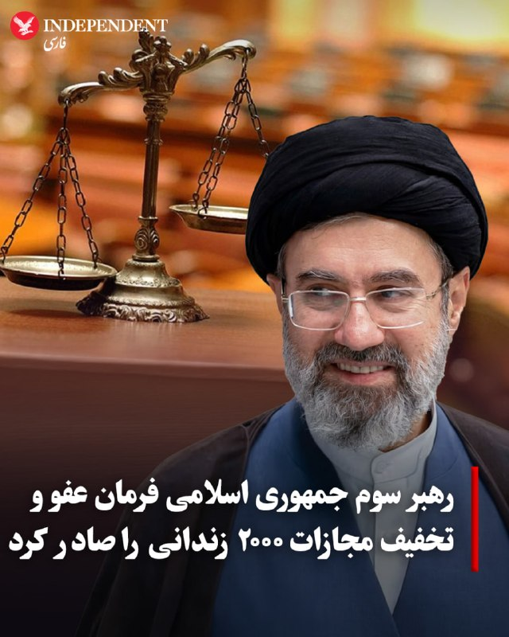

♦️مجتبی خامنه‌ای، رهبر سوم جمهوری اسلامی که هنوز از زمان انتصاب در انظار عمومی حضور نیافته و صدایش شنیده نشده، با عفو یا تخفیف مجازات بیش از ۲ هزار زندانی موافقت کرده است. به گزارش ایرنا، اکثریت این زندانیان پس از موافقت رهبر با درخواست غلامحسین محسنی اژه‌ای، رئیس قوه قضاییه، به‌طور فوری آزاد خواهند شد.

ایرنا تاکید کرده است که محکومان «جرایم امنیتی» از جمله افرادی که به اتهام «جاسوسی» در زندان به سر می‌برند، مشمول این عفو قرار نگرفته‌اند.

این تصمیم در حالی اتخاذ می‌شود که در پی اعتراضات سراسری دی‌ماه هزاران شهروند ایرانی با اتهامات ساختگی «جاسوسی و همکاری با کشور متخاصم» بازداشت شده‌اند.
‌🇸🇦 Indypersian

🤖 @VahidOOnLine

## WithYashar — post 13558

️حمام خون در بازار کریپتو! بیش از ۶۳۵ میلیارد دلار تنها در کمتر از ۵ روز از ارزش کل بازار رمزارزها محو شده است. @withyashar

## FoxNewsTwitter — post 342652

  <a href="telegram/content/FoxNewsTwitter_342652_1780676580.mp4" target="_blank">🎬 Download video</a>

Fox News (Twitter/X)

Four teens allegedly tried to rob a former Marine at gunpoint outside his own home. Seconds later, the plan unraveled.

Jheyco Borda Chura says he was installing a dashcam in his truck when the group approached and demanded his keys, phone, and belongings. Instead of handing them over, he says he grabbed the perp's gun.

Doorbell video captures the chaotic struggle and a shot fired from the gun.

Then Borda's father and younger brother sprint into frame to help the veteran.

Police say the family held the suspects until officers arrived, and remarkably, no one was injured.

## IranIntlTV — post 340688

  <a href="telegram/content/IranIntlTV_340688_1780676582.mp4" target="_blank">🎬 Download video</a>

کمتر از یک هفته مانده به آغاز جام جهانی ۲۰۲۶، رییس فدراسیون فوتبال جمهوری اسلامی با ادبیاتی تهدیدآمیز گفت به فیفا اعلام کرده در صورت صادر نشدن ویزای برخی اعضای تیم ملی، تصمیم‌های دیگری خواهد گرفت.

گفت‌وگو با محمد تقوی، فوتبالیست پیشین تیم ملی ایران و باشگاه استقلال
@iranintltv

## IranIntlTV — post 340687

  <a href="https://t.me/IranintlTV/340687" target="_blank">📎 Download file</a>

🎧نسخه صوتی چرتکه: تورم اردیبهشت در برزخ نه جنگ، نه صلح
@iranintlTV

## ManotoTV — post 105926

  <a href="telegram/content/ManotoTV_105926_1780676584.mp4" target="_blank">🎬 Download video</a>

گزارش‌ها از کاهش شدید صادرات نفت ایران حکایت دارند. تجربه تاریخی نشان می‌دهد وقتی درآمد نفتی سقوط می‌کند، پیامدهای آن معمولا در بخش انرژی متوقف نمی‌ماند. از ونزوئلا تا اتحاد جماهیر شوروی، از عراق تا لیبی، شوک‌های نفتی اغلب فقط یک بحران مالی نیستند، بلکه واقعیت‌های عمیق‌تر اقتصادی و سیاسی را آشکار می‌کنند.

## FarsiVOA — post 219677

وزارت کشور آمریکا اعلام کرد فوران آتشفشان «کیلاویا» در پارک ملی آتشفشان‌های هاوایی رکورد تازه‌ای در تعداد فوران‌های فواره‌ای گدازه ثبت کرده است.

به گفته مقام‌های آمریکایی، این فوران همچنان ادامه دارد و کیلاویا به فعالیت خود ادامه می‌دهد.

@FarsiVOA

## DW_Farsi — post 125542

  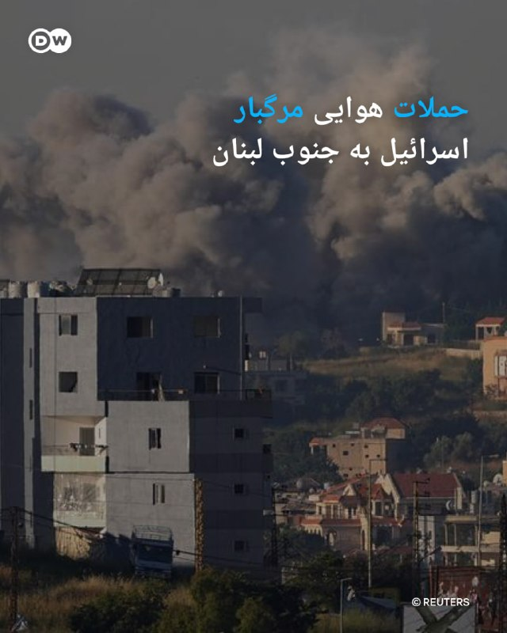

🔶 حملات هوایی مرگبار اسرائیل به جنوب لبنان

جنگنده‌های اسرائیل پس از صدور هشدار تخلیه برای ۹ روستا، مناطقی در جنوب لبنان را بمباران کردند که دست‌کم شش کشته برجای گذاشت.

این حملات یک روز پس از مخالفت حزب‌الله با جدیدترین توافق آتش‌بس و درخواست این گروه برای خروج کامل نیروهای اسرائیلی از خاک لبنان رخ داد.

هشدار تخلیه ارتش روز جمعه ۱۵ خرداد (۵ ژوئن) صدها خانواده از جمله ۲ هزار و ۵۰۰ آواره جنگی مستقر در روستای "عنقون" را مجبور به فرار کرد. تنها چند ساعت پس از هشدار این روستاها هدف بمباران قرار گرفتند.

در واکنش به توافق پیشنهادی آتش‌بس نبیه بری، رئیس پارلمان لبنان و میانجیگر حزب‌الله اعلام کرد که عقب‌نشینی حزب‌الله از مناطق جنوب رود لیتانی تنها در صورت خروج همزمان نیروهای اسرائیلی پذیرفتنی است. وی با انتقاد از ویرانی‌های گسترده ارتش اسرائیل، طرح ایجاد "مناطق آزمایشی" را رد کرد و خواستار آتش‌بسی بی‌قیدوشرط شد.

در تحولی میدانی نیروهای حافظ صلح سازمان ملل و ارتش لبنان در ورودی روستای ویران‌شده "دیبین" مستقر شدند. این نخستین عقب‌نشینی ارتش اسرائیل از یک منطقه در جنوب لبنان طی جنگ سه‌ماهه اخیر است.
@dw_farsi

## RadioFarda — post 157935

🔸وزارت خزانه‌داری ایالات متحده روز جمعه تحریم‌های جدیدی مرتبط با ایران اعمال کرد و چندین نهاد، فرد و نفتکش‌های حامل گاز مایع، ال‌پی‌جی، را هدف قرار داد. 🔸بر اساس جزئیات منتشرشده در وب‌سایت این وزارتخانه، از میان ۱۲ نهادی که در فهرست تحریم‌ها قرار گرفته‌اند،…

## RadioFarda — post 157934

  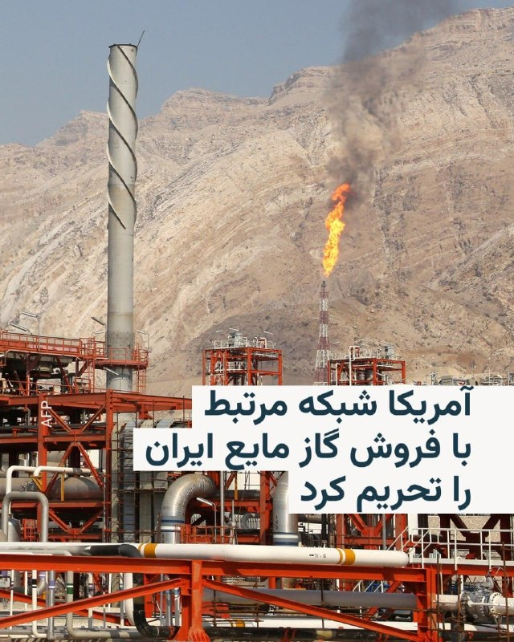

🔸وزارت خزانه‌داری ایالات متحده روز جمعه تحریم‌های جدیدی مرتبط با ایران اعمال کرد و چندین نهاد، فرد و نفتکش‌های حامل گاز مایع، ال‌پی‌جی، را هدف قرار داد.

🔸بر اساس جزئیات منتشرشده در وب‌سایت این وزارتخانه، از میان ۱۲ نهادی که در فهرست تحریم‌ها قرار گرفته‌اند، پنج نهاد در جزایر مارشال، چهار نهاد در امارات متحده عربی و یک نهاد در چین مستقر هستند.

🔸همچنین شش کشتی هدف تحریم قرار گرفته‌اند که چهار فروند از آنها با پرچم پاناما فعالیت می‌کنند.

🔸اسکات بسنت، وزیر خزانه‌داری آمریکا، در بیانیه‌ای گفت: «اقتصاد ایران در وضعیت نابسامانی قرار دارد و توان نظامی آن به‌شدت تضعیف شده است. از طریق کارزار "خشم اقتصادی" وزارت خزانه‌داری به قطع دسترسی ناوگان سایه، شبکه‌های بانکی سایه و مسیرهای تجارت جهانی ایران ادامه خواهد داد.»

@RadioFarda

## manototv — post 105926

  <a href="telegram/content/manototv_105926_1780676586.mp4" target="_blank">🎬 Download video</a>

گزارش‌ها از کاهش شدید صادرات نفت ایران حکایت دارند. تجربه تاریخی نشان می‌دهد وقتی درآمد نفتی سقوط می‌کند، پیامدهای آن معمولا در بخش انرژی متوقف نمی‌ماند. از ونزوئلا تا اتحاد جماهیر شوروی، از عراق تا لیبی، شوک‌های نفتی اغلب فقط یک بحران مالی نیستند، بلکه واقعیت‌های عمیق‌تر اقتصادی و سیاسی را آشکار می‌کنند.

## alonews — post 125349

  <a href="telegram/content/alonews_125349_1780676586.webm" target="_blank">🎬 Download video</a>

👈زلزله 4.8 ریشتری دقایقی پیش کازرون فارس را لرزاند

✅ @AloNews خبر جنگ

## alonews — post 125348

  <a href="telegram/content/alonews_125348_1780676586.webm" target="_blank">🎬 Download video</a>

👈رویترز: مقامات اسرائیلی معتقدند که تماس تلفنی اخیر بین ترامپ و نتانیاهو، که جزئیات آن به رسانه‌ها درز کرده است، یکی از داغ‌ترین تماس‌های بین دو طرف است و به ویژه با نزدیک شدن به انتخابات امسال، پیامدهای سیاسی در داخل اسرائیل را افزایش می‌دهد

🔴یکی از این مقامات گفت که این افشاگری پیش از انتخابات به نتانیاهو آسیب سیاسی وارد کرده است

🔴بر اساس نظرسنجی انجام شده توسط کانال ۱۲ اسرائیل، گادی آیزنکوت ، رئیس سابق ستاد کل ارتش ، برای اولین بار از نتانیاهو به عنوان مناسب‌ترین فرد برای ریاست دولت در آستانه انتخابات بعدی پیشی گرفته است.

✅ @AloNews خبر جنگ

---
📅 بروزرسانی: 1405/03/15 19:43
---

## VahidOOnLine — post 243820

  <a href="telegram/content/VahidOOnLine_243820_1780675994.mp4" target="_blank">🎬 Download video</a>

ویدیویی که به تازگی به ایران اینترنشنال رسیده صحنه تیراندازی و سنگرگیری شهروندان را در خیابان‌های یک شهر در جریان انقلاب ملی دی‌ماه سال گذشته را نشان می‌دهد. در جریان انقلاب ملی در بسیاری از شهرها ماموران حکومت اقدام به تیراندازی مستقیم به معترضان کردند.
‌🏁 🇬🇧 IranintlTV

🤖 @VahidOOnLine

## mwarmonitor — post 10179

🔴امروز، دفتر کنترل دارایی‌های خارجی وزارت خزانه‌داری (OFAC) شبکه‌ای از افراد، نهادها و کشتی‌ها را تحریم می‌کند که مسئول حمل صدها میلیون دلار گاز نفتی مایع با منشأ ایرانی هستند؛ این محموله‌ها به‌طور عمدی به‌عنوان گاز نفتی مایع عمانی (LPG) پنهان‌سازی شده و به مصرف‌کنندگان نهایی در جنوب و شرق آسیا ارسال شده‌اند.

@mwarmonitor

## FarsiVOA — post 219676

میرحسین موسوی در بیمارستان؛ چرا حصر نتوانست او را از معادلات سیاسی حذف کند؟

## FarsiVOA — post 219675

🔺تحریم‌های جدید آمریکا علیه بخش انرژی جمهوری اسلامی؛ اسکات بسنت: اقتصاد ایران در حال فروپاشی است

▪️وزارت خزانه‌داری آمریکا روز جمعه ۱۵ خرداد تحریم‌های تازه‌ای را علیه رژیم ایران وضع کرد.

⬇️ بیشتر بخوانید:
https://ir.voanews.com/a/ofac-sancrions-iranian-regime-network/8157697.html/?nocach=1

## Dirty_Kids — post 391063

  <a href="telegram/content/Dirty_Kids_391063_1780675997.mp4" target="_blank">🎬 Download video</a>

ملت رسما رد دادن😐😐

ویدیو وایرال شده تو سطح جهانی از مترو تهران:

@Dirty_Kids 👻

## Dirty_Kids — post 391062

  

قشنگ‌ترین چیزی که امروز میتونین ببینین
🇮🇷

@Dirty_Kids 👻

## Dirty_Kids — post 391061

  

دوستان این جاکش سالهاست که به ایران رفت و آمد داشته و واسه آخوند ساک میزده. این عکس رو سال ۹۶ تو میرداماد هستش

@Dirty_Kids 👻

## alonews — post 125347

  <a href="telegram/content/alonews_125347_1780676000.webm" target="_blank">🎬 Download video</a>

👈پزشکیان در شبکه اجتماعی ایکس: سرو می‌ماند ولی طوفان به پایان می‌رسد

✅ @AloNews خبر جنگ

---
📅 بروزرسانی: 1405/03/15 19:33
---

## VahidOOnLine — post 243819

  

♦️فرماندهی مرکزی ایالات متحده (سنتکام)، روز جمعه ۱۵ خرداد اعلام کرد که ارتش این کشور از زمان آغاز محاصره بنادر و شناورهای ایرانی، مسیر ۱۲۹ کشتی تجاری را که قصد ورود به بنادر ایران یا خروج از آن‌ها را داشتند، تغییر داده است.

این رقم نشان می‌دهد که ظرف ۲۴ ساعت گذشته، دو کشتی از مسیر خود منحرف شده‌اند است. ایالات متحده همچنین افزود که برای «تضمین پایبندی» به این محاصره، ۶ کشتی را متوقف و از کار انداخته است که آخرین مورد آن، نفت‌کش «لِکسی» (M/T Lexie) در روز سه‌شنبه بوده است. هم‌چنین وزارت جنگ آمریکا اعلام کرد که روز جمعه، نیروهای این کشور یک نفتکش تحریم‌شده را در اقیانوس هند توقیف کردند.
‌🇸🇦 Indypersian

🤖 @VahidOOnLine

## VahidOOnLine — post 243818

  

اسکات بسنت، وزیر خزانه‌داری آمریکا، در شبکه ایکس نوشت: «اقتصاد ایران در حال فروپاشی است و توان نظامی آن به‌شدت تضعیف شده است.»

او افزود: «از طریق عملیات خشم حماسی، وزارت خزانه‌داری به تلاش خود برای قطع شبکه ناوگان سایه جمهوری اسلامی، شبکه‌های بانکداری پنهان و دسترسی این کشور به تجارت جهانی ادامه خواهد داد.»
‌🏁 🇬🇧 IranintlTV

🤖 @VahidOOnLine

## VahidOOnLine — post 243817

  

محمدنبی موسوی‌فرد، امام جمعه اهواز در خطبه‌های نماز جمعه این شهر گفت: «لبنان خط قرمز جمهوری اسلامی است و آرامش منطقه تنها در صورتی پایدار می‌ماند که حملات علیه حزب‌الله متوقف شود.»

او اضافه کرد: «در صورت کوچک‌ترین تجاوز به خاک لبنان، دوران گفت‌وگو پایان می‌یابد.»

موسوی‌فرد ادامه داد: «تنگه هرمز هرگز به دست دشمن نخواهد افتاد و نیروهای مسلح با آمادگی کامل آماده پاسخ به هرگونه تجاوز هستند و اقداماتی همچون مین‌گذاری یا دریافت عوارض در این تنگه با هدف حفظ امنیت پایدار منطقه انجام می‌شود.»
‌🏁 🇬🇧 IranintlTV

🤖 @VahidOOnLine

## DEJradio — post 5359

  <a href="telegram/content/DEJradio_5359_1780675419.webm" target="_blank">🎬 Download video</a>

🔺📢 آخرین سنگر مالی جمهوری اسلامی زیر فشار؛

*عظا حسینیان، روزنامه‌نگار اقتصادی

#تورم #اقتصاد_ایران
@DEJradio

## VahidOnline — post 75951

امروز ۵ ژوئن ۲۰۲۶
قاضی فدرال آمریکا امروز حکم داد که تمام سیاست‌های تعلیقی USCIS غیرقانونی هستند و باید فوراً لغو شوند!
leeleehozak

چه خبر خوشحال کننده‌ای برای دانشجوهای ایرانی آمریکا، امیدوارم بزودی روند بررسی پرونده‌های USCIS شروع بشه و استرس و نگرانی همه تموم بشه
21aban

بلاخرررررره خبری که ماه‌ها منتظرش بودیم، اعلام شد.
طبق حکم دادگاه فدرال، پاز برای همه‌ی‌ افراد در داخل خاک آمریکا برداشته شد، از این لحظه به بعد دیگه #USCISpause وجود خارجی نداره، چون این بخشنامه از نظر دادگاه غیرقانونیه.

درود بر استقلال قوه قضاییه که زد کل بخشنامه اداره مهاجرت رو لغو کرد.
درود بر دموکراسی که در اون قدرت، چک سفید امضایی دست دولت نیست.

پی‌نوشت: احتمالا دولت درخواست تجدیدنظر بده و اعتراض کنه به این حکم اما خب دیر یا زود پرونده با پیروزی ما بسته میشه.
BrmTheGreat

جزییات تکمیلی:

دادگاه تمامی استدلال‌های دولت را که سعی داشت سیاست‌های جدید USCIS را از شمول بررسی قضایی خارج کند، رد کرد و رأی داد که:
واژه‌ی «امنیت ملی» نمی‌تواند سیاست‌های مهاجرتی قوه مجریه را به‌طور کامل از نظارت و بررسی دادگاه‌ها مصون کند.

قاضی رأی داده که هر چهار سیاست جدید چالش‌برانگیز، ناقض قانون تشریفات اداری (APA) هستند و به دو دلیل عمده غیرقانونی اعلام می‌شوند:

۱. مغایرت با‌ قانون (Contrary to Law): اداره‌ی USCIS از حدود اختیارات قانونی خود فراتر رفته است. دادگاه اشاره کرد که اختیارات مربوط به محدودیت ورود (موضوع بند 212(f) قانون INA) منحصراً متعلق به رئیس‌جمهور و مربوط به مرزهاست، نه مربوط به فرآیند پردازش مزایای داخلی برای غیرشهروندانی که قبلاً وارد خاک ایالات متحده شده‌اند. علاوه‌بر این، سیاست اعمال «عوامل منفی بر اساس کشور مبدا»، به وضوح ناقض اصل منع تبعیض بر اساس ملیت در قانون مهاجرت (موضوع بخش 1152(a)(1)(A)) است.

۲. خودسرانه و دمدمی‌مزاجانه بودن (Arbitrary and Capricious): این آژانس نتوانسته است استدلال منطقی برای اقدامات خود ارائه کند، منافع و انتظارات به‌حق مهاجرانی را که طبق قانون عمل کرده بودند کاملاً نادیده گرفته، و به دلایل ساختگی و بهانه‌جویانه (Pretextual) متوسل شده است. دادگاه به یک «عدم تطابق جدی» میان اهداف اعلام‌شده امنیت ملی و آنچه در واقعیت رخ داده اشاره کرد؛ از جمله اظهارات بیگانه‌ستیزانه همزمان رئیس‌جمهور و کریستی نوم (Kristi Noem) وزیر وقت امنیت میهن در شبکه‌های اجتماعی، و همچنین استثنائات خودسرانه‌ای که آژانس برای ورزشکاران جام جهانی/المپیک و پزشکان در نظر گرفته بود.

🟣 دادگاه رسماً هر چهار سیاست را غیرقانونی اعلام کرد و آن‌ها را به‌طور کامل ابطال و ملغی اثر نمود. از آنجا که این حکم یک دستورالعمل دولتی را ابطال می‌کند، عملاً اثری سراسری و ملی در کل کشور خواهد داشت.

🟣 دادگاه درخواست شاکیان برای صدور دستور منع دائمی را رد کرد و استدلال نمود که حکم ابطال و اعلام غیرقانونی بودن سیاست‌ها به خودی خود برای جبران خسارت شاکیان کافی است و نیازی به این ابزار فوق‌العاده نیست.

🟣 درخواست دولت برای رد ادعاهای اساسی شاکیان (مبنی بر نقض متمم پنجم قانون اساسی در خصوص رفتار برابر و رویه عادلانه) رد شد. دادگاه بر اساس اصل «اجتناب از ورود به مسائل قانون اساسی در صورت امکان»، اعلام کرد که چون پرونده بر اساس دلایل اداری (قانون APA) به‌طور کامل حل شده، نیازی به صدور رای در خصوص بندهای قانون اساسی در حال حاضر نیست.

این حکم به امضای قاضی ارشد، جان جی. مک‌کانل، رسیده و لازم‌الاجرا است.

منبع‌:
کانال مهاجرت به آمریکا
BrmTheGreat

📡 @VahidOnline

## IranIntlTV — post 340686

  <a href="telegram/content/IranIntlTV_340686_1780675420.mp4" target="_blank">🎬 Download video</a>

ویدیویی که به تازگی به ایران اینترنشنال رسیده صحنه تیراندازی و سنگرگیری شهروندان را در خیابان‌های یک شهر در جریان انقلاب ملی دی‌ماه سال گذشته را نشان می‌دهد. در جریان انقلاب ملی در بسیاری از شهرها ماموران حکومت اقدام به تیراندازی مستقیم به معترضان کردند.

## IranIntlTV — post 340685

  

اسکات بسنت، وزیر خزانه‌داری آمریکا، در شبکه ایکس نوشت: «اقتصاد ایران در حال فروپاشی است و توان نظامی آن به‌شدت تضعیف شده است.»

او افزود: «از طریق عملیات خشم حماسی، وزارت خزانه‌داری به تلاش خود برای قطع شبکه ناوگان سایه جمهوری اسلامی، شبکه‌های بانکداری پنهان و دسترسی این کشور به تجارت جهانی ادامه خواهد داد.»
https://iranintl.com/202606059359

## IranIntlTV — post 340684

  

محمدنبی موسوی‌فرد، امام جمعه اهواز در خطبه‌های نماز جمعه این شهر گفت: «لبنان خط قرمز جمهوری اسلامی است و آرامش منطقه تنها در صورتی پایدار می‌ماند که حملات علیه حزب‌الله متوقف شود.»

او اضافه کرد: «در صورت کوچک‌ترین تجاوز به خاک لبنان، دوران گفت‌وگو پایان می‌یابد.»

موسوی‌فرد ادامه داد: «تنگه هرمز هرگز به دست دشمن نخواهد افتاد و نیروهای مسلح با آمادگی کامل آماده پاسخ به هرگونه تجاوز هستند و اقداماتی همچون مین‌گذاری یا دریافت عوارض در این تنگه با هدف حفظ امنیت پایدار منطقه انجام می‌شود.»
https://iranintl.com/202606053961

## IranIntlTV — post 340683

  <a href="telegram/content/IranIntlTV_340683_1780675425.mp4" target="_blank">🎬 Download video</a>

جروزالم‌پست گزارش داد برخی مقام‌های اسرائیلی مظنون‌اند مقام‌هایی در کاخ سفید اطلاعات محرمانه یک عملیات زمینی علیه جمهوری اسلامی را در اختیار ترکیه گذاشته‌اند. این مقام‌ها گفتند هدف، جلوگیری از اجرای عملیات بوده است.

جزییات بیشتر با اشکان صفایی، خبرنگار ایران‌اینترنشنال
@iranintltv

## DW_Farsi — post 125541

🔶 صد روز پس از جنگ؛ بحران‌های عمیق در پس پرده ثبات

🔻 گزارشی از شبنم فون‌هاین

صد روز پس از آغاز جنگ ایران با آمریکا و اسرائیل، جمهوری اسلامی در ظاهر باثبات به نظر می‌رسد. اما زیر این آرامش ظاهری، بحران‌های اقتصادی و اجتماعی همچنان ادامه دارد و فشارهای حکومتی افزایش یافته است.

محمد قائدی، پژوهشگر علوم سیاسی در دانشگاه جورج واشنگتن و متخصص سیاست و روابط بین‌الملل خاورمیانه، در گفت‌وگو با دویچه ‌وله می‌گوید: «من در صد روز گذشته هیچ تغییر ساختاری در جمهوری اسلامی نمی‌بینم.»

یک فعال حقوق زنان ۴۲ ساله که در تهران زندگی می‌کند، می‌گوید در میان اطرافیانش همچنان خشم و نارضایتی گسترده‌ای وجود دارد. او معتقد است که تجمع‌های شبانه تلاشی است برای پس گرفتن خیابان‌ها پس از اعتراضات سراسری دی‌ماه.
@dw_farsi

## Persian_Trend_Official — post 15766

آمریکا در حال تهیه پیش‌نویس قطعنامه‌ای برای محکومیت ایران در آژانس بین‌المللی انرژی اتمی...

منابع دیپلماتیک به فرانس۲۴ گفته‌اند که آمریکا در حال تهیه پیش‌نویس قطعنامه‌ای برای محکومیت ایران در نشست هفته آینده شورای حکام آژانس بین‌المللی انرژی اتمی است؛ اقدامی که می‌تواند فضای مذاکرات تهران و واشنگتن را پیچیده‌تر کند.

این خبر یک روز پس از انتشار گزارش جدید آژانس مطرح می‌شود؛ گزارشی که در آن تأکید شده بازرسان هنوز امکان دسترسی به برخی تأسیسات هسته‌ای آسیب‌دیده ایران را نداشته‌اند و آژانس نمی‌تواند درباره محل، حجم و وضعیت فعلی ذخایر اورانیوم غنی‌شده ایران ارزیابی دقیقی ارائه دهد.

در حالی که مذاکرات برای تمدید آتش‌بس و بازگشت به مسیر دیپلماسی ادامه دارد، واشنگتن همچنان بر جلوگیری از دستیابی ایران به سلاح هسته‌ای تأکید می‌کند و تهران نیز می‌گوید چنین برنامه‌ای را دنبال نمی‌کند.

گزارش اخیر آژانس، ابهامات درباره وضعیت برنامه هسته‌ای ایران را افزایش داده و به نظر می‌رسد آمریکا قصد دارد از این فضا برای اعمال فشار سیاسی بیشتر در شورای حکام استفاده کند. در صورت تصویب قطعنامه، احتمال افزایش تنش در پرونده هسته‌ای و دشوارتر شدن روند مذاکرات میان تهران و واشنگتن وجود خواهد داشت.

👺Phantom

📌 @persian_trend_official
پرشین ترند | متفاوت‌ترین کانال نظامی

## alonews — post 125346

  <a href="telegram/content/alonews_125346_1780675427.webm" target="_blank">🎬 Download video</a>

👈فیلد مارشال ، محسن رضایی: مذاکرات متوقف شده است، آمریکا اگر توافقی می‌خواهد باید فورا ۲۴میلیارد دلار دارایی های ایران را آزاد کند

🔴اگر محاصره دریایی ادامه یابد ما [از طریق تاکتیک‌های ناشناخته] جنگ را به دریای سرخ، دریای مدیترانه و اقیانوس هند می‌کشانیم.

✅ @AloNews خبر جنگ

## alonews — post 125345

  <a href="telegram/content/alonews_125345_1780675428.webm" target="_blank">🎬 Download video</a>

🔴فوری/ فارس: ایران مذاکرات و تبادل پیام با آمریکا از طریق واسطه‌ها را پس از حملات ادعایی آمریکا به کشتی‌های تجاری در جنوب ایران و ادامه عملیات نظامی اسرائیل در لبنان متوقف کرده است.

✅ @AloNews خبر جنگ

## alonews — post 125344

  <a href="telegram/content/alonews_125344_1780675428.webm" target="_blank">🎬 Download video</a>

👈پوتین: اگر در انتخابات قبلی ایالات متحده تقلب نشده بود، ممکن بود درگیری در اوکراین رخ ندهد

✅ @AloNews خبر جنگ

## alonews — post 125343

  <a href="telegram/content/alonews_125343_1780675428.webm" target="_blank">🎬 Download video</a>

👈 وزارت خزانه‌داری آمریکا: شبکه قاچاق LPG ایران به جنوب و شرق آسیا تحریم ش

د

🔴دفتر کنترل دارایی‌های خارجی وزارت خزانه‌داری آمریکا (OFAC) اعلام کرد شبکه‌ای از افراد، شرکت‌ها و کشتی‌ها که صدها میلیون دلار گاز مایع ایران را به صورت LPG عمان به جنوب و شرق آسیا قاچاق می‌کردند، تحت تحریم قرار گرفته‌اند.
طبق گزارش OFAC، این شبکه از شرکت‌های پوششی در امارات و چین، حساب‌های بانکی خارجی و ناوگان سایه ایران استفاده می‌کرد. همچنین شرکت صرافی ایرانی «مهر داد گرامیان نیک و شرکا» به دلیل جابجایی صدها میلیون دلار برای بانک‌های تحریم‌شده ایران در فهرست قرار گرفت.

🔴اسکات بسنت، وزیر خزانه‌داری آمریکا، گفت: «اقتصاد ایران در بحران است و نیروی نظامی آن تضعیف شده. با برنامه Economic Fury، وزارت خزانه‌داری به محدود کردن ناوگان سایه، شبکه‌های بانکی سایه و دسترسی ایران به تجارت جهانی ادامه خواهد داد.»

🔴شش تانکر LPG و چند شرکت پوششی نیز به فهرست تحریم‌ها اضافه شده‌اند.

✅ @AloNews خبر جنگ

---
📅 بروزرسانی: 1405/03/15 19:23
---

## VahidOOnLine — post 243816

  

♦️ دفتر کنترل دارایی‌های خارجی وزارت خزانه‌داری آمریکا (OFAC) روز جمعه ۱۵ خرداد با انتشار بیانیه‌ای، فهرست تحریم‌های مربوط به جمهوری اسلامی ایران را به‌روزرسانی و چندین فرد، شرکت و نفت‌کش را به لیست اس‌دی‌ان (SDN) اضافه کرد.

در میان افراد تحریم‌شده، نام دو شهروند ایرانی به نام‌های مهرداد گرامیان نیک و رومینا گرامیان نیک به همراه «شرکت تضامنی مهرداد گرامیان نیک و شرکا» (صرافی گرامیان) واقع در تهران دیده می‌شود. همچنین محمد شاکل میهن‌دوست (شهروند ترکیه) و سرباز عبدل زاده (شهروند افغانستان) به همراه شرکت‌های مرتبط با آن‌ها در چین و امارات در این فهرست قرار گرفته‌اند.

علاوه بر این، چندین شرکت صوری و بازرگانی در امارات متحده عربی (مانند شرکت نفت و گاز ساحل استار)، جزایر مارشال، لیبریا و چین به دلیل تسهیل مبادلات مالی و تجاری ایران تحریم شده‌اند. در بخش ترابری نیز ۶ کشتی و نفت‌کش حامل گاز مایع (LPG) از جمله کشتی‌های امیر گاز (با پرچم سنت کیتس و نویس)، گاز لاگون، گاز جی‌ام‌اس، گلندیل و مایل (با پرچم پاناما) به همراه ام‌دی ۲۳ (با پرچم پالائو) به عنوان دارایی‌های مسدودشده به این لیست افزوده شده‌اند.
‌🇸🇦 Indypersian

🤖 @VahidOOnLine

## VahidOOnLine — post 243815

  

♦️ژوزف عون، رئیس‌جمهوری لبنان، در مصاحبه با سی‌ان‌ان گفت که جمهوری اسلامی «در مذاکرات خود با ایالات متحده، از لبنان به عنوان یک ابزار معامله (کارت بازی) استفاده می‌کند؛ این امر غیرقابل قبول است.»

عون به سی‌ان‌ان گفت: «اینجا کشور شما نیست، کشور ماست. این وظیفه و مسئولیت ماست و شما حق ندارید در کشور ما مداخله کنید.»

رئیس‌جمهوری لبنان در ادامه افزود که حزب‌الله، به عنوان گروهی که تحت حمایت و پشتیبانی جمهوری اسلامی قرار دارد، «باید این موضوع را درک کند.»

عون تاکید کرد: «حزب‌الله باید بفهمد که راهی جز نشستن و گفتگو وجود ندارد. هیچ راه دیگری برای حل این مشکل و نجات آنچه باقی مانده است، جز از طریق مذاکره و دیپلماسی وجود ندارد.»
‌🇸🇦 Indypersian

🤖 @VahidOOnLine

## pm_afshaa — post 92317

🔴بلومبرگ: پس از رد پیشنهاد آتش‌بس از سوی حزب‌الله، روند پیشرفت مذاکرات میان آمریکا و ایران هم دچار توقف یا بن‌بست شده

💧 Rainbet.com the #1 Non-KYC Crypto Casino & Sportsbook @rainbetcom

😁 @Pm_Afshaa

## DEJradio — post 5358

  <a href="telegram/content/DEJradio_5358_1780674807.mp4" target="_blank">🎬 Download video</a>

🔺📢 راویان فردا؛

*غنچه استوارنیا

#اینترنت #حافظه_تاریخی
@DEJradio

## FarsiVOA — post 219674

احتمال عملی شدن گزینه مورد نظر دونالد ترامپ برای خارج کزدن اورانیوم با غنای بالا از داخل خاک ایران، توسط نیروهای نظامی آمریکا، بدون درگیر شدن در جنگ؛ گفت‌وگو با رضا تقی‌زاده

## Persian_Trend_Official — post 15765

  

🔴 دادگاه بریتانیا دو عامل حمله به پوریا زراعتی را مجرم شناخت

دادگاهی در بریتانیا دو شهروند رومانیایی به نام‌های «ناندیتو بدیا» و «جورج استانا» را در پرونده حمله با چاقو به پوریا زراعتی، مجری شبکه ایران اینترنشنال، مجرم شناخت.

این دو نفر حدود دو سال پیش در نزدیکی محل سکونت زراعتی در لندن به او حمله کرده و با چند ضربه چاقو از ناحیه پا مجروحش کرده بودند.

پلیس ضدتروریسم بریتانیا معتقد است زراعتی به دلیل مواضع و انتقادهایش از جمهوری اسلامی هدف این حمله قرار گرفته است. با این حال، مقام‌های جمهوری اسلامی پیش‌تر هرگونه ارتباط با این حادثه را رد کرده بودند.

صدور رأی محکومیت در این پرونده، بار دیگر موضوع امنیت مخالفان و رسانه‌های فارسی‌زبان خارج از کشور را به یکی از محورهای تنش میان تهران و لندن تبدیل کرده است. این پرونده احتمالاً در آینده نیز ابعاد سیاسی و دیپلماتیک خود را حفظ خواهد کرد.

👺Phantom

📌 @persian_trend_official
پرشین ترند | متفاوت‌ترین کانال نظامی

## alonews — post 125342

  <a href="telegram/content/alonews_125342_1780674811.webm" target="_blank">🎬 Download video</a>

👈ترامپ از طریق Truth Social:
استخر بزرگ بازتاب‌دهنده، که بین یادبود لینکلن و بنای یادبود واشنگتن کشیده شده است، به تازگی با «نظرات بسیار مثبت» افتتاح شد اما، چه به عمد و چه نه، برخی می‌گویند، مانند واشنگتن پست، این یک «رنگ‌آمیزی» بوده است.

🔴این یک رنگ‌آمیزی نبود. این ماده‌ای بسیار پیشرفته، با استحکام صنعتی بود که می‌تواند تا ۱۰۰ سال دوام بیاورد، و توسط افراد بسیار بااستعدادی اعمال شده است، بسیاری از آن‌ها از ایالت بزرگ اوکلاهما آمده‌اند، جایی که من در ۷۷ شهرستان از ۷۷ شهرستان، سه بار پیروز شدم، تنها رئیس‌جمهوری که تاکنون این کار را کرده است.

🔴این ماده ضخیم، قوی، انعطاف‌پذیر است و رنگ طبیعی و زیبایی دارد، آبی تیره پرچم آمریکا!

✅ @AloNews خبر جنگ

## alonews — post 125341

  <a href="telegram/content/alonews_125341_1780674811.webm" target="_blank">🎬 Download video</a>

👈به گفته منابع آگاه، ایالات متحده، مکزیک و کانادا در آستانه از دست دادن موعد اول جولای برای تمدید توافق تجاری خود هستند؛ اتفاقی که راه را برای سال‌ها چانه‌زنی بر سر تعرفه‌های بخش خودروسازی و سایر صنایع باز خواهد کرد.

✅ @AloNews خبر جنگ

---
📅 بروزرسانی: 1405/03/15 19:12
---

## VahidOOnLine — post 243814

  

♦️رضا ولی‌زاده، روزنامه‌نگار ایرانی‌-آمریکایی بازداشتی در زندان اوین، در یک پیام صوتی ضبط‌شده که به تازگی در اختیار شبکه «سی‌بی‌اس نیوز» قرار گرفته، از دولت آمریکا خواست تا برای او و دیگر آمریکایی‌های زندانی در تهران، خدمات پزشکی فراهم کند. ولی‌زاده در این فایل دو دقیقه‌ای می‌گوید: «حتی اگر درمان بیماری‌های ما خواسته بزرگی باشد، دست‌کم باید از مقامات ایران خواسته می‌شد بخشی از فشارهای جسمی و شکنجه‌های روحی را کاهش دهند.»

پیام ولی‌زاده پس از کاهش محدودیت‌های شدید اینترنتی در هفته گذشته خارج شده است. رایان فاهی، وکیل ولی‌زاده، اعلام کرد که موکلش از زمان آتش‌سوزی ناشی از حمله هوایی اسرائیل به اوین در ژوئن گذشته، دچار سرفه‌های مداوم، کمردرد و مشکلات دندان شده و به همراه سه آمریکایی دیگر از خدمات درمانی محروم است. وزارت امور خارجه آمریکا معتقد است در حال حاضر شش شهروند آمریکایی در ایران بازداشت هستند.
‌🇸🇦 Indypersian

🤖 @VahidOOnLine

## VahidOOnLine — post 243813

  

وزارت خزانه‌داری آمریکا جمعه اعلام کرد که تحریم‌های جدیدی مرتبط با جمهوری اسلامی وضع کرده است.

براساس گزارش وزارت خزانه‌داری آمریکا، در چارچوب به‌روزرسانی تحریم‌های مقابله با تروریسم، مهرداد گرامیان نیک و رومینا گرامیان نیک با تابعیت ایران، محمد شکول میهن‌دوست با تابعیت ترکیه و سرباز عبدالزاده با تابعیت افغانستان در فهرست تحریم‌ها قرار گرفتند.

همچنین ۱۲ نهاد فعال در حوزه‌های کشتیرانی، نفت، گاز و پتروشیمی در فهرست این تحریم‌ها قرار گرفتند و شش فروند کشتی با پرچم کشورهای پاناما و سنت کیتس نیز در همین چارچوب تحریم شدند.
‌🏁 🇬🇧 IranintlTV

🤖 @VahidOOnLine

## FoxNewsTwitter — post 342651

  

Fox News (Twitter/X)

HAPPY BIRTHDAY! Mark Wahlberg turns 55 today.

The former rapper-turned-Hollywood star is known for blockbuster movies, but he's also earned recognition for supporting youth enrichment programs and military veteran charities.

From the music scene to the big screen and beyond, Wahlberg has built a career and a legacy that spans decades.

## DEJradio — post 5357

  <a href="telegram/content/DEJradio_5357_1780674177.webm" target="_blank">🎬 Download video</a>

🔺📢 موشک‌پرانی جمهوری اسلامی؛‌ جهان به دنبال کاهش وابستگی به تنگه هرمز

*اشکان خسروپور

#جنگ #تنگه_هرمز
@DEJradio

## IranIntlTV — post 340682

  <a href="telegram/content/IranIntlTV_340682_1780674178.mp4" target="_blank">🎬 Download video</a>

وزارت ورزش و جوانان با انتشار گزارشی اعلام کرد ایران به یک رکورد تاریخی در کاهش جمعیت رسیده و خالص رشد جمعیت کشور برای نخستین بار به کمتر از ۵۰۰ هزار نفر کاهش یافته است.

ارزیابی بیشتر با منصوره حسینی‌یگانه، عضو تحریریه ایران‌اینترنشنال
@iranintltv

## IranIntlTV — post 340681

  

وزارت خزانه‌داری آمریکا جمعه اعلام کرد که تحریم‌های جدیدی مرتبط با جمهوری اسلامی وضع کرده است.

براساس گزارش وزارت خزانه‌داری آمریکا، در چارچوب به‌روزرسانی تحریم‌های مقابله با تروریسم، مهرداد گرامیان نیک و رومینا گرامیان نیک با تابعیت ایران، محمد شکول میهن‌دوست با تابعیت ترکیه و سرباز عبدالزاده با تابعیت افغانستان در فهرست تحریم‌ها قرار گرفتند.

همچنین ۱۲ نهاد فعال در حوزه‌های کشتیرانی، نفت، گاز و پتروشیمی در فهرست این تحریم‌ها قرار گرفتند و شش فروند کشتی با پرچم کشورهای پاناما و سنت کیتس نیز در همین چارچوب تحریم شدند.
https://iranintl.com/202606056857

## Persian_Trend_Official — post 15761

  <a href="telegram/content/Persian_Trend_Official_15761_1780674180.webm" target="_blank">🎬 Download video</a>

سنتکام تصاویر توقیف نفتکش ایرانی M/T DAVINA توسط تفنگداران دریایی خود در اقیانوس هند را منتشر کرد.

📝 Amir

📌 @persian_trend_official
پرشین ترند | متفاوت‌ترین کانال نظامی

## RadioFarda — post 157933

🔸دو مرد رومانیایی که از سوی دادستان‌های بریتانیایی به اقدام نیابتی برای حکومت ایران در حمله با چاقو به یک روزنامه‌نگار ایرانی شاغل در شبکه ایران اینترنشنال در لندن متهم شده بودند، از سوی دادگاه مجرم شناخته شدند. 🔸پوریا زراعتی، روزنامه‌نگار بریتانیایی ایرانی‌تبار…

## RadioFarda — post 157932

  

🔸دو مرد رومانیایی که از سوی دادستان‌های بریتانیایی به اقدام نیابتی برای حکومت ایران در حمله با چاقو به یک روزنامه‌نگار ایرانی شاغل در شبکه ایران اینترنشنال در لندن متهم شده بودند، از سوی دادگاه مجرم شناخته شدند.

🔸پوریا زراعتی، روزنامه‌نگار بریتانیایی ایرانی‌تبار که برای این شبکه کار می‌کند، در فروردین ۱۴۰۳ در نزدیکی خانه‌اش در جنوب غربی لندن سه بار در ناحیه پا مورد اصابت چاقو قرار گرفت و مجروح شد.

🔸به گزارش رویترز، دادستان دانکن اتکینسون در ابتدای جلسه دادگاه که ماه گذشته میلادی برگزار شد، به هیئت منصفه گفت که سه مرد، زراعتی را هدف قرار داده بودند.

🔸اتکینسون گفت که آنها «یک حمله برنامه‌ریزی‌شده را که قبل از آن عملیات شناسایی انجام شده بود و توسط شخص ثالثی به نمایندگی از حکومت ایران دستور داده شده بود» انجام دادند.

@RadioFarda

## BBCPersian — post 282924

🔻دادگاهی در بریتانیا دو مرد رومانیایی را به‌عنو‌ان عوامل حمله به پوریا زراعتی مقصر شناخت

دادگاهی در بریتانیا دو مرد رومانیایی را به‌عنو‌ان عوامل حمله به پوریا زراعتی، مجری شبکه ایران اینترنشنال، مقصر شناخت.

ناندیتو بدیا، ۲۱ ساله و جورج استانا، ۲۵ ساله، دو سال پیش نزدیک خانه آقای زراعتی با چاقو به او حمله کردند و با سه ضربه به پایش او را مجروح کردند.

پلیس ضد‌تروریستی بریتانیا معتقد است که آقای زراعتی به‌دلیل انتقاداتش از حکومت ایران هدف حمله قرار گرفته است.

در زمان این حمله کاردار سفارت ایران در لندن «هر گونه» ارتباط حکومت ایران با حمله به پوریا زراعتی را «تکذیب» کرده بود.

https://bbc.in/4oavX8B
@BBCPersian

## alonews — post 125340

  <a href="telegram/content/alonews_125340_1780674181.webm" target="_blank">🎬 Download video</a>

👈نواف سلام نخست‌وزیر لبنان:
ما موفق شدیم به توافق آتش‌بس برسیم، اما متعجب شدیم که سپاه پاسداران ایران اولین مخالف آن بود.

✅ @AloNews خبر جنگ

---
📅 بروزرسانی: 1405/03/15 19:02
---

## VahidOOnLine — post 243812

یک شهروند با ارسال ویدیوهایی صحنه‌هایی از انتقال اتوبوسی حامیان حکومت به تجمعات خیابانی و توزیع غذا و بستنی و کباب بین آن‌ها را نشان می‌دهد. پیشتر نیز پیام‌های مردم حاکی از توزیع پول و کالا در تجمعات حکومتی بود.
‌🏁 🇬🇧 IranintlTV

🤖 @VahidOOnLine

## VahidOOnLine — post 243811

  

علیرضا عباسی، نایب رییس کمیسیون کشاورزی مجلس، به سایت خانه ملت گفت: «محاصره دریایی پس از پذیرش آتش‌بس صورت گرفته و از این رو مصداق روشن نقض آتش‌بس است و راهکار صحیح در این زمینه، شکستن محاصره دریایی از طریق قدرت میدانی است، نه امتیاز دادن در میز مذاکره.»

او ادامه داد: «تیم مذاکره‌کننده باید با جدیت این موضوع را دنبال کرده و اجازه ندهد طرف مقابل از شرایط موجود برای تحمیل خواسته‌های جدید سوءاستفاده کند.»
‌🏁 🇬🇧 IranintlTV

🤖 @VahidOOnLine

## VahidOOnLine — post 243810

بهنام برآبادی، ۲۶ ساله، آرایشگر و بدنساز سبزواری، شامگاه ۱۸ دی در جریان اعتراضات با شلیک گلوله نیروهای سرکوب‌ مجروح شد و پس از یک هفته بستری در بیمارستان، ۲۵ دی جان خود را از دست داد.
بر اساس گزارش‌های رسیده به ایران‌اینترنشنال، او پس از نجات چند دختر از دست ماموران حکومت هدف گلوله قرار گرفت.
بهنام قرار بود ۵ بهمن در مسابقات بدنسازی سبزوار شرکت کند.
‌🏁 🇬🇧 IranintlTV

🤖 @VahidOOnLine

## VahidOOnLine — post 243809

♦️وزارت جنگ آمریکا اعلام کرد که نیروهای نظامی این کشور در جریان یک عملیات شبانه، وارد یک ابرنفت‌کش بدون پرچم و تحریم‌شده به نام «داوینا» (Davina) در آب‌های اقیانوس هند شده و آن را توقیف کرده‌اند. پنتاگون تصاویر این عملیات را نیز منتشر کرد.

بر اساس گزارش خبرگزاری رویترز و داده‌های ماهواره‌ای سامانه ردیابی «مارین ترافیک»، این ابرنفت‌کش که با نام «لنور» نیز شناخته می‌شود، آخرین بار در روز جمعه ۱۵ خرداد، در نزدیکی سواحل جنوبی سریلانکا ردیابی شده است. ارزیابی‌های فنی از میزان فرو رفتگی بدنه کشتی در آب (آبخور) نشان می‌دهد که این شناور به طور کامل بارگیری شده و حامل یک محموله بزرگ نفتی است.

نفت‌کش داوینا با ظرفیت حمل بالا (تا سقف دو میلیون بشکه نفت خام)، در اکتبر سال ۲۰۲۴ میلادی به دلیل مشارکت در زنجیره تجارت و حمل‌ونقل نفت جمهوری اسلامی، در لیست تحریم‌های وزارت خزانه‌داری آمریکا قرار گرفته بود.

این تقابل دریایی در شرایطی رخ می‌دهد که واشنگتن فشارهای خود را برای انسداد مسیرهای تجارت دریایی جمهوری اسلامی افزایش داده و نیروهای آمریکایی در ماه‌های اخیر چندین نفت‌کش را در اقیانوس هند رهگیری کرده‌اند.
‌🇸🇦 Indypersian

🤖 @VahidOOnLine

## DEJradio — post 5356

  <a href="telegram/content/DEJradio_5356_1780673578.webm" target="_blank">🎬 Download video</a>

🔺📢 تماشای سکوت؛ روایتی هنری از مقاومت

گزارش: بهنام روغنی

#جنگ #مقاومت
@DEJradio

## IranIntlTV — post 340680

یک شهروند با ارسال ویدیوهایی صحنه‌هایی از انتقال اتوبوسی حامیان حکومت به تجمعات خیابانی و توزیع غذا و بستنی و کباب بین آن‌ها را نشان می‌دهد. پیشتر نیز پیام‌های مردم حاکی از توزیع پول و کالا در تجمعات حکومتی بود.

## Shin_Persian — post 6522

Shin ✓ @hey_itsmyturn
Fri, 05 Jun 2026 15:30:34 UTC

𝐄𝐜𝐨𝐧𝐨𝐦𝐢𝐜 𝐅𝐮𝐫𝐲 targets Iranian LPG smuggling network that disguised hundreds of millions of dollars in Iranian petroleum gas as Omani-origin exports to South and East Asia, while also sanctioning shadow banking operations moving foreign currency for Iranian banks.

𝐈𝐍𝐃𝐈𝐕𝐈𝐃𝐔𝐀𝐋𝐒:

𝐒𝐚𝐫𝐛𝐚𝐳 𝐀𝐛𝐝𝐮𝐥 𝐙𝐚𝐝𝐚 (Afghan national) - Network operator managing UAE front companies for Iranian LPG export scheme

𝐌𝐨𝐡𝐚𝐦𝐦𝐚𝐝 𝐒𝐡𝐚𝐤𝐨𝐥 𝐌𝐢𝐡𝐚𝐧𝐝𝐨𝐮𝐬𝐭 (Turkish national, also known as Haji Shakoor) - Network co-operator running UAE and China-based front companies for LPG smuggling

𝐌𝐞𝐡𝐫𝐝𝐚𝐝 𝐆𝐞𝐫𝐚𝐦𝐢𝐚𝐧 𝐍𝐢𝐤 (Iranian national, holds Dominican citizenship) - Exchange house operator facilitating hundreds of millions in foreign currency transactions for sanctioned Iranian banks

𝐑𝐨𝐦𝐢𝐧𝐚 𝐆𝐞𝐫𝐚𝐦𝐢𝐚𝐧 𝐍𝐢𝐤 (Iranian national) - Co-operator of family-run exchange house

𝐄𝐍𝐓𝐈𝐓𝐈𝐄𝐒:

𝐁𝐮𝐭𝐚𝐧𝐢 𝐓𝐫𝐚𝐝𝐢𝐧𝐠 𝐋𝐋𝐂 (UAE) - Front company that shipped tens of thousands of metric tons of Iranian LPG worth tens of millions to South Asia

𝐃𝐮𝐧𝐝𝐥𝐨𝐝 𝐓𝐫𝐚𝐝𝐢𝐧𝐠 𝐅𝐙𝐄 (UAE) - Front company that delivered 22,000 metric tons of LPG to Bangladesh worth $10.5 million in October 2025

𝐀𝐃𝐇 𝐄𝐧𝐞𝐫𝐠𝐲 𝐅𝐙𝐄 (UAE) - Front company used to sell millions of barrels of Iranian LPG to Bangladesh in March 2026

𝐒𝐚𝐡𝐞𝐥 𝐒𝐭𝐚𝐫 𝐎𝐢𝐥 𝐚𝐧𝐝 𝐆𝐚𝐬 𝐂𝐨𝐦𝐩𝐚𝐧𝐲 𝐋𝐋𝐂 (UAE) - Entity used by Abdul Zada for Iranian LPG shipments

𝐒𝐡𝐚𝐧𝐠𝐡𝐚𝐢 𝐐𝐢𝐚𝐧𝐲𝐞 𝐄𝐧𝐞𝐫𝐠𝐲 𝐂𝐨., 𝐋𝐭𝐝. (China) - Company owned and operated by Mihandoust

𝐌𝐞𝐡𝐫𝐝𝐚𝐝 𝐆𝐞𝐫𝐚𝐦𝐢𝐚𝐧 𝐍𝐢𝐤 𝐚𝐧𝐝 𝐏𝐚𝐫𝐭𝐧𝐞𝐫𝐬 𝐂𝐨𝐦𝐩𝐚𝐧𝐲 (Iran) - Exchange house holding tens of millions in foreign currency for Bank Tejarat, Bank Mellat, and Bank Pasargad

𝐋𝐢𝐦𝐫𝐚 𝐆𝐚𝐬 𝐋𝐢𝐦𝐢𝐭𝐞𝐝 (Marshall Islands) - Owner/manager/operator of MD 23

𝐄𝐜𝐨𝐬𝐞𝐚𝐬 𝐌𝐚𝐫𝐢𝐭𝐢𝐦𝐞 𝐋𝐢𝐦𝐢𝐭𝐞𝐝 (Liberia) - Owner of GLENDALE

𝐁𝐥𝐮𝐞 𝐒𝐞𝐚 𝐌𝐚𝐫𝐢𝐧𝐞 𝐈𝐧𝐜𝐨𝐫𝐩𝐨𝐫𝐚𝐭𝐞𝐝 𝐀𝐧𝐝 𝐅𝐚𝐚𝐭𝐞𝐡 𝐌𝐚𝐫𝐢𝐭𝐢𝐦𝐞 𝐈𝐧𝐜𝐨𝐫𝐩𝐨𝐫𝐚𝐭𝐞𝐝 (Marshall Islands) - Owner/manager/operator of AMIR GAS

𝐀𝐝𝐚𝐦𝐚𝐬 𝐒𝐡𝐢𝐩𝐩𝐢𝐧𝐠 𝐈𝐧𝐜 (Marshall Islands) - Owner/manager/operator of GAS LAGOON

𝐁𝐥𝐚𝐜𝐤 𝐆𝐨𝐥𝐝 𝐓𝐫𝐚𝐝𝐞 𝐂𝐨𝐫𝐩𝐨𝐫𝐚𝐭𝐢𝐨𝐧 (Marshall Islands) - Owner of MILE

𝐆𝐚𝐬 𝐆𝐌𝐒 𝐋𝐢𝐦𝐢𝐭𝐞𝐝 (Marshall Islands) - Owner of GAZ GMS

𝐕𝐄𝐒𝐒𝐄𝐋𝐒:

𝐌𝐃 𝟐𝟑 (IMO 9158240, Palau flag) - LPG tanker transported hundreds of thousands of barrels since 2023

𝐆𝐋𝐄𝐍𝐃𝐀𝐋𝐄 (IMO 9139945, Panama flag) - LPG tanker transported millions of barrels since 2020

𝐀𝐌𝐈𝐑 𝐆𝐀𝐒 (IMO 9167409, St. Kitts and Nevis flag) - LPG tanker transported hundreds of thousands of barrels since 2025

𝐆𝐀𝐒 𝐋𝐀𝐆𝐎𝐎𝐍 (IMO 9386304, Panama flag) - LPG tanker transported millions of barrels since 2023

𝐌𝐈𝐋𝐄 (IMO 8910897, Panama flag) - LPG tanker transported millions of barrels since 2024, shipped over 500,000 barrels to Bangladesh in early 2025

𝐆𝐀𝐙 𝐆𝐌𝐒 (IMO 9131539, Panama flag) - LPG tanker transported hundreds of thousands of barrels since 2023

𝐋𝐏𝐆 𝐒𝐄𝐕𝐀𝐍 - Previously blocked vessel that transported 750,000 barrels to Bangladesh (August-November 2025)

𝐆𝐀𝐒 𝐙𝐄𝐈𝐍𝐀 - Vessel used for multiple LPG shipments to Bangladesh since 2024

𝐊𝐄𝐘 𝐓𝐄𝐂𝐇𝐍𝐈𝐂𝐀𝐋 𝐃𝐄𝐓𝐀𝐈𝐋𝐒:

- Action taken under E.O. 13902 targeting Iran's financial and petroleum sectors
- Network falsely labeled Iranian LPG as Omani-origin to evade sanctions
- Exchange house maintains contracts with sanctioned banks Bank Tejarat, Bank Mellat, and Bank Pasargad
- Economic Fury has frozen nearly $500 million in regime-linked cryptocurrency
- Standard 50% ownership rule applies for entity blocking
- Whistleblower awards available for enforcement actions exceeding $1 million in penalties

ترجمه فارسی در بخش نظرات

𝕏 · @shin_persian

## FarsiVOA — post 219673

🔺تکذیب ادعاهای جمهوری اسلامی درباره حمله به ناوهای آمریکایی در دریای عمان

▪️در پی انتشار گزارش‌های رسانه‌های نزدیک به سپاه پاسداران با ادعای حمله به ناوهای آمریکایی در دریای عمان، ستاد فرماندهی مرکزی آمریکا، سنتکام، روز جمعه ۱۵ خرداد با صدور پیامی این ادعای جمهوری اسلامی را تکذیب کرد.

⬇️ بیشتر بخوانید:

https://ir.voanews.com/a/centcom-strait-of-hormuz-irgc-terrorism-attack/8157676.html/?nocach=1

## DW_Farsi — post 125540

  

🔶 ادعای ایران: عقب‌نشینی ناوهای آمریکا با شلیک اخطار

رسانه‌های نزدیک به سپاه پاسداران در ایران گزارش دادند که نیروی دریایی ارتش این کشور با شلیک موشک‌های اخطار و استقرار پهپادهای تهاجمی، چندین شناور جنگی ایالات متحده را وادار به ترک آب‌های دریای عمان کرده است.

بر اساس گزارشی که روز جمعه ۱۵ خرداد (۵ ژوئن) از سوی خبرگزاری تسنیم منتشر شد، نیروی دریایی ارتش ایران اعلام کرده است که در واکنش به آنچه "مزاحمت‌های دریایی و توقیف شناورهای تجاری و نفت‌کش‌ها" توسط نیروی دریایی آمریکا خوانده، دست به عملیات زده است.

طبق این گزارش نیروهای ایرانی با استفاده از موشک‌های کروز دریایی "قدیر" و پهپادهای تهاجمی جدیدی با نام "شهید دانا"، اقدام به شلیک‌های هشدارآمیز کرده‌اند.

بە ادعای این رسانە دو ناوشکن آمریکایی با شماره‌های بدنه DDG-103 (یواس‌اس تراکستون) و DDG-87 (یواس‌اس میسون) دریای عمان را به مقصد اقیانوس هند ترک کرده‌اند.

مقام‌های نظامی ایران همچنین مدعی شده‌اند که علاوه بر این دو ناوشکن، ناو تهاجمی آبی-خاکی "تریپولی" نیز مجبور به عقب‌نشینی از منطقه شده است.
@dw_farsi

## Persian_Trend_Official — post 15759

در آخر می‌رسیم به موشک هوا به سطح kh-38، موشک kh-38 با نهایت برد 70 کیلومتر بسته به مدل خود از سیستم های هدایت مختلفی از جمله راداری و اپتیکی بهره می‌برد که این قابلیت را به موشک می‌دهد که بسته به نوع هدایت علیه اهداف ثابت و متحرک استفاده شود.

موشک kh-38 یک موشک زیرشاخه به نام kh-36 دارد که در اصل حاصل وصل کردن یک پیشران راکتی به روی موشک kh-38 است که برد آن را به 120 کیلومتر رسانده.

در آخر باید گفت که در این اسناد اشاره ای به تعداد خریداری شده موشک های بالا نشده و به طور دقیق معلوم نیست ایران چه مقدار از این موشک ها و چه مدل از آن‌ها را خریداری کرده.

📝 Amir

📌 @persian_trend_official
پرشین ترند | متفاوت‌ترین کانال نظامی

## IranianMinds — post 21429

🔴آمریکا تحریم‌های جدیدی را بر علیه ایران اعمال نمود.

@IranianMinds

## BBCPersian — post 282923

  

🔻ارتش آمریکا شلیک تیر هشدار از سوی ایران به سمت ناوهای جنگی‌اش را رد کرد و گفت چنین اقدامی می‌توانست نقض جدی آتش‌بس شکننده میان دو کشور باشد.

فرماندهی مرکزی آمریکا در منطقه (سنتکام) در شبکه اجتماعی «ایکس» نوشت: «نیروهای ایرانی هیچ حمله‌ای به ناوهای نیروی دریایی آمریکا انجام نداده و به سمت آن‌ها شلیک نکرده‌اند. انجام چنین کاری نقض آشکار آتش‌بس خواهد بود.»

روابط عمومی ارتش ایران پیش‌تر اعلام کرد که نیروی دریایی این کشور در دریای عمان به سمت ناوشکن‌های آمریکایی تیرهای اخطار شلیک کرده است.

تلویزیون ایران هم تصاویری منتشر کرد که گفته شد مربوط به لحظه شلیک تیرهای اخطار است؛ در این تصاویر یک لانچر متحرک در حال شلیک موشک و همچنین لحظه شلیک پهپاد دیده می‌شود.

بر اساس بیانیه ارتش شلیک تیرهای اخطار «در ادامه عملیات مقابله با شرارت‌ها و مزاحمت‌های دریایی و ربایش شناورهای تجاری ونفتکش» از سوی نیروی دریایی آمریکا صورت گرفته است.

📷Getty Images

## alonews — post 125339

  <a href="telegram/content/alonews_125339_1780673580.webm" target="_blank">🎬 Download video</a>

👈مطهرنیا تحلیلگر سیاسی :

اگر میگویند که ساختار سیاسی ایران دچار ضعف نشده دروغ است
شما انچیزی که زمان خامنه ای وجود داشت را با الان مقایسه کنید
اینکه میگویند قالیباف درحال مذاکره است و رئیس است یا میگویند سران سپاه تصمیم گیر های اصلی هستند زمان خامنه ای اول وجود داشت ؟ خیر !
تمام این روند ها توسط ایالات متحده درحال گذر است
حتی اگر توافقی هم شود چیزی تغییر نمیکند زیرا شرایط ترامپ همان خلع سلاح است که رژیم میداند این یعنی سقوط سریعتر
اکنون ترامپ درحال فشار از طریق دیپلماسی هست تا باز هم دست خود را برای حمله تمام عیاری دیگر بازتر کند
بنیان های رژیم فعلی دچار ترک خوردگی های شدیدی شده
اینکه نمیخواهند یک شبه همه چیز عوض شود فقط بخاطر این است که تا حدامکان ایران کمتر ضربه بخورد تا بتواند از او به عنوان یک شریک استراتژی بزرگ در هارتلند ریملند جدید استفاده کنند و چین را متوقف کنند

✅ @AloNews خبر جنگ

---
📅 بروزرسانی: 1405/03/15 18:53
---

## WithYashar — post 13557

آلمان با صدور هشدار امنیتی برای شهروندانش، نسبت به سفر به خاورمیانه هشدار داد و دلیل اون رو احتمال تشدید دوباره تنش‌ها و اختلال در پروازها عنوان کرد.
@withyashar

## mwarmonitor — post 10178

  

🚫 ادعا: ایران ادعا می‌کند که به سمت ناوهای جنگی آمریکا در خلیج عمان شلیک هشدار انجام داده و این کشتی‌های آمریکایی را مجبور به «عقب‌نشینی» به سمت اقیانوس هند کرده است. نادرست است.

✅ حقیقت: نیروهای ایرانی هیچ‌گونه حمله یا شلیکی به ناوهای نیروی دریایی آمریکا انجام نداده‌اند. انجام چنین اقدامی نقض جدی آتش‌بس محسوب می‌شود. نیروهای آمریکایی همچنان آزادانه در آب‌های منطقه‌ای فعالیت می‌کنند و هم‌زمان محاصره جاری علیه ایران را به‌طور کامل اجرا می‌کنند.

@mwarmonitor

## mwarmonitor — post 10177

  

🔴ناو «USS Tripoli (LHA 7)» در حالی در دریای عرب در حال عبور است که از ناو عملیات آبی-خاکی آمریکا در پشتیبانی از محاصره دریایی جاری علیه ایران استفاده می‌شود. به گفته منابع، نیروهای آمریکایی ۱۲۹ کشتی تجاری را تغییر مسیر داده و ۶ کشتی را از کار انداخته‌اند تا از اجرای مقررات اطمینان حاصل شود.

@mwarmonitor

## pm_afshaa — post 92316

  <a href="telegram/content/pm_afshaa_92316_1780672993.webm" target="_blank">🎬 Download video</a>

🔴آلمان با صدور هشدار امنیتی برای شهروندانش، نسبت به سفر به چند کشور عربی از جمله بحرین، کویت، قطر، عربستان سعودی، عمان و امارات هشدار داد و دلیل اون رو احتمال تشدید دوباره تنش‌ها و اختلال در پروازها عنوان کرد.

💧 Rainbet.com the #1 Non-KYC Crypto Casino & Sportsbook @rainbetcom

😁 @Pm_Afshaa

## DEJradio — post 5355

  <a href="telegram/content/DEJradio_5355_1780672994.webm" target="_blank">🎬 Download video</a>

🔺📢 بازداشت جمشید قمی، دلال قطعات نظامی و هسته‌ای

*یوسف ریاضی‌پور، پژوهشگر نظامی

#جنگ #جمشید_قمی
@DEJradio

## VahidOnline — post 75949

شبکه خبری الحدث، روز جمعه ۱۵ خرداد ماه به نقل از «منابعی آگاه» گزارش کرد تهران موافقتش با انتقال بخشی از ذخایر اورانیوم خود به یک کشور ثالث را به اسلام‌آباد اعلام کرده است.
بر اساس این گزارش، اصلی‌ترین اختلاف باقی‌مانده در مذاکرات میان تهران و واشنگتن به موضوع آزادسازی دارایی‌های بلوکه‌شده ایران مربوط می‌شود و نحوه و سازوکار آزادسازی این اموال همچنان یکی از شکاف‌های مهم میان طرفین به شمار می‌رود.
@VahidOOnLine
خبرگزاری فارس، وابسته به سپاه پاسداران،‌ روز جمعه ۱۵ خرداد ماه به نقل از «یک منبع آگاه نزدیک به تیم مذاکره‌کننده ایران»، گزارش شبکه العربیه درباره موافقت تهران با انتقال بخشی از ذخایر اورانیوم غنی‌شده به کشور ثالث را تکذیب کرد.
خبرگزاری فارس به نقل از این منبع گزارش داد ادعای مطرح‌شده از سوی العربیه «نادرست» است و موضوع انتقال ذخایر اورانیوم در دستور کار فعلی مذاکرات قرار ندارد.
به گفته این منبع آگاه، موضوعات مرتبط با پرونده هسته‌ای در مرحله کنونی گفتگوها مطرح نیست و بررسی آنها به مراحل بعدی مذاکرات موکول شده است: «ابتدا باید طرف آمریکایی اقدامات مشخص و قطعی خود را انجام دهد و درباره برخی مسائل اساسی به توافق‌های روشن و نهایی دست یابیم.»
شبکه العربیه پیش‌تر گزارش کرده بود تهران موافقتش با انتقال بخشی از ذخایر اورانیوم غنی‌شده به یک کشور ثالث را به اسلام‌آباد اعلام کرده است و این کشور ثالث با توافق طرف‌های مذاکره‌کننده انتخاب خواهد شد.
@VahidOOnLine

📡 @VahidOnline

## VahidOnline — post 75948

  

جوزف عون، رئیس‌جمهور لبنان، در مصاحبه‌ای که روز جمعه منتشر شد، از ایران خواست در امور لبنان دخالت نکند. او همچنین به گروه حزب‌الله، متحد مورد حمایت تهران، گفت که تنها راه‌حل درگیری با اسرائیل، دیپلماسی است.

او در این گفت‌وگو با شبکه خبری سی‌ان‌ان خطاب به ایران گفت: «این کشور شما نیست، کشورِ ماست... دخالت در کشور ما وظیفه شما نیست.»

آقای عون افزود: «آنها از لبنان به‌عنوان یک اهرم چانه‌زنی در مذاکرات خود با ایالات متحده استفاده می‌کنند. این غیرقابل قبول است.»

رئیس‌جمهور لبنان همچنین گفت: «حزب‌الله باید درک کند که هیچ راهی جز نشستن و گفت‌وگو وجود ندارد؛ هیچ راه دیگری برای حل این مشکل و نجات آنچه باقی مانده است، جز از طریق مذاکره و دیپلماسی وجود ندارد.»

حزب‌الله از سوی آمریکا به عنوان سازمان تروریستی شناخته می‌شود اما اتحادیه اروپا تنها شاخه نظامی آن را تروریستی می‌داند.
@VahidHeadline

📡 @VahidOnline

## VahidOnline — post 75946

  <a href="telegram/content/VahidOnline_75946_1780672995.mp4" target="_blank">🎬 Download video</a>

ستاد فرماندهی مرکزی ایالات متحده، سنتکام، ادعای ارتش جمهوری اسلامی درباره شلیک موشک و پهپاد به سمت ناوشکن‌های آمریکایی در دریای عمان را تکذیب کرد.

رسانه‌های ایران روز جمعه به نقل از ارتش اعلام کردند که نیروی دریایی آن به عنوان «اخطار» به سمت دو ناوشکن آمریکایی «موشک قدیر و پهپادهای تهاجمی جدید» شلیک کرده و این دو ناوشکن دریای عمان را به سمت اقیانوس هند ترک کردند.

سنتکام که فرماندهی نیروهای نظامی آمریکا در خاورمیانه را برعهده دارد، ساعتی بعد در شبکه ایکس اعلام کرد: «نیروهای ایرانی به ناوهای جنگی نیروی دریایی آمریکا حمله نکرده‌اند و به سوی آنها آتش نگشوده‌اند. انجام چنین اقدامی نقض آشکار و فاحش آتش‌بس محسوب می‌شد.
در این اطلاعیه بر ادامه محاصره دریایی ایران که از اواخر فرودین آغاز شد، تأکید شده است.
@VahidHeadline

📡 @VahidOnline

## IranIntlTV — post 340679

  

علیرضا عباسی، نایب رییس کمیسیون کشاورزی مجلس، به سایت خانه ملت گفت: «محاصره دریایی پس از پذیرش آتش‌بس صورت گرفته و از این رو مصداق روشن نقض آتش‌بس است و راهکار صحیح در این زمینه، شکستن محاصره دریایی از طریق قدرت میدانی است، نه امتیاز دادن در میز مذاکره.»

او ادامه داد: «تیم مذاکره‌کننده باید با جدیت این موضوع را دنبال کرده و اجازه ندهد طرف مقابل از شرایط موجود برای تحمیل خواسته‌های جدید سوءاستفاده کند.»
https://iranintl.com/202606052800

## IranIntlTV — post 340678

  <a href="telegram/content/IranIntlTV_340678_1780672996.mp4" target="_blank">🎬 Download video</a>

ستاد فرماندهی نظامی آمریکا در اقیانوس‌های هند و آرام اعلام کرد یک کشتی بدون تابعیت و تحت تحریم به نام «ام‌تی داوینا» را در آب‌های اقیانوس هند توقیف کرده است. بر اساس این گزارش، آمریکا به اجرای قوانین دریایی برای مقابله با شبکه‌های غیرقانونی و رهگیری کشتی‌هایی که از ایران حمایت مادی و لجستیکی می‌کنند، ادامه خواهد داد.

جزییات بیشتر با مریم رحمتی، خبرنگار ایران‌اینترنشنال
@iranintltv

## IranIntlTV — post 340677

بهنام برآبادی، ۲۶ ساله، آرایشگر و بدنساز سبزواری، شامگاه ۱۸ دی در جریان اعتراضات با شلیک گلوله نیروهای سرکوب‌ مجروح شد و پس از یک هفته بستری در بیمارستان، ۲۵ دی جان خود را از دست داد.
بر اساس گزارش‌های رسیده به ایران‌اینترنشنال، او پس از نجات چند دختر از دست ماموران حکومت هدف گلوله قرار گرفت.
بهنام قرار بود ۵ بهمن در مسابقات بدنسازی سبزوار شرکت کند.

## FarsiVOA — post 219672

ارتش اسرائیل اعلام کرد در هفته گذشته بیش از ۶۵۰ هدف را در غزه و جنوب لبنان هدف قرار داده است.

به گفته ارتش اسرائیل، در این عملیات پنج عضو حماس در غزه و بیش از ۱۲۵ عضو حزب‌الله در جنوب لبنان کشته شده‌اند.

ارتش اسرائیل همچنین از بازداشت بیش از ۶۰ نفر در کرانه باختری و ضبط سلاح و مهمات خبر داد.

این ارتش می‌گوید عملیات خود را برای مقابله با تهدیدهای امنیتی در چند جبهه ادامه می‌دهد.

@FarsiVOA

## Persian_Trend_Official — post 15756

  <a href="telegram/content/Persian_Trend_Official_15756_1780672997.webm" target="_blank">🎬 Download video</a>

فاش شدن تسلیحات خریداری شده توسط ایران برای جنگنده‌های سوخو-35 سفارشی خود خبرگزاری اوکراینی United24 اسنادی مربوط به جزئیات توافقات تهران و مسکو درمورد تامین و تجهیز جنگنده‌های سوخو-35 را نشان میدهد که نام چندین موشک هوا به هوا و هوا به سطح به چشم میخورد.…

## BBCPersian — post 282922

🔻نماینده مجلس ایران : کشاورزان از کاشت محصولات سنتی به سمت کشت خشخاش روی آوردند

یک عضو کمیسیون بهداشت و درمان مجلس از «افزایش نگران کننده کشت غیرقانونی خشخاش» در بعضی از استان‌ها خبر داده و گفته است در برخی مناطق، «کشاورزان از کاشت محصولات سنتی به سمت کشت خشخاش روی آورده‌اند.»

محمد جمالیان گفت که در نشست مشترک مجلس با وزارت بهداشت و ستاد مبارزه با مواد مخدر امکان کشت برای تأمین نیازهای دارویی هم مطرح شد، اما مسئولان مربوطه تأکید کردند که «کشت خشخاش در هر شرایطی ممنوع است و در نهایت نیز توافقی در این زمینه حاصل نشد.»

او همچنین با ابراز نگرانی از گسترش کشت غیرقانونی خشخاش در برخی استان‌ها گفت که «گزارش‌هایی وجود دارد که نشان می‌دهد در بعضی مناطق، کشاورزان حتی زمین‌های زیر کشت محصولات دیگر را به این کار اختصاص داده‌اند. مثلا در یک استانی قبلا برنج می‌کاشتند اما امروز به کاشت خشخاش روی آوردند که البته کشف شده است.»

به گفته این نماینده مجلس این روند می‌تواند هم به «افزایش مصرف مواد مخدر دامن بزند و هم به دلیل خلوص بالاتر محصولات، خطر اعتیاد، به‌ویژه در میان جوانان را تشدید کند.»

https://bbc.in/4oavX8B
@BBCPersian

## Hranews — post 113404

  

تداوم بازداشت و بلاتکلیفی نرگس تربتی در زندان وکیل آباد مشهد

❗️
❗️
❗️
❗️
❗️– نرگس تربتی، شهروند ساکن مشهد، بیش از ۲۰ روز است که بازداشت شده و هم اکنون به صورت بلاتکلیف در زندان وکیل آباد این شهرستان نگهداری می‌شود.

به گزارش خبرگزاری هرانا، ارگان خبری مجموعه فعالان حقوق بشر در ایران، نرگس تربتی، در بازداشت به‌سر می‌برد.

بر اساس اطلاعات دریافتی هرانا، این شهروند ۱۹ ساله در تاریخ ۲۵ اردیبهشت‌ماه، در یکی از پایگاه‌های ایست و بازرسی مشهد توسط نیروهای امنیتی پس از بررسی تلفن همراهش، بازداشت شده است.

#نرگس_تربتی

ادامه مطلب

↘️
@hranews_bot تماس ✉️ - @Hranews کانال هرانا 🆑

## alonews — post 125338

  <a href="telegram/content/alonews_125338_1780672998.webm" target="_blank">🎬 Download video</a>

👈تحریم‌های جدید آمریکا علیه ایران

🔴وزارت خزانه‌داری آمریکا از اعمال تحریم‌های جدید علیه ایران خبر داد.

✅ @AloNews خبر جنگ

---
📅 بروزرسانی: 1405/03/15 18:42
---

## VahidOOnLine — post 243808

  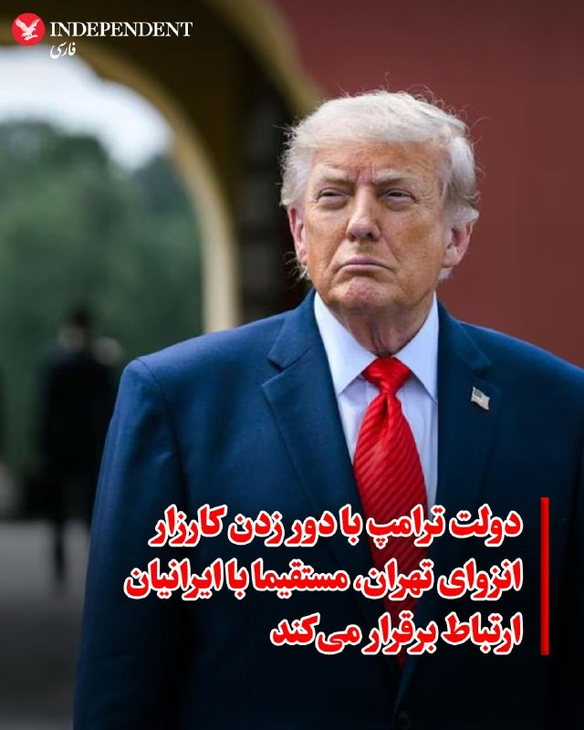

♦️وزارت امور خارجه ایالات متحده هم‌زمان با پیشبرد مذاکرات با تهران، با انتشار ویدئویی به زبان فارسی که به طور اختصاصی در اختیار «فاکس نیوز دیجیتال» قرار گرفته، مستقیما مردم ایران را خطاب قرار داده است. این ویدیو قرار است روز پنج‌شنبه از شبکه‌های تلویزیونی فارسی‌زبان خارج از کشور پخش شود.

در این پیام با تاکید بر اینکه «مشکل، مردم ایران نیستند، بلکه مشکل اصلی، رهبریِ هراسان از شفافیت است»، بر مفاهیمی چون آزادی، ثبات و حق تعیین سرنوشت تاکید شده است. تامی پیگات، سخنگوی وزارت خارجه آمریکا، در این باره گفت: «مخالفت ما هرگز با مردم نبوده، بلکه با رژیمی است که تامین مالی ترور را بر رفاه شهروندانش ترجیح می‌دهد. ما می‌خواهیم شفاف کنیم که آمریکا در کنار مردم ایران ایستاده است.»

این اقدام بی‌سابقه هم‌زمان با وصل مجدد اینترنت در ایران پس از ۸۸ روز قطع کامل که در جریان اعتراضات و جنگ آغاز شده بود، صورت می‌گیرد. هرچند برخی مخالفان این پیام را نمادین می‌دانند و خواهان اقدامات عملی‌تر واشنگتن هستند، اما این ویدیو بر پتانسیل نسل جوان ایران برای ساختن آینده‌ای شکوفا بدون ترس و ارعاب تاکید دارد.
‌🇸🇦 Indypersian

🤖 @VahidOOnLine

## mwarmonitor — post 10176

🔴ترکیه در حال تلاش برای اتصال خطوط لوله سوخت زیرزمینی به‌عنوان بخشی از یک طرح توسعه زیرساختی ۲۸ میلیارد دلاری ناتو است تا امنیت سوخت این ائتلاف را تقویت کند، به گفته منابع. بلومبرگ

@mwarmonitor

## iaghapour — post 2657

  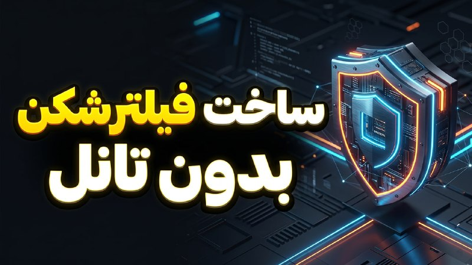

⭕️ آموزش ساخت فیلترشکن بدون تانل و بررسی روش های موجود

🔹خیلی‌ها فکر می‌کنن برای داشتن یک فیلترشکن شخصی حتماً باید درگیر دردسرهای تانل زدن بشن، اما تو این ویدیو تمام روش‌های موجود رو بررسی کردیم و بهتون آموزش دادم چطور بدون نیاز به تانل، یک فیلترشکن پرسرعت بسازید.

👇در این ویدیو به چه مواردی اشاره شد:
— چرا تمام روش ها منتشر نمیشه؟
— چه روش هایی در شرایط سخت کار میکنه؟
— آموزش روش مستقیم ساخت فیلترشکن.

🔗 تماشا ویدیو در یوتیوب

#آموزش #فیلترشکن #ملی #vpn
برای دور زدن فیلترینگ و آموزش تکنولوژی و هوش مصنوعی ما رو دنبال کنید 💚
🆔@iaghapour

## VahidOnline — post 75945

  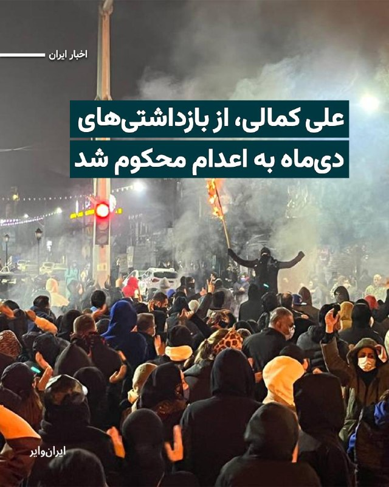

علی کمالی، از بازداشت‌شدگان اعتراضات دی‌ماه ۱۴۰۴، توسط شعبه ۲۶ دادگاه انقلاب تهران به اتهام «محاربه» به اعدام محکوم شده‌است.

رسانه‌ حقوق بشری هرانابا اعلام محکومیت علی کمالی به اعدام، نوشت این حکم در حال حاضر در دیوان عالی کشور تحت بررسی قرار دارد.

به‌گفته هرانا شعبه ۲۶ به ریاست ایمان افشاری در اواسط اردیبهشت سال جاری حکم را صادر کرد. کمالی که دارای اقامت مالزی است، ۲۲ دی‌ماه ۱۴۰۴ در تهران بازداشت
شد و اکنون در زندان تهران بزرگ نگهداری می‌شود.
@VahidHeadline

📡 @VahidOnline

## DW_Farsi — post 125539

  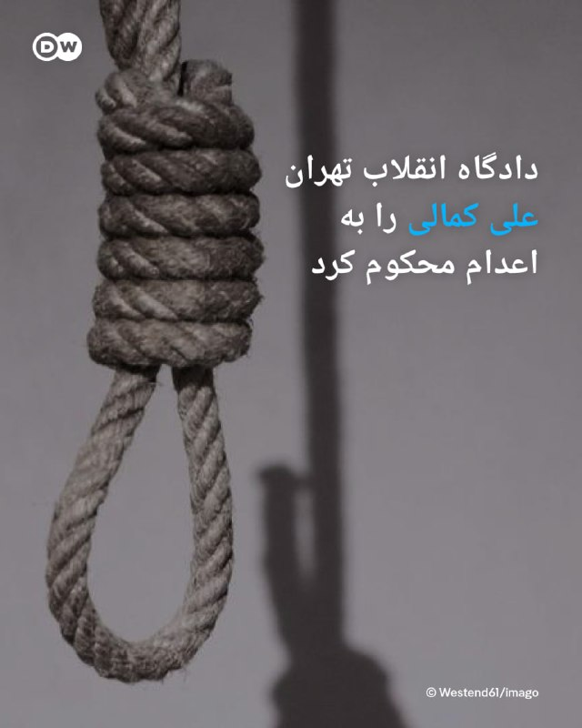

🔶 دادگاه انقلاب تهران علی کمالی را به اعدام محکوم کرد

خبرگزاری هرانا گزارش داد که علی کمالی، شهروند ایرانی مقیم مالزی که در جریان اعتراضات سراسری دی‌ماه ۱۴۰۴ در تهران بازداشت شده بود، از سوی دادگاه انقلاب به اتهام "محاربه" به اعدام محکوم شده است. پرونده این زندانی هم‌اکنون برای بررسی نهایی در دیوان عالی کشور به سر می‌برد.

به گزارش ارگان خبری مجموعه فعالان حقوق بشر در ایران (هرانا)، شعبه ۲۶ دادگاه انقلاب تهران به ریاست قاضی ایمان افشاری، در اواسط اردیبهشت‌ماه سال جاری حکم اعدام آقای کمالی را صادر کرده است.

بر اساس این گزارش علی کمالی که دارای اقامت کشور مالزی است، تنها چند روز پس از سفر به ایران و در تاریخ ۲۲ دی‌ماه ۱۴۰۴ همزمان با اعتراضات سراسری در تهران بازداشت شد. وی در حال حاضر در زندان تهران بزرگ نگهداری می‌شود.

تا لحظه تنظیم این گزارش جزئیات بیشتری درباره مصادیق اتهام "محاربه"، روند دسترسی وی به وکیل انتخابی و سایر جزئیات دادرسی منتشر نشده است و حکم صادر شده در دیوان عالی کشور در مرحله فرجام‌خواهی و بررسی قرار دارد.
@dw_farsi

## Persian_Trend_Official — post 15755

  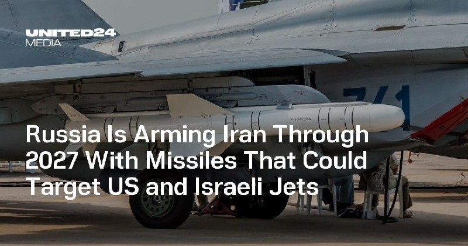

فاش شدن تسلیحات خریداری شده توسط ایران برای جنگنده‌های سوخو-35 سفارشی خود

خبرگزاری اوکراینی United24 اسنادی مربوط به جزئیات توافقات تهران و مسکو درمورد تامین و تجهیز جنگنده‌های سوخو-35 را نشان میدهد که نام چندین موشک هوا به هوا و هوا به سطح به چشم میخورد.

در ادامه بطور مختصر به شرح تجهیزات خریداری شده توسط نهاجا می‌پردازیم.

📝 Amir

📌 @persian_trend_official
پرشین ترند | متفاوت‌ترین کانال نظامی

## Hranews — post 113403

گزارشی از اجرای حکم اعدام ۲ زندانی از جمله یک زن در زندان‌های تبریز و گرگان

❗️
❗️
❗️
❗️
❗️– دو زندانی، از جمله یک زن جوان، در زندان‌های گرگان و تبریز اعدام شدند. یکی از آنان با اتهام قتل و دیگری با اتهامات مرتبط با جرائم مواد مخدر به اعدام محکوم شده بود.

#افسانه_زندآبادی #صابر_اکرمی

ادامه مطلب

↘️
@hranews_bot تماس ✉️ - @Hranews کانال هرانا 🆑

## alonews — post 125337

  <a href="telegram/content/alonews_125337_1780672376.webm" target="_blank">🎬 Download video</a>

👈شهر نیویورک در پنج ماه اول سال، کمترین تعداد قتل‌های گزارش شده را تاکنون ثبت کرده است، طبق داده‌های جدید پلیس نیویورک.

✅ @AloNews خبر جنگ

---
📅 بروزرسانی: 1405/03/15 18:33
---

## mwarmonitor — post 10175

🛑 یک پاسخ کلیدی به تمام سوالات شما: چرا جنگ قدرت‌ها آزادیبخش نیست؟ (حتماً مطالعه کنید)

📝 تحلیل استراتژیک: رمزگشایی از شطرنج قدرت‌

🔰زمانی که غرش جنگ طنین‌انداز شد، بمباران دژهای نظامی و حذف سران ارشد نظام از شخص خامنه‌ای تا فرماندهان اول، جرقه‌ای از امید و خرسندی را در دل‌های خسته از استبداد روشن کرد؛ شعله‌ای که با زمزمه‌های آتش‌بس و سایه مذاکرات، گویی رو به خاموشی رفت. اما در پس این گرد و غبار، حقیقتی سخت و عریان نهفته است که باید شجاعانه با آن روبرو شد. واقعیت راهبردی این است که دونالد ترامپ هرگز برای تحقق رویای آزادی و تغییر رژیم — که خواست برحق شماست — قدم به این میدان نگذاشته است. تمام آن واژه‌های پرطمطراق در شبکه‌های اجتماعی و ژست‌های حمایت از انقلاب مردمی، تنها آرایه‌ای دیپلماتیک برای جلب توجه و مشروعیت‌بخشی به ماشین جنگی آمریکا بود. استراتژی واقعی واشنگتن، نه آزادی ایران، بلکه پیاده‌سازی «مدل ونزوئلا» است؛ مدلی مبتنی بر فرسایش، مهار و به زانو درآوردن نظام، بی‌آنکه ساختار آن فرو بپاشد.

📌در این سوی میدان، اسرائیل استراتژی متفاوتی را رقم زد؛ طرحی که هدف نهایی‌اش درهم‌شکستن کامل ساختار رژیم بود. عملیات کوبنده علیه ایست‌های بازرسی و پایگاه‌های سرکوب شروع شد، تنها پیش‌درآمدی بر یک طوفان بزرگتر بود. اسناد دیپلماتیک و اطلاعاتی که از رساندن سلاح توسط موساد به مبارزان کُرد و هدایت عملیات پیچیده از چندین کشور پرده برداشت، گواه یک برنامه جامع برای فعال‌سازی گسل‌های قیام و اعلام فراخوان نهایی فروپاشی بود. اما زنجیرهای ژئوپلیتیک، تل‌آویو را به هماهنگی با واشنگتن زنجیر کرده است. ترامپ با هراس از تکرار کابوس عراق و سوریه و با بهانه جلوه دادن خطر کشتار مردم توسط رژیم، ترمز این طرح جامع را کشید؛ تصمیمی که به یک مشاجره لفظی بی‌سابقه و تنش شدید میان او و مقامات اسرائیلی انجامید. ترامپ از فروپاشی می‌ترسد و هرگز بار تغییر رژیم را به دوش نخواهد کشید.

🔸این یک واقعیت تلخ، اما بیدارکننده است: هر درگیری دیگری ، از دیدگاه کاخ سفید تنها ابزاری است برای تسلیم کردن و رام ساختن جمهوری اسلامی، نه نابودی آن. عالی‌ترین سقف پرواز واشنگتن، روی کار آمدن مهره‌ای دست‌آموز و گوش‌به‌فرمان در همان ساختار پوسیده ونزوئلایی است. سیاست بین‌الملل، بازار معامله قدرت‌هاست و هیچ بیگانه‌ای آزادی را در سینی طلایی به ما هدیه نخواهد داد. این فرجام، یک پیام تاریخی و حماسی برای ما دارد: چشم دوختن به دستان قدرت‌های خارجی، سرابی بیش نیست. کلید فتح و سرنگونی این فرعون، تنها و تنها در دستان توانمند و اراده پولادین خود مردم است. این بار سنگین را هیچ ارتشی بر دوش نخواهد کشید؛ این خاک را خود ملت، با تکیه بر زنجیرهای از هم گسیخته‌اش، آزاد خواهد کرد.

@mwarmonitor

## FoxNewsTwitter — post 342650

  <a href="telegram/content/FoxNewsTwitter_342650_1780671801.mp4" target="_blank">🎬 Download video</a>

Fox News (Twitter/X)

A routine traffic stop spiraled into chaos when a handcuffed suspect slipped his restraints and commandeered a Dallas police cruiser with an officer in the back seat.

Officers initially stopped the car to further restrain the 37-year-old Stacey Huffman after he removed his seatbelt and tried to open the locked rear door.

Bodycam video shows once the officers stepped out of the vehicle, Huffman climbed into the driver’s seat and sped away.

The suspect eventually bailed out of the car after being tased, jumping from the vehicle while still traveling around 50 mph.

Authorities say Huffman had already been arrested before turning the police SUV into a getaway car, and he now faces a new slew of charges.

## FoxNewsTwitter — post 342649

‌Fox News (Twitter/X)

Will Sydney Sweeney and Scooter Braun be engaged this year?

Our sponsor Kalshi’s prediction market currently puts the chance at 20%.

https://www.foxnews.com/entertainment/sydney-sweeney-scooter-braun-take-red-hot-romance-streets-new-york

## FarsiVOA — post 219671

🔺اعتصاب غذای دانشجویان پزشکی دانشگاه بوشهر؛ التهاب در دانشگاه‌ها ادامه دارد

▪️خبرنامه امیرکبیر گزارش داد که دانشجویان دانشگاه علوم پزشکی بوشهر در اعتراض به کیفیت بد غذای سلف، از روز چهارشنبه ۱۳ خرداد اعتصاب غذا کرده‌اند. به گزارش این خبرنامه که رخدادهای دانشگاه‌های ایران را پوشش می‌دهد اعلام کرد دانشجویان معترض، نسبت به کیفیت پایین غذا، تنوع محدود وعده‌های غذایی، مشکلات بهداشتی و بی‌توجهی مسئولان به سلامت دانشجویان، اعتراض دارند.

⬇️ بیشتر بخوانید:

https://ir.voanews.com/a/iran-bushehr-university-protest/8157672.html/?nocach=1

## Dirty_Kids — post 391060

  <a href="telegram/content/Dirty_Kids_391060_1780671803.mp4" target="_blank">🎬 Download video</a>

دوست و یار سعید طوسی هم بودی پس😁
پس بگو چرا برگشتی 👈🏽🍑

@Dirty_Kids 👻

## Dirty_Kids — post 391059

  

امیرحسین ثابتی، نماینده مجلس:
آمریکا بعد از جام جهانی، سنگین‌تر و با شدت بیشتر به ایران حمله میکنه؛ اونا، ایران رو تبدیل به غزه دوم میکنن.

نباید بگیم، اگه اونا حمله کردن ما هم حمله میکنیم، بلکه باید طوری باشه که حتی اگه فقط لفظشو بیان، ما بهشون حمله کنیم – تا اینطوری دیگه طرف مقابل جرئت نکنه همچین حرفی بزنه.
ما باید با یه حمله پیش‌دستانه، پتروشیمی‌ها و زیرساخت‌های منطقه رو بزنیم.

@Dirty_Kids 👻

## Dirty_Kids — post 391058

  

🔴 متن کامل بیانیه کاخ سفید:

«استیون ویتکوف، فرستاده ویژه ریاست جمهوری ایالات متحده، به همراه آنا اسکروگیما، سفیر ایالات متحده در عمان، امروز در مسقط با دکتر عباس عراقچی، وزیر امور خارجه ایران، که میزبان آن سید بدر البوسعیدی، وزیر امور خارجه عمان بود، گفتگو کردند.

گفتگوها بسیار مثبت و سازنده بود و ایالات متحده عمیقاً از سلطنت عمان به خاطر حمایتش از این ابتکار تشکر می‌کند.

فرستاده ویژه ویتکوف به دکتر عراقچی تأکید کرد که از رئیس جمهور ترامپ دستور دارد تا در صورت امکان، اختلافات دو ملت را از طریق گفتگو و دیپلماسی حل کند. این مسائل بسیار پیچیده هستند و ارتباط مستقیم فرستاده ویژه ویتکوف امروز گامی به جلو در دستیابی به نتیجه‌ای سودمند برای هر دو طرف بود. طرفین توافق کردند که شنبه آینده دوباره ملاقات کنند.»

@Dirty_Kids 👻

## alonews — post 125336

  <a href="telegram/content/alonews_125336_1780671806.mp4" target="_blank">🎬 Download video</a>

👈میدون انقلاب چند روز دیگه

#قیصر

✅ @AloNews خبر جنگ

## alonews — post 125335

  <a href="telegram/content/alonews_125335_1780671807.webm" target="_blank">🎬 Download video</a>

👈شجاع خلیل زاده: امیدواریم فدراسیون پاداش بهتری از دور قبل به بچه‌ها بده

🔴پ.ن: سری قبل حواله خودرو ۱۰۰میلیاردی گرفت

✅ @AloNews خبر جنگ

---
📅 بروزرسانی: 1405/03/15 18:24
---

## VahidOOnLine — post 243807

  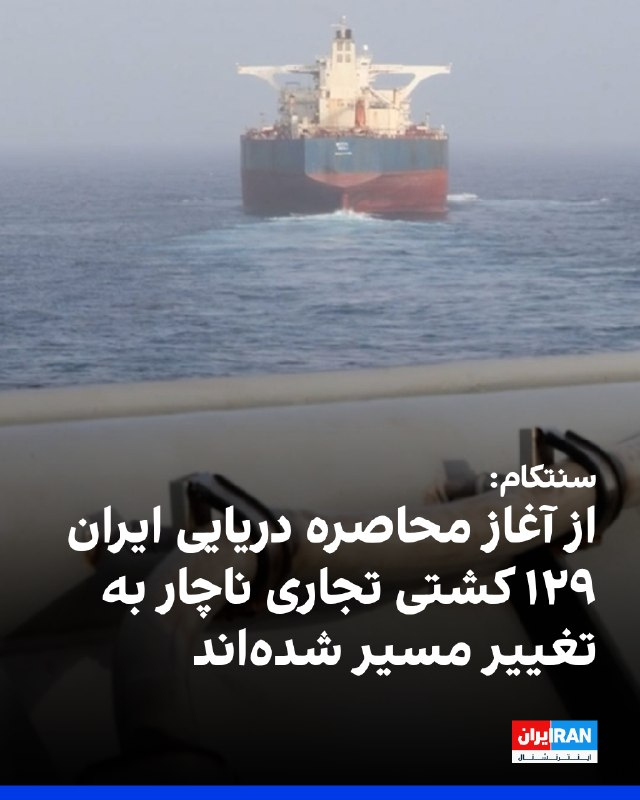

فرماندهی مرکزی آمریکا، سنتکام اعلام کرد که از زمان آغاز محاصره دریایی ایران تاکنون، ۱۲۹ کشتی تجاری ناچار به تغییر مسیر شده‌اند.

بر اساس این گزارش، شش کشتی هم توسط نیروهای آمریکایی از کار انداخته شده‌اند.
‌🏁 🇬🇧 IranintlTV

🤖 @VahidOOnLine

## pm_afshaa — post 92315

  <a href="telegram/content/pm_afshaa_92315_1780671251.webm" target="_blank">🎬 Download video</a>

🔴گروسی به الجزیره: فرض ما اینه که اورانیوم و مواد هسته‌ای ایران همچنان در همان مکان‌هایی است که در آغاز حملات بود و ایران هم این موضوع رو تأیید کرده.

💧 Rainbet.com the #1 Non-KYC Crypto Casino & Sportsbook @rainbetcom

😁 @Pm_Afshaa

## pm_afshaa — post 92314

  <a href="telegram/content/pm_afshaa_92314_1780671252.webm" target="_blank">🎬 Download video</a>

🔴خبر و بیانیه کاخ سفید که از دیدار عراقچی و ویتکاف درحال پخش شدنه قدیمیه و برای تاریخ 13 آوریل است.

💧 Rainbet.com the #1 Non-KYC Crypto Casino & Sportsbook @rainbetcom

😁 @Pm_Afshaa

## pm_afshaa — post 92313

  <a href="telegram/content/pm_afshaa_92313_1780671253.webm" target="_blank">🎬 Download video</a>

🔴العربیه: آمریکا نفتکش‌های عراق رو به اتهام پرداخت عوارض تنگه هرمز متوقف کرد.

💧 Rainbet.com the #1 Non-KYC Crypto Casino & Sportsbook @rainbetcom

😁 @Pm_Afshaa

## DEJradio — post 5354

  <a href="telegram/content/DEJradio_5354_1780671254.webm" target="_blank">🎬 Download video</a>

🔺📢 رافائل گروسی، مدیرکل آژانس بین‌المللی انرژی اتمی، روز جمعه ۱۵ خرداد اعلام کرد که دسترسی بازرسان آژانس به تأسیسات هسته‌ای جمهوری اسلامی همچنان محدود است و تهران در تعیین محل‌های بازرسی نقش تعیین‌کننده دارد.

گروسی در یک نشست خبری گفت که پس از جنگ ۱۲ روزه و همچنین رخدادهای نظامی اخیر، تلاش‌های متعددی برای ازسرگیری فعالیت‌های راستی‌آزمایی در ایران انجام شده است. به گفته او، جمهوری اسلامی متعهد به اطلاع‌رسانی و فراهم کردن دسترسی برای بازرسان است، اما شرایط جنگی مانع اجرای کامل این تعهدات شده بود.

مدیرکل آژانس افزود که با وجود برقراری آتش‌بس، آژانس تنها توانسته در برخی مراکز مورد تأیید تهران، از جمله نیروگاه هسته‌ای بوشهر و چند تأسیسات دیگر، فعالیت‌های نظارتی انجام دهد.

گروسی تأکید کرد که جمهوری اسلامی همچنان در عمل تعیین می‌کند بازرسان چه بخش‌هایی را ببینند و چه بخش‌هایی را نبینند. او در عین حال یادآور شد که تعهدات حقوقی ایران در قبال آژانس، صرف‌نظر از شرایط، پابرجاست و باید اجرا شود.

#جنگ #تأسیسات_اتمی
@DEJradio

## IranIntlTV — post 340676

  

فرماندهی مرکزی آمریکا، سنتکام اعلام کرد که از زمان آغاز محاصره دریایی ایران تاکنون، ۱۲۹ کشتی تجاری ناچار به تغییر مسیر شده‌اند.

بر اساس این گزارش، شش کشتی هم توسط نیروهای آمریکایی از کار انداخته شده‌اند.
https://iranintl.com/202606050647

## IranIntlTV — post 340675

  <a href="https://t.me/IranintlTV/340675" target="_blank">📎 Download file</a>

🎧نسخه صوتی اخبار نیم‌روزی | جمعه ۱۵ خرداد
@iranintlTV

## DW_Farsi — post 125538

🔶 سی‌ان‌ان: اسرائیل از خاک آذربایجان علیه ایران استفاده کرد

شبکه سی‌ان‌ان در گزارشی اختصاصی به نقل از منابع آگاه گزارش داده است که اسرائیل در جریان جنگ با ایران ، به‌طور محرمانه نیروهای نظامی و اطلاعاتی خود را در جمهوری آذربایجان مستقر کرده بود؛ اقدامی که بخشی از شبکه‌ای گسترده از پایگاه‌ها و موقعیت‌های مخفی در خاورمیانه برای پشتیبانی از عملیات علیه ایران به شمار می‌رفت.

بر اساس این گزارش، نیروهای اسرائیلی در چند نقطه در جنوب جمهوری آذربایجان، در نزدیکی مرز ایران، فعالیت می‌کردند.
@dw_farsi

## BBCPersian — post 282921

🔻آلمان از شهروندانش خواست به بحرین و کویت سفر نکنند

آلمان به شهروندانش درباره سفر به بحرین و کویت هشدار داد.

وزارت خارجه آلمان به اتباع این کشور توصیه کرده به‌ ویژه از سفر به بحرین خودداری کنند.

وزارت خارجه آلمان اعلام کرده است که وضعیت امنیتی در منطقه همچنان «بسیار ناپایدار» است.

این کشور گفته است «بدتر شدن وضعیت امنیتی، از جمله اعمال محدودیت‌های قابل‌توجه در پروازهای هوایی، منتفی نیست.»

اواسط هفته جاری، ایران اهدافی در بحرین و کویت را هدف حملات موشکی و پهپادی قرار داد و اعلام کرد که این حملات را به تلافی حمله آمریکا به یک مرکز مخابراتی در جزیره قشم انجام داده است.

https://bbc.in/4oavX8B
@BBCPersian

## BBCPersian — post 282920

🔻واکنش نماینده مجلس به طرح استیضاح وزیر ارتباطات به دلیل بازگشت اینترنت: مخالفان اتصال اینترنت در مورد مذاکره هم همین نگاه را دارند

یک عضو کمیسیون صنایع و معادن مجلس شورای اسلامی در واکنش به مطرح شدن طرح استیضاح وزیر ارتباطات به دلیل بازگشت اینترنت بین‌الملل، گفته است که «وزیر ارتباطات در این موضوع از حقوق مردم دفاع کرده و در چارچوب دستور رئیس‌جمهور عمل کرده است.»

مصطفی پوردهقان در گفت‌وگو با ایلنا با اشاره به طرح استیضاح برخی نمایندگان علیه وزیر ارتباطات، گفت: «افرادی که چنین موضوعی را مطرح می‌کنند نماینده طیفی اقلیت هستند که در موضوعاتی مانند عدم مذاکره، عدم ارتباطات بین‌المللی و محدودیت اینترنت دیدگاه‌های خاصی دارند و در برابر هرگونه اصلاح و گشایش موضع مخالفت اتخاذ می‌کنند.»

این نماینده مجلس همچنین گفت که هنوز وضعیت اینترنت به شرایط کاملاً عادی و مطلوب نرسیده است و بازگشت فعلی به معنای رسیدن به وضعیت ایده‌آل نیست.

به گفته او هنوز موضوعاتی مانند «دسترسی به یوتیوب و برخی اپلیکیشن‌های مورد نیاز مردم در دستور پیگیری قرار دارد.»

باز شدن اینترنت در ایران با مخالفت‌هایی در میان تعدادی از نمایندگان مجلس همراه بوده است.

از جمله، احمد راستینه، نماینده شهر کرد در گفت‌وگویی با تلویزیون جمهوری اسلامی که وبسایت انتخاب نیز آن را منتشر کرده، گفته است که وزیر ارتباطات خلاف قانون عمل کرده است.

او گفته است «اگر جلسات مجلس به صورت حضوری شکل می‌گرفت، وزیر ارتباطات نمی‌توانست دستور دسترسی به اینترنت بین‌الملل را ابلاغ کند.»

https://bbc.in/4oavX8B
@BBCPersian

## Hranews — post 113402

  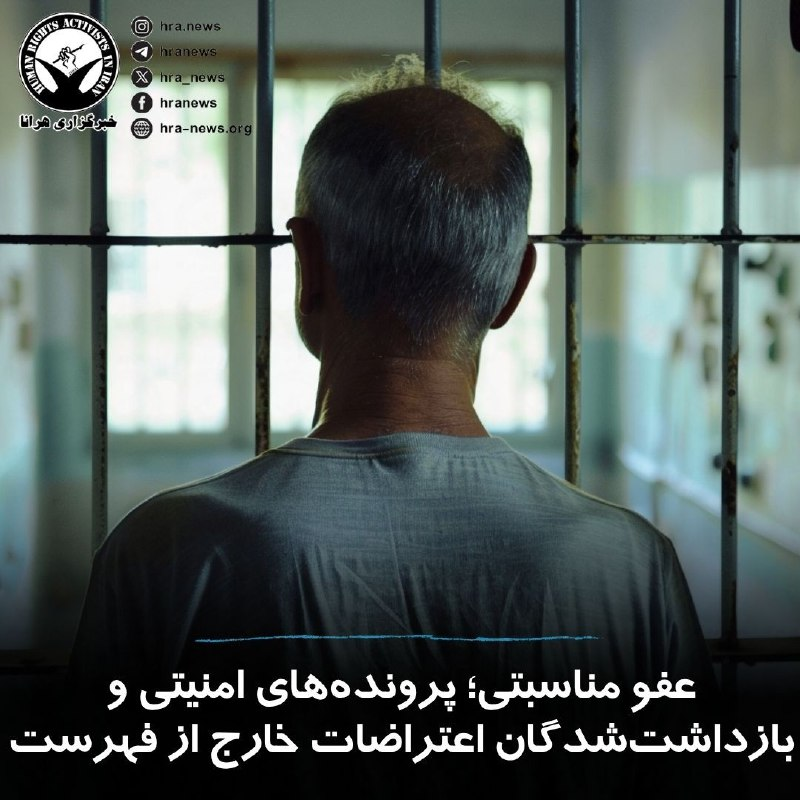

مجتبی خامنه‌ای، رهبر جمهوری اسلامی، با درخواست قوه قضائیه برای «عفو» مناسبتی حدود دو هزار زندانی موافقت کرده است. با این حال، علی مظفری، معاون قوه قضائیه، اعلام کرده است: «محکومان جرایم امنیتی، جاسوسی، اقدام علیه امنیت داخلی و خارجی کشور و افرادی که امنیت عمومی جامعه را تهدید کرده‌اند، به هیچ عنوان مشمول عفو نخواهند شد.»

این در حالی است که بخش زیادی از بازداشت‌شدگان اعتراضات دی ماه ۱۴۰۴ در پرونده‌های خود با اتهامات امنیتی مواجه شده‌اند. از سوی دیگر، بسیاری از بازداشت‌شدگان این اعتراضات که پرونده آنها هنوز در مرحله رسیدگی قرار دارد و حکم قطعی نگرفته‌اند، اساساً در زمره «محکومان» قرار نمی‌گیرند و از این رو مشمول چنین عفوهایی نمی‌شوند.

↘️
@hranews_bot تماس ✉️ - @Hranews کانال هرانا 🆑

## alonews — post 125334

  <a href="telegram/content/alonews_125334_1780671256.webm" target="_blank">🎬 Download video</a>

👈حملات به لبنان ادامه دارد

✅ @AloNews خبر جنگ

## alonews — post 125333

  <a href="telegram/content/alonews_125333_1780671257.webm" target="_blank">🎬 Download video</a>

👈بیت کوین به 60هزار دلار رسید

✅ @AloNews خبر جنگ

---
📅 بروزرسانی: 1405/03/15 18:13
---

## VahidOOnLine — post 243806

  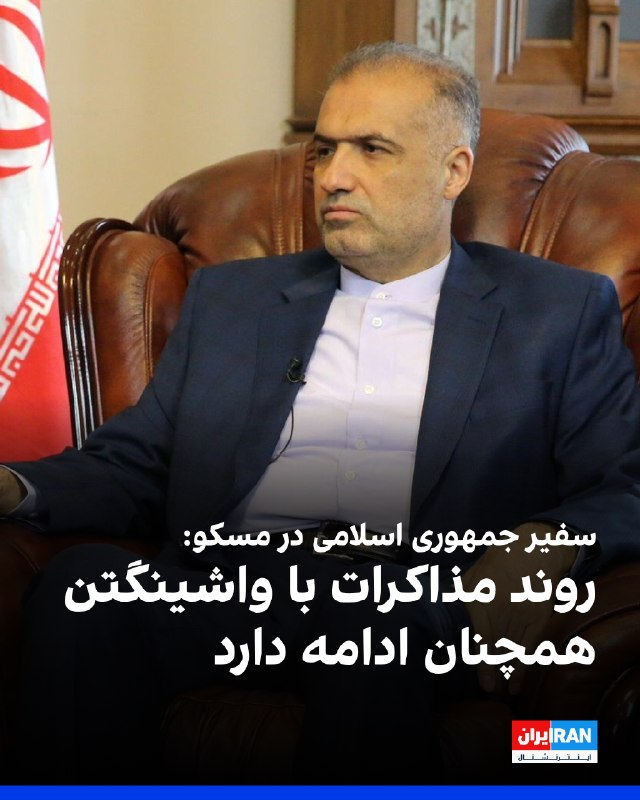

کاظم جلالی، سفیر جمهوری اسلامی در مسکو، در حاشیه مجمع اقتصادی سن‌پترزبورگ به خبرگزاری تاس گفت روند مذاکرات میان تهران و واشینگتن همچنان ادامه دارد.

او در پاسخ به سوالی در این باره گفت: «فکر می‌کنم بله، در حال انجام هستند.»

با این حال، این دیپلمات جمهوری اسلامی مشخص نکرد این گفت‌وگوها در چه مرحله‌ای قرار دارند.

جلالی افزود: «راستش را بخواهید، هنوز اطلاعاتی ندارم. هنوز خبری از این که در چه مرحله‌ای هستند وجود ندارد.»
‌🏁 🇬🇧 IranintlTV

🤖 @VahidOOnLine

## VahidOOnLine — post 243805

  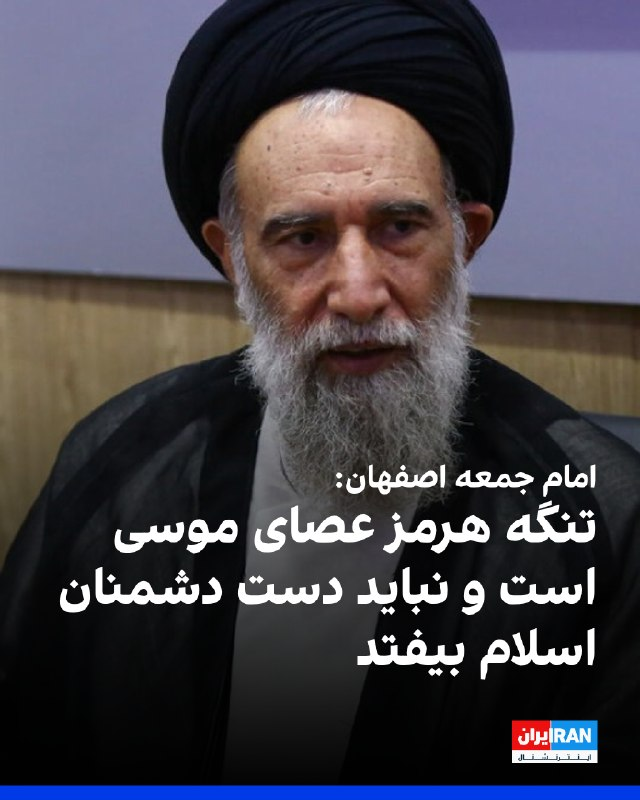

احمد محمودی، امام جمعه اصفهان، در خطبه‌های نماز جمعه این شهر گفت: «ساعت و تاریخ به عقب برنمی‌گردد. آمریکا از محاصره تنگه هرمز کاری نتوانسته از پیش ببرد و ما بارها گفتیم و باز هم تکرار می‌کنیم تنگه هرمز عصای موسی است، نباید این عصای موسی‌وار را به دست دشمنان اسلام داد.»

او ادامه داد: «دشمن می‌خواهد حزب‌الله لبنان را از جمهوری اسلامی جدا کند، اما انقلاب اسلامی در گفتار و عمل نشان داده که هرگز اجازه نمی‌دهد کسی چنین کاری کند و قرارگاه خاتم‌الانبیا به‌عنوان متولی جنگ، رسماا اعلام کرده که اگر اسرائیل دست به حمله به ضاحیه بیروت بزند، ما نیز به سمت اسرائیل شلیک خواهیم کرد.»

امام جمعه اصفهان افزود: «۴۴ سال از شکل‌گیری مقاومت می‌گذرد و همین روند ادامه دارد و ما کوتاه نخواهیم آمد.»
‌🏁 🇬🇧 IranintlTV

🤖 @VahidOOnLine

## VahidOOnLine — post 243804

♦️عباس عراقچی، وزیر امور خارجه جمهوری اسلامی، روز پنجشنبه ۱۴ خردادماه در گفتگو با شبکه المیادین اعلام کرد ایالات متحده باید درک واقع‌بینانه‌تری از وضعیت ایران داشته باشد و سیاست‌های خود را بر اساس «واقعیت یک جمهوری اسلامی قدرتمند» تنظیم کند.
او با اشاره به پیام دونالد ترامپ درباره دیدار با مجتبی خامنه‌ای گفت: «چنین پیامی را شخصا مشاهده نکردم، اما تصمیم‌گیری‌ها باید بر اساس واقعیت‌های موجود در صحنه بین‌المللی انجام شود.
عراقچی همچنین با اشاره به وضعیت رهبری در ایران، مدعی شد مجتبی خامنه‌ای «کنترل کامل» بر امور کشور دارد و به‌دلیل ملاحظات امنیتی، حضور عمومی او محدودتر شده است.
وزیر امور خارجه جمهوری اسلامی در پایان تأکید کرد تغییر رویکرد آمریکا و پذیرش جایگاه ایران در منطقه، می‌تواند مسیر تعاملات آینده را تحت تأثیر قرار دهد.
‌🇸🇦 Indypersian

🤖 @VahidOOnLine

## pm_afshaa — post 92312

  <a href="telegram/content/pm_afshaa_92312_1780670584.webm" target="_blank">🎬 Download video</a>

🔴رئیس جمهور لبنان خطاب به سپاه پاسداران: لبنان مال شما نیست که مدام دخالت می‌کنید، شیخ نعیم قاسم هم نماینده مردم لبنان نیست!

💧 Rainbet.com the #1 Non-KYC Crypto Casino & Sportsbook @rainbetcom

😁 @Pm_Afshaa

## IranIntlTV — post 340674

  <a href="telegram/content/IranIntlTV_340674_1780670585.mp4" target="_blank">🎬 Download video</a>

سرخط خبرهای جمعه ۱۵ خرداد
@iranintltv

## IranIntlTV — post 340673

  

کاظم جلالی، سفیر جمهوری اسلامی در مسکو، در حاشیه مجمع اقتصادی سن‌پترزبورگ به خبرگزاری تاس گفت روند مذاکرات میان تهران و واشینگتن همچنان ادامه دارد.

او در پاسخ به سوالی در این باره گفت: «فکر می‌کنم بله، در حال انجام هستند.»

با این حال، این دیپلمات جمهوری اسلامی مشخص نکرد این گفت‌وگوها در چه مرحله‌ای قرار دارند.

جلالی افزود: «راستش را بخواهید، هنوز اطلاعاتی ندارم. هنوز خبری از این که در چه مرحله‌ای هستند وجود ندارد.»
https://iranintl.com/202606051336

## IranIntlTV — post 340672

  <a href="telegram/content/IranIntlTV_340672_1780670588.mp4" target="_blank">🎬 Download video</a>

یک شهروند با ارسال ویدیویی به ایران اینترنشنال از گرانی کالاها و مواد غذایی روایت می‌کند و می‌پرسد مردم چه باید بخورند.

## IranIntlTV — post 340671

  

احمد محمودی، امام جمعه اصفهان، در خطبه‌های نماز جمعه این شهر گفت: «ساعت و تاریخ به عقب برنمی‌گردد. آمریکا از محاصره تنگه هرمز کاری نتوانسته از پیش ببرد و ما بارها گفتیم و باز هم تکرار می‌کنیم تنگه هرمز عصای موسی است، نباید این عصای موسی‌وار را به دست دشمنان اسلام داد.»

او ادامه داد: «دشمن می‌خواهد حزب‌الله لبنان را از جمهوری اسلامی جدا کند، اما انقلاب اسلامی در گفتار و عمل نشان داده که هرگز اجازه نمی‌دهد کسی چنین کاری کند و قرارگاه خاتم‌الانبیا به‌عنوان متولی جنگ، رسماا اعلام کرده که اگر اسرائیل دست به حمله به ضاحیه بیروت بزند، ما نیز به سمت اسرائیل شلیک خواهیم کرد.»

امام جمعه اصفهان افزود: «۴۴ سال از شکل‌گیری مقاومت می‌گذرد و همین روند ادامه دارد و ما کوتاه نخواهیم آمد.»
https://iranintl.com/202606051278

## FarsiVOA — post 219670

🔺جوزف عون خطاب به سران جمهوری اسلامی: لبنان کشور شما نیست

▪️رئیس‌ جمهوری لبنان با هرگونه مداخله رژیم ایران در امور داخلی لبنان قاطعانه مخالفت و آن را رد کرد.

⬇️ بیشتر بخوانید:

https://ir.voanews.com/a/lebanon-hezbollah-irgc-proxy-terorrism/8157663.html/?nocach=1

## FarsiVOA — post 219669

دختران بی‌حجاب و خواننده‌های «لس‌آنجلسی» در تجمعات شبانه حامیان حکومت؛ جمهوری اسلامی برای استفاده ابزاری از افراد تا کجا پیش خواهد رفت؟ گفت‌وگو با مهرداد درویش‌پور، جامعه‌شناس

## DW_Farsi — post 125537

  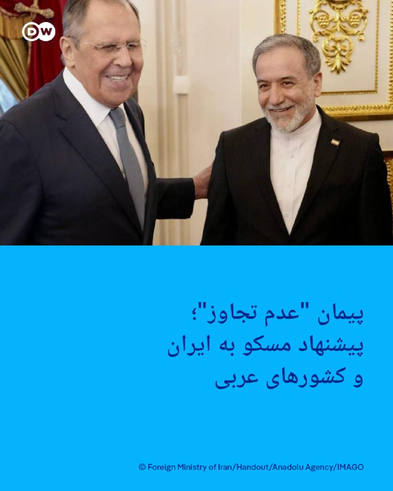

🔶 پیمان "عدم تجاوز"؛ پیشنهاد مسکو به ایران و کشورهای عربی

بر اساس گزارش خبرگزاری تاس، سرگئی لاوروف، وزیر امور خارجه روسیه در مصاحبه‌ای با شبکه "آرتی عربی" رویکرد مسکو را در قبال تنش‌زدایی در خاورمیانه تشریح کرد.

وزیر امور خارجه روسیه در این گفتگو اظهار داشت: «رویکرد ما در درجه نخست بر اصل عدم تجاوز استوار است. در حال حاضر، عربستان سعودی نیز درباره عدم تجاوز و احتمال امضای یک پیمان در این زمینه صحبت کرده است.»

لاوروف با بیان اینکه چنین پیمانی "به عنوان گام اول ضرری نخواهد داشت"، تاکید کرد که پس از آن باید اقدامات تکمیلی و عملی‌تری صورت گیرد.

به گفته وی این اقدامات شامل توافقاتی بر سر "شفافیت در فعالیت‌های نظامی، محدود کردن اقدامات نظامی، هماهنگی در آماده‌سازی برای مانورها و به طور کلی اقدامات اعتمادساز" خواهد بود.

روابط میان ایران و کشورهای عربی حاشیه خلیج فارس، به ویژه عربستان سعودی برای سال‌ها با تنش‌های ژئوپلیتیک، رقابت‌های منطقه‌ای و قطع روابط دیپلماتیک همراه بوده است.
@dw_farsi

## RadioFarda — post 157931

کافه فردا به وقت جام‌ جهانی ⚽️
ویژه برنامه فوتبالی کافه فردا، برنامه‌ای است که از روز پنجشنبه ۲۱ خرداد راس ساعت ۱۳:۰۵ به وقت ایران، به صورت زنده از رادیو فردا پخش می‌شود. در این برنامه با زبان و نگاهی متفاوت و طنزآمیز رویدادهای مربوط به جام جهانی را زیر ذره‌بین می‌بریم و تلاش می‌کنیم این جام‌ جهانی را به گوش‌های شما نزدیک‌تر کنیم.

## alonews — post 125332

  <a href="telegram/content/alonews_125332_1780670592.webm" target="_blank">🎬 Download video</a>

👈پلی مارکت:
صادرات نفت ایران به کمترین حد خودش در ۶ سال اخیر رسیده.

✅ @AloNews خبر جنگ

---
📅 بروزرسانی: 1405/03/15 18:02
---

## FoxNewsTwitter — post 342648

  <a href="telegram/content/FoxNewsTwitter_342648_1780669968.mp4" target="_blank">🎬 Download video</a>

Fox News (Twitter/X)

California is still counting millions of ballots, with Los Angeles County reporting another 81,000 votes processed since election night and nearly 688,000 still to go, as recent mail-in ballots have favored Democrats and tightened several key races.

Statewide, about 3.6 million ballots remain to be counted as officials continue verifying signatures and processing ballots postmarked by Election Day, @MattFinnFNC reports.

## pm_afshaa — post 92311

  <a href="telegram/content/pm_afshaa_92311_1780669970.webm" target="_blank">🎬 Download video</a>

🔴آژانس بین المللی انرژی اتمی: از وضعیت ذخایر اورانیوم در ایران اگاهی کامل نداریم.

ایران تنها کشور غیرهسته‌ای است که اورانیوم غنی‌شده تا 60 درصد رو انباشته کرده.

💧 Rainbet.com the #1 Non-KYC Crypto Casino & Sportsbook @rainbetcom

😁 @Pm_Afshaa

## Shin_Persian — post 6521

  

↩️ Quoted tweet: U.S. Central Command ✓ @CENTCOM Fri, 05 Jun 2026 14:25:59 UTC USS Tripoli (LHA 7) transits the Arabian Sea as the amphibious assault ship supports the ongoing U.S. blockade against Iran. U.S. forces have redirected 129 commercial vessels…

## Shin_Persian — post 6520

  

↩️ Quoted tweet:
U.S. Central Command ✓ @CENTCOM
Fri, 05 Jun 2026 14:25:59 UTC

USS Tripoli (LHA 7) transits the Arabian Sea as the amphibious assault ship supports the ongoing U.S. blockade against Iran. U.S. forces have redirected 129 commercial vessels and disabled 6 to ensure compliance.

↩️ توییت نقل‌قول شده — برای پاسخ، پست زیر را ببینید.

فارسی

ناو یو‌اس‌اس تریپولی (LHA 7) در حال عبور از دریای عرب است، در حالی که این کشتی تهاجمی آبی-خاکی از محاصره جاری ایالات متحده علیه ایران حمایت می‌کند. نیروهای ایالات متحده برای اطمینان از پایبندی، ۱۲۹ کشتی تجاری را تغییر مسیر داده و ۶ فروند را متوقف کرده‌اند.

𝕏 · @shin_persian

## RadioFarda — post 157930

🔸جوزف عون، رئیس‌جمهور لبنان، در مصاحبه‌ای که روز جمعه منتشر شد، از ایران خواست در امور لبنان دخالت نکند. او همچنین به گروه حزب‌الله، متحد مورد حمایت تهران، گفت که تنها راه‌حل درگیری با اسرائیل، دیپلماسی است. 🔸او در این گفت‌وگو با شبکه خبری سی‌ان‌ان خطاب به…

## RadioFarda — post 157929

  

🔸جوزف عون، رئیس‌جمهور لبنان، در مصاحبه‌ای که روز جمعه منتشر شد، از ایران خواست در امور لبنان دخالت نکند. او همچنین به گروه حزب‌الله، متحد مورد حمایت تهران، گفت که تنها راه‌حل درگیری با اسرائیل، دیپلماسی است.

🔸او در این گفت‌وگو با شبکه خبری سی‌ان‌ان خطاب به ایران گفت: «این کشور شما نیست، کشورِ ماست... دخالت در کشور ما وظیفه شما نیست.»

🔸آقای عون افزود: «آنها از لبنان به‌عنوان یک اهرم چانه‌زنی در مذاکرات خود با ایالات متحده استفاده می‌کنند. این غیرقابل قبول است.»

🔸رئیس‌جمهور لبنان همچنین گفت: «حزب‌الله باید درک کند که هیچ راهی جز نشستن و گفت‌وگو وجود ندارد؛ هیچ راه دیگری برای حل این مشکل و نجات آنچه باقی مانده است، جز از طریق مذاکره و دیپلماسی وجود ندارد.»

🔸حزب‌الله از سوی آمریکا به عنوان سازمان تروریستی شناخته می‌شود اما اتحادیه اروپا تنها شاخه نظامی آن را تروریستی می‌داند.

@RadioFarda

## alonews — post 125331

هر گیگ فقط 2هزار تومن
😳 
😳هنوز داری گیگی 10...15 تومن میخری ، وقتی اینترنت کامل درست شده
😱چون داری از واسطه تهیه میکنی 
😍تخفیف ویژه فقط گیگی 2t با لینک ساب 
🌟با ضمانت و بهترین سرعت و کیفیت 
☑️نامحدود واقعی فقط 290t ⌛️برای 200 نفر اول این تخفیف اعمال میشه…

## alonews — post 125330

  

هر گیگ فقط 2هزار تومن
😳

😳هنوز داری گیگی 10...15 تومن میخری ، وقتی اینترنت کامل درست شده
😱چون داری از واسطه تهیه میکنی

😍تخفیف ویژه فقط گیگی 2t
با لینک ساب

🌟با ضمانت و بهترین سرعت و کیفیت

☑️نامحدود واقعی فقط 290t

⌛️برای 200 نفر اول این تخفیف اعمال میشه ، سریع اقدام کنید که دیگه قرار نیست هزینه زیاد بابت وی پی ان بدید
👇
👇
@tvpnshop_bot
@tvpnshop_bot

## alonews — post 125329

  <a href="telegram/content/alonews_125329_1780669973.webm" target="_blank">🎬 Download video</a>

👈ردیابی دریایی کپلر : چهار نفتکش با پرچم ایران دوشنبه از تنگه هرمز عبور کردن

✅ @AloNews خبر جنگ

---
📅 بروزرسانی: 1405/03/15 17:52
---

## VahidOOnLine — post 243803

  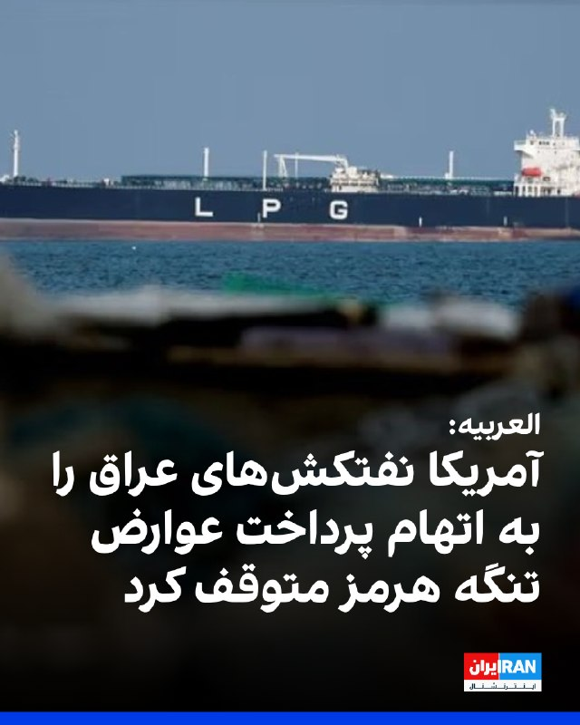

العربیه به نقل از منابع خود گزارش داد آمریکا عبور نفتکش‌های حامل نفت عراق از تنگه هرمز را به دلیل ادعای پرداخت عوارض به تهران متوقف کرده است.

بر اساس این گزارش، دولت عراق به آمریکا اعلام کرده که هیچ‌گونه هزینه یا عوارضی برای عبور نفتکش‌ها به تهران پرداخت نکرده است.
‌🏁 🇬🇧 IranintlTV

🤖 @VahidOOnLine

## WithYashar — post 13556

سنتکام:
ادعای نادرست: ایران ادعا میکنه که به سمت کشتی‌های جنگی ایالات متحده در خلیج عمان تیر هشدار شلیک کرده و کشتی‌های آمریکایی رو مجبور به «عقب‌نشینی» به سمت اقیانوس هند کرده.

حقیقت: نیروهای ایرانی به کشتی‌های جنگی نیروی دریایی ایالات متحده حمله نکرده یا به سمت آنها شلیک نکردن. انجام این کار نقض فاحش آتش‌بس خواهد بود. نیروهای آمریکایی همچنان آزادانه در آب‌های منطقه‌ای فعالیت می‌کنند و در عین حال محاصره مداوم علیه ایران رو به طور کامل اجرا می‌کنند.
@withyashar

## IranIntlTV — post 340670

  

العربیه به نقل از منابع خود گزارش داد آمریکا عبور نفتکش‌های حامل نفت عراق از تنگه هرمز را به دلیل ادعای پرداخت عوارض به تهران متوقف کرده است.

بر اساس این گزارش، دولت عراق به آمریکا اعلام کرده که هیچ‌گونه هزینه یا عوارضی برای عبور نفتکش‌ها به تهران پرداخت نکرده است.
https://iranintl.com/202606052286

## FarsiVOA — post 219668

اجلاس رهبران اتحادیه اروپا در مونته‌نگرو با محوریت عضویت بالکان غربی به اتحادیه اروپا

## DW_Farsi — post 125529

🔶 محل تجمع چربی در بدن با سرعت پیری مغز مرتبط است

بر اساس مطالعه جدیدی که در نشریه علمی "Nature Mental Health" منتشر شده است، محل توزیع چربی در سراسر بدن و نه صرفا مقدار کل آن، به طور مستقل و چشمگیری بر ساختار مغز، عملکرد آن و مهارتهای شناختی در افراد میانسال و سالمند تأثیر می‌گذارد.

چربی‌های ذخیره‌شده در نواحی مختلف آناتومیک، از نظر بیولوژیکی رفتارهای کاملا متفاوتی دارند؛ چربی احشایی (چربی دور اندام‌های داخلی شکم) مواد شیمیایی التهابی ترشح می‌کند که با التهاب و تخریب سلول‌های عصبی مرتبط هستند، در حالی که چربی اندام‌ها (دست و پا) در برخی زمینه‌ها حتی ممکن است نقش محافظتی داشته باشند.

با وجود این شناخت نوظهور، بخش عمده‌ای از تحقیقات پیشین درباره چاقی و سلامت مغز صرفا بر BMI تکیه داشتند و تأثیرات مجزای هر یک از ذخایر چربی بر پیری مغز و زوال شناختی تا حد زیادی ناشناخته باقی مانده بود.
@dw_farsi

## IranianMinds — post 21428

  <a href="telegram/content/IranianMinds_21428_1780669371.mp4" target="_blank">🎬 Download video</a>

🔴میخواد با همین لباس بره توی دولت و همه مشکلات معیشتی مردم ایران را حل کنه، یکمی هم پزشکیان بهش کمک کنه😂😂😂

@IranianMinds

## BBCPersian — post 282919

  <a href="https://t.me/bbcpersian/282919" target="_blank">📎 Download file</a>

📎 Document

## alonews — post 125328

  <a href="telegram/content/alonews_125328_1780669373.webm" target="_blank">🎬 Download video</a>

👈بازگشت به بازرسی از سایت های هسته ای ایران، شرطی غیرقابل چشم پوشی پیش از هر توافقی است

🔴مدیرکل آژانس بین المللی انرژی اتمی به الجزیره: بیش از ۸ ماه است که نتوانسته ایم موجودی اعلام شده ایران از اورانیوم را راستی آزمایی کنیم.

🔴فرض ما بر این است که مواد هسته ای ایران هنوز در همان مکانهایی هستند که در زمان آغاز حملات بودند و تهران نیز این موضوع را تأیید کرده است.

✅ @AloNews خبر جنگ

---
📅 بروزرسانی: 1405/03/15 17:43
---

## mwarmonitor — post 10174

📝 سوالی دارید دایرکت جواب میدم ...

## IranIntlTV — post 340669

  <a href="telegram/content/IranIntlTV_340669_1780668783.mp4" target="_blank">🎬 Download video</a>

هیات منصفه دادگاه سلطنتی وولویچ در لندن اعلام کرد دو متهم پرونده حمله به پوریا زراعتی، مجری ایران‌اینترنشنال، به اتفاق آرا مجرم شناخته شدند. بر اساس رای صادرشده، نخستین جرم این دو متهم، ایراد جراحت عمدی با قصد وارد کردن صدمه شدید جسمی به پوریا زراعتی است.

علی رشید، خبرنگار ایران‌اینترنشنال، گزارش می‌دهد
@iranintltv

## IranIntlTV — post 340668

  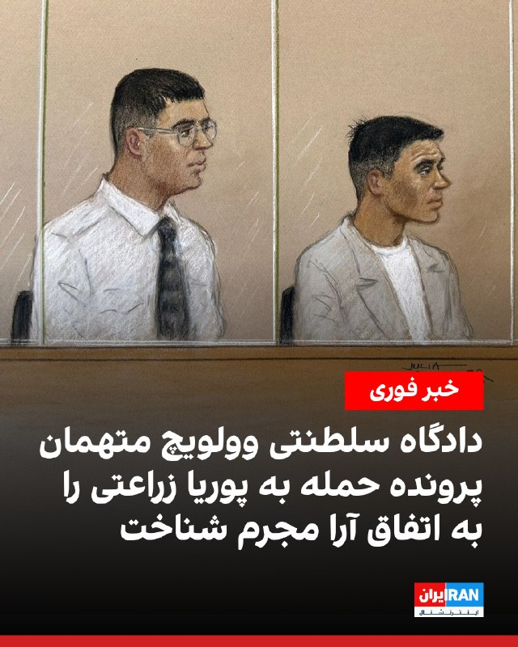

به گزارش خبرنگار ایران‌اینترنشنال، هیات منصفه دادگاه سلطنتی وولویچ دو متهم پرونده حمله به پوریا زراعتی، مجری ایران‌اینترنشنال، را به اتفاق آرا مجرم شناخت.

بر اساس این گزارش، قاضی اعلام کرد جلسه صدور حکم در ۱۲ تیر ماه برگزار خواهد شد.
https://iranintl.com/202606051615

## FarsiVOA — post 219667

  <a href="telegram/content/FarsiVOA_219667_1780668785.mp4" target="_blank">🎬 Download video</a>

بیژن عبدالکریمی، استاد دانشگاه حامی حکومت در تهران، می‌گوید برای رسیدن به انسجام ملی و فراهم شدن زمینه اصلاحات، باید خطرات امنیتی و ژئوپلیتیکی ایران را به رسمیت شناخت.

به گفته عبدالکریمی نادیده گرفتن این مسائل می‌تواند مانع شکل‌گیری آگاهی و اجماع ملی برای پیگیری اصلاحات شود. او که در یک برنامه تلویزیونی در ایران صحبت می‌کرد، گفت روشنفکری که خطرات امنیتی و ژئوپولیتیک خاورمیانه را درک نکند، باید هفت بار با آرپی‌جی اعدام شود.

@FarsiVOA

## alonews — post 125327

  <a href="telegram/content/alonews_125327_1780668786.webm" target="_blank">🎬 Download video</a>

👈گروسی: ایران و آمریکا نسبتاً به توافق نزدیک هستند؛ البته این را بیشتر در ارتباط با موضوع هسته‌ای می‌گویم

✅ @AloNews خبر جنگ

---
📅 بروزرسانی: 1405/03/15 17:33
---

## VahidOOnLine — post 243802

  

♦️فرماندهی مرکزی ایالات متحده (سنتکام) روز جمعه ۱۵ خرداد با انتشار بیانیه‌ای در شبکه اجتماعی ایکس، ادعای ارتش جمهوری اسلامی ایران مبنی بر شلیک اخطار به سمت ناوهای آمریکایی را کذب خواند و تاکید کرد که هیچ حمله‌ای صورت نگرفته و نیروهای آمریکایی همچنان به اجرای محاصره علیه ایران ادامه می‌دهند.

پیش از این، روابط عمومی ارتش ایران اعلام کرده بود که در پاسخ به «مزاحمت‌های دریایی» آمریکا، اقدام به شلیک اخطار با موشک‌های «قدیر» و پهپادهای «شهید دانا» کرده است. طبق ادعای ارتش، این اقدام ناوشکن‌های «DDG-103» و «DDG-87» و همچنین هلی‌کوپتر تهاجمی «تریپولی» را ناچار به عقب‌نشینی به سمت اقیانوس هند کرده است. ارتش جمهوری اسلامی ناوگروه «جرج دبلیو بوش» را عامل اختلال در امنیت منطقه خواند و هشدار داد که در صورت نیاز از موشک‌هایی با برد بیشتر استفاده خواهد کرد؛ ادعایی که سنتکام آن را نقض آشکار آتش‌بس دانسته و رد کرد.
‌🇸🇦 Indypersian

🤖 @VahidOOnLine

## VahidOOnLine — post 243801

♦️مقام‌های استرالیا اعلام کردند بیش از ۱۰۰ هزار سوسک زنده غیرقانونی را از یک پرورش‌دهنده در ایالت نیو ساوت ولز ضبط کرده‌اند، اقدامی که بزرگ‌ترین کشف و توقیف بی‌مهرگان غیرقانونی در تاریخ این کشور به شمار می‌رود.

بر اساس اعلام وزارت تغییرات اقلیمی، انرژی، محیط زیست و آب استرالیا، این محموله شامل سوسک‌های «هیس‌کننده ماداگاسکار» و «دوبیا» بوده و ارزش آن حدود ۲۰۰ هزار دلار استرالیا برآورد شده است. این حشرات در ماه مه از یک مرکز پرورش تجاری در شهر باتهرست کشف و ضبط شدند.

به گزارش شبکه خبری ای‌بی‌سی استرالیا، این حشرات احتمالا برای بازار حیوانات خانگی و به‌ویژه به‌عنوان غذای خزندگان پرورش داده می‌شدند، زیرا اندازه بزرگ آنها نسبت به گونه‌های دیگر ارزش تجاری بیشتری دارد.

استرالیا دارای قوانین سختگیرانه امنیت زیستی برای جلوگیری از ورود گونه‌های مهاجم و آفات است و مقام‌های این کشور هشدار داده‌اند تجارت و نگهداری گونه‌های غیرقانونی می‌تواند با پیگرد قانونی همراه باشد.
با این حال، مقام‌های مسئول اعلام کردند تاکنون هیچ اتهامی علیه فردی که این سوسک‌ها را پرورش می‌داد مطرح نشده است.
‌🇸🇦 Indypersian

🤖 @VahidOOnLine

## VahidOOnLine — post 243800

  

حسام بدران، عضو دفتر سیاسی حماس، در گفت‌وگویی اختصاصی با الجزیره اعلام کرد این گروه در شرایط کنونی سلاح‌های خود را تحو

او افزود که تصمیم‌گیری درباره سرنوشت نهایی تسلیحات حماس پس از گفت‌وگوهای جامع با دیگر گروه‌های فلسطینی انجام خواهد شد.
‌🏁 🇬🇧 IranintlTV

🤖 @VahidOOnLine

## FoxNewsTwitter — post 342647

  <a href="telegram/content/FoxNewsTwitter_342647_1780668241.mp4" target="_blank">🎬 Download video</a>

Fox News (Twitter/X)

Dashcam video shows a three-wheeled buggy slam into a black Audi in San Francisco — launching the driver into the street as stunned pedestrians look on.

Police say four people suffered minor to moderate injuries after the Arcimoto FUV t-boned the vehicle near Baker and Hayes Street.

The crash remains under investigation by the San Francisco Police Department.

## FoxNewsTwitter — post 342646

Fox News (Twitter/X)

RT @AmericaNewsroom: 🚨PLATNER'S PROBLEMS: Explosive new allegations rocking the campaign of Democratic Maine Senate hopeful Graham Platner -- with his former girlfriends now accusing him of physical and emotional abuse in a new report.

@AlexisMcAdamsTV reports.

## IranIntlTV — post 340667

  <a href="telegram/content/IranIntlTV_340667_1780668243.mp4" target="_blank">🎬 Download video</a>

در حالی که اخبار ضدونقیضی درباره روند مذاکرات میان آمریکا و جمهوری اسلامی منتشر می‌شود، دونالد ترامپ هشدار داد واشینگتن آمادگی بازگشت به درگیری‌ها را دارد.

جزییات بیشتر با اردوان روزبه، خبرنگار ایران‌اینترنشنال
@iranintltv

## IranIntlTV — post 340666

  

حسام بدران، عضو دفتر سیاسی حماس، در گفت‌وگویی اختصاصی با الجزیره اعلام کرد این گروه در شرایط کنونی سلاح‌های خود را تحو

او افزود که تصمیم‌گیری درباره سرنوشت نهایی تسلیحات حماس پس از گفت‌وگوهای جامع با دیگر گروه‌های فلسطینی انجام خواهد شد.
https://iranintl.com/202606059325

## IranIntlTV — post 340665

دادگاهی در هلند مادری را به‌دلیل پیوستن پسر ۱۴ ساله‌اش به داعش، به ۷ سال زندان محکوم کرد

دادگاهی در لاهه یک زن ۴۹ ساله هلندی را به اتهام مشارکت در جذب کودک‌سرباز برای داعش، همکاری با یک «سازمان تروریستی» و به خطر انداختن فرزندانش، مجرم شناخت. او در سال ۲۰۱۴ فرزندانش را به مناطق تحت کنترل داعش در سوریه برده بود.

خبرگزاری رویترز جمعه ۱۵ خرداد گزارش داد دادگاه منطقه‌ای لاهه این زن را که تنها با نام «آیادا ک.» معرفی شده است، در روز جمعه به هفت سال زندان محکوم کرد.

بر اساس بیانیه دادگاه، او به «ارتکاب جنایت جنگی از طریق کمک و مشارکت در جذب یک کودک‌سرباز» محکوم شده است، چرا که اجازه داده بود پسر خردسالش به نیروهای داعش بپیوندد و سلاح به دست بگیرد.

دادگاه همچنین او را به اتهام «همکاری و مشارکت در فعالیت‌های یک سازمان تروریستی و به خطر انداختن فرزندانش» مجرم شناخت.

بر اساس حکم دادگاه، آیادا ک. در سال ۲۰۱۴ پسر و دختر نوجوان خود را از هلند به مناطق تحت کنترل داعش در سوریه منتقل کرد.

قضات اعلام کردند او سپس اجازه داد پسرش در ۱۴ سالگی به پلیس نظامی داعش بپیوندد.

این نوجوان دو سال بعد، در حالی که در یکی از واحدهای نظامی داعش خدمت می‌کرد، کشته شد.

آیادا ک. در جریان محاکمه از حق سکوت خود استفاده کرد و حاضر به پاسخگویی درباره اتهامات نشد.

پس از سقوط داعش در سال ۲۰۱۹، او همراه فرزندان باقی‌مانده‌اش در سوریه ماند تا اینکه در سال ۲۰۲۴ به هلند بازگردانده شد.

مقام‌های هلندی او را بلافاصله پس از ورود به کشور بازداشت کردند و روند رسیدگی قضایی به پرونده‌اش آغاز شد.

دولت استرالیا ۱۶ اردیبهشت اعلام کرد ۱۳ نفر از اعضای خانواده‌های استرالیایی مرتبط با گروه داعش که در اردوگاه‌های سوریه حضور دارند، قصد بازگشت به این کشور را دارند، اما کانبرا تاکید کرد برای بازگشت آن‌ها هیچ کمکی ارائه نخواهد کرد.

تونی برک، وزیر امور داخلی استرالیا، گفت دولت با «محدودیت‌های بسیار جدی» برای جلوگیری از ورود دوباره شهروندان استرالیایی به کشور روبه‌روست.

به گفته برک، این گروه شامل چهار زن و ۹ کودک است.

او گفت هر فردی که در بازگشت به کشور مظنون به فعالیت مجرمانه باشد، «بدون هیچ استثنایی با تمام قدرت قانون مواجه خواهد شد»؛ هرچند درباره اتهام‌های احتمالی، توضیح بیشتری نداد.

چهارم دی‌ماه ۱۴۰۴، دادستانی کل استانبول اعلام کرد نیروهای امنیتی ترکیه ۱۱۵ نفر از مظنونان وابسته به داعش را که قصد داشتند در جریان جشن‌های کریسمس و سال نوی میلادی در این کشور دست به حمله بزنند، بازداشت کرده‌اند.

بر اساس این اطلاعیه، پلیس استانبول اطلاعاتی به دست آورده بود که نشان می‌داد اعضای داعش قصد دارند به‌طور ویژه حملاتی را علیه غیرمسلمانان در ترکیه انجام دهند.
 
🔗وب‌سایت ایران‌اینترنشنال
@iranintltv

## RadioFarda — post 157928

🔸ستاد فرماندهی مرکزی ایالات متحده، سنتکام، ادعای ارتش جمهوری اسلامی درباره شلیک موشک و پهپاد به سمت ناوشکن‌های آمریکایی در دریای عمان را تکذیب کرد. 🔸رسانه‌های ایران روز جمعه به نقل از ارتش اعلام کردند که نیروی دریایی آن به عنوان «اخطار» به سمت دو ناوشکن آمریکایی…

## RadioFarda — post 157927

  

🔸ستاد فرماندهی مرکزی ایالات متحده، سنتکام، ادعای ارتش جمهوری اسلامی درباره شلیک موشک و پهپاد به سمت ناوشکن‌های آمریکایی در دریای عمان را تکذیب کرد.

🔸رسانه‌های ایران روز جمعه به نقل از ارتش اعلام کردند که نیروی دریایی آن به عنوان «اخطار» به سمت دو ناوشکن آمریکایی «موشک قدیر و پهپادهای تهاجمی جدید» شلیک کرده و این دو ناوشکن دریای عمان را به سمت اقیانوس هند ترک کردند.

🔸سنتکام که فرماندهی نیروهای نظامی آمریکا در خاورمیانه را برعهده دارد، ساعتی بعد در شبکه ایکس اعلام کرد: «نیروهای ایرانی به ناوهای جنگی نیروی دریایی آمریکا حمله نکرده‌اند و به سوی آنها آتش نگشوده‌اند. انجام چنین اقدامی نقض آشکار و فاحش آتش‌بس محسوب می‌شد.
در این اطلاعیه بر ادامه محاصره دریایی ایران که از اواخر فرودین آغاز شد، تأکید شده است.

@RadioFarda

## Dirty_Kids — post 391057

  <a href="telegram/content/Dirty_Kids_391057_1780668247.mp4" target="_blank">🎬 Download video</a>

عادل فردوسی‌پور تو رسانه فوتبال۳۶۰ش یه پست گذاشته، آهنگ مراد ویسی که برای جاویدنامه استفاده میکنه‌ استفاده کرده و از اون عکس معروف کفشا جاویدنام‌ها الهام گرفته..

@Dirty_Kids 👻

## Dirty_Kids — post 391056

  

بازیکنای تیم ملی نروژ یه عکس تیمی خفن با استایل وایکینگ‌ها جلوی اسکله‌ی کتگات (روستای رگنار لاثبروک) گرفتن و راهی جام جهانی شدن

@Dirty_Kids 👻

## Dirty_Kids — post 391055

  

وقتی عصبانیم و یکی برمیگرده میگه ولش کنید این همیشه همینطوریه:

@Dirty_Kids 👻

## Hranews — post 113401

  

زندان اوین؛ تداوم محرومیت از درمان لیلا آفرین با وجود ابتلا به تومور مغزی❗️❗️❗️❗️❗️– لیلا آفرین، زندانی سیاسی محبوس در زندان اوین که به تومور مغزی و بیماری های مفصلی مبتلاست، کماکان از رسیدگی تخصصی پزشکی محروم مانده است. این زندانی سیاسی اخیرا برای درمان به بیمارستان اعزام شده و پس از مدتی کوتاه، بدون دریافت رسیدگی پزشکی مناسب به زندان بازگردانده شد.به گزارش خبرگزاری هرانا، ارگان خبری مجموعه فعالان حقوق بشر در ایران، لیلا آفرین همچنان از دسترسی به خدمات درمانی مورد نیاز خود محروم است.براساس اطلاعات دریافتی هرانا، خانم آفرین به تومور بدخیم مغزی و بیماری های مفصلی مبتلا است. وضعیت جسمانی این زندانی وخیم گزارش شده، به طوری که در حال حاضر از علائمی همچون عدم تعادل، لرزش دست‌ها و پاها و کاهش بینایی رنج می‌برد و گاه تنها با کمک سایر زندانیان یا تکیه بر دیوار قادر به حرکت است. یک منبع مطلع در این خصوص به هرانا گفت: “پزشک زندان بر ضرورت رسیدگی فوری پزشکی به وضعیت خانم آفرین تاکید کرده بود. با این حال، وی هفته گذشته پس از اعتراض خانواده و هم‌بندیانش به بیمارستان شهدای تجریش اعزام شد، اما بدون انجام آزمایش‌های لازم و اقدامات درمانی مورد نیاز به زندان بازگردانده شد.”به گفته این منبع مطلع، اعزام وی به بیمارستان با هدف انجام تصویربرداری MRI و سایر آزمایش‌های تخصصی صورت گرفته بود، اما این اقدامات انجام نشد. همچنین با وجود اینکه زمان آزادی مشروط او رسیده، ولی با مخالفت آقای نیری دادیار ناظر بر زندان مواجه شده است. درخواست‌های مکرر این زندانی برای استفاده از مرخصی درمانی نیز تاکنون بی‌نتیجه مانده است.#لیلا_آفرینادامه مطلب↘️ @hranews_bot تماس ✉️ -  @Hranews  کانال هرانا 🆑

## alonews — post 125326

  <a href="telegram/content/alonews_125326_1780668251.mp4" target="_blank">🎬 Download video</a>

👈رئیس‌جمهور لبنان عون خطاب به ایران و حزب‌الله:
این کشور شما نیست؛ کشور ماست. این وظیفه ماست. دخالت در کشور ما وظیفه شما نیست.

🔴مردم ما کشته می‌شوند؛ خانه‌های ما ویران می‌شوند. ایران لبنان را به عنوان اهرم چانه‌زنی در مذاکرات خود با ایالات متحده استفاده می‌کند. این غیرقابل قبول است.

🔴حزب‌الله باید بفهمد که راه دیگری جز نشستن و گفتگو وجود ندارد. هیچ راه دیگری برای حل این مشکل و نجات آنچه باقی مانده نیست، جز از طریق مذاکره و دیپلماسی.

✅ @AloNews خبر جنگ

---
📅 بروزرسانی: 1405/03/15 17:23
---

## VahidOOnLine — post 243799

  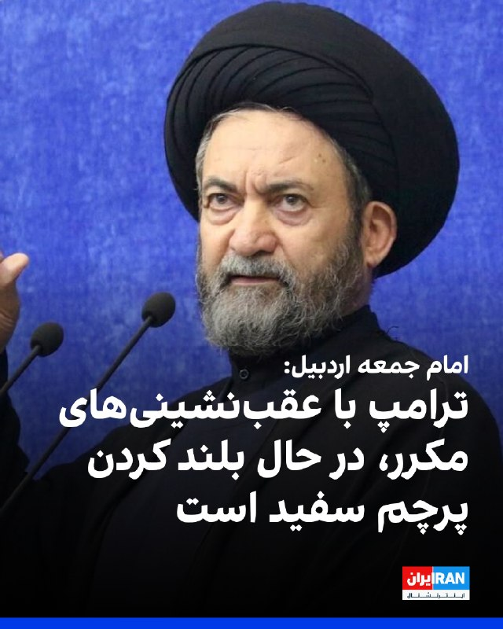

حسن عاملی، امام جمعه اردبیل گفت: «ترامپ با عقب‌نشینی‌های مکرر و با تغییر لحن در حال بلند کردن پرچم سفید است و پیروزی اقتصادی، سیاسی و نظامی در پیش است.»

او ادامه داد: «جنگ اخیر خیلی‌ها را مفتضح کرد، برخی حکام اسلامی، وهابی‌ها، آمریکا و اسرائیل، سلطنت‌طلب‌ها خیلی مفتضح شدند.»
‌🏁 🇬🇧 IranintlTV

🤖 @VahidOOnLine

## WithYashar — post 13555

  <a href="https://t.me/withyashar/13555" target="_blank">📎 Download file</a>

🌐 @withyashar

🌐 instagram.com/yashar

## pm_afshaa — post 92310

  <a href="telegram/content/pm_afshaa_92310_1780667605.webm" target="_blank">🎬 Download video</a>

🔴سنتکام: ادعای نادرست: ایران ادعا میکنه که به سمت کشتی‌های جنگی ایالات متحده در خلیج عمان تیر هشدار شلیک کرده و کشتی‌های آمریکایی رو مجبور به «عقب‌نشینی» به سمت اقیانوس هند کرده. حقیقت: نیروهای ایرانی به کشتی‌های جنگی نیروی دریایی ایالات متحده حمله نکرده…

## IranIntlTV — post 340664

  

حسن عاملی، امام جمعه اردبیل گفت: «ترامپ با عقب‌نشینی‌های مکرر و با تغییر لحن در حال بلند کردن پرچم سفید است و پیروزی اقتصادی، سیاسی و نظامی در پیش است.»

او ادامه داد: «جنگ اخیر خیلی‌ها را مفتضح کرد، برخی حکام اسلامی، وهابی‌ها، آمریکا و اسرائیل، سلطنت‌طلب‌ها خیلی مفتضح شدند.»
https://iranintl.com/202606057963

## FarsiVOA — post 219666

🔺کشته شدن پنج شهروند جمهوری آذربایجان در حمله پهپادی به کشتی‌ها؛ روسیه: کار اوکراین بود

▪️روسیه، روز جمعه ۱۵ خرداد، اوکراین را متهم کرد که در حمله پهپادی به دو کشتی باری در دریای آزوف، پنج شهروند جمهوری آذربایجان را کشته است. جمهوری آذربایجان نیز اعلام کرد در این حمله سه شهروند دیگر این کشور زخمی شده‌اند.

⬇️ بیشتر بخوانید:

https://ir.voanews.com/a/russia-blames-ukraine-for-deaths/8157658.html/?nocach=1

## DW_Farsi — post 125528

  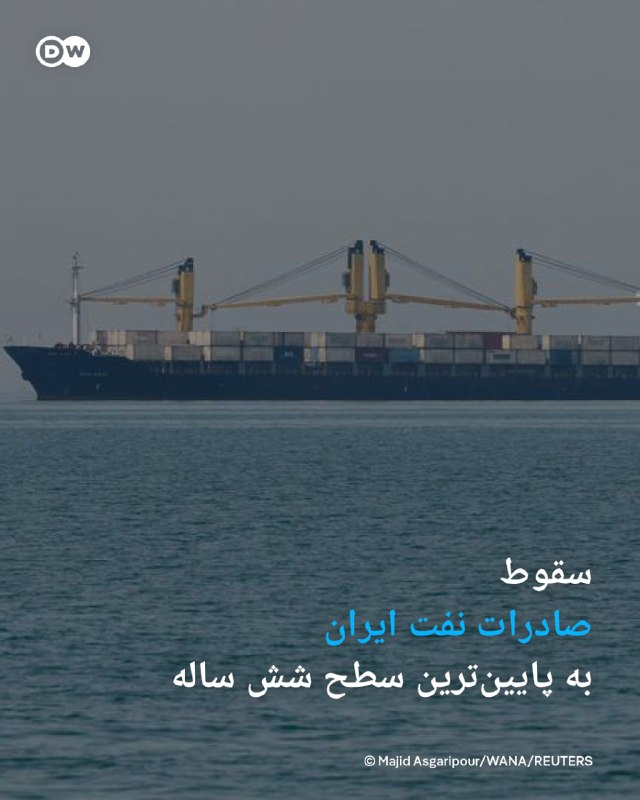

🔶 سقوط صادرات نفت ایران به پایین‌ترین سطح شش ساله

داده‌های ردیابی کشتی‌ها نشان می‌دهد که با تداوم محاصره دریایی ایالات متحده و قطع مسیرهای انتقال، صادرات نفت ایران در ماه مه به پایین‌ترین سطح خود در دست‌کم شش سال گذشته سقوط کرده و ده‌ها میلیون بشکه نفت در آب‌ها سرگردان مانده است.

بر اساس داده‌های مؤسسه ورتکسا (Vortexa)، صادرات نفت خام و میعانات گازی ایران در ماه مه به تنها ۲۰۹ هزار بشکه در روز افت کرد. این رقم نشان‌دهنده کاهش چشمگیر نسبت به صادرات ۱٫۳۴ میلیون بشکه‌ای در ماه آوریل و ۱٫۹ میلیون بشکه‌ای در ماه مارس است. مؤسسه کپلر (Kpler) نیز تخمین می‌زند که این میزان اندکی بیشتر و حدود ۲۶۰ هزار بشکه در روز بوده است.

برخلاف انتظار اولیه تحلیلگران مبنی بر افزایش ذخیره‌سازی روی آب، داده‌های کپلر نشان می‌دهد که موجودی مخازن شناور ایران از حدود ۱۹۰ میلیون بشکه در اواخر آوریل به ۱۴۷ میلیون بشکه در مقطع کنونی کاهش یافته است.

گفتە می‌شود کە هم‌اکنون حدود ۶۷ میلیون بشکه نفت و میعانات گازی ایران در خلیج فارس و دریای عمان سرگردان است.
@dw_farsi

## IranianMinds — post 21427

  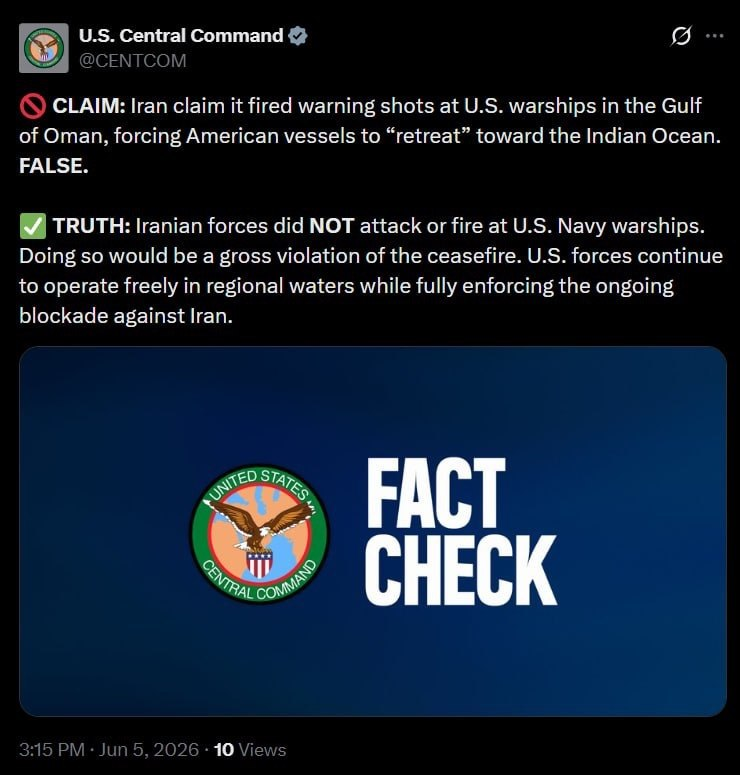

🔴سنتکام:

ادعا: ایران ادعا می‌کند که به سمت ناوهای جنگی ایالات متحده در دریای عمان تیراندازی هشدار انجام داده‌اند و شناورهای آمریکایی را مجبور به عقب‌نشینی به سمت اقیانوس هند کرده‌اند- نادرست.

حقیقت: نیروهای ایرانی به سمت ناوهای جنگی نیروی دریایی ایالات متحده آمریکا حمله و یا شلیک نکرده‌اند. انجام چنین‌ کاری نقض فاحش آتش‌بس خواهد بود.

@IranianMinds

## alonews — post 125325

  <a href="telegram/content/alonews_125325_1780667609.webm" target="_blank">🎬 Download video</a>

👈جمالیان؛ نماینده مجلس:
کشت خشخاش در ایران خیلی زیاده شده. حتی جاهایی که قبلا برنج میکاشتن؛ به جاش دارن خشخاش میکارن. اینطوری همه تریاکی میشن. یکی یه کاری کنه.

✅ @AloNews خبر جنگ

---
📅 بروزرسانی: 1405/03/15 17:13
---

## VahidOOnLine — post 243798

♦️رافائل گروسی، مدیرکل آژانس بین‌المللی انرژی اتمی، در نشست خبری روز جمعه ۱۵ خرداد در وین تاکید کرد که سرنوشت ذخایر اورانیوم غنی‌شده ایران، محور اصلی هرگونه راه‌حل، توافق یا تفاهمی باقی خواهد ماند.

گروسی با اشاره به گزینه‌های فنی موجود مانند صادرات مستقیم، رقیق‌سازی یا سپردن مواد به کنترل آژانس تصریح کرد: «از نظر فنی همه‌چیز امکان‌پذیر است، اما تصمیم نهایی یک امر سیاسی است.» او افزود انتقال اورانیوم ۶۰ درصد به دلیل ماهیت گاز غنی‌شده، فرآیندی بسیار حساس و پیچیده‌تر خواهد بود.

مدیرکل آژانس پیش‌نیاز هرگونه اقدام یا ارزیابی فنی را بازگشت بازرسان به ایران خواند و هشدار داد: «به دلیل گذشت زمان طولانی، ابتدا باید خط مبنای مشخصی از میزان مواد موجود تعیین شود. اگر حتی ۴۰ یا ۵۰ کیلوگرم از مواد در آمار ما ثبت نشده باشد، دستیابی به توافق به شدت کم‌رنگ خواهد شد.» گروسی در پایان یادآور شد که آژانس پیش از این نیز تجربه موفق راستی‌آزمایی رقیق‌سازی و صادرات مواد هسته‌ای را در ایران داشته و اکنون انتخاب بهترین گزینه بر عهده طرفین مذاکره است.
‌🇸🇦 Indypersian

🤖 @VahidOOnLine

## BBCPersian — post 282918

🔻رهبر حوثی‌های یمن هشدار داد که این گروه برای «هر سطحی از تشدید درگیری در منطقه» آمادگی دارد

رهبر جنبش حوثی‌های یمن اعلام کرده است که این گروه با تنش‌های جاری در منطقه برای «هر سطحی از تشدید درگیری» آمادگی دارد.

عبدالمالک حوثی این موضوع را در یک سخنرانی که شبکه تلویزیونی المسیره، وابسته به حوثی‌ها، پخش می‌کرد، مطرح کرد.

او از جمله گفت که درباره تحولات لبنان، غزه و اقدامات آمریکا با «محور مقاومت در حال هماهنگی است.»

این اصطلاح اشاره به گروه‌های شبه‌نظامی مورد حمایت ایران در منطقه است.

رهبر حوثی‌ها هشدار داد «دشمن تحت پوشش طرح‌های اعلام‌شده‌ای عمل می‌کند که هدف آن‌ ایجاد وضعیتی موسوم به اسرائیل بزرگ و تغییر خاورمیانه است.»

او افزود که این تهدید تمامی اماکن مقدس اسلامی، از جمله اماکن مقدس واقع در شهرهای مکه و مدینه در عربستان سعودی را هم در بر می‌گیرد.

عبدالمالک حوثی همچنین به «همه نیروها و طرف‌های منطقه» هشدار داد که وارد جنگی به نیابت از اسرائیل نشوند، چرا که به گفته او، در این صورت با «پیامدهای جدی» روبرو خواهند شد.

او مدعی شد که آمریکا در پی کشاندن حوثی‌ها به یک «نبرد فراگیر» است که به گفته او در نهایت در خدمت منافع اسرائیل خواهد بود.

این سخنرانی اما شامل هیچ تهدید صریحی درباره بستن تنگه راهبردی باب‌المندب یا هدف قرار دادن کشتیرانی تجاری در دریای سرخ نبود.

پیش‌تر هم مقام‌های حوثی درباره احتمال تشدید تنش‌ها در ارتباط با لبنان هشدار داده بودند و رهبر این گروه تهدید کرده بود که در صورت ازسرگیری جنگ آمریکا و اسرائیل با ایران، سطح درگیری‌ها افزایش خواهد یافت.

https://bbc.in/4oavX8B
@BBCPersian

## BBCPersian — post 282917

  <a href="telegram/content/BBCPersian_282917_1780666994.mp4" target="_blank">🎬 Download video</a>

⭕️ سرخط خبرهای جمعه ۱۵ خرداد ۱۴۰۵
@BBCPersian

## alonews — post 125324

  <a href="telegram/content/alonews_125324_1780666995.webm" target="_blank">🎬 Download video</a>

👈وخامت حال میرحسین موسوی تکذیب شد

✅ @AloNews خبر جنگ

## alonews — post 125323

  <a href="telegram/content/alonews_125323_1780666995.mp4" target="_blank">🎬 Download video</a>

👈شهروند کفن‌پوش(گنده گوز) اصفهانی خطاب به مسئولان: من رو با همین لباس ببرین توی دولت قول میدم همه مشکلات رو حل میکنم؛ تورم، گرونی، همه رو حل می‌کنم

🔴از پزشکیان هم میخوام حمایتم کنه مگه خودش نگفت هر کی میتونه مشکلاتو حل کنه بیاد؟ تو رو خدا اجازه بدین من بیام.

✅ @AloNews خبر جنگ

---
📅 بروزرسانی: 1405/03/15 17:03
---

## VahidOOnLine — post 243797

  

فرماندهی مرکزی آمریکا، سنتکام، اعلام کرد اظهارات جمهوری اسلامی درباره شلیک اخطار به ناوهای آمریکایی در دریای عمان و عقب‌نشینی آن‌ها به اقیانوس هند نادرست است.

سنتکام افزود که هیچ حمله‌ای به شناورهای نیروی دریایی آمریکا صورت نگرفته و نیروهای آمریکایی همچنان آزادانه در آب‌های منطقه به فعالیت خود ادامه می‌دهند.

پیشتر رسانه‌های ایران به نقل از روابط‌عمومی ارتش جمهوری اسلامی گزارش دادند در ادامه آنچه مقابله با «مزاحمت‌های دریایی» آمریکا خوانده شد، موشک قدیر و پهپادهای تهاجمی نیروی دریایی ارتش به‌صورت اخطاری به سوی چند ناوشکن در دریای عمان شلیک شدند.

ارتش جمهوری اسلامی نوشت: «ناوشکن‌های دی‌دی‌جی-۱۰۳ و دی‌دی‌جی-۸۷ پس از این اقدام دریای عمان را به سمت اقیانوس هند ترک کردند.»

در بیانیه مرکز فرماندهی نیروی دریایی ارتش جمهوری اسلامی آمده است در صورت نیاز، از موشک‌های با برد بیشتر استفاده خواهد شد.
‌🏁 🇬🇧 IranintlTV

🤖 @VahidOOnLine

## WithYashar — post 13554

  <a href="telegram/content/WithYashar_13554_1780666408.mp4" target="_blank">🎬 Download video</a>

ترامپ ویدئویی جدیدی در شبکه تروث منتشر کرد که در حال بازی گلف است و یک ضربه فوق‌العاده میزند. همچنین از آهنگ معروف گلوريا لذت میبرد.
یاشار: آخرین باری که این آهنگ ویرال شد در فیلم گرگ وال استریت بود. مضمون این آهنگ این است که
کنترل نکردن زندگی احساسی می‌تواند خطرناک باشد
توجه زیاد دیگران همیشه خوشبختی نمی‌آورد
باید قبل از اینکه دیر شود، آرام‌تر شد و به خود رسید
@withyashar

## pm_afshaa — post 92309

  <a href="telegram/content/pm_afshaa_92309_1780666409.webm" target="_blank">🎬 Download video</a>

ارتش جمهوری اسلامی اعلام کرد به سمت 2 ناوشکن آمریکایی چندین موشک شلیک کرده 
💧 Rainbet.com the #1 Non-KYC Crypto Casino & Sportsbook @rainbetcom 
😁 @Pm_Afshaa

## iaghapour — post 2656

  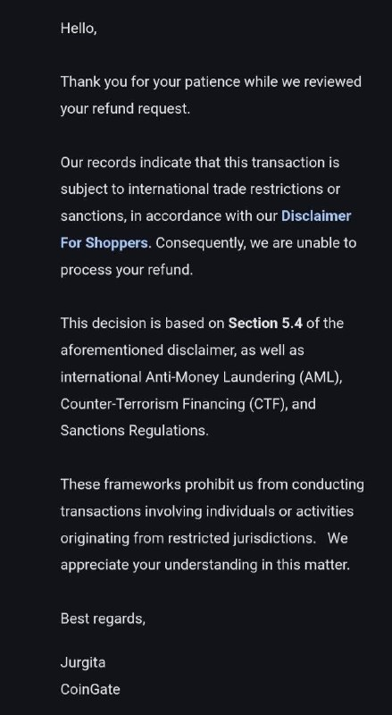

🚨 هشدار مهم: بلوکه شدن ارز دیجیتال در خریدهای خارجی (CoinGate) 🚨

دوستان، یکی از کاربران هنگام خرید از سایت Hostinger با ترون از طریق درگاه CoinGate، متأسفانه به دلیل تحریم‌ها پولش مسدود شده است. طبق اعلام رسمی پشتیبانی این درگاه، به دلیل قوانین بین‌المللی، وجه بلوکه‌شده به هیچ‌وجه ریفاند (برگشت) داده نمی‌شود!

⚠️ چرا شناسایی می‌شویم؟ درگاه‌های خارجی تراکنش‌ها را رهگیری می‌کنند. اگر IP شما نشت کند یا ارز را مستقیماً از صرافی‌های ایرانی به کیف پول خود (مثل تراست ولت) منتقل کرده باشید، به راحتی به عنوان کاربر ایرانی شناسایی می‌شوید.

✅ راه‌حل و پیشگیری:
— هرگز مستقیماً از صرافی ایرانی به درگاه‌های خارجی واریز نکنید.
— همیشه از کیف پول واسط استفاده کنید (ارز را از صرافی ایرانی به ولت اول، سپس به ولت دوم بفرستید و در نهایت از ولت دوم خرید کنید).
— هنگام پرداخت، حتماً از IP ثابت و معتبر استفاده کنید تا نشت IP نداشته باشید.

لطفاً این پیام را به اشتراک بگذارید تا سرمایه سایر دوستان به خطر نیفتد. 🙏

🆔 @iAghapour

## IranIntlTV — post 340663

  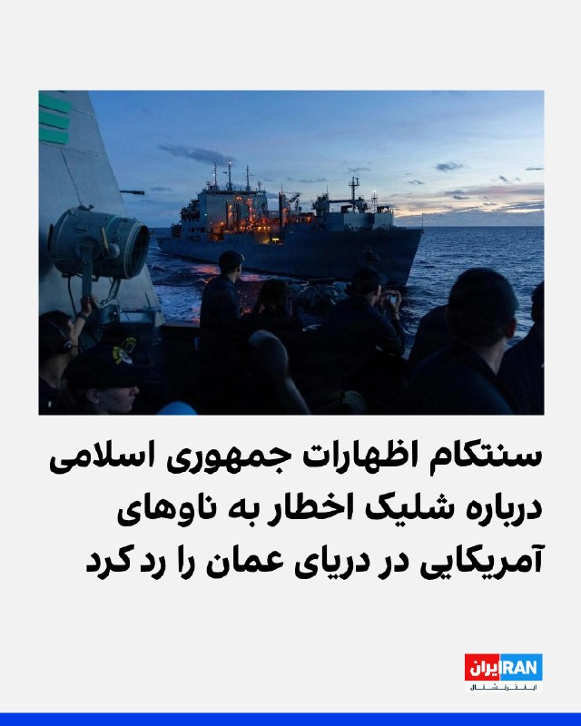

فرماندهی مرکزی آمریکا، سنتکام، اعلام کرد اظهارات جمهوری اسلامی درباره شلیک اخطار به ناوهای آمریکایی در دریای عمان و عقب‌نشینی آن‌ها به اقیانوس هند نادرست است.

سنتکام افزود که هیچ حمله‌ای به شناورهای نیروی دریایی آمریکا صورت نگرفته و نیروهای آمریکایی همچنان آزادانه در آب‌های منطقه به فعالیت خود ادامه می‌دهند.

پیشتر رسانه‌های ایران به نقل از روابط‌عمومی ارتش جمهوری اسلامی گزارش دادند در ادامه آنچه مقابله با «مزاحمت‌های دریایی» آمریکا خوانده شد، موشک قدیر و پهپادهای تهاجمی نیروی دریایی ارتش به‌صورت اخطاری به سوی چند ناوشکن در دریای عمان شلیک شدند.

ارتش جمهوری اسلامی نوشت: «ناوشکن‌های دی‌دی‌جی-۱۰۳ و دی‌دی‌جی-۸۷ پس از این اقدام دریای عمان را به سمت اقیانوس هند ترک کردند.»

در بیانیه مرکز فرماندهی نیروی دریایی ارتش جمهوری اسلامی آمده است در صورت نیاز، از موشک‌های با برد بیشتر استفاده خواهد شد.
https://iranintl.com/202606053271

## IranIntlTV — post 340662

گروسی: موضوع ذخایر اورانیوم محور اصلی هرگونه توافق احتمالی با تهران است

هم‌زمان با ادامه گمانه‌زنی‌ها درباره سرنوشت مذاکرات تهران و واشینگتن، رافائل گروسی، مدیرکل آژانس بین‌المللی انرژی اتمی، اعلام کرد موضوع ذخایر اورانیوم غنی‌شده در کانون هرگونه توافق یا تفاهم احتمالی با جمهوری اسلامی قرار دارد.

گروسی جمعه ۱۵ خرداد در حاشیه نشست شورای حکام در وین گفت مقام‌های جمهوری اسلامی به آژانس اطلاع داده‌اند که این ذخایر همچنان در همان مکان پیش از حملات نگهداری می‌شوند و برآورد فعلی آژانس نیز بر این فرض استوار است که مواد هسته‌ای در همان محل قبلی هستند.

گروسی تاکید کرد سرنوشت ذخایر اورانیوم تهران در وهله اول یک موضوع سیاسی است و پس از آن، جنبه‌های فنی آن باید مورد بررسی قرار گیرد.

او پیش‌شرط هرگونه ارزیابی دقیق در این خصوص را دسترسی آژانس به سایت‌های هسته‌ای ایران دانست و افزود این نهاد آمادگی دارد در صورت دستیابی به توافقی درباره این ذخایر، نقش‌آفرینی کند.

روزنامه نیویورک‌تایمز سوم خرداد گزارش داد ذخایر اورانیوم با غنای بالای جمهوری اسلامی همچنان یکی از مهم‌ترین مسائل در مسیر دستیابی به هرگونه توافق احتمالی به شمار می‌رود.

بر اساس این گزارش، بخش عمده این ذخایر احتمالا در تونل‌های عمیق و مستحکم مجتمع هسته‌ای اصفهان نگهداری می‌شود و بخش‌های دیگر نیز در تاسیسات فردو و نطنز قرار دارند.

تعهدات حقوقی تهران در قبال آژانس در هر شرایطی پابرجاست
گروسی در ادامه نشست خبری خود اعلام کرد دسترسی بازرسان آژانس بین‌المللی به تاسیسات هسته‌ای جمهوری اسلامی همچنان با محدودیت روبه‌رو است.

مدیرکل آژانس بین‌المللی انرژی اتمی افزود تلاش‌های متعددی برای ازسرگیری فعالیت‌های راستی‌آزمایی در ایران، هم پس از جنگ ۱۲ روزه و هم در پی درگیری‌های اخیر، انجام شده است.

او تاکید کرد جمهوری اسلامی بر اساس تعهدات خود موظف به اطلاع‌رسانی و فراهم کردن امکان دسترسی برای بازرسان آژانس است، اما در شرایط جنگی این امر رخ نداده است.

به گفته گروسی، با وجود برقراری آتش‌بسی نسبتا طولانی، آژانس تنها توانسته به برخی مراکزی که از سوی تهران تعیین شده‌اند، از جمله نیروگاه هسته‌ای بوشهر و چند تاسیسات دیگر، دسترسی داشته باشد.

او خاطرنشان کرد تعهدات حقوقی حکومت ایران در قبال آژانس در هر شرایطی پابرجاست و باید به‌طور کامل اجرا شود.

۱۴ خرداد، آژانس بین‌المللی انرژی اتمی در گزارشی به اعضای خود، بار دیگر خواستار توضیح فوری جمهوری اسلامی درباره سرنوشت ذخایر اورانیوم غنی‌شده شد و ناتوانی این نهاد در راستی‌آزمایی برنامه اتمی تهران را نگران‌کننده خواند.

آژانس با ایران و آمریکا در تماس است
گروسی با اشاره به مذاکرات میان آمریکا و جمهوری اسلامی اعلام کرد آژانس به‌طور مستقیم در این گفت‌وگوها مشارکت ندارد، اما با هر دو طرف در تماس است.

گروسی با اشاره به روند مذاکرات افزود واشینگتن و تهران به دستیابی به توافق نزدیک شده‌اند.

۱۴ خرداد، روزنامه اورشلیم‌پست نوشت پافشاری جمهوری اسلامی بر آزادسازی دارایی‌های مسدودشده‌اش به یکی از مهم‌ترین موانع در مسیر مذاکرات تهران و واشینگتن تبدیل شده است.

در کنار اختلافات بر سر آزادسازی دارایی‌های مسدودشده حکومت ایران و رفع تحریم‌ها، تداوم اختلافات درباره برنامه هسته‌ای جمهوری اسلامی، بحران تنگه هرمز و پرونده لبنان، چشم‌انداز دستیابی به توافقی برای پایان دادن به جنگ را با ابهام‌های جدی مواجه کرده است.

حمله به تاسیسات هسته‌ای پذیرفتنی نیست
صبح ۱۵ خرداد، گروسی در بیانیه افتتاحیه نشست شورای حکام تاکید کرد حمله به تاسیسات هسته‌ای صلح‌آمیز «تحت هیچ شرایطی پذیرفتنی نیست» و همه طرف‌های درگیر باید از هرگونه اقدام نظامی علیه این مراکز خودداری کنند.

مدیرکل آژانس با اشاره به سفر اخیر خود به خاورمیانه و بازدید از نیروگاه هسته‌ای براکه در امارات متحده عربی گفت حمله پهپادی به این نیروگاه، ایمنی هسته‌ای را به‌طور جدی به خطر انداخت.

او هشدار داد در صورت حمله مستقیم به نیروگاه‌های فعال، احتمال انتشار گسترده مواد رادیواکتیو و بروز پیامدهای زیست‌محیطی و انسانی در مقیاس وسیع وجود دارد.

۲۷ اردیبهشت، یک پهپاد که از عراق به سوی امارات پرتاب شده بود، به یک ژنراتور در خارج از محدوده داخلی نیروگاه براکه، نخستین نیروگاه هسته‌ای تجاری جهان عرب، اصابت کرد و باعث آتش‌سوزی شد.

🔗وب‌سایت ایران‌اینترنشنال
@iranintltv

## IranIntlTV — post 340661

  <a href="telegram/content/IranIntlTV_340661_1780666411.mp4" target="_blank">🎬 Download video</a>

همزمان با افزایش دما، شهروندان با ارسال پیام‌هایی به ایران‌اینترنشنال از آغاز قطعی برق در برخی مناطق خبر می‌دهند. در همین حال، وزارت نیرو با انتشار اطلاعیه‌ای از احتمال اعمال خاموشی‌های برنامه‌ریزی‌شده خبر داد و اعلام کرد که زمان‌بندی این خاموشی‌ها از طریق مراجع رسمی اطلاع‌رسانی خواهد شد.

جزییات بیشتر با لیلا سعادتی، عضو تحریریه ایران‌اینترنشنال
@iranintltv

## IranIntlTV — post 340660

  <a href="telegram/content/IranIntlTV_340660_1780666413.mp4" target="_blank">🎬 Download video</a>

همزمان با تداوم برنامه‌های تبلیغاتی حکومت در تهران، حضور یک چهره موسیقی مقیم لس‌آنجلس در یکی از این برنامه‌ها موجی از واکنش‌ها را در شبکه‌های اجتماعی ایجاد کرده است.

عادله بورنگ، عضو تحریریه ایران‌اینترنشنال، از واکنش کاربران می‌گوید
@iranintltv

## IranIntlTV — post 340659

  <a href="telegram/content/IranIntlTV_340659_1780666414.mp4" target="_blank">🎬 Download video</a>

وزارت خارجه جمهوری آذربایجان اعلام کرد در حمله پهپادی به دو کشتی باری این کشور در دریای آزوف، پنج شهروند آذربایجانی کشته و سه نفر زخمی شده‌اند.

جزییات بیشتر با فرزیا ثابتی، خبرنگار ایران‌اینترنشنال
@iranintltv

## DW_Farsi — post 125527

  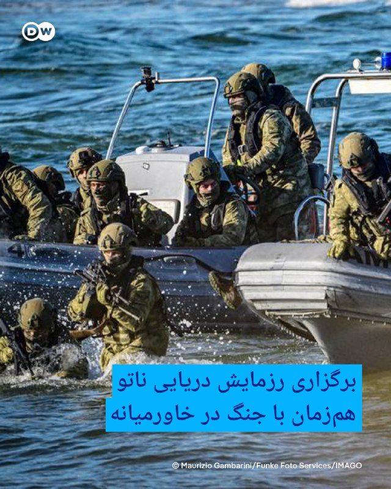

🔶 برگزاری رزمایش دریایی ناتو هم‌زمان با جنگ در خاورمیانه

پیمان آتلانیتک شمالی (ناتو) در حال انجام رزمایش دریایی خود در دریای بالتیک معروف به بالتاپس است.

در این رزمایش که از دیروز پنج‌شنبه چهارم ژوئن شروع شده و یکی از بزرگ‌ترین تمرین‌های نیروهای دریایی در دریای بالتیک به حساب می‌آید ۱۵ کشور، از جمله آلمان، بیش از ۳۰ یگان نظامی و حدود شش‌هزار سرباز زن و مرد شرکت می‌کنند.

ناوگان ششم نیروی دریایی آمریکا رهبری این رزمایش را برعهده دارد.

رزمایش ناتو در شرایطی برگزار می‌شود که ایالات متحده هم‌زمان با جمهوری اسلامی ایران درگیر است.

رزمایش ناتو روز پنجشنبه در بندر گدینیا در لهستان آغاز شده و بخش‌های وسیعی از غرب، جنوب و مرکز دریای بالتیک را دربر می‌گیرد.

ناوهای کوروت "براونشوایگ" و "ارفورت" آلمان با ۶۰ خدمه از شهر روستوک به محل برگزاری این رزمایش اعزام شده‌اند. یک زیر دریایی و یک هواپیمای شناسایی دریایی آلمانی نیز در این رزمایش حضور دارند و ناوچه "زاکسن-آنهالت" از شهر بندری ویلهلمس‌هافن نیز به تمرین ملحق می‌شود.
@dw_farsi

## RadioFarda — post 157926

🔸فرماندهی هند-اقیانوسیه ارتش آمریکا روز جمعه اعلام کرد که نیروهای آمریکایی طی شب گذشته در اقیانوس هند یک عملیات توقیف و بازرسی علیه نفتکش بدون تابعیت «ام‌تی داوینا» که تحت تحریم قرار دارد، انجام داده‌اند. 🔸فرماندهی هند-اقیانوسیه آمریکا در پیامی در شبکه ایکس…

## RadioFarda — post 157925

🔸فرماندهی هند-اقیانوسیه ارتش آمریکا روز جمعه اعلام کرد که نیروهای آمریکایی طی شب گذشته در اقیانوس هند یک عملیات توقیف و بازرسی علیه نفتکش بدون تابعیت «ام‌تی داوینا» که تحت تحریم قرار دارد، انجام داده‌اند.

🔸فرماندهی هند-اقیانوسیه آمریکا در پیامی در شبکه ایکس نوشت: «ما به اجرای قوانین دریایی در سطح جهانی ادامه خواهیم داد تا شبکه‌های غیرقانونی را مختل کنیم و کشتی‌هایی را که در هر نقطه‌ای از جهان از ایران حمایت مادی می‌کنند، رهگیری کنیم.»

🔸ایالات متحده از اواخر فروردین محاصره دریایی ایران را آغاز کرده و نیروهای نظامی ایران نیز برای جلوگیری از عبور کشتی‌ها از تنگه هرمز، در ورودی خلیج فارس، به سوی برخی شناورها آتش گشوده‌اند.

@RadioFarda

## idfinfarsi — post 11779

  <a href="telegram/content/idfinfarsi_11779_1780666417.mp4" target="_blank">🎬 Download video</a>

‼️ بیش از ۶۵۰ حمله در جنوب لبنان، به هلاکت رسیدن پنج تروریست برجسته در نوار غزه و بیش از ۶۰ بازداشت در یهودا و سامره: جمع‌بندی فعالیت‌های ارتش اسرائیل در هفته گذشته

🔸نیروهای ارتش اسرائیل به فعالیت خود در سه جبهه به‌صورت هم‌زمان برای رفع تهدیدها علیه شهروندان کشور اسرائیل ادامه می‌دهند.

🔸در فرماندهی شمال، در طول هفته گذشته بیش از ۶۵۰ هدف متعلق به سازمان تروریستی حزب‌الله توسط نیروی هوایی مورد حمله قرار گرفت و با هدایت معاونت اطلاعات نظامی بیش از ۱۲۵ تروریست در جنوب لبنان به هلاکت رسیدند. این در کنار فعالیت نیروهای زمینی در خط مقدم دفاعی برای انهدام زیرساخت‌های تروریستی و رفع تهدیدها علیه ساکنان شمال و نیروهای فعال در منطقه انجام شد.

🔸در فرماندهی جنوب، تلاش سیستماتیک حفاری برای شناسایی و انهدام مسیرهای زیرزمینی ادامه دارد، با تمرکز بر منطقه خان‌یونس. همچنین ۱۳ تروریست از هوا به هلاکت رسیدند، از جمله چهار نفر از مقامات ارشد دستگاه امنیت عمومی سازمان تروریستی حماس در نوار غزه، و یک تروریست که در حال پیشبرد فعالیت‌های تروریستی علیه نیروهای ارتش اسرائیل بود و در جریان حمله ۷ اکتبر وارد خاک کشور شد و در ربودن چهار اسرائیلی از پناهگاه در تقاطع رئیم مشارکت داشت.

🔸در فرماندهی مرکز، بیش از ۶۰ فرد تحت تعقیب بازداشت شدند، از جمله تروریست‌هایی که قصد اجرای حملات در بازه زمانی فوری را داشتند، و همچنین افراد تحت تعقیب مسلح و پرتاب‌کنندگان سنگ و کوکتل مولوتوف. علاوه بر این، چندین سلاح از جمله سلاح‌های نوع «M16» و «MP5»، سلاح دست‌ساز نوع «کارلو»، تفنگ شکاری و مقدار زیادی مهمات ضبط شد. همچنین تلاش برای قاچاق ۱۰ قبضه سلاح کمری از مرز شرقی خنثی شد. تمام این اقدامات در چارچوب ده‌ها فعالیت تهاجمی برای مقابله با تروریسم در یهودا و سامره انجام شد.

🔸همزمان، نیروهای ارتش اسرائیل به فعالیت برای مقابله با قاچاق و تقویت دفاع در امتداد مرزهای شرقی و غربی ادامه می‌دهند.

## Dirty_Kids — post 391054

  <a href="telegram/content/Dirty_Kids_391054_1780666419.mp4" target="_blank">🎬 Download video</a>

باور میکنید در یک برنامه تلویزیون حکومتی،‌ خیلی شیک و مجلسی خبر دادند که ناو آبراهام لینکلن رو غرق کردن و شرکت کننده‌ها بخاطر این پیروزی! صلوات فرستادند
حکومت نیست، رسما دیوونه‌خونه است

@Dirty_Kids 👻

## alonews — post 125322

  <a href="telegram/content/alonews_125322_1780666419.webm" target="_blank">🎬 Download video</a>

👈هادی چوپان:
خاک میخورم اما خاک نمیفروشم

✅ @AloNews خبر جنگ

## alonews — post 125321

  <a href="telegram/content/alonews_125321_1780666420.webm" target="_blank">🎬 Download video</a>

⚫
🏆 به دنیای هیجان‌انگیز فوتبال خوش اومدی!

⭐️اینجا قراره باهم لحظه‌به‌لحظه‌ی جام جهانی رو زندگی کنیم؛
از بازی‌های حساس و نتایج داغ گرفته تا حاشیه‌ها، کری‌خونی‌ها و اتفاقاتی که همه درباره‌ش حرف میزنن! 
🔥
🔥

✅ پوشش کامل مسابقات

💀ترول تیم‌ها و بازیکن‌ها

🎥ویدیوها و لحظه‌های فان فوتبالی

📊آمار، ترکیب‌ها و اخبار فوری

🌍حواشی جذاب از سراسر جام جهانی

📢اینجا فقط یک کانال خبری نیست؛
یک جمع فوتبالیه برای کسایی که فوتبال رو با هیجان، شوخی و احساس واقعی دنبال میکنن 
📛
💟

🆘
🔞 آماده باش چون قراره جام جهانی رو متفاوت تجربه کنیم!

⚡ @Vaarzesh_Plus

⚡ @Vaarzesh_Plus

---
📅 بروزرسانی: 1405/03/15 16:53
---

## VahidOOnLine — post 243796

  

محمد جمالیان، عضو کمیسیون بهداشت مجلس گفت: «در بسیاری از استان‌ها، مردم به صورت غیرقانونی اقدام به کشت خشخاش کرده‌اند و بر اساس گزارش‌هایی که دریافت شده، میزان این کشت بسیار بالا است. مثلا در یک استانی قبلا برنج می‌کاشتند اما امروز به کاشت خشخاش روی آوردند.»

او افزود: «کشت غیرقانونی می‌تواند هم منجر به ترویج مصرف تریاک شود و هم با توجه به اینکه این محصولات خالص‌تر هستند، قطعا شدت اعتیاد را در میان مردم، به‌ویژه جوانان ما افزایش دهد.»

این نماینده مجلس ادامه داد: «قانون کشور ما حتی برای مصارف درمانی نیز چنین مجوزی صادر نکرده است.»
‌🏁 🇬🇧 IranintlTV

🤖 @VahidOOnLine

## WithYashar — post 13553

رئیس‌جمهور لبنان، ژوزف عون، در مصاحبه‌ای با سی‌ان‌ان ایران را متهم کرد که در رویارویی با آمریکا و اسرائیل از کشور او به‌عنوان یک برگ چانه‌زنی استفاده می‌کند و گفت: «این کشور، کشور شما نیست.»
عون همچنین افزود که مردم لبنان از جنگ میان اسرائیل و حزب‌الله خسته شده‌اند.
@withyashar

## IranIntlTV — post 340658

  

محمد جمالیان، عضو کمیسیون بهداشت مجلس گفت: «در بسیاری از استان‌ها، مردم به صورت غیرقانونی اقدام به کشت خشخاش کرده‌اند و بر اساس گزارش‌هایی که دریافت شده، میزان این کشت بسیار بالا است. مثلا در یک استانی قبلا برنج می‌کاشتند اما امروز به کاشت خشخاش روی آوردند.»

او افزود: «کشت غیرقانونی می‌تواند هم منجر به ترویج مصرف تریاک شود و هم با توجه به اینکه این محصولات خالص‌تر هستند، قطعا شدت اعتیاد را در میان مردم، به‌ویژه جوانان ما افزایش دهد.»

این نماینده مجلس ادامه داد: «قانون کشور ما حتی برای مصارف درمانی نیز چنین مجوزی صادر نکرده است.»
https://iranintl.com/202606057983

## Shin_Persian — post 6519

  

🔁 Quoting above tweet:
Shin ✓ @hey_itsmyturn
Fri, 05 Jun 2026 13:17:28 UTC

Following Iranian claims that warning shots were fired at U.S. warships in the Gulf of Oman, U.S. Central Command says the reports are false and no such attack occurred.

Source: @CENTCOM
https://x.com/CENTCOM/status/2062886477105623083

فارسی

در پی ادعاهای ایران مبنی بر شلیک تیرهای هشدار به سمت ناوهای جنگی ایالات متحده در دریای عمان، فرماندهی مرکزی ایالات متحده (سنتکام) اعلام کرد که این گزارش‌ها کذب بوده و چنین حمله‌ای رخ نداده است.

منبع: @CENTCOM
https://x.com/CENTCOM/status/2062886477105623083

𝕏 · @shin_persian

## Shin_Persian — post 6518

  

↩️ Quoted tweet: U.S. Central Command ✓ @CENTCOM Fri, 05 Jun 2026 13:17:17 UTC 🚫 CLAIM: Iran claims it fired warning shots at U.S. warships in the Gulf of Oman, forcing American vessels to “retreat” toward the Indian Ocean. FALSE. ✅TRUTH: Iranian forces…

## Shin_Persian — post 6517

↩️ Quoted tweet:
U.S. Central Command ✓ @CENTCOM
Fri, 05 Jun 2026 13:17:17 UTC

🚫 CLAIM: Iran claims it fired warning shots at U.S. warships in the Gulf of Oman, forcing American vessels to “retreat” toward the Indian Ocean. FALSE.

✅TRUTH: Iranian forces did NOT attack or fire at U.S. Navy warships. Doing so would be a gross violation of the ceasefire.

↩️ توییت نقل‌قول شده — برای پاسخ، پست زیر را ببینید.

فارسی

🚫 ادعا: ایران ادعا می‌کند که به سمت ناوهای جنگی ایالات متحده در دریای عمان تیراندازی هشدار انجام داده و شناورهای آمریکایی را مجبور به «عقب‌نشینی» به سمت اقیانوس هند کرده است. نادرست.

✅ حقیقت: نیروهای ایرانی به سمت ناوهای جنگی نیروی دریایی ایالات متحده حمله یا شلیک نکرده‌اند. انجام چنین کاری نقض فاحش آتش‌بس خواهد بود.

𝕏 · @shin_persian

## Shin_Persian — post 6516

  

Shin ✓ @hey_itsmyturn
Fri, 05 Jun 2026 13:16:31 UTC

Following Iranian claims that it fired warning shots at U.S. warships in the Gulf of Oman, U.S. Central Command says the reports are false and no such attack occurred.

Source: @CENTCOM
https://x.com/CENTCOM/status/2062886236797198718

فارسی

در پی ادعاهای ایران مبنی بر شلیک تیرهای هشدار به سمت ناوهای جنگی ایالات متحده در دریای عمان، فرماندهی مرکزی ایالات متحده (سنتکام/CENTCOM) اعلام کرد که این گزارش‌ها کذب بوده و چنین حمله‌ای رخ نداده است.

منبع: @CENTCOM
https://x.com/CENTCOM/status/2062886236797198718

𝕏 · @shin_persian

## Shin_Persian — post 6515

  

🔁 Quoting above tweet:
Shin ✓ @hey_itsmyturn
Fri, 05 Jun 2026 13:16:10 UTC

Following Iranian claims that warning shots were fired at U.S. warships in the Gulf of Oman, U.S. Central Command says the reports are false and no such attack occurred.

Source: @CENTCOM
https://x.com/CENTCOM/status/2062886142500909326

فارسی

در پی ادعاهای ایران مبنی بر شلیک تیرهای هشدار به سمت ناوهای جنگی ایالات متحده در دریای عمان، ستاد فرماندهی مرکزی ایالات متحده (سنتکام/CENTCOM) اعلام کرد که این گزارش‌ها کذب بوده و چنین حمله‌ای رخ نداده است.

منبع: @CENTCOM
https://x.com/CENTCOM/status/2062886142500909326

𝕏 · @shin_persian

## Shin_Persian — post 6514

  

↩️ Quoted tweet: U.S. Central Command ✓ @CENTCOM Fri, 05 Jun 2026 13:15:57 UTC 🚫 CLAIM: Iran claim it fired warning shots at U.S. warships in the Gulf of Oman, forcing American vessels to “retreat” toward the Indian Ocean. FALSE. ✅ TRUTH: Iranian forces…

## Shin_Persian — post 6513

↩️ Quoted tweet:
U.S. Central Command ✓ @CENTCOM
Fri, 05 Jun 2026 13:15:57 UTC

🚫 CLAIM: Iran claim it fired warning shots at U.S. warships in the Gulf of Oman, forcing American vessels to “retreat” toward the Indian Ocean. FALSE.

✅ TRUTH: Iranian forces did NOT attack or fire at U.S. Navy warships. Doing so would be a gross violation of the ceasefire.

↩️ توییت نقل‌قول شده — برای پاسخ، پست زیر را ببینید.

فارسی

🚫 ادعا: ایران ادعا می‌کند که به سمت ناوهای جنگی ایالات متحده در دریای عمان شلیک‌های هشدار انجام داده و شناورهای آمریکایی را مجبور به «عقب‌نشینی» به سمت اقیانوس هند کرده است. نادرست.

✅ حقیقت: نیروهای ایرانی به سمت ناوهای جنگی نیروی دریایی ایالات متحده حمله یا شلیک نکرده‌اند. انجام چنین کاری نقض فاحش آتش‌بس خواهد بود.

𝕏 · @shin_persian

## Hranews — post 113400

تخریب کلیسای تاریخی انجیلی مشهد توسط عوامل ناشناس

❗️
❗️
❗️
❗️
❗️– کلیسای تاریخی انجیلی مشهد، از آثار ثبت‌شده در فهرست میراث ملی ایران، ساعت ۲ الی ۴ بامداد پنج‌شنبه ۱۴ خردادماه به‌طور کامل تخریب شد. جماران اعلام کرد که این بنا توسط عوامل ناشناس و با استفاده از بولدوزر تخریب شده و همزمان از حضور شهروندان و خبرنگاران در محل جلوگیری به عمل آمده است.

ادامه مطلب

↘️
@hranews_bot تماس ✉️ - @Hranews کانال هرانا 🆑

## alonews — post 125320

  <a href="telegram/content/alonews_125320_1780665828.webm" target="_blank">🎬 Download video</a>

👈فرماندهی مرکزی ایالات متحده:
نیروهای ایرانی به کشتی‌های جنگی نیروی دریایی آمریکا حمله نکردند و به آنها شلیک نکردند.

🔴انجام چنین کاری نقض آشکار آتش‌بس خواهد بود. نیروهای آمریکایی همچنان آزادانه در آب‌های منطقه‌ای فعالیت می‌کنند و در عین حال محاصره جاری علیه ایران را به طور کامل اجرا می‌کنند.

✅ @AloNews خبر جنگ

## alonews — post 125319

  <a href="telegram/content/alonews_125319_1780665828.webm" target="_blank">🎬 Download video</a>

👈گروسی به الجزیره: ما بیش از ۸ ماه است که نتوانسته‌ایم ذخایر اورانیوم اعلام شده ایران را تأیید کنیم

✅ @AloNews خبر جنگ

## alonews — post 125318

  <a href="telegram/content/alonews_125318_1780665829.webm" target="_blank">🎬 Download video</a>

👈ماجرای پرواز جنگنده‌ها در ارتفاع پایین بر فراز اصفهان چه بود؟

🔴 دقایقی قبل پرواز چند فروند جنگنده در ارتفاع نسبتاً پایین بر فراز برخی مناطق شهر اصفهان مشاهده شد که صدای آن نیز توسط شهروندان شنیده شد.

🔴 پیگیری‌های خبرنگار مهر نشان می دهد، این جنگنده‌ها متعلق به نیروهای مسلح کشورمان بوده و پرواز آنها در چارچوب مأموریت‌های عملیاتی یا تمرینی انجام شده است.

🔴 گزارش‌ها حاکی است این پروازها در ادامه فعالیت‌های معمول دفاعی و امنیتی صورت گرفته و جای نگرانی برای شهروندان وجود ندارد.

✅ @AloNews خبر جنگ

## alonews — post 125315

  <a href="telegram/content/alonews_125315_1780665829.mp4" target="_blank">🎬 Download video</a>

👈جنگنده‌های اسرائیلی امروز نیز به حملات هوایی در سراسر جنوب لبنان ادامه داده‌اند.

✅ @AloNews خبر جنگ

---
📅 بروزرسانی: 1405/03/15 16:43
---

## VahidOOnLine — post 243795

  

خبرگزاری فارس، وابسته به سپاه پاسداران، به نقل از منبعی نزدیک به تیم مذاکره‌کننده جمهوری اسلامی گزارش داد خبر منتشرشده درباره موافقت تهران با انتقال بخشی از ذخایر اورانیوم غنی‌شده به یک کشور ثالث نادرست است.

این منبع گفت موضوعات مرتبط با پرونده هسته‌ای در مرحله کنونی مذاکرات مطرح نیست و بررسی آنها به مراحل بعدی گفت‌وگوها موکول شده است.
بر اساس این گزارش موضوع انتقال ذخایر اورانیوم در دستور کار فعلی قرار ندارد و ابتدا باید طرف آمریکایی اقدامات مشخص انجام دهد و درباره مسائل اساسی توافق‌های روشن حاصل شود.
شبکه العربیه پیش‌تر گزارش داده بود تهران با انتقال بخشی از ذخایر اورانیوم خود به کشوری ثالث که مورد توافق طرفین باشد، موافقت کرده است.
‌🏁 🇬🇧 IranintlTV

🤖 @VahidOOnLine

## VahidOOnLine — post 243794

  <a href="telegram/content/VahidOOnLine_243794_1780665184.mp4" target="_blank">🎬 Download video</a>

♦️محسن نقوی، وزیر کشور پاکستان، روز جمعه ۱۵ خردادماه  برای دومین بار در بیشکک، پایتخت قرقیزستان، با اسکندر مومنی، وزیر کشور جمهوری اسلامی ایران دیدار و گفت‌وگو کرد.
به گزارش رسانه‌های دولتی پاکستان، دو طرف در این دیدار درباره روابط دوجانبه، تحولات منطقه‌ای، مسائل امنیت داخلی و راهکارهای کاهش تنش‌ها رایزنی کردند. وزرای کشور ایران و پاکستان همچنین بر تداوم گفت‌وگوهای دیپلماتیک و گسترش همکاری‌های مشترک تأکید کردند.
بر اساس این گزارش، تقویت هماهنگی‌های منطقه‌ای برای مقابله با چالش‌های امنیتی و دستیابی به ثبات پایدار از محورهای اصلی این دیدار بوده است.
‌🇸🇦 Indypersian

🤖 @VahidOOnLine

## VahidOOnLine — post 243793

  <a href="telegram/content/VahidOOnLine_243793_1780665184.mp4" target="_blank">🎬 Download video</a>

یک شهروند با اشاره به تورم فزاینده و ناتوانی مردم در تامین معیشت می‌گوید اگر فشار خارجی آمریکا به جمهوری اسلامی ادامه یابد، حکومت «نفس‌های آخرش را می‌کشد.» پیام او با هوش مصنوعی خوانده شده است.
‌🏁 🇬🇧 IranintlTV

🤖 @VahidOOnLine

## mwarmonitor — post 10173

🔴رئیس‌جمهور لبنان، جوزف عون، گفت نعیم قاسم، رهبر حزب‌الله، «نماینده مردم لبنان نیست» و در گفت‌وگو با CNN تأکید کرد: «مردم لبنان، مردم تو نیستند»، پس از آنکه قاسم توافق آتش‌بس با اسرائیل را «تسلیم» توصیف کرده بود.

🔸عون گفت مردم لبنان از همه طوایف، از جمله شیعیان، از جنگ حزب‌الله با اسرائیل «خسته شده‌اند» و «شایسته نیست هر ۵ تا ۱۰ سال خانه‌هایشان ویران شود».

🔸رئیس‌جمهور لبنان، جوزف عون، گفت «راه‌حل‌های نظامی» هرگز امنیت را برای شمال اسرائیل به ارمغان نخواهد آورد و از اسرائیلی‌ها خواست به جای «جنگ بی‌پایان»، مسیر مذاکره را انتخاب کنند.

🔹عون گفت لبنان آماده مذاکره برای پایان دادن به درگیری‌ها است و احتمال دیدار با بنیامین نتانیاهو را رد نکرد، اما تأکید کرد این دیدار تنها پس از رسیدن به یک توافق انجام خواهد شد.

🔹رئیس‌جمهور لبنان، جوزف عون، ایران را متهم کرد که از لبنان به‌عنوان «ابزار چانه‌زنی» در مذاکرات با آمریکا استفاده می‌کند و گفت تهران «برای منافع خود» عمل می‌کند در حالی که مردم لبنان «هزینه آن را می‌پردازند».

🔸عون در گفت‌وگو با CNN همچنین بیانیه نیروی قدس سپاه پاسداران (IRGC) را که خواستار عقب‌نشینی اسرائیل از لبنان در چارچوب یک توافق آتش‌بس میان آمریکا و ایران شده بود رد کرد و خطاب به این نیروی ایران گفت: «این کشور شما نیست، کشور ماست.»

🔸او افزود لبنان و اسرائیل پس از «مذاکرات سخت» به توافقی برای اجرای آتش‌بس رسیده‌اند و آن را مسیر احتمالی به سوی «صلحی عادلانه و پایدار» توصیف کرد، هرچند حزب‌الله که در این توافق حضور نداشت، آن را رد کرده است.

@mwarmonitor

## pm_afshaa — post 92308

  <a href="telegram/content/pm_afshaa_92308_1780665186.mp4" target="_blank">🎬 Download video</a>

یه زن بی‌حجاب میرفته تجمعات، حالا مصاحبه‌اش قبل و بعد از آتش بس:

قبل از آتش بس: بسیجیا اصلا به حجابم گیر نمیدن، تازه گل و شیرینی هم بهم میدن و خیلی مهربونن.
بعد از آتش بس: بسیجیا دائم به حجابم گیر میدن، هی میگن خانم روسری سرت کن.

💧Rainbet.com the #1 Non-KYC Crypto Casino & Sportsbook @rainbetcom

😁 @Pm_Afshaa

## IranIntlTV — post 340657

  

خبرگزاری فارس، وابسته به سپاه پاسداران، به نقل از منبعی نزدیک به تیم مذاکره‌کننده جمهوری اسلامی گزارش داد خبر منتشرشده درباره موافقت تهران با انتقال بخشی از ذخایر اورانیوم غنی‌شده به یک کشور ثالث نادرست است.

این منبع گفت موضوعات مرتبط با پرونده هسته‌ای در مرحله کنونی مذاکرات مطرح نیست و بررسی آنها به مراحل بعدی گفت‌وگوها موکول شده است.
بر اساس این گزارش موضوع انتقال ذخایر اورانیوم در دستور کار فعلی قرار ندارد و ابتدا باید طرف آمریکایی اقدامات مشخص انجام دهد و درباره مسائل اساسی توافق‌های روشن حاصل شود.
شبکه العربیه پیش‌تر گزارش داده بود تهران با انتقال بخشی از ذخایر اورانیوم خود به کشوری ثالث که مورد توافق طرفین باشد، موافقت کرده است.
https://iranintl.com/202606054047

## IranIntlTV — post 340656

  <a href="telegram/content/IranIntlTV_340656_1780665188.mp4" target="_blank">🎬 Download video</a>

یک شهروند با اشاره به تورم فزاینده و ناتوانی مردم در تامین معیشت می‌گوید اگر فشار خارجی آمریکا به جمهوری اسلامی ادامه یابد، حکومت «نفس‌های آخرش را می‌کشد.» پیام او با هوش مصنوعی خوانده شده است.

## DW_Farsi — post 125526

  

🔶 نتانیاهو: بدون موافقت حزب‌الله درباره طرح آتش‌بس رای‌گیری نمی‌شود

در پی مخالفت حزب‌الله لبنان با چارچوب پیشنهادی آتش‌بس مورد حمایت آمریکا، اسرائیل تصمیم‌گیری درباره این طرح را به تعویق انداخت.

در نشست کابینه امنیتی اسرائیل در شامگاه پنجشنبه ۱۴ خرداد (۴ ژوئن) برخی وزرا با پیشنهاد آتش‌بس با لبنان مخالفت کردند، اما رای‌گیری انجام نشد؛ زیرا نعیم قاسم، رهبر حزب‌الله این پیشنهاد را رد کرده بود.

چارچوب آتش‌بس پس از مذاکرات اسرائیل و لبنان در واشنگتن از سوی ایالات متحده اعلام شد و یکی از بندهای اصلی آن "توقف حملات حزب‌الله و عقب‌نشینی نیروهای این گروه از جنوب رود لیتانی" را شامل می‌شد.

بنیامین نتانیاهو، نخست‌وزیر اسرائیل در نشست کابینه خود گفت که اسرائیل هنوز منتظر پذیرش رسمی این طرح از سوی حزب‌الله است و تاکید کرد، تا زمانی که توافقی وجود نداشته باشد، موضوع برای رای‌گیری مطرح نخواهد شد.

وبسایت خبری "وای‌نت" نوشته است، وزرا در نشست کابینه نتانیاهو از کشته‌شدن ایتان شموئل لامبرگ، افسر زرهی ارتش اسرائیل در جنوب لبنان مطلع شدند؛ موضوعی که مخالفت برخی وزرا با آتش‌بس را تشدید کرد.
@dw_farsi

## Persian_Trend_Official — post 15753

  <a href="telegram/content/Persian_Trend_Official_15753_1780665190.mp4" target="_blank">🎬 Download video</a>

⭕️ یک زن بی‌حجاب در تجمعات حکومتی قبل و بعد از آتش بس:

قبل از آتش بس: بسیجیا اصلا به حجابم گیر نمیدن، تازه گل و شیرینی هم بهم میدن و خیلی مهربونن.
بعد از آتش بس: بسیجیا دائم به حجابم گیر میدن، هی میگن خانم روسری سرت کن.

📝 Nick

📌 @persian_trend_official
پرشین ترند | متفاوت‌ترین کانال نظامی

## Persian_Trend_Official — post 15752

  <a href="telegram/content/Persian_Trend_Official_15752_1780665192.mp4" target="_blank">🎬 Download video</a>

⭕️ پست جدید IDF:

هر کسی که سلاحش را به سمت اسرائیل نشانه بگیرد...

به یک هدف تبدیل می شود.

📝 Nick

📌 @persian_trend_official
پرشین ترند | متفاوت‌ترین کانال نظامی

## IranianMinds — post 21426

🔴حمله و فحاشی حامیان حکومت به جوانان برای حجاب.

@IranianMinds

## BBCPersian — post 282916

  <a href="telegram/content/BBCPersian_282916_1780665193.mp4" target="_blank">🎬 Download video</a>

🔻ارتش ایران می‌گوید که به سمت ناوشکن‌های آمریکا تیرهای اخطار شلیک کرده است

روابط عمومی ارتش ایران اعلام کرده است که نیروی دریایی در دریای عمان به سمت ناوشکن‌های آمریکایی تیرهای اخطار شلیک کرده است.

تلویزیون ایران هم تصاویری منتشر کرده است که می‌گوید مربوط به لحظه شلیک تیرهای اخطار است؛ در این تصاویر یک لانچر متحرک در حال شلیک موشک و همچنین لحظه شلیک پهپاد دیده می‌شود.

در بیانیه ارتش که متن آن در رسانه‌های دولتی ایران منتشر شده آمده است: «پس از شلیک‌های اخطارِ موشک قدیر و پهپادهای تهاجمی جدید... ناوشکن‌های متجاوز دریای عمان را به سمت اقیانوس هند ترک کردند.»

بر اساس این بیانیه شلیک تیرهای اخطار «در ادامه عملیات مقابله با شرارت‌ها و مزاحمت‌های دریایی و ربایش شناورهای تجاری و نفت کش» از سوی نیروی دریایی آمریکا صورت گرفته است.

ایالات متحده هنوز واکنشی به این گزارش نشان نداده است.

🎥IRIB

## alonews — post 125314

  <a href="telegram/content/alonews_125314_1780665195.webm" target="_blank">🎬 Download video</a>

👈رئیس جمهور لبنان :
- سپاه پاسداران ایران باید بفهمه که لبنان کشور ماست، نه کشور اونا

✅ @AloNews خبر جنگ

## alonews — post 125313

  <a href="telegram/content/alonews_125313_1780665195.mp4" target="_blank">🎬 Download video</a>

👈ثابتی: قالیباف تو مذاکرات اختیارات تام نداره و پیشنهاد پزشکیان بوده. تو مذاکرات اسلام‌آباد اشتباهاتی خلاف خط قرمز رهبری شکل گرفته که باعث شده هیئت تذکر بگیرن.

✅ @AloNews خبر جنگ

## alonews — post 125312

  <a href="telegram/content/alonews_125312_1780665197.webm" target="_blank">🎬 Download video</a>

👈رئیس‌جمهور لبنان به سی‌ان‌ان : به نعیم قاسم میگم، مردم لبنان، مردم تو نیستن

🔴ایران کمکمون نمی‌کنه

🔴سپاه پاسداران ایران باید بفهمه که لبنان کشور ماست، نه کشور اون

✅ @AloNews خبر جنگ

## alonews — post 125311

  <a href="telegram/content/alonews_125311_1780665197.webm" target="_blank">🎬 Download video</a>

👈وزارت امور خارجه آلمان هشدار سفر برای بحرین و کویت صادر کرد و از شهروندان آلمان خواست که به این کشورها سفر نکنند

✅ @AloNews خبر جنگ

## alonews — post 125310

  <a href="telegram/content/alonews_125310_1780665197.mp4" target="_blank">🎬 Download video</a>

👈زاینده‌رود اصفهان پس از سال‌ها احیا شد

🔴گزارش‌ها حاکیست که پس از خشک‌سالی‌های طولانی، جریان آب در زاینده‌رود اصفهان دوباره برقرار شده و رودخانه احیا شده است.
این احیا باعث بهبود شرایط زیست‌محیطی، کشاورزی و فضای شهری در مسیر رودخانه شده و مردم محلی خوشحالی خود را از بازگشت آب نشان داده‌اند.

✅ @AloNews خبر جنگ

---
📅 بروزرسانی: 1405/03/15 16:33
---

## VahidOOnLine — post 243792

  

خانواده فاطمه سپهری، زندانی سیاسی، با ابراز نگرانی از وضعیت سلامتی او، خواستار رسیدگی فوری و فراهم شدن امکان درمان کامل و خارج از زندان برای این زندانی سیاسی شدند.

علی سپهری، برادر این زندانی سیاسی نوشت از مهر ۱۴۰۲ و پس از بازگرداندن سپهری به زندان بعد از عمل قلب باز، روند درمان او از تامین دارو تا انتخاب پزشک تحت نظر مسئولان زندان بوده و اخیراً نیز اعلام شده برخی داروهای قلب او به دلیل گرانی و نایاب شدن قابل تهیه نیست.

او همچنین گفت آزمایش‌ها و نمونه‌برداری‌های مرتبط با بیماری روماتولوژی سپهری به‌صورت ناقص انجام شده و امکان مراجعه دوباره به پزشک فراهم نشده است. سپهری حدود چهار ماه است از مشکلات شدید گوارشی رنج می‌برد و با وجود تجویز سونوگرافی، زمان انجام آن هنوز مشخص نیست.
‌🏁 🇬🇧 IranintlTV

🤖 @VahidOOnLine

## FoxNewsTwitter — post 342645

  <a href="telegram/content/FoxNewsTwitter_342645_1780664601.mp4" target="_blank">🎬 Download video</a>

Fox News (Twitter/X)

President Trump said he would be willing to meet with Iran’s new supreme leader if it could help secure a deal preventing Iran from obtaining a nuclear weapon, while emphasizing that the U.S. would achieve that goal through diplomacy or military means if necessary.

Meanwhile, Ukrainian President Volodymyr Zelenskyy has proposed a face-to-face meeting with Russian President Vladimir Putin to discuss ending the war, though it remains unclear whether Putin will agree to the talks, @pdoocy reports.

## pm_afshaa — post 92307

  <a href="telegram/content/pm_afshaa_92307_1780664603.webm" target="_blank">🎬 Download video</a>

🔴العربیه: ایران بطور رسمی به پاکستان ابلاغ کرده که با انتقال بخشی از ذخایر اورانیوم خودش به یک کشور ثالث مورد توافق طرفین، موافقه 
💧 Rainbet.com the #1 Non-KYC Crypto Casino & Sportsbook @rainbetcom 
😁 @Pm_Afshaa

## pm_afshaa — post 92306

  <a href="telegram/content/pm_afshaa_92306_1780664604.webm" target="_blank">🎬 Download video</a>

🔴غریب‌آبادی، معاون وزیر خارجه:
در مورد متن توافق، تقریبا خیلی جلو رفتیم. اصرار ما اینه که 50 درصد از وجوه بلوکه شده بلافاصله با امضای یادداشت تفاهم، در اختیار ایران قرار بگیره؛ مابقی آن هم بعد از طی یک یا دو ماه؛ رفع تحریم‌ها و مباحث مرتبط با هسته‌ای در مرحله دوم مذاکرات قرار دارن.

💧 Rainbet.com the #1 Non-KYC Crypto Casino & Sportsbook @rainbetcom

😁 @Pm_Afshaa

## DEJradio — post 5353

  <a href="telegram/content/DEJradio_5353_1780664604.webm" target="_blank">🎬 Download video</a>

🔺📢 تصویب طرح کنگره آمریکا برای مشروط کردن حمله به ایران؛

*روح‌الله رحیم‌پور، تحلیلگر سیاسی

#جنگ
@DEJradio

## IranIntlTV — post 340655

  

خانواده فاطمه سپهری، زندانی سیاسی، با ابراز نگرانی از وضعیت سلامتی او، خواستار رسیدگی فوری و فراهم شدن امکان درمان کامل و خارج از زندان برای این زندانی سیاسی شدند.

علی سپهری، برادر این زندانی سیاسی نوشت از مهر ۱۴۰۲ و پس از بازگرداندن سپهری به زندان بعد از عمل قلب باز، روند درمان او از تامین دارو تا انتخاب پزشک تحت نظر مسئولان زندان بوده و اخیراً نیز اعلام شده برخی داروهای قلب او به دلیل گرانی و نایاب شدن قابل تهیه نیست.

او همچنین گفت آزمایش‌ها و نمونه‌برداری‌های مرتبط با بیماری روماتولوژی سپهری به‌صورت ناقص انجام شده و امکان مراجعه دوباره به پزشک فراهم نشده است. سپهری حدود چهار ماه است از مشکلات شدید گوارشی رنج می‌برد و با وجود تجویز سونوگرافی، زمان انجام آن هنوز مشخص نیست.
https://iranintl.com/202606054788

## Dirty_Kids — post 391053

  <a href="telegram/content/Dirty_Kids_391053_1780664605.mp4" target="_blank">🎬 Download video</a>

یک روزگاری رژیم اسلامی از این فیلم‌ها میساخت که خواننده‌های لس آنجلسی و ایرانیانی که در لس انجلس زندگی‌ میکردند را مسخره کنه و امروز "قیصر" خواننده در پیتی لس انجلس را میبره تهران روی صحنه و پزش را میده....
دنیا دار مکافاته
پ‌ن: فیلم را گذاشتم که فقط یادشون بیاد ولا که ارزش دیگری نداره

@Dirty_Kids 👻

## Dirty_Kids — post 391052

  

شجاع خلیل‌زاده ارزانترین و بی‌ارزشترین بازیکن جام جهانی شد😂

@Dirty_Kids 👻

## alonews — post 125309

  <a href="telegram/content/alonews_125309_1780664607.webm" target="_blank">🎬 Download video</a>

👈رئیس‌جمهور لبنان : به نعیم قاسم میگم، مردم لبنان، مردم تو نیستن

✅ @AloNews خبر جنگ

## alonews — post 125308

  

🎙👤 شهریار مغانلو: آماده‌ایم که هر سه تا بازی جام‌جهانی رو ببریم و به عنوان تیم اول صعود کنیم
@AloSport

## alonews — post 125307

  <a href="telegram/content/alonews_125307_1780664608.mp4" target="_blank">🎬 Download video</a>

💔آخرین پیام جاویدنام امیر عباس رضابخش ۱۸ ساله، قبل از کشته شدنش در همان شب:

🔴«داداش، اگر برنگشتیم... عقب نکش. عقب‌نشینی نکن. ما برای این کشور خواهیم جنگید.»

🔴او همان شب جانش را برای ایران فدا کرد. یک شیر واقعی، قهرمانی که هرگز برنگشت.

🤔عرزشی حرام زاده، غیرت یعنی امیر عباس رضابخش نه تویی که اسلحه به سمت مردمت گرفتی و ادعای عدالت علی داری.

✅@AloNews

## alonews — post 125306

  <a href="telegram/content/alonews_125306_1780664609.webm" target="_blank">🎬 Download video</a>

🔴فوری / وزارت امور خارجه آلمان هشدار سفر برای بحرین و کویت صادر کرد و از شهروندان آلمان خواست که به این کشورها سفر نکنند

✅ @AloNews خبر جنگ

## alonews — post 125305

  <a href="telegram/content/alonews_125305_1780664610.webm" target="_blank">🎬 Download video</a>

👈کیر استارمر: ارزیابی اطلاعاتی ما و ارزیابی کشورهای دیگر عضو ناتو این است که ممکن است روسیه در سال ۲۰۳۰ به ناتو حمله کند.

🔴اغراق نیست اگر بگویم ما در خطرناک‌ترین و بی‌ثبات‌ترین دوران زندگی من و زندگی شما قرار داریم.

🔴اولین وظیفه من، وظیفه‌ای که بالاتر از همه چیز است، حفظ امنیت کشورمان و حفظ امنیت مردم ماست.

✅ @AloNews خبر جنگ

---
📅 بروزرسانی: 1405/03/15 16:23
---

## mwarmonitor — post 10172

🔴اسرائیل و ایالات متحده گفت‌وگوهای رسمی را درباره یک چارچوب جدید همکاری امنیتی آغاز کرده‌اند تا جایگزین تفاهم‌نامه فعلی کمک‌های نظامی آمریکا شود که در سال ۲۰۲۸ منقضی می‌شود، وزارت دفاع اسرائیل اعلام کرد.

📌این وزارتخانه گفت توافق در حال شکل‌گیری با هدف تقویت برتری نظامی اسرائیل از طریق گسترش سرمایه‌گذاری مشترک در تحقیق و توسعه، تولید مشترک و گذار تدریجی «از کمک به یک مشارکت کامل و متقابل» طراحی شده است.

@mwarmonitor

## DEJradio — post 5352

  <a href="telegram/content/DEJradio_5352_1780663980.webm" target="_blank">🎬 Download video</a>

🔺📢 فقر پنهان زنان؛ قاعدگی زیر فشار تورم و تابو

گزارش: آیسان قاسم‌پور

#قاعدگی #زنان_ایرانی
@DEJradio

## IranIntlTV — post 340654

  <a href="telegram/content/IranIntlTV_340654_1780663981.mp4" target="_blank">🎬 Download video</a>

انفجار یک تانکر سوخت قاچاق در شهر تپئاکای مکزیک آتش‌سوزی گسترده‌ای ایجاد کرد و ستونی عظیم از آتش و دود را به آسمان فرستاد. در پی این حادثه که پنجشنبه اتفاق افتاد، حدود دو هزار نفر از ساکنان مناطق اطراف به‌صورت اضطراری تخلیه شدند. تاکنون موردی از تلفات جانی گزارش نشده، اما دست‌کم سه نفر زخمی و به بیمارستان منتقل شده‌اند. رسانه‌های محلی گزارش داده‌اند این تانکر هنگام انفجار ظاهراً حامل بنزین قاچاق بوده است.
@iranintltv

## DW_Farsi — post 125525

🔶 تسهیل شرایط دریافت گذرنامه آلمانی برای قربانیان نازی‌ها

بر اساس اسناد ارائه‌شده از سوی وزارت کشور آلمان اداره فدرال اداری این کشور (BVA) از اوایل سال ۲۰۲۱ تا پایان ماه مارس سال جاری میلادی، در مجموع ۱۰۱ هزار و ۱۸۰ درخواست برای "تابعیت جبرانی" دریافت کرده است.

آمارها نشان می‌دهد که ۵۲ هزار و ۱۸۰ نفر در همین بازه زمانی موفق به دریافت تابعیت آلمانی شده‌اند. به گفته مقامات، پایین بودن آمار درخواست‌های ردشده، نشان‌دهنده زمان‌بر بودن روند بررسی پرونده‌هاست.

بخش قابل‌توجهی از این درخواست‌ها از سوی شهروندان ساکن اسرائیل و بریتانیا ثبت می‌شود؛ کشورهایی که پناهگاه اصلی بسیاری از یهودیان پس از به قدرت رسیدن نازی‌ها بودند.
@dw_farsi

## IranianMinds — post 21422

  <a href="telegram/content/IranianMinds_21422_1780663982.mp4" target="_blank">🎬 Download video</a>

🔴فرماندهی هند و اقیانوسیه ایالات متحده:
نیروهای آمریکایی شبانه یک توقیف دریایی و توقیف حق ورود به کشتی بدون تابعیت تحریم شده MT DAVINA واقع در اقیانوس هند در حوزه مسئولیت INDOPACOM را انجام دادند.

ما به اجرای قوانین دریایی جهانی برای مختل کردن شبکه‌های غیرقانونی و توقیف کشتی‌هایی که از ایران حمایت مادی می‌کنند، در هر کجا که فعالیت داشته باشند، ادامه خواهیم داد

@IranianMinds

## alonews — post 125304

  <a href="telegram/content/alonews_125304_1780663983.webm" target="_blank">🎬 Download video</a>

👈نیروی دریایی ایران اعلام کرد که ناوشکن‌های USS Truxtun (DDG-103) و USS Mason (DDG-87) تلاش کردند بدون مجوز ایران وارد خلیج فارس شوند و با شلیک موشک‌های ضد کشتی مواجه شدند که آنها را مجبور به بازگشت به سمت دریای عمان کرد

✅ @AloNews خبر جنگ

---
📅 بروزرسانی: 1405/03/15 16:13
---

## VahidOOnLine — post 243791

  <a href="telegram/content/VahidOOnLine_243791_1780663399.mp4" target="_blank">🎬 Download video</a>

ویدیوی رسیده به ایران اینترنشنال نشان می‌دهد ایرانیان اسپانیا روز چهارشنبه در سالگرد مرگ روح‌الله خمینی در شهر مادرید مقابل سفارت جمهوری اسلامی عکس او را به آتش کشیدند.
‌🏁 🇬🇧 IranintlTV

🤖 @VahidOOnLine

## VahidOOnLine — post 243790

🗣روایت شما از بحران اقتصادی و زندگی در آتش‌بس - جمعه ۱۵ خرداد:

🔹از شهرستان اهر، آذربایجان شرقی پیام می‌دهم؛ گرانی‌ها شگفت‌آور شده، یک کیک تولد ساده با اندازه متوسط به قیمت یک میلیون تومان رسیده است.

🔹از خرمشهر پیام می‌دهم، باوجود دمای ۴۵ درجه‌ای و گرمای شدید هوا، حدود یک هفته است که قطعی برق شروع شده. یک روز در میان برق را به مدت یک تا دو ساعت قطع می‌کنند.

🔹از مهرشهر کرج پیام می‌دهم؛ برای فهمیدن عمق فاجعه کافی است دنبال یک ورق قرص استامینوفن کدئین باشید. خودم بیشتر از ۱۰ داروخانه را گشتم، نبود. می‌گویند کسری خورده. در بازار سیاه ورقه‌ای ۱۰۰ هزار تومان است.

🔹از کوچه‌باغ تبریز: تعطیلی کسب‌وکارها و بیکاری و گرانی افسارگسیخته باعث شده مردم برای ضروریات زندگی و زنده ماندن رو بیاورند به فروش طلای اعضای خانواده.

🔹چند روزی است مجدداً قطعی برق شروع شده. محله‌ها روزی دو ساعت برق ندارند. در خرم‌آباد، محله شهدا و مطهری که اصلی‌ترین قسمت بازار شهر هستند، در اوج شلوغی ساعات ۱۸ تا ۲۰ برق را قطع می‌کنند. علاوه بر کسادی بازار و رکود تورمی، قطعی برق هم به این بحران اضافه شده.

🔹۴۷ سال است که زمستان می‌گویند گاز کم مصرف کنید، تابستون می‌گویند آب و برق کم مصرف کنید، چقدر وقت لازم دارید؟
‌🏁 🇬🇧 IranintlTV

🤖 @VahidOOnLine

## WithYashar — post 13552

ماجرای پرواز جنگنده‌ها در ارتفاع پایین بر فراز اصفهان چه بود؟

دقایقی قبل پرواز چند فروند جنگنده در ارتفاع نسبتاً پایین بر فراز برخی مناطق شهر اصفهان مشاهده شد که صدای آن نیز توسط شهروندان شنیده شد.
این جنگنده‌ها متعلق به نیروهای مسلح کشورمان بوده و پرواز آنها در چارچوب مأموریت‌های عملیاتی یا تمرینی انجام شده است و جای نگرانی برای شهروندان وجود ندارد
@withyashar

## WithYashar — post 13551

  <a href="telegram/content/WithYashar_13551_1780663402.mp4" target="_blank">🎬 Download video</a>

فرماندهی-اقیانوس آرام ایالات متحده (INDOPACOM) اعلام کرد که یک کشتی بی‌تابعیت تحریم‌شده متعلق به ناوگان سایه ایران را توقیف کرده است

در طول شب، نیروهای ایالات متحده عملیات بازدارندگی دریایی و حق بازدید و سوار شدن به کشتی تحریم‌شده بی‌تابعیت MT DAVINA را در اقیانوس هند در منطقه مسئولیت INDOPACOM انجام دادند.

ما ادامه اجرای جهانی دریایی برای مختل کردن شبکه‌های غیرقانونی و بازداشت کشتی‌هایی که حمایت مادی به ایران ارائه می‌دهند، هر کجا که عملیات کنند، را ادامه خواهیم داد.
آب‌های بین‌المللی نمی‌توانند به عنوان سپری برای بازیگران تحریم‌شده استفاده شوند. وزارت جنگ ادامه خواهد داد تا عملیات غیرقانونی و کشتی‌های آن‌ها را در حوزه دریایی از آزادی مانور محروم کند.
@withyashar

## FoxNewsTwitter — post 342644

‌Fox News (Twitter/X)

https://www.foxbusiness.com/economy/us-jobs-report-may-2026

## FoxNewsTwitter — post 342643

Fox News (Twitter/X)

BREAKING: US economy adds 172,000 jobs in May, blowing past expectations, Labor Dept reveals

## DEJradio — post 5351

  <a href="telegram/content/DEJradio_5351_1780663406.webm" target="_blank">🎬 Download video</a>

🔺📢 سیاست «برش سالامی» در خلیج فارس؛ ترامپ چگونه زمین بازی را تغییر می‌دهد؟

*نیما منصفی، پژوهشگر ژئوپلیتیک و تحلیلگر سیاسی

#ترامپ #خلیج_فارس
@DEJradio

## IranIntlTV — post 340653

  <a href="telegram/content/IranIntlTV_340653_1780663407.mp4" target="_blank">🎬 Download video</a>

ویدیوی رسیده به ایران اینترنشنال نشان می‌دهد ایرانیان اسپانیا روز چهارشنبه در سالگرد مرگ روح‌الله خمینی در شهر مادرید مقابل سفارت جمهوری اسلامی عکس او را به آتش کشیدند.

## FarsiVOA — post 219664

نیروهای دریایی ایالات متحده در جریان یک عملیات دریایی در اقیانوس هند، یک شناور بدون تابعیت و تحت تحریم مرتبط با جمهوری اسلامی را با نام «ام‌تی داوینا» بازرسی و متوقف کرده‌اند.

به گفته مقام‌های نظامی آمریکا، این عملیات در چارچوب منطقه مسئولیت فرماندهی هند-آرام انجام شده و بخشی از اقدامات گسترده برای مقابله با شبکه‌های غیرقانونی دریایی است.

نفتکش داوینا به عنوان بخشی ناوگان سایه و تاریک جمهوری اسلامی شناخته می‌شود و پیشتر در فهرست تحریم‌های وزارت خزانه‌داری آمریکا قرار گرفته است.

فرماندهی منطقه هند-آرام اعلام کرده هدف این اقدامات جلوگیری از حمایت مادی از جمهوری اسلامی و مختل کردن فعالیت کشتی‌های مرتبط با این شبکه‌هاست.

همچنین تأکید شده است که عملیات مشابه در آب‌های بین‌المللی ادامه خواهد داشت.

گزارش کامل را در وب‌سایت صدای آمریکا بخوانید.

@FarsiVOA

## DW_Farsi — post 125524

🔶طالبان سبب توقف پرواز اخراج پناهجویان افغان از آلمان شد

بر اساس تحقیقات شبکه ان‌دی‌آر آلمان، طالبان یک پرواز برنامه‌ریزی‌شده برای اخراج شهروندان افغان از آلمان به افغانستان را متوقف کرده و در مقابل، خواستار افزایش تعداد دیپلمات‌های خود در آلمان شده است.

به گزارش این شبکه، قرار بود هفته گذشته یک هواپیما از آلمان به مقصد کابل پرواز کند و شماری از شهروندان افغان که حکم اخراج دریافت کرده بودند را به افغانستان بازگرداند. حتی ماموران پلیس فدرال آلمان که قرار بود این افراد را همراهی کنند، ویزای افغانستان را نیز دریافت کرده بودند.

اما این پرواز پیش از انجام، از سوی مقام‌های طالبان لغو شد.

@dw_farsi

## Persian_Trend_Official — post 15751

  <a href="telegram/content/Persian_Trend_Official_15751_1780663410.webm" target="_blank">🎬 Download video</a>

بر اساس گزارش TankerTrackers، نفتکش که پیش‌تر با نام DAVINA شناخته می‌شد، حامل حدود ۱.۹ میلیون بشکه نفت خام ایران بوده است.

طبق این گزارش، این کشتی در ۲۳ مارس ۲۰۲۶ ایران را ترک کرده و سپس برای هفته‌ها از سامانه AIS خارج شده و در نزدیکی گاله در سریلانکا به‌صورت پنهان‌کارانه حضور داشته است. ادعا شده محموله آن در جزیره خارگ در ۲۰ مارس بارگیری شده است.

در بخش دیگری از گزارش آمده است که این نفتکش از سال ۲۰۲۴ تاکنون حدود ۲۰ میلیون بشکه نفت ایران را جابه‌جا کرده و در اکتبر ۲۰۲۴ نیز در فهرست تحریم‌های OFAC آمریکا قرار گرفته است. همچنین سیگنال AIS این کشتی پس از طرح خبر توقیف دوباره فعال شده است.

👺Phantom

📌 @persian_trend_official
پرشین ترند | متفاوت‌ترین کانال نظامی

## Hranews — post 113399

تهران؛ کیفرخواست زنی که متهم به قتل دختر ۱۶ ساله خود است، صادر شد

❗️
❗️
❗️
❗️
❗️– پرونده زنی در تهران که متهم به قتل دختر ۱۶ ساله‌‌اش در خردادماه ۱۴۰۴ از طریق مسموم کردن با خوراندن قرص برنج به وی است، با صدور کیفرخواست توسط بازپرس شعبه دوم ویژه قتل دادسرای امور جنایی به دادگاه ارجاع شد.

ادامه مطلب

↘️
@hranews_bot تماس ✉️ - @Hranews کانال هرانا 🆑

## alonews — post 125303

  <a href="telegram/content/alonews_125303_1780663410.mp4" target="_blank">🎬 Download video</a>

👈 صدر اعظم آلمان مرتس: اگر در ۱۳ سال گذشته هیچ عضو جدیدی نپذیرفته‌ایم، این نشان‌دهنده شکست‌هایی از سوی اتحادیه اروپا نیز هست.

✅ @AloNews خبر جنگ

## alonews — post 125302

  <a href="telegram/content/alonews_125302_1780663413.webm" target="_blank">🎬 Download video</a>

👈ترامپ پست هانتر بایدن را منتشر می‌کند

✅ @AloNews خبر جنگ

---
📅 بروزرسانی: 1405/03/15 16:03
---

## VahidOOnLine — post 243789

  <a href="telegram/content/VahidOOnLine_243789_1780662780.mp4" target="_blank">🎬 Download video</a>

♦️روابط عمومی ارتش جمهوری اسلامی ایران، روز جمعه ۱۵ خرداد ماه، اعلام کرد در ادامه مقابله با «مزاحمت‌های دریایی» آمریکا، اقدام به شلیک اخطار موشک‌های «قدیر» و پهپادهای تهاجمی «شهید دانا» کرده است.
بر اساس این بیانیه، پس از این اقدام، ناوشکن‌های آمریکایی «DDG-103» و «DDG-87» دریای عمان را ترک کرده و به سمت اقیانوس هند حرکت کردند.
ارتش جمهوری اسلامی همچنین مدعی شد در پی این عملیات و اقدامات روزهای گذشته، هلی‌کوپتر تهاجمی آبی‌ـ‌خاکی «تریپولی» نیز ناچار به ترک دریای عمان شده است.
در این بیانیه، ناوگروه «جرج دبلیو بوش» و مرکز فرماندهی نیروی دریایی آمریکا به عنوان عوامل «ایجاد مزاحمت، اختلال در تجارت و امنیت دریایی منطقه» معرفی شده‌اند.
مرکز فرماندهی و کنترل عملیات نیروی دریایی ارتش ضمن هشدار به آمریکا، اعلام کرد با وجود دور شدن شناورهای آمریکایی از برد موشک‌های به‌کار گرفته‌شده، در صورت نیاز از موشک‌های با برد بیشتر استفاده خواهد شد.
‌🇸🇦 Indypersian

🤖 @VahidOOnLine

## IranIntlTV — post 340652

🗣روایت شما از بحران اقتصادی و زندگی در آتش‌بس - جمعه ۱۵ خرداد:

🔹از شهرستان اهر، آذربایجان شرقی پیام می‌دهم؛ گرانی‌ها شگفت‌آور شده، یک کیک تولد ساده با اندازه متوسط به قیمت یک میلیون تومان رسیده است.

🔹از خرمشهر پیام می‌دهم، باوجود دمای ۴۵ درجه‌ای و گرمای شدید هوا، حدود یک هفته است که قطعی برق شروع شده. یک روز در میان برق را به مدت یک تا دو ساعت قطع می‌کنند.

🔹از مهرشهر کرج پیام می‌دهم؛ برای فهمیدن عمق فاجعه کافی است دنبال یک ورق قرص استامینوفن کدئین باشید. خودم بیشتر از ۱۰ داروخانه را گشتم، نبود. می‌گویند کسری خورده. در بازار سیاه ورقه‌ای ۱۰۰ هزار تومان است.

🔹از کوچه‌باغ تبریز: تعطیلی کسب‌وکارها و بیکاری و گرانی افسارگسیخته باعث شده مردم برای ضروریات زندگی و زنده ماندن رو بیاورند به فروش طلای اعضای خانواده.

🔹چند روزی است مجدداً قطعی برق شروع شده. محله‌ها روزی دو ساعت برق ندارند. در خرم‌آباد، محله شهدا و مطهری که اصلی‌ترین قسمت بازار شهر هستند، در اوج شلوغی ساعات ۱۸ تا ۲۰ برق را قطع می‌کنند. علاوه بر کسادی بازار و رکود تورمی، قطعی برق هم به این بحران اضافه شده.

🔹۴۷ سال است که زمستان می‌گویند گاز کم مصرف کنید، تابستون می‌گویند آب و برق کم مصرف کنید، چقدر وقت لازم دارید؟

## Persian_Trend_Official — post 15750

  <a href="telegram/content/Persian_Trend_Official_15750_1780662781.mp4" target="_blank">🎬 Download video</a>

👍ویدئو منتسب به شلیک اخطار یگان موشکی نیروی دریایی ارتش جمهوری اسلامی ایران به سمت ناوشکن‌ آمریکایی

👺Phantom

📌 @persian_trend_official
پرشین ترند | متفاوت‌ترین کانال نظامی

## Persian_Trend_Official — post 15749

🔴 ادعای توقیف یک نفتکش بزرگ ایرانی توسط نیروی دریایی آمریکا در اقیانوس هند

برخی منابع خبری مدعی شده‌اند نیروی دریایی آمریکا یک ابرنفتکش ایرانی را در اقیانوس هند توقیف کرده است. طبق این گزارش‌ها، عملیات توسط تفنگداران دریایی آمریکا انجام شده است.

همچنین ادعا شده این نفتکش حامل حدود ۲ میلیون بشکه نفت خام بوده که از جزیره خارگ بارگیری شده است. با این حال، تاکنون هیچ تأیید رسمی از سوی مقام‌های آمریکایی یا ایرانی درباره این حادثه منتشر نشده است.

👺Phantom

📌 @persian_trend_official پرشین ترند | متفاوت‌ترین کانال نظامی

## BBCPersian — post 282915

  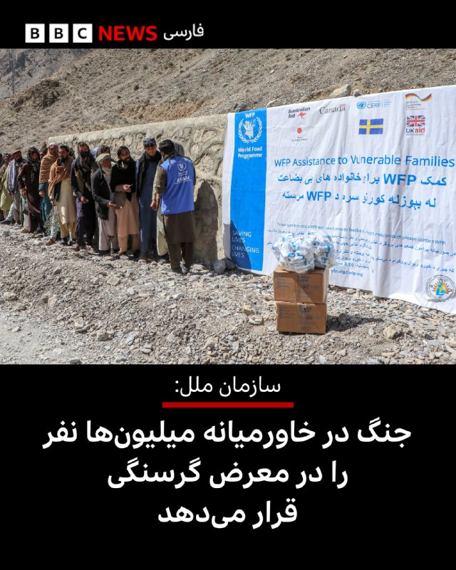

🔻برنامه جهانی غذا سازمان ملل متحد، هشدار داده است که جنگ در خاورمیانه میلیون‌ها نفر را بیش از پیش در معرض گرسنگی قرار داده است.

این نهاد می‌گوید که از یک طرف، افزایش هزینه‌های سوخت و حمل‌ونقل موجب گرانی مواد غذایی شده است و از طرف دیگر، کمبود منابع مالی سازمان‌های امدادرسان را مجبور کرده است که از میزان کمک‌هایشان بکاهند.

حملات مشترک آمریکا و اسرائیل به ایران در ماه فوریه (اسفند ۱۴۰۴)، باعث آغاز جنگی منطقه‌ای در سراسر خلیج فارس شد که دامنه آن تا لبنان گسترش یافت و موجب اختلال در مسیرهای مهم کشتیرانی، از جمله تنگه هرمز، شد.

این وضعیت کشتی‌ها را مجبور به تغییر مسیر و جریان جهانی انرژی و زنجیره‌های تأمین را به‌شدت محدود کرد.

خانوارهای ساکن افغانستان، سومالی و سری‌لانکا از جمله آسیب‌دیده‌ترین گروه‌ها هستند؛ آنها به دلیل افزایش هزینه‌ سوخت، افزایش قیمت مواد غذایی، کاهش درآمد و اختلال در تجارت، با فشارهای فزاینده‌ای روبه‌رو شده‌اند.

برنامه جهانی غذا می‌گوید که در افغانستان هم ممکن است ۱۷٫۴ میلیون نفر تحت تأثیر کمبود مواد غذایی قرار گیرند.

مطلب کامل🔽
https://bbc.in/4oavX8B
📷Getty
@BBCPersian

## Dirty_Kids — post 391051

  

هیچی سلامتی. پرامپت جدید پیدا کردن.

@Dirty_Kids 👻

## Dirty_Kids — post 391050

  <a href="telegram/content/Dirty_Kids_391050_1780662784.mp4" target="_blank">🎬 Download video</a>

🔴 یه موسسه زبان اومده از انگلیسی صحبت کردن شاگرداش فیلم گذاشته و حالا از ترکیب انگلیسی و لهجه اصفهانی مردم پاره شدن😂

@Dirty_Kids 👻

## alonews — post 125298

  <a href="telegram/content/alonews_125298_1780662785.webm" target="_blank">🎬 Download video</a>

👈فرماندهی-اقیانوس آرام ایالات متحده (INDOPACOM) اعلام کرد که یک کشتی بی‌تابعیت تحریم‌شده متعلق به ناوگان سایه ایران را توقیف کرده است

🔴 در طول شب، نیروهای ایالات متحده عملیات بازدارندگی دریایی و حق بازدید و سوار شدن به کشتی تحریم‌شده بی‌تابعیت MT DAVINA را در اقیانوس هند در منطقه مسئولیت INDOPACOM انجام دادند.

🔴ما ادامه اجرای جهانی دریایی برای مختل کردن شبکه‌های غیرقانونی و بازداشت کشتی‌هایی که حمایت مادی به ایران ارائه می‌دهند، هر کجا که عملیات کنند، را ادامه خواهیم داد.

🔴آب‌های بین‌المللی نمی‌توانند به عنوان سپری برای بازیگران تحریم‌شده استفاده شوند. وزارت جنگ ادامه خواهد داد تا عملیات غیرقانونی و کشتی‌های آن‌ها را در حوزه دریایی از آزادی مانور محروم کند.

✅ @AloNews خبر جنگ

---
📅 بروزرسانی: 1405/03/15 15:53
---

## WithYashar — post 13550

  <a href="telegram/content/WithYashar_13550_1780662195.mp4" target="_blank">🎬 Download video</a>

نیروی دریایی ایران اعلام کرد که به دو ناوشکن آمریکایی (DDG-103 و DDG-87) در دریای عمان شلیک هشدار انجام داده است موشک‌های قادر و پهپادهای شهید دانایی.

هر دو ناوشکن به سمت اقیانوس هند عقب‌نشینی کردند.
ایران همچنین ادعا می‌کند که ناو حمله آبی-خاکی یو‌اس‌اس تریپولی مجبور به ترک منطقه شده است.
هشدار نیروی دریایی ایران: اگر کشتی‌های آمریکایی بازگردند، از موشک‌های برد بلندتری استفاده خواهد شد.🚨
@withyashar

## WithYashar — post 13549

  

️حمام خون در بازار کریپتو!

بیش از ۶۳۵ میلیارد دلار تنها در کمتر از ۵ روز از ارزش کل بازار رمزارزها محو شده است.
@withyashar

## mwarmonitor — post 10171

🔴شب گذشته، نیروهای ایالات متحده یک عملیات رهگیری دریایی و بازرسی بر اساس حق بازدید را علیه کشتی بدون تابعیت و تحریم‌شده MT DAVINA که در اقیانوس هند و در محدوده مسئولیت فرماندهی هند–آرام آمریکا (INDOPACOM) قرار داشت، انجام دادند. 🔸ما به اجرای نظارت و اعمال…

## FoxNewsTwitter — post 342642

  

Fox News (Twitter/X)

President Trump scored a major win overnight as the Senate voted to pass his $70 billion ICE and Border Patrol funding package.

The funding covers ICE and Border Patrol’s budgets for the next three and a half years, closing the standoff that began during the longest shutdown in U.S. history.

Senator Lisa Murkowski was the only Republican to vote against the measure, which now heads to the House, where lawmakers will decide whether to send it to President Trump's desk.

## IranianMinds — post 21421

  <a href="telegram/content/IranianMinds_21421_1780662199.mp4" target="_blank">🎬 Download video</a>

🔴حملات هوایی ارتش اسرائیل به منطقه جبل الصافی در جنوب لبنان.

@IranianMinds

## IranianMinds — post 21420

🔴ثابتی نماینده مجلس:

آمریکا بعد از جام‌جهانی، سنگین‌تر به ایران حمله خواهد کرد. باید پیش‌دستی کنیم و پتروشیمی‌ها و زیرساخت‌های منطقه را بزنیم.

@IranianMinds

## alonews — post 125297

  <a href="telegram/content/alonews_125297_1780662201.webm" target="_blank">🎬 Download video</a>

👈سنتکام : کشتی مرتبط با ایران MT Davina رو تو دریا نگه داشتیم و رفت داخلش برای بازرسی

✅ @AloNews خبر جنگ

## alonews — post 125296

  <a href="telegram/content/alonews_125296_1780662201.webm" target="_blank">🎬 Download video</a>

👈بیش از ۶۳۵ میلیارد دلار تنها در کمتر از ۵ روز از ارزش کل بازار رمزارزها محو شده است

✅ @AloNews خبر جنگ

---
📅 بروزرسانی: 1405/03/15 15:42
---

## WithYashar — post 13548

  <a href="telegram/content/WithYashar_13548_1780661568.mp4" target="_blank">🎬 Download video</a>

ستون دود حجیم جنوب مركزي تهرانه همين الان
@withyashar

## mwarmonitor — post 10170

  <a href="telegram/content/mwarmonitor_10170_1780661570.mp4" target="_blank">🎬 Download video</a>

🔴شب گذشته، نیروهای ایالات متحده یک عملیات رهگیری دریایی و بازرسی بر اساس حق بازدید را علیه کشتی بدون تابعیت و تحریم‌شده MT DAVINA که در اقیانوس هند و در محدوده مسئولیت فرماندهی هند–آرام آمریکا (INDOPACOM) قرار داشت، انجام دادند.

🔸ما به اجرای نظارت و اعمال قانون دریایی در سطح جهانی ادامه خواهیم داد تا شبکه‌های غیرقانونی را مختل کرده و کشتی‌هایی را که در هر نقطه‌ای که فعالیت می‌کنند، پشتیبانی مادی از ایران ارائه می‌دهند، رهگیری کنیم.

🔸آب‌های بین‌المللی نمی‌تواند به‌عنوان سپری برای بازیگران تحریم‌شده مورد سوءاستفاده قرار گیرد. «وزارت جنگ» به محروم‌سازی عاملان غیرقانونی و کشتی‌هایشان از آزادی مانور در حوزه دریایی ادامه خواهد داد.

@mwarmonitor

## mwarmonitor — post 10169

🔴اختصاصی فایننشال تایمز: تیم حقوقی رئیس‌جمهور ایالات متحده، دونالد ترامپ، بنا بر اسناد دادگاهی که توسط [فایننشال تایمز] مشاهده شده، از تحویل اطلاعات مالی درخواستی وکلای [بی‌بی‌سی]خودداری کرده است. این اطلاعات در چارچوب پرونده افترا به ارزش ۱۰ میلیارد دلار علیه این شبکه پخش‌کننده مطالبه شده بود.

@mwarmonitor

## IranIntlTV — post 340651

  <a href="telegram/content/IranIntlTV_340651_1780661572.mp4" target="_blank">🎬 Download video</a>

بینش بلور، خواننده پاپ مقیم لس‌آنجلس که با نام «قیصر» شناخته می‌شود، پس از ورود به ایران در مراسم حکومتی عید غدیر در تهران روی صحنه رفت و با در دست داشتن پرچم جمهوری اسلامی اجرا کرد.

ارزیابی بیشتر با محسن مهیمنی، عضو تحریریه ایران‌اینترنشنال
@iranintltv

## Persian_Trend_Official — post 15748

  <a href="telegram/content/Persian_Trend_Official_15748_1780661573.webm" target="_blank">🎬 Download video</a>

هم اکنون نیروی دریایی ارتش آمریکا از توقیف یک ابر نفتکش ایرانی در اقیانوس هند توسط تفنگداران دریایی آمریکایی خبر داد.

👺Phantom

📌 @persian_trend_official
پرشین ترند | متفاوت‌ترین کانال نظامی

## alonews — post 125293

  <a href="telegram/content/alonews_125293_1780661573.mp4" target="_blank">🎬 Download video</a>

👈حملهِ‌های هوایی به منطقه جبل الصافي جنوب لبنان

✅ @AloNews خبر جنگ

---
📅 بروزرسانی: 1405/03/15 15:33
---

## VahidOOnLine — post 243788

⭕️ثابتی: قالیباف نماینده «رهبری» در مذاکرات نیست، آمریکا پس از جام جهانی جنگ سخت‌تری را آغاز می‌کند

♦️امیرحسین ثابتی، نماینده مجلس شورای اسلامی، در گفتگوی ویدیویی با رد این ادعا که محمدباقر قالیباف نماینده تام‌الاختیار رهبر جمهوری اسلامی در مذاکرات هسته‌ای است، گفت قالیباف برای این مسئولیت از سوی مسعود پزشکیان، رئیس‌جمهوری، پیشنهاد شده نه از سوی رهبر جمهوری اسلامی.

ثابتی در این مصاحبه که روز دهم خرداد ماه انجام شده است، با بیان اینکه مجتبی خامنه‌ای به دلیل اجماع رییسان دولت و مجلس با این روند موافقت کرده‌اند، افزود اگر افراد دیگری نیز در این جایگاه بودند، همین پیشنهاد مورد پذیرش قرار می‌گرفت.

او همچنین با اشاره به مذاکرات اخیر، مدعی شد در گفتگوهای اسلام‌آباد اقداماتی برخلاف «خطوط قرمز» اعلام‌شده از سوی رهبر جمهوری اسلامی صورت گرفته که با تذکر مواجه شده و ادامه آن متوقف شده است.

این نماینده مجلس، در بخش دیگری از سخنانش مدعی شد آمریکا با طرح مواضع متناقض درباره توافق و جنگ، در حال «بازی دادن» ایران است و هشدار داد پس از عبور از مقاطعی مانند جام جهانی، احتمال آغاز جنگی سخت‌تر علیه ایران وجود دارد.

امیرحسین ثابتی و گروه دیگری از اعضای «جبهه پایداری» در مجلس شورای اسلامی، در ماه‌های اخیر بارها با مذاکره با آمریکا و آتش‌بس مخالفت کرده و آن را محکوم به شکست توصیف کرده‌اند.
‌🇸🇦 Indypersian

🤖 @VahidOOnLine

## VahidOOnLine — post 243787

  

رسانه‌های ایران به نقل از روابط‌عمومی ارتش جمهوری اسلامی گزارش دادند در ادامه آنچه مقابله با «مزاحمت‌های دریایی» آمریکا خوانده شد، موشک قدیر و پهپادهای تهاجمی نیروی دریایی ارتش به‌صورت اخطاری به سوی چند ناوشکن در دریای عمان شلیک شدند.
بر اساس این گزارش، ناوشکن‌های دی‌دی‌جی-۱۰۳ و دی‌دی‌جی-۸۷ پس از این اقدام دریای عمان را به سمت اقیانوس هند ترک کردند.
در بیانیه مرکز فرماندهی نیروی دریایی ارتش جمهوری اسلامی آمده است در صورت نیاز، از موشک‌های با برد بیشتر استفاده خواهد شد.
‌🏁 🇬🇧 IranintlTV

🤖 @VahidOOnLine

## WithYashar — post 13547

بر اساس نظرسنجی‌های معتبر آمریکایی حمایت افکار عمومی آمریکا از پایان جنگ و حرکت به‌سوی توافق، از ۴۹٪ پیش از جنگ به ۶۸٪ در آستانه توافق رسیده است
@withyashar

## IranIntlTV — post 340650

  

رسانه‌های ایران به نقل از روابط‌عمومی ارتش جمهوری اسلامی گزارش دادند در ادامه آنچه مقابله با «مزاحمت‌های دریایی» آمریکا خوانده شد، موشک قدیر و پهپادهای تهاجمی نیروی دریایی ارتش به‌صورت اخطاری به سوی چند ناوشکن در دریای عمان شلیک شدند.
بر اساس این گزارش، ناوشکن‌های دی‌دی‌جی-۱۰۳ و دی‌دی‌جی-۸۷ پس از این اقدام دریای عمان را به سمت اقیانوس هند ترک کردند.
در بیانیه مرکز فرماندهی نیروی دریایی ارتش جمهوری اسلامی آمده است در صورت نیاز، از موشک‌های با برد بیشتر استفاده خواهد شد.
https://iranintl.com/202606051992

## FarsiVOA — post 219663

  <a href="telegram/content/FarsiVOA_219663_1780660988.mp4" target="_blank">🎬 Download video</a>

⚡️مرجان ساتراپی، خالق «پرسپولیس» و از شناخته‌شده‌ترین هنرمندان ایرانی در جهان، در ۵۶ سالگی درگذشت.
@FarsiVOA

## FarsiVOA — post 219662

🔺توقیف و بازرسی کشتی تحریمی مرتبط با جمهوری اسلامی در منطقه هند-آرام

▪️نیروهای دریایی ایالات متحده در جریان یک عملیات دریایی در اقیانوس هند، یک شناور بدون تابعیت و تحت تحریم مرتبط با جمهوری اسلامی را با نام «ام‌تی داوینا» بازرسی و متوقف کرده‌اند.

▪️نفتکش داوینا به عنوان بخشی ناوگان سایه و تاریک جمهوری اسلامی شناخته می‌شود و پیشتر در فهرست تحریم‌های وزارت خزانه‌داری آمریکا قرار گرفته است.

▪️فرماندهی منطقه هند-آرام اعلام کرده هدف این اقدامات جلوگیری از حمایت مادی از جمهوری اسلامی و مختل کردن فعالیت کشتی‌های مرتبط با این شبکه‌هاست.

▪️همچنین تأکید شده که عملیات مشابه در آب‌های بین‌المللی ادامه خواهد داشت.

⬇️ بیشتر بخوانید:
https://ir.voanews.com/a/8157648.html

## Persian_Trend_Official — post 15747

⚓ اخطار موشکی - پهپادی نیروی دریایی ارتش به سوی دو ناوشکن‌ آمریکایی

بیانیه منتشر شده توسط روابط عمومی ارتش ایران:

در ادامه عملیات مقابله با شرارت ها و مزاحمت های دریایی و ربایش شناورهای تجاری و نفت کش توسط نیروی دریایی ارتش تروریستی آمریکا،  پس از شلیک های اخطارِ موشک قدیر و پهپادهای تهاجمی جدید شهید دانای نیروی دریایی ارتش جمهوری اسلامی ایران، ناوشکن های متجاوز DDG۱۰۳ و DDG۸۷ ،دریای عمان را به سمت اقیانوس هند ترک کردند.

⬅️به دنبال این عملیات و عملیاتهای روزهای گذشته، علاوه بر ناوشکن های دشمن آمریکایی صهیونی که در قالب ناوگروه جرج دبلیو بوش و مرکز فرماندهی نیروی دریایی تروریستی این کشور به عنوان عامل مزاحمت ها و اختلال در تجارت و امنیت دریایی منطقه بودند، ناوبالگرد بر  ِتهاجمی آبخاکیِ تریپولی نیز مجبور به ترک دریای عمان شده است.
مرکز فرماندهی و کنترل عملیات نیروی دریایی ارتش ضمن تاکید بر لزوم دست برداشتن دشمن آمریکایی صهیونی از دزدی و شرارت دریایی، تاکید کرد: با وجود گسترش و دور شدن ناوهای دشمن از تیررس موشک های استفاده شده، در صورت نیاز،  موشک های این نیرو با برد بیشتر مورد استفاده قرار خواهد گرفت.

👺Phantom

📌 @persian_trend_official
پرشین ترند | متفاوت‌ترین کانال نظامی

## RadioFarda — post 157924

مأمور کاگ‌ب در آمریکا یا جاسوس دو جانبه؟ اسرار یک جاسوس در بایگانی قاچاق‌شدهٔ جنگ سرد

🔸در سپتامبر ۱۹۵۵، رابرت اف. کندی در قالب یک سفر جاده‌ای غیرمعمول در دوران جنگ سرد به اتحاد شوروی، وارد مسکو شد. یکی از قضات برجستهٔ دیوان عالی ایالات متحده نیز این سناتور آیندهٔ آمریکا را همراهی می‌کرد.

🔸مترجم آن‌ها در طول این سفر دوماهه به سرتاسر کشوری که به روی خارجی‌ها بسته بود، یک افسر پیشین ارتش ایالات متحده بود که به زبان روسی تسلط داشت و سمتش در سفارت ایالات متحده در تهران پوششی برای هویت واقعی‌اش به‌عنوان مأمور سی‌آی‌ای بود: فردریک فلوت.

🔸در بازگشت به آمریکا، این سفر توجه گسترده‌ای را به کندی جلب کرد؛ کسی که مسیر سیاسی‌اش هم‌زمان با برادر بزرگ‌ترش جان، رئیس‌جمهور آینده، رو به اوج بود.

🔸سفر به شوروی همچنین باعث جلب توجه به فلوت شد؛ سازمان جاسوسی شوروی، کاگ‌ب، برای او نام رمزی «داگلاس» تعیین کرد و طی دو دههٔ بعد او را زیر نظر گرفت، به این امید که بتواند او را به‌عنوان جاسوس جذب کند.

🔸این سازمان ممکن است در اوایل دههٔ ۱۹۷۰ موفق به این کار شده باشد.

🔸جزئیات تلاش مسکو برای نزدیک شدن به فلوت در یک دست‌نوشتهٔ منتشرنشده به زبان روسی ثبت شده است که در مجموعه‌ای از اسناد کاگ‌ب موسوم به «بایگانی میتروخین» نگهداری می‌شود.

🔸این پرونده‌ها به نام واسیلی میتروخین، متصدی ارشد بایگانی کاگ‌ب، نام‌گذاری شده‌اند؛ کسی که سال‌ها صرف گردآوری هزاران صفحه یادداشت کرد و سپس در اوایل دههٔ ۱۹۹۰، هنگام پناهندگی به بریتانیا، آن‌ها را مخفیانه از کشور خارج کرد.

🔸در چندین صفحه از این دست‌نوشته، تعاملات و نظارت کاگ‌ب بر یک آمریکایی با نام رمزی «داگلاس» با جزئیات شرح داده شده است. این نام رمزی در موارد متعددی به کار رفته، اما در این پرونده به‌طور مشخص از نام «فلوت» نیز همراه با جزئیات زندگی‌نامه‌ای منطبق با سوابق دولتی او یاد شده است.

🔸نسخه کامل این گزارش را در وب‌سایت رادیوفردا بخوانید.

@RadioFarda

## IranianMinds — post 21419

  <a href="telegram/content/IranianMinds_21419_1780660989.mp4" target="_blank">🎬 Download video</a>

🔴روابط عمومی ارتش:

اخطارهای موشکی- پهپادی نداجا جمهوری اسلامی ایران به سمت ناوشکن‌های آمریکایی.

@IranianMinds

## Dirty_Kids — post 391049

گویا شیفت کاریشون تموم شد😂

#عقل_عرزشی

@Dirty_Kids 👻

## Dirty_Kids — post 391048

  

🔴تو تهران، از موشک‌های خیبرشکنِ صورتی🎀 رونمایی شد :

@Dirty_Kids 👻

## alonews — post 125292

👈منابع العربیه: دو شرکت وابسته به سپاه پاسداران قراردادهای برق با شرکت‌های عراقی امضا کردند.

✅ @AloNews خبر جنگ

## alonews — post 125291

👈بر اساس نظرسنجی‌های معتبر آمریکایی حمایت افکار عمومی آمریکا از پایان جنگ و حرکت به‌سوی توافق، از ۴۹٪ پیش از جنگ به ۶۸٪ در آستانه توافق رسیده است

✅ @AloNews خبر جنگ

## alonews — post 125290

👈خبرگزاری فارس به نقل از یک منبع در هیئت مذاکره‌کننده: ما در این مرحله به مسائل مربوط به پرونده هسته‌ای نمی‌پردازیم

✅ @AloNews خبر جنگ

---
📅 بروزرسانی: 1405/03/15 15:22
---

## VahidOOnLine — post 243786

  

♦️نبیه بری، رئیس پارلمان لبنان روز جمعه ۱۵ خرداد و برای نخستین بار اعلام کرد که در صورت خروج اسرائیل از جنوب این کشور، حزب‌الله هم آماده است در چارچوب یک آتش‌بس جامع این منطقه را ترک کند.

نبیه بری عضو ارشد جنبش شیعی امل و از متحدان حزب‌الله است و نقش میانجی این گروه در مذاکرات با دولت را برعهده دارد.

به گزارش خبرگزاری فرانسه نبیه بری با انتشار بیانیه‌ای اعلام کرد: «من عقب‌نشینی حزب‌الله از جنوب رودخانه لیتانی همزمان با [عقب‌نشینی] اسرائیل و همچنین یک آتش‌بس جامع و بدون قیدوشرط را می‌پذیرم.»

این بیانیه در حالی منتشر شده است که با وجود چند توافق آتش‌بس میان دولت لبنان و اسرائیل و تمدید آن‌ها، نبردها در جنوب لبنان حتی یک روز هم قطع نشده است.

نعیم قاسم، دبیر کل حزب‌الله لبنان روز گذشته آخرین توافق آتش‌بس میان نمایندگان دولت لبنان و اسرائیل با میانجیگری واشنگتن را رد کرده و گفته بود تا خروج کامل نیروهای اسرائیلی از جنوب لبنان، جنگ ادامه دارد.
‌🇸🇦 Indypersian

🤖 @VahidOOnLine

## VahidOOnLine — post 243785

  

♦️خبرگزاری فارس، وابسته به سپاه پاسداران،‌روز جمعه ۱۵ خرداد ماه به نقل از «یک منبع آگاه نزدیک به تیم مذاکره‌کننده ایران»، گزارش شبکه العربیه درباره موافقت تهران با انتقال بخشی از ذخایر اورانیوم غنی‌شده به کشور ثالث را تکذیب کرد.
خبرگزاری فارس به نقل از این منبع گزارش داد ادعای مطرح‌شده از سوی العربیه «نادرست» است و موضوع انتقال ذخایر اورانیوم در دستور کار فعلی مذاکرات قرار ندارد.
به گفته این منبع آگاه، موضوعات مرتبط با پرونده هسته‌ای در مرحله کنونی گفتگوها مطرح نیست و بررسی آنها به مراحل بعدی مذاکرات موکول شده است: «ابتدا باید طرف آمریکایی اقدامات مشخص و قطعی خود را انجام دهد و درباره برخی مسائل اساسی به توافق‌های روشن و نهایی دست یابیم.»
شبکه العربیه پیش‌تر گزارش کرده بود تهران موافقتش با انتقال بخشی از ذخایر اورانیوم غنی‌شده به یک کشور ثالث را به اسلام‌آباد اعلام کرده است و این کشور ثالث با توافق طرف‌های مذاکره‌کننده انتخاب خواهد شد.
‌🇸🇦 Indypersian

🤖 @VahidOOnLine

## WithYashar — post 13546

العربیه: ایران بطور رسمی به پاکستان ابلاغ کرده که با انتقال بخشی از ذخایر اورانیوم خودش به یک کشور ثالث مورد توافق طرفین، موافقه. @withyashar

## pm_afshaa — post 92305

ارتش جمهوری اسلامی اعلام کرد به سمت 2 ناوشکن آمریکایی چندین موشک شلیک کرده

💧 Rainbet.com the #1 Non-KYC Crypto Casino & Sportsbook @rainbetcom

😁 @Pm_Afshaa

## IranIntlTV — post 340649

  <a href="telegram/content/IranIntlTV_340649_1780660380.mp4" target="_blank">🎬 Download video</a>

«بینش بلور» با نام هنری قیصر، خواننده پاپ که سال‌ها در لس‌آنجلس به ساخت موزیک‌ویدیو و فعالیت هنری مشغول بود، به کشور بازگشت و در روز پنجشنبه همزمان با عید غدیر در تهران روی صحنه رفت. قیصر که در کارنامه خود سابقه چندین اجرای زنده در تل‌آویو را دارد، در صورتی که سفر به این کشور برای ایرانیان غیرقانونی است. این خوانند اخیرا مواضع متفاوتی اتخاذ کرده است؛ از جمله ساخت قطعه «کفش‌های کتونی» با همکاری مرکز ماوا، وابسته به سپاه پاسداران، در حمایت از دانش‌آموزان کشته شده مدرسه میناب. این خواننده با تاکید بر اینکه به عنوان یک ایرانی حق بازگشت به وطن را دارد، همزمان با عید غدیر در اجتماع میدان «امام حسین» تهران حاضر شد و قطعه‌ای با عنوان «تهران» اجرا کرد.
@iranintltv

## IranIntlTV — post 340648

  <a href="telegram/content/IranIntlTV_340648_1780660381.mp4" target="_blank">🎬 Download video</a>

رافائل گروسی، مدیرکل آژانس بین‌المللی انرژی اتمی، گفت تصمیم‌گیری درباره سرنوشت ذخایر اورانیوم با غنای بالای جمهوری اسلامی «در وهله اول یک تصمیم سیاسی است» و پس از آن باید جنبه‌های فنی آن مورد بررسی قرار گیرد.
@iranintltv

## Shin_Persian — post 6512

Shin ✓ @hey_itsmyturn
Fri, 05 Jun 2026 11:42:26 UTC

IRGC-Owned Fars News:

“Iranian Source: Al Arabiya's Claim of Tehran's Agreement to Transfer Uranium Reserves to a Third Country is False

A well-informed source close to the Iranian negotiating team on Friday refuted a report by a Saudi media outlet claiming Tehran had agreed to transfer a portion of its enriched uranium reserves to a third country, labeling it inaccurate.”

فارسی

خبرگزاری فارس (متعلق به سپاه پاسداران):

«منبع ایرانی: ادعای العربیه مبنی بر موافقت تهران با انتقال ذخایر اورانیوم به کشوری ثالث کذب است

یک منبع آگاه نزدیک به تیم مذاکره‌کننده ایران روز جمعه گزارش یک رسانه سعودی مبنی بر موافقت تهران با انتقال بخشی از ذخایر اورانیوم غنی‌شده خود به کشوری ثالث را رد کرد و آن را نادرست خواند.»

𝕏 · @shin_persian

## FarsiVOA — post 219661

  

پایگاه اطلاع‌رسانی جماران از تخریب کامل کلیسای تاریخی «انجیلی مشهد»، خبر داد، اما توضیحاتی درباره علت این تخریب و نهاد تخریب‌کننده ارائه نکرد.

کلیسای انجلیی مشهد از هنرهای معماری دوره پهلوی اول به شمار می‌آمد و در تاریخ ۱۳۸۴ در فهرست آثار ملی به ثبت رسیده بود.

بنا بر گزارش جماران، این اثر تاریخی و مذهبی شبانه و در بامداد ۱۴ خرداد تخریب شده است. این کلیسا در سال‌های اخیر مورد استفاده قرار نمی‌گرفت و همین امر موجب شده بود تا فعالان میراث فرهنگی، خطر بی‌توجه به این اثر تاریخی و یا تخریب گسترده را متذکر شوند.

مسیحیان انجیلی (پروتستان) مشهد، گروهی از اقلیت‌های مذهبی این شهر هستند که از اواخر دوره قاجار در مشهد سکونت دارند. یکی از مهم‌ترین یادگارهای مسیحیان انجیلی در مشهد، تأسیس اولین بیمارستان مدرن شهر، معروف به بیمارستان آمریکایی بود.

پیشتر اخبار متعددی از مصادره و تخریب اماکن مربوط به اقلیت‌های مذهبی در ایران از جمله تخریب «کلیسای ادونتیست‌ها» در تهران و یا مصادره «کلیسای پنطیکاستی کرمانشاه» از سوی نهادهای حقوق بشری منتشر شده است.
@FarsiVOA

## FarsiVOA — post 219660

  

برنامه جهانی غذا، نهاد وابسته به سازمان ملل متحد، روز جمعه اعلام کرد که درگیری خاورمیانه میلیون‌ها نفر را به گرسنگی نزدیک‌تر می‌کند، زیرا افزایش هزینه‌های سوخت و حمل‌ونقل باعث بالا رفتن قیمت غذا شده و در عین حال کمبود بودجه، آژانس‌های امدادی را مجبور به کاهش کمک‌ها کرده است.

اخلال جمهوری اسلامی در مسیر کلیدی کشتیرانی در تنگه هرمز باعث شده کشتی‌ها مسیر خود را تغییر دهند و جریان جهانی انرژی و زنجیره‌های تأمین به‌شدت محدود شود.

در ماه مارس، برنامه جهانی غذا پیش‌بینی کرده بود که در صورت باقی ماندن قیمت نفت در حدود ۱۰۰ دلار در هر بشکه تا ماه ژوئن، تا ۴۵ میلیون نفر ممکن است به ناامنی غذایی حاد دچار شوند.

این نهاد اعلام کرد که اکنون این سناریو در حال تحقق است، زیرا قیمت نفت شاخص از اوایل مارس تاکنون حدود این سطح باقی مانده است.

خانواده‌ها در افغانستان، سومالی و سریلانکا از جمله گروه‌هایی هستند که بیشترین آسیب را دیده‌اند و به دلیل افزایش هزینه سوخت، جهش قیمت غذا، کاهش درآمدها و اختلال در تجارت، تحت فشار فزاینده قرار دارند.
@FarsiVOA

## FarsiVOA — post 219659

  <a href="telegram/content/FarsiVOA_219659_1780660385.mp4" target="_blank">🎬 Download video</a>

توقیف و بازرسی یک کشتی تحریمی مرتبط با جمهوری اسلامی در منطقه هند-آرام؛

نیروهای ایالات متحده اعلام کردند در جریان یک عملیات دریایی در اقیانوس هند، یک کشتی بدون تابعیت و تحت تحریم را با نام «ام‌تی داوینا» بازرسی و متوقف کرده‌اند.

به گفته مقام‌های نظامی آمریکا، این عملیات در چارچوب منطقه مسئولیت فرماندهی هند-آرام انجام شده و بخشی از اقدامات گسترده برای مقابله با شبکه‌های غیرقانونی دریایی است.

فرماندهی منطقه هند-آرام اعلام کرده هدف این اقدامات جلوگیری از حمایت مادی از جمهوری اسلامی و مختل کردن فعالیت کشتی‌های مرتبط با این شبکه‌هاست.

همچنین تأکید شده است که عملیات مشابه در آب‌های بین‌المللی ادامه خواهد داشت.
@FarsiVOA

## Persian_Trend_Official — post 15746

نیروی دریایی ارتش از شلیک موشک های اخطار به سمت دو ناوشکن آمریکایی در دریای عمان خبر داد.

👺Phantom

📌 @persian_trend_official
پرشین ترند | متفاوت‌ترین کانال نظامی

## Persian_Trend_Official — post 15745

## Persian_Trend_Official — post 15744

  <a href="telegram/content/Persian_Trend_Official_15744_1780660388.mp4" target="_blank">🎬 Download video</a>

اعتراضات آلبانی به پروژه کوشنر — چهارمین شب پیاپی

برای چهارمین شب متوالی، معترضان در آلبانی به خیابان‌ها آمدند؛ این بار در اعتراض به احداث یک اقامتگاه لوکس در زمینی تحت حفاظت قانونی که به جرد کوشنر و ایوانکا ترامپ مرتبط است. معترضان خواستار توقف فوری این پروژه شده‌اند.

این اعتراضات در شرایطی ادامه دارد که دولت آلبانی تاکنون موضع روشنی در قبال آن اتخاذ نکرده است.

👺Phantom

📌 @persian_trend_official
پرشین ترند | متفاوت‌ترین کانال نظامی

## RadioFarda — post 157923

  

🔸شبکه خبری سی‌ان‌ان به نقل از چهار منبع آگاه نوشته که اسرائیل در جریان جنگ با ایران، «شبکه‌ای مخفی» در کل خاورمیانه ایجاد کرده و از جمله به‌طور محرمانه «واحدهای نخبه نظامی و اطلاعاتی» خود را به جمهوری آذربایجان اعزام کرده بود.

🔸بر اساس این گزارش، این اقدام بخشی از شبکه‌ پایگاه‌ها و مراکز مخفی در سراسر خاورمیانه بود که برای «تسهیل عملیات علیه ایران» مورد استفاده قرار می‌گرفت.

🔸به گفته دو منبع از این چهار منبع، این نیروها از چندین نقطه در جنوب جمهوری آذربایجان، در مجاورت مرز شمالی ایران، فعالیت می‌کردند؛ «مناطقی که در نزدیک‌ترین فاصله، تنها حدود ۹۷ کیلومتر با شهر تبریز فاصله داشتند».

🔸دو منبع دیگر نیز به سی‌ان‌ان گفتند که واحدهای ویژه کماندویی اسرائیل در این مناطق مستقر شده بودند و مأموریت‌های جمع‌آوری اطلاعات و عملیات پهپادی را انجام می‌دادند.

🔸این گزارش حاکی است که این استقرار نیرو «موقعیت راهبردی ارزشمندی» در اختیار اسرائیل قرار می‌داد تا در طول جنگ بر مناطق شمالی ایران اشراف اطلاعاتی داشته باشد.

@RadioFarda

## IranianMinds — post 21418

🔴 العربیه: ایران بطور رسمی به پاکستان ابلاغ کرده که با انتقال بخشی از ذخایر اورانیوم خودش به یک کشور ثالث مورد توافق طرفین، موافقه. @IranianMinds

## alonews — post 125289

  <a href="telegram/content/alonews_125289_1780660391.webm" target="_blank">🎬 Download video</a>

👈فارس به نقل از منبع آگاه ایرانی:
ادعای موافقت ایران با انتقال ذخایر اورانیوم به کشور ثالث، صحت ندارد

✅ @AloNews خبر جنگ

## alonews — post 125288

  <a href="telegram/content/alonews_125288_1780660391.webm" target="_blank">🎬 Download video</a>

👈ادعای العربیه: جناح‌های سیاسی عراق در طول جنگ ۱۲ روزه بیش از ۱ میلیارد دلار به ایران قاچاق کردند.

🔴ادعای‌ الحدث: جناح‌ها و چهره‌های سیاسی عراق در جریان سفرهای اخیر قاآنی، مستقیماً به او پول نقد پرداخت کرده‌اند!

✅ @AloNews خبر جنگ

## alonews — post 125287

  <a href="telegram/content/alonews_125287_1780660391.mp4" target="_blank">🎬 Download video</a>

🔴فوری/نیروی دریایی ارتش از شلیک موشک های اخطار به سمت دو ناوشکن آمریکایی در دریای عمان خبر داد

✅ @AloNews خبر جنگ

---
📅 بروزرسانی: 1405/03/15 15:13
---

## VahidOOnLine — post 243784

  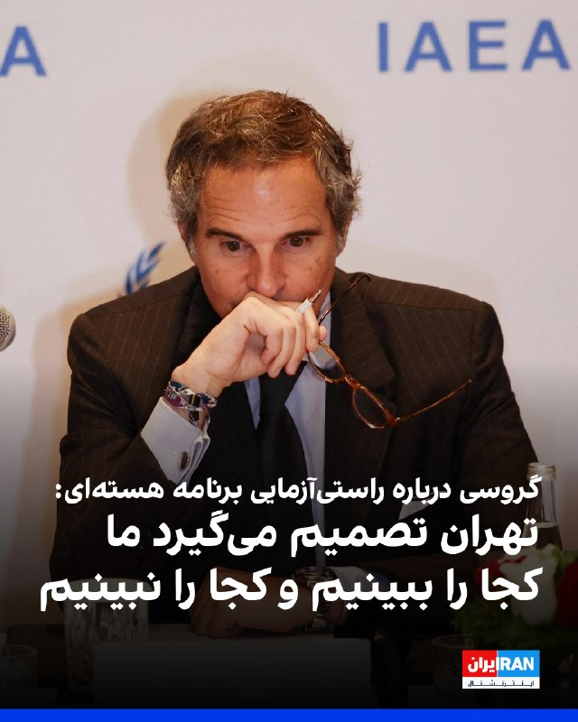

رافائل گروسی، مدیرکل آژانس بین‌المللی انرژی اتمی، جمعه ۱۵ خرداد در نشست خبری اعلام کرد دسترسی بازرسان آژانس به تاسیسات هسته‌ای جمهوری اسلامی همچنان محدود است و تهران در تعیین محل‌های بازرسی نقش تعیین‌کننده دارد.

او گفت تلاش‌های متعددی برای ازسرگیری فعالیت‌های راستی‌آزمایی در ایران، هم پس از جنگ ۱۲ روزه و هم پس از رخدادهای نظامی اخیر انجام شده است. به گفته گروسی، جمهوری اسلامی تعهداتی برای اطلاع‌رسانی و فراهم کردن دسترسی برای بازرسان دارد، اما در شرایط جنگی این امر ممکن نبوده است.

مدیرکل آژانس افزود با وجود برقراری آتش‌بس نسبتا طولانی، آژانس تنها توانسته برخی فعالیت‌ها را در تاسیساتی انجام دهد که جمهوری اسلامی انتخاب کرده است، از جمله نیروگاه هسته‌ای بوشهر و چند مرکز دیگر.

گروسی تصریح کرد «عنصری از صلاحدید» در این زمینه وجود دارد و تهران مشخص می‌کند چه چیزی را به آژانس اجازه می‌دهد ببیند و چه چیزی را نه. او در عین حال تاکید کرد تعهدات حقوقی جمهوری اسلامی در هر شرایطی پابرجاست و باید اجرا شود.
‌🏁 🇬🇧 IranintlTV

🤖 @VahidOOnLine

## FoxNewsTwitter — post 342641

‌Fox News (Twitter/X)

https://www.foxnews.com/media/graham-platner-accuser-hits-nyt-allegedly-softening-allegations-says-coverage-gift-democrat

## IranIntlTV — post 340647

  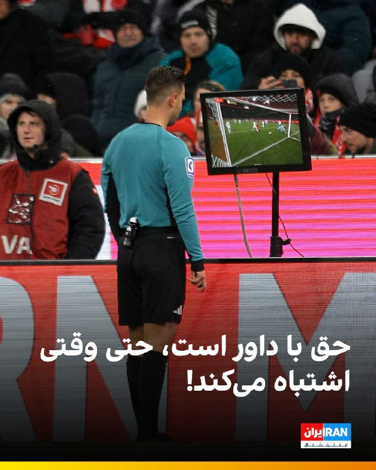

🔻روزنامه لیبر بلژیک در یادداشتی، وضعیت پیچیده و دشوار یک داور فوتبال و نگاه تماشاگران به او را شرح داده است.

🔹داور وضعیت عجیبی دارد؛ مچ‌گیرها کمین می‌کنند تا کوچک‌ترین اشتباهی از او سر بزند. هنوز سوت نزده، مورد ظن و اتهام است؛ یا بیش از حد از صحنه دور است، یا بیش از حد مستبد است، یا بیش از حد تحت تاثیر جو قرار دارد، یا به اندازه کافی شجاعت ندارد.

🔹او احتمالا تنها فردی در زمین است که هم‌زمان از او می‌خواهند هم نامرئی باشد، هم دانای کل و هم حاضر در همه‌جا.

🔹هیچ‌کس عاشق یک «آوانتاژ» به‌موقع و به‌جا نمی‌شود و هیچ تماشاگری پس از بازی به خانه برنمی‌گردد تا بگوید: «عجب جای‌گیری فوق‌العاده‌ای روی خط اوت در دقیقه ۳۷ داشت!»

🔹یک داور خوب، در جریان بازی حل و ناپدید می‌شود؛ اما یک داور بد یا صرفا بدشانس، خودِ بازی می‌شود.

🔹چرا اشتباه داور غیرقابل تحمل است؟

🔹بله، معلوم است که او هم اشتباه می‌کند؛ درست مثل مدافعی که یار مستقیمش را گم می‌کند، مهاجمی که دروازه خالی را به آسمان می‌کوبد یا مربی‌ای که تنها بازیکن خلاق زمین را تعویض می‌کند.

🔹جزییات بیشتر را در سایت بخوانید

@iranintltvsport

## IranIntlTV — post 340646

  

رافائل گروسی، مدیرکل آژانس بین‌المللی انرژی اتمی، جمعه ۱۵ خرداد در نشست خبری اعلام کرد دسترسی بازرسان آژانس به تاسیسات هسته‌ای جمهوری اسلامی همچنان محدود است و تهران در تعیین محل‌های بازرسی نقش تعیین‌کننده دارد.

او گفت تلاش‌های متعددی برای ازسرگیری فعالیت‌های راستی‌آزمایی در ایران، هم پس از جنگ ۱۲ روزه و هم پس از رخدادهای نظامی اخیر انجام شده است. به گفته گروسی، جمهوری اسلامی تعهداتی برای اطلاع‌رسانی و فراهم کردن دسترسی برای بازرسان دارد، اما در شرایط جنگی این امر ممکن نبوده است.

مدیرکل آژانس افزود با وجود برقراری آتش‌بس نسبتا طولانی، آژانس تنها توانسته برخی فعالیت‌ها را در تاسیساتی انجام دهد که جمهوری اسلامی انتخاب کرده است، از جمله نیروگاه هسته‌ای بوشهر و چند مرکز دیگر.

گروسی تصریح کرد «عنصری از صلاحدید» در این زمینه وجود دارد و تهران مشخص می‌کند چه چیزی را به آژانس اجازه می‌دهد ببیند و چه چیزی را نه. او در عین حال تاکید کرد تعهدات حقوقی جمهوری اسلامی در هر شرایطی پابرجاست و باید اجرا شود.
https://iranintl.com/202606054806

## IranIntlTV — post 340645

  <a href="telegram/content/IranIntlTV_340645_1780659783.mp4" target="_blank">🎬 Download video</a>

یک شهروند با ارسال پیامی به ایران اینترنشنال درباره گرانی‌ها می‌گوید که یک ماست کوچک را به قیمت ۱۳۵ هزار تومان خریداری کرده است.

## FarsiVOA — post 219658

  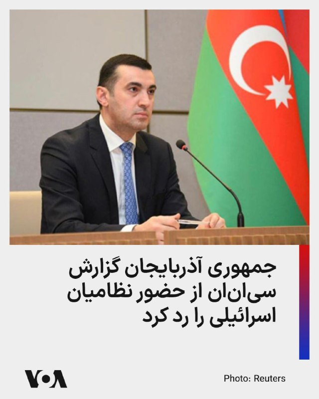

جمهوری آذربایجان گزارش شبکه سی‌ان‌ان از اعزام نیروهای نظامی اسرائیل به خاک این کشور را رد کرد.

آیخان حاجی‌زاده سخنگوی وزارت خارجه جمهوری آذربایجان اعلام کرد ادعای سی‌ان‌ان از اعزام نیروهای اسرائیلی به خاک این کشور برای عملیات نظامی یا اطلاعاتی علیه ایران «کاملاً بی‌اساس و گمراه‌کننده» است.

سی‌ان‌ان پیشتر قول منابعی که نامی از آنها نبرده بود، گزارش داده بود که اسرائیل در میانه جنگ با ایران «نیروهای ویژه نظامی و اطلاعاتی» به خاک جمهوری آذربایجان اعزام کرده تا عملیات‌ها علیه جمهوری اسلامی را تسهیل کند.

حاجی‌زاده گفته است انتشار چنین ادعاهایی بر اساس منابع ناشناس، بدون ارائه هیچ‌گونه مدرک معتبر و در عین حال نادیده گرفتن موضع رسمی جمهوری آذربایجان، با اصول عینیت، بی‌طرفی و اخلاق حرفه‌ای روزنامه‌نگاری مغایرت دارد.

او گفت جمهوری آذربایجان هرگز اجازه چنین استفاده‌ای از قلمرو خود را نداده و نخواهد داد.
@FarsiVOA

## FarsiVOA — post 219657

🔺مرکز آمار از ثبت تورم ۲۰۰ تا ۴۳۰ درصدی برخی اقلام غذایی خبر داد

▪️جزئیات منتشر شده از تورم اقلام غذایی توسط مرکز آمار نشان از تورم ۱۳۰ درصدی خوراکی‌ها دارد و برخی از آنها شاهد رشد ۲۰۰ تا ۴۳۰ درصدی قیمت بوده‌اند.

▪️بر اساس این گزارش، قیمت روغن‌نباتی جامد در اردیبهشت امسال نسبت به ماه مشابه پارسال ۴۳۱ درصد جهش کرده و صدرنشین لیست تورم کالا بوده است.

▪️قیمت سوس مایونز، برنج خارجی، تخم مرغ و روغن مایع نیز بین ۲۱۵ درصد تا ۳۵۴ درصد جهش کرده است.

▪️چنین جهش سهمگینی در قیمت اقلام غذایی در حالی است که برخلاف وعده‌های برخی مقامات و نمایندگان مجلس، دولت نرخ کالابرگ را تغییر نداده و در ماه جاری نیز برای هر فرد تنها یک میلیون تومان کالابرگ اختصاص یافته است.

⬇️ بیشتر بخوانید:
https://ir.voanews.com/a/8157646.html

## Persian_Trend_Official — post 15743

  <a href="telegram/content/Persian_Trend_Official_15743_1780659787.mp4" target="_blank">🎬 Download video</a>

شلیک اخطار موشکی پهپادی نداجا به سمت ناوشکن‌های آمریکایی!

روابط عمومی ارتش: در ادامه عملیات مقابله با شرارت ها و مزاحمت های دریایی و ربایش شناورهای تجاری و نفت کش توسط نیروی دریایی ارتش تروریستی آمریکا، پس از شلیک های اخطار موشک قدیر و پهپادهای تهاجمی جدید شهید دانای نیروی دریایی ارتش جمهوری اسلامی ایران، ناوشکن های متجاوز DDG_103 و DDG_87 ،دریای عمان را به سمت اقیانوس هند ترک کردند.

به دنبال این عملیات و عملیاتهای روزهای گذشته، علاوه بر ناوشکن های دشمن آمریکایی صهیونی که در قالب ناوگروه جرج دبلیو بوش و مرکز فرماندهی نیروی دریایی تروریستی این کشور به عنوان عامل مزاحمت ها و اختلال در تجارت و امنیت دریایی منطقه بودند، ناوبالگرد بر ِتهاجمی آبخاکیِ تریپولی نیز مجبور به ترک دریای عمان شده است.

نیروی دریایی ارتش همچنین افزود: با وجود گسترش و دور شدن ناوهای دشمن از تیررس موشک های استفاده شده، در صورت نیاز، موشک های این نیرو با برد بیشتر مورد استفاده قرار خواهد گرفت.

📝 Amir

📌 @persian_trend_official
پرشین ترند | متفاوت‌ترین کانال نظامی

## RadioFarda — post 157922

  <a href="https://t.me/radiofarda/157922" target="_blank">📎 Download file</a>

📻بشنوید: ساعت ۱۴ با رادیوفردا، پانردهم خرداد ۱۴۰۵‌

@RadioFarda

## alonews — post 125286

  <a href="telegram/content/alonews_125286_1780659789.webm" target="_blank">🎬 Download video</a>

👈حمله اسرائیل به المجادل، منطقه صیدا، جنوب لبنان

✅ @AloNews خبر جنگ

## alonews — post 125285

  <a href="telegram/content/alonews_125285_1780659789.webm" target="_blank">🎬 Download video</a>

👈گروسی: از سرگیری فعالیت‌های ما در ایران برای ارزیابی فنی دقیق وضعیت ضروری است

✅ @AloNews خبر جنگ

---
📅 بروزرسانی: 1405/03/15 15:03
---

## mwarmonitor — post 10168

🔴دیوید آلبرایت ؛ گزارش فصلی تازه‌منتشرشدهٔ پادمان‌های آژانس بین‌المللی انرژی اتمی درباره ایران یادآوری می‌کند که طبق قطعنامه‌های شورای امنیت سازمان ملل، ایران موظف است تمام فعالیت‌های غنی‌سازی خود را تعلیق کند. در این گزارش پادمانی، تعلیق غنی‌سازی و بازفرآوری معیار جدید آژانس برای راستی‌آزمایی است، نه محدودیت‌های برجام. گزارش به‌روشنی نشان می‌دهد که بدون اجازهٔ دسترسی معنادار از سوی ایران، آژانس قادر به راستی‌آزمایی این تعلیق نیست.
این گزارش همچنین بار دیگر تأکید می‌کند که ایران همچنان از رسیدگی به مواد و فعالیت‌های هسته‌ای اعلام‌نشده خودداری می‌کند؛ اقدامی که نقض توافق جامع پادمان‌ها به‌شمار می‌رود.
گزارش نشان می‌دهد که ایران هیچ حق قانونی‌ای برای منع دسترسی آژانس یا عدم همکاری با آن ندارد.
بحث‌ها دربارهٔ «حق غنی‌سازی» از سوی برخی در ایران و جاهای دیگر، صرفاً انحرافی غیرصادقانه از مسئلهٔ اصلیِ نقض قطعنامه‌های الزام‌آور شورای امنیت سازمان ملل و پیمان منع گسترش سلاح‌های هسته‌ای (NPT) از سوی ایران است. این تعهدات الزام‌آور با وقوع جنگ‌ها کاهش نمی‌یابد یا لغو نمی‌شود؛ بلکه حتی می‌توان جنگ را تا حدی گامی دوجانبه برای اجرای این تعهدات دانست.

@mwarmonitor

## pm_afshaa — post 92304

کلاس‌های دانشگاه شریف حضوری شدن

💧 Rainbet.com the #1 Non-KYC Crypto Casino & Sportsbook @rainbetcom

😁 @Pm_Afshaa

## IranianMinds — post 21417

  <a href="telegram/content/IranianMinds_21417_1780659196.mp4" target="_blank">🎬 Download video</a>

اکانت اسرائیل به فارسی:

عه! نمی‌دونستیم😂😂😂😂😂

@IranianMinds

## Dirty_Kids — post 391047

قیصر رو آوردن تو تجمعات تهران. بیضایی چقدر قشنگ گفته بود: "گویی مردمان دیگری وارد کرده‌اند و ما در وطن خویش بیگانه‌ایم. دنیا به دست اوباش است و نیکان به گناه لیاقت می‌میرند."

@Dirty_Kids 👻

## alonews — post 125284

  <a href="telegram/content/alonews_125284_1780659198.webm" target="_blank">🎬 Download video</a>

👈مدیرکل آژانس بین‌المللی انرژی اتمی:
در حال حاضر در مذاکرات جاری بین ایران و آمریکا مشارکتی نداریم، اما می‌دانیم که آنها به دستیابی به توافق نزدیک شده‌اند.

🔴راه‌حل بحران ایران و آمریکا باید دیپلماتیک باشد

✅ @AloNews خبر جنگ

## alonews — post 125283

  <a href="telegram/content/alonews_125283_1780659198.webm" target="_blank">🎬 Download video</a>

👈سازمان ملل: در صورت ادامه بسته ماندن تنگه هرمز، ۴۵ میلیون نفر ممکن است با ناامنی حاد غذایی روبه‌رو شوند

✅ @AloNews خبر جنگ

## alonews — post 125282

  <a href="telegram/content/alonews_125282_1780659199.webm" target="_blank">🎬 Download video</a>

👈کلاس‌های دانشگاه شریف حضوری شد

✅ @AloNews خبر جنگ

---
📅 بروزرسانی: 1405/03/15 14:53
---

## VahidOOnLine — post 243783

  

علی‌ اکبری، امام جمعه موقت تهران، گفت: «از عصر موشک‌های نقطه‌زن به بیانیه‌های نقطه‌زن رسیده‌ایم و وقتی قرارگاه خاتم بیانیه‌ای صادر می‌کند، لرزه به جان دشمنان می‌افتد و و زندگی آنها تباه می‌شود.»

او افرود «در توطئه‌ای که در لبنان در جریان بود»، بیانیه وزیر امورخارجه، رییس مجلس شورای اسلامی و نیروهای مسلح جمهوری اسلامی دشمن را «زمین‌گیر» کرد.

اکبری گفت: «پیش‌تر با اخم دشمن یا حرکت یک ناو، ارزش پول ملی کاهش می‌یافت، اما او اکنون موازنه قدرت در منطقه تغییر کرده و هیمنه روانی دشمن درهم شکسته است و شاهد لرزش دلار هستیم.»
‌🏁 🇬🇧 IranintlTV

🤖 @VahidOOnLine

## FoxNewsTwitter — post 342640

Fox News (Twitter/X)

BREAKING: Graham Platner accuser Lyndsey Fifield hits New York Times for allegedly softening allegations, says coverage handed Dem's campaign a 'gift'

## pm_afshaa — post 92303

ثابتی، نماینده مجلس:آمریکا بعد از جام جهانی سنگین‌تر به ایران حمله خواهد کرد و ایران را تبدیل به غزه دوم خواهند کرد.باید پیش‌دستانه پتروشیمی‌ها و زیرساخت‌های منطقه را بزنیم

💧 Rainbet.com the #1 Non-KYC Crypto Casino & Sportsbook @rainbetcom

😁 @Pm_Afshaa

## pm_afshaa — post 92302

https://t.me/proxy?server=195.254.165.20&port=8080&secret=dd79e7010200010007f0030386e24c3add

پروکسی مخصوص دانلود

💧 Rainbet.com the #1 Non-KYC Crypto Casino & Sportsbook @rainbetcom

😁 @Pm_Afshaa

## IranIntlTV — post 340644

  

علی‌ اکبری، امام جمعه موقت تهران، گفت: «از عصر موشک‌های نقطه‌زن به بیانیه‌های نقطه‌زن رسیده‌ایم و وقتی قرارگاه خاتم بیانیه‌ای صادر می‌کند، لرزه به جان دشمنان می‌افتد و و زندگی آنها تباه می‌شود.»

او افرود «در توطئه‌ای که در لبنان در جریان بود»، بیانیه وزیر امورخارجه، رییس مجلس شورای اسلامی و نیروهای مسلح جمهوری اسلامی دشمن را «زمین‌گیر» کرد.

اکبری گفت: «پیش‌تر با اخم دشمن یا حرکت یک ناو، ارزش پول ملی کاهش می‌یافت، اما او اکنون موازنه قدرت در منطقه تغییر کرده و هیمنه روانی دشمن درهم شکسته است و شاهد لرزش دلار هستیم.»
https://iranintl.com/202606058008

## FarsiVOA — post 219656

حملات یگان سامانه‌های پهپادی اوکراین به ۵ شناور در سواحل ماریوپل و بردیانسک؛

یگان سامانه‌های پهپادی اوکراین با انتشار تصاویری اعلام کرد در جریان عملیات‌های شبانه روز گذشته، پنج فروند شناور نظامی روسیه را در سواحل «ماریوپل» و «بردیانسک» هدف قرار داده است.

در این مجموعه حملات، نیروهای اوکراینی موفق شدند یک کشتی گشت مرزی کلاس «سویتلیاک» را که برای نظارت دریایی استفاده می‌شد، هدف قرار دهند. همچنین یک سامانه ناوبری رادیویی کوتاه‌برد که از هواپیماهای نظامی روسیه پشتیبانی می‌کرد و چندین لوکوموتیو مورد استفاده در پشتیبانی لجستیکی ارتش روسیه در این منطقه آسیب دیدند.

در استان خرسون هم یک سامانه پدافند موشکی و توپخانه‌ای «پانتیسیر-اس۱» که از ارکان اصلی شبکه دفاع هوایی روسیه در این منطقه به شمار می‌رفت، منهدم شد.

همچنین ترانسفورماتورهای پشتیبانی‌کننده از زیرساخت‌های نظامی و مخازن ذخیره‌سازی سوخت ارتش روسیه در استان دونتسک هدف حملات دقیق نیروهای اوکراینی قرار گرفتند.

🔺نسخه اصلی این ویدیو با موسیقی متن منتشر شده است.
@FarsiVOA

## FarsiVOA — post 219655

🔺نگرانی از وضعیت سلامت آزاده یعقوبی در زندان وکیل‌آباد مشهد

▪️وب‌سایت حقوق بشری هرانا از تداوم بازداشت آزاده یعقوبی در زندان وکیل‌آباد مشهد خبر داد و اعلام کرد که او با وجود نیاز به درمان تخصصی، از دسترسی به خدمات پزشکی خارج از زندان محروم مانده است.

▪️ آزاده یعقوبی، که با نام معصومه یعقوبی نیز شناخته می‌شود، بیش از چهار ماه است در بازداشت به سر می‌برد و هنوز وضعیت پرونده او مشخص نشده است.

▪️به گفته منابعی که با خانواده این زندانی در ارتباط هستند، او به بیماری کرونا مبتلا است و در ماه‌های اخیر به دلیل محدودیت در دسترسی به دارو و خدمات درمانی، با مشکلات جسمی روبه‌رو بوده است.

⬇️ بیشتر بخوانید:
https://ir.voanews.com/a/8157645.html

## Persian_Trend_Official — post 15742

  <a href="telegram/content/Persian_Trend_Official_15742_1780658586.webm" target="_blank">🎬 Download video</a>

خبرگزاری CNN: اسرائیل در طول جنگ با ایران مخفیانه پرسنل نظامی و اطلاعاتی خود را به آذربایجان اعزام کرد و از مکان‌هایی در نزدیکی مرز شمالی ایران برای جمع‌آوری اطلاعات، عملیات پهپادی و پشتیبانی از مأموریت‌های نجات احتمالی استفاده کرد. اسرائیل همچنین در طول…

## Dirty_Kids — post 391045

🔴 ژاپنی ها شورتی رو اختراع کردن که فقط با اثر انگشت دوس دختر یا پارتنرتون باز میشه، این کار برای جلوگیری از خیانت ساخته شده.

@Dirty_Kids 👻

## Dirty_Kids — post 391044

  <a href="telegram/content/Dirty_Kids_391044_1780658587.mp4" target="_blank">🎬 Download video</a>

به به چه آبی،
از تهران برای این آب هم شده باید اومد اصفهان و برگشت!

@Dirty_Kids 👻

## Dirty_Kids — post 391042

🔴 این پرامپت تازگیا خیلی وایرال شده، عکستون رو به همراه پرامپت بفرستین برای هوش مصنوعی تا بسازه براتون. متن پرامپت:

Draw me as if an obsessed fan artist filled an entire sketchbook page - messy, overlapping, full-body poses, tiny chibi doodles, exaggerated expressions, and random close-ups of their hands or eyes. White background. No grid, no order. Pure chaos energy

@Dirty_Kids 👻

## alonews — post 125281

  <a href="telegram/content/alonews_125281_1780658589.webm" target="_blank">🎬 Download video</a>

👈نبیه‌بری ، رئیس پارلمان لبنان: آتش‌بس باید کامل و بدون شرط باشد

✅ @AloNews خبر جنگ

---
📅 بروزرسانی: 1405/03/15 14:42
---

## VahidOOnLine — post 243782

  

امیرحسین ثابتی، نماینده مجلس شورای اسلامی، در یک گفت‌وگوی ویدیویی گفت جمهوری اسلامی باید «چک اول را به دشمن بزند» و با ضربات پیشدستانه و بازدارنده به آمریکا حمله کند.

او گفت آمریکا دیر یا زود جنگ سخت‌تری را آغاز می‌کند و پس از جام جهانی «سنگین‌تر به ما حمله می‌کند و کشور را به غزه دوم تبدیل خواهد کرد».

ثابتی افزود در مذاکرات اسلام‌آباد اشتباهاتی برخلاف خط قرمز رهبر جمهوری اسلامی صورت گرفت که به گفته او با تذکر متوقف شد.

او خطاب به عباس عراقچی گفت پس از کشته شدن علی خامنه‌ای باید اعلام می‌شد «منطقه به آتش کشیده می‌شود» و «تنگه هرمز بسته خواهد شد»، نه اینکه گفته شود طبق قانون رهبر جدید انتخاب می‌شود.
‌🏁 🇬🇧 IranintlTV

🤖 @VahidOOnLine

## VahidOOnLine — post 243781

  <a href="telegram/content/VahidOOnLine_243781_1780657972.mp4" target="_blank">🎬 Download video</a>

⭕️مکرون و اتحادیه اروپا از درخواست زلنسکی برای گفتگوی مستقیم با پوتین استقبال کردند

♦️امانوئل مکرون، رئیس‌جمهوری فرانسه، روز جمعه ۱۵ خرداد ماه، از درخواست ولودیمیر زلنسکی، رئیس‌جمهوری اوکراین، برای برگزاری گفتگوهای مستقیم با پوتین استقبال کرد و آن را «ابتکاری خوب» خواند.

مکرون در حاشیه نشست رهبران اتحادیه اروپا و کشورهای بالکان غربی در مونته‌نگرو گفت: «فکر می‌کنم اکنون زمان آن رسیده است که گفتگو با مسکو از سر گرفته شود.» او افزود که اکنون اوکراین و روسیه باید درباره آتش‌بس و یک طرح صلح تصمیم‌گیری کنند و اروپا می‌تواند به این روند کمک کند.

همزمان، اتحادیه اروپا نیز از درخواست زلنسکی برای مذاکرات مستقیم با پوتین حمایت کرد. آنیتا هیپر، سخنگوی اتحادیه اروپا، گفت: «ما از درخواست رئیس‌جمهوری زلنسکی برای مذاکرات مستقیم و همچنین درخواست او برای برقراری آتش‌بس استقبال می‌کنیم.»

سخنگوی اتحادیه اروپا تاکید کرد: «اوکراین خواهان صلح است و اروپا نیز خواهان صلح است.»
این اظهارات پس از نامه سرگشاده و بی‌سابقه زلنسکی به پوتین با درخواست برگزاری مذاکرات مستقیم میان دو رهبر برای پایان دادن به جنگ و دستیابی به راه‌حلی سیاسی، مطرح می‌شود.

رئیس جمهوری فرانسه و دیگر رهبران اروپایی از جمله اورسولا فون‌درلاین، رئیس کمیسیون اروپا، آنتونیو کوستا، رئیس شورای اروپا، و فریدریش مرتس، صدراعظم آلمان برای شرکت در نشست اتحادیه اروپا و کشورهای بالکان غربی در شهر تیوات مونته‌نگرو حضور دارند.
‌🇸🇦 Indypersian

🤖 @VahidOOnLine

## VahidOOnLine — post 243780

  

محمدمهدی حسینی‌همدانی، امام جمعه کرج، در خطبه‌های نماز جمعه این شهر گفت اگر اسرائیل خطایی انجام دهد، با توجه به هماهنگی آن با آمریکا، این آمریکا است که باید هزینه آن را بپردازد.

او افزود هیچ شلیکی از سوی دشمنان نباید بی‌هزینه بماند و باید چند برابر پاسخ داده شود.

امام جمعه کرج همچنین گفت: «فناوری هسته‌ای و غنی‌سازی مانند تمامیت ارضی بخشی از هویت ملی ما است و قابل مذاکره نیست.»

حسینی‌همدانی خطاب به کشورهای عربی گفت در تکیه بر قدرتی «رو به زوال» بازنگری کنند.
‌🏁 🇬🇧 IranintlTV

🤖 @VahidOOnLine

## VahidOOnLine — post 243779

  <a href="telegram/content/VahidOOnLine_243779_1780657975.mp4" target="_blank">🎬 Download video</a>

یک شهروند با ارسال پیامی از تاریکی در نیک‌شهر استان سیستان و بلوچستان از قطع برق در این شهر خبر داد. با افزایش دما پیام‌های شهروندان حاکی از افزایش میزان قطع برق در شهرهای مختلف است.
‌🏁 🇬🇧 IranintlTV

🤖 @VahidOOnLine

## VahidOOnLine — post 243778

  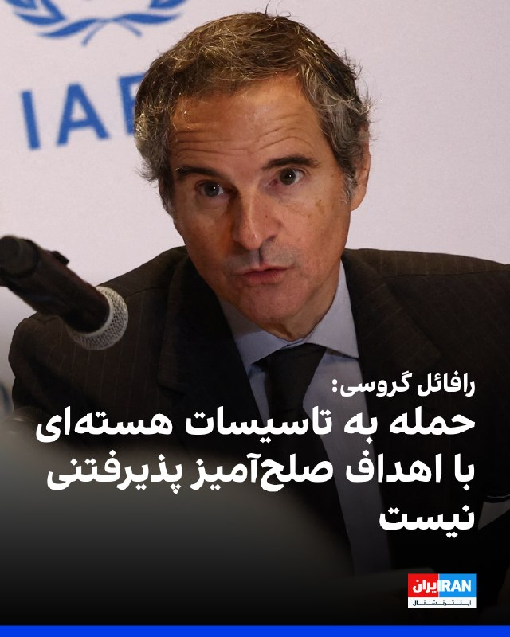

رافائل گروسی، مدیرکل آژانس بین‌المللی انرژی اتمی، در بیانیه افتتاحیه نشست شورای حکام در وین تاکید کرد حمله به تاسیسات هسته‌ای که برای اهداف صلح‌آمیز فعالیت می‌کنند، «تحت هیچ شرایطی پذیرفتنی نیست» و همه طرف‌های درگیر باید از هرگونه اقدام نظامی علیه این مراکز خودداری کنند.

او با اشاره به سفر اخیر خود به خاورمیانه و بازدید از نیروگاه هسته‌ای براکه در امارات متحده عربی گفت حمله پهپادی به این نیروگاه ایمنی هسته‌ای را به‌طور جدی به خطر انداخت. به گفته او، در صورت حمله مستقیم به نیروگاه‌های فعال، احتمال انتشار گسترده مواد رادیواکتیو و بروز پیامدهای زیست‌محیطی و انسانی در مقیاس وسیع وجود دارد.
‌🏁 🇬🇧 IranintlTV

🤖 @VahidOOnLine

## WithYashar — post 13545

فیفا: نقص سایت باعث صدور بلیت‌های رایگان شد
‏فیفا تأیید کرد که نقصی در وب‌سایتش باعث شد ده‌ها هوادار بلیت‌های رایگان جام جهانی دریافت کنند!
@withyashar

## IranIntlTV — post 340643

  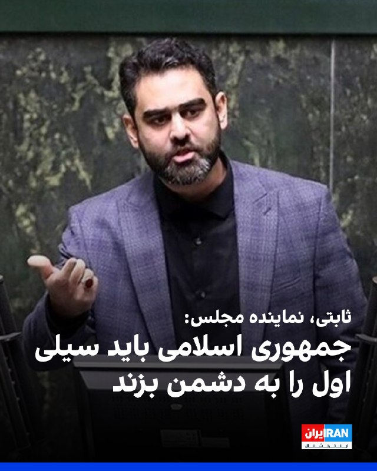

امیرحسین ثابتی، نماینده مجلس شورای اسلامی، در یک گفت‌وگوی ویدیویی گفت جمهوری اسلامی باید «چک اول را به دشمن بزند» و با ضربات پیشدستانه و بازدارنده به آمریکا حمله کند.

او گفت آمریکا دیر یا زود جنگ سخت‌تری را آغاز می‌کند و پس از جام جهانی «سنگین‌تر به ما حمله می‌کند و کشور را به غزه دوم تبدیل خواهد کرد».

ثابتی افزود در مذاکرات اسلام‌آباد اشتباهاتی برخلاف خط قرمز رهبر جمهوری اسلامی صورت گرفت که به گفته او با تذکر متوقف شد.

او خطاب به عباس عراقچی گفت پس از کشته شدن علی خامنه‌ای باید اعلام می‌شد «منطقه به آتش کشیده می‌شود» و «تنگه هرمز بسته خواهد شد»، نه اینکه گفته شود طبق قانون رهبر جدید انتخاب می‌شود.
https://iranintl.com/202606050201

## IranIntlTV — post 340642

  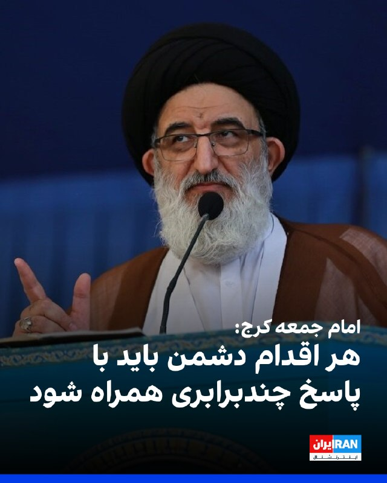

محمدمهدی حسینی‌همدانی، امام جمعه کرج، در خطبه‌های نماز جمعه این شهر گفت اگر اسرائیل خطایی انجام دهد، با توجه به هماهنگی آن با آمریکا، این آمریکا است که باید هزینه آن را بپردازد.

او افزود هیچ شلیکی از سوی دشمنان نباید بی‌هزینه بماند و باید چند برابر پاسخ داده شود.

امام جمعه کرج همچنین گفت: «فناوری هسته‌ای و غنی‌سازی مانند تمامیت ارضی بخشی از هویت ملی ما است و قابل مذاکره نیست.»

حسینی‌همدانی خطاب به کشورهای عربی گفت در تکیه بر قدرتی «رو به زوال» بازنگری کنند.
https://iranintl.com/202606050900

## IranIntlTV — post 340641

  <a href="telegram/content/IranIntlTV_340641_1780657978.mp4" target="_blank">🎬 Download video</a>

یک شهروند با ارسال پیامی از تاریکی در نیک‌شهر استان سیستان و بلوچستان از قطع برق در این شهر خبر داد. با افزایش دما پیام‌های شهروندان حاکی از افزایش میزان قطع برق در شهرهای مختلف است.

## IranIntlTV — post 340640

  

رافائل گروسی، مدیرکل آژانس بین‌المللی انرژی اتمی، در بیانیه افتتاحیه نشست شورای حکام در وین تاکید کرد حمله به تاسیسات هسته‌ای که برای اهداف صلح‌آمیز فعالیت می‌کنند، «تحت هیچ شرایطی پذیرفتنی نیست» و همه طرف‌های درگیر باید از هرگونه اقدام نظامی علیه این مراکز خودداری کنند.

او با اشاره به سفر اخیر خود به خاورمیانه و بازدید از نیروگاه هسته‌ای براکه در امارات متحده عربی گفت حمله پهپادی به این نیروگاه ایمنی هسته‌ای را به‌طور جدی به خطر انداخت. به گفته او، در صورت حمله مستقیم به نیروگاه‌های فعال، احتمال انتشار گسترده مواد رادیواکتیو و بروز پیامدهای زیست‌محیطی و انسانی در مقیاس وسیع وجود دارد.
https://iranintl.com/202606056844

## FarsiVOA — post 219654

🔺سازمان ملل درخواست کمک به لبنان را دو برابر کرد

▪️سازمان ملل متحد اعلام کرد که میزان بودجه مورد نیاز برای کمک به لبنان در پاسخ به افزایش شدید نیازهای بشردوستانه را دو برابر می‌کند.

▪️لبنان در اوایل ماه مارس به جنگ گسترده‌تر منطقه‌ای کشیده شد؛ زمانی که شبه‌نظامیان حزب‌الله تحت حمایت تهران، در همبستگی با جمهوری اسلامی، به سوی اسرائیل راکت شلیک کردند. این اقدام به آغاز یک کارزار گسترده زمینی و هوایی اسرائیل منجر شد.

▪️سازمان ملل اعلام کرد که همراه با دولت لبنان یک درخواست جدید برای کمک‌های مالی ارائه خواهد کرد و به دنبال دریافت ۳۳۱.۵ میلیون دلار دیگر برای کمک به ۱.۴ میلیون نفر است.

▪️با این مبلغ، مجموع درخواست کمک‌ها به ۶۳۹.۹ میلیون دلار خواهد رسید.

⬇️ بیشتر بخوانید:
https://ir.voanews.com/a/8157644.html

## alonews — post 125280

  <a href="telegram/content/alonews_125280_1780657980.webm" target="_blank">🎬 Download video</a>

👈 تا دیروز، تقریباً ۶۳ تانکر نیروی هوایی ایالات متحده (KC-135Rs و KC-46As) در فرودگاه بن گوریون اسرائیل مشاهده شدند

🔴 هواپیماهای نظامی ایالات متحده بیش از نیمی از جایگاه‌های پارکینگ فرودگاه را اشغال کرده‌اند و عملیات تجاری در فرودگاه اصلی غیرنظامی اسرائیل را مختل کرده‌اند

🔴 با وجود گزارش خبری قبلی که ادعا می‌کرد نیروی هوایی ایالات متحده بیشتر هواپیماهای نظامی را از فرودگاه بن گوریون خارج خواهد کرد، چنین اتفاقی نیفتاد

✅ @AloNews خبر جنگ

---
📅 بروزرسانی: 1405/03/15 14:33
---

## IranIntlTV — post 340639

  <a href="telegram/content/IranIntlTV_340639_1780657396.mp4" target="_blank">🎬 Download video</a>

سی‌ان‌ان به نقل از چهار منبع مطلع گزارش داد اسرائیل در جریان جنگ با جمهوری اسلامی، یگان‌های زبده نظامی و اطلاعاتی خود را به‌طور مخفیانه در جمهوری آذربایجان مستقر کرده بود تا اشراف اطلاعاتی کاملی بر مرزهای شمالی ایران به دست آورد.
سخنگوی سفارت جمهوری آذربایجان در ایالات متحده این گزارش را رد کرده است.

بابک اسحاقی، خبرنگار ایران‌اینترنشنال، گزارش می‌دهد
@iranintltv

## IranIntlTV — post 340638

  <a href="telegram/content/IranIntlTV_340638_1780657399.mp4" target="_blank">🎬 Download video</a>

سی‌ان‌ان به نقل از چهار منبع مطلع گزارش داد اسرائیل در جریان جنگ با جمهوری اسلامی، یگان‌های زبده نظامی و اطلاعاتی خود را به‌طور مخفیانه در جمهوری آذربایجان مستقر کرده بود تا اشراف اطلاعاتی کاملی بر مرزهای شمالی ایران به دست آورد.سخنگوی سفارت جمهوری آذربایجان در ایالات متحده این گزارش را رد کرده است.

بابک اسحاقی، خبرنگار ایران‌اینترنشنال، گزارش می‌دهد
@iranintltv

## DW_Farsi — post 125523

  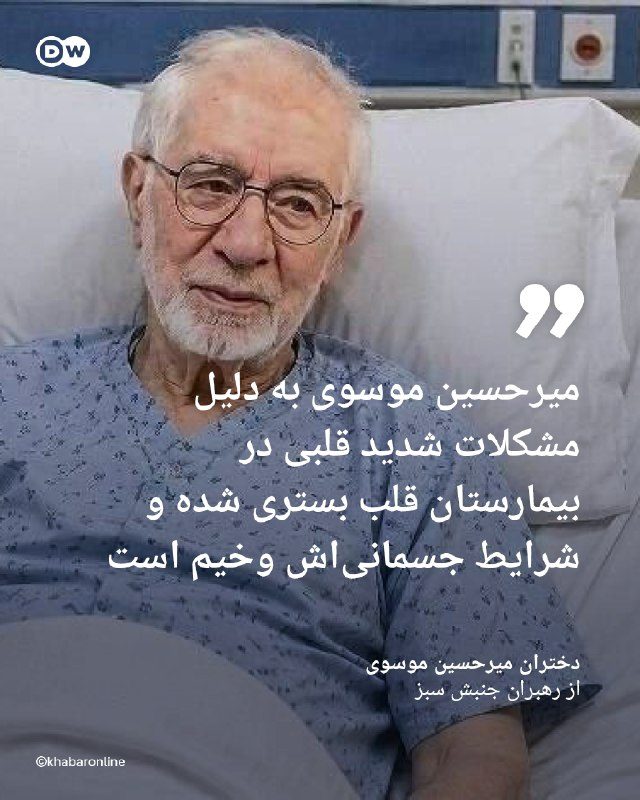

🔶دختران میرحسین موسوی: وضعیت جسمی پدرمان نامساعد است

دختران میرحسین موسوی، از رهبران جنبش سبز که در حصر خانگی بسر می‌برد، از نامساعد بودن وضعیت جسمی پدرشان خبر دادند. آنها اعلام کردند که میرحسین موسوی به دلیل مشکلات شدید قلبی در بیمارستان قلب بستری شده و شرایط جسمانی‌اش وخیم است.

به گزارش رسانه آوش، دختران موسوی همچنین از بی‌توجهی و عدم پیگیری دولت در قبال وضعیت پدرشان انتقاد کردند.

رسانه‌های ایران از جمله آوش گزارش دادند که پس از حمله آمریکا به مجموعه پردیس پاستور، این محل سکونت میرحسین موسوی و زهرا رهنورد دچار آسیب شده و آنها ناچار شدند به مکان دیگری منتقل شوند.

پیش‌تر زهرا رهنورد به فرزندانش گفته بود که پدرشان وضعیت جسمی مناسبی ندارد و هنگام راه رفتن باید همواره در کنار او حضور داشته باشد تا سرگیجه، نوسانات جسمی و افت شدید فشار خون موجب بروز حادثه یا مشکل تازه‌ای نشود.

میرحسین موسوی ۸۴ ساله، نخست‌وزیر پیشین ایران و همسرش، زهرا رهنورد از بهمن‌ماه سال ۱۳۸۹ در حصر خانگی به سر می‌برند.

@dw_farsi

## Persian_Trend_Official — post 15741

  

العربیه: ایران به طور رسمی به پاکستان ابلاغ کرده است که با انتقال بخشی از ذخایر اورانیوم خود به یک کشور ثالث مورد توافق طرفین، موافق است.

📝 Amir

📌 @persian_trend_official
پرشین ترند | متفاوت‌ترین کانال نظامی

## Persian_Trend_Official — post 15737

تصاویری از حملات هوایی ساعتی پیش نیروی هوایی اسرائیل به استان صیدا لبنان

📝 Amir

📌 @persian_trend_official
پرشین ترند | متفاوت‌ترین کانال نظامی

## RadioFarda — post 157921

🔸هزاران نفر از مردم آلبانی روز پنج‌شنبه، ۱۴ خردادماه، برای چهارمین روز پیاپی در اعتراض به ساخت یک مجتمع گردشگری و تفریحی لوکس ساحلی در جنوب این کشور به خیابان‌ها آمدند.

🔸یکی از سرمایه‌گذاران این پروژه گردشگری جَرِد کوشنر، داماد دونالد ترامپ، رئیس جمهور آمریکا، است.

🔸به گزارش خبرگزاری فرانسه، برخی از تظاهرکنندگان پارچه‌هایی به دست داشتند که روی آن نوشته بود «اِدی راما،‌ استعفا کن»، و عده‌ای دیگر نقاشی‌هایی به دست داشتند که ادی راما، نخست وزیر سوسیالیست این کشور، را در حال دادن کلید به ایوانکا ترامپ، دختر رئیس جمهور آمریکا،‌ نشان می‌داد.

🔸معترضان آلبانیایی می‌گویند که پروژه ۱.۲ میلیارد دلاری که شرکت سرمایه‌گذاری کوشنر و ایوانکا ترامپ برنامه اجرایش را دارد به محیط زیست منطقه ساحلی ویوسا نارتا در جنوب آلبانی لطمه خواهد زد.

🔸عده‌ای دیگر از منتقدان هم مقامات دولتی آلبانی را به فساد متهم می‌کنند.

🔸راما از این پروژه دفاع کرده است و سرمایه‌گذاران گفته‌اند که تمرکز آنها بر «مدیریت مسئولانه و بهبود محیط زیست» خواهد بود.

@RadioFarda

## IranianMinds — post 21416

🔴یه دختر بی حجاب در تجمعات : حالا که جنگ داره تموم میشه،کم کم دارن بهمون تذکر حجاب میدن،به خاطر همین خیلیا مثل من تصمیم گرفتن دیگه نیان تو تجمعات.

@IranianMinds

## BBCPersian — post 282914

  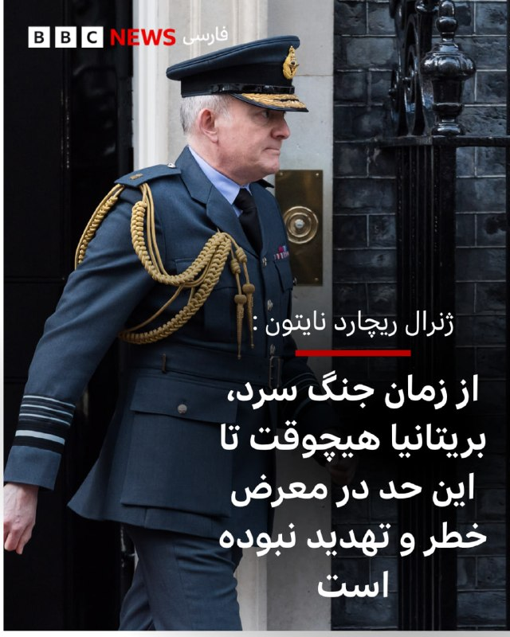

ریچارد نایتون، فرمانده ستاد نیروهای مسلح بریتانیا می‌گوید که از زمان جنگ سرد، بریتانیا هیچوقت تا این حد در معرض خطر و تهدید نبوده است

او گفت که در پنج ماه اول امسال، تعداد موارد تجاوز هواپیماهای روسیه به حریم هوایی بریتانیا به اندازه کل سال گذشته یوده است.

این مقام ارشد نیروهای مسلح بریتانیا در حالی این اظهارات را مطرح کرد که قرار است سند سرمایه‌گذاری دفاعی هفته آینده و پس از چندین بار به تاخیر افتادن،‌ منتشر شود.

این سند که مشخص می‌کند هزینه تهیه تجهیزات جدید و زیرساخت‌های دفاعی طی ۱۰ سال آینده از چه منابعی تامین خواهد شد،‌ ابتدا قرار بود پاییز گذشته منتشر شود.

ریچارد نایتون همچنین از تغییر ماهیت جنگ‌ها و ضرورت سازگاری با این تحولات سخن گفت. و افزود که پهپادها و سامانه‌های خودکار در جنگ‌های آینده «نقشی روز افزون و بسیار مهم» خواهند داشت.

بریتانیا در کنار فرانسه به‌عنوان یکی از قدرت‌های نظامی پیشرو در اروپا شناخته می‌شود.

📷 Wiktor Szymanowicz/Future Publishing via Getty Images

از لینک ⬇️ این مطلب را در سایت بی‌بی‌سی فارسی بخوانید.
https://bbc.in/49BX6LG
@BBCPersian

## alonews — post 125279

  <a href="telegram/content/alonews_125279_1780657404.webm" target="_blank">🎬 Download video</a>

👈فیفا تأیید کرد که نقصی در وب‌سایتش باعث شد ده‌ها هوادار بلیت‌های رایگان جام جهانی دریافت کنند!

✅ @AloNews خبر جنگ

## alonews — post 125278

  <a href="telegram/content/alonews_125278_1780657405.webm" target="_blank">🎬 Download video</a>

👈العربیه: اختلاف اساسی در مذاکرات، آزادسازی دارایی‌های بلوکه‌شده ایران است.

🔴روش و سازوکار آزادسازی دارایی‌های بلوکه‌شده ایران، یک شکاف (اختلاف نظر) در مذاکرات است.

✅ @AloNews خبر جنگ

---
📅 بروزرسانی: 1405/03/15 14:22
---

## FarsiVOA — post 219653

  <a href="telegram/content/FarsiVOA_219653_1780656770.mp4" target="_blank">🎬 Download video</a>

رهگیری موشک‌های حزب‌الله بر فراز کریات شمونه؛ تأکید بر تداوم تنش‌ها از سوی این گروه؛

سامانه‌های پدافندی ارتش اسرائیل موفق به رهگیری موشک‌های شلیک‌شده از سوی حزب‌الله بر فراز شهر «کریات شمونه» در شمال اسرائیل شدند.

به دنبال این حملات، منابع رسمی اسرائیلی اعلام کردند که رد هرگونه توافق آتش‌بس از سوی نعیم قاسم، دبیرکل حزب‌الله و تداوم شلیک موشک به سمت خاک اسرائیل، نشان‌ می‌دهد «حزب‌الله به دنبال ثبات در منطقه نیست، بلکه همچنان در حال پیشبرد و اجرای دستور کار رژیم ایران است؛ اقدامی که لبنان و کل منطقه را در معرض تشدید بیشتر تنش‌ها و بی‌ثباتی قرار می‌دهد.»
@FarsiVOA

## Persian_Trend_Official — post 15736

  <a href="telegram/content/Persian_Trend_Official_15736_1780656772.mp4" target="_blank">🎬 Download video</a>

لاوروف، وزیر امور خارجه روسیه در مورد سلاح‌های هسته‌ای: قذافی از برنامه هسته‌ای خود دست کشید و او در تلویزیون زنده مورد تمسخر قرار گرفت و کشته شد، در حالی که هیلاری کلینتون، که به معنای واقعی کلمه جلوی صفحه نمایش کف می‌زد، از او استقبال کرد.

کره شمالی به سادگی به این نتیجه رسید که بدون سلاح‌های هسته‌ای، از روی زمین محو خواهند شد. آنها بر اساس این انتخاب عمل می‌کنند و هیچ کس به آنها دست نمی‌زند.

در مورد ایران، همه اینها به این دلیل آغاز شد که ظاهراً ایران 47 سال است که تروریسم بین‌المللی را ترویج می‌کند. خیلی سریع مشخص شد که دلیل آن دوباره نفت است.

آمریکایی‌ها پیشنهاد دادند که آنها و ایران تنگه هرمز را به صورت 50/50 کنترل کنند. همه چیز دوباره در مورد نفت است. همه چیز در مورد بازارهای انرژی جهانی است.

📝 Amir

📌 @persian_trend_official
پرشین ترند | متفاوت‌ترین کانال نظامی

## Persian_Trend_Official — post 15735

  <a href="telegram/content/Persian_Trend_Official_15735_1780656773.mp4" target="_blank">🎬 Download video</a>

لاوروف، وزیر امور خارجه روسیه در مورد نقش امریکا در جنگ اوکراین: جنگ بایدن همین الان هم به جنگ ترامپ تبدیل شده است.

📝 Amir

📌 @persian_trend_official
پرشین ترند | متفاوت‌ترین کانال نظامی

## RadioFarda — post 157919

انفجار و کشف سه پهپاد دریایی در سواحل رومانی یک هفته پس از سقوط پهپاد روسی

🔸یک هفته پس از ورود یک پهپاد روسی به حریم هوایی رومانی که واکنش گسترده اتحادیه اروپا و ناتو را در پی داشت، سه پهپاد دریایی هم در سواحل رومانی پیدا شد.

🔸خبرگزاری رویترز روز جمعه ۱۵ خرداد به نقل از وب‌سایت خبری «دیجی‌۲۴» نوشته پس از وقوع یک انفجار در بندر کُنستانتا، سه پهپاد دریایی دیگر در سواحل رومانی کشف شده‌اند.

🔸این وب‌سایت این خبر را به نقل از منابعی که نامشان فاش نشده، گزارش کرده است.

🔸وزارت دفاع رومانی پیشتر اعلام کرده بود که یک پهپاد دریایی از نوع مورد استفاده در جنگ اوکراین، روز جمعه در بندر کنستانتا در ساحل دریای سیاه و در نزدیکی یک پایانه نفتی، به‌صورت خودکار منفجر شده است.

🔸این انفجار که ساعت ۱۰:۳۰ دقیقه صبح امروز رخ داد، تلفات جانی در پی نداشته است.

🔸بر اساس گزارش‌ها، احتمال داده می‌شود این حادثه مرتبط با پهپادهای مورد استفاده در جنگ اوکراین باشد.

🔸این حادثه یک هفته پس از آن رخ داد که یک پهپاد در این کشور به ساختمانی مسکونی برخورد کرد و دو نفر را مجروح ساخت.

🔸این ماجرا واکنش‌های گسترده‌ای از سوی اعضای اروپایی ناتو را در پی داشت و مقامات و دولت‌های اروپایی این اقدام را محکوم کردند.

🔸کایا کالاس، مسئول سیاست خارجی اتحادیه اروپا، در واکنش در شبکه ایکس نوشت: «پس از حادثه پهپاد در رومانی، نباید به مسکو اجازه داده شود که حریم هوایی اروپا را بدون مجازات نقض کند.»

🔸اورسولا فون درلاین، رئیس کمیسیون اروپا، هم گفت که روسیه «بار دیگر از یک خط قرمز عبور کرده است.»

🔸نسخه کامل این گزارش را در وب‌سایت رادیوفردا بخوانید.

@RadioFarda

## Hranews — post 113398

  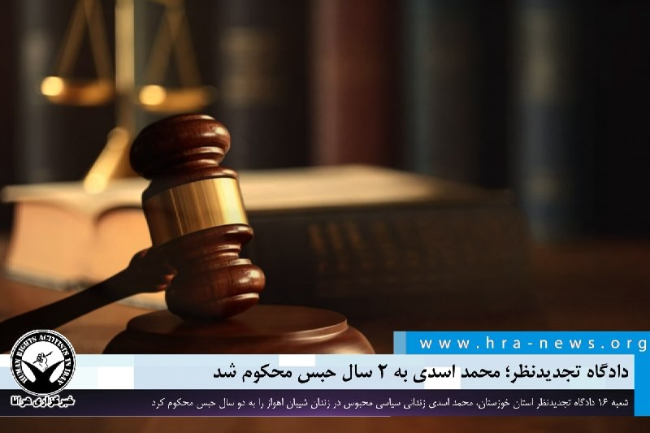

دادگاه تجدیدنظر؛ محمد اسدی به ۲ سال حبس محکوم شد

❗️
❗️
❗️
❗️
❗️– شعبه ۱۶ دادگاه تجدیدنظر استان خوزستان، محمد اسدی، زندانی سیاسی محبوس در زندان شیبان اهواز را به دو سال حبس محکوم کرد. وی در مرحله بدوی دادگاه، به دو سال زندان و مجازات تکمیلی محکوم شده بود.

به گزارش خبرگزاری هرانا، ارگان خبری مجموعه فعالان حقوق بشر در ایران، محمد اسدی، توسط دادگاه تجدیدنظر به حبس محکوم شد.

بر اساس رای صادره توسط شعبه ۱۶ دادگاه تجدیدنظر استان خوزستان، محمد اسدی از بابت اتهام “اخلال در نظم عمومی” به دو سال حبس محکوم شده است. همچنین مجازات‌های تکمیلی تعیین‌شده در مرحله بدوی از محکومیت وی حذف شده است.

#محمد_اسدی

ادامه مطلب

↘️
@hranews_bot تماس ✉️ - @Hranews کانال هرانا 🆑

## alonews — post 125277

  <a href="telegram/content/alonews_125277_1780656776.webm" target="_blank">🎬 Download video</a>

👈کرملین: احتمال دیدار پوتین و ترامپ در تابستان ۵۰-۵۰ است

✅ @AloNews خبر جنگ

## alonews — post 125276

  <a href="telegram/content/alonews_125276_1780656776.webm" target="_blank">🎬 Download video</a>

👈 حمله هوایی اسرائیل به شهر سکسقیه در جنوب لبنان

✅ @AloNews خبر جنگ

---
📅 بروزرسانی: 1405/03/15 14:13
---

## IranIntlTV — post 340637

  <a href="telegram/content/IranIntlTV_340637_1780656184.mp4" target="_blank">🎬 Download video</a>

سرخط خبرهای جمعه ۱۵ خرداد
@iranintltv

## IranIntlTV — post 340636

  <a href="telegram/content/IranIntlTV_340636_1780656185.mp4" target="_blank">🎬 Download video</a>

یک شهروند با ارسال پیامی به ایران اینترنشنال درباره گرانی‌ کالاهای خوراکی روایت می کند. پیام او با هوش مصنوعی خوانده شده است.

## Persian_Trend_Official — post 15734

خبرگزاری CNN: اسرائیل در طول جنگ با ایران مخفیانه پرسنل نظامی و اطلاعاتی خود را به آذربایجان اعزام کرد و از مکان‌هایی در نزدیکی مرز شمالی ایران برای جمع‌آوری اطلاعات، عملیات پهپادی و پشتیبانی از مأموریت‌های نجات احتمالی استفاده کرد. اسرائیل همچنین در طول…

## Persian_Trend_Official — post 15731

  <a href="telegram/content/Persian_Trend_Official_15731_1780656188.webm" target="_blank">🎬 Download video</a>

تصاویری از رمپ پروازی پایگاه هوایی شیراز و هواپیماهای ترابری C-130 و IL-76 منهدم شده.

📝 Amir

📌 @persian_trend_official
پرشین ترند | متفاوت‌ترین کانال نظامی

## IranianMinds — post 21415

  <a href="telegram/content/IranianMinds_21415_1780656188.mp4" target="_blank">🎬 Download video</a>

🔴پیام وزارت خارجه آمریکا به مردم ایران.

@IranianMinds

## Dirty_Kids — post 391039

🔴 توی ترب دارن لوازم سکس BDSM میفروشن😐😐😐

@Dirty_Kids 👻

## Dirty_Kids — post 391038

🔴 فوری العربیه:

ایران به طور رسمی به پاکستان ابلاغ کرده که با انتقال بخشی از ذخایر اورانیوم خود به یک کشور ثالث مورد توافق طرفین، موافقه

درضمن آمریکا همچنان درخواست ایران برای آزادسازی دارایی‌های مسدود شدش رو رد می‌کنه

@Dirty_Kids 👻

## Dirty_Kids — post 391037

  <a href="https://t.me/Dirty_Kids/391037" target="_blank">📎 Download file</a>

ریتزوبت تنها سایت بین المللی میباشد ، که به صورت هفتگی پرومو کد دریافت میکنید ✅

♦️ آموزش شارژ حساب با کریپتو
♦️ آموزش شارژ حساب ریالی در ریتزوبت
#پیشبینی
🔵ریتزوبت برندی با لایسنس معتبر در صنعت شرطبندی و پیشبینی مسابقات ورزشی و کازینویی 👇

https://t.me/+LB508WZyIr8xNmY0

## Dirty_Kids — post 391036

  <a href="telegram/content/Dirty_Kids_391036_1780656191.webm" target="_blank">🎬 Download video</a>

🏆 جام جهانی 2026 نزدیک است …

⚽️ پر از هیجان، استرس، بردهای شیرین و لحظه‌های فراموش‌نشدنی برای عاشقان فوتبال 🔥

🎁 ریتزوبت در کنار شما ❤️💙

🏦 کد هدیه تا سقف 100 میلیون تومان برای کاربران فعال و سنگین‌زن در دوران جام جهانی ✅

🌟 بالاترین ضرایب و بهترین خدمات در کنار هیجان جام جهانی با ریتزوبت

🛸 لینک ورود به سایت 👉

🌐 کانال تلگرامی 
3️⃣
2️⃣
1️⃣
R15
https://t.me/+LB508WZyIr8xNmY0

## alonews — post 125275

  <a href="telegram/content/alonews_125275_1780656192.webm" target="_blank">🎬 Download video</a>

👈جمالیان، عضو کمیسیون بهداشت مجلس: میزان کشت خشخاش در استان‌های ایران بسیار بالا رفته!

🔴در استانی که قبلا برنج می‌کاشتند، امروز به کاشت خشخاش روی آوردند.

🔴با توجه به اینکه این محصولات خالص‌تر هستند، قطعاً شدت اعتیاد را افزایش می‌دهند.

🔴خشخاش‌هایی که [غیر قانونی] کاشته می‌شوند، جزو کشفیات است و به کارخانه‌های داروسازی تحویل داده می‌شود.

✅ @AloNews خبر جنگ

## alonews — post 125274

  <a href="telegram/content/alonews_125274_1780656192.webm" target="_blank">🎬 Download video</a>

👈وزارت خارجه جمهوری آذربایجان اعلام کرد: در حمله پهپادی شب گذشته به دو کشتی باری خارجی که ۲۵ شهروند آذربایجانی داشتند، پنج نفر کشته و سه نفر مجروح شدند.

✅ @AloNews خبر جنگ

---
📅 بروزرسانی: 1405/03/15 14:02
---

## pm_afshaa — post 92301

سلام وقتتون بخیر
یه اتفاقی در دانشگاه ما افتاده از دیروز و کسی راجع بهش صحبتی نکرده
خیلی از بچه‌های ما چه خوابگاه چه غیر خوابگاه، کسایی که از سلف دانشگاه غذا گرفتن حالشون بد شده و مسموم شدن و کارشون کشیده بیمارستان
درحدی که امتحان حضوری ما فعلا برای فردا لغو شده، اینقدر که آمار زیاد بوده
می‌شه لطفا ازش صحبت کنید؟
الان به ما پیام دادن که آب و غذا نخورید ممکنه وبا باشه! مگه می‌شه آخه؟

## DEJradio — post 5350

  <a href="telegram/content/DEJradio_5350_1780655578.webm" target="_blank">🎬 Download video</a>

🚨
⭕️ العربیه:
موافقت جمهوری اسلامی با انتقال بخشی از اورانیوم خود به کشور ثالث

شبکه العربیه مدعی شد جمهوری اسلامی به پاکستان اطلاع داده است با انتقال بخشی از اورانیوم خود به یک کشور ثالث موافقت می‌کند.

طبق گزارش آژانس ۴۵۰ کیلوگرم اورانیوم‌های ۶۰ درصدی در اختیار حکومت ایران است که به نظر می‌رسد بخش عمده آن در زیر تاسیسات اتمی بمباران شده مدفون است.
بر اساس این گزارش، یکی از شکاف‌های اصلی در مذاکرات، موضوع آزادسازی پول‌های مسدودشده است.
العربیه نوشت آمریکا همچنان درخواست جمهوری اسلامی را برای آزاد کردن این دارایی‌ها رد می‌کند.

#مذاکرات #جمهوری_اسلامی #اورانیوم
@DEJradio

## RadioFarda — post 157918

🔸روز جمعه پس از حملات شبانه اسرائیل که توسط خبرگزاری دولتی لبنان گزارش شد، تصاویری از حملات مجدد اسرائیل به روستایی در جنوب لبنان و برخاستن ستون دود در این منطقه منتشر شد.

🔸خبرگزاری فرانسه روز جمعه ۱۵ خرداد به نقل از یک منبع از دفاع مدنی لبنان گزارش داد که حملات شبانه اسرائیل در شامگاه پنجشنبه در شهر تاریخی صور در جنوب لبنان که با وجود آتش‌بس در جنگ اسرائیل و حزب‌الله صورت گرفت، هفت کشته برجای گذاشته است.

🔸به گزارش خبرگزاری فرانسه یک حمله در نزدیکی بیمارستان جبل عامل چهار کشته، هفت زخمی و خسارات جزئی به این مرکز وارد کرد، در حالی که حمله دیگری در یک منطقه مسکونی سه کشته و پنج زخمی، از جمله دو کودک، برجای گذاشت.

🔸بنا برگزارش‌ها ارتش اسرائیل «هشدارهای تخلیه» جدیدی را برای نه شهر و روستای جنوب لبنان صادر کرده و خبرگزاری ملی لبنان گزارش داد که مردم در حال فرار هستند.

🔸این حملات در شرایطی صورت گرفته است که دبیرکل گروه حزب‌الله روز پنجشنبه طرح آتش‌بسی را که دولت‌های لبنان و اسرائیل در مذاکراتی با میانجی‌گری آمریکا بر سر آن توافق کرده بودند، رد کرد.

@RadioFarda

## IranianMinds — post 21414

🔴 العربیه:

ایران بطور رسمی به پاکستان ابلاغ کرده که با انتقال بخشی از ذخایر اورانیوم خودش به یک کشور ثالث مورد توافق طرفین، موافقه.

@IranianMinds

## alonews — post 125273

  <a href="telegram/content/alonews_125273_1780655579.webm" target="_blank">🎬 Download video</a>

👈العربیه: ایالات متحده همچنان با درخواست ایران برای آزادسازی دارایی‌های بلوکه‌شده مخالفت می‌کند

✅ @AloNews خبر جنگ

## alonews — post 125272

  <a href="telegram/content/alonews_125272_1780655579.webm" target="_blank">🎬 Download video</a>

👈ماکرون، رئیس جمهور فرانسه : جنگ اسرائیل و لبنان هرچه سریع‌تر باید تموم شه

✅ @AloNews خبر جنگ

---
📅 بروزرسانی: 1405/03/15 13:52
---

## VahidOOnLine — post 243777

  

♦️وزارت امور خارجه جمهوری آذربایجان، روز جمعه ۱۵ خرداد ماه اعلام کرد در جریان حمله پهپادی به دو کشتی باری خارجی در دریای آزوف، پنج شهروند آذربایجانی کشته و سه نفر دیگر زخمی شدند.
این وزارتخانه با استناد به اطلاعیه رسمی روسیه به باکو اعلام کرد که ۲۵ شهروند جمهوری آذربایجان در میان خدمه دو کشتی هدف قرار گرفته حضور داشتند. بر اساس این بیانیه، این دو کشتی متعلق به جمهوری آذربایجان نبوده‌اند.
خبرگزاری فرانسه به نقل از رسانه‌های دولتی روسیه گزارش کرد، میخائیل گالوزین، معاون وزیر امور خارجه روسیه، اوکراین را مسئول این حمله دانست.
جزئیات بیشتری درباره زمان دقیق حمله، هویت کشتی‌ها و وضعیت سایر خدمه منتشر نشده است. اوکراین نیز تاکنون واکنشی به این اتهام روسیه نشان نداده است.
‌🇸🇦 Indypersian

🤖 @VahidOOnLine

## VahidOOnLine — post 243776

⭕️اسلام و پادشاهان مشروطه؛ تصورات و واقعیات

♦️در طی فقط ۱۵ سال، دولت نوبنیاد رضاشاه کبیر بسیاری از ممنوعیات اعلام‌شده از سوی روحانیت را نادیده گرفت. ایجاد بانک حرام بود، زیرا بانکداری نوعی رباخواری محسوب می‌شد.
در دوران قاجار، روس و انگلیس حق باز کردن بانک داشتند، زیرا رباخواری برای کفار مذموم بود اما ممنوع نبود.

با تاسیس بانک ملی ایران و سپس بانک سپه، دولت نوبنیاد ایران نشان داد که مسلمانان نیز می‌توانند بانک داشته باشند. در همین مسیر بود که شرکت دولتی بیمه ایران برخلاف نظرات شرعی، تاسیس شد. در شرع شیعه، هر نوع بیمه نوعی طغیان از اراده الهی به شمار می‌رود، زیرا بر اساس قضا و قدر، اگر قادر متعال بخواهد شما را با سوزاندن خانه‌تان مجازات کند، نباید با توسل به بیمه جلو اجرای این مجازات را گرفت. باز هم در دوران قاجار فقط روس و انگلیس حق داشتند در ایران شرکت بیمه داشته باشند.

✍️دیدگاهی از استاد امیر طاهری
‌🇸🇦 Indypersian

🤖 @VahidOOnLine

## pm_afshaa — post 92298

🔴العربیه: ایران بطور رسمی به پاکستان ابلاغ کرده که با انتقال بخشی از ذخایر اورانیوم خودش به یک کشور ثالث مورد توافق طرفین، موافقه

💧 Rainbet.com the #1 Non-KYC Crypto Casino & Sportsbook @rainbetcom

😁 @Pm_Afshaa

## pm_afshaa — post 92297

🔴مرکز ملی فضای مجازی: بر اساس بررسی‌های فنی و ارزیابی‌های عملیاتی انجام‌شده، قطع اینترنت در هفته‌های اخیر، تأثیر معناداری بر خنثی‌سازی حملات سایبری پیشرفته نداشته

💧 Rainbet.com the #1 Non-KYC Crypto Casino & Sportsbook @rainbetcom

😁 @Pm_Afshaa

## pm_afshaa — post 92296

محسن رضایی:احتمالا حمله ديگری از سوی آمریکا و اسرائیل در راه است

💧 Rainbet.com the #1 Non-KYC Crypto Casino & Sportsbook @rainbetcom

😁 @Pm_Afshaa

## IranIntlTV — post 340635

  

جام‌های جهانی معمولا با گل‌های تماشایی، نمایش‌های ماندگار و قهرمانی‌های فراموش‌نشدنی به یاد آورده می‌شوند، اما نتایج غیرمنتظره نیز بخش مهمی از تاریخ این رقابت‌ها را شکل داده‌اند. رسانه اتلتیک به پنج شگفتی بزرگ تاریخ جام جهانی پرداخته که در ادامه می‌خوانید.

🔹آمریکا ۱ - انگلیس ۰ (۱۹۵۰)
انگلیس در نخستین حضور خود در جام جهانی با تیمی پرستاره و با این باور که بهترین فوتبال جهان را در اختیار دارد، راهی مسابقات شد. در مقابل، آمریکا تیمی آماتور و کم‌تجربه داشت که برخی بازیکنانش حتی به دلیل مشغله کاری نتوانسته بودند در این سفر شرکت کنند.
با این حال، جوزف گایتینس با استفاده از ضربه والتر بار، تنها گل مسابقه را به ثمر رساند. آمریکا سپس با دفاعی فشرده از برتری خود محافظت کرد و یکی از غیرمنتظره‌ترین پیروزی‌های تاریخ فوتبال را رقم زد.

🔹کره شمالی ۱ - ایتالیا ۰ (۱۹۶۶)
ایتالیا با ستارگانی مانند جیاچینتو فاکتی، ساندرو ماتزولا و جانی ریورا یکی از قدرت‌های بزرگ فوتبال جهان بود و کمتر کسی برای کره شمالی شانسی قائل می‌شد.

🔹جزییات بیشتر را در سایت بخوانید

@iranintltvsport

## FarsiVOA — post 219652

🔺جمهوری اسلامی خواهان آزادسازی ۵۰ درصد از پول‌های مسدود همزمان با تفاهم است

▪️معاون بین‌الملل وزیر خارجه جمهوری اسلامی اعلام کرد که ۵۰ درصد پول‌های ناشی از فروش نفت ایران که به دلیل تحریم‌ها در کشورهای ثالث مسدود است، باید همزمان با تفاهم تهران و واشنگتن آزاد شود.

▪️در هفته‌های اخیر، از موضوع اموال مسدود جمهوری اسلامی به عنوان یکی از موانع دستیابی به تفاهم یاد شده است.

▪️اکسیوس ۲۹ فروردین گزارش داد یکی از گزینه‌های در حال بررسی در طرح واشنگتن و تهران، آزادسازی ۲۰ میلیارد دلار از دارایی‌های مسدودشده ایران در برابر واگذاری ذخایر اورانیوم غنی‌شده است.

▪️پیشنهاد اولیه آمریکا آزادسازی شش میلیارد دلار برای مصارف انسان‌دوستانه بود، در حالی که ایران ۲۷ میلیارد دلار مطالبه کرده بود.

⬇️ بیشتر بخوانید:
https://ir.voanews.com/a/8157642.html

## RadioFarda — post 157917

  

🔸نمایندگی دائم ایران نزد سازمان‌های بین‌المللی مستقر در وین روز جمعه‌ از دیدار نمایندگان ایران، روسیه و چین با رافائل گروسی مدیرکل آژانس بین‌المللی انرژی اتمی در آستانه نشست فصلی شورای حکام خبر داد.

🔸خبرگزاری جمهوری اسلامی،‌ایرنا، به نقل از نمایندگی دائم ایران نزد سازمان‌های بین‌المللی گزارش داد که سفیران و نمایندگان دائم چین، ایران و روسیه روز جمعه ۱۵ خرداد در نشستی مشترک با رافائل گروسی، درباره موضوعات «مرتبط با دستورکار نشست آتی» شورای حکام آژانس در وین گفت‌وگو کردند.

🔸این دیدار در حالی برگزار شد که نشست فصلی شورای حکام آژانس بین‌المللی انرژی اتمی قرار است از ۱۸ تا ۲۲ خرداد ماه (۸ تا ۱۲ ژوئن) در مقر آژانس در وین برگزار شود.

🔸بنا بر بیانیه دبیرخانه آژانس «اجرای توافق‌نامه پادمان‌های ان‌پی‌تی» و «قطعنامه‌های مرتبط شورای امنیت سازمان ملل درباره ایران» در دستورکار این نشست قرار دارد.

@RadioFarda

---
📅 بروزرسانی: 1405/03/15 13:43
---

## VahidOOnLine — post 243775

  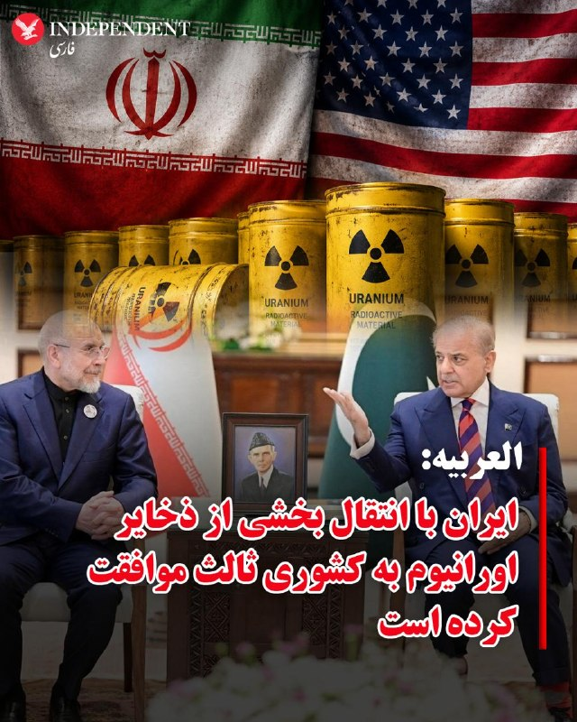

♦️شبکه خبری الحدث، روز جمعه ۱۵ خرداد ماه به نقل از «منابعی آگاه» گزارش کرد تهران موافقتش با انتقال بخشی از ذخایر اورانیوم خود به یک کشور ثالث را به اسلام‌آباد اعلام کرده است.
بر اساس این گزارش، اصلی‌ترین اختلاف باقی‌مانده در مذاکرات میان تهران و واشنگتن به موضوع آزادسازی دارایی‌های بلوکه‌شده ایران مربوط می‌شود و نحوه و سازوکار آزادسازی این اموال همچنان یکی از شکاف‌های مهم میان طرفین به شمار می‌رود.
این ادعا در حالی مطرح می‌شود که طی روزهای اخیر گزارش‌های ضد و نقیضی درباره سرنوشت ذخایر اورانیوم غنی‌شده ایران منتشر شده است. برخی رسانه‌ها از احتمال انتقال بخشی از این ذخایر به خارج از کشور خبر داده‌اند، اما رسانه‌های نزدیک به حاکمیت ایران پیش‌تر چنین گزارش‌هایی را رد و تاکید کرده‌اند هیچ توافقی درباره انتقال مواد هسته‌ای ایران به خارج از کشور حاصل نشده است.
این گزارش در حالی منتشر می‌شود که نماینده دائمی ایران در سازمان ملل متحد، صبح جمعه از دیدار نمایندگان ایران، روسیه و چین با رافائل گروسی، مدیرکل آژانس در وین خبر داده بود.
کاظم غریب‌آبادی، معاون حقوقی وزارت امورخارجه ایران نیز، روز پنجشنبه در گفتگو با مهر، با اعلام پیشرفت در تنظیم متن توافقنامه احتمالی پایان جنگ میان تهران و واشنگتن اعلام کرده بود: «تهران اصرار دارد ۵۰ درصد از دارایی‌های مسدودشده‌اش بلافاصله پس از امضای یادداشت تفاهم احتمالی با واشنگتن، آزاد و در اختیار جمهوری اسلامی قرار گیرد.»
‌🇸🇦 Indypersian

🤖 @VahidOOnLine

## WithYashar — post 13544

العربیه: ایران بطور رسمی به پاکستان ابلاغ کرده که با انتقال بخشی از ذخایر اورانیوم خودش به یک کشور ثالث مورد توافق طرفین، موافقه.
@withyashar

## pm_afshaa — post 92295

پروکسی سرعت بالا مخصوص دانلود

https://t.me/proxy?server=195.254.165.20&port=8080&secret=dd79e7010200010007f0030386e24c3add

💧 Rainbet.com the #1 Non-KYC Crypto Casino & Sportsbook @rainbetcom

😁 @Pm_Afshaa

## IranIntlTV — post 340634

  <a href="telegram/content/IranIntlTV_340634_1780654398.mp4" target="_blank">🎬 Download video</a>

علی‌حسین قاضی‌زاده، عضو تحریریه ایران‌اینترنشنال، گفت هدف دونالد ترامپ از فشارها، تضعیف توان نظامی جمهوری اسلامی بوده است. به گفته او، اگر ترامپ در ادامه مذاکرات گزینه نظامی موثرتری در اختیار نداشته باشد، تهران این پیام را خواهد داد که «آنچه را با جنگ نتوانستید به دست آورید، با مذاکره نیز به دست نخواهید آورد.»
@iranintltv

## IranIntlTV — post 340633

  <a href="telegram/content/IranIntlTV_340633_1780654400.mp4" target="_blank">🎬 Download video</a>

کمتر از دو روز پس از اعلام توافق آتش‌بس میان اسرائیل و لبنان و مخالفت حزب‌الله با آن، ارتش اسرائیل اعلام کرد حملات هوایی گسترده‌ای را به مناطق مختلف در جنوب لبنان آغاز کرده است.

می فرحات، خبرنگار ایران‌اینترنشنال، از البیساریه در جنوب لبنان گزارش می‌دهد
@iranintltv

## Persian_Trend_Official — post 15730

  <a href="telegram/content/Persian_Trend_Official_15730_1780654403.mp4" target="_blank">🎬 Download video</a>

⭕️ ثابتی، نماینده مجلس: آمریکا بعد از جام جهانی سنگین‌تر به ایران حمله خواهد کرد و ایران را تبدیل به غزه دوم خواهند کرد.

باید پیش‌دستانه پتروشیمی‌ها و زیرساخت‌های منطقه را بزنیم.

📝 Nick

📌 @persian_trend_official
پرشین ترند | متفاوت‌ترین کانال نظامی

## BBCPersian — post 282913

🔻سفرای ایران، چین و روسیه در آستانه نشست شورای حکام با مدیرکل آژانس دیدار کردند

نمایندگان دائم، ایران، چین و روسیه در آژانس بین المللی انرژی اتمی در جلسه‌ای مشترک با رافائل گروسی، مدیرکل آژانس شرکت کردند.

این جلسه در آستانه اجلاس شورای حکام تشکیل شد که قرار است هفته آینده در وین برگزار شود.

نمایندگی دائم ایران در سازمان ملل در وین، با انتشار تصویری از این جلسه در شبکه ایکس نوشت که طرف‌ها در این نشست درباره موضوعاتی که در دستور کار نشست بعدی شورای حکام قرار دارد، تبادل نظر کردند.

ساعاتی پیش از این نشست، آژانس بین‌المللی انرژی اتمی گزارش تازه خود درباره وضعیت برنامه هسته‌ای ایران به اعضای شورای حکام ارائه کرد.

در این گزارش محرمانه که برخی خبرگزاری‌ها متن آن را دیده‌اند، آژانس این هشدار را تکرار کرد که عدم دسترسی‌اش به مراکز هسته‌ای ایران برای تایید وضعیت ذخایر اورانیوم غنی‌شده،‌ مایه «نگرانی در زمینه گسترش سلاح‌های هسته‌ای» است.

در این گزارش از جمهوری اسلامی ایران خواسته شده است که با آژانس «به طور سازنده تعامل و همکاری کند.»

نشست هفته آینده شورای حکام اولین جلسه آن پس از حمله اخیر آمریکا و اسرائیل به ایران در نهم اسفند و چهل روز جنگ است.

https://bbc.in/4oavX8B
@BBCPersian

## alonews — post 125271

  <a href="telegram/content/alonews_125271_1780654406.webm" target="_blank">🎬 Download video</a>

🔴فوری / العربیه: ایران بطور رسمی به پاکستان ابلاغ کرده که با انتقال بخشی از ذخایر اورانیوم خودش به یک کشور ثالث مورد توافق طرفین، موافقه.

✅ @AloNews خبر جنگ

---
📅 بروزرسانی: 1405/03/15 13:33
---

## DEJradio — post 5349

  <a href="telegram/content/DEJradio_5349_1780653791.webm" target="_blank">🎬 Download video</a>

🔺📢 رد پای تاجر ایرانی- آمریکایی در برنامه هسته‌ای جمهوری اسلامی

گزارش: آنوشا کرات

#جمشید_قمی #جمهوری_اسلامی
@DEJradio

## IranIntlTV — post 340632

  <a href="telegram/content/IranIntlTV_340632_1780653792.mp4" target="_blank">🎬 Download video</a>

پیام وزارت خارجه آمریکا به مردم ایران
@iranintltv

## Persian_Trend_Official — post 15729

https://castbox.fm/vi/953249887 نسخه صوتی لایو دیشب در کست باکس

## Hranews — post 113397

  

علیرغم نیاز به رسیدگی پزشکی؛ تداوم بازداشت آزاده یعقوبی در زندان وکیل آباد مشهد

❗️
❗️
❗️
❗️
❗️– آزاده (معصومه) یعقوبی، از بازداشت‌شدگان اعتراضات سراسری ۱۴۰۴، بیش از چهار ماه است که به صورت بلاتکلیف در زندان وکیل آباد مشهد محبوس است. وی علیرغم شرایط نامناسب جسمی ناشی از بیماری‌ کرون و نیاز به رسیدگی تخصصی پزشکی، از اعزام به مراکز درمانی خارج از زندان محروم مانده است.

به گزارش خبرگزاری هرانا، ارگان خبری مجموعه فعالان حقوق بشر در ایران، آزاده (معصومه) یعقوبی بیش از ۱۲۰ روز است که بازداشت شده و در بند قرنطینه زندان وکیل‌آباد مشهد نگهداری می‌شود.

یک منبع مطلع نزدیک به خانواده این زندانی ضمن تایید این موضوع به هرانا گفت: “آزاده به بیماری کرون (التهاب مزمن روده) مبتلا است و به دلیل عدم دسترسی به داروهای مورد نیاز و شرایط نامناسب نگهداری، از وضعیت جسمانی مطلوبی برخوردار نیست. همچنین به دلیل کیفیت پایین غذا در زندان و محدودیت در تهیه مایحتاج ضروری، روند بیماری خانم یعقوبی تشدید شده است. وی نیازمند رسیدگی پزشکی تخصصی و انجام کولونوسکوپی است، اما تاکنون از اعزام او به بیمارستان خارج از زندان ممانعت به عمل آمده است.”
بر اساس اطلاعات دریافتی هرانا، خانواده این زندانی با مراجعه به دادگاه انقلاب و همچنین پیگیری از طریق مراجعه به مراجع قضایی مربوطه، خواستار رسیدگی به وضعیت درمانی و پرونده او شده‌اند، اما تاکنون نتیجه‌ای حاصل نشده است.

#آزاده_یعقوبی #معصومه_یعقوبی

ادامه مطلب

↘️
@hranews_bot تماس ✉️ - @Hranews کانال هرانا 🆑

## alonews — post 125270

  <a href="telegram/content/alonews_125270_1780653795.mp4" target="_blank">🎬 Download video</a>

👈امیرحسین ثابتی، نماینده مجلس: آمریکا بعد از جام جهانی سنگین‌تر به ایران حمله خواهد کرد و ایران را تبدیل به غزه دوم خواهند کرد.

🔴 باید پیش‌دستانه پتروشیمی‌ها و زیرساخت‌های منطقه را بزنیم

✅ @AloNews خبر جنگ

## alonews — post 125269

  <a href="telegram/content/alonews_125269_1780653798.mp4" target="_blank">🎬 Download video</a>

👈وزیر جنگ آمریکا، پیت هگست برای شرکت تو مراسم، رسید به پاریس

✅ @AloNews خبر جنگ

## alonews — post 125267

  <a href="telegram/content/alonews_125267_1780653800.webm" target="_blank">🎬 Download video</a>

👈 سنگین‌ترین موج تورمی در تمام تاریخ ایران!

🔴۱. نمودار اول: تورم نقطه‌ای و متوسط سالانه

🔴این نمودار روند تورم نقطه‌ای و تورم متوسط سالانه را از سال ۱۳۸۹ تا ۱۴۰۴ نشان می‌دهد. الان تورم نقطه‌ای روندی صعودی را آغاز کرده و از تورم متوسط سالانه پیشی گرفته. این اتفاق معمولاً نشانه آغاز یک موج جدید تورمی است؛ موجی که انتظار می‌رود در ماه‌های آینده اثر خود را با شدت بیشتری در اقتصاد و زندگی مردم نشان دهد.

🔴۲. نمودار دوم: تورم انباشته ۸ ساله
نمودار دوم که بر اساس داده‌های بانک مرکزی تهیه شده، تصویری عمیق‌تر و هشداردهنده‌تر از وضعیت اقتصاد ارائه می‌دهد. این نمودار نشان می‌دهد که در ۸ سال گذشته، تورم انباشته با شتابی بی‌سابقه افزایش یافته و از ۲۰۰۰ درصد عبور کرده است.

🔴بازه ۱۳۲۴ تا ۱۳۹۷: تورم انباشته در محدوده‌ای نسبتاً کنترل‌شده و نوسانی قرار داشت.
بازه ۱۳۹۷ تا ۱۴۰۵: روند تورم انباشته وارد یک مسیر عمودی و انفجاری شده است؛ مسیری که نتیجه آن، کاهش شدید و تاریخی قدرت خرید مردم بوده است.

🔴به زبان ساده، این یعنی قدرت خرید پول ملی نسبت به ۸ سال پیش، بیش از ۲۰ برابر تضعیف شده است

✅ @AloNews خبر جنگ

---
📅 بروزرسانی: 1405/03/15 13:22
---

## FarsiVOA — post 219651

  <a href="telegram/content/FarsiVOA_219651_1780653163.mp4" target="_blank">🎬 Download video</a>

ورود وزیر جنگ ایالات متحده به پاریس برای شرکت در مراسم سالگرد «نبرد نورماندی» و رایزنی‌های دفاعی؛

پیت هگست، وزیر جنگ ایالات متحده، روز جمعه وارد پاریس، پایتخت فرانسه شد.

هدف اصلی این سفر، شرکت در مراسم بزرگداشت هشتاد و دومین سالگرد نبرد تاریخی نورماندی اعلام شده است.

بر اساس اعلام وزارت جنگ آمریکا، آقای هگست علاوه بر حضور در این مراسم، برنامه‌ای فشرده برای گفتگوهای دیپلماتیک-نظامی دارد و قرار است در جریان اقامت خود در پاریس، با نخست‌وزیر و وزیر نیروهای مسلح فرانسه نیز دیدار و درباره تقویت همکاری‌های دفاعی دوجانبه و هماهنگی‌های امنیتی بین‌المللی رایزنی کند.
@FarsiVOA

## DW_Farsi — post 125522

  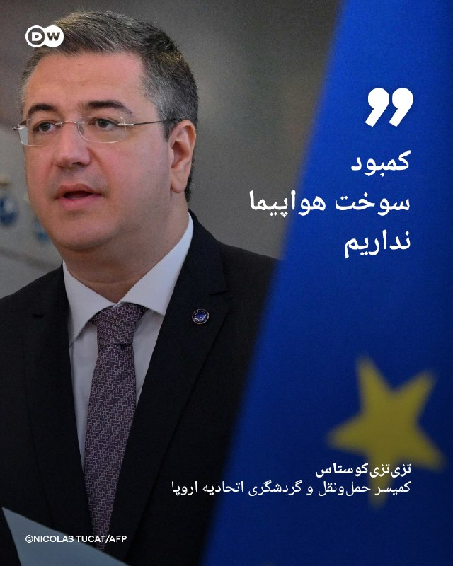

🔶کمیسر حمل و نقل اتحادیه اروپا: کمبود سوخت هواپیما نداریم

خبرگزاری رویترز روز پنجشنبه ۱۵ خرداد (۵ ژوئن) به نقل از آپوستولوس تزی‌تزی‌کوستاس، کمیسر حمل‌ونقل و گردشگری اتحادیه اروپا گزارش داد که با وجود "شوک انرژی ناشی از جنگ ایران"، هیچ نشانه‌ای از کمبود سوخت هواپیما در اروپا در ماه‌های آینده دیده نمی‌شود.

او همچنین گفت، افزایش قیمت‌ها باعث شده شرکت‌های هواپیمایی برخی مسیرهای غیراقتصادی را لغو کنند.

رویترز در ادامه نوشته است، تنگه هرمز که یکی از مسیرهای کلیدی و راهبردی کشتیرانی است که خلیج فارس را به بازارهای جهانی متصل می‌کند در سه ماه گذشته تا حد زیادی بسته بوده و این موضوع باعث کاهش عرضه نفت به میزان حدود ۱۴ میلیون بشکه در روز یا حدود ۱۴ درصد از تقاضای جهانی شده است.

اتحادیه اروپا کمبود سوخت هواپیما را پشت سر گذاشته است، زیرا خاورمیانه حدود ۲۰ درصد از واردات سوخت هواپیما را تامین می‌کند و کمبود آن تا حد زیادی از طریق واردات از آمریکا و نیجریه جبران شده است.

@dw_farsi

## RadioFarda — post 157916

اعتراض چند روزه هزاران نفر در آلبانی «در ارتباط با پروژه تفریحی داماد ترامپ»

🔸هزاران نفر از مردم آلبانی روز پنج‌شنبه، ۱۴ خردادماه، برای چهارمین روز پیاپی در اعتراض به ساخت یک مجتمع گردشگری و تفریحی لوکس ساحلی در جنوب این کشور به خیابان‌ها آمدند.
یکی از سرمایه‌گذاران این پروژه گردشگری جَرِد کوشنر، داماد دونالد ترامپ، رئیس جمهور آمریکا، است.

🔸به گزارش خبرگزاری فرانسه، برخی از تظاهرکنندگان پارچه‌هایی به دست داشتند که روی آن نوشته بود «اِدی راما،‌ استعفا کن»، و عده‌ای دیگر نقاشی‌هایی به دست داشتند که ادی راما، نخست وزیر سوسیالیست این کشور، را در حال دادن کلید به ایوانکا ترامپ، دختر رئیس جمهور آمریکا،‌ نشان می‌داد.

🔸معترضان آلبانیایی می‌گویند که پروژه ۱.۲ میلیارد دلاری که شرکت سرمایه‌گذاری کوشنر و ایوانکا ترامپ برنامه اجرایش را دارد به محیط زیست منطقه ساحلی ویوسا نارتا در جنوب آلبانی لطمه خواهد زد.

🔸عده‌ای دیگر از منتقدان هم مقامات دولتی آلبانی را به فساد متهم می‌کنند.

🔸این پروژه که خانواده کوشنر به طور رسمی در سال ۲۰۲۴ اعلام کرده بودند همچنین شامل ساخت و ساز در جزیره‌ای به نام سازان در ساحل دریای آدریاتیک است که زمانی محل یک پایگاه نظامی کمونیستی بود.

🔸میزان سرمایه‌گذاری در این جزیره در شمال دریای مدیترانه ۱.۶ میلیارد دلار اعلام شده است.

🔸همزمان با این اعتراضات ویدئویی در شبکه‌های اجتماعی از یک مصاحبه جرد کوشنر منتشر شده که او در آن شرح می‌دهد که در سفری تفریحی در دریای آدریاتیک چند روزی را در آلبانی گذرانده و همان‌جا با ادی راما آشنا شده است.

🔸به نوشته خبرگزاری فرانسه، اعتراضات در دو روز گذشته پس از آن در آلبانی شدت گرفته که ویدئویی از تعرض نیروهای امنیتی به مردی در نزدیکی منطقه حفاظت‌شده و همین طور حضور افرادی با ادوات ساخت و ساز در شبکه‌های اجتماعی منتشر شده است.

🔸نسخه کامل این گزارش را در وب‌سایت رادیوفردا بخوانید.

@RadioFarda

## IranianMinds — post 21413

  

🔴 نماینده مجلس خبرگان رهبری:

وقتی جلسه برای تعیین رهبر جدید تشکیل شد گفتن سریع رهبر رو انتخاب کنید چون ممکنه جلسه لو بره و بمباران شیم.
یک نفر که تو جلسه حضورش غیرقانونی بود و نمیخوام اسمشو بگم؛ دو نفر رو به عنوان نامزد جانشینی معرفی کرد. یکی «صادق آملی لاریجانی» یکی «علیرضا اعرافی» و اصلا اسمی از مجتبی خامنه ای نبود. بیشتر اعضا از این اسامی ناراضی بودن.

ما طبق وصیت امام خمینی و رهبر شهید که گفته بودن برای تعیین رهبر ببینید نظر دشمن چیه؟! نظرش رو هرکسی منفی بود همونو بزارید. و تنها کسی که ترامپ مخالفش بود مجتبی خامنه ای بود.

ما باید کسی رو انتخاب میکردیم که وقتی ترامپ و محمد خاتمی رئیس جمهور سابق اسمش رو میشنون دردشون بگیره و اون کسی نبود جز مجتبی خامنه ای.
در نهایت رای گیری کردیم که از ۵۹ نفر؛ ۵۰ نفر به مجتبی خامنه ای رای دادن؛ ۸ نفر به علیرضا اعرافی و ۱ رای هم‌باطله بود.

@IranianMinds

## IranianMinds — post 21412

  <a href="telegram/content/IranianMinds_21412_1780653166.webm" target="_blank">🎬 Download video</a>

🆗
🔡
🔡
5️⃣ تومان هدیه فقط برای ثبت‌نام! 
🆗

💥 بدون واریز

2️⃣ قدم تا دریافت هدیه:

✅ ثبت‌نام در سایت

✅ دریافت بونوس
0️⃣
0️⃣
5️⃣ هزار تومانی

✅ تبدیل بونوس به موجودی واقعی با شرط‌بندی

فقط تا 
2️⃣ روز دیگه میتونی هدیه بگیری!

پس از پایان افتتاحیه، امکان دریافت این هدیه وجود نخواهد داشت.
ar15

🚩
🚩 خرداد افتتاحیه بزرگ سایت وینرو
🟥 اگر هنوز ثبت‌نام نکردی، همین حالا اقدام کن و جزو دریافت‌کنندگان بونوس ویژه افتتاحیه باش.

🔤 Winro.io         معتبرترین سایت ایران

🔤 Winro.io

📱 کانال اخبار و هدایــا 
🌟

📱 @winro_io

## alonews — post 125266

  <a href="telegram/content/alonews_125266_1780653167.webm" target="_blank">🎬 Download video</a>

👈انفجار یک پهپاد دریایی «مرتبط با جنگ اوکراین» در بندر رومانی

🔴به گزارش رسانه‌های محلی، یک پهپاد دریایی مرتبط با جنگ اوکراین صبح روز جمعه در بندر کنستانتا، از مهم‌ترین شهرهای بندری رومانی منفجر شد.

🔴وزارت دفاع ملی رومانی در بیانیه‌ای اعلام کرد این پهپاد حدود ساعت ۱۰:۳۰ صبح منفجر شده و «احتمالاً از نوع پهپادهایی بوده که در جنگ اوکراین مورد استفاده قرار می‌گیرند.»

✅ @AloNews خبر جنگ

## alonews — post 125265

  <a href="telegram/content/alonews_125265_1780653167.mp4" target="_blank">🎬 Download video</a>

👈زاینده‌رود زیبا به اصفهان بازگشت!

✅ @AloNews خبر جنگ

## alonews — post 125264

  <a href="telegram/content/alonews_125264_1780653169.webm" target="_blank">🎬 Download video</a>

👈سفیر ایران در مسکو تاکید کرد که ایران با دولت عمان برای مدیریت تنگه هرمز در حال مذاکره است

✅ @AloNews خبر جنگ

## alonews — post 125263

  <a href="telegram/content/alonews_125263_1780653169.mp4" target="_blank">🎬 Download video</a>

👈فاکس: جنگ ایران در بودجه پنتاگون نبود, حالا ارتش آمریکا به مشکل سوخت و مهمات خورده است

🔴جنگ ایران در بودجه پنتاگون پیش‌بینی نشده بود و حالا وزارت دفاع آمریکا با فشار جدی در بخش سوخت، مهمات و ساعات آموزشی نیروها روبه‌رو شده است.

🔴دریادار کادل، فرمانده عملیات نیروی دریایی آمریکا، در کنگره هشدار داده است:
«نگرانم که از بازه زمانی جولای مجبور شوم درباره نحوه آماده‌سازی و تولید نیروی عملیاتی تصمیم‌گیری کنم.»

✅ @AloNews خبر جنگ

---
📅 بروزرسانی: 1405/03/15 13:13
---

## VahidOOnLine — post 243774

  

در پاسخ به کارزار مردمی ایران‌اینترنشنال درباره ابعاد سرکوب در انقلاب ملی رشت،‌ پیام‌های ارسالی مخاطبان حاکی از آن است که ماموران سرکوب کودکانی را که به بیمارستان رازی این شهر منتقل کردند از ناحیه بیضه‌ها هدف ضرب و شتم قرار دادند.

یک مخاطب نوشت که «تمام کودکانی» که طی شب‌های ۱۸ و ۱۹ دی به بیمارستان رازی منتقل شدند،‌ دچار ضربات وحشیانه به بیضه‌ها و حتی ترکیدگی بیضه بودند.
‌🏁 🇬🇧 IranintlTV

🤖 @VahidOOnLine

## IranIntlTV — post 340631

  

در پاسخ به کارزار مردمی ایران‌اینترنشنال درباره ابعاد سرکوب در انقلاب ملی رشت،‌ پیام‌های ارسالی مخاطبان حاکی از آن است که ماموران سرکوب کودکانی را که به بیمارستان رازی این شهر منتقل کردند از ناحیه بیضه‌ها هدف ضرب و شتم قرار دادند.

یک مخاطب نوشت که «تمام کودکانی» که طی شب‌های ۱۸ و ۱۹ دی به بیمارستان رازی منتقل شدند،‌ دچار ضربات وحشیانه به بیضه‌ها و حتی ترکیدگی بیضه بودند.
https://iranintl.com/202606054097

## FarsiVOA — post 219650

  

وزیر خزانه‌داری آمریکا می‌گوید در ۱۲ ماه منتهی به مارس ۲۰۲۶ کسری تراز تجاری کالا نسبت به دور مشابه پارسال ۳۷۰ میلیارد دلار کاهش یافته است.

اسکات بسنت روز پنج‌شنبه مقابل نمایندگان کمیته امکانات مالی مجلس نمایندگان ایالات متحده آمریکا از برنامه‌های مالی دولت دفاع کرد و گفت تنها در دو ماه گذشته ۳۱۳ هزار شغل جدید در بخش خصوصی و ۱۳ هزار شغل جدید در بخش تولید ایجاد شده است.

به گفته او، هزینه‌کرد سرمایه‌ای شرکت‌ها در سه‌ماهه نخست سال با نرخ سالانه بیش از ۱۷ درصد افزایش یافته و شرکت‌ها نیز تریلیون‌ها دلار برای ساخت و توسعه فعالیت‌های خود در داخل آمریکا سرمایه‌گذاری می‌کنند.
@FarsiVOA

## RadioFarda — post 157915

  

🔸در پی صدور هشدار تخلیه به بخشی از ساکنان جنوب لبنان در روز جمعه، نیروی هوایی اسرائیل ساعتی به روستایی در این منطقه حمله کرد.

🔸حملات دوباره اسرائیل به این منطقه از کشور لبنان پس از آن رخ می‌دهد که دبیرکل حزب‌الله لبنان آتش‌بس مشروط مورد توافق نمایندگان اسرائیل و دولت لبنان را رد کرد.

🔸نعیم قاسم در مقابل خواستار یک آتش‌بس جامع و خروج نیروهای اسرائیلی از لبنان شد و همزمان تهدید کرد که بار دیگر نواحی شمالی اسرائیل را زیر آتش بگیرد.

🔸در پی انتشار خبر این موضع‌گیری بود که ارتش اسرائیل روز جمعه برای شش شهرک و روستا در جنوب لبنان هشدار تخلیه صادر کرد، از جمله روستای الصرفند که طبق بیانیه اسرائیل ساکنان آن باید «فورا» منطقه را ترک می‌کردند.

🔸سخنگوی ارتش اسرائیل پیشتر به ساکنان سه روستا در شمال رود لیتانی هشدار تخلیه داده بود.

@RadioFarda

## alonews — post 125262

  <a href="telegram/content/alonews_125262_1780652589.webm" target="_blank">🎬 Download video</a>

👈وزیر خارجه روسیه: ترویج گفت‌و‌گو میان پادشاهی‌های عرب و ایران را مهم می‌دانیم

🔴 ترامپ گفته بود که «ایران را به عنوان یک تمدن نابود خواهیم کرد»؛ این یک بلند پروازی گستاخانه و هدفی دست نیافتنی است

🔴 آمریکا به وضوح می‌داند که در موقعیت ناخوشایندی قرار دارد و نمی‌داند چگونه از آن خارج شود

✅ @AloNews خبر جنگ

## alonews — post 125261

  <a href="telegram/content/alonews_125261_1780652590.webm" target="_blank">🎬 Download video</a>

👈خبرنگار العربیه: آمریکا همچنان درخواست ایران برای آزادسازی دارایی‌های مسدود شده‌اش را رد می‌کند‌

✅ @AloNews خبر جنگ

## alonews — post 125260

  <a href="telegram/content/alonews_125260_1780652590.mp4" target="_blank">🎬 Download video</a>

🔴جاوید نام ‎سعید تروند ۳۳ ساله اهل ایلام شامگاه پنجشنبه ۱۸ دی در آبادان با شلیک مستقیم گلوله جنگی حرام زاده ها کشته شد.

🔴او متاهل و دارای فرزندی ۳ ساله بنام آریامهر بود.

🔴اینجا پدر سعید تروند با فرزند جانفدایش بدرود میگوید.

🤔عرزشی حرام زاده ، پدر مادرتون باید مورد بررسی قرار بگیره که چه حرومی به خوردتون دادن که اسلحه به سمت مردمتون گرفتین.

✅@AloNews

## alonews — post 125259

  <a href="telegram/content/alonews_125259_1780652592.webm" target="_blank">🎬 Download video</a>

👈مرکز ملی فضای مجازی: بر اساس بررسی‌های فنی و ارزیابی‌های عملیاتی انجام‌شده، قطع اینترنت در هفته‌های اخیر، تأثیر معناداری بر خنثی‌سازی حملات سایبری پیشرفته نداشته است

✅ @AloNews خبر جنگ

## alonews — post 125257

  <a href="telegram/content/alonews_125257_1780652593.mp4" target="_blank">🎬 Download video</a>

👈بعد از هشدار ارتش اسرائیل برای تخلیه، مردم جنوب لبنان، و اطراف نبطیه، شروع به ترک منطقه کردن

✅ @AloNews خبر جنگ

## alonews — post 125256

  <a href="telegram/content/alonews_125256_1780652594.webm" target="_blank">🎬 Download video</a>

⚫
🏆 به دنیای هیجان‌انگیز فوتبال خوش اومدی!

⭐️اینجا قراره باهم لحظه‌به‌لحظه‌ی جام جهانی رو زندگی کنیم؛
از بازی‌های حساس و نتایج داغ گرفته تا حاشیه‌ها، کری‌خونی‌ها و اتفاقاتی که همه درباره‌ش حرف میزنن! 
🔥
🔥

✅ پوشش کامل مسابقات

💀ترول تیم‌ها و بازیکن‌ها

🎥ویدیوها و لحظه‌های فان فوتبالی

📊آمار، ترکیب‌ها و اخبار فوری

🌍حواشی جذاب از سراسر جام جهانی

📢اینجا فقط یک کانال خبری نیست؛
یک جمع فوتبالیه برای کسایی که فوتبال رو با هیجان، شوخی و احساس واقعی دنبال میکنن 
📛
💟

🆘
🔞 آماده باش چون قراره جام جهانی رو متفاوت تجربه کنیم!

⚡ @Vaarzesh_Plus

⚡ @Vaarzesh_Plus

---
📅 بروزرسانی: 1405/03/15 13:03
---

## VahidOOnLine — post 243773

  

♦️نماینده دائمی ایران در سازمان ملل متحد، روز جمعه ۱۵ خرداد ماه اعلام کرد نمایندگان ایران، روسیه و چین در آستانه برگزاری نشست فصلی شورای حکام آژانس بین‌المللی انرژی اتمی، با رافائل گروسی، مدیرکل آژانس در وین دیدار کردند.
به گزارش خبرگزاری‌های رسمی ایران، طرفین در این نشست درباره موضوعات مرتبط با فعالیت‌های آژانس و دستورکار نشست پیش‌روی شورای حکام تبادل نظر کردند.
این دیدار در حالی برگزار شد که نشست فصلی شورای حکام آژانس بین‌المللی انرژی اتمی قرار است از ۱۸ تا ۲۲ خرداد ماه (۸ تا ۱۲ ژوئن) در مقر آژانس در وین برگزار شود.
انتظار می‌رود موضوع برنامه هسته‌ای ایران و آخرین گزارش‌های آژانس درباره فعالیت‌های هسته‌ای تهران از محورهای اصلی این نشست باشد.
رسانه‌های جهان در گرماگرم مذاکرات پایان جنگ میان تهران و واشنگتن، از گمانه‌زنی‌هایی مبنی بر موافقت جمهوری اسلامی با انتقال اورانیوم‌های غنی‌شده ایران به کشوری ثالث مانند چین خبر داده‌‌اند. رسانه‌های حکومتی ایران این گزارش‌ها را تکذیب کرده‌اند.
‌🇸🇦 Indypersian

🤖 @VahidOOnLine

## IranIntlTV — post 340630

  <a href="telegram/content/IranIntlTV_340630_1780651990.mp4" target="_blank">🎬 Download video</a>

شهروندی با ارسال پیامی به ایران اینترنشنال می‌گوید که در شهر او در جنوب کشور هر روز در زمان اوج گرما برق قطع می‌شود و سپس با نوسان شدید وصل می‌شود. پیام او با هوش مصنوعی خوانده شده است.

## DW_Farsi — post 125521

  

🔶گفت‌وگوهای پاکستان و ایران در پی افزایش تنش‌ میان ایران و آمریکا

محسن نقوی، وزیر کشور پاکستان روز پنجشنبه ۱۴ خرداد (۴ ژوئن) با همتای ایرانی خود اسکندر مومنی در حاشیه نشست امنیتی "سازمان همکاری‌های شانگهای" در بیشکک، پایتخت قرقیزستان دیدار کرد.

پاکستان از زمان آغاز جنگ ائتلاف آمریکا و اسرائیل در ۲۸ فوریه سال جاری، ارتباط خود را با واشنگتن و تهران حفظ کرده است.

دیدار نقوی و مومنی یک روز پس از آن انجام شد که پاکستان حملات پهپادی و موشکی ایران به کویت و بحرین را محکوم کرد و هشدار داد که تشدید دوباره درگیری‌ها تلاش‌های دیپلماتیک برای حل تنش‌ها میان ایالات متحده و ایران را تضعیف می‌کند.

پاکستان خود را به عنوان یک میانجی کلیدی میان واشنگتن و تهران مطرح کرد و در ماه آوریل یک دور گفت‌وگوی سطح بالا میان دو طرف را تسهیل کرد که به نتیجه مشخصی نرسید.

@dw_farsi

## Persian_Trend_Official — post 15728

  

https://castbox.fm/vd/953249887

نسخه صوتی لایو دیشب در کست باکس

## Dirty_Kids — post 391035

  <a href="telegram/content/Dirty_Kids_391035_1780651994.mp4" target="_blank">🎬 Download video</a>

جمهوری اسلامی خرش از پل گذشت، دوباره عرزشی‌هاشو سر حجاب انداخته به جون مردم.

کرمانشاه

@Dirty_Kids 👻

## alonews — post 125255

  <a href="telegram/content/alonews_125255_1780651996.webm" target="_blank">🎬 Download video</a>

👈مقایسه دیتاسنتر ایران با فنلاند

🔴سمت چپ: دیتاسنتر ایران.

🔴سمت راست: دیتاسنتر فنلاند.

✅ @AloNews خبر جنگ

## alonews — post 125254

  <a href="telegram/content/alonews_125254_1780651997.webm" target="_blank">🎬 Download video</a>

👈سنا با ۵۲ رأی موافق در برابر ۴۷ رأی مخالف، لایحه ۶۹.۵ میلیارد دلاری برای تأمین بودجه اداره مهاجرت و گمرک آمریکا (ICE) و گشت مرزی تا پایان دوره ریاست جمهوری ترامپ را تصویب کرد.

🔴سناتور لیزا مورکوفسکی (جمهوری‌خواه از آلاسکا) تنها جمهوری‌خواهی بود که به این بسته رأی منفی داد و هیچ دموکراتی به آن رأی مثبت نداد.

✅ @AloNews خبر جنگ

## alonews — post 125253

  <a href="telegram/content/alonews_125253_1780651997.mp4" target="_blank">🎬 Download video</a>

👈جایگزین برنامه 90 بزودی با نام حکمت‌های فوتبالی روی آنتن زنده میرود

✅ @AloNews خبر جنگ

---
📅 بروزرسانی: 1405/03/15 12:52
---

## IranIntlTV — post 340629

  <a href="telegram/content/IranIntlTV_340629_1780651373.mp4" target="_blank">🎬 Download video</a>

مرجان ساتراپی، نویسنده، تصویرگر و کارگردان ایرانی-فرانسوی که در ۵۶ سالگی در پاریس درگذشت، از برجسته‌ترین روایت‌گران تجربه زنان ایرانی در دوران معاصر بود.
او با آثاری چون «پرسپولیس» توانست تاریخ پر فراز و نشیب ایران را از دریچه‌ای کاملاً شخصی به مخاطبان جهانی معرفی کند؛ روایتی که در آن زندگی فردی، به بازتابی از یک دوره کامل تاریخی و سیاسی تبدیل می‌شود.
اهمیت آثار ساتراپی در پیوند عمیق میان امر شخصی و امر سیاسی نهفته است. او نشان داد که خاطرات، تجربه‌های روزمره و زندگی یک فرد می‌تواند تصویری روشن از تحولات یک جامعه و یک نسل ارائه دهد.
نیلوفر منصوری گزارش می‌دهد.

@iranintltv

## FarsiVOA — post 219649

  

وزیر حمل‌ونقل فرانسه گفت که با نزدیک شدن به فصل سفرهای تابستانی، هیچ نگرانی درباره تأمین سوخت در فرانسه وجود ندارد، هرچند ممکن است هزینه‌ها «مسئله‌ساز» شود.

فیلیپ تبارو روز جمعه به شبکه اروپا یک فرانسه گفت: «ما هیچ نگرانی عمده‌ای درباره تأمین سوخت در کشورمان نداریم؛ چه در مورد سوخت هواپیما و چه بنزین برای حمل‌ونقل جاده‌ای». او افزود: «البته مسئله [افزایش] هزینه‌ها وجود دارد.»

پیشتر دونالد ترامپ، رئیس‌جمهور آمریکا از کشورهایی که به صادرات انرژی از مسیر تنگه هرمز وابسته هستند، خواسته بود خودشان در زمینه بازگشایی این آبراه حیاتی اقدام کنند.

افزایش قیمت سوخت جت، ناشی از اقدام جمهوری اسلامی در بستن تنگه هرمز، نگرانی‌هایی را در صنعت هوانوردی جهانی ایجاد کرده و شرکت‌های هواپیمایی را مجبور کرده تا قیمت بلیط‌ها را افزایش داده و چشم‌انداز مالی خود را بازنگری کنند.
@FarsiVOA

## DW_Farsi — post 125520

🔶زلنسکی پوتین را به گفت‌وگوی مستقیم برای پایان جنگ دعوت کرد

ولودیمیر زلنسکی، رئیس‌جمهور اوکراین، در نامه‌ای سرگشاده به ولادیمیر پوتین، رئیس‌جمهور روسیه، پیشنهاد برگزاری گفت‌وگوی مستقیم برای پایان دادن به جنگ را مطرح کرده است؛ پیشنهادی که در آن مسکو و کی‌یف به عنوان محل مذاکرات کنار گذاشته شده‌اند.

زلنسکی در این نامه که در وب‌سایت ریاست‌جمهوری اوکراین منتشر شده، سوئیس، ترکیه یا یکی از کشورهای عربی را به عنوان محل احتمالی مذاکرات پیشنهاد کرده است.

او خطاب به پوتین نوشته است: «اوکراین پیشنهاد می‌کند این جنگ از طریق گفت‌وگوی مستقیم میان شما و ما پایان یابد. من پیشنهاد یک دیدار را مطرح می‌کنم.»

@dw_farsi

## alonews — post 125252

  <a href="telegram/content/alonews_125252_1780651375.webm" target="_blank">🎬 Download video</a>

👈مجموعه ای از حملات هوایی اسرائیل شهر عنقون در جنوب لبنان را هدف قرار داد

✅ @AloNews خبر جنگ

---
📅 بروزرسانی: 1405/03/15 12:43
---

## WithYashar — post 13543

سی‌ان‌ان: اسرائیل پرسنل نظامی و اطلاعاتی خود را به‌صورت پنهانی در طول درگیری با ایران به جمهوری آذربایجان اعزام کرده
@withyashar

## DEJradio — post 5348

  <a href="telegram/content/DEJradio_5348_1780650786.mp4" target="_blank">🎬 Download video</a>

👑
🔺 تجمع و حمایت ایرانیان ساکن مادرید اسپانیا از انقلاب شیر و خورشید در سالمرگ خمینی | پنج‌شنبه۱۴ خرداد

#همبستگی #مادرید #اسپانیا
@DEJradio

## IranIntlTV — post 340628

  <a href="telegram/content/IranIntlTV_340628_1780650789.mp4" target="_blank">🎬 Download video</a>

پس از حمله پهپادی به نیروگاه هسته‌ای براکه در امارات و مهار آتش‌سوزی ناشی از آن، نگرانی‌ها درباره امنیت تاسیسات هسته‌ای افزایش یافته است. در همین راستا، شورای حکام آژانس بین‌المللی انرژی اتمی به درخواست مصر، اردن، مراکش و عربستان سعودی جلسه‌ای اضطراری برگزار خواهد کرد.
جزییات بیشتر با احمد صمدی، خبرنگار ایران‌اینترنشنال
@iranintltv

## IranIntlTV — post 340627

  <a href="telegram/content/IranIntlTV_340627_1780650792.mp4" target="_blank">🎬 Download video</a>

دونالد ترامپ، رییس‌جمهوری آمریکا، گفت دلیل اینکه ایالات متحده اورانیوم مدفون‌شده را از ایران خارج نکرد، این بود که نیروهای جمهوری اسلامی «می‌توانستند در جریان عملیات، محل استقرار نیروهای آمریکایی را شناسایی کنند». او افزود جمهوری اسلامی «همچنان تعدادی موشک در اختیار دارد و در چنین شرایطی این احتمال وجود داشت که شماری از نیروهای آمریکایی کشته شوند».
@iranintltv

## IranIntlTV — post 340626

  <a href="telegram/content/IranIntlTV_340626_1780650794.mp4" target="_blank">🎬 Download video</a>

آژانس بین‌المللی انرژی اتمی حمله جمهوری اسلامی به نیروگاه هسته‌ای امارات متحده عربی را در یک نشست فوری بررسی می‌کند.
@iranintltv

## BBCPersian — post 282912

🔻اسرائیل به ساکنان سه روستا در جنوب لبنان هشدار تخیله داد

ارتش اسرائیل اعلام کرده است که به سه روستا در شمال رود لیتانی واقع در جنوب لبنان حمله خواهد کرد و به ساکنان این منطقه هشدار تخلیه داده است.

مقام‌های لبنان می‌گویند که در چند حمله شبانه اسرائیل به شهر جنوبی صور حداقل هفت نفر کشته شدند.

اسرائیل تاکید کرده است که باوجود آتش‌بس در لبنان، به حملاتش به مواضع حزب‌الله ادامه خواهد داد.

پیشتر دونالد ترامپ، رئیس‌جمهور آمریکا، گفت که در مورد احتمال پایان دادن به جنگ، مستقیما با حزب‌الله صحبت کرده است.

آقای ترامپ افزود که این گروه مورد حمایت ایران، پیشنهاد‌های آمریکا برای برقراری صلح را رد نکرده است.

هرچند پیش‌ از این اظهارات رئیس‌جمهور آمریکا، حزب‌الله توافق آتش‌بس دولت لبنان با اسرائیل را که مورد حمایت واشنگتن است، به‌مثابه تسلیم شدن دانسته و رد کرده بود.

https://bbc.in/4oavX8B
@BBCPersian

## Hranews — post 113396

شهرستان هفتکل؛ یک پسر خردسال توسط پدرش به قتل رسید

❗️
❗️
❗️
❗️
❗️– مردی در شهرستان هفتکل، پسر خردسال خود را به قتل رساند. بر اساس بررسی‌های اولیه پلیس، علت این اقدام وضعیت روانی و رفتارهای غیرقابل کنترل ناشی از مصرف مواد مخدر توسط متهم اعلام شده است.

ادامه مطلب

↘️
@hranews_bot تماس ✉️ - @Hranews کانال هرانا 🆑

## alonews — post 125251

  <a href="telegram/content/alonews_125251_1780650796.mp4" target="_blank">🎬 Download video</a>

👈 مردم خشمگین آلبانی در حال برداشتن فنس‌های حفاظتی در جزیره آلبانی که توسط دختر و داماد ترامپ خریداری شده، هستند

✅ @AloNews خبر جنگ

## alonews — post 125250

  <a href="telegram/content/alonews_125250_1780650799.webm" target="_blank">🎬 Download video</a>

👈حملات هوایی گسترده در جنوب لبنان در حال وقوع است.

✅ @AloNews خبر جنگ

---
📅 بروزرسانی: 1405/03/15 12:33
---

## VahidOOnLine — post 243772

⭕️مهدی تاج: منتظریم که آیا ویزای آمریکا برای اعضای تیم ملی صادر می‌شود یا خیر

♦️در حالیکه فقط ۱۰ روز به آغاز رقابت‌های جام‌جهانی فوتبال باقی‌مانده است، مهدی تاج، رئیس فدراسیون فوتبال ایران، روز جمعه ۱۵ خرداد ماه در گفتگو با صداوسیمای جمهوری اسلامی اعلام کرد فدراسیون فوتبال در انتظار پاسخ نهایی درباره صدور ویزای آمریکا برای اعضای تیم ملی است.

تاج گفت: «روز گذشته فیفا به ما اعلام کرد که گذرنامه‌های اعضای تیم ملی فوتبال ایران را به سفارت آمریکا در آنکارا تحویل دهیم که ما نیز این کار را انجام دادیم.»
او افزود: «امروز و فردا منتظر هستیم تا ببینیم آیا ویزای آمریکا برای اعضای تیم ملی صادر می‌شود یا خیر.»

رئیس فدراسیون فوتبال با اشاره به برنامه سفر تیم ملی اظهار داشت: «ما باید ویزای آمریکا را داشته باشیم و بعد به تیخوانا مکزیک سفر کنیم.»
تاج همچنین گفت فدراسیون فوتبال به فیفا اطلاع داده است که در صورت صادر نشدن ویزای برخی از اعضای تیم ملی، تصمیمات دیگری اتخاذ خواهد شد.
وی افزود: «به فیفا اعلام کرده‌ایم که اگر ویزای برخی از اعضای تیم ملی صادر نشود، تصمیم‌های دیگری خواهیم گرفت.»
‌🇸🇦 Indypersian

🤖 @VahidOOnLine

## VahidOOnLine — post 243771

  <a href="telegram/content/VahidOOnLine_243771_1780650196.mp4" target="_blank">🎬 Download video</a>

♦️عباس عراقچی، وزیر امور خارجه جمهوری اسلامی ایران، اعلام کرد ایران و عمان در هماهنگی با یکدیگر مدیریت و تنظیم تردد در تنگه هرمز را بر اساس قوانین بین‌المللی انجام خواهند داد.
عراقچی روز پنجشنبه ۱۴ خرداد در گفتگو با رسانه المیادین گفت تهران درباره این موضوع با دیگر کشورهای منطقه خلیج فارس نیز رایزنی خواهد کرد، اما تصمیم نهایی در این زمینه بر عهده ایران و عمان است.
مسئولان جمهوری اسلامی در هفته‌های‌ اخیر بارها از رایزنی با مقام‌های مسقط برای مدیریت مشترک تنگه هرمز خبر داده‌اند.
این درحالیست که وزیر خرانه‌داری آمریکا پیشتر، مقام‌های عمانی را به اعمال تحریم در صورت همکاری با ایران در دریافت عوارض در تنگه هرمز تهدید کرده بود.
‌🇸🇦 Indypersian

🤖 @VahidOOnLine

## VahidOOnLine — post 243770

  

وب‌سایت حقوق بشری هرانا گزارش داد که علی کمالی، از بازداشت‌شدگان در جریان اعتراضات انقلاب ملی ایرانیان، از سوی شعبه ۲۶ دادگاه انقلاب تهران به اتهام «محاربه» به اعدام محکوم شد. این حکم در حال حاضر در دیوان عالی کشور در مرحله بررسی قرار دارد.

شعبه ۲۶ دادگاه انقلاب تهران به ریاست ایمان افشاری در اواسط اردیبهشت سال جاری این حکم را صادر کرده است.

طبق این گزارش، علی کمالی که دارای اقامت مالزی است، ۲۲ دی‌ماه ۱۴۰۴ در تهران بازداشت شد. بازداشت او چند روز پس از سفرش به ایران صورت گرفت. او هم‌اکنون در زندان تهران بزرگ محبوس است.

تا زمان انتشار این گزارش، جزئیات بیشتری درباره روند دادرسی و مستندات پرونده منتشر نشده است.
‌🏁 🇬🇧 IranintlTV

🤖 @VahidOOnLine

## IranIntlTV — post 340625

  <a href="telegram/content/IranIntlTV_340625_1780650200.mp4" target="_blank">🎬 Download video</a>

مرتضی کاظمیان، عضو تحریریه ایران‌اینترنشنال، گفت: «به نظر می‌رسد جمهوری اسلامی به دلیل ابربحران اقتصادی و شرایط وخیم معیشتی مردم که می‌تواند به یک انفجار اجتماعی علیه حکومت ایران تبدیل شود، تمایل دارد به یک تفاهم با آمریکا دست پیدا کند.»
@iranintltv

## IranIntlTV — post 340624

  

وب‌سایت حقوق بشری هرانا گزارش داد که علی کمالی، از بازداشت‌شدگان در جریان اعتراضات انقلاب ملی ایرانیان، از سوی شعبه ۲۶ دادگاه انقلاب تهران به اتهام «محاربه» به اعدام محکوم شد. این حکم در حال حاضر در دیوان عالی کشور در مرحله بررسی قرار دارد.

شعبه ۲۶ دادگاه انقلاب تهران به ریاست ایمان افشاری در اواسط اردیبهشت سال جاری این حکم را صادر کرده است.

طبق این گزارش، علی کمالی که دارای اقامت مالزی است، ۲۲ دی‌ماه ۱۴۰۴ در تهران بازداشت شد. بازداشت او چند روز پس از سفرش به ایران صورت گرفت. او هم‌اکنون در زندان تهران بزرگ محبوس است.

تا زمان انتشار این گزارش، جزئیات بیشتری درباره روند دادرسی و مستندات پرونده منتشر نشده است.
https://iranintl.com/202606059981

## FarsiVOA — post 219648

  <a href="telegram/content/FarsiVOA_219648_1780650204.mp4" target="_blank">🎬 Download video</a>

ارتش اسرائیل با انتشار تصاویری از لحظه هدف قرار گرفتن «عبد حرب»، فرمانده یگان مهندسی حزب‌الله، از کشته شدن وی در حملات هوایی خبر داد.

ارتش اسرائیل با صدور بیانیه‌ای اعلام کرد که این عملیات هفته گذشته و پس از تلاش نیروهای تحت امر «عبد حرب» برای هدف قراردادن نیروهای اسرائیلی انجام شده است.

به گفته ارتش اسرائيل، فرمانده یگان مهندسی حزب‌الله در زمینه مونتاژ و به‌کارگیری مواد انفجاری در جنوب لبنان فعالیت داشت و مسئول اجرای طرح‌های متعدد «تروریستی» بوده است.

ارتش اسرائیل در ادامه بیانیه خود از هدف قرار دادن یک سکوی پرتاب راکت در جنوب لبنان، در شامگاه ‍‍پنجشنبه ۱۴ خرداد نیز خبر داده است.

ایالات متحده و برخی از کشورها از جمله اسرائيل، حزب‌الله لبنان را در فهرست گروه‌های تروریستی قرار داده‌ و اتحادیه اروپا نیز شاخه نظامی این سازمان را جزو گروه‌های تروریستی می‌داند.
@FarsiVOA

## Persian_Trend_Official — post 15727

  <a href="telegram/content/Persian_Trend_Official_15727_1780650206.webm" target="_blank">🎬 Download video</a>

سخنگوی کمیسیون امنیت ملی: با دیکتاتورهای منطقه به جرم تامین مالی و نظامی آمریکا و مشارکت با دشمن در جنگ علیه ایران برخورد کنید! 📌 @persian_trend_official پرشین ترند | متفاوت‌ترین کانال نظامی

## Persian_Trend_Official — post 15726

  

سخنگوی کمیسیون امنیت ملی: با دیکتاتورهای منطقه به جرم تامین مالی و نظامی آمریکا و مشارکت با دشمن در جنگ علیه ایران برخورد کنید!

📌 @persian_trend_official
پرشین ترند | متفاوت‌ترین کانال نظامی

## RadioFarda — post 157914

خواسته رضا ولی‌زاده از آمریکا: برای آمریکایی‌های زندانی در ایران کمک پزشکی فراهم کنید

🔸رضا ولی‌زاده، خبرنگار پیشین رادیوفردا، در یک تماس تلفنی ضبط‌شده از داخل زندان اوین از دولت آمریکا خواست برای او و دیگر آمریکایی‌های زندانی در ایران، کمک پزشکی فراهم کند.

🔸ولی‌زاده در این فایل صوتی که رادیوفردا آن را در اختیار دارد، می‌گوید: «حتی اگر درمان بیماری‌های ما خواسته بزرگی باشد، دست‌کم می‌شد از مقامات ایرانی خواست که نه همه فشارهای جسمی و شکنجه‌های روانی دوران زندان، بلکه حداقل بخشی از آن را کاهش دهند.»

🔸او در عین حال به سه شهروند آمریکایی دیگر که در زندان اوین زندانی‌اند نیز اشاره کرده و گفته که هر چهار نفر آنها از «بیماری‌های مختلف رنج می‌برند و از خدمات واقعی پزشکی محروم هستند».

🔸رادیوفردا نتوانسته جزئیات مربوط به سه آمریکایی دیگری را که ولی‌زاده می‌گوید در اوین در زندان هستند، تأیید کند.

🔸رضا ولی‌زاده که پیشتر به مدت ده سال خبرنگار رادیوفردا بود، در نوامبر ۲۰۲۲ از این رسانه استعفا داد و پس از مدتی اقامت در خارج از کشور، ۱۶ اسفند ۱۴۰۲ برای دیدار با خانواده‌اش به ایران بازگشت و اول مهر ۱۴۰۳ بازداشت شد.

🔸او در دو جلسهٔ دادگاه که به سرعت برگزار شد، توسط قاضی ایمان افشاری به اتهام «همکاری با دولت متخاصم آمریکا» به ۱۰ سال حبس، منع اقامت در استان تهران و استان‌های همجوار آن، منع خروج از کشور، منع عضویت در احزاب و گروه‌ها و گروه‌های سیاسی- اجتماعی به مدت دو سال محکوم شد. درخواست وکیلش برای تجدیدنظر در این حکم نیز رد شده است.

🔸رایان فیهی، وکیل رضا ولی‌زاده، در یک‌ گفت‌و‌گو با شبکه خبری سی‌بی‌اس، گفت که موکلش از زمان آتش‌سوزی‌های ناشی از حمله هوایی جنجالی اسرائیل به زندان اوین در تابستان سال گذشته، به سختی می‌تواند بدون سرفه صحبت کند. او همچنین از کمردرد مزمن و مشکلات دندان رنج می‌برد.

🔸نسخه کامل این گزارش را در وب‌سایت رادیوفردا بخوانید.

@RadioFarda

## RadioFarda — post 157913

🔸قیصر، خواننده ایرانی که پیش از این در لس‌آنجلس آمریکا زندگی می‌کرد، در سالگرد مرگ بنیانگذار جمهوری اسلامی که با عید مذهبی غدیر مصادف شده بود در برنامه‌های حکومتی شبانه در تهران شرکت کرد.

🔸بینش بلور که با نام هنری قیصر و به عنوان یک «خواننده‌ لس‌آنجلسی» شناخته می‌شود، در مراسم جشن عید غدیر در روز ۱۴ خرداد، سالروز مرگ روح‌الله خمینی، بنیانگذار جمهوری اسلامی، در تهران روی صحنه رفت.

🔸خبرگزاری فارس،‌ نزدیک به سپاه، هم نوشته حضور قیصر در «مهمانی ۱۰ کیلومتری غدیر» و اجتماع «ایران؛ ذوالفقار علی» در میدان امام حسین تهران، با شب تولدش همزمان بود و او حضور در ایران و در کنار هموطنانش را بهترین هدیه تولدش عنوان کرد و قطعه «تهران» را برای نخستین بار اجرا کرد.

🔸قیصر در شرایطی اجازه خوانندگی در ایران را پیدا کرد، که طی این سال‌ها برخی دیگر از خواننده‌هایی که با مواضع حکومت همراه نبوده‌اند، حتی برای برگزاری کنسرت هم مجوز دریافت نکرده‌اند و فعالیت هنری شماری از آنها از جمله فرهاد و حبیب باوجود زندگی در ایران یا بازگشت به کشور، با مشکلات و محدودیت‌های بسیاری همراه بود.

@RadioFarda

## alonews — post 125249

  <a href="telegram/content/alonews_125249_1780650207.webm" target="_blank">🎬 Download video</a>

👈خبرنگار:
نظرت درباره اتهام نسل‌کشی از سوی وزیر خارجه ایران به آمریکا و اسرائیل چیه؟

🔴روبیو:
حکومت ایران خودش استاد نسل‌کشیه؛ هزاران نفر رو کشتن. هر مشکلی که تو خاورمیانه می‌بینید، یه ردپایی از ایران توش هست. حزب‌الله؟ ایران، شبه‌نظامیان شیعه تو عراق؟ ایران، حماس؟ ایران، حوثی‌ها؟ ایران، اسد تو سوریه؟ ایران.

به هر طرف نگاه کنی، پشت همه این ماجراها ایران قرار داره

✅ @AloNews خبر جنگ

## alonews — post 125248

  <a href="telegram/content/alonews_125248_1780650208.mp4" target="_blank">🎬 Download video</a>

👈سرگئی لاوروف، وزیر امور خارجه روسیه: عملیات‌های آمریکا در ونزوئلا و ایران هر دو مربوط به بازارهای انرژی جهان است.

🔴 در مقطعی، آمریکایی‌ها حتی پیشنهاد دادند که تنگه هرمز به صورت ۵۰-۵۰ توسط آنها و ایران کنترل شود.

✅ @AloNews خبر جنگ

## alonews — post 125247

  <a href="telegram/content/alonews_125247_1780650210.mp4" target="_blank">🎬 Download video</a>

👈ویدیو وایرال شده از یک زن ایرانی در مکه!

✅ @AloNews خبر جنگ

## alonews — post 125246

  

عکس تیمی نروژی‌ها پیش از جام جهانی به سبک وایکینگ‌ها

@AloSport

---
📅 بروزرسانی: 1405/03/15 12:22
---

## DEJradio — post 5347

  <a href="telegram/content/DEJradio_5347_1780649578.mp4" target="_blank">🎬 Download video</a>

🔺🎥 در تهران علیه سعید جلیلی که مخالف مذاکره با آمریکاست شعارنویسی راه افتاده است. اختلاف بر سر مذاکره کردن و نکردن با قاتلات علی خامنه‌ای در حکومت شکاف انداخته است.

#موشعلی #مذاکرات
@DEJradio

## IranIntlTV — post 340623

  

🔻مهدی تاج، رییس فدراسیون فوتبال جمهوری اسلامی، درباره روند صدور ویزای آمریکا برای حضور در مسابقات جام جهانی در یک گفت‌وگوی تلویزیونی گفت: «فیفا به ما اعلام کرد که پاسپورت‌های اعضای تیم ملی را به سفارت آمریکا در آنکارا تحویل دهید که ما هم این کار را انجام دادیم. به فیفا اعلام کرده‌ایم اگر ویزای برخی از اعضای تیم ملی صادر نشود، تصمیم‌های دیگری خواهیم گرفت.»

🔹تاج در ادامه گفت: «فیفا اعلام کرد ما پیگیر هستیم تا همه ویزاها صادر شود. ما هم انتظارات خود را به فیفا گفتیم. منتظر هستیم ببینیم آیا ویزای آمریکا برای اعضای تیم ملی صادر می‌شود یا نه. باید پاسپورت‌ها را در اختیار داشته باشیم و سپس به تیخوانا در مکزیک سفر کنیم.»

🔹رییس فدراسیون فوتبال جمهوری اسلامی همچنین گفت: «ما فهرست نهایی خود را به فیفا اعلام کردیم. پاسپورت اعضای تیم ملی در اختیار سفارت مکزیک بود. پس از صدور ویزای مکزیک، پاسپورت‌ها را به سفارت آمریکا تحویل دادیم و انتظار داریم پاسپورت‌ها به دست بازیکنان برسد تا آنها ابتدا به تیخوانا و سپس به آمریکا سفر کنند.»

@iranintltvsport

## FarsiVOA — post 219647

🔺رضا ولی‌زاده برای خود و دیگر زندانیان آمریکایی درخواست کمک پزشکی کرد

▪️رضا ولی‌زاده، روزنامه‌نگار ایرانی-آمریکایی، در تماسی از زندان اوین، از دولت آمریکا درخواست کرد برای او و دیگر آمریکایی‌های بازداشت‌شده در تهران، کمک پزشکی فراهم شود.

▪️در این پیام که به دست سی‌بی‌اس نیوز رسیده، آمده: «حتی اگر درمان بیماری‌های ما یک مطالبه بزرگ باشد، دست‌کم می‌توان از مقامات ایرانی خواست فشار جسمی و شکنجه روانی علیه ما در اسارت را کاهش دهند، نه همه آن را، اما حداقل بخشی از آن را.»

▪️در این پیام دو دقیقه‌ای، ولی‌زاده به سه آمریکایی دیگر که گفته می‌شود در زندان اوین نگهداری می‌شوند اشاره کرد و گفت هر چهار زندانی از «بیماری‌های مختلف» رنج می‌برند و «از خدمات واقعی پزشکی محروم هستند.»

⬇️ بیشتر بخوانید:
https://ir.voanews.com/a/8157640.html

## Persian_Trend_Official — post 15725

  <a href="telegram/content/Persian_Trend_Official_15725_1780649581.webm" target="_blank">🎬 Download video</a>

ارتش اسرائیل موج جدیدی از دستورهای تخلیه برای روستاها و شهرک‌های جنوب لبنان صادر کرد.
ارتش اسرائیل از ساکنان صرفند، تفاحتا، بابلیه، قعقعیت الصنوبر، مروانیه و سکسکیه در جنوب لبنان خواسته است فوراً این مناطق را ترک کنند.
آویخای ادرعی، سخنگوی عربی‌زبان ارتش اسرائیل، در پستی در شبکه ایکس به ساکنان این روستاها و شهرک‌ها دستور داد بلافاصله منطقه را تخلیه کرده و به شمال رودخانه زهرانی بروند.
پیش‌تر نیز ارتش اسرائیل برای عرنایا، عنقون و کفرکلا، سه روستا و شهرک دیگر در جنوب لبنان، هشدار جابه‌جایی اجباری صادر کرده بود.

📌 @persian_trend_official
پرشین ترند | متفاوت‌ترین کانال نظامی

## Persian_Trend_Official — post 15724

  

🔴 اسرائیل از ترور یکی از فرماندهان حزب‌الله در جنوب لبنان خبر داد

ارتش اسرائیل اعلام کرد «آدم عبدالحلیم حرب» از فرماندهان واحدمرکزی نبطیه حزب‌الله لبنان را در عملیاتی هدف قرار داده است. همزمان رسانه‌های لبنانی نیز از کشته شدن وی خبر داده‌اند.

بر اساس ادعای اسرائیل، حرب در واحد مهندسی حزب‌الله فعالیت داشته و در توسعه زیرساخت‌های نظامی، استحکامات و پروژه‌های عملیاتی این گروه نقش ایفا می‌کرده است. گزارش‌ها حاکی است او از فرماندهان یگان مرکزی نبطیه در جنوب لبنان بوده است.

اسرائیل در ماه‌های اخیر تمرکز ویژه‌ای بر هدف قرار دادن فرماندهان میدانی و نیروهای متخصص حزب‌الله داشته است. حذف فرماندهان حوزه مهندسی می‌تواند بر توان این گروه در بازسازی مواضع، استحکامات و زیرساخت‌های نظامی در جنوب لبنان تأثیر بگذارد.

👺Phantom

@persian_trend_official
پرشین ترند | متفاوت‌ترین کانال نظامی

## IranianMinds — post 21411

بلومبرگ :

مذاکرات ایران و آمریکا همچنان بدون پیشرفت مونده و در حال توقفه

@IranianMinds

## alonews — post 125244

  <a href="telegram/content/alonews_125244_1780649583.webm" target="_blank">🎬 Download video</a>

👈مصاحبه با یک خانم بی حجاب: چرا تو این شبها تیپ های مثل شما کمتر بیرون میان؟

+خرشون از پل گذشته و میان به ما میگن پرچم دستتونه شالم بزنید و تذکر میدن

✅ @AloNews خبر جنگ

## alonews — post 125243

  <a href="telegram/content/alonews_125243_1780649584.webm" target="_blank">🎬 Download video</a>

👈دیمیتری پسکوف: برنامه‌ای برای دیدار پوتین و ترامپ تو آینده نزدیک وجود نداره

✅ @AloNews خبر جنگ

## alonews — post 125242

  <a href="telegram/content/alonews_125242_1780649584.webm" target="_blank">🎬 Download video</a>

👈سازمان ملل متحد از اسرائیل خواست نیروهای نظامی خود را به طور کامل از خاک لبنان خارج کرده و به حاکمیت ملی این کشور احترام بگذارد

✅ @AloNews خبر جنگ

## alonews — post 125241

  <a href="telegram/content/alonews_125241_1780649584.webm" target="_blank">🎬 Download video</a>

👈شی جین پینگ رئیس جمهور چین، در روزهای 18 و 19 خرداد به کره شمالی سفر خواهد کرد

✅ @AloNews خبر جنگ

## alonews — post 125240

  <a href="telegram/content/alonews_125240_1780649585.webm" target="_blank">🎬 Download video</a>

👈العربیه:وزیر کشور پاکستان برای دومین بار در عرض ۲۴ ساعت با همتای ایرانی خود در بیشکک دیدار کرد.

✅ @AloNews خبر جنگ

## alonews — post 125239

  <a href="telegram/content/alonews_125239_1780649585.webm" target="_blank">🎬 Download video</a>

👈خبرنگار : نظرت درباره اتهام نسل‌کشی از سوی وزیر خارجه ایران به آمریکا و اسرائیل چیه؟

🔴روبیو : ایرانی‌ها خودشون استاد نسل‌کشی‌ان؛ هزاران نفر رو کشتن

🔴 هر مشکلی که تو خاورمیانه می‌بینید، یه ردپایی از ایران توش هست

🔴 حزب‌الله؟ ایران، شبه‌نظامیان شیعه تو عراق؟ ایران، حماس؟ ایران، حوثی‌ها؟ ایران، اسد تو سوریه؟ ایران

🔴 به هر طرف نگاه کنی، از نظر اون پشت همه این ماجراها ایران قرار داره

✅ @AloNews خبر جنگ

## alonews — post 125238

  <a href="telegram/content/alonews_125238_1780649585.mp4" target="_blank">🎬 Download video</a>

🔴حرص و ولعی که حرام زاده های حکومتی در کشتن مردم داشتند در هیچ نیروی خارجی که در صد سال اخیر به ایران حمله کرده دیده نشده.

🤔حرام زاده عرزشی، هرکسی حرام زاده های محله خودشو میشناسه.

✅@AloNews

---
📅 بروزرسانی: 1405/03/15 12:12
---

## mwarmonitor — post 10167

  <a href="telegram/content/mwarmonitor_10167_1780648977.mp4" target="_blank">🎬 Download video</a>

🔴بندر کنستانتسا در رومانی پس از وقوع یک انفجار به حالت قرنطینه و محاصره امنیتی درآمد. گزارش‌ها حاکی است که اوایل صبح امروز، یک پهپاد دریایی در نزدیکی این منطقه کشف شده بود.

@mwarmonitor

## IranIntlTV — post 340621

  <a href="telegram/content/IranIntlTV_340621_1780648978.mp4" target="_blank">🎬 Download video</a>

یک شهروند با ارسال پیامی به ایران اینترنشنال از آزار و اختلال ایجادشده از تجمع حامیان حکومت برای خودروهای آتش‌نشانی و آمبولانس روایت می‌کند. پیام او با هوش مصنوعی خوانده شده است.

## FarsiVOA — post 219646

🔺نتانیاهو تصویب آتش‌بس لبنان را به موافقت حزب‌الله به شروط آتش‌بس منوط کرده است

▪️رسانه‌های اسرائیلی می‌گویند که بنیامین نتانیاهو، نخست‌وزیر این کشور، رأی‌گیری کابینه‌اش درباره آتش‌بس با لبنان را که با میانجی‌گری آمریکا تنظیم شده، به موافقت حزب‌الله با شروط طرح‌شده در آتش‌بس مشروط کرده است.

▪️برخی از اعضای کابینه از این آتش‌بس به توصیف آنها «شکننده»، انتقاد کرده‌اند و خواستار آن شده‌اند که این طرح پیش از پذیرش شروط آن توسط اسرائیل، در کابینه به رأی گذاشته شود.

▪️در توافق اسرائیل و لبنان که روز چهارشنبه در پایان دو روز مذاکرات در واشنگتن اعلام شد، سه طرف توافق کردند که آتش‌بس مشروط به توقف کامل حملات حزب‌الله به اسرائیل و خروج نیروهای این گروه از مناطق جنوبی لبنان است.

⬇️ بیشتر بخوانید:
https://ir.voanews.com/a/8157639.html

## DW_Farsi — post 125519

  

📸کاریکاتور هفته

مرجان ساتراپی، هنرمند ایرانی‌فرانسوی و خالق کتاب‌های کمیک "پرسپولیس" و "خورش مرغ و آلو" در سن ۵۶ سالگی درگذشت. پرسپولیس زمانی منتشر شد که جامعه جهانی هیچ تصویر روشنی به غیر از روایت‌های رسمی حکومت از زندگی شهروندان ایرانی نداشت و مجموعه خاطرات مصور او از زندگی‌ا‌ش در ایران بعد از انقلاب ۵۷ با تمامی فشارها و سرکوب‌های سیاسی و اجتماعی سندی ماندگار از روایت شهروندان و نه حاکمان از آن دوران شد.

‌‌ساتراپی بعدها به سینما روی آورد و علاوه بر کارگردانی دو نسخه سینمایی از کتاب‌های مصور خود، چند فیلم دیگر هم در آمریکا و فرانسه ساخت. او در بحبوحه خیزش ۱۴۰۱ مجددا به صحنه کتاب مصور بازگشت و کتابی برای آشنایی مخاطبان غیر ایرانی با تحولات داخل ایران تدوین و کارگردانی کرد که با عنوان "زن، زندگی، آزادی" موفقیت فراوان بدست آورد.

@dw_farsi

## Persian_Trend_Official — post 15723

ارتش اسرائیل: فرمانده واحد مهندسی حزب‌الله هفته گذشته ترور شد

ارتش اسرائیل اعلام کرد «عابد حرب»، فرمانده واحد مهندسی حزب‌الله لبنان، در عملیاتی که هفته گذشته انجام شده، کشته شده است.

👺Phantom

📌 @persian_trend_official
پرشین ترند | متفاوت‌ترین کانال نظامی

## IranianMinds — post 21410

  

میدون انقلاب موشک خیبر شکن صورتی گذاشتن.

@IranianMinds

## Dirty_Kids — post 391034

  <a href="telegram/content/Dirty_Kids_391034_1780648983.mp4" target="_blank">🎬 Download video</a>

پتیاره چه فیلمی بازی می‌کنه!!!

انقدر دور کیر آخوند چرخیده که سرگيجه ‌گرفته‌

@Dirty_Kids 👻

## Dirty_Kids — post 391033

  <a href="telegram/content/Dirty_Kids_391033_1780648985.mp4" target="_blank">🎬 Download video</a>

مدیونتون بشم اگه بزارم یادتون بره 😅

@Dirty_Kids 👻

## alonews — post 125237

  <a href="telegram/content/alonews_125237_1780648987.webm" target="_blank">🎬 Download video</a>

👈ارتش اسرائیل در پیامی برای ۶ شهر و روستای دیگر شامل الصرفند، تفاحتا، البابليه، قعقعية الصنوبر، المروانيه و السكسكيه هشدار تخلیه صادر کرد

✅ @AloNews خبر جنگ

## alonews — post 125236

  <a href="telegram/content/alonews_125236_1780648987.webm" target="_blank">🎬 Download video</a>

👈شبکه خبری المیادین از حمله پهپادی اسرائیل به شهرک‌های «تول»، «حبوش» و «تبنین» در جنوب لبنان خبر داد.

✅ @AloNews خبر جنگ

## alonews — post 125235

  <a href="telegram/content/alonews_125235_1780648988.webm" target="_blank">🎬 Download video</a>

🔴فوری / ارتش اسرائیل: یک فرمانده واحد مهندسی حزب‌الله را ترور کردیم

🔴رسانه‌های لبنانی از ترور حاج آدم عبد الحلیم حرب، از فرماندهان یگان مرکزی نبطیه حزب‌الله خبر دادند

✅ @AloNews خبر جنگ

## alonews — post 125234

  <a href="telegram/content/alonews_125234_1780648988.mp4" target="_blank">🎬 Download video</a>

👈 از ساعتی بعد از آنکه دختر ترامپ از تصمیمش برای ساخت یک جزیره در آلبانی خبر داد این کشور بهم ریخته است

🔴 مردم شعار میدهند کشور را به اسرائیل نمی‌فروشیم. اینکه مردم اروپا داماد ترامپ را هم معادل اسرائیل می‌ دانند پدیده جدیدی است

✅ @AloNews خبر جنگ

---
📅 بروزرسانی: 1405/03/15 12:02
---

## VahidOOnLine — post 243769

  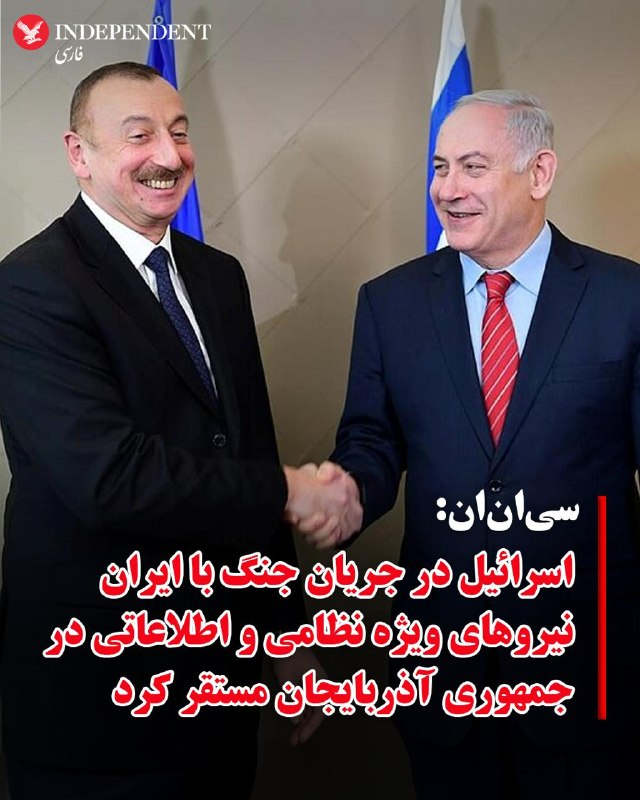

♦️شبکه سی‌ان‌ان، روز جمعه ۱۵ خرداد ماه به نقل از چهار منبع آگاه گزارش داد اسرائیل در جریان جنگ با ایران، به‌طور محرمانه نیروهای ویژه نظامی و مامورانی از سازمان اطلاعات این کشور (موساد) را در جمهوری آذربایجان مستقر کرده بود تا از این کشور به‌عنوان بخشی از شبکه‌ای از پایگاه‌های مخفی در خاورمیانه برای انجام عملیات علیه ایران استفاده کند. سفارت جمهوری آذربایجان در آمریکا، این گزارش را تکذیب کرد و بی‌اساس خواند.
بر اساس این گزارش، نیروهای اسرائیلی در چندین نقطه در جنوب جمهوری آذربایجان، در نزدیکی مرزهای شمالی ایران، مستقر بودند. دو منبع آگاه گفته‌اند برخی از این مناطق در نزدیک‌ترین نقطه تنها حدود ۱۰۰ کیلومتر با شهر تبریز فاصله داشتند.
سی‌ان‌ان همچنین به نقل از منابع خود گزارش داد یگان‌های ویژه کماندویی اسرائیل در این مناطق ماموریت‌های جمع‌آوری اطلاعات و عملیات پهپادی انجام داده‌اند و این استقرار، امکان نظارت اطلاعاتی بر مناطق شمالی ایران را برای تل‌آویو فراهم کرده بود.
بر اساس گزارش سی‌ان‌ان، استقرار مخفیانه نیروها در جمهوری آذربایجان بخشی از شبکه گسترده‌تری از مواضع نظامی و اطلاعاتی اسرائیل در خاورمیانه بوده که شامل پایگاه‌هایی در عراق، امارات متحده عربی و سومالی‌لند نیز می‌شده است. به گفته منابع سی‌ان‌ان، این نیروها در ابتدا برای عملیات نجات احتمالی در شرایط اضطراری در نظر گرفته شده بودند، اما بعدها به مراکز جمع‌آوری اطلاعات و پشتیبانی عملیات نظامی تبدیل شدند.
مجموعه این استقرارها نیروهای اسرائیلی را در شمال، غرب و جنوب ایران مستقر کرده و امکان انجام موج‌های متوالی حملات در عمق خاک ایران را برای ارتش اسرائیل فراهم کرده بود.
یکی از منابع به سی‌ان‌ان گفته است که عملیات جمهوری آذربایجان شامل چند ده نفر از نیروهای ویژه اسرائیل، اعضای یگان‌های نخبه عملیات و نجات هوابرد و همچنین مأموران سازمان اطلاعات خارجی اسرائیل (موساد) بوده است.
در واکنش به این گزارش، سفارت جمهوری آذربایجان در آمریکا در بیانیه‌ای به سی‌ان‌ان اعلام کرد: «ادعاهای بی‌اساس درباره استفاده از خاک جمهوری آذربایجان برای انجام عملیات علیه کشورهای ثالث را قاطعانه رد می‌کنیم.»
‌🇸🇦 Indypersian

🤖 @VahidOOnLine

## VahidOOnLine — post 243768

  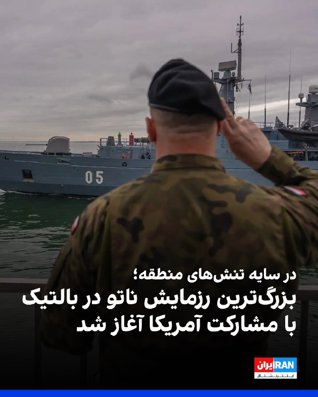

پنجاه‌وپنجمین دوره رزمایش عملیات بالتیک موسوم به «بالتوپس ۲۰۲۶» پنجشنبه ۱۴ خرداد با خروج ۲۰ کشتی متعلق به کشورهای عضو ناتو از بندر گدنیا در لهستان آغاز شد؛ رزمایشی که با رهبری ناوگان ششم نیروی دریایی آمریکا برگزار می‌شود.

بالتوپس مهم‌ترین رزمایش سالانه دریایی در منطقه دریای بالتیک است و با هدف تقویت هماهنگی عملیاتی، آمادگی رزمی و بازدارندگی ناتو برگزار می‌شود. این رزمایش در حالی انجام می‌شود که آمریکا هم‌زمان درگیر تنش‌های نظامی و سیاسی با جمهوری اسلامی در خاورمیانه است و بر تقویت حضور نظامی خود در مناطق مختلف تاکید دارد.

یاروسواف زیمینسکی، بازرس نیروی دریایی لهستان، در نشست پیش از آغاز رزمایش گفت: «بالتوپس فقط یک تمرین نیست، بلکه نمادی از همبستگی و آمادگی ما برای انجام تعهدات مشترک است.»

در دو هفته آینده، نیروهای آمریکا و متحدان ناتو در حوزه‌هایی مانند عملیات آبی‌خاکی، دفاع هوایی و جنگ ضدزیردریایی تمرین خواهند کرد. حدود ۶ هزار نیرو از ۱۵ کشور از جمله آمریکا در این رزمایش مشارکت دارند.
‌🏁 🇬🇧 IranintlTV

🤖 @VahidOOnLine

## pm_afshaa — post 92294

🔴سی‌ان‌ان: اسرائیل پرسنل نظامی و اطلاعاتی خود را به‌صورت پنهانی در طول درگیری با ایران به جمهوری آذربایجان اعزام کرده

💧 Rainbet.com the #1 Non-KYC Crypto Casino & Sportsbook @rainbetcom

😁 @Pm_Afshaa

## IranIntlTV — post 340620

  

پنجاه‌وپنجمین دوره رزمایش عملیات بالتیک موسوم به «بالتوپس ۲۰۲۶» پنجشنبه ۱۴ خرداد با خروج ۲۰ کشتی متعلق به کشورهای عضو ناتو از بندر گدنیا در لهستان آغاز شد؛ رزمایشی که با رهبری ناوگان ششم نیروی دریایی آمریکا برگزار می‌شود.

بالتوپس مهم‌ترین رزمایش سالانه دریایی در منطقه دریای بالتیک است و با هدف تقویت هماهنگی عملیاتی، آمادگی رزمی و بازدارندگی ناتو برگزار می‌شود. این رزمایش در حالی انجام می‌شود که آمریکا هم‌زمان درگیر تنش‌های نظامی و سیاسی با جمهوری اسلامی در خاورمیانه است و بر تقویت حضور نظامی خود در مناطق مختلف تاکید دارد.

یاروسواف زیمینسکی، بازرس نیروی دریایی لهستان، در نشست پیش از آغاز رزمایش گفت: «بالتوپس فقط یک تمرین نیست، بلکه نمادی از همبستگی و آمادگی ما برای انجام تعهدات مشترک است.»

در دو هفته آینده، نیروهای آمریکا و متحدان ناتو در حوزه‌هایی مانند عملیات آبی‌خاکی، دفاع هوایی و جنگ ضدزیردریایی تمرین خواهند کرد. حدود ۶ هزار نیرو از ۱۵ کشور از جمله آمریکا در این رزمایش مشارکت دارند.
https://iranintl.com/202606050347

## IranIntlTV — post 340619

«#دومینو با علی‌حسین قاضی‌زاده»؛ پنج‌شنبه ساعت ۲۱:۰۰ تهران

همه‌چیز، در زنجیره‌ای از تصمیمات درست و غلط حاکمان شکل می‌گیرد.

برای درک وضعیت ایران امروز، زنجیره‌ دومینوی اشتباهات جمهوری اسلامی را بررسی می‌کنیم.

لینک یوتیوب دومینو با علی‌حسین قاضی‌زاده:

https://www.youtube.com/playlist?list=PLrqEUp1jEA7Vviho0ICYQnY1tbqEI7gko

@iranintltv

## DW_Farsi — post 125518

  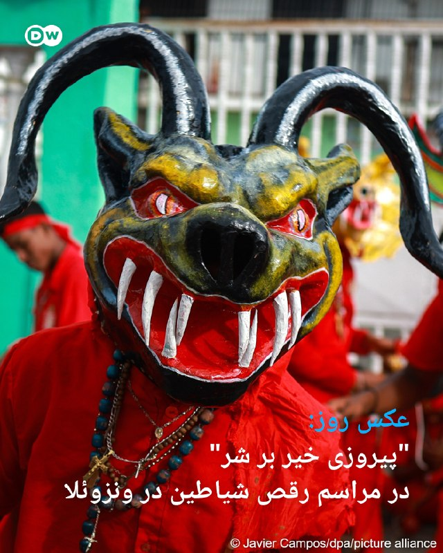

📸عکس روز: "پیروزی خیر بر شر" در مراسم رقص شیاطین در ونزوئلا

هر ساله در عید "جسم مسیح" افرادی با شمایل ترسناک، رقصان در خیابان‌های شهر "یاره" در ونزوئلا به راه می‌افتند. اسقف کلیسا به این شیاطین سرخ‌پوش برکت می‌دهد. آن‌ها در نهایت با نگهبانان کلیسا وارد نبرد می‌شوند و شیاطین همواره شکست می‌خورند و این نمادی است از "پیروزی خیر بر شر". سپس شیاطین به نشانه توبه زانو می‌زنند، ماسک‌های خود را آویزان می‌کنند و دوباره متبرک می‌شوند. مأموریت‌شان به پایان رسیده است!

@dw_farsi

## alonews — post 125233

  <a href="telegram/content/alonews_125233_1780648362.webm" target="_blank">🎬 Download video</a>

👈بلومبرگ: قیمت قراردادهای آتی استاندارد گاز طبیعی در اروپا از روز جمعه گذشته تاکنون ۷ درصد افزایش یافته است.

🔴قیمت قراردادهای آتی گاز در روز پنجشنبه به بالاترین سطح خود در ۴ ماه گذشته رسید، همزمان با کاهش بیش از حد انتظار ذخایر داخلی گاز.

🔴نرخ پرشدگی تأسیسات ذخیره‌سازی گاز طبیعی در اروپا کمی بیش از ۴۱ درصد است که نگرانی‌های اروپایی‌ها را افزایش داده است.

🔴در صورت ادامه بسته شدن تنگه هرمز، رقابت با آسیا بر سر محموله‌های حمل‌شده از طریق دریا ممکن است در تابستان امسال تشدید شود.

🔴قیمت گاز طبیعی اروپا در مسیر ثبت رشد هفتگی قرار دارد، زیرا همچنان توافقی میان آمریکا و ایران حاصل نمی‌شود

✅ @AloNews خبر جنگ

## alonews — post 125232

  <a href="telegram/content/alonews_125232_1780648363.webm" target="_blank">🎬 Download video</a>

👈سخنگوی سفارت آذربایجان در ایالات متحده در بیانیه‌ای به سی‌ان‌ان گفت: «ما ادعاهای بی‌اساس مبنی بر استفاده از خاک آذربایجان برای عملیات علیه کشورهای ثالث را قاطعانه رد می‌کنیم

✅ @AloNews خبر جنگ

---
📅 بروزرسانی: 1405/03/15 11:52
---

## VahidOOnLine — post 243767

  <a href="telegram/content/VahidOOnLine_243767_1780647772.mp4" target="_blank">🎬 Download video</a>

⭕️مدیرعامل شرکت آب البرز: ۷۴ درصد ظرفیت سد کرج پر شد

♦️داوود نجفیان، مدیرعامل شرکت آب منطقه‌ای استان البرز در گفتگو با خبرگزاری تسنیم، از پرشدن بیش از ۷۰ درصدی ظرفیت آب سد کرج خبر داد.

نجفیان با یادآوری افزایش ۴۰ درصدی بارش نسبت به سال گذشته گفت: «امسال حجم سد کرج از کل ظرفیت که ۱۷۹ میلیون مترمکعب است، به ۱۳۳ میلیون مترمکعب رسیده، یعنی نزدیک به ۷۴ درصد حجم سد کرج پر است.»
‌🇸🇦 Indypersian

🤖 @VahidOOnLine

## mwarmonitor — post 10166

  <a href="telegram/content/mwarmonitor_10166_1780647775.mp4" target="_blank">🎬 Download video</a>

📝 بر اساس آخرین بیانات استراتژیک مهدی تاج طوری پشت تلفن با لحن مخملی می‌گوید «تصمیمات دیگری ممکن است بگیریم» که آدم فکر می‌کند دکمه شلیک موشک بالستیک را درست بغلِ دستش گذاشته‌اند! مرتیکه‌ی الدنگ کچل، تو که برای گرفتن چهار تا ویزای فوتبال باید پاسپورت‌ها را زیر بغل بزنی و دم سفارت آمریکا در آنکارا مثل بچه‌ی مهدکودکی التماس کنی، دیگر این لاف‌های فوق‌امنیتی‌ات چیست؟

🔸با این مغزِ فندقی و مدیریتِ فضاحت‌بار، لابد تصمیماتِ خفنِ بعدی‌ات این است که به فدراسیون‌های فوتبال منطقه حمله پهپادی کنی ، یا اینکه بازیکنان خارجی لیگ را به عنوان جاسوس سازمان سیا بازداشت کنی؛ چون حتماً معتقدی با هر شوت کجی که می‌زنند، دارند گرای پدافند هوایی را به پنتاگون مخابره می‌کنند! از شما تروریست‌های کت‌شلواری که فوتبال را با خط مقدم اشتباه گرفته‌اید هیچ چیز بعید نیست؛ پس فعلاً با این کارنامه‌ی سراسر رسوایی، گه زیادی نخور چون واسه رژیم غذاییت خوب نیست و فقط شکمت را جلوتر می‌آورد!

@mwarmonitor

## DW_Farsi — post 125517

  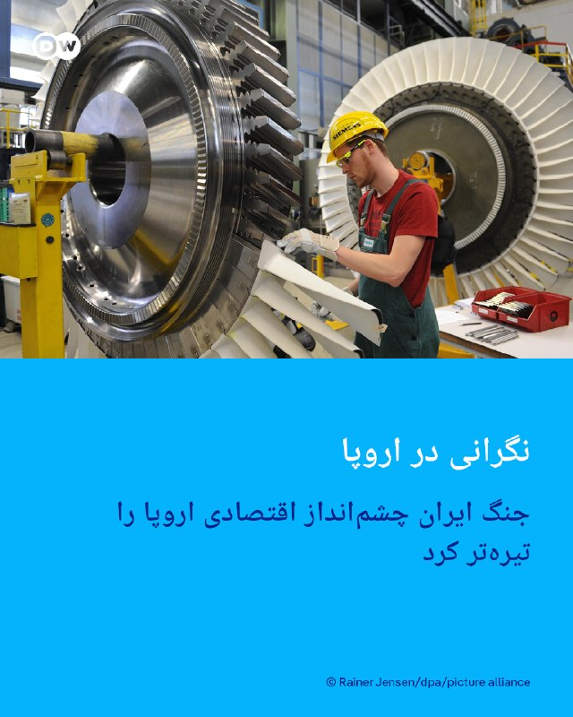

🔶نگرانی در اروپا؛ جنگ ایران چشم‌انداز اقتصادی اروپا را تیره‌تر کرد

یک مطالعه جدید نشان می‌دهد که جنگ ائتلاف آمریکا و اسرائیل با ایران در کنار تشدید بی‌ثباتی‌های ژئوپولیتیکی، اعتماد مدیران ارشد شرکت‌های اروپایی را به‌طور قابل توجهی کاهش داده و چشم‌انداز کوتاه‌مدت اقتصاد اتحادیه اروپا را تحت تأثیر قرار داده است.

این گزارش که روز جمعه ۱۵ خرداد (۵ ژوئن) توسط "میز گرد اروپایی برای صنعت" یک گروه لابی مستقر در بروکسل، منتشر شده، نشان می‌دهد که حدود دو سوم از مدیران عامل و روسای شرکت‌های عضو معتقدند، شرایط کسب‌وکار در اتحادیه اروپا طی شش ماه گذشته رو به وخامت گذاشته است.

بیش از نیمی از ۵۷ مدیر این نهاد پیش‌بینی کرده‌اند که وضعیت اقتصادی در ادامه سال بدتر نیز خواهد شد.

بر اساس یافته‌های این نظرسنجی، شاخص کلی اعتماد تجاری در اروپا روندی نزولی داشته و این کاهش به طولانی‌ترین دوره خود از زمان اوج‌ ‌همه‌گیری کرونا در سال ۲۰۲۰ رسیده است.

@dw_farsi

## alonews — post 125231

  <a href="telegram/content/alonews_125231_1780647778.webm" target="_blank">🎬 Download video</a>

👈سفرا و نمایندگان دائم، ایران، چین و روسیه در نشستی مشترک با رافائل گروسی، مدیرکل آژانس اتمی، موضوعات مربوط به موارد مطرح در نشست بعدی شورای حکام آژانس بین‌المللی انرژی اتمی را مورد بحث و بررسی قرار دادند.

✅ @AloNews خبر جنگ

## alonews — post 125230

  <a href="telegram/content/alonews_125230_1780647778.mp4" target="_blank">🎬 Download video</a>

👈 مهدی مطهرنیا، تحلیلگر: در آستانه ابرتورم هستیم

✅ @AloNews خبر جنگ

---
📅 بروزرسانی: 1405/03/15 11:42
---

## IranIntlTV — post 340618

  <a href="telegram/content/IranIntlTV_340618_1780647159.mp4" target="_blank">🎬 Download video</a>

🔻پوشش خبری کامل جام جهانی با ایران اینترنشنال از سه کشور میزبان رقابت‌ها

🔹جزییات بیشتر از رضا محدث خبرنگار اعزامی ایران اینترنشنال به لس‌آنجس، محل برگزاری ٢ بازی نخست تیم ملی ایران در جام جهانی ٢٠٢۶

@iranintltvsport

## FarsiVOA — post 219645

  

🔴برنامه تفسیر خبر با اجرای مهدی آقازمانی هر شب ساعت ۱۹ به وقت ایران، مهم‌ترین رویدادهای روز را با کارشناسان، تحلیلگران و روزنامه‌نگاران به بحث می‌گذارد و به دنبال ارائه دقیق‌ترین تحلیل‌ها و تفسیر مهم‌ترین خبرهای روز است

⏰امشب ساعت ۱۹ تفسیر خبر را از طریق لینک زیر دنبال کنید:
https://youtube.com/live/zsJkSejfsIc

همچنین دیگر برنامه ها را نیز از طریق کانال یوتیوب ما میتوانید دنبال کنید

## Persian_Trend_Official — post 15722

  

خبرگزاری CNN: اسرائیل در طول جنگ با ایران مخفیانه پرسنل نظامی و اطلاعاتی خود را به آذربایجان اعزام کرد و از مکان‌هایی در نزدیکی مرز شمالی ایران برای جمع‌آوری اطلاعات، عملیات پهپادی و پشتیبانی از مأموریت‌های نجات احتمالی استفاده کرد.

اسرائیل همچنین در طول این درگیری مواضع مخفی خود را در عراق، امارات متحده عربی و سومالی‌لند حفظ کرد و دامنه عملیاتی خود را در اطراف ایران گسترش داد. آذربایجان استفاده از خاک خود برای عملیات علیه کشورهای ثالث را انکار کرده است.

📝 Amir

📌 @persian_trend_official
پرشین ترند | متفاوت‌ترین کانال نظامی

## IranianMinds — post 21409

  

توی هند ۴ تا دختر که سوار ماشین بودن، یه پسر خوشگلو میدزدن و مجبورش میکنن تا الکل بنوشه و با هر ۴ تاشون رابطه برقرار کنه!

پسر بدبخت هر چقدر التماس می‌کرده من تا حالا خودمو باکره نگه داشتم، دخترا توجه نمیکردن
در نهایت این پسر شکایت میکنه و هر ۴ تاشون دستگیر میشن.

@IranianMinds

## alonews — post 125229

  <a href="telegram/content/alonews_125229_1780647161.webm" target="_blank">🎬 Download video</a>

👈بلومبرگ: مذاکرات ایران و آمریکا همچنان بدون پیشرفت مونده و در حالت توقفه

✅ @AloNews خبر جنگ

## alonews — post 125228

  <a href="telegram/content/alonews_125228_1780647161.mp4" target="_blank">🎬 Download video</a>

👈پیک‌ها همه بالا
🍷

✅ @AloNews خبر جنگ

---
📅 بروزرسانی: 1405/03/15 11:33
---

## VahidOOnLine — post 243766

⭕️حملات اسرائیل به جنوب لبنان؛ دست کم ۷ نفر کشته شدند

♦️رسانه‌های رسمی لبنان، روز جمعه ۱۵ خرداد ماه از کشته شدن دست‌کم هفت نفر در حملات هوایی اسرائیل به شهر صور در جنوب لبنان خبر دادند.

به گزارش خبرگزاری فرانسه، یکی از این حملات در نزدیکی بیمارستان جبل عامل رخ داد که در نتیجه آن چهار نفر جان باختند و هفت نفر دیگر زخمی شدند. این حمله همچنین خساراتی به ساختمان بیمارستان وارد کرد.

در حمله دیگری در نقطه‌ای دیگر از شهر صور نیز سه نفر کشته و پنج نفر زخمی شدند. در میان مجروحان دو کودک نیز دیده می‌شوند.

این حملات در حالی انجام شده که آتش‌بس میان اسرائیل و حزب‌الله لبنان همچنان برقرار است، اما در هفته‌های اخیر موارد متعددی از حملات و درگیری‌های پراکنده در مناطق جنوبی لبنان گزارش شده است.
در همین حال، دونالد ترامپ، رئیس‌جمهوری آمریکا، روز پنجشنبه اعلام کرد که معتقد است در روابط میان اسرائیل و لبنان پیشرفت‌هایی حاصل شده است.
‌🇸🇦 Indypersian

🤖 @VahidOOnLine

## mwarmonitor — post 10165

🔴سی‌ان‌ان گزارش می‌دهد که اسرائیل در جریان جنگ با ایران، به‌طور محرمانه یگان‌های نخبه نظامی و اطلاعاتی خود را به جمهوری آذربایجان اعزام کرده بود؛ اقدامی که بخشی از شبکه‌ای از پایگاه‌های مخفی در سراسر خاورمیانه برای پشتیبانی از عملیات علیه ایران بوده است. این خبر به نقل از چهار منبع آگاه از موضوع منتشر شده است.

🔸به گفته این گزارش، این نیروها از چندین نقطه در جنوب جمهوری آذربایجان، نزدیک مرز شمالی ایران و در فاصله‌ای حدود ۶۰ مایل (نزدیک به ۹۶ کیلومتر) از تبریز—شهری که اسرائیل در جریان جنگ هدف حمله قرار داد—عملیات انجام می‌دادند. همچنین، به گفته سی‌ان‌ان، یگان‌های ویژه کماندویی از این مناطق مأموریت‌های جمع‌آوری اطلاعات و عملیات پهپادی را اجرا کرده‌اند.

@mwarmonitor

## mamlekate — post 103616

📝 یک هفته تا آغاز جام‌جهانی؛ تیم ملی هنوز ویزای آمریکا را ندارد

تنها یک هفته تا آغاز جام جهانی ۲۰۲۶ باقی مانده است، اما بازیکنان تیم ملی ایران هنوز ویزای آمریکا را دریافت نکرده‌اند. ابهام درباره صدور ویزا و احتمال محدودیت برای برخی بازیکنان، حضور ایران در این رقابت‌ها را با چالش جدی مواجه کرده است.

📝 آمریکا: هواداران تیم ملی ایران امکان دریافت ویزا برای جام جهانی ۲۰۲۶ را نخواهند داشت

اندرو جولیانی، مدیر اجرایی کارگروه جام جهانی ۲۰۲۶ در کاخ سفید، تاکید کرد که برخلاف هواداران ۴۶ تیم دیگر حاضر در رقابت‌ها، شهروندان ایران و هائیتی امکان دریافت ویزا برای سفر به آمریکا و حضور در مسابقات جام جهانی را نخواهند داشت.

@mamlekate

## Hranews — post 113395

  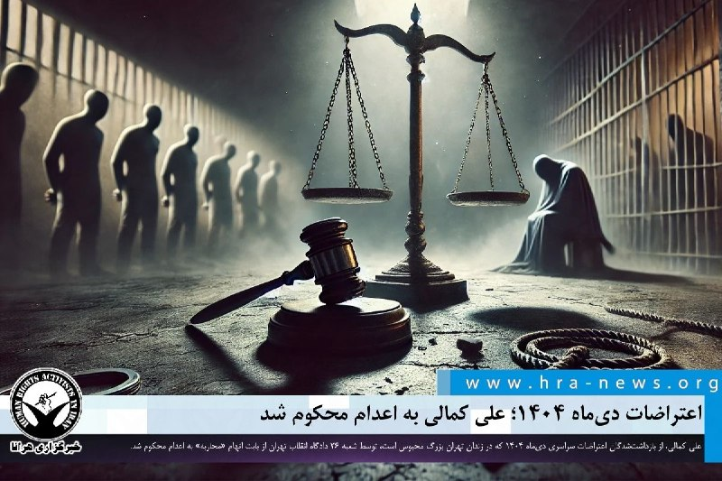

اعتراضات دی‌ماه ۱۴۰۴؛ علی کمالی به اعدام محکوم شد

❗️
❗️
❗️
❗️
❗️– علی کمالی، از بازداشت‌شدگان اعتراضات سراسری دی‌ماه ۱۴۰۴ که در زندان تهران بزرگ محبوس است، توسط شعبه ۲۶ دادگاه انقلاب تهران از بابت اتهام «محاربه» به #اعدام محکوم شد. آقای کمالی که ساکن کشور مالزی است، پس از بازگشت به کشور بازداشت و به اعدام محکوم شد.

به گزارش خبرگزاری هرانا، ارگان خبری مجموعه فعالان حقوق بشر در ایران، علی کمالی، از بازداشت شدگان اعتراضات سراسری دی‌ماه، به اعدام محکوم شده است.

شعبه ۲۶ دادگاه انقلاب تهران به ریاست قاضی ایمان افشاری در اواسط اردیبهشت‌ماه سال جاری، وی را از بابت اتهام «محاربه» به اعدام محکوم کرده است. این حکم کماکان در مرحله بررسی توسط دیوان عالی کشور قرار دارد.
بر اساس اطلاعات دریافتی هرانا، آقای کمالی مورخ ۲۲ دی‌ماه ۱۴۰۴ در جریان اعتراضات سراسری در تهران بازداشت شد. وی دارای اقامت مالزی است و بازداشت وی چند روز پس از سفر به ایران صورت گرفته است. این زندانی هم‌اکنون در زندان تهران بزرگ محبوس است.

#علی_کمالی

ادامه مطلب

↘️
@hranews_bot تماس ✉️ - @Hranews کانال هرانا 🆑

## alonews — post 125227

  <a href="telegram/content/alonews_125227_1780646592.webm" target="_blank">🎬 Download video</a>

👈سی‌ان‌ان: اسرائیل پرسنل نظامی و اطلاعاتی خود را به‌صورت پنهانی در طول درگیری با ایران به جمهوری آذربایجان اعزام کرد

✅ @AloNews خبر جنگ

---
📅 بروزرسانی: 1405/03/15 11:23
---

## VahidOOnLine — post 243765

  

♦️محسن نقوی، وزیر کشور پاکستان، روز پنجشنبه ۱۴ خرداد ماه در بیشکک، پایتخت قرقیزستان با اسکندر مومنی، وزیر کشور جمهوری اسلامی ایران دیدار کرد.
به گزارش رسانه‌های دولتی پاکستان، دو طرف در این دیدار درباره «روابط دوجانبه ایران و پاکستان، تحولات منطقه‌ای، مسائل امنیت داخلی و تلاش‌ها برای کاهش تنش‌ها» رایزنی کردند.
وزرای کشور ایران و پاکستان همچنین بر اهمیت ادامه تعاملات و گفتگوهای دیپلماتیک میان دو کشور تاکید کردند و بار دیگر تعهد خود را به حمایت از تلاش‌هایی که به صلح و ثبات پایدار در منطقه منجر شود، مورد تأکید قرار دادند.
بر اساس اعلام طرفین، همکاری‌های دوجانبه و هماهنگی‌های منطقه‌ای برای مقابله با چالش‌های امنیتی و تقویت ثبات منطقه از محورهای اصلی این گفتگو بوده است.
این خبر در حالی منتشر می‌شود که رسانه‌ العربیه پیشتر اعلام کرده بود، محسن نقوی «در چارچوب تلاش‌های میانجی‌گرانه اسلام‌آباد میان تهران و واشنگتن» به ایران سفر خواهد کرد.
‌🇸🇦 Indypersian

🤖 @VahidOOnLine

## VahidOOnLine — post 243764

  

حمیدرضا حاجی‌بابایی، نایب رییس مجلس جمهوری اسلامی، تهدید کرد در صورت ادامه حملات اسرائیل علیه مواضع حزب‌الله لبنان، جمهوری اسلامی تنگه باب‌المندب در جنوب دریای سرخ را خواهد بست.

او گفت: «هر وقت فشاری به آمریکا و اسرائیل وارد می‌شود، به حزب‌الله حمله می‌کنند. ما هم اعلام کردیم اگر حملاتشان متوقف نشود، حمله خواهیم کرد و تنگه باب‌المندب را خواهیم بست.»

او همچنین گفت دونالد ترامپ، رییس‌جمهوری آمریکا، از احتمال دستیابی ایران به بمب اتم هراس داشت، اما «قدرتمندترین بمب اتم ما تنگه هرمز است.»

نایب رییس مجلس جمهوری اسلامی تاکید کرد غنی‌سازی حق جمهوری اسلامی است و هیچ‌گاه قابل مذاکره نخواهد بود.
‌🏁 🇬🇧 IranintlTV

🤖 @VahidOOnLine

## IranIntlTV — post 340617

  

🔻کمتر یک هفته به شروع جام جهانی ۲۰۲۶ باقی مانده است. به نظر شما کدام تیم قهرمان این دوره می‌شود؟

🔹در این نظرسنجی دو مرحله‌ای، ۸ تیمی که از نظر کارشناسان بالاترین شانس را برای قهرمانی دارند، در دو گروه به رای مخاطبان ایران اینترنشنال گذاشته می‌شوند.

🔹امروز نظرسنجی گروه دوم به رای مخاطبان گذاشته خواهد شد.

🔹برای شرکت در این نظرسنجی به صفحه اینستاگرام ایران اینترنشنال ورزشی مراجعه کنید؛👇🏽
https://www.instagram.com/p/DZMgO3zAPff/

@iranintltvsport

## IranIntlTV — post 340616

  

حمیدرضا حاجی‌بابایی، نایب رییس مجلس جمهوری اسلامی، تهدید کرد در صورت ادامه حملات اسرائیل علیه مواضع حزب‌الله لبنان، جمهوری اسلامی تنگه باب‌المندب در جنوب دریای سرخ را خواهد بست.

او گفت: «هر وقت فشاری به آمریکا و اسرائیل وارد می‌شود، به حزب‌الله حمله می‌کنند. ما هم اعلام کردیم اگر حملاتشان متوقف نشود، حمله خواهیم کرد و تنگه باب‌المندب را خواهیم بست.»

او همچنین گفت دونالد ترامپ، رییس‌جمهوری آمریکا، از احتمال دستیابی ایران به بمب اتم هراس داشت، اما «قدرتمندترین بمب اتم ما تنگه هرمز است.»

نایب رییس مجلس جمهوری اسلامی تاکید کرد غنی‌سازی حق جمهوری اسلامی است و هیچ‌گاه قابل مذاکره نخواهد بود.
https://iranintl.com/202606055339

## IranIntlTV — post 340615

  <a href="telegram/content/IranIntlTV_340615_1780646004.mp4" target="_blank">🎬 Download video</a>

جام جهانی که مهم‌ترین رویداد فوتبالی جهان به شمار می‌رود، با حضور ۴۸ تیم، پنج‌شنبه ۲۱ خرداد برگزار خواهد شد. با وجود چالش‌های مختلف، از جمله عدم صدور ویزا برای هواداران ایرانی، این مسابقات نوید رقابت‌هایی به‌یادماندنی را می‌دهد.

گزارش رضا محدث، خبرنگار ایران‌اینترنشنال
@iranintltv

## FarsiVOA — post 219644

  

در پی رد آتش‌بس میان اسرائیل و لبنان توسط گروه تروریستی حزب‌الله، ارتش اسرائیل برای سه شهر و روستای جنوب لبنان هشدار تخلیه صادر کرد.

بر اساس بیانیه ارتش اسرائیل ساکنان مناطق عرنایا، عنقون و کفر فیلا باید پیش از آغاز حملات هوایی اسرائیل دست‌کم یک کیلومتر از این مناطق فاصله بگیرند و محل خطر را ترک کنند.

آویخای ادرعی، سخنگوی ارتش اسرائیل، خطاب به ساکنان این مناطق اعلام کرده که «در پی نقض توافق آتش‌بس از سوی سازمان تروریستی حزب‌الله و هدف قرار دادن مناطق مسکونی اسرائیل، ارتش اسرائیل ناچار است با قدرت علیه این گروه اقدام کند؛ به‌ویژه در مناطق شما».

او گفت ارتش اسرائیل قصد آسیب رساندن به ساکنان این مناطق را ندارد.
@FarsiVOA

## alonews — post 125226

  <a href="telegram/content/alonews_125226_1780646006.webm" target="_blank">🎬 Download video</a>

👈آذربایجان چهارمین کشوری است که گزارش شده اجازه داده نیروهای اسرائیلی علیه ایران در قلمرو آن فعالیت کنند.

✅ @AloNews خبر جنگ

## alonews — post 125225

هر گیگ فقط 2هزار تومن
😳 
😳هنوز داری گیگی 10...15 تومن میخری ، وقتی اینترنت کامل درست شده
😱چون داری از واسطه تهیه میکنی 
😍تخفیف ویژه فقط گیگی 2t با لینک ساب 
🌟با ضمانت و بهترین سرعت و کیفیت 
☑️نامحدود واقعی فقط 290t ⌛️برای 200 نفر اول این تخفیف اعمال میشه…

## alonews — post 125224

  

هر گیگ فقط 2هزار تومن
😳

😳هنوز داری گیگی 10...15 تومن میخری ، وقتی اینترنت کامل درست شده
😱چون داری از واسطه تهیه میکنی

😍تخفیف ویژه فقط گیگی 2t
با لینک ساب

🌟با ضمانت و بهترین سرعت و کیفیت

☑️نامحدود واقعی فقط 290t

⌛️برای 200 نفر اول این تخفیف اعمال میشه ، سریع اقدام کنید که دیگه قرار نیست هزینه زیاد بابت وی پی ان بدید
👇
👇
@tvpnshop_bot
@tvpnshop_bot

---
📅 بروزرسانی: 1405/03/15 11:13
---

## DW_Farsi — post 125516

  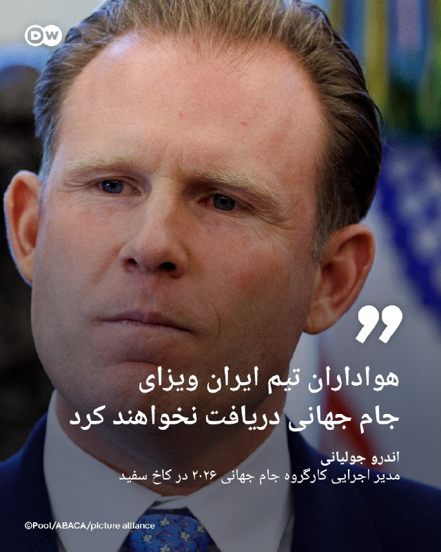

🔶آمریکا: هواداران تیم ایران ویزای جام جهانی دریافت نخواهند کرد

اندرو جولیانی، مدیر اجرایی کارگروه جام جهانی ۲۰۲۶ در کاخ سفید روز پنجشنبه ۱۴ خرداد (۴ ژوئن) اعلام کرد، به غیر از ایران و هائیتی، هواداران سایر تیم‌های جام جهانی ۲۰۲۶ می‌توانند برای ویزای توریستی اقدام کنند.

طبق گزارش‌ها، برای شهروندان ایران و هائیتی‌ محدودیت‌های ویژه و سخت‌گیرانه‌تری اعمال می‌شود و ورود آن‌ها عملا با موانع جدی روبه‌رو است.

ایران و هائیتی، که به جام جهانی ۲۰۲۶ صعود کرده‌اند، جزو کشورهایی هستند که شهروندان آن‌ها با محدودیت‌ها و ممنوعیت‌های سفر به ایالات متحده مواجه‌اند.

مکزیک به‌عنوان یکی از میزبانان جام جهانی ۲۰۲۶ مرزهای خود را به روی اعضای تیم ملی ایران باز کرده و فدراسیون فوتبال ایران ناچار به برپایی کمپ تمرینی در تیخوانا شده است.

@dw_farsi

## Persian_Trend_Official — post 15721

📍بولتن خبری ۲۴ ساعت اخیر پرشین ترند

🗓 ۱۵ خرداد ۱۴۰۵

🇮🇷ایران

◾️ رویترز: مقام ایرانی اعلام کرد به تفاهم سیاسی با آمریکا رسیده‌ایم، اما کارهای نهایی باقی مانده است

◾️ فارس: متن توافق با قالب «تعهد در برابر تعهد» در مراحل نهایی تصویب در ایران قرار دارد؛ تا آزادسازی ۱۲ میلیارد دلار دارایی بلوکه‌شده وارد مرحله بعدی نمی‌شویم

◾️ کانال ۱۲ اسرائیل: آمریکا از ایران خواسته پاسخ خود را پیش از پایان هفته ارائه کند؛ مراسم امضای توافق در سوئیس برگزار خواهد شد

◾️ نیویورک‌تایمز: دولت ترامپ معتقد است به توافق نزدیک شده، اما برخی مسائل از جمله آزادسازی دارایی‌های ایران هنوز در حال بررسی است

◾️ عراقچی: تبادل پیام‌ها ادامه دارد؛ هنوز به تفاهم نهایی نرسیده‌ایم؛ هیچ‌طرفی نمی‌تواند با زبان «باید» با ما صحبت کند

◾️ عراقچی: قطر در زمینه مسائل مالی نقش سازنده‌ای داشته؛ به همین دلیل به همراه قالیباف به دوحه سفر کردم و به نتایج خوبی دست یافتیم

◾️ پوتین: ایران به روسیه اعتماد دارد؛ اورانیوم منتقل‌شده می‌تواند برای پروژه‌های صلح‌آمیز هسته‌ای ایران مورد استفاده قرار گیرد

◾️ گروسی رئیس آژانس: هیچ اطلاعاتی از وضعیت مواد هسته‌ای ایران نداریم؛ دسترسی فوری به تأسیسات آسیب‌دیده ضروری است

◾️ عراقچی: ایران و عمان مدیریت تنگه هرمز را براساس حقوق بین‌الملل تنظیم خواهند کرد؛ تصمیم‌گیری نهایی میان ایران و عمان انجام خواهد شد

◾️ چهار نفتکش ایرانی با مجموع ۷ میلیون بشکه نفت روز دوشنبه از تنگه هرمز عبور کردند؛ اولین مورد از ۱۷ آوریل در دوران محاصره

◾️ عراقچی: اسناد و مدارکی وجود دارد که نشان می‌دهد امارات مستقیماً در عملیات‌های نظامی علیه ما مشارکت داشته است

◾️ عراقچی: آمریکا و اسرائیل از آسمان و خاک امارات علیه ما استفاده کردند؛ شاید دلیل اصلی مشکل ما با امارات وجود اسرائیل باشد

◾️ عراقچی: به کشورهای منطقه تأکید کرده بودیم پایگاه‌های آمریکایی در خاکشان بخشی از تجاوز علیه ما خواهند بود، شاید جدی نگرفتند

◾️ عراقچی: تماس‌های ما با عربستان در طول جنگ ادامه داشت؛ تفاهم مشترکی برای گفت‌وگوی جدی و سازنده وجود دارد

◾️ صداوسیما و تسنیم: تصاویر ادعایی اصابت پهپاد ایرانی به فرودگاه کویت صحنه‌سازی است؛ حملات سپاه نیمه شب انجام شده در حالی که تصاویر ادعایی در روز روشن است؛ فاصله هدف تا فرودگاه بیش از ۴۰ کیلومتر است

◾️ آستان قدس رضوی اعلام آمادگی کرد؛ چند مکان در محدوده حرم رضوی برای خاکسپاری رهبر شهید در حال بررسی است

🇮🇱 اسرائیل و خاورمیانه

◾️ وزارت خارجه آمریکا هشدار امنیتی برای تمام کشورهای خاورمیانه صادر کرد؛ دلیل: احتمال درگیری

◾️ کشورهای خلیج فارس در حال مذاکره برای احداث خطوط لوله نفتی جدید با هدف دور زدن تنگه هرمز هستند؛ کویت با عربستان، امارات و عمان در حال گفتگو است

◾️ اکونومیست: حکام خلیج فارس پس از جنگ تدابیری شبیه حکومت نظامی اعمال کرده‌اند؛ ده‌ها هزار نفر اخراج و بیش از هزار نفر بازداشت شدند؛ کویت بیش از ۷۰ هزار نفر را از تابعیت محروم کرده است

◾️ کویت ویدیویی از اصابت پهپاد انتحاری شاهد-۱۳۶ به ترمینال شماره یک فرودگاه بین‌المللی منتشر کرد؛ ۱ نفر کشته و بیش از ۶۰ نفر زخمی شدند

◾️ تصاویر ماهواره‌ای شرکت Soar Atlas آسیب به یک آشیانه هواپیما در پایگاه هوایی آمریکایی علی‌السالم کویت را تأیید می‌کند

◾️ سنتکام پیشتر مدعی شده بود همه موشک‌ها و پهپادهایی که کویت را هدف قرار دادند «پیش از رسیدن به هدف سقوط کرده‌اند»

◾️ ارتش اسرائیل و موساد: در عملیات شب گذشته در شمال غزه ۴ مقام ارشد دستگاه امنیت عمومی حماس از جمله معاون رئیس این دستگاه کشته شدند

◾️ شیخ نعیم قاسم: هر آتش‌بس باید کل لبنان را در بر گیرد و مستلزم خروج کامل اسرائیل باشد؛ آتش‌بس جزئی یعنی شکست ما

◾️ سردار قاآنی: کف خواسته‌های مقاومت، عقب‌نشینی اسرائیل به مرزهای پیش از جنگ ۴۰ روزه است

◾️ کانال ۱۲ اسرائیل: موساد سلاح‌های گرفته‌شده از حماس و حزب‌الله را به گروه‌های کرد منتقل کرده است

◾️ گروه هکری حنظله مدعی کشته شدن یک مدیر ارشد موساد در بخش پرونده ایران بر اثر انفجار بمب در خودروی شخصی‌اش شد؛ هیچ مقام اسرائیلی تأیید نکرده است

🇺🇸
🇪🇺 آمریکا و جهان

◾️ وال‌استریت‌ژورنال: خط قرمز ترامپ برای ورود به جنگ تمام‌عیار با ایران، کشته شدن نیروهای آمریکایی است

◾️ ترامپ: رأی‌گیری مجلس نمایندگان برای محدود کردن اختیارات جنگی‌ام «غیرمیهن‌پرستانه» و «بی‌معنا» بود

◾️ مقامات فدرال آمریکا جمشید قمی، مدیر ایرانی-آمریکایی ۶۳ ساله را در عمارت ۳۵ میلیون دلاری‌اش در کالیفرنیا بازداشت کردند؛ اتهام: انتقال بیش از ۲۵۰ قلم تجهیزات کنترل‌شده به ایران طی یک دهه

👺Phantom

📌 @persian_trend_official
پرشین ترند | متفاوت‌ترین کانال نظامی

## RadioFarda — post 157912

  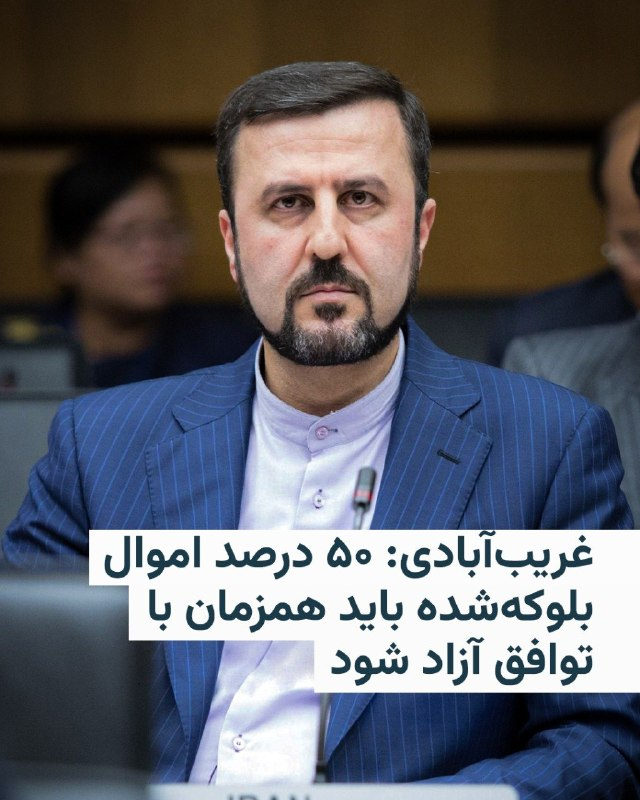

🔸کاظم غریب‌آبادی، معاون وزیر خارجه ایران، می‌گوید جمهوری اسلامی در جریان مذاکرات با آمریکا، «در مورد متن تقریباً خیلی جلو» رفته است.

🔸معاون وزیر خارجه ایران در مصاحبه‌ای که پنج‌شنبه شب، ۱۴ خرداد، با خبرگزاری مهر انجام شده، افزوده حکومت ایران «اصرار» دارد که «۵۰ درصد از وجوه بلوکه شده بلافاصله با امضای یادداشت تفاهم» به تهران پرداخت شود.

🔸او افزوده مابقی وجوه بلوکه‌شده هم باید «بعد از طی یک مدت معقولی که از نظر ما بیشتر از یک یا دو ماه نخواهد بود، در اختیار ایران قرار گیرد».

🔸غریب‌آبادی پایان جنگ در همه جبهه‌ها از جمله جبهه لبنان و رفع محاصره دریایی را در کنار آزادسازی وجوه مسدودشده ایران، سه شرط جمهوری اسلامی برای امضای توافق عنوان کرده است.

🔸این در حالی است که دونالد ترامپ، رئیس‌جمهور آمریکا، گفته قرار نیست در ازای توافق پولی به ایران داده شود.

🔸طی دوران مذاکرات نیز آمریکا بارها تحریم‌های تازه‌ای علیه ایران وضع کرده و به صراحت از عملیات «خشم اقتصادی» برای فلج‌ کردن اقتصاد ایران سخن گفته است.

@RadioFarda

## IranianMinds — post 21408

  <a href="telegram/content/IranianMinds_21408_1780645385.mp4" target="_blank">🎬 Download video</a>

العربیه : وزیر کشور پاکستان برای پیشبرد مذاکرات به تهران بازمیگردد. @IranianMinds

## IranianMinds — post 21407

العربیه : وزیر کشور پاکستان برای پیشبرد مذاکرات به تهران بازمیگردد.

@IranianMinds

## Dirty_Kids — post 391032

‏یارو میگه داداش توام از اینکه پل B1 رو زدن ناراحتی؟ نه مادرجنده گیلاس کیلویی یک میلیون دویست هزارتومنی نمیذاره من از چیز دیگه ای ناراحت باشم.

@Dirty_Kids 👻

## Dirty_Kids — post 391031

  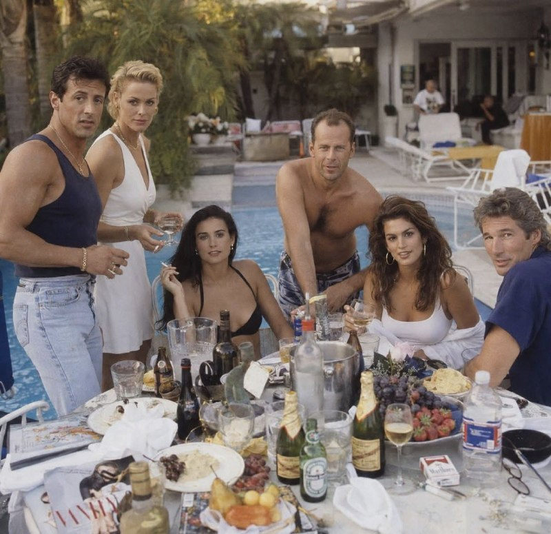

تابستون طلایی دهه ۹۰ هالییود

@Dirty_Kids 👻

## Dirty_Kids — post 391030

  <a href="telegram/content/Dirty_Kids_391030_1780645386.mp4" target="_blank">🎬 Download video</a>

عمو مانوک❤️

@Dirty_Kids 👻

## alonews — post 125223

  <a href="telegram/content/alonews_125223_1780645388.mp4" target="_blank">🎬 Download video</a>

👈ترامپ درباره خروج اورانیوم از ایران: ایران مثل ونزوئلا نیست که چند دقیقه بمانیم، بعد خارج شویم و آنها برایمان دست تکان بدهند.

🔴 در ایران باید یک تا دو هفته می‌ماندیم، به تجهیزات عظیم نیاز داشتیم و آنجا یک منطقه جنگی واقعی است.

✅ @AloNews خبر جنگ

## alonews — post 125222

  <a href="telegram/content/alonews_125222_1780645391.webm" target="_blank">🎬 Download video</a>

👈یک نظرسنجی جدید ماریو نشان داد که ۶۲٪ از اسرائیلی‌ها با «اجازه دادن به ترامپ برای تعیین عملیات نظامی» اسرائیل مخالف هستند.

✅ @AloNews خبر جنگ

---
📅 بروزرسانی: 1405/03/15 11:02
---

## VahidOOnLine — post 243763

🗣روایت شما از زندگی در دوران پس از انقلاب ملی و جنگ - جمعه ۱۵ خرداد ۱۴۰۵

🔹۱۵ خرداد اهواز. بین ساعت ۱۰:۱۵ و ۱۰:۲۰ صدای جنگنده یا شاید هم آواکس آمد.

🔹با هزار سختی از کرج وصل شدم. گذشته از گرانی‌هایی که کمر مردم را شکسته، برای خرید یک بسته قرص استامینوفن کدئین بیشتر از ده تا داروخانه رفتم، پیدا نشد، می‌گن کسری خورده نیست. یک مسکن ساده تو داروخانه‌ها پیدا نمی‌شه. داروی بیماران خاص که دیگه...

🔹چند روزیه مجدداً قطعی برق شروع شده. محلات روزی دو ساعت برق ندارن. خرم‌آباد، محله شهدا و مطهری که اصلی‌ترین قسمت بازار شهر هستن، در اوج شلوغی ساعات ۱۸ تا ۲۰ برق رو قطع می‌کنن. علاوه بر کسادی و رکود تورمی، قطعی برق هم به بی‌بازاری اضافه شده.

🔹از اهواز: از زمانی که محاصره دریایی شدید شده و جمهوری اسلامی نمی‌تونه نفت بفروشه، خام‌سوزی نفت از طریق فلرهای سطح شهر به شدت زیاد شده. هوای اهواز هر روز شدیداً آلوده‌ست و رسماً داریم خفه می‌شیم.

🔹رشت، ساعت ۱:۳۰ بامداد ۱۵ خرداد صدای پهپاد شنیده شد.

🔹از تهران پیام می‌دم. واقعاً دیگه کم آوردم. با یک میلیون که برای کالابرگ می‌دن آخه یه نفر چی می‌تونه بخره؟ حتی بیماری دارم و بیمه سلامت را بهم گفتن دو میلیون بریز تا بتونی استفاده کنی.

🔹من ۱۵ سالمه. پنج سال پیش یه چیپس می‌خریدم ۱۰ هزار تومن، ولی الان همون چیپس شده ۱۸۰ تومن. ما داریم به کجا می‌رسیم.
‌🏁 🇬🇧 IranintlTV

🤖 @VahidOOnLine

## WithYashar — post 13542

سازمان ملل از حزب‌الله خواست به تصمیمات حاکمیتی دولت مرکزی بیروت پایبند باشد، به حاکمیت کشور احترام بگذارد و روند انحصار سلاح در دست دولت را بپذیرد و از اسرائیل نیز متقابلاً خواست نیروهای نظامی خود را به طور کامل از خاک لبنان خارج کرده و به حاکمیت این کشور احترام بگذارد.
@withyashar

## WithYashar — post 13541

  <a href="telegram/content/WithYashar_13541_1780644765.mp4" target="_blank">🎬 Download video</a>

ویدیو اصابت یک پهپاد به تاسیسات بندر الفحل عمان که موجب توقف بارگیری نفت در این بندر شده است
@withyashar

## pm_afshaa — post 92293

سازمان ملل از اسرائیل خواسته نیروهای نظامیش رو به طور کامل از خاک لبنان خارج کنه

💧 Rainbet.com the #1 Non-KYC Crypto Casino & Sportsbook @rainbetcom

😁 @Pm_Afshaa

## IranIntlTV — post 340614

🗣روایت شما از زندگی در دوران پس از انقلاب ملی و جنگ - جمعه ۱۵ خرداد ۱۴۰۵

🔹۱۵ خرداد اهواز. بین ساعت ۱۰:۱۵ و ۱۰:۲۰ صدای جنگنده یا شاید هم آواکس آمد.

🔹با هزار سختی از کرج وصل شدم. گذشته از گرانی‌هایی که کمر مردم را شکسته، برای خرید یک بسته قرص استامینوفن کدئین بیشتر از ده تا داروخانه رفتم، پیدا نشد، می‌گن کسری خورده نیست. یک مسکن ساده تو داروخانه‌ها پیدا نمی‌شه. داروی بیماران خاص که دیگه...

🔹چند روزیه مجدداً قطعی برق شروع شده. محلات روزی دو ساعت برق ندارن. خرم‌آباد، محله شهدا و مطهری که اصلی‌ترین قسمت بازار شهر هستن، در اوج شلوغی ساعات ۱۸ تا ۲۰ برق رو قطع می‌کنن. علاوه بر کسادی و رکود تورمی، قطعی برق هم به بی‌بازاری اضافه شده.

🔹از اهواز: از زمانی که محاصره دریایی شدید شده و جمهوری اسلامی نمی‌تونه نفت بفروشه، خام‌سوزی نفت از طریق فلرهای سطح شهر به شدت زیاد شده. هوای اهواز هر روز شدیداً آلوده‌ست و رسماً داریم خفه می‌شیم.

🔹رشت، ساعت ۱:۳۰ بامداد ۱۵ خرداد صدای پهپاد شنیده شد.

🔹از تهران پیام می‌دم. واقعاً دیگه کم آوردم. با یک میلیون که برای کالابرگ می‌دن آخه یه نفر چی می‌تونه بخره؟ حتی بیماری دارم و بیمه سلامت را بهم گفتن دو میلیون بریز تا بتونی استفاده کنی.

🔹من ۱۵ سالمه. پنج سال پیش یه چیپس می‌خریدم ۱۰ هزار تومن، ولی الان همون چیپس شده ۱۸۰ تومن. ما داریم به کجا می‌رسیم.

## IranIntlTV — post 340613

  

🔻اندرو جولیانی، مدیر اجرایی کارگروه جام جهانی ۲۰۲۶ در کاخ سفید، تاکید کرد که برخلاف هواداران ۴۶ تیم دیگر حاضر در رقابت‌ها، شهروندان ایران و هائیتی امکان دریافت ویزا برای سفر به آمریکا و حضور در مسابقات جام جهانی را نخواهند داشت.

🔹در جریان یک نشست خبری درباره آمادگی‌های آمریکا برای میزبانی جام جهانی فوتبال ۲۰۲۶، که پنج‌شنبه ۱۴ خرداد در میامی برگزار شد، اندرو جولیانی، مدیر اجرایی کارگروه جام جهانی در کاخ سفید، بار دیگر بر محدودیت‌های ویزایی برای شهروندان ایران و هائیتی تاکید کرد.

🔹جولیانی در پاسخ به پرسشی درباره سیاست‌های مهاجرتی دولت دونالد ترامپ و تاثیر آن بر حضور هواداران تیم‌های ملی در جام جهانی گفت: «به جز ایران و هائیتی، ۴۶ تیمی که به جام جهانی راه‌یافته‌اند، امکان دریافت ویزا و ورود به آمریکا را خواهند داشت.»

🔹در همین زمینه و در حالی که تنها ۶ روز تا آغاز جام جهانی ۲۰۲۶ باقی مانده، بازیکنان تیم ملی ایران نیز هنوز ویزای آمریکا را دریافت نکرده‌اند؛ موضوعی که به گفته مهدی تاج، رئیس فدراسیون فوتبال حضور ایران در این رقابت‌ها را با چالش جدی مواجه کرده است.

@iranintltvsport

## FarsiVOA — post 219643

  

برخی نمایندگان مجلس شورای اسلامی به دلیل وصل مجدد اینترنت، به دنبال استیضاح وزیر ارتباطات هستند.

خبرگزاری ایلنا ضمن تأیید این خبر نوشته است «بحث طرح استیضاح ستار هاشمی» مطرح شده و برخی نمایندگان معتقدند که وزیر ارتباطات به نماد تلاش دولت برای بازگرداندن دسترسی عادی به اینترنت جهانی تبدیل شده است.

در همین ارتباط مصطفی پوردهقان، عضو کمیسیون صنایع، حامیان طرح فوق را «نماینده افکار اقلیتی» دانست که مسائلی چون عدم ارتباطات، عدم مذاکره، عدم اتصال اینترنت بین‌الملل و بسیاری از موضوعات دیگر را مطرح می‌کنند.

وی معتقد است که این افراد در مسائل دیگر نیز موضع مشابه داشته و در برابر هرگونه اصلاح، گشایش و تصمیمی که به بهبود شرایط زندگی مردم منجر شود، موضع مخالفت اتخاذ می‌کنند.

دسترسی شهروندان به اینترنت بین‌المللی از روز نهم اسفند ۱۴۰۴ تا ششم خرداد ۱۴۰۵ توسط نهادهای حکومتی جمهوری اسلامی قطع بود.
@FarsiVOA

## alonews — post 125221

  <a href="telegram/content/alonews_125221_1780644768.webm" target="_blank">🎬 Download video</a>

👈رئیس پلیس راهور تهران بزرگ: تردد اسکوتر‌های ایستاده و نشسته بدون پلاک در خیابان‌ها و معابر به جز بوستان‌ها و مسیر‌های ویژه ممنوع است.

🔴هنوز سازوکار قانونی برای ثبت تخلف یا اعمال قانون برای اسکوتر‌ها وجود ندارد.

✅ @AloNews خبر جنگ

## alonews — post 125220

  <a href="telegram/content/alonews_125220_1780644768.webm" target="_blank">🎬 Download video</a>

👈سازمان ملل متحد از اسرائیل خواست نیروهای نظامی خود را به طور کامل از خاک لبنان خارج کرده و به حاکمیت ملی این کشور احترام بگذارد.

🔴سازمان ملل از حزب‌الله خواست به تصمیمات حاکمیتی دولت مرکزی بیروت پایبند باشد، به حاکمیت کشور احترام بگذارد و روند انحصار سلاح در دست دولت را بپذیرد.

✅ @AloNews خبر جنگ

---
📅 بروزرسانی: 1405/03/15 10:52
---

## VahidOOnLine — post 243762

  <a href="telegram/content/VahidOOnLine_243762_1780644156.mp4" target="_blank">🎬 Download video</a>

یک شهروند در کرمانشاه با ارسال ویدیویی از درگیری فرد حامی حکومت با تعداد جوان روایت کرده که این فرد به دلیل حجاب دختر همراه جوانان به آن‌ها حمله‌ور شده و اقدام به فحاشی و درگیری فیزیکی کرده است.
‌🏁 🇬🇧 IranintlTV

🤖 @VahidOOnLine

## DEJradio — post 5346

  <a href="telegram/content/DEJradio_5346_1780644157.webm" target="_blank">🎬 Download video</a>

🔺📢 به گفته چهار منبع آگاه، اسرائیل در طول جنگ ۴۰ روزه، به‌طور مخفیانه واحدهای نخبه نظامی و اطلاعاتی خود را به آذربایجان اعزام کرد. این اقدام بخشی از شبکه‌ای از پایگاه‌های پنهانی در سراسر خاورمیانه بود که برای تسهیل عملیات علیه جمهوری اسلامی مورد استفاده قرار می‌گرفت.

دو منبع اعلام کردند که این نیروها در چندین نقطه در جنوب آذربایجان، در مجاور مرز شمالی ایران و در نزدیک‌ترین فاصله حدود ۹۶ کیلومتری شهر تبریز مستقر بودند؛ شهری که اسرائیل در جریان جنگ آن را هدف حملات خود قرار داد.

به گفته دو منبع دیگر، واحدهای ویژه کماندویی نیز به این مناطق اعزام شدند و مأموریت‌های جمع‌آوری اطلاعات و عملیات پهپادی را انجام دادند؛ امری که به اسرائیل امکان می‌داد در طول جنگ، دید و اشراف ارزشمندی بر شمال ایران داشته باشد.

به گفته منابع، پایگاه‌های آذربایجان تنها بخشی از مجموعه‌ای از سایت‌ها و پایگاه‌های مخفی نظامی در کشورهای مختلف از جمله عراق، امارات متحده عربی و سومالی‌لند بودند.

#جنگ۴۰روزه #آذربایجان
@DEJradio

## DEJradio — post 5345

  <a href="telegram/content/DEJradio_5345_1780644158.webm" target="_blank">🎬 Download video</a>

🤡
🔺 جشن عید غدیر؛ امت برای یک قاچ هندوانه تو سر و کله هم می‌زنند!

#غدیر #مسلمان
@DEJradio

## IranIntlTV — post 340612

  <a href="telegram/content/IranIntlTV_340612_1780644158.mp4" target="_blank">🎬 Download video</a>

یک شهروند در کرمانشاه با ارسال ویدیویی از درگیری فرد حامی حکومت با تعداد جوان روایت کرده که این فرد به دلیل حجاب دختر همراه جوانان به آن‌ها حمله‌ور شده و اقدام به فحاشی و درگیری فیزیکی کرده است.

## IranIntlTV — post 340611

  <a href="telegram/content/IranIntlTV_340611_1780644160.mp4" target="_blank">🎬 Download video</a>

ایالات متحده بار دیگر بر خلع سلاح هسته‌ای کره شمالی تاکید و در عین حال اعلام کرد آماده گفت‌وگوی بدون پیش‌شرط با پیونگ‌یانگ است. این اظهارات پس از آن مطرح شد که کیم جونگ اون، رهبر کره شمالی، از یک تاسیسات جدید تولید مواد هسته‌ای بازدید کرد و بر افزایش تصاعدی توان تسلیحات هسته‌ای این کشور تاکید داشت.

توماج طاهباز، خبرنگار ایران‌اینترنشنال، گزارش می‌دهد
@iranintltv

## FarsiVOA — post 219642

  

اداره بین‌الملل حزب کمونیست چین روز جمعه اعلام کرد که شی جین‌پینگ، رئیس‌جمهور این کشور ۱۸ خرداد در سفری دوروزه به کره شمالی می‌رود و خبرگزاری دولتی کره شمالی نیز تایید کرد که این سفر به دعوت کیم جونگ اون، رهبر این کشور انجام می‌شود.

این سفر پس از نشست‌های شی در پکن در ماه گذشته با دونالد ترامپ، رئیس‌جمهور آمریکا، و ولادیمیر پوتین، رئیس‌جمهور روسیه انجام می‌شود. همچنین این سفر نخستین سفر خارجی شی در سال جاری میلادی و نخستین سفر او به کره شمالی در نزدیک به هفت سال گذشته است.

شی ۷۲ ساله که اکنون سفرهای خارجی کمتری انجام می‌دهد، آخرین بار در اواخر اکتبر گذشته به کره جنوبی سفر و در آن جا با ترامپ نیز دیدار کرد.

خبرگزاری رویترز نوشت که پکن به دنبال بازتثبیت روابط با پیونگ‌یانگ، تنها متحد رسمی خود بر پایه معاهده، است.
@FarsiVOA

## BBCPersian — post 282911

🔻غریب‌آبادی: اصرار ایران این است که ۵۰ درصد از اموال بلوکه شده‌اش با امضای یادداشت تفاهم آزاد شود

معاون وزارت خارجه ایران و از اعضای گروه مذاکره کننده این کشور گفته است که «اصرار جمهوری اسلامی ایران این است که ۵۰ درصد از اموال بلوکه شده‌اش بلافاصله با امضای یادداشت تفاهم، در اختیارش قرار گیرد.»

کاظم غریب‌آبادی به خبرگزاری مهر گفته است که بقیه دارایی‌های مسدود شده ایران هم «باید بعد از طی یک مدت معقولی که از نظر ما بیشتر از یک یا دو ماه نخواهد بود، در اختیار ایران قرار گیرد.»

معاون وزیر خارجه ایران آزادسازی دارایی های مسدود شده این کشور را «یکی از موضوعات مهم و کلیدی» در مذاکره با آمریکا توصیف کرده و گفته «اینکه چه میزان از این پول ابتدا باید اختصاص پیدا کند و چه میزان بعد از یک مدت گفت‌وگو، این موضوعی است که قابل مذاکره است.»

ایالات متحده اعلام کرده که قرار نیست در مرحله تفاهم احتمالی اولیه پولی در اختیار ایران قرار گیرد.

دونالد ترامپ پیش از این گفته بود «اگر من با ایران توافق کنم یک توافق خوب و مناسب خواهد بود، نه مثل توافقی که [باراک] اوباما [در توافق هسته‌ای برجام] کرد و یک عالم پول نقد به ایران داد.»
https://bbc.in/4oavX8B
@BBCPersian

## BBCPersian — post 282910

🔻اتحادیه اروپا: نشانه‌ای از کمبود سوخت جت در اروپا دیده نمی‌شود

یک مقام اتحادیه اروپا گفت که با وجود شوک انرژی ناشی از جنگ ایران، نشانه‌ای از کمبود سوخت جت در ماه‌های آینده در اروپا دیده نمی‌شود.

کمیسر حمل‌ونقل اتحادیه اروپا، در مصاحبه‌ با رویترزگفت که مسافران ممکن است اثر کامل افزایش هزینه سوخت را تا اواخر سال جاری میلادی یا سال آینده، همزمان با پایان یافتن قراردادهای پوشش ریسک شرکت‌های هواپیمایی، در قالب افزایش قیمت بلیت‌ها احساس کنند.

هرچند این وضعیت از یک شرکت به شرکت هوایپیمایی دیگر متفاوت است.

بر اساس این گزارش سوخت جت بین ۲۵ تا ۳۰ درصد هزینه‌های عملیاتی شرکت‌های هواپیمایی را تشکیل می‌دهد و به گفته کمیسر حمل‌ونقل اتحادیه اروپا، «به همین دلیل برخی شرکت‌های هواپیمایی تصمیم گرفته‌اند مسیرهایی را که از نظر اقتصادی توجیه نداشتند، لغو کنند.»

تحلیلگران پیش‌بینی می‌کنند میانگین قیمت نفت در سال جاری میلادی به حدود ۹۰ دلار در هر بشکه برسد که حدود ۴۰ درصد بیشتر از قبل حمله آمریکا و اسرائیل به ایران است.

https://bbc.in/4oavX8B
@BBCPersian

## idfinfarsi — post 11777

  <a href="telegram/content/idfinfarsi_11777_1780644162.mp4" target="_blank">🎬 Download video</a>

‼️پس از تلاش برای هدف قرار دادن نیروهای ما: فرمانده یگان مهندسی حزب‌الله به هلاکت رسید و سکویی که به سوی نیروهای ما شلیک کرده بود منهدم شد

❌ارتش اسرائیل هفته گذشته حمله کرده و تروریست عبد حرب، فرمانده یگان مهندسی سازمان تروریستی حزب‌الله را به هلاکت رساند.

⭕️این تروریست فرماندهی یگان مهندسی حزب‌الله را بر عهده داشت که در زمینه مونتاژ و به‌کارگیری مواد انفجاری برای هدف قرار دادن نیروهای ارتش اسرائیل که در جنوب لبنان فعالیت می‌کنند، فعالیت می‌کرد. همچنین، حرب یکی از فرماندهان باسابقه و ارشد در صفوف سازمان تروریستی حزب‌الله بود و از زمان جنگ دوم لبنان تا امروز مسئول اجرای طرح‌های متعدد تروریستی علیه نیروهای ما بوده است.

⭕️همچنین، شب گذشته (پنج‌شنبه)، نیروی هوایی سکویی را که تروریست‌های سازمان تروریستی حزب‌الله از آن به سوی نیروهای ارتش اسرائیل در جنوب لبنان راکت شلیک کرده بودند، هدف قرار داده و منهدم کرد.

⭕️ارتش اسرائیل به فعالیت برای رفع هرگونه تهدید علیه کشور اسرائیل و نیروهای ارتش اسرائیل ادامه خواهد داد.

## alonews — post 125219

  <a href="telegram/content/alonews_125219_1780644163.webm" target="_blank">🎬 Download video</a>

👈العربیه: وزیر کشور پاکستان برای دومین بار در عرض ۲۴ ساعت با همتای ایرانی خود در بیشکک دیدار کرد.

✅ @AloNews خبر جنگ

## alonews — post 125218

  <a href="telegram/content/alonews_125218_1780644163.webm" target="_blank">🎬 Download video</a>

👈پولیتیکو: احتمال لغو ارسال موشک‌های تاماهاک به آلمان به دلیل کاهش زرادخانه تسلیحاتی آمریکا در درگیری با ایران

🔴 منابع مطلع می‌گویند که آمریکا به دلیل نگرانی از واکنش روسیه، ارسال موشک‌های کروز راهبردی به آلمان را احتمال لغو می‌کند.

✅ @AloNews خبر جنگ

## alonews — post 125217

  <a href="telegram/content/alonews_125217_1780644163.mp4" target="_blank">🎬 Download video</a>

👈ویدئوی مربوط به اصابت یک فروند پهپاد انتحاری به تاسیسات بندر الفحل عمان که موجب توقف بارگیری نفت در این بندر شده است

✅ @AloNews خبر جنگ

---
📅 بروزرسانی: 1405/03/15 10:42
---

## pm_afshaa — post 92292

فیلم و سریالای روزو میتونین از کانال فیلم و سریالمون تماشا کنین اگه دوست داشتین👇👇👇

https://t.me/pm_seriesi
https://t.me/pm_seriesi

## DEJradio — post 5344

  <a href="telegram/content/DEJradio_5344_1780643565.webm" target="_blank">🎬 Download video</a>

🔺📢 بر اساس اطلاعات دریافتی، با آغاز تجمعات شبانه حامیان نظام و استقرار ایست‌های بازرسی، پلیس راهور شماری از نیروهای خود را مامور به پشتیبانی از «یگان ویژه» برای مقابله با شکل‌گیری اعتراضات ضدحکومتی کرده است.

یک منبع موثق به دژ می‌گوید، از آنجا که احتمال داشت اعتراضات همزمان با جنگ بالا بگیرد، برای جبران کمبود نیرو تعدادی از نیروهای پلیس راهور به یگان ویژه ملحق شدند. آنها پیش‌تر نیز در جریان سرکوب خیزش ملی دی‌ماه با یگان امداد و یگان ویژه و سـ.ـپاه همکاری داشتند.

طبق آخرین اطلاعات دریافتی بیش از ۲۵ نفر از ماموران راهور در جریان جنگ ۴۰ روزه کشته و زخمی شدند.

#سرکوب #جنگ
@DEJradio

## DEJradio — post 5343

  <a href="telegram/content/DEJradio_5343_1780643565.webm" target="_blank">🎬 Download video</a>

🚨📢 سفارت آمریکا در اسرائیل پنجشنبه ۱۴ خرداد ۱۴۰۵ با صدور یک هشدار امنیتی از شهروندان آمریکایی در سراسر خاورمیانه خواست احتیاط بیشتری به خرج دهند. این هشدار تأکید می‌کند که محیط امنیتی همچنان «پیچیده است و می‌تواند به‌سرعت تغییر کند»؛ در حالی که تنش‌ها با جمهوری اسلامی ایران ادامه یافته و تردیدهایی درباره پایداری آتش‌بس وجود دارد.

بر اساس این هشدار به شهروندان آمریکایی در منطقه توصیه شده که تحولات را به‌صورت لحظه‌ای دنبال کنند و می‌گوید توصیه‌های سفر وزارت خارجه همچنان در سطح ۳، یعنی «بازنگری در سفر»، برای بحرین، اسرائیل، کرانه باختری، اردن، کویت، عمان، قطر، عربستان سعودی و امارات متحده عربی برقرار است.

در بخش دیگری از هشدار با عنوان «احتمال درگیری‌ها»، سفارت اعلام کرد که شهروندان آمریکایی باید محل نزدیک‌ترین پناهگاه را در صورت ازسرگیری درگیری‌ها بدانند.

این اطلاعیه همچنین به آمریکایی‌ها توصیه می‌کند مراقب اطراف خود باشند، از تجمعات و تظاهرات دوری کنند، از مناطق با حضور سنگین پلیس فاصله بگیرند، رسانه‌های محلی را دنبال کنند، دستورهای مقامات محلی را رعایت کنند و در مکان‌هایی که به‌طور علنی با ایالات متحده مرتبط هستند احتیاط بیشتری داشته باشند.

#سفارت_آمریکا #جنگ
@DEJradio

## IranIntlTV — post 340610

  <a href="telegram/content/IranIntlTV_340610_1780643566.mp4" target="_blank">🎬 Download video</a>

خبرگزاری رویترز از وقوع انفجار در نزدیکی یک پایانه نفتی در عمان خبر داد. بر اساس گزارش‌های اولیه، احتمال می‌رود این انفجار در پی یک حمله پهپادی رخ داده باشد.

گفت‌وگو با روح‌الله رحیم‌پور، روزنامه‌نگار و تحلیل‌گر سیاسی
@iranintltv

## alonews — post 125216

  <a href="telegram/content/alonews_125216_1780643568.webm" target="_blank">🎬 Download video</a>

👈تورم نقطه به نقطه سالانه برخی اقلام اعلامی مرکز آمار: از ۴۳٠ درصد تا ۱٠٠ درصد

✅ @AloNews خبر جنگ

---
📅 بروزرسانی: 1405/03/15 10:33
---

## mwarmonitor — post 10164

‼️ هشدار فوری به ساکنان لبنان که در شهرها و روستاهای زیر حضور دارند:
عرنایا (عرنابه)، عنقون، کفر فیلا

🔸 در پی نقض توافق آتش‌بس از سوی حزب‌الله و هدف قرار دادن جبهه داخلی اسرائیل، ارتش دفاعی اسرائیل ناچار است با قدرت علیه آن اقدام کند، به‌ویژه در مناطق شما. ارتش قصد آسیب رساندن به شما را ندارد.

🔸 برای حفظ ایمنی خود، باید فوراً منازل‌تان را تخلیه کرده و حداقل به فاصله ۱۰۰۰ متر از روستاها و شهرک‌ها، به مناطق باز و غیرمسکونی دور شوید.

🔸 هر فردی که در نزدیکی نیروها، تأسیسات و تجهیزات رزمی حزب‌الله حضور داشته باشد، جان خود را در معرض خطر قرار می‌دهد!

@mwarmonitor

## RadioFarda — post 157911

  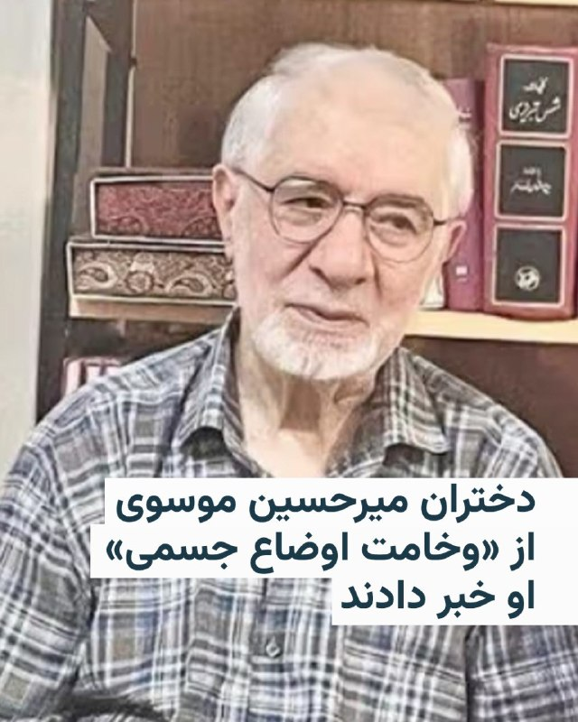

🔸در خبری تازه از وضعیت جسمی میرحسین موسوی، از رهبران محصورِ جنبش سبز، دختران او روز پنج‌شنبه، ۱۴ خردادماه، از وضعیت جسمی نامساعد پدرشان خبر داده‌ و گفتند که او «به دلیل مشکل شدید قلبی در بیمارستان قلب بستری شده و اوضاع جسمی‌اش وخیم است».

🔸اوایل هفته جاری، در پی انتشار اخباری از مریض‌احوالی میرحسین موسوی، از رهبران جنبش سبز ایران، اردشیر امیرارجمند، مشاور او، تأیید کرده بود که آقای موسوی «چند روزی است» به بیمارستان منتقل شده است.

🔸میرحسین موسوی، ۸۴ ساله، به همراه همسرش زهرا رهنورد، دیگر رهبر جنبش سبز، ۸۰ ساله، هم‌چنان در حصر به سر می‌برد.

🔸امیرارجمند که در فرانسه اقامت دارد روز دوشنبه به رادیوفردا گفت که خانه این دو فعال سیاسی دیگر «قابل سکونت نیست»، محل نگهداری آن‌ها پس از انتقال‌شان «نامعلوم» است، و شرایط حصر «دشوارتر» شده است.

🔸محل سکونت این دو در حملات بی‌امان اسرائیل به تهران به‌شدت آسیب دیده است.

🔸دختران این دو رهبر جنبش سبز در ادامه پیام خود از «بی‌توجهی و عدم پیگیری دولت» مسعود پزشکیان انتقاد کرده‌اند.

@RadioFarda

## BBCPersian — post 282909

  <a href="telegram/content/BBCPersian_282909_1780642991.mov" target="_blank">🎬 Download video</a>

🔻این هفته در پرگار: در تاب‌آوری مردم ایران فضیلتی هست؟

🔻صبر و تاب‌آوری مردم ایران با وجود بحران‌های پیاپی ناشی از چیست؟ صبری‌ست از سر مصلحت یا سازگاری‌یست که عامل ماندگاری حکومت می‌شود؟

میهمان‌ها:
حسین رسام، تحلیل‌گر سیاسی
وریا امیری، تحلیل‌گر سیاسی و دانش‌آموخته فلسفه

@BBCPersian

## alonews — post 125215

  <a href="telegram/content/alonews_125215_1780642994.webm" target="_blank">🎬 Download video</a>

👈فرغون هم رویا شد!

✅ @AloNews خبر جنگ

---
📅 بروزرسانی: 1405/03/15 10:22
---

## VahidOOnLine — post 243761

  <a href="telegram/content/VahidOOnLine_243761_1780642356.mp4" target="_blank">🎬 Download video</a>

یک شهروند ویدیویی به ایران اینترنشنال ارسال کرده که شعارنویسی «جاوید شاه پاینده ایران» را در نیشابور در روز ۱۴ خردادماه نشان می‌دهد.
‌🏁 🇬🇧 IranintlTV

🤖 @VahidOOnLine

## VahidOOnLine — post 243760

  

♦️فعالیت‌های پایانه نفتی «مینا الفحل» عمان پس از وقفه‌ای کوتاه ناشی از وقوع انفجار ماه در نزدیکی تأسیسات بارگیری نفت، صبح روز جمعه ۱۵ خرداد از سر گرفته شد.
این پایانه که مهم‌ترین مرکز صادرات نفت خام عمان به شمار می‌رود، پس از انجام بررسی‌های فنی و ایمنی بار دیگر به چرخه عملیاتی بازگشته است.
پیش‌تر منابع آگاه اعلام کرده بودند عملیات بارگیری نفت در پایانه مینا الفحل پس از وقوع انفجاری در نزدیکی اسکله‌های شناور بارگیری متوقف شده است. برخی گزارش‌ها حاکی از آن بود که این انفجار احتمالا در پی حمله پهپادی رخ داده، هرچند مقام‌های عمانی تاکنون علت حادثه را به طور رسمی تایید نکرده‌اند.
‌🇸🇦 Indypersian

🤖 @VahidOOnLine

## mwarmonitor — post 10163

  

✈️نیروی هوایی ایالات متحده (USAF)

✈️بوئینگ RC-135 Rivet Joint (۱ فروند)
AE1253 — 64-4126 — OLIVE 38

✈️بوئینگ E-4B Nightwatch (۱ فروند)
ADDEB3 — 73-1676 — TITAN 29

📌یک فروند RC-135 و یک فروند E-4B صبح امروز وارد اروپا می‌شوند.

🔸عملیات OLIVE 38 به‌طور مستقیم از پایگاه نیروی هوایی آفوت به مقصد پایگاه هوایی RAF Mildenhall پرواز کرده و احتمالاً مسیر خود را به سمت خانیا یونان ادامه خواهد داد.

✈️هواپیما TITAN 29 حامل وزیر دفاع آمریکا، پیت هگست، به مقصد پاریس است.

@mwarmonitor

## IranIntlTV — post 340609

  <a href="telegram/content/IranIntlTV_340609_1780642358.mp4" target="_blank">🎬 Download video</a>

یک شهروند ویدیویی به ایران اینترنشنال ارسال کرده که شعارنویسی «جاوید شاه پاینده ایران» را در نیشابور در روز ۱۴ خردادماه نشان می‌دهد.

---
📅 بروزرسانی: 1405/03/15 10:12
---

## IranIntlTV — post 340608

  <a href="https://t.me/IranintlTV/340608" target="_blank">📎 Download file</a>

🎧نسخه صوتی اخبار بامدادی | جمعه ۱۵ خرداد
@iranintlTV

## DW_Farsi — post 125515

🔶صد روز جنگ؛ گردشگری ایران زیر سایه رکود و نااطمینانی
🔻گزارشی از دانیال بابایانی

صد روز از آغاز جنگ میان ایران، اسرائیل و آمریکا گذشته است؛ جنگی که علاوه بر پیامدهای نظامی، سیاسی و اقتصادی، یکی از مهم‌ترین صنایع خدماتی ایران را نیز تحت تاثیر قرار داده است.

صنعت گردشگری که پیش از آغاز درگیری‌ها نشانه‌هایی از بهبود را تجربه می‌کرد، اکنون با کاهش ورود گردشگران خارجی، آسیب به زیرساخت‌ها و رکود در بسیاری از کسب‌وکارهای وابسته روبه‌رو شده است.

هرچند در روزهای نخست جنگ، توجه افکار عمومی بیشتر معطوف به خسارت‌های انسانی و تحولات نظامی بود، اما با گذشت بیش از سه ماه، آثار این بحران بر بخش گردشگری نیز آشکارتر شده است؛ صنعتی که به گفته فعالان آن، بیش از هر چیز به ثبات، امنیت و اعتماد وابسته است.

@dw_farsi

## RadioFarda — post 157910

  <a href="telegram/content/RadioFarda_157910_1780641774.mp4" target="_blank">🎬 Download video</a>

🔸مرتضی نظری، کارشناس مسائل آموزشی می‌گوید تا قبل از جنگ ۵۰ هزار طلبه بدون آموزش تخصصی وارد مدارس شدند.

🔸نظری در گفت‌وگو با خبرآنلاین با تاکید بر اینکه در کار تخصصی آموزش‌و‌پرورش اختلال ایجاد شده گفت: تا قبل از جنگ اخیر «۵۰ هزار طلبه بدون طی دوره دانشگاه فرهنگیان» وارد مدارس شدند.

🔸او این مسئله را در «افت تحصیلی» دانش‌آموزان تاثیرگذار دانست و در بخشی از این گفت‌وگو تاکید کرد که «بخش مهمی از افت کیفیت مدارس دولتی را ناشی از تمرکز امکانات و نیروهای انسانی در مدارس خاص است.»

🔸این تحلیل‌گر مسائل آموزش‌وپرورش، با اشاره به گستردگی انواع مدارس در ایران، گفت: «شبکه‌ای از مدارس وابسته به نهادها و سازمان‌های مختلف شکل گرفته که عملاً دانش‌آموزان را از یکدیگر تفکیک می‌کند.

🔸شورای عالی انقلاب فرهنگی ایران، در سال ۱۴۰۲، ورود بدون کنکور «طلاب و دانش‌آموزان نخبه و بااستعداد» به دانشگاه فرهنگیان را تصویب کرد.

🔸طی سال‌های اخیر، پاسخ‌هایی که به اعتراض نسبت به غیرکاربردی بودن دروس و محتوای کتاب‌ها داده شده، معمولاً مبهم بوده و افت درسی دانش‌آموزان ایرانی در سال‌های اخیر به روندی ادامه‌دار تبدیل شده است.

@RadioFarda

## Dirty_Kids — post 391028

با اون کوله پشتیش رفته دعوا

@Dirty_Kids 👻

## Dirty_Kids — post 391027

عاشق اسم فارسیِ درختام؛ سپیدار، سَرو، بلوط، بید مجنون، چنار، صنوبر، افرا، کاج.
انگار که شعر سبزن.

@Dirty_Kids 👻

## Dirty_Kids — post 391026

  <a href="telegram/content/Dirty_Kids_391026_1780641777.mp4" target="_blank">🎬 Download video</a>

صداگذاری ۱۰/۱۰ 😂😂😂

@Dirty_Kids 👻

## alonews — post 125214

  <a href="telegram/content/alonews_125214_1780641778.webm" target="_blank">🎬 Download video</a>

👈اسلام‌آباد درباره دیدار وزرای کشور پاکستان و ایران: دو طرف در مورد کاهش تنش‌ها و همکاری‌های امنیتی گفت‌وگو کردند

🔴 تلاش‌های دیپلماتیک برای دستیابی به صلح پایدار در منطقه ادامه خواهد یافت

✅ @AloNews خبر جنگ

## alonews — post 125213

  <a href="telegram/content/alonews_125213_1780641779.webm" target="_blank">🎬 Download video</a>

👈بیت‌کوین رسماً به زیر ۶۲٬۰۰۰ دلار سقوط کرد

✅ @AloNews خبر جنگ

---
📅 بروزرسانی: 1405/03/15 10:03
---

## VahidOOnLine — post 243759

⭕️غریب‌آبادی: ایران خواستار آزادسازی فوری ۵۰ درصد دارایی‌های مسدودشده همزمان با امضای تفاهم است

♦️کاظم غریب‌آبادی، معاون حقوقی و بین‌الملل وزارت امور خارجه جمهوری اسلامی ایران، اعلام کرد تهران اصرار دارد ۵۰ درصد از دارایی‌های مسدودشده‌اش بلافاصله پس از امضای یادداشت تفاهم احتمالی با واشنگتن، آزاد و در اختیار جمهوری اسلامی قرار گیرد.

غریب‌آبادی روز پنجشنبه ۱۴ خرداد ماه، در گفتگو با خبرگزاری مهر با اشاره به روند مذاکرات گفت آزادسازی پول‌های مسدودشده ایران یکی از موضوعات مهم و کلیدی برای تهران است.

معاون وزیر امور خارجه درباره نحوه آزادسازی این منابع گفت میزان دارایی‌هایی که در مرحله نخست آزاد خواهد شد، می‌تواند موضوع مذاکره باشد، اما حداقل خواسته جمهوری اسلامی ایران این است که ۵۰ درصد از این وجوه بلافاصله با امضای یادداشت تفاهم در اختیار ایران قرار گیرد.

غریب‌آبادی همچنین اظهار داشت مابقی این دارایی‌ها نیز باید پس از یک دوره زمانی معقول آزاد شود؛ دوره‌ای که از نگاه ایران نباید بیش از یک تا دو ماه به طول بینجامد.

پیش از این رسانه‌ها و منابع رسمی نزدیک به مذاکرات، دارایی‌های مسدود شده جمهوری اسلامی در بانک‌های خارج از کشور را یکی از مسائل محوری مذاکرات توصیف کرده بودند.
‌🇸🇦 Indypersian

🤖 @VahidOOnLine

## WithYashar — post 13540

یدیعوت آحارونوت: کابینه امنیتی اسرائیل شب گذشته به قطعنامه آتش بس در لبنان رای نداد
@withyashar

## WithYashar — post 13539

طبق روال هر روز صبح حمله سنگین اسرائیل به جنوب لبنان
@withyashar

## DW_Farsi — post 125514

  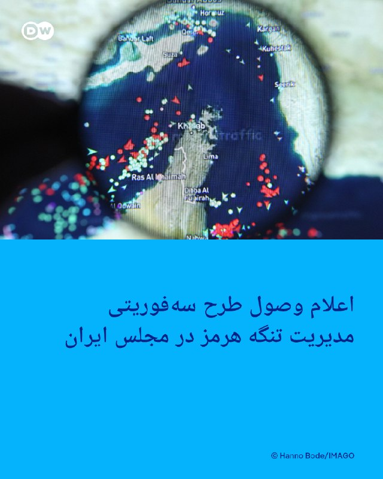

🔶اعلام وصول طرح سه‌فوریتی مدیریت تنگه هرمز در مجلس ایران

علی بایایی کارنامی، نماینده ساری و میاندورود در مجلس شامگاه پنجشنبه ۱۴ خرداد (۴ ژوئن) از اعلام وصول طرح سه‌فوریتی "مدیریت راهبردی تنگه هرمز" توسط هیئت رئیسه مجلس شورای اسلامی خبر داد.

این نماینده مجلس که این خبر را در حاشیه تجمعی در ساری اعلام می‌کرد گفت، این طرح در پاسخ به "تجاوزات بیگانگان" تدوین شده تا مدیریت این گذرگاه استراتژیک به‌طور کامل در اختیار ایران قرار گیرد.

نماینده ساری و میاندورود افزود: «در صورت تصویب، مدیریت تنگه هرمز از تمامی ابعاد اعم از اقتصادی، اجتماعی و امنیتی تحت کنترل کامل جمهوری اسلامی ایران قرار خواهد گرفت.»

به گفته بابایی کارنامی: «این اقدام راهبردی جایگاه استراتژیک ایران را در سطح جهان تثبیت می‌کند.»

دریافت عوارض از کشتی‌های عبوری از تنگه هرمز که پس از حملات اسرائيل و آمریکا به جمهوری اسلامی مطرح شد با مخالفت شدید جامعه جهانی مواجه شده است.

@dw_farsi

## BBCPersian — post 282908

محسن رضایی: حزب‌الله متحد ماست و از آن حمایت می‌کنیم

محسن رضایی، فرمانده پیشین سپاه پاسداران و مشاور نظامی رهبر جمهوری اسلامی ایران گفت: «حزب‌الله در جنگ اخیر جانفشانی کرد و متحد ماست بنابراین ما از حزب‌الله حمایت می‌کنیم و محکم پای تعهد خود ایستاده‌ایم.»

آقای رضایی در مصاحبه با صدا و سیما گفت:«دشمن می‌خواست با فشار بر لبنان مارا در مذاکرات تحت فشار قرار دهد» و ادامه داده که با با تهدید حمله به جنوب بیروت از سوی اسرائیل «تمام موشک‌های ما آماده به آتش کشیدن» شمال اسرائیل بود.

نخست‌وزیر اسرائیل اوایل هفته جاری دستورحمله به مواضع حزب‌الله در جنوب بیروت را داده بود اما ساعاتی بعد اعلام شد که در تماس تلفنی دونالد ترامپ با بنیامین نتانیاهو، جلوی این حمله گرفته شده است.

اظهارات آقای رضایی همزمان با گفته‌های رهبر حزب‌الله است که آتش‌بسی که در واشنگتن میان اسرائیل و دولت لبنان بر سر آن توافق شد را رد کرده و گفته تا هنگامی که روستاهای جنوب لبنان امن نشوند، شمال اسرائیل هم امن نخواهد بود.

آقای رضایی در تلویزیون ایران خطاب به اسرائیل گفته است «به این رژیم منحوس هشدار می‌دهیم که لبنان را ترک کند و بدانند که لبنان جزئی جدایی ناپذیر از هرگونه توافق و آتش‌بس خواهد بود.»

https://bbc.in/4oavX8B
@BBCPersian

## alonews — post 125212

  <a href="telegram/content/alonews_125212_1780641181.webm" target="_blank">🎬 Download video</a>

👈خیبرشکن صورتی در میدان انقلاب

✅ @AloNews خبر جنگ

---
📅 بروزرسانی: 1405/03/15 09:52
---

## VahidOOnLine — post 243758

  <a href="telegram/content/VahidOOnLine_243758_1780640547.mp4" target="_blank">🎬 Download video</a>

⭕️تصاویر جدید از حملات هوایی اسرائیل و آمریکا به مناطقی در تهران؛ ده‌ها ساختمان آسیب جدی دیدند

♦️ویدیویی که روز پنجشنبه ۱۴ خرداد و بعد از وصل شدن اینترنت ایرانیان پس از ۸۸ روز در شبکه‌های اجتماعی منتشر شده، یکی از مناطق تهران را نشان می‌دهد که در پی حملات هوایی ارتش اسرائیل و آمریکا آسیب گسترده دیده است.
تصاویر نشان می‌دهد، با وجود تخریب برخی واحدها، تعدادی از شهروندان در خانه‌های آسیب‌دیده زندگی می‌کنند.

ایندیپندنت فارسی به‌طور مستقل قادر نیست زمان و مکان دقیق این ویدیو را تایید کند.
‌🇸🇦 Indypersian

🤖 @VahidOOnLine

## alonews — post 125211

  <a href="telegram/content/alonews_125211_1780640549.webm" target="_blank">🎬 Download video</a>

👈بلومبرگ: ازسرگیری عملیات در بندر فحل عمان برای صادرات نفت خام

✅ @AloNews خبر جنگ

## alonews — post 125210

  <a href="telegram/content/alonews_125210_1780640549.webm" target="_blank">🎬 Download video</a>

👈سخنگوی کمیسیون امنیت ملی: با دیکتاتورهای منطقه به جرم تامین مالی و نظامی آمریکا برخورد کنید

✅ @AloNews خبر جنگ

---
📅 بروزرسانی: 1405/03/15 09:42
---

## IranIntlTV — post 340607

  <a href="telegram/content/IranIntlTV_340607_1780639974.mp4" target="_blank">🎬 Download video</a>

کریگ فرگوسن با هدف جلب توجه به اهمیت سلامت روان مردان و حمایت از تیم ملی اسکاتلند، در حال طی کردن مسیر پنج هزار کیلومتری میان لس‌آنجلس و بوستون است.

گزارش مهسا مرتضوی، خبرنگار ایران‌اینترنشنال
@iranintltv

## IranianMinds — post 21406

  <a href="telegram/content/IranianMinds_21406_1780639976.mp4" target="_blank">🎬 Download video</a>

این همه جو‌ بایدن بدبختو مسخره کردی آهش گرفتت

ترامپ دیشب اینطوری تو سخنرانی که داشتن خواب آلود بود و خوابش برده بود :)

@IranianMinds

---
📅 بروزرسانی: 1405/03/15 09:32
---

## WithYashar — post 13538

  

گزارشهای زیادی برایم فرستادید که از پدافند سنگین ۳-۴ صبح و چندین انفجار در تهران ولی مدرکی نیست… فقط چندین عکس از اینجا برایم آمده.
آزاد راه پردیس به تهران
@withyashar

## WithYashar — post 13537

امشب بیداریم ، ردبولم میزنیم 🤣💥

## IranIntlTV — post 340606

  <a href="telegram/content/IranIntlTV_340606_1780639373.mp4" target="_blank">🎬 Download video</a>

بیژن کیان، کارشناس امنیت ملی، گفت جمهوری اسلامی باید هشدارهای دونالد ترامپ، رییس‌جمهوری آمریکا، را جدی بگیرد، زیرا از نظر ترامپ هیچ دلیلی برای عقب‌نشینی وجود ندارد.
@iranintltv

## IranianMinds — post 21405

  

فرغونم برامون آرزو شد.

@IranianMinds

## BBCPersian — post 282901

‌
پوستر فیلمی که تنها تصویری از کاغذدیواری یکدست زرد را نشان می‌دهد، معمولا ممکن است توجه کسی را جلب نکند.

اما این یکی نه. این تصویر برای میلیون‌ها نفر فورا قابل شناسایی است و حس هراس برمی‌انگیزد.

این تازه‌ترین فیلم ترسناک هالیوود است: بک‌رومز(اتاق‌‌های پشتی) و سازندگانش مخاطبان خود را به‌خوبی می‌شناسند: کسانی که بیش از ستاره‌های مشهور، هیولاها و صحنه‌های خون‌آلود، به وحشت‌های پنهان و نجواگونه گرایش دارند.

«بک‌رومز» در اصل به فضاهای رهاشده و آزاردهنده‌ای اشاره دارد که انگار پایانی برایشان قابل تصور نیست. این فضا می‌تواند یک ساختمان اداری خالی، راهرو یا دالانی طولانی باشد، فضاهایی مبهم و ناآرام.

این مفهوم در سال ۲۰۱۹ شکل گرفت. زمانی که از کاربران ناشناس در سایت ۴چن خواسته شد «تصاویر ناآرام‌کننده‌ای منتشر کنند که صرفا یک حس نامعمول و ناخوشایند را منتقل می‌کنند.»

📸GettyImages/
YouTube/@ KanePixels/ AFP via Getty Images/ A24/ 4chan

آلبوم را ورق بزنید و از لینک ⬇️ این مطلب را در سایت بی‌بی‌سی فارسی بخوانید.
https://bbc.in/3RMY7dH
@BBCPersian

@bbcpersian

## BBCPersian — post 282900

🔴بهای نفت در بازارهای جهانی افزایش یافت

قیمت نفت در بازارهای جهانی در شروع معاملات امروز بالا رفته است.

این افزایش پس از آن رخ داد که حزب‌الله پیشنهاد جدید آتش‌بس در لبنان را رد کرد و گزارش شد که یک پایانه نفتی عمان نیز در پی وقوع انفجار، بارگیری نفت را متوقف کرده است.

بهای نفت خام برنت به بیش از ۹۵ دلار در هر بشکه رسید. این در حالی است که قیمت نفت برنت پیش از این ۲٫۸۴ درصد کاهش یافته بود.

نفت خام وست تگزاس اینترمدیت آمریکا هم پس از آنکه دیروز ۳٫۱ درصد افت داشت، امروز دوباره بالا رفته است.

افزایش قیمت در هر دو شاخص نفتی در حالی رخ داده که درگیری‌ها در خاورمیانه تشدید شده، مذاکرات صلح میان آمریکا و ایران به درازا کشیده شده و تردد نفتکش‌ها در تنگه هرمز که حدود یک‌پنجم نفت جهان از آن عبور می‌کند، همچنان محدود مانده است.

https://bbc.in/4oavX8B
@BBCPersian

## alonews — post 125209

  <a href="telegram/content/alonews_125209_1780639375.webm" target="_blank">🎬 Download video</a>

👈آژانس اتمی: هیچ اطلاعاتی درمورد ذخایر اورانیوم نداریم

✅ @AloNews خبر جنگ

## alonews — post 125208

  <a href="telegram/content/alonews_125208_1780639376.webm" target="_blank">🎬 Download video</a>

👈خبرنگار الجزیره: دو حمله هوایی اسرائیل به حومه شهرهای نبطیه الفوقا و میفدون در جنوب لبنان

✅ @AloNews خبر جنگ

---
📅 بروزرسانی: 1405/03/15 09:22
---

## DW_Farsi — post 125513

  

🔶حمله به پایانه نفتی عمان؛ توقف بارگیری نفت خام پس از انفجار

خبرگزاری رویترز صبح روز جمعه ۱۵ خرداد (۵ ژوئن) به نقل از دو منبع آگاه گزارش داد که پس از یک حمله احتمالی پهپادی و وقوع انفجاری در پایانه "مینا الفحل" عمان عملیات بارگیری نفت در این پایانه متوقف شده است.

رسانه‌های ایران نوشته‌اند، حادثه در فاصله میان اسکله‌های شماره ۱ و ۲ بندر الفحل رخ داده است. اطلاعات بیشتری از این رویداد ارائه نشده است.

تسنیم، خبرگزاری وابسته به سپاه پاسداران در گزارشی در این باره نوشته است که پایانه مینا الفحل یکی از نقاط راهبردی برای صادرات نفت عمان محسوب می‌شود.

وال‌استریت ژورنال چهار روز پیش از این حادثه به نقل از مقام‌های آمریکایی و عربی گزارش داده بود که دونالد ترامپ، رئيس‌جمهور آمریکا موضع بی‌طرفانه عمان در قبال ایران را رفتاری "غیرهمسو" با آمریکا تلقی می‌کند و گفته می‌شود واشنگتن در حال فشار بر مسقط است تا سیاست خود را به نفع آمریکا تغییر داده و روابط دیپلماتیک خود با ایران را محدود یا قطع کند.

@dw_farsi

## IranianMinds — post 21404

  

🔴 پست جدید ترامپ :

نوشته ی تو نقاشی : بزرگترین رئیس‌ جمهور.

@IranianMinds

## BBCPersian — post 282899

  

خبرگزاری رویترز از انفجاری در نزديکی اسکله‌های شناور بارگيری نفت در یک پايانه نفت خام عمان گزارش داده و می‌گوید که در پی آن عمليات بارگيری نفت در این پایانه متوقف شده است.

محل انفجار نزدیکی پایانه نفتی مينا الفحل در ساحل دريای عمان گزارش شده که خارج از محدوده خليج فارس قرار دارد.

رویترز از گزارش‌های اوليه از احتمال وقوع يک حمله پهپادی خبر داده است. مقام‌های عمان هنوز واکنشی نشان نداده‌اند.

این پایانه نفتی يکی از مهم ترين تاسیسات صادرات نفت خام عمان به شمار می‌رود و نقش مهمی در صادرات انرژی اين کشور دارد.

عمان در سال های گذشته تلاش کرده ميانجی و کانال ارتباطی ميان ايالات متحده و ايران باشد.

📷lightRocket via Getty Images
https://bbc.in/4oavX8B
@BBCPersian

## alonews — post 125207

  <a href="telegram/content/alonews_125207_1780638767.webm" target="_blank">🎬 Download video</a>

👈رئیس‌جمهور روسیه، پوتین، درباره اینکه آیا روسیه به اروپا حمله خواهد کرد:
چرا؟ چرا روسیه باید این کار را بکند؟

🔴برای ما چه فایده‌ای دارد؟ دلیل حمله روسیه به اروپا و جنگ با ناتو چیست؟

🔴این مزخرف است. این یک تحریک عمدی است

✅ @AloNews خبر جنگ

## alonews — post 125206

  <a href="telegram/content/alonews_125206_1780638768.webm" target="_blank">🎬 Download video</a>

👈کابینه امنیتی اسرائیل به پیش‌نویس توافق و آتش‌بس در لبنان رأی نداد

🔴 روزنامه یدیعوت آحارانوت نوشت: کابینه امنیتی دیشب به پیش‌نویس توافق آتش بس در لبنان رأی نداد

✅ @AloNews خبر جنگ

---
📅 بروزرسانی: 1405/03/15 09:12
---

## IranIntlTV — post 340605

  <a href="telegram/content/IranIntlTV_340605_1780638166.mp4" target="_blank">🎬 Download video</a>

سازمان آتش‌سوزی‌های جنگلی انتاریو در کانادا اعلام کرد آتش‌سوزی در جنوب تیمینز همچنان خارج از کنترل است و روند تخلیه بومیان ماتاگامی آغاز شده است.

گزارش مهسا مرتضوی، خبرنگار ایران‌اینترنشنال
@iranintltv

## IranIntlTV — post 340604

  <a href="telegram/content/IranIntlTV_340604_1780638168.mp4" target="_blank">🎬 Download video</a>

دونالد ترامپ، رییس‌جمهوری آمریکا، با تاکید بر دستاوردهای نظامی ایالات متحده در حملات به جمهوری اسلامی، هشدار داد که واشینگتن آمادگی دارد در صورت لزوم، بار دیگر وارد درگیری شود. او همچنین با اشاره به اورانیوم مدفون‌شده جمهوری اسلامی گفت آمریکا توان فنی لازم برای انتقال این مواد به خارج از کشور را دارد.

ارزیابی مهدی بیگی، عضو تحریریه ایران‌اینترنشنال
@iranintltv

## alonews — post 125205

  <a href="telegram/content/alonews_125205_1780638170.mp4" target="_blank">🎬 Download video</a>

👈ترامپ دیشب هم در کاخ سفید چرت زد!

✅ @AloNews خبر جنگ

## alonews — post 125204

  <a href="telegram/content/alonews_125204_1780638171.webm" target="_blank">🎬 Download video</a>

👈با اعلام سفیر ایران در روسیه؛ کار تملک زمین برای احداث راه‌آهن رشت – آستارا به طول ۱۶۲ کیلومتر تمام شده و به زودی برای آغاز پروژه در اختیار روسیه قرار می‌گیرد

✅ @AloNews خبر جنگ

---
📅 بروزرسانی: 1405/03/15 09:02
---

## VahidOOnLine — post 243757

  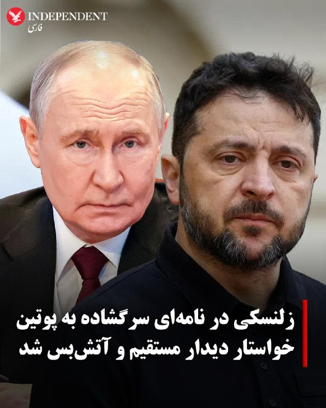

♦️ولودیمیر زلنسکی، رئیس‌جمهوری اوکراین، در نامه‌ای سرگشاده و کم‌سابقه خطاب به ولادیمیر پوتین، رئیس‌جمهوری روسیه، پیشنهاد برگزاری دیداری رو در رو و تعیین تاریخی مشخص برای مذاکرات صلح را مطرح کرد و گفت کی‌یف آماده است در طول مذاکرات، آتش‌بسی کامل برقرار کند.
زلنسکی روز پنجشنبه ۱۴ خرداد این نامه را منتشر کرد و نوشت: «اوکراین پیشنهاد می‌کند این جنگ از طریق گفتگوی مستقیم میان من و شما پایان یابد. من خواستار یک دیدار هستم.» او افزود: «پیشنهاد می‌کنم تاریخ مشخصی برای این دیدار تعیین شود. اوکراین آماده است برای مدت مذاکرات، آتش‌بسی کامل برقرار کند.»
این اقدام یک روز پس از حمله پهپادی اوکراین به سن‌پترزبورگ، زادگاه پوتین، صورت گرفت؛ حمله‌ای که همزمان با برگزاری مجمع اقتصادی بین‌المللی سن‌پترزبورگ انجام شد.
دونالد ترامپ، رئیس‌جمهوری آمریکا، نیز پنجشنبه شب از احتمال دیدار رهبران روسیه و اوکراین استقبال کرد و گفت: «فکر می‌کنم اگر با هم دیدار کنند عالی خواهد بود. باید این موضوع را تمام کنند.» ترامپ همچنین یادآور شد واشنگتن نقش مهمی در نزدیک شدن دو طرف به گفتگو داشته و هر دو کشور ناچار به مصالحه خواهند شد.
در واکنش به نامه زلنسکی، دیمیتری پسکوف، سخنگوی کرملین، اعلام کرد که پوتین هنوز این نامه را ندیده است، اما تاکید کرد رئیس‌جمهوری اوکراین «هر زمان بخواهد می‌تواند به مسکو بیاید». زلنسکی پیش‌تر در نامه خود چنین گزینه‌ای را رد کرده بود.
زلنسکی در نامه خود هشدار داد که اگر پوتین شخصا به این نتیجه نرسد که زمان پایان جنگ فرا رسیده است، اوکراین به مبارزه برای بقای خود ادامه خواهد داد.
‌🇸🇦 Indypersian

🤖 @VahidOOnLine

## IranIntlTV — post 340603

  <a href="telegram/content/IranIntlTV_340603_1780637571.mp4" target="_blank">🎬 Download video</a>

یگانه تربتی و بزرگمهر شرف‌الدین، نویسندگان کتاب «انقلاب دزدیده‌شده؛ خیانت و امید در ایران مدرن»، با تکیه بر سال‌ها تحقیق و گفت‌وگو، تصویری از امیدها، سرخوردگی‌ها و تحولات جامعه ایران ارائه کردند. شماری از برجسته‌ترین نویسندگان و تحلیلگران آمریکایی، این اثر را یکی از مهم‌ترین کتاب‌های سال‌های اخیر درباره ایران دانستند.

گزارش اردوان روزبه، خبرنگار ایران‌اینترنشنال
@iranintltv

## FarsiVOA — post 219641

🔺زلنسکی در نامه‌ای سرگشاده به پوتین خواستار دیدار با او شد

▪️رئیس‌جمهور اوکراین، در نامه‌ای سرگشاده خطاب به ولادیمیر پوتین پیشنهاد داد دو رهبر برای توافق بر سر پایان دادن به بیش از چهار سال جنگ با یکدیگر دیدار کنند و هشدار داد که در غیر این صورت، کی‌یف آماده ادامه جنگ است.

▪️دفتر ولودیمیر زلنسکی روز پنج‌شنبه اعلام کرد این نامه برای کشورهای دیگر، از جمله ایالات متحده، نیز ارسال شده است.

▪️رئیس‌جمهور اوکراین پیشنهاد کرد که تاریخ مشخصی برای یک دیدار تعیین شود و گفت چندین کشور «به‌طور سنتی میزبان رهبران برای حل مسائل جنگ و صلح بوده‌اند»، و از سوئیس، ترکیه و کشورهای عربی نام برد.

▪️کرملین می‌گوید که نامه زلنسکی را مشاهده کرده و پوتین در جریان آن قرار خواهد گرفت.

⬇️ بیشتر بخوانید:
https://ir.voanews.com/a/8157637.html

## alonews — post 125203

  <a href="telegram/content/alonews_125203_1780637573.webm" target="_blank">🎬 Download video</a>

👈عراقچی: قطر تلاش هایی برای ایفای نقش سازنده در زمینه مسائل مالی داشته 

✅ @AloNews خبر جنگ

## alonews — post 125202

  <a href="telegram/content/alonews_125202_1780637574.webm" target="_blank">🎬 Download video</a>

👈در تهران سد ماملو کمترین و طالقان بیشترین حجم آب را دارند

🔴 موجودی مخزن سد ماملو ۴۰ میلیون متر مکعب بوده و پر شدگی آن به ۱۶ درصد رسیده

🔴 میزان پر شدگی سد طالقان ۵۰ درصد است

✅ @AloNews خبر جنگ

## alonews — post 125201

  <a href="telegram/content/alonews_125201_1780637574.webm" target="_blank">🎬 Download video</a>

👈آژانس اتمی: ایران فقط اجازه دسترسی به نیروگاه بوشهر را داده است

✅ @AloNews خبر جنگ

---
📅 بروزرسانی: 1405/03/15 08:52
---

## WithYashar — post 13536

رویترز: بامداد جمعه انفجاری پهپادی در بندر الفحل عمان رخ داد.
@withyashar

## WithYashar — post 13535

نورالدین الدغیر خبرنگار الجزیره در تهران:یادداشت تفاهم در مرحله نهایی خود قرار دارد
@withyashar

## mwarmonitor — post 10162

🔴عمان پس از وقوع یک انفجار، بارگیری نفت در پایانه مینا الفحل واقع در خلیج عمان را به حالت تعلیق درآورده است.

🔸به گفته دو منبع آگاه که با Reuters گفت‌وگو کرده‌اند، این انفجار که در نزدیکی اسکله‌های پهلوگیری تک‌نقطه‌ای (SBM) رخ داده، ناشی از یک حمله پهپادیِ ادعایی بوده است.

@mwarmonitor

## DW_Farsi — post 125512

🔶جام‌های ۲۰۰۶ تا ۲۰۲۶؛ لیونل مسی، ستاره خستگی‌ناپذیر آرژانتین
🔻گزارشی از شهرام احدی

در واپسین هفته‌ها پیش از شروع جام جهانی ۲۰۲۶ که با میزبانی مشترک آمریکا، کانادا و مکزیک برگزار می‌شود، گمانه‌زنی‌های زیادی در مورد حضور برخی ستارگان "سالخورده" جریان داشته و دارد؛ ستارگانی که به مرز ۴۰ سالگی نزدیک شده یا این مرز را پشت سرگذاشته‌اند. این ستارگان شاید از چابکی و سرعت گذشته برخوردار نباشند، اما با توجه به تجربه‌های فراوانی که در طول سال‌ها به دست آورده‌اند، مهره‌ای راهبردی و مهم در ترکیب تیم خود برای همراهی و هدایت ملی‌پوشان جوان محسوب می‌شوند.

یکی از آنها لیونل مسی، فوق‌ستاره شماره ۱۰ آرژانتین است. آنگونه که از اظهارات سرمربی کنونی تیم ملی فوتبال آراژانتین برمی‌آید، مسی ملی‌پوشان این کشور را در رقابت‌های جام ۲۰۲۶ همراهی خواهد کرد. به این حساب، او اکنون برای ششمین دوره است که در این رقابت‌ها حضور می‌یابد.

@dw_farsi

## IranianMinds — post 21403

  

🔴 بر اساس نظرسنجی YouGov , بیش از 68 درصد آمریکایی‌ها معتقدند باید هرچه سریع‌تر توافقی برای پایان دادن به جنگ ایران حاصل شود. حتی در میان حامیان جنبش MAGA نیز ۵۲ درصد از پایان سریع جنگ از طریق توافق حمایت می‌کنند. همچنین ۷۵ درصد از نسل Z خواهان خاتمه هرچه زودتر این درگیری هستند.

در میان افرادی که از توافق فوری حمایت می‌کنند، تعداد بیشتری ترجیح می‌دهند با ایران توافق شود؛ حتی اگر این توافق به معنای صرف‌نظر کردن آمریکا از تصاحب اورانیوم غنی‌شده ایران باشد.

نتایج این پرسش:
• ۳۸٪ موافق توافق در این شرایط
• ۲۶٪ مخالف
• ۲۹٪ مردد یا نامطمئن
• ۱۱٪ این سؤال را دریافت نکرده‌اند

@IranianMinds

## alonews — post 125200

  <a href="telegram/content/alonews_125200_1780636949.webm" target="_blank">🎬 Download video</a>

👈نشریه «هیل»: بر پایه یک نظرسنجی تازه، نزدیک به هفت نفر از هر ده آمریکایی می‌خواهند جنگ با ایران «هرچه زودتر» پایان یابد.

✅ @AloNews خبر جنگ

## alonews — post 125199

  <a href="telegram/content/alonews_125199_1780636949.webm" target="_blank">🎬 Download video</a>

👈 قیمت وحشتناک و باورنکردنی ۴ قلم جهاز منزل... !

✅ @AloNews خبر جنگ

## alonews — post 125198

  <a href="telegram/content/alonews_125198_1780636949.webm" target="_blank">🎬 Download video</a>

👈رویترز: بر اساس اسناد افشا شده پنتاگون، «استارلینک» با کمک دیش‌های قاچاق شده به ایران، ستون فقرات شبکه نظامی آمریکا برای هدایت پهپادهای انتحاری مانند لوکاس در حمله به ایران بوده است.

✅ @AloNews خبر جنگ

---
📅 بروزرسانی: 1405/03/15 08:42
---

## pm_afshaa — post 92291

🔴نورالدین الدغیر خبرنگار الجزیره در تهران:یادداشت تفاهم در مرحله نهایی خود قرار دارد

💧 Rainbet.com the #1 Non-KYC Crypto Casino & Sportsbook @rainbetcom

😁 @Pm_Afshaa

## IranIntlTV — post 340602

  <a href="telegram/content/IranIntlTV_340602_1780636369.mp4" target="_blank">🎬 Download video</a>

سرخط خبرهای جمعه ۱۵ خرداد
@iranintltv

## FarsiVOA — post 219640

🔺توقف بارگیری نفت عمان در پی انفجار در پایانه نفتی

▪️خبرگزاری رویترز از قول دو منبع آگاه گزارش داده که عمان بارگیری نفت در پایانه نفتی «مینا الفحل» را در پی انفجار در نزدیکی اسکله بارگیری آن متوقف کرده است.

▪️این منابع گفته‌اند که ظاهراً عامل انفجار در فاصله میان اسکله‌های شماره ۱ و ۲ این بندر حملات پهپادی بوده است.

▪️رویترز می‌نویسد چندین نفتکش عظیم روز جمعه برای بارگیری نفت در این پایانه لنگر انداخته بودند.

▪️عمان تنها کشور همسایه جنوبی ایران است که خارج از تنگه هرمز قرار گرفته و برخلاف دیگر کشورهای منطقه، صادرات نفتش طی چند ماه گذشته تأثیر چندانی از انسداد تنگه هرمز توسط جمهوری اسلامی قرار نگرفته است.

⬇️ بیشتر بخوانید:
https://ir.voanews.com/a/8157636.html

## RadioFarda — post 157909

  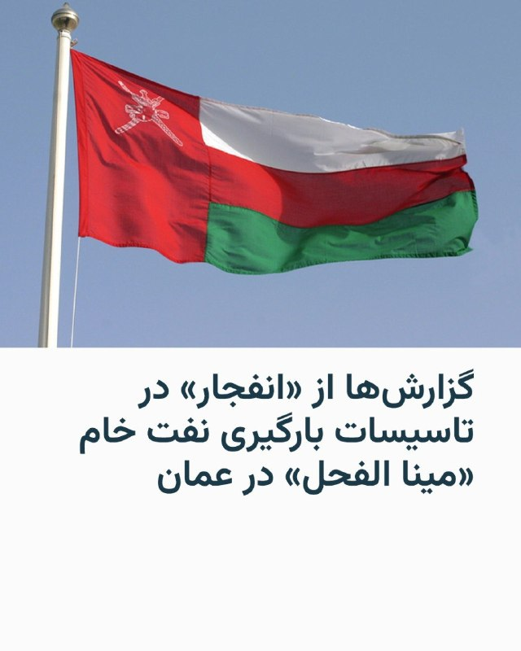

🔸خبرگزاری رویترز صبح جمعه ۱۵ خرداد به نقل از دو منبع گزارش داد که پایانه نفتی «مینا الفحل» در عمان پس از وقوع یک «انفجار» در نزدیکی اسکله‌ها، عملیات بارگیری نفت را متوقف کرده است.

🔸به گفته این منابع، انفجار ظاهراً در پی یک حمله «پهپادی» رخ داده است.

🔸از زمان وقوع حمله گزارشی منتشر نشده است.

@RadioFarda

## alonews — post 125197

  <a href="telegram/content/alonews_125197_1780636371.webm" target="_blank">🎬 Download video</a>

👈خبرگزاری دولتی چین: شی جین پینگ، رئیس جمهور چین بین 8 تا 9 ژوئن به کره شمالی سفر خواهد کرد. این اولین سفر او به این کشور در 7 سال اخیر است

✅ @AloNews خبر جنگ

## alonews — post 125196

  <a href="telegram/content/alonews_125196_1780636371.webm" target="_blank">🎬 Download video</a>

👈در تازه‌ترین نشانه از عمق تأثیر جنگ بر اقتصاد منطقه، شرکت هواپیمایی امارات مجبور شده نزدیک به نیم‌میلیون صندلی را از برنامۀ پروازی این ماه خود را حذف کند؛ رقمی که معادل ۱۶ درصد ظرفیت پروازی این شرکت است.

✅ @AloNews خبر جنگ

## alonews — post 125195

  <a href="telegram/content/alonews_125195_1780636371.webm" target="_blank">🎬 Download video</a>

👈 رویترز: بارگیری نفت خام در بندر مینا الفحل در عمان پس از انفجاری که گمان می‌رود ناشی از حمله پهپادی باشد، متوقف شد

✅ @AloNews خبر جناب

---
📅 بروزرسانی: 1405/03/15 08:33
---

هیچ پیام جدیدی در این بروزرسانی ارسال نشد.

---
📅 بروزرسانی: 1405/03/15 08:23
---

## FarsiVOA — post 219639

Farsi VOA pinned an audio file

## FarsiVOA — post 219638

  <a href="https://t.me/farsivoa/219638" target="_blank">📎 Download file</a>

🔴📢‌ پادکست خبری پنجشنبه ۱۴خرداد ۱۴۰۵

🛜در صورتی که با مشکل اینترنت مواجه هستید میتوانید اخبار صدای آمریکا را از نسخه‌های پادکست خبری ما روزانه دنبال کنید و یا اخبار را از نسخه سبک وب‌سایت ما پیگیر باشید:
https://ir.voanews.com/lite

📡بروزترین فرکانسهای ماهواره‌ای را نیز میتوانید از صفحه زیر پیگیری کنید:
https://ir.voanews.com/satellite

🔔دیگر شبکه‌های اجتماعی ما را هم دنبال کنید:
https://linktr.ee/voafarsi

ما را به اشتراک بگذارید
@farsivoa

---
📅 بروزرسانی: 1405/03/15 08:12
---

## VahidOOnLine — post 243756

  

حمید رسایی، نماینده مجلس، در سخنرانی در تجمع حامیان حکومت گفت: «این جنگ حتما با پیروزی ایران تمام خواهد شد اما مشکل بعد از جنگ است. ممکن است لیبرال‌ها، غربزده‌ها، پشیمان‌ها و مسئولینی که سیستم محاسباتی آنها تغییر کرده، روی کار بیایند و وضع همین خواهد شد.»
‌🏁 🇬🇧 IranintlTV

🤖 @VahidOOnLine

## IranIntlTV — post 340601

  

حمید رسایی، نماینده مجلس، در سخنرانی در تجمع حامیان حکومت گفت: «این جنگ حتما با پیروزی ایران تمام خواهد شد اما مشکل بعد از جنگ است. ممکن است لیبرال‌ها، غربزده‌ها، پشیمان‌ها و مسئولینی که سیستم محاسباتی آنها تغییر کرده، روی کار بیایند و وضع همین خواهد شد.»
https://iranintl.com/202606054095

## IranianMinds — post 21402

  

🔴 ایشون سردار غلامرضا جلالی رئیس سازمان پدافند غیرعامل جمهوری اسلامی هستن

فقط سردارو‌ با جرثقیل جا به جا میکنن؟

@IranianMinds

---
📅 بروزرسانی: 1405/03/15 08:03
---

## Persian_Trend_Official — post 15720

  <a href="telegram/content/Persian_Trend_Official_15720_1780633985.mp4" target="_blank">🎬 Download video</a>

صبحتون بخیر 🌄
J-35 Blue Shark

📝 Amir

📌 @persian_trend_official
پرشین ترند | متفاوت‌ترین کانال نظامی

## RadioFarda — post 157908

  

🔸رئیس‌جمهور ایالات متحده بار دیگر تأکید کرد که ایران نمی‌تواند سلاح هسته‌ای داشته باشد.

🔸دونالد ترامپ که در کاخ سفید با خبرنگاران صحبت می‌کرد، گفت برای گرفتن اورانیوم غنی‌شدۀ ایران، دستیابی به توافق الزامی نیست.
اگر بخواهیم می‌توانیم همین الان این ذخیره را از ایران خارج کنیم. ولی دلیلی برای این‌کار وجود ندارد. آنها مدفون شده‌اند.

🔸او در عین حال، در پاسخ به سوالی دربارۀ احتمال دیدار رو در رو با رهبر جمهوری اسلامی گفت: «من نمی‌خواهم ملاقات کنیم، اما اگر دو کشور به توافق برسند، امکانش خواهد بود». رئیس‌جمهور آمریکا ادامه داد «اگر این اتفاق بی‌افتد، برخورد من محترمانه خواهد بود».

🔸دونالد ترامپ با اشاره به افزایش نسبی تنش در منطقه خلیج فارس طی روزهای اخیر گفت: «اگر سربازان آمریکایی را کشته بودند، دلیل خوبی برای آغاز مجدد درگیری داشتیم».

🔸رئیس‌جمهور آمریکا تأکید کرد که چه از راه نظامی باشد و چه روی کاغذ [از راه توافق]، «ما پیروز خواهیم شد».

🔸دونالد ترامپ بازگشایی فوری تنگۀ هرمز را یکی از ارکان اصلی توافق احتمالی توصیف کرد.

@RadioFarda

---
📅 بروزرسانی: 1405/03/15 07:53
---

هیچ پیام جدیدی در این بروزرسانی ارسال نشد.

---
📅 بروزرسانی: 1405/03/15 07:42
---

## VahidOOnLine — post 243755

  <a href="telegram/content/VahidOOnLine_243755_1780632759.mp4" target="_blank">🎬 Download video</a>

♦️مقامات ایالات متحده ویدئویی را منتشر کردند که نشان می‌دهد یک قایق چوبی حامل ۲۴۰ مهاجر هائیتی در دریا رهگیری و متوقف شده است.
به گزارش رویترز و به گفته مقامات، این قایق که بیش از حد ظرفیت خود مسافر حمل می‌کرد، یکی از موتورهایش را از دست داده بود و آب به آرامی در حال نفوذ به داخل آن بود.
‌🇸🇦 Indypersian

🤖 @VahidOOnLine

## RadioFarda — post 157907

  <a href="https://t.me/radiofarda/157907" target="_blank">📎 Download file</a>

📻بشنوید: سرخط خبرها با رادیوفردا، ۱۵ خرداد ۱۴۰۵‌

@RadioFarda

---
📅 بروزرسانی: 1405/03/15 07:32
---

## alonews — post 125193

  <a href="telegram/content/alonews_125193_1780632159.webm" target="_blank">🎬 Download video</a>

👈تصاویر جدید و اختصاصی CNN خسارت وارده به ناو هواپیمابر USS Gerald R. Ford (CVN-78) پس از یک «آتش‌سوزی در بخش لباسشویی» روی این کشتی را نشان می‌دهد.

✅ @AloNews خبر جنگ

---
📅 بروزرسانی: 1405/03/15 07:22
---

## VahidOOnLine — post 243754

  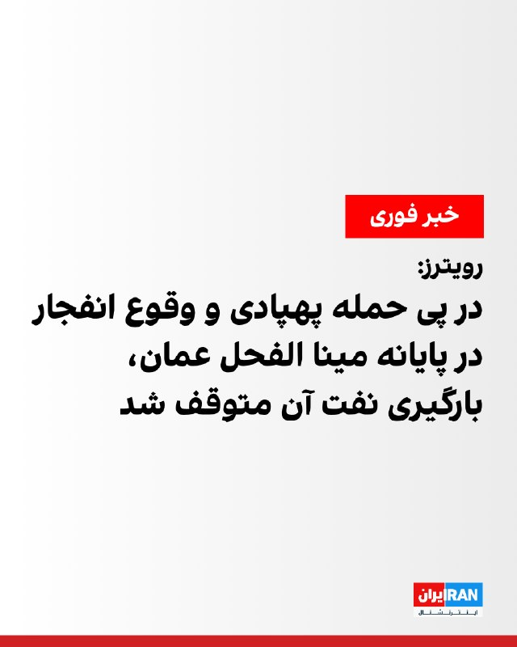

رویترز به نقل از دو منبع آگاه گزارش داد در پی یک حمله پهپادی و وقوع انفجار در نزدیکی اسکله‌های پهلوگیری پایانه مینا الفحل عمان، بارگیری نفت در این پایانه متوقف شده است. هنوز مشخص نیست این حمله دقیقا چه زمانی روی داده است.
بر اساس داده‌های کشتیرانی ال‌اس‌ای‌جی، روز جمعه چند نفتکش بسیار بزرگ در نزدیکی این بندر لنگر انداخته بودند.
رسانه‌های دولتی ایران روز چهارشنبه گزارش دادند جمهوری اسلامی یک کشتی نظامی آمریکا را که «مرکز کنترل و فرماندهی» توصیف شده بود، هنگام نزدیک شدن به آب‌های سرزمینی ایران در دریای عمان هدف قرار داده است، اما ستاد فرماندهی مرکزی آمریکا، سنتکام، این گزارش‌ها را رد کرد.

‌🏁 🇬🇧 IranintlTV

🤖 @VahidOOnLine

---
📅 بروزرسانی: 1405/03/15 07:12
---

## VahidOOnLine — post 243753

  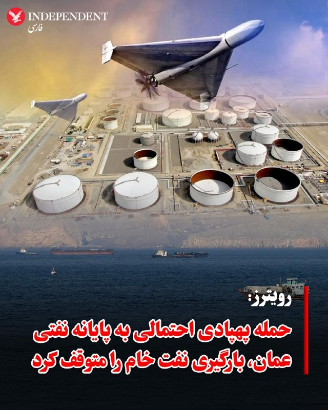

♦️به گزارش رویترز، بارگیری نفت خام در پایانه مینا الفحل عمان پس از وقوع انفجار در نزدیکی محل بارگیری نفت متوقف شد.
منابع آگاه به رویترز گفته‌اند انفجار میان دو محل پهلوگیری نفتکش‌ها رخ داده و احتمال می‌رود حمله پهپادی عامل این حادثه بوده باشد.
بر اساس این گزارش، مقام‌های عمانی هنوز به‌صورت رسمی درباره علت انفجار اظهار نظر نکرده‌اند، اما عملیات بارگیری نفت خام در این پایانه متوقف شده است.
پایانه مینا الفحل یکی از مراکز اصلی صادرات نفت عمان به شمار می‌رود و توقف فعالیت آن می‌تواند بر روند صادرات نفت این کشور تاثیر بگذارد.
‌🇸🇦 Indypersian

🤖 @VahidOOnLine

## IranIntlTV — post 340600

  

رویترز به نقل از دو منبع آگاه گزارش داد در پی یک حمله پهپادی و وقوع انفجار در نزدیکی اسکله‌های پهلوگیری پایانه مینا الفحل عمان، بارگیری نفت در این پایانه متوقف شده است. هنوز مشخص نیست این حمله دقیقا چه زمانی روی داده است.
بر اساس داده‌های کشتیرانی ال‌اس‌ای‌جی، روز جمعه چند نفتکش بسیار بزرگ در نزدیکی این بندر لنگر انداخته بودند.
رسانه‌های دولتی ایران روز چهارشنبه گزارش دادند جمهوری اسلامی یک کشتی نظامی آمریکا را که «مرکز کنترل و فرماندهی» توصیف شده بود، هنگام نزدیک شدن به آب‌های سرزمینی ایران در دریای عمان هدف قرار داده است، اما ستاد فرماندهی مرکزی آمریکا، سنتکام، این گزارش‌ها را رد کرد.

https://iranintl.com/202606059835

---
📅 بروزرسانی: 1405/03/15 07:03
---

## alonews — post 125192

  <a href="telegram/content/alonews_125192_1780630380.webm" target="_blank">🎬 Download video</a>

👈نورالدین الدغیر خبرنگار الجزیره در تهران:
«یادداشت تفاهم در مرحله نهایی خود قرار دارد و در انتظار موضع نهایی، چه مثبت و چه منفی، است.

🔴تا این لحظه هنوز در تهران تصمیم نهایی اتخاذ نشده و واشنگتن در حال انتظار است.»

✅ @AloNews خبر جنگ

---
📅 بروزرسانی: 1405/03/15 06:52
---

## VahidOnline — post 75944

  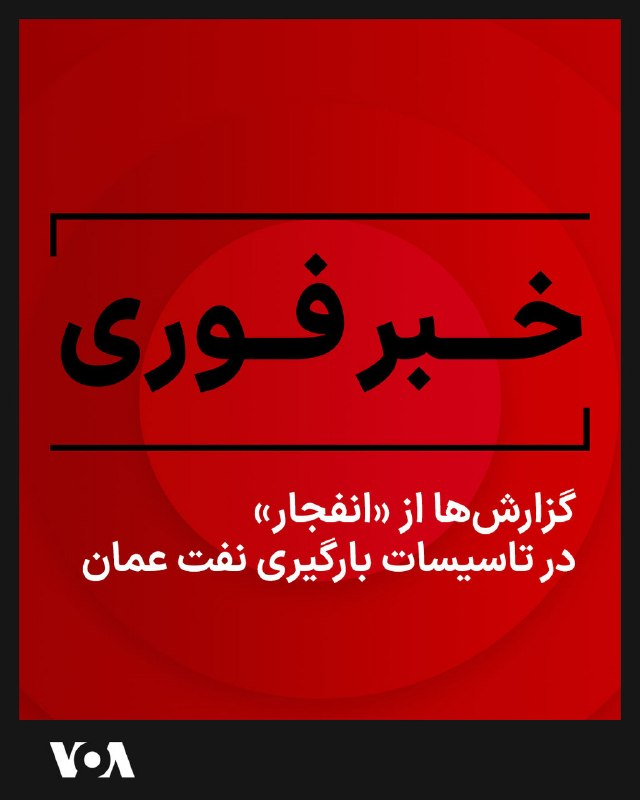

خبرگزاری رویترز به نقل از دو منبع در روز جمعه گزارش داد که پایانه نفتی مینا الفحل در عمان پس از وقوع یک انفجار در نزدیکی اسکله‌ها، عملیات بارگیری نفت را متوقف کرده است. به گفته این منابع، انفجار ظاهراً در پی یک حمله پهپادی رخ داده است.
@VahidHeadline
AJENews

📡 @VahidOnline

---
📅 بروزرسانی: 1405/03/15 06:42
---

## FarsiVOA — post 219637

  

⚡️خبرگزاری رویترز به نقل از دو منبع در روز جمعه گزارش داد که پایانه نفتی مینا الفحل در عمان پس از وقوع یک انفجار در نزدیکی اسکله‌ها، عملیات بارگیری نفت را متوقف کرده است. به گفته این منابع، انفجار ظاهراً در پی یک حمله پهپادی رخ داده است.
@FarsiVOA

---
📅 بروزرسانی: 1405/03/15 06:32
---

## VahidOOnLine — post 243752

  

بهنام بن‌طالب‌لو، مدیر ارشد برنامه ایران در بنیاد دفاع از دموکراسی‌ها، در گفت‌وگو با ای‌بی‌سی نیوز با اشاره به حمله‌های اخیر جمهوری اسلامی به اهداف غیرنظامی در کویت گفت: «جمهوری اسلامی از حمله به همسایه‌ها استفاده تبلیغاتی می‌کند تا بگوید شکست نخورده است.»
او افزود: با وجود اصطلاح آتش‌بس، جمهوری اسلامی و حتی تا حدی آمریکا، با شلیک به یکدیگر یا به منافع یکدیگر مشکلی ندارند.
بن‌طالب‌لو گفت: «ساختار حکومت ایران تا حدی دچار شکاف و ضعف شده، اما آنچه باقی مانده نوعی ساختار عمیق حکومتی است که همچنان منسجم است و به نظر می‌رسد بیش از گفت‌وگو، به تقابل تمایل دارد یا دست‌کم به همزمانی تقابل و گفت‌وگو رضایت داده است.»

‌🏁 🇬🇧 IranintlTV

🤖 @VahidOOnLine

## IranIntlTV — post 340599

  

بهنام بن‌طالب‌لو، مدیر ارشد برنامه ایران در بنیاد دفاع از دموکراسی‌ها، در گفت‌وگو با ای‌بی‌سی نیوز با اشاره به حمله‌های اخیر جمهوری اسلامی به اهداف غیرنظامی در کویت گفت: «جمهوری اسلامی از حمله به همسایه‌ها استفاده تبلیغاتی می‌کند تا بگوید شکست نخورده است.»
او افزود: با وجود اصطلاح آتش‌بس، جمهوری اسلامی و حتی تا حدی آمریکا، با شلیک به یکدیگر یا به منافع یکدیگر مشکلی ندارند.
بن‌طالب‌لو گفت: «ساختار حکومت ایران تا حدی دچار شکاف و ضعف شده، اما آنچه باقی مانده نوعی ساختار عمیق حکومتی است که همچنان منسجم است و به نظر می‌رسد بیش از گفت‌وگو، به تقابل تمایل دارد یا دست‌کم به همزمانی تقابل و گفت‌وگو رضایت داده است.»

https://iranintl.com/202606059804

---
📅 بروزرسانی: 1405/03/15 06:22
---

هیچ پیام جدیدی در این بروزرسانی ارسال نشد.

---
📅 بروزرسانی: 1405/03/15 06:12
---

## VahidOOnLine — post 243751

  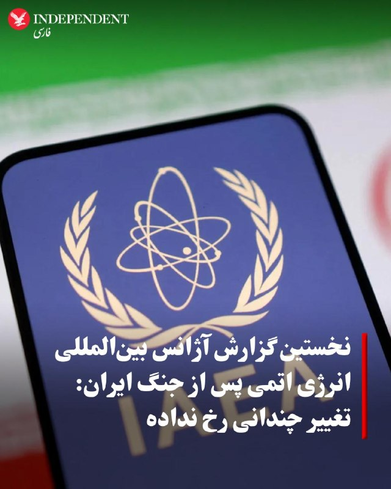

♦️آژانس بین المللی انرژی اتمی روز پنج‌شنبه گزارشی برای کشورهای عضو ارسال کرد که در آن با وجود سه ماه جنگ آمریکا و اسرائیل با هدف اعلام‌شده جلوگیری از ساخت بمب اتمی توسط ایران، هیچ تغییر عمده‌ای در ارزیابی این نهاد از برنامه هسته‌ای ایران دیده نمی‌شود.
به گزارش رویترز، آژانس بین المللی انرژی اتمی در نخستین گزارش درباره برنامه هسته‌ای ایران از روز قبل از آغاز حملات هوایی آمریکا و اسرائیل به ایران در اواخر فوریه، بار دیگر از تهران خواست توضیح دهد ذخایر اورانیوم غنی‌شده چه سرنوشتی پیدا کرده‌اند.
این گزارش محرمانه درباره ایران یکی از دو گزارشی بود که روز پنج‌شنبه منتشر شد و رویترز پیش از نشست فصلی هفته آینده شورای حکام ۳۵ عضوی آژانس بین‌المللی انرژی اتمی آن را مشاهده کرده است. این گزارش‌ها نشان می‌دهند که نسبت به گزارش‌های قبلی در اواخر فوریه، درست پیش از آغاز جنگ جدید، تغییر بسیار کمی وجود دارد.
در این گزارش آمده است: «مدیرکل آژانس تاکید کرده است که اجرای مؤثر توافق پادمان‌های معاهده منع گسترش سلاح‌های هسته‌ای (ان‌پی‌تی) برای ایران ضروری و فوری است و این اجرای تعهدات تحت هیچ شرایطی نمی‌تواند از سوی ایران تعلیق شود.»
آژانس بین‌المللی انرژی اتمی نتوانسته است به سایت‌های هسته‌ای که اسرائیل و آمریکا در ژوئن گذشته بمباران کردند بازگردد. ایران هنوز آژانس را از سرنوشت ذخایر اورانیوم کم‌غنی‌شده (LEU) و بسیار غنی‌شده (HEU) خود، از جمله اورانیوم غنی‌شده تا سطح ۶۰ درصد، که تنها یک گام تا حدود ۹۰ درصد مورد نیاز برای تسلیحات هسته‌ای فاصله دارد، مطلع نکرده است.
در گزارش آمده است: «عدم دسترسی آژانس برای راستی‌آزمایی HEU و LEU اعلام‌شده قبلی، برای نزدیک به یک سال - که بسیار فراتر از رویه‌های استاندارد پادمانی است - موضوعی نگران‌کننده از نظر اشاعه و همچنین پایبندی به توافق پادمان‌های مه اشاعه هسته‌ای است.»
‌🇸🇦 Indypersian

🤖 @VahidOOnLine

## FarsiVOA — post 219636

⚡️ترامپ: تولید انرژی اهمیت بسیاری دارد از جمله برای پیشرو بودن در عرصه «هوش مصنوعی»
@FarsiVOA

---
📅 بروزرسانی: 1405/03/15 06:03
---

## VahidOOnLine — post 243750

  <a href="telegram/content/VahidOOnLine_243750_1780626787.mp4" target="_blank">🎬 Download video</a>

♦️مدونا، خواننده و هنرمند مشهور آمریکایی، پنجشنبه ۱۴ خرداد با برگزاری یک کنسرت غافلگیرکننده در میدان تایمز نیویورک بار دیگر توجه هواداران را جلب کرد. این اجرای حدود ۱۵ دقیقه‌ای، چند هفته پیش از انتشار آلبوم جدید این خواننده برگزار شد.
مدونا در جریان این اجرا برای نخستین بار قطعه «احساس عشق» (Love Sensation) از آلبوم جدیدش را اجرا کرد و در بخشی از برنامه خطاب به جمعیت گفت: «آماده‌اید؟ مادر اینجاست.»
این خواننده ۶۷ ساله با پوشش و حرکات نمایشی روی صحنه، بار دیگر لقب «مادر پاپ» را یادآوری کرد و اجرای او با استقبال و تشویق گسترده هواداران همراه شد.
آلبوم جدید مدونا که دنباله‌ای بر آلبوم موفق سال ۲۰۰۵ است، قرار است ۱۲ تیر منتشر شود. مدونا پیش‌تر درباره این آلبوم گفته بود: «مردم فکر می‌کنند موسیقی رقص سطحی است، اما کاملا اشتباه می‌کنند؛ پیست رقص فقط یک مکان نیست، بلکه فضایی است که در آن حرکت جایگزین زبان می‌شود.»
‌🇸🇦 Indypersian

🤖 @VahidOOnLine

## FarsiVOA — post 219635

⚡️دونالد ترامپ در مراسم «زغال سنگ زیبا و تمیز»: جمهوری اسلامی بمب هسته‌ای نخواهد داشت
@FarsiVOA

## FarsiVOA — post 219634

⚡️دونالد ترامپ در مراسم «زغال سنگ زیبا و تمیز»: تولید نفت آمریکا از عربستان و روسیه بیشتر است
@FarsiVOA

---
📅 بروزرسانی: 1405/03/15 05:52
---

## VahidOOnLine — post 243749

  <a href="telegram/content/VahidOOnLine_243749_1780626157.mp4" target="_blank">🎬 Download video</a>

♦️شانگهای دیلی، روزنامه رسمی انگلیسی‌زبان شهر شانگهای در چین، چهارشنبه ویدیویی منتشر کرد که نشان می‌دهد یک ربات انسان‌نما در جریان نمایش کونگ‌فو در باغ گیاه‌شناسی ارومچی در منطقه سین‌کیانگ، هنگام اجرای حرکت «لگد پرشی» به شکم یک پسربچه تماشاگر لگد زد و او را نقش زمین کرد. گزارش‌ها حاکی است این کودک در این حادثه آسیب جدی ندید.
‌🇸🇦 Indypersian

🤖 @VahidOOnLine

---
📅 بروزرسانی: 1405/03/15 05:42
---

## FoxNewsTwitter — post 342639

  

Fox News (Twitter/X)

Donald Trump or Kamala Harris?

Waka Flocka Flame compared the choice to Kobe Bryant vs. LeBron James — and made it clear he'd pick Trump. But the rapper also revealed he's never actually voted.

"I never vote for nobody. Never in my life voted," Waka told Tomi Lahren, explaining that he grew up believing votes didn't matter for people from "the hood, the trenches, the ghetto."

Waka said his support for Trump isn't about agreeing with everything he says or does, adding: "The only thing I learned from Trump was how to delegate my capital and how to structure my business."

Waka also praised Nicki Minaj as "a huge influence on female rappers" and argued critics have targeted her politically, saying after she endorsed Trump, "they want her canceled."

## FarsiVOA — post 219633

⚡️پوشش ویژه | سخنان دونالد ترامپ در مراسم «زغال سنگ زیبا و تمیز» در کاخ سفید
@FarsiVOA

---
📅 بروزرسانی: 1405/03/15 05:32
---

هیچ پیام جدیدی در این بروزرسانی ارسال نشد.

---
📅 بروزرسانی: 1405/03/15 05:22
---

## FoxNewsTwitter — post 342638

  <a href="telegram/content/FoxNewsTwitter_342638_1780624369.mp4" target="_blank">🎬 Download video</a>

Fox News (Twitter/X)

Rep. Alexandria Ocasio-Cortez declined to weigh in when asked about the growing controversy surrounding Democratic Senate candidate Graham Platner.

The questions came after multiple women accused Platner of abusive behavior and raised concerns about a Totenkopf tattoo — an emblem historically associated with Nazi death camp guards.

One former girlfriend alleged Platner fantasized about rape and violence, while another described what she said were troubling encounters during their relationship. Platner has denied wrongdoing and pushed back on the allegations.

As scrutiny surrounding the candidate intensifies, Ocasio-Cortez repeatedly avoided directly addressing the claims when pressed by reporters.

---
📅 بروزرسانی: 1405/03/15 05:12
---

## VahidOOnLine — post 243748

♦️محسن رضایی، مشاور مجتبی خامنه‌ای، رهبر جدید جمهوری اسلامی، روز پنجشنبه ۱۴ خرداد در گفتگو با صداوسیما با انتقاد شدید از توافق و هم‌پیمانی برخی کشورهای منطقه با اسرائیل گفت: «این‌ها نمی‌فهمند اصلا زیربنای کشور خودشان را دارند متزلزل می‌کنند؛ چون رفتند با رژیمی به نام اسرائیل هم‌پیمان شدند که می‌گوید من باید نقشه خاورمیانه را عوض کنم.»
رضایی با طرح ادعاهای مرزی در منطقه و هشدار به مقامات امارات متحده عربی و کویت افزود: «اگر تفکر نتانیاهو برای تغییر نقشه‌ها را قبول دارید، فردا باید ابوظبی را به عربستان و جزیره بوبیان را به عراق بدهید؟ حرکت در مسیر نقشه‌های خارجی، کل منطقه را دچار نوساناتی می‌کند که به ضرر خود این کشورهاست.»
‌🇸🇦 Indypersian

🤖 @VahidOOnLine

---
📅 بروزرسانی: 1405/03/15 05:02
---

## VahidOOnLine — post 243747

  

معمر الاریانی، وزیر اطلاع‌رسانی یمن، با اشاره به استقبال حوثی‌ها از حملات جمهوری اسلامی به کشورهای عربی خلیج فارس، گفت افزود حوثی‌ها صرفا متحد تهران نیستند، بلکه بخشی از ساختار نظامی، امنیتی و سیاسی فرامرزی حکومت ایران محسوب می‌شوند.
او گفت ستایش حوثی‌ها از حمله‌های جمهوری اسلامی به تاسیسات غیرنظامی منطقه، ادعاهای این گروه درباره تهدید نبودن برای همسایگان یمن و امنیت کشتیرانی منطقه‌ای را بی‌اعتبار می‌کند.
الاریانی تاکید کرد حوثی‌ها یمن را به عرصه‌ای برای خدمت به طرح جمهوری اسلامی تبدیل کرده‌اند و با طولانی کردن جنگ، این کشور را وارد درگیری‌هایی می‌کنند که با منافع مردم یمن و امنیت منطقه در تضاد است.

‌🏁 🇬🇧 IranintlTV

🤖 @VahidOOnLine

## IranIntlTV — post 340598

  

معمر الاریانی، وزیر اطلاع‌رسانی یمن، با اشاره به استقبال حوثی‌ها از حملات جمهوری اسلامی به کشورهای عربی خلیج فارس، گفت افزود حوثی‌ها صرفا متحد تهران نیستند، بلکه بخشی از ساختار نظامی، امنیتی و سیاسی فرامرزی حکومت ایران محسوب می‌شوند.
او گفت ستایش حوثی‌ها از حمله‌های جمهوری اسلامی به تاسیسات غیرنظامی منطقه، ادعاهای این گروه درباره تهدید نبودن برای همسایگان یمن و امنیت کشتیرانی منطقه‌ای را بی‌اعتبار می‌کند.
الاریانی تاکید کرد حوثی‌ها یمن را به عرصه‌ای برای خدمت به طرح جمهوری اسلامی تبدیل کرده‌اند و با طولانی کردن جنگ، این کشور را وارد درگیری‌هایی می‌کنند که با منافع مردم یمن و امنیت منطقه در تضاد است.

https://iranintl.com/202606043296

---
📅 بروزرسانی: 1405/03/15 04:52
---

## FoxNewsTwitter — post 342637

  

Fox News (Twitter/X)

"Three of his exes paint the same picture: volatile, reckless, demeaning to women."

Jesse Watters on the latest scandalous allegations against Maine Democratic Senate candidate Graham Platner. https://twitter.com/JesseBWatters/status/2062694583293632738#m

---
📅 بروزرسانی: 1405/03/15 04:42
---

## VahidOOnLine — post 243746

  

♦️عباس عراقچی، وزیر امور خارجه جمهوری اسلامی، در گفتگو با شبکه المیادین، وابسته به حزب‌الله لبنان، در واکنش به اظهارات اخیر دونالد ترامپ مبنی بر احتمال دیدار با مجتبی خامنه‌ای گفت: «فکر می‌کنم ما باید واقع‌بین باشیم و در دنیای واقعی فکر و زندگی کنیم.»
این اظهارات پس از آن مطرح شد که دونالد ترامپ پیش‌تر درباره احتمال دیدار با «آیت‌الله جدید» گفته بود اگر توافقی شکل بگیرد، احتمال چنین دیداری وجود دارد.
با این حال، ترامپ روز پنجشنبه ۱۴ خرداد در گفتگو با خبرنگاران در کاخ سفید گفت تمایلی به دیدار با مجتبی خامنه‌ای ندارد و افزود: «من شخص مورد علاقه او نیستم.»
‌🇸🇦 Indypersian

🤖 @VahidOOnLine

---
📅 بروزرسانی: 1405/03/15 04:32
---

## FoxNewsTwitter — post 342636

‌Fox News (Twitter/X)

https://www.foxnews.com/politics/hated-women-explosive-abuse-new-nazi-tattoo-allegations-exes-rock-platners-campaign

## FoxNewsTwitter — post 342635

  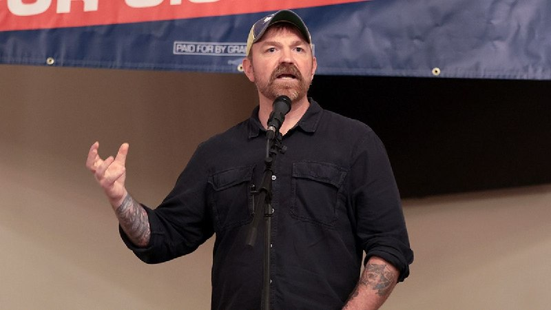

Fox News (Twitter/X)

A former girlfriend of Maine Democratic Senate candidate Graham Platner is making explosive new allegations, reportedly claiming Platner would sharpen an ax while watching television and ruminate about raping home invaders.

The ex-partner also alleged Platner once pulled her from a taxi by her wrist during an argument, pushed her into a bedroom and held the door shut, and regularly fantasized about killing people he viewed as threats.

She further claimed Platner joked about his Totenkopf tattoo — an emblem associated with Nazi death camp guards — and said members of his military unit chose the symbol because they viewed themselves as a "death unit" of "killers."

Platner has denied wrongdoing, but the allegations are now putting his campaign under intense scrutiny.

---
📅 بروزرسانی: 1405/03/15 04:22
---

## VahidOOnLine — post 243745

♦️دونالد ترامپ، رئیس جمهوری آمریکا روز پنجشنبه ۱۴ خرداد در مراسم سرمایه‌گذاری در حوزه انرژی و زغال‌سنگ در کاخ سفید در پاسخ به سوالی درباره احتمال دیدار با «رهبر جدید» جمهوری اسلامی گفت: «من تمایلی به دیدار ندارم، اما اگر دیداری داشته باشم، مایه افتخار خواهد بود که با او ملاقات کنم.»

ترامپ افزود: «دوست دارم ببینم آیا می‌توانیم به یک توافق برسیم یا خیر. اگر به توافقی برسیم، این احتمال وجود دارد که با او دیدار کنم و با این موضوع مشکلی ندارم.»

او همچنین در پاسخ به سوالی درباره اینکه آیا رهبر جدید جمهوری اسلامی ممکن است به دلیل کشته شدن اعضای خانواده‌اش در عملیات «خشم حماسی» تمایلی به دیدار با او نداشته باشد، گفت: «من محبوب‌ترین فرد نزد او نیستم.»

ترامپ در ادامه افزود: «او احتمالا فردی حرفه‌ای است. من او را نمی‌شناسم، اما در برخی محافل شهرت بسیار خوبی دارد.»
‌🇸🇦 Indypersian

🤖 @VahidOOnLine

## FarsiVOA — post 219632

🔺ترامپ می‌گوید پس از گفت‌وگوی او با اسرائیل و حزب‌الله، هر دو در مسیر پایان دادن به درگیری «پیشرفت» کرده‌اند

▪️رئیس‌جمهوری آمریکا، دونالد ترامپ اعلام کرد که معتقد است اسرائیل و گروه شبه‌نظامی حزب‌الله لبنان، پس از گفت‌وگوهایی که او در روزهای اخیر با هر دو طرف داشته است، در مسیر پایان دادن به درگیری طولانی‌مدت خود «پیشرفت» کرده‌اند.

⬇️ بیشتر بخوانید:
https://ir.voanews.com/a/8157631.html
@FarsiVOA

---
📅 بروزرسانی: 1405/03/15 04:12
---

## VahidOOnLine — post 243744

  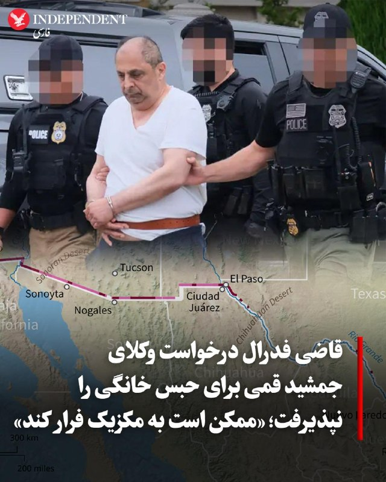

♦️جمشید قمی ۶۳ ساله که متهم است هزینه زندگی لوکس خود را از طریق انتقال داده‌ها و تجهیزات پیشرفته و حساس به برنامه هسته‌ای و نظامی ایران تامین کرده،به دستور داگلاس مک‌کورمیک، قاضی دادگاه فدرال آمریکا، بدون امکان آزادی موقت در بازداشت ماند.
به گزارش نیویورک‌پست، قمی که تابعیت دوگانه ایرانی آمریکایی دارد، روز پنجشنبه تحت اسکورت ماموران مارشال آمریکا، در حالی که دست و پایش در زنجیر بود، با لباس نارنجی زندان وارد دادگاه فدرال سانتا آنا شد.
 او بامداد چهارشنبه در جریان یورشی که پیش از طلوع آفتاب به عمارت ۳۵ میلیون دلاری‌اش در منطقه حفاظت‌شده نیوپورت کوست انجام شد، بازداشت شده بود.
دیوید لاخمن، دادستان فدرال، در دادگاه استدلال کرد که قومی هم خطر جدی فرار دارد و هم تهدیدی برای امنیت ملی محسوب می‌شود. او گفت دولت آمریکا حدود ۱۰۰ هزار سند و مدرک علیه او جمع‌آوری کرده است.
دادستان‌ها اعلام کردند که قومی تا ماه گذشته نیز با همدستان خود در ایران در ارتباط بوده و از اواخر سال ۲۰۲۳ تا زمان بازگشت به آمریکا در پنجم مه، در ایران زندگی می‌کرده است.
همچنین در دادگاه مطرح شد که همسر قومی نیز شهروند دوتابعیتی ایران و آمریکا است.
لاخمن با تاکید بر لزوم ادامه بازداشت متهم گفت: «خانواده و ثروت او در ایران است» و او «مقدار نامعلومی پول در ایران در اختیار دارد.»
او استدلال کرد که اگر قومی به حبس خانگی محکوم شود، می‌تواند پابند الکترونیکی خود را قطع کرده و «به مکزیک فرار کند.
با این حال، تیم حقوقی قومی خواستار آزادی او با قرار وثیقه و انتقال به حبس خانگی شد. گرگ برنستاین، وکیل او، گفت موکلش قصد ندارد «به منطقه جنگی (ایران) بازگردد.
دادستان‌ها می‌گویند قومی، مدیر یک شرکت فناوری مستقر در تهران، تجهیزات شبکه و رمزنگاری آمریکایی را در اختیار برنامه هسته‌ای و نهادهای نظامی ایران قرار داده و همزمان میلیون‌ها دلار پول‌شویی کرده و برای پنهان کردن این معاملات با حکومت ایران از روش‌های پیچیده استفاده کرده است.
بر اساس این ادعاها، او سپس درآمد حاصل از این معاملات غیرقانونی را صرف ساخت عمارت باشکوه خود به سبک توسکانی در منطقه‌ای ساحلی و مشرف به اقیانوس در یکی از گران‌ترین مناطق مسکونی آمریکا کرده است.
بر اساس اعلام وزارت دادگستری آمریکا، شرکت قومی با نام «فراز پرداز رایانه» بین سال‌های ۲۰۱۷ تا ۲۰۲۳ فناوری مورد نیاز سازمان انرژی اتمی ایران و بین سال‌های ۲۰۱۴ تا ۲۰۲۲ تجهیزات مورد نیاز وزارت دفاع و پشتیبانی نیروهای مسلح جمهوری اسلامی را تامین کرده است
‌🇸🇦 Indypersian

🤖 @VahidOOnLine

## FarsiVOA — post 219631

⚡️دلایل و پیامدهای بازماندن کودکان ایران از تحصیل؛ گفت‌وگو با رقیه رضایی
@FarsiVOA

---
📅 بروزرسانی: 1405/03/15 04:02
---

## FarsiVOA — post 219630

⚡️تغییرات اقلیمی و بحران جهانی محیط زیست
@FarsiVOA

## FarsiVOA — post 219629

⚡️ویژگی‌های شخصیتی مرجان ساتراپی؛ گفت‌وگو با هلن همتی از دوستان نزدیک مرجان ساتراپی
@FarsiVOA

---
📅 بروزرسانی: 1405/03/15 03:52
---

## VahidOOnLine — post 243743

♦️مدیرکل بهزیستی کردستان اعلام کرد دو دختر ۷ و ۱۵ ساله که در یکی از محله‌های سنندج در شرایط نامناسب نگهداری می‌شدند، پس از گزارش‌های مردمی و ورود اورژانس اجتماعی و نیروهای انتظامی نجات یافتند.

به گفته حسین رسولی، کارشناسان اورژانس اجتماعی ۱۲۳ پس از دریافت گزارش‌های مردمی و با حکم قضایی وارد یک خانه در حوالی میدان گاز سنندج شدند و دو دختر را در سرویس بهداشتی ساختمان پیدا کردند. او گفت این دو کودک پس از نجات، دارای آثار آشکار ضرب و جرح و آسیب‌های جسمی بودند و بررسی‌های اولیه از وجود شکستگی و جراحات در بخش‌هایی از بدن آنان، از جمله پا، سر و صورت حکایت داشت.

این دو کودک برای درمان به بیمارستان کوثر سنندج منتقل شدند. یکی از آنان همچنان تحت درمان است و دیگری پس از ترخیص، به یکی از مراکز نگهداری تحت پوشش بهزیستی منتقل شده است.

مدیرکل بهزیستی کردستان افزود پدر این کودکان بازداشت شده و نامادری آنان نیز به دلیل نگهداری از دو کودک خردسال دیگر، تحت نظارت قضایی قرار دارد. به گفته او، پرونده این افراد در دستگاه قضایی در دست بررسی است و گزارش‌های کارشناسی نیز به مراجع قضایی ارسال شده است.
‌🇸🇦 Indypersian

🤖 @VahidOOnLine

## VahidOOnLine — post 243742

  <a href="telegram/content/VahidOOnLine_243742_1780618953.mp4" target="_blank">🎬 Download video</a>

♦️ حمید رسایی، نماینده مجلس شورای اسلامی، در تجمع شبانه حامیان جمهوری اسلامی در کاشان اعلام کرد «انتقام خون امام شهید را رها نمی‌کنیم.»
او همچنین گفت: «آنقدر روی برد موشک‌های ایرانی کار می‌کنیم تا روزی کاخ سفید را روی سر رئیس‌جمهوری آمریکا خراب کنیم.»
‌🇸🇦 Indypersian

🤖 @VahidOOnLine

## FarsiVOA — post 219628

⚡️توافق اسرائیل و لبنان بر سر آتش‌بس و اصرار حزب‌الله بر جنگ افروزی
@FarsiVOA

---
📅 بروزرسانی: 1405/03/15 03:43
---

## VahidOOnLine — post 243733

هر کدامشان ۲۶ سال داشتند؛ سنی برای ساختن، عاشق شدن، کار کردن، ورزش کردن و دنبال کردن رویاهایشان.
اما خیابان‌های دی‌ماه برای آن‌ها به نقطه پایان تبدیل شد؛ با گلوله سرکوب، در بی‌خبری خانواده‌ها، با پیکرهایی که در گرو ماندند و روایت‌هایی که پایانی ندارند.<
محمد جباری دیزیچه، یاشار سلطانی‌راد، امید باقری، سعید توکلیان دشمن‌زیاری، امیرعباس باغستانی، مهدی (کیارش) صفری، بهنام برآبادی و صادق علیجانی علیجانوند
نامشان را می‌نویسیم، چون این روایت‌ها بخشی از حافظه جمعی ما ایرانیان است؛ حافظه‌ای که با سکوت کنار نمی‌آید.<
#جاویدنامان_انقلاب_ملی_ایرانیان
‌🏁 🇬🇧 IranintlTV

🤖 @VahidOOnLine

## IranIntlTV — post 340589

هر کدامشان ۲۶ سال داشتند؛ سنی برای ساختن، عاشق شدن، کار کردن، ورزش کردن و دنبال کردن رویاهایشان.
اما خیابان‌های دی‌ماه برای آن‌ها به نقطه پایان تبدیل شد؛ با گلوله سرکوب، در بی‌خبری خانواده‌ها، با پیکرهایی که در گرو ماندند و روایت‌هایی که پایانی ندارند.
محمد جباری دیزیچه، یاشار سلطانی‌راد، امید باقری، سعید توکلیان دشمن‌زیاری، امیرعباس باغستانی، مهدی (کیارش) صفری، بهنام برآبادی و صادق علیجانی علیجانوند
نامشان را می‌نویسیم، چون این روایت‌ها بخشی از حافظه جمعی ما ایرانیان است؛ حافظه‌ای که با سکوت کنار نمی‌آید.
#جاویدنامان_انقلاب_ملی_ایرانیان

## FarsiVOA — post 219627

⚡️فاجعه آموزشی در ایران؛ یک‌چهارم دبستانی‌های ایران پشت درهای مدرسه
@FarsiVOA

## FarsiVOA — post 219626

⚡️حضور پررنگ سپاه در فوتبال؛ گفت‌وگو با کوروش بازیار، مربی و کارشناس فوتبال
@FarsiVOA

---
📅 بروزرسانی: 1405/03/15 03:32
---

## FoxNewsTwitter — post 342634

  

Fox News (Twitter/X)

BREAKING: Four Senate Republicans just joined Democrats to block one of President Trump’s key legislative priorities.

In a setback for the White House, GOP Sens. Susan Collins, Lisa Murkowski, Thom Tillis and Mitch McConnell broke with their party to help stop the SAVE America Act from advancing in the Senate.

The vote exposed a familiar divide inside the Republican conference, with concerns over the bill’s provisions outweighing pressure from Trump and GOP leadership.

## FarsiVOA — post 219625

  <a href="telegram/content/FarsiVOA_219625_1780617771.mp4" target="_blank">🎬 Download video</a>

⚡️مرجان ساتراپی، خالق «پرسپولیس» و از شناخته‌شده‌ترین هنرمندان ایرانی در جهان، در ۵۶ سالگی درگذشت.
@FarsiVOA

---
📅 بروزرسانی: 1405/03/15 03:23
---

## FoxNewsTwitter — post 342633

  <a href="telegram/content/FoxNewsTwitter_342633_1780617180.mp4" target="_blank">🎬 Download video</a>

Fox News (Twitter/X)

FOX NEWS REPORT: President Trump is reportedly seeking changes to a proposed ceasefire extension with Iran after the House moved to limit his war powers. @BillMelugin_ has the latest.

---
📅 بروزرسانی: 1405/03/15 03:12
---

## VahidOOnLine — post 243732

  

به گزارش رسانه‌های حقوق بشری، حسن و حسین امیری، برادران دوقلوی ۲۰ ساله محبوس در زندان قزلحصار کرج، به اتهام «جاسوسی برای اسرائیل» با حکم شعبه ۲۶ دادگاه انقلاب تهران به ریاست قاضی ایمان افشاری به اعدام محکوم شده‌اند.
به گزارش سازمان حقوق بشر ایران، حسن امیری روز ۲۹ اسفند ۱۴۰۴ در یک ایست بازرسی به اتهام اینکه ماموران در تلفن همراه او تصویری از یک محل بمباران‌شده پیدا کرده بودند، بازداشت شد.
این سازمان به نقل از یک منبع آگاه نوشت حسن تحت شکنجه قرار گرفت تا اعترافات دروغین انجام دهد و بگوید که برادر دوقلویش حسین، تصاویر بیشتری را در لپ‌تاپ خود نگهداری می‌کند؛ این در‌حالی‌است که هیچ‌یک از این دو برادر لپ‌تاپ ندارند.
در نهایت، حسین امیری، مکانیک خودرو در کرج، روز ۳ فروردین ۱۴۰۵ بازداشت شد و شش روز بعد، هر دو برادر برای بازجویی به زندان قزل‌حصار منتقل شدند.
هرانا به نقل از یک منبع آگاه گزارش داد در کیفرخواست صادر شده علیه این دو برادر، مشاهده تصاویری از ساختمان‌های آسیب‌دیده، مبنای طرح اتهام «جاسوسی به نفع اسرائیل» در پرونده قرار گرفته بود.
‌🏁 🇬🇧 IranintlTV

🤖 @VahidOOnLine

## VahidOOnLine — post 243731

  

♦️مرجان ساتراپی، نویسنده، کارگردان و خالق کتاب مصور «پرسپولیس»، در ۵۶ سالگی درگذشت. نزدیکان او علت مرگ را اندوه ناشی از درگذشت همسرش، ماتیاس ریپا، توصیف کرده‌اند؛ فردی که ساتراپی بارها از او با عنوان «عشق زندگی‌ام» یاد کرده بود.
امانوئل و بریژیت مکرون با انتشار بیانیه‌ای به مرجان ساتراپی ادای احترام کردند و از او به عنوان «هنرمندی بزرگ که کودکی ایرانی را به افسانه‌ای جهانی تبدیل کرد» یاد کردند. در این بیانیه آمده است که مرگ ساتراپی، فقدان یکی از چهره‌های فرهنگی فرانسه و هنرمندی شیفته آزادی است؛ هنرمندی که آثارش پیام‌هایی جهان‌شمول داشت و برای او شهرتی بین‌المللی به همراه آورد.
مرجان ساتراپی متولد ۲ آذر ۱۳۴۸ در رشت بود و پس از مهاجرت به فرانسه، با مجموعه «پرسپولیس» به شهرت جهانی رسید؛ اثری که تجربه زندگی در تهران پس از انقلاب ۱۳۵۷، مهاجرت، تبعید و محدودیت‌های اجتماعی را روایت می‌کرد. به گزارش خبرگزاری فرانسه، اقتباس سینمایی این اثر در سال ۲۰۰۷ جایزه هیات داوران جشنواره کن را دریافت کرد و نامزد جایزه اسکار شد.
‌🇸🇦 Indypersian

🤖 @VahidOOnLine

## FoxNewsTwitter — post 342632

  <a href="telegram/content/FoxNewsTwitter_342632_1780616579.mp4" target="_blank">🎬 Download video</a>

Fox News (Twitter/X)

RT @EricShawnTV: He was at John Gotti’s side through all the battles. What he learned from the Mob Boss. Lewis Kasman opens up in “ Gotti’s Guy,” our new show now streaming on Fox Nation. @foxnation @FoxNews @foxnewsradio @foxnewspolitics

## IranIntlTV — post 340588

  

به گزارش رسانه‌های حقوق بشری، حسن و حسین امیری، برادران دوقلوی ۲۰ ساله محبوس در زندان قزلحصار کرج، به اتهام «جاسوسی برای اسرائیل» با حکم شعبه ۲۶ دادگاه انقلاب تهران به ریاست قاضی ایمان افشاری به اعدام محکوم شده‌اند.
به گزارش سازمان حقوق بشر ایران، حسن امیری روز ۲۹ اسفند ۱۴۰۴ در یک ایست بازرسی به اتهام اینکه ماموران در تلفن همراه او تصویری از یک محل بمباران‌شده پیدا کرده بودند، بازداشت شد.
این سازمان به نقل از یک منبع آگاه نوشت حسن تحت شکنجه قرار گرفت تا اعترافات دروغین انجام دهد و بگوید که برادر دوقلویش حسین، تصاویر بیشتری را در لپ‌تاپ خود نگهداری می‌کند؛ این در‌حالی‌است که هیچ‌یک از این دو برادر لپ‌تاپ ندارند.
در نهایت، حسین امیری، مکانیک خودرو در کرج، روز ۳ فروردین ۱۴۰۵ بازداشت شد و شش روز بعد، هر دو برادر برای بازجویی به زندان قزل‌حصار منتقل شدند.
هرانا به نقل از یک منبع آگاه گزارش داد در کیفرخواست صادر شده علیه این دو برادر، مشاهده تصاویری از ساختمان‌های آسیب‌دیده، مبنای طرح اتهام «جاسوسی به نفع اسرائیل» در پرونده قرار گرفته بود.
https://iranintl.com/202606047251

## IranIntlTV — post 340587

  <a href="telegram/content/IranIntlTV_340587_1780616582.mp4" target="_blank">🎬 Download video</a>

مانا نیستانی و امید کشتکار در «برنامه با کامبیز حسینی» از مرجان ساتراپی می‌گویند

«یک ایران صدای شما را می‌شنود»
دوشنبه تا پنجشنبه ۱۱ شب تهران
از تلویزیون ایران اینترنشنال

تماشای نسخه کامل این قسمت از «برنامه» در یوتیوب:
https://youtu.be/9L7sKS5oEaE
@iranintltv

## BBCPersian — post 282898

  

🔻ولوديمير زلنسکی، رئيس‌جمهور اوکراين، در تلاشی تازه برای پايان دادن به جنگ، خواستار برگزاری ديداری رو در رو با ولاديمير پوتين، رئيس‌جمهور روسيه، شد.

آقای زلنسکی روز پنجشنبه در نامه‌ای سرگشاده خطاب به پوتين نوشت که «صرفا منتظر ماندن» تا زمانی که جنگ در اروپا دوباره به اولويت اصلی ايالات متحده تبديل شود، اقدامی نادرست خواهد بود.

او افزود صلح تنها از طريق «گفت وگوی مستقيم ميان» اوکراين و روسيه امکان‌پذير است.

رئيس‌جمهور اوکراين همچنين خواستار برقراری آتش‌بس کامل در طول مذاکرات پيشنهادی شد؛ درخواستی که پوتين پيش‌تر در روز پنجشنبه آن را رد کرده بود.

دونالد ترامپ، رئيس‌جمهور آمريکا، هم روز پنجشنبه - چهارم ژوئن / ۱۴ خرداد گفت: «اگر اين دو رهبر با يکديگر ديدار کنند، اتفاق بسيار خوبی خواهد بود.»

بیشتر بخوانید:

https://bbc.in/4udkvKD
📸Getty Images
@BBCPersian

---
📅 بروزرسانی: 1405/03/15 03:02
---

## VahidOOnLine — post 243730

  

♦️عباس عراقچی، وزیر خارجه جمهوری اسلامی در پاسخ به پرسشی درباره غیبت سه ماهه مجتبی خامنه‌ای گفت: «با توجه به ملاحظات امنیتی، نهادهای امنیتی توصیه نمی‌کنند که حضور علنی او بیش از این افزایش یابد.» این اظهارات در حالی مطرح می‌شود که در سه ماه اخیر مجتبی خامنه‌ای که به عنوان سومین رهبر نظام معرفی شده، نه تنها دیده نشده، بلکه پیامی صوتی یا تصویری جدید نیز از او منتشر نشده و صدا و سیما در چند مورد بیانیه‌های کتبی منتسب به او را قرائت کرده است. با این حال عراقچی مدعی شد که مجتبی خامنه‌ای «کاملا زمان امور را در دست دارد.» وزیر خارجه جمهوری اسلامی درحالی که نرخ تورم به ۸۳ درصد رسیده، کشور در شرایط جنگی و تحت محاصره دریایی است و ده‌ها هزار خانواده داغدار جوانان کشته شده خود در سرکوب خونین خیزش ملی در دی‌ماه هستند، گفت: «خوشبختانه همه امور در مسیر بسیار خوبی پیش می‌رود.»
‌🇸🇦 Indypersian

🤖 @VahidOOnLine

## VahidOOnLine — post 243729

  

♦️مهدی تاج، رئیس فدراسیون فوتبال گفت، مکزیک برای دو «همراه» تیم فوتبال ایران ویزا صادر نکرد. او درباره ویزای آمریکا نیز گفت: «من امروز دو بار با فیفا به صحبت پرداختم و این موضوع مسیر خود را طی می‌کند. اگر از من بپرسند می‌گویم نمی‌دانم در چه مرحله‌ای است؟ به ما اعلام کردند منتظر باشید و پیگیر این موضوع هستیم.» تاج همچنین بدون رد خبر پیشین ایندیپندنت فارسی درباره صدور ویزای ۴۸ ساعته آمریکا برای بازیکنان تیم ایران در پاسخ به این پرسش که آیا درست است که آمریکا اعلام کرده کاروان فقط می‌تواند هر بار ۴۸ ساعت در خاک آمریکا بماند، گفت: «آمریکا نمی‌تواند برای ما تعیین تکلیف کند، با فیفا صحبت می‌کنیم.» به گزارش فرارو، تاج افزود: «مهم‌ترین مسئله برای ما ویزای آمریکا است. موضوع مکزیک واقعا حل شده شده و فیفا به ما امیدواری داده است.»
‌🇸🇦 Indypersian

🤖 @VahidOOnLine

## IranIntlTV — post 340586

  <a href="telegram/content/IranIntlTV_340586_1780615972.mp4" target="_blank">🎬 Download video</a>

نگین از اصفهان: شهرها پر از پرچم‌های حزب‌الله و لبنان شده‌اند؛ دست از سر کشور ما بردارید

«یک ایران صدای شما را می‌شنود»
دوشنبه تا پنجشنبه ۱۱ شب تهران
از تلویزیون ایران اینترنشنال

تماشای نسخه کامل این قسمت از «برنامه» در یوتیوب:
https://youtu.be/9L7sKS5oEaE
@iranintltv

## IranIntlTV — post 340585

  <a href="telegram/content/IranIntlTV_340585_1780615974.mp4" target="_blank">🎬 Download video</a>

سورنا از تهران: نگذاریم سیم‌کارت‌سفیدها روایت را به دست بگیرند؛ جنایت‌ها را روایت کنیم

«یک ایران صدای شما را می‌شنود»
دوشنبه تا پنجشنبه ۱۱ شب تهران
از تلویزیون ایران اینترنشنال

تماشای نسخه کامل این قسمت از «برنامه» در یوتیوب:
https://youtu.be/9L7sKS5oEaE
@iranintltv

## FarsiVOA — post 219624

⚡️روبیو: آمریکا قصد ندارد افغان‌های باقی‌مانده در قطر را به اجبار به افغانستان باز گرداند
@FarsiVOA

## FarsiVOA — post 219623

⚡️دیدار وزیران امورخارجه آمریکا و کویت پس از حملات موشکی و پهپادی جمهوری اسلامی
@FarsiVOA

---
📅 بروزرسانی: 1405/03/15 02:52
---

## IranIntlTV — post 340584

  <a href="telegram/content/IranIntlTV_340584_1780615366.mp4" target="_blank">🎬 Download video</a>

مرجان ساتراپی چگونه تصویر ایران را در جهان تغییر داد؟

مرجان ساتراپی، نویسنده، تصویرگر، فیلمساز و خالق کتاب مصور «پرسپولیس»، در ۵۶ سالگی درگذشت. ساتراپی سال گذشته نشان لژیون دونور دولت فرانسه را در اعتراض به ریاکاری دولت فرانسه در قبال مردم ایران و جمهوری اسلامی رد کرد.

مرجان ساتراپی با انتشار «پرسپولیس»، کتابی مصور درباره زندگی خود در ایران و مهاجرت، به شهرت جهانی رسید

کامبیز حسینی در «برنامه» به این موضوع می پردازد.

«یک ایران صدای شما را می‌شنود»
دوشنبه تا پنجشنبه ۱۱ شب تهران
از تلویزیون ایران اینترنشنال

تماشای نسخه کامل این قسمت از «برنامه» در یوتیوب:
https://youtu.be/9L7sKS5oEaE
@iranintltv

## IranIntlTV — post 340583

  <a href="telegram/content/IranIntlTV_340583_1780615368.mp4" target="_blank">🎬 Download video</a>

مانا نیستانی: اهمیت «پرسپولیس» مرجان ساتراپی، در ثبت هنرمندانه و انسانی روایت‌های جمعی ماست

«یک ایران صدای شما را می‌شنود»
دوشنبه تا پنجشنبه ۱۱ شب تهران
از تلویزیون ایران اینترنشنال

تماشای نسخه کامل این قسمت از «برنامه» در یوتیوب:
https://youtu.be/9L7sKS5oEaE
@iranintltv

## IranIntlTV — post 340582

  <a href="telegram/content/IranIntlTV_340582_1780615370.mp4" target="_blank">🎬 Download video</a>

بیتا ملکوتی: «پرسپولیس» مرجان ساتراپی یکی از نمونه‌های شاخص ادبیات مهاجرت و تبعید است

«یک ایران صدای شما را می‌شنود»
دوشنبه تا پنجشنبه ۱۱ شب تهران
از تلویزیون ایران اینترنشنال

تماشای نسخه کامل این قسمت از «برنامه» در یوتیوب:
https://youtu.be/9L7sKS5oEaE
@iranintltv

## IranIntlTV — post 340581

  <a href="telegram/content/IranIntlTV_340581_1780615372.mp4" target="_blank">🎬 Download video</a>

امید کشتکار: تأثیر ساتراپی به ایران محدود نمی‌شود؛ او بر رمان گرافیکی در جهان تأثیر گذاشت

«یک ایران صدای شما را می‌شنود»
دوشنبه تا پنجشنبه ۱۱ شب تهران
از تلویزیون ایران اینترنشنال

تماشای نسخه کامل این قسمت از «برنامه» در یوتیوب:
https://youtu.be/9L7sKS5oEaE
@iranintltv

---
📅 بروزرسانی: 1405/03/15 02:42
---

## VahidOOnLine — post 243728

  <a href="telegram/content/VahidOOnLine_243728_1780614749.mp4" target="_blank">🎬 Download video</a>

♦️مدیرکل بهزیستی کردستان اعلام کرد دو دختر ۷ و ۱۵ ساله که در یکی از محله‌های سنندج در شرایط نامناسب نگهداری می‌شدند، پس از گزارش‌های مردمی و ورود اورژانس اجتماعی و نیروهای انتظامی نجات یافتند.

به گفته حسین رسولی، کارشناسان اورژانس اجتماعی ۱۲۳ پس از دریافت گزارش‌های مردمی و با حکم قضایی وارد یک خانه در حوالی میدان گاز سنندج شدند و دو دختر را در سرویس بهداشتی ساختمان پیدا کردند. او گفت این دو کودک پس از نجات، دارای آثار آشکار ضرب و جرح و آسیب‌های جسمی بودند و بررسی‌های اولیه از وجود شکستگی و جراحات در بخش‌هایی از بدن آنان، از جمله پا، سر و صورت حکایت داشت.

این دو کودک برای درمان به بیمارستان کوثر سنندج منتقل شدند. یکی از آنان همچنان تحت درمان است و دیگری پس از ترخیص، به یکی از مراکز نگهداری تحت پوشش بهزیستی منتقل شده است.

مدیرکل بهزیستی کردستان افزود پدر این کودکان بازداشت شده و نامادری آنان نیز به دلیل نگهداری از دو کودک خردسال دیگر، تحت نظارت قضایی قرار دارد. به گفته او، پرونده این افراد در دستگاه قضایی در دست بررسی است و گزارش‌های کارشناسی نیز به مراجع قضایی ارسال شده است.

غریب سجادی، فرماندار سنندج، نیز با حضور در بیمارستان از این دو کودک عیادت کرد و بر حمایت درمانی، روان‌شناختی و اجتماعی از آنان و برخورد قانونی با عاملان این پرونده تاکید کرد.
‌🇸🇦 Indypersian

🤖 @VahidOOnLine

## FoxNewsTwitter — post 342631

  

Fox News (Twitter/X)

President Trump is teasing a massive rally in Washington, D.C. — and he's setting expectations sky-high.

Calling the nation's capital "totally beautified," Trump announced plans for what he described as "the Greatest Rally EVER" in celebration of America's 250 years of history.

The event is expected to feature patriotic music, military bands, special guests, and a live appearance from the president.

"It will be special at every level."

## Dirty_Kids — post 391025

بچه ها اسم این بازی عبور مرغ از خیابون  هست ویدئو نگاه کنید خیلی راحت 8 میلیون ازش سود گرفتیم😍 
😤اگ توم دوس داری خیلی راحت از بازی های انلاین پول در بیاری حتما عضو کازینو شبانه شو
✅ توی کازینو شبانه بهت اموزش میدیم از بازی های انلاین پول دربیاری👌 کانال کازینو…

## Dirty_Kids — post 391024

  <a href="telegram/content/Dirty_Kids_391024_1780614751.mp4" target="_blank">🎬 Download video</a>

بچه ها اسم این بازی عبور مرغ از خیابون  هست ویدئو نگاه کنید خیلی راحت 8 میلیون ازش سود گرفتیم😍

😤اگ توم دوس داری خیلی راحت از بازی های انلاین پول در بیاری حتما عضو کازینو شبانه شو
✅

توی کازینو شبانه بهت اموزش میدیم از بازی های انلاین پول دربیاری👌

کانال کازینو شبانه راهی برای چند برابر کردن سرمایت 🤷‍♂

کسب درامد انلاین با یه ادم حرفه ای یاد بگیر و‌ پول دربیار 
💵
A14
🎯همین حالا عضو شو و شروع کن👇N
https://t.me/+6ckCmywafrxiYzk0
https://t.me/+6ckCmywafrxiYzk0

## Dirty_Kids — post 391023

  

#بخوابیم

@Dirty_Kids 👻

## Dirty_Kids — post 391022

  <a href="telegram/content/Dirty_Kids_391022_1780614754.mp4" target="_blank">🎬 Download video</a>

دخترا ۱۰۰ درصد ارزش دانلود و دیدن
پسرا ۰ درصد ارزش دانلود و دیدن

حرصتون درمیاد ⚠️

@Dirty_Kids 👻

---
📅 بروزرسانی: 1405/03/15 02:32
---

## FoxNewsTwitter — post 342627

Fox News (Twitter/X)

"The water is ON, the Reflecting Pool is reflecting, and D.C. is looking better than ever."

President Trump is celebrating as water begins flowing back into the Lincoln Memorial Reflecting Pool following a major restoration project.

Crews completed repairs, repainted the bottom "American flag blue," and cleaned years of buildup, including bird droppings as part of ongoing efforts to beautify Washington ahead of America’s 250th birthday next month.

"We are so back," Trump added.

## FoxNewsTwitter — post 342626

  

Fox News (Twitter/X)

“Lying through their teeth.”

Stephen A. Smith unloaded on former First Lady Jill Biden and top Democrats over what he says was a coordinated effort to hide President Biden’s condition from the public.

Smith argued the fallout is doing lasting damage to the Democratic Party’s credibility, saying voters were repeatedly told everything was fine despite growing concerns about Biden’s fitness.

Now, as Democrats look ahead to future elections, Smith says the trust gap created by that controversy isn’t going away anytime soon.

## Persian_Trend_Official — post 15719

  <a href="telegram/content/Persian_Trend_Official_15719_1780614153.mp4" target="_blank">🎬 Download video</a>

شبتون بخیر 🌃
SU-57 Felon

📌 @persian_trend_official
پرشین ترند | متفاوت‌ترین کانال نظامی

## IranianMinds — post 21401

  

🔴 عقل خرزشی :

@IranianMinds

## IranianMinds — post 21400

  <a href="telegram/content/IranianMinds_21400_1780614155.webm" target="_blank">🎬 Download video</a>

🆗
🔡
🔡
5️⃣ تومان هدیه فقط برای ثبت‌نام! 
🆗

💥 بدون واریز

3️⃣ قدم تا دریافت هدیه:
✅ ثبت‌نام در سایت

✅ دریافت بونوس
0️⃣
0️⃣
5️⃣ هزار تومانی

✅ تبدیل بونوس به موجودی واقعی با شرط‌بندی

فقط تا 
3️⃣ روز دیگه میتونی هدیه بگیری!

پس از پایان افتتاحیه، امکان دریافت این هدیه وجود نخواهد داشت.

🚩
🚩 خرداد افتتاحیه بزرگ سایت وینرو
🟥 اگر هنوز ثبت‌نام نکردی، همین حالا اقدام کن و جزو دریافت‌کنندگان بونوس ویژه افتتاحیه باش.
aa14

🔤 Winro.io         معتبرترین سایت ایران

🔤 Winro.io

📱 کانال اخبار و هدایــا 
🌟

📱 @winro_io

## BBCPersian — post 282895

🔻در ادامه مسابقات تدارکاتی تیم‌های جهان برای حضور در جام جهانی، تیم ملی ایران در دیداری که بدون حضور دوربین و خبرنگاران برگزار شد، در آنتالیا ترکیه میزبان تیم ملی مالی بود و توانست این تیم را با دو گل شکست دهد.

تیم ایران به زودی از آنتالیا عازم مکزیک و شهر تیخوآنا در نزدیکی مرز آمریکا خواهد شد.

از نتایج جالب توجه دیگر در مسابقات تدارکاتی امروز تساوی یک بر یک عراق برابر اسپانیا، نایب قهرمان اروپا، آن هم در برابر چشمان هزاران هوادار اسپانیا بود.

شگفتی دیگر در دیدار فرانسه و ساحل عاج روی داد که این تیم موفق شد فرانسه، نایب قهرمان جهان، را با نتیجه دو بر یک در خانه شکست دهد.

📸Getty Images

## BBCPersian — post 282894

🔻منابع پزشکی: در پی حمله هوایی اسرائیل ۱۱ نفر در غزه کشته شدند

منابع پزشکی و شاهدان عینی می‌گویند که دست‌کم ۱۱ فلسطینی، از جمله زنان و کودکان، در پی حملات هوایی اسرائیل به مناطق مختلف شهر غزه کشته و ده‌ها نفر دیگر زخمی شدند.

به گفته منابع محلی، بامداد پنج‌شنبه دست‌کم سه بالگرد اسرائیلی به‌طور هم‌زمان چهار ساختمان مسکونی در مناطق شیخ رضوان، تل‌الهوا و اردوگاه پناهندگان الشاطی را هدف قرار دادند که در پی آن انفجارهای شدیدی رخ داد.

ارتش اسرائیل اعلام کرد که در این حملات چهار عضو ارشد «دستگاه امنیت عمومی حماس» کشته شده‌اند.

بر اساس بیانیه ارتش، حسن لبد، معاون رئیس این دستگاه، به همراه سه نفر از نیروهای زیرمجموعه‌اش به نام‌های عاصم شبیر، عبدالله ابوکلوب و محمد ابومرق در این حملات جان باخته‌اند.

منابع محلی پیش‌تر گزارش داده بودند که یکی از حملات حسن لبد را هدف قرار داده و او به همراه همسر و سه فرزندش کشته شده است.

سخنگوی سازمان دفاع مدنی تحت اداره حماس نیز اعلام کرد که در میان قربانیان، دو کودک دارای معلولیت از خانواده لبد و سه زن حضور دارند.

اسرائیل با وجود توافق آتش‌بس با میانجی‌گری آمریکا، در ماه‌های اخیر بارها حملاتی به غزه انجام داده و حماس را به تجدید تسلیح و بازسازی توان نظامی‌اش متهم کرده است.

بر اساس آمار وزارت بهداشت غزه که تحت اداره حماس فعالیت می‌کند، از زمان اجرایی شدن آتش‌بس در اکتبر سال گذشته تاکنون بیش از ۹۴۰ نفر در این منطقه کشته شده‌اند.

https://bbc.in/4dS78uI
@BBCPersian

## Dirty_Kids — post 391021

  <a href="telegram/content/Dirty_Kids_391021_1780614155.mp4" target="_blank">🎬 Download video</a>

مشهدالرضا 🤣 علم‌الهدی

@Dirty_Kids 👻

## Dirty_Kids — post 391020

  <a href="telegram/content/Dirty_Kids_391020_1780614157.mp4" target="_blank">🎬 Download video</a>

🔴 موتورسواری فوق العاده این پسر و چالش موتورسواری با دوس دخترش خیلی وایرال شده:

@Dirty_Kids 👻

## Dirty_Kids — post 391018

  <a href="telegram/content/Dirty_Kids_391018_1780614157.mp4" target="_blank">🎬 Download video</a>

رقص با آهنگ تو رستم تهمتنی داره تبدیل به چاش میشه

@Dirty_Kids 👻

## Dirty_Kids — post 391016

  <a href="telegram/content/Dirty_Kids_391016_1780614158.mp4" target="_blank">🎬 Download video</a>

اونایی که نمیدونن قیصر کیه، قیصر همونه که آهنگ آقاسی رو دزدید خونده

@Dirty_Kids 👻

---
📅 بروزرسانی: 1405/03/15 02:22
---

## VahidOOnLine — post 243727

  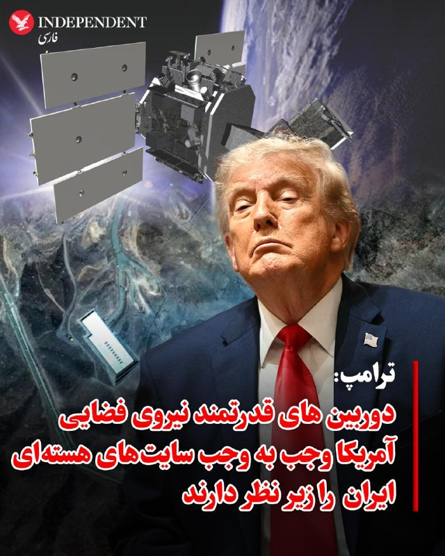

♦️دونالد ترامپ، رئیس‌جمهوری آمریکا، روز پنج‌شنبه گفت نیروی فضایی آمریکا «دوربین‌های بسیار قدرتمندی» را بر سایت‌های هسته‌ای تخریب‌شده ایران متمرکز کرده است تا هرگونه تلاشی از سوی ایران برای دسترسی به اورانیوم غنی‌شده‌ای را که همچنان در اعماق زمین مدفون است، زیر نظر داشته باشد.
او گفت: «تمام وجب‌به‌وجب آن منطقه زیر پوشش دوربین‌ها است. حدود ۹ دوربین داریم که فعال هستند و کل منطقه را پوشش می‌دهند. بنابراین اگر کسی حتی به آنجا نزدیک شود، از آن مطلع خواهیم شد و می‌دانیم چه اتفاقی در حال رخ دادن است.»

ترامپ همچنین احتمال اعزام قریب‌الوقوع نیروهای آمریکایی به این سایت‌ها برای بیرون آوردن مواد هسته‌ای مدفون‌شده را کم‌اهمیت جلوه داد و گفت اگر تصمیم به چنین اقدامی گرفته شود، آمریکا «همین حالا هم می‌تواند آن را به دست آورد.»
او گفت: «فکر نمی‌کنم [ایران] بتواند مانع ما شود اگر بخواهیم این کار را انجام دهیم، اما دلیلی برای آن وجود ندارد. ما دوربین‌های بسیار قدرتمندی داریم.»
‌🇸🇦 Indypersian

🤖 @VahidOOnLine

## VahidOOnLine — post 243726

♦️به گزارش رویترز، معترضان پنجشنبه شب ۱۴ خرداد در تیرانا، پایتخت آلبانی، در اعتراض به پروژه‌ای مرتبط با جرد کوشنر، داماد دونالد ترامپ، تجمع کردند.
بر اساس این گزارش، این پروژه ۱.۴ میلیارد یورویی که حدود ۱.۶ میلیارد دلار ارزش دارد، از طرف شرکت سرمایه‌گذاری جرد کوشنر در جزیره سزن و بخش‌هایی از سواحل نزدیک منطقه حفاظت‌شده ویوسا–نارتا در ساحل دریای آدریاتیک دنبال می‌شود؛ پروژه‌ای که رسانه‌ها از آن با عنوان «جزیره ایوانکا ترامپ» یاد می‌کنند.
ایوانکا ترامپ در گفتگو با دیوید سنرا، نویسنده و مصاحبه‌گر آمریکایی، درباره این پروژه گفت: «روی پروژه‌ای باورنکردنی همراه همسرم در مدیترانه کار می‌کنم. این پروژه از نظر مقیاس بسیار بزرگ است.» او گفت نخستین بار زمانی که با قایق یکی از دوستانشان برای شنا توقف کرده بودند، این جزیره را دیدند و پس از پیاده‌روی در آن، مجذوب منطقه شدند. ایوانکا ترامپ همچنین این مکان را «جزیره‌ای خصوصی به وسعت ۱۴۰۰ هکتار در قلب مدیترانه» توصیف کرد.
‌🇸🇦 Indypersian

🤖 @VahidOOnLine

## VahidOOnLine — post 243725

  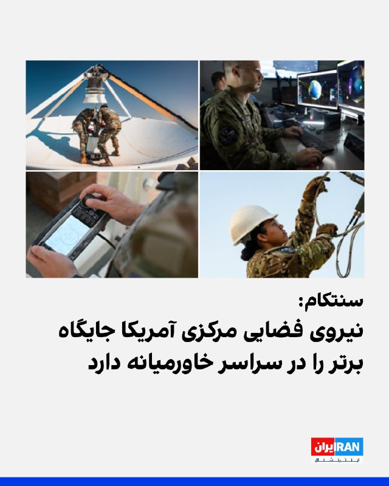

ستاد فرماندهی مرکزی آمریکا، سنتکام، با انتشار تصاویری از تجهیزات نیروی فضایی مرکزی ایالات متحده، بخش فضایی سنتکام، گفت هم‌زمان با عملیات جنگنده‌های آمریکا در خاورمیانه، بخش فضایی سنتکام دارای قابلیت‌های تهاجمی و دفاعی تمام‌وقت است و جایگاه برتر را در سراسر منظقه در اختیار دارد.
‌🏁 🇬🇧 IranintlTV

🤖 @VahidOOnLine

## IranIntlTV — post 340580

  

ستاد فرماندهی مرکزی آمریکا، سنتکام، با انتشار تصاویری از تجهیزات نیروی فضایی مرکزی ایالات متحده، بخش فضایی سنتکام، گفت هم‌زمان با عملیات جنگنده‌های آمریکا در خاورمیانه، بخش فضایی سنتکام دارای قابلیت‌های تهاجمی و دفاعی تمام‌وقت است و جایگاه برتر را در سراسر منظقه در اختیار دارد.
https://iranintl.com/202606041344

## FarsiVOA — post 219622

⚡️پرزیدنت ترامپ می‌گوید در مورد اورانیوم غنی شده در ایران منتظر توافق نمی‌ماند
@FarsiVOA

---
📅 بروزرسانی: 1405/03/15 02:12
---

## mwarmonitor — post 10161

درگیری در تنگه هرمز گزارش شده

## FoxNewsTwitter — post 342625

  <a href="telegram/content/FoxNewsTwitter_342625_1780612953.mp4" target="_blank">🎬 Download video</a>

Fox News (Twitter/X)

RT @WillCainShow: SURVEILLANCE VIDEO FROM TRACK MEET FATAL STABBING DEBUNKS 4-ON-1 ATTACK NARRATIVE: “NOT EVEN CLOSE”

Attorney Todd Shapiro debunks a viral claim suggested that Karmelo Anthony was attacked by four men before the stabbing of Austin Metcalf.

## FarsiVOA — post 219621

  <a href="telegram/content/FarsiVOA_219621_1780612954.mp4" target="_blank">🎬 Download video</a>

⚡️از جنگ تا میز مذاکره؛ وقت خریدن به روش جمهوری اسلامی از زبان کاربران شبکه‌های اجتماعی
@FarsiVOA

---
📅 بروزرسانی: 1405/03/15 02:02
---

## VahidOOnLine — post 243724

♦️وزارت امور خارجه آمریکا روز پنجشنبه ۱۴ خردادماه، در پیامی مستقیم به مردم ایران، رهبری جمهوری اسلامی را عامل مشکلات کشور دانست و تاکید کرد آینده ایران باید به دست خود ایرانیان ساخته شود.
در این پیام، وزارت خارجه آمریکا با تمجید از تاریخ و فرهنگ ایران اعلام کرد: «برای هزاران سال، مردم ایران تمدن بشری را شکل داده‌اند؛ شعر، علم، پزشکی، معماری و هنر.» این نهاد همچنین تاکید کرد میلیون‌ها ایرانی خواهان فرصت، ثبات، آزادی بیان و زندگی بدون ترس هستند و ایران از ظرفیت تبدیل شدن به یکی از مرفه‌ترین کشورهای جهان برخوردار است.

وزارت خارجه آمریکا در ادامه اعلام کرد: «مشکل مردم ایران نیستند. مشکل رهبری‌ای است که از تعامل می‌ترسد و به جای فرصت، تقابل را انتخاب می‌کند.»

تامی پیگوت، سخنگوی وزارت امور خارجه آمریکا، نیز به فاکس نیوز گفت اختلاف واشنگتن هرگز با مردم ایران نبوده، بلکه با حکومتی است که تامین مالی تروریسم و دنبال کردن سلاح هسته‌ای را بر رفاه و آزادی مردم ایران ترجیح می‌دهد.
‌🇸🇦 Indypersian

🤖 @VahidOOnLine

## WithYashar — post 13534

  <a href="telegram/content/WithYashar_13534_1780612354.mp4" target="_blank">🎬 Download video</a>

تصاویر اختصاصی جدید CNN خسارت ناشی از آتش‌سوزی در ناو هواپیمابر USS Gerald R. Ford (CVN-78) را نشان می‌دهد؛ آتش‌سوزی‌ای که در بخش لباسشویی کشتی رخ داده و در زمان استقرار آن در دریای سرخ و در چارچوب عملیات آمریکا علیه ایران گزارش شده است.

این حادثه در ماه مارس حین جنگ با ایران رخ داد و نیروی دریایی آمریکا فوری اعلام کردن آتش «مهار شده»، دو ملوان با جراحات غیرمرگبار درمان شده‌اند و ناو همچنان «کاملاً عملیاتی» است.
اما ویدیوی جدید CNN نشان می‌دهد خسارت بسیار شدیدتر از گزارش اولیه بوده است و منابع به CNN گفته‌اند سامانه اطفای حریق ناو از کار افتاده بود.

یکی از ملوانان گفته است خدمه حدود ۳۰ ساعت به‌صورت دستی با آتش مقابله کرده‌اند و حتی نگرانی درباره احتمال از دست رفتن ناو وجود داشته است.
مقامات تأیید کرده‌اند این آتش‌سوزی به‌طور موقت عملیات را مختل کرده، پرواز جنگنده‌ها را دو روز به تأخیر انداخته و باعث شده ناو برای تعمیرات اضطراری در یونان پهلو بگیرد
@withyashar

## FoxNewsTwitter — post 342624

  

Fox News (Twitter/X)

"I pray for the NYPD."

Karl-Anthony Towns is giving credit where he says it’s due as Knicks fans flood the streets during New York’s first NBA Finals run in more than two decades.

With watch parties drawing massive crowds outside Madison Square Garden — and some celebrations turning chaotic enough to lead to arrests — Towns praised officers for helping keep fans safe while the city rallies around the team.

The Knicks are now three wins away from a title, and the energy across New York is only getting louder.

## IranIntlTV — post 340579

  <a href="telegram/content/IranIntlTV_340579_1780612356.mp4" target="_blank">🎬 Download video</a>

مجلس نمایندگان آمریکا چهارشنبه با ۲۱۵ رای موافق و ۲۰۸ رای مخالف قطعنامه‌ مربوط به اختیارات جنگی ترامپ را که هدف آن توقف جنگ با جمهوری اسلامی و مشروط کردن درگیری‌ها به مجوز کنگره است، تصویب کرد.

مرضیه حسینی گزارش می‌دهد.
@iranintltv

## IranIntlTV — post 340578

  <a href="telegram/content/IranIntlTV_340578_1780612357.mp4" target="_blank">🎬 Download video</a>

مهدی تاج در پاسخ به پرسش نیویورک تایمز درباره اطمینان از برگزاری نخستین بازی ایران در جام جهانی گفت: «باید از فیفا پرسیده شود.»

این در حالی است که کمتر از یک هفته تا آغاز جام جهانی، تیم ملی ایران همچنان در انتظار دریافت ویزای آمریکا است.

گزارش رضا محدث، خبرنگار ایران‌اینترنشنال
@iranintltv

## BBCPersian — post 282893

🔻نخست وزیر و وزیر خارجه قطر در تماسی تلفنی با هاکان فیدان تلاش‌های میانجی‌گرانه میان تهران و واشنگتن را بررسی کردند

محمد بن عبدالرحمن بن جاسم آل‌ثانی، نخست‌وزیر و وزیر امور خارجه قطر، در تماس تلفنی با هاکان فیدان، وزیر امور خارجه ترکیه، درباره روابط دوجانبه و راه‌های تقویت همکاری‌های میان دو کشور گفت‌وگو کردند.

وزارت خارجه قطر در پیامی در شبکه ایکس گفته است که دو طرف تلاش‌های میانجی‌گرانه میان ایالات متحده و جمهوری اسلامی ایران و راه‌های حمایت از این روند را مورد بررسی قرار دادند.

وزرای خارجه قطر و ترکیه همچنین بر هماهنگی برای پشتیبانی از ابتکارهای دیپلماتیک با هدف کاهش تنش‌ها و تقویت امنیت و ثبات منطقه تأکید کردند.

نخست‌وزیر و وزیر امور خارجه قطر در این گفت‌وگو بر ضرورت همراهی همه طرف‌ها با تلاش‌های جاری برای میانجی‌گری تأکید کرد و گفت این روند می‌تواند زمینه را برای رسیدگی به ریشه‌های بحران از طریق گفت‌وگو و راهکارهای مسالمت‌آمیز فراهم کرده و به دستیابی به توافقی پایدار که مانع از تشدید دوباره تنش‌ها شود، منجر شود.

https://bbc.in/4dS78uI
@BBCPersian

---
📅 بروزرسانی: 1405/03/15 01:52
---

## FoxNewsTwitter — post 342623

  <a href="telegram/content/FoxNewsTwitter_342623_1780611744.mp4" target="_blank">🎬 Download video</a>

Fox News (Twitter/X)

Trump on Biden: "He was never the sharpest guy, you do know that, right?"

"It wasn't like he was sharp as a tack."

"Something happened to him during the debate. It could have been me."

## IranIntlTV — post 340577

  <a href="https://t.me/IranintlTV/340577" target="_blank">📎 Download file</a>

🎧نسخه صوتی برنامه با کامبیز حسینی؛ ویژه برنامه درگذشت مرجان ساتراپی با حضور مانا نیستانی و امید کشتکار
@iranintlTV

## IranIntlTV — post 340576

  <a href="telegram/content/IranIntlTV_340576_1780611746.mp4" target="_blank">🎬 Download video</a>

ایران‌اینترنشنال در خبری اختصاصی گزارش داد هواداران جبهه پایداری در پی درخواست مسعود پزشکیان و محمدباقر قالیباف از حضور در تجمع‌های حمایت از جمهوری اسلامی منع شده‌اند.

گفت‌وگو با کامیار بهرنگ، عضو تحریریه ایران‌اینترنشنال
@iranintltv

## IranIntlTV — post 340575

  <a href="telegram/content/IranIntlTV_340575_1780611747.mp4" target="_blank">🎬 Download video</a>

اندکی پس از تصویب قطعنامه مجلس نمایندگان آمریکا درباره محدود کردن اختیارات جنگی رییس‌جمهوری در قبال ایران، دونالد ترامپ این اقدام را بی‌معنی توصیف کرد و گفت آنها ترجیح می‌دهند کشور شکست بخورد تا شاهد یک پیروزی دیگر از او باشند.

گفت‌وگو با امیر گیتی، عضو تحریریه ایران‌اینترنشنال
@iranintltv

---
📅 بروزرسانی: 1405/03/15 01:42
---

## mwarmonitor — post 10160

🔴وقتی در ماه مارس یک آتش‌سوزی روی ناو هواپیمابر USS Gerald R. Ford نیروی دریایی آمریکا رخ داد، نیروی دریایی در یک بیانیه کوتاه اعلام کرد که آتش «مهار شده است»، دو ملوان برای «جراحات غیرمرگبار» تحت درمان قرار گرفته‌اند و این ناو همچنان «کاملاً عملیاتی» است.

اما ویدیوی جدیدی که توسط منتشر شده نشان می‌دهد که این آتش‌سوزی بسیار شدیدتر و آسیب‌زننده‌تر از آن چیزی بوده که نیروی دریایی اعلام کرده بود. منابع به CNN گفته‌اند که سامانه اطفای حریق این کشتی از کار افتاده بود.

@mwarmonitor

## IranianMinds — post 21399

  

توییت جدید اتاق جنگ اسرائیل بازم ساعت شنی

@IranianMinds

## Dirty_Kids — post 391015

  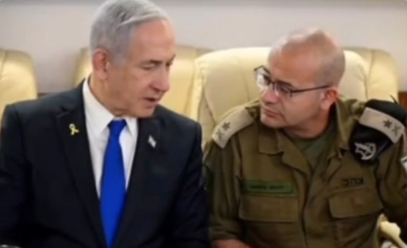

+ بنظرت به ترامپ بگیم مجتبی رو هم ترور کردیم یا هنوز زوده؟

@Dirty_Kids 👻

---
📅 بروزرسانی: 1405/03/15 01:32
---

## FoxNewsTwitter — post 342622

  <a href="telegram/content/FoxNewsTwitter_342622_1780610575.mp4" target="_blank">🎬 Download video</a>

Fox News (Twitter/X)

NEW: President Trump reacts to Hunter Biden teasing a potential 2028 presidential run, taking the opportunity to roast other Democrats Graham Platner and James Talarico.

"You would think that, you know, past has something to do with winning an election. And I would say his past is not the greatest."

"Hey, if the guy from Maine can do well, I guess Hunter could do well, too, because the guy from Maine is a basket case."

"And I would say worse than him is the one from Texas that looks like Alfred E. Neuman."

"I would say that if he can do well, maybe Hunter can do well."

@pdoocy

## BBCPersian — post 282885

🖊 نازنین کیان، روزنامه‌نگار

🔻 در آستانه بزرگ‌ترین رویداد فوتبالی جهان در قاره آمریکا، اردوی تیم ملی فوتبال ایران بیش از آنکه تحت تاثیر تاکتیک‌های ورزشی باشد، درگیر یک جنجال دیپلماتیک شده است؛ جنجالی که در مرکز آن مرد شماره یک فدراسیون فوتبال، مهدی تاج، ایستاده است.

بیشتر بخوانید:
https://bbc.in/49G2Pju
📸GettyImages/ Reuters/ AFP via Getty Images/ EPA/Shutterstock/ Social media/ tasnim
@BBCPersian

## alonews — post 125191

  <a href="telegram/content/alonews_125191_1780610577.webm" target="_blank">🎬 Download video</a>

🤚 اینترنت مخصوص جنگ 
🚀
💙

🔥 نامحدود فقط 690 تومن 
🔥

⭐️ فقط گیگی 7 هزار تومان
😍

✅ بدون قطعی‌های آزاردهنده

✅ سرعت بالا حتی ساعات شلوغ

✅ مناسب تلگرام، اینستاگرام و یوتیوب

✅ همراه با ساب

✅ تعداد محدود با این قیمت

🤖 @NetAazaadBot

🤖 @NetAazaadBot

## alonews — post 125190

  <a href="telegram/content/alonews_125190_1780610577.webm" target="_blank">🎬 Download video</a>

👈محسن رضایی : یک سیلی دیگر ممکن است بیاید تا اسرائیل و آمریکا را سر جای خودشان بنشاند.

✅ @AloNews خبر جنگ

## alonews — post 125189

  <a href="telegram/content/alonews_125189_1780610578.mp4" target="_blank">🎬 Download video</a>

👈کارشناس صدا و سیما:
پولی در قطر نداریم، پول ایران در آلمان است

✅ @AloNews خبر جنگ

---
📅 بروزرسانی: 1405/03/15 01:22
---

## VahidOOnLine — post 243723

  

♦️ وزارت خارجه آمریکا پنجشنبه ۱۴ خرداد از شهروندان آمریکایی حاضر در خاورمیانه خواست به دلیل تنش‌های شدید منطقه‌ای احتیاط کنند و تحولات امنیتی را از نزدیک دنبال کنند. این وزارتخانه اعلام کرد وضعیت امنیتی در خاورمیانه همچنان پیچیده است و ممکن است به‌سرعت تغییر کند.

بر اساس این اطلاعیه، هشدار سفر برای بحرین، اسرائیل، کرانه باختری، اردن، کویت، عمان، قطر، عربستان سعودی و امارات متحده عربی همچنان در سطح ۳، «تجدیدنظر در سفر»، باقی مانده است.

وزارت خارجه آمریکا همچنین اعلام کرد ایران، عراق، لبنان، سوریه، غزه و یمن همچنان در سطح ۴، «از سفر خودداری کنید»، قرار دارند.
‌🇸🇦 Indypersian

🤖 @VahidOOnLine

## WithYashar — post 13533

ترامپ می‌گوید دولتش بررسی کرده بود که نیروهایی را برای تصرف اورانیوم ایران بفرستد، اما در نهایت این ایده را رد کرد چون خیلی پرخطر بود و می‌توانست به تلفات آمریکایی‌ها منجر شود، و این موضوع را با مأموریت ناموفق نجات گروگان‌های کارتر مقایسه کرد.
@withyashar

## FarsiVOA — post 219620

  

🔴برنامه امروز تفسیر خبر را با اجرای مهدی آقازمانی از طریق لینک زیر در یوتیوب مشاهده بفرمایید:
https://youtu.be/GXI9_tsXsR4

## Dirty_Kids — post 391014

  

هرچه موشک زدی مرا
نقض نشد، علاقه شد!

@Dirty_Kids 👻

## Dirty_Kids — post 391013

  <a href="telegram/content/Dirty_Kids_391013_1780609953.mp4" target="_blank">🎬 Download video</a>

روایت داریم شب جمعه‌ها روز ورزش و ورزشکاران است

@Dirty_Kids 👻

---
📅 بروزرسانی: 1405/03/15 01:12
---

## IranIntlTV — post 340574

  <a href="telegram/content/IranIntlTV_340574_1780609343.mp4" target="_blank">🎬 Download video</a>

مدیرعامل ایرانی یک شرکت فناوری در کالیفرنیا به اتهام همکاری با جمهوری اسلامی بازداشت شد. او متهم است بیش از ۲۵۰ تُن تجهیزات شبکه ساخت آمریکا را با استفاده از شرکت‌های پوششی به ایران منتقل کرده که بخشی از آن به نهادهای نظامی و هسته‌ای رسیده است.

نیلوفر منصوری گزارش می‌دهد.
@iranintltv

## BBCPersian — post 282884

🔻 خانواده مرجان ساتراپی، خالق رمان پرسپولیس، می‌گویند او از اندوه جان باخت؛ این غم جانکاه از کجا نشات گرفت؟

گزیده‌هایی از گفتگوی سرور کسمایی، نویسنده و از دوستان مرجان ساتراپی را با پریزاد نوبخت ببینید.

@BBCPersian

## alonews — post 125188

  <a href="telegram/content/alonews_125188_1780609345.webm" target="_blank">🎬 Download video</a>

👈توییت جدید اتاق جنگ اسرائیل: ⌛️

✅ @AloNews خبر جنگ

---
📅 بروزرسانی: 1405/03/15 01:02
---

هیچ پیام جدیدی در این بروزرسانی ارسال نشد.

---
📅 بروزرسانی: 1405/03/15 00:52
---

## VahidOOnLine — post 243722

  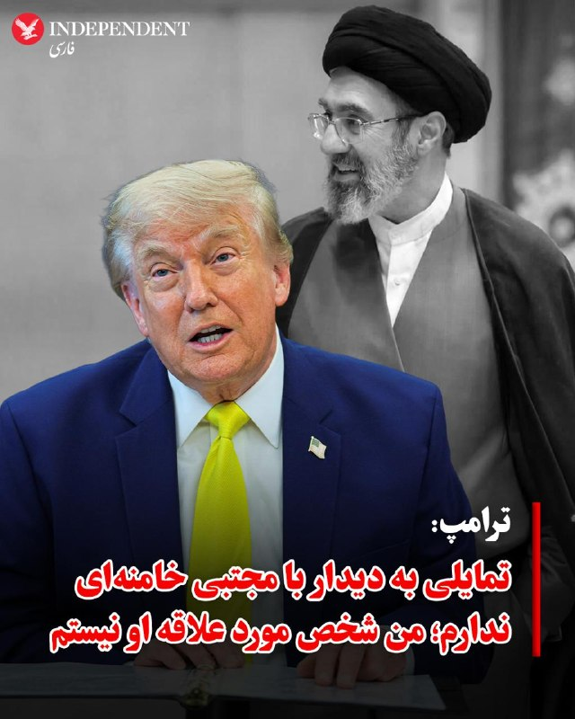

♦️دونالد ترامپ،رئیس‌جمهوری آمریکا، روز پنجشنبه ۱۴ خرداد در گفتگو با خبرنگاران در کاخ سفید، درباره احتمال دیدار با مجتبی خامنه‌ای گفت تمایلی به چنین دیداری ندارد.
ترامپ گفت: «اگر ملاقات کنیم، با احترام برخورد می‌کنم»، اما تاکید کرد شخصا به دنبال چنین دیداری نیست.
رئیس‌جمهوری آمریکا همچنین در پاسخ به سوالی درباره اینکه آیا به دلیل کشته شدن اعضای خانواده مجتبی خامنه‌ای، احتمال دارد او تمایلی به دیدار نداشته باشد، گفت: «من شخص مورد علاقه او نیستم.»
ترامپ افزود در صورت شکل‌گیری توافق، احتمال انجام چنین دیداری وجود دارد، اما تاکید کرد در حال حاضر به دنبال آن نیست.
‌🇸🇦 Indypersian

🤖 @VahidOOnLine

## VahidOOnLine — post 243721

  <a href="telegram/content/VahidOOnLine_243721_1780608169.mp4" target="_blank">🎬 Download video</a>

♦️دونالد ترامپ، رئیس‌جمهوری آمریکا، پنجشنبه ۱۴ خرداد در اظهاراتی درباره جمهوری اسلامی تاکید کرد که ایالات متحده «به هر حال» پیروز خواهد شد؛ چه از طریق توافق و چه از راه نظامی.

ترامپ گفت: «فکر می‌کنم اوضاع برای ما خیلی خوب پیش می‌رود، اما خواهیم دید که به چه شکلی پیروز می‌شویم. به هر حال ما پیروز خواهیم شد؛ یا روی کاغذ و از طریق توافق، یا از راه نظامی.»
‌🇸🇦 Indypersian

🤖 @VahidOOnLine

## WithYashar — post 13532

ترامپ ۲۵ بهمن ۱۴۰۴: میخوام با آیت الله علی خامنه ای دیدار کنم.
۹ اسفند بخارش‌ کرد.

ترامپ ۱۴ خرداد ۱۴۰۵: میخوام با آیت الله مجتبی خامنه ای دیدار کنم.

چه تاریخی بخار میشه؟!
@withyashar

## FoxNewsTwitter — post 342621

  <a href="telegram/content/FoxNewsTwitter_342621_1780608171.mp4" target="_blank">🎬 Download video</a>

Fox News (Twitter/X)

BREAKING: President Trump declines to reveal specific details of his own proposed compromises to end the Russia-Ukraine war:

"I'd rather not say."

"I'm very responsible when that happens. It's going to happen. They're going to both make compromises — I suggested those compromises."

"They're two very incredible countries, beautiful countries."

"They've got to stop. Last month, they had 25,000 people killed. Soldiers, mostly soldiers, some people, but mostly soldiers."

## FarsiVOA — post 219619

🔺ترامپ: اگر نیروهای آمریکایی در حملات جمهوری اسلامی کشته شوند عملیات نظامی علیه آن از سر گرفته می‌شود

▪️دونالد ترامپ، رئیس جمهوری آمریکا روز پنجشنبه ۱۴ خرداد در مراسم سرمایه‌گذاری در حوزه انرژی و زغال‌سنگ در کاخ سفید در هشداری به جمهوری اسلامی گفت اگر نیروهای آمریکایی در حملات جمهوری اسلامی کشته شوند، عملیات نظامی علیه رژیم از سر گرفته خواهد شد.

⬇️ بیشتر بخوانید:
https://ir.voanews.com/a/8157398.html
@FarsiVOA

## IranianMinds — post 21398

ترامپ: «من نمی‌خواهم با آیت‌الله ملاقات کنم، اما اگر با او ملاقات می‌کردم، برایم افتخار بود که با او دیدار کنم. با احترام رفتار می‌کردم.» @IranianMinds

## Dirty_Kids — post 391012

  <a href="telegram/content/Dirty_Kids_391012_1780608174.mp4" target="_blank">🎬 Download video</a>

خبرنگار: شنیدم میخوای با آیت‌الله جدید(مجتبی خامنه‌ای) ملاقات کنی. ترامپ: نه من نمیخوام باهاش ملاقات کنم، ولی باعث افتخاره که باهاش دیدار داشته باشم؛ دوست دارم ببینم میتونیم آیا باهم یه قرار داد خوبی داشته باشیم یا نه، ولی اگه باهاشون قرارداد ببندیم، ممکنه…

## Dirty_Kids — post 391011

  <a href="telegram/content/Dirty_Kids_391011_1780608176.mp4" target="_blank">🎬 Download video</a>

خبرنگار: شنیدم میخوای با آیت‌الله جدید(مجتبی خامنه‌ای) ملاقات کنی.

ترامپ: نه من نمیخوام باهاش ملاقات کنم، ولی باعث افتخاره که باهاش دیدار داشته باشم؛

دوست دارم ببینم میتونیم آیا باهم یه قرار داد خوبی داشته باشیم یا نه، ولی اگه باهاشون قرارداد ببندیم، ممکنه همو ببینیم حتی توآمریکا.

@Dirty_Kids 👻

## alonews — post 125187

  <a href="telegram/content/alonews_125187_1780608178.webm" target="_blank">🎬 Download video</a>

👈ترامپ ۲۵ بهمن ۱۴۰۴:
میخوام با آیت الله علی خامنه ای دیدار کنم.

🔴ترامپ ۱۴ خرداد ۱۴۰۵:
میخوام با آیت الله مجتبی خامنه ای دیدار کنم.

✅ @AloNews خبر جنگ

---
📅 بروزرسانی: 1405/03/15 00:42
---

## Dirty_Kids — post 391010

  <a href="telegram/content/Dirty_Kids_391010_1780607565.mp4" target="_blank">🎬 Download video</a>

این که قیصره و خواننده‌ی درجه ۴ هم حساب نمی‌شد و معلوم بود سرش تو کون آخونده
اگر میا خلیفه هم بیارید اصلا تعجب نمی‌کنیم چون هرچی کونده و جنده‌ دوزاریه طرفدار آخونداس.
*با احترام به تن‌فروشان شریف*

@Dirty_Kids 👻

---
📅 بروزرسانی: 1405/03/15 00:32
---

## VahidOOnLine — post 243720

  <a href="telegram/content/VahidOOnLine_243720_1780606950.mp4" target="_blank">🎬 Download video</a>

♦️ دونالد ترامپ، رئیس‌جمهوری آمریکا، پنجشنبه ۱۴ خرداد در کاخ سفید در پاسخ به سوالی درباره گزارش‌هایی مبنی بر اینکه کشته شدن نیروهای آمریکایی خط قرمز او برای پایان آتش‌بس با ایران است، گفت این موضوع «دلیل خوبی» برای از سرگیری درگیری خواهد بود.

ترامپ افزود: «راستش را بخواهید، اگر نیروهای آمریکایی را بکشند، فکر می‌کنم خیلی سریع این کار را انجام بدهم.»

این اظهارات در پاسخ به سوال خبرنگاری مطرح شد که پرسید آیا کشته شدن نیروهای آمریکایی، خط قرمز دولت او برای پایان دادن به آتش‌بس و از سرگیری جنگ با ایران است.

پیش‌تر وال‌استریت ژورنال به نقل از مقام‌های آمریکایی گزارش داد دونالد ترامپ به‌طور خصوصی به دستیارانش گفته است در صورتی که جمهوری اسلامی نیروهای آمریکایی را بکشد، ازسرگیری جنگ و پایان دادن به آتش‌بس را بررسی خواهد کرد.
‌🇸🇦 Indypersian

🤖 @VahidOOnLine

## VahidOOnLine — post 243719

  

دونالد ترامپ درباره احتمال دیدار با رهبر جمهوری اسلامی گفت تمایلی به این دیدار ندارد، اما اگر هدف دستیابی به توافق باشد، چنین دیداری می‌تواند انجام شود.

او افزود: «من این پیشنهاد را مطرح نکرده‌ام و چیز زیادی هم درباره آن نشنیده‌ام، اما برخی آن را پیشنهاد کرده‌اند. اگر قرار باشد اتفاق بیفتد، رخ خواهد داد و من با احترام برخورد می‌کنم.»
‌🏁 🇬🇧 IranintlTV

🤖 @VahidOOnLine

## mwarmonitor — post 10159

مجتبی خامنه‌ای (إِنَّا لِلَّٰهِ وَإِنَّا إِلَيْهِ رَاجِعُونَ) @mwarmonitor

## FoxNewsTwitter — post 342620

  <a href="telegram/content/FoxNewsTwitter_342620_1780606952.mp4" target="_blank">🎬 Download video</a>

Fox News (Twitter/X)

PETER DOOCY: "There's been a lot of talk lately about the Treasury putting your face on a $250 bill... Would you ever be able to tip anyone anything but that?"

TRUMP: "Well, I think I'll probably leave it for everybody."
"I have actually seen something just about two days ago. I know it's been pushed by a lot of our supporters."

"I'm honored that they're doing it, but we'll see how that all works out."

"They really like the job we're doing, you know? So that's a great honor."

@pdoocy

## IranIntlTV — post 340573

  <a href="telegram/content/IranIntlTV_340573_1780606953.mp4" target="_blank">🎬 Download video</a>

مرجان ساتراپی، نویسنده، تصویرگر و فیلم‌ساز ایرانی-فرانسوی، در ۵۶ سالگی در پاریس درگذشت. به گفته خانواده‌اش، او پس از درگذشت همسرش در سال گذشته، بر اثر اندوه از دست دادن او جان باخت. ساتراپی با رمان مصور «پرسپولیس» و اقتباس سینمایی آن به شهرت جهانی رسید. او کارگردان پنج فیلم بلند دیگر هم بود و نخستین زنی شد که نامزد جایزه اسکار بهترین فیلم انیمیشن شد. کتاب مصور «زن، زندگی، آزادی» از آخرین آثار او با همکاری عباس میلانی بود.
@iranintltv

## FarsiVOA — post 219618

  <a href="telegram/content/FarsiVOA_219618_1780606954.mp4" target="_blank">🎬 Download video</a>

⚡️شاهین‌ نژاد: جمهوری اسلامی روی طناب راه می‌رود
@FarsiVOA

## FarsiVOA — post 219617

  

⚡️دونالد ترامپ، رئیس‌جمهوری آمریکا، روز پنج‌شنبه گفت ایالات متحده بر جمهوری اسلامی غلبه می‌کند، یا با توافق یا با عملیات نظامی.
@FarsiVOA

## IranianMinds — post 21397

  <a href="telegram/content/IranianMinds_21397_1780606955.mp4" target="_blank">🎬 Download video</a>

ترامپ:
«من نمی‌خواهم با آیت‌الله ملاقات کنم، اما اگر با او ملاقات می‌کردم، برایم افتخار بود که با او دیدار کنم.
با احترام رفتار می‌کردم.»

@IranianMinds

## IranianMinds — post 21396

ترامپ:
چند موشک در ایران باقی مانده است، اما بسیار کم.

🔴مذاکرات با ایران خوب پیش می‌رود.

🔴مسئله لبنان تا حدودی متفاوت است، اما به ایران مرتبط است.

🔴آمریکا می‌تواند اورانیوم غنی‌شده ایران را با یا بدون توافق مصادره کند.

@IranianMinds

## alonews — post 125186

  <a href="telegram/content/alonews_125186_1780606957.mp4" target="_blank">🎬 Download video</a>

👈فیلد مارشال ، محسن رضایی: اگر اسرائیل به سمت جنوب بیروت می رفت، موشک باران را شروع می کردیم

✅ @AloNews خبر جنگ

## alonews — post 125185

  <a href="telegram/content/alonews_125185_1780606958.webm" target="_blank">🎬 Download video</a>

👈ایالات متحده رئیس‌جمهور کوبا، میگل دیاز-کانل و خانواده‌اش را تحریم کرد

✅ @AloNews خبر جنگ

## alonews — post 125184

  <a href="telegram/content/alonews_125184_1780606959.webm" target="_blank">🎬 Download video</a>

👈العربیه منتشر کرد: عکس وزیر کشور پاکستان محسن نقوی در دیدار با وزیر کشور ایران در تهران، در چارچوب تلاش‌های اسلام‌آباد برای پیشبرد مذاکرات

✅ @AloNews خبر جنگ

## alonews — post 125183

  <a href="telegram/content/alonews_125183_1780606959.webm" target="_blank">🎬 Download video</a>

👈ترامپ: باعث افتخارمه با آیت الله مجتبی خامنه ای دیدار داشته باشم.

✅ @AloNews خبر جنگ

---
📅 بروزرسانی: 1405/03/15 00:22
---

## WithYashar — post 13531

ترامپ: ما به ایران رسیدگی خواهیم کرد، و به‌محض اینکه کارمان با آن تمام شد، در مسیر بازگشت، برای مدت کوتاهی توقف می‌کنیم و به کوبا رسیدگی خواهیم کرد… باید از شر این نظام خلاص شویم
@withyashar

## WithYashar — post 13530

ترامپ: برنده این جنگ ما هستیم حالا چه روی کاغذ چه با قدرت نظامی
@withyashar

## WithYashar — post 13529

ترامپ: جابجایی مواد هسته‌ای ایران مستلزم حضور یک یا دو هفته‌ای در منطقه درگیری بود، بنابراین ما این کار را انجام ندادیم
@withyashar

## WithYashar — post 13528

ترامپ : من دنبال عملیات مخفی برای گرفتن اورانیوم ایران نیستم اون اورانیوم عملاً دفن شده و از بین رفته
اعزام نیروهای نظامی برای تصاحب ذخایر اورانیوم ایران؟ نه من نمی‌خوام جیمی کارتر باشم
@withyashar

## FoxNewsTwitter — post 342619

  <a href="telegram/content/FoxNewsTwitter_342619_1780606348.mp4" target="_blank">🎬 Download video</a>

Fox News (Twitter/X)

PETER DOOCY: "There's been a lot of talk lately about the Treasury putting your face on a $250 bill... Would you ever be able to tip anyone anything but that?"

TRUMP: "Well, I think I'll probably leave it for everybody."
"I have actually seen something just about two days ago. I know it's been pushed by a lot of our supporters."

"I'm honored that they're doing it, but we'll see how that all works out."

"They really like the job we're doing, you know? So that's a great honor."

## FoxNewsTwitter — post 342618

  <a href="telegram/content/FoxNewsTwitter_342618_1780606349.mp4" target="_blank">🎬 Download video</a>

Fox News (Twitter/X)

"It means Italian people love Trump."

President Trump praises the stunning restoration of the Christopher Columbus statue at Union Station, highlighting the massive beautification effort that saved the historic monument from being torn down.

After decades of being covered in graffiti and grime, the monument's original marble was fully restored.

## IranIntlTV — post 340572

  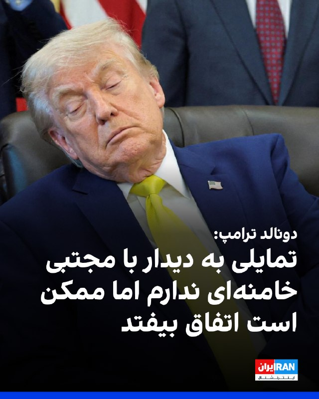

دونالد ترامپ درباره احتمال دیدار با رهبر جمهوری اسلامی گفت تمایلی به این دیدار ندارد، اما اگر هدف دستیابی به توافق باشد، چنین دیداری می‌تواند انجام شود.

او افزود: «من این پیشنهاد را مطرح نکرده‌ام و چیز زیادی هم درباره آن نشنیده‌ام، اما برخی آن را پیشنهاد کرده‌اند. اگر قرار باشد اتفاق بیفتد، رخ خواهد داد و من با احترام برخورد می‌کنم.»
https://iranintl.com/202606047542

## FarsiVOA — post 219616

  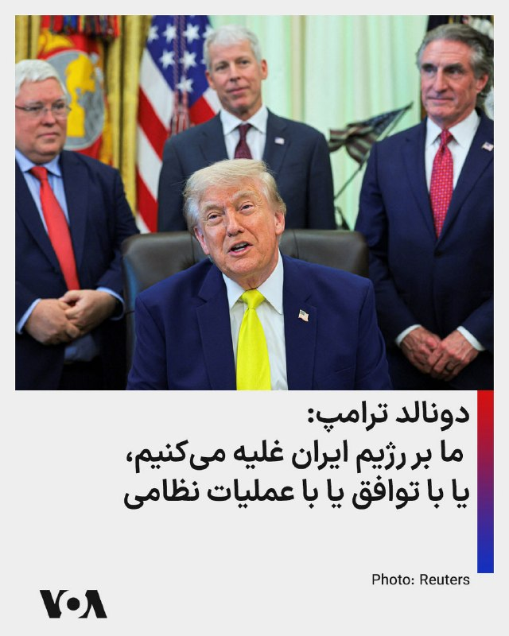

⚡️دونالد ترامپ، رئیس‌جمهوری آمریکا، روز پنج‌شنبه گفت ایالات متحده بر جمهوری اسلامی غلیه می‌کند، یا با توافق یا با عملیات نظامی.
@FarsiVOA

## RadioFarda — post 157906

  <a href="https://t.me/radiofarda/157906" target="_blank">📎 Download file</a>

📻بشنوید: سرخط خبرهای نیمه‌شب با رادیوفردا، ۱۵خرداد ۱۴۰۵‌

@RadioFarda

## alonews — post 125182

  <a href="telegram/content/alonews_125182_1780606353.webm" target="_blank">🎬 Download video</a>

👈حجم قابل توجهی از ترابری های آمریکا در حال خروج از خاورمیانه و حرکت به سمت اروپا هستند

✅ @AloNews خبر جنگ

## alonews — post 125181

  <a href="telegram/content/alonews_125181_1780606353.webm" target="_blank">🎬 Download video</a>

👈ترامپ: جابجایی مواد هسته‌ای ایران مستلزم حضور یک یا دو هفته‌ای در منطقه درگیری بود، بنابراین ما این کار را انجام ندادیم

✅ @AloNews خبر جنگ

---
📅 بروزرسانی: 1405/03/15 00:12
---

## VahidOOnLine — post 243718

  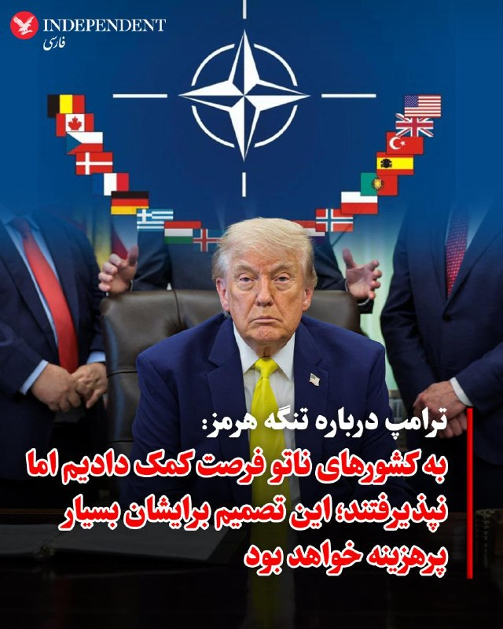

♦️دونالد ترامپ، رئیس‌جمهوری آمریکا، روز پنجشنبه ۱۴ خرداد در گفتگو با خبرنگاران در کاخ سفید، در پاسخ به پرسشی درباره لزوم کمک متحدان اروپایی برای بازگشایی تنگه هرمز و تامین امنیت انرژی گفت: «ما به کمک آن‌ها نیازی نداریم؛ ما قدرتمندترین ارتش جهان را در اختیار داریم.»
ترامپ با انتقاد از رویکرد اعضای ناتو افزود: «ما به کشورهای عضو ناتو و دیگران فرصت دادیم که در این زمینه کمک کنند، اما آن‌ها خودشان خواستند که این کار را نکنند. من فشار زیادی به آن‌ها وارد نکردم، فقط گفتم اگر تمایل به کمک دارید، بسیار عالی خواهد بود، اما همه آن‌ها درخواست ما را رد کردند.» ترامپ در ادامه گفت: «این تصمیم برای آن‌ها بسیار پرهزینه خواهد بود، چون نباید این کار را می‌کردند. باید کمک می‌کردند.»
‌🇸🇦 Indypersian

🤖 @VahidOOnLine

## VahidOOnLine — post 243717

  

دونالد ترامپ، رییس‌جمهوری آمریکا، در کاخ سفید در پاسخ به این که اگر حکومت ایران نیروهای آمریکایی را بکشد، آیا جنگ با جمهوری اسلامی را از سر خواهد گرفت، گفت: «این دلیل خوبی برای چنین کاری خواهد بود. اگر آن‌ها نیروهای آمریکایی را بکشند، فکر می‌کنم خیلی سریع دست به این کار بزنم.»

ترامپ درباره جمهوری اسلامی تاکید کرد: «آن‌ها نمی‌توانند سلاح هسته‌ای داشته باشند.»

رییس‌جمهوری آمریکا گفت: «ما برای به‌دست آوردن اورانیوم غنی‌شده آن‌ها به توافقی با ایران نیاز نداریم.»

او درباره کمک ناتو به بازگشایی تنگه هرمز نیز گفت: «ما به آن‌ها فرصت دادیم که کمک کنند، اما نخواستند کمک کنند. این موضوع برای آن‌ها بسیار پرهزینه خواهد شد، چون نباید چنین کاری می‌کردند. باید کمک می‌کردند.»
‌🏁 🇬🇧 IranintlTV

🤖 @VahidOOnLine

## WithYashar — post 13527

ترامپ:

راستش نمی‌خوام با آیت‌الله دیدار کنم، ولی اگه ببینمش، برام افتخاره. با احترام هم باهاش رفتار می‌کنم.
@withyashar

## mwarmonitor — post 10158

🔹خبرنگار: آیا با آیت‌الله جدید، رهبر معظم جدید دیدار خواهید کرد؟
🔸دونالد ترامپ: من لزوماً به‌دنبال دیدار نیستم، اما اگر دیداری اتفاق بیفتد، مایه افتخار من خواهد بود که با او ملاقات کنم. مایلم ببینم آیا می‌توانیم به یک توافق برسیم یا خیر. اما اگر به توافقی برسیم، این احتمال وجود دارد که با او دیدار کنم. من مشکلی با این موضوع ندارم.
🔹خبرنگار: آیا این دیدار ممکن است اینجا در ایالات متحده، در کاخ سفید انجام شود؟
🔸دونالد ترامپ: اوه، واقعاً نمی‌دانم. هنوز چیز زیادی در این باره نشنیده‌ام. من خودم این را پیشنهاد ندادم، اما برخی دیگر پیشنهادش کرده‌اند. اگر چنین اتفاقی بیفتد، رخ خواهد داد و من با احترام برخورد خواهم کرد.
🔹خبرنگار: آیا فکر می‌کنید به این دلیل که پدر، همسر و فرزند او را کشته، او ممکن است احساسات جریحه‌داری داشته باشد و تمایلی به ملاقات با شما نداشته باشد؟
🔸دونالد ترامپ: خب، من می‌توانم بگویم که فرد محبوب او نیستم. اما با وجود تمام این حرف‌ها، او احتمالاً یک فرد حرفه‌ای است—البته من شناخت دقیقی ندارم—اما او احتمالاً حرفه‌ای است. در برخی محافل، او در واقع وجهه و شهرت بسیار خوبی دارد؛ می‌دانید، گاهی اوقات مردم حرف‌های بدی می‌زنند، اما خیلی‌ها درباره من هم حرف‌های بدی می‌زنند که البته همگی کاملاً دروغ هستند.

@mwarmonitor

## mwarmonitor — post 10157

  <a href="telegram/content/mwarmonitor_10157_1780605766.mp4" target="_blank">🎬 Download video</a>

🎬 Video

## mwarmonitor — post 10156

  <a href="telegram/content/mwarmonitor_10156_1780605769.mp4" target="_blank">🎬 Download video</a>

🔹خبرنگار:
«و حالا که صحبت از ارتش ما و ایران شد، می‌خواستم درباره این گزارش ازتون بپرسم که شما تنها در صورتی درگیری با ایران رو دوباره شروع می‌کنید که اون‌ها نیروهای آمریکایی رو بکشن؟ آیا این خط قرمز شما برای پایان دادن به آتش‌بسه؟»
🔸دونالد ترامپ:
«اگه اون‌ها بکشن؟»
🔹خبرنگار:
«نیروهای آمریکایی رو.»
🔸دونالد ترامپ:
«این یعنی چی؟»
🔹خبرنگار:
«یعنی اینکه اگه اون‌ها نیروهای آمریکایی رو بکشن، شما جنگ با ایران رو دوباره شروع می‌کنید.»
🔸دونالد ترامپ:
«خب، این می‌تونه دلیل خوبی باشه! باهاتون صادق باشم، آره، اگه اون‌ها نیروهای آمریکایی رو بکشن، فکر کنم من این کار رو خیلی سریع انجام بدم. آره، این سوال خیلی جالب شد!»

@mwarmonitor

## VahidOnline — post 75943

  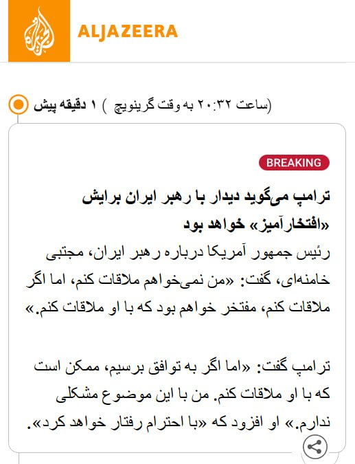

📡 @VahidOnline

## IranIntlTV — post 340571

  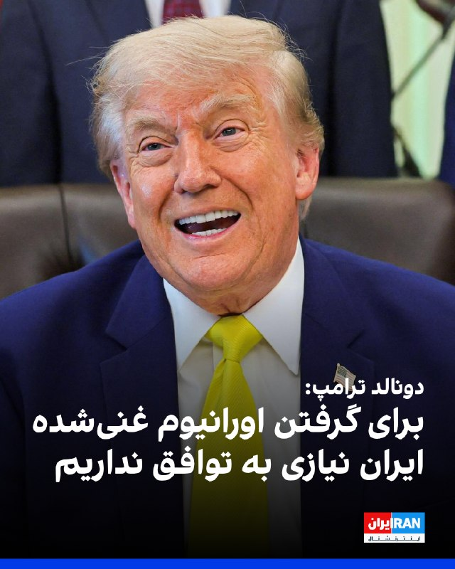

دونالد ترامپ، رییس‌جمهوری آمریکا، در کاخ سفید در پاسخ به این که اگر حکومت ایران نیروهای آمریکایی را بکشد، آیا جنگ با جمهوری اسلامی را از سر خواهد گرفت، گفت: «این دلیل خوبی برای چنین کاری خواهد بود. اگر آن‌ها نیروهای آمریکایی را بکشند، فکر می‌کنم خیلی سریع دست به این کار بزنم.»

ترامپ درباره جمهوری اسلامی تاکید کرد: «آن‌ها نمی‌توانند سلاح هسته‌ای داشته باشند.»

رییس‌جمهوری آمریکا گفت: «ما برای به‌دست آوردن اورانیوم غنی‌شده آن‌ها به توافقی با ایران نیاز نداریم.»

او درباره کمک ناتو به بازگشایی تنگه هرمز نیز گفت: «ما به آن‌ها فرصت دادیم که کمک کنند، اما نخواستند کمک کنند. این موضوع برای آن‌ها بسیار پرهزینه خواهد شد، چون نباید چنین کاری می‌کردند. باید کمک می‌کردند.»
https://iranintl.com/202606048815

## FarsiVOA — post 219615

  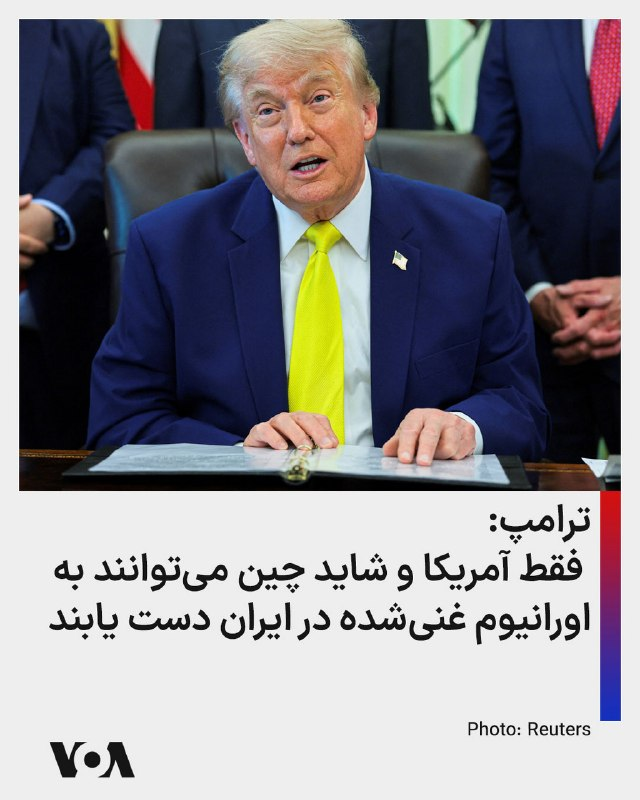

⚡️دونالد ترامپ، رئیس‌جمهوری آمریکا پنج‌شنبه عصر گفت هواپیماهای بی‌۲ آمریکایی در حمله هوایی سال گذشته، مراکز تولید و غنی‌سازی در ایران را نابود و اورانیوم‌های غنی‌شده را زیر خاک مدفون کرده‌اند و دسترسی به آن‌ها فقط از عهده ما و «احتمالا» چین بر می‌آید.
@FarsiVOA

## FarsiVOA — post 219614

⚡️گزارش نرگس صبا در برنامه تفسیر خبر از مقایسه ایران بین ۱۴ خرداد سال قبل و امروز
@FarsiVOA

## BBCPersian — post 282883

🔻 دبیر کل سازمان ملل کشته شدن یک نیروی حافظ صلح در جنوب لبنان را محکوم کرد

سخنگوی دبیرکل سازمان ملل متحد، گفته است که آنتونیو گوترش کشته شدن یک نیروی حافظ صلح را در جنوب لبنان محکوم کرده و خواستار شناسایی و مجازات عاملان این حمله شده است.

این صلحبان صرب سازمان ملل روز چهارشنبه بر اثر جراحات ناشی از اصابت خمپاره به پایگاه محل استقرارش جان باخت. با مرگ این صلح‌بان، شمار نیروهای یونیفیل که از زمان کشیده شدن لبنان به جنگ در اوایل ماه مارس کشته شده‌اند، به هفت نفر رسید.

استفان دوجاریک، سخنگوی آقای گوترش گفت که او بار دیگر از همه طرف‌ها خواسته است تا به آتش‌بس اعلام‌شده در ۱۶ آوریل (۲۷ فروردین) پایبند باشند.

آقای دوجاریک همچنین تأکید کرد که همه حملات علیه نیروهای حافظ صلح باید به‌سرعت مورد تحقیق قرار گیرد و عاملان آن تحت پیگرد قانونی قرار گرفته و پاسخگو باشند.

او افزود یونیفیل نیز تحقیقات مستقلی را درباره این حادثه آغاز کرده است.

«بر اساس ارزیابی‌های اولیه، موضع نیروهای حافظ صلح از طریق آتش غیرمستقیم شلیک‌شده از شمال رود لیتانی هدف قرار گرفته است.»

ارتش اسرائیل حزب‌الله را مسئول این حمله دانسته؛ حمله‌ای که علاوه بر کشته شدن یک صلح‌بان، دو نفر دیگر را نیز زخمی کرد.

https://bbc.in/4dS78uI
@BBCPersian

## Dirty_Kids — post 391009

  <a href="telegram/content/Dirty_Kids_391009_1780605773.mp4" target="_blank">🎬 Download video</a>

وقتی رفتی فروشگاه و قیمت هارو می بینی و میخوای فحش بدی، ولی یادت میاد خودت رئیس جمهوری:

@Dirty_Kids 👻

## Dirty_Kids — post 391008

  <a href="telegram/content/Dirty_Kids_391008_1780605773.mp4" target="_blank">🎬 Download video</a>

دوستان هوش‌مصنوعی‌بازم، این زیادی گوه‌خورد یه دستی به سرو روش بکشید صواب داره

@Dirty_Kids 👻

## Dirty_Kids — post 391007

  

🔴 عکس این خانومی ترند یک توییتر شده و یه ایران روش کراش زدن:

@Dirty_Kids 👻

## alonews — post 125180

  <a href="telegram/content/alonews_125180_1780605776.mp4" target="_blank">🎬 Download video</a>

👈خبرنگار: آیا تحریم‌های شما علیه کوبا با هدف تسریع فروپاشی این کشور اعمال شده‌اند؟

🔴دونالد ترامپ: نه. ما فقط می‌خواهیم کوبا کشوری باشد که به‌خوبی اداره شود و بتواند مردمش را تأمین کند.

✅ @AloNews خبر جنگ

## alonews — post 125179

  <a href="telegram/content/alonews_125179_1780605779.mp4" target="_blank">🎬 Download video</a>

👈 ترامپ درباره مجتبی خامنه‌ای: او در برخی محافل شهرت بسیار خوبی دارد.

🔴خیلی‌هاشون درباره من بد می‌گویند. البته این کاملاً نادرست است.

✅ @AloNews خبر جنگ

## alonews — post 125178

  <a href="telegram/content/alonews_125178_1780605781.webm" target="_blank">🎬 Download video</a>

👈ترامپ درباره کوبا: ما بعد از ایران به کوبا رسیدگی خواهیم کرد.

✅ @AloNews خبر جنگ

## alonews — post 125177

  <a href="telegram/content/alonews_125177_1780605782.webm" target="_blank">🎬 Download video</a>

👈ترامپ: ما در جنگ یا از طریق مذاکره با ایران یا از طریق دیگری پیروز خواهیم شد، اما قطعاً پیروز خواهیم شد.

🔴 مهمترین نکته توافق این است که تنگه هرمز فوراً باز خواهد شد.

✅ @AloNews خبر جنگ

## alonews — post 125176

  <a href="telegram/content/alonews_125176_1780605782.webm" target="_blank">🎬 Download video</a>

👈ترامپ در پاسخ به سؤالی درباره اعزام نیروهای نظامی برای تصاحب ذخایر اورانیوم ایران:

🔴«من نمی‌خواهم جیمی کارتر باشم.»

✅ @AloNews خبر جنگ

---
📅 بروزرسانی: 1405/03/15 00:02
---

## VahidOOnLine — post 243716

  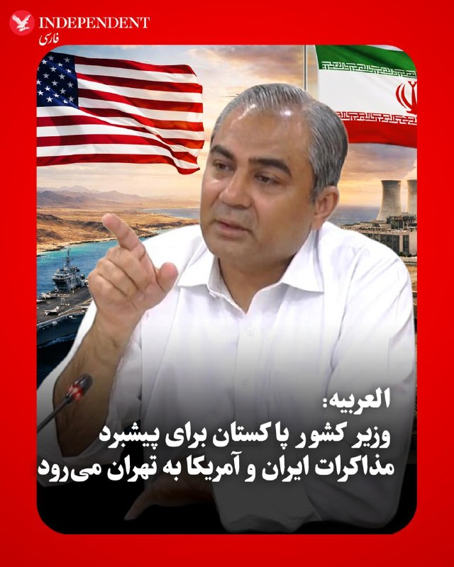

♦️العربیه پنجشنبه شب ۱۴ خردادماه، به نقل از منابع اختصاصی گزارش داد محسن نقوی، وزیر کشور پاکستان، برای پیشبرد مذاکرات میان جمهوری اسلامی ایران و آمریکا به تهران سفر می‌کند.

به گفته این منابع، سفر نقوی در چارچوب تلاش‌های میانجی‌گرانه اسلام‌آباد میان تهران و واشنگتن انجام می‌شود.
‌🇸🇦 Indypersian

🤖 @VahidOOnLine

## mwarmonitor — post 10155

🔹خبرنگار: شما به رای‌گیریِ دیروز مجلس نمایندگان درباره «قطعنامه اختیارات جنگی» پاسخ دادید؛ همچنین دیده‌ایم که حزب‌الله، صلح با میانجی‌گریِ آمریکا در لبنان را رد کرده است. شما گفتید که مذاکرات در مراحل پایانی است، اما ایران می‌گوید که این مذاکرات متوقف شده است. موضع شما...؟
🔸دونالد ترامپ (بین حرف خبرنگار می‌آید):
خب، اونا می‌خوان ردش کنند؛ در واقع اونا ردش نکردند. اونا دارند بررسی‌اش می‌کنند. من فکر می‌کنم حزب‌الله... بهتون بگم، اونا با ما تماس گرفتند.
🔸دونالد ترامپ:
اونا با ما تماس گرفتند و گفتند: «نظرتون درباره متوقف کردنش چیه؟» و من فکر می‌کنم شما قرار هست شاهد اتفاقاتی در اونجا باشید. این موضوع تا حدودی مثل یک دنیای متفاوت بوده، اما با ایران در ارتباطه.
و واقعاً خوب می‌شه اگه لبنان بتونه به کمی صلح برسه. لبنان سال‌های زیادی هست که تحت حملات بوده و همیشه مثل یک گروه ضعیف و بی‌دفاع (Underdog) عمل کرده. واقعاً خوب می‌شه اگه این وضعیت تموم بشه. من با بی‌بی نتانیاهو (بنیامین نتانیاهو) در این مورد صحبت کردم، با خودشون هم در این باره صحبت کردم و در واقع با حزب‌الله هم در این مورد صحبت کردم.
و فکر می‌کنم پیشرفت‌هایی حاصل شده. این موضوع برای مدت طولانی جریان داشته؛ می‌دونید وقتی به این قضیه نگاه می‌کنید، برای سال‌ها و سال‌ها... ۴۸ سال. من می‌گم: «خب، بیاید این رو حل‌وفصل کنیم. چقدره که این ماجرا ادامه داره؟» ۴۸ سال. گفتم: «این زمان خیلی طولانی‌ایه.» (با خنده) به این سادگی‌ها نیست، اما بفرمایید [سوال بعدی].
🔹خبرنگار: آقای رئیس‌جمهور، هرچه به انتخابات میان‌دوره‌ای نزدیک‌تر می‌شیم، آیا واکنش‌های داخلی به این موضوع و نحوه مدیریت خودتون رو در تصمیم‌گیری‌ها لحاظ می‌کنید؟ یا اینکه همچنان کار خودتون رو...؟
🔸دونالد ترامپ: نه، من فقط کاری رو انجام می‌دم که درسته. گوش کنید، این قضیه مثل ونزوئلا بود؛ اولش خیلی نامحبوب بود، بعد ما پیروز شدیم و آمار [محبوبیت] من به شدت بالا رفت. من آمار نظرسنجی بسیار بالایی دارم، آمار من سقف رو شکافت و بالا رفت.
وقتی من به سراغ مسئله ونزوئلا رفتم، کار خیلی نامحبوبی بود؛ اونا می‌گفتند: «اوه، ما این رو نمی‌خوایم.» خب اول از همه، اونجا نسبتاً به ما نزدیکه، یه جورایی نیمچه همسایه ما محسوب می‌شه، مگه نه؟ و رابطه ما با ونزوئلا فوق‌العاده است. ما میلیون‌ها و میلیون‌ها بشکه نفت از ونزوئلا خارج کردیم. اونجا فرآورده‌های نفتی زیادی داره؛ فکر کنم کریس، یکی از نفت‌خیزترین‌هاست، درسته؟
کریس وزیر انرژی:
بله.
🔸دونالد ترامپ:
و ما نفت خارج کردیم. شما یه جورایی دارید این کار رو رهبری می‌کنید؛ اما کریس، می‌خوای خیلی سریع درباره رابطه‌ای که با ونزوئلا داریم بهشون توضیح بدی؟

@mwarmonitor

## mwarmonitor — post 10154

  <a href="telegram/content/mwarmonitor_10154_1780605143.mp4" target="_blank">🎬 Download video</a>

🎬 Video

## VahidOnline — post 75942

  

العربیه پنجشنبه شب ۱۴ خردادماه، به نقل از منابع اختصاصی گزارش داد محسن نقوی، وزیر کشور پاکستان، برای پیشبرد مذاکرات میان جمهوری اسلامی ایران و آمریکا به تهران سفر می‌کند.

به گفته این منابع، سفر نقوی در چارچوب تلاش‌های میانجی‌گرانه اسلام‌آباد میان تهران و واشنگتن انجام می‌شود.
@VahidOOnLine

📡 @VahidOnline

## VahidOnline — post 75941

  

دونالد ترامپ، رئیس‌جمهوری آمریکا روز پنج‌شنبه هشدار داد که اگر نیروهای آمریکایی در حملات جمهوری اسلامی کشته شوند، جنگ با رژیم ایران از سر گرفته خواهد شد.
@VahidHeadline

📡 @VahidOnline

## IranIntlTV — post 340570

  <a href="https://t.me/IranintlTV/340570" target="_blank">📎 Download file</a>

🎧نسخه صوتی ۲۴ با فرداد فرحزاد: نگرانی دوباره جامعه جهانی از اهداف هسته‌ای ایران
@iranintlTV

## IranIntlTV — post 340569

  <a href="telegram/content/IranIntlTV_340569_1780605146.mp4" target="_blank">🎬 Download video</a>

ساعاتی پس از توافق سه‌جانبه آمریکا، لبنان و اسرائیل، حزب‌الله اعلام کرد طرح آتش‌بس را بدون خروج کامل اسرائیل از خاک لبنان نمی‌پذیرد. دبیرکل حزب‌الله مذاکرات مستقیم بیروت با اسرائیل را «نمایشی مضحک» خواند. در مقابل، وزیر دفاع اسرائیل گفت توافق شامل خلع سلاح حزب‌الله و محکومیت رسمی دخالت‌های جمهوری اسلامی در لبنان است.
@iranintltv

## FarsiVOA — post 219613

  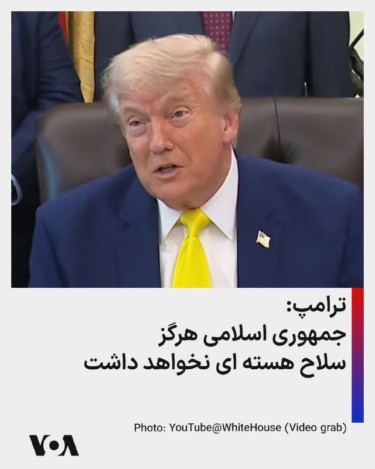

⚡️رئیس جمهوری آمریکا روز پنجشنبه ۱۴ خرداد در مراسم سرمایه‌گذاری در حوزه انرژی و زغال‌سنگ در کاخ سفید بار دیگر تاکید کرد که جمهوری اسلامی هرگز نمی‌تواند به سلاح هسته‌ای دست پیدا کند و «همه نیز با این موضوع موافق هستند.» او گفت جمهوری اسلامی هرگز سلاح هسته‌ای نخواهد داشت.
@FarsiVOA

## FarsiVOA — post 219612

  <a href="telegram/content/FarsiVOA_219612_1780605148.mp4" target="_blank">🎬 Download video</a>

⚡️خصوصیات اخلاقی مرجان ساتراپ و نگاه او به مرگ در گفت‌وگو با لونا شاد
@FarsiVOA

## FarsiVOA — post 219611

  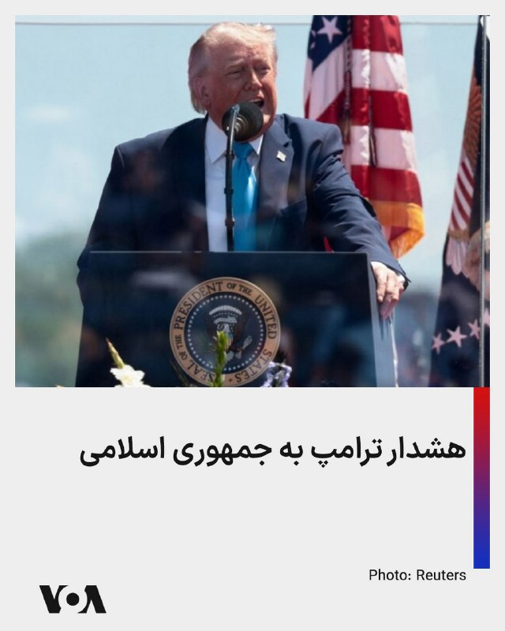

⚡️دونالد ترامپ، رئيس‌جمهوری آمریکا روز پنج‌شنبه هشدار داد که اگر نیروهای آمریکایی در حملات جمهوری اسلامی کشته شوند، جنگ با رژیم ایران از سر گرفته خواهد شد.
@FarsiVOA

## DW_Farsi — post 125511

  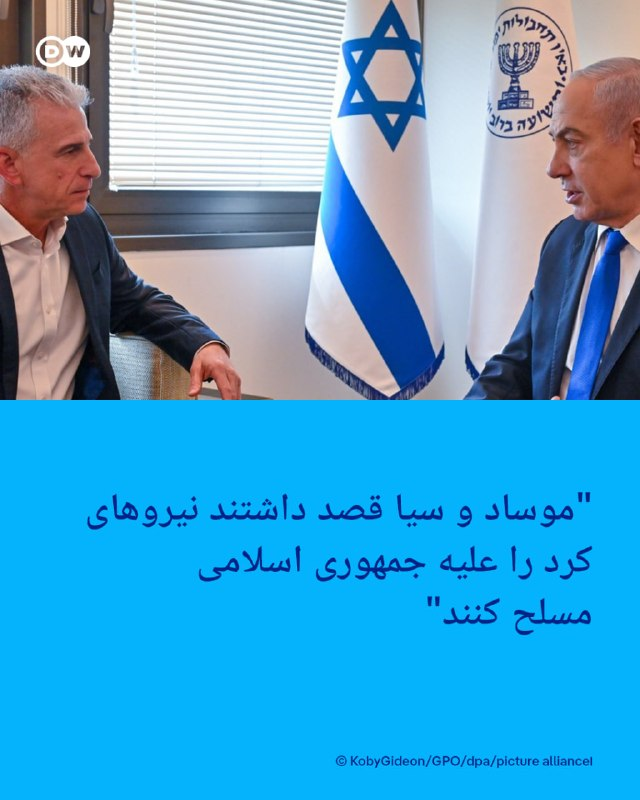

🔶"موساد و سیا قصد داشتند نیروهای کرد را علیه جمهوری اسلامی مسلح کنند"

بر اساس اعلام شرکت ردیابی دریایی  کپلر، چهار نفتکش با پرچم جمهوری اسلامی، روز دوشنبه اول ژوئن از تنگه هرمز عبور کردند.

بر اساس گزارش‌های منتشر شده در رسانه‌های اسرائیلی، سازمان اطلاعات خارجی اسرائیل (موساد)، با همکاری سازمان امنیت آمریکا، سیا، در چارچوب تلاشی برای سرنگونی حکومت ایران، طرحی را برای مسلح کردن نیروهای شبه‌نظامی کرد با سلاح‌هایی که در درگیری‌ها با حماس و حزب‌الله ضبط شده بودند، اجرا کرده بود.

این گزارش‌ها که از سوی شبکه ۱۲ اسرائیل و وای‌نت منتشر شده‌ و منبع مشخصی را ذکر نکرده‌اند، چند روز پس از کناره‌گیری دیوید بارنیا از ریاست موساد پس از پنج سال خدمت در این سمت منتشر شدند.

بر اساس این طرح، نیروهای کُرد، کمک مالی و خودرو دریافت کردند و به سلاح‌های سبک، پرتابگرهای ضدتانک، نارنجک و خمپاره مجهز شدند. این گزارش‌ها می‌گویند مسئولیت انتقال سلاح‌ها و مهمات به نیروهای کُرد بر عهده موساد بوده است.

@dw_farsi

## BBCPersian — post 282881

🔻سنتکام: از زمان محاصره دریایی ایران ۱۲۷ کشتی تجاری مجبور شدند تغییر مسیر بدهند

ستاد فرماندهی مرکزی آمريکا (سنتکام) اعلام کرد که از زمان محاصره دریایی ایران توسط آمریکا تا ۴ ژوئن (۱۴ خرداد)، ۱۲۷ کشتی تجاری مجبور به تغییر مسیر شده‌اند و شش کشتی متخلف هم توسط نیروی دریایی آمریکا از کار انداخته شده‌اند.

سنتکام همچنین گفته است که به ۳۶ کشتی حامل کمک‌های بشردوستانه اجازه عبور داده‌اند.

آمریکا از ۱۳ آوریل (۲۴ فروردین) و در واکنش به اقدام ایران در بستن تنگه هرمز، دست به محاصره دریایی بنادر ایران زده است و اجازه نمی‌دهد هیچ کشتی‌ای از مبدا یا به مقصد بنادر ایرانی از تنگه هرمز عبور کند.

## BBCPersian — post 282880

🔻 حمایت مکرون از آتش‌بس میان لبنان و اسرائيل

امانوئل مکرون، رئیس‌جمهور فرانسه، گفته است که از آتش‌بس میان لبنان و اسرائیل که در واشنگتن حاصل شد، حمایت می‌کند.

آقای مکرون گفت که پاریس از هر «اقدامی که به برقراری صلح، مقابله با فعالیت‌های تروریستی و تقویت حاکمیت و تمامیت ارضی لبنان کمک کند، پشتیبانی می‌کند.»

او در جریان سفر به مونته‌نگرو اعلام کرد: «فرانسه و ایالات متحده در قالب یک سازوکار هماهنگی مشترک برای نظارت بر اجرای آتش‌بس همکاری می‌کنند و در صورت پایبندی طرف‌ها به توافق، این سازوکار باید دوباره فعال شود.»

رئیس‌جمهور فرانسه همچنین تأکید کرد که پس از برقراری آتش‌بس، باید راهکارهایی برای تقویت حاکمیت لبنان و استقرار کامل ارتش این کشور تدوین شود تا کنترل و مدیریت سلاح تنها در اختیار نهادهای رسمی دولت لبنان قرار گیرد.

او افزود که این روند می‌تواند به تثبیت حاکمیت دولت لبنان بر سراسر قلمرو خود کمک کند.

گروه حزب‌الله که از حمایت ایران برخوردار است، در مذاکراتی که با میانجیگری آمریکا میان لبنان و اسرائیل برگزار شد حضور نداشت و نعیم قاسم، دبیرکل این گروه، پس از اعلام توافق آن را رد کرده است.

https://bbc.in/4dS78uI
@BBCPersian

## BBCPersian — post 282879

🔻موافقت اتحادیه اروپا با اختصاص بسته حمایتی به ارزش ۱۱۶ میلیون دلار به ارتش لبنان

اتحادیه اروپا روز پنج‌شنبه با اختصاص یک بسته حمایتی جدید به ارزش ۱۰۰ میلیون یورو (حدود ۱۱۶ میلیون دلار) برای ارتش لبنان موافقت کرد. اقدامی که با هدف تقویت نیروهای لبنان در شرایط آتش‌بس شکننده در آن کشورصورت گرفت.

کایا کالاس، مسئول سیاست خارجی اتحادیه اروپا، در پیامی اعلام کرد که آتش‌بس اخیر میان اسرائیل و لبنان فرصتی برای جلوگیری از بازگشت درگیری‌های گسترده فراهم کرده است، اما کشته شدن یک نیروی صلحبان سازمان ملل و ادامه درگیری‌های پراکنده نشان می‌دهد این توافق همچنان بسیار شکننده است.

او همچنین گفت: «بهترین راه برای کاهش تهدید ناشی از حزب‌الله، تقویت دولت لبنان، توانمندسازی نهادهای آن و بازگرداندن قدرت به دولت است.»

این کمک جدید چهارمین بسته حمایتی اتحادیه اروپا برای ارتش لبنان در سال‌های اخیر محسوب می‌شود و مجموع کمک‌های ارائه‌شده را به ۱۸۲ میلیون یورو می‌رساند.

در همین حال، اسرائیل به‌رغم اعلام آتش‌بس روز پنج‌شنبه بار دیگر حملاتی را در لبنان انجام داد.

نیروهای یونیفیل هم اعلام کردند که در پی اصابت گلوله به یکی از پایگاه‌هایشان در جنوب لبنان، یک صلح‌بان کشته و دو نفر دیگر زخمی شده‌اند.
https://bbc.in/4dS78uI
@BBCPersian

## alonews — post 125175

  <a href="telegram/content/alonews_125175_1780605149.webm" target="_blank">🎬 Download video</a>

👈سؤال: آیا کشته شدن نیروهای آمریکایی، خط قرمز شما برای پایان دادن به آتش‌بس است؟

🔴ترامپ: اگر آن‌ها کسی را بکشند؟

🔴سؤال: نیروهای آمریکایی را.

🔴ترامپ: منظورتان چیست؟

🔴سوال: اینکه اگر نیروهای آمریکایی را بکشند، شما جنگ با ایران را از سر خواهید گرفت؟

🔴ترامپ: خب، این می‌تواند دلیل خوبی باشد.

✅ @AloNews خبر جنگ

## alonews — post 125174

  <a href="telegram/content/alonews_125174_1780605149.webm" target="_blank">🎬 Download video</a>

👈ترامپ: ما سایت‌های هسته‌ای ایران را از فضا رصد می‌کنیم و هرکس به آن‌ها نزدیک شود، همانطور که باید با آنها برخورد می‌کنیم

✅ @AloNews خبر جنگ

## alonews — post 125173

  <a href="telegram/content/alonews_125173_1780605150.mp4" target="_blank">🎬 Download video</a>

👈ترامپ: «من نمی‌خواهم با آیت‌الله ملاقات کنم، اما اگر با او ملاقات می‌کردم، برایم افتخار بود که با او دیدار کنم.
با احترام رفتار می‌کردم.»

✅ @AloNews خبر جنگ

## alonews — post 125172

  <a href="telegram/content/alonews_125172_1780605151.mp4" target="_blank">🎬 Download video</a>

👈 کریس رایت، وزیر انرژی ایالات متحده:
سیاست‌های انرژی سبز دموکراتیک، قیمت انرژی را بسیار بیشتر از درگیری در ایران افزایش داده است.

✅ @AloNews خبر جنگ

## alonews — post 125171

  <a href="telegram/content/alonews_125171_1780605153.webm" target="_blank">🎬 Download video</a>

👈ترامپ: بایدن و اوباما ایران را به داشتن سلاح هسته‌ای ترغیب کردند.

✅ @AloNews خبر جنگ

## alonews — post 125170

  <a href="telegram/content/alonews_125170_1780605153.mp4" target="_blank">🎬 Download video</a>

👈ترامپ : روابط ما با ونزوئلا فوق‌العاده‌ست. کلی نفت، میلیون‌ها بشکه نفت از ونزوئلا خارج کردیم

✅ @AloNews خبر جنگ

## alonews — post 125169

  <a href="telegram/content/alonews_125169_1780605154.webm" target="_blank">🎬 Download video</a>

👈ترامپ: چند موشک در ایران باقی مانده است، اما بسیار کم.

🔴مذاکرات با ایران خوب پیش می‌رود.

🔴مسئله لبنان تا حدودی متفاوت است، اما به ایران مرتبط است.

🔴آمریکا می‌تواند اورانیوم غنی‌شده ایران را با یا بدون توافق مصادره کند.

✅ @AloNews خبر جنگ

<!-- MSG END -->

<!-- NAV START -->

<!-- NAV END -->
