# خواننده تلگرام

<!-- TOP_NAV START -->

<!-- TOP_NAV END -->

<!-- MSG START -->

---
📅 بروزرسانی: 1405/03/08 17:52
---

## VahidOOnLine — post 242762

  <a href="telegram/content/VahidOOnLine_242762_1780064572.mp4" target="_blank">🎬 Download video</a>

در سیاست بین‌الملل، کشورها بیش از آنکه بر پایه دوستی، همدلی یا شعارهای اخلاقی تصمیم بگیرند، بر اساس منافع ملی خود عمل می‌کنند. قدرت‌های بزرگ ممکن است از آزادی، امنیت، حقوق بشر یا نظم جهانی سخن بگویند، اما در لحظه تصمیم، محاسبه اصلی این است که چه چیزی به سود آن‌هاست.
‌🏁 🇬🇧 ManotoTV

🤖 @VahidOOnLine

## WithYashar — post 12859

️فاکس نیوز به نقل از وزیر جنگ آمریکا: ایران دو گزینه دارد: یا از طریق مذاکره برنامه هسته ای خود را کنار بگذارد یا از طریق نیروهای ما
@withyashar

## VahidOnline — post 75788

  <a href="telegram/content/VahidOnline_75788_1780064573.mp4" target="_blank">🎬 Download video</a>

این ویدیو با شرح عبور موشک‌های تاماهاک در مرز عراق و ایران در شبکه‌های اجتماعی و چند رسانه منتشر شده و گفته می‌شود مربوط به روزهای نخست جنگ است.
@VahidOOnLine

📡 @VahidOnline

## VahidOnline — post 75787

  <a href="telegram/content/VahidOnline_75787_1780064574.mp4" target="_blank">🎬 Download video</a>

اسکات بسنت، وزیر خزانه‌داری آمریکا، روز پنجشنبه هفتم خرداد ماه اعلام کرد عمان پس از دریافت هشدار واشنگتن درباره پیامدهای احتمالی مشارکت در طرح دریافت عوارض از کشتی‌های عبوری از تنگه هرمز، به آمریکا اطمینان داده است که برنامه‌ای برای اجرای چنین طرحی ندارد.
بسنت روز پنجشنبه در نشست خبری کاخ سفید گفت که صبح همان روز با سفیر عمان گفتگو کرده و از او شنیده است که مسقط هیچ برنامه‌ای برای دریافت عوارض در تنگه هرمز ندارد.
او افزود: «به او گفتم این موضوع از اساس غیرقابل قبول است و او نیز نمی‌خواهد افراد عمانی یا موسسات مالی عمانی را در معرض خطر تحریم قرار دهد.»
بسنت ساعاتی پیش‌تر در پیامی در شبکه اجتماعی ایکس هشدار داده بود که وزارت خزانه‌داری آمریکا هر فرد یا نهادی را که به‌صورت مستقیم یا غیرمستقیم در تسهیل دریافت عوارض در تنگه هرمز نقش داشته باشد، هدف تحریم قرار خواهد داد. او تصریح کرده بود که هر شریک احتمالی این طرح نیز با مجازات و تحریم روبه‌رو خواهد شد.
@VahidOOnLine

📡 @VahidOnline

## VahidOnline — post 75786

  

شبکه العربیه به نقل از منابع آگاه گزارش داد جمهوری اسلامی می‌خواهد اورانیوم غنی‌سازی‌شده خود را به چین منتقل کند، مشروط بر آن‌که چین تضمین دهد این مواد را به آمریکا تحویل نخواهد داد.

به گفته این منابع، بسیاری از نکات مرتبط با برنامه هسته‌ای جمهوری اسلامی در مذاکرات جاری حل‌وفصل شده است.

بر اساس این گزارش، جمهوری اسلامی با نظارت بین‌المللی بر تاسیسات هسته‌ای خود برای جلوگیری از تعطیل‌شدن آن‌ها موافقت کرده است.
@VahidOOnLine

📡 @VahidOnline

## IranIntlTV — post 339591

  <a href="telegram/content/IranIntlTV_339591_1780064574.mp4" target="_blank">🎬 Download video</a>

کارشناس صداوسیما گفت دوران بمب اتم سپری شده و اکنون می‌توان با عملیات میکروبی و بیولوژیک حملاتی انجام داد بدون آنکه مسئولیت آن پذیرفته شود. او همچنین با اشاره به امکان استفاده از «بمب چرک» تاکید کرد با توجه به احتمال رسیدن شرایط به مرحله رویارویی هسته‌ای، انجام اقدامات پیشگیرانه ضروری است.
@iranintltv

## IranIntlTV — post 339590

  <a href="telegram/content/IranIntlTV_339590_1780064576.mp4" target="_blank">🎬 Download video</a>

پیت هگست، وزیر جنگ آمریکا، در جریان بازدید از نیروهای آمریکایی مستقر در ناو یواس‌اس باکسر در سنگاپور، با استناد به سخنان دونالد ترامپ در نشست روز چهارشنبه کابینه، به نیروها گفت اگر جمهوری اسلامی توافق پیشنهادی را نپذیرد، با نیروهای نظامی آمریکا روبه‌رو خواهد شد. هگست گفت ترامپ در نشست کابینه اعلام کرده ایران باید توافق روی میز را بپذیرد وگرنه با «مردی در سمت چپ» او روبه‌رو می‌شود، و این جمله را خطاب به نیروهای حاضر تکرار کرد.
@iranintltv

## IranIntlTV — post 339589

  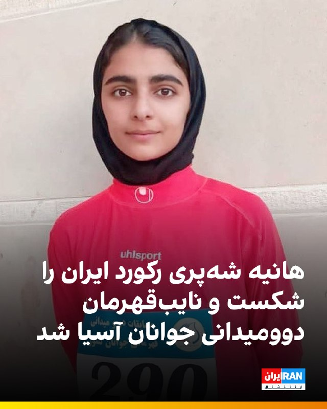

🔻هانیه شه‌پری دونده ۱۹ ساله اهل ایذه خوزستان در مسابقات دوومیدانی قهرمانی جوانان آسیا در هنگ‌کنگ، مدال نقره ماده ۳۰۰۰ متر بامانع را کسب کرد.

🔹ملی‌پوش ایران با ثبت زمان ۱۰:۲۶.۳۴ دقیقه ضمن کسب عنوان نایب‌قهرمانی، رکورد ملی بزرگسالان این ماده را نیز شکست. رکورد پیشین با زمان ۱۰:۲۹.۲۴ دقیقه در اختیار خود او بود.

@iranintltvsport

## ManotoTV — post 105869

در سیاست بین‌الملل، کشورها بیش از آنکه بر پایه دوستی، همدلی یا شعارهای اخلاقی تصمیم بگیرند، بر اساس منافع ملی خود عمل می‌کنند. قدرت‌های بزرگ ممکن است از آزادی، امنیت، حقوق بشر یا نظم جهانی سخن بگویند، اما در لحظه تصمیم، محاسبه اصلی این است که چه چیزی به سود آن‌هاست.

## FarsiVOA — post 218983

🔺وزیران خارجه آمریکا و پاکستان در واشنگتن دیدار می‌کنند؛ تمرکز بر مذاکرات و تلاش برای دستیابی به توافق

▪️اسحاق دار، وزیر امور خارجه پاکستان، روز جمعه ۸ خرداد برای دیدار با مارکو روبیو، وزیر امور خارجه ایالات متحده، وارد واشنگتن شد. پیش‌بینی می‌شود تازه‌ترین تحولات در مذاکرات برای پایان دادن به تنش بین آمریکا و جمهوری اسلامی از محورهای اصلی گفت‌و‌گوها باشد.

⬇️ بیشتر بخوانید:

https://ir.voanews.com/a/iran-us-rubio-pakistan-negotiations/8155268.html

## IranianMinds — post 21017

  

این حرومیو

@IranianMinds

## IranianMinds — post 21016

🔴شبکه العربیه به نقل از منابع آگاه:

ایران می‌خواهد اورانیوم غنی‌شده را به چین منتقل کند، مشروط بر آن‌که چین تضمین دهد که این مواد را به آمریکا تحویل ندهد.

@IranianMinds

## manototv — post 105869

  <a href="telegram/content/manototv_105869_1780064578.mp4" target="_blank">🎬 Download video</a>

در سیاست بین‌الملل، کشورها بیش از آنکه بر پایه دوستی، همدلی یا شعارهای اخلاقی تصمیم بگیرند، بر اساس منافع ملی خود عمل می‌کنند. قدرت‌های بزرگ ممکن است از آزادی، امنیت، حقوق بشر یا نظم جهانی سخن بگویند، اما در لحظه تصمیم، محاسبه اصلی این است که چه چیزی به سود آن‌هاست.

## alonews — post 123510

  <a href="telegram/content/alonews_123510_1780064579.webm" target="_blank">🎬 Download video</a>

👈هشدار ورود موج گرمای شدید؛ دمای در برخی نقاط کشور به ۵۰ درجه می‌رسد

✅ @AloNews خبر جنگ

## alonews — post 123509

  <a href="telegram/content/alonews_123509_1780064579.webm" target="_blank">🎬 Download video</a>

👈فاکس نیوز به نقل از وزیر جنگ آمریکا: ایران دو گزینه دارد: یا از طریق مذاکره برنامه هسته ای خود را کنار بگذارد یا از طریق نیروهای ما

✅ @AloNews خبر جنگ

---
📅 بروزرسانی: 1405/03/08 17:42
---

## VahidOOnLine — post 242761

♦️عبدالحسین روح‌الامینی، نماینده تهران در مجلس، در گفتگویی در صداوسیما اعلام کرد به‌دلیل شرایط امنیتی و عدم امکان برگزاری جلسات حضوری، از رهبر جدید جمهوری اسلامی برای انجام فرآیندهای قانونی به‌صورت مجازی «استیذان» (درخواست اجازه) گرفته شده است.
او با اشاره به اینکه آیین‌نامه فعلی مجلس اجازه چنین اقدامی را نمی‌دهد، گفت درخواست این مجوز چند هفته پیش ارائه شده و هدف آن ادامه روند قانون‌گذاری و تصمیم‌گیری بدون تجمع فیزیکی نمایندگان است.
روح‌الامینی همچنین از برگزاری جلسات مجازی با حضور بیش از ۲۰۰ نماینده خبر داد و افزود در این نشست‌ها موضوعاتی مانند تامین کالاهای اساسی و دارو مورد بررسی قرار گرفته است.
‌🇸🇦 Indypersian

🤖 @VahidOOnLine

## VahidOOnLine — post 242760

  

عباس عراقچی، وزیر خارجه جمهوری اسلامی درباره تماس تلفنی با بدر البوسعیدی، وزیر خارجه عمان، گفت که همبستگی جمهوری اسلامی را با عمان در برابر هرگونه تهدید ابراز کردم و ما درباره تنگه هرمز و مدیریت آینده آن در چارچوب مسئولیت‌های حاکمیتی و حقوق بین‌الملل گفت‌وگو کردیم.
‌🏁 🇬🇧 IranintlTV

🤖 @VahidOOnLine

## VahidOnline — post 75785

  

محمدباقر قالیباف، مذاکره‌کننده ارشد جمهوری اسلامی با آمریکا، روز جمعه تهدید کرد که تهران امتیازات مورد نظر خود در توافق پایان دادن به جنگ را با «موشک» می‌گیرد و پیش از اقدام واشینگتن درباره این توافق اقدامی نخواهد کرد.

او در شبکه ایکس همچنین نوشت: «هیچ اعتمادی به تضمین‌ها و حرف‌ها نداریم، فقط رفتارها معیار است.»

این موضع‌گیری یک روز پس از آن انجام شد که چند رسانه غربی خبر دادند آمریکا و ایران به تفاهمی برای تمدید آتش‌بس و رفع محدودیت عبور و مرور کشتی‌ها در تنگه هرمز رسیده‌اند، اما این توافق منتظر تصمیم و امضای نهایی دونالد ترامپ، رئیس‌جمهور ایالات متحده است.

قالیباف در پیام خود اعلام کرده که «اقدامی پیش از اقدام طرف مقابل انجام نخواهد شد».

از سوی دیگر، رسانه‌های نزدیک به سپاه پاسداران می‌گویند گزارش‌ها درباره توافق تهران و واشنگتن صحیح نیست. خبرگزاری تسنیم در این مورد به نقل از یک «منبع مطلع» نوشت: «متن توافق تا این لحظه جمع‌بندی نهایی نشده است.»
@VahidHeadline

📡 @VahidOnline

## VahidOnline — post 75784

  

‏🔴بنیاد عبدالرحمن برومند از ابتدای سال جاری تاکنون، اجرای ۶۶۰ مورد اعدام توسط جمهوری اسلامی را مستند کرده است. با این حال، به دلیل ماهیت پنهان‌کاری و غیرشفاف بودن سیستم قضایی ایران، آمار واقعی به احتمال زیاد بسیار بیشتر از این رقم است.

‏🔸از زمان آغاز جنگ، آمار اعدام معترضان و افرادی که به جاسوسی و اتهامات مشابه علیه امنیت ملی متهم شده‌اند، با سرعتی نگران‌کننده افزایش یافته است. «اعترافات اجباری» قربانیان، اصلی‌ترین «مدرک» مورد استفاده در این احکام مرگبار بوده است.

‏🔸این اعترافات در شرایطی کاملا مبهم و تحت فشارهای شدید جسمی و روحی اخذ می‌شوند. جمهوری اسلامی به طور مستمر این اعترافات اجباری را در رسانه‌های دولتی پخش می‌کند تا از آن به عنوان ابزاری برای توجیه اعدام‌ها و سرکوب مخالفت‌های عمومی استفاده کند.
‏⁧ #نه_به_اعدام ⁩
@IranRights

## IranIntlTV — post 339588

  <a href="telegram/content/IranIntlTV_339588_1780063973.mp4" target="_blank">🎬 Download video</a>

هفته دوم دادگاه متهمان حمله به پوریا زراعتی، مجری ایران‌اینترنشنال، در لندن آغاز شد. دو متهم در این جلسه درباره نحوه فرار به رومانی پس از حمله و همچنین تماس‌های تلفنی پیش و پس از این حمله، جزییات تازه‌ای ارائه کردند.

جزییات بیشتر با شروین شهرستانی، عضو تحریریه ایران‌اینترنشنال
@iranintltv

## FarsiVOA — post 218982

ویدیوی منتشر شده از جزیره «هون»، یکی از جزایر حفاظت‌شده پارک ملی دریاچه ارومیه، بازگشت شمار زیادی از پرندگان مهاجر را نشان می‌دهد.

به گفته راوی این ویدیو، حضور پرندگان در دریاچه ارومیه پس از پر آب شدن دریاچه در سال و در اوایل خرداد ۱۴۰۵ جاری ثبت شده است.

@FarsiVOA

## Persian_Trend_Official — post 15249

  

عباس عراقچی، وزیر امور خارجه جمهوری اسلامی با انتشار توییتی در حساب X خود خبر از تماس تلفنی با وزیر امور خارجه عمان داد.

عباس عراقچی میگوید تماس تلفنی با البوسعیدی، وزیر امور خارجه عمان داشته و همبستگی ایران با عمان در مواجهه با هرگونه تهدیدی علیه این کشور را ابراز کرده است.

این تماس به احتمال زیاد به دلیل تهدیدهای اخیر وزیر خزانه داری امریکا علیه عمان بوده.

📝 Amir

📌 @persian_trend_official
پرشین ترند | متفاوت‌ترین کانال نظامی

## Hranews — post 113222

تداوم بازداشت و بی خبری از وضعیت ۲ شهروند در چابهار

❗️
❗️
❗️
❗️
❗️– نوربخش جدگال و یحیی جدگال دو برادر ساکن چابهار حدود ۱۱ روز است که توسط نیروهای امنیتی در این شهرستان بازداشت شدند و تاکنون از محل نگهداری آنها اطلاعی حاصل نشده است.

#نوربخش_جدگال #یحیی_جدگال

ادامه مطلب

↘️
@hranews_bot تماس ✉️ - @Hranews کانال هرانا 🆑

## alonews — post 123508

  <a href="telegram/content/alonews_123508_1780063975.webm" target="_blank">🎬 Download video</a>

👈پیام عراقچی در خصوص تماس تلفنی با همتای عمانی: ما درباره تنگه هرمز و مدیریت آینده آن در چارچوب مسئولیت‌های حاکمیتی و حقوق بین‌الملل گفت‌وگو کردیم

🔴در تماس بسیار سازنده با جناب بدرالبوسعیدی وزیر امور خارجه عمان همبستگی ایران را با عمان در برابر هرگونه تهدید ابراز کردم.

🔴ما درباره تنگه هرمز و مدیریت آینده آن در چارچوب مسئولیت‌های حاکمیتی و حقوق بین‌الملل گفت‌وگو کردیم.

🔴ما از مشورت با همه کشورهای همسایه استقبال می‌کنیم.

✅ @AloNews خبر جنگ

## alonews — post 123507

  <a href="telegram/content/alonews_123507_1780063975.webm" target="_blank">🎬 Download video</a>

👈روزنامه عبری هاآرتص: مشکل فقدان استراتژی در قبال جبهه‌های ایران و لبنان محدود به اسرائیل نیست، بلکه آمریکا نیز در نبردی نظامی، سرگردان و غرق شده که قادر به تعیین مقصد بعدی خود نیست.

🔴 ترامپ در محاصره میان ایران و لبنان قرار گرفته است.

🔴 زیرا هم‌زمان بر پرونده هسته‌ای ایران، تنگه هرمز و هم‌پیمانان تهران از جمله لبنان متمرکز است که او را عملا در چارچوب «وحدت جبهه‌ها»ی مورد نظر ایران قرار داده است

✅ @AloNews خبر جنگ

## alonews — post 123506

  <a href="telegram/content/alonews_123506_1780063975.webm" target="_blank">🎬 Download video</a>

👈 مدودف کشورهای اروپایی رو تهدید کرد: شهروندان کشورهای اتحادیه اروپا باید درک کنید که مقامات شما به طور یکجانبه وارد جنگ با روسیه شده‌اند

🔴 پس هوشیار باشید و از هیچ چیز تعجب نکنید، خواب آرام به پایان رسیده است، اما می‌دانید از چه کسی باید بپرسید چرا!

✅ @AloNews خبر جنگ

---
📅 بروزرسانی: 1405/03/08 17:33
---

## VahidOOnLine — post 242759

  

♦️محسن رضایی، دبیر شورای عالی هماهنگی اقتصادی سران قوا، در گفتگو با شبکه CGTN چین، گفت: «دوستان ما در چین و بسیاری از کشورهای دیگر اصلا نباید نگران تنگه هرمز باشند. نگرانی ما امنیت خلیج فارس و تنگه هرمز است که باز بودن آن‌ها بارها مورد سوءاستفاده آمریکا و اسرائیل قرار گرفته است.»

رضایی همچنین گفت که اگر محاصره دریایی آمریکا علیه بنادر ایران «فراتر از بازه زمانی معینی» ادامه یابد، جمهوری اسلامی محاصره را یا از طریق مذاکره یا از طریق «اقدام مستقیم» خواهد شکست. او مشخص نکرد که این «بازه زمانی معین» چند روز است. این در حالی است که محاصره دریایی بنادر از روز دوشنبه ۲۴ فروردین آغاز شده و ۴۴ روز است که ادامه دارد.

محسن رضایی که از فرماندهان جنگ هشت ساله با عراق نیز بوده و سوابق تیره‌ای در قربانی کردن سربازان دارد، گفت: «در طول جنگ ۱۲ روزه، یک وجه از قدرت خود را به نمایش گذاشتیم؛ در جنگ رمضان، وجه دیگری را نشان دادیم. اگر درگیری ادامه پیدا کند، بعد سومی را آشکار می‌کنیم و این به دلیل انعطاف‌پذیری ذاتی سبک جنگی ایران و اصول و ارکان بنیادین سبک نظامی سپاه است.»
‌🇸🇦 Indypersian

🤖 @VahidOOnLine

## VahidOOnLine — post 242758

  

♦️محمدباقر قالیباف، رئیس مجلس شورای اسلامی، با انتشار متنی در شبکه اجتماعی ایکس، سه نکته درباره مذاکرات مطرح کرد. او روند مذاکرات را برای «تفهیم امتیاز» دانست و نوشت: «ما امتیازات را نه با گفتگو، بلکه با موشک‌ها می‌گیریم، در مذاکره فقط آن‌ها را تفهیم می‌کنیم.»

قالیباف با تاکید بر نبود اعتماد میان تهران و واشنگتن نوشت: «هیچ اعتمادی به تضمین‌ها و حرف‌ها نداریم، فقط رفتارها معیار است. اقدامی پیش از اقدام طرف مقابل انجام نخواهد شد.»

رئیس هیات مذاکره جمهوری اسلامی در بند سوم نوشت: «پیروز هر توافق، کسی است که از فردای آن بهتر برای جنگ آماده شود.»

این اظهارات در حالی مطرح شد که فشار محاصره دریایی آمریکا علیه بنادر ایران ادامه داشته و تاثیر این فشار بر اقتصاد خانواده‌ها و هزینه معیشت نمایان شده است.
‌🇸🇦 Indypersian

🤖 @VahidOOnLine

## VahidOOnLine — post 242757

  <a href="telegram/content/VahidOOnLine_242757_1780063404.mp4" target="_blank">🎬 Download video</a>

♦️پیت هگست، وزیر جنگ ایالات متحده، در جریان حضور در ناو آبی‌خاکی «باکسر» و در جمع ملوانان و تفنگداران دریایی این کشور، با اشاره به سیاست‌های واشنگتن در قبال ایران، گفت تهران با یک انتخاب روبه‌رو است: یا وارد مذاکره شود و برنامه هسته‌ای خود را کنار بگذارد، یا با واکنش نظامی آمریکا مواجه شود.
او که در حاشیه یک برنامه تمرین بدنی صبحگاهی گفت، زمانی که آمریکا «کار خود را درست انجام دهد»، طرف مقابل یا عقب‌نشینی می‌کند یا با «قدرت و خشم ارتش آمریکا» روبه‌رو خواهد شد.
هگست همچنین با اشاره به اظهارات اخیر دونالد ترامپ، گفت مسیر مطلوب، دستیابی به توافق از طریق مذاکره است، اما در غیر این صورت، گزینه‌های دیگری نیز روی میز قرار دارد.
‌🇸🇦 Indypersian

🤖 @VahidOOnLine

## VahidOOnLine — post 242756

  

♦️ به گزارش دولت قطر، دونالد ترامپ، رئیس‌جمهوری آمریکا، روز پنجشنبه هشتم خرداد، در تماسی تلفنی با شیخ تمیم بن حمد آل ثانی، امیر قطر، درباره آخرین تحولات خاورمیانه گفتگو کرد. محور اصلی این گفتگو بر تلاش‌های منطقه‌ای و بین‌المللی با هدف کاهش تنش‌ها و تقویت ثبات متمرکز بود.

بر اساس بیانیه منتشر شده، امیر قطر در این تماس بر ضرورت اولویت دادن به راهکارهای سیاسی، دیپلماتیک و گفتگو میان تمامی طرف‌ها برای تثبیت امنیت منطقه و دور نگه داشتن آن از تنش‌های بیشتر تاکید کرد.

ترامپ نیز از نقش دولت قطر در حمایت از تلاش‌های میانجی‌گرانه پاکستان میان جمهوری اسلامی و ایالات متحده قدردانی کرد. او همچنین تلاش‌های دوحه را برای نزدیک کردن دیدگاه‌های دو طرف و پیشبرد روند تنش‌زدایی در منطقه مورد تمجید قرار داد.
‌🇸🇦 Indypersian

🤖 @VahidOOnLine

## VahidOOnLine — post 242755

  

♦️خبرگزاری تسنیم، وابسته به سپاه پاسداران، روز جمعه هشتم خرداد ماه به نقل از «یک منبع مطلع» گزارش کرد «متن تفاهم‌نامه احتمالی میان ایران و آمریکا تا این لحظه جمع‌بندی نهایی نشده است و در صورتی که نهایی شود، به صورت رسمی اعلام خواهد شد.»
تسنیم به نقل از این منبع افزود: «متونی که تا این لحظه رسانه‌های غربی به عنوان جزئی از متن اصلی منتشر کرده‌اند عاری از دقت است.»
این منبع همچنین به خبرگزاری تسنیم گفت متن تفاهم‌نامه احتمالی طی روزهای گذشته دستخوش تغییراتی شده و مذاکرات همچنان در جریان است.
‌🇸🇦 Indypersian

🤖 @VahidOOnLine

## VahidOOnLine — post 242754

♦️جی‌دی ونس، معاون رئیس‌جمهوری آمریکا، روز پنجشنبه هفتم خرداد ماه، در واکنش به تبادل سنگین آتش میان نیروهای آمریکایی مستقر در منطقه و سپاه پاسداران در تنگه هرمز گفت آتش‌بس‌ها همواره با پیچیدگی‌ها و تنش‌های مقطعی همراه هستند و وقوع درگیری‌های محدود لزوما به معنای فروپاشی توافق نیست.
ونس به خبرنگاران گفت: «آتش‌بس‌ها همیشه کمی آشفته هستند و گاهی افراد در سطوح پایین با مقام‌های ارشد هماهنگی کامل ندارند. بعضی وقت‌ها اشتباهاتی رخ می‌دهد، اما حتی زمانی که آتش‌بس برقرار است، همان‌طور که نه فقط در ایران بلکه در نقاط مختلف جهان دیده‌ایم، گاهی چنین تنش‌ها و درگیری‌های مقطعی رخ می‌دهد.»
معاون رئیس‌جمهوری آمریکا همچنین گفت مذاکرات میان ایران و آمریکا برای دستیابی به توافق ادامه دارد و دو طرف در مسیر تفاهم پیشرفت قابل توجهی داشته‌اند.
به گفته ونس، هنوز بر سر برخی جزئیات و عبارات متن توافق اختلافاتی وجود دارد، اما گفتگوها ادامه دارد و کاخ سفید امیدوار است روند مذاکرات به نتیجه برسد.
‌🇸🇦 Indypersian

🤖 @VahidOOnLine

## VahidOOnLine — post 242753

  <a href="telegram/content/VahidOOnLine_242753_1780063405.mp4" target="_blank">🎬 Download video</a>

⭕️دولت سوریه در پی طغیان رود فرات وضعیت اضطراری اعلام کرد

♦️وزارت انرژی سوریه روز پنجشنبه هفتم خرداد ماه، نسبت به افزایش سطح آب رود فرات و وقوع سیلاب در مناطق شمالی و شرقی این کشور هشدار داد و اعلام کرد مقامات محلی در استان‌های دیرالزور، رقه و حلب وضعیت اضطراری اعلام کرده‌اند.

این وزارتخانه در بیانیه‌ای اعلام کرد که شرایط رود فرات را با توجه به «افزایش چشمگیر و بی‌سابقه جریان آب از سمت ترکیه» به‌دقت زیر نظر دارد. به گفته مقام‌های سوری، بارندگی‌های فراوان در فصل جاری و باز شدن دریچه‌های سدهای واقع در خاک ترکیه موجب افزایش حجم آب ورودی به سوریه شده است.

خبرگزاری دولتی سوریه (سانا) گزارش داد که سیلاب بخش‌هایی از مناطق شهری و روستایی استان دیرالزور را فراگرفته و یک پل خاکی نیز زیر آب رفته است. پیش‌تر نیز چندین پل در این استان از مدار بهره‌برداری خارج شده بودند و زمین‌های کشاورزی و خانه‌های مسکونی آسیب دیده بودند. گزارش‌هایی از وقوع سیلاب در استان همجوار رقه نیز منتشر شده است.

وزارت انرژی سوریه همچنین اعلام کرد ظرفیت ذخیره‌سازی آب در سد فرات سوریه تقریبا تکمیل شده و به همین دلیل رهاسازی مقادیر زیادی آب از این سد ادامه دارد. این وزارتخانه شامگاه چهارشنبه تصویری از باز شدن دریچه‌های سرریز سد فرات منتشر کرد و گفت از این دریچه‌ها حدود ۴۰ سال استفاده نشده بود. مقام‌های سوری از ساکنان مناطق اطراف خواسته‌اند با توجه به خطر سیلاب، اقدامات احتیاطی لازم را انجام دهند.

در همین حال، رسانه‌های محلی ترکیه به نقل از مقام‌های حوزه آب اعلام کردند که پس از افزایش سطح آب در سد آتاتورک بر اثر بارندگی‌های شدید ماه‌های اخیر، تخلیه کنترل‌شده آب از این سد آغاز شده و دریچه‌های سرریز آن برای نخستین بار در هفت سال گذشته باز شده است.
‌🇸🇦 Indypersian

🤖 @VahidOOnLine

## VahidOOnLine — post 242752

  

♦️قیمت نفت روز جمعه هشتم خرداد ماه و در پی افزایش خوش‌بینی‌ها نسبت به نزدیک شدن ایران و آمریکا به توافقی اولیه کاهش یافت.
به گزارش شبکه خبری سی‌ان‌ان، بهای نفت برنت، تا ظهر جمعه به وقت تهران در آخرین روز کاری هفته، با ۱.۶ درصد کاهش به ۹۲.۲۱ دلار در هر بشکه رسید. همچنین نفت وست تگزاس که شاخص نفت خام آمریکا محسوب می‌شود، با افت ۱.۵۳ درصدی در سطح ۸۷.۵۴ دلار در هر بشکه معامله شد.
بر اساس گزارش‌ها، تفاهم‌نامه احتمالی میان تهران و واشنگتن می‌تواند به رفع محدودیت‌های متقابل در تنگه هرمز و تضمین آزادی کشتیرانی در این آبراه راهبردی منجر شود. این سند همچنین یک دوره ۶۰ روزه را برای حل‌وفصل مسائل باقی‌مانده، به‌ویژه تعیین تکلیف ذخایر هسته‌ای ایران، در نظر می‌گیرد.
دویچه بانک، بزرگ‌ترین و معروف‌ترین بانک تجاری کشور آلمان، در گزارشی اعلام کرد قیمت نفت در مجموع بیش از ۱۸ درصد در ماه مه کاهش یافته که بزرگ‌ترین افت ماهانه از زمان آغاز همه‌گیری کرونا در مارس ۲۰۲۰ به شمار می‌رود.
‌🇸🇦 Indypersian

🤖 @VahidOOnLine

## VahidOOnLine — post 242751

  <a href="telegram/content/VahidOOnLine_242751_1780063408.mp4" target="_blank">🎬 Download video</a>

♦️اسحاق دار، وزیر امور خارجه پاکستان، روز جمعه هشتم خرداد ماه، در سفری رسمی وارد واشنگتن شد.
بر اساس اعلام وزارت امور خارجه پاکستان، او هنگام ورود به پایتخت آمریکا مورد استقبال رضوان سعید شیخ، سفیر پاکستان در ایالات متحده، و شماری از مقام‌های ارشد سفارت این کشور قرار گرفت.
اسحاق دار در جریان این سفر با مارکو روبیو، وزیر امور خارجه و مشاور امنیت ملی آمریکا، دیدار خواهد کرد. دو طرف قرار است درباره موضوعات دوجانبه و تحولات مهم منطقه‌ای گفتگو کنند. انتظار می‌رود، امضای تفاهم‌نامه جنگ میان تهران و واشنگتن از موضوعات اصلی این دیدار باشد.
وزارت خارجه پاکستان اعلام کرده است که معاون نخست‌وزیر و وزیر امور خارجه این کشور پس از پایان برنامه‌های رسمی خود در واشنگتن، همان روز به اسلام‌آباد بازخواهد گشت.
‌🇸🇦 Indypersian

🤖 @VahidOOnLine

## VahidOOnLine — post 242750

  <a href="telegram/content/VahidOOnLine_242750_1780063410.mp4" target="_blank">🎬 Download video</a>

⭕️انتشار ویدیوهایی تازه از جنگ؛ مردم لحظه عبور تاماهاک‌ و اصابت موشک‌ها را ثبت کردند

♦️همزمان با برقراری مجدد دسترسی به اینترنت در ایران، انتشار ویدیوهایی که گفته می‌شود به روزهای نخست جنگ آمریکا و اسرائیل با جمهوری اسلامی ایران مربوط است، مورد توجه کاربران شبکه‌های اجتماعی قرار گرفتند.

در یکی از این ویدیوها که با شرح عبور موشک‌های تاماهاک در مرز عراق و ایران در شبکه‌های اجتماعی و چند رسانه منتشر شده، عبور این موشک‌ها در آسمان دیده می‌شود.

ویدیوی دیگری نیز لحظاتی از اصابت موشک‌ها به مناطقی در داخل ایران را نشان می‌دهد. در این تصاویر، انفجارهای ناشی از برخورد موشک‌ها و شعله‌های آتش در محل اصابت دیده می‌شود و فردی که فیلمبرداری می‌کند می‌گوید فقط ۱۰۰ متر با محل برخورد موشک فاصله داشته است.
‌🇸🇦 Indypersian

🤖 @VahidOOnLine

## VahidOOnLine — post 242749

  <a href="telegram/content/VahidOOnLine_242749_1780063412.mp4" target="_blank">🎬 Download video</a>

♦️اسکات بسنت، وزیر خزانه‌داری آمریکا، روز پنجشنبه هفتم خرداد ماه اعلام کرد عمان پس از دریافت هشدار واشنگتن درباره پیامدهای احتمالی مشارکت در طرح دریافت عوارض از کشتی‌های عبوری از تنگه هرمز، به آمریکا اطمینان داده است که برنامه‌ای برای اجرای چنین طرحی ندارد.
بسنت روز پنجشنبه در نشست خبری کاخ سفید گفت که صبح همان روز با سفیر عمان گفتگو کرده و از او شنیده است که مسقط هیچ برنامه‌ای برای دریافت عوارض در تنگه هرمز ندارد.
او افزود: «به او گفتم این موضوع از اساس غیرقابل قبول است و او نیز نمی‌خواهد افراد عمانی یا موسسات مالی عمانی را در معرض خطر تحریم قرار دهد.»
بسنت ساعاتی پیش‌تر در پیامی در شبکه اجتماعی ایکس هشدار داده بود که وزارت خزانه‌داری آمریکا هر فرد یا نهادی را که به‌صورت مستقیم یا غیرمستقیم در تسهیل دریافت عوارض در تنگه هرمز نقش داشته باشد، هدف تحریم قرار خواهد داد. او تصریح کرده بود که هر شریک احتمالی این طرح نیز با مجازات و تحریم روبه‌رو خواهد شد.
‌🇸🇦 Indypersian

🤖 @VahidOOnLine

## VahidOOnLine — post 242748

  <a href="telegram/content/VahidOOnLine_242748_1780063414.mp4" target="_blank">🎬 Download video</a>

⭕️لحظات دلهره‌آور در شهربازی تگزاس؛ هشت نفر ساعت‌ها در ترن هواییِ معلق گرفتار شدند

♦️تیم‌های امداد و آتش‌نشانی در شهر گلوستون ایالت تگزاس آمریکا، بعد از ظهر پنجشنبه هفتم خرداد ماه، هشت نفر را که بر اثر نقص فنی در یک ترن هوایی در ارتفاع حدود ۳۰ متری از سطح زمین گرفتار شده بودند، نجات دادند.

رسانه‌های محلی گزارش دادند واگن ترن هوایی شهربازی «پلژر پیر»(Pleasure Pier)  بعد از ظهر روز پنجشنبه دچار نقص فنی شد و در میانه مسیر متوقف ماند. در زمان وقوع حادثه، هشت نفر در این واگن حضور داشتند.

تصاویر منتشرشده از محل حادثه نشان می‌دهد آتش‌نشانان با استقرار یک نردبان در زیر واگن معلق، سرنشینان وحشت‌زده را به صورت تک‌تک از ترن هوایی خارج کرده و به زمین منتقل کردند.
‌🇸🇦 Indypersian

🤖 @VahidOOnLine

## VahidOOnLine — post 242747

  <a href="telegram/content/VahidOOnLine_242747_1780063416.mp4" target="_blank">🎬 Download video</a>

♦️مدیران محیط‌زیست آذربایجان غربی روز جمعه هشتم خردادماه از بازگشت پرندگان مهاجر به جزایر دریاچه ارومیه خبر دادند.
بر اساس گزارش خبرگزاری دانشجو، همزمان با بهبود نسبی شرایط زیستگاهی، گونه‌های مختلف پرندگان مهاجر بار دیگر این منطقه را به‌عنوان زیستگاه و محل توقف خود انتخاب کرده‌اند.

جزایر دریاچه ارومیه از مهم‌ترین زیستگاه‌های حیات‌وحش در شمال‌غرب ایران به شمار می‌روند و هر سال میزبان هزاران پرنده مهاجر هستند.
‌🇸🇦 Indypersian

🤖 @VahidOOnLine

## VahidOOnLine — post 242746

  

♦️شبکه سی‌ان‌ان، روز پنجشنبه هفتم خرداد ماه، در گزارشی با استناد به تصاویر ماهواره‌ای جدید اعلام کرد جمهوری اسلامی در حال بازیابی دسترسی به مقادیر عظیمی از موشک‌های ذخیره‌شده در تاسیسات زیرزمینی خود است.
بر اساس این گزارش تحلیلی، حملات مشترک آمریکا و اسرائیل ورودی شهرک‌های زیرزمینی موشکی سپاه پاسداران را مسدود کرد و باعث شد بخش قابل توجهی از پرتابگرها و تجهیزات موشکی در داخل این تاسیسات محبوس شوند و توانایی ایران برای شلیک موشک‌ها به شدت کاهش یابد.
با این حال، تصاویر ماهواره‌ای بررسی‌شده توسط سی‌ان‌ان نشان می‌دهد ایران اکنون با استفاده از تجهیزات ساده‌ای مانند بولدوزرها و کامیون‌های حمل خاک در حال بازگشایی مسیرهای دسترسی به این پایگاه‌ها است و آثار حملاتی را که با حجم گسترده‌ای از آتش و مهمات آمریکا و اسرائیل انجام شده بود، از میان می‌برد.
سی‌ان‌ان می‌نویسد روند بازسازی و پاکسازی این تاسیسات می‌تواند به ایران امکان دهد بار دیگر به بخش بزرگی از ذخایر موشکی خود دسترسی پیدا کند.
‌🇸🇦 Indypersian

🤖 @VahidOOnLine

## VahidOOnLine — post 242745

  

♦️زهران ممدانی، شهردار مسلمان نیویورک، روز جمعه هشتم خرداد ماه، به جنگ ایران و امریکا واکنش نشان‌ داد و گفت این درگیری بدون رای کنگره آمریکا آغاز شده و «هزینه آن را شهروندانی پرداخته‌اند که هیچ نقشی در تصمیم‌گیری درباره آن نداشته‌اند.»

ممدانی در پیامی در شبکه اجتماعی اکس نوشت، سه ماه از آغاز «جنگی که هیچ‌کس به آن رای نداد» می‌گذرد؛ جنگی که به گفته او جان هزاران غیرنظامی را گرفته و باعث شده ۱۳ نظامی آمریکایی هرگز به خانواده‌های خود بازنگردند.
او همچنین با اشاره به پیامدهای اقتصادی این درگیری برای شهروندان آمریکایی گفت مردم در سراسر آمریکا و نیویورک شاهد افزایش قیمت سوخت و مواد غذایی بوده‌اند و بودجه خانوارهایشان تحت فشار قرار گرفته است.

شهردار نیویورک در ادامه انتقاد از دولتمردان آمریکایی نوشت: «هر جانی که در خارج از کشور از دست می‌رود و هر دلاری که از جیب خانواده‌های کارگر آمریکایی هزینه می‌شود، بخشی از بهای سنگین جنگی است که توسط افرادی بر مردم تحمیل شده که خود هرگز هزینه آن را نخواهند پرداخت.»

ممدانی تاکید کرد از نخستین روز با این جنگ مخالف بوده و همچنان نیز با آن مخالف است و افزود: «این جنگ باید پایان یابد.»
‌🇸🇦 Indypersian

🤖 @VahidOOnLine

## VahidOOnLine — post 242744

  <a href="telegram/content/VahidOOnLine_242744_1780063419.mp4" target="_blank">🎬 Download video</a>

سخنان الهام‌بخش فریدون فرخزاد درباره خودباوری ملی
‌🏁 🇬🇧 ManotoTV

🤖 @VahidOOnLine

## VahidOOnLine — post 242736

  <a href="telegram/content/VahidOOnLine_242736_1780063421.mp4" target="_blank">🎬 Download video</a>

در سیاست، گاهی مهم‌تر از خود رویداد، چیزی است که آن رویداد آشکار می‌کند.

جنگ اخیر نیز پرده‌ای از واقعیت جمهوری اسلامی کنار زد: شکاف‌هایی که پنهان شده بود، ضعف‌هایی که انکار می‌شد و بحران‌هایی که با تبلیغات پوشانده می‌شد.
‌🏁 🇬🇧 ManotoTV

🤖 @VahidOOnLine

## IranIntlTV — post 339587

  

عباس عراقچی، وزیر خارجه جمهوری اسلامی درباره تماس تلفنی با بدر البوسعیدی، وزیر خارجه عمان، گفت که همبستگی جمهوری اسلامی را با عمان در برابر هرگونه تهدید ابراز کردم و ما درباره تنگه هرمز و مدیریت آینده آن در چارچوب مسئولیت‌های حاکمیتی و حقوق بین‌الملل گفت‌وگو کردیم.
https://iranintl.com/202605291343

## IranIntlTV — post 339586

  <a href="telegram/content/IranIntlTV_339586_1780063422.mp4" target="_blank">🎬 Download video</a>

یک شهروند با ارسال پیامی به ایران اینترنشنال می‌گوید با وخامت اوضاع دارو در ایران دستور جیره‌بندی دارو صادر شده است. بازخوانی پیام این شهروند و ساخت تصویر با هوش مصنوعی انجام گرفته است.

## FarsiVOA — post 218981

مجتبی و میثم ویسی، دو برادر کُرد یارسان که پس از اعتراضات دی‌ماه تحت تعقیب نیروهای امنیتی قرار داشتند، بامداد پنج‌شنبه در تیراندازی نیروهای سپاه کشته شدند.

## DW_Farsi — post 125285

🎥 "فیلم و کتاب زیر بغل، خانه به خانه" در گریز از سانسور

مستند "نفس دوم"، ساخته مژگان ایلانلو مانند بسیاری دیگر از فیلم‌ها در ایران اجازه نمایش عمومی ندارد. سازنده این فیلم حالا در اروپاست تا در اکران‌های عمومی فیلمش در خارج از ایران حضور داشته باشد. با او درباره این فیلم گفت و گو کردیم.
@dw_farsi

## Persian_Trend_Official — post 15245

  <a href="telegram/content/Persian_Trend_Official_15245_1780063424.mp4" target="_blank">🎬 Download video</a>

نیروی هوایی اسرائیل همچنان در حال بمباران مواضع حزب‌الله لبنان است.

📝 Amir

📌 @persian_trend_official
پرشین ترند | متفاوت‌ترین کانال نظامی

## BBCPersian — post 282338

  

🔻عبدالحسین روح‌الامینی، نماینده مجلس شورای اسلامی در یک برنامه تلویزیونی گفت چند هفته است که از مجتبی خامنه‌ای، رهبر جدید ایران، اجازه خواسته‌اند تا «قانون‌گذاری و رای‌گیری» مجازی در مجلس انجام شود.

او گفت در حال حاضر دستگاه‌های امنیتی اجازه جمع شدن نمایندگان مجلس شورای اسلامی را نمی‌دهند.

آقای روح‌الامینی در ادامه این گفت‌وگو اشاره کرد که تا کنون پاسخی از مجتبی خامنه‌ای به این پرسش داده نشده است.

روح‌الله ایزدخواه، نماینده مردم تهران در مجلس هم در این برنامه گفت تا کنون نمایندگان دو، سه، جلسه مجازی با «تبلت‌های مخصوص» مجلس برگزار کرده‌اند اما بنابر بر آیین‌نامه مجلس اجازه «رای‌گیری مجازی» وجود ندارد.

لینک خبر کامل:
https://bbc.in/4uOJwwT
📷khamenei.ir

@BBCPersian

## alonews — post 123505

  <a href="telegram/content/alonews_123505_1780063425.webm" target="_blank">🎬 Download video</a>

👈تیم اندرسون رئیس اندیشکده استرالیایی: ادعای ترامپ درباره بین المللی بودن آب های تنگه هرمز مردود است ، تنگه هرمز کاملا در محدوده آب های سرزمینی ایران و عمان قرار می گیرد و هیچ آبراه بین المللی ای میان دو کشور وجود ندارد!

✅ @AloNews خبر جنگ

## alonews — post 123504

  <a href="telegram/content/alonews_123504_1780063426.webm" target="_blank">🎬 Download video</a>

👈سنتکام: از زمان محاصره، مسیر ۱۱۵ کشتی رو تغییر دادیم تا مطمئن بشیم ورود و خروج بنادر ایران کاملاً زیر کنترله

✅ @AloNews خبر جنگ

---
📅 بروزرسانی: 1405/03/08 17:22
---

## WithYashar — post 12858

تسنیم : مذاکرات در جریان است و متن توافق تغییر هایی داشته است
@withyashar

## DEJradio — post 5102

  <a href="telegram/content/DEJradio_5102_1780062764.mp4" target="_blank">🎬 Download video</a>

🚨
🔸 مردم نباید از حکومتشان بترسند؛ حکومت باید از مردم بترسد

#جمهوری_اسلامی #انقلاب_شیروخورشید
@DEJradio

## IranIntlTV — post 339584

  

سنتکام در شبکه ایکس اعلام کرد نیروهای آمریکایی همچنان به اجرای محاصره بنادر ایران ادامه می‌دهند و از زمان آغاز محاصره دریایی تاکنون، ۱۱۵ کشتی تجاری مجبور به تغییر مسیر شده‌اند.

سنتکام تصویری از یک جنگنده نیروی هوایی ایالات متحده بر روی یک ناو جنگی منتشر کرده است.
https://iranintl.com/202605293904

## IranIntlTV — post 339583

  <a href="telegram/content/IranIntlTV_339583_1780062766.mp4" target="_blank">🎬 Download video</a>

محمدباقر قالیباف درباره مذاکره با آمریکا گفت امتیازها با موشک گرفته می‌شود و مذاکره صرفا برای تفهیم طرف مقابل است. او تاکید کرد جمهوری اسلامی به اظهارات آمریکا اعتماد ندارد و هر توافقی زمانی موفق است که طرف‌ها از فردای آن برای جنگ آماده‌تر باشند.
گفت‌وگو با علی‌حسین قاضی‌زاده، عضو تحریریه ایران‌اینترنشنال
@iranintltv

## FarsiVOA — post 218980

🔺گزارش | اعدام مجتبی کیان و آن‌چه روایت‌های حکومتی پنهان می‌کنند ▪️نامش مجتبی کیان بود. بنابر اطلاعات تاییدنشده‌ای که خبرگزاری قوه قضاییه جمهوری اسلامی و صداوسیما منتشر کرده‌اند، نام پدرش محمدقلی بود و در اطراف کرج زندگی می‌کرد. او روز ۳ خرداد ۱۴۰۵ اعدام…

## Persian_Trend_Official — post 15244

  <a href="telegram/content/Persian_Trend_Official_15244_1780062768.mp4" target="_blank">🎬 Download video</a>

تصاویر ماهواره ای از تأثیرات حملات هوایی امریکا و اسرائیل بر پایگاه موشکی یزد

طبق تصاویر ماهواره ای منتشر شده از این پایگاه، تقریباً تمامی تاسیسات روی سطح این پایگاه از جمله ساختمان ها و سوله ها به طور کامل منهدم شدند.

ولی با وجود بمباران مکرر ورودی و خروجی های این پایگاه و حمله با استفاده از بمب های سنگرشکن، پایگاه عملیاتی ماند و تا آخرین سلسله موج های عملیات وعده صادق-4 مشارکت داشته است.

📝 Amir

📌 @persian_trend_official
پرشین ترند | متفاوت‌ترین کانال نظامی

## alonews — post 123503

  <a href="telegram/content/alonews_123503_1780062769.webm" target="_blank">🎬 Download video</a>

👈نتانیاهو در جریان بازدید از مرز شمالی: نیروهای ما از رودخانه لیتانی عبور کرده و مناطق فرماندهی مشرف به مرز را در کنترل خود دارند

✅ @AloNews خبر جنگ

## alonews — post 123502

  <a href="telegram/content/alonews_123502_1780062769.webm" target="_blank">🎬 Download video</a>

👈فیلد مارشال محسن رضایی: محاصره دریایی را یا با مذاکره یا با اقدام مستقیم می‌شکنیم؛ اگر درگیری ادامه پیدا کند، بعد سومی از قدرت را آشکار می‌کنیم.

✅ @AloNews خبر جنگ

---
📅 بروزرسانی: 1405/03/08 17:12
---

## mwarmonitor — post 9886

  

🔸نیروهای ایالات متحده آمریکا به اجرای محاصره علیه ایران ادامه می‌دهند.
تا تاریخ ۲۹ مه، ۱۱۵ کشتی تجاری تغییر مسیر داده شده‌اند تا اطمینان حاصل شود هیچ‌گونه تجارت دریایی وارد بنادر ایران نشده یا از آن خارج نشود.

@mwarmonitor

## IranIntlTV — post 339582

  

برنامه «پاداش برای عدالت» آمریکا برای دریافت اطلاعات درباره شبکه‌های مالی سپاه از جمله شرکت‌های پوششی و ناوگان سایه فروش نفت، تا سقف ۱۵ میلیون دلار جایزه تعیین کرد.

برنامه «پاداش برای عدالت» اعلام کرد سپاه برای تامین مالی فعالیت‌های تروریستی از این سازوکار استفاده می‌کند.
https://iranintl.com/202605298859

## FarsiVOA — post 218979

🔺گزارش | اعدام مجتبی کیان و آن‌چه روایت‌های حکومتی پنهان می‌کنند

▪️نامش مجتبی کیان بود. بنابر اطلاعات تاییدنشده‌ای که خبرگزاری قوه قضاییه جمهوری اسلامی و صداوسیما منتشر کرده‌اند، نام پدرش محمدقلی بود و در اطراف کرج زندگی می‌کرد. او روز ۳ خرداد ۱۴۰۵ اعدام شد. زندانی که حکم در آن اجرا شده، اعلام نشده است. تنها گزارش شده است که «تشکیل پرونده و رسیدگی در دادگستری استان البرز» انجام گرفته است.

⬇️ بیشتر بخوانید:

https://ir.voanews.com/a/iran-execution-mojtaba-kian-/8154968.html/?nocach=1

## DW_Farsi — post 125284

🔶 حماس از گرانی و کمبود در غزه سود می‌برد

افزایش شدید قیمت‌ها در غزه فقط نتیجه جنگ و محاصره نیست، بلکه با سازوکاری گره خورده که در آن برای ورود کالا به این منطقه، مبالغ سنگینی تحت عنوان "هماهنگی" دریافت می‌شود. بر اساس این گزارش، کارشناسان می‌گویند از این ساختار، پیش از همه حماس و شبکه‌ای از خانواده‌های بانفوذ تجاری سود می‌برند.

به گزارش رسانه‌های آلمان، در بازار غزه، کمبود دام و گوشت باعث شده قیمت هر کیلو گوشت تا ۱۲۰ دلار بالا برود. یکی از دام‌فروشان می‌گوید برای ورود هر محموله کالا به غزه، باید مبلغی سنگین برای "هماهنگی" پرداخت شود؛ رقمی که به گفته او برای هر بار حدود ۴۰۰ هزار دلار است. این عدد به‌طور مستقل قابل راستی‌آزمایی نیست، اما فروشندگان می‌گویند بدون این پرداخت‌ها، عملا ورود کالا ممکن نیست.

در بخش پوشاک نیز همین الگو تکرار می‌شود. یک فروشنده لباس در غزه می‌گوید برای هر پالت کالا حدود ۵ هزار دلار باید برای "هماهنگی" پرداخت شود و همین هزینه، قیمت نهایی اجناس را به‌شدت بالا می‌برد. او می‌گوید بخشی از لباس‌ها اکنون از کرانه باختری به غزه می‌رسد و همین هم بر هزینه‌ها افزوده است.
@dw_farsi

## Persian_Trend_Official — post 15243

  <a href="telegram/content/Persian_Trend_Official_15243_1780062178.webm" target="_blank">🎬 Download video</a>

دمیتری مدودوف، معاون شورای امنیت روسیه در واکنش به حمله شب گذشته این کشور به رومانی: شهروندان کشورهای عضو اتحادیه اروپا، باید بفهمید که مقامات شما به طور یکجانبه به روسیه اعلام جنگ کرده‌اند.

پس هوشیار باشید و از هیچ چیز تعجب نکنید. خواب آرام به پایان رسیده است اما می‌دانید از چه کسی باید دلیلش را بپرسید!

📝 Amir

📌 @persian_trend_official
پرشین ترند | متفاوت‌ترین کانال نظامی

## Persian_Trend_Official — post 15242

  

توییت جدید حساب کاربری محمد باقر قالیباف رئیس مجلس در ایکس

1-ما امتیازات را نه با گفت وگو، بلکه با موشک‌‌ها می‌گیریم، در مذاکره فقط آن‌ها را تفهیم می‌کنیم.

2-اعتمادی به تضمین‌ها و حرف‌ها نداریم، فقط رفتارها معیار است. هیچ اقدامی پیش از اقدام طرف مقابل انجام نخواهد شد.

3-پیروز هر توافقی کسی است که از فردای آن، بهتر برای جنگ آماده شود.

📝 Amir

📌 @persian_trend_official
پرشین ترند | متفاوت‌ترین کانال نظامی

## RadioFarda — post 157692

  

🔸محمدباقر قالیباف، مذاکره‌کننده ارشد جمهوری اسلامی با آمریکا، روز جمعه تهدید کرد که تهران امتیازات مورد نظر خود در توافق پایان دادن به جنگ را با «موشک» می‌گیرد و پیش از اقدام واشینگتن درباره این توافق اقدامی نخواهد کرد.

🔸او در شبکه ایکس همچنین نوشت: «هیچ اعتمادی به تضمین‌ها و حرف‌ها نداریم، فقط رفتارها معیار است.»

🔸این موضع‌گیری یک روز پس از آن انجام شد که چند رسانه غربی خبر دادند آمریکا و ایران به تفاهمی برای تمدید آتش‌بس و رفع محدودیت عبور و مرور کشتی‌ها در تنگه هرمز رسیده‌اند، اما این توافق منتظر تصمیم و امضای نهایی دونالد ترامپ، رئیس‌جمهور ایالات متحده است.

🔸قالیباف در پیام خود اعلام کرده که «اقدامی پیش از اقدام طرف مقابل انجام نخواهد شد».

🔸از سوی دیگر، رسانه‌های نزدیک به سپاه پاسداران می‌گویند گزارش‌ها درباره توافق تهران و واشنگتن صحیح نیست. خبرگزاری تسنیم در این مورد به نقل از یک «منبع مطلع» نوشت: «متن توافق تا این لحظه جمع‌بندی نهایی نشده است.»

@RadioFarda

## IranianMinds — post 21015

  <a href="telegram/content/IranianMinds_21015_1780062181.mp4" target="_blank">🎬 Download video</a>

⚫️ حرف های دردناک مادر جاویدنام مهدی کبوک :

اسم پسر منو هیچ جا نیاوردن ، پسرم فقط سه روز از ازدواجش گذشته بود بچه ای که با یتیمی بزرگش کرده بودم و شده بود مهندس رو کشتن و ازم گرفتنش 💔 …

@IranianMinds

## BBCPersian — post 282337

  <a href="telegram/content/BBCPersian_282337_1780062183.mp4" target="_blank">🎬 Download video</a>

🔻سرخط خبرهای روز جمعه ۸ خرداد ۱۴۰۵
@BBCPersian

## alonews — post 123501

  <a href="telegram/content/alonews_123501_1780062186.mp4" target="_blank">🎬 Download video</a>

👈نخست‌وزیر اسرائیل نتانیاهو تأیید کرد که نیروهای تیپ ۳۶ ارتش اسرائیل از رود لیطانی عبور کرده و به سمت نقاط استراتژیک جنوب لبنان پیش رفته‌اند. او اظهار داشت: «نیروهای ما از لیطانی عبور کردند، به زمین‌های مسلط پیش رفتند و در بیروت، بقاع و در سراسر جبهه عملیات انجام می‌دهند و به شدت به حزب‌الله ضربه می‌زنند.»

✅ @AloNews خبر جنگ

---
📅 بروزرسانی: 1405/03/08 17:03
---

## mwarmonitor — post 9885

📝 «رادیو شب‌بخیر کوچولو در منهتن؛ پشت‌پرده لالایی‌های سفارشی فرناز فصیحی برای ذبح حقیقت»

🔰نیویورک‌تایمز روزگاری اعتبار می‌فروخت، اما امروز با سقوط به عمق توهم، به گهواره‌ای برای دفن حقیقت تبدیل شده است؛ برجی در منهتن که بخش خاورمیانه‌اش دپارتمان راستی‌آزمایی را منحل کرده تا اتاق تخیل و الهام بسازد. در این سقوط آزاد، هر زمان که نام قصه فرناز فصیحی از رادیو شب بخیر کوچولو به میان می‌آید، مخاطب می‌داند که باید چشم بر واقعیت‌های تلخ و خونین کف خیابان ببندد و به لالاییِ منابع ناشناس، ارواح سرگردانِ درگاه‌های حکومتی و روایت‌های مهندسی‌شده‌ای گوش بسپارد که در آن قطع کردن اینترنت صرفاً برای استراحت چشم بچه‌هاست و معترضان بازیگران یک تئاتر خیابانی! این روزنامه‌نگاریِ سفارشی و جهت‌دار، شرف قلم را فدای دسترسی‌های دیپلماتیک پنهان کرده و چنان تشت اعتبارتان را از بام انداخته که مردم خاورمیانه به تیترهای مندرج در صفحاتتان صرفاً زهرخند می‌زنند. شب بخیر جهان اول، شب بخیر منابع خیالی، و شب بخیر حقیقتی که در تاروپود این قصه‌های شبانه ذبح شدی.هر زمان به نام این «خبربمال سفارشی» برخوردید، فوراً فرار کنید؛ چرا که اگر پای گزارش‌های تخیلی‌اش بنشینید، ناگهان چشم باز می‌کنید و می‌بینید در اوج جنگ و بلک‌اوت اینترنتی، در حال نوشیدن چای دیپلماتیک با احمدی‌نژاد پساجنگ هستید!

@mwarmonitor

## DEJradio — post 5101

  <a href="telegram/content/DEJradio_5101_1780061593.mp4" target="_blank">🎬 Download video</a>

🎥
🔺 هشدار وزیر جنگ آمریکا به جمهوری اسلامی؛ انتخاب میان توافق یا رویارویی با ارتش آمریکا

پیت هگست، وزیر جنگ آمریکا، در سخنانی خطاب به نیروهای نیروی دریایی این کشور بر عرشه ناو «یواس‌اس باکسر» تأکید کرد جمهوری اسلامی باید میان دستیابی به توافق و مواجهه با توان نظامی آمریکا یکی را انتخاب کند.
هگست با اشاره به مواضع دونالد ترامپ گفت تهران همچنان فرصت دارد از مسیر مذاکره و توافق پیش برود، اما در صورت خودداری از این مسیر، با نیروهای مسلح آمریکا روبه‌رو خواهد شد. وی در سخنان خود آمادگی و توان عملیاتی نیروهای آمریکایی را عامل اصلی بازدارندگی در برابر دشمنان ایالات متحده توصیف کرد.

#زیرنویس #دژ #پیت_هگست
@DEJradio

## IranIntlTV — post 339581

  <a href="telegram/content/IranIntlTV_339581_1780061596.mp4" target="_blank">🎬 Download video</a>

یک موشک نیو گلن متعلق به شرکت بلو اوریجین در جریان آزمایش روی سکوی پرتاب در کیپ کاناورال فلوریدا منفجر شد و ستون بزرگی از آتش و دود به هوا برخاست. این موشک بدون سرنشین برای چهارمین پرتاب آزمایشی و حمل ماهواره‌های پروژه آمازون لئو به مدار پایین زمین آماده می‌شد.
@iranintltv

## IranIntlTV — post 339580

  

بر اساس بیانیه منتشرشده از سوی ارتش اسرائیل، ایال زمیر، رییس ستاد ارتش این کشور، در بازدید از مواضع ارتش در مزارع شبعا، در خاک لبنان، گفت هر ضربه به حزب‌الله، ضربه‌ای به «محور جمهوری اسلامی» و «سرمایه‌گذاری جمهوری اسلامی در منطقه» است.

زمیر افزود ارتش اسرائیل برای هرگونه تحول احتمالی، از جمله در برابر جمهوری اسلامی، در سطح بالایی از آمادگی قرار دارد.

او گفت هیچ نقطه‌ای برای حزب‌الله به دژ یا منطقه امن تبدیل نخواهد شد و افزود: «خط زرد ما را محدود نمی‌کند؛ هر جا تهدیدی شناسایی کنیم و هر جا لازم باشد آن را از میان برداریم، اقدام خواهیم کرد.»

زمیر همچنین گفت ارتش اسرائیل در صورت نیاز عملیاتی، به پیشروی در مناطق جدید ادامه خواهد داد.

رییس ستاد ارتش اسرائیل هدف عملیات‌ها را «تشدید ضربه به حزب‌الله، دور کردن تهدیدها و تقویت دفاع از شهرک‌های شمالی» عنوان کرد و گفت نیروهای اسرائیلی همچنان در حال پیشروی و عملیات هستند.

زمیر همچنین گفت از آغاز جنگ تاکنون بیش از هفت هزار و ۵۰۰ عضو حزب‌الله کشته شده‌اند که دو هزار و ۵۰۰ نفر از آن‌ها از زمان آغاز عملیات «غرش شیران» کشته شده‌اند.
https://iranintl.com/202605299004

## Persian_Trend_Official — post 15241

  

این بنده خدا نفهمیده واقعیت اون چیزی نیست که صدا و سیما میگه !!!

📌 @persian_trend_official
پرشین ترند | متفاوت‌ترین کانال نظامی

## alonews — post 123500

  

CRYPTO SNIPER 
〰️
همین  شات ها کافین که همه چیو ثابت کنن 
✅
برآیند خوبی هم تو معاملات دارن 
✅
و اینم بگم رکورد هایه کامنیوتی فارسی دستشه کارشونم با شفافیت کامل هست هم گروه باز هم نظرسنجی هفتگی درباره فعالیت 
✅
ما هم تاییدش میکنیم

لینک : https://t.me/+vlymyfKFnUo5MjI8

---
📅 بروزرسانی: 1405/03/08 16:52
---

## pm_afshaa — post 91815

https://t.me/proxy?server=87.248.129.12&port=15&secret=ee1603010200010001fc030386e24c3add626973636f7474692e79656b74616e65742e636f6d

پروکسی سرعت بالا مخصوص دانلود

💧 Rainbet.com the #1 Non-KYC Crypto Casino & Sportsbook @rainbetcom

😁 @Pm_Afshaa

## pm_afshaa — post 91814

🔴الجزیره: اسرائیل بزرگترین مانع رسیدن ایران و آمریکا به توافق است

💧 Rainbet.com the #1 Non-KYC Crypto Casino & Sportsbook @rainbetcom

😁 @Pm_Afshaa

## pm_afshaa — post 91813

vless://a184bab0-4005-4807-b76e-58c37b9d16a5@185.143.235.200:2095?encryption=none&security=none&type=ws&host=irbert.skycmd.org&path=%2Firbert#PMTV%20NEWS%20%F0%9F%A6%81%E2%98%80%EF%B8%8F

v2ray نامحدود مخصوص اینستا و دانلود

💧 Rainbet.com the #1 Non-KYC Crypto Casino & Sportsbook @rainbetcom

😁 @Pm_Afshaa

## IranIntlTV — post 339579

  <a href="telegram/content/IranIntlTV_339579_1780060979.mp4" target="_blank">🎬 Download video</a>

مرور تعطیلی و بازگشایی بورس ابوظبی در طول جنگ، و مقایسه‌اش با مدیریت بورس تهران در همین دوره راهگشاست.

وال‌استریت پس از حملات یازده سپتامبر، فقط شش روز تعطیل بود، اما روسیه پس از حمله به اوکراین، بازار مسکو را یک ماه تعطیل کرد. بورس‌های امارات پس از حملات موشکی و پهپادی جمهوری اسلامی فقط دو روز معاملات را متوقف کردند، در حالیکه بورس تهران، در یک رکورد تاریخی، بیش از هشتاد روز تعطیل بود. در این قسمت چرتکه، محمد ماشین‌چیان رویکرد آمریکایی و روسی به بازار را در مقیاس ایران و امارات بررسی می‌کند.

تماشای نسخه کامل «چرتکه» در یوتیوب ایران‌اینترنشنال:
https://youtu.be/gPWijjjbR5M

@iranintltv

## IranIntlTV — post 339578

  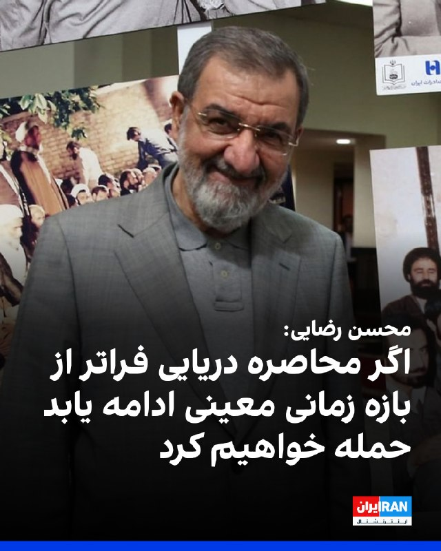

محسن رضایی، مشاور نظامی مجتبی خامنه‌ای، گفت: «اگر محاصره دریایی فراتر از بازه زمانی معینی ادامه یابد، حمله خواهیم کرد.»

او ادامه داد: «سپاه بر پایه جنگ نامتقارن عمل می‌کند و از پهپادهای بسیار مقرون‌به‌صرفه و قایق‌های تندرو به عنوان ابزار اصلی بازدارندگی استفاده می‌کند.»

رضایی افزود: «آمریکا در تاریکی به سمت ما می‌آید، در حالی که ما هر حرکت آنها را رصد می‌کنیم.»
https://iranintl.com/202605290902

## FarsiVOA — post 218975

پیت هگست، وزیر جنگ آمریکا، در دیدار با لارنس وانگ، نخست‌وزیر سنگاپور، و همچنین وزیر دفاع این کشور، بر نقش محوری سنگاپور در حمایت از تلاش‌های ایالات متحده برای تقویت بازدارندگی در منطقه تاکید کرد.

@FarsiVOA

---
📅 بروزرسانی: 1405/03/08 16:42
---

## FoxNewsTwitter — post 342399

  

Fox News (Twitter/X)

WATCH LIVE: SpaceX launches Falcon 9 rocket from Florida https://twitter.com/i/broadcasts/1yxBeepDOpWJN

## pm_afshaa — post 91812

🔴جی دی ونس:تا الان به توافقی با ایران دست نیافته‌ایم اما بسیار نزدیک شده‌ایم

💧 Rainbet.com the #1 Non-KYC Crypto Casino & Sportsbook @rainbetcom

😁 @Pm_Afshaa

## pm_afshaa — post 91811

https://t.me/proxy?server=57788188876777.ir.fulldf.info&port=8443&secret=EERighJJvXrFGRMCIMJdCQ==

پروکسی متصل مخصوص دانلود

💧 Rainbet.com the #1 Non-KYC Crypto Casino & Sportsbook @rainbetcom

😁 @Pm_Afshaa

## IranIntlTV — post 339577

  

محمدحسن ابوترابی‌فرد، امام جمعه تهران، گفت انسان‌هایی که در «پرتو آموزه‌های وحیانی» و «مدرسه انبیا» پرورش یافته‌اند، می‌جنگند و پایگاه‌های آمریکایی را مورد تهاجم قرار می‌دهند.

او با اشاره به حمله آمریکا به نقطه‌ای در حاشیه فرودگاه بندرعباس، گفت این اقدام «تعرض به آسمان و زمین ایران» بود و افزود با توان هوافضای سپاه پاسداران به آن «پاسخ سخت و شکننده» داده شد.

به گفته ابوترابی‌فرد، اظهارات پنتاگون مبنی بر اینکه آتش‌بس نقض نشده، نشان‌دهنده افزایش «قدرت بازدارندگی» جمهوری اسلامی و «تغییر موازنه قدرت به نفع ایران» است.
https://iranintl.com/202605295858

## IranIntlTV — post 339576

  

ابراهیم رضایی، سخنگوی کمیسیون امنیت ملی مجلس، در شبکه ایکس نوشت «مدیریت ایرانی تنگه هرمز در دنیا تثبیت شده است» و کشورها برای عبور شناورهای خود «اجازه می‌گیرند، هزینه‌ها را می‌پردازند و با راهنمایی نیروی دریایی سپاه» از این آبراه عبور می‌کنند.

او افزود تنها کسی که این موضوع را «باور نکرده یا نمی‌خواهد باور کند» دونالد ترامپ، رییس‌جمهوری آمریکا است و نوشت: «هر چند وقت ارتشش را برای باز کردن تنگه می‌فرستد، آنها می‌آیند و کتک می‌خورند و برمی‌گردند.»

رضایی همچنین خطاب به اسکات بسنت، وزیر خزانه‌داری آمریکا، نوشت: «به جای هارت و پورت اضافی به فکر تعظیم به قدرت ایرانی‌ها در خلیج فارس باشید.»

بسنت گفته بود که آمریکا اخذ عوارض در تنگه هرمز را تحمل نخواهد کرد.
https://iranintl.com/202605299812

## IranIntlTV — post 339575

  

لطف‌الله دژکام، امام جمعه شیراز گفت: «ولایت فقیه در عصر غیبت، امتداد همان خط ولایت الهی و غدیر است و نظام جمهوری اسلامی بر همین اساس شکل گرفته و استمرار یافته است.»

او ادامه داد: «همان‌گونه که در روز غدیر مسیر هدایت برای امت اسلامی تثبیت شد، امروز نیز تداوم این مسیر در قالب ولایت فقیه و رهبری دینی جامعه ادامه دارد.»

او افزود: «بدون محوریت ولایت، نظام دینی کارکرد و معنای کامل خود را از دست می‌دهد.»
https://iranintl.com/202605297381

## IranIntlTV — post 339574

  

پلیس مبارزه با تروریسم لندن جمعه هشتم خرداد اعلام کرد یک شهروند یونانی به همکاری با سرویس اطلاعاتی جمهوری اسلامی متهم شده است. به گفته پلیس، این پرونده به هدف قرار دادن یک روزنامه‌نگار مستقر در بریتانیا که برای ایران‌اینترنشنال فعالیت می‌کند، مربوط است.

بر اساس بیانیه پلیس، ایوانیس آیدینیدیس، ۴۶ ساله، شهروند یونان و ساکن مونیخ آلمان، ۲۶ اردیبهشت در منطقه وست ساسکس از سوی کارآگاهان پلیس مبارزه با تروریسم لندن بازداشت شد.

دادگاه وست‌مینستر مجوز ادامه بازداشت او را تا ۹ خرداد صادر کرد و پس از هماهنگی با دادستانی سلطنتی، اتهام‌های مرتبط علیه او ثبت شد.

پلیس اعلام کرد بر اساس ارزیابی‌ها، تهدید گسترده‌تری علیه عموم مردم در ارتباط با این پرونده وجود ندارد.

هلن فلانگان، فرمانده پلیس مبارزه با تروریسم لندن، گفت: «می‌دانیم این موضوع ممکن است نگرانی‌هایی به‌ویژه در میان افرادی که در رسانه‌های فارسی‌زبان فعالیت می‌کنند ایجاد کند. ما با شماری از سازمان‌ها و افراد همکاری نزدیک داریم تا درباره ایمنی و امنیت به آن‌ها مشاوره و حمایت ارائه دهیم و این شامل فرد و سازمان مرتبط با این پرونده نیز می‌شود.»
https://iranintl.com/

## IranIntlTV — post 339573

  <a href="telegram/content/IranIntlTV_339573_1780060373.mp4" target="_blank">🎬 Download video</a>

یک جوان با ارسال پیامی به ایران اینترنشنال از افزایش گرانی‌ها و ناتوانی مالی برای تامین معیشت خود و پدرش روایت می‌کند. بازخوانی پیام این شهروند و ساخت تصویر با هوش مصنوعی انجام گرفته است.

## Shin_Persian — post 6295

  

🔁 Quoting above tweet: Shin ✓ @hey_itsmyturn Fri, 29 May 2026 13:10:40 UTC The Speaker of Parliament and the head of Islamic Regime's negotiating team, Mohammad Bagher Ghalibaf posted a three-point statement outlining clear position regarding negotiations…

## Shin_Persian — post 6294

🔁 Quoting above tweet:
Shin ✓ @hey_itsmyturn
Fri, 29 May 2026 13:10:40 UTC

The Speaker of Parliament and the head of Islamic Regime's negotiating team, Mohammad Bagher Ghalibaf posted a three-point statement outlining clear position regarding negotiations with the United States:

"1. We achieve concessions not through dialogue, but through missiles; in negotiations, we merely articulate them.

2. We do not trust guarantees or words; only actions serve as a measure. No action will be taken before the opposing party acts.

3. The victor of any agreement is the one who, from the day after, prepares better for war."

فارسی

رئیس مجلس و رئیس تیم مذاکره‌کننده رژیم اسلامی، محمدباقر قالیباف، بیانیه‌ای سه‌عاملی را منتشر کرد که موضع شفافی را در خصوص مذاکره با ایالات متحده ترسیم می‌کند:

«۱. ما امتیازها را نه از طریق گفتگو، بلکه با موشک‌ها به دست می‌آوریم؛ در مذاکرات، ما صرفاً آن‌ها را بیان می‌کنیم.

۲. ما به تضمین‌ها یا واژه‌ها اعتماد نمی‌کنیم؛ تنها عمل ملاک است. هیچ اقدامی پیش از اقدام طرف مقابل انجام نخواهد شد.

۳. پیروز هر توافقی کسی است که از فردای آن روز، خود را بهتر برای جنگ آماده کند.»

𝕏 · @shin_persian

## Shin_Persian — post 6293

  <a href="telegram/content/Shin_Persian_6293_1780060377.mp4" target="_blank">🎬 Download video</a>

↩️ Quoted tweet: Israel War Room ✓ @IsraelWarRoom Thu, 28 May 2026 23:27:55 UTC .@VP Vance says the US has made "a lot of progress" in negotiations with Iran, but major disputes remain over Iran's uranium enrichment program and its highly enriched uranium…

## Shin_Persian — post 6292

↩️ Quoted tweet:
Israel War Room ✓ @IsraelWarRoom
Thu, 28 May 2026 23:27:55 UTC

.@VP Vance says the US has made "a lot of progress" in negotiations with Iran, but major disputes remain over Iran's uranium enrichment program and its highly enriched uranium stockpile.

"We're going back and forth on a couple of language points... Hopefully, we'll continue to

↩️ توییت نقل‌قول شده — برای پاسخ، پست زیر را ببینید.

فارسی

.@VP ونس می‌گوید ایالات متحده در مذاکرات با ایران به "پیشرفت‌های زیادی" دست یافته است، اما اختلافات عمده بر سر برنامه غنی‌سازی اورانیوم ایران و ذخایر اورانیوم با غنی‌سازی بالای این کشور همچنان باقی است.

"ما بر سر چند نکته زبانی در حال رایزنی رفت و برگشتی هستیم... امیدواریم که به ادامه دهیم"

𝕏 · @shin_persian

## FarsiVOA — post 218974

  

فرماندهی مرکزی ایالات متحده، سنتکام، تصویری از برخاستن یک بالگرد «سی‌اچ-۴۷ شینوک» ارتش آمریکا از یک فرودگاه در خاورمیانه منتشر کرد.

به گفته سنتکام، شینوک سریع‌ترین و سنگین‌ترین بالگرد ترابری ارتش آمریکا است.

@FarsiVOA

## RadioFarda — post 157691

  

📷 Photo

## IranianMinds — post 21014

  

🔴 ژنرال محسن رضایی :

محاصره دریایی رو برمیداریم‌ ما حالا چه با زبون زور و قدرت و یا چه با مذاکره

@IranianMinds

## IranianMinds — post 21013

🔴 امام جمعه ساری هم گفت:

با شعار مرگ بر آمریکا، شیطان بزرگ را سنگسار می‌کنیم😂

@IranianMinds

## Dirty_Kids — post 390471

مدیونید اگه فکرکنید هدفش نشون دادن چیز دیگه ای جز شلوار خنکش هست🦦 فقط پوزیشن های خوبی برا نمایش شلوارش انتخاب نکرده🤌

@Dirty_Kids 👻

## Dirty_Kids — post 390470

  

عکس عروسی دختر عموم پونزده سال پیش این مدلی بود:))))) تمام پیرزنای فامیل داشتن سکته میکردن.

@Dirty_Kids 👻

## Dirty_Kids — post 390465

🔴 توی آپدیت جدید اینستا میشه تو قسمت کامنتا عکس گذاشت، بعد طرف پست گذاشته: سمی‌ و خنده‌دار ترین عکسی که از رفیقت داری کامنت کن.

و به این صورت ملت شرف برای رفیقاشون نذاشتن😂

@Dirty_Kids 👻

## Dirty_Kids — post 390464

  

تراپی

موقع چصناله میدونن اقلیت هستن

@Dirty_Kids 👻

## alonews — post 123499

  <a href="telegram/content/alonews_123499_1780060382.mp4" target="_blank">🎬 Download video</a>

👈کارشناس صداوسیما: دوران بمب اتم گذشته است؛ الان با عملیات میکروبی و بیولوژیک می‌توان حملاتی انجام داد و مسئولیت آن را گردن نگرفت

🔴می‌توان بمب چرک استفاده کرد

🔴ممکن است شرایط به جایی برسد که به رویارویی هسته‌ای برسیم؛ باید اقدامات پیشگیرانه انجام داد.

✅ @AloNews خبر جنگ

---
📅 بروزرسانی: 1405/03/08 16:32
---

## mwarmonitor — post 9884

🔴شرکت آمریکایی Chevron: ما ۶ کشتی در تنگه هرمز داریم و هیچ‌گونه عوارض عبور پرداخت نخواهیم کرد.

@mwarmonitor

## mwarmonitor — post 9882

  

📝 واقعاً باید به این حسنِ انتخابِ روزگار در چیدن مهره‌های اطرافمان تبریک گفت؛ کلکسیونی بی‌نظیر از نوابغِ صلح‌طلب که معتقدند امتیازات را باید با موشک گرفت و از فردای هر توافقی، بند پوتین‌ها را برای جنگ بعدی محکم کرد! در این میان، سهمِ پیشانی‌نوشتِ ما ایرانی‌ها هم شده تماشای یک مسابقه جذابِ «کی از همه مجنون‌تره؟» میان داخلی و غریبه؛ از این طرف با تئوریسین‌های دیپلماسیِ راکتی و همسایگانِ همیشه دستمال به دست، و از آن طرف با دونالد ترامپ و شرکا که انگار همگی دسته‌جمعی در یک کلینیکِ فوق‌تخصصیِ توهم فارغ‌التحصیل شده‌اند و حالا برای پیاده کردن پروژه‌های پایان‌نامه‌شان، قرعه کشی کرده و دقیقاً روی اعصاب و زندگی ما نشانه‌ رفته‌اند.

@mwarmonitor

## pm_afshaa — post 91810

تسنیم: یادداشت تفاهم احتمالی بین ایران و ایالات متحده در روزهای اخیر تغییر کرده است، متن هنوز نهایی نشده

💧 Rainbet.com the #1 Non-KYC Crypto Casino & Sportsbook @rainbetcom

😁 @Pm_Afshaa

## pm_afshaa — post 91809

https://t.me/proxy?server=87.248.129.210&port=4455&secret=7hYDAQIAAQAB_AMDhuJMOt1iaXNjb3R0aS55ZWt0YW5ldC5jb20

پروکسی متصل سرعت بالا

💧 Rainbet.com the #1 Non-KYC Crypto Casino & Sportsbook @rainbetcom

😁 @Pm_Afshaa

## pm_afshaa — post 91808

رئیس کمیسیون امنیت ملی: ایران قصد ندارد اورانیوم غنی شده خود را به کشور ثالث منتقل کند

💧 Rainbet.com the #1 Non-KYC Crypto Casino & Sportsbook @rainbetcom

😁 @Pm_Afshaa

## IranIntlTV — post 339572

  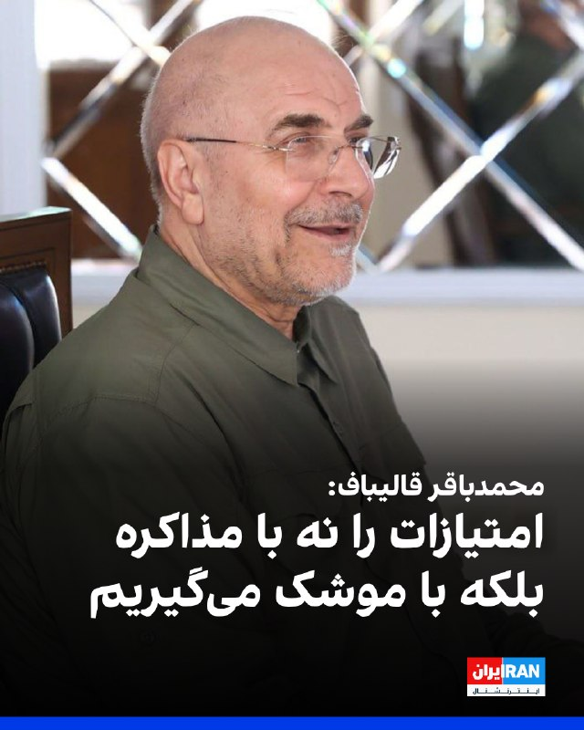

محمدباقر قالیباف، رییس هیات مذاکره‌‌کننده جمهوری اسلامی، در شبکه ایکس نوشت: «ما امتیازات را نه با گفت‌وگو، بلکه با موشک‌‌ها می‌گیریم، در مذاکره فقط آن‌ها را تفهیم می‌کنیم.»

او افزود جمهوری اسلامی «هیچ اعتمادی به تضمین‌ها و حرف‌ها» ندارد و تنها رفتارها را معیار قرار می‌دهد. قالیباف تاکید کرد هیچ اقدامی پیش از اقدام طرف مقابل انجام نخواهد شد.

قالیباف همچنین نوشت: «پیروز هر توافق، کسی است که از فردای آن بهتر برای جنگ آماده شود.»
https://iranintl.com/202605295887

## RadioFarda — post 157690

  

🔸پلیس بریتانیا روز جمعه اعلام کرد یک شهروند یونانی به اتهام همکاری با یک سرویس اطلاعاتی خارجی که به گفته پلیس «گمان می‌رود متعلق به ایران باشد» متهم شد. اتهام او تلاش برای هدف قرار دادن یک روزنامه‌نگار شاغل در شبکه تلویزیونی ایران اینترنشنال است.

🔸پلیس ضدتروریسم اعلام کرد که یوانیس آیدینیدیس ۴۶ ساله و ساکن مونیخ آلمان، روز شنبه بازداشت شده و بر اساس قانون امنیت ملی بریتانیا علیه او اعلام جرم شده است.

🔸قرار است آیدینیدیس روز جمعه در دادگاه وست‌مینستر حاضر شود.

🔸پلیس گفت اتهامات مطرح‌شده احتمالاً به ایران و هدف قرار دادن یک روزنامه‌نگار مستقر در بریتانیا در شبکه ایران اینترنشنال مربوط می‌شود. در بیانیه پلیس بریتانیا نام این روزنامه‌نگار ذکر نشده است.

🔸مأموران پلیس همچنین اعلام کردند که معتقد نیستند تهدید گسترده‌تری متوجه عموم مردم باشد.

🔸در ماه آوریل نیز سه نفر در ارتباط با تلاش برای حمله آتش‌سوزی عمدی به ساختمانی مرتبط با این شبکه در شمال‌غرب لندن متهم شدند؛ هرچند آن آتش‌سوزی هیچ خسارت یا مصدومیتی به همراه نداشت.

@RadioFarda

## IranianMinds — post 21012

  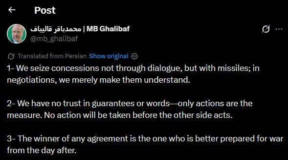

🔴 توییت جدید قالیباف :

۱- ما از طریق گفتگو امتیاز نمیگیریم بلکه از طریق موشک میگیریم،ما تو مذاکرات فقط به اونها میفهمونیم.

۲-ما به تضمینو کلمات اعتمادی نداریم،فقط عمل واسمون معیاره،هیچ اقدامی قبل از اقدام طرف مقابل انجام نمیدیم.

۳-برنده ی هر توافق کسیه که فردای آن روز واسه جنگ آماده تر باشه.

@IranianMinds

## alonews — post 123498

  <a href="telegram/content/alonews_123498_1780059767.webm" target="_blank">🎬 Download video</a>

👈پست جدید قالیباف : ۱- امتیاز رو پای میز مذاکره نمی‌گیریم؛ با موشک می‌گیریم، مذاکره فقط برای اینه که طرف مقابل بفهمه قضیه چیه
-۲ به قول و قرار و تضمین کسی اعتماد نداریم؛ فقط عملکرد مهمه. تا طرف مقابل کاری نکنه، ما هم قدمی برنمی‌داریم
-۳ برنده واقعی هر توافق کسیه که از فرداش خودش رو برای جنگ احتمالی آماده‌تر کرده باشه

✅ @AloNews خبر جنگ

---
📅 بروزرسانی: 1405/03/08 16:22
---

## WithYashar — post 12857

مم با قر خالیباف‌ در اکس :
۱- ما امتیازات را نه با گفتگو، بلکه با موشک‌ها می‌گیریم، در مذاکره فقط آن‌ها را تثبیت می‌کنیم.

۲- هیچ اعتمادی به تضمین‌ها و حرف‌ها نداریم، فقط رفتارها معیار است. اقدامی پیش از اقدام طرف مقابل انجام نخواهد شد.

۳- پیروز هر توافق، کسی است که از فردای آن بهتر برای جنگ آماده شود.
@withyashar

## mwarmonitor — post 9881

🔴دونالد ترامپ در سوشال تروث

«جیل بایدن اکنون بالاخره اعتراف کرده است که نمی‌دانسته در طول مناظره ریاست‌جمهوری فوق‌العاده و پربیننده سال ۲۰۲۴ ما، چه بلایی سر "جوی خواب‌آلود" آمد؛ مناظره‌ای که در آن جو دقیقاً در بالاترین سطح از استانداردهای مناظره عمل نمی‌کرد. او گفت با خود فکر کرده که جو دچار "سکته مغزی" یا اتفاقات بسیار بد دیگری شده است، و با این حال، هرگز برای کمک به شوهرِ گرفتار خود به روی صحنه ندوید؛ کاری که هر زن خوبی انجام می‌دهد. تنها چیزی که او فراموش کرد به آن اشاره کند این بود که من قبل از فروپاشیِ تقریباً کامل او، چقدر عالی عمل می‌کردم. به عبارت دیگر، همان‌طور که بسیاری پرسیده‌اند، آیا عملکرد قوی من در آن مناظره باعث شد که او خیلی ساده و واضح "کم بیاورد" (قفل کند) و به شکست ننگینش منجر شود، یا دلایل دیگری در کار بود؟ هیچ‌کس دیگری پاسخ این را نمی‌داند، اما من می‌دانم!!!»

@mwarmonitor

## IranIntlTV — post 339571

  <a href="telegram/content/IranIntlTV_339571_1780059159.mp4" target="_blank">🎬 Download video</a>

پیام‌های رسیده به ایران‌اینترنشنال از تداوم اختلال و محدودیت در دسترسی به اینترنت حکایت دارد. برخی شهروندان می‌گویند این وضعیت نشان‌دهنده نگرانی حکومت از دسترسی آزاد مردم به اطلاعات بدون فیلتر است.
جزییات بیشتر با محسن مهیمنی، عضو تحریریه ایران‌اینترنشنال
@iranintltv

## ManotoTV — post 105868

  <a href="telegram/content/ManotoTV_105868_1780059160.mp4" target="_blank">🎬 Download video</a>

سخنان الهام‌بخش فریدون فرخزاد درباره خودباوری ملی

## ManotoTV — post 105860

  <a href="telegram/content/ManotoTV_105860_1780059162.mp4" target="_blank">🎬 Download video</a>

در سیاست، گاهی مهم‌تر از خود رویداد، چیزی است که آن رویداد آشکار می‌کند.

جنگ اخیر نیز پرده‌ای از واقعیت جمهوری اسلامی کنار زد: شکاف‌هایی که پنهان شده بود، ضعف‌هایی که انکار می‌شد و بحران‌هایی که با تبلیغات پوشانده می‌شد.

## FarsiVOA — post 218973

  <a href="telegram/content/FarsiVOA_218973_1780059163.mp4" target="_blank">🎬 Download video</a>

وزارت جنگ آمریکا ویدیویی منتشر کرده است که در آن، پیت هگست، وزیر جنگ ایالات متحده، در کنار تفنگداران دریایی و ملوانان آمریکایی در یک برنامه ورزش صبحگاهی روی عرشه ناو آبی‌خاکی «یو‌اس‌اس باکسر» حضور دارد. این تمرین با مشارکت نیروهای مستقر در ناو برگزار شد.

@FarsiVOA

## DW_Farsi — post 125276

🔶 پنج خطر سلامتی ناشی از مصرف بیش از حد پروتئین

پژوهش‌های علمی نشان می‌دهند که مصرف بیش از حد پروتئین نه‌تنها همیشه مفید نیست، بلکه در برخی شرایط می‌تواند سلامت بدن را تهدید کند.

پروتئین بدون تردید یکی از مهم‌ترین مواد مغذی برای بدن است و نقش حیاتی در ساخت عضلات، ترمیم بافت‌ها، تولید هورمون‌ها و عملکرد سیستم ایمنی دارد. با این حال، متخصصان تغذیه تأکید می‌کنند که بدن انسان تنها به مقدار مشخصی پروتئین نیاز دارد و دریافت بیش از اندازه آن، به‌ویژه از منابع حیوانی، ممکن است عوارض مختلفی ایجاد کند.

@dw_farsi

## manototv — post 105868

  <a href="telegram/content/manototv_105868_1780059164.mp4" target="_blank">🎬 Download video</a>

سخنان الهام‌بخش فریدون فرخزاد درباره خودباوری ملی

## manototv — post 105860

  <a href="telegram/content/manototv_105860_1780059165.mp4" target="_blank">🎬 Download video</a>

در سیاست، گاهی مهم‌تر از خود رویداد، چیزی است که آن رویداد آشکار می‌کند.

جنگ اخیر نیز پرده‌ای از واقعیت جمهوری اسلامی کنار زد: شکاف‌هایی که پنهان شده بود، ضعف‌هایی که انکار می‌شد و بحران‌هایی که با تبلیغات پوشانده می‌شد.

---
📅 بروزرسانی: 1405/03/08 16:12
---

## DEJradio — post 5100

  <a href="telegram/content/DEJradio_5100_1780058547.mp4" target="_blank">🎬 Download video</a>

🎥
🔥 مردم نباید از حکومتشان بترسند؛ حکومت‌ها باید از مردم بترسند!

#ایران_را_پس_میگیریم
@DEJradio

## IranIntlTV — post 339570

  <a href="https://t.me/IranintlTV/339570" target="_blank">📎 Download file</a>

🎧نسخه صوتی اخبار نیم‌روزی | جمعه ۸ خرداد
@iranintlTV

## IranianMinds — post 21011

  

ترامپ بعد دیدن این تصویر دستور عقب نشینی سریع و کامل ارتش آمریکا از خاورمیانه و هزار کیلومتری اطراف خاورمیانه رو داد.

@IranianMinds

## BBCPersian — post 282336

  <a href="telegram/content/BBCPersian_282336_1780058549.mp4" target="_blank">🎬 Download video</a>

🔻گروه‌های امداد در لائوس پنج روستایی را که پس از بارندگی‌های شدید و رانش زمین به مدت یک هفته در غاری سیلابی گرفتار شده بودند، زنده پیدا کردند.

به گفته تیم‌های نجات لائوسی و تایلندی که در این عملیات مشارکت داشتند، دو نفر دیگر از اعضای این گروه همچنان مفقود هستند.

این افراد چهارشنبه هفته گذشته برای جست‌وجوی ذخایر طلا و شکار حیوانات وحشی وارد غار شده بودند، اما پس از مسدود شدن دهانه ورودی بر اثر سیلاب، نتوانستند خارج شوند.

در عملیات امدادرسانی، گروهی از متخصصان باتجربه در عملیات نجات از غار، از جمله اعضای تیم معروف تایلندی که در سال ۲۰۱۸ یک گروه دانش‌آموز را نجات داده بودند، حضور داشتند.
@BBCPersian

## alonews — post 123497

  <a href="telegram/content/alonews_123497_1780058551.webm" target="_blank">🎬 Download video</a>

👈نیروی زمینی ارتش اسرائیل به دروازه های شهر نبطیه، دومین شهر بزرگ جنوب لبنان رسیده است.

✅ @AloNews خبر جنگ

---
📅 بروزرسانی: 1405/03/08 16:02
---

## FoxNewsTwitter — post 342398

  

Fox News (Twitter/X)

JUST IN: President Trump launches a scathing attack on Jill Biden after she admitted that she thought her husband was having a "stroke" during their infamous 2024 presidential debate.

“She said that she thought he was having a ‘stroke,’ and various other really bad things, and yet never rushed onto the stage to help her troubled husband, as any good wife would do.”

“As many have asked, did my strong performance in that debate cause him to, plain and simple, ‘choke,’ leading to his ignominious defeat, or were there other reasons? Nobody else knows the answer to that, BUT I DO!!!” https://twitter.com/FoxNews/status/2059806402294542554#m

## FoxNewsTwitter — post 342397

  <a href="telegram/content/FoxNewsTwitter_342397_1780057975.mp4" target="_blank">🎬 Download video</a>

Fox News (Twitter/X)

Early morning PT with America’s bravest.

Secretary of War Pete Hegseth kicks off his day by working out alongside U.S. troops aboard the USS Boxer while docked in Singapore.

## IranIntlTV — post 339569

🔻پس از حذف یانیک سینر؛ چه کسی قهرمان رولان‌گاروس می‌شود؟

حذف غیرمنتظره یانیک سینر، نفر اول جهان و اصلی‌ترین مدعی قهرمانی، معادلات بخش مردان رولان‌گاروس را کاملا تغییر داده است.

سینر که در دیدار با خوان مانوئل سروندولو دو ست جلو بود و تنها چهار امتیاز تا پیروزی فاصله داشت، تحت تاثیر گرما و شرایط جسمانی خود بازی را واگذار کرد تا رویای فتح نخستین عنوان رولان‌گاروس و تکمیل گرنداسلم حرفه‌ای‌اش از بین برود.

از سوی دیگر، کارلوس آلکاراس، قهرمان دو دوره اخیر مسابقات، نیز به دلیل مصدومیت مچ دست اصلا به پاریس نرسید.

در چنین شرایطی، بسیاری از تحلیلگران نشریه اتلتیک، الکساندر زورف را جدی‌ترین گزینه قهرمانی می‌دانند. تنیسور آلمانی که تاکنون سه فینال گرنداسلم را با شکست پشت سر گذاشته، یکی از بهترین بازیکنان حال حاضر روی خاک رس محسوب می‌شود و حالا شاید بهترین فرصت دوران حرفه‌ای خود را برای فتح نخستین گرنداسلم در اختیار داشته باشد.

در کنار زورف، نام نواک جوکوویچ نیز به‌عنوان یکی از مدعیان اصلی مطرح شده است. اسطوره صربستانی با ۲۴ عنوان گرنداسلم و چهار قهرمانی در رولان‌گاروس، تجربه‌ای بی‌نظیر در استفاده از فرصت‌های بزرگ دارد. بسیاری معتقدند جوکوویچ ۳۹ ساله این شرایط را بهترین شانس خود برای کسب بیست‌وپنجمین گرنداسلم دوران حرفه‌ای‌اش می‌بیند.

کاسپر رود، نایب‌قهرمان دو دوره رولان‌گاروس، نیز همچنان در جمع مدعیان قرار دارد، اما برخی کارشناسان معتقدند مسیر دشوار او در جدول ممکن است انرژی زیادی از این تنیسور نروژی بگیرد. در همین حال، نام‌های غیرمنتظره‌ای مانند لرنر تین آمریکایی و موئیز کوامه ۱۷ ساله فرانسوی نیز به‌عنوان شگفتی‌سازان احتمالی مسابقات مطرح شده‌اند.

در مجموع، کارشناسان بر این باورند که با حذف سینر و غیبت آلکاراس، رولان‌گاروس ۲۰۲۶ به یکی از غیرقابل‌پیش‌بینی‌ترین گرنداسلم‌های سال‌های اخیر تبدیل شده و رقابت برای فتح جام موسکتیرها اکنون بیش از هر زمان دیگری هیجان‌انگیز است.

🔗وب‌سایت ایران‌اینترنشنال

@iranintltv

## IranianMinds — post 21010

🔴 طبق گزارشات مقامات، ترامپ تا وقتی رژیم جمهوری اسلامی به طور کامل به شرط های آمریکا تن ندهد، این توافق را امضا نخواهد کرد.

@IranianMinds

## IranianMinds — post 21009

🔴 سی ان ان:

رئیس‌جمهور آمریکا ترامپ به مشاوران خود اطلاع داده است که برای تصمیم‌گیری درباره امضای احتمالی توافق با ایران به چند روز زمان نیاز دارد.

@IranianMinds

## IranianMinds — post 21008

⭕️ ثبت نام کن ۵۰۰ هزارتومان جایزه بگیر
نیازی هم به واریز نیست
تنها سایت مورد #تایید ما با بونوس های واقعی:

🌐 Winro.io 
🌐

## IranianMinds — post 21007

  

⭕️ بدون واریز شرط ببند و بازی کن چون وینرو با ثبت نام و بدون نیاز به واریز ۵۰۰هزارتومان بهت میده 
❌

🎉 500 هزارتومن رایگان فقط با ثبت نام بدون هیچگونه واریزی!

💳 پرداخت مستقیم و سریع بدون واسطه، بدون دردسر، واریز و برداشت در سریع‌ترین زمان ممکن

⌛ پشتیبانی 24 ساعته

🌐 Winro.io

🌐 Winro.io
کانال بونوس های رایگان r8

📱 @winro_io

## alonews — post 123496

  <a href="telegram/content/alonews_123496_1780057979.webm" target="_blank">🎬 Download video</a>

👈ادعای نیویورک‌تایمز درباره جزئیات توافق احتمالی ایران و آمریکا/ ۱ - آتش‌بس اولیه و پایان موقت خصومت‌ها

🔴به نوشته نیویورک‌تایمز، یکی از محورهای اصلی پیش‌نویس، تعیین شرایطی شبیه پیمان عدم تجاوز میان واشنگتن و تهران است. واسطه‌ها می‌گویند انتظار می‌رود این توافق دارای یک مؤلفه منطقه‌ای نیز باشد؛ موضوعی که به گفته مقام‌های ایرانی و یکی از دیپلمات‌های آگاه، شامل توقف جنگ در لبنان هم می‌شود.

🔴دو دیپلمات مطلع از آخرین شرایط گفته‌اند توافق اولیه، پایان خصومت‌ها را برای یک دوره ابتدایی ۶۰ روزه تعیین می‌کند و امکان مذاکره میان دو طرف برای تمدید آن را فراهم می‌سازد.

🔴با این حال، مقام ایرانیِ مطلع از پیش‌نویس می‌گوید متن مورد بحث شامل «اعلام پایان جنگ» در همه جبهه‌ها، از جمله لبنان، برای کل مدت مذاکرات است. دو مقام ایرانی نیز گفته‌اند مفاد این یادداشت تفاهم صرفاً مربوط به دوره مذاکرات برای دستیابی به یک توافق گسترده‌تر و دائمی خواهد بود.

✅ @AloNews خبر جنگ

---
📅 بروزرسانی: 1405/03/08 15:52
---

## WithYashar — post 12856

️سی‌ان‌ان: ترامپ به مشاورانش گفته که برای تصمیم‌گیری در مورد امضای توافق احتمالی با تهران به چند روز زمان نیاز داره
@withyashar

## DEJradio — post 5099

  <a href="telegram/content/DEJradio_5099_1780057357.webm" target="_blank">🎬 Download video</a>

🔺📢 “ما یک خانواده پنج نفره هستیم، در حال حاضر فقط پدرم که بازنشسته است حقوق داره، مادرم خانه‌دار و سه خواهر و برادر که بعد از جنگ هر سه بیکار شدیم، با بدبختی زندگی می‌کنیم...

پیام دریافتی

#تورم #جنگ
@DEJradio

## IranIntlTV — post 339568

  <a href="telegram/content/IranIntlTV_339568_1780057358.mp4" target="_blank">🎬 Download video</a>

حملات هوایی اسرائیل چندین منطقه در لبنان را هدف قرار داد و با وجود آتش‌بس جاری با حزب‌الله، دود غلیظی بر فراز منطقه شُویفات در نزدیکی بیروت دیده شد و خسارات سنگینی در شهر صور در جنوب لبنان بر جا ماند. منابع امنیتی اسرائیل گفتند حمله نزدیک بیروت یک فرمانده شبه‌نظامی همسو با حزب‌الله و ایران را هدف قرار داده است.
@iranintltv

## DW_Farsi — post 125275

🔶 هشدار بانک مرکزی اروپا درباره اثرات جنگ ایران در حوزه یورو

تحقیقات بانک مرکزی اروپا که روز جمعه هشتم خرداد (۲۹ مه) منتشر شد نشان می‌دهد که مصرف‌کنندگان منطقه یورو که پیش از این نیز از جنگ اوکراین آسیب دیده بودند ممکن است بر اثر بحران و تنش‌های حاصل از جنگ ایران باز هم آسیب ببینند.

طبق گزارش خبرگزاری رویترز، بر اثر پیامدهای جنگ ایران مصرف‌کنندگان منطقه یورو رفتار و نگرش خود را با سرعت بیشتری تغییر داده‌اند؛ امری که به این معناست که ضربه اقتصادی می‌تواند عمیق‌تر و سریع‌تر باشد.

حمله روسیه به اوکراین در فوریه ۲۰۲۲ باعث ایجاد بحران انرژی و تورمی شد که اروپا تا حد زیادی از آن بهبود یافته بود، اما پس از آن، حملات هوایی آمریکا و اسرائیل در ۲۸ فوریه علیه جمهوری اسلامی جنگی را آغاز کرد که منجر به اختلال بی‌سابقه‌ای در تأمین انرژی شده است.
@dw_farsi

## DW_Farsi — post 125274

🔶 ادامه سیاست فشار حداکثری آمریکا با تحریم‌های جدید علیه شبکه نفتی ایران

وزارت امور خارجه آمریکا روز پنجشنبه ۷ خرداد (۲۸ مه) در ادامه سیاست "فشار حداکثری"، مجموعه‌ای از تحریم‌های جدید را علیه افراد، شرکت‌ها و کشتی‌های مرتبط با صادرات نفت و محصولات پتروشیمی ایران اعلام کرد.

هدف این اقدام کاهش درآمدهای جمهوری اسلامی عنوان شده است که به گفته واشنگتن برای فعالیت‌های منطقه‌ای و حمایت از گروه‌های نیابتی استفاده می‌شود.

چندین شرکت مدیریت کشتی و تعدادی نفتکش به‌دلیل نقش در حمل و نقل نفت و پتروشیمی ایران در فهرست تحریم قرار گرفته‌اند و همچنین هشت کشتی به‌عنوان دارایی‌های مرتبط با این شبکه‌ها شناسایی و مسدود شده‌اند.

وزارت خارجه آمریکا اعلام کرده است که این شبکه‌ها با استفاده از روش‌های پنهان حمل‌ونقل دریایی به فروش نفت ایران کمک کرده و بخشی از درآمدهای آن را تامین می‌کنند.

هم‌زمان، وزارت خزانه‌داری نیز شبکه‌ای دیگر در حوزه فروش نفت ایران را تحریم کرده است.

در بیانیه خزانه‌داری آمریکا به شرکت‌ها و افراد فعال در تجارت محصولات پتروشیمی ایران در کشورهای مختلف نیز اشاره و آن‌ها به‌دلیل انجام معاملات مالی مرتبط با ایران تحریم شده‌اند.

آمریکا اعلام کرده هدف این اقدامات، تغییر رفتار ایران از طریق فشار اقتصادی و محدود کردن منابع مالی مرتبط با فعالیت‌های منطقه‌ای است.
@dw_farsi

## Persian_Trend_Official — post 15240

تسنیم: متن تفاهم‌نامه امریکا و ایران تا به این لحظه نهایی نشده است.

تسنیم از نقل یک منبع مطلع اعلام کرد: متن تا این لحظه جمع‌بندی نهایی نشده است و در صورتی که نهایی شود به صورت رسمی اعلام خواهد شد. به همین دلیل متونی که تا این لحظه رسانه‌های غربی به عنوان جزئی از متن اصلی منتشر کرده‌اند عاری از دقت است.

این منبع همچنین افزود: متن تفاهم‌نامه احتمالی طی چند روز گذشته تغییراتی داشته است.

📝 Amir

📌 @persian_trend_official
پرشین ترند | متفاوت‌ترین کانال نظامی

## alonews — post 123495

  <a href="telegram/content/alonews_123495_1780057359.webm" target="_blank">🎬 Download video</a>

👈یک منبع مطلع به تسنیم گفت: متن تفاهم‌نامه احتمالی هنوز نهایی نشده و متونی که رسانه‌های غربی منتشر کرده‌اند عاری از دقت است؛ متن طی چند روز گذشته تغییراتی داشته است.

✅ @AloNews خبر جنگ

## alonews — post 123494

  <a href="telegram/content/alonews_123494_1780057359.webm" target="_blank">🎬 Download video</a>

👈الجزیره: اسرائیل بزرگترین مانع رسیدن ایران و آمریکا به توافق است

نورالدین الدغیر خبرنگار الجزیره در تهران:

🔴به نظر می‌رسد که اسرائیل بخش بزرگی از موانع رسیدن به امضای توافق بین تهران و واشنگتن را تشکیل می‌دهد.

🔴اطلاعات حاکی از آن است که نقش اسرائیل [در عدم امضای توافق] پیچیده و چندوجهی است و فقط به بحث لبنان ختم نمی‌شود

✅ @AloNews خبر جنگ

---
📅 بروزرسانی: 1405/03/08 15:43
---

## FoxNewsTwitter — post 342396

  <a href="telegram/content/FoxNewsTwitter_342396_1780056780.mp4" target="_blank">🎬 Download video</a>

Fox News (Twitter/X)

WATCH: Secretary Pete Hegseth gives a rousing speech to sailors and Marines aboard the USS Boxer, praising them for being the force behind America’s strength in the conflict with Iran:

“As the President said in the Cabinet meeting... Iran can either do it the right way with a deal across the table, or they can deal with my guy on the left and it happened to be me...”

“But it’s not me. It’s you guys.”

## IranIntlTV — post 339567

  <a href="telegram/content/IranIntlTV_339567_1780056783.mp4" target="_blank">🎬 Download video</a>

حملات علیه حزب‌الله لبنان در حال شدت گرفته که برخی تحلیلگران معتقدند اسرائیل می‌کوشد پیش از آنکه توافق احتمالی جمهوری اسلامی و آمریکا محدودیت تازه‌ای بر عملیاتش در لبنان اعمال کند، تا حد ممکن به حزب‌الله ضربه بزند

گفت‌وگو با می فرحات، خبرنگار ایران‌اینترنشنال
@iranintltv

## IranIntlTV — post 339566

  <a href="telegram/content/IranIntlTV_339566_1780056785.mp4" target="_blank">🎬 Download video</a>

روزنامه بلژیکی لوسوار گزارش داد در حالی که تنها ۱۳ روز تا آغاز جام جهانی باقی مانده، بازیکنان تیم فوتبال ایران هنوز ویزای ورود به آمریکا را دریافت نکرده‌اند.

گفت‌وگو با رها پوربخش، عضو تحریریه ایران‌اینترنشنال
@iranintltv

## Persian_Trend_Official — post 15238

  <a href="telegram/content/Persian_Trend_Official_15238_1780056788.mp4" target="_blank">🎬 Download video</a>

رهگیری یک پهپاد امریکایی دیگر توسط حوثی های یمن

طبق تصاویر منتشر شده توسط رسانه های محلی یمن، صبح امروز یک فروند پهپاد احتمالا از نوع MQ-9 برفراز استان مارب یمن رهگیری و ساقط شده است.

چند هفته پیش نیز حوثی های یمن موفق شده بودن یک فروند پهپاد MQ-9 امریکایی را در استان مارب منهدم کنند.

📝 Amir

📌 @persian_trend_official
پرشین ترند | متفاوت‌ترین کانال نظامی

## BBCPersian — post 282335

  

‌🔻صندوق کودکان سازمان ملل، یونیسف، می‌‌گوید در یک هفته گذشته، به‌طور میانگین، هر ۲۴ ساعت ۱۱ کودک در حملات اسرائیل در لبنان کشته یا زخمی شدند.

به گفته یونیسف، در هفت روز گذشته، ۱۵ کودک در لبنان کشته و ۶۲ کودک دیگر زخمی شده‌اند.

با وجود آتش‌بس، اسرائیل دامنه و شدت حملاتش در لبنان را افزایش داده است.

حملات سنگین اسرائیل از شامگاه چهارشنبه تا بامداد پنج‌شنبه شهرها و روستاهایی در جنوب لبنان را هدف قرار داد.

در این مدت اسرائیل مناطق جدیدی را هم به عنوان مناطق درگیری و عملیاتی اعلام کرد.

اسرائیل همچنین ساختمانی را در حومه جنوبی بیروت هدف قرار داده است.

یونیسف می‌گوید در مجموع، در هفت روز گذشته، ۷۷ کودک در لبنان کشته یا زخمی شدند.

این نهاد در گزارش خود اعلام کرد که از زمان آغاز آتش‌بس در ماه آوریل، در مجموع ۵۵ کودک کشته و ۲۱۲ کودک زخمی شده‌اند.

ریکاردو پیرس، سخنگوی یونیسف، این آمار را «تکان‌دهنده» توصیف کرد.

بنابر آتش‌بسی که آمریکا از ۱۶ آوریل (۲۷ فروردين ۱۴۰۵) آن را اعلام کرد، قرار بود جنگ میان اسرائیل و حزب‌الله لبنان پایان یابد.

📷EPA
https://bbc.in/4fkdFzr

@BBCPersian

## Dirty_Kids — post 390463

  <a href="telegram/content/Dirty_Kids_390463_1780056789.mp4" target="_blank">🎬 Download video</a>

بهزاد فراهانی ببین دختره ولی اندازه کل هیکلت بیضه داره

@Dirty_Kids 👻

## alonews — post 123493

  <a href="telegram/content/alonews_123493_1780056791.webm" target="_blank">🎬 Download video</a>

👈سی‌ان‌ان: ایران با سرعت بسیار بالا داره توان موشکی خودش رو بازسازی میکنه

✅ @AloNews خبر جنگ

---
📅 بروزرسانی: 1405/03/08 15:32
---

## FoxNewsTwitter — post 342395

  <a href="telegram/content/FoxNewsTwitter_342395_1780056177.mp4" target="_blank">🎬 Download video</a>

Fox News (Twitter/X)

NEW: JPMorgan Chase CEO Jamie Dimon delivers a powerful tribute to American exceptionalism on @MorningsMaria:

“America is still the beacon of light, and the hill is still the arsenal of democracy, the bastion of freedom.”

“I’m quite patriotic in that, and that this country provides safety to the whole world.”

“We have the strongest military in the world, underpinned by the strongest economy in the world.”

@MariaBartiromo

## IranIntlTV — post 339565

  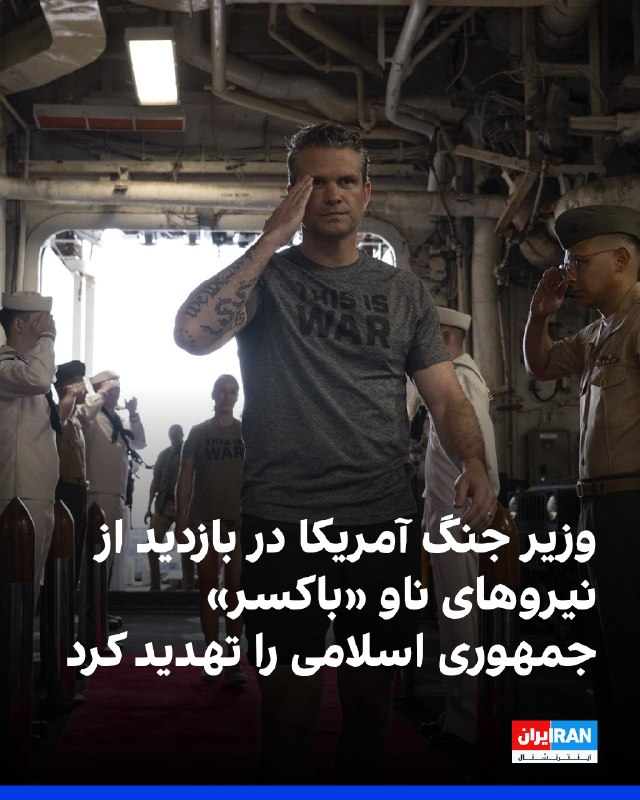

پیت هگست، وزیر جنگ آمریکا، جمعه هشتم خرداد در جریان بازدید از نیروهای آمریکایی مستقر در ناو یواس‌اس باکسر در سنگاپور، با اشاره به سخنان دونالد ترامپ، رییس‌جمهوری آمریکا، گفت اگر جمهوری اسلامی توافق را نپذیرد، با این نیروها روبه‌رو خواهد شد.

او با اشاره به نشست کابینه دولت ترامپ، گفت: «رییس‌جمهوری در نشست کابینه گفت ایران یا باید توافق روی میز را به روش درست بپذیرد یا با مرد من در سمت چپ روبه‌رو شود. آن فرد من بودم. اما در واقع من نیستم، بلکه شما هستید.»

هگست این سخنان را در جمع نیروهای نظامی آمریکا مستقر در ناو یواس‌اس باکسر که در سنگاپور پهلو گرفته است، بیان کرد و در جریان این بازدید در تمرین‌های آمادگی جسمانی آن‌ها نیز شرکت کرد.
https://iranintl.com/202605299765

## FarsiVOA — post 218972

  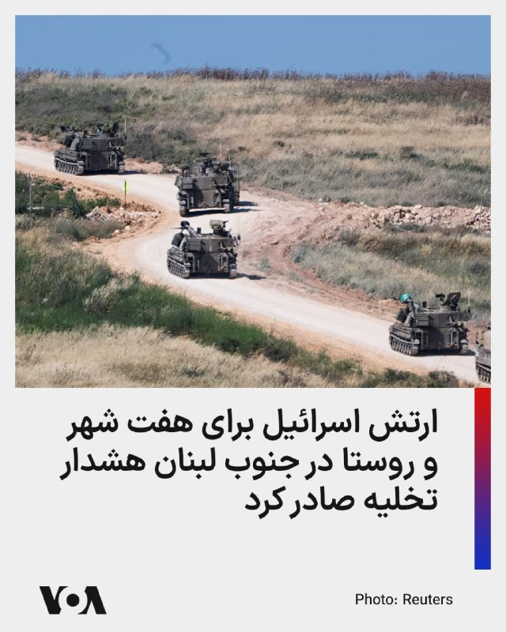

ارتش اسرائیل روز جمعه با صدور هشدار تخلیه برای هفت شهر و روستا در جنوب لبنان، از ساکنان این مناطق خواست پیش از آغاز حملات هوایی برنامه‌ریزی‌شده علیه مواضع حزب‌الله، محل سکونت خود را ترک کنند.

بر اساس اعلام ارتش اسرائیل، ساکنان مناطق انصاریه، خرایب، شبریحه، صرفند، عدلون و بیساریه باید دست‌کم یک کیلومتر از این مناطق فاصله بگیرند. پیش از این نیز هشدار مشابهی برای روستای عین قانا صادر شده بود.

آویخای ادرعی، سخنگوی عرب‌زبان ارتش اسرائیل، در پیامی اعلام کرد که این اقدام در واکنش به آنچه «نقض توافق آتش‌بس از سوی حزب‌الله» خواند، انجام می‌شود. او گفت ارتش اسرائیل ناچار است با قدرت علیه این گروه اقدام کند، اما قصد آسیب رساندن به غیرنظامیان را ندارد.

این هشدارها در حالی صادر شده که تنش‌ها در مرز لبنان و اسرائیل همچنان ادامه دارد و احتمال گسترش درگیری‌ها افزایش یافته است.
@FarsiVOA

## FarsiVOA — post 218971

  <a href="telegram/content/FarsiVOA_218971_1780056180.mp4" target="_blank">🎬 Download video</a>

حرکت جالب معاون رئیس‌جمهور آمریکا در جشن دانش‌آموختگی نیروی هوایی؛

جی‌دی ونس، معاون رئیس‌جمهور ایالات متحده، در جریان مراسم دانش‌آموختگی دانشجویان آکادمی نیروی هوایی این کشور، در حرکتی صمیمانه با یکی از فارغ‌التحصیلان نظامی «چِست بامپ» انجام داد.

این حرکت مهیج و صمیمی که در بخش اعطای مدرک رخ داد، به سرعت توجه رسانه‌ها و حاضران در مراسم را به خود جلب کرد.

«چِست بامپ» یا اصطلاحاً «سینه به سینه شدن»، یک حرکت نمادین برای ابراز شادی است که در بین نظامیان به عنوان نشانه‌ای از همبستگی و جشن گرفتن یک موفقیت بزرگ رایج است.
@FarsiVOA

## Dirty_Kids — post 390462

  <a href="telegram/content/Dirty_Kids_390462_1780056182.mp4" target="_blank">🎬 Download video</a>

🔴 طبق تحقیقات جدید:
بغل کردن پارتنر یا کسی که دوسش داری میتونه مشکل بی‌خوابی یا بدخوابیتو درمان کنه؛

به گفته پژوهشگر‌ها؛ حتی یه بغل 20 ثانیه‌ای یا بیشتر می‌تونه اثر قابل‌توجهی روی ترشح اکسی‌توسین و کاهش استرس داشته باشه و باعث بشه شب خواب عمیق‌تر و بدون استرسی رو تجربه کنید.

@Dirty_Kids 👻

## alonews — post 123492

  <a href="telegram/content/alonews_123492_1780056183.webm" target="_blank">🎬 Download video</a>

👈سی‌ان‌ان به نقل از مقامات:
ترامپ به مشاورانش گفته است که برای تصمیم‌گیری در مورد امضای توافق احتمالی با تهران به چند روز زمان نیاز دارد

✅ @AloNews خبر جنگ

---
📅 بروزرسانی: 1405/03/08 15:22
---

## DEJradio — post 5098

⭕️ پزشکیان دستور داد کالاهای اساسی و دارو از مسیر کشورهای همسایه و چین تأمین بشود

مسعود پزشکیان، رئیس دولت جمهوری اسلامی خواستار سرعت گرفتن اجرای توافق‌ها با پاکستان، روسیه و جمهوری آذربایجان برای واردات کالاهای مورد نیاز شد.
او در نشست با وزرای اقتصادی، بر گسترش مسیرهای «جایگزین» تجاری و تسریع تأمین کالاهای اساسی و دارو تأکید کرد.
در این نشست همچنین بررسی واردات دارو و برخی اقلام حیاتی از مسیر ریلی چین در دستور کار قرار گرفته است.
پیش‌تر گزارش‌هایی در مورد فروش نفت به چین از طریق مرز زمینی پاکستان منتشر شده بود.
با ادامه محاصرۀ دریایی جمهوری اسلامی در جنوب ایران، جمهوری اسلامی به دنبال راه‌های جایگزین برای گریز از بحران فزایندۀ اقتصادی است.

#خبر #دژ
@DEJradio

## DEJradio — post 5097

⭕️ وال‌استریت ژورنال: پوتین ۲۶ میلیارد دلار در پروژه‌های ضدپیری سرمایه‌گذاری کرد

وال‌استریت ژورنال گزارش داد ولادیمیر پوتینف رئیس جمهوری روسیه پروژه‌ای ۲۶ میلیارد دلاری را برای پیشرفت فناوری‌های ضدپیری، تکثیر اندام‌های حیاتی و پیوند اعضا دنبال می‌کند.
بر اساس این گزارش، کرملین این برنامه را در قالب «طرح ملی افزایش طول عمر» پیش می‌برد و هدف رسمی آن «افزایش امید به زندگی شهروندان روسیه» اعلام شده است.
بنا بر این گزارش، دانشمندان روسی بر فناوری‌هایی از جمله چاپ زیستی بافت‌های زنده و پرورش اندام در بدن خوک‌های اصلاح‌شدۀ ژنتیکی کار می‌کنند.
در این گزارش عنوان شد هدف دانشمندان روسی رسیدن به جایگزینی اندام‌ها تا پایان دهۀ کنونی میلادی است.
وال‌استریت ژورنال همچنین نوشت بخشی از این پروژه زیر نظر ماریا ورونتسوا، دختر ولادیمیر پوتین و میخائیل کووالچوک، از چهره‌های نزدیک به کرملین پیش می‌رود.

#خبر #دژ #پوتین
@DEJradio

## DEJradio — post 5096

⭕️ ورتکسا گزارش داد ۶۵ درصد نفتکش‌ها با سیگنال خاموش، از تنگۀ هرمز عبور می‌کنند

شرکت ورتکسا اعلام کرد در ماه جاری بیش از شصت و پنج درصد نفتکش‌ها با خاموش کردن سیستم شناسایی خودکار از تنگۀ هرمز عبور کردند.
پیش از انسداد تنگۀ هرمز، گزارش‌هایی از خاموش کردن سیستم شناسایی در نفتکش‌های حامل نفت جمهوری اسلامی منتشر شده بود. اکنون بر پایۀ گزارش‌های تازه، بخش بزرگی از کشتی‌های منطقه برای کاهش خطر ردیابی و حمله، بدون سیگنال حرکت می‌کنند.
ورتکسا همچنین گزارش داد این روند به خارج از آبراه هرمز نیز گسترش پیدا کرده است.
بنا بر این گزارش اکنون ۹۰ درصد نفتکش‌های حامل نفت و فرآورده‌های نفتی در بندر فجیرۀ امارات نیز با سیگنال خاموش تردد یا بارگیری می‌کنند.
بر اساس برآورد سازمان اطلاعات دریانوردی بریتانیا، از زمان آغاز جنگ جمهوری اسلامی و آمریکا ۲۸ کشتی در آب‌های منطقه هدف حمله قرار گرفته‌ است.

#خبر #دژ #تنگه_هرمز #نفت
@DEJradio

## IranIntlTV — post 339564

  

یک شهروند با ارسال تصویری به ایران اینترنشنال نشان داده که با حضور بر مزار جاویدنام علی گردکانه تکه کاغذی با مضمون «نور بر تاریکی پیروز است،‌ پاینده ایران، جاوید شاه» بر آن قرار داده است.

این جاویدنام در ۱۸ دی‌ماه در کنگاور به دست ماموران سرکوب کشته شد. او در میدان آزادی شهر کنگاور با شلیک مستقیم به ناحیه قلب کشته شد. علی گردکانه ۲۷ ساله پیرایشگر بود و به ورزش بدنسازی علاقه داشت.
https://iranintl.com/202605281791

## IranIntlTV — post 339563

  <a href="telegram/content/IranIntlTV_339563_1780055570.mp4" target="_blank">🎬 Download video</a>

حملات هوایی اسرائیل چندین منطقه در لبنان را هدف قرار داد و با وجود آتش‌بس جاری با حزب‌الله، دود غلیظی بر فراز منطقه شویفات در نزدیکی بیروت دیده شد و خسارات سنگینی در شهر صور در جنوب لبنان بر جا ماند. منابع امنیتی اسرائیل گفتند حمله نزدیک بیروت یک فرمانده شبه‌نظامی همسو با حزب‌الله و ایران را هدف قرار داده است.
@iranintltv

## IranIntlTV — post 339562

🔻اصابت پهپاد روسی به ساختمانی مسکونی در رومانی دو نفر را زخمی کرد و خشم اروپا را برانگیخت

در پی حمله شبانه روسیه به اوکراین، یک پهپاد روسی پس از ورود به حریم هوایی رومانی در شهری در جنوب شرق این کشور سقوط کرد و دو زخمی بر جا گذاشت.

خبرگزاری رویترز جمعه هشتم خرداد گزارش داد این پهپاد بر سقف یک ساختمان ۱۰ طبقه مسکونی در شهر گالاتی رومانی سقوط کرد و موجب وقوع انفجار شد.

این نخستین بار از زمان آغاز جنگ روسیه و اوکراین است که یک پهپاد در منطقه‌ای پرجمعیت در رومانی سقوط می‌کند و موجب جراحت شهروندان می‌شود. رخدادی که نگرانی‌ها را درباره سرایت پیامدهای جنگ به کشورهای عضو ناتو افزایش داده است.

اوانا تویو، وزیر خارجه رومانی، اعلام کرد در پی این رویداد، سفیر روسیه در این کشور احضار شده است.

روسیه اسفندماه ۱۴۰۰ عملیات نظامی خود را علیه اوکراین کلید زد و از آن زمان، درگیری‌های مرگبار میان دو کشور ادامه داشته است.

واکنش اتحادیه اروپا
کایا کالاس، مسئول سیاست خارجی اتحادیه اروپا، این حادثه را «نقض آشکار و جدی حاکمیت رومانی و حریم هوایی اروپا» خواند و تاکید کرد اتحادیه اروپا به افزایش فشارها بر روسیه، ادامه حمایت از اوکراین و تقویت سرمایه‌گذاری در حوزه آمادگی دفاعی خود پایبند خواهد ماند.
کالاس از گفت‌وگوی تلفنی خود با وزیر خارجه رومانی در پی این رویداد خبر داد و در شبکه اجتماعی ایکس نوشت: «روسیه مدت‌هاست که دیگر به مرزها احترام نمی‌گذارد. نباید به مسکو اجازه داده شود که بدون هیچ پیامد و مجازاتی، حریم هوایی اروپا را نقض کند.»
اورسولا فون در لاین، رییس کمیسیون اروپا، در ایکس نوشت پهپاد روسی پس از نفوذ به رومانی «منطقه‌ای پرجمعیت» را مورد اصابت قرار داد و بدین ترتیب، «جنگ تجاوزکارانه مسکو از خط قرمز دیگری عبور کرد».
او افزود اتحادیه اروپا در حال آماده‌سازی بیست‌ویکمین بسته تحریمی علیه روسیه است.
ژان نوئل بارو، وزیر خارجه فرانسه، خبر داد این کشور سفیر روسیه را احضار خواهد کرد و از او درباره این رخداد توضیح خواهد خواست.
بارو اضافه کرد: «این یک اقدام غیرمسئولانه پهپادی است و نخستین مورد از این دست به شمار نمی‌رود. پهپادها و هواگردهای روسی بارها وارد حریم هوایی کشورهای عضو اتحادیه اروپا و ناتو شده‌اند.»

🔗متن کامل گزارش را اینجا بخوانید

@iranintltv

## FarsiVOA — post 218970

  

ارتش اسرائیل اعلام کرد که در یک حمله هدفمند با همکاری شاباک، عماد حسن حسین اسلیم، جانشین فرمانده تیپ شهر غزه و فرمانده گردان زیتون در شاخه نظامی حماس کشته شد.

بر اساس بیانیه ارتش اسرائیل، این حمله روز چهارشنبه انجام شد و اسلیم فرماندهی یورش به خاک اسرائیل در کشتار ۷ اکتبر را بر عهده داشت.

ارتش اسرائیل افزود که در سال‌های اخیر و به‌ویژه در دوره اخیر، اسلیم «ده‌ها طرح تروریستی علیه نیروهای ارتش اسرائیل در نوار غزه را پیش برده بود و از این رو تهدیدی فوری محسوب می‌شد.»

بر اساس بیانیه ارتش اسرائیل، در زیرساختی که مورد حمله قرار گرفت، یک فرمانده دیگر از حماس نیز حضور داشت و نتایج این حمله در دست بررسی است.

ارتش اسرائیل تاکید کرد که نیروهای تحت فرماندهی جنوب این ارتش در منطقه مستقر هستند و به فعالیت برای «رفع هرگونه تهدید فوری» ادامه خواهند داد.
@FarsiVOA

## DW_Farsi — post 125273

  <a href="telegram/content/DW_Farsi_125273_1780055572.mp4" target="_blank">🎬 Download video</a>

🎥 ابراز نگرانی شاهزاده رضا پهلوی از پوشیدن تی‌شرت‌های ساواک

شاهزاده رضا پهلوی در ویدیویی که به تازگی منتشر شده از پوشیدن تی‌شرت سیاه یا ساواک در برخی تجمع‌های اعتراضی ابراز نگرانی کرد. او این اقدام را "حداقل مسئله‌ای جنجال‌آفرین" خواند که "نمی‌داند از کجا آب می‌خورد".

او پوشیدن چنین تی‌شرتی "با توجه به سابقه تاریخی ساواک" را بهانه دادن به دسته‌ای توصیف کرد که "همیشه سعی کردند این حملات را داشته باشند".

رضا پهلوی همچنین با تأکید بر "تمرکز به اصل هدف مبارزه" گفت که نباید اجازه داد تا این حاشیه‌سازی‌ها و انحرافات باعث تنش و یا اختلاف بین جریانات سیاسی، فعالین مدنی و اکتیویست‌ها شود.»
 
@dw_farsi

## Persian_Trend_Official — post 15235

رویترز: چین در حال ساخت سکوهای پرتاب در نزدیکی سیلوهای موشک هسته‌ای است.

رویترز با بررسی تصاویر ماهواره‌ای نوشت: پکن در حال ساخت شبکه‌ای گسترده از سکوهای پرتاب، پناهگاه‌ها و نقاط ارتباطی در نزدیکی سیلوهای هسته‌ای ایزوله است که موشک‌های دوربرد ارتش چین را در خود جای داده‌اند.

این تصاویر بیش از 80 سکو را نشان می‌دهد که می‌توانند توسط ناوگان رو به رشد پرتابگرهای موشکی متحرک و آشتبارهای پدافند هوایی چین مورد استفاده قرار گیرند.

این تصاویر همچنین تأسیساتی را نشان می‌دهند که می‌توانند برای جنگ الکترونیک، ارتباطات ماهواره‌ای و عملیات فرماندهی مورد استفاده قرار گیرند.

📝 Amir

📌 @persian_trend_official
پرشین ترند | متفاوت‌ترین کانال نظامی

## RadioFarda — post 157689

  

🔸سازمان اطلاعاتی دانمارک روز جمعه هشتم خرداد اعلام کرد که ایران نقش پررنگ‌تری در تهدید تروریستی علیه این کشور اسکاندیناویایی ایفا می‌کند و افزود ارزیابی تهدیدها بازتابی از تحولات جهانی است.

🔸رئیس سازمان امنیت و اطلاعات ملی دانمارک می‌گوید سطح کلی تهدید برای ایران همچنان ۴ از ۵ است، اما تأکید کرد که در سال‌های اخیر ماهیت این تهدیدها «به‌طور قابل‌توجهی تغییر کرده است».

🔸فین بورخ آندرسن در بیانیه‌ای گفت: «در سال گذشته، بازیگران دولتی اهمیت فزاینده‌ای در تهدیدات تروریستی پیدا کرده‌اند. ارزیابی ما این است که این موضوع به‌ویژه درباره ایران صدق می‌کند؛ کشوری که به‌طور خاص تهدیدی برای منافع اسرائیلی و یهودی و همچنین برخی مخالفان ایرانی در اروپا، از جمله دانمارک، محسوب می‌شود.»

🔸او افزود: «تهدید ناشی از ایران از سوی سرویس‌های اطلاعاتی این کشور سرچشمه می‌گیرد که برای برنامه‌ریزی و اجرای حملات از شبکه‌های مجرمانه و همچنین جذب نیرو در اروپا استفاده می‌کنند».

@Radiofarda

## IranianMinds — post 21006

  

🔴شبکه سیتنا:

بررسی‌های داده‌های شبکه طی ۴۸ ساعت اخیر نشان می‌دهد سهم IPv6 در ترافیک اینترنت ایران همچنان بدون تغییر محسوس نزدیک به صفر باقی مانده است.
وضعیتی که به گفته کارشناسان، فشار مضاعفی بر زیرساخت IPv4 و مانع جدی برای رسیدن شبکه اینترنت کشور به پایداری کامل حساب می‌رود.

@IranianMinds

## BBCPersian — post 282334

  <a href="telegram/content/BBCPersian_282334_1780055576.mp4" target="_blank">🎬 Download video</a>

محسن قاصد، فعال محیط‌زیست و عکاس، ویدیویی از بازگشت پرندگان مهاجر به جزیره حفاظت شده هون در دریاچه ارومیه منتشر کرده است. او در توضیح این ویدیو نوشته: «امسال حجم و تعداد و تنوع انواع گونه از پرندگانی که در دریاچه و جزایر دیده می‌شوند نسبت به سال‌های گذشته ده‌ها برابر بیشتر شده است.»

اطلاعات ثبت‌شده توسط اداره کل محیط زیست آذربایجان شرقی و غربی نشان می‌دهد بهار امسال، حجم آب دریاچه ارومیه با افزایشی ۱۵ برابری نسبت به سال گذشته روبه‌رو بوده است.

بهبود نسبی شرایط دریاچه ارومیه باعث بازگشت پرندگان مهاجری مثل فلامینگوها و کاکایی‌ها به این دریاچه شده که در سال‌های پیش، به دلیل خشکسالی شدید، از این دریاچه رفته بودند.

با این حال مقام‌های سازمان محیط‌زیست هشدار داده‌اند دریاچه ارومیه «هنوز از وضعیت بحران خارج نشده است.»

دریاچه ارومیه در شمال غربی ایران واقع شده است و بزرگ‌ترین دریاچه داخلی کشور به شمار می‌رود. این دریاچه در سال ۱۴۰۴ و در پی بحران‌های متعدد، به خشکی کامل نزدیک شد.

@bbcpersian

## alonews — post 123491

  

امروز روز ملی مشاورین املاکه

[@AloTweet]

## alonews — post 123490

  <a href="telegram/content/alonews_123490_1780055579.webm" target="_blank">🎬 Download video</a>

👈حمله حمید رسایی به مجتبی خامنه‌ای با داستانی از پسر نوح
‼️ 
✅ @AloNews خبر جنگ

---
📅 بروزرسانی: 1405/03/08 15:12
---

## DEJradio — post 5095

⭕️ اتحادیۀ اروپا اعلام کرد برای امنیت تنگۀ هرمز کشتی‌های بیشتری اعزام می‌کند

کایا کالاس، مسئول سیاست خارجی اتحادیۀ اروپا گفت این اتحادیه برای تأمین امنیت دریانوردی در تنگه هرمز، شمار بیشتری از کشتی‌ها را اعزام می‌کند.
او گفت این اقدام در قالب گسترش مأموریت دریایی کنونی اتحادیۀ اروپا انجام می‌شود.
به گفتۀ کالاس در برنامه‌های تازه ممکن است استفاده از شناورهای تخصصی از جمله کشتی‌های مین‌روب هم گنجانده شود.
اتحادیۀ اروپا در جریان مأموریت دریایی خود اکنون با سه کشتی در منطقه، از مسیرهای دریایی در برابر حملات محافظت می‌کند.

#خبر #دژ #تنگه_هرمز #اروپا
@DEJradio

## IranIntlTV — post 339561

  <a href="telegram/content/IranIntlTV_339561_1780054964.mp4" target="_blank">🎬 Download video</a>

در حالی که جمهوری اسلامی تلاش کرده بود توقف حملات اسرائیل به لبنان بخشی از توافق احتمالی با آمریکا باشد، این حملات نه‌تنها متوقف نشده، بلکه شدت گرفته است. برخی تحلیلگران معتقدند اسرائیل می‌کوشد پیش از هرگونه محدودیت احتمالی ناشی از توافق تهران و واشینگتن، ضربات بیشتری به حزب‌الله وارد کند.

ارزیابی بیشتر با محمدجواد اکبرین، عضو تحریریه ایران‌اینترنشنال
@iranintltv

## IranIntlTV — post 339560

  

🔻حذف غیرمنتظره یانیک سینر، نفر اول جهان و اصلی‌ترین مدعی قهرمانی، معادلات بخش مردان رولان‌گاروس را کاملا تغییر داده است.

🔹سینر که در دیدار با خوان مانوئل سروندولو دو ست جلو بود و تنها چهار امتیاز تا پیروزی فاصله داشت، تحت تاثیر گرما و شرایط جسمانی خود بازی را واگذار کرد تا رویای فتح نخستین عنوان رولان‌گاروس و تکمیل گرنداسلم حرفه‌ای‌اش از بین برود.

🔹از سوی دیگر، کارلوس آلکاراس، قهرمان دو دوره اخیر مسابقات، نیز به دلیل مصدومیت مچ دست اصلا به پاریس نرسید.

🔹در چنین شرایطی، بسیاری از تحلیلگران نشریه اتلتیک، الکساندر زورف را جدی‌ترین گزینه قهرمانی می‌دانند. تنیسور آلمانی که تاکنون سه فینال گرنداسلم را با شکست پشت سر گذاشته، یکی از بهترین بازیکنان حال حاضر روی خاک رس محسوب می‌شود و حالا شاید بهترین فرصت دوران حرفه‌ای خود را برای فتح نخستین گرنداسلم در اختیار داشته باشد.

🔹در کنار زورف، نام نواک جوکوویچ نیز به‌عنوان یکی از مدعیان اصلی مطرح شده است. اسطوره صربستانی با ۲۴ عنوان گرنداسلم و چهار قهرمانی در رولان‌گاروس، تجربه‌ای بی‌نظیر در استفاده از فرصت‌های بزرگ دارد.

🔹جزییات بیشتر را اینجا بخوانید

@iranintltvsport

## RadioFarda — post 157688

  <a href="https://t.me/radiofarda/157688" target="_blank">📎 Download file</a>

📻بشنوید: ساعت ۱۴ با رادیوفردا،هشتم خرداد ۱۴۰۵‌

@Radiofarda

## Hranews — post 113221

  

گزارشی از آخرین وضعیت حیدر نکوسیرت در زندان وکیل آباد مشهد

❗️
❗️
❗️
❗️
❗️– حیدر نکوسیرت، از بازداشت شدگان اعتراضات دی‌ماه ۱۴۰۴، در زندان وکیل آباد مشهد محبوس است. وی که توسط دادگاه انقلاب مشهد به دو سال حبس محکوم شده، علیرغم شرایط نامناسب جسمی ناشی از بیماری‌های کلیوی، چشمی و دیابت، کماکان از رسیدگی تخصصی پزشکی محروم مانده است.

به گزارش خبرگزاری هرانا، ارگان خبری مجموعه فعالان حقوق بشر در ایران، حیدر نکوسیرت در زندان وکیل آباد مشهد محبوس است.

بر اساس اطلاعات دریافتی هرانا؛ حیدر نکوسیرت چندی پیش توسط دادگاه انقلاب مشهد به دو سال حبس محکوم شده است. یک منبع مطلع نزدیک به خانواده این زندانی با تایید این موضوع به هرانا گفت: حیدر طی مدت زمان بازداشت از حق دسترسی به وکیل محروم مانده است. همچنین، وی در حالی از بیماری دیابت، نارسایی کلیوی و کاهش بینایی در یک چشم رنج می‌برد که دیگر چشم سالم او نیز دچار مشکل شده است. آقای نکوسیرت نیازمند رسیدگی تخصصی پزشکی و اعزام به مراکز درمانی خارج از زندان است.

#حیدر_نکوسیرت

ادامه مطلب

↘️
@hranews_bot تماس ✉️ - @Hranews کانال هرانا 🆑

## alonews — post 123489

  <a href="telegram/content/alonews_123489_1780054967.webm" target="_blank">🎬 Download video</a>

👈امام‌جمعه کرج: موشک، آبادانی میاره

✅ @AloNews خبر جنگ

## alonews — post 123488

  <a href="telegram/content/alonews_123488_1780054967.webm" target="_blank">🎬 Download video</a>

👈نیویورک‌تایمز:
ویتکاف و کوشنر راه‌اندازی پروژه‌های ساختمانی در تهران و یک صندوق سرمایه‌گذاری را در صورت حصول توافق پیشنهاد کرده‌اند

✅ @AloNews خبر جنگ

## alonews — post 123487

بهترین سرعت با بهترین قیمت با God Vpn🔵 تخفیف ویژه برای امروز فقط✅😍 10 گیگ فقط 210,000 تومن😍 با استفاده از کد تخفیف ((Fn)) متصل حتی در شرایط جنگی به خاطر اختصاصی بودن✅❤️😍 کد تخفیف: Fn @GodVpnV2_Bot برای نمایندگان پنل نمایندگی فعال میشه👍❤️ ✅تضمین بدون…

---
📅 بروزرسانی: 1405/03/08 15:02
---

## WithYashar — post 12855

  

از سری سوالات بی جواب تجمعات شبانه😃
@withyashar

## FoxNewsTwitter — post 342394

  <a href="telegram/content/FoxNewsTwitter_342394_1780054364.mp4" target="_blank">🎬 Download video</a>

Fox News (Twitter/X)

NEW: JPMorgan CEO Jamie Dimon pushes back on NYC Mayor Mamdani’s calls for higher taxes, arguing that politicians should focus on fixing government rather than seeking tax hikes.

“Good policy is free.”

“Don’t try to raise more taxes or spend more money. Sit down and fix policy. And I think you can grow 1% faster. I literally believe that.”

“It’s frustrating. It hurts. It’s embarrassing. And it always hurts the civilians of our country.”

“He’s running a city of 300,000 employees now. He’s never had a job like that.”

“And I’ve seen mayors who’ve failed abysmally because they can’t administer themselves out of a paper bag, or because ideology blinds them to practical, realistic, real-world policy.”

Dimon described his recent meeting with Mamdani as “pleasant,” saying, “I said everything I wanted to say,” and offering that if he could help him, he’d “be happy to do that.”

@MorningsMaria @MariaBartiromo

## IranIntlTV — post 339559

  <a href="telegram/content/IranIntlTV_339559_1780054366.mp4" target="_blank">🎬 Download video</a>

مقام‌های اوکراینی اعلام کردند یک کشتی باری ترکیه در دریای سیاه هدف حمله پهپادی قرار گرفت. بر اساس این گزارش، در این حمله دو خدمه کشتی زخمی شدند و نیروهای امدادی برای جلوگیری از گسترش آتش‌سوزی به منطقه اعزام شدند.
در حادثه‌ای جداگانه، سه نفتکش خالی در سواحل شمالی ترکیه در دریای سیاه، در نزدیکی استان سینوپ، هدف حمله پهپادی قرار گرفتند.

نرگس هورخش، خبرنگار ایران‌اینترنشنال
@iranintltv

## IranIntlTV — post 339558

  <a href="telegram/content/IranIntlTV_339558_1780054368.mp4" target="_blank">🎬 Download video</a>

مقام‌های اوکراینی اعلام کردند یک کشتی باری ترکیه در دریای سیاه هدف حمله پهپادی قرار گرفت. بر اساس این گزارش، در این حمله دو خدمه کشتی زخمی شدند و نیروهای امدادی برای جلوگیری از گسترش آتش‌سوزی به منطقه اعزام شدند.
در حادثه‌ای جداگانه، سه نفتکش خالی در سواحل شمالی ترکیه در دریای سیاه، در نزدیکی استان سینوپ، هدف حمله پهپادی قرار گرفتند.

نرگس هورخش، خبرنگار ایران‌اینترنشنال
@iranintltv

## FarsiVOA — post 218969

  

خبرگزاری دولتی ایسنا با انتشار گزارشی اعلام کرد که وزارت مسکن، تحقق پروژه‌های «مسکن مهر» و «نهضت ملی مسکن» را شکست خورده می‌داند و به همین دلیل، دولت به ساخت واحدهای مسکونی و اجاره به مستاجران روی آورد که تحقق این طرح نیز در هاله‌ای از ابهام قرار دارد.

خبرگزاری ایسنا در گزارش خود نوشت که دولت‌های نهم و دهم تنها ۶۸۰ هزار واحد ساختند و دولت سیزدهم نیز با طرح نهضت ملی مسکن، تنها به ۳۷۳ هزار واحد، وام بانکی پرداخت کرد.

در گزارش ایسنا آماده است که پیش از جنگ، هزینه ساخت مسکن متری ۳۰ میلیون تومان بود، اما در حال حاضر نرخ مصالح ساختمانی، ۷۰ درصد افزایش یافته است.

بهمن ماه سال قبل اعلام شده بود که به زودی ثبت نام طرح مسکن استیجاری عمومی آغاز می‌شود، اما با وقوع جنگ این برنامه به تعویق افتاد. حبیب طاهرخانی، معاون وزیر راه و شهرسازی، زمان دقیقی برای اجرای این طرح اعلام نکرده و تنها گفته است که «به زودی ثبت‌نام آغاز خواهد شد.»
@FarsiVOA

## DW_Farsi — post 125272

  

🔶 یک شهروند بلوچ در زندان وکیل‌آباد مشهد اعدام شد
 
بر اساس گزارش "حال‌ وش" که در حوزه اخبار مربوط به بلوچ‌ها فعالیت می‌کند، هویت یک شهروند بلوچ اعدام‌شده در زندان وکیل‌آباد مشهد احراز شد.
 
طبق اطلاعات منتشرشده، این فرد جواد غفران تالب (شاهوزهی) نام دارد، حدود ۲۴ سال سن داشته و در ارتباط با پرونده‌های مواد مخدر اعدام شده است. او متاهل و دارای سه فرزند بوده و اهل زاهدان و ساکن مشهد معرفی شده است.
 
بر اساس این گزارش، اجرای حکم بدون اطلاع‌رسانی قبلی به خانواده و بدون امکان ملاقات آخر انجام شده است. خانواده او نیز از زمان دقیق و جزئیات اجرای حکم بی‌اطلاع بوده‌اند.
 
این جوان بلوچ از سال ۱۳۹۸ بازداشت و پس از طی روند قضایی در دادگاه انقلاب مشهد به اعدام محکوم شده بود. حال‌وش نوشته است که خبر این اعدام به دلیل قطعی اینترنت با تأخیر منتشر شده است.
 
در گزارش حال‌‌وش آمده است که هم‌زمان با اعدام شاهوزهی، دو زندانی دیگر نیز در همان سحرگاه اعدام شده‌اند که هویت آنان هنوز مشخص نشده است. این رسانه همچنین فیلمی از تشییع جنازه جواد شاهوزهی نیز منتشر کرده است.
@dw_farsi

---
📅 بروزرسانی: 1405/03/08 14:52
---

## WithYashar — post 12854

سلام یاشار جان
من نامزدمو یه هفته پیش از دست دادم سرطان داشت 😔تا لحظه ی اخر میگفت ناامید نباش یاشار گفته میزنه،تو دی ماه هم واقعا به سختی نجات پیدا کردیم از تو خیابون .واقعا اگه ما پیروز نشیم من حس میکنم خون این همه ادم پایمال میشه،ما فقط به امید شما داریم زندگی میکنیم.هیچ وقت اخرین حرفشو تو ملاقات اخر یادم نمیره.فقط پیام دادم بگم حتی امید اون ادمی که روی تخت بیمارستان هم نفس های اخرشو میکشه هم هستی🥺خدا حفظت کنه واسه ما 🙏❤️🌺

## DEJradio — post 5094

  <a href="telegram/content/DEJradio_5094_1780053754.webm" target="_blank">🎬 Download video</a>

🚨
🔸 فریبرز کرمی‌زند افشر پیشین پلیس افشا کرد که مقرر شده مبلغی با عنوان «حق جنگ» به پرسنل فراجا و سایر سازمان‌های درگیر با جنگ تعیین شود، اما مبلغ به حساب پرسنل واریز نشده است زیرا احمدرضا رادان فرمانده انتظامی جمهوری اسلامی دستور داده پول‌ها بلوکه شود تا از آن برای بازسازی مقرها و کلانتری‌هایی که در جنگ آسیب دیده‌اند استفاده شود.

اکنون با توجه به سوابق مقامات نظام در دزدی و اختلاس این احتمال که تمام پول‌ها از بین برود و سر از جیب آقایان درآورد زیاد است.

#احمدرضا_رادان #جنگ
@DEJradio

## IranIntlTV — post 339557

  

محمدباقر محمدی لائینی، امام جمعه ساری، در خطبه‌های نماز جمعه هشتم خرداد این شهر، گفت «شیطان واقعی» نه نماد سنگی در مراسم حج، بلکه آمریکاست و افزود نمازگزاران با شعار «مرگ بر آمریکا» شیطان بزرگ را سنگسار می‌کنند.

او با اشاره به پیام مجتبی خامنه‌ای، رهبر جمهوری اسلامی، به حجاج گفت: «رزمندگان ما با موشک و پهپاد توانستند شیطان بزرگ را رم کنند.»

محمدی لائینی همچنین گفت آمریکا در روزهای اخیر نهاد مدیریت آبراه خلیج فارس را تحریم کرده و اسرائیل بارها آتش‌بس را نقض کرده است.

او در ادامه گفت دونالد ترامپ، رییس‌جمهوری آمریکا صراحتا اعلام کرده حتی با تحویل مواد غنی‌سازی‌شده، تحریم‌های جمهوری اسلامی برداشته نخواهد شد.
https://iranintl.com/202605290615

## IranIntlTV — post 339556

  <a href="telegram/content/IranIntlTV_339556_1780053755.mp4" target="_blank">🎬 Download video</a>

محمد باقر الساعدی، فرمانده عراقی که خود را «مانند فرزند قاسم سلیمانی» توصیف کرده، قرار است در آمریکا محاکمه شود. او در اعترافاتش از رابطه نزدیک با علی خامنه‌ای و دیدار با او سه روز پیش از آغاز جنگ سخن گفته است؛ موضوعی که نگرانی گروه‌های نیابتی جمهوری اسلامی در عراق را درباره افشای اطلاعات حساس افزایش داده است.

جزییات بیشتر با تروسکه صادقی، روزنامه‌نگار
@iranintltv

## FarsiVOA — post 218968

  <a href="telegram/content/FarsiVOA_218968_1780053756.mp4" target="_blank">🎬 Download video</a>

ویدیوی منتسب به کشته شدن فرمانده ارشد شبه‌نظامیان وابسته به جمهوری اسلامی در حمله نیروهای اسرائیلی به بیروت؛

نیروی هوایی اسرائیل در یک حمله هدفمند در منطقه «الشویفات العمروسیه» واقع در بیروت، پایتخت لبنان، یکی از فرماندهان ارشد گروه‌ شبه‌نظامی تروریستی مورد حمایت جمهوری اسلامی را از پا درآورد.

در جریان این حمله، «علی الحسینی»، فرمانده یگان موشکی لشکر امام حسین، هدف قرار گرفت و کشته شد.
@FarsiVOA

## DW_Farsi — post 125271

🔶 برای پاکستان پیوستن به توافق‌نامه‌ ابراهیم انتخابی دشوار است
 
پاکستان در برابر تازه‌ترین درخواست ترامپ برای پیوستن به توافق‌نامه‌های ابراهیم و عادی‌سازی روابط با اسرائیل، در موقعیت دشواری قرار گرفته است. ترامپ این موضوع را بخشی از یک توافق احتمالی برای پایان دادن به جنگ ایران مطرح کرده است.
 
او روز دوشنبه گفت هر توافقی برای پایان جنگ ایران باید شامل پیوستن کشورهایی مانند عربستان سعودی، پاکستان و قطر به توافق‌نامه‌های ابراهیم باشد. ترامپ در شبکه‌های اجتماعی نوشت که پس از تلاش‌های آمریکا برای حل این "پازل پیچیده"، حداقل انتظار این است که این کشورها به این توافق‌ها بپیوندند.
 
توافق‌نامه‌های ابراهیم مجموعه‌ای از توافق‌های دوجانبه هستند که با میانجیگری آمریکا برای عادی‌سازی روابط اسرائیل با کشورهای عربی شکل گرفتند. نخستین توافق‌ها در سپتامبر ۲۰۲۰ میان اسرائیل، امارات متحده عربی و بحرین امضا شدند.
 
برخی مقام‌های پاکستانی درخواست ترامپ را رد کرده‌اند، اما تاکنون دولت و ارتش پاکستان موضعی یکپارچه و قطعی اتخاذ نکرده‌اند.
 
اسلام‌آباد در ماه‌های اخیر نقش مهمی در میانجیگری برای پایان جنگ ایفا کرده و به گفته منابع آمریکایی، در آوریل موفق شده واشنگتن را به توقف حملات علیه ایران متقاعد کند. ترامپ نیز بارها از نقش پاکستان تمجید کرده و از عاصم منیر و شهباز شریف به عنوان افراد مورد علاقه خود یاد کرده است.
 
رضا رومی، تحلیلگر سیاسی، به دویچه‌ وله گفت که پیوستن به توافق‌نامه‌های ابراهیم می‌تواند برای پاکستان مزایایی مانند بهبود روابط با واشنگتن و برخی کشورهای خلیج فارس و همچنین فرصت‌های اقتصادی و فناوری به همراه داشته باشد.
 
اما او هشدار داد که این اقدام می‌تواند جایگاه پاکستان در موضوع فلسطین را تضعیف کند، تنش با ایران را افزایش دهد و به بی‌ثباتی داخلی دامن بزند.
 
پاکستان، اسرائیل را به رسمیت نمی‌شناسد و روابط دیپلماتیک با آن ندارد، هرچند در گذشته گزارش‌هایی از تماس‌های غیررسمی میان دو طرف منتشر شده بود.
@dw_farsi

## alonews — post 123485

  <a href="telegram/content/alonews_123485_1780053758.mp4" target="_blank">🎬 Download video</a>

👈نیروهای حوثی یمن ادعا می‌کنند که یک پهپاد MQ-9 ریپر آمریکا را در نزدیکی استان مارب سرنگون کرده‌اند

✅ @AloNews خبر جنگ

## alonews — post 123483

  <a href="telegram/content/alonews_123483_1780053758.webm" target="_blank">🎬 Download video</a>

👈 نیروی دریایی سپاه : تو ۲۴ ساعت گذشته، ۲۴ تا کشتی با هماهنگی سپاه و وزارت خارجه از تنگه هرمز رد شدن

✅ @AloNews خبر جنگ

---
📅 بروزرسانی: 1405/03/08 14:42
---

## WithYashar — post 12853

  <a href="telegram/content/WithYashar_12853_1780053161.mp4" target="_blank">🎬 Download video</a>

هگست ، وزیر دفاع آمریکا با لاتی‌ پر مانند مربیی که تیمش را به زمین میفرستد، خطاب به نیروهای آمریکا روی ناو USS Boxer گفت:

«رئیس‌جمهور گفت: ایران یا می‌تواند راه درست را انتخاب کند یعنی پای میز مذاکره توافق کند یا با مردِ سمت چپ من طرف شود.»
«آن مردِ سمت چپ، اتفاقاً من بودم.»
«اما در واقع من نیستم…»
«شمایید.»
یعنی شما نیروهای نظامی آمریکا هستید.
@withyashar

## IranIntlTV — post 339555

🔻گزارش روزنامه لو‌سواق از وضعیت تیم‌ملی؛ بازیکنان ایران ویزای آمریکا را دریافت نکرده‌اند

روزنامه لو‌سواق بلژیک گزارش داده که در حالی که تنها دو هفته تا آغاز جام جهانی فوتبال ۲۰۲۶ باقی مانده است، بازیکنان تیم ملی ایران، یکی از حریفان بلژیک در مرحله گروهی، همچنان در انتظار دریافت ویزای ورود به ایالات متحده هستند.

مهدی تاج، رییس فدراسیون فوتبال جمهوری اسلامی، بار دیگر درباره این موضوع صحبت کرده و خواستار ورود فیفا به این پرونده شده است.

مهدی تاج در ویدیویی که از سوی رسانه‌های ایرانی منتشر شده، گفت: «فیفا باید اطمینان حاصل کند که ویزاها صادر می‌شوند تا بازیکنان بتوانند از کمپ اصلی خود در مکزیک به آمریکا سفر کرده و پس از مسابقات بازگردند.»

به نوشته این روزنامه بلژیکی، بازیکنان تیم ملی ایران ماه‌هاست در انتظار دریافت این مجوز هستند. ایران قرار است هر سه مسابقه خود در مرحله گروهی، از جمله دیدار مقابل بلژیک در ۳۱ خرداد ۱۴۰۵، را در خاک آمریکا برگزار کند.

از اوایل اسفند ۱۴۰۴، جمهوری اسلامی و آمریکا درگیر یک درگیری نظامی بوده‌اند. در پی این تنش‌ها، فدراسیون فوتبال جمهوری اسلامی هفته گذشته تصمیم گرفت محل کمپ اصلی تیم ملی را از شهر توسان در ایالت آریزونا به تیخوانا در مکزیک منتقل کند؛ کشوری که به همراه آمریکا و کانادا میزبان جام جهانی ۲۰۲۶ است.

احمد دنیامالی، وزیر ورزش جمهوری اسلامی، نیز روز چهارشنبه از فیفا خواست برای حل این مشکل وارد عمل شود. به گفته او، جیانی اینفانتینو، رییس فیفا، شخصا تضمین داده است که تمامی بازیکنان تیم ملی ایران ویزای لازم را دریافت خواهند کرد. با این حال، زمان به سرعت در حال سپری شدن است. دو هفته پیش نیز نمایندگان فیفا و مدیران فدراسیون فوتبال جمهوری اسلامی در ترکیه، جایی که تیم ملی در حال آماده‌سازی برای جام جهانی است، جلسه‌ای برگزار کرده بودند.

با وجود این، هنوز ابهام‌هایی درباره امکان ورود تمامی بازیکنان، اعضای کادر فنی و به‌ویژه مدیران فدراسیون به آمریکا وجود دارد. در این گزارش آمده است که برخی از مدیران فدراسیون فوتبال جمهوری اسلامی به دلیل ارتباط احتمالی با سپاه پاسداران، نهادی که از سوی واشنگتن به عنوان یک سازمان «تروریستی» شناخته می‌شود، ممکن است با محدودیت‌هایی برای ورود به آمریکا مواجه شوند.

🔗وبسایت ایران‌اینترنشنال

@iranintltv

## FarsiVOA — post 218967

🔺دستور پزشکیان برای توسعه کریدورهای جایگزین تجاری

▪️رئیس‌جمهور ایران دستور توسعه کریدورهای جایگزین تجاری برای مقابله با محاصره دریایی ایالات متحده آمریکا علیه جمهوری اسلامی را صادر کرد.

▪️دستور جایگزینی کریدورهای تجاری بنادر جنوب در حالی است که بنادر شمالی ایران کمتر از ۱۰ درصد سهم در ظرفیت کل بنادر کشور دارند و آمارهای گمرکی آذربایجان و ترکیه نیز از افزایش ترانزیت کالا یا تجارت دوجانبه با ایران نشان نمی‌دهد.

▪️از زمان آغاز محاصره دریایی جمهوری اسلامی نیروهای آمریکایی مسیر ۱۱۱ شناور تجاری را تغییر داد‌ه‌اند.

▪️پیشتر دونالد ترامپ، رئیس‌جمهور آمریکا تأکید کرده که این محاصره دریایی تا رسیدن به یک توافق واقعی با جمهوری اسلامی ادامه خواهد داشت.

⬇️ بیشتر بخوانید:
https://ir.voanews.com/a/8155256.html

## DW_Farsi — post 125270

  

🔶 کمیسیون امنیت ملی مجلس: اورانیوم غنی‌شده به کشور ثالث منتقل نمی‌شود
 
ابراهیم عزیزی، رئیس کمیسیون امنیت ملی مجلس ایران روز جمعه ۸ خرداد (۲۹ مه) در گفت‌وگو با خبرگزاری روسی "ریانووستی" با رد برخی گمانه‌زنی‌ها درباره سرنوشت اورانیوم‌های غنی‌شدهایران تاکید کرد که اساسا برنامه‌ای برای انتقال این مواد به کشور ثالث یا هر واسطه‌ای وجود ندارد.
 
عزیزی همچنین این پرسش‌ها را بی‌اساس دانست و اظهار کرد چنین موضوعی در دستور کار ایران قرار ندارد و مطرح‌شدن آن را ناشی از برداشت‌های نادرست عنوان کرد.
 
سخنان رئیس کمیسیون امنیت ملی مجلس درحالی بیان شده است که دونالد ترامپ، رئیس جمهور آمریکا، روز پنجشنبه ۲۱ مه (۳۱ اردیبهشت) هشدار داد که به جمهوری اسلامی اجازه نخواهد داد اورانیوم با غنای بالا را نزد خود نگه دارد.
 
او این موضوع را یکی از موانع احتمالی در مذاکرات برای دستیابی به صلحی پایدار در مناقشه خاورمیانه توصیف کرد.
 
ترامپ گفت: «ما به آن نیازی نداریم، آن را نمی‌خواهیم. احتمالا بعد از آنکه آن را تحویل گرفتیم نابودش می‌کنیم، اما اجازه نخواهیم داد آن‌ها آن را داشته باشند.»
 
@dw_farsi

## alonews — post 123482

  <a href="telegram/content/alonews_123482_1780053163.webm" target="_blank">🎬 Download video</a>

👈نیویورک‌تایمز: ایران شرط آغاز هرگونه مذاکره معنادار با دولت ترامپ را آزادسازی میلیاردها دلار از دارایی‌های مسدود شده خود اعلام کرده است.

🔴تهران از یک شرط کوتاه نیامده؛ بدون دسترسی به این وجوه در بانک‌های خارجی، گفت‌وگویی شکل نخواهد گرفت. موضوعی که به «نقطه کور» توافق احتمالی تبدیل شده است

✅ @AloNews خبر جنگ

---
📅 بروزرسانی: 1405/03/08 14:32
---

## WithYashar — post 12852

سلام یاشار عزیز من امشب عروسیمه امشب میزنه آماده باشم تو باغ مهمونا رو از قبل آماده کنم میزنه ؟؟ 😂😂

## DEJradio — post 5093

⭕️ سنتکام خبر هدف گرفتن هواگرد آمریکایی توسط جمهوری اسلامی را نادرست خواند

ستاد فرماندهی مرکزی ارتش آمریکا گزارش‌های منتشرشده در رسانه‌های حکومت در ایران را دربارۀ هدف قرار گرفتن یک هواگرد آمریکایی رد کرد.
سنتکام در شبکۀ اکس خبر داد ادعای مطرح‌شده در تلویزیون جمهوری اسلامی دروغ است و همۀ هواگردها و هواپیماهای آمریکا سالم است.

#خبر #دژ #سنتکام
@DEJradio

## IranIntlTV — post 339554

  <a href="telegram/content/IranIntlTV_339554_1780052574.mp4" target="_blank">🎬 Download video</a>

علیرضا سیدصالح، شهروند ۴۴ ساله، از جمله شهروندانی بود که در اعتراضات انقلاب ملی دی‌ماه در فولادشهر اصفهان هدف شلیک ماموران قرار گرفت و کشته شد. بنا به اطلاعات رسیده به ایران اینترنشنال، بدن مجروح او هدف تیر خلاص نیز قرار گرفت. علیرضا سیدصالح هنگام کمک به مجروحان اعتراضات هدف قرار گرفت و مجروح شد.

## FarsiVOA — post 218966

  <a href="telegram/content/FarsiVOA_218966_1780052576.mp4" target="_blank">🎬 Download video</a>

اهدای ۱۶ فروند جنگنده گریپِن سوئد به اوکراین با حضور زلنسکی در استکهلم؛

بر اساس گزارش منابع رسمی، اولف کریسترسون، نخست‌وزیر سوئد، در جریان دیدار با ولودیمیر زلنسکی، رئیس‌جمهور اوکراین، در پایگاه هوایی اوپسالا، رسماً اعلام کرد که این کشور ۱۶ فروند جنگنده «یاس ۳۹ گریپِن» از مدل‌های سی/دی را به اوکراین اهدا می‌کند.

این اقدام که در قالب بزرگ‌ترین بسته حمایت نظامی استکهلم از کی‌یف انجام می‌شود، گام مهمی در تقویت پدافند هوایی و توان رزمی اوکراین در مواجهه با حملات روسیه به شمار می‌رود.

همچنین بر اساس توافقات صورت‌گرفته، اوکراین در برنامه‌ای بلندمدت قصد دارد روند خرید مدل‌های جدیدتر این جنگنده، ایی/اِف را نیز آغاز کند.
@FarsiVOA

## IranianMinds — post 21005

  

🔴پست نشریه اکونومیست:
طرفین درگیر ممکن است بیش از هر زمان دیگری به یک توافق نزدیک شده باشند، با این‌حال این توافق جامع نخواهد بود و جنگ را برای همیشه به پایان نخواهد رساند.
این نشریه در ادامه توضیح داد که چگونه ملاحظات و بازی‌های سیاسی عامل اصلی این پیام‌های ضدونقیض دو طرف می‌باشد.

@IranianMinds

---
📅 بروزرسانی: 1405/03/08 14:22
---

## DEJradio — post 5092

⭕️ تحریم‌های تازۀ آمریکا شریان‌های مالی سپاه را هدف گرفت

وزارت امور خارجۀ آمریکا اعلام کرد با اعمال تحریم‌های تازه، مستقیما منابع مالی سپاه پاسداران و ساختار نظامی جمهوری اسلامی را هدف گرفته است.
در بسته تحریمی تازۀ آمریکا، هشت نهاد، سه نهاد فعال در تجارت پتروشیمی، یک فرد و هشت کشتی مرتبط با حمل نفت و فرآورده‌های مرتبط با جمهوری اسلامی، هدف گرفته شد.
تامی پیگوت، سخنگوی وزارت امور خارج، آمریکا گفت واشینگتن در چارچوب سیاست فشار شدید اقتصادی، شبکه‌های نفتی و ناوگان مخفی جمهوری اسلامی را هدف گرفته است.
وزارت امور خارجۀ آمریکا هشدار داد هر فرد یا شرکتی که در تجارت نفت و انرژی با جمهوری اسلامی مشارکت کند، با خطر تحریم روبه‌رو است.

#خبر #دژ #تحریم
@DEJradio

## DEJradio — post 5091

⭕️ جانشین فرماندۀ تیپ شهر غزه در شاخۀ نظامی حماس حذف شد

ارتش اسرائیل اعلام کرد عماد حسن حسین اسلیم، جانشین فرماندۀ تیپ شهر غزه و فرماندل گردان زیتون در شاخۀ نظامی حماس، در پی حمله‌ای مشترک با شاباک، حذف شد.
حماس که از پشتیبانی جمهوری اسلامی بهره‌مند است، در سیاهۀ تروریستی اروپا و آمریکا قرار دارد.
بر اساس بیانیۀ ارتش اسرائیل، این حمله روز چهارشنبه انجام شده است.
بنا بر گزارش‌ها اسلیم یکی از فرماندهان کشتار هفتم اکتبر در اسرائیل بود.
به گزارش ارتش اسرائیل، این فرد در سال‌های اخیر ده‌ها طرح عملیاتی را علیه نیروهای اسرائیلی در غزه هدایت کرده بود و تهدیدی فوری به شمار می‌رفت.
ارتش اسرائیل اعلام کرد دیگر نتایج حمله و سرنوشت یک فرماندۀ دیگر حماس که در محل حضور داشت، همچنان در دست بررسی است.

#خبر #دژ #اسرائیل #حذف_هدفمند
@DEJradio

## FarsiVOA — post 218965

🔺هگست در سنگاپور؛ تأکید بر روابط با ویتنام و هشدار به جمهوری اسلامی

▪️پیت هگست، وزیر جنگ آمریکا در جریان سفر خود به سنگاپور، با تو لام، رهبر و فان وان گیانگ، وزیر دفاع ویتنام دیدار کرد. او همچنین در سخنانی به جمهوری اسلامی هشدار داد که از پیگیری برنامه هسته‌ای خود منصرف شود.

▪️قرار است که وزیر جنگ آمریکا روز شنبه در نشست امنیتی آسیا در سنگاپور سخنرانی کند. طبق اعلام پنتاگون، سخنرانی هگست بر «رویکردی مبتنی بر عقل سلیم برای حفاظت از منافع حیاتی آمریکا در منطقه هند-آرام» متمرکز خواهد بود.

▪️او روز جمعه در عرشه ناو «یو‌اس‌اس باکسر» در سنگاپور اعلام کرد حکومت ایران باید از برنامه هسته‌ای خود دست بکشد و اینکه در ادامه چه اتفاقی رخ دهد به جمهوری اسلامی بستگی دارد.

⬇️ بیشتر بخوانید:
https://ir.voanews.com/a/8155257.html

## Dirty_Kids — post 390461

  

عجیب‌ترین خبر بعد از وصل شدن اینترنت، بازی کردن نیکلاس کیج در نقش اسپایدرمن بود.

@Dirty_Kids 👻

## Dirty_Kids — post 390457

هروقت بهتون گفتن «چطور قدیما کسی اوتیسم‌ نداشته؟» بهشون بگید یک بابایی به اسم عبدالکریم بین محمد الرافعی‌ القزوینی در قرن هفتم نشسته ۵۰۰ صفحه شرح‌حال‌ از آدم‌هایی که در قزوین بودند و اسمشون محمد بوده نوشته و برمبنای حرف اول اسم باباشون دسته بندی کرده!

@Dirty_Kids 👻

## Dirty_Kids — post 390456

  <a href="telegram/content/Dirty_Kids_390456_1780051955.webm" target="_blank">🎬 Download video</a>

🆕 اپلیکیشن MelBet 
✅

🎁 کد هدیه 100 دلاری: Sport100

🌀 کاملترین برنامه موبایل

🤝 اسپانسر رسمی لالیگا

🥇صرافی معتبر

🌐 ربات راهنما

🇮🇷 برای تغییر زبان برنامه، زبان موبایل خود را تغییر دهید.

✅ ورود به اپلیکیشن بدون فیلترشکن

## Dirty_Kids — post 390455

⚠️ خیلیا نمیدونن که اگه ثبت‌نامشون رو با لینک زیر انجام بدن... 
⁉️

💥 بونوس خوش‌آمد گویی تا %220 بیشتر میگیرن!
فقط کافیه به لینک زیر مراجعه کنید و وارد ملبت بشید و به راحتی ثبتنام کنید! 👌

🌐 لینک بدون فیلتر سایت معتبر ملبت 👇

🌐 www.MelBet1.com

🎁 بعد از ثبتنام، وارد حسابت شو و توی بخش "بونوس‌ها" فعالش کن 
🎚️

نکته: فقط این هفته فعاله، پس از دستش نده 
🙂

🎁 کد هدیه 100 دلاری فراموش نشه: Sport100

✅ معرفی سایت و اپلیکیشن مل‌بت

💯 ورود به سایت مل‌بت (بدون فیلترشکن)

## Dirty_Kids — post 390454

  

رسانه‌های حکومتی از برگزاری مراسم برای خونواده‌ی موشعلی در شابدل‌عظیم‌حسنی نوشتن

این مراسم دیشب در حالی برگزار شده که خب موشتبا رو بعد از ۹۰ روز همه دیگه قبول کردیم که AIیی بیش نیست،

اما در این بین هیچ کیرمغز رافضی پیدا نمی‌شه از خودش بپرسه مصطفی، مسعود و میثم،
سه موشعلی‌بچه‌ی قرمساق دیگه‌ش کجان؟

@Dirty_Kids 👻

## alonews — post 123481

  <a href="telegram/content/alonews_123481_1780051956.webm" target="_blank">🎬 Download video</a>

👈سی‌ان‌ان: ایران با سرعت بسیار بالا داره توان موشکی خودش رو بازسازی میکنه

✅ @AloNews خبر جنگ

## alonews — post 123480

  <a href="telegram/content/alonews_123480_1780051956.webm" target="_blank">🎬 Download video</a>

👈سیتنا: سهم IPV6 در اینترنت ایران همچنان نزدیک به صفر؛ بازگشت کامل به IPv4 فشار بر شبکه را افزایش داده است

🔴بررسی داده‌های شبکه طی ۴۸ ساعت اخیر نشان می‌دهد سهم IPv6 در ترافیک اینترنت ایران همچنان بدون تغییر محسوس در محدوده نزدیک به صفر باقی مانده است؛ وضعیتی که به گفته کارشناسان، فشار مضاعفی بر زیرساخت IPv4 و سامانه‌های NAT وارد کرده و مانعی جدی برای رسیدن شبکه اینترنت کشور به پایداری کامل محسوب می‌شود

✅ @AloNews خبر جنگ

---
📅 بروزرسانی: 1405/03/08 14:12
---

## mwarmonitor — post 9880

  <a href="telegram/content/mwarmonitor_9880_1780051366.mp4" target="_blank">🎬 Download video</a>

📝 وقتی می‌گویند «مدیریت جهادی»، دقیقاً منظورشان همین است؛ محسن برمهانی معاون صدا و سیما میلی مدیری که چنان غرق در حل بحران‌های کلان کشور و تحول در رسانه ملی بوده که اصلاً وقت نکرده مسیر رختخواب تا استودیو را از طریق حمام طی کند. ظاهر پشم‌والو و قیافه ژولیده‌ای که انگار همین چند ثانیه پیش با زلزله‌ای ملایم از عمق پتو بیرون کشیده شده، خودش یک پیام استراتژیک است: «ما آن‌قدر مشغول کاریم که فرصت شانه کردن مو و تعویض لباس را هم نداریم!»
🔸در دنیایی که رسانه‌ها با هوش مصنوعی و استانداردهای فوق‌مدرن بصری جلو می‌روند، این انگل ها به «اصالت طبیعی» روی آورده‌اند؛ به‌طوری که بوی عرق و اتمسفر کپک‌زده از پشت صفحه نمایشگر هم رد می‌شود و مستقیم به مشام مخاطب می‌رسد. این سطح از واقع‌گرایی در تصویر، خودش بزرگ‌ترین دستاورد نظام مدیریتی است! از چنین ژنرال‌های خط مقدمی که معتقدند رسانه باید «پیش‌تر و بیشتر از میدان موثر باشد»، بعید هم نیست که با همین سر و وضع، فاتح جنگ‌های رسانه‌ای جهان شوند. تف به این حجم از تخصص و آراستگی که هر بیننده‌ای را در همان نگاه اول، میخکوب و البته منزجر می‌کند!

@mwarmonitor

## DEJradio — post 5090

⭕️ تفاهم‌نامۀ ۶۰ روزه تهران و واشینگتن در انتظار تصمیم ترامپ است

رسانه‌های آمریکایی گزارش دادند دونالد ترامپ هنوز برای امضای تفاهم‌نامه با جمهوری اسلامی، تصمیم پایانی را نگرفته است.
بنا بر گزارش‌ها تهران و واشینگتن بر سر یک تفاهم اولیه شصت روزه برای تمدید آتش‌بس و ادامۀ مذاکرات به جمع‌بندی رسیده‌اند، اما همه چیز به تأیید نهایی دونالد ترامپ وابسته است.
به گزارش آکسیوس، بر اساس این تفاهمنامه، آتش‌بس تمدید می‌شود و مسیر مذاکرات هسته‌ای باز می‌ماند.
یک مقام آمریکایی به آکسیوس گفت ترامپ به میانجی‌ها اطلاع داده که باید چند روز برای اخذ تصمیم پایانی فکر کند.

#خبر #دژ #توافق
@DEJradio

## IranIntlTV — post 339553

  <a href="telegram/content/IranIntlTV_339553_1780051367.mp4" target="_blank">🎬 Download video</a>

سرخط خبرهای جمعه ۸ خرداد
@iranintltv

## IranIntlTV — post 339552

🔻سایه سنگین بحران اقتصادی بر زندگی معلولان؛ افزایش حمایت‌ها در انتظار تصویب دولت

فاطمه عباسی، معاون توان‌بخشی سازمان بهزیستی، با اشاره به مشکلات فزاینده افراد دارای معلولیت در پی وخامت بحران اقتصادی کشور، اعلام کرد این سازمان خواستار افزایش ۸۰ تا ۹۰ درصدی کمک‌هزینه حق پرستاری نسبت به سال ۱۴۰۴ شده، اما اجرای آن منوط به تصویب دولت خواهد بود.

عباسی جمعه هشتم خرداد در مصاحبه با خبرگزاری ایلنا گفت سازمان بهزیستی «به‌صورت مستمر» پیگیر افزایش کمک‌هزینه حق پرستاری افراد دارای معلولیت است و در همین راستا، در جلسات کمیسیون بودجه هیات دولت جمهوری اسلامی حضور یافته است.

به گفته معاون توان‌بخشی سازمان بهزیستی، افزایش مبلغ کمک‌هزینه پس از تصویب در هیات وزیران قابل اجرا خواهد بود. با این حال، او درباره زمان احتمالی بررسی و تصویب این پیشنهاد توضیحی ارائه نکرد.

عباسی افزود تا زمان تصمیم‌گیری هیات وزیران، پرداخت کمک‌هزینه حق پرستاری بر اساس سرانه مصوب سال ۱۴۰۴ ادامه خواهد یافت.

او یادآور شد: «با توجه به اینکه بیش از ۸۰ درصد این افراد در دهک‌های پایین قرار داشته و در خانواده نگهداری می‌شوند، لزوم حمایت از آن‌ها جهت پیشگیری از تشدید معلولیت و جلوگیری از کاهش کیفیت زندگی اهمیت خاصی دارد.»

در روزهای اخیر، تشدید مشکلات اقتصادی و افزایش چشمگیر هزینه‌های درمان و دارو، فشار مضاعفی بر شهروندان ایرانی وارد آورده است.
این شرایط به‌ویژه برای افراد دارای معلولیت که نیاز مستمر به خدمات پزشکی، توان‌بخشی و دارو دارند، چالش‌های جدی‌تری ایجاد کرده است.
یک شهروند هشتم خرداد در پیامی به ایران‌اینترنشنال نوشت: «بیمار آرتریت روماتویید و فیبرومیالژیا هستم. ۱۰ سال است درگیر بیماری هستم. هشت سال است داروی رمیکید تزریق می‌کنم. چند ماه است که دارو دریافت نکرده‌ام. بیماری من دوباره بیدار شده و تمام مفاصلم متورم و زانوهایم قفل شده.»
او افزود: «دیروز از سازمان غذا و دارو تماس گرفتند و گفتند رمیکید موجود است ویالی ۱۹ میلیون. سه ویالش می‌شود ۵۷ میلیون. ولی من با وجود این همه درد نتوانستم خرید کنم، چون توانایی پرداخت هزینه‌اش را ندارم.»

کمک‌هزینه جدید لوازم بهداشتی پاسخگوی نیاز واقعی معلولان نخواهد بود

معاون توان‌بخشی سازمان بهزیستی در ادامه مصاحبه خود اعلام کرد افراد دارای معلولیت که به‌دلیل شرایط جسمی و نیازهای پزشکی ناگزیر به استفاده مداوم از پوشینه و سایر اقلام بهداشتی هستند، در دو ماه گذشته با افزایش قابل توجه قیمت این محصولات و دشواری در تامین آن‌ها روبه‌رو شده‌اند.
عباسی گفت: «کمبود مقطعی کالا و نوسان شدید در بازار، به‌ویژه در شرایط کنونی، فشار مضاعفی را بر خانواده‌های این عزیزان وارد کرده است.»

او افزود بر اساس مکاتبات انجام‌شده، قرار است سرانه کمک‌هزینه لوازم بهداشتی در بودجه سال ۱۴۰۵ از یک میلیون و ۵۰۰ هزار تومان به دو میلیون و ۵۰۰ هزار تومان افزایش یابد و در عین حال گفت بودجه مصوب در این خصوص «به‌‎طور رسمی ابلاغ نشده و هنوز به مرحله اجرا نرسیده» است.
معاون توان‌بخشی سازمان بهزیستی اذعان کرد: «حتی این سرانه جدید هم با قیمت واقعی نیاز بهداشتی یک فرد ضایعه نخاعی یا بسترگرا فاصله و تفاوت واضحی دارد.»
پنجم خرداد، وب‌سایت خبرآنلاین گزارش داد گرانی لوازم بهداشتی در ایران زندگی حدود ۴۵ هزار فرد دارای آسیب نخاعی را تحت تاثیر قرار داده است.
بر پایه این گزارش، بهای اقلام و تجهیزات پزشکی مورد استفاده روزانه این افراد، از جمله گاز استریل، پانسمان‌های تخصصی، سوند، کیسه سوند، ژل، سرنگ، دستمال کاغذی و داروهای مرتبط با زخم بستر، دست‌کم دو تا سه برابر شده است.

🔗وبسایت ایران‌اینترنشنال

@iranintltv

## FarsiVOA — post 218964

  <a href="telegram/content/FarsiVOA_218964_1780051368.mp4" target="_blank">🎬 Download video</a>

تصاویری از لحظه برخورد پهپاد روسی به ساختمان مسکونی در رومانی؛

رومانی، عضو ناتو، روز جمعه اعلام کرد که یک پهپاد در جریان حمله شبانه روسیه به اوکراین همسایه، دو نفر را در شهری در جنوب شرقی این کشور مجروح کرده است.

این نخستین بار از زمان آغاز جنگ است که یک پهپاد به منطقه‌ای پرجمعیت در رومانی برخورد کرده و موجب جراحت افراد شده است.

وزارت دفاع رومانی اعلام کرد این کشور که ۶۵۰ کیلومتر مرز زمینی با اوکراین دارد، از زمانی که مسکو حملات خود را به بنادر کی‌یف در امتداد رود دانوب آغاز کرده، ۲۸ بار شاهد نقض حریم هوایی خود توسط پهپادهای روسی بوده است.
@FarsiVOA

## Persian_Trend_Official — post 15234

  

میدل ایست ای: جاناتان پولارد، جاسوس سابق اسرائیلی، گفته است که ترکیه و مصر می‌توانند پس از پایان درگیری با ایران، به چالش‌های امنیتی بزرگ بعدی اسرائیل تبدیل شوند.

پولارد استدلال کرد که اسرائیل باید برای رویارویی‌های آینده با هر دو کشور آماده شود و نسبت به گسترش نفوذ ترکیه در جنوب سوریه هشدار داد.

اظهارات پولارد نمایانگر سیاست رسمی دولت اسرائیل نیست، بلکه در بحبوحه تنش‌های منطقه‌ای و بحث‌های جاری در داخل اسرائیل بر سر تهدیدات امنیتی آینده در خاورمیانه مطرح شده است.

📝 Amir

📌 @persian_trend_official
پرشین ترند | متفاوت‌ترین کانال نظامی

## BBCPersian — post 282333

  <a href="telegram/content/BBCPersian_282333_1780051371.mp4" target="_blank">🎬 Download video</a>

🔻مجسمه‌ لیونل مسی، با ارتفاع ۲۱ متر که در کلکته هند برپا شده، قرار است پایین آورده شود.

این تصمیم پس از آن گرفته شد که مهندسان اعلام کردند این مجسمه در برابر وزش باد تکان می‌خورد و «به‌طور خطرناکی ناپایدار است.»

شکایت و پی‌گیری ساکنان محلی هم باعث شد که مقام‌ها دستور دهند مجسمه فورا پایین آورده شود.

این اثر دی‌ماه پارسال و همزمان با تور «بزرگ‌ترین بازیکن تمام دوران» مسی در هند رونمایی شده بود، با این‌حال از نظر سازه‌ای ناایمن تشخیص داده شده است.
@BBCPersian

## alonews — post 123479

  <a href="telegram/content/alonews_123479_1780051372.webm" target="_blank">🎬 Download video</a>

👈واشنگتن تایمز: سیستم جدید یوتیوب برای شناسایی هوش مصنوعی؛ اعمال خودکار برچسب روی ویدیوهای افشانشده

🔴طبق گزارش واشنگتن تایمز، از این پس از سازندگان ویدیو در یوتیوب خواسته می‌شود تا در طول فرآیند آپلود، استفاده یا عدم استفاده از هوش مصنوعی در تولید محتوای خود را مشخص کنند.

🔴بر اساس این سیستم جدید، اگر یوتیوب استفاده از هوش مصنوعی را در ویدیویی تشخیص دهد که سازنده آن را فاش نکرده است، پلتفرم به طور خودکار برچسب مربوطه را روی ویدیو اعمال خواهد کرد.

✅ @AloNews خبر جنگ

## alonews — post 123478

  <a href="telegram/content/alonews_123478_1780051372.webm" target="_blank">🎬 Download video</a>

⚫
🏆 به دنیای هیجان‌انگیز فوتبال خوش اومدی!

⭐️اینجا قراره باهم لحظه‌به‌لحظه‌ی جام جهانی رو زندگی کنیم؛
از بازی‌های حساس و نتایج داغ گرفته تا حاشیه‌ها، کری‌خونی‌ها و اتفاقاتی که همه درباره‌ش حرف میزنن! 
🔥
🔥

✅ پوشش کامل مسابقات

💀 ترول تیم‌ها و بازیکن‌ها

🎥 ویدیوها و لحظه‌های فان فوتبالی

📊 آمار، ترکیب‌ها و اخبار فوری

🌍 حواشی جذاب از سراسر جام جهانی

📢اینجا فقط یک کانال خبری نیست؛
یک جمع فوتبالیه برای کسایی که فوتبال رو با هیجان، شوخی و احساس واقعی دنبال میکنن 
📛
💟

🆘
🔞 آماده باش چون قراره جام جهانی رو متفاوت تجربه کنیم!

⚡ @Vaarzesh_Plus

⚡ @Vaarzesh_Plus

---
📅 بروزرسانی: 1405/03/08 14:02
---

## WithYashar — post 12851

بر اساس تحلیل نشریه اکونومیست، طرفین درگیر ممکن است بیش از هر زمان دیگری به یک توافق نزدیک شده باشند.
با این حال، این توافق جامع نخواهد بود و جنگ را برای همیشه پایان نخواهد داد.
این نشریه در ادامه توضیح می‌دهد که چگونه ملاحظات و بازی‌های سیاسی، عامل اصلی ارسال این پیام‌های ضدونقیض از سوی طرفین است
@withyashar

## WithYashar — post 12850

نیویورک تایمز: یکی از جدیدترین و شگفت‌انگیزترین عناصر پیش‌نویس توافق صلح ایران، یک صندوق سرمایه‌گذاری پیشنهادی برای ایران به مبلغ ۳۰۰ میلیارد دلار است.

ایران در ابتدا این موضوع را به عنوان غرامت برای خسارات جنگ (که آن را بین ۳۰۰ میلیارد تا ۱ تریلیون دلار تخمین می‌زند) مطرح کرد. طرف آمریکایی آن را به عنوان یک «صندوق سرمایه‌گذاری بین‌المللی» که به تسهیل آن کمک می‌کند، بازتعریف کرده است
یک چارچوب نرم‌تر که از کلمه غرامت اجتناب می‌کند.
به نظر می‌رسد این ایده از استیو ویتکوف و جرد کوشنر نشأت گرفته است که پروژه‌های املاک و مستغلات تهران و یک ابزار سرمایه‌گذاری گسترده‌تر را به عنوان شیرین‌کننده‌های معامله مطرح کردند
@withyashar

## WithYashar — post 12849

دوستان من گفتم فردا میگم کجا متن ها رو بفرستید دوبار هم در متن تاکیید کردم! پیغام هایی که الان دایرکت دادید بین پیغام های‌دیگه میره و از دست میره حتی نیمتونم بخونم 😟 چرا درک نمیکنید خیلی واضح گفتم

## DEJradio — post 5089

⭕️ عمان به امریکا تعهد داد برنامه‌ای برای دریافت عوارض در تنگۀ هرمز ندارد

اسکات بسنت، وزیر خزانه‌داری آمریکا گفت پس از گفت‌وگو با سفیر عمان در واشینگتن، از او تضمین گرفته که مسقط برای دریافت عوارض از کشتی‌های عبوری در تنگۀ هرمز برنامه‌ای ندارد.
او افزود به سفیر عمان داده هرگونه اقدام در دریافت عوارض از کشتی‌ها، می‌تواند افراد و نهادهای عمانی را در معرض تحریم قرار دهد.
این اظهارات یک روز پس از آن مطرح می‌شود که دونالد ترامپ هشدار داد اگر عمان بخواهد این آبراه را کنترل کند، توسط آمریکا نابود می‌شود.
مقام‌های جمهوری اسلامی پیش‌تر گفته بودند تهران و عمان درمورد ایجاد سازوکار عبور کشتی‌ها در آبراه هرمز مذاکره می‌کنند.

#خبر #دژ #تنگه_هرمز #عوارض
@DEJradio

## DEJradio — post 5088

⭕️ جی‌دی ونس: به توافق با تهران نزدیک شدیم اما هیچ چیز قطعی نیست

جی‌دی ونس، معاون رئیس‌ جمهوری آمریکا گفت واشینگتن و تهران هنوز به توافق نهایی نرسیده‌اند، اما به آن نزدیک شده‌اند.
او گفت نمی‌تواند تضمین کند که توافق در راه است، اما نسبت به آن خوش‌بین است.
به گفتۀ جی‌دی ونس چند موضوع اصلی از جمله ذخایر اورانیوم غنی‌شده و مسئله غنی‌سازی، همچنان محل اختلاف است.
معاون رئیس‌ جمهوری آمریکا گفت هنوز روی چند بخش متن بده‌وبستان می‌کنیم و مشخص نیست دونالد ترامپ ان را امضا می‌کند یا نه.

#خبر #دژ #مذاکرات
@DEJradio

## DEJradio — post 5087

⭕️ وزیر جنگ آمریکا گفت رخدادهای آینده به تصمیم جمهوری اسلامی بستگی دارد

پیت هگست، وزیر جنگ آمریکا گفت جمهوری اسلامی باید از برنامۀ هسته‌ای خود دست بکشد و آنچه در آینده مورد ایران رخ می‌دهد، به تصمیم تهران بستگی دارد.
او با اشاره به موضع دونالد ترامپ گفت جمهوری اسلامی یا از مسیر توافق پای میز مذاکره به پیش می‌رود و یا با گزینۀ نظامی روبه‌رو می‌شود.
هگست این اظهارات را در عرشۀ رزمناو آمریکایی یو‌اس‌اس باکسر، در سنگاپور و پیش از حضور در مجمع امنیتی آسیا مطرح کرد.

#خبر #دژ #جنگ
@DEJradio

## DEJradio — post 5086

⭕️ آمریکا دسترسی شرکت‌های هواپیمایی جمهوری اسلامی به امکانات فرود، سوخت‌گیری و فروش بلیت را متوقف می‌کند

اسکات بسنت، وزیر خزانه‌داری آمریکا گفت واشینگتن در چارچوب افزایش فشار بر جمهوری اسلامی و باز نگه داشتن تنگۀ هرمز، دسترسی شرکت‌های هواپیمایی جمهوری اسلامی را به فرودگاه‌ها و امکانات سوخت‌گیری و فروش بلیت، متوقف می‌کند.
بسنت در شبکۀ اکس نوشت: دسترسی هر دو شرکت هواپیمایی جمهوری اسلامی به این امکانات، از دست می‌رود.
ایالات متحده پیش‌تر شرکت‌های هوپیمایی از جمله ایران‌ایر و ماهان را در فهرست تحریم‌ قرار داده بود.
به گفتۀ اسکات بسنت، تنها یک نتیجۀ راضی‌کننده در مذاکرات،می‌تواند روند نزولی اقتصاد را در ایران متوقف کند.
وزیر خزانه‌داری آمریکا همچنین یادآور شد اقتصاد و ارزش پول ایران در وضعیت سقوط آزاد، قرار دارد.
او گفت برنامۀ «فشار شدید اقتصادی، با هدف افزایش فشار بر جمهوری اسلامی ادامه پیدا می‌کند.

#خبر #دژ #تحریم
@DEJradio

## IranIntlTV — post 339551

  

علی باقری‌کنی، معاون دبیر شورای عالی امنیت ملی، در حاشیه کنفرانس امنیتی مسکو، گفت: «پس از حملات اخیر آمریکا و اسرائیل، باید چارچوب تازه‌ای برای صلح و ثبات در منطقه تعریف شود و این موضع با استقبال کشورهای حاضر در کنفرانس روبه‌رو شده است.»

باقری‌کنی گفت «پیمان ابراهیم» در واقع «پیمان فرعون» است و ضامن صلح در منطقه نخواهد بود و تا زمانی که طرح‌هایی مانند «خاورمیانه بزرگ» از سوی آمریکا یا «اسرائیل بزرگ» دنبال شود، منطقه به ثبات نخواهد رسید.

او افزود: «شکل‌گیری هر سازوکار امنیتی جدید باید با مشارکت کشورهای منطقه و بدون دخالت آمریکا و نفوذ اسرائیل باشد.»
https://iranintl.com/202605299574

## IranIntlTV — post 339550

‏محمد باقر الساعدی که خود را «مانند فرزند قاسم سلیمانی» فرمانده سابق نیروی قدس می‌داند، بازداشت و قرار است در آمریکا محاکمه شود. این در حالی است که احتمال افشای اطلاعات حساس، به نگرانی فرماندهان گروه‌های نیابتی جمهوری اسلامی در عراق دامن زده است
‏گزارش تروسکە صادقی، روزنامه‌نگار

@iranintltv

## IranianMinds — post 21004

🔴این است عاقبت یاوه‌گویی جنایتکاران.

@IranianMinds

## Hranews — post 113220

آثار سوختگی و بستن کودکان به تخت؛ مرکز نگهداری کودکان دارای معلولیت تعطیل شد

❗️
❗️
❗️
❗️
❗️– به‌ دنبال انتشار گزارشی مبنی بر سوختگی شدید یک کودک ۱۱ ساله و بستن دیگر #کودکان به تخت در یک مرکز نگهداری کودکان معلول در تهران، این مرکز به صورت موقت تعطیل شد. بنابر اعلام روابط عمومی سازمان بهزیستی، علیه این مرکز به دلیل اهمال‌ در انجام وظیفه، پنهان‌کاری و فاقد صلاحیت بودن برخی از پرسنل، اقدام قضایی صورت گرفته است.

ادامه مطلب

↘️
@hranews_bot تماس ✉️ - @Hranews کانال هرانا 🆑

## alonews — post 123477

  <a href="telegram/content/alonews_123477_1780050762.webm" target="_blank">🎬 Download video</a>

👈 حمله هوایی اسرائیل به شهر یوه‌مور الشافیق در جنوب لبنان هدف قرار گرفت.

✅ @AloNews خبر جنگ

## alonews — post 123476

  <a href="telegram/content/alonews_123476_1780050762.webm" target="_blank">🎬 Download video</a>

👈سخنگوی کمیسیون امنیت ملی: به قدرت ایرانی‌ها تعظیم کنید

✅ @AloNews خبر جنگ

---
📅 بروزرسانی: 1405/03/08 13:52
---

## WithYashar — post 12848

خب این متن را مینویسم که همه حتما ببینند. امروز و فردا روز بسیار مهمی هست. ما هر دو شب را بیدار خواهیم ماند برای گزارش و برای دوشنبه آخر شب هم در صورتی که حمله نبود میخواهیم یک پیام برای شاهزاده بفرستیم ساعت ۱۱:۱۱ دقیقه . در نتیجه از همه شما دعوت میکنم خیلی…

## IranIntlTV — post 339549

🗣روایت شما از زندگی در دوران پس از انقلاب ملی و جنگ - جمعه ۸ خرداد ۱۴۰۵

🔹من دبیر هستم، بعد از سی سال خدمت در آموزش‌وپرورش بازنشسته شدم. پاداش پایان کارم ۶۵۰ میلیون بود، آن هم در چند قسط. رفتم یک کولر ایستاده قیمت کردم ۴۵۰ میلیون. حالا شما ملاحظه بفرمایید بدبخت‌ترین قشر در این جامعه معلم بیچاره است.

🔹پیامم با آن‌هایی است که هر شب می‌آیند توی خیابان، شماها انگار داخل این کشور زندگی نمی‌کنید یا این‌که به جایی وصل هستید. مگر می‌شود آدم این‌قدر کور باشد و چشمش را روی این همه خون جاویدنام‌هایمان ببندد.

🔹در کشوری که «صنعت» ندارد، بخش کشاورزی هم با افزایش قیمت کودهای شیمیایی تا ۷۰۰ درصد، در حال نابودی است. کود سوپرفسفات یک میلیونی شده ۷ میلیون. دامدار و کشاورز در حال ضرر هستند. بماند که مردم باید گرانی این محصول ضروری را تحمل کنند.

🔹از شهر کرمانشاه پیام می‌فرستم. از سال نو تا الان که ۸ خرداد ماه است، مدام گرد و خاک و هوای ناسالم را تجربه می‌کنیم. داریم خفه می‌شویم. همه‌ی تعطیلات را مجبوریم خانه بگذرانیم.

🔹وضعیت اقتصادی داغونه. قیمت‌ها لحظه‌ای بالا می‌روند. یک وعده ناهار برای یک نفر شده نیم میلیون.

🔹چند شب صدای پدافند و تیر در مسجدسلیمان می‌آید، حدود ساعت ۲ یا ۳ شب.

🔹من یک کافی‌نت‌دار هستم در فردیس کرج. کاسبی ما از زمان جنگ تا الان هنوز خراب است و اینترنت با این‌که باز شده، هنوز مختل است. همان اندک مشتری هم که می‌آید، با این نت باز نمی‌شود که کارش را انجام بدهیم، حتی سایت‌های داخلی.

🔹شش تا سوسیس گرفتم، شد یک میلیون و ۲۰۰ هزار تومان.

🔹وقتی به آرامستان‌های خوزستان، اهواز، آبادان، خرمشهر و ماهشهر می‌رویم، جوانانی از ۱۴ تا ۳۰ سال دفن شده‌اند که علت فوتشان سرطان و تصادف است. مگر می‌شود از ۲۸ دی‌ماه تا ۲۵ دی‌ماه این همه جوان خوزستانی به علت سرطان فوت شده باشند؟ مردم همه آگاهند که چه خبر بوده.

## IranIntlTV — post 339548

  

محمد مولوی، نایب‌رییس کمیسیون آموزش مجلس، پیام مجتبی خامنه‌ای، رهبر جمهوری اسلامی، را ترسیم‌کننده «نقشه راه حکمرانی مسئولانه» خواند.

او گفت دشمنان پس از ناکامی در عرصه‌های نظامی و اقتصادی، با تمرکز بر «ایجاد تفرقه اجتماعی و سیاسی» به دنبال «ضربه زدن به انسجام ملت» هستند.

مولوی افزود مجلس باید در «خط مقدم حفظ وحدت ملی» قرار گیرد و اجازه ندهد «اختلافات غیرضروری و رقابت‌های جناحی» به شکاف در بدنه اجتماعی کشور منجر شود.

او تاکید کرد ترجیح منافع ملی بر منافع فردی و جناحی باید در تصمیم‌گیری‌های «تقنینی و نظارتی» مجلس دنبال شود.
https://iranintl.com/202605294589

## FarsiVOA — post 218963

  

مارک روته، دبیرکل ناتو، روز جمعه پس از آنکه یک پهپاد در جریان حمله شبانه روسیه به اوکراین، به یک ساختمان آپارتمانی در رومانی، کشور عضو ناتو برخورد کرد، گفت که ناتو آماده دفاع از هر وجب از قلمرو خود است.

روته در پیامی در شبکه ایکس نوشت: «رفتار بی‌ملاحظه روسیه برای همه ما خطرناک است». او افزود: «شب گذشته بار دیگر نشان داد که پیامدهای جنگ تجاوزکارانه و غیرقانونی آن‌ها به مرزها محدود نمی‌شود.»

دبیرکل ناتو تأکید کرد: «ما به تقویت بازدارندگی و دفاع از خود در داخل ادامه خواهیم داد و همچنین به حمایت از اوکراین در حالی که در برابر تجاوز روسیه دفاع می‌کند، ادامه خواهیم داد.»

همچنین متیو ویتاکر، سفیر آمریکا در ناتو، روز جمعه حادثه پهپادی در رومانی را محکوم کرد و در شبکه ایکس، نوشت: «ما در کنار متحد خود در ناتو، رومانی، ایستاده‌ایم و این تجاوز بی‌ملاحظه به قلمرو آن را محکوم می‌کنیم». او نیز افزود: «ما از هر وجب از قلمرو ناتو دفاع خواهیم کرد.»
@FarsiVOA

## RadioFarda — post 157687

  

🔸رسانه‌های ایران از تعطیلی موقت یک مرکز نگهداری کودکان معلول در تهران به دلیل بدرفتاری با کودکان تحت پوشش این مرکز خبر دادند.

🔸خبرآنلاین روز جمعه هشتم خرداد گزارش داد که افشای سوختگی شدید یک کودک معلول و بستن دیگر کودکان به تخت منجر به تعطیلی موقت مرکز نگهداری کودکان معلول در تهران شده است.

🔸بنا بر این گزارش اوایل اردیبهشت ماه یکی از کودکان تحت پوشش یک مرکز بهزیستی در منطقه ۲۲ تهران، به دلیل سوختگی ناشی از آب داغ حمام به بیمارستان منتقل می‌شود، اما ترخیص زودهنگام و نحوه مراقبت از او در این مرکز منجر به «تشدید سوختگی، عفونت زخم‌ها و بستری شدن در آی.سی.یو» می‌شود.

🔸گزارش‌ها حاکی است، این کودک که «مرسانا» نام دارد و دچار معلولیت ذهنی است، توسط دو کارمند این مرکز که خود را مادر و خاله او معرفی کرده بودند، پیش از طی مراحل درمان از بیمارستان به مرکز بازگردانده شده بود.

🔸این کودک اما بار دیگر به دلیلی عفونت ناشی از شستشوی نواحی سوختگی با وسائل غیربهداشتی به بیمارستان منتقل می‌شود.

🔸خبرآنلاین در این گزارش به موارد دیگری از آزار کودکان از جمله بستن کودکان معلول به تخت نیز ااشاره کرده است.

@RadioFarda

## alonews — post 123475

  <a href="telegram/content/alonews_123475_1780050162.mp4" target="_blank">🎬 Download video</a>

👈کشتی‌ها در بخش عمان تنگهٔ هرمز، یکی پس از دیگری لنگر انداختند

✅ @AloNews خبر جنگ

## alonews — post 123474

  <a href="telegram/content/alonews_123474_1780050164.webm" target="_blank">🎬 Download video</a>

👈بر اساس تحلیل نشریه اکونومیست، طرفین درگیر ممکن است بیش از هر زمان دیگری به یک توافق نزدیک شده باشند.

🔴با این حال، این توافق جامع نخواهد بود و جنگ را برای همیشه پایان نخواهد داد.

🔴 این نشریه در ادامه توضیح می‌دهد که چگونه ملاحظات و بازی‌های سیاسی، عامل اصلی ارسال این پیام‌های ضدونقیض از سوی طرفین است

✅ @AloNews خبر جنگ

---
📅 بروزرسانی: 1405/03/08 13:42
---

## WithYashar — post 12847

  <a href="telegram/content/WithYashar_12847_1780049563.mp4" target="_blank">🎬 Download video</a>

معاون رئیس دفتر کاخ سفید در امور سیاست، استیون میلر:
ایران امتیاز های خیلی قابل توجه، مادی به ایالات متحده داده که قبلا میگفت غیر ممکنه
@withyashar

## mwarmonitor — post 9879

📝 انتقاد پیشنهاد دارید بفرمایید خوشحال میشم بشنوم

## IranIntlTV — post 339547

  <a href="telegram/content/IranIntlTV_339547_1780049565.mp4" target="_blank">🎬 Download video</a>

روزنامه اسرائیل هیوم گزارش داد در حالی که هدف عملیات «خیزش شیران» حمله به زیرساخت‌های هسته‌ای و موشکی جمهوری اسلامی بود، عملیات «غرش شیران» با هدف تغییر حکومت در ایران طراحی شده بود.
گفت‌وگو با حسین آقایی، عضو تحریریه ایران‌اینترنشنال
@iranintltv

## IranIntlTV — post 339546

  <a href="telegram/content/IranIntlTV_339546_1780049568.mp4" target="_blank">🎬 Download video</a>

مرتضی کاظمیان، عضو تحریریه ایران‌اینترنشنال، گفت: «با وجود همه تلاش‌های جمهوری اسلامی برای ارعاب جامعه، پتانسیل اکثریت ناراضی و معترض در ایران همچنان پابرجاست و ممکن است در ماه‌های آینده بار دیگر خود را نشان دهد.»
@iranintltv

## DW_Farsi — post 125269

  

🔶 ارتش اسرائیل در حال بررسی شلیک اشتباه به یک هواپیمای غیرنظامی است
 
ارتش اسرائیل روز جمعه ۸ خرداد (۲۹ مه) اعلام کرد در حال بررسی حادثه‌ای است که در آن نیروهای این کشور به اشتباه به سوی یک هواپیمای غیرنظامی بر فراز کرانه باختری شلیک کرده‌اند، زیرا آن را با پهپاد اشتباه گرفته بودند.
 
به گفته ارتش این حادثه پس از گزارش ساکنان شهرک "بیت‌ئیل" درباره مشاهده چند پهپاد ناشناس رخ داد و نیروهای اسرائیلی پس از اعزام به منطقه به تصور شناسایی پهپاد به سوی آن شلیک کردند.
 
بعدا اما مشخص شد مسیر پرواز هواپیماهای به سمت فرودگاه بن‌گوریون تغییر کرده و آن‌ها در ارتفاع پایین‌تری از منطقه عبور می‌کردند که احتمالا باعث این اشتباه شده است.
 
ارتش اسرائیل همچنین در حال بررسی این احتمال است که یک پهپاد پلیس نیز هم‌زمان در منطقه پرواز می‌کرده است.
 
بر اساس داده‌های ارتش، این حادثه هیچ خسارت یا تلفاتی در پی نداشته و تحقیقات درباره آن همچنان ادامه دارد.
@dw_farsi

## Persian_Trend_Official — post 15233

  <a href="telegram/content/Persian_Trend_Official_15233_1780049570.webm" target="_blank">🎬 Download video</a>

اینا یادشون رفته هنوز رهبرشون رو دفن نکردن ؟

📌 @persian_trend_official
پرشین ترند | متفاوت‌ترین کانال نظامی

## Persian_Trend_Official — post 15230

  <a href="telegram/content/Persian_Trend_Official_15230_1780049571.webm" target="_blank">🎬 Download video</a>

بمباران بی‌وقفه لبنان توسط اسرائیل

📌 @persian_trend_official
پرشین ترند | متفاوت‌ترین کانال نظامی

## BBCPersian — post 282332

🔻دستور پزشکیان برای تسریع تامین کالاهای اساسی و دارو در همکاری با پاکستان، روسیه، چین و جمهوری آذربایجان

🔻مسعود پزشکیان در جلسه با وزرای اقتصادی دولت ایران دستوراتی را برای تسریع تامین کالاهای اساسی و دارو صادر کرده است.

رئیس جمهور ایران در این جلسه بر توسعه کریدورهای جایگزین تجاری از طریق بنادر شمالی و کشورهای همسایه و متحدان ایران تاکید کرده است.

پاکستان، روسیه و جمهوری آذربایجان سه کشوری هستند که آقای پزشکیان برای تامین و واردات برخی اقلام مورد نیاز ایران، خواستار تسریع در اجرای توافق‌ها با این کشورها شده است.

در این جلسه همچنین مصوب شده است که امکان «واردات دارو و برخی اقلام حیاتی از طریق مسیرهای ریلی از چین» بررسی شود.

رئیس جمهور ایران، وزارت کشاورزی را هم مامور کرده است تا آثار احتمالی ناشی از محاصره دریایی ایران بر قیمت کالاهای اساسی و دارو را به حداقل ممکن برساند.

با آغاز محاصره دریایی آب‌های جنوبی ایران از سوی آمریکا، نگرانی‌ها از تامین کالاهای اساسی و دارو در ایران افزایش یافته است.

بندر امام خمینی و برخی دیگر از بنادر در جنوب ایران، اصلی‌ترین منبع ورود کالاهای وارداتی و اساسی به این کشور بود.

https://trib.al/5TRpSg0
@BBCPersian

---
📅 بروزرسانی: 1405/03/08 13:33
---

## mwarmonitor — post 9878

📝وقتی شهر که خلوت بشه، قورباغه هفت‌تیرکش میشه! بله آقای ترامپ، وقتی درست وسط جنگ که این جمهوری اسلامیِ فکسنی داشت نفله و تکه‌پاره می‌شد، تو با اون مغز فندقی و ژست‌های پوچت دویدی وسط و آتش‌بس دادی، باید هم تهش به این افتضاح ختم بشه. مردک هالو، با همین حماقتت…

## IranIntlTV — post 339545

  <a href="telegram/content/IranIntlTV_339545_1780048987.mp4" target="_blank">🎬 Download video</a>

یک پرستار با ارسال پیامی به ایران اینترنشنال از شرایط اخراج خود از کار در زمان جنگ اخیر روایت می‌کند. پیام او با هوش مصنوعی خوانده شده است.

## IranIntlTV — post 339544

  

با جدی‌تر شدن احتمال توافق و تداوم آتش‌بس میان جمهوری اسلامی و اسرائیل و آمریکا، پیام‌های ارسالی شهروندان به ایران‌اینترنشنال از تشدید دوباره فشارهای امنیتی و اجتماعی در شهرهای مختلف ایران حکایت دارد.

بر اساس این گزارش‌ها، فعالیت گشت ارشاد در شهرهایی مانند اصفهان، رشت و انزلی از سر گرفته شده و ماموران علاوه بر زنان، مردان دارای پوشش غیرحکومتی از جمله شلوارک‌پوشان را نیز بازداشت و به ون‌های پلیس منتقل می‌کنند.

شهروندان همچنین از ثبت تصاویر افراد توسط ماموران خبر داده‌اند.

یک شهروند اشاره می‌کند که ماموران لباس شخصی حکومت در خیابان‌های این شهر به زنان و دختران به دلیل پوشش تذکر می‌دهند و آن‌ها را تحت فشار می‌گذارند.

در رفسنجان، یک شهروند می‌گوید پس از تذکر حجاب از سوی زنان حامی حکومت، ماموران مسلح برای یافتن او به محل‌های اطراف مراجعه کرده‌اند. گزارش‌هایی نیز از بررسی تلفن‌های همراه شهروندان و کنترل‌های گسترده‌تر منتشر شده است.

گزارش‌هایی از پلمپ مغازه‌ها در رشت به دلیل موضوع حجاب و نیز پلمپ یک باشگاه ورزشی زنان در اراک پس از ورود نیروهای امنیتی و بازداشت چند مربی منتشر شده است.
https://iranintl.com/2026

## IranIntlTV — post 339543

  

محمدرضا محسنی‌ثانی، عضو کمیسیون امنیت ملی مجلس، اظهارات دونالد ترامپ درباره حضور احتمالی ایران در «پیمان ابراهیم» را «هذیان‌گویی سیاسی» خواند و گفت این سخنان ناشی از «توهمات» و «وضعیت نامتعادل روانی» رییس‌جمهوری آمریکا است.

محسنی‌ثانی گفت پیوستن کشورهایی مانند امارات متحده عربی و بحرین به این پیمان نتوانسته اهداف آمریکا را محقق کند و این توافق‌ها «لرزان و بی‌ریشه» است.

او افزود این اظهارات «پروپاگاندای تبلیغاتی» برای سرپوش گذاشتن بر آنچه «شکست نظامی آمریکا در برابر جمهوری اسلامی» خواند و بازسازی چهره آمریکا در عرصه بین‌المللی است.
https://iranintl.com/202605290096

## Persian_Trend_Official — post 15229

  <a href="telegram/content/Persian_Trend_Official_15229_1780048991.webm" target="_blank">🎬 Download video</a>

اسرائیل می‌گوید یکی از فرماندهان حماس را در تازه‌ترین عملیات ترور در غزه کشته است

ارتش اسرائیل اعلام کرد «عماد حسن حسین اسلیم»، از فرماندهان حماس، در شمال نوار غزه کشته شده است. رسانه‌های نزدیک به حماس نیز از کشته شدن عماد اسلیم، فرمانده گردان زیتون در شاخه نظامی حماس، خبر داده‌اند.

📌 @persian_trend_official
پرشین ترند | متفاوت‌ترین کانال نظامی

## alonews — post 123473

  <a href="telegram/content/alonews_123473_1780048992.webm" target="_blank">🎬 Download video</a>

👈 کلش ریپورت به نقل از وال استریت ژورنال: وسواس شخصی پوتین؛ راه‌اندازی پروژه ۲۶ میلیارد دلاری برای افزایش طول عمر و مبارزه با پیری

🔴طبق گزارش وال‌استریت ژورنال، ولادیمیر پوتین یک طرح ۲۶ میلیارد دلاری با حمایت دولت را برای تحقیق در زمینه افزایش طول عمر آغاز کرده است که گفته می‌شود ناشی از وسواس شخصی او با مسئله پیری است.

🔴 این پروژه کلان شامل حوزه‌های پیشرفته و جنجالی مانند چاپ زیستی اندام‌ها، پرورش اندام‌های انسانی در بدن خوک‌های کوچک، ژن‌درمانی و کرایوتراپی (سرما‌درمانی) می‌شود.

🔴رهبری این پروژه حساس بر عهده دختر پوتین و یکی از متحدان نزدیک او قرار دارد.

🔴 با این حال، منتقدان بر این باورند که این طرح تا کنون دستاورد علمی معتبر و داوری‌شده‌ای نداشته و به نظر می‌رسد هدف از آن، بیشتر تأمین و هدایت بودجه‌های خاص باشد تا دست یافتن به نتایج واقعی علمی.

✅ @AloNews خبر جنگ

---
📅 بروزرسانی: 1405/03/08 13:23
---

## DEJradio — post 5085

  <a href="telegram/content/DEJradio_5085_1780048383.webm" target="_blank">🎬 Download video</a>

🔺📢 سردار پاسدار محمدرضا جعفری:
برای نابودی نیروهای آمریکایی برنامه داریم، کافی است حمله زمینی کنند

آمریکا و جمهوری اسلامی در حال مذاکره‌اند و بر اساس ادعای بعضی مقامات دو کشور توافق بسیار نزدیک‌ است اما واقعیت آن است که یکی از اصلی‌ترین گزینه‌ها همچنان «حمله نظامی» است، و حکومت نگران از اینکه در مرحله آتی «عملیات زمینی» در دستور کار آمریکا و اسرائیل قرار بگیرد.

سردار پاسدار محمدرضا جعفری از فرماندهان سـ.ـپاه پاسداران در مراسم چهلم محمد پاکپور فرمانده پیشین سـ.ـپاه که در جنگ ۴۰ روزه کشته شد، در جمع خبرنگاران در پاسخ به احتمال حمله زمینی گفته «اگر ایالات متحده آمریکا به صورت زمینی به ایران حمله کند، رزمندگان سـ.ـپاه پاسداران انقلاب اسلامی برای نابودی آنها برنامه‌ریزی کرده‌اند.»

او همچنین گفت: «به دونالد ترامپ رئیس جمهور آمریکا هشدار می‌دهم که سربازان ما را نیازماید؛ ما آماده‌ایم تا پاسخ سختی به آمریکا بدهیم و ارتش او را در زمین نابود کنیم.»
گزارش شده که به ترامپ مجموعه‌ای از عملیات‌ها ارائه شده که می‌تواند شامل ورود نیروهای زمینی به ایران باشد. در حال حاضر حدود سه هزار چترباز از لشکر نخبه ۸۲ هوابرد و ۵۰۰۰ نیروی زبده از واحدهای اعزامی ۳۱ و ۱۱ تفنگداران دریایی را مستقر کرده است.

#جنگ #حمله_زمینی
@DEJradio

## alonews — post 123472

  <a href="telegram/content/alonews_123472_1780048384.webm" target="_blank">🎬 Download video</a>

👈نیویورک تایمز: یکی از جدیدترین و شگفت‌انگیزترین عناصر پیش‌نویس توافق صلح ایران، یک صندوق سرمایه‌گذاری پیشنهادی برای ایران به مبلغ ۳۰۰ میلیارد دلار است.

🔴ایران در ابتدا این موضوع را به عنوان غرامت برای خسارات جنگ (که آن را بین ۳۰۰ میلیارد تا ۱ تریلیون دلار تخمین می‌زند) مطرح کرد. طرف آمریکایی آن را به عنوان یک «صندوق سرمایه‌گذاری بین‌المللی» که به تسهیل آن کمک می‌کند، بازتعریف کرده است — یک چارچوب نرم‌تر که از کلمه غرامت اجتناب می‌کند.

🔴به نظر می‌رسد این ایده از استیو ویتکوف و جرد کوشنر نشأت گرفته است که پروژه‌های املاک و مستغلات تهران و یک ابزار سرمایه‌گذاری گسترده‌تر را به عنوان شیرین‌کننده‌های معامله مطرح کردند

✅ @AloNews خبر جنگ

## alonews — post 123471

  <a href="telegram/content/alonews_123471_1780048384.webm" target="_blank">🎬 Download video</a>

👈خوش چشم تحلیلگر ارشد: الان دیگه بمب‌ هسته‌ای حرکت جالبی نیست؛ هرکی اینکارو کنه معلومه و میتونن بفهمن کار کی بوده. بنظرم تو این دوران فقط جنگ بیولوژیکی و میکروبی جوابه!

✅ @AloNews خبر جنگ

---
📅 بروزرسانی: 1405/03/08 13:12
---

## WithYashar — post 12846

فارس نیوز ، خطیب نماز جمعهٔ تهران: دشمن متوقف نیست، ما باید در مرز دانش و فناوری حرکت کنیم
حجت‌الاسلام ابوترابی: تعرض آمریکا در سحرگاه دیروز به نقطه‌ای در حاشیه فرودگاه بندرعباس که نه خسارت جانی داشت و نه خسارت مالی، اما تعرض به آسمان و زمین ایران بود. این تعرض از پایگاه هوایی آمریکا در منطقه انجام شد
@withyashar 🥴

## IranIntlTV — post 339542

  

ارتش اسرائیل و سازمان امنیت داخلی این کشور، شین‌بت، در بیانیه‌ای مشترک اعلام کردند عماد حسن حسین اسلیم، جانشین فرمانده تیپ شهر غزه و فرمانده گردان زیتون در شاخه نظامی حماس، در حمله‌ای در شمال نوار غزه کشته شده است.

بر اساس این بیانیه، اسلیم فرماندهی نیروهای گردان زیتون را در حمله هفتم اکتبر به خاک اسرائیل بر عهده داشت و در سال‌های اخیر، به‌ویژه در دوره اخیر، در طراحی ده‌ها حمله علیه نیروهای اسرائیلی در غزه نقش داشته است.

ارتش اسرائیل همچنین اعلام کرد فرد دیگری از اعضای حماس نیز در محل حمله حضور داشته و نتایج این حمله در حال بررسی است. به گفته ارتش، پیش از حمله اقداماتی برای کاهش آسیب به غیرنظامیان، از جمله استفاده از مهمات دقیق و نظارت هوایی، انجام شده بود.
https://iranintl.com/202605298887

## FarsiVOA — post 218962

  

ارتش اسرائیل اعلام کرد که روز جمعه یک پهپاد ظاهراً متعلق به حزب‌الله را بر فراز منطقه‌ای در جنوب لبنان رهگیری کرده است.

این پهپاد در منطقه‌ای رهگیری شد که در آن، نیروهای اسرائیلی در حال عملیات هستند.

بنا بر اعلام ارتش اسرائیل، این «هدف هوایی مشکوک» و تلاش‌ها برای سرنگون کردن آن، باعث به صدا درآمدن آژیرها در مناطق مرزی اسرائیل شد.
@FarsiVOA

## IranianMinds — post 21003

  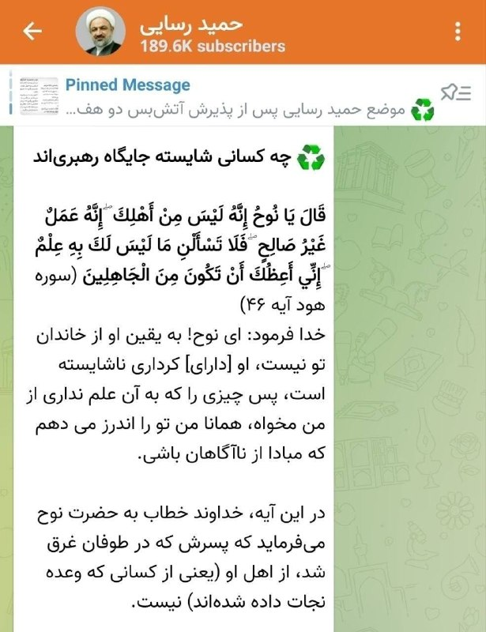

رسایی تو کانال شخصی‌اش رسما به مجتبی خامنه ای تیکه پرونده
اومده نوشته چه کسانی شایسته رهبری هستند.

بعد آیه‌ ای از نوح نبی و پسرش به عنوان مثال آورده و گفته هرچند نوح آدم خوبی بود، اما پسرش خراب بودو اوکی نبود

کلا این بشر با همه مشکل داره از مردم ایران گرفته تا جمع خودیاشون

‏
@IranianMinds

## BBCPersian — post 282331

  

‌🔸تیم نوجوانان ایران پنجشنبه با کسب شش طلا قهرمان زودهنگام مسابقات کشتی فرنگی نوجوانان آسیا در ویتنام شد.

رقابت‌ها در هفت وزن برگزار شد و تیم ایران در شش وزن مدال طلا گرفت.

این بازی‌ها در شهر دانانگ کشور ویتنام برگزار می‌شود.

آرمین اسماعیلی در وزن ۴۵ کیلوگرم، علی اسماعیلی در وزن ۴۸ کیلوگرم، وحید عشیری در وزن ۵۵ کیلوگرم، امیررضا طهماسب پور در وزن ۶۰ کیلوگرم، امیررضا مهری در وزن ۹۲ کیلوگرم و علی اکبر آکو در وزن ۱۱۰ کیلوگرم، کشتی‌گیران ایرانی بودند که مدال طلا دریافت کردند.

مسابقات وزن پایانی این رقابت‎‌ها امروز برگزار می‌شود.

📷IRNA
https://trib.al/BlLVnzq

@BBCPersian

## Dirty_Kids — post 390453

  <a href="telegram/content/Dirty_Kids_390453_1780047776.mp4" target="_blank">🎬 Download video</a>

ویدئویی جدید از لحظه اصابت بمب اسرائیلی به یه پایگاه نظامی تو جنگ ۴۰ روزه:

@Dirty_Kids 👻

## Dirty_Kids — post 390452

  <a href="telegram/content/Dirty_Kids_390452_1780047780.mp4" target="_blank">🎬 Download video</a>

🔴 فیلم وایرال شده از سه تا پسر که داشتن راه خودشونو میرفتن که یه دفعه یکیشون...

+ پسرا عالین، یارو بگا میرفته بلند شده میخنده😂

@Dirty_Kids 👻

## Dirty_Kids — post 390451

  

🔴 جفت کنین، حمید رسایی تیتر زده چه کسانی شایسته رهبری ان؟

بعد زیرش داستان حضرت نوح رو نوشته که پسرش ناشایست از آب دراومد!خیلی مستقیم گفته مجتبی نالایقه برای رهبری😂

@Dirty_Kids 👻

## Dirty_Kids — post 390450

  

تا فعال سازی محصولات نرمال گیگی 10 هزار تومانی قیمت سرویس های اضطراری به گیگی 50 هزار تومان کاهش پیدا کرد
🚀

🎁 کد تخفیف خرید اول دوباره ریست شد و همه میتونن ازش استفاده کنن:
BadBanOFF

💸 با این کد، 50 هزار تومان تخفیف روی اولین خریدت بگیر!

🔥و مهم‌تر از همه...
سیستم معرفی بادبان فعال‌تر از همیشه‌ست!
از تمام خریدهای کاربرانی که معرفی میکنی، 10% خریدشون رو پورسانت دائمی دریافت کن و موجودی کیف پولت رو افزایش بده 
💼

وقتی بادبان داری، هیچ بادی مانع نیست… حتی وقتی اینترنت ملیه
⛵️
R8

🛡@BadBan_VPN | کانال 

🤖@BadBan_VPNBot | ربات 

📞@BadBan_VPNSupport | پشتیبانی

## alonews — post 123470

  <a href="telegram/content/alonews_123470_1780047784.webm" target="_blank">🎬 Download video</a>

👈وزیر علوم: امتحانات دانشجویان تحصیلات تکمیلی حضوری است/ کارشناسی، در انتظار تصمیم گیری نهایی است

✅ @AloNews خبر جنگ

---
📅 بروزرسانی: 1405/03/08 13:02
---

## IranIntlTV — post 339541

‏شهروندان در ایران از موج تعدیل نیرو و اخراج افراد متخصص به ویژه در شرکت‌های پیمانکاری خبر دادند

‏گفت‌وگو با لیلا سعادتی، عضو تحریریه ایران‌اینترنشنال

## IranIntlTV — post 339540

  <a href="telegram/content/IranIntlTV_339540_1780047158.mp4" target="_blank">🎬 Download video</a>

یک زن سرپرست خانوار با ارسال پیامی صوتی به ایران اینترنشنال از افزایش هزینه‌ها و ناتوانی در تامین معیشت خود می‌گوید. صدای او با هوش مصنوعی بازخوانی شده است.

## FarsiVOA — post 218961

  

خبرگزاری رویترز با استناد به داده‌های کشتی‌رانی گزارش داده که فیلیپین یک محموله نفتی جمهوری اسلامی را در ماه جاری دریافت کرده است.

بر اساس این گزارش، کشتی «اوشن استارت» یک محموله یک میلیون بشکه‌ای نفت خام ایران را در اوایل ماه جاری از یک نفتکش دیگر دریافت کرد و حدود دو هفته پیش به پالایشگاه باتاآن فیلیپین تحویل داد.

شرکت‌های ردیابی نفتکش‌ها، کپلر و وُرتکسا، تأیید کرده‌اند که محموله یاد شده نفت ایران بوده که ۲۷ مارس در جزیره خارگ به کشتی «کِیلو» بارگیری شده بود.

آمریکا از ۲۰ مارس تا ۱۹ آوریل معافیت یک‌ماهه برای خرید نفت جمهوری اسلامی داده بود و طبق گزارش‌ها، هند ماه گذشته روزانه ۶۵ هزار بشکه نفت و مقداری گاز مایع از ایران خریداری کرده بود.
@FarsiVOA

## IranianMinds — post 21002

🔴 امروز روز ملی مشاورین املاکه. امروز دیگه میزنه @IranianMinds

## IranianMinds — post 21001

  

🔴 امروز روز ملی مشاورین املاکه.

امروز دیگه میزنه

@IranianMinds

## BBCPersian — post 282330

🔻وزارت خارجه ایران: سکوت نهادهای بین‌المللی باعث جری شدن بیشتر اسرائیل می‌شود

🔻اسماعیل بقایی، سخنگوی وزارت خارجه ایران تشدید حملات اسرائیل به مناطق مختلف لبنان از جمله بیروت، پایتخت این کشور را محکوم کرده است.

آقای بقایی گفته است «سکوت و بی‌تفاوتی نهادهای بین‌المللی» باعث «جری‌شدن بیشتر» اسرائیل می‌شود.

سخنگوی وزارت خارجه ایران همچنین آمریکا را «همدست و شریک همه جنایات» اسرائیل در لبنان، اراضی فلسطینی و کل منطقه توصیف کرده است.

با تشدید حملات نظامی اسرائیل طی روزهای اخیر، ده‌ها نفر در لبنان کشته شده‌اند.

اسرائیل گفته است هدف این کشور از این حملات، حزب‌اللهِ لبنان است.

ارتش اسرائیل همچنین از ساکنان حدود یک‌هشتم خاک لبنان خواسته است تا خانه‌هایشان را به سمت مناطق شمالی‌تر ترک کنند.

https://trib.al/4oYd4hT
@BBCPersian

## alonews — post 123469

  <a href="telegram/content/alonews_123469_1780047161.webm" target="_blank">🎬 Download video</a>

👈الجزیره: مقامات عالیرتبه چین در نشست آسیایی با محوریت جنگ آمریکا علیه ایران غایب هستند

✅ @AloNews خبر جنگ

## alonews — post 123468

  <a href="telegram/content/alonews_123468_1780047161.webm" target="_blank">🎬 Download video</a>

👈سی ان بی سی: خشم ترامپ از عمان، «سوئیس خاورمیانه» را در کانون توجه قرار داد.

✅ @AloNews خبر جنگ

---
📅 بروزرسانی: 1405/03/08 12:52
---

## mwarmonitor — post 9877

  <a href="telegram/content/mwarmonitor_9877_1780046553.mp4" target="_blank">🎬 Download video</a>

📽سکانس هالیوودی
🔹«پهپاد اوکراینی به ناوچه روسی «دریاسالار اسن» در نووروسیسک اصابت کرد.

🔸ناوچه پروژه ۱۱۳۵۶ «دریاسالار اسن»، که حامل موشک‌های کروز کالیبر است، در پایگاه دریایی روسیه در شهر نووروسیسک هدف یک پهپاد اوکراین قرار گرفت.

🔸تصاویر ضبط‌شده از شب ۲۳ مه به‌روشنی نشان می‌دهد که سامانه‌های پدافند هوایی روسیه پیش از اصابت، موفق به رهگیری این پهپاد نشده‌اند.

@mwarmonitor

## FoxNewsTwitter — post 342393

  

Fox News (Twitter/X)

WATCH LIVE: Hegseth holds bilateral meeting in Thailand
https://twitter.com/i/broadcasts/1MJgNNjDAXXGL

## IranIntlTV — post 339539

  <a href="telegram/content/IranIntlTV_339539_1780046555.mp4" target="_blank">🎬 Download video</a>

خبرگزاری تسنیم، وابسته به سپاه پاسداران، با رد گزارش‌ها درباره نهایی شدن توافق تهران و واشینگتن اعلام کرد که اختلافات بر سر برخی بندهای کلیدی، از جمله آزادسازی دارایی‌های مسدودشده ایران، همچنان پابرجاست. هم‌زمان، جی‌دی ونس، معاون رییس‌جمهوری آمریکا، گفت دو طرف به توافق نزدیک شده‌اند، اما هنوز به آن دست نیافته‌اند.
جزییات بیشتر با بابک اسحاقی و احمد صمدی، خبرنگاران ایران‌اینترنشنال
@iranintltv

## DW_Farsi — post 125268

🔶 اوکراین امیدوار است با خرید جنگنده گریپن با روسیه مقابله کند
 
اوکراین امیدوار است با دریافت جنگنده‌های سوئدی گریپن، توان روسیه در استفاده گسترده از بمب‌های هدایت‌شونده را محدود کند. دلیل اصلی این امیدواری، تجهیز این جنگنده‌ها به موشک‌های هوا به هوای "میتئور" است؛ موشک‌هایی با بردی تا ۲۰۰ کیلومتر که می‌توانند هواپیماهای دشمن را از فاصله‌ای دور هدف قرار دهند.
 
پاولو پالیسا، معاون دفتر ولودیمیر زلنسکی، گفته است این فقط یک تقویت عادی برای نیروی هوایی نیست، بلکه گامی به‌سوی یک معماری دفاعی تازه برای اوکراین به شمار می‌رود. او موشک‌های "میتئور" را "بازوی بلند" نیروی هوایی توصیف کرده و گفته است با این قابلیت، می‌توان جنگنده‌های روسی حامل بمب‌های هدایت‌شونده را از جبهه دور نگه داشت.
 
به گفته او، این تحول نه فقط برای نیروی هوایی، بلکه برای حفاظت از نیروهای پیاده نیز اهمیتی بسیار بالا دارد.
 
برد ۲۰۰ کیلومتری به این معنا نیست که جنگنده‌های روسی لزوما در عمق ۲۰۰ کیلومتری پشت جبهه هدف قرار خواهند گرفت. برای چنین کاری، جنگنده گریپن باید تا نزدیکی خط مقدم پرواز کند؛ اقدامی که بسیار پرخطر است.
 
سناریوی محتمل‌تر این است که موشک‌ها از مناطق امن‌تر شلیک شوند و پس از عبور از میدان نبرد، به سمت مناطق تحت کنترل روسیه بروند. این‌که این برد در عمل تا چه اندازه برای دور نگه داشتن جنگنده‌های روسی کافی خواهد بود، هنوز روشن نیست. با این حال، زلنسکی گفته هدف این است که هواپیماهای روسی آن‌قدر عقب رانده شوند که دیگر نتوانند بمب‌های هدایت‌شونده را به‌صورت گسترده به کار ببرند.
@dw_farsi

## IranianMinds — post 21000

  <a href="telegram/content/IranianMinds_21000_1780046556.mp4" target="_blank">🎬 Download video</a>

👈پیت وزیر جنگ امریکا در جمع سربازان آمریکایی:

"همانطور که رئیس جمهور در جلسه کابینه گفت... ایران یا می‌تواند با یک توافق از طریق مذاکره، کار را به روش درست انجام دهد - یا می‌تواند با شخص من در سمت چپ معامله کند. که اتفاقاً من بودم - اما این من نیستم. شماها هستید."

@IranianMinda

## alonews — post 123467

  <a href="telegram/content/alonews_123467_1780046558.webm" target="_blank">🎬 Download video</a>

👈ادعای جوزالم پست: یک شرکت اسرائیلی دریافت که هکرهای گروه «آدابیل میناب»، مرتبط با وزارت اطلاعات ایران، در ماه مارس سیستم‌های حمل و نقل لس‌آنجلس را هک کرده و ۷۰۰ گیگابایت داده را به سرقت برده و عملیات پیش از جام جهانی فوتبال ۲۰۲۶ را مختل کرده‌اند

✅ @AloNews خبر جنگ

## alonews — post 123466

  <a href="telegram/content/alonews_123466_1780046559.webm" target="_blank">🎬 Download video</a>

👈سفیر ایالات متحده در ناتو: ما در کنار متحد ناتو خود، رومانی، ایستاده‌ایم و این تجاوز بی‌پروا به خاک آن را محکوم می‌کنیم. افکار ما با مجروحان در گالاتی است. ما از هر اینچ از خاک ناتو دفاع خواهیم کرد.

✅ @AloNews خبر جنگ

---
📅 بروزرسانی: 1405/03/08 12:42
---

## IranIntlTV — post 339538

  <a href="telegram/content/IranIntlTV_339538_1780045964.mp4" target="_blank">🎬 Download video</a>

یک شهروند با ارسال پیامی به ایران اینترنشنال از نایاب شدن داروهای خارجی بیماری تالاسمی روایت می ‌کند. پیام او با هوش مصنوعی خوانده شده است.

## IranIntlTV — post 339537

🔻نهاله شهیدی یزدی، شهروند بهائی و فعال حقوق کودکان، برای تحمل شش سال حبس احضار شد

بر اساس اطلاعات رسیده به ایران‌اینترنشنال، نهاله شهیدی یزدی، شهروند بهائی و فعال حقوق کودک، برای تحمل شش سال حبس به دادسرای کرمان احضار شده است. هم‌زمان، نویان حجازی، شهروند بهائی ساکن جویبار، از سوی دادگاه انقلاب به حبس، جزای نقدی و محرومیت از حقوق اجتماعی محکوم شد.

از شهیدی یزدی خواسته شده است ۱۲ خرداد خود را برای اجرای حکم به دادسرای کرمان معرفی کند.

این شهروند بهائی مرداد ۱۴۰۴ از سوی دادگاه بدوی در کرمان به شش سال حبس تعزیری محکوم شد و این حکم در دادگاه تجدیدنظر نیز عینا تایید شد.

یک منبع مطلع از وضعیت شهیدی یزدی به ایران‌اینترنشنال گفت پس از تایید حکم، درخواست اعاده دادرسی او در دیوان عالی کشور به نتیجه نرسید.

به گفته این منبع، مقام‌های قضایی از تحویل نسخه حکم دادگاه تجدیدنظر به وکیلان او خودداری کردند و همین موضوع، امکان پیگیری موثر پرونده را با مشکل مواجه کرد.

شهیدی یزدی هشتم فروردین ۱۴۰۲، هنگام بازگشت از سفر به کرمان، در ایستگاه قطار از سوی ماموران اداره اطلاعات سپاه پاسداران بازداشت شد. ماموران تلفن همراه و دیگر وسایل الکترونیکی او را ضبط کردند و منزل او در کرج را نیز تفتیش و کتاب‌های دینی و عکس‌های شخصی‌اش را ضبط کردند.

او پس از ۹ ماه و چهار روز بازداشت، ۱۲ دی ۱۴۰۲ با وثیقه یک میلیارد و ۲۰۰ میلیون تومانی به‌طور موقت آزاد شد.
یک منبع آگاه به ایران‌اینترنشنال گفت شهیدی یزدی سال‌ها در زمینه آموزش و سوادآموزی کودکان و کمک‌رسانی بشردوستانه به مناطق محروم فعالیت داشته است.
به گفته این منبع، بخشی از فعالیت‌های او بر آموزش و حمایت از کودکان ساکن مناطق محروم اطراف بم متمرکز بوده و کمک‌های جمع‌آوری‌شده برای تامین مواد غذایی، پوشاک، لوازم تحصیلی و برخی نیازهای اولیه ساکنان این مناطق، استفاده می‌شده است.
شهیدی یزدی، پیش از این نیز در اسفند ۱۳۸۹ با اتهام‌های «اقدام علیه امنیت ملی» و «تبلیغ علیه نظام» بازداشت و در دادگاه بدوی به پنج سال حبس محکوم شده بود، اما دادگاه تجدیدنظر کرمان در نهایت حکم تبرئه او را صادر کرد.

حبس، جزای نقدی و محرومیت اجتماعی برای نویان حجازی

وب‌سایت حقوق بشری هرانا گزارش داد نویان حجازی، شهروند بهائی، از سوی دادگاه انقلاب جویبار مستقر در شعبه ۱۰۲ دادگاه کیفری این شهرستان، بابت آنچه «تبلیغ دین بهائی» عنوان شده، به پرداخت ۱۲۲ میلیون و ۵۰۱ هزار تومان جزای نقدی و محرومیت از حقوق اجتماعی به مدت ۱۰ سال و یک روز محکوم شده است.
بر اساس گزارش هرانا، او همچنین از بابت اتهام «تبلیغ علیه نظام» به هفت ماه و ۱۶ روز حبس محکوم شده است.

نیروهای امنیتی چهارم تیر ۱۴۰۴ بدون ارائه حکم قضایی، حجازی را در منزل شخصی‌اش بازداشت کردند. او ۱۲ مرداد همان سال با تودیع وثیقه آزاد شد.
لوا صمیمی، همسر حجازی، نیز هنگام پیگیری وضعیت او در بازداشتگاه کچوئی ساری بازداشت شد و چندی بعد با تودیع وثیقه آزاد شد.
جامعه جهانی بهائی اول خرداد در بیانیه‌ای اعلام کرد از زمان آغاز جنگ اخیر، حدود ۸۰ شهروند بهائی در ایران بازداشت یا زندانی شده‌اند.

🔗متن کامل گزارش را اینجا بخوانید

@iranintltv

## FarsiVOA — post 218960

  

در ادامه بازداشت شهروندان کُرد در بوکان، سه زن به نام‌های حمیرا امین‌پور، شلیر امین‌پور و منیژه خشنود طی روزهای اخیر توسط نیروهای سرکوب بازداشت شدند.

براساس گزارش‌ کولبر نیوز، نیروهای اداره اطلاعات روز چهارشنبه ششم خرداد با ورود به منزل حمیرا و شلیر امین‌پور، این دو خواهر را بدون ارائه حکم قضایی بازداشت کردند. مأموران همچنین بخشی از وسایل شخصی آنان را ضبط کرده‌اند.

در رویدادی مشابه، منیژه خشنود، شهروند ۵۸ ساله اهل بوکان، نیز روز سه‌شنبه پنجم خرداد در پی ورود نیروهای امنیتی به منزل خانوادگی‌اش بازداشت شد.

گفته می‌شود مأموران پس از تفتیش خانه، وسایلی از جمله تلفن همراه، لپ‌تاپ و تعدادی کتاب شخصی او را با خود برده‌اند.

منابع آگاه اعلام کرده‌اند که خانواده‌های این سه زن تاکنون موفق به کسب اطلاع دقیقی از محل نگهداری، وضعیت سلامتی و اتهامات مطرح‌شده علیه آنان نشده‌اند.

منیژه خشنود پیش‌تر نیز سابقه بازداشت داشته و در سال ۱۴۰۳ با اتهام «تبلیغ علیه حکومت» به حبس محکوم شده بود.
@FarsiVOA

## DW_Farsi — post 125267

  

🔶 محاکمه شهروند ایرانی-عراقی به اتهام حمله به اهداف اسرائیلی در اروپا
 
وزارت دادگستری آمریکا و پلیس فدرال این کشور اعلام کردند که محمدباقر سعد داوود الساعدی، فرمانده کتائب حزب‌الله، به اتهام نقش داشتن در سازماندهی و هدایت مجموعه‌ای از حملات علیه اهداف یهودی و اسرائیلی در اروپا و سایر نقاط جهان، تحت پیگرد قضایی قرار گرفته است.
 
این فرد که پیش‌تر در ۱۵ مه با شش فقره اتهام در یک شکایت اولیه روبه‌رو شده بود، روز پنجشنبه ۷ خرداد (۲۸ مه) با اتهامات بیشتری از جمله "حمایت مادی از کتائب حزب‌الله و سپاه پاسداران، ارائه حمایت مادی برای اقدامات تروریستی، توطئه برای بمب‌گذاری در اماکن عمومی، تخریب اموال با استفاده از آتش یا مواد منفجره و تروریسم" مواجه شده است.
 
به نوشته نیویورک پست، الساعدی از چهره‌های بلندپایه در محافل مسلح عراقی-ایرانی به شمار می‌رود. او ۱۵ مه در ترکیه بازداشت و به آمریکا استرداد شده است. وزارت دادگستری آمریکا او را دست‌کم به ۱۸ حمله و اقدام در اروپا و ایالات متحده متهم کرده است.
 
بر اساس این گزارش، او در حمله به اهداف آمریکایی و یهودی نقش داشته است.
 
@dw_farsi

## RadioFarda — post 157686

ارمنستان ظاهراً یک سامانهٔ پدافند هوایی ایرانی را در رژهٔ نظامی به نمایش گذاشت

🔸ارمنستان در رژه نظامی «روز جمهوری»، تجهیزاتی از جمله پرتابگرهای راکتی، پهپادها و خودروهای زرهی از کشورهایی مانند فرانسه و هند، و همچنین سامانه‌ای را به نمایش گذاشت که به نظر می‌رسد یک سامانهٔ پدافند هوایی ایرانی باشد.

🔸خرید تسلیحات از تهران در شرایطی که ارمنستان در حال نزدیک‌تر شدن به واشینگتن است، می‌تواند حساسیت‌برانگیز باشد، به‌ویژه آن‌که این رژه در ایروان تنها چند ساعت پس از آن برگزار شد که دونالد ترامپ، رئیس‌جمهور آمریکا، پیش از انتخابات پارلمانی هفتم ژوئن از نیکول پاشینیان، نخست‌وزیر ارمنستان، حمایت کرد.

🔸نخستین گزارش‌ها از مشاهده سامانهٔ «مجید ای‌دی-۸»، که یک سامانه پدافند هوایی کوتاه‌برد نصب‌شده روی کامیون است، در جریان تمرین‌های رژه در روز قبل منتشر شد. چندین رسانه ارمنی تصاویری از سامانه‌هایی منتشر کردند که به گفتهٔ آن‌ها «مجید» بودند و بخشی از آن‌ها پوشانده شده بود.

🔸بخش ارمنی رادیو اروپای آزاد/رادیو آزادی روز پنجشنبه هفتم خرداد همین سامانه‌ها را در حالی که بدون پوشش از میدان جمهوری عبور می‌کردند رصد کرد. با این حال، در میان مارش نظامی، گویندهٔ رسمی درباره منشأ آن‌ها با احتیاط سخن گفت.

🔸او گفت: «سامانهٔ موشکی زمین‌به‌هوای خودکششی کوتاه‌برد “اسکورپیون” برای شناسایی و انهدام هواگردهای در ارتفاع پایین، بالگردها و پهپادها، و نیز دفاع هوایی از تأسیسات حیاتی نظامی و صنعتی طراحی شده است».

🔸به نظر می‌رسد «اسکورپیون» نامی محلی است که مقامات ارمنی بر این سامانه گذاشته‌اند. به برخی سامانه‌های دیگر نیز نام‌های بومی داده شده بود؛ برای مثال، توپ‌های خودکششی فرانسوی «سزار» با نام «آرامازد»، برگرفته از یکی از خدایان اسطوره‌ای ارمنی، معرفی شدند.

🔸سخنگوی وزارت دفاع ارمنستان از تأیید یا رد منشأ ایرانی «اسکورپیون» خودداری کرد.

🔸اما سیروس عامریان، تحلیلگر امور نظامی مستقر در نیوزیلند، به رادیو فردا گفت که درباره منشأ این سامانه تردیدی وجود ندارد.

🔸نسخه کامل این گفت‌وگو را در وب‌سایت رادیوفردا بخوانید.

@RadioFarda

## alonews — post 123465

  <a href="telegram/content/alonews_123465_1780045968.webm" target="_blank">🎬 Download video</a>

👈درحالی که هنوز مقامات ایران و آمریکا تاکنون درباره توافق احتمالی موضع‌گیری نکردند، برخی منابع پاکستانی از جمله «خبرگزاری رایت‌نو» مدعی شدند که «ایران و آمریکا اسلام آباد را برای امضای تفاهم‌نامه انتخاب کرده‌اند.»

🔴بر اساس این ادعا، ایران ظرف ۳۰ روز تنگه هرمز را مین زدایی خواهد کرد. بنابر ادعای این گزارش، کاخ سفید این توافق را تأیید کرده است، در حالی که سی‌بی‌اس ادعا کرده که این توافق نهایی شده است.

✅ @AloNews خبر جنگ

## alonews — post 123464

  <a href="telegram/content/alonews_123464_1780045969.webm" target="_blank">🎬 Download video</a>

👈ادعای معاون رئیس دفتر کاخ سفید در امور سیاست، استیون میلر: ایران امتیازات قابل توجه، مادی و چشمگیری به ایالات متحده داده است که تنها مدت کوتاهی پیش غیرممکن بود.

✅ @AloNews خبر جنگ

---
📅 بروزرسانی: 1405/03/08 12:32
---

## Persian_Trend_Official — post 15228

استیون میلر، معاون رئیس دفتر کاخ سفید در امور سیاسی: ایران امتیازات قابل توجه، مادی و چشمگیری به ایالات متحده داده است که تا همین چند وقت پیش غیرممکن بود.

📝 Amir

📌 @persian_trend_official
پرشین ترند | متفاوت‌ترین کانال نظامی

## alonews — post 123463

  <a href="telegram/content/alonews_123463_1780045373.webm" target="_blank">🎬 Download video</a>

🔴فوری / ارتش اسرائیل: معاون فرمانده تیپ شهر غزه در شاخه نظامی جنبش حماس را ترور کردیم

✅ @AloNews خبر جنگ

## alonews — post 123462

  <a href="telegram/content/alonews_123462_1780045373.webm" target="_blank">🎬 Download video</a>

👈رویترز: رئیس جمهور آمریکا در تلاش برای پایان دادن به جنگ با ایران، خود را در یک دوراهی می‌بیند. 

🔴 او تحت فشار است تا تنگه هرمز را بازگشایی کند و قیمت بنزین را در کشورش کاهش دهد.

🔴در عین حال، اگر امتیازی به تهران بدهد، ممکن است با واکنش شدید تندروهای ضد ایرانی در حزب جمهوری‌خواه مواجه شود

✅ @AloNews خبر جنگ

---
📅 بروزرسانی: 1405/03/08 12:22
---

## IranIntlTV — post 339536

  

🔻روزنامه فرانسوی اکیپ در آستانه فینال لیگ قهرمانان اروپا در بوداپست، به تحلیل شباهت‌ها و تفاوت‌های تاکتیکی پاری‌سن‌ژرمن و آرسنال، دو تیم فینالیست پرداخته است. این گزارش با به چالش کشیدن این کلیشه که آرسنال تیمی صرفاً تدافعی و خسته‌کننده است و در مقابل، پاری‌سن‌ژرمن تیمی کاملاً هجومی و بی‌پروا، به بررسی لایه‌های پنهان تاکتیکی هر دو تیم می‌پردازد.

🔹هر دو باشگاه در این فصل اهداف مشابهی را دنبال کرده‌اند، اما به دلیل ابزارهای متفاوتی که در اختیار دارند، مسیرهای متفاوتی را برای رسیدن به فینال پیموده‌اند.

🔹آرسنال و پاری‌سن‌ژرمن هر دو از تیم‌هایی هستند که بیشترین زمان را در این فصل به دفاع در زمین حریف (High Block) اختصاص داده‌اند. تفاوت اصلی در روش اجرای این استراتژی است؛ شاگردان میکل آرتتا معمولاً در قالب منظم ۴-۴-۲ دفاع می‌کنند که در آن یکی از هافبک‌ها به خط حمله اضافه می‌شود تا فضای بازی حریف را محدود کند. ادریان کلارک، بازیکن پیشین آرسنال، معتقد است که ثبات دفاعی توپچی‌ها به چیدمان موقعیتی بسیار دقیق آرتتا متکی است تا تیم در ضدحملات آسیب‌پذیر نباشد.

🔹جزییات بیشتر را در سایت بخوانید

@iranintltvsport

## FarsiVOA — post 218959

  

شرکت وُرتکسا می‌گوید در ماه جاری بیش از ۶۵ درصد نفتکش‌ها با خاموش کردن سیستم شناسایی خودکار از تنگه هرمز عبور کرده‌اند.

پیش از انسداد تنگه هرمز و حملات گسترده جمهوری اسلامی به کشتی‌ها، تنها نفتکش‌های قاچاق کننده نفت خود ایران برای پرهیز از ردیابی، سیستم شناسایی خودکار را خاموش می‌کردند، اما اکنون بخش بزرگی از نفتکش‌های منطقه برای پنهان ماندن از ردگیری و حملات رژیم ایران با سیگنال خاموش حرکت می‌کنند.

دامنه خاموشی سیستم شناسایی خودکار نفتکش‌ها حتی به بیرون از تنگه هرمز نیز رسیده و ورتکسا می‌گوید ۹۰ درصد از کشتی‌های حامل نفت و محصولات نفتی بندر فجیره امارات در دریای عمان نیز با سیگنال خاموش بارگیری و تردد می‌کنند.

طبق برآورد سازمان اطلاعات دریانوردی بریتانیا، از زمان آغاز جنگ جمهوری اسلامی و آمریکا، ۲۸ کشتی در آب‌های منطقه مورد هدف قرار گرفته است.
@FarsiVOA

## alonews — post 123458

  <a href="telegram/content/alonews_123458_1780044777.mp4" target="_blank">🎬 Download video</a>

👈حمله‌های صبح امروز ارتش اسرائیل به جنوب لبنان، صور

✅ @AloNews خبر جنگ

## alonews — post 123457

  <a href="telegram/content/alonews_123457_1780044779.webm" target="_blank">🎬 Download video</a>

👈کانال ۱۲ اسرائیل : ارتش اسرائیل خود را برای افزایش حملات هوایی و عملیات زمینی با استفاده از تاکتیک‌های یورش در خارج از خط زرد در لبنان آماده می‌‌کند

✅ @AloNews خبر جنگ

---
📅 بروزرسانی: 1405/03/08 12:12
---

## IranIntlTV — post 339535

  

شبکه سی‌ان‌ان با استناد به تحلیل تصاویر ماهواره‌ای گزارش داد جمهوری اسلامی با سرعت در حال بازسازی زرادخانه موشکی و پهپادی خود است و روند بازیابی توان نظامی، گسترده و سریع ارزیابی می‌شود.

بر اساس این گزارش، سی‌ان‌ان ۶۹ تونل در ۱۸ پایگاه موشکی زیرزمینی را بررسی کرده است. تصاویر نشان می‌دهد از زمان آغاز آتش‌بس، دست‌کم ۵۰ ورودی مسدودشده بازگشایی شده و بسیاری از ورودی‌های دیگر نیز در حال تعمیر هستند.

سی‌ان‌ان در ادامه به نمونه‌ای در غرب ایران اشاره کرد و نوشت تاسیسات زیرزمینی باختران در کرمانشاه چند هفته پیش هدف حمله قرار گرفت و هر چهار ورودی آن تخریب شد. با این حال، تصاویر جدید نشان می‌دهد دو ورودی اکنون کاملا باز به نظر می‌رسد و جاده‌های لازم برای انتقال پرتابگرهای موشکی نیز بازسازی شده است.

به گزارش سی‌ان‌ان، جمهوری اسلامی همچنین در حال پاک‌سازی دو ورودی دیگر این مجموعه است و برخی از بیش از ۱۰ دهانه ایجادشده بر اثر اصابت مهمات آمریکایی را نیز ترمیم کرده است.
https://iranintl.com/202605294719

## Persian_Trend_Official — post 15227

  <a href="telegram/content/Persian_Trend_Official_15227_1780044155.mp4" target="_blank">🎬 Download video</a>

وزیر جنگ آمریکا: ایران یا توافق می‌کند یا با نیروی نظامی مواجه می‌شود.

پیت هگست در جمع سربازان آمریکایی: همانطور که رئیس جمهور در جلسه کابینه گفت، ایران یا می‌تواند با یک توافق از طریق مذاکره، کار را به روش درست انجام دهد یا می‌تواند با شخص من در سمت چپ معامله کند. که اتفاقاً من بودم اما این من نیستم. شماها هستید.

📝 Amir

📌 @persian_trend_official
پرشین ترند | متفاوت‌ترین کانال نظامی

## RadioFarda — post 157685

ایران و آمریکا برای پایان جنگ «به توافق رسیده‌اند»؛ در انتظار تأیید دونالد ترامپ

🔸رسانه‌های آمریکایی به نقل از «منابع آگاه» از مذاکرات ایران و آمریکا می‌گویند که تهران و واشینگتن به «توافق اولیه» برای تمدید آتش‌بس و رفع محدودیت‌های کشتیرانی در تنگه هرمز دست یافته‌اند.

🔸خبرگزاری رویترز به نقل از این منابع آگاه آمریکایی که به نام آن‌ها اشاره‌ نکرده است، نوشته که دونالد ترامپ، رئیس‌جمهور آمریکا، هنوز این توافق را تأیید نکرده و رسانه‌های دولتی ایران نیز اعلام کرده‌اند که توافق نهایی نشده است.

🔸بر اساس این گزارش، این توافق روز پنج‌شنبه هفتم خرداد به‌دست آمده است.

🔸بر اساس اظهارات چهار منبع آگاه در گفت‌وگو با این خبرگزاری، این توافق، آتش‌بس را برای ۶۰ روز دیگر تمدید می‌کند و اجازه می‌دهد رفت‌وآمد کشتی‌ها در تنگه هرمز ادامه یابد، همزمان تیم‌های مذاکره‌کننده دوطرف بر سر مسائل دشواری مانند برنامه هسته‌ای ایران مذاکره می‌کنند.

🔸این منابع تأکید کرده‌اند که ترامپ هنوز این توافق را تأیید نکرده است. ایران نیز تاکنون درباره گزارش‌های مربوط به این توافق، که نخستین‌بار توسط وب‌سایت آکسیوس منتشر شد، اظهار نظر رسمی نکرده است.

🔸یک مقام آمریکایی به اکسیوس گفته بود که رئیس‌جمهور آمریکا به میانجی‌ها اطلاع داده که «می‌خواهد چند روز برای فکر کردن درباره آن زمان داشته باشد».

🔸جی‌دی ونس، معاون رئیس‌جمهور آمریکا، در همین رابطه به خبرنگاران در واشینگتن گفت: «هنوز به نتیجه نهایی نرسیده‌ایم، اما خیلی نزدیک هستیم و به تلاش ادامه می‌دهیم».

🔸او افزود: «نمی‌توانم تضمین کنم که حتماً به توافق می‌رسیم، اما در حال حاضر احساس خوبی نسبت به آن دارم.»

🔸شبکه خبری سی‌ان‌ان نیز به نقل از مقام‌های آمریکایی نوشته که روز پنج‌شنبه و در جریان مذاکرات میان ایالات متحده و ایران، یک توافق اولیه حاصل شده است.

🔸این شبکه نیز تأیید کرده که این توافق اولیه کماکان در انتظار امضا و تأیید دونالد ترامپ است و وضعیت منطقه همچنان پرتنش باقی مانده است.

🔸نسخه کامل این گزارش را در وب‌سایت رادیوفردا بخوانید.

@RadioFarda

## Dirty_Kids — post 390449

  <a href="telegram/content/Dirty_Kids_390449_1780044157.mp4" target="_blank">🎬 Download video</a>

قیاسی رفته کنسرت کینگ‌رام
سیاوش اردلان پست کرده نوشته تهران واقعی اینجاس همه درحال شادی

@Dirty_Kids 👻

## Dirty_Kids — post 390448

عرزشیا دیگه چرا دارن هشتگ میزنن وقتی شما نبودید؟
تنها دلیل اینکه ما نبودیم شما مادرجنده‌هایید

@Dirty_Kids 👻

## Dirty_Kids — post 390447

  

کاشکی نت این وصل نمیشد

@Dirty_Kids 👻

## Hranews — post 113219

  

نهاله شهیدی یزدی، شهروند بهائی جهت اجرای حکم حبس احضار شد

❗️
❗️
❗️
❗️
❗️– نهاله شهیدی یزدی، شهروند #بهائی ساکن کرج، با دریافت ابلاغیه‌ای جهت اجرای حکم حبس به شعبه اجرای احکام دادگاه انقلاب کرمان احضار شد.

به گزارش خبرگزاری هرانا، ارگان خبری مجموعه فعالان حقوق بشر در ایران، نهاله شهیدی یزدی، شهروند بهائی احضار شد.

بر اساس اطلاعات دریافتی هرانا، شعبه اجرای احکام دادگاه انقلاب کرمان ابلاغیه ای برای خانم شهیدی یزدی صادر کرده است. در این ابلاغیه از وی خواسته شده، در تاریخ ۱۲ خردادماه، جهت اجرای حکم شش سال حبس خود در این شعبه قضایی حاضر شود.
لازم به ذکر است؛ علی‌رغم درخواست دادگاه از وکیل نهاله شهیدی یزدی برای مراجعه و رویت رای، نسخه‌ای از حکم در اختیار وی قرار نگرفت. متعاقبا، درخواست اعاده دادرسی او در دیوان عالی کشور به دلیل عدم ضمیمه شدن رای دادگاه تجدیدنظر مورد پذیرش واقع نشد. این در حالی است که با وجود پیگیری‌های بعدی توسط وکیل دیگر وی، دادگاه از تحویل نسخه رای خودداری کرده و صرفا امکان رویت آن را، بدون اجازه یادداشت‌برداری، تصویربرداری یا دریافت رونوشت، فراهم کرده است؛ امری که عملا امکان طرح و پیگیری درخواست اعاده دادرسی را از وی سلب کرده است.

#نهاله_شهیدی_یزدی

ادامه مطلب

↘️
@hranews_bot تماس ✉️ - @Hranews کانال هرانا 🆑

## alonews — post 123456

  <a href="telegram/content/alonews_123456_1780044160.mp4" target="_blank">🎬 Download video</a>

👈پیت هگزث در جمع سربازان آمریکایی:
"همانطور که رئیس جمهور در جلسه کابینه گفت... ایران یا می‌تواند با یک توافق از طریق مذاکره، کار را به روش درست انجام دهد - یا می‌تواند با شخص من در سمت چپ معامله کند. که اتفاقاً من بودم - اما این من نیستم. شماها هستید."

✅ @AloNews خبر جنگ

## alonews — post 123455

  <a href="telegram/content/alonews_123455_1780044162.mp4" target="_blank">🎬 Download video</a>

👈ورزشِ پیت هگست، تو سنگاپور

✅ @AloNews خبر جنگ

---
📅 بروزرسانی: 1405/03/08 12:02
---

## mwarmonitor — post 9876

🔸«اوایل صبح امروز، در جریان حملات روسیه به زیرساخت‌های اوکراین در نزدیکی مرز، یک ساختمان مسکونی در رومانی هدف یک پهپاد قرار گرفت. دبیرکل ناتو، مارک روته، با مقام‌های رومانی در تماس است. ما بی‌پروایی روسیه را محکوم می‌کنیم و ناتو به تقویت پدافندهای خود در برابر…

## IranIntlTV — post 339534

  <a href="telegram/content/IranIntlTV_339534_1780043575.mp4" target="_blank">🎬 Download video</a>

مسعود بهمنی شامگاه ۱۸ دی ۱۴۰۴ در جریان اعتراضات شهریار و هنگام کمک به مجروحان در علی‌آباد، با حمله مسلحانه ماموران دو انگشت خود را از دست داد و در همان حال بازداشت شد.

خانواده بهمنی چند روز پس از بازداشت مسعود، پیکر شکنجه‌شده و بی‌جانش را در کهریزک شناسایی کردند. بر اساس گزارش‌ها ماموران برای تحویل پیکر، خانواده را به پرداخت مبلغی سنگین وادار کردند. زیر فشارهای امنیتی، خانواده جاویدنام مسعود بهمنی، او را در زادگاهش اندیمشک به خاک سپردند.

## IranIntlTV — post 339533

  <a href="telegram/content/IranIntlTV_339533_1780043577.mp4" target="_blank">🎬 Download video</a>

عدی محسن الحلفی، فرمانده ارشد در سازمان حشدالشعبی عراق، پنجشنبه در جریان انفجار ناشی از بمب کارگذاشته‌شده در خودروی شخصی‌اش کشته شد. گروه انصارالله الاوفیاء، وابسته به سپاه پاسداران، در بیانیه‌ای اعلام کرد این فرمانده از سوی «عوامل عراقی مرتبط با آمریکا و اسرائیل» کشته شده است.

تروسکه صادقی، خبرنگار ایران‌اینترنشنال، گزارش می‌دهد
@iranintltv

## Persian_Trend_Official — post 15224

  <a href="telegram/content/Persian_Trend_Official_15224_1780043580.webm" target="_blank">🎬 Download video</a>

حضور پدافند موشکی برد کوتاه مجید ایرانی در رژه ارتش ارمنستان چند روز پیش در پی جابه‌جایی ادوات نظامی توسط ارتش ارمنستان در سطح شهر ایروان برای برگزاری رژه روز جمهوری ارمنستان، تصاویری از سیستم پدافندی برد کوتاه مجید با نام صادراتی AD-08 در خیابان های این…

## alonews — post 123454

  <a href="telegram/content/alonews_123454_1780043580.webm" target="_blank">🎬 Download video</a>

👈 ویدیوی حزب‌الله از هدف گرفتن دو تانک مرکاوا در جنوب لبنان با کوادکوپترهای انفجاری ابابیل

✅ @AloNews خبر جنگ

---
📅 بروزرسانی: 1405/03/08 11:52
---

## WithYashar — post 12845

خب این متن را مینویسم که همه حتما ببینند. امروز و فردا روز بسیار مهمی هست. ما هر دو شب را بیدار خواهیم ماند برای گزارش و برای دوشنبه آخر شب هم در صورتی که حمله نبود میخواهیم یک پیام برای شاهزاده بفرستیم ساعت ۱۱:۱۱ دقیقه . در نتیجه از همه شما دعوت میکنم خیلی رسمی و محترمانه صحبتهای خود را بنویسید و امروز بر روی متن تمرکز کنید و فردا از ساعت ۱۰ صبح تا ۱۰ شب برای من ارسال کنید تا چکیده ای از تمام آنها را ارسال کنم و فقط کلام من نباشد. حتی شده یک کلمه از پیام هر شخص را برمیداریم و متنی باهم میسازیم که در خور باشد. پس از شما دعوت میکنم به این کمپین بپیوندید ،لطفا امروز و فردا از فرستادن دایرکتهای غیرمعمول بپرهیزید سوال بیشتری را نمیتوانم پاسخ بدهم متن کامل است هر صحبتی که دارید در همان متن بنویسید تا همه با هم متن پایانی را استوری، کامنت ، دایرکت و ایمیل کنیم 🙌🏾. شروع ارسال فردا ۱۰ صبح و آخرین مهلت ارسال برای من فردا ۱۰ شب است.
@withyashar

## FoxNewsTwitter — post 342392

  

Fox News (Twitter/X)

WATCH LIVE: Hegseth holds bilateral meeting with Vietnam's president
https://twitter.com/i/broadcasts/1dGYllpbnmYKX

## DEJradio — post 5084

  <a href="telegram/content/DEJradio_5084_1780042968.mp4" target="_blank">🎬 Download video</a>

🤡
🔺 عقل ولایتمدار؛ قالیباف مذاکره می‌کند، ماکت ظریف را آتش‌ می‌زنند!

مذاکره با آمریکا هواداران حکومت را خشمگین کرده است، اما می‌کوشند "نفهمند" پشت مذاکرات، دیگر روحانی و ظریف نیستند بلکه سرداران‌اند که برای بقای خودشان تن به مذاکره با قاتلان خامنه‌ای داده‌اند.

#موشعلی #مذاکرات
@DEJradio

## DEJradio — post 5083

  <a href="telegram/content/DEJradio_5083_1780042971.mp4" target="_blank">🎬 Download video</a>

🔺🎥 با توجه به اینکه دسترسی بخشی از شهروندان در داخل کشور به اینترنت به‌صورت نسبی برقرار شده است ویدیوهایی از حواشی جنگ ۴۰ روزه به اشتراک گذاشته می‌شود.

یکی از این ویدیوها مربوط به شادی هموطنان بعد از اعلام کشته‌شدن علی خامنه‌ای در بمباران است.

#موشعلی #جنگ۴۰روزه
@DEJradio

## DEJradio — post 5082

  <a href="telegram/content/DEJradio_5082_1780042973.webm" target="_blank">🎬 Download video</a>

🔺📷 شبکه الحدث با استناد به تصاویر ماهواره‌ای گزارش داد جمهوری اسلامی در حال بیرون کشیدن دوباره ذخایر موشکیِ دفن‌شده‌اش از سایت‌های زیرزمینی است.

تصاویر ماهواره‌ای تازه نشان می‌دهند که سـ.ـپاه پاسداران در حال بازیابی شمار زیادی موشک است که در تأسیسات زیرزمینی پنهان شده بودند؛ هم‌زمان ماشین‌آلات سنگین و بولدوزرها نیز مشغول پاک کردن آثار حملات اخیر اسرائیل و آمریکا هستند.

#ذخایر_موشکی #جنگ
@DEJradio

## DEJradio — post 5081

  <a href="telegram/content/DEJradio_5081_1780042974.webm" target="_blank">🎬 Download video</a>

🔺📢 به گزارش «حال‌ وش» شامگاه پنجشنبه ۷ خرداد ماه ۱۴۰۵، یک مامور نیروی انتظامی در پی تیراندازی افراد مسلح در شهرستان ایرانشهر کشته شد.

استوار دوم عیسی عباسی در محدوده چهارراه بـ.ـسیج و تقاطع خیابان حافظ ایرانشهر، زمانی که با یک دستگاه موتورسیکلت در حال عزیمت به محل کار خود بوده، هدف تیراندازی افراد مسلح قرار گرفت.

تا لحظه تنظیم این گزارش، هیچ فرد یا گروهی مسئولیت این حمله را برعهده نگرفته و مقام‌های امنیتی نیز جزئیات بیشتری درباره مهاجمان یا انگیزه احتمالی این تیراندازی منتشر نکرده‌اند.

#ایرانشهر #جنگ
@DEJradio

## IranIntlTV — post 339532

🔻سازمان ملل متحد، تجاوز و خشونت جنسی طالبان علیه زنان افغان را تایید کرد

سازمان ملل گزارش داد مقامات و نیروهای طالبان، مرتکب خشونت جنسی علیه زنان شده‌اند. در این گزارش آمده است که هیات معاونت سازمان ملل متحد در افغانستان (یوناما)، ۲۱ مورد خشونت جنسی از جمله تجاوز جنسی گروهی علیه ۱۵ زن و شش دختر افغان را در سال ۲۰۲۵ مستند کرده است.
به گزارش یوناما، مقام‌ها و نیروهای طالبان به این زنان افغان، تجاوز جنسی یا تجاوز گروهی کرده‌اند. برخی از آن‌ها هم برهنه یا وادار به ازدواج اجباری شده‌اند.
در این گزارش تاکید شده است که با وجود ممنوعیت ازدواج اجباری، مقامات طالبان از عاملان ازدواج‌های اجباری‌اند.
در بخش دیگری از این گزارش آمده است رژیم طالبان، زنان معترض را به گونه خودسرانه بازداشت کرده و هدف شکنجه، بدرفتاری و خشونت جنسی قرار داده‌ است.
با وجود این یافته‌ها، سازمان ملل از طالبان خواسته است که به خشونت جنسی پایان دهند و حقوق زنان و دختران را تضمین کنند.
در بخش دیگری از این گزارش آمده است که مقامات کنونی طالبان پیگیر سیاست‌های سرکوب‌گرانه‌ای علیه زنان و دختران افغان بوده‌اند.
گفته شده این خشونت‌ها در بستری از نیازهای شدید بشردوستانه و مصونیت کامل از مجازات رخ داده است.
ریچارد بنت، گزارشگر ویژه حقوق بشر سازمان ملل در امور افغانستان، نیز تاکید کرد زنان و دختران افغانستانی به‌دلیل اعتراض یا چالش با سیاست‌های جنسیتی طالبان، با شکنجه، بدرفتاری و خشونت جنسی در بازداشتگاه‌ها مواجه بوده‌اند.
علی‌رغم ممنوعیت اعلام‌شده ازدواج اجباری در سال ۲۰۲۱، مقامات طالبان هم در ارتکاب و هم در تداوم این ازدواج‌ها دخیل بوده‌اند.

محدودیت‌های شدید خدمات حمایتی

بر اساس یکی از بندهای گزارش سازمان ملل، ارائه‌دهندگان خدمات خط مقدم در افغانستان همچنان به مدیریت پرونده‌ها و کمک حقوقی ادامه می‌دهند، اما دسترسی کلی به خدمات به‌دلیل کمبود بودجه و محدودیت‌های شدید اعمال شده بر کارکنان و فعالان حقوق بشر زن، به طور قابل توجهی کاهش یافته است.
طبق این گزارش، تا ماه ژوئیه ۲۰۲۵، بیش از ۴۰۰ مرکز بهداشتی در افغانستان تعطیل شده و صدها نقطه خدماتی مرتبط با خشونت جنسی مبتنی بر جنسیت، غیرفعال شده‌اند.
مقام‌های طالبان همچنین مانع ورود زنان افغان شاغل در سازمان ملل به ساختمان‌های این سازمان شده‌اند.

نبود عدالت و پاسخگویی

گزارش سازمان ملل به نبود چارچوب قانونی روشن برای دسترسی زنان به عدالت اشاره دارد.
شکایت‌های مربوط به خشونت جنسی عمدتا به‌وسیله مقامات مرد بررسی می‌شوند.
در ماه اکتبر سال ۲۰۲۵، مکانیسم تحقیقاتی مستقل برای افغانستان از سوی شورای حقوق بشر سازمان ملل ایجاد شد تا شواهد جنایات بین‌المللی و نقض‌های جدی حقوق بشر علیه زنان و دختران را جمع‌آوری و تحلیل کند.

توصیه‌های دبیرکل سازمان ملل

در بند دیگری از گزارش سازمان ملل، آنتونیو گوترش، دبیرکل این سازمان، از مقامات طالبان خواسته است تا فورا تمام اعمال خشونت جنسی را متوقف کنند.
گوترش همچنین تاکید کرده است تمام قوانین، سیاست‌ها و رویه‌هایی که حقوق و آزادی‌های اساسی زنان و دختران را محدود می‌کنند، باید لغو شوند.
او از مقامات طالبان خواسته است تا خود را با تعهدات بین‌المللی افغانستان و قطعنامه‌های شورای امنیت، از جمله قطعنامه ۲۶۸۱ (۲۰۲۳)، کاملا تطبیق دهند و ممنوعیت اشتغال زنان افغان در سازمان ملل متحد و سازمان‌های غیردولتی را نیز بردارند.
به گزارش افغانستان‌اینترنشنال، طالبان تاکنون به این گزارش سازمان ملل واکنش رسمی نشان نداده است.
پیش از این نیز اتهامات متعددی در مورد خشونت جنسی نیروهای طالبان علیه زنان افغان مطرح شده بود.
این گزارش بخشی از سندی جامع‌تر است که افزایش شدید خشونت جنسی مرتبط با درگیری در سطح جهانی را در سال ۲۰۲۵ ثبت کرده است.
وضعیت افغانستان به عنوان نمونه‌ای از ترکیب تبعیض جنسیتی نهادینه‌ شده با خشونت مستقیم، برجسته شده است.

🔗وب‌سایت ایران‌اینترنشنال

@iranintltv

## Persian_Trend_Official — post 15223

  <a href="telegram/content/Persian_Trend_Official_15223_1780042975.mp4" target="_blank">🎬 Download video</a>

روز گذشته با حضور زلنسکی در پایگاه هوایی اوپسالا، قرار شد سوئد 16 فروند جنگنده Saab JAS 39 Gripen C/D را به اوکراین اهدا کند.

📝 Amir

📌 @persian_trend_official
پرشین ترند | متفاوت‌ترین کانال نظامی

## RadioFarda — post 157683

🔸کیهان کلهر، استاد شناخته شده موسیقی ایران شامگاه پنجشنبه اعلام کرد که در راستای حمایت از کسب‌وکارهای فرهنگی و هنری آسیب‌دیده از قطع اینترنت در ایران،‌ صفحه‌ اینستاگرام خود را به تبلیغات آنها اختصاص می‌دهد.

🔸این موسیقیدان برجسته ایرانی روز پنجشنبه هفتم خرداد با انتشار متنی در استوری اینستاگرام خود اعلام کرد که صفحه‌اش را به مدت ۸۸ روز - مطابق با تعداد روز قطع اینترنت در ایران- به «تبلیغ و حمایت از کسب‌وکار اهالی فرهنگ و هنر» که به گفته او در ماه‌های اخیر به دلیل قطع اینترنت دچار خسارت شده‌اند، اختصاص خواهد داد.

🔸او از هنرمندان و فعالان فرهنگی خواسته است پست‌های تبلیغی خود را برای انتشار ارسال کنند و تأکید کرده که صفحات با تعداد دنبال‌کنندگان کمتر، در اولویت معرفی قرار خواهند گرفت.

🔸کیهان کلهر تاکید کرده است که این فراخوان تنها شامل کسب‌وکارهای داخل ایران می‌شود و انتشار تبلیغ‌ها نیز صرفا بر اساس زمان دریافت پیام‌ها انجام خواهد شد.

🔸پیشتر افشین کلاهی، رئیس کمیسیون اقتصاد دانش‌بنیان اتاق بازرگانی ایران، خسارت مستقیم ناشی از اختلال اینترنت را روزانه ۳۰ تا ۴۰ میلیون دلار برآورد کرده بود.

@RadioFarda

## IranianMinds — post 20999

  <a href="https://t.me/IranianMinds/20999" target="_blank">📎 Download file</a>

سرور فوق العاده پرسرعت و قوی مخصوص اینستا و یوتیوب سرعت فضایی

متصل تمام اینترنت ها

آموزش اتصال در اندروید

آموزش اتصال در آیفون

حتما شیر بدید بقیه هم متصل شن لطفا دانلود سنگین هم نزنید ❤️‍🔥

@IranianMinds

## idfinfarsi — post 11658

در یک حمله دقیق برای رفع یک تهدید فوری در شمال نوار غزه: ارتش اسرائیل و شاباک جانشین فرمانده تیپ شهر غزه در شاخه نظامی سازمان تروریستی حماس را به هلاکت رساندند

نیروهای ارتش اسرائیل و شاباک، دو روز پیش (چهارشنبه) تروریست عماد حسن حسین اسلیم، جانشین فرمانده تیپ شهر غزه و فرمانده گردان زیتون در شاخه نظامی این سازمان را هدف قرار داده و به هلاکت رساندند؛ فردی که فرماندهی یورش به خاک اسرائیل در کشتار ۷ اکتبر را بر عهده داشت.

در سال‌های اخیر و به‌ویژه در دوره اخیر، این تروریست ده‌ها طرح تروریستی علیه نیروهای ارتش اسرائیل در نوار غزه را پیش برده بود و از این رو تهدیدی فوری محسوب می‌شد.

در زیرساختی که مورد حمله قرار گرفت، یک فرمانده دیگر از سازمان تروریستی حماس نیز حضور داشت؛ نتایج این حمله در دست بررسی است.

نیروهای ارتش اسرائیل تحت فرماندهی جنوب در منطقه مطابق توافق مستقر هستند و به فعالیت برای رفع هرگونه تهدید فوری ادامه خواهند داد.

## alonews — post 123453

  

بهترین سرعت با بهترین قیمت با God Vpn🔵
تخفیف ویژه برای امشب فقط✅😍

10 گیگ فقط 280,000 تومن😍
متصل حتی در شرایط جنگی به خاطر اختصاصی بودن✅❤️😍

کانفیگ اقتصادی در ربات دوم 20 گیگ 290,000 تومن😍

برای نمایندگان پنل نمایندگی فعال میشه👍❤️

✅تضمین بدون قطعی
🌐 اتصال با تمامی دستگاه
🔻🏪پشتیبانی ۲۴ ساعته
✔️ دور زدن نت ملی
🔘 بالاترین سرعت با تمام اپراتورها
⭐با کیفیت عالی و ضمانت بازگشت وجه
🌐🌐🌐🌐🌐🌐⭐️
➖➖➖➖➖➖➖➖➖➖
جهت خرید کانفیگ اختصاصی در این ربات:
@GodVpnV2_Bot

خرید کانفیگ اقتصادی در این ربات:
@v2raypc1bot

ایدی کانال:
t.me/God_of_Vpn
پشتیبانی و خرید عمده:
@Mmkhh00
@Pc_V2ray

## alonews — post 123452

  <a href="telegram/content/alonews_123452_1780042978.webm" target="_blank">🎬 Download video</a>

👈اسحاق دار، وزیر امورخارجه پاکستان برای گفت‌وگو درباره مذاکرات ایران و آمریکا، وارد واشنگتن شد تا روبیو، همتای خود دیدار کند

✅ @AloNews خبر جنگ

## alonews — post 123451

  <a href="telegram/content/alonews_123451_1780042979.mp4" target="_blank">🎬 Download video</a>

👈تصاویری از عبور موشک های تاماهاوک از عراق در روز اول جنگ

✅ @AloNews خبر جنگ

---
📅 بروزرسانی: 1405/03/08 11:42
---

## DEJradio — post 5080

  <a href="telegram/content/DEJradio_5080_1780042344.webm" target="_blank">🎬 Download video</a>

🚨📢 بر اساس گزارش منابع داخلی و محلی، پدافند در شهر ایران از جمله بندرعباس، جم (بوشهر) و بیدگنه در جنوب تهران فعال شد.
مردم در شهر جم صدای چند انفجار شنیدند. مسئولان محلی ادعا کردند علت انفجارها مقابله با «پهپاد‌های متخاصم» بود اما منابع غیررسمی گزارش دادند تاسیسات موشکی سـ.ـپاه پاسداران هدف حمله قرار گرفته است.

طی هفته گشته جنگنده‌های آمریکا دست‌کم دو قایق تندرو سـ.ـپاه و فرودگاه بندرعباس و چند سایت موشکی را هدف قرار دادند.
یک منبع آگاه به دژ می‌گوید علت حمله آمریکا به فرودگاه بندرعباس استقرار لانچر یا پهپاد در نزدیک باند بود. با این لانچرها چند مشوشک [یا پهپاد] به امارات پرتاب شد.

مردم به اطلاع‌رسانی جمهوری اسلامی بی‌اعتمادند. به گزارش خبرگزاری مهر، در پی شنیده شدن صدای انفجار در منطقه ۷ چاه شهرستان جم واقع در استان بوشهر، مشخص شد که این رخداد ناشی از عملکرد پدافند دفاعی بوده است.

پیش‌تر، خبرگزاری تسنیم گزارش داده بود صداهای شنیده‌شده احتمالا به شلیک‌های اخطار نیروی دریایی ایران به برخی شناورها مرتبط است. خبرگزاری فارس نیز اعلام کرد نیروهای مسلح جمهوری اسلامی پنجشنبه شب از مناطق جنوبی کشور به‌سمت اهدافی نامشخص موشک شلیک کرده‌اند.

#پدافند #جنگ
@DEJradio

## IranIntlTV — post 339531

  

پیام‌های رسیده به ایران اینترنشنال حاکی از استفاده مقام‌های جمهوری اسلامی از زندانیان در تجمعات حکومتی شبانه است. طبق این اطلاعات،‌ شماری از زندانیان در شهرهای مختلف با پابند در تجمعات حاضر شده‌اند. یک مخاطب در پیامی نوشته است: «زندانیان جوان و نوجوان را با پابند الکترونیکی برای شرکت در تجمعات حکومتی آزاد کرده‌اند.»
پیشتر نیز شهروندان در پیام‌های متعددی اشاره کردند که برای شرکت در این تجمعات مبالغی پرداخت شده و حاضران از امتیازاتی از جمله کالاهای خوراکی، شامل روغن و برنج، بهره‌مند شدند.
https://iranintl.com/202605293755

## FarsiVOA — post 218958

🔺واکنش‌های گسترده در اروپا به نقض حریم هوایی رومانی توسط پهپاد روسی

▪️پس از آن که یک پهپاد روسی در جریان حمله شبانه به اوکراین، به یک ساختمان مسکونی در رومانی برخورد کرد و غیرنظامیان را مجروح ساخت، مقامات اروپایی این اقدام را محکوم کردند.

▪️مسئول سیاست خارجی اتحادیه اروپا، گفت: «پس از حادثه پهپاد در رومانی، نباید به مسکو اجازه داده شود که حریم هوایی اروپا را بدون مجازات نقض کند.»

▪️سخنگوی ناتو نیز نوشت: «بی‌ملاحظگی روسیه را محکوم می‌کنیم و ناتو به تقویت دفاع‌های خود در برابر همه تهدیدها، از جمله پهپادها، ادامه خواهد داد.»

▪️رومانی همزمان با احضار سفیر روسیه، اعلام کرد که طی چند ساعت آینده قراردادی برای استفاده از توانمندی‌های دفاع ضدپهپادی اتحادیه اروپا امضا خواهد کرد.

⬇️ بیشتر بخوانید:
https://ir.voanews.com/a/widespread-reactions-in-europe-to-violation-of-romanian-airspace-by-russian-drone/8155255.html

## IranianMinds — post 20998

  <a href="telegram/content/IranianMinds_20998_1780042344.mp4" target="_blank">🎬 Download video</a>

ویدئویی که به تازگی منتشر شده
از لحظه اصابت موشک اسرائیلی به یه پایگاه نظامی تو جنگ ۴۰ روزه.

@IranianMinds

## alonews — post 123450

  <a href="telegram/content/alonews_123450_1780042346.webm" target="_blank">🎬 Download video</a>

👈 بسته بودن تنگه هرمز برای عربستان بد نشده، چون درآمدهای نفتیش قبل از این ماجراها ماهی ۱۸میلیارد دلار بود، اما بعد از جنگ به ۲۴میلیارد دلار رسیده

🔴عربستان داره نفت بالای ۹۰دلار رو با خط لوله می‌بره دریای سرخ و از اون جا صادر می‌کنه

✅ @AloNews خبر جنگ

---
📅 بروزرسانی: 1405/03/08 11:32
---

## WithYashar — post 12844

تحلیل عوستاد رائفی پور :
آمریکایی‌ها نیروهای بیگانه فضایی هم کمک گرفتن
@withyashar

## mwarmonitor — post 9875

🔸«اوایل صبح امروز، در جریان حملات روسیه به زیرساخت‌های اوکراین در نزدیکی مرز، یک ساختمان مسکونی در رومانی هدف یک پهپاد قرار گرفت. دبیرکل ناتو، مارک روته، با مقام‌های رومانی در تماس است. ما بی‌پروایی روسیه را محکوم می‌کنیم و ناتو به تقویت پدافندهای خود در برابر همه تهدیدها، از جمله پهپادها، ادامه خواهد داد.»
— سخنگوی ناتو

@mwarmonitor

## IranIntlTV — post 339530

  <a href="telegram/content/IranIntlTV_339530_1780041771.mp4" target="_blank">🎬 Download video</a>

یک شهروند با ارسال ویدیویی به ایران اینترنشنال اشاره می‌کند که ماموران لباس شخصی حکومت در خیابان‌های این شهر به زنان و دختران به دلیل پوشش تذکر می‌دهند و آن‌ها را تحت فشار می‌گذارند.

---
📅 بروزرسانی: 1405/03/08 11:23
---

## VahidOOnLine — post 242714

  

♦️شبکه خبری العربیه، روز جمعه هشتم خرداد ماه، به نقل از منابع «آگاه» گزارش کرد که جمهوری اسلامی ایران در چارچوب مذاکرات با آمریکا خواستار انتقال ذخایر اورانیوم غنی‌شده به چین شده و از پکن خواسته است تا تضمین دهد که این مواد در اختیار ایالات متحده قرار نخواهد گرفت.

این ادعا در حالی مطرح می‌شود که دونالد ترامپ، رئیس جمهوری آمریکا دو روز پیش صراحتا با انتقال اورانیوم غنی‌شده ایران به چین یا روسیه مخالفت کرده بود.

منابع العربیه گفته‌اند، بخش قابل توجهی از اختلافات و مسائل مورد مناقشه در پرونده هسته‌ای ایران در جریان مذاکرات اخیر حل‌وفصل شده و طرف‌ها در بسیاری از موضوعات به پیشرفت دست یافته‌اند.

العربیه به نقل از منابع خود همچنین گزارش کرد که جمهوری اسلامی با هدف جلوگیری از برچیده‌شدن تاسیسات  هسته‌ای ایران و حفظ زیرساخت‌های موجود، با نظارت بین‌المللی بر تاسیسات هسته‌ای خود موافقت کرده است.

این گزارش در حالی منتشر می‌شود که مقام‌های جمهوری اسلامی همچنان به حفظ  ذخایر اورانیوم غنی‌شده در ایران تاکید می‌کنند. رئیس کمیسیون امنیت ملی مجلس، ساعاتی پیش در گفتگو با خبرگزاری روسی ریانووستی اعلام کرده بود اورانیوم غنی‌شده ایران به کشور ثالث منتقل نخواهد شد.
‌🇸🇦 Indypersian

🤖 @VahidOOnLine

## VahidOOnLine — post 242713

  

شبکه العربیه به نقل از منابع آگاه گزارش داد جمهوری اسلامی می‌خواهد اورانیوم غنی‌سازی‌شده خود را به چین منتقل کند، مشروط بر آن‌که چین تضمین دهد این مواد را به آمریکا تحویل نخواهد داد.

به گفته این منابع، بسیاری از نکات مرتبط با برنامه هسته‌ای جمهوری اسلامی در مذاکرات جاری حل‌وفصل شده است.

بر اساس این گزارش، جمهوری اسلامی با نظارت بین‌المللی بر تاسیسات هسته‌ای خود برای جلوگیری از تعطیل‌شدن آن‌ها موافقت کرده است.
‌🏁 🇬🇧 IranintlTV

🤖 @VahidOOnLine

## VahidOOnLine — post 242712

🗣روایت شما از زندگی در دوران پس از انقلاب ملی و جنگ - جمعه ۸ خرداد ۱۴۰۵

🔹وضعیت اقتصادی داغونه. قیمت‌ها لحظه‌ای بالا می‌رن، یه وعده ناهار برای یک نفر شده نیم میلیون.

🔹از اردبیل پیام می‌دم، وضعیت داروها خیلی وخیمه. رفتم دو ورق استامینوفن‌کدئین بگیرم، گفت فقط یک ورق می‌تونم بدم چون دستور جیره‌بندی به همه داروخانه‌ها داده شده.

🔹خطاب به آموزش و پرورش؛ من یه دانش‌آموز ششمی‌ام که ۲۱ روز دیگه امتحان تیزهوشان داریم. ما هیچی نه از درس فهمیدیم نه از تیزهوشان. این تصمیم رو هم یهویی گرفتن و گفتن به‌دلیل شرایط جنگی. لطفاً رسیدگی کنید. از شهرستان بناب.

🔹اپلیکیشن دولینگو چی داره که از اون هم می‌ترسن؟ من باهاش زبان می‌خوندم ولی الان با این اینترنتی که می‌گن باز شده، هنوز کار نمی‌کنه.

🔹یک کیلو زیره چناران خریدم پنج میلیون تومان. چرا این‌قدر همه‌چیز گرونه؟ خسته شدیم.

🔹من دانش‌آموز پایه دوازدهمم. به‌خاطر نبود مدرسه و رشته مورد علاقه‌ام مجبور شدم برم مدرسه غیردولتی. امسال هیچی از مدرسه نفهمیدیم، حالا هم تهدید می‌کنن اگه شهریه رو تسویه نکنید دیپلم نمی‌دیم. از کجا بیاریم؟

🔹همه‌چی گرون شده، مرغ کیلویی ۵۰۰ شده. واقعاً دیگه نمی‌دونم چیکار کنم.

🔹کار به جایی رسیده که فوق‌لیسانس و دکترا هم کار نظافتی و ظرف‌شویی و خدماتی می‌کنن.

🔹کرج؛ کسایی که می‌گن اینترنت وصل شده و خوشحالیم، از چی خوشحالید؟ از اینترنت قطره‌چکانی به‌اصطلاح بین‌الملل؟ ۱۸ و ۱۹ دی رو فراموش کردید؟ پنج ماهه اینترنت نداریم، پنج ماه.

🔹ما تو ایران هر روز که شروع می‌کنیم، چه تو اقتصاد و تورم و معیشت، یک پله عقب‌تر از دیروز زندگی می‌کنیم.

🔹من ۱۸ سالمه و امسال کنکور دارم. پدرم بازنشسته تأمین اجتماعی هست و حقوقش از پارسال اضافه نشده. هر ماه پول کم میاریم، با این اوضاع زندگی واقعاً خیلی سخت شده.

🔹از خرم‌آباد اینجا وضعیت خیلی داغونه. گرونی و فقر کمر خیلی‌ها رو شکسته، نمی‌دونم تا کجا قراره این وضعیت ادامه پیدا کنه.
‌🏁 🇬🇧 IranintlTV

🤖 @VahidOOnLine

## WithYashar — post 12843

شبکه العربیه به نقل از منابع آگاه گزارش داد جمهوری اسلامی می‌خواهد اورانیوم غنی‌سازی‌شده خود را به چین منتقل کند، مشروط بر آن‌که چین تضمین دهد این مواد را به آمریکا تحویل نخواهد داد.
@withyashar

## IranIntlTV — post 339529

  

شبکه العربیه به نقل از منابع آگاه گزارش داد جمهوری اسلامی می‌خواهد اورانیوم غنی‌سازی‌شده خود را به چین منتقل کند، مشروط بر آن‌که چین تضمین دهد این مواد را به آمریکا تحویل نخواهد داد.

به گفته این منابع، بسیاری از نکات مرتبط با برنامه هسته‌ای جمهوری اسلامی در مذاکرات جاری حل‌وفصل شده است.

بر اساس این گزارش، جمهوری اسلامی با نظارت بین‌المللی بر تاسیسات هسته‌ای خود برای جلوگیری از تعطیل‌شدن آن‌ها موافقت کرده است.
https://iranintl.com/202605292911

## IranIntlTV — post 339528

🗣روایت شما از زندگی در دوران پس از انقلاب ملی و جنگ - جمعه ۸ خرداد ۱۴۰۵

🔹وضعیت اقتصادی داغونه. قیمت‌ها لحظه‌ای بالا می‌رن، یه وعده ناهار برای یک نفر شده نیم میلیون.

🔹از اردبیل پیام می‌دم، وضعیت داروها خیلی وخیمه. رفتم دو ورق استامینوفن‌کدئین بگیرم، گفت فقط یک ورق می‌تونم بدم چون دستور جیره‌بندی به همه داروخانه‌ها داده شده.

🔹خطاب به آموزش و پرورش؛ من یه دانش‌آموز ششمی‌ام که ۲۱ روز دیگه امتحان تیزهوشان داریم. ما هیچی نه از درس فهمیدیم نه از تیزهوشان. این تصمیم رو هم یهویی گرفتن و گفتن به‌دلیل شرایط جنگی. لطفاً رسیدگی کنید. از شهرستان بناب.

🔹اپلیکیشن دولینگو چی داره که از اون هم می‌ترسن؟ من باهاش زبان می‌خوندم ولی الان با این اینترنتی که می‌گن باز شده، هنوز کار نمی‌کنه.

🔹یک کیلو زیره چناران خریدم پنج میلیون تومان. چرا این‌قدر همه‌چیز گرونه؟ خسته شدیم.

🔹من دانش‌آموز پایه دوازدهمم. به‌خاطر نبود مدرسه و رشته مورد علاقه‌ام مجبور شدم برم مدرسه غیردولتی. امسال هیچی از مدرسه نفهمیدیم، حالا هم تهدید می‌کنن اگه شهریه رو تسویه نکنید دیپلم نمی‌دیم. از کجا بیاریم؟

🔹همه‌چی گرون شده، مرغ کیلویی ۵۰۰ شده. واقعاً دیگه نمی‌دونم چیکار کنم.

🔹کار به جایی رسیده که فوق‌لیسانس و دکترا هم کار نظافتی و ظرف‌شویی و خدماتی می‌کنن.

🔹کرج؛ کسایی که می‌گن اینترنت وصل شده و خوشحالیم، از چی خوشحالید؟ از اینترنت قطره‌چکانی به‌اصطلاح بین‌الملل؟ ۱۸ و ۱۹ دی رو فراموش کردید؟ پنج ماهه اینترنت نداریم، پنج ماه.

🔹ما تو ایران هر روز که شروع می‌کنیم، چه تو اقتصاد و تورم و معیشت، یک پله عقب‌تر از دیروز زندگی می‌کنیم.

🔹من ۱۸ سالمه و امسال کنکور دارم. پدرم بازنشسته تأمین اجتماعی هست و حقوقش از پارسال اضافه نشده. هر ماه پول کم میاریم، با این اوضاع زندگی واقعاً خیلی سخت شده.

🔹از خرم‌آباد اینجا وضعیت خیلی داغونه. گرونی و فقر کمر خیلی‌ها رو شکسته، نمی‌دونم تا کجا قراره این وضعیت ادامه پیدا کنه.

## RadioFarda — post 157682

🔸یک موشک «نیو گلن» شرکت بلو اوریجین که بدون سرنشین بود، روز پنج‌شنبه هفتم خرداد در جریان یک آزمایش روی سکوی پرتابی در ایالت فلوریدا منفجر شد.

🔸این رویداد ضربه‌ای جدی به پروژه فضایی جف بزوس محسوب می‌شود، در حالی که این شرکت تلاش می‌کند فاصلهٔ خود را با اسپیس‌ایکسِ ایلان ماسک، که در آستانه عرضهٔ اولیه سهام است، کاهش دهد.

🔸ویدئویی که توسط «ناسا‌اسپیس‌فلایت» منتشر شد، که پرتاب‌ها از فلوریدا را به‌صورت زنده پخش می‌کند، نشان داد که موشک عظیم نیو گلن حدود ساعت ۹ شب به وقت شرق آمریکا (یک بامداد جمعه به وقت گرینویچ) روی سکو روشن می‌شود و سپس به یک گلوله آتش عظیم تبدیل می‌شود که شعله‌ها و دود غلیظ را به ارتفاع بالا می‌فرستد.

🔸این انفجار تازه‌ترین شکست در مسیر طولانی و پرتاخیر پروژهٔ نیو گلن است؛ موشکی که قرار است نقش کلیدی در انتقال فرودگرهای ماه و محموله‌ها در برنامه آرتمیس ناسا ایفا کند.

🔸نسخه کامل این گزارش را در وب‌سایت رادیوفردا بخوانید.

@RadioFarda

## IranianMinds — post 20997

  <a href="https://t.me/IranianMinds/20997" target="_blank">📎 Download file</a>

سرور فوق العاده پرسرعت و قوی مخصوص اینستا و یوتیوب سرعت فضایی مخصوص ایرانسل و مخابرات

آموزش اتصال در اندروید

آموزش اتصال در آیفون

حتما شیر بدید بقیه هم متصل شن لطفا دانلود سنگین هم نزنید ❤️‍🔥

@IranianMinds

## alonews — post 123448

  <a href="telegram/content/alonews_123448_1780041184.webm" target="_blank">🎬 Download video</a>

👈حملات هوایی اسرائیل در جنوب لبنان ادامه دارد

✅ @AloNews خبر جنگ

## alonews — post 123447

  <a href="telegram/content/alonews_123447_1780041184.webm" target="_blank">🎬 Download video</a>

👈عوستاد رائفی پور:
آمریکایی‌ها نیروهای بیگانه فضایی هم کمک گرفتن

✅ @AloNews خبر جنگ

## alonews — post 123446

  <a href="telegram/content/alonews_123446_1780041185.webm" target="_blank">🎬 Download video</a>

👈حمله حمید رسایی به مجتبی خامنه‌ای با داستانی از پسر نوح
‼️ 
✅ @AloNews خبر جنگ

---
📅 بروزرسانی: 1405/03/08 11:12
---

## DW_Farsi — post 125266

  

🔶 نخست‌وزیر جدید عراق خواستار انحلال گروه‌های مسلح شد
 
علی الزیدی، نخست‌وزیر جدید عراق از همه گروه‌های مسلح شیعه در این کشور خواسته است که تحت نظر دولت و نهادهای رسمی آن  فعالیت کنند و در ساختارهای رسمی کشور ادغام شوند.
 
این موضع‌گیری بعد از فشارهای آمریکا بر بغداد برای محدود کردن نفوذ گروه‌های شبه‌نظامی وابسته به ایران اتخاذ شده است.
 
دفتر اطلاع‌رسانی نخست‌وزیر عراق اعلام کرده است که تمامی گروه‌های مسلح باید تحت چارچوب دولت عمل کنند.
 
این تحولات پس از آن صورت گرفت که مقتدی صدر، رهبر جریان صدر و روحانی برجسته شیعه در عراق خبر داد که گروه مسلح "سرایا السلام" خود را از "جنبش ملی شیعه" جدا و در نهادهای دولتی ادغام می‌کند.
 
مقتدی صدر پیش‌تر نیز از گروه‌های مسلح مورد حمایت ایران انتقاد کرده و خواستار خلع سلاح آن‌ها شده بود. صدر در بیانیه‌ای از نیروهای "حشد الشعبی" و دیگر گروه‌های مسلح شیعه خواست سلاح خود را به دولت عراق  تحویل دهند.
 
بر اساس گزارش‌ها این رویکرد بخشی از فشارهای فزاینده واشنگتن بر دولت عراق است تا نفوذ گروه‌های شبه‌نظامی خارج از کنترل دولت کاهش یابد.
@dw_farsi

## Dirty_Kids — post 390446

شبی که انبار نفت رو زدن فرداش دوستم نوشته بود چقدر همه جا تاریکه. خورشید هم زدن؟

@Dirty_Kids 👻

## Dirty_Kids — post 390445

  <a href="telegram/content/Dirty_Kids_390445_1780040542.mp4" target="_blank">🎬 Download video</a>

لعنت به جمهوری اسهالی که شرایطی به وجود آورده که من نتونم زن بگیرم ظرف شستنش رو ببینم

#نه_به_ماشین‌ظرفشویی

@Dirty_Kids 👻

## Dirty_Kids — post 390444

طولانی‌ترین قطعی اینترنت در عصر معاصر
بزرگترین قتل‌عام معترضان در تاریخ معاصر
یکی از بالاترین نرخ‌های تورم در جهان
یکی از بی‌ارزش‌ترین پول‌های جهان
یکی از کم اعتبارترین پاسپورت‌های جهان

دستاوردهای گنده‌ گوزترین حکومت جهان...

@Dirty_Kids 👻

## Hranews — post 113218

به دلیل استفاده از اینترنت استارلینک؛ تشکیل پرونده قضایی برای ۴۰ شهروند در شمیرانات

❗️
❗️
❗️
❗️
❗️– فرمانده ناحیه بسیج الغدیر بخش لواسان و رودبار قصران شمیرانات اعلام کرد که از ابتدای فروردین ماه تاکنون، ۴۰ دستگاه اینترنت ماهواره‌ای استارلینک در این شهرستان کشف و برای صاحبان آنها پرونده قضایی تشکیل شده است.

ادامه مطلب

↘️
@hranews_bot تماس ✉️ - @Hranews کانال هرانا 🆑

## alonews — post 123445

  <a href="telegram/content/alonews_123445_1780040544.webm" target="_blank">🎬 Download video</a>

👈حمله حمید رسایی به مجتبی خامنه‌ای با داستانی از پسر نوح
‼️

✅ @AloNews خبر جنگ

## alonews — post 123444

  <a href="telegram/content/alonews_123444_1780040544.webm" target="_blank">🎬 Download video</a>

👈دمای اهواز به ۴۸ درجه رسید و به عنوان گرم‌ترین مرکز استان ثبت شد

✅ @AloNews خبر جنگ

---
📅 بروزرسانی: 1405/03/08 11:02
---

## VahidOOnLine — post 242711

  

♦️دادستان‌های فدرال آمریکا یک مهندس نرم‌افزار گوگل را به استفاده از اطلاعات محرمانه این شرکت برای کسب بیش از ۱.۲">۱.۲ میلیون دلار سود از طریق پلتفرم پیش‌بینی «پلی‌مارکت» متهم کردند.
بر اساس اسناد قضایی، «میکله اسپانیولو» ۳۶ ساله، شهروند ایتالیا و ساکن سوئیس، با دسترسی به داده‌های محرمانه گوگل درباره فهرست پرجست‌وجوترین افراد سال ۲۰۲۵، در بازارهای پیش‌بینی پلی‌مارکت شرط‌بندی کرده و از اطلاعاتی استفاده کرده که هنوز در اختیار عموم قرار نگرفته بود.
به گزارش ان‌بی‌سی، دادستانی منطقه جنوبی نیویورک اعلام کرد اسپانیولو با استفاده از اطلاعات داخلی گوگل درباره فهرست سالانه « مرور سال در جستجو» (Year in Search) در چندین بازار پیش‌بینی فعالیت کرده و از این طریق بیش از ۱.۲">۱.۲ میلیون دلار سود به دست آورده است.
یکی از مهم‌ترین شرط‌بندی‌های مورد اشاره در این پرونده به خواننده «دی‌فورد» (D4vd) مربوط می‌شود. در حالی که بسیاری از کاربران پلی‌مارکت احتمال کمی برای قرار گرفتن نام او در میان پرجست‌وجوترین افراد سال قائل بودند، اسپانیولو به داده‌های داخلی گوگل دسترسی داشت و بر اساس آن شرط‌بندی کرده بود.
وزارت دادگستری آمریکا او را به کلاهبرداری در معاملات کالا، کلاهبرداری اینترنتی و پول‌شویی متهم کرده است. همزمان کمیسیون معاملات آتی کالای آمریکا نیز شکایتی مدنی علیه وی مطرح کرده است.
گوگل اعلام کرده استفاده از اطلاعات محرمانه شرکت برای شرط‌بندی یا کسب منفعت شخصی نقض جدی سیاست‌های این شرکت محسوب می‌شود. پلی‌مارکت نیز گفته است پس از شناسایی فعالیت مشکوک این معامله‌گر، موضوع را به مقام‌های آمریکایی گزارش کرده و با تحقیقات همکاری کرده است.
این پرونده از نخستین مواردی است که مقام‌های آمریکایی استفاده از اطلاعات نهانی در بازارهای پیش‌بینی را تحت پیگرد قضایی قرار داده‌اند.
‌🇸🇦 Indypersian

🤖 @VahidOOnLine

## FarsiVOA — post 218957

🔺یک مرکز نگهداری کودکان معلول به دلیل «آسیب به کودکان» تعطیل شد

▪️افشای سوختگی شدید یک کودک معلول و بستن دیگر کودکان به تخت، منجر به تعطیلی موقت مرکز نگهداری کودکان معلول در تهران شد.

▪️انتقال دوباره یک کودک به بیمارستان که پس از سوختگی با آب داغ پیش از طی مراحل درمان مرخص شده بود، موضوع بدرفتاری با کودکان تحت پوشش این مرکز را برجسته کرد.

▪️روابط عمومی سازمان بهزیستی با تأیید این گزارش مدعی است که علیه مسئول فنی و صاحب امتیاز مرکز اعلام جرم صورت گرفته و منتظر دستور قضایی برای تعطیلی دائم ‌مرکز است.

▪️آزار و آسیب‌ رساندن به کودکان در مراکز تحت پوشش بهزیستی طی سال‌های گذشته به صورت متعدد از سوی رسانه‌های داخلی گزارش شده است.

⬇️ بیشتر بخوانید:
https://ir.voanews.com/a/8155253.html

## DW_Farsi — post 125265

  

📸 عکس روز: "پاولینا" به حفاری ادامه می‌دهد

پس از نزدیک به یک سال توقف اجباری، دستگاه غول‌پیکرحفاری تونل با نام "پاولینا" اکنون دوباره در تونل گوتارد سوئیس به کار افتاده است. این دستگاه که توسط شرکت هرن‌کنشت در شهر شواناو آلمان ساخته شده، در ژوئن ۲۰۲۵ به دلیل برخورد با یک ناحیه مشکل‌دار در سنگ‌ها متوقف شده بود. در گوتارد سوئیس، یک تونل جاده‌ای در حال ساخت است. قرار است این تونل در سال ۲۰۳۰ افتتاح شود.
@dw_farsi

## alonews — post 123443

👈جهت رزرو تبلیغات در کانال #الونیوز به کانال زیر مراجعه کنید👇

📃https://t.me/ads_alonews

📃https://t.me/ads_alonews

## alonews — post 123442

  <a href="telegram/content/alonews_123442_1780039968.mp4" target="_blank">🎬 Download video</a>

👈 لحظه اصابت یک بمب اسرائیلی از نمای نزدیک در جنگ رمضان

🔴ترکش های این بمب بعد ترکیدن به صورت واضح معلوم است

✅ @AloNews خبر جنگ

---
📅 بروزرسانی: 1405/03/08 10:52
---

## IranIntlTV — post 339527

🔻انفجار موشک بلو اوریجین در سکوی آزمایش؛ ضربه‌ای به تلاش بزوس برای رقابت با اسپیس‌ایکس

موشک «نیو گلن» متعلق به شرکت بلو اوریجین در جریان یک آزمایش زمینی روی سکوی پرتاب منفجر شد. حادثه‌ای که می‌تواند ضربه‌ای جدی به تلاش‌های جف بزوس برای کاهش فاصله با اسپیس‌ایکس، شرکت فضایی متعلق به ایلان ماسک، وارد کند.

ویدیوهای منتشرشده از محل حادثه نشان می‌دهد موتورهای موشک حدود ساعت ۹ شب پنج‌شنبه هفتم خرداد به وقت شرق آمریکا روشن شدند، اما لحظاتی بعد موشک در سکوی پرتاب با انفجاری شدید روبه‌رو شد و حجم عظیمی از آتش و دود به آسمان برخاست.

بلو اوریجین در بیانیه‌ای اعلام کرد در جریان آزمایش با یک «ناهنجاری» مواجه شده است. اصطلاحی که شرکت‌های فضایی معمولا برای توصیف انفجار یا شکست در عملیات پرتاب به کار می‌برند.

این شرکت در شبکه اجتماعی ایکس نوشت: «در آزمایش روشن‌سازی موتور امروز با یک ناهنجاری مواجه شدیم. همه کارکنان در سلامت کامل هستند. با روشن‌تر شدن ابعاد حادثه، اطلاعات بیشتری منتشر خواهیم کرد.»

آزمایش «هات‌فایر» مرحله‌ای است که در آن موتور موشک در حالی که هنوز روی زمین مهار شده، روشن و آزمایش می‌شود.

ناسا: توسعه موشک‌های سنگین بسیار دشوار است

جرد آیزاکمن، مدیر ناسا، اعلام کرد این سازمان از وقوع حادثه مطلع است و در بررسی آن مشارکت خواهد داشت.
او در شبکه اجتماعی ایکس نوشت: «پرواز فضایی عرصه‌ای بی‌رحم است و توسعه توانایی‌های جدید برای پرتاب‌های سنگین، فوق‌العاده دشوار است. ما همراه با شرکای خود درباره این حادثه تحقیق خواهیم کرد، پیامدهای کوتاه‌مدت آن را بررسی می‌کنیم و سپس به برنامه پرتاب‌ها باز خواهیم گشت.»
آیزاکمن افزود ناسا در صورت تاثیر این حادثه بر برنامه‌های «آرتمیس» و «پایگاه ماه» جزییات بیشتری منتشر خواهد کرد.
این حادثه تنها چند روز پس از آن رخ داد که ناسا قراردادی به ارزش ۱۸۸ میلیون دلار به بلو اوریجین اعطا کرد تا با استفاده از فرودگر بدون سرنشین «مارک-۱»، ماه‌نوردها را در چارچوب برنامه آرتمیس به سطح ماه منتقل کند.

واکنش جف بزوس
جف بزوس، بنیان‌گذار بلو اوریجین، گفت که هنوز برای مشخص شدن علت اصلی حادثه زود است.
او نوشت: «روز بسیار سختی بود، اما هر آنچه لازم باشد را بازسازی می‌کنیم و دوباره به پرواز بازمی‌گردیم. ارزشش را دارد.»
بلو اوریجین و اسپیس‌ایکس در سال‌های اخیر رقابتی فشرده برای مشارکت در بازگرداندن انسان به ماه پیش از ماموریت برنامه‌ریزی‌شده دارای سرنشین‌ چین در سال ۲۰۳۰ داشته‌اند.
دو شرکت در حال توسعه فرودگرهایی هستند که ناسا قصد دارد در ماموریت‌های آینده خود به ماه از آن‌ها استفاده کند.

🔗متن کامل گزارش را اینجا بخوانید
@iranintltv

## DW_Farsi — post 125264

  

🔶 یک مامور انتظامی در پی حمله افراد مسلح در ایرانشهر کشته شد
 
به گزارش گروه رسانه‌ای "حال‌ وش" که اخبار سیستان و بلوچستان را پوشش می‌دهد، شامگاه پنج‌شنبه ۷ خردادماه (۲۸ مه) در پی تیراندازی افراد مسلح در شهرستان ایرانشهر، یکی از نیروهای انتظامی جان خود را از دست داد.
 
پس از انتشار خبر این حادثه، تصویری از این مامور نظامی که نامش عیسی عباسی عنوان شده توسط رسانه‌های حکومتی و کانال‌های وابسته به نهادهای امنیتی منتشر شد.
 
حال‌وش می‌نویسد بر اساس اطلاعات دریافتی، این نیروی نظامی شامگاه دیروز در محدوده چهار راه بسیج و تقاطع خیابان حافظ ایرانشهر، هنگامی که با یک دستگاه موتورسیکلت در حال عزیمت به محل کار خود بوده، هدف تیراندازی افراد مسلح قرار گرفته و بر اثر اصابت گلوله کشته شده است.
 
حال‌وش همچنین از امنیتی‌شدن فضای ایرانشهر و تلاش نیروهای امنیتی برای شناسایی عاملان حمله خبر داده است.
 
طبق گزارش‌ها تا کنون هیچ فرد یا گروهی مسئولیت این حمله را برعهده نگرفته و مقام‌های امنیتی نیز جزئیات بیشتری درباره مهاجمان یا انگیزه احتمالی این تیراندازی منتشر نکرده‌اند.
@dw_farsi

## RadioFarda — post 157681

  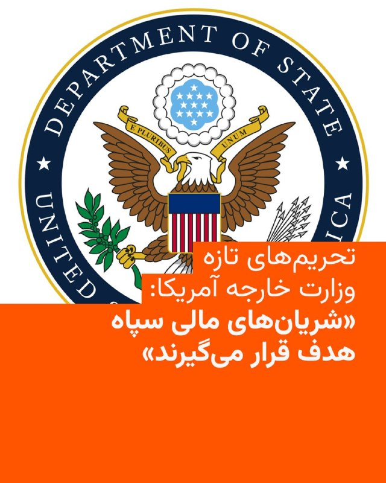

🔸آمریکا اعلام کرد در حال انجام اقداماتی هماهنگ برای قطع دسترسی حکومت ایران به منابع مالی است که به گفته واشینگتن، موجب تقویت اقدامات تهاجمی منطقه‌ای و تروریسم جهانی می‌شوند.

🔸در همین راستا وزارت خارجه آمریکا روز پنج‌شنبه هفتم خرداد، چندین نهاد، فرد و کشتی را که «ستون فقرات اقتصاد غیرقانونی نفت ایران» نامیده، تحریم کرد.

🔸در بیانیه این وزارتخانه آمده که با این تحریم‌های تازه، آمریکا «به‌طور مستقیم شریان‌های مالی سپاه پاسداران انقلاب اسلامی و ساختار نظامی ایران را هدف قرار داده است.»

🔸در چارچوب این اقدامات، وزارت خارجه آمریکا هشت نهاد را تحریم و هشت کشتی را به عنوان اموال توقیف‌شده معرفی کرده است؛ این کشتی‌ها به‌دلیل مشارکت در حمل نفت یا محصولات پتروشیمی ایران هدف قرار گرفته‌اند. همچنین سه نهاد و یک فرد نیز در ارتباط با تجارت محصولات پتروشیمی با منشأ ایرانی تحریم شده‌اند.

🔸هم‌زمان، وزارت خزانه‌داری آمریکا نیز اعلام کرد که بازیگران کلیدی یک شبکه فروش نفت را تحریم کرده که ده‌ها میلیون بشکه نفت ایران به ارزش میلیاردها دلار را جابه‌جا کرده است.

@RadioFarda

## IranianMinds — post 20996

  

🔴کتاب قدرت مذاکره ی پرفسور عراقچی وزیر امورخارجه ی مقتدر کشورمون بعد درخواستای فراوان مردم ایران تخفیف براش در نظر گرفته شد و میتونید الان با قیمت کمتر بخونیدش و بعد از هر مذاکره جنگ به راه بندازید.

@IranianMinds

## BBCPersian — post 282329

  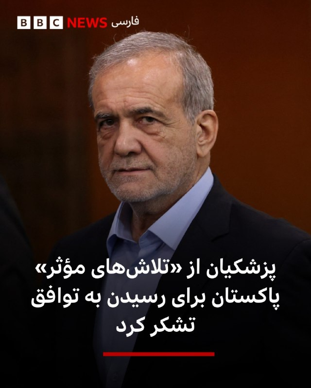

‌🔻مسعود پزشکیان، رئیس‌جمهور ایران، در پستی در شبکه اجتماعی ایکس از تماس تلفنی با شهباز شریف، نخست وزیر پاکستان خبر داد و گفت از تلاش‌های «موثر» پاکستان برای رسیدن به توافق قدردانی کرده است.

آقای پزشکیان در این پست نوشته است برای تبریک عید قربان با نخست وزیران مالزی و پاکستان تماس گرفته است. او نوشت که در این تماس «با تاکید بر پایبندی ایران به دیپلماسی، از مواضع انسانی مالزی و از ابتکار عمل و تلاش‌های موثر پاکستان برای رسیدن به توافق تشکر کردم.»

پاکستان میانجی اصلی مذاکرات ایران و آمریکا بر پایان دادن به جنگ است.

به گفته آقای پزشکیان، «سیاست ایران گسترش همکاری با کشورهای مسلمان و همسایه در همه زمینه‌هاست.»

این اظهارات آقای پزشکیان در حالی بیان می‌شود که جی دی ونس، معاون رئيس جمهوری آمريکا ایران و آمریکا به توافق «خیلی نزدیک» شده‌اند اما هنوز «نهایی نشده» است.

📷Reuters
https://trib.al/RhFFr0t

@BBCPersian

## alonews — post 123441

  <a href="telegram/content/alonews_123441_1780039349.webm" target="_blank">🎬 Download video</a>

👈کانال ۱۲ عبری: ارتش اسرائیل خود را برای افزایش حملات هوایی و عملیات زمینی با استفاده از تاکتیک‌های یورش در خارج از خط زرد در لبنان آماده می‌‌کند

🔴 نهاد امنیتی اسرائیل نگران است آمریکایی‌ها به‌زودی برای توقف حملات بر آن‌ها فشار وارد کنند

✅ @AloNews خبر جنگ

## alonews — post 123440

  <a href="telegram/content/alonews_123440_1780039349.mp4" target="_blank">🎬 Download video</a>

👈ترافیک دریایی پشت تنگه هرمز

✅ @AloNews خبر جنگ

---
📅 بروزرسانی: 1405/03/08 10:42
---

## VahidOOnLine — post 242710

  <a href="telegram/content/VahidOOnLine_242710_1780038768.mp4" target="_blank">🎬 Download video</a>

⭕️رئیس کمیسیون امنیت ملی مجلس: ایران اورانیوم غنی‌شده را به کشور ثالث منتقل نمی‌کند

♦️ابراهیم عزیزی، رئیس کمیسیون امنیت ملی و سیاست خارجی مجلس شورای اسلامی، در گفتگو با خبرگزاری ریانووستی روسیه تاکید کرد که ایران قصد ندارد اورانیوم غنی‌شده خود را به کشور ثالث منتقل کند.
عزیزی با اشاره به روند مذاکرات میان تهران و واشنگتن گفت آمریکا باید در رفتار خود تجدیدنظر کند، در غیر این صورت دستیابی به نتیجه در مذاکرات ممکن نخواهد بود.
عزیزی در ادامه با رد احتمال انتقال ذخایر اورانیوم غنی‌شده ایران به خارج از کشور تصریح کرد که تهران چنین برنامه‌ای را دنبال نمی‌کند. این اظهارات در حالی مطرح می‌شود که موضوع سرنوشت ذخایر اورانیوم غنی‌شده ایران یکی از محورهای مورد بحث در مذاکرات جاری میان ایران و آمریکا به شمار می‌رود.
ابراهیم عزیزی، روز پنجشنبه نیز با انتشار متنی در شبکه اجتماعی اکس گفته بود جمهوری اسلامی هرگز از خطوط قرمز خود از جمله «حق غنی‌سازی و حفظ اورانیوم غنی‌شده»، «مدیریت تنگه هرمز» و «لغو تحریم‌ها» عقب‌نشینی نخواهد کرد.
‌🇸🇦 Indypersian

🤖 @VahidOOnLine

## mwarmonitor — post 9874

  

🚫 ادعا: تلویزیون دولتی ایران مدعی شد نیروهای ایرانی یک هواپیمای آمریکایی را در نزدیکی بوشهر سرنگون کرده‌اند — نادرست.

✅ حقیقت: هیچ هواپیمای آمریکایی سرنگون نشده است. تمامی دارایی‌ها و هواگردهای هوایی ایالات متحده سالم بوده و همگی شناسایی و حسابرسی شده‌اند.

@mwarmonitor

## mwarmonitor — post 9873

🔴وزیر خارجه پاکستان جمعه ساعت ۱۰ صبح به وقت شرق آمریکا (ET) با مارکو روبیو، وزیر خارجه ایالات متحده، دیدار خواهد کرد؛ این در حالی است که دونالد ترامپ در حال بررسی پیش‌نویس توافقی است که بر اساس آن تنگه هرمز دوباره بازگشایی شود و گفت‌وگوهای هسته‌ای با ایران آغاز گردد—مشروط به اینکه آمریکا محاصره بنادر ایران را کنار بگذارد. نیویورک پست

@mwarmonitor

## IranIntlTV — post 339526

  

🔻تیم بسکتبال سان‌آنتونیو اسپرز با درخشش ستاره خود، ویکتور ومبانیاما، با نتیجه قاطع ۱۱۸ بر ۹۱ تیم اوکلاهماسیتی تاندر را در شکست داد. با این پیروزی مقتدرانه، سرنوشت فینال کنفرانس غرب به بازی سرنوشت‌ساز هفتم کشیده شد.

🔹اسپرز که پس از شکست قبلی در آستانه حذف قرار داشت، از همان ابتدا با دفاعی خفه‌کننده و پرتاب‌های سه‌امتیازی دقیق بر بازی مسلط شد. ومبانیاما با کسب ۲۸ امتیاز و ۱۰ ریباند، ستاره اصلی زمین بود و در کنار بازیکنانی چون استفون کسل و دیلن هارپر، شکست سنگینی را به حریف تحمیل کرد. در سمت مقابل، مدافعان سان‌آنتونیو موفق شدند شای گیلجوس‌الکساندر، ستاره نامدار تاندر را کاملاً مهار کنند. شای تنها ۱۵ امتیاز کسب کرد.

🔹برنده این نبرد جذاب یک‌شنبه دهم خرداد در زمین اوکلاهما مشخص می‌شود.

@iranintltvsport

## Persian_Trend_Official — post 15222

  <a href="telegram/content/Persian_Trend_Official_15222_1780038773.mp4" target="_blank">🎬 Download video</a>

لحظه اصابت یک بمب از نمای نزدیک مربوط به جنگ اخیر

👺Phantom

📌 @persian_trend_official
پرشین ترند | متفاوت‌ترین کانال نظامی

## Persian_Trend_Official — post 15221

  <a href="telegram/content/Persian_Trend_Official_15221_1780038776.mp4" target="_blank">🎬 Download video</a>

شکست آزمایش راکت شرکت آمازون با انفجار شدید

⚔️راکت «نیو گلن» متعلق به شرکت Blue Origin، بامداد پنجشنبه در جریان یک آزمایش زمینی موتور در سکوی پرتاب «ال‌سی-۳۶» واقع در کیپ کاناورال ایالت فلوریدا دچار انفجار شد؛ حادثه‌ای که می‌تواند برنامه‌های فضایی این شرکت برای ماه‌های آینده را با تأخیر جدی روبه‌رو کند.

⚔️این انفجار حدود ساعت ۹ شب به وقت محلی فلوریدا و در جریان آزمایش «هات‌فایر» رخ داد؛ آزمایشی که طی آن موتورهای مرحله نخست راکت در حالی که روی زمین ثابت هستند، روشن می‌شوند تا عملکرد سامانه‌ها پیش از پرتاب واقعی بررسی شود.

⚔️آزمایش انجام‌شده بخشی از آماده‌سازی مأموریت «NG-۴» بود؛ مأموریتی که قرار بود ۴۸ ماهواره پروژه «کوئیپر» متعلق به شرکت آمازون را به مدار زمین منتقل کند.

⚔️تصاویر منتشرشده از محل حادثه نشان می‌دهد انفجار بسیار شدید بوده و یک گلوله عظیم آتش در سکوی پرتاب ایجاد شده است. همچنین گفته می‌شود برج صاعقه‌گیر سکوی پرتاب فرو ریخته و بخش‌هایی از زیرساخت‌های پایگاه نیز آسیب جدی
دیده‌اند.

👺Phantom

📌 @persian_trend_official
پرشین ترند | متفاوت‌ترین کانال نظامی

## Hranews — post 113217

گزارشی از بازداشت حمیرا و شلیر امین‌پور در بوکان

❗️
❗️
❗️
❗️
❗️– حمیرا امین‌پور و شلیر امین‌پور، دو خواهر ساکن شهرستان بوکان، روز چهارشنبه ۶ خردادماه، توسط نیروهای امنیتی بازداشت و به مکان نامعلومی منتقل شدند.

#حمیرا_امین‌پور #شلیر_امین‌پور

ادامه مطلب

↘️
@hranews_bot تماس ✉️ - @Hranews کانال هرانا 🆑

## alonews — post 123439

  <a href="telegram/content/alonews_123439_1780038779.webm" target="_blank">🎬 Download video</a>

👈ایران تهدیدهای آمریکا علیه عمان را محکوم کرد!

✅ @AloNews خبر جنگ

## alonews — post 123438

  <a href="telegram/content/alonews_123438_1780038779.webm" target="_blank">🎬 Download video</a>

👈رئیس کمیسیون امنیت ملی: ایران قصد ندارد اورانیوم غنی شده خود را به کشور ثالث منتقل کند

✅ @AloNews خبر جنگ

---
📅 بروزرسانی: 1405/03/08 10:32
---

## VahidOOnLine — post 242709

  

♦️در پی اصابت یک پهپاد روسی به یک ساختمان مسکونی در خاک رومانی در بامداد جمعه هشتم خرداد ماه، موجی از واکنش‌ها از سوی مقام‌های اروپایی و ناتو شکل گرفت و این حادثه به‌عنوان نشانه‌ای از گسترش خطرات جنگ اوکراین به کشورهای عضو ناتو توصیف شد.
اورسولا فون در لاین، رئیس کمیسیون اروپا، روز جمعه هشتم خرداد ماه اعلام کرد که «جنگ تجاوزکارانه روسیه یک بار دیگر از خط قرمز دیگری عبور کرده است.» او با اعلام همبستگی کامل اتحادیه اروپا با رومانی گفت که بروکسل به تقویت امنیت و بازدارندگی خود، به‌ویژه در مرزهای شرقی، ادامه خواهد داد و فشارها بر مسکو را افزایش می‌دهد.
آلیسون هارت، سخنگوی ناتو نیز با محکوم کردن «بی‌ملاحظگی روسیه» در شبکه‌های اجتماعی نوشت: «ناتو به تقویت دفاع خود در برابر همه تهدیدها، از جمله پهپادها، ادامه خواهد داد.» او همچنین اعلام کرد که مارک روته، دبیرکل ناتو، در تماس با مقام‌های رومانی قرار دارد.
ژان-نوئل بارو، وزیر امور خارجه فرانسه، نیز این حادثه را «اقدامی غیرمسئولانه» توصیف کرد و اعلام کرد که سفیر روسیه را در ارتباط با این رویداد احضار کرده است.
رادوسلاو سیکورسکی، وزیر امور خارجه لهستان، در گفتگو با رویترز ضمن اعلام همبستگی با بخارست گفت: «صرف‌نظر از اینکه این حادثه عمدی بوده یا نتیجه بی‌کفایتی، روسیه همچنان خطرناک است و ما باید از خود در برابر آن دفاع کنیم.»
نیکوشور دان، رئیس‌جمهوری رومانی، نیز با اشاره به «بی‌سابقه بودن» این حادثه تاکید کرد که این رویداد مستلزم «پاسخی قاطع، هماهنگ و مشترک در سطح ملی و بین‌المللی» است.
رومانی که عضو اتحادیه اروپا و ناتو است، با اوکراین مرز مشترک دارد و در ماه‌های گذشته نیز چندین بار بقایای پهپادهای روسی در خاک این کشور کشف شده بود.
‌🇸🇦 Indypersian

🤖 @VahidOOnLine

## mwarmonitor — post 9872

🔴ونس می‌گوید ایالات متحده و ایران به یک توافق «بسیار نزدیک» هستند

📝باراک راوید AXIOS

🔰چرا این موضوع اهمیت دارد: امضای این یادداشت تفاهم، بزرگ‌ترین گشایش دیپلماتیک از زمان آغاز جنگ خواهد بود، اما دستیابی به یک توافق نهایی که خواسته‌های هسته‌ای رئیس‌جمهور ترامپ را برآورده کند، نیازمند مذاکرات فشرده بیشتری است.

🔸ترامپ و مشاورانش در مراحل قبلی جنگ نیز چندین بار فکر می‌کردند به توافق نزدیک شده‌اند، اما مذاکرات بارها با بن‌بست مواجه شد.

تحولات جدید در خبر
بنا بر گزارش قبلی اکسیوس در روز پنجشنبه، مذاکره‌کنندگان آمریکایی و ایرانی روی یک یادداشت تفاهم ۶۰ روزه به توافق رسیده‌اند، اما ترامپ هنوز موافقت نهایی خود را اعلام نکرده است.
مقامات آمریکایی ادعا کردند همتایان ایرانی آن‌ها از طریق واسطه‌ها به آن‌ها گفته‌اند که تاییدیه لازم را دارند و آماده امضا هستند. یک مقام رسمی از یکی از کشورهای میانجی نیز این موضوع را تایید کرد.
مذاکره‌کنندگان آمریکایی جزئیات توافق نهایی را به اطلاع ترامپ رساندند، اما او بلافاصله آن را تایید نکرد. یک مقام آمریکایی گفت: «رئیس‌جمهور به واسطه‌ها اعلام کرد که برای فکر کردن در این باره به چند روز زمان نیاز دارد.»
حکومت ایران هنوز به طور علنی در مورد این خبر اظهار نظر نکرده است، اما خبرگزاری تسنیم، وابسته به سپاه پاسداران انقلاب اسلامی، به نقل از یک منبع ادعا کرد که این یادداشت تفاهم هنوز نهایی نشده است.
آخرین وضعیت (وضعیت موجود)
مقامات ارشد آمریکایی گفتند که تا بعدازظهر پنجشنبه، ترامپ تمایل به امضای این توافق داشته، اما هنوز این کار را انجام نداده است.
ترامپ بعدازظهر پنجشنبه با شیخ تمیم بن حمد آل ثانی، امیر قطر، گفت‌وگو کرد تا درباره توافق با ایران رایزنی کند. قطر یکی از میانجی‌های کلیدی بین دو کشور است.
یک مقام آمریکایی گفت یکی از دلایلی که ترامپ می‌خواهد چند روز دیگر صبر کند، این است که مطمئن شود مقامات ایرانی توافق را امضا می‌کنند و از آن عقب‌نشینی نخواهند کرد.
این مقام آمریکایی افزود دلیل دیگر این است که ترامپ می‌خواهد پیش از تصمیم‌گیری نهایی، ببیند بحث‌های سیاسی داخلی پیرامون این توافق چگونه پیش می‌رود.
اظهارات ونس
ونس که رهبری تیم مذاکره‌کننده ایالات متحده در گفتگوها با ایران در اسلام‌آبادِ پاکستان در ماه آوریل را بر عهده داشت و از آن زمان به شدت درگیر این موضوع بوده است، روز پنجشنبه گفت دشوار است بگوییم ترامپ چه زمانی یا آیا اصلاً این یادداشت تفاهم با ایران را امضا خواهد کرد یا خیر.
«ما روی چند نکته نگارشی و زبانی در حال رفت‌وبرگشت (بحث) هستیم. ما در اینجا پیشرفت‌های زیادی داشته‌ایم.»
ونس افزود: «امیدواریم به پیشرفت خود ادامه دهیم و رئیس‌جمهور در موقعیتی قرار گیرد که بتواند توافقنامه را تایید کند، اما مشخصاً این موضوع هنوز مشخص نیست (TBD).»
او در پایان گفت: «نمی‌توانم تضمین کنم که به آنجا (توافق) خواهیم رسید... اما در حال حاضر حس خوبی نسبت به آن دارم.»

@mwarmonitor

## DW_Farsi — post 125263

🔶 آزادسازی دارایی‌ها؛ مرهمی ناکافی بر زخم‌های اقتصاد جنگ‌زده

🔻گزارشی از امید برین
 
بحث بر سر آزادسازی دارایی‌های بلوکه‌شده ایران در خارج از کشور، بار دیگر به یکی از محورهای اصلی چانه‌زنی‌های دیپلماتیک بدل شده است.

در شرایطی که مقامات تهران به دنبال دسترسی به حدود ۱۲ میلیارد دلار از این منابع هستند، این پرسش مطرح می‌شود که آیا تزریق این وجوه می‌تواند راهگشای بحران‌های ساختاری اقتصاد باشد؟
 
برای واکاوی این موضوع، دویچه‌ وله فارسی نظرات کارشناسان بهزاد احمدی‌نیا، روزنامه‌نگار حوزه نفت و انرژی، اشکان نظام‌آبادی، روزنامه‌نگار اقتصادی و احمد علوی، اقتصاددان را جویا شده است.
@dw_farsi

## Persian_Trend_Official — post 15220

  <a href="https://t.me/persian_trend_official/15220" target="_blank">📎 Download file</a>

فایل صوتی لایو دیشب
نسخه کم حجم - 6.78 مگابایت

اتاق جنگ پنجشنبه 7 خرداد | نقض آتش بس یا توافق ایران و آمریکا در برزخ !

📝 Nick

📌 @persian_trend_official
پرشین ترند | متفاوت‌ترین کانال نظامی

## alonews — post 123435

  <a href="telegram/content/alonews_123435_1780038163.webm" target="_blank">🎬 Download video</a>

👈تصاویر ماهواره‌ای منتشر شده توسط رویترز نشان می‌دهد که چین سکوی پرتاب عظیمی به مساحت هزاران کیلومتر مربع در نزدیکی انبارهای موشک‌های هسته‌ای خود در بیابان سین‌کیانگ در شمال غرب کشور ساخته است

✅ @AloNews خبر جنگ

## alonews — post 123434

  <a href="telegram/content/alonews_123434_1780038163.webm" target="_blank">🎬 Download video</a>

👈 سازمان عملیات تجارت دریایی انگلیس سطح تهدید در دریای عمان را از «بحرانی» به «شدید» کاهش داد، اما تأکید کرد که تنگه هرمز همچنان در بالاترین سطح هشدار یعنی «بحرانی» باقی مانده است

✅ @AloNews خبر جنگ

---
📅 بروزرسانی: 1405/03/08 10:22
---

## VahidOOnLine — post 242708

  <a href="telegram/content/VahidOOnLine_242708_1780037557.mp4" target="_blank">🎬 Download video</a>

تصویر ارسالی یک شهروند ایرانی به ایران اینترنشنال نشان می‌دهد تصاویر جان‌باختگان اعتراضات انقلاب ملی در دی‌ماه در لندن روی دیوار جاویدنامان نمایش داده شده و ایرانیان در این منطقه حاضر می‌شوند.
‌🏁 🇬🇧 IranintlTV

🤖 @VahidOOnLine

## VahidOOnLine — post 242707

  

جلال دهقانی فیروزآبادی، دبیر شورای راهبردی روابط خارجی جمهوری اسلامی، با اشاره به مذاکرات جاری تهران و واشینگتن، چین را «ضامن تفاهم احتمالی» معرفی کرد و گفت برای دونالد ترامپ، رییس‌جمهوری آمریکا، «تفاهم نسبت به تشدید تنش در اولویت است».

او مذاکرات را «بسیار سخت» و موضوع مطرح‌شده در آن را «بسیار پیچیده و گسترده» خواند و افزود: «پیشنهاد می‌شود تیم حقوقی پشتیبان مذاکره تقویت شود.»
‌🏁 🇬🇧 IranintlTV

🤖 @VahidOOnLine

## WithYashar — post 12842

اسرائیل هیوم در گزارشی نوشت موساد در سال‌های اخیر شاخه‌ای محرمانه برای نزدیک‌تر کردن سقوط جمهوری اسلامی ایجاد کرده است. به گفته منابع آگاه، رییس موساد متقاعد شده است که اگر ترامپ با تهران توافق نکند و محاصره دریایی را ادامه دهد، جمهوری اسلامی تا پایان سال ۲۰۲۶ سقوط می‌کند.
ماموریت ابتدایی این شاخه که در سال ۲۰۲۱ و پس از آغاز ریاست داوید بارنیا بر موساد ایجاد شد، عملیات‌ هدفمند برای کنار زدن مقام‌های ارشد جمهوری اسلامی بود، اما به‌تدریج به بخشی از راهبرد گسترده‌تر موساد برای «تغییر رژیم» تبدیل شد.
رییس پیشین این شاخه به اسرائیل هیوم گفت موساد در گذشته بیشتر از طریق ترور افراد را حذف می‌کرد، اما اکنون افشای اطلاعات شرم‌آور یا آسیب‌زننده درباره مقام‌ها می‌تواند آن‌ها را از حلقه قدرت خارج کند؛ روشی که به گفته او «ارزان‌تر و ساده‌تر از عملیات ترور» است.، مقام‌های موساد معتقدند عملیات‌های اخیر علیه ایران فقط یک مرحله در مسیر سقوط جمهوری اسلامی بوده است. رئیس پیشین شاخه نفوذ گفت این واحد اکنون با شدت بیشتری فعالیت می‌کند و هدف آن «سریع‌تر کردن ساعت شنی پایان حکومت است».
@withyashar

## IranIntlTV — post 339525

  <a href="telegram/content/IranIntlTV_339525_1780037561.mp4" target="_blank">🎬 Download video</a>

جاویدنامان انقلاب ملی ایرانیان
«پرستو جراحیان» ۱۸ دی‌ماه در جریان اعتراضات مردمی، در میدان شورای شهر اراک با شلیک مستقیم نیروهای سرکوب جمهوری اسلامی از ناحیه پهلو هدف قرار گرفت. نامش در حافظه‌ این سرزمین می‌ماند و یادش چراغ راه آزادی‌خواهان است.
@iranintltv

## IranIntlTV — post 339524

  <a href="https://t.me/IranintlTV/339524" target="_blank">📎 Download file</a>

🎧نسخه صوتی اخبار بامدادی | جمعه ۸ خرداد
@iranintlTV

## IranIntlTV — post 339523

  <a href="telegram/content/IranIntlTV_339523_1780037563.mp4" target="_blank">🎬 Download video</a>

تصویر ارسالی یک شهروند ایرانی به ایران اینترنشنال نشان می‌دهد تصاویر جان‌باختگان اعتراضات انقلاب ملی در دی‌ماه در لندن روی دیوار جاویدنامان نمایش داده شده و ایرانیان در این منطقه حاضر می‌شوند.

## FarsiVOA — post 218956

Farsi VOA pinned an audio file

## FarsiVOA — post 218955

  <a href="https://t.me/farsivoa/218955" target="_blank">📎 Download file</a>

🔴📢‌ نسخه صوتی اخبار ساعت ۲۰ پنجشنبه ۷ خرداد ۱۴۰۵

🛜در صورتی که با مشکل اینترنت مواجه هستید میتوانید اخبار صدای آمریکا را از نسخه‌های پادکست خبری ما روزانه دنبال کنید همچنین می‌توانید از نسخه سبک وب‌سایت ما پیگیر باشید:
https://ir.voanews.com/lite

📡بروزترین فرکانسهای ماهواره‌ای را نیز میتوانید از صفحه زیر پیگیری کنید:
https://ir.voanews.com/satellite

🔔دیگر شبکه‌های اجتماعی ما را هم دنبال کنید:
https://linktr.ee/voafarsi

ما را به اشتراک بگذارید
@voafarsi

## RadioFarda — post 157680

دیدگاه سیاستمداران و تحلیل‌گران اسرائیلی دربارۀ توافق احتمالی آمریکا و ایران

🔸توافق آمریکا- ایران هنوز نه به دار است و نه به بار. اما از حالا معلوم است که سرنوشت سیاسی بنیامین نتانیاهو، نخست‌وزیر اسرائیل، را در انتخابات پارلمانی اکتبر آینده رقم خواهد زد.

🔸در میانۀ موج گسترده انتقادهای داخلی از او به‌دلیل آنچه عدم موفقیتش در دستیابی به اهداف جنگ‌های سه سال اخیر در غزه، لبنان و ایران می‌خوانند، تنها معدودی از وزیران از جمله الی کوهن، وزیر انرژی که به حمایت حزب لیکود نیاز دارند، ادعا می‌کنند که توافق واشینگتن- تهران برای اسرائیل الزام‌آور نخواهد بود. ‌

🔸از سوی دیگر سیما شاین، مسئول پیشین میز ایران در موساد، به رادیو ارتش اسرائیل گفته که هر گونه توافق ایران با آمریکا، ایران برای اسرائیل هم الزام‌آور است.

🔸داوید بیتان، سیاستمدار بانفوذ حزب لیکود و رئیس کمیسیون اقتصادی کنست، این هفته خطاب به اسرائیلی‌های منتقدی که می‌گویند کشورشان در مذاکرات آمریکا- ایران دور زده شده، گفت چرا متوجه نمی‌شوید که «در موضوع هسته‌ای، نمی‌توانیم به تنهایی با ایران مقابله کنیم».

🔸آقای بیتان هم‌زمان در گفت‌وگویی رادیویی گفت مهم نیست در توافق واشینگتن با تهران چه نوشته شود. باید آماده باشیم که از این بعد هر یکی دو سال یک بار، جنگ با ایران داشته باشیم.

🔸روزنامۀ یدیعوت آحرونوت نوشته که بنیامین نتانیاهو در یازده سال گذشته، از زمان دستیابی آمریکا و پنج قدرت دیگر به توافق هسته‌ای موسوم به برجام با ایران، اصرار کرده بود که باید توافق بهتری شکل می‌گرفت.

🔸این روزنامه در ادامه این پرسش را مطرح می‌کند که آیا توافقی که در حال حاضر کاخ سفید آن را بدون مشورت اسرائیل تنظیم می‌کند، به راستی برای اسرائیل بهتر از برجام خواهد بود؟

🔸نسخه کامل این گزارش را در وب‌سایت رادیوفردا بخوانید.

@RadioFarda

## alonews — post 123433

  <a href="telegram/content/alonews_123433_1780037567.webm" target="_blank">🎬 Download video</a>

👈الجزیره: رسانه‌های اسرائیلی: دولت اسرائیل وضعیت اضطراری در داخل کشور را تا ۱۶ ژوئن تمدید کرد

✅ @AloNews خبر جنگ

## alonews — post 123432

  <a href="telegram/content/alonews_123432_1780037567.webm" target="_blank">🎬 Download video</a>

👈الجزیره: در ۷۲ ساعت گذشته چندین درگیری جزئی بین آمریکا و ایران رخ داده

🔴 درگیری‌ها به اندازه‌ای نیست که توافقی را که «در حال نزدیک شدن است» از مسیر خارج کند.

✅ @AloNews خبر جنگ

---
📅 بروزرسانی: 1405/03/08 10:12
---

## VahidOOnLine — post 242706

  

ابراهیم عزیزی، رییس کمیسیون امنیت ملی مجلس، در مصاحبه با رسانه روسی اسپوتنیک گفت: «آمریکا در مذاکرات قابل اعتماد نبوده و اگر رفتار خود را تغییر ندهد، توافقی شکل نخواهد گرفت.»

او ادامه داد جمهوری اسلامی «مدیریت تنگه هرمز را به‌صورت دائمی دنبال می‌کند و این سیاست مقطعی نیست».

رییس کمیسیون امنیت ملی مجلس افزود حکومت ایران قصد ندارد ذخایر اورانیوم غنی‌شده خود را به کشور ثالث منتقل کند.
‌🏁 🇬🇧 IranintlTV

🤖 @VahidOOnLine

## WithYashar — post 12841

سنتکام : ادعا: تلویزیون دولتی ایران ادعا کرد که نیروهای ایرانی یک هواپیمای آمریکایی را در نزدیکی بوشهر سرنگون کرده‌اند. نادرست.
حقیقت: هیچ هواپیمای آمریکایی سرنگون نشده است. تمام دارایی‌های هوایی ایالات متحده در نظر گرفته شده است.
@withyashar

## WithYashar — post 12840

  

استوری جدید علی کریمی و حمایت از شاهزاده رضا پهلوی
@withyashar

## pm_afshaa — post 91807

  

علیرضا فیروز جا قهرمان شرنج دنیا عکس شیر و خورشید پست کرد

💧 Rainbet.com the #1 Non-KYC Crypto Casino & Sportsbook @rainbetcom

😁 @Pm_Afshaa

## IranIntlTV — post 339522

  

جلال دهقانی فیروزآبادی، دبیر شورای راهبردی روابط خارجی جمهوری اسلامی، با اشاره به مذاکرات جاری تهران و واشینگتن، چین را «ضامن تفاهم احتمالی» معرفی کرد و گفت برای دونالد ترامپ، رییس‌جمهوری آمریکا، «تفاهم نسبت به تشدید تنش در اولویت است».

او مذاکرات را «بسیار سخت» و موضوع مطرح‌شده در آن را «بسیار پیچیده و گسترده» خواند و افزود: «پیشنهاد می‌شود تیم حقوقی پشتیبان مذاکره تقویت شود.»
https://iranintl.com/202605290032

## IranIntlTV — post 339521

  <a href="telegram/content/IranIntlTV_339521_1780036957.mp4" target="_blank">🎬 Download video</a>

پنجمین دوره برنامه «شبی با بودا» در استکهلم برگزار شد؛ رویدادی فرهنگی که امسال بر نقش زنان در حفظ میراث فرهنگی و هویت افغانستان تمرکز داشت.

گزارش نجوا عالمی، خبرنگار ایران‌اینترنشنال
@iranintltv

## IranIntlTV — post 339520

  

ابراهیم عزیزی، رییس کمیسیون امنیت ملی مجلس، در مصاحبه با رسانه روسی اسپوتنیک گفت: «آمریکا در مذاکرات قابل اعتماد نبوده و اگر رفتار خود را تغییر ندهد، توافقی شکل نخواهد گرفت.»

او ادامه داد جمهوری اسلامی «مدیریت تنگه هرمز را به‌صورت دائمی دنبال می‌کند و این سیاست مقطعی نیست».

رییس کمیسیون امنیت ملی مجلس افزود حکومت ایران قصد ندارد ذخایر اورانیوم غنی‌شده خود را به کشور ثالث منتقل کند.
https://iranintl.com/202605299285

## IranIntlTV — post 339519

🔻مقام پیشین موساد: «کار ما با ایران تمام نشده؛ تازه شروع کرده‌ایم»

یک مقام ارشد پیشین موساد در گفت‌وگویی کم‌سابقه با روزنامه یدیعوت آحرونوت گفت که این سازمان از سال ۲۰۲۱ شاخه‌ای ویژه برای عملیات نفوذ، جنگ روانی و تاثیرگذاری بر افکار عمومی در ایران ایجاد کرده و هدف نهایی آن، تضعیف و در نهایت سقوط جمهوری اسلامی بوده است.
روزنامه یدیعوت آحرونوت در گزارشی مفصل برای نخستین بار از فعالیت شاخه‌ای مخفی در موساد پرده برداشته است که ماموریت آن نه ترور و عملیات‌های کلاسیک اطلاعاتی، بلکه جنگ روانی، عملیات نفوذ و تاثیرگذاری بر افکار عمومی در ایران بوده است.
بر اساس این گزارش، این واحد در سال ۲۰۲۱ و همزمان با آغاز ریاست داوید (دادی) بارنئا بر موساد تاسیس شد. مسئول پیشین این شاخه که تنها با نام مستعار «او» معرفی شده، مدعی است که ماموریت این واحد ایجاد شکاف میان جامعه و حکومت ایران، تضعیف مشروعیت جمهوری اسلامی و فراهم کردن زمینه‌های تغییر سیاسی در ایران بوده است.
او در این گفت‌وگو می‌گوید تا پیش از روی کار آمدن بارنئا، حتی استفاده از عبارت «تغییر رژیم» در موساد موضوعی حساس و تقریباً ممنوع بود، اما طی سال‌های بعد، سرنگونی جمهوری اسلامی به یکی از اهداف محوری فعالیت‌های این سازمان تبدیل شد.

از افشای عکس رستم قاسمی تا حذف مقام‌های جمهوری اسلامی

یکی از ادعاهای مطرح‌شده در این گزارش به رستم قاسمی، فرمانده پیشین سپاه پاسداران و وزیر راه دولت ابراهیم رئیسی، مربوط می‌شود.
بر اساس روایت یدیعوت آحرونوت، موساد در سال ۲۰۲۲ تصویری را که سال‌ها پیش در جریان سفر قاسمی به مالزی ثبت شده بود، در اختیار رسانه‌های مخالف جمهوری اسلامی قرار داد. در این تصویر، قاسمی در حال در آغوش گرفتن زنی دیده می‌شد که همسر او نبود و حجاب نیز نداشت.

این عکس در بحبوحه اعتراضات پس از کشته شدن مهسا امینی منتشر شد و به سرعت در شبکه‌های اجتماعی بازنشر شد. چند روز بعد، قاسمی از سمت خود کناره‌گیری کرد؛ استعفایی که مقام‌های جمهوری اسلامی آن را به وضعیت جسمی و بیماری او نسبت دادند.
مقام پیشین موساد گفت که انتشار این تصویر بخشی از راهبرد جدید این سازمان برای حذف مقام‌های جمهوری اسلامی بدون توسل به عملیات ترور بوده است.
او می‌گوید: «گاهی افشای یک پرونده یا اطلاعات شرم‌آور باعث می‌شود یک مقام از دایره قدرت حذف شود. این کار بسیار ارزان‌تر و ساده‌تر از اجرای عملیات ترور است.»
به گفته او، موساد طی سال‌های اخیر از این شیوه برای کنار زدن چندین مقام ارشد جمهوری اسلامی استفاده کرده است.

«ماشین سم» موساد در شبکه‌های اجتماعی

یکی از بخش‌های این گزارش به آنچه موساد «ماشین سم» می‌نامد مربوط است؛ شبکه‌ای متشکل از حساب‌های کاربری جعلی، صفحات ناشناس و سامانه‌های انتشار محتوا که به گفته این مقام سابق برای انتشار اطلاعات و روایت‌هایی با هدف بی‌ثبات کردن جمهوری اسلامی به کار گرفته شده است.
او مدعی است این شبکه در سال‌های اخیر با استفاده از فناوری‌های نوین و در برخی موارد با کمک هوش مصنوعی گسترش یافته و حتی شخصیت‌ها و اینفلوئنسرهای مجازی ساختگی برای انتشار پیام‌های مورد نظر ایجاد شده‌اند.

به نوشته یدیعوت آحرونوت، این شاخه همچنین ارتباطاتی با فعالان و چهره‌های تاثیرگذار در فضای مجازی برقرار کرده بود تا پیام‌های مدنظر خود را در میان افکار عمومی ایران گسترش دهد.

🔗متن کامل گزارش را اینجا بخوانید
@iranintltv

## IranianMinds — post 20995

🔴 ابراهیم عزیزی، رییس کمیسیون امنیت ملی مجلس، در مصاحبه با رسانه روسی اسپوتنیک گفت: «آمریکا در مذاکرات قابل اعتماد نبوده و اگر رفتار خود را تغییر ندهد، توافقی شکل نخواهد گرفت.»

@IranianMinds

## IranianMinds — post 20994

کسی اگر دامنه کلودفلر قدیمی داره بیاد پیوی روش کانفیگ بزنیم
هر دامنه ای باشه مشکلی نیست فقط باید قدیمی باشه داخل کلودفلر
هزینه هم بخواد میدم

@AmirrPower

## IranianMinds — post 20993

  <a href="telegram/content/IranianMinds_20993_1780036959.mp4" target="_blank">🎬 Download video</a>

🔴 فوری تایید شده :

گویا سید علی خامنه ای زندس و اولین سخنرانیش بعد از جنگ رو منتشر کرد

@IranianMinds

## Dirty_Kids — post 390443

  

بنده در حال ورود به سوشال مدیا با jump jump vpn:

@Dirty_Kids 👻

## Dirty_Kids — post 390442

  <a href="telegram/content/Dirty_Kids_390442_1780036960.mp4" target="_blank">🎬 Download video</a>

یکی از نفس‌گیر ترین ویدیوهای جنگ!
چه گزارشی می‌کنه طرف!
مکان یه جایی تو خیابون شریعتی!

@Dirty_Kids 👻

## alonews — post 123431

  <a href="telegram/content/alonews_123431_1780036961.webm" target="_blank">🎬 Download video</a>

👈فارس: حدود یک سوم ذخایر طلای ایران به دلیل قدیمی بودن تجهیزات و روش‌های استخراج، همچنان زیر زمین دست‌نخورده باقی مانده و این مشکل باعث کاهش سالانه ۶.۶۴ تنی ظرفیت استخراج طلا در کشور شده است.

✅ @AloNews خبر جنگ

## alonews — post 123430

  <a href="telegram/content/alonews_123430_1780036961.webm" target="_blank">🎬 Download video</a>

👈رویترز: قیمت نفت در پی انتشار گزارش‌ هایی مبنی بر توافق احتمالی آتش‌بس بین ایران و آمریکا، بیش از ۱ درصد کاهش یافت.

✅ @AloNews خبر جنگ

## alonews — post 123429

  <a href="telegram/content/alonews_123429_1780036962.webm" target="_blank">🎬 Download video</a>

👈ترامپ: ترجیح می‌دهم با ایران به توافق برسم، اما همه گزینه‌ها روی میز است

✅ @AloNews خبر جنگ

---
📅 بروزرسانی: 1405/03/08 10:02
---

## VahidOOnLine — post 242705

‏بر اساس اسناد وزارت دادگستری آمریکا، محمد باقر سعد داوود الساعدی با قاسم سلیمانی و ابومهدی المهندس ارتباط نزدیک داشته است.

‏در گزارش آمده او تصاویر و اطلاعات مراکز یهودی و اهداف آمریکایی را برای فردی فرستاد که در واقع مامور مخفی آمریکا بود. در صورت محکومیت، ممکن است به حبس ابد محکوم شود

‏گفت‌وگو با عرفان قانعی‌فرد، تحلیلگر خاورمیانه
‌🏁 🇬🇧 IranintlTV

🤖 @VahidOOnLine

## WithYashar — post 12839

ابراهیم عزیزی رئیس کمیسیون امنیت ملی مجلس: آنچه امروز جمهوری ایران دنبال می‌کند، مدیریت هوشمند تنگه هرمز است.
اعمال کنترل و ترتیبات ایران در تنگه هرمز ماهیت دائمی دارد و بی‌تردید مقطعی نیست.
ایران قصد ندارد اورانیوم غنی شده خود را به کشور ثالث منتقل کند.
@withyashar

## IranIntlTV — post 339518

‏بر اساس اسناد وزارت دادگستری آمریکا، محمد باقر سعد داوود الساعدی با قاسم سلیمانی و ابومهدی المهندس ارتباط نزدیک داشته است.

‏در گزارش آمده او تصاویر و اطلاعات مراکز یهودی و اهداف آمریکایی را برای فردی فرستاد که در واقع مامور مخفی آمریکا بود. در صورت محکومیت، ممکن است به حبس ابد محکوم شود

‏گفت‌وگو با عرفان قانعی‌فرد، تحلیلگر خاورمیانه

## FarsiVOA — post 218954

  

وزارت خارجه پاکستان اعلام کرد که محمد اسحاق دار، وزیر خارجه این کشور وارد واشنگتن شده و قرار است با مارکو روبیو، همتای آمریکایی خود دیدار کند.

بر اساس اعلام وزارت خارجه پاکستان، اسحاق دار در این دیدار درباره «موضوعات دارای اهمیت دوجانبه و منطقه‌ای» گفت‌وگو خواهد کرد.

پاکستان میانجی مذاکرات میان آمریکا و جمهوری اسلامی است؛ مذاکراتی که به گفته مقامات آمریکایی پیشرفت‌هایی داشته، اما دونالد ترامپ، رئیس‌جمهوری آمریکا هنوز درباره تفاهم میان دو کشور تصمیم نگرفته است.
@FarsiVOA

## RadioFarda — post 157679

🔸تصاویر منتشر شده از جزیره هون یکی از جزایر حفاظت شده در دریاچه ارومیه بازگشت پرندگان به این جزیره را نشان می‌دهد.

🔸این تصاویر روز پنجم خرداد ثبت شده است.

🔸رضا رحمانی، دبیر کارگروه نجات دریاچه ارومیه روز سه‌شنبه ۲۲ اردیبهشت گفت کهه تراز دریاچه ارومیه به بالاترین سطح خود در ۶ سال گذشته رسیده و موجب احیای حیات دوباره آن و بازگشت پرندگان مهاجر شده است.

🔸بر اساس گزارش‌ها در پی بارش‌های اخیر وضعیت دریاچه ارومیه در مقایسه زمان‌های مشابه سال‌های گذشته بهتر شده است.

🔸کاوه مدنی، مدیر مؤسسه آب، محیط‌زیست و سلامت دانشگاه سازمان ملل، در هفته‌های گذشته با انتشار یک گزارش تصویری از وضعیت دریاچه ارومیه طی یک دهه گذشته گفته بود: «وضعیت دریاچه در فروردین امسال بهتر از چند سال اخیر است اما در صورت عدم تداوم بارندگی‌ها، با شروع فصل گرما، آب دریاچه دوباره تبخیر و دریاچه دوباره خشک خواهد شد.»

🔸کاهش تراز آبی و خشکی دریاچه ارومیه در سال‌های اخیر سبب نگرانی کارشناسان و فعالان محیط زیست شده و بحران محیط زیستی پیرامون دریاچه ایجاد کرده بود.

@RadioFarda

## BBCPersian — post 282328

🔻پیت هگست سخنران اصلی کنفرانس امنیتی شانگری‌لا

🔻پیت هگست، وزیر دفاع آمریکا، از سخنرانان اصلی نشست دفاعی و امنیتی شانگری‌لا در سنگاپور خواهد بود. با این حال گمان می‌رود مقام‌های ارشد چین در این نشست شرکت نکنند.

این در حالی است که اختلاف آمریکا و چین بر سر تایوان و همچنین جنگ با ایران بر این نشست سایه انداخته است.

بنابر گزارش خبرگزاری فرانسه، این دومین سال پیاپی است که وزیر دفاع چین در «گفت‌وگوی شانگری‌لا» در سنگاپور شرکت نخواهد کرد، اقدامی که برخی کارشناسان آن را نشانه‌ای از افزایش قدرت و اعتمادبه‌نفس چین ارزیابی کرده‌اند.

گفته شده مقام‌های ارشد حدود ۴۵ کشور در این نشست شرکت خواهند کرد.

شانگری‌لا در گذشته نشستی برای بحث‌های سیاسی و همچنین گفت‌وگوهای دیپلماتیک، پشت‌پرده و سطح بالا بوده است.

غیبت دنگ جون، وزیر دفاع چین عملا به این معناست که دیداری میان او و آقای هگست برنامه‌ریزی نشده است.

https://trib.al/ApOfpZW
@BBCPersian

## BBCPersian — post 282319

🔻رئیس‌جمهور آمریکا، دونالد ترامپ، از «همه کشورها» خواسته است «فورا توافق‌های ابراهیم را امضا کنند»؛ اقدامی که ممکن است به‌عنوان یکی از شروط دستیابی به توافق صلح با ایران مطرح شود.

توافق‌نامه ابراهیم مجموعه‌ای از توافق‌ها برای عادی‌سازی روابط دیپلماتیک میان اسرائیل و چند کشور عربی است که در سال ۲۰۲۰ و در دوره نخست ریاست‌جمهوری آقای ترامپ امضا شد.

دونالد ترامپ در پیامی در شبکه اجتماعی تروث سوشال نوشت: «من به‌طور الزامی درخواست می‌کنم که همه کشورها فورا توافق‌نامه ابراهیم را امضا کنند و اگر ایران توافق خود را با من، به‌عنوان رئیس‌جمهور ایالات متحده آمریکا امضا کند، باعث افتخار خواهد بود که آن‌ها نیز بخشی از این ائتلاف بی‌نظیر جهانی باشند.»

این پیام پس از تماس تلفنی آقای ترامپ با رهبران عربستان سعودی، امارات متحده عربی، قطر، پاکستان، ترکیه، اردن، بحرین و مصر منتشر شد.

لینک خبر کامل:
https://bbc.in/4ofkPYd
📸GettyImages/ Reuters/ Bloomberg via Getty Images/ EPA/ Universal Images Group via Getty Images/ AFP via Getty Images

@BBCPersian

## BBCPersian — post 282318

  <a href="https://t.me/bbcpersian/282318" target="_blank">📎 Download file</a>

🔻این هفته در پرگار: گرایش سیاسی ما چگونه شکل می‌گیرد؟

🔻عقاید سیاسی ما چگونه شکل می‌گیرند؟ چطور تغییرمی‌کنند؟ چرا دیگرانی که تا دیروز همفکر می‌پنداشتیم را ممکن است امروز ناقص‌العقل بنامیم؟ آنها ما را چطور می‌بینند؟

میهمان‌ها:
پویا قدوسی، استاد جغرافیای انسانی
مانی منجمی، روان‌پزشک

@BBCPersian

## alonews — post 123428

  <a href="telegram/content/alonews_123428_1780036349.webm" target="_blank">🎬 Download video</a>

👈بر اساس گزارش الجزیره، با نزدیک شدن جنگ به ماه چهارم، سطحی از خوش‌بینی در کاخ سفید نسبت به نزدیک‌شدن به توافق با ایران وجود دارد

✅ @AloNews خبر جنگ

## alonews — post 123427

  <a href="telegram/content/alonews_123427_1780036350.webm" target="_blank">🎬 Download video</a>

👈ناتو: اوایل صبح امروز، یک ساختمان آپارتمانی در رومانی توسط یک پهپاد روسی هدف قرار گرفت

🔴ما بی‌مبالاتی روسیه را محکوم می‌کنیم

✅ @AloNews خبر جنگ

---
📅 بروزرسانی: 1405/03/08 09:52
---

## VahidOOnLine — post 242704

  

♦️جلال دهقانی فیروزآبادی، دبیر شورای راهبردی روابط خارجی جمهوری اسلامی ایران، روز جمعه هشتم خرداد ماه در گفتگویی با روزنامه شرق گفت چین به‌طور غیرمستقیم از پاکستان در مذاکرات مشارکت داشته و «یکی از بازیگرانی است تفاهم احتمالی میان آمریکا و ایران را تضمین می‌کند.»
دبیر شورای راهبردی روابط خارجی با اشاره به نقش پاکستان در مذاکرات گفت اسلام‌آباد به دلیل روابط مناسب با ایران، آمریکا و عربستان سعودی و همچنین انگیزه‌های ملی خود، توانسته نقش موثری در میانجی‌گری ایفا کند. به گفته او، انگیزه‌های شخصی و ملی پاکستان، از جمله نقش عاصم منیر فرمانده ارتش این کشور و ارتباطات او با دونالد ترامپ، می‌تواند به پیشبرد مذاکرات کمک کند.
دهقانی فیروزآبادی همچنین افزود منازعه ایران و آمریکا یکی از پیچیده‌ترین و طولانی‌ترین اختلافات در عرصه بین‌المللی است و با وجود نقش‌آفرینی اسلام‌آباد، محدودیت‌هایی در این روند وجود داشته که موجب شده چین نیز به‌صورت غیرمستقیم در مذاکرات حضور داشته باشد.
به ادعای این مقام جمهوری اسلامی، به نظر می‌رسد از دیدگاه دونالد ترامپ، گزینه تفاهم و مذاکره بر تشدید تنش برتری یافته است
‌🇸🇦 Indypersian

🤖 @VahidOOnLine

## WithYashar — post 12838

رویترز: ترامپ در شرایطی به دنبال پایان دادن به جنگ با ایران است که همزمان با دو فشار متضاد مواجه شده است. از یک سو افزایش قیمت انرژی و نگرانی از تبعات اقتصادی جنگ، کاخ سفید را به سمت دستیابی به توافق سوق می‌دهد و از سوی دیگر بخشی از جمهوری‌خواهان و متحدان سیاسی ترامپ خواهان ادامه فشار نظامی و جلوگیری از هرگونه امتیازدهی به جمهوری اسلامی هستند.
@withyashar

## pm_afshaa — post 91806

🔴سنتکام:ادعـا تلویزیون دولتی ایران که گفته بود نیروهای ایرانی یک هواپیمای آمریکایی را نزدیک بوشهر سرنگون کردن غلطه

💧 Rainbet.com the #1 Non-KYC Crypto Casino & Sportsbook @rainbetcom

😁 @Pm_Afshaa

## DW_Farsi — post 125262

  

🔶 ترامپ: در صورت شکست مذاکرات با ایران، گزینه نظامی روی میز است
 
دونالد ترامپ، رئیس‌جمهور آمریکا در ویدیوی کوتاهی که به‌عنوان پیش‌نمایش مصاحبه کامل او با شبکه "فاکس‌نیوز" در روز پنجشنبه ۷ خرداد (۲۸ مه) منتشر شد، اعلام کرده است که هر گونه توافق با ایران اگر برای آمریکا مناسب و مطلوب نباشد، قابل قبول نخواهد بود.
 
او همچنین گفته است که در نهایت روند را ارزیابی کرده و نتیجه را بررسی خواهد کرد و بر اساس آن تصمیم می‌گیرد.
 
ترامپ در ادامه خاطرنشان کرده است که مذاکرات در حال انجام است و طرف مقابل نیز در حال گفت‌وگو و تدوین متن توافق است و آن‌ها را مذاکره‌کنندگانی "بسیار خوب" توصیف کرده است. با این حال او تاکید کرده است که در نهایت ایالات متحده در موقعیت برتر قرار دارد، زیرا طرف مقابل از نظر نظامی شکست خورده است.
 
این اظهارات در حالی مطرح شده است که هم‌زمان درباره آینده آتش‌بس شکننده و مذاکرات متوقف‌شده میان دو طرف بحث‌هایی جریان دارد.
 
ترامپ در ادامه برنامه هسته‌ای ایران را یکی از محورهای اصلی اختلافات دانسته و بر ضرورت جلوگیری از دستیابی ایران به توانمندی هسته‌ای تاکید کرده است.
 
@dw_farsi

---
📅 بروزرسانی: 1405/03/08 09:42
---

## VahidOOnLine — post 242703

  <a href="telegram/content/VahidOOnLine_242703_1780035176.mp4" target="_blank">🎬 Download video</a>

♦️مقام‌های رومانی اعلام کردند در پی حمله پهپادی روسیه در نزدیکی مرز اوکراین، یک ساختمان مسکونی در شهر گالاتسی هدف قرار گرفت و دو نفر زخمی شدند. مجروحان برای درمان به بیمارستان منتقل شده‌اند.

این حادثه در حالی رخ داده که حملات روسیه به مناطق مرزی اوکراین ادامه دارد و چندین بار بقایای پهپادها و موشک‌ها به خاک کشورهای عضو ناتو در همسایگی اوکراین سقوط کرده است.
‌🇸🇦 Indypersian

🤖 @VahidOOnLine

## WithYashar — post 12837

  <a href="telegram/content/WithYashar_12837_1780035178.mp4" target="_blank">🎬 Download video</a>

ونس: دستاوردهای ما علیه ایران قابل توجه بوده است

جی‌ دی ونس، معاون رئیس‌جمهور آمریکا: اگر به آنچه تاکنون به دست آورده‌ ایم نگاه کنید ،در صورتی که بتوانیم به یک توافق نهایی برسیم ،در حال بازگشایی تنگه هرمز هستیم.

ما پیش‌تر توان نظامی متعارف آنها( ایران) را به‌ شدت تضعیف کرده‌ ایم و در موقعیتی قرار داریم که میتوانیم برنامه هسته‌ ای‌ شان را به‌ طور قابل توجهی عقب بیندازیم،نه فقط در دوره این رئیس‌ جمهور، بلکه در بلندمدت.

این یک اتفاق بسیار، بسیار خوب برای مردم آمریکا است.
@withyashar

## WithYashar — post 12836

یه مقام ایرانی به وال استریت ژورنال: تهران نگرانه که اسرائیل، آمریکا رو از مذاکرات خارج کنه
@withyashar

## IranIntlTV — post 339517

🔻رویترز: ترامپ میان توافق با حکومت ایران و فشار جمهوری‌خواهان گرفتار شده است

به گزارش رویترز، در حالی که آمریکا و جمهوری اسلامی به چارچوب یک توافق برای تمدید آتش‌بس و بازگشایی تنگه هرمز نزدیک می‌شوند، دونالد ترامپ با یک معضل سیاسی و راهبردی روبه‌رو شده است: کاهش تنش با تهران و مهار قیمت انرژی یا ادامه فشار برای نابودی کامل برنامه هسته‌ای جمهوری اسلامی.

به گزارش رویترز، ترامپ در شرایطی به دنبال پایان دادن به جنگ با ایران است که همزمان با دو فشار متضاد مواجه شده است. از یک سو افزایش قیمت انرژی و نگرانی از تبعات اقتصادی جنگ، کاخ سفید را به سمت دستیابی به توافق سوق می‌دهد و از سوی دیگر بخشی از جمهوری‌خواهان و متحدان سیاسی ترامپ خواهان ادامه فشار نظامی و جلوگیری از هرگونه امتیازدهی به جمهوری اسلامی هستند.

بر اساس اطلاعاتی که منابع آگاه در اختیار رویترز قرار داده‌اند، واشینگتن و تهران به چارچوبی برای یک توافق نزدیک شده‌اند که می‌تواند آتش‌بس فعلی را تمدید کند، محدودیت‌های اعمال‌شده بر تردد کشتی‌ها در تنگه هرمز را برطرف سازد و تصمیم‌گیری درباره موضوعات حساس هسته‌ای را به دور بعدی مذاکرات موکول کند.

در صورت نهایی شدن این توافق و تایید آن از سوی ترامپ و رهبران جمهوری اسلامی، این توافق مهم‌ترین گام برای کاهش تنش‌ها از زمان آغاز عملیات نظامی آمریکا و اسرائیل علیه [حکومت] ایران در ۹ اسفند خواهد بود و می‌تواند به کاهش قیمت‌های جهانی انرژی که در نتیجه جنگ افزایش یافته‌اند، کمک کند.

با این حال، این توافق با مخالفت بخشی از حامیان ترامپ روبه‌رو شده است. گروهی از جمهوری‌خواهان معتقدند که دولت آمریکا نباید پیش از نابودی کامل ظرفیت هسته‌ای ایران یا بستن مسیر دستیابی تهران به سلاح هسته‌ای، امتیازی به جمهوری اسلامی بدهد.

سناتورهای جمهوری‌خواه از جمله لیندسی گراهام، تد کروز و راجر ویکر از جمله چهره‌هایی هستند که از ترامپ خواسته‌اند در مذاکرات با حکومت ایران انعطاف نشان ندهد. برخی منتقدان نیز هشدار داده‌اند که توافق در حال شکل‌گیری ممکن است دستاوردی فراتر از توافق هسته‌ای سال ۲۰۱۵ دوران باراک اوباما نداشته باشد؛ توافقی که ترامپ در دوره نخست ریاست‌جمهوری خود از آن خارج شد.

ترامپ در واکنش به این انتقادها اعلام کرده است که برای دستیابی به توافق عجله‌ای ندارد و تنها یک «توافق عالی» را خواهد پذیرفت.

به نوشته رویترز، مفاد اولیه توافق نشان می‌دهد که بسیاری از مهم‌ترین اختلافات هنوز حل نشده‌اند. از جمله سرنوشت نهایی تنگه هرمز، نحوه برخورد با ذخایر اورانیوم غنی‌شده ایران، آینده برنامه هسته‌ای جمهوری اسلامی و جزئیات هرگونه کاهش تحریم‌ها همچنان به مذاکرات بعدی موکول شده است.

این موضوع باعث شده برخی تحلیلگران و منتقدان توافق هشدار دهند که چارچوب پیشنهادی فاصله زیادی با اهداف اولیه اعلام‌شده از سوی ترامپ دارد؛ اهدافی که شامل «تسلیم بی‌قید و شرط» جمهوری اسلامی و برچیدن کامل برنامه هسته‌ای ایران می‌شد.

جیسون برادسکی، مدیر سیاست‌گذاری سازمان «اتحاد علیه ایران هسته‌ای»، در واکنش به گزارش‌ها درباره توافق احتمالی نوشت که اگر مفاد منتشرشده دقیق باشد، جمهوری اسلامی ممکن است در این توافق بیش از آمریکا امتیاز دریافت کند. او نسبت به موکول شدن موضوع هسته‌ای به مذاکرات بعدی هشدار داد و خواستار احتیاط در ارزیابی توافق شد.

🔗متن کامل گزارش را اینجا بخوانید

@iranintltv

## DW_Farsi — post 125261

  

🔶 سنتکام: هیچ هواپیمای آمریکایی در نزدیکی بوشهر سرنگون نشده است
 
سنتکام صبح روز جمعه ۸ خرداد (۲۹ مه) در شبکه اجتماعی ایکس اعلام کرد که گزارش منتشرشده از سوی تلویزیون دولتی ایران درباره سرنگونی یک هواپیمای آمریکایی در نزدیکی بوشهر نادرست است.
 
در بیانیه سنتکام آمده است: «ادعای رسانه دولتی ایران مبنی بر اینکه نیروهای مسلح ایران یک هواپیمای آمریکایی را در نزدیکی بوشهر سرنگون کرده‌اند، صحت ندارد.»
 
سنتکام همچنین تاکید کرده است که هیچ هواپیمای آمریکایی سرنگون نشده و تمامی تجهیزات و دارایی‌های هوایی آمریکا در سلامت و امنیت کامل قرار دارند.
 
مسعود تنگستانی، فرماندار جم بوشهر پیش از این در گفت‌وگو با صداوسیما مدعی شده بود که در آسمان جم "یک هواگرد متخاصم هدف قرار گرفته" اما هیچ تلفات یا خسارتی نداشته و اوضاع "آرام" است.
@dw_farsi

## RadioFarda — post 157678

  

🔸فرماندهی مرکزی آمریکا، سنتکام، روز جمعه هشتم خرداد این ادعای تلویزیون جمهوری اسلامی را رد کرد که گفته بود ایران یک هواپیمای آمریکایی را در نزدیکی بوشهر سرنگون کرده‌ است.

🔸به گفتهٔ سنتکام، هیچ هواپیمای آمریکایی سرنگون نشده است. تمام تجهیزات هوایی ایالات متحده تحت کنترل و قابل حسابرسی هستند.

🔸در پی انتشار گزارش‌هایی درباره شنیدن صدای انفجار و شلیک در جنوب ایران، رسانه‌های نزدیک به سپاه پاسداران شامگاه پنجشنبه از شلیک به سمت برخی شناورها در تنگه هرمز خبر دادند.

🔸برخی رسانه‌ها بامداد جمعه به نقل از مسعود تنگستانی، فرماندار جم، گزارش داده بودند که یک «هواگرد» آمریکایی در آسمان این شهرستان هدف قرار گرفته است.

@RadioFarda

## alonews — post 123426

  <a href="telegram/content/alonews_123426_1780035183.webm" target="_blank">🎬 Download video</a>

👈ابراهیم عزیزی رئیس کمیسیون امنیت ملی مجلس در گفتگو با ریانووستی: آمریکا باید در رفتار خود تجدیدنظر کند، در غیر این صورت موفقیتی در مذاکرات حاصل نخواهد شد.

🔴آمریکا همواره بدعهدی‌ کرده است؛ مسبب شرایط امروز خود آمریکایی‌ها هستند.

🔴 آنچه امروز جمهوری ایران دنبال می‌کند، مدیریت هوشمند تنگه هرمز است.

🔴اعمال کنترل و ترتیبات ایران در تنگه هرمز ماهیت دائمی دارد و بی تردید مقطعی نیست.

🔴 ایران قصد ندارد اورانیوم غنی شده خود را به کشور ثالث منتقل کند.

✅ @AloNews خبر جنگ

---
📅 بروزرسانی: 1405/03/08 09:32
---

## WithYashar — post 12835

  <a href="telegram/content/WithYashar_12835_1780034561.mp4" target="_blank">🎬 Download video</a>

پودر شدن موشلی ۹۰ روزه شد
@withyashar

## FarsiVOA — post 218953

  

دونالد ترامپ، رئیس‌جمهوری آمریکا، درباره خط قرمزی که رژیم ایران برای ازسرگیری کارزار نظامی تهاجمی آمریکا نباید از آن عبور کند، گفت: «در نهایت خط قرمز، توافقی است که برای ما خوب نباشد. من دارم اوضاع را پیش می‌برم و خواهیم دید چه می‌شود.»

ترامپ در گفت‌وگو با فاکس نیوز هشدار داد عبور ایران از این خط، باعث آغاز دوباره کارزار نظامی تهاجمی آمریکا خواهد شد.

نسخه کامل این مصاحبه شنبه ساعت ۹ شب به وقت شرق آمریکا از شبکه فاکس نیوز پخش خواهد شد.

ترامپ به فاکس نیوز گفت که هرچند مقامات جمهوری اسلامی مذاکره‌کنندگانی «بسیار خوب» هستند، اما نیروی نظامی نابودشده آن‌ها به ایالات متحده اهرمی می‌دهد تا شرایط مطلوب خود را تحمیل کند؛ مهم‌ترین آن‌ها عدم دسترسی جمهوری اسلامی به سلاح هسته‌ای است.

رئیس‌جمهور گفت: «آن‌ها زیرک هستند، اما در نهایت همه برگ‌ها دست ماست، چون ما آن‌ها را از نظر نظامی شکست داده‌ایم.»
@FarsiVOA

## DW_Farsi — post 125260

  

🔶 ونس: آمریکا و ایران به توافق نزدیک شده‌اند، اما نهایی نشده است
 
جی‌دی ونس، معاون رئیس جمهور آمریکا شامگاه پنجشنبه ۷ خرداد (۲۸ مه) تائید کرد که در خصوص "تفاهم‌نامه" با ایران پیشرفت‌های زیادی میان ایالات متحده و ایران حاصل شده، اما هنوز روی برخی موضوعات کار می‌شود.
 
ونس به خبرنگاران گفت که هنوز به نتیجه قطعی نرسیده‌اند، اما به آن بسیار نزدیک شده‌اند و روند کار همچنان ادامه دارد. او همچنین تاکید کرد که هنوز مشخص نیست آیا دونالد ترامپ این توافق را تائید خواهد کرد یا خیر و او این موضوع را تضمین نمی‌کند.
 
معاون دونالد ترامپ تاکید کرد که دشوار است بتوان گفت دقیقا چه زمانی یا حتی آیا رئیس‌جمهور این تفاهم‌نامه را امضا خواهد کرد یا خیر. او همچنین افزود که ایران در حال حاضر با "نیت خوب" در حال مذاکره است و ابراز امیدواری کرده که روند پیشرفت ادامه یابد.
 
پیش از این روزنامه "نیویورک تایمز" به نقل از سه مقام آمریکایی گزارش داد که توافق بسیار نزدیک است. این توافق می‌تواند آتش‌بس ۸ آوریل را تمدید کند، به بازگشایی تنگه هرمز منجر شود و مسیر را برای مذاکرات گسترده‌تر هموار کند.
 
@dw_farsi

## IranianMinds — post 20992

شرمنده کردید اینترنت رو وصل کردید.
ما عادت نداریم به این‌همه امکانات.
حداقل به جاش برق رو قطع کنید

@IranianMinds

## alonews — post 123425

  <a href="telegram/content/alonews_123425_1780034563.webm" target="_blank">🎬 Download video</a>

👈وزارت خارجه آمریکا هشت نهاد و هشت کشتی را به عنوان دارایی‌های ممنوعه برای حمل نفت یا محصولات پتروشیمی ایران معرفی و تحریم‌هایی علیه ۳ نهاد و ۱ فرد مرتبط با تجارت محصولات پتروشیمی با منشاء ایرانی اعمال کرد

✅ @AloNews خبر جنگ

---
📅 بروزرسانی: 1405/03/08 09:22
---

## VahidOOnLine — post 242702

‏وال‌استریت ژورنال از شبکه‌ای متشکل از نفتکش‌های موسوم به «ناوگان سایه» پرده برداشت که با انتقال‌های مخفیانه در دریا، منشا نفت ایران را پنهان می‌کنند. این تجارت سالانه ده‌ها میلیارد دلار درآمد برای جمهوری اسلامی به همراه دارد

‏گفت‌وگو با علیرضا محبی، خبرنگار ایران‌اینترنشنال
‌🏁 🇬🇧 IranintlTV

🤖 @VahidOOnLine

## pm_afshaa — post 91805

یه مقام ایرانی به وال استریت ژورنال: تهران نگرانه که اسرائیل، آمریکا رو از مذاکرات خارج کنه

💧 Rainbet.com the #1 Non-KYC Crypto Casino & Sportsbook @rainbetcom

😁 @Pm_Afshaa

## pm_afshaa — post 91804

🔴سی‌ان‌ان:حداقل 50 تونل دسترسی به شهرهای موشکی در ایران پس از حملات اسرائیل که آنها را مسدود کرده بود، پاکسازی و تعمیر شدن

💧 Rainbet.com the #1 Non-KYC Crypto Casino & Sportsbook @rainbetcom

😁 @Pm_Afshaa

## IranIntlTV — post 339515

🔻رویترز: ترامپ میان توافق با حکومت ایران و فشار جمهوری‌خواهان گرفتار شده است

به گزارش رویترز، در حالی که آمریکا و جمهوری اسلامی به چارچوب یک توافق برای تمدید آتش‌بس و بازگشایی تنگه هرمز نزدیک می‌شوند، دونالد ترامپ با یک معضل سیاسی و راهبردی روبه‌رو شده است: کاهش تنش با تهران و مهار قیمت انرژی یا ادامه فشار برای نابودی کامل برنامه هسته‌ای جمهوری اسلامی.

به گزارش رویترز، ترامپ در شرایطی به دنبال پایان دادن به جنگ با ایران است که همزمان با دو فشار متضاد مواجه شده است. از یک سو افزایش قیمت انرژی و نگرانی از تبعات اقتصادی جنگ، کاخ سفید را به سمت دستیابی به توافق سوق می‌دهد و از سوی دیگر بخشی از جمهوری‌خواهان و متحدان سیاسی ترامپ خواهان ادامه فشار نظامی و جلوگیری از هرگونه امتیازدهی به جمهوری اسلامی هستند.

بر اساس اطلاعاتی که منابع آگاه در اختیار رویترز قرار داده‌اند، واشینگتن و تهران به چارچوبی برای یک توافق نزدیک شده‌اند که می‌تواند آتش‌بس فعلی را تمدید کند، محدودیت‌های اعمال‌شده بر تردد کشتی‌ها در تنگه هرمز را برطرف سازد و تصمیم‌گیری درباره موضوعات حساس هسته‌ای را به دور بعدی مذاکرات موکول کند.

در صورت نهایی شدن این توافق و تایید آن از سوی ترامپ و رهبران جمهوری اسلامی، این توافق مهم‌ترین گام برای کاهش تنش‌ها از زمان آغاز عملیات نظامی آمریکا و اسرائیل علیه [حکومت] ایران در ۹ اسفند خواهد بود و می‌تواند به کاهش قیمت‌های جهانی انرژی که در نتیجه جنگ افزایش یافته‌اند، کمک کند.
با این حال، این توافق با مخالفت بخشی از حامیان ترامپ روبه‌رو شده است. گروهی از جمهوری‌خواهان معتقدند که دولت آمریکا نباید پیش از نابودی کامل ظرفیت هسته‌ای ایران یا بستن مسیر دستیابی تهران به سلاح هسته‌ای، امتیازی به جمهوری اسلامی بدهد.

سناتورهای جمهوری‌خواه از جمله لیندسی گراهام، تد کروز و راجر ویکر از جمله چهره‌هایی هستند که از ترامپ خواسته‌اند در مذاکرات با حکومت ایران انعطاف نشان ندهد. برخی منتقدان نیز هشدار داده‌اند که توافق در حال شکل‌گیری ممکن است دستاوردی فراتر از توافق هسته‌ای سال ۲۰۱۵ دوران باراک اوباما نداشته باشد؛ توافقی که ترامپ در دوره نخست ریاست‌جمهوری خود از آن خارج شد.

ترامپ در واکنش به این انتقادها اعلام کرده است که برای دستیابی به توافق عجله‌ای ندارد و تنها یک «توافق عالی» را خواهد پذیرفت.

به نوشته رویترز، مفاد اولیه توافق نشان می‌دهد که بسیاری از مهم‌ترین اختلافات هنوز حل نشده‌اند. از جمله سرنوشت نهایی تنگه هرمز، نحوه برخورد با ذخایر اورانیوم غنی‌شده ایران، آینده برنامه هسته‌ای جمهوری اسلامی و جزئیات هرگونه کاهش تحریم‌ها همچنان به مذاکرات بعدی موکول شده است.

🔗متن کامل گزارش را اینجا بخوانید

@iranintltv

## IranIntlTV — post 339514

‏وال‌استریت ژورنال از شبکه‌ای متشکل از نفتکش‌های موسوم به «ناوگان سایه» پرده برداشت که با انتقال‌های مخفیانه در دریا، منشا نفت ایران را پنهان می‌کنند. این تجارت سالانه ده‌ها میلیارد دلار درآمد برای جمهوری اسلامی به همراه دارد

‏گفت‌وگو با علیرضا محبی، خبرنگار ایران‌اینترنشنال

## RadioFarda — post 157677

  

🔸وزارت دادگستری آمریکا علیه محمدباقر سعد داوود السعدی شهروند دوتابعیتی عراقی-ایرانی و عضو کتائب حزب‌الله کیفرخواستی هشت بندی صادر و او را به مشارکت در توطئه‌های تروریستی از جمله برنامه‌ریزی برای بمب‌گذاری در اروپا و آمریکا متهم کرد.

🔸مقام‌های آمریکا می‌گویند السعدی به عنوان مامور کتائب حزب‌الله و سپاه پاسداران فعالیت داشته و در نزدیک به ۲۰ حمله و تلاش برای حمله در سراسر اروپا و ایالات متحده دست داشته است.

🔸به گفته دادستان کل ایالات متحده «السعدی مستقیماً در عملیات تروریستی برای حمله به منافع ایالات متحده و اسرائیل در سراسر جهان دست داشته و با دیگران برای برنامه‌ریزی حملات مرگبار در خاک آمریکا همکاری کرده است.»

🔸تصاویر منتشر شده در شبکه‌های اجتماعی السعدی را در کنار قاسم سلیمانی فرمانده پیشین نیروی قدس سپاه نشان می‌دهد.

🔸وزارت دادگستری آمریکا اعلام کرد که او به تازگی در عراق بازداشت و به آمریکا منتقل شده است.

@RadioFarda

## IranianMinds — post 20991

🔴 جی دی ونس:

تا الآن به توافقی با ایران دست نیافته‌ایم اما بسیار نزدیک شده‌ایم.

@IranianMinds

## IranianMinds — post 20990

🔴 مقام ایرانی به وال استریت ژورنال: تهران نگرانه که اسرائیل، آمریکا رو از مذاکرات خارج کنه.

@IranianMinds

## BBCPersian — post 282317

🔻نخست‌وزیر لبنان: هیچ چیز حملات اسرائیل و تخلیه گسترده جنوب کشور را توجیه نمی‌کند

🔻نواف سلام، نخست‌وزیر لبنان، گفته است هیچ چیز حملات اسرائیل و هشدارهای تخلیه گسترده در جنوب این کشور را توجیه نمی‌کند.

او گفته است اقدامات اسرائیل، از جمله تخریب بناهای تاریخی، مصداق «مجازات جمعی» است، اقدامی که به گفته او در تمام قواعد و قوانین بین‌المللی حاکم بر جنگ‌ها، انجام آن محکوم شده است.

در روزهای اخیر، با گسترش عملیات نظامی اسرائیل ده‌ها نفر در لبنان کشته شده‌اند.

حملات اسرائیل روز پنجشنبه به بیروت پایتخت لبنان هم کشید.

اسرائیل می‌گوید هدفش، حزب‌اللهِ لبنان است.

ارتش اسرائیل همچنین از ساکنان حدود یک‌هشتم خاک لبنان خواسته است تا خانه‌هایشان را به سمت مناطق شمالی‌تر ترک کنند.

https://bbc.in/4ef8C15
@BBCPersian

## alonews — post 123424

  <a href="telegram/content/alonews_123424_1780033962.mp4" target="_blank">🎬 Download video</a>

👈راکت غول‌پیکر مالک آمازون در سکوی پرتاب منفجر شد

🔴راکت «نیو گلن» متعلق به شرکت فضایی جف بزوس (مؤسس آمازون)، در جریان یک آزمایش زمینی در پایگاه فضایی فلوریدا دچار انفجاری سهمگین شد.

🔴این حادثه برنامه‌های فضایی آیندهٔ این شرکت را با تأخیر چندماهه مواجه خواهد کرد.

🔴قرار است این راکت در آینده، ماهواره‌های اینترنتی شرکت آمازون را به مدار ببرد.

✅ @AloNews خبر جنگ

## alonews — post 123423

  <a href="telegram/content/alonews_123423_1780033964.mp4" target="_blank">🎬 Download video</a>

👈ونس: دستاوردهای ما علیه ایران قابل توجه بوده است

🔴جی‌ دی ونس، معاون رئیس‌جمهور آمریکا: اگر به آنچه تاکنون به دست آورده‌ ایم نگاه کنید ،در صورتی که بتوانیم به یک توافق نهایی برسیم ،در حال بازگشایی تنگه هرمز هستیم.

🔴ما پیش‌تر توان نظامی متعارف آنها( ایران) را به‌ شدت تضعیف کرده‌ ایم و در موقعیتی قرار داریم که میتوانیم برنامه هسته‌ ای‌ شان را به‌ طور قابل توجهی عقب بیندازیم،نه فقط در دوره این رئیس‌ جمهور، بلکه در بلندمدت.

🔴این یک اتفاق بسیار، بسیار خوب برای مردم آمریکا است.

✅ @AloNews خبر جنگ

---
📅 بروزرسانی: 1405/03/08 09:12
---

## VahidOOnLine — post 242701

  

به گزارش حال‌وش، با گذشت ۸۱ روز از ناپدید شدن دو صیاد بلوچ به نام‌های انس ایراندوست و صمد ایراندوست که با یک قایق موتوری برای صیادی راهی آب‌های آزاد دریای عمان شده بودند، همچنان هیچ اطلاعی از سرنوشت آنان در دست نیست و خانواده‌هایشان در نگرانی و بی‌خبری به‌سر می‌برند.
انس ایراندوست ۲۷ ساله و پدر دو فرزند و صمد ایراندوست ۴۰ ساله و پدر پنج فرزند است و هر دو شهروند ساکن روستای پُزم از توابع شهرستان کنارک بوده‌اند. این دو شهروند بلوچ روز ۱۷ اسفندماه ۱۴۰۴، هم‌زمان با آغاز تنش‌ها و درگیری‌های نظامی در منطقه پس از عزیمت برای صیادی ناپدید شدند.
به گفته منابع آگاه، خانواده‌های این دو صیاد در این مدت بارها پیگیری کرده‌اند اما هیچ نهاد رسمی پاسخ روشنی درباره سرنوشت آنان نداده است.
در هفته‌ها و ماه‌های اخیر، گزارش‌های متعددی درباره ناپدید شدن ملوانان و صیادان بلوچ در آب‌های دریای عمان، تنگه هرمز و مسیرهای اقیانوسی منتشر شده است.

‌🏁 🇬🇧 IranintlTV

🤖 @VahidOOnLine

## VahidOOnLine — post 242700

♦️شرکت فناوری سرگرمی «گلکسی کورپوریشن» کره جنوبی روز پنجشنبه هشتم خرداد در سئول نمایش مدی برگزار کرد که در آن ربات‌ها و انسان‌ها با لباس‌های یکسان روی صحنه حاضر شدند: رویدادی که با هدف به تصویر کشیدن همزیستی انسان و ربات‌ها در آینده طراحی شده بود.

به گزارش رویترز، این نمایش با عنوان «نمایش مد هوش مصنوعی فیزیکی ماخ ۳۳» (MACH33: Physical AI Fashion Show) در «پارک ربات گلکسی» در سئول برگزار شد و ربات‌ها در کنار مدل‌های انسانی با پوشش‌های هماهنگ در برابر تماشاگران ظاهر شدند.

در بخشی از این برنامه، ربات‌هایی که شنل بر تن داشتند روی صحنه رفتند وسپس دو مدل زن شنل‌ها را از تن آن‌ها برداشتند تا لباس‌های اصلی نمایان شود.

پس از آن، مدل‌های انسانی با همان لباس‌ها وارد صحنه شدند و در کنار ربات‌ها ژست گرفتند.

ربات‌ها و انسان‌ها همچنین در اجرایی که آمیزه‌ای از مد، فناوری رباتیک و هنرهای نمایشی بود، برنامه هماهنگی را روی صحنه به نمایش گذاشتند.
‌🇸🇦 Indypersian

🤖 @VahidOOnLine

## IranIntlTV — post 339513

  <a href="telegram/content/IranIntlTV_339513_1780033351.mp4" target="_blank">🎬 Download video</a>

فرهاد علوی، وکیل حوزه تجارت بین‌الملل، گفت اغلب کشورهای حاشیه خلیج فارس، از جمله عمان، تمایلی به ایجاد فرسایش و درگیری با آمریکا ندارند.
@iranintltv

## IranIntlTV — post 339512

  <a href="telegram/content/IranIntlTV_339512_1780033353.mp4" target="_blank">🎬 Download video</a>

فرهاد علوی، وکیل حوزه تجارت بین‌الملل، گفت اغلب کشورهای حاشیه خلیج فارس، از جمله عمان، تمایلی به ایجاد فرسایش و درگیری با آمریکا ندارند.
@iranintltv

## IranIntlTV — post 339511

  

به گزارش حال‌وش، با گذشت ۸۱ روز از ناپدید شدن دو صیاد بلوچ به نام‌های انس ایراندوست و صمد ایراندوست که با یک قایق موتوری برای صیادی راهی آب‌های آزاد دریای عمان شده بودند، همچنان هیچ اطلاعی از سرنوشت آنان در دست نیست و خانواده‌هایشان در نگرانی و بی‌خبری به‌سر می‌برند.
انس ایراندوست ۲۷ ساله و پدر دو فرزند و صمد ایراندوست ۴۰ ساله و پدر پنج فرزند است و هر دو شهروند ساکن روستای پُزم از توابع شهرستان کنارک بوده‌اند. این دو شهروند بلوچ روز ۱۷ اسفندماه ۱۴۰۴، هم‌زمان با آغاز تنش‌ها و درگیری‌های نظامی در منطقه پس از عزیمت برای صیادی ناپدید شدند.
به گفته منابع آگاه، خانواده‌های این دو صیاد در این مدت بارها پیگیری کرده‌اند اما هیچ نهاد رسمی پاسخ روشنی درباره سرنوشت آنان نداده است.
در هفته‌ها و ماه‌های اخیر، گزارش‌های متعددی درباره ناپدید شدن ملوانان و صیادان بلوچ در آب‌های دریای عمان، تنگه هرمز و مسیرهای اقیانوسی منتشر شده است.

https://iranintl.com/202605290016

## DW_Farsi — post 125259

🔶 جام ۱۹۹۴ روبرتو باجو؛ "دم اسبی آسمانی" عالم فوتبال
 
🔻 گزارشی از شهرام احدی
 
«باجو، رافائل (نقاش بزرگ ایتالیایی) عالم فوتبال است؛ بازیکنان دیگر در مقایسه با او رنگرزی بیش نیستند.» این سخنی است که جیانی آنیلی ، رئیس شرکت فیات و رئیس افتخاری باشگاه یوونتوس تورین، با توجه به خلاقیت و ذوق باجو بر زبان آورده بود.
 
لئوناردو داوینچی، یکی از نوابغ بزرگ تاریخ بشریت، از شخصت‌هایی است که روبرتو باجو او را می‌ستاید و او را fantasista می‌خواند؛ کسی که از قوه تخیل و نیروی لازم برخوردار است تا حرف را به عمل تبدیل کند.
 
در ایتالیا ورزش فوتبال از لحاظ عظمت، زیبایی و لذت توان برابری با هنرهای سنتی را دارد. فوتبال‌دوستان این کشور نیز عاشق آنند که ستارگانی چون باجو را همطراز با هنرمندانی چون داوینچی و رافائل بدانند و خلاقیت آنان بستایند.
 
لفظ fantasista در فرهنگ فوتبال برای مهاجمی بازی‌ساز یا یک بازی‌ساز تهاجمی به کار می‌رود. سخن از مهره‌ای است که میان خط میانی و حمله در جنبش است؛ مرزهای شعاع بازی او مشخص نیست و هیچ تاکتیکی را نمی‌توان بر او دیکته کرد، چرا که در غیر این صورت محاسبه‌ناپذیری خود را از دست می‌دهد و بدین ترتیب تمامی هنرش را.
 
روبرتو باجو در طول فعالیت حرفه‌ای خود که در سن ۳۷ سالگی به پایان رساند، فراز و نشیب‌های زیادی را پشت سر گذاشت و در تیم‌هایی بزرگی چون یونتوس تورین، آ ث میلان، اینتر میلان، فلورانس و بولونیا توپ زد، اما در همه‌ی این باشگاه معضلی کم و بیش یکسان را تجربه کرد.
@dw_farsi

## Persian_Trend_Official — post 15219

  <a href="https://t.me/persian_trend_official/15219" target="_blank">📎 Download file</a>

اتاق جنگ پنجشنبه 7 خرداد | نقض آتش بس یا توافق | ایران و آمریکا در برزخ !

📌 @persian_trend_official
پرشین ترند | متفاوت‌ترین کانال نظامی

## alonews — post 123422

  <a href="telegram/content/alonews_123422_1780033356.mp4" target="_blank">🎬 Download video</a>

👈حمله پهپادی روسیه به حومه مرز اوکراین، ساختمانی مسکونی در شهر گالاتسی رومانی را هدف قرار داد و دو نفر راهی بیمارستان شدند.

✅ @AloNews خبر جنگ

## alonews — post 123421

  <a href="telegram/content/alonews_123421_1780033357.webm" target="_blank">🎬 Download video</a>

👈وزارت ارتباطات: داریم اینترنتو وصل میکنیم چون سه ماه قطع بوده ی کم طول می‌کشه ، صبور باشید.

✅ @AloNews خبر جنگ

---
📅 بروزرسانی: 1405/03/08 09:02
---

## IranIntlTV — post 339510

  

🔻لیونل اسکالونی، سرمربی تیم ملی آرژانتین، لیست نهایی خود برای جام جهانی ۲۰۲۶ را اعلام کرد، فهرستی که برای ششمین بار، لیونل مسی، اسطوره آرژانتینی‌ها را به بزرگترین فستیوال فوتبال جهان می‌فرستند.

🔹اسکالونی هسته اصلی تیم قهرمان جهان در قطر را حفظ کرده و ۱۷ بازیکن از ترکیب قهرمان ۲۰۲۲ بار دیگر در جام جهانی حضور خواهند داشت.

🔹در فهرست ۲۶ نفره نهایی آرژانتین که روز پنج‌شنبه اعلام شد نام‌هایی چون لیونل مسی، خولیان آلوارس و امیلیانو «دیبو» مارتینس در آن به چشم می‌خورد.

🔹با این حال، بزرگ‌ترین غافلگیری، خط خوردن مارکوس آکونیا بود که در نهایت از ترکیب کنار گذاشته شد و فاکوندو مدینا جای او را گرفت.

🔹لیست نهایی آرژانتین در جام جهانی ۲۰۲۶ را در وب‌سایت بخوانید.

@iranintltvsport

## BBCPersian — post 282308

🖊نوربرتو پاردس
بی‌بی‌سی موندو

🔻رید برودی، ۷۲ ساله و ساکن نیویورک، از همان سال‌های جوانی آموخت که عدالت تنها یک آرمان نیست، بلکه مبارزه‌ای جسورانه و مداوم علیه فراموشی است.

او که در سال ۱۹۵۳ در نیویورک به دنیا آمد، فرزند خانواده‌ای یهودی بود که از نازیسم جان سالم به در برده بودند. خانواده او از اردوگاه‌های کار اجباری گریختند و بعدها در آزادسازی بوداپست نقش داشتند. همین پیشینه باعث شد از کودکی با این باور بزرگ شود که جنایت‌هایی با چنین ابعادی نباید بی‌پاسخ بمانند.

دهه‌ها بعد، همین باور او را به یکی از بانفوذترین وکلای حقوق بشر در جهان تبدیل کرد و لقب «شکارچی دیکتاتورها» را گرفت.

او از آمریکای لاتین تا آفریقا، در کنار قربانیان ایستاده، روایت‌های دفن‌شده را بازسازی کرده و به محاکمه رهبرانی کمک کرده که سال‌ها دست‌نیافتنی به نظر می‌رسیدند.

متن کامل خبر را از لینک زیر بخوانید:

https://bbc.in/4dCT8ER

📷GettyImages/ Isabel Coixet/ Courtesy of Reed Brody/ AFP via Getty Images/ Star Max/GC Images

@BBCPersian

## alonews — post 123420

  <a href="telegram/content/alonews_123420_1780032760.webm" target="_blank">🎬 Download video</a>

👈کاخ سفید، نقشه پراکندگی حضور آدم فضایی هارو منتشر کرد

✅ @AloNews خبر جنگ

## alonews — post 123419

  <a href="telegram/content/alonews_123419_1780032760.webm" target="_blank">🎬 Download video</a>

👈 پزشکیان: سیاست ایران گسترش همکاری با کشورهای مسلمان و همسایه در همه زمینه‌هاست

✅ @AloNews خبر جنگ

---
📅 بروزرسانی: 1405/03/08 08:52
---

## VahidOOnLine — post 242699

  

♦️مسعود پزشکیان، رئیس جمهوری اسلامی ایران روز جمعه هشتم خرداد با انتشار پیامی در اکس از تلاش‌های پاکستان برای «رسیدن به توافق» تشکر کرد و نوشت: «سیاست ایران گسترش همکاری با کشورهای مسلمان و همسایه در همه زمینه‌هاست. »

این پیام یک روز پس از یک دور جدید از تشدید تنش‌ها در خلیج فارس منتشر می‌شود. سپاه پاسداران روز پنجشنبه اعلام کرد در پاسخ به حمله آمریکا به محلی در بندرعباس، «مبدا حمله را هدف قرار داده است.» همزمان کویت اعلام کرد با حملات موشکی و پهپادی مقابله کرده است. کویت، عربستان سعودی، امارات، قطر و اتحادیه عرب، حمله به کویت را به‌شدت محکوم کردند.

پزشکیان نوشت: «در گفتگوهایم با نخست وزیران مالزی و پاکستان برای تبریک عید سعید قربان، با تاکید بر پایبندی ایران به دیپلماسی، از مواضع انسانی مالزی و از ابتکار عمل و تلاش‌های موثر پاکستان برای رسیدن به توافق تشکر کردم. سیاست ایران گسترش همکاری با کشورهای مسلمان و همسایه در همه زمینه‌هاست.»
‌🇸🇦 Indypersian

🤖 @VahidOOnLine

## VahidOOnLine — post 242698

  

پزشکیان در ایکس با اشاره به گفتگوهایش با نخست‌وزیران مالزی و پاکستان، بر پایبندی جمهوری اسلامی به دیپلماسی تاکید کرد و گفت: «سیاست حکومت ایران گسترش همکاری با کشورهای مسلمان و همسایه در همه زمینه‌هاست.»
‌🏁 🇬🇧 IranintlTV

🤖 @VahidOOnLine

## IranIntlTV — post 339509

  

پزشکیان در ایکس با اشاره به گفتگوهایش با نخست‌وزیران مالزی و پاکستان، بر پایبندی جمهوری اسلامی به دیپلماسی تاکید کرد و گفت: «سیاست حکومت ایران گسترش همکاری با کشورهای مسلمان و همسایه در همه زمینه‌هاست.»
https://iranintl.com/202605299743

## IranIntlTV — post 339508

  <a href="telegram/content/IranIntlTV_339508_1780032147.mp4" target="_blank">🎬 Download video</a>

گزارش‌های تازه نشان می‌دهد در پی محاصره دریایی آمریکا، جمهوری اسلامی با بحران شدید ناشی از سقوط صادرات نفت به چین روبه‌رو است. به گزارش بلومبرگ حتی عادی شدن دوباره تجارت در خلیج فارس نیز ممکن است بازگشت سریع چین به سطح واردات پیشین را رقم نزند.

توماج طاهباز، خبرنگار ایران‌اینترنشنال، گزارش می‌دهد
@iranintltv

## FarsiVOA — post 218952

  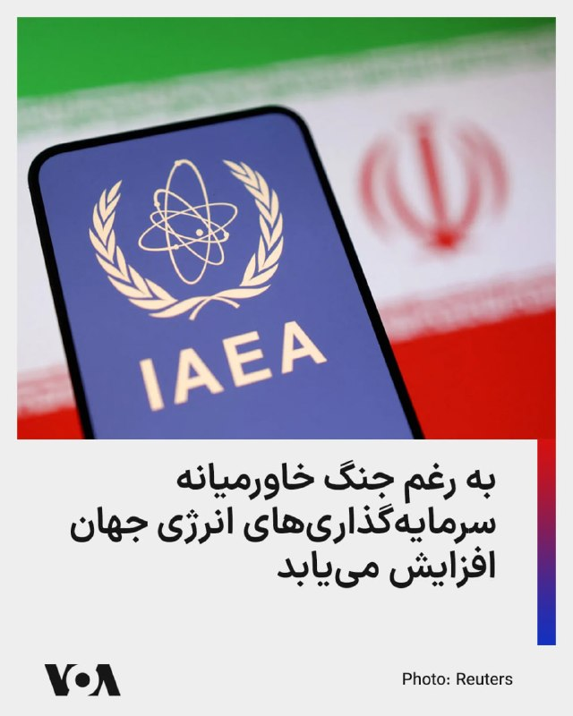

آژانس بین‌المللی انرژی می‌گوید به رغم جنگ خاورمیانه، سرمایه‌گذاری‌های در حوزه انرژی جهان در سال جاری نسبت به ۲۰۲۵ حدود پنج درصد رشد خواهد داشت.

بر اساس این گزارش، انتظار می‌رود ۳.۴ تریلیون دلار در بخش انرژی جهان طی سال جاری سرمایه‌گذاری شود و بخش اعظم آن در حوزه انرژی‌های پاک خواهد بود.

بر اساس این گزارش، انتظار نمی‌رود مناقشات نظامی جمهوری اسلامی و آمریکا تاثیری بر سرمایه‌گذاری‌های حوزه نفت، گاز و زغال‌سنگ داشته باشد. امسال حدود ۱.۲ تریلیون دلار در این بخشها سرمایه‌گذاری خواهد شد.

این گزارش همچنین از آسیب به ۳۰ تاسیسات انرژی و پتروشیمی منطقه در جریان مناقشات جمهوری اسلامی و آمریکا خبر داده و گفته است بازسازی این تاسیسات نیازمند «چندین سال زمان و دهها میلیارد دلار سرمایه‌گذاری» است.
@FarsiVOA

## RadioFarda — post 157676

  

🔸معاون رئیس‌جمهور آمریکا می‌گوید واشینگتن هنوز با ایران به توافق نهایی نرسیده است، اما طرف‌ها به آن نزدیک شده‌اند.

🔸جی‌دی ونس روز پنجشنبه هفتم خرداد به خبرنگاران گفت: «نمی‌توانم تضمین کنم که به توافق می‌رسیم، اما در حال حاضر احساس نسبتاً مثبتی دارم».

🔸به گفته منابعی که با سایت اکسیوس و خبرگزاری رویترز صحبت کرده‌اند، ایالات متحده و ایران روز پنج‌شنبه به توافقی دست یافتند تا آتش‌بس میان خود را تمدید کرده و محدودیت‌های مربوط به کشتیرانی در تنگه هرمز را لغو کنند؛ این توافق منوط به تأیید دونالد ترامپ، رئیس‌جمهور آمریکا، است.

🔸آقای ونس گفت در مذاکرات با تهران چند موضوع اختلافی وجود دارد، از جمله ذخایر اورانیوم غنی‌شدهٔ ایران و مسئلهٔ غنی‌سازی.

🔸او افزود: «دقیقاً نمی‌توان گفت رئیس‌جمهور چه زمانی یا حتی آیا یادداشت تفاهم را امضا خواهد کرد یا نه. ما بر سر چند نکته در متن همچنان در حال رفت‌وبرگشت هستیم».

🔸معاون رئیس‌جمهور آمریکا افزود ایالات متحده در موقعیتی است که می‌تواند برنامه هسته‌ای تهران را به‌طور قابل‌توجهی عقب بیندازد.

@RadioFarda

## alonews — post 123418

  <a href="telegram/content/alonews_123418_1780032150.webm" target="_blank">🎬 Download video</a>

👈الحدث: وال استریت ژورنال به نقل از مقامات ایرانی: تهران نگران است که اسرائیل توافق با واشنگتن را از مسیر خود خارج کند.

✅ @AloNews خبر جنگ

## alonews — post 123417

  <a href="telegram/content/alonews_123417_1780032150.webm" target="_blank">🎬 Download video</a>

👈دی. ونس معاون ترامپ گفته دو کشور به هم نزدیک‌تر شده‌اند، اما هنوز توافق نهایی نشده.

🔴هر بشکه نفت برنت به ۹۳.۳۶ دلار و نفت آمریکا به ۸۸.۲۷ دلار رسیده است.

✅ @AloNews خبر جنگ

## alonews — post 123416

  <a href="telegram/content/alonews_123416_1780032151.webm" target="_blank">🎬 Download video</a>

👈سنتکام: هیچ هواگرد آمریکایی در نزدیکی بوشهر ساقط نشده

✅ @AloNews خبر جنگ

---
📅 بروزرسانی: 1405/03/08 08:42
---

## BBCPersian — post 282307

  

یک مرد ۲۱ ساله اتریشی به جرم برنامه‌ریزی برای حمله تروریستی به کنسرت تیلور سویفت در وین در جریان تور این خواننده آمریکایی در آگوست ۲۰۲۴ به ۱۵ سال زندان محکوم شد.

این مرد که طبق قوانین حفظ حریم خصوصی اتریش تنها با نام مستعار بِران اِی معرفی شده است، به دلیل مجموعه‌ای از جرائم مرتبط با تروریسم نیز مجرم شناخته شد.

او پس از دریافت هشدار از سوی سازمان اطلاعات مرکزی آمریکا، سیا، درست قبل از برگزاری اولین کنسرت از سه کنسرت تیلور سویفت که قرار بود در ورزشگاه ارنست هاپل وین برگزار شود، دستگیر شد.

هر سه کنسرت اتریش تیلور سوئیفت در آن زمان بلافاصله لغو شدند که باعث نارضایتی تقریبا ۲۰۰ هزار نفر طرفداران و خود خواننده شد.

سوئیفت پیش از این توضیح داده بود که چگونه تور رکوردشکنش را به سختی «از یک وضعیت قتل عام جان سالم به در برد».

یک مستند منتشر شده از این تور نشان داد که خواننده آمریکایی هنگام سفر به اتریش از توطئه بمب‌گذاری مطلع شده بود.

دادستان‌ها گفتند که متهم افراطی شده و با گروه جهادی داعش بیعت کرده بود.

📷Reuters
@BBCPersian

---
📅 بروزرسانی: 1405/03/08 08:32
---

## VahidOOnLine — post 242697

  

اسرائیل هیوم در گزارشی نوشت موساد در سال‌های اخیر شاخه‌ای محرمانه برای نزدیک‌تر کردن سقوط جمهوری اسلامی ایجاد کرده است. به گفته منابع آگاه، رییس موساد متقاعد شده است که اگر ترامپ با تهران توافق نکند و محاصره دریایی را ادامه دهد، جمهوری اسلامی تا پایان سال ۲۰۲۶ سقوط می‌کند.
به نوشته اسرائیل هیوم، ماموریت ابتدایی این شاخه که در سال ۲۰۲۱ و پس از آغاز ریاست داوید بارنیا بر موساد ایجاد شد، عملیات‌ هدفمند برای کنار زدن مقام‌های ارشد جمهوری اسلامی بود، اما به‌تدریج به بخشی از راهبرد گسترده‌تر موساد برای «تغییر رژیم» تبدیل شد.
رییس پیشین این شاخه به اسرائیل هیوم گفت موساد در گذشته بیشتر از طریق ترور افراد را حذف می‌کرد، اما اکنون افشای اطلاعات شرم‌آور یا آسیب‌زننده درباره مقام‌ها می‌تواند آن‌ها را از حلقه قدرت خارج کند؛ روشی که به گفته او «ارزان‌تر و ساده‌تر از عملیات ترور» است.
به نوشته اسرائیل هیوم، مقام‌های موساد معتقدند عملیات‌های اخیر علیه ایران فقط یک مرحله در مسیر سقوط جمهوری اسلامی بوده است. رئیس پیشین شاخه نفوذ گفت این واحد اکنون با شدت بیشتری فعالیت می‌کند و هدف آن «سریع‌تر کردن ساعت شنی پایان حکومت است».
‌🏁 🇬🇧 IranintlTV

🤖 @VahidOOnLine

## IranIntlTV — post 339507

  <a href="telegram/content/IranIntlTV_339507_1780030955.mp4" target="_blank">🎬 Download video</a>

سرخط خبرهای جمعه ۸ خرداد
@iranintltv

## IranIntlTV — post 339506

  

اسرائیل هیوم در گزارشی نوشت موساد در سال‌های اخیر شاخه‌ای محرمانه برای نزدیک‌تر کردن سقوط جمهوری اسلامی ایجاد کرده است. به گفته منابع آگاه، رییس موساد متقاعد شده است که اگر ترامپ با تهران توافق نکند و محاصره دریایی را ادامه دهد، جمهوری اسلامی تا پایان سال ۲۰۲۶ سقوط می‌کند.
به نوشته اسرائیل هیوم، ماموریت ابتدایی این شاخه که در سال ۲۰۲۱ و پس از آغاز ریاست داوید بارنیا بر موساد ایجاد شد، عملیات‌ هدفمند برای کنار زدن مقام‌های ارشد جمهوری اسلامی بود، اما به‌تدریج به بخشی از راهبرد گسترده‌تر موساد برای «تغییر رژیم» تبدیل شد.
رییس پیشین این شاخه به اسرائیل هیوم گفت موساد در گذشته بیشتر از طریق ترور افراد را حذف می‌کرد، اما اکنون افشای اطلاعات شرم‌آور یا آسیب‌زننده درباره مقام‌ها می‌تواند آن‌ها را از حلقه قدرت خارج کند؛ روشی که به گفته او «ارزان‌تر و ساده‌تر از عملیات ترور» است.
به نوشته اسرائیل هیوم، مقام‌های موساد معتقدند عملیات‌های اخیر علیه ایران فقط یک مرحله در مسیر سقوط جمهوری اسلامی بوده است. رئیس پیشین شاخه نفوذ گفت این واحد اکنون با شدت بیشتری فعالیت می‌کند و هدف آن «سریع‌تر کردن ساعت شنی پایان حکومت است».

## FarsiVOA — post 218951

  

وزارت دفاع رومانی، عضو ناتو، گزارش داد که پس از برخورد یک پهپاد روسی به یک ساختمان آپارتمانی، ۲ نفر زخمی شدند.

وزارت دفاع رومانی روز جمعه اعلام کرد: «در طول شب ۲۸ تا ۲۹ مه، فدراسیون روسیه حملات پهپادی به اهداف غیرنظامی و زیرساختی در اوکراین، در نزدیکی مرز رودخانه‌ای با رومانی، را از سر گرفت.»

این وزارتخانه افزود: «یکی از این پهپادها وارد حریم هوایی رومانی شد، توسط رادار تا بخش جنوبی شهر گالاتی ردیابی شد و بر روی سقف یک ساختمان آپارتمانی سقوط کرد که برخورد آن باعث آتش‌سوزی شد».

اداره خدمات اضطراری رومانی نیز اعلام کرد که دو نفر زخمی شده‌اند.
@FarsiVOA

## DW_Farsi — post 125258

🔶 "توافق آمریکا و ایران بدون همراهی اسرائیل پایدار نخواهد بود"
 
🔻 گزارشی از مراد رحمتی

در اخرین لحظات تهیه این گزارش، خبرگزاری رویترز به نقل از چهار منبع آگاه گزارش داد که آمریکا و ایران بر سر پیش‌نویس یادداشت تفاهمی برای تمدید آتش‌بس ۶۰ روزه به توافق رسیده‌اند، اما دونالد ترامپ هنوز آن را تائید نکرده است.
 
در این میان اختلافات آمریکا و اسرائیل بر سر موضوعاتی چون برنامه موشکی ایران و نیروهای نیابتی همچنان پابرجاست.
 
هم‌زمان، دولت ترامپ تلاش کرده بود که توافق احتمالی با ایران را به گسترش "پیمان ابراهیم" و عادی‌سازی روابط کشورهای عربی با اسرائیل گره بزند.
 
از سوی دیگر، برخی گزارش‌های منتشرشده حاکی از آن است که واشنگتن تمایلی به ورود به یک جنگ منطقه‌ای گسترده بخاطر "اقدامات یک‌جانبه اسرائیل" ندارد.
 
در داخل ایران نیز جریان‌های مخالف توافق، از هم‌اکنون علیه هرگونه مصالحه با آمریکا وارد میدان شده‌اند و تلاش دارند فضای داخلی را علیه تیم مذاکره‌کننده تحریک کنند.
 
اکنون پرسش اصلی این است که آیا این تنش‌های نظامی بخشی از فشارهای سیاسی و امنیتی پیش از توافق است، یا منطقه در آستانه مرحله‌ای تازه و خطرناک‌تر قرار دارد؟
@dw_farsi

---
📅 بروزرسانی: 1405/03/08 08:22
---

هیچ پیام جدیدی در این بروزرسانی ارسال نشد.

---
📅 بروزرسانی: 1405/03/08 08:12
---

## FarsiVOA — post 218950

Farsi VOA pinned an audio file

## FarsiVOA — post 218949

  <a href="https://t.me/farsivoa/218949" target="_blank">📎 Download file</a>

🔴📢‌ نسخه صوتی اخبار ساعت ۲۰ پنجشنبه ۷ خرداد ۱۴۰۵

🛜در صورتی که با مشکل اینترنت مواجه هستید میتوانید اخبار صدای آمریکا را از نسخه‌های پادکست خبری ما روزانه دنبال کنید و یا از نسخه سبک وب‌سایت ما پیگیر باشید:
https://ir.voanews.com/lite

📡بروزترین فرکانسهای ماهواره‌ای را نیز میتوانید از صفحه زیر پیگیری کنید:
https://ir.voanews.com/satellite

🔔دیگر شبکه‌های اجتماعی ما را هم دنبال کنید:
https://linktr.ee/voafarsi

به اشتراک بگذارید
@farsivoa

## RadioFarda — post 157675

  

🔸وزارت خزانه‌داری آمریکا اعلام کرد دور تازه‌ای از تحریم‌ها را علیه افراد، شرکت‌ها و کشتی‌های مرتبط با جمهوری اسلامی اعمال کرده است.

🔸براساس این بیانیه ۱۷ شرکت در کشورهای مختلف از جمله امارات متحده عربی، قطر، هند، سنگاپور،‌ هنگ کنگ و جزایر مارشال به دلیل همکاری با شبکه‌های مرتبط با جمهوری اسلامی و شرکت «سپهر انرژی جهان نمای پارس» تحریم شده‌اند.

🔸وزارت خزانه‌داری آمریکا همچنین هشت نفتکش و کشتی حمل و نقل با پرچم کشورهای مختلف را به فهرست تحریم‌ها اضافه و اعلام کرد که این اقدامات در راستای سیاست فشار حداکثری و مقابله با شبکه‌های دور زدن تحریم‌ها انجام شده است.

🔸در میان افراد تحریم شده نیز نام یک تبعه هند دیده می شود که به گفته آمریکا در شبکه تجارت نفت و پتروشیمی جمهوری اسلامی نقش داشته است.

@RadioFarda

## BBCPersian — post 282306

  

دولت دونالد ترامپ، رئیس جمهور ایالات متحده، در حال آماده شدن برای چاپ یک اسکناس ۲۵۰ دلاری جدید است که در صورت اجازه قانون‌گذاران، می‌تواند تصویر او را رویش داشته باشد.

قانون فدرال، چاپ پول ایالات متحده با تصویر یک فرد زنده را ممنوع می‌کند، اما متحدان ترامپ در کنگره قانونی را ارائه کرده‌اند که در این مورد استثنا قائل می‌شود.

سخنگوی وزارت خزانه‌داری آمریکا به بی‌بی‌سی گفت که این نهاد در پاسخ به این قانون «در حال برنامه‌ریزی و بررسی‌های لازم» است.

قانون‌گذاران حامی این طرح گفتند که مبلغ این اسکناس نمادی از ۲۵۰مین سالگرد تأسیس این کشور در سال جاری خواهد بود. در صورت تصویب، این آخرین نمونه از سوی ترامپ و متحدانش برای قرار دادن چهره، نام و تصویر او بر روی نهادها و نمادهای ملی خواهد بود.

طرح‌های هنری اسکناس ۲۵۰ دلاری به طور عمومی منتشر نشده‌اند، اما طرح‌های آن توسط اداره حکاکی و چاپ آمریکا که یک سازمان زیرمجموعه خزانه‌داری این کشور است که پول ایالات متحده را توسعه و تولید می‌کند، درخواست شده است.

📷Kent Nishimura / AFP via Getty Images
@BBCPersian

---
📅 بروزرسانی: 1405/03/08 08:02
---

## FoxNewsTwitter — post 342391

  <a href="telegram/content/FoxNewsTwitter_342391_1780029152.mp4" target="_blank">🎬 Download video</a>

Fox News (Twitter/X)

A Blue Origin rocket exploded during a "hotfire test" at Cape Canaveral Space Force Station on Thursday night.

Everyone has been accounted for and is safe, Jeff Bezos, the company's founder, said.

NASA Administrator Jared Isaacman said he was aware of the incident, which he called an "anomaly," and the agency would provide information on any impacts to Artemis or Moon Base programs.

"Spaceflight is unforgiving, and developing new heavy-lift launch capability is extraordinarily difficult. We will work with our partners to support a thorough investigation of this anomaly, assess near-term mission impacts, and get back to launching rockets," he said.

---
📅 بروزرسانی: 1405/03/08 07:52
---

## alonews — post 123415

  <a href="telegram/content/alonews_123415_1780028544.webm" target="_blank">🎬 Download video</a>

👈ونس: واشنگتن در مذاکرات با ایران «پیشرفت زیادی» داشته و معتقد است تهران «دست‌کم تا این لحظه، با حسن نیت در حال مذاکره است.»

🔴ونس گفت: «ایرانی‌ها خواهان توافق هستند.»

✅ @AloNews خبر جنگ

---
📅 بروزرسانی: 1405/03/08 07:42
---

## RadioFarda — post 157674

  <a href="https://t.me/radiofarda/157674" target="_blank">📎 Download file</a>

📻بشنوید: سرخط خبرها با رادیوفردا، هشتم خرداد ۱۴۰۵‌

@RadioFarda

---
📅 بروزرسانی: 1405/03/08 07:32
---

## Persian_Trend_Official — post 15214

  <a href="telegram/content/Persian_Trend_Official_15214_1780027367.mp4" target="_blank">🎬 Download video</a>

🇷🇴
🇷🇺
🚩حمله پهپادی روسیه به ناتو:

در رومانی پهپاد گران به یک ساختمان بلند اصابت کرد یک پهپاد مستقیماً به آپارتمانی در شهر گالاتس پرواز کرد یک آتش سوزی بزرگ بود بر اثر این انفجار دو نفر مجروح شدند.

🥷Phantom

🛰@persian_trend_official
پرشین ترند | متفاوت‌ترین کانال نظامی

## BBCPersian — post 282300

مارکو روبیو، وزیر امور خارجه آمریکا، سفر چهار روزه خود به هند را در حالی به پایان رساند که این سفر همچنان در شبکه‌های اجتماعی موضوع بحث و گفت‌وگوست.

او از ۲۳ تا ۲۶ مه به هند سفر کرده بود و در جریان این سفر، علاوه بر دیدار با دیپلمات‌های ارشد هند، از چندین مکان مشهور گردشگری نیز بازدید کرد که تاج‌محل یکی از آن‌ها بود.

بحث‌ها در شبکه‌های اجتماعی زمانی آغاز شد که مارکو روبیو و همسرش مقابل تاج‌محل در شهر آگرا عکس گرفتند.

نخستین واکنش طنزآمیز به این موضوع از سوی مقام‌های ایرانی مطرح شد و پس از آن، این ماجرا بیش از پیش مورد توجه قرار گرفت.

https://bbc.in/3S8XWcA
📸GettyImages/Reuters/ AFP via Getty Images/ Hulton Archive/Getty Images
@BBCPersian

---
📅 بروزرسانی: 1405/03/08 07:22
---

## VahidOOnLine — post 242696

  

شبکه کان اسرائیل گزارش داد تلاش‌های عمان و ایران برای ایجاد سازوکار مشترک مدیریت و دریافت عوارض در تنگه هرمز، باعث خشم آمریکا و کشورهای خلیج فارس شده است.
یک دیپلمات از یکی از کشورهای میانجی به کان گفت: «ما تلاش کردیم وضعیت تنگه را به حالت پیشین بازگردانیم.» بر اساس توافق در حال شکل‌گیری، قرار است تنگه هرمز بدون محدودیت باز شود.
اسماعیل بقایی، سخنگوی وزارت امور خارجه جمهوری اسلامی، «لفاظی‌های تهدیدآمیز» مقام‌های آمریکا علیه عمان را در واکنش به گزارش‌ها درباره احتمال مشارکت این کشور در کنترل تنگه هرمز محکوم کرد و آن را «مغایر با اصول بنیادین منشور ملل متحد و حقوق بین‌الملل» دانست.

‌🏁 🇬🇧 IranintlTV

🤖 @VahidOOnLine

## VahidOOnLine — post 242695

♦️ویدیوی منتشرشده، لحظه انفجار موشک غول‌پیکر «نیو گلن» (New Glenn) متعلق به شرکت فضایی بلواوریجین، تحت مالکیت جف بیزوس، را روی سکوی پرتاب شماره ۳۶ در پایگاه فضایی کیپ کاناورال فلوریدا نشان می‌دهد.
این حادثه زمانی رخ داد که تیم فنی در حال آماده‌سازی و انجام آزمایش آتش ایستا (Static Fire) پیش از ماموریت بعدی این موشک، موسوم به NG-4، بود. تصاویر منتشرشده لحظه تبدیل شدن این موشک پیشرفته به یک گلوله بزرگ آتش را نشان می‌دهد.
موشک نیو گلن یکی از مهم‌ترین پروژه‌های بلواوریجین برای رقابت در بازار پرتاب‌های سنگین فضایی به شمار می‌رود و این انفجار می‌تواند باعث شکست و تاخیر قابل توجه در برنامه‌های فضایی این شرکت شود.
‌🇸🇦 Indypersian

🤖 @VahidOOnLine

## IranIntlTV — post 339505

  

شبکه کان اسرائیل گزارش داد تلاش‌های عمان و ایران برای ایجاد سازوکار مشترک مدیریت و دریافت عوارض در تنگه هرمز، باعث خشم آمریکا و کشورهای خلیج فارس شده است.
یک دیپلمات از یکی از کشورهای میانجی به کان گفت: «ما تلاش کردیم وضعیت تنگه را به حالت پیشین بازگردانیم.» بر اساس توافق در حال شکل‌گیری، قرار است تنگه هرمز بدون محدودیت باز شود.
اسماعیل بقایی، سخنگوی وزارت امور خارجه جمهوری اسلامی، «لفاظی‌های تهدیدآمیز» مقام‌های آمریکا علیه عمان را در واکنش به گزارش‌ها درباره احتمال مشارکت این کشور در کنترل تنگه هرمز محکوم کرد و آن را «مغایر با اصول بنیادین منشور ملل متحد و حقوق بین‌الملل» دانست.

https://iranintl.com/202605296999

## BBCPersian — post 282299

🔻 بیانیه اساتید دانشگاه و کنشگران سیاسی و مدنی درباره آزادی میرحسین موسوی و زهرا رهنورد

بیش از ۲۰ نفر از اساتید دانشگاه و کنشگران سیاسی و مدنی ایران خواستار آزادی میرحسین موسوی، زهرا رهنورد و تمامی زندانیان سیاسی و مدنی شده‌اند.

در بیانیه این گروه که روز پنجشنبه منتشر شد آمده است: «گزارش‌های موثقی وجود دارند که محل اقامت آقای میر‌حسین موسوی و خانم زهرا رهنورد در جریان جنگ اخیر و حمله به پاستور به شدت آسیب دیده و آنان پس از این حادثه، به مکانی نامعلوم منتقل شده‌اند؛ موضوعی که پس از پانزده سال حصر خانگی، نگرانی‌های جدی و گسترده‌ای را برانگیخته است.»

در این بیانیه با اشاره سن و نیاز به مراقبت و دسترسی به سیستم خدمات درمانی برای آقای موسوی و خانم رهنورد، امضاکنندگان خواستار پایان حصر این چهره مخالف حکومت شدند.

در پایان این بیانیه آمده است: «ما از جامعه جهانی، نهادهای حقوق بشری و تمامی وجدان‌های بیدار می‌خواهیم که با حساسیت و مسئولیت‌پذیری، وضعیت زندانیان سیاسی و مدنی در ایران، به ویژه آقای موسوی و خانم رهنورد را پیگیری کرده و بر لزوم حفظ کرامت انسانی، امنیت و حقوق بنیادین آنان و بیش از همه آزادی بی قید و شرط آنان تأکید کنند.»

سعید پیوندی، نیره توحیدی، شهلا حائری، مهرداد خوانساری، منصوره شجاعی، فاطمه شمس، رضا علیجانی، مهرانگیز کار و چندین نفر از دیگر فعالان سیاسی و مدنی ایران این بیانیه را امضا کرده‌اند.

میرحسین موسوی همراه با همسرش، زهرا رهنورد، از بهمن ۱۳۸۹ پس از اعتراضات به نتیجه انتخابات ریاست جمهوری ۱۳۸۸، که به جنبش سبز موسوم شد، تاکنون در حبس خانگی هستند.

https://bbc.in/4wV3GGX
@BBCPersian

## alonews — post 123414

  <a href="telegram/content/alonews_123414_1780026768.mp4" target="_blank">🎬 Download video</a>

👈جی‌دی ونس، معاون اول ترامپ :
- آمریکا الان تو موقعیتیه که بتونه برنامه هسته‌ای ایران رو متوقف کنه

✅ @AloNews خبر جنگ

---
📅 بروزرسانی: 1405/03/08 07:12
---

هیچ پیام جدیدی در این بروزرسانی ارسال نشد.

---
📅 بروزرسانی: 1405/03/08 07:02
---

هیچ پیام جدیدی در این بروزرسانی ارسال نشد.

---
📅 بروزرسانی: 1405/03/08 06:52
---

## VahidOOnLine — post 242694

♦️حساب کاربری وزارت جنگ آمریکا در اکس با انتشار ویدیویی اعلام کرد پیت هگست، وزیر جنگ آمریکا، به همراه ملوانان و تفنگداران دریایی این کشور در ناو باکسر در یک برنامه ورزش صبحگاهی شرکت کرده است.
در این ویدیو، هگست در کنار نیروهای حاضر در ناو آبی‌خاکی باکسر در تمرین‌های بدنی صبحگاهی شرکت می‌کند.
وزیر جنگ آمریکا پس از پایان این تمرینات خطاب به نیروهای حاضر در ناو گفت: «شما هر روز روی این کشتی و سکوهای عملیاتی خود تمرین می‌کنید تا در بالاترین سطح آمادگی قرار داشته باشید و اگر روزی فراخوانده شدید، آماده باشید.»
هگست با اشاره به اظهارات دونالد ترامپ در نشست کابینه افزود: «ایران یا می‌تواند از راه درست و از طریق توافق پای میز مذاکره پیش برود، یا با شما روبه‌رو شود.» او سپس با اشاره به نیروهای حاضر در ناو گفت: «آن فرد من نیستم؛ شما هستید.»
‌🇸🇦 Indypersian

🤖 @VahidOOnLine

---
📅 بروزرسانی: 1405/03/08 06:42
---

## FoxNewsTwitter — post 342390

  <a href="telegram/content/FoxNewsTwitter_342390_1780024342.mp4" target="_blank">🎬 Download video</a>

Fox News (Twitter/X)

Spencer Pratt says he's the "look around" candidate: "Look around and see with your own eyes what I'm saying."

"And that's why I'm going to win." |@Gutfeldfox

## FoxNewsTwitter — post 342389

  <a href="telegram/content/FoxNewsTwitter_342389_1780024343.mp4" target="_blank">🎬 Download video</a>

Fox News (Twitter/X)

"I hate these people."

Los Angeles mayoral candidate Spencer Pratt didn't hold back on @gutfeldfox as he says he keeps being asked which politicians he looks up to.

"These people let my house and my mom's house burn down," Pratt said before blasting Mayor Bass.

"She's actually a terrible liar, she's just incredible at how much she does it."

## BBCPersian — post 282298

🔻 یک مقام سابق سیا با شمش‌های طلا به ارزش ۴۰ میلیون دلار بازداشت شد

به گزارش رسانه‌های آمریکا،‌ يک مقام پيشين سازمان اطلاعات مرکزی آمريکا (سيا) هفته گذشته بازداشت شد و به هنگام بازرسی از خانه او ۴۰ میلیون دلار شمش طلا ضبط شد. دستگیری او پس از آن روی داد که ماموران اف‌بی‌آی در جريان تحقيق درباره اينکه آيا او درباره سوابق تحصيلی و نظامی خود دروغ گفته است يا نه، این شمش‌های طلا را پیدا کردند.

بر اساس اسناد دادگاه و به گفته منابع آگاه، ديويد راش در حال حاضر در بازداشت به سر می‌برد.

شبکه سی‌بی‌اس نوشته ديويد راش به سرقت اموال عمومی متهم شده است.

در شکايتی کيفری که به شکل غيرمعمولی تنظيم شده، اف‌بی‌آی آقای راش را متهم کرده است که شمش‌های طلا را به طور غیرقانونی تصاحب کرده، «حقوقی متقلبانه و بيش از ميزان واقعی دريافت کرده»، «به صورت متقلبانه از مرخصی نظامی بهره‌مند شده» و مجموعه‌ای از اظهارات نادرست درباره سوابق خود مطرح کرده است.

بر اساس متن شکايت، دیوید راش بين نوامبر ۲۰۲۵ تا مارس سال جاری چندين درخواست به دولت ارائه کرده تا مقادير زيادی ارز خارجی و ده‌ها ميليون دلار شمش طلا برای هزينه‌های مرتبط با کار دريافت کند.

با اين حال، در اين شکايت به طور دقيق مشخص نشده که چه اقدام يا اقداماتی مبنای طرح اين اتهامات بوده است.

https://bbc.in/4uDaur8
@BBCPersian

---
📅 بروزرسانی: 1405/03/08 06:32
---

## FoxNewsTwitter — post 342388

  <a href="telegram/content/FoxNewsTwitter_342388_1780023764.mp4" target="_blank">🎬 Download video</a>

Fox News (Twitter/X)

"I don't want anybody to endorse me except for the moms and the animal lovers in LA — that's my entire vote."

LA mayoral candidate Spencer Pratt tells @Gutfeldfox that he's not interested in getting endorsements from Hollywood celebrities.

## BBCPersian — post 282291

‌ ‌ ‌
آتش‌بسی که «به تار مویی بند است»، روند دیپلماتیکی که «در حال پیشرفت» توصیف می‌شود، رئیس‌جمهوری که می‌گوید «هنوز راضی نیست» و انفجارهایی که همچنان در اطراف خلیج فارس شنیده می‌شوند.

در چنین شرایطی، ارزیابی وضعیت کنونی روابط آمریکا و ایران دشوار شده است. آیا دو کشور به صلح نزدیک شده‌اند یا دوباره در آستانه بازگشت به جنگ قرار دارند؟

آتش‌بسی که از هشتم آوریل برقرار شده، در روزهای گذشته تحت فشار جدی قرار گرفت. با وجود تنش‌های اخیر، دوره آتش‌بس اکنون بسیار طولانی‌تر از دوره درگیری‌های مستقیم پیش از آن دوام آورده است.

https://bbc.in/4fMNh11
📷 GettyImages/Reuters
@BBCPersian

---
📅 بروزرسانی: 1405/03/08 06:22
---

## FoxNewsTwitter — post 342387

  <a href="telegram/content/FoxNewsTwitter_342387_1780023150.mp4" target="_blank">🎬 Download video</a>

Fox News (Twitter/X)

"I don't want anybody to endorse me except for the moms and the animal lovers in LA — that's my entire vote."

LA mayoral candidate Spencer Pratt tells @Gutfeldfox that he's not interested in getting endorsements from Hollywood celebrities.

## FoxNewsTwitter — post 342386

  <a href="telegram/content/FoxNewsTwitter_342386_1780023151.mp4" target="_blank">🎬 Download video</a>

Fox News (Twitter/X)

.@greggutfeld: "Is there anybody who was devastated by the fires still voting for Karen Bass?"

@spencerpratt: "There's definitely lunatics. Their houses didn't burn down, but they could have been saved by the US Forest Service."

"But these people have convinced themselves the Palisades burned down because of climate change....it wasn't that Mayor Bass was drinking in Ghana and defunded the firefighters." | @gutfeldfox

## FoxNewsTwitter — post 342385

  <a href="telegram/content/FoxNewsTwitter_342385_1780023153.mp4" target="_blank">🎬 Download video</a>

Fox News (Twitter/X)

"The people I'm surging with are the people having to step over the naked drug addicts and step into human poop to get their $20 matcha."

Spencer Pratt slams the idea that he's only popular on the internet as he joins @Gutfeldfox days before the Los Angeles mayoral primary.

---
📅 بروزرسانی: 1405/03/08 06:12
---

## VahidOOnLine — post 242693

  

روزنامه آیریش میرر گزارش داد جسد معصومه سهرابی، زن ایرانی ۳۱ ساله و مادر دو فرزند، بیرون از هتلی در شهرستان گالوی ایرلند، که به‌عنوان اقامتگاه اضطراری استفاده می‌شد، پیدا شده است.
به نوشته آیریش میرر، این زن با جراحات شدید در ناحیه گردن پیدا شد و پلیس ایرلند قرار است تحقیقات قتل را آغاز کند. او روز چهارشنبه مفقود اعلام شده بود و دوستانش در مرکز آی‌پاس او را با نام «آتیجا» می‌شناختند.

‌🏁 🇬🇧 IranintlTV

🤖 @VahidOOnLine

## IranIntlTV — post 339504

  

روزنامه آیریش میرر گزارش داد جسد معصومه سهرابی، زن ایرانی ۳۱ ساله و مادر دو فرزند، بیرون از هتلی در شهرستان گالوی ایرلند، که به‌عنوان اقامتگاه اضطراری استفاده می‌شد، پیدا شده است.
به نوشته آیریش میرر، این زن با جراحات شدید در ناحیه گردن پیدا شد و پلیس ایرلند قرار است تحقیقات قتل را آغاز کند. او روز چهارشنبه مفقود اعلام شده بود و دوستانش در مرکز آی‌پاس او را با نام «آتیجا» می‌شناختند.

https://iranintl.com/202605292740

---
📅 بروزرسانی: 1405/03/08 06:02
---

هیچ پیام جدیدی در این بروزرسانی ارسال نشد.

---
📅 بروزرسانی: 1405/03/08 05:52
---

## VahidOOnLine — post 242692

♦️به گزارش خبرگزاری رویترز، تصاویری از استادیوم «کالینته» در شهر مرزی تیخوانای مکزیک منتشر شده است؛ همان مکانی که قرار است به عنوان کمپ تمرینی و محل استقرار تیم ملی فوتبال ایران در طول رقابت‌های جام جهانی ۲۰۲۶ مورد استفاده قرار گیرد.
این تصمیم پس از آن اتخاذ شد که دولت ایالات متحده از میزبانی و اقامت طولانی‌مدت کاروان جمهوری اسلامی در خاک خود خودداری کرد. بر اساس توافق فیفا و دولت مکزیک، ملی‌پوشان جمهوری اسلامی ایران در طول مسابقات در شهر تیخوانا مستقر خواهند بود و تنها در روزهای برگزاری سه بازی خود در مرحله گروهی، به خاک آمریکا (شهرهای لس‌آنجلس و سیاتل) سفر خواهند کرد. در حال حاضر نیروهای گارد ملی مکزیک برای تامین امنیت کاروان ایران، در اطراف و بخش‌های مختلف این استادیوم مستقر شده‌اند.
‌🇸🇦 Indypersian

🤖 @VahidOOnLine

## VahidOOnLine — post 242691

  

وزارتخانه‌های خارجه فلسطین و عراق حملات موشکی و پهپادی منتسب به جمهوری اسلامی علیه کویت را محکوم کردند. وزارت‌ خارجه فلسطین این حملات را «شنیع» خواند و همبستگی کامل خود را با کویت اعلام کرد. وزارت خارجه عراق هرگونه تهدید علیه امنیت را مردود دانست.
‌🏁 🇬🇧 IranintlTV

🤖 @VahidOOnLine

## IranIntlTV — post 339503

  

وزارتخانه‌های خارجه فلسطین و عراق حملات موشکی و پهپادی منتسب به جمهوری اسلامی علیه کویت را محکوم کردند. وزارت‌ خارجه فلسطین این حملات را «شنیع» خواند و همبستگی کامل خود را با کویت اعلام کرد. وزارت خارجه عراق هرگونه تهدید علیه امنیت را مردود دانست.
https://iranintl.com/202605296071

---
📅 بروزرسانی: 1405/03/08 05:42
---

## BBCPersian — post 282290

  

‌ ‌ ‌
فرماندهی مرکزی ارتش آمریکا - سنتکام - در واکنش به خبر «رهگیری و هدف قرار گرفتن یک هواگرد متخاصم» که رسانه‌ها و مقام‌های ایرانی از جمله فرماندار شهر جم در نزدیکی بوشهر، اعلام کرده بودند با صدور پست کوتاهی در حساب شبکه ایکس نوشت: «ادعای طرح شده در تلویزیون ایران مبنی بر هدف قرار گرفتن یک فروند هواگرد ارتش آمریکا، صحت ندارد. تمام هواگرد و هواپیماهای ما سالم‌اند.»

ساعتی پیش فرماندار شهر جم در نزدیکی بوشهر به تلویزیون ایران گفت آنچه در آسمان این منطقه روی داده «هدف قرار گرفتن یک هواگرد متخاصم» بوده اما هیچ تلفات و خساراتی نداشته و «اوضاع آرام است».

در همین حال، خبرگزاری تسنیم، نزدیک به سپاه پاسداران، پنجشنبه شب با اشاره به شنیدن صدای انفجار در نزدیکی سواحل تنگه هرمز نوشت: «براساس گزارش پدافند ارتش، منشأ انفجارها از سمت دریا و مربوط به تبادل آتش در اخطار به کشتی‌های متخلف در تنگه هرمز بوده است.»

https://bbc.in/4wXIKiv
📷Samuel Boivin/NurPhoto via Getty Images
@BBCPersian

---
📅 بروزرسانی: 1405/03/08 05:33
---

## FarsiVOA — post 218948

🔺جی‌دی ونس: مذاکرات با رژیم ایران پیشرفت داشته است اما معلوم نیست دونالد ترامپ تفاهم‌نامه را امضا می‌کند یا خیر

▪️جی‌دی ونس، معاون رئیس‌جمهوری آمریکا، پنج‌شنبه شب گفت که ایالات متحده و جمهوری اسلامی در مذاکراتشان بر سر یک «یادداشت تفاهم» که آتش‌بس میان دو کشور را ۶۰ روز تمدید می‌کند و تنگه هرمز را باز می‌کند «پیشرفت زیادی» داشته‌اند.

⬇️ بیشتر بخوانید:
https://ir.voanews.com/a/8155212.html
@FarsiVOA

---
📅 بروزرسانی: 1405/03/08 05:22
---

## VahidOOnLine — post 242690

  

♦️محمدرضا جمشیدی، دبیرکل کانون بانک‌ها و موسسات اعتباری خصوصی، درباره کمبود نقدینگی و اسکناس در برخی دستگاه‌های خودپرداز گفت: یکی از علل اصلی کمبود اسکناس و حتی سکه در مقطع اخیر، به اختلالات و تأخیر‌های به وجود آمده در برقراری ارتباط بانکی دستگاه‌های الکترونیکی بازمی‌گردد. حکومت ایران اینترنت را ۸۸ روز قطع کرد که پیامدهای شدیدی برای بخش‌های مختلف اقتصاد به همراه داشت. جمشیدی همچنین به افزایش تلاش مردم برای ذخیره کردن پول نقد اشاره کرد. تلاشی که به دلیل عدم اطمینان مردم به حاکمیت است. جمشیدی با اشاره به چالش‌های چاپ اسکناس تصریح کرد: چاپ اسکناس برای دولت هزینه سنگینی دارد؛ به‌طوری که هزینه چاپ برخی اسکناس‌های کوچک تقریبا با ارزش خود آن اسکناس برابری می‌کند. به همین دلیل بانک مرکزی بیشتر بر چاپ و توزیع اسکناس‌های درشت تمرکز کرده و این عامل هم به کمبود اسکناس در عابربانک‌ها دامن زده است.
‌🇸🇦 Indypersian

🤖 @VahidOOnLine

## FoxNewsTwitter — post 342384

  <a href="telegram/content/FoxNewsTwitter_342384_1780019562.mp4" target="_blank">🎬 Download video</a>

Fox News (Twitter/X)

A dog in trouble was rescued from a pond at a Colorado golf course after becoming trapped with no way out.

Westminster Animal Management responded to the scene after the dog, Luna, was spotted stuck in the pond.

The officer carefully pulled the dog to safety before Luna was evaluated and reunited with her family.

## FoxNewsTwitter — post 342383

  <a href="telegram/content/FoxNewsTwitter_342383_1780019564.mp4" target="_blank">🎬 Download video</a>

Fox News (Twitter/X)

NOW: Dallas officials confirm three people — including two women and one child — were killed after a massive explosion and fire tore through an apartment building in the city’s Oak Cliff neighborhood.

Dallas Fire-Rescue says three additional victims were transported to hospitals, including one person in critical but stable condition.

The incident was initially reported as a gas leak before escalating into a five-alarm fire.

---
📅 بروزرسانی: 1405/03/08 05:12
---

هیچ پیام جدیدی در این بروزرسانی ارسال نشد.

---
📅 بروزرسانی: 1405/03/08 05:02
---

هیچ پیام جدیدی در این بروزرسانی ارسال نشد.

---
📅 بروزرسانی: 1405/03/08 04:52
---

## FoxNewsTwitter — post 342382

  <a href="telegram/content/FoxNewsTwitter_342382_1780017747.mp4" target="_blank">🎬 Download video</a>

Fox News (Twitter/X)

Billy Bush on Spencer Pratt's chances in the LA Mayoral election: "He knows how to communicate and she [Karen Bass] has no idea what to do about him." https://twitter.com/JesseBWatters/status/2060162354386477426#m

---
📅 بروزرسانی: 1405/03/08 04:42
---

## FoxNewsTwitter — post 342381

  <a href="telegram/content/FoxNewsTwitter_342381_1780017173.mp4" target="_blank">🎬 Download video</a>

Fox News (Twitter/X)

Fighter jets launch from the deck of the USS Abraham Lincoln as the aircraft carrier conducts flight operations in the Arabian Sea.

## BBCPersian — post 282289

  

جی دی ونس، معاون رئيس جمهوری آمريکا، گفت ايالات متحده و ايران همچنان بايد چند موضوع اختلافی را حل و فصل کنند تا توافقی درباره جنگ حاصل شود.

ونس در پاسخ به پرسش بی بی سی درباره اينکه آيا دونالد ترامپ، رئيس جمهوری آمريکا، به امضای توافق نزديک شده است يا نه، گفت هنوز برای اظهار نظر درباره اينکه «چه زمانی يا اصلا آيا» دو طرف به توافق نهايی خواهند رسيد، زود است.

گفته می شود اين توافق شامل تمديد ۶۰ روزه آتش بس و آغاز مذاکرات درباره آينده برنامه هسته ای ايران خواهد بود.

پيشتر در روز پنجشنبه، مقام های آمريکايی به بی بی سی گفته بودند دو کشور بر سر چارچوب يک توافق به تفاهم رسيده اند، اما اين توافق هنوز نياز به تاييد دونالد ترامپ و رهبران ايران دارد.

با اين حال، خبرگزاری نيمه رسمی تسنيم گزارش داد که توافق هنوز نهايی يا تاييد نشده است.

ونس شامگاه پنجشنبه گفت مذاکره کنندگان دو طرف «درباره چند مورد مربوط به متن توافق در حال رفت و برگشت هستند» که از جمله آنها «موضوع غنی سازی» است.

او به خبرنگاران گفت: «هنوز به نتيجه نهايی نرسيده ايم، اما بسيار نزديک هستيم و به کار روی آن ادامه خواهيم داد.»

📷Reuters
@BBCPersian

---
📅 بروزرسانی: 1405/03/08 04:32
---

## VahidOOnLine — post 242689

♦️شهروندان و گردشگران در نیویورک، پنجشنبه ۷ خرداد، برای تماشای پدیده «منهتن‌هنج» گرد هم آمدند؛ پدیده‌ای که در آن خورشید هنگام غروب یا طلوع، به شکلی تقریبا کامل با شبکه خیابان‌های منهتن هم‌راستا می‌شود و میان آسمان‌خراش‌های شهر دیده می‌شود.
این پدیده زمانی رخ می‌دهد که زاویه خورشید با خیابان‌های شرقی-غربی منهتن هماهنگ می‌شود و منظره‌ای ایجاد می‌کند که خورشید درست در امتداد خیابان‌ها و میان ساختمان‌های بلند دیده می‌شود. این رویداد معمولا دو بار در سال و در روزهایی نزدیک به میانه فاصله میان انقلاب تابستانی و انقلاب زمستانی رخ می‌دهد.
اصطلاح «منهتن‌هنج» را نیل دگراس تایسون، اخترشناس آمریکایی، با الهام از یادمان باستانی استون‌هنج ابداع کرد؛ زیرا این هم‌راستایی خورشید با خیابان‌های شهر، برای بسیاری یادآور هم‌راستایی‌های نجومی سازه‌های باستانی است.
‌🇸🇦 Indypersian

🤖 @VahidOOnLine

## FarsiVOA — post 218947

🔺وزارت امور خارجه آمریکا با اعلام تحریم‌های تازه گفت «شریان‌های مالی سپاه پاسداران» را هدف قرار می‌دهیم

▪️وزارت امور خارجه آمریکا روز پنج‌شنبه ۷ خرداد اعلام کرد که ایالات متحده در حال انجام «اقدامات هماهنگ» برای قطع دسترسی جمهوری اسلامی به درآمدهایی است که از آن برای «تجاوز منطقه‌ای و تروریسم جهانی» استفاده می‌کند.

⬇️ بیشتر بخوانید:
https://ir.voanews.com/a/8155211.html
@FarsiVOA

---
📅 بروزرسانی: 1405/03/08 04:22
---

## VahidOOnLine — post 242688

  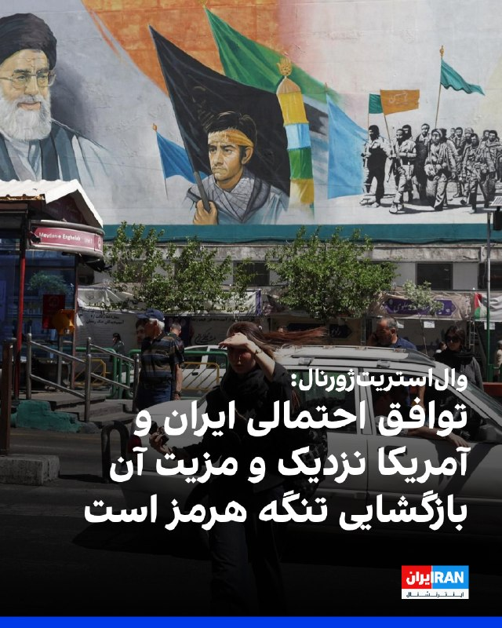

شورای سردبیری وال‌استریت‌ژورنال در مطلبی نوشت مذاکره‌کنندگان آمریکایی بیش از هر زمان دیگری مطمئن هستند که به توافق اولیه با جمهوری اسلامی نزدیک شده‌اند؛ توافقی که مزیت اصلی آن، وعده بازگشایی تنگه هرمز است.
این مطلب ساختار دومرحله‌ای توافق را بزرگ‌ترین خطر آن دانست و نوشت بدون محاصره آمریکا در جریان مذاکرات هسته‌ای، گرفتن امتیاز از ایران دشوارتر می‌شود؛ زیرا تهران ممکن است مهلت ۶۰ روزه ترامپ را مانند مذاکرات اوباما کش بدهد.
وال‌استریت‌ژورنال نوشت پایان محاصره‌های متقابل می‌تواند به اقتصاد جهانی و به‌ویژه اقتصاد ایران کمک کند، اما «پیروزی» محسوب نمی‌شود. به نوشته این روزنامه، توافق خوب باید همه اورانیوم غنی‌شده، سایت‌های زیرزمینی، بازرسی‌های سخت‌گیرانه و ممنوعیت غنی‌سازی را در بر بگیرد.

‌🏁 🇬🇧 IranintlTV

🤖 @VahidOOnLine

## FoxNewsTwitter — post 342380

  <a href="telegram/content/FoxNewsTwitter_342380_1780015952.mp4" target="_blank">🎬 Download video</a>

Fox News (Twitter/X)

KELLYANNE CONWAY: "I hold Jill Biden most responsible and here's why: She let her ego and her thirst for power and fame to overtake the love and protection of her husband." https://twitter.com/IngrahamAngle/status/2060148754733240589#m

---
📅 بروزرسانی: 1405/03/08 04:12
---

## VahidOOnLine — post 242687

  

♦️مارک لوین، مجری و تحلیلگر نزدیک به ترامپ در واکنش به گزارش‌ها درباره توافق آمریکا با حکومت ایران در پیامی در اکس نوشت:
 بار دیگر، مخاطبان رادیویی من به‌وضوح اعلام کرده‌اند که می‌خواهند رژیم ایران نابود شود و هیچ توافقی در کار نباشد. من درک می‌کنم که این یک نظرسنجی علمی نیست، اما مخاطبان من به‌شدت محافظه‌کار و حامی ترامپ هستند. و گاهی ما اجازه می‌دهیم نظرات آنلاین، که می‌تواند از هر جا و از هر کسی باشد، بر دیدگاه ما تاثیر بگذارد. و این مخاطبان در مورد رژیم ایران و پیامدهای شکست نخوردن آن بسیار آگاه هستند پیامدهای سیاسی، نظامی و پیامدهای آینده
‌🇸🇦 Indypersian

🤖 @VahidOOnLine

## FoxNewsTwitter — post 342376

Fox News (Twitter/X)

New York City Mayor Zohran Mamdani will not attend the city’s annual Israel Day Parade on Sunday — breaking with a tradition every NYC mayor has upheld since 1964.

The decision comes as Mamdani has continued appearing at major cultural and religious events across the city, including the Saint Patrick’s Day Parade, Lunar New Year celebrations, Eid prayers in Brooklyn, and the Sikh Day Parade in Manhattan.

His absence from this year’s Israel Day Parade is already drawing criticism as antisemitism reaches record levels in New York and anti-Israel demonstrations continue outside synagogues and Jewish institutions across the city.

## IranIntlTV — post 339502

  

شورای سردبیری وال‌استریت‌ژورنال در مطلبی نوشت مذاکره‌کنندگان آمریکایی بیش از هر زمان دیگری مطمئن هستند که به توافق اولیه با جمهوری اسلامی نزدیک شده‌اند؛ توافقی که مزیت اصلی آن، وعده بازگشایی تنگه هرمز است.
این مطلب ساختار دومرحله‌ای توافق را بزرگ‌ترین خطر آن دانست و نوشت بدون محاصره آمریکا در جریان مذاکرات هسته‌ای، گرفتن امتیاز از ایران دشوارتر می‌شود؛ زیرا تهران ممکن است مهلت ۶۰ روزه ترامپ را مانند مذاکرات اوباما کش بدهد.
وال‌استریت‌ژورنال نوشت پایان محاصره‌های متقابل می‌تواند به اقتصاد جهانی و به‌ویژه اقتصاد ایران کمک کند، اما «پیروزی» محسوب نمی‌شود. به نوشته این روزنامه، توافق خوب باید همه اورانیوم غنی‌شده، سایت‌های زیرزمینی، بازرسی‌های سخت‌گیرانه و ممنوعیت غنی‌سازی را در بر بگیرد.

https://iranintl.com/202605298220

## FarsiVOA — post 218946

  

⚡️ستاد فرماندهی مرکزی آمریکا، سنتکام ادعای تلویزیون حکومتی ایران را که نیروهای جمهوری اسلامی یک هواپیمای آمریکایی را در نزدیکی بوشهر سرنگون کرده‌اند نادرست خواند و افزود هیچ هواپیمای آمریکایی سرنگون نشده است.
@FarsiVOA

---
📅 بروزرسانی: 1405/03/08 04:02
---

هیچ پیام جدیدی در این بروزرسانی ارسال نشد.

---
📅 بروزرسانی: 1405/03/08 03:52
---

## VahidOOnLine — post 242686

  

حسن پورقربان، فرمانده ناحیه مقاومت بسیج الغدیر بخش لواسان شمیرانات، از افزایش کشف و ضبط گیرنده‌های اینترنت ماهواره‌ای استارلینک در این منطقه خبر داد و تاکید کرد جمهوری اسلامی قادر به رصد این تجهیزات در نقاط مختلف و دورافتاده است.
پورقربان گفت: «استفاده از شبکه‌های ماهواره‌ای غیرمجاز مانند استارلینک در مناطق کوهستانی، ویلاهای دورافتاده یا زیرزمین ساختمان‌ها، به‌هیچ‌وجه از دید سامانه‌های رصد الکترونیک ما پنهان نمی‌ماند و تجهیزات به‌ کار گرفته‌شده قادر به شناسایی الگوی ترافیک، موقعیت جغرافیایی با دقت بالا و حتی تخمین زمان‌های فعال بودن این دستگاه‌ها است.»

‌🏁 🇬🇧 IranintlTV

🤖 @VahidOOnLine

## FoxNewsTwitter — post 342375

  <a href="telegram/content/FoxNewsTwitter_342375_1780014153.mp4" target="_blank">🎬 Download video</a>

Fox News (Twitter/X)

FOX NEWS REPORT: The US and Iran reached a tentative ceasefire deal that would last for 60 days, pending President Trump's approval, @BillMelugin_ reports.

## IranIntlTV — post 339501

  

حسن پورقربان، فرمانده ناحیه مقاومت بسیج الغدیر بخش لواسان شمیرانات، از افزایش کشف و ضبط گیرنده‌های اینترنت ماهواره‌ای استارلینک در این منطقه خبر داد و تاکید کرد جمهوری اسلامی قادر به رصد این تجهیزات در نقاط مختلف و دورافتاده است.
پورقربان گفت: «استفاده از شبکه‌های ماهواره‌ای غیرمجاز مانند استارلینک در مناطق کوهستانی، ویلاهای دورافتاده یا زیرزمین ساختمان‌ها، به‌هیچ‌وجه از دید سامانه‌های رصد الکترونیک ما پنهان نمی‌ماند و تجهیزات به‌ کار گرفته‌شده قادر به شناسایی الگوی ترافیک، موقعیت جغرافیایی با دقت بالا و حتی تخمین زمان‌های فعال بودن این دستگاه‌ها است.»

https://iranintl.com/202605293259

---
📅 بروزرسانی: 1405/03/08 03:42
---

## VahidOOnLine — post 242677

هشت نام دیگر؛
هشت جوان که هر کدام می‌توانستند سال‌ها زندگی کنند، خانواده بسازند، بخندند و آینده‌ای برای خودشان داشته باشند. اما گلوله، خیابان و سرکوب، زندگی‌شان را متوقف کرد.<
یکی را خانواده‌اش بعد از روزها جست‌وجو میان پیکرها پیدا کرد، یکی با گلوله‌ای به قلبش در خیابان افتاد، یکی پس از امید دادن پزشکان هرگز از بیمارستان برنگشت و دیگری تنها یک روز بعد از تولدش کشته شد.<
ایمان نجار حسینی زواره، محمد غلامی، امیر جانقلی، امیرحسین محمدی، امیررضا (کاوه) خانعلی‌پور، تیام (محمدرضا) کیانی‌منش، علیرضا رحیمی و مهدی ساحلی
این روایت‌های کوتاه، برای زنده نگه داشتن نام‌هایی نوشته می‌شوند که جمهوری اسلامی تلاش کرد در میان ترس، خون و فراموشی دفن شوند.<
#جاویدنامان_انقلاب_ملی_ایرانیان
‌🏁 🇬🇧 IranintlTV

🤖 @VahidOOnLine

## IranIntlTV — post 339492

هشت نام دیگر؛
هشت جوان که هر کدام می‌توانستند سال‌ها زندگی کنند، خانواده بسازند، بخندند و آینده‌ای برای خودشان داشته باشند. اما گلوله، خیابان و سرکوب، زندگی‌شان را متوقف کرد.
یکی را خانواده‌اش بعد از روزها جست‌وجو میان پیکرها پیدا کرد، یکی با گلوله‌ای به قلبش در خیابان افتاد، یکی پس از امید دادن پزشکان هرگز از بیمارستان برنگشت و دیگری تنها یک روز بعد از تولدش کشته شد.
ایمان نجار حسینی زواره، محمد غلامی، امیر جانقلی، امیرحسین محمدی، امیررضا (کاوه) خانعلی‌پور، تیام (محمدرضا) کیانی‌منش، علیرضا رحیمی و مهدی ساحلی
این روایت‌های کوتاه، برای زنده نگه داشتن نام‌هایی نوشته می‌شوند که جمهوری اسلامی تلاش کرد در میان ترس، خون و فراموشی دفن شوند.
#جاویدنامان_انقلاب_ملی_ایرانیان

## BBCPersian — post 282288

  

‌ ‌ ‌ ‌
کایا کالاس، مسئول سیاست خارجی اتحادیه اروپا، گفت که تامین آزادی دریانوردی در تنگه هرمز پس از پایان جنگ آمریکا و اسرائیل با ایران به کشتی‌های بیشتری نیاز دارد.

به گفته او کشتی‌های بیشتری از اروپا به این تنگه اعزام می‌شوند و این شاملو گسترش ماموریت دریایی فعلی اتحادیه اروپا خواهد بود.

در حال حاضر ماموریت اتحادیه اروپا در دریای سرخ شامل سه کشتی است که در برابر حملات حوثی‌های یمن از سایر کشتی‌ها محافظت می‌کنند.

خانم کالاس پس از جلسه وزرای امور خارجه این اتحادیه گفت که برنامه‌های عملیاتی ممکن است نیاز به الزامات اضافی مانند کشتی‌های متخصص مین‌روبی داشته باشد.

https://bbc.in/4vg5jx9
📷EPA/Shutterstock
@BBCPersian

---
📅 بروزرسانی: 1405/03/08 03:32
---

## VahidOOnLine — post 242676

♦️امانوئل مکرون، رئیس‌جمهوری فرانسه و همسرش بریجیت، در نخستین حضور رسانه‌ای خود پس ازاظهارات جنجالی نشریه پاری‌ماچ درباره« رابطه افلاطونی» امانوئل و گلشیفته در کاخ الیزه از پرابوو سوبیانتو، رئیس‌جمهوری اندونزی استقبال کردند. در این دیدار رسمی، رئیس‌جمهوری اندونزی در بیانیه‌ای مطبوعاتی، فرانسه را «پیشگام» راه‌حل دو کشوری در خاورمیانه خواند و مکرون نیز ابراز امیدواری کرد که توافقنامه مشارکت اقتصادی جامع میان اتحادیه اروپا و اندونزی هرچه سریع‌تر اجرایی شود.

این حضور مشترک در حالی صورت می‌گیرد که اخیرا اظهارات فلوریان تردیف، خبرنگار روزنامه پاری‌مچ و نویسنده کتاب «یک زوج "تقریبا" کامل»، جنجال بزرگی به پا کرده است. تردیف در مصاحبه با رادیو فرانسه تایید کرد که بریجیت مکرون سال گذشته در جریان سفر به شرق آسیا (پرواز پاریس-سنگاپور)، پیامی از گلشیفته فراهانی را در تلفن همراه همسرش دیده بود. وی فاش کرد که رئیس‌جمهوری فرانسه برای چند ماه «رابطه افلاطونی» با این بازیگر ۴۲ ساله داشته است؛ اتفاقی که در هواپیما منجر به جدال لفظی شدید و سیلی خوردن مکرون از بریجیت شد.
‌🇸🇦 Indypersian

🤖 @VahidOOnLine

## VahidOOnLine — post 242675

  

وزارت دادگستری آمریکا اعلام کرد یک شهروند دوتابعیتی ایرانی-عراقی را با اتهام‌های مرتبط با تروریسم متهم کرده است. به گفته این وزارتخانه، محمدباقر سعد داوود الساعدی به ارائه حمایت مادی به سپاه پاسداران و گروه کتائب حزب‌الله متهم شده است.
وزارت دادگستری آمریکا گفت الساعدی در یک کیفرخواست هشت‌فقره‌ای متهم شده که شامل توطئه برای ارائه حمایت مادی به سازمان‌های تروریستی خارجی و نقش داشتن در تلاش برای انجام حملات در اروپا و آمریکا است.

‌🏁 🇬🇧 IranintlTV

🤖 @VahidOOnLine

## FoxNewsTwitter — post 342374

  <a href="telegram/content/FoxNewsTwitter_342374_1780012953.mp4" target="_blank">🎬 Download video</a>

Fox News (Twitter/X)

JESSE WATTERS: "Who cares if they don't like the food? Get 'em out of here."

"Cory Booker says this ICE facility shouldn't be in New Jersey. Why? Where should it be in?"

"You got to keep them somewhere before you send them home. https://twitter.com/TheFive/status/2060112010327511267#m

## FoxNewsTwitter — post 342373

  <a href="telegram/content/FoxNewsTwitter_342373_1780012954.mp4" target="_blank">🎬 Download video</a>

Fox News (Twitter/X)

A fire captain jumped into rushing floodwaters to save a baby deer being swept downstream in Indiana.

The Madison Township Fire Department was responding to call about a person stuck in a car in a flooded roadway, but when they arrived, the person had been able to get themselves out without help. That's when rescuers heard a baby deer in trouble.

Capt. Joe Sinclair went in the water to save it, with his crew helping to pull him and the deer back to safety. The deer was transported to a local wildlife rescue.

## IranIntlTV — post 339491

  

وزارت دادگستری آمریکا اعلام کرد یک شهروند دوتابعیتی ایرانی-عراقی را با اتهام‌های مرتبط با تروریسم متهم کرده است. به گفته این وزارتخانه، محمدباقر سعد داوود الساعدی به ارائه حمایت مادی به سپاه پاسداران و گروه کتائب حزب‌الله متهم شده است.
وزارت دادگستری آمریکا گفت الساعدی در یک کیفرخواست هشت‌فقره‌ای متهم شده که شامل توطئه برای ارائه حمایت مادی به سازمان‌های تروریستی خارجی و نقش داشتن در تلاش برای انجام حملات در اروپا و آمریکا است.

https://iranintl.com/202605287517

---
📅 بروزرسانی: 1405/03/08 03:22
---

هیچ پیام جدیدی در این بروزرسانی ارسال نشد.

---
📅 بروزرسانی: 1405/03/08 03:12
---

## VahidOOnLine — post 242674

  

ترامپ به فاکس‌نیوز گفت آمریکا در مذاکرات با جمهوری اسلامی همچنان از اهرم فشار گسترده‌ای برخوردار است و اگر گفت‌وگوها به توافقی مطلوب برای ایالات متحده منجر نشود، اقدام نظامی همچنان یکی از گزینه‌ها خواهد بود.
ترامپ در این مصاحبه که ویدیوی بخشی از آن روز پنج‌شنبه منتشر شد، گفت آستانه توسل دوباره به زور، توافقی است که «برای ما خوب نباشد». او افزود حملات پیشین آمریکا، از جمله با بمب‌افکن‌های بی-۲، جاه‌طلبی‌های هسته‌ای حکومت ایران را به عقب انداخته است.

‌🏁 🇬🇧 IranintlTV

🤖 @VahidOOnLine

## FoxNewsTwitter — post 342372

  <a href="telegram/content/FoxNewsTwitter_342372_1780011751.mp4" target="_blank">🎬 Download video</a>

Fox News (Twitter/X)

RT @SpecialReport: WATCH: "I would urge the President not to take the deal... do what he does best... Get us a better deal."

@HaroldFordJr warns a 60-day ceasefire won't solve the core threat, while @BretBaier reports intel suggests Iran’s nuclear material is currently "under a bunch of rubble."

## IranIntlTV — post 339490

  

ترامپ به فاکس‌نیوز گفت آمریکا در مذاکرات با جمهوری اسلامی همچنان از اهرم فشار گسترده‌ای برخوردار است و اگر گفت‌وگوها به توافقی مطلوب برای ایالات متحده منجر نشود، اقدام نظامی همچنان یکی از گزینه‌ها خواهد بود.
ترامپ در این مصاحبه که ویدیوی بخشی از آن روز پنج‌شنبه منتشر شد، گفت آستانه توسل دوباره به زور، توافقی است که «برای ما خوب نباشد». او افزود حملات پیشین آمریکا، از جمله با بمب‌افکن‌های بی-۲، جاه‌طلبی‌های هسته‌ای حکومت ایران را به عقب انداخته است.

https://iranintl.com/202605281803

## IranianMinds — post 20989

  <a href="telegram/content/IranianMinds_20989_1780011755.mp4" target="_blank">🎬 Download video</a>

🔴 تو‌ روز روشن تو صداوسیما دنیارو تهدید به عملیات های تروریستی میکنن

خوش چشم کارشناس صداوسیما :

دیگه دوران بمب های هسته ای گذشته اینکارارو راحت میتونن بفهمن کار کی بوده ، الان تایم جنگ های میکروبی و بیولوژیکیه کسیم نمیفهمه کار کی بوده.

@IranianMinds

## IranianMinds — post 20988

  <a href="telegram/content/IranianMinds_20988_1780011756.webm" target="_blank">🎬 Download video</a>

🚨 اگر همین الان توی سایت #وینرو عضو بشی 
🤩
🤩
🤩 هزار تومان شارژ رایگان میگیری
❕

✅ من خودم عضو شدم بدون واریز ۵۰۰ تومان گرفتم باهاش فوتبال پیش بینی کردم پولم شد ۲ میلیون 
❕

💚خیلی راحت هم برداشت کردم کل پولم رو 
💵

💳 پرداخت مستقیم و سریع بدون واسطه، بدون دردسر، واریز و برداشت در سریع‌ترین زمان ممکن

🔴این فرصت محدود رو از دست ندید:

🌐 Winro.io

🌐 Winro.io
کانال بونوس های رایگان a7

📱 @winro_io

---
📅 بروزرسانی: 1405/03/08 03:02
---

## pm_afshaa — post 91803

🔴وزارت امور خارجه عراق :ما عملیات هدف قرار دادن کویت توسط ایران با موشک‌ها و پهپادها رو محکوم میکنیم

💧 Rainbet.com the #1 Non-KYC Crypto Casino & Sportsbook @rainbetcom

😁 @Pm_Afshaa

## IranIntlTV — post 339489

  <a href="telegram/content/IranIntlTV_339489_1780011152.mp4" target="_blank">🎬 Download video</a>

مرضیه از کرج: پرستارم؛ زخمی‌ها را به خانهٔ من می‌آوردند، اما امکانات کافی نداشتم

«یک ایران صدای شما را می‌شنود»
دوشنبه تا پنجشنبه ۱۱ شب تهران
از تلویزیون ایران اینترنشنال

تماشای نسخه کامل این قسمت از «برنامه» در یوتیوب:
https://youtu.be/F2EDr9JvjxU
@iranintltv

## IranIntlTV — post 339488

  <a href="telegram/content/IranIntlTV_339488_1780011153.mp4" target="_blank">🎬 Download video</a>

کارزار مردمی ایران‌اینترنشنال؛
آنچه در شب‌های جنایت رشت اتفاق افتاد

ایران‌اینترنشنال در کارزاری مردمی، به‌دنبال ثبت و مستندسازی حقیقت دربارهٔ کشتار دی‌ماه در رشت است. اگر شاهد عینی آن شب‌ها بوده‌اید یا از خانواده و نزدیکان کشته‌شدگان این شهر هستید، روایت و اطلاعات خود را از طریق چت‌بات اینتل‌مدیا با ما در میان بگذارید و در روشن شدن ابعاد این کشتار مشارکت کنید.

کامبیز حسینی در گفت‌وگو با فرنوش فرجی به این موضوع می‌پردازد.

«یک ایران صدای شما را می‌شنود»
دوشنبه تا پنجشنبه ۱۱ شب تهران
از تلویزیون ایران اینترنشنال

تماشای نسخه کامل این قسمت از «برنامه» در یوتیوب:
https://youtu.be/F2EDr9JvjxU
@iranintltv

## Persian_Trend_Official — post 15213

  <a href="telegram/content/Persian_Trend_Official_15213_1780011156.mp4" target="_blank">🎬 Download video</a>

⚔️
⚔️لحظه نابودی پایگاه هوایی بندرعباس توسط بمب‌های فوق سنگین 2.2 تنی GBU-72 که توسط بمب افکن استراتژیک سنگین B-1B نیروی هوایی آمریکا در این حمله استفاده شد.
💥
💥

👨‍💻:Phantom

🛰
🛰@persian_trend_official
پرشین ترند | متفاوت‌ترین کانال نظامی

## IranianMinds — post 20987

@IranianMindsGroup

ایدی گروه کامنتا ( تو کامنتا خیلی درخواست داده بودید )

## IranianMinds — post 20985

این تخم‌ حرومارو خب چرا تو برنامه ای که اربابات فیلتر کردن میپلکی پس؟

@IranianMinds

---
📅 بروزرسانی: 1405/03/08 02:52
---

## VahidOOnLine — post 242673

♦️پنجشنبه شب، مراسم نوحه برای اعضای کشته شده خانواده علی خامنه‌ای، رهبر سابق جمهوری اسلامی در حالی برگزار شد که هیچ‌یک از پسران او در این مراسم حضور نداشتند. علی خامنه‌ای روز نهم اسفند به همراه دختر، عروس، داماد و نوه دختری‌اش در حمله هوایی آمریکا و اسرائیل کشته شد و گفته شد که پسرش مجتبی که چند روز بعد به عنوان سومین رهبر نظام معرفی شد، در این حمله دچار جراحت سنگین شده است. با این حال در سه ماه گذشته نه مجتبی خامنه‌ای دیده شده و یا تصویر و صدایی از او منتشر شده و نه پدرش دفن شده است. در مراسم پنجشنبه شب نیز مجتبی خامنه‌ای حضور نداشت و دیگر پسران خامنه‌ای، (مصطفی، مسعود و میثم) هم دیده نشدند. در این مراسم حداد عادل دیده می‌شود که پدر عروس کشته شده خامنه‌ای (همسر مجتبی) است.
‌🇸🇦 Indypersian

🤖 @VahidOOnLine

## VahidOOnLine — post 242672

  

پلیس سیستان و بلوچستان اعلام کرد افراد مسلح ناشناس عیسی عباسی، از کارکنان فرماندهی انتظامی ایرانشهر را در مسیر رفتن به محل کار هدف تیراندازی قرار دادند و عباسی درپی این حمله کشته شد. پلیس سیستان و بلوچستان گفت تلاش‌ها برای بازداشت عاملان این حمله ادامه دارد.
‌🏁 🇬🇧 IranintlTV

🤖 @VahidOOnLine

## IranIntlTV — post 339487

  <a href="telegram/content/IranIntlTV_339487_1780010562.mp4" target="_blank">🎬 Download video</a>

فریال از تهران: تمام زندگی مان روی سه کلمه می چرخد، "جنگ آتش بس مذاکره"

«یک ایران صدای شما را می‌شنود»
دوشنبه تا پنجشنبه ۱۱ شب تهران
از تلویزیون ایران اینترنشنال

تماشای نسخه کامل این قسمت از «برنامه» در یوتیوب:
https://youtu.be/F2EDr9JvjxU
@iranintltv

## IranIntlTV — post 339486

  <a href="telegram/content/IranIntlTV_339486_1780010564.mp4" target="_blank">🎬 Download video</a>

یاسمین، خواهر جاویدنام امیرمحمد شاه‌کرمی از تهران: برادر ۱۴ ساله‌ام را کشتند

«یک ایران صدای شما را می‌شنود»
دوشنبه تا پنجشنبه ۱۱ شب تهران
از تلویزیون ایران اینترنشنال

تماشای نسخه کامل این قسمت از «برنامه» در یوتیوب:
https://youtu.be/F2EDr9JvjxU
@iranintltv

## IranIntlTV — post 339485

  

پلیس سیستان و بلوچستان اعلام کرد افراد مسلح ناشناس عیسی عباسی، از کارکنان فرماندهی انتظامی ایرانشهر را در مسیر رفتن به محل کار هدف تیراندازی قرار دادند و عباسی درپی این حمله کشته شد. پلیس سیستان و بلوچستان گفت تلاش‌ها برای بازداشت عاملان این حمله ادامه دارد.
https://iranintl.com/202605282931

## FarsiVOA — post 218945

🔺وزارت دادگستری آمریکا علیه تبعه عراقی-ایرانی عضو کتائب‌الحزب‌الله کیفرخواست صادر کرد؛ السعدی به توطئه برای بمب‌گذاری متهم است

▪️وزارت دادگستری آمریکا روز پنج‌شنبه ۷ خرداد علیه یک شهروند دو تابعیتی عراقی-ایرانی به نام محمدباقر سعد داوود السعدی، کیفرخواست صادر کرد.

⬇️ بیشتر بخوانید:
https://ir.voanews.com/a/8154996.html
@FarsiVOA

## FarsiVOA — post 218943

⚡️پوشش ویژه | وزیر خزانه‌داری آمریکا: عمان اطمینان داد برنامه‌ای برای گرفتن عوارض در تنگه هرمز ندارد
@FarsiVOA

## Persian_Trend_Official — post 15212

  <a href="telegram/content/Persian_Trend_Official_15212_1780010567.webm" target="_blank">🎬 Download video</a>

📰
📰یک مقام آمریکایی ادعای ایران درباره سرنگون کردن یک هواگرد آمریکایی در استان بوشهر را رد کرد. به گزارش رویترز، این مقام که از فاش شدن هویتش خودداری کرد، تأکید نمود که هیچ هواگرد آمریکایی در آن منطقه مورد اصابت قرار نگرفته است. پیش از این، رسانه‌های دولتی…

---
📅 بروزرسانی: 1405/03/08 02:42
---

## FarsiVOA — post 218942

⚡️ردپای نفت ایران در سوئیس؛ شبکه دور زدن تحریم‌ها و پولشویی برای سپاه
@FarsiVOA

## FarsiVOA — post 218941

  <a href="telegram/content/FarsiVOA_218941_1780009949.mp4" target="_blank">🎬 Download video</a>

⚡️بحران سلامت در ایران و افزایش شدید هزینه‌های درمانی؛ گفت‌وگو با دکتر رضا سعیدی
@FarsiVOA

## Persian_Trend_Official — post 15211

  <a href="telegram/content/Persian_Trend_Official_15211_1780009950.webm" target="_blank">🎬 Download video</a>

تسنیم: یک پهپاد متجاوز امریکایی در نزدیکی بوشهر با موفقیت رهگیری شد. همچنین فرماندار شهرستان جم در استان بوشهر گفت: اتفاقی که امشب به وقوع پیوست مربوط به انهدام یک هواگرد متخاصم بود. هم اینک شهرستان در وضعیت عادی است. 📝 Amir 📌 @persian_trend_official پرشین…

## IranianMinds — post 20984

🔴 تسنیم : یه پهپاد آمریکایی رو تو بوشهر زدیم بمولا. @IranianMinds

## BBCPersian — post 282287

  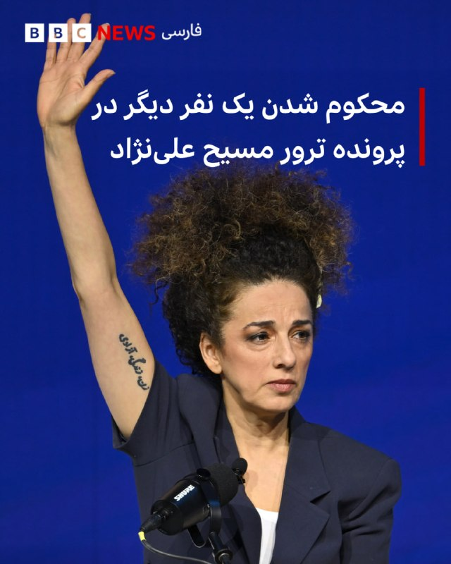

‌ ‌ ‌ ‌
مقام‌های آمریکایی اعلام کردند که یک راننده کامیون سابق به دلیل نقش‌اش در توطئه برای قتل مسیح علی‌نژاد، فعال سیاسی ایرانی-آمریکایی، به ۱۰ سال زندان محکوم شد.

وزارت خارجه ایالات متحده اعلام کرد که جاناتان لودهولت، ۳۷ ساله، به پولشویی و توطئه‌‌ای که مسیح علی‌نژاد را در خانه‌اش در بروکلین در سال ۲۰۲۴ هدف قرار می‌داد، اعتراف کرده است.

اف‌بی‌آی پیش از انجام هرگونه سوءقصد علیه خانم علی‌نژاد، این توطئه را خنثی کرد.

مسیح علی‌نژاد به بی‌بی‌سی گفت که از مقامات سپاسگزار است، اما احساس آرامش نمی‌کند.

او گفت: «آرامش به معنای تمام شدن است. تمام نشده است. این سومین باری است که ایران سعی کرده است مرا در خاک آمریکا بکشد.»

خانم علی‌نژاد گفت: «هر بار که شکست می‌خورند، با چیز جدیدی برمی‌گردند.»

مقام‌های آمریکایی می‌گویند در حالی که این توطئه از ایران هدایت می‌شد، قاتلان احتمالی شهروندان آمریکایی بودند که برای پول با کشتن خانم علی‌نژاد موافقت کردند.

متن کامل این خبر را در سایت فارسی بی‌بی‌سی بخوانید.

https://bbc.in/4wWMhOa
📷 Roy Rochlin/Getty Images for ADL
@BBCPersian

---
📅 بروزرسانی: 1405/03/08 02:32
---

## FoxNewsTwitter — post 342371

  

Fox News (Twitter/X)

“They were fed a bunch of lies by Mayor Bass.”

Spencer Pratt says the Democrats who helped elect Karen Bass are now turning on her — and helping fund his campaign for LA mayor.

With the primary just days away, Pratt is leaning into voter frustration over homelessness, wildfire response and the city’s direction.

## FoxNewsTwitter — post 342370

  <a href="telegram/content/FoxNewsTwitter_342370_1780009380.mp4" target="_blank">🎬 Download video</a>

Fox News (Twitter/X)

JESSE WATTERS: "Who cares if they don't like the food? Get 'em out of here."

"Corey Booker says this ICE facility shouldn't be in New Jersey. Why? Where should it be in?"

"You got to keep them somewhere before you send them home. https://twitter.com/TheFive/status/2060112010327511267#m

## Shin_Persian — post 6291

  

U.S. Central Command ✓ @CENTCOM
Thu, 28 May 2026 22:49:22 UTC

🚫CLAIM: Iran's state TV claimed Iranian forces downed a U.S. aircraft near Bushehr. FALSE.

✅TRUTH: No U.S. aircraft were shot down. All U.S. air assets are accounted for.

فارسی

🚫 ادعا: تلویزیون دولتی ایران ادعا کرد که نیروهای ایرانی یک هواپیمای آمریکایی را در نزدیکی بوشهر سرنگون کرده‌اند. نادرست است.

✅ حقیقت: هیچ هواپیمای آمریکایی سرنگون نشده است. وضعیت تمام تجهیزات هوایی ایالات متحده مشخص و تایید شده است.

𝕏 · @shin_persian

---
📅 بروزرسانی: 1405/03/08 02:22
---

## FoxNewsTwitter — post 342369

  <a href="telegram/content/FoxNewsTwitter_342369_1780008739.mp4" target="_blank">🎬 Download video</a>

Fox News (Twitter/X)

Mayor Zohran Mamdani defends his decision to skip the Israel Day Parade, making him the first New York City mayor to bypass the historic event since 1964.

"I said on the campaign trail that I wouldn't be attending the parade, and I've made my views on the Israeli government abundantly clear.”

“And I also said on that same campaign that I would have a responsibility as the mayor of the city to ensure the safety and security of each and every New Yorker.”

“And I don't believe that my presence as the mayor should determine whether or not a New Yorker is safe or secure."

## pm_afshaa — post 91802

#مهم
عزیزای دلم همگی الان چنل زاپاس‌مون رو جوین بشید کانال تحت ریپورت شدیده اگه چیزی شد زاپاس رو داشته باشید فعالیت میاد اونور
👇

https://t.me/Pm_Zapas
https://t.me/Pm_Zapas

## VahidOnline — post 75783

  

‌ ‌ ‌ ‌
شیخ تمیم بن حمد آل ثانی، امیر قطر، در تماسی تلفنی با دونالد ترامپ، رئیس جمهور آمریکا، در مورد تحولات منطقه‌ای گفتگو کرد.

دفتر امیر قطر در گزارشی از این مکالمه تلفنی اعلام کرد که شیخ تمیم بر اهمیت اولویت دادن به راه‌حل‌های دیپلماتیک و گفت‌وگو بین همه طرف‌ها به امید جلوگیری از تنش‌ها و تشدید بیشتر در خاورمیانه تأکید کرد.

در این بیانیه آمده است که ترامپ نیز به نوبه خود از نقش قطر در حمایت از تلاش‌های میانجیگری پاکستان بین واشنگتن و تهران قدردانی کرد و «از تلاش‌های قطر برای رفع اختلافات و ترویج کاهش تنش در منطقه» تمجید کرد.
@VahidHeadline

📡 @VahidOnline

## IranIntlTV — post 339484

  <a href="telegram/content/IranIntlTV_339484_1780008742.mp4" target="_blank">🎬 Download video</a>

سازمان حقوق بشر برای ورزش به همراه ائتلافی از ۳۴ نهاد مدنی در نامه‌ای فوری به فیفا نسبت به بحران فزاینده حقوق بشر در فوتبال ایران و تداوم حضور عادی تیم ملی هشدار داد.

گفت‌وگو با زهره عبداله‌خانی، عضو هیات رییسه سازمان حقوق بشر برای ورزش
@iranintltv

## FarsiVOA — post 218940

  

⚡️در پی گزارش‌ها از حمله موشکی ساعات قبل جمهوری اسلامی، خبرگزاری رویترز به نقل از یک مقام آمریکایی گزارش داد که علیرغم ادعاهای تلویزیون حکومتی جمهوری اسلامی، هیچ هواپیمای آمریکایی در نزدیکی بوشهر در ایران سرنگون نشده است.
@FarsiVOA

## IranianMinds — post 20981

سه ماه از اون روز باشکوه گذشت ... جسدشو هنوز خاک نکردن @IranianMinds

## IranianMinds — post 20980

سه ماه از اون روز باشکوه گذشت ... جسدشو هنوز خاک نکردن @IranianMinds

## IranianMinds — post 20979

  

سه ماه از اون روز باشکوه گذشت ...

جسدشو هنوز خاک نکردن

@IranianMinds

---
📅 بروزرسانی: 1405/03/08 02:12
---

## VahidOOnLine — post 242671

  

جی‌دی ونس، معاون رییس‌جمهوری آمریکا، پنج‌شنبه به خبرنگاران گفت واشینگتن هنوز در مذاکرات با حکومت ایران «به آن نقطه نرسیده»، اما طرف‌ها به توافق نزدیک شده‌اند. او افزود ایالات متحده در موقعیتی قرار دارد که می‌تواند برنامه هسته‌ای تهران را به‌طور قابل توجهی عقب بیندازد.
‌🏁 🇬🇧 IranintlTV

🤖 @VahidOOnLine

## VahidOOnLine — post 242670

  

♦️یک مقام آمریکایی ادعای صداوسیمای جمهوری اسلامی درباره سرنگونی یک هواگرد آمریکا در استان بوشهر را رد کرد.
به گزارش رویترز، این مقام آمریکایی که نخواست نامش فاش شود، گفت هیچ هواگرد آمریکایی در نزدیکی بوشهر سرنگون نشده است.
رسانه‌های حکومتی جمهوری اسلامی بامداد جمعه به نقل از مسعود تنگستانی، فرماندار جم، گزارش داده بودند که یک هواگرد آمریکایی در آسمان این شهرستان هدف قرار گرفته است.
‌🇸🇦 Indypersian

🤖 @VahidOOnLine

## pm_afshaa — post 91801

  

علی کریمی از شاهزاده رضا پهلوی حمایت کرد

💧 Rainbet.com the #1 Non-KYC Crypto Casino & Sportsbook @rainbetcom

😁 @Pm_Afshaa

## IranIntlTV — post 339483

  

جی‌دی ونس، معاون رییس‌جمهوری آمریکا، پنج‌شنبه به خبرنگاران گفت واشینگتن هنوز در مذاکرات با حکومت ایران «به آن نقطه نرسیده»، اما طرف‌ها به توافق نزدیک شده‌اند. او افزود ایالات متحده در موقعیتی قرار دارد که می‌تواند برنامه هسته‌ای تهران را به‌طور قابل توجهی عقب بیندازد.
https://iranintl.com/202605282106

## IranIntlTV — post 339482

  <a href="telegram/content/IranIntlTV_339482_1780008155.mp4" target="_blank">🎬 Download video</a>

سی‌ان‌ان در تحلیلی به قلم یک مقام پیشین امنیت ملی آمریکا نوشت حتی در صورت دستیابی به توافق میان واشینگتن و تهران، چالش جمهوری اسلامی برای آمریکا پایان نخواهد یافت.

به نوشته او، مشکل اصلی در ساختار ایدئولوژیک جمهوری اسلامی ریشه دارد.

گزارش اردوان روزبه، خبرنگار ایران‌اینترنشنال
@iranintltv

## IranianMinds — post 20976

اسرائیل شبو تبدیل به روز کرد تو غزه

@IranianMinds

---
📅 بروزرسانی: 1405/03/08 02:02
---

## IranIntlTV — post 339481

  <a href="telegram/content/IranIntlTV_339481_1780007553.mp4" target="_blank">🎬 Download video</a>

در ادامه سیاست‌های فشار اقتصادی بر جمهوری اسلامی، وزیر خزانه‌داری آمریکا اعلام کرد دسترسی دو شرکت هواپیمایی ایرانی به خدمات فرودگاهی، سوخت‌گیری و فروش بلیت را قطع می‌کند.او همچنین نهاد مدیریت تنگه هرمز وابسته به سپاه را تحریم کرد.

گزارش نیلوفر منصوری، خبرنگار ایران‌اینترنشنال
@iranintltv

## Dirty_Kids — post 390441

  <a href="telegram/content/Dirty_Kids_390441_1780007554.webm" target="_blank">🎬 Download video</a>

☢️خفن ترین و‌ قدیمی ترین  انالیزور  ایران ینی دکتر بت 
👍 
🔴مسابقات جذاب جام جهانی به زودی شروع میشه بیا توی کانال دکتر بت و باهاش همراه شو و پول در بیار
💵 رایگان بهترین شرط هارو براتون میذاره حتی هزار تومن هم دریافت نمیکنه روزانه میتونی از پیش بینی فوتبال باهاش…

## Dirty_Kids — post 390440

  <a href="telegram/content/Dirty_Kids_390440_1780007554.webm" target="_blank">🎬 Download video</a>

☢️خفن ترین و‌ قدیمی ترین  انالیزور  ایران ینی دکتر بت 
👍

🔴مسابقات جذاب جام جهانی به زودی شروع میشه بیا توی کانال دکتر بت و باهاش همراه شو و پول در بیار
💵

رایگان بهترین شرط هارو براتون میذاره
حتی هزار تومن هم دریافت نمیکنه
روزانه میتونی از پیش بینی فوتبال باهاش پول در بیاری 👌
A7

🌟اگ اهل پیش بینی فوتبالی این کانال اصلا از دست ندین
👇

✅https://t.me/+4_ADqwB9e-QwYjlk

✅https://t.me/+4_ADqwB9e-QwYjlk

---
📅 بروزرسانی: 1405/03/08 01:52
---

## VahidOOnLine — post 242669

  

♦️جی‌دی ونس، معاون رئیس‌جمهوری آمریکا پنج‌شنبه ۷ خرداد در گفتگو با خبرنگاران اعلام کرد که واشنگتن هنوز به توافق با ایران دست نیافته، اما دو طرف به یکدیگر نزدیک هستند. به گزارش رویترز، ونس با اشاره به روند گفتگوها تاکید کرد که ایالات متحده در موقعیتی قرار دارد که در صورت لزوم می‌تواند برنامه هسته‌ای تهران را به طور قابل‌توجهی به عقب بازگرداند.
‌🇸🇦 Indypersian

🤖 @VahidOOnLine

## VahidOOnLine — post 242668

  

♦️مسعود تنگستانی، فرماندار جم، به خبرگزاری صدا و سیما گفت نیروهای مسلح جمهوری اسلامی «یک هواگرد» را در آسمان این شهرستان در استان بوشهر هدف قرار داده‌اند و اکنون وضعیت منطقه عادی است.
‌🇸🇦 Indypersian

🤖 @VahidOOnLine

## FoxNewsTwitter — post 342368

  <a href="telegram/content/FoxNewsTwitter_342368_1780006939.mp4" target="_blank">🎬 Download video</a>

Fox News (Twitter/X)

NOW: Vice President JD Vance says the U.S. has made “a lot of progress” in negotiations with Iran and believes Tehran is “negotiating at least so far in good faith.”

“The Iranians, they want a deal,” Vance said.

## VahidOnline — post 75782

  <a href="telegram/content/VahidOnline_75782_1780006941.mp4" target="_blank">🎬 Download video</a>

فاکس‌نیوز: جی‌دی ونس می‌گوید ایالات متحده در مذاکرات با ایران «پیشرفت زیادی» داشته و معتقد است تهران «حداقل تا حالا با حسن نیت در حال مذاکره است.»

جی‌دی ونس: خب، فکر می‌کنم گفتن دقیق اینکه رئیس‌جمهور دقیقاً چه زمانی یا اصلاً تفاهم‌نامه را امضا خواهد کرد، سخت است. ما در حال رفت‌وآمد بر سر چند نکتهٔ زبانی هستیم.
کاملاً واضح است که به نظر من، ایرانی‌ها — آنها یک معامله می‌خواهند. آنها می‌خواهند تنگهٔ هرمز را باز کنند. ما هم می‌خواهیم تنگهٔ هرمز را باز کنیم.
چند مسئله در مورد موضوع هسته‌ای وجود دارد: ذخیرهٔ اورانیوم غنی‌شدهٔ بالا و همچنین مسئلهٔ غنی‌سازی.
پس می‌دانید، ما با آنها در حال چانه‌زنی و رفت‌وآمد هستیم. ما واقعاً فکر می‌کنیم آنها حداقل تا حالا با حسن نیت مذاکره می‌کنند.
داریم پیشرفت می‌کنیم و امیدواریم به این پیشرفت ادامه دهیم تا رئیس‌جمهور در موقعیتی قرار بگیرد که بتواند توافق را تأیید کند.

📡 @VahidOnline

## FarsiVOA — post 218939

  <a href="telegram/content/FarsiVOA_218939_1780006941.mp4" target="_blank">🎬 Download video</a>

⚡️دونالد ترامپ از «تورم ۲۵۰ درصدی» در ایران می‌گوید و شهروندان از بحران معیشت؛ گفت‌وگو با مریم سعیدی
@FarsiVOA

## Dirty_Kids — post 390439

  

#بخوابیم

@Dirty_Kids 👻

## Dirty_Kids — post 390438

  

🔴 به گفته کاربران؛ درحالِ حاضر و تو شرایط فعلی این فیلترشکن‌ها وصلن :

BiubiuVPN

VPN Hotspot Shield: Secure VPN

VPN - Fast VPN Super

BeePass VPN

Ostrich VPN - Proxy Master

X-VPN: VPN Fast & Secure

JumpJumpVPN: Fast & Secure

VPN Windscribe: Fast & Secure

@Dirty_Kids 👻

## Dirty_Kids — post 390437

  

این off campus عجب زناییه
عاشقش شدم

ابکی
مسخره
بی منطق
قشنگ دنبال همچین چیزی بودم

@Dirty_Kids 👻

## Dirty_Kids — post 390436

به مناسبت گذشتن ۹۰ روز از ترور خامنه‌ای، نود بده.

@Dirty_Kids 👻

## Dirty_Kids — post 390435

  

‏یه طوری تو روز روشن درباره ساده زیستی خامنه ای مهمل میبافن که انگار من بودم که bmw ضدگلوله اسکورت زیر پام بوده

@Dirty_Kids 👻

## Dirty_Kids — post 390434

  <a href="telegram/content/Dirty_Kids_390434_1780006943.mp4" target="_blank">🎬 Download video</a>

وضعیت مودم:

@Dirty_Kids 👻

## Dirty_Kids — post 390433

  <a href="telegram/content/Dirty_Kids_390433_1780006945.mp4" target="_blank">🎬 Download video</a>

این #چالش جدیده مدل تبلیغاتیش

@Dirty_Kids 👻

---
📅 بروزرسانی: 1405/03/08 01:42
---

## VahidOOnLine — post 242667

  

نیویورک‌تایمز به نقل از سه مقام آمریکایی گزارش داد واشینگتن و تهران، هم‌زمان با گفت‌وگو درباره خواسته‌های ترامپ برای پایان دادن به برنامه هسته‌ای ایران، به چارچوبی برای مذاکرات نزدیک شده‌اند که می‌تواند به بازگشایی تنگه هرمز منجر شود.
به نوشته نیویورک‌تایمز، ترامپ هنوز این چارچوب در حال شکل‌گیری را تایید نهایی نکرده و روشن نیست آیا این متن با برداشت طرف ایرانی نیز همخوانی دارد یا نه. مقام‌های کاخ سفید تاکنون فقط تصویری مبهم از توافق مقدماتی ارائه کرده‌اند.
بر اساس این گزارش، چارچوب پیشنهادی می‌تواند آتش‌بس را تمدید و زمینه مذاکرات جدی‌تر را سه ماه پس از آغاز جنگ فراهم کند. در این روند، با پیشرفت مذاکرات، بخشی از فشار اقتصادی بر حکومت ایران کاهش خواهد یافت.
نیویورک‌تایمز نوشت از نگاه آمریکا، هر توافقی باید شامل اعلام برائت ایران از برنامه هسته‌ای و هرگونه قصد برای دستیابی به سلاح هسته‌ای، و همچنین کنار گذاشتن اورانیوم با غنای بالای جمهوری اسلامی باشد.
‌🏁 🇬🇧 IranintlTV

🤖 @VahidOOnLine

## FoxNewsTwitter — post 342367

  

Fox News (Twitter/X)

Police responded to a swatting call at the Virginia home of Supreme Court Justice Amy Coney Barrett Wednesday night.

Authorities confirmed officers were dispatched to the residence after receiving the report, but determined it was "fictitious" after meeting with her security detail, officials say.

Barrett was on the bench Thursday morning alongside her colleagues, and read aloud summaries of two opinions she authored. She made no mention of the Wednesday incident.

## IranIntlTV — post 339480

  

🔻سازمان «حقوق بشر برای ورزش» به همراه ائتلافی متشکل از ۳۴ نهاد جامعه مدنی از سراسر جهان، در آستانه جام جهانی ۲۰۲۶ با ارسال نامه‌ای فوری به فیفا، نگرانی‌های جدی خود را نسبت به بحران فزاینده حقوق بشر در فوتبال ایران و تداوم حضور عادی تیم ملی در رقابت‌های فیفا مطرح کرده‌اند.

🔹در این نامه با اشاره به بازداشت‌های خودسرانه فوتبالیست‌های ایرانی، گزارش‌های تأییدشده درباره کشته شدن دست‌کم ۴۴ فوتبالیست در روزهای ۱۸ و ۱۹ دی‌ماه ۱۴۰۴، حذف و سرکوب سیستماتیک زنان در فوتبال ایران، و نیز نگرانی‌ها درباره حضور و نفوذ عوامل امنیتی دولتی در ساختار مدیریتی و همراهی تیم ملی،‌تأکید شده است که وضعیت کنونی با تعهدات حقوق بشری فیفا در تضاد قرار دارد.

🔹در این نامه هشدار داده شده است که ادامه حضور عادی تیم ملی ایران در شرایط فعلی می‌تواند به مشروعیت‌بخشی به این وضعیت و تداوم آسیب‌های سیستماتیک منجر شود.

🔹فیفا در چارچوب اصول راهنمای سازمان ملل در زمینه کسب‌وکار و حقوق بشر، فیفا موظف است از نقض‌های حقوق بشری مرتبط با فعالیت‌ها و مسابقات خود پیشگیری کرده و نسبت به آن‌ها اقدام کند.

@iranintltvsport

## IranIntlTV — post 339479

  <a href="telegram/content/IranIntlTV_339479_1780006340.mp4" target="_blank">🎬 Download video</a>

شبکه سی‌بی‌اس به نقل از یک مقام ارشد عرب گزارش داد مذاکره‌کنندگان آمریکا و جمهوری اسلامی سه روز پیش بر سر مفاد توافق آتش‌بس به تفاهم رسیده‌اند، اما اعلام و نهایی شدن آن به تعویق افتاده است.
همزمان با انتشار گزارش‌ها درباره نهایی شدن توافق، درگیری‌ها در منطقه ادامه دارد.

گفت‌وگو با امیر گیتی، عضو تحریریه ایران‌اینترنشنال
@iranintltv

## IranIntlTV — post 339478

  

نیویورک‌تایمز به نقل از سه مقام آمریکایی گزارش داد واشینگتن و تهران، هم‌زمان با گفت‌وگو درباره خواسته‌های ترامپ برای پایان دادن به برنامه هسته‌ای ایران، به چارچوبی برای مذاکرات نزدیک شده‌اند که می‌تواند به بازگشایی تنگه هرمز منجر شود.
به نوشته نیویورک‌تایمز، ترامپ هنوز این چارچوب در حال شکل‌گیری را تایید نهایی نکرده و روشن نیست آیا این متن با برداشت طرف ایرانی نیز همخوانی دارد یا نه. مقام‌های کاخ سفید تاکنون فقط تصویری مبهم از توافق مقدماتی ارائه کرده‌اند.
بر اساس این گزارش، چارچوب پیشنهادی می‌تواند آتش‌بس را تمدید و زمینه مذاکرات جدی‌تر را سه ماه پس از آغاز جنگ فراهم کند. در این روند، با پیشرفت مذاکرات، بخشی از فشار اقتصادی بر حکومت ایران کاهش خواهد یافت.
نیویورک‌تایمز نوشت از نگاه آمریکا، هر توافقی باید شامل اعلام برائت ایران از برنامه هسته‌ای و هرگونه قصد برای دستیابی به سلاح هسته‌ای، و همچنین کنار گذاشتن اورانیوم با غنای بالای جمهوری اسلامی باشد.
https://iranintl.com/202605281303

## FarsiVOA — post 218938

⚡️اینترنت در ایران نصفه‌نیمه برگشت؛ خاموشی برق و قبض‌های سنگین هم دنبالش آمد
@FarsiVOA

## FarsiVOA — post 218937

  <a href="telegram/content/FarsiVOA_218937_1780006342.mp4" target="_blank">🎬 Download video</a>

⚡️چرا جمهوری اسلامی به کویت حمله کرد؟ گفت‌وگو با یاسین اهوازی، کارشناس امور خاورمیانه
@FarsiVOA

## FarsiVOA — post 218936

⚡️توافق همکاری نظامی روسیه و حکومت طالبان؛ نگرانی‌های آمریکا
@FarsiVOA

## BBCPersian — post 282286

  

خبرگزاری‌های ایران به نقل از مقام‌های محلی و نظامی از «رهگیری» و «هدف قرار گرفتن» آنچه «هواگرد متخاصم» نامیده‌اند، در اطراف بوشهر خبر داده‌اند.

مسعود تنگستانی، فرماندر شهر جم - در نزدیکی بوشهر - عصر پنجشنبه در گفتگو با صدا و سیما ضمن تایید این خبر گفت: «اتفاقی که امشب به وقوع پیوست مربوط به انهدام یک هواگرد متخاصم بود توسط نیروهای مسلح. هم اینک شهرستان در وضعیت عادی است.»

در همین حال، خبرگزاری تسنیم، نزدیک به سپاه پاسداران، با اشاره به شنیدن صدای انفجار در نزدیکی سواحل تنگه هرمز نوشته است: «براساس گزارش پدافند ارتش، منشأ انفجارها از سمت دریا و مربوط به تبادل آتش در اخطار به کشتی‌های متخلف در تنگه هرمز بوده است.»

در چند روز گذشته، چند درگیری و حمله نظامی متقابل میان ایران و آمریکا روی داده که هر دو طرف ضمن متهم کردن یکدیگر به نقض آتش‌بس، از تلاش برای حفظ آن و «اقدامات نظامی تدافعی» سخن گفته‌اند.

https://bbc.in/4uFuqtC
📷 Majid Saeedi/Getty Images
@BBCPersian

## alonews — post 123413

بهترین سرعت با بهترین قیمت با God Vpn🔵 تخفیف ویژه برای امشب فقط✅😍 10 گیگ فقط 280,000 تومن😍 متصل حتی در شرایط جنگی به خاطر اختصاصی بودن✅❤️😍 کانفیگ اقتصادی در ربات دوم 20 گیگ 290,000 تومن😍 برای نمایندگان پنل نمایندگی فعال میشه👍❤️ ✅تضمین بدون قطعی 🌐 اتصال…

## alonews — post 123412

  

بهترین سرعت با بهترین قیمت با God Vpn🔵
تخفیف ویژه برای امشب فقط✅😍

10 گیگ فقط 280,000 تومن😍
متصل حتی در شرایط جنگی به خاطر اختصاصی بودن✅❤️😍

کانفیگ اقتصادی در ربات دوم 20 گیگ 290,000 تومن😍

برای نمایندگان پنل نمایندگی فعال میشه👍❤️

✅تضمین بدون قطعی
🌐 اتصال با تمامی دستگاه
🔻🏪پشتیبانی ۲۴ ساعته
✔️ دور زدن نت ملی
🔘 بالاترین سرعت با تمام اپراتورها
⭐با کیفیت عالی و ضمانت بازگشت وجه
🌐🌐🌐🌐🌐🌐⭐️
➖➖➖➖➖➖➖➖➖➖
جهت خرید کانفیگ اختصاصی در این ربات:
@GodVpnV2_Bot

خرید کانفیگ اقتصادی در این ربات:
@v2raypc1bot

ایدی کانال:
t.me/God_of_Vpn
پشتیبانی و خرید عمده:
@Mmkhh00
@Pc_V2ray

---
📅 بروزرسانی: 1405/03/08 01:32
---

## IranIntlTV — post 339477

کاخ سفید به ایران‌اینترنشنال اعلام کرد جمهوری اسلامی آمادگی خود برای امضای یادداشت تفاهم نهایی را به دونالد ترامپ اطلاع داده است؛ اکسیوس نیز از توافق بر سر تفاهم‌نامه ۶۰ روزه خبر داد، اما دونالد ترامپ هنوز آن را تایید نکرده است.

سمیرا قرایی از کاخ سفید گزارش می‌دهد.
@iranintltv

## FarsiVOA — post 218935

  <a href="telegram/content/FarsiVOA_218935_1780005742.mp4" target="_blank">🎬 Download video</a>

⚡️کاهش علاقه جوانان در ایران به تحصیل در رشته‌های علوم پایه؛ گفت‌وگو با پیروز نامی
@FarsiVOA

## FarsiVOA — post 218934

  <a href="telegram/content/FarsiVOA_218934_1780005743.mp4" target="_blank">🎬 Download video</a>

⚡️چرا جمهوری اسلامی قیمت بنزین در ایران را با سایر کشورها مقایسه می‌کند؟ گفت‌وگو با رضا غیبی
@FarsiVOA

## FarsiVOA — post 218933

⚡️کنکور ۱۴۰۵ در سایه جنگ و بلاتکلیفی؛ دانش‌آموزان به خیابان آمدند
@FarsiVOA

## IranianMinds — post 20975

🔴 تسنیم :

یه پهپاد آمریکایی رو تو بوشهر زدیم بمولا.

@IranianMinds

---
📅 بروزرسانی: 1405/03/08 01:22
---

## VahidOOnLine — post 242666

  

مسعود تنگستانی، فرماندار جم، به خبرگزاری صدا و سیما گفت نیروهای مسلح جمهوری اسلامی یک هواگرد را در آسمان جم در استان بوشهر هدف قرار دادند و هم‌اکنون شهرستان در وضعیت عادی قرار دارد.
طبق این گزارش، دلیل صدای انفجار در جم، مقابله پدافند با هواگردهای متخاصم بوده است.
‌🏁 🇬🇧 IranintlTV

🤖 @VahidOOnLine

## IranIntlTV — post 339476

  

مسعود تنگستانی، فرماندار جم، به خبرگزاری صدا و سیما گفت نیروهای مسلح جمهوری اسلامی یک هواگرد را در آسمان جم در استان بوشهر هدف قرار دادند و هم‌اکنون شهرستان در وضعیت عادی قرار دارد.
طبق این گزارش، دلیل صدای انفجار در جم، مقابله پدافند با هواگردهای متخاصم بوده است.
https://iranintl.com/202605280555

## IranIntlTV — post 339475

مسعود تنگستانی، فرماندار جم، به خبرگزاری صدا و سیما گفت نیروهای مسلح جمهوری اسلامی یک هواگرد را در آسمان جم در استان بوشهر هدف قرار دادند و هم‌اکنون شهرستان در وضعیت عادی قرار دارد.
طبق این گزارش، دلیل صدای انفجار در جم، مقابله پدافند با هواگردهای متخاصم بوده است.
https://iranintl.com/202605280555

## IranIntlTV — post 339474

  

مسعود تنگستانی، فرماندار جم، به خبرگزاری صدا و سیما گفت نیروهای مسلح جمهوری اسلامی یک هواگرد را در آسمان جم در استان بوشهر هدف قرار دادند و هم‌اکنون شهرستان در وضعیت عادی قرار دارد.
طبق این گزارش، دلیل صدای انفجار در جم، مقابله پدافند با هواگردهای متخاصم بوده است.
https://iranintl.com/202605280555

## IranIntlTV — post 339473

  

مسعود تنگستانی، فرماندار جم، به خبرگزاری صدا و سیما گفت نیروهای مسلح جمهوری اسلامی یک هواگرد را در آسمان جم در استان بوشهر هدف قرار دادند و هم‌اکنون شهرستان در وضعیت عادی قرار دارد.
طبق این گزارش، دلیل صدای انفجار در جم، مقابله پدافند با هواگردهای متخاصم بوده است.
https://iranintl.com/202605280555

## FarsiVOA — post 218932

🔺آمریکا شبکه فروش نفت مرتبط با نیروهای مسلح جمهوری اسلامی را تحریم کرد

▪️دفتر کنترل دارایی‌های خارجی وزارت خزانه‌داری آمریکا، اوفک، روز پنج‌شنبه تحریم‌های تازه‌ای را علیه فروش نفت از سوی تشکیلات نظامی جمهوری اسلامی اعلام کرد.

⬇️ بیشتر بخوانید:
https://ir.voanews.com/a/8154983.html
@FarsiVOA

## alonews — post 123408

  <a href="telegram/content/alonews_123408_1780005132.mp4" target="_blank">🎬 Download video</a>

👈حمله‌های امشب ارتش اسرائیل به جنوب لبنان

✅ @AloNews خبر جنگ

## alonews — post 123407

  <a href="telegram/content/alonews_123407_1780005133.webm" target="_blank">🎬 Download video</a>

👈بعد از سال‌ها پُرشدگی سد کرج به 70 درصد رسید!

✅ @AloNews خبر جنگ

---
📅 بروزرسانی: 1405/03/08 01:12
---

## VahidOOnLine — post 242662

♦️ستاد فرماندهی مرکزی آمریکا، سنتکام، پنجشنبه هفتم خرداد با انتشار تصاویری اعلام کرد که ناو هواپیمابر «یواس‌اس آبراهام لینکلن» در حین عبور از دریای عرب، عملیات پروازی انجام داده است. سنتکام پیش‌تر اعلام کرده بود این ناو و نیروهای همراه آن در چارچوب عملیات‌های آمریکا در منطقه و پشتیبانی از محاصره دریایی اعمال‌شده بر بنادر ایران فعالیت می‌کنند.
‌🇸🇦 Indypersian

🤖 @VahidOOnLine

## FoxNewsTwitter — post 342366

  <a href="telegram/content/FoxNewsTwitter_342366_1780004538.mp4" target="_blank">🎬 Download video</a>

Fox News (Twitter/X)

A graduating Air Force cadet went in for a chest bump with Vice President JD Vance... and Vance delivered.

The quick exchange happened right during the commencement ceremony, with the crowd cheering and laughing at the unexpected moment between the VP and the newly commissioned officer.

## FarsiVOA — post 218931

  <a href="telegram/content/FarsiVOA_218931_1780004540.mp4" target="_blank">🎬 Download video</a>

⚡️کاربران ایرانی از «وقتی شما نبودید» می‌گویند؛ بازگشت قطره‌چکانی اینترنت
@FarsiVOA

## FarsiVOA — post 218930

  <a href="telegram/content/FarsiVOA_218930_1780004540.mp4" target="_blank">🎬 Download video</a>

⚡️گزارش عفو بین الملل در مورد افزایش سرکوب‌ها در ایران؛ گفت‌وگو با اسفندیار ابان
@FarsiVOA

## IranianMinds — post 20974

  

پست عجیب کاخ سفید

@IranianMinds

## IranianMinds — post 20973

  <a href="telegram/content/IranianMinds_20973_1780004541.mp4" target="_blank">🎬 Download video</a>

ترامپ درباره ایران:

آنها مذاکره‌کنندگان بسیار خوبی هستند آنها زیرک‌اند
اما ما همه کارت‌ها را در دست داریم
چون آنها را از نظر نظامی شکست داده‌ایم.

@IranianMinds

## IranianMinds — post 20972

باز شب شدو تو جنوب کشور جنگ شد

طبق معمول هیچکدومش هم نقض آتش بس نیست

@IranianMinds

## alonews — post 123406

  <a href="telegram/content/alonews_123406_1780004543.webm" target="_blank">🎬 Download video</a>

👈پست عجیب کاخ سفید

✅ @AloNews خبر جنگ

## alonews — post 123405

  <a href="telegram/content/alonews_123405_1780004543.mp4" target="_blank">🎬 Download video</a>

👈تصویری که الجزیره از شدت خسارت حملات آمریکا به تاسیسات فولاد اصفهان منتشر کرده است

✅ @AloNews خبر جنگ

---
📅 بروزرسانی: 1405/03/08 01:02
---

## VahidOOnLine — post 242661

  

♦️دونالد ترامپ، رئیس‌جمهوری آمریکا در گفتگو با شبکه فاکس‌نیوز در پاسخ به سوالی درباره خط قرمز واشنگتن برای اقدام نظامی دوباره اعلام کرد که مرز نهایی و خط قرمز اصلی، توافقی است که برای آمریکا خوب نباشد. ترامپ با بیان اینکه شرایط را زیر نظر دارد و باید دید در آینده چه پیش می‌آید، طرف مقابل را مذاکره‌کنندگانی بسیار خوب و حیله‌گر توصیف کرد، اما تاکید کرد که در نهایت تمامی کارت‌های بازی در دست آمریکا قرار دارد، چرا که واشنگتن پیش از این آن‌ها را از نظر نظامی شکست داده است.
پیش‌تر، ان‌بی‌سی نیوز به نقل از یک مقام ارشد عرب گزارش داده بود مذاکره‌کنندگان آمریکا و جمهوری اسلامی ایران سه روز پیش در دوحه بر سر مفاد توافق آتش‌بس به تفاهم رسیده‌اند، اما اعلام نهایی آن به تعویق افتاده است. همچنین آکسیوس به نقل از منابع آمریکایی و منطقه‌ای گزارش داد طرفین بر سر یک تفاهم‌نامه ۶۰ روزه برای تمدید آتش‌بس و آغاز گفتگوها درباره برنامه هسته‌ای به توافق رسیده‌اند، اما اجرای آن همچنان نیازمند تایید نهایی دونالد ترامپ است.
‌🇸🇦 Indypersian

🤖 @VahidOOnLine

## pm_afshaa — post 91800

کسی قزوین صدا شنیده!؟

## pm_afshaa — post 91799

https://t.me/proxy?server=tg.capycore.ru&port=443&secret=27ebe852539fb8ec5f327c73262bb721

پروکسی مخصوص دانلود فیلم و سریال سرعت بالا

💧 Rainbet.com the #1 Non-KYC Crypto Casino & Sportsbook @rainbetcom

😁 @Pm_Afshaa

## pm_afshaa — post 91798

پزشکیان :به جلیلی گفتم توام بیا یه گوشه کارو بگیر کمک کن کشورو درست کنیم. گفت نه من فقط پیشنهاد میدم. گفتم پیشنهاد به چه دردم میخوره اخه عمل میخوام; نخواستیم اصلا

💧 Rainbet.com the #1 Non-KYC Crypto Casino & Sportsbook @rainbetcom

😁 @Pm_Afshaa

## FarsiVOA — post 218929

⚡️تقویت نظامی ناتو در بالتیک؛ گوتلاند در خط مقدم بازدارندگی در برابر تهدیدهای روسیه
@FarsiVOA

## FarsiVOA — post 218928

  <a href="telegram/content/FarsiVOA_218928_1780003947.mp4" target="_blank">🎬 Download video</a>

⚡️ویدیوی سنتکام از انجام ماموریت ناو هواپیمابر آبراهام لینکلن در حین عبور از «دریای عرب»

@FarsiVOA

## alonews — post 123404

  <a href="telegram/content/alonews_123404_1780003948.webm" target="_blank">🎬 Download video</a>

👈نورالدین الدغیر خبرنگار الجزیره در تهران:
یادداشت تفاهم، حاصل جمعبندی مذاکرات در سطح دیپلماتیک است.

🔴برای اجرایی شدن، نیاز به امضای مقامات عالی در تهران و واشنگتن دارد.

🔴نیت توافق وجود دارد و انتظار می‌رود که از مرحله نیت به مرحله عمل منتقل شود.

✅ @AloNews خبر جنگ

## alonews — post 123403

  <a href="telegram/content/alonews_123403_1780003948.webm" target="_blank">🎬 Download video</a>

👈ستاد فرماندهی مرکزی آمریکا «سنتکام» شامگاه پنج‌شنبه هفتم خرداد ویدیویی از عملیات پروازی انجام شده از عرشه ناو هواپیمابر ابراهام لینکولن[USS Abraham Lincoln (CVN 72)] در جریان حرکت آن در دریای عرب و پشتیبانی از محاصره دریایی اعمال شده بر بنادر ایران، منتشر کرد.

✅ @AloNews خبر جنگ

---
📅 بروزرسانی: 1405/03/08 00:52
---

## FoxNewsTwitter — post 342365

  <a href="telegram/content/FoxNewsTwitter_342365_1780003347.mp4" target="_blank">🎬 Download video</a>

Fox News (Twitter/X)

A massive explosion and fire ripped through an apartment building in Dallas, sending heavy flames and smoke into the air and injuring at least four people.

Nearly 100 firefighters rushed to the scene in the city’s Oak Cliff neighborhood. It's not clear how many people were in the building at the time.

## mamlekate — post 103602

الو ساعت ۰۰:۱۳ جمعه ۸ خرداد
بیدگنه صدای پدافند پشت‌ هم

## Shin_Persian — post 6290

  

Shin ✓ @hey_itsmyturn
Thu, 28 May 2026 21:16:53 UTC

And IRGC's Fars confirms the earlier missile launch

فارسی

و خبرگزاری فارس (وابسته به سپاه پاسداران) شلیک موشک در زمان زودتر را تایید می‌کند.

𝕏 · @shin_persian

## Shin_Persian — post 6289

Shin ✓ @hey_itsmyturn
Thu, 28 May 2026 21:14:07 UTC

מי שלא מכסח את הדשא, הדשא מכסח אותו!

English

Whoever does not mow the lawn, the lawn mows them!

فارسی

هر کس که چمن را کوتاه نکند، چمن او را از پا در می‌آورد!

𝕏 · @shin_persian

## Persian_Trend_Official — post 15210

  

تسنیم: یک پهپاد متجاوز امریکایی در نزدیکی بوشهر با موفقیت رهگیری شد. همچنین فرماندار شهرستان جم در استان بوشهر گفت: اتفاقی که امشب به وقوع پیوست مربوط به انهدام یک هواگرد متخاصم بود. هم اینک شهرستان در وضعیت عادی است. 📝 Amir 📌 @persian_trend_official پرشین…

## Persian_Trend_Official — post 15209

  

تسنیم: یک پهپاد متجاوز امریکایی در نزدیکی بوشهر با موفقیت رهگیری شد.

همچنین فرماندار شهرستان جم در استان بوشهر گفت: اتفاقی که امشب به وقوع پیوست مربوط به انهدام یک هواگرد متخاصم بود. هم اینک شهرستان در وضعیت عادی است.

📝 Amir

📌 @persian_trend_official
پرشین ترند | متفاوت‌ترین کانال نظامی

## alonews — post 123402

  <a href="telegram/content/alonews_123402_1780003352.webm" target="_blank">🎬 Download video</a>

👈پزشکیان:
به جلیلی گفتم توام بیا یه گوشه کارو بگیر کمک کن کشورو درست کنیم. گفت نه من فقط پیشنهاد میدم. گفتم پیشنهاد به چه دردم میخوره اخه. عمل میخوام. نخواستیم اصلا.

✅ @AloNews خبر جنگ

---
📅 بروزرسانی: 1405/03/08 00:42
---

## FoxNewsTwitter — post 342364

  <a href="telegram/content/FoxNewsTwitter_342364_1780002748.mp4" target="_blank">🎬 Download video</a>

Fox News (Twitter/X)

A calm poolside moment turned terrifying in seconds.

A little girl lost her balance and slipped underwater, but her dad’s reflexes kicked in instantly, pulling her back to safety before the moment turned tragic.

## alonews — post 123401

  <a href="telegram/content/alonews_123401_1780002750.webm" target="_blank">🎬 Download video</a>

👈سوخت رسان KC3 بریتانیا برفراز عراق

✅ @AloNews خبر جنگ

## alonews — post 123400

🚀مصرف بالا؟ حجم‌خوری زیاد؟ اینو ببین 👇 💎 همراه با ساب یعنی مصرف بهینه‌تر و تجربه بهتر ⚡️ 🚀 سرعت عالی پایدار برای استفاده روزانه و بلند مدت😍😍 @NetAazaadBot @NetAazaadBot 😍آف فقط برای امشب😍 ❌ گیگی 50T ❌ ✅ فقط گیگی 25T ✅ @NetAazaadBot @NetAazaadBot 🔥 یه…

## alonews — post 123399

  

🚀مصرف بالا؟ حجم‌خوری زیاد؟ اینو ببین 👇
💎 همراه با ساب یعنی مصرف بهینه‌تر و تجربه بهتر
⚡️
🚀 سرعت عالی پایدار برای استفاده روزانه و بلند مدت😍😍

@NetAazaadBot
@NetAazaadBot

😍آف فقط برای امشب😍
❌ گیگی 50T ❌
✅ فقط گیگی 25T ✅

@NetAazaadBot
@NetAazaadBot
🔥 یه بار امتحان کن، خودت تفاوتشو حس می‌کنی✅

---
📅 بروزرسانی: 1405/03/08 00:32
---

## VahidOOnLine — post 242660

  

♦️وزارت خزانه‌داری آمریکا اعلام کرد تحریم‌های جدیدی مرتبط با جمهوری اسلامی ایران اعمال شده است.
بر اساس این اعلام، دفتر کنترل دارایی‌های خارجی وزارت خزانه‌داری آمریکا ۱۷ شرکت و نهاد، از جمله شرکت «سپهر انرژی جهان نمای پارس» و همچنین هشت کشتی با پرچم کشورهای مختلف را در چارچوب تلاش‌ها برای مختل کردن شبکه تجارت نفت و پتروشیمی جمهوری اسلامی ایران تحریم کرده است.
وزارت خزانه‌داری آمریکا اعلام کرد این تحریم‌ها بخشی از تلاش‌ها برای قطع منابع درآمدی مرتبط با فروش نفت جمهوری اسلامی است. اسکات بسنت، وزیر خزانه‌داری آمریکا، تاکید کرد که این اقدامات بخشی از کمپین «خشم اقتصادی» برای قطع منابع مالی رژیم ایران و متوقف کردن فعالیت‌های بی‌ثبات‌کننده آن در منطقه است.
‌🇸🇦 Indypersian

🤖 @VahidOOnLine

## pm_afshaa — post 91797

رکنا : یه پسر 20 ساله دزفولی که دارای اختلالات روانی بود، پدر و مادر و برادر خودش رو سلاخی کرد و به قتل رسوند و در آخر خودکشی کرد

💧 Rainbet.com the #1 Non-KYC Crypto Casino & Sportsbook @rainbetcom

😁 @Pm_Afshaa

## pm_afshaa — post 91796

با توجه به درخواست خیلیاتون کانفیگ اختصاصی برای فروش موجود کردیم
💙

اگر قصد تهیه دارید به آیدی پایین پیام بدید
👇

🔤 @Gliitch_Admin

🔤 @Gliitch_Admin

## Persian_Trend_Official — post 15208

https://youtube.com/live/JrqroHI5pq8?feature=share

## Persian_Trend_Official — post 15207

  <a href="telegram/content/Persian_Trend_Official_15207_1780002170.webm" target="_blank">🎬 Download video</a>

📌 @persian_trend_official
پرشین ترند | متفاوت‌ترین کانال نظامی

## BBCPersian — post 282285

  

‌ ‌ ‌ ‌
شیخ تمیم بن حمد آل ثانی، امیر قطر، در تماسی تلفنی با دونالد ترامپ، رئیس جمهور آمریکا، در مورد تحولات منطقه‌ای گفتگو کرد.

دفتر امیر قطر در گزارشی از این مکالمه تلفنی اعلام کرد که شیخ تمیم بر اهمیت اولویت دادن به راه‌حل‌های دیپلماتیک و گفت‌وگو بین همه طرف‌ها به امید جلوگیری از تنش‌ها و تشدید بیشتر در خاورمیانه تأکید کرد.

در این بیانیه آمده است که ترامپ نیز به نوبه خود از نقش قطر در حمایت از تلاش‌های میانجیگری پاکستان بین واشنگتن و تهران قدردانی کرد و «از تلاش‌های قطر برای رفع اختلافات و ترویج کاهش تنش در منطقه» تمجید کرد.

https://bbc.in/4vgvuEb
📷Reuters
@BBCPersian

## alonews — post 123396

  <a href="telegram/content/alonews_123396_1780002172.webm" target="_blank">🎬 Download video</a>

👈یواش یواش برخی از اکانتهای امنیتی حذف جانشین سردار تنگسیری را دارن تایید میکنند در حمله دیشب آمریکا به بندرعباس

✅ @AloNews خبر جنگ

---
📅 بروزرسانی: 1405/03/08 00:22
---

## VahidOOnLine — post 242659

  

♦️به گزارش خبرگزاری مهر، در پی شنیده شدن صدای انفجار در منطقه ۷ چاه شهرستان جم واقع در استان بوشهر، مشخص شد که این رخداد ناشی از عملکرد پدافند دفاعی بوده است.
پیش‌تر، خبرگزاری تسنیم گزارش داده بود صداهای شنیده‌شده احتمالا به شلیک‌های اخطار نیروی دریایی ایران به برخی شناورها مرتبط است. خبرگزاری فارس نیز اعلام کرد نیروهای مسلح جمهوری اسلامی پنجشنبه شب از مناطق جنوبی کشور به‌سمت اهدافی نامشخص موشک شلیک کرده‌اند.
‌🇸🇦 Indypersian

🤖 @VahidOOnLine

## WithYashar — post 12834

https://t.me/boost/withyashar بوست داره میریزههههه

## WithYashar — post 12833

https://t.me/boost/withyashar

بوست داره میریزههههه

## FarsiVOA — post 218927

🔺گزارش‌های رسانه‌های حکومتی در ایران از حملات موشکی جمهوری اسلامی

▪️خبرگزاری فارس، وابسته به سپاه پاسداران، اواخر پنج‌شنبه ۷ خرداد از شلیک موشک از مناطق جنوبی ایران خبر داد و مدعی شد که مقصد این موشک‌ها مشخص نیست.

⬇️ بیشتر بخوانید:
https://ir.voanews.com/a/8154974.html
@FarsiVOA

## IranianMinds — post 20971

🔴خبر‌گزاری مهر از شنیده شدن صدای انفجار در شهر جم از توابع استان بوشهر و واکنش پدافند ضد‌هوایی ایران به جنگنده‌های دشمن در آسمان بوشهر خبر داد.

@IranianMinds

## alonews — post 123395

  <a href="telegram/content/alonews_123395_1780001533.webm" target="_blank">🎬 Download video</a>

👈90 روز از ترور علی خامنه‌ای رهبر پیشین جمهوری اسلامی گذشت

✅ @AloNews خبر جنگ

---
📅 بروزرسانی: 1405/03/08 00:12
---

## WithYashar — post 12832

دیکتاتور مهربون ردبول رو امشب میزنی یا فرداشب؟👀

## WithYashar — post 12831

دیکتاتور مهربون
ردبول رو امشب میزنی یا فرداشب؟👀

## WithYashar — post 12830

پدافند اصفهان فعال شد
@withyashar

## WithYashar — post 12829

تسنیم : یک منبع نظامی رهگیری پهپاد آمریکایی را تایید کرد

به گفته این منبع نظامی، این رهگیری در اطراف بوشهر از طریق شلیک موشک پدافندی به سمت این پهپاد انجام شد.
@withyashar

## pm_afshaa — post 91795

  <a href="https://t.me/pm_afshaa/91795" target="_blank">📎 Download file</a>

نپسترنت سرعت بالا مخصوص اینستا و یوتیوب

💧 Rainbet.com the #1 Non-KYC Crypto Casino & Sportsbook @rainbetcom

😁 @Pm_Afshaa

## pm_afshaa — post 91794

سلام ما نزدیک بیدگنه ایم صدا پدافند میومد ۵ بار پشت سر هم درواقثع ۵ تا تق تق تق

## pm_afshaa — post 91793

صبحا صلح شبا جنگ🗿

## pm_afshaa — post 91792

🔴پدافند بندر عباس فعال شد

💧 Rainbet.com the #1 Non-KYC Crypto Casino & Sportsbook @rainbetcom

😁 @Pm_Afshaa

## alonews — post 123394

  <a href="telegram/content/alonews_123394_1780000934.mp4" target="_blank">🎬 Download video</a>

👈لحظه حمله به شرکت آسا پنجره کاشان، تصاویر از دوربین‌های مداربسته گرفته شده است

🔴در حمله دوم که با شدت بیشتری انجام گرفت هیچ تصاویری موجود نیست.

✅ @AloNews خبر جنگ

---
📅 بروزرسانی: 1405/03/08 00:02
---

## WithYashar — post 12828

درود بر یاشار جان از جم پیام میدم حوالی ساعت 22:41 بود که فک کنم صدای فرستادن موشک یا رد شدن جت و این داستانا یهو اومد صدای مهیب و خوبی بود @withyashar

## pm_afshaa — post 91791

اگر هم میخوای از اخبار جا نمونی و اطلاعات نظامیت بالا باشه تو چنل پادشاهی خواه فایتر رادار جوین شو https://t.me/+9C1ENi5qn6hhZjk0 https://t.me/+9C1ENi5qn6hhZjk0

## Shin_Persian — post 6288

Shin ✓ @hey_itsmyturn
Thu, 28 May 2026 20:30:14 UTC

State-owned Mehr News reports that the "blast" in Jam city was due to Air Defense, engaging "hostile" UAV.
Bushehr Province, #Iran

فارسی

خبرگزاری دولتی مهر گزارش می‌دهد که «انفجار» در شهر جم ناشی از عملکرد پدافند هوایی در درگیری با پهپاد «متخاصم» بوده است.
استان بوشهر، #Iran_

𝕏 · @shin_persian

## FarsiVOA — post 218926

  <a href="telegram/content/FarsiVOA_218926_1780000338.mp4" target="_blank">🎬 Download video</a>

⚡️شکریا برادوست در برنامه تفسیر خبر: پهپادها شمشیرهای دو لبه برای جمهوری اسلامی هستند
@FarsiVOA

## FarsiVOA — post 218925

  <a href="https://t.me/farsivoa/218925" target="_blank">📎 Download file</a>

🔴📢‌ نسخه صوتی اخبار ساعت ۲۰ پنجشنبه ۷ خرداد ۱۴۰۵

🛜در صورتی که با مشکل اینترنت مواجه هستید میتوانید اخبار صدای آمریکا را از نسخه‌های پادکست خبری ما روزانه دنبال کنید و یا از نسخه سبک وب‌سایت ما پیگیر باشید:
https://ir.voanews.com/lite

📡بروزترین فرکانسهای ماهواره‌ای را نیز میتوانید از صفحه زیر پیگیری کنید:
https://ir.voanews.com/satellite

🔔دیگر شبکه‌های اجتماعی ما را هم دنبال کنید:
https://linktr.ee/voafarsi

به اشتراک بگذارید
@farsivoa

## FarsiVOA — post 218924

  <a href="telegram/content/FarsiVOA_218924_1780000339.mp4" target="_blank">🎬 Download video</a>

⚡️مئیر جاودانفر در برنامه تفسیر خبر: در زمان جنگ فرماندهان سپاه آتش به اختیار بودند
@FarsiVOA

## alonews — post 123390

این وسط «صابر ابر» برند خودش رو با شعار زیست پنهان راه اندازی کرده.

[@AloTweet]

## alonews — post 123389

  <a href="telegram/content/alonews_123389_1780000340.webm" target="_blank">🎬 Download video</a>

👈مهر: نیروهای مسلح ایران در نزدیکی تنگه هرمز به چهار شناور خاطی شلیک اخطار انجام دادند، این شناورها قصد عبور بدون هماهنگی از تنگه هرمز را داشتند.

✅ @AloNews خبر جنگ

## alonews — post 123388

⭕️
⭕️این روزها بعضی از سلبریتی‌ها، چه از روی فشار نهادهای امنیتی و چه از روی منفعت‌طلبی و ترس، شروع کرده‌اند به تخریب انقلاب شیر و خورشید. 
🔴بعضی‌ها هم تازه رنگ عوض کرده‌اند و می‌خواهند با حاشیه‌سازی، مسیر اصلی را کمرنگ کنند. 
🔴بهترین پاسخ، درگیر شدن با حاشیه‌هایشان…

<!-- MSG END -->

<!-- NAV START -->

<!-- NAV END -->
