# خواننده تلگرام

<!-- TOP_NAV START -->

<a href="https://github.com/ProAlit/aio-downloader/blob/main/telegram/content/archive_1.md" style="display:inline-block; padding:6px 12px; margin:0 4px; background-color:#2ea44f; color:white; text-decoration:none; border-radius:4px; font-weight:bold;">صفحه بعد</a>

<!-- TOP_NAV END -->

<!-- MSG START -->

---
📅 بروزرسانی: 1405/03/18 07:32
---

## VahidOOnLine — post 244262

  

میکی زوهار، وزیر فرهنگ و ورزش اسرائیل، در شبکه اجتماعی ایکس نوشت: «من به نخست‌وزیر نتانیاهو به خاطر حملات امشب در ایران تبریک می‌گویم.»

او نوشت: «در خاورمیانه، آن‌ها فقط زور و قدرت را می‌فهمند و خوب است که ما نشان دادیم اسرائیل در مواجهه با تجاوز رژیم آیت‌الله‌ها ساکت نخواهد ماند.»
‌🏁 🇬🇧 IranintlTV

🤖 @VahidOOnLine

## VahidOOnLine — post 244261

♦️ایرانیان روز یکشنبه با تجمع مقابل استادیوم «سوفای» در لس‌آنجلس، به تصمیم فیفا برای ممنوعیت همراه داشتن پرچم شیروخورشید در مسابقات جام جهانی ۲۰۲۶ اعتراض کردند. این تجمع در حالی برگزار شد که تیم ملی فوتبال ایران قرار است دو دیدار نخست خود در مرحله گروهی جام جهانی ۲۰۲۶ را در لس‌آنجلس برابر نیوزیلند و بلژیک برگزار کند. سومین مسابقه این تیم نیز مقابل مصر در شهر سیاتل آمریکا خواهد بود.
‌🇸🇦 Indypersian

🤖 @VahidOOnLine

## VahidOOnLine — post 244260

♦️ ایرانیان روز یکشنبه با تجمع مقابل استادیوم «سوفای» در لس‌آنجلس، به تصمیم فیفا برای ممنوعیت همراه داشتن پرچم شیروخورشید در مسابقات جام جهانی ۲۰۲۶ اعتراض کردند. این تجمع در حالی برگزار شد که تیم ملی فوتبال ایران قرار است دو دیدار نخست خود در مرحله گروهی جام جهانی ۲۰۲۶ را در لس‌آنجلس برابر نیوزیلند و بلژیک برگزار کند. سومین مسابقه این تیم نیز مقابل مصر در شهر سیاتل آمریکا خواهد بود.
‌🇸🇦 Indypersian

🤖 @VahidOOnLine

## WithYashar — post 13876

  <a href="telegram/content/WithYashar_13876_1780891371.mp4" target="_blank">🎬 Download video</a>

غرب تهران همین الان
@withyashar

## VahidOnline — post 76029

پیام‌های دریافتی:

۳تا موشک از کرمانشاه همین الان

وحید کرمانشاه همین الان صدای وحشتناک اومد

سلام ۷.۳۰ صدای انفجار از کرمانشاه . احتمالا پرتاب موشک

سلام وحید جان
7:28 بندرماهشهر صدای انفجار اومد

📡 @VahidOnline

## VahidOnline — post 76028

  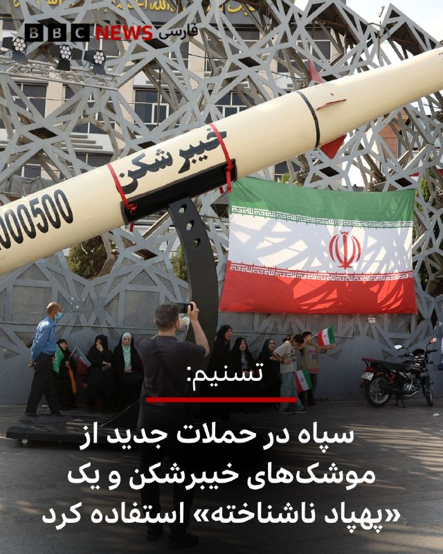

ساعتی بعد از موج حملات موشکی ایران به شمال اسرائیل، خبرگزاری تسنیم، نزدیک به سپاه پاسداران، در تحلیل و تفسیری درباره ابعاد نظامی این حمله گزارش کرده که در حملات موشکی و پهپادی یکشنبه شب، سپاه پاسداران از «پهپادی ناشناخته» که از موتور جت بهره می‌برد، استفاده کرده است.

کارشناس نظامی تسنیم همچنین از شلیک موشک‌های خیبرشکن با کلاهک‌های خوشه‌ای در جریان این حملات خبر داده است.
@VahidHeadline

📡 @VahidOnline

## IranIntlTV — post 341104

  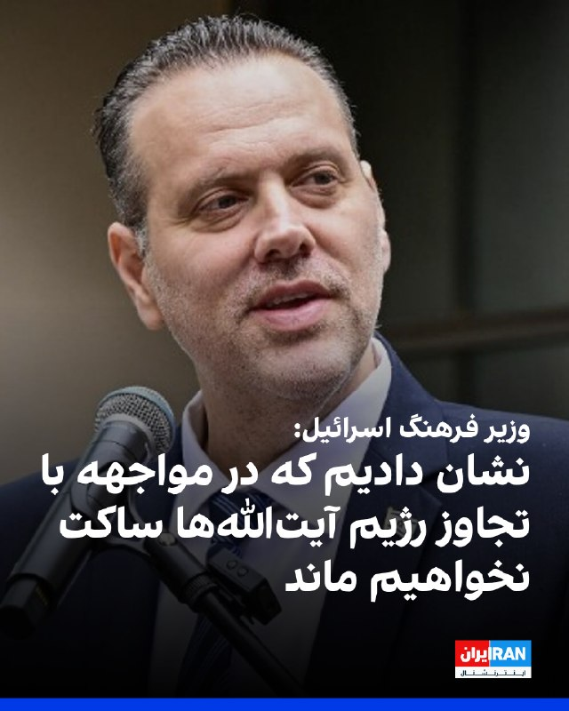

میکی زوهار، وزیر فرهنگ و ورزش اسرائیل، در شبکه اجتماعی ایکس نوشت: «من به نخست‌وزیر نتانیاهو به خاطر حملات امشب در ایران تبریک می‌گویم.»

او نوشت: «در خاورمیانه، آن‌ها فقط زور و قدرت را می‌فهمند و خوب است که ما نشان دادیم اسرائیل در مواجهه با تجاوز رژیم آیت‌الله‌ها ساکت نخواهد ماند.»
https://iranintl.com/202606085434

## Shin_Persian — post 6698

Shin ✓ @hey_itsmyturn
Mon, 08 Jun 2026 04:01:16 UTC

BM launch from Kermanshah
#Iran

فارسی

شلیک موشک بالستیک از کرمانشاه
#Iran

𝕏 · @shin_persian

---
📅 بروزرسانی: 1405/03/18 07:22
---

## VahidOOnLine — post 244259

  

♦️یخیئل لایتر، سفیر اسرائیل در آمریکا، در پیامی در اکس نوشت: ارتش اسرائیل پس از شلیک موشک‌های بالستیک ایران به سمت اسرائیل، سایت‌های پرتاب موشک زمین‌به‌زمین و همچنین زیرساخت‌هایی را که به بخش انرژی مرتبط نبوده‌اند، هدف قرار داده است.
لایتر افزود: «ایران امروز ۱۱ موشک بالستیک به سمت اسرائیل شلیک کرد. هر یک از این موشک‌ها می‌تواند یک محله کامل را با خاک یکسان کند و صدها نفر را بکشد. هیچ کشور دارای عزت‌نفس در جهان چنین حمله‌ای را تحمل نمی‌کند و اسرائیل نیز نخواهد کرد. سفیر اسرائیل در ادامه نوشت: «مردم لبنان، حزب‌الله به‌عنوان نیروی نیابتی ایران را رد کرده‌اند و به ایران گفته‌اند از کشورشان خارج شود. اگر حزب‌الله به اسرائیل شلیک کند، مراکز فرماندهی آن در ضاحیه به‌شدت هدف قرار خواهند گرفت. این موضوع هیچ ارتباطی با ایران ندارد. همه از این رژیم ایرانیِ دیوانه خسته شده‌اند.»
‌🇸🇦 Indypersian

🤖 @VahidOOnLine

## VahidOOnLine — post 244258

  

خبرگزاری صداوسیما، وابسته به رادیو و تلویزیون جمهوری اسلامی، به نقل از «یک منبع نظامی» اعلام کرد که جمهوری اسلامی هیچ شلیکی به سوی پایگاه هوایی در الخرج در عربستان سعودی انجام نداده است.
‌🏁 🇬🇧 IranintlTV

🤖 @VahidOOnLine

## WithYashar — post 13875

  <a href="telegram/content/WithYashar_13875_1780890763.mp4" target="_blank">🎬 Download video</a>

نجف اباد اصفهان
صبح ساعت یک ربع به ۵
@withyashar

## WithYashar — post 13874

اسرائیل حدوداً ساعت 4:43 دقیقه به 15 الی 20 نقطه در تهران (فرودگاه مهراباد)، سایت‌ها و کارخانه‌های موشکی و پهبادی در کرمانشاه و اصفهان و تبریز حمله کرد. جنگنده‌ای هم وارد خاک ایران نشد و پشت مرزها از عراق به داخل ایران شلیک کردن.
@withyashar

## pm_afshaa — post 92798

  <a href="telegram/content/pm_afshaa_92798_1780890765.webm" target="_blank">🎬 Download video</a>

🔴اسرائیل هیوم: حمله اسرائیل به ایران با آمریکا هماهنگ شده بود.

💧 Rainbet.com the #1 Non-KYC Crypto Casino & Sportsbook @rainbetcom

😁 @Pm_Afshaa

## pm_afshaa — post 92796

واسه اونایی که خواب بودن:

خواب که بودید یه جنگ کوچولو شد.
اسرائیل حدوداً ساعت 4:43 دقیقه به 15 الی 20 نقطه در ایران (در تهران فرودگاه مهراباد)، سایت‌ها و کارخانه‌های موشکی و پهبادی در کرمانشاه و اصفهان و تبریز حمله کرد. جنگنده‌ای هم وارد خاک ایران نشد و پشت مرزها از عراق به داخل ایران شلیک کردن.

💧 Rainbet.com the #1 Non-KYC Crypto Casino & Sportsbook @rainbetcom

😁 @Pm_Afshaa

## VahidOnline — post 76027

  

♦️یخیئل لایتر، سفیر اسرائیل در آمریکا، در پیامی در اکس نوشت: ارتش اسرائیل پس از شلیک موشک‌های بالستیک ایران به سمت اسرائیل، سایت‌های پرتاب موشک زمین‌به‌زمین و همچنین زیرساخت‌هایی را که به بخش انرژی مرتبط نبوده‌اند، هدف قرار داده است.
لایتر افزود: «ایران امروز ۱۱ موشک بالستیک به سمت اسرائیل شلیک کرد. هر یک از این موشک‌ها می‌تواند یک محله کامل را با خاک یکسان کند و صدها نفر را بکشد. هیچ کشور دارای عزت‌نفس در جهان چنین حمله‌ای را تحمل نمی‌کند و اسرائیل نیز نخواهد کرد. سفیر اسرائیل در ادامه نوشت: «مردم لبنان، حزب‌الله به‌عنوان نیروی نیابتی ایران را رد کرده‌اند و به ایران گفته‌اند از کشورشان خارج شود. اگر حزب‌الله به اسرائیل شلیک کند، مراکز فرماندهی آن در ضاحیه به‌شدت هدف قرار خواهند گرفت. این موضوع هیچ ارتباطی با ایران ندارد. همه از این رژیم ایرانیِ دیوانه خسته شده‌اند.»
@VahidOOnLine

📡 @VahidOnline

## VahidOnline — post 76026

  

🔻یک مقام آمریکایی به رسانه‌های این کشور گفته است که ارتش ایالات متحده در حملات شبانه اسرائیل به ایران هیچ نقشی نداشته است.

نشریه آکسیوس به نقل از یک مقام وزارت دفاع آمریکا گزارش داده که این حملات اسرائیل «نسبتا محدود» بوده است.

این گزارش در حالی منتشر می‌شود که دونالد ترامپ، رئیس جمهور آمریکا، پیش از حملات از بنیامین نتانیاهو، نخست‌وزیر اسرائیل، خواسته بود در بحبوحه تلاش‌های دیپلماتیک جاری از اقدام تلافی جویانه علیه ایران خودداری کند.

آکسیوس پیش‌تر گزارش داده بود که آقای نتانیاهو به صورت غیررسمی یا به تعبیر این رسانه «تلویحا موافقت کرده بود» که این درخواست ترامپ را بپذیرد.

حملات شبانه اسرائیل ساعاتی پس از شلیک موشک‌های ایران به شمال اسرائیل انجام شد و در حالی صورت گرفت که واشنگتن همچنان می‌گوید در تلاش برای نهایی کردن توافقی با تهران و جلوگیری از تشدید بیشتر تنش‌ها در منطقه است.
@VahidHeadline

📡 @VahidOnline

## IranIntlTV — post 341103

  

خبرگزاری صداوسیما، وابسته به رادیو و تلویزیون جمهوری اسلامی، به نقل از «یک منبع نظامی» اعلام کرد که جمهوری اسلامی هیچ شلیکی به سوی پایگاه هوایی در الخرج در عربستان سعودی انجام نداده است.
https://iranintl.com/202606080464

## Persian_Trend_Official — post 16043

  <a href="telegram/content/Persian_Trend_Official_16043_1780890767.webm" target="_blank">🎬 Download video</a>

انصارالله از معادله وحدت ساحات خبر داد.

🔹«حزام الاسد» عضو ارشد انصارالله: تهران- بیروت- صنعاء- بغداد- غزه؛ امروز در میدان،‌ معادله وحدت ساحات را ترسیم می‌کنند.

🤔

## Persian_Trend_Official — post 16042

  <a href="telegram/content/Persian_Trend_Official_16042_1780890768.webm" target="_blank">🎬 Download video</a>

🔴مایک هاکبی سفیر ایالات متحده در اسرائیل:

ایران دیشب و اوایل امروز به اسرائیل موشک شلیک کرد.
هشدارهای موشکی در ساعت 6 صبح در اورشلیم به صدا درآمد. آنها را شکر خدا رهگیری کردند!
ایران و عوامل شرارت نیابتی اش می خواهند آمریکا و اسرائیل را بسوزانند.
مادر شیطان در تهران است.

👺Phantom

📌 @persian_trend_official
پرشین ترند | متفاوت‌ترین کانال نظامی

## BBCPersian — post 283137

  

🔻ساعتی بعد از موج حملات موشکی ایران به شمال اسرائیل، خبرگزاری تسنیم، نزدیک به سپاه پاسداران، در تحلیل و تفسیری درباره ابعاد نظامی این حمله گزارش کرده که در حملات موشکی و پهپادی یکشنبه شب، سپاه پاسداران از «پهپادی ناشناخته» که از موتور جت بهره می‌برد، استفاده کرده است.

کارشناس نظامی تسنیم همچنین از شلیک موشک‌های خیبرشکن با کلاهک‌های خوشه‌ای در جریان این حملات خبر داده است.

📸 Getty

https://bbc.in/4fwDUTo
@BBCPersian

---
📅 بروزرسانی: 1405/03/18 07:13
---

## VahidOOnLine — post 244257

  

تایمز اسرائیل گزارش داد که موشک پرتاب شده از سوی حوثی‌های یمن با موفقیت رهگیری شده است. پیش‌تر ارتش اسرائیل از شناسایی یک موشک خبر داده بود.
‌🏁 🇬🇧 IranintlTV

🤖 @VahidOOnLine

## WithYashar — post 13873

  <a href="telegram/content/WithYashar_13873_1780890186.mp4" target="_blank">🎬 Download video</a>

غرب تهران
@withyashar

## WithYashar — post 13872

  <a href="telegram/content/WithYashar_13872_1780890188.mp4" target="_blank">🎬 Download video</a>

ملارد ، تهران
@withyashar

## WithYashar — post 13871

  

اصفهان
@withyashar

## WithYashar — post 13870

  

کرمانشاه
@withyashar

## WithYashar — post 13869

کانال 14 اسرائیل به نقل از یک مقام ارشد اسرائیلی: ما در آغاز نبرد چند روزه علیه ایران و دست نشاندگان آنها در خاورمیانه هستیم.
@withyashar

## pm_afshaa — post 92795

  <a href="telegram/content/pm_afshaa_92795_1780890192.webm" target="_blank">🎬 Download video</a>

🔴کانال 14 اسرائیل به نقل از یک مقام ارشد اسرائیلی: ما در آغاز نبرد چند روزه علیه ایران و هم‌پیمانانش در خاورمیانه هستیم. درگیری‌ها هنوز تموم نشده و تازه اولشه.

💧 Rainbet.com the #1 Non-KYC Crypto Casino & Sportsbook @rainbetcom

😁 @Pm_Afshaa

## IranIntlTV — post 341102

  

تایمز اسرائیل گزارش داد که موشک پرتاب شده از سوی حوثی‌های یمن با موفقیت رهگیری شده است. پیش‌تر ارتش اسرائیل از شناسایی یک موشک خبر داده بود.
https://iranintl.com/202606087219

## Persian_Trend_Official — post 16041

  

سفیر اسرائیل در ایالات متحده، یحیی لایتر:

امروز ایران ۱۱ موشک بالستیک به سمت اسرائیل شلیک کرد. هر یک از این موشک‌ها می‌توانند یک محله کامل را ویران کرده و صدها نفر را به قتل برسانند. هیچ کشوری با شرافت در جهان چنین حمله‌ای را تحمل نخواهد کرد و اسرائیل نیز چنین نخواهد کرد.

اسرائیل اکنون سایت‌های پرتاب موشک‌های سطح به سطح ایران و همچنین تأسیسات زیرساختی غیرمرتبط با بخش انرژی را هدف قرار می‌دهد.

مردم لبنان نماینده ایران، حزب‌الله، را رد کرده‌اند و به ایران گفته‌اند که از کشورشان خارج شود.

اگر حزب‌الله به اسرائیل شلیک کند، مراکز فرماندهی آن در داهیا به شدت هدف قرار خواهند گرفت.

این موضوع هیچ ارتباطی با ایران ندارد.

همه از این رژیم دیوانه‌وار ایرانی به ستوه آمده‌اند.

## Persian_Trend_Official — post 16040

کانال 14 اسرائیل به نقل از یک مقام ارشد اسرائیلی: ما در آغاز نبرد چند روزه علیه ایران و دست نشاندگان آنها در خاورمیانه هستیم.

## Persian_Trend_Official — post 16039

کاره انصارالله بوده

## BBCPersian — post 283136

  

🔻يک مقام آمريکايی به رسانه‌های این کشور گفته است که ارتش ايالات متحده در حملات شبانه اسرائيل به ايران هيچ نقشی نداشته است.

نشریه آکسيوس به نقل از يک مقام وزارت دفاع آمريکا گزارش داده که اين حملات اسرائيل «نسبتا محدود» بوده است.

اين گزارش در حالی منتشر می‌شود که دونالد ترامپ، رئيس جمهور آمريکا، پيش از حملات از بنيامين نتانياهو، نخست‌وزير اسرائيل، خواسته بود در بحبوحه تلاش‌های ديپلماتيک جاری از اقدام تلافی جويانه عليه ايران خودداری کند.

آکسيوس پيش‌تر گزارش داده بود که آقای نتانياهو به صورت غيررسمی يا به تعبير اين رسانه «تلویحا موافقت کرده بود» که اين درخواست ترامپ را بپذيرد.

حملات شبانه اسرائيل ساعاتی پس از شليک موشک‌های ايران به شمال اسرائيل انجام شد و در حالی صورت گرفت که واشنگتن همچنان می‌گويد در تلاش برای نهايی کردن توافقی با تهران و جلوگيری از تشديد بيشتر تنش‌ها در منطقه است.

📸 Reuters

https://bbc.in/4fwDUTo
@BBCPersian

## Dirty_Kids — post 391329

• حملهٔ موشکی از یمن به اسرائیل • اعلام هشدار موشکی در مناطق مختلف اسرائیل • آسمان اسرائیل بسته شد

## alonews — post 126088

  <a href="telegram/content/alonews_126088_1780890195.webm" target="_blank">🎬 Download video</a>

👈دیلی میل :یک فوتبالیست ملی‌پوش تلاش کرده دختر 14 ساله‌ای رو به بهانه‌ی «بغل/نوازش پشت بوته‌ها از اطراف خانوادش دور کنه که پدر دختره فهمیده 😐
ماجرا از این قراره که پدر و مادر دختره درحالی که گرم سلام و احوال پرسی بودن با بازیکنان ملی پوش ؛ بعد از ناهار که پدر و مادر دختره میرن بستنی بخورن و دخترشون تنها میزارن کنار استخر ، یهو تلفن مادر دختره زنگ میخوره و دختره با گریه میگه سریع بیاید کنار استخر
وقتی میرن کنار استخر میفهمن یک فوتبالیست از کنار صندلی های افتابگیر بهش نزدیک شده و دختره با هیجان از فوتبالیسته میخواد باهاش عکس بگیره بعدش یکم با فوتبالیسته حرف میزنه و اون فوتبالیسته میگه بیا نوازشت کنم که دختره میگه نه ولی فوتبالیسته میگه بیا بریم پشت بوته ها که کسی نتونه مارو ببینه😂😐
پدر دختره به محض اینکه این موضوع متوجه میشه به مدیرهتل شکایت میکنه و با چندتا از مربی و کارکنان اونجا صحبت میکنه و کادرفنی میگه بازیکن میفرستیم بیاد عذرخواهی کنه و از هتل اخراج میشه

🔴کافیه لوگو مجید ببینید که روی کیت ورزشیه و خب این فوتبالیسته مربوط میشه به تیم جمهوری اسلامی

✅ @AloNews خبر جنگ

---
📅 بروزرسانی: 1405/03/18 07:02
---

## VahidOOnLine — post 244256

  

ارتش اسرائیل در بیانیه‌ای اعلام کرد که ایال زمیر، رئیس ستاد کل ارتش، و فرماندهان ارشد ارتش این کشور در حال حاضر فرماندهی حملات به ایران را از مرکز فرماندهی نیروی هوایی اسرائیل بر عهده دارند.

این بیانیه تاکید می‌کند: «ارتش اسرائیل، چه از نظر تهاجمی و چه از نظر دفاعی، در آمادگی کامل است.»

به نوشته بیانیه، زمیر و فرماندهان ارشد ارتش اسرائیل طی ساعات گذشته و پیش از حملات به ایران، ارزیابی‌های موقعیتی را انجام دادند.

ارتش اسرائیل تاکید کرد که در حالت آماده‌باش کامل بوده و کاملاً آماده است تا به عملیات خود در تمام عرصه‌ها علیه کسانی که کشور اسرائیل را تهدید می‌کنند، ادامه دهد.
‌🏁 🇬🇧 IranintlTV

🤖 @VahidOOnLine

## VahidOOnLine — post 244255

  

♦️حساب عبری‌زبان ارتش دفاعی اسرائیل، صبح دوشنبه، با انتشار تصویری از «اتاق عملیات»، اعلام کرد که رئیس ستاد کل و فرماندهان ارشد این کشور در حال حاضر مستقیما حملات علیه ایران را هدایت می‌کنند. ارتش اسرائیل با تاکید بر اینکه «در آمادگی کامل تهاجمی و تدافعی قرار دارد»، تصریح کرد: « ایال زامیر، رئیس ستاد کل ارتش و مقامات ارشد نظامی، طی ساعت‌های گذشته ارزیابی‌های مداوم وضعیت را برگزار کرده و هم‌اکنون حملات ارتش به ایران را از پناهگاه زیرزمینی نیروی هوایی فرماندهی می‌کنند.» در پایان این بیانیه آمده است: «ارتش اسرائیل برای ادامه عملیات در تمامی جبهه‌ها علیه هر کسی که دولت اسرائیل را تهدید کند، گوش‌به‌زنگ و آماده است.»
‌🇸🇦 Indypersian

🤖 @VahidOOnLine

## WithYashar — post 13868

اکسیوس به نقل از یک مقام آمریکایی:
حملات اسرائیل به ایران محدود بود.
@withyashar

## mwarmonitor — post 10392

  

✈️یک فروند هواپیمای سوخت‌رسان KC-135R نیروی هوایی آمریکا در حال حاضر بر فراز خلیج فارس و در نزدیکی ساحل ایران در حال عملیات است.

@mwarmonitor

## mwarmonitor — post 10391

🔴سفیر اسرائیل در آمریکا ؛ ایران امروز ۱۱ موشک بالستیک به سمت اسرائیل شلیک کرد. هر یک از این موشک‌ها می‌تواند یک محله کامل را با خاک یکسان کند و صدها نفر را به کام مرگ بکشاند. هیچ کشور بااصل و نسب و محترمی در جهان چنین حمله‌ای را تحمل نخواهد کرد، و اسرائیل نیز تحمل نخواهد کرد.

🔸اسرائیل اکنون در حال هدف قرار دادن سایت‌های پرتاب موشک زمین‌به‌زمین ایران و همچنین تاسیسات زیربنایی غیرمرتبط با بخش انرژی است.

🔹مردم لبنان نیروی نیابتی ایران، یعنی حزب‌الله را طرد کرده‌اند و به ایران گفته‌اند که از کشورشان خارج شود.
اگر حزب‌الله به سمت اسرائیل شلیک کند، مراکز فرماندهی آن در ضاحیه به شدت مورد اصابت قرار خواهند گرفت.
این موضوع هیچ ارتباطی به ایران ندارد.
صبوری همه از دست این رژیم دیوانه ایران لبریز شده است.

@mwarmonitor

## pm_afshaa — post 92794

  <a href="telegram/content/pm_afshaa_92794_1780889567.webm" target="_blank">🎬 Download video</a>

🔴کریس مورفی، سناتور آمریکایی:
این جنگ برای ترامپ و به طور کلی آمریکا تحقیرآمیز بوده. وقتی ترامپ اعلام میکنه که قراره با نتانیاهو تماس بگیره و بهش بگه که دست به اقدام تلافی‌جویانه علیه ایران نزنه، اما نتانیاهو ظرف چند ساعت حمله تلافی‌جویانه رو انجام میده، این یعنی تحقیر ترامپ و آمریکا.

💧 Rainbet.com the #1 Non-KYC Crypto Casino & Sportsbook @rainbetcom

😁 @Pm_Afshaa

## pm_afshaa — post 92793

  <a href="telegram/content/pm_afshaa_92793_1780889567.webm" target="_blank">🎬 Download video</a>

🔴لایتر، سفیر اسرائیل در آمریکا:

ایران امروز 11 تا موشک بالستیک سمت اسرائیل شلیک کرد، هر کدوم از این موشک‌ها میتونه یه محله کامل رو با خاک یکسان کنه و صدها نفر رو بکشه.

هیچ کشوری در جهان که به خودش احترام میذاره، چنین حمله‌ای رو تحمل نمیکنه و اسرائیل هم قرار نیست تحمل کنه.

الان اسرائیل سایت‌های پرتاب موشک و بعضی زیرساخت‌های ایران رو هدف قرار داده؛ مردم لبنان هم به حزب‌الله و نفوذ ایران نه گفتن و از ایران خواستن که از کشورشون بره بیرون.

اگه حزب‌الله بخواد به اسرائیل شلیک کنه، مراکز فرماندهیش تو ضاحیه بیروت ضربه سنگینی میخورن.

همه از این رژیم دیوانه ایران به قدر کافی نوشیده‌اند و دیگه بسه!

💧 Rainbet.com the #1 Non-KYC Crypto Casino & Sportsbook @rainbetcom

😁 @Pm_Afshaa

## IranIntlTV — post 341101

  <a href="telegram/content/IranIntlTV_341101_1780889568.mp4" target="_blank">🎬 Download video</a>

کانال تلگرامی صابرین‌نیوز نزدیک به سپاه پاسداران ویدیویی از آتش‌سوزی و دود در اصفهان پس از حمله هوایی اسرائیل منتشر کرده است.
@iranintltv

## IranIntlTV — post 341100

  

ارتش اسرائیل در بیانیه‌ای اعلام کرد که ایال زمیر، رئیس ستاد کل ارتش، و فرماندهان ارشد ارتش این کشور در حال حاضر فرماندهی حملات به ایران را از مرکز فرماندهی نیروی هوایی اسرائیل بر عهده دارند.

این بیانیه تاکید می‌کند: «ارتش اسرائیل، چه از نظر تهاجمی و چه از نظر دفاعی، در آمادگی کامل است.»

به نوشته بیانیه، زمیر و فرماندهان ارشد ارتش اسرائیل طی ساعات گذشته و پیش از حملات به ایران، ارزیابی‌های موقعیتی را انجام دادند.

ارتش اسرائیل تاکید کرد که در حالت آماده‌باش کامل بوده و کاملاً آماده است تا به عملیات خود در تمام عرصه‌ها علیه کسانی که کشور اسرائیل را تهدید می‌کنند، ادامه دهد.
https://iranintl.com/202606080260

## idfinfarsi — post 11812

سخنگوی ارتش اسرائیل:

رئیس ستاد کل ارتش اسرائیل و فرماندهان ارشد ارتش در حال حاضر از اتاق فرماندهی نیروی هوایی، عملیات‌های ارتش اسرائیل در ایران را فرماندهی می‌کنند

ارتش اسرائیل در آمادگی کامل برای حمله و دفاع قرار دارد

رئیس ستاد کل ارتش اسرائیل، سپهبد ایال زامیر، و فرماندهان ارشد ارتش اسرائیل طی ساعات اخیر ارزیابی‌های وضعیت مستمر انجام داده و از اتاق فرماندهی نیروی هوایی، حملات ارتش اسرائیل در ایران را فرماندهی می‌کنند.

ارتش اسرائیل با آمادگی کامل برای ادامه عملیات در تمامی جبهه‌ها علیه هر تهدیدی که متوجه کشور اسرائیل باشد، در حالت آماده‌باش قرار دارد.

---
📅 بروزرسانی: 1405/03/18 06:52
---

## VahidOOnLine — post 244254

♦️خبرگزاری فرانسه، دوشنبه ۱۸ خرداد، تصاویری از فروریختن یک ساختمان در پی زمین‌لرزه‌ به بزرگی ۷.۸ در جنوب فیلیپین منتشر کرد. مقام‌های فیلیپین و اندونزی پس از این زمین‌لرزه هشدار سونامی صادر کردند.
‌🇸🇦 Indypersian

🤖 @VahidOOnLine

## VahidOOnLine — post 244253

  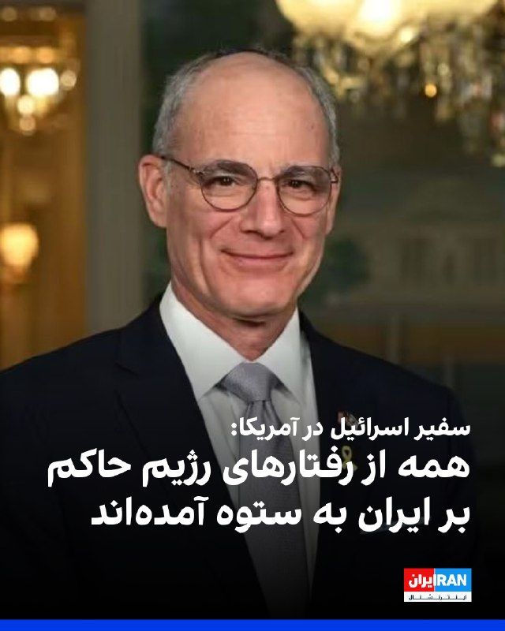

یخیل لایتر، سفیر اسرائیل در آمریکا گفت ایران امروز ۱۱ موشک بالستیک به سوی اسرائیل شلیک کرده است؛ موشک‌هایی که به گفته او هر یک توان تخریب یک محله کامل و وارد کردن تلفات گسترده را دارند.

او تأکید کرد هیچ کشوری چنین حمله‌ای را تحمل نمی‌کند و اسرائیل نیز پاسخ خواهد داد.

به گفته لایتر، ارتش اسرائیل در واکنش، در حال هدف قرار دادن سایت‌های پرتاب موشک‌های زمین‌به‌زمین ایران و برخی زیرساخت‌هاست که به بخش انرژی مرتبط نیستند.

سفیر اسرائیل همچنین هشدار داد در صورت شلیک موشک از سوی حزب‌الله، مراکز فرماندهی این گروه در ضاحیه بیروت هدف حملات شدید قرار خواهند گرفت.

او افزود مردم لبنان نیروی نیابتی ایران را رد کرده‌اند و مدعی شد «همه از رفتارهای رژیم ایران به ستوه آمده‌اند.»
‌🏁 🇬🇧 IranintlTV

🤖 @VahidOOnLine

## WithYashar — post 13867

به گزارش ایسنا، سازمان آتش‌نشانی تهران می‌گوید هیچ منطقه شهری در پایتخت هدف قرار نگرفته است.
@withyashar

## WithYashar — post 13866

۳پا: دشمن اسرائیلی با استفاده از موشک های بالستیک هواپرتاب اقدام به حمله به اهدافی در خاک کشورمان کرده است
@withyashar

## WithYashar — post 13865

استوری اخر اینستاگرام رو دیدید ؟! سیگنالو دادم که دم صب میزنه !

## mwarmonitor — post 10390

🔴رسانه‌های اسرائیلی: پس از حملات به ایران، جلسه دادگاه امروز نتانیاهو لغو شد.

@mwarmonitor

## mwarmonitor — post 10389

  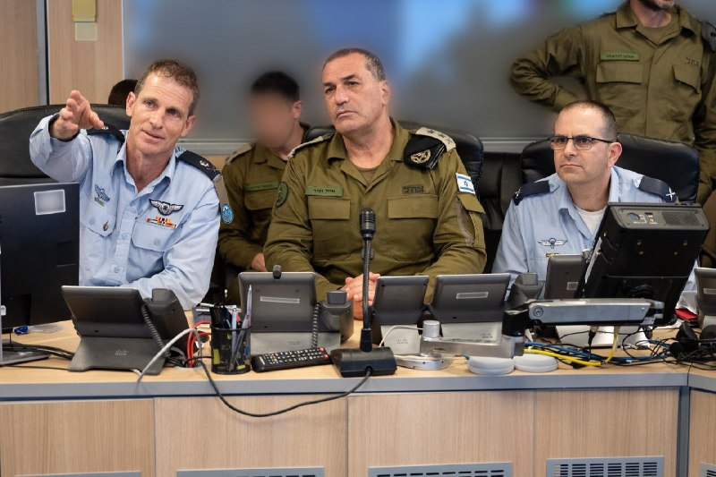

🔴 رئیس ستاد کل و فرماندهان ارشد ارتش اسرائیل در حال حاضر از مقر فرماندهی نیروی هوایی، حملات انجام‌شده توسط ارتش در ایران را زیر نظر دارند؛ در حالی که ارتش در وضعیت آمادگی کامل، هم در حالت تهاجمی و هم دفاعی، باقی مانده است.

@mwarmonitor

## mwarmonitor — post 10388

📌 جبهه داخلی اسرائیل: اجازه خروج از پناهگاه‌ها و اتاق‌های امن صادر شد.

@mwarmonitor

## pm_afshaa — post 92792

همینجور آتش‌بس رو ادامه بدید باید 24 ساعتِ شبانه روز رو بیدار باشم

## pm_afshaa — post 92791

  <a href="telegram/content/pm_afshaa_92791_1780888971.webm" target="_blank">🎬 Download video</a>

🔴وزارت دفاع عربستان: در حال مقابله با حملات موشکی و پهبادی در استان الخراج هستیم. 
💧 Rainbet.com the #1 Non-KYC Crypto Casino & Sportsbook @rainbetcom 
😁 @Pm_Afshaa

## IranIntlTV — post 341099

  

یخیل لایتر، سفیر اسرائیل در آمریکا گفت ایران امروز ۱۱ موشک بالستیک به سوی اسرائیل شلیک کرده است؛ موشک‌هایی که به گفته او هر یک توان تخریب یک محله کامل و وارد کردن تلفات گسترده را دارند.

او تأکید کرد هیچ کشوری چنین حمله‌ای را تحمل نمی‌کند و اسرائیل نیز پاسخ خواهد داد.

به گفته لایتر، ارتش اسرائیل در واکنش، در حال هدف قرار دادن سایت‌های پرتاب موشک‌های زمین‌به‌زمین ایران و برخی زیرساخت‌هاست که به بخش انرژی مرتبط نیستند.

سفیر اسرائیل همچنین هشدار داد در صورت شلیک موشک از سوی حزب‌الله، مراکز فرماندهی این گروه در ضاحیه بیروت هدف حملات شدید قرار خواهند گرفت.

او افزود مردم لبنان نیروی نیابتی ایران را رد کرده‌اند و مدعی شد «همه از رفتارهای رژیم ایران به ستوه آمده‌اند.»
https://iranintl.com/202606087641

## Shin_Persian — post 6696

Shin ✓ @hey_itsmyturn Mon, 08 Jun 2026 03:12:58 UTC #IDF 🇮🇱: "The IDF Chief of Staff and senior IDF officials are currently commanding IDF strikes in Iran from the Air Force bunker The IDF is in full readiness in attack and defense The Chief of Staff,…

## Shin_Persian — post 6695

Shin ✓ @hey_itsmyturn
Mon, 08 Jun 2026 03:12:58 UTC

#IDF 🇮🇱:
"The IDF Chief of Staff and senior IDF officials are currently commanding IDF strikes in Iran from the Air Force bunker

The IDF is in full readiness in attack and defense

The Chief of Staff, Lieutenant General Eyal Zamir, and senior IDF officials, have conducted ongoing situation assessments over recent hours and are commanding IDF strikes in Iran from the Air Force bunker.

The IDF is alert and ready to continue operations in all sectors against those who threaten the State of Israel."
#Iran

فارسی

#ارتش_دفاعی_اسرائیل 🇮🇱:
«رئیس ستاد کل ارتش دفاعی اسرائیل و مقامات ارشد ارتش دفاعی اسرائیل در حال حاضر حملات این ارتش در ایران را از پناهگاه نیروی هوایی فرماندهی می‌کنند.

ارتش دفاعی اسرائیل (IDF) در آمادگی کامل تهاجمی و تدافعی قرار دارد.

رئیس ستاد کل، سپهبد ایال زمیر و مقامات ارشد ارتش دفاعی اسرائیل، طی ساعات اخیر ارزیابی‌های مستمر از وضعیت موجود انجام داده و در حال فرماندهی حملات ارتش دفاعی اسرائیل در ایران از پناهگاه نیروی هوایی هستند.

ارتش دفاعی اسرائیل هوشیار و آماده است تا به عملیات‌های خود در تمامی بخش‌ها علیه کسانی که دولت اسرائیل را تهدید می‌کنند، ادامه دهد.»
#ایران

𝕏 · @shin_persian

## BBCPersian — post 283135

  <a href="telegram/content/BBCPersian_283135_1780888972.mp4" target="_blank">🎬 Download video</a>

🔻گروهی از مخالفان حکومت جمهوری اسلامی، در روز یکشنبه، در مقابل استادیوم سوفای در شهر لس‌آنجلس دور هم جمع شدند تا به قانون فیفا مبنی بر ممنوعیت استفاده از پرچم‌های غیر از پرچم رسمی کشورها اعتراض کنند.

این گروه از ایرانیان که تیم ملی فوتبال ایران را نه یک تیم ملی که تیمی حکومتی به شمار می‌آورند به فدراسیون جهانی فوتبال انتقاد دارند که چرا اجازه از پرچم شیر و خورشید به آنها داده نمی‌شود.

تیم ایران در مسابقه‌های جام‌ جهانی فوتبال در سال ۲۰۲۶ میلادی در دو بازی اولش در مرحله اول باید در شهر لس‌آنجلس به مصاف حریفانش، کشورهای نیوزیلند و بلژیک برود. بازی سوم ایران در این مرحله مقابل مصر است که در شهر سیاتل آمریکا برگزار می‌شود.

@BBCPersian

## BBCPersian — post 283133

🔻ارتش اسرائیل: شلیک موشک از یمن را رصد کردیم و مشغول رهگیری هستیم

ارتش اسرائیل با بیانیه‌ای اعلام کرده شلیک یک موشک از سمت یمن را رصد کرده و مشغول رهگیری آن است.

همزمان آژيرهای خطر در مناطقی از اسرائیل از جمله تل آویو و شهرهای جنوبی این کشور به صدا در آمده و از شهروندان خواسته شده پناه بگیرند.

https://bbc.in/4fwDUTo
@BBCPersian

---
📅 بروزرسانی: 1405/03/18 06:42
---

## VahidOOnLine — post 244252

  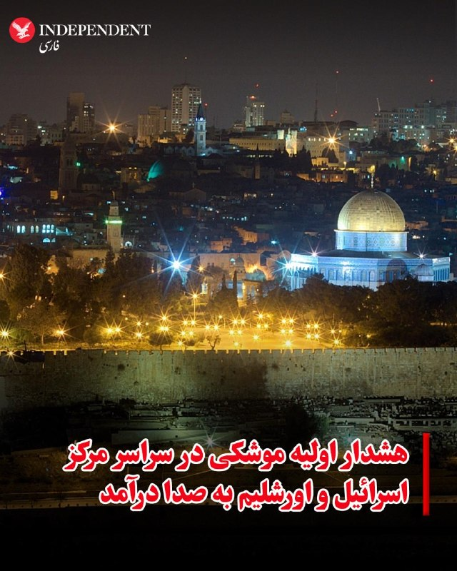

♦️بامداد دوشنبه، هشداری درباره یک حمله موشکی در حال وقوع در بخش‌های وسیعی از مرکز اسرائیل از جمله اورشلیم، تل‌آویو، مودعین و مناطق اطراف به صدا درآمد.
‌🇸🇦 Indypersian

🤖 @VahidOOnLine

## mwarmonitor — post 10386

🔴رسانه‌های اسرائیلی: حریم هوایی به‌طور موقت بسته شد.

@mwarmonitor

## mwarmonitor — post 10385

📌سخنگوی ارتش اسرائیل آخرین تحولات:

❌ نیروی هوایی چند ساعت پیش و با هدایت نهاد اطلاعات نظامی، اهداف نظامی وابسته به «نظام تروریستی ایران» را در غرب و مرکز ایران هدف قرار داد.

⭕️ ارتش اسرائیل دقایقی پیش شلیک یک موشک از یمن به سمت اراضی اسرائیل را رصد کرد و سامانه‌های پدافند هوایی برای رهگیری آن وارد عمل شدند.

@mwarmonitor

## pm_afshaa — post 92789

  <a href="telegram/content/pm_afshaa_92789_1780888364.webm" target="_blank">🎬 Download video</a>

شلیک موشک از ایران به سمت اسراییل 
💧 Rainbet.com the #1 Non-KYC Crypto Casino & Sportsbook @rainbetcom 
😁 @Pm_Afshaa

## pm_afshaa — post 92788

شلیک موشک از ایران به سمت اسراییل 
💧 Rainbet.com the #1 Non-KYC Crypto Casino & Sportsbook @rainbetcom 
😁 @Pm_Afshaa

## pm_afshaa — post 92787

شلیک موشک از ایران به سمت اسراییل

💧 Rainbet.com the #1 Non-KYC Crypto Casino & Sportsbook @rainbetcom

😁 @Pm_Afshaa

## pm_afshaa — post 92786

  <a href="telegram/content/pm_afshaa_92786_1780888365.webm" target="_blank">🎬 Download video</a>

🔴بیش از 20 سایت ایرانی، از جمله فرودگاه مهرآباد تهران، کارخانه تولید پهپاد و سایت‌های موشکی، توسط اسرائیل هدف قرار گرفته شد. 
💧 Rainbet.com the #1 Non-KYC Crypto Casino & Sportsbook @rainbetcom 
😁 @Pm_Afshaa

## VahidOnline — post 76025

  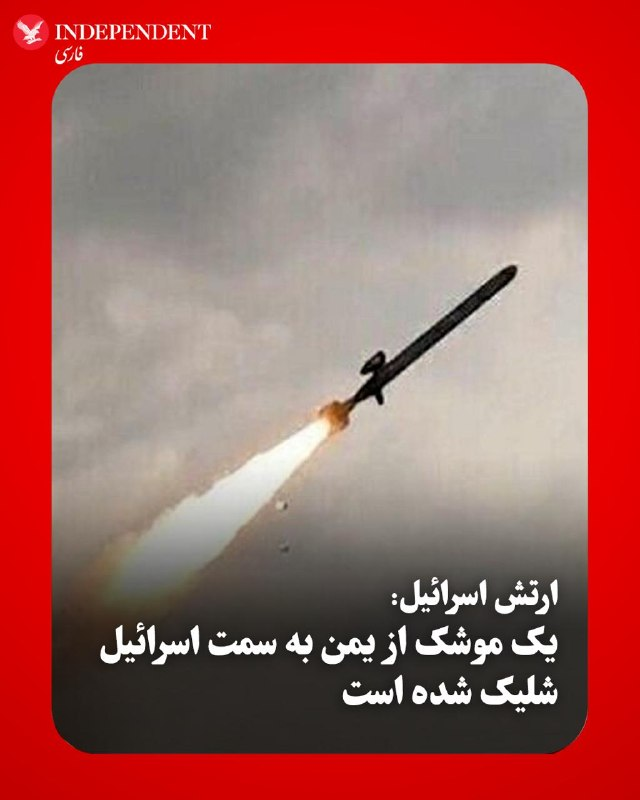

سخنگوی ارتش اسرائیل پس از حمله‌های یکشنبه شب سپاه به شمال اسرائیل و حمله‌های متقابل ارتش اسرائیل به غرب و مرکز ایران در بامداد دوشنبه اعلام کرد که ارتش اسرائیل یک موشک شلیک شده از یمن را رصد کرده و سامانه‌های پدافندی در حال رهگیری آن هستند.
@VahidOOnLine

📡 @VahidOnline

---
📅 بروزرسانی: 1405/03/18 06:33
---

## VahidOOnLine — post 244251

  

♦️سخنگوی ارتش اسرائیل پس از حمله‌های یکشنبه شب سپاه به شمال اسرائیل و حمله‌های متقابل ارتش اسرائیل به غرب و مرکز ایران در بامداد دوشنبه اعلام کرد که ارتش اسرائیل یک موشک شلیک شده از یمن را رصد کرده و سامانه‌های پدافندی در حال رهگیری آن هستند.
‌🇸🇦 Indypersian

🤖 @VahidOOnLine

## VahidOOnLine — post 244250

  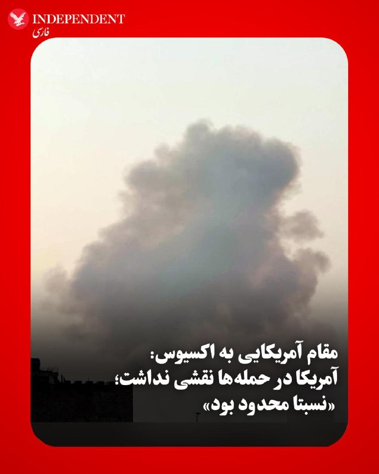

♦️اکسیوس به نقل از یک مقام آمریکایی که نام او را اعلام نکرده نوشت که آمرکا در حمله‌های بامداد دوشنبه اسرائیل که در واکنش به حمله‌های یکشنبه‌شب سپاه انجام شد، نقشی نداشته است. او همچنین حمله‌های اسرائیل را «نسبتا محدود» توصیف کرده است. اکسیوس ساعاتی قبل هم مدعی شده بود که از محتوای گفتگوی ترامپ و نتانیاهو آگاه است و نخست‌وزیر اسرائیل به درخواست رئیس‌جمهوری آمریکا موافقت کرده که پاسخ به حمله‌های سپاه را به تاخیر بیاندازد. اما ساعاتی از انتشار این گزارش نگذشته بود که صدای انفجارها در غرب و مرکز ایران به گوش رسید و ارتش اسرائیل حمله‌ها را تایید کرد.
‌🇸🇦 Indypersian

🤖 @VahidOOnLine

## VahidOOnLine — post 244249

  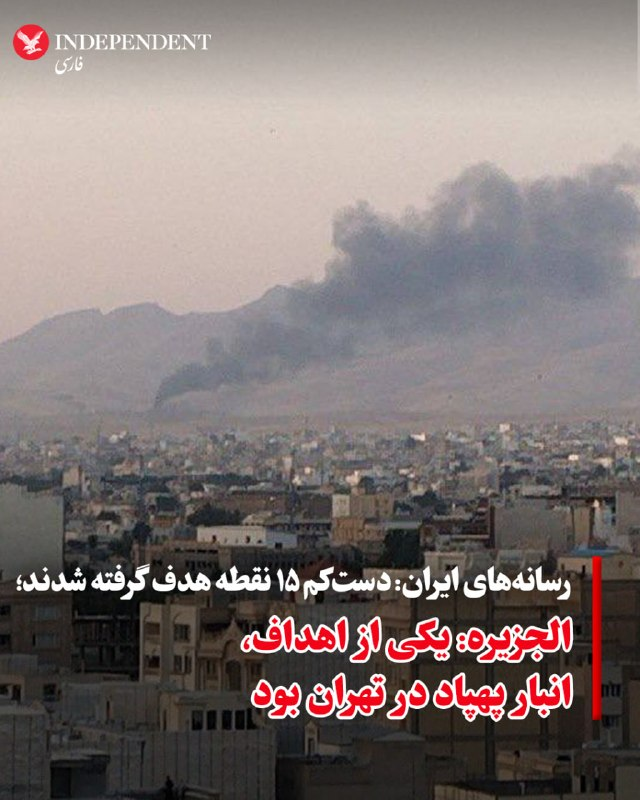

♦️گزارش رسانه‌های ایران حاکی از آن است که در جریان حمله‌های بامداد دوشنبه اسرائیل دست‌کم ۱۵ هدف مورد اصابت قرار گرفته‌اند و به گفته الجزیره، یکی از این اهداف یک انبار پهپادهای انتحاری در تهران بوده است. گزارش‌های مردمی حاکی از شنیده شدن صدای انفجار در غرب تهران است. ارتش اسرائیل بامداد دوشنبه و پس از حمله‌های یکشنبه شب سپاه اعلام کرد که به مواضع نظامی حکومت در غرب و مرکز ایران حمله کرده است.
‌🇸🇦 Indypersian

🤖 @VahidOOnLine

## mwarmonitor — post 10384

🚨جبهه داخلی اسرائیل: پس از رصد شلیک موشک‌هایی از یمن به سمت مرکز اسرائیل، برای ساکنان مناطق جنوب و مرکز اسرائیل هشدار اولیه صادر شد.

@mwarmonitor

## mwarmonitor — post 10383

🔴سخنگوی ارتش اسرائیل:

🔸ارتش اسرائیل شلیک یک موشک از یمن به سمت اراضی اسرائیل را تأیید کرد و سامانه‌های پدافندی در حال رهگیری آن هستند. لطفاً به دستورالعمل‌های فرماندهی جبهه داخلی پایبند باشید.

@mwarmonitor

## mwarmonitor — post 10382

شلیک موشک از یمن به سمت اسرائیل

## pm_afshaa — post 92785

همه خوابن من بیدار دهنم داره سرویس میشه بعد حمایت نمیکنین از کانال بفرستین برا بقیه😒

## pm_afshaa — post 92784

  <a href="telegram/content/pm_afshaa_92784_1780887784.webm" target="_blank">🎬 Download video</a>

هم‌اکنون هشدار حملات موشکی به اسرائیل 
💧 Rainbet.com the #1 Non-KYC Crypto Casino & Sportsbook @rainbetcom 
😁 @Pm_Afshaa

## pm_afshaa — post 92783

اسمون اسراییل کلییر شد

💧 Rainbet.com the #1 Non-KYC Crypto Casino & Sportsbook @rainbetcom

😁 @Pm_Afshaa

## pm_afshaa — post 92782

🔴الجزیره : اسرائیل انبار پهپادها رو تو تهران هدف قرار داد

💧 Rainbet.com the #1 Non-KYC Crypto Casino & Sportsbook @rainbetcom

😁 @Pm_Afshaa

## pm_afshaa — post 92781

  <a href="telegram/content/pm_afshaa_92781_1780887785.webm" target="_blank">🎬 Download video</a>

هم‌اکنون هشدار حملات موشکی به اسرائیل 
💧 Rainbet.com the #1 Non-KYC Crypto Casino & Sportsbook @rainbetcom 
😁 @Pm_Afshaa

## pm_afshaa — post 92780

  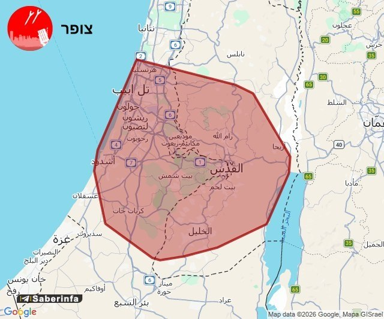

هم‌اکنون هشدار حملات موشکی به اسرائیل

💧 Rainbet.com the #1 Non-KYC Crypto Casino & Sportsbook @rainbetcom

😁 @Pm_Afshaa

## pm_afshaa — post 92779

  <a href="telegram/content/pm_afshaa_92779_1780887786.webm" target="_blank">🎬 Download video</a>

🔴حوثی‌های یمن به اسرائیل موشک زدن و آژیر خطر حمله هوایی در اسرائیل فعال شد.

💧 Rainbet.com the #1 Non-KYC Crypto Casino & Sportsbook @rainbetcom

😁 @Pm_Afshaa

## Shin_Persian — post 6694

  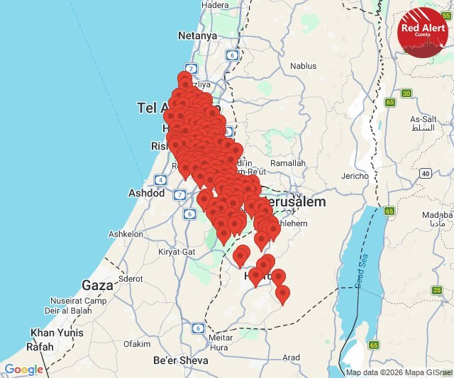

Shin ✓ @hey_itsmyturn
Mon, 08 Jun 2026 02:57:13 UTC

BM launch from Yemen.
Tzeva Adom in central.

فارسی

شلیک موشک بالستیک از یمن.
آژیر قرمز (Tzeva Adom) در مناطق مرکزی.

𝕏 · @shin_persian

## FarsiVOA — post 219971

  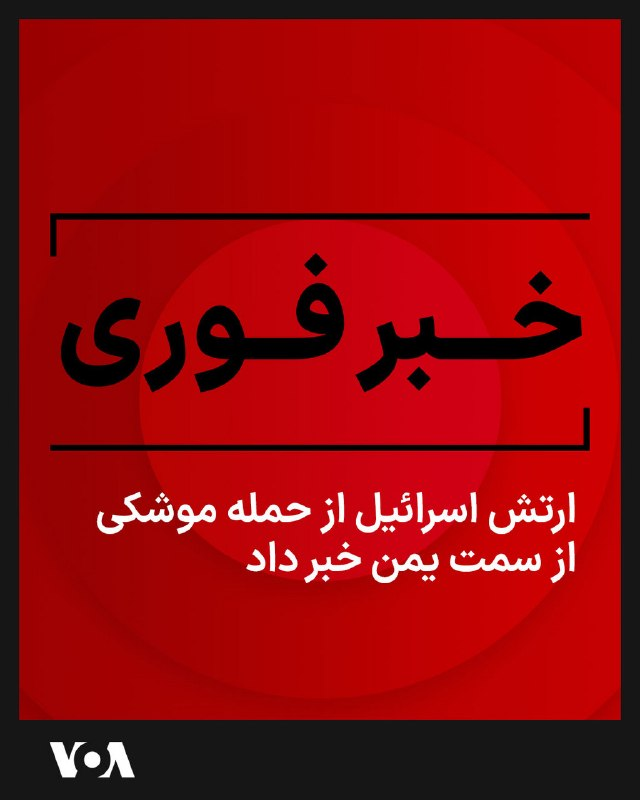

⚡️ارتش اسرائیل دقایقی قبل از شناسایی حمله موشکی از سمت یمن به سمت خاک اسرائیل خبر داد و گفت سامانه‌های دفاعی برای رهگیری این تهدید در حال فعالیت هستند.
@FarsiVOA

## FarsiVOA — post 219970

⚡️در حالی که جمهوری اسلامی آزادسازی دارایی‌های مسدودشده را یکی از مطالبات اصلی خود در مذاکرات با واشینگتن می‌داند، گزارش‌ها حاکی از آن است که آمریکا در حال بررسی استفاده از همین دارایی‌ها برای جبران خسارت‌های ناشی از حملات جمهوری اسلامی به کشورهای خلیج فارس است
@FarsiVOA

## Persian_Trend_Official — post 16038

  <a href="telegram/content/Persian_Trend_Official_16038_1780887787.webm" target="_blank">🎬 Download video</a>

در پی گزارش رسانه ها مبنی بر شنیده شدن صدای انفجار در پایگاه هوایی الخرج؛ یک مقام آگاه نظامی به خبرگزاری صداوسیما گفت: ایران هیچ شلیکی به سمت این پایگاه نداشته است.

## Persian_Trend_Official — post 16037

در پی گزارش رسانه ها مبنی بر شنیده شدن صدای انفجار در پایگاه هوایی الخرج؛ یک مقام آگاه نظامی به خبرگزاری صداوسیما گفت: ایران هیچ شلیکی به سمت این پایگاه نداشته است.

## Persian_Trend_Official — post 16036

ارتش اسرائیل: ما شلیک موشک از یمن به سمت خاک اسرائیل را شناسایی کردیم و سیستم‌های دفاعی در حال رهگیری آن هستند‌.

## Persian_Trend_Official — post 16035

🔴 آژیر هشدار در مرکز اسرائیل؛ گزارش‌ها از شلیک موشک از یمن

رسانه‌های اسرائیلی از فعال شدن آژیرهای هشدار در مناطق مرکزی اسرائیل خبر دادند. همزمان گزارش‌هایی از شلیک یک موشک از سوی یمن به سمت اسرائیل منتشر شده است.

برخی منابع نیز از بررسی احتمال شلیک موشک از سوی ایران خبر داده‌اند،

👺Phantom

📌 @persian_trend_official
پرشین ترند | متفاوت‌ترین کانال نظامی

## BBCPersian — post 283132

  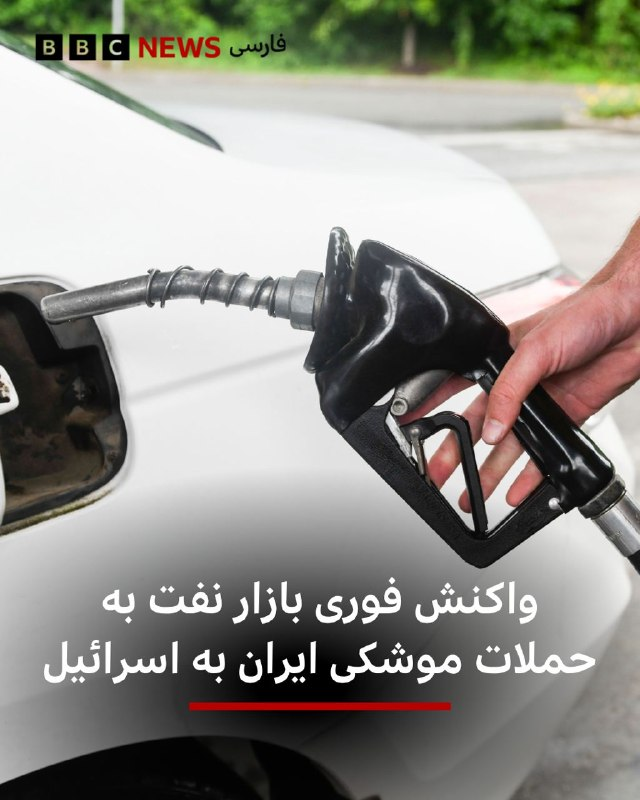

قیمت نفت در معاملات صبح دوشنبه در بازارهای آسیایی افزایش یافت؛ این رشد پس از آن رخ داد که ایران برای نخستین‌بار از زمان توافق آتش‌بس شکننده میان ایران، اسرائیل و ایالات متحده در ماه آوریل، به سمت اسرائیل موشک شلیک کرد.

بر اساس گزارش‌ها، قیمت نفت برنت به عنوان شاخص جهانی، ۲/۶ درصد افزایش یافت و به ۹۵/۵۰ دلار در هر بشکه رسید. همچنین نفت خام آمریکا با رشد ۲/۵ درصدی به ۹۲/۷۵ دلار معامله شد.

به گفته تحلیلگران، بازار انرژی در هفته‌های اخیر نوسانات شدیدی را تجربه کرده است؛ به طوری که از زمان توافق آتش‌بس ماه آوریل، قیمت ها بارها به صورت قابل توجهی بالا و پایین رفته‌اند.

در هفته گذشته نیز قیمت‌ها در محدوده حدود ۹۵ دلار در نوسان بوده است، زیرا معامله‌گران اثرات بلندمدت جنگ و ناامنی در خاورمیانه بر جریان عرضه جهانی انرژی را ارزیابی می‌کنند.

📸 Getty

https://bbc.in/4fwDUTo
@BBCPersian

## Dirty_Kids — post 391328

• حملهٔ موشکی از یمن به اسرائیل

• اعلام هشدار موشکی در مناطق مختلف اسرائیل

• آسمان اسرائیل بسته شد

---
📅 بروزرسانی: 1405/03/18 06:22
---

## VahidOOnLine — post 244248

  

روزنامه معاریو نوشت نیروی هوایی اسرائیل در پاسخ به حمله موشکی جمهوری اسلامی در شب گذشته، به اهداف نظامی در غرب و مرکز ایران حمله کردند.

معاریو اشاره کرد که بیش از ۱۵ هدف، از جمله یک کارخانه تولید پهپاد و فرودگاه بین‌المللی تهران، مورد اصابت قرار گرفتند.
‌🏁 🇬🇧 IranintlTV

🤖 @VahidOOnLine

## VahidOOnLine — post 244247

  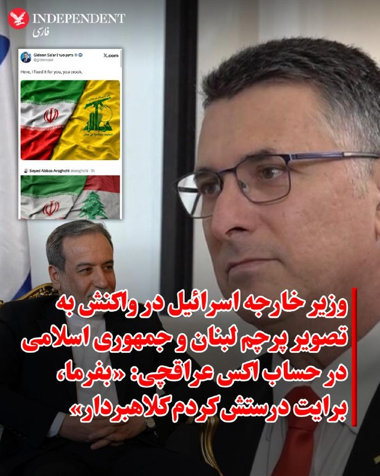

♦️گیدئون سعار، وزیر خارجه اسرائیل، در واکنش به تصویری که عباس عراقچی، وزیر خارجه جمهوری اسلامی، از پرچم‌های لبنان و جمهوری اسلامی در حساب کاربری خود در اکس منتشر کرده بود، نسخه‌ای ویرایش‌شده از همان تصویر را بازنشر کرد.

در تصویر منتشرشده از سوی سعار، پرچم حزب‌الله لبنان جایگزین پرچم لبنان شده بود. وزیر خارجه اسرائیل در توضیح این تصویر خطاب به عراقچی نوشت: «بفرما، برایت درستش کردم کلاهبردار.»
‌🇸🇦 Indypersian

🤖 @VahidOOnLine

## VahidOOnLine — post 244246

  <a href="telegram/content/VahidOOnLine_244246_1780887169.mp4" target="_blank">🎬 Download video</a>

♦️تصاویر منتشر شده در شبکه‌های اجتماعی، صبح دوشنبه، ۱۸ خردادماه، آتش‌سوزی پس از حمله اسرائیل به نقطه‌ای در اصفهان را نشان می‌دهد. گزارش‌ها حاکی از‌آن است که حمله‌ها در محدوده نجف آباد اصفهان انجام شده است.
سخنگوی ارتش اسرائیل در نخستین ساعات بامداد دوشنبه و اندکی پس از حمله‌های موشکی جمهوری اسلامی به اسرائیل در گزارش اولیه اعلام کرد: «نیروی هوایی اسرائیل، تحت هدایت رکن اطلاعات ارتش، اندکی قبل به اهداف نظامی رژیم ایران در غرب و مرکز ایران حمله کرد».
‌🇸🇦 Indypersian

🤖 @VahidOOnLine

## mwarmonitor — post 10381

🔸یک مقام نظامی آمریکایی: ارتش ایالات متحده در حملات اسرائیل به ایران مشارکت نداشته است.

@mwarmonitor

## mwarmonitor — post 10380

🔴خبرگزاری آسوشیتدپرس ؛ عربستان سعودی در منطقه‌ای که میزبان پایگاه هوایی «شاهزاده سلطان» و نیروهای آمریکایی است، هشدار موشکی صادر کرده است. @mwarmonitor

## pm_afshaa — post 92778

اول اسرائیل لبنان رو زد.
بعد ایران اسرائیل رو زد.
اسرائیل برگشت ایران زد.
آخرش ایران عربستان رو زد.

یک روز عادی در خاورمیانه :

💧 Rainbet.com the #1 Non-KYC Crypto Casino & Sportsbook @rainbetcom

😁 @Pm_Afshaa

## IranIntlTV — post 341098

  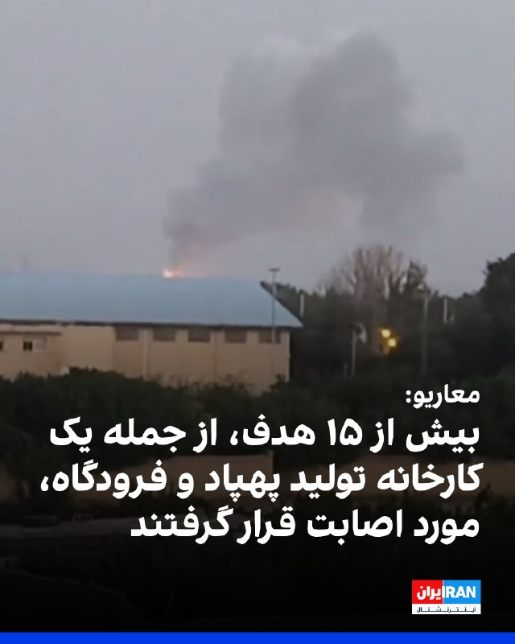

روزنامه معاریو نوشت نیروی هوایی اسرائیل در پاسخ به حمله موشکی جمهوری اسلامی در شب گذشته، به اهداف نظامی در غرب و مرکز ایران حمله کردند.

معاریو اشاره کرد که بیش از ۱۵ هدف، از جمله یک کارخانه تولید پهپاد و فرودگاه بین‌المللی تهران، مورد اصابت قرار گرفتند.
https://iranintl.com/202606086504

## Shin_Persian — post 6693

Shin ✓ @hey_itsmyturn
Mon, 08 Jun 2026 02:42:30 UTC

Al Arabiya says the situation is over.

فارسی

العربیه می‌گوید وضعیت به پایان رسیده است.

𝕏 · @shin_persian

## BBCPersian — post 283131

  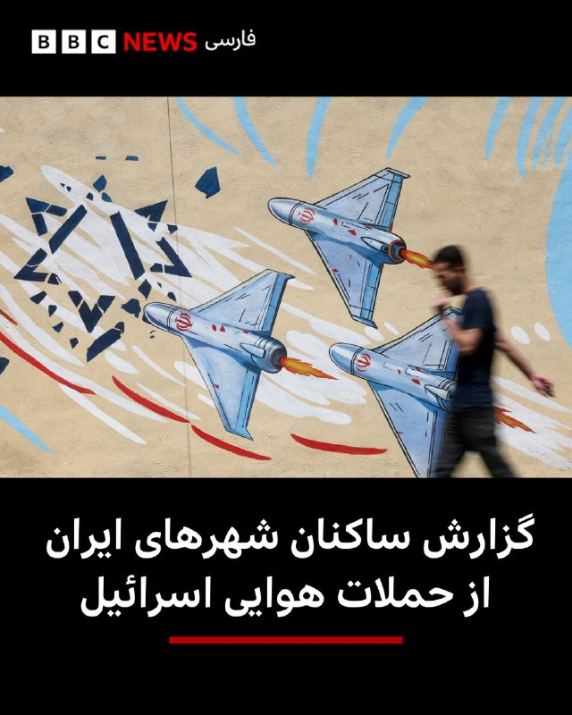

🔻همزمان با تایید ارتش اسرائیل مبنی بر حملات هوایی به شهرهای ایران، ساکنان مناطق مختلف تهران و شهرهای دیگر از شنیدن صدای انفجار خبر دادند.

کانال تلگرامی وحید آنلاین برخی از این گزارش‌ها را منتشر کرده است که در آنها ساکنان نقاط مختلف تهران، اصفهان، کرج، تبریز، ارومیه، نجف آباد اصفهان،‌ قروه در کردستان، ملارد و چند نقطه دیگر در کرج از شنیدن صدای انفجار خبر داده‌اند.

همزمان حمله هوایی به فرودگاه مهرآباد تهران هم گزارش شده است.

📸 Reuters

https://bbc.in/4fwDUTo
@BBCPersian

## Dirty_Kids — post 391327

پنج سال دیگه تیمارستان‌ها پر میشه از بیمارهایی که به تخت بسته شدن و داد میزنن «امشب دیگه می‌زنه»، «زیرساخت‌ها رو دارن میزنن»، «اینترنتو وصل کن مادرجنده» و...

---
📅 بروزرسانی: 1405/03/18 06:13
---

## mwarmonitor — post 10379

  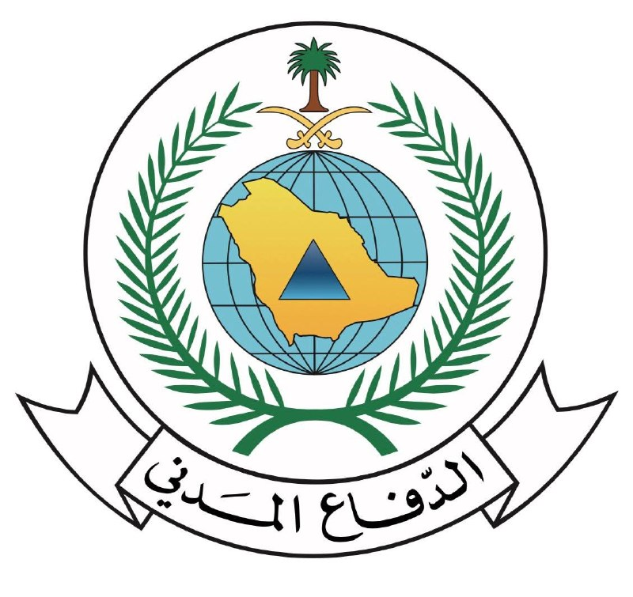

🚨دفاع مدنی عربستان سعودی می‌گوید هشدار اولیه در شهر الخرج برای آگاه‌سازی از خطر احتمالی صادر شده است. رویترز @mwarmonitor

## mwarmonitor — post 10378

🔴خبرگزاری آسوشیتدپرس ؛ عربستان سعودی در منطقه‌ای که میزبان پایگاه هوایی «شاهزاده سلطان» و نیروهای آمریکایی است، هشدار موشکی صادر کرده است.

@mwarmonitor

## mwarmonitor — post 10377

🚨دفاع مدنی عربستان سعودی می‌گوید هشدار اولیه در شهر الخرج برای آگاه‌سازی از خطر احتمالی صادر شده است. رویترز

@mwarmonitor

## mwarmonitor — post 10376

انفجارها در عربستان سعودی.

## mwarmonitor — post 10375

انفجارها در عربستان سعودی.

## pm_afshaa — post 92777

  <a href="telegram/content/pm_afshaa_92777_1780886593.webm" target="_blank">🎬 Download video</a>

🔴دو انفجار در نزدیکی پایگاه هوایی شاهزاده سلطان در عربستان گزارش شده.

💧 Rainbet.com the #1 Non-KYC Crypto Casino & Sportsbook @rainbetcom

😁 @Pm_Afshaa

## pm_afshaa — post 92776

  <a href="telegram/content/pm_afshaa_92776_1780886593.webm" target="_blank">🎬 Download video</a>

🔴وزارت دفاع عربستان: در حال مقابله با حملات موشکی و پهبادی در استان الخراج هستیم. 
💧 Rainbet.com the #1 Non-KYC Crypto Casino & Sportsbook @rainbetcom 
😁 @Pm_Afshaa

## pm_afshaa — post 92775

  <a href="telegram/content/pm_afshaa_92775_1780886594.webm" target="_blank">🎬 Download video</a>

🔴وزارت دفاع عربستان:
در حال مقابله با حملات موشکی و پهبادی در استان الخراج هستیم.

💧 Rainbet.com the #1 Non-KYC Crypto Casino & Sportsbook @rainbetcom

😁 @Pm_Afshaa

## pm_afshaa — post 92774

  <a href="telegram/content/pm_afshaa_92774_1780886594.webm" target="_blank">🎬 Download video</a>

🔴هم‌اکنون آژیر خطر و هشدار های حمله موشکی در عربستان سعودی فعال شد.

💧 Rainbet.com the #1 Non-KYC Crypto Casino & Sportsbook @rainbetcom

😁 @Pm_Afshaa

## pm_afshaa — post 92773

مثل اینکه عربستان رو زدن😐😂

## VahidOnline — post 76024

  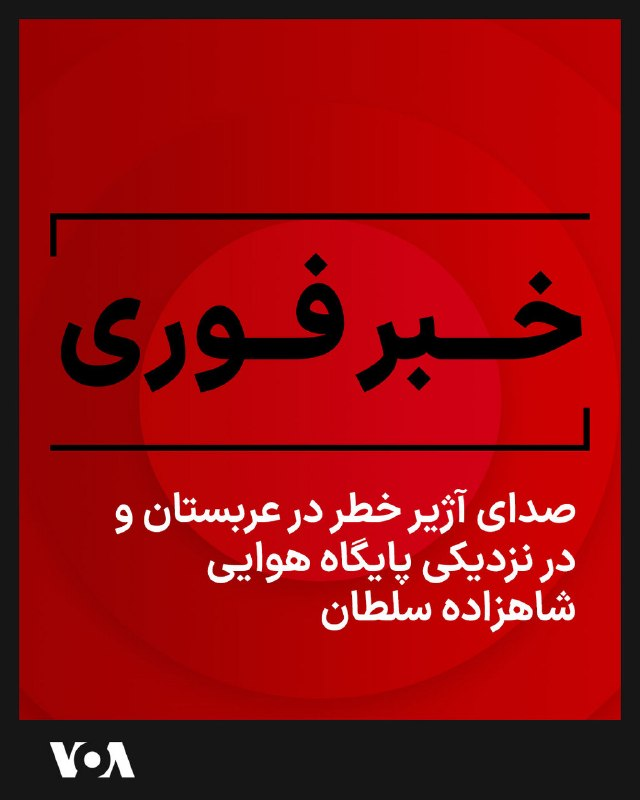

⚡️آسوشیتدپرس گزارش داد که عربستان سعودی در منطقه‌ای که پایگاه هوایی شاهزاده سلطان، میزبان نیروهای آمریکایی است، آژیر خطر موشکی به صدا درآورد.
@VahidHeadline

📡 @VahidOnline

## Shin_Persian — post 6692

Shin ✓ @hey_itsmyturn
Mon, 08 Jun 2026 02:41:21 UTC

Sirens in Kharj, #KSA 🇸🇦 (SE of Riyadh, where PSAB is located)

فارسی

آژیرهای خطر در الخرج، عربستان سعودی 🇸🇦 (جنوب شرقی ریاض، جایی که پایگاه هوایی شاهزاده سلطان واقع شده است) #KSA

𝕏 · @shin_persian

## FarsiVOA — post 219969

  

⚡️آسوشیتدپرس گزارش داد که عربستان سعودی در منطقه‌ای که پایگاه هوایی شاهزاده سلطان، میزبان نیروهای آمریکایی است، آژیر خطر موشکی به صدا درآورد.
@FarsiVOA

## BBCPersian — post 283130

🔻جام جهانی ۲۰۲۶: چهره‌های جدید و تیم‌هایی که سال‌ها غایب بودند

🖌عبد‌السلام حتامله, بی‌بی‌سی عربی

جام جهانی فوتبال ۲۰۲۶، صحنه نواخته شدن سرود ملی کشورهایی خواهد بود که با وجود داشتن تیم‌های فوتبال پرآوازه، سال‌های سال و حتی در بعضی موارد بیش از نیم قرن در صعود به این رقابت‌ها ناکام مانده بودند.

https://bbc.in/4dU8N2L
@BBCPersian

## Dirty_Kids — post 391326

آسوشیتدپرس گزارش داد که عربستان سعودی در منطقه‌ای که پایگاه هوایی شاهزاده سلطان، میزبان نیروهای آمریکایی است، آژیر خطر موشکی به صدا درآورد.

---
📅 بروزرسانی: 1405/03/18 06:03
---

## VahidOOnLine — post 244245

  

یک خبرنگار روزنامه هاآرتص پس از اعلام ارتش اسرائیل مبنی بر حمله به اهداف نظامی در غرب و مرکز ایران، این اقدام را در تضاد با درخواست‌های علنی اخیر دونالد ترامپ، رییس‌جمهوری آمریکا، برای خودداری از تشدید تنش‌ها دانست و دو سناریوی محتمل را درباره موضع واشینگتن مطرح کرد.

بن ساموئلز در شبکه اجتماعی ایکس نوشت که با وقوع این حمله، اکنون دو احتمال وجود دارد: یا دولت ترامپ و بنیامین نتانیاهو در چارچوب یک عملیات فریب و گمراه‌سازی هماهنگ عمل کرده‌اند، یا اینکه نخست‌وزیر اسرائیل به‌طور آشکار درخواست رییس‌جمهوری آمریکا مبنی بر خودداری از اقدام تلافی‌جویانه علیه [حکومت] ایران را نادیده گرفته است.

او افزود در صورت صحت سناریوی نخست، این موضوع می‌تواند پیامدهای قابل توجهی برای روند تلاش‌های دیپلماتیک میان واشینگتن و تهران داشته باشد، و تاکید کرد: «در هر دو صورت، کمربندها را محکم ببندید.»

این اظهارات در حالی مطرح می‌شود که ترامپ طی روز گذشته بارها بر ضرورت ادامه مذاکرات با جمهوری اسلامی تاکید کرده و از اسرائیل خواسته بود از اقداماتی که می‌تواند روند گفت‌وگوها را مختل کند، خودداری کند.

‌🏁 🇬🇧 IranintlTV

🤖 @VahidOOnLine

## VahidOOnLine — post 244242

  

♦️آتش‌نشانی تهران اعلام کرد: صبح دوشنبه دست کم صدای ۲ انفجار حوالی ساعت ۴:۴۳ و ۴:۴۵ در نقاط مختلفی از غرب تهران شنیده شد و ادعاهایی درباره هدف قرار گرفتن فرودگاه مهرآباد منتشر شده است. سخنگوی آتش نشانی تهران از آماده باش آتش‌نشانی خبر داد، اما اعلام کرد که نقاط شهری در تهران هدف قرار نگرفته‌اند.
‌🇸🇦 Indypersian

🤖 @VahidOOnLine

## VahidOOnLine — post 244241

  

♦️همزمان با شنیده شدن صدای انفجارهای متعدد در شهرهای غربی و مرکزی ایران از جمله تهران، خبرگزاری تسنیم، نزدیک به سپاه از انفجار در بغداد خبر داد و نوشت که صدای آن در سراسر پایتخت عراق شنیده شده است. منابع دولت عراق هنوز در این زمینه اظهارنظر نکرده‌اند.
‌🇸🇦 Indypersian

🤖 @VahidOOnLine

## mwarmonitor — post 10374

🚨رسانه‌های اسرائیلی: نیروی دریایی اسرائیل در حمله به ایران مشارکت داشته است.

@mwarmonitor

## mwarmonitor — post 10373

🔴جبهه داخلی اسرائیل: از همه اسرائیلی‌ها می‌خواهیم نزدیک پناهگاه‌ها بمانند و از تجمع خودداری کنند.

@mwarmonitor

## mwarmonitor — post 10372

🔴جبهه داخلی اسرائیل: محدودیت‌های اضطراری را دوباره اعمال می‌کنیم و مدارس و مؤسسات آموزشی همچنان تعطیل خواهند بود.

@mwarmonitor

## FoxNewsTwitter — post 342708

  

Fox News (Twitter/X)

The retaliation didn't take long.

Hours after Iran launched ballistic missiles toward northern Israel, the IDF says Israeli warplanes struck targets in western and central Iran.

Explosions were reportedly heard across multiple Iranian cities, including Tehran, Tabriz and Isfahan.

The exchange threatens to deepen tensions as President Trump attempts to negotiate a deal with Iran.

## VahidOnline — post 76023

  

آتش‌نشانی تهران اعلام کرد: صبح دوشنبه دست کم صدای ۲ انفجار حوالی ساعت ۴:۴۳ و ۴:۴۵ در نقاط مختلفی از غرب تهران شنیده شد و ادعاهایی درباره هدف قرار گرفتن فرودگاه مهرآباد منتشر شده است. سخنگوی آتش نشانی تهران از آماده باش آتش‌نشانی خبر داد، اما اعلام کرد که نقاط شهری در تهران هدف قرار نگرفته‌اند.
@VahidOOnLine

📡 @VahidOnline

## IranIntlTV — post 341095

  

یک خبرنگار روزنامه هاآرتص پس از اعلام ارتش اسرائیل مبنی بر حمله به اهداف نظامی در غرب و مرکز ایران، این اقدام را در تضاد با درخواست‌های علنی اخیر دونالد ترامپ، رییس‌جمهوری آمریکا، برای خودداری از تشدید تنش‌ها دانست و دو سناریوی محتمل را درباره موضع واشینگتن مطرح کرد.

بن ساموئلز در شبکه اجتماعی ایکس نوشت که با وقوع این حمله، اکنون دو احتمال وجود دارد: یا دولت ترامپ و بنیامین نتانیاهو در چارچوب یک عملیات فریب و گمراه‌سازی هماهنگ عمل کرده‌اند، یا اینکه نخست‌وزیر اسرائیل به‌طور آشکار درخواست رییس‌جمهوری آمریکا مبنی بر خودداری از اقدام تلافی‌جویانه علیه [حکومت] ایران را نادیده گرفته است.

او افزود در صورت صحت سناریوی نخست، این موضوع می‌تواند پیامدهای قابل توجهی برای روند تلاش‌های دیپلماتیک میان واشینگتن و تهران داشته باشد، و تاکید کرد: «در هر دو صورت، کمربندها را محکم ببندید.»

این اظهارات در حالی مطرح می‌شود که ترامپ طی روز گذشته بارها بر ضرورت ادامه مذاکرات با جمهوری اسلامی تاکید کرده و از اسرائیل خواسته بود از اقداماتی که می‌تواند روند گفت‌وگوها را مختل کند، خودداری کند.

https://iranintl.com/202606080608

## Persian_Trend_Official — post 16034

حملات هوایی اسرائیل با استفاده از موشک‌های کروز و بالستیک هواپرتاب از محدوده دریای مدیترانه انجام شده است.
گزارشاتی و تصاویری نیز درباره رهگیری و انهدام چند موشک اسرائیلی در آسمان عراق منتشر شده که بزودی تو کانال میزارم

## Persian_Trend_Official — post 16033

  <a href="telegram/content/Persian_Trend_Official_16033_1780885988.webm" target="_blank">🎬 Download video</a>

غیر رسمی/نجف‌آباد

## Persian_Trend_Official — post 16032

حمله محدود بوده تا به اینجای کار به نظر بیشتر حملات با سلاح های دورایستا شامل کروز های دریاپرتاب و بالستیک های هواپرتاب انجام شده و اهداف نظامی بوده اند و احتمالا تلاش شده سطح تنش محدود نگه داشته شود.

## Persian_Trend_Official — post 16031

  <a href="telegram/content/Persian_Trend_Official_16031_1780885989.webm" target="_blank">🎬 Download video</a>

سخنگوی ارتش اسرائیل:

نیروی هوایی به هدایت آمان به تازگی اهداف نظامی ایران را در غرب و مرکز ایران مورد حمله قرار داد.

## Dirty_Kids — post 391325

بریم بخوابیم دو ساعت دیگه پاشیم پست بزنیم

از همین الان کس مادر اونیکه دکمه قطع اینترنت رو میزنه.

@Dirty_Kids 👻

## Dirty_Kids — post 391324

افراد پشت پدافند رو جوری که بدفاز نشن یواش بیدار کنین، نماز صبحشون قضا شد.

@Dirty_Kids 👻

---
📅 بروزرسانی: 1405/03/18 05:52
---

## FoxNewsTwitter — post 342707

  

Fox News (Twitter/X)

A race that looked like a potential political upset just got even more dramatic.

After leading earlier in the day, reality TV personality Spencer Pratt has fallen behind Los Angeles City Council member Nithya Raman in the latest vote count, according to the Associated Press.

Raman now holds a narrow lead of roughly 3,000 votes, but the race remains uncalled as election officials continue tallying ballots.

The winner will advance to face incumbent Mayor Karen Bass in the runoff.

## pm_afshaa — post 92772

  <a href="telegram/content/pm_afshaa_92772_1780885379.webm" target="_blank">🎬 Download video</a>

🔴کاخ سفید: آمریکا در حملات صبح امروز اسرائیل به ایران دخالتی نداشته.

💧 Rainbet.com the #1 Non-KYC Crypto Casino & Sportsbook @rainbetcom

😁 @Pm_Afshaa

## pm_afshaa — post 92771

  <a href="telegram/content/pm_afshaa_92771_1780885380.webm" target="_blank">🎬 Download video</a>

🔴اکسیوس به نقل از یک مقام آمریکایی:
حملات اسرائیل به ایران از نظر دامنه نسبتاً محدود بود.

💧 Rainbet.com the #1 Non-KYC Crypto Casino & Sportsbook @rainbetcom

😁 @Pm_Afshaa

## pm_afshaa — post 92770

  <a href="telegram/content/pm_afshaa_92770_1780885381.webm" target="_blank">🎬 Download video</a>

🔴والا نیوز: نیروی هوایی اسرائیل بیش از 10 سایت از جمله سامانه‌‌های دفاع هوایی و موشک‌های بالستیک رو در ایران هدف قرار داد!

💧 Rainbet.com the #1 Non-KYC Crypto Casino & Sportsbook @rainbetcom

😁 @Pm_Afshaa

## pm_afshaa — post 92769

  <a href="telegram/content/pm_afshaa_92769_1780885381.webm" target="_blank">🎬 Download video</a>

🔴آتش‌نشانی تهران:
نقاط شهری هدف قرار نگرفته.

صبح امروز دست کم صدای 2 انفجار در نقاطی از غرب تهران شنیده شد و ادعاهایی درباره هدف قرار گرفتن فرودگاه مهرآباد منتشر شده.

💧 Rainbet.com the #1 Non-KYC Crypto Casino & Sportsbook @rainbetcom

😁 @Pm_Afshaa

## VahidOnline — post 76022

  

⚡️یک خبرنگار اسرائیلی حوزه دفاعی به نام امیر بوخبوط می‌گوید که نیروی هوایی اسرائیل صبح دوشنبه به ده مکان در ایران حمله کرده است که از جمله سامانه‌های پدافند هوایی و موشک‌های بالستیک در آن‌ها قرار داشتند.
@VahidHeadline

📡 @VahidOnline

## VahidOnline — post 76021

  

♦️سپاه پاسداران انقلاب اسلامی در بیانیه‌ای ادعا کرد، ارتش اسرائیل در حمله‌های بامداد دوشنبه که پس از حمله‌های یکشنبه شب سپاه به شمال اسرائیل انجام شد، از «موشک‌های بالستیک پرتاب‌شونده از هوا» استفاده کرده است. ارتش اسرائیل هنوز نوع سلاح‌های به کار رفته را اعلام نکرده و تنها گفته است که به مواضع رژیم ایران در غرب و مرکز ایران حمله کرده است.
@VahidOOnLine

📡 @VahidOnline

## VahidOnline — post 76019

کانال ۱۲ اسرائیل از حمله نیروی هوایی این کشور به فرودگاه مهرآباد تهران خبر داد.
@VahidOOnLine
درحالی که هنوز ارتش اسرائیل اعلام نکرده حمله‌های بامداد دوشنبه در پاسخ به حمله‌های یکشنبه شب سپاه پاسداران به شمال اسرائیل را با چه تجهیزات و تسلیحاتی انجام داده است، کانال ۱۴ تلویزیون اسرائیل گفت که جنگنده های اسرائیلی اهدافی را در ایران هدف قرار داده است.
@VahidOOnLine

📡 @VahidOnline

## kianmeli1 — post 87775

‏🔴فوری-شبکه «آی ۲۴نیوز» اسرائیل گزارش داد بر اساس گزارش‌های اولیه، اسرائیل تاکنون دست‌کم ۱۵ هدف را در نقاط مختلف ایران هدف قرار داده است. به گفته این شبکه، از جمله اهداف مورد حمله یک مرکز تولید پهپاد، فرودگاه بین‌المللی تهران و تاسیسات راهبردی نفتی بوده‌اند
https://t.me/+_a5ind9hr7sxOTE0

## kianmeli1 — post 87774

🔴آتش‌نشانی تهران اعلام کرد که صبح امروز دست کم صدای ۲ انفجار حوالی ساعت ۴:۴۳ و ۴:۴۵ در نقاط مختلفی از غرب تهران شنیده شد اما نقاط شهری در تهران هدف قرار نگرفته‌اند
https://t.me/+_a5ind9hr7sxOTE0

## FarsiVOA — post 219968

  

⚡️یک خبرنگار اسرائيلی حوزه دفاعی به نام امیر بوخبوط می‌گوید که نیروی هوایی اسرائيل صبح دوشنبه به ده مکان در ایران حمله کرده است که از جمله سامانه‌های پدافند هوایی و موشک‌های بالستیک در آن‌ها قرار داشتند.
@FarsiVOA

## Persian_Trend_Official — post 16030

کانال ۱۲ اسرائیل:
موج اول حملات به ایران به پایان رسید
اسرائیل در انتظار حمله ایرانی‌ها است

## Persian_Trend_Official — post 16029

کاخ سفید: ایالات متحده در حمله اسرائیل به ایران دخالتی نداشت.

## Persian_Trend_Official — post 16028

  

تصویری از نقاطی که در آنها حمله گزارش شده است، شامل تبریز،ارومیه،کردستان،کرمانشاه،کرج،تهران،اصفهان،شیراز و جزیره خارک

## Persian_Trend_Official — post 16027

آتش‌نشانی تهران:
نقاط شهری هدف قرار نگرفته است

صبح امروز دست‌کم صدای دو انفجار حوالی ساعت ۴:۴۳ و ۴:۴۵ در نقاط مختلفی از غرب تهران شنیده شد و ادعاهایی درباره هدف قرار گرفتن فرودگاه مهرآباد منتشر شده است.

سخنگوی آتش‌نشانی تهران در گفت‌وگو با ایرنا از آماده‌باش آتش‌نشانی خبر داد، اما اعلام کرد که نقاط شهری در تهران هدف قرار نگرفته‌اند.

---
📅 بروزرسانی: 1405/03/18 05:43
---

## VahidOOnLine — post 244240

  

♦️سپاه پاسداران انقلاب اسلامی در بیانیه‌ای ادعا کرد، ارتش اسرائیل در حمله‌های بامداد دوشنبه که پس از حمله‌های یکشنبه شب سپاه به شمال اسرائیل انجام شد، از «موشک‌های بالستیک پرتاب‌شونده از هوا» استفاده کرده است. ارتش اسرائیل هنوز نوع سلاح‌های به کار رفته را اعلام نکرده و تنها گفته است که به مواضع رژیم ایران در غرب و مرکز ایران حمله کرده است.
‌🇸🇦 Indypersian

🤖 @VahidOOnLine

## VahidOOnLine — post 244239

  

سپاه پاسداران صبح دوشنبه در بیانیه‌ای اعلام کرد که اسرائیل با استفاده از موشک‌های بالستیک هواپرتاب اقدام به حمله به اهدافی در خاک ایران کرد.
‌🏁 🇬🇧 IranintlTV

🤖 @VahidOOnLine

## VahidOOnLine — post 244238

  

♦️درحالی که هنوز ارتش اسرائیل اعلام نکرده حمله‌های بامداد دوشنبه در پاسخ به حمله‌های یکشنبه شب سپاه پاسداران به شمال اسرائیل را با چه تجهیزات و تسلیحاتی انجام داده است، کانال ۱۴ تلویزیون اسرائیل گفت که جنگنده های اسرائیلی اهدافی را در ایران هدف قرار داده است.
‌🇸🇦 Indypersian

🤖 @VahidOOnLine

## VahidOOnLine — post 244237

  

کانال ۱۲ اسرائیل از حمله نیروی هوایی این کشور به فرودگاه مهرآباد تهران خبر داد.
‌🏁 🇬🇧 IranintlTV

🤖 @VahidOOnLine

## VahidOOnLine — post 244236

  

♦️در ساعات اولیه بامداد دوشنبه، به دنبال حمله موشکی سپاه به شمال اسرائیل و پاسخ اسرائیل که با انفجارهای شدید در غرب و مرکز ایران همراه بود، حریم هوایی ایران در اطراف فرودگاه «امام خمینی» بسته شد.
‌🇸🇦 Indypersian

🤖 @VahidOOnLine

## mwarmonitor — post 10371

🚨«گزارش‌ها حاکی است که اسرائیل حداقل ۱۵ هدف را در سراسر ایران مورد حمله قرار داده است. از جمله اهدافی که تاکنون هدف قرار گرفته‌اند: یک کارخانه تولید پهپاد، فرودگاه بین‌المللی تهران، و تأسیسات نفتی راهبردی.» I24

@mwarmonitor

## mwarmonitor — post 10370

🔴 سایت والا: نیروی هوایی اسرائیل بیش از ۱۰ هدف را از جمله سامانه‌های پدافند هوایی و موشک‌های بالستیک هدف قرار داده است.

@mwarmonitor

## mwarmonitor — post 10369

🔸سپاه پاسداران انقلاب اسلامی : دشمن صهیونیستی با استفاده از موشک‌های بالستیک شلیک‌شده از هوا، اهدافی را در خاک ما مورد حمله قرار داده است.

@mwarmonitor

## FoxNewsTwitter — post 342706

  <a href="telegram/content/FoxNewsTwitter_342706_1780884818.mp4" target="_blank">🎬 Download video</a>

Fox News (Twitter/X)

BREAKING: The Israel Defense Forces confirmed it carried out strikes Sunday in western and central Iran.

In a statement, the military said the Israeli Air Force carried out the strikes.

The strikes come after Iran launched a missile attack on Israel earlier in the day, and as President Trump warns retaliation could "blow up" peace negotiations.

## pm_afshaa — post 92768

  <a href="telegram/content/pm_afshaa_92768_1780884819.webm" target="_blank">🎬 Download video</a>

🔴سپاه: اهدافی از خاک کشورمون مورد حمله دشمن قرار گرفت.

💧 Rainbet.com the #1 Non-KYC Crypto Casino & Sportsbook @rainbetcom

😁 @Pm_Afshaa

## pm_afshaa — post 92767

  <a href="telegram/content/pm_afshaa_92767_1780884820.webm" target="_blank">🎬 Download video</a>

🔴بیش از 20 سایت ایرانی، از جمله فرودگاه مهرآباد تهران، کارخانه تولید پهپاد و سایت‌های موشکی، توسط اسرائیل هدف قرار گرفته شد.

💧 Rainbet.com the #1 Non-KYC Crypto Casino & Sportsbook @rainbetcom

😁 @Pm_Afshaa

## VahidOnline — post 76018

  

👆 نجف اباد ساعت ۴:۴۰ فکر کنم با پهپاد زدن

سار پیام‌های دریافتی:
کرج هستیم الان دوشنبه ساعت ۴:۴۳ دقیقه صبح از راه دور صدای انفجار بسیار بزرگی اومد

سلام وحید سمت شهرک غرب ۴:۴۳ دو بار تا الان صدا اومد خفیف بود

ما رباط کریم هستیم
ساعت ۴:۴۵ صبح ۴ بار صدای انفجار اوم

وحید ساعت 4:44 صدای انفجار نزدیک سمت جنوب تهران (باقرشهر) شنیده شد طوری ک خونه لرزید

سلام،چهاردانگه دوبار صدای بلند اومد ساعت ۴:۴۳ دقیقه

سلام وحید سمت مهرآباد ساعت 4:45 دو تا صدای انفجار شبیه دوران جنگ اومد

ما شمال غرب تهران چند دقیقه پیش و دقایق قبلش صدای انفجار مهیبی شنیدیم ولی دور بود. صدای جنگنده هم نیومد

📡 @VahidOnline
بقیه پیام‌ها رو هم بعدا در این پست جا می‌دمن.

## kianmeli1 — post 87773

  

🔴صداسیما حمله به تهران،تبریز و اصفهان رو تایید کرد
https://t.me/+_a5ind9hr7sxOTE0

## kianmeli1 — post 87772

🔴فوری-ارتش اسرائیل:

تاسیسات نظامی در غرب و مرکز ایران مورد هدف قرار گرفت
https://t.me/kianmeli1

## kianmeli1 — post 87771

‏🔴وقوع دست‌کم سه انفجار در اصفهان گزارش میشود
https://t.me/kianmeli1

## kianmeli1 — post 87770

🔴سپاه اعلام کرد به ایران حمله موشکی شده است
https://t.me/kianmeli1

## IranIntlTV — post 341094

  

سپاه پاسداران صبح دوشنبه در بیانیه‌ای اعلام کرد که اسرائیل با استفاده از موشک‌های بالستیک هواپرتاب اقدام به حمله به اهدافی در خاک ایران کرد.
https://iranintl.com/202606086987

## IranIntlTV — post 341093

  

کانال ۱۲ اسرائیل از حمله نیروی هوایی این کشور به فرودگاه مهرآباد تهران خبر داد.
https://iranintl.com/202606080070

## Shin_Persian — post 6690

↩️ Quoted tweet: OSINTdefender ✓ @sentdefender Mon, 08 Jun 2026 01:30:18 UTC Get ready for an angry post on TruthSocial by President Trump. ↩️ توییت نقل‌قول شده — برای پاسخ، پست زیر را ببینید. فارسی منتظر یک پست تند و عصبی در TruthSocial از سوی پرزیدنت…

## Shin_Persian — post 6689

↩️ Quoted tweet:
OSINTdefender ✓ @sentdefender
Mon, 08 Jun 2026 01:30:18 UTC

Get ready for an angry post on TruthSocial by President Trump.

↩️ توییت نقل‌قول شده — برای پاسخ، پست زیر را ببینید.

فارسی

منتظر یک پست تند و عصبی در TruthSocial از سوی پرزیدنت ترامپ باشید.

𝕏 · @shin_persian

## Shin_Persian — post 6688

↩️ Quoted tweet: Shin ✓ @hey_itsmyturn Mon, 08 Jun 2026 02:03:34 UTC Seems like ALBMs were used for the recent strikes on Iran, not bombs. ↩️ توییت نقل‌قول شده — برای پاسخ، پست زیر را ببینید. فارسی به نظر می‌رسد که در حملات اخیر به ایران، به جای بمب از…

## Shin_Persian — post 6687

↩️ Quoted tweet:
Shin ✓ @hey_itsmyturn
Mon, 08 Jun 2026 02:03:34 UTC

Seems like ALBMs were used for the recent strikes on Iran, not bombs.

↩️ توییت نقل‌قول شده — برای پاسخ، پست زیر را ببینید.

فارسی

به نظر می‌رسد که در حملات اخیر به ایران، به جای بمب از موشک‌های بالستیک هواپایه (ALBM) استفاده شده است.

𝕏 · @shin_persian

## Shin_Persian — post 6686

Shin ✓ @hey_itsmyturn
Mon, 08 Jun 2026 02:03:34 UTC

Seems like ALBMs were used for the recent strikes on Iran, not bombs.

فارسی

به نظر می‌رسد در حملات اخیر به ایران از موشک‌های بالستیک هواپایه (ALBM) استفاده شده است، نه بمب.

𝕏 · @shin_persian

## FarsiVOA — post 219967

🔺ساعاتی پس از حمله موشکی جمهوری اسلامی؛ اسرائيل می‌گوید به مواضع «رژیم تروریستی» در مرکز و غرب ایران حمله کرد

▪️ارتش اسرائيل بامداد دوشنبه ۱۸ خرداد به وقت تهران اعلام کرد که به اهداف نظامی جمهوری اسلامی در غرب و مرکز ایران حمله کرده است.

⬇️ بیشتر بخوانید:
https://ir.voanews.com/a/8158481.html
@FarsiVOA

## Persian_Trend_Official — post 16026

الجزیره : اسرائیل انبار پهپادها رو تو تهران هدف قرار داد.

## Persian_Trend_Official — post 16025

والا نیوز عبری: نیروی هوایی اسرائیل بیش از 10 سایت از جمله سامانه‌های دفاع هوایی و موشک‌های بالستیک را هدف قرار داد.

## Persian_Trend_Official — post 16024

  

کانال ۱۴ اسرائیل: هواپیماهای ما در حال حاضر در حال حمله به اهدافی در داخل خاک ایران هستند

برخی منابع از حملات جدید ایران به مواضع دشمن خبر می دهند

## BBCPersian — post 283129

  

🔻ارتش اسرائیل با انتشار بیانیه‌ای از حملات هوایی به چند نقطه ایران خبر داده و گفته است: «نیروی هوایی اسرائیل، تحت هدایت رکن اطلاعات ارتش، اندکی قبل به اهداف نظامی رژیم تروریستی ایران در غرب و مرکز ایران حمله کرد.»

پیش از این سپاه پاسداران هشدار داده بود که در صورت اقدام متقابل اسرائیل با شدت بیشتری واکنش نشان خواهد داد.

جزئيات بيشتری درباره ماهيت اهداف مورد حمله، ميزان خسارات يا تلفات احتمالی منتشر نشده است.

اين حملات پس از آن انجام می شود که ايران ساعاتی پيش چندين موج حمله موشکی به شمال اسرائيل انجام داد و سپاه پاسداران اعلام کرد اين حملات آغاز يک هفته عمليات مستمر خواهد بود. همزمان، مقام‌های اسرائيلی هشدار داده بودند که در برابر حملات ايران واکنش نشان خواهند داد.

اين تحول در حالی رخ می دهد که دونالد ترامپ، رئيس جمهور آمريکا، در ساعات گذشته از بنيامين نتانياهو خواسته بود از اقدام تلافی‌جويانه خودداری کند تا روند مذاکرات و توافق احتمالی با ايران آسيب نبيند.

📸 EPA

https://bbc.in/4fwDUTo
@BBCPersian

---
📅 بروزرسانی: 1405/03/18 05:33
---

## VahidOOnLine — post 244235

  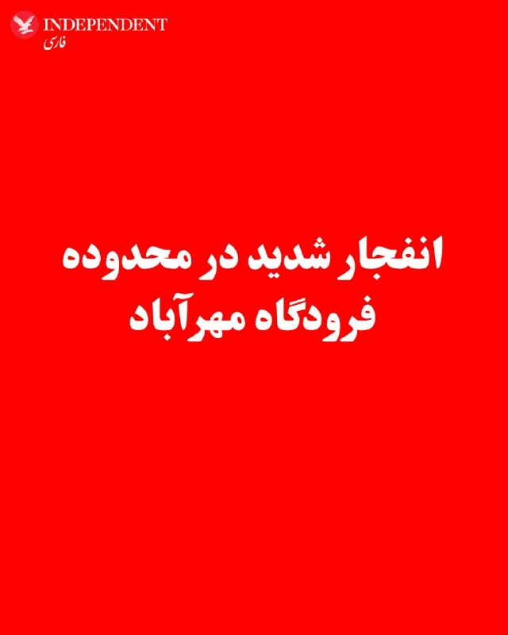

♦️گزارش‌ها حاکی از آن است که نقطه‌ای در محدوده فرودگاه مهرآباد تهران هدف گرفته شده است. برخی گزارش‌ها به هدف گرفته شدن یک انبار پهپادهای انتحاری در این منطقه اشاره دارد.
‌🇸🇦 Indypersian

🤖 @VahidOOnLine

## pm_afshaa — post 92766

یجوری زدن که این به اون در شدید نبوده

## pm_afshaa — post 92765

  <a href="telegram/content/pm_afshaa_92765_1780884185.webm" target="_blank">🎬 Download video</a>

🔴رسانه‌های اسرائیلی: جنگنده‌های اسرائیلی از آسمان عراق و مناطق دریایی موشک شلیک کردن. 
💧 Rainbet.com the #1 Non-KYC Crypto Casino & Sportsbook @rainbetcom 
😁 @Pm_Afshaa

## pm_afshaa — post 92764

  <a href="telegram/content/pm_afshaa_92764_1780884185.mp4" target="_blank">🎬 Download video</a>

انفجار در غرب تهران :

💧 Rainbet.com the #1 Non-KYC Crypto Casino & Sportsbook @rainbetcom

😁 @Pm_Afshaa

## pm_afshaa — post 92763

  <a href="telegram/content/pm_afshaa_92763_1780884186.webm" target="_blank">🎬 Download video</a>

🔴رسانه‌های اسرائیلی:
جنگنده‌های اسرائیلی از آسمان عراق و مناطق دریایی موشک شلیک کردن.

💧 Rainbet.com the #1 Non-KYC Crypto Casino & Sportsbook @rainbetcom

😁 @Pm_Afshaa

## pm_afshaa — post 92762

  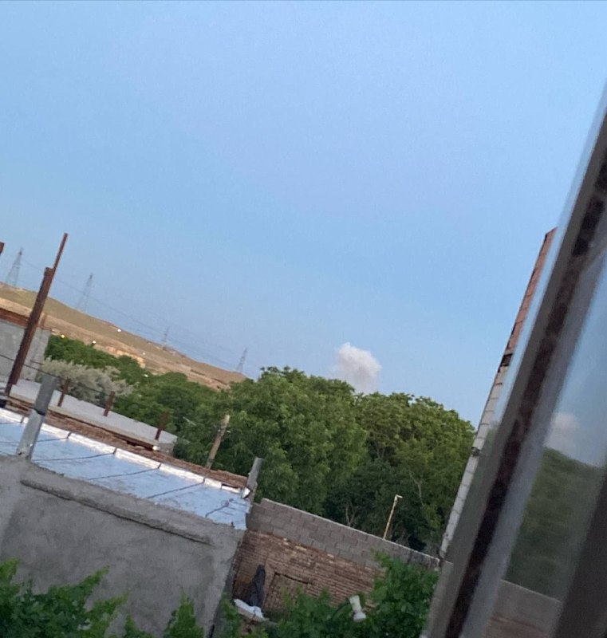

تبریز هم‌اکنون :

💧 Rainbet.com the #1 Non-KYC Crypto Casino & Sportsbook @rainbetcom

😁 @Pm_Afshaa

## pm_afshaa — post 92761

  <a href="telegram/content/pm_afshaa_92761_1780884187.webm" target="_blank">🎬 Download video</a>

🔴رسانه‌های اسرائیلی:
حملات هوایی فرودگاه مهرآباد در تهران و انباری که پهپادهای تهاجمی در آن نگهداری میشدن رو هدف قرار دادن.

💧 Rainbet.com the #1 Non-KYC Crypto Casino & Sportsbook @rainbetcom

😁 @Pm_Afshaa

## pm_afshaa — post 92760

  <a href="telegram/content/pm_afshaa_92760_1780884188.mp4" target="_blank">🎬 Download video</a>

ملارد هم‌اکنون :

💧 Rainbet.com the #1 Non-KYC Crypto Casino & Sportsbook @rainbetcom

😁 @Pm_Afshaa

## VahidOnline — post 76017

ادامه پیام‌های دریافتی ساعت ۴:۴۵

سلام ساعت ۴:۴۵
سمت خزانه دوبار صدا انفجار اومد

صدای بمب جنوب تهران
۴ ۴۵

سلام همین الان صدای دو انفجار از میدان المپیک

داره میزنننه
فردیس کرج ۴:۴۵

همین الان صدای مهیب سمت مهرآباد

ساعت ۴:۴۴ سمت غرب صدای عجیب و بلند اومد ، لرزش خفیف سعادت آباد

تهران اندیشه
دوبار صدای انفجار همین الان

سلام اصابت موشک غرب تهران تا الان دوتا انفجار 4::44

صدای دو انفجار با فاصله کرج

ساعت 4:43 دقیقه غرب تهران صدای تک انفجار
دو دقیقه بعد دوباره صدای انفجار اما دور تر

صدا انفجار داره میاد سمته غرب انگار

دوتا صدای انفجار غرب تهران

تهران زرگنده ساعت ۰۴:۴۳ صدای دو انفجار اومد

الان ساعت 4:43 دقیقه و 4: 45 دقیقه صبح غرب تهران صدای انفجار کوبنده شدید

همین الان دو تا صدای انفجار در اصفهان شنیده شد.

سلام وحید. شهرک اکباتان. صدای انقجار اومد دو بار همین الان. ساعت ۴:۴۳ و ۴:۴۵ دقیقه

صدای انفجار , کرج , ساعت ۰۴:۴۲ , ۱۸ خرداد ۱۴۰۵
صدای انفجار , کرج , ساعت ۰۴:۴۵ , ۱۸ خرداد ۱۴۰۵

کرج صدای انفجار 4:45

جنوب غرب تهران دو سه تا صدا مثل انفجار از دور اومد

صدای دو انفجار مرکز تهران ۴ و ۴۵ دقیقه صبح

یه صدای گروم مانندی اومد اما دوره مرزدارانیم ساعت ۴:۴۳ بعدی ۴:۴۵

سلام وحید جان ساعت 4:40 دقیقه رباط کریم حداقل 4 تا صدای انفجار اومد

ساعت ۴:۴۳ و ۴:۴۵
۲ تا صدای مهیبی اومد نمیدونم چی بود
سمت خیابان زنجان

زد صدا اومد
شهران ۴:۴۳
دوباره زد
نزدیک نیست ولی صدا میاد
۴:۴۵ تهران شهران

وحید ۴:۴۳ صدای انفجار دریاچه چیتگر

کرج مهرشهر دو تا انفجار به همراه لرز ساعت 4:40
احتمال میدم سمت فردیس باشه

وحید تهرانم سمت شرق یه صدا هایی میاد شبیه انفجار ولی نمیتونم تشخیص بدم

۴.۴۵ دقیقه تهران سمت غرب ۲ تا صدا انفجار

سلام غرب تهران دو بار صدای انفجار اومد

سلام وحید ساعت ۴:۴۵ دقیقه شرق صدای انفجار اومد.البته دور بود.

وحید ۴:۴۲ پرند صدای انفجار مهیب حداقل دوتا

سمت م معلمم یافت اباد
همین اطراف بوده صداش همراه با لرزش بود
دوتا صدا انفجار 4.43

وحید جان ساعت ۴:۴۵ سه تا صدا شبیه انفجار سمت غرب شنیده شد.

وحید جان شهرری همین الان دوجا رو زدن شیشه ها لرزید

ساعت ۴:۴۵ ۱ انفجار دیگه شنیده شد
دومی صدای مهیب تر بود

همین الان تهران زدن
ساعت ی ربع به پنج صبح

جنوب غرب تهران سمت تهرانسر همین الان صدای دو تا انفجار اومد حس میکنم موشک بود

4:43 و 4:45 کرج صدای خفه‌ای اومد(کاش خودش باشه)

سلام تهران سمت شرق و غرب صدای خیلی بدی اومد
۲ تا پشت سر هم ساعت 4:43

مرکز شهر سمت ۷تیر. ۳تا صدای انفجار از دور اومد الان ساعت ۴:۴۵

وحید جان صدای دو تا انفجار به فاصله یکی دو دقیقه حدود ساعت ۴:۴۴ از نزدیک ستارخان شنیدم

سلام وحید انگار دارن میزنن
سمت صادقیه تهران تا الان دو بار صدا شنیده شد
از ساعت ۴:۴۰ تا ۴:۴۵
اما بنظر دور بود معلوم نیست کجا بود

سلام مرکز شهر تهران ساعت ۴:۴۳ دوتا صدای انفجار پشت سرهم اومد ولی صدا دور بود

سلام اسلامشهر ساعت 4:42 بامداد صدای خیلی بلند اومد

صدا انفجار تهران ساعت 4:44 سمت پیامبر مرکزی

درود
دو تا صدای انفجار مانند اطراف اصفهان چند دقیقه پیش( فکر کنم نجف آباد ۴:۴۲)

📡 @VahidOnline

هنوز کلی پیام نخونده مونده. در حال آپدیت...

## kianmeli1 — post 87769

https://t.me/c/1913446326/35258

## kianmeli1 — post 87768

  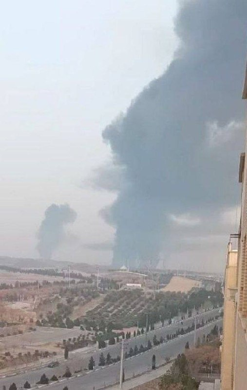

🔴فوری-خبرهایی از انفجار در پایگاه موشکی اصفهان
https://t.me/kianmeli1

## Shin_Persian — post 6685

  

Shin ✓ @hey_itsmyturn
Mon, 08 Jun 2026 01:53:22 UTC

Reportedly Isfahan suburbs
#Isfahan Province, #Iran
(Image: NOT MINE / Can't confirm)

فارسی

گزارش‌ها از حومه اصفهان
#Isfahan Province #Iran
(تصویر: متعلق به من نیست / قابل تأیید نیست)

𝕏 · @shin_persian

## FarsiVOA — post 219966

  <a href="telegram/content/FarsiVOA_219966_1780884190.mp4" target="_blank">🎬 Download video</a>

⚡️ویدیوی منتسب به آتش‌سوزی بعد از حمله اسرائيل به منطقه‌ای در اصفهان در مرکز ایران - ۱۸ خرداد ۱۴۰۵

@FarsiVOA

## Dirty_Kids — post 391323

حمله در تهران به فرودگاه مهرآباد بوده. جالبه که جمهوری اسلامی دقیقاً دیشب، تعداد زیادی هواپیما رو از مهرآباد خارج کرد (فراری داد). از اون طرف حمله ج.ا هم خسارتی نزد. همه نشانه‌ها فعلاً تلاش برای محدود نگه داشتن تنش رو نشون میده.

@Dirty_Kids 👻

## Dirty_Kids — post 391322

  <a href="telegram/content/Dirty_Kids_391322_1780884190.mp4" target="_blank">🎬 Download video</a>

🔴 انفجار و آتش سوزی غرب تهران:

@Dirty_Kids 👻

## Dirty_Kids — post 391321

  <a href="telegram/content/Dirty_Kids_391321_1780884191.mp4" target="_blank">🎬 Download video</a>

🔴 انفجار توی ملارد.

@Dirty_Kids 👻

---
📅 بروزرسانی: 1405/03/18 05:22
---

## VahidOOnLine — post 244234

  

ارتش اسرائیل اعلام کرد: «لحظاتی پیش، نیروی هوایی اسرائیل به اهداف نظامی متعلق به رژیم تروریستی ایران در غرب و مرکز ایران حمله کرد.»

ارتش اسرائیل گفت که جزئیات حمله بعدا اعلام خواهد شد.
‌🏁 🇬🇧 IranintlTV

🤖 @VahidOOnLine

## VahidOOnLine — post 244233

  

♦️سخنگوی ارتش اسرائیل در نخستین ساعات بامداد دوشنبه و اندکی پس از حمله‌های موشکی جمهوری اسلامی به اسرائیل در گزارش اولیه اعلام کرد: «نیروی هوایی اسرائیل، تحت هدایت رکن اطلاعات ارتش، اندکی قبل به اهداف نظامی رژیم ایران در غرب و مرکز ایران حمله کرد. جزئیات بیشتر متعاقبا اعلام خواهد شد.»
‌🇸🇦 Indypersian

🤖 @VahidOOnLine

## VahidOOnLine — post 244231

  

خبرگزاری فارس از وقوع انفجار در تهران، اصفهان و تبریز در بامداد دوشنبه خبر داد. خبرگزاری تسنیم از وقوع انفجار در کرج در بامداد دوشنبه خبر داد. ارتش اسرائیل نیز اعلام کرد نیروی هوایی این کشور «مدتی پیش» اهداف نظامی متعلق به «حکومت ایران» را در غرب و مرکز ایران هدف قرار داده است.
‌🏁 🇬🇧 IranintlTV

🤖 @VahidOOnLine

## mwarmonitor — post 10368

  

اصفهان

## mwarmonitor — post 10367

🔴رسانه‌های اسرائیلی: هیچ هواپیمایی بر فراز ایران وجود نداشت؛ تمام شلیک‌ها از عراق و دریا انجام شده است.

@mwarmonitor

## pm_afshaa — post 92759

آتش‌بس بالاخره نقض شد یا نه هنوز؟

## pm_afshaa — post 92758

  <a href="telegram/content/pm_afshaa_92758_1780883575.webm" target="_blank">🎬 Download video</a>

🔴تسنیم: تبریز، کرمانشاه، تهران و اصفهان مورد حمله قرار گرفتن.

💧 Rainbet.com the #1 Non-KYC Crypto Casino & Sportsbook @rainbetcom

😁 @Pm_Afshaa

## pm_afshaa — post 92757

  

کرمانشاه :

💧 Rainbet.com the #1 Non-KYC Crypto Casino & Sportsbook @rainbetcom

😁 @Pm_Afshaa

## pm_afshaa — post 92756

  <a href="telegram/content/pm_afshaa_92756_1780883576.webm" target="_blank">🎬 Download video</a>

🔴کانال 12 اسرائیل: فرودگاه مهرآباد تهران مورد حمله قرار گرفت.

💧 Rainbet.com the #1 Non-KYC Crypto Casino & Sportsbook @rainbetcom

😁 @Pm_Afshaa

## pm_afshaa — post 92755

  <a href="telegram/content/pm_afshaa_92755_1780883577.webm" target="_blank">🎬 Download video</a>

🔴صداوسیما: 3 انفجار در اصفهان رخ داده!

💧 Rainbet.com the #1 Non-KYC Crypto Casino & Sportsbook @rainbetcom

😁 @Pm_Afshaa

## pm_afshaa — post 92754

  <a href="telegram/content/pm_afshaa_92754_1780883577.webm" target="_blank">🎬 Download video</a>

🔴بیش از 12 سایت ایرانی هدف حملات هوایی اسرائیل قرار گرفتن.

💧 Rainbet.com the #1 Non-KYC Crypto Casino & Sportsbook @rainbetcom

😁 @Pm_Afshaa

## pm_afshaa — post 92753

  

شهید کشوری اصفهان

💧 Rainbet.com the #1 Non-KYC Crypto Casino & Sportsbook @rainbetcom

😁 @Pm_Afshaa

## pm_afshaa — post 92752

  

هم‌اکنون اصفهان :

💧 Rainbet.com the #1 Non-KYC Crypto Casino & Sportsbook @rainbetcom

😁 @Pm_Afshaa

## VahidOnline — post 76016

پیام‌های دریافتی از ساعت ۴:۴۰

سلام وحید جان
4:40 دقیقه انفجار از سمت سپاه تبریز طرف متظریه اومد

۴:۴۰: وحید ارومیه یه صدایی اومد نمیدونم چی بود

صدای انفجار شدید در ار‌ومیه
مشخص نیست صدای چیه

سلام آقا یک صدای مهیبی همین الان از ارومیه اومد ساعت ۴:۳۹. شب هم البته چندین تا موشک از اینجا فرستاده شده بود.

سلام وحید ارومیه ساعت 3:39 صبح صدا اومد و انگار زدن چون خونمون لرزید و دقیقا مثل موقع جنگ بود

وحیدجان نجف‌ آباد صدای چند انفجار شدید. ۴:۴۲

وحیددد
دارنن اصفهانو میزنن
نجف اباددد سمت ویلا شهر
دوتا زدن همه جا ترکید
لرزید داریم سکته میکنیم

شاباد موج انفجار شدید

سلام وحید غرب تهران صدای انفجار شدید اومد همین الان ۴:۴۳

وحید اینجا صدا انفجار اومد ۳ بار
خیلی بلند و نزدیک. ما کامل از خواب پریدیم
بدون صدای جنگنده بود.
نجف آباد اصفهان

خمینی شهر دوبار صداری انفجار اومد

وحید زد الان تهران رو
یوسف آباد ۴:۴٣ صدای انفجار از دور شنیدیم.
مجدد ۴:۴۵ صدا اومد.

۴:۴۲دقیقه همین الان دو انفجار پی در پی اسلامشهر

انفجار مرکز تهران ساعت ۴:۴۳

وحید زدددددددد
بالاخره زد
همین الان ۴:۴۳
غرب تهران سمت جنت آباد صدای وحشتناک اصابت موشک یا بمب
صدای جنگنده نیومد
دوباره الان ۴:۴۵ دومی رو زد
توضیحات اینکه چند دقیقه قبلش برق نوسان شدید کرد

صدای دو تا انفجار همین الان نجف آباد اصفهان

انفجار لرزش شیشه صادقیه تهران

غرب تهرانسر یدونه صدا

اسلامشهر همین الان صدای انفجار مهیب شنیده شد

سلام ساعت ۴:۴۱ صبح، صدای انفجار شدید تو تبریز اومد، جوری که از خواب پریدم، قطعا پدافند و اینا نبود...

وحید جان از سمت قروه کردستان صدای سه انفجار شنیدیم با فاصله ۱۵ دقیقه، به نظرم موشک خوردیم چون لرزشش زیاد بود

سلام وحید جان
ساعت ۴:۴۴ صبح اسلامشهر مرجان آباد
۲ انفجار شدید پشت سر هم

جنت آباد جنوبی صدای انفجار - ساعت ۴:۴۴ صبح - ادامه دار نبود در حد دو سه تا بود
۴:۴۵ مجدد زدن

ساعت ۴:۴۴ دوشنبه صدای ٢ انفجار با فاصله ١ دقیقه از هم غرب تهران

الان صدای دو تا انفجار شدید اومد . اصفهان

سلام از انديشه
وحيدجان فكر كنم ٢تا صداي انفجار بمبي اومد اينجا

صدای انفجار از دور
غرب تهران ۴:۴۳ حدودا

ساعت ۴:۴۲ دو تا صدای انفجار توی قائمیه اسلامشهر اومد
پشت سر هم
آنقدر شدید بود شیشه ها به شدت لرزید

ساعت ۴:۴۲ صدای انفجار خیلی خفیف شمال اصفهان
انگار خیلی دور بود از ما
فکر کنم ۳ تا بود

اسلامشهر ساعت ۴.۴۴ دقیقه صدای سه تا انفجار اومد

وحید حان مرکز تهرانیم، ساعت ۰۴:۴۴ صدای ۳ تا انفجار شنیدیم.
📡 @VahidOnline

هنوز کلی پیام نخونده مونده. در حال آپدیت...

## VahidOnline — post 76015

  

♦️ سخنگوی ارتش اسرائیل در نخستین ساعات بامداد دوشنبه و اندکی پس از حمله‌های موشکی جمهوری اسلامی به اسرائیل در گزارش اولیه اعلام کرد: «نیروی هوایی اسرائیل، تحت هدایت رکن اطلاعات ارتش، اندکی قبل به اهداف نظامی رژیم ایران در غرب و مرکز ایران حمله کرد. جزئیات بیشتر متعاقبا اعلام خواهد شد.»
@VahidOOnLine

📡 @VahidOnline

## VahidOnline — post 76014

  

🔴 رسانه‌های رسمی ایران از شنیدن انفجار و حمله هوایی به چند شهر ایران از جمله تهران، اصفهان، تبریز و نزدیک به کرج خبر می‌دهند.

bbc.in
@VahidHeadline

📡 @VahidOnline

## VahidOnline — post 76013

  

خبرگزاری فارس از وقوع انفجار در تهران، اصفهان و تبریز در بامداد دوشنبه خبر داد. خبرگزاری تسنیم از وقوع انفجار در کرج در بامداد دوشنبه خبر داد. ارتش اسرائیل نیز اعلام کرد نیروی هوایی این کشور «مدتی پیش» اهداف نظامی متعلق به «حکومت ایران» را در غرب و مرکز ایران هدف قرار داده است.
@VahidOOnLine

📡 @VahidOnline

## kianmeli1 — post 87767

‏🔴فوری-الجزیره: رسانه‌های اسرائیلی گزارش دادند حملات هوایی اخیر فرودگاه مهرآباد تهران و همچنین یک انبار نگهداری پهپادهای انتحاری را هدف قرار داده است
https://t.me/kianmeli1

## kianmeli1 — post 87766

🔴فوری-انفجارهایی در تهران و کرج و اصفهان و تبریز
https://t.me/kianmeli1

## IranIntlTV — post 341092

  

ارتش اسرائیل اعلام کرد: «لحظاتی پیش، نیروی هوایی اسرائیل به اهداف نظامی متعلق به رژیم تروریستی ایران در غرب و مرکز ایران حمله کرد.»

ارتش اسرائیل گفت که جزئیات حمله بعدا اعلام خواهد شد.
https://iranintl.com/202606088162

## IranIntlTV — post 341091

  

خبرگزاری فارس از وقوع انفجار در تهران، اصفهان و تبریز در بامداد دوشنبه خبر داد. خبرگزاری تسنیم از وقوع انفجار در کرج در بامداد دوشنبه خبر داد.
https://iranintl.com/202606087056

## Shin_Persian — post 6684

  

Shin ✓ @hey_itsmyturn
Mon, 08 Jun 2026 01:44:10 UTC

Regarding this image: Old (12 days war).

فارسی

در مورد این تصویر: قدیمی (مربوط به جنگ ۱۲ روزه).

𝕏 · @shin_persian

## FarsiVOA — post 219965

  

⚡️گزارش‌ها از شنیده شدن صدای انفحار در تهران، تبریز و اصفهان حکایت دارد. نیروی هوایی اسرائيل لحظاتی قبل از حمله به مواضع «رژیم تروریستی» در غرب و مرکز ایران خبر داد.
@FarsiVOA

## BBCPersian — post 283128

  

يک زمين لرزه شديد ساعت ۷:۳۷ صبح دوشنبه به وقت محلی جنوب فيليپين را لرزاند.

هنوز درباره قدرت و عمق دقيق اين زمين لرزه اختلاف نظر وجود دارد.

مؤسسه آتشفشان‌شناسی و زلزله‌شناسی فيليپين (فيوولکس) اعلام کرده است اين زلزله بزرگی ۷ و عمق ۱۰ کيلومتری داشته است.

در مقابل، سازمان زمين‌شناسی آمريکا بزرگی اين زمين لرزه را ۷/۸ و عمق آن را ۳۵ کيلومتر اعلام کرده است.

مرکز پژوهش‌های علوم زمين آلمان نيز بزرگی زلزله را ۷/۸ و عمق آن را ۵۰ کيلومتر برآورد کرده است.

در پی اين زمين لرزه، چند کشور منطقه از جمله فيليپين، اندونزی و ژاپن هشدار سونامی صادر کرده‌اند.

مقام‌های محلی در حال ارزيابی خسارت‌های احتمالی هستند و هنوز گزارشی رسمی از تلفات يا خسارات منتشر نشده است.

📸 Getty

https://bbc.in/4fwDUTo
@BBCPersian

## Dirty_Kids — post 391318

🔴 تصاویری از حملات به کرمانشاه، تهران و اصفهان.

@Dirty_Kids 👻

## Dirty_Kids — post 391317

ترامپ چه فیلمی بازی کرد :)))

---
📅 بروزرسانی: 1405/03/18 05:12
---

## VahidOOnLine — post 244230

  

♦️صبح دوشنبه، به دنبال بیانیه ارتش اسرائیل مبنی بر حمله به اهداف حکومت ایران در غرب و مرکز ایران، گزارش‌های مردمی حاکی از شنیده شدن صدای انفجار در تبریز و تهران است. سپاه پاسداران یکشنبه شب و در جریان آتش‌بسی که از ۱۹ فروردین‌ماه برقرار بود در چند موج حمله موشکی شمال اسرائیل را هدف قرار داد.
‌🇸🇦 Indypersian

🤖 @VahidOOnLine

## VahidOOnLine — post 244229

  

♦️ سخنگوی ارتش اسرائیل در نخستین ساعات بامداد دوشنبه و اندکی پس از حمله‌های موشکی جمهوری اسلامی به اسرائیل در گزارش اولیه اعلام کرد: «نیروی هوایی اسرائیل، تحت هدایت رکن اطلاعات ارتش، اندکی قبل به اهداف نظامی رژیم ایران در غرب و مرکز ایران حمله کرد. جزئیات بیشتر متعاقبا اعلام خواهد شد.»
‌🇸🇦 Indypersian

🤖 @VahidOOnLine

## mwarmonitor — post 10366

۳ انفجار در اصفهان

## mwarmonitor — post 10365

🔴بر اساس گزارش شبکه ۱۲ اسرائیل، فرودگاه مهرآباد در تهران هدف حمله قرار گرفته است.

@mwarmonitor

## mwarmonitor — post 10364

  

کرمانشاه

## mwarmonitor — post 10363

  

تهران کرج

## mwarmonitor — post 10362

  

انفجار در اصفهان

## mwarmonitor — post 10361

🔴جنگنده‌های اسرائیلی در آسمان پایتخت بیروت در حال پرواز هستند.

@mwarmonitor

## pm_afshaa — post 92751

🔴ارتش اسرائیل: نیروی هوایی اسرائیل دقایقی پیش به اهداف نظامی ایران تو غرب و مرکز این کشور حمله کرد.

💧 Rainbet.com the #1 Non-KYC Crypto Casino & Sportsbook @rainbetcom

😁 @Pm_Afshaa

## pm_afshaa — post 92750

زدن

## kianmeli1 — post 87765

  

🔴فوری

اصفهان زیر بمباران شدید اسراییل
https://t.me/kianmeli1

## kianmeli1 — post 87764

🔴فوری-کانال ۱۲ اسرائیل اعلام کرد که فرودگاه مهرآباد تهران مورد حمله قرار گرفته است.
https://t.me/kianmeli1

## kianmeli1 — post 87763

  

🔴فوری

حمله اسراییل به غرب ایران
https://t.me/kianmeli1

## Shin_Persian — post 6683

  

Shin ✓ @hey_itsmyturn
Mon, 08 Jun 2026 01:36:32 UTC

Regarding this image that's being published now: object shadows don't match with the current time in Iran AT ALL.

فارسی

درباره این تصویری که اکنون در حال انتشار است: سایه‌های اشیاء به هیچ وجه با زمان فعلی در ایران مطابقت ندارند.

𝕏 · @shin_persian

## Shin_Persian — post 6682

  

Shin ✓ @hey_itsmyturn
Mon, 08 Jun 2026 01:33:14 UTC

Reportedly from Isfahan
#Isfahan Province, #Iran
(Image: not mine)

فارسی

گزارش‌ها از اصفهان
استان #اصفهان، #ایران
(تصویر: متعلق به من نیست)

𝕏 · @shin_persian

## Iliaen — post 4454

  

ترجمه بیانیه رسمی ارتش اسرائیل:

“نیروی هوایی اسرائیل اندکی پیش به اهداف نظامی متعلق به رژیم تروریستی ایران در غرب و مرکز ایران حمله کرد.”

@iliaen

## FarsiVOA — post 219964

  

⚡️ارتش اسرائيل دقایقی قبل اعلام کرد که به اهداف نظامی جمهوری اسلامی در غرب و مرکز ایران حمله کرده است.
@FarsiVOA

## BBCPersian — post 283127

  

🔴 رسانه‌های رسمی ایران از شنیدن انفجار و حمله هوایی به چند شهر ایران از جمله تهران، اصفهان، تبریز و نزدیک به کرج خبر می‌دهند.

https://bbc.in/4fwDUTo
@BBCPersia

## BBCPersian — post 283126

🔻افزایش نگرانی از تشدید بحران؛ پرسش اصلی میزان نفوذ آمریکا بر اسرائیل است

جان سودورس - خبرنگار اعزامی بی‌بی‌سی به بیروت
نگرانی‌ها از تشدید درگیری‌ها در منطقه در حال افزایش است و پرسش‌هایی درباره میزان نفوذ ایالات متحده بر روند تحولات مطرح شده است.

ارتش اسرائیل پیش‌تر اعلام کرده بود پس از هدف قرار دادن مواضع حزب‌الله در بیروت، برای «احتمال حملات بیشتر» آماده است.

بیروت به نوعی به میدان رقابت ژئوپلیتیک در چارچوب درگیری گسترده‌تر میان اسرائیل و لبنان تبدیل شده است.

در حالی که بخش عمده درگیری‌ها در جنوب لبنان و در قالب حملات زمینی و هوایی شدید اسرائیل ادامه دارد، بیروت در هفته‌های اخیر به دلایل سیاسی تا حدی متفاوت مدیریت شده بود و تحت فشار آمریکا، اسرائیل تا حدی در حملات به پایتخت لبنان محتاط تر عمل می‌کرد.

اما این وضعیت امروز تغییر کرده است؛ با حمله به حومه جنوبی بیروت و گزارش‌هایی از خسارات شدید به یک ساختمان مسکونی و انتقال مجروحان به بیمارستان.

همزمان ارتش اسرائیل هشدار داده که «ممکن است حملات ادامه داشته باشد» و یکی از سخنگویان آن در شبکه اجتماعی ایکس نوشته است: «ادامه دارد».

این حمله پس از آن رخ داد که ارتش اسرائیل اعلام کرد دو پرتابه از سوی حزب‌الله از مرز عبور کرده و حزب‌الله نیز مسئولیت آن را بر عهده گرفته است.

از نگاه اسرائیل، این تحولات نشانه پایان صبر این کشور بوده است. با وجود فشارهای آمریکا، اسرائیل همواره تأکید کرده که در صورت تشخیص تهدید امنیتی، حق حمله به بیروت را برای خود محفوظ می‌داند.

این حملات تازه، نگرانی‌ها درباره احتمال گسترش بیشتر جنگ را افزایش داده است.

همچنین با توجه به گزارش‌هایی از واشنگتن که می‌گویند دونالد ترامپ این حمله را تأیید نکرده، پرسش‌هایی درباره میزان کنترل و نفوذ آمریکا بر اسرائیل مطرح شده است؛ به ویژه در شرایطی که ایالات متحده تلاش می‌کند از جنگی که خود سه ماه پیش آغاز کرده بود، خارج شود.

https://bbc.in/4fwDUTo
@BBCPersian

## BBCPersian — post 283125

  

دونالد ترامپ پس از حمله موشکی ايران به اسرائيل با چند رسانه آمريکايی و بين‌المللی گفت وگو کرده و بر لزوم جلوگيری از تشديد تنش‌ها تأکيد کرده است.

او پيش از تماس تلفنی با بنيامين نتانياهو، نخست وزير اسرائيل، به نشریه آکسیوس گفته بود که قصد دارد از نخست‌وزیر اسرائیل بخواهد در واکنش به حملات ايران اقدام تلافی جويانه انجام ندهد.

ترامپ در گفت وگو با شبکه ۱۲ اسرائيل نيز همين موضع را تکرار کرد و گفت نمی‌خواهد «حمله ديگری امشب» رخ دهد. او به نقل از تايمز آو اسرائيل گفت: «حملات ايران به کسی آسيب نزد. هر طرف کار خودش را انجام داد؛ اسرائيل حمله کرد و ايران هم حمله کرد. ما نيازی به حمله ديگری نداريم.»

او افزود که قصد دارد «همين حالا» با نتانياهو تماس بگيرد و به او بگويد از تلافی خودداری کند.»

ترامپ همچنين پيش تر در گفت وگو با فايننشال تايمز گفته بود که نتانياهو «چاره‌ای جز پذيرش توافق با ايران نخواهد داشت»، در حالی که تلاش‌ها برای رسيدن به يک توافق و مهار تنش‌های منطقه‌ای ادامه دارد.

📸 Getty

https://bbc.in/4fwDUTo
@BBCPersian

## Dirty_Kids — post 391316

  

انفجار بزرگی در نزدیکی فرودگاه مهرآباد تهران

@Dirty_Kids 👻

## Dirty_Kids — post 391315

  

ترجمه بیانیه رسمی ارتش اسرائیل:

“نیروی هوایی اسرائیل اندکی پیش به اهداف نظامی متعلق به رژیم تروریستی ایران در غرب و مرکز ایران حمله کرد.”

@Dirty_Kids 👻

---
📅 بروزرسانی: 1405/03/18 05:03
---

## VahidOOnLine — post 244228

  

♦️ حکومت ایران همزمان با حمله‌های موشکی یکشنبه شب به اسرائیل که در دوره آتش‌بس انجام شد، تهدید کرد که اگر اسرائیل حملات خود را تشدید کند، یک گذرگاه حیاتی دریایی دیگر در خاورمیانه را مسدود خواهد کرد.
علی‌اکبر ولایتی، مشاور رهبر نظام در پیامی در اکس نوشت: «امنیتِ امروزِ باب‌المندب، نباید دشمن را دچار خطای محاسباتی کند. حلقه‌های مقاومت توان قفل کردن هر دو آبراه را دارند؛ انتخاب با شماست: توقف حماقت یا ورود به موازنه ضابطه مند شدن دو تنگه!»
تنگه باب‌المندب که بین یمن از یک‌سو و جیبوتی و اریتره از سوی دیگر قرار دارد، یکی دیگر از شریان‌های حیاتی است که مسیرهای اصلی تجارت بین اروپا، آسیا و جهان عرب را به هم متصل می‌کند.
ولایتی همچنین حمله‌های یکشنبه‌شب را «حلقه اول پاسخ زنجیره‌ای جمهوری اسلامی» توصیف کرده است.
او افزود: «انتخاب با شماست: یا این حماقت را متوقف کنید یا وارد یک معادله متوازن برای کنترل دو تنگه شوید.»
سی‌ان‌ان می‌نویسد، رژیم ایران می‌تواند با فعال‌سازی نیروهای نیابتی منطقه‌ای خود، از جمله حوثی‌های یمن، زمینه بسته شدن تنگه باب‌المندب را فراهم کند
‌🇸🇦 Indypersian

🤖 @VahidOOnLine

## mwarmonitor — post 10360

انفجار در اصفهان تهران تایید شد

## mwarmonitor — post 10359

🚨نیروهای دفاعی اسرائیل (IDF): گزارش اولیه - لحظاتی پیش، نیروی هوایی اسرائیل به اهداف نظامی متعلق به رژیم تروریستی ایران در غرب و مرکز ایران حمله کرد. جزئیات تکمیلی ارسال خواهد شد.

@mwarmonitor

## mwarmonitor — post 10358

🔴چند گزارش از انفجارها در بغداد و بخش‌هایی از ایران، در آنچه می‌تواند یک حمله احتمالی اسرائیل باشد. کانال ۱۴ اسرائیل

@mwarmonitor

## mwarmonitor — post 10357

حمله به ایران

## Shin_Persian — post 6681

Shin ✓ @hey_itsmyturn
Mon, 08 Jun 2026 01:27:16 UTC

#IDF 🇮🇱:
"The Air Force, guided by Military Intelligence, struck a short time ago military targets of the Iranian terror regime in western and central Iran. Additional details to follow."
#Iran

فارسی

#IDF 🇮🇱:
"نیروی هوایی، با هدایت اطلاعات نظامی، مدتی پیش اهداف نظامی رژیم تروریستی ایران را در غرب و مرکز ایران مورد حمله قرار داد. جزئیات تکمیلی متعاقباً اعلام خواهد شد."
#Iran

𝕏 · @shin_persian

## Shin_Persian — post 6680

Shin ✓ @hey_itsmyturn
Mon, 08 Jun 2026 01:25:47 UTC

2 blasts heard in Isfahan suburbs
Isfahan Province, #Iran

فارسی

۲ انفجار در حومه اصفهان شنیده شد
استان اصفهان، #Iran_

𝕏 · @shin_persian

## Shin_Persian — post 6679

Shin ✓ @hey_itsmyturn
Mon, 08 Jun 2026 01:24:53 UTC

0113Z
5 blasts in Eastern Tehran
#Tehran Province, #Iran

فارسی

۰۱۱۳ زولو (۰۴:۴۳ به وقت تهران)
۵ انفجار در شرق تهران
#Tehran Province, #Iran

𝕏 · @shin_persian

## Shin_Persian — post 6678

Shin ✓ @hey_itsmyturn
Mon, 08 Jun 2026 01:24:12 UTC

0110Z
Blast in Urmia
West Azerbaijan Province, #Iran

فارسی

۰۱۱۰ زولو (۰۴:۴۰ به وقت تهران)
انفجار در ارومیه
استان آذربایجان غربی، #Iran_

𝕏 · @shin_persian

## Shin_Persian — post 6677

Shin ✓ @hey_itsmyturn
Mon, 08 Jun 2026 01:22:41 UTC

Blasts shaking Baghdad now
#Iraq 🇮🇶

فارسی

انفجارها هم‌اکنون بغداد را می‌لرزانند
#Iraq 🇮🇶

𝕏 · @shin_persian

## Iliaen — post 4453

ساعت ۰۴:۵۴ صبح دوشنبه؛ گزارش‌ها از شنیده شدن انفجارهای متعدد در سایت موشکی تبریز، سایت پدافند آبدانان، مناطقی در اطراف تهران، شهریار، فردیس کرج و اسلامشهر حکایت دارد.

@iliaen

## Dirty_Kids — post 391314

🚨 اسرائیل تایید کرد حملاتی در ایران انجام داده

@Dirty_Kids 👻

## Dirty_Kids — post 391313

  

صدا و سیما رسما حمله به ایران رو تایید کرد.

@Dirty_Kids 👻

## Dirty_Kids — post 391312

ساعت ۰۴:۵۴ صبح دوشنبه؛ گزارش‌ها از شنیده شدن انفجارهای متعدد در سایت موشکی تبریز، سایت پدافند آبدانان، مناطقی در اطراف تهران، شهریار، فردیس کرج و اسلامشهر حکایت دارد.

@Dirty_Kids 👻

## Dirty_Kids — post 391311

گفته بودم رو خریت شیعه همیشه حساب کنید.

---
📅 بروزرسانی: 1405/03/18 04:52
---

## VahidOOnLine — post 244227

  

باراک راوید، خبرنگار آکسیوس، در شبکه اجتماعی ایکس نوشت: «یک مقام ارشد آمریکایی به من گفت که کاخ سفید به حمله اسرائیل به بیروت چراغ سبز نشان نداده بود.»

او به نقل از «یک مقام آمریکایی دیگر » نوشت: «ما هیچ نقشی در این ماجرا نداشتیم.»
‌🏁 🇬🇧 IranintlTV

🤖 @VahidOOnLine

## IranIntlTV — post 341090

  

باراک راوید، خبرنگار آکسیوس، در شبکه اجتماعی ایکس نوشت: «یک مقام ارشد آمریکایی به من گفت که کاخ سفید به حمله اسرائیل به بیروت چراغ سبز نشان نداده بود.»

او به نقل از «یک مقام آمریکایی دیگر » نوشت: «ما هیچ نقشی در این ماجرا نداشتیم.»
https://iranintl.com/202606083071

## Shin_Persian — post 6676

Shin ✓ @hey_itsmyturn
Mon, 08 Jun 2026 01:21:58 UTC

0114
Blast in western Tehran
#Tehran Province, #Iran

فارسی

۰۱۱۴ (۰۴:۴۴ به وقت تهران)
انفجار در غرب تهران
#Tehran Province, #Iran

𝕏 · @shin_persian

## Iliaen — post 4452

ساعت ۰۴:۴۷ صبح دوشنبه؛ صدای انفجار در اطراف نجف‌آباد شنیده شد.

@iliaen

## Iliaen — post 4451

ساعت ۰۴:۴۵ صبح دوشنبه؛ دو انفجار در غرب تهران (خارج از محدوده شهری) شنیده شد.

@iliaen

## BBCPersian — post 283116

🖌سوتیک بیسواس و نیتو سینگ, دهلی نو و بانده:

🔻ساعت ۶ صبح آفتاب چنان بر شهر بانده می‌تابد که انگار نه‌ انگار صبح زود است.

نور آفتاب تابش تند یک بعد‌ از‌ ظهر تابستانی داشت. سایه‌ها پیش از صبحانه رو به کوتاه شدن بودند.

در ماه مه این ناحیه غبار‌آلود هند در استان اوتار پرادش چندین روز در صدر رتبه ناخوشایند گرم‌ترین نقطه در سراسر هند بود. دمای هوا به مدت یک هفته حدود ۴۷ تا ۴۸ درجه سانتی‌گراد بود، گرمایی که حتی با معیار‌های محلی هم غیر‌عادی است.

آنچه مورد توجه قرار گرفت شیوه سازگاری مردم با چنین شرایطی بود. شهر بانده بیش از دو میلیون نفر جمعیت دارد که بسیاری از آنها از طریق کشاورزی، ساخت‌و‌ساز، حمل‌و‌نقل و کارهای دیگری که همه در فضای باز انجام می‌شود زندگی می‌کنند و در نتیجه کمابیش چاره‌ای جز تحمل گرما ندارند. آنها زندگی خود را متناسب با این وضعیت سامان داده‌اند.

📸GettyImages/ Ankit Srinivas/Hindustan/ Times via Getty Images

https://bbc.in/4oeDZgt
@BBCPersian

## Dirty_Kids — post 391308

🔴 هم‌اکنون نجف آبادِ اصفهان:

@Dirty_Kids 👻

## Dirty_Kids — post 391307

ساعت ۰۴:۴۵ صبح دوشنبه؛ دو انفجار در غرب تهران (خارج از محدوده شهری) شنیده شد.

اصفهان هم صدای انفجار گزارش شده

@Dirty_Kids 👻

## Dirty_Kids — post 391305

پاشید جنگ شد

---
📅 بروزرسانی: 1405/03/18 04:42
---

## FoxNewsTwitter — post 342705

  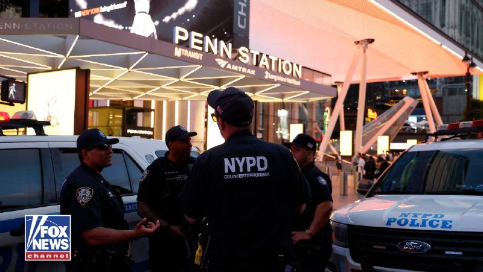

Fox News (Twitter/X)

BREAKING: Five people were stabbed near New York City's Penn Station on Sunday evening, authorities say.

FDNY officials confirmed all five victims suffered stab wounds, with one person reported in serious condition.

Photos from the scene show blood, debris and medical supplies scattered near the area as investigators work to piece together what happened.

Authorities have not released information about a suspect or possible motive, and Amtrak Police are leading the investigation.

## FarsiVOA — post 219963

  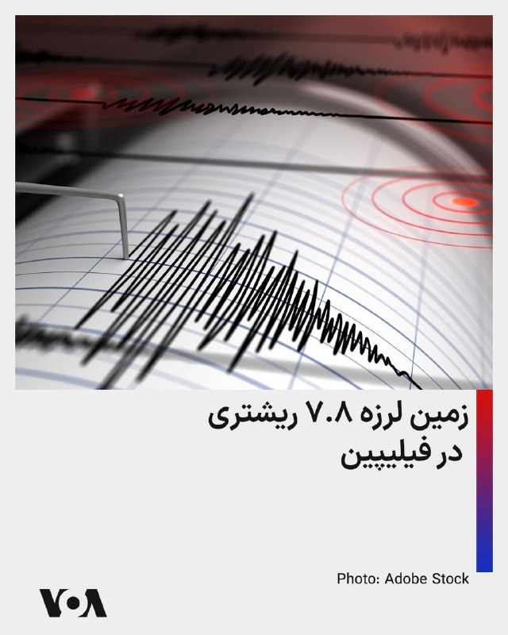

⚡️زمین لرزه‌ای ۷.۸ ریشتری لحظاتی قبل جنوب فیلیپین را لرزاند. برخی گزارش‌ها از تخریب ساختمان‌ها در شهر جنرال سانتوس حکایت دارد. این سیزدهمین شهر پرجمعیت فیلیپن است.
@FarsiVOA

---
📅 بروزرسانی: 1405/03/18 04:33
---

## VahidOOnLine — post 244226

  

آکسیوس به نقل از یک مقام ارشد آمریکایی و یک منبع اسرائیلی مطلع از جزئیات تماس تلفنی دونالد ترامپ و بنیامین نتانیاهو گزارش داد رئیس‌جمهوری آمریکا از نخست‌وزیر اسرائیل خواسته حمله موشکی جمهوری اسلامی را تلافی نکند و برای پیشبرد مذاکرات، به دیپلماسی فرصت بیشتری بدهد.

به گفته این مقام، ترامپ تأکید کرده واشینگتن به دستیابی به توافق با تهران نزدیک شده و هرگونه تشدید تنش می‌تواند روند گفت‌وگوها را مختل کند. او در این تماس گفته است: «ما به انجام کاری خوب در زمینه توافق نزدیک شده‌ایم.»

نتانیاهو در ابتدا با این درخواست مخالفت کرده، اما در نهایت «به‌ظاهر موافقت کرده» پاسخ را به تعویق بیندازد.

به گفته منبع آمریکایی، این تماس نسبت به گفت‌وگوی پرتنش هفته گذشته آرام‌تر بوده است. او افزود ترامپ معتقد است پس از سه ماه درگیری، اکنون زمان پایان دادن به بحران و حرکت به سوی یک توافق نهایی فرا رسیده است و باید از اقداماتی که می‌تواند مسیر دیپلماسی را به خطر بیندازد، پرهیز شود.
‌🏁 🇬🇧 IranintlTV

🤖 @VahidOOnLine

## VahidOOnLine — post 244225

  <a href="telegram/content/VahidOOnLine_244225_1780880587.mp4" target="_blank">🎬 Download video</a>

♦️ رویترز گزارش داد که زمین‌لرزه‌ای به بزرگی ۷.۸ روز دوشنبه ۱۸خردادماه، در نزدیکی جزیره میندانائو در جنوب فیلیپین رخ داد و در پی آن مقام‌های فیلیپین و اندونزی هشدار سونامی صادر کردند. مرکز پژوهش‌های علوم زمین آلمان اعلام کرد این زمین‌لرزه در عمق ۱۰ کیلومتری زمین رخ داده است.

مقام‌های محلی تاکنون گزارشی از تلفات جانی یا خسارت‌های گسترده منتشر نکرده‌اند، اما به گفته رئیس پلیس شهر آلابل، ساختمان پلیس دچار ترک شده و چند نفر بر اثر شدت لرزش‌ها از حال رفته‌اند. سازمان زلزله‌شناسی فیلیپین نیز درباره احتمال وقوع امواج سونامی بیش از یک متر هشدار داده است.
‌🇸🇦 Indypersian

🤖 @VahidOOnLine

## IranIntlTV — post 341089

  

آکسیوس به نقل از یک مقام ارشد آمریکایی و یک منبع اسرائیلی مطلع از جزئیات تماس تلفنی دونالد ترامپ و بنیامین نتانیاهو گزارش داد رئیس‌جمهوری آمریکا از نخست‌وزیر اسرائیل خواسته حمله موشکی جمهوری اسلامی را تلافی نکند و برای پیشبرد مذاکرات، به دیپلماسی فرصت بیشتری بدهد.

به گفته این مقام، ترامپ تأکید کرده واشینگتن به دستیابی به توافق با تهران نزدیک شده و هرگونه تشدید تنش می‌تواند روند گفت‌وگوها را مختل کند. او در این تماس گفته است: «ما به انجام کاری خوب در زمینه توافق نزدیک شده‌ایم.»

نتانیاهو در ابتدا با این درخواست مخالفت کرده، اما در نهایت «به‌ظاهر موافقت کرده» پاسخ را به تعویق بیندازد.

به گفته منبع آمریکایی، این تماس نسبت به گفت‌وگوی پرتنش هفته گذشته آرام‌تر بوده است. او افزود ترامپ معتقد است پس از سه ماه درگیری، اکنون زمان پایان دادن به بحران و حرکت به سوی یک توافق نهایی فرا رسیده است و باید از اقداماتی که می‌تواند مسیر دیپلماسی را به خطر بیندازد، پرهیز شود.
https://iranintl.com/202606084266

## BBCPersian — post 283115

  

🔻بامداد دوشنبه تصاویری از بقایای بخشی از یک موشک ایرانی که در شهر شمالی حیفا فرود آمده منتشر شد.

در تصویر بالا نیروهای امدادی و امنیتی در کنار این بخش از لاشه موشک ایرانی ایستاده‌اند.

آن‌طور که گزارش شده ایران یکشنبه شب از موشک‌های ۱۰ متری خیبرشکن با کلاهک خوشه‌ای استفاده کرده است.

📸 Reuters

https://bbc.in/4fwDUTo
@BBCPersian

---
📅 بروزرسانی: 1405/03/18 04:23
---

هیچ پیام جدیدی در این بروزرسانی ارسال نشد.

---
📅 بروزرسانی: 1405/03/18 04:13
---

## VahidOOnLine — post 244224

  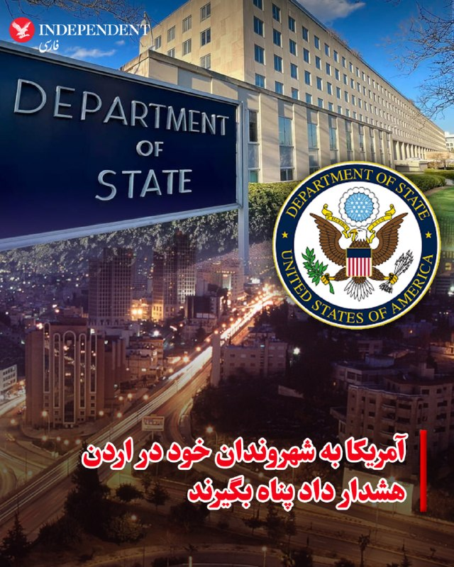

♦️وزارت خارجه آمریکا به شهروندان خود که در اردن حضور دارند هشدار داده است به دلیل وجود موشک‌ها در آسمان این کشور، در پناهگاه‌ها مستقر شوند.
در بیانیه وزارت خارجه آمریکا آمده است: «گزارش‌ها نشان می‌دهد موشک‌ها، پهپادها یا راکت‌هایی در آسمان اردن در حال پرواز هستند. فورا به دنبال پناهگاه مناسب باشید و در محل امن بمانید. در فضای داخلی بمانید و به اطلاعیه‌ها و هشدارهای محلی توجه کنید. سفارت آمریکا در اردن به بررسی وضعیت ادامه خواهد داد و در صورت لزوم اطلاعات بیشتری ارائه می‌کند.»
پیش‌تر ایران یک موج موشک بالستیک به سمت شمال اسرائیل شلیک کرده بود؛ نخستین حمله از زمان آتش‌بس ۱۹ فروردین.
‌🇸🇦 Indypersian

🤖 @VahidOOnLine

## VahidOOnLine — post 244223

  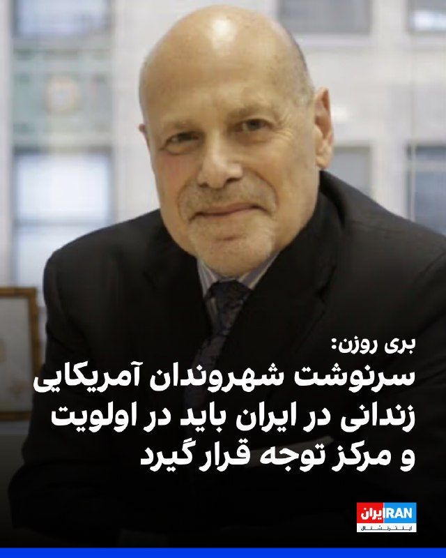

بری روزن، گروگان سابق آمریکایی در ایران، در شبکه اجتماعی ایکس نوشت به عنوان یک گروگان سابق و یکی از اعضای بنیانگذار سازمان کمک به گروگان‌ها در سراسر جهان، به شدت نگران است که در «بحبوحه تمرکز جهان بر تشدی

روزن با اشاره به گزارش کانال خبری سی‌بی‌اس در مورد پرونده‌های رضا ولی‌زاده، روزنامه‌نگار ایرانی-آمریکایی، و کامران حکمتی، که بازداشت شده و طبق گزارش‌ها در زندان اوین نگهداری می‌شوند، افزود: «زندانیان سابق که آن زندان را به خوبی می‌شناسند، هشدار دادند که این آمریکایی‌ها با خطر فوق‌العاده‌ای روبرو هستند و بزرگترین ترس هر گروگان، فراموش شدن است.»

او تاکید کرد: «در شرایطی که مذاکرات با تهران در مسیرهای مختلف ادامه دارد، سرنوشت دست‌کم شش آمریکایی که هنوز در ایران در بازداشت هستند، باید در اولویت و مرکز توجه قرار گیرد...ما نباید آنها را فراموش کنیم.»
‌🏁 🇬🇧 IranintlTV

🤖 @VahidOOnLine

## FoxNewsTwitter — post 342704

  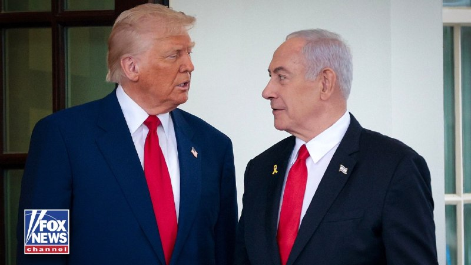

Fox News (Twitter/X)

Trump "calls the shots."

President Trump says Israeli Prime Minister Benjamin Netanyahu will likely have to accept whatever agreement the U.S. reaches with Iran.

The comments came after Iran launched missiles at Israel in its first attack since the April ceasefire, raising fears that the conflict could reignite.

Israel says the missiles were intercepted or landed in open areas, while military officials warned Iran had made a "grave mistake.

## pm_afshaa — post 92748

  <a href="telegram/content/pm_afshaa_92748_1780879415.mp4" target="_blank">🎬 Download video</a>

🔴تصاویری از زلزله 8 ریشتری فیلیپین :

💧 Rainbet.com the #1 Non-KYC Crypto Casino & Sportsbook @rainbetcom

😁 @Pm_Afshaa

## IranIntlTV — post 341088

  

بری روزن، گروگان سابق آمریکایی در ایران، در شبکه اجتماعی ایکس نوشت به عنوان یک گروگان سابق و یکی از اعضای بنیانگذار سازمان کمک به گروگان‌ها در سراسر جهان، به شدت نگران است که در «بحبوحه تمرکز جهان بر تشدی

روزن با اشاره به گزارش کانال خبری سی‌بی‌اس در مورد پرونده‌های رضا ولی‌زاده، روزنامه‌نگار ایرانی-آمریکایی، و کامران حکمتی، که بازداشت شده و طبق گزارش‌ها در زندان اوین نگهداری می‌شوند، افزود: «زندانیان سابق که آن زندان را به خوبی می‌شناسند، هشدار دادند که این آمریکایی‌ها با خطر فوق‌العاده‌ای روبرو هستند و بزرگترین ترس هر گروگان، فراموش شدن است.»

او تاکید کرد: «در شرایطی که مذاکرات با تهران در مسیرهای مختلف ادامه دارد، سرنوشت دست‌کم شش آمریکایی که هنوز در ایران در بازداشت هستند، باید در اولویت و مرکز توجه قرار گیرد...ما نباید آنها را فراموش کنیم.»
https://iranintl.com/202606080955

## BBCPersian — post 283114

🔻خلاصه آنچه در ساعات پایانی روز یکشنبه روی داد

▪️یکشنبه شب قرارگاه خاتم الانبیاء که مرکز فرماندهی جنگ در ایران است اعلام کرد در پاسخ به حملات اسرائیل به ضاحیه در جنوب بیروت، با موشک به مناطق شمال اسرائیل حمله کرده است.

▪️در اطلاعیه قرارگاه خاتم‌الانبیاء آمده بود: «قبلا اخطار داده بودیم در صورت گسترش حملات در ضاحیه بیروت، اهدافی را در اسرائیل مورد هجوم قرار می‌دهیم.»

▪️ساعتی بعد ارتش اسرائیل مدعی شد تمام موشک‌های شلیک شده از ایران را رهگیری کرده است

▪️دونالد ترامپ، رئیس جمهور آمریکا، پس از شلیک موشک‌های ایران به شمال اسرائیل، از ایران خواست تا به میز مذاکره بازگردد.
دونالد ترامپ در گفتگو با شبکه تلویزیونی آمریکایی فاکس نیوز، پیامی را برای ایران به اشتراک گذاشت: «شما موشک‌هایتان را شلیک کرده‌اید. دیگر بس است. به میز مذاکره برگردید و توافق کنید.»

▪️همزمان با حمله موشکی ایران به شمال اسرائیل و اوج گرفتن نگرانی از آغاز درگیری نظامی گسترده میان اسرائیل و ایران، عراق از بستن مرزهای هوایی خود برای ۷۲ ساعت (سه روز آینده) خبر داد.

▪️با به اوج رسیدن نگرانی از آغاز درگیری مجدد نظامی میان ایران و اسرائیل، سازمان هواپیمایی ایران اعلام کرد تمامی پروازهای شهر فرودگاهی امام خمینی از بامداد دوشنبه ۱۸ خرداد تا اطلاع ثانوی متوقف خواهد شد.

▪️وزارت خارجه ایران هم در بیانیه‌ای اعلام کرد: «هرگونه حمله از سوی اسرائيل عليه لبنان يا جمهوری اسلامی ايران با پاسخی کوبنده و فراگير مواجه خواهد شد.»

https://bbc.in/4fwDUTo
@BBCPersian

## BBCPersian — post 283113

🔻پوشش زنده...

به پوشش زنده ما از آخرین تحولات درباره تشدید درگیری نظامی میان ایران و اسرائیل در روز دوشنبه - ۱۸ خرداد - خوش آمدید.

https://bbc.in/4fwDUTo
@BBCPersian

## BBCPersian — post 283112

🔻پایان پوشش زنده...

با ورود به بامداد دوشنبه، ادامه پوشش زنده ما از آخرین تحولات ایران و جنگ در خاورمیانه به صفحه جدید زنده روز ۱۸ خرداد / ۸ ژوئن منتقل می‌شود.

با ما بمانید تا آخرین و معتبرترین اخبار ایران و جهان به ویژه تنش نظامی که روز یکشنبه آغاز شد، برایتان به طور لحظه به لحظه گزارش کنیم.

https://bbc.in/4eafvAI
@BBCPersian

---
📅 بروزرسانی: 1405/03/18 04:03
---

## VahidOOnLine — post 244222

♦️تیم ملی فوتبال عربستان سعودی، یکشنبه ۱۷ خرداد، آخرین جلسه تمرینی خود را در ورزشگاه «کیو۲» (Q2 Stadium) شهر آستین در ایالت تگزاس برگزار کرد. به گزارش رسانه‌های سعودی، این تمرین از ساعت ۶ عصر به وقت محلی و پشت درهای بسته انجام شد. بازیکنان عربستان سعودی که در روزهای گذشته تمرین‌های خود را در زمین‌های تمرینی باشگاه آستین اف‌سی دنبال کرده بودند، این بار برای هماهنگی بیشتر با شرایط مسابقه، در ورزشگاه اصلی این شهر تمرین کردند.
‌🇸🇦 Indypersian

🤖 @VahidOOnLine

## VahidOOnLine — post 244221

  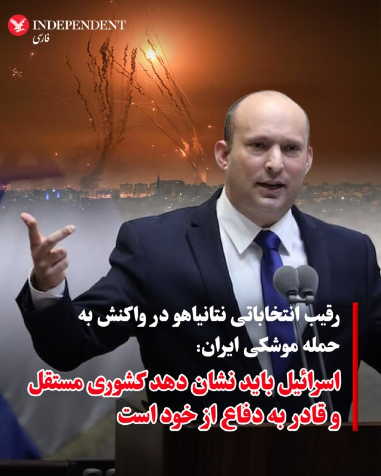

♦️نفتالی بنت، نخست‌وزیر پیشین اسرائیل که در انتخابات آینده رقیب نتانیاهو است، در واکنش به حمله‌های موشکی سپاه این وضعیت را «لحظه حقیقت» توصیف کرد. او در بیانیه‌ای در شبکه اجتماعی اکس گفت اسرائیل باید نشان دهد که یک «کشور مستقل و قادر به دفاع از خود» است.
بنت گفت: «اسرائیل باید به‌طور قاطع و مؤثر عمل کند.» این اظهارات پس از گزارش‌هایی مطرح شد که دونالد ترامپ، رئیس‌جمهوری آمریکا، اجازه نخواهد داد اسرائیل به حملات موشکی بالستیک ایران پاسخ دهد.
ایتامار بن‌گویر، وزیر امنیت ملی نیز در بیانیه‌ای کوتاه در ایکسبر لزوم واکنش قاطع اسرائیل تاکید کرد.
در همین حال، یائیر گولان، رهبر حزب چپ‌گرای «دموکرات‌ها»، گفت دشمنان اسرائیل به این نتیجه رسیده‌اند که دولت تحت رهبری نتانیاهو «فاقد اقتدار برای کشاندن اسرائیل به یک جنگ دیگر» است و از رای‌دهندگان خواست در انتخابات پیش‌رو (که در سپتامبر یا اکتبر برگزار می‌شود) این دولت را کنار بگذارند.
‌🇸🇦 Indypersian

🤖 @VahidOOnLine

---
📅 بروزرسانی: 1405/03/18 03:52
---

## WithYashar — post 13864

زلزله ۸.۳ ریشتری در فیلیپین
@withyashar

## kianmeli1 — post 87762

‏🔴فوری-سفارت آمریکا در اردن با صدور هشدار امنیتی اعلام کرد گزارش‌هایی از ورود موشک‌ها، پهپادها یا راکت‌ها به حریم هوایی اردن منتشر شده و از شهروندان خواست فوراً در پناهگاه‌ها مستقر شده و تا اطلاع بعدی در محل امن باقی بمانند
https://t.me/kianmeli1

## FarsiVOA — post 219962

  

⚡️سفارت آمریکا در اردن در مورد پهپادهای در حال پرواز هشدار امنیتی صادر کرد. طبق این هشدار، ‌گزارش‌ها حاکی از آن است که موشک‌ها، پهپادها یا راکت‌ها در حریم هوایی اردن در حال پرواز هستند. در این هشدار، از آمریکایی‌ها خواسته شده است فوراً به دنبال پناهگاه باشند و در خانه بمانند و به اطلاعیه‌ها و هشدارهای محلی توجه کنند.
@FarsiVOA

---
📅 بروزرسانی: 1405/03/18 03:43
---

## VahidOOnLine — post 244220

♦️تصاویر منتشر شده در رسانه‌های داخلی، یکشنبه‌شب، شادی طرفداران جمهوری اسلامی را همزمان با آغاز حمله موشکی سپاه به اسرائیل نشان می‌دهد. براساس این تصاویر، طرفداران حکومت با در دست داشتن پرچم‌های حزب‌الله لبنان و سردادن شعار، خواستار حمله به تل‌آویو در اسرائیل شدند.
‌🇸🇦 Indypersian

🤖 @VahidOOnLine

## mamlekate — post 103633

📝 گزارش آکسیوس از تماس ترامپ با نتانیاهو: اسرائيل برای توافق با جمهوری اسلامی فرصت بیشتری به آمریکا بدهد

سایت خبری آکسیوس به نقل یک مقام ارشد آمریکایی و یک منبع اسرائیلی گزارش داد که رئيس جمهوری آمریکا در تماس تلفنی خود به نخست وزیر اسرائيل گفت که حمله موشکی شبانه جمهوری اسلامی را تلافی نکند و زمان بیشتری به دیپلماسی بدهد.

@mamlekate

## BBCPersian — post 283111

  <a href="telegram/content/BBCPersian_283111_1780877608.mp4" target="_blank">🎬 Download video</a>

ساعتی بعد از اعلام شلیک موشک از خاک ایران به سوی شمال اسرائیل، تصاویری از حرکت چند موشک و پرتابه در آسمان شمال اسرائیل ثبت شده است که این ویدیو می‌توانید ببینید.

در این تصاویر نشانه‌ای از مقابله پدافند هوایی مشاهده نمی‌شود اما ارتش اسرائیل پیش‌تر اعلام کرده بود که توانسته تمامی موشک‌های ایران را رهگیری کند و هنوز هیچ گزارشی از خسارات یا تلفات احتمالی مخابره نشده است.

🎥 IRGC

@‌BBCPersian

---
📅 بروزرسانی: 1405/03/18 03:33
---

## VahidOOnLine — post 244211

تکرار نام جاویدنامان ایران، یادآور لحظات دردناکی است که بر این سرزمین گذشت؛
پدری که پسر نیمه‌جانش را در آغوش می‌گیرد.
مادری که روزها برای تحویل پیکر فرزندش انتظار می‌کشد.
جوانی که بر پیکر پسرعمه‌اش می‌رسد و لحظاتی بعد خودش هدف گلوله قرار می‌گیرد.
و خانواده‌ای که تنها فرزندشان را از دست می‌دهند.<
مهدی قدیمی، نیما نجفی، علی زندیه پری، علی عطایی، میثم نوری علویجه، محمدحسن روشن قیاس، رضا حبیبی و سروش (حافظ) سلیمانی
این روایت‌های کوتاه برای بازگویی لحظه‌های پایانی نیستند؛ برای ثبت زندگی‌هایی هستند که هر کدام در میان خانواده، دوستان و شهر خود، جایگاهی یگانه داشتند و فقدانشان ادامه دارد.<
#جاویدنامان_انقلاب_ملی_ایرانیان
‌🏁 🇬🇧 IranintlTV

🤖 @VahidOOnLine

## pm_afshaa — post 92747

  <a href="telegram/content/pm_afshaa_92747_1780877014.webm" target="_blank">🎬 Download video</a>

🔴اکسیوس به نقل از یک مقام آمریکایی:
مذاکرات با ایران به سه ماهه پایانی رسیده و به خطر انداختن توافق احتمالی در این برهه حساس، عاقلانه نیست.

💧 Rainbet.com the #1 Non-KYC Crypto Casino & Sportsbook @rainbetcom

😁 @Pm_Afshaa

## pm_afshaa — post 92745

پشمام فیلیپین 8.8 ریشتر زلزله اومده!

💧 Rainbet.com the #1 Non-KYC Crypto Casino & Sportsbook @rainbetcom

😁 @Pm_Afshaa

## IranIntlTV — post 341079

تکرار نام جاویدنامان ایران، یادآور لحظات دردناکی است که بر این سرزمین گذشت؛
پدری که پسر نیمه‌جانش را در آغوش می‌گیرد.
مادری که روزها برای تحویل پیکر فرزندش انتظار می‌کشد.
جوانی که بر پیکر پسرعمه‌اش می‌رسد و لحظاتی بعد خودش هدف گلوله قرار می‌گیرد.
و خانواده‌ای که تنها فرزندشان را از دست می‌دهند.
مهدی قدیمی، نیما نجفی، علی زندیه پری، علی عطایی، میثم نوری علویجه، محمدحسن روشن قیاس، رضا حبیبی و سروش (حافظ) سلیمانی
این روایت‌های کوتاه برای بازگویی لحظه‌های پایانی نیستند؛ برای ثبت زندگی‌هایی هستند که هر کدام در میان خانواده، دوستان و شهر خود، جایگاهی یگانه داشتند و فقدانشان ادامه دارد.
#جاویدنامان_انقلاب_ملی_ایرانیان

## FarsiVOA — post 219961

  <a href="telegram/content/FarsiVOA_219961_1780877014.mp4" target="_blank">🎬 Download video</a>

⚡️گفت‌وگو با بهروز یوسیان، افسر پیشین ارتش اسرائیل در مورد نقش تازه پاکستان در تحولات مربوط به ایران و ارسال «نامه‌ای ویژه» به مجتبی خامنه‌ای.
@FarsiVOA

## FarsiVOA — post 219960

  <a href="telegram/content/FarsiVOA_219960_1780877015.mp4" target="_blank">🎬 Download video</a>

⚡️دارایی‌های ایران روی میز آمریکا و احتمال گذار از فاز مذاکره؛ گفت‌وگو با فرزین کرباسی
@FarsiVOA

---
📅 بروزرسانی: 1405/03/18 03:24
---

## VahidOOnLine — post 244210

  

♦️به گزارش اکسیوس، بنیامین نتانیاهو، نخست‌وزیر اسرائیل، با درخواست دونالد ترامپ، رئیس‌جمهوری آمریکا، برای به تعویق انداختن پاسخ به حملات موشکی بالستیک ایران موافقت کرده تا به واشنگتن چند روز دیگر فرصت داده شود تلاش‌های دیپلماتیک برای دستیابی به توافق با تهران ادامه یابد.
بر اساس این گزارش به نقل از یک مقام ارشد آمریکایی و یک مقام ارشد اسرائیلی، ترامپ در تماس تلفنی یکشنبه شب از نتانیاهو خواسته از انجام حمله تلافی‌جویانه خودداری کند، زیرا به گفته مقام آمریکایی، او معتقد بوده «ما به انجام یک توافق خوب نزدیک هستیم».
طبق این گزارش، نتانیاهو تلاش کرده با این درخواست مخالفت کند و ترامپ را متقاعد کند که اجازه حمله به ایران را بدهد، اما در نهایت «تا حدی به‌طور غیررسمی» با درخواست رئیس‌جمهور موافقت کرده است.
این مقام آمریکایی گفته است که این گفت‌وگو بسیار آرام‌تر از تماس پرتنش هفته گذشته درباره طرح‌های اسرائیل برای حمله به بیروت بوده است؛ زمانی که ترامپ به‌طور علنی اعتراف کرده بود بر سر نتانیاهو فریاد زده و الفاظ تندی به کار برده بود.
پس از این تماس، این مقام گفته است: «فکر می‌کنیم رئیس‌جمهور کمی زمان خریده است. او بسیار قاطع است که ما به توافق با ایران نزدیک شده‌ایم. فکر نمی‌کنم در حال حاضر حمله اسرائیل قریب‌الوقوع باشد.»
او همچنین گفته است: «ما در یک لحظه حساس هستیم — چرا باید وقتی در راند چهارم هستید، یک توافق احتمالی را به خطر بیندازید؟ رئیس‌جمهور فکر می‌کند سه ماه است درگیر این موضوع هستیم و اکنون زمان پایان دادن به آن است.»
با این حال، هنوز تصمیم رسمی در اسرائیل گرفته نشده و طبق گزارش شبکه ۱۲، نتانیاهو تا نیم ساعت پیش همچنان در حال برگزاری نشست با مقامات ارشد امنیتی درباره این موضوع بوده است.
‌🇸🇦 Indypersian

🤖 @VahidOOnLine

## VahidOOnLine — post 244209

  

یک مقام ارشد کاخ سفید به روزنامه اسرائیل‌هیوم گفت دونالد ترامپ، رییس‌جمهوری آمریکا، در گفت‌وگوی تلفنی خود با بنیامین نتانیاهو، نخست‌وزیر اسرائیل، بار دیگر تأکید کرد که «متعهد به جلوگیری از دستیابی ایران به سلاح هسته‌ای و تهدید منطقه و اسرائیل است»، و تاکید کرد که در این مرحله برای پیشرفت مذاکرات واشینگتن و تهران در مورد توافق، تنش‌ها علیه جمهوری اسلامی تشدید نشود.

یک مقام امنیتی اسرائیل نیز به این رسانه گفت که اسرائیل به حملات موشکی بالستیک حکومت ایران پاسخ خواهد داد، «حتی اگر این اتفاق در کوتاه مدت نیفتد.»

او گفت: «در ایران، آنها دو ماه است که فراموش کرده‌اند که آسمان‌شان متعلق به نیروی هوایی اسرائیل است. تلاش‌ها برای پیوند دادن لبنان به ایران حتی توسط دولت لبنان نیز رد شده است. عملیات علیه حزب‌الله ادامه خواهد یافت.»

بر اساس این گزارش، خبرگزاری دولتی اسرائیل گفت که با توجه به مخالفت ترامپ، اسرائیل در حال بررسی به تعویق انداختن پاسخ و حمله به سوریه در چند روز آینده است، هرچند بنا به گزارش‌ها، با توجه به ارزیابی‌های جاری در اسرائیل، هنوز تصمیم نهایی گرفته نشده است.
‌🏁 🇬🇧 IranintlTV

🤖 @VahidOOnLine

## VahidOOnLine — post 244208

  

♦️یک مقام ارشد کاخ سفید به روزنامه اسرائیل هیوم گفت، دونالد ترامپ، رئیس‌جمهوری آمریکا، در تماس تلفنی با بنیامین نتانیاهو در شامگاه یکشنبه بار دیگر تأکید کرده است که متعهد است اجازه ندهد ایران به سلاح هسته‌ای دست پیدا کند یا منطقه و اسرائیل را تهدید کند، اما در عین حال در این مرحله بر عدم تشدید تنش با تهران پافشاری کرده تا مذاکرات آمریکا و تهران برای دستیابی به توافق ادامه پیدا کند.
به گزارش تایمز اسرائیل، یک مقام امنیتی اسرائیل نیز  گفته است که اسرائیل به حملات موشکی بالستیک ایران در شامگاه امروز پاسخ خواهد داد، «حتی اگر در کوتاه‌مدت انجام نشود.»
او گفته است: «در ایران فراموش کرده‌اند که آسمان‌هایشان برای دو ماه متعلق به نیروی هوایی اسرائیل بود. تلاش‌ها برای مرتبط کردن لبنان به ایران حتی از سوی دولت لبنان نیز رد شده است. عملیات علیه حزب‌الله ادامه خواهد یافت.»
براساس این گزارش، با توجه به مخالفت ترامپ، اسرائیل در حال بررسی به تعویق انداختن پاسخ خود و انجام حمله در چند روز آینده به جای همین شامگاه است، هرچند گفته می‌شود هنوز تصمیم نهایی در جریان ارزیابی‌های اسرائیل اتخاذ نشده است.
‌🇸🇦 Indypersian

🤖 @VahidOOnLine

## IranIntlTV — post 341078

  

یک مقام ارشد کاخ سفید به روزنامه اسرائیل‌هیوم گفت دونالد ترامپ، رییس‌جمهوری آمریکا، در گفت‌وگوی تلفنی خود با بنیامین نتانیاهو، نخست‌وزیر اسرائیل، بار دیگر تأکید کرد که «متعهد به جلوگیری از دستیابی ایران به سلاح هسته‌ای و تهدید منطقه و اسرائیل است»، و تاکید کرد که در این مرحله برای پیشرفت مذاکرات واشینگتن و تهران در مورد توافق، تنش‌ها علیه جمهوری اسلامی تشدید نشود.

یک مقام امنیتی اسرائیل نیز به این رسانه گفت که اسرائیل به حملات موشکی بالستیک حکومت ایران پاسخ خواهد داد، «حتی اگر این اتفاق در کوتاه مدت نیفتد.»

او گفت: «در ایران، آنها دو ماه است که فراموش کرده‌اند که آسمان‌شان متعلق به نیروی هوایی اسرائیل است. تلاش‌ها برای پیوند دادن لبنان به ایران حتی توسط دولت لبنان نیز رد شده است. عملیات علیه حزب‌الله ادامه خواهد یافت.»

بر اساس این گزارش، خبرگزاری دولتی اسرائیل گفت که با توجه به مخالفت ترامپ، اسرائیل در حال بررسی به تعویق انداختن پاسخ و حمله به سوریه در چند روز آینده است، هرچند بنا به گزارش‌ها، با توجه به ارزیابی‌های جاری در اسرائیل، هنوز تصمیم نهایی گرفته نشده است.
https://iranintl.com/202606073508

## FarsiVOA — post 219959

🔺گزارش آکسیوس از تماس ترامپ با نتانیاهو: اسرائيل برای توافق با جمهوری اسلامی فرصت بیشتری به آمریکا بدهد

▪️سایت خبری آکسیوس یک‌شنبه شب ۱۷ خرداد به وقت واشنگتن، ساعاتی پس از حمله موشکی جمهوری اسلامی به اسرائيل، به نقل یک مقام ارشد آمریکایی و یک منبع اسرائیلی گزارش داد که رئيس جمهوری آمریکا در تماس تلفنی خود به نخست وزیر اسرائيل گفت که حمله موشکی شبانه جمهوری اسلامی را تلافی نکند و زمان بیشتری به دیپلماسی بدهد.

⬇️ بیشتر بخوانید:
https://ir.voanews.com/a/8158278.html
@FarsiVOA

## Persian_Trend_Official — post 16023

  

https://castbox.fm/vi/954033970

فایل صوتی لایو امشب

## BBCPersian — post 283109

🔻چه کسی تاکنون چه گفته است؟

🔻در ادامه، خلاصه اظهارات مقام‌ها درباره حملات و تنش‌های امروز را بخوانید:

▪️دونالد ترامپ. رئیس جمهور آمریکا به آکسیوس گفته است قصد دارد با بنیامین نتانیاهو، نخست‌وزیر اسرائیل، تماس بگیرد و از او بخواهد واکنش تلافی جویانه انجام ندهد، زیرا نگران است این درگیری‌ها باعث از بین رفتن توافق احتمالی میان سه طرف شود.

▪️آقای ترامپ به روزنامه فایننشیال تایمز گفته «نتانیاهوهيچ انتخابی نخواهد داشت. تصميم‌گيرنده من هستم. همه تصميم‌ها را من می‌گيرم. او [نتانياهو] تصميم‌گير نيست.»

▪️وزارت امور خارجه ایران. این وزارتخانه اعلام کرده هرگونه حمله از سوی اسرائیل علیه لبنان یا ایران با «پاسخی کوبنده و فراگیر» مواجه خواهد شد. همچنین آمریکا را به حمله به کشتی های ایرانی در هفته گذشته متهم کرده است.

▪️ارتش اسرائیل. سخنگوی ارتش اسرائیل گفته است ایران مرتکب «اشتباهی بزرگ» شده و تأکید کرده تل آویو برای احتمال حملات بیشتر آماده است.

▪️ایتامار بن گویر. وزیر امنیت ملی اسرائیل در پیامی در شبکه اجتماعی ایکس نوشته است که «تهران باید بسوزد».

▪️ایوت کوپر. وزیر امور خارجه بریتانیا، ساعتی بعد از حمله موشکی ایران به شمال اسرائیل گفت که «ازسرگیری درگیری به نفع هیچ‌کس نیست.» خانم کوپر یکشنبه شب در پیامی در شبکه اجتماعی ایکس افزود: «هر دو طرف باید خویشتن‌داری نشان دهند و فورا تنش‌زدایی کنند.»

این اظهارات در حالی مطرح می‌شود که تنش‌ها میان ایران، اسرائیل و ایالات متحده همچنان در حال افزایش است و تلاش‌های دیپلماتیک برای جلوگیری از تشدید درگیری‌ها ادامه دارد.

https://bbc.in/4eafvAI
@BBCPersian

---
📅 بروزرسانی: 1405/03/18 03:13
---

## VahidOOnLine — post 244207

  

♦️در پی ازسرگیری شلیک موشک‌های بالستیک از سوی رژیم ایران، به بیمارستان‌های سراسر اسرائیل دستور داده شده است که فعالیت‌های خود را به پناهگاه‌های زیرزمینی منتقل کنند و نیروهای انسانی خود را برای گذار سریع به وضعیت اضطراری بسیج کنند.
وزارت بهداشت اسرائیل در بیانیه‌ای اعلام کرد که پس از ارزیابی وضعیت و مطابق با دستورهای فرماندهی جبهه داخلی، به بیمارستان‌ها همچنین گفته شده است بیمارانی را که امکان ترخیص دارند برای بازگشت به خانه آماده کنند.
‌🇸🇦 Indypersian

🤖 @VahidOOnLine

## VahidOOnLine — post 244206

  

جاناتان کانریکس، سخنگوی سابق ارتش اسرائیل و عضو ارشد بنیاد دفاع از دموکراسی، در شبکه اجتماعی ایکس نوشت: «وضعیت فعلی، نبرد اراده و اعصاب است که در معادلات خلاصه می‌شود: رژیم ایران می‌خواهد حزب‌الله را نجات دهد و آینده منطقه را به جلوگیری از نابودی حزب‌الله گره زده است.»

او اشاره کرد: «اسرائیل می‌خواهد ابتدا حزب‌الله را تضعیف کند و سپس با رژیم ایران معامله کند.»

کانریکس این پرسش را مطرح کرد: «ایالات متحده چه می‌خواهد؟»
‌🏁 🇬🇧 IranintlTV

🤖 @VahidOOnLine

## WithYashar — post 13863

اکسیوس، به نقل از یک مقام آمریکایی: مذاکرات با ایران به سه ماهه پایانی رسیده است و به خطر انداختن توافق احتمالی در این برهه حساس، عاقلانه نخواهد بود.
@withyashar

## WithYashar — post 13862

  <a href="telegram/content/WithYashar_13862_1780875803.mp4" target="_blank">🎬 Download video</a>

دیدبان اتاق جنگ از مرکز تهران، آسمان شلوغ، پهپاد / جنگنده، گشتزنی بر فراز تهران، همه منتظر و چشم به آسمان.
@withyashar

## pm_afshaa — post 92744

  <a href="telegram/content/pm_afshaa_92744_1780875805.webm" target="_blank">🎬 Download video</a>

🔴دیلی میل: یه بازیکن تیم ملی فوتبال جمهوری اسلامی ایران در جریان اردوی تیم ملی تو ترکیه، با یه دختر 14 ساله تو هتل آشنا میشه و سعی کرده دختره رو به بهونه بغل و نوازش ببره پشت بوته‌ها و دور از خانوادش ازش سو استفاده جنسی کنه!

تو همین حین پدرِ دختره از راه میرسه و جلوی اینکارو میگیره؛ بعدشم میره به هتل شکایت میکنه و میگه اگه این بازیکن رو بیرون نکنید، به پارلمان شکایت میکنم.

💧 Rainbet.com the #1 Non-KYC Crypto Casino & Sportsbook @rainbetcom

😁 @Pm_Afshaa

## pm_afshaa — post 92743

اسرائیل الکی امروز مقر حزب‌الله تو بیروت رو نزد (که میگن کسی توش نبوده و ترور و هدف خاصی درکار نبوده). اسرائیل میدونسته جمهوری اسلامی هم جواب میده (اکثر مقامات جمهوری اسلامی علنی تهدید کرده بودن) و مطمئن باشید واسه بعدش هم برنامه‌ریزی کردن و این چیزی هست که میخواستن اتفاق بیفته، حتی با آگاهی کامل آمریکا!

پس این حرف‌های ترامپ رو جدی نگیرید و صبر کنید ببینید چی پختن برامون..

## IranIntlTV — post 341077

  

جاناتان کانریکس، سخنگوی سابق ارتش اسرائیل و عضو ارشد بنیاد دفاع از دموکراسی، در شبکه اجتماعی ایکس نوشت: «وضعیت فعلی، نبرد اراده و اعصاب است که در معادلات خلاصه می‌شود: رژیم ایران می‌خواهد حزب‌الله را نجات دهد و آینده منطقه را به جلوگیری از نابودی حزب‌الله گره زده است.»

او اشاره کرد: «اسرائیل می‌خواهد ابتدا حزب‌الله را تضعیف کند و سپس با رژیم ایران معامله کند.»

کانریکس این پرسش را مطرح کرد: «ایالات متحده چه می‌خواهد؟»
https://iranintl.com/202606072134

## FarsiVOA — post 219958

  <a href="telegram/content/FarsiVOA_219958_1780875807.mp4" target="_blank">🎬 Download video</a>

⚡️در اولین حمله مستقیم جمهوری اسلامی به اسرائيل پس از آتش‌بس، اسرائیل می‌گوید جمهوری اسلامی یازده موشک به سوی این کشور شلیک کرد. همزمان، پرزیدنت ترامپ از اسرائيل خواستار خویشتنداری شده است.
@FarsiVOA

## FarsiVOA — post 219957

⚡️ماجرای چاپ ۲۵ هزار میلیارد دینار دولت عراق برای جبران بحران تنگه هرمز
@FarsiVOA

## FarsiVOA — post 219956

⚡️تنظیم لایحه دولتی نظام نوین تامین اجتماعی و جرقه دور جدید اعتراض‌های معیشتی؛ گفت‌وگو با پویان مکاری
@FarsiVOA

## BBCPersian — post 283108

🔻سفارت آمريکا در بیت‌المقدس روز دوشنبه تعطيل خواهد بود

سفارت آمریکا در بیت‌المقدس اعلام کرد به دليل «وضعيت امنيتی کنونی در اسرائيل»، روز دوشنبه تعطيل خواهد بود.

اين سفارتخانه در بيانيه‌ای اعلام کرد که به تمامی کارکنان دولت آمريکا دستور داده شده است در محل اقامت خود بمانند و برای انتقال سريع به پناهگاه‌های امن آماده باشند.

اين تصميم در حالی اتخاذ شده است که تنش‌های امنيتی در منطقه پس از حملات اسرائیل به بیروت و جنوب لبنان و اکنون حمله موشکی ایران به شمال اسرائیل افزايش يافته و نگرانی‌ها درباره احتمال گسترش مجدد درگيری‌ها بسیار شدت یافته است.

https://bbc.in/4eafvAI
@BBCPersian

## BBCPersian — post 283107

  

🔻وزارت امور خارجه ايران یکشنبه شب با انتشار بیانیه‌ای اعلام کرد نيروهای مسلح جمهوری اسلامی چندين «هدف نظامی» را در شمال «سرزمين‌های اشغالی فلسطين» هدف قرار داده‌اند.

در بيانيه اين وزارتخانه آمده است که اين حملات در واکنش به «نقض‌های مکرر» آتش‌بس ماه آوريل ميان ايران، آمريکا و اسرائيل انجام شده است؛ از جمله حملات آمريکا به کشتی‌ها و اهدافی در جنوب ايران.

اگرچه آتش بس از ۱۷ آوريل برقرار شده است، اما در عمل بارها از سوی هر دو طرف نقض شده است.

ايالات متحده هفته گذشته اعلام کرد که در پايان هفته چندين هدف نظامی ايران را هدف قرار داده است و تهران نيز گفت در پاسخ، يک پايگاه آمريکايی را مورد حمله قرار داده است.

وزارت امور خارجه ايران در ادامه تأکيد کرد که ایران در حال دفاع از امنيت و منافع ملی خود است.

در اين بيانيه هشدار داده شده است: «هرگونه حمله از سوی اسرائيل عليه لبنان يا جمهوری اسلامی ايران با پاسخی کوبنده و فراگير مواجه خواهد شد.»

📸 Getty

https://bbc.in/4eafvAI
@BBCPersian

---
📅 بروزرسانی: 1405/03/18 03:03
---

## VahidOOnLine — post 244205

♦️انتشار تصاویری از مصاحبه اختصاصی دونالد ترامپ با برنامه «میت د پرس» شبکه «ان‌بی‌سی»، لحظه خشم شدید او و ترک استودیو را نشان می‌دهد. ترامپ در این گفتگو، پس از متهم کردن نظام انتخاباتی ایالات متحده به تقلب و تشبیه آن به «کشورهای جهان سوم»، به شدت به کریستن ولکر، مجری برنامه، و رسانه‌های خبری آمریکا از جمله ان‌بی‌سی، سی‌ان‌ان، ای‌بی‌سی و سی‌بی‌اس تاخت و آن‌ها را «فاسد، احمق و یک‌جانبه» خواند. او با قطع ناگهانی مصاحبه گفت: «من زیر باران نشستم و به اندازه کافی به تو [مجری] وقت دادم. شما باید رسانه‌های خود را اصلاح کنید، چرا که یک کشور هرگز نمی‌تواند با رسانه‌های متقلب و نامرد، بزرگ و قدرتمند باقی بماند.»
‌🇸🇦 Indypersian

🤖 @VahidOOnLine

## WithYashar — post 13861

## DEJradio — post 5448

  <a href="telegram/content/DEJradio_5448_1780875198.webm" target="_blank">🎬 Download video</a>

🚨
🔸 خبر ۲۱
یکشنبه ۱۷ خرداد ۱۴۰۵

#خبر۲۱
@DEJradio

## FarsiVOA — post 219955

  <a href="telegram/content/FarsiVOA_219955_1780875199.mp4" target="_blank">🎬 Download video</a>

⚡️گام تازه آمریکا علیه برنامه هسته‌ای جمهوری اسلامی در شورای حکام آژانس؛ گفت‌وگو با فرزانه روستایی
@FarsiVOA

## FarsiVOA — post 219954

  

⚡️باراک راوید، خبرنگار آکسیوس می‌گوید که «یک مقام ارشد آمریکایی» به او گفت که کاخ سفید به حمله اسرائیل به بیروت «چراغ سبز» نشان نداده است. یک مقام آمریکایی دیگر نیز گفت: «ما هیچ نقشی در این نداشتیم.»
@FarsiVOA

---
📅 بروزرسانی: 1405/03/18 02:53
---

## VahidOOnLine — post 244204

  

♦️مقام‌های ارشد اسرائیلی به شبکه ۱۲ اسرائیل گفته‌اند که اسرائیل به حملات موشکی ایران «با قدرت پاسخ خواهد داد.»
بر اساس این گزارش، اسرائیل «نمی‌تواند» وضعیتی را بپذیرد که در آن ایران پس از حملات اسرائیل به اهداف حزب‌الله در بیروت، خاک اسرائیل را هدف قرار دهد.
با این حال، تاکنون هیچ واکنش رسمی از سوی دولت یا ارتش اسرائیل درباره موج حملات موشکی در جریان منتشر نشده است.
شبکه ۱۳ اسرائیل نیز گزارش داده است که مقام‌های اسرائیلی در گفت‌وگو با نتانیاهو ارزیابی کرده‌اند که تهران قصد دارد با یک پاسخ محدود، حمایت خود از حزب‌الله را به نمایش بگذارد.
‌🇸🇦 Indypersian

🤖 @VahidOOnLine

## WithYashar — post 13860

  

وضعیت من هم اکنون 😹
@withyashar

## FoxNewsTwitter — post 342703

  

Fox News (Twitter/X)

WATCH LIVE: Maine Democratic Senate candidate Graham Platner hosts town hall https://twitter.com/i/broadcasts/1NxarrwZvzDKj

## pm_afshaa — post 92742

  <a href="telegram/content/pm_afshaa_92742_1780874589.webm" target="_blank">🎬 Download video</a>

🔴اسرائیل هیوم به نقل از یک منبع پاکستانی:
ما به توافق موقتی سریع بین ایران و آمریکا نزدیک میشیم؛ یا توافق سریع است یا فروپاشی مذاکرات.

💧 Rainbet.com the #1 Non-KYC Crypto Casino & Sportsbook @rainbetcom

😁 @Pm_Afshaa

## DEJradio — post 5447

  <a href="telegram/content/DEJradio_5447_1780874589.webm" target="_blank">🎬 Download video</a>

⭕️
🚨 روزنامه یدیعوت آحارونوت گزارش داد، در گفتگویی که کمی پیش به پایان رسید، نتانیاهو به ترامپ اطلاع داد که قصد حمله‌ای قدرتمند به ایران را دارد. همزمان رئیس‌جمهور آمریکا روشن کرد که اگر چنین حمله‌ای انجام شود، آمریکایی‌ها در آن شرکت نخواهند کرد.
برخی منابع گزارش داده بودند که «ایالات متحده پیامی به اسرائیل فرستاد که بهتر است چند روز صبر کند تا ببیند آیا می‌توان به توافق رسید و اگر نه، ما طبق برنامه به اقدام مشترک ادامه خواهیم داد، و ارزش ندارد این موضوع را با درگیر شدن در تبادل محدود ضربات هدر داد».

#اسرائیل #جمهوری_اسلامی #ترامپ
@DEJradio

## DEJradio — post 5444

“هنوز ویرانه‌های جنگ ۴۰ روزه شهر به شهر قابل مشاهده است، اینبار مردم ایران پاسوز حمایت نظام از حـ.ـزب‌الله میشوند، سفره ما خرج موشک و هسته‌ای و مفت‌خوران مزدور شد

#پیام_دریافتی
@DEJradio

## mamlekate — post 103632

❓ الو شیراز ساعت ۲:۳۹ دوشنبه ۱۸ خرداد، ۳ تا صدا اومد. نفهمیدم که زدن یا چیز دیگه ست.

@mamlekate

## FarsiVOA — post 219953

⚡️«هفته اقلیم ونیز ۲۰۲۶» با شعار «سیاره آب، سیاره صلح» آغاز شد؛ رویدادی بین‌المللی که نقش آب را در قلب بحران تغییرات اقلیمی و آینده محیط زیست جهان بررسی می‌کند .
@FarsiVOA

## Persian_Trend_Official — post 16022

  <a href="telegram/content/Persian_Trend_Official_16022_1780874590.webm" target="_blank">🎬 Download video</a>

شبتون بخیر ❤️🌙

📝 Nick
📌 @persian_trend_official
پرشین ترند | متفاوت‌ترین کانال نظامی

---
📅 بروزرسانی: 1405/03/18 02:43
---

## VahidOOnLine — post 244203

  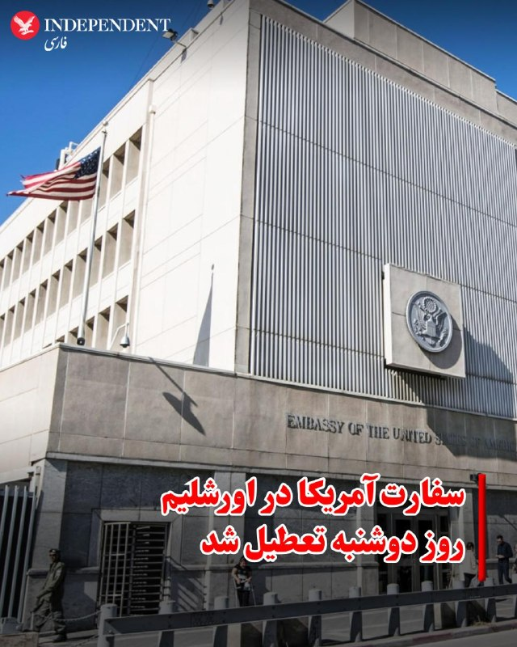

♦️سفارت ایالات متحده در اورشلیم اعلام کرد که به دلیل «وضعیت امنیتی کنونی در اسرائیل» روز دوشنبه تعطیل خواهد بود.
این سفارتخانه در بیانیه‌ای اعلام کرد که به تمامی کارکنان دولت آمریکا دستور داده شده است «در محل خود پناه بگیرند و برای انتقال به پناهگاه‌های امن در صورت لزوم آماده باشند.»
‌🇸🇦 Indypersian

🤖 @VahidOOnLine

## WithYashar — post 13859

ایران به سمت گروه های کرد مخالف ایرانی در سلیمانیه عراق پهپاد شلیک کرده است @withyashar

## WithYashar — post 13858

بیانیه رسمی فیفا:
دیدار ایران و مصر قطعا دیدار افتخار همجنسگرایان خواهد بود و به هیچ عنوان این رویداد لغو نخواهد شد
@withyashar

## WithYashar — post 13857

  <a href="telegram/content/WithYashar_13857_1780873990.mp4" target="_blank">🎬 Download video</a>

@withyashar Israeli Medley (Hebrew) by Leila Forouhar

## mwarmonitor — post 10356

🔴فوری | شبکه ۱۲ اسرائیل به نقل از یک مقام ارشد آمریکایی: رئیس‌جمهور ترامپ انتظار ندارد که در آینده نزدیک حمله‌ای از سوی اسرائیل انجام شود.

🔴 شبکه ۱۲ اسرائیل به نقل از یک مقام آمریکایی و یک منبع اسرائیلی: ترامپ از نتانیاهو خواسته است به حمله ایران پاسخ ندهد و چند روز دیگر فرصت بدهد تا مذاکرات تکمیل شود.

🔴 شبکه ۱۲ اسرائیل به نقل از یک مقام آمریکایی: ترامپ زمان بیشتری به دست آورده است، زیرا او معتقد است که ما به رسیدن به یک توافق نزدیک هستیم.

@mwarmonitor

## mwarmonitor — post 10355

💥«انفجارهای جدیدی در منطقه طاسلوجه در استان سلیمانیه در شمال عراق رخ داده است.» @mwarmonitor

## pm_afshaa — post 92741

  <a href="telegram/content/pm_afshaa_92741_1780873992.webm" target="_blank">🎬 Download video</a>

🔴کانال 12 اسرائیل:
ترامپ از نتانیاهو خواسته تا در پاسخ به حمله ایران بلافاصله واکنش نشون نده و فعلا چند روز صبر کنه تا مذاکرات دیپلماتیک ادامه پیدا کنه و در روند مذاکرات هم مداخله نکنه.

نتانیاهو اولش مخالفت کرد، اما در نهایت به نوعی موافقت کرد تا زمانی که گفتگوها ادامه داره دست نگه داره و از پاسخگویی خودداری کنه و حمله رو به تعویق بندازه.

💧 Rainbet.com the #1 Non-KYC Crypto Casino & Sportsbook @rainbetcom

😁 @Pm_Afshaa

## pm_afshaa — post 92740

  <a href="telegram/content/pm_afshaa_92740_1780873993.webm" target="_blank">🎬 Download video</a>

🔴جلسه دادگاه نتانیاهو فردا به دلیل وضعیت امنیتی و شرایط جاری در منطقه لغو شد.

💧 Rainbet.com the #1 Non-KYC Crypto Casino & Sportsbook @rainbetcom

😁 @Pm_Afshaa

## mamlekate — post 103631

  <a href="telegram/content/mamlekate_103631_1780873993.mp4" target="_blank">🎬 Download video</a>

📞 سلام ساعت ۱۲:۱۴ دقیقه هر ۳ دقیقه یه هواپیما مسافری از مهرآباد بلند میشه

📞 الو به‌صورت مداوم صدای هواپیما از غرب تهران میاد (و به‌نظر می‌رسه همینطوری مدام دارم هواپیماها رو از فرودگاه‌ها به‌سمت احتمالا شرق کشور تخلیه میکنن). الانم صدای یه هواپیمای (به‌نظر مسافربری) داره میاد

📞 سلام، امشب از ساعت ۱۲ تا الان دوبار صدای هواپیما تو بجنورد اومده، اینجا اصلا شب پرواز نداره فرودگاه

📞 ساعت۰۱:۴۰ ۱۸ خرداد اسلامشهر مدام داره صدای هواپیما میاد،مگه پرواز ها نمیگن بسته شد؟ شب های قبل اصلا اینجوری نبود

📞 سلام از ساعت ۱۲ شب تهرانسر هر ده دقیقه یه ربع همینجوری صدای هواپیما میاد

📞 هواپیما ها به سمت شرق میرن

@mamlekate

## IranIntlTV — post 341076

  <a href="https://t.me/IranintlTV/341076" target="_blank">📎 Download file</a>

🎧نسخه صوتی سیاست با مراد ویسی: حمله موشکی سپاه به اسرائیل
@iranintlTV

## FarsiVOA — post 219951

⚡️جمهوری اسلامی همچنان در کانون بحث‌های کنگره آمریکا؛ اشاره قانون‌گذارن به وضعیت اینترنت در ایران
@FarsiVOA

## IranianMinds — post 21713

  

🔴 طبق گزارش کانال ۱۲ اسرائیل، رئیس‌جمهور ترامپ از بنیامین نتانیاهو خواسته است که به حمله موشکی بلافاصله پاسخ ندهد و چند روز صبر کند تا مذاکرات دیپلماتیک ادامه پیدا کند و در روند آن اختلال ایجاد نشود.

یک مقام ارشد آمریکایی گفته است نتانیاهو در ابتدا با این درخواست مخالفت کرده، اما در نهایت «تا حدی پذیرفته» که فعلاً پاسخ را به تعویق بیندازد تا مذاکرات ادامه پیدا کند.

@IranianMinds

## IranianMinds — post 21712

  <a href="telegram/content/IranianMinds_21712_1780873995.webm" target="_blank">🎬 Download video</a>

🕔 انتظارها به پایان رسید

📃 از سایت وینرو رونمایی شد.
معتبرترین سایت ایرانی

🤩
🤩
🤩
🤩 بونوس اضافه به ازای هر واریز 
💰

🔴فرصت تکرارنشدنی به مناسبت افتتاحیه
🔴

⚡️هر چقدر شارژ کنی، بیشتر هدیه می‌گیری
⚡️

🔴تا سقف ۳ میلیون تومان
🔴

⌛ فقط برای مدت محدود

💣بالاترین بونوس‌ها فقط در سایت وینرو

پیش بینی کن و برنده شو
🎯

📺 تلویزیون لایو برای پوشش بازی ها

🛍بالاترین ضرایب ممکن
و هزاران امکانات خاص دیگه
💰
a17

🎰 همین الان وارد شو و با هر شارژ تا ۲۰۰ درصد شارژ اضافه از ما هدیه بگیر

🔤 Winro.io         معتبرترین سایت ایران

🔤 Winro.io

📱 کانال اخبار و هدایــا 
🌟

📱 @winro_io

## BBCPersian — post 283106

  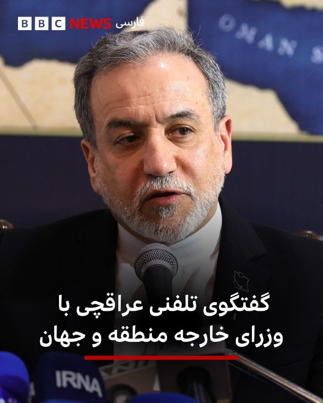

🔻عباس عراقچی، وزیر خارجه ایران، همزمان با حمله موشکی سپاه پاسداران به شمال اسرائیل، در تماس‌های تلفنی جداگانه با همتایان خود در منطقه و جهان درباره تحولات روز یکشنبه به ویژه حمله اسرائیل به ضاحبه در جنوب بیروت و حمله موشکی ایران به اسرائیل گفتگو کرده است.

منابع عربی از گفتگوی تلفنی آقای عراقچی با فواد حسین وزیر امور خارجه عراق، خبر دادند.

همچنین خبرگزاری‌های رسمی ایران از گفتگوهای تلفنی جداگانه وزیر خارجه ایران با ایوت کوپر، وزیرخارجه بریتانیا؛ بدر عبدالعاطی وزیر امور خارجه مصر؛ ژان نوئل بارو، وزیرخارجه فرانسه؛ شیخ محمد بن عبدالرحمن آل ثانی؛ وزیرخارجه قطر؛ هاکان فیدان، وزیر خارجه ترکیه و فیلد مارشال عاصم منیر، فرمانده ارتش پاکستان خبر داده‌اند.

📸 EPA/Shutterstock

https://bbc.in/4eafvAI
@BBCPersian

## alonews — post 126087

  

✅با سابقه ۵ سال فعالیت مداوم

🛡حتی بدون قطعی تو دوران جنگ

🌐 با ما همراه شو و در زمان قطعی
وصل بمون 
🐸

بقیه هنوز VPN حجمی میفروشن
اونم با قیمتای نجومی 
🚀

از ما با کمترین قیمت ، بهترین سرویس رو بگیر 
👀

💥بدون محدودیت حجم
⬇️
⬇️
⬇️
@NetAazaadBot
@NetAazaadBot

---
📅 بروزرسانی: 1405/03/18 02:33
---

## VahidOOnLine — post 244202

  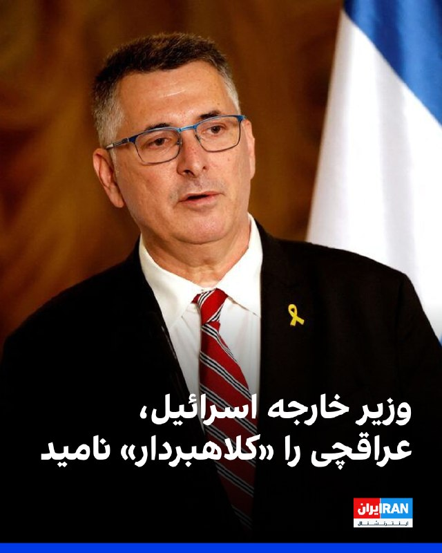

پس ازاینکه عباس عراقچی، عکس پرچم‌های جمهوری اسلامی و لبنان را کنار هم در شبکه اجتماعی ایکس منتشر کرد، گیدون سعار، وزیر خارجه اسرائیل، پرچم حزب‌الله لبنان را کنار پرچم جمهوری اسلامی گذاشت و عراقچی را «کلاهبردار» خطاب کرد.
‌🏁 🇬🇧 IranintlTV

🤖 @VahidOOnLine

## VahidOOnLine — post 244201

  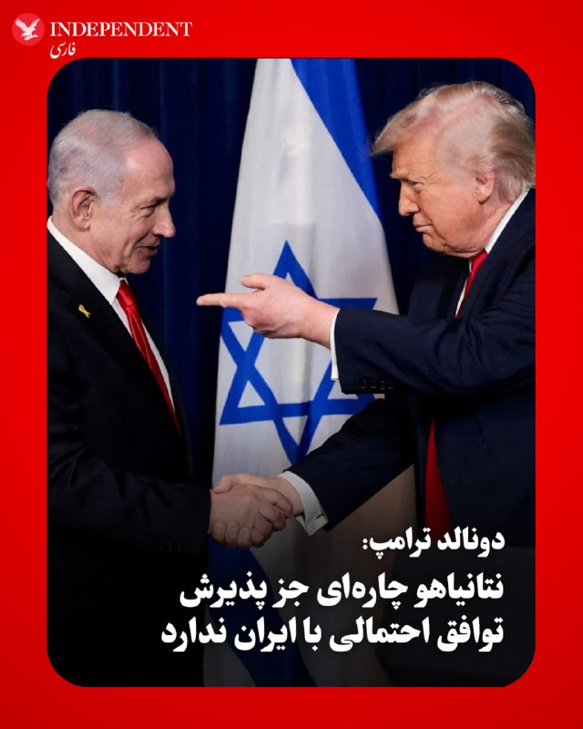

♦️دونالد ترامپ، رئیس‌جمهوری آمریکا، در گفتگوی تلفنی با روزنامه «فایننشال تایمز» اعلام کرد که بنیامین نتانیاهو، نخست‌وزیر اسرائیل، چاره‌ای جز پذیرش توافق احتمالی واشنگتن با تهران ندارد، چرا که در این معادله «او تصمیم‌گیرنده نهایی و همه‌کاره است». ترامپ که پس از حملات موشکی گسترده ایران به اسرائیل، در پاسخ به بمباران حومه بیروت توسط ارتش اسرائیل، سخن می‌گفت، تأکید کرد که این پرتابه‌ها هیچ آسیبی وارد نکرده‌اند و تفاوتی در اراده او برای دستیابی به توافق ایجاد نمی‌کنند؛ هرچند برخلاف گذشته، لحن او نشان می‌داد که حصول این توافق چندان هم قریب‌الوقوع نیست. رئیس‌جمهوری آمریکا همچنین هشدار داد که اگر روند دیپلماسی شکست بخورد، گزینه‌هایی چون حمله تفنگداران دریایی یا تشدید محاصره همه‌جانبه نظامی علیه ایران را مدنظر قرار خواهد داد.
‌🇸🇦 Indypersian

🤖 @VahidOOnLine

## WithYashar — post 13856

یک مقام آمریکایی به کانال ۱۲ تلویزیون اسرائیل گفت: نتانیاهو به نوعی موافقت کرده است که پاسخ اسرائیل به ایران را به تعویق بیندازد.
@withyashar
یاشار: اسرائیل همانطور که گفتم فقط کارش قافلگیری ‌است و هیچی نشون نمیده ! هر لحظه ممکنه برنه !

## mwarmonitor — post 10354

📌اکسیوس: مقامات آمریکایی اعطای «چراغ سبز» به اسرائیل برای انجام حمله به بیروت را تکذیب می‌کنند. یکی از مقامات گفت: «ما هیچ نقشی در این موضوع نداشتیم.»

@mwarmonitor

## IranIntlTV — post 341075

  <a href="telegram/content/IranIntlTV_341075_1780873421.mp4" target="_blank">🎬 Download video</a>

ارتش اسرائیل اعلام کرد شبکه‌ای از تونل‌های زیرزمینی حزب‌الله را در ارتفاعات بوفور جنوب لبنان کشف کرده است؛ شبکه‌ای که به گفته این ارتش با برنامه‌ریزی و تأمین مالی جمهوری اسلامی ساخته شده بود و پهپادها، موشک‌های دوش‌پرتاب و موشک‌های ضدزره از این محل به سوی خاک اسرائیل شلیک شده بود. این شبکه تونلی در یک منطقه غیرنظامی بنا شده بود و به‌عنوان یکی از مراکز اصلی حزب‌الله در این منطقه عمل می‌کرد.
@iranintltv

## FarsiVOA — post 219950

⚡️از هرات تا تهران؛ روایت مشترک زنان در برابر حجاب اجباری زنان و بازداشت‌ها
@FarsiVOA

## BBCPersian — post 283105

  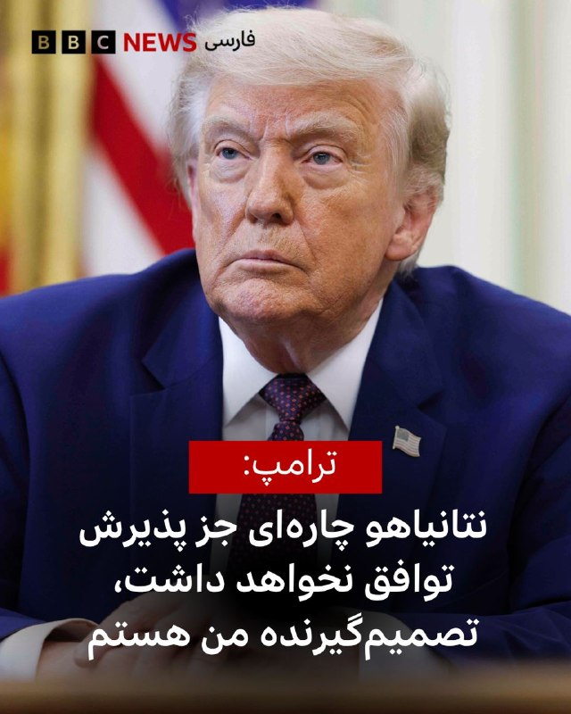

دونالد ترامپ در گفت وگو با روزنامه فايننشال تايمز اعلام کرد بنيامين نتانياهو، نخست وزير اسرائيل، ناگزير خواهد بود هر توافقی را که ايالات متحده با ايران به دست آورد، بپذيرد.

ترامپ در اين گفت وگوی تلفنی که عصر یکشنبه به وقت شرق آمریکا روی داد گفت: «او هيچ انتخابی نخواهد داشت. تصميم‌گيرنده من هستم. همه تصميم‌ها را من می گيرم. او [نتانياهو] تصميم‌گير نيست.»

رئيس‌جمهور آمريکا پيش‌تر نيز به نشریه اکسيوس گفته بود که قصد دارد از نتانياهو بخواهد در واکنش به حملات اخير ايران دست به اقدام تلافی‌جويانه نزند تا امکان نجات توافق احتمالی ميان تهران و واشنگتن حفظ شود.

آقای ترامپ همچنين به فايننشال تايمز گفت حملات اخير «هيچ تأثيری بر روند توافق نداشته است.»

او افزود: «خواهيم ديد در نهايت چه اتفاقی می‌افتد. اين يکی از آن مسائلی است که بسته به اينکه چگونه حساب کنيد، سه هزار سال يا ۴۷ سال است ادامه دارد.»

اين اظهارات نشان‌دهنده اطمينان آقای ترامپ به پيشرفت مذاکرات با ايران و در عين حال تلاش او برای مهار واکنش احتمالی اسرائيل به تنش‌های اخير در منطقه است.

📸 Getty

https://bbc.in/4eafvAI
@BBCPersian

## Dirty_Kids — post 391303

⚽️ جام جهانی داره شروع میشه و بازار شرطبندی و پیشبینی از همیشه داغ تر هستش 
🔥 https://t.me/+lCR7HeYTU15iNjM0 https://t.me/+lCR7HeYTU15iNjM0 A17 
⚡️ اگر میخوای با آنالیز های رضا کینگ کونگ پول دربیاری توی این جام حتما عضو کانال شو ✅

## Dirty_Kids — post 391302

  

⚽️ جام جهانی داره شروع میشه و بازار شرطبندی و پیشبینی از همیشه داغ تر هستش 
🔥

https://t.me/+lCR7HeYTU15iNjM0
https://t.me/+lCR7HeYTU15iNjM0
A17

⚡️ اگر میخوای با آنالیز های رضا کینگ کونگ پول دربیاری توی این جام حتما عضو کانال شو ✅

## Dirty_Kids — post 391301

  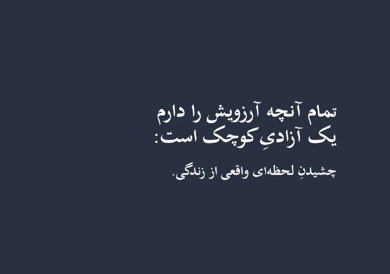

#بخوابیم

@Dirty_Kids 👻

## Dirty_Kids — post 391300

  

‏اگر ترامپ دخالت نمیکرد امشب میتونست یه شب مهم باشه ؛ یه شب شااااد.

@Dirty_Kids 👻

## Dirty_Kids — post 391299

شما «نه به جنگ» نیستید، شما «نه به سقوط جمهوری اسلامی» هستید؛ وگرنه برای این موشک‌پرانی‌های رژیم هم صدایتان درمی‌آمد.

@Dirty_Kids 👻

## Dirty_Kids — post 391298

  <a href="telegram/content/Dirty_Kids_391298_1780873426.mp4" target="_blank">🎬 Download video</a>

یکم آیسان اسلامی برای تراپی

@Dirty_Kids 👻

## Dirty_Kids — post 391297

  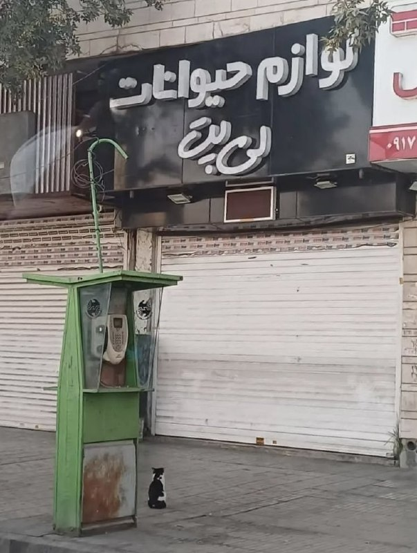

بگردم برات بچه
غصه اینم باید بخورم

@Dirty_Kids 👻

## Dirty_Kids — post 391296

  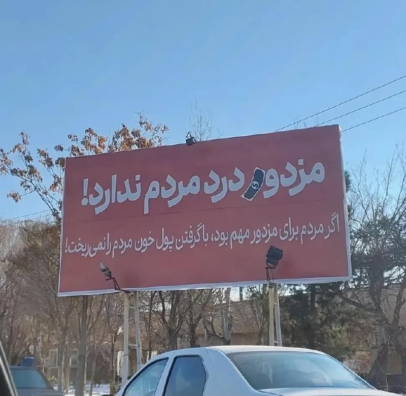

میدونم یه خودی اینو طراحی کرده ولی نمیتونم ثابت کنم:)

@Dirty_Kids 👻

## alonews — post 126086

  <a href="telegram/content/alonews_126086_1780873429.webm" target="_blank">🎬 Download video</a>

👈ادعای یک مقام آمریکایی به کانال ۱۲:
نتانیاهو «به نحوی» با به تأخیر انداختن پاسخ به حمله ایران موافقت کرده است

✅ @AloNews خبر جنگ

---
📅 بروزرسانی: 1405/03/18 02:23
---

## VahidOOnLine — post 244200

  

دونالد ترامپ، رییس‌جمهوری آمریکا، در مصاحبه‌ای که یکشنبه منتشر شد، به فایننشال تایمز گفت بنیامین نتانیاهو، نخست‌وزیر اسرائیل، «چاره‌ای جز پذیرش» هر توافقی که ایالات متحده با ایران کند، نخواهد داشت، زیرا ترامپ «حرف آخر را می‌زند.»

به گزارش خبرگزاری رویترز، او گفت: «او [نتانیاهو] هیچ چاره‌ای نخواهد داشت.»
‌🏁 🇬🇧 IranintlTV

🤖 @VahidOOnLine

## WithYashar — post 13855

تسنیم: ایران از یک‌ پهپاد ناشناخته جدید در حملات اخیر علیه اسرائیل استفاده کرد
@withyashar

## WithYashar — post 13854

رسانه وابسته به سپاه گزارش داده که در تهران، هواپیماهای مسافربری غیرنظامی به‌دلیل انتظار حملات اسرائیل در حال جابه‌جایی هستند.
@withyashar

## WithYashar — post 13853

## mwarmonitor — post 10353

🔴 وزارت بهداشت اسرائیل: فراخوان نیروی انسانی به بیمارستان‌ها برای انتقال سریع به وضعیت اضطراری.

@mwarmonitor

## IranIntlTV — post 341074

  

پس ازاینکه عباس عراقچی، عکس پرچم‌های جمهوری اسلامی و لبنان را کنار هم در شبکه اجتماعی ایکس منتشر کرد، گیدون سعار، وزیر خارجه اسرائیل، پرچم حزب‌الله لبنان را کنار پرچم جمهوری اسلامی گذاشت و عراقچی را «کلاهبردار» خطاب کرد.
https://iranintl.com/202606072824

## IranIntlTV — post 341073

  

دونالد ترامپ، رییس‌جمهوری آمریکا، در مصاحبه‌ای که یکشنبه منتشر شد، به فایننشال تایمز گفت بنیامین نتانیاهو، نخست‌وزیر اسرائیل، «چاره‌ای جز پذیرش» هر توافقی که ایالات متحده با ایران کند، نخواهد داشت، زیرا ترامپ «حرف آخر را می‌زند.»

به گزارش خبرگزاری رویترز، او گفت: «او [نتانیاهو] هیچ چاره‌ای نخواهد داشت.»
https://iranintl.com/202606078152

## IranianMinds — post 21711

  

🔴 اسرائیل ‌هیوم :

ترامپ تو تماس تلفنی امشبش به نتانیاهو قول داده که کاری میکنه که ایران هیچ راهی برای ساخت سلاح هسته ای نداشته باشه و با توافق میتونه به جایی برسه که دیگه هرگز تهدیدی برای اسرائیل‌ نباشه.

@IranianMinds

## IranianMinds — post 21710

  

این خایمالو

@IranianMinds

## BBCPersian — post 283104

  

🔻خبرگزاری تسنیم، نزدیک به سپاه پاسداران به نقل از یک منبع نظامی و در واکنش به گزارش‌ها از احتمال واکنش نظامی اسرائیل به حمله موشکی یکشنبه شب این کشور، نوشته است: «حجم مناسبی از موشک‌های ایران هم‌اکنون آماده‌اند تا در صورتی که رژیم صهیونیستی به ایران پاسخ دهد، بلافاصله به سمت فهرست‌ اهداف گستر‌ده‌تر در سرزمین‌های اشغالی شلیک شوند.»

تسنیم به نقل از این منبع نظامی نوشته است: اگر اسراییل پاسخ دهد، نوبت بعدی شلیک‌های ایران، پرحجم‌تر خواهد بود.»

در همین حال، ارتش اسرائیل اعلام کرده آماده اقدام نظامی قدرتمند در پاسخ به حملات ایران است و تنها منتظر تصمیم‌گیری مقام‌های سیاسی این کشور است.

این در حالی است که دونالد ترامپ از تلاش برای جلوگیری از تشدید درگیری خبر داده و خواستار آن شده که اسرائیل به حمله موشکی ایران - که گزارش شده تلفاتی در پی نداشته - پاسخ نظامی ندهد.

📸 Reuters

https://bbc.in/4eafvAI
@BBCPersian

## BBCPersian — post 283103

🔻بریتانیا از ایران و اسرائیل خواست با خویشتن‌داری از تشدید درگیری پرهیز کنند

ایوت کوپر، وزیر امور خارجه بریتانیا، ساعتی بعد از حمله موشکی ایران به شمال اسرائیل گفت که «ازسرگیری درگیری به نفع هیچ‌کس نیست.»

خانم کوپر یکشنبه شب در پیامی در شبکه اجتماعی ایکس افزود: «هر دو طرف باید خویشتن‌داری نشان دهند و فورا تنش‌زدایی کنند.»

وزیر خارجه بریتانیا همچنین گفت: «مذاکرات باید برای دستیابی به یک راه‌حل پایدار که همه ما به آن نیاز داریم ادامه یابد؛ برای صلح و ثبات در منطقه و برای احیای کامل تجارت جهانی.»

ساعتی پیش خبرگزاری‌های رسمی ایران از گفتگوی تلفنی میان عباس عراقچی، وزیرخارجه ایران با همتای بریتانیایی خود، خبر داده بودند.

https://bbc.in/4eafvAI
@BBCPersian

## Dirty_Kids — post 391295

  

🔴 ترامپ :
تصمیم‌گیرنده اصلی منم، همه تصمیم‌ها رو من می‌گیرم، نتانیاهو کسی نیست که تعیین تکلیف کنه؛

نتانیاهو چاره‌ای جز قبول کردن توافق با ایران رو نداره و در نهایت باید قبولش کنه.

خبرنگار: اگه مذاکرات با ایران به نتیجه نرسه میخوای چیکار کنی؟

ترامپ: در اون صورت حتی گزینه انجام یه عملیات کماندویی داخل ایران رو هم بررسی می‌کنم.


@Dirty_Kids 👻

## Dirty_Kids — post 391294

  

- بر آتش‌بس نقض کن لعنت
بشمرررررر
- بر اسرائیل و امارات لعنت
بشمرررررر

- بر قوت زانوش صلوت
[الله مع صل الا....]
برای سلامتی آ سید مجتبی خامنه‌ای صلوات بعدی جوری بگو تلاویو بلرزه

@Dirty_Kids 👻

## alonews — post 126085

  <a href="telegram/content/alonews_126085_1780872790.webm" target="_blank">🎬 Download video</a>

👈خبرگزاری تسنیم :
ایران امشب تو حملهِ به اسرائیل از موشک‌های "خیبرشکن" استفاده کرد

✅ @AloNews خبر جنگ

## alonews — post 126083

  <a href="telegram/content/alonews_126083_1780872790.mp4" target="_blank">🎬 Download video</a>

👈هم اکنون حملات اسرائیل به لبنان

✅ @AloNews خبر جنگ

---
📅 بروزرسانی: 1405/03/18 02:13
---

## VahidOOnLine — post 244199

  

♦️اصغر جهانگیر، سخنگوی قوه قضاییه جمهوری اسلامی، در جمع طرفداران حکومت در میدان تجریش اعلام کرد که دستگاه قضایی بیش از ۳ هزار نفر را تحت عنوان «خائنین به وطن» تحت تعقیب قرار داده و ادعا کرد که از این تعداد، ۲ هزار و ۴۰۶ نفر بازداشت شده‌اند و در حال حاضر در زندان به سر می‌برند. این ادعا درحالی مطرح می‌شود که براساس گزارش‌ها، تعداد افراد بازداشت شده بیشتر است. او این افراد را به اقداماتی نظیر «همکاری عملیاتی، امنیتی، رسانه‌ای و مالی به نفع اسرائیل» و همچنین «نگهداری و خرید و فروش ابزارهای الکترونیکی مانند استارلینک برای کمک به دشمن» متهم کرد. او همچنین گفت: «اموال صدها نفر شناسایی و توقیف شده که پس از بررسی و حکم دادگاه مصادره خواهد شد».
‌🇸🇦 Indypersian

🤖 @VahidOOnLine

## WithYashar — post 13852

دادگاه فردا نتانیاهو لغو شد!

جلسه‌ای که قرار بود فردا در چارچوب بررسی پرونده‌های قضایی بنیامین نتانیاهو برگزار شود، به دلیل وضعیت امنیتی و شرایط جاری در منطقه لغو شد.
@withyashar

## WithYashar — post 13851

من یه بیت رهبری برم بیام 😹

## mwarmonitor — post 10352

🛢 رویترز: قراردادهای آتی نفت خام آمریکا (WTI) با ۲.۵۷ دلار افزایش به ۹۳.۱۱ دلار در هر بشکه رسید.

@mwarmonitor

## mwarmonitor — post 10351

🛢رویترز: قراردادهای آتی نفت خام برنت ۲.۶۷ دلار افزایش یافت و به ۹۵.۷۶ دلار در هر بشکه رسید.

@mwarmonitor

## pm_afshaa — post 92739

ادامه اخبار رو بیاید اینجا :
شبتون خوش

https://t.me/BeladNews
https://t.me/BeladNews

## VahidOnline — post 76012

  

⚡️سایت خبری اسرائیل‌هیوم می‌گوید دونالد ترامپ در تماس تلفنی با بنیامین نتانیاهو به او قول داد که متعهد است هرگونه امکان دستیابی جمهوری اسلامی به سلاح هسته‌ای را از بین ببرد و همچنین مانع از آن شود که این رژیم تهدیدی دائمی برای اسرائیل باشد.
@VahidHeadline

📡 @VahidOnline

## VahidOnline — post 76011

  

ترامپ می‌گوید هر توافقی که او با حکومت ایران کند نخست وزیر اسرائيل خواهد پذیرفت

رئیس‌جمهوری آمریکا در گفت‌وگویی تلفنی با فایننشال تایمز گفت که بنیامین نتانیاهو، نخست‌وزیر اسرائیل، چاره‌ای جز پذیرش هر توافقی که آمریکا در مورد آن با رژیم ایران مذاکره و نهایی کند نخواهد داشت.
دونالد ترامپ گفت زیرا «تصمیم‌گیرنده اصلی رئیس‌جمهوری ایالات متحده» است.

دونالد ترامپ به فایننشال تایمز گفت: «او (بنیامین نتانیاهو) هیچ انتخابی نخواهد داشت. این من هستم که تصمیم می‌گیرم. همه تصمیم‌ها را من می‌گیرم. او (نتانیاهو) تصمیم‌گیرنده نیست.»

به گزارش فایننشال تایمز، آقای ترامپ این اظهارات را اندکی پس از آن مطرح کرد که جمهوری اسلامی در جدی‌ترین نقض آتش‌بس از زمان توافق آتش‌بس در اوایل آوریل، چندین موشک بالستیک به سوی اسرائیل شلیک کرد.

آقای ترامپ تأکید کرد که حملات موشکی جمهوری اسلامی تغییری در تمایل او برای به نتیجه رساندن مذاکرات میان آمریکا و حکومت ایارن ایجاد نکرده است.
او به فایننشال تایمز گفت: «این موضوع هیچ تأثیری بر توافق نخواهد داشت.»

ارتش اسرائيل به صدای آمریکا گفت که جمهوری اسلامی یازده موشک به اسرائيل شلیک کرد. ارتش اسرائيل پیشتر گفت که حملات موشکی جمهوری اسلامی را دفع کرده است.

در همین حال در واکنش به حملات موشکی جمهوری اسلامی، ارتش اسرائیل در بیانیه‌ای به صدای آمریکا گفت که رئیس ستاد کل ارتش اسرائیل، ایال زمیر، در حال ارزیابی وضعیت در مجمع ستاد کل است. ارتش اسرائيل به صدای آمریکا گفت: «نیروی دفاعی اسرائیل به محض صدور دستور، با قاطعیت به دشمن حمله خواهد کرد.»
@VahidHeadline

📡 @VahidOnline

## IranIntlTV — post 341072

  <a href="telegram/content/IranIntlTV_341072_1780872189.mp4" target="_blank">🎬 Download video</a>

کاروان تیم ملی فوتبال ایران وارد مکزیک شد. همزمان، شماری از ایرانیان مقیم لس‌آنجلس در اعتراض به ممنوعیت ورود پرچم شیر و خورشید به ورزشگاه‌های جام جهانی تجمعی اعتراضی برگزار کردند.

گزارش نیلوفر منصوری و رضا محدث، خبرنگاران ایران‌اینترنشنال و گفت‌وگو با دو نفر از تجمع‌کنندگان
@iranintltv

## FarsiVOA — post 219949

  

⚡️بخش دیجیتال روزنامه اسرائيلی یدیعوت اخرونوت، وای‌نت، در گزارشی نوشت که آمریکا از اسرائیل خواست پاسخ تلافی‌جویانه خود به حملات تازه موشکی جمهوری اسلامی به اسرائيل را به تعویق بیندازد. طبق این گزارش، واشنگتن از اسرائیل می‌خواهد که «چند روز» صبر کند تا ببیند آیا مذاکرات با جمهوری اسلامی به توافقی منجر می‌شود یا خیر.
اسرائیل در حال بررسی واکنش به شلیک موشکی جمهوری اسلامی است.
@FarsiVOA

## FarsiVOA — post 219948

🔺دونالد ترامپ به فایننشال تایمز می‌گوید هر توافقی که او با حکومت ایران کند نخست وزیر اسرائيل خواهد پذیرفت

▪️دونالد ترامپ، رئیس‌جمهوری آمریکا در گفت‌وگویی تلفنی با فایننشال تایمز گفت که بنیامین نتانیاهو، نخست‌وزیر اسرائیل، چاره‌ای جز پذیرش هر توافقی که آمریکا در مورد آن با رژیم ایران مذاکره و نهایی کند نخواهد داشت.

⬇️ بیشتر بخوانید:
https://ir.voanews.com/a/8158273.html
@FarsiVOA

## Persian_Trend_Official — post 16020

  <a href="telegram/content/Persian_Trend_Official_16020_1780872191.mp4" target="_blank">🎬 Download video</a>

سقوط پهپاد امریکایی در عراق!

امشب در حین حملات موشکی سپاه پاسداران به اسرائیل، یک پهپاد از نوع MQ-1 و یا MQ-9 امریکا برفراز عراق منهدم شد.

📝 Amir

📌 @persian_trend_official
پرشین ترند | متفاوت‌ترین کانال نظامی

## Persian_Trend_Official — post 16019

  <a href="telegram/content/Persian_Trend_Official_16019_1780872192.mp4" target="_blank">🎬 Download video</a>

سردار سید مجید موسوی، فرمانده نیروی هوافضا سپاه پاسداران برای اولین بار پس از آغاز جنگ پیام ویدیویی از خود منتشر کرد.

📝 Amir

📌 @persian_trend_official
پرشین ترند | متفاوت‌ترین کانال نظامی

## IranianMinds — post 21709

@IranianMindsGroup

ایدی گروه کامنتا ( تو کامنتا خیلی درخواست داده بودید )

## IranianMinds — post 21708

🔴 کان نیوز :

اسرائیل ممکن است به‌جای اقدام امشب، در پی مخالفت ترامپ، حمله را برای چند روز به تعویق بیندازد.

@IranianMinds

## alonews — post 126080

  <a href="telegram/content/alonews_126080_1780872194.webm" target="_blank">🎬 Download video</a>

👈حمید رسایی: هر چه زودتر اینترنت رو قطع کنین تا دشمن نتونه به ما ضربه بزنه!

✅ @AloNews خبر جنگ

---
📅 بروزرسانی: 1405/03/18 02:03
---

## WithYashar — post 13850

ترامپ: محاصره ممکن است قوی تر از هر حمله ای باشد که به ایران آغاز شده است‌‌
@withyashar

## WithYashar — post 13849

همه رسانه های عبری دسته جمعی از تصمیم نتانیاهو مبنی بر حمله گسترده به ایران ، خبر میدهند
@withyashar

## WithYashar — post 13848

  <a href="telegram/content/WithYashar_13848_1780871597.mp4" target="_blank">🎬 Download video</a>

@withyashar

## mwarmonitor — post 10350

  

✈️«۳ فروند تانکر سوخت‌رسان نیروی هوایی آمریکا اکنون بر فراز شرق عربستان سعودی فعال هستند و دو فروند دیگر نیز در مسیر از تل‌آویو در حال حرکت‌اند. ✈️همچنین به نظر می‌رسد هواپیماهای نیروی هوایی آمریکا از انجام عملیات بر فراز خلیج فارس و دریای عمان خودداری می‌کنند.»…

## pm_afshaa — post 92738

  <a href="telegram/content/pm_afshaa_92738_1780871599.webm" target="_blank">🎬 Download video</a>

🔴ترامپ: اگر توافق به دلیل بندهاش فرو بپاشه، ما گزینه انجام یک حمله کماندویی به ایران رو بررسی خواهیم کرد. 
💧 Rainbet.com the #1 Non-KYC Crypto Casino & Sportsbook @rainbetcom 
😁 @Pm_Afshaa

## IranIntlTV — post 341071

  <a href="telegram/content/IranIntlTV_341071_1780871599.mp4" target="_blank">🎬 Download video</a>

شهرام خلدی، پژوهش‌گر تاریخ خاورمیانه، گفت: «درگیری میان اسرائیل و جمهوری اسلامی تشدید خواهد شد.» او افزود: «با توجه به حضور گسترده نیروهای آمریکایی در منطقه و نگرانی متحدان عرب واشینگتن در خلیج فارس، دونالد ترامپ نمی‌تواند در برابر بازیگری غیرعقلانی مانند جمهوری اسلامی، متحدانش را تنها بگذارد.»
@iranintltv

## FarsiVOA — post 219947

  

⚡️سایت خبری اسرائيل‌هیوم می‌گوید دونالد ترامپ در تماس تلفنی با بنیامین نتانیاهو به او قول داد که متعهد است هرگونه امکان دستیابی جمهوری اسلامی به سلاح هسته‌ای را از بین ببرد و همچنین مانع از آن شود که این رژیم تهدیدی دائمی برای اسرائیل باشد.
@FarsiVOA

## Persian_Trend_Official — post 16018

  <a href="telegram/content/Persian_Trend_Official_16018_1780871601.webm" target="_blank">🎬 Download video</a>

ترامپ به فایننشال تایمز: من تصمیم میگیرم. من همه تصمیمات را میگیرم. نتانیاهو تصمیم گیرنده نیست!

حمله ایران به اسرائیل هیچ تأثیری بر مذاکرات نخواهد داشت. این حملات یکی از آن چیزهایی است که 3000 سال یا 47 سال، بسته به اینکه چگونه حساب کنید، ادامه داشته است.

نتانیاهو چاره‌ای جز پذیرش توافق ایران نخواهد داشت.

📝 Amir

📌 @persian_trend_official
پرشین ترند | متفاوت‌ترین کانال نظامی

## IranianMinds — post 21706

🔴 ترامپ :

محاصره بنادر ایران احتمالا قوی تر از هر حمله ای است که تا به حال به آن کشور انجام شده است.

@IranianMinds

## IranianMinds — post 21705

البته همه میدونیم که اینا همش عادت های ترامپ مودی روانیه
که با روح و روان ادم بازی میکنه
و این حرفارو قبل جنگ ۱۲ روزه و همبن جنگ اخیر زده بود

## IranianMinds — post 21704

حالا یکی باید بره بین ترامپ و نتانیاهو میانجیگری کنه

## alonews — post 126079

  <a href="telegram/content/alonews_126079_1780871601.webm" target="_blank">🎬 Download video</a>

👈ترامپ: محاصره ممکن است قوی تر از هر حمله ای باشد که به ایران آغاز شده است‌‌

✅ @AloNews خبر جنگ

---
📅 بروزرسانی: 1405/03/18 01:53
---

## WithYashar — post 13846

ترامپ: اگر توافق به دلیل بندهاش فرو بپاشه، ما گزینه انجام یک حمله کماندویی به ایران رو بررسی خواهیم کرد.
@withyashar

## WithYashar — post 13845

هشدار آمریکا برای شهروندان خارج از کشور: احتیاط کنید , از جا به جایی بپرهیزید
@withyashar

## WithYashar — post 13844

ترامپ: نتانیاهو «چاره‌ای نخواهد داشت» جز اینکه توافق با ایران را بپذیرد.

من فرمان‌ها را صادر می‌کنم. من همه فرمان‌ها را صادر می‌کنم. نتانیاهو فرمان‌ها را صادر نمی‌کند.
@withyashar

## mwarmonitor — post 10349

🔸ترامپ: حملات ایران هدف او را برای به‌سرانجام رساندن مذاکرات آمریکا و ایران تغییر نداده است. @mwarmonitor

## mwarmonitor — post 10348

📌اسرائیل به گزارش شبکه «کان» در حال بررسی این است که امشب به ایران حمله نکند، پس از مخالفت دونالد ترامپ.

در عوض، یک حمله ممکن است «چند روز دیگر» انجام شود.

@mwarmonitor

## mwarmonitor — post 10347

🔴ترامپ: «نتانیاهو چاره‌ای جز پذیرش توافق با ایران نخواهد داشت.» @mwarmonitor

## pm_afshaa — post 92737

ترامپ بد منفور شد امشب
نکنه زنشو گروگان گرفتن؟

## pm_afshaa — post 92736

  <a href="telegram/content/pm_afshaa_92736_1780870993.webm" target="_blank">🎬 Download video</a>

🔴ترامپ: اگر توافق به دلیل بندهاش فرو بپاشه، ما گزینه انجام یک حمله کماندویی به ایران رو بررسی خواهیم کرد.

💧 Rainbet.com the #1 Non-KYC Crypto Casino & Sportsbook @rainbetcom

😁 @Pm_Afshaa

## pm_afshaa — post 92735

  <a href="telegram/content/pm_afshaa_92735_1780870994.webm" target="_blank">🎬 Download video</a>

🔴ترامپ: حملات ایران هیچ تأثیری بر توافق نخواهد داشت. فکر میکنم توافق در حال پیش رفتن است و خواهیم دید چه اتفاقی میفته.

💧 Rainbet.com the #1 Non-KYC Crypto Casino & Sportsbook @rainbetcom

😁 @Pm_Afshaa

## pm_afshaa — post 92734

  <a href="telegram/content/pm_afshaa_92734_1780870995.webm" target="_blank">🎬 Download video</a>

🔴ترامپ: نتانیاهو هیچ گزینه‌ای جز پذیرفتن توافق با ایران نخواهد داشت. 
💧 Rainbet.com the #1 Non-KYC Crypto Casino & Sportsbook @rainbetcom 
😁 @Pm_Afshaa

## pm_afshaa — post 92733

  <a href="telegram/content/pm_afshaa_92733_1780870995.webm" target="_blank">🎬 Download video</a>

🔴کان نیوز اسرائیل: اسرائیل در حال بررسی لغو حمله امشب به ایران به دلیل مخالفت ترامپ است و در ازای این انتظار میره حملات در روز های آینده انجام بشه. 
💧 Rainbet.com the #1 Non-KYC Crypto Casino & Sportsbook @rainbetcom 
😁 @Pm_Afshaa

## pm_afshaa — post 92732

  <a href="telegram/content/pm_afshaa_92732_1780870996.webm" target="_blank">🎬 Download video</a>

🔴کان نیوز اسرائیل: اسرائیل در حال بررسی لغو حمله امشب به ایران به دلیل مخالفت ترامپ است و در ازای این انتظار میره حملات در روز های آینده انجام بشه.

💧 Rainbet.com the #1 Non-KYC Crypto Casino & Sportsbook @rainbetcom

😁 @Pm_Afshaa

## pm_afshaa — post 92731

  <a href="telegram/content/pm_afshaa_92731_1780870996.webm" target="_blank">🎬 Download video</a>

🔴ترامپ: نتانیاهو هیچ گزینه‌ای جز پذیرفتن توافق با ایران نخواهد داشت.

💧 Rainbet.com the #1 Non-KYC Crypto Casino & Sportsbook @rainbetcom

😁 @Pm_Afshaa

## IranIntlTV — post 341070

  <a href="telegram/content/IranIntlTV_341070_1780870997.mp4" target="_blank">🎬 Download video</a>

مراد ویسی، تحلیل‌گر ارشد ایران‌اینترنشنال، گفت: «یکی از روش‌هایی که جمهوری اسلامی برای حفظ بقای خود در پیش گرفته، استفاده از سرکوب و خشونت در داخل کشور است. منطق این رویکرد این است که هر زمان مردم دست به اعتراض یا قیام بزنند، با شدیدترین برخوردها و کشتار مواجه شوند تا هزینه اعتراض آن‌قدر بالا برود که جامعه از تکرار آن هراس داشته باشد. این روش در نهایت به جای خاموش کردن اعتراضات باعث گسترش کمی و کیفی اعتراضات شده است.»
@iranintltv

## IranianMinds — post 21703

🔴 فایننشنال تایمز :

ترامپ گفته که اگر توافق با ایران شکست بخورد، آمریکا دو گزینه خواهد داشت:

یا اقدام نظامی علیه زیرساخت‌های باقی‌مانده هسته‌ای ایران، یا ادامه فشار اقتصادی.

@IranianMinds

## IranianMinds — post 21702

  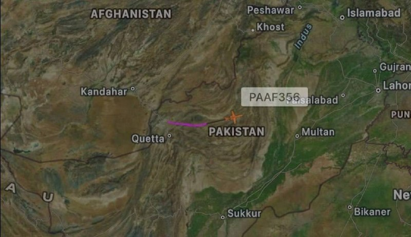

🔴وزیر کشور پاکستان از تهران رفت.

@IranianMinds

## IranianMinds — post 21701

🔴 ترامپ به فایننشال تایمز : من تصمیم‌ها رو می‌گیرم. من همه تصمیم‌ها رو می‌گیرم. نتانیاهو تصمیم‌ها رو نمی‌گیره. @IranianMinds

## IranianMinds — post 21700

🔴 ترامپ به فایننشال تایمز :

من تصمیم‌ها رو می‌گیرم. من همه تصمیم‌ها رو می‌گیرم. نتانیاهو تصمیم‌ها رو نمی‌گیره.

@IranianMinds

## IranianMinds — post 21699

🔴 ترامپ: نتانیاهو چاره‌ای جز پذیرش توافق با ایران نخواهد داشت.

@IranianMinds

## BBCPersian — post 283102

🔻گزارش‌ها از حمله پهپادی به مواضع گروه‌های کرد مخالف ایران در سلیمانیه عراق

شبکه العربیه از حملات پهپادی به مواضع گروه‌های کرد مخالف ایران در سلیمانیه عراق خبر داده است.

ایران در سه ماه گذشته بارها حملات موشکی و پهپادی به مواضع گروه‌های مسلح کرد ایرانی مستقر در عراق انجام داده است.

هنوز گزارشی از سوی منابع نزدیک به این گروه‌ها درباره این حملات مخابره نشده است.

https://bbc.in/4eafvAI
@BBCPersian

## Dirty_Kids — post 391293

  <a href="telegram/content/Dirty_Kids_391293_1780870999.mp4" target="_blank">🎬 Download video</a>

ترامپ پای تلفن به دستیار نتانیاهو:

@Dirty_Kids 👻

## alonews — post 126078

  <a href="telegram/content/alonews_126078_1780871000.webm" target="_blank">🎬 Download video</a>

👈کانال کان اسرائیل: در اسرائیل در حال بررسی تصمیم به عدم پاسخ‌دهی امشب، بلکه پس از چند روز هستیم، و این قطعاً به دلیل مخالفت ترامپ با حمله است. در حال حاضر تصمیم نهایی گرفته نشده و بحث‌ها ادامه دارد

✅ @AloNews خبر جنگ

## alonews — post 126077

  <a href="telegram/content/alonews_126077_1780871001.webm" target="_blank">🎬 Download video</a>

👈فایننشال تایمز به نقل از ترامپ: فکر می کنم توافق با ایران در حال انجام است و خواهیم دید چه اتفاقی می افتد‌‌

✅ @AloNews خبر جنگ

## alonews — post 126076

  <a href="telegram/content/alonews_126076_1780871001.webm" target="_blank">🎬 Download video</a>

👈ترامپ: ایران اگر بازهم اسرائیل را بزند ما اقدامی نخواهیم کرد زیرا دنبال توافقیم

✅ @AloNews خبر جنگ

## alonews — post 126075

  <a href="telegram/content/alonews_126075_1780871001.webm" target="_blank">🎬 Download video</a>

👈ترامپ: اگه توافق از نظرم خودش شکست بخوره احتمالاً گزینه انجام یک حمله کماندویی به ایران رو هم در نظر می‌گیرم

✅ @AloNews خبر جنگ

## alonews — post 126074

  <a href="telegram/content/alonews_126074_1780871001.webm" target="_blank">🎬 Download video</a>

👈ترامپ: من تصمیم‌گیرنده هستم. من همه تصمیم‌ها را می‌گیرم. نتانیاهو تصمیم‌گیرنده نیست.

✅ @AloNews خبر جنگ

## alonews — post 126073

  <a href="telegram/content/alonews_126073_1780871001.webm" target="_blank">🎬 Download video</a>

👈ترامپ : نتانیاهو هیچ انتخابی نداره بجز قبول توافق با ایران

✅ @AloNews خبر جنگ

---
📅 بروزرسانی: 1405/03/18 01:43
---

## VahidOOnLine — post 244198

  

♦️به گزارش فارس، خبرگزاری وابسته به سپاه، زمین‌لرزه‌ای به بزرگی ۳.۶، بامداد دوشنبه، ۱۸ خردادماه، حوالی بندر چارک در هرمزگان را لرزاند.
‌🇸🇦 Indypersian

🤖 @VahidOOnLine

## WithYashar — post 13843

رسانه‌های اسرائیلی : ایستگاه‌های مترو در خط قرمز تمام شب باز خواهند بود و طبق دستور فرماندهی جبهه داخلی اسرائیل، به‌عنوان پناهگاه برای ساکنان مورد استفاده قرار می‌گیرن.
@withyashar

## WithYashar — post 13842

نتانیاهو وارد یه جلسه امنیتی گسترده با وزیر جنگ، فرماندهان ارتش و موساد شده
@withyashar

## WithYashar — post 13841

وزیر کشور پاکستان از تهران در رفت
@withyashar

## mwarmonitor — post 10346

🔴ترامپ: «نتانیاهو چاره‌ای جز پذیرش توافق با ایران نخواهد داشت.»

@mwarmonitor

## mwarmonitor — post 10345

🔸رسانه‌های اسرائیلی: ایستگاه‌های مترو در خط قرمز تمام شب باز خواهند ماند و طبق دستورهای فرماندهی جبهه داخلی اسرائیل به‌عنوان پناهگاه برای شهرک‌نشینان استفاده خواهند شد، به‌جز ایستگاه «کارلِبَخ»، که بر اساس همین دستورالعمل‌ها از این قاعده مستثنی است.

@mwarmonitor

## mwarmonitor — post 10344

🚨 روزنامه یسرائیل هیوم به نقل از یک مقام اسرائیلی:
به حمله ایران پاسخ خواهیم داد، حتی اگر این پاسخ به‌زودی انجام نشود.

@mwarmonitor

## FoxNewsTwitter — post 342702

  

Fox News (Twitter/X)

"They've had 16 years to show us that their ideas can work, and they've had nothing stopping them."

As votes are still being counted in California’s gubernatorial primary, @SteveHiltonx is blasting Democrats over what he calls 16 years of failed one-party rule.

"They've had all the statewide offices. They have had both chambers of the state legislature with a two-thirds majority. They can literally pass anything they want. They run all the big cities, all the big counties. They had the state Supreme Court, 6-1 Democrat majority, and yet still they can't do it," Hilton said.

The Republican candidate argues California’s affordability crisis is the result of years of unchecked Democratic control, pointing to housing costs, taxes and rising energy prices.

Votes are still being counted in the governor's race, with early indicators suggesting Hilton could secure the second spot on November's ballot and face Democrat Xavier Becerra.

## pm_afshaa — post 92730

  <a href="telegram/content/pm_afshaa_92730_1780870390.webm" target="_blank">🎬 Download video</a>

🔴هم‌اکنون جلسه امنیتی نتانیاهو با ژنرال‌های نظامی ارتش اسرائیل

💧 Rainbet.com the #1 Non-KYC Crypto Casino & Sportsbook @rainbetcom

😁 @Pm_Afshaa

## pm_afshaa — post 92729

  <a href="telegram/content/pm_afshaa_92729_1780870391.webm" target="_blank">🎬 Download video</a>

🔴رسانه‌های اسرائیلی:
ایستگاه‌های مترو در خط قرمز تمام شب باز خواهند بود و طبق دستور فرماندهی جبهه داخلی اسرائیل، به‌عنوان پناهگاه برای ساکنان مورد استفاده قرار می‌گیرن.

💧 Rainbet.com the #1 Non-KYC Crypto Casino & Sportsbook @rainbetcom

😁 @Pm_Afshaa

## pm_afshaa — post 92728

  <a href="telegram/content/pm_afshaa_92728_1780870391.webm" target="_blank">🎬 Download video</a>

🔴منبع پاکستانی به العربیه: ما به یک توافق مرحله‌ای سریع با ایران نزدیک میشیم.

💧 Rainbet.com the #1 Non-KYC Crypto Casino & Sportsbook @rainbetcom

😁 @Pm_Afshaa

## pm_afshaa — post 92727

  <a href="telegram/content/pm_afshaa_92727_1780870392.webm" target="_blank">🎬 Download video</a>

🔴رویترز به نقل از یک مقام اسرائیلی:
ترامپ و نتانیاهو کمتر از نیم ساعت با هم صحبت کردن.

💧 Rainbet.com the #1 Non-KYC Crypto Casino & Sportsbook @rainbetcom

😁 @Pm_Afshaa

## Shin_Persian — post 6675

Shin ✓ @hey_itsmyturn
Sun, 07 Jun 2026 22:06:16 UTC

Let me rephrase: I BELIEVE*

فارسی

اجازه دهید دوباره بیان کنم: من باور دارم*

𝕏 · @shin_persian

## Shin_Persian — post 6674

Shin ✓ @hey_itsmyturn
Sun, 07 Jun 2026 22:05:42 UTC

I think there will be A response from 🇮🇱

فارسی

فکر می‌کنم پاسخی از سوی 🇮🇱 در کار باشد.

𝕏 · @shin_persian

## FarsiVOA — post 219946

  

📸اینستاگرام صدای آمریکا را هم اکنون فالو کنید تا از آخرین خبرها مطلع بمانید:
https://www.instagram.com/voafarsi/

📡همچنین جهت اطلاع از بروزترین فرکانسهای ماهواره‌ای صدای آمریکا به لینک زیر مراجعت فرمایید:
https://ir.voanews.com/satellite

این پست را با دوستانتان به اشتراک بگذارید
@FarsiVOA

## FarsiVOA — post 219945

  

⚡️سایت تسنیم، وابسته به سپاه پاسداران می‌گوید که این نهاد علاوه بر موشک، از پهپادهای موسوم به شاهد-۱۳۶ نیز در حمله به اسرائيل استفاده کرده است. سرعت حرکت این پهپادها بسیار کندتر از موشک‌ها است. تاکنون گزارشی از مقابله با پهپادها در اسرائيل منتشر نشده است.
@FarsiVOA

## IranianMinds — post 21698

🔴 منابع عبری:

تماس تلفنی ایال زمیر  و برد کوپر فرمانده سنتکام، دقایقی پیش.

@IranianMinds

## BBCPersian — post 283101

🔻تنش ميان ايران، اسرائيل و آمريکا بر سر لبنان وارد مرحله تازه‌ای شد

🖌سباستین آشر - گزارشگر دیپلماتیک بی‌بی‌سی

تنش ميان ايران، اسرائيل و آمریکا بر سر عمليات نظامی اسرائيل عليه حزب‌الله در لبنان، در روزهای اخير به طور فزاينده ای تشديد شده بود.

زمانی که بنيامين نتانياهو، نخست وزير اسرائيل، هفته گذشته به ارتش اين کشور مجوز داد بار ديگر حومه جنوبی بيروت را هدف قرار دهد، تهران هشدار داد در صورت اجرای اين حملات، دست به حملات جديدی عليه شمال اسرائيل خواهد زد.

احتمال وقوع يک تشديد تنش گسترده در لبنان باعث شد دونالد ترامپ، رئيس جمهور آمريکا، با شديدترين لحن از نتانياهو بخواهد از انجام اين حملات خودداری کند؛ زيرا نگران بود چنين اقدامی آتش‌بس شکننده ميان آمريکا و ايران را که از پيش نيز در وضعيت متزلزلی قرار داشت، از هم بپاشد.

آقای نتانياهو با اين درخواست موافقت کرد، اما شرط گذاشت که حزب‌الله ديگر هيچ راکتی به سوی شمال اسرائيل شليک نکند.

پس از آن، در مذاکراتی با ميانجي‌گری آمريکا، توافقی برای آتش‌بس ميان دولت‌های اسرائيل و لبنان حاصل شد. با اين حال، اين آتش‌بس نيز مانند توافق‌های پيشين تأثير چندانی بر واقعيت های ميدانی نداشت.

اکنون به نظر می‌رسد اين توافق عملا فروپاشيده است؛ زيرا اسرائيل در واکنش به ادامه حملات راکتی حزب‌الله به خاک خود، حملاتی را عليه حومه جنوبی بيروت انجام داد.

تنها چند ساعت بعد، ايران به تهديد خود عمل کرد و موجی از موشک‌ها و پهپادها را به سوی اسرائيل شليک کرد.

سپاه پاسداران انقلاب اسلامی اعلام کرده است اين حملات به مدت هفت روز ادامه خواهد داشت، هرچند برخی نشانه ها حاکی از آن است که اين حمله جديد ممکن است بيشتر جنبه هشداردهنده داشته باشد.

اکنون بخش مهمی از تحولات به واکنش اسرائيل بستگی دارد.

اين احتمال وجود دارد که دو طرف وارد دور جديدی از حملات تلافی‌جويانه شوند؛ رخدادی که می تواند جنگ در ايران را بار ديگر شعله‌ور کند.

واکنش دونالد ترامپ نيز نقشی کليدی خواهد داشت. در حال حاضر، او همچنان به دنبال مهار تنش‌ها و جلوگيری از گسترش درگيری‌ها به نظر می‌رسد.

تحولات اخير بيش از هر زمان ديگری نشان داده است که درگيری‌های لبنان اکنون به يکی از عوامل اصلی تعيين کننده سرنوشت بحران گسترده تر منطقه تبديل شده است.

https://bbc.in/4eafvAI
@BBCPersian

## BBCPersian — post 283100

🔻گزارش‌ها از تماس تلفنی ترامپ با نتانیاهو برای جلوگیری از درگیری بیشتر با ایران خبرنگاران و رسانه‌های آمریکایی می‌گویند دونالد ترامپ در پی جلوگیری از پاسخ اسرائیل به حمله موشکی ایران است. باراک راوید، خبرنگار اکسیوس می‌گوید در تماس تلفنی با آقای ترامپ از…

## BBCPersian — post 283099

🔻گزارش‌ها از تماس تلفنی ترامپ با نتانیاهو برای جلوگیری از درگیری بیشتر با ایران

خبرنگاران و رسانه‌های آمریکایی می‌گویند دونالد ترامپ در پی جلوگیری از پاسخ اسرائیل به حمله موشکی ایران است.

باراک راوید، خبرنگار اکسیوس می‌گوید در تماس تلفنی با آقای ترامپ از رئیس جمهور آمریکا شنیده که بنا دارد به بنیامین نتانیاهو زنگ بزند و از او بخواهد واکنش نظامی به حمله ایران ندهد.

گزارشگر اکسیوس محتوای گفتگو تلفنی عصر یکشنبه خود با آقای ترامپ را چنین روایت کرده که رئیس جمهور آمریکا به او گفته است: «ما به يک توافق نهايی با ايران بسيار نزديک هستيم. اين توافق، توافق خوبی خواهد بود. نمی خواهم به خاطر اتفاقاتی که اکنون در حال رخ دادن است، اين فرصت از بين برود.»

باراک رواید گفته دونالد ترامپ خبر داده که: «همين حالا با بی‌بی (نتانیاهو) تماس می‌گيرم و به او می‌گويم تلافی نکند. هر دو طرف کار خودشان را انجام داده‌اند؛ اسرائيل حمله خود را انجام داد و ايران هم حمله خود را انجام داد. ديگر نيازی به حمله ديگری نيست.»

در همین حال، آقای ترامپ عصر یکشنبه به کانال ۱۳ هم در اظهاراتی مشابه گفت: فکر می‌کنم اسرائيل به اندازه کافی پاسخ داده است؛ نيازی به اقدام بيشتر نيست.»

رئیس‌جمهور آمریکا همچنين ابراز اميدواری کرده که تنش‌های کنونی کاهش يابد: «ما می توانيم پس از سه هزار سال به صلح دست پيدا کنيم.»

اين اظهارات در حالی مطرح می شود که تلاش‌های ديپلماتيک برای حفظ آتش‌بس و جلوگيری از گسترش درگيری‌ها در منطقه ادامه دارد و ساعتی پیش عباس عراقچی، وزیر خارجه ایران با هاکان فیدان، همتای ترکیه‌ای خود تلفنی گفتگو کرد.

وزیر کشور پاکستان هم برای ادامه میانجی‌گیری به تهران سفر کرده است.

https://bbc.in/4eafvAI
@BBCPersian

## Dirty_Kids — post 391292

جنوب ایران براش مهم نبود ، ولی جنوب لبنان سوراخ ننش بود.

@Dirty_Kids 👻

## Dirty_Kids — post 391291

‏الان اژه ای و رادان ، روپوش سفید پوشیدند و با ذکر کیرم تو این زندگی دارند می رند زیر زمین بیمارستان

@Dirty_Kids 👻

## Dirty_Kids — post 391290

اینترنتا رو قطع کنید خشخاش هارو کاشتیم

@Dirty_Kids 👻

## Dirty_Kids — post 391289

‏به همدیگه موشک نزنید؛
من به آتش‌بس اعتماد کردم و ذخایر استراتژیکم رو خوردم.
نه کنسرو دارم، نه تن ماهی، نه بیسکویت.
الان اصلا آمادگی نقض آتش‌بس رو ندارم.

@Dirty_Kids 👻

## alonews — post 126072

  <a href="telegram/content/alonews_126072_1780870392.webm" target="_blank">🎬 Download video</a>

👈دقایقی پیش؛ آمریکا هشدار داد به اسرائیل نرید

✅ @AloNews خبر جنگ

## alonews — post 126071

  <a href="telegram/content/alonews_126071_1780870393.webm" target="_blank">🎬 Download video</a>

👈قیمت نفت برنت پس از باز شدن بازار های جهانی با صعود سه دلاری به 96دلار رسید

✅ @AloNews خبر جنگ

## alonews — post 126070

  <a href="telegram/content/alonews_126070_1780870393.webm" target="_blank">🎬 Download video</a>

👈وزیر کشور پاکستان از تهران رفت

✅ @AloNews خبر جنگ

## alonews — post 126069

  <a href="telegram/content/alonews_126069_1780870393.webm" target="_blank">🎬 Download video</a>

👈جروزالم پست، به نقل از منابع: اسرائیل به ایران پاسخ خواهد داد و هنوز در حال بررسی زمان و مقیاس این پاسخ است.

✅ @AloNews خبر جنگ

---
📅 بروزرسانی: 1405/03/18 01:33
---

## VahidOOnLine — post 244197

  

دفتر ارتباطات شرکت شهر فرودگاهی «امام خمینی» اعلام کرد که طبق اطلاعیه صادره از سوی سازمان هواپیمایی کشوری، از بامداد ۱۸ خرداد ماه ۱۴۰۵ و تا اطلاع ثانوی، کلیه پروازهای این فرودگاه متوقف شده است.

سازمان هواپیمایی نیز اعلام کرده بود بخش غربی فضای پروازی کشور تا اطلاع بعدی بسته است.
‌🏁 🇬🇧 IranintlTV

🤖 @VahidOOnLine

## VahidOOnLine — post 244196

♦️براساس تصاویر منتشر شده در شبکه‌های اجتماعی، یکشنبه‌شب، طرفداران حزب‌الله در لبنان از حملات موشکی سپاه به اسرائیل ابراز خوشحالی کردند.
‌🇸🇦 Indypersian

🤖 @VahidOOnLine

## WithYashar — post 13840

سخنگوی کمیسیون امنیت ملی مجلس: شلیک‌ها از آن جایی انجام شد که ترامپ می‌گفت نابودشان کرده است
@withyashar

## WithYashar — post 13839

اسرائیل هیوم به نقل از یک مقام امنیتی: اسرائیل احتمالا حمله ایران را فوری پاسخ نمی‌دهد
@withyashar

## WithYashar — post 13838

امشب ایران پس از ۶۱ روز اولین حمله موشکی خود به اسرائیل را انجام داد
@withyashar

## WithYashar — post 13837

شبکه کان اسرائیل:
نتانیاهو هم‌اکنون پس از تماس تلفنی با ترامپ در حال برگزاری مشورت‌های امنیتیه.
@withyashar

## WithYashar — post 13836

اتاق جنگ با شما: سمت تهرانپارس صدای خیلی خیلی وحشتناک
از تمام صداهای تو این مدت بدتر
@withyashar

## WithYashar — post 13835

منابع العربیه: عراقچی به پاکستان اطلاع داد که لبنان بخش جدایی‌ناپذیری از پرونده مذاکره است
@withyashar

## mwarmonitor — post 10343

🔴«ترامپ به نیویورک پست: اوضاع به‌خوبی پیش می‌رود و هرگونه تشدید تنش بیشتر فقط باعث اختلال در مذاکرات خواهد شد.» @mwarmonitor

## mwarmonitor — post 10342

🔴«ترامپ به نیویورک پست: اوضاع به‌خوبی پیش می‌رود و هرگونه تشدید تنش بیشتر فقط باعث اختلال در مذاکرات خواهد شد.»

@mwarmonitor

## mwarmonitor — post 10341

🚨«یدیعوت آحارونوت: ایالات متحده پیامی به اسرائیل منتقل کرده مبنی بر اینکه بهتر است چند روز صبر شود تا مشخص شود آیا امکان دستیابی به توافق وجود دارد یا نه.»

🚨«واشنگتن به اسرائیل اطلاع داده است که نباید فرصت موجود را با کشیده شدن به یک تبادل محدود حملات از دست داد.»

@mwarmonitor

## pm_afshaa — post 92726

احتمالا ترامپ چراغ سبز زورکی رو به نتانیاهو داده ولی گفته فعلا ما دخالت نمی‌کنیم خودتیو خودت.

بازم وایسیم ببینیم این کله زرد الان میاد توییت بزنه یا نه.

💧 Rainbet.com the #1 Non-KYC Crypto Casino & Sportsbook @rainbetcom

😁 @Pm_Afshaa

## pm_afshaa — post 92725

  <a href="telegram/content/pm_afshaa_92725_1780869815.webm" target="_blank">🎬 Download video</a>

🔴وزیر کشور پاکستان هم از ایران رفت.

💧 Rainbet.com the #1 Non-KYC Crypto Casino & Sportsbook @rainbetcom

😁 @Pm_Afshaa

## pm_afshaa — post 92724

  <a href="telegram/content/pm_afshaa_92724_1780869816.webm" target="_blank">🎬 Download video</a>

🔴مراد ویسی:
اینکه سپاه میگه 3 موج حمله انجام داده ولی فقط 11 تا موشک شلیک شده نشون میده که سپاه دیگه توانایی پارسال رو نداره و تعداد موشک‌هاش در اثر دو جنگ ۱۲ و ۴۰ روزه کم شده و فقط تعداد موج‌های حمله رو بالا میبره.

💧 Rainbet.com the #1 Non-KYC Crypto Casino & Sportsbook @rainbetcom

😁 @Pm_Afshaa

## pm_afshaa — post 92723

  <a href="telegram/content/pm_afshaa_92723_1780869816.webm" target="_blank">🎬 Download video</a>

🔴شبکه کان اسرائیل:
نتانیاهو هم‌اکنون پس از تماس تلفنی با ترامپ در حال برگزاری مشورت‌های امنیتیه.

💧 Rainbet.com the #1 Non-KYC Crypto Casino & Sportsbook @rainbetcom

😁 @Pm_Afshaa

## pm_afshaa — post 92722

  <a href="telegram/content/pm_afshaa_92722_1780869817.webm" target="_blank">🎬 Download video</a>

🔴کان نیوز: جمهوری اسلامی به اسرائیل پیام داده که حملاتش رو به پایان رسونده و اگر اسرائیل واکنش نشان نده، دیگه حمله‌ای انجام نخواهد داد.

💧 Rainbet.com the #1 Non-KYC Crypto Casino & Sportsbook @rainbetcom

😁 @Pm_Afshaa

## kianmeli1 — post 87761

🔴حرکت سوخت رسان ها در آسمان اسرائیل رصد شد.
https://t.me/kianmeli1

## IranIntlTV — post 341069

  <a href="telegram/content/IranIntlTV_341069_1780869818.mp4" target="_blank">🎬 Download video</a>

مراد ویسی، تحلیل‌گر ارشد ایران‌اینترنشنال، گفت: «احتمال پاسخ اسرائیل بالاست، هرچند در حال حاضر حداکثر تلاش‌ها در جریان است که این پاسخ، پاسخی محدود و کنترل‌شده باشد. مشابه اتفاقی که در دوره بایدن رخ داد؛ زمانی که پس از کشته شدن محمدرضا زاهدی در دمشق و حمله موشکی جمهوری اسلامی، فشار زیادی وجود داشت که اسرائیل واکنش نشان دهد، اما دولت بایدن تلاش می‌کرد دامنه این پاسخ محدود بماند.»
@iranintltv

## IranIntlTV — post 341068

  <a href="telegram/content/IranIntlTV_341068_1780869820.mp4" target="_blank">🎬 Download video</a>

فرزین ندیمی، پژوهش‌گر ارشد امور دفاعی و امنیتی در موسسه واشینگتن، گفت اگر تنش‌ها پس از حمله موشکی جمهوری اسلامی افزایش یابد، «اسرائیل در مراحل اولیه ممکن است پایگاه‌های موشکی در غرب ایران، صنایع موشکی و برخی پایگاه‌های فرماندهی سپاه پاسداران در تهران را هدف قرار دهد.»
@iranintltv

## IranIntlTV — post 341067

  

دفتر ارتباطات شرکت شهر فرودگاهی «امام خمینی» اعلام کرد که طبق اطلاعیه صادره از سوی سازمان هواپیمایی کشوری، از بامداد ۱۸ خرداد ماه ۱۴۰۵ و تا اطلاع ثانوی، کلیه پروازهای این فرودگاه متوقف شده است.

سازمان هواپیمایی نیز اعلام کرده بود بخش غربی فضای پروازی کشور تا اطلاع بعدی بسته است.
https://iranintl.com/202606075158

## FarsiVOA — post 219944

  

⚡️گزارش‌های رسانه‌های اسرائیلی حاکی از آن است که پس از تماس تلفنی دونالد ترامپ رئیس‌جمهوری آمریکا، بنیامین نتانیاهو نخست وزیر اسرائيل با سران نهادهای نظامی از جمله یسرائیل کاتز، وزیر دفاع، شرایط را ارزیابی کرده است.
@FarsiVOA

## DW_Farsi — post 125668

  

🔶 رئیس ستاد کل ارتش اسرائیل: به محض چراغ سبز، با قدرت به ایران پاسخ می‌دهیم

ایال زامیر، رئیس ستاد کل ارتش اسرائيل، در جریان یک جلسه ارزیابی با مقامات ارشد نظامی، ضمن اذعان به اینکه کشورش در حال حاضر از پاسخ دادن به حملات موشکی امشب ایران بازداشته شده است، گفت: «ارتش اسرائیل به محض دریافت چراغ سبز، با قدرت به دشمن ضربه خواهد زد.»

ارتش اسرائیل در حال آماده‌سازی برای پاسخ به حمله موشکی ایران در شامگاه امروز است اما برای اجرای این اقدام همچنان در انتظار تایید مقامات سیاسی قرار دارد.

پیش از این، دونالد ترامپ، رئیس‌جمهور آمریکا گفته بود، "از بنیامین نتانیاهو، نخست‌وزیر اسرائیل خواسته است، دست به پاسخ‌دهی نزند".
@dw_farsi

## IranianMinds — post 21697

🔴 تمام پرواز های داخلی و خارجی کشور تا اطلاع ثانوی کنسل شدن.

@IranianMinds

## BBCPersian — post 283098

  

افی دفرين، سخنگوی ارتش اسرائيل، عصر یکشنبه گفت از نظر او ايران با حملات موشکی امروز خود «اشتباهی بزرگ» مرتکب شده است.

او در يک نشست خبری به زبان عبری گفت ارتش اسرائيل «اجازه نخواهد داد شليک موشک‌ها از سوی ايران به سمت شهروندان اسرائيل ادامه پيدا کند.»

«ما برای احتمال حملات بيشتر آماده هستيم.»

به گفته او، سامانه‌های پدافند هوايی در سراسر اسرائیل مستقر شده‌اند و رئيس ستاد کل ارتش این کشور پس از حملات اخير در حال برگزاری نشست ارزيابی وضعيت است.

سخنگوی ارتش اسرائيل همچنين تأکيد کرد:

«ارتش اسرائيل به عمليات خود در سراسر لبنان ادامه خواهد داد و ضربات خود به سازمان تروريستی حزب‌الله را تشديد خواهد کرد.»

اين اظهارات در حالی مطرح می‌شود که تنش‌ها پس از حملات موشکی و پهپادی ايران به شمال اسرائيل و حملات اسرائيل به لبنان و حومه جنوبی بيروت - ضاحیه - به شدت افزايش يافته و نگرانی‌ها درباره گسترش بیشتر درگيری‌ها در منطقه را بسیار بالا برده است.

📸 IDF

https://bbc.in/4eafvAI
@BBCPersian

## Dirty_Kids — post 391288

  <a href="telegram/content/Dirty_Kids_391288_1780869825.mp4" target="_blank">🎬 Download video</a>

🔴 عمو مراد ویسی تحلیلگر اینترنشنال، درباره حملات امشب:

اینکه سپاه میگه 3 تا موج حمله کردیم ولی کلا 11 تا موشک میزنن نشون میده که سپاه دیگه توانایی پارسال رو نداره و تعداد موشکاش در اثر دوتا جنگ 12 و 40 روزه کم شده و فقط تعداد موج‌های حمله رو بالا میبرن.


@Dirty_Kids 👻

## alonews — post 126068

  <a href="telegram/content/alonews_126068_1780869827.webm" target="_blank">🎬 Download video</a>

👈مراد ویسی: احتمال پاسخ اسرائیل بالاست

✅ @AloNews خبر جنگ

## alonews — post 126067

  <a href="telegram/content/alonews_126067_1780869827.webm" target="_blank">🎬 Download video</a>

👈منبع پاکستانی به العربیه: پاکستان برای حفظ آتش‌بس و جلوگیری از تشدید تنش، تماس‌های خود را شدت بخشیده

✅ @AloNews خبر جنگ

---
📅 بروزرسانی: 1405/03/18 01:23
---

## WithYashar — post 13834

@withyashar

## WithYashar — post 13833

جمهوری اسلامی شدیداً در حال جابهجایی های استراتژیک هست تا در برابر حمله احتمالی اسرائیل کمترین آسیب را ببیند.
@withyashar

## WithYashar — post 13832

## WithYashar — post 13831

منابع عبری : نیروی هوایی اسرائیل آماده پرواز میشود @withyashar

## mwarmonitor — post 10338

  <a href="telegram/content/mwarmonitor_10338_1780869182.mp4" target="_blank">🎬 Download video</a>

🔴به نقل از یک رسانه عراقی وابسته به عربستان: سقوط یک هواپیمای مسافربری در صحرای کربلا. @mwarmonitor

## mwarmonitor — post 10337

  

❌«پس از شلیک موشک‌ها از ایران به سمت اسرائیل، حریم هوایی در غرب ایران، عراق و سوریه (با برخی استثناهای محدود) بسته شده است.»

@mwarmonitor

## mwarmonitor — post 10336

🔴خبر فوری 📌«نخست‌وزیر نتانیاهو در تماس تلفنی به رئیس‌جمهور ترامپ گفت: اسرائیل به ایران حمله خواهد کرد.» @mwarmonitor

## mwarmonitor — post 10335

📌«هیچ ضرورت فوری برای پاسخ نظامی به شلیک موشک‌های ایران به شمال اسرائیل وجود ندارد و هرگونه پاسخ می‌تواند از نظر دامنه محدود باشد — یدیعوت آحارونوت (Ynet)»

@mwarmonitor

## pm_afshaa — post 92720

ادامه اخبار امشب بیاید اینجا :

https://t.me/BeladNews
https://t.me/BeladNews

## VahidOnline — post 76010

خبرگزاری تسنیم: "صدایی که دقایقی پیش در تهران شنیده شد مربوط به رعد و برق است و این صدا ارتباطی با پدافند یا موضوع نظامی نداشته است."

من هم پیام‌هایی گرفته بودم که بعدش با «ببخشید انگار رعد و برق بود» آپدیت شدند. زیاد پیش میاد.

📡 @VahidOnline

## kianmeli1 — post 87760

  

🔴فوری-کانال ۱۲ عبری و دیگر رسانه های عبری نیز از تصمیم نتانیاهو برای یک پاسخ گسترده خبر می‌دهند
https://t.me/+_a5ind9hr7sxOTE0

## kianmeli1 — post 87759

‏🔴سازمان هواپیمایی کشوری در ایران اعلام کرد، تمامی پروازهای شهر فرودگاهی خمینی از بامداد ۱۸ خرداد ۱۴۰۵ تا اطلاع ثانوی متوقف است
https://t.me/kianmeli1

## IranIntlTV — post 341066

  <a href="telegram/content/IranIntlTV_341066_1780869185.mp4" target="_blank">🎬 Download video</a>

سخنگوی ارتش اسرائیل گفت: «رژیم تروریستی ایران موشک‌هایی به سمت اسرائیل شلیک کرد. فرماندهی ارتش آماده دفاع و آماده حمله است. رژیم تروریستی ایران مرتکب اشتباهی بزرگ شد که بهای آن را خواهد پرداخت.»

او افزود: «رژیم سعی دارد معادله جدیدی بسازد» و تاکید کرد ارتش اسرائیل به عملیات در سراسر لبنان ادامه خواهد داد و ضربه به سازمان تروریستی حزب‌الله را تشدید خواهد کرد.
@iranintltv

## Shin_Persian — post 6673

  <a href="telegram/content/Shin_Persian_6673_1780869186.mp4" target="_blank">🎬 Download video</a>

Shin ✓ @hey_itsmyturn
Sun, 07 Jun 2026 21:44:01 UTC

2040Z
“Civilian bird leaving Mehrabad airport”, presumably for relocation
Tehran, #Tehran Province, #Iran

فارسی

۲۰۴۰ زولو (۰۰:۱۰ به وقت تهران)
«پرنده غیرنظامی در حال ترک فرودگاه مهرآباد»، احتمالاً جهت جابه‌جایی
تهران، استان #Tehran، #Iran

𝕏 · @shin_persian

## FarsiVOA — post 219943

  

⚡️رسانه‌های داخلی در ایران گزارش داده‌‌اند که «تمامی پروازهای» فرودگاه بین المللی خمینی تا اطلاع ثانوی متوقف شد. جمهوری اسلامی ساعاتی پیش دست به حمله موشکی به اسرائيل زد. سازمان هواپیمایی کشوری همچنین گفت منطقه پروازی غربی ایران به روی پروازها بسته است. این در حالی است مجید اخوان، سخنگوی سازمان هواپیمایی کشوری یکشنبه شب ۱۷ خرداد «در واکنش به انتشار اخباری در فضای مجازی مبنی بر متوقف شدن پروازها و بستن آسمان کشور» به خبرگزاری‌ ایلنا گفته بود: «تا این ساعت هیچ نوتام جدیدی صادر نشده است.»
@FarsiVOA

## Persian_Trend_Official — post 16016

  <a href="telegram/content/Persian_Trend_Official_16016_1780869188.mp4" target="_blank">🎬 Download video</a>

تصاویری از تخلیه فرودگاه مهراباد تهران

## IranianMinds — post 21696

  

🔴 پرواز های فرودگاه تل آویو از سر گرفته شدن , انگاری امشب دیگه خبری نیست.

@IranianMinds

## IranianMinds — post 21695

🔴 ترامپ :

آتش‌بسی که داریم چیز بسیار خوبی است!

@IranianMinds

## IranianMinds — post 21694

🔴 یک مقام اسرائیلی به اسرائیل هیوم گفت :

ما به این حمله پاسخ خواهیم داد، حتی اگر این پاسخ در کوتاه‌مدت و بلافاصله انجام نشود.

@IranianMinds

## BBCPersian — post 283097

  <a href="telegram/content/BBCPersian_283097_1780869189.mp4" target="_blank">🎬 Download video</a>

قرارگاه خاتم‌الانبیا عصر یکشنبه در اطلاعیه‌ای اعلام کرد که در پاسخ به حمله اسرائیل به جنوب بیروت، حمله موشکی به سمت مناطق شمالی اسرائیل انجام داده است.

در اطلاعیه این قرارگاه آمده است: قبلا اخطار داده بودیم در صورت گسترش حملات در ضاحیه بیروت، اهدافی را در اسرائیل مورد هجوم قرار می‌دهیم.

اسرائیل می‌گوید توانسته موشک های ایران را رهگیری کند و آماده اقدام نظامی متقابل است.

در تصاویری که از ایران مخابره شده، شلیک موشک‌های سپاه پاسداران با استقبال گروهی از حامیان حکومت که همچون سه ماه گذشته در تجمع‌های شبانه حضور داشتند «روبرو شده است».

🎥 میزان

@BBCPersian

## alonews — post 126066

  <a href="telegram/content/alonews_126066_1780869190.webm" target="_blank">🎬 Download video</a>

👈منابع العربیه: عراقچی به پاکستان اطلاع داد که لبنان بخش جدایی‌ناپذیری از پرونده مذاکره است

✅ @AloNews خبر جنگ

## alonews — post 126065

  <a href="telegram/content/alonews_126065_1780869190.webm" target="_blank">🎬 Download video</a>

👈سخنگوی کمیسیون امنیت ملی مجلس: شلیک‌ها از آن جایی انجام شد که ترامپ می‌گفت نابودشان کرده است.

✅ @AloNews خبر جنگ

## alonews — post 126064

  <a href="telegram/content/alonews_126064_1780869190.mp4" target="_blank">🎬 Download video</a>

👈جابجایی هواپیماها از فرودگاه مهرآباد ادامه دارد

✅ @AloNews خبر جنگ

## alonews — post 126063

  <a href="telegram/content/alonews_126063_1780869191.mp4" target="_blank">🎬 Download video</a>

👈لحظه شلیک موشک‌های ایرانی

✅ @AloNews خبر جنگ

## alonews — post 126062

  <a href="telegram/content/alonews_126062_1780869192.webm" target="_blank">🎬 Download video</a>

👈مقام اسرائیلی به اسرائیل هیوم:
ما به این حمله پاسخ خواهیم داد، حتی اگر در بازه زمانی فوری رخ ندهد.

✅ @AloNews خبر جنگ

## alonews — post 126061

  <a href="telegram/content/alonews_126061_1780869192.webm" target="_blank">🎬 Download video</a>

👈اسرائیل کمک‌های بشردوستانه به غزه را تا اطلاع ثانوی متوقف کرد.

✅ @AloNews خبر جنگ

## alonews — post 126060

  <a href="telegram/content/alonews_126060_1780869192.webm" target="_blank">🎬 Download video</a>

👈نتانیاهو وارد یه جلسه امنیتی گسترده با وزیر جنگ، فرماندهان ارتش و موساد شده

✅ @AloNews خبر جنگ

## alonews — post 126059

📱لطفا توییتر الونیوز رو دنبال کنین 
🔴پست های انگلیسی در رابطه با جنایت های حکومت به انگلیسی نوشته شده و افراد مهم منشن و هشتگ های مهم قرار داده شده. 
🔴ریپست کنین. مهمترین کمک این روزها جلوگیری از پروپاگاندا حکومت علیه این قتل عام مردم هستش. خونشون نباید پایمال…

---
📅 بروزرسانی: 1405/03/18 01:12
---

## VahidOOnLine — post 244195

  

تسنیم، خبرگزاری وابسته به سپاه، به نقل از یک منبع نظامی نوشت که حجم مناسبی از موشک‌های جمهوری اسلامی هم‌اکنون آماده‌اند تا در صورتی که اسرائیل به حملات پاسخ دهد، بلافاصله به سمت فهرست‌ اهداف گستر‌ده‌تر در اسرائیل شلیک شوند: «نوبت بعدی شلیک‌های جمهوری اسلامی، پرحجم‌تر خواهد بود.»

رسانه سپاه به نقل از این منبع نظامی نوشت که جمهوری اسلامی برای آغاز نبرد گسترده در صورت پاسخ اسرائیل آماده است و این کشور باید این هشدار را به گوش بسپارد.
‌🏁 🇬🇧 IranintlTV

🤖 @VahidOOnLine

## VahidOOnLine — post 244194

  

♦️حساب عبری‌زبان ارتش دفاعی اسرائیل، بامداد دوشنبه، با انتشار پیامی در اکس نوشت که رئیس ستاد کل ارتش در حال حاضر در جلسه ارزیابی وضعیت با مجمع ستاد مشترک است. در ادامه این پیام به نقل از رئیس ستاد کل ارتش اسرائیل آمده است: «ارتش به محض دریافت چراغ سبز، با قدرت به دشمن ضربه خواهد زد».
‌🇸🇦 Indypersian

🤖 @VahidOOnLine

## WithYashar — post 13830

  

۱۷ میلیون ویو چنل تازه تا این لحظه … و زدن رکورد بازدید… مرسی از شما 🙌🏾

## WithYashar — post 13829

ایران به سمت گروه های کرد مخالف ایرانی در سلیمانیه عراق پهپاد شلیک کرده است
@withyashar

## WithYashar — post 13828

## WithYashar — post 13827

## WithYashar — post 13826

## WithYashar — post 13825

## WithYashar — post 13824

یدیعوت آحارونوت: بر اساس گزارش‌های دریافتی، در گفتگویی که کمی پیش به پایان رسید، نتانیاهو به ترامپ اطلاع داد که قصد حمله‌ای قدرتمند به ایران را دارد. رئیس‌جمهور آمریکا روشن کرد که اگر چنین حمله‌ای انجام شود، آمریکایی‌ها در آن شرکت نخواهند کرد.
@withyashar

## WithYashar — post 13823

اتاق جنگ با شما : همین جوری هواپیما داره میاد بجنورد میشینه
@withyashar

## WithYashar — post 13822

کانال ۱۲ اسرائیل: تاکنون آمریکا برای اجرای حمله علیه ایران موافقت نکرده است
@withyashar

## mwarmonitor — post 10334

🚨« زمین‌لرزه‌ای به بزرگی ۳٫۶ ریشتر در استان هرمزگان در ساحل خلیج فارس رخ داده است.»

@mwarmonitor

## mwarmonitor — post 10333

🔴خبر فوری

📌«نخست‌وزیر نتانیاهو در تماس تلفنی به رئیس‌جمهور ترامپ گفت: اسرائیل به ایران حمله خواهد کرد.»

@mwarmonitor

## mwarmonitor — post 10332

🔴«ایران به اسرائیل پیام داده است که حملات خود را به پایان رسانده و اگر اسرائیل واکنش نشان ندهد، دیگر حمله‌ای انجام نخواهد داد — کان نیوز»

@mwarmonitor

## mwarmonitor — post 10331

🚨« شبکه کان اسرائیل: رئیس ستاد کل طی ۲۴ ساعت گذشته دو تماس تلفنی با فرمانده ستاد فرماندهی مرکزی آمریکا (سنتکام) داشته است.»

@mwarmonitor

## pm_afshaa — post 92719

ادامه اخبار امشب بیاید اینجا :

https://t.me/BeladNews
https://t.me/BeladNews

## pm_afshaa — post 92718

رعده و برقه دوستان

## pm_afshaa — post 92717

  <a href="telegram/content/pm_afshaa_92717_1780868579.webm" target="_blank">🎬 Download video</a>

🔴نتانیاهو در تماس تلفنی به رئیس‌جمهور ترامپ گفت: اسرائیل به جمهوری اسلامی حمله خواهد کرد.

💧 Rainbet.com the #1 Non-KYC Crypto Casino & Sportsbook @rainbetcom

😁 @Pm_Afshaa

## pm_afshaa — post 92716

  <a href="telegram/content/pm_afshaa_92716_1780868579.webm" target="_blank">🎬 Download video</a>

🔴یدیعوت آحارونوت:
نتانیاهو تو تماسش با ترامپ گفته اسرائیل قصد داره یه حمله سنگین به ایران انجام بده. ترامپ هم بهش گفته اگه چنین حمله‌ای انجام بشه، آمریکا توش شرکت نمیکنه و نتانیاهو هم گفته حله.

💧 Rainbet.com the #1 Non-KYC Crypto Casino & Sportsbook @rainbetcom

😁 @Pm_Afshaa

## pm_afshaa — post 92715

🔴یدیعوت آحارانوت: طبق گزارش‌های دریافتی، نتانیاهو در مکالمه‌ای که اندکی پیش پایان یافت، ترامپ رو مطلع کرد قطعا به ایران پاسخ قدرتمند خواهد داد. 
🎲@BeladNews

## VahidOnline — post 76009

  

shamidartii

📡 @VahidOnline

## IranIntlTV — post 341065

  

تسنیم، خبرگزاری وابسته به سپاه، به نقل از یک منبع نظامی نوشت که حجم مناسبی از موشک‌های جمهوری اسلامی هم‌اکنون آماده‌اند تا در صورتی که اسرائیل به حملات پاسخ دهد، بلافاصله به سمت فهرست‌ اهداف گستر‌ده‌تر در اسرائیل شلیک شوند: «نوبت بعدی شلیک‌های جمهوری اسلامی، پرحجم‌تر خواهد بود.»

رسانه سپاه به نقل از این منبع نظامی نوشت که جمهوری اسلامی برای آغاز نبرد گسترده در صورت پاسخ اسرائیل آماده است و این کشور باید این هشدار را به گوش بسپارد.
https://iranintl.com/202606079840

## FarsiVOA — post 219942

  

⚡️در واکنش به حملات موشکی جمهوری اسلامی، ارتش اسرائیل در بیانیه‌ای به صدای آمریکا گفت که رئیس ستاد کل ارتش اسرائیل، ایال زمیر، در حال ارزیابی وضعیت در مجمع ستاد کل است. ارتش اسرائيل به صدای آمریکا گفت: «نیروی دفاعی اسرائیل به محض صدور دستور، با قاطعیت به دشمن حمله خواهد کرد.»
@FarsiVOA

## DW_Farsi — post 125667

  

🔶 وزیر امنیت ملی اسرائيل: تهران امشب باید بسوزد

ایتامار بن‌گویر، وزیر امنیت ملی اسرائیل با انتشار پستی در شبکه ایکس به حملات موشکی ایران به خاک اسرائيل واکنش نشان داد و نوشت: «تهران امشب باید بسوزد.»

نفتالی بنت، نخست‌وزیر پیشین اسرائیل نیز تاکید کرد، "اسرائیل باید پاسخی قدرتمند و موثر به حمله موشکی بالستیک ایران بدهد".

این تبادل آتش چند ساعت پس از آن رخ داد که ارتش اسرائیل منطقه ضاحیه در جنوب بیروت را هدف قرار داد اقدامی که پیش‌تر با هشدار و تهدید به پاسخ متقابل از سوی جمهوری اسلامی روبه‌رو شده بود.

دونالد ترامپ، رئيس‌جمهور آمریکا بالافاصله پس از این حملات اعلام کرد، "هیچ‌کس در حمله موشکی آسیب ندیده و اگر نتانیاهو به آن پاسخ دهد، این وضعیت ادامه پیدا خواهد کرد. ما بسیار به توافقی برای پایان دادن به جنگ نزدیک هستیم و توافق خوبی خواهد بود".
@dw_farsi

## Persian_Trend_Official — post 16015

  <a href="telegram/content/Persian_Trend_Official_16015_1780868581.webm" target="_blank">🎬 Download video</a>

🚨یدیعوت آحارونوت: بر اساس گزارش‌های دریافتی، در گفتگویی که کمی پیش به پایان رسید، نتانیاهو به ترامپ اطلاع داد که قصد حمله‌ای قدرتمند به ایران را دارد. رئیس‌جمهور آمریکا روشن کرد که اگر چنین حمله‌ای انجام شود، آمریکایی‌ها در آن شرکت نخواهند کرد. 📝 Nick 📌…

## Persian_Trend_Official — post 16014

  <a href="telegram/content/Persian_Trend_Official_16014_1780868582.webm" target="_blank">🎬 Download video</a>

⭕️ پروازهای فرودگاه امام تا اطلاع ثانوی لغو شد. 📝 Nick 📌 @persian_trend_official پرشین ترند | متفاوت‌ترین کانال نظامی

## Persian_Trend_Official — post 16013

⭕️ سپاه پاسداران انقلاب اسلامی در حال پرتاب پهپاد به سمت گروه‌های مخالف کرد ایرانی در منطقه سلیمانیه، کردستان عراق است.

📝 Nick

📌 @persian_trend_official
پرشین ترند | متفاوت‌ترین کانال نظامی

## Persian_Trend_Official — post 16012

  <a href="telegram/content/Persian_Trend_Official_16012_1780868582.mp4" target="_blank">🎬 Download video</a>

زیرا این یک توافق خوب است.

## Persian_Trend_Official — post 16011

🚨یدیعوت آحارونوت: بر اساس گزارش‌های دریافتی، در گفتگویی که کمی پیش به پایان رسید، نتانیاهو به ترامپ اطلاع داد که قصد حمله‌ای قدرتمند به ایران را دارد. رئیس‌جمهور آمریکا روشن کرد که اگر چنین حمله‌ای انجام شود، آمریکایی‌ها در آن شرکت نخواهند کرد. 📝 Nick 📌…

## Persian_Trend_Official — post 16010

🚨یدیعوت آحارونوت:
بر اساس گزارش‌های دریافتی، در گفتگویی که کمی پیش به پایان رسید، نتانیاهو به ترامپ اطلاع داد که قصد حمله‌ای قدرتمند به ایران را دارد. رئیس‌جمهور آمریکا روشن کرد که اگر چنین حمله‌ای انجام شود، آمریکایی‌ها در آن شرکت نخواهند کرد.

📝 Nick

📌 @persian_trend_official
پرشین ترند | متفاوت‌ترین کانال نظامی

## IranianMinds — post 21693

🔴 یدیعوت آحارونوت:

بنیامین نتانیاهو به دونالد ترامپ گفته اسرائیل قصد دارد یک حمله بزرگ علیه ایران انجام دهد، و ترامپ به او درباره این اقدام هشدار داده و گفته آمریکا در آن مشارکت نخواهد کرد.

@IranianMinds

## Dirty_Kids — post 391287

  <a href="telegram/content/Dirty_Kids_391287_1780868583.mp4" target="_blank">🎬 Download video</a>

عرزشیا دارن عشق میکنن با ۴ تا آبگرمکن
بعد که میزنن میگانشون گریه میکنن میگن نامردا جنگ که اینجوری نمیشه چرا ترور میکنید

@Dirty_Kids 👻

## Dirty_Kids — post 391286

🔴آمریکا به اسرائیل گفته بهتره چند روز صبر کنید تا مشخص بشه امکان رسیدن به توافق با ایران وجود داره یا نه؛

اگه توافقی به دست نیومد، طبق برنامه و هماهنگ، باهم به ایران حمله می‌کنیم.

@Dirty_Kids 👻

## Dirty_Kids — post 391285

جمهوری اسلامی علنا نشان می‌دهد که ‎#لبنان برایش از جان مردم ‎#ایران و کشور ایران مهم‌تر است.

@Dirty_Kids 👻

## alonews — post 126057

  <a href="telegram/content/alonews_126057_1780868583.webm" target="_blank">🎬 Download video</a>

💢فووووووووری/جنگنده‌های اسرائیلی پرواز کردن و فعلا معلوم نیست به مقصد کجا 
🚨 @AkhbareFouri

## alonews — post 126056

  <a href="telegram/content/alonews_126056_1780868584.webm" target="_blank">🎬 Download video</a>

👈کانال 11 عبری: ایران از طریق واسطه‌ها پیامی به اسرائیل فرستاده است که تهران حملات خود به اسرائیل را به پایان رسانده و حملات بیشتری انجام نخواهد داد مگر اینکه اسرائیل حمله کند

✅ @AloNews خبر جنگ

## alonews — post 126055

  <a href="telegram/content/alonews_126055_1780868584.webm" target="_blank">🎬 Download video</a>

👈مهدی مطهرنیا: درگیری ایران و اسرائیل بخشی از بازآرایی نظم جهانی است. ایران برای حفظ بازدارندگی اقدام کرده و اسرائیل نیز احتمالاً پاسخی کنترل‌شده خواهد داد تا هم اعتبار بازدارندگی خود را حفظ کند و هم از گسترش بحران جلوگیری شود. آمریکا نیز به‌دنبال مدیریت تنش و جلوگیری از جنگی فراگیر است.

✅ @AloNews خبر جنگ

## alonews — post 126054

  <a href="telegram/content/alonews_126054_1780868584.webm" target="_blank">🎬 Download video</a>

👈ایران به سمت گروه های کرد مخالف ایرانی در سلیمانیه عراق پهپاد شلیک کرده است

✅ @AloNews خبر جنگ

## alonews — post 126053

  <a href="telegram/content/alonews_126053_1780868584.mp4" target="_blank">🎬 Download video</a>

👈سوتی عجیب در شبکه خبر

✅ @AloNews خبر جنگ

## alonews — post 126052

  <a href="telegram/content/alonews_126052_1780868585.webm" target="_blank">🎬 Download video</a>

👈خبرنگار شبکه ۱۴ اسرائیل:‌ احتمال پاسخ قدرتمند آمریکا و اسرائیل ضعیف است

✅ @AloNews خبر جنگ

## alonews — post 126051

  <a href="telegram/content/alonews_126051_1780868586.webm" target="_blank">🎬 Download video</a>

👈کانال ۱۲ اسرائیل: آمریکا تا الان برای اجرای حمله علیه ایران موافقت نکرده

✅ @AloNews خبر جنگ

## alonews — post 126050

  <a href="telegram/content/alonews_126050_1780868586.webm" target="_blank">🎬 Download video</a>

👈پست جدید ترامپ:

✅ @AloNews خبر جنگ

## alonews — post 126049

  <a href="telegram/content/alonews_126049_1780868586.webm" target="_blank">🎬 Download video</a>

🔴جنگ اینبار بخاطر تروریستهای حزب الله شروع شد و قراره زندگی مردم ایران رو تحت شعاع قرار بده. 
🤔ایران برای جمهوری اسلامی و عرزشی های حرام زاده وطن نیست، بلکه یک مقر است. 
✅@AloNews

## alonews — post 126048

  <a href="telegram/content/alonews_126048_1780868586.webm" target="_blank">🎬 Download video</a>

👈شبکه کان اسرائیل: رئیس ستاد کل ارتش اسرائیل، ایال زامیر، در ۲۴ ساعت گذشته دو گفت‌وگو با فرمانده سنتکام (فرماندهی مرکزی ایالات متحده)، دریاسالار برد کوپر، انجام داده است.

✅ @AloNews خبر جنگ

---
📅 بروزرسانی: 1405/03/18 01:03
---

## VahidOOnLine — post 244193

  

♦️به گزارش تسنیم، خبرگزاری وابسته به سپاه، دفتر ارتباطات و امور بین‌الملل شرکت شهر فرودگاهی «امام خمینی» با انتشار اطلاعیه‌ای اعلام کرد که طبق ابلاغیه سازمان هواپیمایی کشوری، تمامی پروازهای این فرودگاه از بامداد دوشنبه، ۱۸ خردادماه، تا اطلاع ثانوی به طور کامل متوقف شده است. پیش از این، مجید اخوان، سخنگوی سازمان هواپیمایی کشوری، گفت: «با توجه به ارزیابی‌های ایمنی و امنیتی صورت گرفته و با صدور اطلاعیه هوانوردی (نوتام) بخش غربی فضای پروازی کشور تا اطلاع ثانوی بسته اعلام شد.
همزمان، سازمان‌های هوانوردی عراق و سوریه نیز از بسته‌شدن فوری و موقت حریم هوایی خود به دلایل امنیتی خبر دادند. مقامات هوانوردی غیرنظامی عراق در گفتگو با رویترز تایید کردند که آسمان این کشور با هدف حفظ سلامت و امنیت پروازها، به مدت ۷۲ ساعت به طور کامل بسته شده و تمامی ناوبری‌های هوایی به حالت تعلیق درآمده است. هم‌زمان، دولت سوریه نیز اعلام کرد که حریم هوایی بخش‌های جنوبی خود را به مدت ۱۲ ساعت مسدود کرده و تمامی فعالیت‌ها و عملیات‌های پروازی در فرودگاه بین‌المللی دمشق تا اطلاع ثانوی متوقف شده است.
‌🇸🇦 Indypersian

🤖 @VahidOOnLine

## VahidOOnLine — post 244192

  

نفتالی بنت، نخست‌وزیر پیشین اسرائیل، در واکنش به حملات موشکی جمهوری اسلامی به اسرائیل، در شبکه ایکس نوشت: «خویشتنداری یا واکنشی نمادین، این پیام را به دشمنان ما منتقل خواهد کرد که ریختن خون شهروندانمان بی‌هزینه است؛ از این‌رو اسرائیل باید با قدرت و به‌طور موثر عمل کند.»

بنت نوشت: «این یک لحظه آزمون است: «آیا اسرائیل کشوری دارای حاکمیت است که توانایی دفاع از خود را دارد؟»

نخست‌وزیر پیشین اسرائیل نوشت: «در این موضوع، همه ما، تمامی شهروندان اسرائیل، در کنار یکدیگر ایستاده‌ایم.»
‌🏁 🇬🇧 IranintlTV

🤖 @VahidOOnLine

## VahidOOnLine — post 244191

  

♦️وزارت امور خارجه جمهوری اسلامی ایران، بامداد دوشنبه، ۱۸ خردادماه، با انتشار بیانیه‌ای رسمی پیرامون «ضربات تلافی‌جویانه موشکی» علیه اسرائیل، اعلام کرد که نیروهای مسلح ایران یکشنبه‌شب، چند هدف نظامی را در شمال اسرائیل مورد هدف قرار داده‌اند. این دستگاه دیپلماسی با تاکید بر اینکه این عملیات در چارچوب حق ذاتی دفاع مشروع وفق ماده ۵۱ منشور سازمان ملل متحد صورت گرفته، تصریح کرد که این اقدام متعاقب نقض مکرر آتش‌بس مورخ ۱۹ فروردین در لبنان و همچنین حملات اخیر به کشتی‌ها و اهداف ایرانی با همدستی ارتش آمریکا انجام شده است. وزارت امور خارجه جمهوری اسلامی با یادآوری اینکه تفاهم آتش‌بس لبنان بخش لاینفک توافق‌ها بوده و دولت آمریکا و اسرائیل مسئول مستقیم پیامدهای افزایش تنش در منطقه هستند، صراحتا هشدار داد: «هرگونه ماجراجویی شرورانه رژیم صهیونیستی علیه لبنان یا جمهوری اسلامی ایران، با پاسخ کوبنده و همه‌جانبه نیروهای مسلح شجاع ایران مواجه خواهد شد و دولت آمریکا مسئولیت مستقیم در قبال نقض‌های آتش‌بس از سوی اسرائیل و پیامدهای مرتبط بر آن و نیز هر گونه افزایش تنش در منطقه دارد».
‌🇸🇦 Indypersian

🤖 @VahidOOnLine

## WithYashar — post 13821

والا به نقل از یک مقام ارشد اسرائیلی: پاسخ مورد انتظار به ایران سخت و گسترده خواهد بود
@withyashar

## WithYashar — post 13820

صداوسیما : امشب از موشکهای سوخت مایع و جامد استفاده کردیم و معروفترین آنها موشک خیبر شکن بود.
@withyashar

## WithYashar — post 13819

رسانه های‌داخلی : «معادله ۲ در برابر ۴» وارد فاز عملیاتی شده است
آنچه که از مرکز فرماندهی و کنترل سپاه به گوش می رسد معادله دو در برابر چهار، عملیاتی شده است.

فرماندهان ایرانی تصمیم خود را گرفته اند اول زدن اسرائیل، دوم انسداد باب المندب، سوم حفظ هرمز و چهارم رفع حصر با ناامن سازی کشتی های تجاری آمریکا و متحدانش.
@withyashar

## WithYashar — post 13818

رسانه های داخلی : پروازهای فرودگاه امام(ره) تا اطلاع ثانوی متوقف شد
@withyashar

## WithYashar — post 13817

نتانیاهو : تصمیم گرفته شد حمله امشب انجام خواهد شد
@withyashar

## WithYashar — post 13816

منابع عبری : نیروی هوایی اسرائیل آماده پرواز میشود
@withyashar

## WithYashar — post 13815

یک مقام آمریکایی به اکسیوس: ما بخشی از این عملیات نیستیم.

اما هنوز مشخص نیست که آیا دونالد ترامپ به ارتش آمریکا دستور خواهد داد که در صورت حمله احتمالی اسرائیل به ایران، هیچ کمکی به اسرائیل نکند یا نه؛ به‌ویژه در زمینه‌هایی مانند سوخت‌رسانی هوایی و سایر هماهنگی‌های نظامی.
@withyashar

## WithYashar — post 13814

منابع عبری : تماس تلفنی ترامپ ‌و نتانیاهو تموم شد
@withyashar

## mwarmonitor — post 10330

🔴«فوری | Walla به نقل از یک مقام ارشد اسرائیلی: پاسخ مورد انتظار به ایران سخت و گسترده خواهد بود.»

@mwarmonitor

## mwarmonitor — post 10329

💥«صدای دو انفجار در سلیمانیه شنیده شد.»

## mwarmonitor — post 10328

  

✈️«۳ فروند تانکر سوخت‌رسان نیروی هوایی آمریکا اکنون بر فراز شرق عربستان سعودی فعال هستند و دو فروند دیگر نیز در مسیر از تل‌آویو در حال حرکت‌اند.

✈️همچنین به نظر می‌رسد هواپیماهای نیروی هوایی آمریکا از انجام عملیات بر فراز خلیج فارس و دریای عمان خودداری می‌کنند.»

@mwarmonitor

## mwarmonitor — post 10327

💥«صدای دو انفجار در سلیمانیه شنیده شد.»

## pm_afshaa — post 92714

🔴والا نیوز به نقل از یک مقام ارشد اسرائیلی: پاسخ مورد انتظار به ایران سخت و گسترده خواهد بود. 
🎲@BeladNews

## mamlekate — post 103630

📝 تلاش ترامپ برای جلوگیری از ادامه تقابل نظامی اسرائیل و جمهوری اسلامی

در پی حمله موشکی جمهوری اسلامی به اسرائيل،‌ باراک راوید، خبرنگار آکسیوس اعلام کرد ترامپ به او گفته است «همین الان» با نخست وزیر اسرائیل تماس می‌گیرد و به او می‌گوید که به حملات رژیم ایران پاسخ ندهد و «حمله متقابل نکند.»

@mamlekate

## VahidOnline — post 76008

  

با به اوج رسیدن نگرانی از آغاز درگیری مجدد نظامی میان ایران و اسرائیل، سازمان هواپیمایی ایران اعلام کرد تمامی پروازهای شهر فرودگاهی امام خمینی از بامداد دوشنبه ۱۸ خرداد تا اطلاع ثانوی متوقف خواهد شد.

در اطلاعیه این سازمان آمده است: «مسافران از مراجعه به فرودگاه خودداری کرده و اخبار بعدی را از مراجع رسمی پیگیری کنند.»
@VahidHeadline

📡 @VahidOnline

## kianmeli1 — post 87758

🔴فوری

جلسه نتانیاهو با سران دفاعی-امنیتی شروع شد.
https://t.me/+_a5ind9hr7sxOTE0

## kianmeli1 — post 87757

🔴فوری-منابع عبری:

ترامپ به اسرائیل گفت اگر توافق حاصل نشه طی یک عملیات مشترک به ایران حمله خواهیم کرد!
https://t.me/+_a5ind9hr7sxOTE0

## IranIntlTV — post 341064

  

نفتالی بنت، نخست‌وزیر پیشین اسرائیل، در واکنش به حملات موشکی جمهوری اسلامی به اسرائیل، در شبکه ایکس نوشت: «خویشتنداری یا واکنشی نمادین، این پیام را به دشمنان ما منتقل خواهد کرد که ریختن خون شهروندانمان بی‌هزینه است؛ از این‌رو اسرائیل باید با قدرت و به‌طور موثر عمل کند.»

بنت نوشت: «این یک لحظه آزمون است: «آیا اسرائیل کشوری دارای حاکمیت است که توانایی دفاع از خود را دارد؟»

نخست‌وزیر پیشین اسرائیل نوشت: «در این موضوع، همه ما، تمامی شهروندان اسرائیل، در کنار یکدیگر ایستاده‌ایم.»
https://iranintl.com/202606070288

## Shin_Persian — post 6672

Shin ✓ @hey_itsmyturn
Sun, 07 Jun 2026 21:30:57 UTC

Islamic Regime-affiliated channels claim there were strikes on Kurdish positions in Sulaymaniyah.
KRI, #Iraq 🇮🇶

فارسی

کانال‌های وابسته به رژیم اسلامی مدعی حملاتی به مواضع کردها در سلیمانیه شدند.
اقلیم کردستان عراق، #Iraq 🇮🇶

𝕏 · @shin_persian

## Shin_Persian — post 6671

Shin ✓ @hey_itsmyturn
Sun, 07 Jun 2026 21:24:25 UTC

Initial: Explosions in Sulaymaniyah, #KRI, #Iraq 🇮🇶

فارسی

انفجارها در سلیمانیه، اقلیم کردستان عراق (#KRI)، عراق 🇮🇶

𝕏 · @shin_persian

## FarsiVOA — post 219941

  

⚡️سفارت آمریکا در اورشلیم در هشداری امنیتی اعلام کرد که «در نتیجه وضعیت امنیتی فعلی در اسرائیل، از جمله هشدارهای فرماندهی جبهه داخلی برای چندین منطقه، سفارت ایالات متحده به همه کارمندان دولت ایالات متحده و اعضای خانواده آنها دستور داده است که در محل خود پناه بگیرند و تا اطلاع ثانوی آماده باشند تا در صورت اعلام وضعیت قرمز، به یک پناهگاه محافظت‌شده منتقل شوند.»
@FarsiVOA

## DW_Farsi — post 125666

  

🔶 واکنش عراقچی به حملات موشکی به اسرائیل؛ انتشار تصویر پرچم ایران و لبنان

عباس عراقچی، وزیر امور خارجه ایران در صفحه شخصی خود در شبکه ایکس به حملات ایران به اسرائیل واکنش نشان داد و تصویری از پرچم‌های ایران و لبنان را در این پیام منتشر کرد.

مقامات تهران این حملات موشکی را اقدامی تلافی‌جویانه در پاسخ به عملیات نظامی اسرائیل در لبنان و هدف قرار دادن فرماندهان حزب‌الله عنوان کرده‌اند.

وزیر امور خارجه ایران همچنین در گفت‌و‌گوهایی جداگانه با همتایان خود در بریتانیا و ترکیه و همچنین با میانجی‌های پاکستانی، درباره آخرین تحولات منطقه به بحث و تبادل نظر پرداخت.

وزارت امور خارجه ایران با انتشار بیانیه‌ای، بدون ارائه جزئیات بیشتر اعلام کرد، محور این گفت‌وگوهای تلفنی، پاسخ ایران به نقض‌ مکرر آتش‌بس در لبنان توسط اسرائیل است.

ایران شامگاه یکشنبه ۷ ژوئن (۱۷ خرداد) در پاسخ به حملات هوایی اسرائیل به مراکز فرماندهی حزب‌الله در بیروت، ده‌ها فروند موشک بالستیک را به سمت شمال اسرائیل شلیک کرد. این اقدام تنش‌ها در منطقه را به شکل بی‌سابقه‌ای افزایش داده است.
@dw_farsi

## Persian_Trend_Official — post 16009

  

⭕️ پیام ارسال شده برای خلبانان هما

📝 Nick

📌 @persian_trend_official
پرشین ترند | متفاوت‌ترین کانال نظامی

## Persian_Trend_Official — post 16008

  <a href="telegram/content/Persian_Trend_Official_16008_1780867991.webm" target="_blank">🎬 Download video</a>

⭕️ پروازهای فرودگاه امام تا اطلاع ثانوی لغو شد.

📝 Nick

📌 @persian_trend_official
پرشین ترند | متفاوت‌ترین کانال نظامی

## Persian_Trend_Official — post 16007

🚨 وای‌نت:

آمریکا به اسرائیل گفت بهتر است چند روز صبر کند تا ببیند آیا امکان توافق وجود دارد یا خیر و اگر نه ما طبق برنامه اقدام مشترک پیش خواهیم رفت.

📝 Nick

📌 @persian_trend_official
پرشین ترند | متفاوت‌ترین کانال نظامی

## Persian_Trend_Official — post 16006

  <a href="telegram/content/Persian_Trend_Official_16006_1780867992.mp4" target="_blank">🎬 Download video</a>

⭕️ بوستر موشک "خیبرشکن" در نزدیکی شهر "درعا" جنوب سوریه.

📝 Nick

📌 @persian_trend_official
پرشین ترند | متفاوت‌ترین کانال نظامی

## IranianMinds — post 21692

🔴 حوثی ‌های یمن:

دوران تاخت‌وتاز رژیم صهیونیستی به پایان رسیده است.

این رژیم جنایتکار هیچ زبانی جز زبان زور را نمی‌فهمد.

@IranianMinds

## IranianMinds — post 21691

🔴 ترامپ داره تلفنی با نتانیاهو صحبت میکنه الان @IranianMinds

## BBCPersian — post 283095

  

🔻با به اوج رسیدن نگرانی از آغاز درگیری مجدد نظامی میان ایران و اسرائیل، سازمان هواپیمایی ایران اعلام کرد تمامی پروازهای شهر فرودگاهی امام خمینی از بامداد دوشنبه ۱۸ خرداد تا اطلاع ثانوی متوقف خواهد شد.

در اطلاعیه این سازمان آمده است: «مسافران از مراجعه به فرودگاه خودداری کرده و اخبار بعدی را از مراجع رسمی پیگیری کنند.»

دقایقی پیش هم برایتان اینجا گزارش کردیم که عراق برای ۷۲ ساعت آسمان مناطق مرزی خود را از بیم تشدید درگیری میان ایران و اسرائیل بسته است.

📸 Getty

https://bbc.in/4eafvAI
@BBCPersian

## Dirty_Kids — post 391284

  <a href="telegram/content/Dirty_Kids_391284_1780867993.mp4" target="_blank">🎬 Download video</a>

🔴 شبکه خبر امشب اولین تلفات جنگ رو داد:

@Dirty_Kids 👻

## alonews — post 126047

  <a href="telegram/content/alonews_126047_1780867994.webm" target="_blank">🎬 Download video</a>

🔴فوری/یدیعوت آحارونوت: بر اساس گزارش‌های دریافتی، در گفتگویی که کمی پیش به پایان رسید، نتانیاهو به ترامپ اطلاع داد که قصد حمله‌ای قدرتمند به ایران را دارد. رئیس‌جمهور آمریکا روشن کرد که اگر چنین حمله‌ای انجام شود، آمریکایی‌ها در آن شرکت نخواهند کرد.

✅ @AloNews خبر جنگ

## alonews — post 126046

  <a href="telegram/content/alonews_126046_1780867994.webm" target="_blank">🎬 Download video</a>

👈ترامپ به آکسیوس: من نمی‌خواهم این توافق به دلیل تشدید تنش‌های فعلی بین ایران و اسرائیل از بین برود، زیرا این یک توافق خوب است.

✅ @AloNews خبر جنگ

## alonews — post 126045

  <a href="telegram/content/alonews_126045_1780867994.webm" target="_blank">🎬 Download video</a>

👈والا به نقل از یک مقام ارشد اسرائیلی: پاسخ مورد انتظار به ایران سخت و گسترده خواهد بود

✅ @AloNews خبر جنگ

## alonews — post 126044

  

ترامپ: خو اومد زد

[@AloTweet]

## alonews — post 126043

  <a href="telegram/content/alonews_126043_1780867994.webm" target="_blank">🎬 Download video</a>

👈یک مقام آمریکایی به اکسیوس: ما بخشی از این عملیات نیستیم.

🔴اما هنوز مشخص نیست که آیا دونالد ترامپ به ارتش آمریکا دستور خواهد داد که در صورت حمله احتمالی اسرائیل به ایران، هیچ کمکی به اسرائیل نکند یا نه؛ به‌ویژه در زمینه‌هایی مانند سوخت‌رسانی هوایی و سایر هماهنگی‌های نظامی.

✅ @AloNews خبر جنگ

---
📅 بروزرسانی: 1405/03/18 00:53
---

## VahidOOnLine — post 244190

  <a href="telegram/content/VahidOOnLine_244190_1780867387.mp4" target="_blank">🎬 Download video</a>

♦️به گزارش رویترز، در پی حمله موشکی ایران، یکشنبه‌شب، ۱۷ خردادماه، پرتابه‌های متعددی در آسمان مناطق مرکزی اسرائیل رویت شدند. مقامات نظامی اسرائیل در اواخر وقت روز یکشنبه تایید کردند که موشک‌های شلیک‌شده از سوی ایران را شناسایی و توسط سیستم‌های پدافندی خود رهگیری کرده‌اند، هرچند هنوز جزئیاتی از خسارات احتمالی در دست نیست. هم‌زمان با این تشدید تنش، دونالد ترامپ، رئیس‌جمهوری آمریکا، در گفتگو با آکسیوس اظهار داشت که توافق با ایران نزدیک است و او تمایلی به به خطر انداختن آن ندارد. در جبهه مقابل، محمدباقر قالیباف، رئیس مجلس و مذاکره‌کننده ارشد صلح ایران، با متهم کردن طرف مقابل به اقداماتی خصمانه از جمله «نقض توافقات پیرامون لبنان»، تاکید کرد که پایگاه‌های ایالات متحده و منافع اسرائیل اهدافی مشروع برای جمهوری اسلامی به شمار می‌روند.
‌🇸🇦 Indypersian

🤖 @VahidOOnLine

## WithYashar — post 13813

«رئیس ستاد ارتش اسرائیل می‌گوید ارتش به محض صدور دستور، با قاطعیت «دشمن» را هدف قرار خواهد داد.»
@withyashar

## WithYashar — post 13812

کانال ۱۵ اسرائیل:
پس از پایان گفتگوی نتانیاهو و ترامپ، نخست‌وزیر جلسه گسترده‌ای درباره موضوع ایران برگزار خواهد کرد.
@withyashar

## WithYashar — post 13811

## WithYashar — post 13810

خبرگزاری وای نت اسرائیل: آمریکا پیامی به اسرائیل فرستاده و گفته چند روز صبر کنه تا ببینه آیا میشه به توافقی دست یافت یا نه.

اگر نه، ما طبق برنامه به اقدام مشترک ادامه خواهیم داد و ارزش نداره که این فرصت رو با درگیر شدن در تبادل ضربات محدود هدر بدیم.
@withyashar

## mwarmonitor — post 10326

✈️«پروازها در فرودگاه بین‌المللی امام خمینی تهران تا اطلاع ثانوی به حالت تعلیق درآمده است.»

@mwarmonitor

## mwarmonitor — post 10325

گفت‌وگو بین نتانیاهو و ترامپ به پایان رسید؛ در انتظار جزئیات هستیم.

## mwarmonitor — post 10324

🚨«رئیس ستاد ارتش اسرائیل می‌گوید ارتش به محض صدور دستور، با قاطعیت «دشمن» را هدف قرار خواهد داد.»

@mwarmonitor

## mwarmonitor — post 10323

📌یک مقام آمریکایی به آکسیوس گفت: «ما در این موضوع دخیل نیستیم.» با این حال هنوز مشخص نیست که آیا ترامپ ارسال حمایت نظامی آمریکا از یک حمله اسرائیل به ایران را مسدود خواهد کرد یا نه؛ از جمله سوخت‌رسانی هوایی و هماهنگی.

@mwarmonitor

## mwarmonitor — post 10322

  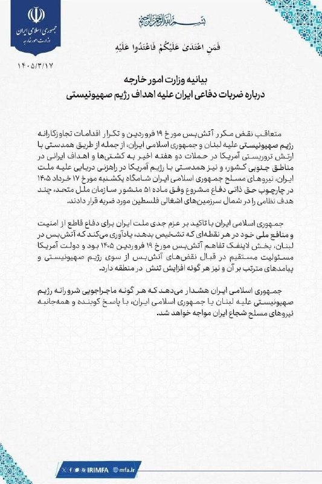

🔴بیانیۀ وزارت امور خارجه دربارۀ ضربات دفاعی ایران علیه اهداف اسرائیل

@mwarmonitor

## pm_afshaa — post 92712

🔴منابع عبری: گفت‌و‌گوی تلفنی ترامپ و نتانیاهو آغاز شد. 
💧 Rainbet.com the #1 Non-KYC Crypto Casino & Sportsbook @rainbetcom 
😁 @Pm_Afshaa

## pm_afshaa — post 92711

  <a href="telegram/content/pm_afshaa_92711_1780867389.webm" target="_blank">🎬 Download video</a>

🔴سفارت آمریکا در اورشلیم دستورالعمل‌هایی صادر کرده و از تمام کارکنان دولت آمریکا و اعضای خانواده‌هاشون در اسرائیل خواسته تا اطلاع ثانوی در خانه‌های خود بمانند.

💧 Rainbet.com the #1 Non-KYC Crypto Casino & Sportsbook @rainbetcom

😁 @Pm_Afshaa

## pm_afshaa — post 92710

🔴سخنگوی ارتش اسرائیل: رئیس ستاد کل ارتش اسرائیل هم‌اکنون در حال برگزاری ارزیابی وضعیت با اعضای ستاد کل است.

ارتش اسرائیل در زمان صدور دستور، دشمن رو با قدرت مورد حمله قرار خواهد داد.

💧 Rainbet.com the #1 Non-KYC Crypto Casino & Sportsbook @rainbetcom

😁 @Pm_Afshaa

## pm_afshaa — post 92709

  <a href="telegram/content/pm_afshaa_92709_1780867389.webm" target="_blank">🎬 Download video</a>

🔴کانال 15 اسرائیل: پس از پایان گفتگوی نتانیاهو و ترامپ، نخست‌وزیر جلسه گسترده‌ای درباره موضوع ایران برگزار خواهد کرد.

💧 Rainbet.com the #1 Non-KYC Crypto Casino & Sportsbook @rainbetcom

😁 @Pm_Afshaa

## pm_afshaa — post 92708

  <a href="telegram/content/pm_afshaa_92708_1780867390.webm" target="_blank">🎬 Download video</a>

🔴کانال 14 اسرائیل:
نتانیاهو باید حتی به قیمت رویارویی با ترامپ به بمباران ایران پاسخ بده.

💧 Rainbet.com the #1 Non-KYC Crypto Casino & Sportsbook @rainbetcom

😁 @Pm_Afshaa

## pm_afshaa — post 92707

  <a href="telegram/content/pm_afshaa_92707_1780867390.webm" target="_blank">🎬 Download video</a>

🔴پروازهای فرودگاه امام خمینی تا اطلاع ثانوی لغو شد.

💧 Rainbet.com the #1 Non-KYC Crypto Casino & Sportsbook @rainbetcom

😁 @Pm_Afshaa

## VahidOnline — post 76007

  

ایتامار بن گویر، وزیر امنیت ملی راست‌گرای تندرو اسرائیل، پس از حملات جدید موشکی ایران به شمال اسرائیل، خواستار واکنشی شدید شده است.

او عصر یکشنبه در پیامی کوتاه به زبان عبری در شبکه اجتماعی ایکس نوشت: «امشب تهران باید بسوزد!»

اظهارات ایتامار بن گویر در حالی مطرح شده که ایران ساعاتی پس از حمله اسرائیل به حومه جنوبی بیروت، موجی از موشک‌ها را به سوی اسرائیل شلیک کرد. ارتش اسرائیل اعلام کرده است که این موشک‌ها رهگیری شده‌اند و گزارشی از تلفات فوری منتشر نشده است.

ایتامار بن گویر از چهره‌های تندرو کابینه بنیامین نتانیاهو به شمار می‌رود و در روزهای اخیر نیز از توافق آتش‌بس میان اسرائیل و لبنان انتقاد کرده بود.
@VahidHeadline

📡 @VahidOnline

## kianmeli1 — post 87756

🔴فوری-تهران ٫هدف است

رئیس ستاد کل ارتش اسرائیل می‌گوید ارتش به محض صدور دستور، با قاطعیت به «دشمن» حمله خواهد کرد.
https://t.me/+_a5ind9hr7sxOTE0

## kianmeli1 — post 87755

  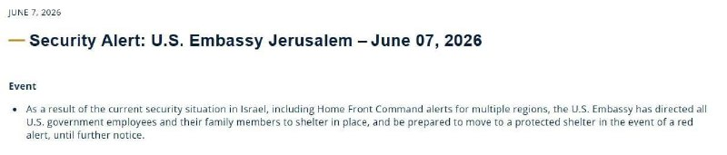

🔴فوری-سفارت ایالات متحده در اورشلیم به همه کارمندان دولت ایالات متحده و خانواده‌هایشان دستور داده است که در محل خود پناه بگیرند و آماده باشند تا در صورت اعلام وضعیت قرمز، تا اطلاع ثانوی، به پناهگاه‌های محافظت‌شده منتقل شوند.
https://t.me/kianmeli1

## kianmeli1 — post 87754

🔴فوری - پروازهای فرودگاه خمینی تا اطلاع ثانوی متوقف شد
https://t.me/+_a5ind9hr7sxOTE0

## Shin_Persian — post 6670

↩️ Quoted tweet: Lior.Finkelshtein.13/07/2024🔺🇮🇱✡︎📟 @Liorfink Sun, 07 Jun 2026 21:12:39 UTC @hey_itsmyturn Either bibi will loose elections immediately or Trump will cry hard a lot ↩️ توییت نقل‌قول شده — برای پاسخ، پست زیر را ببینید. فارسی @hey_itsmyturn…

## Shin_Persian — post 6669

↩️ Quoted tweet:
Lior.Finkelshtein.13/07/2024🔺🇮🇱✡︎📟 @Liorfink
Sun, 07 Jun 2026 21:12:39 UTC

@hey_itsmyturn Either bibi will loose elections immediately or Trump will cry hard a lot

↩️ توییت نقل‌قول شده — برای پاسخ، پست زیر را ببینید.

فارسی

@hey_itsmyturn یا بیبی (بنیامین نتانیاهو) بلافاصله در انتخابات شکست خواهد خورد یا ترامپ به شدت گریه و زاری راه خواهد انداخت.

𝕏 · @shin_persian

## Shin_Persian — post 6668

Shin ✓ @hey_itsmyturn
Sun, 07 Jun 2026 21:14:14 UTC

Iranian Civil Aviation Authority: IKA flights are canceled until further notice.

فارسی

سازمان هواپیمایی کشوری ایران: پروازهای فرودگاه بین‌المللی امام خمینی (IKA) تا اطلاع ثانوی لغو شد.

𝕏 · @shin_persian

## FarsiVOA — post 219940

⚡️پیام سرهنگ دوم کمال پنحاسی، سخنگوی بخش فارسی ارتش اسرائيل در پی حمله موشکی جمهوری اسلامی: آماده بودیم
@FarsiVOA

## DW_Farsi — post 125665

🔶 سخنگوی ارتش اسرائیل: ایران اشتباه بزرگی مرتکب شد

سخنگوی ارتش اسرائیل در پی حمله موشکی بالستیک ایران به این کشور، در یک کنفرانس مطبوعاتی اعلام کرد، ایال زامیر، رئیس ستاد کل ارتش، در حال ارزیابی وضعیت و تصویب طرح‌هایی برای آینده است.

افی دفرین گفت: «رژیم تروریستی ایران اشتباه بزرگی مرتکب شد.»

او در ادامه افزود، "ارتش اسرائیل برای حملات موشکی احتمالی و بیشتر از سوی ایران آمادگی کامل دارد".
@dw_farsi

## IranianMinds — post 21690

🔴 سخنگوی ارتش اسرائیل:

«رئیس ستاد هم‌اکنون در حال برگزاری نشست ارزیابی وضعیت با اعضای ستاد کل است.

ارتش اسرائیل به محض صدور مجوز، با قدرت به دشمن ( جمهوری اسلامی ) حمله خواهد کرد.»

@IranianMinds

## IranianMinds — post 21689

🔴 وای نت :

آمریکا به اسرائیل گفته است بهتر است چند روز صبر کند تا مشخص شود آیا امکان رسیدن به یک توافق وجود دارد یا نه؛ و اگر نه، بر اساس طرح اقدام مشترک پیش خواهیم رفت.

@IranianMinds

## BBCPersian — post 283094

  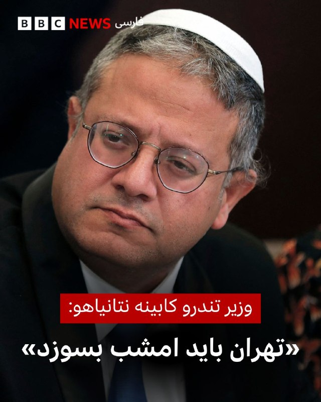

ايتامار بن گوير، وزير امنيت ملی راست‌گرای تندرو اسرائيل، پس از حملات جديد موشکی ايران به شمال اسرائيل، خواستار واکنشی شديد شده است.

او عصر یکشنبه در پيامی کوتاه به زبان عبری در شبکه اجتماعی ايکس نوشت: «امشب تهران بايد بسوزد!»

اظهارات ایتامار بن گوير در حالی مطرح شده که ايران ساعاتی پس از حمله اسرائيل به حومه جنوبی بيروت، موجی از موشک‌ها را به سوی اسرائيل شليک کرد. ارتش اسرائيل اعلام کرده است که اين موشک‌ها رهگيری شده‌اند و گزارشی از تلفات فوری منتشر نشده است.

اين موضع‌گيری با تلاش‌های دونالد ترامپ برای جلوگيری از تشديد درگيری‌ها در تضاد است. رئيس جمهور آمريکا پيش‌تر از اسرائيل خواسته بود از حملات تلافی جويانه بيشتر خودداری کند و تأکيد کرده بود که خواهان حفظ روند مذاکرات و آتش‌بس با ايران است.

ایتامار بن گوير از چهره‌های تندرو کابينه بنيامين نتانياهو به شمار می‌رود و در روزهای اخير نيز از توافق آتش‌بس ميان اسرائيل و لبنان انتقاد کرده بود.

📸 Getty

https://bbc.in/4eafvAI
@BBCPersian

## idfinfarsi — post 11811

سخنگوی ارتش اسرائیل:

رئیس ستاد کل ارتش اسرائیل هم‌اکنون در حال برگزاری ارزیابی وضعیت با اعضای ستاد کل است: «ارتش اسرائیل در زمان صدور دستور، دشمن را با قدرت مورد حمله قرار خواهد داد»

## Dirty_Kids — post 391283

یکی یه خواب آور قوی بریزه امشب تو چایی ترامپ بیدار نشه یه ٢ روز دوستان کارشونو بکنن

نتانیاهو جان
موبایلت را خاموش کن!

@Dirty_Kids 👻

## alonews — post 126042

  <a href="telegram/content/alonews_126042_1780867393.webm" target="_blank">🎬 Download video</a>

👈وای نت: آمریکا به اسرائیل گفته بهتره چند روز صبر کنه ببینن آیا امکان توافق هست یا نه

🔴اگه نه، طبق «طرح اقدام مشترک» جلو می‌رن

✅ @AloNews خبر جنگ

## alonews — post 126041

  <a href="telegram/content/alonews_126041_1780867393.webm" target="_blank">🎬 Download video</a>

👈خبرگزاری ایرنا:
پروازهای فرودگاه امام خمینی تهران فعلاً تا اطلاع بعدی متوقف شده و هیچ پروازی انجام نمی‌شه

✅ @AloNews خبر جنگ

## alonews — post 126040

  <a href="telegram/content/alonews_126040_1780867393.webm" target="_blank">🎬 Download video</a>

👈عوستاد خوش چشم:
اسرائیل و آمریکا جرات حمله رو ندارن

✅ @AloNews خبر جنگ

## alonews — post 126039

  <a href="telegram/content/alonews_126039_1780867394.webm" target="_blank">🎬 Download video</a>

🔴جمهوری اسلامی و عرزشی های حرام زاده علنا نشان می‌دهند که ‎لبنان برایشان از جان مردم ‎ایران و کشور ایران مهم‌تر است. 
🤔اینا با چه زبانی بگن که ایرانی نیستن؟ 
✅@AloNews

## alonews — post 126038

  <a href="telegram/content/alonews_126038_1780867394.webm" target="_blank">🎬 Download video</a>

👈کانال ۱۵ اسرائیل:
پس از پایان گفتگوی نتانیاهو و ترامپ، نخست‌وزیر جلسه گسترده‌ای درباره موضوع ایران برگزار خواهد کرد.

✅ @AloNews خبر جنگ

## alonews — post 126037

  <a href="telegram/content/alonews_126037_1780867394.webm" target="_blank">🎬 Download video</a>

👈سفارت ایالات متحده در اورشلیم به همه کارمندان دولت ایالات متحده و خانواده‌هایشان دستور داده است که در محل خود پناه بگیرند و آماده باشند تا در صورت اعلام وضعیت قرمز، تا اطلاع ثانوی، به پناهگاه‌های محافظت‌شده منتقل شوند.

✅ @AloNews خبر جنگ

---
📅 بروزرسانی: 1405/03/18 00:43
---

## VahidOOnLine — post 244189

  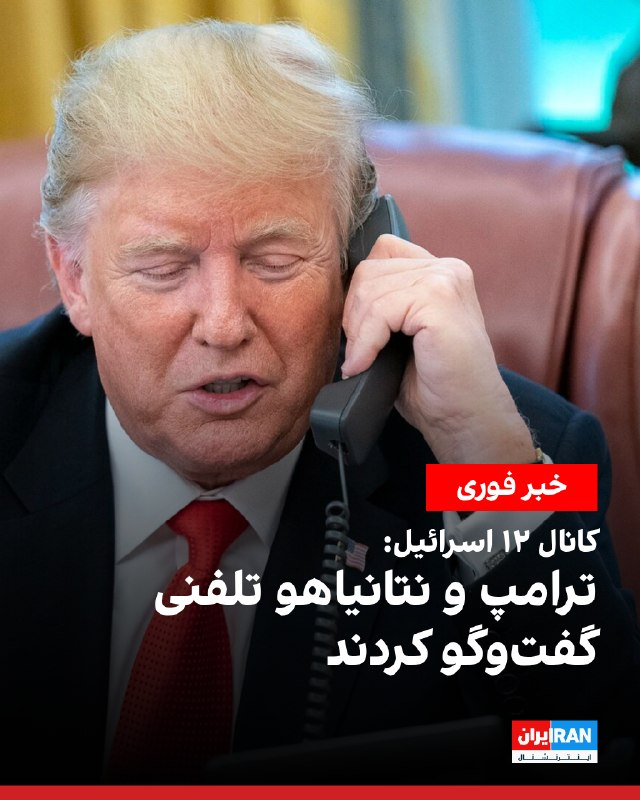

کانال ۱۲ اسرائیل گزارش داد بنیامین نتانیاهو و دونالد ترامپ در حال حاضر در حال گفت‌وگو هستند.

همزمان نماینده اسرائیل در سازمان ملل در شبکه ایکس خطاب به ترامپ نوشت: آقای رییس‌جمهور، جمهوری اسلامی شما را فریب می‌دهد، اسرائیل به شما احترام می‌گذارد. اسرائیل باید با قدرت پاسخ دهد.
‌🏁 🇬🇧 IranintlTV

🤖 @VahidOOnLine

## WithYashar — post 13809

ترامپ به باراک راوید خبرنگار آکسیوس : هر کدام از آنها خوش گذراندند. اسرائیل حمله خود را داشت و ایران هم حمله خود را.
مابه حمله دیگری نیازنداریم
@withyashar

## WithYashar — post 13808

کانال ۱۴ اسرائیل :«نتانیاهو باید حتی به قیمت رویارویی با ترامپ به بمباران ایرانی پاسخ دهد.»
@withyashar

## WithYashar — post 13807

فاکس نیوز: با اینکه ترامپ به اسرائیل گفته پاسخ نده اما اسرائیل همین الان جلسه اضطراری تشکیل داده تا تصمیم بگیره آیا به حملات اخیر پاسخ می‌ده یا نه؛ و اگه پاسخ بده، چطور این کار رو انجام خواهد داد.
@withyashar

## WithYashar — post 13806

فاکس نیوز: با اینکه ترامپ به اسرائیل گفته پاسخ نده اما اسرائیل همین الان جلسه اضطراری تشکیل داده تا تصمیم بگیره آیا به حملات اخیر پاسخ می‌ده یا نه؛ و اگه پاسخ بده، چطور این کار رو انجام خواهد داد.
@withyashar

## WithYashar — post 13805

  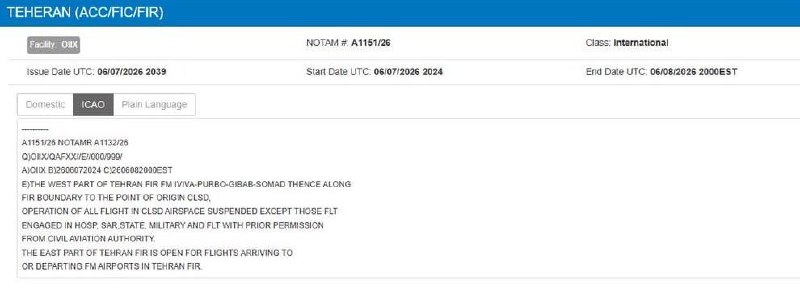

رژیم اطلاعیه NOTAM صادر کرده است که بخش غربی فضای هوایی تهران را تا ۸ ژوئن به روی تمام ترافیک هوایی غیرنظامی می‌بندد.
تنها هواپیماهای نظامی، دولتی، تخلیه پزشکی و جست‌وجو و نجات مجاز به فعالیت در این منطقه محدود شده هستند.
@withyashar

## mwarmonitor — post 10321

📌«رسانه‌های اسرائیلی: گذرگاه‌های ورودی به نوار غزه پس از حملات موشکی ایران به اسرائیل بسته شد.»

@mwarmonitor

## mwarmonitor — post 10320

  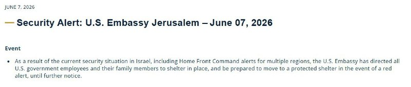

🔴 «سفارت آمریکا در قدس دستورالعمل‌هایی صادر کرده و از تمام کارکنان دولت آمریکا و اعضای خانواده‌هایشان در اسرائیل خواسته است تا اطلاع ثانوی در خانه‌های خود بمانند.»

@mwarmonitor

## mwarmonitor — post 10319

🚨 «ترامپ و نتانیاهو در حال حاضر در تماس تلفنی هستند - به گزارش رویترز.» @mwarmonitor

## pm_afshaa — post 92706

  <a href="telegram/content/pm_afshaa_92706_1780866792.webm" target="_blank">🎬 Download video</a>

🔴خبرگزاری Ynet:
آمریکا پیامی به اسرائیل فرستاده و گفته چند روز صبر کنه تا ببینه آیا میشه به توافقی دست یافت یا نه.

اگر نه، ما طبق برنامه به اقدام مشترک ادامه خواهیم داد و ارزش نداره که این فرصت رو با درگیر شدن در تبادل ضربات محدود هدر بدیم.

💧 Rainbet.com the #1 Non-KYC Crypto Casino & Sportsbook @rainbetcom

😁 @Pm_Afshaa

## pm_afshaa — post 92705

تلمبه های سنگین اسراییل به لبنان

💧 Rainbet.com the #1 Non-KYC Crypto Casino & Sportsbook @rainbetcom

😁 @Pm_Afshaa

## pm_afshaa — post 92704

  <a href="telegram/content/pm_afshaa_92704_1780866793.webm" target="_blank">🎬 Download video</a>

🔴ایران اطلاعیه نوتام صادر کرده که بخش غربی فضای هوایی تهران رو تا 8 ژوئن به روی تمام ترافیک هوایی غیرنظامی می‌بنده.

💧 Rainbet.com the #1 Non-KYC Crypto Casino & Sportsbook @rainbetcom

😁 @Pm_Afshaa

## pm_afshaa — post 92703

  <a href="telegram/content/pm_afshaa_92703_1780866793.webm" target="_blank">🎬 Download video</a>

🔴سفارت آمریکا از تمامی شهروندان آمریکایی در اسرائیل خواست فورا اسرائیل رو ترک کنن یا به پناهگاه‌ها نزدیک بشن.

💧 Rainbet.com the #1 Non-KYC Crypto Casino & Sportsbook @rainbetcom

😁 @Pm_Afshaa

## pm_afshaa — post 92702

  <a href="telegram/content/pm_afshaa_92702_1780866794.webm" target="_blank">🎬 Download video</a>

🔴تسنیم: براساس پیگیری‌ها، صدای شنیده شده در‌ فرودگاه تبریز تست پدافند بوده و هیچ‌گونه حمله‌ای به این فرودگاه اتفاق نیفتاده.

💧 Rainbet.com the #1 Non-KYC Crypto Casino & Sportsbook @rainbetcom

😁 @Pm_Afshaa

## kianmeli1 — post 87753

  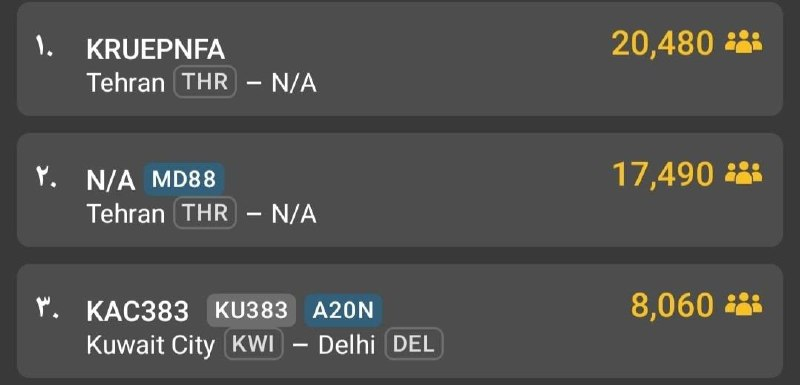

🔴فوری-تمام هواپیماهای غیرنظامی تو تهران برای پیش‌بینی حملات اسرائیل جابه‌جا شدن
https://t.me/kianmeli1

## kianmeli1 — post 87752

🔴فوری -صدای فعالیت جنگنده ها در جنوب تهران
https://t.me/+_a5ind9hr7sxOTE0

## Shin_Persian — post 6666

Shin ✓ @hey_itsmyturn
Sun, 07 Jun 2026 21:07:59 UTC

2 airstrikes on southern Lebanon (not the Kansas one)

فارسی

۲ حمله هوایی به جنوب لبنان (نه آن ایالت کانزاس)

𝕏 · @shin_persian

## Shin_Persian — post 6665

Shin ✓ @hey_itsmyturn
Sun, 07 Jun 2026 21:05:48 UTC

Trump on a call with @netanyahu

فارسی

ترامپ در تماس با نتانیاهو (@netanyahu)

𝕏 · @shin_persian

## FarsiVOA — post 219939

  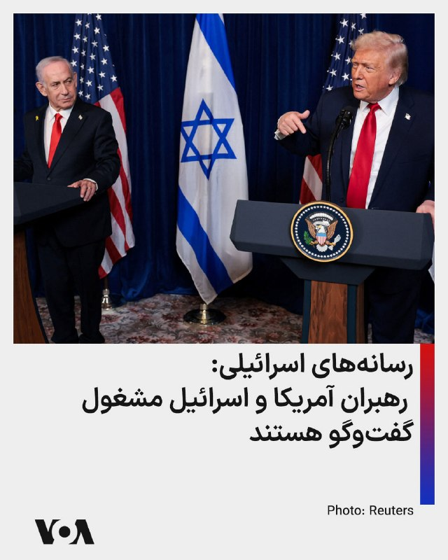

⚡️رسانه‌های اسرائیلی می‌گویند که دونالد ترامپ و بنیامین نتانیاهو هم‌اکنون مشغول صحبت هستند. این گزارش‌ها در پی حمله موشکی جمهوری اسلامی به اسرائيل منتشر می‌شود.
@FarsiVOA

## Persian_Trend_Official — post 16005

  <a href="telegram/content/Persian_Trend_Official_16005_1780866795.webm" target="_blank">🎬 Download video</a>

⏳کانال ۱۴ اسرائیل در بیانیه ای تند گفته که:

امشب فقط موشک‌ها و جت‌ها نیستن که بین آسمان و زمین در نوسان هستن، بلکه سرنوشت سیاسی نتانیاهو هم همین گونه‌ هستش.

انتظار میره که اگه نتانیاهو فرمان حمله به ایران‌رو نده ، عملا دوران سیاسی و نخست وزیریش تموم میشه

## Persian_Trend_Official — post 16004

  <a href="telegram/content/Persian_Trend_Official_16004_1780866795.webm" target="_blank">🎬 Download video</a>

طبق گزارش i24 نیوز، نخست‌وزیر اسرائیل نتانیاهو، وزیر دفاع کاتز و رهبری امنیتی اسرائیل قرار است در ساعت آینده جلسه اضطراری درباره ایران برگزار کنند

## Persian_Trend_Official — post 16003

  <a href="telegram/content/Persian_Trend_Official_16003_1780866796.mp4" target="_blank">🎬 Download video</a>

🎬 Video

## Persian_Trend_Official — post 16002

  <a href="telegram/content/Persian_Trend_Official_16002_1780866796.mp4" target="_blank">🎬 Download video</a>

The IDF is launching strikes against southern Lebanon. حملات مجدد ارتش اسرائیل به جنوب لبنان

## Persian_Trend_Official — post 16001

  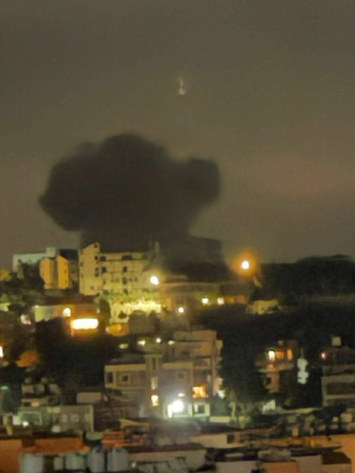

The IDF is launching strikes against southern Lebanon.

حملات مجدد ارتش اسرائیل به جنوب لبنان

## Persian_Trend_Official — post 16000

نفتالی بنت:

«این لحظه‌ آشکار شدن حقیقت است: اینکه آیا اسرائیل یک کشور مستقل است که قادر به دفاع از خود است یا خیر.

خویشتنداری یا واکنش نمادین به دشمنان ما نشان می‌دهد که خون شهروندان ما پایمال شده است؛ بنابراین، اسرائیل باید با قدرت و اثربخشی عمل کند.

در این مورد، همه ما - همه شهروندان اسرائیل - در کنار هم ایستاده‌ایم.»

## IranianMinds — post 21687

  <a href="telegram/content/IranianMinds_21687_1780866797.mp4" target="_blank">🎬 Download video</a>

🔴 بیانیه سخنگوی ارتش اسرائیل

@IranianMinds

## IranianMinds — post 21685

🔴 فرودگاه مهرآباد داره تخلیه میشه.

@IranianMinds

## IranianMinds — post 21684

🔴 نفتالی بنت، نخست‌وزیر پیشین اسرائیل:

این یک آزمون است: آیا اسرائیل یک کشور مستقل است که توانایی دفاع از خود را دارد؟

سیاست خویشتنداری یا یک پاسخ صرفا نمادین به دشمنان ما این پیام را می‌دهد که ریختن خون شهروندان ما مجاز است.

@IranianMinds

## IranianMinds — post 21683

🔴 حملات هوایی شدید اسرائیل به جنوب لبنان @IranianMinds

## BBCPersian — post 283093

  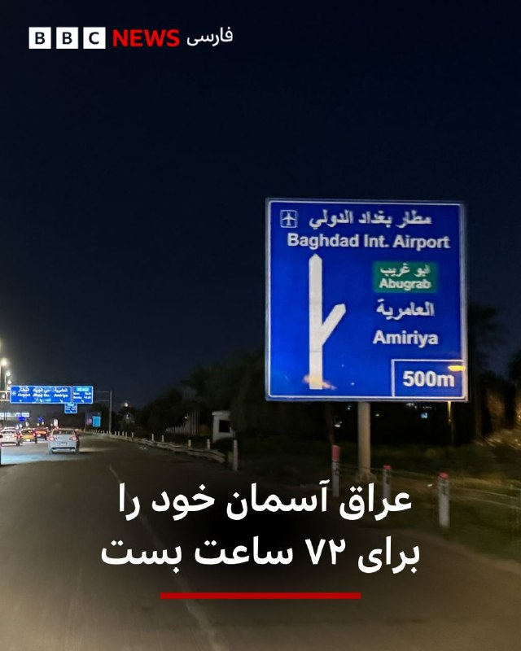

🔻همزمان با حمله موشکی ایران به شمال اسرائیل و اوج گرفتن نگرانی از آغاز درگیری نظامی گسترده میان اسرائیل و ایران، عراق از بستن مرزهای هوایی خود برای ۷۲ ساعت (سه روز آینده) خبر داد.

آسمان این کشور در طول جنگ ۴۰ روزه میان آمریکا و اسرائیل با ایران، بارها محل عبور موشک های ایران یا جنگنده های اسرائیلی بود.

پس از جاری شدن آتش‌بس هم گزارش شد اسرائیل برای هدایت و تقویت حملات خود به ایران در طول جنگ ۴۰ روزه، پایگاه‌های موقت صحرایی در عراق برپا کرده بوده است.

📸 Getty

https://bbc.in/4eafvAI
@BBCPersian

## Dirty_Kids — post 391282

  <a href="telegram/content/Dirty_Kids_391282_1780866799.mp4" target="_blank">🎬 Download video</a>

🔴 بیانیه سخنگوی فارسی زبان ارتش اسرائیل، سرهنگ دوم کمال پنحاسی

@Dirty_Kids 👻

## Dirty_Kids — post 391281

اگر آمریکا واکنش نشان نده یعنی سپاه برای شلیک موشک ها با آمریکا هماهنگ کرده آمریکا هم به اسراییل اطلاع داده و حمله نمادین هست
خواهیم دید چه خواهد شد.

@Dirty_Kids 👻

## alonews — post 126036

  <a href="telegram/content/alonews_126036_1780866800.webm" target="_blank">🎬 Download video</a>

👈ثابتی: باید حملات رو ادامه بدیم

✅ @AloNews خبر جنگ

## alonews — post 126035

  <a href="telegram/content/alonews_126035_1780866800.webm" target="_blank">🎬 Download video</a>

👈تمام هواپیماهای غیرنظامی تو تهران برای پیش‌بینی حملات اسرائیل جابه‌جا شدن

✅ @AloNews خبر جنگ

## alonews — post 126034

  <a href="telegram/content/alonews_126034_1780866800.webm" target="_blank">🎬 Download video</a>

👈آمیکای اشتاین خبرنگار آی ۲۴:
«در طول یک ساعت آینده، یک بحث گسترده با حضور بنیامین نتانیاهو، وزیر جنگ، و فرماندهی عالی امنیتی درباره ایران آغاز خواهد شد.»

✅ @AloNews خبر جنگ

## alonews — post 126033

  <a href="telegram/content/alonews_126033_1780866801.webm" target="_blank">🎬 Download video</a>

💢فوووووووووری/پرواز شدید جنگنده‌های آمریکایی در مرز ایران 
🚨 @AkhbareFouri

## alonews — post 126032

  <a href="telegram/content/alonews_126032_1780866801.mp4" target="_blank">🎬 Download video</a>

👈فاکس نیوز: با اینکه ترامپ به اسرائیل گفته پاسخ نده اما اسرائیل همین الان جلسه اضطراری تشکیل داده تا تصمیم بگیره آیا به حملات اخیر پاسخ می‌ده یا نه؛ و اگه پاسخ بده، چطور این کار رو انجام خواهد داد.

✅ @AloNews خبر جنگ

---
📅 بروزرسانی: 1405/03/18 00:33
---

## VahidOOnLine — post 244188

  

♦️ همزمان با حملات موشکی ایران به اسرائیل، تسنیم، خبرگزاری وابسته به سپاه، یکشنبه‌شب، در پی شنیده شدن صدای انفجار در تبریز، گزارش داد: «براساس پیگیری‌ها، صدای شنیده شده در‌ فرودگاه تبریز تست پدافند بوده و هیچ‌گونه حمله‌ای به این فرودگاه اتفاق نیفتاده است».
‌🇸🇦 Indypersian

🤖 @VahidOOnLine

## VahidOOnLine — post 244187

  

دونالد ترامپ به اکسیوس گفت: حملات جمهوری اسلامی به کسی آسیبی نزده است. امیدوارم اسرائیل تلافی نکند. اگر نتانیاهو پاسخ دهد، این درگیری مثل ۴۷ سال گذشته یا حتی ۳۰۰۰ سال گذشته ادامه پیدا می‌کند.
او افزود: ما خیلی به یک توافق نهایی با تهران نزدیک هستیم و نمی‌خواهم به‌خاطر اتفاقاتی که الان در حال رخ دادن است، همه چیز از بین برود.
‌🏁 🇬🇧 IranintlTV

🤖 @VahidOOnLine

## VahidOOnLine — post 244186

  <a href="telegram/content/VahidOOnLine_244186_1780866232.mp4" target="_blank">🎬 Download video</a>

♦️ افی دفرین، سخنگوی ارتش اسرائیل، یکشنبه‌شب، پس از حملات ایران به این کشور، در یک بیانیه رسمی و زنده تلویزیونی با تایید شلیک موشک‌های بالستیک از سوی ایران اعلام کرد: «حکومت ایران لحظاتی پیش موشک‌هایی را به سمت خاک اسرائیل شلیک کرد؛ ما برای این موضوع کاملا آماده بوده‌ایم و ارتش اسرائیل هم در فاز دفاعی و هم در فاز آفندی بسیار قدرتمند عمل خواهد کرد.» او با متهم کردن تهران به تلاش برای تغییر معادلات نظامی در منطقه افزود: «حکومت ایران با شلیک مستقیم به خاک ما مرتکب اشتباه بسیار بزرگی شده است. سیستم‌های پدافند هوایی ما در سراسر کشور مستقر هستند».
‌🇸🇦 Indypersian

🤖 @VahidOOnLine

## WithYashar — post 13804

طبق گزارش ها،هم مقامات نظامی و هم مقامات غیرنظامی ایران هم من از اتاق جنگ کاملاً بر این فرض عمل می‌کنند که حمله‌ای به ایران در راه است و بر اساس آن اقدامات لازم را انجام می‌دهند.
@withyashar

## WithYashar — post 13803

  <a href="telegram/content/WithYashar_13803_1780866233.mp4" target="_blank">🎬 Download video</a>

خبر تایید نشده: یک هواپیمای مسافربری در صحرای کربلا سقوط کرد @withyashar

## WithYashar — post 13802

از‌ مهرآباد جنگنده بلند شد @withyashar

## mwarmonitor — post 10318

🚨 «ترامپ و نتانیاهو در حال حاضر در تماس تلفنی هستند - به گزارش رویترز.»

@mwarmonitor

## mwarmonitor — post 10317

  

✈️«یک فروند هواپیمای نظامی آنتونوف AN-26 نیروی هوایی اوکراین در حال پرواز بر فراز عربستان سعودی.»

@mwarmonitor

## mwarmonitor — post 10316

  

🔴 «نوتام: ایران بخش غربی حریم هوایی را برای تمام پروازهای غیرنظامی بسته است. تنها هواپیماهای نظامی، دولتی، پزشکی و جست‌وجو و نجات اجازه پرواز دارند. بخش شرقی منطقه پروازی ایران همچنان باز است.»

@mwarmonitor

## mwarmonitor — post 10315

🔴 یک منبع پاکستانی به العربیه می‌گوید: «آنچه در حال رخ دادن است مانعی برای تلاش‌هایی است که برای رسیدن به توافق در حال انجام است. برخی طرف‌های سرسخت، منطقه را به سمت تنش و فروپاشی مذاکرات سوق می‌دهند.»

@mwarmonitor

## mwarmonitor — post 10314

🔸نتانیاهو، وزیر دفاع کاتس و مقامات ارشد امنیتی اسرائیل قرار است طی یک ساعت آینده یک نشست اضطراری درباره ایران برگزار کنند - به نقل از i24News

@mwarmonitor

## pm_afshaa — post 92701

  <a href="telegram/content/pm_afshaa_92701_1780866237.webm" target="_blank">🎬 Download video</a>

🔴یک منبع نظامی به تسنیم:
موشک‌ها آماده‌ان در صورت پاسخ اسرائیل فورا شلیک بشن.

💧 Rainbet.com the #1 Non-KYC Crypto Casino & Sportsbook @rainbetcom

😁 @Pm_Afshaa

## pm_afshaa — post 92700

🔴منابع عبری: گفت‌و‌گوی تلفنی ترامپ و نتانیاهو آغاز شد. 
💧 Rainbet.com the #1 Non-KYC Crypto Casino & Sportsbook @rainbetcom 
😁 @Pm_Afshaa

## pm_afshaa — post 92699

کنست چند جلسه‌ای که قرار بود فردا برگزار کنه را لغو کرد

💧 Rainbet.com the #1 Non-KYC Crypto Casino & Sportsbook @rainbetcom

😁 @Pm_Afshaa

## VahidOnline — post 76006

  

همزمان با حملات موشکی ایران به اسرائیل، تسنیم، خبرگزاری وابسته به سپاه، یکشنبه‌شب، در پی شنیده شدن صدای انفجار در تبریز، گزارش داد: «براساس پیگیری‌ها، صدای شنیده شده در‌ فرودگاه تبریز تست پدافند بوده و هیچ‌گونه حمله‌ای به این فرودگاه اتفاق نیفتاده است».
@VahidOOnLine
پیام‌هایی که من دریافت کرده بودم:

سلام وحید جان
الان ۲۳:۵۵ سه صدای انفجار بزرگ آمد تو تبریز
پیام بعدی در ۱۹ دقیقه بامداد: همین الان باز زدن تبریز رو

سلام وحید جان
تبریز ساعت ۱۲:۱۵ نزدیک لشکر عاشورا صدای انفحار اومد.
البته شدتش مثل انفجار های جنگ ۴۰ روزه نبود.

تبریز نیم ساعته صداهای عجیبی میاد
مطمعنا صدای پدافند نیست انفجاره

هم اکنون صدای چند انفجار شدید در تبریز

📡 @VahidOnline

## kianmeli1 — post 87751

🔴فوری-نزدیک سپاه عاشورا تبریز صدای انفجار اومد
https://t.me/+_a5ind9hr7sxOTE0

## kianmeli1 — post 87750

  <a href="telegram/content/kianmeli1_87750_1780866239.mp4" target="_blank">🎬 Download video</a>

🔴فوری-فاکس نیوز :

با اینکه ترامپ به اسرائیل گفته پاسخ نده اما اسرائیل همین الان جلسه اضطراری تشکیل داده تا تصمیم بگیره آیا به حملات اخیر پاسخ می‌ده یا نه؛ و اگه پاسخ بده، چطور این کار رو انجام خواهد داد.
https://t.me/+_a5ind9hr7sxOTE0

## IranIntlTV — post 341063

  

کانال ۱۲ اسرائیل گزارش داد بنیامین نتانیاهو و دونالد ترامپ در حال حاضر در حال گفت‌وگو هستند.

همزمان نماینده اسرائیل در سازمان ملل در شبکه ایکس خطاب به ترامپ نوشت: آقای رییس‌جمهور، جمهوری اسلامی شما را فریب می‌دهد، اسرائیل به شما احترام می‌گذارد. اسرائیل باید با قدرت پاسخ دهد.
https://iranintl.com/202606073571

## IranIntlTV — post 341062

  

دونالد ترامپ به اکسیوس گفت: حملات جمهوری اسلامی به کسی آسیبی نزده است. امیدوارم اسرائیل تلافی نکند. اگر نتانیاهو پاسخ دهد، این درگیری مثل ۴۷ سال گذشته یا حتی ۳۰۰۰ سال گذشته ادامه پیدا می‌کند.
او افزود: ما خیلی به یک توافق نهایی با تهران نزدیک هستیم و نمی‌خواهم به‌خاطر اتفاقاتی که الان در حال رخ دادن است، همه چیز از بین برود.
https://iranintl.com/202606071626

## Shin_Persian — post 6664

  

↩️ Quoted tweet: Shin ✓ @hey_itsmyturn Sun, 07 Jun 2026 19:43:42 UTC Explosions north of Tabriz airport, East Azerbaijan Province, #Iran ↩️ توییت نقل‌قول شده — برای پاسخ، پست زیر را ببینید. فارسی انفجارهایی در شمال فرودگاه تبریز، استان آذربایجان شرقی،…

## Shin_Persian — post 6663

↩️ Quoted tweet:
Shin ✓ @hey_itsmyturn
Sun, 07 Jun 2026 19:43:42 UTC

Explosions north of Tabriz airport,
East Azerbaijan Province, #Iran

↩️ توییت نقل‌قول شده — برای پاسخ، پست زیر را ببینید.

فارسی

انفجارهایی در شمال فرودگاه تبریز،
استان آذربایجان شرقی، #Iran

𝕏 · @shin_persian

## FarsiVOA — post 219938

🔺تلاش پرزیدنت ترامپ برای جلوگیری از ادامه تقابل نظامی اسرائیل و جمهوری اسلامی

▪️در پی حمله موشکی جمهوری اسلامی به اسرائيل،‌ باراک راوید، خبرنگار آکسیوس اعلام کرد پرزیدنت ترامپ به او گفته است «همین الان» با نخست وزیر اسرائیل تماس می‌گیرد و به او می‌گوید که به حملات رژیم ایران پاسخ ندهد و «حمله متقابل نکند.»

⬇️ بیشتر بخوانید:
https://ir.voanews.com/a/8158262.html
@FarsiVOA

## FarsiVOA — post 219937

  

⚡️در پی حملات موشکی جمهوری اسلامی به اسرائيل، بخش‌هایی از آسمان ایران به روی پروازها بسته شد. همچنین عراق و سوریه نیز به‌طور موقت آسمان خود را بستند. اما به گزارش تایمز اسرائيل، وزیر حمل و نقل اسرائيل گفت حریم هوایی این کشور همچنان باز است و پروازها طبق برنامه ادامه دارد.
@FarsiVOA

## DW_Farsi — post 125664

  

🔶 ایران، عراق و سوریه پس از حمله موشکی تهران به اسرائیل، حریم هوایی خود را بستند

ایران پس از شلیک موشک‌ها به سمت اسرائیل، در پاسخ به آخرین حمله این کشور به لبنان، حریم هوایی بخش‌های غربی خود را بست.

مجید اخوان، سخنگوی سازمان هواپیمایی کشوری در بیانیه‌ای که توسط خبرگزاری ایرنا منتشر شد، اعلام کرد: «به دلیل ارزیابی‌های ایمنی و امنیتی، حریم هوایی بخش غربی کشور تا اطلاع ثانوی بسته اعلام شد.»

مقامات هوانوردی غیرنظامی به خبرگزاری رویترز گفتند، عراق نیز پس از این حملات، حریم هوایی خود را به طور موقت بسته و ناوبری هوایی را به دلایل مربوط به ایمنی ترافیک هوایی به حالت تعلیق درآورده است.

سازمان هواپیمایی کشوری عراق اعلام کرد، "حریم هوایی این کشور به مدت ۷۲ ساعت بسته خواهد ماند".

سوریه نیز حریم هوایی مناطق جنوبی خود را به طور موقت برای ۱۲ ساعت بست و فعالیت‌های فرودگاه دمشق را به حالت تعلیق درآورد.
@dw_farsi

## Persian_Trend_Official — post 15999

⭕️ دوستان عزیز در ایران، ممکن است شرایطی پیش بیاید که دیگر نتوانید آنلاین شوید. کسانی که این پیام را می‌بینید، مراحل زیر را روی اکانت تلگرام خود انجام دهید:

🚨 زبان فارسی:
تنظیمات > حریم خصوصی و امنیت > حذف اکانت در صورت عدم فعالیت > ۲۴ ماه

🚨 زبان انگلیسی:
Settings > Privacy and Security > Delete My Account If Away For > 24 months

📝 Nick

📌 @persian_trend_official
پرشین ترند | متفاوت‌ترین کانال نظامی

## Persian_Trend_Official — post 15998

📢 دوستان عزیز، الان که وضعیت اینترنت تا حدی بهتر شده، حتماً زمانی را برای به‌روزرسانی دستگاه‌ها و اپلیکیشن‌هایتان اختصاص دهید. 🔒 ✅ قدم اول: سیستم‌عامل گوشی هوشمندتان را از بخش تنظیمات به آخرین نسخه موجود آپدیت کنید. ✅ قدم دوم: تلگرام را از منبع رسمی دانلود…

## Persian_Trend_Official — post 15997

⭕️ نفتالی بنت:

«این لحظه آشکار شدن حقیقت است: اینکه آیا اسرائیل کشوری مستقل است که قادر به دفاع از خود است یا خیر.

خویشتنداری یا واکنش نمادین به دشمنان ما نشان می‌دهد که خون شهروندان ما پایمال شده است؛ بنابراین، اسرائیل باید با قدرت و اثربخشی عمل کند.

در این مورد، همه ما، تمام شهروندان اسرائیل، در کنار هم ایستاده‌ایم.»

📝 Nick

📌 @persian_trend_official
پرشین ترند | متفاوت‌ترین کانال نظامی

## Persian_Trend_Official — post 15996

⭕️ سخنگوی ارتش اسرائیل: ما حملات خود به سراسر خاک لبنان را ادامه خواهیم داد و اجازه نخواهیم داد ایران معادله‌ای جدید علیه لبنان ایجاد کند.

📝 Nick

📌 @persian_trend_official
پرشین ترند | متفاوت‌ترین کانال نظامی

## RadioFarda — post 158019

ارتش اسرائیل: ایران با شلیک موشک‌ها «اشتباهی بزرگ» مرتکب شد

🔸ارتش اسرائیل روز یک‌شنبه ۱۸ خرداد اعلام کرد ایران با شلیک موجی از موشک‌ها به سوی اسرائیل «اشتباهی بزرگ» مرتکب شده است.

🔸افی دفرین، سخنگوی ارتش اسرائیل، گفت: «رژیم تروریستی ایران بار دیگر با انتخاب مسیر ترور، اشتباهی بزرگ مرتکب شده است.»

🔸آژیرهای خطر روز یک‌شنبه در اسرائیل به صدا درآمد و ارتش این کشور اعلام کرد سامانه‌های پدافندی آن در حال رهگیری چند موج موشک شلیک‌شده از ایران هستند. این نخستین حمله موشکی ایران به اسرائیل از زمان برقراری آتش‌بس هشتم آوریل در جنگ خاورمیانه است.

🔸سپاه پاسداران این حمله را «هشدار» خواند و گفت این اقدام در واکنش به حمله اسرائیل به ضاحیه جنوبی بیروت انجام شده است. دفتر بنیامین نتانیاهو، نخست‌وزیر اسرائیل، پیشتر اعلام کرده بود ارتش این کشور یک «مرکز فرماندهی شبه‌نظامیان» را در ضاحیه هدف قرار داده است.

🔸وزارت بهداشت لبنان اعلام کرد حمله اسرائیل به ضاحیه دو کشته و ۲۰ زخمی بر جای گذاشت. حزب‌الله نیز تأیید کرد که صبح یک‌شنبه به دو پایگاه ارتش اسرائیل موشک و پهپاد شلیک کرده بود.

🔸در تهران، محمدباقر قالیباف، رئیس مجلس و مذاکره‌کننده ارشد ایران در گفت‌وگوها با واشینگتن، آمریکا را متهم کرد که برای حمله به بیروت «چراغ سبز» داده و گفت دارایی‌ها و منافع آمریکا و اسرائیل اکنون «اهداف مشروع» هستند.

🔸قرارگاه خاتم‌الانبیا نیز اعلام کرد اسرائیل با حمله به بیروت «از همه خطوط قرمز عبور کرده» و خواستار توقف عملیات اسرائیل در لبنان شد.

@RadioFarda

## IranianMinds — post 21682

🔴 حملات هوایی شدید اسرائیل به جنوب لبنان

@IranianMinds

## IranianMinds — post 21681

🔴 لیبرمن، وزیر دفاع پیشین اسرائیل:

دیگر زمان سیاست مهار و خویشتنداری گذشته است. باید فوراً پاسخ بدهیم و زیرساخت‌های راهبردی ایران را هدف قرار دهیم !

@IranianMinds

## IranianMinds — post 21680

پاکستان بیناموس خبری ازت نیست

نمیخوای بیای ۲ تا گوهم تو بخوری؟

@IranianMinds

## IranianMinds — post 21679

  <a href="telegram/content/IranianMinds_21679_1780866245.mp4" target="_blank">🎬 Download video</a>

🔴 ترامپ:

و من نصر إِلاَّ مِنْ عندالله الْعَزِيزِ الْحَكِيمِ.

@IranianMinds

## idfinfarsi — post 11810

‼️ رژیم تروریستی ایران در تلاش است معادله‌ای جدید ایجاد کرده و با انجام شلیک مستقیم به خاک ما، در واکنش به حملات ارتش اسرائیل به ضاحیه ، قواعد جدیدی را تحمیل کند - ما اجازه چنین کاری را نخواهیم داد!

⭕️ ما در واکنش به شلیک‌های بی‌وقفه حزب‌الله به سوی شهرک‌ها و مناطق مسکونی شمال اسرائیل دست به حمله زدیم. اجازه نخواهیم داد حملات علیه شهروندان کشور اسرائیل ادامه پیدا کند.

⭕️ ارتش اسرائیل در دفاع و هم در حمله قدرتمند عمل می‌کند. سامانه‌های پدافند هوایی در سراسر کشور مستقر می باشند.

## Dirty_Kids — post 391280

  

خو اومد زد

@Dirty_Kids 👻

## alonews — post 126031

  <a href="telegram/content/alonews_126031_1780866246.webm" target="_blank">🎬 Download video</a>

👈اسرائیل بازم به لبنان حمله کرد

✅ @AloNews خبر جنگ

## alonews — post 126030

  <a href="telegram/content/alonews_126030_1780866246.webm" target="_blank">🎬 Download video</a>

👈ایران اطلاعیه NOTAM صادر کرده است که بخش غربی فضای هوایی تهران را تا ۸ ژوئن به روی تمام ترافیک هوایی غیرنظامی می‌بندد.

🔴 تنها هواپیماهای نظامی، دولتی، تخلیه پزشکی و جست‌وجو و نجات مجاز به فعالیت در این منطقه محدود شده هستند.

✅ @AloNews خبر جنگ

## alonews — post 126029

  <a href="telegram/content/alonews_126029_1780866247.webm" target="_blank">🎬 Download video</a>

👈چپ و راست داره از فرودگاه مهرآباد تهران هواپیما بلند میشه

✅ @AloNews خبر جنگ

## alonews — post 126028

  <a href="telegram/content/alonews_126028_1780866247.webm" target="_blank">🎬 Download video</a>

👈هم اکنون قیصر در میدان انقلاب: پیک‌ها همه بالا

✅ @AloNews خبر جنگ

## alonews — post 126027

  <a href="telegram/content/alonews_126027_1780866247.webm" target="_blank">🎬 Download video</a>

👈وزارت خارجه پاکستان: ایران نشانه‌هایی از پیشرفت را در راستای تصویب یادداشت تفاهم نشان داده است

✅ @AloNews خبر جنگ

## alonews — post 126026

  <a href="telegram/content/alonews_126026_1780866248.webm" target="_blank">🎬 Download video</a>

👈وزیر خارجه عربستان سعودی به صورت تلفنی با همتای قطری خود تحولات اوضاع و پیامدهای آن بر منطقه را بررسی کرد

✅ @AloNews خبر جنگ

## alonews — post 126025

  <a href="telegram/content/alonews_126025_1780866248.webm" target="_blank">🎬 Download video</a>

👈طبق گزارش i24 نیوز، نخست‌وزیر اسرائیل نتانیاهو، وزیر دفاع کاتز و رهبری امنیتی اسرائیل قرار است در ساعت آینده جلسه اضطراری درباره ایران برگزار کنند

✅ @AloNews خبر جنگ

## alonews — post 126024

  <a href="telegram/content/alonews_126024_1780866248.mp4" target="_blank">🎬 Download video</a>

👈 یک پهپاد ناشناس، احتمالاً یک پهپاد نظارتی آمریکایی یا اسرائیلی، در استان کربلا در مرکز عراق سرنگون شد.

🔴 این اتفاق تقریباً همزمان با حمله موشکی بالستیک ایران رخ داد

✅ @AloNews خبر جنگ

## alonews — post 126023

  <a href="telegram/content/alonews_126023_1780866251.webm" target="_blank">🎬 Download video</a>

👈تسنیم: منبع نظامی به ما گفت موشک ها آماده اند که در صورت جواب اسرائیل فورا شلیک شوند

✅ @AloNews خبر جنگ

## alonews — post 126022

  <a href="telegram/content/alonews_126022_1780866251.webm" target="_blank">🎬 Download video</a>

👈صدای شنیده شده در‌فرودگاه تبریز تست پدافند بوده و هیچ‌گونه حمله‌ای به این فرودگاه اتفاق نیفتاده است

✅ @AloNews خبر جنگ

## alonews — post 126021

  <a href="telegram/content/alonews_126021_1780866251.webm" target="_blank">🎬 Download video</a>

👈خبرگزاری MSN به نقل از یک منبع در وزارت خارجه پاکستان مدعی شد: سفر وزیر کشور به تهران مثبت بود

✅ @AloNews خبر جنگ

---
📅 بروزرسانی: 1405/03/18 00:23
---

## VahidOOnLine — post 244185

  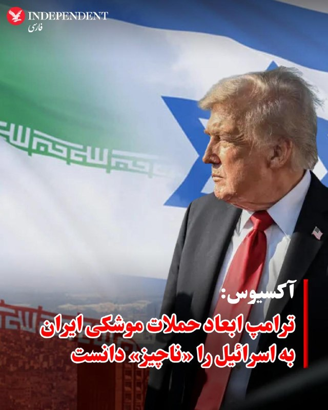

♦️ دونالد ترامپ در گفتگوی اختصاصی با «آکسیوس» اعلام کرد که به زودی با بنیامین نتانیاهو، نخست‌وزیر اسرائیل، تماس خواهد گرفت تا او را برای عدم پاسخ نظامی به حملات موشکی ایران تحت فشار بگذارد. رئیس جمهوری آمریکا، با ناچیز شمردن ابعاد حملات موشکی تهران صراحتا گفت: «من همین الان با بی‌بی تماس می‌گیرم و به او می‌گویم که تلافی نکند. هر کدام از آن‌ها بازی خودشان را کردند؛ اسرائیل حمله خودش را داشت و ایران هم حمله خودش را انجام داد، ما دیگر نیازی به یک حمله دیگر نداریم. حملات موشکی ایران به کسی آسیبی نرسانده است و امیدوارم اسرائیل دست به اقدام متقابل نزند.» این موضع‌گیری تند در شرایطی اتخاذ می‌شود که در پی حمله اسرائیل به حومه جنوبی بیروت و پاسخ موشکی و چندمرحله‌ای ایران پس از هفته‌ها پایبندی به آتش‌بس، ثبات خاورمیانه به شدت متزلزل شده است.
به گزارش آکسیوس، دونالد ترامپ اکنون تلاش می‌کند تا مانع از آن شود که تشدید تنش‌ها، امیدهای او را برای دستیابی به یک توافق پایدار و نهایی با ایران نابود کند. ترامپ با هشدار نسبت به عواقب تداوم این چرخه نظامی تأکید کرد: «ما به یک توافق نهایی با ایران بسیار نزدیک هستیم؛ این یک توافق خوب خواهد بود و من نمی‌خواهم به خاطر اتفاقاتی که اکنون در حال رخ دادن است، این فرصت از بین برود. اگر بی‌بی دوباره به آن‌ها حمله کند، این روند دقیقا مانند ۴۷ سال گذشته، یا ۳ هزار سال گذشته، همین‌طور ادامه خواهد یافت.»
‌🇸🇦 Indypersian

🤖 @VahidOOnLine

## WithYashar — post 13801

  <a href="telegram/content/WithYashar_13801_1780865583.mp4" target="_blank">🎬 Download video</a>

اتاق جنگ با یاشار : ردبول 🪽😈
@withyashar

## WithYashar — post 13800

منابع عبری:ترامپ و نتانیاهو در حال حاضر در حال گفتگو هستن
@withyashar

## WithYashar — post 13799

بریم اتاق جنگ

## WithYashar — post 13798

کانال 12 اسرائیل:با وجود مخالفت ترامپ، فشارهای داخلی بر نتانیاهو برای واکنش افزایش یافته و شماری از سیاستمداران اسرائیلی خواستار پاسخ شدید به حملات جمهوری اسلامی شدند.
@withyashar

## mwarmonitor — post 10313

انفجار در تبریز

## mwarmonitor — post 10312

🔴 سخنگوی ارتش اسرائیل، سرتیپ «دفرین» می‌گوید اسرائیل به حملات خود علیه حزب‌الله در لبنان ادامه خواهد داد و این را دلیل شلیک موشک‌های ایران می‌داند.

📌او می‌گوید ایران تلاش داشت با حمله به اسرائیل در واکنش به اقدامات این کشور در لبنان، «معادله جدیدی را تحمیل کند»؛ و افزود: «ما اجازه چنین چیزی را نخواهیم داد.»

@mwarmonitor

## mwarmonitor — post 10311

🔴ترامپ به شبکه ۱۲ گفت: «ما خیلی به امضای یک توافق نهایی با ایران نزدیک بودیم.»

@mwarmonitor

## mwarmonitor — post 10310

🔴ترامپ می‌گوید: «امیدوارم اسرائیل در پاسخ حمله نکند. اگر نتانیاهو دستور حمله بدهد، این موضوع با یک ضدحمله ادامه خواهد یافت. ما با ایران به توافقی نزدیک هستیم که به جنگ پایان دهد و نمی‌خواهیم این توافق خراب شود. هر طرف امشب کار خودش را انجام داد. من همین حالا…

## pm_afshaa — post 92698

  <a href="telegram/content/pm_afshaa_92698_1780865585.webm" target="_blank">🎬 Download video</a>

🔴مقام اسرائیلی: ما به تنهایی به ایران حمله خواهیم کرد فقط منتظر تایید نتانیاهو هستیم.

💧 Rainbet.com the #1 Non-KYC Crypto Casino & Sportsbook @rainbetcom

😁 @Pm_Afshaa

## pm_afshaa — post 92697

تو کانال زاپاسمون حتما جوین شین همین الان

👇
👇

https://t.me/pmtvzapas
https://t.me/pmtvzapas

## pm_afshaa — post 92695

🔴منابع عبری:ترامپ و نتانیاهو در حال حاضر در حال گفتگو هستن

💧 Rainbet.com the #1 Non-KYC Crypto Casino & Sportsbook @rainbetcom

😁 @Pm_Afshaa

## pm_afshaa — post 92694

هر سی ثانیه یه چیزی از مهراباد بلند میشه

## pm_afshaa — post 92693

انفجار در تبریز

💧 Rainbet.com the #1 Non-KYC Crypto Casino & Sportsbook @rainbetcom

😁 @Pm_Afshaa

## pm_afshaa — post 92692

قطعا اسراییل میزنه که اینا دارن تخلیه میکنن

## pm_afshaa — post 92690

  <a href="telegram/content/pm_afshaa_92690_1780865585.mp4" target="_blank">🎬 Download video</a>

همینجوری از مهر اباد داره هواپیما بلند میشه

💧 Rainbet.com the #1 Non-KYC Crypto Casino & Sportsbook @rainbetcom

😁 @Pm_Afshaa

## pm_afshaa — post 92689

  <a href="telegram/content/pm_afshaa_92689_1780865587.webm" target="_blank">🎬 Download video</a>

🔴کانال 14 اسرائیل:
امشب فقط موشک‌ها و جت‌ها نیستن که بین آسمان و زمین در نوسان هستن، بلکه سرنوشت سیاسی نتانیاهو هم همین گونه است.

💧 Rainbet.com the #1 Non-KYC Crypto Casino & Sportsbook @rainbetcom

😁 @Pm_Afshaa

## pm_afshaa — post 92688

فرودگاه مهر آباد در حال تخلیه شدنه

💧 Rainbet.com the #1 Non-KYC Crypto Casino & Sportsbook @rainbetcom

😁 @Pm_Afshaa

## DEJradio — post 5443

  <a href="telegram/content/DEJradio_5443_1780865587.mp4" target="_blank">🎬 Download video</a>

⭕️
🚨 سرتیپ افی دفرین، سخنگوی ارتش اسرائیل، ساعتی پس از حملات موشکی سپاه پاسداران به این کشور در بیانیه‌ای اعلام کرد: "رژیم تروریستی ایران با انتخاب دوباره تروریسم، مرتکب اشتباهی بزرگ شد."

#حملات_موشکی #اسرائیل #زیرنویس
@DEJradio

## VahidOnline — post 76005

  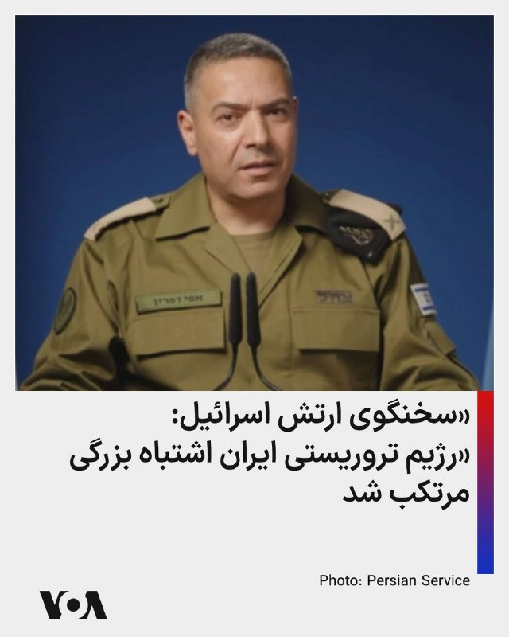

⚡️سخنگوی ارتش اسرائیل، افی دفرین، می‌گوید پس از حمله موشکی بالستیک جمهوری اسلامی ایران به اسرائیل، ایال زمیر، رئیس ستاد ارتش اسرائیل، در حال انجام ارزیابی و تصویب برنامه‌های آینده است. سخنگوی ارتش اسرائیل گفت: «رژیم تروریستی ایران اشتباه بزرگی مرتکب شد.»
@VahidHeadline

📡 @VahidOnline

## VahidOnline — post 76003

پیام‌های دریافتی:

ما تهرانسریم
تو این 1ساعت اخیر که اینا اسرائیل رو زدن
نزدیک به 8تا هواپیما مسافربری از مهرآباد بلند شد
نهمی هم الان رفت
انگار دارن فرودگاه رو خالی میکنن

سلام از تهران داره همینجور هواپیما بلند میشه همشونم تو ارتفاع کم پرواز میکنن

همین الان از بالا سر مهرآباد یه هواپیما با چراغ روشن از غرب به شرق رفت
مسیر خیلی غیرعادی با ارتفاع خیلی کم ۰۰:۰۸

📡 @VahidOnline

## kianmeli1 — post 87748

  <a href="telegram/content/kianmeli1_87748_1780865589.mp4" target="_blank">🎬 Download video</a>

🔴الان فرودگاه مهراباد رو دارن خالی میکنن
https://t.me/+_a5ind9hr7sxOTE0

## kianmeli1 — post 87747

🔴فوری
فرودگاه تهران رو دارن خالی میکنن
پشت سر هم هواپیما بلند میشه
https://t.me/+_a5ind9hr7sxOTE0

## Shin_Persian — post 6662

  <a href="telegram/content/Shin_Persian_6662_1780865590.mp4" target="_blank">🎬 Download video</a>

Shin ✓ @hey_itsmyturn
Sun, 07 Jun 2026 20:50:21 UTC

𝕏 · @shin_persian

## Shin_Persian — post 6661

Shin ✓ @hey_itsmyturn
Sun, 07 Jun 2026 20:47:34 UTC

Too many birds taking off from Mehrabad airport, a bunch of them are civilians, and a number are IRIAF jets.

فارسی

تعداد زیادی پرنده در حال برخاستن از فرودگاه مهرآباد هستند، تعدادی از آن‌ها غیرنظامی و تعدادی دیگر جت‌های نیروی هوایی ارتش جمهوری اسلامی ایران (نهاجا) هستند.

𝕏 · @shin_persian

## FarsiVOA — post 219936

  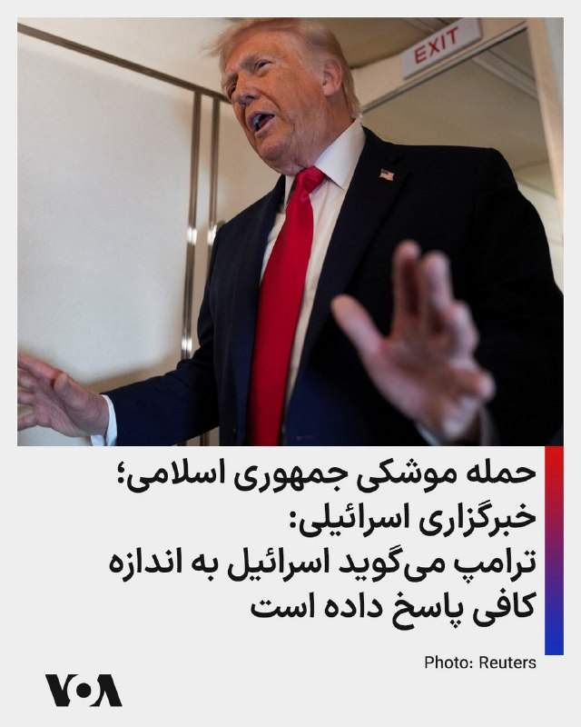

⚡️خبرگزاری کان اسرائيل گزارش داد که دونالد ترامپ، رئیس جمهوری آمریکا، عصریکشنبه به وقت واشنگتن، با این خبرگزاری مصاحبه کرد و درباره حمله جمهوری اسلامی به خاک اسرائیل گفت: «به نظر من اسرائیل به اندازه کافی پاسخ داده است، دیگر نیازی به پاسخ ندارند. ما می‌توانیم پس از ۳۰۰۰ سال به صلح دست یابیم.»
@FarsiVOA

## DW_Farsi — post 125663

  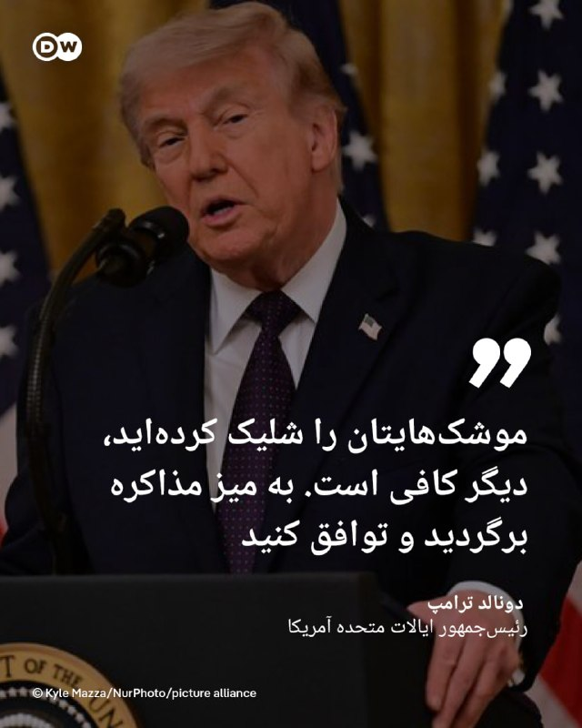

🔶 ترامپ پس از حملات موشکی ایران به اسرائيل: کافی است، به میز مذاکره برگردید و توافق کنید

در پی حملات موشکی ایران به شمال اسرائیل که در پاسخ به حملات ارتش اسرائیل علیه حزب‌الله در بیروت انجام شد، دونالد ترامپ، رئیس‌جمهور ایالات متحده، از تهران خواست، به میز مذاکره بازگردد و با واشنگتن به توافق برسد.

ترامپ در مصاحبه تلفنی با فاکس نیوز گفت: «پیشنهاد من به ایران این است: شما موشک‌هایتان را شلیک کرده‌اید، دیگر کافی است. به میز مذاکره برگردید و توافق کنید.»

ترامپ همچنین تاکید کرد، حملات موشکی ایران به شمال اسرائیل به مذاکرات با تهران، که به گفته او چند روز تا رسیدن به توافق فاصله داشت، کمکی نخواهد کرد.

او از حملات قبلی اسرائیل علیه اهداف حزب‌الله در بیروت که باعث حملات ایران شد، ابراز ناامیدی کرد و گفت: «ما خیلی به توافق نزدیک هستیم. به نظرم توافق دوشنبه، سه‌شنبه یا چهارشنبه هفته آینده امضا خواهد شد و حالا این اتفاق دارد می‌افتد.»

رئیس‌جمهور آمریکا همچنین اعلام کرد، به زودی با بنیامین نتانیاهو، نخست‌وزیر اسرائیل، تماس خواهد گرفت تا از او بخواهد، به حملات موشکی ایران به شمال اسرائیل پاسخ ندهد.
@dw_farsi

## Persian_Trend_Official — post 15995

  <a href="telegram/content/Persian_Trend_Official_15995_1780865592.webm" target="_blank">🎬 Download video</a>

⭕️ هم اکنون تماس تلفنی نخست وزیر بنیامین نتانیاهو و رئیس جمهور دونالد ترامپ آغاز شده است‌.

📝 Nick

📌 @persian_trend_official
پرشین ترند | متفاوت‌ترین کانال نظامی

## Persian_Trend_Official — post 15994

  <a href="telegram/content/Persian_Trend_Official_15994_1780865592.webm" target="_blank">🎬 Download video</a>

⭕️ با وجود تشدید تنش‌ها: کمیته قانون اساسی اعلام کرد که فردا طبق معمول در مورد قانون تشکیل کمیته تحقیقات سیاسی در مورد قتل عام ۷ اکتبر رأی‌گیری خواهد کرد - در حالی که بقیه بحث‌ها لغو خواهد شد.

📝 Nick

📌 @persian_trend_official
پرشین ترند | متفاوت‌ترین کانال نظامی

## Persian_Trend_Official — post 15993

  <a href="telegram/content/Persian_Trend_Official_15993_1780865593.webm" target="_blank">🎬 Download video</a>

یکی تو یه گروه تلگرامی: "اسرائیل گنبد آهنین داره، ملاها گنبد دونالد"

📝 Nick

📌 @persian_trend_official
پرشین ترند | متفاوت‌ترین کانال نظامی

## RadioFarda — post 158018

وزیر خارجه ایران با مقام‌های بریتانیا، ترکیه و پاکستان گفت‌وگو کرد

🔸وزیر خارجه ایران می‌گوید پس از «پاسخ ایران به نقض مکرر آتش‌بس در لبنان» از سوی اسرائیل، با مقام‌هایی از بریتانیا، ترکیه و پاکستان گفت‌وگو کرده است.

🔸عباس عراقچی در تلگرام نوشت که با ایوت کوپر، وزیر خارجه بریتانیا، و هاکان فیدان، وزیر خارجه ترکیه، گفت‌وگو کرده است.

🔸او همچنین گفت با عاصم منیر، فرمانده ارتش پاکستان، گفت‌وگو کرده است؛ فردی که در تلاش‌های میانجی‌گرانه میان آمریکا و ایران نقشی کلیدی داشته است.

@RadioFarda

## RadioFarda — post 158017

  <a href="https://t.me/radiofarda/158017" target="_blank">📎 Download file</a>

📻بشنوید: سرخط خبرهای نیمه‌شب با رادیوفردا، ۱۸ خرداد ۱۴۰۵‌

@RadioFarda

## IranianMinds — post 21678

🔴 ترامپ داره تلفنی با نتانیاهو صحبت میکنه الان @IranianMinds

## IranianMinds — post 21677

🔴 ترامپ داره تلفنی با نتانیاهو صحبت میکنه الان

@IranianMinds

## IranianMinds — post 21676

  <a href="telegram/content/IranianMinds_21676_1780865593.mp4" target="_blank">🎬 Download video</a>

🔴 بقایای موشک ایرانی در دشت‌های شمالی شهر تفس در جنوب سوریه سقوط کرد.

@IranianMinds

## IranianMinds — post 21675

  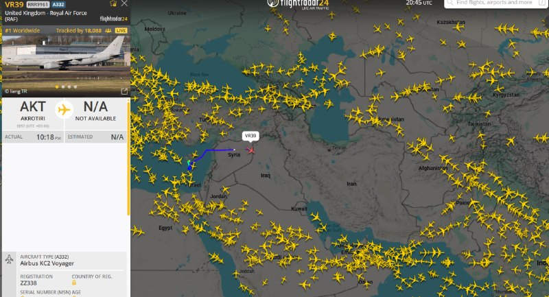

🔴 آسمان ایران , عراق , سوریه , کویت , اردن , اسرائیل کاملا کلیره و فقط یه هوایپیمای نیرو هوایی انگلیس داره میاد سمت خاورمیانه.

@IranianMinds

## Dirty_Kids — post 391279

الان پیت هگست در واکنش به حمله ایران به اسرائیل بلند میشه ۲۰ تا دراز نشست میره

## Dirty_Kids — post 391278

امشب نتانیاهو میره مجتبی رو بکشه پتو رو می‌زنه کنار می‌بینه ترامپ جاش خوابیده

## alonews — post 126020

  <a href="telegram/content/alonews_126020_1780865596.webm" target="_blank">🎬 Download video</a>

👈پروازها به عراق به دلیل بسته شدن حریم هوایی لغو شد

✅ @AloNews خبر جنگ

## alonews — post 126019

  <a href="telegram/content/alonews_126019_1780865596.webm" target="_blank">🎬 Download video</a>

👈نیویورک تایمز، به نقل از وزارت امور خارجه ایالات متحده: ۲۲ ژوئن به عنوان تاریخ دور جدید مذاکرات بین اسرائیل و لبنان تعیین شده است

✅ @AloNews خبر جنگ

## alonews — post 126018

  <a href="telegram/content/alonews_126018_1780865596.webm" target="_blank">🎬 Download video</a>

👈منابع عبری:ترامپ و نتانیاهو در حال حاضر در حال گفتگو هستن

✅ @AloNews خبر جنگ

## alonews — post 126017

  <a href="telegram/content/alonews_126017_1780865596.webm" target="_blank">🎬 Download video</a>

👈کانال 12 اسرائیل:
مخالفان نتانیاهو در عرصه سیاسی اسرائیل از این وضعیت سوءاستفاده خواهند کرد و از سوی دیگر، نخست وزیر نمی‌تواند تنها چند ماه پیش از انتخابات به چنین وضعیتی(ترامپ مانع حمله شود) تن دهد، زیرا این امر می‌تواند برای او یک فاجعه سیاسی تلقی شود.

✅ @AloNews خبر جنگ

## alonews — post 126016

  <a href="telegram/content/alonews_126016_1780865596.webm" target="_blank">🎬 Download video</a>

👈هم‌اکنون ، وضعیت آسمان منطقه

✅ @AloNews خبر جنگ

## alonews — post 126014

  <a href="telegram/content/alonews_126014_1780865596.mp4" target="_blank">🎬 Download video</a>

👈گویا هواپیماها از فرودگاه مهرآباد درحال تخلیه شدن هستن

✅ @AloNews خبر جنگ

## alonews — post 126013

  <a href="telegram/content/alonews_126013_1780865598.webm" target="_blank">🎬 Download video</a>

👈کانال ۱۴ اسرائیل: امشب فقط موشک‌ها و جت‌ها نیستند که بین آسمان و زمین در نوسان هستند، بلکه سرنوشت سیاسی نتانیاهو نیز همین گونه است

✅ @AloNews خبر جنگ

## alonews — post 126012

  <a href="telegram/content/alonews_126012_1780865598.webm" target="_blank">🎬 Download video</a>

🔴جمهوری اسلامی و عرزشی های حرام زاده علنا نشان می‌دهند که ‎لبنان برایشان از جان مردم ‎ایران و کشور ایران مهم‌تر است.

🤔اینا با چه زبانی بگن که ایرانی نیستن؟

✅@AloNews

## alonews — post 126011

  <a href="telegram/content/alonews_126011_1780865599.mp4" target="_blank">🎬 Download video</a>

👈 بقایای موشک ایرانی در دشت‌های شمالی شهر تفس در جنوب سوریه سقوط کرد.

✅ @AloNews خبر جنگ

## alonews — post 126009

  <a href="telegram/content/alonews_126009_1780865600.webm" target="_blank">🎬 Download video</a>

👈نت تو پاکستان قطع شد جنگ شروع شد

✅ @AloNews خبر جنگ

---
📅 بروزرسانی: 1405/03/18 00:12
---

## VahidOOnLine — post 244184

  

سخنگوی ارتش اسرائیل گفت حکومت ایران اشتباه بزرگی مرتکب شد. اسرائیل موازنه‌ای را که تهران در پی ایجاد آن است نخواهد پذیرفت.

او افزود ارتش در حالت آماده‌باش قرار دارد و برای حملات دیگر جمهوری اسلامی آماده‌ است.
‌🏁 🇬🇧 IranintlTV

🤖 @VahidOOnLine

## VahidOOnLine — post 244183

  <a href="telegram/content/VahidOOnLine_244183_1780864976.mp4" target="_blank">🎬 Download video</a>

♦️ابراهیم ذوالفقاری، سخنگوی قرارگاه خاتم الانبیا، یکشنبه‌شب، اعلام کرد:‌ «ارتش اسرائیل باید حملات خود به جنوب لبنان و ضاحیه را متوقف نماید و در صورت گسترش حملات خود به آن منطقه و یا پاسخ به اقدام ایران با ضربات کوبنده‌تر و پشیمان‌کننده روبه‌رو و حملات ویرانگری علیه اسرائیل و حامیان آن آغاز خواهد شد».
‌🇸🇦 Indypersian

🤖 @VahidOOnLine

## VahidOOnLine — post 244182

  

سخنگوی قرارگاه مرکزی خاتم‌الانبیا گفت: «قبلا اخطار داده بودیم در صورت گسترش حملات در ضاحیه بیروت، اهدافی را در اسرائیل مورد هجوم قرار می دهیم.»

او افزود: «ارتش اسرائیل باید حملات خود به جنوب لبنان و ضاحیه را متوقف نماید و در صورت گسترش حملات خود به آن منطقه و یا پاسخ به اقدام جمهوری اسلامی با ضربات کوبنده‌تر و پشیمان‌کننده روبرو و حملات ویرانگری علیه اسرائیل و حامیان آن آغاز خواهد شد.»
‌🏁 🇬🇧 IranintlTV

🤖 @VahidOOnLine

## WithYashar — post 13797

ترامپ به نیویورک پست: «اوضاع بسیار خوب پیش می‌رود.»
@withyashar

## WithYashar — post 13796

کانال 12 اسرائیل:
با وجود مخالفت ترامپ، فشارهای داخلی بر نتانیاهو برای واکنش افزایش یافته و شماری از سیاستمداران اسرائیلی خواستار پاسخ شدید به حملات جمهوری اسلامی شدن.
@withyashar

## WithYashar — post 13795

سخنگوی ارتش اسرائیل در یک کنفرانس مطبوعاتی ادعا کرد که رئیس ستاد ارتش، ایال زامیر، در حال ارزیابی وضعیت است و «طرح‌هایی را برای آینده تصویب می‌کند»
@withyashar

## WithYashar — post 13794

سخنگوی ارتش اسرائیل: ایران اشتباه بزرگی مرتکب شد
@withyashar

## mwarmonitor — post 10309

🔴 سخنگوی ارتش اسرائیل: رئیس ستاد کل در حال انجام ارزیابی وضعیت است و سامانه‌های پدافند هوایی ما در حالت آماده‌باش قرار دارند. او افزود: «رژیم تروریستی ایران مرتکب یک اشتباه جدی شد.» @mwarmonitor

## FoxNewsTwitter — post 342701

  <a href="telegram/content/FoxNewsTwitter_342701_1780864977.mp4" target="_blank">🎬 Download video</a>

Fox News (Twitter/X)

BREAKING: FOX News' @TreyYingst spoke with President Trump after Iran's latest strikes against Israel.

Iran launched multiple missile barrages toward Israel on Sunday, prompting air raid sirens across regions and sending civilians into shelters, according to the Israel Defense Forces.

## pm_afshaa — post 92687

🔴سخنگوی ارتش اسرائیل :هم اکنون رئیس ستاد ارتش در حال تصویب طرح‌هایی برای اقدامات بیشتر در پاسخ به ایران است

💧 Rainbet.com the #1 Non-KYC Crypto Casino & Sportsbook @rainbetcom

😁 @Pm_Afshaa

## pm_afshaa — post 92686

ترامپ به نیویورک پست:
نتانیاهو جواب تلفن نمیده

💧 Rainbet.com the #1 Non-KYC Crypto Casino & Sportsbook @rainbetcom

😁 @Pm_Afshaa

## pm_afshaa — post 92685

🔴سخنگوی ارتش اسرائیل : ما به حملات خودمون به سراسر خاک لبنان ادامه خواهیم داد و اجازه نخواهیم داد ایران معادله ای جدید علیه لبنان ایجاد کند

💧 Rainbet.com the #1 Non-KYC Crypto Casino & Sportsbook @rainbetcom

😁 @Pm_Afshaa

## pm_afshaa — post 92684

  

اکانت معروف اسراییلی:

💧 Rainbet.com the #1 Non-KYC Crypto Casino & Sportsbook @rainbetcom

😁 @Pm_Afshaa

## pm_afshaa — post 92683

  <a href="telegram/content/pm_afshaa_92683_1780864980.webm" target="_blank">🎬 Download video</a>

🔴سخنگوی قرارگاه خاتم‌الانبیا: اگه اسرائیل به حملات ما پاسخ بده دوباره حمله می‌کنیم.

💧 Rainbet.com the #1 Non-KYC Crypto Casino & Sportsbook @rainbetcom

😁 @Pm_Afshaa

## pm_afshaa — post 92682

  <a href="telegram/content/pm_afshaa_92682_1780864980.webm" target="_blank">🎬 Download video</a>

🔴کانال 12 اسرائیل:
با وجود مخالفت ترامپ، فشارهای داخلی بر نتانیاهو برای واکنش افزایش یافته و شماری از سیاستمداران اسرائیلی خواستار پاسخ شدید به حملات جمهوری اسلامی شدن.

💧 Rainbet.com the #1 Non-KYC Crypto Casino & Sportsbook @rainbetcom

😁 @Pm_Afshaa

## IranIntlTV — post 341061

  

سخنگوی ارتش اسرائیل گفت حکومت ایران اشتباه بزرگی مرتکب شد. اسرائیل موازنه‌ای را که تهران در پی ایجاد آن است نخواهد پذیرفت.

او افزود ارتش در حالت آماده‌باش قرار دارد و برای حملات دیگر جمهوری اسلامی آماده‌ است.
https://iranintl.com/202606070458

## IranIntlTV — post 341060

  <a href="https://t.me/IranintlTV/341060" target="_blank">📎 Download file</a>

🎧نسخه صوتی چشم‌انداز: هزینه‌های ترسناک اقدامات جنون‌آمیز سپاه برای آینده ایران
@iranintlTV

## IranIntlTV — post 341059

  

سخنگوی قرارگاه مرکزی خاتم‌الانبیا گفت: «قبلا اخطار داده بودیم در صورت گسترش حملات در ضاحیه بیروت، اهدافی را در اسرائیل مورد هجوم قرار می دهیم.»

او افزود: «ارتش اسرائیل باید حملات خود به جنوب لبنان و ضاحیه را متوقف نماید و در صورت گسترش حملات خود به آن منطقه و یا پاسخ به اقدام جمهوری اسلامی با ضربات کوبنده‌تر و پشیمان‌کننده روبرو و حملات ویرانگری علیه اسرائیل و حامیان آن آغاز خواهد شد.»
https://iranintl.com/202606076398

## Shin_Persian — post 6660

Shin ✓ @hey_itsmyturn
Sun, 07 Jun 2026 20:40:41 UTC

Found the OP
https://t.me/aqvalanam/31796

فارسی

پست اصلی (OP) را پیدا کردم
https://t.me/aqvalanam/31796

𝕏 · @shin_persian

## Shin_Persian — post 6659

↩️ Quoted tweet:  𝓂𝒶𝓇𝒾𝑜🇱🇧🇬🇧🇦🇪 ✓ @MarioLeb79 Sun, 07 Jun 2026 20:08:18 UTC 🚨Trump to Barak Ravid: I will call Netanyahu now - and tell him not to attack Iran ↩️ توییت نقل‌قول شده — برای پاسخ، پست زیر را ببینید. فارسی 🚨 ترامپ به باراک راوید: اکنون با نتانیاهو…

## Shin_Persian — post 6658

↩️ Quoted tweet:
 𝓂𝒶𝓇𝒾𝑜🇱🇧🇬🇧🇦🇪 ✓ @MarioLeb79
Sun, 07 Jun 2026 20:08:18 UTC

🚨Trump to Barak Ravid: I will call Netanyahu now - and tell him not to attack Iran

↩️ توییت نقل‌قول شده — برای پاسخ، پست زیر را ببینید.

فارسی

🚨 ترامپ به باراک راوید: اکنون با نتانیاهو تماس خواهم گرفت و به او خواهم گفت که به ایران حمله نکند.

𝕏 · @shin_persian

## FarsiVOA — post 219935

  

⚡️سخنگوی ارتش اسرائیل، افی دفرین، می‌گوید پس از حمله موشکی بالستیک جمهوری اسلامی ایران به اسرائیل، ایال زمیر، رئیس ستاد ارتش اسرائيل، در حال انجام ارزیابی و تصویب برنامه‌های آینده است. سخنگوی ارتش اسرائيل گفت: «رژیم تروریستی ایران اشتباه بزرگی مرتکب شد.»
@FarsiVOA

## Persian_Trend_Official — post 15992

  <a href="telegram/content/Persian_Trend_Official_15992_1780864982.webm" target="_blank">🎬 Download video</a>

⭕️ پس از تیراندازی ایران، جلسات محاکمه بنیامین نتانیاهو، نخست وزیر، لغو شد.

اداره دادگاه از وزیر دادگستری خواسته است تا اطلاعیه ویژه وضعیت اضطراری را امضا کند.

دادگاه‌ها مطابق با مقررات ویژه اضطراری، فقط برای جلسات فوری آماده خواهند بود.

📝 Nick

📌 @persian_trend_official
پرشین ترند | متفاوت‌ترین کانال نظامی

## Persian_Trend_Official — post 15991

  

سخنگوی ارتش اسرائیل، سرتیپ افی دافرین، گفت: «رژیم تروریستی ایران اشتباه بزرگی مرتکب شد؛ ما برای احتمال آتش‌افروزی بیشتر به سمت خود آماده‌ایم.»

📝 Nick

📌 @persian_trend_official
پرشین ترند | متفاوت‌ترین کانال نظامی

## Persian_Trend_Official — post 15990

  

⭕️ عراقچی: 📝 Nick 📌 @persian_trend_official پرشین ترند | متفاوت‌ترین کانال نظامی

## IranianMinds — post 21674

🔴 ترامپ به نیویورک پست :

اوضاع عالی داره پیش میره همه چی عالیه اصلا به به دارم لذت میبرم.

@IranianMinds

## IranianMinds — post 21673

🔴 سخنگوی ارتش اسرائیل :

ما به حملات خودمون به سراسر خاک لبنان ادامه خواهیم داد و اجازه نخواهیم داد ایران معادله ای جدید علیه لبنان ایجاد کند !

@IranianMinds

## IranianMinds — post 21672

🔴 سخنگوی ارتش اسرائیل :

هم اکنون رئیس ستاد ارتش در حال تصویب طرح‌هایی برای اقدامات بیشتر در پاسخ به ایران است.

@IranianMinds

## Dirty_Kids — post 391277

🔴ارتش اسرائیل :

عملیات ما تو لبنان ادامه خواهد داشت.

@Dirty_Kids 👻

## Dirty_Kids — post 391276

  <a href="telegram/content/Dirty_Kids_391276_1780864983.mp4" target="_blank">🎬 Download video</a>

آقای عمو ترامپ تا الان به احترام کتلت کردن موشعلی بهت چیزی نمیگفتم، ولی دیگه مماشات نمیکنم :)))

@Dirty_Kids 👻

## Dirty_Kids — post 391275

  

حجت الاسلام الدونالد ترامب :

بسم الله قاصم الجبارین
رژیم غاصب صهیونیستی 8 سال آینده را نخواهد دید!
و من نصر الی من عندالله عزیز الحکیم.

@Dirty_Kids 👻

## Dirty_Kids — post 391274

  <a href="telegram/content/Dirty_Kids_391274_1780864984.mp4" target="_blank">🎬 Download video</a>

🔴 ترامپ: ارتش آمریکا بزودی برای فتح اسرائیل به این کشور حمله می‌کنه.
و من نصر الی من عندالله عزیز الحکیم.

@Dirty_Kids 👻

## alonews — post 126008

  <a href="telegram/content/alonews_126008_1780864984.webm" target="_blank">🎬 Download video</a>

👈منابع عراقی: نیروهای امنیتی در عراق هشدار جدیدی در نزدیکی منطقه سبز و فرودگاه بغداد اعلام کردند

✅ @AloNews خبر جنگ

## alonews — post 126007

  <a href="telegram/content/alonews_126007_1780864984.webm" target="_blank">🎬 Download video</a>

👈کانال ۱۲ اسرائیل: رقبای نتانیاهو در عرصه سیاسی اسرائیل از این وضعیت سوءاستفاده خواهند کرد.

🔴از سوی دیگر، نتانیاهو نمی‌تواند چند ماه پیش از انتخابات به چنین وضعیتی برسد، زیرا این می‌تواند فاجعه‌ای سیاسی برای او باشد.

✅ @AloNews خبر جنگ

## alonews — post 126006

  <a href="telegram/content/alonews_126006_1780864984.webm" target="_blank">🎬 Download video</a>

👈ارتش اسرائیل می‌گوید به عملیات خود در سراسر لبنان ادامه خواهد داد

✅ @AloNews خبر جنگ

## alonews — post 126005

  <a href="telegram/content/alonews_126005_1780864985.webm" target="_blank">🎬 Download video</a>

👈کانال ۱۲ عبری: به دنبال وضعیت امنیتی، کنست (مجلس اسرائیل) چندین جلسه که برای فردا برنامه‌ریزی شده بود را لغو کرد

✅ @AloNews خبر جنگ

## alonews — post 126004

  <a href="telegram/content/alonews_126004_1780864985.webm" target="_blank">🎬 Download video</a>

👈ترامپ به نیویورک پست: در حال حاضر نتوانستیم با نتانیاهو تماس بر قرار کنیم 
✅ @AloNews خبر جنگ

## alonews — post 126003

  <a href="telegram/content/alonews_126003_1780864985.webm" target="_blank">🎬 Download video</a>

👈ترامپ به نیویورک پست: «اوضاع بسیار خوب پیش می‌رود.» 
✅ @AloNews خبر جنگ

## alonews — post 126002

  <a href="telegram/content/alonews_126002_1780864985.webm" target="_blank">🎬 Download video</a>

👈ترامپ به نیویورک پست: «اوضاع بسیار خوب پیش می‌رود.»

✅ @AloNews خبر جنگ

## alonews — post 126001

  <a href="telegram/content/alonews_126001_1780864986.webm" target="_blank">🎬 Download video</a>

👈اسرائیل: آماده شلیک موشک‌های بیشتری از ایران هستیم

✅ @AloNews خبر جنگ

## alonews — post 126000

  <a href="telegram/content/alonews_126000_1780864986.webm" target="_blank">🎬 Download video</a>

👈حریم هوایی سوریه نیز بسته شد

✅ @AloNews خبر جنگ

## alonews — post 125999

  <a href="telegram/content/alonews_125999_1780864986.webm" target="_blank">🎬 Download video</a>

👈تماس های تلفنی عراقچی با وزرای خارجه فرانسه و قطر

✅ @AloNews خبر جنگ

---
📅 بروزرسانی: 1405/03/18 00:03
---

## VahidOOnLine — post 244181

  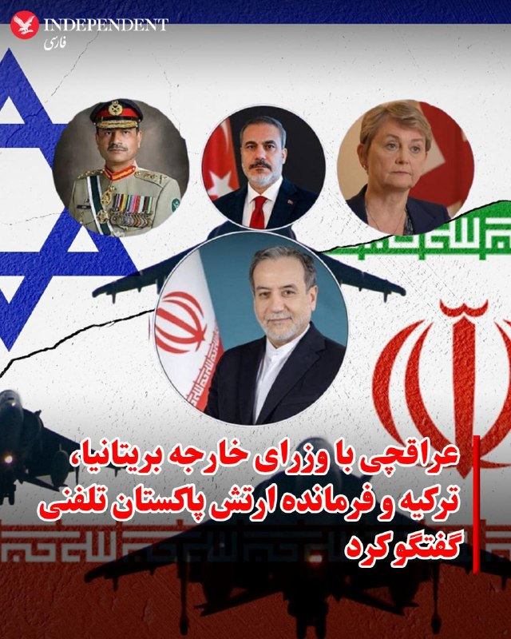

♦️به گزارش تسنیم، خبرگزاری وابسته به سپاه، عباس عراقچی، وزیر امور خارجه جمهوری اسلامی، یکشنبه‌شب همزمان با حملات ایران به اسرائیل، در تماس‌های تلفنی جداگانه با ایوت کوپر و هاکان فیدان، وزرای امور خارجه بریتانیا و ترکیه، و نیز عاصم منیر، فرمانده ارتش پاکستان گفتگو کرد. براساس این گزارش، در این تماس‌ها طرفین درباره آخرین تحولات منطقه‌ای در پی پاسخ ایران به «نقض مکرر آتش‌بس در لبنان توسط اسرائیل» گفتگو کردند.
‌🇸🇦 Indypersian

🤖 @VahidOOnLine

## VahidOOnLine — post 244180

  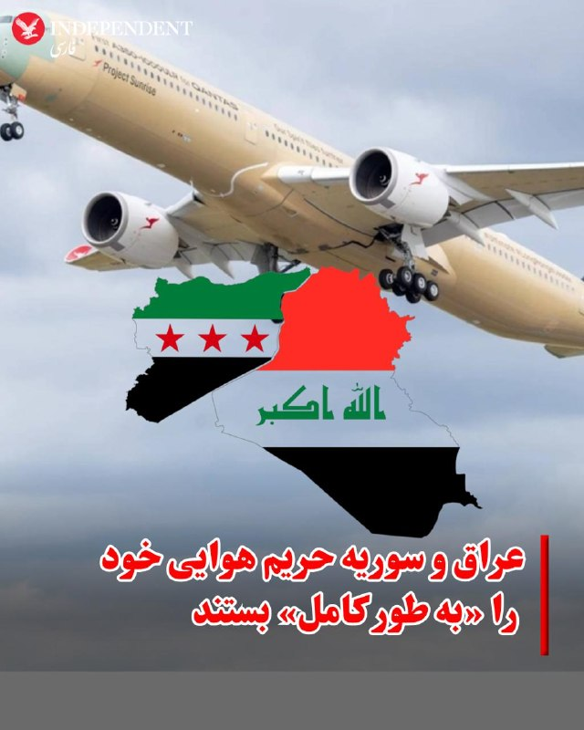

♦️در پی آغاز حملات موشکی ایران به اسرائیل، سازمان‌های هوانوردی عراق و سوریه از بسته‌شدن فوری و موقت حریم هوایی خود به دلایل امنیتی خبر دادند. مقامات هوانوردی غیرنظامی عراق در گفتگو با رویترز تایید کردند که آسمان این کشور با هدف حفظ سلامت و امنیت پروازها، به مدت ۷۲ ساعت به طور کامل بسته شده و تمامی ناوبری‌های هوایی به حالت تعلیق درآمده است. هم‌زمان، دولت سوریه نیز اعلام کرد که حریم هوایی بخش‌های جنوبی خود را به مدت ۱۲ ساعت مسدود کرده و تمامی فعالیت‌ها و عملیات‌های پروازی در فرودگاه بین‌المللی دمشق تا اطلاع ثانوی متوقف شده است.
‌🇸🇦 Indypersian

🤖 @VahidOOnLine

## WithYashar — post 13793

از‌ مهرآباد جنگنده بلند شد
@withyashar

## WithYashar — post 13792

رسانه های داخلی: تو تبریز پهپاد زدیم
@withyashar

## WithYashar — post 13791

## WithYashar — post 13790

گزارش انفجار در تبریز
@withyashar

## WithYashar — post 13789

ارتش اسرائیل تا دقایقی دیگر بیانیه ای صادر خواهد کرد
@withyashar

## mwarmonitor — post 10308

🔴 سخنگوی ارتش اسرائیل: رئیس ستاد کل در حال انجام ارزیابی وضعیت است و سامانه‌های پدافند هوایی ما در حالت آماده‌باش قرار دارند.

او افزود: «رژیم تروریستی ایران مرتکب یک اشتباه جدی شد.»

@mwarmonitor

## mwarmonitor — post 10307

انفجار در تبریز

## mwarmonitor — post 10306

🔴وزیر امور خارجه ایران، عراقچی، به‌صورت تلفنی با یِوِت کوپر، وزیر خارجه بریتانیا، هاکان فیدان، وزیر خارجه ترکیه، و فیلد مارشال عاصم منیر، فرمانده ارتش پاکستان گفت‌وگو کرده و درباره تحولات منطقه‌ای بحث کرده است - به نقل از خبرگزاری مهر.

@mwarmonitor

## pm_afshaa — post 92681

  <a href="telegram/content/pm_afshaa_92681_1780864380.webm" target="_blank">🎬 Download video</a>

🔴سخنگوی ارتش اسرائیل در یک کنفرانس مطبوعاتی: رئیس ستاد ارتش، ایال زامیر، در حال ارزیابی وضعیت است و طرح‌هایی رو برای آینده تصویب میکنه.

💧 Rainbet.com the #1 Non-KYC Crypto Casino & Sportsbook @rainbetcom

😁 @Pm_Afshaa

## pm_afshaa — post 92680

🔴سخنگوی ارتش اسرائیل: رژیم تروریستی ایران اشتباه بزرگی مرتکب شد

💧 Rainbet.com the #1 Non-KYC Crypto Casino & Sportsbook @rainbetcom

😁 @Pm_Afshaa

## pm_afshaa — post 92679

  <a href="telegram/content/pm_afshaa_92679_1780864381.webm" target="_blank">🎬 Download video</a>

🔴ترامپ: هر دو طرف خوش گذروندن، بنظرم نیاز به دور بعدی نیست.

💧 Rainbet.com the #1 Non-KYC Crypto Casino & Sportsbook @rainbetcom

😁 @Pm_Afshaa

## pm_afshaa — post 92678

گزارش ها از انفجار در تبریز

💧 Rainbet.com the #1 Non-KYC Crypto Casino & Sportsbook @rainbetcom

😁 @Pm_Afshaa

## pm_afshaa — post 92677

  <a href="telegram/content/pm_afshaa_92677_1780864381.webm" target="_blank">🎬 Download video</a>

🔴اکسیوس: ترامپ به نتانیاهو گفت حملات جمهوری اسلامی رو تلافی نکنه. 
💧 Rainbet.com the #1 Non-KYC Crypto Casino & Sportsbook @rainbetcom 
😁 @Pm_Afshaa

## pm_afshaa — post 92676

🔴ارتش اسرائیل تا دقایقی دیگر بیانیه ای صادر خواهد کرد

💧 Rainbet.com the #1 Non-KYC Crypto Casino & Sportsbook @rainbetcom

😁 @Pm_Afshaa

## pm_afshaa — post 92675

  <a href="telegram/content/pm_afshaa_92675_1780864382.webm" target="_blank">🎬 Download video</a>

🔴اکسیوس: ترامپ به نتانیاهو گفت حملات جمهوری اسلامی رو تلافی نکنه.

💧 Rainbet.com the #1 Non-KYC Crypto Casino & Sportsbook @rainbetcom

😁 @Pm_Afshaa

## pm_afshaa — post 92674

  <a href="telegram/content/pm_afshaa_92674_1780864382.webm" target="_blank">🎬 Download video</a>

🔴ترامپ به شبکه کان نیوز:
فکر میکنم اسرائیل به اندازه کافی پاسخ داده. دیگه نیازی به ادامه آن نیست. ما میتونیم پس از 3000 سال به صلح برسیم.

💧 Rainbet.com the #1 Non-KYC Crypto Casino & Sportsbook @rainbetcom

😁 @Pm_Afshaa

## pm_afshaa — post 92673

  <a href="telegram/content/pm_afshaa_92673_1780864383.webm" target="_blank">🎬 Download video</a>

🔴باراک راوید خبرنگار اکسیوس:
بر اساس آنچه از مقامات آمریکایی شنیدم، آمریکا در هیچ حمله‌ای به ایران به اسرائیل کمک نخواهد کرد.

💧 Rainbet.com the #1 Non-KYC Crypto Casino & Sportsbook @rainbetcom

😁 @Pm_Afshaa

## pm_afshaa — post 92672

🔴وزیر میکی زوهر: اسرائیل باید با قدرت به ایران حمله کند. همانطور که امروز در جلسه دولت گفتم - دوران توطئه به پایان رسیده است. باید از دفاع به حمله گذر کنیم

💧 Rainbet.com the #1 Non-KYC Crypto Casino & Sportsbook @rainbetcom

😁 @Pm_Afshaa

## kianmeli1 — post 87745

🔥خبرهای فوری را از پیج زیر نیز دنبال کنید

https://t.me/+_a5ind9hr7sxOTE0
https://t.me/+_a5ind9hr7sxOTE0

## IranIntlTV — post 341058

  <a href="telegram/content/IranIntlTV_341058_1780864383.mp4" target="_blank">🎬 Download video</a>

هزینه‌های ترسناک اقدامات جنون‌آمیز سپاه برای آینده ایران

چشم‌انداز با مهدی مهدوی‌آزاد

نسخه کامل این برنامه در یوتیوب:
https://youtu.be/YNH6vxX94sk
@iranintltv

## IranIntlTV — post 341057

  <a href="telegram/content/IranIntlTV_341057_1780864385.mp4" target="_blank">🎬 Download video</a>

کانال ۱۲ اسرائیل گزارش داد ترامپ به نتانیاهو توصیه کرده به حمله موشکی جمهوری اسلامی پاسخ ندهد. با این حال، فشارهای داخلی بر نتانیاهو برای واکنش افزایش یافته و شماری از سیاستمداران اسرائیلی خواستار پاسخ شدید به این حملات شده‌اند.

گزارش اشکان صفایی، خبرنگار ایران‌اینترنشنال
@iranintltv

## Shin_Persian — post 6657

Emanuel (Mannie) Fabian ✓ @manniefabian
Sun, 07 Jun 2026 20:28:16 UTC

Following Iran's ballistic missile attack on Israel, IDF Spokesman Brig. Gen. Effie Defrin in a press conference says that Chief of Staff Lt. Gen. Eyal Zamir is conducting an assessment and is "approving plans for the future."

"The Iranian terror regime made a grave mistake," he says.

فارسی

در پی حمله موشک‌های بالستیک ایران به اسرائیل، سرتیپ افی دفرین، سخنگوی ارتش دفاعی اسرائیل (IDF) در یک کنفرانس خبری اعلام کرد که سپهبد ایال زمیر، رئیس ستاد کل ارتش، در حال انجام یک ارزیابی است و «طرح‌هایی را برای آینده تصویب می‌کند.»

او می‌گوید: «رژیم تروریستی ایران مرتکب اشتباه بزرگی شد.»

𝕏 · @shin_persian

## FarsiVOA — post 219934

  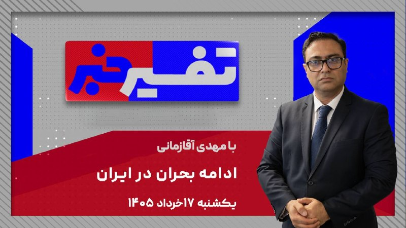

🎯این برنامه از تفسیر خبر را با اجرای مهدی آقازمانی هم اکنون در یوتیوب صدای آمریکا مشاهده بفرمایید:
👇👇👇👇👇
https://www.youtube.com/live/kVVTjngrjWc
🔴سابسکرایب یوتیوب صدای آمریکا را فراموش نکنید:
https://youtube.com/@voafarsi

این پست را با دوستانتان به اشتراک بگذارید
@FarsiVOA

## FarsiVOA — post 219933

  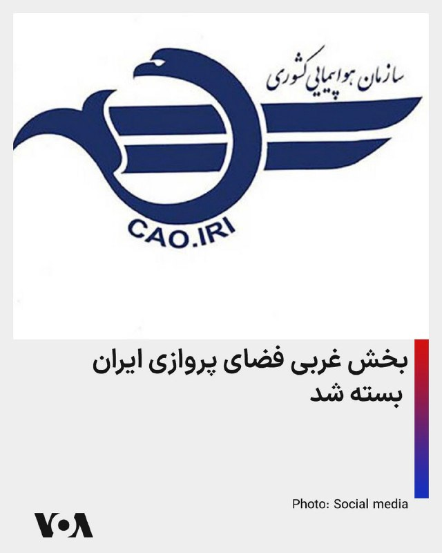

⚡️در ایران، سخنگوی «سازمان هواپیمایی كشوری» گفت بخش غربی فضای پروازی ایران تا اطلاع ثانوی بسته است.
@FarsiVOA

## FarsiVOA — post 219932

  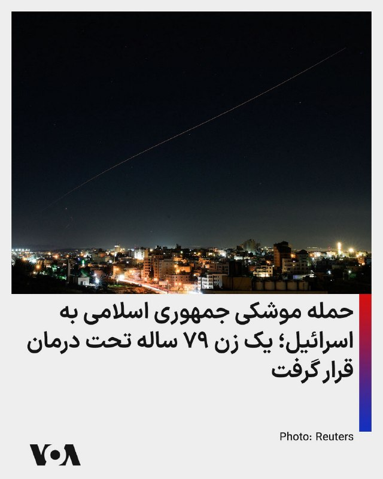

⚡️به گزارش تایمز اسرائيل، یک زن ۷۹ ساله در اسرائيل که در جریان حمله موشکی شبانه جمهوری اسلامی به شمال اسرائیل، در مسیر رفتن به پناهگاه به سرش ضربه خورده، تحت درمان قرار گرفته است.

@FarsiVOA

## DW_Farsi — post 125662

  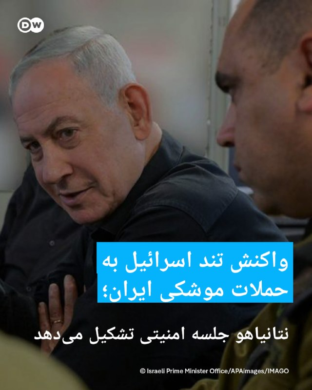

🔶 واکنش تند اسرائیل به حملات موشکی ایران؛ نتانیاهو جلسه امنیتی تشکیل می‌دهد

به گزارش رسانه‌های اسرائیلی، مقامات ارشد این کشور اعلام کرده‌اند، اسرائیل به حملات موشکی ایران "پاسخی کوبنده" خواهد داد.

شبکه ۱۲ تلویزیون اسرائیل در این رابطه گزارش داد، مقامات این کشور تاکید کرده‌اند، "نمی‌توانند اجازه دهند" معادله جدیدی شکل بگیرد که در آن، ایران در پاسخ به حملات اسرائیل علیه مواضع حزب‌الله در بیروت، خاک این کشور را هدف قرار دهد.

هنوز هیچ موضع‌گیری رسمی و علنی از سوی دولت اسرائیل درباره این حملات موشکی مداوم منتشر نشده است اما گزارش‌ها حاکی از آن است، بنیامین نتانیاهو، نخست‌وزیر اسرائیل، همراه مقامات ارشد نظامی و امنیتی، به زودی یک جلسه اضطراری برای ارزیابی وضعیت امنیتی برگزار خواهند کرد.

در همین حال، شبکه ۱۳ تلویزیون اسرائیل گزارش داد، در جریان گفت‌و‌گوهای اولیه با نتانیاهو، ارزیابی مقامات امنیتی این است که تهران به دنبال یک جنگ فراگیر و همه‌جانبه نیست، بلکه تلاش می‌کند با این اقدام، یک پاسخ محدود برای نشان دادن حمایت خود از حزب‌الله لبنان ارسال کند.
@dw_farsi

## Persian_Trend_Official — post 15989

  <a href="telegram/content/Persian_Trend_Official_15989_1780864388.mp4" target="_blank">🎬 Download video</a>

⭕️ تامیر موراگ در مورد واکنش ضعیف ترامپ به شلیک ایران به سمت اسرائیل: «این مرحله‌ای است که باید به او بگوییم که به منافع اسرائیل متعهد هستیم.»

📝 Nick

📌 @persian_trend_official
پرشین ترند | متفاوت‌ترین کانال نظامی

## Persian_Trend_Official — post 15988

  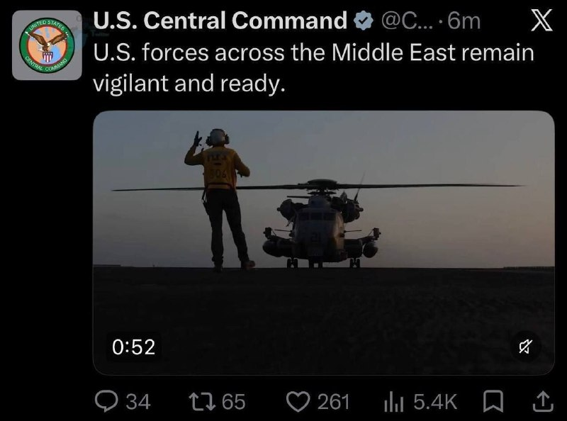

سنتکام: نیروهای آمریکایی در سراسر خاورمیانه هوشیار و آماده هستند.

Phantom

📌 @persian_trend_official
پرشین ترند | متفاوت‌ترین کانال نظامی

## Persian_Trend_Official — post 15987

  <a href="telegram/content/Persian_Trend_Official_15987_1780864390.webm" target="_blank">🎬 Download video</a>

⭕️ کانال 14 اسرائیل:
ترامپ در مصاحبه با شبکه خبری ۱۴: «همه چیز خوب خواهد شد - پس از ۳۰۰۰ سال صلح در خاورمیانه برقرار خواهد شد»

📝 Nick

📌 @persian_trend_official
پرشین ترند | متفاوت‌ترین کانال نظامی

## Persian_Trend_Official — post 15986

  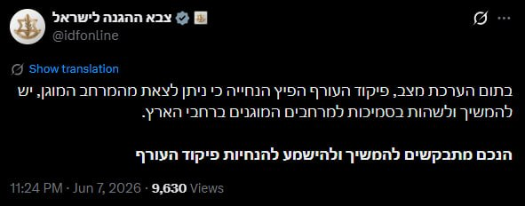

پس از ارزیابی وضعیت، فرماندهی جبهه داخلی دستورالعمل‌هایی صادر کرد مبنی بر اینکه می‌توان منطقه حفاظت‌شده را ترک کرد، اما باید همچنان در نزدیکی مناطق حفاظت‌شده در سراسر کشور بمانید.

از شما درخواست می‌شود که همچنان از دستورالعمل‌های فرماندهی جبهه داخلی پیروی کنید.

📝 Nick

📌 @persian_trend_official
پرشین ترند | متفاوت‌ترین کانال نظامی

## RadioFarda — post 158016

ترامپ: حملات ایران به کسی آسیبی نرساند، امیدوارم اسرائیل تلافی نکند

🔸درپی اعلام خبر حمله موشکی ایران به اسرائیل در شامگاه یک‌شنبه، دونالد ترامپ، رئیس‌جمهور آمریکا، در گفت‌وگویی تلفنی با خبرنگار اکسیوس گفت: «همین حالا با بی‌بی (بنیامین نتانیاهو) تماس می‌گیرم و به او می‌گویم تلافی نکند. هر دو طرف کار خودشان را کرده‌اند. اسرائیل حمله خود را انجام داد و ایران هم حمله خود را انجام داد. دیگر نیازی به حمله دیگری نیست.»

🔸دونالد ترامپ در این گفت‌وگو افزود: «حملات ایران به کسی آسیبی نرساند. امیدوارم اسرائیل تلافی نکند. اگر بی‌بی (بنیامین نتانیاهو) پاسخ بدهد، این ماجرا همان‌طور که در ۴۷ سال گذشته، یا حتی در ۳۰۰۰ سال گذشته، ادامه داشته، باز هم ادامه پیدا خواهد کرد.»

🔸ترامپ افزود: «ما به یک توافق نهایی با ایران بسیار نزدیک هستیم. این توافق، توافق خوبی خواهد بود. نمی‌خواهم به خاطر اتفاقاتی که اکنون در حال رخ دادن است، این روند از بین برود.»

🔸این اتفاق چند ساعت بعد از آن رخ داد که ارتش اسرائیل منطقه ضاحیه در جنوب بیروت را هدف قرار داد و ایران تهدید کرد به این حمله پاسخ خواهد داد.

🔸یک منبع ارشد ایرانی هم به خبرگزاری رویترز گفته است که «ایران به هر حمله اسرائیل با نیرویی شدیدتر پاسخ خواهد داد.«

🔸ارتش اسرائیل اعلام کرده است همه موشک‌هایی را که تاکنون از سوی ایران شلیک شده‌اند رهگیری کرده است.

@RadioFarda

## IranianMinds — post 21671

🔴 سخنگوی ارتش اسرائیل :

رژِیم ایران امشب دچار خطایی بزرگ و جدی شده است !

@IranianMinds

## IranianMinds — post 21670

🔴 ترامپ :

ما خیلی به توافق با ایران نزدیکیم و نمیخوایم خرابش کنیم.

@IranianMinds

## IranianMinds — post 21669

🔴 مقامات آمریکایی به فاکس نیوز : اگه اسرائیل امشب بخواد به ایران حمله کنه از سمت ایالات متحده هیچ حمایتی نخواهد داشت و به تنهایی باید کارشو انجام بده. @IranianMinds

## IranianMinds — post 21668

🔴 مقامات آمریکایی به فاکس نیوز :

اگه اسرائیل امشب بخواد به ایران حمله کنه از سمت ایالات متحده هیچ حمایتی نخواهد داشت و به تنهایی باید کارشو انجام بده.

@IranianMinds

## Dirty_Kids — post 391273

  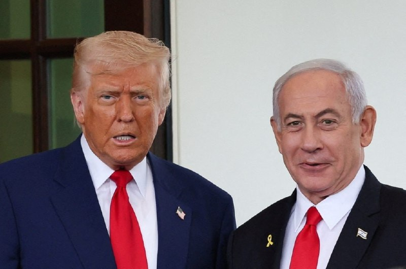

🔴 ترامپ:
فکر می‌کنم اسرائیل به اندازه کافی پاسخ داده و دیگه نیازی به ادامه دادن نیست، درست زمانی که بعد از 3 هزار سال می‌تونیم به صلح برسیم.

@Dirty_Kids 👻

## Dirty_Kids — post 391272

ترامپ :

به زودی با همکاری سپاه به اسرائیل حمله می‌کنیم.

## alonews — post 125998

  <a href="telegram/content/alonews_125998_1780864392.webm" target="_blank">🎬 Download video</a>

👈سخنگوی ارتش اسرائیل: ما برای احتمال ادامه حملات آتش به سمت خود آماده‌ایم

✅ @AloNews خبر جنگ

## alonews — post 125997

  <a href="telegram/content/alonews_125997_1780864392.webm" target="_blank">🎬 Download video</a>

👈سخنگوی ارتش اسرائیل در یک کنفرانس مطبوعاتی ادعا کرد که رئیس ستاد ارتش، ایال زامیر، در حال ارزیابی وضعیت است و «طرح‌هایی را برای آینده تصویب می‌کند»

✅ @AloNews خبر جنگ

## alonews — post 125996

  <a href="telegram/content/alonews_125996_1780864392.webm" target="_blank">🎬 Download video</a>

🔴فوری / سخنگوی ارتش اسرائیل: ایران اشتباه بزرگی مرتکب شد

✅ @AloNews خبر جنگ

## alonews — post 125995

  <a href="telegram/content/alonews_125995_1780864392.webm" target="_blank">🎬 Download video</a>

👈تابناک: پدافند در بخش محدودی از غرب تهران فعال شد

✅ @AloNews خبر جنگ

## alonews — post 125994

  <a href="telegram/content/alonews_125994_1780864392.webm" target="_blank">🎬 Download video</a>

👈صداها در تبریز مربوط به پدافنده 
✅ @AloNews خبر جنگ

## alonews — post 125993

  <a href="telegram/content/alonews_125993_1780864392.webm" target="_blank">🎬 Download video</a>

👈ارتش اسرائیل به زودی بیانیه ای صادر خواهد کرد

✅ @AloNews خبر جنگ

## alonews — post 125992

  <a href="telegram/content/alonews_125992_1780864392.webm" target="_blank">🎬 Download video</a>

👈صداها در تبریز مربوط به پدافنده

✅ @AloNews خبر جنگ

## alonews — post 125991

  <a href="telegram/content/alonews_125991_1780864393.webm" target="_blank">🎬 Download video</a>

👈ترامپ به باراک راوید: هر کدام از آنها خوش گذراندند. اسرائیل حمله خود را انجام داد و ایران هم حمله خود را. ما به حمله دیگری نیاز نداریم

✅ @AloNews خبر جنگ

## alonews — post 125990

  <a href="telegram/content/alonews_125990_1780864393.webm" target="_blank">🎬 Download video</a>

👈العربی الجدید: رئیس سازمان هوانوردی غیرنظامی عراق سقوط یک هواپیمای مسافربری در عراق را تکذیب می‌کند.

✅ @AloNews خبر جنگ

## alonews — post 125989

  <a href="telegram/content/alonews_125989_1780864393.webm" target="_blank">🎬 Download video</a>

👈ترامپ:
منم با اینا مشکل دارم ولی بحث بحثه وطنه

✅ @AloNews خبر جنگ

## alonews — post 125988

  <a href="telegram/content/alonews_125988_1780864393.webm" target="_blank">🎬 Download video</a>

👈ترامپ : «در حمله موشکی هیچ‌کس آسیب ندید. اگر نتانیاهو پاسخ بدهد، این روند ادامه پیدا خواهد کرد و ادامه خواهد داشت.»

✅ @AloNews خبر جنگ

## alonews — post 125987

  <a href="telegram/content/alonews_125987_1780864393.webm" target="_blank">🎬 Download video</a>

👈تماس‌های تلفنی عراقچی با وزرای خارجه انگلیس و ترکیه و فرمانده ارتش پاکستان

✅ @AloNews خبر جنگ

## alonews — post 125986

  <a href="telegram/content/alonews_125986_1780864393.mp4" target="_blank">🎬 Download video</a>

👈بیانیه قرارگاه خاتم الانبیا

✅ @AloNews خبر جنگ

## alonews — post 125985

  <a href="telegram/content/alonews_125985_1780864395.webm" target="_blank">🎬 Download video</a>

👈ترامپ بزودی:
و من نصر الی من عندالله عزیز الحکیم.

✅ @AloNews خبر جنگ

## alonews — post 125984

  <a href="telegram/content/alonews_125984_1780864395.webm" target="_blank">🎬 Download video</a>

👈باراک راوید خبرنگار آکسیوس هم تایید کرد، ترامپ زنگ زده به نتانیاهو که به حملات ایران پاسخ نده!!

✅ @AloNews خبر جنگ

---
📅 بروزرسانی: 1405/03/17 23:52
---

## VahidOOnLine — post 244179

  

اکسیوس گزارش داد دونالد ترامپ، رییس‌جمهوری آمریکا، گفته است همین حالا با بنیامین نتانیاهو تماس می‌گیرد و به او می‌گوید که حمله تلافی‌جویانه انجام ندهد.
‌
دونالد ترامپ به شبکه فاکس نیوز گفت: «پیشنهادی که به ایران دارم این است: موشک‌های خود را شلیک کرده‌اید، همین کافی است.»
او افزود: «به میز مذاکره بازگردید و توافق کنید.»
‌🏁 🇬🇧 IranintlTV

🤖 @VahidOOnLine

## VahidOOnLine — post 244178

  <a href="telegram/content/VahidOOnLine_244178_1780863772.mp4" target="_blank">🎬 Download video</a>

ویدیوی رسیده به ایران‌اینترنشنال از جوانرود در شامگاه یکشنبه ۱۷ خرداد، نور موشک شلیک‌شده از سوی جمهوری اسلامی را به سمت اسرائیل در آسمان این شهر نشان می‌دهد.
‌🏁 🇬🇧 IranintlTV

🤖 @VahidOOnLine

## VahidOOnLine — post 244177

  

♦️خبرنگار «آکسیوس» یکشنبه‌شب، به نقل از رئیس جمهوری آمریکا اعلام کرد که ترامپ از نتانیاهو خواهد خواست تا به ایران حمله متقابل نکند. خبرنگار آکسیوس نوشت:‌ «دونالد ترامپ به من می‌گوید همین الان با نتانیاهو تماس خواهم گرفت و به او خواهم گفت که حمله متقابل انجام ندهد».
‌🇸🇦 Indypersian

🤖 @VahidOOnLine

## VahidOOnLine — post 244176

  

مجید اخوان، سخنگوی سازمان هواپیمایی کشوری، گفت: با توجه به ارزیابی‌های ایمنی و امنیتی صورت گرفته و با صدور اطلاعیه هوانوردی (نوتام) بخش غربی فضای پروازی کشور تا اطلاع ثانوی بسته اعلام شد.
او افزود: «هموطنان از مراجعه به فرودگاه‌ها خودداری نموده و آخرین وضعیت پروازی را از طریق رسانه‌ها دنبال کنند.»
‌🏁 🇬🇧 IranintlTV

🤖 @VahidOOnLine

## WithYashar — post 13788

ترامپ به خبرگزاری کان:

فکر می‌کنم اسرائیل به اندازه کافی واکنش نشان داده است. دیگر نیازی به واکنش بیشتر نیست.

ما می‌توانیم پس از ۳۰۰۰ سال به صلح دست یابیم.
@withyashar

## WithYashar — post 13787

ترامپ به N12:

در حمله موشکی کسی آسیب ندید. اگر نتانیاهو پاسخ دهد، این [حمله] ادامه خواهد یافت و ادامه خواهد یافت.

ما به توافقی برای پایان دادن به جنگ بسیار نزدیک هستیم و این توافق خوبی خواهد بود.

من نمی‌خواهم این [حمله] توافق را از مسیر خود خارج کند. هر دو طرف حمله کرده‌اند و من نمی‌خواهم شاهد حمله دیگری باشم.
@withyashar

## WithYashar — post 13786

سوریه ، عراق و اردن حریم هوایی خودشونو بستن
@withyashar

## WithYashar — post 13785

خبر تایید نشده: یک هواپیمای مسافربری در صحرای کربلا سقوط کرد
@withyashar

## WithYashar — post 13784

ترامپ : الان دارم با نتانیاهو تماس می‌گیرم و به اون میگم که به ایران حمله تلافی‌جویانه نکنه
@withyashar

## mwarmonitor — post 10305

📌ترامپ به شبکه کان نیوز: «فکر می‌کنم اسرائیل به اندازه کافی پاسخ داده است. دیگر نیازی به ادامه آن نیست. ما می‌توانیم پس از ۳۰۰۰ سال به صلح برسیم.»

@mwarmonitor

## mwarmonitor — post 10304

🔴 «یک منبع ارشد ایرانی به رویترز می‌گوید در صورت حمله اسرائیل به ایران، تمام پایگاه‌های آمریکا در منطقه اهداف مشروع تلقی خواهند شد.»

@mwarmonitor

## mwarmonitor — post 10303

🔴 سوریه به‌طور موقت حریم هوایی جنوبی خود را به مدت ۱۲ ساعت بسته و فعالیت‌های فرودگاه دمشق را متوقف کرده است.

@mwarmonitor

## mwarmonitor — post 10302

🔴ترامپ می‌گوید: «امیدوارم اسرائیل در پاسخ حمله نکند. اگر نتانیاهو دستور حمله بدهد، این موضوع با یک ضدحمله ادامه خواهد یافت. ما با ایران به توافقی نزدیک هستیم که به جنگ پایان دهد و نمی‌خواهیم این توافق خراب شود. هر طرف امشب کار خودش را انجام داد. من همین حالا با نتانیاهو تماس می‌گیرم و می‌گویم: نه، حمله نکن.»

@mwarmonitor

## mwarmonitor — post 10301

🔴 «وزارت بهداشت اسرائیل در حال آماده‌سازی برای انتقال همه بیمارستان‌ها به مناطق محافظت‌شده و مجتمع‌های زیرزمینی است» - کانال ۱۲ اسرائیل

@mwarmonitor

## pm_afshaa — post 92671

  <a href="telegram/content/pm_afshaa_92671_1780863774.webm" target="_blank">🎬 Download video</a>

🔴ترامپ: نتانیاهو اگه حملات به ایران رو شروع کنه اختیار اینو داره ادامه بده. اما توافق خیلی نزدیکه و پیشنهاد من مذاکره‌اس.

💧 Rainbet.com the #1 Non-KYC Crypto Casino & Sportsbook @rainbetcom

😁 @Pm_Afshaa

## pm_afshaa — post 92670

  <a href="telegram/content/pm_afshaa_92670_1780863774.webm" target="_blank">🎬 Download video</a>

🔴ترامپ: در حمله موشکی کسی آسیب ندید. اگر نتانیاهو پاسخ دهد، این حمله ادامه خواهد یافت و ادامه خواهد یافت.

ما به توافقی برای پایان دادن به جنگ بسیار نزدیک هستیم و این توافق خوبی خواهد بود.

💧 Rainbet.com the #1 Non-KYC Crypto Casino & Sportsbook @rainbetcom

😁 @Pm_Afshaa

## pm_afshaa — post 92669

  <a href="telegram/content/pm_afshaa_92669_1780863775.webm" target="_blank">🎬 Download video</a>

بچه ها سروراتونو میتونین از اینجا تهیه کنینو متصل بمونین
👇
👇 @Lex_server @Lex_server

## pm_afshaa — post 92668

  <a href="telegram/content/pm_afshaa_92668_1780863775.webm" target="_blank">🎬 Download video</a>

بچه ها حتما تو کانال زاپاسمون جوین شین اتفاقی افتاد اونجا فعالیتمونو ادامه میدیم
👇
👇

https://t.me/pmtvzapas
https://t.me/pmtvzapas

## pm_afshaa — post 92667

مجتبی خامنه‌ای: نفس رژیم صهیونیستی لرزان به شماره افتاده 
💧 Rainbet.com the #1 Non-KYC Crypto Casino & Sportsbook @rainbetcom 
😁 @Pm_Afshaa

## pm_afshaa — post 92666

مجتبی خامنه‌ای: نفس رژیم صهیونیستی لرزان به شماره افتاده

💧 Rainbet.com the #1 Non-KYC Crypto Casino & Sportsbook @rainbetcom

😁 @Pm_Afshaa

## pm_afshaa — post 92665

  <a href="telegram/content/pm_afshaa_92665_1780863776.webm" target="_blank">🎬 Download video</a>

🔴ترامپ: من الان با نتانیاهو تماس میگیرم و بهش میگم به ایران حمله نکنه. 
💧 Rainbet.com the #1 Non-KYC Crypto Casino & Sportsbook @rainbetcom 
😁 @Pm_Afshaa

## DEJradio — post 5442

  <a href="telegram/content/DEJradio_5442_1780863776.webm" target="_blank">🎬 Download video</a>

🚨
⭕️ هموطنان عزیز
با توجه به احتمال اقدام متقابل اسرائیل علیه جمهوری اسلامی، از مراکز نظامی و اماکن حکومتی فاصله بگیرید و از ترددهای غیرضروری در خیابان خودداری کنید.

#هشدار
@DEJradio

## VahidOnline — post 76002

باراک راوید:
رئیس جمهور ترامپ به من گفت: «من همین الان با نتانیاهو تماس می‌گیرم و به او می‌گویم که در پاسخ به ایران حمله نکند.»
BarakRavid

📡 @VahidOnline

## kianmeli1 — post 87744

🔴فوری

اسراییل: تهران آخرین شب آرام‌را سپری میکند
https://t.me/kianmeli1

## kianmeli1 — post 87743

🔴فوری-کارشناس صدا و سیما: خونه نتانیاهو رو زدیم
https://t.me/kianmeli1

## IranIntlTV — post 341056

  

اکسیوس گزارش داد دونالد ترامپ، رییس‌جمهوری آمریکا، گفته است همین حالا با بنیامین نتانیاهو تماس می‌گیرد و به او می‌گوید که حمله تلافی‌جویانه انجام ندهد.
‌
دونالد ترامپ به شبکه فاکس نیوز گفت: «پیشنهادی که به ایران دارم این است: موشک‌های خود را شلیک کرده‌اید، همین کافی است.»
او افزود: «به میز مذاکره بازگردید و توافق کنید.»
https://iranintl.com/202606078031

## IranIntlTV — post 341055

  <a href="telegram/content/IranIntlTV_341055_1780863777.mp4" target="_blank">🎬 Download video</a>

دونالد ترامپ در واکنش به حمله موشکی جمهوری اسلامی به اسرائیل گفت: «پیشنهادی که به ایران دارم این است: موشک‌های خود را شلیک کرده‌اید، همین کافی است.»
هم‌زمان مطبوعات آمریکایی از افزایش احتمال وقوع جنگ سوم در پی حمله جمهوری اسلامی خبر دادند.

مرضیه حسینی، خبرنگار ایران‌اینترنشنال، گزارش می‌دهد
@iranintltv

## IranIntlTV — post 341054

  <a href="telegram/content/IranIntlTV_341054_1780863779.mp4" target="_blank">🎬 Download video</a>

ویدیوی رسیده به ایران‌اینترنشنال از جوانرود در شامگاه یکشنبه ۱۷ خرداد، نور موشک شلیک‌شده از سوی جمهوری اسلامی را به سمت اسرائیل در آسمان این شهر نشان می‌دهد.

## IranIntlTV — post 341053

  

مجید اخوان، سخنگوی سازمان هواپیمایی كشوری، گفت: با توجه به ارزیابی‌های ایمنی و امنیتی صورت گرفته و با صدور اطلاعیه هوانوردی (نوتام) بخش غربی فضای پروازی کشور تا اطلاع ثانوی بسته اعلام شد.
او افزود: «هموطنان از مراجعه به فرودگاه‌ها خودداری نموده و آخرین وضعیت پروازی را از طریق رسانه‌ها دنبال کنند.»
https://iranintl.com/202606079134

## Shin_Persian — post 6656

  

Shin ✓ @hey_itsmyturn
Sun, 07 Jun 2026 20:17:41 UTC

This dingus (IRGC Khatam Spox) is back on air again, warns IDF for further and stronger strikes against Israel and "its supporters" if IDF strikes back or targets Beirut again.

فارسی

این احمق (سخنگوی قرارگاه خاتم‌الانبیا سپاه پاسداران) دوباره روی آنتن آمده و به ارتش دفاعی اسرائیل (IDF) هشدار می‌دهد که در صورت پاسخ اسرائیل یا هدف قرار دادن دوباره بیروت، حملات بیشتر و قوی‌تری علیه اسرائیل و «حامیانش» انجام خواهد شد.

𝕏 · @shin_persian

## Shin_Persian — post 6655

  

Shin ✓ @hey_itsmyturn
Sun, 07 Jun 2026 20:13:34 UTC

Scramble from RAF akrotiri 🇬🇧

فارسی

اسکرامبل (پرواز اضطراری) از پایگاه هوایی اکروتیری نیروی هوایی سلطنتی بریتانیا (RAF) 🇬🇧

𝕏 · @shin_persian

## Shin_Persian — post 6654

  <a href="telegram/content/Shin_Persian_6654_1780863782.mp4" target="_blank">🎬 Download video</a>

OSINTtechnical ✓ @Osinttechnical
Sun, 07 Jun 2026 19:47:03 UTC

Israeli interceptors seen engaging Iranian ballistic missiles over northern Israel a few moments ago.

فارسی

رهگیرهای اسرائیلی چند لحظه پیش در حال درگیری با موشک‌های بالستیک ایرانی برفراز شمال اسرائیل دیده شدند.

𝕏 · @shin_persian

## FarsiVOA — post 219931

  <a href="telegram/content/FarsiVOA_219931_1780863783.mp4" target="_blank">🎬 Download video</a>

⚡️حمله اسرائیل به ضاحیه در جنوب بیروت با پاسخ موشکی جمهوری اسلامی همراه شد. ارتش اسرائیل می‌گوید همه موشک‌های شلیک‌شده تاکنون رهگیری شده‌اند.
@FarsiVOA

## FarsiVOA — post 219930

  

⚡️در پی حمله موشکی جمهوری اسلامی به اسرائيل،‌ باراک راوید، خبرنگار آکسیوس می‌گوید پرزیدنت ترامپ به او گفت: »همین الان با نتانیاهو تماس می‌گیرم و به او می‌گویم که حمله متقابل نکند.»
@FardiVOA

## FarsiVOA — post 219929

🔺گزارش‌ها از شلیک موشک‌ها از چند استان در ایران

◾️رسانه‌های وابسته به جمهوری اسلامی شامگاه یکشنبه ۱۷ خرداد از چند موج حمله موشکی به شهرهای اسرائیل خبر دادند.

⬇️ بیشتر بخوانید:
https://ir.voanews.com/a/8158257.html
@FarsiVOA

## DW_Farsi — post 125660

  

🔶 اسرائیل از رهگیری موشک‌های ایران خبر داد؛ سپاه حمله را تایید کرد

به دنبال تشدید بی‌سابقه تنش‌ها در منطقه، ارتش اسرائیل شامگاه یکشنبه اعلام کرد، موشک‌هایی را که از ایران به سمت خاک اسرائیل شلیک شده بودند، شناسایی و رهگیری کرده است.

بر اساس بیانیه رسمی ارتش اسرائیل، در پی شناسایی این پرتابه‌ها، آژیرهای هشدار در چندین منطقه در سراسر این کشور به صدا درآمدند و سامانه‌های پدافند هوایی بلافاصله برای مقابله با این تهدید فعال شدند.

مقامات نظامی اسرائیل اندکی بعد ضمن اعلام رهگیری تمامی موشک‌های شلیک‌شده، هشدار دادند، نشانه‌هایی از احتمال آغاز موج بعدی حملات موشکی به چشم می‌خورد. بر اساس گزارش‌ها، ایران طی یک ساعت گذشته حدود ۱۰ موشک بالستیک را در چندین حمله به شمال اسرائیل شلیک کرده است.

این تبادل آتش سنگین چند ساعت پس از آن رخ داد که ارتش اسرائیل منطقه ضاحیه در جنوب بیروت را هدف قرار داد؛ اقدامی که پیش‌تر با هشدار و تهدید به پاسخ متقابل از سوی جمهوری اسلامی روبرو شده بود.
@dw_farsi

## Persian_Trend_Official — post 15985

کانال رسمی پرشین ترند pinned «🚨 با توجه به شرایط فعلی تیم تراست vpn قیمتاشون رو کاهش دادن تا از سروری که برای نت ملی(شرایط جنگی) هم مناسبه هم استفاده کنین ⭕️ اگر برای نت ملی vpn می‌خواهین حتما یه پیام بدین بهشون 👇👇 @trusstvpnn_admin @trusstvpnn_admin»

## Persian_Trend_Official — post 15984

🚨 با توجه به شرایط فعلی تیم تراست vpn
قیمتاشون رو کاهش دادن تا از سروری که برای نت ملی(شرایط جنگی) هم مناسبه هم استفاده کنین

⭕️ اگر برای نت ملی vpn می‌خواهین حتما یه پیام بدین بهشون
👇👇

@trusstvpnn_admin
@trusstvpnn_admin

## RadioFarda — post 158015

🔸ارتش اسرائیل شامگاه یکشنبه اعلام کرد که موشک‌هایی را که از ایران به سمت خاک اسرائیل شلیک شده بودند رهگیری کرده است.

🔸این اتفاق چند ساعت بعد از آن رخ داد که ارتش اسرائیل منطقه ضاحیه در جنوب بیروت را هدف قرار داد و ایران تهدید کرد به این حمله پاسخ خواهد داد.

🔸دونالد ترامپ، رئیس‌جمهور آمریکا، دقایقی بعد از حملات موشکی ایران به اسرائیل خواستار توقف این حملات و بازگشت تهران به میز مذاکره شد.

@RadioFarda

## IranianMinds — post 21667

  <a href="telegram/content/IranianMinds_21667_1780863784.mp4" target="_blank">🎬 Download video</a>

🔴 ویدیویی که سپاه از حملات امشبش منتشر کرده.

@IranianMinds

## IranianMinds — post 21666

🔴 ترامپ :

فکر میکنم اسرائیل به اندازه کافی پاسخ داده و دیگه نیازی نیست , ما میتونیم بعد از سه هزار سال بلاخره به صلح برسیم.

@IranianMinds

## IranianMinds — post 21665

🔴 ترامپ به کانال 12 اسرائیل:

«در حمله موشکی هیچ‌کس آسیب ندید. اگر نتانیاهو پاسخ بدهد، این روند ادامه پیدا خواهد کرد و ادامه خواهد داشت.»

«ما بسیار به یک توافق برای پایان دادن به جنگ نزدیک هستیم و این یک توافق خوب خواهد بود.»

«نمی‌خواهم این موضوع باعث به‌هم خوردن توافق شود. هر دو طرف حمله کرده‌اند و من نمی‌خواهم حمله دیگری را ببینم.»

@IranianMinds

## IranianMinds — post 21664

  

نقض نمیکنیم

@IranianMinds

## IranianMinds — post 21663

  

🔴 موشتبی :

نفس رژیم لرزان صهیونیستی به شماره افتاده است.

@IranianMinds

## Dirty_Kids — post 391271

  <a href="telegram/content/Dirty_Kids_391271_1780863787.mp4" target="_blank">🎬 Download video</a>

وضعیت تجمعات تهران حین حملات موشکی به اسراییل

@Dirty_Kids 👻

## Dirty_Kids — post 391270

  

🔴 باراک راوید خبرنگار آکسیوس هم تایید کرد، ترامپ زنگ زده به نتانیاهو که به حملات ایران پاسخ نده!!

@Dirty_Kids 👻

## alonews — post 125983

  <a href="telegram/content/alonews_125983_1780863788.mp4" target="_blank">🎬 Download video</a>

👈تصاویر واضحی از لحظه اصابت موشک ایران به هدف خود در اسرائیل

✅ @AloNews خبر جنگ

## alonews — post 125982

  <a href="telegram/content/alonews_125982_1780863789.webm" target="_blank">🎬 Download video</a>

👈ترامپ به خبرگزاری کان: فکر می‌کنم اسرائیل به اندازه کافی واکنش نشان داده است. دیگر نیازی به واکنش بیشتر نیست.

🔴ما می‌توانیم پس از ۳۰۰۰ سال به صلح دست یابیم

✅ @AloNews خبر جنگ

## alonews — post 125981

  <a href="telegram/content/alonews_125981_1780863789.webm" target="_blank">🎬 Download video</a>

👈نزدیکان ارشد ترامپ به اکسیوس: آمریکا بخشی از این تحولات نیست.

✅ @AloNews خبر جنگ

## alonews — post 125980

  <a href="telegram/content/alonews_125980_1780863790.webm" target="_blank">🎬 Download video</a>

👈رتش اسرائیل : وضعیت هشدار و آماده‌باش به پایان رسید

✅ @AloNews خبر جنگ

## alonews — post 125979

  <a href="telegram/content/alonews_125979_1780863790.mp4" target="_blank">🎬 Download video</a>

🔴مگر می‌شود پدری که جوانش را با گلوله از دست داده ساکت بماند؟

🔴روز ۲۰ دی در کهریزک، مردی میان صدای گریه و خشم فریاد زد: بر باعث و بانی‌اش لعنت ، ۳۰ سال بچه‌ات را بزرگ کنی، بعد بیایند با یک گلوله بکشندش؟

🔴وقتی به او گفتند ساکت باش، پاسخ داد: آب از سر ما گذشته

🤔عرزشی حرام زاده ، این صدای یک نفر نیست؛ صدای هزاران خانواده‌ای است که عزیزانشان را گرفتید و هنوز دنبال عدالت‌اند

✅@AloNews

## alonews — post 125978

  <a href="telegram/content/alonews_125978_1780863791.webm" target="_blank">🎬 Download video</a>

👈ترامپ : «امیدوارم اسرائیل در پاسخ حمله نکند. اگر نتانیاهو دستور حمله بدهد، با یک حمله متقابل ادامه خواهد یافت.

✅ @AloNews خبر جنگ

---
📅 بروزرسانی: 1405/03/17 23:42
---

## VahidOOnLine — post 244175

  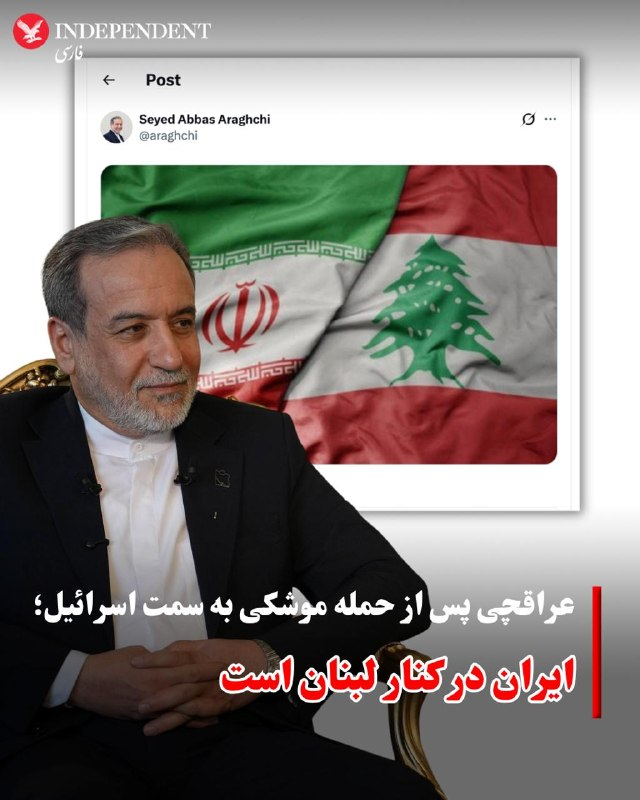

♦️عباس عراقچی یکشنبه‌شب، همزمان با آغاز حملات موشکی ایران به اسرائیل تصویری از پرچم جمهوری اسلامی در کنار لبنان منتشر کرد. ایران در پاسخ به حملات اسرائیل به ضاحیه بیروت، به سمت این کشور موشک شلیک کرد.
‌🇸🇦 Indypersian

🤖 @VahidOOnLine

## VahidOOnLine — post 244174

  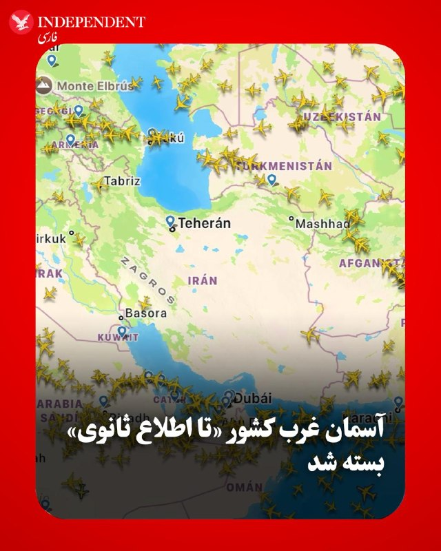

♦️روابط عمومی سازمان هواپیمایی کشوری، یکشنبه‌شب، همزمان با آغاز حملات جمهوری اسلامی ایران به اسرائیل، از بسته شدن آسمان غرب ایران خبر داد. مجید اخوان، سخنگوی سازمان هواپیمایی کشوری، گفت: «با توجه به ارزیابی‌های ایمنی و امنیتی صورت گرفته و با صدور اطلاعیه هوانوردی (نوتام) بخش غربی فضای پروازی کشور تا اطلاع ثانوی بسته اعلام شد.
‌🇸🇦 Indypersian

🤖 @VahidOOnLine

## VahidOOnLine — post 244173

  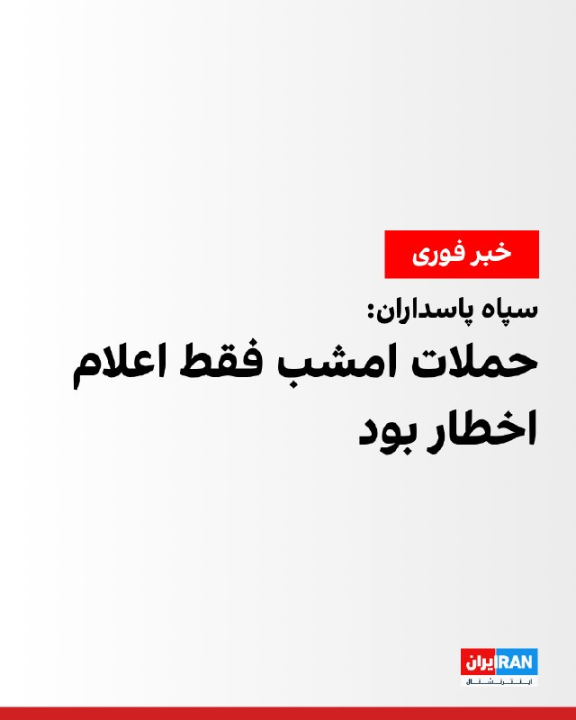

سپاه پاسداران پس از حملات موشکی به اسرائیل در بیانیه‌ای اعلام کرد عملیات شامگاه یک‌شنبه صرفا یک اعلام اخطار بود و در صورت تکرار حملات، پاسخ‌ها گسترده‌تر خواهد بود و تمام اهداف آمریکایی-اسرائیلی را در منطقه در بر خواهد گرفت.

در این بیانیه آمده است: پذیرش آتش‌بس از سوی ما در ۱۹ فروردین ماه مشروط به توقف آتش در تمام جبهه‌ها بود اما مثل همیشه آمریکا و اسرائیل به تعهد خود پایبند نبودند، هم حملات را در لبنان ادامه دادند و هم با تعرض مکرر به سواحل و شناورهای ایرانی در تنگه هرمز، دریای عمان و اقیانوس هند آتش‌بس را نقض کردند.
‌🏁 🇬🇧 IranintlTV

🤖 @VahidOOnLine

## WithYashar — post 13783

  <a href="telegram/content/WithYashar_13783_1780863171.mp4" target="_blank">🎬 Download video</a>

@withyashar

## WithYashar — post 13782

گزارش انفجار‌ در‌فرودگاه تبریز
@withyashar

## WithYashar — post 13781

جنگنده های اسرائیلی به پرواز در امدند
 
منابع اسرائیلی مدعی‌اند حملات فعلی به اهدافی در ایران توسط پهپادهای از پیش مستقرشده انجام می‌شود و جنگنده‌های اسرائیلی هنوز به منطقه عملیات نرسیده‌اند.

به گفته این منابع، حملات کنونی عمدتان مراکز پرتاب را هدف قرار داده و مرحله اصلی عملیات تلافی جویانه هوایی و بمباران توسط جنگنده‌ها همچنان در راه است.
@withyashar
  

## WithYashar — post 13780

فاکس نیوز: مقامات ایرانی معتقدند که ترامپ تمایلی به ورود به یک درگیری گسترده‌تر ندارد و مصمم است جنگ را تقریباً به هر قیمتی به پایان برساند
@withyashar

## WithYashar — post 13779

سی‌ ان‌ ان به نقل از دو منبع اسرائیلی: ما به پرتاب موشک‌ های بالستیک ایران با قدرت پاسخ خواهیم داد
@withyashar

## WithYashar — post 13778

ترامپ به زودی تصمیم نهایی خود را خواهد گرفت
@withyashar

## WithYashar — post 13777

انفجار/رعد برق در تهران گزارش شده
@withyashar

## WithYashar — post 13776

ترامپ به فاکس نیوز :

حمله ای که اسرائیل امروز کرد به بیروت کاملا بدون هماهنگی من بود و از این موضوع خوشحال نیستم
@withyashar

## WithYashar — post 13775

سازمان هواپیمایی کشوری ایران:

حریم هوایی غرب کشور تا اطلاع ثانوی بسته خواهد بود.
@withyashar

## mwarmonitor — post 10300

«بله جان، بعدازظهر بخیر. ایران در پاسخ به حملات اوایل امروزِ ارتش اسرائیل (IDF) به بیروت، پایتخت لبنان، حداقل چهار موج موشکی به سمت اسرائیل شلیک کرده است. من همین الآن مکالمه تلفنی‌ام را با رئیس‌جمهور ترامپ تمام کردم؛ کسی که در حال رصد اوضاع رو به گسترش در…

## mwarmonitor — post 10299

🔴ترامپ به آکسیوس گفته است که همین حالا با نتانیاهو تماس خواهد گرفت و به او خواهد گفت که در پاسخ به این موضوع به ایران حمله نکند.

@mwarmonitor

## mwarmonitor — post 10298

«بله جان، بعدازظهر بخیر. ایران در پاسخ به حملات اوایل امروزِ ارتش اسرائیل (IDF) به بیروت، پایتخت لبنان، حداقل چهار موج موشکی به سمت اسرائیل شلیک کرده است.
من همین الآن مکالمه تلفنی‌ام را با رئیس‌جمهور ترامپ تمام کردم؛ کسی که در حال رصد اوضاع رو به گسترش در سراسر منطقه است. او به من گفت:
"پیشنهاد من به ایران این است: شما موشک‌هایتان را شلیک کردید، دیگر کافی است. به میز مذاکره برگردید و توافق کنید."
رئیس‌جمهور یک بار دیگر خواستار یک حل‌وفصل مذاکره‌محور شد. او همچنین درباره مذاکرات جاری با ایران صحبت کرد و گفت: "ما خیلی نزدیک هستیم؛ من می‌گویم توافق در روزهای دوشنبه، سه‌شنبه یا چهارشنبه هفته پیش‌رو امضا می‌شد و حالا این اتفاق (حمله موشکی) رخ داده است."
بنابراین، قرار است گزارش آخرین وضعیت به رئیس‌جمهور داده شود؛ یعنی همین حمله موشکی بالستیک جاری ایران علیه اسرائیل. اما من از او درباره آن حملات اولیه ارتش اسرائیل که اوایل امروز رخ داد پرسیدم؛ او به من گفت که آن حملات با ایالات متحده هماهنگ نشده بودند. وقتی از او درباره واکنشش به حملات اسرائیل علیه حزب‌الله در بیروت پرسیدم، پرزیدنت ترامپ گفت: "من از این بابت خوشحال نیستم."
اکنون در ابعادی گسترده‌تر، او گفت که شلیک موشکی جاری ایران به سمت اسرائیل در این لحظه قطعاً به مذاکرات کمکی نخواهد کرد، اما باز هم او از ایرانی‌ها می‌خواهد که شلیک این موشکی‌ها را متوقف کنند و به میز مذاکره برگردند تا در نهایت به یک توافق دست یابند.
رئیس‌جمهور درباره قدرت ارتش ایالات متحده و همچنین قدرت محاصره دریایی جاری بنادر ایران توسط آمریکا صحبت کرد. جان، این محاصره در حال حاضر اقتصاد ایران را فلج کرده است. آن‌ها هر روز صدها میلیون دلار از دست می‌دهند و این بخشی از دلیلی است که پرزیدنت ترامپ توانسته این "صبر استراتژیک" را در سراسر خاورمیانه حفظ کند؛ با این درک که در حالی که ایالات متحده در منطقه در حالت آماده‌باش قرار دارد، آن‌ها صرفاً باید این محاصره را حفظ کنند و این کار ایرانی‌ها را به میز مذاکره خواهد کشاند، چرا که با قرار داشتن اقتصادشان تحت چنین فشار شدیدی، گزینه‌هایشان رو به اتمام است.
ما می‌دانیم که صادرات ایران ۹۰ درصد کاهش یافته است. در حال حاضر به دلیل این محاصره دریایی آمریکا، آن‌ها نفت خام را با نرخ ۵۰ درصد استخراج می‌کنند و مقامات منطقه به فاکس نیوز می‌گویند که اوضاع فقط بدتر خواهد شد.
اما در مورد وضعیت فعلی در سراسر منطقه، ما می‌دانیم که مردم در بخش شمالی اسرائیل در این ساعت در پناهگاه‌ها باقی مانده‌اند. این نگرانی وجود دارد که ایرانی‌ها ممکن است به این حمله موشکی بالستیک علیه اسرائیل ادامه دهند. ما تعداد دقیق موشک‌های استفاده شده را نمی‌دانیم. در موج اول، چهار موشک بالستیک ایرانی وجود داشت و سپس سه موج دیگر نیز رخ داد که باز هم در پاسخ به حملات ارتش اسرائیل بود که اوایل امروز علیه حزب‌الله در بیروت انجام شد.
دوباره تکرار می‌کنم، پرزیدنت ترامپ به فاکس نیوز گفت که از آن حملات اسرائیل خوشحال نیست و اشاره کرد که توافق با ایران تنها چند روز فاصله داشت. در این لحظه احتمالاً گزارش وضعیت به او ارائه می‌شود، اما باز هم رئیس‌جمهور به ایران پیشنهاد می‌کند، نقل‌قول می‌کنم:
"شما موشک‌هایتان را شلیک کردید، دیگر کافی است. به میز برگردید و توافق کنید."
دوباره تکرار می‌کنم، پرزیدنت ترامپ به دنبال یک حل‌وفصل مذاکره‌محور است، اما او به فاکس نیوز اشاره کرد که ارتش ایالات متحده قدرتمندترین ارتش در جهان است و در حالت آماده‌باش باقی می‌ماند؛ و پیشنهاد کرد که ایرانی‌ها توافق کنند تا او مجبور به استفاده از ارتش نشود.»

@mwarmonitor

## mwarmonitor — post 10297

  <a href="telegram/content/mwarmonitor_10297_1780863171.mp4" target="_blank">🎬 Download video</a>

🎬 Video

## mwarmonitor — post 10296

🔴به نقل از یک رسانه عراقی وابسته به عربستان: سقوط یک هواپیمای مسافربری در صحرای کربلا. @mwarmonitor

## mwarmonitor — post 10295

❌یک منبع در فرودگاه بغداد به الجزیره: حریم هوایی عراق به روی پروازها بسته شد. @mwarmonitor

## pm_afshaa — post 92664

  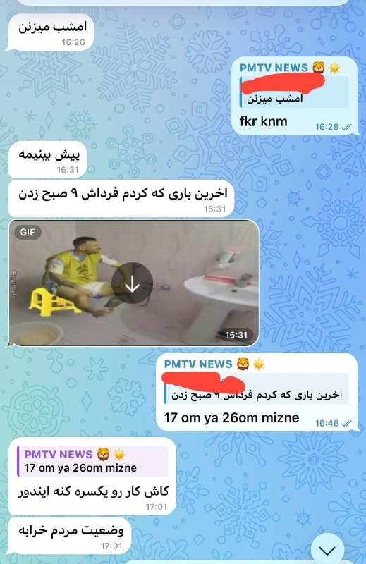

منی که میدونستم جنگ میشه امروز🗿

## pm_afshaa — post 92663

🔴ترامپ: من الان با نتانیاهو تماس میگیرم و بهش میگم به ایران حمله نکنه. 
💧 Rainbet.com the #1 Non-KYC Crypto Casino & Sportsbook @rainbetcom 
😁 @Pm_Afshaa

## pm_afshaa — post 92662

کارشناس صداوسیما: خونه نتانیاهو رو زدیم

💧 Rainbet.com the #1 Non-KYC Crypto Casino & Sportsbook @rainbetcom

😁 @Pm_Afshaa

## pm_afshaa — post 92661

🔴ترامپ: من الان با نتانیاهو تماس میگیرم و بهش میگم به ایران حمله نکنه.

💧 Rainbet.com the #1 Non-KYC Crypto Casino & Sportsbook @rainbetcom

😁 @Pm_Afshaa

## pm_afshaa — post 92660

یک هواپیمای مسافربری در صحرای کربلا سقوط کرد

💧 Rainbet.com the #1 Non-KYC Crypto Casino & Sportsbook @rainbetcom

😁 @Pm_Afshaa

## pm_afshaa — post 92659

ترامپ:اتش بس هنوز پابرجاست

💧 Rainbet.com the #1 Non-KYC Crypto Casino & Sportsbook @rainbetcom

😁 @Pm_Afshaa

## pm_afshaa — post 92658

  <a href="telegram/content/pm_afshaa_92658_1780863174.webm" target="_blank">🎬 Download video</a>

🔴ترامپ: از حملات اسرائیل به لبنان راضی نیستم؛ این حملات با آمریکا هماهنگ نشده بود.

💧 Rainbet.com the #1 Non-KYC Crypto Casino & Sportsbook @rainbetcom

😁 @Pm_Afshaa

## pm_afshaa — post 92657

حریم هوایی سوریه هم کلییر شد

💧 Rainbet.com the #1 Non-KYC Crypto Casino & Sportsbook @rainbetcom

😁 @Pm_Afshaa

## pm_afshaa — post 92656

  <a href="telegram/content/pm_afshaa_92656_1780863174.webm" target="_blank">🎬 Download video</a>

بچه ها سروراتونو میتونین از اینجا تهیه کنینو متصل بمونین
👇
👇

@Lex_server
@Lex_server

## pm_afshaa — post 92655

  <a href="telegram/content/pm_afshaa_92655_1780863175.webm" target="_blank">🎬 Download video</a>

🔴خبرگزاری CNN: اسرائیل برای حملات بسیار قدرتمند به ایران اماده میشه.

💧 Rainbet.com the #1 Non-KYC Crypto Casino & Sportsbook @rainbetcom

😁 @Pm_Afshaa

## pm_afshaa — post 92654

  <a href="telegram/content/pm_afshaa_92654_1780863175.webm" target="_blank">🎬 Download video</a>

🔴ترامپ: قرار بود دوشنبه یا سه‌شنبه توافق صلح رو امضا کنیم. 
💧 Rainbet.com the #1 Non-KYC Crypto Casino & Sportsbook @rainbetcom 
😁 @Pm_Afshaa

## mamlekate — post 103629

📞 جی‌پی‌اس و اینترنت هم باز مختل شده

@mamlekate

## mamlekate — post 103628

📝 ارتش اسرائيل از حمله موشکی جمهوری اسلامی خبر داد

سخنگوی ارتش اسرائیل اواخر روز یکشنبه به وقت محلی گفت که این نیرو اندکی پیش، شلیک موشک‌هایی از ایران به سمت خاک اسرائیل را شناسایی کرد و سیستم‌های دفاعی برای رهگیری این تهدید در حال فعالیت هستند.

@mamlekate

## VahidOnline — post 76001

  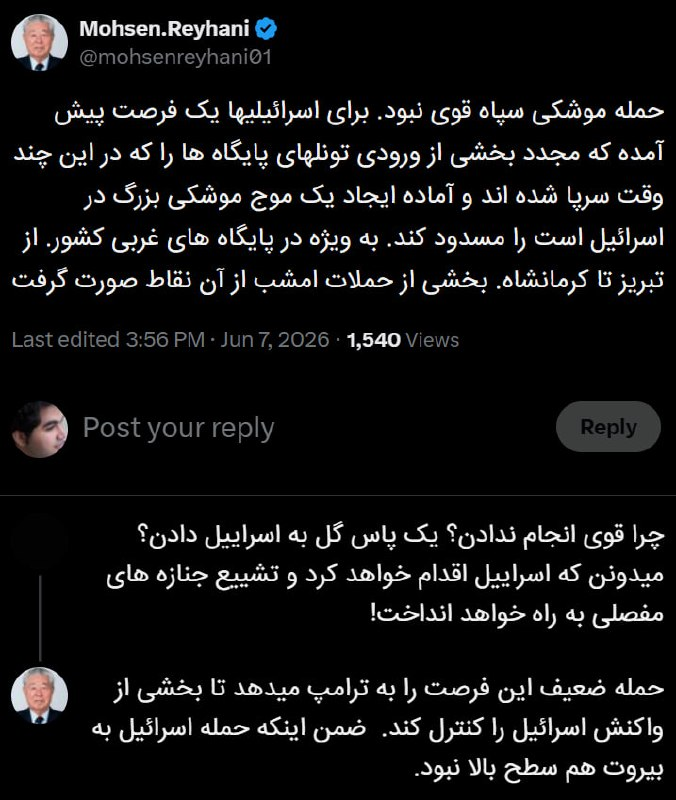

mohsenreyhani01
سپاه پاسداران پس از حملات موشکی به اسرائیل در بیانیه‌ای اعلام کرد عملیات شامگاه یک‌شنبه صرفا یک اعلام اخطار بود و در صورت تکرار حملات، پاسخ‌ها گسترده‌تر خواهد بود و تمام اهداف آمریکایی-اسرائیلی را در منطقه در بر خواهد گرفت.

در این بیانیه آمده است: پذیرش آتش‌بس از سوی ما در ۱۹ فروردین ماه مشروط به توقف آتش در تمام جبهه‌ها بود اما مثل همیشه آمریکا و اسرائیل به تعهد خود پایبند نبودند، هم حملات را در لبنان ادامه دادند و هم با تعرض مکرر به سواحل و شناورهای ایرانی در تنگه هرمز، دریای عمان و اقیانوس هند آتش‌بس را نقض کردند.
@VahidOOnLine

📡 @VahidOnline

## kianmeli1 — post 87742

  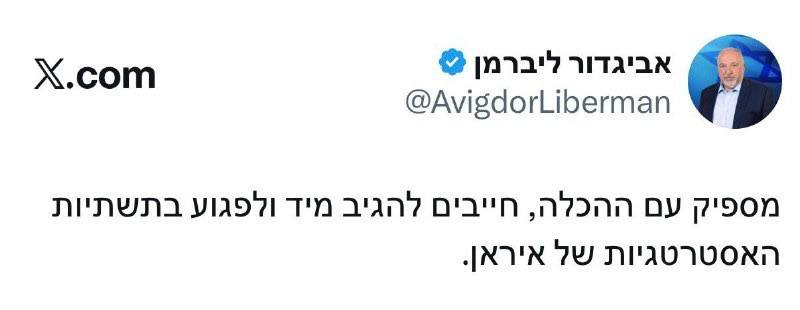

🔴فوری-رئیس حزب اسرائیل بیتنو، نماینده کنست آویگدور لیبرمن: «تحمل کافیست، باید فوراً واکنش نشان داد و به زیرساخت‌های استراتژیک ایران ضربه زد»

## kianmeli1 — post 87741

🔴فعالیت جنگنده‌های ارتش بر فراز آسمان تهران
https://t.me/kianmeli1

## kianmeli1 — post 87740

🔴فوری -ترامپ:

به نتانیاهو خواهم گفت به ایران حمله نکند
https://t.me/kianmeli1

## kianmeli1 — post 87739

🔴فوری

حساب منتسب به مجتبی خامنه‌ای : نفس رژیم لرزان صهیونیستی به شماره افتاده است.
https://t.me/kianmeli1

## kianmeli1 — post 87738

🔴فوری

هلال احمر ایران به حالت آماده باش در آمد
https://t.me/kianmeli1

## kianmeli1 — post 87737

🔴فوری

سی‌ان‌ان به نقل از دو منبع اسرائیلی: ما به پرتاب موشک‌های بالستیک ایران با قدرت پاسخ خواهیم داد.
https://t.me/kianmeli1

## IranIntlTV — post 341052

  <a href="telegram/content/IranIntlTV_341052_1780863177.mp4" target="_blank">🎬 Download video</a>

پس از حملات موشکی جمهوری اسلامی به اسرائیل، کابینه امنیتی این کشور به ریاست بنیامین نتانیاهو تشکیل جلسه داده است.

انتظار می‌رود این کابینه در ساعات آینده درباره نحوه پاسخ به این حملات تصمیم‌گیری کند.

گزارش بابک اسحاقی، خبرنگار ایران‌اینترنشنال
@iranintltv

## IranIntlTV — post 341051

  

سپاه پاسداران پس از حملات موشکی به اسرائیل در بیانیه‌ای اعلام کرد عملیات شامگاه یک‌شنبه صرفا یک اعلام اخطار بود و در صورت تکرار حملات، پاسخ‌ها گسترده‌تر خواهد بود و تمام اهداف آمریکایی-اسرائیلی را در منطقه در بر خواهد گرفت.

در این بیانیه آمده است: پذیرش آتش‌بس از سوی ما در ۱۹ فروردین ماه مشروط به توقف آتش در تمام جبهه‌ها بود اما مثل همیشه آمریکا و اسرائیل به تعهد خود پایبند نبودند، هم حملات را در لبنان ادامه دادند و هم با تعرض مکرر به سواحل و شناورهای ایرانی در تنگه هرمز، دریای عمان و اقیانوس هند آتش‌بس را نقض کردند.
https://iranintl.com/202606072673

## Shin_Persian — post 6653

  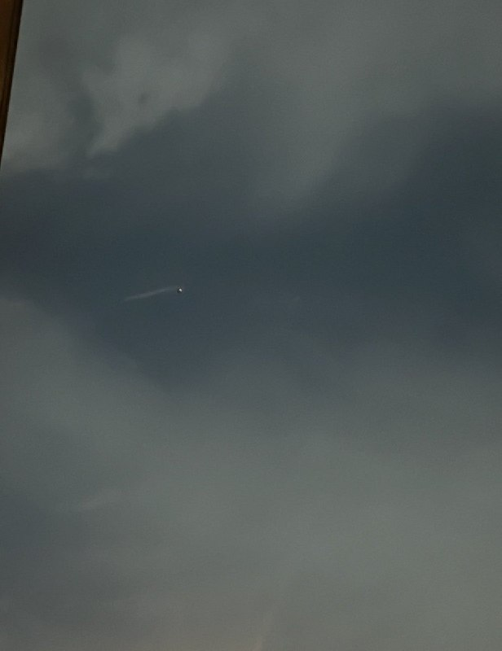

Shin ✓ @hey_itsmyturn
Sun, 07 Jun 2026 20:10:34 UTC

Earlier @ 1926Z
Southwestern Tehran, #Tehran Province, #Iran

فارسی

پیش‌تر در ۱۹۲۶ زولو (۲۲:۵۶ به وقت تهران)
جنوب غربی تهران، استان #تهران، #ایران

𝕏 · @shin_persian

## Shin_Persian — post 6652

Shin ✓ @hey_itsmyturn
Sun, 07 Jun 2026 20:08:27 UTC

GPS jamming in Iran.

فارسی

اختلال در جی‌پی‌اس (GPS) در ایران.

𝕏 · @shin_persian

## Shin_Persian — post 6651

Shin ✓ @hey_itsmyturn
Sun, 07 Jun 2026 20:06:55 UTC

Iraqi FIR will REMAIN closed for 72 hours.
#Iraq 🇮🇶

فارسی

منطقه اطلاعات پروازی (FIR) عراق به مدت ۷۲ ساعت بسته باقی خواهد ماند.
#Iraq 🇮🇶

𝕏 · @shin_persian

## Shin_Persian — post 6650

  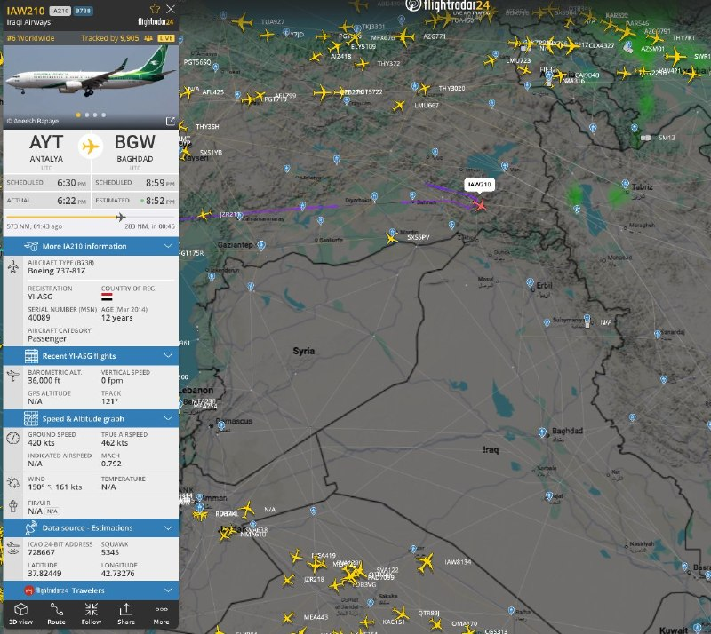

Shin ✓ @hey_itsmyturn
Sun, 07 Jun 2026 20:05:39 UTC

Iraqi FIR is closed at the moment.

فارسی

حریم هوایی عراق (FIR) در حال حاضر بسته است.

𝕏 · @shin_persian

## Shin_Persian — post 6649

Shin ✓ @hey_itsmyturn
Sun, 07 Jun 2026 20:04:29 UTC

IRIB: Airspace over Western Iran has been closed.

فارسی

صدا و سیما (IRIB): حریم هوایی بر فراز غرب ایران بسته شده است.

𝕏 · @shin_persian

## FarsiVOA — post 219928

  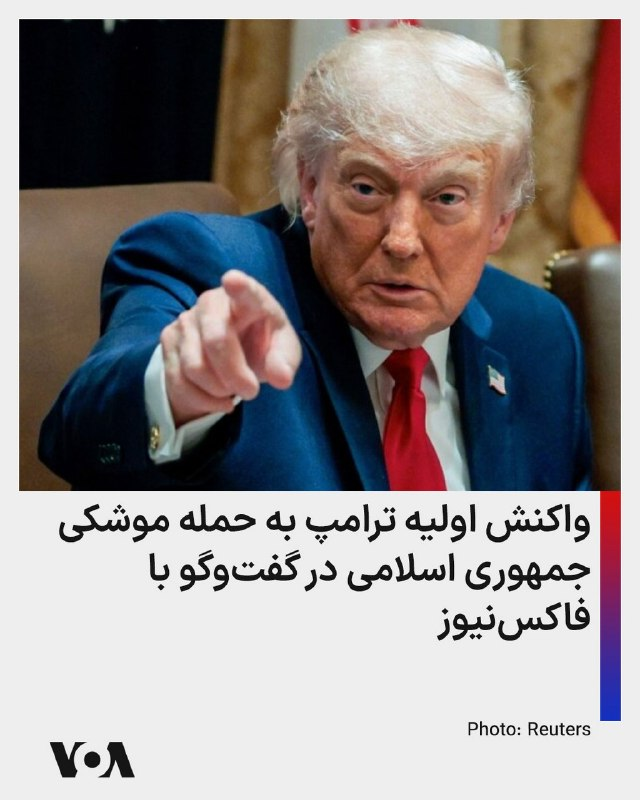

⚡️خبرنگار فاکس‌نیوز، تری یینگست، می‌گوید با رئیس جمهوری آمریکا، دونالد ترامپ صحبت کرده است و آقای ترامپ به فاکس نیوز گفت: «آنچه به [جمهوری اسلامی] ایران پیشنهاد می‌کنم این است که شما موشک‌هایتان را شلیک کرده‌اید، دیگر کافی است. به میز مذاکره برگردید و توافق کنید.»
@FarsiVOA

## Persian_Trend_Official — post 15983

⭕️ خبرگزاری CNN:

اسرائیل برای حملات بسیار سنگین به ایران آماده می‌شود.

📝 Nick

📌 @persian_trend_official
پرشین ترند | متفاوت‌ترین کانال نظامی

## RadioFarda — post 158014

  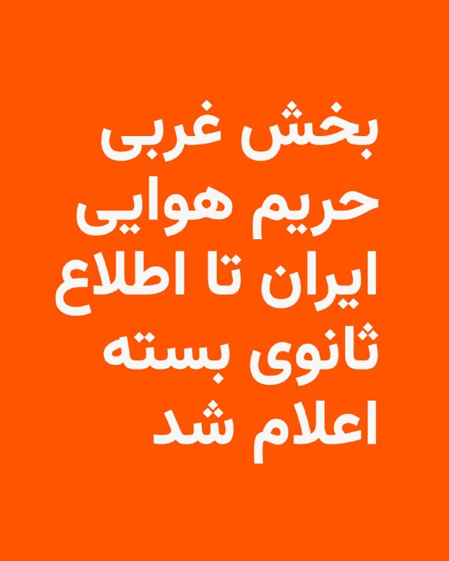

🔸سخنگوی سازمان هواپیمایی ایران از بسته شدن بخش غربی فضای پروازی این کشور تا اطلاع ثانوی خبر داد.

🔸همچنین بر اساس گزارش‌ها در پی حملات ایران به اسرائیل، آسمان عراق نیز بسته شده است.

@RadioFarda

## RadioFarda — post 158013

  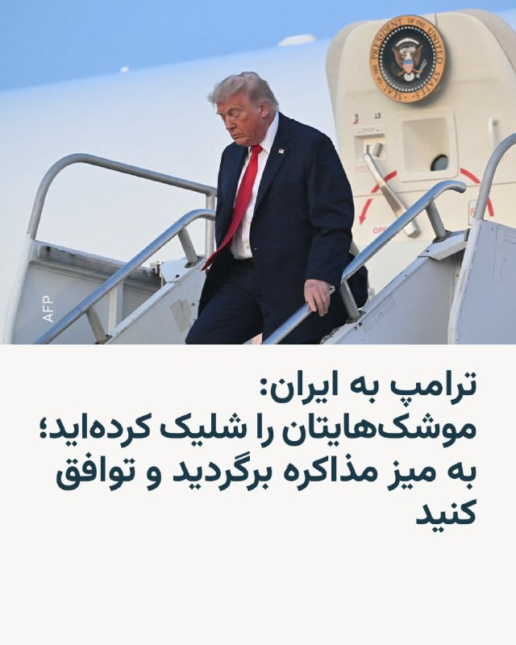

🔸دونالد ترامپ، رئیس‌جمهور آمریکا، دقایقی بعد از حملات موشکی ایران به اسرائیل خواستار توقف این حملات و بازگشت تهران به میز مذاکره شد.

🔸او شامگاه یکشنبه به شبکه خبری فاکس نیوز گفت: «پیشنهادی که به ایران دارم این است: موشک‌های خود را شلیک کرده‌اید؛ همین کافی است. به میز مذاکره بازگردید و توافقی حاصل کنید.»

@RadioFarda

## IranianMinds — post 21662

🔴 ترامپ :

مذاکرات رو ادامه میدیم.

@IranianMinds

## IranianMinds — post 21661

🔴 حریم هوایی عراق کاملا بسته شد. @IranianMinds

## IranianMinds — post 21660

🔴رسانه‌های اسرائیلی:

ایران ۱۰ موشک به سوی اسرائیل شلیک کرد و همشون رهگیری و منهدم شدن.

@IranianMinds

## IranianMinds — post 21659

🔴 فوری ترامپ به باراک راوید:

الان با نتانیاهو تماس می‌گیرم و به او می‌گویم که در پاسخ، به ایران حمله نکند!

@IranianMinds

## IranianMinds — post 21658

  <a href="telegram/content/IranianMinds_21658_1780863181.mp4" target="_blank">🎬 Download video</a>

🔴 ترامپ به فاکس نیوز:

«من فکر می‌کردم که یک توافق در روز دوشنبه، سه‌شنبه یا چهارشنبه هفته پیشِ رو امضا خواهد شد، اما حالا این اتفاق ( حمله جمهوری اسلامی به اسرائیل ) رخ داده است.»

@IranianMinds

## IranianMinds — post 21657

🔴خبرگزاری CNN:

اسرائیل برای حملات بسیار سنگین به ایران آماده می‌شود.

@IranianMinds

## IranianMinds — post 21656

🔴 حریم هوایی عراق کاملا بسته شد.

@IranianMinds

## IranianMinds — post 21655

فقط بودن توی خاورمیانست که با شنیدن صدای رعد و برق سوتون بدنتونو میلرزونه👍🏽

@IranianMinds

## BBCPersian — post 283092

🔻ترامپ خطاب به ایران: موشک‌هایتان را شلیک کرده‌اید. دیگر بس است. به میز مذاکره برگردید

دونالد ترامپ، رئیس جمهور آمریکا، پس از شلیک موشک‌های ایران به شمال اسرائیل، از ایران خواست تا به میز مذاکره بازگردد.

دونالد ترامپ در گفتگو با شبکه تلویزیونی آمریکایی فاکس نیوز، پیامی را برای ایران به اشتراک گذاشت: «شما موشک‌هایتان را شلیک کرده‌اید. دیگر بس است. به میز مذاکره برگردید و توافق کنید.»

https://bbc.in/4eafvAI
@BBCPersian

## BBCPersian — post 283091

🔻ارتش اسرائیل می‌گوید تمام موشک‌های شلیک شده از ایران را رهگیری کرده است

نیروی هوایی اسرائیل می‌گوید «تاکنون تمام موشک‌های شلیک شده از ایران» را رهگیری کرده است.

نیروی هوایی اسرائیل همچنین گفته است که «به طور مداوم در حال شناسایی و رهگیری تهدیدها» است.

https://bbc.in/4eafvAI
@BBCPersian

## Dirty_Kids — post 391269

  <a href="telegram/content/Dirty_Kids_391269_1780863182.mp4" target="_blank">🎬 Download video</a>

نقض نخواهد شد
اتفاقی نخواهد افتاد

@Dirty_Kids 👻

## alonews — post 125977

  <a href="telegram/content/alonews_125977_1780863183.webm" target="_blank">🎬 Download video</a>

👈فعالیت جنگنده‌های ارتش بر فراز آسمان تهران

✅ @AloNews خبر جنگ

## alonews — post 125976

  <a href="telegram/content/alonews_125976_1780863183.webm" target="_blank">🎬 Download video</a>

🔴فووری/ ترامپ به کانال۱۲: به نتانیاهو خواهم گفت به ایران حمله نکند

✅ @AloNews خبر جنگ

## alonews — post 125975

  <a href="telegram/content/alonews_125975_1780863183.webm" target="_blank">🎬 Download video</a>

👈رویترز به نقل از یک منبع ارشد ایرانی:
تمام پایگاه‌های آمریکایی در منطقه در صورت انجام حملات از سوی اسرائیل، اهداف مشروعی برای تهران خواهند بود

✅ @AloNews خبر جنگ

## alonews — post 125974

  <a href="telegram/content/alonews_125974_1780863183.webm" target="_blank">🎬 Download video</a>

👈کارشناس صدا و سیما: خونه نتانیاهو رو زدیم

✅ @AloNews خبر جنگ

## alonews — post 125973

  <a href="telegram/content/alonews_125973_1780863184.webm" target="_blank">🎬 Download video</a>

👈فاکس نیوز: مقامات ایرانی معتقدند که ترامپ تمایلی به ورود به یک درگیری گسترده‌تر ندارد و مصمم است جنگ را تقریباً به هر قیمتی به پایان برساند

✅ @AloNews خبر جنگ

## alonews — post 125972

  <a href="telegram/content/alonews_125972_1780863184.webm" target="_blank">🎬 Download video</a>

👈ترامپ به فاکس نیوز: حمله ایران قطعاً به مذاکرات کمکی نخواهد کرد.

✅ @AloNews خبر جنگ

---
📅 بروزرسانی: 1405/03/17 23:33
---

## VahidOOnLine — post 244172

  <a href="telegram/content/VahidOOnLine_244172_1780862600.mp4" target="_blank">🎬 Download video</a>

ویدیویی که شامگاه یکشنبه ۱۷ خرداد به دست ایران‌اینترنشنال رسیده پرواز موشک‌های جمهوری اسلامی را از کرمانشاه به سمت اسرائیل نشان می‌دهد.
‌🏁 🇬🇧 IranintlTV

🤖 @VahidOOnLine

## VahidOOnLine — post 244171

  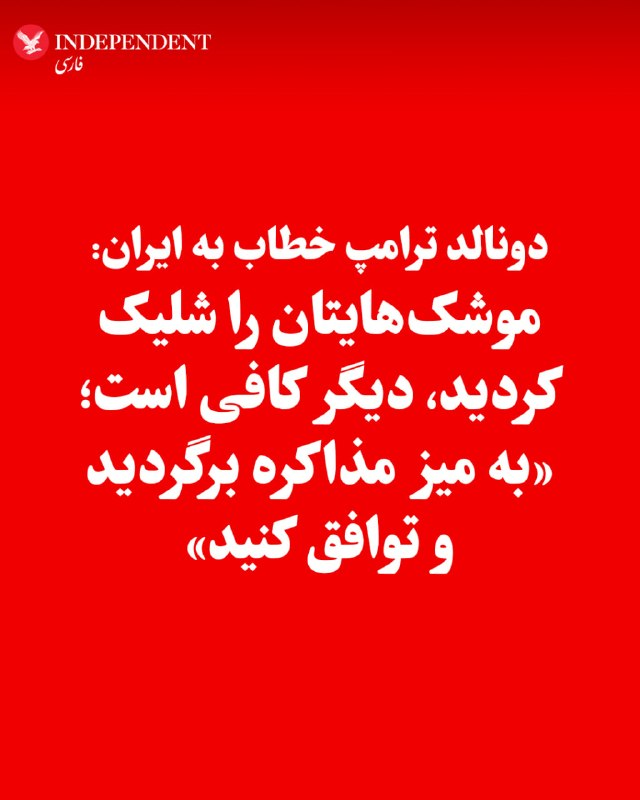

♦️دونالد ترامپ، رئیس جمهوری ایالات متحده، یکشنبه‌شب، در واکنش به حملات موشکی جمهوری اسلامی ایران به اسرائیل، در مصاحبه با «فاکس نیوز» گفت:‌ «پیشنهاد من به ایران این است؛ شما موشک‌هایتان را شلیک کردید، دیگر کافی است. به میز مذاکره برگردید و توافق کنید».
‌🇸🇦 Indypersian

🤖 @VahidOOnLine

## VahidOOnLine — post 244170

  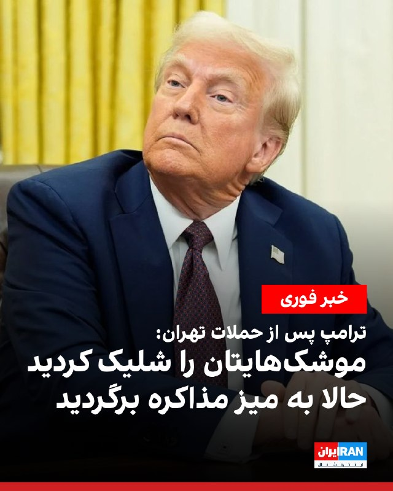

دونالد ترامپ به شبکه فاکس نیوز گفت: «پیشنهادی که به ایران دارم این است: موشک‌های خود را شلیک کرده‌اید، همین کافی است.»

او افزود: «به میز مذاکره بازگردید و توافق کنید.»
‌🏁 🇬🇧 IranintlTV

🤖 @VahidOOnLine

## VahidOOnLine — post 244169

  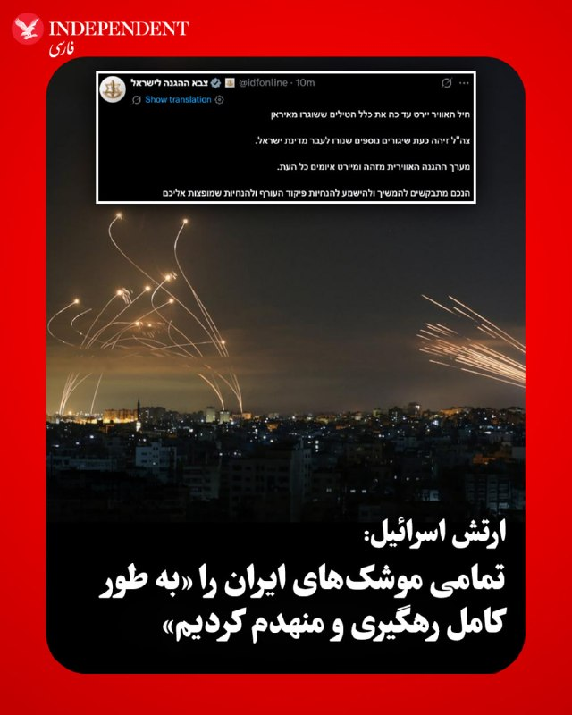

♦️ارتش اسرائیل، یکشنبه‌شب، اعلام کرد که نیروی هوایی این کشور تاکنون موفق شده است تمامی موشک‌های شلیک‌شده از سوی ایران را به طور کامل رهگیری و منهدم کند. با این حال، نیروهای دفاعی اسرائیل تاکید کردند که رادارهای پدافندی به تازگی موج جدیدی از شلیک‌ها و پرتابه‌های موشکی را شناسایی کرده‌اند که از خاک ایران به سمت اسرائیل هدف‌گیری شده‌اند.
‌🇸🇦 Indypersian

🤖 @VahidOOnLine

## VahidOOnLine — post 244168

  <a href="telegram/content/VahidOOnLine_244168_1780862603.mp4" target="_blank">🎬 Download video</a>

♦️خبرگزاری مهر، یکشنبه‌شب، ۱۷ خردادماه، تصاویری از موشک‌های شلیک شده به سمت اسرائیل را در آسمان کرمانشاه منتشر کرد. همزمان، قرارگاه خاتم‌الانبیا، با انتشار بیانیه‌ای، شلیک موشک‌های ایران به سمت مواضع اسرائیل را تحقق هشدارهای قبلی تهران خواند و اعلام کرد: «در صورت گسترش حملات اسرائیل به بیروت و یا پاسخ به اقدام ایران با ضربات کوبنده تر و پشیمان کننده روبرو و حملات ویرانگری علیه اسرائیل و حامیان آن آغاز خواهد شد».
‌🇸🇦 Indypersian

🤖 @VahidOOnLine

## WithYashar — post 13774

ترامپ: قرار بود دوشنبه یا سه‌شنبه توافق صلح را امضا کنیم.
@withyashar

## WithYashar — post 13773

ارتش اسرائیل : در مجموع 12 موشک بالستیک شلیک شد که تمام آن رهگیری یا به منطقه‌ای باز اصابت کرد
@withyashar

## WithYashar — post 13772

ترامپ: توافق با ایران در دسترسه و بهش نزدیکیم.
@withyashar

## WithYashar — post 13771

حوثی ها منتظر دستور بستن تنگه باب المندب هستیم
@withyashar

## WithYashar — post 13770

ترامپ به فاکس نیوز: آنچه به ایران توصیه می‌کنم: موشک‌هایتان را پرتاب کرده‌اید، همین کافی است

@withyashar

## mwarmonitor — post 10294

📌ترامپ می‌گوید حملات اسرائیل در لبنان با ایالات متحده هماهنگ نشده بود و او از این موضوع راضی نیست.

@mwarmonitor

## mwarmonitor — post 10293

🔴 «عراق به دلایل عملیاتی یک NOTAM صادر کرده و حریم هوایی خود را بسته است.» @mwarmonitor

## mwarmonitor — post 10292

🔴 فوری | سی‌ان‌ان به نقل از دو منبع اسرائیلی: ما به شلیک موشک‌های بالستیک ایران با قدرت پاسخ خواهیم داد.

@mwarmonitor

## mwarmonitor — post 10291

🔴به نقل از یک رسانه عراقی وابسته به عربستان: سقوط یک هواپیمای مسافربری در صحرای کربلا.

@mwarmonitor

## mwarmonitor — post 10290

  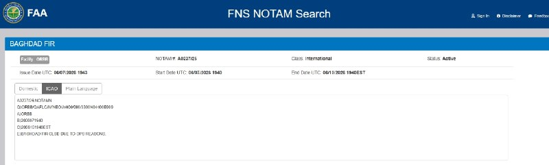

🔴 «عراق به دلایل عملیاتی یک NOTAM صادر کرده و حریم هوایی خود را بسته است.»

@mwarmonitor

## pm_afshaa — post 92653

  <a href="telegram/content/pm_afshaa_92653_1780862605.webm" target="_blank">🎬 Download video</a>

🔴ترامپ: قرار بود دوشنبه یا سه‌شنبه توافق صلح رو امضا کنیم.

💧 Rainbet.com the #1 Non-KYC Crypto Casino & Sportsbook @rainbetcom

😁 @Pm_Afshaa

## pm_afshaa — post 92652

از مکان های نظامی فاصله بگیرین

💧 Rainbet.com the #1 Non-KYC Crypto Casino & Sportsbook @rainbetcom

😁 @Pm_Afshaa

## pm_afshaa — post 92651

⭕️
⭕️
⭕️
⭕️
⭕️

## pm_afshaa — post 92650

♨️
♨️
♨️
♨️
♨️
♨️

## pm_afshaa — post 92649

رعد و برقه؟

## pm_afshaa — post 92648

سی‌ان‌ان به نقل از دو منبع اسرائیلی: ما به پرتاب موشک‌های بالستیک ایران با قدرت پاسخ خواهیم داد

💧 Rainbet.com the #1 Non-KYC Crypto Casino & Sportsbook @rainbetcom

😁 @Pm_Afshaa

## pm_afshaa — post 92647

تهرانو زدن!؟

## pm_afshaa — post 92646

ورود پهپادهای به غرب کشور

💧 Rainbet.com the #1 Non-KYC Crypto Casino & Sportsbook @rainbetcom

😁 @Pm_Afshaa

## pm_afshaa — post 92645

  <a href="telegram/content/pm_afshaa_92645_1780862605.webm" target="_blank">🎬 Download video</a>

🔴رویترز به نقل از یک منبع ایرانی:
اگر اسرائیل به حملات موشکی ایران پاسخ بده، ما هم قطعاً پاسخ خواهیم داد.

💧 Rainbet.com the #1 Non-KYC Crypto Casino & Sportsbook @rainbetcom

😁 @Pm_Afshaa

## pm_afshaa — post 92644

عراق هم نوتام اعلام کرد

💧 Rainbet.com the #1 Non-KYC Crypto Casino & Sportsbook @rainbetcom

😁 @Pm_Afshaa

## pm_afshaa — post 92643

  <a href="telegram/content/pm_afshaa_92643_1780862606.webm" target="_blank">🎬 Download video</a>

🔴ارتش اسرائیل: در مجموع 12 موشک بالستیک شلیک شد که تمام آن رهگیری یا به منطقه‌ای باز اصابت کرد.

💧 Rainbet.com the #1 Non-KYC Crypto Casino & Sportsbook @rainbetcom

😁 @Pm_Afshaa

## pm_afshaa — post 92642

ترافیک سنگین در پمپ بنزین های تهران

💧 Rainbet.com the #1 Non-KYC Crypto Casino & Sportsbook @rainbetcom

😁 @Pm_Afshaa

## pm_afshaa — post 92640

پرواز جنگنده‌ها در آسمان عراق

💧 Rainbet.com the #1 Non-KYC Crypto Casino & Sportsbook @rainbetcom

😁 @Pm_Afshaa

## pm_afshaa — post 92639

♨️
♨️
♨️
♨️

## pm_afshaa — post 92638

  <a href="telegram/content/pm_afshaa_92638_1780862606.webm" target="_blank">🎬 Download video</a>

🔴ترامپ به فاکس نیوز: توصیه من به ایران اینه که شما موشک هایتان رو شلیک کردید و کافی است و به میز مذاکره برگردید و توافق کنید. 
💧 Rainbet.com the #1 Non-KYC Crypto Casino & Sportsbook @rainbetcom 
😁 @Pm_Afshaa

## pm_afshaa — post 92637

  <a href="telegram/content/pm_afshaa_92637_1780862607.webm" target="_blank">🎬 Download video</a>

🔴مقام ارشد اسرائیلی: ارتش اسرائیل در حال آماده سازی برای حمله به ایرانه.

💧 Rainbet.com the #1 Non-KYC Crypto Casino & Sportsbook @rainbetcom

😁 @Pm_Afshaa

## pm_afshaa — post 92636

🔴صداهایی که در تبریز به گوش می‌رسد مربوط به درگیری پدافند با ریز پرنده و پهپاد های احتمالی است

💧 Rainbet.com the #1 Non-KYC Crypto Casino & Sportsbook @rainbetcom

😁 @Pm_Afshaa

## DEJradio — post 5441

  <a href="telegram/content/DEJradio_5441_1780862607.mp4" target="_blank">🎬 Download video</a>

🚀 
⭕️ براساس گزارش منابع میدانی، یکشنبه شب ۱۷ خرداد ۱۴۰۵ دستکم هشت فروند موشک بالستیک از اصفهان به سمت اسرائیل پرتاب شد.

#حملات_موشکی #اسرائیل
@DEJradio

## VahidOnline — post 76000

  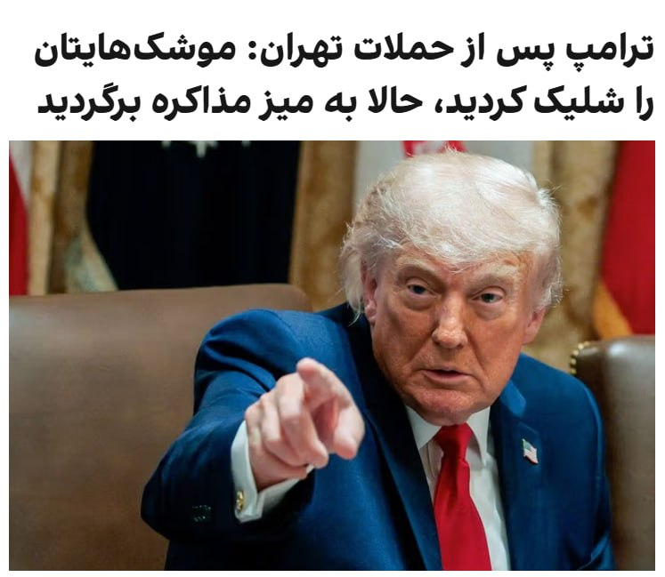

دونالد ترامپ به شبکه فاکس نیوز گفت: پیشنهادی که به ایران دارم این است: موشک‌های خود را شلیک کرده‌اید، همین کافی است.
او افزود: به میز مذاکره بازگردید و توافق کنید.
@VahidOOnLine

📡 @VahidOnline

## kianmeli1 — post 87736

  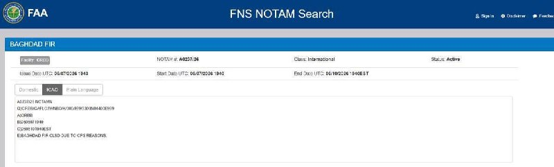

🔴فوری

عراق حریم هوایی خود را بست
https://t.me/kianmeli1

## kianmeli1 — post 87735

🔴فوری / ترامپ: نیروهای نظامی آمریکا در حالت آماده‌باش هستند
https://t.me/kianmeli1

## kianmeli1 — post 87734

🔴فوری

حوثی ها منتظر دستور بستن تنگه باب المندب هستیم
https://t.me/kianmeli1

## IranIntlTV — post 341050

  <a href="telegram/content/IranIntlTV_341050_1780862608.mp4" target="_blank">🎬 Download video</a>

محمد قائدی، مدرس روابط بین‌الملل در دانشگاه جورج واشینگتن، گفت: «احتمالا اسرائیل در واکنش به حمله موشکی جمهوری اسلامی، حملات محدودی انجام دهد.» او افزود: «اسرائیل ممکن است همان مناطقی را در ایران هدف قرار دهد که این حملات از آنجا صورت گرفته است.»
@iranintltv

## IranIntlTV — post 341049

ویدیویی که شامگاه یکشنبه ۱۷ خرداد به دست ایران‌اینترنشنال رسیده پرواز موشک‌های جمهوری اسلامی را از کرمانشاه به سمت اسرائیل نشان می‌دهد.

## IranIntlTV — post 341048

  

دونالد ترامپ به شبکه فاکس نیوز گفت: «پیشنهادی که به ایران دارم این است: موشک‌های خود را شلیک کرده‌اید، همین کافی است.»

او افزود: «به میز مذاکره بازگردید و توافق کنید.»
https://iranintl.com/202606075645

## Shin_Persian — post 6648

  

Shin ✓ @hey_itsmyturn
Sun, 07 Jun 2026 20:00:41 UTC

AA activity, Khorzuq, #Isfahan Province, #Iran

فارسی

فعالیت پدافند هوایی، خورزوق، استان #اصفهان، #ایران

𝕏 · @shin_persian

## Shin_Persian — post 6647

Shin ✓ @hey_itsmyturn
Sun, 07 Jun 2026 19:54:03 UTC

IRIAF CAP over Tehran

فارسی

گشت هوایی رزمی (CAP) نیروی هوایی ارتش جمهوری اسلامی ایران (IRIAF) بر فراز تهران

𝕏 · @shin_persian

## Iliaen — post 4450

تمنا می‌شود از اماکن نظامی فاصله بگیرید.

از آنجا که تا این لحظه، موشک‌ها از سایت‌های موشکی اشتهارد، قم، اصفهان، کرمانشاه، تبریز و ارومیه شلیک شدند، احتمال حمله به سایت‌ها و مناطق نظامی در این محدوده‌ها محتمل‌تر است و باید دقت بیشتری کرد.

@iliaen

## FarsiVOA — post 219927

  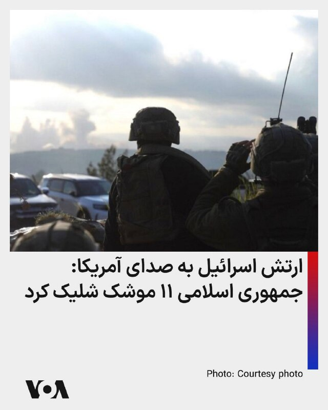

⚡️ارتش اسرائيل به صدای آمریکا گفت که جمهوری اسلامی تاکنون یازده موشک به سمت اسرائيل شلیک کرده است. پیشتر نیروی هوایی اسرائيل گفته است همه موشک‌ها منهدم شده‌اند.
@FarsiVOA

## FarsiVOA — post 219926

  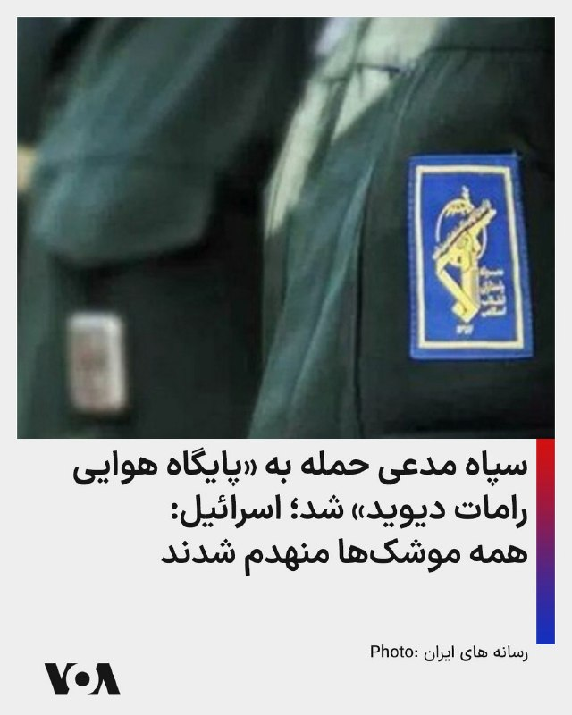

⚡️در حالی که ارتش اسرائيل اعلام کرده تاکنون همه موشک‌های شلیک‌شده از سوی جمهوری اسلامی را منهدم کرده‌است، سپاه پاسداران مدعی شد در پاسخ به حملات اسرائيل در جنوب لبنان، مناطق صور و نبطیه، و سایر نقاط از جمله ضاحیه بیروت، «پایگاه هوایی رامات دیوید» را هدف حملات موشکی بالیستیک قرار داده است.
@FarsiVOA

## Persian_Trend_Official — post 15982

  <a href="telegram/content/Persian_Trend_Official_15982_1780862612.webm" target="_blank">🎬 Download video</a>

⭕️ کاهش چشم‌گیر سرعت اینترنت در ایران!

📝 Nick

📌 @persian_trend_official
پرشین ترند | متفاوت‌ترین کانال نظامی

## Persian_Trend_Official — post 15981

  <a href="telegram/content/Persian_Trend_Official_15981_1780862612.mp4" target="_blank">🎬 Download video</a>

🎬 Video

## Persian_Trend_Official — post 15980

⭕️ ترامپ: پیشنهاد من به ایران این است: موشک‌هایتان را شلیک کرده‌اید، کافی است. به میز مذاکره بازگردید و معامله‌ای انجام دهید. 📝 Nick 📌 @persian_trend_official پرشین ترند | متفاوت‌ترین کانال نظامی

## Persian_Trend_Official — post 15979

⭕️ ترامپ: پیشنهاد من به ایران این است: موشک‌هایتان را شلیک کرده‌اید، کافی است. به میز مذاکره بازگردید و معامله‌ای انجام دهید.

📝 Nick

📌 @persian_trend_official
پرشین ترند | متفاوت‌ترین کانال نظامی

## Persian_Trend_Official — post 15978

⭕️ اسرائیل به فارسی:

نیروی هوایی اسرائیل همه موشک‌های شلیک شده تا این لحظه را رهگیری کرد.

📝 Nick

📌 @persian_trend_official
پرشین ترند | متفاوت‌ترین کانال نظامی

## IranianMinds — post 21654

طبق گفته ممبرا تهران صدای انفجار اومده @IranianMinds

## IranianMinds — post 21653

طبق گفته ممبرا
تهران صدای انفجار اومده

@IranianMinds

## IranianMinds — post 21652

🔴 فوری ترامپ به فاکس نیوز: «پیشنهادی که به ایران دارم این است: موشک‌هایتان را شلیک کرده‌اید، کافی است. به میز مذاکره برگردید و یک توافق انجام دهید.» @IranianMinds

## BBCPersian — post 283090

🔻اطلاعیه قرارگاه خاتم‌الانبیا: اسرائیل در صورت گسترش حملات به بیروت، یا پاسخ به اقدام ایران با ضربات کوبنده‌تری روبرو خواهد شد

در پی اعلام اسرائیل مبنی بر حمله موشکی ایران به شمال این کشور ، قرارگاه خاتم‌الانبیا در اطلاعیه‌ای گفته است که اسرائیل در صورت گسترش حملات به بیروت، یا پاسخ به اقدام ایران با ضربات کوبنده‌تری روبرو خواهد شد.

در این اطلاعیه آمده است: قبلا اخطار داده بودیم در صورت گسترش حملات در ضاحیه بیروت، اهدافی را در اسرائیل مورد هجوم قرار می‌دهیم.

بر اساس گزارش خبرگزاری های ایران فرمانده قرارگاه خاتم‌الانبیا در این اطلاعیه گفته است که اسرائیل با نقض مکرر آتش‌بس با چراغ سبز و حمایت آمریکا و سکوت مجامع بین المللی حملات خود به لبنان را افزایش داده و با استفاده از «سلاح‌های ممنوعه از جمله بمب های فسفری مرتکب جنایات جنگی شده است.»

https://bbc.in/4eafvAI
@BBCPersian

## Dirty_Kids — post 391268

  <a href="https://t.me/Dirty_Kids/391268" target="_blank">📎 Download file</a>

🚨 برای اینکه درک کنید الان چقدر شرایط جنگیه :

@Dirty_Kids 👻

## Dirty_Kids — post 391267

🔴 فوریییی، ترامپ: من به ایران میگم موشک هاتون رو شلیک کردین بسه، برگردین سر میز مذاکره و معامله کنین😐😂

@Dirty_Kids 👻

## Dirty_Kids — post 391266

حمله‌ی ایران بیشتر به نت من آسیب زد تا اسرائیل.

@Dirty_Kids 👻

## alonews — post 125971

  <a href="telegram/content/alonews_125971_1780862615.webm" target="_blank">🎬 Download video</a>

👈ترامپ ادعا کرد که از حملات امروز اسرائیل راضی نیست

✅ @AloNews خبر جنگ

## alonews — post 125970

  <a href="telegram/content/alonews_125970_1780862615.webm" target="_blank">🎬 Download video</a>

👈پروازها در غرب کشور متوقف شد

✅ @AloNews خبر جنگ

## alonews — post 125969

  <a href="telegram/content/alonews_125969_1780862615.webm" target="_blank">🎬 Download video</a>

🔴فوری / عراق نوتام اعلام کرد و حریم هواییش رو بست

✅ @AloNews خبر جنگ

## alonews — post 125968

  <a href="telegram/content/alonews_125968_1780862615.webm" target="_blank">🎬 Download video</a>

🔴فوری / سی‌ان‌ان به نقل از دو منبع اسرائیلی: ما به پرتاب موشک‌های بالستیک ایران با قدرت پاسخ خواهیم داد.

✅ @AloNews خبر جنگ

## alonews — post 125967

  

✅با سابقه ۵ سال فعالیت مداوم

🛡حتی بدون قطعی تو دوران جنگ

🌐 با ما همراه شو و در زمان قطعی
وصل بمون 
😎

بقیه هنوز VPN حجمی میفروشن
اونم با قیمتای نجومی 
🚀

✅ از ما با کمترین قیمت ، بهترین سرویس رو بگیر 
👀
😍

💥بدون محدودیت حجم
⬇️
⬇️
⬇️
@NetAazaadBot
@NetAazaadBot

## alonews — post 125966

  <a href="telegram/content/alonews_125966_1780862616.webm" target="_blank">🎬 Download video</a>

👈یک منبع ایرانی به رویترز: اگر اسرائیل به حملات موشکی ایران پاسخ دهد، ما نیز قطعاً پاسخ خواهیم داد

✅ @AloNews خبر جنگ

## alonews — post 125965

  <a href="telegram/content/alonews_125965_1780862616.webm" target="_blank">🎬 Download video</a>

🔴فوری / ترامپ به فاکس نیوز: قرار بود بگویم که این توافق دوشنبه، سه‌شنبه یا چهارشنبه امضا می‌شود و حالا این اتفاق دارد می‌افتد

✅ @AloNews خبر جنگ

## alonews — post 125964

  

کانفیگ فروشا در راه تلگرام

[@AloTweet]

## alonews — post 125963

  <a href="telegram/content/alonews_125963_1780862617.webm" target="_blank">🎬 Download video</a>

🔴فوری / ترامپ: نیروهای نظامی آمریکا در حالت آماده‌باش هستند

✅ @AloNews خبر جنگ

## alonews — post 125962

  <a href="telegram/content/alonews_125962_1780862617.webm" target="_blank">🎬 Download video</a>

👈ارتش اسرائیل : در مجموع 12 موشک بالستیک شلیک شد که تمام آن رهگیری یا به منطقه‌ای باز اصابت کرد

✅ @AloNews خبر جنگ

## alonews — post 125961

  <a href="telegram/content/alonews_125961_1780862617.webm" target="_blank">🎬 Download video</a>

👈اسرائیل هیوم: تمام موشک‌ها رهگیری شد و یک موشک به جنگل اصابت کرد

✅ @AloNews خبر جنگ

## alonews — post 125960

  <a href="telegram/content/alonews_125960_1780862617.webm" target="_blank">🎬 Download video</a>

👈ترامپ به فاکس نیوز: به توافق نزدیک شده‌ایم

✅ @AloNews خبر جنگ

## alonews — post 125959

  <a href="telegram/content/alonews_125959_1780862617.webm" target="_blank">🎬 Download video</a>

🔴فوری / ترامپ به فاکس نیوز: به میز مذاکره برگردید و توافق کنید

✅ @AloNews خبر جنگ

---
📅 بروزرسانی: 1405/03/17 23:23
---

## VahidOOnLine — post 244167

  <a href="telegram/content/VahidOOnLine_244167_1780862011.mp4" target="_blank">🎬 Download video</a>

ویدیوی رسیده به ایران‌اینترنشنال از خرم‌‌آباد در شامگاه یکشنبه ۱۷ خرداد، نور موشک شلیک‌شده از سوی جمهوری اسلامی را به سمت اسرائیل در آسمان این شهر نشان می‌دهد.
‌🏁 🇬🇧 IranintlTV

🤖 @VahidOOnLine

## VahidOOnLine — post 244166

  

محسن رضایی، مشاور نظامی خامنه‌ای، در شبکه ایکس نوشت جمهوری اسلامی بارها اعلام کرده بود که نقض آتش‌بس و حمله به لبنان را برنمی‌تابد.
او افزود: «امشب متجاوزان پاسخ خود را دریافت کردند. این پاسخ هشداری است تا دست از شرارت بردارند؛ هر اقدام جدید با پاسخی کوبنده‌تر و هزینه‌هایی سنگین‌تر مواجه خواهد شد.»
‌🏁 🇬🇧 IranintlTV

🤖 @VahidOOnLine

## VahidOOnLine — post 244165

  <a href="telegram/content/VahidOOnLine_244165_1780862013.mp4" target="_blank">🎬 Download video</a>

ویدیوی رسیده به ایران‌اینترنشنال از تبریز در شامگاه یکشنبه ۱۷ خرداد، نور موشک شلیک‌شده از سوی جمهوری اسلامی را به سمت اسرائیل در آسمان تبریز نشان می‌دهد.
‌🏁 🇬🇧 IranintlTV

🤖 @VahidOOnLine

## WithYashar — post 13769

سپاه: پایگاه هوایی رامات دیوید، هدف موشک‌های بالستیک قرار گرفت
@withyashar

## WithYashar — post 13768

فعالیت پدافند هوایی در کرماشاه و تبریز
@withyashar

## WithYashar — post 13767

صدا و سیما : سد مجید موسوی، فرمانده نیروی هوایی سپاه: الوعده وفا
@withyashar

## mwarmonitor — post 10289

🔴با ترامپ صحبت کردم. در چند دقیقه آینده در فاکس نیوز جزئیات بیشتری خواهیم داشت.

🔴«نصیحتی که به ایران دارم این است: شما موشک‌هایتان را شلیک کردید، این کافی است. به میز مذاکره برگردید و یک توافق انجام دهید»، رئیس‌جمهور ترامپ به فاکس نیوز گفت.

@mwarmonitor

## mwarmonitor — post 10287

🔴 «پایگاه هوایی رامات دیوید با موشک‌های بالستیک هدف قرار گرفت»

اداره روابط عمومی سپاه پاسداران اعلام کرد:

به نام خداوند درهم‌شکننده ستمگران
﴿با آنان بجنگید تا خداوند به دست شما آنان را عذاب دهد، خوارشان سازد و شما را بر آنان پیروز گرداند و سینه‌های مؤمنان را شفا بخشد﴾

در پاسخ به جنایات گسترده‌ای که رژیم صهیونیستی اشغالگر در جنوب لبنان مرتکب شد، و همچنین همراه با کشتار و آوارگی گسترده ساکنان صور، نبطیه و مناطق دیگر، از جمله ضاحیه جنوبی بیروت، موشک‌های نیروی هوافضای سپاه پاسداران، پایگاه هوایی رامات دیوید را که این حملات از آن انجام شده بود هدف قرار دادند.

پذیرش آتش‌بس در ۱۹ فروردین، مشروط به توقف درگیری‌ها در تمامی جبهه‌ها بود، اما آمریکا و رژیم صهیونیستی طبق روال معمول به تعهدات خود پایبند نماندند و حملات و جنایات در لبنان را ادامه دادند. همچنین حملات به سواحل و کشتی‌های ایرانی در تنگه هرمز، دریای عمان و اقیانوس هند را در نقض آشکار آتش‌بس تکرار کردند.

عملیات امشب یک هشدار بود و در صورت تکرار حملات، پاسخ‌ها گسترده‌تر خواهد بود و همه اهداف آمریکایی و صهیونیستی در منطقه را در بر خواهد گرفت.

﴿و پیروزی جز از سوی خداوند عزیز و حکیم نیست﴾

@mwarmonitor

## mwarmonitor — post 10286

  

🔴 «هشدار پایان وضعیت اضطراری در شمال اسرائیل صادر شده است و ساکنان اکنون می‌توانند پناهگاه‌های خود را ترک کنند.»

@mwarmonitor

## mwarmonitor — post 10285

پدافند تهران فعال شد

## mwarmonitor — post 10284

🔴«کتائب حزب‌الله: اگر آمریکا در این درگیری دخالت کند، ما پایگاه‌ها و منافع آن را در عراق و منطقه هدف قرار خواهیم داد.»

@mwarmonitor

## mwarmonitor — post 10283

🔴«بیانیه سخنگوی ارتش اسرائیل حدود ۳۰ دقیقه دیگر منتشر خواهد شد.» شبکه کان اسرائیل

@mwarmonitor

## pm_afshaa — post 92635

ترامپ به فاکس نیوز: آنچه به ایران توصیه می‌کنم: موشک‌هایتان را پرتاب کرده‌اید، همین کافی است

💧 Rainbet.com the #1 Non-KYC Crypto Casino & Sportsbook @rainbetcom

😁 @Pm_Afshaa

## pm_afshaa — post 92634

  <a href="telegram/content/pm_afshaa_92634_1780862015.mp4" target="_blank">🎬 Download video</a>

ویدیویی از برخورد در حیفا

💧 Rainbet.com the #1 Non-KYC Crypto Casino & Sportsbook @rainbetcom

😁 @Pm_Afshaa

## pm_afshaa — post 92633

  

اهواز

💧 Rainbet.com the #1 Non-KYC Crypto Casino & Sportsbook @rainbetcom

😁 @Pm_Afshaa

## pm_afshaa — post 92632

  <a href="telegram/content/pm_afshaa_92632_1780862017.webm" target="_blank">🎬 Download video</a>

🔴گزارش‌ها از ورود جنگنده‌های خارجی به حریم هوایی غرب کشور

💧 Rainbet.com the #1 Non-KYC Crypto Casino & Sportsbook @rainbetcom

😁 @Pm_Afshaa

## pm_afshaa — post 92631

سپاه:پاسخمون تموم شد 1 برخورد داشتیم کلا

💧 Rainbet.com the #1 Non-KYC Crypto Casino & Sportsbook @rainbetcom

😁 @Pm_Afshaa

## pm_afshaa — post 92630

  <a href="telegram/content/pm_afshaa_92630_1780862018.webm" target="_blank">🎬 Download video</a>

🔴سپاه: پایگاه هوایی رامات دیوید، هدف موشک‌های بالستیک قرار گرفت.

💧 Rainbet.com the #1 Non-KYC Crypto Casino & Sportsbook @rainbetcom

😁 @Pm_Afshaa

## pm_afshaa — post 92629

خار دستم گاییده شد

## pm_afshaa — post 92628

فعالیت پدافند در تهران

💧 Rainbet.com the #1 Non-KYC Crypto Casino & Sportsbook @rainbetcom

😁 @Pm_Afshaa

## pm_afshaa — post 92627

نت بلاکس:ترافیک اینترنت ایران 25 درصد کاهش یافت، اختلالات شدید در اینترنت

💧 Rainbet.com the #1 Non-KYC Crypto Casino & Sportsbook @rainbetcom

😁 @Pm_Afshaa

## pm_afshaa — post 92626

انفجار در فرودگاه تبریز

💧 Rainbet.com the #1 Non-KYC Crypto Casino & Sportsbook @rainbetcom

😁 @Pm_Afshaa

## pm_afshaa — post 92625

انصارالله یمن:اسراییل جواب بده باب المندب رو میبندیم

💧 Rainbet.com the #1 Non-KYC Crypto Casino & Sportsbook @rainbetcom

😁 @Pm_Afshaa

## pm_afshaa — post 92624

حزب‌الله: آمریکا وارد ماجرا شه پایگاه‌هاش تو عراق و سایر کشورای منطقه رو می‌زنیم

💧 Rainbet.com the #1 Non-KYC Crypto Casino & Sportsbook @rainbetcom

😁 @Pm_Afshaa

## pm_afshaa — post 92623

  

اصفهان

💧 Rainbet.com the #1 Non-KYC Crypto Casino & Sportsbook @rainbetcom

😁 @Pm_Afshaa

## pm_afshaa — post 92622

🔴کان نیوز: بیانیه ارتش اسرائیل تا نیم ساعت دیگه منتشر می‌شه

💧 Rainbet.com the #1 Non-KYC Crypto Casino & Sportsbook @rainbetcom

😁 @Pm_Afshaa

## pm_afshaa — post 92621

وضعیت دایرکت vpn فروشا🗿

## pm_afshaa — post 92620

  

📷 Photo

## pm_afshaa — post 92619

پاشین برین دست vpn فروشاتونو ماچ کنین بگین غلط کردم

## DEJradio — post 5440

  <a href="telegram/content/DEJradio_5440_1780862020.webm" target="_blank">🎬 Download video</a>

🚨
⭕️ حملات موشکی جمهوری اسلامی به اسرائیل در سه موج‌ پیاپی

ارتش اسرائیل شامگاه یکشنبه اعلام کرد موشک‌هایی را که از خاک ایران به سمت اسرائیل شلیک شده بود، شناسایی کرده است.
بر اساس بیانیهٔ ارتش اسرائیل پس از شناسایی این موشک‌ها، آژیرهای هشدار در چندین منطقه به صدا درآمد و سامانه‌های پدافندی برای رهگیری فعال شد.
شلیک موشک توسط جمهوری اسلامی، ساعاتی پس از حملهٔ اسرائیل به ضاحیهٔ بیروت آغاز شد.
اسرائیل گفته بود هدف حمله به لبنان، مراکز فرماندهی حزب‌الله بوده است.
ارتش اسرائیل حمله به ضاحیه را واکنشی به شلیک‌های اخیر حزب‌الله از خاک لبنان عنوان کرده بود.
موشک‌پرانی جمهوری اسلامی به اسرائیل در حالی رخ داد که تهران و واشینگتن بر سر پایان جنگ و پرونده هسته‌ای در حال مذاکره بودند.
شلیک مستقیم از خاک جمهوری اسلامی به سمت اسرائیل، ممکن است به آتش‌بس‌ شکننده و مذاکرات آمریکا و جمهوری اسلامی پایان بدهد.

#حمله_موشکی #فوری
@DEJradio

## VahidOnline — post 75999

  

نیروی هوایی اسرائیل در بیانیه‌ای دقایقی قبل اعلام کرد که این نیرو تاکنون تمامی موشک‌های شلیک‌شده از سوی جمهوری اسلامی ایران را رهگیری و منهدم کرده است. این نیرو گفت ارتش اسرائیل اکنون پرتاب‌های بیشتری را که به سمت اسرائیل شلیک شده‌اند شناسایی کرده است.
@VahidHeadline

📡 @VahidOnline

## kianmeli1 — post 87733

  <a href="telegram/content/kianmeli1_87733_1780862021.mp4" target="_blank">🎬 Download video</a>

🛑فوری-وضعیت تجمعات تهران حین حملات موشکی به اسراییل
https://t.me/kianmeli1

## kianmeli1 — post 87732

🔴فوری-موج حملات موشکی از کرج
https://t.me/kianmeli1

## kianmeli1 — post 87731

  

#فوری

تمام بال‌های اکتشافی نیروی هوایی ایالات متحده در اردن، امارات متحده عربی، قطر و کویت در وضعیت افزایش حفاظت نیرو قرار گرفته‌اند. اطلاعیه‌هایی به بال اکتشافی 379ام در پایگاه هوایی العدید حوالی ساعت 4:00 بعدازظهر به وقت محلی صادر شده است که پرسنل را از احتمال حملات موشکی مجدد آگاه می‌کند.
https://t.me/kianmeli1

## kianmeli1 — post 87730

  

🔴روشن شدن آژیرها در ۲۴۲ نقطه از شمال اسرائیل

طبق برآوردهای جمعیتی، به دنبال سومین موج موشکی ایران، ۱ میلیون و ۵۲۶ هزار اسرائیلی باید به پناهگاه بروند.
https://t.me/kianmeli1

## IranIntlTV — post 341047

  <a href="telegram/content/IranIntlTV_341047_1780862023.mp4" target="_blank">🎬 Download video</a>

ویدیوی رسیده به ایران‌اینترنشنال از خرم‌‌آباد در شامگاه یکشنبه ۱۷ خرداد، نور موشک شلیک‌شده از سوی جمهوری اسلامی را به سمت اسرائیل در آسمان این شهر نشان می‌دهد.

## IranIntlTV — post 341046

  

محسن رضایی، مشاور نظامی خامنه‌ای، در شبکه ایکس نوشت جمهوری اسلامی بارها اعلام کرده بود که نقض آتش‌بس و حمله به لبنان را برنمی‌تابد.
او افزود: «امشب متجاوزان پاسخ خود را دریافت کردند. این پاسخ هشداری است تا دست از شرارت بردارند؛ هر اقدام جدید با پاسخی کوبنده‌تر و هزینه‌هایی سنگین‌تر مواجه خواهد شد.»
https://iranintl.com/202606070417

## IranIntlTV — post 341045

  <a href="telegram/content/IranIntlTV_341045_1780862026.mp4" target="_blank">🎬 Download video</a>

ویدیوی رسیده به ایران‌اینترنشنال از تبریز در شامگاه یکشنبه ۱۷ خرداد، نور موشک شلیک‌شده از سوی جمهوری اسلامی را به سمت اسرائیل در آسمان تبریز نشان می‌دهد.

## Shin_Persian — post 6646

Shin ✓ @hey_itsmyturn
Sun, 07 Jun 2026 19:45:34 UTC

AA activity Tehran
#Tehran Province, #Iran

فارسی

فعالیت پدافند هوایی تهران
#Tehran Province, #Iran

𝕏 · @shin_persian

## Shin_Persian — post 6645

Shin ✓ @hey_itsmyturn
Sun, 07 Jun 2026 19:43:42 UTC

Explosions north of Tabriz airport,
East Azerbaijan Province, #Iran

فارسی

انفجارها در شمال فرودگاه تبریز،
استان آذربایجان شرقی، #Iran

𝕏 · @shin_persian

## Iliaen — post 4449

ساعت ۲۳:۱۲ یکشنبه؛ گزارش‌ها از مشاهده پهپاد در آسمان شمال غرب کرمانشاه حکایت دارد.

@iliaen

## FarsiVOA — post 219925

Farsi VOA pinned a photo

## FarsiVOA — post 219924

  

📸اینستاگرام صدای آمریکا را هم اکنون فالو کنید تا از آخرین خبرها مطلع بمانید:
https://www.instagram.com/voafarsi/

📡همچنین جهت اطلاع از بروزترین فرکانسهای ماهواره‌ای صدای آمریکا به لینک زیر مراجعت فرمایید:
https://ir.voanews.com/satellite

این پست را با دوستانتان به اشتراک بگذارید
@FarsiVOA

## FarsiVOA — post 219923

  

⚡️نیروی هوایی اسرائيل در بیانیه‌ای دقایقی قبل اعلام کرد که این نیرو تاکنون تمامی موشک‌های شلیک‌شده از سوی جمهوری اسلامی ایران را رهگیری و منهدم کرده است. این نیرو گفت ارتش اسرائیل اکنون پرتاب‌های بیشتری را که به سمت اسرائیل شلیک شده‌اند شناسایی کرده است.
@FarsiVOA

## Persian_Trend_Official — post 15977

  <a href="telegram/content/Persian_Trend_Official_15977_1780862028.webm" target="_blank">🎬 Download video</a>

تاکنون تصویری از برخورد منتشر نشده است.

📝 Nick

📌 @persian_trend_official
پرشین ترند | متفاوت‌ترین کانال نظامی

## Persian_Trend_Official — post 15975

⭕️ جبهه داخلی اسرائیل اعلام کرد که درگیری‌ها در شمال کشور به پایان رسیده است. می‌توانید از پناهگاه‌ها خارج شوید.

📝 Nick

📌 @persian_trend_official
پرشین ترند | متفاوت‌ترین کانال نظامی

## Persian_Trend_Official — post 15974

  <a href="telegram/content/Persian_Trend_Official_15974_1780862028.mp4" target="_blank">🎬 Download video</a>

Footage showing ballistic missiles above Karaj, Iran.

@Mena_Live

## Persian_Trend_Official — post 15973

  <a href="telegram/content/Persian_Trend_Official_15973_1780862030.mp4" target="_blank">🎬 Download video</a>

شلیک موشک سپاه

## Persian_Trend_Official — post 15972

  <a href="telegram/content/Persian_Trend_Official_15972_1780862032.webm" target="_blank">🎬 Download video</a>

⭕️ شبکه خبر:

📝 Nick

📌 @persian_trend_official
پرشین ترند | متفاوت‌ترین کانال نظامی

## Persian_Trend_Official — post 15971

⭕️ کان نیوز: بیانیه ارتش اسرائیل تا نیم ساعت دیگه منتشر می‌شه.

📝 Nick

📌 @persian_trend_official
پرشین ترند | متفاوت‌ترین کانال نظامی

## Persian_Trend_Official — post 15970

  

⭕️ محسن‌ رضایی: امشب متجاوزان پاسخ خود را دریافت کردند.

هر اقدام جدید پاسخ کوبنده تر و هزینه هایی سنگین تر دارد.

📝 Nick

📌 @persian_trend_official
پرشین ترند | متفاوت‌ترین کانال نظامی

## RadioFarda — post 158012

⚡️فوری- ارتش اسرائیل شامگاه یکشنبه اعلام کرد که موشک‌هایی را که از ایران به سمت خاک اسرائیل شلیک شده بودند شناسایی کرده است. ⚡️در بیانیه‌ ارتش اسرائیل آمده است: «دقایقی پیش و در پی شناسایی موشک‌هایی که از ایران به سوی اسرائیل شلیک شده بودند، آژیرهای هشدار…

## IranianMinds — post 21651

🔴 فوری ترامپ به فاکس نیوز:

«پیشنهادی که به ایران دارم این است: موشک‌هایتان را شلیک کرده‌اید، کافی است. به میز مذاکره برگردید و یک توافق انجام دهید.»

@IranianMinds

## IranianMinds — post 21650

🔴 حزب الله عراق :

آمریکا جرعت نداره بخواد دوباره به ایران حمله کنه بخواد کاری کنه خیلی بد پاسخشو میدیم.

@IranianMinds

## IranianMinds — post 21649

🔴 ارتش اسرائیل :

تمامی موشک های شلیک شده از سمت ایران رو منهدم کردیم و هیچ برخوردی نداشتیم.

@IranianMinds

## IranianMinds — post 21648

🔴 جبهه داخلی اسرائیل اعلام کرد که رویداد در شمال کشور به پایان رسیده است. مردم میتونن از پناهگاه خارج بشن.

@IranianMinds

## IranianMinds — post 21647

تبریز صدای انفجار اومد؟

## IranianMinds — post 21646

تبریز صدای انفجار اومد؟

## IranianMinds — post 21645

🔴روزنامه معاریو:

اسرائیل با دولت ترامپ در تماس است و منتظر چراغ سبز از وی می‌باشد تا حمله به تأسیسات انرژی ایران را دریافت کند.

@IranianMinds

## IranianMinds — post 21644

🔴 کان نیوز :

ارتش اسرائیل تا دقایقی دیگر یک بیانیه منتشر میکنه.

@IranianMinds

## BBCPersian — post 283089

  

🔻ارتش اسرائیل می‌گوید ایران حمله موشکی بالستیک به سمت شمال اسرائیل انجام داده و سیستم‌های دفاعی آن در حال مقابله با این تهدید هستند.

این حملات پس از آن صورت می‌گیرد که اسرائیل حملات مرگباری را به مناطق جنوبی بیروت، پایتخت لبنان، انجام داد.

اندکی پس از انتشار خبر حمله اسرائیل به ضاحیه در جنوب بیروت، سخنگوی کمیسیون امنیت ملی مجلس ایران گفت که این حمله بی‌پاسخ نمی‌ماند.

ابراهیم رضایی در ایکس نوشت برای «پاسخ قاطع و دردآور» ما «امشب آسمان سرزمین‌های اشغالی را ببینید.»

محمد باقر قالیباف، مذاکره‌کننده ارشد ایران، هم گفته بود که محاصره دریایی آمریکا علیه کشورش و چراغ سبز آن به اسرائیل برای افزایش حملات در لبنان به این معنی است که پایگاه‌های آمریکایی در خاورمیانه اهداف مشروعی برای تهران هستند.

https://bbc.in/4eafvAI
@BBCPersian

## Dirty_Kids — post 391265

  <a href="telegram/content/Dirty_Kids_391265_1780862034.mp4" target="_blank">🎬 Download video</a>

بزودی...

@Dirty_Kids 👻

## Dirty_Kids — post 391264

  <a href="telegram/content/Dirty_Kids_391264_1780862034.mp4" target="_blank">🎬 Download video</a>

گزارش‌ها از شلیک موشک بالستیک از منطقه کرج به سمت اسرائیل خبر می‌دهند/منابع خبری اعلام کرده‌اند یک موشک بالستیک از منطقه کرج در ایران به سمت اسرائیل شلیک شده است.
این پرتاب در ادامه موج‌های حملات موشکی رژیم تروریستی جمهوری اسلامی به اسرائیل انجام شده است.
همزمان سامانه‌های پدافندی اسرائیل در حال رهگیری اهداف ورودی هستند.

@Dirty_Kids 👻

## Dirty_Kids — post 391263

‏سریالو بذارید واسه دانلود و برید دوش بگیرید به‌نظرم!

@Dirty_Kids 👻

## alonews — post 125958

  <a href="telegram/content/alonews_125958_1780862036.webm" target="_blank">🎬 Download video</a>

👈اصابت موشک و در پی آن آتش سوزی شدید در نزدیکی یک زمین فوتبال در کفار ساجور اسرائیل 
✅ @AloNews خبر جنگ

## alonews — post 125957

  <a href="telegram/content/alonews_125957_1780862036.mp4" target="_blank">🎬 Download video</a>

👈اصابت موشک و در پی آن آتش سوزی شدید در نزدیکی یک زمین فوتبال در کفار ساجور اسرائیل

✅ @AloNews خبر جنگ

## alonews — post 125956

  <a href="telegram/content/alonews_125956_1780862037.webm" target="_blank">🎬 Download video</a>

🔴فوری/ترامپ به فاکس نیوز: آنچه به ایران توصیه می‌کنم: موشک‌هایتان را پرتاب کرده‌اید، همین کافی است

✅ @AloNews خبر جنگ

## alonews — post 125955

  <a href="telegram/content/alonews_125955_1780862037.webm" target="_blank">🎬 Download video</a>

👈حزب‌الله: آمریکا وارد ماجرا شه پایگاه‌هاش تو عراق و سایر کشورای منطقه رو می‌زنیم

✅ @AloNews خبر جنگ

## alonews — post 125953

  <a href="telegram/content/alonews_125953_1780862038.webm" target="_blank">🎬 Download video</a>

👈سپاه : این فقط یک اخطار بود

✅ @AloNews خبر جنگ

## alonews — post 125952

  <a href="telegram/content/alonews_125952_1780862038.webm" target="_blank">🎬 Download video</a>

👈جبهه داخلی اسرائیل اعلام کرد که رویداد در شمال کشور به پایان رسیده است. می‌توانید از پناهگاه‌ها خارج شوید

✅ @AloNews خبر جنگ

## alonews — post 125951

  <a href="telegram/content/alonews_125951_1780862038.mp4" target="_blank">🎬 Download video</a>

👈 لحظه اصابت سهمگین موشک به شمال اسرائیل

✅ @AloNews خبر جنگ

## alonews — post 125950

  <a href="telegram/content/alonews_125950_1780862039.webm" target="_blank">🎬 Download video</a>

👈سید مجید موسوی: الوعده وفا

✅ @AloNews خبر جنگ

## alonews — post 125949

  <a href="telegram/content/alonews_125949_1780862039.webm" target="_blank">🎬 Download video</a>

👈سپاه : پایگاه هوایی رامات دیوید، هدف موشک‌های بالستیک قرار گرفت

✅ @AloNews خبر جنگ

## alonews — post 125948

  <a href="telegram/content/alonews_125948_1780862040.webm" target="_blank">🎬 Download video</a>

👈دو اصابت موشک‌های بالستیک ایران در شمال اسرائیل

✅ @AloNews خبر جنگ

---
📅 بروزرسانی: 1405/03/17 23:13
---

## VahidOOnLine — post 244164

  

♦️محسن رضایی، فرمانده سابق سپاه و مشاور نظامی مجتبی خامنه‌ای، یکشنبه‌شب، همزمان با حملاتی موشکی ایران به اسرائیل در واکنش به حملات به ضاحیه بیروت، با انتشار پیامی در اکس نوشت: «جمهوری اسلامی بارها اعلام کرده بود که نقض آتش‌بس و تجاوز به لبنان را برنمی‌تابد. امشب متجاوزان پاسخ خود را دریافت کردند». رضایی نوشت: «این پاسخ هشداری است تا دست از شرارت بردارند. هر اقدام جدید با پاسخی کوبنده‌تر و هزینه‌هایی سنگین‌تر مواجه خواهد شد».
‌🇸🇦 Indypersian

🤖 @VahidOOnLine

## VahidOOnLine — post 244163

  <a href="telegram/content/VahidOOnLine_244163_1780861410.mp4" target="_blank">🎬 Download video</a>

ویدیوی رسیده به ایران‌اینترنشنال پرتاب موشک از سوی جمهوری اسلامی را از کرمانشاه به سمت اسرائیل در شامگاه یکشنبه ۱۷ خرداد نشان می‌دهد.
‌🏁 🇬🇧 IranintlTV

🤖 @VahidOOnLine

## VahidOOnLine — post 244162

  

♦️به گزارش فارس، خبرگزاری وابسته به سپاه، فرمانده قرارگاه خاتم‌الانبیا، یکشنبه‌شب، ۱۷ خردادماه، با انتشار بیانیه‌ای، شلیک موشک‌های ایران به سمت مواضع اسرائیل را تحقق هشدارهای قبلی تهران خواند و اعلام کرد: «پیش از این صراحتا اخطار داده بودیم که در صورت گسترش جنایات اسرائیل در ضاحیه بیروت، اهدافی را در سرزمین‌های اشغالی مورد هجوم قرار می‌دهیم.» او با متهم کردن ارتش اسرائیل به نقض مکرر آتش‌بس و عبور از تمامی خطوط قرمز تحت حمایت‌های آمریکا، تاکید کرد که تل‌آویو باید فورا حملات خود به لبنان را متوقف کند اعلام کرد:‌ «در صورت گسترش حملات اسرائیل به بیروت و یا پاسخ به اقدام ایران با ضربات کوبنده تر و پشیمان کننده روبرو و حملات ویرانگری علیه رژیم و حامیان آن آغاز خواهد شد».
‌🇸🇦 Indypersian

🤖 @VahidOOnLine

## WithYashar — post 13766

صدای سیما شیپور جنگ را زد. آهنگ بزن که خوب میزنی در حال پخش است.
@withyashar

## WithYashar — post 13765

آژیر در شمال اسرائیل و اردن به صدا درآمد.
@withyashar

## WithYashar — post 13764

موج پنجم حملات شروع شد
@withyashar

## WithYashar — post 13763

## WithYashar — post 13762

اگه امکاناتشو دارید بهتره تهران رو ترک کنید

## mwarmonitor — post 10282

🔴سخنگوی ارتش اسرائیل می‌گوید نیروی هوایی تاکنون تمام موشک‌های شلیک‌شده از سوی ایران را رهگیری کرده است. همچنین پرتاب‌های بیشتری به سمت اسرائیل شناسایی شده است. سامانه پدافند هوایی همچنان در حال شناسایی و رهگیری تهدیدها است. از اسرائیلی‌ها خواسته شده است دستورالعمل‌های فرماندهی جبهه داخلی را دنبال کنند.

@mwarmonitor

## mwarmonitor — post 10281

  

🔴تمام یگان‌های اعزامی نیروی هوایی آمریکا (USAF Air Expeditionary Wings) در سراسر اردن، امارات، قطر و کویت به وضعیت بالاتر حفاظت نیروها منتقل شده‌اند.

🔴هشدارهایی برای اسکادران ۳۷۹ در پایگاه العُدید حوالی ساعت ۱۶:۰۰ به وقت محلی ارسال شده و نیروهای هوایی را برای احتمال ازسرگیری شلیک موشک‌ها آماده می‌کند.

@mwarmonitor

## mwarmonitor — post 10280

🔴 وزارت حمل‌ونقل اسرائیل اعلام کرد که حریم هوایی اسرائیل در حال حاضر همچنان باز است.

@mwarmonitor

## mwarmonitor — post 10279

  

✈️نیروی هوایی آمریکا (USAF) / نیروی هوایی سلطنتی بریتانیا (RAF) - عملیات ایران هواپیمای سوخت‌رسان Boeing KC-135 Stratotanker: 1 فروند AE0369 63-8024 - شناسه تماس نامشخص هواپیمای Boeing KC-46 Pegasus: 1 فروند AE5F9B 18-46048 - شناسه تماس نامشخص هواپیمای…

## pm_afshaa — post 92617

پدافند تبریز فعال شد 
💧 Rainbet.com the #1 Non-KYC Crypto Casino & Sportsbook @rainbetcom 
😁 @Pm_Afshaa

## pm_afshaa — post 92616

پدافند تبریز فعال شد

💧 Rainbet.com the #1 Non-KYC Crypto Casino & Sportsbook @rainbetcom

😁 @Pm_Afshaa

## pm_afshaa — post 92615

پرتاب موشک از لرستان

💧 Rainbet.com the #1 Non-KYC Crypto Casino & Sportsbook @rainbetcom

😁 @Pm_Afshaa

## pm_afshaa — post 92614

تتر 182

## pm_afshaa — post 92613

پرتاب موشک از قم اصفهان و کاشان

💧 Rainbet.com the #1 Non-KYC Crypto Casino & Sportsbook @rainbetcom

😁 @Pm_Afshaa

## pm_afshaa — post 92612

هم اکنون تماس تلفنی اضطراری نتانیاهو و ترامپ

💧 Rainbet.com the #1 Non-KYC Crypto Casino & Sportsbook @rainbetcom

😁 @Pm_Afshaa

## pm_afshaa — post 92611

سید مجید موسوی، فرمانده نیروی هوایی سپاه پاسداران:وعده تحقق یافت

💧 Rainbet.com the #1 Non-KYC Crypto Casino & Sportsbook @rainbetcom

😁 @Pm_Afshaa

## pm_afshaa — post 92610

  <a href="telegram/content/pm_afshaa_92610_1780861414.webm" target="_blank">🎬 Download video</a>

🔴موسوی، فرمانده نیروی هوایی سپاه:

الوعده وفا

💧 Rainbet.com the #1 Non-KYC Crypto Casino & Sportsbook @rainbetcom

😁 @Pm_Afshaa

## pm_afshaa — post 92609

🔴سخنگوی ارتش اسرائیل:نیروی هوایی تاکنون تمام موشک‌های شلیک شده از ایران را رهگیری کرده

💧 Rainbet.com the #1 Non-KYC Crypto Casino & Sportsbook @rainbetcom

😁 @Pm_Afshaa

## pm_afshaa — post 92607

🟠والا نیوز: اسرائیل در حال درخواست چراغ سبز از آمریکا برای هدف قرار دادن تأسیسات انرژی ایران است

💧 Rainbet.com the #1 Non-KYC Crypto Casino & Sportsbook @rainbetcom

😁 @Pm_Afshaa

## pm_afshaa — post 92606

گزارش ها از برگزاری جلسه اضطراری در اتاق جنگ کاخ سفید

💧 Rainbet.com the #1 Non-KYC Crypto Casino & Sportsbook @rainbetcom

😁 @Pm_Afshaa

## pm_afshaa — post 92605

  

سوخت رسانا بلند شدن

💧 Rainbet.com the #1 Non-KYC Crypto Casino & Sportsbook @rainbetcom

😁 @Pm_Afshaa

## pm_afshaa — post 92604

  <a href="telegram/content/pm_afshaa_92604_1780861416.webm" target="_blank">🎬 Download video</a>

🔴آکسیوس: اسرائیل قصد داره در برابر حمله جمهوری اسلامی تلافی کنه.

💧 Rainbet.com the #1 Non-KYC Crypto Casino & Sportsbook @rainbetcom

😁 @Pm_Afshaa

## kianmeli1 — post 87729

🔴فوری

فعالیت پدافندی در آسمان غرب ایران
https://t.me/kianmeli1

## kianmeli1 — post 87728

🔴فوری-به گزارش والانیوز، اسرائیل به دنبال دریافت مجوز از آمریکا برای حمله به زیرساخت‌های انرژی ایران است
https://t.me/kianmeli1

## kianmeli1 — post 87727

  <a href="telegram/content/kianmeli1_87727_1780861417.mp4" target="_blank">🎬 Download video</a>

🔴فوری-مشاهده موشک در آسمان تبریز، دست‌کم ۶ موشک از تبریز و ۳ موشک از ارومیه شلیک شد.
https://t.me/kianmeli1

## kianmeli1 — post 87726

🔴فوری

حملات جدید به ایران بزرگتر از قبل است
https://t.me/kianmeli1

## kianmeli1 — post 87725

🔴رسانه های عبری

ممکن است جام جهانی لغو شود
https://t.me/kianmeli1

## IranIntlTV — post 341044

  <a href="telegram/content/IranIntlTV_341044_1780861418.mp4" target="_blank">🎬 Download video</a>

ویدیوی رسیده به ایران‌اینترنشنال پرتاب موشک از سوی جمهوری اسلامی را از کرمانشاه به سمت اسرائیل در شامگاه یکشنبه ۱۷ خرداد نشان می‌دهد.

## Shin_Persian — post 6644

Shin ✓ @hey_itsmyturn
Sun, 07 Jun 2026 19:38:35 UTC

AA activity
Kermanshah, Kermanshah Province, #Iran

فارسی

فعالیت پدافند هوایی
کرمانشاه، استان کرمانشاه، #Iran_

𝕏 · @shin_persian

## Shin_Persian — post 6643

Shin ✓ @hey_itsmyturn
Sun, 07 Jun 2026 19:38:21 UTC

AA activity
Tabriz, East Azerbaijan Province, #Iran

فارسی

فعالیت پدافند هوایی
تبریز، استان آذربایجان شرقی، #Iran

𝕏 · @shin_persian

## Shin_Persian — post 6642

Shin ✓ @hey_itsmyturn
Sun, 07 Jun 2026 19:35:08 UTC

#IDF 🇮🇱:
"The Air Force has intercepted all missiles fired from Iran so far.

The IDF has now identified additional launches fired toward the State of Israel.

The air defense system is identifying and intercepting threats at all times.

You are requested to continue following Home Front Command instructions and the guidelines distributed to you."
#Iran

فارسی

#IDF 🇮🇱:
«نیروی هوایی تمامی موشک‌های شلیک شده از ایران تا این لحظه را رهگیری کرده است.

ارتش دفاعی اسرائیل اکنون پرتاب‌های بیشتری را که به سمت دولت اسرائیل شلیک شده، شناسایی کرده است.

سامانه پدافند هوایی در تمام لحظات در حال شناسایی و رهگیری تهدیدات است.

از شما درخواست می‌شود به پیروی از دستورالعمل‌های فرماندهی جبهه داخلی و راهنماهای توزیع شده ادامه دهید.»
#Iran_

𝕏 · @shin_persian

## Shin_Persian — post 6641

  

Shin ✓ @hey_itsmyturn
Sun, 07 Jun 2026 19:34:27 UTC

NOW -
3 BMs launched from Qal'e Qassem, Andimeshk, Khuzestan Province, #Iran

فارسی

هم‌اکنون - ۳ فروند موشک بالستیک (BMs) از قلعه‌قاسم، اندیمشک، استان خوزستان، #ایران شلیک شد.

𝕏 · @shin_persian

## Shin_Persian — post 6640

  

Shin ✓ @hey_itsmyturn
Sun, 07 Jun 2026 19:33:00 UTC

Ajab Shir, Eastern Azerbaijan Province, #Iran
BM launch @ 1929Z
3 missiles

فارسی

عجب‌شیر، استان آذربایجان شرقی، #Iran
شلیک موشک بالستیک در ۱۹۲۹ زولو (۲۲:۵۹ به وقت تهران)
۳ موشک

𝕏 · @shin_persian

## Shin_Persian — post 6639

  <a href="telegram/content/Shin_Persian_6639_1780861421.mp4" target="_blank">🎬 Download video</a>

Shin ✓ @hey_itsmyturn
Sun, 07 Jun 2026 19:32:32 UTC

BM visible from Karaj
#Alborz Province, #Iran

فارسی

موشک بالستیک از کرج قابل مشاهده است
#Alborz Province, #Iran

𝕏 · @shin_persian

## Iliaen — post 4448

  <a href="telegram/content/Iliaen_4448_1780861423.mp4" target="_blank">🎬 Download video</a>

مشاهده موشک در آسمان تبریز، دست‌کم ۶ موشک از تبریز و ۳ موشک از ارومیه شلیک شد.

@iliaen

## FarsiVOA — post 219922

  

⚡️به گزارش سایت اسرائيلی وای‌نت، یک مقام اسرائیلی در واکنش به شلیک موشک از سوی جمهوری اسلامی گفت که حکومت ایران نباید تصور کند اسرائیل از این موضوع چشم‌پوشی خواهد کرد. این مقام که نامش منتشر نشده است، تأکید کرد که پاسخ اسرائیل سخت و قاطع خواهد بود و افزود که اسرائیل اجازه نخواهد داد جمهوری اسلامی «معادلات جدیدی» ایجاد کند یا حاکمیت این کشور را نقض کند.
@FarsiVOA

## Persian_Trend_Official — post 15969

  

عزیزی: دشمن فقط زبان زور میفهمد

رییس کمیسیون امنیت ملی در فضای مجازی:
🔺‏نقض آتش بس از سوی آمریکا در خلیج فارس و جنایت‌های رژیم صهیونسیتی علیه فلسطین و لبنان عزیز یعنی فقط زبان قدرت و زور می‌فهمید.

🔺‏پس جبهه مقاومت هم به همین زبان با شما سخن خواهد گفت. / مهر

📝 Nick

📌 @persian_trend_official
پرشین ترند | متفاوت‌ترین کانال نظامی

## Persian_Trend_Official — post 15968

  <a href="telegram/content/Persian_Trend_Official_15968_1780861426.webm" target="_blank">🎬 Download video</a>

♨️ فعالیت پدافند هوایی در تبریز و کرمانشاه.

📝 Nick

📌 @persian_trend_official
پرشین ترند | متفاوت‌ترین کانال نظامی

## Persian_Trend_Official — post 15967

  <a href="telegram/content/Persian_Trend_Official_15967_1780861427.mp4" target="_blank">🎬 Download video</a>

اردن

## Persian_Trend_Official — post 15966

پرتاب موشک از قم و اندیمشک

## Persian_Trend_Official — post 15965

  <a href="telegram/content/Persian_Trend_Official_15965_1780861428.mp4" target="_blank">🎬 Download video</a>

استفاده مجدد ایران از موشک‌های بارشی

## Persian_Trend_Official — post 15964

  <a href="telegram/content/Persian_Trend_Official_15964_1780861430.webm" target="_blank">🎬 Download video</a>

⭕️ ارتش اسرائیل می‌گوید تاکنون تمام موشک‌های بالستیک ایرانی که امشب به سمت اسرائیل شلیک شده‌اند را رهگیری کرده است.

ارتش اسرائیل می‌گوید پدافند هوایی اکنون در تلاش است تا آخرین موشک شلیک شده از ایران را سرنگون کند.

📝 Nick

📌 @persian_trend_official
پرشین ترند | متفاوت‌ترین کانال نظامی

## Persian_Trend_Official — post 15963

پرتاب موشک از قم و اندیمشک

📝 Nick

📌 @persian_trend_official
پرشین ترند | متفاوت‌ترین کانال نظامی

## Persian_Trend_Official — post 15962

  <a href="telegram/content/Persian_Trend_Official_15962_1780861431.mp4" target="_blank">🎬 Download video</a>

اسمان اسراییل

حرکت موشک های ایرانی

## Persian_Trend_Official — post 15961

  <a href="telegram/content/Persian_Trend_Official_15961_1780861433.mp4" target="_blank">🎬 Download video</a>

● اولین تصاویر از لحظه اصابت کلاهک یکی از موشک‌های بالستیک ایرانی به هدف خود در اسرائیل که توسط دوربین مداربسته ضبط شده است

## Persian_Trend_Official — post 15960

  <a href="telegram/content/Persian_Trend_Official_15960_1780861434.webm" target="_blank">🎬 Download video</a>

⭕️ والا نیوز: اسرائیل در حال درخواست چراغ سبز از آمریکا برای هدف قرار دادن تأسیسات انرژی ایران است!

📝 Nick

📌 @persian_trend_official
پرشین ترند | متفاوت‌ترین کانال نظامی

## IranianMinds — post 21643

  

🔴 مجید موسوی فرمانده هوا فضای سپاه :

الوعده وفا

@IranianMinds

## IranianMinds — post 21642

🔴 شبکه خبری والا نیوز (Walla News) گزارش می‌دهد که اسرائیل در پی دریافت مجوز از ایالات متحده برای حمله به زیرساخت‌های انرژی ایران است. @IranianMinds

## IranianMinds — post 21641

🔴 کانال ۱۲ اسرائیل: تا کنون هیچ برخوردی گزارش نشده و موشک های شلیک شده رهگیری شدن @IranianMinds

## IranianMinds — post 21640

🔴 کانال ۱۲ اسرائیل:

تا کنون هیچ برخوردی گزارش نشده و موشک های شلیک شده رهگیری شدن

@IranianMinds

## IranianMinds — post 21639

🔴 کانال ۱۲ اسرائیل:

چهار موشک شلیک شده از سوی ایران، رهگیری و منهدم شدند.

@IranianMinds

## IranianMinds — post 21638

  <a href="telegram/content/IranianMinds_21638_1780861436.mp4" target="_blank">🎬 Download video</a>

🔴 تصویری از شمال اسرائیل

@IranianMinds

## IranianMinds — post 21637

🔴 شلیک مجدد موشک به سمت اسرائیل

@IranianMinds

## IranianMinds — post 21636

🔴 وزیر آموزش و پرورش :

تمامی مدارس و کلاس درس ها فردا تعطیل هستند.

@IranianMinds

## IranianMinds — post 21635

🔴 موشک های شلیک شده در آسمان اردن در حال رهگیری هستن

@IranianMinds

## IranianMinds — post 21634

  <a href="telegram/content/IranianMinds_21634_1780861438.mp4" target="_blank">🎬 Download video</a>

🔴 شلیک موشک از تبریز

@IranianMinds

## IranianMinds — post 21633

🔴 پرواز سوخت رسان های ارتش آمریکا در آسمان عربستان @IranianMinds

## IranianMinds — post 21632

🔴 شبکه خبری والا نیوز (Walla News) گزارش می‌دهد که اسرائیل در پی دریافت مجوز از ایالات متحده برای حمله به زیرساخت‌های انرژی ایران است.

@IranianMinds

## BBCPersian — post 283088

  <a href="https://t.me/bbcpersian/283088" target="_blank">📎 Download file</a>

پادکست برنامه شصت دقیقه شنبه ۱۷ اردیبهشت ۱۴۰۵
این نسخه رادیویی برنامه شصت دقیقه تلویزیون فارسی بی‌بی‌سی است که هرشب بعد از پخش، با حجم کم از اپلیکیشن‌های پادگیر و صفحه تلگرام بی‌بی‌سی فارسی در دسترس است.
با هشتگ BBCPersianRadio با ما در ارتباط باشید.

## BBCPersian — post 283087

🔻یک فرهنگ با فاصله دو قاره؛ معدنچی‌های بریتانیایی چگونه فوتبال را به مکزیک بردند؟

🖌هنری کولینگ, بی‌بی‌سی

هواداران در ورزشگاه ۲۵ هزار نفری ایدالگو در شرق مکزیک طرح موزاییکی بزرگی را از یک معدنچی به نمایش می‌گذارند.

https://bbc.in/4vzdR2C
@BBCPersian

## BBCPersian — post 283086

  <a href="telegram/content/BBCPersian_283086_1780861439.mp4" target="_blank">🎬 Download video</a>

آخرین خبرهای مهم روز یکشنبه ۱۷ خرداد ۱۴۰۵

@BBCPersian

## Dirty_Kids — post 391262

  

🔴 هم‌اکنون ملت درحال دلجویی از کانفیگ فروش‌‌ها :

@Dirty_Kids 👻

## Hranews — post 113461

  

روایت زندانیان سابق از ضرب‌وشتم و محرومیت درمانی در سوئیت ۳۵ زندان قزلحصار

❗️
❗️
❗️
❗️
❗️– شماری از زندانیان سابق سوئیت ۳۵ زندان قزلحصار کرج در گفت‌وگو با هرانا از ضرب‌وشتم زندانیان، استفاده از لوله برای تنبیه بدنی، محرومیت برخی زندانیان از رسیدگی درمانی و انتقال شماری از بازداشت‌شدگان مجروح به این زندان خبر دادند. در روایت‌های مستقل این افراد، نام یکی از افسران نگهبان زندان به‌طور مکرر مطرح شده و منابع از آنچه «رفتارهای خشونت‌آمیز و تحقیرآمیز علیه زندانیان» توصیف می‌کنند، سخن گفته‌اند.

به گزارش خبرگزاری هرانا، ارگان خبری مجموعه فعالان حقوق بشر در ایران، چند زندانی سابق که طی ماه‌های اخیر در سوئیت ۳۵ زندان قزلحصار نگهداری شده و اکنون آزاد شده‌اند، جزئیاتی تازه از وضعیت این بخش و نحوه برخورد با برخی زندانیان را تشریح کرده‌اند.

به گفته این افراد، در ماه‌های اخیر شماری از بازداشت‌شدگان با جراحات جسمی، از جمله آسیب‌دیدگی از ناحیه پا، به #زندان_قزلحصار منتقل شده‌اند. پرشام پرواس، حجت نعیمی و ساسان جلیلیان از جمله افرادی هستند که منابع مطلع از انتقال آنان به این زندان در وضعیت جسمی نامناسب خبر داده‌اند.

منابع هرانا درباره منشأ دقیق این جراحات روایت‌هایی مطرح کرده‌اند، اما هرانا در حال حاضر قادر به تأیید مستقل همه جزئیات مربوط به زمان، محل و نحوه ایجاد این آسیب‌ها نیست. با این حال، چند منبع مطلع به‌طور جداگانه تأیید کرده‌اند که این افراد پس از انتقال به زندان برای مدتی با موانعی در دسترسی به رسیدگی درمانی مناسب مواجه بوده‌اند.

یکی از منابع مطلع در این خصوص گفت: «وضعیت ساسان جلیلیان از بقیه نگران‌کننده‌تر بود. او از ناحیه پا آسیب جدی ناشی از اصابت گلوله داشت و با وجود شدت جراحت، روند درمانش کامل و مناسب نبود.»

ادامه مطلب

#پرشام_پرواس #حجت_نعیمی #ساسان_جلیلیان

↘️
@hranews_bot تماس ✉️ - @Hranews کانال هرانا 🆑

## alonews — post 125947

  <a href="telegram/content/alonews_125947_1780861443.webm" target="_blank">🎬 Download video</a>

🔴فوری / گزارش‌ها فعالیت پدافند هوایی در کرماشاه و تبریز!

✅ @AloNews خبر جنگ

## alonews — post 125946

  <a href="telegram/content/alonews_125946_1780861443.webm" target="_blank">🎬 Download video</a>

🔴فوری/هشدار ها در اردن به صدا درامد 
✅ @AloNews خبر جنگ

## alonews — post 125945

  <a href="telegram/content/alonews_125945_1780861443.webm" target="_blank">🎬 Download video</a>

🔴فوری/هشدار ها در اردن به صدا درامد

✅ @AloNews خبر جنگ

## alonews — post 125944

  <a href="telegram/content/alonews_125944_1780861443.mp4" target="_blank">🎬 Download video</a>

👈 پرتاب موشک بالستیک از کرج، ایران.

✅ @AloNews خبر جنگ

## alonews — post 125943

  <a href="telegram/content/alonews_125943_1780861445.webm" target="_blank">🎬 Download video</a>

👈ارتش اسرائیل می‌گوید تاکنون تمام موشک‌های بالستیک ایرانی که امشب به سمت اسرائیل شلیک شده‌اند را رهگیری کرده است.

🔴ارتش اسرائیل می‌گوید پدافند هوایی اکنون در تلاش است تا آخرین موشک شلیک شده از ایران را سرنگون کند.

✅ @AloNews خبر جنگ

## alonews — post 125942

  <a href="telegram/content/alonews_125942_1780861446.webm" target="_blank">🎬 Download video</a>

👈اینترنت درحال قطع شدن است

✅ @AloNews خبر جنگ

## alonews — post 125941

  <a href="telegram/content/alonews_125941_1780861446.webm" target="_blank">🎬 Download video</a>

👈فیلد مارشال محسن رضایی: بزنید بدتر میزنیم

✅ @AloNews خبر جنگ

## alonews — post 125940

  <a href="telegram/content/alonews_125940_1780861446.webm" target="_blank">🎬 Download video</a>

🔴فوری/والا نیوز: اسرائیل در حال درخواست چراغ سبز از آمریکا برای هدف قرار دادن تأسیسات انرژی ایران است!! 
✅ @AloNews خبر جنگ

## alonews — post 125939

  <a href="telegram/content/alonews_125939_1780861446.webm" target="_blank">🎬 Download video</a>

🔴فووری/موج پنجم حملات هم اکنون، اژیر ها دوباره فعال شد

✅ @AloNews خبر جنگ

## alonews — post 125938

  <a href="telegram/content/alonews_125938_1780861447.webm" target="_blank">🎬 Download video</a>

🔴فوری/والا نیوز: اسرائیل در حال درخواست چراغ سبز از آمریکا برای هدف قرار دادن تأسیسات انرژی ایران است!!

✅ @AloNews خبر جنگ

## alonews — post 125937

  <a href="telegram/content/alonews_125937_1780861447.webm" target="_blank">🎬 Download video</a>

👈نت بلاکس: ترافیک اینترنت در ایران ۲۵درصد کاهش یافته و اختلال زیادی داره 
✅ @AloNews خبر جنگ

## alonews — post 125936

  <a href="telegram/content/alonews_125936_1780861447.mp4" target="_blank">🎬 Download video</a>

👈 ویدیویی از موشک بالستیک ایران در آسمان اسرائیل

✅ @AloNews خبر جنگ

---
📅 بروزرسانی: 1405/03/17 23:03
---

## VahidOOnLine — post 244161

  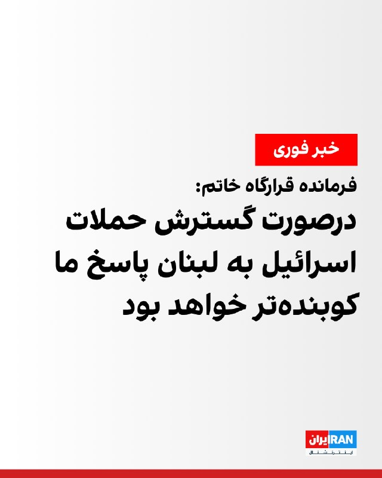

علی عبداللهی، فرمانده قرارگاه خاتم‌الانبیا همزمان با آغاز حملات موشکی جمهوری اسلامی به اسرائیل در پیامی گفت: ارتش اسرائیل باید حملات خود به جنوب لبنان و ضاحیه را متوقف نماید و در صورت گسترش حملات خود به آن منطقه و یا پاسخ به اقدام جمهوری اسلامی با ضربات کوبنده‌تر و پشیمان‌کننده روبرو و حملات ویرانگری علیه رژیم و حامیان آن آغاز خواهد شد.
‌🏁 🇬🇧 IranintlTV

🤖 @VahidOOnLine

## VahidOOnLine — post 244160

  

رسانه‌های ایران شامگاه یک‌شنبه از آغاز حملات موشکی به سوی اسرائیل خبر دادند.

خبرگزاری مهر نوشت دو موج حمله به سوی اسرائیل انجام شده است.

همزمان با آغاز حملات موشکی جمهوری اسلامی به لبنان، عباس عراقچی در ایکس طرحی گرافیکی از پرچم جمهوری اسلامی و لبنان در کنار هم منتشر کرد.
به گزارش اسرائیل هیوم، چهار موشک از سوی ایران به شمال اسرائیل شلیک شده است.

‌🏁 🇬🇧 IranintlTV

🤖 @VahidOOnLine

## WithYashar — post 13761

منابع اسراییل: حملات سنگین به ایران نزدیک است
@withyashar

## WithYashar — post 13760

سوخترسان های آمریکایی از تلآویو بلند شدند
@withyashar

## WithYashar — post 13758

قرارگاه مرکزی خاتم الانبیا : قبلا اخطار داده بودیم در صورت گسترش جنایت در ضاحیه بیروت، اهدافی را در سرزمین های اشغالی مورد هجوم قرار می دهیم!
@withyashar

## WithYashar — post 13757

رسانه عبری از منابع گزارش می‌دهد: ما به حمله ایرانی پاسخ خواهیم داد
@withyashar

## WithYashar — post 13756

از ارومیه و اصفهان هم موشک شلیک شد
@withyashar

## mwarmonitor — post 10278

🔴 اسرائیل به دنبال دریافت چراغ سبز از آمریکا برای حمله به تأسیسات انرژی در ایران است، به گفته یک منبع اسرائیلی، خبرگزاری Walla گزارش می‌دهد.

@mwarmonitor

## mwarmonitor — post 10277

  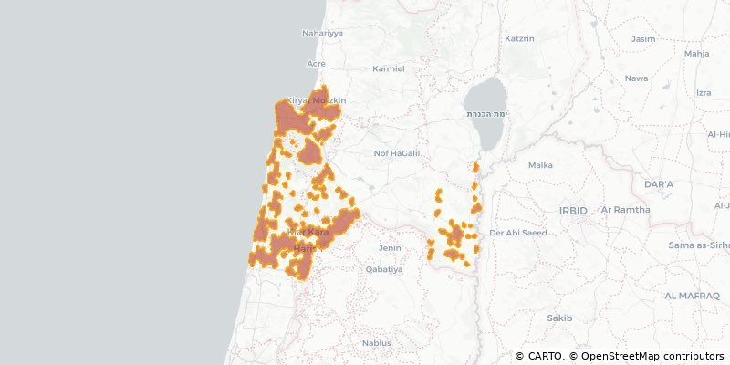

🔴 « فوری: ایران موشک‌های بیشتری به سمت اسرائیل شلیک کرده است، هشدار اولیه صادر شد.»

@mwarmonitor

## mwarmonitor — post 10276

🔴 شبکه ۱۳، آکسیوس، واللا و دیگر رسانه‌ها گزارش می‌دهند که پاسخ اسرائیل به حمله ایران در راه است.

@mwarmonitor

## mwarmonitor — post 10275

🔴رئیس‌جمهور ترامپ درباره تشدید تنش میان اسرائیل و ایران گزارش دریافت کرده است، یک مقام آمریکایی می‌گوید. باراک راوید

@mwarmonitor

## mwarmonitor — post 10274

🔴 شبکه ۱۲ اسرائیل به نقل از یک مقام اسرائیلی: ایران می‌خواست یک معادله جدید را تحمیل کند، اما ما نمی‌توانیم اجازه وقوع چنین چیزی را بدهیم.

@mwarmonitor

## mwarmonitor — post 10273

  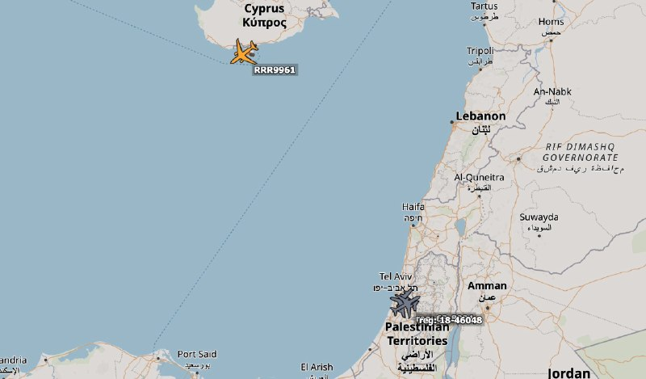

✈️نیروی هوایی آمریکا (USAF) / نیروی هوایی سلطنتی بریتانیا (RAF) - عملیات ایران

هواپیمای سوخت‌رسان Boeing KC-135 Stratotanker: 1 فروند
AE0369 63-8024 - شناسه تماس نامشخص

هواپیمای Boeing KC-46 Pegasus: 1 فروند
AE5F9B 18-46048 - شناسه تماس نامشخص

هواپیمای Airbus KC.2 Voyager: 1 فروند
43C6FB ZZ338 - ASCOT 9961

🔴در میان گزارش‌هایی از شلیک موشک‌های بالستیک از سوی ایران به سمت دولت اسرائیل، هر دو هواپیمای سوخت‌رسان RAF و USAF در حال ردیابی از پایگاه RAF آکروتیری و فرودگاه بن گوریون هستند.

@mwarmonitor

## pm_afshaa — post 92603

بازگشتتون به بر خط رو تبریک میگم😂

## pm_afshaa — post 92602

اختلال شدید در اینترنت ها

## pm_afshaa — post 92601

  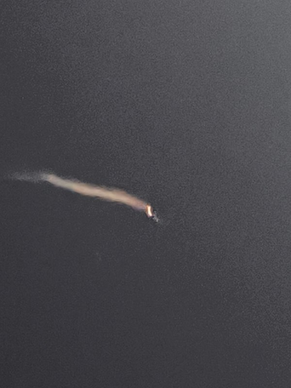

رباط کریم موشک بلند شد

💧 Rainbet.com the #1 Non-KYC Crypto Casino & Sportsbook @rainbetcom

😁 @Pm_Afshaa

## pm_afshaa — post 92600

شلیک مجدد موشک از اصفهان و کرمانشاه به سمت اسراییل

💧 Rainbet.com the #1 Non-KYC Crypto Casino & Sportsbook @rainbetcom

😁 @Pm_Afshaa

## pm_afshaa — post 92599

  <a href="telegram/content/pm_afshaa_92599_1780860799.webm" target="_blank">🎬 Download video</a>

🔴آکسیوس:
ترامپ در جریان تشدید تنش بین اسرائیل و جمهوری اسلامی قرار گرفته.

💧 Rainbet.com the #1 Non-KYC Crypto Casino & Sportsbook @rainbetcom

😁 @Pm_Afshaa

## pm_afshaa — post 92598

  <a href="telegram/content/pm_afshaa_92598_1780860800.webm" target="_blank">🎬 Download video</a>

🔴موج چهارم حمله موشکی از اصفهان پرتاب شد.

💧 Rainbet.com the #1 Non-KYC Crypto Casino & Sportsbook @rainbetcom

😁 @Pm_Afshaa

## pm_afshaa — post 92597

🔴هواپیماهای سوخت رسان آمریکایی از فرودگاه های اسرائیل به پرواز درآمدن 
💧 Rainbet.com the #1 Non-KYC Crypto Casino & Sportsbook @rainbetcom 
😁 @Pm_Afshaa

## pm_afshaa — post 92596

🔴هواپیماهای سوخت رسان آمریکایی از فرودگاه های اسرائیل به پرواز درآمدن

💧 Rainbet.com the #1 Non-KYC Crypto Casino & Sportsbook @rainbetcom

😁 @Pm_Afshaa

## pm_afshaa — post 92595

♨️
♨️
♨️
♨️
♨️
♨️
♨️

## pm_afshaa — post 92594

  <a href="telegram/content/pm_afshaa_92594_1780860800.webm" target="_blank">🎬 Download video</a>

🔴توییت عباس عراقچی از پرچم جمهوری اسلامی و لبنان:

💧 Rainbet.com the #1 Non-KYC Crypto Casino & Sportsbook @rainbetcom

😁 @Pm_Afshaa

## pm_afshaa — post 92593

  <a href="telegram/content/pm_afshaa_92593_1780860801.mp4" target="_blank">🎬 Download video</a>

تبریز

💧 Rainbet.com the #1 Non-KYC Crypto Casino & Sportsbook @rainbetcom

😁 @Pm_Afshaa

## pm_afshaa — post 92592

  <a href="telegram/content/pm_afshaa_92592_1780860802.webm" target="_blank">🎬 Download video</a>

بچه ها حتما تو کانال زاپاسمون جوین شین اتفاقی افتاد اونجا فعالیتمونو ادامه میدیم
👇
👇 https://t.me/pmtvzapas https://t.me/pmtvzapas

## pm_afshaa — post 92591

  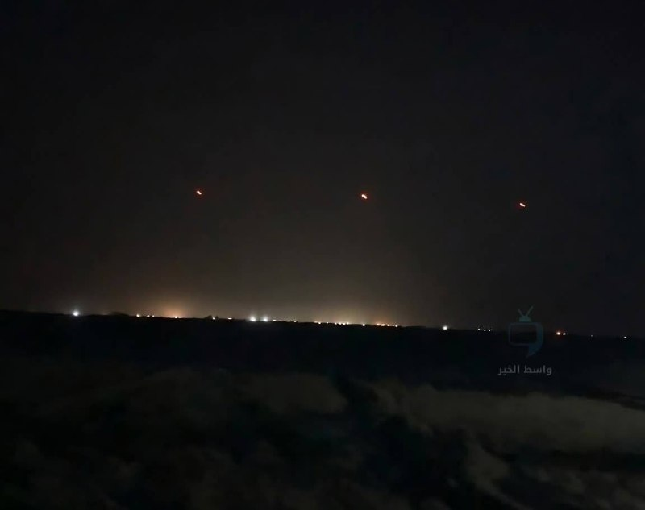

موشک ها در اسمون عراق

💧 Rainbet.com the #1 Non-KYC Crypto Casino & Sportsbook @rainbetcom

😁 @Pm_Afshaa

## pm_afshaa — post 92590

موج اول: از کرمانشاه
موج دوم: از کرمانشاه
موج سوم: از تبریز، ارومیه و اصفهان

💧 Rainbet.com the #1 Non-KYC Crypto Casino & Sportsbook @rainbetcom

😁 @Pm_Afshaa

## pm_afshaa — post 92589

انفجار در حیفا

💧 Rainbet.com the #1 Non-KYC Crypto Casino & Sportsbook @rainbetcom

😁 @Pm_Afshaa

## pm_afshaa — post 92588

  <a href="telegram/content/pm_afshaa_92588_1780860803.webm" target="_blank">🎬 Download video</a>

بچه ها حتما تو کانال زاپاسمون جوین شین اتفاقی افتاد اونجا فعالیتمونو ادامه میدیم
👇
👇

https://t.me/pmtvzapas
https://t.me/pmtvzapas

## DEJradio — post 5439

  <a href="telegram/content/DEJradio_5439_1780860803.webm" target="_blank">🎬 Download video</a>

🚀
🚨 یکشنبه شب ۱۷ خرداد، دو موج حمله موشکی از سمت ایران به اسراییل انجام گرفت.
منابع میدانی گزارش دادند تعدادی از موشک‌ها از پایگاه سپاه در کرمانشاه پرتاب شد.

#حملات_موشکی #اسرائیل
@DEJradio

## VahidOnline — post 75998

توییت باراک راوید، خبرنگار آکسیوس:
یک مقام اسرائیلی به من گفت که اسرائیل قصد دارد به حمله ایران تلافی کند.

📡 @VahidOnline

## kianmeli1 — post 87724

  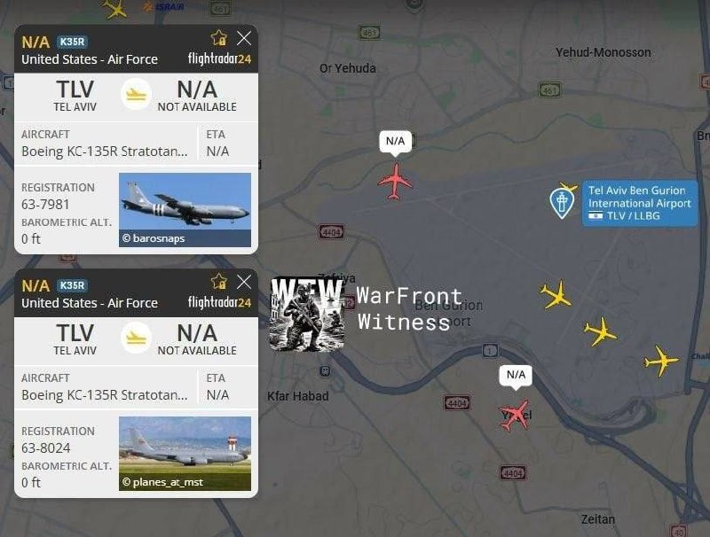

🔴فوری

سوخت رسانها به پرواز درآمدند
https://t.me/kianmeli1

## kianmeli1 — post 87723

🔴فوری

منابع اسراییل: حملات سنگین به ایران نزدیک است
https://t.me/kianmeli1

## kianmeli1 — post 87722

🔴فوری

پمپ‌بنزین های تهران مملو از خودرو شد برای خروج از شهر !!
https://t.me/kianmeli1

## kianmeli1 — post 87721

  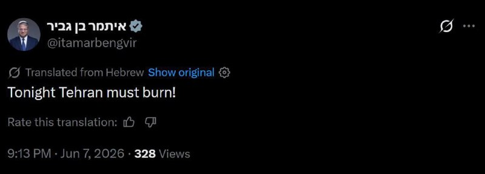

🔴بن گویر وزیر امنیت ملی اسرائیل:

امشب تهران باید بسوزد!
https://t.me/kianmeli1

## IranIntlTV — post 341043

  

علی عبداللهی، فرمانده قرارگاه خاتم‌الانبیا همزمان با آغاز حملات موشکی جمهوری اسلامی به اسرائیل در پیامی گفت: ارتش اسرائیل باید حملات خود به جنوب لبنان و ضاحیه را متوقف نماید و در صورت گسترش حملات خود به آن منطقه و یا پاسخ به اقدام جمهوری اسلامی با ضربات کوبنده‌تر و پشیمان‌کننده روبرو و حملات ویرانگری علیه رژیم و حامیان آن آغاز خواهد شد.
https://iranintl.com/202606076050

## IranIntlTV — post 341042

  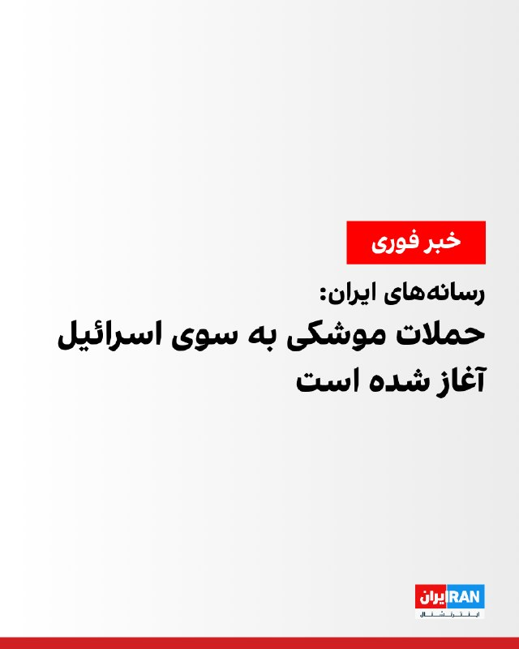

رسانه‌های ایران شامگاه یک‌شنبه از آغاز حملات موشکی به سوی اسرائیل خبر دادند.

خبرگزاری مهر نوشت دو موج حمله به سوی اسرائیل انجام شده است.

همزمان با آغاز حملات موشکی جمهوری اسلامی به لبنان، عباس عراقچی در ایکس طرحی گرافیکی از پرچم جمهوری اسلامی و لبنان در کنار هم منتشر کرد.
به گزارش اسرائیل هیوم، چهار موشک از سوی ایران به شمال اسرائیل شلیک شده است.

https://iranintl.com/202606079687

## IranIntlTV — post 341041

  <a href="telegram/content/IranIntlTV_341041_1780860806.mp4" target="_blank">🎬 Download video</a>

ارتش اسرائیل اعلام کرد موشک‌هایی از ایران به سمت خاک این کشور شلیک شده‌اند. آژیرهای خطر در حیفا، جلیل و بلندی‌های جولان به صدا درآمده و سامانه‌های دفاعی در حال رهگیری اهداف هستند.

فرماندهی جبهه داخلی نیز از ساکنان مناطق در معرض خطر خواسته دستورالعمل‌های امنیتی را رعایت کنند.
@iranintltv

## Shin_Persian — post 6638

Shin ✓ @hey_itsmyturn
Sun, 07 Jun 2026 19:29:26 UTC

JUST NOW
BM launch from Kashan
#Isfahan Province, #Iran

فارسی

همین حالا
شلیک موشک بالستیک از کاشان
#Isfahan Province, #Iran

𝕏 · @shin_persian

## Shin_Persian — post 6637

  <a href="telegram/content/Shin_Persian_6637_1780860807.mp4" target="_blank">🎬 Download video</a>

Shin ✓ @hey_itsmyturn
Sun, 07 Jun 2026 19:27:59 UTC

Tabriz, East Azerbaijan Province, #Iran

فارسی

تبریز، استان آذربایجان شرقی، #Iran

𝕏 · @shin_persian

## Shin_Persian — post 6636

  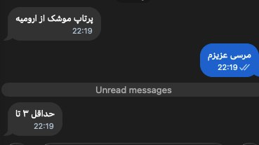

↩️ Quoted tweet: Shin ✓ @hey_itsmyturn Sun, 07 Jun 2026 19:19:22 UTC NOW BM Launch from Urmia ↩️ توییت نقل‌قول شده — برای پاسخ، پست زیر را ببینید. فارسی هم‌اکنون پرتاب موشک بالستیک (BM) از ارومیه 𝕏 · @shin_persian

## Shin_Persian — post 6635

↩️ Quoted tweet:
Shin ✓ @hey_itsmyturn
Sun, 07 Jun 2026 19:19:22 UTC

NOW
BM Launch from Urmia

↩️ توییت نقل‌قول شده — برای پاسخ، پست زیر را ببینید.

فارسی

هم‌اکنون
پرتاب موشک بالستیک (BM) از ارومیه

𝕏 · @shin_persian

## Shin_Persian — post 6634

Shin ✓ @hey_itsmyturn
Sun, 07 Jun 2026 19:19:22 UTC

NOW
BM Launch from Urmia

فارسی

هم‌اکنون
پرتاب موشک بالستیک (BM) از ارومیه

𝕏 · @shin_persian

## Shin_Persian — post 6633

  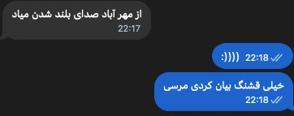

Shin ✓ @hey_itsmyturn
Sun, 07 Jun 2026 19:18:46 UTC

Jet scramble,
Mehrabad airport / Airbase
Tehran, #Tehran Province, #Iran

فارسی

تکاپوی جت‌ها (اِسکرامبل)،
فرودگاه مهرآباد / پایگاه هوایی
تهران، #Tehran Province، #Iran

𝕏 · @shin_persian

## Shin_Persian — post 6632

  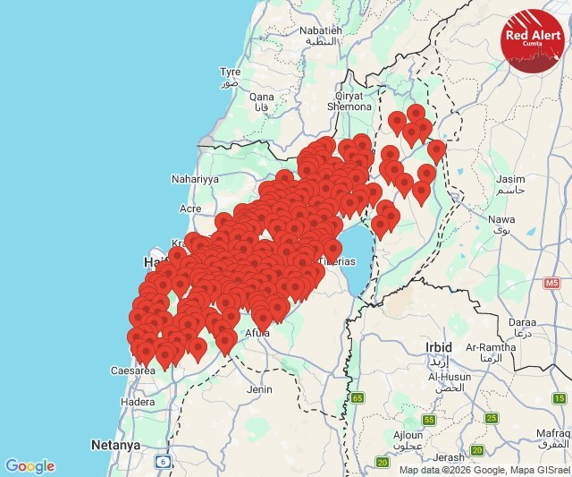

Shin ✓ @hey_itsmyturn
Sun, 07 Jun 2026 19:17:19 UTC

Again:
Tzeva Adom
Northern #Israel 🇮🇱

فارسی

وضعیت قرمز
شمال #Israel 🇮🇱

𝕏 · @shin_persian

## Shin_Persian — post 6631

  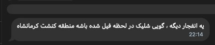

Shin ✓ @hey_itsmyturn
Sun, 07 Jun 2026 19:15:09 UTC

Another Blast in Kermanshah, Western Iran
Eyewitness believes it failed upon launch.

فارسی

انفجاری دیگر در کرمانشاه، غرب ایران
شاهد عینی معتقد است که [پرتابه] در هنگام پرتاب با شکست مواجه شده است.

𝕏 · @shin_persian

## Shin_Persian — post 6630

Shin ✓ @hey_itsmyturn
Sun, 07 Jun 2026 19:13:44 UTC

Another BM has been detected by from Iran towards #Israel 🇮🇱

فارسی

موشک بالستیک (BM) دیگری از ایران به سمت #Israel 🇮🇱 شناسایی شده است.

𝕏 · @shin_persian

## Iliaen — post 4447

  <a href="telegram/content/Iliaen_4447_1780860810.mp4" target="_blank">🎬 Download video</a>

ساعت ۲۲:۵۰ یکشنبه؛ مشاهده‌ی نور چشمک‌زن یک هواپیمای مسافربری در آسمان کرج، همزمان با شلیک موشک توسط سپاه و احتمال شروع حملات اسرائیل.

@iliaen

## Iliaen — post 4446

ساعت ۲۲:۴۴ یکشنبه؛ چند موشک دیگر از کرمانشاه به سمت اسرائیل شلیک شد. اسرائیل نیز پیش‌تر اعلام کرده بود در صورت چنین اقدامی، آماده پاسخ سریع است.

@iliaen

## Persian_Trend_Official — post 15959

  <a href="telegram/content/Persian_Trend_Official_15959_1780860812.webm" target="_blank">🎬 Download video</a>

پیام کوتاه مجید موسوی: الوعده وفا

📝 Nick

📌 @persian_trend_official
پرشین ترند | متفاوت‌ترین کانال نظامی

## Persian_Trend_Official — post 15958

  <a href="telegram/content/Persian_Trend_Official_15958_1780860812.webm" target="_blank">🎬 Download video</a>

⭕️ به گزارش آکسیوس ترامپ جلسه اضطراری در مورد ایران و اسرائیل برگزار می‌کند.

📝 Nick

📌 @persian_trend_official
پرشین ترند | متفاوت‌ترین کانال نظامی

## Persian_Trend_Official — post 15957

  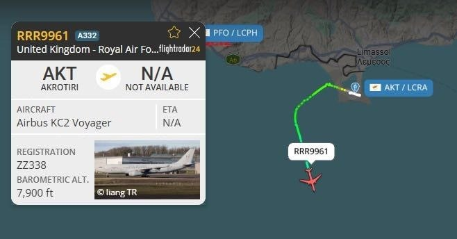

🇬🇧🇨🇾 یک تانکر سوخت‌رسان هوایی بریتانیایی از RAF Akrotiri، قبرس برخاست

## Persian_Trend_Official — post 15955

  <a href="telegram/content/Persian_Trend_Official_15955_1780860813.webm" target="_blank">🎬 Download video</a>

🇺🇸⚔️🇮🇷 تانکرهای هوایی آمریکایی هنگام پرواز بر فراز عراق و اسرائیل، ترانسپوندرهای خود را خاموش می‌کنند

## Persian_Trend_Official — post 15954

هواپیماهای سوخت رسان آمریکایی از فرودگاه های اسرائیل به پرواز درآمدن

📝 Nick

📌 @persian_trend_official
پرشین ترند | متفاوت‌ترین کانال نظامی

## Persian_Trend_Official — post 15953

  <a href="telegram/content/Persian_Trend_Official_15953_1780860813.webm" target="_blank">🎬 Download video</a>

♨️ گزارش ها از شلیک چهارمین موج موشک به سمت اسرائیل

📝 Nick

📌 @persian_trend_official
پرشین ترند | متفاوت‌ترین کانال نظامی

## Persian_Trend_Official — post 15952

  <a href="telegram/content/Persian_Trend_Official_15952_1780860814.webm" target="_blank">🎬 Download video</a>

گروه هکری حنظله با انتشار پیامی، از اجرای یک عملیات سایبری علیه اسرائیل خبر داد./تسنیم

## Persian_Trend_Official — post 15951

  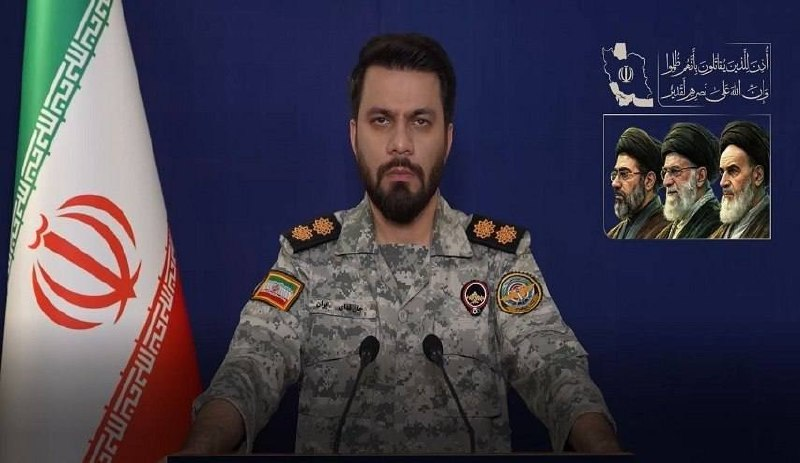

⭕️ بیانیه فرماندهی ستاد «خاتم‌الانبیا»:

«رژیم صهیونیستی تجاوزکار که به طور مداوم آتش‌بس را نقض می‌کند، روز به روز جنایات خود را علیه مردم مظلوم لبنان با حمایت و رضایت ضمنی سازمان‌های بین‌المللی افزایش می‌دهد، از جمله استفاده از سلاح‌های ممنوعه مانند بمب‌های فسفری و ارتکاب جنایات جنگی.
با وجود هشدارهای قبلی جمهوری اسلامی ایران، رژیم کودک‌کش صهیونیستی با عبور از همه خطوط قرمز و تشدید حملات در جنوب لبنان، به حومه جنوبی بیروت حمله کرده است.

قبلاً هشدار داده بودیم که در صورت گسترش جنایات در حومه جنوبی بیروت، به اهدافی در سرزمین‌های اشغالی حمله خواهیم کرد.

ارتش صهیونیستی باید حملات خود به جنوب لبنان و حومه جنوبی آن را متوقف کند. در صورت گسترش حملات به این منطقه یا پاسخ به اقدامات ایران، با ضربات ویرانگرتر و وادارکننده به پشیمانی مواجه خواهد شد و حملات مخرب علیه رژیم و حامیان آن آغاز خواهد شد.»

📝 Nick

📌 @persian_trend_official
پرشین ترند | متفاوت‌ترین کانال نظامی

## Persian_Trend_Official — post 15950

۶ تا موشک از ارومیه به اسرائیل

## IranianMinds — post 21631

🔴مقام اسرائیلی به شبکه ۱۴:

همانطور که گفتیم، قاطعانه و سخت جواب میدهیم.

@IranianMinds

## IranianMinds — post 21630

🔴 موج چهارم حملات موشکی به سمت اسرائیل

@IranianMinds

## IranianMinds — post 21629

وضعیت اینترنتتون چطوره؟

## IranianMinds — post 21628

🔴 یک مقام ارشد آمریکایی به آکسیوس گفت:

رئیس‌جمهور ترامپ در جریان تشدید تنش‌ها میان اسرائیل و ایران قرار گرفته و درباره آن توجیه شده است.

@IranianMinds

## IranianMinds — post 21627

🔴 پرواز سوخت رسان های ارتش آمریکا در آسمان عربستان

@IranianMinds

## IranianMinds — post 21626

🔴 قرارگاه خاتم‌الانبیا : رژیم صهیونیستی آتش بس رو بارها نقض کرد و به مردم مظلوم لبنان حمله کرد ما هم جوابشو دادیم. @IranianMinds

## IranianMinds — post 21625

🔴 شلیک موشک از اصفهان و تبریز

@IranianMinds

## IranianMinds — post 21624

🔴 بن‌ گویر ، وزیر امنیت ملی اسرائیل : امشب تهران باید در آتش بسوزد! @IranianMinds

## IranianMinds — post 21623

الان میان میگن این هم نقض آتش بس نبوده

@IranianMinds

## IranianMinds — post 21622

  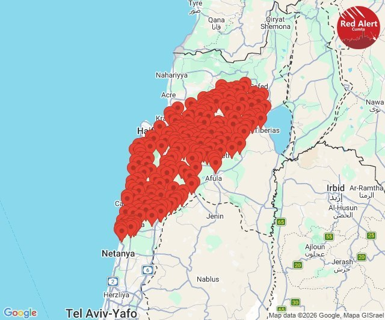

🔴 شلیک مجدد موشک به سمت اسرائیل موج سوم حملات @IranianMinds

## Dirty_Kids — post 391261

کانفیگ فروشمو چیکار کنم اخر کاری بهش گفتم کص ننت؟

@Dirty_Kids 👻

## Dirty_Kids — post 391260

امشب ترور هدفمند داریم؟ کتلت جدید؟ مهره‌هایی که مزاحم توافق هستن حذف میشن؟

@Dirty_Kids 👻

## Dirty_Kids — post 391259

  <a href="telegram/content/Dirty_Kids_391259_1780860815.mp4" target="_blank">🎬 Download video</a>

ساعت ۲۲:۵۰ یکشنبه؛ مشاهده‌ی نور چشمک‌زن یک هواپیمای مسافربری در آسمان کرج، همزمان با شلیک موشک توسط سپاه و احتمال شروع حملات اسرائیل.

@Dirty_Kids 👻

## Dirty_Kids — post 391258

ساعت ۲۲:۴۴ یکشنبه؛ چند موشک دیگر از کرمانشاه به سمت اسرائیل شلیک شد. اسرائیل نیز پیش‌تر اعلام کرده بود در صورت چنین اقدامی، آماده پاسخ سریع است.

@Dirty_Kids 👻

## Dirty_Kids — post 391257

🔴 فوری
وزیر امنیت ملی اسرائیل:
امشب تهران باید بسوزد!!

@Dirty_Kids 👻

## Dirty_Kids — post 391256

🔴 فوری
۵ موشک دیگه به سمت اسرائیل شلیک شد

@Dirty_Kids 👻

## Hranews — post 113460

  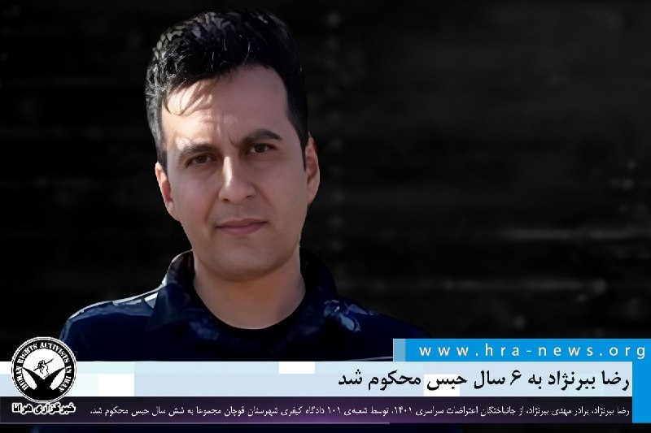

قوچان؛ رضا ببرنژاد به ۶ سال حبس محکوم شد

❗️
❗️
❗️
❗️
❗️– رضا ببرنژاد، برادر مهدی ببرنژاد، از جان‌باختگان اعتراضات سراسری ۱۴۰۱، توسط شعبه‌ی ۱۰۱ دادگاه کیفری شهرستان قوچان مجموعا به شش سال حبس محکوم شد. چهار سال و شش ماه از این میزان به حالت تعلیق در آمده است.

به گزارش خبرگزاری هرانا، ارگان خبری مجموعه فعالان حقوق بشر در ایران، رضا ببرنژاد به حبس محکوم شد.

اخیرا حکمی توسط شعبه‌ی ۱۰۱ دادگاه کیفری شهرستان قوچان به ریاست قاضی پور آریا صادر و به آقای ببرنژاد ابلاغ شده است. براساس این حکم وی از بابت اتهام عضویت در گروه‌های مخالف نظام به پنج سال و بابت اتهام تبلیغ علیه نظام به یک سال حبس محکوم شده است. با اعمال ماده ۱۳۴ قانون مجازات اسلامی، مجازات اشد یعنی پنج سال حبس در خصوص وی قابل اجرا خواهد بود. چهار سال و شش ماه از میزان حکم پنج سال حبس صادره علیه وی به حالت تعلیق درآمده است.

ادامه مطلب

#رضا_ببرنژاد

↘️
@hranews_bot تماس ✉️ - @Hranews کانال هرانا 🆑

## alonews — post 125935

👈نت بلاکس: ترافیک اینترنت در ایران ۲۵درصد کاهش یافته و اختلال زیادی داره

## alonews — post 125934

  <a href="telegram/content/alonews_125934_1780860817.webm" target="_blank">🎬 Download video</a>

👈 ‌ به گزارش آکسیوس ترامپ جلسه اضطراری در مورد ایران و اسرائیل برگزار می‌کند

🔴یک مقام اسرائیلی به من گفت که اسرائیل قصد دارد به حمله ایران تلافی کند.

✅ @AloNews خبر جنگ

## alonews — post 125933

  <a href="telegram/content/alonews_125933_1780860817.webm" target="_blank">🎬 Download video</a>

👈العربی الجدید: صدای انفجارها در جلیل و آژیرهای خطر بار دیگر به صدا درآمد

✅ @AloNews خبر جنگ

## alonews — post 125932

  <a href="telegram/content/alonews_125932_1780860818.webm" target="_blank">🎬 Download video</a>

👈اگر اسرائیل پاسخ بده اینترنت‌ها قطع میشه

✅ @AloNews خبر جنگ

## alonews — post 125931

  <a href="telegram/content/alonews_125931_1780860818.webm" target="_blank">🎬 Download video</a>

🔴فوری / شاخص پمپ بزنین رفت بالا

✅ @AloNews خبر جنگ

## alonews — post 125930

  <a href="telegram/content/alonews_125930_1780860818.webm" target="_blank">🎬 Download video</a>

👈اکسیوس : ترامپ در جریان بالا گرفتن تنش‌ها بین اسرائیل و ایران قرار گرفت

✅ @AloNews خبر جنگ

## alonews — post 125929

  <a href="telegram/content/alonews_125929_1780860818.webm" target="_blank">🎬 Download video</a>

👈ادعا شده در موج چهارم 10 تیر موشک بالستیک شلیک شده است

✅ @AloNews خبر جنگ

## alonews — post 125928

  <a href="telegram/content/alonews_125928_1780860818.webm" target="_blank">🎬 Download video</a>

🔴فوری/تعداد زیادی هواپیمای سوخت رسان آمریکایی از فرودگاه های اسرائیل به پرواز درآمدند. 
✅ @AloNews خبر جنگ

## alonews — post 125927

  <a href="telegram/content/alonews_125927_1780860819.webm" target="_blank">🎬 Download video</a>

👈آکسیوس: ترامپ در جریان تشدید تنش بین اسرائیل و ایران قرار گرفته است

✅ @AloNews خبر جنگ

## alonews — post 125926

  <a href="telegram/content/alonews_125926_1780860819.webm" target="_blank">🎬 Download video</a>

👈حملات مشترک با حزب الله آغاز شده است

✅ @AloNews خبر جنگ

## alonews — post 125925

  <a href="telegram/content/alonews_125925_1780860819.webm" target="_blank">🎬 Download video</a>

🔴فوری/تعداد زیادی هواپیمای سوخت رسان آمریکایی از فرودگاه های اسرائیل به پرواز درآمدند.

✅ @AloNews خبر جنگ

## alonews — post 125924

  

سرویس
🔴Damovpn

امکان اتصال به 
0️⃣
1️⃣ لوکیشن

➿
➿
➿
➿
➿
➿
➿
➿
➿
➿
➿

🔒آیپی ثابت

🎮سرور گیمینگ

🚀سرعت بالا

⏰پشتیبانی 24 ساعته

➿
➿
➿
➿
➿
➿
➿
➿
➿
➿
➿

🎁10هزارتومان هدیه ورود به ربات

🤖 BOT 
🖱️|@Damovpnbot |

✈️CHANNEL
🖱️ |@vpndamo |

## alonews — post 125923

  <a href="telegram/content/alonews_125923_1780860820.webm" target="_blank">🎬 Download video</a>

👈 موج چهارم به سوی اسرائیل

✅ @AloNews خبر جنگ

---
📅 بروزرسانی: 1405/03/17 22:53
---

## VahidOOnLine — post 244159

  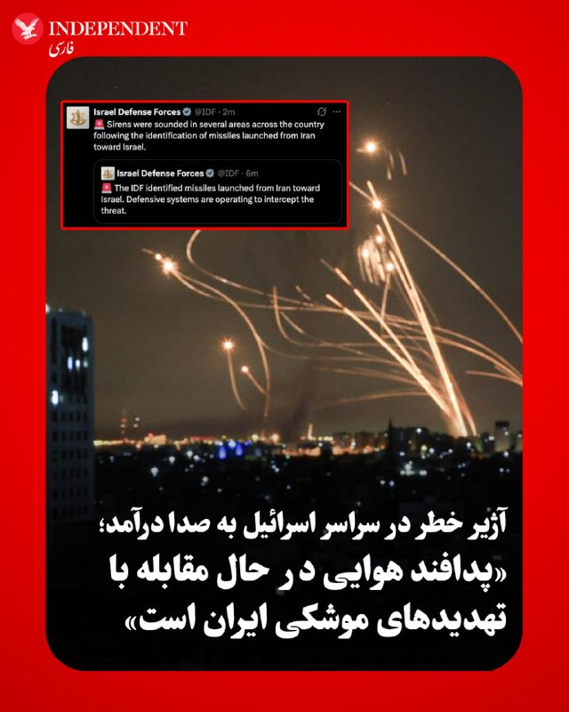

♦️ارتش اسرائیل، یکشنبه‌شب، ۱۷ خردادماه، با انتشار بیانیه‌ای در اکس اعلام کرد که در پی شناسایی موشک‌های شلیک‌شده از سوی ایران به سمت خاک اسرائیل، آژیرهای خطر در چندین منطقه در سراسر این کشور به صدا درآمده‌اند. بر اساس اعلام رسمی نیروهای دفاعی اسرائیل، سیستم‌های پدافند هوایی این کشور بلافاصله پس از ردیابی این پرتابه‌ها فعال شده و در حال مقابله برای رهگیری و انهدام تهدیدهای موشکی بر فراز آسمان منطقه هستند.
‌🇸🇦 Indypersian

🤖 @VahidOOnLine

## VahidOOnLine — post 244158

  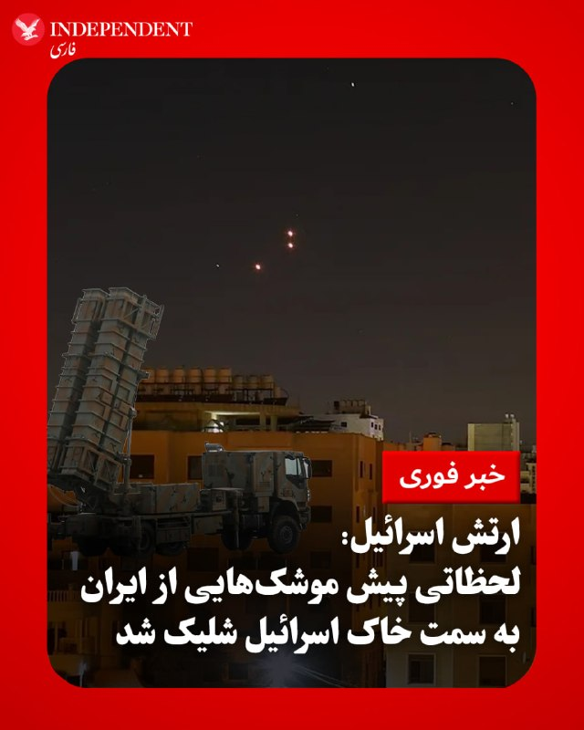

♦️ارتش اسرائیل، یکشنبه‌شب، ۱۷ خردادماه، با انتشار بیانیه‌ای اعلام کرد که رادارهای این کشور شلیک چندین موشک از سوی ایران به سمت خاک اسرائیل را شناسایی کرده‌اند. بر اساس این گزارش رسمی، در حال حاضر تمامی سیستم‌های پدافند هوایی ارتش برای رهگیری و انهدام این تهدیدها فعال شده‌اند و فرماندهی جبهه داخلی در دقیقه‌های گذشته، دستورالعمل‌های اضطراری پیش‌گیرانه‌ای را به طور مستقیم به تلفن‌های همراه ساکنان مناطق تحت خطر ارسال کرده است. مقامات نظامی اسرائیل با تاکید بر اینکه این دستورات نجات‌دهنده جان انسان‌هاست، از عموم مردم خواسته‌اند با مسئولیت‌پذیری کامل، به محض شنیدن صدای آژیر خطر فورا وارد پناهگاه‌ها و مناطق امنِ حفاظت‌شده شوند و تا زمان صدور ابلاغیه صریح و رسمی بعدی، به هیچ عنوان از پناهگاه‌های خود خارج نشوند.
‌🇸🇦 Indypersian

🤖 @VahidOOnLine

## VahidOOnLine — post 244157

  

خبرگزاری رویترز گزارش داد که نیروهای نظامی اسرائیل می‌گویند سامانه‌های دفاعی در حال عملیات برای رهگیری تهدید هستند.

بر اساس این گزارش، ارتش اسرائیل اعلام کرده است که شلیک موشک‌هایی از ایران به سمت خاک کشور اسرائیل شناسایی شده است.
‌🏁 🇬🇧 IranintlTV

🤖 @VahidOOnLine

## WithYashar — post 13755

چند موشک از تبریز و کرمانشاه شلیک شد
@withyashar

## WithYashar — post 13754

موج دوم حملات ۳پا آغاز شد
@withyashar
🚨🚨🚨🚨🚨🚨

## WithYashar — post 13753

صدا سیما ما وارد یک مرحله زورآزمایی جدید شدیم چون ناتانیاهو خواست ما را محک بزند
@withyashar

## WithYashar — post 13752

صدا و سیما حمله ایران به شمال اسرائیل در همبستگی با لبنان را تایید کرد
@withyashar

## mwarmonitor — post 10272

دو انفجار در دمشق رخ داد.

## mwarmonitor — post 10271

فرمانده مقر «خاتم‌الانبیاء (ص)»:

🔹 رژیم صهیونیستی متجاوز، با نقض مکرر آتش‌بس، شرارت‌های خود علیه ملت مظلوم لبنان را افزایش می‌دهد؛ با حمایت آمریکا‌ی جنایتکار و سکوت سازمان‌های بین‌المللی، و با استفاده از سلاح‌های ممنوعه از جمله بمب‌های فسفری، مرتکب جنایات جنگی می‌شود.

🔹 و با وجود هشدارهای قبلی از سوی جمهوری اسلامی ایران، این رژیم کودک‌کش حومه‌های بیروت را هدف قرار داده و از همه خطوط قرمز عبور کرده و حملات خود را در جنوب لبنان تشدید کرده است.

🔹 ما پیش‌تر هشدار داده بودیم که اگر جنایت به حومه‌های بیروت گسترش یابد، اهدافی را در سرزمین‌های اشغالی هدف قرار خواهیم داد.

@mwarmonitor

## mwarmonitor — post 10270

  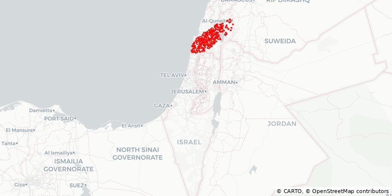

🚨هشدار حمله موشکی شمال اسرائیل

@mwarmonitor

## mwarmonitor — post 10269

🔴«بن‌گویر: باید امشب تهران بسوزد»

@mwarmonitor

## mwarmonitor — post 10268

شلیک موشک از ایران

## mwarmonitor — post 10267

  <a href="telegram/content/mwarmonitor_10267_1780860238.mp4" target="_blank">🎬 Download video</a>

حیفا

## pm_afshaa — post 92587

6 موشک از ارومیه پرتاب شد

💧 Rainbet.com the #1 Non-KYC Crypto Casino & Sportsbook @rainbetcom

😁 @Pm_Afshaa

## pm_afshaa — post 92586

  <a href="telegram/content/pm_afshaa_92586_1780860240.webm" target="_blank">🎬 Download video</a>

🔴مقام ارشد اسرائیلی به i24NEWS:
پاسخی داده خواهد شد.

💧 Rainbet.com the #1 Non-KYC Crypto Casino & Sportsbook @rainbetcom

😁 @Pm_Afshaa

## pm_afshaa — post 92585

🔴فرودگاه بن گوریون در پی حملات جمهوری اسلامی تعطیل شد

💧 Rainbet.com the #1 Non-KYC Crypto Casino & Sportsbook @rainbetcom

😁 @Pm_Afshaa

## pm_afshaa — post 92584

تو دور دوم 5 موشک شلیک شده.
تا الان 9 تا شد

💧 Rainbet.com the #1 Non-KYC Crypto Casino & Sportsbook @rainbetcom

😁 @Pm_Afshaa

## pm_afshaa — post 92583

🔴مقامات اسرائیلی به رادیو ارتش اسرائیل گفتند که چیزی به نام «رویداد محدود شده» وجود ندارد و اسرائیل پاسخ خواهد داد

💧 Rainbet.com the #1 Non-KYC Crypto Casino & Sportsbook @rainbetcom

😁 @Pm_Afshaa

## pm_afshaa — post 92582

پرتاب موشک از اصفهان

💧 Rainbet.com the #1 Non-KYC Crypto Casino & Sportsbook @rainbetcom

😁 @Pm_Afshaa

## pm_afshaa — post 92581

پرتاب موشک از تبریز

💧 Rainbet.com the #1 Non-KYC Crypto Casino & Sportsbook @rainbetcom

😁 @Pm_Afshaa

## pm_afshaa — post 92580

🔴کانال 14 اسرائیل:به زودی پاسخ بسیار گسترده در ایران خواهد آمد

💧 Rainbet.com the #1 Non-KYC Crypto Casino & Sportsbook @rainbetcom

😁 @Pm_Afshaa

## pm_afshaa — post 92579

  <a href="telegram/content/pm_afshaa_92579_1780860240.webm" target="_blank">🎬 Download video</a>

🔴بن‌گویر، وزیر امنیت داخلی اسرائیل:
تهران امشب باید بسوزه.

💧 Rainbet.com the #1 Non-KYC Crypto Casino & Sportsbook @rainbetcom

😁 @Pm_Afshaa

## pm_afshaa — post 92578

رادیو ارتش اسرائیل:شلیک موشک از ایران به معنای اعلان جنگ از سوی رژیم جمهوری اسلامی است

💧 Rainbet.com the #1 Non-KYC Crypto Casino & Sportsbook @rainbetcom

😁 @Pm_Afshaa

## pm_afshaa — post 92577

پرتاب پیاپی موشک از کرمانشاه

💧 Rainbet.com the #1 Non-KYC Crypto Casino & Sportsbook @rainbetcom

😁 @Pm_Afshaa

## pm_afshaa — post 92576

  <a href="telegram/content/pm_afshaa_92576_1780860241.webm" target="_blank">🎬 Download video</a>

🔴رادیو ارتش اسرائیل: قطعا پاسخ خواهیم داد.

💧 Rainbet.com the #1 Non-KYC Crypto Casino & Sportsbook @rainbetcom

😁 @Pm_Afshaa

## pm_afshaa — post 92575

  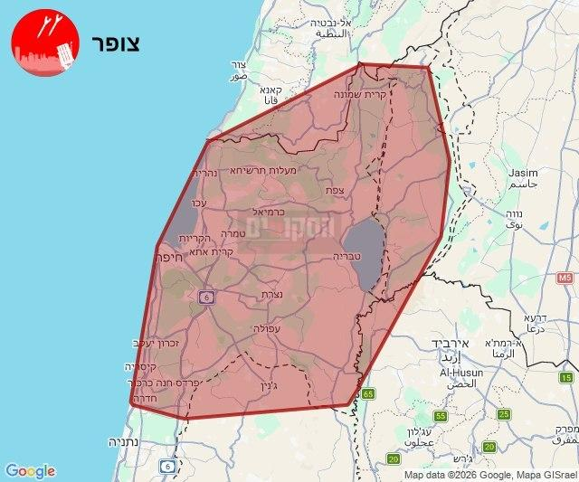

آژیر خطر در اسرائیل

💧 Rainbet.com the #1 Non-KYC Crypto Casino & Sportsbook @rainbetcom

😁 @Pm_Afshaa

## pm_afshaa — post 92574

شلیک مجدد موشک از ایران

💧 Rainbet.com the #1 Non-KYC Crypto Casino & Sportsbook @rainbetcom

😁 @Pm_Afshaa

## pm_afshaa — post 92573

  <a href="telegram/content/pm_afshaa_92573_1780860242.webm" target="_blank">🎬 Download video</a>

🔴اورشلیم پست: ایران در تله افتاد و به شدت ضربه خواهند خورد.

💧 Rainbet.com the #1 Non-KYC Crypto Casino & Sportsbook @rainbetcom

😁 @Pm_Afshaa

## pm_afshaa — post 92572

فراموش نکنین جمهوری اسلامی بخاطر یه مشت تروریست لبنانی ایران رو به سومین جنگ وارد کرد

## pm_afshaa — post 92571

🔴منابع اسرائیلی: واشنگتن متعهد شده است که به اسرائیل آزادی عمل در حمله به ایران را بدهد اگر با موشک هدف قرار گیرد

💧 Rainbet.com the #1 Non-KYC Crypto Casino & Sportsbook @rainbetcom

😁 @Pm_Afshaa

## pm_afshaa — post 92570

بچه ها قطع شدین من هستم استار فعلا دارم خبرارو بزارم😁

## DEJradio — post 5438

  <a href="telegram/content/DEJradio_5438_1780860243.webm" target="_blank">🎬 Download video</a>

🚨
⭕️ دولت اسرائیل برای شهروندان چند منطقه از این کشور هشدار حمله صادر کرد.

#حملات_موشکی #اسرائیل
@DEJradio

## DEJradio — post 5437

  <a href="telegram/content/DEJradio_5437_1780860243.webm" target="_blank">🎬 Download video</a>

🚨
⭕️ حملات موشکی جمهوری اسلامی به سمت اسرائیل

#حملات_موشکی #اسرائیل
@DEJradio

## VahidOnline — post 75997

سپاه: اخطار داده بودیم در صورت گسترش جنایت در بیروت، اهدافی را مورد هجوم قرار می دهیم

به نقل از تسنیم، خبرگزاری وابسته به سپاه:

"فرمانده قرارگاه حضرت خاتم‌الانبیا(ص):
رژیم متجاوز صهیونیستی با نقض مکرر آتش‌بس شرارت های خود علیه مردم مظلوم لبنان با چراغ سبز و حمایت آمریکای جنایتکار و سکوت مجامع بین المللی را روز به روز افزایش داده و با استفاده از سلاح های ممنوعه از جمله بمب های فسفری مرتکب جنایات جنگی می گردد.

با وجود هشدارهای قبلی جمهوری اسلامی ایران، رژیم کودک کش صهیونیستی با عبور از همه خطوط قرمز و افزایش حملات در جنوب لبنان، ضاحیه بیروت را هدف قرار داده است.

قبلا اخطار داده بودیم در صورت گسترش جنایت در ضاحیه بیروت، اهدافی را در سرزمین های اشغالی مورد هجوم قرار می دهیم.

ارتش صهیونیستی باید حملات خود به جنوب لبنان و ضاحیه را متوقف نماید و در صورت گسترش حملات خود به آن منطقه و یا پاسخ به اقدام ایران با ضربات کوبنده تر و پشیمان کننده روبرو و حملات ویرانگری علیه رژیم و حامیان آن آغاز خواهد شد."

📡 @VahidOnline

## VahidOnline — post 75996

☄️ موج بعدی شلیک موشک به سمت اسرائیل
پیام‌های دریافتی:

دوباره شلیک از کرمانشاه

دوباره یکی دیگه زدن الان
یکی بود

10:44 دوباره صدای انفجار اومد کرمانشاه

صدای انفجار مجدد

بازم زدن
همین الان صدا اومد از روانسر کرمانشاه

22:47 شلیک موشک از تبریز

آذرشهر [نزدیک تبریز] صدای موشک ۳ تا

سلام وحید
ساعت ۲۲:۴۰ ۴ تا شلیک از تبریز به فاصله هر یک دقیقه
نور خیلییی زیادی داره و صدای زیاد

📡 @VahidOnline

## kianmeli1 — post 87720

  

🔴فوری-موشکها در راه اسراییل
https://t.me/kianmeli1

## kianmeli1 — post 87719

🔴فوری

حمله موشکی از تبریز به اسراییل
https://t.me/kianmeli1

## kianmeli1 — post 87718

🔴فوری-ارتش اسرائیل:

آتش بس میان ایران و اسرائیل پایان یافت.
https://t.me/kianmeli1

## kianmeli1 — post 87717

  <a href="telegram/content/kianmeli1_87717_1780860244.mp4" target="_blank">🎬 Download video</a>

🔴فوری

حمله موشکی از اصفهان به اسراییل
https://t.me/kianmeli1

## kianmeli1 — post 87716

🔴فوری-بن گویر: تهران امشب باید بسوزد
https://t.me/kianmeli1

## kianmeli1 — post 87715

🔴فوری

موج دوم حمله موشکی به اسراییل شروع شد
https://t.me/kianmeli1

## kianmeli1 — post 87714

  <a href="telegram/content/kianmeli1_87714_1780860246.mp4" target="_blank">🎬 Download video</a>

🔴فوری

وضعیت خیابان کرمانشاه حین شلیک موشک به اسراییل
https://t.me/kianmeli1

## IranIntlTV — post 341040

  <a href="telegram/content/IranIntlTV_341040_1780860247.mp4" target="_blank">🎬 Download video</a>

رویترز گزارش داد آمریکا پیش‌نویس قطعنامه‌ای را برای نشست شورای حکام آژانس توزیع کرده و خواستار ارائه فوری اطلاعات درباره مواد و تاسیسات هسته‌ای جمهوری اسلامی شده است.

گفت‌وگو با علیرضا نامور حقیقی، تحلیل‌گر سیاسی
@iranintltv

## IranIntlTV — post 341039

  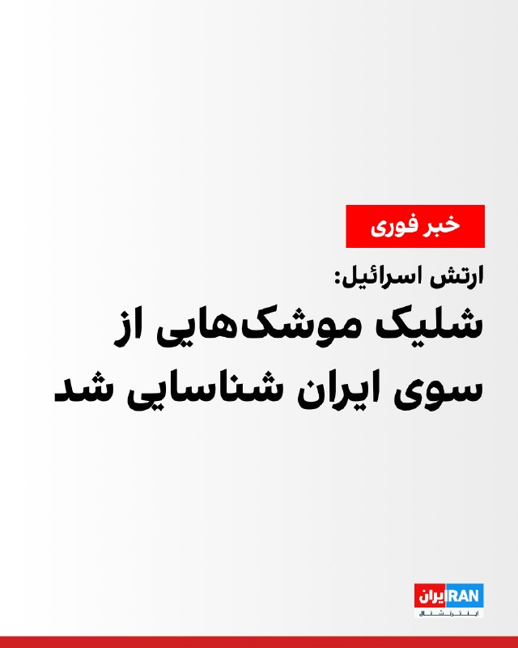

خبرگزاری رویترز گزارش داد که نیروهای نظامی اسرائیل می‌گویند سامانه‌های دفاعی در حال عملیات برای رهگیری تهدید هستند.

بر اساس این گزارش، ارتش اسرائیل اعلام کرده است که شلیک موشک‌هایی از ایران به سمت خاک کشور اسرائیل شناسایی شده است.
https://iranintl.com/202606078136

## FarsiVOA — post 219921

🔺ارتش اسرائيل از حمله موشکی جمهوری اسلامی خبر داد

◾️سخنگوی ارتش اسرائیل اواخر روز یکشنبه به وقت محلی گفت که این نیرو اندکی پیش، شلیک موشک‌هایی از ایران به سمت خاک اسرائیل را شناسایی کرد و سیستم‌های دفاعی برای رهگیری این تهدید در حال فعالیت هستند.

⬇️ بیشتر بخوانید:
https://ir.voanews.com/a/us-ready-to-defend-israel-against-irans-threats/8158252.html
@FarsiVOA

## Persian_Trend_Official — post 15949

⭕️ شلیک موشک از ارومیه، شمال غربی ایران. 📝 Nick 📌 @persian_trend_official پرشین ترند | متفاوت‌ترین کانال نظامی

## Persian_Trend_Official — post 15948

  <a href="telegram/content/Persian_Trend_Official_15948_1780860249.webm" target="_blank">🎬 Download video</a>

⭕️ شلیک موشک از ارومیه، شمال غربی ایران.

📝 Nick

📌 @persian_trend_official
پرشین ترند | متفاوت‌ترین کانال نظامی

## Persian_Trend_Official — post 15947

  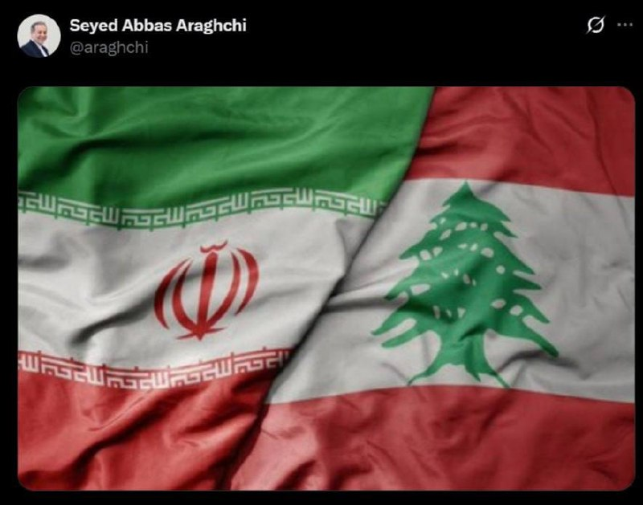

⭕️ عراقچی:

📝 Nick

📌 @persian_trend_official
پرشین ترند | متفاوت‌ترین کانال نظامی

## Persian_Trend_Official — post 15946

  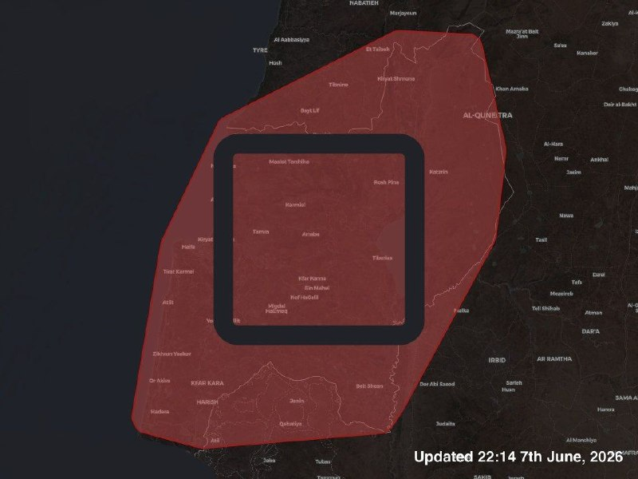

⚡🇮🇱 هشدارهای زودهنگام در نزدیکی ناهاریا، عکا و سایر مناطق اطراف در شمال اسرائیل فعال است:

• دره بیت‌شعان
• خط مقابله
• جولان
• حیفا
• هف هاکرمل
• کاتزرین
• کرایوت
• گلیل پایین
• منا‌شه
• تاور
• گلیل بالا
• وادی عاره
• یئروت هاکرمل

👺Phantom

📌 @persian_trend_official
پرشین ترند | متفاوت‌ترین کانال نظامی

## Persian_Trend_Official — post 15945

  <a href="telegram/content/Persian_Trend_Official_15945_1780860251.webm" target="_blank">🎬 Download video</a>

در موج دوم حداقل ۵ موشک بالستیک به سمت شمال اسرائیل در حال حرکت هستند.

📝 Nick

📌 @persian_trend_official
پرشین ترند | متفاوت‌ترین کانال نظامی

## Persian_Trend_Official — post 15944

  <a href="telegram/content/Persian_Trend_Official_15944_1780860251.webm" target="_blank">🎬 Download video</a>

موج دوم موشک‌های بالستیک از ایران به سمت اسرائیل شلیک شد!

📝 Nick

📌 @persian_trend_official
پرشین ترند | متفاوت‌ترین کانال نظامی

## Persian_Trend_Official — post 15942

  <a href="telegram/content/Persian_Trend_Official_15942_1780860252.mp4" target="_blank">🎬 Download video</a>

👺Phantom

📌 @persian_trend_official
پرشین ترند | متفاوت‌ترین کانال نظامی

## Persian_Trend_Official — post 15941

More footage of interceptors over Israel

## RadioFarda — post 158011

  <a href="telegram/content/RadioFarda_158011_1780860253.mp4" target="_blank">🎬 Download video</a>

⚡️فوری- ارتش اسرائیل شامگاه یکشنبه اعلام کرد که موشک‌هایی را که از ایران به سمت خاک اسرائیل شلیک شده بودند شناسایی کرده است.

⚡️در بیانیه‌ ارتش اسرائیل آمده است: «دقایقی پیش و در پی شناسایی موشک‌هایی که از ایران به سوی اسرائیل شلیک شده بودند، آژیرهای هشدار در چندین منطقه در سراسر کشور به صدا درآمد.»

⚡️این نهاد نظامی افزود که سامانه‌های پدافندی در حال فعالیت برای رهگیری و مقابله با این تهدید هستند.

⚡️این اتفاق چند ساعت بعد از آن رخ داد که ارتش اسرائیل منطقه ضاحیه در جنوب بیروت را هدف قرار داد و ایران تهدید کرد به این حمله پاسخ خواهد داد.
@RadioFarda

## IranianMinds — post 21621

🔴 شلیک مجدد موشک به سمت اسرائیل موج سوم حملات

@IranianMinds

## IranianMinds — post 21620

🔴 قرارگاه خاتم‌الانبیا :

رژیم صهیونیستی آتش بس رو بارها نقض کرد و به مردم مظلوم لبنان حمله کرد ما هم جوابشو دادیم.

@IranianMinds

## IranianMinds — post 21619

🔴 مدارس اسرائیل تا اطلاع ثانوی تعطیل شد!

@IranianMinds

## IranianMinds — post 21618

🔴 بن‌ گویر ، وزیر امنیت ملی اسرائیل :

امشب تهران باید در آتش بسوزد!

@IranianMinds

## IranianMinds — post 21617

🔴 ۵ موشک از تبریز به سمت شمال اسرائیل لانچ شد

@IranianMinds

## IranianMinds — post 21616

  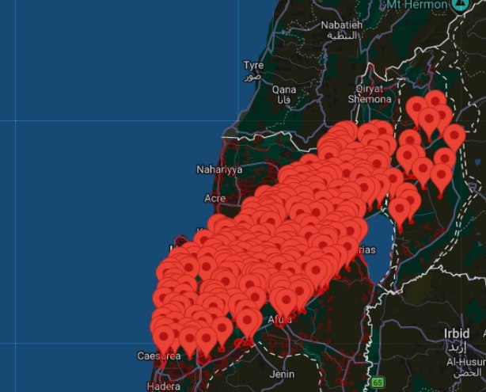

🔴 5 موشک جدید به سمت اسرائیل شلیک شد. @IranianMinds

## IranianMinds — post 21615

🔴 شلیک مجدد موشک به سمت اسرائیل @IranianMinds

## IranianMinds — post 21613

🔴 موج دوم حملات ایران آغاز شد

@IranianMinds

## IranianMinds — post 21612

  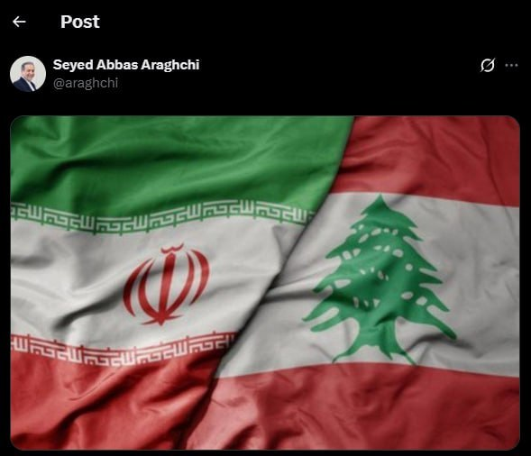

🔴 پست عراقچی بعد از حمله :

@IranianMinds

## IranianMinds — post 21611

🔴کانال ۱۳ اسرائیل:
حمله موشکی ایران اعلام جنگ است.

@IranianMinds

## IranianMinds — post 21610

🔴 شلیک مجدد موشک به سمت اسرائیل

@IranianMinds

## IranianMinds — post 21609

🔴 مقام اسرائیلی به رادیو ارتش اسرائیل: تو اسرائیل چیزی به‌نام «حمله محدود» وجود نداره و اسرائیل به جنگ با ایران برمیگرده.

@IranianMinds

## IranianMinds — post 21608

🔴 اورشلیم پست: ایران در تله افتاد و به شدت ضربه خواهند خورد.

@IranianMinds

## IranianMinds — post 21607

  <a href="telegram/content/IranianMinds_21607_1780860256.mp4" target="_blank">🎬 Download video</a>

🔴 خرزشیا ریختن بیرون دارن خوشحالی میکنن

همینا فردا میان گریه میکنن میگن سردارمونو با نامردی کشتن 😭😭😭

@IranianMinds

## Dirty_Kids — post 391255

سپاه به اسراییل موشک زد نه برای ایران به خاطر حزب‌الله

مادرجنده‌هایی که ادعا میکنن طرفدار نظام نیستن اما تو جنگ پشت ملی‌گرایی جمهوری‌اسلامی در میان حرفی حدیثی؟

@Dirty_Kids 👻

## Dirty_Kids — post 391254

  

کارمندان ابرآوران هم‌اکنون:

@Dirty_Kids 👻

## Dirty_Kids — post 391253

خبری نیست دوستان
۴ تا موشک فرستادن که ابروشون نره و بگن ما پای حرفمون موندیم.

@Dirty_Kids 👻

## Hranews — post 113459

رضایت اولیای دم؛ ۲ زندانی از اعدام رهایی یافتند

❗️
❗️
❗️
❗️
❗️– دو زندانی در سنندج و استان خوزستان که پیشتر از بابت اتهام قتل به #اعدام محکوم شده بودند، با گذشت اولیای دم از مجازات مرگ رهایی یافتند.

ادامه مطلب

↘️
@hranews_bot تماس ✉️ - @Hranews کانال هرانا 🆑

## alonews — post 125922

  <a href="telegram/content/alonews_125922_1780860258.webm" target="_blank">🎬 Download video</a>

🔴فوری / یک مقام ارشد اسرائیلی به i24NEWS گفت: پاسخ در راه است

✅ @AloNews خبر جنگ

## alonews — post 125921

  <a href="telegram/content/alonews_125921_1780860258.webm" target="_blank">🎬 Download video</a>

👈پرتاب بیش از هشت موشک از اصفهان و بیش از سه موشک از تبریز

✅ @AloNews خبر جنگ

## alonews — post 125920

  <a href="telegram/content/alonews_125920_1780860259.webm" target="_blank">🎬 Download video</a>

🔴فوری / موج سوم حمله موشکی آغاز شد

✅ @AloNews خبر جنگ

## alonews — post 125919

  <a href="telegram/content/alonews_125919_1780860259.webm" target="_blank">🎬 Download video</a>

👈پست عباس عراقچی

✅ @AloNews خبر جنگ

## alonews — post 125918

  <a href="telegram/content/alonews_125918_1780860259.webm" target="_blank">🎬 Download video</a>

👈فرودگاه بن‌گوریون در اسرائیل تعطیل شد

✅ @AloNews خبر جنگ

## alonews — post 125916

  <a href="telegram/content/alonews_125916_1780860259.webm" target="_blank">🎬 Download video</a>

👈گزارش شلیک از تبریز

✅ @AloNews خبر جنگ

## alonews — post 125915

  <a href="telegram/content/alonews_125915_1780860259.webm" target="_blank">🎬 Download video</a>

👈بن گویر وزیر امنیت ملی اسرائیل:

امشب تهران باید بسوزد!

✅ @AloNews خبر جنگ

## alonews — post 125914

  <a href="telegram/content/alonews_125914_1780860260.webm" target="_blank">🎬 Download video</a>

👈یک مقام ارشد اسرائیلی به کانال ۱۲: ایران می خواست معادله جدیدی از آتش محدود و اندازه گیری شده ایجاد کند ، اما ما اجازه نمی دهیم که این اتفاق بیفتد.‌‌

✅ @AloNews خبر جنگ

## alonews — post 125913

  <a href="telegram/content/alonews_125913_1780860260.webm" target="_blank">🎬 Download video</a>

🔴فوووووودی/موج دوم حملات آغاز شد

✅ @AloNews خبر جنگ

## alonews — post 125911

  <a href="telegram/content/alonews_125911_1780860260.mp4" target="_blank">🎬 Download video</a>

👈گویا ۱الی۲ موشک رهگیری شد

✅ @AloNews خبر جنگ

## alonews — post 125910

  <a href="telegram/content/alonews_125910_1780860261.webm" target="_blank">🎬 Download video</a>

🔴فوری/یک منبع سیاسی ارشد به کانال ۱۴ اسرائیل: «همانطور که قول دادیم، پاسخ خواهیم داد.»

✅ @AloNews خبر جنگ

---
📅 بروزرسانی: 1405/03/17 22:43
---

## VahidOOnLine — post 244156

  

دو منبع نزدیک به نیروهای نظامی جمهوری اسلامی به ایران‌اینترنشنال گفتند در پی حملات یکشنبه اسرائیل به مقر فرماندهی و برنامه‌ریزی حزب‌الله در حومه جنوبی بیروت، یگان‌های موشکی سپاه پاسداران در آستانه یک رویارویی نظامی جدید، به حالت آماده‌باش کامل درآمده‌اند.

به گفته این منابع، در ساعات گذشته، فرماندهان ارشد سپاه درخواست رسمی خود برای صدور مجوز آغاز حملات موشکی به اسرائیل را به دفتر مجتبی خامنه‌ای، رهبر جدید جمهوری اسلامی، ارسال کرده‌اند.

هر دو منبع تایید کردند که با وجود این درخواست، هنوز مجتبی خامنه‌ای یا دفتر او پاسخی به این درخواست نداده‌اند و مشخص نیست که آیا با این حمله موافقت خواهد شد یا خیر.

این دو منبع به ایران‌اینترنشنال گفتند سپاه پاسداران نگران است که سکوت در برابر حملات اسرائیل به ضاحیه، این کشور را به تشدید حملات علیه حزب‌الله ترغیب کند.

ادامه این گزارش را در وبسایت ایران‌اینترنشنال بخوانید
‌🏁 🇬🇧 IranintlTV

🤖 @VahidOOnLine

## VahidOOnLine — post 244155

  

♦️در رسانه ها به نقل از منابع نزدیک به وزیر خزانه‌داری آمریکا آمده است که این کشور از تمامی ابزارها استفاده خواهد کرد تا دارایی‌های ایران جهت بازسازی خسارات ادعایی وارده به برخی متحدان منطقه‌ای آن،  در دسترس قرار گیرد.

اولا، این یک وقاحت تازه از سوی آمریکاست. اگر واشنگتن، به‌عنوان متجاوز اصلی در تجاوز نظامی علیه جمهوری اسلامی ایران، واقعاً به دنبال جبران خسارت است، آدرس را اشتباه نرود: از خود آمریکا و از رژیمی آغاز کند که عامل اصلی آتش‌افروزی، تجاوز و بی‌ثباتی در منطقه هستند. ایران متجاوزان را رها نخواهد کرد و خسارات جنگ را مطالبه و دریافت خواهد کرد.

دوما، برخی دولت‌های منطقه که قلمرو و امکانات خود را در خدمت تجاوز علیه ایران قرار داده‌اند، در جایگاه مطالبه‌گر خسارت نیستند؛ رفتار آنان مشمول مسئولیت بین‌المللی و قواعد مربوط به مشارکت در عمل متخلفانه و تجاوز قرار می گیرد و باید خسارات وارده به ایران را بطور کامل جبران کنند.

سوما، دارایی‌های ایران غنیمت جنگی واشنگتن یا صندوق پرداخت به هم‌پیمانان آن نیست.
‌🇸🇦 Indypersian

🤖 @VahidOOnLine

## WithYashar — post 13751

  <a href="telegram/content/WithYashar_13751_1780859588.mp4" target="_blank">🎬 Download video</a>

🎬 Video

## WithYashar — post 13750

پرتاب ۴ موشک به شمال اسرائیل شناسایی شده است
@withyashar

## WithYashar — post 13749

ایران از کرمانشاه موشک شلیک کرد💥
@withyashar

## WithYashar — post 13748

🚨
🚨
🚨
🚨
🚨
🚨
🚨
🚨
🚨

## mwarmonitor — post 10266

🚨یک منبع اسرائیلی به روزنامه «جروزالم پست» گفته است که ایران به شدت مورد حمله قرار خواهد گرفت.

@mwarmonitor

## mwarmonitor — post 10265

  <a href="telegram/content/mwarmonitor_10265_1780859590.mp4" target="_blank">🎬 Download video</a>

🔴امشب: تصاویر رهگیری (انهدام در آسمان) دوباره بر فراز شهرهای اسرائیل.

@mwarmonitor

## mwarmonitor — post 10264

🚨هشدارهای اولیه برای بخش‌هایی از حیفا صادر شده است. @mwarmonitor

## mwarmonitor — post 10263

الان اینترنت قطع می‌کنند

## mwarmonitor — post 10262

🔴فرماندهی جبهه داخلی اسرائیل دستورالعمل‌های اضطراری سراسری را بلافاصله صادر کرده است؛ بر اساس آن، تجمعات به ۲۰۰ نفر در فضای باز و ۵۰۰ نفر در فضای بسته محدود شده، فعالیت‌های آموزشی ممنوع شده و فعالیت‌های کاری و کشاورزی فقط در مکان‌هایی مجاز است که پناهگاه قابل دسترسی دارند.

@mwarmonitor

## mwarmonitor — post 10261

  

🚨هشدارهای اولیه برای بخش‌هایی از حیفا صادر شده است.

@mwarmonitor

## pm_afshaa — post 92569

پدافند اسراییل فعال شد

💧 Rainbet.com the #1 Non-KYC Crypto Casino & Sportsbook @rainbetcom

😁 @Pm_Afshaa

## pm_afshaa — post 92568

  <a href="telegram/content/pm_afshaa_92568_1780859591.mp4" target="_blank">🎬 Download video</a>

موشک‌ در اسمان اسرائیل :

💧 Rainbet.com the #1 Non-KYC Crypto Casino & Sportsbook @rainbetcom

😁 @Pm_Afshaa

## pm_afshaa — post 92567

پرتاب مجدد موشک از کرمانشاه

💧 Rainbet.com the #1 Non-KYC Crypto Casino & Sportsbook @rainbetcom

😁 @Pm_Afshaa

## pm_afshaa — post 92566

  <a href="telegram/content/pm_afshaa_92566_1780859592.mp4" target="_blank">🎬 Download video</a>

کلا 3 تا موشک!؟

💧 Rainbet.com the #1 Non-KYC Crypto Casino & Sportsbook @rainbetcom

😁 @Pm_Afshaa

## pm_afshaa — post 92564

  <a href="telegram/content/pm_afshaa_92564_1780859593.mp4" target="_blank">🎬 Download video</a>

موشک ها به اسراییل رسیدن

💧 Rainbet.com the #1 Non-KYC Crypto Casino & Sportsbook @rainbetcom

😁 @Pm_Afshaa

## pm_afshaa — post 92563

حملات موشکی حزب الله به اسراییل

💧 Rainbet.com the #1 Non-KYC Crypto Casino & Sportsbook @rainbetcom

😁 @Pm_Afshaa

## pm_afshaa — post 92562

🔴ارتش اسرائیل :دقایقی پیش موشک‌هایی از سمت ایران به سمت خاک اسرائیل شلیک شده و سامانه‌های پدافندی برای رهگیری اون‌ها فعال شدن

💧 Rainbet.com the #1 Non-KYC Crypto Casino & Sportsbook @rainbetcom

😁 @Pm_Afshaa

## pm_afshaa — post 92561

  

هشدار ها در اسراییل

💧 Rainbet.com the #1 Non-KYC Crypto Casino & Sportsbook @rainbetcom

😁 @Pm_Afshaa

## pm_afshaa — post 92560

گویا 4 موشک از کرمانشاه شلیک شده.

💧 Rainbet.com the #1 Non-KYC Crypto Casino & Sportsbook @rainbetcom

😁 @Pm_Afshaa

## pm_afshaa — post 92559

  <a href="telegram/content/pm_afshaa_92559_1780859595.mp4" target="_blank">🎬 Download video</a>

کرمانشاه موشک بلند شد

💧 Rainbet.com the #1 Non-KYC Crypto Casino & Sportsbook @rainbetcom

😁 @Pm_Afshaa

## pm_afshaa — post 92558

  <a href="telegram/content/pm_afshaa_92558_1780859596.webm" target="_blank">🎬 Download video</a>

🔴رد موشک شلیک شده از کرمانشاه :

💧 Rainbet.com the #1 Non-KYC Crypto Casino & Sportsbook @rainbetcom

😁 @Pm_Afshaa

## pm_afshaa — post 92557

خوزستان موشک ول شد

💧 Rainbet.com the #1 Non-KYC Crypto Casino & Sportsbook @rainbetcom

😁 @Pm_Afshaa

## pm_afshaa — post 92556

آژیر خطر در اسراییل به صدا در امد

💧 Rainbet.com the #1 Non-KYC Crypto Casino & Sportsbook @rainbetcom

😁 @Pm_Afshaa

## kianmeli1 — post 87713

🔴فوری

اسراییل و امریکا

اماده حمله به ایران هستیم
https://t.me/kianmeli1

## kianmeli1 — post 87712

🔴فوری

‏چندین بالستیک به حیفا، جلیل و بلندی‌های جولان شلیک شد
https://t.me/kianmeli1

## kianmeli1 — post 87711

  

🔴فوری-حملات موشکی به اسراییل

آسمان کرمانشاه
https://t.me/kianmeli1

## kianmeli1 — post 87710

🔴فوری

اسراییل: حیفا زیر حملات موشکی ایران است
https://t.me/kianmeli1

## kianmeli1 — post 87709

🔴فوری

اسراییل: حمله ایران با چندین موشک به اسراییل شروع شد
https://t.me/kianmeli1

## kianmeli1 — post 87708

🔴فوری

حمله از کرمانشاه به اسراییل آغاز شد
https://t.me/kianmeli1

## kianmeli1 — post 87707

🔴فوری-صداسیما

حمله به اسراییل نزدیک است
https://t.me/kianmeli1

## IranIntlTV — post 341038

  

دو منبع نزدیک به نیروهای نظامی جمهوری اسلامی به ایران‌اینترنشنال گفتند در پی حملات یکشنبه اسرائیل به مقر فرماندهی و برنامه‌ریزی حزب‌الله در حومه جنوبی بیروت، یگان‌های موشکی سپاه پاسداران در آستانه یک رویارویی نظامی جدید، به حالت آماده‌باش کامل درآمده‌اند.

به گفته این منابع، در ساعات گذشته، فرماندهان ارشد سپاه درخواست رسمی خود برای صدور مجوز آغاز حملات موشکی به اسرائیل را به دفتر مجتبی خامنه‌ای، رهبر جدید جمهوری اسلامی، ارسال کرده‌اند.

هر دو منبع تایید کردند که با وجود این درخواست، هنوز مجتبی خامنه‌ای یا دفتر او پاسخی به این درخواست نداده‌اند و مشخص نیست که آیا با این حمله موافقت خواهد شد یا خیر.

این دو منبع به ایران‌اینترنشنال گفتند سپاه پاسداران نگران است که سکوت در برابر حملات اسرائیل به ضاحیه، این کشور را به تشدید حملات علیه حزب‌الله ترغیب کند.

ادامه این گزارش را در وبسایت ایران‌اینترنشنال بخوانید
https://iranintl.com/202606077819

## Shin_Persian — post 6629

  

Shin ✓ @hey_itsmyturn
Sun, 07 Jun 2026 19:06:15 UTC

Tzeva Adom
Northern #Israel 🇮🇱

فارسی

تِزِوا آدوم (وضعیت قرمز)
شمال #Israel 🇮🇱

𝕏 · @shin_persian

## Shin_Persian — post 6626

↩️ Quoted tweet: Shin ✓ @hey_itsmyturn Sun, 07 Jun 2026 19:00:27 UTC Huge sound in Kermanshah now ↩️ توییت نقل‌قول شده — برای پاسخ، پست زیر را ببینید. فارسی صدای بسیار مهیبی هم‌اکنون در کرمانشاه شنیده شد 𝕏 · @shin_persian

## Shin_Persian — post 6625

↩️ Quoted tweet:
Shin ✓ @hey_itsmyturn
Sun, 07 Jun 2026 19:00:27 UTC

Huge sound in Kermanshah now

↩️ توییت نقل‌قول شده — برای پاسخ، پست زیر را ببینید.

فارسی

صدای بسیار مهیبی هم‌اکنون در کرمانشاه شنیده شد

𝕏 · @shin_persian

## Iliaen — post 4445

  

جمهوری اسلامی تعداد ۴ موشک را از کرمانشاه به سمت اسرائیل پرتاب کرد.

@iliaen

## Iliaen — post 4444

رسانه‌های نزدیک به سپاه پاسداران از احتمال حمله جمهوری اسلامی به اسرائیل در ساعات پیش‌رو خبر می‌دهند؛

همچنین ساعاتی پیش، قالیباف تهدید کرد پایگاه‌های آمریکا در منطقه، به علت نقض آتش‌بس (حمله‌ی اسرائیل به بیروت) هدف قرار خواهند گرفت.

فکر می‌کنم بهتر است اگر خارج از ایران هستید یا کسی را خارج از ایران دارید، با او تماس بگیرید؛ زیرا تجربه نشان می‌دهد ترکش اولین انفجارها با سرورهای اینترنت برخورد می‌کند و همه چیز قطع می‌شود، ممکن است چندین روز دلتنگ عزیزی بمانید…

@iliaen

## FarsiVOA — post 219920

  

⚡️سخنگوی ارتش اسرائیل گفته است که ارتش اسرائیل شناسایی کرده است که اندکی پیش، موشک‌هایی از ایران به سمت خاک اسرائیل شلیک شده است و سیستم‌های دفاعی برای رهگیری این تهدید در حال فعالیت هستند. کانال تلگرامی وحیدآنلاین نیز گزارش‌هایی مردمی از شلیک موشک از کرمانشاه منتشر کرده است.
@FarsiVOA

## FarsiVOA — post 219919

🔺یونان یک مرد فلسطینی را به ظن ارتباط با حماس و برنامه‌ریزی برای حمله تروریستی بازداشت کرد

◾️پلیس یونان اعلام کرد یک مرد ۳۷ ساله فلسطینی را در جزیره کرت به ظن ارتباط با گروه تروریستی حماس و برنامه‌ریزی برای انجام حملات تروریستی بازداشت کرده است.

⬇️ بیشتر بخوانید:

https://ir.voanews.com/a/greece-arrests-suspected-hamas-operative/8158251.html

## DW_Farsi — post 125659

  

🔶صدور کیفرخواست برای عباس عبدی، اعلام جرم علیه صادق زیباکلام

خبرگزاری میزان، ارگان قوه قضاییه جمهوری اسلامی ایران اعلام کرد که علیه عباس عبدی، فعال سیاسی و روزنامه اعتماد کیفرخواستی از سوی دادستانی تهران صادر شده است.

بر اساس این خبر، در جریان تحقیقات مقدماتی در شعبه بازپرسی، علاوه بر اعلام جرم دادستانی، "حدود ۸۰۰ نفر از شهروندان و اقشار مختلف مردم، شکایتی را علیه عباس عبدی (نویسنده) و مدیران روزنامه اعتماد تقدیم دادستانی کردند".

پس از احضار عبدی اتهام "ایجاد اختلاف بین اقشار جامعه و نشر اکاذیب و مطالب خلاف واقع" به او تفهیم شد.

پیش از تشکیل دادگاه نیز "قرار نظارت قضایی" برای او صادر شده که به موجب آن عباس عبدی "به مدت سه ماه از مصاحبه‌های زنده یا ضبط‌شده با رسانه‌های داخلی و خارجی، چاپ، انتشار و بارگذاری هرگونه یادداشت، مقاله یا محتوا در روزنامه‌ها، فعالیت در شبکه‌های اجتماعی و صفحات شخصی در فضای مجازی" منع شده است.

@dw_farsi

## Persian_Trend_Official — post 15940

  

شمال اسرائیل

## Persian_Trend_Official — post 15939

  <a href="telegram/content/Persian_Trend_Official_15939_1780859600.mp4" target="_blank">🎬 Download video</a>

آسمان حیفا

## Persian_Trend_Official — post 15938

  <a href="telegram/content/Persian_Trend_Official_15938_1780859601.webm" target="_blank">🎬 Download video</a>

شلیک موشک توسط حزب‌الله لبنان

## Persian_Trend_Official — post 15937

  <a href="telegram/content/Persian_Trend_Official_15937_1780859602.mp4" target="_blank">🎬 Download video</a>

کرمانشاه موشک بلند شد

## Persian_Trend_Official — post 15936

https://youtube.com/live/2hlaZ7PHUjU?feature=share

## Persian_Trend_Official — post 15935

شلیک موشک از کرمانشاه. 
🚀
🚀
🚀
🚀
🚀
🚀

## Persian_Trend_Official — post 15934

  <a href="telegram/content/Persian_Trend_Official_15934_1780859602.webm" target="_blank">🎬 Download video</a>

شلیک موشک از کرمانشاه.

🚀
🚀
🚀
🚀
🚀
🚀

## Persian_Trend_Official — post 15933

یک مقام ارشد اسرائیلی چند لحظه پیش به رادیو ارتش اسرائیل گفت که پرتاب‌ها به سمت خاک اسرائیل از ایران به معنای «اعلام از سرگیری جنگ» است.

📝 Amir

📌 @persian_trend_official
پرشین ترند | متفاوت‌ترین کانال نظامی

## Persian_Trend_Official — post 15932

  <a href="telegram/content/Persian_Trend_Official_15932_1780859603.webm" target="_blank">🎬 Download video</a>

شلیک گسترده موشک از غرب ایران به سمت اسرائیل.

## IranianMinds — post 21606

🔴 رادار کلودفلر اختلال شدیدی رو روی اینترنت ایران نشون میده.

@IranianMinds

## IranianMinds — post 21605

🔴 تعداد شلیک ها فعلا ۴ تا گزارش شده

@IranianMinds

## IranianMinds — post 21603

  <a href="telegram/content/IranianMinds_21603_1780859603.mp4" target="_blank">🎬 Download video</a>

🔴 تصاویری از شمال اسرائیل

@IranianMinds

## IranianMinds — post 21602

این کسخلا فک کردن اسرائیلم اماراته بزنن الان ولشون کنه

## IranianMinds — post 21601

الان جمهوری اسلامی اینترنت اسرائیل رو ملی میکنه

@IranianMinds

## IranianMinds — post 21600

  

شلیک مجدد موشک از سمت کرمانشاه

@IranianMinds

## IranianMinds — post 21599

🔴 رسانه اسرائیل : جمهوری اسلامی به سمت حیفا حمله ی موشکی کرده.

@IranianMinds

## IranianMinds — post 21598

🔴 به شمال اسرائیل حمله موشکی شده

@IranianMinds

## IranianMinds — post 21597

  

🔴 آژیر خطر در اسرائیل

@IranianMinds

## IranianMinds — post 21596

  

🔴 رد موشک شلیک شده از کرمانشاه

@IranianMinds

## IranianMinds — post 21595

🔴 2 موشک از کرمانشاه به سمت اسرائیل شلیک شده

@IranianMinds

## IranianMinds — post 21594

جمهوری اسلامی بخاطر لبنان جنگ رو شروع کرد

@IranianMinds

## Dirty_Kids — post 391252

‏یه حسی بهم میگه هوا هوای برگشت به روبیکا و بله اس..

@Dirty_Kids 👻

## Dirty_Kids — post 391251

🔴 فوری

کانفیگ های v2rayng وارد کانال ۵۰۰ هزار تومان شد.

@Dirty_Kids 👻

## Dirty_Kids — post 391250

هرکی اینترنت رو قطع کنه مادر عمومیه.

@Dirty_Kids 👻

## Dirty_Kids — post 391249

  

جمهوری اسلامی تعداد ۴ موشک را از کرمانشاه به سمت اسرائیل پرتاب کرد.

@Dirty_Kids 👻

## Dirty_Kids — post 391248

  

🔴اینترنشنال:
یگان‌های موشکی سپاه در آستانه یه رویارویی نظامی جدید، به حالت آماده‌باش کامل دراومدن.

پ‌ن: نمایشی قبول نیستا، نرفته باشن خایمالی کرده باشن تروخدا بزارید ۴تا موشک بزنیم ابرومون نره، باید قشنگ بزنه

@Dirty_Kids 👻

## Hranews — post 113458

دستکم ۴ تجمع اعتراضی برگزار شد

❗️
❗️
❗️
❗️
❗️– امروز یکشنبه ۱۷ خردادماه، شماری از #بازنشستگان تامین اجتماعی در شهرهای شوش، رشت و تهران و جمعی از متقاضیان مسکن مهر پردیس در تهران با برگزاری تجمعات اعتراضی خواستار رسیدگی به مطالبات خود شدند.

ادامه مطلب

↘️
@hranews_bot تماس ✉️ - @Hranews کانال هرانا 🆑

## alonews — post 125909

  <a href="telegram/content/alonews_125909_1780859605.webm" target="_blank">🎬 Download video</a>

👈تصویری از شمال اسرائیل

✅ @AloNews خبر جنگ

## alonews — post 125908

  <a href="telegram/content/alonews_125908_1780859606.webm" target="_blank">🎬 Download video</a>

👈خب گویا تموم شد و پروازها از حالت هولد در اومدن

✅ @AloNews خبر جنگ

## alonews — post 125907

  <a href="telegram/content/alonews_125907_1780859606.webm" target="_blank">🎬 Download video</a>

🔴فوری / منبع اسرائیلی: واشنگتن متعهد شده است که به اسرائیل آزادی عمل در حمله به ایران را بدهد اگر با موشک هدف قرار گیرد

✅ @AloNews خبر جنگ

## alonews — post 125906

  <a href="telegram/content/alonews_125906_1780859606.webm" target="_blank">🎬 Download video</a>

👈 جبهه داخلی اسرائیل از شهرک‌نشینان خواست فوراً وارد پناهگاه‌ها شوند.

✅ @AloNews خبر جنگ

## alonews — post 125905

  <a href="telegram/content/alonews_125905_1780859606.webm" target="_blank">🎬 Download video</a>

👈گویا ۳الی۴ موشک شلیک شده

✅ @AloNews خبر جنگ

## alonews — post 125904

  <a href="telegram/content/alonews_125904_1780859607.webm" target="_blank">🎬 Download video</a>

👈هم اکنون فعالیت پدافند در حیفا

✅ @AloNews خبر جنگ

## alonews — post 125903

  <a href="telegram/content/alonews_125903_1780859607.mp4" target="_blank">🎬 Download video</a>

🔴فوری/موشک‌ها به اسراییل رسیدن

✅ @AloNews خبر جنگ

## alonews — post 125902

  <a href="telegram/content/alonews_125902_1780859608.webm" target="_blank">🎬 Download video</a>

👈آسمان کرمانشاه

✅ @AloNews خبر جنگ

## alonews — post 125901

  <a href="telegram/content/alonews_125901_1780859608.webm" target="_blank">🎬 Download video</a>

👈آژیرها در سراسر شمال اسرائیل به دلیل موشک‌های بالستیک ایرانی در حال شنیده شدن هستند

✅ @AloNews خبر جنگ

## alonews — post 125900

  <a href="telegram/content/alonews_125900_1780859609.webm" target="_blank">🎬 Download video</a>

🔴فووووووووری/انفجار مهیب در اسرائیل

✅ @AloNews خبر جنگ

## alonews — post 125899

  <a href="telegram/content/alonews_125899_1780859609.webm" target="_blank">🎬 Download video</a>

👈یک مقام ارشد اسرائیلی چند دقیقه پیش به رادیوی ارتش اسرائیل گفت که پرتاب‌ها به سمت خاک اسرائیل از سوی ایران به معنای «اعلام تجدید جنگ» است.»

✅ @AloNews خبر جنگ

## alonews — post 125898

  <a href="telegram/content/alonews_125898_1780859609.webm" target="_blank">🎬 Download video</a>

👈گزارش ها از شلیک موشک ، کرمانشاه

✅ @AloNews خبر جنگ

## alonews — post 125897

🔴فوووووووووووری/بریزید اینجا
⬇️

https://t.me/+mKQjO9EB47o0N2M0
https://t.me/+mKQjO9EB47o0N2M0

## alonews — post 125896

  <a href="telegram/content/alonews_125896_1780859609.webm" target="_blank">🎬 Download video</a>

👈فرماندهی جبهه داخلی اسرائیل: مدارس در سراسر اسرائیل فردا لغو می‌شود.

✅ @AloNews خبر جنگ

---
📅 بروزرسانی: 1405/03/17 22:33
---

## VahidOOnLine — post 244154

  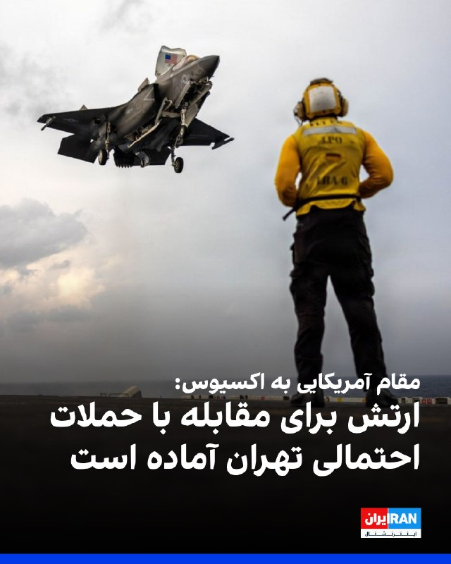

اکسیوس به نقل از دو مقام آمریکایی گزارش داد اسرائیل پیش از حمله به ضاحیه در جنوب بیروت، دولت ترامپ را در جریان قرار داده بود.
یک مقام آمریکایی نیز گفت نیروهای این کشور در خاورمیانه در صورت عملی شدن تهدیدهای تهران و آغاز حملات جدید، برای دفاع آماده هستند.

اکسیوس همچنین به نقل از یک مقام آمریکایی نوشت واشینگتن از حق اسرائیل برای دفاع از خود حمایت می‌کند و حزب‌الله باید فورا حملات خود را متوقف کند تا توافق‌های موجود اجرا شوند.

این رسانه به نقل از منابع خود گزارش داد اسرائیل به دولت ترامپ اعلام کرده است حملات مداوم حزب‌الله به شمال اسرائیل نقض آتش‌بس محسوب می‌شود و تل‌آویو خود را محق به هدف قرار دادن بیروت می‌داند. منابع افزودند اسرائیل تاکید کرده در صورت تکرار حملات حزب‌الله، حملات خود علیه بیروت را ادامه خواهد داد.
‌🏁 🇬🇧 IranintlTV

🤖 @VahidOOnLine

## VahidOOnLine — post 244153

  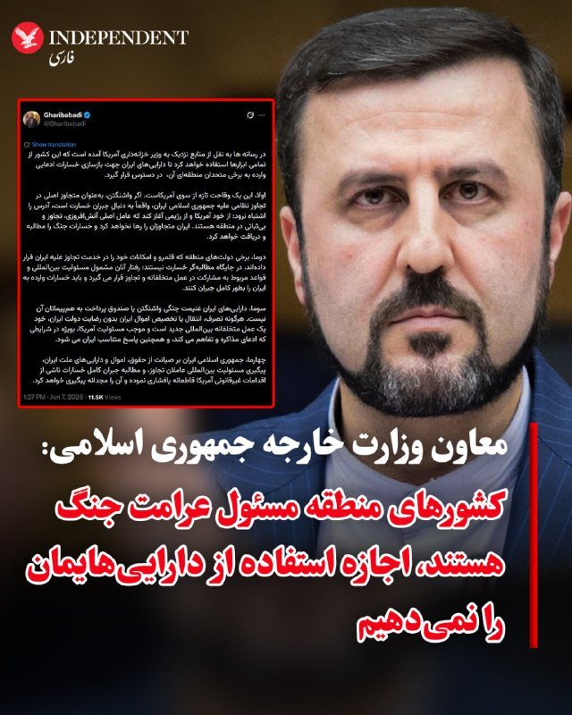

♦️در رسانه ها به نقل از منابع نزدیک به وزیر خزانه‌داری آمریکا آمده است که این کشور از تمامی ابزارها استفاده خواهد کرد تا دارایی‌های ایران جهت بازسازی خسارات ادعایی وارده به برخی متحدان منطقه‌ای آن،  در دسترس قرار گیرد.

اولا، این یک وقاحت تازه از سوی آمریکاست. اگر واشنگتن، به‌عنوان متجاوز اصلی در تجاوز نظامی علیه جمهوری اسلامی ایران، واقعاً به دنبال جبران خسارت است، آدرس را اشتباه نرود: از خود آمریکا و از رژیمی آغاز کند که عامل اصلی آتش‌افروزی، تجاوز و بی‌ثباتی در منطقه هستند. ایران متجاوزان را رها نخواهد کرد و خسارات جنگ را مطالبه و دریافت خواهد کرد.

دوما، برخی دولت‌های منطقه که قلمرو و امکانات خود را در خدمت تجاوز علیه ایران قرار داده‌اند، در جایگاه مطالبه‌گر خسارت نیستند؛
‌🇸🇦 Indypersian

🤖 @VahidOOnLine

## WithYashar — post 13747

اسرائیل هیوم:مدارس در سراسر اسرائیل تعطیل شده‌اند.
@withyashar

## WithYashar — post 13746

بوی عرق زیر بغل روبیکا میاد🤢
@withyashar

## WithYashar — post 13745

اینترنشنال: دفتر مجتبی خامنه ای دستور حمله رو امضا کرده و فقط دستور به یگان های موشکی مونده
@withyashar

## mwarmonitor — post 10260

موشک به سمت اسراییل شلیک شد

## mwarmonitor — post 10259

🔴 کانال ۱۳ اسرائیل به نقل از یک منبع: نیروی هوایی، تعداد جنگنده‌ها و پهپادهای خود را در آسمان لبنان افزایش داده است، در چارچوب آماده‌باش برای احتمال پاسخ حزب‌الله.

@mwarmonitor

## mwarmonitor — post 10258

🔴ارتش اسرائیل:

🔸در پی حمله ارتش اسرائیل در بیروت و پس از ارزیابی وضعیت، ارتش اسرائیل خود را برای شلیک به سمت خاک دولت اسرائیل در ساعات آینده آماده می‌کند.

🔹ارتش اسرائیل اجزای دفاعی خود را تقویت کرده و در وضعیت آمادگی و هوشیاری برای سناریوهای مختلف دفاعی و تهاجمی قرار دارد. رئیس ستاد کل، سپهبد ایال زمیر و فرماندهان ارتش اسرائیل در حال حاضر در حال انجام ارزیابی‌های وضعیت هستند و تحولات را از نزدیک دنبال می‌کنند.

🔸از عموم مردم خواسته شده هوشیاری خود را حفظ کنند، مسئولانه رفتار کنند و به دستورالعمل‌های فرماندهی جبهه داخلی که به‌طور دوره‌ای به‌روزرسانی می‌شود پایبند باشند.

🔹در صورت هرگونه تغییر اضافی در ارزیابی وضعیت، اطلاع‌رسانی لازم به مردم انجام خواهد شد.

@mwarmonitor

## mwarmonitor — post 10257

🔴رسانه‌های اسرائیلی: به دلیل تهدیدات ایران، فردا تمامی کلاس‌های آموزشی در سراسر اسرائیل لغو شده است.

@mwarmonitor

## mwarmonitor — post 10256

  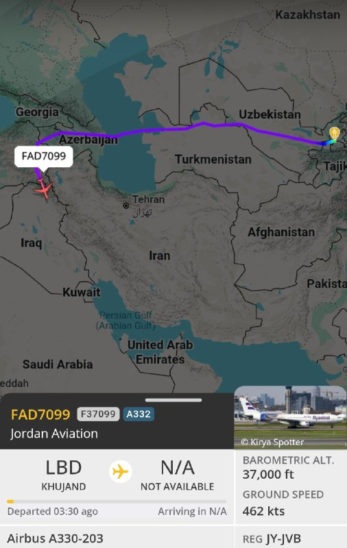

✈️ در حال حاضر تعدادی از پروازهای غیرنظامی از استفاده از حریم هوایی ایران خودداری می‌کنند.

@mwarmonitor

## pm_afshaa — post 92555

کرمانشاه موشک شلیک شد 
💧 Rainbet.com the #1 Non-KYC Crypto Casino & Sportsbook @rainbetcom 
😁 @Pm_Afshaa

## pm_afshaa — post 92554

پروکسی فعلا متصل

tg://proxy?server=s01.neo-trading.org&port=443&secret=ee7391242569590e01416101927d38b565646e732d73686f702e7275

💧 Rainbet.com the #1 Non-KYC Crypto Casino & Sportsbook @rainbetcom

😁 @Pm_Afshaa

## pm_afshaa — post 92553

کرمانشاه موشک شلیک شد

💧 Rainbet.com the #1 Non-KYC Crypto Casino & Sportsbook @rainbetcom

😁 @Pm_Afshaa

## pm_afshaa — post 92552

زدن

## pm_afshaa — post 92551

  <a href="telegram/content/pm_afshaa_92551_1780859027.webm" target="_blank">🎬 Download video</a>

🔴درپی تهدید حمله موشکی ایران، مدارس اسرائیل فردا تعطیل شدن.

💧 Rainbet.com the #1 Non-KYC Crypto Casino & Sportsbook @rainbetcom

😁 @Pm_Afshaa

## pm_afshaa — post 92550

سد مجید نمایشی نزن فقط حواسمون هست

## VahidOnline — post 75995

پیام‌های دریافتی تایید نشده:

سلام همین الان صدای موشک از کرمانشاه اومد

سلام صدای جنگنده در کرمانشاه

سلام وحید جان.
همین الان ساعت ده و نیم دو تا موشک از کرمانشاه شلیک شد

صدای غرش شدید ترسناک ساعت 10.31 شب کرمانشاه میاد

📡 @VahidOnline

## kianmeli1 — post 87706

🔴فوری-ارتش اسراییل به حالت آماده باش در آمد
https://t.me/kianmeli1

## IranIntlTV — post 341037

  <a href="telegram/content/IranIntlTV_341037_1780859028.mp4" target="_blank">🎬 Download video</a>

مئیر جاودانفر، تحلیل‌گر مسائل اسرائیل، گفت به نظر می‌رسد جمهوری اسلامی و حزب‌الله لبنان پس از انتشار خبر گفت‌وگوی پرتنش هفته گذشته دونالد ترامپ و بنیامین نتانیاهو تصور می‌کنند می‌توانند با افزایش فشار، زمینه خروج نیروهای اسرائیلی از لبنان را فراهم کنند.
@iranintltv

## IranIntlTV — post 341036

  

اکسیوس به نقل از دو مقام آمریکایی گزارش داد اسرائیل پیش از حمله به ضاحیه در جنوب بیروت، دولت ترامپ را در جریان قرار داده بود.
یک مقام آمریکایی نیز گفت نیروهای این کشور در خاورمیانه در صورت عملی شدن تهدیدهای تهران و آغاز حملات جدید، برای دفاع آماده هستند.

اکسیوس همچنین به نقل از یک مقام آمریکایی نوشت واشینگتن از حق اسرائیل برای دفاع از خود حمایت می‌کند و حزب‌الله باید فورا حملات خود را متوقف کند تا توافق‌های موجود اجرا شوند.

این رسانه به نقل از منابع خود گزارش داد اسرائیل به دولت ترامپ اعلام کرده است حملات مداوم حزب‌الله به شمال اسرائیل نقض آتش‌بس محسوب می‌شود و تل‌آویو خود را محق به هدف قرار دادن بیروت می‌داند. منابع افزودند اسرائیل تاکید کرده در صورت تکرار حملات حزب‌الله، حملات خود علیه بیروت را ادامه خواهد داد.
https://iranintl.com/202606071984

## Shin_Persian — post 6624

Shin ✓ @hey_itsmyturn
Sun, 07 Jun 2026 19:02:25 UTC

#IDF 🇮🇱:
"The IDF has identified that missiles were launched from Iran toward Israeli territory a short time ago.

Defense systems are operating to intercept the threat. In recent minutes, the Home Front Command distributed preliminary instructions directly to mobile phones in the relevant areas.

The public is asked to show responsibility and act according to the instructions - they save lives.

You must enter protected spaces when receiving the alert, and remain in them until further notice.

Exiting the protected space will be possible only after receiving explicit instruction. You must continue to act according to Home Front Command guidelines."
#Iran

فارسی

#IDF 🇮🇱:
"ارتش دفاعی اسرائیل شناسایی کرده است که دقایقی پیش موشک‌هایی از ایران به سمت خاک اسرائیل شلیک شده است.

سیستم‌های دفاعی برای رهگیری تهدید در حال فعالیت هستند. در دقایق اخیر، فرماندهی جبهه داخلی دستورالعمل‌های اولیه را مستقیماً به تلفن‌های همراه در مناطق مربوطه ارسال کرده است.

از عموم مردم خواسته می‌شود مسئولیت‌پذیری نشان داده و طبق دستورالعمل‌ها عمل کنند - این اقدامات جان انسان‌ها را نجات می‌دهند.

هنگام دریافت هشدار باید وارد فضاهای محافظت‌شده شوید و تا اطلاع ثانوی در آنجا بمانید.

خروج از فضای محافظت‌شده تنها پس از دریافت دستور صریح امکان‌پذیر خواهد بود. شما باید به عمل بر اساس دستورالعمل‌های فرماندهی جبهه داخلی ادامه دهید."
#Iran

𝕏 · @shin_persian

## Shin_Persian — post 6623

Shin ✓ @hey_itsmyturn
Sun, 07 Jun 2026 19:01:35 UTC

Yup
BM launch from Kermanshah, western Iran

فارسی

آره
شلیک موشک بالستیک (BM) از کرمانشاه، غرب ایران

𝕏 · @shin_persian

## Shin_Persian — post 6622

Shin ✓ @hey_itsmyturn
Sun, 07 Jun 2026 19:00:56 UTC

Eyewitness believes it’s sonic booms, might be a missile launch though

فارسی

شاهد عینی معتقد است که این صداها ناشی از دیوار صوتی است، هرچند ممکن است شلیک موشک باشد.

𝕏 · @shin_persian

## Shin_Persian — post 6621

Shin ✓ @hey_itsmyturn
Sun, 07 Jun 2026 19:00:27 UTC

Huge sound in Kermanshah now

فارسی

صدای بسیار مهیبی هم‌اکنون در کرمانشاه شنیده شد

𝕏 · @shin_persian

## Shin_Persian — post 6620

Shin ✓ @hey_itsmyturn
Sun, 07 Jun 2026 18:57:29 UTC

🚨

IDF Spokesperson:

“Following the IDF strike in Beirut and the completion of a situational assessment, the IDF is preparing for missile fire towards Israeli territory in the coming hours.

The IDF has reinforced its defensive capabilities and remains prepared and vigilant for a variety of scenarios, both defensive and offensive. The Chief of Staff, Lieutenant General Eyal Zamir, and IDF commanders are currently conducting situational assessments and closely monitoring developments.

The public is urged to remain vigilant, act responsibly, and adhere to Home Front Command directives, which are updated periodically.

Should there be further changes to the situational assessment, the public will be informed accordingly.”

فارسی

🚨

سخنگوی ارتش دفاعی اسرائیل (IDF):

«در پی حمله ارتش دفاعی اسرائیل در بیروت و تکمیل ارزیابی وضعیت، ارتش دفاعی اسرائیل خود را برای شلیک موشک به سمت خاک اسرائیل در ساعات آینده آماده می‌کند.

ارتش دفاعی اسرائیل توانمندی‌های دفاعی خود را تقویت کرده و برای سناریوهای مختلف، اعم از دفاعی و تهاجمی، آماده و هوشیار است. رئیس ستاد کل، سپهبد ایال زمیر، و فرماندهان ارتش دفاعی اسرائیل هم‌اکنون در حال انجام ارزیابی‌های وضعیت و پایش دقیق تحولات هستند.

از عموم مردم خواسته می‌شود هوشیار بمانند، مسئولانه عمل کنند و به دستورالعمل‌های فرماندهی جبهه داخلی که به صورت دوره‌ای به‌روزرسانی می‌شوند، پایبند باشند.

در صورت تغییرات بیشتر در ارزیابی وضعیت، به عموم مردم اطلاع‌رسانی خواهد شد.»

𝕏 · @shin_persian

## Persian_Trend_Official — post 15931

  

فعال سازی هشدار های حمله موشکی اسرائیل

📝 Amir

📌 @persian_trend_official
پرشین ترند | متفاوت‌ترین کانال نظامی

## Persian_Trend_Official — post 15930

حمله موشکی ایران آغاز شد.

📝 Amir

📌 @persian_trend_official
پرشین ترند | متفاوت‌ترین کانال نظامی

## Persian_Trend_Official — post 15929

  <a href="telegram/content/Persian_Trend_Official_15929_1780859032.webm" target="_blank">🎬 Download video</a>

سخنگوی ارتش اسرائیل می گوید در ساعات آینده انتظار شلیک موشک ها به سمت خاک اسرائیل را دارند! 📝 Amir 📌 @persian_trend_official پرشین ترند | متفاوت‌ترین کانال نظامی

## Persian_Trend_Official — post 15928

  

سخنگوی ارتش اسرائیل می گوید در ساعات آینده انتظار شلیک موشک ها به سمت خاک اسرائیل را دارند!

📝 Amir

📌 @persian_trend_official
پرشین ترند | متفاوت‌ترین کانال نظامی

## Persian_Trend_Official — post 15927

  <a href="telegram/content/Persian_Trend_Official_15927_1780859034.webm" target="_blank">🎬 Download video</a>

غیر رسمی/گزارشاتی از فعالیت شدید جنگنده های آمریکایی در نزدیکی مرز ایران

👺Phantom

📌 @persian_trend_official
پرشین ترند | متفاوت‌ترین کانال نظامی

## Persian_Trend_Official — post 15926

تا دقایقی دیگه بریم لایو ؟
اگر ری اکشن ها خوب باشه البته

## IranianMinds — post 21593

  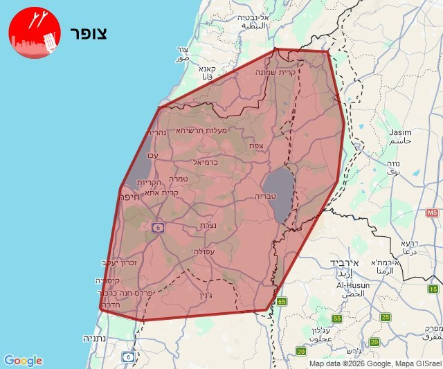

آژیر خطر حمله ی موشکی به اسرائیل

@IranianMinds

## IranianMinds — post 21592

شلیک موشک از کرمانشاه

@IranianMinds

## IranianMinds — post 21591

زدن

## IranianMinds — post 21590

🔴 تو صداوسیما دارن آهنگای حماسی و سوره ی فتح رو پخش میکنن. @IranianMinds

## IranianMinds — post 21589

🔴 تو صداوسیما دارن آهنگای حماسی و سوره ی فتح رو پخش میکنن.

@IranianMinds

## IranianMinds — post 21588

  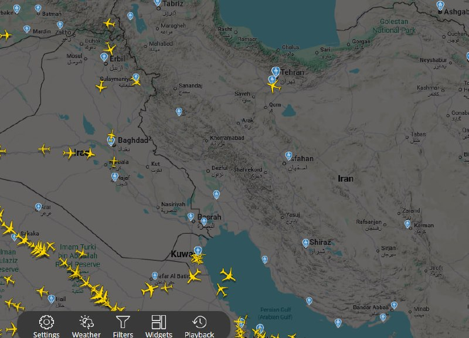

حریم هوایی از کلیر بودن دراومد که یه هواپیمای مسافربری از فرودگاه امام خمینی بلند شد. @IranianMinds

## Dirty_Kids — post 391247

رهبر جمهوری اسلامی غیب شده.
مجلس عملاً تعلیق
دولت در استعفا
مراسم سالگرد خمینی حتی سخنران ندارد
نه آسمان دارد، نه در زمین ارتش
نفت و کشور تحریمه
پیش‌شرط مذاکرات، پول‌ها آزاد نشد و عوضش لبنان شخم زده میشه
این تصویر یک نظام باثبات نیست؛
تصویر سیستمی است که مرگ خود را می‌بیند

@Dirty_Kids 👻

## Dirty_Kids — post 391246

کد جنگی قالیباف به تحولات لبنان را دریابید. چنین واکنشی به اذن رهبر نیاز دارد.
مسئله اینجاست: اگر مجتبی مخفی است، این هماهنگی با مجتبی در این فرصت اندک، یعنی لو رفتن مخفی‌گاهش!
خلاصه بگم: اسم واقعی مجتبی، محمدباقر قالیباف است.
ترامپ می‌داند به اسم کی و با کی مذاکره کند.

@Dirty_Kids 👻

## alonews — post 125895

  <a href="telegram/content/alonews_125895_1780859036.webm" target="_blank">🎬 Download video</a>

🔴فوووووووری/جنگ آغاز شد

✅ @AloNews خبر جنگ

## alonews — post 125894

  <a href="telegram/content/alonews_125894_1780859037.webm" target="_blank">🎬 Download video</a>

🔴فوووووووری/هشدار حملات موشکی ایران در اسرائیل

✅ @AloNews خبر جنگ

## alonews — post 125892

  <a href="telegram/content/alonews_125892_1780859037.webm" target="_blank">🎬 Download video</a>

🔴فوری / حضور یک فروند پهباد ترک TAI Aksungar که مأموریتش شناسایی و هشدار اولیه است در نزدیکی مرز ایران

✅ @AloNews خبر جنگ

## alonews — post 125891

  <a href="telegram/content/alonews_125891_1780859037.webm" target="_blank">🎬 Download video</a>

🔴فووووری/گزارشات از شلیک موشک

✅ @AloNews خبر جنگ

## alonews — post 125890

  <a href="telegram/content/alonews_125890_1780859037.webm" target="_blank">🎬 Download video</a>

👈آسمان اسرائیل هنوز کلیر نشده

✅ @AloNews خبر جنگ

## alonews — post 125889

  <a href="telegram/content/alonews_125889_1780859038.webm" target="_blank">🎬 Download video</a>

👈‌‌پرواز جنگنده های ارتش برفراز غرب تهران

✅ @AloNews خبر جنگ

## alonews — post 125888

🔴فوووووووووووری/بریزید اینجا
⬇️

https://t.me/+mKQjO9EB47o0N2M0
https://t.me/+mKQjO9EB47o0N2M0

## alonews — post 125887

  <a href="telegram/content/alonews_125887_1780859038.webm" target="_blank">🎬 Download video</a>

🔴فوری/هم اکنون نماهنگی از سوره فتح در صدا و سیمای جمهوری اسلامی درحال پخش است!

✅ @AloNews خبر جنگ

## alonews — post 125886

  <a href="telegram/content/alonews_125886_1780859038.webm" target="_blank">🎬 Download video</a>

🔴فووووووووووووووووووووووووری

---
📅 بروزرسانی: 1405/03/17 22:23
---

## WithYashar — post 13743

شبکه 14 اسرائیل : در این حمله مشخص خواهد شد آیا ایران می‌تواند صد موشک را همزمان شلیک کند یا خیر🚨
@withyashar

## WithYashar — post 13742

العربیه: وزیر کشور پاکستان که هم‌اکنون در تهران حضور دارد، هشدارهایی را به ایران درباره تشدید تنش‌ها در مسیرهای کشتیرانی دریایی منتقل کرده است
@withyashar

## WithYashar — post 13741

هواپیماهای مسافربری در حال ترک حریم هوایی عراق می‌باشند.🚨
@withyashar

## pm_afshaa — post 92549

  <a href="telegram/content/pm_afshaa_92549_1780858389.webm" target="_blank">🎬 Download video</a>

🔴ایران اینترنشنال: سپاه پاسداران آماده حمله موشکی به اسرائیله.

💧 Rainbet.com the #1 Non-KYC Crypto Casino & Sportsbook @rainbetcom

😁 @Pm_Afshaa

## pm_afshaa — post 92548

  <a href="telegram/content/pm_afshaa_92548_1780858390.webm" target="_blank">🎬 Download video</a>

🔴العربیه: فیلد مارشال عاصم منیر از ایران خواست تا از فرصت فعلی برای رسیدن به توافق استفاده کنه.

💧 Rainbet.com the #1 Non-KYC Crypto Casino & Sportsbook @rainbetcom

😁 @Pm_Afshaa

## DEJradio — post 5436

  <a href="telegram/content/DEJradio_5436_1780858390.mp4" target="_blank">🎬 Download video</a>

🔺🏆 
👑 آیا فیفا می‌خواهد صدای مردم ایران را سرکوب کند؟

مهدی رستم‌پور خبرنگار ورزشی می‌گوید بعد از حمله روسیه به اوکراین تیم فوتبال روسیه از حضور در مسابقات بین‌اامللی محروم شد، اما فیفا همچنان پشتیبان جمهوری اسلامی است آنهم در شرایطی که حکومت به کشورهای منطقه وشک‌پرانی کرده و مردم را سرکوب می‌کند.

#فیفا #جام_جهانی
@DEJradio

## DEJradio — post 5435

  <a href="telegram/content/DEJradio_5435_1780858392.webm" target="_blank">🎬 Download video</a>

⭕️ 
🛩️
🚨 شهروندان از چند شهر از جمله تهران، کرج، ساوه و در غرب همدان و کرمانشاه گزارش دادند که صدای پرواز هواپیمای جنگنده‌ در ارتفاع پایین را شنیده‌اند. در بعضی نقاط از جمله بیدگنه و ملارد صدای انفجار به گوش رسید. #فوری @DEJradio

## DEJradio — post 5434

  <a href="telegram/content/DEJradio_5434_1780858392.webm" target="_blank">🎬 Download video</a>

⭕️ 
🛩️
🚨 شهروندان از چند شهر از جمله تهران، کرج، ساوه و در غرب همدان و کرمانشاه گزارش دادند که صدای پرواز هواپیمای جنگنده‌ در ارتفاع پایین را شنیده‌اند. در بعضی نقاط از جمله بیدگنه و ملارد صدای انفجار به گوش رسید.

#فوری
@DEJradio

## kianmeli1 — post 87705

  

🔴محمد مخبر

اسراییل میز مذاکره را به آتش کشید
بهای سنگینی پرداخت خواهد کرد
https://t.me/kianmeli1

## IranIntlTV — post 341035

  

🔻کریستین اریکسن، بازیکن تیم ملی دانمارک هافبک باتجربه تیم ملی دانمارک، در میانه نیمه دوم این مسابقه روی زمین افتاد و برای لحظاتی هوشیاری خود را از دست داد. اریکسن پیشتر در یورو ۲۰۲۰ مقابل فنلاند رخ داده بود.

🔹داور مسابقه بلافاصله بازی را متوقف کرد و کادر پزشکی برای رسیدگی به وضعیت اریکسن وارد زمین شد. گزارش‌ها حاکی از آن است که این بازیکن پس از دقایقی به هوش آمد و تحت مراقبت‌های پزشکی قرار گرفت.

🔹اریکسن در نهایت با پای خود زمین مسابقه را ترک کرد و هواداران حاضر در ورزشگاه نیز او را با تشویق ایستاده بدرقه کردند و این دیدار نیمه تمام ماند.

🔹این اتفاق یادآور حادثه تلخ یورو ۲۰۲۰ است؛ جایی که اریکسن در جریان دیدار دانمارک و فنلاند دچار ایست قلبی شد و پس از احیا، به فوتبال بازگشت. او از آن زمان با دستگاه دفیبریلاتور قلبی (ICD) به فعالیت حرفه‌ای خود ادامه می‌دهد.

🔹هنوز جزئیات بیشتری درباره علت این حادثه و وضعیت جسمانی اریکسن منتشر نشده است.

🔹فدراسیون فوتبال دانمارک با انتشار بیانیه‌ای در شبکه اجتماعی ایکس اعلام کرد: «کریستین اریکسن هوشیار است و با توجه به شرایط پیش‌آمده، وضعیت خوبی دارد.»

@iranintltvsport

## Shin_Persian — post 6619

  

😭😭😭

## FarsiVOA — post 219918

روایت تازه از بحران معیشت در ایران؛ آیا حقوق کارگران فقط برای زنده ماندن کافی است؟

## FarsiVOA — post 219914

فرماندهی مرکزی ایالات متحده، سنتکام، تصاویری از عملیات پرواز شبانه روی ناو هواپیمابر «یو‌اس‌اس جورج اچ. دبلیو. بوش» منتشر کرد.

سنتکام اعلام کرد این عملیات در حالی انجام شده که ناو هواپیمابر جورج اچ. دبلیو. بوش در حال عبور از دریای عرب است.

به گفته سنتکام، این ناو یکی از دو ناو هواپیمابری است که هم‌اکنون در خاورمیانه فعالیت می‌کنند.

@FarsiVOA

## DW_Farsi — post 125658

  

🔶حکم حبس و ممنوع‌الخروجی جعفر پناهی تایید شد

مصطفی نیلی، وکیل جعفر پناهی، فیلمساز سرشناس ایرانی به خبرگزاری دانشجویان ایران، ایسنا گفته که حکم یک سال حبس تعزیری، دو سال ممنوعیت خروج از کشور و ممنوعیت عضویت در گروه‌های سیاسی موکلش در شعبه ۲۶ دادگاه انقلاب تایید شده است.

به گفته نیلی، این شعبه دادگاه انقلاب تقاضای واخواهی را رد و حکم اولیه را عینا تایید کرده است. این حکم به صورت غیابی و بدون حضور جعفر پناهی صادر شده اما ظرف ۲۰ روز قابل تجدیدنظرخواهی است.

به نوشته کانال تلگرامی تحکیم ملت در کیفرخواست جعفر پناهی این اتهامات آمده است: «ساخت فیلم زیرزمینی و مسئله‌دار علیه حاکمیت، حمایت از برخی محکومان امنیتی، از جمله فاطمه سپهری، راحله راحمی‌پور، حسین رونقی، محمد نوری‌زاد، مهدی محمودیان، ابوالفضل قدیانی و …، حمایت از اعتراضات، حمایت از شعار زن، زندگی، آزادی، امضا و انتشار بیانیه‌ای درباره اعتصاب کامیون‌داران، سیاه‌نمایی وضعیت کشور و بازنشر کلیپی با مضمون هم‌خوانی سرود "ای ایران" در اعتراض به صدور و اجرای احکام اعدام.»

@dw_farsi

## DW_Farsi — post 125657

  

🔶نشست نتانیاهو با مقام‌های دفاعی اسرائيل پس از تهدید سپاه

به گزارش رسانه‌های اسرائيل، پس از تهدید سپاه پاسداران به پاسخ‌گویی به حملات اسرائيل به ضاحیه بیروت، بنیامین نتانیاهو، نخست‌وزیر این کشور جلسه‌ای امنیتی با یسرائیل کاتس، وزیر دفاع و شماری از روسای نهادهای دفاعی اسرائيل به منظور بررسی درگیری‌ها لبنان تشکیل داده است.

یک مقام اسرائیلی در گفت‌وگو با تایمز اسرائیل این خبر را تایید کرده است.

پس از حمله روز یک‌شنبه اسرائیل به ضاحیه بیروت، پایگاه اصلی گروه حزب‌الله لبنان قرارگاه خاتم‌الانبیای سپاه پاسداران اطلاعیه‌ای صادر کرد و گفت: «این حمله بی پاسخ نمی‌ماند.»

محمدباقر قالیباف، رئيس مجلس ایران نیز در شبکه ایکس از "نقض توافقات با لبنان" نوشت و نتیجه گرفت که این موضوع نشان داده که آن‌ها "فقط زبان قدرت را می‌فهمند."
@dw_farsi

## Persian_Trend_Official — post 15925

  

الان امید دانا تیتر میزنه سوخت رسان آمریکایی وسط آسمان ایران 😄

## Persian_Trend_Official — post 15924

  <a href="telegram/content/Persian_Trend_Official_15924_1780858396.mp4" target="_blank">🎬 Download video</a>

🇱🇧🇮🇱🇱🇧 ارتش دفاعی اسرائیل فیلمی منتشر کرد که حمله هوایی خود به حومه جنوبی بیروت را در اوایل امروز نشان می‌دهد.

ارتش دفاعی اسرائیل می‌گوید که مقر حزب‌الله را هدف قرار داده است که از آنجا «عملیات تروریستی» علیه اسرائیل و نیروها در جنوب لبنان انجام شده است.

بر اساس منابع محلی، دو نفر از اعضای حزب‌الله در این حمله کشته شدند.

👺Phantom

📌 @persian_trend_official
پرشین ترند | متفاوت‌ترین کانال نظامی

## Persian_Trend_Official — post 15923

  <a href="telegram/content/Persian_Trend_Official_15923_1780858398.mp4" target="_blank">🎬 Download video</a>

علی قلهکی: تنش مجدد نظامی احتناب‌ناپذیر است! ایران باید تصمیم بگیرد که اکنون شروع کند (پیش از جام جهانی) یا پس از جام جهانی و یا پاییزِ ۱۴۰۵، اسرائیل و آمریکا ابتکار عمل را بدست‌ گیرند! 
👺Phantom 
📌 @persian_trend_official پرشین ترند | متفاوت‌ترین کانال نظامی

## IranianMinds — post 21587

  

حریم هوایی ایران و عراق داره کلیر میشه @IranianMinds

## IranianMinds — post 21586

حریم هوایی ایران و عراق داره کلیر میشه @IranianMinds

## Dirty_Kids — post 391245

  

🔴 آسمون ایران به طور کامل کلیر شد!!!!

@Dirty_Kids 👻

## Hranews — post 113457

دادستانی تهران علیه زیباکلام اعلام جرم کرد

❗️
❗️
❗️
❗️
❗️– دادستانی تهران علیه صادق زیباکلام، تحلیل‌گر سیاسی، به دلیل انجام یک مصاحبه جدید اعلام جرم کرد و هم‌زمان قرار نظارت قضایی پیشین او مبنی بر ممنوعیت هرگونه فعالیت رسانه‌ای و تولید محتوا در شبکه‌های اجتماعی را تشدید کرد.

ادامه مطلب

#صادق_زیباکلام

↘️
@hranews_bot تماس ✉️ - @Hranews کانال هرانا 🆑

## alonews — post 125884

🔴فووووووووووووووووووووووووری

## alonews — post 125883

  <a href="telegram/content/alonews_125883_1780858400.webm" target="_blank">🎬 Download video</a>

🔴فوری/ایران اینترنشنال:
سپاه آماده حمله موشکی به اسرائیله.

✅ @AloNews خبر جنگ

## alonews — post 125882

  <a href="telegram/content/alonews_125882_1780858400.webm" target="_blank">🎬 Download video</a>

💢فوووووووووری/پرواز شدید جنگنده‌های آمریکایی در مرز ایران 
🚨 @AkhbareFouri

## alonews — post 125881

  <a href="telegram/content/alonews_125881_1780858401.webm" target="_blank">🎬 Download video</a>

👈 ایرباس A300B4-60SR ایران ایر در حال چرخش بر فراز شمال ایران است

✅ @AloNews خبر جنگ

## alonews — post 125880

  <a href="telegram/content/alonews_125880_1780858401.webm" target="_blank">🎬 Download video</a>

👈العربیه: فیلد مارشال عاصم منیر از ایران خواست تا از فرصت فعلی برای رسیدن به توافق استفاده کند

✅ @AloNews خبر جنگ

---
📅 بروزرسانی: 1405/03/17 22:13
---

## WithYashar — post 13740

## mwarmonitor — post 10255

  <a href="telegram/content/mwarmonitor_10255_1780857807.mp4" target="_blank">🎬 Download video</a>

🔸نیروهای ایالات متحده در سراسر خاورمیانه همچنان در حالت هوشیاری و آمادگی قرار دارند.

@mwarmonitor

## mwarmonitor — post 10254

🔴اسرائیل در پی حمله حزب‌الله، بیروت را هدف قرار داد؛ خطر پاسخ ایران وجود دارد 📝باراک راوید AXIOS 🔰مقامات اسرائیلی اعلام کردند که اسرائیل روز یکشنبه در پاسخ به حمله موشکی حزب‌الله به شمال اسرائیل، حومه جنوبی بیروت را هدف قرار داده است. 📌چرا این موضوع اهمیت…

## mwarmonitor — post 10253

🔴 به گفته خبرنگار العربیه، وزیر کشور پاکستان که هم‌اکنون در تهران حضور دارد، هشدارهایی را به ایران درباره تشدید تنش‌ها در مسیرهای کشتیرانی دریایی منتقل کرده است.

🔴 محسن نقوی از ایران خواست هرچه سریع‌تر موضع خود را در قبال مطالبات آمریکا شفاف کند.

🔴 در پیامی که نقوی به رهبری ایران ابلاغ کرد، عاصم منیر، فرمانده ارتش پاکستان، از تهران خواست از فرصت کنونی برای دستیابی به یک توافق استفاده کند.

@mwarmonitor

## mwarmonitor — post 10252

🔴 وزارت بهداشت لبنان اعلام کرد در حمله هوایی اسرائیل به حومه‌های جنوبی بیروت، دو نفر کشته و ۲۰ نفر دیگر زخمی شدند.

@mwarmonitor

## pm_afshaa — post 92547

🔴تمام پایگاه‌های نظامی آمریکا در سراسر خاورمیانه و خلیج فارس در حالت هشدار بالا قرار گرفتن

💧 Rainbet.com the #1 Non-KYC Crypto Casino & Sportsbook @rainbetcom

😁 @Pm_Afshaa

## pm_afshaa — post 92546

اسمون کشور در حال کلییر شدنه 
💧 Rainbet.com the #1 Non-KYC Crypto Casino & Sportsbook @rainbetcom 
😁 @Pm_Afshaa

## pm_afshaa — post 92545

🔴شبکه 14 اسرائیل : در این حمله مشخص خواهد شد آیا ایران می‌تواند صد موشک را همزمان شلیک کند یا خیر

💧 Rainbet.com the #1 Non-KYC Crypto Casino & Sportsbook @rainbetcom

😁 @Pm_Afshaa

## pm_afshaa — post 92544

🔴سازمان هواپیمایی کشوری ایران دستور بسته شدن فضای هوایی را صادر کرده

💧 Rainbet.com the #1 Non-KYC Crypto Casino & Sportsbook @rainbetcom

😁 @Pm_Afshaa

## pm_afshaa — post 92543

🔴نیروهای امارات و کویت به حالت اماده باش در اومدن

💧 Rainbet.com the #1 Non-KYC Crypto Casino & Sportsbook @rainbetcom

😁 @Pm_Afshaa

## pm_afshaa — post 92542

  

اسمون کشور در حال کلییر شدنه

💧 Rainbet.com the #1 Non-KYC Crypto Casino & Sportsbook @rainbetcom

😁 @Pm_Afshaa

## kianmeli1 — post 87704

  

🔴فوری

طبق اخبار حریم هوایی در حال بسته شدن است....
https://t.me/kianmeli1

## IranIntlTV — post 341034

  <a href="https://t.me/IranintlTV/341034" target="_blank">📎 Download file</a>

🎧نسخه صوتی تیتراول با نیوشا صارمی: حمله اسرائیل به بیروت با دستور نتانیاهو و چراغ سبز ترامپ؛ سپاه: پاسخ می‌دهیم
@iranintlTV

## Iliaen — post 4443

  

یک پرواز دیگر، اینبار از مبدا استابول به مقصد تهران، با تغییر مسیر پرواز، درحال دور زدن آسمان غرب ایران جهت ادامه‌ی مسیر (یا فرود در نخستین فرودگاه) است.

@iliaen

## FarsiVOA — post 219913

  <a href="telegram/content/FarsiVOA_219913_1780857814.mp4" target="_blank">🎬 Download video</a>

ویدیویی از کیان، فرزند کمیل جمشیدی، کشته‌شده در دی ماه ۱۴۰۴، واکنش کاربران اجتماعی را برانگیخته است. کیان ۱۳ ساله دل‌تنگ پدرش، لباس او را در آغوش گرفته و اشک می‌ریزد.

کمیل جمشیدی، ۳۶ ساله، ۱۸ دی با گلوله ماموران حکومتی در فردیس کرج کشته شد.

## FarsiVOA — post 219912

ایمان آقایاری در برنامه تفسیر خبر: جمهوری اسلامی از پاسخ به نیاز نسل امروز ناتوان است

## FarsiVOA — post 219911

Farsi VOA pinned a photo

## FarsiVOA — post 219910

  <a href="telegram/content/FarsiVOA_219910_1780857818.mp4" target="_blank">🎬 Download video</a>

دامون محمدی در برنامه تفسیر خبر: به محض پایان تب جنگی، اعتراضات مردمی تشدید می شود

## FarsiVOA — post 219909

  

🎯این برنامخ جذاب فهیمه خضر حیدری در رابطه با میر حسین موسوی را از لینک زیر مشاهده کنید:
https://www.youtube.com/live/pEj88TjMsVs

🔴یوتیوب صدای آمریکا را هم سابسکرایب کنید
👇👇👇👇
https://youtube.com/@voafarsi

## FarsiVOA — post 219908

🔺ارتش اسرائیل از کشف شبکه تونلی حزب‌الله که با «تامین مالی» جمهوری اسلامی در ارتفاعات بوفور ساخته شده است خبر داد

◾️ارتش اسرائیل می‌گوید نیروهایش یک شبکه گسترده تونل‌های زیرزمینی متعلق به حزب‌الله لبنان را در منطقه ارتفاعات بوفور در جنوب لبنان شناسایی کرده‌اند؛ شبکه‌ای که به گفته ارتش اسرائيل، با طراحی و تأمین مالی جمهوری اسلامی ایران ساخته شده است.

⬇️ بیشتر بخوانید:

https://ir.voanews.com/a/israel-exposes-hezbollah-tunnel-network/8158237.html

## Persian_Trend_Official — post 15922

  <a href="telegram/content/Persian_Trend_Official_15922_1780857820.webm" target="_blank">🎬 Download video</a>

🔴 غریب‌آبادی: ایران خسارات جنگ را از متجاوزان دریافت خواهد کرد
کاظم غریب‌آبادی، معاون وزیر امور خارجه، تأکید کرد ایران عاملان تجاوز را رها نخواهد کرد و جبران کامل خسارات جنگ را پیگیری می‌کند.
وی با اشاره به نقش برخی کشورهای منطقه در حمایت از عملیات علیه ایران گفت دولت‌هایی که قلمرو یا امکانات خود را در اختیار متجاوزان قرار داده‌اند، در موقعیت مطالبه خسارت نیستند و بر اساس حقوق بین‌الملل باید پاسخگوی اقدامات خود باشند.
غریب‌آبادی همچنین تصریح کرد دارایی‌های ایران غنیمت جنگی آمریکا یا منبع تأمین هزینه‌های متحدان واشنگتن نیست و هرگونه تصرف یا انتقال این اموال بدون رضایت تهران، نقض جدید حقوق بین‌الملل محسوب می‌شود.

👺Phantom

📌@persian_trend_official
پرشین ترند | متفاوت‌ترین کانال نظامی

## Persian_Trend_Official — post 15921

  

جمینگ شدید روی آسمان قطر !

📌 @persian_trend_official
پرشین ترند | متفاوت‌ترین کانال نظامی

## Persian_Trend_Official — post 15920

یک مقام ارشد امنیتی ایالات متحده به اکسیوس گفت که ارتش آمریکا کاملاً آماده است تا در صورت اقدام ایران به تهدیدات خود و حمله، واکنش نشان دهد.

📝 Amir

📌 @persian_trend_official
پرشین ترند | متفاوت‌ترین کانال نظامی

## Persian_Trend_Official — post 15919

  <a href="telegram/content/Persian_Trend_Official_15919_1780857821.webm" target="_blank">🎬 Download video</a>

از بچه های بالا، وزارت اطلاعات، اطلاعات سپاه، حراست ورزشگاه آزادی، بسیج کسبه قلعه حسن خان، عقیدتی پادگان کچویی کرج، اگر کسی اینجا هست جون عزیزتون نرینید تو اینترنت .

## Persian_Trend_Official — post 15918

  <a href="telegram/content/Persian_Trend_Official_15918_1780857822.webm" target="_blank">🎬 Download video</a>

علی قلهکی:
تنش مجدد نظامی احتناب‌ناپذیر است!
ایران باید تصمیم بگیرد که
اکنون شروع کند (پیش از جام جهانی)
یا پس از جام جهانی
و یا پاییزِ ۱۴۰۵، اسرائیل و آمریکا ابتکار عمل را بدست‌ گیرند!

👺Phantom

📌 @persian_trend_official
پرشین ترند | متفاوت‌ترین کانال نظامی

## IranianMinds — post 21585

  

حریم هوایی ایران و عراق داره کلیر میشه

@IranianMinds

## IranianMinds — post 21584

  

🔴 گویا ایرانی های ساکن لس انجلس بیشتر بلیط های بازی «ایران» و «نیوزیلند» در جام جهانی رو خریدن و احتمالا قرار جو بدی علیه بازیکنا تیم ملی در ورزشگاه ایجاد کنن.

چندتا از برنامه هاشون اینه که موقع پخش سرود ملی همه پشت کنن به زمین یا در حین بازی علیه بازیکنا شعار بدن.
البته طبق گزارش ها احتمالا ورود پرچم شیروخورشید به استادیوم ممنوع خواهد بود.
لس آنجلس بیش از ۱۰۰ هزار نفر ایرانی داره و گنجایش این ورزشگاه فقط ۷۰ هزار نفره.
این بازی بامداد سه شنبه ۲۶ خرداد ساعت ۴:۳۰ دقیقه به وقت تهران برگزار میشه.

@IranianMinds

## IranianMinds — post 21583

  <a href="telegram/content/IranianMinds_21583_1780857825.webm" target="_blank">🎬 Download video</a>

🕔 انتظارها به پایان رسید

📃 رونمایی از سایت وینرو ساعت 
🔢 امشب

🤩
🤩
🤩
🤩 بونوس اضافه به ازای هر واریز 
💰

🔴فرصت تکرارنشدنی به مناسبت افتتاحیه
🔴

⚡️هر چقدر شارژ کنی، بیشتر هدیه می‌گیری
⚡️

🔴تا سقف ۳ میلیون تومان
🔴

⌛ فقط برای مدت محدود

💣بالاترین بونوس‌ها فقط در سایت وینرو

پیش بینی کن و برنده شو
🎯

📺 تلویزیون لایو برای پوشش بازی ها

🛍بالاترین ضرایب ممکن
و هزاران امکانات خاص دیگه
💰

🎰 همین الان وارد شو و با هر شارژ تا ۲۰۰ درصد شارژ اضافه از ما هدیه بگیر

🔤 Winro.io         معتبرترین سایت ایران

🔤 Winro.io

📱 کانال اخبار و هدایــا gg17
🌟

📱 @winro_io

## Dirty_Kids — post 391244

  

دو عکس از یک راننده قطار با فاصله ۲۶ سال!

@Dirty_Kids 👻

## Dirty_Kids — post 391243

  <a href="telegram/content/Dirty_Kids_391243_1780857826.mp4" target="_blank">🎬 Download video</a>

این روزا دخترا چقدر دعوایی شدن😐😂

@Dirty_Kids 👻

## Dirty_Kids — post 391242

  <a href="telegram/content/Dirty_Kids_391242_1780857829.mp4" target="_blank">🎬 Download video</a>

يعنى خجالت نميكشن تو عصر ارتباط و سوشيال مديا اينارو ميگن؟

محیا دهقانی: جوان ایرانی که هر شب داره عشق و حال می‌کنه اگه مهاجرت کنه یه کشور اروپایی باید صبح تا شب کار کنه! با همون میزان کار در ایران می‌تونه به خیلی جاها برسه.

@Dirty_Kids 👻

## Hranews — post 113456

  

اعتراضات دی‌ماه ۱۴۰۴؛ آرمان سلیمانی توسط دادگاه تجدیدنظر به حبس محکوم شد

❗️
❗️
❗️
❗️
❗️– محکومیت آرمان سلیمانی، از بازداشت‌شدگان اعتراضات سراسری دی‌ماه ۱۴۰۴ که در زندان شیبان اهواز محبوس است، توسط دادگاه تجدیدنظر استان خوزستان عینا تایید شد. وی پیشتر توسط دادگاه انقلاب ایذه به دو سال و یک روز حبس محکوم شده بود.

به گزارش خبرگزاری هرانا، ارگان خبری مجموعه فعالان حقوق بشر در ایران، آرمان سلیمانی به حبس محکوم شد.

بر اساس رای صادره توسط دادگاه تجدیدنظر استان خوزستان، آقای سلیمانی از بابت اتهام “اخلال در نظم عمومی” با استناد به تبصره ماده ۲۶۸ قانون مجازات اسلامی به دو سال و یک روز حبس محکوم شده است.

ادامه مطلب

#آرمان_سلیمانی

↘️
@hranews_bot تماس ✉️ - @Hranews کانال هرانا 🆑

## alonews — post 125879

  <a href="telegram/content/alonews_125879_1780857832.webm" target="_blank">🎬 Download video</a>

👈العربیه: وزیر کشور پاکستان که هم‌اکنون در تهران حضور دارد، هشدارهایی را به ایران درباره تشدید تنش‌ها در مسیرهای کشتیرانی دریایی منتقل کرده است

✅ @AloNews خبر جنگ

## alonews — post 125878

  <a href="telegram/content/alonews_125878_1780857832.webm" target="_blank">🎬 Download video</a>

🔴فوری/ وضعیت آسمان منطقه

✅ @AloNews خبر جنگ

---
📅 بروزرسانی: 1405/03/17 22:03
---

## WithYashar — post 13739

دوست بیلیونرم : Regime will send rockets on Israel tonight.
رژیم امشب موشک‌هایی به سمت اسرائیل پرتاب خواهد کرد.
@withyashar

## WithYashar — post 13738

دایرکت داره منفجررررررر میشه نمیخوام ببندم خواهش میکنم پیغام احساساتی ندید فقط گزارشی ها دایرکت بدند 🙌🏾

## WithYashar — post 13737

نیروهای مسلح کویت در حالت آماده‌باش کامل قرار گرفته‌اند
@withyashar

## mwarmonitor — post 10251

🔴اسرائیل در پی حمله حزب‌الله، بیروت را هدف قرار داد؛ خطر پاسخ ایران وجود دارد

📝باراک راوید AXIOS

🔰مقامات اسرائیلی اعلام کردند که اسرائیل روز یکشنبه در پاسخ به حمله موشکی حزب‌الله به شمال اسرائیل، حومه جنوبی بیروت را هدف قرار داده است.

📌چرا این موضوع اهمیت دارد؟
ایران هفته گذشته تهدید کرده بود که در صورت حمله اسرائیل به بیروت، یک حمله موشکی علیه اسرائیل انجام خواهد داد؛ این در حالی است که ایالات متحده از حق اسرائیل برای دفاع از خود حمایت کرده است. چنین اقدامی می‌تواند مذاکرات میان آمریکا و ایران را از بین ببرد و شعله جنگ را دوباره روشن کند.
یک مقام دفاعی ایالات متحده به اکسیوس (Axios) گفت که نیروهای آمریکایی در خاورمیانه در صورت عملی شدن تهدیدات ایران و پرتاب حملات جدید، «برای دفاع آماده هستند».
یک مقام آمریکایی و دو منبع آگاه دیگر به اکسیوس گفتند که اسرائیل پیش از این حمله، به دولت ترامپ اطلاع داده بود.
یک مقام آمریکایی دیگر به اکسیوس گفت: «ایالات متحده از حق اسرائیل برای دفاع از خود حمایت می‌کند و در کنار دولت قانونی لبنان که برای ایجاد آینده‌ای بهتر برای شهروندانش تلاش می‌کند، می‌ایستد.» او افزود که حزب‌الله «باید فوراً شلیک را متوقف کند و اجازه دهد این توافق‌ها اجرایی شوند».

تحولات اخیر
بنیامین نتانیاهو، نخست‌وزیر اسرائیل، اظهار داشت که این حمله در پاسخ به موشک‌های حزب‌الله بوده که در اوایل روز یکشنبه به سمت شمال اسرائیل شلیک شدند و ارتش اسرائیل می‌گوید آن‌ها را رهگیری کرده است.
مقامات اسرائیلی اعلام کردند که حمله بیروت یک مرکز فرماندهی حزب‌الله را در «ضاحیه» (منطقه‌ای شیعه‌نشین که به عنوان دژ حزب‌الله شناخته می‌شود) هدف قرار داده است.
به گزارش خبرگزاری دولتی لبنان، در این حمله حداقل دو نفر کشته و ده نفر دیگر زخمی شدند.
سطح تهدید
قانون‌گذاران ارشد ایرانی به طور علنی تهدید به تلافی کردند.
ابراهیم رضایی، عضو کمیسیون امنیت ملی مجلس ایران در شبکه اجتماعی X نوشت:
«ایران به حمله رژیم صهیونیستی به ضاحیه، پاسخی قاطع و دردناک خواهد داد.» او همچنین به دنبال‌کنندگان خود گفت که امشب «آسمان اسرائیل را تماشا کنند».
محمدباقر قالیباف، رئیس مجلس و مذاکره‌کننده ارشد ایران نیز این موضع را تکرار کرد.
قالیباف در شبکه X نوشت: «آن‌ها نه به آتش‌بس پایبندند و نه به گفتگو باور دارند؛ آن‌ها با محاصره دریایی و نقض توافقات مربوط به لبنان نشان دادند که تنها زبان زور را می‌فهمند. محاصره دریایی علیه ملت ایران و چراغ سبز امروز آمریکا به رژیم صهیونیستی، پایگاه‌ها و دارایی‌های آمریکا و این رژیم در منطقه را به اهدافی مشروع تبدیل می‌کند. نیروهای مسلح ما مثل همیشه آماده هستند.»
پشت صحنه
منابع آگاه به اکسیوس گفتند که اسرائیلی‌ها به دولت ترامپ اعلام کرده‌اند حملات مداوم حزب‌الله به شمال اسرائیل نقض آتش‌بس است و به اسرائیل این حق را می‌دهد که بیروت را هدف قرار دهد.
اسرائیلی‌ها به وضوح اعلام کرده‌اند که هر بار حزب‌الله حملاتی را علیه شمال اسرائیل آغاز کند، آن‌ها به ضربات خود به بیروت ادامه خواهند داد. کاخ سفید و وزارت امور خارجه آمریکا هنوز به درخواست‌ها برای اظهار نظر پاسخ نداده‌اند.
مرور سریع تحولات قبلی
روز دوشنبه، پرزیدنت ترامپ مانع از اجرای طرح اسرائیل برای انجام حملات گسترده به بیروت در پاسخ به حملات پهپادی و موشکی حزب‌الله شد.
ترامپ در یک تماس تلفنیِ پر از الفاظ تند و رکیک، بر سر نتانیاهو فریاد کشید.
پس از این تماس، ترامپ یک آتش‌بس جزئی را اعلام کرد که شامل تعهد اسرائیل به عدم حمله به بیروت در ازای توقف حملات حزب‌الله به شهرک‌های مرزی اسرائیل بود.
روز چهارشنبه، اسرائیل و لبنان با یک آتش‌بس کامل موافقت کردند، مشروط بر اینکه حزب‌الله حملات خود را متوقف کرده و نیروهایش را از منطقه جنوب رودخانه لیتانی در لبنان عقب بکشد.
حزب‌الله روز پنجشنبه این شرایط را رد کرد. بدون موافقت حزب‌الله، این آتش‌بس تنها «روی کاغذ» باقی ماند.
موضع مقامات چیست؟
یک مقام آمریکایی گفت که حزب‌الله یک انتخاب پیش رو دارد: این گروه «می‌تواند به جنگی بی‌هدف ادامه دهد، یا اینکه در نهایت اجازه دهد آوارگان بازگردند و بازسازی لبنان آغاز شود».
این مقام گفت: «شرایط روی میز عادلانه است، موافقت هر دو دولت مستقل را به همراه دارد و مسیری روشن برای پایان دادن به درگیری‌ها فراهم می‌کند. حزب‌الله منحصراً مقصر ادامه هرگونه درگیری است.» او همچنین اضافه کرد که ایالات متحده این فرآیند را راهی برای تقویت حاکمیت لبنان و در عین حال بهبود امنیت اسرائیل می‌داند.
یادداشت سردبیر: این گزارش برای افزودن اظهارات مقامات ایرانی و به‌روزرسانی نظرات دو منبع آمریکایی تکمیل شده است.

@mwarmonitor

## pm_afshaa — post 92541

  <a href="telegram/content/pm_afshaa_92541_1780857186.webm" target="_blank">🎬 Download video</a>

🔴العربیه:
پیش‌نویس قطعنامه علیه ایران در شورای حکام آژانس که آمریکا اونو تهیه کرده و پیش از نشست این هفته به دیگر کشورها در شورا ارسال کرده، ایران رو ملزم میکنه که اطلاعات دقیق درباره سایت‌های هسته‌ای بمباران‌شده و ذخایر اورانیوم غنی‌شده‌اش رو ارائه بده.

💧 Rainbet.com the #1 Non-KYC Crypto Casino & Sportsbook @rainbetcom

😁 @Pm_Afshaa

## pm_afshaa — post 92540

  <a href="telegram/content/pm_afshaa_92540_1780857186.webm" target="_blank">🎬 Download video</a>

🔴باراک راوید، خبرنگار آکسیوس به نقل از یه مقام دفاعی آمریکایی:

در صورت تهدید و حمله از سمت ایران، نیروهای آمریکایی تو خاورمیانه کاملا آماده هستن که از خودشون دفاع کنن.

💧 Rainbet.com the #1 Non-KYC Crypto Casino & Sportsbook @rainbetcom

😁 @Pm_Afshaa

## pm_afshaa — post 92539

در شهرداری گناباد چه میگذرد!؟ 2 تا کونی دارن با هم لواط میکنن مشاهده فیلم 
💧 Rainbet.com the #1 Non-KYC Crypto Casino & Sportsbook @rainbetcom 
😁 @Pm_Afshaa

## pm_afshaa — post 92538

🔴سنتکام:نیروهای آمریکایی در سراسر خاورمیانه به حالت آماده باش کامل درآمدن

💧 Rainbet.com the #1 Non-KYC Crypto Casino & Sportsbook @rainbetcom

😁 @Pm_Afshaa

## iaghapour — post 2662

اکانت‌های هوش مصنوعی رو با یک‌دهم قیمت بخر 
🛍

🌐 Kiro.dev Pro
(جایگزین اقتصادی Claude)
- ایجنت برنامه‌نویسی شرکت آمازون
- پشتیبانی از تمامی مدل‌های Claude
- مناسب فقط برنامه‌نویسان
- مصرف کردیت کمتر نسبت به Claude
- ارزان، اقتصادی و با کیفیت

🏳️‍🌈 Gemini Pro:
- پلن مشابه GPT Plus از شرکت گوگل
- پشتیبانی از Antigravity
- ساخت عکس و ویدیوی فارسی
- تجزیه‌ و تحلیل و تحقیق عمیق
- فعال‌سازی روی ایمیل شما (اتوماتیک)
- کاملا اختصاصی (فمیلی نیست)

🔆 Codex 2500 Credits:
- اکانت کدکس شامل 2500 کردیت
- امکان ارسال 625 الی 3200 پیام
- مخصوص فقط برنامه نویسی
- دسترسی به GPT5.5
- کاملا اختصاصی

خرید و توضیحات بیشتر از ربات:

🤖 @ChatGPT_StoreBOT
رضایت مشتری 
💎

## kianmeli1 — post 87703

🔴فوری- اسرائیل هیوم:

احتمال حملات موشکی ایران تا ساعاتی دیگر..
https://t.me/kianmeli1

## kianmeli1 — post 87702

🔴فوری-نیروهای مسلح کویت اعلام آماده باش کردند
https://t.me/kianmeli1

## IranIntlTV — post 341033

  <a href="telegram/content/IranIntlTV_341033_1780857187.mp4" target="_blank">🎬 Download video</a>

تیم ملی فوتبال ایران بامداد یک‌شنبه ۱۷ خرداد، پیش از دیدار‌های خود در جام جهانی، وارد تیخوانای مکزیک شد.

فدراسیون فوتبال ایران در آخرین لحظه محل اردو را از آریزونا به مکزیک منتقل کرد. آمریکا برای بازیکنان ویزا صادر کرده، اما برخی اعضای کادر پشتیبانی همچنان ویزا نگرفته‌اند.
@iranintltv

## Shin_Persian — post 6618

Shin ✓ @hey_itsmyturn
Sun, 07 Jun 2026 18:27:05 UTC

3 minutes to decide for my 2nd beer.

فارسی

۳ دقیقه تا تصمیم‌گیری برای آبجوی دومم.

𝕏 · @shin_persian

## FarsiVOA — post 219907

  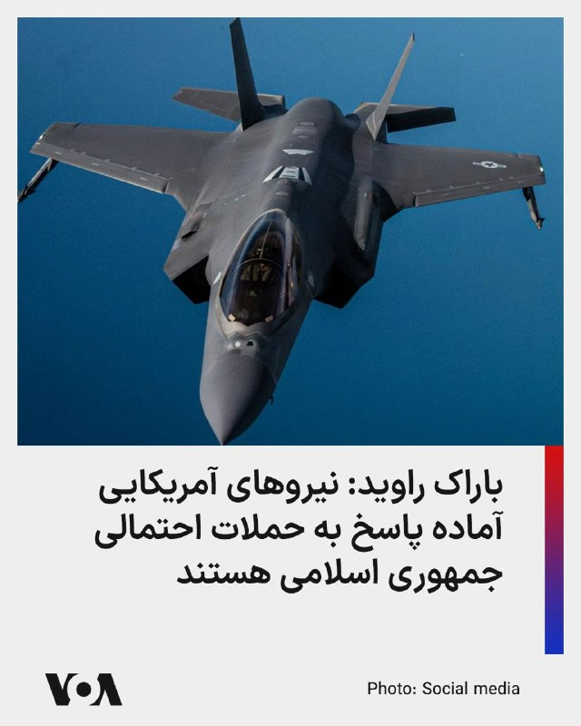

باراک راوید، خبرنگار شبکه آکسیوس می‌گیود یک مقام دفاعی ایالات متحده به او گفت که نیروهای آمریکایی در خاورمیانه در صورت اجرای تهدیدات و حملات جدید از سوی جمهوری اسلامی، «آماده دفاع» هستند.

## FarsiVOA — post 219902

ارتش اسرائیل می‌گوید نیروهایش یک شبکه گسترده تونل‌های زیرزمینی متعلق به حزب‌الله لبنان را در منطقه ارتفاعات بوفور در جنوب لبنان شناسایی کرده‌اند؛ شبکه‌ای که به گفته ارتش اسرائيل، با طراحی و تأمین مالی جمهوری اسلامی ایران ساخته شده است.

سخنگوی ارتش اسرائیل روز یکشنبه اعلام کرد نیروهای اسرائيلی عملیات شناسایی این تأسیسات را انجام داده‌اند.

گزارش کامل را در وب‌سایت صدای آمریکا بخوانید.

@FarsiVOA

## FarsiVOA — post 219901

عبدالرسول مرتضوی، زندانی سیاسی، در یک تماس تلفنی از زندان، از شکنجه گسترده معترضان دی‌ماه ۱۴۰۴ در زندان مرکزی اصفهان پرده برداشت.

## Persian_Trend_Official — post 15917

غیر رسمی: نیروهای مسلح کویت و امارات در حالت آماده‌باش کامل قرار گرفته‌اند.

👺Phantom

📌 @persian_trend_official
پرشین ترند | متفاوت‌ترین کانال نظامی

## Persian_Trend_Official — post 15916

  <a href="telegram/content/Persian_Trend_Official_15916_1780857188.webm" target="_blank">🎬 Download video</a>

اسرائیل هیوم: احتمال حمله موشکی ایران در ساعات آینده وجود دارد
روزنامه اسرائیل هیوم به نقل از برآوردهای امنیتی گزارش داد که احتمال پاسخ موشکی ایران علیه اسرائیل در ساعات آینده وجود دارد.
بر اساس این گزارش، نهادهای امنیتی اسرائیل معتقدند در صورت وقوع چنین حمله‌ای، اهدافی در شمال اسرائیل در اولویت قرار خواهند داشت. همچنین این احتمال مطرح شده که برخی مواضع نیروهای همسو با اسرائیل در مناطق پیرامونی غزه نیز در فهرست اهداف قرار بگیرند.
Phantom

📌 @persian_trend_official
پرشین ترند | متفاوت‌ترین کانال نظامی

## Persian_Trend_Official — post 15915

  <a href="telegram/content/Persian_Trend_Official_15915_1780857189.webm" target="_blank">🎬 Download video</a>

فعالیت شدید جنگنده‌های اسرائیلی بر فراز عراق و سوریه

## Persian_Trend_Official — post 15914

فعالیت شدید جنگنده‌های اسرائیلی بر فراز عراق و سوریه

## Persian_Trend_Official — post 15913

  <a href="telegram/content/Persian_Trend_Official_15913_1780857189.webm" target="_blank">🎬 Download video</a>

پرواز تهران استانبول قبل از رسیدن به زنجان برگشت به تهران !

## IranianMinds — post 21582

🔴 ارتش با جنگنده تو غرب تهران داره مانور میده

@IranianMinds

## IranianMinds — post 21581

🔴فوری / اسرائیل هیوم : ایران ممکن است در چند ساعت آینده به تلاویو حمله کند

@IranianMinds

## IranianMinds — post 21580

  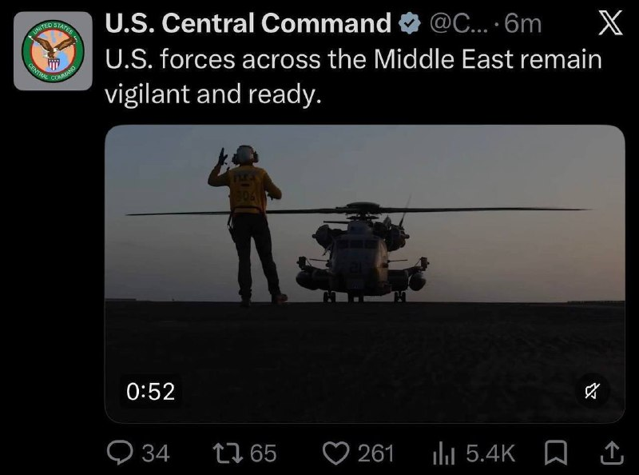

🔴سنتکام:

نیروهای آمریکایی در سراسر خاورمیانه هوشیار و آماده هستند.

@IranianMinds

## alonews — post 125877

  <a href="telegram/content/alonews_125877_1780857190.webm" target="_blank">🎬 Download video</a>

🔴فوری / اسرائیل هیوم : ایران ممکن است در چند ساعت آینده به تلاویو حمله کند

✅ @AloNews خبر جنگ

## alonews — post 125876

  <a href="telegram/content/alonews_125876_1780857190.webm" target="_blank">🎬 Download video</a>

👈 نیروهای مسلح امارات متحده عربی با ادامه افزایش تنش‌های منطقه‌ای در حالت آماده‌باش قرار گرفته‌اند

✅ @AloNews خبر جنگ

## alonews — post 125875

  <a href="telegram/content/alonews_125875_1780857190.webm" target="_blank">🎬 Download video</a>

👈کانال ۱۲ اسرائیل: به دنبال تهدیدات ایران، بنیامین نتانیاهو، جلسه مشورتی امنیتی برگزار می‌کند

✅ @AloNews خبر جنگ

## alonews — post 125874

  <a href="telegram/content/alonews_125874_1780857191.mp4" target="_blank">🎬 Download video</a>

دیدار دانمارک و اوکراین به دلیل بیهوش شدن کریستین اریکسن متوقف شد

اریکسن پیش از این و در یورو ۲۰۲۰ هم دچار حمله قلبی شده بود.

@AloSport

---
📅 بروزرسانی: 1405/03/17 21:53
---

## VahidOOnLine — post 244151

  

کاظم غریب‌آبادی، معاون وزیر خارجه جمهوری اسلامی، در شبکه ایکس نوشت که «هر گونه تصرف، انتقال یا تخصیص اموال ایران» برای پرداخت به هم‌پیمانان آمریکا «موجب مسئولیت آمریکا، بویژه در شرایطی که ادعای مذاکره و تفاهم می‌کند، و همچنین پاسخ متناسب ایران می‌شود.»

پیشتر رویترز به نقل از یک منبع آگاه گزارش داد دولت آمریکا در حال بررسی استفاده از دارایی‌های جمهوری اسلامی برای تامین هزینه بازسازی و جبران خسارت‌هایی است که در جریان جنگ به کشورهای متحد واشینگتن در خلیج فارس وارد شده است.

اقدامی که به نوشته رسانه‌ها می‌تواند به یکی از محورهای اختلاف در مذاکرات جاری میان تهران و واشینگتن تبدیل شود.
‌🏁 🇬🇧 IranintlTV

🤖 @VahidOOnLine

## WithYashar — post 13736

اسرائیل هیوم: احتمال حملات موشکی ایران تا ساعاتی دیگر وجود داره.
براوردهای امنیتی حاکی از آن است که اگر ایران امشب با هدف قرار دادن شمال اسرائیل پاسخ بده، ممکنه مواضع شبه‌نظامیان (نیروهای مسلح وابسته به اسرائیل) داخل خط زرد (مناطق تحت کنترل تشکیلات خودگردان یا مناطق حائل) در غزه رو هم هدف قرار بده.
@withyashar

## WithYashar — post 13735

  <a href="telegram/content/WithYashar_13735_1780856610.mp4" target="_blank">🎬 Download video</a>

بریم برای اتاق جنگ 💥

## WithYashar — post 13734

🚨🚨🚨🚨🚨🚨🚨🚨🚨
به هواپیماهای که از تهران بلند شده اند دستور داده شده به باند فرود برگردند
@withyashar

## WithYashar — post 13733

ایران ایر، ایرباس A300B4-605R به جای پرواز به جده، عربستان سعودی، به فرودگاه ایران تغییر مسیر داد
@withyashar

## pm_afshaa — post 92537

🔴اسرائیل هیوم: احتمال حملات موشکی ایران تا ساعاتی دیگر وجود داره.

براوردهای امنیتی حاکی از آن است که اگر ایران امشب با هدف قرار دادن شمال اسرائیل پاسخ بده، ممکنه مواضع شبه‌نظامیان (نیروهای مسلح وابسته به اسرائیل) داخل خط زرد (مناطق تحت کنترل تشکیلات خودگردان یا مناطق حائل) در غزه رو هم هدف قرار بده.

💧 Rainbet.com the #1 Non-KYC Crypto Casino & Sportsbook @rainbetcom

😁 @Pm_Afshaa

## iaghapour — post 2661

  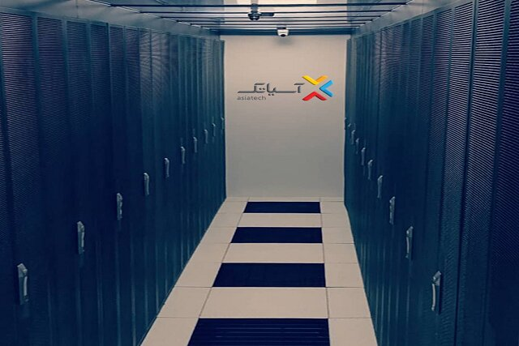

⭕️ مدیرعامل آسیاتک: اینترنت دیتاسنترها هنوز وصل نشده است!

محمدعلی یوسفی‌زاده اعلام کرد اینترنت کاربران وصل است اما مراکز داده دسترسی کامل ندارند و شبکه به وضعیت عادی برنگشته است.

فقدان پاسخگویی: پیگیری‌های زیادی انجام شده، اما مسئولان هیچ دلیل یا پاسخی برای این قطع بودن ارائه نمی‌دهند.

⚠️ مشکل اصلی چیست؟
اینترنت کاربران با اینترنت دیتاسنترها مسیر متفاوتی دارد. در حال حاضر کاربران به سایت‌های داخلی دسترسی دارند، اما سرورِ خود این سایت‌ها در دیتاسنترها به اینترنت جهانی وصل نیستند.

— نتیجه این اختلال:
قطع شدن اتصال سرورها به ابزارهای حیاتی خارجی مثل گوگل، کلادفلر و گیت‌هاب (APIها).

— عدم امکان آپدیت، دسترسی به ریپازیتوری‌ها و سرویس‌های ابری (CDN).

📌 نتیجه: اینترنت دیتاسنترها قطع است؛ یعنی پلتفرم‌های ایرانی از پشت صحنه به جهان متصل نیستند و زیرساخت فنی آن‌ها عملاً فلج شده است.

پ.ن: البته از وضعیت دیتاسنترهای دیگه اطلاعات زیادی در دسترس نیست.

🆔 @iAghapour

## kianmeli1 — post 87701

  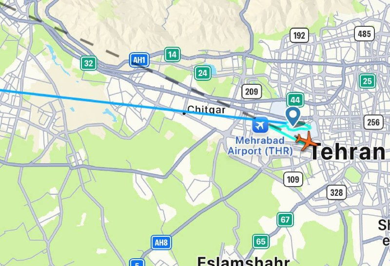

🔴پرواز تهران به استانبول به دلیل حملات احتمالی ٫ مجبور به بازگشت اضطراری به تهران شد
https://t.me/kianmeli1

## IranIntlTV — post 341032

  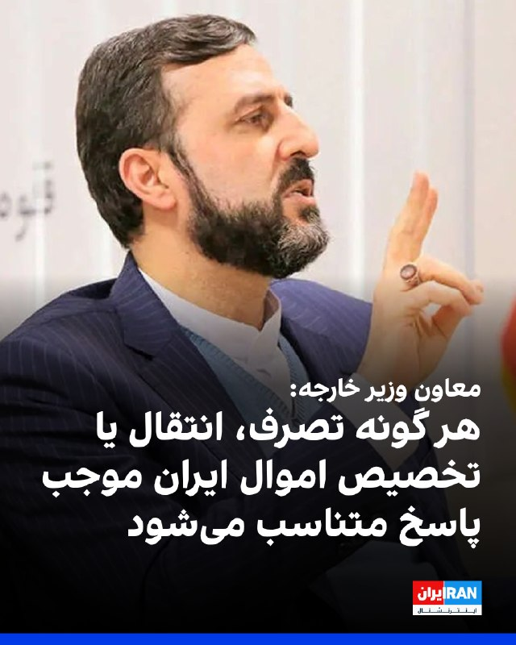

کاظم غریب‌آبادی، معاون وزیر خارجه جمهوری اسلامی، در شبکه ایکس نوشت که «هر گونه تصرف، انتقال یا تخصیص اموال ایران» برای پرداخت به هم‌پیمانان آمریکا «موجب مسئولیت آمریکا، بویژه در شرایطی که ادعای مذاکره و تفاهم می‌کند، و همچنین پاسخ متناسب ایران می‌شود.»

پیشتر رویترز به نقل از یک منبع آگاه گزارش داد دولت آمریکا در حال بررسی استفاده از دارایی‌های جمهوری اسلامی برای تامین هزینه بازسازی و جبران خسارت‌هایی است که در جریان جنگ به کشورهای متحد واشینگتن در خلیج فارس وارد شده است.

اقدامی که به نوشته رسانه‌ها می‌تواند به یکی از محورهای اختلاف در مذاکرات جاری میان تهران و واشینگتن تبدیل شود.
https://iranintl.com/202606073971

## Shin_Persian — post 6617

  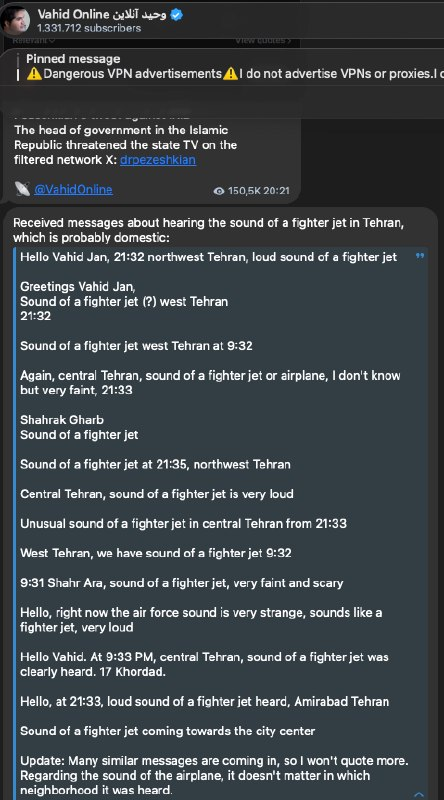

Shin ✓ @hey_itsmyturn
Sun, 07 Jun 2026 18:19:14 UTC

.@Vahid:

English

Please provide the text you would like me to translate. You only included a username or handle (`.@Vahid:`), but no content to translate.

فارسی

@Vahid:

𝕏 · @shin_persian

## Iliaen — post 4442

  

پرواز تهران به استانبول که حدود نیم ساعت قبل از فرودگاه امام بلند شد، در میانه‌ی راه به دلایل نامشخص به سمت تهران بازگشت و با تغییر مسیر، چند مرتبه تلاش به فرود اضطراری (ارتفاع پایین) در فرودگاه مهرآباد کرد.

برخی از مردم صدای پرواز این هواپیما را، به عنوان صدای جنگنده گزارش کردند.

@iliaen

## FarsiVOA — post 219900

تیم فوتبال جمهوری اسلامی پس از هفته‌ها حاشیه به تیخوانا در مکزیک رسید. شرایط موجود تیم و داشتن «ویزای ساعتی» اعتراض برخی رسانه‌های حکومتی را به دنبال داشت.

## FarsiVOA — post 219899

  <a href="telegram/content/FarsiVOA_219899_1780856616.mp4" target="_blank">🎬 Download video</a>

ویدیوی ارتش اسرائیل از فعالیت نیروهای لشکر ۳۶ در منطقه بوفور جنوب لبنان؛

ارتش اسرائیل پیشتر با انتشار تصاویری از کشف شبکه‌ای از تونل‌های زیرزمینی متعلق به سازمان تروریستی حزب‌الله خبر داد و اعلام کرد این شبکه از مسیرهای زیرزمینی با طراحی و تامین مالی جمهوری اسلامی در ارتفاعات بوفور ساخته شده است.

نیروهای تیم‌های رزمی تیپ گولانی، مگلان و یگان مهندسی ویژه تحت فرماندهی لشکر ۳۶ و با هدایت معاونت اطلاعات ارتش اسرائیل و فرماندهی شمال، هدایت عملیات برای شناسایی شبکه تونل‌ها به‌منظور دستیابی به کنترل عملیاتی بر ارتفاعات بوفور را بر عهده داشتند.

بنابر بیانیه سخنگوی ارتش اسرائیل این شبکه تونلی، در یک منطقه غیرنظامی در مجاورت فعالیت ارتش لبنان ساخته شده و در موقعیتی قرار دارد که امکان تسلط عملیاتی بر منطقه الجلیل را فراهم می‌کند. شبکه در فاصله‌ای شش کیلومتری از متولا واقع شده و به‌عنوان مقر سازمان تروریستی حزب‌الله در این منطقه استفاده می‌شد.

## Persian_Trend_Official — post 15912

  <a href="telegram/content/Persian_Trend_Official_15912_1780856618.mp4" target="_blank">🎬 Download video</a>

فوری سنتکام در کل خاورمیانه به حالت آماده باش جنگی در اومد

## Persian_Trend_Official — post 15911

فوری

سنتکام در کل خاورمیانه به حالت آماده باش جنگی در اومد

## Persian_Trend_Official — post 15910

  <a href="telegram/content/Persian_Trend_Official_15910_1780856620.webm" target="_blank">🎬 Download video</a>

اسمان ایران همیشه شبها کلیر هست. اما اسمان کشور های منطقه فعلا عادی هست

## Persian_Trend_Official — post 15909

احتمالا لانچر ها دارن جابه جا میشن برای حفاظت از اون ها بلند شدن

## Hranews — post 113455

مرگ و مصدومیت ۲ کارگر در سایه فقدان ایمنی کار

❗️
❗️
❗️
❗️
❗️– در سایه فقدان ایمنی محیط و شرایط نامناسب کار، روز گذشته دو کارگر در قائمشهر و بانه حین انجام کار دچار حادثه شدند. طی این حوادث، یک #کارگر جان باخت و یک تن دیگر مصدوم شد.

ادامه مطلب

↘️
@hranews_bot تماس ✉️ - @Hranews کانال هرانا 🆑

## alonews — post 125873

  <a href="telegram/content/alonews_125873_1780856621.webm" target="_blank">🎬 Download video</a>

👈مقام آمریکایی: ما از نظر نظامی آماده‌ایم تا در صورت عملی شدن تهدیدات و حمله ایران، با آن مقابله کنیم

✅ @AloNews خبر جنگ

## alonews — post 125872

  <a href="telegram/content/alonews_125872_1780856621.webm" target="_blank">🎬 Download video</a>

👈 اسرائیل هیوم: برآوردهای امنیتی حاکی از آن است که اگر ایران امشب با هدف قرار دادن شمال اسرائیل پاسخ دهد، ممکن است مواضع شبه‌نظامیان (نیروهای مسلح وابسته به اسرائیل) داخل خط زرد (مناطق تحت کنترل تشکیلات خودگردان یا مناطق حائل) در غزه را نیز هدف قرار دهد.

✅ @AloNews خبر جنگ

## alonews — post 125871

  <a href="telegram/content/alonews_125871_1780856621.webm" target="_blank">🎬 Download video</a>

👈یه مقام دفاعی آمریکا به آکسیوس :
- اگه ایران تهدیدهاش رو عملی کنه و حمله جدیدی انجام بده، نیروهای آمریکایی تو خاورمیانه کاملاً آماده‌ان تا از خودشون دفاع کنن

✅ @AloNews خبر جنگ

## alonews — post 125870

✅با سابقه ۵ سال فعالیت مداوم 
🛡حتی بدون قطعی تو دوران جنگ 
🌐 با ما همراه شو و در زمان قطعی وصل بمون 
😎 بقیه هنوز VPN حجمی میفروشن اونم با قیمتای نجومی 
🚀 
✅ از ما با کمترین قیمت ، بهترین سرویس رو بگیر 
👀
😍 💥بدون محدودیت حجم
⬇️
⬇️
⬇️ @NetAazaadBot @NetAazaadBot

## alonews — post 125869

  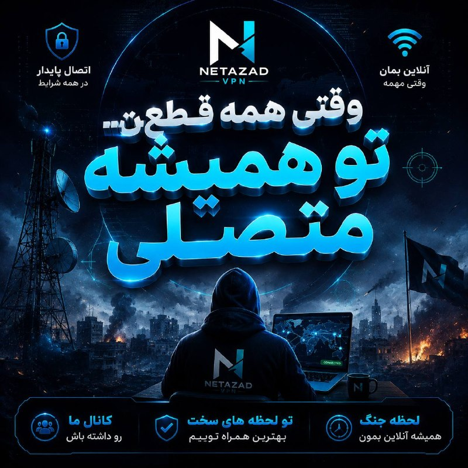

✅با سابقه ۵ سال فعالیت مداوم

🛡حتی بدون قطعی تو دوران جنگ

🌐 با ما همراه شو و در زمان قطعی
وصل بمون 
😎

بقیه هنوز VPN حجمی میفروشن
اونم با قیمتای نجومی 
🚀

✅ از ما با کمترین قیمت ، بهترین سرویس رو بگیر 
👀
😍

💥بدون محدودیت حجم
⬇️
⬇️
⬇️
@NetAazaadBot
@NetAazaadBot

---
📅 بروزرسانی: 1405/03/17 21:43
---

## VahidOOnLine — post 244150

  

بر اساس یک اطلاعیه هوانوردی، قطر مسیر برخی پروازها در فضای هوایی تحت کنترل دوحه را به‌طور موقت تغییر داد و اعلام کرد مسیرهای جایگزین برای برخی پروازهای ورودی، خروجی و عبوری در آسمان این شهر تعیین شده است.

این نوتام از ۱۷ خرداد فعال شده و تا ۲۴ خرداد به‌صورت تخمینی، ادامه خواهد داشت و به معنی بسته شدن آسمان قطر نیست.
‌🏁 🇬🇧 IranintlTV

🤖 @VahidOOnLine

## WithYashar — post 13732

هواپیمای بویینگ ۷۳۷-۵۲۴ کاسپین ایرلاینز به جای پرواز به استانبول، ترکیه، به تهران بازگشت.🚨
@withyashar

## WithYashar — post 13731

گزارش شلیک موشک از گرمدره و بیدگنه مقصد نامشخص !🚨
@withyashar

## WithYashar — post 13730

گزارش ها از پرواز گسترده جت های جنگی ‌ناشناس بر فراز اقلیم کردستان، عراق.
@withyashar

## WithYashar — post 13729

گزارش از صدای جنگنده در تهران و کرج
@withyashar

## pm_afshaa — post 92535

دوتا هواپیما ایرانی پرواز به مقصد رو لغو کردن و به باند فرودگاه برگشتن :

💧 Rainbet.com the #1 Non-KYC Crypto Casino & Sportsbook @rainbetcom

😁 @Pm_Afshaa

## pm_afshaa — post 92533

گزارش‌ها از صدای جنگنده در تهران و کرج
احتمالی خودیه

💧 Rainbet.com the #1 Non-KYC Crypto Casino & Sportsbook @rainbetcom

😁 @Pm_Afshaa

## VahidOnline — post 75994

پیام‌های دریافتی از شنیده شدن صدای جنگنده در تهران که لابد داخلی است:

سلام وحید جان ۲۱:۳۲ شمال غرب تهران صدای شدید جنگنده

درود وحید جان
صدای جنگنده (؟) غرب تهران
۲۱:۳۲

صدای جنگنده غرب تهران ساعت ۹:۳۲

بازهم مرکز تهران صدای جنگنده یا هواپیما رو نمیدونم ولی خیلی پایینه ساعت ۲۱:۳۳

شهرک غرب
صدا جنگنده

صدای جنگنده ساعت ۲۱:۳۵ دقیقه، شمالغرب تهران

مرکز تهران صدای جنگنده میاد شدییید

صدای نامتعارف جنگنده در مرکز تهران از ساعت ۲۱:۳۳

غرب تهران صدا جنگنده داریم 9.32

۹:۳۱ شهرآرا صدای جنگنده میاد وحشتناک خیلی پایینه

سلام الان نیروهوایی صدای خیلی عجیب میاد صدای جنگنده ست انگار خیلی بلنده

سلام وحید . ساعت ۹ و ۳۳ دقیقه شب مرکز تهران صدای جنگنده میومد واضح . ۱۷ خرداد .

سلام ساعت ۲۱ و ۳۳ دقیقه شنیده شدن صدای جنگنده زیاد ، امیرآباد تهران

صدای جنگنده میاد سمت مرکز شهر

آپدیت: کلی پیام مشابه میاد که دیگه نقل نمی‌کنم. درباره صدای هواپیما اهمیتی نداره که در کدوم محله شنیده شده.

دو تا پیام تایید نشده هم بود که صدای دیگری برداشت کردند:

سلام وحید، اینجا شهریار صدای موشک میاد. احتمالا از بیدگنه جمهوری اسلامی داره موشک میزنه

وحید از بیدگنه موشک زدن ۲۱:۲۸
صداش تا فردیس اومد قشنگ

📡 @VahidOnline

## kianmeli1 — post 87700

🔴دقایقی پیش

گزارش‌هایی از صدای جنگنده از نقاط مختلفی از جمله مرکز تهران، غرب تهران، شمال‌غرب تهران، شهرآرا، شهرک غرب و امیرآباد ‌
https://t.me/kianmeli1

## IranIntlTV — post 341031

  

🔻الکساندر زورف، تنیس‌باز ۲۹ ساله آلمانی، پس از سال‌ها ناکامی در گام آخر، بالاخره طعم شیرین قهرمانی در یک گرنداسلم را چشید و قهرمان مسابقات رولان گاروس شد.

🔹در دیدار پایانی و دراماتیک زمین «فیلیپ شاتریه»، زورف پس از ۴ ساعت و ۱۶ دقیقه نبرد نفس‌گیر مقابل فلاویو کوبولی ایتالیایی ۳ بر ۲ به پیروزی رسید. در امتیاز پایانی ست پنجم این مسابقه، کوبولی با یک ضربه کات داخل زمین و متعاقباً یک لوب، زورف را به عقب فرستاد؛ اما مرد آلمانی توپ را برگرداند و در نهایت تنیس‌باز ایتالیایی ضربه خود را به شکلی ناشیانه به تور کوبید. با این خطا، زورف از فرط خوشحالی روی خاک رس پاریس پهن شد و اشک شوق ریخت.

🔹با حذف زودهنگام مدعیان اصلی جام یعنی یانیک سینر،مرد شماره یک جهان و نواک جوکوویچ، تمام نگاه‌ها و فشارها روی شانه‌های زورف قرار گرفته بود. این چهارمین فینال گرنداسلم او در دوران حرفه‌ای‌اش بود.

@iranintltvsport

## IranIntlTV — post 341030

  

بر اساس یک اطلاعیه هوانوردی، قطر مسیر برخی پروازها در فضای هوایی تحت کنترل دوحه را به‌طور موقت تغییر داد و اعلام کرد مسیرهای جایگزین برای برخی پروازهای ورودی، خروجی و عبوری در آسمان این شهر تعیین شده است.

این نوتام از ۱۷ خرداد فعال شده و تا ۲۴ خرداد به‌صورت تخمینی، ادامه خواهد داشت و به معنی بسته شدن آسمان قطر نیست.
https://iranintl.com/202606073076

## Shin_Persian — post 6616

Shin ✓ @hey_itsmyturn
Sun, 07 Jun 2026 18:03:21 UTC

Jet activity over western Tehran, #Tehran Province, #Iran

فارسی

فعالیت جنگنده‌ها برفراز غرب تهران، استان #تهران، #ایران

𝕏 · @shin_persian

## FarsiVOA — post 219898

نگاهی به تیم ملی جمهوری اسلامی؛ مهمان منزوی جام جهانی و هفته‌ها حاشیه

## FarsiVOA — post 219897

تجسم عینی اتفاقات کتاب ۱۹۸۴ در دنیای امروز؛ گفت‌وگو با امیر گنجوی پژوهشگر

## FarsiVOA — post 219896

هوشنگ امیراحمدی با حضور در عمق میدان از خامنه‌ای به عنوان مانع عادی‌سازی رابطه ایران و آمریکا یاد کرد ولی به این پرسش که با حذف خامنه‌ای، اکنون با چه گروهی در ایران گفت‌وگو می‌کند پاسخی نداد

## FarsiVOA — post 219893

یگان بیست‌وچهارم اعزامی تفنگداران دریایی آمریکا تصاویری از یک تمرین مشترک در دریای کارائیب را منتشر کرد.

در این تمرین، ملوانان نیروی دریایی و سربازان نیروی زمینی آمریکا عملیات فرود بالگرد روی عرشه شناور را تمرین کردند.

@FarsiVOA

## FarsiVOA — post 219892

  <a href="telegram/content/FarsiVOA_219892_1780855983.mp4" target="_blank">🎬 Download video</a>

ویدیوی ارتش اسرائیل از حمله امروز، ۱۷ خرداد، به ضاحیه بیروت؛
ارتش اسرائیل با انتشار این ویدیو اعلام کرد به روش نقطه‌زنی یک مقر فرماندهی حزب‌الله را در ضاحیه بیروت هدف‌گیری کرد.

بنابر بیانیه ارتش اسرائیل حزب‌الله از این مقر فرماندهی برای آسیب رساندن به شهروندان و نیروهای ارتش اسرائیل استفاده می‌کرد.

این حمله در واکنش به حملات موشکی و پهپادی حزب‌الله به شمال اسرائیل انجام شده است.

## Persian_Trend_Official — post 15908

  <a href="telegram/content/Persian_Trend_Official_15908_1780855985.webm" target="_blank">🎬 Download video</a>

البته جنگنده های جمهوری اسلامی هستند

## Persian_Trend_Official — post 15907

صدای جنگنده ها روی آسمان تهران هم بطور گسترده داره گزارش میشه.

## Hranews — post 113454

گزارشی از تداوم بلاتکلیفی کارگران تعدیل‌شده کارخانه قند ممسنی

❗️
❗️
❗️
❗️
❗️– بیش از ۹۰ #کارگر تعدیل شده کارخانه قند ممسنی، واقع در شهرستان رستم، از بلاتکلیفی شغلی چندین ساله خود گلایه‌مند بوده و خواستار بازگشت به کار هستند.

ادامه مطلب

↘️
@hranews_bot تماس ✉️ - @Hranews کانال هرانا 🆑

## alonews — post 125868

  <a href="telegram/content/alonews_125868_1780855986.webm" target="_blank">🎬 Download video</a>

👈هم‌چنان پرواز ها درحال بازگشت

✅ @AloNews خبر جنگ

## alonews — post 125867

  <a href="telegram/content/alonews_125867_1780855986.webm" target="_blank">🎬 Download video</a>

🔴فوری/اسرائیل هشدار داد که هر حمله‌ای جنگ تمام‌عیار را به دنبال خواهد داشت.

✅ @AloNews خبر جنگ

---
📅 بروزرسانی: 1405/03/17 21:33
---

## VahidOOnLine — post 244149

♦️بازیکنان و اعضای کادر فنی تیم ملی فوتبال ایران روز یکشنبه ۱۷ خردادماه در میان تدابیر شدید امنیتی به هتل محل اقامت خود در شهر تیخوانا در مکزیک رسیدند.

تیم ملی در حالی برای برگزاری جام جهانی به مکزیک رفته است که در ابتدا قرار بود در آمریکا اقامت کند. با این حال و پس از آنکه ایالات متحده در صدور ویزا برای کادر فنی و همراهان تیم تعلل کرد و در نهایت برای گروهی از همراهان به‌دلیل «سابقه عضویت در سپاه» یا «نگرانی‌های امنیتی» ویزا صادر نکرد، به‌ناچار به مکزیک رفتند.
‌🇸🇦 Indypersian

🤖 @VahidOOnLine

## VahidOOnLine — post 244148

  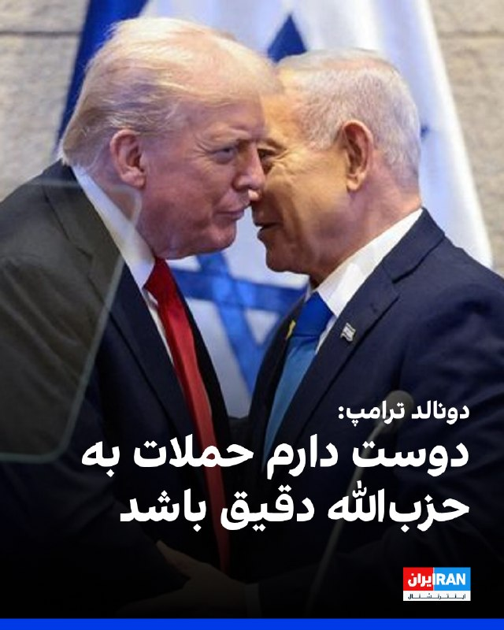

دونالد ترامپ در گفت‌وگو با شبکه ان‌بی‌سی نیوز درباره رابطه با اسرائیل گفت: «ما رفقای بسیار خوبی هستیم و ضربه‌ای بسیار بزرگ به یک کشور مشخص وارد کردیم؛ کشوری که ۴۷ سال چیزی جز دردسر نبوده است.»

او درباره لبنان افزود: «دوست دارم حمله به حزب‌الله دقیق‌تر و هدفمندتر باشد. فکر می‌کنم باید هدفمندتر انجام شود. ما می‌توانیم در این زمینه کمک کنیم یا سوریه را به‌عنوان یک گزینه پیشنهاد دهیم.»
ترامپ همچنین گفت سوریه در حال سامان دادن به اوضاع خود است و عملکرد خوبی دارد.
‌🏁 🇬🇧 IranintlTV

🤖 @VahidOOnLine

## WithYashar — post 13728

صداوسیما: جمعیت مردم در تجمعات شبانه نصف شده.
@withyashar

## WithYashar — post 13727

کانال ۱۴ اسرائیل: نخست‌وزیر بنیامین نتانیاهو با هیاتی از مشاوران حقوقی دولت ترامپ دیدار کرد.
@withyashar

## WithYashar — post 13726

محمد مخبر: اسرائیل میز مذاکره را به آتش کشید، به زودی پاسخ دردناکی به تل‌آویو خواهیم داد.
@withyashar

## pm_afshaa — post 92532

  <a href="telegram/content/pm_afshaa_92532_1780855401.webm" target="_blank">🎬 Download video</a>

🔴محمد مخبر، مشاور خامنه‌ای:
دشمن با بمباران لبنان در زمان حضور میانجی‌ها در ایران، میز مذاکره رو برای بار سوم به آتش کشید تا نقض آتش‌بس ر‌و فریاد بکشه؛ بهای سنگین و دردناک این تعرض رو قطعا در میدان خواهیم داد.

💧 Rainbet.com the #1 Non-KYC Crypto Casino & Sportsbook @rainbetcom

😁 @Pm_Afshaa

## IranIntlTV — post 341029

  

دونالد ترامپ در گفت‌وگو با شبکه ان‌بی‌سی نیوز درباره رابطه با اسرائیل گفت: «ما رفقای بسیار خوبی هستیم و ضربه‌ای بسیار بزرگ به یک کشور مشخص وارد کردیم؛ کشوری که ۴۷ سال چیزی جز دردسر نبوده است.»

او درباره لبنان افزود: «دوست دارم حمله به حزب‌الله دقیق‌تر و هدفمندتر باشد. فکر می‌کنم باید هدفمندتر انجام شود. ما می‌توانیم در این زمینه کمک کنیم یا سوریه را به‌عنوان یک گزینه پیشنهاد دهیم.»
ترامپ همچنین گفت سوریه در حال سامان دادن به اوضاع خود است و عملکرد خوبی دارد.
https://iranintl.com/202606073045

## IranIntlTV — post 341028

  <a href="telegram/content/IranIntlTV_341028_1780855402.mp4" target="_blank">🎬 Download video</a>

مهدی مهدوی‌آزاد در برنامه «چشم‌انداز» درباره گزارش‌ها مبنی بر اینکه دولت ترامپ در حال بررسی تحویل دارایی‌های بلوکه‌شده ایران به کشورهای خلیج فارس است، گفت: «این اقدام به نوعی پرداخت غیرمستقیم غرامت حمله‌های جمهوری اسلامی به این کشورها است.»
@iranintltv

## Shin_Persian — post 6615

Shin ✓ @hey_itsmyturn
Sun, 07 Jun 2026 17:54:56 UTC

Intense jet activity over #KRI, Eastern #Iraq 🇮🇶

فارسی

فعالیت شدید جت‌ها بر فراز اقلیم کردستان عراق (#KRI) و شرق عراق (#Iraq) 🇮🇶

𝕏 · @shin_persian

## FarsiVOA — post 219891

هفتاد و پنجمین سالگرد انتشار کتاب ۱۹۸۴؛ گفت‌وگو با امیر گنجوی پژوهشگر فلسفه سیاسی و مطالعات اجتماع

## FarsiVOA — post 219890

تجمع دانش‌آموزان در شهرهای مختلف در اعتراض به کنکور و مسائل آموزشی در ایران؛ گفت‌وگو با سعید پیوندی، جامعه‌شناس

## Persian_Trend_Official — post 15906

  <a href="telegram/content/Persian_Trend_Official_15906_1780855404.webm" target="_blank">🎬 Download video</a>

محمد مخبر: دشمن با بمباران لبنان در زمان حضور میانجی‌ها در ایران، میز مذاکره رو برای بار سوم به آتش کشید تا نقض آتش‌بس ر‌و فریاد بکشد؛ بهای سنگین و دردناک این تعرض رو قطعا در میدان خواهیم داد.

📝 Amir

📌 @persian_trend_official
پرشین ترند | متفاوت‌ترین کانال نظامی

## IranianMinds — post 21579

🔴محسن رضایی چند روز پیش در صدا و سیما:

کافی بود فقط اسرائیل به سمت ضاحیه حرکت کند، کل موشک‌های ما آماده بود چند برابر جنگ ۴۰ روزه شمال اسرائیل را جهنم می‌کردند.

@IranianMinds

## BBCPersian — post 283084

سه روزنامه‌نگار ایرانی نامزد جایزه «گزارش واقعی» امسال به دلیل «نبود امکان دریافت ویزا از سفارتخانه سوئیس در ایران» نتوانستتند برای شرکت در مراسم اعلام برندگان و اهدای جوایز شرکت کنند. حساب اینستاگرامی فستیوال گزارش واقعی ‏(True Story) در پستی تصویر سه…

## BBCPersian — post 283082

سه روزنامه‌نگار ایرانی نامزد جایزه «گزارش واقعی» امسال به دلیل «نبود امکان دریافت ویزا از سفارتخانه سوئیس در ایران» نتوانستتند برای شرکت در مراسم اعلام برندگان و اهدای جوایز شرکت کنند.

حساب اینستاگرامی فستیوال گزارش واقعی ‏(True Story) در پستی تصویر سه روزنامه‌نگار ایرانی را منتشر کرد و نوشت که جای آنها خالی است. سوگل دانایی برای گزارش «بی‌حسی موضعی» که در شبکه آقتاب منتشر شده، مریم شکری برای گزارش «یک تکه زمین فقیر» در روزنامه شرق و ستاره حجتی برای گزارش «آلودگی ارس، معمایی که با هر جواب پیچیده‌تر می‌شود» در روزنامه پیام ما، نامزد جوایز امسال این جشنواره شده‌ بودند.

این جشنواره نوشت: «ما عمیقا متاسفیم که سه روزنامه‌نگار از ایران نمی‌توانند به‌صورت حضوری در جشنواره در کنار ما باشند. با این حال، صدای آن‌ها، روایت‌هایشان و شجاعتشان همچنان حضور خواهد داشت. در تمام طول جشنواره به یادشان هستیم و آن‌ها در قلب ما هستند.»

## Dirty_Kids — post 391240

اینجا اتاق‌فکر رژیم داشت یه آزمایشی میکرد موفق نشد

میخواستن یه عرزشی‌صورتی‌رو با یه دلقک‌صادراتی جفت بندازن تا مثل دنیا یه توله این پس بندازه، محصول زِنا کردنشون موفق نبود، پروژه شکست خورد جمعش کردن برگشت پیش عرزشی‌کاکولد خودش

@Dirty_Kids 👻

## Dirty_Kids — post 391239

  <a href="telegram/content/Dirty_Kids_391239_1780855404.mp4" target="_blank">🎬 Download video</a>

🔴 توی شهرداری گناباد دو نفر در حال کون کونک بازی 🏳‍🌈 بودن که مردم مچشون رو گرفتن!!

@Dirty_Kids 👻

## Hranews — post 113453

کیفرخواست پرونده عباس عبدی و روزنامه اعتماد صادر شد

❗️
❗️
❗️
❗️
❗️– خبرگزاری قوه قضاییه از صدور کیفرخواست پرونده عباس عبدی و روزنامه اعتماد خبر داد. این پرونده برای رسیدگی به دادگاه کیفری یک استان تهران ارسال شده است.

ادامه مطلب

#عباس_عبدی #روزنامه_اعتماد

↘️
@hranews_bot تماس ✉️ - @Hranews کانال هرانا 🆑

## alonews — post 125866

  <a href="telegram/content/alonews_125866_1780855405.webm" target="_blank">🎬 Download video</a>

🔴فوری / گزارش ها از پرواز گسترده جت های جنگی بر فراز اقلیم کردستان، عراق.

✅ @AloNews خبر جنگ

## alonews — post 125865

  <a href="telegram/content/alonews_125865_1780855405.webm" target="_blank">🎬 Download video</a>

👈یک مقام آمریکایی به آکسیوس:حزب‌الله باید فوراً آتش‌بس کند و اجازه دهد این توافق‌ها اجرایی شوند. شرایط پیشنهادی منصفانه است، مورد تأیید لبنان و اسرائیل قرار دارد و مسیر روشنی برای پایان دادن به درگیری‌ها فراهم می‌کند.

✅ @AloNews خبر جنگ

## alonews — post 125864

  <a href="telegram/content/alonews_125864_1780855406.mp4" target="_blank">🎬 Download video</a>

👈نبویان: جای تعجب است که ایران پیشنهاد واگذاری تنگۀ هرمز را داده است!

✅ @AloNews خبر جنگ

---
📅 بروزرسانی: 1405/03/17 21:23
---

## VahidOOnLine — post 244147

  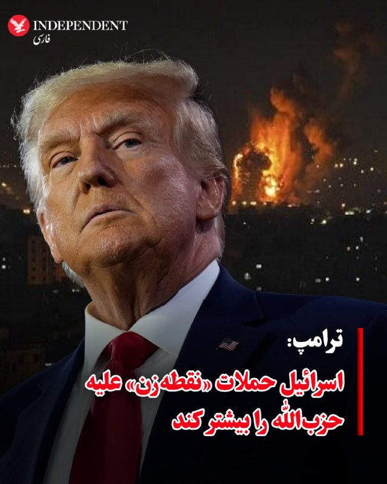

♦️دونالد ترامپ، رئیس‌ جمهوری آمریکا روز یکشنبه به شبکه ان‌بی‌سی گفت: «دوست دارم بهبود وضع زندگی در لبنان را ببینم. دوست دارم حملات نقطه‌‌‌زن و دقیق بیشتری به حزب‌الله انجام شود. به نظرم باید دقیقتر باشد.»
به گفته مقام‌های دولت لبنان از آغاز دور جدید جنگ میان حزب‌الله و اسرائیل در اسفندماه سال گذشته، بیش از ۳۵۰۰ نفر که عمدتا غیرنظامی بودند در لبنان کشته شدند.

 ترامپ در همین مصاحبه تاکید کرد که «اصراری ندارد که لبنان بخشی از یک توافق کوتاه‌مدت با ایران باشد.»

جمهوری اسلامی در آغاز خواستار شمول آتش‌بس به لبنان بود و در هفته‌های اخیر و همزمان با ادامه جنگ میان حزب‌الله و اسرائیل می‌گوید بدون «پایان جنگ در همه جبهه‌ها» حاضر به پذیرش توافق نیست.
‌🇸🇦 Indypersian

🤖 @VahidOOnLine

## pm_afshaa — post 92531

🔴احتمالا یکی از اهداف جمهوری اسلامی در حمله به اسرائیل فرودگاه بن گوریون باشه به دلیل وجود فراوان سوخت رسان ها در این فرودگاهه

💧 Rainbet.com the #1 Non-KYC Crypto Casino & Sportsbook @rainbetcom

😁 @Pm_Afshaa

## Shin_Persian — post 6613

Shin ✓ @hey_itsmyturn
Sun, 07 Jun 2026 17:50:03 UTC

Something's happening in Iran for sure.
2nd one.
EP-KPB | 732E02 | C/S CPN7972
From IKA | Iran
To IST | Turkey
Holding pattern near Mehrabad airport, Tehran.

فارسی

قطعا اتفاقی در ایران در حال رخ دادن است.
دومی.
EP-KPB | 732E02 | شناسه تماس CPN7972
از IKA (فرودگاه امام خمینی) | ایران
به IST | ترکیه
الگوی هولدینگ (انتظار) نزدیک فرودگاه مهرآباد، تهران.

𝕏 · @shin_persian

## Shin_Persian — post 6612

  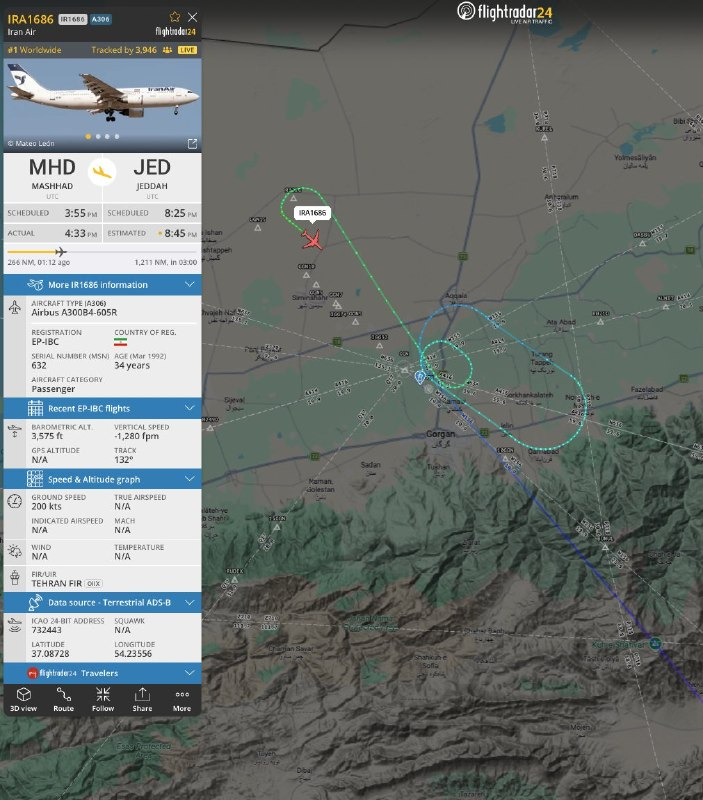

Shin ✓ @hey_itsmyturn
Sun, 07 Jun 2026 17:47:02 UTC

732443 | EP-IBC | C/S IRA1686
From Mashhad | Iran
To Jeddah | KSA
Descending for Gorgan airport, Iran

فارسی

۷۳۲۴۴۳ | EP-IBC | نام فراخوان IRA1686
از مشهد | ایران
به جده | عربستان سعودی
در حال کاهش ارتفاع برای فرود در فرودگاه گرگان، ایران

𝕏 · @shin_persian

## Shin_Persian — post 6611

  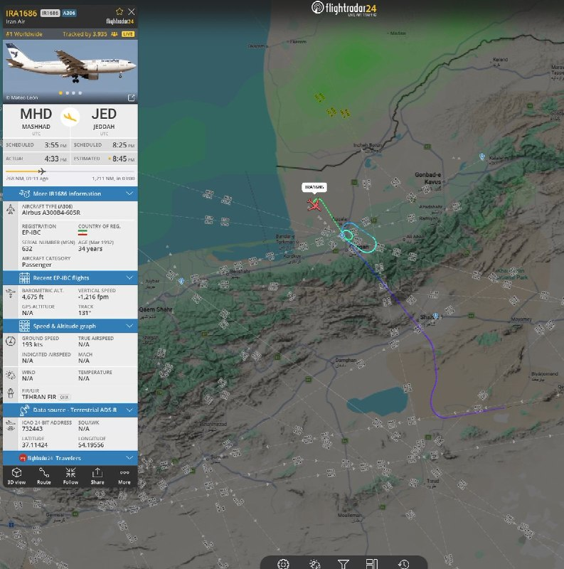

Shin ✓ @hey_itsmyturn
Sun, 07 Jun 2026 17:45:19 UTC

Hol' up

فارسی

صبر کن!

𝕏 · @shin_persian

## FarsiVOA — post 219889

روسای جمهوری فرانسه و اوکراین و صدراعظم آلمان روز یکشنبه ۱۷ خرداد در نشستی به میزبانی نخست‌وزیر بریتانیا با موضوع حمایت از اوکراین شرکت کردند.

## DW_Farsi — post 125656

  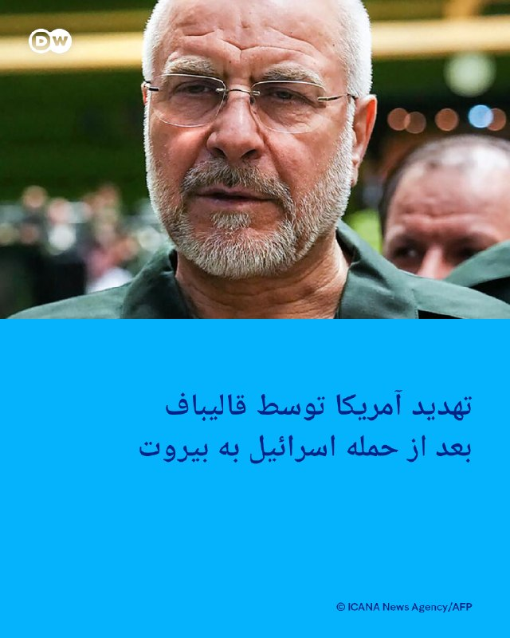

🔶قالیباف در پی حمله اسرائيل به بیروت: پایگاه‌های آمریکا در منطقه هدف مشروع است

محمدباقر قالیباف، رییس مجلس شورای اسلامی و سرتیم مذاکره‌کننده ایران پس از حمله اسرائیل به ضاحیه در جنوب بیروت "پایگاه‌ها و دارایی‌های آمریکا در منطقه را تهدید به حمله کرد.

او در شبکه ایکس نوشت: «محاصره دریایی [ایالات متحده] علیه ملت ایران و چراغ سبز امروز آمریکا به رژیم صهیونیستی [اسرائيل]، پایگاه‌ها و دارایی‌های آمریکا و رژیم در منطقه را به اهداف مشروع تبدیل می‌کند. دست نیروهای مسلح ما مثل همیشه باز است.»

او همچنین آمریکا را به نقض آتش‌بس با ایران متهم کرد و از "نقض توافقات با لبنان" نوشت و نتیجه گرفت که این موضوع نشان داده که آن‌ها "فقط زبان قدرت را می‌فهمند."

جمهوری اسلامی اعلام کرده بود که پایان جنگ در لبنان باید بخشی از توافق با آمریکا باشد. سپاه پاسداران نیز تهدید کرده بود که در صورت حمله به ضاحیه که مقر اصلی حزب‌الله لبنان است، مذاکره با آمریکا متوقف خواهد شد.
@dw_farsi

## Dirty_Kids — post 391238

  <a href="telegram/content/Dirty_Kids_391238_1780854795.mp4" target="_blank">🎬 Download video</a>

مگه اینکه ما همراهی‌تون کنیم وگرنه روهم رفته ۱۰ نفر هم نمیشید

تجمع خایمالان رژیم در هامبورگ

@Dirty_Kids 👻

## Dirty_Kids — post 391237

  <a href="telegram/content/Dirty_Kids_391237_1780854796.mp4" target="_blank">🎬 Download video</a>

کانگوروعه خودشو زده به بدحالی که از مردم غذا بگیره
بعد یکی تو کامنت نوشته اولین کانگورو فلسطینی :))))))

@Dirty_Kids 👻

## Dirty_Kids — post 391236

  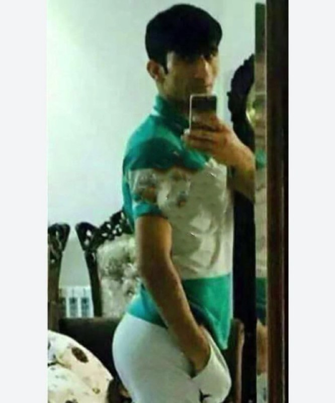

انگار نیسان رو اسپورت کردن @Dirty_Kids 👻

## alonews — post 125863

  <a href="telegram/content/alonews_125863_1780854798.webm" target="_blank">🎬 Download video</a>

👈کانال ۱۴ اسرائیل: نخست‌وزیر بنیامین نتانیاهو با هیاتی از مشاوران حقوقی دولت ترامپ دیدار کرد.

✅ @AloNews خبر جنگ

<!-- MSG END -->

<!-- NAV START -->

<a href="https://github.com/ProAlit/aio-downloader/blob/main/telegram/content/archive_1.md" style="display:inline-block; padding:6px 12px; margin:0 4px; background-color:#2ea44f; color:white; text-decoration:none; border-radius:4px; font-weight:bold;">صفحه بعد</a>

<!-- NAV END -->
