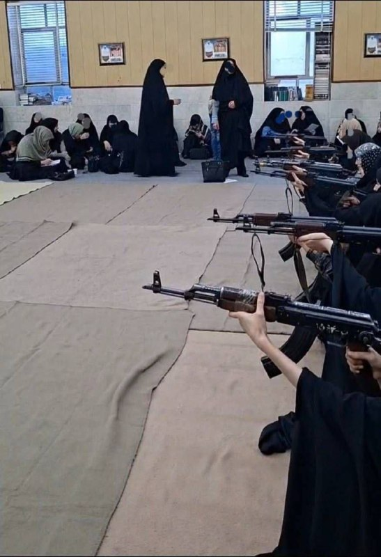

# خواننده تلگرام

<!-- TOP_NAV START -->

<a href="https://github.com/ProAlit/aio-downloader/blob/main/telegram/content/archive_1.md" style="display:inline-block; padding:6px 12px; margin:0 4px; background-color:#2ea44f; color:white; text-decoration:none; border-radius:4px; font-weight:bold;">صفحه بعد</a>

<!-- TOP_NAV END -->

<!-- MSG START -->

---
📅 بروزرسانی: 1405/03/04 14:52
---

## VahidOOnLine — post 242114

  

⭕️ رئیس کل بانک مرکزی ایران به قطر رفت

♦️رسانه‌های داخلی ایران روز دوشنبه چهارم خردادماه از سفر عبدالناصر همتی، رئیس کل بانک مرکزی ایران به قطر خبر دادند.

خبرگزاری فارس، وابسته به سپاه پاسداران با اعلام این خبر نوشت: «عبدالناصر همتی پیرامون بررسی آزادسازی اموال بلوکه‌شده و در راستای کمیسیون اقتصادی مذاکرات به قطر سفر کرد.»

قطر در این دور از مذاکرات، میانجی مستقیم نیست اما هفته گذشته، یک هیئت از قطر به تهران سفر کرده بود.
‌🇸🇦 Indypersian

🤖 @VahidOOnLine

## mwarmonitor — post 9678

📌ایران اعلام کرد که «بسیاری از مسائل» مربوط به یک توافق با آمریکا برای تمدید آتش‌بس شکننده به مدت ۶۰ روز و بازگشایی تنگه هرمز را نهایی کرده است، اما هشدار داد که با وجود ادامه مذاکرات درباره جزئیات باقی‌مانده، رسیدن به توافق نهایی هنوز قریب‌الوقوع نیست. فیننشال تایمز

@mwarmonitor

## mwarmonitor — post 9677

🔴واشنگتن پست: مرحله اول شامل پاک‌سازی مین‌ها و برداشتن محاصره آمریکا و آزادسازی ۱۲ میلیارد دلار است. یادداشت تفاهم شامل یک توافق هسته‌ای نیست، بلکه فقط یک تعهد برای مذاکره درباره پرونده هسته‌ای در آینده است.

@mwarmonitor

## mwarmonitor — post 9676

🔸یک سرمایه‌گذاری مشترک آمریکا–عربستان در ریاض قصد دارد نمونه‌های مشابه پهپادهای «شاهد» تولید کند — سامافور (Samafor).

@mwarmonitor

## DEJradio — post 4934

  <a href="telegram/content/DEJradio_4934_1779708153.webm" target="_blank">🎬 Download video</a>

🔺📢 خبرنامه امیرکبیر؛
بیانیه جمعی از دانشجویان دانشگاه شیراز خطاب به اساتید:
زمانی که مردم را می‌کشتند، لال بودید؟

در پی اعتصاب اساتید دانشگاه شیراز به دلیل مسائل معیشتی، جمعی از دانشجوبان دانشگاه شیراز در نامه‌ای شدیدالحن، به سکوت این اساتید در قبال جنایت‌های حکومت اعتراض کردند. خبرنامه امیرکبیر متن کامل این نامه را روز دوشنبه چهارم خرداد ۱۴۰۵ منتشر کرد.

در مقدمه این بیانه آمده، این روزها شاهد صدور بیانیه‌های پرطمطراق و تعلیق فعالیت‌های آموزشی از سوی شورای صنفی اساتید دانشگاه شیراز هستیم. حضرات اساتید ناگهان یاد «شأن و کرامت اعضای هیئت علمی» افتاده‌اند و با واژه‌های مقدسی چون «ساحت دانایی»، «اخلاق» و «حاکمیت قانون» کلاس‌ها را تعطیل کرده‌اند. اما ما دانشجویان، حافظه تاریخی خود را از دست نداده‌ایم و این نمایش ریاکارانه را با شدیدترین لحن ممکن محکوم می‌کنیم.

‌آقایان و خانم‌های استاد! بیانیه‌های امروز شما نه نشانه‌ای از بیداری وجدان، بلکه اوج فرار رو به جلو و عافیت‌طلبی است. نگاهی به کارنامه‌تان بیندازید تا ببینید چرا حق ندارید پشت نام دانشجو و آینده این سرزمین سنگر بگیرید:
وقتی ظلم آشکار بود، لال بودید: در تمام سال‌هایی که بدیهی‌ترین حقوق انسانی و شهروندی مردم در جامعه زیر پا گذاشته می‌شد، صدای اعتراض و تظلم‌خواهی هیچ‌کدام از شما از دیوارهای این دانشگاه بلند نشد. چشم بر روی حقیقت بستید تا صندلی‌های امن خود را حفظ کنید.

‌ وقتی مردم را می‌کشتند، لال بودید: در روزهای خونین و تلخی که جان جوانان و مردم بی‌گناه در خیابان‌ها گرفته می‌شد، شما سکوت مصلحتی را ترجیح دادید. در برابر فاجعه چشم‌پوشی کردید و ترجیح دادید مرزهای عافیت‌طلبی‌تان مخدوش نشود.
‌ وقتی دانشجویان اعتصاب کردند، شما بازجو و ناظم شدید: روزهایی را به یاد بیاورید که همین دانشجویان برای دفاع از شرف، آزادی و حق ابتدایی خود دست به اعتراض و تحریم کلاس‌ها زدند. شما نه تنها همراه و پناه شاگردانتان نشدید، بلکه در نقش بازوی انضباطی ظاهر شدید... [برای دسترسی به متن کامل این بیانیه به خبرنامه امیرکبیر مراجعه شود]

#خبرنامه_امیرکبیر #دانشگاه_شیراز
@DEJradio

## kianmeli1 — post 87656

  

🔴محمد مهاجری: کدام مسئولان رأی به مسدود ماندن اینترنت دادند؟

در جلسه فضاي مجازي به رياست عارف تصويب شد اينترنت بين الملل در اختيار همه قرار گيرد
صورتجلسه را منتشر كنيد تا معلوم شود آيا راي جبلي رييس صداوسيما و آقا ميري دبير شوراي فضاي مجازي منفي بوده و خواهان مسدود ماندن اينترنت اند؟
https://t.me/kianmeli1

## IranIntlTV — post 338911

  <a href="telegram/content/IranIntlTV_338911_1779708154.mp4" target="_blank">🎬 Download video</a>

در ادامه کارزار ثبت حقیقت درباره جاویدنامان انقلاب ملی، ایران‌اینترنشنال جزییات تازه‌ای از جان‌باختن رئوف درخشانی‌مهر در جریان اعتراضات دی‌ماه روایت می‌کند.

فرنوش فرجی، عضو تحریریه ایران‌اینترنشنال، گزارش می‌دهد

@iranintltv

## IranianMinds — post 20717

  

🔴پست ترامپ در تروث‌سوشال:

دموکرات‌ها سیاست‌های بد و نامزد‌های بدی دارند. غیر از این، آن‌ها عملکرد نسبتأ خوبی دارند!

@IranianMinds

## Dirty_Kids — post 390137

  

مسجد ابوذر در بلوار ابوذر ،اتوبان محلاتی؛
آموزش کار با اسلحه ،جمهوری اسلامی از چه خطری این روزها انقد وحشت کرده؟

@Dirty_Kids 👻

## Hranews — post 113151

با انگیزه تجاوز؛ گزارشی از قتل یک پسر ۱۱ ساله در مشهد

❗️
❗️
❗️
❗️
❗️– مردی ۲۳ ساله در مشهد که با انگیزه تجاوز اقدام به ربودن یک #کودک پسر ۱۱ ساله کرده بود، با وارد کردن ضربات سنگ به سرش، آن کودک را به #قتل رساند. متهم هم اکنون در بازداشت به سر می برد و تحقیقات در خصوص این پرونده ادامه دارد.

ادامه مطلب

↘️
@hranews_bot تماس ✉️ -  @Hranews  کانال هرانا 🆑

## alonews — post 122539

  <a href="telegram/content/alonews_122539_1779708155.webm" target="_blank">🎬 Download video</a>

👈آخرین قیمت نفت ۹۷.۸۰ دلار

✅ @AloNews خبر جنگ

## alonews — post 122538

  <a href="telegram/content/alonews_122538_1779708155.webm" target="_blank">🎬 Download video</a>

👈هیئت‌های چینی و پاکستانی در تالار بزرگ خلق در پکن دیدار کردند

✅ @AloNews خبر جنگ

<!-- MSG END -->

<!-- NAV START -->

<a href="https://github.com/ProAlit/aio-downloader/blob/main/telegram/content/archive_1.md" style="display:inline-block; padding:6px 12px; margin:0 4px; background-color:#2ea44f; color:white; text-decoration:none; border-radius:4px; font-weight:bold;">صفحه بعد</a>

<!-- NAV END -->
