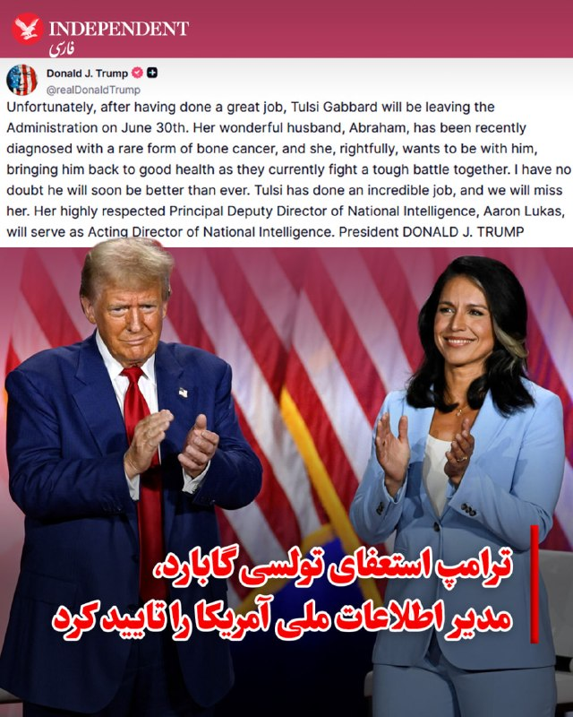
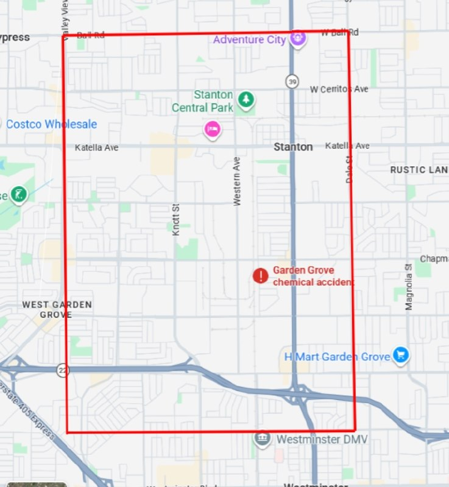
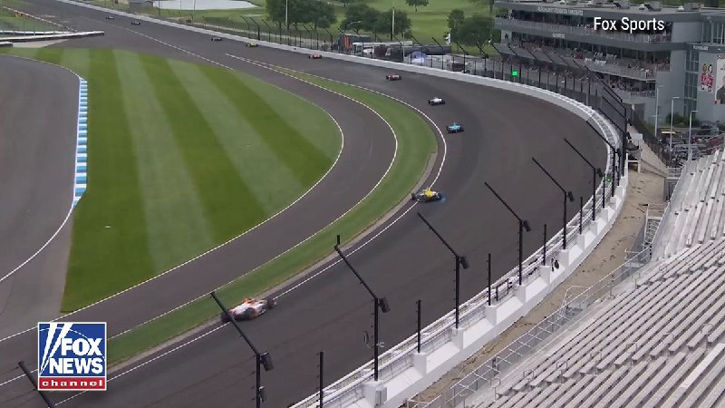
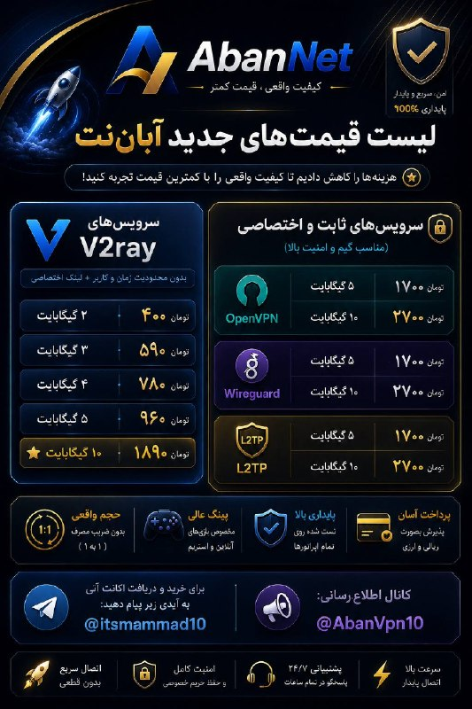
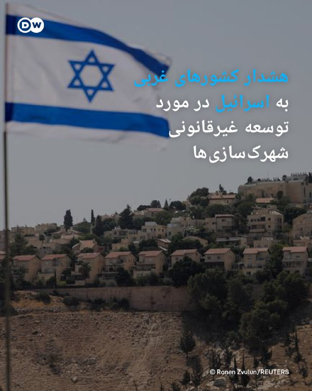
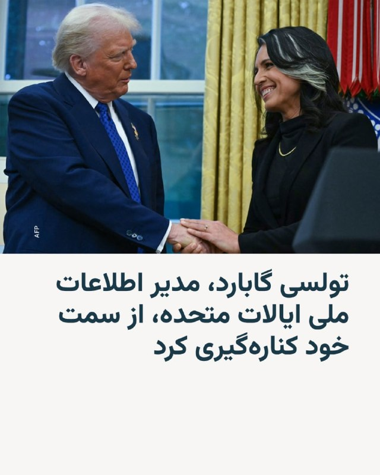
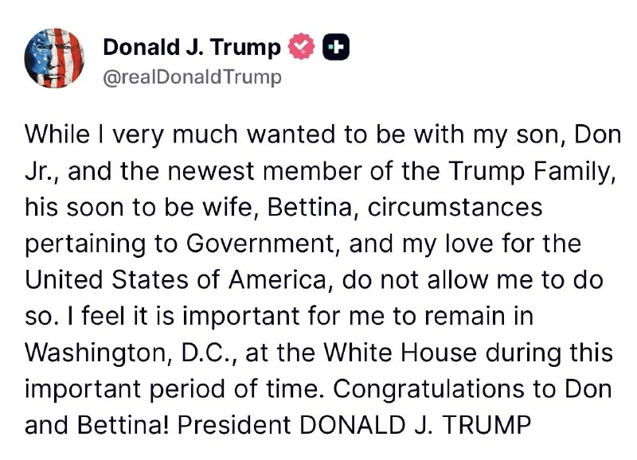

# خواننده تلگرام

<!-- TOP_NAV START -->

<!-- TOP_NAV END -->

<!-- MSG START -->

---
📅 بروزرسانی: 1405/03/02 00:17
---

## VahidOOnLine — post 241596

  

♦️عباس عراقچی، وزیر خارجه جمهوری اسلامی روز جمعه با آنتونیو گوترش، دبیرکل سازمان ملل متحد، تلفنی گفتگو کرد. به گزارش ایرنا، در این گفتگو، علاوه بر بررسی آخرین وضعیت منطقه‌، دو طرف روند تحولات مرتبط با دیپلماسی میان تهران و واشنگتن با میانجی‌گری اسلام‌آباد را بررسی کردند.
هم‌زمان با این گفتگو، عاصم منیر، فرمانده کل ارتش پاکستان و محسن نقوی، وزیر کشور این کشور در سفری از پیش اعلام‌نشده وارد تهران شدند؛ سفری که هدف اصلی آن، حل اختلافات میان تهران و واشنگتن برای امضای تفاهم‌نامه اولیه شروع مذاکرات عنوان شده است. همچنین سخنگوی وزارت خارجه ایران از حضور یک هیئت قطری در تهران در چارچوب «مساعی جمیله» برای کاهش تنش‌ها خبر داد، هرچند تاکید کرد که پاکستان همچنان میانجی رسمی این گفتگوهاست. با وجود این تحرکات، اسماعیل بقایی با «عمیق و جدی» خواندن شکاف‌های میان ایران و آمریکا اعلام کرد که تمرکز فعلی مذاکرات بر پایان دادن به جنگ است، مسئله هسته‌ای هنوز در دستور کار نیست و نمی‌توان گفت که توافق در هفته‌ها یا ماه‌های آینده نزدیک خواهد بود.
‌🇸🇦 Indypersian

🤖 @VahidOOnLine

## VahidOOnLine — post 241595

  

خبرگزاری تسنیم، رسانه‌ها وابسته به سپاه، به نقل از یک منبع نزدیک به هیات مذاکره‌کننده، نوشت: «گفت‌وگوها و رایزنی‌ها بر سر موارد اختلافی همچنان ادامه دارد و هنوز نتیجه نهایی حاصل نشده است.»

این رسانه وابسته به سپاه افزود: «میانجی پاکستانی همچنان در حال رد و بدل موضوعات است.»

تسنیم ادامه داد تمرکز در حال حاضر بر سر مسئله «پایان جنگ» است و تا وقتی این موضوع نهایی نشود، هیچ مساله دیگری مذاکره نخواهد شد.
‌🏁 🇬🇧 IranintlTV

🤖 @VahidOOnLine

## VahidOOnLine — post 241594

  <a href="telegram/content/VahidOOnLine_241594_1779482868.mp4" target="_blank">🎬 Download video</a>

یک شهروند در پیامی به ایران اینترنشنال از اوضاع اقتصادی در کشور روایت می‌کند و می‌گوید به دلیل کمبود آرد نانوایی‌ها با اختلال در فعالیت و صف‌های طولانی مواجه‌اند. پیام او با هوش مصنوعی خوانده شده است.
‌🏁 🇬🇧 IranintlTV

🤖 @VahidOOnLine

## VahidOOnLine — post 241593

  

♦️ راجر ویکر از ایالت می‌سی‌سی‌پی، سناتور جمهوری‌خواه، روز جمعه اول خرداد پیشنهاد کرد که ایالات متحده نباید به دنبال توافق با جمهوری اسلامی باشد، بلکه باید اقدامات نظامی خود را از سر بگیرد. او افزود: «ما باید کاری را که شروع کرده‌ایم تمام کنیم.»

ویکر که ریاست کمیته نیروهای مسلح سنای آمریکا را بر عهده دارد، در شبکه اجتماعی ایکس نوشت که به دونالد ترامپ «مشاوره‌های غلطی داده می‌شود تا به دنبال توافقی برود که ارزش کاغذی که روی آن نوشته می‌شود را هم نخواهد داشت.»

او در ادامه نوشت: «فرمانده کل قوای ما باید به نیروهای مسلح ماهر آمریکا اجازه دهد تا نابودی توانمندی‌های نظامی متعارف ایران را کامل کرده و تنگه [هرمز] را بازگشایی کنند.»

ویکر همچنین هشدار داد: «تلاش بیشتر برای دستیابی به توافق با رژیم اسلام‌گرای ایران، خطر برداشتِ ضعف [از سوی آمریکا] را به همراه دارد. ما باید کاری را که آغاز کرده‌ایم به پایان برسانیم. زمان عمل فرارسیده است.»
‌🇸🇦 Indypersian

🤖 @VahidOOnLine

## VahidOOnLine — post 241592

  <a href="telegram/content/VahidOOnLine_241592_1779482871.mp4" target="_blank">🎬 Download video</a>

♦️دونالد ترامپ، رئیس‌جمهوری ایالات متحده، روز جمعه اول خردادماه با ورود به نیویورک برای حضور در یک رویداد اقتصادی در کالج راکلند راهی نیوجرسی دراین ایالت شد.
در ویدیوی منتشرشده، ترامپ از داخل خودرو رئیس جمهوری به خبرنگاران دت تکان می دهد.
بر اساس برنامه اعلام‌شده، ترامپ قرار است به‌زودی در این مرکز آموزشی درباره وضعیت اقتصاد آمریکا سخنرانی کند.
‌🇸🇦 Indypersian

🤖 @VahidOOnLine

## VahidOOnLine — post 241591

  

قاسم رضایی، جانشین فرمانده کل انتظامی جمهوری اسلامی گفت: «دیگر تمرکز صرف بر فعالیت‌های پلیسی نیست و نظام دفاعی و آمادگی برای مواجهه با جنگ نامتقارن در اولویت قرار گرفته است.»

او افزود: «نیروها باید آموزش عملی ببینند و تمرینات میدانی داشته باشند. پلیس راه و راهور علاوه بر وظایف ترافیکی، آموزش دفاعی و آمادگی عملی می‌بیند.»

او افزود: «تمرین در خیابان و شرایط واقعی باعث افزایش توانمندی نیروها می‌شود.»
‌🏁 🇬🇧 IranintlTV

🤖 @VahidOOnLine

## VahidOOnLine — post 241590

  

♦️ الجزیره با استناد به داده‌های ردیابی کشتی‌ها روز جمعه اول خرداد، گزارش داد که سومین نفتکش حامل گاز طبیعی مایع (LNG) قطر در حال عبور از تنگه هرمز به مقصد چین است. این رویداد در حالی رخ می‌دهد که یک تیم مذاکره‌کننده قطری برای کمک به دستیابی به توافقی جهت پایان دادن به جنگ با جمهوری اسلامی، در تهران به سر می‌برد.

این کشتی به نام «السهله» با ظرفیت بیش از ۲۱۱ هزار مترمکعب، بندر رأس لفان قطر را ترک کرده و انتظار می‌رود در ۱۴ ژوئن (۲۴ خرداد) به پایانه ال‌ان‌جی تیانجین در چین برسد. عبور این کشتی نزدیک به دو هفته پس از آن صورت می‌گیرد که محموله‌های قبلی تحت یک توافق میان جمهوری اسلامی و پاکستان از این شاهراه حیاتی عبور کردند.

به گزارش خبرگزاری رویترز، دو نفتکش قطری قبلی که از زمان آغاز حملات هوایی آمریکا و اسرائیل در اواخر فوریه موفق به عبور از تنگه هرمز شدند، توسط قطر به پاکستان فروخته شده بودند. منابع آگاه اعلام کردند که جمهوری اسلامی عبور این نفتکش را با هدف اعتمادسازی میان قطر و پاکستان (که نقش میانجی را در گفتگوهای صلح ایفا می‌کند) تایید کرده است.
‌🇸🇦 Indypersian

🤖 @VahidOOnLine

## VahidOOnLine — post 241589

  

♦️ دونالد ترامپ، رئیس‌جمهور آمریکا، با انتشار پیامی در شبکه اجتماعی «تروث سوشال»، خبر استعفای تولسی گابارد از سمت مدیریت اطلاعات ملی (DNI) را تایید و اعلام کرد که او در تاریخ ۳۰ ژوئن (نهم تیر) دولت را ترک می‌کند.

ترامپ دلیل این تصمیم را ابتلای همسر گابارد به نوع نادری از سرطان استخوان عنوان کرد و گفت که او تمایل دارد برای همراهی و نبرد با بیماری همسرش در کنار او باشد. رئیس‌جمهور آمریکا ضمن آرزوی سلامتی برای همسر گابارد، از عملکرد او قدردانی کرد.

ترامپ همچنین اعلام کرد که آرون لوکاس، معاون اول گابارد، تا زمان تعیین مدیر جدید، به عنوان سرپرست مدیریت اطلاعات ملی آمریکا خدمت خواهد کرد.

در ماه‌های اخیر گزارش‌های تاییدنشده‌ای مبنی بر تمایل ترامپ به اخراج گابارد مطرح شده بود. گابارد در یکی از جلسات استماع کنگره، خطر دستیابی جمهوری اسلامی به سلاح هسته‌ای را «قریب‌الوقوع» ندانسته بود.
‌🇸🇦 Indypersian

🤖 @VahidOOnLine

## VahidOOnLine — post 241588

  

الجزیره به نقل از یک مقام جمهوری اسلامی گزارش داد که نقش قطر در حمایت از میانجی‌گری پاکستان بسیار کلیدی است.

این مقام حکومت ایران افزود: «آزادسازی دارایی‌های بلوکه‌شده و لغو تحریم‌های صادرات نفت برای جمهوری اسلامی موضوعی حاشیه‌ای نیست.»
‌🏁 🇬🇧 IranintlTV

🤖 @VahidOOnLine

## VahidOOnLine — post 241587

  <a href="telegram/content/VahidOOnLine_241587_1779482876.mp4" target="_blank">🎬 Download video</a>

یک شهروند در پیامی به ایران اینترنشنال از اوضاع وخیم اقامتگاه‌ها و هتل‌های مشهد در پی بحران اقتصادی روایت می‌کند. پیام او با هوش مصنوعی خوانده شده است.
‌🏁 🇬🇧 IranintlTV

🤖 @VahidOOnLine

## VahidOOnLine — post 241586

  

♦️ دونالد ترامپ، رئیس‌جمهوری ایالات متحده آمریکا روز جمعه اول خرداد اعلام کرد که «در این بازه زمانی مهم» ضروری است که در کاخ سفید باقی بماند و به‌همین دلیل امکان شرکت در مراسم عروسی پسرش، دونالد ترامپ جوان، با بتینا اندرسون را ندارد.

ترامپ ضمن آرزوی خوشبختی برای پسر ارشدش در شبکه اجتماعی تروث‌سوشال نوشت: «در حالی که بسیار مشتاق بودم در کنار پسرم، دان جونیور (دونالد ترامپ جونیور) و جدیدترین عضو خانواده ترامپ، یعنی همسر آینده‌اش، بتینا باشم، اما شرایط مربوط به دولت و عشق من به ایالات متحده آمریکا این اجازه را به من نمی‌دهد. احساس می‌کنم در این برهه زمانی مهم، حضور من در واشنگتن دی‌سی و در کاخ سفید اهمیت بالایی دارد.»

عروسی پسر ترامپ که قرار است این آخر هفته برگزار شود، با شدت گرفتن تلاش‌ها برای امضای تفاهم‌نامه میان تهران و واشنگتن همزمان شده است. در همین راستا، روز جمعه، عاصم منیر، فرمانده کل ارتش پاکستان که نقش میانجی میان تهران و واشنگتن را بازی می‌کند به ایران سفر کرد و محسن نقوی، وزیر کشور پاکستان نیز در تهران حضور دارد.
‌🇸🇦 Indypersian

🤖 @VahidOOnLine

## VahidOOnLine — post 241585

  

♦️اتحادیه جهانی کشتی اعلام کرد به‌دلیل «وضعیت ژئوپلیتیک کنونی» و ادامه ابهام‌ها به‌ویژه در حوزه سفرهای بین‌المللی، میزبانی مسابقات جهانی ۲۰۲۶ از منامه بحرین به شهر آستانه قزاقستان منتقل شده است.
میزبانی این رقابت‌ها پیش‌تر در نشست سال گذشته در زاگرب به بحرین واگذار شده بود، اما تحولات اخیر منطقه باعث تغییر این تصمیم شد. بر اساس برنامه جدید، مسابقات جهانی کشتی از ۲ تا ۱۰ آبان ۱۴۰۵ در آستانه برگزار خواهد شد؛ شهری که پیش‌تر در سال ۲۰۱۹ نیز میزبان این رقابت‌ها بوده است.
در ماه‌های اخیر، جنگ ایران که از نهم اسفند ۱۴۰۴ آغاز شده، موجب لغو یا جابه‌جایی بسیاری از رویدادهای بین‌المللی ورزشی در منطقه شده است.
‌🇸🇦 Indypersian

🤖 @VahidOOnLine

## WithYashar — post 12028

## WithYashar — post 12027

  <a href="https://t.me/withyashar/12027" target="_blank">📎 Download file</a>

کتابی از دونالد ترامپ یکی از بحث برانگیز ترین شخصیت های سیاسی جهان.
رئیس جمهور آمریکا دونالد جی ترامپ ، جهان بینی حرفه ای و شخصی خود را در این کتاب جذاب و خواندنی بیان می کند، روایتی دست اول از ظهور مهمترین معامله گر آمریکا.

دونالد ترامپ : هنر معامله گری

🌐 @withyashar

🌐 instagram.com/yashar

## WithYashar — post 12026

  <a href="telegram/content/WithYashar_12026_1779482880.mp4" target="_blank">🎬 Download video</a>

من باهوش‌ترین آدمی هستم که تا حالا باهاش روبه‌رو می‌شید✌🏾
@withyashar
یاشار : چقدر بجا و به موقع این حرف رو زد !!!

## WithYashar — post 12025

@withyashar حسود هرگز نیاسود

## WithYashar — post 12024

  <a href="telegram/content/WithYashar_12024_1779482882.mp4" target="_blank">🎬 Download video</a>

ترامپ : اعتراض کردن تو تجمع‌های من خطرناکه من چیزای خطرناک دوست ندارم دوست ندارم ببینم کسی کتک می‌خوره پس این کارو نکنید
@withyashar

## WithYashar — post 12023

  <a href="telegram/content/WithYashar_12023_1779482884.mp4" target="_blank">🎬 Download video</a>

ترامپ شاکی شد 😬 از اونی که اومد فحش داد
@withyashar

## WithYashar — post 12022

  <a href="telegram/content/WithYashar_12022_1779482886.mp4" target="_blank">🎬 Download video</a>

ترامپ به یک معترض:

برو خونه، پیش ننت
@withyashar

## WithYashar — post 12021

  <a href="telegram/content/WithYashar_12021_1779482888.mp4" target="_blank">🎬 Download video</a>

دونالد ترامپ در‌ نیویورک:

من ۹۹٪ رأی نیروهای اجرای قانون را گرفتم می‌توانید باور کنید؟
هنوز داریم تلاش می‌کنیم بفهمیم آن ۱٪ چه کسی بوده است.
@withyashar

## WithYashar — post 12020

داداشی میشه جریان علی کریمی رو یکم باز کنی الا از شاهزاده حمایت نمیکنه ؟

## WithYashar — post 12019

داداشی میشه جریان علی کریمی رو یکم باز کنی
الا از شاهزاده حمایت نمیکنه ؟

## WithYashar — post 12018

@withyashar

## WithYashar — post 12017

پنتاگون ویدئویی از بشقاب پرنده انتشار داده که چند سال پیش با فاصله ای بسیار نزدیک از کنار قایقهای تندروی سپاه عبور میکند … @withyashar یاشار : این سپاهی ها آدم فضایی هم دیدند ولی اون دوستمون این جمعه هم نیامد😬

## WithYashar — post 12016

آدم فضایی دیدیم ولی موشتبی رو ندیدیم

## WithYashar — post 12015

بذار تریاکامو بفروشم ۱۰۰دلار برات میزنم

## WithYashar — post 12014

بذار تریاکامو بفروشم ۱۰۰دلار برات میزنم

## WithYashar — post 12013

## WithYashar — post 12012

## WithYashar — post 12011

آکسیوس، به نقل از یک منبع نزدیک به ترامپ: رئیس جمهور احتمال آغاز یک عملیات نظامی بزرگ دیگر، اعلام پیروزی و پایان دادن به جنگ را مطرح کرد
@withyashar

## WithYashar — post 12010

  <a href="telegram/content/WithYashar_12010_1779482890.mp4" target="_blank">🎬 Download video</a>

پنتاگون ویدئویی از بشقاب پرنده انتشار داده که چند سال پیش با فاصله ای بسیار نزدیک از کنار قایقهای تندروی سپاه عبور میکند …
@withyashar
یاشار : این سپاهی ها آدم فضایی هم دیدند ولی اون دوستمون این جمعه هم نیامد😬

## WithYashar — post 12009

حریت ترکیه : صاحب مجموعه تفریحی معروف «کلاب روبی» در منطقه اورتاکوی استانبول، پس از تذکر دادن به گروهی از افراد مزاحم، در محل کسب خود با شلیک گلوله مجروح شد.

بنا بر گزارش‌های دریافتی، حدود ساعت ۳:۴۵ بامداد شب گذشته، گروهی از افراد با پوشش نامناسب و ایجاد مزاحمت قصد ورود به این کلاب معروف را داشتند که با ممانعت و هشدار علی اونال، صاحب این مجموعه، مواجه شدند. در پی بالا گرفتن مشاجره لفظی، فردی با هویت اختصاری «اِس.کی» با سلاح گرم به سمت اونال شلیک کرد. مالک این مجموعه تفریحی بلافاصله جهت مداوا به بیمارستان منتقل شد.

پس از وقوع این حادثه، نیروهای پلیس استانبول تحقیقات گسترده‌ای را آغاز کردند و ضارب را که با اسلحه از صحنه متواری شده و در مخفیگاهی در منطقه سنجاق‌تپه پنهان شده بود، شناسایی و دستگیر کردند
@withyashar

## mwarmonitor — post 9504

🔴اکسیوس: ترامپ در بحبوحه بررسی احتمال بازگشت به جنگ، با مشاوران ارشد خود درباره ایران تشکیل جلسه داد

📝نویسنده: باراک راوید

🔰به گفته دو مقام آمریکایی به «اکسیوس»، پرزیدنت ترامپ صبح روز جمعه جلسه‌ای را با تیم امنیت ملی ارشد خود درباره جنگ با ایران برگزار کرد.

📌چرا این موضوع اهمیت دارد؟
منابعی که مستقیماً با رئیس‌جمهور گفتگو کرده‌اند می‌گویند ترامپ در صورت عدم دستیابی به یک گشایش ناگهانی و دقیقه‌نودی در مذاکرات، به‌طور جدی در حال بررسی آغاز حملات جدید علیه ایران است.

نمای دوقاب (تحولات هم‌زمان):
نشست ترامپ درباره ایران در حالی برگزار شد که رئیس ارتش پاکستان، فیلد مارشال عاصم منیر، در تلاشی آشکار و دقیقه‌نودی برای پر کردن شکاف‌ها و جلوگیری از سرگیری جنگ، به تهران سفر کرده است.
یک هیئت قطری نیز روز جمعه برای حمایت از تلاش‌های میانجی‌گرانه وارد تهران شد.
انتظار می‌رود عاصم منیر روز شنبه با سردار احمد وحیدی، از فرماندهان سپاه پاسداران و مهره‌ای کلیدی در فرآیند تصمیم‌گیری ایران، دیدار کند.
یک مقام آمریکایی که در جریان تلاش‌های دیپلماتیک قرار گرفته است، روند مذاکرات را «طاقت‌فرسا» توصیف کرد. این مقام آمریکایی گفت که پیش‌نویس‌ها «هر روز بین طرفین رد و بدل می‌شوند» اما پیشرفت چندانی حاصل نشده است.
حاضران در اتاق جلسه:
به گفته منابع آگاه، در این نشست علاوه بر ترامپ، جی‌دی ونس (معاون رئیس‌جمهور)، پیت هگست (وزیر دفاع)، جان راتکلیف (رئیس سی‌آی‌ای)، سوزی وایلز (رئیس کارکنان کاخ سفید) و دیگر مقامات حضور داشتند.
مارکو روبیو (وزیر امور خارجه) و ژنرال دن کین (رئیس ستاد مشترک ارتش) در این جلسه حضور نداشتند؛ چرا که روبیو در اروپا بود و ژنرال کین در مراسم فارغ‌التحصیلی آکادمی نیروی دریایی حضور داشت.
در طول این جلسه، گزارشی از آخرین وضعیت مذاکرات و سناریوهای مختلف در صورت فروپاشی گفتگوها به ترامپ ارائه شد.
نکات جالب و پشت‌پرده:
چند ساعت پس از این دیدار، کاخ سفید از تغییر در برنامه آخر هفته ترامپ خبر داد.
او پس از سخنرانی برنامه‌ریزی‌شده خود در غروب جمعه در نیویورک، به جای اقامت در باشگاه گلف خود در بد مینستر، به واشنگتن بازخواهد گشت.
ترامپ همچنین در حساب کاربری خود در شبکه اجتماعی «تروث سوشال» نوشت که به دلیل «مسائل مربوط به دولت و عشق به ایالات متحده آمریکا» در مراسم عروسی پسرش، دان جونیور، در این آخر هفته شرکت نخواهد کرد.
او نوشت: «احساس می‌کنم برای من مهم است که در این بازه زمانی حساس، در واشنگتن دی‌سی و در کاخ سفید بمانم.»
در پشت صحنه چه می‌گذرد؟
یک منبع نزدیک به ترامپ و منبع دوم دیگری که از شرایط آگاهی دارد به اکسیوس گفتند که ترامپ طی چند روز گذشته به شدت از روند مذاکرات با ایران ناامید و کلافه شده است.
به گفته این دو منبع، او روز سه‌شنبه به بنیامین نتانیاهو، نخست‌وزیر اسرائیل گفت که می‌خواهد شانس دیگری به دیپلماسی بدهد، اما تا پنجشنبه‌شب، نظرش بیشتر به سمت صدور فرمان حمله متمایل شده بود.
یک منبع نزدیک به ترامپ گفت رئیس‌جمهور احتمال یک عملیات نظامی بزرگ و «تعیین‌کننده» نهایی را مطرح کرده است تا پس از آن بتواند اعلام پیروزی کند و به جنگ پایان دهد.
با این حال، هنوز هیچ نشانه‌ای مبنی بر اینکه ترامپ تصمیم قطعی برای سرگیری جنگ گرفته باشد، وجود ندارد.
موضع طرف مقابل:
وزارت امور خارجه ایران روز جمعه اعلام کرد که گفتگوها در جریان است اما توافق نزدیکی در کار نیست.
خبرگزاری نیمه‌رسمی تسنیم، وابسته به سپاه پاسداران، روز جمعه به نقل از یک منبع نزدیک به تیم مذاکره‌کننده ایران نوشت: «گفتگوها پیرامون موضوعات مورد اختلاف همچنان ادامه دارد و هنوز نتیجه نهایی حاصل نشده است.»
🔹این منبع مدعی شد که تمرکز فعلی بر «پایان دادن به جنگ» است و تا زمانی که این هدف محقق نشود، در مورد هیچ موضوع دیگری مذاکره نخواهد شد.

🔸تحلیل واقعیتِ میان خطوط:
ترامپ طی شش هفته گذشته چندین بار تا آستانه سرگیری جنگ پیش رفته اما در نهایت از آن صرف‌نظر کرده است.
برخی منابع نزدیک به مذاکرات همچنان بر این باورند که در ۲۴ ساعت آینده فرصتی برای نوعی گشایش وجود دارد.
با این حال، دو منبع آگاه از طرز تفکر ترامپ می‌گویند او تمایل دارد اقدام نظامی را پیش ببرد، مگر اینکه اتفاق غیرمنتظره‌ای در گفتگوها رخ دهد.

@mwarmonitor

## mwarmonitor — post 9503

🔴وال‌استریت ژورنال:

🔸میانجی‌ها به‌شدت در تلاش هستند تا به یک توافق موقت میان ایران و ایالات متحده دست پیدا کنند تا از انجام حملات جدید آمریکا–اسرائیل جلوگیری شود؛ حملاتی که مقام‌ها هشدار داده‌اند ممکن است ظرف چند روز آینده رخ دهند.

🔹پاکستان، قطر و دیگر بازیگران منطقه‌ای در حال تلاش برای پر کردن شکاف‌ها درباره برنامه هسته‌ای ایران، کاهش تحریم‌ها و امنیت منطقه‌ای هستند.

🔸هدف، رسیدن به یک توافق کامل نیست، بلکه ایجاد یک چارچوب موقت است که آتش‌بس را تمدید کند و اجازه دهد مذاکرات گسترده‌تر ادامه پیدا کند.

@mwarmonitor

## mwarmonitor — post 9502

  

🔴پس از یک حادثه شیمیایی در گاردن گروو، کالیفرنیا، اداره آتش‌نشانی اورنج کانتی (OCFA) اعلام کرده است که تنها دو سناریوی باقی‌مانده برای یک مخزن ۶۰۰۰ تا ۷۰۰۰ گالنی حاوی «متیل متاکریلات» این است که «یا از کار می‌افتد یا منفجر می‌شود».

🔸نقشه زیر محدوده فعلی دستور تخلیه را نشان می‌دهد.

@mwarmonitor

## FoxNewsTwitter — post 342143

  <a href="telegram/content/FoxNewsTwitter_342143_1779482892.mp4" target="_blank">🎬 Download video</a>

Fox News (Twitter/X)

JUST IN: President Trump rips the Biden admin’s electric vehicle mandate, warning that the power grid cannot support a forced transition to EVs:

“We ended Joe Biden’s insane electric vehicle mandate. That’s where they wanted everybody to buy an electric car.”

“If we would build the charging booths, right? It would cost the country $4 trillion. No country can afford that.”

“We love electric cars. I have to say that because of Elon.”

“Not everybody wants to have an electric car. And I ended that whole nonsense. By 2030, you’re all going to have electric cars? I don’t think so.”

## FoxNewsTwitter — post 342142

  <a href="telegram/content/FoxNewsTwitter_342142_1779482895.mp4" target="_blank">🎬 Download video</a>

Fox News (Twitter/X)

NEW: President Trump praises his admin's move to bring automotive manufacturing jobs back to the U.S. from overseas.

“They were all made in Germany and other countries. Now they're making them here because if they don't, they have to pay a big penalty."

"They're stamping them at my instruction 'Made in the USA.'"

## FoxNewsTwitter — post 342141

  <a href="telegram/content/FoxNewsTwitter_342141_1779482897.mp4" target="_blank">🎬 Download video</a>

Fox News (Twitter/X)

NEW: President Trump slams Democrats for spending millions on a political “autopsy” before asking a roaring crowd which nickname for Joe Biden they like best:

“They spent $10 million for the autopsy. It was called an autopsy. And they had typos. They had typos in every other sentence. They had misspelled words. They had commas in the wrong locations.”

“I could have given them the autopsy without any charge at all.”

“I said you had one candidate named Sleepy Joe Biden.”

## FoxNewsTwitter — post 342140

  

Fox News (Twitter/X)

WATCH LIVE: President Trump lands in New York to deliver remarks https://twitter.com/i/broadcasts/1wGWjjaaqyZKQ

## FoxNewsTwitter — post 342139

  <a href="telegram/content/FoxNewsTwitter_342139_1779482901.mp4" target="_blank">🎬 Download video</a>

Fox News (Twitter/X)

NOW: Crowd erupts with “USA” chants as a protester is kicked out for interrupting President Trump’s midterm campaign event in upstate New York.

“Take him home to mommy.”

## FoxNewsTwitter — post 342138

  <a href="telegram/content/FoxNewsTwitter_342138_1779482903.mp4" target="_blank">🎬 Download video</a>

Fox News (Twitter/X)

NEW: President Trump torches Democrats’ progressive agenda, slamming open borders, sanctuary cities, and gender policies targeting minors:

“We don’t want open borders where prisoners pour in from other countries all over the world.”

“We don’t want sanctuary cities where you have sanctuary for criminals. We don’t want it.”

“We don’t want transgender mutilation of your children, if that’s okay. We don’t want it.”

## FoxNewsTwitter — post 342137

  <a href="telegram/content/FoxNewsTwitter_342137_1779482906.mp4" target="_blank">🎬 Download video</a>

Fox News (Twitter/X)

NOW: New York crowd chants "4 more years" for President Trump.

"We have a hat. The hat says '4 more years.' It drives the radical left lunatics crazy."

## FoxNewsTwitter — post 342136

  <a href="telegram/content/FoxNewsTwitter_342136_1779482908.mp4" target="_blank">🎬 Download video</a>

Fox News (Twitter/X)

BREAKING: President Trump tells a New York crowd that he's working to bring his home state back to greatness:

“I was born and raised in New York State. My heart has always been here. I love this place, and we’ve got to straighten it out.”

“From the beginning, this was a symbol of American excellence and American grit — and really, the American Dream.”

“Unfortunately, in recent years, the state’s been held back by bad policies, bad politicians, and foolish radical left idiocy."

## FoxNewsTwitter — post 342135

  <a href="telegram/content/FoxNewsTwitter_342135_1779482911.mp4" target="_blank">🎬 Download video</a>

Fox News (Twitter/X)

NOW: New York Giants quarterback Jaxson Dart introduces President Trump before his speech in New York.

## FoxNewsTwitter — post 342134

  

Fox News (Twitter/X)

WATCH LIVE: President Trump lands in New York to deliver remarks https://twitter.com/i/broadcasts/1aJbdbjjmbqKX

## FoxNewsTwitter — post 342133

  <a href="telegram/content/FoxNewsTwitter_342133_1779482915.mp4" target="_blank">🎬 Download video</a>

Fox News (Twitter/X)

Combat vet and Purple Heart recipient Ted Daniels ripping Democrat Maine Senate candidate Graham Platner over a resurfaced post in which Platner said Daniels should have died after nearly being killed by the Taliban.

"Graham, you're a coward... I think you’re a scumbag... People like this don't say stuff like this to my face."

## FoxNewsTwitter — post 342132

  

Fox News (Twitter/X)

NEW: Indy 500 drivers are already getting banged up in practice after a series of ugly crashes ahead of race day.

Romain Grosjean, Pato O’Ward, and Alexander Rossi were among the drivers caught up in a major multi-car wreck during Practice 7 for the 2026 Indianapolis 500.

The 110th Running of the Indianapolis 500 takes place on Sunday, May 24, and you can catch all the action live on FOX.

## pm_afshaa — post 91231

  

🚀 آبان‌نت؛ سرعت بی‌مرز، بدون تاریخ انقضا!

⚡دنبال کیفیتی می‌گردی که حجمت رو بی‌دلیل تموم نکنه؟

💎 ویژگی‌های طلایی:
• 
✅ بدون محدودیت زمان و کاربر: تا آخرین کیلوبایت حجمت معتبره!
• 
✅ مصرف واقعی (۱ به ۱): بدون ضریب مصرف و دزدی حجم.
• 
✅ پینگ عالی: مخصوص گیمرهای حرفه‌ای و یوتیوب.
• 
☄️ تنوع سرویس: V2ray، OpenVPN،L2tp و Wireguard.

💳 پرداخت راحت بصورت ریالی و ارزی

💰 قیمت‌های ما را مقایسه کنید!
برای استعلام قیمت استثنایی و مشاوره به آیدی زیر پیام دهید:

🆔 @itsmammad10
🔗 کانال اصلی ما:

🆔 @AbanVpn10

## pm_afshaa — post 91230

  <a href="telegram/content/pm_afshaa_91230_1779482920.webm" target="_blank">🎬 Download video</a>

🔴تمام امتحانات سال جاری دانشگاه پیام نور در سراسر کشور مجازی شد.

💧 Rainbet.com the #1 Non-KYC Crypto Casino & Sportsbook @rainbetcom

😁 @Pm_Afshaa

## pm_afshaa — post 91229

  <a href="telegram/content/pm_afshaa_91229_1779482920.mp4" target="_blank">🎬 Download video</a>

🔴ترامپ: من ۹۹٪ رأی نیروهای اجرای قانون رو گرفتم میتونید باور کنید؟ هنوز داریم تلاش می‌کنیم بفهمیم آن ۱٪ چه کسی بوده.

💧 Rainbet.com the #1 Non-KYC Crypto Casino & Sportsbook @rainbetcom

😁 @Pm_Afshaa

## pm_afshaa — post 91228

  <a href="telegram/content/pm_afshaa_91228_1779482923.webm" target="_blank">🎬 Download video</a>

🔴منابع نزدیک به کاخ سفید:
با داغ‌تر شدن درگیری‌های نظامی تو ایران، ترامپ برنامه‌هاشو عوض کرده و قراره آخر هفته رو تو کاخ سفید بمونه.

💧 Rainbet.com the #1 Non-KYC Crypto Casino & Sportsbook @rainbetcom

😁 @Pm_Afshaa

## pm_afshaa — post 91227

  <a href="telegram/content/pm_afshaa_91227_1779482923.webm" target="_blank">🎬 Download video</a>

🔴اکسیوس به نقل از یک منبع نزدیک به ترامپ: ترامپ احتمال اجرای یک عملیات نهایی و گسترده رو مطرح کرده؛ عملیاتی که بعدش بتونه اعلام پیروزی کنه و بگه جنگ تموم شده. 
💧 Rainbet.com the #1 Non-KYC Crypto Casino & Sportsbook @rainbetcom 
😁 @Pm_Afshaa

## pm_afshaa — post 91226

  <a href="telegram/content/pm_afshaa_91226_1779482924.webm" target="_blank">🎬 Download video</a>

🔴اکسیوس به نقل از یک منبع نزدیک به ترامپ: ترامپ احتمال اجرای یک عملیات نهایی و گسترده رو مطرح کرده؛ عملیاتی که بعدش بتونه اعلام پیروزی کنه و بگه جنگ تموم شده.

💧 Rainbet.com the #1 Non-KYC Crypto Casino & Sportsbook @rainbetcom

😁 @Pm_Afshaa

## pm_afshaa — post 91225

  <a href="telegram/content/pm_afshaa_91225_1779482925.webm" target="_blank">🎬 Download video</a>

ترامپ: با اینکه خیلی میخواهم در کنار پسرم برای مراسم عروسی باشم اما حس میکنم که مهم است در واشنگتن و کاخ سفید در طی زمان مهم پیش رو در روز شنبه و یکشنبه بمانم 
💧 Rainbet.com the #1 Non-KYC Crypto Casino & Sportsbook @rainbetcom 
😁 @Pm_Afshaa

## pm_afshaa — post 91224

  <a href="telegram/content/pm_afshaa_91224_1779482926.webm" target="_blank">🎬 Download video</a>

🔴الجزیره نقل از مقام ایرانی:
میانجی‌ها در تلاشند فاصله بین ایران و امریکا رو کم کنند ولی فقط فضای مثبت و اقدامات میانجی ها کافی نیست!

💧 Rainbet.com the #1 Non-KYC Crypto Casino & Sportsbook @rainbetcom

😁 @Pm_Afshaa

## DEJradio — post 4857

  <a href="telegram/content/DEJradio_4857_1779482926.webm" target="_blank">🎬 Download video</a>

🚨
🔸 خبر ۲۱
آدینه ۱ اردیبهشت ۱۴۰۵

#خبر۲۱
@DEJradio

## DEJradio — post 4856

  <a href="telegram/content/DEJradio_4856_1779482927.webm" target="_blank">🎬 Download video</a>

🔺📢 منابع داخلی گزارش دادند از نیمه دوم اردیبهشت ۱۴۰۵ خروج اموال و اسناد با ارزش از صندوق امانات چند بانک از جمله ملی، تجارت و مسکن افزایش یافته است.

کاربران این صندوق‌ها نگران‌اند با توجه به احتمال جنگ مجدد و وضعیت بحرانی نظام، سرمایه آنها از بین برود یا دیگر صاحب آن نباشند.

در جریان جنگ ۴۰ روزه یکی از شعب بانک سپه در تهران که گفته شد «دیتا سنتر» آنجا قرار داشت هدف قرار گفت.
صندوق امانات، محفظه‌ای امن در خزانه‌ بانک‌هاست که برای نگهداری اسناد، طلا و اشیای ارزشمند اجاره داده می‌شود.

بانک‌ها تضمین نکرده‌اند که در صورت وقوع جنگ یا انقلاب اموال و دارایی مشتریان کامل به آنها پرداخت می‌شود.

#جنگ #جنگ۴۰روزه
@DEJradio

## kianmeli1 — post 87562

  

🔴سایت انصاف‌نیوز از دسترس خارج شد.

این سایت روز گذشته نوشته بود:
« شنیده‌ی انصاف نیوز حاکی است که سعید جلیلی مدتی است در جلسات شعام شرکت نمی‌کند.»
https://t.me/kianmeli1

## kianmeli1 — post 87561

🔴ترامپ درباره تست شناختی : بایدن حتی سوال اول رو هم نمی‌تونست جواب بده

فکر نمی‌کنم بتونه بگیره اینا رو
کدوم خرسه کدوم اسبه
https://t.me/kianmeli1

## kianmeli1 — post 87560

  <a href="telegram/content/kianmeli1_87560_1779482928.mp4" target="_blank">🎬 Download video</a>

🔴ترامپ:من باهوش‌ترین آدمی هستم که شما ممکن است ببینید
https://t.me/kianmeli1

## kianmeli1 — post 87559

  <a href="telegram/content/kianmeli1_87559_1779482931.mp4" target="_blank">🎬 Download video</a>

🔴ترامپ: ما اینقدر نفت از ونزوئلا استخراج کرده‌ایم(چاپیدیم) که هزینه جنگ را حدود ۲۵ برابر پرداخت کرده‌ایم.
https://t.me/kianmeli1

## kianmeli1 — post 87558

  

🔴سناتور گراهام:

من معتقدم آزادی مردم شگفت‌انگیز کوبا از چنگال کمونیسم نزدیک است.

(ایران رو آباد کردن رفتن سراغ کوبا)
https://t.me/kianmeli1

## kianmeli1 — post 87557

  

🔴منبع نزدیک به کاخ سفید :
با داغ‌تر شدن درگیری‌های نظامی با رژیم ملاها، پرزیدنت ترامپ برنامه‌هایش را عوض کرده و قرار است آخر هفته را در کاخ سفید بماند
https://t.me/kianmeli1

## IranIntlTV — post 338492

  <a href="telegram/content/IranIntlTV_338492_1779482934.mp4" target="_blank">🎬 Download video</a>

مشاور رییس دولت امارات متحده عربی گفت برخی کشورهای عربی اکنون جمهوری اسلامی را تهدیدی بزرگ‌تر از اسرائیل می‌بینند.

به گفته او، حملات جمهوری اسلامی نگاه امنیتی منطقه را تغییر داده و باعث شده همکاری برخی دولت‌های عربی با اسرائیل اهمیت بیشتری پیدا کند.
@iranintltv

## IranIntlTV — post 338491

  <a href="telegram/content/IranIntlTV_338491_1779482937.mp4" target="_blank">🎬 Download video</a>

پیام‌های رسیده به ایران‌اینترنشنال نشان می‌دهد مشکلات در تامین برخی کالاهای ضروری و اساسی در ایران همچنان ادامه دارد.

شهروندان در شهرهای مختلف همچنین از کمبود بنزین خبر می‌دهند.

گفت‌وگو با معصومه طاهرخانی، تحلیل‌گر اقتصادی
@iranintltv

## IranIntlTV — post 338490

  <a href="telegram/content/IranIntlTV_338490_1779482939.mp4" target="_blank">🎬 Download video</a>

همزمان با سفر هیاتی از پاکستان به ریاست فرمانده ارتش و رییس اطلاعات این کشور به تهران برای پیشبرد مذاکرات، قطر نیز در هماهنگی با آمریکا تیمی مذاکره‌کننده به تهران اعزام کرد.

رییس‌جمهوری آمریکا در تروث سوشال نوشت به‌دلیل شرایط حساس فعلی، ترجیح داده در کاخ سفید و واشینگتن بماند. ترامپ همچنین گفت ایران بی‌صبرانه به‌دنبال دستیابی به توافق با آمریکا است.
@iranintltv

## IranIntlTV — post 338489

  <a href="telegram/content/IranIntlTV_338489_1779482942.mp4" target="_blank">🎬 Download video</a>

سخنگوی وزارت خارجه جمهوری اسلامی گفت با درخواست آمریکا برای تحویل اورانیوم با غنای بالا، مذاکرات به نتیجه نمی‌رسد.

همزمان، گزارش‌ها از اعزام تیم مذاکره‌کننده قطر به تهران و سفر فرمانده ارتش و رییس اطلاعات پاکستان به ایران خبر می‌دهند.

دونالد ترامپ نیز گفت به‌دلیل شرایط حساس کنونی در واشینگتن مانده است.

گفت‌وگو با امید معماریان، تحلیل‌گر سیاسی در موسسه دان، و حسین علیزاده، دیپلمات پیشین
@iranintltv

## IranIntlTV — post 338488

  <a href="telegram/content/IranIntlTV_338488_1779482945.mp4" target="_blank">🎬 Download video</a>

سخنگوی وزارت خارجه جمهوری اسلامی گفت با درخواست آمریکا برای تحویل اورانیوم با غنای بالا، مذاکرات به نتیجه نمی‌رسد.

همزمان، گزارش‌ها از اعزام تیم مذاکره‌کننده قطر به تهران و سفر فرمانده ارتش و رییس اطلاعات پاکستان به ایران خبر می‌دهند.

دونالد ترامپ نیز گفت به‌دلیل شرایط حساس کنونی در واشینگتن مانده است.

گفت‌وگو با امید معماریان، تحلیل‌گر سیاسی در موسسه دان، و حسین علیزاده، دیپلمات پیشین
@iranintltv

## IranIntlTV — post 338487

سخنگوی وزارت خارجه جمهوری اسلامی: نمی‌توانیم بگوییم توافق نزدیک است

اسماعیل بقایی، سخنگوی وزارت امور خارجه جمهوری اسلامی، اختلافات میان تهران و واشینگتن را «عمیق» خواند و تاکید کرد نمی‌توان انتظار داشت روند مذاکرات تنها با «چند بار رفت‌وآمد» به نتیجه نهایی و حل‌وفصل چالش‌ها منجر شود.

بقایی شامگاه جمعه اول خرداد در مصاحبه با صداوسیمای جمهوری اسلامی، با اشاره به سفر مقام‌های ارشد پاکستان به ایران گفت: «نمی‌توانیم بگوییم که به جایی رسیدیم که توافق نزدیک است. ضرورتا خیر، این‌طور نیست. روند ادامه‌دار است.»

او اضافه کرد: «اختلاف‌نظرها بین ایران و آمریکا آن‌قدر عمیق و زیاد است، به‌ویژه بعد از جنایاتی که در دو سه ماه اخیر مرتکب شده‌اند، که نمی‌توان گفت با چند بار رفت‌و‌آمد یا مذاکرات ظرف چند هفته یا چند ماه حتما به نتیجه خواهیم رسید. دیپلماسی زمان‌بر است.»

اظهارات بقایی در حالی مطرح می‌شوند که عاصم منیر، فرمانده ارتش پاکستان، برای گفت‌وگو با مقام‌های جمهوری اسلامی به تهران سفر کرده است.

پیش‌تر نیز شبکه العربیه از سفر عاصم مالک، رییس سازمان اطلاعات پاکستان، به ایران خبر داده بود.

تایید سفر هیات قطری به تهران
سخنگوی وزارت امور خارجه جمهوری اسلامی گزارش خبرگزاری رویترز درباره سفر هیات قطری به تهران را تایید کرد و گفت نمایندگان دوحه اول خرداد با عباس عراقچی دیدار و گفت‌وگو کردند.

بقایی ادامه داد: «بسیاری از کشورها، چه کشورهای منطقه و چه کشورهای خارج از منطقه، تلاش می‌کنند تا به پایان جنگ و جلوگیری از تشدید تنش‌ها کمک کنند. این تلاش‌ها از نظر ما ارزشمند است.»

او در عین حال خاطرنشان کرد اسلام‌آباد همچنان «میانجی رسمی» مذاکرات میان تهران و واشینگتن محسوب می‌شود.

رویترز پیش‌تر از سفر یک هیات مذاکره‌کننده قطری به تهران خبر داد و نوشت هدف از این سفر که با هماهنگی واشینگتن انجام گرفت، کمک به تلاش‌ها برای دستیابی به توافقی جهت خاتمه جنگ ایران است.

بقایی: در این مرحله وارد «جزییات» پرونده هسته‌ای نخواهیم شد
سخنگوی وزارت خارجه جمهوری اسلامی اعلام کرد مذاکرات جاری با واشینگتن بر پایان جنگ متمرکز است و «جزییات» پرونده هسته‌ای در این مرحله وارد دستور کار گفت‌وگوها نخواهد شد.

بقایی گفت خاتمه جنگ در همه جبهه‌ها، از جمله لبنان، وضعیت تنگه هرمز و محاصره دریایی آمریکا، از محورهای اصلی گفت‌وگوهای حکومت ایران و ایالات متحده به شمار می‌روند.

او ادامه داد: «دلیل اینکه در مورد جزییات مباحث مرتبط با موضوع [هسته‌ای] صحبت نمی‌کنیم، مشخص است. ما دو بار این کار را کردیم و زیاده‌خواهی طرف مقابل باعث شد وارد جنگ شویم.»

بقایی افزود ورود به «سایر موضوعات» در مذاکرات با آمریکا تنها پس از پایان جنگ و رفع «نگرانی‌های» تهران امکان‌‎پذیر خواهد بود.

خبرگزاری رویترز ۳۱ اردیبهشت به نقل از مقام‌های اسرائیلی نوشت دونالد ترامپ، رییس‌جمهوری آمریکا، به اورشلیم اطمینان داده که ذخایر اورانیوم با غنای بالا از ایران خارج خواهد شد و این موضوع بخشی از هرگونه توافق احتمالی صلح خواهد بود.

بنیامین نتانیاهو، نخست‌وزیر اسرائیل، بارها تاکید کرده که پایان جنگ منوط به خروج اورانیوم غنی‌شده از ایران، توقف حمایت تهران از گروه‌های نیابتی و برچیده شدن توان موشکی جمهوری اسلامی است.

کانال ۱۱ اسرائیل ۳۱ اردیبهشت گزارش داد در پی ارزیابی‌های اطلاعاتی جدید، ارتش و نهادهای امنیتی این کشور مجموعه‌ای از اقدامات مهم را برای احتمال جدی ازسرگیری نبرد با جمهوری اسلامی آغاز کرده‌‌اند و آمادگی خود را به بالاترین سطح افزایش داده‌اند.
 
🔗وب‌سایت ایران‌اینترنشنال
@iranintltv

## IranIntlTV — post 338486

بنزین در زاهدان، کرمان و بندرعباس تا لیتری ۲۰۰ هزار تومان فروخته می‌شود

🖋سبا حیدرخانی

گزارش‌های رسیده به ایران‌اینترنشنال از شهرهای مختلف ایران، از تشدید بحران تامین بنزین، محدودیت‌ در عرضه سوخت، صف‌های طولانی در جایگاه‌ها و افزایش شدید قیمت بنزین حتی تا لیتری ۲۰۰ هزار تومان در بازار غیررسمی حکایت دارد.

بیشترین روایت‌ها مربوط به استان‌های هرمزگان، سیستان و بلوچستان، کرمان، بوشهر، خراسان جنوبی، اصفهان و خراسان رضوی است.

بر اساس پیام‌های مردمی، وضعیت عرضه سوخت در جیرفت، عنبرآباد و شهرهای جنوبی استان کرمان بحرانی شده است.

به گفته یک شهروند، در این مناطق قیمت بنزین در بازار آزاد به لیتری ۱۰۰ هزار تومان رسیده است.

او افزود: «اکنون دغدغه ما بنزین شده است. پمپ‌بنزین‌ها بیشتر از ۱۵ لیتر نمی‌دهند و شب‌ها باید در صف‌های کیلومتری بایستیم تا صبح نوبتمان شود. واقعا کلافه شده‌ایم.»

در بیرجند نیز سوخت جیره‌بندی و سهمیه کارت‌ها نصف شده و بنزین آزاد تنها در دو جایگاه، از ساعت شش صبح تا شش عصر و فقط به مقدار ۱۰ لیتر عرضه می‌شود.

در بوشهر هم به گفته یک مخاطب، ‌بنزین تقریبا «نایاب» شده است؛ دکه‌های کنار جاده، سوخت را در دبه‌های ۵ لیتری و با قیمت هر لیتر ۱۰ هزار تومان می‌‌فروشند.

شهروند دیگری از کرمان با اشاره به شکل‌گیری بازار سیاه سوخت گفت بنزین را لیتری ۸۰ هزار تومان خریده است.

او افزود مردم شب‌ها تا صبح در صف می‌ایستند و نوبت می‌گیرند تا صبح که جایگاه باز شد، اگر خوش‌شانس بودند، بتوانند سوخت گیر بیاورند.

جیره‌بندی عرضه رسمی سوخت و گسترش بازار غیررسمی
پیام‌های رسیده از بندرعباس حاکی از شرایط «فاجعه‌بار» جایگاه‌های سوخت در این شهر است.

یکی از مخاطبان ایران‌اینترنشنال گفت: «صف‌های چندکیلومتری بنزین مردم را کلافه کرده است، آن‌هم در گرمایی که کولر خودرو ضرورت است نه انتخاب. شهری که بخش بزرگی از بنزین کشور را تولید می‌کند، سهمش شده آلودگی، بیماری و ساعت‌ها تحقیر در صف سوخت، بدون کوچک‌ترین پاسخ‌گویی مسئولان.»

شهروند دیگری از بندرعباس گفت از ساعت ۸:۵۵ شب در صف پمپ‌بنزین ترنج منتظر بوده‌، اما ساعت ۱۰:۱۰ به خودروها اعلام شده که سوخت تمام شده است.

رمضان‌علی سنگدوینی، عضو کمیسیون انرژی مجلس، پیش‌تر گفته بود بحث تغییر سهمیه‌بندی بنزین «صرفا در حد طرح شخصی» بوده و هیچ تصمیم رسمی درباره آن اتخاذ نشده است.

این موضوع اما با روایت‌های گسترده شهروندان از محدودیت‌های عملی در عرضه سوخت، تناقض دارد.

شهروندان در مشهد از طولانی‌تر شدن صف‌ها و افزایش مداوم قیمت‌ها خبر دادند.

مخاطبی در همین زمینه گفت برای پر کردن یک باک باید ساعت‌ها در صف جایگاه سوخت منتظر ماند: «قبلا هر چند ماه یک‌بار افزایش قیمت داشتیم، اما اکنون هر روز گران‌تر می‌شود.»

شهروند دیگری نیز در پیامی کوتاه نوشت: «امروز سه لیتر بنزین زدم شد ۲۰۰ هزار تومان.»

این گزارش‌ها در حالی منتشر می‌شود که مسعود پزشکیان، رییس دولت جمهوری اسلامی، ۳۰ اردیبهشت با تایید آسیب دیدن بخشی از زیرساخت‌های انرژی در جنگ اخیر، از ناتوانی دولت در تامین و واردات بنزین خبر داد.

او گفت در پی «محاصره دریایی آمریکا»، صادرات نفت ایران متوقف شده و کشور روزانه با کمبود ۵۰ میلیون لیتر بنزین روبه‌رو است، اما «دلاری برای واردات آن وجود ندارد».
ساعاتی پس از انتشار این سخنان، رسانه‌های دولتی از جمله ایرنا بخش‌هایی از اظهارات پزشکیان را حذف کردند.

فساد و رانت در جایگاه‌ها
در کنار بحران کمبود سوخت و توزیع نامناسب آن، برخی مخاطبان از افزایش فساد و رانت در برخی جایگاه‌ها و ناکارآمدی کارت‌های سوخت خبر دادند.

شهروندی از اصفهان با اشاره به ناکارآمدی حکومت در مدیریت بحران سوخت گفت کارت‌ها بدون دلیل خطا می‌دهند و باید سه هفته در انتظار کارت جدید ماند.

مخاطب دیگری از اصفهان از تشدید بی‌نظمی در جایگاه‌ها خبر داد و گفت: «علاوه بر اینکه صف‌های جایگاه سوخت کیلومتری شده و سهمیه بنزین بعضی‌ها را سوزانده‌اند، تعدادی از نیروهای بسیجی هم با اسلحه می‌آیند و بدون نوبت بنزین می‌زنند؛ آن هم نه یک یا دو لیتر، بلکه ۱۵ لیتر بنزین داخل موتورهایشان می‌زنند و می‌روند.»

یک شهروند از استان هرمزگان با انتقاد از «رانت و تبعیض در توزیع سوخت» گفت مردم ساعت‌ها در صف می‌مانند اما ماشین‌های سپاه با گالن‌های ۷۰ لیتری، شبانه از ساعت ۱۸ تا ۴ صبح نزدیک به ۱۰ بار سوخت‌گیری می‌کنند و آن را برای فروش به کاروان‌ها یا قاچاقچیان سوخت می‌برند.

به گفته او، هر گالن ۷۰ لیتری تا پنج میلیون تومان فروخته می‌شود.
 
🔗متن کامل گزارش را اینجا بخوانید
@iranintltv

## IranIntlTV — post 338485

  <a href="https://t.me/IranintlTV/338485" target="_blank">📎 Download file</a>

🎧نسخه صوتی ۲۴ با فرداد فرحزاد:ترامپ: تهران بی‌صبرانه به‌دنبال توافق است
@iranintlTV

## IranIntlTV — post 338483

  

خبرگزاری تسنیم، رسانه‌ها وابسته به سپاه، به نقل از یک منبع نزدیک به هیات مذاکره‌کننده، نوشت: «گفت‌وگوها و رایزنی‌ها بر سر موارد اختلافی همچنان ادامه دارد و هنوز نتیجه نهایی حاصل نشده است.»

این رسانه وابسته به سپاه افزود: «میانجی پاکستانی همچنان در حال رد و بدل موضوعات است.»

تسنیم ادامه داد تمرکز در حال حاضر بر سر مسئله «پایان جنگ» است و تا وقتی این موضوع نهایی نشود، هیچ مساله دیگری مذاکره نخواهد شد.
https://iranintl.com/202605227080

## IranIntlTV — post 338482

  <a href="telegram/content/IranIntlTV_338482_1779482950.mp4" target="_blank">🎬 Download video</a>

یک شهروند در پیامی به ایران اینترنشنال از اوضاع اقتصادی در کشور روایت می‌کند و می‌گوید به دلیل کمبود آرد نانوایی‌ها با اختلال در فعالیت و صف‌های طولانی مواجه‌اند. پیام او با هوش مصنوعی خوانده شده است.

## IranIntlTV — post 338481

  <a href="telegram/content/IranIntlTV_338481_1779482952.mp4" target="_blank">🎬 Download video</a>

فداحسین مالکی، عضو کمیسیون امنیت ملی مجلس، در صداوسیما گفت جمهوری اسلامی در صورت لزوم می‌تواند آتش‌بس را نقض کند. هم‌زمان برخی امامان جمعه نیز هشدار دادند اگر «تعرض‌ها» ادامه پیدا کند، تهران جنگ را بین‌المللی خواهد کرد.

ارزیابی نجات بهرامی، تحلیل‌گر سیاسی
@iranintltv

## IranIntlTV — post 338480

  <a href="telegram/content/IranIntlTV_338480_1779482955.mp4" target="_blank">🎬 Download video</a>

وال‌استریت ژورنال گزارش داد جمهوری اسلامی با پر شدن مخازن نفت و افزایش فشارهای آمریکا، با بحرانی جدی در صنعت نفت روبه‌رو شده است. بر اساس این گزارش، تهران برای جلوگیری از توقف کامل صنعت نفت، ناچار شده از نفتکش‌های شناور و حتی مخازن فرسوده استفاده کند.

گفت‌وگو با همایون فلک‌شاهی، کارشناس نفت و انرژی در موسسه کپلر
@iranintltv

## IranIntlTV — post 338479

  

قاسم رضایی، جانشین فرمانده کل انتظامی جمهوری اسلامی گفت: «دیگر تمرکز صرف بر فعالیت‌های پلیسی نیست و نظام دفاعی و آمادگی برای مواجهه با جنگ نامتقارن در اولویت قرار گرفته است.»

او افزود: «نیروها باید آموزش عملی ببینند و تمرینات میدانی داشته باشند. پلیس راه و راهور علاوه بر وظایف ترافیکی، آموزش دفاعی و آمادگی عملی می‌بیند.»

او افزود: «تمرین در خیابان و شرایط واقعی باعث افزایش توانمندی نیروها می‌شود.»
https://iranintl.com/202605222099

## IranIntlTV — post 338478

  

الجزیره به نقل از یک مقام جمهوری اسلامی گزارش داد که نقش قطر در حمایت از میانجی‌گری پاکستان بسیار کلیدی است.

این مقام حکومت ایران افزود: «آزادسازی دارایی‌های بلوکه‌شده و لغو تحریم‌های صادرات نفت برای جمهوری اسلامی موضوعی حاشیه‌ای نیست.»
https://iranintl.com/202605224072

## IranIntlTV — post 338477

  <a href="telegram/content/IranIntlTV_338477_1779482959.mp4" target="_blank">🎬 Download video</a>

یک شهروند در پیامی به ایران اینترنشنال از اوضاع وخیم اقامتگاه‌ها و هتل‌های مشهد در پی بحران اقتصادی روایت می‌کند. پیام او با هوش مصنوعی خوانده شده است.

## Shin_Persian — post 6158

افيخاي ادرعي ✓ @AvichayAdraee Fri, 22 May 2026 19:40:50 UTC #عاجل ‼️ إنذار عاجل إلى سكان لبنان وتحديدًا سكان منطقتيْ صور وزقوق المفدي 🔸في ضوء قيام حزب الله الارهابي بخرق اتفاق وقف اطلاق النار يضطر جيش الدفاع للعمل ضده بقوة. جيش الدفاع لا ينوي المساس بكم.…

## Shin_Persian — post 6157

افيخاي ادرعي ✓ @AvichayAdraee
Fri, 22 May 2026 19:40:50 UTC

#عاجل ‼️ إنذار عاجل إلى سكان لبنان وتحديدًا سكان منطقتيْ صور وزقوق المفدي

🔸في ضوء قيام حزب الله الارهابي بخرق اتفاق وقف اطلاق النار يضطر جيش الدفاع للعمل ضده بقوة. جيش الدفاع لا ينوي المساس بكم.

🔸نحث سكان المبنييْن المحدديْن بالأحمر في الخريطتيْن المرفقتيْن والمباني المجاورة لهما: أنتم تتواجدون بالقرب من مبنييْن يستخدمهما حزب الله الإرهابي فحرصًا على سلامتكم عليكم اخلائها فورًا والابتعاد عنها لمسافة لا تقل عن 500 متر

🔸البقاء في منطقة المباني المحددة يعرضكم للخطر

English

#Urgent ‼️ Urgent warning to the residents of Lebanon, specifically the residents of the Tyre (Sour) and Zghoq al-Mafdi areas.

🔸In light of the terrorist Hezbollah's violation of the ceasefire agreement, the IDF (Israel Defense Forces) is compelled to act against it forcefully. The IDF does not intend to harm you.

🔸We urge the residents of the two buildings marked in red on the attached maps and the buildings adjacent to them: You are located near two buildings used by the terrorist Hezbollah. For your safety, you must evacuate them immediately and move at least 500 meters away from them.

🔸Remaining in the vicinity of the designated buildings puts you in danger.

𝕏 · @shin_persian

## Shin_Persian — post 6156

🔁 Quoting above tweet:
Shin ✓ @hey_itsmyturn
Fri, 22 May 2026 20:14:51 UTC

#UAE 🇦🇪 was smart enough to learn it quickly: UAVs matter! UCAVs even more!

فارسی

#امارات 🇦🇪 به اندازه کافی هوشمند بود که این را به سرعت بیاموزد: پهپادها (UAV) مهم هستند! پهپادهای رزمی (UCAV) حتی بیشتر!

𝕏 · @shin_persian

## Shin_Persian — post 6155

  

↩️ Quoted tweet: De Faakto MENA ✓ @DeFaakto Wed, 20 May 2026 19:30:01 UTC 🧵 من يملك المسيرات يتحكم في حرب المستقبل تحليل OSINT 🔴 سؤال بسيط يعيد تعريف الحرب.. 🔴تخيل أنك تدفع مليون دولار لتُسقط طائرة كلفت صانعها عشرين ألفا فقط..؟ 🔴تخسر 50 ضعفا في كل اشتباك…

## Shin_Persian — post 6154

↩️ Quoted tweet:
De Faakto MENA ✓ @DeFaakto
Wed, 20 May 2026 19:30:01 UTC

🧵 من يملك المسيرات يتحكم في حرب المستقبل
تحليل OSINT

🔴 سؤال بسيط يعيد تعريف الحرب..

🔴تخيل أنك تدفع مليون دولار لتُسقط طائرة كلفت صانعها عشرين ألفا فقط..؟

🔴تخسر 50 ضعفا في كل اشتباك - وتسمي ذلك "نجاحاً دفاعيا"..
هذه ليست مفارقة نظرية، هذه هي حرب اليوم.

🟥في أبريل 2024،

↩️ Quoted tweet — see the post below for the reply.

English

🧵 Whoever owns the drones controls the war of the future
OSINT (Open-Source Intelligence) Analysis

🔴 A simple question that redefines warfare..

🔴 Imagine paying a million dollars to shoot down an aircraft that cost its maker only twenty thousand..?

🔴 You lose 50 times the cost in every engagement — and you call that a "defensive success"..
This is not a theoretical paradox; this is the war of today.

🟥 In April 2024,

𝕏 · @shin_persian

## Shin_Persian — post 6153

  

Shin ✓ @hey_itsmyturn
Fri, 22 May 2026 19:46:10 UTC

Intense jet activity over Eastern Iraq, near Iranian western borders.
#Iraq 🇮🇶

فارسی

فعالیت شدید جت‌های جنگنده برفراز شرق عراق، در نزدیکی مرزهای غربی ایران.
#Iraq 🇮🇶

𝕏 · @shin_persian

## FarsiVOA — post 218393

🔺دونالد ترامپ: جمهوری اسلامی به‌شدت خواهان توافق است؛رهبرانشان از بین رفته‌اند

◾️دونالد ترامپ، رئیس‌جمهوری آمریکا، روز جمعه ۱ خرداد در یک سخنرانی در شهر سافرن ایالت نیویورک، با اشاره به جنبش حامیانش گفت «این جنبش بر پایه عقل سلیم شکل گرفته؛ ما مرزهای قدرتمند می‌خواهیم، آموزش خوب می‌خواهیم، مالیات پایین می‌خواهیم، و یک ارتش قدرتمند می‌خواهیم.»

⬇️ بیشتر بخوانید:
https://ir.voanews.com/a/8152854.html
@FarsiVOA

## FarsiVOA — post 218392

⚡️تشدید سرکوب شهروندان ایران و نگرانی از اعدام‌های بیشتر؛ گفت‌وگو با شیوا محبوبی
@FarsiVOA

## FarsiVOA — post 218391

  <a href="telegram/content/FarsiVOA_218391_1779482962.mp4" target="_blank">🎬 Download video</a>

⚡️محمد قائدی در برنامه تفسیر خبر: روسیه جرئت نمی‌کند به کشورهای عضو ناتو حمله کند
@FarsiVOA

## FarsiVOA — post 218390

⚡️جایزه انجمن جهانی جمهوری خواهان به مردم ایران؛ گفتگو با سردار پاشایی قهرمان و مربی پیشین کشتی ایران
@FarsiVOA

## FarsiVOA — post 218389

⚡️آیا جمهوری اسلامی شروط آمریکا را خواهد پذیرفت؟ گفت‌وگو با درویش رنجبر

@FarsiVOA

## FarsiVOA — post 218388

⚡️گفت‌و‌گو با محمود فرهمند، عضو پارلمان نروژ از حزب محافظه‌کار، درباره قطع‌نامه پارلمان اروپا در محکومیت جمهوری اسلامی به دلیل نقض حقوق بشر
@FarsiVOA

## FarsiVOA — post 218387

  <a href="telegram/content/FarsiVOA_218387_1779482963.mp4" target="_blank">🎬 Download video</a>

⚡️نیک‌آهنگ کوثر در برنامه تفسیر خبر: جمهوری اسلامی از ابتدا یک ساختار گروگانگیر بوده
@FarsiVOA

## FarsiVOA — post 218386

⚡️فیلم «دادگاه تاریخ»؛ روایت محکمه‌ای برای رسیدگی به جنایات جمهوری اسلامی گفت‌وگو با سعید دهقان
@FarsiVOA

## FarsiVOA — post 218385

  <a href="telegram/content/FarsiVOA_218385_1779482964.mp4" target="_blank">🎬 Download video</a>

⚡️پرونده ترور رهبران یهودی در آلمان؛ رد پای شبکه‌های برون‌مرزی جمهوری اسلامی
@FarsiVOA

## FarsiVOA — post 218384

  <a href="telegram/content/FarsiVOA_218384_1779482966.mp4" target="_blank">🎬 Download video</a>

⚡️لیلا مروتی در برنامه تفسیر خبر: جمهوری اسلامی مجبور به تسلیم خواهد شد
@FarsiVOA

## FarsiVOA — post 218383

⚡️گفت‌وگو با جمشید اسدی، اقتصاددان، پیرامون موضوع فرافکنی رژیم جمهوری اسلامی درباره علل و ریشه‌های مصائب اقتصادی ایران
@FarsiVOA

## FarsiVOA — post 218382

⚡️کمبود و گرانی سرسام‌آور داروهای اعصاب و روان در ایران؛ عواقب فردی و اجتماعی این بحران
@FarsiVOA

## FarsiVOA — post 218381

⚡️گفت‌و‌گو با یاسین اهوازی، کارشناس مسائل خاورمیانه، درباره گزارش‌ها درباره تلاش جمهوری اسلامی برای بازسازی توان موشکی و پهپادی‌ خود در دوران آتش‌بس
@FarsiVOA

## DW_Farsi — post 125028

  

🔶 مارکو روبیو: شاید به "طرح B" برای گشودن تنگه هرمز نیاز باشد

تنگه هرمز همچنان یکی از کانون‌های اصلی تنش در منازعه با ایران است. اکنون مارکو روبیو، وزیر امور خارجه ایالات متحده، به صراحت از یک "طرح B" (نقشه دوم) سخن می‌گوید؛ این طرح دوم برای زمانی است که این آبراه حیاتی همچنان مسدود بماند یا بار دیگر هدف حمله قرار گیرد.

مارکو روبیو در جریان نشست وزرای امور خارجه ناتو در سوئد، خواستار بررسی یک "طرح B" برای بازگشایی تنگه هرمز شد. روبیو در شهر هلسینگبوری اظهار داشت که همگان از توافقی با ایران که شامل بازگشایی این تنگه، به عنوان شاهراهی حیاتی برای بازار جهانی نفت و گاز، باشد، استقبال می‌کنند. اما اگر ایران از بازگشایی این آبراه امتناع کند و تصمیم بگیرد کنترل آن را حفظ کرده و برای عبور و مرور عوارض دریافت کند، به یک "طرح B" نیاز خواهد بود.

روبیو در ادامه افزود: «من امروز این موضوع را مطرح کردم و با موافقت‌های زیادی روبه‌رو شدم، (...) اما امروز خبر یا بیانیه رسمی برای اعلام به شما (خبرنگاران) ندارم.»
@edw_farsi

## DW_Farsi — post 125027

  

🔶 ورود عاصم منیر به تهران؛ بقایی: اختلافات با آمریکا زیاد است

محمدباقر قالیباف، رئیس هیات مذاکره‌کننده جمهوری اسلامی با آمریکا، اسماعیل بقایی سخنگوی وزارت امور خارجه را به عنوان سخنگوی این هیات منصوب کرد.

در حکم انتصاب بقایی آمده است: «بدین وسیله جنابعالی را که یکی از نیروهای انقلابی و متخصص در حقوق بین الملل هستید و تجربیات مناسب در حوزه دیپلماسی داشته و مسئولیت سخنگویی وزارت امور خارجه را هم برعهده دارید، به عنوان سخنگوی هیات مذاکراتی میناب ۱۶۸ منصوب می‌کنم.»

همزمان با اعلام بقایی به عنوان سخنگوی هیات مذاکره‌کننده ایران، او در مصاحبه‌ای از آخرین جزئیات مربوط به تلاش‌های پاکستان برای نزدیک‌کردن دیدگاه‌های تهران و واشنگتن خبر داد.

در حالی که در تداوم حضور وزیر کشور پاکستان در تهران برای پیشبرد هر چه فشرده مذاکرات عصر پنجشنبه ۱ خرداد، عاصم منیر، فرمانده ارتش این کشور نیز وارد تهران شد، اما به گفته بقایی "اختلاف‌نظرها بین ایران و آمریکا آن‌قدر عمیق و زیاد است که نمی‌شود گفت با چندبار رفت‌وآمد یا مذاکرات ظرف چند هفته ما باید حتماً به نتیجه برسیم".
@dw_farsi

## DW_Farsi — post 125026

  

🔶 هشدار کشورهای غربی به اسرائیل در مورد توسعه غیرقانونی شهرک‌سازی‌ها و خشونت‌ها

۹ کشور غربی در بیانیه‌ای مشترک، ضمن محکوم کردن خشونت‌های شهرک‌نشینان و هشدار به شرکت‌های ساخت‌وساز در خصوص عدم شرکت در مناقصه‌ها، از اسرائیل خواستند تا توسعه شهرک‌های خود را در کرانه باختری اشغالی متوقف کند.

در این بیانیه مشترک که روز جمعه ۲۲ مه، منتشر شد، رهبران کشورهای بریتانیا، فرانسه، آلمان، ایتالیا، کانادا، استرالیا، نیوزیلند، نروژ و هلند تأکید کردند که این شهرک‌سازی‌ها ناقض قوانین بین‌المللی است.

در بخش از این بیانیه آمده است: «طی چند ماه گذشته، وضعیت در کرانه باختری به شکل چشمگیری وخیم‌تر شده است. خشونت شهرک‌نشینان به سطحی بی‌سابقه رسیده است. سیاست‌ها و اقدامات دولت اسرائیل، از جمله تحکیم هرچه بیشتر کنترل خود بر این مناطق، در حال تضعیف ثبات و چشم‌اندازهای دستیابی به راه‌حل دو کشوری است.»

گروه‌های حقوق بشری می‌گویند مقامات اسرائیلی به شهرک‌نشینان اجازه داده‌اند تا در حملات خود علیه فلسطینیان، از مصونیت کامل از مجازات برخوردار باشند.
@dw_farsi

## Persian_Trend_Official — post 14686

https://youtube.com/live/D0LvFYIUbgw?feature=share

## Persian_Trend_Official — post 14685

  <a href="https://t.me/persian_trend_official/14685" target="_blank">📎 Download file</a>

فایل صوتی لایو اول
نسخه کم حجم - 5.94 مگابایت

اتاق جنگ جمعه 1 خرداد | عاصم منیر در تهران برای التیماتوم یا توافق؟

📝 Nick

📌 @persian_trend_official
پرشین ترند | متفاوت‌ترین کانال نظامی

## RadioFarda — post 157464

  <a href="https://t.me/radiofarda/157464" target="_blank">📎 Download file</a>

📻بشنوید: خبرهای ساعت ۲۱ با رادیوفردا، اول خرداد ۱۴۰۵‌

@RadioFarda

## RadioFarda — post 157463

  

🔸مدیر اطلاعات ملی ایالات متحده روز جمعه اول خردادماه از تصمیمش برای کناره‌گیری خبر داد.

🔸تولسی گابارد این موضوع را با انتشار مطلبی در شبکۀ ایکس اعلام کرد. خانم گابارد در نامه‌اش خطاب به دونالد ترامپ، دلیل تصمیمش را، مراقبت از همسرش که اخیراً مبتلا به «نوعی بسیار نادر از سرطان استخوان» تشخیص داده شده، عنوان کرده است.

🔸از سوی دیگر رویترز به نقل از یک منبع آگاه از موضوع، نوشته که او ادعا کرده کاخ سفید خانم گابارد را برای کناره‌گیری «تحت فشار» قرار داده بود.

🔸پیشتر اختلاف دیدگاه‌هایی بین رئیس‌جمهور ایالات متحده و مدیر امنیت ملی‌اش، بخصوص در قبال ایران بروز کرده بود. دونالد ترامپ در فروردین‌ماه هم اشاره کرده بود که از نظر او، تولسی گابارد در قبال برچیده‌شدن بلندپروازی‌های هسته‌ای ایران، «موضع نرم‌تری» دارد.

🔸خانم گابارد بیش از یک سال پیش، پنجم فروردین‌ماه ۱۴۰۴ به کنگره گفته بود که ایران در حال ساخت سلاح هسته‌ای نیست.

@RadioFarda

## RadioFarda — post 157462

🔸قوه قضائیه جمهوری اسلامی از تشکیل پرونده برای دست‌اندرکاران فیلم «تهران کنارت» خبر داده است.

🔸این اقدام پس از اعتراض خبرگزاری فارس و راه‌اندازی کارزاری برای توقف اکران فیلم انجام شد.

🔸خبرگزاری فارس، صحنه‌هایی از تیزر این فیلم را «منافی با عفت عمومی» دانست.

🔸موضوعی که با واکنش تند حسین فرح بخش کارگردان مواجه شد.

🔸«تهران کنارت»، دومین فیلم علی بهراد، تصویری لوکس و فانتزی از پایتخت ایران نشان می‌دهد. تصویری با شخصیت‌هایی که با همه ناملایمات اجتماعی، اقتصادی و سیاسی، با سبک زندگی خاصی برای خود ساخته‌اند تا دوام بیاورند.

🔸در ادامه اعلام شده این فیلم پس از «اصلاح» برخی سکانس‌ها و تیزر تبلیغاتی، دوباره اکران خواهد شد.

@RadioFarda

## IranianMinds — post 20572

🔴 ترامپ :

من این محاسبه را درست انجام دادم

(203 × 9 ÷ 2 + 1324 − 1292) × 19

@IranianMinds

## IranianMinds — post 20571

🔴اکسیوس به نقل از یک منبع نزدیک به ترامپ نوشت:

رئیس جمهوری آمریکا در روزهای اخیر بسیار خسته شده و احتمال انجام یک عملیات نظامی نهایی و گسترده را اعلام کرده است.
عملیاتی که پس از آن بتواند اعلام پیروزی کرده و به جنگ پایان بدهد.

@IranianMinds

## IranianMinds — post 20570

🔴الجزیره به نقل از یک مقام ایرانی:
آزاد‌سازی دارایی‌های بلوکه شده و لغو تحریم‌های صادرات نفت برای ایران موضوع حاشیه‌ای نیست.

@IranianMinds

## IranianMinds — post 20569

🔴 ادعای اکسیوس: یک مقام آمریکایی، مذاکرات را «طاقت‌فرسا» توصیف کرد

این مقام آمریکایی گفت که پیش‌نویس‌ها «هر روز در حال رفت و برگشت هستند» بدون آنکه پیشرفت چشمگیری حاصل شود

@IranianMinds

## IranianMinds — post 20568

🔴 الجزیره نقل از مقام ایرانی:
میانجی‌ها در تلاشند فاصله بین ایران و امریکا رو کم کنند ولی فقط فضای مثبت و اقدامات میانجی ها کافی نیست!

@IranianMinds

## BBCPersian — post 281811

  

🔻ایرنا، خبرگزاری رسمی ایران می‌گوید که محمدباقر قالیباف،‌ رئیس هیئت مذاکره کننده ایرانی،‌ اسماعیل بقایی،‌ سخنگوی وزارت خارجه را به عنوان سخنگوی «هیئت میناب ۱۶۸» منصوب کرده است.

پیشتر در سفرهیئت ایرانی به پاکستان گفته شده بود که نام هیئت مذاکره کننده ایران به یادبود کشته شدگان مدرسه میناب «هیئت میناب ۱۶۸» نام دارد.

آقای قالیباف در حکمی که ایرنا آن را منتشر کرد نوشت: «امیدوارم با دقت و مسئولیت‌پذیری که از شما سراغ دارم، در این سنگر مبارزه بتوانید در روشنگری و تبین مواضع جمهوری اسلامی ایران در جهان» موفق باشید.

جزئیاتی از مذاکرات منتشر نشده است اما در حال حاضر وزیر کشور و فرمانده ارتش پاکستان و یک هیئت قطری در تهران به سر می‌برند.

پیشتر مقامات آمریکایی گفته بودند که مذاکرات در جریان است.

همچنین اقای بقایی عصر امروز گفت که این مرحله از مذاکرات بر خاتمه جنگ تمرکز دارد و جزئیات مباحث مرتبط با موضوع هسته‌ای قرار نیست مورد بحث قرار گیرد.

این در حالی است که آقای ترامپ بارها تاکید کرده است که اولویتش پرونده هسته‌ای ایران است.

📷 AFP via Getty Images
https://bbc.in/4tKarbL
@BBCPersian

## BBCPersian — post 281810

  <a href="telegram/content/BBCPersian_281810_1779482972.mp4" target="_blank">🎬 Download video</a>

🔻آخرین خبرهای مهم جمعه ۱ خرداد ۱۴۰۵
@BBCPersian

## BBCPersian — post 281809

🔻وزیر کشور ایران از فرمانده ارتش پاکستان در تهران استقبال کرد

فیلد مارشال عاصم منیر، فرمانده ارتش پاکستان و هیات همراهش شامگاه جمعه وارد تهران شدند.

به گزارش ایرنا اسکندر مؤمنی وزیر کشور جمهوری اسلامی از او استقبال کرد.

بر اساس گزارش ایرنا محسن نقوی وزیر کشور پاکستان هم که از چهارشنبه در تهران به سر می‌برد در مراسم استقبال حضور داشت.

ارتش پاکستان در یک بیانیه کوتاه هدف سفر عاصم منیر را «بخشی از تلاش‌های میانجیگری میان ایران و آمریکا» توصیف کرد.

https://bbc.in/4v3pH4G
@BBCPersian

## Dirty_Kids — post 389976

  <a href="telegram/content/Dirty_Kids_389976_1779482974.mp4" target="_blank">🎬 Download video</a>

ترامپ از حضار خواستن با تشویق هاشون نشون بدن لقب “اسلیپی جو بایدن” رو بیشتر دوس دارن یا “کروکد جو بایدن”…

@Dirty_Kids 👻

## Dirty_Kids — post 389975

  

همه‌ی امتحانات نیم‌سال جاری دانشگاه پیام‌نور، غیرحضوری و مجازی شد.

@Dirty_Kids 👻

## Dirty_Kids — post 389974

  <a href="telegram/content/Dirty_Kids_389974_1779482976.mp4" target="_blank">🎬 Download video</a>

توی انگلیس دو تا مسلمون جلوى چشم عموم، داخل اتوبوس دو طبقه شهرى رابطه جنسی برقرار میکنن!

@Dirty_Kids 👻

## Dirty_Kids — post 389973

  <a href="telegram/content/Dirty_Kids_389973_1779482977.mp4" target="_blank">🎬 Download video</a>

سوشا مکانی میگه تو جام‌جهانی نرید استادیوم پول بیلط‌ها میره تو جیب جمهوری اسلامی!!!!!!!!!!!!! 😐

این نظر منه فقط، نسخه برا کسی نیست 👇

آقای مکانی اجازه بده قانع نشیم، چص مثقال پول بلیط تخم ج.ا نیست، ضمن اینکه درآمد از حضور تو بازی‌هاس و تیم‌ها هرچی برن بالاتر پول بیشتری میگیرن، پر بودن و خالی بودن استادیوم هیچ تاثیری نداره تو پولی که بهش میرسه، بلیط فروشی برای فیفاس
و فیفا پول‌های ج.ا رو بلوکه میکنه

جمهوری اسلامی میلیارد دلاری داره خرج پرپاگانداش میکنه تا چهره خوبی بسازه برای رسانه‌ها لَنگِ چص‌تومن پول بلیطه!

از ترس کونش ۲سال استادیوم آزادی بسته مردم نرن شعار بدن
۱ساله بازی‌هاشو بدون تماشاچی کرده بعد الان تو قلب امریکا فرصت استثنایی پیدا شده تا خارشو گایید جلوی دوربین‌های تمام کشورها میایی میگی نرید!!

نرن مردم تمام پرستوها و مزدوراش از سراسر دنیا جمع میشن میرن امریکا با پاسپورت اروپایی پرچم خرچنگ نشون میدن عشق میکنن

البته من نظرمو گفتم اگه تصمیم به نرفتن باشه خود شاهزاده میگه بایکوت کنید وقتی نگفته تیپیکال باید برن مردم شما هم با این حرفا فقط دو دسته میکنید و کمتر میرن مردم، مثل فراخوان‌های ۴۰۱ یکی میگفت برید یکی میگفت نرید

@Dirty_Kids 👻

## Dirty_Kids — post 389972

  

‏دیوانه خانه‌ست رسما

@Dirty_Kids 👻

## Dirty_Kids — post 389971

  

شیر مبهم و میهن‌پرست خدا در پستی عجیب در تروث‌سوشال گفته عروسی پسرش نمی‌ره. این در حالیه که دو روز پیش گفته بود می‌رم:

«خیلی دلم می‌خواست در کنار پسرم دان جونیور و جدیدترین عضو خونواده‌ی مشنگ شیر خدا یعنی همسر آینده‌اش بتینا باشم،

اما مسائل مربوط به دولت آمریکا و عشقم به ایالات متحده آمریکا این اجازه رو به من نمی‌ده. [با روافض گلاویزز ملاویز می‌خوای بشی شیر خدا؟]

احساس می‌کنم در این برهه‌ی زمانی حساس حضورم در واشنگتن دی‌سی و در خاک‌سفید ضروریه. [ای شیر کلک خدا، دعوا می‌خوای بگیری؟]

پیوند دان و بتینا را تبریک می‌گم [آره بابا کار خوبی کردی نرفتی، ما هم تبریک می‌گیم].

رئیس‌جمهور، دونالد جی. ترامپ، یل نامعلوم خاک‌سفید»

@Dirty_Kids 👻

## Dirty_Kids — post 389969

عقل نداری که مردک عرزشی، دفعه بعد تمیزتر دربیار هوش مصنوعی‌رو
پیرسینگو خوب نساخته نصفه‌س. مرسی که کوله‌قرمز میذارین کنار اسمتون از دور چراغ میدین

@Dirty_Kids 👻

## alonews — post 121901

  <a href="telegram/content/alonews_121901_1779482979.webm" target="_blank">🎬 Download video</a>

👈اکسیوس:برخی منابع نزدیک به مذاکرات همچنان بر این باورند که طی ۲۴ ساعت آینده فرصتی برای نوعی پیشرفت وجود دارد

✅ @AloNews خبر جنگ

## alonews — post 121900

  <a href="telegram/content/alonews_121900_1779482979.webm" target="_blank">🎬 Download video</a>

🔴فوری / اکسیوس: ترامپ امروز با افسران ارشد جلسه داشت به شدت درحال بررسی بازگشت به جنگه!

✅ @AloNews خبر جنگ

## alonews — post 121899

  <a href="telegram/content/alonews_121899_1779482979.mp4" target="_blank">🎬 Download video</a>

👈ترامپ : ما جلوی ایران رو گرفتیم اونها هرگز نباید سلاح هسته ای داشته باشن

✅ @AloNews خبر جنگ

## alonews — post 121898

  <a href="telegram/content/alonews_121898_1779482981.mp4" target="_blank">🎬 Download video</a>

👈 ترامپ می‌گوید این محاسبه را درست انجام داده است:(203 × 9 ÷ 2 + 1324 − 1292) × 19

✅ @AloNews خبر جنگ

## alonews — post 121897

  <a href="telegram/content/alonews_121897_1779482984.mp4" target="_blank">🎬 Download video</a>

👈ترامپ درباره تست شناختی : بایدن حتی سوال اول رو هم نمی‌تونست جواب بده

🔴 فکر نمی‌کنم بتونه بگیره اینا رو کدوم خرسه کدوم اسبه

✅ @AloNews خبر جنگ

## alonews — post 121896

  <a href="telegram/content/alonews_121896_1779482986.webm" target="_blank">🎬 Download video</a>

👈ترامپ: «از ناهار خوردن با کسی که واقعاً، واقعاً موفق است متنفرم، چون او مدام درباره‌ی عالی بودن خودش لاف میزند و این مانع از این می‌شود که من درباره‌ی این حرف بزنم که رئیس‌جمهور شدم.»

✅ @AloNews خبر جنگ

## alonews — post 121895

  <a href="telegram/content/alonews_121895_1779482987.mp4" target="_blank">🎬 Download video</a>

👈 ترامپ: من مشکلی ندارم که به من بگویند یک دیکتاتور درخشان و تمام عیار، اما نمی‌خواهم احمق خطاب شوم.

✅ @AloNews خبر جنگ

## alonews — post 121894

  <a href="telegram/content/alonews_121894_1779482989.mp4" target="_blank">🎬 Download video</a>

👈ترامپ : ما عاشق ماشین‌های برقی هستیم باید اینو بگم به خاطر "ایلان ماسکه"

✅ @AloNews خبر جنگ

## alonews — post 121893

  

قیمت استثنایی گیگی
9️⃣
8️⃣
1️⃣

تحویل زیر یک دقیقه
✅
دارای لینک سابسکریشن جهت دیدن حجم و کنترل مصرف
✅
بدون قطعی 
✅
بدون محدودیت کاربر و زمان
✅
جمینایو چت جی بی تی و... کامل اوکیه با سرورامون
✅

🏪پشتیبانی کامل
✅
شروع فعالیت از سال 2022 
✅
پرداخت ریالی
✅

ضریب و این چیزا ندارن و تا آخرین مگابایت برای پشتیبانیش درختمتیم
🥂

💤این تخفیف فقط تا ۱۲ شب فعاله
💤

⭐️ @Napsternetiran_bot
〰️〰️〰️〰️〰️〰️〰️

🔶 @Napsternetvirani

## alonews — post 121892

  <a href="telegram/content/alonews_121892_1779482993.mp4" target="_blank">🎬 Download video</a>

👈 ترامپ: ما اینقدر نفت از ونزوئلا استخراج کرده‌ایم که هزینه جنگ را حدود ۲۵ برابر پرداخت کرده‌ایم.

✅ @AloNews خبر جنگ

## alonews — post 121891

  <a href="telegram/content/alonews_121891_1779482995.mp4" target="_blank">🎬 Download video</a>

👈 پرزیدنت ترامپ: من باهوش‌ترین فردی هستم که تا به حال ملاقات کردید.

✅ @AloNews خبر جنگ

## alonews — post 121889

  <a href="telegram/content/alonews_121889_1779482998.webm" target="_blank">🎬 Download video</a>

👈 سناتور گراهام: من معتقدم که آزادی مردم شگفت‌انگیز کوبا از چنگال کمونیسم نزدیک است.

✅ @AloNews خبر جنگ

## alonews — post 121888

  <a href="telegram/content/alonews_121888_1779482998.webm" target="_blank">🎬 Download video</a>

👈منبع نزدیک به تیم مذاکره کننده به تسنیم گفت: گفتگوها و رایزنی‌ها بر سر موارد اختلافی همچنان ادامه دارد و هنوز نتیجه نهایی حاصل نشده است.

🔴وی تاکید کرد: پیشرفتهایی نسبت به قبل در برخی موضوعات حاصل شده

✅ @AloNews خبر جنگ

## alonews — post 121887

👈حرکات عجیب ترامپ در سخنرانی امشب

✅ @AloNews خبر جنگ

## alonews — post 121886

  <a href="telegram/content/alonews_121886_1779482999.mp4" target="_blank">🎬 Download video</a>

👈ترامپ : اعتراض کردن تو تجمع‌های من خطرناکه من چیزای خطرناک دوست ندارم دوست ندارم ببینم کسی کتک می‌خوره پس این کارو نکنید

✅ @AloNews خبر جنگ

## alonews — post 121885

  <a href="telegram/content/alonews_121885_1779483001.mp4" target="_blank">🎬 Download video</a>

👈یه معترض که علیه ترامپ شعار داد، تو تجمع انداختنش بیرون

✅ @AloNews خبر جنگ

## alonews — post 121884

  <a href="telegram/content/alonews_121884_1779483004.mp4" target="_blank">🎬 Download video</a>

👈ترامپ : ۲۵ تا از بدترین شهرها دست دموکرات‌هاست آبی یعنی داموکرات احمق

✅ @AloNews خبر جنگ

## alonews — post 121883

  <a href="telegram/content/alonews_121883_1779483006.mp4" target="_blank">🎬 Download video</a>

👈ترامپ : دارم به جکسون نگاه میکنم به اون پاهاش نگاه کن این پسر خوشتیپه پاهاش مثل تنه درخته این اصلا برای زنا چیز خوبی نیست

✅ @AloNews خبر جنگ

## alonews — post 121882

  <a href="telegram/content/alonews_121882_1779483009.mp4" target="_blank">🎬 Download video</a>

👈ترامپ : «من رای ۹۹ درصد نیروهای پلیس را به دست آوردم. باورتان می‌شود؟ هنوز داریم تلاش کنیم بفهمیم آن یک درصد چه کسانی هستند؟

✅ @AloNews خبر جنگ

## alonews — post 121881

  <a href="telegram/content/alonews_121881_1779483011.mp4" target="_blank">🎬 Download video</a>

👈ترامپ : «من رای ۹۹ درصد نیروهای پلیس را به دست آوردم. باورتان می‌شود؟ هنوز داریم تلاش کنیم بفهمیم آن یک درصد چه کسانی هستند؟

✅ @AloNews خبر جنگ

<!-- MSG END -->

<!-- NAV START -->

<!-- NAV END -->
