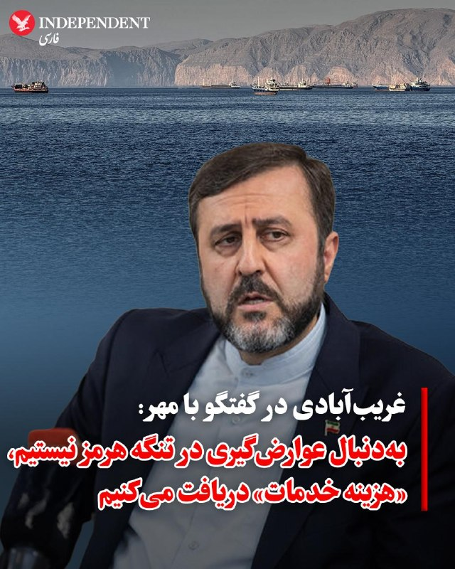
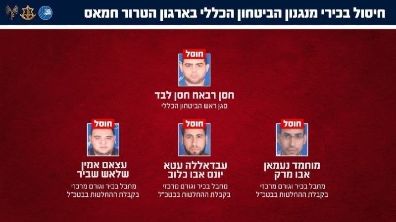
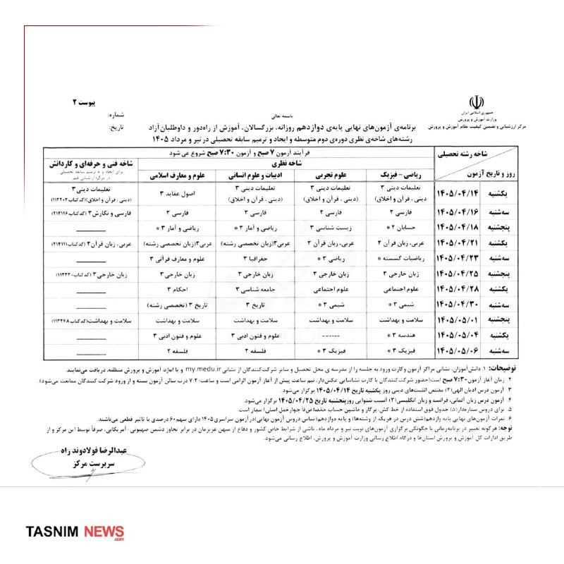
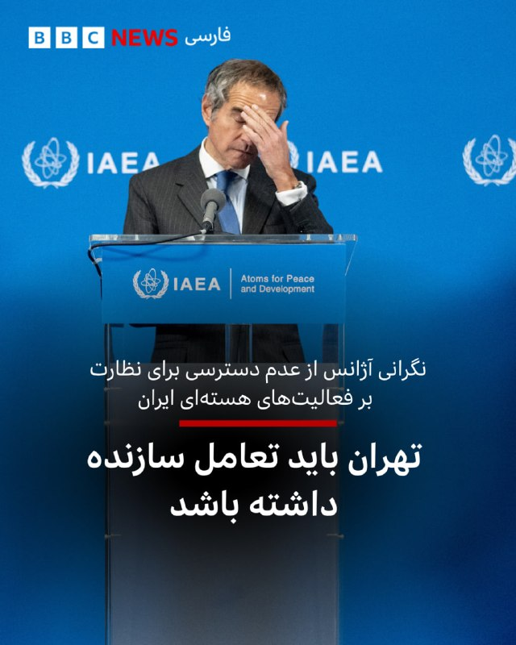
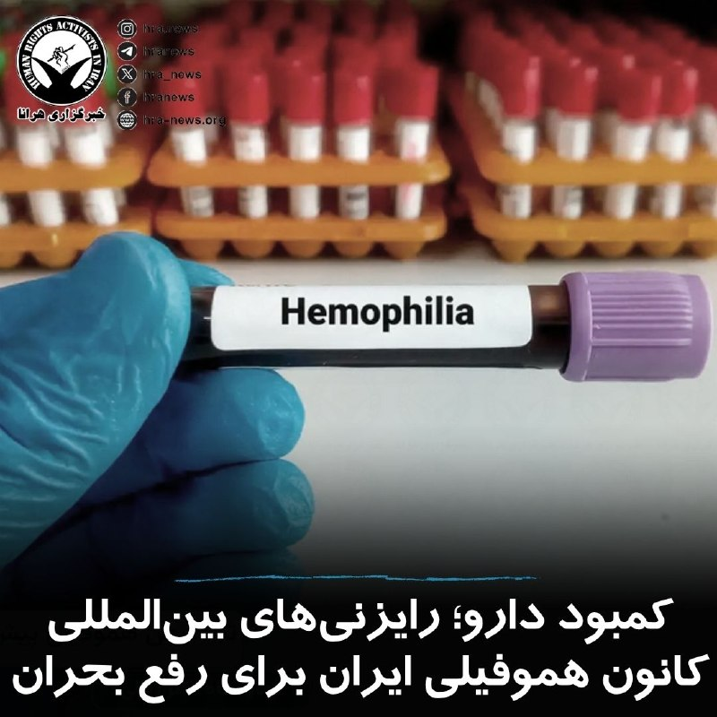
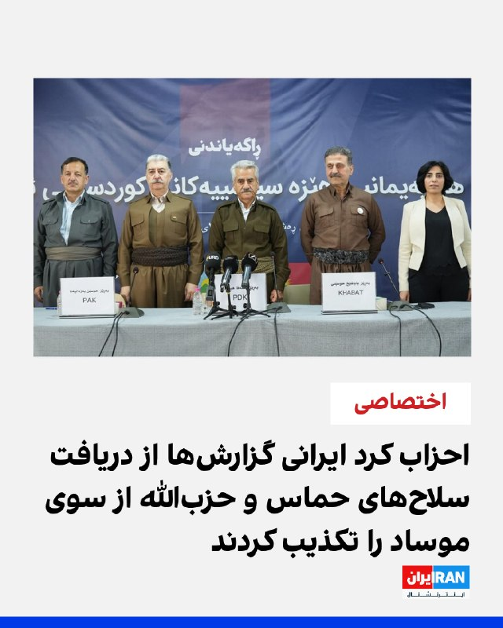

# خواننده تلگرام

<!-- TOP_NAV START -->

<a href="https://github.com/ProAlit/aio-downloader/blob/main/telegram/content/archive_1.md" style="display:inline-block; padding:6px 12px; margin:0 4px; background-color:#2ea44f; color:white; text-decoration:none; border-radius:4px; font-weight:bold;">صفحه بعد</a>

<!-- TOP_NAV END -->

<!-- MSG START -->

---
📅 بروزرسانی: 1405/03/14 20:35
---

## VahidOOnLine — post 243690

  

♦️کاظم غریب‌آبادی، معاون وزیر امور خارجه جمهوری اسلامی، روز پنج‌شنبه ۱۴ خرداد اعلام کرد که تهران به دنبال وضع هزینه‌هایی برای خدمات ارائه شده به کشتی‌های عبوری از تنگه هرمز است. او تاکید کرد که ایران به دنبال دریافت «عوارض عبور» نیست، بلکه هزینه‌ها در ازای خدمات خاصی که توسط ایران و عمان ارائه می‌شود، دریافت خواهد شد.

این خدمات شامل ناوبری، امداد و نجات، تامین امنیت و ایمنی، و پاک‌سازی‌های زیست‌محیطی در صورت بروز آلودگی است. غریب‌آبادی با اشاره به اینکه این آبراه استراتژیک کاملا در آب‌های سرزمینی ایران و عمان قرار دارد، تاکید کرد که این اقدامات با حقوق بین‌الملل دریاها مغایرت ندارد.

او همچنین خاطرنشان کرد که در شرایط صلح، هدف ایران تضمین عبور ایمن و روان کشتی‌های تجاری است، اما اگر مدارکی مبنی بر قصد اخلال در نظم و امنیت توسط شناوری وجود داشته باشد، اقدامات محدودکننده وضع خواهد شد. معاون وزیر خارجه با اذعان به اینکه این تصمیمات ممکن است برای برخی کشورها که دهه‌ها به‌طور رایگان از این مسیر استفاده کرده‌اند خوشایند نباشد، بر پیگیری این مواضع به عنوان حق ایران تاکید کرد.
‌🇸🇦 Indypersian

🤖 @VahidOOnLine

## VahidOOnLine — post 243689

  

رهبران سه حزب کرد ایرانی، در گفت‌وگو با ایران‌اینترنشنال گزارش‌های منتشر شده در رسانه‌های اسرائیلی مبنی بر دریافت سلاح‌های ضبط‌شده حماس و حزب‌‌الله لبنان از سوی موساد را به‌طور کامل و قاطع رد کردند.
وای‌نت پنج‌شنبه نوشت موساد پیش از توقف این طرح از سوی ترامپ شبه‌نظامیان کرد مخالف جمهوری اسلامی را با سلاح‌های به غنیمت گرفته شده از حماس و حزب‌الله، مسلح کرده و این اقدام بخشی از طرحی گسترده‌تر برای سرنگونی حکومت ایران بوده است.
عبدالله مهتدی، دبیرکل حزب کومله کردستان ایران این گزارش را تکذیب کرد و گفت حزب او هیچ سلاحی از اسرائیل و آمریکا دریافت نکرده است.
او افزود تا آنجا که اطلاع دارد هیچ یک از دیگر احزاب کرد ایرانی نیز سلاحی از این دو کشور نگرفته‌اند.
خالد عزیزی، سخنگوی حزب دموکرات کردستان ایران نیز گفت این حزب هیچ سلاحی از اسرائیل یا آمریکا دریافت نکرده است و این گزارش‌ها به هیچ‌وجه حقیقت ندارد.
رضا کعبی، دبیرکل حزب کومله زحمتکشان کردستان، دریافت سلاح از اسرائیل یا آمریکا را تکذیب و تاکید کرد دیگر احزاب کردستان ایران نیز سلاحی دریافت نکرده‌اند.

ادامه این گزارش را در وبسایت ایران‌اینترنشنال بخوانید
https://i
‌🏁 🇬🇧 IranintlTV

🤖 @VahidOOnLine

## WithYashar — post 13503

@withyashar قیصر

## pm_afshaa — post 92279

  

ترور هدفمند در نوار غزه رهبران ارشد دستگاه امنیت عمومی حماس ترور شدند

💧 Rainbet.com the #1 Non-KYC Crypto Casino & Sportsbook @rainbetcom

😁 @Pm_Afshaa

## IranIntlTV — post 340545

  <a href="telegram/content/IranIntlTV_340545_1780592728.mp4" target="_blank">🎬 Download video</a>

دو شهروند، دو تلفن همراه و دو تصویر که هر کدام به بخشی از حافظه عمومی تبدیل شدند؛ یکی در آمریکا، از لحظه جان‌باختن جرج فلوید، و دیگری در ایران، از نشستن مردی معترض مقابل نیروهای یگان ویژه. اما سرنوشت ثبت‌کنندگان این دو تصویر، دو مسیر کاملا متفاوت پیدا کرد: تقدیر پولیتزر در یک‌سو، ده سال زندان در سوی دیگر.

آرین ریسباف گزارش می‌دهد.
@iranintltv

## IranIntlTV — post 340544

دختران میرحسین موسوی: پدرمان در بیمارستان بستری و وضع جسمی او وخیم است

دختران میرحسین موسوی، از رهبران جنبش سبز که در حصر به سر می‌برد، در گفت‌وگو با رسانه آوش اعلام کردند که پدرشان به‌دلیل مشکل قلبی در بیمارستان قلب بستری شده و اوضاع جسمی او وخیم است.
 
آوش در خبری کوتاه که پنج‌شنبه ۱۴ خرداد منتشر شد، نوشت که دختران موسوی و زهرا رهنورد، از «بی‌توجهی و عدم پیگیری دولت» ابراز نارضایتی کردند.
 
در بخش دیگری از این خبر آمده است که رهنورد پیش‌تر به فرزندانش گفته بود که حال پدرشان مساعد نیست و به‌دلیل «سرگیجه، نوسانات و افت شدید فشار خون» بدون همراه نمی‌تواند راه برود.
 
اردشیر امیرارجمند که پیش از ترک ایران مشاور میرحسین موسوی بود، ۱۱ خرداد در اینستاگرام نوشته بود که خانه میرحسین موسوی و زهرا رهنورد در نخستین روز جنگ و در جریان بمباران خیابان پاستور آسیب دید و آنها به جایی دیگر منتقل شدند اما همچنان در حصر هستند.

او همچنین نوشته بود که موسوی «به‌دلیل بیماری و وضعیت جسمی» در بیمارستان بستری شده است.

۲۲ نفر از استادان دانشگاه و کنشگران مدنی و سیاسی هفتم خرداد در بیانیه‌ای، خواستار آزادی زندانیان سیاسی، به‌ویژه میرحسین موسوی و زهرا رهنورد شدند و هشدار دادند در پی جنگ اخیر، از محل نگهداری این دو نفر اطلاعی در دست نیست.

امضاکنندگان این بیانیه با استناد به «گزارش‌های موثق» اعلام کردند محل اقامت موسوی و رهنورد در جریان حمله به منطقه پاستور طی جنگ اخیر، «به‌شدت آسیب دید» و آنها پس از این رویداد به «مکانی نامعلوم» منتقل شدند.

موسوی در آخرین بیانیه خود از حصر، کشتار معترضان در روزهای ۱۸ و ۱۹ دی را «جنایتی بزرگ علیه ملت» توصیف کرد و از نظامیان خواست سلاح‌شان را زمین بگذارند. او خواستار کناره‌گیری حاکمیت از قدرت، برگزاری رفراندوم قانون اساسی و تشکیل جبهه‌ای از همه سلایق ملی شد.

او در این بیانیه، اتفاق‌های اخیر را «برگی سیاه در تاریخ ایران» خوانده و تاکید کرده بود که مردم به‌روشنی اعلام کرده‌اند که این نظام را نمی‌خواهند و دیگر به روایت‌های رسمی اعتماد ندارند.

او همچنین هشدار داد: «تداوم سرکوب، کشور را به سمت مداخله خارجی سوق داده است.»

در پی اعتراضات گسترده پس از انتخابات ریاست‌جمهوری خرداد ۱۳۸۸ و شکل‌گیری «جنبش سبز»، موسوی و مهدی کروبی، دو نامزد معترض، به همراه همسرانشان زهرا رهنورد و فاطمه کروبی از اسفند ۱۳۸۹ در حصر خانگی قرار گرفتند.

فاطمه کروبی در سال ۱۳۹۰ از حصر خارج شد و حصر مهدی کروبی نیز در اسفند ۱۴۰۳ به پایان رسید، اما حصر خانگی موسوی و رهنورد ادامه یافت.
 
🔗وب‌سایت ایران‌اینترنشنال
@iranintltv

## FarsiVOA — post 219591

دادستان‌های بریتانیا در دادگاه اولد بیلی لندن مدعی شده‌اند یک نوجوان نروژی برای انجام یک قتل سفارشی به بریتانیا فرستاده شده بود و این پرونده با شبکه جنایی «فاکسترات» ارتباط دارد؛ شبکه‌ای که به گفته دادستان‌ها، جمهوری اسلامی از آن استفاده می‌کند.

## FarsiVOA — post 219590

مرگ سرباز آمریکایی در اربیل؛ حادثه‌ای در سایه هشدارهای تازه ترامپ به جمهوری اسلامی

## RadioFarda — post 157899

  <a href="https://t.me/radiofarda/157899" target="_blank">📎 Download file</a>

گفت‌وگو با مجتبی نجفی؛ رهبر «غایب» جمهوری اسلامی در دوران «آتش‌بس برزخی»

🔸مراسم سالمرگ روح‌الله خمینی که هر سال ۱۴ خرداد با سخنرانی رهبر جمهوری اسلامی و با حضور پرشمار مقامات و فرماندهان ارشد نظامی برگزار می‌شد، امسال به‌صورت محدود و بدون حضور بسیاری از مقام‌های ارشد از جمله رئیس جمهور و رئیس مجلس برگزار شد. عالی‌ترین مقام حاضر در این مراسم غلامحسین محسنی اژه‌ای، رئیس قوه قضائیه، بود. در جریان این مراسم حکومتی پیام مجتبی خامنه‌ای رهبر تازه هم توسطحاج‌علی‌اکبری، امام جمعه تهران، خوانده شد که در آن آمریکا و اسرائیل به «جنگ ترکیبی» با ایران متهم شدند. در این پیام آمده این جنگ «بر دو نقطه متمرکز است؛ یکی تاب‌آوری مردم و دیگری ایجاد اخلال در دستگاه محاسباتی مسئولان کشور».» مجتبی خامنه‌ای همچنین هرگونه اقدامی که به‌گفتهٔ او «موجب بدبینی و سرخوردگی» شود را «کمک به دشمن» خواند و خواستار «حفظ وحدت و انسجام و اعتماد متقابل» مردم و مسئولان نظام شد. درباره این مراسم و پیام تازه منصوب به مجتبی خامنه‌ای ارزیابی مجتبی نجفی تحلیلگر ساکن فرانسه را بشنوید که از ابهام‌ها در دوران تازه جمهوری اسلامی می‌گوید.
@RadioFarda

## RadioFarda — post 157898

  <a href="https://t.me/radiofarda/157898" target="_blank">📎 Download file</a>

حکومت ایران با تشدید بازداشت‌ها به دنبال چیست؟ گفت‌وگو با شیوا نظرآهاری

🔸سمیرا نوروزی ، فیلمساز، حامد تیزرویان، فعال محیط زیست و دانشجوی دکترای تنوع زیستی، امیرحسین سعادت، دانش‌آموخته مقطع کارشناسی ارشد دانشگاه علامه طباطبایی، آریانا کوچکی، دانشجوی کارشناسی ورودی سال ۱۴۰۰ مهندسی صنایع، امیرحسین باقری علویجه، دانشجوی ارشد روانشناسی دانشگاه اراک، یاشار دارالشفا، پژوهشگر و زندانی سیاسی سابق ... این‌ها تنها چند نام از نام‌های بی‌شمار بازداشتی‌های روزها و هفته‌های اخیر است. این بازداشت‌ها طیف‌های مختلف را در برمی‌گیرد و در چند شهر ایران انجام شده است. اتهام بازداشت شد‌گان اعلام نمی‌شود و دادرسی عادلانه هم غایب همیشگی این روند است. شیوا نظرآهاری، زندانی سیاسی پیشین و از بنیانگذاری کمیته پیگیری بازداشت‌شدگان از اسلوونی، درباره این موج تازه بازداشت‌ها ، دلایل و پیامدهای آن برای جامعه مدنی ایران می‌گوید.

@RadioFarda

#رادیوفردا

## IranianMinds — post 21380

  

🔴 سطح خبرگزاری حکومت

خبرگزاری تسنیم این تصویر ساخته هوش مصنوعی که غلط نوشتاری هم داره رو با عنوان «برنامه امتحانات نهایی پایه دوازدهم» منتشر کرد.

@IranianMinds

## IranianMinds — post 21377

  <a href="telegram/content/IranianMinds_21377_1780592731.mp4" target="_blank">🎬 Download video</a>

🔴 از هوا و دریا: ارتش اسرائیل و شاباک، مقامات ارشد دستگاه امنیت عمومی سازمان تروریستی حماس را در غزه به هلاکت رساندند.

@IranianMinds

## BBCPersian — post 282856

‌ خبرگزاری فرانسه می‌گوید که در یک گزارش محرمانه که روز پنجشنبه نسخه‌ای از آن را مشاهده کرده است،‌ آژانس بین‌المللی انرژی اتمی اعلام کرد که عدم دسترسی به مراکز هسته‌ای ایران برای تایید مواد هسته‌ای در آن کشور،‌ باعث «نگرانی از گسترش سلاح‌های هسته‌ای» است و…

## BBCPersian — post 282855

  

‌
خبرگزاری فرانسه می‌گوید که در یک گزارش محرمانه که روز پنجشنبه نسخه‌ای از آن را مشاهده کرده است،‌ آژانس بین‌المللی انرژی اتمی اعلام کرد که عدم دسترسی به مراکز هسته‌ای ایران برای تایید مواد هسته‌ای در آن کشور،‌ باعث «نگرانی از گسترش سلاح‌های هسته‌ای» است و از جمهوری اسلامی خواست تا با آژانس «به طور سازنده تعامل و همکاری کند.»

آژانس بین‌المللی انرژی اتمی از زمان جنگ ۱۲ روزه سال گذشته اسرائیل و آمریکا با ایران که به حملات آمریکا به سایت‌های هسته‌ای ایران انجامید، به برخی از تاسیسات هسته‌ای مهم در این کشور دسترسی نداشته است.

آژانس بین‌المللی انرژی اتمی در این گزارش اذعان کرده است که حملات نظامی به تاسیسات و سایت‌های هسته‌ای ایران، شرایط بی‌سابقه‌ای را ایجاد کرده است و«بسیار مهم است که آژانس بدون تاخیر بتواند نظارت برای تایید فعالیت‌ها در ایران را انجام دهد.»

این سازمان افزود: «عدم دسترسی آژانس برای راستی‌آزمایی میزان غنای اورانیوم برای نزدیک به یک سال که بر اساس استانداردهای حفاظتی مدت‌هاست به تعویق افتاده است،‌ یک موضوع نگران کننده است.»

📷JOE KLAMAR/AFP via Getty Images

## Dirty_Kids — post 390996

  <a href="telegram/content/Dirty_Kids_390996_1780592733.mp4" target="_blank">🎬 Download video</a>

این خواننده دوزاری که کلا ۲ تا آهنگ داره به اسم قیصر قرومساقیان انقد خایه‌های جمهوری اسلامی رو انداخته بود گوشه لپ‌ش میک میزد تا بلاخره آوردنش ایران و تا اجرا کنه، تهران/ مهمانی کیلومتری عید غدیر

@Dirty_Kids 👻

## Hranews — post 113388

  

براساس اظهارات رئیس هیئت‌مدیره کانون هموفیلی ایران، کمبود برخی داروهای حیاتی بیماران مبتلا به اختلالات خونریزی‌دهنده در ماه‌های اخیر تشدید شده است. به گفته وی، در حال حاضر برای برخی از داروهای مورد نیاز بیماران مبتلا به کمبود فاکتور ۱۳ و بیماری فون‌ویلبراند عملاً هیچ ذخیره‌ای در کشور وجود ندارد. همچنین نگرانی‌هایی در خصوص تأمین برخی داروها و فرآورده‌های مورد نیاز بیماران هموفیلی A و B مطرح است.

امین افشار در ادامه گفت که طی هفته‌های گذشته، مجموعه‌ای از مکاتبات رسمی با فدراسیون جهانی هموفیلی (WFH)، سازمان جهانی بهداشت (WHO)، سازمان‌های بشردوستانه، شرکت‌های دارویی بین‌المللی و همچنین فدراسیون‌های هموفیلی کشورهای منطقه با هدف تأمین دارو انجام شده است.
#کمبود_دارو

↘️
@hranews_bot تماس ✉️ - @Hranews کانال هرانا 🆑

## alonews — post 125102

  <a href="telegram/content/alonews_125102_1780592735.webm" target="_blank">🎬 Download video</a>

👈رویترز: روسیه برای اولین بار اذعان کرد که تولید نفت این کشور در سال جاری کاهش یافته

🔴 این اعتراف در زمانی مطرح می‌شود که اوکراین در ماه‌های اخیر حملات پهپادی و موشکی خود را به تأسیسات انرژی روسیه تشدید کرده

🔴 آژانس بین‌المللی انرژی تخمین زده که تولید نفت خام روسیه در ماه آوریل نسبت به سال گذشته حدود ۴۶۰ هزار بشکه در روز کاهش یافته و به حدود ۸.۸ میلیون بشکه در روز رسیده

✅ @AloNews خبر جنگ

## alonews — post 125101

  <a href="telegram/content/alonews_125101_1780592735.mp4" target="_blank">🎬 Download video</a>

👈بمباران شهر بزرگ صور در جنوب لبنان ادامه دارد

✅ @AloNews خبر جنگ

## alonews — post 125100

  <a href="telegram/content/alonews_125100_1780592736.mp4" target="_blank">🎬 Download video</a>

👈گزارش‌ها حاکی است سامانه‌های پدافندی اسرائیل دست‌کم ۷ بار برای رهگیری اهداف هوایی فعال شده‌اند.

✅ @AloNews خبر جنگ

## alonews — post 125097

  <a href="telegram/content/alonews_125097_1780592737.mp4" target="_blank">🎬 Download video</a>

👈ارتش اسرائیل: تو حمله به غزه چند تا از مسئولین ارشد امنیتی حماس رو ترور کردیم

🔴 عملیات دقیق بوده و قبلش هم سعی کردیم به غیرنظامی‌ها آسیب نرسه

✅ @AloNews خبر جنگ

---
📅 بروزرسانی: 1405/03/14 20:14
---

## WithYashar — post 13502

  <a href="telegram/content/WithYashar_13502_1780591494.mp4" target="_blank">🎬 Download video</a>

حظور قیصر خواننده
لس آنجلسی در جشن غدیر 🥴
@withyashar

## FoxNewsTwitter — post 342609

  <a href="telegram/content/FoxNewsTwitter_342609_1780591496.mp4" target="_blank">🎬 Download video</a>

Fox News (Twitter/X)

NEW: Senator John Fetterman slams fellow Democrat and embattled Maine Senate candidate Graham Platner following a string of damaging personal controversies.

"Well, he lied to everybody. He said that there wasn't any after his Nazi tattoo situation, and now there's more and more other things."

“So I assume, you know, it's like they say, for every ranch you see in Texas, there are 50 that you haven't seen. So I'm sure there are plenty more ranches in P Hustle's life."

## IranIntlTV — post 340543

  

رهبران سه حزب کرد ایرانی، در گفت‌وگو با ایران‌اینترنشنال گزارش‌های منتشر شده در رسانه‌های اسرائیلی مبنی بر دریافت سلاح‌های ضبط‌شده حماس و حزب‌‌الله لبنان از سوی موساد را به‌طور کامل و قاطع رد کردند.
وای‌نت پنج‌شنبه نوشت موساد پیش از توقف این طرح از سوی ترامپ شبه‌نظامیان کرد مخالف جمهوری اسلامی را با سلاح‌های به غنیمت گرفته شده از حماس و حزب‌الله، مسلح کرده و این اقدام بخشی از طرحی گسترده‌تر برای سرنگونی حکومت ایران بوده است.
عبدالله مهتدی، دبیرکل حزب کومله کردستان ایران این گزارش را تکذیب کرد و گفت حزب او هیچ سلاحی از اسرائیل و آمریکا دریافت نکرده است.
او افزود تا آنجا که اطلاع دارد هیچ یک از دیگر احزاب کرد ایرانی نیز سلاحی از این دو کشور نگرفته‌اند.
خالد عزیزی، سخنگوی حزب دموکرات کردستان ایران نیز گفت این حزب هیچ سلاحی از اسرائیل یا آمریکا دریافت نکرده است و این گزارش‌ها به هیچ‌وجه حقیقت ندارد.
رضا کعبی، دبیرکل حزب کومله زحمتکشان کردستان، دریافت سلاح از اسرائیل یا آمریکا را تکذیب و تاکید کرد دیگر احزاب کردستان ایران نیز سلاحی دریافت نکرده‌اند.

ادامه این گزارش را در وبسایت ایران‌اینترنشنال بخوانید
https://i

## IranIntlTV — post 340542

یک شهروند با ارسال پیامی به ایران اینترنشنال از تاثیر سهمیه‌های ایثارگری و کاهش ظرفیت پذیرش در آزمون‌های تخصصی پزشکی انتقاد کرد. به گفته او، این شرایط مانع از ورود او و شمار دیگری از پزشکان عمومی به رشته‌های تخصصی موردعلاقه‌شان شده است. پیام او با هوش مصنوعی خوانده شده است.

## IranIntlTV — post 340541

احزاب کرد ایرانی گزارش‌ها از دریافت سلاح‌های حماس و حزب‌الله از سوی موساد را تکذیب کردند

رهبران سه حزب کرد ایرانی، در گفت‌وگو با ایران‌اینترنشنال گزارش‌های منتشر شده در رسانه‌های اسرائیلی مبنی بر دریافت سلاح‌های ضبط‌شده حماس و حزب‌‌الله لبنان از سوی موساد را به‌طور کامل و قاطع رد کردند.

روزنامه وای‌نت پنج‌شنبه ۱۴ خرداد در گزارشی نوشت که موساد پیش از توقف این طرح از سوی دونالد ترامپ، رییس‌جمهوری آمریکا، شبه‌نظامیان کرد مخالف جمهوری اسلامی را با سلاح‌هایی که از حماس و حزب‌الله مسلح به غنیمت گرفته شده بود، مسلح کرده و این اقدام بخشی از طرحی گسترده‌تر برای سرنگونی حکومت ایران بوده است.

با این حال، عبدالله مهتدی، دبیرکل حزب کومله کردستان ایران، در گفت‌وگو با ایران‌اینترنشنال، این گزارش را تکذیب کرد و گفت حزب او هیچ سلاحی از اسرائیل و آمریکا دریافت نکرده است.

او افزود تا آنجا که اطلاع دارد هیچ یک از دیگر احزاب کرد ایرانی نیز سلاحی از این دو کشور نگرفته‌اند.

خالد عزیزی، سخنگوی حزب دموکرات کردستان ایران، نیز به ایران‌اینترنشنال گفت این حزب هیچ سلاحی از اسرائیل یا آمریکا دریافت نکرده است و این گزارش‌ها به هیچ‌وجه حقیقت ندارد.

رضا کعبی، دبیرکل حزب کومله زحمتکشان کردستان، هم در گفت‌وگو با ایران‌اینترنشنال دریافت هرگونه سلاح از اسرائیل یا آمریکا را تکذیب و تاکید کرد که دیگر احزاب کردستان ایران نیز هیچ سلاحی از این دو کشور دریافت نکرده‌اند.

پیشتر نیز دونالد ترامپ، رییس‌جمهوری آمریکا بدون ارائه جزییات، از ارسال اسلحه برای گروه‌های کرد خبر داده بود. احزاب کردستان ایران، اظهارات ترامپ را رد و تاکید کرده‌اند که هیچ یک از آنها، هیچ سلاحی از آمریکا تحویل نگرفته‌اند.

آمریکا و اسرائیل مشخص نکرده‌اند سلاح‌هایی که ترامپ از ارسال آنها سخن گفته و یا سلاح‌های به‌دست آمده از حماس و حزب‌الله از سوی موساد در اختیار کدام گروه و حزب کرد، از جمله احزاب اقلیم کردستان، قرار گرفته است.

با این حال، روزنامه وای‌نت پنج‌شنبه ۱۴ خرداد در گزارشی جدید نوشت این سلاح‌ها در جریان جنگ از نیروهای حماس در نوار غزه و حزب‌الله در لبنان به دست آمده بودند و سازمان اطلاعات مرکزی آمریکا، سیا، نیز در طرح تجهیز نیروهای کرد مشارکت داشت، اما این برنامه در نهایت پس از فشار رجب طیب اردوغان، رییس‌جمهوری ترکیه، از سوی دونالد ترامپ متوقف شد.

در اواخر ماه مارس، روزنامه ترکیه‌ای دیلی صباح که به دولت ترکیه نزدیک است، گزارش داده بود که آنکارا موفق شده یک طرح ادعایی اسرائیل برای به‌کارگیری نیروهای کرد به‌عنوان نیروی زمینی در جنگ علیه جمهوری اسلامی را خنثی کند.

بر اساس گزارش این روزنامه، و همچنین برخی گزارش‌های دیگر، اسرائیل با همکاری ایالات متحده در نظر داشت از سازمان‌های کرد در عراق و داخل ایران به‌عنوان نیروی نیابتی در یک عملیات زمینی استفاده کند؛ عملیاتی که قرار بود پس از حمله آغازین در ۹ اسفند ۱۴۰۴ انجام شود.

طبق این گزارش، اسرائیل همچنین اهداف نظامی در نزدیکی مرز ایران و عراق را هدف قرار داده بود تا امکان جابه‌جایی نیروهای کرد فراهم شود.

دیلی صباح نوشت که حدود ۵۰۰ نیروی مسلح از عراق راهی ایران شده بودند تا به درگیری‌ها بپیوندند، اما این طرح در پی مداخله ترکیه متوقف شد.
این مداخله شامل تماس‌های سطح بالا با رهبران اقلیم کردستان عراق نیز بود.

بر اساس این گزارش، آنکارا به رهبران کرد، به‌ویژه خانواده‌های بارزانی و طالبانی، هشدار داده بود که با این طرح همکاری نکنند و به‌صراحت اعلام کرده بود که در صورت مشارکت کردها در جنگ علیه جمهوری اسلامی، از آنها حمایت نخواهد کرد.

رهبران دو حزب اصلی کُرد در عراق، مسعود بارزانی و بافل طالبانی هستند.

به‌نوشته دیلی صباح ترکیه همچنین پیام‌های هشدارآمیزی برای حزب کارگران کردستان (پ‌ک‌ک) ارسال و هشدار داده بود در صورت مشارکت این گروه در عملیات، دست به اقدام خواهد زد.

در این گزارش همچنین به عبدالله اوجالان، رهبر زندانی پ‌ک‌ک، اشاره و گفته شده بود او از نیروهای کرد خواسته بود به ابتکارهای اسرائیل پاسخ مثبت ندهند.

بر اساس گزارش این روزنامه ترکیه‌ای، اردوغان این موضوع را در گفت‌وگویی با ترامپ مطرح و مخالفت صریح خود را با استفاده از نیروهای کرد در جنگ علیه جمهوری اسلامی ابراز کرده بود.

مقام‌های دولت ترکیه هشدار داده بودند که چنین اقدامی می‌تواند موجب شعله‌ور شدن درگیری گسترده‌تری میان ملت‌های منطقه شود.

ابراهیم کالین، رییس سازمان اطلاعات ترکیه، نیز در کنفرانسی در استانبول نسبت به شکل‌گیری یک «گلوله آتشین منطقه‌ای» هشدار داده و گفته بود پیامدهای جنگ می‌تواند به رویارویی طولانی‌مدت میان ترک‌ها، کردها، عرب‌ها و ایرانیان منجر شود.
 
🔗متن کامل گزارش را اینجا بخوانید
@iranintltv

## IranIntlTV — post 340539

  <a href="https://t.me/IranintlTV/340539" target="_blank">📎 Download file</a>

🎧نسخه صوتی اخبار شبانگاهی | پنج‌شنبه ۱۴ خرداد
@iranintlTV

## FarsiVOA — post 219589

حملات اوکراین به روسیه و کریمه همزمان با اجلاس سن‌پترزبورگ؛ اروپا در مسیر تقویت کی‌یف

## DW_Farsi — post 125505

🔶امکان آغاز مذاکرات عضویت اوکراین و مولداوی در اتحادیه اروپا

مولداوی و اوکراین پس از یک دوره دو ساله بلاتکلیفی، اکنون می‌توانند به آغاز رسمی مذاکرات عضویت در اتحادیه اروپا امیدوار باشند.

به گزارش رسانه‌های آلمان، قبرس که ریاست دوره‌ای شورای اتحادیه اروپا را بر عهده دارد، اعلام کرده است مقدمات لازم برای گشایش رسمی نخستین بخش مذاکرات آغاز شده و در بهترین حالت، این گفت‌وگوها می‌تواند از ۱۵ ژوئن ۲۰۲۶ (۲۵ خرداد) در حاشیه نشست وزیران اتحادیه اروپا در لوکزامبورگ شروع شود.

اوکراین پس از حمله روسیه در ۲۲ ماه فوریه سال ۲۰۲۲ درخواست کرد تا به عضویت در اتحادیه اروپا پذیرفته شود. پس از آن، مولداوی هم چنین درخواستی را مطرح کرد. در ماه ژوئن سال ۲۰۲۲ این دو کشور به عنوان نامزد عضویت در اتحادیه اروپا معرفی شدند.

تحول اصلی زمانی رخ داد که پیتر مگیار، نخست‌وزیر جدید مجارستان، اعلام کرد با اوکراین بر سر توافقی برای تقویت حقوق اقلیت مجار در این کشور به تفاهم رسیده است.

@dw_farsi

## idfinfarsi — post 11760

  <a href="telegram/content/idfinfarsi_11760_1780591500.mp4" target="_blank">🎬 Download video</a>

‼️از هوا و دریا: ارتش اسرائیل و شاباک، مقامات ارشد دستگاه امنیت عمومی سازمان تروریستی حماس را در نوار غزه به هلاکت رساندند

⭕️ارتش اسرائیل و شاباک در طول شب (پنج‌شنبه) در شمال نوار غزه حمله کرده و مقامات ارشد دستگاه امنیت عمومی سازمان تروریستی حماس را به هلاکت رساندند.

⭕️دستگاه امنیت عمومی یک نهاد مرکزی و محرمانه است که مسئول تأمین امنیت مقامات ارشد حماس، ارتباطات میان آن‌ها و هماهنگی نشست‌های آن‌ها می‌باشد. مقامات این نهاد مسئول حفاظت از رهبران حماس، انتقال آن‌ها بین مراکز اضطراری و ایجاد تصویر اطلاعاتی، از جمله جمع‌آوری اطلاعات درباره نیروهای امنیتی هستند که به رهبران این سازمان در تصمیم‌گیری و اجرای طرح‌های تروریستی علیه کشور اسرائیل کمک می‌کند.

❌در این حمله، تروریست حسن رباح حسن لبد، جانشین رئیس امنیت عمومی و یکی از عوامل کلیدی در تصمیم‌گیری و تدوین دستورالعمل‌ها در این نهاد، به هلاکت رسید.

❌همچنین تروریست‌ها عصام امین شلاش شبیر، عبدالله عطا یونس ابو کلوب و محمد نعمان زکی ابو مرق، سه مقام ارشد دیگر که نقش مرکزی در فرآیند تصمیم‌گیری این نهاد داشتند، به هلاکت رسیدند.

⭕️مقامات این دستگاه به‌منظور رفع تهدید هدف قرار گرفتند، پس از آن‌که در دوره اخیر به بازسازی سازمان تروریستی حماس و کمک به رهبران آن برای پیشبرد فعالیت‌های تروریستی علیه کشور اسرائیل و نیروهای ارتش اسرائیل مشغول بودند.

⭕️پیش از حمله، اقداماتی برای کاهش آسیب به غیرنظامیان انجام شد، از جمله استفاده از مهمات دقیق و رصد‌های هوایی.

⭕️نیروهای ارتش اسرائیل تحت فرماندهی جنوب مطابق با توافق در منطقه مستقر هستند و به فعالیت برای رفع هرگونه تهدید فوری ادامه خواهند داد.

<!-- MSG END -->

<!-- NAV START -->

<a href="https://github.com/ProAlit/aio-downloader/blob/main/telegram/content/archive_1.md" style="display:inline-block; padding:6px 12px; margin:0 4px; background-color:#2ea44f; color:white; text-decoration:none; border-radius:4px; font-weight:bold;">صفحه بعد</a>

<!-- NAV END -->
