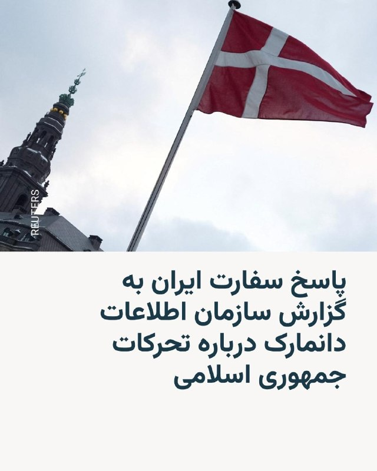
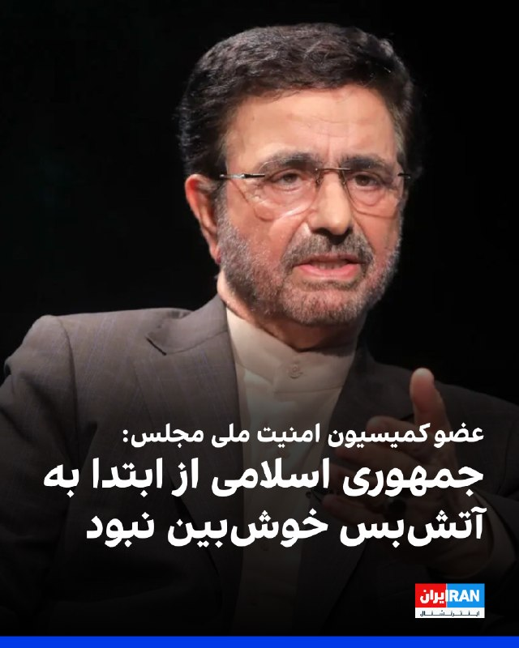
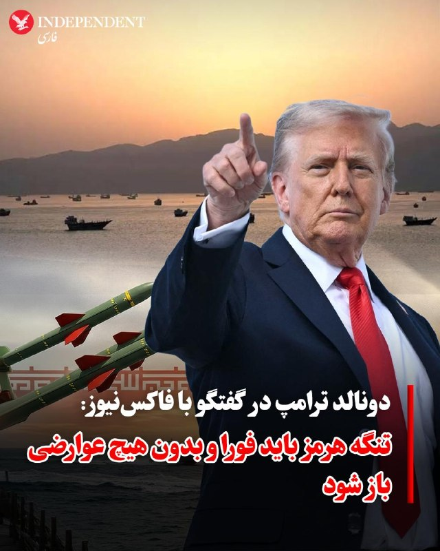
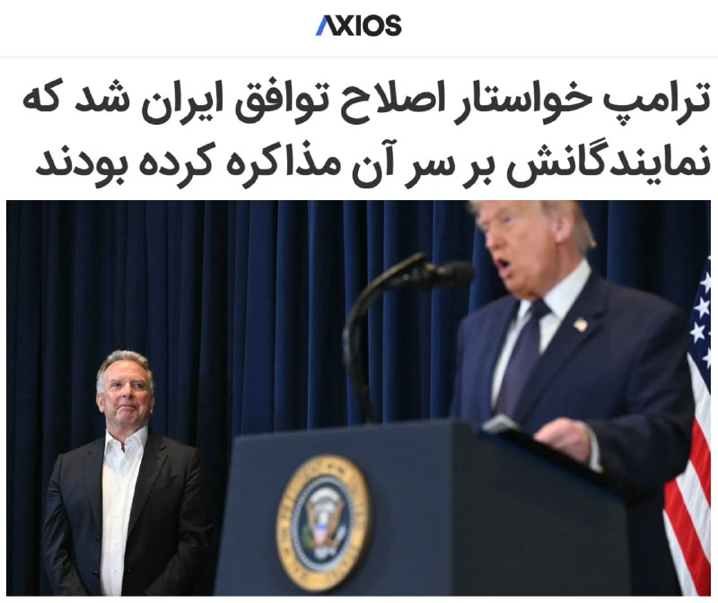
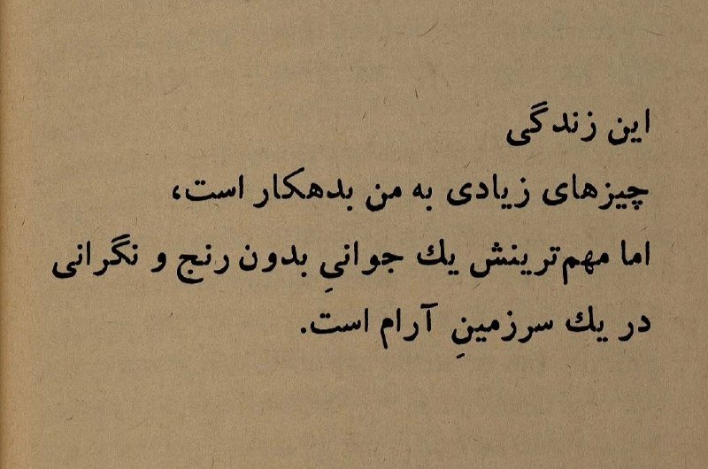
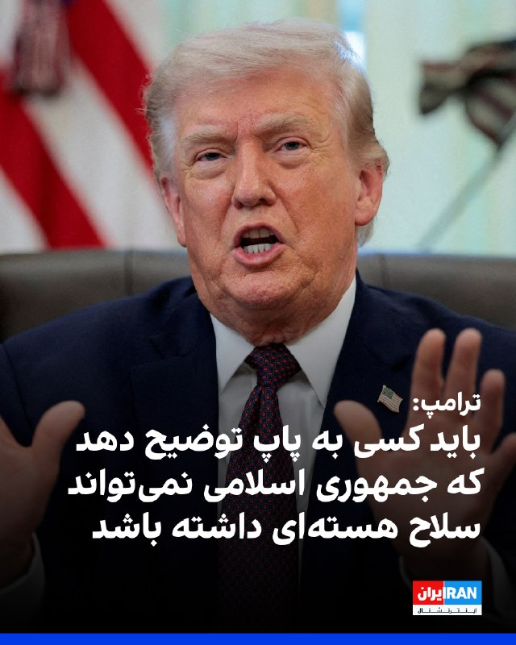
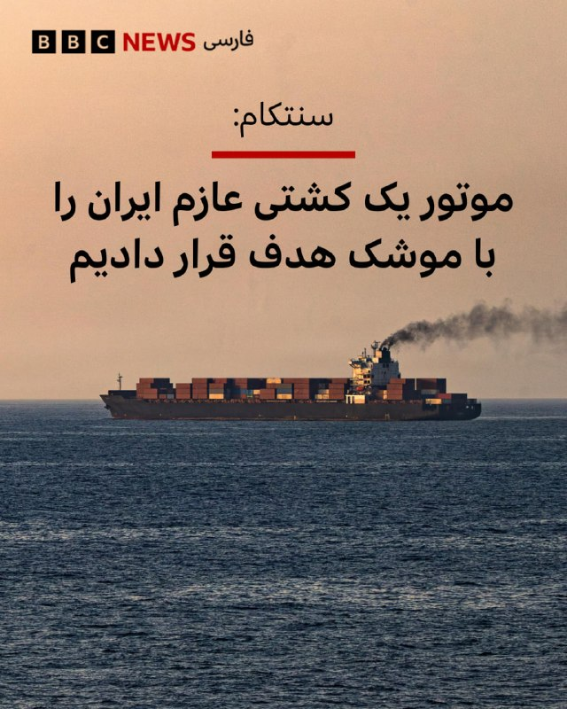
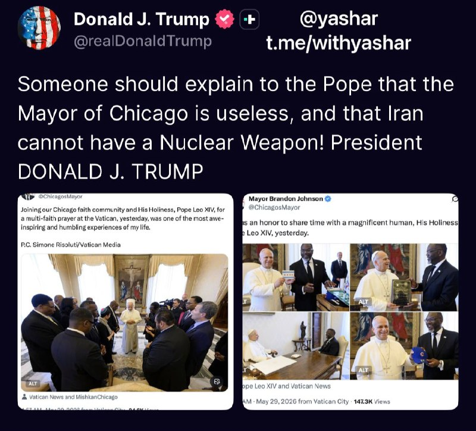
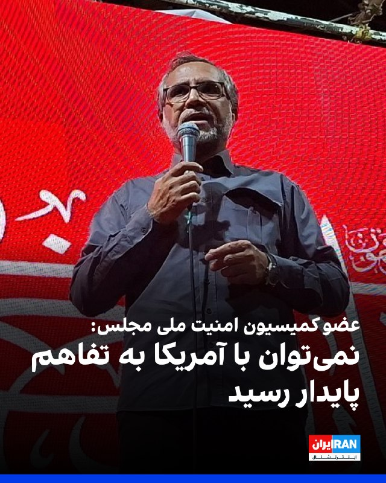
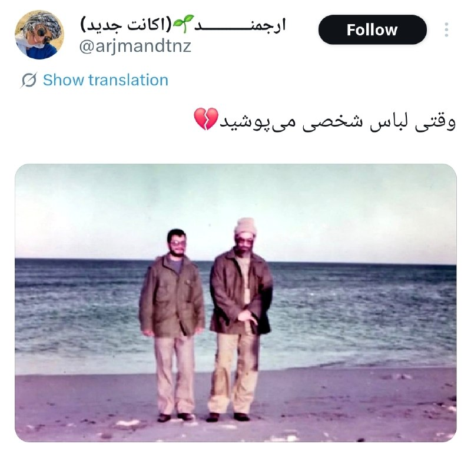

# خواننده تلگرام

<!-- TOP_NAV START -->

<!-- TOP_NAV END -->

<!-- MSG START -->

---
📅 بروزرسانی: 1405/03/10 12:22
---

## VahidOOnLine — post 243020

  

دیده‌بان ایران گزارش داد شورای شهر تهران تعرفه خدمات بهشت‌زهرا را برای سال ۱۴۰۵ افزایش داده است. بر اساس این مصوبه، هزینه‌های تدفین و به‌طور میانگین حدود ۴۰ درصد و در برخی موارد تا ۵۰ درصد افزایش یافته و خدمات برگزاری مراسم تدفین نیز بین ۳۰ تا ۵۰ درصد افزایش یافته است.
بر پایه این گزارش، هزینه انتقال هر متوفی تا شعاع ۱۰ کیلومتری به ۹ میلیون و ۷۵۰ هزار تومان است و قیمت سنگ مزار، قاب بتنی، سردخانه و خدمات مراسم نیز رشد قابل توجهی داشته است.
‌🏁 🇬🇧 IranintlTV

🤖 @VahidOOnLine

## VahidOOnLine — post 243019

  

♦️رسانه‌های ایران گزارش دادند روز یکشنبه ۱۰ خرداد نخستین جلسه سومین سال فعالیت مجلس دوازدهم به‌صورت مجازی و به ریاست محمدباقر قالیباف برگزار شد.
بنا بر گزارش‌ها، این جلسه با حضور ۱۸۷ نماینده به‌صورت مجازی و ۱۴ نماینده به‌صورت حضوری برگزار شد و  اعضای جدید هیئت‌رئیسه مجلس سوگند یاد کردند.
 پیشترعباس گودرزی، سخنگوی هئیت رئیسه مجلس شورای اسلامی، اعلام کرده بود که نخستین جلسه صحن علنی مجلس از آغاز جنگ جاری روز یکشنبه به صورت «ویدئو کنفرانس» برگزار خواهد شد.
گودرزی گفت این نشست به دلیل تدابیر امنیتی و شرایط موجود، به‌صورت وبیناری و ویدئوکنفرانس برگزار می‌شود.
آخرین جلسه علنی مجلس شورای اسلامی روز ۲۸ بهمن ماه سال گذشته برگزار شد.
‌🇸🇦 Indypersian

🤖 @VahidOOnLine

## WithYashar — post 12996

## WithYashar — post 12995

نیویورک تایمز: ایران خواسته های واشنگتن برای تسلیم کردن ذخایر اورانیوم غنی‌شده‌اش را رد کرده است.
@withyashar

## IranIntlTV — post 339848

  

دیده‌بان ایران گزارش داد شورای شهر تهران تعرفه خدمات بهشت‌زهرا را برای سال ۱۴۰۵ افزایش داده است. بر اساس این مصوبه، هزینه‌های تدفین و به‌طور میانگین حدود ۴۰ درصد و در برخی موارد تا ۵۰ درصد افزایش یافته و خدمات برگزاری مراسم تدفین نیز بین ۳۰ تا ۵۰ درصد افزایش یافته است.
بر پایه این گزارش، هزینه انتقال هر متوفی تا شعاع ۱۰ کیلومتری به ۹ میلیون و ۷۵۰ هزار تومان است و قیمت سنگ مزار، قاب بتنی، سردخانه و خدمات مراسم نیز رشد قابل توجهی داشته است.
https://iranintl.com/202605314185

## DW_Farsi — post 125333

🔶 جام‌های ۱۹۹۴ تا ۲۰۰۶ ؛ رونالدو، توپچی موفق برزیل

نخستین بار در سال ۱۹۹۴ بود که رونالدو عنوان‌های خبری رسانه‌های ورزشی جهان را به خود اختصاص داد. رونالدوی ۱۷ ساله به همراه تیم ملی فوتبال برزیل قدم به رقابت‌های جام جهانی ۱۹۹۴ آمریکا گذاشت و اگر چه حتی یک ثانیه نیز در بازی‌های تیمش در این مسابقات در زمین بازی نکرد، اما دست کم طعم شیرین قهرمانی را چشید.

رونالدو که به "پدیده‌" بزرگ فوتبال (Il fenomeno) شهرت یافته، در سال‌های ۱۹۹۶ و ۱۹۹۷ دو بار پیاپی از سوی فیفا به عنوان بهترین بازیکن جهان برگزیده شد.

او در جام جهانی ۱۹۹۸ فرانسه این فرصت را داشت که قابلیت‌های خود را به نمایش بگذارد و نقشی بزرگ در دفاع برزیل از عنوان قهرمانی جهان ایفا کند. اما آسیب‌دیدگی‌های پی‌درپی، به ویژه از ناحیه‌ زانو، سبب شد که این "پدیده" بزرگ فوتبال نتواند آن‌طور که باید و شاید بدرخشد.

برزیلی‌ها او را به‌رغم شرایط بدنی نسبتا نامطلوب، در فینال جام جهانی ۹۸ فرانسه برای رویارویی با میزبان بازی‌ها روانه‌ میدان کردند، اما برزیل در پی درخشش زیدان، ستاره‌ فرانسوی‌ها ۳ بر صفر به زانو درآمد و رونالدو و یارانش تنها به عنوان نایب‌قهرمانی بسنده کردند.

@dw_farsi

## Persian_Trend_Official — post 15381

  <a href="telegram/content/Persian_Trend_Official_15381_1780217578.mp4" target="_blank">🎬 Download video</a>

به گزارش تایمز اسرائیل، نیروهای ارتش اسرائیل قلعه استراتژیک بوفورت در جنوب لبنان را به عنوان بخشی از عملیات مداوم علیه حزب‌الله تصرف کرده‌اند.

این قلعه متعلق به دوران صلیبیون که مشرف به رودخانه لیتانی است و ارزش تاکتیکی و نمادین قابل توجهی دارد، در بحبوحه عملیات گسترده‌تر اسرائیل برای راندن نیروهای حزب‌الله به سمت شمال و از بین بردن زیرساخت‌های آنها در منطقه تصرف شد. ارتش اسرائیل هنوز جزئیاتی در مورد تلفات یا دامنه مقاومت‌های صورت گرفته در جریان این عملیات منتشر نکرده است.

📝 Amir

📌 @persian_trend_official
پرشین ترند | متفاوت‌ترین کانال نظامی

## Persian_Trend_Official — post 15380

  

اکسیوس: رئیس جمهور ترامپ در جلسه اتاق وضعیت روز جمعه درخواست چندین تغییر در پیش نویس توافق ایالات متحده و ایران را کرد و دور دیگری از مذاکرات را آغاز کرد که ممکن است چند روز طول بکشد.

ترامپ خواهان لحن قوی‌تری در مورد مسائل کلیدی، به ویژه مدیریت و انتقال ذخایر اورانیوم غنی شده ایران و همچنین برخی از مفاد مربوط به بازگشایی تنگه هرمز است.

تفاهمنامه فعلی شامل تعهد ایران به عدم پیگیری سلاح هسته‌ای و یک دوره 60 روزه برای مذاکره در مورد محدودیت‌های هسته‌ای و لغو تحریم‌ها است، اما ترامپ به دنبال شرایط خاص‌تری است.

ایران هنوز متن نهایی را تأیید نکرده است و مقامات آمریکایی انتظار دارند که پاسخ تهران ممکن است چند روز طول بکشد. یک مقام ارشد دولت گفت: توافق حاصل خواهد شد اما خاطرنشان کرد که جدول زمانی همچنان نامشخص است و می‌تواند از چند روز تا بیش از یک هفته متغیر باشد.

📝 Amir

📌 @persian_trend_official
پرشین ترند | متفاوت‌ترین کانال نظامی

## RadioFarda — post 157738

🔸در ادامه اقدامات قضایی برای توقیف و مصادره اموال مخالفان حکومت در ایران، دادستان عمومی و انقلاب مرکز استان مرکزی روز یک‌شنبه از «توقیف اموال ۷۵ نفر»‌ دیگر در این استان خبر داد. 🔸خبرگزاری میزان در خبر خود از این افراد که به هویت‌شان اشاره‌ای نشده به عنوان…

## RadioFarda — post 157737

  

🔸در ادامه اقدامات قضایی برای توقیف و مصادره اموال مخالفان حکومت در ایران، دادستان عمومی و انقلاب مرکز استان مرکزی روز یک‌شنبه از «توقیف اموال ۷۵ نفر»‌ دیگر در این استان خبر داد.

🔸خبرگزاری میزان در خبر خود از این افراد که به هویت‌شان اشاره‌ای نشده به عنوان «عناصر حامی دشمن» و «خائنین به کشور» یاد کرده است، عباراتی که در پی آغاز جنگ در ایران بر اساس اقدامات تبلیغاتی حکومت بسیار از مقامات حکومت شنیده می‌شود.

🔸در خبر رسمی میزان این افراد «همکاران و مرتبطین مستقیم با شبکه‌های معاند خارج از کشور»‌ معرفی شده‌اند.
با این حال روند قضایی که پرونده آنها طی کرده تا به حکم توقیف اموال منجر شود مشخص نیست.

@RadioFarda

## IranianMinds — post 21116

  <a href="telegram/content/IranianMinds_21116_1780217581.mp4" target="_blank">🎬 Download video</a>

پلیس تهران با انتشار این ویدئو، از پلمپ کافه‌ای تو تهران به‌جرم «ترویج شیطان‌پرستی» خبر داد. 😐😐

@IranianMinds

## Hranews — post 113263

  

بابک اسلامی فارسانی، وکیل دادگستری به دادسرا احضار شد

❗️
❗️
❗️
❗️
❗️ – بابک اسلامی فارسانی، وکیل دادگستری با دریافت ابلاغیه‌ای به شعبه چهار بازپرسی دادسرای عمومی و انقلاب ناحیه ۳۳ تهران #احضار شد.

به گزارش خبرگزاری هرانا، ارگان خبری مجموعه فعالان حقوق بشر در ایران، بابک اسلامی فارسانی، وکیل دادگستری احضار شد.

براساس احضاریه‌ای که روز شنبه ۹ خردادماه، توسط شعبه چهار بازپرسی دادسرای عمومی و انقلاب ناحیه ۳۳ تهران صادر شده، این وکیل دادگستری باید ظرف مدت پنج روز جهت دفاع از اتهام انتسابی در شعبه مذکور حاضر شود.

ادامه مطلب

#بابک_اسلامی_فارسانی

↘️
@hranews_bot تماس ✉️ -  @Hranews  کانال هرانا 🆑

## alonews — post 123879

  <a href="telegram/content/alonews_123879_1780217583.webm" target="_blank">🎬 Download video</a>

👈سخنگوی حکومت سرپرست افغانستان: توافق فنی‌ـ‌نظامی اخیر طالبان با مسکو برای حفظ امنیت و تقویت توان دفاعی امضا شده و کابل برای همکاری دفاعی مشابه با سایر کشورها نیز آمادگی گفت‌وگو دارد.

✅ @AloNews خبر جنگ

## alonews — post 123878

  <a href="telegram/content/alonews_123878_1780217584.webm" target="_blank">🎬 Download video</a>

👈رسانه‌های اسرائیلی گزارش می‌دهند که آمریکا به اسرائیل اجازه داده است تا فراتر از جنوب لبنان عملیات و حمله انجام دهد.

✅ @AloNews خبر جنگ

## alonews — post 123877

  <a href="telegram/content/alonews_123877_1780217584.mp4" target="_blank">🎬 Download video</a>

👈ویدیویی از برافرایشته شدن پرچم ارتش اسرائیل در قلعه تاریخی و استراتژیک بوفور، لبنان

✅ @AloNews خبر جنگ

---
📅 بروزرسانی: 1405/03/10 12:12
---

## VahidOOnLine — post 243018

  <a href="telegram/content/VahidOOnLine_243018_1780216974.mp4" target="_blank">🎬 Download video</a>

ویدیوی رسیده به ایران‌اینترنشنال، لحظه کشته شدن جاویدنام مجید فرخزاد را در شامگاه ۱۸ دی ۱۴۰۴ در خیابان پیروزی تهران نشان می‌دهد. فرخزاد، ۳۷ ساله و پدر یک فرزند پنج ساله بود که با اصابت گلوله جان باخت.
‌🏁 🇬🇧 IranintlTV

🤖 @VahidOOnLine

## WithYashar — post 12994

## IranIntlTV — post 339847

  <a href="telegram/content/IranIntlTV_339847_1780216978.mp4" target="_blank">🎬 Download video</a>

ویدیوی رسیده به ایران‌اینترنشنال، لحظه کشته شدن جاویدنام مجید فرخزاد را در شامگاه ۱۸ دی ۱۴۰۴ در خیابان پیروزی تهران نشان می‌دهد. فرخزاد، ۳۷ ساله و پدر یک فرزند پنج ساله بود که با اصابت گلوله جان باخت.

## Persian_Trend_Official — post 15379

  <a href="telegram/content/Persian_Trend_Official_15379_1780216981.webm" target="_blank">🎬 Download video</a>

تاریخ توییت ۷ اسفند ۱۴۰۴

## Persian_Trend_Official — post 15378

  

نیویورک تایمز: ترامپ سعی دارد جنگ ایران را تقریباً تمام شده و یک موفقیت کامل جلوه دهد، اما روایت او با واقعیت مطابقت ندارد و پس از سال‌ها تحمیل روایت خود از وقایع، اکنون با بحرانی روبرو است که با روایت او در تضاد است.

در بهترین حالت، تغییری در رهبری رخ داده است، اما اینکه حامیان جنگ آن را به عنوان یک تغییر مثبت ارائه دهند، نادرست است.

📝 Amir

📌 @persian_trend_official
پرشین ترند | متفاوت‌ترین کانال نظامی

## RadioFarda — post 157736

🔸ارتش اسرائیل روز یک‌شنبه ۱۰ خرداد اعلام کرد عملیات زمینی خود در جنوب لبنان را به مناطق بیشتری گسترش داده و نیروهایش برای تقویت مواضع نظامی اسرائیل در این منطقه از رود لیتانی عبور کرده‌اند. 🔸ارتش اسرائیل در بیانیه‌ای گفت «شمار قابل توجهی» از نیروهای زمینی…

## RadioFarda — post 157735

  

🔸ارتش اسرائیل روز یک‌شنبه ۱۰ خرداد اعلام کرد عملیات زمینی خود در جنوب لبنان را به مناطق بیشتری گسترش داده و نیروهایش برای تقویت مواضع نظامی اسرائیل در این منطقه از رود لیتانی عبور کرده‌اند.

🔸ارتش اسرائیل در بیانیه‌ای گفت «شمار قابل توجهی» از نیروهای زمینی این کشور عملیات تهاجمی را برای گسترش «خط دفاعی پیشرو» آغاز کرده‌اند و این عملیات اکنون به مناطق بیشتری کشیده شده است.

@RadioFarda

## Dirty_Kids — post 390616

  

نمیدونم چجوری بگم ولی این مدل ضجه‌ها حالمو شاد میکنه

@Dirty_Kids 👻

## Dirty_Kids — post 390615

  

مامانش موهاشو عروسکی شونه کرده

@Dirty_Kids 👻

## Hranews — post 113262

دو نفر توسط ماموران سپاه پاسداران در ارومیه بازداشت شدند

❗️
❗️
❗️
❗️
❗️ – روابط عمومی سپاه پاسداران از #بازداشت دو تن در ارومیه خبر داد و مدعی شد که این افراد با نهادهای وابسته به اسرائیل در ارتباط بوده‌اند.

ادامه مطلب

↘️
@hranews_bot تماس ✉️ -  @Hranews  کانال هرانا 🆑

## alonews — post 123876

  <a href="telegram/content/alonews_123876_1780216984.webm" target="_blank">🎬 Download video</a>

👈اتحادیه اروپا در حالی که جنگ در خاورمیانه وارد چهارمین ماه خود می‌شود، در حال بررسیِ تعلیقِ موقتِ سقف قیمتِ نفت روسیه است.

✅ @AloNews خبر جنگ

## alonews — post 123875

  <a href="telegram/content/alonews_123875_1780216985.webm" target="_blank">🎬 Download video</a>

👈 نمای نزدیک‌تری از بخش دم هواپیمای سوخت‌رسان KC-135 با شماره 63-8028 متعلق به نیروی هوایی ایالات متحده که هنگام حضور روی زمین در عربستان سعودی بر اثر ترکش‌های پهپاد/موشک بالستیک ایرانی دچار آسیب شده ولی کماکان در حال خدمت است.

✅ @AloNews خبر جنگ

---
📅 بروزرسانی: 1405/03/10 12:03
---

## VahidOOnLine — post 243017

  

مسعود پزشکیان در نشستی با وزیر علوم و جمعی از معاونان و مدیران این وزارتخانه گفت: «در برخی موارد شاهد ارائه تحلیل‌ها و روایت‌هایی از صدا و سیما هستیم که می‌تواند تصویری غیرواقعی از شرایط کشور ایجاد کند و این موضوع نیازمند بازنگری جدی است.»

او افزود: «نباید اجازه داد فضای عمومی جامعه تحت تاثیر اطلاعات غیرمستند و برداشت‌های فاقد پشتوانه علمی قرار گیرد. حقیقت مستقل از اشخاص است و در زبان علم، حقانیت بر پایه شواهد، استدلال و مستندات تعریف می‌شود.»
‌🏁 🇬🇧 IranintlTV

🤖 @VahidOOnLine

## WithYashar — post 12993

## WithYashar — post 12992

یاشار خیلی حرف های درست و حسابی میزنی دردش اینکه هنوز یکسری هستن که حرفاتو قبول ندارن چقدر باید هزینه بدیم تا همه بیدار شن؟

## IranIntlTV — post 339845

  

مسعود پزشکیان در نشستی با وزیر علوم و جمعی از معاونان و مدیران این وزارتخانه گفت: «در برخی موارد شاهد ارائه تحلیل‌ها و روایت‌هایی از صدا و سیما هستیم که می‌تواند تصویری غیرواقعی از شرایط کشور ایجاد کند و این موضوع نیازمند بازنگری جدی است.»

او افزود: «نباید اجازه داد فضای عمومی جامعه تحت تاثیر اطلاعات غیرمستند و برداشت‌های فاقد پشتوانه علمی قرار گیرد. حقیقت مستقل از اشخاص است و در زبان علم، حقانیت بر پایه شواهد، استدلال و مستندات تعریف می‌شود.»
https://iranintl.com/202605312340

## IranIntlTV — post 339844

  

🔻ﺣﺰب ﻣﺸﺮوﻃﻪ اﯾﺮان (ﻟﯿﺒﺮال دﻣﻮﮐﺮات) در اعلامیه‌ای ﻣﻨﻊ ورود ﭘﺮﭼﻢ ﺷﯿﺮ و ﺧﻮرﺷﯿﺪ ﺑﻪ ورزﺷﮕﺎه‌ﻫﺎی ﺟﺎم‌ﺟﻬﺎﻧﯽ ٢٠٢۶ را محکوم کرد و آن را «بی‌اﺣﺘﺮاﻣﯽ ﺑﻪ ﻫﻮﯾﺖ ﺗﺎرﯾﺨﯽ، ﻣﻠﯽ و ﻓﺮﻫﻨﮕﯽ ﻣﻠﺖ اﯾﺮان» دانست: «از فیفا اﻧﺘﻈﺎر دارﯾﻢ ﮐﻪ ﺑﻪ اﺻﻮل ﺑﯽ ﻃﺮﻓﯽ، آزادی ﺑﯿﺎن و اﺣﺘﺮام ﺑﻪ ﻫﻮﯾﺖ ﻣﻠﺖﻫﺎ ﭘﺎﯾﺒﻨﺪ ﺑﺎﺷﺪ.»

🔹ﺣﺰب ﻣﺸﺮوﻃﻪ اﯾﺮان (ﻟﯿﺒﺮال دﻣﻮﮐﺮات) گفته که «ﺑﺎ ﻧﮕﺮاﻧﯽ ﻋﻤﯿﻖ» ﮔﺰارش‌ﻫﺎی ﻣﺮﺑﻮط ﺑﻪ ﻣﺤﺪودﯾﺖ ﯾﺎ ﻣﻨﻊ ورود ﭘﺮﭼﻢ ﺗﺎرﯾﺨﯽ ﺷﯿﺮ و ﺧﻮرﺷﯿﺪ اﯾﺮان ﺑﻪ ورزﺷﮕﺎه‌ﻫﺎی ﺟﺎم ﺟﻬﺎﻧﯽ ﻓﻮﺗﺒﺎل را دﻧﺒﺎل ﻣﯽ‌ﮐﻨﺪ.

🔹دو هفته پیش، وبسایت اتلتیک به نقل از منابعی، گزارش داد که راهنمای رسمی فیفا برای ورزشگاه‌ها در جام جهانی، ممنوعیت این پرچم خواهد بود.

🔹ﺣﺰب ﻣﺸﺮوﻃﻪ اﯾﺮان در اعلامیه‌ اعتراضی خود به این تصمیم فیفا نوشته: «ﭘﺮﭼﻢ ﺷﯿﺮ و ﺧﻮرﺷﯿﺪ، ﻧﻤﺎد ﭼﻨﺪ ﺻﺪ ﺳﺎﻟﻪ ﻣﻠﺖ اﯾﺮان و ﺑﺨﺸﯽ ﺟﺪاﯾﯽ ﻧﺎﭘﺬﯾﺮ از ﺗﺎرﯾﺦ، ﺗﻤﺪن و ﻫﻮﯾﺖ ﻫﺰاران ﺳﺎﻟﻪ ﻣﻠﯽ اﯾﺮاﻧﯿﺎن اﺳﺖ. در ﺳﺎلﻫﺎی اﺧﯿﺮ، ده ﻫﺎ ﻫﺰ ار ﺗﻦ از ﻓﺮزﻧﺪان اﯾﺮان در راه آزادی، ﻋﺪاﻟﺖ و رﻫﺎﯾﯽ از اﺳﺘﺒﺪاد ﺟﺎن ﺧﻮد را از دﺳﺖ داده‌اﻧﺪ.»

🔹جزییات بیشتر را در سایت بخوانید.

@iranintltvsport

## FarsiVOA — post 219149

🔺بازگشت اینترنت در ایران؛ اتصال هست، اعتماد و دسترسی آزاد نه

▪️با وجود اعلام رسمی بازگشت اینترنت بین‌الملل، گزارش‌های داخلی و خارجی روزهای اخیر تصویر متفاوتی نشان می‌دهند: فیلترینگ سنگین، اختلال در پیام‌رسان‌ها، محدودیت اپ‌استورها و ناپایداری ارتباط دیتاسنترها همچنان ادامه دارد. ترافیک اینترنت ایران هنوز به نصف سطح عادی هم نرسیده است.

▪️نت‌بلاکس در آخرین ارزیابی خود اعلام کرده شرایط فعلی به دوران میان اعتراضات دی‌ماه و جنگ اخیر شباهت دارد و نه به وضعیت پیش از بحران.

▪️در همین حال وبسایت دیجیاتو سطح دسترسی را حدود ۸۶ درصد برآورد کرده، اما شرکت کنتیک حجم ترافیک واقعی را تنها ۴۰ درصد وضعیت پیش از قطعی ارزیابی می‌کند.

⬇️ بیشتر بخوانید:
https://ir.voanews.com/a/internet-returns-to-iran-but-there-is-no-trust-and-no-free-access/8155756.html

## IranianMinds — post 21115

🔴روزنامه کیهان:

به دلیل نقض آتش‌بس در لبنان، میتونیم جنگ علیه اسرائیل رو آغاز کنیم.

+ هرکی نکنه

@IranianMinds

## IranianMinds — post 21114

  

🔴نیویورک تایمز:

ترامپ خواسته‌های ایران رو رد کرده و یک پیشنهاد متقابل سخت‌تر به ایران ارسال کرده!

+باز شروع شد

@IranianMinds

## idfinfarsi — post 11675

## idfinfarsi — post 11665

  <a href="telegram/content/idfinfarsi_11665_1780216392.mp4" target="_blank">🎬 Download video</a>

‼️مستندهای اولیه از عملیات در رشته‌کوه بوفور و منطقه وادی سلوکی در جنوب لبنان

## alonews — post 123874

  <a href="telegram/content/alonews_123874_1780216395.webm" target="_blank">🎬 Download video</a>

⚫
🏆 به دنیای هیجان‌انگیز فوتبال خوش اومدی!

⭐️اینجا قراره باهم لحظه‌به‌لحظه‌ی جام جهانی رو زندگی کنیم؛
از بازی‌های حساس و نتایج داغ گرفته تا حاشیه‌ها، کری‌خونی‌ها و اتفاقاتی که همه درباره‌ش حرف میزنن! 
🔥
🔥

✅ پوشش کامل مسابقات

💀ترول تیم‌ها و بازیکن‌ها

🎥ویدیوها و لحظه‌های فان فوتبالی

📊آمار، ترکیب‌ها و اخبار فوری

🌍حواشی جذاب از سراسر جام جهانی

📢اینجا فقط یک کانال خبری نیست؛
یک جمع فوتبالیه برای کسایی که فوتبال رو با هیجان، شوخی و احساس واقعی دنبال میکنن 
📛
💟

🆘
🔞 آماده باش چون قراره جام جهانی رو متفاوت تجربه کنیم!

⚡ @Vaarzesh_Plus

⚡ @Vaarzesh_Plus

## alonews — post 123873

  <a href="telegram/content/alonews_123873_1780216396.webm" target="_blank">🎬 Download video</a>

👈سپاه: طی شبانه روز گذشته ۲۸ فروند کشتی اعم از نفتکش، کانتینر بر و سایر کشتی های تجاری پس از کسب مجوز با هماهنگی و تامین امنیت نیروی دریایی سپاه از تنگه هرمز عبور کردند.

✅ @AloNews خبر جنگ

---
📅 بروزرسانی: 1405/03/10 11:52
---

## VahidOOnLine — post 243016

  

نرگس فلاح، سرپرست پیشین اداره محیط زیست بندرانزلی به سایت رویداد ۲۴ گفت: «تالاب انزلی امروز از یک اکوسیستم آبی، در برخی نقاط به دشت و جنگل تبدیل شده است.»

او افزود: «آنچه امروز در انزلی رخ می‌دهد، حاصل دهه‌ها مدیریت ناهماهنگ و نگاه پروژه‌ای به محیط زیست است.»

او ادامه داد: ««تالاب انزلی مثل بیماری است که رگ‌های قلبش گرفته؛ ابتدا باید راه تنفسش باز شود و بعد سراغ برنامه‌های بلندمدت رفت.»
‌🏁 🇬🇧 IranintlTV

🤖 @VahidOOnLine

## VahidOOnLine — post 243015

  

♦️فداحسین مالکی عضو کمیسیون امنیت ملی و سیاست خارجی مجلس شورای اسلامی روز یکشنبه ۱۰ خرداد با اشاره به تحولات پس از برقراری آتش‌بس و روند مذاکرات میان ایران و آمریکا، گفت: «جمهوری اسلامی ایران از همان ابتدا نسبت به آتش‌بس و همچنین مذاکرات با آمریکا نگاه خوش‌بینانه‌ای نداشته است.»
او دلیل این مسئله را «‌بدعهدی‌های» آمریکا دانست و افزود: «سابقه بدعهدی‌های واشنگتن همچنان در ذهن مسئولان و مردم ایران باقی مانده و این بدبینی هرگز از بین نرفته است.»
فداحسین مالکی با تاکید بر اینکه «جمهوری اسلامی نه مذاکره را کنار گذاشته و نه به آن دل بسته است» درباره روند مذاکرات گفت: «آخرین گفتگوی جدی در این زمینه همزمان با سفر فرمانده ارتش پاکستان به ایران انجام شد. در جریان این مذاکرات، طرف پاکستانی بسته پیشنهادی آمریکا در خصوص مطالبات جمهوری اسلامی ایران را ارائه کرد و درباره جزئیات آن گفت‌و‌گو‌های مفصلی صورت گرفت.»
این نماینده مجلس اضافه کرد: «جمهوری اسلامی نسبت به ورود موضوعاتی همچون تنگه هرمز و غنی‌سازی به مذاکرات، ملاحظات جدی داشته است.»
‌🇸🇦 Indypersian

🤖 @VahidOOnLine

## WithYashar — post 12991

## WithYashar — post 12990

داداش ما باید فحشت بدم جواب بدی

## IranIntlTV — post 339843

  

نرگس فلاح، سرپرست پیشین اداره محیط زیست بندرانزلی به سایت رویداد ۲۴ گفت: «تالاب انزلی امروز از یک اکوسیستم آبی، در برخی نقاط به دشت و جنگل تبدیل شده است.»

او افزود: «آنچه امروز در انزلی رخ می‌دهد، حاصل دهه‌ها مدیریت ناهماهنگ و نگاه پروژه‌ای به محیط زیست است.»

او ادامه داد: ««تالاب انزلی مثل بیماری است که رگ‌های قلبش گرفته؛ ابتدا باید راه تنفسش باز شود و بعد سراغ برنامه‌های بلندمدت رفت.»
https://iranintl.com/202605312955

## alonews — post 123872

  <a href="telegram/content/alonews_123872_1780215772.webm" target="_blank">🎬 Download video</a>

👈تردد خودروهای پلاک مناطق آزاد در سراسر کشور مجاز شد

🔴 بر اساس ابلاغیه رئیس پلیس راهور، محدودیت تردد خودروهای پلاک مناطق آزاد در سطح کشور تا اطلاع ثانوی برداشته شد.

🔴مطابق این ابلاغیه، خودروهای دارای پلاک مناطق آزاد کیش، قشم، اروند، چابهار و ماکو می‌توانند تا اطلاع ثانوی در تمامی جاده‌ها و محورهای کشور تردد کنند.

🔴 طبق اعلام پلیس راهور، این مجوز تا زمان عادی شدن شرایط و صدور اطلاعیه‌های بعدی معتبر خواهد بود.

✅ @AloNews خبر جنگ

## alonews — post 123871

  <a href="telegram/content/alonews_123871_1780215772.webm" target="_blank">🎬 Download video</a>

👈منابع آمریکایی به خبرگزاری فرانسه:
ترامپ به دنبال توافق صلحی با ایران است که «خطوط قرمز او را برآورده کند»

 
🔴منابع آمریکایی که نام‌شان فاش نشده به خبرگزاری فرانسه گفتند که توافق صلح منتظر امضای دونالد ترامپ است، اما او پس از جلسه اتاق وضعیت کاخ سفید در روز جمعه هیچ تصمیمی نگرفت.

🔴یک مقام کاخ سفید که نامش فاش نشده است، گفت: رئیس جمهور فقط توافقی را امضا خواهد کرد که برای آمریکا خوب باشد و خطوط قرمز او را برآورده کند. ایران هرگز نمی‌تواند سلاح هسته‌ای داشته باشد.

🔴ترامپ گفت اولویت‌های او برای هرگونه توافقی شامل موافقت ایران با عدم توسعه سلاح‌های هسته‌ای و بازگشایی تنگه هرمز است.

✅ @AloNews خبر جنگ

---
📅 بروزرسانی: 1405/03/10 11:42
---

## VahidOOnLine — post 243014

  <a href="telegram/content/VahidOOnLine_243014_1780215169.mp4" target="_blank">🎬 Download video</a>

⭕️تنگه‌ای که قرن‌هاست قلب تپنده دریانوردی، تجارت و سیاست است؛ تنگه هرمز

📌پادکست

♦️در کرانه‌های جنوبی ایران، آنجا که خلیج همیشگی فارس به سوی آب‌های آزاد جهان آغوش می‌گشاید، تنگه‌ای قرار دارد که از قرن‌ها پیش تاکنون، قلب تپنده دریانوردی، تجارت و سیاست بوده و نبض اقتصاد جهان را در پهنای نیلگون خود به شماره انداخته است.

لینک پخش
‌🇸🇦 Indypersian

🤖 @VahidOOnLine

## WithYashar — post 12989

## DW_Farsi — post 125332

🔶 یک سرباز اسرائیلی در حمله پهپادی حزب‌الله کشته شد

گزارش‌ها حاکی است که سرباز ارتش اسرائیل که شب گذشته در حمله پهپادی حزب‌الله در جنوب لبنان کشته شد، تنها فرزند خانواده بود و در سال ۲۰۲۰ همراه با مادرش از اوکراین به اسرائیل مهاجرت کرده بود.

مایکل تیوکین، گروهبان یکم ۲۱ ساله از یگان شناسایی «تیپ گیواتی» و ساکن اشکلون، زمانی کشته شد که یک پهپاد دید اول شخص ((FPV که حزب‌الله آن را هدایت می‌کرد، به موضعی اصابت کرد که نیروهای اسرائیلی در آن مشغول عملیات بودند.

در لبنان در حال حاضر آتش‌بسی برقرار است، اما این آتش‌بس از سوی حزب‌الله مورد حمایت جمهوری اسلامی رد شده و دو طرف بار دیگر به‌طور روزانه به یکدیگر حمله می‌کنند.

در تازه‌ترین تحولات پنتاگون اعلام کرد که میزبان هیئت‌های اسرائیل و لبنان بوده و گفت‌وگوهای نظامی "سازنده‌ای" میان طرفین انجام شده است.

روز گذشته ارتش اسرائیل پس از چند حمله از سوی حزب‌الله لبنان، از ساکنان ۱۰ روستای این کشور خواست تا خانه‌های خود را تخلیه کنند. یک سخنگوی ارتش اسرائيل گفت، این اقدام در پاسخ به نقض مداوم آتش‌بس از سوی حزب‌الله صورت گرفت است.

@dw_farsi

## Hranews — post 113261

  

در پی کشته‌شدن میثم و مجتبی ویسی، دو برادر پیرو آئین یارسان، مراسم بزرگداشت آنان روز گذشته در محله دره‌دریژ کرمانشاه برگزار شد. این دو شهروند روز پنجشنبه ۷ خردادماه در پی تیراندازی نیروهای اطلاعات سپاه در شهرستان دالاهو جان خود را از دست دادند. بی‌بی‌سی فارسی به نقل از یک منبع نزدیک به خانواده ویسی نوشت که «پیکر آنان تاکنون به خانواده تحویل داده نشده است.» این دو برادر در ارتباط با اعتراضات سراسری ۱۴۰۴ تحت تعقیب نهادهای امنیتی قرار داشتند.

سجاد و شایان ویسی، دو عضو دیگر این خانواده که در جریان همان اعتراضات بازداشت شده‌اند، با اتهام محاربه مواجه شده و در خطر صدور احکام سنگین قرار دارند. عدم انتشار اطلاعات درباره وضعیت حقوقی و دسترسی این افراد به وکیل، بر نگرانی‌ها درباره روند رسیدگی قضایی و رعایت حقوق متهمان افزوده است.

↘️
@hranews_bot تماس ✉️ -  @Hranews  کانال هرانا 🆑

## alonews — post 123870

  <a href="telegram/content/alonews_123870_1780215173.webm" target="_blank">🎬 Download video</a>

👈بی‌بی‌سی: صدها نفر پس از جشن‌های دیوانه‌وار لیگ قهرمانان در فرانسه دستگیر شدند

🔴درگیری بین هواداران فوتبال و پلیس در سراسر فرانسه منجر به بیش از ۴۰۰ دستگیری پس از پیروزی پاری سن ژرمن (PSG) در فینال لیگ قهرمانان مقابل آرسنال شده است.

🔴هزاران افسر برای مهار ناآرامی‌هایی که خدمات اتوبوس، قطار و راه‌آهن را در پایتخت پاریس مختل کرده بود، مستقر شدند.

✅ @AloNews خبر جنگ

---
📅 بروزرسانی: 1405/03/10 11:32
---

## VahidOOnLine — post 243013

  

بر اساس اطلاعات رسیده به ایران‌اینترنشنال، علی داوری، ۲۱ ساله، روز ۱۹ دی‌ماه در جریان اعتراضات در خیابان جی اصفهان، هنگامی که برای کمک به مجروحان رفته بود، با شلیک مستقیم گلوله به قلبش جان باخت.

به گفته یک منبع آگاه، پس از مجروح شدن علی، دو نفر او را به درمانگاهی در منطقه «خانه‌اصفهان» منتقل کردند، اما به پزشکان اجازه داده نشد او را درمان کنند.

این منبع گفت پس از آن، مردم، علی داوری را به بیمارستان منتقل کردند، اما شدت جراحات ناشی از اصابت گلوله به قلب او باعث شد جانش را از دست بدهد.

‌🏁 🇬🇧 IranintlTV

🤖 @VahidOOnLine

## WithYashar — post 12988

## WithYashar — post 12987

درود یاشار جان احتمال داره دوباره متحد بشیم برا خیابونا

## IranIntlTV — post 339842

  

بر اساس اطلاعات رسیده به ایران‌اینترنشنال، علی داوری، ۲۱ ساله، روز ۱۹ دی‌ماه در جریان اعتراضات در خیابان جی اصفهان، هنگامی که برای کمک به مجروحان رفته بود، با شلیک مستقیم گلوله به قلبش جان باخت.

به گفته یک منبع آگاه، پس از مجروح شدن علی، دو نفر او را به درمانگاهی در منطقه «خانه‌اصفهان» منتقل کردند، اما به پزشکان اجازه داده نشد او را درمان کنند.

این منبع گفت پس از آن، مردم، علی داوری را به بیمارستان منتقل کردند، اما شدت جراحات ناشی از اصابت گلوله به قلب او باعث شد جانش را از دست بدهد.

https://iranintl.com/202605313073

## IranIntlTV — post 339841

  <a href="telegram/content/IranIntlTV_339841_1780214571.mp4" target="_blank">🎬 Download video</a>

ایرانیان ساکن ملبورن با برگزاری تجمعی در مرکز این شهر، یاد جان‌باختگان اعتراضات را گرامی داشتند و بر حمایت از زندانیان سیاسی و مخالفت با اعدام و سرکوب تاکید کردند. شرکت‌کنندگان این تجمع را در راستای همبستگی با مردم ایران و ادامه مسیر دادخواهی عنوان کردند.

گزارش علیرضا محبی، خبرنگار ایران‌اینترنشنال
@iranintltv

## reutersworldchannel — post 151526

  

The great Indo-Pacific hedge - deeper defence ties as US doubts grow and China ascends

Caught between China's rapid military rise and growing doubts about the U.S. ​focus on a region it has long dominated, Indo-Pacific nations are racing to arm themselves, and each other.

At Asia's premier defence forum ‌on Saturday, U.S. Defense Secretary Pete Hegseth pressed regional partners to shoulder more of the security burden. Yet, he faced persistent concerns that U.S. priorities may be drifting, with conflict in Iran competing for attention. read more

## Hranews — post 113260

  

حبس بدون تصمیم؛ تداوم بلاتکلیفی فخرالدین جعفرآقایی در زندان زاهدان

❗️
❗️
❗️
❗️
❗️– فخرالدین جعفرآقایی، شهروند ساکن زابل، ۵۴ روز است که بازداشت شده و همچنان به صورت بلاتکلیف در زندان زاهدان نگهداری می‌شود.

به گزارش خبرگزاری هرانا، ارگان خبری مجموعه فعالان حقوق بشر در ایران، فخرالدین جعفرآقایی کماکان در بازداشت به‌ سر می‌برد.

یک منبع مطلع نزدیک به خانواده این شهروند ضمن تایید این خبر به هرانا گفت: “با وجود گذشت ۵۴ روز از زمان بازداشت، فخرالدین جعفرآقایی کماکان به صورت بلاتکلیف در زندان زاهدان محبوس است. علت بازداشت این شهروند فعالیت او در فضای مجازی پیش از جنگ اخیر عنوان شده است. همچنین، علیرغم پیگیری‌های مکرر خانواده وی، تاکنون دادگاهی برای او تشکیل نشده و امکان آزادی موقت با وثیقه نیز برای این شهروند فراهم نشده است.”

ادامه مطلب

#فخرالدین_جعفرآقایی

↘️
@hranews_bot تماس ✉️ -  @Hranews  کانال هرانا 🆑

## alonews — post 123869

  <a href="telegram/content/alonews_123869_1780214574.webm" target="_blank">🎬 Download video</a>

👈رسانه‌های اسرائیلی گزارش می‌دهند که آمریکا به اسرائیل اجازه داده است تا فراتر از جنوب لبنان عملیات و حمله انجام دهد.

✅ @AloNews خبر جنگ

---
📅 بروزرسانی: 1405/03/10 11:22
---

## VahidOOnLine — post 243012

  

اقتصادنیوز گزارش داد همزمان با افزایش پرداخت‌های اقساطی در ایران، خدمات ارتباطی نیز به جمع خریدهای قسطی پیوسته است. بر اساس این گزارش، همراه اول و ایرانسل امکان پرداخت مرحله‌ای قبض، بسته اینترنت و برخی خدمات اپراتوری را برای مشترکان فراهم کرده‌اند.
ایرانسل از سرویس اعتباری با بازپرداخت چهارماهه خبر داده و همراه اول نیز برای مشترکانی با بدهی بالاتر از سقف مشخص، امکان تقسیط فراهم کرده است.
‌🏁 🇬🇧 IranintlTV

🤖 @VahidOOnLine

## VahidOOnLine — post 243011

  

رسانه‌های ایران گزارش دادند نخستین جلسه سومین سال فعالیت مجلس دوازدهم به‌صورت مجازی برگزار شد و در آن ۱۸۷ نماینده به‌صورت مجازی و ۱۴ نماینده به‌صورت حضوری سوگند یاد کردند.
بنا بر این گزارش، این جلسه با حضور محمدباقر قالیباف و شماری از اعضای هیات رییسه مجلس برگزار شد.
‌🏁 🇬🇧 IranintlTV

🤖 @VahidOOnLine

## VahidOOnLine — post 243010

🗣روایت شما از زندگی پس از جنگ - یکشنبه ۱۰ خرداد

🔹دخترم مبتلا به بیماری سلیاک است. هزینه مواد غذایی بدون‌گلوتن، مکمل‌ها و آزمایش‌های ضروری بسیار بالا رفته و فشار زیادی به خانواده‌ها وارد می‌کند.

🔹گرونی بیداد می‌کنه، یه موتور معمولی شده ۴۰۰ تا ۵۰۰ میلیون تومان. ما جوان‌ها نباید موتور برامون آرزو شه.

🔹واقعا گرونی خسته‌مون کرده. چقدر باید کار کنیم و پول نداشته باشیم. نودل ۴۰ هزار تومانی شده ۱۰۸ هزار تومان.

🔹سه ماهه به پدرم حقوق ندادن و ما از پس‌اندازی که داشتیم استفاده می‌کنیم که چیز کمی ازش باقی مونده. سر کار هم بهش میگن همینه که هست و اگر نمی‌خواین، استعفا بدین.

🔹همین الان در خونه‌مون رو یک پسر خیلی جوان زد و گفت اومدم خونه‌تون رو تمیز کنم. رندوم در خونه‌ها رو می‌زد. دلم سوخت، کی این‌قدر کمبود شغل و فقر زیاد شد.

🔹این‌قدر اجناس گرون شده و حقوق‌ها کم هستن که من می‌ترسم یه کیک ساده بگیرم و از اون طرف یه جای دیگه کم بیارم. ما فقط یه زندگی عادی خواستیم.
‌🏁 🇬🇧 IranintlTV

🤖 @VahidOOnLine

## VahidOOnLine — post 243009

⭕️وزیر دفاع ژاپن انتقادهای چین را رد کرد؛ «ما تهدیدی برای جهان نیستیم»

♦️شینجیرو کویزومی، وزیر دفاع ژاپن، در نشست امنیتی «شانگری‌لا» در سنگاپور، انتقادهای چین از سیاست‌های دفاعی توکیو را رد کرد و گفت توصیف ژاپن به‌عنوان نمونه‌ای از «نظامی‌گری جدید» با واقعیت همخوانی ندارد.

زیر دفاع ژاپن بدون نام بردن از کشور چین افزود: «کشوری وجود دارد که زرادخانه عظیم هسته‌ای و بمب‌افکن‌های راهبردی در اختیار دارد، اما ژاپن هیچ‌کدام از این تسلیحات را ندارد. با این حال، ژاپن به نظامی‌گری جدید متهم می‌شود.»

کویزومی همچنین از افزایش توان نظامی چین و نبود شفافیت کافی در برنامه‌های دفاعی پکن ابراز نگرانی کرد و تأکید کرد ژاپن به تقویت توانمندی‌های دفاعی خود در حوزه‌هایی مانند هوش مصنوعی، سامانه‌های بدون سرنشین، دفاع سایبری و فضایی ادامه خواهد داد.
‌🇸🇦 Indypersian

🤖 @VahidOOnLine

## WithYashar — post 12986

## IranIntlTV — post 339840

  

اقتصادنیوز گزارش داد همزمان با افزایش پرداخت‌های اقساطی در ایران، خدمات ارتباطی نیز به جمع خریدهای قسطی پیوسته است. بر اساس این گزارش، همراه اول و ایرانسل امکان پرداخت مرحله‌ای قبض، بسته اینترنت و برخی خدمات اپراتوری را برای مشترکان فراهم کرده‌اند.
ایرانسل از سرویس اعتباری با بازپرداخت چهارماهه خبر داده و همراه اول نیز برای مشترکانی با بدهی بالاتر از سقف مشخص، امکان تقسیط فراهم کرده است.
https://iranintl.com/202605312783

## IranIntlTV — post 339839

  <a href="telegram/content/IranIntlTV_339839_1780213961.mp4" target="_blank">🎬 Download video</a>

ایرانیان ساکن ملبورن با برگزاری تجمعی در مرکز این شهر، یاد جان‌باختگان اعتراضات دی‌ماه را گرامی داشتند. یکی از شرکت‌کنندگان با در دست داشتن پلاکاردی به یاد جان‌باختگان «انقلاب ملی» به علیرضا محبی، خبرنگار ایران‌اینترنشنال، گفت صدای دادخواهی خانواده‌های جاویدنامان هستیم.
@iranintltv

## IranIntlTV — post 339838

  

رسانه‌های ایران گزارش دادند نخستین جلسه سومین سال فعالیت مجلس دوازدهم به‌صورت مجازی برگزار شد و در آن ۱۸۷ نماینده به‌صورت مجازی و ۱۴ نماینده به‌صورت حضوری سوگند یاد کردند.
بنا بر این گزارش، این جلسه با حضور محمدباقر قالیباف و شماری از اعضای هیات رییسه مجلس برگزار شد.
https://iranintl.com/202605317783

## IranIntlTV — post 339837

🗣روایت شما از زندگی پس از جنگ - یکشنبه ۱۰ خرداد

🔹دخترم مبتلا به بیماری سلیاک است. هزینه مواد غذایی بدون‌گلوتن، مکمل‌ها و آزمایش‌های ضروری بسیار بالا رفته و فشار زیادی به خانواده‌ها وارد می‌کند.

🔹گرونی بیداد می‌کنه، یه موتور معمولی شده ۴۰۰ تا ۵۰۰ میلیون تومان. ما جوان‌ها نباید موتور برامون آرزو شه.

🔹واقعا گرونی خسته‌مون کرده. چقدر باید کار کنیم و پول نداشته باشیم. نودل ۴۰ هزار تومانی شده ۱۰۸ هزار تومان.

🔹سه ماهه به پدرم حقوق ندادن و ما از پس‌اندازی که داشتیم استفاده می‌کنیم که چیز کمی ازش باقی مونده. سر کار هم بهش میگن همینه که هست و اگر نمی‌خواین، استعفا بدین.

🔹همین الان در خونه‌مون رو یک پسر خیلی جوان زد و گفت اومدم خونه‌تون رو تمیز کنم. رندوم در خونه‌ها رو می‌زد. دلم سوخت، کی این‌قدر کمبود شغل و فقر زیاد شد.

🔹این‌قدر اجناس گرون شده و حقوق‌ها کم هستن که من می‌ترسم یه کیک ساده بگیرم و از اون طرف یه جای دیگه کم بیارم. ما فقط یه زندگی عادی خواستیم.

## FarsiVOA — post 219148

🔺جمهوری چک احتمالاً به هدف هزینه دفاعی ناتو نمی‌رسد؛ افزایش فشار بر ناتو

▪️نخست‌وزیر جمهوری چک می‌گوید کشورش احتمالاً امسال به هدف ناتو برای رساندن هزینه‌های نظامی به دو درصد تولید ناخالص داخلی نخواهد رسید.

▪️آندری بابیش در گفت‌وگو با فایننشال‌تایمز گفت دولتش «تمام تلاش خود را» برای تحقق تعهدات ناتو انجام می‌دهد، اما با کسری بودجه ناشی از هزینه‌های دولت پیشین روبه‌رو است.

▪️ناتو در نشست لاهه در سال ۲۰۲۵ توافق کرد اعضا تا سال ۲۰۳۵ سالانه پنج درصد تولید ناخالص داخلی خود را برای دفاع و امنیت اختصاص دهند؛ سه‌ونیم درصد برای نیازهای اصلی دفاعی و یک‌ونیم درصد برای حوزه‌هایی مانند زیرساخت، امنیت سایبری، آمادگی غیرنظامی و تقویت صنایع دفاعی.

⬇️ بیشتر بخوانید:
https://ir.voanews.com/a/czech-republic-likely-to-miss-nato-defence-spending-target-pm-tells-ft/8155755.html

## IranianMinds — post 21113

  

هیئت رئیسه مجلس جمهوری اسلامی

تو قیافه های اینارو ببین خدایی
یکی از یکی وحشتناک تر

@IranianMinds

## alonews — post 123868

  <a href="telegram/content/alonews_123868_1780213964.webm" target="_blank">🎬 Download video</a>

👈میدل ایست نیوز: سرمایه‌گذاری میلیارد دلاری چین در عمان

🔴دولت عمان با جذب یک پروژه استراتژیک یک میلیارد دلاری برای تولید مواد مورد استفاده در باتری‌های لیتیوم، گام بلندی برای ورود به زنجیره جهانی تأمین انرژی‌های پاک برداشت.

✅ @AloNews خبر جنگ

---
📅 بروزرسانی: 1405/03/10 11:12
---

## VahidOOnLine — post 243008

  <a href="telegram/content/VahidOOnLine_243008_1780213350.mp4" target="_blank">🎬 Download video</a>

در پی راه‌اندازی کارزار مردمی رشت از سوی ایران‌اینترنشنال، ویدیوهایی از آتش‌سوزی بازار این شهر در ۱۸ دی ۱۴۰۴ به دست ما رسیده است. در این شب ماموران اجازه مهار آتش به آتش‌نشان‌ها ندادند، معترضان در میان شعله‌های آتش گرفتار شدند و کسانی که راه فرار پیدا می‌کردند با گلوله ماموران کشته می‌شدند.
‌🏁 🇬🇧 IranintlTV

🤖 @VahidOOnLine

## WithYashar — post 12985

درود یاشار جان خسته نباشی♥️
این حرف که میگن مردمو مسلح کنن باعث جنگ داخلی و سوریه و عراق شدن میشه رو نظرتو میگی راجبش🙏🏻♥️

## IranIntlTV — post 339836

در پی راه‌اندازی کارزار مردمی رشت از سوی ایران‌اینترنشنال، ویدیوهایی از آتش‌سوزی بازار این شهر در ۱۸ دی ۱۴۰۴ به دست ما رسیده است. در این شب ماموران اجازه مهار آتش به آتش‌نشان‌ها ندادند، معترضان در میان شعله‌های آتش گرفتار شدند و کسانی که راه فرار پیدا می‌کردند با گلوله ماموران کشته می‌شدند.

## RadioFarda — post 157734

ترامپ خواستار «تغییراتی با شرایط سخت‌تر» در متن تفاهم‌نامه با ایران شده است

🔸دونالد ترامپ، رئیس‌جمهور آمریکا، می‌گوید از جمهوری اسلامی تضمین‌هایی گرفته است که ایران سلاح هسته‌ای تولید نخواهد کرد. همزمان گزارش‌هایی منتشر شده از این که او تفاهم‌نامه را با شرایطی «سخت‌تر» دوباره به تهران فرستاده است.

🔸هرگونه تغییر در متنن پیشنهادی تفاهم‌نامه می‌تواند توافق برای پایان رسمی جنگ در خاورمیانه و بازگشایی مسیر دریایی تنگه هرمز را، پس از هفته‌ها تلاش برای دستیابی به توافق در میانهٔ لحن‌های تند و درگیری‌های پراکنده، باز هم به تأخیر بیندازد.

🔸چند رسانه در آمریکا از جمله روزنامه نیویورک تایمز و وب‌سایت اکسیوس خبر داده‌اند که رئیس جمهور آمریکا در آخرین جلسه خود درباره مذاکرات با جمهوری اسلامی خواستار اعمال تغییراتی در متن تفاهم‌نامه با تهران شده است.

🔸اکسیوس بامداد یک‌شنبه، دهم خردادماه، نوشت که انتظار می‌رود که تفاهم‌نامه بین واشینگتن و تهران خیلی زود نهایی شود، اما دونالد ترامپ تمایل دارد که «چند نکته که از نظر او حائز اهمیت بیشتر است» تقویت شود، از جمله در مورد اورانیوم غنی‌شده ایران.

🔸جلسه دونالد ترامپ با مشاوران ارشدش در روز جمعه، هشتم خردادماه، که طبق وعده او قرار بود نتیجه چند هفته مذاکره را روشن کند پس از بیش از دو ساعت بدون اعلام نتیجه به پایان رسید.

🔸 گزارش کامل را در وب‌سایت رادیوفردا بخوانید.

@RadioFarda

## Dirty_Kids — post 390614

  <a href="telegram/content/Dirty_Kids_390614_1780213352.mp4" target="_blank">🎬 Download video</a>

ویدئو بسیار با کیفیت و ساخته شده توسط AI، لحظه هولناکی را بازسازی کرده است که در آن، حرارت چند میلیون درجه‌ای بمب اتمی آمریکا در کسری از ثانیه، 10 ها هزار انسان را تبخیر کرد و از آن‌ها تنها سایه‌ای سیاه بر دیوارهای شهر باقی گذاشت.

@Dirty_Kids 👻

## Dirty_Kids — post 390613

  <a href="telegram/content/Dirty_Kids_390613_1780213354.mp4" target="_blank">🎬 Download video</a>

اوضاع خراب بوده تو قطعی اینترنت، ملت مجبور بودن اینجوری افشاگری کنن:

@Dirty_Kids 👻

## Hranews — post 113259

دستور توقیف اموال ۷۵ شهروند در استان مرکزی صادر شد

❗️
❗️
❗️
❗️
❗️– دادستان عمومی و انقلاب مرکز استان مرکزی از صدور دستور #توقیف_اموال ۷۵ نفر در این استان به دلیل آنچه «همکاری با رسانه‌های معاند» عنوان کرده، خبر داد.

ادامه مطلب

↘️
@hranews_bot تماس ✉️ -  @Hranews  کانال هرانا 🆑

## alonews — post 123867

  <a href="telegram/content/alonews_123867_1780213355.mp4" target="_blank">🎬 Download video</a>

👈 تصویری از کافه‌ مروج شیطان‌پرستی در خیابان ولیعصر تهران که توسط پلیس پلمب شد

✅ @AloNews خبر جنگ

## alonews — post 123866

  <a href="telegram/content/alonews_123866_1780213356.webm" target="_blank">🎬 Download video</a>

👈فرمانده انتظامی خراسان شمالی: ۲۱۵ تن برنج احتکارشده، ۴۸ تن آهن‌آلات و میلگرد و یک‌ونیم تن آرد در استان کشف و ۴ نفر در این رابطه دستگیر شدند

✅ @AloNews خبر جنگ

---
📅 بروزرسانی: 1405/03/10 11:03
---

## VahidOOnLine — post 243007

  <a href="telegram/content/VahidOOnLine_243007_1780212782.mp4" target="_blank">🎬 Download video</a>

ویدیویی که به تازگی منتشرشده، لحظه حملات هوایی به بیت علی خامنه‌ای در محدود پاستور تهران را در نهم اسفند ۱۴۰۴ نشان می‌دهد.
‌🏁 🇬🇧 IranintlTV

🤖 @VahidOOnLine

## VahidOOnLine — post 243006

  

♦️سارا فلاحی، نماینده ایلام در مجلس شورای اسلامی با اشاره به جنگ ۴۰ روزه گفت: «حتی روسیه و چین قبل از شروع جنگ نسبت به توان ایستادگی ایران مردد بودند.»
 سارا فلاحی نماینده مجلس در گفتگویی با برنامه اینترنتی «پل حافظ» با اشاره به اینکه «روس‌ها و چینی‌ها قبل از جنگ فکر می‌کردند که رژیم ایران تغییر می‌کند» گفت: «توان نظامی بومی و داخلی ایران معادلات را تغییر داد.»
فلاحی مدعی شد که پوتین در جلسه‌ای که با حضور عباس عراقچی، وزیر خارجه جمهوری اسلامی برگزار شد، «صراحتاً گفته بود نیروهای مسلح شما ما را شگفت زده کردند».
به گفته این نماینده مجلس، روسیه و چین قبل از شروع جنگ و همزمان با حرکت ناوهای آمریکایی به سوی ایران، به توان ایستادگی ایران امید نداشتند و برای بستن قراردادهای نظامی مردد بودند.
‌🇸🇦 Indypersian

🤖 @VahidOOnLine

## WithYashar — post 12984

## IranIntlTV — post 339835

  <a href="telegram/content/IranIntlTV_339835_1780212788.mp4" target="_blank">🎬 Download video</a>

پاری‌سن‌ژرمن با پیروزی برابر آرسنال در ضربات پنالتی، برای دومین سال پیاپی قهرمان لیگ قهرمانان اروپا شد. اما جشن هواداران در برخی نقاط پاریس به ناآرامی و درگیری انجامید و پلیس فرانسه از بازداشت بیش از ۳۲۰ نفر و استفاده از گاز اشک‌آور خبر داد. درگیری‌ها عمدت اطراف شانزه‌لیزه و مناطق مرکزی شهر رخ داد.

گفت‌وگو با احسان اکبری، عضو تحریریه ایران‌اینترنشنال
@iranintltv

## IranIntlTV — post 339834

  <a href="telegram/content/IranIntlTV_339834_1780212791.mp4" target="_blank">🎬 Download video</a>

ویدیویی که به تازگی منتشرشده، لحظه حملات هوایی به بیت علی خامنه‌ای در محدود پاستور تهران را در نهم اسفند ۱۴۰۴ نشان می‌دهد.

## IranIntlTV — post 339833

  <a href="telegram/content/IranIntlTV_339833_1780212795.mp4" target="_blank">🎬 Download video</a>

ایرانیان مقیم ملبورن استرالیا در یکی دیگر از آخر هفته‌های اعتراضی ایرانیان خارج از کشور، با حضور در مرکز این شهر و در حمایت و همبستگی با مردم ایران، سرود «ای‌ایران» را هم‌خوانی کردند.
گزارش علیرضا محبی، خبرنگار ایران‌اینترنشنال
@iranintltv

## Persian_Trend_Official — post 15375

  <a href="telegram/content/Persian_Trend_Official_15375_1780212798.mp4" target="_blank">🎬 Download video</a>

جنگ شهری در پاریس پس از قهرمانی پاری‌سن‌ژرمن!

براساس گزارش گاردین، در این درگیری‌ها که ۶ ساعت طول کشید، بیش از ۵۰ مغازه تخریب و غارت شد و حدود ۵۰ نفر زخمی و مجروح شدند. ۴۱۶نفر بازداشت شدند.
.
🔹لوران نونز، وزیر کشور، گزارش داد که غارت فروشگاه‌ها، غارت اموال و درگیری با نیروهای امنیتی در تقریباً ۱۵ شهر رخ داده است.

🔹️ خیابان شانزه لیزه به عنوان داغ‌ترین نقطه نامگذاری شد، جایی که گروهی از هواداران تلاش کردند به یک ایستگاه پلیس حمله کنند.

👺Phantom

📌 @persian_trend_official
پرشین ترند | متفاوت‌ترین کانال نظامی

## Persian_Trend_Official — post 15374

  <a href="telegram/content/Persian_Trend_Official_15374_1780212802.mp4" target="_blank">🎬 Download video</a>

یک کافه در تهران پلمب شد؛ استناد پلیس به ادعاهایی درباره «تحرکات شیطانی»

پلیس نظارت بر اماکن عمومی تهران از پلمب یک کافه در محدوده خیابان ولیعصر خبر داد. این اقدام بر اساس ادعاهایی درباره آنچه «تحرکات شیطانی» و «رفتارهای نابهنجار» مشتریان عنوان شده، صورت گرفته است.

👺Phantom

📌 @persian_trend_official
پرشین ترند | متفاوت‌ترین کانال نظامی

## RadioFarda — post 157733

دونالد ترامپ، رئیس‌جمهور آمریکا، می‌گوید از جمهوری اسلامی تضمین‌هایی گرفته است که ایران سلاح هسته‌ای تولید نخواهد کرد. همزمان گزارش‌هایی منتشر شده از این که او تفاهم‌نامه را با شرایطی «سخت‌تر» دوباره به تهران فرستاده است.
https://www.radiofarda.com/a/33769377.html

## RadioFarda — post 157732

  

🔸سفارت ایران در کپنهاگ، پایتخت دانمارک، روز شنبه به گزارش بسیار منفی سازمان اطلاعات این کشور درباره فعالیت‌های جمهوری اسلامی در اروپا پاسخ داد.

🔸سفارت ایران در بیانیه‌ خود نوشته است: اتهامات مطرح‌شده علیه جمهوری اسلامی ایران در ارزیابی اخیر سازمان اطلاعات و امنیت دانمارک (PET) «عمدتاً بر ارزیابی‌ها و ادعاهای کلی استوار است، نه بر شواهد و مدارک مستند و غیرقابل‌انکار».

🔸این سفارتخانه در ادمه می‌گوید که جمهوری اسلامی «همواره و به‌طور رسمی هرگونه دخالت در فعالیت‌های ادعایی در خاک دانمارک را رد کرده است».

🔸سازمان اطلاعات دانمارک روز جمعه، هشتم خردادماه، در بیانیه‌ای اعلام کرد که ایران، در پی تحولات جهانی اخیر، در حال حاضر نقش پررنگ‌تری در تهدید تروریستی علیه این کشور اسکاندیناوی ایفا می‌کند.

🔸رئیس سازمان امنیت و اطلاعات ملی دانمارک گفت که سطح کلی تهدید از طرف ایران برای کشورش همچنان چهار از مقیاسی پنج درجه‌ای است، اما در عین حال تأکید کرد که در سال‌های اخیر ماهیت این تهدیدها «به‌طور قابل‌توجهی تغییر کرده است».

@RadioFarda

## BBCPersian — post 282483

🔻حتی اگر چشم‌اندازی برای برقراری صلح میان ایران و آمریکا وجود داشته باشد، تهران با گسترش جنگ به سطح منطقه، اکنون با فضایی خصمانه در خلیج فارس روبه‌رو است.

به طور خاص امارات متحده عربی بیشترین آسیب را از حملات موشکی و پهپادی ایران دیده است که در واکنش به حملات آمریکا و اسرائیل به ایران در ۲۸ فوریه انجام شد. امارات اکنون از دیگر شرکای خود در خلیج فارس فاصله گرفته و موضعی تقابلی‌تر در برابر جمهوری اسلامی در پیش گرفته است.

با وجود آتش‌بس شکننده‌ای که در ماه آوریل برقرار شد و تلاش دیگر کشورهای خلیج فارس برای جلوگیری از آغاز دوباره جنگ، خصومت میان ایران و امارات به مجامع دیپلماتیک بین‌المللی نیز کشیده شده و حتی ممکن است به اقدامات نظامی پنهانی نیز منجر شده باشد.

بیشتر بخوانید:
https://trib.al/BympRd5
📸Getty/BBC
@BBCPersian

## alonews — post 123865

  <a href="telegram/content/alonews_123865_1780212804.webm" target="_blank">🎬 Download video</a>

👈الجزیره: روابط روسیه و ایران آنطور که به نظر می‌رسد نیست / هدف مسکو تضمین عدم انزوا، فرسایش یا شکست استراتژیک ایران است

✅ @AloNews خبر جنگ

---
📅 بروزرسانی: 1405/03/10 10:52
---

## VahidOOnLine — post 243005

  

عبدالحسین خسروپناه، دبیر شورای عالی انقلاب فرهنگی، در همایشی تحت عنوان «حکمت سیاسی ابراهیم رئیسی» گفت: «رئیسی اهل عقل، سکون و سکوت بود و در نهایت به عشق رسید.»

او افزود: «مقصود من از سکوت، سکوت عرفانی و سکون عرفانی است که کنایه از آرامش دارد و این نصیب هر کسی نمی‌شود.»

خسروپناه ادامه داد: «خیلی سلوک و آداب سلوک لازم است تا این سکون و سکوت حاصل گردد و رئیسی این ویژگی را داشت.»
‌🏁 🇬🇧 IranintlTV

🤖 @VahidOOnLine

## WithYashar — post 12983

درود

موافق پوریا زراعتی نیستم
جولانی تروریست بود
مردم ما معترض عادی‌ن
دست به اسلحه نیستن

برای متن نوشتن برای شاهزاده مخالف نیستم

## WithYashar — post 12982

## WithYashar — post 12981

## IranIntlTV — post 339832

  

عبدالحسین خسروپناه، دبیر شورای عالی انقلاب فرهنگی، در همایشی تحت عنوان «حکمت سیاسی ابراهیم رئیسی» گفت: «رئیسی اهل عقل، سکون و سکوت بود و در نهایت به عشق رسید.»

او افزود: «مقصود من از سکوت، سکوت عرفانی و سکون عرفانی است که کنایه از آرامش دارد و این نصیب هر کسی نمی‌شود.»

خسروپناه ادامه داد: «خیلی سلوک و آداب سلوک لازم است تا این سکون و سکوت حاصل گردد و رئیسی این ویژگی را داشت.»
https://iranintl.com/202605312204

## IranIntlTV — post 339831

  <a href="telegram/content/IranIntlTV_339831_1780212151.mp4" target="_blank">🎬 Download video</a>

ایرانیان ساکن ملبورن با برگزاری تجمعی در مرکز این شهر، یاد جان‌باختگان اعتراضات دی‌ماه را گرامی داشتند. یکی از شرکت‌کنندگان در گفت‌وگو با علیرضا محبی، خبرنگار ایران‌اینترنشنال، با اشاره به حمایت از مردم داخل ایران، تاکید کرد که هر هفته در تجمعات شرکت می‌کند تا صدای خانواده‌های جان‌باختگان باشد.
@iranintltv

## FarsiVOA — post 219147

🔺آیا جنگ عامل اصلی دو برابر شدن کسری گاز ایران است؟

▪️معاون رئیس‌جمهوری ایران می‌گوید آسیب به زیرساخت‌های گاز ایران در جنگ ۳۹ روزه، کسری گاز کشور را بیش از دو برابر کرده است.

▪️به گفته اسماعیل سقاب اصفهانی، با احتساب کسری ۴۵ میلیارد متر مکعبی گاز در سال گذشته، در حال حاضر با ناترازی ۱۰۰ میلیارد متر مکعبی گاز مواجه هستیم.

▪️این رقم عظیم کسری گاز، معادل تقریباً دو برابر کل مصرف گاز ترکیه است. ایران دومین دارنده بزرگ ذخایر گازی جهان، به خاطر تاخیر در توسعه پروژه‌های گازی، هدررفت گسترده انرژی و عدم توسعه انرژی‌های جایگزین با بحران شدید کسری گاز مواجه است.

▪️وابستگی بسیار زیاد به سوخت گاز به همراه رشد اندک تولید باعث شده کسری گاز ایران هر سال افزایش یابد.

⬇️ بیشتر بخوانید:
https://ir.voanews.com/a/is-war-the-main-factor-in-iran-s-doubling-of-gas-deficit/8155754.html

## DW_Farsi — post 125331

  

📸 عکس روز: دفاع از عنوان قهرمانی

در مسابقه فینال لیگ قهرمانان باشگاه‌های اروپا تیم پاری‌سن‌ژرمن در یک بازی نفس‌گیر سرانجام موفق شد در ضربات پنالتی تیم آرسنال را با نتیجه ۴ بر ۳ شکست دهد. بازی در وقت قانونی و اضافی با نتیجه یک بر یک به پایان رسید و سرانجام ضربات پنالتی قهرمان این دوره را مشخص کرد.

@dw_farsi

## IranianMinds — post 21112

حزب‌الله فروخته شد. جمهوری اسلامی در ظاهر هنوز از حزب‌الله دفاع می‌کند و مدام از لزوم در نظر گرفتن لبنان در مذاکرات حرف می‌زند؛ اما واقعیت پشت پرده چیز دیگری است. اگر قرار بود حمایتی در کار باشد، امروز حزب‌الله در این وضعیت قرار نداشت. آنچه می‌بینیم بیشتر…

## IranianMinds — post 21111

🔴 ارتش اسرائیل منطقه تاریخی کوه بو فور در جنوب لبنان را تصرف کرد @IranianMinds

## Hranews — post 113258

یک کافه در تهران پلمب شد؛ استناد پلیس به ادعاهایی درباره «تحرکات شیطانی»

❗️
❗️
❗️
❗️
❗️ – پلیس نظارت بر اماکن عمومی تهران از #پلمب یک کافه در محدوده خیابان ولیعصر خبر داد. این اقدام بر اساس ادعاهایی درباره آنچه «تحرکات شیطانی» و «رفتارهای نابهنجار» مشتریان عنوان شده، صورت گرفته است.

ادامه مطلب

↘️
@hranews_bot تماس ✉️ -  @Hranews  کانال هرانا 🆑

---
📅 بروزرسانی: 1405/03/10 10:42
---

## VahidOOnLine — post 243004

  

علی زینی‌وند، معاون سیاسی وزارت کشور گفت در حال حاضر سیاست رسمی نظام این است که در تریبون‌های رسمی و در جاهایی که نماینده سیاست رسمی نظام هستند، هیچ‌گونه صحبت «تندی» که انسجام را به هم بزند صورت نگیرد، ما هم به عنوان شورای امنیت کشور این را به کل ارکان ابلاغ کردیم.

او افزود: «صدا و سیما خودش باید محور انسجام باشد و در حال حاضر هم هست، در هر صورت قاعدتا هر حرکتی که انسجام را خدشه‌دار کند در این شرایط کار غیرمفیدی است و حتما باید پاسخگو باشد.»
‌🏁 🇬🇧 IranintlTV

🤖 @VahidOOnLine

## VahidOOnLine — post 243003

  <a href="telegram/content/VahidOOnLine_243003_1780211552.mp4" target="_blank">🎬 Download video</a>

⭕️مشاهده مین دریایی شناور در نزدیکی سواحل عمان در تنگه هرمز

♦️ویدیوی منتشرشده از آب‌های نزدیک سواحل عمان، یک مین دریایی شناور را در یکی از مسیرهای مورد استفاده کشتی‌های تجاری برای عبور از تنگه هرمز نشان می‌دهد.

مین‌گذاری در مسیر عبور کشتی‌های تجاری در تنگه هرمز، نگرانی‌ها درباره امنیت کشتیرانی در یکی از مهم‌ترین گذرگاه‌های انرژی جهان را افزایش داده است.

کارشناسان هشدار می‌دهند وجود مین‌های دریایی در مسیرهای تجاری می‌تواند خطر جدی برای کشتی‌ها و تجارت جهانی ایجاد کند.

تنگه هرمز محل عبور بخش قابل‌توجهی از صادرات نفت جهان است و هرگونه تهدید امنیتی در این منطقه می‌تواند بر بازارهای جهانی انرژی تاثیر بگذارد.
‌🇸🇦 Indypersian

🤖 @VahidOOnLine

## VahidOOnLine — post 243002

ویدیوهایی که تازه از شامگاه ۱۸ دی تهران به ایران‌اینترنشنال رسیده، جمعیت گسترده مردم معترض را در تجریش نشان می‌دهد. در برخی ویدیوها شلیک‌های پیاپی اسلحه و فریاد مردم به گوش می‌رسد.
‌🏁 🇬🇧 IranintlTV

🤖 @VahidOOnLine

## VahidOOnLine — post 243001

  

♦️حسین شریعتمداری، مدیرمسئول روزنامه کیهان روز یکشنبه در یادداشتی نوشت: «انگار اراده جدی برای تصویب قانون اِعمال حاکمیت قانونی بر عبور و مرور در تنگه هرمز در ایران وجود ندارد.»
شریعتمداری نوشت: «نزدیک به دو ماه است که نمایندگان مجلس شورای اسلامی از تصمیم جدی مجلس برای تهیه و تصویب رژیم حقوقی حاکم بر تنگه هرمز خبر می‌دهند ولی انجام این اقدام ضروری تاکنون به تاخیر افتاده است به‌گونه‌ای که انگار اراده‌ای جدی برای انجام آن وجود ندارد.‌»
او اضافه کرد: «تاخیر یادشده می‌تواند این تلقی را پدید آورد که ایران اسلامی در تصمیم خود برای اِعمال حاکمیت قانونی بر عبور و مرور در تنگه هرمز، با تردید روبه‌رو شده است.»
مدیرمسئول روزنامه کیهان در بخشی از این یادداشت تاکید کرده است که «ترامپ از همین تاخیر به نفع خواسته (بخوانید آرزوی‌) آمریکا برای گشایش تنگه هرمز استفاده می‌کند.»
‌🇸🇦 Indypersian

🤖 @VahidOOnLine

## WithYashar — post 12980

## IranIntlTV — post 339830

  

علی زینی‌وند، معاون سیاسی وزارت کشور گفت در حال حاضر سیاست رسمی نظام این است که در تریبون‌های رسمی و در جاهایی که نماینده سیاست رسمی نظام هستند، هیچ‌گونه صحبت «تندی» که انسجام را به هم بزند صورت نگیرد، ما هم به عنوان شورای امنیت کشور این را به کل ارکان ابلاغ کردیم.

او افزود: «صدا و سیما خودش باید محور انسجام باشد و در حال حاضر هم هست، در هر صورت قاعدتا هر حرکتی که انسجام را خدشه‌دار کند در این شرایط کار غیرمفیدی است و حتما باید پاسخگو باشد.»
https://iranintl.com/202605317197

## IranIntlTV — post 339829

  <a href="telegram/content/IranIntlTV_339829_1780211555.mp4" target="_blank">🎬 Download video</a>

ایرانیان ساکن ملبورن با برگزاری تجمعی در مرکز این شهر، یاد جان‌باختگان اعتراضات را گرامی داشتند و بر حمایت از زندانیان سیاسی و مخالفت با اعدام و سرکوب تاکید کردند. شرکت‌کنندگان این تجمع را در راستای همبستگی با مردم ایران و ادامه مسیر دادخواهی عنوان کردند.

گزارش علیرضا محبی، خبرنگار ایران‌اینترنشنال
@iranintltv

## IranIntlTV — post 339828

ویدیوهایی که تازه از شامگاه ۱۸ دی تهران به ایران‌اینترنشنال رسیده، جمعیت گسترده مردم معترض را در تجریش نشان می‌دهد. در برخی ویدیوها شلیک‌های پیاپی اسلحه و فریاد مردم به گوش می‌رسد.

## IranianMinds — post 21107

🔴 ارتش اسرائیل منطقه تاریخی کوه بو فور در جنوب لبنان را تصرف کرد

@IranianMinds

## IranianMinds — post 21106

  <a href="telegram/content/IranianMinds_21106_1780211556.mp4" target="_blank">🎬 Download video</a>

🔴 آزادی بیانِ بیش از اندازه این بلارو سر کشورا میاره چون تروریستِ مارکسیست/چپ معنی آزادی رو نمیفهمه

یارو معلوم نیس از کدوم خراب شده پاشده رفته آلمان و اون کشور پذیرفتتش بعد توی همون کشور داره شعار Fuck Germany میده

@IranianMinds

## Hranews — post 113257

فروزان نوجوان از زندان ارومیه آزاد شد

❗️
❗️
❗️
❗️
❗️ – فروزان نوجوان (اسلامی)، مدرس زبان انگلیسی و اهل ارومیه، روز گذشته با تودیع وثیقه از زندان این شهرستان آزاد شد.

ادامه مطلب

#فروزان_نوجوان
#فروزان_اسلامی

↘️
@hranews_bot تماس ✉️ -  @Hranews  کانال هرانا 🆑

## alonews — post 123864

  <a href="telegram/content/alonews_123864_1780211557.webm" target="_blank">🎬 Download video</a>

👈سنتکام: «پس از آنکه خدمه کشتی از تبعیت از دستورات خودداری کردند، یک هواپیمای آمریکایی با شلیک یک موشک AGM-114 Hellfire به اتاق موتور کشتی، آن را از کار انداخت. این کشتی دیگر به سمت ایران در حرکت نیست.»

✅ @AloNews خبر جنگ

---
📅 بروزرسانی: 1405/03/10 10:32
---

## WithYashar — post 12979

## WithYashar — post 12978

## IranIntlTV — post 339827

  <a href="telegram/content/IranIntlTV_339827_1780210970.mp4" target="_blank">🎬 Download video</a>

ایرانیان ساکن ملبورن با برگزاری تجمعی در مرکز این شهر، یاد جان‌باختگان اعتراضات دی‌ماه را گرامی داشتند. یکی از شرکت‌کنندگان با در دست داشتن پلاکاردی به یاد جان‌باختگان «انقلاب ملی» به علیرضا محبی، خبرنگار ایران‌اینترنشنال، گفت به زودی به ایران برمی‌گردیم و آن را از نو می‌سازیم.
@iranintltv

## FarsiVOA — post 219146

  

نیروی انتظامی تهران کافه‌ای در خیابان ولیعصر را که در آن برنامه‌های موسیقی اجرا می‌شد، به بهانه آن چه «فعالیت‌های مروج فرقه‌های انحرافی» خواند، پلمب کرد.

مرکز اطلاع‌رسانی پلیس جمهوری اسلامی در اطلاعیه‌ای نوشت: «این کافه با برگزاری برنامه‌هایی با ظاهر موسیقی غربی، بستری برای حرکات نابهنجار، و آنچه که ماموران توصیف کرده‌اند "تحرکات شیطانی" فراهم آورده بود.»

نیروی انتظامی جمهوری اسلامی نام این کافه را ذکر نکرد اما ادعا کرد که «مشتریان این کافه، شامل دختران و پسران جوان، در وضعیتی غیرطبیعی و با حرکاتی عجیب و غریب، که از آن به عنوان “شیطانی” یاد شده، مشاهده گردیدند.»

پیشتر نیز بسیاری از کافه‌ها و اماکن کسب و کار به اتهام‌های مشابه پلمب شده‌ بودند اما جمهوری اسلامی سرکوب‌ شهروندان را از زمان اعتراضات دی‌ماه گذشته تاکنون شدت بیشتری داده است.

موج تازه اعدام‌ها، صدور احکام سنگین و بازداشت‌ها نگرانی فعالان و نهادهای حقوق بشری را برانگیخته است.
@FarsiVOA

## Persian_Trend_Official — post 15373

  

🏦 اسامی 30 ابر بدهکار ارز صادراتی منتشر شد.........

👺Phantom

📌 @persian_trend_official
پرشین ترند | متفاوت‌ترین کانال نظامی

## Persian_Trend_Official — post 15372

  <a href="telegram/content/Persian_Trend_Official_15372_1780210974.webm" target="_blank">🎬 Download video</a>

🔻جایزه صلح ترامپ!

🇺🇸ترامپ تصویری از مدال جایزه صلح ترامپ را در صفحه مجازی خود رونمایی کرده است.

👺Phantom

📌 @persian_trend_official
پرشین ترند | متفاوت‌ترین کانال نظامی

## BBCPersian — post 282482

🔻توقیف اموال «۷۵ نفر» در استان مرکزی به دستور مقامات قضایی

دادستان اراک از صدور دستور قضایی برای توقیف اموال «۷۵ نفر» در استان مرکزی خبر داده است.

حجت‌اله درودگر از این افراد به عنوان « همکاران و مرتبطین مستقیم با شبکه‌های معاند خارج از کشور» نام برده است.

پس از جنگ اخیر، قوه قضائیه ایران شمار زیادی را با عنوان «همکاری» یا «همراهی» یا ارتباط با رسانه‌های «معاند» بازداشت و با روندهای دادرسی نامشخص، آنها را به زندان انداخته است یا از حقوق محروم و اموالشان را توقیف و مصادره کرده است.

از زمان اعتراضات دی‌ماه و کشتار معترضان، شمار زیادی از شهروندان ایرانی در خارج از کشور در تجمعات اعتراضی در شهرهای مختلف شرکت کردند که این اعتراضات در هفته‌های منتهی به جنگ و بعد از آن هم ادامه یافت.

قوه قضائیه پس از جنگ آمریکا و اسرائیل با ایران، با استناد به قانون «تشدید مجازات جاسوسی» معترضان و مخالفان را به «همراهی با دشمن» متهم کرد.

اما این توقیف‌ها به موضوع جنگ محدود نیست؛ در زمان اعتراضات دی‌ماه هم اموال بعضی از چهره‌های شناخته شده در داخل ایران ضبط شد.

فعالان مجازی حامی جمهوری اسلامی در جریان جنگ اخیر، اقدام به فراخوان‌هایی برای معرفی مخالفان جمهوری اسلامی که آنها را «حامی جنگ» نامیدند، کردند.

https://trib.al/XacbgQK
@BBCPersian

## BBCPersian — post 282481

🔻در پی حمله آمریکا به یک قایق مظنون به قاچاق مواد مخدر، سه نفر کشته شدند

ارتش آمریکا اعلام کرد در حمله به یک قایق مظنون به قاچاق مواد مخدر در شرق اقیانوس آرام، سه نفر کشته شدند. این حمله در چارچوب کارزار گسترده واشنگتن علیه گروه‌هایی انجام شده که آمریکا آن‌ها را به «قاچاق مواد مخدر و تروریسم» مرتبط می‌داند.

این حمله به دنبال مجموعه ای از حملات مشابه صورت گرفته که طی هفته‌های گذشته قایق‌ها و شناورها را در مسیرهای اصلی قاچاق بین آمریکای جنوبی و آمریکای شمالی هدف قرار داده است.

منتقدان می‌گویند این حملات ادامه رویکردی است که از سال گذشته تاکنون صدها کشته بر جای گذاشته و همچنان پرسش‌هایی را درباره شواهد،‌ پاسخگویی و قوانین بین‌المللی مطرح می‌کند.

در مقابل، مقام‌های آمریکایی استدلال می‌کنند که این حملات باعث اختلال در فعالیت کارتل‌های مواد مخدر شده و به حفظ امنیت منطقه‌ای کمک می‌کند.

https://trib.al/XacbgQK
@BBCPersian

## alonews — post 123863

  <a href="telegram/content/alonews_123863_1780210974.webm" target="_blank">🎬 Download video</a>

👈پزشکیان: همچنان در برخی عرصه‌ها با فاصله‌هایی نسبت به کشور‌های پیش‌رو و حتی برخی همسایگان مواجه هستیم

🔴فشار‌ها و چالش‌هایی که امروز جامعه با آن مواجه است، ساده و تک بعدی نیستند و راهکار‌های آن‌ها نیز ساده نیست

🔴مدیریت نباید به حلقه‌ای محدود از مدیران و تصمیم‌گیران منحصر شود

🔴نباید در جایگاه تماشاگر و خارج از گود باقی ماند؛ حل مشکلات کشور با نظاره‌گری امکان‌پذیر نیست

✅ @AloNews خبر جنگ

## alonews — post 123862

  <a href="telegram/content/alonews_123862_1780210974.mp4" target="_blank">🎬 Download video</a>

👈ترامپ: اگر به ایران حمله نکرده بودیم، از سلاح هسته‌ای استفاده می‌کرد و دیگر نه اسرائیل و نه خاورمیانه وجود نداشت

✅ @AloNews خبر جنگ

## alonews — post 123861

  <a href="telegram/content/alonews_123861_1780210976.mp4" target="_blank">🎬 Download video</a>

👈دونالد ترامپ : اگر عجله کنید، توافق خوبی نخواهید بست. اما به آرامی و پیوسته، فکر می‌کنم داریم به آنچه می‌خواهیم می‌رسیم — و اگر به آنچه می‌خواهیم نرسیم، به روش دیگری به آن پایان خواهیم داد

✅ @AloNews خبر جنگ

## alonews — post 123860

  <a href="telegram/content/alonews_123860_1780210978.mp4" target="_blank">🎬 Download video</a>

👈 دونالد ترامپ درباره ایران: ببینید، دو چیز میخواهیم:

🔴1ـ تنگه باید فوراً باز و آزاد باشد، بدون عوارض.

🔴2ـ اینکه آنها نمی‌توانند سلاح هسته‌ای داشته باشند.

🔴همین است؛ خیلی ساده است. سپس ما از آنجا خارج خواهیم شد.

✅ @AloNews خبر جنگ

---
📅 بروزرسانی: 1405/03/10 10:22
---

## WithYashar — post 12977

  <a href="telegram/content/WithYashar_12977_1780210358.mp4" target="_blank">🎬 Download video</a>

پوریا زراعتی مجری اینترنشنال: اپوزیسیون ما رویا فروشی میکنه و وعده هاش دروغ بود

ما به کسی مثل جولانی نیاز داریم نه رهبران فعلی اپوزیسیون
@withyashar

## FarsiVOA — post 219145

  

معاون رئیس‌جمهوری ایران می‌گوید آسیب به زیرساخت‌های گاز ایران در جنگ ۳۹ روزه، کسری گاز کشور را بیش از دو برابر کرده است.

اسماعیل سقاب اصفهانی در ادامه گفت طی جنگ اخیر، زیرساخت‌های گاز کشور با کاهش ۵۵ میلیارد متر مکعبی مواجه شد و تولید سالانه از ۲۹۷ میلیارد به ۲۴۲ میلیارد متر مکعب رسید.

به گفته او، با احتساب کسری ۴۵ میلیارد متر مکعبی گاز در سال گذشته، در حال حاضر با ناترازی ۱۰۰ میلیارد متر مکعبی گاز مواجه هستیم.

این رقم عظیم کسری گاز، معادل تقریباً دو برابر کل مصرف گاز ترکیه است. ایران دومین دارنده بزرگ ذخایر گازی جهان است، اما به خاطر تاخیر در توسعه پروژه‌های گازی، هدررفت گسترده انرژی و عدم توسعه انرژی‌های جایگزین با بحران شدید کسری گاز مواجه است.

او همچنین از کسری روزانه ۳۰ میلیون لیتری بنزین خبر داد.
@FarsiVOA

## Persian_Trend_Official — post 15371

  <a href="telegram/content/Persian_Trend_Official_15371_1780210360.mp4" target="_blank">🎬 Download video</a>

🇺🇸 ترامپ: ما به ارتش ایران آسیب نزدیم

ادعای ترامپ در مصاحبه با فاکس نیوز: ما ارتش آنها را تا حد زیادی دست نخورده باقی گذاشتیم و به آنها آسیب نزدیم زیرا معتقدیم ارتش آنها نسبتاً میانه‌رو است.

آنها افراد دیگری دارند که میانه‌رو نیستند؛ ما آنها را حذف کردیم.

👺Phantom

📌 @persian_trend_official
پرشین ترند | متفاوت‌ترین کانال نظامی

## Persian_Trend_Official — post 15370

  

🔹حنظله این‌بار خبر از هک کردن مرکز هولوکاست را می دهد.

بیش از ۲ میلیون سند افشا شد.

🔹در یک عملیات سایبری بی‌سابقه و چندلایه، به‌ «مرکز ملی حمایت از قربانیان هولوکاست» (k-shoa.org)، که نماد قربانی‌ بودن یهودیان، در تاریخ بوده است، به‌طور کامل توسط تیم هکری حنظله مورد نفوذ قرار گرفت.

🔹تمام پایگاه‌های داده، اسناد طبقه‌بندی‌شده، ایمیل‌های محرمانه و مکاتبات حساس این مرکز به‌طور کامل استخراج و منتشر شده‌اند.

🔹اکنون بیش از ۲ میلیون سند فوق‌محرمانه با حجمی بیش از یک ترابایت به‌صورت آزاد برای دانلود در وب‌سایت حنظله در دسترس قرار گرفته است.

👺Phantom

📌 @persian_trend_official
پرشین ترند | متفاوت‌ترین کانال نظامی

## BBCPersian — post 282480

🔻اسرائیل:‌ با عبور از رود لیتانی در حال گسترش عملیات خود در جنوب لبنان هستیم

ارتش اسرائیل اعلام کرده است که پس از عبور نیروهای زمینی از رود لیتانی، در حال گسترش دامنه عملیات خود به مناطق بیشتری در جنوب لبنان است.

پیش از این پیشروی، نیروی هوایی اسرائیل حملات گسترده‌ای را علیه اهداف حزب‌الله در شمال این رودخانه انجام داد.

ارتش همچنین اعلام کرد یکی از سربازانش در حمله پهپادی حزب‌الله کشته شده است.

در همین حال، نواف سلام، نخست‌وزیر لبنان، اسرائیل را به دنبال کردن «سیاست زمین سوخته» متهم کرد و گفت که این کشور با تخریب نظام‌مند شهرها و روستاهای جنوب لبنان، غیرنظامیان را مجبور به فرار می‌کند.

آقای سلام گفت که افزایش حملات هوایی اسرائیل نه امنیت ایجاد می‌کند و نه ثبات به همراه دارد.

قرار است هفته آینده در واشنگتن، مذاکرات بیشتری با میانجی‌گری آمریکا میان اسرائیل و لبنان برگزار شود.

https://trib.al/XacbgQK
@BBCPersian

## BBCPersian — post 282479

🔻شهرداری تهران: پرونده بازسازی خانه‌های آسیب دیده از جنگ تا تیرماه بسته می‌شود

سخنگوی شهرداری تهران گفته است که پرونده بازسازی خانه‌های آسیب دیده در جنگ تا تیرماه بسته می‌شود.

عبدالمطهر محمدخانی گفته است که در بازسازی واحدهایی که نیازمند تخریب و نوسازی هستند، حدود «۴۰ درصد» پیشرفت حاصل شده است.

او همچنین با اشاره به این که در جریان جنگ به «۵۱ هزار واحد مسکونی» خسارات وارد شد، گفت که بازسازی واحدهایی که نیاز به تعمیرات جزیی داشتند تا «۹۷درصد» پیشرفت داشته است و احتمالا تا پایان هفته جاری پرونده آن‌ها بسته می شود.

به گفته آقای محمدخانی مسئولیت عمده بازسازی به شهرداری تهران داده شده است.

سخنگوی شهرداری تهران با اشاره به این که برای خروج خانواده‌ها از هتل‌ها، مهلت یا زمان مشخصی تعیین نشده است، گفت که در زمان اوج جنگ بیش از «۲۳۰۰ خانواده» در اسکان اضطراری بودند و در حال حاضر این رقم به «۱۶۲۹ خانواده» رسیده است.

https://trib.al/XacbgQK
@BBCPersian

## alonews — post 123859

  <a href="telegram/content/alonews_123859_1780210362.webm" target="_blank">🎬 Download video</a>

👈ترامپ در تلاش است جنگ ایران را تقریباً تمام شده و کاملاً موفق نشان دهد، اما روایت او با واقعیت همخوانی ندارد و پس از سال‌ها تحمیل نسخه خود از وقایع، اکنون با بحرانی مواجه است که با داستانش در تضاد است، طبق گزارش نیویورک تایمز.

🔴 در بهترین حالت، تغییر رهبری رخ داده است، اما ارائه آن به عنوان یک تغییر مثبت توسط طرفداران جنگ نادرست است.

✅ @AloNews خبر جنگ

---
📅 بروزرسانی: 1405/03/10 10:12
---

## VahidOOnLine — post 243000

  

مجید نصیرپور، نماینده سراب در مجلس گفت: «اگر احیانا بار دیگر خیانتی نسبت به میز مذاکره صورت گیرد، نیروهای مسلح ما با پشتیبانی دولت، با تمام قدرت پاسخ لازم را خواهند داد.»

او افزود: «مطمئنم که به‌زودی جشن پیروزی و اقتدار خود را برگزار خواهیم کرد.»

این نماینده مجلس ادامه داد: «مذاکراتی که در شورای عالی امنیت ملی انجام می‌شود، تا زمانی که به تصویب رهبری نظام نرسد، قابل اجرا نیست.»
‌🏁 🇬🇧 IranintlTV

🤖 @VahidOOnLine

## mwarmonitor — post 9928

🔴ترامپ خواهان اعمال تغییراتی در توافق با ایران شد که فرستادگانش بر سر آن مذاکره کرده بودند

📝 نویسندگان: مارک کاپوتو، باراک راوید

🔰به گفته یک مقام ارشد دولت و یک منبع آگاه دیگر، پرزیدنت ترامپ در جریان نشست روز جمعه در «اتاق وضعیت» (Situation Room)، خواستار چندین اصلاحیه در توافقی شد که فرستادگانش با همتایان ایرانی خود به آن دست یافته بودند.

🔸چرا این موضوع اهمیت دارد؟
دو مقام آمریکایی گفتند ترامپ خواهان این توافق است و انتظار دارد به زودی آن را نهایی کند، اما اصرار دارد چند نکته را که برایش حائز اهمیت است – به ویژه در رابطه با مواد هسته‌ای ایران – تقویت کند. درخواست ترامپ دور جدیدی از رفت‌وبرگشت‌ها میان طرفین را آغاز کرده است که می‌تواند چندین روز به طول بینجامد.

نکات پشت پرده
ترامپ روز جمعه اعلام کرده بود که نشست اتاق وضعیت را برای بررسی این توافق برگزار می‌کند و به نظر می‌رسید سیگنال‌هایی مبنی بر تمایلش به پذیرش آن ارسال کرده است.
یک مقام کاخ سفید پس از این نشست به خبرنگاران گفت: «ترامپ تنها توافقی را امضا خواهد کرد که برای آمریکا خوب باشد، خطوط قرمز او را برآورده کند و تضمین کند که ایران هرگز نمی‌تواند به سلاح هسته‌ای دست یابد.»
مقامات ایرانی نیز به رسانه‌های دولتی خود گفتند که متن نهایی را هنوز تایید نکرده‌اند؛ این در حالی است که دو مقام آمریکایی اوایل هفته مدعی شده بودند تهران آماده امضاست و همه چیز به تصمیم ترامپ بستگی دارد.
در پشت صحنه چه گذشت؟
به گفته این دو منبع، ترامپ از تیم خود خواسته است تا تغییراتی در پیش‌نویس بندهای مربوط به برنامه هسته‌ای ایران ایجاد کنند.
در شکل فعلی، این یادداشت تفاهم (MOU) شامل تعهد ایران به عدم تلاش برای دستیابی به سلاح هسته‌ای است، اما فراتر از آن، امتیاز مشخص دیگری را در بر نمی‌گیرد.
این پیش‌نویس مقرر می‌کند که یک بازه زمانی ۶۰ روزه برای مذاکره درباره تعهدات هسته‌ای ایران و رفع تحریم‌ها از سوی آمریکا وجود خواهد داشت؛ به طوری که اولین موضوعات دستور کار، نحوه خلاص شدن از شر ذخایر اورانیوم غنی‌شده ایران و محدود کردن غنی‌سازی بیشتر خواهد بود.
جزئیات بیشتر
ترامپ می‌خواهد این بخش از توافق را اصلاح کند.
یک مقام ارشد دولت با اشاره به اورانیوم غنی‌شده گفت: «موضوع، جزئیات بیشتر در مورد نحوه دستیابی آمریکا به این مواد و زمان‌بندی آن است.»
منبع دوم نیز اعلام کرد که ترامپ خواستار اصلاح برخی عبارات پیرامون بازگشایی تنگه هرمز شده است.
این مقام آمریکایی گفت به ترامپ اطلاع داده شده که حدود سه روز طول می‌کشد تا ایرانی‌ها پاسخ دهند. این مقام ارشد دولت به کنایه گفت: «آن‌ها به معنای واقعی کلمه در غارها هستند و از ایمیل استفاده نمی‌کنند.»
اظهار نظرها
یک مقام ارشد دولت گفت: «توافق حاصل خواهد شد. اما اینکه چقدر فوری باشد، باید منتظر ماند و دید. ما حاضریم صبر کنیم تا رئیس‌جمهور آنچه را که می‌خواهد به دست آورد. ممکن است یک هفته طول بکشد، ممکن است کمتر یا بیشتر باشد. امیدواریم در اوایل هفته آینده به نتیجه‌ای برسیم.»
رسانه‌های دولتی ایران گزارش داده‌اند که توافق نزدیک است اما نهایی نشده و مدعی شده‌اند که ایران میلیاردها دلار از دارایی‌های بلوکه‌شده خود را دریافت خواهد کرد؛ ادعایی که کاخ سفید آن را تکذیب می‌کند.
کاخ سفید به درخواست برای اظهار نظر در این باره پاسخ نداد.

@mwarmonitor

## mwarmonitor — post 9927

🔴به گفته اسرائیل کاتس، وزیر دفاع اسرائیل، ارتش دفاعی اسرائیل دامنه عملیات خود را در لبنان گسترش داده، از رود لیتانی عبور کرده و یال بوفر را به تصرف درآورده است.

🔸اسرائیل کاتس گفت تصرف قلعه بوفر «پیام روشنی» برای دشمنان اسرائیل دارد و هشدار داد هر کسی که غیرنظامیان اسرائیلی را تهدید کند، «دارایی‌های راهبردی خود را یکی‌یکی از دست خواهد داد».

🔹کاتس افزود: «این کارزار هنوز به پایان نرسیده است» و تأکید کرد که اسرائیل همچنان مصمم است «قدرت حزب‌الله را در هم بشکند» و امنیت شمال اسرائیل را تضمین کند.

@mwarmonitor

## mwarmonitor — post 9926

🔸ارتش اسرائیل از کشته شدن یک سرباز خود در جنوب لبنان خبر داد.
🔹او دوازدهمین سرباز ارتش اسرائیل است که از زمان اجرای آنچه «آتش‌بس اسرائیل–لبنان» خوانده می‌شود در ۱۶ آوریل جان باخته است؛ که از این تعداد، ۹ نفر بر اثر حملات پهپادهای FPV حزب‌الله کشته شده‌اند.

📌همچنین این سرباز، ۹۵۰مین تلفات ارتش اسرائیل در تمامی جبهه‌ها از تاریخ ۷ اکتبر ۲۰۲۳ تاکنون به شمار می‌رود.

@mwarmonitor

## mwarmonitor — post 9925

🔴به گزارش نیویورک‌تایمز،‌ ترامپ شرایط یک چارچوب احتمالی برای توافقی به‌منظور پایان دادن به جنگ در ایران را سخت‌گیرانه‌تر کرده و این تغییرات پیشنهادی را برای بررسی دوباره به این کشور ارسال کرده است؛ پیشنهاد جدید و سخت‌گیرانه‌تر ممکن است با هدف تسریع روند مذاکرات ارائه شده باشد؛ به این معنا که با افزایش فشار بر ایران، این کشور را به پذیرش پیشنهاد قبلی وادار کند.
گزارش‌ها حاکی است که آن پیشنهاد قبلی برای تأیید نهایی به رهبر عالی ایران، مجتبی خامنه‌ای، ارسال شده است.به گفته سه مقام آگاه.

@mwarmonitor

## pm_afshaa — post 91924

  

بچه ها وقتی شما نبودین این جنده به مکرون میداد از اون ورم مکرون از جمهوری اسهالی حمایت میکرد

💧 Rainbet.com the #1 Non-KYC Crypto Casino & Sportsbook @rainbetcom

😁 @Pm_Afshaa

## IranIntlTV — post 339826

  

مجید نصیرپور، نماینده سراب در مجلس گفت: «اگر احیانا بار دیگر خیانتی نسبت به میز مذاکره صورت گیرد، نیروهای مسلح ما با پشتیبانی دولت، با تمام قدرت پاسخ لازم را خواهند داد.»

او افزود: «مطمئنم که به‌زودی جشن پیروزی و اقتدار خود را برگزار خواهیم کرد.»

این نماینده مجلس ادامه داد: «مذاکراتی که در شورای عالی امنیت ملی انجام می‌شود، تا زمانی که به تصویب رهبری نظام نرسد، قابل اجرا نیست.»
https://iranintl.com/202605318925

## FarsiVOA — post 219144

  

دادستان عمومی و انقلاب مرکز استان مرکزی از تشکیل ۷۵ پرونده قضایی و صدور دستور توقیف اموال افرادی خبر داد که بنا بر ادعای او با شبکه‌های «معاند» خارج از کشور «ارتباط مستقیم داشته‌» و «تلاش داشتند تا فضای آرام جامعه را ملتهب کنند.»

بر اساس این اعلام، پرونده‌ها در دادسرای اراک و شعب تخصصی در حال رسیدگی است و دارایی‌های متهمان با هدف توقیف و ضبط «به نفع ملت» بررسی می‌شود. دادستان مرکز استان مرکزی مدعی شد این افراد با اقدامات «ضدامنیتی» و همکاری با «دشمنان»، در پی «التهاب‌آفرینی در جامعه» بوده‌اند.

این اعلام در ادامه موج تازه برخوردهای قضایی با افراد متهم به همکاری با رسانه‌ها و شبکه‌های خارج از کشور مطرح می‌شود.

روز گذشته نیز مقام‌های قضایی از توقیف اموال ۷۴ نفر در استان گلستان و ۳۴ نفر در خراسان جنوبی با اتهام‌های مشابه خبر داده بودند. در این گزارش‌ها، حساب‌های بانکی، خودروها و اموال ثبتی از جمله دارایی‌های مشمول توقیف اعلام شده‌اند. جزئیات مستقلی در این باره منتشر نشده است.
@FarsiVOA

## Persian_Trend_Official — post 15369

  

🤑اسپیس‌ایکس رسماً با قراردادی ۴ میلیارد دلاری به پروژه «گنبد طلایی» آمریکا پیوست

🔹نیروی فضایی آمریکا (USSF) قرارداد جدیدی به ارزش ۴.۱۶ میلیارد دلار را به اسپیس‌ایکس واگذار کرده تا شبکه‌ای از ماهواره‌های ردیاب اهداف هوایی را برای پنتاگون توسعه دهد. این سامانه بخشی از برنامه‌های دفاعی جدید آمریکا و همچنین پروژه «گنبد طلایی» (Golden Dome) محسوب می‌شود. ظاهراً قرار است نخستین ماهواره‌های عملیاتی این پروژه تا سال ۲۰۲۸ وارد مدار زمین شوند.
🔹این قرارداد در قالب برنامه SB-AMTI منعقد شده؛ پروژه‌ای که برای ردیابی مداوم اهداف متحرک از مدار زمین شکل گرفته است. مقامات نظامی آمریکا معتقدند با پیشرفت سامانه‌های ضد دسترسی و پدافندی کشورهای رقیب مانند چین و روسیه، اتکا به هواپیماهای شناسایی سنتی دیگر کافی نخواهد بود؛ بنابراین بخشی از مأموریت‌های رصد و رهگیری باید به فضا منتقل شود.

👺Phantom

📌 @persian_trend_official
پرشین ترند | متفاوت‌ترین کانال نظامی

## IranianMinds — post 21105

🔴 یسرائیل کاتز، وزیر دفاع اسرائیل: ارتش دفاعی اسرائیل دامنه عملیات خودش رو تو لبنان گسترش داده، از رود لیتانی عبور کرده و یال بوفر رو به تصرف درآورده.

@IranianMinds

## Dirty_Kids — post 390612

  <a href="telegram/content/Dirty_Kids_390612_1780209759.mp4" target="_blank">🎬 Download video</a>

شوک شدم از دیدن این ویدیو ،این خانوم مورگان فتحی، تیک تاکر آمریکایی توی لس آنجلس هست که همسرش ایرانیه، سازنده کلاه گیسه، میگه توی چند ماه گذشته یه مقدار خیلی عظیمی موی ایرانی وارد بازار آمریکا شده، اتفاقات دی ماه رو توضیح میده که ج.ا ازجسد قربانیان پول درمیاره.
و این موها😔

@Dirty_Kids 👻

## Dirty_Kids — post 390611

  <a href="telegram/content/Dirty_Kids_390611_1780209761.mp4" target="_blank">🎬 Download video</a>

کامنت برتر امروز و جواب خیلی قانع‌کننده‌ی سندی

@Dirty_Kids 👻

## Dirty_Kids — post 390610

  

سیاسی نیستی؟، کیان پیر فلک هم نبود.

@Dirty_Kids 👻

---
📅 بروزرسانی: 1405/03/10 10:02
---

## VahidOOnLine — post 242999

  <a href="telegram/content/VahidOOnLine_242999_1780209161.mp4" target="_blank">🎬 Download video</a>

ویدیوی ارسال شده به ایران‌اینترنشنال نشان می‌دهد گروهی از ایرانیان شنبه ۹ خرداد در سن‌خوزه کالیفرنیا در آمریکا، علیه جمهوری اسلامی در خیابان‌های شهر کاروان خودرویی به راه انداختند و پرچم‌های شیروخورشید به دست گرفتند.
‌🏁 🇬🇧 IranintlTV

🤖 @VahidOOnLine

## IranIntlTV — post 339825

  <a href="telegram/content/IranIntlTV_339825_1780209163.mp4" target="_blank">🎬 Download video</a>

ویدیوی ارسال شده به ایران‌اینترنشنال نشان می‌دهد گروهی از ایرانیان شنبه ۹ خرداد در سن‌خوزه کالیفرنیا در آمریکا، علیه جمهوری اسلامی در خیابان‌های شهر کاروان خودرویی به راه انداختند و پرچم‌های شیروخورشید به دست گرفتند.

## Persian_Trend_Official — post 15368

نمایش شناور تندرو هجومی ۲۷ رجب در تجمع هواداران جمهوری اسلامی در میدان انقلاب

👺Phantom

📌 @persian_trend_official
پرشین ترند | متفاوت‌ترین کانال نظامی

## Persian_Trend_Official — post 15367

  <a href="telegram/content/Persian_Trend_Official_15367_1780209165.webm" target="_blank">🎬 Download video</a>

ترامپ به مخاطب نامعلوم: شما دارید گیج و سردرگم میشوید!

👺Phantom

📌 @persian_trend_official
پرشین ترند | متفاوت‌ترین کانال نظامی

## BBCPersian — post 282472

🖊علی رمضانیان، روزنامه‌نگار اقتصادی

🔻فقر در ایران دیگر تنها در حاشیه شهرها یا روستاهای دورافتاده دیده نمی‌شود، بلکه نشانه‌های آن را می‌توان در خیابان‌های اصلی تهران، واگن‌های مترو، صف‌های داروخانه، بازارهای محلی، مدارس، خانه‌های اجاره‌ای و در سبک زندگی طبقه متوسط مشاهده کرد.

آنچه در سال‌های گذشته از آن با عنوان «فشار اقتصادی» یاد می‌شد، اکنون برای میلیون‌ها شهروند ایرانی به وضعیتی دائمی و فرساینده بدل شده است. این بحران پس از جنگ آمریکا و اسرائیل با ایران، رکود عمیق اقتصادی، قطعی گسترده اینترنت و جهش تورمی، ابعاد تازه و نگران‌کننده‌تری پیدا کرده است.

زیر لایه ظاهری زندگی روزمره، شبکه‌ای از فقر، بدهکاری، بیکاری، ناامیدی و فرسایش معیشتی در حال گسترش است. بسیاری از خانواده‌ها دیگر نه برای «پیشرفت»، بلکه صرفا برای «زنده ماندن» تلاش می‌کنند.

بیشتر بخوانید:

📸 Getty/ EPA
@BBCPersian

## alonews — post 123858

  <a href="telegram/content/alonews_123858_1780209166.webm" target="_blank">🎬 Download video</a>

👈آکسیوس به نقل از منابع: درخواست های اخیر ترامپ جرقه دور جدیدی از رفت و آمد بین واشنگتن و تهران را زده است

✅ @AloNews خبر جنگ

## alonews — post 123857

  <a href="telegram/content/alonews_123857_1780209166.webm" target="_blank">🎬 Download video</a>

👈 یکی از مقامات کاخ سفید، به آکسیوس: آماده ایم یک هفته یا بیشتر منتظر بمانیم تا اطمینان حاصل کنیم که رئیس جمهور به خواسته های خود از ایران می رسد. 
✅ @AloNews خبر جنگ

## alonews — post 123856

  <a href="telegram/content/alonews_123856_1780209166.webm" target="_blank">🎬 Download video</a>

👈 یکی از مقامات کاخ سفید، به آکسیوس:
آماده ایم یک هفته یا بیشتر منتظر بمانیم تا اطمینان حاصل کنیم که رئیس جمهور به خواسته های خود از ایران می رسد.

✅ @AloNews خبر جنگ

---
📅 بروزرسانی: 1405/03/10 09:52
---

## VahidOOnLine — post 242998

  <a href="telegram/content/VahidOOnLine_242998_1780208567.mp4" target="_blank">🎬 Download video</a>

ویدیوهای رسیده به ایران‌اینترنشنال نشان می‌دهند گروهی از ایرانیان مقیم آلمان روز شنبه ۹ خرداد، علیه اعدام‌های جمهوری اسلامی و در حمایت از شاهزاده رضا پهلوی، در شهر هانوفر تجمع کردند.
‌🏁 🇬🇧 IranintlTV

🤖 @VahidOOnLine

## VahidOOnLine — post 242997

  

روزنامه خراسان، نزدیک به محمدباقر قالیباف، رییس مجلس در مقاله‌ای نوشت بعید است مذاکرات جمهوری اسلامی و آمریکا به نتیجه برسد و پیش‌‎بینی کرد جنگ ادامه خواهد داشت.

خراسان اظهارات و واکنش‌های دونالد ترامپ، رییس‌جمهور آمریکا را با هدف کنترل بازرهای مالی ارزیابی کرد.
این روزنامه ضمن اشاره به اظهارات اخیر ترامپ درباره رفع محاصره دریایی جمهوری اسلامی نوشت: «پست ترامپ، قبل از تعطیلات آخر هفته، موجی از خوش‌بینی به بازارهای جهانی تزریق کرد و قیمت نفت برنت را به حدود ۸۴ دلار رساند.»

این روزنامه نوشت نزدیکان رییس‌جمهور آمریکا با اظهارات «امیدوارکننده» او در آستانه تعطیلات آخر هفته با نوسان‌گیری در بازارهای مالی سودهای کلانی به‌دست آوردند.

نویسنده خراسان افزود: «توافقی اولیه و موقت محتمل است که البته آن هم نه مولود رسیدن به باوری برای حل تنش، بلکه بیشتر محصول اولویت‌ها و مدیریت تنش از سوی دو طرف است و بعید است که به توافقی جامع ختم شود.»
‌🏁 🇬🇧 IranintlTV

🤖 @VahidOOnLine

## IranIntlTV — post 339824

  <a href="telegram/content/IranIntlTV_339824_1780208570.mp4" target="_blank">🎬 Download video</a>

ویدیوهای رسیده به ایران‌اینترنشنال نشان می‌دهند گروهی از ایرانیان مقیم آلمان روز شنبه ۹ خرداد، علیه اعدام‌های جمهوری اسلامی و در حمایت از شاهزاده رضا پهلوی، در شهر هانوفر تجمع کردند.

## IranIntlTV — post 339823

  

روزنامه خراسان، نزدیک به محمدباقر قالیباف، رییس مجلس در مقاله‌ای نوشت بعید است مذاکرات جمهوری اسلامی و آمریکا به نتیجه برسد و پیش‌‎بینی کرد جنگ ادامه خواهد داشت.

خراسان اظهارات و واکنش‌های دونالد ترامپ، رییس‌جمهور آمریکا را با هدف کنترل بازرهای مالی ارزیابی کرد.
این روزنامه ضمن اشاره به اظهارات اخیر ترامپ درباره رفع محاصره دریایی جمهوری اسلامی نوشت: «پست ترامپ، قبل از تعطیلات آخر هفته، موجی از خوش‌بینی به بازارهای جهانی تزریق کرد و قیمت نفت برنت را به حدود ۸۴ دلار رساند.»

این روزنامه نوشت نزدیکان رییس‌جمهور آمریکا با اظهارات «امیدوارکننده» او در آستانه تعطیلات آخر هفته با نوسان‌گیری در بازارهای مالی سودهای کلانی به‌دست آوردند.

نویسنده خراسان افزود: «توافقی اولیه و موقت محتمل است که البته آن هم نه مولود رسیدن به باوری برای حل تنش، بلکه بیشتر محصول اولویت‌ها و مدیریت تنش از سوی دو طرف است و بعید است که به توافقی جامع ختم شود.»
https://iranintl.com/202605314559

## IranIntlTV — post 339822

  <a href="https://t.me/IranintlTV/339822" target="_blank">📎 Download file</a>

🎧نسخه صوتی اخبار بامدادی | یکشنبه ۱۰ خرداد
@iranintlTV

## DW_Farsi — post 125330

🔶 اکسیوس: ترامپ خواستار چند اصلاحیه در متن توافق با ایران شده است

وبسایت خبری اکسیوس از قول یک مقام ارشد ایالات متحده و یک منبع آگاه گزارش داد که دونالد ترامپ، رئیس جمهور آمریکا در جریان نشست اتاق وضعیت در کاخ سفید، خواسته که چند اصلاحیه در توافق با جمهوری اسلامی انجام شود.

به گزارش اکسیوس با وجود آن که ترامپ خواستار توافق است و انتظار دارد توافق به‌زودی نهایی شود، اما خواهان آن است که چند بند مهم، به‌ خصوص درباره مواد اتمی در ایران، تقویت شود.

آکسیوس همچنین گزارش داده که در متن کنونی یک بازه ۶۰ روزه برای انجام مذاکره در خصوص تعهدات اتمی جمهوری اسلامی و کاهش تحریم‌ها پیش‌بینی شده است و نخستین موضوعات بر سر سرنوشت ذخایر اورانیوم غنی‌شده در ایران و نیز محدود کردن غنی‌سازی بیشتر خواهد بود.

در همین حال، نیویورک‌تایمز از سه مقام ایالات متحده نقل کرده که ترامپ، پیش‌شرط‌های چارچوب احتمالی توافق با ایران را سخت‌تر کرده و تغییرات پیشنهادی خود را به منظور بازبینی دوباره به تهران فرستاده است.

نیویورک‌تایمز در گزارش خود آورده که هنوز مشخص نیست که چه تغییراتی در متن توافق صورت گرفته اما ترامپ، در خصوص بخش‌هایی از توافق احتمالی، از جمله آزادسازی منابع مالی برای جمهوری اسلامی، نگرانی‌هایی دارد.

طبق گزارش نیویورک‌تایمز، ترامپ از طول کشیدن پاسخ جمهوری اسلامی به پیشنهادهای ایالات متحده ناراضی است و ارائه پیشنهاد سخت‌گیرانه‌تر او، احتمالا با هدف افزایش فشار بر حکومت ایران و تسریع روند مذاکرات انجام شده است.

@dw_farsi

---
📅 بروزرسانی: 1405/03/10 09:42
---

## VahidOOnLine — post 242996

  

♦️مرکز اطلاع‌رسانی پلیس تهران روز یکشنبه دهم خرداد اعلام کرد که پلیس نظارت بر اماکن عمومی پایتخت یکی از کافه‌های منطقه ولی‌عصر را به دلیل آنچه «فعالیت‌های ترویج فرقه‌های انحرافی» و «تحرکات شیطانی» خوانده، پلمب کرده است.
بنا بر اعلام پلیس تهران این کافه با برگزاری برنامه‌هایی با «ظاهر موسیقی غربی»، بستری برای «حرکات نابهنجار» و «تحرکات شیطانی» فراهم کرده بود.
پلیس همچنین اعلام کرده مشتریان این کافه، شامل دختران و پسران جوان، در وضعیتی «غیر طبیعی و با حرکاتی عجیب و غریب»، مشاهده شده بودند.
مرکز اطلاع‌رسانی پلیس تهران مدعی شده است که این اقدام در پی دریافت «شکایات متعدد از سوی شهروندان منطقه» و با هدف «مقابله با مظاهر فساد و انحراف» صورت گرفت.
‌🇸🇦 Indypersian

🤖 @VahidOOnLine

## VahidOOnLine — post 242995

  

روزنامه کیهان در یادداشتی با اشاره به حملات اسرائیل به لبنان، نوشت: «ما می‌توانیم اعلام کنیم چون آتش‌بس در لبنان از سوی اسرائیل نقض شده، جمهوری اسلامی آتش‌بس را تمام شده تلقی کرده و عملیات علیه ناقض آتش‌بس را از سر می‌گیرد، مگر آنکه اسرائیل طی چند روز به عقب برگردد و عملیات نظامی در لبنان را متوقف کند.»

این روزنامه که زیر نظر نماینده رهبر جمهوری اسلامی اداره می‌شود، افزود: «این هشدار و سپس احتمال اقدام نظامی ما روی بازارهای انرژی تاثیر فوری می‌گذارد و آژیر خطر بازگشت جنگ را برای آمریکا به صدا در می‌آورد.»

یادداشت‌نویس کیهان اضافه کرد: «روند فعلی چه آنچه آمریکا به‌صورت واکنشی در منطقه خلیج‌فارس انجام می‌دهد و چه آنچه هر روزه از سوی اسرائیل و با رضایت آمریکا و حوزه عربی علیه لبنان صورت می‌گیرد، چیزی جز جنگ نیست. اگر ما اعلام کنیم دیگر نقض آتش‌بس را تحمل نمی‌کنیم، به احتمال زیاد به توقف اقدامات نظامی علیه لبنان می‌رسیم، نه اینکه جنگ مشتعل‌تر شود.»
‌🏁 🇬🇧 IranintlTV

🤖 @VahidOOnLine

## IranIntlTV — post 339821

  

روزنامه کیهان در یادداشتی با اشاره به حملات اسرائیل به لبنان، نوشت: «ما می‌توانیم اعلام کنیم چون آتش‌بس در لبنان از سوی اسرائیل نقض شده، جمهوری اسلامی آتش‌بس را تمام شده تلقی کرده و عملیات علیه ناقض آتش‌بس را از سر می‌گیرد، مگر آنکه اسرائیل طی چند روز به عقب برگردد و عملیات نظامی در لبنان را متوقف کند.»

این روزنامه که زیر نظر نماینده رهبر جمهوری اسلامی اداره می‌شود، افزود: «این هشدار و سپس احتمال اقدام نظامی ما روی بازارهای انرژی تاثیر فوری می‌گذارد و آژیر خطر بازگشت جنگ را برای آمریکا به صدا در می‌آورد.»

یادداشت‌نویس کیهان اضافه کرد: «روند فعلی چه آنچه آمریکا به‌صورت واکنشی در منطقه خلیج‌فارس انجام می‌دهد و چه آنچه هر روزه از سوی اسرائیل و با رضایت آمریکا و حوزه عربی علیه لبنان صورت می‌گیرد، چیزی جز جنگ نیست. اگر ما اعلام کنیم دیگر نقض آتش‌بس را تحمل نمی‌کنیم، به احتمال زیاد به توقف اقدامات نظامی علیه لبنان می‌رسیم، نه اینکه جنگ مشتعل‌تر شود.»
https://iranintl.com/202605313233

## FarsiVOA — post 219143

  

بدر عبدالعاطی، وزیر خارجه مصر و رافائل گروسی، مدیرکل آژانس بین‌المللی انرژی اتمی، در یک تماس تلفنی تحولات منطقه‌ای و آخرین تحولات مذاکرات واشنگتن-تهران را مورد بحث قرار دادند.

بر اساس بیانیه وزارت خارجه مصر، این تماس شامل بررسی آخرین تحولات مسیر مذاکرات میان ایالات متحده و حکومت ایران و تلاش‌ها برای دستیابی به توافقی بود که «نگرانی‌های همه طرف‌ها را در نظر بگیرد».

وزیر خارجه مصر بر «ضرورت افزایش تلاش‌های دیپلماتیک و حمایت از روند رسیدن به توافقی میان دو طرف آمریکایی و ایرانی» تأکید کرد؛ تفاهمی که بتواند به «کاهش تنش و جلوگیری از تشدید بحران کمک کرده و امنیت و ثبات منطقه‌ای و بین‌المللی را تقویت کند».

همچنین دو طرف همچنین نتایج نشست یازدهم کنفرانس بازنگری معاهده عدم اشاعه سلاح‌های هسته‌ای را که در نیویورک برگزار شد، بررسی کردند.

در این تماس، وزیر خارجه مصر ابراز تأسف کرد که این کنفرانس نتوانست به توافقی درباره سند نهایی دست یابد و تأکید کرد که مصوبات کنفرانس‌های بازنگری قبلی همچنان معتبر هستند.
@FarsiVOA

## DW_Farsi — post 125329

🔶 سپاه پاسداران: یک پهپاد MQ-1 آمریکا را ساقط کردیم

روابط‌ عمومی سپاه پاسداران انقلاب اسلامی با صدور بیانیه‌ای مدعی شد که یک پهپاد MQ-1 آمریکا را بامداد یکشنبه ۱۰ خرداد بر فراز آب‌های سرزمینی ایران ساقط کرده است.

در بیانیه سپاه پاسداران آمده است که این پهپاد، "با ورود به آب‌های سرزمینی ایران" قصد داشت "عملیات خصمانه" انجام دهد اما "بلافاصله در رصد و هدف موشک‌های پدافند نوین سپاه قرار گرفت و سرنگون شد".

ارتش آمریکا تا لحظه تنظیم این خبر واکنشی به ادعای سپاه نشان نداده است.

درگیری‌های پراکنده به رغم آتش‌بس همچنان در تنگه هرمز ادامه دارد. ارتش ایران روز شنبه نهم خرداد (۳۰ مه) در اطلاعیه‌ای اعلام کرده بود که در بامداد همین روز یک فروند پهپاد اوربیتر اسرائيل را رهگیری و منهدم کرده است. به گفته ارتش، این پهپاد "تحت شبکه یکپارچه قرارگاه مشترک پدافند هوایی کشور در منطقه قشم" مورد اصابت قرار گرفت و منهدم شد.

در رویدادی دیگر کشتی فله‌بر "لیان استار" (Lian Star) که با پرچم گامبیا حرکت می‌کرد شب هشتم خرداد (۲۹ مه) هشدارهای متعدد نیروهای آمریکایی را هنگام تلاش برای ورود به یک بندر ایرانی نادیده گرفت.

فرماندهی مرکزی ایالات متحده آمریکا (سنتکام) در همین زمینه در پیام رسان ایکس نوشت: «پس از آنکه خدمه کشتی از تبعیت از دستورات خودداری کردند، یک هواپیمای آمریکایی با شلیک یک موشک AGM-114 Hellfire به اتاق موتور کشتی، آن را از کار انداخت. این کشتی دیگر به سمت ایران در حرکت نیست.»

@dw_farsi

## Persian_Trend_Official — post 15366

  

پهپاد سرنگون‌شده MQ-1 احتمالاً اماراتی بوده است

پس از اعلام سرنگونی یک فروند پهپاد MQ-1 Predator توسط ایران، گمانه‌زنی‌ها درباره مالکیت این پهپاد بالا گرفته است. با توجه به اینکه نیروی هوایی آمریکا این پهپاد را از سال ۲۰۱۸ از خدمت عملیاتی خارج کرده و MQ-1 را با MQ-9 Reaper جایگزین کرده است، احتمال آمریکایی بودن مستقیم این پهپاد پایین‌تر ارزیابی می‌شود.
در میان کاربران شناخته‌شده باقی‌مانده این خانواده پهپادی، امارات متحده عربی یکی از گزینه‌های جدی است؛ به‌ویژه اینکه ابوظبی نسخه صادراتی Predator XP را در اختیار داشته و این پهپادها برای مأموریت‌های شناسایی، مراقبت مرزی و پایش دریایی طراحی شده‌اند. به همین دلیل، اگر پهپاد ساقط‌شده واقعاً از خانواده MQ-1 باشد، یکی از محتمل‌ترین سناریوها، تعلق آن به امارات یا استفاده از بسترهای مرتبط با امارات در منطقه است.
این موضوع از نظر سیاسی و نظامی اهمیت زیادی دارد؛ چون اگر منشأ پهپاد اماراتی تأیید شود، ماجرا فقط یک حادثه پدافندی ساده نخواهد بود، بلکه می‌تواند نشان‌دهنده ورود مستقیم برخی بازیگران خلیج فارس به چرخه شناسایی و جمع‌آوری اطلاعات علیه ایران باشد.

📌 @persian_trend_official
پرشین ترند | متفاوت‌ترین کانال نظامی

## alonews — post 123855

  <a href="telegram/content/alonews_123855_1780207958.webm" target="_blank">🎬 Download video</a>

👈بورس برای دومین روز متوالی سبزه

✅ @AloNews خبر جنگ

---
📅 بروزرسانی: 1405/03/10 09:32
---

## VahidOOnLine — post 242994

  

ارتش اسرائیل در بیانیه‌ای اعلام کرد نیروهایش در چارچوب عملیاتی چندروزه در منطقه ارتفاعات بوفور و وادی السلوق، کنترل عملیاتی این ارتفاعات استراتژیک را به دست گرفتند.
بر اساس این بیانیه، نیروهای اسرائیلی از رودخانه لیتانی عبور کردند و عملیات خود را به شمال این رودخانه گسترش دادند. هدف اصلی این عملیات نابودی زیرساخت‌های حزب‌الله بود که با هدایت جمهوری اسلامی در این منطقه ایجاد شده است.

‌🏁 🇬🇧 IranintlTV

🤖 @VahidOOnLine

## VahidOOnLine — post 242993

  <a href="telegram/content/VahidOOnLine_242993_1780207374.mp4" target="_blank">🎬 Download video</a>

⭕️صبح پس از قهرمانی؛ خودروها همچنان در پاریس می‌سوزند

♦️صبح یکشنبه، در حالی که آثار آشوب و ناآرامی شب گذشته همچنان در خیابان‌های پاریس دیده می‌شود، ویدیوهای منتشرشده خودروهایی را نشان می‌دهند که پس از گذشت چند ساعت درگیری، هنوز در آتش می‌سوزند.

تنش‌ها پس از جشن قهرمانی تیم فوتبال پاریس سن ژرمن در دیدار نهایی لیگ قهرمانان اروپا آغاز شد و در برخی مناطق پایتخت فرانسه به درگیری، آتش‌سوزی و تخریب اموال عمومی انجامید.

پلیس فرانسه اعلام کرده شمار بازداشت‌شدگان در ارتباط با این حوادث به ۴۱۶ نفر رسیده است.

این ناآرامی‌ها با واکنش گسترده سیاسی نیز همراه شد.
مارین لوپن، رهبر حزب اجتماع ملی، با انتقاد از وضعیت امنیتی کشور نوشت: «فقط در فرانسه است که پیروزی یک باشگاه فوتبال باعث بروز شورش می‌شود.»

پاریس سن ژرمن شنبه شب با پیروزی برابر آرسنال در دیدار نهایی، عنوان قهرمانی لیگ قهرمانان اروپا را حفظ کرد.
‌🇸🇦 Indypersian

🤖 @VahidOOnLine

## IranIntlTV — post 339820

  

ارتش اسرائیل در بیانیه‌ای اعلام کرد نیروهایش در چارچوب عملیاتی چندروزه در منطقه ارتفاعات بوفور و وادی السلوق، کنترل عملیاتی این ارتفاعات استراتژیک را به دست گرفتند.
بر اساس این بیانیه، نیروهای اسرائیلی از رودخانه لیتانی عبور کردند و عملیات خود را به شمال این رودخانه گسترش دادند. هدف اصلی این عملیات نابودی زیرساخت‌های حزب‌الله بود که با هدایت جمهوری اسلامی در این منطقه ایجاد شده است.

https://iranintl.com/202605312925

## Persian_Trend_Official — post 15365

کانال رسمی پرشین ترند pinned «دوستان خوبم اتفاق مهمی بود میتونید توی دایرکت مسیج بدید. البته دقت کنید سلام و احوال پرسی نباشه ! من احتمالا نمیتونم پاسخ بدم چون تعداد پیام ها زیاده اما میخونم . ویدیو جالبی دیدید با یک توضیح بفرستید یا اگر خبر مهمی اتفاق افتاد میتونید برام ارسال کنید …»

## Persian_Trend_Official — post 15364

دوستان خوبم اتفاق مهمی بود میتونید توی دایرکت مسیج بدید.
البته دقت کنید سلام و احوال پرسی نباشه !
من احتمالا نمیتونم پاسخ بدم چون تعداد پیام ها زیاده اما میخونم .
ویدیو جالبی دیدید با یک توضیح بفرستید
یا اگر خبر مهمی اتفاق افتاد میتونید برام ارسال کنید
یا عکسی از یک اتفاق مهم بود بفرستید

البته دقت کنید از کانال های دیگه فروارد نکنید اگر خودتون اورجینال عکسی داشتی و ارزش خبری داشت حتما استفاده میکنم

از توجه شما متشکرم
الیاس فرخ

## RadioFarda — post 157731

  

🔸به گزارش رسانهٔ «اسرائیل هیوم»، ده‌ها نفتکش حامل نفت و گاز طبیعی مایع در هفتهٔ گذشته از تنگهٔ هرمز عبور کردند؛ برخی از آن‌ها با همراهی نیروی دریایی آمریکا، آن هم پس از آن‌که ایران و سپاه پاسداران عبور آن‌ها را تأیید کردند و در برخی موارد برای این عبور پول دریافت کردند.
🔸این روزنامه اسرائیلی این مطلب را روز یک‌شنبه دهم خرداد به نقل از سه منبع دیپلماتیک و اطلاعاتی که نخواسته‌اند نامشان فاش شود، منتشر کرد.

🔸این گزارش می‌گوید بسیاری از این شناورها حامل نفت و گاز قطر بودند و به سوی شرق آسیا، عمدتاً هند و چین، یا اروپا حرکت می‌کردند.

@RadioFarda

## alonews — post 123854

  <a href="telegram/content/alonews_123854_1780207378.webm" target="_blank">🎬 Download video</a>

👈ترامپ در Truth Social: «دارید گیج می‌شوید»

🔴دونالد ترامپ در پیامی کوتاه در شبکه اجتماعی Truth Social نوشت:
«You’re getting discombobulated»
که میتوان آن را به «دارید گیج و سردرگم میشوید» ترجمه کرد.

🔴ترامپ توضیح بیشتری درباره مخاطب یا منظور این پیام ارائه نکرده است.

✅ @AloNews خبر جنگ

---
📅 بروزرسانی: 1405/03/10 09:22
---

## VahidOOnLine — post 242992

  

فداحسین مالکی، عضو کمیسیون امنیت ملی مجلس گفت: «جمهوری اسلامی از همان ابتدا نسبت به آتش‌بس و همچنین مذاکرات با آمریکا نگاه خوش‌بینانه‌ای نداشته، چرا که سابقه بدعهدی‌های واشینگتن همچنان در ذهن مسئولان و مردم باقی مانده و این بدبینی هرگز از بین نرفته است.»

او افزود: «جمهوری اسلامی نه مذاکره را کنار گذاشته و نه به آن دل بسته است.»

این نماینده مجلس اضافه کرد: «جمهوری اسلامی نسبت به ورود موضوعاتی همچون تنگه هرمز و غنی‌سازی به مذاکرات، ملاحظات جدی داشته است.»
‌🏁 🇬🇧 IranintlTV

🤖 @VahidOOnLine

## WithYashar — post 12976

ارتش اسرائیل: کنترل قلعه الشقیف در جنوب لبنان را به دست گرفتیم.
@withyashar

## WithYashar — post 12975

  <a href="telegram/content/WithYashar_12975_1780206759.mp4" target="_blank">🎬 Download video</a>

ترامپ: اصلاً نباید وارد ماجرای ایران می‌شدیم، اما...ما تا حد زیادی کاری به ارتش ایران نداشتیم، چون فکر می‌کنیم ارتش‌شون تا حدی میانه‌رو هست.
اما افراد دیگه‌ای هم دارن که میانه‌رو نیستن؛ اون‌ها رو از بین بردیم.
ببینید، دو تا موضوع وجود داره: اول اینکه تنگه باید فوراً باز باشه و رفت‌وآمد در اون آزاد باشه؛ هیچ عوارض یا هزینه‌ای نباید گرفته بشه.دوم اینکه ایران نباید سلاح هسته‌ای داشته باشه
همین. قضیه به همین سادگیه. بعدش هم ما از اونجا خارج می‌شیم.
ایران الان تو موقعیت خیلی بدیه؛ ولی احتمالاً بزرگ‌ترین سرمایه‌شون همین رسانه‌های فیک‌نیوزه.
@withyashar

## IranIntlTV — post 339819

  

فداحسین مالکی، عضو کمیسیون امنیت ملی مجلس گفت: «جمهوری اسلامی از همان ابتدا نسبت به آتش‌بس و همچنین مذاکرات با آمریکا نگاه خوش‌بینانه‌ای نداشته، چرا که سابقه بدعهدی‌های واشینگتن همچنان در ذهن مسئولان و مردم باقی مانده و این بدبینی هرگز از بین نرفته است.»

او افزود: «جمهوری اسلامی نه مذاکره را کنار گذاشته و نه به آن دل بسته است.»

این نماینده مجلس اضافه کرد: «جمهوری اسلامی نسبت به ورود موضوعاتی همچون تنگه هرمز و غنی‌سازی به مذاکرات، ملاحظات جدی داشته است.»
https://iranintl.com/202605311277

## IranIntlTV — post 339818

  <a href="telegram/content/IranIntlTV_339818_1780206762.mp4" target="_blank">🎬 Download video</a>

بر اساس گزارش وال‌استریت ژورنال، روسیه ۲۶ میلیارد دلار به پروژه‌های مرتبط با مقابله با پیری اختصاص داده است؛ از داروهای ضدپیری و چاپ سه‌بعدی بافت‌های زنده تا پرورش اندام‌های انسانی برای پیوند. این سرمایه‌گذاری‌ها بار دیگر این پرسش را مطرح کرده‌اند که آیا علم می‌تواند عمر انسان را به ۱۲۰ یا حتی ۱۵۰ سال برساند یا این هدف همچنان دور از دسترس است؟
عنایت شهیر، خبرنگار ایران‌اینترنشنال، گزارش می‌دهد
@iranintltv

## IranIntlTV — post 339817

  <a href="telegram/content/IranIntlTV_339817_1780206764.mp4" target="_blank">🎬 Download video</a>

نخستین همایش انجمن شیر و خورشید اروپا در استکهلم با حضور دانشجویان، پژوهشگران و فعالان مدنی ایرانی برگزار شد. شرکت‌کنندگان در این نشست بر اهمیت سرمایه سیاسی، همبستگی، شبکه‌سازی و حمایت از مطالبات دموکراتیک برای شکل‌گیری جامعه‌ای آزاد و مشارکت‌محور تاکید کردند.
گزارش مهران عباسیان، خبرنگار ایران‌اینترنشنال
@iranintltv

## IranIntlTV — post 339816

  <a href="telegram/content/IranIntlTV_339816_1780206765.mp4" target="_blank">🎬 Download video</a>

همزمان با گمانه‌زنی‌ها درباره احتمال توافق میان تهران و واشینگتن، دونالد ترامپ، رییس‌جمهوری آمریکا، گفت آمریکا یا به یک توافق مطلوب خواهد رسید یا از گزینه نظامی استفاده خواهد کرد. او با تاکید بر ترجیح راه حل دیپلماتیک افزود که از بازگشت به گزینه نظامی ابایی ندارد و واشینگتن از تجربه جنگ عراق درس گرفته است.
گفت‌وگو با رضا گوهرزاد، روزنامه‌نگار و تحلیلگر سیاسی
@iranintltv

## FarsiVOA — post 219142

  

ارتش اسرائیل اعلام کرد که یک سرباز این نیرو در حمله پهپادی حزب‌الله در جنوب لبنان در شامگاه شنبه کشته شده است.

در گزارش ارتش اسرائیل، این سرباز کشته‌شده، گروهبان یکم مایکل تیوکین، ۲۱ ساله، از واحد شناسایی تیپ گیواتی و اهل اشکلون، معرفی شده است.

ارتش اسرائیل اعلام کرد که این حمله حدود ساعت ۱۰:۳۰ شامگاه شنبه رخ داد و در جریان آن، یک پهپاد که توسط حزب‌الله هدایت می‌شد، به موضعی که نیروهای تیپ گیواتی در آن مشغول فعالیت بودند، اصابت کرد.

در نتیجه انفجار، چهار سرباز دیگر نیز به‌طور سطحی زخمی شدند که آنان برای درمان به بیمارستان منتقل شدند.
@FarsiVOA

## Persian_Trend_Official — post 15363

## Persian_Trend_Official — post 15362

شاخص کل بورس تهران در دومین روز هفته فعالیت خود را با رشد ۸۱ هزار واحدی آغاز کرد و به تراز ۴ میلیون و ۲۳۴ هزار واحد رسید.

📌 @persian_trend_official
پرشین ترند | متفاوت‌ترین کانال نظامی

## RadioFarda — post 157730

  

🔸چند رسانه در آمریکا از جمله وب‌سایت اکسیوس خبر داده‌اند که رئیس جمهور آمریکا در آخرین جلسه خود درباره مذاکرات با جمهوری اسلامی خواستار اعمال تغییراتی در متن تفاهم‌نامه با تهران شده است.

🔸اکسیوس بامداد یک‌شنبه، دهم خردادماه، نوشت که انتظار می‌رود که تفاهم‌نامه بین واشینگتن و تهران خیلی زود نهایی شود، اما دونالد ترامپ تمایل دارد که «چند نکته که از نظر او حائز اهمیت بیشتر است» تقویت شود، از جمله در مورد اورانیوم غنی‌شده ایران.

🔸جلسه دونالد ترامپ با مشاوران ارشدش در روز جمعه گذشته که طبق وعده او قرار بود نتیجه چند هفته مذاکره را روشن کند پس از بیش از دو ساعت بدون اعلام نتیجه به پایان رسید.

🔸بامداد شنبه، ۹ خردادماه، روزنامه نیویورک تایمز به نقل از یک مقام ارشد دولت که به نامش اشاره نکرد نوشت که ترامپ در این جلسه به نتیجه‌ای درباره تفاهم‌نامه با تهران نرسیده است.
@RadioFarda

## alonews — post 123853

  <a href="telegram/content/alonews_123853_1780206768.webm" target="_blank">🎬 Download video</a>

👈روزنامه جمهوری اسلامی: دستور پزشکیان برای بازگرداندن اینترنت بین‌الملل کاملاً مطابق با قانون اساسی است / فروش اینترنت پرو هیچ توجیه قابل قبولی ندارد

✅ @AloNews خبر جنگ

## alonews — post 123852

  <a href="telegram/content/alonews_123852_1780206768.webm" target="_blank">🎬 Download video</a>

👈جزئیات ثبت‌نام دانش‌آموزان در مدارس سراسر کشور

🔴پایۀ اول ابتدایی: اول خرداد تا ۱۰ تیر

🔴پایۀ هفتم: اول تیر تا ۷ تیر

🔴پیش‌ثبت‌نام مدارس شاهد:

🔴پایۀ هفتم: اول تیر تا ۲۰ تیر

🔴پایۀ دهم: ۲۵ تیر تا ۱۵ مرداد

🔴ثبت‌نام پایۀ دهم (عادی): اولویت الف ۲۷ تیر تا ۱۰ مرداد، اولویت ب ۱۱ مرداد تا ۳۱ شهریور

✅ @AloNews خبر جنگ

---
📅 بروزرسانی: 1405/03/10 09:12
---

## VahidOOnLine — post 242991

  

محمدرضا مسجدی، دبیرکل جمعیت مبارزه با دخانیات گفت: «اگرچه میزان مصرف دخانیات در میان زنان همچنان پایین‌تر از مردان است، اما روند افزایش مصرف در میان دختران نوجوان نگران‌کننده است.»

او افزود: «میزان مصرف دخانیات در میان دختران ۱۳ تا ۱۵ ساله نسبت به سال ۱۳۹۵، حدود ۱۳۵ درصد افزایش یافته است.»

مسجدی ادامه داد: «در حال حاضر حدود ۲۰ تا ۲۴ درصد جمعیت کشور به نوعی مصرف‌کننده دخانیات هستند.»
‌🏁 🇬🇧 IranintlTV

🤖 @VahidOOnLine

## WithYashar — post 12974

ادعای اکسیوس: دو مقام آمریکایی گفتند، ترامپ خواهان این توافق است و انتظار دارد آن را به زودی نهایی کند، اما مصمم است چند نکته را که برای او اهمیت دارند، به‌ویژه در مورد مواد هسته‌ای ایران، تقویت کند

درخواست ترامپ دور جدیدی از رفت‌وآمدها (یا مذاکرات رفت‌وبرگشتی) بین طرفین را آغاز کرده است که ممکن است چند روز به طول بینجامد.
@withyashar

## WithYashar — post 12973

اسرائیل هیوم: ایالات متحده به نفتکش‌ها و کشتی‌های حمل گاز مایع قطر اجازه داده است پس از پرداخت پول به ایران، تنگه هرمز را ترک کنند
@withyashar

## WithYashar — post 12972

آکسیوس‌: ترامپ در جلسه اتاق وضعیت روز جمعه درخواست چندین تغییر در پیش‌ نویس توافق آمریکا و ایران کرد که باعث آغاز دور دیگری از مذاکرات شد که ممکن است چند روز طول بکشد
ترامپ خواستار زبان قوی‌ تری در مسائل کلیدی ، به‌ ویژه در مورد مدیریت و انتقال ذخیره اورانیوم غنی‌ شده ایران و همچنین برخی مفاد مربوط به بازگشایی تنگه هرمز است
موافقت‌ نامه فعلی شامل تعهد ایران به عدم دنبال کردن سلاح هسته‌ ای و دوره 60 روزه برای مذاکره درباره محدودیت‌ های هسته‌ ای و رفع تحریم‌ ها است ، اما ترامپ به دنبال شرایط مشخص‌ تری است
ایران هنوز متن نهایی را تأیید نکرده و مقامات آمریکایی انتظار دارند پاسخ تهران ممکن است چند روز طول بکشدrیک مقام ارشد دولت گفت : یک توافق حاصل خواهد شد ، اما خاطرنشان کرد که جدول زمانی نامشخص است و ممکن است از چند روز تا بیش از یک هفته متغیر باشد
@withyashar

## IranIntlTV — post 339815

  

محمدرضا مسجدی، دبیرکل جمعیت مبارزه با دخانیات گفت: «اگرچه میزان مصرف دخانیات در میان زنان همچنان پایین‌تر از مردان است، اما روند افزایش مصرف در میان دختران نوجوان نگران‌کننده است.»

او افزود: «میزان مصرف دخانیات در میان دختران ۱۳ تا ۱۵ ساله نسبت به سال ۱۳۹۵، حدود ۱۳۵ درصد افزایش یافته است.»

مسجدی ادامه داد: «در حال حاضر حدود ۲۰ تا ۲۴ درصد جمعیت کشور به نوعی مصرف‌کننده دخانیات هستند.»
https://iranintl.com/202605311533

## IranIntlTV — post 339814

  <a href="telegram/content/IranIntlTV_339814_1780206168.mp4" target="_blank">🎬 Download video</a>

ایرانیان مقیم واشینگتن دی‌سی با برگزاری تجمعی، مخالفت خود را با اعدام، سرکوب و محدودیت‌های اینترنتی در ایران اعلام کردند و خواستار حمایت از حقوق بشر و آزادی‌های مدنی برای ایرانیان شدند. شرکت‌کنندگان همچنین به هرگونه همکاری دولت‌های غربی با جمهوری اسلامی اعتراض کردند.
گزارش اردوان روزبه، خبرنگار ایران‌اینترنشنال
@iranintltv

## IranIntlTV — post 339813

  <a href="telegram/content/IranIntlTV_339813_1780206170.mp4" target="_blank">🎬 Download video</a>

کتائب حزب‌الله عراق در بیانیه‌ای آمریکا و بریتانیا را به «دخالت در امور داخلی عراق» متهم کرد و همزمان گفت عربستان سعودی مقرهای حشد شعبی را هدف قرار داده است و اردن به پایگاهی برای فعالیت‌های اسرائیل علیه عراق تبدیل شده است.

گفت‌وگو با غسان عاشور، تحلیلگر مسائل خاورمیانه
@iranintltv

## DW_Farsi — post 125328

🔶 ترامپ: توافق را ترجیح می‌دهم، اما آماده بازگشت به عملیات نظامی هستیم

دونالد ترامپ، رئیس‌ جمهور آمریکا در مصاحبه تلویزیونی با شبکه فاکس‌نیوز با بیان این که آمریکا "به یک توافق خیلی خوب" با جمهوری اسلامی نزدیک است گفت که توافق با حکومت ایران را ترجیح می‌دهد، "اما برای بازگشت به عملیات نظامی نیز آمادگی دارد."

او همزمان در بخش دیگری از گفت‌وگوی خود تاکید کرد: «در صورتی که به مطالبات خود نرسیم، در ایران به روشی دیگر به آن پایان خواهیم داد.»

ترامپ افزود ایالات متحده آمریکا یا به توافق خوبی دست خواهد یافت یا از طریق نظامی کار را در ایران تمام خواهد کرد. او با تاکید بر این که چنین چیزی "آهسته اما قطعا" رخ خواهد داد، بار دیگر گفت که ایالات متحده، نیروی دریایی و نیروی هوایی ایران را "به کلی" نابود کرده، اما تا حد زیادی "از هدف قرار دادن ارتش خودداری کرده است".

هنوز مشخص نیست که مقصود ترامپ از بیان این اظهارات به طور دقیق چیست. او در مصاحبه با فاکس نیوز به این نکته اشاره کرد که آمریکا، در جریان حملات، تا حدی کاری به ارتش ایران نداشته، چون ارتش ایران "تا اندازه‌ای میانه‌رو" است و آمریکا قصد نداشته تمامی ساختار نظامی ایران را نابود کند.

رئیس جمهور آمریکا در بخش دیگری از اظهارات خود افزود که آمریکا "شکل‌های مختلفی از رهبری" حکومت ایران را از بین برده اما از تجربه عراق، آموخته چرا که نابودی کامل ساختارها ممکن است به مدت دهه‌ها مانع بازسازی یک کشور شود.

ترامپ در ادامه با اشاره به برنامه اتمی جمهوری اسلامی مدعی شد که جمهوری اسلامی نه تنها با این موافقت کرده که سلاح اتمی نسازد، بلکه توافق کرده که از طرق دیگر از جمله خریداری نیز به آن دست پیدا نکند. رئیس جمهور آمریکا این امر را "تغییری مهم" در جریان مذاکرات خواند.

@dw_farsi

## Persian_Trend_Official — post 15361

  

ترامپ در تروث‌سوشال: کتابخانه ریاست جمهوری اوباما

پ.ن : روزی یک لگد به بایدن یا اوباما نزنه خوابش نمیبره 😄

📌 @persian_trend_official
پرشین ترند | متفاوت‌ترین کانال نظامی

## Persian_Trend_Official — post 15360

  <a href="telegram/content/Persian_Trend_Official_15360_1780206172.mp4" target="_blank">🎬 Download video</a>

استونی به‌دلیل کاهش شدید نرخ تولد پسران، ناچار خواهد شد زنان را نیز به خدمت نظامی اجباری فرا بخواند. در سال‌های اخیر، شمار بیشتری از کشورهای اروپایی در حال حرکت به‌سوی سربازگیری از زنان در ارتش هستند. 📌 @persian_trend_official پرشین ترند | متفاوت‌ترین کانال…

## IranianMinds — post 21104

  

وضعیت یه جوریه که ملت ایران ول کن هم بشن این ارزشیا دهن جمهوری اسلامیو میخان سرویس کنن

@IranianMinds

## BBCPersian — post 282471

  

🔻 در پی درگیری میان هواداران فوتبال و پلیس در سراسر فرانسه پس از پیروزی پاری‌سن‌ژرمن در فینال لیگ قهرمانان اروپا مقابل آرسنال، بیش از ۴۰۰ نفر بازداشت شدند.

هزاران نیروی پلیس برای کنترل ناآرامی‌هایی که خدمات اتوبوس، قطار و شبکه ریلی را در پاریس، پایتخت، مختل کرده بود، به کار گرفته شدند.

هواداران با آتش‌بازی و نورافشانی این پیروزی را جشن گرفتند و در جریان درگیری‌ها چندین مأمور پلیس زخمی شدند. پلیس برای متفرق کردن جمعیت در مرکز شهر پاریس از گاز اشک‌آور استفاده کرد.

این پیروزی، دومین قهرمانی پیاپی پاری‌سن‌ژرمن بود، اما در عین حال برای دومین سال متوالی نیز جشن‌های مرتبط با فوتبال در فرانسه به خشونت کشیده شد.

بیشتر بخوانید:

https://trib.al/4fUVfpa
📸 Getty Images
@BBCPersian

## alonews — post 123851

  <a href="telegram/content/alonews_123851_1780206176.webm" target="_blank">🎬 Download video</a>

👈نقشه‌های هواشناسی تا پایان هفته برای شمال‌غرب، شمال، و شمال شرق کشور ادامه بارش‌های بهاری را پیش‌بینی کرده‌اند

✅ @AloNews خبر جنگ

## alonews — post 123850

  <a href="telegram/content/alonews_123850_1780206176.webm" target="_blank">🎬 Download video</a>

👈اسرائیل هیوم: ایالات متحده به نفتکش‌ها و کشتی‌های حمل گاز مایع قطر اجازه داده است پس از پرداخت پول به ایران، تنگه هرمز را ترک کنند

✅ @AloNews خبر جنگ

## alonews — post 123849

  <a href="telegram/content/alonews_123849_1780206177.webm" target="_blank">🎬 Download video</a>

👈روابط عمومی سپاه: : رهگیری و انهدام یک فروند پهپاد MQ1

✅ @AloNews خبر جنگ

---
📅 بروزرسانی: 1405/03/10 09:03
---

## VahidOOnLine — post 242990

  

سارا فلاحی، نماینده ایلام در مجلس گفت: «روسیه و چین قبل از شروع جنگ نسبت به توان ایستادگی جمهوری اسلامی مردد بودند و فکر می‌کردند که رژیم ایران تغییر می‌کند.»

او افزود: «روسیه و چین قبل از شروع جنگ و حرکت ناوهای آمریکایی به سوی ایران، برای بستن قراردادهای نظامی مردد بودند.»
‌🏁 🇬🇧 IranintlTV

🤖 @VahidOOnLine

## VahidOOnLine — post 242989

  

پلیس نظارت بر اماکن عمومی تهران اعلام کرد یکی از کافه‌های منطقه ولیعصر را به دلیل آنچه «فعالیت‌های ترویج فرقه‌های انحرافی» و «تحرکات شیطانی» خوانده، پلمب کرده است.

در این گزارش آمده این کافه با برگزاری برنامه‌هایی با «ظاهر موسیقی غربی»، بستری برای «حرکات نابهنجار» فراهم کرده بود.

پلیس همچنین اعلام کرده مشتریان این کافه، شامل دختران و پسران جوان، در وضعیتی «غیر طبیعی و با حرکاتی عجیب و غریب»، مشاهده شده بودند.
‌🏁 🇬🇧 IranintlTV

🤖 @VahidOOnLine

## IranIntlTV — post 339812

  

سارا فلاحی، نماینده ایلام در مجلس گفت: «روسیه و چین قبل از شروع جنگ نسبت به توان ایستادگی جمهوری اسلامی مردد بودند و فکر می‌کردند که رژیم ایران تغییر می‌کند.»

او افزود: «روسیه و چین قبل از شروع جنگ و حرکت ناوهای آمریکایی به سوی ایران، برای بستن قراردادهای نظامی مردد بودند.»
https://iranintl.com/202605311821

## IranIntlTV — post 339811

  

پلیس نظارت بر اماکن عمومی تهران اعلام کرد یکی از کافه‌های منطقه ولیعصر را به دلیل آنچه «فعالیت‌های ترویج فرقه‌های انحرافی» و «تحرکات شیطانی» خوانده، پلمب کرده است.

در این گزارش آمده این کافه با برگزاری برنامه‌هایی با «ظاهر موسیقی غربی»، بستری برای «حرکات نابهنجار» فراهم کرده بود.

پلیس همچنین اعلام کرده مشتریان این کافه، شامل دختران و پسران جوان، در وضعیتی «غیر طبیعی و با حرکاتی عجیب و غریب»، مشاهده شده بودند.
https://iranintl.com/202605317469

## FarsiVOA — post 219141

🔺اکسیوس و نیویورک‌تایمز: ترامپ شروط توافق احتمالی با تهران را سخت‌گیرانه‌تر کرده است

▪️اکسیوس و نیویورک‌تایمز گزارش دادند دونالد ترامپ خواستار سخت‌گیرانه‌تر شدن شروط چارچوب توافق احتمالی با جمهوری اسلامی شده و نسخه اصلاح‌شده را برای بررسی به تهران فرستاده است.

▪️اکسیوس نوشت ترامپ از تیم خود خواسته چند بند از متنی را که فرستادگانش با طرف‌های ایرانی روی آن کار کرده بودند، اصلاح کنند؛ به‌ویژه بندهای مربوط به برنامه هسته‌ای و مواد هسته‌ای ایران.

▪️نیویورک‌تایمز نیز گزارش داد ترامپ از کندی پاسخ جمهوری اسلامی به پیشنهادهای آمریکا ناراضی بوده و نسبت به بخش‌هایی از توافق که می‌تواند به آزادسازی دارایی‌های ایران مربوط باشد، نگرانی داشته است.

⬇️ بیشتر بخوانید:
https://ir.voanews.com/a/trump-tightens-terms-of-potential-deal-with-iran/8155753.html

## Persian_Trend_Official — post 15359

  

استونی به‌دلیل کاهش شدید نرخ تولد پسران، ناچار خواهد شد زنان را نیز به خدمت نظامی اجباری فرا بخواند.

در سال‌های اخیر، شمار بیشتری از کشورهای اروپایی در حال حرکت به‌سوی سربازگیری از زنان در ارتش هستند.

📌 @persian_trend_official
پرشین ترند | متفاوت‌ترین کانال نظامی

## Persian_Trend_Official — post 15358

  <a href="telegram/content/Persian_Trend_Official_15358_1780205587.webm" target="_blank">🎬 Download video</a>

📑بولتن خبری ۲۴ ساعت گذشته

۱۰خرداد۱۴۰۵

💬تهیه شده در تحریریه پرشین ترند

⚔️ ترامپ مدعی شد واشنگتن به توافقی «بسیار خوب» با ایران نزدیک شده و بازگشایی هرمز بخش مهمی از این توافق خواهد بود

⚔️ صداوسیما جزئیاتی از متن غیررسمی «تفاهم اسلام‌آباد» منتشر کرد؛ دسترسی ایران به ۱۲ میلیارد دلار دارایی بلوکه‌شده و نقش محوری تهران در مدیریت تردد هرمز از مفاد ادعایی آن است

⚔️ گروسی: پیشرفت قابل توجهی در پرونده هسته‌ای ایران حاصل شده و آژانس از روند مذاکرات حمایت می‌کند

⚔️ نماینده مجلس: عمان موافقت اولیه خود را با طرح مدیریت ایران بر تنگه هرمز اعلام کرده است

⚔️ قرارگاه خاتم‌الانبیا: مدیریت تنگه هرمز با اقتدار کامل توسط نیروهای مسلح ایران اعمال می‌شود

⚔️سپاه از عبور ۲۰ کشتی از تنگه هرمز در قالب «کریدور اقتدار» خبر داد

⚔️ ارتش از انهدام یک فروند پهپاد اوربیتر اسرائیلی در منطقه قشم خبر داد

⚔️ محسن رضایی: ترامپ برای سومین بار به دیپلماسی خیانت کرده و همچنان به دنبال اهداف دیگری است

⚔️کشتی فله‌بر ایرانی موفق به عبور از محاصره دریایی آمریکا و رسیدن به سواحل کشور شد

⚔️قانون ساماندهی پهپادهای غیرنظامی وارد مرحله اجرا شد؛ استفاده‌کنندگان ملزم به دریافت مجوز و گواهینامه خواهند بود

⚔️ دو عضو گروهک تروریستی پاک در عملیات نیروهای امنیتی در کرمانشاه کشته شدند

⚔️ ارتش اسرائیل چندین هشدار فوری تخلیه برای ساکنان روستاها و شهرک‌های جنوب لبنان صادر کرد

⚔️ یک منبع نظامی لبنانی مدعی شد نیروهای اسرائیلی از رودخانه لیتانی عبور کرده و به حومه نبطیه رسیده‌اند

⚔️ حزب‌الله ویدئویی از هدف قرار دادن یک تانک مرکاوا با پهپاد انتحاری منتشر کرد

⚔️کانال ۱۲ اسرائیل از برگزاری نشست امنیتی اضطراری نتانیاهو و مقامات ارشد درباره تشدید تنش در جبهه شمالی خبر داد

⚔️ نخست‌وزیر لبنان تأکید کرد مذاکرات جاری تضمینی برای موفقیت ندارد اما کم‌هزینه‌ترین گزینه پیش روی کشور است

⚔️ ترکیه اعلام کرد حل بحران تنگه هرمز حتی از پرونده هسته‌ای ایران نیز مهم‌تر است

⚔️ مقام قطری از بررسی دریافت عوارض موقت و محدود در تنگه هرمز برای کمک به بازگشت کشتیرانی عادی خبر داد

⚔️ عمان از مشاهده یک جسم شناور مشکوک به مین دریایی در آب‌های سرزمینی خود خبر داد

⚔️ ترامپ: تنها تضمین مورد نظر من جلوگیری از دستیابی ایران به سلاح هسته‌ای است و ایرانی‌ها عملاً این موضوع را پذیرفته‌اند

⚔️ وزیر دفاع آمریکا تأکید کرد محاصره دریایی ایران همچنان به قوت خود باقی است

⚔️ سنتکام از توقیف کشتی تجاری Lian Star در دریای عمان پس از بی‌توجهی به ۲۰ هشدار خبر داد

⚔️ آسوشیتدپرس: آمریکا یک کشتی تجاری دیگر را نیز هنگام تلاش برای عبور از محاصره دریایی متوقف کرده است

⚔️ بلومبرگ: حمله موشکی ایران به پایگاه علی‌السالم کویت موجب آسیب به دو پهپاد MQ-9 و زخمی شدن ۵ آمریکایی شد

⚔️ رئیس مجلس نمایندگان آمریکا تأیید کرد ترامپ در جریان حادثه کویت قرار گرفته است

⚔️ مدعی شد جنگنده F-15E آمریکا که ماه گذشته بر فراز ایران سقوط کرد احتمالاً با موشک دوش‌پرتاب ساخت چین هدف قرار گرفته است

⚔️ وال‌استریت ژورنال: عربستان از واشنگتن خواسته امارات را برای توقف حملات علیه ایران تحت فشار قرار دهد

⚔️ هگست: روابط واشنگتن و اسلام‌آباد در حال ورود به مرحله‌ای جدید از همکاری است

⚔️ فرودگاه مونیخ پس از مشاهده یک پهپاد ناشناس برای چند ساعت تعطیل شد و هزاران مسافر تحت تأثیر قرار گرفتند

⚔️ اوکراین ویدئوی انهدام دو فروند هواپیمای گشت دریایی توپولوف-۱۴۲ و یک سامانه اسکندر روسیه را منتشر کرد

⚔️ تصاویر منتشرشده از رژه نظامی ارمنستان نشان می‌دهد جنگنده‌های سوخو-۳۰ این کشور به بمب‌های هدایت‌شونده یاسین مجهز شده‌اند

⚔️ تصاویری از بقایای یک سامانه پدافندی سوم خرداد سپاه که در جنگ اخیر منهدم شده بود منتشر شد

⚔️ ارتش آمریکا یک قایق مظنون به قاچاق مواد مخدر را در شرق اقیانوس آرام هدف قرار داد؛ هر سه سرنشین کشته شدند

⚔️ پروازهای باری مشکوک امارات به اتیوپی در ماه مه به رکورد ۴۴ پرواز رسید

👺Phantom

📌 @persian_trend_official
پرشین ترند | متفاوت‌ترین کانال

## Persian_Trend_Official — post 15357

روسیه و هند در حال رایزنی درباره سازمان‌دهی تولید جنگنده روسی سوخو-۵۷ئی در خاک هند هستند. این موضوع را «سرویس فدرال همکاری‌های نظامی ـ فنی روسیه» اعلام کرده است.
هند پیش‌تر نیز شماری از سامانه‌های تسلیحاتی روسی را با موفقیت و تحت لیسانس در داخل کشور تولید کرده است؛ از جمله جنگنده‌های سوخو-۳۰ ام‌کی‌آی، تانک‌های تی-۹۰اس، تفنگ‌های تهاجمی AK-203، توپ‌های دریایی AK-630 و طیف گسترده‌ای از مهمات.
بسیاری از تحلیلگران و مفسران روس معتقدند نسخه دوسرنشینه‌ای که اخیراً با عنوان سوخو-۵۷دی نمایش داده شد، با نگاه به نیازهای هند طراحی شده است؛ زیرا دهلی‌نو پیش‌تر خواستار نسخه دوسرنشینه این جنگنده شده بود.

📌 @persian_trend_official
پرشین ترند | متفاوت‌ترین کانال نظامی

## alonews — post 123848

  <a href="telegram/content/alonews_123848_1780205589.webm" target="_blank">🎬 Download video</a>

👈ترامپ در گفتگو با فاکس نیوز: ما به یک توافق بسیار خوب با ایران نزدیک شده‌ایم. اگر این توافق برای ما عادلانه نباشد، دوباره به وزارت جنگ متوسل خواهیم شد.

🔴گزینه دیپلماتیک را ترجیح می‌دهم، زیرا امضای توافق به معنای بازگشایی فوری تنگه هرمز به روی کشتیرانی است.

🔴تنها تضمین اصلی و اساسی که بر آن پافشاری می‌کنم، جلوگیری از در اختیار داشتن سلاح هسته‌ای توسط ایران است.

🔴ایرانی‌ها در عمل قبول کرده‌اند که سلاح هسته‌ای تولید یا خریداری نکنند.

🔴ایرانی‌ها مذاکره‌کنندگان بسیار باتجربه‌ای هستند و این موضوع زمان می‌برد، اما من عجله ندارم.

🔴تنگه هرمز باید فوراً و بدون عوارض عبور باز شود و باید به طور قطعی از در اختیار گرفتن هرگونه سلاح هسته‌ای توسط تهران جلوگیری شود.

🔴نیروهای ما به محض بازگشایی تنگه هرمز و پایان یافتن رسیدگی به پرونده هسته‌ای، از منطقه خارج خواهند شد.

✅ @AloNews خبر جنگ

---
📅 بروزرسانی: 1405/03/10 08:52
---

## VahidOOnLine — post 242988

  <a href="telegram/content/VahidOOnLine_242988_1780204956.mp4" target="_blank">🎬 Download video</a>

⭕️«امسال سال خونه»؛ تصاویر جدید از حضور گسترده مردم در منطقه ستارخان تهران در ۱۸ دی‌ماه

♦️تصاویری که به‌تازگی و پس از وصل شدن اینترنت در ایران از ۱۸ دی‌ماه ۱۴۰۴ در شبکه‌های اجتماعی منتشر شده نشان می‌دهد، جمع کثیری از مردم در منطقه ستارخان تهران با حضور در خیابان‌ها شعار «امسال سال خونه، سید علی سرنگونه» سر می‌دهند.

نیروهای سرکوبگر جمهوری اسلامی در ۱۸ و ۱۹ دی‌ماه سال گذشته ده‌ها هزار نفر از معترضان را در خیابان‌ها به‌ضرب گلوله جنگی کشتند.
‌🇸🇦 Indypersian

🤖 @VahidOOnLine

## IranIntlTV — post 339810

  <a href="telegram/content/IranIntlTV_339810_1780204957.mp4" target="_blank">🎬 Download video</a>

سرخط خبرهای یکشنبه ۱۰ خرداد
@iranintltv

## FarsiVOA — post 219140

Farsi VOA pinned an audio file

## FarsiVOA — post 219139

  <a href="https://t.me/farsivoa/219139" target="_blank">📎 Download file</a>

🔴📢‌ پادکست خبری شنبه ۹ خرداد ۱۴۰۵

🛜در صورتی که با مشکل اینترنت مواجه هستید میتوانید اخبار صدای آمریکا را از نسخه‌های پادکست خبری ما روزانه دنبال کنید و یا اخبار را از نسخه سبک وب‌سایت ما پیگیر باشید:
https://ir.voanews.com/lite

📡بروزترین فرکانسهای ماهواره‌ای را نیز میتوانید از صفحه زیر پیگیری کنید:
https://ir.voanews.com/satellite

🔔دیگر شبکه‌های اجتماعی ما را هم را هم از لینک زیر دنبال کنید:
https://linktr.ee/voafarsi

ما را به اشتراک بگذارید
@farsivoa

## BBCPersian — post 282470

  

🔸بخش رسانه‌ای تیم ملی فوتبال ایران اعلام کرد که سرمربی این تیم تا ١١ خرداد از فرصت قانونی برای ارزیابی بازیکنان حاضر در اردو استفاده خواهد کرد.

گفته می‌شود که فیفا این مهلت زمانی را برای معرفی ٢۶ بازیکن نهایی تیم ملی ایران تعیین کرده است.

رسانه‌های ایران می‌گویند که «ارزیابی فنی و کامل تمامی بازیکنان از سوی کادر فنی به صورت شبانه‌روزی با استفاده از شیوه‌های نوین در حال انجام است و با استفاده از فرصت نهایی، سرمربی تیم ملی ٢۶ مسافر قطعی تیم ملی برای حضور در جام جهانی را معرفی خواهد کرد.»

دیروز مقام‌های فدراسیون فوتبال ایران اعلام کردند که پس از انتقال اردوی تیم ملی برای جام جهانی از آریزونا به شهر تیخوانا در مکزیک، از فیفا خواسته‌اند تا زمان صدور ویزاهای این رقابت‌ها را مشخص کند.

تیم ملی ایران روز جمعه در دیداری تدارکاتی در شهر آنتالیا ترکیه با نتیجه سه بر یک، گامبیا را شکست داد.

📸Anadolu via Getty Images
https://trib.al/WfOUT1o
@BBCPersian

## alonews — post 123847

  <a href="telegram/content/alonews_123847_1780204959.webm" target="_blank">🎬 Download video</a>

👈 نیویورک تایمز: ترامپ شرایط چارچوب پیشنهادی برای پایان دادن به جنگ با ایران را سخت‌تر کرده و پیشنهاد اصلاح‌شده را برای بررسی به تهران بازگردانده است.

🔴مقامات گفتند که شرایط به‌روزشده تا حدی ناشی از نگرانی‌های ترامپ درباره بندهای مربوط به آزادسازی دارایی‌های ایران بوده است.

🔴ترامپ همچنین از طولانی شدن زمان پاسخ ایران به پیشنهادات آمریکا ناامید شده است.

🔴چارچوب سخت‌تر اصلاح‌شده ممکن است به منظور فشار آوردن به ایران برای پذیرش سریع توافق باشد.

🔴در حال حاضر مشخص نیست چه تغییرات دقیقی در متن توافق ایجاد شده است.

✅ @AloNews خبر جنگ

## alonews — post 123846

  <a href="telegram/content/alonews_123846_1780204959.webm" target="_blank">🎬 Download video</a>

👈العربی الجدید: همکاری نظامی بین مسکو و کابل؛ روسیه از طالبان در زمینه سیستم‌های دفاع هوایی و سلاح‌ها پشتیبانی می‌کند

🔴 در جریان درگیری اخیر، ضعف اصلی طالبان، فقدان ابزار لازم برای بازدارندگی نیروی هوایی پاکستان بود که مسکو برای پر کردن این خلأ حیاتی وارد عمل شد

🔴 پاکستان انتظار نداشت مسکو اقدامی انجام دهد که مغایر با منافع اسلام‌آباد تلقی شود، اما این اتفاق افتاد

✅ @AloNews خبر جنگ

## alonews — post 123845

  <a href="telegram/content/alonews_123845_1780204960.webm" target="_blank">🎬 Download video</a>

👈ادعای اکسیوس: ترامپ چند اصلاحیه جدید به توافق به دست آمده اضافه کرد

🔴ترامپ در جلسه روز جمعه، خواستار چندین اصلاحیه در توافقی شد که فرستادگانش با همتایان ایرانی خود به آن دست یافته بودند.

✅ @AloNews خبر جنگ

---
📅 بروزرسانی: 1405/03/10 08:42
---

## VahidOOnLine — post 242987

  <a href="telegram/content/VahidOOnLine_242987_1780204340.mp4" target="_blank">🎬 Download video</a>

♦️ارتش آمریکا روز شنبه نهم خرداد اعلام کرد که به یک شناور در شرق اقیانوس آرام حمله کرده و سه مرد را کشته است. این دومین حمله در چند روز گذشته است.
فرماندهی جنوبی ایالات متحده در شبکه اجتماعی ایکس اعلام کرد که اطلاعات تایید کرده است که این قایق در حال عبور از مسیرهای «ممنوع» در شرق اقیانوس آرام بوده و در عملیات «قاچاق مواد مخدر» شرکت داشته است.
این فرماندهی اعلام کرد: «سه قاچاقچی مواد مخدر مرد در جریان این اقدام کشته شدند و هیچ نیروی نظامی آمریکایی آسیبی ندید.»
این آخرین حادثه از این دست در چند ماه گذشته است.
‌🇸🇦 Indypersian

🤖 @VahidOOnLine

## FarsiVOA — post 219138

  

آژانس بین‌المللی انرژی اتمی اعلام کرد که یک پهپاد به ساختمان توربین نیروگاه هسته‌ای زاپوریژیا در جنوب شرقی اوکراین اصابت کرده است.

این نهاد وابسته به سازمان ملل متحد یکشنبه اعلام کرد که از سوی این نیروگاه هسته‌ای مطلع شده که این حمله باعث ایجاد حفره‌ای در دیوار ساختمان نیروگاه شده است.

رافائل گروسی، مدیرکل آژانس بین‌المللی انرژی اتمی، نگرانی شدید خود را درباره این حادثه ابراز کرد و گفت: «حمله به تأسیسات هسته‌ای مانند بازی کردن با آتش است.»

آژانس در پیامی در شبکه ایکس اعلام کرد که تیم این نهاد در این نیروگاه تحت کنترل روسیه درخواست دسترسی کرده است تا ساختمان توربین آسیب‌دیده را از نزدیک بررسی کند.
@FarsiVOA

---
📅 بروزرسانی: 1405/03/10 08:32
---

## VahidOOnLine — post 242986

  

نیویورک‌تایمز به نقل از سه مقام آگاه گزارش داد دونالد ترامپ شروط چارچوب احتمالی توافق با جمهوری اسلامی را سخت‌تر کرده و تغییرات پیشنهادی را برای بررسی دوباره به تهران فرستاده است.
طبق این گزارش، هنوز روشن نیست چه تغییراتی در متن توافق ایجاد شده، اما ترامپ درباره بخش‌هایی از توافق احتمالی که شامل آزادسازی منابع مالی برای ایران می‌شود، ابراز نگرانی کرده است.
یک مقام آگاه به نیویورک‌تایمز گفت ترامپ از طولانی شدن پاسخ جمهوری اسلامی به پیشنهادهای آمریکا ناراضی است و پیشنهاد سخت‌گیرانه‌تر او احتمالا برای افزایش فشار بر تهران و سرعت بخشیدن به روند مذاکرات ارائه شده است.
نیویورک‌تایمز نوشت این چارچوب می‌تواند کارزار نظامی آمریکا و اسرائیل علیه ایران را در برابر رفع محاصره تنگه هرمز پایان دهد، اما دشوارترین مسائل، از جمله آینده برنامه هسته‌ای ایران، به دورهای بعدی مذاکرات موکول خواهد شد.

‌🏁 🇬🇧 IranintlTV

🤖 @VahidOOnLine

## IranIntlTV — post 339809

  

نیویورک‌تایمز به نقل از سه مقام آگاه گزارش داد دونالد ترامپ شروط چارچوب احتمالی توافق با جمهوری اسلامی را سخت‌تر کرده و تغییرات پیشنهادی را برای بررسی دوباره به تهران فرستاده است.
طبق این گزارش، هنوز روشن نیست چه تغییراتی در متن توافق ایجاد شده، اما ترامپ درباره بخش‌هایی از توافق احتمالی که شامل آزادسازی منابع مالی برای ایران می‌شود، ابراز نگرانی کرده است.
یک مقام آگاه به نیویورک‌تایمز گفت ترامپ از طولانی شدن پاسخ جمهوری اسلامی به پیشنهادهای آمریکا ناراضی است و پیشنهاد سخت‌گیرانه‌تر او احتمالا برای افزایش فشار بر تهران و سرعت بخشیدن به روند مذاکرات ارائه شده است.
نیویورک‌تایمز نوشت این چارچوب می‌تواند کارزار نظامی آمریکا و اسرائیل علیه ایران را در برابر رفع محاصره تنگه هرمز پایان دهد، اما دشوارترین مسائل، از جمله آینده برنامه هسته‌ای ایران، به دورهای بعدی مذاکرات موکول خواهد شد.

https://iranintl.com/202605315762

---
📅 بروزرسانی: 1405/03/10 08:22
---

## FarsiVOA — post 219137

  <a href="telegram/content/FarsiVOA_219137_1780203157.mp4" target="_blank">🎬 Download video</a>

ارتش ایالات متحده اعلام کرد در حمله‌ای تازه به یک شناور در شرق اقیانوس آرام، سه مرد کشته شدند؛ حمله‌ای که دومین مورد از این نوع در دو روز گذشته به شمار می‌رود.

فرماندهی جنوبی ارتش آمریکا روز شنبه در پیامی در شبکه ایکس گفت اطلاعات به‌دست‌آمده نشان می‌داد این شناور در مسیرهای مورد استفاده برای قاچاق مواد مخدر در شرق اقیانوس آرام حرکت می‌کرد و در عملیات قاچاق مواد مخدر نقش داشت.

این فرماندهی افراد کشته‌شده را «نارکوتروریست» خواند و اعلام کرد در جریان این عملیات هیچ نیروی آمریکایی آسیب ندیده است.

این حمله دومین عملیات مشابه ارتش آمریکا در دو روز گذشته است. رویترز نوشته این حمله تازه‌ترین مورد از مجموعه حملاتی است که طی ماه‌های اخیر علیه شناورهای مظنون به ارتباط با قاچاق مواد مخدر انجام شده است.
@FarsiVOA

## Persian_Trend_Official — post 15356

  

روابط‌عمومی سپاه بامداد یکشنبه، ۱۰ خردادماه، اعلام کرد یک پهپاد «ام‌کیو۱» (MQ1) ارتش آمریکا را منهدم کرده است.

خبرگزاری فارس نوشت: «این پهپاد با ورود به آب‌های سرزمینی ایران قصد انجام عملیات خصمانه داشت که بلافاصله در رصد و هدف موشک‌های پدافند سپاه قرار گرفت و سرنگون شد».

📌 @persian_trend_official
پرشین ترند | متفاوت‌ترین کانال نظامی

## BBCPersian — post 282469

  

🔻جنگ خاورمیانه و اختلال در عرضه سوخت‌های فسیلی باعث افزایش توجه در اروپا به سوخت‌های مصنوعی هواپیما شده است. این سوخت‌ها از هیدروژن و دی‌اکسید کربن تولید می‌شوند و می‌توانند وابستگی صنعت هوانوردی به نفت خام را کاهش دهند.

کارشناسان می‌گویند در حالی که این سوخت‌ها بیشتر به دلیل مزایای زیست‌محیطی مورد توجه بودند، جنگ اخیر استدلال اقتصادی برای توسعه آن‌ها را نیز تقویت کرده است.

اتحادیه اروپا قصد دارد که سهم این سوخت‌ها را در فرودگاه‌های خود به‌تدریج افزایش دهد.

با این حال، هزینه‌های بالا و کمبود سرمایه‌گذاری همچنان از مهم‌ترین موانع توسعه این صنعت به شمار می‌رود.

حامیان این فناوری می‌گویند که استفاده از این سوخت‌ها می‌تواند انتشار گازهای گلخانه‌ای در بخش هوانوردی را تا ۹۰ درصد کاهش دهد. بخش هوانوردی در حال حاضر حدود ۴ درصد از کل انتشار گازهای گلخانه‌ای اتحادیه اروپا را به خود اختصاص می‌دهد.

📸NurPhoto via Getty Images
https://trib.al/RVe14Bu
@BBCPersian

---
📅 بروزرسانی: 1405/03/10 08:12
---

## IranianMinds — post 21103

🔴سخنگوی کمیسیون امنیت ملی خیلی خشنو ددی طورانه گفت :

محاصره دریایی یا با زور یا با مذاکره پایان خواهد یافت

@IranianMinds

---
📅 بروزرسانی: 1405/03/10 08:02
---

## Persian_Trend_Official — post 15355

  

دونالد ترامپ، رییس‌جمهوری آمریکا، به شبکه خبری فاکس گفت: «ما به یک توافق خیلی خوب با تهران نزدیک هستیم.»

او همچنین گفت توافق با حکومت ایران را ترجیح می‌دهد، اما آماده بازگشت به عملیات نظامی نیز است.

ترامپ در بخشی از این گفت‌وگو تاکید کرد: «اگر به خواسته‌های‌مان نرسیم، در ایران به شیوه‌ای دیگر به آن پایان خواهیم داد.»

او گفت ایالات متحده یا به توافق خوبی خواهد رسید یا کار را از طریق نظامی در ایران تمام خواهد کرد و تاکید کرد که این اتفاق «آهسته اما مطمئناً» رخ خواهد داد.

ترامپ در ادامه گفت که ایالات متحده نیروی دریایی و نیروی هوایی جمهوری اسلامی را «کاملا» از بین برده، اما تا حد زیادی از هدف قرار دادن ارتش خودداری کرده است.

📌 @persian_trend_official
پرشین ترند | متفاوت‌ترین کانال نظامی

## BBCPersian — post 282468

  

🔻رسانه‌های آمریکایی گزارش داده‌اند که دونالد ترامپ خواستار تغییر چند بند از پیشنهاد توافقی شده است که هدف آن پایان دادن به جنگ خاورمیانه است.

به گزارش نیویورک تایمز، این تغییرات شامل سخت‌گیرانه‌تر کردن مفاد توافق بوده و چارچوب اصلاح‌شده برای بررسی به ایران ارسال شده است.

وب‌سایت خبری آکسیوس نیز گزارش داد که آقای ترامپ خواهان تقویت بندهای مربوط به برنامه هسته‌ای و اروانیوم غنی‌شده ایران شده است.

نیویورک تایمز به نقل از مقام‌های آگاه گزارش داد که رئیس جمهور آمریکا پس از بررسی پیش‌نویس توافق، خواستار اعمال تغییراتی در آن شده است. به گفته این منابع، مشخص نیست این تغییرات دقیقا شامل چه مواردی می‌شود، اما هدف از آنها سخت‌تر شدن برخی مفاد توافق است.

آکسیوس نیز به نقل از منابع آگاه گزارش داد که آقای ترامپ معتقد است برخی بندهای توافق باید تقویت شود؛ به‌ویژه بندهایی که به برنامه هسته‌ای ایران و نحوه تعیین تکلیف مواد و ذخایر هسته‌ای این کشور مربوط می‌شود.
ادامه مطلب⬇️

📸GettyImages
https://trib.al/Yp0vYHp
@BBCPersian

---
📅 بروزرسانی: 1405/03/10 07:52
---

هیچ پیام جدیدی در این بروزرسانی ارسال نشد.

---
📅 بروزرسانی: 1405/03/10 07:42
---

## alonews — post 123844

  <a href="telegram/content/alonews_123844_1780200733.webm" target="_blank">🎬 Download video</a>

👈عوستاد رائفی پور:
مطمئنم آمریکا بازم به ما حمله میکنه

✅ @AloNews خبر جنگ

---
📅 بروزرسانی: 1405/03/10 07:32
---

## VahidOOnLine — post 242985

♦️در پی تشدید تنش‌ها در ایالت نیوجرسی آمریکا، پلیس ایالتی این ایالت با سپرهای ضدشورش برای دومین شب متوالی مقابل معترضان ضد اداره مهاجرت و گمرک آمریکا (ICE) در اطراف مرکز بازداشت «دیلینی هال» مستقر شد.
به گزارش رویترز، فرماندار نیوجرسی روز جمعه به پلیس ایالتی دستور داد کنترل امنیت اطراف مرکز بازداشت مهاجران «دیلینی هال» در نیوآرک را در دست بگیرد؛ مرکزی که در روزهای اخیر به محل درگیری میان معترضان و ماموران مهاجرت آمریکا تبدیل شده است.
میکی شریل، فرماندار نیوجرسی، گفت این تصمیم برای کاهش تنش‌ها و جلوگیری از خشونت بیشتر اتخاذ شده و هدف آن، حفظ همزمان حق تجمع و امنیت عمومی است.
رویترز گزارش داد اعتراض‌ها پس از آن شدت گرفت که شماری از بازداشت‌شدگان مهاجر از طریق تماس با خانواده‌های خود، از اعتصاب غذا و اعتراض به شرایط نگهداری خبر دادند.
‌🇸🇦 Indypersian

🤖 @VahidOOnLine

## IranianMinds — post 21102

مهدی محمدی، مشاور قالیباف:

توافق صرفاً یک تاکتیک برای خرید زمان و منابع است نه استراتژی صلح‌ طلبانه

+ یکم دیر فهمیدید عزیز

@IranianMinds

## IranianMinds — post 21101

🔴 دیشب پرچم‌ به‌دستا تو میدون انقلاب شعار « با قاتلین رهبر، مذاکره حرامه » سر دادن.

+ بخدا ماهم موافقیم باهاتون

@IranianMinds

---
📅 بروزرسانی: 1405/03/10 07:22
---

## pm_afshaa — post 91923

عرزشی ها شب گذشته در میدان انقلاب دست به تجمع زدن و شعار «با قاتلین رهبر، مذاکره حرامه» سر دادن..

💧 Rainbet.com the #1 Non-KYC Crypto Casino & Sportsbook @rainbetcom

😁 @Pm_Afshaa

---
📅 بروزرسانی: 1405/03/10 07:12
---

## alonews — post 123843

  <a href="telegram/content/alonews_123843_1780198948.mp4" target="_blank">🎬 Download video</a>

👈پوریا زراعتی مجری اینترنشنال: اپوزیسیون ما رویا فروشی میکنه و وعده هاش دروغ بود

🔴ما به کسی مثل جولانی نیاز داریم نه رهبران فعلی اپوزیسیون

✅ @AloNews خبر جنگ

---
📅 بروزرسانی: 1405/03/10 07:02
---

## VahidOOnLine — post 242984

  

ترامپ در گفت‌وگو با فاکس‌نیوز گفت آمریکا در جنگ اخیر تا حد زیادی از هدف قرار دادن ارتش «میانه‌رو» ایران و همچنین از نابودی کامل ساختارها در کشور خودداری کرده است تا بازسازی ایران دهه‌ها به عقب نیفتد.
او گفت: «ایالات متحده نیروی دریایی و نیروی هوایی ایران را کاملا از بین برده، اما تا حد زیادی از هدف قرار دادن ارتش ایران خودداری کرده است.»
ترامپ گفت آمریکا ارتش ایران را «تا حدی به حال خود گذاشته»، چون به گفته او این ارتش «تا اندازه‌ای میانه‌رو» است و واشینگتن نمی‌خواسته همه ساختار نظامی کشور را نابود کند.
او همچنین گفت آمریکا «شکل‌های مختلفی از رهبری» ایران را حذف کرده، اما از تجربه عراق درس گرفته است، زیرا نابودی کامل ساختارها می‌تواند کشوری را برای دهه‌ها از بازسازی بازدارد.

‌🏁 🇬🇧 IranintlTV

🤖 @VahidOOnLine

## IranIntlTV — post 339808

  

ترامپ در گفت‌وگو با فاکس‌نیوز گفت آمریکا در جنگ اخیر تا حد زیادی از هدف قرار دادن ارتش «میانه‌رو» ایران و همچنین از نابودی کامل ساختارها در کشور خودداری کرده است تا بازسازی ایران دهه‌ها به عقب نیفتد.
او گفت: «ایالات متحده نیروی دریایی و نیروی هوایی ایران را کاملا از بین برده، اما تا حد زیادی از هدف قرار دادن ارتش ایران خودداری کرده است.»
ترامپ گفت آمریکا ارتش ایران را «تا حدی به حال خود گذاشته»، چون به گفته او این ارتش «تا اندازه‌ای میانه‌رو» است و واشینگتن نمی‌خواسته همه ساختار نظامی کشور را نابود کند.
او همچنین گفت آمریکا «شکل‌های مختلفی از رهبری» ایران را حذف کرده، اما از تجربه عراق درس گرفته است، زیرا نابودی کامل ساختارها می‌تواند کشوری را برای دهه‌ها از بازسازی بازدارد.

https://iranintl.com/202605314299

## BBCPersian — post 282467

  

🔻در اطلاعیه سپاه پاسداران آمده است که این پهپاد «با ورود به فضای آبهای سرزمینی ایران قصد انجام عملیات خصمانه داشت که بلافاصله در رصد و هدف موشک‌های پدافند نوین سپاه قرار گرفت و سرنگون شد.»

به گزارش رسانه‌های ایران، پدافند هوایی سپاه هشدار داده است که فضای آبهای سرزمینی جمهوری اسلامی ایران «تحت کنترل قرار ‌کامل دارد و با هر تجاوزی قاطعانه برخورد خواهد شد.»

فرماندهی مرکزی آمریکا هنوز به این خبر واکنش نشان نداده است.

📸Getty Images
https://trib.al/GzBvE6k
@BBCPersian

---
📅 بروزرسانی: 1405/03/10 06:52
---

هیچ پیام جدیدی در این بروزرسانی ارسال نشد.

---
📅 بروزرسانی: 1405/03/10 06:42
---

هیچ پیام جدیدی در این بروزرسانی ارسال نشد.

---
📅 بروزرسانی: 1405/03/10 06:32
---

هیچ پیام جدیدی در این بروزرسانی ارسال نشد.

---
📅 بروزرسانی: 1405/03/10 06:22
---

هیچ پیام جدیدی در این بروزرسانی ارسال نشد.

---
📅 بروزرسانی: 1405/03/10 06:12
---

## VahidOOnLine — post 242983

  

ترامپ در مصاحبه با لارا ترامپ، مجری فاکس‌نیوز، با اشاره به اینکه آمریکا به یک «توافق خیلی خوب» با جمهوری اسلامی نزدیک است، گفت توافق با حکومت ایران را ترجیح می‌دهد، اما برای بازگشت به عملیات نظامی نیز آماده است.
ترامپ گفت ترجیح می‌دهد با ایران به توافق برسد، زیرا در صورت امضای توافق، تنگه هرمز می‌تواند بلافاصله باز شود.
او تاکید کرد تنها تضمینی که می‌خواهد این است که ایران هیچ سلاح هسته‌ای نداشته باشد و گفت تهران با این موضوع موافقت کرده است.
ترامپ همچنین گفت «بزرگ‌ترین دارایی» حکومت ایران رسانه‌های «اخبار جعلی» هستند، چون موفقیت‌های آمریکا را کوچک جلوه می‌دهند. او افزود آمریکا در نبرد پیروزی بزرگی به دست ‌آورده، اما این رسانه‌ها می‌گویند واشینگتن شکست خورده است.

‌🏁 🇬🇧 IranintlTV

🤖 @VahidOOnLine

## FoxNewsTwitter — post 342440

  

Fox News (Twitter/X)

Graham Platner exchanged sexual texts with several women after marrying his wife two years ago, according to a report.

Platner’s campaign confirmed the text exchanges to Politico following a report from the Wall Street Journal that claimed his wife, Amy Gertner, told a campaign aide about the texts after he launched his Senate bid as they began looking into potential political liabilities.

She made the private revelation before Platner held a campaign rally last year supported by Sen. Bernie Sanders, I-Vt., but the aide decided the texts were a private matter for the couple, the campaign said, according to the newspaper.

"I confided deeply personal details about my marriage to someone I considered a friend," Gertner said in a statement to WSJ. "In the months since, I have had to watch as she spread malicious gossip to anyone who would take her call. I trusted this person with the most private chapter of our lives — the early days of our marriage before...

Перейти на оригинальный пост

## IranIntlTV — post 339807

  

ترامپ در مصاحبه با لارا ترامپ، مجری فاکس‌نیوز، با اشاره به اینکه آمریکا به یک «توافق خیلی خوب» با جمهوری اسلامی نزدیک است، گفت توافق با حکومت ایران را ترجیح می‌دهد، اما برای بازگشت به عملیات نظامی نیز آماده است.
ترامپ گفت ترجیح می‌دهد با ایران به توافق برسد، زیرا در صورت امضای توافق، تنگه هرمز می‌تواند بلافاصله باز شود.
او تاکید کرد تنها تضمینی که می‌خواهد این است که ایران هیچ سلاح هسته‌ای نداشته باشد و گفت تهران با این موضوع موافقت کرده است.
ترامپ همچنین گفت «بزرگ‌ترین دارایی» حکومت ایران رسانه‌های «اخبار جعلی» هستند، چون موفقیت‌های آمریکا را کوچک جلوه می‌دهند. او افزود آمریکا در نبرد پیروزی بزرگی به دست ‌آورده، اما این رسانه‌ها می‌گویند واشینگتن شکست خورده است.

https://iranintl.com/202605318079

## FarsiVOA — post 219136

  

⚡️دونالد ترامپ، رئیس‌جمهوری آمریکا، در مصاحبه‌ای با لارا ترامپ از فاکس‌نیوز که از او پرسید «یک توافق خوب» با جمهوری اسلامی چگونه است؟ گفت «خب، اول از همه هیچ توافقی آن‌قدر خوب نیست که رسانه‌ها آن را خوب پوشش دهند. اما ما در حال دستیابی به یک توافق عالی هستیم...؛ در غیر این صورت دوباره برمی‌گردیم و از طریق اقدام نظامی کار را تمام می‌کنیم.»
آقای ترامپ گفت: «اما رسیدن به توافق سریع‌تر خواهد بود. احتمالاً از نظر انسانی هم بهتر است. جنبه مثبتی هم دارد؛ جان افراد زیادی را نجات می‌دهد، چه از طرف مقابل باشند و چه از هر طرف دیگر.»
او افزود: «ما به یک توافق بسیار خوب نزدیک شده‌ایم و اگر بتوانیم آن را نهایی کنیم، عالی است. در غیر این صورت، دوباره سراغ «وزارت جنگ» می‌رویم، همان‌طور که ما آن را می‌نامیم. و این رویکرد بسیار موفق بوده است. ونزوئلا را دیدید؛ آن یک پیروزی یک‌روزه بود و این مورد هم عملاً همین حالا یک پیروزی محسوب می‌شود. ما اساساً نیروهای نظامی آن‌ها را شکست داده‌ایم.»
آقای ترامپ گفت: «من ترجیح می‌دهم به توافق برسیم، زیرا می‌توانیم بلافاصله پس از امضای توافق، تنگه را بازگشایی کنیم.»

@FarsiVOA

## BBCPersian — post 282459

🖋بخش مانیتورینگ
بی‌بی‌سی

حزب جمهوری‌خواه خلق ترکیه، حزب اصلی مخالف دولت، و نظام دموکراتیک این کشور، پس از آن‌که دادگاهی اوزگور اوزل را از رهبری حزب برکنار کرد، با چالشی روبه‌رو شده‌اند که برخی آن را تهدیدی برای موجودیت سیاسی این حزب می‌دانند.

پس از حکم دادگاه، کمال قلیچداراوغلو، رئیس پیشین حزب جمهوری‌خواه خلق، روز ۲۱ مه به ریاست حزب بازگردانده شد. دادگاه، کنگره سال ۲۰۲۳ این حزب را که در آن اوزگور اوزل به رهبری انتخاب شده بود، باطل اعلام کرد.

با وجود خشم گسترده حامیان اپوزیسیون، انتظار می‌رود آقای قلیچداراوغلو به زودی رهبری حزب را در دست بگیرد و وارد مقر اصلی حزب جمهوری‌خواه خلق شود. رسانه‌های نزدیک به دولت نیز از هم‌اکنون او را رهبر این حزب معرفی می‌کنند.
ادامه مطلب⬇️

📸GettyImages/ Reuters/ Anadolu via Getty Images/ HABER GLOBAL/ AFP via Getty Images/ dia images via Getty Images/ EPA-EFE/REX/Shutterstock/ LightRocket via Getty Images
https://trib.al/rNi7taT
@BBCPersian

---
📅 بروزرسانی: 1405/03/10 06:02
---

## FoxNewsTwitter — post 342439

  <a href="telegram/content/FoxNewsTwitter_342439_1780194741.mp4" target="_blank">🎬 Download video</a>

Fox News (Twitter/X)

"The ballroom will be right here."

President Trump shows Lara Trump a behind-the-scenes look at construction for the White House ballroom, which he calls a gift to America from him and "great patriots."

"It will be the greatest facility of its kind ever built," the president says as he shows off what will be the ballroom entrance.

---
📅 بروزرسانی: 1405/03/10 05:52
---

## VahidOOnLine — post 242982

  

♦️یک مقام ارشد دولت دونالد ترامپ در گفتگو با «آکسیوس»، با اشاره به روند کند دیپلماسی و پافشاری کاخ سفید بر اعمال اصلاحات ساختاری در پیش‌نویس توافق احتمالی با تهران اعلام کرد که ارزیابی‌ها نشان می‌دهد دریافت پاسخ از سوی مقامات جمهوری اسلامی دست‌کم سه روز زمان خواهد برد؛ این مقام آمریکایی با لحنی کنایه‌آمیز درباره دلیل این تاخیر چندروزه در ابلاغ تصمیم نهایی تهران به واشنگتن گفت: «آن‌ها عملا در غارها هستند و از ایمیل استفاده نمی‌کنند.»
‌🇸🇦 Indypersian

🤖 @VahidOOnLine

## VahidOOnLine — post 242981

♦️بنای یادبود لینکلن در واشنگتن‌دی‌سی، روز شنبه و در بیستمین هفته پیاپی، شاهد گردهمایی ایرانیان در حمایت از مردم داخل کشور بود. حاضران در این تجمع با سر دادن شعار، خواستار آزادی فوری زندانیان سیاسی شده و اعتراض شدید خود را به صدور و اجرای احکام اعدام و همچنین وضعیت بحرانی و سرکوب شدید اینترنت در ایران اعلام کردند.
‌🇸🇦 Indypersian

🤖 @VahidOOnLine

## IranIntlTV — post 339806

در برنامه اعتراضی روز شنبه در واشینگتن دی‌سی، ایرانیان در همراهی با مردم ایران که در زیر سایه اعدام‌های سیستماتیک قرار دارند و زندانیان سیاسی هیچ حقوق قانونی ندارند در کنار بنای یادبود ابراهام لینکن جمع شدند. اما معترضان خواسته دیگری که داشتند این بود که آیا در مذاکرات جاری مردم ایران نیز جایی دارند؟
@iranintltv

---
📅 بروزرسانی: 1405/03/10 05:42
---

هیچ پیام جدیدی در این بروزرسانی ارسال نشد.

---
📅 بروزرسانی: 1405/03/10 05:32
---

## VahidOOnLine — post 242980

  

♦️«آکسیوس» در گزارشی اختصاصی به نقل از مقام‌های ارشد دولت آمریکا نوشت که دونالد ترامپ، رئیس‌جمهوری ایالات متحده، در جریان جلسه روز جمعه در «اتاق وضعیت» کاخ سفید، خواهان اعمال چندین اصلاحیه و تغییر در متن پیش‌نویس توافقی شده است که فرستادگان او پیش‌تر با همتایان ایرانی خود به آن دست یافته بودند. به گفته دو مقام آمریکایی، اگرچه ترامپ به دنبال دستیابی به این توافق است و انتظار دارد به‌زودی نهایی شود، اما اصرار دارد چند نکته کلیدی که برای او اهمیت حیاتی دارد، به‌ویژه در موضوع مواد هسته‌ای ایران و نحوه بازگشایی تنگه هرمز، تقویت و سخت‌تر شود. این درخواست ترامپ، دور جدیدی از رفت‌وبرگشت‌های دیپلماتیک میان طرفین را آغاز کرده است که احتمال دارد چندین روز به طول بینجامد. در همین راستا، یک مقام کاخ سفید پس از پایان جلسه به خبرنگاران گفت که ترامپ «تنها توافقی را امضا خواهد کرد که برای آمریکا خوب باشد، خطوط قرمز او را برآورده کند و تضمین کند که ایران هرگز به سلاح هسته‌ای دست نخواهد یافت.»
بر اساس گزارش آکسیوس، یادداشت تفاهم کنونی شامل تعهد ایران به عدم تلاش برای دستیابی به سلاح هسته‌ای است و یک بازه زمانی ۶۰ روزه را برای مذاکره درباره تعهدات هسته‌ای تهران و کاهش تحریم‌های آمریکا تعیین می‌کند که اولین موضوعات آن، نحوه دفع ذخایر اورانیوم غنی‌شده ایران و محدود کردن غنی‌سازی بیشتر است؛ اما ترامپ خواستار افزودن جزئیات مشخص‌تر درباره زمان‌بندی و چگونگی تحویل این مواد هسته‌ای به ایالات متحده شده است. یک مقام ارشد آمریکایی با اشاره به روند کند پاسخ‌دهی تهران اعلام کرد به ترامپ گفته شده حدود سه روز زمان می‌برد تا ایرانی‌ها پاسخ دهند، چرا که به تعبیر او «آن‌ها عملا در غارها هستند و از ایمیل استفاده نمی‌کنند.» آکسیوس در پایان خاطرنشان کرد در حالی که رسانه‌های دولتی ایران مدعی شده‌اند تهران در این توافق میلیاردها دلار از دارایی‌های مسدودشده خود را دریافت خواهد کرد، کاخ سفید این ادعا را به شدت تکذیب کرده و مقام ارشد دولت ترامپ تأکید کرده است: «توافق حاصل خواهد شد، اما حاضرالوقوع بودن آن بستگی به شرایط دارد؛ ما حاضریم منتظر بمانیم تا رئیس‌جمهوری آنچه را که می‌خواهد به دست آورد.»
‌🇸🇦 Indypersian

🤖 @VahidOOnLine

## VahidOOnLine — post 242979

  

♦️دونالد ترامپ، رئیس‌جمهوری ایالات متحده، روز شنبه، در گفتگو با «فاکس‌نیوز» با تشریح وضعیت کارزار نظامی علیه تهران گفت: «نیروی دریایی و نیروی هوایی ایران صددرصد نابود شده‌اند و ما پدافند ضدهوایی و ارتش آن‌ها را محو کرده‌ایم. با این حال، ما بدنه ارتش را تا حدی به حال خود رها کردیم، چون فکر می‌کنیم ارتش آن‌ها تا حدودی میانه‌رو است، اما بخش‌های دیگر رهبری آن‌ها را که میانه‌رو نبودند، حذف کردیم. شاید شنیدن این موضوع برای مردم تعجب‌آور باشد، اما در جنگ‌های گذشته اشتباهاتی رخ داد که همه را نابود می‌کردند و بعد با کشوری طرف می‌شدید که تا ۴۰ سال بازسازی نمی‌شد، مثل اتفاقی که در عراق افتاد. اکنون ایران در وضعیت بسیار بدی قرار دارد، هیچ نیروی نظامی برایش باقی نمانده و تمام آنچه دارند، لفاظی‌های خوب و یک رسانه جعلی است؛ در واقع رسانه‌های جعلی بزرگ‌ترین دارایی آن‌ها هستند».
‌🇸🇦 Indypersian

🤖 @VahidOOnLine

## VahidOOnLine — post 242978

  

آکسیوس به نقل از یک مقام ارشد دولت آمریکا و یک منبع آگاه دیگر گزارش داد ترامپ در نشست روز جمعه در اتاق وضعیت کاخ سفید از تیم خود خواست بر توافق احتمالی با تهران، از جمله در ارتباط با مواد هسته‌ای ایران و بازگشایی تنگه هرمز، چندین اصلاحیه اعمال کنند.
این گزارش به نقل از دو مقام آمریکایی نوشت که ترامپ این توافق را می‌خواهد و انتظار دارد به‌زودی آن را نهایی کند، اما مایل است چند نکته مهم برای خود، به‌ویژه درباره مواد هسته‌ای ایران، تقویت شود.
به نوشته آکسیوس، این درخواست ترامپ دور تازه‌ای از رفت‌وبرگشت میان طرف‌ها را آغاز کرده است که ممکن است چند روز طول بکشد.
یک مقام ارشد دولت آمریکا با اشاره به اورانیوم غنی‌شده ایران، به آکسیوس گفت جزئیات بیشتری درباره چگونگی دریافت این مواد از سوی آمریکا و زمان‌بندی آن مد نظر است. منبع دوم نیز گفت ترامپ همچنین خواهان اصلاح برخی عبارات مربوط به بازگشایی تنگه هرمز است.
یک مقام آمریکایی گفت به ترامپ اطلاع داده شده است که حدود سه روز طول می‌کشد تا جمهوری اسلامی پاسخ دهد. یک مقام ارشد دولت آمریکا نیز گفت: مقام‌های جمهوری اسلامی «عملا در غارها هستند و از ایمیل استفاده نمی‌کنند.»
‌🏁 🇬🇧 IranintlTV

🤖 @VahidOOnLine

## FoxNewsTwitter — post 342438

  <a href="telegram/content/FoxNewsTwitter_342438_1780192944.mp4" target="_blank">🎬 Download video</a>

Fox News (Twitter/X)

"We’ve actually left their military alone — people would be surprised to hear that."

President Trump says Iran's military hasn't been hit as aggressively because it's "somewhat moderate" compared to other elements of the regime.

He argues that wiping out "everybody" could cause a country to be unable to rebuild for generations.

## IranIntlTV — post 339805

  

آکسیوس به نقل از یک مقام ارشد دولت آمریکا و یک منبع آگاه دیگر گزارش داد ترامپ در نشست روز جمعه در اتاق وضعیت کاخ سفید از تیم خود خواست بر توافق احتمالی با تهران، از جمله در ارتباط با مواد هسته‌ای ایران و بازگشایی تنگه هرمز، چندین اصلاحیه اعمال کنند.
این گزارش به نقل از دو مقام آمریکایی نوشت که ترامپ این توافق را می‌خواهد و انتظار دارد به‌زودی آن را نهایی کند، اما مایل است چند نکته مهم برای خود، به‌ویژه درباره مواد هسته‌ای ایران، تقویت شود.
به نوشته آکسیوس، این درخواست ترامپ دور تازه‌ای از رفت‌وبرگشت میان طرف‌ها را آغاز کرده است که ممکن است چند روز طول بکشد.
یک مقام ارشد دولت آمریکا با اشاره به اورانیوم غنی‌شده ایران، به آکسیوس گفت جزئیات بیشتری درباره چگونگی دریافت این مواد از سوی آمریکا و زمان‌بندی آن مد نظر است. منبع دوم نیز گفت ترامپ همچنین خواهان اصلاح برخی عبارات مربوط به بازگشایی تنگه هرمز است.
یک مقام آمریکایی گفت به ترامپ اطلاع داده شده است که حدود سه روز طول می‌کشد تا جمهوری اسلامی پاسخ دهد. یک مقام ارشد دولت آمریکا نیز گفت: مقام‌های جمهوری اسلامی «عملا در غارها هستند و از ایمیل استفاده نمی‌کنند.»

---
📅 بروزرسانی: 1405/03/10 05:22
---

هیچ پیام جدیدی در این بروزرسانی ارسال نشد.

---
📅 بروزرسانی: 1405/03/10 05:12
---

## VahidOOnLine — post 242977

  

♦️دونالد ترامپ، رئیس‌جمهوری ایالات متحده، روز شنبه در گفتگوی اختصاصی با شبکه خبری «فاکس‌نیوز» درباره شروط واشنگتن در مذاکره با تهران گفت: «این یک پیروزی کامل برای ماست و ما مجبور بودیم این کار را انجام دهیم. دو مسئله وجود دارد؛ شماره یک، تنگه هرمز باید فورا باز شود و این مسیر باید آزاد و بدون عوارضی باشد. شماره دو این است که آن‌ها نمی‌توانند سلاح هسته‌ای داشته باشند؛ کل ماجرا همین است و بسیار ساده است و بعد از آن، ما از آنجا خارج خواهیم شد. ما حتی نیازی به این تنگه نداریم، چون خودمان بیشترین نفت را داریم؛ ما اکنون بیشتر از مجموع عربستان سعودی و روسیه نفت تولید می‌کنیم. ما ابرقدرت نفتی هستیم، بسیار بزرگ‌تر از عربستان سعودی و حتی روسیه.»
‌🇸🇦 Indypersian

🤖 @VahidOOnLine

## VahidOnline — post 75809

  

آکسیوس، ترجمه ماشین:
رئیس‌جمهور ترامپ در جلسه‌ای که روز جمعه در اتاق وضعیت برگزار شد، خواستار چند اصلاح در توافقی شد که فرستادگانش با همتایان ایرانی خود به آن رسیده بودند؛ این را یک مقام ارشد دولت و منبع دومی که در جریان موضوع قرار گرفته بود، گفته‌اند.
...
مقام‌های ایرانی به رسانه‌های دولتی گفتند که آن‌ها نیز متن نهایی را تأیید نکرده‌اند؛ هرچند دو مقام آمریکایی پیش‌تر در طول هفته مدعی شده بودند که تهران آماده امضاست و همه چیز به تصمیم ترامپ بستگی دارد.

به گفته این دو منبع، ترامپ از تیم خود خواست تغییراتی در پیش‌نویس مربوط به بندهای برنامه هسته‌ای ایران ایجاد کنند.

در شکل فعلی، این تفاهم‌نامه شامل تعهد ایران به دنبال نکردن سلاح هسته‌ای است، اما امتیاز مشخص دیگری فراتر از آن در آن نیامده است.

در این متن آمده است که یک بازه ۶۰ روزه برای مذاکره درباره تعهدات هسته‌ای ایران و کاهش تحریم‌ها از سوی آمریکا وجود خواهد داشت؛ نخستین موضوعات در دستور کار نیز چگونگی تعیین تکلیف ذخایر اورانیوم غنی‌شده ایران و محدود کردن غنی‌سازی بیشتر خواهد بود.

ترامپ می‌خواهد تلاش کند این بخش را اصلاح کند.

یک مقام ارشد دولت گفت: «موضوع، جزئیات بیشتر درباره این است که آمریکا چگونه مواد را دریافت می‌کند و زمان‌بندی آن چگونه خواهد بود»؛ منظور او اورانیوم غنی‌شده بود.

منبع دوم گفت ترامپ همچنین می‌خواهد برخی از عبارت‌ها درباره بازگشایی تنگه هرمز را اصلاح کند.

این مقام آمریکایی گفت به ترامپ گفته شده است حدود سه روز طول می‌کشد تا ایرانی‌ها با پاسخ برگردند. این مقام ارشد دولت گفت: «آن‌ها عملا در غارها هستند و از ایمیل استفاده نمی‌کنند.»

این مقام ارشد دولت گفت: «توافقی در کار خواهد بود. اینکه چقدر قریب‌الوقوع است، باید دید. ما حاضریم صبر کنیم تا رئیس‌جمهور آنچه را خواسته به دست بیاورد. ممکن است یک هفته طول بکشد. ممکن است کمتر باشد. ممکن است بیشتر باشد. امیدواریم در آغاز هفته چیزی داشته باشیم.»
axios

📡 @VahidOnline

## BBCPersian — post 282458

  

🔻نازنین زاغری-رتکلیف در یک گفت‌وگوی تازه از خیاطی در سال‌های به‌سر بردن در زندان ایران سخن گفت و از این که چطور دوخت‌ودوز به او امید و انگیزه می‌داد. او می‌گوید که آزادی در تک‌تک چیزهای کوچک زندگی ما نهفته است؛ این‌که بتوانیم زیر نور خورشید قدم بزنیم یا هر ماه ماه کامل را ببینیم.

خانم زاغری روز پنجشنبه در جشنواره ولز گفت که دریافت مجوز برای فرستادن پارچه به زندان برای او و دیگر زندانیان اهمیت زیادی داشت و به نوعی راه نجاتی برای آنها بود.

نازنین زاغری-رتکلیف، شهروند ایرانی-بریتانیایی و فعال امور خیریه، در آوریل ۲۰۱۶ توسط مقام‌های ایرانی بازداشت شد و نزدیک به شش سال را در زندان گذراند. او پیش‌تر گفته بود که در این مدت به عنوان اهرم فشار دیپلماتیک بر دولت بریتانیا مورد استفاده قرار گرفته است.

او در دوران زندان برای دخترش گابریلا لباس می‌دوخت و برای دیگر زندانیان نیز روسری و دستمال گردن تهیه می‌کرد.
ادامه مطلب⬇️

📸Sam Hardwick/Hay Festival
https://trib.al/hcKB7sF
@BBCPersian

---
📅 بروزرسانی: 1405/03/10 05:02
---

## VahidOOnLine — post 242976

  

♦️دونالد ترامپ، رئیس‌جمهوری ایالات متحده، روز شنبه در گفتگو با «فاکس‌نیوز» در اظهاراتی قاطع با اشاره به حمله نظامی کشورش علیه جمهوری اسلامی گفت: «اگر ما ۹ ماه پیش با بمب‌افکن‌های ب۲ به آن‌ها حمله نکرده بودیم، دقیقا در همین لحظه به سلاح هسته‌ای دست پیدا کرده بودند و اکنون داستان کاملا متفاوت بود. آن‌ها احتمالا از آن استفاده می‌کردند و در آن صورت شما دیگر اسرائیل را نداشتید و احتمالا خاورمیانه‌ای هم باقی نمی‌ماند.»
‌🇸🇦 Indypersian

🤖 @VahidOOnLine

## VahidOOnLine — post 242975

  

♦️دونالد ترامپ، رئیس‌جمهور ایالات متحده، در گفتگویی اختصاصی با شبکه خبری «فاکس نیوز»، با اشاره به روند رایزنی‌های جاری، وضعیت گفتگوها را مثبت ارزیابی کرد و گفت: «ما به امضای یک توافق بسیار خوب با تهران نزدیک هستیم. اگر نتوانیم به یک توافق خوب و ایده‌آل دست پیدا کنیم، قطعا بازخواهیم گشت و کار را از طریق نظامی تمام خواهیم کرد.»
‌🇸🇦 Indypersian

🤖 @VahidOOnLine

## FarsiVOA — post 219135

🔺رئيس‌جمهوری آمریکا: با ارتش جمهوری اسلامی تا حدی کاری نداشتیم چون فکر می‌کنیم تا حدودی میانه‌رو است

▪️دونالد تراامپ، رئیس‌جمهوری آمریکا گفت جمهوری اسلامی باید تنگه هرمز را باز کند و نباید سلاح هسته‌ای داشته باشد. آقای ترامپ در مصاحبه‌ای تلویزیونی با لارا ترامپ که شنبه‌شب از فاکس‌نیوز پخش شد گفت که او برای توافق با جمهوری اسلامی «هیچ عجله‌ای» ندارد.

⬇️ بیشتر بخوانید:
https://ir.voanews.com/a/8155752.html
@FarsiVOA

---
📅 بروزرسانی: 1405/03/10 04:52
---

## VahidOOnLine — post 242974

  

♦️روزنامه «نیویورک‌تایمز» روز شنبه، ۹ خردادماه، در گزارشی به نقل از سه مقام رسمی گزارش داد که دونالد ترامپ، رئیس‌جمهوری ایالات متحده، شروط مربوط به چارچوب توافق احتمالی برای پایان دادن به جنگ در ایران را سخت‌تر کرده و متن اصلاح‌شده این پیشنهاد را برای بررسی به تهران فرستاده است. اگرچه جزئیات دقیق تغییرات ایجادشده در متن توافق هنوز کاملا مشخص نیست، اما دو مقام مسئول اعلام کرده‌اند که ترامپ به شدت نگران بندهای مربوط به آزادسازی دارایی‌های مسدودشده ایران است؛ موضوعی که او پیش از این بارها به خاطر انجام آن در توافق هسته‌ای بیش از یک دهه گذشته، از باراک اوباما به شدت انتقاد کرده بود. به گفته یک مقام آگاه، ترامپ که از طولانی شدن روند پاسخ‌دهی تهران به پیشنهادهای آمریکا خسته شده، این شروط سرسختانه‌تر را با هدف اعمال فشار مضاعف بر تهران تنظیم کرده تا روند پذیرش چارچوب کلی توافق را سرعت ببخشد؛ پیشنهادی که براساس ادعای نیویورک‌تایمز هم‌اکنون برای تایید نهایی به دست مجتبی خامنه‌ای، رهبر جمهوری اسلامی، رسیده است.
بر اساس این گزارش، از آنجایی که دسترسی و ارتباط با رهبر جمهوری اسلامی دشوار است، هرگونه تغییر جدید در این یادداشت تفاهم می‌تواند به معنای تاخیرهای طولانی‌تر در مسیر دیپلماسی باشد. ترامپ روز جمعه نیز جلسه‌ای دو ساعته را با مشاوران ارشد خود در «اتاق وضعیت» کاخ سفید برای بررسی راه‌های پایان دادن به جنگ برگزار کرد که بدون صدور هیچ بیانیه‌ای پایان یافت. چارچوب این توافق در واقع به معنای پایان یافتن کارزار نظامی مشترک آمریکا و اسرائیل علیه ایران در ازای رفع محاصره تنگه هرمز از سوی تهران است؛ شاه‌راه حیاتی انتقال نفت و گاز که پیش از آغاز بمباران‌ها در ۹ اسفندماه برای تجارت بین‌المللی باز بود. با این حال، مقامات می‌گویند برخی از پیچیده‌ترین مسائل، از جمله آینده برنامه هسته‌ای ایران، به دورهای بعدی گفتگوها موکول شده است.
‌🇸🇦 Indypersian

🤖 @VahidOOnLine

## VahidOOnLine — post 242973

  

سپاه اعلام کرد بامداد یک‌شنبه یک فروند پهپاد ام‌کیو۱ ارتش آمریکا را بر فراز آب‌های سرزمینی ایران سرنگون کرده است. سپاه هشدار داد که فضای آب‌های سرزمینی ایران تحت کنترل ‌کامل قرار دارد و با هر تهاجمی «قاطعانه» برخورد خواهد شد.
‌🏁 🇬🇧 IranintlTV

🤖 @VahidOOnLine

## pm_afshaa — post 91922

  <a href="telegram/content/pm_afshaa_91922_1780190541.webm" target="_blank">🎬 Download video</a>

🔴اسراییل هیوم:
آمریکا به نفتکش‌ها و کشتی‌های حمل گاز مایع قطر اجازه داده که پس از پرداخت پول و عوارض به ایران، تنگه هرمز رو ترک کنن!

💧 Rainbet.com the #1 Non-KYC Crypto Casino & Sportsbook @rainbetcom

😁 @Pm_Afshaa

## pm_afshaa — post 91921

  <a href="telegram/content/pm_afshaa_91921_1780190542.webm" target="_blank">🎬 Download video</a>

🔴نیویورک تایمز:
ترامپ تمام خواسته‌های ایران رو رد کرده و یک پیشنهاد متقابل سخت‌تر به تهران ارسال کرده‌ که باعث بن بست کامل مذاکرات شده.

💧 Rainbet.com the #1 Non-KYC Crypto Casino & Sportsbook @rainbetcom

😁 @Pm_Afshaa

## pm_afshaa — post 91920

  <a href="telegram/content/pm_afshaa_91920_1780190542.webm" target="_blank">🎬 Download video</a>

🔴ترامپ به فاکس نیوز:
ما به یک توافق بسیار خوب با ایران نزدیک شدیم و اگه برای ما منصفانه نباشه، به وزارت دفاع (جنگ) برمی‌گردیم.

ما به آرامی و پیوسته آنچه را که از تهران میخوایم به دست میاریم و اگر این اتفاق نیفته، درگیری رو به روشی متفاوت پایان خواهیم داد.

💧 Rainbet.com the #1 Non-KYC Crypto Casino & Sportsbook @rainbetcom

😁 @Pm_Afshaa

## VahidOnline — post 75808

  

روابط‌عمومی سپاه بامداد یکشنبه، ۱۰ خردادماه، اعلام کرد یک پهپاد «ام‌کیو۱» (MQ1) ارتش آمریکا را منهدم کرده است.

خبرگزاری فارس نوشت: «این پهپاد با ورود به آب‌های سرزمینی ایران قصد انجام عملیات خصمانه داشت که بلافاصله در رصد و هدف موشک‌های پدافند سپاه قرار گرفت و سرنگون شد».
@VahidOOnLine

📡 @VahidOnline

## IranIntlTV — post 339804

  

سپاه اعلام کرد بامداد یک‌شنبه یک فروند پهپاد ام‌کیو۱ ارتش آمریکا را بر فراز آب‌های سرزمینی ایران سرنگون کرده است. سپاه هشدار داد که فضای آب‌های سرزمینی ایران تحت کنترل ‌کامل قرار دارد و با هر تهاجمی «قاطعانه» برخورد خواهد شد.
https://iranintl.com/202605311026

---
📅 بروزرسانی: 1405/03/10 04:42
---

هیچ پیام جدیدی در این بروزرسانی ارسال نشد.

---
📅 بروزرسانی: 1405/03/10 04:32
---

## VahidOOnLine — post 242972

  

♦️روابط‌عمومی سپاه بامداد یکشنبه، ۱۰ خردادماه، اعلام کرد یک پهپاد «ام‌کیو۱» (MQ1) ارتش آمریکا را منهدم کرده است. خبرگزاری فارس نوشت: «این پهپاد با ورود به آب‌های سرزمینی ایران قصد انجام عملیات خصمانه داشت که بلافاصله در رصد و هدف موشک‌های پدافند سپاه قرار گرفت و سرنگون شد».
‌🇸🇦 Indypersian

🤖 @VahidOOnLine

## BBCPersian — post 282457

🔻هند عوارض صادراتی بنزین، گازوئیل و سوخت هواپیما را به‌مدت دو هفته کاهش داد

دولت هند در بیانیه‌ای اعلام کرد که عوارض صادراتی بنزین از اول ژوئن به ازای هر لیتر ۱٫۵ روپیه تعیین شده است. این رقم برای گازوئیل ۱۳٫۵ روپیه و برای سوخت هواپیما ۹٫۵ روپیه به ازای هر لیتر خواهد بود.

بر اساس این بیانیه، نرخ عوارض صادراتی هر دو هفته یک بار بازنگری می‌شود و مبنای آن میانگین قیمت‌های جهانی نفت خام، بنزین، گازوئیل و سوخت هواپیما از زمان بازنگری قبلی است.

دولت هند همچنین اعلام کرد در نرخ فعلی مالیات غیرمستقیم (عوارض مصرف) بر بنزین و گازوئیل عرضه‌شده در بازار داخلی تغییری ایجاد نشده است.

بر اساس نرخ اعلام‌شده در این گزارش، هر ۹۵ روپیه هند معادل یک دلار آمریکا است.

https://trib.al/6PQWovb
@BBCPersian

## BBCPersian — post 282456

🔻وزیر خارجه بریتانیا برای گفت‌وگو درباره مسائل جهانی به چین و هند سفر می‌کند

ایوت کوپر، وزیر خارجه بریتانیا، روز دوشنبه به چین سفر خواهد کرد و سپس اواخر هفته راهی هند می‌شود. قرار است در این سفرها درباره موضوعات بین‌المللی از جمله تنگه هرمز، جنگ روسیه و اوکراین و شیوع اخیر ابولا گفت‌وگو شود.

دولت بریتانیا اعلام کرد که خانم کوپر روز دوم ژوئن با وانگ یی، وزیر خارجه چین، و هان ژنگ، معاون رئیس‌جمهور آن کشور، دیدار خواهد کرد. او سپس برای شرکت در برنامه‌ای با محوریت علم و فناوری به شهر شنژن، قطب فناوری جنوب چین، سفر می‌کند.

این برنامه‌ها روز یکشنبه اعلام شد؛ حدود یک ماه پس از آنکه خبرگزاری رویترز به نقل از سه منبع از این سفر خبر داده بود.

کی‌یر استارمر، نخست‌وزیر بریتانیا، و شی جین‌پینگ، رئیس‌جمهور چین، در جریان سفر آقای استارمر به چین در ماه ژانویه از آغاز دوره‌ای تازه در روابط دو کشور استقبال کردند و بر گسترش همکاری‌ها در زمینه تجارت، سرمایه‌گذاری و فناوری به سود متقابل دو کشور تاکید کردند.
https://trib.al/xUTrnLv
@BBCPersian

---
📅 بروزرسانی: 1405/03/10 04:22
---

## VahidOOnLine — post 242971

  

♦️براساس اعلام وزارت کشور فرانسه، به دنبال بروز ناآرامی‌ها و شورش‌های خیابانی در جریان جشن قهرمانی تیم فوتبال پاریس سن ژرمن در لیگ قهرمانان اروپا، دست‌کم ۴۱۶ نفر در سراسر این کشور بازداشت شده‌اند که ۲۸۳ تن از این بازداشت‌ها تنها در شهر پاریس صورت گرفته است. بر اساس گزارش برونو روتایو، وزیر کشور فرانسه، در جریان این درگیری‌های شدید ۷ مامور پلیس مجروح شده‌اند که حال یکی از آن‌ها وخیم گزارش شده است. این آشوب‌ها زمانی به پا شد که حدود ۲۰ هزار هوادار پس از پیروزی پاریس سن ژرمن مقابل آرسنال در ضربات پنالتی، در خیابان شانزلیزه تجمع کردند و گروهی از آنها با روشن کردن مواد آتش‌زا، تخریب مغازه‌ها و آتش‌افروزی با نیروهای امنیتی درگیر شدند.
‌🇸🇦 Indypersian

🤖 @VahidOOnLine

## VahidOOnLine — post 242970

  

♦️اورشلیم پست در یک یادداشت تحلیلی و انتقادی، رویکرد دیپلماتیک جمهوری اسلامی ایران در قبال واشنگتن را به یک «بازی زمان‌بر و حساب‌شده» تشبیه کرده که در آن پیشرفت‌های ظاهری فورا جای خود را به ابهامات ساختگی می‌دهند. نویسنده این تحلیل با کنایه به بیانیه اخیر وزارت امور خارجه جمهوری اسلامی ایران مبنی بر اینکه «رسیدن به نتیجه در بخش بزرگی از موضوعات درست است، اما هیچ‌کس نمی‌تواند ادعای امضای قریب‌الوقوع توافق را داشته باشد»، تاکید می‌کند که تهران با متهم کردن سیاست‌گذاران آمریکایی به «تزلزل نهادینه‌شده و تغییر مداوم مواضع»، عملا در حال اجرای هنرمندانه استراتژی «عدم توافق» است. این در حالی است که مواضع و شروط اصلی دونالد ترامپ، رئیس‌جمهوری ایالات متحده، کاملا روشن، ثابت و غیرقابل مذاکره بوده است؛ شروطی شامل تعهد قطعی ایران به عدم توسعه تسلیحات هسته‌ای و نابودی اورانیوم ۶۰ درصد غنی‌شده، بازگشایی کامل و بدون هزینه تنگه هرمز برای کشتیرانی بین‌المللی، و پاک‌سازی تمام مین‌های این آبراهه که تا زمان تحقق آن، محاصره نیروی دریایی آمریکا هرگز برچیده نخواهد شد. بنابراین، ادعای وجود تناقض یا ابهام در موضع واشنگتن، صرفا سرپوشی برای خرید زمان تلوتلو خوران دیپلماتیک است.
این گزارش، مهارت مذاکره‌کنندگان ایرانی را به سنت دیرینه چانه‌زنی در بازارهای سنتی و فروش فرش‌های مجلل تشبیه می‌کند؛ فرآیندی طولانی، فرسایشی و خسته‌کننده که قیمت‌های نجومی اولیه و تظاهر به سوءتفاهم در آن، تنها با هدف فرسوده کردن طرف مقابل انجام می‌شود. حکومت ایران که طی ۴۷ سال گذشته با پنهان‌کاری، فناوری سانتریفیوژ و نقشه‌های هسته‌ای را به‌طور غیرقانونی به دست آورده، اکنون که به مرز حساس غنی‌سازی ۶۰ درصدی رسیده و تنها یک گام تا مواد لازم برای سلاح هسته‌ای فاصله دارد، دوباره به خصلت ساختاری خود یعنی «وقت‌کشی مداوم» روی آورده است. در این تحلیل آمده است که پیوند زدن هر توافق به یک گره کور جدید و درخواست مهلت‌های ۳۰ تا ۶۰ روزه، نشان می‌دهد که سیستم فکری تهران تمایلی به گفتن یک «بله یا خیر» ساده ندارد. نویسنده در نهایت با تاکید بر اینکه حتی دونالد ترامپ نیز با منطق تجاری آمریکایی خود نمی‌تواند این بازی پیچیده و ریشه‌دار در سنت‌های جاده ابریشم را پیش ببرد، نتیجه می‌گیرد که تنها راه متوقف کردن جاه‌طلبی‌های هسته‌ای تهران، رها کردن کامل میز مذاکرات فرسایشی و اعمال اهرم‌های فشار حداکثری و قاطع نظامی است.
‌🇸🇦 Indypersian

🤖 @VahidOOnLine

## FarsiVOA — post 219134

⚡️روز جهانی «گرسنگی»
@FarsiVOA

## FarsiVOA — post 219133

  

⚡️مارک لوین، مفسر مشهور آمریکایی و حقوق‌دان، شنبه‌شب در شوی تلویزیونی خود در فاکس‌نیوز، بار دیگر خواستار مسلح شدن مردم ایران برای مقابله با جمهوری اسلامی شد. آقای لوین گفت مردم ایران با «دستان خالی» نمی‌توانند جلوی مسلسل بایستند. دونالد ترامپ، رئيس جمهوری آمریکا، روز شنبه در تروت‌سوشال، از مخاطبان خود خواسته بود که شوی امشب مارک‌ لوین را تماشا کنند. آقای لوین در بخش دیگری از این برنامه، با سفیر سابق اسرائيل در آمریکا، مایکل اورن مصاحبه کرد. آقای اورن گفت برنامه موشک‌های بالیستیک جمهوری اسلامی تهدیدی موجودیتی برای اسرائيل بوده است و باید با آن مقابله شود.
@FarsiVOA

## IranianMinds — post 21100

  

حله داداش قبولت داریم

@IranianMinds

## IranianMinds — post 21099

  

💡 میخوای یاد بگیری چطوری با همین گوشی تو دستت از پیش بینی فوتبال سود کنی؟ سیگنال ضریب بالا و کم ریسک میخوای؟ فرصتو از دست نده همین الان عضو کانال VIP یونی بت شو👇

➖➖➖➖➖
🎁کسب درامد از پیش بینی فوتبال راحته اگ این کانال داشته باشی چون کارش بلده ae9:
https://t.me/+YwYFluMQ5-kyNmY8
https://t.me/+YwYFluMQ5-kyNmY8

---
📅 بروزرسانی: 1405/03/10 04:12
---

هیچ پیام جدیدی در این بروزرسانی ارسال نشد.

---
📅 بروزرسانی: 1405/03/10 04:02
---

## IranianMinds — post 21098

  

🔴 پزشکیان:

در مصرف برق صرفه‌جویی کنید، کولر روشن نکنید.

@IranianMinds

## BBCPersian — post 282455

🔻هواداران فوتبال در فرانسه برای جشن قهرمانی باشگاه پاری سن ژرمن که با شکست باشگاه آرسنال برای دومین سال پیاپی عنوان قهرمانی لیگ قهرمانان اروپا را حفظ کرد، در خیابان شانزه‌لیزه پاریس تجمع کردند.

پلیس فرانسه اعلام کرد که حدود ۲۰ هزار نفر در مرکز شهر پاریس گرد آمده بودند.

مقام‌های فرانسوی گفتند که پس از پرتاب مواد آتش‌بازی و اشیای دیگر به سوی نیروهای پلیس، دست‌کم ۸۰ نفر بازداشت شدند. همچنین به شماری از خودروها و واحدهای تجاری خسارت وارد شده است.

این مسابقه که در بوداپست برگزار شد، پس از تساوی ۱-۱ در پایان وقت‌های اضافه، در ضربات پنالتی به سود پاری سن ژرمن پایان یافت.

پاری سن ژرمن تنها دومین باشگاهی است که موفق شده دو سال پیاپی قهرمان لیگ قهرمانان اروپا شود.

🎥REUTERS
@BBCPersian

---
📅 بروزرسانی: 1405/03/10 03:52
---

## VahidOOnLine — post 242969

  <a href="telegram/content/VahidOOnLine_242969_1780186959.mp4" target="_blank">🎬 Download video</a>

♦️کانیه وست، رپر سرشناس آمریکایی، در جریان یک کنسرت بزرگ در ورزشگاه المپیک آتاتورک استانبول، با حضور بیش از ۱۱۸ هزار تماشاگر بلیت‌فروشی‌شده به صحنه رفت و رکورد جدیدی را در صنعت موسیقی جهان ثبت کرد. این ابر رویداد که بر روی یک صحنه منحصربه‌فرد کروی‌شکل و با به‌کارگیری صدها نیروی فنی و فناوری‌های پیشرفته صوتی و تصویری برگزار شد، هزاران تن از دوستداران موسیقی را از سراسر ترکیه و کشورهای مختلف جهان به استانبول کشاند. هجوم بی‌سابقه جمعیت در ساعت‌های منتهی به برنامه، ایستگاه‌های مترو پایتخت گردشگری ترکیه را با ازدحام و اختلال شدید مواجه کرد. کانیه وست با تقدیر از استقبال پرشور هوادارانش، مستقیما از روی صحنه اعلام کرد: «می‌خواهم این را به همه بگویم؛ ما همین حالا رکورد ۱۱۸ هزار نفری را شکستیم. این پرجمعیت‌ترین اجرای استادیومی در تمام دوران است».
رسانه‌های ترکیه با انتخاب تیتر «کانیه وست روی صحنه اعلام کرد: رکورد ۱۱۸ هزار نفری شکسته شد»، این کنسرت را یکی از بزرگ‌ترین و باشکوه‌ترین رویدادهای هنری سال‌های اخیر این کشور توصیف کرده‌اند.
‌🇸🇦 Indypersian

🤖 @VahidOOnLine

## FarsiVOA — post 219132

🔺فرستاده پیشین ترامپ: در صورت شکست مذاکرات با جمهوری اسلامی گزینه نظامی همچنان پابرجاست

▪️مورگان اورتگاس، معاون فرستاده ویژه پیشین رئیس‌جمهوری آمریکا در امور خاورمیانه، روز شنبه گفت دونالد ترامپ، رئیس‌جممهوری آمریکا همچنان به دنبال دستیابی به یک توافق دیپلماتیک با جمهوری اسلامی است، اما در صورت شکست مذاکرات، او گزینه‌های نظامی را حفظ خواهد کرد.

⬇️ بیشتر بخوانید:
https://ir.voanews.com/a/8155751.html
@FarsiVOA

---
📅 بروزرسانی: 1405/03/10 03:42
---

## BBCPersian — post 282454

  

🔻نخست‌وزیر لبنان اسرائیل را متهم کرد که با تخریب سازمان‌یافته شهرها و روستاها و وادار کردن غیرنظامیان به ترک خانه‌های خود در جنوب لبنان، سیاست «زمین سوخته» را دنبال می‌کند.

نواف سلام گفت که تشدید حملات هوایی اسرائیل نه امنیت به همراه خواهد آورد و نه ثبات.

گزارش‌ها حاکیست است که در ۲۴ ساعت گذشته ۱۶ نفر کشته شده‌اند.

قرار است دور تازه‌ای از مذاکرات با میانجی‌گری آمریکا میان اسرائیل و لبنان هفته آینده در واشنگتن برگزار شود.

ارتش اسرائیل نیز اعلام کرد که حزب‌الله روز شنبه بیش از ۲۰ پرتابه به سوی آن کشور شلیک کرده است.

تصاویر پخش‌شده از تلویزیون اسرائیل نشان می‌دهد که چند راکت در نزدیکی شهر نهاریا در دریا فرود آمدند و باعث شدند افرادی که در ساحل بودند محل را ترک کنند.

📸AFP via Getty Images
https://trib.al/QHw83E1
@BBCPersian

---
📅 بروزرسانی: 1405/03/10 03:32
---

## VahidOOnLine — post 242968

  

اورشلیم‌پست در یک یادداشت تحلیلی با اشاره به «تاکتیک‌های تاخیری» جمهوری اسلامی در مذاکرات، هشدار داد واشینگتن نمی‌تواند با تکیه بر منطق آمریکایی و شیوه چانه‌زنی منصفانه در مذاکرات کنونی به نتیجه مطلوب برسد و باید چانه‌زنی و مذاکرات را کنار بگذارد و فقط به «حمله» متوسل شود.
این مطلب افزود مقام‌های جمهوری اسلامی در گفت‌وگوها نشانه‌هایی از حرکت به سوی توافق ارائه می‌کنند، اما از تعهدهای نهایی پرهیز می‌کنند.
اورشلیم‌پست با اشاره به اتکای واشینگتن در مذاکرات بر منطق آمریکایی، شیوه چانه‌زنی منصفانه و همان تاکتیک‌هایی که در دنیای کسب‌وکار برایش به خوبی کار کرده بود، نوشت همین موضوع توضیح می‌دهد که چرا توافق غزه که از سوی استیو ویتکاف، بازرگان آمریکایی، میانجی‌گری شد، در ظاهر امیدوارکننده بود، اما هرگز آن‌گونه که در نظر گرفته شده بود به طور واقعی آغاز نشد.
این تحلیل با هشدار درباره اینکه آمریکا در مذاکرات با حکومت ایران با طرفی متفاوت روبروست که نمی‌توان آن را با شیوه‌های منطقی شکست داد، خطاب به دولت آمریکا نوشت: «چانه‌زنی را متوقف کنید، مذاکرات را کنار بگذارید و فقط حمله کنید.»

‌🏁 🇬🇧 IranintlTV

🤖 @VahidOOnLine

## IranIntlTV — post 339803

  

اورشلیم‌پست در یک یادداشت تحلیلی با اشاره به «تاکتیک‌های تاخیری» جمهوری اسلامی در مذاکرات، هشدار داد واشینگتن نمی‌تواند با تکیه بر منطق آمریکایی و شیوه چانه‌زنی منصفانه در مذاکرات کنونی به نتیجه مطلوب برسد و باید چانه‌زنی و مذاکرات را کنار بگذارد و فقط به «حمله» متوسل شود.
این مطلب افزود مقام‌های جمهوری اسلامی در گفت‌وگوها نشانه‌هایی از حرکت به سوی توافق ارائه می‌کنند، اما از تعهدهای نهایی پرهیز می‌کنند.
اورشلیم‌پست با اشاره به اتکای واشینگتن در مذاکرات بر منطق آمریکایی، شیوه چانه‌زنی منصفانه و همان تاکتیک‌هایی که در دنیای کسب‌وکار برایش به خوبی کار کرده بود، نوشت همین موضوع توضیح می‌دهد که چرا توافق غزه که از سوی استیو ویتکاف، بازرگان آمریکایی، میانجی‌گری شد، در ظاهر امیدوارکننده بود، اما هرگز آن‌گونه که در نظر گرفته شده بود به طور واقعی آغاز نشد.
این تحلیل با هشدار درباره اینکه آمریکا در مذاکرات با حکومت ایران با طرفی متفاوت روبروست که نمی‌توان آن را با شیوه‌های منطقی شکست داد، خطاب به دولت آمریکا نوشت: «چانه‌زنی را متوقف کنید، مذاکرات را کنار بگذارید و فقط حمله کنید.»

https://iranintl.com/202605305436

## FarsiVOA — post 219129

⚡️سنتکام روز شنبه تصاویری از تعمیرکاران هواپیماهای مستقر روز ناوهای هواپیمابر و کشتی‌های جنگی ایالات متحده را منتشر کرد و گفت عملیات پروازی «پایدار» کار آسانی نیست و تعمیرکاران ماهر شبانه‌روز از «آمادگی» هواپیماها اطمینان حاصل می‌کنند. ستاد فرماندهی مرکزی آمریکا اعلام کرد که یک هواگرد آمریکایی روز جمعه با شلیک یک موشک هل‌فایر، یک کشتی را که با بی‌اعتنایی به هشدارها تلاش داشت محاصره دریایی بنادر ایران را نقض کند،‌ از کار انداختند.
@FarsiVOA

## IranianMinds — post 21097

  <a href="telegram/content/IranianMinds_21097_1780185768.mp4" target="_blank">🎬 Download video</a>

🔴قایق تندرو هم آوردن تو میدون انقلاب😂

@IranianMinds

---
📅 بروزرسانی: 1405/03/10 03:22
---

## VahidOOnLine — post 242967

♦️براساس تصاویری که به تازگی در شبکه‌های اجتماعی منتشر شده، در جریان مرمت تخت مرمر در کاخ گلستان در روز ۱۸ فروردین‌ماه، مرمت‌گران قطعه «سر فرشته» یکی از مجسمه‌های تاریخی این عمارت را که جدا شده بود، در میان آوار و قطعات شکسته‌شده پیدا کردند.
در همین رابطه، جبار آوج، مسئول موزه‌های کاخ گلستان، در گفتگو با رکنا اعلام کرد در اثر امواج ناشی از انفجار جنگ اخیر، خساراتی به تزیینات معماری، آیینه‌کاری‌ها، گچ‌بری‌ها و ارسی‌های چوبی این مجموعه وارد کرده است. به گفته او، اگرچه در حال حاضر امکان بازدید عمومی از کاخ وجود ندارد اما هیچ‌یک از آثار موزه‌ای آسیب ندیده‌اند. آوج همچنین تاکید کرد که اقدامات حفاظت اضطراری برای تثبیت شرایط و جلو‌گیری از خسارات ثانویه ناشی از بارندگی‌ها انجام شده و مجموعه در وضعیت پایدار قرار دارد تا پس از پایان مرحله آسیب‌شناسی، وارد فاز مرمت جامع شود.
‌🇸🇦 Indypersian

🤖 @VahidOOnLine

---
📅 بروزرسانی: 1405/03/10 03:12
---

## WithYashar — post 12971

فارس : براساس برنامه‌ریزی‌های انجام‌شده، حجاج ایرانی از فرودگاه جده به شش فرودگاه شامل تهران، مشهد، زاهدان، شیراز، گرگان و اصفهان منتقل خواهند شد.

نخستین پرواز بازگشت حجاج روز ۱۱ خردادماه(دوشنبه) از جده به مقصد تهران انجام می‌شود.
@withyashar

## IranianMinds — post 21096

  

🔴پست ترامپ:

@IranianMinds

---
📅 بروزرسانی: 1405/03/10 03:02
---

هیچ پیام جدیدی در این بروزرسانی ارسال نشد.

---
📅 بروزرسانی: 1405/03/10 02:52
---

## VahidOOnLine — post 242966

  

♦️دونالد ترامپ، رئیس‌جمهوری ایالات متحده، روز شنبه با انتشار تصویر گرافیکی تولیدشده با هوش مصنوعی در شبکه اجتماعی «تروث سوشال»، توجه رسانه‌ها را به خود جلب کرد. در این تصویر ترامپ در جامه یک فرمانده نظامی ارشد با نشان عقاب طلایی آمریکا به تصویر کشیده شده که با انگشت به مخاطب اشاره می‌کند. در پس‌زمینه این طرح، نمادهای قدرت نظامی ایالات متحده از جمله جنگنده‌های پیشرفته در حال صعود و ناوشکن‌ها در کنار کشتی‌های بادبانی تاریخی با پرچم برافراشته آمریکا در میان موج‌های خروشان دریا دیده می‌شوند. ترامپ در حاشیه این تصویر نوشت: «شما دارید گیج و سردرگم می‌شوید».
‌🇸🇦 Indypersian

🤖 @VahidOOnLine

## FoxNewsTwitter — post 342437

  <a href="telegram/content/FoxNewsTwitter_342437_1780183362.mp4" target="_blank">🎬 Download video</a>

Fox News (Twitter/X)

A suspected drug-trafficking boat erupts into flames after being struck by U.S. forces in the eastern Pacific.

New video, released by U.S. Southern Command, shows the moment the vessel is hit during an operation carried out Friday.

SOUTHCOM says three "male narco-terrorists" were killed in the strike.

---
📅 بروزرسانی: 1405/03/10 02:42
---

## VahidOOnLine — post 242965

  <a href="telegram/content/VahidOOnLine_242965_1780182763.mp4" target="_blank">🎬 Download video</a>

ویدیوی منتشرشده در رسانه‌های اجتماعی وابسته به جمهوری اسلامی نشان می‌دهد سپاه پاسداران، شامگاه شنبه نهم خرداد، قایق تندرویی را همراه با موشک ضدکشتی برای حامیان حکومت در میدان انقلاب تهران به نمایش گذاشت.
‌🏁 🇬🇧 IranintlTV

🤖 @VahidOOnLine

## FoxNewsTwitter — post 342436

‌Fox News (Twitter/X)

👉 Full story here:

## FoxNewsTwitter — post 342435

  

Fox News (Twitter/X)

Proud Boys and communist activists clash outside Newark ICE detention center as Gov. Sherrill admits 5 of 6 people arrested this week came from out of state. What started as a protest over detainee conditions has become a full-blown ideological battleground — with 'national extremist groups' on both sides driving the chaos, not local residents.

## IranIntlTV — post 339802

  <a href="telegram/content/IranIntlTV_339802_1780182766.mp4" target="_blank">🎬 Download video</a>

ویدیوی منتشرشده در رسانه‌های اجتماعی وابسته به جمهوری اسلامی نشان می‌دهد سپاه پاسداران، شامگاه شنبه نهم خرداد، قایق تندرویی را همراه با موشک ضدکشتی برای حامیان حکومت در میدان انقلاب تهران به نمایش گذاشت.

## BBCPersian — post 282453

🔻مراسم خاکسپاری مجتبی و میثم ویسی، دو برادر کُرد یارسان که دو روز پیش با شلیک نیروهای سپاه پاسداران در منطقه دالاهو کرمانشاه جان باخته بودند، امروز برگزار شد.

سوران قربانی گزارش می‌دهد
@BBCPersian

---
📅 بروزرسانی: 1405/03/10 02:32
---

## VahidOOnLine — post 242964

♦️همزمان با آشوب، آتش‌سوزی و تنش در خیابان‌های پاریس به دنبال جشن قهرمانی پاریس سن ژرمن در دیدار نهایی لیگ قهرمانان اروپا، مارین لوپن، رهبر حزب «اجتماع ملی»، با انتشار پیامی تند در شبکه اجتماعی اکس، به شدت از وضعیت امنیت عمومی انتقاد کرد. این چهره سرشناس سیاسی با اشاره به جو رعب و وحشت حاکم بر خیابان‌ها، بر لزوم برخورد قاطع با برهم‌زنندگان نظم عمومی تاکید کرد. لوپن در موضع‌گیری صریح خود نوشت: «فقط در فرانسه است که پیروزی یک باشگاه فوتبال باعث بروز شورش می‌شود. فقط در فرانسه است که هر کسی احساس می‌کند مجبور است در شب پیروزی، خود را در خانه حبس کند تا با خشونت مواجه نشود.»
‌🇸🇦 Indypersian

🤖 @VahidOOnLine

---
📅 بروزرسانی: 1405/03/10 02:22
---

## FarsiVOA — post 219128

⚡️از شعار سیاسی تا گام‌های اجرایی؛ آزمون سرنوشت‌ساز دولت عراق در پرونده انحلال گروه‌های مسلح
@FarsiVOA

## IranianMinds — post 21095

  <a href="telegram/content/IranianMinds_21095_1780181540.mp4" target="_blank">🎬 Download video</a>

@IranianMinds

---
📅 بروزرسانی: 1405/03/10 02:12
---

## IranIntlTV — post 339801

  <a href="https://t.me/IranintlTV/339801" target="_blank">📎 Download file</a>

🎧نسخه صوتی سیاست با مراد ویسی: جهان در انتظار تصمیم ترامپ
@iranintlTV

## IranIntlTV — post 339800

  <a href="telegram/content/IranIntlTV_339800_1780180947.mp4" target="_blank">🎬 Download video</a>

مراد ویسی، تحلیل‌گر ارشد ایران‌اینترنشنال، گفت: «دیکتاتوری ها پس از شکست در جنگ آسیب‌پذیرتر می‌شوند. بحران‌های پس از جنگ که ترکیبی از بحران‌های سیاسی و اقتصادی و اجتماعی است، آنها را به سمت سقوط سوق می‌دهد. تجربه سقوط نظامیان در آرژانتین پس از شکست در جنگ فالکلند یکی از نمونه‌های تاریخی این پدیده است. تجربه‌ای که شباهت‌های بسیار با وضعیت کنونی جمهوری اسلامی پس از جنگ‌های ۱۲ روزه و ۴۰ روزه دارد.»
@iranintltv

## IranIntlTV — post 339799

  <a href="telegram/content/IranIntlTV_339799_1780180948.mp4" target="_blank">🎬 Download video</a>

مصطفی نیلی، وکیل دادگستری، از صدور حکم اعدام برای بنیامین نقدی، زندانی سیاسی و از معترضان دی‌ماه، به اتهام افساد فی‌الارض خبر داد.

همزمان گزارش‌ها حاکی است سجاد ویسی و شایان ویسی، از بازداشت‌شدگان دی‌ماه در کرمانشاه، به محاربه متهم شده‌اند و با خطر صدور احکام سنگین، از جمله اعدام، روبه‌رو هستند. همچنین حکم اعدام رئوف شیخ‌معروفی و محمد فرجی، دو زندانی سیاسی اهل بوکان، در دیوان کشور تایید شده است.

گفت‌وگو با رقیه رضایی، روزنامه‌نگار
@iranintltv

## IranIntlTV — post 339798

  <a href="telegram/content/IranIntlTV_339798_1780180950.mp4" target="_blank">🎬 Download video</a>

وزیر جنگ آمریکا اعلام کرد معیارهای واشینگتن در مذاکرات با جمهوری اسلامی تغییری نکرده است.

پیت هگست گفت هر توافقی تنها زمانی انجام خواهد شد که دونالد ترامپ آن را تضمین‌کننده امنیت آمریکا و جهان بداند.

گفت‌وگو با امیر گیتی، عضو تحریریه ایران‌اینترنشنال
@iranintltv

## FarsiVOA — post 219127

  <a href="telegram/content/FarsiVOA_219127_1780180952.mp4" target="_blank">🎬 Download video</a>

⚡️تلاش سپاه برای اعدام جوانان اکباتان؛ گفت‌وگو با معین خزائلی حقوق‌‌دان
@FarsiVOA

---
📅 بروزرسانی: 1405/03/10 02:02
---

## VahidOOnLine — post 242963

  <a href="telegram/content/VahidOOnLine_242963_1780180347.mp4" target="_blank">🎬 Download video</a>

♦️فارس تصاویر رونمایی از شناور تندروی هجومی جدید سپاه با نام «۲۷ رجب» در تجمع حکومتی میدان انقلاب تهران را منتشر کرد. این خبرگزاری وابسته به سپاه نوشت که این شناور به قابلیت پرتاب دو فروند موشک کروز دریاپایه با برد ۷۰۰ کیلومتر و قدرت مانور و عملیات در موج با ارتفاع ۳ متر مجهز است.
‌🇸🇦 Indypersian

🤖 @VahidOOnLine

## WithYashar — post 12970

عجب سکوت مرگباری …

---
📅 بروزرسانی: 1405/03/10 01:52
---

## VahidOOnLine — post 242962

♦️به گزارش رویترز، جشن قهرمانی پاریس سن ژرمن پس از پیروزی در دیدار نهایی لیگ قهرمانان اروپا، شنبه شب به درگیری، آتش‌سوزی و تنش در خیابان‌های پاریس کشیده شد.
بر اساس این گزارش، پلیس فرانسه پس از آنکه در برخی مناطق مرکزی پاریس هدف شلیک مواد آتش‌زا قرار گرفت، برای متفرق کردن گروهی از هواداران از گاز اشک‌آور استفاده کرد.
پاریس سن ژرمن زیر نظر لوئیس انریکه موفق شد در یک مسابقه نهایی نفس‌گیر در بوداپست، تیم آرسنال را در ضربات پنالتی با نتیجه ۴ بر ۳ شکست دهد و عنوان قهرمانی خود را حفظ کند. این پیروزی پس از تساوی ۱-۱ در وقت‌های اضافه رقم خورد تا نماینده فرانسه جایگاه خود را به عنوان قدرت برتر فوتبال اروپا تثبیت کند.
‌🇸🇦 Indypersian

🤖 @VahidOOnLine

## Dirty_Kids — post 390609

  <a href="telegram/content/Dirty_Kids_390609_1780179732.webm" target="_blank">🎬 Download video</a>

☢️خفن ترین و‌ قدیمی ترین  انالیزور  ایران ینی دکتر بت 
👍 
🔴مسابقات جذاب جام جهانی به زودی شروع میشه بیا توی کانال دکتر بت و باهاش همراه شو و پول در بیار
💵 رایگان بهترین شرط هارو براتون میذاره حتی هزار تومن هم دریافت نمیکنه روزانه میتونی از پیش بینی فوتبال باهاش…

## Dirty_Kids — post 390608

  <a href="telegram/content/Dirty_Kids_390608_1780179733.webm" target="_blank">🎬 Download video</a>

☢️خفن ترین و‌ قدیمی ترین  انالیزور  ایران ینی دکتر بت 
👍

🔴مسابقات جذاب جام جهانی به زودی شروع میشه بیا توی کانال دکتر بت و باهاش همراه شو و پول در بیار
💵

رایگان بهترین شرط هارو براتون میذاره
حتی هزار تومن هم دریافت نمیکنه
روزانه میتونی از پیش بینی فوتبال باهاش پول در بیاری 👌
A9

🌟اگ اهل پیش بینی فوتبالی این کانال اصلا از دست ندین
👇

✅https://t.me/+4_ADqwB9e-QwYjlk

✅https://t.me/+4_ADqwB9e-QwYjlk

## Dirty_Kids — post 390607

  

#بخوابیم

@Dirty_Kids 👻

## Dirty_Kids — post 390606

  <a href="telegram/content/Dirty_Kids_390606_1780179733.mp4" target="_blank">🎬 Download video</a>

دوتا دختر خیلی شیک و تمیز از یه بوتیک تو نازی‌آباد یه لباس می‌دزدن

@Dirty_Kids 👻

## Dirty_Kids — post 390605

  <a href="telegram/content/Dirty_Kids_390605_1780179734.mp4" target="_blank">🎬 Download video</a>

یک ویدیو که هر بار دیدنش، چیزی از روح آدم را کم می‌کند…
۱۹ دی، شاهین‌شهر اصفهان

@Dirty_Kids 👻

## Dirty_Kids — post 390604

  <a href="telegram/content/Dirty_Kids_390604_1780179735.mp4" target="_blank">🎬 Download video</a>

من هرشب:

هندزفری 🔞

@Dirty_Kids 👻

## Dirty_Kids — post 390603

میدونستید آقا سیدمجتبی تنها گونه جانوری هست که بجای حمله به قاتل پدر و همسر و بچه‌ش، تمام سعیشو میکنه باهاش توافق کنه؟

@Dirty_Kids 👻

## Dirty_Kids — post 390602

  <a href="telegram/content/Dirty_Kids_390602_1780179737.mp4" target="_blank">🎬 Download video</a>

توی سریال "بدنام" دختره به پسره میگه ساز دهنیت باحاله؟ اونم میگه آره، دختره هم میگه پس بریم تو اتاق صدای ساز دهنیمون همسایه‌ها رو بی‌خواب نکنه😂😂

@Dirty_Kids 👻

---
📅 بروزرسانی: 1405/03/10 01:42
---

## VahidOOnLine — post 242961

  

♦️دونالد ترامپ، رئیس‌جمهوری ایالات متحده، روز شنبه، با انتشار پیامی در شبکه اجتماعی «تروث سوشال»، به دیدار اخیر براندون جانسون، شهردار شیکاگو با رهبر کاتولیک‌های جهان در واتیکان واکنش نشان داد. ترامپ با به اشتراک گذاشتن تصاویر این دیدار، نوشت: «یک نفر باید به پاپ توضیح دهد که شهردار شیکاگو فردی بی‌فایده است و اینکه ایران نمی‌تواند سلاح هسته‌ای داشته باشد».
‌🇸🇦 Indypersian

🤖 @VahidOOnLine

## BBCPersian — post 282452

  

🔻وحید شریعت، رئیس انجمن روانپزشکی ایران: داروهای روانپزشکی، از افسردگی تا دوقطبی و اسکیزوفرنی، با کمبود مواجه شده‌اند.

آقای شریعت ابراز نگرانی کرد که کمبودهای این لیست در ماه‌های آینده، «بزرگتر شود و داروهای فعلی هم قابل تامین نباشند.»

به گزارش رسانه‌های ایران، رئیس انجمن روانپزشکی افزود: «سرچشمه بحران روانی امروز یک چیز واحد نیست، بلکه تصمیمات کلان حاکمیت و نوع نگاه به مسائل است که روی همه چیز سایه انداخته و رسانه‌ها باید با دیدن واقع‌گرایانه یعنی نه بدبینانه کاذب و نه خوشبینانه کاذب به اصلاح شرایط کمک کنند.»

ایران می‌گوید که تحریم‌ها و حملات آمریکا و اسرائیل به مراکز تولید دارو از جمله دلایل کمبود داروهاست.

پیشتر گزارش کردیم که اکبر عبداللهی، مدیرکل دارو و مواد تحت کنترل سازمان غذا و داروی ایران گفته است که از یک ماه دیگر پزشکان هنگام تجویز دارو به فهرستی از داروهای کمیاب، دسترسی خواهند داشت.

به گفته این مقام ارشد دولت، در این فهرست «میزان کمبود دارویی و اطلاعات آماری مربوط به میزان تجویز و بار مالی داروهای تجویزی» را شامل می‌شود.

📸GettyImages
https://trib.al/E2vfVHf
@BBCPersian

## alonews — post 123842

  

🔥 همراه با ساب + حجم مصرفی، فقط 9T! 🚀

❌ آفر فقط تا پایان امشب ❌

🔥 اگه دنبال یه VPN پایدار و بدون دردسر می‌گردی، این پلن مخصوص خودته!

@Netaazaadbot
@NetAazaadBot
✅ همراه با ساب + حجم مصرفی
✅ 15 سرور اختصاصی پرسرعت
✅ اتصال پایدار و بدون قطعی
✅ سرعت بالا حتی در ساعات شلوغ

@Netaazaadbot
@NetAazaadBot
💎 کیفیتی که بعد از استفاده متوجه تفاوتش میشی!

📩 برای خرید و دریافت سرویس استارت رو بزن✅

## alonews — post 123841

  <a href="telegram/content/alonews_123841_1780179149.webm" target="_blank">🎬 Download video</a>

👈هم اکنون حملات اسرائیل به جنوب لبنان

✅ @AloNews خبر جنگ

---
📅 بروزرسانی: 1405/03/10 01:32
---

## VahidOOnLine — post 242960

  

♦️به گزارش فارس، خبرگزاری وابسته به سپاه، اسماعیل بقایی، سخنگوی وزارت خارجه روز شنبه با محمد اکرمی‌نیا، سخنگوی ارتش جمهوری اسلامی دیدار و گفتگو کرد. براساس این گزارش، بقایی در این دیدار گفت: «قدرت و اقتدار نیروهای مسلح پشتوانه محکم وزارت خارجه در صیانت از منافع ایران در عرصه دیپلماسی است».
‌🇸🇦 Indypersian

🤖 @VahidOOnLine

## IranIntlTV — post 339797

  <a href="telegram/content/IranIntlTV_339797_1780178554.mp4" target="_blank">🎬 Download video</a>

مراد ویسی، تحلیل‌گر ارشد ایران‌اینترنشنال، گفت: «شاهزاده رضا پهلوی مهم‌ترین چهره‌ اپوزیسیون است که به طور گسترده و مکرر در سطح بین‌المللی صدای مردم ایران را به گوش دنیا می‌رساند و درباره واقعیت‌های داخل ایران سخن می‌گوید. این اقدام تلاشی موثر در جهت همراه کردن جهان با خواست ملت ایران برای تغییر رژیم است.»
@iranintltv

## IranianMinds — post 21094

  <a href="telegram/content/IranianMinds_21094_1780178555.mp4" target="_blank">🎬 Download video</a>

تو فرانسه مردم کسخل شدن و بعد از قهرمانی پاری‌سن‌ ژرمن تو چمپیونزلیگ، هوادارای این تیم از فرصت سو استفاده کردن و ریختن تو خیابونای پاریس و با آتیش زدن ماشین‌ها، اتوبوس‌ها، وسایل عمومی و... دست به تجمع اعتراضی زدن و با نیروهای پلیس درگیر شدن.

چندین نفر هم دستگیر شدن تا الان

@IranianMinds

## alonews — post 123837

  <a href="telegram/content/alonews_123837_1780178557.webm" target="_blank">🎬 Download video</a>

👈ترامپ بازهم رگباری پست گذاشت

✅ @AloNews خبر جنگ

---
📅 بروزرسانی: 1405/03/10 01:22
---

## VahidOOnLine — post 242959

♦️دولت گرجستان در تفلیس، در‌های یک انبار شراب مخفی متعلق به ژوزف استالین، رهبر پیشین اتحاد جماهیر شوروی را گشود. این انبار تاریک و تار عنکبوت‌گرفته، خانه گنجینه‌ای بی‌نظیر شامل ۴۰ هزار بطری شراب کمیاب است.

در این مجموعه تاریخی، نایاب‌ترین شراب‌های فرانسوی متعلق به تزارهای روسیه، الکساندر سوم و نیکولای دوم، به چشم می‌خورد. این بطری‌های امپراتوری پس از انقلاب ۱۹۱۷ توسط شوروی توقیف شدند و استالین، که خود از علاقه‌مندان سرسخت شراب بود، نگهبانی از آن‌ها را بر عهده گرفت و به مرور، شراب‌های گرجستانی محبوبش را به آن افزود.

پیر لورتون، مدیر دو عمارت مطرح شراب‌سازی در بوردو، با «پانتیون (معبد) شراب» خواندن این مکان، بر ضرورت بررسی تک‌تک بطری‌ها به دلیل فرسودگی احتمالی چوب‌پنبه‌ها تاکید کرد. ویکتور چن، یکی از مجموعه‌دارهایی که اجازه ورود به این فضا را یافته، این تجربه را به «کشف غارهای باستانی توسط ایندیانا جونز» تشبیه کرد.

دولت گرجستان قصد دارد این مجموعه ارزشمند را به حراج بگذارد و درآمد حاصل از آن را برای تاسیس یک مدرسه در کلاس جهانی جهت آموزش ساخت شراب اختصاص دهد.
‌🇸🇦 Indypersian

🤖 @VahidOOnLine

## IranIntlTV — post 339795

🔻با اعلام محمدرضا کشوری‌فرد، دبیر سازمان لیگ فوتبال ایران لیگ برتر بیست و پنجم ناتمام ماند. او به سایت فدراسیون فوتبال گفت: «با توجه به وضعیت کشور در دوران جنگ و کمک به روند آماده‌سازی تیم ملی برای جام جهانی، امکان برگزاری ادامه رقابت‌های بیست و پنجمین دوره لیگ برتر وجود نداشت.»

🔹با توجه به این اظهارات لیگ برتر در فصل ۱۴۰۴-۱۴۰۵ بدون شناخت قهرمان و تیم‌های سقوط کرده، نیمه‌تمام باقی می‌ماند.

🔹پیش‌تر فدراسیون فوتبال گفته بود پس از جام جهانی، ۸ هفته باقی‌مانده لیگ را برگزار می‌کند تا تکلیف قهرمان و تیم‌های سقوط کرده این فصل مشخص شود.

🔹از سوی دیگر، پیش‌تر این از فدراسیون فوتبال شنیده شده بود که با توجه به نیمه‌کاره ماندن لیگ، در این فصل هیچ تیمی سقوط نمی‌کند، اما دو تیم از لیگ یک به لیگ برتر فصل آینده اضافه می‌شوند و لیگ ۱۸ تیمی برگزار خواهد شد.

🔹جزییات بیشتر را در سایت بخوانید.

@iranintltvsport

## alonews — post 123836

  <a href="telegram/content/alonews_123836_1780177942.mp4" target="_blank">🎬 Download video</a>

👈تبلیغ چادر پلنگی در ایتا و روبیکا

✅ @AloNews خبر جنگ

## alonews — post 123835

  <a href="telegram/content/alonews_123835_1780177943.webm" target="_blank">🎬 Download video</a>

👈تابش فرابنفش

🔴این هفته شاخص فرابنفش بالا است، تا جای ممکن در ساعات میانی روز(ساعات۹-۱۵، با توجه به داده‌ها) کمتر در برابر تابش مستقیم خورشید قرار بگیرید.

✅ @AloNews خبر جنگ

---
📅 بروزرسانی: 1405/03/10 01:12
---

## VahidOOnLine — post 242958

  

ترامپ با بازنشر تصاویر دیدار شهردار دموکرات شیکاگو با پاپ، در تروث‌سوشال نوشت: «باید کسی به پاپ توضیح دهد که شهردار شیکاگو بی‌فایده است و ایران نمی‌تواند سلاح هسته‌ای داشته باشد.» ترامپ اخیرا درباره مواضع مختلف پاپ از جمله مخالفت او با جنگ ایران، انتقادهای زیادی را مطرح کرده است.
‌🏁 🇬🇧 IranintlTV

🤖 @VahidOOnLine

## VahidOOnLine — post 242957

  <a href="telegram/content/VahidOOnLine_242957_1780177345.mp4" target="_blank">🎬 Download video</a>

پرچم ملی اسپانیا روز شنبه نهم خرداد، در جریان رژه نظامی «روز نیروهای مسلح» در شهر ویگو، هنگام برافراشته شدن از میله جدا شد و سقوط کرد. این اتفاق در حضور پادشاه فیلیپه ششم رخ داد که منجر به واکنش او در چهره‌اش شد. نیروهای نظامی بلافاصله پرچم را جمع‌آوری کردند.
‌🏁 🇬🇧 IranintlTV

🤖 @VahidOOnLine

## VahidOOnLine — post 242956

  

♦️عباس گلرو، عضو کمیسیون امنیت ملی مجلس، شنبه‌شب در جمع حامیان حکومت در گرمسار گفت: «آمریکایی‌ها در ابتدای مذاکرات دو خواسته اصلی داشتند. نخست توقف کامل غنی‌سازی و دوم تحویل اورانیوم غنی‌شده ایران به یک کشور ثالث که محمدباقر قالیباف با صراحت اعلام کرد جمهوری اسلامی ایران اساسا اجازه ورود به چنین مذاکراتی را نداده است و طرف آمریکایی باید ابتدا دارایی‌های بلوکه‌شده ایران را آزاد کند». او گفت: «سوال اصلی این است که آیا می‌توان به آمریکا اعتماد کرد، پاسخ روشن است؛ خیر. آیا می‌توان با آمریکا به تفاهم پایدار رسید، پاسخ خیر است».
‌🇸🇦 Indypersian

🤖 @VahidOOnLine

## IranIntlTV — post 339794

  

ترامپ با بازنشر تصاویر دیدار شهردار دموکرات شیکاگو با پاپ، در تروث‌سوشال نوشت: «باید کسی به پاپ توضیح دهد که شهردار شیکاگو بی‌فایده است و ایران نمی‌تواند سلاح هسته‌ای داشته باشد.» ترامپ اخیرا درباره مواضع مختلف پاپ از جمله مخالفت او با جنگ ایران، انتقادهای زیادی را مطرح کرده است.
https://iranintl.com/202605306421

## IranIntlTV — post 339793

  <a href="telegram/content/IranIntlTV_339793_1780177347.mp4" target="_blank">🎬 Download video</a>

پرچم ملی اسپانیا روز شنبه نهم خرداد، در جریان رژه نظامی «روز نیروهای مسلح» در شهر ویگو، هنگام برافراشته شدن از میله جدا شد و سقوط کرد. این اتفاق در حضور پادشاه فیلیپه ششم رخ داد که منجر به واکنش او در چهره‌اش شد. نیروهای نظامی بلافاصله پرچم را جمع‌آوری کردند.

## alonews — post 123834

  <a href="telegram/content/alonews_123834_1780177348.webm" target="_blank">🎬 Download video</a>

👈حزب الله: یه تانک اسرائیلی رو زدیم

✅ @AloNews خبر جنگ

---
📅 بروزرسانی: 1405/03/10 01:02
---

## WithYashar — post 12968

@withyashar JangHub

## IranIntlTV — post 339792

  <a href="telegram/content/IranIntlTV_339792_1780176747.mp4" target="_blank">🎬 Download video</a>

مراد ویسی، تحلیل‌گر ارشد ایران‌اینترنشنال، گفت: «ترامپ قرار بود جمعه درباره توافق با جمهوری اسلامی تصمیم بگیرد اما این تصمیم به تاخیر افتاده و معلوم نیست در نهایت او با جمهوری اسلامی تفاهم کند برای مذاکرات بیشتر یا نه. به نظر می‌رسد ترامپ درباره قضاوت افکار عمومی نسبت به این تفاهم مردد است.»
@iranintltv

---
📅 بروزرسانی: 1405/03/10 00:52
---

## VahidOOnLine — post 242955

  

♦️آژانس بین‌المللی انرژی اتمی (IAEA) روز شنبه، ۹ خردادماه، اعلام کرد که بر اساس اطلاعات دریافتی از نیروگاه هسته‌ای زاپوریژیا در جنوب شرقی اوکراین، یک پهپاد به ساختمان توربین این نیروگاه اصابت کرده و باعث ایجاد حفره در دیوار آن شده است. در پی این حادثه، رافائل گروسی، رئیس آژانس بین‌المللی انرژی اتمی، با ابراز نگرانی شدید نسبت به مخاطرات این رخداد هشدار داد که «حمله به سایت‌های هسته‌ای مانند بازی با آتش است.» تیم کارشناسان آژانس مستقر در این نیروگاه تحت اشغال روسیه، با انتشار پیامی در اکس، رسما خواستار دسترسی فوری و مستقیم به ساختمان توربین آسیب‌دیده برای ارزیابی اولیه‌ خسارات شده‌اند.
در واکنش به این رویداد، وزارت امور خارجه اوکراین با انتشار بیانیه‌ای رسمی، اتهامات روسیه و شرکت دولتی «روس‌اتم» مبنی بر دخالت کی‌یف در این حمله را به شدت رد کرد و آن را یک «عملیات روانی تکراری» از سوی مسکو نامید. کی‌یف با مضحک خواندن این ادعا که اوکراین به تاسیسات هسته‌ای در خاک خود حمله کند، تاکید کرد که روسیه همواره در آستانه نشست‌های شورای حکام آژانس، با پنهان‌کاری و ممانعت از دسترسی بازرسان به بخش‌های غربی سالن‌های توربین، دست به فضاسازی رسانه‌ای می‌زند تا افکار عمومی را از اصل موضوع، یعنی «اشغال غیرقانونی نیروگاه» منحرف کند. وزارت خارجه اوکراین در پایان از ۳۴ کشور عضو شورای حکام خواست تا در نشست ماه ژوئن، فراتر از ابراز نگرانی‌های دیپلماتیک عمل کرده و با سلب صلاحیت مسکو، با اعطای کرسی به روسیه در شورای حکام آژانس بین‌المللی انرژی اتمی مخالفت کنند.
‌🇸🇦 Indypersian

🤖 @VahidOOnLine

## mwarmonitor — post 9924

  

✈️نمای نزدیک‌تری از بخش دم هواپیمای سوخت‌رسان KC-135 با شماره 63-8028 متعلق به نیروی هوایی ایالات متحده که هنگام حضور روی زمین در عربستان سعودی بر اثر ترکش‌های پهپاد/موشک بالستیک ایرانی دچار آسیب شده ولی کماکان در حال خدمت است.

@mwarmonitor

## pm_afshaa — post 91919

شاهزاده رضا پهلوی در اودسا:
اکنون که اینترنت تا حدی دوباره وصل شده است، شما مستقیماً از مردم ایران خواهید شنید و واکنش آن‌ها به مداخله‌ای که رخ داده است را خواهید دید.

مردم ایران جشن می‌گرفتند از اینکه نیروهای دفاعی اسرائیل و تا حدی نیروی هوایی آمریکا در ضربه زدن به زیرساخت‌های رژیم مداخله کردند. مردم خیابان‌هایی در ایران را به نام رئیس‌جمهور ترامپ نامگذاری کرده‌اند.

این ملتی است که این موضوع را از دیدگاه مداخله‌ای کاملاً انسانی برای محافظت از جان‌های بیشتر می‌بیند. برای ما، این یک مداخله آزادی‌بخش بود.

مردم ایران از آنچه فکر می‌کنید باهوش‌ترند و تفاوت بین زمانی که کشور مورد حمله قرار می‌گیرد و زمانی که رژیم هدف قرار می‌گیرد را به خوبی تشخیص می‌دهند

💧 Rainbet.com the #1 Non-KYC Crypto Casino & Sportsbook @rainbetcom

😁 @Pm_Afshaa

## pm_afshaa — post 91918

🔴شاهزاده رضا پهلوی در اودسا:
اسرائیل می‌داند تا زمانی که این رژیم سر کار است، تهدیدی وجودی برای آن محسوب می‌شود. امروز، کشورهای منطقه می‌بینند که این رژیم در حمله به آن‌ها تردید نکرده

💧 Rainbet.com the #1 Non-KYC Crypto Casino & Sportsbook @rainbetcom

😁 @Pm_Afshaa

## pm_afshaa — post 91917

🔴شاهزاده رضا پهلوی در اودسا:
40هزار ایرانی برای تنگه هرمز یا توافق هسته‌ای جان نداده‌اند.

ما باید به خفه کردن رژیم ادامه دهیم تا بتوانیم منابع مالی، تأمین و پرداخت مزدوران آن را قطع کنیم. زیرا ممکن است فروپاشی اقتصادی رژیم نیز منجر به پایان آن شود، نه فقط فشار نظامی خارجی.

اما بهترین راه برای جلوگیری از حضور نیروهای خارجی در میدان، کمک به مردم ایران برای ایفای این نقش است، به شرطی که حمایت اضافی لازم را به آنها بدهید

💧 Rainbet.com the #1 Non-KYC Crypto Casino & Sportsbook @rainbetcom

😁 @Pm_Afshaa

## FarsiVOA — post 219126

  

⚡️مصاحبه دونالد ترامپ، رئیس جمهوری آمریکا با لارا ترامپ، مجری تلویزیونی و عروس آقای ترامپ، شنبه‌شب ساعت ۹ به‌وقت واشنگتن از شبکه خبری فاکس‌نیوز پخش می‌شود. رئیس‌جمهوری آمریکا بخشی از این مصاحبه‌ را در حساب کاربری تروت‌سوشال خود منتشر کرد.
@FarsiVOA

## Persian_Trend_Official — post 15354

  <a href="telegram/content/Persian_Trend_Official_15354_1780176152.webm" target="_blank">🎬 Download video</a>

تصویری از مین دریایی (به نظر مهام ۳) در آب های عمان تنگه هرمز

👺Phantom

📌 @persian_trend_official
پرشین ترند | متفاوت‌ترین کانال نظامی

## Dirty_Kids — post 390601

  

‏کانفیگی که برام فرستادی دیگه کار نمی‌کنه، یکی دیگه می‌فرستی؟

@Dirty_Kids 👻

## Dirty_Kids — post 390600

  

چرا حضرت اقا جواب نمیدن؟ خدای نکرده اتفاق بدی براشون افتاده؟؟

@Dirty_Kids 👻

## Dirty_Kids — post 390599

  

عرزشیا میخوان انتقام آمریکا رو از مردم بگیرن!

توییت زده: مردم جرعت دارن بیان خیابون، یه جوری قتل عام میکنیم که مراد ویسی تا چند سال طول بکشه اسم همه جاوید نام هارو بخونه!

@Dirty_Kids 👻

## alonews — post 123833

  <a href="telegram/content/alonews_123833_1780176153.mp4" target="_blank">🎬 Download video</a>

👈صحبت های امشب عادل فردوسی‌پور در آپارات اسپورت

✅ @AloNews خبر جنگ

---
📅 بروزرسانی: 1405/03/10 00:42
---

## VahidOOnLine — post 242954

  

♦️روزنامه «اسرائیل هیوم» در گزارشی برای نخستین بار از فعالیت شاخه تخصصی «عملیات نفوذ و تغییر افکار عمومی» در موساد پرده برداشته که در سال ۲۰۲۱ توسط دیوید بارنیا تاسیس شده است. «او.» (O)، فرمانده سابق این بخش، فاش کرد که هدف اصلی این بازو، سرنگونی حکومت ایران از طریق جنگ روانی، سایبری و رسانه‌ای است. او با اشاره به اینکه حذف مهره‌ها از طریق بدنام کردن بسیار ارزان‌تر و ساده‌تر از ترور فیزیکی است، فاش کرد که افشای عکس‌های جنجالی رستم قاسمی در مالزی در سال ۲۰۲۲، اقدام موساد بوده که از سال ۲۰۱۱ این تصاویر را در اختیار داشته تا در اوج اعتراضات، علاوه بر حذف یک چهره کلیدی نظامی، به آتش تظاهرات دامن بزند. این واحد همچنین با راه‌اندازی «ماشین سم‌پاشی» در شبکه‌های اجتماعی از طریق حساب‌های جعلی، به دنبال شکستن دیوار ترس مردم و تضعیف ثبات نظام بوده است.
بر اساس این گزارش، موساد از خردادماه (ژوئن) گذشته طرح و برنامه‌ای جامع و آماده را برای سرنگونی حکومت ایران در دست اجرا داشته که شامل آموزش و تسلیح نیروهای کُرد در مرزها و فعال‌سازی شبکه‌ای از چهره‌های تاثرگذار شبکه‌های اجتماعی ساخته‌شده با هوش مصنوعی بوده است. اگرچه اعتراضات بازاریان تهران در آذر ۱۴۰۴ (دسامبر ۲۰۲۵) برنامه‌ریزی زمان‌بندی‌شده آن‌ها را به هم ریخت و به دلیل سرکوب شدید، مانع از حضور گسترده‌تر مردم در جریان عملیات‌های نظامی بعدی شد، اما مقامات موساد همچنان معتقدند ترکیب عملیات نفوذ با فشار اقتصادی و حملات هوایی، تاثیر خود را خواهد گذاشت. رئیس موساد پیش از عملیات «غرش شیران» در تماس تصویری با دونالد ترامپ، وعده سقوط حکومت ایران را داده بود و منابع نزدیک به بارنیا قاطعانه باور دارند که در صورت تداوم محاصره اقتصادی و عدم امضای توافق جدید، حکومت ایران تا پایان سال ۲۰۲۶ سقوط خواهد کرد.
این گزارش درحالی منتشر شد که پیش از این، محمود احمدی‌نژاد در مصاحبه‌ای در سال ۱۴۰۰ از نفوذ اطلاعاتی اسرائیل در ساختار امنیتی جمهوری اسلامی گفته و اعلام کرده بود «بالاترین مسئول مقابله با جاسوسان اسرائیل در وزارت اطلاعات، خودش جاسوس اسرائیل بود» و نظام با «سناریوسازی برای پنهان کردن سرقت اسناد»، تلاش کرده عوامل نفوذی را محفوظ نگه دارد.
‌🇸🇦 Indypersian

🤖 @VahidOOnLine

## WithYashar — post 12967

  <a href="telegram/content/WithYashar_12967_1780175549.mp4" target="_blank">🎬 Download video</a>

ادعای کانیه وست :
کنسرتم در استانبول رکورد ۱۱۸ هزار تماشاگر را ثبت کرده و به بزرگ‌ترین رویداد استادیومیِ بلیت‌فروشی‌شده در تاریخ تبدیل شده است.
@withyashar

## BBCPersian — post 282451

  

🔻ارتش آمریکا اعلام کرد که روز جمعه به موتورخانه یک کشتی که در تلاش بود از محاصره دریایی ایران عبور کند، موشک شلیک کرده است.

فرماندهی مرکزی آمریکا (سنتکام) روز شنبه در بیانیه‌ای اعلام کرد که یک موشک هلفایر به موتورخانه کشتی «لیان استار» با پرچم گامبیا شلیک کرده است. به گفته سنتکام، این کشتی در آب‌های بین‌المللی به سمت یکی از بنادر ایران در خلیج عمان در حرکت بود.

سنتکام می‌گوید که پیش از حمله، نیروهای آمریکایی با «بیش از ۲۰ بار هشدار»، به کشتی اطلاع دادند که در حال نقض محاصره دریایی آمریکا علیه ایران است.

به گفته سنتکام، این کشتی «دیگر به سمت ایران در حرکت نیست»، اما جزئیات بیشتری ارائه نشده است.

سنتکام روز جمعه اعلام کرده بود که از زمان آغاز محاصره دریایی در ۱۳ آوریل، دست‌کم مسیر ۱۱۵ کشتی را تغییر داده است.

📸Handout Photo by the U.S. Navy via Getty Images عکس تزیینی
https://trib.al/BOWRLVu
@BBCPersian

## alonews — post 123832

  <a href="telegram/content/alonews_123832_1780175553.webm" target="_blank">🎬 Download video</a>

👈نیروی هوایی ایالات متحده آمریکا برنامه دارد در قالب بودجه سال مالی ۲۰۲۷، تعداد ۱۵ فروند هواپیمای سوخت‌رسان KC-۴۶A Pegasus را به ارزش ۳.۵۲ میلیارد دلار خریداری کند

🔴با تحویل این ۱۵ فروند تعداد کل سوخت رسان‌های پگاسوس تحویلی به نیروی هوایی آمریکا به ۱۲۰ فروند می‌رسد و برنامه نهایی تحویل +۱۷۹ فروند است.

✅ @AloNews خبر جنگ

---
📅 بروزرسانی: 1405/03/10 00:32
---

## FoxNewsTwitter — post 342434

  <a href="telegram/content/FoxNewsTwitter_342434_1780174942.mp4" target="_blank">🎬 Download video</a>

Fox News (Twitter/X)

BREAKING: New Jersey Gov. Mikie Sherrill speaks out after anti-ICE chaos outside Delaney Hall, says she refuses to "give ICE a pretext" to expand operations.

"Let me be clear: ICE engagement creates an incredibly dangerous situation. It makes the situation worse, and I refuse to back down in fighting the Trump administration."

"We know that people from outside the state have been interfering in the protest and escalating them."

"To the people coming from out of state to create chaos and dangerous situations: You should not be here."

## pm_afshaa — post 91916

  <a href="telegram/content/pm_afshaa_91916_1780174944.webm" target="_blank">🎬 Download video</a>

🔴نیویورک تایمز: میان ترامپ و جی‌ دی ونس، معاون اول او شکاف گسترده ای افتاده است و ترامپ به نظرات و سیاست معاون اول خود در قبال ایران تاخته است.

💧 Rainbet.com the #1 Non-KYC Crypto Casino & Sportsbook @rainbetcom

😁 @Pm_Afshaa

---
📅 بروزرسانی: 1405/03/10 00:22
---

## WithYashar — post 12966

  <a href="telegram/content/WithYashar_12966_1780174341.mp4" target="_blank">🎬 Download video</a>

شاهزاده رضا پهلوی :
۴۰ هزار ایرانی برای تنگه هرمز یا برای یک توافق هسته‌ای کشته نشدن.
ما باید فشار روی رژیم رو ادامه بدیم تا نتونه منابع مالی لازم برای تأمین و پرداخت به نیروهای نیابتی و مزدورهاش رو فراهم کنه.
اما بهترین راه برای اینکه کار به حضور نیروهای خارجی در زمین نکشه اینه که به مردم ایران کمک بشه تا خودشون اون نقش رو بازی کنن
@withyashar

## WithYashar — post 12965

رییس سازمان عقیدتی سیاسی انتظامی:
حکم قاتلان خامنه‌ای رو باید در ملا عام اجرا کنیم.
@withyashar

## pm_afshaa — post 91915

  <a href="telegram/content/pm_afshaa_91915_1780174344.webm" target="_blank">🎬 Download video</a>

🔴ترامپ:
یکی باید برای پاپ توضیح بده که شهردار شیکاگو کاملاً بی‌فایده است و اینکه ایران نمیتونه سلاح هسته‌ای داشته باشه.

💧 Rainbet.com the #1 Non-KYC Crypto Casino & Sportsbook @rainbetcom

😁 @Pm_Afshaa

## pm_afshaa — post 91914

  <a href="telegram/content/pm_afshaa_91914_1780174345.webm" target="_blank">🎬 Download video</a>

🔴خبرنگار الحدث:
درگیری‌های شدید بین حزب‌الله و نیروهای اسرائیلی در داخل شهرک دبین در جنوب لبنان.

💧 Rainbet.com the #1 Non-KYC Crypto Casino & Sportsbook @rainbetcom

😁 @Pm_Afshaa

## FarsiVOA — post 219125

  

⚡️دونالد ترامپ، رئيس‌جمهوری آمریکا ضمن بازنشر تصاویری از دیدار شهردار شیکاگو، برندون جانسون، با پاپ، در شبکه تروت‌سو‌شال نوشت «یک نفر باید به پاپ توضیح دهد که شهردار شیکاگو بی‌عرضه‌ است و [جمهوری اسلامی] ایران نباید سلاح هسته‌ای داشته باشد!»
@FarsiVOA

## IranianMinds — post 21093

  

ترامپ دیگه کسخل شده و داره هرچیزیو تو توییتاش و حرفاش ربط میده به ایران و سلاح هسته ای

@IranianMinds

## BBCPersian — post 282450

🔻آمریکا بریتانیا و استرالیا، فناوری شناور‌های هدایت‌پذیر را توسعه می‌دهند

آمریکا، بریتانیا و استرالیا می‌گویند که قصد دارند در چارچوب پیمان نظامی سه‌جانبه خود، موسوم به آکوس، فناوری شناور‌های هدایت‌پذیر (شهپاد) را توسعه دهند. هدف از این اقدام، محافظت از کابل‌های زیرآبی و تقویت دفاعی عنوان شده است.

انتظار می‌رود که فناوری خودروی زیرآبی بدون سرنشین تا سال آینده آماده شود.

هزینه کل این پروژه اعلام نشده است، اما جان هیلی، وزیر دفاع بریتانیا، گفت که این کشور ۲۰۱ میلیون دلار به این پروژه کمک خواهد کرد.

وزرای دفاع آمریکا، بریتانیا و استرالیا این تصمیم را در اجلاس امنیتی مجمع شانگری-لا در سنگاپوراعلام کردند؛ در حالی که پیش از آن انتقادهایی در مورد پیشرفت کند پروژه‌های آکوس منتشر شده بود.

آقای هیلی با اذعان به این انتقادات گفت: «ما مدتی طولانی در آکوس، بیشتر صحبت می‌کردیم و خیلی کم عمل می‌کردیم اما این وضعیت اکنون تغییر کرده است.»

بر اساس پیمان دفاعی آکوس که در سال ۲۰۲۱ آغاز شد، سه عضو پیمان، فناوری زیردریایی‌های هسته‌ای را توسعه می‌دهند و تخصص‌های نظامی خود را به اشتراک می‌گذارند.

این پیمان عموما به عنوان اقدامی برای مقابله با حضور دریایی رو به رشد چین در اقیانوس‌های هند و آرام دیده می‌شود و همینطور گامی در برابر تنش فزاینده در سرزمین‌های مورد مناقشه این منطقه مانند دریای چین جنوبی.

https://trib.al/M2XjY1u
@BBCPersian

## Dirty_Kids — post 390597

  <a href="telegram/content/Dirty_Kids_390597_1780174347.mp4" target="_blank">🎬 Download video</a>

از وقتی اینترنت وصل شده مردم خیلی با فالووراشون احساس راحتی میکنن، رسما تو گالری ملتیم:

@Dirty_Kids 👻

## alonews — post 123831

  <a href="telegram/content/alonews_123831_1780174349.webm" target="_blank">🎬 Download video</a>

👈ترامپ :
- یکی باید به پاپ بگه شهردار شیکاگو به درد نمی‌خوره، و ایران هم نباید بمب هسته‌ای داشته باشه!

✅ @AloNews خبر جنگ

---
📅 بروزرسانی: 1405/03/10 00:12
---

## VahidOOnLine — post 242953

  <a href="telegram/content/VahidOOnLine_242953_1780173750.mp4" target="_blank">🎬 Download video</a>

♦️براساس تصاویر منتشر شده در خبرگزاری دانشجو، سپاه پاسداران جمعه‌شب در میان حامیان حکومت در سنقر کرمانشاه، از پهپاد «شاهد ۱۳۶» آبی‌رنگ رونمایی کرد. پیش از این نیز رونمایی از خودرو جیپ، پهپاد و موشک به رنگ صورتی به مناسبت «روز دختر»، مورد توجه کاربران شبکه‌های اجتماعی قرار گرفته بود.
‌🇸🇦 Indypersian

🤖 @VahidOOnLine

## VahidOOnLine — post 242952

  

عباس گلرو، عضو کمیسیون امنیت ملی مجلس گفت: «در حال سوال اصلی این است که آیا می‌توان به آمریکا اعتماد کرد، پاسخ روشن است، خیر. آیا می‌توان با آمریکا به تفاهم پایدار رسید، پاسخ این نیز خیر است.»

او افزود: «ما همه سرنشین یک کشتی هستیم و باید به تصمیم‌های اتخاذشده در ساختار نظام اعتماد داشته باشیم.»

او ادامه داد: «هیچ مقطعی را به اندازه امروز، زمان برافراشته بودن پرچم جمهوری اسلامی در منطقه و جهان ندیده‌ام.»
‌🏁 🇬🇧 IranintlTV

🤖 @VahidOOnLine

## WithYashar — post 12964

  

پست جدید ترامپ در تروث 🤣:

«یکی باید برای پاپ توضیح بدهد که شهردار شیکاگو کاملاً بی‌فایده است و اینکه ایران نمی‌تواند سلاح هسته‌ای داشته باشد!

رئیس‌جمهور دونالد جی. ترامپ»
@withyashar

## pm_afshaa — post 91913

  <a href="telegram/content/pm_afshaa_91913_1780173755.mp4" target="_blank">🎬 Download video</a>

شاهزاده رضا پهلوی در اودسا:
محور مسکو-تهران، محور خصمانه تعیین‌کننده دوران ما است. باید با همان انسجام، همان اراده و همان همبستگی فراآتلانتیکی که بهترین دوران غرب را تعریف می‌کند، با آن مقابله کرد.

اوکراین با هزینه‌ای بسیار سنگین خط مقاومت را حفظ کرده است. ایران نیز هزینه‌ای عظیم می‌پردازد تا آزاد شود. جهان آزاد دلایل اخلاقی، راهبردی و تاریخی دارد که در کنار هر دو بایستد.

با محور هرج‌ومرج مذاکره نکنید. با آن مقابله کنید.

جمهوری اسلامی را مدیریت نکنید. آن را پایان دهید. منتظر لحظه‌ای بهتر نباشید. این لحظه است. من منتظر نیستم. مردم ایران منتظر نیستند.

💧 Rainbet.com the #1 Non-KYC Crypto Casino & Sportsbook @rainbetcom

😁 @Pm_Afshaa

## pm_afshaa — post 91912

  <a href="telegram/content/pm_afshaa_91912_1780173758.mp4" target="_blank">🎬 Download video</a>

شاهزاده رضا پهلوی در اودسا:
از من پرسیده‌اند که آیا نگران دوام جمهوری اسلامی هستم یا خیر. آیا بقا ادامه‌دار رژیم باید انتظارات را تعدیل کند.

پاسخ من منفی است — من رژیمی را می‌بینم که در ژانویه از عوامل حزب‌الله و شبه‌نظامیان عراقی و افغان برای سرکوب مردم خود استفاده کرد، نه به این دلیل که قوی بود، بلکه به این دلیل که دیگر نمی‌شد به نیروهای امنیتی خود برای تیراندازی به شهروندان ایرانی اعتماد کامل داشت.

من یک مجموعه نظامی و اطلاعاتی را می‌بینم که دفاع‌های بیرونی آن در معرض آسیب و تضعیف قرار گرفته است.

جمهوری اسلامی قوی‌تر از یک سال پیش نیست. توخالی‌تر شده است. نمای ظاهری هنوز پابرجاست، اما ساختار پشت آن نیست.

آنچه اکنون لازم است، صبر با رژیم نیست. فوریت در حمایت از مردمی است که علیه آن قیام کرده‌اند.

💧Rainbet.com the #1 Non-KYC Crypto Casino & Sportsbook @rainbetcom

😁 @Pm_Afshaa

## pm_afshaa — post 91911

  <a href="telegram/content/pm_afshaa_91911_1780173761.mp4" target="_blank">🎬 Download video</a>

شاهزاده رضا پهلوی در اودسا:
اوکراین دموکراتیکی که پایدار بماند، چراغ راهی برای هر مردمی است که تحت تجاوز خارجی قرار دارند.

ایران دموکراتیکی که برخیزد، چراغ راهی برای هر مردمی است که زیر ظلم تئوکراتیک زندگی می‌کنند. هر یک از پیروزی‌های ما دیگری را تقویت می‌کند. هر یک از شکست‌های ما نیروهای مشابه را جسورتر می‌سازد.

به همین دلیل من خواستار ائتلافی فراآتلانتیکی هستم، نه فقط برای حمایت از اوکراین و نه فقط برای فشار بر جمهوری اسلامی، بلکه برای مقابله با محور مسکو-تهران به عنوان وسیله‌ای برای اجرای هماهنگ تحریم‌ها که اجازه نمی‌دهد یک طرف محور فشار بر طرف دیگر را جبران کند.

💧 Rainbet.com the #1 Non-KYC Crypto Casino & Sportsbook @rainbetcom

😁 @Pm_Afshaa

## pm_afshaa — post 91910

  <a href="telegram/content/pm_afshaa_91910_1780173764.mp4" target="_blank">🎬 Download video</a>

شاهزاده رضا پهلوی در اودسا:
تهران و مسکو تنها هم‌راستا نیستند. آن‌ها فقط شرکای موقتی راحت نیستند. آن‌ها هم‌معماران هرج‌ومرج هستند.

دکترین آن‌ها این است که نظم بین‌المللی مبتنی بر قوانین تحمیل غرب است که باید برچیده شود، مرزها صرفاً پیشنهاد هستند، حاکمیت متعلق به قدرتمندان است، هرچقدر هم شرور باشند، و نه به مردم، هرچقدر هم درستکار باشند. دموکراسی‌ها ذاتاً ضعیف هستند و می‌توان آن‌ها را مجبور به تسلیم کرد.

این محور جدیدی نیست. جمهوری اسلامی ۴۷ سال است که نسخه خود از این جنگ را علیه مردم ایران به راه انداخته است. ابتدا علیه مردم خود، سپس علیه همسایگانش، و سپس علیه هر نظمی که آن را محدود کند.

روسیه دهه‌هاست که نسخه خود از این جنگ را علیه دموکرات‌های خود، علیه گرجستان، و به طور مشترک با جمهوری اسلامی علیه سوریه و اوکراین به راه انداخته است.

آنچه تغییر کرده این است که آن‌ها دیگر به طور موازی عمل نمی‌کنند. آن‌ها با هم، هماهنگ و جسورانه عمل می‌کنند.

💧Rainbet.com the #1 Non-KYC Crypto Casino & Sportsbook @rainbetcom

😁 @Pm_Afshaa

## pm_afshaa — post 91909

  <a href="telegram/content/pm_afshaa_91909_1780173767.mp4" target="_blank">🎬 Download video</a>

شاهزاده رضا پهلوی در اودسا:
کشور من از هر سو مورد ضربه قرار گرفته است، از سوی رژیم داخلی و همچنین به دلیل پیامدهای بی‌مبالاتی خود رژیم از بیرون. و با این حال، جمهوری اسلامی هنوز پابرجاست.

برخی در این جمع ممکن است این را نشانه‌ای از مقاومت رژیم تفسیر کنند. من اینجا هستم تا به شما بگویم که اینطور نیست.

این نشانه‌ای است از شکست جهان در گرفتن نتیجه‌گیری‌های درست از آنچه می‌بیند. این نشانه‌ای است که جهان آزاد هنوز درک نکرده است که واقعاً برای چه می‌جنگد یا وقتی این جنگ پیروز شود، چه چیزی از آن به دست خواهد آورد.

💧 Rainbet.com the #1 Non-KYC Crypto Casino & Sportsbook @rainbetcom

😁 @Pm_Afshaa

## IranIntlTV — post 339791

  

عباس گلرو، عضو کمیسیون امنیت ملی مجلس گفت: «در حال سوال اصلی این است که آیا می‌توان به آمریکا اعتماد کرد، پاسخ روشن است، خیر. آیا می‌توان با آمریکا به تفاهم پایدار رسید، پاسخ این نیز خیر است.»

او افزود: «ما همه سرنشین یک کشتی هستیم و باید به تصمیم‌های اتخاذشده در ساختار نظام اعتماد داشته باشیم.»

او ادامه داد: «هیچ مقطعی را به اندازه امروز، زمان برافراشته بودن پرچم جمهوری اسلامی در منطقه و جهان ندیده‌ام.»
https://iranintl.com/202605305812

## Shin_Persian — post 6321

  

Shin ✓ @hey_itsmyturn
Sat, 30 May 2026 20:35:34 UTC

President Trump @POTUS:
"Someone should explain to the Pope that the Mayor of Chicago is useless, and that Iran cannot have a Nuclear Weapon! President DONALD J. TRUMP"

فارسی

رئیس‌جمهور ترامپ @POTUS:
«کسی باید به پاپ توضیح دهد که شهردار شیکاگو بی‌‌عرضه است، و ایران نمی‌تواند سلاح هسته‌ای داشته باشد! رئیس‌جمهور دونالد جی. ترامپ»

𝕏 · @shin_persian

## BBCPersian — post 282449

  <a href="https://t.me/bbcpersian/282449" target="_blank">📎 Download file</a>

📻پادکست برنامه جام جهان‌نما شنبه ۹ خرداد ۱۴۰۵

این نسخه رادیویی برنامه شصت دقیقه تلویزیون فارسی بی‌بی‌سی است که هرشب بعد از پخش، با حجم کم از اپلیکیشن‌های پادگیر و صفحه تلگرام بی‌بی‌سی فارسی در دسترس است.

با هشتگ BBCPersianRadio# با ما در ارتباط باشید

 @BBCPersian

## Dirty_Kids — post 390596

انقدر با لباس تکراری میرم سرکار هرکی تو مسیر منو میبینه دژاوو میشه.

@Dirty_Kids 👻

## Dirty_Kids — post 390595

  

خیلی کیری میشد شبیه گداها میشد

+ اینجا برعکس لباس‌شان که شخصی بود مادرشان عمومی بود 💔

@Dirty_Kids 👻

## alonews — post 123830

  <a href="telegram/content/alonews_123830_1780173772.mp4" target="_blank">🎬 Download video</a>

👈کنایه مجری تلویزیون به تاخیر ۹ روزه در انتشار آمار تورم توسط مرکز آمار: اعداد را اعلام کنید یا نکنید مردم تورم را لمس می‌کنند

✅ @AloNews خبر جنگ

## alonews — post 123828

  <a href="telegram/content/alonews_123828_1780173774.webm" target="_blank">🎬 Download video</a>

👈حملات هوایی اسرائیل بر کفرجوز و شوکین در جنوب لبنان انجام شده است

✅ @AloNews خبر جنگ

---
📅 بروزرسانی: 1405/03/10 00:02
---

## VahidOOnLine — post 242951

  <a href="telegram/content/VahidOOnLine_242951_1780173131.mp4" target="_blank">🎬 Download video</a>

سعید آجرلو، عضو تیم رسانه‌ای مذاکره‌کننده جمهوری اسلامی، گفت در صورت تایید متن نهایی تفاهم‌ [با آمریکا]، گفت‌وگوهای ۶۰ روزه درباره جزئیات آغاز می‌شود. او افزود اگر طرف مقابل به تعهداتش، از جمله درباره ۱۲ میلیارد دلار، عمل نکند، جمهوری اسلامی می‌تواند از توافق خارج شود.
‌🏁 🇬🇧 IranintlTV

🤖 @VahidOOnLine

## mwarmonitor — post 9923

  

🔴یک مین دریایی در آب‌های سرزمینی عمان در Strait of Hormuz مشاهده شده است. 🔹این موضوع مسیر آبی‌ای را که آمریکا برای اسکورت مخفیانه کشتی‌ها از آن استفاده می‌کرد، مسدود می‌کند. @mwarmonitor

## IranIntlTV — post 339790

  <a href="telegram/content/IranIntlTV_339790_1780173133.mp4" target="_blank">🎬 Download video</a>

سیامک آرام، برگزارکننده تجمع ایرانیان در واشینگتن، به ایران‌اینترنشنال گفت: «مبارزه یک ماراتن است و ما سنگر به سنگر پیش می‌رویم تا جمهوری اسلامی شر خود را از سرزمین ایران کم کند.»

او افزود: «در مذاکرات و تحولات سیاسی جهانی، اغلب نامی از اپوزیسیون، حقوق بشر و مطالبات مردم برده نمی‌شود و وظیفه ما این است که نگذاریم این مسائل از دستور کار افکار عمومی خارج شوند.»
@iranintltv

## IranIntlTV — post 339789

  <a href="telegram/content/IranIntlTV_339789_1780173134.mp4" target="_blank">🎬 Download video</a>

سعید آجرلو، عضو تیم رسانه‌ای مذاکره‌کننده جمهوری اسلامی، گفت در صورت تایید متن نهایی تفاهم‌ [با آمریکا]، گفت‌وگوهای ۶۰ روزه درباره جزئیات آغاز می‌شود. او افزود اگر طرف مقابل به تعهداتش، از جمله درباره ۱۲ میلیارد دلار، عمل نکند، جمهوری اسلامی می‌تواند از توافق خارج شود.

## alonews — post 123827

👈مدارس شمال اسرائیل فردا تعطیل اند و بنظر می‌رسد اسرائیل خودش را برای موج جدید و مرگبارتری از درگیری با حزب‌الله آماده می‌کند!

✅ @AloNews خبر جنگ

## alonews — post 123826

  <a href="telegram/content/alonews_123826_1780173135.webm" target="_blank">🎬 Download video</a>

👈به حداقل ۵ جهت به سمت فضای هوایی اوکراین، پهپادهای روسی Geran-2 پرتاب شده‌اند.

✅ @AloNews خبر جنگ

## alonews — post 123825

  <a href="telegram/content/alonews_123825_1780173135.webm" target="_blank">🎬 Download video</a>

👈 تصویری جدید و پربازدید از دونالد ترامپ درحال عزیمت به زمین گلف

✅ @AloNews خبر جنگ

## alonews — post 123824

👈کابینه جنگ اسرائیل در ساعت ۲۲:۳۰ (به وقت محلی) تشکیل جلسه خواهد داد. در حال حاضر ارزیابی وضعیت در دفتر نخست‌وزیر است.

✅ @AloNews خبر جنگ

## alonews — post 123823

  <a href="telegram/content/alonews_123823_1780173136.webm" target="_blank">🎬 Download video</a>

👈معاون سیاسی سپاه: ایران بر تنگه هرمز مسلط شده و پس از ۵۰۰ سال، به موقعیتی دست یافته که حق مسلم مردم ایران است

✅ @AloNews خبر جنگ

## alonews — post 123822

  <a href="telegram/content/alonews_123822_1780173136.webm" target="_blank">🎬 Download video</a>

👈سخنگوی وزارت خارجه: میدان و دیپلماسی دوشادوش هم آماده برای هر وضعیتی

🔴 سخنگوی ارتش: امروز دیپلماسی و میدان نزدیک‌تر و هماهنگ‌تر از هر زمانی در مسیر تحقق منافع و عزت ملی کشور می‌کوشند

✅ @AloNews خبر جنگ

## alonews — post 123820

  <a href="telegram/content/alonews_123820_1780173136.mp4" target="_blank">🎬 Download video</a>

👈امروز یه مین دریایی ایرانی نزدیک سواحل عمان تو تنگه هرمز پیدا شده

✅ @AloNews خبر جنگ

<!-- MSG END -->

<!-- NAV START -->

<!-- NAV END -->
