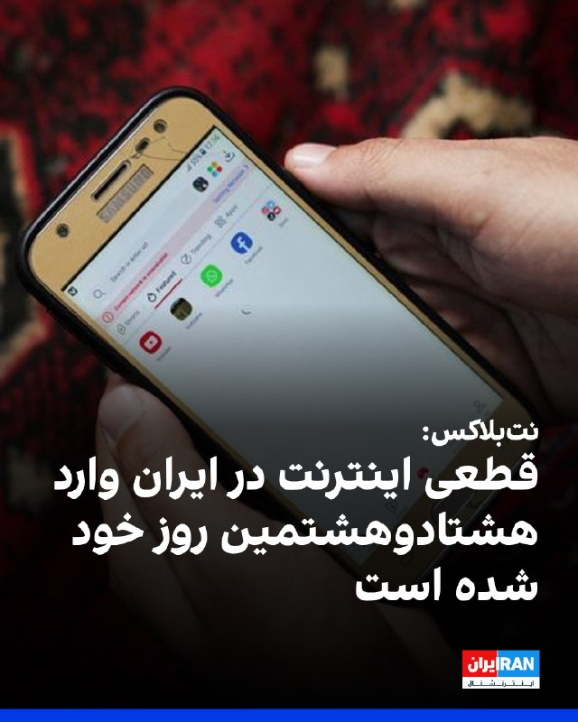
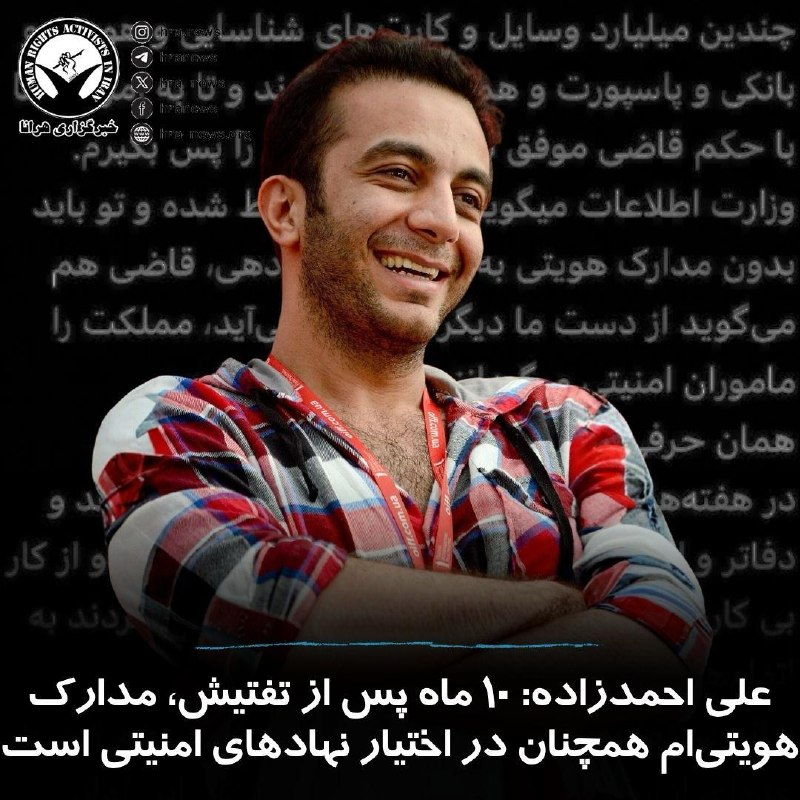
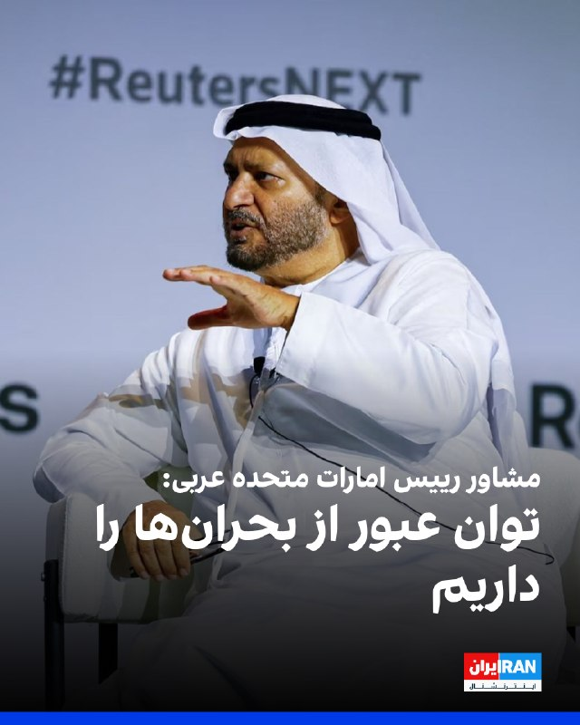
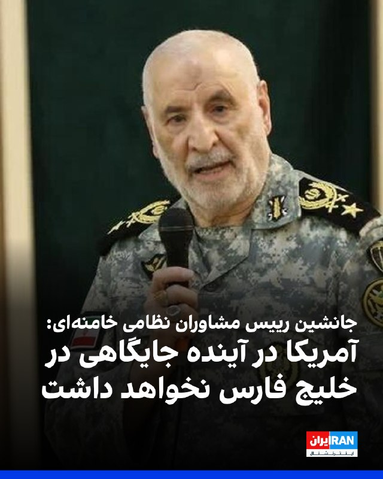

# خواننده تلگرام

<!-- TOP_NAV START -->

<a href="https://github.com/ProAlit/aio-downloader/blob/main/telegram/content/archive_1.md" style="display:inline-block; padding:6px 12px; margin:0 4px; background-color:#2ea44f; color:white; text-decoration:none; border-radius:4px; font-weight:bold;">صفحه بعد</a>

<!-- TOP_NAV END -->

<!-- MSG START -->

---
📅 بروزرسانی: 1405/03/05 12:23
---

## VahidOOnLine — post 242247

  

نت‌بلاکس، نهاد ناظر بر اختلال‌های اینترنتی در جهان، سه‌شنبه گزارش داد قطعی اینترنت در ایران اکنون وارد هشتادوهشتمین روز خود شده و مردم پس از بیش از دو هزار و ۸۸ ساعت همچنان در تاریکی دیجیتال به سر می‌برند.
این در حالی است که دولت در ایران وعده اتصال اینترنت بین‌المللی را داد است.
‌🏁 🇬🇧 IranintlTV

🤖 @VahidOOnLine

## VahidOOnLine — post 242246

  

♦️میزان، خبرگزاری قوه قضائیه جمهوری اسلامی، روز سه‌شنبه پنجم خردادماه از اعدام غلامرضا خانی شکراب به اتهام «همکاری اطلاعاتی و جاسوسی به نفع اسرائیل» خبر داد.

یک روز پیش از این، خبرگزاری فارس، وابسته به سپاه پاسداران از صدور حکم اعدام برای این متهم خبر داده و نوشته بود که او «در یک عملیات پیچیده اطلاعاتی به داخل کشور هدایت شده بود.»

سازمان‌های مدافع حقوق بشر در هفته‌های گذشته درباره احتمال اعدام این ورزشکار پیشین و مربی رشته رزمی ام‌ام‌آی ۳۴ ساله و اهل اردبیل هشدار داده بودند. براساس گزارش این نهادها او پیش از بازداشت، در ترکیه زندگی می‌کرد.

قوه قضائیه ادعا می‌کند که غلامرضا خانی شکراب «سرپل شبکه جاسوسی اسرائیل» بوده است. دادگاه رسیدگی کننده به پرونده این شهروند ایرانی او را «تعرض و اسیدپاشی به خودروهای افراد مورد نظر موساد، ایجاد خسارت و آتش‌زدن اموال عمومی، انجام اقدامات و عملیات‌های خرابکارانه، تهیه بمب و ارسال آن به تهران جهت ایجاد انفجار وناامنی در چندین نقطه مختلف و ارسال تصاویر نقاط مدنظر افسر موساد» متهم کرده است.

خبرگزاری میزان و دیگر رسانه‌های حکومتی، این جوان ۳۴ ساله را متهم به تلاش برای فراهم کردن مقدمات «ترور یک خاخام یهودی در یکی از کشورهای منطقه به دستور موساد» هم متهم کرده اند.

گزاشگر ویژه حقوق بشر سازمان ملل متحد و نهادهای بین‌المللی دفاع از حقوق بشر تاکید می‌کنند که متهمان پرونده‌های امنیتی در ایران از حق دسترسی به وکیل انتخابی و داشتن روند دادرسی عادلانه محرومند.
‌🇸🇦 Indypersian

🤖 @VahidOOnLine

## WithYashar — post 12530

اتاق جنگ با یاشار : از امشب ، برای فراخان اینترنتی ( ارتباط باشاهزاده و شنیده شدن صدای ما ) در دوشنبه دیگه هر‌شب مانور میریم و تقسیم وظایف میکنیم !💥

## IranIntlTV — post 339057

  

نت‌بلاکس، نهاد ناظر بر اختلال‌های اینترنتی در جهان، سه‌شنبه گزارش داد قطعی اینترنت در ایران اکنون وارد هشتادوهشتمین روز خود شده و مردم پس از بیش از دو هزار و ۸۸ ساعت همچنان در تاریکی دیجیتال به سر می‌برند.
این در حالی است که دولت در ایران وعده اتصال اینترنت بین‌المللی را داد است.
https://iranintl.com/202605264922

## IranIntlTV — post 339056

  <a href="telegram/content/IranIntlTV_339056_1779785587.mp4" target="_blank">🎬 Download video</a>

سنتکام اعلام کرد ارتش ایالات متحده به اهدافی در ایران در نزدیکی تنگه هرمز حمله کرده است. در همین حال، مارکو روبیو، وزیر امور خارجه آمریکا، در واکنش به این حمله گفت: «تنگه هرمز باید باز بماند و به هر شکلی باز خواهد ماند.»

گفت‌وگو با مرتضی کاظمیان، عضو تحریریه ایران‌اینترنشنال

@iranintltv

## IranIntlTV — post 339055

  <a href="telegram/content/IranIntlTV_339055_1779785590.mp4" target="_blank">🎬 Download video</a>

کلودیا شینباوم، رییس‌جمهوری مکزیک، دوشنبه اعلام کرد دولت او موافقت کرده به تیم ملی فوتبال ایران اجازه دهد در طول رقابت‌های جام جهانی ۲۰۲۶ در مکزیک اقامت داشته باشد.

گفت‌وگو با علیرضا مدیری، عضو تحریریه ایران‌اینترنشنال
@iranintltv

## FarsiVOA — post 218681

🔺دستگاه قضایی غلامرضا خانی‌شکرآب را که خارج از ایران ربوده شده بود، اعدام کرد

▪️قوه قضائیه اعلام کرد غلامرضا خانی‌شکرآب به اتهام «همکاری اطلاعاتی و جاسوسی به نفع اسرائیل» اعدام شده است.

▪️ادعا شده که اتهام‌های منتسب به آقای خانی، از «اقرارهای متهم» مطرح شده؛ اما جزئیات مستقل درباره روند بازجویی، دسترسی به وکیل و امکان دفاع مؤثر منتشر نشده است.

▪️ابهام اصلی پرونده، نحوه انتقال خانی‌شکرآب به ایران است. میزان نوشته او در خارج از کشور شناسایی و با «فریب اطلاعاتی» به داخل کشور هدایت و بازداشت شد.

▪️سازمان حقوق بشر ایران پیش‌تر گزارش داده بود او در دوم مهر ۱۴۰۴ بازداشت و در شعبه یک دادسرای امنیت، موسوم به ۳۳ مقدس، به اتهام همکاری با اسرائیل و موساد محاکمه و به اعدام محکوم شده بود.

⬇️ بیشتر بخوانید:
https://ir.voanews.com/a/8154028.html

## Persian_Trend_Official — post 15047

🇺🇸
🇬🇧
🇮🇷 یک KC-135 آسیب‌دیده هفته گذشته در میلدنهال مشاهده شد.

سوراخ‌های ناشی از ترکش که روی بال‌های دم پوشانده شده‌اند، قابل مشاهده است.نامشخص است که این KC-135 کجا این آسیب را دیده است زیرا هفته گذشته از فرودگاه بن گوریون برخاسته است.

👩‍💻@PhantomDirective

🆔@persian_trend_official
پرشین ترند | متفاوت‌ترین کانال نظامی

## Persian_Trend_Official — post 15046

💛خنثی‌سازی مهمات عمل‌نکرده در محدوده نیروگاه اتمی بوشهر فرماندار بوشهر: 🔹عملیات خنثی‌سازی و انهدام تعدادی از مهمات عمل‌نکرده متعلق به حملات آمریکایی اسرائیلی در محدوده نیروگاه اتمی بوشهر در دستور کار قرار گرفته است. 🔹این عملیات روز سه‌شنبه پنجم خرداد از…

## RadioFarda — post 157563

  

🔸مارکو روبیو، وزیر خارجه آمریکا، روز سه‌شنبه پنجم خرداد گفت دستیابی به توافق با ایران ممکن است «چند روز» زمان ببرد و تأکید کرد واشینگتن پیش از بررسی «راه‌های دیگر»، به دیپلماسی فرصت کامل خواهد داد.

🔸روبیو در توضیح حملاتی که سنتکام اعلام کرد روز گذشته علیه اهدافی در جنوب ایران از جمله قایق‌های در حال مین‌گذاری و پایگاه‌های پرتاب موشک انجام داده است، گفت تنگه هرمز باید «به هر شکل ممکن» باز بماند.

🔸وزیر خارجه ایالات متحده درباره گفت‌وگوهای جاری بین ایران و آمریکا برای دستیابی توافق گفت: «یک اتفاق‌نظر بسیار قوی و پیش‌نویس اولیهٔ یک توافق وجود دارد. همان‌گونه که در این‌گونه موارد پیش می‌آید، حل‌وفصل برخی اختلاف‌ها دربارهٔ یک کلمه یا یک جمله ممکن است چند روز طول بکشد تا به یک توافق برسیم. بنابراین باید برای حل این اختلاف‌ها تلاش کنیم. از این رو، یا یک توافق خوب خواهیم داشت یا توافق نخواهیم کرد.»

@RadioFarda

## IranianMinds — post 20780

  

⚫️ جمهوری اسلامی یکی‌ دیگه از هموطن هامونو امروز کشت ، عباس اکبری فیض آبادی از معترضین دی ماه در اصفهان امروز با اذان صبح توسط جمهوری اسلامی اعدام شد. @IranianMinds

## Hranews — post 113170

  

علی احمدزاده، کارگردان، فیلمنامه‌نویس و تهیه‌کننده ایرانی، با انتشار مطلبی اعلام کرد که با وجود گذشت حدود ۱۰ ماه از تفتیش منزل و ضبط وسایل شخصی و مدارک هویتی‌اش توسط نهادهای امنیتی، تاکنون موفق به بازپس‌گیری آنها نشده است. این در حالی است که به گفته احمدزاده، برای بازگرداندن این اقلام حکم قضایی صادر شده است.

به گفته وی، ماموران وسایلی به ارزش “چندین میلیارد” تومان، از جمله مدارک شناسایی، کارت‌های بانکی و گذرنامه‌اش را ضبط کرده‌اند. احمدزاده همچنین عنوان کرد که وزارت اطلاعات به او اعلام کرده است تمامی این اقلام ضبط شده و او باید “بدون مدارک هویتی” به زندگی ادامه دهد. او در ادامه، با اشاره به پیگیری‌های قضایی خود نوشت که قاضی پرونده نیز به وی گفته است: “از دست ما دیگر کاری برنمی‌آید، مملکت را ماموران امنیتی می‌گردانند.”
#علی_احمدزاده

↘️
@hranews_bot تماس ✉️ -  @Hranews  کانال هرانا 🆑

## alonews — post 122752

  <a href="telegram/content/alonews_122752_1779785595.mp4" target="_blank">🎬 Download video</a>

👈ایران یک ماه پیش به نفتکش «ایده‌میتسو مارو» اجازه داد تا از تنگهٔ هرمز عبور کند و نخستین نفتکش ژاپنی باشد که از زمان حمله علیه ایران از این آب‌راه عبور می‌کند.

🔴 ژاپن که به‌شدت به نفت خلیج‌فارس وابسته است، هنوز 39 نفتکش دیگر در خلیج‌فارس دارد

✅ @AloNews خبر جنگ

## alonews — post 122751

  <a href="telegram/content/alonews_122751_1779785597.webm" target="_blank">🎬 Download video</a>

👈خبرنگار آکسیوس: به نظر می‌رسد اظهار نظر ترامپ نشان‌دهنده‌ی نرم‌تر شدن موضع ایالات متحده در مورد ذخایر اورانیوم غنی‌شده و نزدیک‌تر شدن به موضع ایران در این مورد است

✅ @AloNews خبر جنگ

---
📅 بروزرسانی: 1405/03/05 12:12
---

## VahidOOnLine — post 242245

  

فاطمه مهاجرانی، سخنگوی دولت در نشست خبری خود گفت: «یکی از مشکلات مذاکرات، تناقض‌گویی‌های طرف مقابل است و جمهوری اسلامی از نظر دیپلماتیک و نظامی در سطح بالایی قرار دارد.»
او افزود: «در خصوص محاصره دریایی دولت راه‌های جایگزین را از قبل طراحی کرده و مشکلی از این نظر وجود ندارد.»
‌🏁 🇬🇧 IranintlTV

🤖 @VahidOOnLine

## WithYashar — post 12527

کابینه امنیتی اسرائیل امروز تشکیل می‌شود

کانال ۱۳ رژیم اسرائیل گزارش داد که کابینه امنیتی رژیم صهیونیستی عصر امروز در ساعت ۱۹:۰۰ به وقت محلی تشکیل می‌شود.
@withyashar

## WithYashar — post 12526

یک منبع آگاه اسرائیلی روز سه‌شنبه اعلام کرد که ارتش اسرائیل در روزهای آینده خود را برای گسترش عملیات‌ها و حملات هوایی در لبنان آماده می‌کند. سی‌ان‌ان : این منبع تأکید کرد تحرکات نظامی اسرائیلی قریب‌الوقوع «با هماهنگی ایالات متحده» انجام می‌شود. @withyashar

## pm_afshaa — post 91518

🔴منابع عبری:اسرائیل فراخوان اضطراری ذخیره‌ها را آغاز کرده از جمله نیروهای توپخانه‌ای که اخیراً از خدمت مرخص شده‌اند

💧 Rainbet.com the #1 Non-KYC Crypto Casino & Sportsbook @rainbetcom

😁 @Pm_Afshaa

## IranIntlTV — post 339054

  

فاطمه مهاجرانی، سخنگوی دولت در نشست خبری خود گفت: «یکی از مشکلات مذاکرات، تناقض‌گویی‌های طرف مقابل است و جمهوری اسلامی از نظر دیپلماتیک و نظامی در سطح بالایی قرار دارد.»
او افزود: «در خصوص محاصره دریایی دولت راه‌های جایگزین را از قبل طراحی کرده و مشکلی از این نظر وجود ندارد.»
https://iranintl.com/202605265101

## DW_Farsi — post 125152

  

🔶 افزایش قیمت نفت همزمان با حملات جدید آمریکا و تردیدها نسبت به توافق

در پی حملات هوایی جدید آمریکا به جنوب ایران و کاهش خوش‌بینی‌ها نسبت به دستیابی به یک توافق میان ایران و آمریکا، قیمت نفت صبح سه‌شنبه بار دیگر افزایش یافت و بازار سهام نیز دستخوش نوسان شد.

به گزارش رویترز قیمت قراردادهای آتی نفت برنت در معاملات اولیه آسیا بیش از ۱ درصد افزایش پیدا کرد و به ۹۷.۳۲ دلار در هر بشکه رسید. نفت خام وست تگزاس اینترمدیت آمریکا (WTI) نیز نسبت به آخرین قیمت معامله‌شده در روز دوشنبه اندکی افزایش داشت، اما همچنان ۵.۵ درصد پایین‌تر از قیمت پایانی روز جمعه بود.

بانک مرکزی سریلانکا برای مهار تورم و کاهش فشار شدید بر ارز، نرخ بهره پایه را به ۱۰۰ واحد افزایش داد.

معاون رئیس بانک مرکزی ژاپن نیز اعلام کرد که تحولات خاورمیانه در برنامه‌ریزی این بانک برای افزایش نرخ بهره تأثیرگذار خواهد بود.

این احتمال مطرح می‌شود که بانک مرکزی آمریکا تا ماه دسامبر نرخ بهره پایه را ۲۵ واحد افزایش دهد و بانک مرکزی اروپا و بانک انگلستان نیز سیاست‌های پولی خود را انقباضی‌تر کنند.

@dw_farsi

## Persian_Trend_Official — post 15045

  <a href="telegram/content/Persian_Trend_Official_15045_1779784970.webm" target="_blank">🎬 Download video</a>

💛خنثی‌سازی مهمات عمل‌نکرده در محدوده نیروگاه اتمی بوشهر

فرماندار بوشهر:

🔹عملیات خنثی‌سازی و انهدام تعدادی از مهمات عمل‌نکرده متعلق به حملات آمریکایی اسرائیلی در محدوده نیروگاه اتمی بوشهر در دستور کار قرار گرفته است.

🔹این عملیات روز سه‌شنبه پنجم خرداد از ساعت ۹ تا ۱۵ انجام می‌شود.

🔹انفجارهای صورت‌گرفته به‌طور کامل کنترل‌شده بوده و جای هیچ نگرانی برای شهروندان وجود ندارد.
| ایسنا

## Persian_Trend_Official — post 15044

  

غلامرضا خانی شکراب به اتهام «جاسوسی» اعدام شد.

مرکز رسانه قوه قضاییه از اجرای حکم اعدام غلامرضا خانی شکراب، زندانی متهم به جاسوسی و فعالیت اطلاعاتی به نفع اسرائیل خبر داد. این حکم پس از تایید در دیوان عالی کشور به اجرا درآمد.

بر اساس داده‌های گردآوری‌شده توسط هرانا:

همزمان با آغاز درگیری‌های نظامی، روند صدور و اجرای احکام اعدام در پرونده‌های سیاسی و امنیتی افزایش یافته و تاکنون ۳۷ زندانی با این اتهامات در این بازه زمانی اعدام شده‌اند.

👩‍💻@PhantomDirective

🆔@persian_trend_official
پرشین ترند | متفاوت‌ترین کانال نظامی

## IranianMinds — post 20779

  

🔴 مجتبی خامنه ای :

همونطور که بابایی سال ۱۳۹۴ گفت اسرائیل ۲۵ سال آینده را نخواهد دید!

@IranianMinds

## IranianMinds — post 20777

  <a href="telegram/content/IranianMinds_20777_1779784972.mp4" target="_blank">🎬 Download video</a>

🔴 جنوب لبنان بعد از حمله های اسرائیل

@IranianMinds

## Dirty_Kids — post 390215

  <a href="telegram/content/Dirty_Kids_390215_1779784974.mp4" target="_blank">🎬 Download video</a>

یارو دکمه پیرهنشو نمی‌تونه درست ببنده، می‌خواد برا آینده مملکت تصمیم بگیره 😂

یه ساعت به دکمه یقه‌ش خندیدم ، همچین که خنده‌م بند اومد تازه چشمم خورد به

دوتا جیبش 😂

@Dirty_Kids 👻

## Dirty_Kids — post 390214

  

استراتژی کالیسی تو گیم‌اف‌ترون نشون داد تا زمانی که روی زمین نیرو نداشته باشی نیروی هوایی به تنهایی کفایت نمی‌کنه!

@Dirty_Kids 👻

## alonews — post 122748

  <a href="telegram/content/alonews_122748_1779784976.webm" target="_blank">🎬 Download video</a>

👈 امروز صبح حداقل شش حمله هوایی اسرائیلی به یومور الشقیف در جنوب لبنان هدف قرار گرفتند.

🔴جنگنده‌های اسرائیلی و آتش توپخانه به طور مداوم در طول صبح به شهرها و روستاهای جنوب لبنان هدف قرار داده‌اند.

✅ @AloNews خبر جنگ

## alonews — post 122746

  <a href="telegram/content/alonews_122746_1779784976.mp4" target="_blank">🎬 Download video</a>

👈 صحنه‌هایی از جنوب لبنان پس از حملات اسرائیلی در طول شب.

✅ @AloNews خبر جنگ

## alonews — post 122745

  <a href="telegram/content/alonews_122745_1779784978.webm" target="_blank">🎬 Download video</a>

👈اتحادیه کانفیگ فروشان ایرانی بیانیه داد:
کار جمهوری اسلامی ایران بسیار زشت بود. تاکید میکنم بسیار زشت! آن‌ها اینترنت را باز کردند و حمله‌ای شدید به دارایی ما زدند! تا 24 ساعت آینده مهلت میدهیم که اینترنت را قطع کنند. اگر نکنند آن‌ها را به عصر حجر. برمیگردونیم. خواهیم دید چه میشود

✅ @AloNews خبر جنگ

---
📅 بروزرسانی: 1405/03/05 12:02
---

## VahidOOnLine — post 242244

  

قوه قضاییه جمهوری اسلامی اعلام کرد غلامرضا خانی شکراب، زندانی سیاسی با اتهام «همکاری اطلاعاتی و جاسوسی برای اسرائیل» اعدام شده است. بر اساس این گزارش، حکم او پس از تایید در دیوان عالی کشور اجرا شده است.

این گزارش پس از آن منتشر شد که نهادهای حقوق بشری درباره وضعیت خانی شکرآب، ورزشکار و زندانی سیاسی محکوم به اعدام، هشدار داده بودند.

سازمان حقوق بشر ایران ۳۱ اردیبهشت اعلام کرد خانی شکراب پس از انتقال از زندان اوین به سلول انفرادی در زندان قزل‌حصار، در معرض خطر اجرای قریب‌الوقوع حکم اعدام قرار دارد.

بر اساس گزارش این نهاد، خانی شکرآب دوم مهر ۱۴۰۴ بازداشت و به اتهام «همکاری با اسرائیل و مشخصا سازمان اطلاعاتی موساد» محاکمه و به اعدام محکوم شده بود.
‌🏁 🇬🇧 IranintlTV

🤖 @VahidOOnLine

## WithYashar — post 12525

@withyashar این پست به درخواست شما منتشر میشود

## WithYashar — post 12524

  

استوری جدید علی کریمی
@withyashar
یاشار : کاری با انتقاد ندارم ولی ایشون باید راهشو از پشمک نادان جدا کنه…

## WithYashar — post 12523

سخنگوی وزارت خارجه قطر: اینکه گفتن قطر 12 میلیارد دلار از پول‌های بلوکه شده ایران رو قراره پرداخت کنه کاملا کذبه و از این خبرا نیست! @withyashar

## WithYashar — post 12522

رئیس‌جمهور روسیه، ولادیمیر پوتین، قانونی را امضا کرد که اجازه می‌دهد از نیروهای نظامی برای حفاظت از شهروندان روسیه در خارج از کشور که توسط دادگاه‌های خارجی یا دادگاه‌های بین‌المللی دستگیر، بازداشت، زندانی یا تحت پیگرد قرار می‌گیرند، استفاده شود.

این قانون در مواردی اعمال می‌شود که دادگاه‌ها بدون مشارکت روسیه عمل می‌کنند و صلاحیت آن‌ها بر اساس معاهده بین‌المللی شامل روسیه یا قطعنامه شورای امنیت سازمان ملل نیست.
@withyashar

## IranIntlTV — post 339053

  <a href="telegram/content/IranIntlTV_339053_1779784378.mp4" target="_blank">🎬 Download video</a>

محمود نبویان، عضو تیم مذاکره‌کننده جمهوری اسلامی، در نامه‌ای به محمدباقر قالیباف، رییس هیات مذاکره‌کننده، خواستار بازگشایی تنگه هرمز در ازای لغو همه تحریم‌های آمریکا شد.

گفت‌وگو با علی شیرازی، عضو تحریریه ایران‌اینترنشنال
@iranintltv

## FarsiVOA — post 218680

🔺حصر دیجیتال ۸۸ روزه شد؛ بازگشت اینترنت در کشاکش ابلاغ مبهم و تعویق

▪️اتصال اینترنت در ایران همچنان قطع است و خاموشی دیجیتال وارد هشتادوهشتمین روز شده و از دو هزار و ۸۸ ساعت گذشته است.

▪️نت‌بلاکس در این باره می‌گوید داده‌های فنی نشان می‌دهد قطعی همچنان برقرار است؛ با وجود آنکه روز گذشته خبرهایی درباره دستور مسعود پزشکیان برای بازگرداندن دسترسی به اینترنت منتشر شد.

▪️همین تناقض، محور اصلی بحران تازه است: دولت از بازگشت اینترنت حرف می‌زند، اما وضعیت اتصال هنوز تغییر نکرده و حتی درباره ابلاغ رسمی مصوبه نیز روایت‌های متناقض منتشر شده است.

▪️رسانه‌های داخلی نیز پیش‌تر نوشته بودند دستور بازگشایی اینترنت بین‌الملل صادر شده، اما سازوکار و زمان اتصال دوباره هنوز روشن نیست.

⬇️ بیشتر بخوانید:
https://ir.voanews.com/a/8154027.html

## BBCPersian — post 282089

  

🔻رسانه‌های داخلی ایران از وقوع تیراندازی در محدوده بیمارستانی در اقدسیه تهران خبر داده‌اند.

خبرگزاری ایسنا نوشته است: «در پی وقوع یک درگیری و تیراندازی مقابل بیمارستانی در محدوده اقدسیه تهران، فضای این مرکز درمانی برای دقایقی دچار رعب و وحشت شد.»

پلیس فرماندهی انتظامی تهران بزرگ (فاتب) گفت که فردی به دلیل «خصومت شخصی و اختلاف مالی» به بیمارستان مراجعه کرد و با یک بیمار وارد مشاجر شد.

پلیس افزود: « با دخالت اطرافیان، تنش از داخل بیمارستان به بیرون از درِ ورودی کشیده شد. در ادامه، متهم با استفاده از سلاح گرم اقدام به تیراندازی در مقابل بیمارستان کرد؛ اقدامی که موجب اخلال در نظم عمومی و وحشت در میان مراجعان و کادر درمان گردید.»

پلیس اضافه کرده است که بعد از شناسایی«مخفی‌گاه متهم» در شمال تهران، او را بازداشت کرده است.

به گفته پلیس «یک قبضه سلاح کلت کمری، یک رشته دستبند و تعدادی تیر جنگی» هم همراه این فرد کشف و ضبط شده است.

عکس آرشیوی از گتی

https://bbc.in/4u071Sq
@BBCPersian

## Hranews — post 113169

  

غلامرضا خانی شکراب به اتهام «جاسوسی» اعدام شد

❗️
❗️
❗️
❗️
❗️– مرکز رسانه قوه قضاییه از اجرای حکم اعدام غلامرضا خانی شکراب، زندانی متهم به جاسوسی و فعالیت اطلاعاتی به نفع اسرائیل خبر داد. این حکم پس از تایید در دیوان عالی کشور به اجرا درآمد. بر اساس داده‌های گردآوری‌شده توسط هرانا، همزمان با آغاز درگیری‌های نظامی، روند صدور و اجرای احکام اعدام در پرونده‌های سیاسی و امنیتی افزایش یافته و تاکنون ۳۷ زندانی با این اتهامات در این بازه زمانی اعدام شده‌اند.
#غلامرضا_خانی_شکراب #اعدام

ادامه مطلب

↘️
@hranews_bot تماس ✉️ -  @Hranews  کانال هرانا 🆑

## alonews — post 122744

  <a href="telegram/content/alonews_122744_1779784383.webm" target="_blank">🎬 Download video</a>

👈 امروز صبح حملات هوایی اسرائیل به مناطق متعددی در جنوب لبنان هدف قرار گرفت:

🔴ارزون

🔴صریفه x2

🔴برج قلاوی

🔴کفرسیر

🔴 کوثاریه الروز

🔴 کفرا

🔴 مجدل سلم

🔴 یحمر الشافیق x6

🔴برشیت x2

🔴 حارس

🔴 دیر

✅ @AloNews خبر جنگ

---
📅 بروزرسانی: 1405/03/05 11:52
---

## VahidOOnLine — post 242243

  

♦️مجتبی خامنه‌ای، سومین رهبر جمهوری اسلامی در پیامی که روز سه‌شنبه پنجم خرداد و به مناسبت حج منتشر کرد، مدعی شد که کشورهای منطقه، پس از جنگ اخیر با اسرائیل و ایالات متحده، «دیگر سپر پایگاه‌های آمریکایی نخواهند بود.»
 از زمان انتصاب مجتبی خامنه‌ای به رهبری جمهوری اسلامی در اسفندماه سال گذشته، هیچ صدا و تصویری از او منتشر نشده است.

در آخرین پیام منتسب به مجتبی خامنه‌ای، او با تمجید از عملکرد نیروهای مسلح جمهوری اسلامی در جریان جنگ ۱۲ روزه و جنگ اخیر با اسرائیل و آمریکا آورده است: «عقربه زمان به عقب برنمی‌گردد و ملت ها و سرزمین های منطقه، دیگر سپر پایگاه های آمریکایی نخواهند بود. آمریکا علاوه بر آنکه دیگر، نقطه امنی برای شرارت و استقرار پایگاه نظامی در منطقه نخواهد داشت، روز به روز از وضع سابق خود فاصله می گیرد.»

مجتبی خامنه‌ای در همین پیام ملت‌ها و دولت‌های منطقه را به اتحاد برای تامین امنیت دعوت کرده است.
‌🇸🇦 Indypersian

🤖 @VahidOOnLine

## VahidOOnLine — post 242242

  

انور قرقاش، مشاور دیپلماتیک رییس امارات متحده عربی، گفت جنگ‌ها ممکن است چالش‌های مقطعی ایجاد کنند، اما امارات متحده عربی بر پایه‌هایی استوار بنا شده که آن را برای انسجام و عبور از بحران‌ها توانمندتر می‌کند.

او افزود: «موفقیت امارات متحده عربی نتیجه دیدگاهی ریشه‌دار و کار مخلصانه و مستمر در طول سال‌ها است و این کشور با اعتماد و ثبات از چالش‌ها عبور خواهد کرد.»
‌🏁 🇬🇧 IranintlTV

🤖 @VahidOOnLine

## VahidOOnLine — post 242241

  

ناصر آراسته، جانشین رییس مشاوران نظامی خامنه‌ای، گفت: «آمریکا در آینده جایگاهی در خلیج فارس نخواهد داشت و این موضوع چه با جنگ و چه بدون جنگ محقق می‌شود.»

آراسته افزود دیپلمات‌ها باید در کنار نیروهای مسلح برای «پاکسازی منطقه از پایگاه‌های آمریکایی» بایستند.

او درباره آمادگی نیروهای مسلح جمهوری اسلامی گفت: «کنترل تردد در تنگه هرمز در اختیار نیروی دریایی سپاه است و کشتی‌های خارجی بدون مجوز تهارن امکان عبور ندارند.»
‌🏁 🇬🇧 IranintlTV

🤖 @VahidOOnLine

## WithYashar — post 12521

دایرکت رو دیگه باز‌نمیکنم

## WithYashar — post 12520

## DEJradio — post 4968

  <a href="telegram/content/DEJradio_4968_1779783767.webm" target="_blank">🎬 Download video</a>

🔺📢 پزشکیان به کارکنان نیروهای مسلح وعده «رفاه» و «مسکن» داد

در شرایطی که بعد از جنگ ۴۰ روزه حتی ارائه خدمات بیمه به پرسنل نیروهای مسلح به دلیل کمبود بودجه محدودتر شد و بسیاری از داروها را باید به صورت آزاد خریداری کنند، مسعود پزشکان روز سه‌شنبه در نشستی با جمعی از فرماندهان و مدیران وزارت دفاع ادعا کرد از نیروهای مسلح «حمایت همه‌جانبه» می‌شود.
او تأکید کرد اولویت دولت، معیشت، رفاه و تأمین مسکن کارکنان نظامی است.

پزشکیان گفت: «پیش از تجهیزات، موشک‌ها و سامانه‌های نظامی، این انسان‌ها هستند که محور اصلی قدرت دفاعی کشور را تشکیل می‌دهند و اگر نیروی انسانی از آرامش، امنیت معیشتی و پشتیبانی لازم برخوردار نباشد، ابزارهای دفاعی نیز کارآمدی لازم را نخواهند داشت.»

با این همه پزشکیان اذعان کرد «با وجود تأکیدات مکرر و پیگیری‌های صورت‌گرفته، روند تأمین مسکن کارکنان نیروهای مسلح همچنان نیازمند اهتمام جدی‌تر، تسریع در اجرا و دستیابی به نتایج ملموس‌تر است.»

#جنگ #نیروهای_مسلح
@DEJradio

## DEJradio — post 4967

  <a href="telegram/content/DEJradio_4967_1779783768.webm" target="_blank">🎬 Download video</a>

🚨📢 مارکو روبیو وزیر خارجه امریکا در گفتگو با خبرنگارانی که در جریان سفرش به شهر جیپور هند او را در هواپیما همراهی می‌کردند، با اشاره به حملات سنتکام به قایق‌های سـ.ـپاه در خلیج فارس گفت: «تنگه هرمز به عنوان یک آبراه بین‌المللی باید به هر شکل ممکن باز نگه داشته شود.»

او در بخش دیگری از اظهارات خود به روند دیپلماتیک جاری اشاره کرد و تصریح کرد: گفت‌وگوها درباره نگارش و فرمول متن توافق با ایران همچنان ادامه دارد.
روبیرو توضیح داد: «این فرآیند ممکن است چند روزی زمان ببرد.»

#جنگ #تنگه_هرمز
@DEJradio

## IranIntlTV — post 339052

  

قوه قضاییه جمهوری اسلامی اعلام کرد غلامرضا خانی شکراب، زندانی سیاسی با اتهام «همکاری اطلاعاتی و جاسوسی برای اسرائیل» اعدام شده است. بر اساس این گزارش، حکم او پس از تایید در دیوان عالی کشور اجرا شده است.

این گزارش پس از آن منتشر شد که نهادهای حقوق بشری درباره وضعیت خانی شکرآب، ورزشکار و زندانی سیاسی محکوم به اعدام، هشدار داده بودند.

سازمان حقوق بشر ایران ۳۱ اردیبهشت اعلام کرد خانی شکراب پس از انتقال از زندان اوین به سلول انفرادی در زندان قزل‌حصار، در معرض خطر اجرای قریب‌الوقوع حکم اعدام قرار دارد.

بر اساس گزارش این نهاد، خانی شکرآب دوم مهر ۱۴۰۴ بازداشت و به اتهام «همکاری با اسرائیل و مشخصا سازمان اطلاعاتی موساد» محاکمه و به اعدام محکوم شده بود.
https://iranintl.com/202605264875

## IranIntlTV — post 339051

  

انور قرقاش، مشاور دیپلماتیک رییس امارات متحده عربی، گفت جنگ‌ها ممکن است چالش‌های مقطعی ایجاد کنند، اما امارات متحده عربی بر پایه‌هایی استوار بنا شده که آن را برای انسجام و عبور از بحران‌ها توانمندتر می‌کند.

او افزود: «موفقیت امارات متحده عربی نتیجه دیدگاهی ریشه‌دار و کار مخلصانه و مستمر در طول سال‌ها است و این کشور با اعتماد و ثبات از چالش‌ها عبور خواهد کرد.»
https://iranintl.com/202605262625

## IranIntlTV — post 339050

  

🔻خبرگزاری فارس، وابسته به سپاه پاسداران، از صدور حکم اعدام برای غلامرضا خانی شکرآب خبر داد؛ ورزشکار پیشین ام‌ام‌ای، مربی و داور بین‌المللی این رشته که به «همکاری با اسرائیل» و «هدایت شبکه خرابکاری» متهم شده است.

🔹فارس با روایتی کلی از روند بازداشت او مدعی شده خانی شکرآب «سرپل عملیاتی موساد» بوده و پس از انتقال به ایران، در دادگاه به اعدام محکوم شده است.

🔹با این حال، تاکنون جزئیات مستقلی درباره روند دادرسی، زمان و محل محاکمه، دسترسی او به وکیل انتخابی و مستندات پرونده منتشر نشده است.

🔹منابع مطلع پیش‌تر گفته بودند خانی شکرآب، متولد ۱۳۷۱، پیش از بازداشت در ترکیه زندگی می‌کرد و حدود یک سال پیش در جریان سفری به عراق، توسط عوامل جمهوری اسلامی ربوده و به ایران منتقل شد.

🔹گفته می‌شود حکم اعدام او در شعبه ۱۵ دادگاه انقلاب تهران به ریاست ابوالقاسم صلواتی صادر و در دیوان عالی کشور تایید شده است.

🔹انتشار خبر حکم اعدام او، به‌ویژه پس از انتقال اخیرش از اوین به زندان قزلحصار، نگرانی‌ها درباره احتمال اجرای قریب‌الوقوع این حکم را افزایش داده است.

@iranintltvsport

## IranIntlTV — post 339049

  

ناصر آراسته، جانشین رییس مشاوران نظامی خامنه‌ای، گفت: «آمریکا در آینده جایگاهی در خلیج فارس نخواهد داشت و این موضوع چه با جنگ و چه بدون جنگ محقق می‌شود.»

آراسته افزود دیپلمات‌ها باید در کنار نیروهای مسلح برای «پاکسازی منطقه از پایگاه‌های آمریکایی» بایستند.

او درباره آمادگی نیروهای مسلح جمهوری اسلامی گفت: «کنترل تردد در تنگه هرمز در اختیار نیروی دریایی سپاه است و کشتی‌های خارجی بدون مجوز تهارن امکان عبور ندارند.»
https://iranintl.com/202605264354

## alonews — post 122743

  <a href="telegram/content/alonews_122743_1779783772.webm" target="_blank">🎬 Download video</a>

👈 رئیس‌جمهور روسیه، ولادیمیر پوتین، قانونی را امضا کرد که اجازه می‌دهد از نیروهای نظامی برای حفاظت از شهروندان روسیه در خارج از کشور که توسط دادگاه‌های خارجی یا دادگاه‌های بین‌المللی دستگیر، بازداشت، زندانی یا تحت پیگرد قرار می‌گیرند، استفاده شود.

🔴 این قانون در مواردی اعمال می‌شود که دادگاه‌ها بدون مشارکت روسیه عمل می‌کنند و صلاحیت آن‌ها بر اساس معاهده بین‌المللی شامل روسیه یا قطعنامه شورای امنیت سازمان ملل نیست.

✅ @AloNews خبر جنگ

## alonews — post 122742

  <a href="telegram/content/alonews_122742_1779783772.webm" target="_blank">🎬 Download video</a>

👈پزشکیان: دشمن از توان تهاجمی نیروهای مسلح ایران غافلگیر شد.

✅ @AloNews خبر جنگ

## alonews — post 122741

  <a href="telegram/content/alonews_122741_1779783772.webm" target="_blank">🎬 Download video</a>

👈حزب دموکرات: امروز از قهرمانان آمریکایی که در جنگ ترامپ با ایران فداکاری نهایی کردند، تجلیل می‌کنیم. 
✅ @AloNews خبر جنگ

---
📅 بروزرسانی: 1405/03/05 11:42
---

## VahidOOnLine — post 242240

  

♦️سپاه پاسداران در این بیانیه بدون اشاره به زمان این رویارویی، آمریکا را به «ماجراجویی مداخله گرانه در منطقه و رفتارهای متجاوزانه» متهم کرده و  آورده است آمریکا «وارد حریم هوایی ایران شد و یگان های پدافندی سپاه پاسداران در راستای دفاع از حریم سرزمینی کشورمان پس از پایش های اطلاعاتی دقیق، یک فروند پهپاد ام‌کیو۹را شناسایی و ساقط کرد. همچنین با شلیک به یک فروند پهپاد آرکیو۴و جنگنده متجاوز اف۳۵ آنان را وادار به فرار و خروج از حریم سرزمینی کرد.»

 سپاه پاسداران در پایان همین بیانیه درباره «هرگونه نقض آتش‌بس» از طرف آمریکا هشدار داد و اعلام کرد: «حق پاسخ متقابل را برای خود مشروع و قطعی می‌داند.»

ستاد فرماندهی مرکزی ایالات متحده (سنتکام) در نخستین ساعات بامداد سه‌شنبه اعلام کرد چند قایق تندروی سپاه و یک پایگاه پرتاب موشک را در خلیج فارس و در جریان یک ماموریت دفاعی هدف قرار داده است. با این حال، سنتکام تاکید کرد که «آتش‌بس» میان آمریکا و جمهوری اسلامی ایران همچنان پابرجاست.
‌🇸🇦 Indypersian

🤖 @VahidOOnLine

## VahidOOnLine — post 242239

  

روابط عمومی سپاه پاسداران در اطلاعیه‌ای اعلام کرد یگان‌های پدافندی سپاه پس از «پایش‌های اطلاعاتی دقیق»، یک پهپاد ام‌کیو-۹ آمریکا را در منطقه خلیج فارس شناسایی، رهگیری و ساقط کرده‌اند.

در این اطلاعیه آمده است یک پهپاد آرکیو-۴ و یک جنگنده اف-۳۵ نیز پس از شلیک پدافند سپاه، مجبور به فرار و خروج از حریم سرزمینی ایران شدند.

سپاه همچنین نسبت به هرگونه نقض آتش‌بس از سوی ارتش آمریکا هشدار داد و اعلام کرد حق پاسخ متقابل را برای خود «مشروع و قطعی» می‌داند.
‌🏁 🇬🇧 IranintlTV

🤖 @VahidOOnLine

## mwarmonitor — post 9730

📝 واقعاً آدم دلش برای این پیرمرد مو نارنجی کباب می‌شود؛ طفلکی هر چه بیشتر تلاش می‌کند تا ادای یک غول بی‌شاخ‌ودمِ تحریم‌کننده را درآورد، بیشتر شبیه پدربزرگ مهربان و باگذشتی می‌شود که مأموریتش در زندگی فقط «نه نگفتن» به خواسته‌های تهران است. اصلاً این حجم از…

## DEJradio — post 4966

  <a href="telegram/content/DEJradio_4966_1779783154.webm" target="_blank">🎬 Download video</a>

🕐
🔺 فرماندهی مرکزی ایالات متحده آمریکا (سنتکام) در بیانیه‌ای اعلام کرد ارتش آمریکا در جنوب ایران چند سایت پرتاب موشک و قایق‌هایی را که «در حال تلاش برای کارگذاری مین بودند» هدف قرار داد.

این قایق‌ها متعلق به سـ.ـپاه پاسداران بودند و چهار نفر از پاسداران کشته شدند. در چند شهر ایران نیز عملیات پهپادی انجام شده و شهروندان صدای انفجار شنیدند اما رسانه‌های حکومتی جزئیات آن را اعلام نمی‌کنند.

چند منبع تلگرامی نزدیک به سـ.ـپاه قدس، نوشته‌اند که کشته‌های سـ.ـپاه علنی نشد تا در مذاکرات تأثیر نداشته باشد.
این وضعیت بسیاری از طرفداران نظام را خشمگین کرده است، آنها می‌گویند نزدیک به سه ماه است هر شب در خیابان هستیم تا مقاومت کنیم «پشت پرده» مقامات کشور در حال زد و بند با آمریکا هستند.

اکنون با ادامه مذاکرات آنها احساس می‌کنند بازیچه قرار گرفته‌اند. این حملات در شرایی انجام شد که محمدباقر قالیباف رئیس مجلس شورای اسلامی، عباس عراقجی وزیرخارجه و عبدالناصر همتی رئیس کل بانک مرکزی برای مذاکره با آمریکا به قطر رفته‌اند. بعضی از هواداران حکومت از این سه نفر به عنوان توسری‌خورها یاد کرده‌اند. یکی از این کانال‌ها در واکنش به مذاکره آنها با آمریکا نوشت «خاک بر سر ماله کشان.»

#جنگ #IRGCterrorists
@DEJradio

## DEJradio — post 4965

  <a href="telegram/content/DEJradio_4965_1779783155.webm" target="_blank">🎬 Download video</a>

🔺📢 در پی تهدید اسرائیل مبنی بر هدفگیری مقرها و خانه‌های امن نیروهای حـ.ـزب‌الله طرفداران و عناصر این گروه تروریستی دوشنبه شب ۵ خرداد برای در امان ماندن از بمباران از منطقه ضاحیه فرار کردند.

رافی میلوا، فرمانده نیروهای شمال اسرائیل اعلام کرد ارتش اسرائیل دیگر «نمی‌تواند وضعیت فعلی در لبنان را تحمل کند» و هشدار داد جنگ از همین امشب وارد مرحله شدیدتری خواهد شد./او تاکید کرد گروه تروریستی حزب‌الله، جنوب لبنان، بیروت و «هر نقطه‌ای که تروریست‌های این گروه حضور داشته باشند» بهای حملات اخیر را پرداخت خواهند کرد.

#جنگ #لبنان
@DEJradio

## DEJradio — post 4964

  

🛩️
🔥 بامداد سه‌شنبه ۵ خرداد ۱۴۰۵؛ پدافند تهران و قم فعال شدند. کانال تلگرامی نزدیک به سـ.ـپاه قدس نوشت، «شاید باند فرودگاه خمینی را هدف قرار بدهند.»

*تصویر آرشیوی

#جنگ #فرودگاه_خمینی
@DEJradio

## DEJradio — post 4963

  <a href="telegram/content/DEJradio_4963_1779783156.webm" target="_blank">🎬 Download video</a>

🚨📢 جنگنده‌‌های آمریکایی بامداد سه‌شنبه پنجم خرداد ۱۴۰۵ چند قایق تندرو سـ.ـپاه پاسداران را تنگه هرمز در جنوب جزیره لارک مورد هدف قرار دادند. در این حملات دستکم ۴ پاسدار کشته شدند.

برخی منابع غیررسمی گزارش دادند این قایق‌ها شب قبل هدف قرار گرفتند اما برای اینکه روند مذاکرات با آمریکا مختل نشود، سانسور شده بود.

*تصویر آرشیوی

#جنگ #تنگه_هرمز
@DEJradio

## DEJradio — post 4962

  

🛩️
🔥 به گزارش منابع خبری داخلی نیمه شب دوشنبه چهارم خرداد ۱۴۰۵ باند فرودگاه بندرعباس مورد اصابت موشک قرار گرفت.
چند هواپیما و پهپاد در آسمان جنوب ایران به پرواز درآمدند.

کانال‌های تلگرامی نزدیک به ســ.ـپاه پاسداران با تایید مانور جنگنده‌ها پیش‌بینی کردند احتمالا هواپیماها متعلق به آمریکا هستند.

#جنگ #فرودگاه_بندرعباس
@DEJradio

## IranIntlTV — post 339048

  <a href="telegram/content/IranIntlTV_339048_1779783157.mp4" target="_blank">🎬 Download video</a>

سنتکام اعلام کرد ارتش ایالات متحده به اهدافی در ایران در نزدیکی تنگه هرمز حمله کرده است. در همین حال، مارکو روبیو، وزیر امور خارجه آمریکا، در واکنش به این حمله گفت: «تنگه هرمز باید باز بماند و به هر شکلی باز خواهد ماند.»

گفت‌وگو با مرتضی کاظمیان، عضو تحریریه ایران‌اینترنشنال
@iranintltv

## IranIntlTV — post 339047

  

روابط عمومی سپاه پاسداران در اطلاعیه‌ای اعلام کرد یگان‌های پدافندی سپاه پس از «پایش‌های اطلاعاتی دقیق»، یک پهپاد ام‌کیو-۹ آمریکا را در منطقه خلیج فارس شناسایی، رهگیری و ساقط کرده‌اند.

در این اطلاعیه آمده است یک پهپاد آرکیو-۴ و یک جنگنده اف-۳۵ نیز پس از شلیک پدافند سپاه، مجبور به فرار و خروج از حریم سرزمینی ایران شدند.

سپاه همچنین نسبت به هرگونه نقض آتش‌بس از سوی ارتش آمریکا هشدار داد و اعلام کرد حق پاسخ متقابل را برای خود «مشروع و قطعی» می‌داند.
https://iranintl.com/202605266773

## Persian_Trend_Official — post 15043

  <a href="telegram/content/Persian_Trend_Official_15043_1779783160.webm" target="_blank">🎬 Download video</a>

وزیر ارتباطات: با دستور رئیس‌جمهوری و پس از برگزاری ۳ جلسه فشرده کارشناسی، فرایند بازگرداندن اینترنت کشور به وضعیت قبل از دی‌ماه ۱۴۰۴ آغاز شده است. 👩‍💻@PhantomDirective 🆔@persian_trend_official پرشین ترند | متفاوت‌ترین کانال نظامی

## alonews — post 122740

  <a href="telegram/content/alonews_122740_1779783160.webm" target="_blank">🎬 Download video</a>

👈رسانه‌های اسرائیلی: اسرائیل بسیج اضطراری نیروهای ذخیره را آغاز کرده است؛ از جمله یگان‌های توپخانه‌ای که به‌تازگی از خدمت ترخیص شده بودند.

🔴این اقدام در چارچوب افزایش آمادگی‌ها برای عملیات دفاعی گسترده در لبنان و در پی ادامه حملات حزب‌الله و نقض آتش‌بس انجام می‌شود.

✅ @AloNews خبر جنگ

## alonews — post 122739

  <a href="telegram/content/alonews_122739_1779783160.webm" target="_blank">🎬 Download video</a>

👈نت‌بلاکس آپدیت جدیدی از وضعیت اینترنت بین‌الملل ایران منتشر کرد 
✅ @AloNews خبر جنگ

---
📅 بروزرسانی: 1405/03/05 11:32
---

## VahidOOnLine — post 242238

  

مسعود پزشکیان در نشست با فرماندهان و مدیران وزارت دفاع گفت که توان تهاجمی نیروهای مسلح باعث غافلگیری دشمن شده است.
او گفت که توان دفاعی کشور نتیجه آمادگی و فعالیت نیروهای مسلح است و افزود: «دولت رسیدگی به معیشت و مسکن این نیروها را در اولویت قرار داده است.

پزشکیان افزود: «صنعت دفاعی باید سریع‌تر به سمت فناوری‌های نوین حرکت کند.»
‌🏁 🇬🇧 IranintlTV

🤖 @VahidOOnLine

## VahidOOnLine — post 242237

  <a href="telegram/content/VahidOOnLine_242237_1779782573.mp4" target="_blank">🎬 Download video</a>

ویدیوهای منتشرشده، تصاویری از جاویدنام فاطمه عباسی و مزار گلباران‌شده او را نشان می‌دهند. عباسی، ۳۱ ساله و دانشجوی دانشگاه هنر اصفهان، ۱۹ دی‌ در بلوار کشاورز اصفهان هنگامی‌ که در حال کمک و پناه دادن به مجروحین بود با اصابت گلوله به گردنش مجروح و دچار قطع نخاع شد. او ۲۱ اسفند در بیمارستان جان باخت.
‌🏁 🇬🇧 IranintlTV

🤖 @VahidOOnLine

## VahidOOnLine — post 242236

🗣روایت شما از بحران اقتصادی و زندگی در آتش‌بس- سه‌شنبه ۵ خرداد:

🔹مملکت ببی در و پیکر شده؛ پلیس به خاطر ندادن پول، مرا به کلانتری ۱۱۶ مولوی (پارک هرندی) برد، کتک زد و به خانواده‌ام فحش داد. قصدش گرفتن ۵ میلیون رشوه بود، اما نهایتاً ۲ میلیون گرفتند و آزاد کردند.

🔹حداقل بیمه تامین اجتماعی اجباری ۷ میلیون و ۴۰ هزار تومان و اختیاری ۵ میلیون و ۵۰۰ هزار تومان شده. در عادی‌ترین بیماری مثل آنفولانزا، قیمت ویزیت ۳۰۰ هزار تومان، دارو ۷۰۰ هزار تومان تا یک میلیون تومان و قیمت تزریقات از ۴۰۰ هزار تومان به بالاست.

🔹گرانی بیداد می‌کنه و دزدی‌ها شدت گرفته. در روستای کوچک ما، یک نیسان قرمز یک بشکه گازوئیل از ما دزدید.

🔹در هفته جاری خیلی از سیم‌کارت‌های شهروندان را با عنوان «مدیریت خاص» دو طرفه مسدود کردند. معلوم نیست از طرف کدام ارگان قطع شده‌ایم.

🔹یک ورق داروی استانبنوفن ساده شده ۲۷ هزار تومان. قبلا ۲ هزار تومان هم نبود.

🔹مرغ شده کیلویی ۴۶۵ هزار تومان، سینه مرغ کیلویی حدود ۸۰۰ هزار تومان. خیلی‌ها دیگر توانایی خرید ندارند.

🔹ما آنلاین‌شاپ‌ها که بیشتر از امارات خرید می‌کردیم، بیش از ۳ ماه است که بیکاریم. وضعیت اینترنت هم ما را به خاک سیاه نشانده است.

🔹شرکت کروز تهران از فروردین تا اردیبهشت ماه حقوق و پاداش کار کارگران را نداده است. نه تنها افزایش حقوق نداشتیم، بلکه از سال پیش حقوقمان کمتر هم شده است.
‌🏁 🇬🇧 IranintlTV

🤖 @VahidOOnLine

## WithYashar — post 12519

  

نت‌بلاکس آپدیت جدیدی از وضعیت اینترنت بین‌الملل ایران منتشر کرد
اینترنت ایران اکنون از ۱٪ وصل به ۳٪ افزایش پیدا کرده … داره یه چیزایی میشه…
@withyashar

## mwarmonitor — post 9729

🔴رسانه‌های اسرائیلی: اسرائیل بسیج اضطراری نیروهای ذخیره را آغاز کرده است؛ از جمله یگان‌های توپخانه‌ای که به‌تازگی از خدمت ترخیص شده بودند. این اقدام در چارچوب افزایش آمادگی‌ها برای عملیات دفاعی گسترده در لبنان و در پی ادامه حملات حزب‌الله و نقض آتش‌بس انجام می‌شود.

@mwarmonitor

## IranIntlTV — post 339046

  <a href="telegram/content/IranIntlTV_339046_1779782575.mp4" target="_blank">🎬 Download video</a>

دونالد ترامپ در شبکه اجتماعی تروث‌سوشال نوشت اورانیوم غنی‌شده ایران باید فورا به آمریکا منتقل و نابود شود. او همچنین افزود ممکن است این مواد با همکاری جمهوری اسلامی، در داخل ایران یا در مکانی مورد توافق از بین برود.

گفت‌وگو با احمد صمدی، خبرنگار ایران‌اینترنشنال
@iranintltv

## IranIntlTV — post 339045

  

مسعود پزشکیان در نشست با فرماندهان و مدیران وزارت دفاع گفت که توان تهاجمی نیروهای مسلح باعث غافلگیری دشمن شده است.
او گفت که توان دفاعی کشور نتیجه آمادگی و فعالیت نیروهای مسلح است و افزود: «دولت رسیدگی به معیشت و مسکن این نیروها را در اولویت قرار داده است.

پزشکیان افزود: «صنعت دفاعی باید سریع‌تر به سمت فناوری‌های نوین حرکت کند.»
https://iranintl.com/202605269810

## IranIntlTV — post 339044

  <a href="telegram/content/IranIntlTV_339044_1779782577.mp4" target="_blank">🎬 Download video</a>

ویدیوهای منتشرشده، تصاویری از جاویدنام فاطمه عباسی و مزار گلباران‌شده او را نشان می‌دهند. عباسی، ۳۱ ساله و دانشجوی دانشگاه هنر اصفهان، ۱۹ دی‌ در بلوار کشاورز اصفهان هنگامی‌ که در حال کمک و پناه دادن به مجروحین بود با اصابت گلوله به گردنش مجروح و دچار قطع نخاع شد. او ۲۱ اسفند در بیمارستان جان باخت.

## IranIntlTV — post 339043

🗣روایت شما از بحران اقتصادی و زندگی در آتش‌بس- سه‌شنبه ۵ خرداد:

🔹مملکت ببی در و پیکر شده؛ پلیس به خاطر ندادن پول، مرا به کلانتری ۱۱۶ مولوی (پارک هرندی) برد، کتک زد و به خانواده‌ام فحش داد. قصدش گرفتن ۵ میلیون رشوه بود، اما نهایتاً ۲ میلیون گرفتند و آزاد کردند.

🔹حداقل بیمه تامین اجتماعی اجباری ۷ میلیون و ۴۰ هزار تومان و اختیاری ۵ میلیون و ۵۰۰ هزار تومان شده. در عادی‌ترین بیماری مثل آنفولانزا، قیمت ویزیت ۳۰۰ هزار تومان، دارو ۷۰۰ هزار تومان تا یک میلیون تومان و قیمت تزریقات از ۴۰۰ هزار تومان به بالاست.

🔹گرانی بیداد می‌کنه و دزدی‌ها شدت گرفته. در روستای کوچک ما، یک نیسان قرمز یک بشکه گازوئیل از ما دزدید.

🔹در هفته جاری خیلی از سیم‌کارت‌های شهروندان را با عنوان «مدیریت خاص» دو طرفه مسدود کردند. معلوم نیست از طرف کدام ارگان قطع شده‌ایم.

🔹یک ورق داروی استانبنوفن ساده شده ۲۷ هزار تومان. قبلا ۲ هزار تومان هم نبود.

🔹مرغ شده کیلویی ۴۶۵ هزار تومان، سینه مرغ کیلویی حدود ۸۰۰ هزار تومان. خیلی‌ها دیگر توانایی خرید ندارند.

🔹ما آنلاین‌شاپ‌ها که بیشتر از امارات خرید می‌کردیم، بیش از ۳ ماه است که بیکاریم. وضعیت اینترنت هم ما را به خاک سیاه نشانده است.

🔹شرکت کروز تهران از فروردین تا اردیبهشت ماه حقوق و پاداش کار کارگران را نداده است. نه تنها افزایش حقوق نداشتیم، بلکه از سال پیش حقوقمان کمتر هم شده است.

## FarsiVOA — post 218679

  

خبرگزاری فارس، وابسته به سپاه پاسداران، اذعان کرد که غلامرضا خانی شکراب که به اتهام «جاسوسی» در خطر اعدام قرار دارد، در خارج از کشور ربوده و به ایران منتقل شد.

فارس نوشت که این زندانی سیاسی که به «جاسوسی» متهم است، «در خارج از کشور حضور داشت و طی یک عملیات پیچیده و با استفاده از ترفند فریب اطلاعاتی، غافلگیر و به داخل کشور منتقل شد».

این خبرگزاری زمان و مکان دقیق ربایش این شهروند را اعلام نکرد اما افزود که همزمان چند نفر دیگر «در یک اقدام هماهنگ در چند استان ایران دستگیر شدند». برخی منابع پیشتر گزارش کرده‌اند که او ساکن ترکیه بوده و در سفری به عراق بازداشت و به ایران منتقل شده است.

پیشتر سازمان حقوق بشر ایران اعلام کرده بود که خانی‌شکرآب روز ۱۷ اردیبهشت ۱۴۰۵ از زندان اوین به سلول‌انفرادی زندان قزل‌حصار منتقل شد و این انتقال نگرانی‌های جدی درباره قریب‌الوقوع بودن اعدام او را افزایش داد.

بر اساس گزارش این سازمان، خانی شکرآب در دوم مهرماه ۱۴۰۴ بازداشت و در شعبه یک دادسرای امنیت (۳۳ مقدس) محاکمه و به اعدام محکوم شد.
@FarsiVOA

## Persian_Trend_Official — post 15042

  

صفحه اینترنت پرو از سایت همراه اول حذف شد.

👩‍💻@PhantomDirective

🆔@persian_trend_official
پرشین ترند | متفاوت‌ترین کانال نظامی

## RadioFarda — post 157562

  

🔸رسانه‌های ایران روز سه‌شنبه پنجم خرداد پیامی منسوب به مجتبی خامنه‌ای، رهبر جمهوری اسلامی، را به‌مناسبت برگزاری مراسم حج منتشر کردند که در آن می‌گوید آمریکا از این پس «نقطه امنی برای استقرار پایگاه نظامی در منطقه نخواهد داشت».

🔸او در این پیام توضیحی دربارهٔ پایگاه‌های آمریکایی مستقر در کشورهای خلیج فارس نکرد اما هشدار داد که «سرزمین‌های منطقه دیگر سپر پایگاه‌های آمریکایی نخواهد بود».

🔸مجتبی خامنه‌ای همچنین با یادآوری ادعای ۱۰ سال پیش پدرش علی خامنه‌ای درباره اسرائیل، مدعی شد این کشور نیز «به مراحل پایانی عمر» خود نزدیک شده و «۲۵ سال بعد از آن تاریخ را نخواهد دید».

🔸رهبر پیشین جمهوری اسلامی در سال ۱۳۹۴ و پس از امضای توافق هسته‌ای موسوم به برجام وعدهٔ نابودی اسرائیل را داده و گفته بود «اسرائیل ۲۵ سال آینده را نخواهد دید».

🔸از زمان اعلام نام مجتبی خامنه‌ای، به عنوان سومین رهبر جمهوری اسلامی، تصویر یا صدایی از او منتشر نشده و رسانه‌های ایران فقط پیام‌های کتبی را از او منتشر می‌کنند.

@RadioFarda

## BBCPersian — post 282083

🔻جولیا تینتی و کاساندرا مدیسون شباهت‌های زیادی داشتند و خیلی زود، پس از آشنایی در محل کار مشترک‌شان در یک بار، به دوستان صمیمی تبدیل شدند، بی‌آن‌که بدانند در واقع چقدر به هم نزدیک‌اند.

تینتی و مدیسون هر دو در دهه ۱۹۹۰ و در کنتیکت آمریکا بزرگ شده‌اند. هرچند آنها در دوران کودکی همدیگر را نمی‌شناختند اما در فاصله ۱۵ دقیقه‌ای از همدیگر زندگی می‌کردند و هر دو آنها به فرزندی دو خانواده پذیرفته شده بودند.

📸 Julia Tinetti/ Cassandra Madison and Julia Tinetti/

https://bbc.in/3PBOfCT
@BBCPersian

## alonews — post 122738

  <a href="telegram/content/alonews_122738_1779782580.webm" target="_blank">🎬 Download video</a>

👈سپاه اصفهان: تا ساعت ۱۳ امروز احتمال شنیده‌شدن صدای انفجارهای کنترل‌شده در محدودهٔ جنوب شهر اصفهان وجود دارد.

✅ @AloNews خبر جنگ

## alonews — post 122737

  <a href="telegram/content/alonews_122737_1779782580.webm" target="_blank">🎬 Download video</a>

👈واکنش سخنگوی دولت به پلمب برخی هتل‌ها و کافه به دلیل مساله حجاب: رویکرد دولت، رویکرد پذیرش همه مردم است؛ همان‌گونه که در طول این ۹۰ روز این اتفاق افتاده است. مردم ایران می‌دانند که دولت قصد حذف یا کنار گذاشتن هیچ گروهی را ندارد،‌ موضوع در دست بررسی است.

✅ @AloNews خبر جنگ

---
📅 بروزرسانی: 1405/03/05 11:23
---

## VahidOOnLine — post 242235

  

در پیامی منتسب به مجتبی خامنه‌ای که رسانه‌های ایران منتشر کردند، نوشته شده که اسرائیل «به مراحل پایانی عمر منحوس خود نزدیک شده است.»

در این پیام به وعده علی خامنه‌ای در سال ۱۳۹۴ اشاره و تاکید شده که اسرائیل «۲۵ سال بعد از آن تاریخ را نخواهد دید.»

علی خامنه ای، رهبر کشته‌شده جمهوری اسلامی، ۱۸ شهریور ۱۳۹۴ گفته بود که اسرائیل، «۲۵ سال آینده را نخواهد دید.»

در بخشی از این پیام آمده است: «امسال مسئله برائت از مشرکان اهمیتی مضاعف دارد و عمق و گستره‌ی برائت از آمریکا و اسرائیل، فراتر از آیین برائت در موسم و میقات حج است و در نقاط مختلف ایران و جهان پس از این ایام مبارک، مرگ بر آمریکا و مرگ بر اسرائیل، شعار رایج امت اسلامی و مظلومان عالم خصوصا جوانان خواهد بود.»
‌🏁 🇬🇧 IranintlTV

🤖 @VahidOOnLine

## IranIntlTV — post 339042

  

در پیامی منتسب به مجتبی خامنه‌ای که رسانه‌های ایران منتشر کردند، نوشته شده که اسرائیل «به مراحل پایانی عمر منحوس خود نزدیک شده است.»

در این پیام به وعده علی خامنه‌ای در سال ۱۳۹۴ اشاره و تاکید شده که اسرائیل «۲۵ سال بعد از آن تاریخ را نخواهد دید.»

علی خامنه ای، رهبر کشته‌شده جمهوری اسلامی، ۱۸ شهریور ۱۳۹۴ گفته بود که اسرائیل، «۲۵ سال آینده را نخواهد دید.»

در بخشی از این پیام آمده است: «امسال مسئله برائت از مشرکان اهمیتی مضاعف دارد و عمق و گستره‌ی برائت از آمریکا و اسرائیل، فراتر از آیین برائت در موسم و میقات حج است و در نقاط مختلف ایران و جهان پس از این ایام مبارک، مرگ بر آمریکا و مرگ بر اسرائیل، شعار رایج امت اسلامی و مظلومان عالم خصوصا جوانان خواهد بود.»
https://iranintl.com/202605261409

## FarsiVOA — post 218678

  

وزرای خارجه ایالات متحده و هند یک توافق همکاری برای تقویت همکاری در زمینه زنجیره‌های تأمین مواد معدنی حیاتی و عناصر نادر خاکی امضا کردند.

مارکو روبیو، وزیر خارجه آمریکا، سه‌شنبه در جریان امضای این توافق در دهلی‌نو گفت هر دو کشور در کاهش وابستگی به تأمین‌کنندگان تک‌منبعی و حفاظت از دسترسی به مواد کلیدی منافع مشترک دارند.

سوبرامانیام جایشانکار، وزیر خارجه هند، نیز گفت این توافق همکاری در تمام مراحل از استخراج تا فرآوری و بازیافت را گسترش می‌دهد و به ایجاد زنجیره‌های تأمین مقاوم‌تر و متنوع‌تر کمک می‌کند.

این مراسم امضا پس از نشست و بیانیه مشترک مجمع چهارجانبه امنیتی شامل آمریکا، هند، استرالیا و ژاپن انجام شد.

مارکو روبیو پس از نشست وزرای خارجه این مجمع در روز سه‌شنبه اعلام کرد که این کشورها توافق کردند ابتکاری درباره امنیت انرژی در منطقه هند-آرام و همچنین یک چارچوب تأمین مواد معدنی حیاتی را آغاز کنند.
@FarsiVOA

## Persian_Trend_Official — post 15041

  <a href="telegram/content/Persian_Trend_Official_15041_1779782005.webm" target="_blank">🎬 Download video</a>

دقایقی قبل نت‌بلاکس آپدیت جدیدی از وضعیت اینترنت بین‌الملل ایران منتشر کرد

## Persian_Trend_Official — post 15040

  <a href="telegram/content/Persian_Trend_Official_15040_1779782005.webm" target="_blank">🎬 Download video</a>

🇮🇷بیانیه منتشر شده از سوی روابط‌عمومی سپاه

هشدار سپاه در برابر هرگونه نقض آتش بس از سوی ارتش متجاوز آمریکا:
حق پاسخ متقابل را برای خود مشروع و قطعی می‌دانیم

در اطلاعیه روابط عمومی سپاه پاسداران انقلاب اسلامی آمده است:
🔹ارتش تروریستی آمریکا در ادامه ماجراجویی‌های مداخله گرایانه در منطقه و رفتارهای متجاوزانه، در منطقه خلیج فارس وارد حریم هوایی ایران شد و یگان های پدافندی سپاه پاسداران در راستای دفاع از حریم سرزمینی کشورمان پس از پایش های اطلاعاتی دقیق، یک فروند پهپاد MQ9 را شناسایی و ساقط کرد.
🔹همچنین با شلیک به یک فروند پهپاد RQ4 و جنگنده متجاوز F35 آنان را وادار به فرار و خروج از حریم سرزمینی کرد.
🔹سپاه پاسداران نسبت به هرگونه نقض آتش بس از سوی ارتش متجاوز آمریکا هشدار داده و حق پاسخ متقابل را برای خود مشروع و قطعی می داند.

👩‍💻@PhantomDirective

🆔@persian_trend_official
پرشین ترند | متفاوت‌ترین کانال نظامی

## IranianMinds — post 20776

🔴 سپاه :

دیشب به سمت یک پهپاد RQ-4 و یک جنگنده F-35 را که در حال حمله به منطقه ما بودند، شلیک کردیم.

@IranianMinds

## alonews — post 122736

  <a href="telegram/content/alonews_122736_1779782006.webm" target="_blank">🎬 Download video</a>

👈 مارکو روبیو در مورد تنگه هرمز: «روس‌ها با سیستم عوارضی موافق نیستند، چینی‌ها هم با سیستم عوارضی موافق نیستند. منظورم این است که هیچ کشوری در جهان از سیستم عوارضی حمایت نمی‌کند، به جز ایران.

🔴بنابراین، این غیرقابل قبول است. یعنی چنین چیزی نمی‌تواند اتفاق بیفتد. تنگه باید باز، بدون مانع و بدون عوارض باشد، و بدیهی است که این کار باید بلافاصله، به محض توافق بر سر هر چیزی، انجام شود.»

✅ @AloNews خبر جنگ

## alonews — post 122735

  <a href="telegram/content/alonews_122735_1779782006.webm" target="_blank">🎬 Download video</a>

👈نت‌بلاکس آپدیت جدیدی از وضعیت اینترنت بین‌الملل ایران منتشر کرد

✅ @AloNews خبر جنگ

## alonews — post 122734

  <a href="telegram/content/alonews_122734_1779782007.webm" target="_blank">🎬 Download video</a>

👈 سپاه : دیروز یک پهپاد آمریکایی MQ9 را پس از رصد دقیق اطلاعاتی ساقط کردیم.

🔴 با شلیک به پهپاد RQ4 و جنگنده F35 متجاوز، دشمن رو فراری دادیم و از حریم ایران بیرون کردیم.

🔴حق پاسخ به حمله دیشب امریکایی رو برای خود محفوظ نگه میداریم

✅ @AloNews خبر جنگ

<!-- MSG END -->

<!-- NAV START -->

<a href="https://github.com/ProAlit/aio-downloader/blob/main/telegram/content/archive_1.md" style="display:inline-block; padding:6px 12px; margin:0 4px; background-color:#2ea44f; color:white; text-decoration:none; border-radius:4px; font-weight:bold;">صفحه بعد</a>

<!-- NAV END -->
