# خواننده تلگرام

<!-- TOP_NAV START -->

<a href="https://github.com/ProAlit/aio-downloader/blob/main/telegram/content/archive_1.md" style="display:inline-block; padding:6px 12px; margin:0 4px; background-color:#2ea44f; color:white; text-decoration:none; border-radius:4px; font-weight:bold;">صفحه بعد</a>

<!-- TOP_NAV END -->

<!-- MSG START -->

---
📅 بروزرسانی: 1405/03/16 04:52
---

## VahidOnline — post 75961

'رد موشک‌های شلیک شده از ایران'
تصاویر دریافتی از استان‌های فارس و بوشهر

📡 @VahidOnline

## VahidOnline — post 75960

  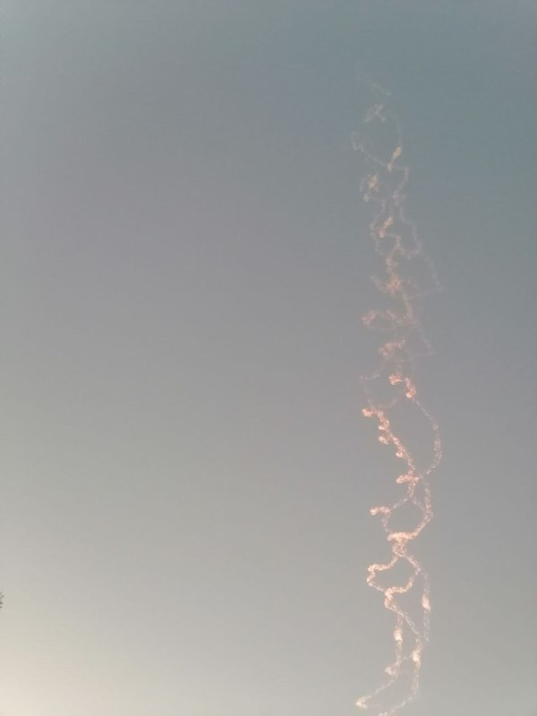

شلیک موشک دیگری از ایران همزمان با صدور هشدر دیگری در کویت

📡 @VahidOnline

## Shin_Persian — post 6557

Shin ✓ @hey_itsmyturn
Sat, 06 Jun 2026 01:14:57 UTC

Sirens activated. Citizens and residents are urged to remain calm, proceed to the nearest safe location, and follow official news channels.
#Bahrain 🇧🇭

Source: @moi_bahrain
https://x.com/moi_bahrain/status/2063067028001317008

فارسی

آژیرهای خطر فعال شدند. از شهروندان و ساکنان درخواست می‌شود آرامش خود را حفظ کرده، به نزدیک‌ترین مکان امن بروند و کانال‌های خبری رسمی را دنبال کنند.
#Bahrain 🇧🇭

منبع: @moi_bahrain
https://x.com/moi_bahrain/status/2063067028001317008

𝕏 · @shin_persian

---
📅 بروزرسانی: 1405/03/16 04:42
---

## VahidOOnLine — post 243894

  

خبرگزاری دولتی کویت اعلام کرد پدافند هوایی این کشور در حال رهگیری حمله‌های موشکی و پهپادی است.
جمهوری اسلامی چهارشنبه نیز حملات موشکی و پهپادی مرگباری علیه کویت انجام داد که در نتیجه آن یک نفر کشته و ۶۳ نفر مجروح شدند.

‌🏁 🇬🇧 IranintlTV

🤖 @VahidOOnLine

## pm_afshaa — post 92356

  <a href="telegram/content/pm_afshaa_92356_1780708368.mp4" target="_blank">🎬 Download video</a>

🔴خبرگزاری دولتی کویت:
پدافند هوایی این کشور در حال رهگیری حمله‌های موشکی و پهپادی است.

+ ویدیویی از صدای آژیر خطر در کویت :

💧 Rainbet.com the #1 Non-KYC Crypto Casino & Sportsbook @rainbetcom

😁 @Pm_Afshaa

## IranIntlTV — post 340751

  

خبرگزاری دولتی کویت اعلام کرد پدافند هوایی این کشور در حال رهگیری حمله‌های موشکی و پهپادی است.
جمهوری اسلامی چهارشنبه نیز حملات موشکی و پهپادی مرگباری علیه کویت انجام داد که در نتیجه آن یک نفر کشته و ۶۳ نفر مجروح شدند.

https://iranintl.com/202606066191

---
📅 بروزرسانی: 1405/03/16 04:33
---

## VahidOOnLine — post 243893

  

♦️ستاد کل فرماندهی ارتش کویت، بامداد شنبه، ۱۶ خردادماه، با انتشار بیانیه‌ای «فوری» اعلام کرد که پدافند هوایی این کشور در حال مقابله و پاسخی جامع به «حملات موشکی و پهپادهای تهاجمی متخاصم» در آسمان کشور است. مقامات نظامی کویت با تایید وضعیت اضطراری اشاره کردند که هرگونه صدای انفجار احتمالی، ناشی از عملکرد سیستم‌های پدافندی در رهگیری و انهدام این اهداف مهاجم در هوا است.
‌🇸🇦 Indypersian

🤖 @VahidOOnLine

## WithYashar — post 13611

ارسالی : من بابامم تعریف میکرد که زمان جنگ عراق و کویت صدا های بمب هارو میشنیدن خرمشهر
@withyashar
گزارش های زیاد از شنیده شدن انفجار کویت از خرمشهر !

## WithYashar — post 13610

  

ارسالی : کویت آلارم اومد الان ، ۳پا موشک زده سمتش !
@withyashar

## pm_afshaa — post 92354

  <a href="telegram/content/pm_afshaa_92354_1780707806.webm" target="_blank">🎬 Download video</a>

🔴ایران در جواب این حمله موشک زده به کویت و دقایقی پیش هشدار حمله موشکی و پهبادی به ساکنان کویت ارسال شده. 
💧 Rainbet.com the #1 Non-KYC Crypto Casino & Sportsbook @rainbetcom 
😁 @Pm_Afshaa

## pm_afshaa — post 92353

  <a href="telegram/content/pm_afshaa_92353_1780707807.webm" target="_blank">🎬 Download video</a>

🔴سنتکام: لحظاتی پیش نیروهای سنتکام چهار پهپاد تهاجمی ایرانی رو که به سمت تنگه هرمز پرتاب شده بودن سرنگون کردن. پهپادهای تهاجمی یک تهدید فوری برای ترافیک دریایی منطقه است ‌و نیروهای آمریکایی متعاقبا به سایت‌های رادار نظارتی ساحلی ایران در گوروک و جزیره قشم…

## Shin_Persian — post 6556

  

Shin ✓ @hey_itsmyturn
Sat, 06 Jun 2026 00:52:21 UTC

Kuwaiti Air Defenses are currently responding to hostile missile and drone attacks.

The General Staff of the Army states that any explosion sounds are the result of interceptions.

Follow all safety instructions from authorities.

#Kuwait 🇰🇼

فارسی

پدافند هوایی کویت در حال حاضر در حال پاسخگویی به حملات موشکی و پهپادی متخاصم است.

ستاد کل ارتش اعلام کرد که هرگونه صدای انفجار ناشی از عملیات رهگیری است.

تمامی دستورالعمل‌های ایمنی مقامات را رعایت کنید.

#Kuwait 🇰🇼

𝕏 · @shin_persian

## FarsiVOA — post 219723

  

⚡️ارتش کویت دقایقی قبل از فعالیت پدافند هوایی کویت برای مقابله با «حملات موشکی و پهپادی خصمانه» خبر داد. این بیانیه در پی حملات دفاعی سنتکام به مواضع جمهوری اسلامی در واکنش به شلیک چند پهپاد از سوی حکومت ایران گزارش می‌شود.
@FarsiVOA

## BBCPersian — post 282937

🔻وقتی پل، اختاپوس معروف، همه نتایج آلمان در جام جهانی فوتبال ۲۰۱۰ آفریقای جنوبی را درست پیش‌بینی کرد، در سراسر جهان به‌عنوان یک پیشگو مورد ستایش قرار گرفت.

متن کامل این مطلب را در وبسایت بی‌بی‌سی فارسی بخوانید:
https://bbc.in/4uSkuNg

📸GettyImages/ Reuters/ Bloomberg via Getty Images/ EPA-EFE/REX/Shutterstock/ ullstein bild via Getty Images/ Corbis via Getty Images
@BBCPersian

---
📅 بروزرسانی: 1405/03/16 04:23
---

## VahidOOnLine — post 243892

  

♦️محسن رضایی، فرمانده سابق سپاه و مشاور نظامی مجتبی خامنه‌ای، در گفتگوی اختصاصی با شبکه «سی‌ان‌ان» هشدار داد که در صورت تداوم درگیری‌ها و برچیده نشدن محاصره دریایی اعمال‌شده علیه ایران، دامنه جنگ به سایر آبراه‌های استراتژیک کشیده خواهد شد. رضایی گفت: «اگر جنگ ادامه یابد و محاصره دریایی لغو نشود، ما دامنه نبرد را به اقیانوس هند، تنگه باب‌المندب، دریای سرخ و دریای مدیترانه خواهیم کشاند.» او با تاکید بر اینکه تهران ابعاد جدیدی به این تقابل نظامی خواهد بخشید، افزود: «با حمله به دیگر پایگاه‌های آمریکا، بعد دیگری به جنگ می‌دهیم و در این میان، ایالات متحده قطعا متحمل خسارات و تلفات بسیار بیشتری خواهد شد.»
‌🇸🇦 Indypersian

🤖 @VahidOOnLine

## VahidOnline — post 75959

  

پیام دریافتی: اعلام هشدار در کویت

📡 @VahidOnline

---
📅 بروزرسانی: 1405/03/16 04:13
---

## VahidOOnLine — post 243891

  

نیویورک‌تایمز گزارش داد تیم ملی فوتبال ایران پس از ماه‌ها بلاتکلیفی سرانجام مجوز ورود به آمریکا برای حضور در جام جهانی ۲۰۲۶ را دریافت کرده است، اما درخواست ویزای شماری از اعضای کادر پشتیبانی و مسئولان فدراسیون فوتبال ایران، از جمله مهدی تاج، رد شده است.
نیویورک‌تایمز به نقل از چهار مقام ارشد آگاه گزارش داد تمامی ۲۶ بازیکن تیم ملی فوتبال ایران برای حضور در جام جهانی ۲۰۲۶ ویزای ورود به ایالات متحده را دریافت کرده‌اند و می‌توانند در مسابقات این دوره شرکت کنند.
بر اساس این گزارش، جمعه ۱۵ خرداد یک مقام ایرانی برای دریافت گذرنامه‌هایی که در چارچوب روند صدور ویزا به سفارت آمریکا تحویل داده شده بود، مراجعه کرد. با این حال، درخواست ویزای بیش از ۱۲ نفر از اعضای کادر همراه تیم، از جمله برخی مربیان، بدنسازان، تحلیلگران، اعضای کادر پزشکی و همچنین شماری از مسئولان فدراسیون فوتبال ایران رد شده است.
نیویورک‌تایمز به نقل از یکی از منابع خود نوشت که ویزای مهدی تاج، رییس فدراسیون فوتبال ایران، نیز صادر نشده است. تاج که سابقه عضویت در سپاه پاسداران را دارد، پیش‌تر نیز در سفرهای بین‌المللی با محدودیت‌هایی روبه‌رو شده بود.

https
‌🏁 🇬🇧 IranintlTV

🤖 @VahidOOnLine

## VahidOOnLine — post 243890

♦️جشنواره باستانی و هزارساله اسب‌سواری سامورایی‌ها در ژاپن موسوم به «سوما نامائوی» که در طول تاریخ از گزند جنگ‌ها، زمین‌لرزه‌ها و حتی فاجعه اتمی جان سالم به در برده بود، اکنون با چالش جدیدی به نام تغییرات اقلیمی دست‌وپنجه نرم می‌کند. به گزارش خبرگزاری فرانسه، تابستان‌های طاقت‌فرسا و سوزان ژاپن با دمای بی‌سابقه تا مرز ۴۰ درجه سانتی‌گراد، سازمان‌دهندگان این رویداد باستانی را مجبور کرد تا برای اولین بار تاریخ برگزاری آن را به اواخر ماه مه (اوایل خرداد) منتقل کنند؛ تصمیمی حیاتی که به این جشنواره تاریخی و سنتی جانی دوباره بخشیده و آن را با شرایط آب‌و‌هوایی شدید جدید سازگار کرده است.
‌🇸🇦 Indypersian

🤖 @VahidOOnLine

## IranIntlTV — post 340750

  

نیویورک‌تایمز گزارش داد تیم ملی فوتبال ایران پس از ماه‌ها بلاتکلیفی سرانجام مجوز ورود به آمریکا برای حضور در جام جهانی ۲۰۲۶ را دریافت کرده است، اما درخواست ویزای شماری از اعضای کادر پشتیبانی و مسئولان فدراسیون فوتبال ایران، از جمله مهدی تاج، رد شده است.
نیویورک‌تایمز به نقل از چهار مقام ارشد آگاه گزارش داد تمامی ۲۶ بازیکن تیم ملی فوتبال ایران برای حضور در جام جهانی ۲۰۲۶ ویزای ورود به ایالات متحده را دریافت کرده‌اند و می‌توانند در مسابقات این دوره شرکت کنند.
بر اساس این گزارش، جمعه ۱۵ خرداد یک مقام ایرانی برای دریافت گذرنامه‌هایی که در چارچوب روند صدور ویزا به سفارت آمریکا تحویل داده شده بود، مراجعه کرد. با این حال، درخواست ویزای بیش از ۱۲ نفر از اعضای کادر همراه تیم، از جمله برخی مربیان، بدنسازان، تحلیلگران، اعضای کادر پزشکی و همچنین شماری از مسئولان فدراسیون فوتبال ایران رد شده است.
نیویورک‌تایمز به نقل از یکی از منابع خود نوشت که ویزای مهدی تاج، رییس فدراسیون فوتبال ایران، نیز صادر نشده است. تاج که سابقه عضویت در سپاه پاسداران را دارد، پیش‌تر نیز در سفرهای بین‌المللی با محدودیت‌هایی روبه‌رو شده بود.

https

---
📅 بروزرسانی: 1405/03/16 04:02
---

## WithYashar — post 13609

  <a href="telegram/content/WithYashar_13609_1780705972.mp4" target="_blank">🎬 Download video</a>

پست جدید ترامپ در‌تروث : نیروی دریایی ایران
@withyashar

## FoxNewsTwitter — post 342670

  

Fox News (Twitter/X)

President Trump wears Olympic gold.

Olympic speed skating champion Jordan Stolz placed his gold medal around the president's neck during an agriculture roundtable at Custer Farms in Chippewa Falls, Wisconsin.

The Wisconsin native later shook hands with Trump at the event, which focused on policies impacting American farmers.

## FoxNewsTwitter — post 342669

  <a href="telegram/content/FoxNewsTwitter_342669_1780705974.mp4" target="_blank">🎬 Download video</a>

Fox News (Twitter/X)

NOW: Democratic Senate candidate Graham Platner addresses supporters in Maine.

“When hurtful things I said on the internet a decade ago came out into the public as I shared my personal journey through PTSD and darkness of recovery and accountability and growth, Maine had my back.”

“Now, as every single piece of that past and journey gets dug up, litigated, and weaponized, you have my back.”

---
📅 بروزرسانی: 1405/03/16 03:52
---

## VahidOOnLine — post 243889

  

وزارت خارجه جمهوری آذربایجان ادعاهای مطرح‌شده در گزارش اخیر سی‌ان‌ان درباره استفاده اسرائیل از خاک این کشور برای عملیات نظامی و اطلاعاتی علیه حکومت ایران را «کاملا بی‌اساس» خواند و خواستار تکذیب آن شد.

آیکهان حاجی‌زاده، سخنگوی این وزارتخانه، جمعه ۱۵ خرداد اعلام کرد باکو پیش‌تر نیز این ادعاها را رد کرده و موضع رسمی خود را پیش از انتشار گزارش به سی‌ان‌ان اعلام کرده بود.

او تاکید کرد جمهوری آذربایجان هرگز اجازه استفاده از خاک خود علیه کشور دیگری را نداده و نخواهد داد و انتشار گزارش بر پایه منابع ناشناس را مغایر با اصول بی‌طرفی دانست.

سی‌ان‌ان به نقل از منابعی مدعی شده بود اسرائیل در جریان جنگ ایران، نیروهای نظامی و اطلاعاتی خود را به طور محرمانه در نزدیکی مرز ایران در آذربایجان مستقر کرده و از آنجا عملیات اطلاعاتی و پهپادی انجام داده است.

‌🏁 🇬🇧 IranintlTV

🤖 @VahidOOnLine

## IranIntlTV — post 340749

  

وزارت خارجه جمهوری آذربایجان ادعاهای مطرح‌شده در گزارش اخیر سی‌ان‌ان درباره استفاده اسرائیل از خاک این کشور برای عملیات نظامی و اطلاعاتی علیه حکومت ایران را «کاملا بی‌اساس» خواند و خواستار تکذیب آن شد.

آیکهان حاجی‌زاده، سخنگوی این وزارتخانه، جمعه ۱۵ خرداد اعلام کرد باکو پیش‌تر نیز این ادعاها را رد کرده و موضع رسمی خود را پیش از انتشار گزارش به سی‌ان‌ان اعلام کرده بود.

او تاکید کرد جمهوری آذربایجان هرگز اجازه استفاده از خاک خود علیه کشور دیگری را نداده و نخواهد داد و انتشار گزارش بر پایه منابع ناشناس را مغایر با اصول بی‌طرفی دانست.

سی‌ان‌ان به نقل از منابعی مدعی شده بود اسرائیل در جریان جنگ ایران، نیروهای نظامی و اطلاعاتی خود را به طور محرمانه در نزدیکی مرز ایران در آذربایجان مستقر کرده و از آنجا عملیات اطلاعاتی و پهپادی انجام داده است.

https://iranintl.com/202606054179

## FarsiVOA — post 219722

⚡️دونالد ترامپ در جمع کشاورزان ویسکانسین: محاصره دریایی علیه جمهوری اسلامی موفقیت‌آمیز بوده است
@FarsiVOA

---
📅 بروزرسانی: 1405/03/16 03:43
---

## VahidOOnLine — post 243880

این روایت‌ها درباره مرگ نیستند؛ درباره زندگی‌هایی هستند که در جریان بودند.<
یکی تازه ازدواج کرده بود، یکی به تیم فوتبال راه یافته بود، یکی هر روز در مغازه‌اش کار می‌کرد، یکی با هنر و خلاقیت زندگی می‌ساخت و دیگری بار خانواده را بر دوش می‌کشید. آینده برای همه آن‌ها ادامه داشت؛ اما در دی‌ماه، گلوله سرکوب جان این جوانان را گرفت.<
سامان ابراهیم‌پور، میثم کرانیان، امید عظیمی، محدثه (صدف) مالکی، علی‌اصغر استخر، محمد (نیما) صالحی‌پور، داوود آبی و ابوالفضل جهانی؛
نام‌های این مجموعه، تنها بخشی از فهرست بلند جوانانی است که در اوج زندگی کشته شدند؛ انسان‌هایی با شغل، خانواده، آرزو و آینده‌ای که هرگز فرصت ادامه پیدا نکرد.<
#جاویدنامان_انقلاب_ملی_ایرانیان
‌🏁 🇬🇧 IranintlTV

🤖 @VahidOOnLine

## VahidOOnLine — post 243879

  

♦️به گزارش رویترز، وزارت امور خارجه ایالات متحده، روز جمعه،  با صدور بیانیه‌ای رسمی اعلام کرد که با فروش احتمالی سامانه‌های پدافندی مقابله با هواپیماهای بدون سرنشین (ضدپهپاد) و تجهیزات وابسته به آن به دولت کویت موافقت کرده است. ارزش این قرارداد تسلیحاتی حدود ۱.۹۸ میلیارد دلار برآورد شده و بر اساس اعلام وزارت خارجه آمریکا، شرکت صنایع دفاعی «آندوریل» (Anduril) به عنوان پیمانکار اصلی این طرح تعیین شده است. این توافق تسلیحاتی بزرگ در شرایطی صورت می‌گیرد که تنش‌های پهپادی و موشکی اخیر در منطقه خلیج فارس، کشورهای حوزه این آبراه استراتژیک را به سمت تقویت شبکه‌های پدافند هوایی خود سوق داده است.
‌🇸🇦 Indypersian

🤖 @VahidOOnLine

## IranIntlTV — post 340740

این روایت‌ها درباره مرگ نیستند؛ درباره زندگی‌هایی هستند که در جریان بودند.
یکی تازه ازدواج کرده بود، یکی به تیم فوتبال راه یافته بود، یکی هر روز در مغازه‌اش کار می‌کرد، یکی با هنر و خلاقیت زندگی می‌ساخت و دیگری بار خانواده را بر دوش می‌کشید. آینده برای همه آن‌ها ادامه داشت؛ اما در دی‌ماه، گلوله سرکوب جان این جوانان را گرفت.
سامان ابراهیم‌پور، میثم کرانیان، امید عظیمی، محدثه (صدف) مالکی، علی‌اصغر استخر، محمد (نیما) صالحی‌پور، داوود آبی و ابوالفضل جهانی؛
نام‌های این مجموعه، تنها بخشی از فهرست بلند جوانانی است که در اوج زندگی کشته شدند؛ انسان‌هایی با شغل، خانواده، آرزو و آینده‌ای که هرگز فرصت ادامه پیدا نکرد.
#جاویدنامان_انقلاب_ملی_ایرانیان

## FarsiVOA — post 219721

🔺یک مقام آمریکایی به صدای آمریکا: به جمهوری اسلامی اجازه نمی‌دهیم از «جام جهانی» فوتبال برای آوردن تروریست‌ها «سوءاستفاده» کند

▪️کاخ سفید به صدای آمریکا گفت که ایالات متحده به جمهوری اسلامی اجازه «سوءاستفاده» از جام جهانی برای انجام اقدامات تروریستی را نخواهد داد.

⬇️ بیشتر بخوانید:
https://ir.voanews.com/a/8157943.html
@FarsiVOA

## BBCPersian — post 282936

  

🔻ولادیمیر پوتین، رئیس‌جمهور روسیه، درخواست ولودیمیر زلنسکی برای گفت‌وگوی رودررو درباره پایان جنگ اوکراین را رد کرد و گفت چنین دیداری فایده‌ای ندارد.

آقای زلنسکی روز پنجشنبه در نامه‌ای سرگشاده خواستار مذاکرات مستقیم با پوتین شد و نوشت که نباید منتظر ماند تا جنگی که با تهاجم گسترده روسیه به اوکراین در سال ۲۰۲۲ آغاز شد، بار دیگر در کانون توجه آمریکا قرار گیرد.

رئیس‌جمهور اوکراین همچنین خواستار برقراری آتش‌بس شد.

آقای پوتین اما این نامه را «بی‌ادبانه» خواند و بار دیگر تاکید کرد که مذاکرات صلح باید پیش از هرگونه آتش‌بس انجام شود.

از لینک بایو در بالای صفحه، متن کامل این مطلب را در سایت بی‌بی‌سی فارسی بخوانید.

📸 AFP via Getty Images
@BBCPersian

---
📅 بروزرسانی: 1405/03/16 03:32
---

## WithYashar — post 13608

  <a href="telegram/content/WithYashar_13608_1780704178.mp4" target="_blank">🎬 Download video</a>

همکنون جت‌های جنگنده آمریکایی در حال پرواز بر فراز استان بصره عراق نزدیک مرز ایران هستند.
@withyashar

## FoxNewsTwitter — post 342668

Fox News (Twitter/X)

BREAKING: Xavier Becerra advances to the general election for California governor. The AP made the call Friday night.

---
📅 بروزرسانی: 1405/03/16 03:24
---

## VahidOOnLine — post 243878

  

ستاد فرماندهی مرکزی آمریکا، سنتکام، اعلام کرد نیروهایش چهار پهپاد انتحاری ایران را که به سمت تنگه هرمز پرتاب شده بودند، سرنگون کردند و در ادامه، برای دفاع در برابر حملات بیشتر، سایت‌های رادار نظارتی ساحلی جمهوری اسلامی در جزیره قشم و گروک در سیریک را هدف قرار دادند.
سنتکام بر آمادگی خود برای پاسخ به «تجاوز غیرموجه ایران» در چارچوب دفاع از خود تاکید کرد.

‌🏁 🇬🇧 IranintlTV

🤖 @VahidOOnLine

## VahidOOnLine — post 243877

  

♦️شرکت «متا»، روز جمعه، ۱۵ خردادماه، رسما از سرویس اشتراکی جدید خود تحت عنوان «اینستاگرام پلاس» (Instagram Plus) رونمایی کرد که به صورت یک ارتقای اختیاری و پولی در اختیار کاربران علاقه‌مند قرار می‌گیرد؛ نسخه رایگان و معمول اینستاگرام کماکان بدون تغییر باقی خواهد ماند. این اشتراک «پیشرفته» مجموعه مفصلی از قابلیت‌های جدید را در سه محور تعامل، آمار و شخصی‌سازی ارائه می‌دهد که از شاخص‌ترین آن‌ها می‌توان به تمدید مدت‌زمان ماندگاری روایتگر تا ۴۸ ساعت، امکان «پیش‌نمایش روایتگرها» بدون ثبت بازدید، ردیابی تعداد دفعات بازبینی (Rewatch) روایتگر توسط دیگران و ابزار جستجوی مستقیم یک شخص خاص در میان بینندگان روایتگر اشاره کرد. علاوه بر این، کاربران نسخه پلاس می‌توانند تا ۶ محتوا را در صفحه خود سنجاق کنند، فونت بخش «درباره من» و آیکون برنامه خود را تغییر دهند و حتی محتوای جدید را بدون ایجاد مزاحمت و فرستادن به صفحه خبرخوان اصلی دوستان، مستقیما روی صفحه خود بارگزاری نمایند. براساس این گزارش، این سرویس فرآیند عرضه جهانی خود را از امروز آغاز کرده و از بخش تنظیمات و پرداخت ماهیانه ۳.۹۹ دلار قابل فعال‌سازی است.
‌🇸🇦 Indypersian

🤖 @VahidOOnLine

## WithYashar — post 13607

  <a href="telegram/content/WithYashar_13607_1780703644.mp4" target="_blank">🎬 Download video</a>

پشتک نیم وارو پهپاد های شناسایی اسمون بندر عباس همین الان
@withyashar

## pm_afshaa — post 92352

  <a href="telegram/content/pm_afshaa_92352_1780703646.webm" target="_blank">🎬 Download video</a>

🔴سنتکام: لحظاتی پیش نیروهای سنتکام چهار پهپاد تهاجمی ایرانی رو که به سمت تنگه هرمز پرتاب شده بودن سرنگون کردن. پهپادهای تهاجمی یک تهدید فوری برای ترافیک دریایی منطقه است ‌و نیروهای آمریکایی متعاقبا به سایت‌های رادار نظارتی ساحلی ایران در گوروک و جزیره قشم…

## IranIntlTV — post 340739

  

ستاد فرماندهی مرکزی آمریکا، سنتکام، اعلام کرد نیروهایش چهار پهپاد انتحاری ایران را که به سمت تنگه هرمز پرتاب شده بودند، سرنگون کردند و در ادامه، برای دفاع در برابر حملات بیشتر، سایت‌های رادار نظارتی ساحلی جمهوری اسلامی در جزیره قشم و گروک در سیریک را هدف قرار دادند.
سنتکام بر آمادگی خود برای پاسخ به «تجاوز غیرموجه ایران» در چارچوب دفاع از خود تاکید کرد.

https://iranintl.com/202606054048

## Persian_Trend_Official — post 15780

  <a href="telegram/content/Persian_Trend_Official_15780_1780703648.mp4" target="_blank">🎬 Download video</a>

شنیده شدن صدای جنگنده احتمالا امریکایی در نزدیکی شهر بصره عراق

📝 Amir

📌 @persian_trend_official
پرشین ترند | متفاوت‌ترین کانال نظامی

## Persian_Trend_Official — post 15779

  

پرواز چهار تانکر سوخت رسان امریکایی برفراز خلیج‌ فارس و دریای عمان

📝 Amir

📌 @persian_trend_official
پرشین ترند | متفاوت‌ترین کانال نظامی

---
📅 بروزرسانی: 1405/03/16 03:13
---

## WithYashar — post 13606

## WithYashar — post 13605

## FoxNewsTwitter — post 342667

Fox News (Twitter/X)

WATCH LIVE: Graham Platner holds a Get Out the Vote rally with Rep. Ro Khanna https://twitter.com/i/broadcasts/1RJjppoygVdKw

## pm_afshaa — post 92351

  <a href="telegram/content/pm_afshaa_92351_1780703018.webm" target="_blank">🎬 Download video</a>

🔴سنتکام: لحظاتی پیش نیروهای سنتکام چهار پهپاد تهاجمی ایرانی رو که به سمت تنگه هرمز پرتاب شده بودن سرنگون کردن. پهپادهای تهاجمی یک تهدید فوری برای ترافیک دریایی منطقه است ‌و نیروهای آمریکایی متعاقبا به سایت‌های رادار نظارتی ساحلی ایران در گوروک و جزیره قشم…

## pm_afshaa — post 92350

  <a href="telegram/content/pm_afshaa_92350_1780703019.webm" target="_blank">🎬 Download video</a>

🔴پایگاه دریایی بندر سیریک هم بمباران شده، و گزارش‌ها از کشته شدن دست کم یک عضو نیرو دریایی سپاه در این حملات هوایی.

💧 Rainbet.com the #1 Non-KYC Crypto Casino & Sportsbook @rainbetcom

😁 @Pm_Afshaa

## Persian_Trend_Official — post 15778

  

سنتکام: چند لحظه پیش، نیروهای سنتکام چهار پهپاد انتحاری ایرانی را که به سمت تنگه هرمز پرتاب شده بودند، سرنگون کردند.

این پهپادهای تهاجمی تهدیدی فوری برای تردد دریایی منطقه محسوب می‌شدند. در ادامه، نیروهای آمریکایی برای جلوگیری از حملات بیشتر، سایت‌های رادار مراقبت ساحلی ایران در گورک و جزیره قشم را هدف قرار دادند.

نیروهای آمریکایی همچنان در حالت آماده‌باش و هوشیار قرار دارند و برای پاسخ به هرگونه اقدام تهاجمی غیرموجه ایران در چارچوب دفاع از خود، آماده هستند.

📝 Amir

📌 @persian_trend_official
پرشین ترند | متفاوت‌ترین کانال نظامی

---
📅 بروزرسانی: 1405/03/16 03:03
---

## VahidOOnLine — post 243876

♦️دونالد ترامپ، رئیس‌جمهوری آمریکا، در گفتگو با برنامه «میت د پرس» شبکه «ان‌بی‌سی نیوز» اعلام کرد که بر اساس ارزیابی‌ها، در حال حاضر تنها حدود ۲۱ تا ۲۲ درصد از توان موشکی اولیه ایران باقی مانده است. ترامپ در این مصاحبه با اشاره به حجم تخریب توان نظامی تهران افزود: «این میزان هنوز تعداد زیادی موشک محسوب می‌شود، اما با آنچه در زمان اولین حمله ما در اختیار داشتند، قابل مقایسه نیست.»
‌🇸🇦 Indypersian

🤖 @VahidOOnLine

## WithYashar — post 13604

  <a href="telegram/content/WithYashar_13604_1780702424.mp4" target="_blank">🎬 Download video</a>

@withyashar منتظر زارتان زورتان

## WithYashar — post 13603

۳پا باید یه جوابی بده چیزی‌ دیدن یا شنیدین بگین

## FoxNewsTwitter — post 342666

  

Fox News (Twitter/X)

President Trump wears Olympic gold.

Olympic speed skating champion Jordan Stolz placed his gold medal around the president's neck during an agriculture roundtable at Custer Farms in Chippewa Falls, Wisconsin.

The Wisconsin native later shook hands with Trump at the event, which focused on policies impacting American farmers.

## pm_afshaa — post 92349

  <a href="telegram/content/pm_afshaa_92349_1780702426.webm" target="_blank">🎬 Download video</a>

🔴سنتکام: لحظاتی پیش نیروهای سنتکام چهار پهپاد تهاجمی یک طرفه ایرانی رو که به سمت تنگه هرمز پرتاب شده بودن سرنگون کردن. پهپادهای تهاجمی یک تهدید فوری برای ترافیک دریایی منطقه به شمار میرفت. نیروهای آمریکایی متعاقبا به سایت‌های رادار نظارتی ساحلی ایران در…

## pm_afshaa — post 92348

  <a href="telegram/content/pm_afshaa_92348_1780702427.webm" target="_blank">🎬 Download video</a>

🔴سنتکام: لحظاتی پیش نیروهای سنتکام چهار پهپاد تهاجمی یک طرفه ایرانی رو که به سمت تنگه هرمز پرتاب شده بودن سرنگون کردن.

پهپادهای تهاجمی یک تهدید فوری برای ترافیک دریایی منطقه به شمار میرفت. نیروهای آمریکایی متعاقبا به سایت‌های رادار نظارتی ساحلی ایران در گوروک و جزیره قشم حمله کردن تا در برابر حملات بیشتر دفاع کنند.

نیروهای آمریکایی هوشیار و آماده پاسخگویی به تهاجم غیرموجه ایران در دفاع از خود هستند.

💧 Rainbet.com the #1 Non-KYC Crypto Casino & Sportsbook @rainbetcom

😁 @Pm_Afshaa

## FarsiVOA — post 219720

⚡️افزایش اعتیاد و کشت خشخاش به جای برنج در ایران؛ ‌گفت‌وگو با فریدون رحمانی جامعه‌شناس
@FarsiVOA

## FarsiVOA — post 219719

  <a href="telegram/content/FarsiVOA_219719_1780702428.mp4" target="_blank">🎬 Download video</a>

⚡️هزینه اعدام‌ها برای جمهوری اسلامی چگونه زیاد خواهد شد؟ گفت‌وگو با حسن بنی‌هاشم مدافع حقوق بشر
@FarsiVOA

## IranianMinds — post 21467

  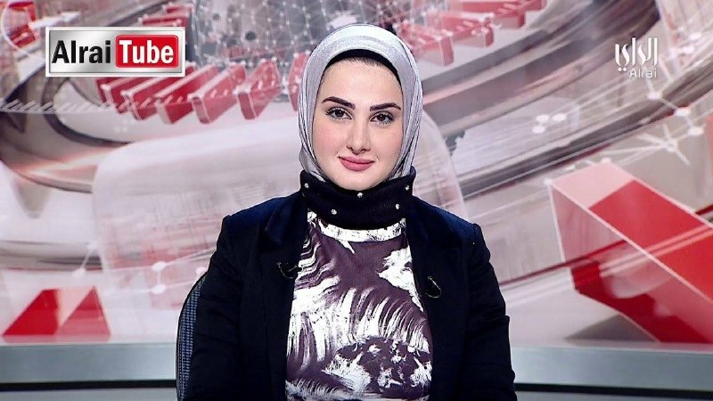

🔴 ایشون زینب دشتی هستن مجری تلویزیون کویت، که اومد از جمهوری اسلامی حمایت کرد و دولت کویت هم برای همیشه اخراجش کرد و از کارای دولتی کاملا محرومش کرد و به سه سال زندان هم محکوم شد.

@IranianMinds

## IranianMinds — post 21466

  <a href="telegram/content/IranianMinds_21466_1780702430.webm" target="_blank">🎬 Download video</a>

🤩
🤩
🤩
🤩 بونوس اضافه به ازای هر واریز 
💰

🔴فرصت تکرارنشدنی به مناسبت افتتاحیه
🔴

⚡️هر چقدر شارژ کنی، بیشتر هدیه می‌گیری
⚡️

🔴تا سقف ۳ میلیون تومان
🔴

⌛ فقط برای مدت محدود

💣بالاترین بونوس‌ها فقط در سایت وینرو

پیش بینی کن و برنده شو
🎯
aa15

📺 تلویزیون لایو برای پوشش بازی ها

🛍بالاترین ضرایب ممکن
و هزاران امکانات خاص دیگه
💰

🚩
🚩 خرداد افتتاحیه بزرگ سایت وینرو
🟥 همین الان ثبت نام کن و علاوه بر ۵۰۰ هزار تومن بونوس ثبت نام با هر شارژ تا ۲۰۰ درصد شارژ اضافه از ما هدیه بگیر

🔤 Winro.io         معتبرترین سایت ایران

🔤 Winro.io

📱 کانال اخبار و هدایــا 
🌟

📱 @winro_io

---
📅 بروزرسانی: 1405/03/16 02:53
---

## VahidOOnLine — post 243875

  

ستاد فرماندهی مرکزی آمریکا، سنتکام، اعلام کرد نیروهایش چهار پهپاد انتحاری ایران را که به سمت تنگه هرمز پرتاب شده بودند، سرنگون کردند و در ادامه، برای دفاع در برابر حملات بیشتر، سایت‌های رادار نظارتی ساحلی جمهوری اسلامی در جزیره قشم و گورک بوشهر را هدف قرار دادند.
سنتکام بر آمادگی خود برای پاسخ به «تجاوز غیرموجه ایران» در چارچوب دفاع از خود تاکید کرد.

‌🏁 🇬🇧 IranintlTV

🤖 @VahidOOnLine

## VahidOOnLine — post 243874

  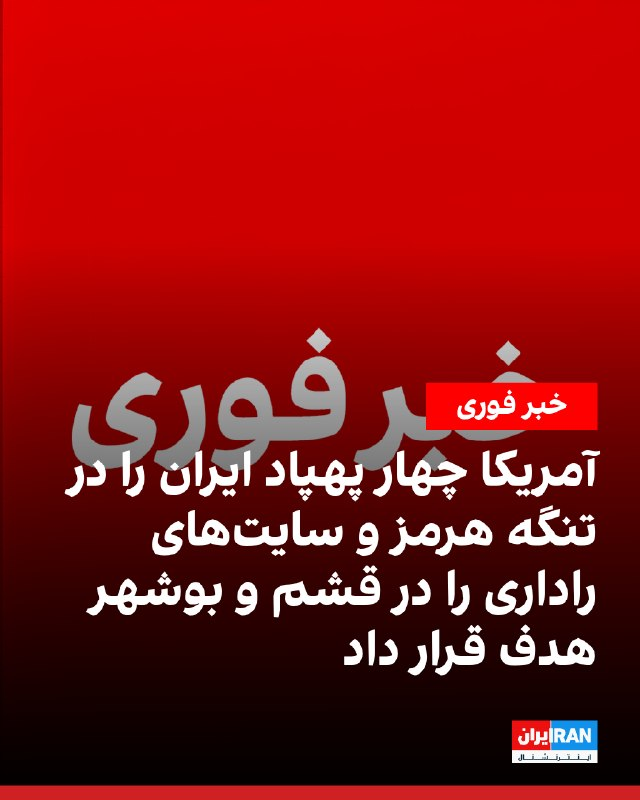

ستاد فرماندهی مرکزی آمریکا، سنتکام، اعلام کرد نیروهایش چهار پهپاد انتحاری ایران را که به سمت تنگه هرمز پرتاب شده بودند، سرنگون کردند و در ادامه، برای دفاع در برابر حملات بیشتر، سایت‌های رادار نظارتی ساحلی جمهوری اسلامی در جزیره قشم و گورک بوشهر را هدف قرار دادند.
سنتکام بر آمادگی خود برای پاسخ به «تجاوز غیرموجه ایران» در چارچوب دفاع از خود تاکید کرد.

‌🏁 🇬🇧 IranintlTV

🤖 @VahidOOnLine

## IranIntlTV — post 340738

  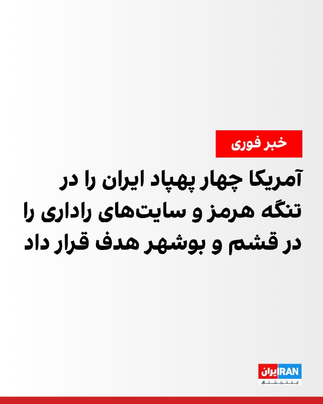

ستاد فرماندهی مرکزی آمریکا، سنتکام، اعلام کرد نیروهایش چهار پهپاد انتحاری ایران را که به سمت تنگه هرمز پرتاب شده بودند، سرنگون کردند و در ادامه، برای دفاع در برابر حملات بیشتر، سایت‌های رادار نظارتی ساحلی جمهوری اسلامی در جزیره قشم و گورک بوشهر را هدف قرار دادند.
سنتکام بر آمادگی خود برای پاسخ به «تجاوز غیرموجه ایران» در چارچوب دفاع از خود تاکید کرد.

https://iranintl.com/202606054048

## IranIntlTV — post 340737

  

ستاد فرماندهی مرکزی آمریکا، سنتکام، اعلام کرد نیروهایش چهار پهپاد انتحاری ایران را که به سمت تنگه هرمز پرتاب شده بودند، سرنگون کردند و در ادامه، برای دفاع در برابر حملات بیشتر، سایت‌های رادار نظارتی ساحلی جمهوری اسلامی در جزیره قشم و گورک بوشهر را هدف قرار دادند.
سنتکام بر آمادگی خود برای پاسخ به «تجاوز غیرموجه ایران» در چارچوب دفاع از خود تاکید کرد.

https://iranintl.com/202606054048

## Shin_Persian — post 6555

  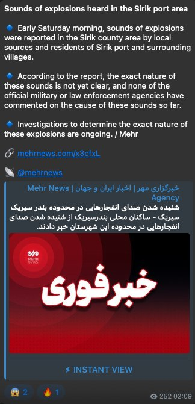

Shin ✓ @hey_itsmyturn
Fri, 05 Jun 2026 23:15:52 UTC

State-owned Mehr News confirms the explosions in Sirik.

فارسی

خبرگزاری دولتی مهر وقوع انفجارها در سیریک را تأیید کرد.

𝕏 · @shin_persian

## Shin_Persian — post 6554

Shin ✓ @hey_itsmyturn
Fri, 05 Jun 2026 23:14:05 UTC

There are casualties amongst IRGC terrorists in Sirik Naval base.
One identified so far:
Saeed Chileh Var (سعید چیله ور) from the missile squad

فارسی

تلفاتی در میان تروریست‌های سپاه پاسداران انقلاب اسلامی (IRGC) در پایگاه دریایی سیریک وجود دارد.
تاکنون یک نفر شناسایی شده است:
سعید چیله‌ور از واحد موشکی

𝕏 · @shin_persian

## FarsiVOA — post 219718

🔺گزارش شبکه آمریکایی از شلیک چند پهپاد از سوی جمهوری اسلامی به سمت تنگه هرمز

▪️شبکه سی‌ان‌ان به نقل از یک مقام آمریکایی گزارش داده است که جمهوری اسلامی چندین پهپاد را به سمت تنگه هرمز شلیک کرده است.

⬇️ بیشتر بخوانید:
https://ir.voanews.com/a/8157796.html
@FarsiVOA

## FarsiVOA — post 219717

⚡️نفوذ شرکت‌های وابسته به سپاه در پروژه‌های عراق و افشای پرداخت‌های میلیاردی به اسماعیل قاآنی
@FarsiVOA

## IranianMinds — post 21461

🔴 این پرستوی حکومتی صدف طاهریان هم‌ اومد کل عکسای لختیشو از پیجش پاک کرد و گفت برگشتم به وطن

@IranianMinds

---
📅 بروزرسانی: 1405/03/16 02:43
---

## VahidOOnLine — post 243873

  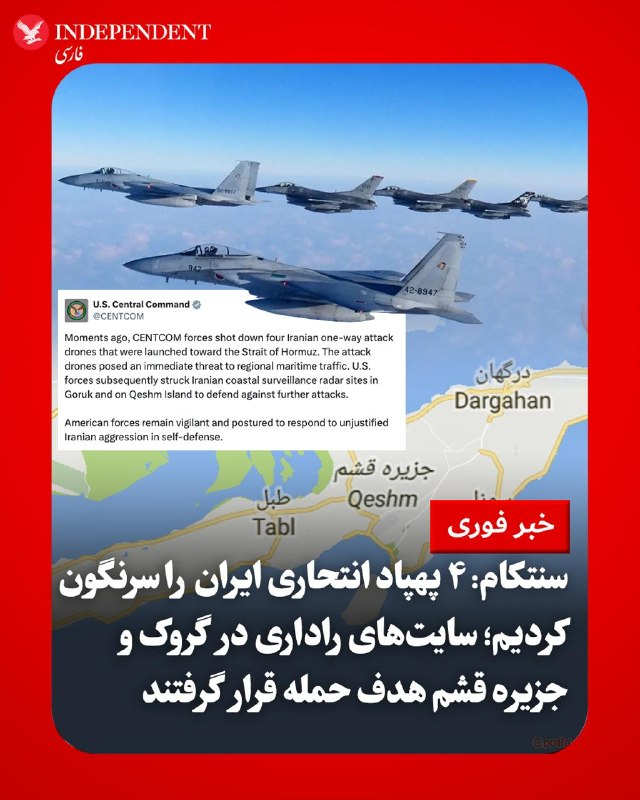

♦️فرماندهی مرکزی ایالات متحده (سنتکام)، بامداد شنبه، ۱۶ خردادماه، با انتشار بیانیه‌ای رسمی اعلام کرد که نیروهای ارتش آمریکا چهار فروند پهپاد انتحاری (یک‌طرفه) ایران را که به سمت تنگه هرمز پرتاب شده و تهدیدی فوری برای تردد دریایی منطقه به شمار می‌رفتند، سرنگون کرده‌اند. بر اساس این بیانیه، نیروهای آمریکایی متعاقب و با هدف دفاع از خود در برابر حملات بیشتر، سایت‌های راداری نظارت ساحلی ایران را در منطقه «گروک» و «جزیره قشم» هدف حمله قرار دادند. سنتکام در پایان با تاکید بر حفظ آمادگی کامل نیروهای آمریکایی افزود که واشنگتن برای دفاع از خود و پاسخ به «تجاوزات توجیه‌ناپذیر ایران»، در حالت آماده‌باش قرار دارد.
‌🇸🇦 Indypersian

🤖 @VahidOOnLine

## VahidOOnLine — post 243872

  

ترامپ در گفت‌وگو با ان‌بی‌سی گفت که حکومت ایران هنوز ۲۱ تا ۲۲ درصد از موشک‌های خود را حفظ کرده است. او گفت که رهبران حکومت ایران هنوز با آمریکا برای پایان جنگ به توافق نرسیده‌اند، زیرا آنها «قوی» و «مغرور» هستند، اما در نهایت «آنها چاره‌ای جز توافق ندارند و کمی طول می‌کشد.»
او افزود: «بیشتر کارخانه‌های پهپادسازی ‌آن‌ها از کار افتاده‌، بیشتر سکوهای پرتاب از کار افتاده‌ و بیشتر مناطق تولید موشک از کار افتاده‌اند. اما آن‌ها هنوز ظرفیت تولید دارند. آن‌ها تعدادی موشک و تعدادی پهپاد دارند. به نظر من، شاید ۲۱ تا ۲۲ درصد از موشک‌های‌شان. این تعداد زیادی موشک است، اما این میزان، آن چیزی نیست که در زمان حمله اولیه ما بود.»
ترامپ مدت زمان درگیری جاری را با جنگ ویتنام مقایسه کرد و گفت: «من خیلی سریع پیش می‌روم. سه ماه است که درگیر آن هستم. می‌دانید، ویتنام ۱۹ سال طول کشید. من در ماه سوم هستم و تنها کاری که آن‌ها می‌کنند، این است که می‌گویند کی قرار است پیروز شویم. اگر من یک دموکرات بودم، هیچ کس این‌طور صحبت نمی‌کرد، اما برای من مهم نیست. من به آن عادت کرده‌ام.»
‌🏁 🇬🇧 IranintlTV

🤖 @VahidOOnLine

## WithYashar — post 13602

چندین انفجار در سيريك 🚨🚨🚨🚨🚨🚨🚨 @withyashar

## WithYashar — post 13601

کانال ۱۴: همه امیدوار بودند که آتش بس برقرار شود، اما بازی به طور کامل در حال تغییر است. برای یک آخر هفته فوق العاده گرم در خاورمیانه آماده می شوند، زیرا ایران و آمریکا از اعتصابات تصادفی شبانه به رویارویی های روز روشن تغییر می کنند!
@withyashar

## VahidOnline — post 75958

  

♦️فرماندهی مرکزی ایالات متحده (سنتکام)، بامداد شنبه، ۱۶ خردادماه، با انتشار بیانیه‌ای رسمی اعلام کرد که نیروهای ارتش آمریکا چهار فروند پهپاد انتحاری (یک‌طرفه) ایران را که به سمت تنگه هرمز پرتاب شده و تهدیدی فوری برای تردد دریایی منطقه به شمار می‌رفتند، سرنگون کرده‌اند. بر اساس این بیانیه، نیروهای آمریکایی متعاقب و با هدف دفاع از خود در برابر حملات بیشتر، سایت‌های راداری نظارت ساحلی ایران را در منطقه «گروک» و «جزیره قشم» هدف حمله قرار دادند. سنتکام در پایان با تاکید بر حفظ آمادگی کامل نیروهای آمریکایی افزود که واشنگتن برای دفاع از خود و پاسخ به «تجاوزات توجیه‌ناپذیر ایران»، در حالت آماده‌باش قرار دارد.
@VahidOOnLine

📡 @VahidOnline

## IranIntlTV — post 340736

  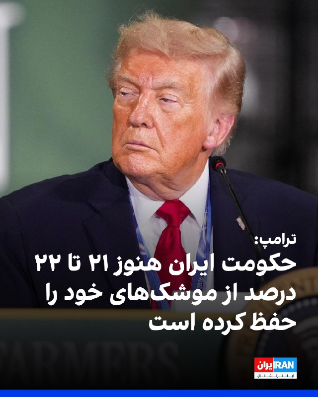

ترامپ در گفت‌وگو با ان‌بی‌سی گفت که حکومت ایران هنوز ۲۱ تا ۲۲ درصد از موشک‌های خود را حفظ کرده است. او گفت که رهبران حکومت ایران هنوز با آمریکا برای پایان جنگ به توافق نرسیده‌اند، زیرا آنها «قوی» و «مغرور» هستند، اما در نهایت «آنها چاره‌ای جز توافق ندارند و کمی طول می‌کشد.»
او افزود: «بیشتر کارخانه‌های پهپادسازی ‌آن‌ها از کار افتاده‌، بیشتر سکوهای پرتاب از کار افتاده‌ و بیشتر مناطق تولید موشک از کار افتاده‌اند. اما آن‌ها هنوز ظرفیت تولید دارند. آن‌ها تعدادی موشک و تعدادی پهپاد دارند. به نظر من، شاید ۲۱ تا ۲۲ درصد از موشک‌های‌شان. این تعداد زیادی موشک است، اما این میزان، آن چیزی نیست که در زمان حمله اولیه ما بود.»
ترامپ مدت زمان درگیری جاری را با جنگ ویتنام مقایسه کرد و گفت: «من خیلی سریع پیش می‌روم. سه ماه است که درگیر آن هستم. می‌دانید، ویتنام ۱۹ سال طول کشید. من در ماه سوم هستم و تنها کاری که آن‌ها می‌کنند، این است که می‌گویند کی قرار است پیروز شویم. اگر من یک دموکرات بودم، هیچ کس این‌طور صحبت نمی‌کرد، اما برای من مهم نیست. من به آن عادت کرده‌ام.»
https://iranintl.com/202606057759

## Shin_Persian — post 6553

این یارو قیصر بود رفت تهران واسه عرزشیا خوند؟ اسم اصلیش بینش بلوره :)))

## FarsiVOA — post 219716

🔺نیروهای آمریکایی در واکنش به حملات پهپادی جمهوری اسلامی به مواضع آن در شهر گروک و جزیره قشم حمله کردند

▪️ستاد فرماندهی مرکزی آمریکا (سنتکام) جمعه شب به وقت واشنگتن گفت: «لحظاتی پیش، نیروهای سنتکام چهار پهپاد تهاجمی یک‌طرفه [جمهوری اسلامی] ایران را که به سمت تنگه هرمز پرواز کرده بودند، سرنگون کردند.»

⬇️ بیشتر بخوانید:
https://ir.voanews.com/a/8157796.html
@FarsiVOA

## FarsiVOA — post 219715

⚡️آخرین صحبت‌های مجتبی ویسی با مأموران، پیش از قتل؛ وداع باشکوه مردم کرمانشاه با برادران ویسی
@FarsiVOA

## IranianMinds — post 21460

🔴 خبرگزاری تسنیم :

آمریکا دوباره بهمون اتک زد.

@IranianMinds

## IranianMinds — post 21459

دقایقی پیش حملات آمریکا به سایت های رژیم جمهوری اسلامی

چند انفجار در پایگاه نیرو دریایی سپاه سیریک

+ نقض چیه؟؟؟ داریم توافق میکنیم

@IranianMinds

## BBCPersian — post 282935

  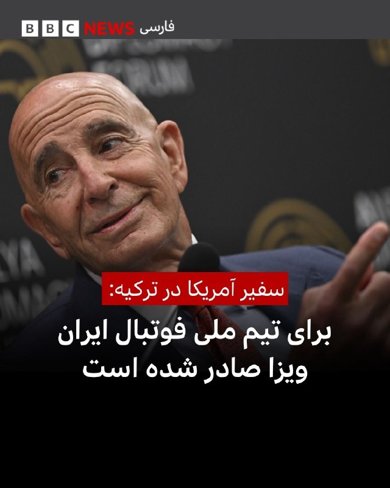

🔻تام باراک، سفیر آمریکا در ترکیه، روز جمعه در پیامی در شبکه ایکس تایید کرد که برای اعضای تیم ملی فوتبال ایران جهت شرکت در جام جهانی ویزای ورود به آمریکا صادر شده است.

او با اشاره به گزارش‌هایی درباره صدور ویزا برای بازیکنان تیم ملی ایران نوشت: «به تیم فوق‌العاده سفارت آمریکا در آنکارا برای تلاش‌هایشان در صدور ویزا برای تیم ملی فوتبال ایران در مسیر حضور در جام جهانی فوتبال در آمریکا افتخار می‌کنم.»

آقای باراک افزود: «ورزش فراتر از مرزهاست و ما مشتاق استقبال از ورزشکاران و هواداران از سراسر جهان هستیم.»

تیم ملی ایران قرار است روز شنبه از ترکیه راهی اسپانیا شود و سپس به اردوی خود در مکزیک برود. مقام‌های مکزیک نیز برای اعضای این تیم ویزا صادر کرده‌اند.

ایران در جریان مسابقات جام جهانی در مکزیک مستقر خواهد بود، اما هر سه دیدار مرحله گروهی خود را در آمریکا برگزار می‌کند.

قرار بود اردوی تیم ملی ابتدا در آمریکا برپا شود، اما به دلیل تنش‌های میان تهران و واشنگتن، محل اردو به مکزیک تغییر یافت.

@BBCPersian

---
📅 بروزرسانی: 1405/03/16 02:33
---

## WithYashar — post 13600

سنتکام : چند لحظه پیش، نیروهای سنتکام چهار پهپاد تهاجمی یک‌طرفهٔ ایرانی را که به سمت تنگهٔ هرمز پرتاب شده بودند، سرنگون کردند. این پهپادهای تهاجمی تهدیدی فوری برای تردد دریایی منطقه ایجاد کرده بودند. در ادامه، نیروهای آمریکا برای دفاع در برابر حملات بیشتر، سایت‌های رادار مراقبت ساحلی ایران در گورک و جزیرهٔ قشم را هدف قرار دادند.
نیروهای آمریکایی همچنان هوشیار هستند و برای پاسخ‌دادن به تجاوز بی‌دلیل ایران در چارچوب دفاع از خود، در حالت آماده‌باش قرار دارند.
🚨🚨🚨🚨🚨🚨🚨
@withyashar

## WithYashar — post 13599

🚨سنتکام از حمله به سایت های راداری قشم خبر داد!
@withyashar

## Shin_Persian — post 6551

↩️ Quoted tweet:
Tammuz Intel ✓ @Tammuz_Intel
Fri, 05 Jun 2026 22:44:56 UTC

Unknown drone was shot down over Baiji Oilfields by Iraqi security forces.

↩️ توییت نقل‌قول شده — برای پاسخ، پست زیر را ببینید.

فارسی

یک پهپاد ناشناس توسط نیروهای امنیتی عراق بر فراز میدان‌های نفتی بیجی سرنگون شد.

𝕏 · @shin_persian

## FarsiVOA — post 219714

⚡️شکاف عمیق میان صفوف گروه‌های مسلح تحت امر جمهوری اسلامی در عراق
@FarsiVOA

## Persian_Trend_Official — post 15777

  <a href="telegram/content/Persian_Trend_Official_15777_1780700620.mp4" target="_blank">🎬 Download video</a>

شبتون بخیر 🌌
F-16 Falcon

📌 @persian_trend_official
پرشین ترند | متفاوت‌ترین کانال نظامی

## IranianMinds — post 21458

سنت‌کام: لحظاتی پیش، نیروهای سنتکام چهار پهپاد حمله یک‌طرفه ایرانی را که به سمت تنگه هرمز پرتاب شده بودند، سرنگون کردند. این پهپادهای حمله تهدید فوری برای ترافیک دریایی منطقه بودند. نیروهای آمریکایی سپس سایت‌های رادار نظارت ساحلی ایرانی در خارک و جزیره قشم…

## IranianMinds — post 21457

  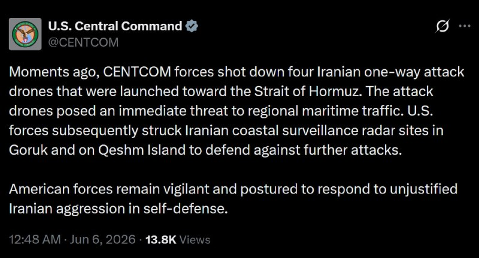

سنت‌کام:

لحظاتی پیش، نیروهای سنتکام چهار پهپاد حمله یک‌طرفه ایرانی را که به سمت تنگه هرمز پرتاب شده بودند، سرنگون کردند. این پهپادهای حمله تهدید فوری برای ترافیک دریایی منطقه بودند.

نیروهای آمریکایی سپس سایت‌های رادار نظارت ساحلی ایرانی در خارک و جزیره قشم را برای دفاع در برابر حملات بیشتر هدف قرار دادند.

@IranianMinds

## IranianMinds — post 21456

عجب جَو عجیبی شده
مخالفای جمهوری اسلامی شدن هیتر ترامپ
موافقای جمهوری اسلامی دارن میشن هیتر جمهوری اسلامی

چرا هیچی سر جاش نیست؟

@IranianMinds

---
📅 بروزرسانی: 1405/03/16 02:23
---

## WithYashar — post 13598

چندین انفجار در سيريك
🚨🚨🚨🚨🚨🚨🚨
@withyashar

## WithYashar — post 13597

سی‌بی‌اس نیوز به نقل از یک مقام آمریکایی: نیروهای آمریکایی حداقل ۴ پهپاد را که توسط ایران به سمت تنگه هرمز پرتاب شده بود، سرنگون کرده‌اند.🚨
@withyashar بچه جنگ شده باز

## pm_afshaa — post 92347

  <a href="telegram/content/pm_afshaa_92347_1780700006.webm" target="_blank">🎬 Download video</a>

🔴سی‌ان‌ان: امشب ایران پهپادهایی رو به سمت تنگه هرمز پرتاب کرده و نیروهای آمریکایی 3 فروند پهباد رو سرنگون کردن. هدف این پهپادها یا کشتی‌های تجاری عبوری از منطقه بوده یا نیروهای آمریکایی مستقر در اطراف تنگه هرمز. 
💧 Rainbet.com the #1 Non-KYC Crypto Casino…

## VahidOnline — post 75957

☄️ سیریک هرمزگان

پیام‌های دریافتی:
پایگاه نیروی دریایی سپاه بندر سیریک رو همین الان دوباره زدند. همون لوکیشن چند روز پیش.

شهرستان سیریک صدای لانچ موشک ساعت ۲:۱۴

سلام ساعت دو ده دیقه
پنج تا انفجار نیرو دریای سپاه سیرک هرمزگان

📡 @VahidOnline

## VahidOnline — post 75956

  

🔻وب‌سایت آکسیوس گزارش داده است که استیو ویتکاف و جرد کوشنر، فرستادگان دونالد ترامپ، روز پنجشنبه برای رایزنی با گروهی از کارشناسان فنی به آزمایشگاه ملی اوک‌ریج در ایالت تنسی سفر کردند.

به نوشته آکسیوس، کاخ سفید در تلاش است با ایران بر سر یک تفاهم‌نامه برای پایان دادن به جنگ و آغاز مذاکرات تفصیلی هسته‌ای «به توافق برسد» و می‌خواهد در صورت آغاز این مذاکرات، تیم کارشناسی لازم را آماده داشته باشد.

به گفته منابع آمریکایی و منطقه‌ای، تهران و واشنگتن همچنان بر سر برخی جزئیات این تفاهم‌نامه اختلاف دارند، اما مذاکرات وارد مراحل پایانی شده است.
@VahidHeadline

📡 @VahidOnline

## IranIntlTV — post 340735

  <a href="telegram/content/IranIntlTV_340735_1780700007.mp4" target="_blank">🎬 Download video</a>

🔻ساعاتی پیش از سفر تیم ملی فوتبال به مکزیک برای اقامت در کمپ اصلی تمرینی جام جهانی ۲۰۲۶، خبرگزاری رویترز گزارش داد آمریکا برای همه بازیکنان تیم ملی، ویزا صادر کرده است.

🔹در ادامه، شبکه تلویزیونی الجزیره هم به نقل از منابعی آگاه نوشت که آمریکا دست‌کم برای ۱۵ نفر از کادر فنی و اجرایی تیم ملی، ویزا صادر نکرده است.

🔹قرار است تیم فوتبال ایران در مرحله گروهی جام جهانی ۲۰۲۶ در شهرهای لس آنجلس و سیاتل با نیوزیلند، بلژیک و مصر بازی کند.

🔹رضا محدث، خبرنگار ایران اینترنشنال گزارش می‌دهد.

@iranintltvsport

## Shin_Persian — post 6550

Shin ✓ @hey_itsmyturn
Fri, 05 Jun 2026 22:51:15 UTC

Sirik Naval Base has been targeted @ 2240Z Hormozgan Province, #Iran

فارسی

پایگاه دریایی سیریک در ساعت ۲۲۴۰ زولو (۰۲:۱۰ به وقت تهران) در استان هرمزگان هدف قرار گرفته است. #Iran

𝕏 · @shin_persian

## Shin_Persian — post 6546

Shin ✓ @hey_itsmyturn
Fri, 05 Jun 2026 22:49:10 UTC

CENTCOM: U.S. forces shot down four Iranian one-way attack drones heading toward the Strait of Hormuz, then struck Iranian coastal radar sites in Goruk and Qeshm Island. The drones posed an immediate threat to maritime traffic.

فارسی

سنتکام (ستاد فرماندهی مرکزی ایالات متحده): نیروهای آمریکایی چهار پهپاد تهاجمی یک‌طرفه ایرانی را که به سمت تنگه هرمز در حرکت بودند سرنگون کردند و سپس سایت‌های راداری ساحلی ایران در گروک و جزیره قشم را مورد هدف قرار دادند. این پهپادها تهدیدی فوری برای تردد دریایی بودند.

𝕏 · @shin_persian

## Shin_Persian — post 6544

Shin ✓ @hey_itsmyturn
Fri, 05 Jun 2026 22:44:10 UTC

Numerous #USAF 🇺🇸 tankers up in the region

فارسی

تعداد زیادی تانکر سوخت‌رسان نیروی هوایی ایالات متحده (USAF) 🇺🇸 در منطقه حضور دارند #USAF

𝕏 · @shin_persian

## FarsiVOA — post 219713

  <a href="telegram/content/FarsiVOA_219713_1780700008.mp4" target="_blank">🎬 Download video</a>

⚡️ترامپ: ما برای خارج کردن اورانیوم غنی‌شده مدفون در ایران نیازی به توافق با جمهوری اسلامی نداریم
@FarsiVOA

---
📅 بروزرسانی: 1405/03/16 02:13
---

## VahidOOnLine — post 243871

  

♦️«سی‌ان‌ان» به نقل از یک مقام رسمی ایالات متحده، بامداد شنبه، ۱۶ خردادماه، گزارش داد که ایران چند پهپاد را به سمت تنگه هرمز پرتاب کرده و نیروهای آمریکایی مستقر در منطقه موفق شده‌اند دست‌کم چهار پهپاد را سرنگون کنند. به گفته این مقام مسئول، واشنگتن ظن آن را دارد که این پهپادهای انتحاری با هدف حمله به کشتی‌های تجاری در حال عبور از آب‌های منطقه یا هدف قرار دادن نیروهای نظامی ایالات متحده که در آن حوالی عملیات انجام می‌دهند، به پرواز درآمده بودند.
‌🇸🇦 Indypersian

🤖 @VahidOOnLine

## Shin_Persian — post 6543

Shin ✓ @hey_itsmyturn Fri, 05 Jun 2026 22:31:00 UTC State-owned Mehr regarding the clusterfuck in southern Iran: فارسی خبرگزاری دولتی مهر در رابطه با اوضاع آشفته در جنوب ایران: 𝕏 · @shin_persian

## FarsiVOA — post 219712

⚡️رضا ولی‌زاده، روزنامه‌نگار آمریکایی-ایرانی زندانی در ایران خواستار کمک واشنگتن برای رسیدگی درمانی شد
@FarsiVOA

## FarsiVOA — post 219711

⚡️حزب‌الله بهانه‌ای برای ادامه چانه‌زنی جمهوری اسلامی؛ ‌گفت‌وگو با یاسین اهوازی کارشناس خاورمیانه
@FarsiVOA

## BBCPersian — post 282934

  

🔻وزارت دارایی آمریکا روز جمعه اعلام کرد که تحریم‌هایی را علیه یک شبکه اعمال کرده است که به گفته این وزارتخانه با صدور گاز مایع(ال‌پی‌جی) از ایران به جنوب و شرق آسیا، برای دور زدن تحریم‌ها، مبدا آن را به‌طور جعلی عمان اعلام می‌کرده است.

بر اساس بیانیه وزارت دارایی آمریکا، این شبکه از شرکت‌های صوری در امارات متحده عربی و چین و همچنین ناوگانی موسوم به «ناوگان سایه» استفاده می‌کرده است.

وزارت دارایی آمریکا می‌گوید که این سازوکار با هدف دور زدن تحریم‌های موجود آمریکا طراحی شده و محموله‌هایی به ارزش صدها میلیون دلار(ال‌پی‌جی) را جابه‌جا کرده است.

واشنگتن همچنین روز جمعه یک صرافی ایرانی و افراد مرتبط با آن را به اتهام کمک به ایران برای انجام میلیاردها دلار تراکنش مالی تحریم کرد.

تامى پیگوت، سخنگوی وزارت خارجه آمریکا، این اقدامات را بخشی از «کارزار فشار حداکثری اقتصادی» دولت دانست و گفت هدف آن محدود کردن توان ایران در تأمین مالی برنامه‌های تسلیحاتی، حمایت از گروه‌های نیابتی و اقدامات منطقه‌ای است.
@BBCPersian

---
📅 بروزرسانی: 1405/03/16 02:03
---

## VahidOOnLine — post 243870

  

♦️ولادیمیر پوتین، رئیس‌جمهوری روسیه، در جریان سخنرانی خود در مجمع اقتصادی سن‌پترزبورگ، درخواست ولودیمیر زلنسکی برای برگزاری یک دیدار دوجانبه و فوری جهت پایان دادن به جنگ چهار ساله را رد کرد و با بی‌فایده خواندن این ملاقات پیش از دستیابی به یک توافق صلح اولیه، تاکید کرد که عملیات نظامی روسیه تا تحقق کامل تمامی اهداف تعیین‌شده از جمله کنترل کامل بر منطقه دونباس و اعمال محدودیت‌های شدید سیاسی و نظامی بر کی‌یف ادامه خواهد یافت. این موضع‌گیری تند با واکنش شدید رئیس‌جمهوری اوکراین روبرو شد، به طوری که زلنسکی پاسخ پوتین را «ضعیف» توصیف کرد و گفت که رهبر روسیه بار دیگر گزینه جنگ را انتخاب کرده است. همزمان با بن‌بست در تلاش‌های دیپلماتیک و در شرایطی که قرار است زلنسکی روز یکشنبه در لندن با رهبران غربی از جمله فریدریش مرز، صدراعظم آلمان و امانوئل مکرون، رئیس‌جمهوری فرانسه دیدار کند، حملات مرگبار میدانی روسیه به شرق اوکراین همچنان ادامه دارد و پوتین با رد گزارش‌ها درباره فروپاشی اقتصاد مسکو تحت فشارهای کمرشکن جنگ، ادعا کرد که شایعات درباره بحران اقتصادی روسیه به شدت مبالغه‌آمیز است.
‌🇸🇦 Indypersian

🤖 @VahidOOnLine

## WithYashar — post 13596

⚠️ @withyashar

## WithYashar — post 13595

فقط در ۴ ماه ! بسوزید عرزشی ها

## WithYashar — post 13594

💥290k عرزشی سوز ترین کانال تلگرام

## mwarmonitor — post 10197

درگیری‌ های پراکنده در اطراف جزیره خارک و تنگه هرمز گزارش شده

## DEJradio — post 5380

  <a href="telegram/content/DEJradio_5380_1780698809.mp4" target="_blank">🎬 Download video</a>

🤡
🔺 رزمایش حمله به هلیکوپتر پارچه‌ای
گزارش از خانم محمودی

#پدافند #لانچر
@DEJradio

## DEJradio — post 5379

  <a href="telegram/content/DEJradio_5379_1780698811.mp4" target="_blank">🎬 Download video</a>

🚨
🔸 خبر ۲۱
آدینه ۱۵ خرداد ۱۴۰۵

#خبر۲۱
@DEJradio

## DEJradio — post 5378

  <a href="telegram/content/DEJradio_5378_1780698814.mp4" target="_blank">🎬 Download video</a>

🔺🎥 #خبرنامه_امیرکبیر گزارش داد جمعی از دانشجویان دانشگاه علوم پزشکی بوشهر روز چهارشنبه ۱۳ خرداد ۱۴۰۵ در اعتراض به کیفیت نامناسب غذای سلف دانشگاه، دست به اعتصاب غذا زدند.

دانشجویان معترض نسبت به کیفیت پایین غذا، تنوع محدود وعده‌های غذایی، مشکلات بهداشتی و بی‌توجهی مسئولان به سلامت دانشجویان اعتراض کرده‌اند. آنان می‌گویند طی ماه‌های گذشته بارها این مشکلات را از مسیرهای رسمی و اداری پیگیری کرده‌اند، اما درخواست‌هایشان بدون پاسخ مؤثر باقی مانده است.

دانشجویان اعلام کرده‌اند در صورت ادامه وضعیت موجود و عدم رسیدگی به مطالبات و حقوق دانشجویان، هر روز این اعتصاب غذای خود را تکرار خواهند کرد.

#بوشهر
@DEJradio

## VahidOnline — post 75955

  

سی‌ان‌ان به نقل از یک مقام آمریکایی گزارش داد جمهوری اسلامی چندین پهپاد انتحاری را به سمت تنگه هرمز پرتاب کرد که هواپیماهای آمریکا دست‌کم چهار پهپاد را سرنگون کردند.
این مقام گفت مقام‌های آمریکایی گمان می‌کنند این پهپادها کشتی‌های تجاری در حال عبور از آب‌های منطقه یا نیروهای آمریکایی فعال در نزدیکی آن منطقه را هدف قرار داده بودند.

@VahidOOnLine

📡 @VahidOnline

## IranIntlTV — post 340734

  <a href="telegram/content/IranIntlTV_340734_1780698816.mp4" target="_blank">🎬 Download video</a>

وزارت خزانه‌داری آمریکا ۱۲ نهاد فعال در حوزه‌های کشتیرانی، نفت، گاز و پتروشیمی را در فهرست تحریم‌ها قرار داد.

همچنین شش فروند کشتی با پرچم پاناما و سنت کیتس نیز در همین چارچوب تحریم شده‌اند.

گفت‌وگو با میعاد ملکی، رییس پیشین دفتر هدف‌گذاری تحریم‌های وزارت خزانه‌داری آمریکا
@iranintltv

## IranIntlTV — post 340733

  <a href="telegram/content/IranIntlTV_340733_1780698818.mp4" target="_blank">🎬 Download video</a>

هیات منصفه دادگاه سلطنتی وولویچ دو متهم پرونده حمله به پوریا زراعتی، مجری ایران‌اینترنشنال، را به اتفاق آرا مجرم شناخت.
بر اساس این گزارش، قاضی اعلام کرد جلسه صدور حکم در ۱۲ تیر ماه برگزار خواهد شد.

علی رشید از مقابل دادگاه گزارش می‌دهد.
@iranintltv

## Shin_Persian — post 6542

  

Shin ✓ @hey_itsmyturn
Fri, 05 Jun 2026 22:31:00 UTC

State-owned Mehr regarding the clusterfuck in southern Iran:

فارسی

خبرگزاری دولتی مهر در رابطه با اوضاع آشفته در جنوب ایران:

𝕏 · @shin_persian

## Shin_Persian — post 6541

یک کسشعری آماده کردم برای دوستانی که MacOS استفاده می کنن برای وی پی ان های رایج MacOS که وقتی شبکه عوض میشه (وای فای یا لن) اتوماتیک اون VPN رو ریکانکت کنه تا یک دقیقه معطل نشید تا اپ وی پی ان تشخیص قطعی و دستور وصل مجدد رو بده.
https://github.com/therealaleph/fastvpnswitcher-macos
(برای خودم نوشتم، گفتم شاید به درد بقیه هم بخوره)

## FarsiVOA — post 219710

⚡️دست رد رئيس جمهوری لبنان به سینه جمهوری اسلامی: دخالت در امور ما وظیفه شما نیست
@FarsiVOA

## FarsiVOA — post 219709

⚡️نماینده شورای هماهنگی تشکل‌های صنفی فرهنگیان ایران، شیوا عاملی‌راد، در نشست سازمان بین‌المللی کار در ژنو، با تأکید بر ضرورت حمایت از حقوق معلمان و کارگران، خواستار موضع‌گیری روشن جامعه جهانی در دفاع از صلح و حقوق بنیادین مردم ایران شد.
@FarsiVOA

## Persian_Trend_Official — post 15776

  

https://open.spotify.com/episode/5BWJTIpQqxOhVM8u1udJix?si=EYt0QiGDS8aPpioujmuJhw

https://castbox.fm/vi/953436770

نسخه صوتی در کست باکس و اسپاتیفای

## IranianMinds — post 21455

🔴سی‌ان‌ان به نقل از یک مقام آمریکایی:

ایران چندین پهپاد انتحاری را به سمت تنگه هرمز پرتاب کرد که هواپیماهای آمریکا دست‌کم چهار پهپاد را سرنگون کردند.

@IranianMinds

## Dirty_Kids — post 391104

⚽️ جام جهانی داره شروع میشه و بازار شرطبندی و پیشبینی از همیشه داغ تر هستش 
🔥 https://t.me/+lCR7HeYTU15iNjM0 https://t.me/+lCR7HeYTU15iNjM0 A15 
⚡️ اگر میخوای با آنالیز های رضا کینگ کونگ پول دربیاری توی این جام حتما عضو کانال شو ✅

## Dirty_Kids — post 391103

  

⚽️ جام جهانی داره شروع میشه و بازار شرطبندی و پیشبینی از همیشه داغ تر هستش 
🔥

https://t.me/+lCR7HeYTU15iNjM0
https://t.me/+lCR7HeYTU15iNjM0
A15

⚡️ اگر میخوای با آنالیز های رضا کینگ کونگ پول دربیاری توی این جام حتما عضو کانال شو ✅

---
📅 بروزرسانی: 1405/03/16 01:53
---

## VahidOOnLine — post 243869

  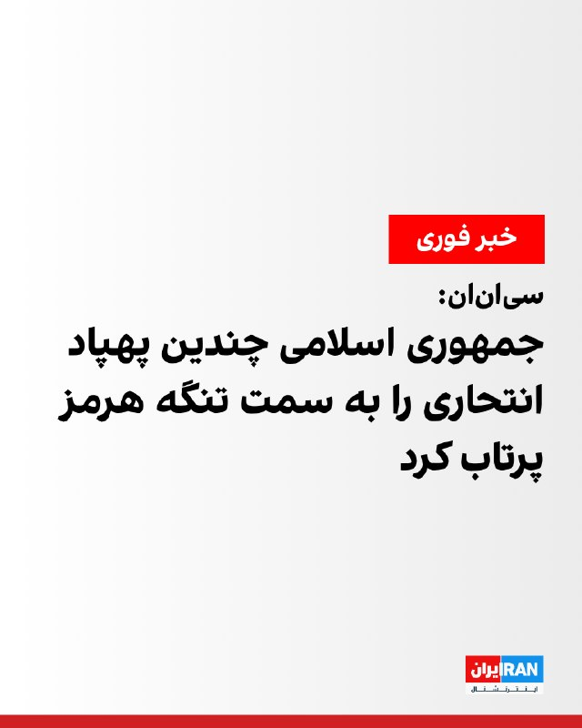

سی‌ان‌ان به نقل از یک مقام آمریکایی گزارش داد جمهوری اسلامی چندین پهپاد انتحاری را به سمت تنگه هرمز پرتاب کرد که هواپیماهای آمریکا دست‌کم چهار پهپاد را سرنگون کردند.
این مقام گفت مقام‌های آمریکایی گمان می‌کنند این پهپادها کشتی‌های تجاری در حال عبور از آب‌های منطقه یا نیروهای آمریکایی فعال در نزدیکی آن منطقه را هدف قرار داده بودند.

‌🏁 🇬🇧 IranintlTV

🤖 @VahidOOnLine

## VahidOOnLine — post 243868

  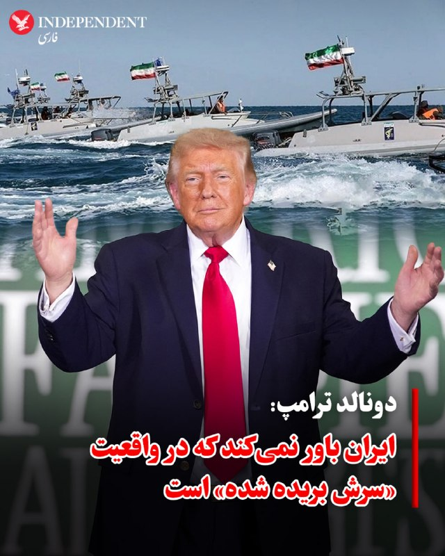

♦️دونالد ترامپ، رئیس‌جمهوری آمریکا، در گفتگو با شبکه «ان‌بی‌سی نیوز» با تاکید بر اینکه مقامات ایران به شدت به دنبال توافق هستند اما به دلیل «قوی و مغرور بودن»، پذیرش شرایط برایشان دشوار است، اعلام کرد: «آن‌ها در موقعیتی قرار گرفته‌اند که باور نمی‌کنند سرشان بریده و ارتش آن‌ها کاملا نابود شده است.» ترامپ با اشاره به اینکه تهران پیش از این دو بار در آستانه دستیابی به سلاح هسته‌ای قرار داشت، خروج خود از برجام را که آن را مسیر رسیدن ایران به بمب اتمی می‌دانست، ستود و افزود: «بسیاری از کارخانه‌های پهپادی، سکوهای پرتاب و مراکز تولید موشک ایران از بین رفته‌اند و در حال حاضر تنها حدود ۲۱ تا ۲۲ درصد از موشک‌های آن‌ها باقی مانده است؛ این میزان هنوز کم نیست، اما با آنچه در شروع حمله داشتند قابل مقایسه نیست.» او با انتقاد از فشارها برای توافق فوری، سرعت خود را با جنگ ۱۹ ساله ویتنام مقایسه کرد و گفت: «من بسیار سریع حرکت می‌کنم و تازه در ماه سوم هستم؛ این آدم‌ها ۴۷ سال است که در حال جنگ هستند و آمریکایی‌ها را کشته‌اند، اما اکنون چاره دیگری ندارند و در نهایت مجبور خواهند شد کارهایی را که هرگز فکرش را هم نمی‌کردند، انجام دهند و توافق کنند.»
‌🇸🇦 Indypersian

🤖 @VahidOOnLine

## WithYashar — post 13593

گزارش هایی از قطع شدن اینترنت
@withyashar

## WithYashar — post 13592

سی ان ان : منابع می گوید ایران چندین پهپاد را به سمت تنگه هرمز پرتاب کرده است. نیروهای ایالات متحده حداقل 3 تا از آنها را رهگیری کردند
@withyashar 🚨

## FoxNewsTwitter — post 342665

  <a href="telegram/content/FoxNewsTwitter_342665_1780698214.mp4" target="_blank">🎬 Download video</a>

Fox News (Twitter/X)

RT @EricShawnTV: It certainly was the most unexpected celebration of our country’s founding, the July 4th block party sponsored by John Gotti. A look back at the days of the Mafia Don in the new documentary “Gotti’s Guy,” now streaming on Fox Nation. @foxnation @FoxNews @foxnewspolitics

## pm_afshaa — post 92346

  <a href="telegram/content/pm_afshaa_92346_1780698216.webm" target="_blank">🎬 Download video</a>

🔴سی‌ان‌ان: امشب ایران پهپادهایی رو به سمت تنگه هرمز پرتاب کرده و نیروهای آمریکایی 3 فروند پهباد رو سرنگون کردن.

💧 Rainbet.com the #1 Non-KYC Crypto Casino & Sportsbook @rainbetcom

😁 @Pm_Afshaa

## pm_afshaa — post 92345

  <a href="telegram/content/pm_afshaa_92345_1780698216.mp4" target="_blank">🎬 Download video</a>

🔴ترامپ: این دیگه خیلی جنگ حساب نمیشه؛ یه درگیری نظامیه که بیشتر شبیه تمرین می‌مونه.

💧 Rainbet.com the #1 Non-KYC Crypto Casino & Sportsbook @rainbetcom

😁 @Pm_Afshaa

## DEJradio — post 5377

  <a href="telegram/content/DEJradio_5377_1780698217.mp4" target="_blank">🎬 Download video</a>

🔺📢 سرهنگ پزشک علی خانی از معاونت بهداشت و درمان فراجا در ویدیویی با خطاب قرار دادن مجتبی خامنه‌ای،‌‌ از فساد و تخلف فرماندهان آن معاونت و سکوت و بی‌توجهی فرماندهان ارشد و هیات رییسه فراجا نسبت به اعتراض و شکایات پرسنل اعتراض کرد.

#فراجا
@DEJradio

## DEJradio — post 5376

  <a href="telegram/content/DEJradio_5376_1780698219.webm" target="_blank">🎬 Download video</a>

🚨📢 بر اساس گزارش‌های دریافتی، «زهرا عاطفی‌فرد» از کارکنان کلانتری ۲۱ قم، پس از مصرف تعداد زیادی قرص به زندگی خود پایان داد.

برخی منابع علت این اقدام را فشارهای روحی و روانی و مشکلات ناشی از محیط کاری عنوان کرده‌اند؛ با این حال تاکنون جزئیات رسمی و تأییدشده‌ای درباره علت این حادثه منتشر نشده است.

در صورت انتشار اطلاعات رسمی از سوی مراجع ذی‌صلاح، جزئیات تکمیلی اطلاع‌رسانی خواهد شد.

#خودکشی #نیروی_انتظامی #قم
@DEJradio

## IranIntlTV — post 340732

  

سی‌ان‌ان به نقل از یک مقام آمریکایی گزارش داد جمهوری اسلامی چندین پهپاد انتحاری را به سمت تنگه هرمز پرتاب کرد که هواپیماهای آمریکا دست‌کم چهار پهپاد را سرنگون کردند.
این مقام گفت مقام‌های آمریکایی گمان می‌کنند این پهپادها کشتی‌های تجاری در حال عبور از آب‌های منطقه یا نیروهای آمریکایی فعال در نزدیکی آن منطقه را هدف قرار داده بودند.

https://iranintl.com/202606058431

## IranIntlTV — post 340731

  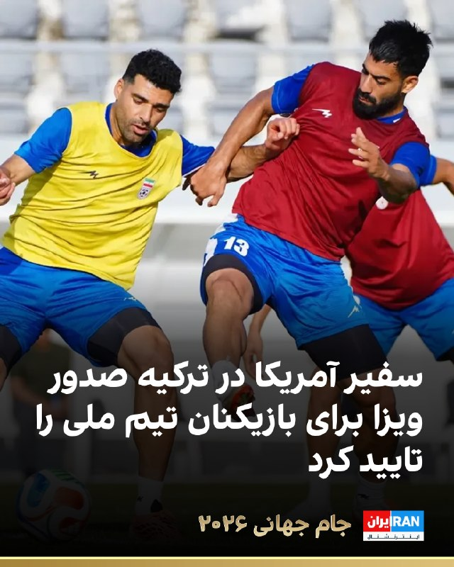

🔻تام باراک، سفیر آمریکا در ترکیه روز جمعه در پیامی در شبکه ایکس صدور ویزا برای بازیکنان تیم ملی را تأیید کرد: «به تیم فوق‌العاده‌مان در سفارت آمریکا در آنکارا افتخار می‌کنیم که برای رسیدگی به درخواست ویزای تیم فوتبال ایران در مسیر حضورشان در جام جهانی در ایالات متحده تلاش کردند.»

🔹او این مطلب را در واکنش به گزارشی منتشر کرد که اعلام کرده بود بازیکنان ایران ویزای ورود به آمریکا را دریافت کرده‌اند.

🔹رویترز روز جمعه به نقل از یک مقام کاخ سفید خبر داد بازیکنان تیم ملی برای ورود به آمریکا ویزا دریافت کرده‌اند.

🔹همچنین الجزیره به نقل از منابعی گزارش داد که دست‌کم ۱۵ نفر از اعضای کادر تیم ملی ایران با رد درخواست ویزای خود از سوی ایالات متحده برای حضور در جام جهانی ۲۰۲۶ مواجه شده‌اند. این افراد شامل برخی مربیان، اعضای کادر فنی و کارکنان اجرایی هستند.

🔹منابع این رسانه گفته‌اند که برخی از افرادی که ویزای آن‌ها رد شده، به‌طور رسمی از سوی فیفا به‌عنوان بخشی از کادر مربیگری و یا فنی تیم به رسمیت شناخته شده بودند: «بازیکنان تحت تأثیر این تصمیم قرار نگرفته‌اند.»

@iranintltvsport

## Shin_Persian — post 6540

Shin ✓ @hey_itsmyturn
Fri, 05 Jun 2026 22:21:05 UTC

🫪
(First time using this emoji)

فارسی

🫪
(اولین بار است که از این ایموجی استفاده می‌کنم)

𝕏 · @shin_persian

## Shin_Persian — post 6539

Shin ✓ @hey_itsmyturn
Fri, 05 Jun 2026 22:19:32 UTC

Initial:
#USAF 🇺🇸 airstrikes on Saladin governorate, western #Iraq 🇮🇶

فارسی

حملات هوایی نیروی هوایی ایالات متحده (USAF) 🇺🇸 به استان صلاح‌الدین در غرب #عراق 🇮🇶

𝕏 · @shin_persian

## Shin_Persian — post 6538

Shin ✓ @hey_itsmyturn
Fri, 05 Jun 2026 22:17:18 UTC

Explosions reported in Salah al-Din Province, #Iraq 🇮🇶

فارسی

گزارش‌هایی از وقوع انفجار در استان صلاح‌الدین، #Iraq 🇮🇶 منتشر شده است.

𝕏 · @shin_persian

## FarsiVOA — post 219708

🔺دونالد ترامپ: رهبران جمهوری اسلامی چون «مغرور» هستند تاکنون توافق نکرده‌اند اما چاره‌ای جز توافق ندارند

▪️رئیس‌جمهوری آمریکا، دونالد ترامپ، روز جمعه در مصاحبه‌ای اختصاصی با شبکه ان‌بی‌سی نیوز گفت که رهبران جمهوری اسلامی هنوز به توافقی با آمریکا برای پایان دادن به جنگ جاری دست نیافته‌اند، زیرا «سرسخت» و «مغرور» هستند، اما در نهایت «چاره‌ای جز توافق ندارند.»

⬇️ بیشتر بخوانید:
https://ir.voanews.com/a/8157786.html
@FarsiVOA

## Dirty_Kids — post 391102

  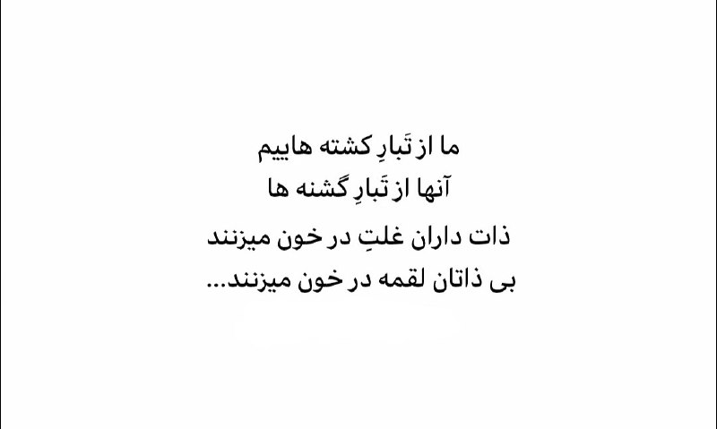

#بخوابیم

@Dirty_Kids 👻

## Dirty_Kids — post 391101

  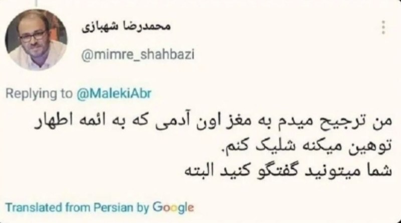

بعد میگن چرا از تجاوز بهش خوشحالی
بچ من ناراحتم که زیر بار تجاوز نمرده

@Dirty_Kids 👻

## Dirty_Kids — post 391100

  <a href="telegram/content/Dirty_Kids_391100_1780698221.mp4" target="_blank">🎬 Download video</a>

آقا این موزیک جدیدا مثل بمب ترکیده توی اینستا و وایرال شده

@Dirty_Kids 👻

## Dirty_Kids — post 391099

  <a href="telegram/content/Dirty_Kids_391099_1780698222.mp4" target="_blank">🎬 Download video</a>

عجب تبلیغی ساخته نایک، عجب ستاره‌هایی

@Dirty_Kids 👻

## Dirty_Kids — post 391098

  <a href="telegram/content/Dirty_Kids_391098_1780698224.mp4" target="_blank">🎬 Download video</a>

آهنگ میخوام از تتلو ورژن اسلامی

@Dirty_Kids 👻

## Dirty_Kids — post 391097

  <a href="telegram/content/Dirty_Kids_391097_1780698225.mp4" target="_blank">🎬 Download video</a>

🔴 دوره زمونه هم عوض شده
الان دیگه دخترا گروهی دعوا میکنند پسرا میشینن یه گوشه نگاه میگنن

@Dirty_Kids 👻

## Dirty_Kids — post 391096

  <a href="telegram/content/Dirty_Kids_391096_1780698227.mp4" target="_blank">🎬 Download video</a>

پیش بینی های درست تاریخ! یا ما خواب بودیم و سر در برف یا حریف مکار و بد حیله گر!

@Dirty_Kids 👻

---
📅 بروزرسانی: 1405/03/16 01:43
---

## VahidOOnLine — post 243867

  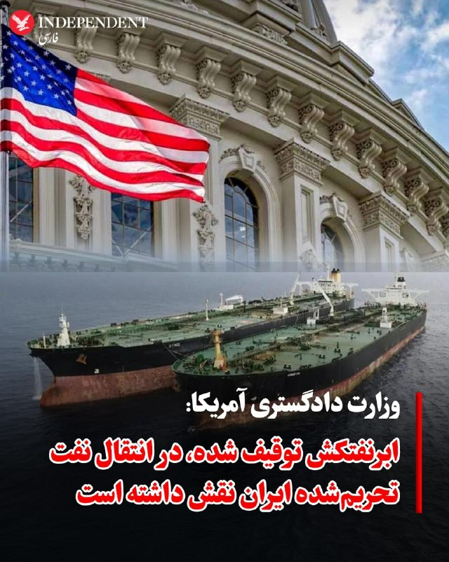

♦️وزارت دادگستری آمریکا با انتشار بیانیه‌ای رسمی اعلام کرد که نیروهای ایالات متحده طی یک عملیات شبانه، ابرنفتکش «ام/تی داوینا» (M/T Davina) معروف به «لنور» را که ظرفیت حمل تا دو میلیون بشکه نفت را دارد و در فهرست تحریم‌های وزارت خزانه‌داری آمریکا علیه بخش نفت و پتروشیمی ایران قرار گرفته است، توقیف کرده‌اند. بر اساس اعلام واشنگتن، این شناور بخشی از «ناوگان سایه» ایران به شمار می‌رود؛ شبکه‌ای از تسهیل‌کنندگان حمل‌ونقل غیرقانونی که به گفته مقامات آمریکایی، به درآمدزایی انرژی برای نظام ایران، به خطر انداختن ثبات منطقه و حمله به شرکا و متحدان ایالات متحده کمک کرده است. وزارت دادگستری آمریکا تاکید کرد که این اقدام بخشی از تلاش‌های هماهنگ با سایر نهادهای دولتی برای اختلال در شبکه قاچاق نفت و درآمدزایی‌هایی است که به سود دولت ایران و سپاه پاسداران تمام می‌شود.
‌🇸🇦 Indypersian

🤖 @VahidOOnLine

## WithYashar — post 13591

دوتا صدای انفجار الان ومد همین الان قشم🚨
@withyashar

## WithYashar — post 13590

مجری ان‌بی‌سی: رهبران جمهوری اسلامی معتقد نیستن که به‌طور کامل شکست خوردن.

ترامپ: ایران به دلیل تصور برخورداری از قدرت کافی، از امضای توافق خودداری کرده. ایران در نهایت گزینه‌ای جز توافق نخواهد داشت.
@withyashar

## WithYashar — post 13589

ترامپ به ان بی سی:
خیلی از مقاماتشون مغرورن، یه سری کارها هست که هیچوقت فکر نمی‌کردن مجبور بشن انجام بدن ولی الان مجبور شدن، راه دیگه‌ای ندارن و این قضیه زمان می‌بره.

داریم درباره 47 سال حرف میزنیم که هر کاری خواستن انجام دادن.
@withyashar

## pm_afshaa — post 92344

🎙️مجری ان‌بی‌سی: رهبران جمهوری اسلامی معتقد نیستن که به‌طور کامل شکست خوردن.

ترامپ: ایران به دلیل تصور برخورداری از قدرت کافی، از امضای توافق خودداری کرده. ایران در نهایت گزینه‌ای جز توافق نخواهد داشت.

💧 Rainbet.com the #1 Non-KYC Crypto Casino & Sportsbook @rainbetcom

😁 @Pm_Afshaa

## pm_afshaa — post 92343

  <a href="telegram/content/pm_afshaa_92343_1780697597.webm" target="_blank">🎬 Download video</a>

🔴ترامپ به ان بی سی:
خیلی از مقاماتشون مغرورن، یه سری کارها هست که هیچوقت فکر نمی‌کردن مجبور بشن انجام بدن ولی الان مجبور شدن، راه دیگه‌ای ندارن و این قضیه زمان می‌بره.

داریم درباره 47 سال حرف میزنیم که هر کاری خواستن انجام دادن.

💧 Rainbet.com the #1 Non-KYC Crypto Casino & Sportsbook @rainbetcom

😁 @Pm_Afshaa

## Shin_Persian — post 6537

  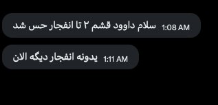

Shin ✓ @hey_itsmyturn
Fri, 05 Jun 2026 22:12:11 UTC

3 blasts in Qeshm island, Hormozgan Province, #Iran
2 @ 2208Z and one at 2211Z

فارسی

۳ انفجار در جزیره قشم، استان هرمزگان، #Iran
۲ انفجار در ۲۲۰۸ زولو (۰۱:۳۸ به وقت تهران) و یکی در ۲۲۱۱ زولو (۰۱:۴۱ به وقت تهران)

𝕏 · @shin_persian

## FarsiVOA — post 219707

  <a href="telegram/content/FarsiVOA_219707_1780697598.mp4" target="_blank">🎬 Download video</a>

⚡️امیرحسین ثابتی مذاکرات با آمریکا را «ابلهانه و سفیهانه» توصیف کرده است؛ مذاکراتی که مقام‌های جمهوری اسلامی می‌گویند با تأیید مجتبی خامنه‌ای در حال انجام است. از بستن تنگه هرمز تا اعتراض به وصل شدن اینترنت، هر جناحی در جمهوری اسلامی ساز خودش را می‌زند.
@FarsiVOA

## Persian_Trend_Official — post 15775

  <a href="telegram/content/Persian_Trend_Official_15775_1780697598.mp4" target="_blank">🎬 Download video</a>

کاش قاطعیتتون رو نشون بدید عمو ببینه 😎

## BBCPersian — post 282933

  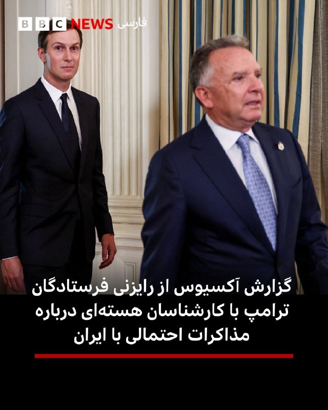

🔻وب‌سایت آکسیوس گزارش داده است که استیو ویتکاف و جرد کوشنر، فرستادگان دونالد ترامپ، روز پنجشنبه برای رایزنی با گروهی از کارشناسان فنی به آزمایشگاه ملی اوک‌ریج در ایالت تنسی سفر کردند.

به نوشته آکسیوس، کاخ سفید در تلاش است با ایران بر سر یک تفاهم‌نامه برای پایان دادن به جنگ و آغاز مذاکرات تفصیلی هسته‌ای «به توافق برسد» و می‌خواهد در صورت آغاز این مذاکرات، تیم کارشناسی لازم را آماده داشته باشد.

به گفته منابع آمریکایی و منطقه‌ای، تهران و واشنگتن همچنان بر سر برخی جزئیات این تفاهم‌نامه اختلاف دارند، اما مذاکرات وارد مراحل پایانی شده است.
@BBCPersian

## alonews — post 125425

  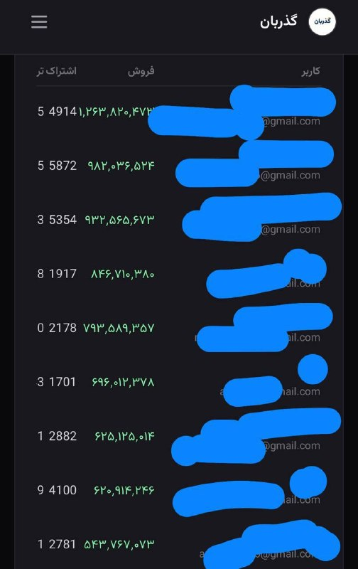

​
🔼 کسب درآمد از فروش VPN هنوزم ممکنه!

درآمد چندتا از نماینده‌ها رو ببین 
👀

پنل نمایندگی وی‌پی‌ان گذربان، سریع‌ترین و راحت‌ترین راه برای پول درآوردنه 
✔️

​
🤑 چرا پنل نمایندگی گذربان؟

🚀 سرعت و کیفیت بی‌نظیر

⚙️ پنل مدیریتی حرفه‌ای

💵 سود عالی

⭐️ بدون ریسک

​فرصت رو از دست نده و کلمه «الو» رو بفرست 
👇
@GozarBanAdmin
@GozarBanAdmin
@GozarBanAdmin

---
📅 بروزرسانی: 1405/03/16 01:33
---

## WithYashar — post 13588

ترامپ به NBC : وضعیت برای اونا واقعاً سخته

یه جورایی استقلال زیادی هم دارن، ولی سال‌ها با یه رهبری ضعیف و بی‌اثر از طرف آمریکا و بعضی کشورهای دیگه طرف بودن؛
طوری که عملاً گذاشتن هر کاری دلشون خواست بکنن.
من فکر می‌کنم خودشون هم الان باورشون نمی‌شه به اینجا رسیدن؛ جایی که عملاً خیلی ضعیف شدن
@withyashar

## WithYashar — post 13587

ترامپ به شبکه ان بی سی: رهبران ایران چاره ای جز رسیدن به توافق ندارند‌‌
@withyashar

## FoxNewsTwitter — post 342664

  <a href="telegram/content/FoxNewsTwitter_342664_1780697002.mp4" target="_blank">🎬 Download video</a>

Fox News (Twitter/X)

“172,000 jobs were created in May. That’s about four times higher than anticipated.”

President Trump says the jobs report crushed expectations for the third straight month, prompting cheers at an agriculture roundtable in Wisconsin.

He highlighted the report as a sign of economic strength despite ongoing military tensions abroad.

“These are the strongest jobs numbers of the entire administration so far.”

## pm_afshaa — post 92342

  <a href="telegram/content/pm_afshaa_92342_1780697003.webm" target="_blank">🎬 Download video</a>

🔴ترامپ به شبکه ان بی سی: رهبران ایران چاره‌ای جز رسیدن به توافق ندارن. ایران بین 21 تا 22 درصد موشک‌هاش رو در اختیار داره.

💧 Rainbet.com the #1 Non-KYC Crypto Casino & Sportsbook @rainbetcom

😁 @Pm_Afshaa

## IranIntlTV — post 340730

  <a href="telegram/content/IranIntlTV_340730_1780697004.mp4" target="_blank">🎬 Download video</a>

دونالد ترامپ بار دیگر تاکید کرد جمهوری اسلامی تحت هیچ شرایطی به سلاح هسته‌ای دست نخواهد یافت. همزمان، اکسیوس گزارش داد سرنوشت توافق نهایی میان آمریکا و جمهوری اسلامی همچنان نامشخص است.

گفت‌وگو با امیر گیتی، عضو تحریریه ایران‌اینترنشنال
@iranintltv

## Shin_Persian — post 6536

  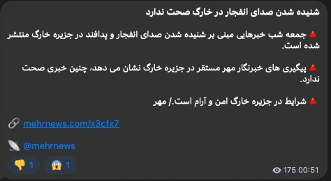

Shin ✓ @hey_itsmyturn
Fri, 05 Jun 2026 21:55:11 UTC

State-owned Mehr News denies the explosion sound from Kharg island.

فارسی

خبرگزاری دولتی مهر صدای انفجار در جزیره خارگ را تکذیب کرد.

𝕏 · @shin_persian

## FarsiVOA — post 219706

  <a href="telegram/content/FarsiVOA_219706_1780697006.mp4" target="_blank">🎬 Download video</a>

⚡️محمد قائدی در برنامه تفسیر خبر: جمهوری اسلامی اورانیوم غنی‌سازی شده خود را تحویل خواهد داد
@FarsiVOA

## Persian_Trend_Official — post 15774

درگیری های فعلی در خارک گویا همون همیشگی هست و چیز مهمی نیست
اما اگر شدت گرفت لایو اضطراری خواهیم داشت

## alonews — post 125424

  <a href="telegram/content/alonews_125424_1780697006.webm" target="_blank">🎬 Download video</a>

👈ترامپ به ان بی سی: خیلی از مقاماتشون هم مغرورن یه سری کارها هست که هیچ‌وقت فکر نمی‌کردن مجبور بشن انجام بدن

🔴ولی الان مجبور شدن، راه دیگه‌ای ندارن و این قضیه زمان می‌بره

🔴داریم درباره ۴۷ سال حرف می‌زنیم که هر کاری خواستن انجام دادن

🔴توافق اوباما با ایران خیلی بد بود و از قبل هم عملاً تاریخش تموم شده بود

✅ @AloNews خبر جنگ

## alonews — post 125423

  <a href="telegram/content/alonews_125423_1780697006.webm" target="_blank">🎬 Download video</a>

👈ترامپ به NBC : وضعیت برای اونا واقعاً سخته

🔴یه جورایی استقلال زیادی هم دارن، ولی سال‌ها با یه رهبری ضعیف و بی‌اثر از طرف آمریکا و بعضی کشورهای دیگه طرف بودن؛

🔴طوری که عملاً گذاشتن هر کاری دلشون خواست بکنن.

🔴من فکر می‌کنم خودشون هم الان باورشون نمی‌شه به اینجا رسیدن؛ جایی که عملاً خیلی ضعیف شدن

🔴این موضوع باید خیلی وقت پیش حل می‌شد

🔴توسط رئیس‌جمهورهای قبلی یا کشورهای دیگه، لزوماً هم ما نه

🔴ولی واقعیت اینه که دو بار تا ساخت سلاح هسته‌ای خیلی نزدیک شده بودن

✅ @AloNews خبر جنگ

## alonews — post 125422

  <a href="telegram/content/alonews_125422_1780697007.webm" target="_blank">🎬 Download video</a>

👈ترامپ به شبکه ان بی سی: رهبران ایران چاره ای جز رسیدن به توافق ندارند‌‌

✅ @AloNews خبر جنگ

---
📅 بروزرسانی: 1405/03/16 01:23
---

## VahidOOnLine — post 243866

  

♦️فارس، خبرگزاری وابسته به سپاه، بامداد شنبه، ۱۶ خردادماه، به نقل از الجزیره گزارش داد: «به ۱۵ نفر از عوامل فنی و اجرایی تیم ملی ایران روادید آمریکا داده نشده است».
همزمان دکتر جمشید ایرانی، وکیل دیوان عالی آمریکا، به ایندیپندنت فارسی اطلاع داده است که کاروان ورزشی ایران به دلیل صادر نشدن ویزا، احتمالا با مجوز موقت و مشروط (Parole) در سه مسابقه خود شرکت خواهد کرد و برای این منظور باید موانع سخت‌گیرانه‌ای را پشت سر بگذارد. بر اساس این گزارش، کاروان تیم ملی پس از پروازی طولانی و چندمرحله‌ای با هواپیمای «ایران ایر» به دلیل تحریم‌های هوایی، در شهر مرزی «تیخوانا» در مکزیک مستقر می‌شود و برای انجام بازی‌ها در استادیوم ۷۰ هزار نفری «سوفای» (SoFi)، مجبور است هر بار از مرز زمینی «سن یسیدرو» (San Ysidro) عبور کند؛ فرایندی که شامل بررسی‌های امنیتی شدید، انگشت‌نگاری و اسکن چشم خواهد بود و ممکن است تا ۶ ساعت به طول بیانجامد. این تیم پس از عبور از مرز، تحت تدابیر شدید امنیتی و با اسکورت مأموران مرزبانی و پلیس محلی به محل مسابقه منتقل می‌شود و طبق خواست دولت آمریکا، بلافاصله پس از پایان هر بازی باید به اردوی خود در مکزیک بازگردد. به گفته دکتر جمشید ایرانی، این در حالی است که واشنگتن هنوز درباره صدور مجوز برای سه بازیکن با سابقه خدمت یا اشتغال در سپاه پاسداران تصمیمی نگرفته و به نظر می‌رسد مهدی تاج، رئیس فدراسیون فوتبال جمهوری اسلامی، و چند تن از همراهانش از ورود محروم شده و مجبور خواهند بود بازی‌ها را از دور و در هتل دنبال کنند.
‌🇸🇦 Indypersian

🤖 @VahidOOnLine

## WithYashar — post 13586

ترامپ به شبکه ان بی سی: ایران بین 21 تا 22 درصد موشکهای خود را در اختیار دارد‌‌ @withyashar

## WithYashar — post 13585

ترامپ به شبکه ان بی سی: ایران بین 21 تا 22 درصد موشکهای خود را در اختیار دارد‌‌
@withyashar

## WithYashar — post 13584

به نظر می‌رسد جنگنده‌های اسرائیلی از عراق به سمت ایران می‌آیند
@withyashar

## mwarmonitor — post 10196

📝 عجب کارگاهِ شستشوی مغزیِ موفقی! آدم را به این ته‌خط می‌رساند که چطور جمهوری اسلامی با مهندسیِ دقیقِ فقر، ملتی را که روزگاری ادعای تمدن داشت، به این «مقامِ انسانیتِ» مضحک رسانده است. تقصیر این مردمِ فرودست چیست وقتی اتاقِ فکرِ نظام عمداً جامعه را به خاک سیاه نشانده تا برای بقا بجنگند؟ بعد از شاهکارهای صفِ مرغ، روغن و یارانه، حالا این حکومتِ مدعیِ مدیریتِ جهان، با افتخار آپدیتِ جدیدی عرضه کرده: کشت و کشتار و له کردنِ شرفِ مردم برای یک قاچ هندوانه‌ی صدقه‌ای در جشنی عقیدتی! این باغ‌وحشی که راه انداخته‌اند، تندیسِ موفقیتِ آقایان است؛ آن‌ها مردم را در فقرِ مطلق نگه می‌دارند تا کرامتِ انسانی‌شان را این‌طور جلو دوربین متلاشی کنند و بعد به اسمِ «امتِ پرشور»، به ریشِ این ملتِ گروگان‌گرفته‌شده بخندند. لعنت فرستادن به باعث و بانیِ این فلاکت، کمترین کاری است که می‌توان برای این حجم از رذالتِ سیستمی انجام داد.

@mwarmonitor

## IranIntlTV — post 340729

  <a href="telegram/content/IranIntlTV_340729_1780696405.mp4" target="_blank">🎬 Download video</a>

آمریکا تحریم‌های جدیدی علیه چندین نهاد، فرد و نفتکش‌های حمل گاز مایع مرتبط با ایران وضع کرد. اسکات بسنت، وزیر خزانه‌داری آمریکا، اقتصاد ایران را در حال فروپاشی توصیف کرد و گفت توان نظامی جمهوری اسلامی به‌شدت تضعیف شده است.

گفت‌وگو با رضا گوهرزاد، روزنامه‌نگار و تحلیل‌گر سیاسی
@iranintltv

## FarsiVOA — post 219705

🔺پوتین پیشنهاد زلنسکی برای دیدار رو در رو را رد کرد

▪️ولادیمیر پوتین، رئیس‌جمهوری روسیه، روز جمعه ۱۵ خرداد پیشنهاد ولودیمیر زلنسکی، رئیس‌جمهوری اوکراین، برای دیدار رو در رو درباره جنگ چهار ساله میان دو کشور را رد کرد و گفت «فایده‌ای» در چنین دیداری نمی‌بیند.

⬇️ بیشتر بخوانید:
https://ir.voanews.com/a/putin-rejects-zelenskyy-meeting-offer/8157777.html
@FarsiVOA

## alonews — post 125421

  <a href="telegram/content/alonews_125421_1780696407.mp4" target="_blank">🎬 Download video</a>

👈حمله تروریستی به یک پاسگاه پلیس در منامه بحرین

✅ @AloNews خبر جنگ

## alonews — post 125420

  <a href="telegram/content/alonews_125420_1780696410.webm" target="_blank">🎬 Download video</a>

👈ترامپ به شبکه ان بی سی: ایران بین 21 تا 22 درصد موشکهای خود را در اختیار دارد‌‌

✅ @AloNews خبر جنگ

---
📅 بروزرسانی: 1405/03/16 01:13
---

## VahidOOnLine — post 243865

  

کریس رایت، وزیر انرژی آمریکا، روز جمعه گفت افزایش جریان نفت از طریق تنگه هرمز برای کمک به کاهش قیمت بنزین و گازوییل، در نهایت مستلزم حل‌وفصل مسائل با جمهوری اسلامی خواهد بود.
‌🏁 🇬🇧 IranintlTV

🤖 @VahidOOnLine

## WithYashar — post 13583

ارسالی : پدافند ۱۷ شهریور گنبد کاووس فعال شد @withyashar

## WithYashar — post 13582

ارسالی : پدافند ۱۷ شهریور گنبد کاووس فعال شد
@withyashar

## WithYashar — post 13581

به خبرای هست ولی نمیتونم ثابت کنم

## WithYashar — post 13580

## mwarmonitor — post 10195

📝 عجب کارگاهِ شستشوی مغزیِ موفقی! آدم را به این ته‌خط می‌رساند که چطور جمهوری اسلامی با مهندسیِ دقیقِ فقر، ملتی را که روزگاری ادعای تمدن داشت، به این «مقامِ انسانیتِ» مضحک رسانده است. تقصیر این مردمِ فرودست چیست وقتی اتاقِ فکرِ نظام عمداً جامعه را به خاک سیاه نشانده تا برای بقا بجنگند؟ بعد از شاهکارهای صفِ مرغ، روغن و یارانه، حالا این حکومتِ مدعیِ مدیریتِ جهان، با افتخار آپدیتِ جدیدی عرضه کرده: کشت و کشتار و له کردنِ شرفِ مردم برای یک قاچ هندوانه‌ی صدقه‌ای در جشنی عقیدتی! این باغ‌وحشی که راه انداخته‌اند، تندیسِ موفقیتِ آقایان است؛ آن‌ها مردم را در فقرِ مطلق نگه می‌دارند تا کرامتِ انسانی‌شان را این‌طور جلو دوربین متلاشی کنند و بعد به اسمِ «امتِ پرشور»، به ریشِ این ملتِ گروگان‌گرفته‌شده بخندند. لعنت فرستادن به باعث و بانیِ این فلاکت، کمترین کاری است که می‌توان برای این حجم از رذالتِ سیستمی انجام داد.

@mwarmonitor

## mwarmonitor — post 10194

🇨🇦🇺🇸🇩🇪🇬🇧 هشدارها و توصیه‌های جدید سفر و امنیت برای بخش‌هایی از خاورمیانه صادر کرده‌اند. 🇩🇪 آلمان: در تاریخ ۵ ژوئن یک هشدار صادر کرده و به‌شدت به شهروندان خود توصیه کرده به دلیل «تشدید وضعیت امنیتی در منطقه» به کشورهای زیر سفر نکنند: کویت بحرین 🇬🇧 بریتانیا:…

## FoxNewsTwitter — post 342663

  <a href="telegram/content/FoxNewsTwitter_342663_1780695787.mp4" target="_blank">🎬 Download video</a>

Fox News (Twitter/X)

RT @Outkick: "What did he mean by that?" 🤨

Trump has questions. He'd like to know more about Wemby crossing his arms during the national anthem.

📹: @RealDanZak

## pm_afshaa — post 92341

باز شروع کردن این بلاگرای دوزاری با حاشیه های کسشر و یه مشت موج سوار که دارن به اینا ویو میدن تا بیشتر عادی سازی کنن.

فقط عمیقا دلم واسه انلاین شاپا میسوخت ولی الان این بلاگرای حکومتی و وسط باز رو که میبینم میگم همون بهتر اینستا بسته بود..

## pm_afshaa — post 92340

  <a href="telegram/content/pm_afshaa_92340_1780695789.mp4" target="_blank">🎬 Download video</a>

🔴ترامپ درباره ایران:
ما یک سلاح هسته‌ای رو خاموش کردیم. قرار بود کشوری توانمند باشن که حضور هسته‌ای خواهد داشت، اما ما تا حد زیادی این کار رو تمام کردیم. به هر حال، کار تمام شده.

💧 Rainbet.com the #1 Non-KYC Crypto Casino & Sportsbook @rainbetcom

😁 @Pm_Afshaa

## IranIntlTV — post 340728

  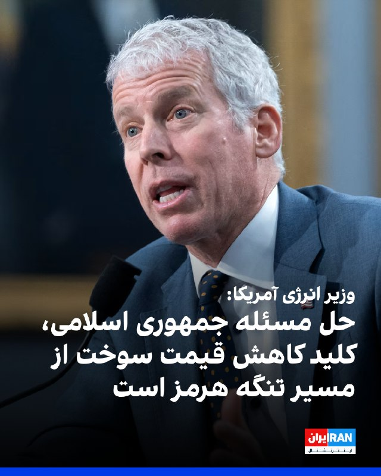

کریس رایت، وزیر انرژی آمریکا، روز جمعه گفت افزایش جریان نفت از طریق تنگه هرمز برای کمک به کاهش قیمت بنزین و گازوییل، در نهایت مستلزم حل‌وفصل مسائل با جمهوری اسلامی خواهد بود.
https://iranintl.com/202606055667

## IranianMinds — post 21454

  

دوستان جنوبی با خیال راحت بخوابید که پدافندا فعالن آمریکا هیچ غلطی نمیتونه بکنه.

@IranianMinds

## IranianMinds — post 21453

🔴 گزارشاتی از انفجار در جزیره خارک @IranianMinds

## alonews — post 125419

  <a href="telegram/content/alonews_125419_1780695791.webm" target="_blank">🎬 Download video</a>

👈پرواز جنگنده‌‌ها تو جنوب عراق

✅ @AloNews خبر جنگ

---
📅 بروزرسانی: 1405/03/16 01:03
---

## VahidOOnLine — post 243864

  

ترامپ جمعه در یک سخنرانی در ویسکانسین گفت که مسئله مرتبط با برنامه هسته‌ای ایران «تا حد زیادی پایان یافته» است و افزود این موضوع «به هر شکلی حل خواهد شد.»
او گفت: «ما تا حد زیادی آن را تمام کرده‌ایم، خواهید دید، و به هر شکلی تمام شده است. یا با یک تکه کاغذ، یا به شکلی دشوارتر.»

‌🏁 🇬🇧 IranintlTV

🤖 @VahidOOnLine

## VahidOOnLine — post 243863

  

♦️دونالد ترامپ، رئیس‌جمهوری آمریکا، با تاکید بر اینکه «تعیین تکلیف مسائل با ایران به هر شکلی که باشد، بسیار مقتدرانه خواهد بود»، اعلام کرد که واشنگتن به نقطه‌ای رسیده است که پرونده ایران را بسیار سریع به پایان خواهد رساند. او با اشاره به روند تقابل نظامی گفت: «ما باید یک سلاح هسته‌ای با توانایی بالا را خنثی می‌کردیم و هرگز اجازه ظهور دولتی با حضور هسته‌ای عظیم را نمی‌دادیم؛ اکنون نیز تا حد زیادی کار رسیدگی به پرونده ایران را تمام کرده‌ایم.» ترامپ با بی‌سابقه خواندن محاصره دریایی اعمال‌شده علیه تهران افزود: «ایران در حال حاضر و پس از غرق شدن ۱۵۹ کشتی‌اش در قعر دریا طی ۴ روز، دیگر نیروی دریایی ندارد.» او در نهایت با اشاره به گزینه‌های روی میز تصریح کرد که این یکسره کردن امور می‌تواند از طریق یک توافق مکتوب یا مسیری سخت‌تر باشد، هرچند که «مسیر سخت‌تر برای تعیین تکلیف ایران، ممکن است در واقع آسان‌ترین راه برای دستیابی به نتیجه باشد.»
‌🇸🇦 Indypersian

🤖 @VahidOOnLine

## WithYashar — post 13579

گزارشهایی از صدای جنگنده و پدافند در شمال کشور🚨
@withyashar

## DEJradio — post 5375

⭕️ آمریکا به همراهان تیم ملی ویزا نداد؛ بی اثر ماندن تهدیدات تاج

بنا بر گزارش‌ها درخواست ویزای ۱۵ عضو تیم ملی فوتبال جمهوری اسلامی ایران برای ورود به آمریکا رد شد.
این در حالی است که مهدی تاج، رئیس فدراسیون فوتبال پیش‌تر مدعی شده بود شرط فرستادن تیم به جام‌جهانی، صدور ویزا برای همهٔ اعضای اکیپ اعزامی جمهوری اسلامی است.
بنا بر ادعای مقامات رژیم، فدراسیون فوتبال جمهوری اسلامی برای فیفا ۱۰ شرط تعیین کرده بود.
تلویزیون الجزیره شامگاه آدینه بدون اشاره به هویت افراد گزارش داد پانزده عضو اکیپ جمهوری اسلامی نتوانستند ویزای آمریکا را دریافت کنند.
هنوز مشخص نیست این افراد از اعضای کادر فنی‌اند، یا در فهرست هیئت همراه تیم ملی قرار دارند.
رویترز پیش‌تر به نقل از یک مقام کاخ سفید گزارش داده‌ بود ویزای آمریکا برای همهٔ «بازیکنان» تیم صادر شده است.
فدراسیون فوتبال جمهوری اسلامی تاکنون به گزارش رد ویزا واکنشی نشان نداده است.
خبرگزاری حکومتی فارس ساعاتی پیش از انتشار این خبر، گزارش داده بود ویزای شماری از اعضای کادر فنی و هیئت همراه صادر نشده است.
#خبر #دژ #فوتبال #جام_جهانی
@DEJradio

## IranIntlTV — post 340727

  

ترامپ جمعه در یک سخنرانی در ویسکانسین گفت که مسئله مرتبط با برنامه هسته‌ای ایران «تا حد زیادی پایان یافته» است و افزود این موضوع «به هر شکلی حل خواهد شد.»
او گفت: «ما تا حد زیادی آن را تمام کرده‌ایم، خواهید دید، و به هر شکلی تمام شده است. یا با یک تکه کاغذ، یا به شکلی دشوارتر.»

https://iranintl.com/202606052620

## Shin_Persian — post 6535

Shin ✓ @hey_itsmyturn
Fri, 05 Jun 2026 21:27:24 UTC

Jet activity over southern #Iraq 🇮🇶

فارسی

فعالیت جنگنده‌ها بر فراز جنوب #عراق 🇮🇶

𝕏 · @shin_persian

## IranianMinds — post 21452

آمریکا به تیم جمهوری اسلامی ویزا داد. @IranianMinds

## IranianMinds — post 21451

داداش لطفا آپدیت بده خبرو گویا مامورای اف بی ای بودن و مهمات عمل نکرده دوران جنگو داشتن خنثی میکردن

## BBCPersian — post 282932

  <a href="telegram/content/BBCPersian_282932_1780695195.mp4" target="_blank">🎬 Download video</a>

🎶 هما میرافشار، روزنامه‌نگار، شاعر و ترانه‌سرای برجسته تصنیف‌های عاشقانه موسیقی دستگاهی و آثار ماندگار پاپ، به‌تازگی در ۸۹سالگی درگذشت.

او که با هنرمندانی چون هایده، گلپا، مهستی، حمیرا، داریوش، ابی، ستار، معین و بسیاری دیگر همکاری داشته است، به «زن هزار ترانه ایران» شهرت دارد.

در ویژه‌برنامه «رنگآهنگ» این هفته، مستندی درباره این چهره تأثیرگذار در موسیقی ایران پخش می‌شود.

این مستند را امیر صبوری در سال ۱۳۸۷ ساخته است. او سال‌هاست در آمریکا با کار بر مجموعه‌ای با عنوان «گنجینه شاهکارهای فرهنگ و هنر ایران» می‌کوشد تاریخ شفاهی هنر معاصر ایران را ثبت، حفظ و منتشر کند.

اینجا ببینید:
https://bbc.in/4ojdIOo
@BBCPersian

---
📅 بروزرسانی: 1405/03/16 00:53
---

## WithYashar — post 13578

ترامپ: ما خیلی سریع از ایران خارج خواهیم شد و نتیجه آن، به هر شکل، بسیار قوی خواهد بود؛ چه از طریق یک تکه کاغذ (توافق) و چه از راهی بسیار سخت‌تر. شاید حتی راه بسیار سخت‌تر، آسان‌تر هم باشد.

اما ما از این مسئله عبور خواهیم کرد و قیمت کود شیمیایی شما به‌شدت کاهش خواهد یافت، درست همان‌طور که چهار ماه پیش بود. قیمت کود شیمیایی اکنون هم کاهش یافته است.
قیمت انرژی، نفت و گاز نیز همگی به‌طور قابل‌توجهی پایین خواهند آمد. و صادقانه بگویم، من تصور می‌کردم قیمت‌ها بسیار بیشتر از این افزایش پیدا کنند.
@withyashar

## WithYashar — post 13577

گزارش های تایید نشده : چندین جت جنگنده آمریکایی حمله‌ای را به بندرعباس و مناطق اطراف جزیره خارک آغاز کردند و چندین بندر از جمله فرودگاه بندرعباس را هدف قرار دادند. پدافند هوایی فعال شد و درگیر نبرد شدیدی با جت‌های جنگنده شد.
@withyashar

## WithYashar — post 13576

گزارش هایی از شلیک نیروهای ایرانی به سمت ناو های آمریکایی🚨
@withyashar

## WithYashar — post 13575

شنیده شدن صدای انفجار در جزیره خارک🚨
@withyashar

## mwarmonitor — post 10193

  <a href="telegram/content/mwarmonitor_10193_1780694585.mp4" target="_blank">🎬 Download video</a>

📝 این دون‌مایگانِ بدکیش و جیره‌خوارانِ سفله که با سیمایی کریه و حق‌به‌جانب در بوقِ رسواییِ صدا و سیما خوش نشسته‌اند، چنان عقولِ تهی و افکارِ مضحکی دارند که حتی مکتبِ جهل و ابلهی نیز در پیشگاهِ هندسهٔ بی‌پایهٔ این موجوداتِ حقیر، لنگ می‌اندازد. در قاموسِ مبتذلِ این دغل‌کارانِ شیعه‌نما و بادمجان‌دورقاب‌چین‌هایِ دربار، این طویلهٔ رسانه‌ای، بوقی «مؤثر» شمرده می‌شود؛ بله، صد البته مؤثر است!

🔸من به شخصه پس از رویتِ ریختِ نحس و پفیوزِ این پسماندهایِ تمدن در تلویزیونِ جمهوری اسلامی، از غایتِ وقاحتِ بی‌حدومرزشان، مجاریِ گوارشم به غلیان درمی‌آید و معضلِ اجابتِ مزاجم فی‌الفور مرتفع می‌گردد. گویی علمِ طب باید دکانِ خویش تخته کند؛ چرا که نظارهٔ تفکراتِ عفن و چهر‌ه‌هایِ منزجرکنندهٔ این دلقک‌هایِ ولایت، قوی‌ترین، مسهل‌ترین و ارزان‌ترین ملینِ گیتی است!

🔸این اعجازِ بی‌بدیل که حاصلِ اسهالِ کلامیِ آقایان است را برای خلاصی از هرگونه انسدادِ روحی و جسمی، به آحادِ ملت توصیه می‌نمایم تا به عینه نظاره‌گر باشند چگونه بیت‌المال و بودجهٔ یک مملکت، صرفِ معرکه‌گیری و یاوه‌گوییِ این انگل‌هایِ بی‌خاصیت و خنده‌آور می‌شود.

@mwarmonitor

## pm_afshaa — post 92339

  <a href="telegram/content/pm_afshaa_92339_1780694586.webm" target="_blank">🎬 Download video</a>

🔴ترامپ: ما سریع از ایران بیرون میایم؛ به هر شکلی که شده، چه یک تکه کاغذ و چه از راه‌های بسیار سخت، بسیار قوی خواهد بود. راه بسیار سخت شاید راه آسان‌تر باشه.

💧 Rainbet.com the #1 Non-KYC Crypto Casino & Sportsbook @rainbetcom

😁 @Pm_Afshaa

## pm_afshaa — post 92338

  <a href="telegram/content/pm_afshaa_92338_1780694587.webm" target="_blank">🎬 Download video</a>

🔴پوتین: روسیه هیچ سلاحی به جمهوری اسلامی تحویل نداده و ایران هم درخواستی برای اون نکرده.

💧 Rainbet.com the #1 Non-KYC Crypto Casino & Sportsbook @rainbetcom

😁 @Pm_Afshaa

## Shin_Persian — post 6534

Shin ✓ @hey_itsmyturn
Fri, 05 Jun 2026 21:17:33 UTC

Explosion and AA activity in Kharg island, Bushehr Province, #Iran

فارسی

انفجار و فعالیت پدافند هوایی در جزیره خارگ، استان بوشهر، #Iran

𝕏 · @shin_persian

## Shin_Persian — post 6530

↩️ Quoted tweet: Shin ✓ @hey_itsmyturn Fri, 05 Jun 2026 19:57:53 UTC Blast in Sulaimaniyah was reportedly near the Iranian Consulate building. #KRI, #Iraq 🇮🇶 ↩️ توییت نقل‌قول شده — برای پاسخ، پست زیر را ببینید. فارسی گزارش‌ها حاکی از آن است که انفجار…

## Shin_Persian — post 6529

  <a href="telegram/content/Shin_Persian_6529_1780694587.mp4" target="_blank">🎬 Download video</a>

↩️ Quoted tweet:
Shin ✓ @hey_itsmyturn
Fri, 05 Jun 2026 19:57:53 UTC

Blast in Sulaimaniyah was reportedly near the Iranian Consulate building.
#KRI, #Iraq 🇮🇶

↩️ توییت نقل‌قول شده — برای پاسخ، پست زیر را ببینید.

فارسی

گزارش‌ها حاکی از آن است که انفجار در سلیمانیه در نزدیکی ساختمان کنسولگری ایران رخ داده است.
#KRI, #Iraq 🇮🇶

𝕏 · @shin_persian

## FarsiVOA — post 219704

⚡️گزارش نرگس صبا در برنامه تفسیر خبر از روند دستیابی جمهوری اسلامی به اورانیوم با غلظت بالا
@FarsiVOA

## FarsiVOA — post 219703

🔺دونالد ترامپ در جمع کشاورزان آمریکایی: مسئله جمهوری اسلامی یا با امضای یک کاغذ یا با اقدام نظامی حل‌وفصل خواهد شد

▪️دونالد ترامپ، رئيس‌جمهوری آمریکا، روز جمعه در ایالت ویسکانسین و در جمع کشاورزان آمریکایی صحبت کرد.

⬇️ بیشتر بخوانید:
https://ir.voanews.com/a/8157780.html
@FarsiVOA

## IranianMinds — post 21450

پدافند غرب نیویورک فعال شد

## IranianMinds — post 21449

🔴 گزارشاتی از انفجار در جزیره خارک @IranianMinds

## IranianMinds — post 21448

🔴 گزارشاتی از انفجار در جزیره خارک

@IranianMinds

## IranianMinds — post 21447

  <a href="telegram/content/IranianMinds_21447_1780694589.mp4" target="_blank">🎬 Download video</a>

🔴 ترامپ درباره جنگ با ایران :

بیشتر شبیه یه نوع تمرینه تا جنگ !

@IranianMinds

## alonews — post 125417

  <a href="telegram/content/alonews_125417_1780694590.webm" target="_blank">🎬 Download video</a>

👈ترامپ: ما خیلی سریع از ایران خارج خواهیم شد و نتیجه آن، به هر شکل، بسیار قوی خواهد بود؛ چه از طریق یک تکه کاغذ (توافق) و چه از راهی بسیار سخت‌تر. شاید حتی راه بسیار سخت‌تر، آسان‌تر هم باشد.

🔴اما ما از این مسئله عبور خواهیم کرد و قیمت کود شیمیایی شما به‌شدت کاهش خواهد یافت، درست همان‌طور که چهار ماه پیش بود. قیمت کود شیمیایی اکنون هم کاهش یافته است.

🔴قیمت انرژی، نفت و گاز نیز همگی به‌طور قابل‌توجهی پایین خواهند آمد. و صادقانه بگویم، من تصور می‌کردم قیمت‌ها بسیار بیشتر از این افزایش پیدا کنند.

✅ @AloNews خبر جنگ

---
📅 بروزرسانی: 1405/03/16 00:43
---

## WithYashar — post 13574

@withyashar only for pro members

## BBCPersian — post 282931

  

🔻جوزف عون،‌ رئیس‌جمهور لبنان در یکی از شدیدترین انتقادهای خود، ایران و متحدش حزب‌الله را متهم کرد که از لبنان به‌عنوان «ابزار چانه‌زنی» در مذاکرات با آمریکا استفاده می‌کنند.

او در گفتگویی با شبکه سی‌ان‌ان گفت: «مردم لبنان به خاطر منافع ایران بهای این وضعیت را می‌پردازند و از جنگ میان اسرائیل و حزب‌الله خسته شده‌اند.»

او از ایران خواست که در کشورش دخالت نکند و همچنین به حزب‌الله گفت که دیپلماسی تنها راه حل درگیری با اسرائیل است.

رئيس جمهور لبنان در این گفتگو خطاب به سپاه پاسداران گفت: «این کشور شما نیست، کشور ماست... وظیفه شما نیست که در کشور ما دخالت کنید.»

«آنها از لبنان به عنوان یک ابزار چانه‌زنی در مذاکرات خود با ایالات متحده استفاده می‌کنند. این غیرقابل قبول است.»

این اظهارات نشان‌دهنده شکاف‌های عمیق مذهبی و سیاسی در لبنان است.

حزب‌الله بیش از سه ماه پیش و در همبستگی با تهران، همزمان با قرار گرفتن ایران در معرض حملات آمریکا و اسرائیل، دور جدید درگیری‌ها را آغاز کرد.
متن کامل خبر را در لینک زیر بخوانید:
https://bbc.in/3PHqxoU

@BBCPersian

## Dirty_Kids — post 391092

🔴 صدف طاهریان، مدل معروفِ خارج‌نشین، امروز با یه استوری رسما اعلام کرد که به آغوش وطن بازگشته؛ قبلش هم هرچی عکسه لختی داشت، از پیجش پاک کرد ولی خب من هنوز پاک نکردم... @Dirty_Kids 👻

## alonews — post 125415

👈ترامپ: محاصره دریایی که در حال حاضر علیه ایران اعمال کرده‌ایم، باورنکردنی است و جهان پیش از این هرگز مشابه آن را به چشم ندیده

✅ @AloNews خبر جنگ

## alonews — post 125414

  <a href="telegram/content/alonews_125414_1780694038.mp4" target="_blank">🎬 Download video</a>

👈ترامپ : این دیگه خیلی جنگ حساب نمی‌شه
- یه درگیری نظامیه، بیشتر شبیه تمرین می‌مونه

✅ @AloNews خبر جنگ

## alonews — post 125413

  <a href="telegram/content/alonews_125413_1780694040.webm" target="_blank">🎬 Download video</a>

👈ترامپ: ما به هر نحوی که شده، تا حد زیادی مسئله ایران را حل کرده‌ایم.

🔴ما باید یک سلاح هسته‌ای بسیار توانمند را خنثی می‌کردیم و اجازه ظهور کشوری با حضور گسترده هسته‌ای را نمی‌دادیم.

✅ @AloNews خبر جنگ

## alonews — post 125412

  <a href="telegram/content/alonews_125412_1780694040.webm" target="_blank">🎬 Download video</a>

🔴فوری/صدای انفجار در جزیره خارگ

✅ @AloNews خبر جنگ

---
📅 بروزرسانی: 1405/03/16 00:33
---

## FoxNewsTwitter — post 342662

  

Fox News (Twitter/X)

WATCH LIVE: President Trump holds agriculture roundtable in Wisconsin https://twitter.com/i/broadcasts/1yxBeeZDodEJN

## pm_afshaa — post 92337

  <a href="telegram/content/pm_afshaa_92337_1780693398.webm" target="_blank">🎬 Download video</a>

🔴وای‌نت: اسرائیل تهدید کرده در صورت حمله حزب‌الله به شهرهای شمالی این کشور، بیروت رو هدف قرار خواهد داد.

💧 Rainbet.com the #1 Non-KYC Crypto Casino & Sportsbook @rainbetcom

😁 @Pm_Afshaa

## pm_afshaa — post 92336

  <a href="telegram/content/pm_afshaa_92336_1780693398.webm" target="_blank">🎬 Download video</a>

🔴وزارت خارجه آمریکا:
آمریکا یک شبکه پیچیده که صدها میلیون دلار گاز نفتی ایران رو به بازارهای جنوب و شرق آسیا قاچاق کرده، تحریم کرده.

این شبکه از شرکت‌های پوششی در امارات و چین همراه با ناوگان سایه ایران، برای پنهان کردن منشا ایرانی سوخت و دور زدن تحریم‌های آمریکا استفاده کرده، و همچنین یک صرافی ایرانی و گردانندگان آن تحریم شدن.

💧Rainbet.com the #1 Non-KYC Crypto Casino & Sportsbook @rainbetcom

😁 @Pm_Afshaa

## Dirty_Kids — post 391088

🔴 صدف طاهریان، مدل معروفِ خارج‌نشین، امروز با یه استوری رسما اعلام کرد که به آغوش وطن بازگشته؛

قبلش هم هرچی عکسه لختی داشت، از پیجش پاک کرد ولی خب من هنوز پاک نکردم...

@Dirty_Kids 👻

## Dirty_Kids — post 391087

  <a href="telegram/content/Dirty_Kids_391087_1780693399.mp4" target="_blank">🎬 Download video</a>

پخش امشب برنامه «خیابان انقلاب» به خاطر این حرف‌ها لغو شد

@Dirty_Kids 👻

---
📅 بروزرسانی: 1405/03/16 00:23
---

## VahidOOnLine — post 243862

  

♦️ساعتی پس از آنکه رویترز، روز جمعه، به نقل از یک مقام آمریکایی اعلام کرد که در میان تنش‌های جاری میان دو کشور، ویزای ورود به ایالات متحده برای بازیکنان تیم ملی فوتبال ایران، تنها ۱۰ روز پیش از نخستین بازی آن‌ها در لس‌آنجلس صادر شده است، فارس، خبرگزاری وابسته به سپاه گزارش داد که ویزای برخی «اعضای کادر فنی و اجرایی» تیم ملی هنوز صادر نشده و سفارت آمریکا تاکنون از صدور آن «خودداری» کرده است.
‌🇸🇦 Indypersian

🤖 @VahidOOnLine

## WithYashar — post 13573

@withyashar operation economic fury

## mwarmonitor — post 10192

🇨🇦🇺🇸🇩🇪🇬🇧 هشدارها و توصیه‌های جدید سفر و امنیت برای بخش‌هایی از خاورمیانه صادر کرده‌اند.

🇩🇪 آلمان: در تاریخ ۵ ژوئن یک هشدار صادر کرده و به‌شدت به شهروندان خود توصیه کرده به دلیل «تشدید وضعیت امنیتی در منطقه» به کشورهای زیر سفر نکنند:

کویت

بحرین

🇬🇧 بریتانیا: در ۵ ژوئن هشدار «احتیاط بیشتر» صادر کرده است برای:

عمان

🇺🇸 ایالات متحده: در ۴ ژوئن به دلیل احتمال درگیری‌های نظامی، هشدار «بازنگری در سفر» صادر کرده است برای:

بحرین

اسرائیل

کرانه باختری

اردن

کویت

عربستان سعودی

عراق

قطر

عمان

امارات متحده عربی

🇨🇦 کانادا: در ۱ ژوئن هشدار «عدم سفر» صادر کرده به دلیل فعالیت‌های نظامی جاری برای:

امارات متحده عربی

@mwarmonitor

## mwarmonitor — post 10191

🔴 مشاور امنیت ملی عراق: پیش‌تر ایران اعلام کرده بود که عراق از اقدامات مربوط به عبور از تنگه هرمز مستثنا است و صحبت‌ها درباره اینکه عراق باید هزینه عبور (عوارض) پرداخت کند ادعایی باطل و بی‌اساس است.

@mwarmonitor

## mwarmonitor — post 10190

  <a href="telegram/content/mwarmonitor_10190_1780692807.mp4" target="_blank">🎬 Download video</a>

🔸«​خب، ما در ویسکانسین هستیم. جمعیت بزرگی [برای استقبال] داریم. باز هم می‌گم، آمار و ارقام اشتغال‌زایی امروز فوق‌العاده بود. طوری که هیچ‌کس فکرش رو هم نمی‌کرد ممکن باشه؛ چندین برابر چیزی بود که پیش‌بینی می‌کردند باشه. کارخانه‌ها و واحدهای تولیدی در سراسر کشورمون در حال ساخت هستند، اون هم با تعدادی که تا پیش از این، هرگز در تاریخمون سابقه نداشته. و داریم واقعاً خوب عمل می‌کنیم. اوضاع در رابطه با ایران هم به نظر می‌رسه که داره کاملاً خوب پیش می‌ره. ممنونم.»

@mwarmonitor

## pm_afshaa — post 92334

  <a href="telegram/content/pm_afshaa_92334_1780692810.webm" target="_blank">🎬 Download video</a>

🔴ترامپ: به توافقی برای پایان جنگ روسیه و اوکراین بسیار نزدیک شدیم.

💧 Rainbet.com the #1 Non-KYC Crypto Casino & Sportsbook @rainbetcom

😁 @Pm_Afshaa

## pm_afshaa — post 92333

  <a href="telegram/content/pm_afshaa_92333_1780692811.webm" target="_blank">🎬 Download video</a>

🔴آکسیوس: استیو ویتکاف و جرد کوشنر مخفیانه رفتن تأسیسات هسته‌ای اوک‌ریج آمریکا تا با نخبه‌ترین متخصص‌های هسته‌ای این کشور جلسه بذارن؛ اونم در شرایطی که مذاکرات با ایران وارد مرحله حساسی شده؛

حدود 100 کارشناس هسته‌ای جمع شدن تا اگه توافقی با ایران نهایی شد، کارهای فنی و اجرایی اون رو مدیریت کنن. این تیم جزو حرفه‌ای‌ترین متخصص‌های هسته‌ای آمریکا هستن و مأموریتشون آماده‌سازی فنی برای هر توافق احتمالی با ایرانه که بعدش اورانیوم رو به صورت تمیز و مجلسی از ایران خارج کنن.

💧 Rainbet.com the #1 Non-KYC Crypto Casino & Sportsbook @rainbetcom

😁 @Pm_Afshaa

## pm_afshaa — post 92332

  <a href="telegram/content/pm_afshaa_92332_1780692812.webm" target="_blank">🎬 Download video</a>

🔴رویترز: ویزای بازیکنان تیم جمهوری اسلامی برای ورود به آمریکا صادر شد. 
💧 Rainbet.com the #1 Non-KYC Crypto Casino & Sportsbook @rainbetcom 
😁 @Pm_Afshaa

## pm_afshaa — post 92331

  <a href="telegram/content/pm_afshaa_92331_1780692812.webm" target="_blank">🎬 Download video</a>

🔴پوتین: پیشنهاد روسیه در مورد انتقال اورانیوم غنی‌شده از ایران همچنان روی میز است. امیدواریم که آتش‌بس کنونی بین ایران و ایالات متحده به برقراری صلح منجر بشه.

💧 Rainbet.com the #1 Non-KYC Crypto Casino & Sportsbook @rainbetcom

😁 @Pm_Afshaa

## IranIntlTV — post 340726

  

🔻الجزیره به نقل از منابعی گزارش داد که دست‌کم ۱۵ نفر از اعضای کادر تیم ملی ایران با رد درخواست ویزای خود از سوی ایالات متحده برای حضور در جام جهانی ۲۰۲۶ مواجه شده‌اند. این افراد شامل برخی مربیان، اعضای کادر فنی و کارکنان اجرایی هستند.

🔹منابع این رسانه گفته‌اند که برخی از افرادی که ویزای آن‌ها رد شده، به‌طور رسمی از سوی فیفا به‌عنوان بخشی از کادر مربیگری و یا فنی تیم به رسمیت شناخته شده بودند: «بازیکنان تحت تأثیر این تصمیم قرار نگرفته‌اند.»

🔹رویترز روز جمعه به نقل از یک مقام کاخ سفید خبر داد بازیکنان تیم ملی برای ورود به آمریکا ویزا دریافت کرده‌اند.

🔹ابوالفضل پسندیده، سفیر ایران در مکزیک، اواخر روز پنج‌شنبه گفته بود که تیم ملی هنوز ویزای آمریکا را دریافت نکرده است، اما مقام کاخ سفید اعلام کرد این ویزاها طی شب صادر شده‌اند.

🔹پیش‌تر مهدی تاج، رییس فدراسیون فوتبال گفته بود: «به فیفا اعلام کرده‌ایم اگر ویزای برخی از اعضای تیم ملی صادر نشود، تصمیم‌های دیگری خواهیم گرفت.»

@iranintltvsport

## IranIntlTV — post 340725

  <a href="telegram/content/IranIntlTV_340725_1780692814.mp4" target="_blank">🎬 Download video</a>

یونیسف هشدار داد ادامه محدودیت‌های طالبان علیه زنان و دختران، توسعه افغانستان را با خطر جدی روبه‌رو کرده است. به گفته این نهاد، این محدودیت‌ها به کاهش تولید ناخالص داخلی، محرومیت ۶۰۰ هزار زن ماهر از بازار کار و تعطیلی حدود ۴۰ دانشگاه منجر خواهد شد.
@iranintltv

## IranIntlTV — post 340724

  <a href="telegram/content/IranIntlTV_340724_1780692817.mp4" target="_blank">🎬 Download video</a>

بلومبرگ گزارش داده بیش از ۴۰ کشور برای مشارکت در عملیات بازگشایی تنگه هرمز آماده می‌شوند و چند کشور اروپایی تجهیزات مین‌روبی خود را به حالت آماده‌باش درآورده‌اند. همزمان، سنتکام ادعای جمهوری اسلامی درباره شلیک اخطار به ناوشکن‌های آمریکایی در دریای عمان را رد کرده است.
@iranintltv

## FarsiVOA — post 219702

⚡️نیک آهنگ کوثر در برنامه تفسیر خبر: محیط زیست ما به محیط نیست تبدیل شده است
@FarsiVOA

## RadioFarda — post 157943

  <a href="https://t.me/radiofarda/157943" target="_blank">📎 Download file</a>

📻بشنوید: سرخط خبرهای نیمه‌شب با رادیوفردا، ۱۶ خرداد ۱۴۰۵‌

@RadioFarda

## alonews — post 125411

  <a href="telegram/content/alonews_125411_1780692820.webm" target="_blank">🎬 Download video</a>

👈آژانس بین‌المللی انرژی اتمی جمعه 15 خرداد اعلام کرد که یک حادثه جدی در جریان عملیات مین‌روبی در نزدیکی نیروگاه اتمی زاپوریژیا در جنوب شرقی اوکراین رخ داده که بر اثر آن تعدادی از نیروهای ارتش روسیه زخمی شده‌اند

✅ @AloNews خبر جنگ

## alonews — post 125410

  <a href="telegram/content/alonews_125410_1780692820.webm" target="_blank">🎬 Download video</a>

👈مهدی طارمی: اگه تو جام جهانی گل بزنم، اونو به آقا مجتبی تقدیم میکنم

✅ @AloNews خبر جنگ

---
📅 بروزرسانی: 1405/03/16 00:13
---

## VahidOOnLine — post 243861

  

به گزارش وای‌نت، اسرائیل تهدید کرده در صورت حمله حزب‌الله به شهرهای شمالی این کشور، بیروت را هدف قرار خواهد داد.

همزمان ارتش اسرائیل اعلام کرد چند موشک زمین‌به‌هوا از خاک لبنان به سمت هواپیماهای نیروی هوایی این کشور پرتاب شده که باعث فعال شدن سامانه‌های هشدار در شمال اسرائیل شد.
‌🏁 🇬🇧 IranintlTV

🤖 @VahidOOnLine

## WithYashar — post 13572

## pm_afshaa — post 92330

  <a href="telegram/content/pm_afshaa_92330_1780692230.mp4" target="_blank">🎬 Download video</a>

در ادامه مظلومیت مردم کشتار شده غزه رو ببینید!!

فیلمی از مراسم عروسی یک جوان مظلوم که دور گردنش رو با پول فراوان می‌پیچند، اسکناس‌هایی چون پوند، شیکل و و دلار

گوشی های دستشونم ماشالله عین خودشون مظلوم هستن، اکثرا S24 و آیفون دارن بمیرم برای این مظلومیت

💧 Rainbet.com the #1 Non-KYC Crypto Casino & Sportsbook @rainbetcom

😁 @Pm_Afshaa

## DEJradio — post 5374

⭕️ ادامهٔ تظاهرات هفتگی در پاریس برای پشتیبانی از شاهزاده رضا پهلوی و علیه رژیم

صدها تن از شهروندان ایرانی، فرانسوی‌ و اسرائیلی‌ در پاریس، در پشتیبانی از شاهزاده رضا پهلوی و علیه اعدام و سرکوب معترضان در ایران، تظاهرات کردند.
در دو‌ تظاهرات جداگانه در پاریس، شرکت‌کنندگان
بارها با سردادن شعارهایی علیه جمهوری اسلامی، پشتیبانی خود را از شاهزاده رضا پهلوی برای رهبری مبارزات اعلام‌ کردند.
گرامی‌داشت شهبانو فرح پهلوی در مقام مادر فرهنگی میهن، برگزاری پرفورمنس به یاد کشته‌شدگان و‌ اجرای موسیقی همبستگی و اعتراضی، از برنامه‌های اجراشده در این دو تظاهرات بود.
در این دو‌ تجمع، شرکت‌کنندگان با فریاد زدن نام زندانیان سیاسی و محکومان به اعدام، خواستار توقف روند اعدام در ایران شدند.
تصاویر تلویزیون دژ از این دو تظاهرات را ببینید.

#همبستگی #پاریس
@DEJradio

## IranIntlTV — post 340723

  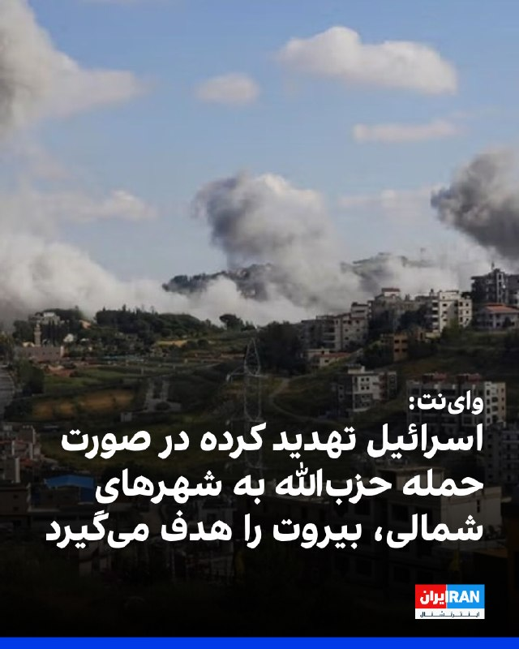

به گزارش وای‌نت، اسرائیل تهدید کرده در صورت حمله حزب‌الله به شهرهای شمالی این کشور، بیروت را هدف قرار خواهد داد.

همزمان ارتش اسرائیل اعلام کرد چند موشک زمین‌به‌هوا از خاک لبنان به سمت هواپیماهای نیروی هوایی این کشور پرتاب شده که باعث فعال شدن سامانه‌های هشدار در شمال اسرائیل شد.
https://iranintl.com/202606056733

## FarsiVOA — post 219701

🔺عملکرد فراتر از انتظار بازار مشاغل آمریکا در سایه عملیات نظامی علیه جمهوری اسلامی؛ ایجاد ۱۷۲ هزار شغل در ماه مه

▪️آمار تازه وزارت کار آمریکا نشان می‌دهد وضعیت بازار کار کشور فراتر از انتظار عمل کرده است؛ تحولی که برای دونالد ترامپ، رئیس‌جمهوری آمریکا، خبر مثبتی است.

⬇️ بیشتر بخوانید:
https://ir.voanews.com/a/u-s-job-market-remains-strong/8157775.html
@FarsiVOA

## alonews — post 125406

  <a href="telegram/content/alonews_125406_1780692233.webm" target="_blank">🎬 Download video</a>

👈صدف طاهریان، مدل معروفِ خارج‌نشین، امروز با یه استوری رسما اعلام کرد که به ایران برگشته

🔴وی اعلام کرد منقلب شده و انقلابی است

✅ @AloNews خبر جنگ

## alonews — post 125405

  <a href="telegram/content/alonews_125405_1780692233.mp4" target="_blank">🎬 Download video</a>

👈لحظه فیلمبرداری از جنگنده نسل 6 F-47 آمریکا، این جنگنده هیچ حرارتی از خود بروز نمی‌دهد

✅ @AloNews خبر جنگ

---
📅 بروزرسانی: 1405/03/16 00:03
---

## VahidOOnLine — post 243860

♦️فهد البطحی، مدیر ارشد عملیاتی شرکت ملی تامین تجهیزات پزشکی عربستان سعودی (نوپکو)، با اشاره به توسعه زیرساخت‌های نوین لجستیکی، از گسترش به‌کارگیری پهپادها در شبکه توزیع دارویی خبر داد.
او با تاکید بر هوشمندسازی زنجیره تامین تجهیزات درمانی تصریح کرد: «در سال جاری استفاده از پهپادها را در بخش تحویل اضطراری بسط داده‌ایم. این فناوری زمان ارسال محموله‌ها از انبارها به مراکز درمانی را که پیش از این در ساعات اوج ترافیک حدود یک ساعت و نیم به طول می‌انجامید، به تنها ۳ دقیقه کاهش داده است.»
استفاده از پهپادهای ترابری در حوزه بهداشت و درمان، گامی کلیدی در راستای تسریع امدادرسانی و حذف موانع ترافیکی در کلان‌شهرها به شمار می‌رود.
‌🇸🇦 Indypersian

🤖 @VahidOOnLine

## DEJradio — post 5373

⭕️ اکسیوس: توافق میان آمریکا و جمهوری اسلامی هنوز قطعی نیست

وبسایت خبری اکسیوس گزارش داد هنوز نمی‌توان در مورد دستیابی واشینگتن و تهران به توافق با قاطعیت نظر داد.
به گزارش اکسیوس، استیو ویتکاف و جرد کوشنر پنج‌شنبه ۱۴ خرداد برای رایزنی با کارشناسان فنی مرتبط با مذاکرات احتمالی هسته‌ای، به آزمایشگاه ملی اوک‌ریج در ایالت تنسی رفتند.
کاخ سفید در تلاش است به یک یادداشت تفاهم برای پایان جنگ و آغاز مذاکرات جامع هسته‌ای با جمهوری اسلامی برسد.
مقام‌های آمریکایی و منابع منطقه‌ای گفته‌اند اختلاف بر سر چند بند از این یادداشت تفاهم، همچنان باقی است.
منابعی در میان میانجی‌گران، گفته‌اند مذاکرات در مرحلهٔ نهایی قرار دارد، اما هنوز مشخص نیست توافق پایانی به‌دست بیاید یا نه.
یک مقام آمریکایی به اکسیوس گفت سفر مقامات به اوک‌ریج به معنای قطعی بودن توافق نیست، اما نشان می‌دهد مذاکرات وارد مرحله‌ای جدی شده است.

#خبر #دژ #توافق #مذاکرات
@DEJradio

## DEJradio — post 5372

⭕️ جمهوری آذربایجان خبر حضور نظامیان اسرائیلی در خاک خود را رد کرد

وزارت امور خارجهٔ جمهوری آذربایجان گزارش شبکهٔ سی‌ان‌ان درمورد حضور نیروهای اسرائیلی در خاک این کشور را رد کرد.
آیخان حاجی‌زاده، سخنگوی وزارت خارجهٔ جمهوری آذربایجان، این گزارش را «بی‌بنیاد و گمراه‌کننده» خواند.
سی‌ان‌ان پیش‌تر به نقل از منابع ناشناس گزارش داده بود اسرائیل در جریان جنگ با جمهوری اسلامی، نیروهای ویژه و اطلاعاتی خود را به جمهوری آذربایجان اعزام کرده است.
سخنگوی دستگاه دیپلماسی جمهوری آذربایجان گفت باکو هرگز اجازهٔ استفاده از خاک خود علیه کشورهای دیگر را نداده و نمی‌دهد.

#خبر #دژ #آذربایجان #اسرائیل
@DEJradio

## DEJradio — post 5371

⭕️ سنتکام: ۱۲۹ کشتی مرتبط با تهران را وادار به تغییر مسیر کردیم

سنتکام، شامگاه آدینه پانزدهم خرداد اعلام کرد نیروهای آمریکایی در روند محاصرهٔ دریایی جمهوری اسلامی، تاکنون ۱۲۹ کشتی تجاری مرتبط با رژیم را وادار به تغییر مسیر کرده‌اند.
ستاد فرماندهی مرکزی ارتش آمریکا همچنین اعلام کرد شش کشتی مرتبط با جمهوری اسلامی را از طریق هدف گرفتن، از کار انداخته است.
سنتکام با انتشار تصویری از ناو تهاجمی آبی‌ـ‌خاکی تریپولی در دریای عرب، تصریح کرد این ناو از عملیات محاصرهٔ دریایی پشتیبانی می‌کند.

#خبر #دژ #سنتکام #محاصره_دریایی
@DEJradio

## IranIntlTV — post 340722

  <a href="telegram/content/IranIntlTV_340722_1780691599.mp4" target="_blank">🎬 Download video</a>

لیلا فروهر، خواننده سرشناس ایرانی، با انتشار موزیک‌ویدیوی «نه به اعدام» به موج اعدام‌ها در ایران اعتراض کرده است.
او می‌گوید این اثر را از دل نگرانی و درد برای جوانانی ساخته که به‌دلیل اعتراض به حقوق انسانی خود زندانی و اعدام می‌شوند.

گفت‌وگو با لیلا فروهر
@iranintltv

## alonews — post 125404

  <a href="telegram/content/alonews_125404_1780691601.webm" target="_blank">🎬 Download video</a>

👈ترامپ: در حال بررسی امکان ارسال سلاح به تایوان هستیم.

✅ @AloNews خبر جنگ

---
📅 بروزرسانی: 1405/03/15 23:53
---

## FoxNewsTwitter — post 342661

  <a href="telegram/content/FoxNewsTwitter_342661_1780690994.mp4" target="_blank">🎬 Download video</a>

Fox News (Twitter/X)

“He’s going faster than all the cars!”

That was the reaction after a motorized wheelchair user was spotted speeding alongside traffic on a busy road near Baltimore.

The video shows the wheelchair keeping pace with surrounding vehicles as stunned drivers watched it unfold.

The unexpected sight left onlookers doing double takes and quickly sparked attention online.

## DEJradio — post 5370

⭕️ آمریکا ویزای بازیکنان تیم فوتبال جمهوری اسلامی ایران را صادر کرد

یک مقام کاخ سفید روز آدینه به خبرگزاری رویترز گفت آمریکا ویزای بازیکنان تیم ملی فوتبال جمهوری اسلامی ایران را برای حضور در جام جهانی ۲۰۲۶ صادر کرده است.
اکیپ فوتبالی جمهوری اسلامی قرار است در نخستین دیدار ۲۶ خردادماه در لس‌آنجلس برابر نیوزلند بازی کند.
این تیم ۳۱ خرداد برابر بلژیک و ۶ تیرماه مقابل مصر به میدان می‌رود.
تیم فوتبال جمهوری اسلامی اردو و محل اقامت خود را در تیخوانای مکزیک مستقر کرده و فقط برای مسابقات وارد آمریکا می‌شود.
وزارت امور خارجهٔ آمریکا پیش‌تر اعلام کرده بود افراد مرتبط با سپاه پاسداران در هیئت همراه تیم، اجازه ورود به آمریکا ندارند.
خبرگزاری حکومتی فارس گزارش داد ویزای برخی از اعضای کادر فنی و همراهان تیم هنوز صادر نشده است.
آمریکا افرادی را که پیشینهٔ حضور در سپاه پاسداران را دارند، به این‌ کشور راه نمی‌دهد.
سپاه در سیاههٔ تروریستی آمریکا قرار دارد.

#خبر #دژ #فوتبال #جام_جهانی
@DEJradio

## DEJradio — post 5369

⭕️ ترامپ: همچنان نفت زیادی از تنگهٔ هرمز عبور می‌کند

دونالد ترامپ، رئیس جمهوری آمریکا، شامگاه آدینه گفت همچنان حجم زیادی از نفت از تنگهٔ هرمز عبور می‌کند.
ترامپ در هواپیمای ایر فورس وان، گفت نفت زیادی وارد بازار جهانی می‌شود.
او افزود که به همین دلیل، لهای نفت اکنون درحدود ۹۷ دلار در هر بشکه است و به ۳۰۰ دلار نرسیده اشت.
رئیس جمهوری آمریکا رقم دقیق صادرات و عبور نفت از تنگهٔ هرمز را اعلام نکرد.
در روزهای اخیر گزارش‌هایی در مورد عبور شماری از نفتکش‌ها از آبراه هرمز با هماهنگی و پشتیبانی ارتش آمریکا منتشر شده بود.

#خبر #دژ #تنگه_هرمز
@DEJradio

## mamlekate — post 103618

📝 بنیان‌گذار آنتروپیک: توسعه هوش مصنوعی بدون نظارت انسان را باید متوقف کنیم

جک کلارک، از بنیان‌گذاران شرکت «آنتروپیک»، که در حوزه هوش مصنوعی (ا‌ی آی) فعالیت می‌کند، هشدار داده است که هوش مصنوعی به نقطه‌ای نزدیک می‌شود که ممکن است بتواند بدون دخالت مستقیم انسان به توسعه خود ادامه دهد.

@mamlekate

## IranIntlTV — post 340721

  <a href="telegram/content/IranIntlTV_340721_1780690996.mp4" target="_blank">🎬 Download video</a>

یک عضو مجلس جمهوری اسلامی گفت امتیازدهی در میز مذاکره خطاست. همزمان، امامان جمعه در شهرهای مختلف از آنچه عقب‌نشینی‌های مکرر آمریکا خواندند سخن گفتند و تاکید کردند دونالد ترامپ در حال بلند کردن پرچم سفید است و پیروزی نزدیک است.

گفت‌وگو با مهدی نخل‌احمدی، روزنامه‌نگار و فعال سیاسی
@iranintltv

## IranIntlTV — post 340720

یک عضو مجلس جمهوری اسلامی گفت امتیازدهی در میز مذاکره خطاست. همزمان، امامان جمعه در شهرهای مختلف از آنچه عقب‌نشینی‌های مکرر آمریکا خواندند سخن گفتند و تاکید کردند دونالد ترامپ در حال بلند کردن پرچم سفید است و پیروزی نزدیک است.

گفت‌وگو با مهدی نخل‌احمدی، روزنامه‌نگار و فعال سیاسی
@iranintltv

## IranianMinds — post 21446

  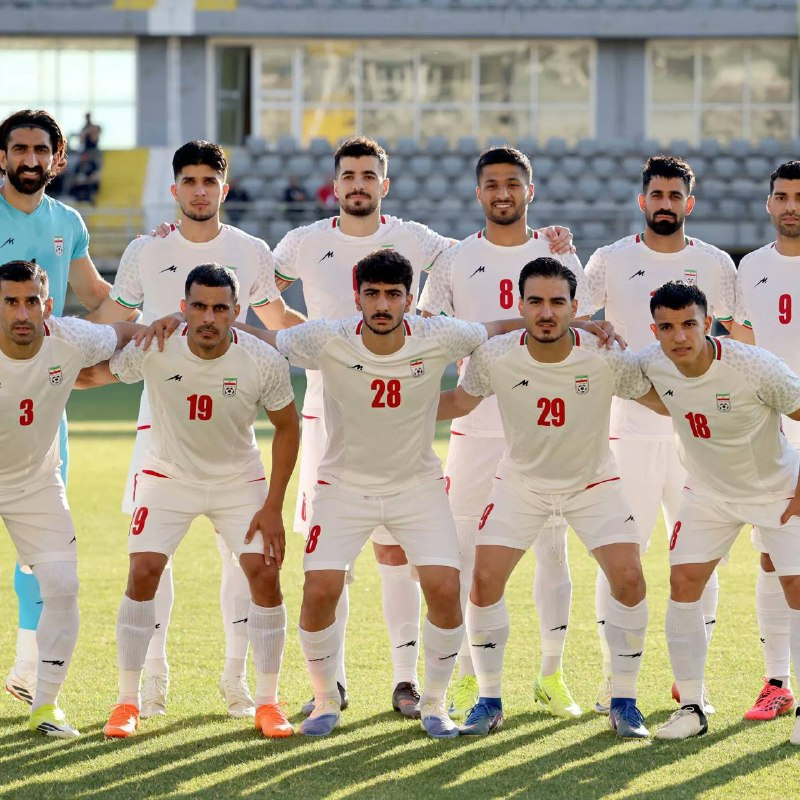

آمریکا به تیم جمهوری اسلامی ویزا داد.

@IranianMinds

## alonews — post 125403

  <a href="telegram/content/alonews_125403_1780691000.webm" target="_blank">🎬 Download video</a>

👈عکس امروز از دست ترامپ

✅ @AloNews خبر جنگ

---
📅 بروزرسانی: 1405/03/15 23:43
---

## FoxNewsTwitter — post 342660

  <a href="telegram/content/FoxNewsTwitter_342660_1780690383.mp4" target="_blank">🎬 Download video</a>

Fox News (Twitter/X)

RT @MattFinnFNC: An assistant United States attorney, Robert Renner, is observing & asking questions inside L.A. County's central processing center where hundreds-of-thousands of ballots remain to be counted. Also with him is a worker who identified as being with California AG Bonta's office.

## mamlekate — post 103617

  <a href="telegram/content/mamlekate_103617_1780690386.mp4" target="_blank">🎬 Download video</a>

قبل از آتش بس: تا بحال به حجابم گیر ندادن، شکلات و گل هم بهم دادن.

بعد از آتش بس: هی میگن خانم پرچم دستته، شالت هم سرت کن.

@mamlekate

## VahidOnline — post 75954

  <a href="telegram/content/VahidOnline_75954_1780690387.mp4" target="_blank">🎬 Download video</a>

پخش امشب برنامه «خیابان انقلاب» به خاطر این حرف‌ها لغو شد
beehnam

📡 @VahidOnline

## RadioFarda — post 157942

دادگاه فدرال سیاست‌های مهاجرتی دولت ترامپ علیه اتباع ۳۹ کشور را لغو کرد

🔸یک قاضی فدرال آمریکا روز جمعه حکم داد که دولت ایالات متحده، مجموعه‌ای از سیاست‌های غیرقانونی را به اجرا گذاشته است که مانع از آن شده‌اند افراد از ۳۹ کشور مختلف بتوانند دربارهٔ درخواست‌های پناهندگی، مجوز کار، گرین کارت و شهروندی خود پاسخ قطعی دریافت کنند.

🔸جان مک‌کانل، قاضی ارشد دادگاه منطقه‌ای آمریکا در پراویدنسِ ایالت رود آیلند، مجموعه‌ای از سیاست‌های اتخاذشده توسط اداره خدمات شهروندی و مهاجرت آمریکا (USCIS) را باطل کرد.

🔸او گفت این سیاست‌ها افرادی از ده‌ها کشور آفریقایی، آسیایی، آمریکای لاتین و خاورمیانه را در وضعیتی از «بلاتکلیفی حقوقی نامشخص» قرار داده است.

🔸ایران یکی از این کشورها است و مهاجران و دانشجویان ایرانی بعد از اجرای این سیاست توسط دولت دونالد ترامپ در وضعیت بلاتکلیفی قرار گرفتند.

🔸به گزارش خبرگزاری رویترز، قاضی فدرال در حکم خود گفت این مهاجران تمامی مراحل قانونی تعیین‌شده از سوی کنگره را رعایت کرده‌اند و همچنین مقرراتی را که اداره مهاجرت آمریکا وضع کرده بود دنبال کرده‌اند، اما با این وجود «ماه‌ها در انتظار مانده‌اند، زیرا درخواست‌هایشان برای دریافت مزایا و امتیازات مهاجرتی از سوی اداره مهاجرت بررسی و تعیین تکلیف نمی‌شود.»

🔸این قاضی که از سوی باراک اوباما، رئیس‌جمهور دموکرات پیشین آمریکا، منصوب شده بود، گفت دولت این سیاست‌ها را بدون اختیار قانونی و مقرراتی لازم اتخاذ کرده و تصمیم‌گیری‌هایش تحت تأثیر «نگرش‌های ضد مهاجرتی» قرار گرفته است؛ نگرش‌هایی که قانوناً نباید در فرایند تصمیم‌گیری این نهاد دخالت داشته باشند.

🔸 گزارش کامل را در وب‌سایت رادیوفردا بخوانید.

@RadioFarda

## BBCPersian — post 282930

  <a href="telegram/content/BBCPersian_282930_1780690388.mp4" target="_blank">🎬 Download video</a>

🔻 آخرین خبرهای مهم جمعه ۱۵ خرداد ۱۴۰۵

## BBCPersian — post 282929

  

🔻منابع خبری در ایران از بستری شدن میرحسین موسوی در بیمارستان خبر داده‌اند.

به نقل از یکی از نزدیکان او، آقای موسوی «پس از ابتلا به سرماخوردگی و با توجه به سابقه عمل آنژیوپلاستی قلب، برای مراقبت‌های پزشکی در بیمارستان بستری شده است.»

همچنین گزارش‌ها حاکی از آن است که محمدرضا ظفرقندی، وزیر بهداشت، با دستور مسعود پزشکیان، رئیس‌جمهور، شخصاً مسئول پیگیری روند رسیدگی به وضعیت درمانی میرحسین موسوی شده است.

بر اساس این گزارش‌ها، وضعیت جسمانی موسوی رو به بهبود ارزیابی شده است.

سایت خبری کلمه نزدیک به میرحسین موسوی پیش‌تر گفته بود که او و و همسرش زهرا رهنورد پس از نخستین بمباران خیابان پاستور در جریان جنگ و آسیب دیدن محل حصرشان به مکانی خارج از آن محدوده منتقل شده‌اند.

میرحسین موسوی ۸۴ ساله و همسرش زهرا رهنورد ۸۰ ساله، پس از وقایع و اعتراضات سال ۱۳۸۸ در حصر خانگی به سر می‌برند.

@BBCPersian

---
📅 بروزرسانی: 1405/03/15 23:33
---

## VahidOOnLine — post 243858

  

علی خزایی، نماینده ورامین در مجلس، گفت: «غنی‌سازی، توان دفاعی و موشکی، امنیت جبهه مقاومت و حقوق ملت ایران از موضوعاتی است که نباید مورد معامله یا عقب‌نشینی قرار گیرد.»

او ادامه داد: «امروز جنگ در حوزه‌های شناختی، رسانه‌ای و اقتصادی دنبال می‌شود و دشمن تلاش می‌کند از طریق تاثیرگذاری بر گرانی، گران‌فروشی، احتکار و فشار بر معیشت مردم اهداف خود را محقق کند.»
‌🏁 🇬🇧 IranintlTV

🤖 @VahidOOnLine

## VahidOOnLine — post 243857

  <a href="telegram/content/VahidOOnLine_243857_1780689797.mp4" target="_blank">🎬 Download video</a>

ویدیوی رسیده به ایران‌اینترنشنال نشان می‌دهد گروهی از شهروندان در شمیران تهران شامگاه جمعه ۱۵ خرداد از درون خانه‌ها فریاد «مرگ بر جمهوری اسلامی» سردادند.
‌🏁 🇬🇧 IranintlTV

🤖 @VahidOOnLine

## VahidOOnLine — post 243856

  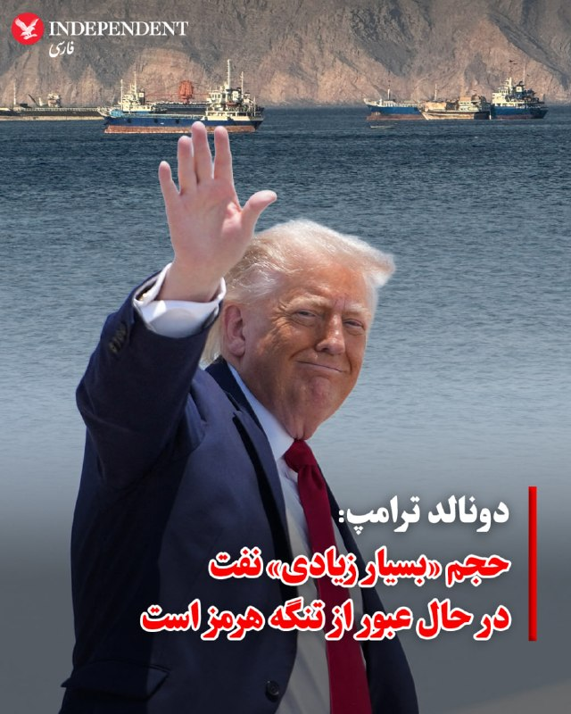

♦️ دونالد ترامپ، رئیس‌جمهوری ایالات متحده، روز جمعه ۱۵ خرداد در جریان پاسخ به پرسش‌های خبرنگاران در هواپیمای اختصاصی رئیس‌جمهور، گفت که حجم «بسیار زیادی» نفت در حال عبور از تنگه هرمز است.

ترامپ که برای شرکت در میزگردی با کشاورزان عازم ایالت ویسکانسین بود، گفت: «نمی‌خواهیم آمار [دقیق] بدهم، اما مقدار آن بسیار زیاد است. حجم عظیمی از نفت وارد کشور ما و بازارهای جهانی می‌شود و مردم حتی از آن باخبر هم نیستند؛ به همین دلیل است که قیمت نفت به جای بشکه‌ای ۳۰۰ دلار، اکنون روی ۹۷ دلار ایستاده است.»
‌🇸🇦 Indypersian

🤖 @VahidOOnLine

## WithYashar — post 13571

انفجار ناشناس در نزدیکی کنسولگری ایران در استان سلیمانیه در شمال عراق.
@withyashar

## pm_afshaa — post 92329

🔴انفجار در اطراف سفارت ج.ا در سلیمانیه عراق

💧 Rainbet.com the #1 Non-KYC Crypto Casino & Sportsbook @rainbetcom

😁 @Pm_Afshaa

## iaghapour — post 2658

  

🚀 سرور ابری رو از هر جای دنیا و با هر ارزی که دوست داری بخر!

🌍 دیگه نیازی نیست برای خرید سرور از دیتاسنترهای معتبر جهانی دغدغه پرداخت یا محدودیت لوکیشن داشته باشی. در دوپراکس (Doprax)، بهترین زیرساخت‌های ابری دنیا در یک پنل اختصاصی زیر دست شماست!

با دوپراکس می‌تونی از غول‌های تکنولوژی مثل Google Cloud, DigitalOcean, Hetzner, Vultr و چندین پروایدر دیگر، سرور تهیه کنی.

✨ چرا دوپراکس بهترین انتخاب شماست؟
📍 تنوع لوکیشن: دسترسی به ده‌ها لوکیشن مختلف در اروپا، آمریکا، آسیا.
💳 پرداخت بدون مرز: امکان پرداخت آسان با ریال و یا رمزارز.
⏱️ پرداخت ساعتی: فقط به اندازه‌ای که مصرف می‌کنی پول بده!
🔄 امکان تعویض IP: قابلیت تغییر آی‌پی در اکثر دیتاسنترها.

همین حالا وارد سایت شو و اولین سرورت رو با کانفیگ دلخواهت بساز 👇

🌐 وب‌سایت: www.doprax.com

💬 پشتیبانی و اخبار در کانال ما:
@dopraxcloud

## IranIntlTV — post 340719

  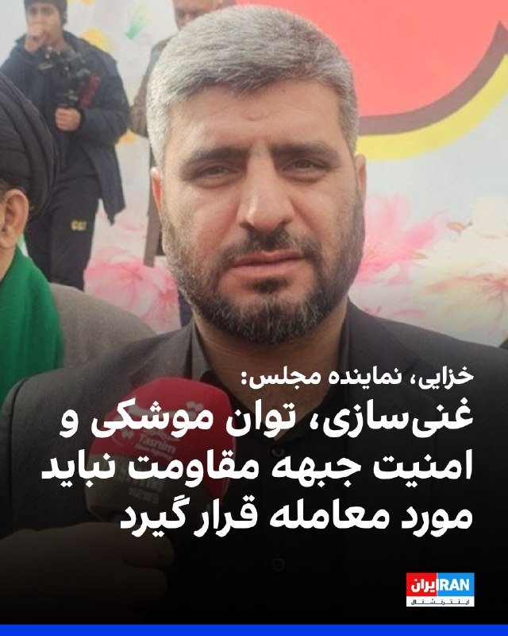

علی خزایی، نماینده ورامین در مجلس، گفت: «غنی‌سازی، توان دفاعی و موشکی، امنیت جبهه مقاومت و حقوق ملت ایران از موضوعاتی است که نباید مورد معامله یا عقب‌نشینی قرار گیرد.»

او ادامه داد: «امروز جنگ در حوزه‌های شناختی، رسانه‌ای و اقتصادی دنبال می‌شود و دشمن تلاش می‌کند از طریق تاثیرگذاری بر گرانی، گران‌فروشی، احتکار و فشار بر معیشت مردم اهداف خود را محقق کند.»
https://iranintl.com/202606056001

## IranIntlTV — post 340718

  <a href="telegram/content/IranIntlTV_340718_1780689802.mp4" target="_blank">🎬 Download video</a>

ویدیوی رسیده به ایران‌اینترنشنال نشان می‌دهد گروهی از شهروندان در شمیران تهران شامگاه جمعه ۱۵ خرداد از درون خانه‌ها فریاد «مرگ بر جمهوری اسلامی» سردادند.

## IranIntlTV — post 340717

  <a href="https://t.me/IranintlTV/340717" target="_blank">📎 Download file</a>

🎧نسخه صوتی ‌‌‏۲۴ با فرداد فرحزاد: توقیف یک نفت‌کش و تحریم صنعت نفت و گاز ادامه فشار اقتصادی واشینگتن بر تهران
@iranintlTV

## Shin_Persian — post 6528

  <a href="telegram/content/Shin_Persian_6528_1780689805.mp4" target="_blank">🎬 Download video</a>

Shin ✓ @hey_itsmyturn
Fri, 05 Jun 2026 19:57:53 UTC

Blast in Sulaimaniyah was reportedly near the Iranian Consulate building.
#KRI, #Iraq 🇮🇶

فارسی

گزارش‌ها حاکی از آن است که انفجار در سلیمانیه در نزدیکی ساختمان کنسولگری ایران رخ داده است.
#KRI, #Iraq 🇮🇶

𝕏 · @shin_persian

## FarsiVOA — post 219700

  <a href="telegram/content/FarsiVOA_219700_1780689806.mp4" target="_blank">🎬 Download video</a>

⚡️همن سیدی در برنامه تفسیر خبر: جمهوری اسلامی تنگه هرمز را به کارت سوخته یکبار مصرف تبدیل کرد
@FarsiVOA

## Persian_Trend_Official — post 15773

کانال رسمی پرشین ترند pinned «https://youtube.com/live/Hn1QyiiGrKI?feature=share»

## Persian_Trend_Official — post 15772

  <a href="telegram/content/Persian_Trend_Official_15772_1780689807.webm" target="_blank">🎬 Download video</a>

https://youtube.com/live/Hn1QyiiGrKI?feature=share

## Dirty_Kids — post 391086

  <a href="telegram/content/Dirty_Kids_391086_1780689808.mp4" target="_blank">🎬 Download video</a>

دیگه رسما دارن تو اینستاگرام فارسی پورن داستانی میسازن!

@Dirty_Kids 👻

## Dirty_Kids — post 391085

  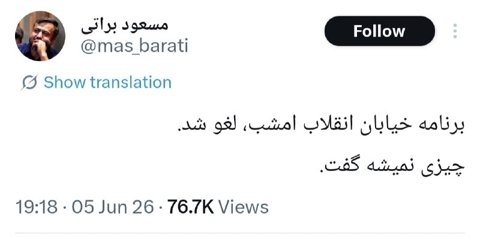

شماها حکم دستمال رو برای حکومت دارید و وقتی کارشون با شما تمام شد شما رو به سطل زباله هدایت می کنند😀😀

@Dirty_Kids 👻

## Dirty_Kids — post 391084

  <a href="telegram/content/Dirty_Kids_391084_1780689810.mp4" target="_blank">🎬 Download video</a>

جوری که ترامپ تنگه هرمز رو به یه مشکل برای خودش تبدیل کرد:

@Dirty_Kids 👻

## alonews — post 125402

  <a href="telegram/content/alonews_125402_1780689812.webm" target="_blank">🎬 Download video</a>

👈نخست‌وزیر پاکستان: همواره در کنار آمریکا بوده‌ایم؛ برای همیشه از «ترامپ» به عنوان «مرد صلح» یاد خواهیم کرد

✅ @AloNews خبر جنگ

## alonews — post 125401

  <a href="telegram/content/alonews_125401_1780689812.webm" target="_blank">🎬 Download video</a>

🔴فوری / نایا : انفجار ناشناس در نزدیکی کنسولگری ایران در استان سلیمانیه در شمال عراق. 
✅ @AloNews خبر جنگ

## alonews — post 125400

  <a href="telegram/content/alonews_125400_1780689813.mp4" target="_blank">🎬 Download video</a>

🔴فوری / نایا : انفجار ناشناس در نزدیکی کنسولگری ایران در استان سلیمانیه در شمال عراق.

✅ @AloNews خبر جنگ

---
📅 بروزرسانی: 1405/03/15 23:22
---

## VahidOOnLine — post 243855

  <a href="telegram/content/VahidOOnLine_243855_1780689175.mp4" target="_blank">🎬 Download video</a>

♦️هواداران تیم ام‌سی الجر(MC Alger) پس ازدهمین قهرمانی در لیگ برتر الجزایر، خیابان‌های الجزیره را به صحنه‌ای از جشن و شادی تبدیل کردند.
ویدیوهای منتشرشده نشان می‌دهد هزاران هوادار با پرچم‌ها، شعارها و منورهای قرمز رنگ همزمان صحنه آتش‌بازی بزرگی را رقم زدند و قهرمانی تیم محبوبشان را جشن گرفته‌اند؛ طرفداران این تیم در الجزایر معروف به استفاده از منورهای قرمز در مسابقات هستند.
 تیم ام‌سی الجر با این قهرمانی بار دیگر جایگاه خود را به‌عنوان یکی از پرافتخارترین تیم‌های فوتبال الجزایر تثبیت کرد و هوادارانش را به خیابان‌ها کشاند.
‌🇸🇦 Indypersian

🤖 @VahidOOnLine

## DEJradio — post 5368

⭕️ ارتش آمریکا از توقیف یک ابرنفتکش مرتبط با جمهوری اسلامی خبر داد

فرماندهی هند-اقیانوسیهٔ ارتش ایالات متحده اعلام کرد نیروهای آمریکا در اقیانوس هند ابرنفتکش ام‌تی داوینا، را توقیف و بازرسی کردند.
ارتش آمریکا اعلام کرد این کشتی به دلیل ارتباط با تجارت نفت جمهوری اسلامی تحت تحریم بود.
رویترز گزارش داد این نفتکش می‌تواند درحدود دو میلیون بشکه نفت خام را حمل کند.
داده‌های رهگیری شرکت‌های کشتیرانی نشان می‌دهد این نفتکش در روز آدینه آخرین بار در نزدیکی سواحل جنوبی سریلانکا دیده شده است.

#خبر #دژ #محاصره_دریایی
@DEJradio

## DEJradio — post 5367

⭕️ اسرائیل در جنگ با جمهوری اسلامی شبکهٔ مخفی منطقه‌ای ایجاد کرده بود

شبکهٔ سی‌ان‌ان به نقل از چهار منبع آگاه گزارش داد اسرائیل در جریان جنگ با جمهوری اسلامی، شبکه‌ای از پایگاه‌ها و مراکز مخفی در خاورمیانه ایجاد کرده بود.
بنا بر این گزارش، بخشی واحدهای اطلاعاتی و نظامی اسرائیل در جنوب جمهوری آذربایجان، نزدیک مرز شمالی ایران، مستقر بود.
منابع سی‌ان‌ان گفتند نیروهای اسرائیلی از این مناطق عملیات اطلاعاتی و پهپادی انجام می‌دادند.
سی‌ان‌ان همچنین از وجود مراکز و پایگاه‌های پنهانی دیگر اسرائیل در عراق، امارات و سومالی‌لند خبر داد.
بر پایهٔ گزارش این شبکه، برخی از همسایگان ایران آگاهانه یا بدون اطلاع، در تسهیل عملیات علیه جمهوری اسلامی نقش داشتند.

#خبر #دژ #اسرائیل
@DEJradio

## IranIntlTV — post 340716

  

🔻درحالی که رویترز به نقل از مقامی در کاخ سفید خبر داده آمریکا برای بازیکنان تیم ملی ویزا صادر کرده است، فارس، خبرگزاری وابسته به سپاه نوشته که «ویزای برخی اعضای کادر فنی و اجرایی تیم ملی هنوز صادر نشده و سفارت آمریکا تاکنون از صدور ویزا خودداری کرده است.»

🔹پیش‌تر مهدی تاج، رییس فدراسیون فوتبال گفته بود «پاسپورت‌های اعضای تیم ملی را به سفارت آمریکا در آنکارا تحویل دادیم. به فیفا اعلام کرده‌ایم اگر ویزای برخی از اعضای تیم ملی صادر نشود، تصمیم‌های دیگری خواهیم گرفت.»

🔹ابوالفضل پسندیده، سفیر ایران در مکزیک، اواخر روز پنج‌شنبه گفته بود که تیم ملی هنوز ویزای آمریکا را دریافت نکرده است، اما مقام کاخ سفید اعلام کرد این ویزاها طی شب صادر شده‌اند.

🔹این در حالی است که تنها ۱۰ روز تا نخستین بازی ایران در جام جهانی ۲۰۲۶ باقی‌مانده است. این بازی در لس‌آنجلس و در برابر نیوزیلند برگزار خواهد شد.

@iranintltvsport

## Shin_Persian — post 6527

Shin ✓ @hey_itsmyturn
Fri, 05 Jun 2026 19:46:28 UTC

Explosions heard in Sulaimaniyah, #KRI, #Iraq 🇮🇶

فارسی

صدای انفجارها در سلیمانیه، #KRI (اقلیم کردستان عراق)، #Iraq شنیده شد 🇮🇶

𝕏 · @shin_persian

## DW_Farsi — post 125549

🎥 افزایش دارایی‌های ابرثروتمندان در آلمان

دارایی‌های مالی و ثروت در آلمان با سرعت در حال افزایش است، اما این رشد شامل همه نمی‌شود. حدود ۵ هزار ابرثروتمند در این کشور یک‌چهارم کل دارایی مالی را در اختیار دارند، در حالی که خطر فقر نیز رو به افزایش است.
@dw_farsi

## alonews — post 125399

  <a href="telegram/content/alonews_125399_1780689177.webm" target="_blank">🎬 Download video</a>

👈الحدث به نقل از یک مقام آمریکایی: دیدار ویتکاف و کوشنر با کارشناسان هسته‌ای نشانه آن است که مذاکرات در مرحله جدی قرار دارد.

✅ @AloNews خبر جنگ

## alonews — post 125398

  <a href="telegram/content/alonews_125398_1780689177.webm" target="_blank">🎬 Download video</a>

👈المیادین: در حمله به یک کشتی ماهیگیری ترکیه که در دریای سیاه در حال حرکت بود، یک ماهیگیر کشته و 4 تن دیگر زخمی شدند.

✅ @AloNews خبر جنگ

## alonews — post 125397

  <a href="telegram/content/alonews_125397_1780689177.webm" target="_blank">🎬 Download video</a>

👈امروز دو نیرو حزب الله توسط ارتش اسرائیل (IDF) در درگیری تن به تن کشته شدند

✅ @AloNews خبر جنگ

---
📅 بروزرسانی: 1405/03/15 23:12
---

## WithYashar — post 13570

  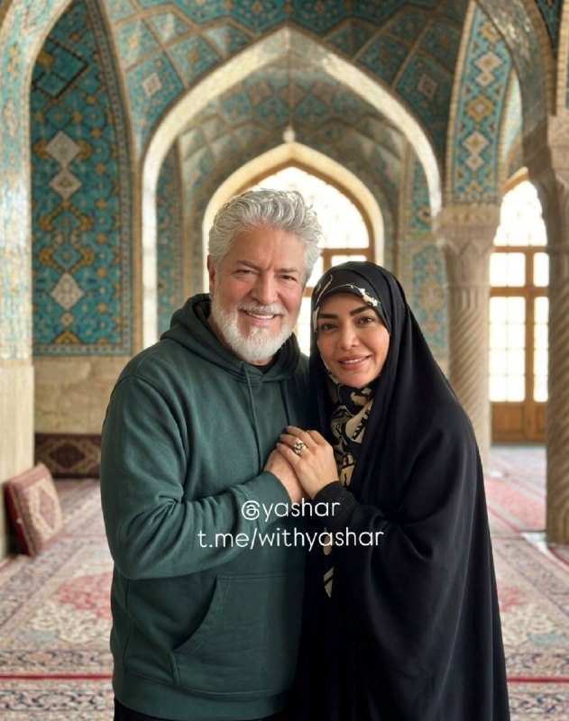

خواستگاری جنجالی قیصر از الهام چرخنده در تجمعات حکومتی

قیصر در یکی از تجمعات حکومتی، به‌صورت علنی از الهام چرخنده، بازیگر سابق تلویزیون ایران، درخواست ازدواج کرد. این اتفاق غیرمنتظره خیلی زود در فضای مجازی و رسانه‌ای مورد توجه قرار گرفت و واکنش‌های زیادی را به دنبال داشت
@withyashar

## FarsiVOA — post 219699

⚡️از وداع با ساتراپی تا بازگشت قیصر؛ کاربران از پرسپولیس و «حلال» شدن موسیقی لس‌آنجلسی می‌گویند
@FarsiVOA

## FarsiVOA — post 219698

  <a href="telegram/content/FarsiVOA_219698_1780688572.mp4" target="_blank">🎬 Download video</a>

⚡️هشدارها درباره وضعیت نامناسب زندان‌ها در ایران؛ گفت‌وگو با شیوا محبوبی
@FarsiVOA

## FarsiVOA — post 219697

⚡️پدیدار شدن تدریجی عوارض قطع ۸۸ روزه اینترنت در ایران بر اقتصاد؛ نابودی کسب‌وکارهای دیجیتال در گفت‌وگو با رضا غیبی
@FarsiVOA

## IranianMinds — post 21445

  <a href="telegram/content/IranianMinds_21445_1780688573.mp4" target="_blank">🎬 Download video</a>

🔴عضو فاطمیون میخواد بزنه توی دهن ما، بعد به ما میگن وطن‌فروش😂

@IranianMinds

## Hranews — post 113412

  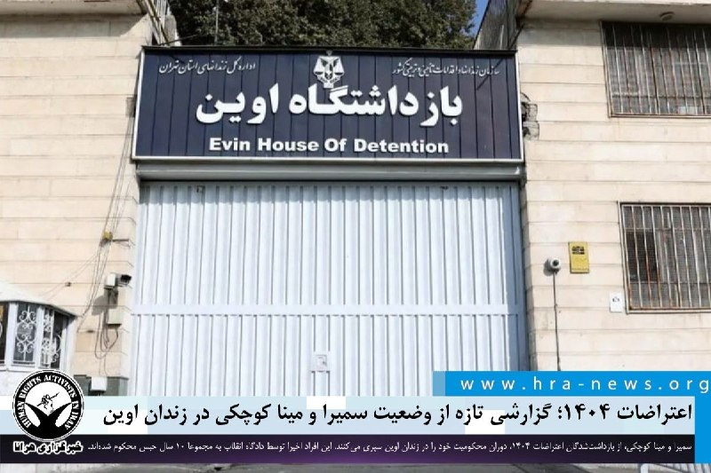

اعتراضات ۱۴۰۴؛ گزارشی تازه از وضعیت سمیرا و مینا کوچکی در زندان اوین

❗️
❗️
❗️
❗️
❗️– سمیرا و مینا کوچکی، از بازداشت‌شدگان اعتراضات ۱۴۰۴، دوران محکومیت خود را در زندان اوین سپری می‌کنند. این افراد توسط دادگاه انقلاب به مجموعا ۱۰ سال حبس محکوم شده‌اند.

به گزارش خبرگزاری هرانا، ارگان خبری مجموعه فعالان حقوق بشر در ایران، سمیرا و مینا کوچکی، زندانیان سیاسی در حال سپری کردن دوران حبس خود در زندان اوین هستند.

یک منبع مطلع و نزدیک به خانواده کوچکی ضمن تایید این خبر به هرانا گفت: خانم‌های کوچکی که در جریان اعتراضات سراسری ۱۴۰۴ بازداشت شده‌اند، هرکدام توسط دادگاه انقلاب به پنج سال حبس محکوم شدند. این خواهران که پس از بازداشت در زندان قرچک ورامین به‌سر می‌بردند، مورخ ۲۷ بهمن ماه سال گذشته به زندان اوین منتقل شدند.

ادامه مطلب

#سمیرا_کوچکی
#مینا_کوچکی

↘️
@hranews_bot تماس ✉️ -  @Hranews  کانال هرانا 🆑

## alonews — post 125396

  <a href="telegram/content/alonews_125396_1780688575.webm" target="_blank">🎬 Download video</a>

👈خبرگزاری فارس : آمریکا هنوز به برخی از اعضای فنی و اجرایی تیم ملی ایران ویزا نداده

✅ @AloNews خبر جنگ

---
📅 بروزرسانی: 1405/03/15 23:02
---

## VahidOOnLine — post 243854

  

تامی پیگوت، سخنگوی وزارت خارجه آمریکا، با انتشار بیانیه‌ای درباره تحریم‌های تازه واشینگتن علیه جمهوری اسلامی اعلام کرد: «امروز، ایالات متحده تلاش‌های ایران برای دور زدن تحریم‌های ما و تامین مالی فعالیت‌های بی‌ثبات‌کننده‌اش را مختل می‌کند.»

او افزود: «ایالات متحده یک شبکه پیچیده که صدها میلیون دلار گاز نفتی ایران را به بازارهای جنوب و شرق آسیا قاچاق کرده است، هدف قرار داده است. این شبکه از شرکت‌های پوششی در امارات متحده عربی و چین، همراه با ناوگان سایه ایران، برای پنهان کردن منشا ایرانی سوخت و دور زدن تحریم‌های آمریکا استفاده کرده است.»

سخنگوی وزارت خارجه آمریکا ادامه داد: «ما همچنین یک صرافی ایرانی و گردانندگان آن را تحریم می‌کنیم که با سایر عوامل همکاری کرده‌اند تا بتواند میلیاردها دلار تراکنش مالی غیرقانونی را تسهیل کند. این معاملات به حکومت ایران امکان می‌دهد درآمدهای حاصل از فروش نفت را جابه‌جا کرده و هم‌زمان از نظام مالی بین‌المللی دوری کند.»

پیگوت تاکید کرد: «این تحریم‌ها بخشی از کارزار خشم اقتصادی است که با حفظ فشار حداکثری بر حکومت ایران، توانایی آن برای کسب درآمد جهت توسعه تسلیحات، حمایت از گروه‌های نیابتی تروریستی و اقدامات تهاجمی در منطقه را مختل می‌کند.»

او نوشت: «ایالات متحده همچنان اقداماتی را برای پاسخگو کردن هر فرد یا نهادی که به ایران در دور زدن تحریم‌ها کمک کند، از جمله شرکت‌ها و موسسات مالی خارجی، اتخاذ خواهد کرد. ما از جامعه بین‌المللی می‌خواهیم در اجرای این اقدامات به ما بپیوندد و مانع دسترسی جمهوری اسلامی به منابعی شود که به تروریسم، گسترش تسلیحات و بی‌ثباتی در سراسر منطقه دامن می‌زند.»
‌🏁 🇬🇧 IranintlTV

🤖 @VahidOOnLine

## FoxNewsTwitter — post 342659

  

Fox News (Twitter/X)

The reflection is finally coming back.

After weeks of construction, water is returning to the Reflecting Pool on the National Mall as part of President Trump's push to restore Washington, D.C.'s iconic landmarks.

The difference is already striking, with the Washington Monument's signature reflection beginning to reappear across the water.

## FoxNewsTwitter — post 342658

‌Fox News (Twitter/X)

When will the next Fed rate hike occur?

Our sponsor Kalshi’s prediction market shows:

— Before 2027: 51%
— Before 2028: 79%

https://www.foxbusiness.com/economy/us-jobs-report-may-2026

## IranIntlTV — post 340715

  

تامی پیگوت، سخنگوی وزارت خارجه آمریکا، با انتشار بیانیه‌ای درباره تحریم‌های تازه واشینگتن علیه جمهوری اسلامی اعلام کرد: «امروز، ایالات متحده تلاش‌های ایران برای دور زدن تحریم‌های ما و تامین مالی فعالیت‌های بی‌ثبات‌کننده‌اش را مختل می‌کند.»

او افزود: «ایالات متحده یک شبکه پیچیده که صدها میلیون دلار گاز نفتی ایران را به بازارهای جنوب و شرق آسیا قاچاق کرده است، هدف قرار داده است. این شبکه از شرکت‌های پوششی در امارات متحده عربی و چین، همراه با ناوگان سایه ایران، برای پنهان کردن منشا ایرانی سوخت و دور زدن تحریم‌های آمریکا استفاده کرده است.»

سخنگوی وزارت خارجه آمریکا ادامه داد: «ما همچنین یک صرافی ایرانی و گردانندگان آن را تحریم می‌کنیم که با سایر عوامل همکاری کرده‌اند تا بتواند میلیاردها دلار تراکنش مالی غیرقانونی را تسهیل کند. این معاملات به حکومت ایران امکان می‌دهد درآمدهای حاصل از فروش نفت را جابه‌جا کرده و هم‌زمان از نظام مالی بین‌المللی دوری کند.»

پیگوت تاکید کرد: «این تحریم‌ها بخشی از کارزار خشم اقتصادی است که با حفظ فشار حداکثری بر حکومت ایران، توانایی آن برای کسب درآمد جهت توسعه تسلیحات، حمایت از گروه‌های نیابتی تروریستی و اقدامات تهاجمی در منطقه را مختل می‌کند.»

او نوشت: «ایالات متحده همچنان اقداماتی را برای پاسخگو کردن هر فرد یا نهادی که به ایران در دور زدن تحریم‌ها کمک کند، از جمله شرکت‌ها و موسسات مالی خارجی، اتخاذ خواهد کرد. ما از جامعه بین‌المللی می‌خواهیم در اجرای این اقدامات به ما بپیوندد و مانع دسترسی جمهوری اسلامی به منابعی شود که به تروریسم، گسترش تسلیحات و بی‌ثباتی در سراسر منطقه دامن می‌زند.»

## DW_Farsi — post 125548

  

🔶 صدور روادید آمریکا برای تیم ملی فوتبال ایران

یک مقام کاخ سفید اعلام کرد که روادید ورود به ایالات متحده برای بازیکنان تیم ملی فوتبال ایران صادر شده است. این تصمیم تنها ۱۰ روز پیش از نخستین دیدار ایران در لس‌آنجلس و در بحبوحه جنگ و درگیری‌های فزاینده میان دو کشور اتخاذ شده است.

بە گزارش رویترز، بە نقل از یک مقام مطلع در کاخ سفید، روادید کاروان ایران بامداد روز جمعه ۱۵ خرداد (۵ ژوئن) صادر شد. این تحول تنها چند ساعت پس از آن رخ داد که ابوالفضل پسندیده، سفیر ایران در مکزیک، اواخر روز پنجشنبه اعلام کرده بود اعضای تیم هنوز روادید آمریکای خود را دریافت نکرده‌اند.

با وجود صدور روادید تأخیر در این روند و همچنین تقویت این رویکرد در تهران که حضور ملی‌پوشان در خاک آمریکا باید به حداقل ممکن برسد، موجب شد تا ایران در یک تصمیم‌گیری دیرهنگام محل کمپ تمرینی تیم ملی را تغییر دهد.

بر این اساس پایگاه تیم از ایالت آریزونای آمریکا به شهر مرزی تیخوانا در مکزیک منتقل شد. برنامه‌ریزی‌ها حاکی از آن است که اعضای تیم ملی ایران بامداد یکشنبه در تیخوانا فرود خواهند آمد.
@dw_farsi

## alonews — post 125395

  <a href="telegram/content/alonews_125395_1780687980.webm" target="_blank">🎬 Download video</a>

👈گزارش ایرفورس مگزین، مرکز فرماندهی آمریکا که بیش از ۲ دهه عملیات هوایی آمریکا در خاورمیانه را هدایت می‌کرد، در جریان جنگ آمریکا علیه ایران به شدت آسیب دید.

🔴چند موشک ایران در هفته‌های آغازین جنگ به مرکز عملیات هوایی ترکیبی در پایگاه هوایی «العدید» در قطر اصابت کرد و آن را از کار انداخت.

✅ @AloNews خبر جنگ

## alonews — post 125394

  <a href="telegram/content/alonews_125394_1780687980.webm" target="_blank">🎬 Download video</a>

👈هشدارهای راکتی در گالیلای علیا و نوار گالیلای شمالی، شمال اسرائیل

✅ @AloNews خبر جنگ

<!-- MSG END -->

<!-- NAV START -->

<a href="https://github.com/ProAlit/aio-downloader/blob/main/telegram/content/archive_1.md" style="display:inline-block; padding:6px 12px; margin:0 4px; background-color:#2ea44f; color:white; text-decoration:none; border-radius:4px; font-weight:bold;">صفحه بعد</a>

<!-- NAV END -->
