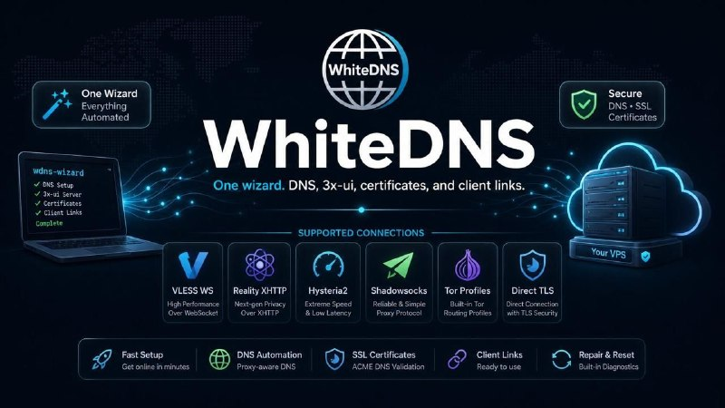

# خواننده تلگرام

<!-- TOP_NAV START -->

<!-- TOP_NAV END -->

<!-- MSG START -->

---
📅 بروزرسانی: 1405/03/18 09:40
---

## whitedns — post 945

یکی از کاربر های گروه لطف کرده یک ویدیو خیلی کامل و خودمونی از نحوه استفاده از اپ WhiteDNS  درست کرده.

پیشنهاد میکنم تا وضعیت مناسبه دانلودش کنید.

ممنون از همراهی شما ❤️
تیم WhiteDNS

## whitedns — post 940

  <a href="https://t.me/whitedns/940" target="_blank">📎 Download file</a>

اگر از مطمین نیستید، ورژن یونیورسال رو دانلود بکنید.

## whitedns — post 939

#کانفیگ #دی_ان_اس #وایت_دی_ان_اس #مستر_دی_ان_اس

انکریپشن کی:

aaf4b6-@JavidnamanIran-aaf4b6fff

c.namad.xyz

c.irdmc.com

c.bamak.xyz

c.javidnaman.com

c.jnir.my

c.igoii.org

## whitedns — post 938

ابزار WhiteDNS برای ساده‌تر کردن راه‌اندازی و مدیریت سرورهای شخصی، با نام WhiteDNS Wizard آماده شده است. هدف WhiteDNS این است که کاربران بتوانند بدون نیاز به دانش فنی درباره تنظیمات سرور، DNS، اینباندها، اوتباندها، گواهی‌ها و پنل‌های مدیریتی، سرور خود…

## whitedns — post 937

سلام خدمت دوستان عزیز، ما سرورها رو آپدیت کردیم و با همکاری جدیدی که شروع شده، از این به بعد ساب‌ها رو مرتب با کانکشن‌های جدید و تازه‌تر رفرش می‌کنیم تا کیفیت اتصال بهتر و پایدارتر بشه. اگر این دامنه‌ها هم فیلتر بشن، لینک‌های جدید ساب رو براتون می‌سازیم…

## whitedns — post 936

سلام به همه دوستان عزیز

در حال حاضر گروه ما هدف یک‌سری حملات از سوی ربات‌ها و برخی افراد مخرب قرار گرفته است. این حساب‌ها در حال ارسال تصاویر و ویدئوهای نامناسب و پورنوگرافی هستند.

تیم WhiteDNS به‌صورت مستمر در حال مانیتور کردن گروه، شناسایی و مسدودسازی این حساب‌ها و ربات‌ها است تا محیط گروه برای همه اعضا امن و مناسب باقی بماند.
از صبر و همکاری شما سپاسگزاریم.

با احترام
تیم WhiteDNS

## whitedns — post 935

سلام خدمت دوستان عزیز، ما سرورها رو آپدیت کردیم و با همکاری جدیدی که شروع شده، از این به بعد ساب‌ها رو مرتب با کانکشن‌های جدید و تازه‌تر رفرش می‌کنیم تا کیفیت اتصال بهتر و پایدارتر بشه. اگر این دامنه‌ها هم فیلتر بشن، لینک‌های جدید ساب رو براتون می‌سازیم…

## whitedns — post 934

  

ابزار WhiteDNS برای ساده‌تر کردن راه‌اندازی و مدیریت سرورهای شخصی، با نام WhiteDNS Wizard آماده شده است.

هدف WhiteDNS این است که کاربران بتوانند بدون نیاز به دانش فنی درباره تنظیمات سرور، DNS، اینباندها، اوتباندها، گواهی‌ها و پنل‌های مدیریتی، سرور خود را به صورت خودکار و یکپارچه آماده استفاده کنند.

با این ابزار کافی است اطلاعات اولیه مثل دامنه، سرور و دسترسی Cloudflare را وارد کنید. WhiteDNS به صورت خودکار رکوردهای DNS را تنظیم می‌کند، ساختار مورد نیاز روی سرور را آماده می‌کند، اینباندها و اوتباندهای لازم را می‌سازد، گواهی‌های مورد نیاز را مدیریت می‌کند و در پایان لینک‌های اتصال آماده را در اختیار شما قرار می‌دهد.

تمام مراحل به شکلی طراحی شده‌اند که کاربر نیازی به درگیر شدن با جزئیات پیچیده کانفیگ سرور نداشته باشد. هدف ما این است که راه‌اندازی یک سرور شخصی، از مرحله اتصال دامنه تا دریافت کانفیگ‌های نهایی، تا حد ممکن ساده، سریع و قابل فهم شود.

WhiteDNS برای کسانی ساخته شده که می‌خواهند کنترل سرور خودشان را داشته باشند، اما نمی‌خواهند زمان زیادی صرف یادگیری تنظیمات فنی، خطاهای رایج، مدیریت DNS یا ساخت دستی کانفیگ‌ها کنند.

این پروژه قدمی دیگر در مسیر ما برای آسان‌تر کردن دسترسی به ابزارهای کاربردی، مستقل و قابل مدیریت برای کاربران است.

https://github.com/iampedii/WhiteDNS-Wizard/releases/tag/v1.0.0

## whitedns — post 933

سلام خدمت دوستان عزیز،

ما سرورها رو آپدیت کردیم و با همکاری جدیدی که شروع شده، از این به بعد ساب‌ها رو مرتب با کانکشن‌های جدید و تازه‌تر رفرش می‌کنیم تا کیفیت اتصال بهتر و پایدارتر بشه.

اگر این دامنه‌ها هم فیلتر بشن، لینک‌های جدید ساب رو براتون می‌سازیم و منتشر می‌کنیم.

لطفاً این لینک‌ها رو تست کنید و نتیجه رو در کامنت‌ها بگید. اگر لینکی فیلتر بود یا مشکل داشت، اطلاع بدید تا جایگزین کنیم.

لینک ساب برای Clash Party / Mi Clash / FLClash:
https://sub.iampedi4.live/sub/mihomo.yaml

لینک ساب برای اپ‌های V2Ray:
https://sub.iampedi4.live/sub/base64.txt

آموزش استفاده از FlClash
آموزش استفاده از Clash Party

ممنون از همراهی شما 🤍

محتوای همه‌ی ساب‌ها یکی هست و فقط دامنه‌های جدید اضافه شده‌اند، چون دامنه‌ی قبلی فیلتر شده بود.

ساب گیتهاب فعلا آپدیت نخواهد شد.

## whitedns — post 932

دوستان عزیز WhiteDNS 
🔥

اگر از WhiteDNS Sub استفاده می‌کنید و اخیراً احساس کردید کیفیت بعضی از کانکشن‌ها افت کرده، لطفاً بدونید که موضوع در حال پیگیریه.

ما در حال بررسی و بهبود وضعیت کانکشن‌ها هستیم و به‌زودی یک کانفیگ های بروز رو منتشر می‌کنیم.

خوشبختانه همکار هایی پیدا کردیم که می‌توانند در این مسیر کنار ما باشند و کمک کنند تا کیفیت و پایداری سرویس بهتر باشه.

به‌زودی آپدیت جدید روی Subscription قرار می‌گیره و اطلاع‌رسانی می‌کنیم.

ممنون از صبر، همراهی و حمایت همیشگی‌تون 🤍

تیم WhiteDNS

## whitedns — post 931

در ادامه فیلتر شدن دامنه ما، دامنه جدید برای ساب آماده کردیم.

محتوی همه ساب ها یکی هستش، فقط دامنه جدید اضافه کردیم چون قبلی فیلتر شده.

تا فردا هم فیلتر کنن (🖕) ما لینک ساب جدید میسازیم براتون

لطفا این رو تست کنید و نتیجه رو در کامنت ها بگید. اگر فیلتر بود یکی دیگه میسازیم.

🔥 لینک ساب جدید
https://sub.iampedi2.live/sub/mihomo.yaml

📱 یا دسترسی ساب از گیتهاب

لینک ساب برای Clash Party & Mi Clash & FLClash
https://raw.githubusercontent.com/iampedii/whitedns-sub/refs/heads/main/mihomo.yaml

لینک ساب برای اپ های V2Ray
https://raw.githubusercontent.com/iampedii/whitedns-sub/refs/heads/main/base64.txt

## whitedns — post 929

دوستان و همراهان عزیز، سلام 🌺

لطفاً چند لحظه وقت بگذارید و این پیام مهم را در خصوص نحوه ارتباط با ادمین‌ها مطالعه کنید.

آیدی ادمین که در توضیحات (بایو) کانال قرار داده شده، فقط و فقط برای موارد خاص زیر است:
🔸 گزارش تخلفات
🔸 پیشنهادات همکاری در زمینه‌های مختلف

⚠️ لطفاً به این نکات توجه ویژه داشته باشید:
۱. سوالات خود را در گروه بپرسید: تمامی سوالات و مشکلات فنی باید فقط در گروه‌های ما مطرح شوند. لطفاً از ارسال پیام خصوصی (پی‌وی) به ادمین‌ها خودداری کنید. ما تیم پشتیبانی مجزایی نداریم که بتواند روزانه به صدها پیام خصوصی به‌صورت تک‌به‌تک پاسخ دهد.
۲. توقع پاسخگویی در موارد نامربوط: متاسفانه روزانه پیام‌های بی‌ربط زیادی دریافت می‌کنیم و در کمال تعجب، برخی از دوستان در صورت عدم دریافت پاسخ شاکی شده و حتی تهدید می‌کنند!

برای روشن شدن موضوع، به طور مثال موارد زیر در تخصص ما نیست و از پاسخگویی به آن‌ها در پیام خصوصی معذوریم:

❌ رفع مشکلات کامپیوتر، موبایل و یا خرابی مودم خانگی شما (برای این موارد به متخصصین شهر خود مراجعه کنید).
❌ مشاوره برای خرید تجهیزات سخت‌افزاری (مثل قطعی کابل شبکه و اینکه چه کابلی بخرید).
❌ آموزش خرید رمزارز و معرفی صرافی‌های مناسب.
❌ و هزاران مورد نامربوط دیگر که خارج از حوزه فعالیت ماست.

🙏 خواهشمندیم با رعایت این موارد، از ارسال پیام‌های خارج از موضوع به ادمین‌ها جداً خودداری فرمایید تا بتوانیم در موارد ضروری پاسخگوی شما عزیزان باشیم.

از درک و همراهی شما سپاسگزاریم 🌹

## whitedns — post 927

⚠️
⚠️
⚠️ #موقت ⚠️ هر پیام اضافه، سؤال، بحث یا محتوایی غیر از نام سرور زیر این پست، باعث بن شدن خواهد شد. سلام به همه دوستان عزیز برای بررسی وضعیت اتصال، نیاز داریم یک تست همگانی انجام بدیم تا مشخص بشه در حال حاضر کدام متدها و سرورها برای شما وصل هستند. …

## whitedns — post 926

⚠️
⚠️
⚠️

#موقت
⚠️ هر پیام اضافه، سؤال، بحث یا محتوایی غیر از نام سرور زیر این پست، باعث بن شدن خواهد شد.

سلام به همه دوستان عزیز

برای بررسی وضعیت اتصال، نیاز داریم یک تست همگانی انجام بدیم تا مشخص بشه در حال حاضر کدام متدها و سرورها برای شما وصل هستند.

لطفاً قبل از تست، ساب خودتون رو یک‌بار Refresh / Update کنید.

برای شرکت در این تست:

به سابسکریپشن WhiteDNS وصل باشید.
داخل اپلیکیشن موبایل یا کامپیوتر وارد بخش Logs / لاگ‌ها شوید.
نام سروری که به آن وصل شده‌اید را زیر همین پست برای ما ارسال کنید.

لطفاً فقط نام سرور را ارسال کنید.

اگر نمی‌دانید دقیقاً باید چه کاری انجام دهید، مشکلی نیست؛ می‌توانید در این تست شرکت نکنید.

ممنون از همکاری شما
تیم WhiteDNS

## whitedns — post 925

لینک ساب ها درست شدند 
😃

🔗 لینک ساب WhiteDNS برای FlClash:
https://sub.whitedns.one/sub/mihomo.yaml

لینک ساب برای اپ های V2Ray
https://sub.whitedns.one/sub/base64.txt

📱 یا دسترسی ساب از گیتهاب

لینک ساب برای Clash Party & Mi Clash & FLClash
https://raw.githubusercontent.com/iampedii/whitedns-sub/refs/heads/main/mihomo.yaml

لینک ساب برای اپ های V2Ray
https://raw.githubusercontent.com/iampedii/whitedns-sub/refs/heads/main/base64.txt

## whitedns — post 923

متأسفانه سروری که برای اسکن و بررسی کانفیگ‌ها استفاده می‌کردیم، به‌دلیل حجم بالای اسکن‌ها، از سمت ارائه‌دهنده به‌عنوان رفتار مشکوک یا سوءاستفاده شناسایی شده و دسترسی آن محدود شده است 😣

در حال بررسی و رفع مشکل هستیم و تلاش می‌کنیم سرویس اسکن را هرچه زودتر دوباره پایدار کنیم.

تا زمانی که این مشکل برطرف شود، می‌توانید از ساب‌های GitHub استفاده کنید؛ اما فعلاً امکان ارسال آپدیت‌های جدید از سمت ما وجود ندارد.

📱 یا دسترسی ساب از گیتهاب

لینک ساب برای Clash Party & Mi Clash & FLClash
https://raw.githubusercontent.com/iampedii/whitedns-sub/refs/heads/main/mihomo.yaml

لینک ساب برای اپ های V2Ray
https://raw.githubusercontent.com/iampedii/whitedns-sub/refs/heads/main/base64.txt

<!-- MSG END -->

<!-- NAV START -->

<!-- NAV END -->
