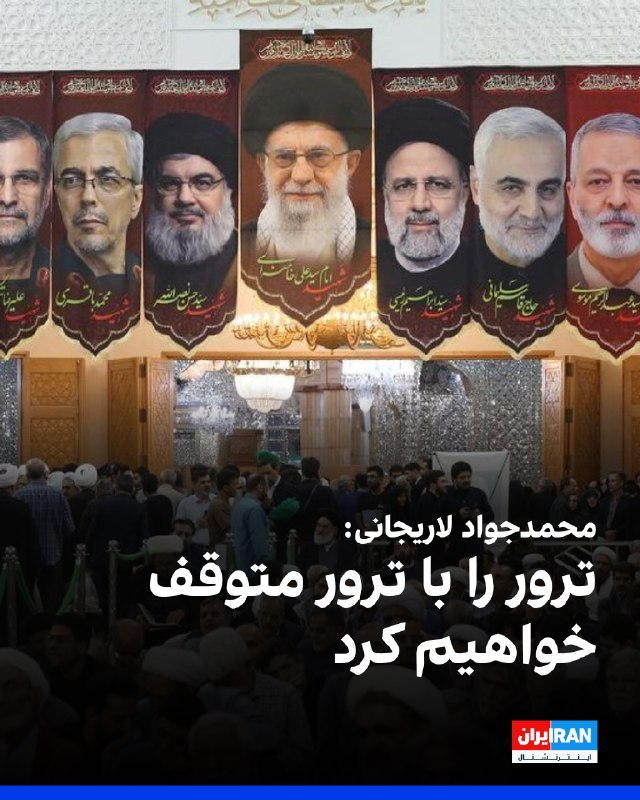
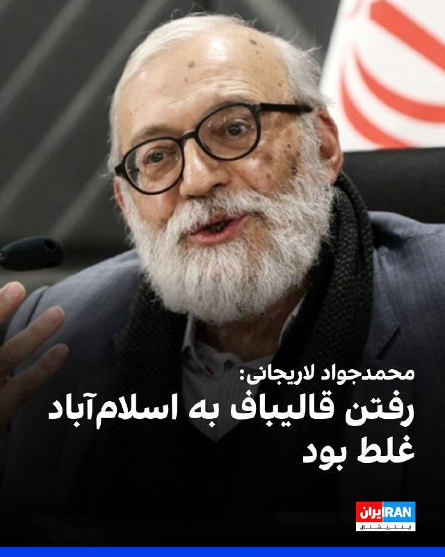
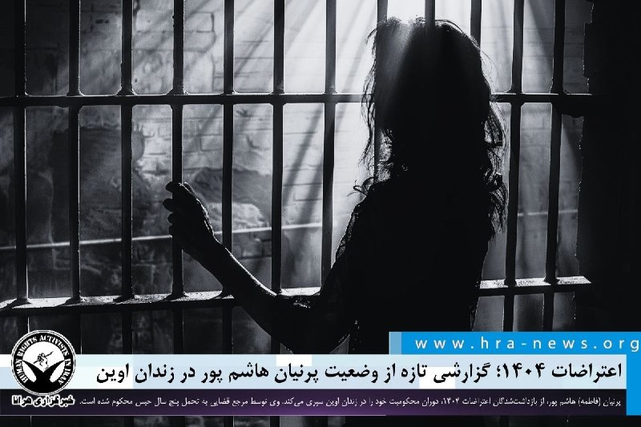
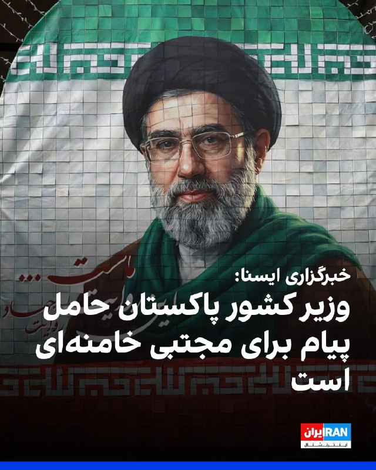
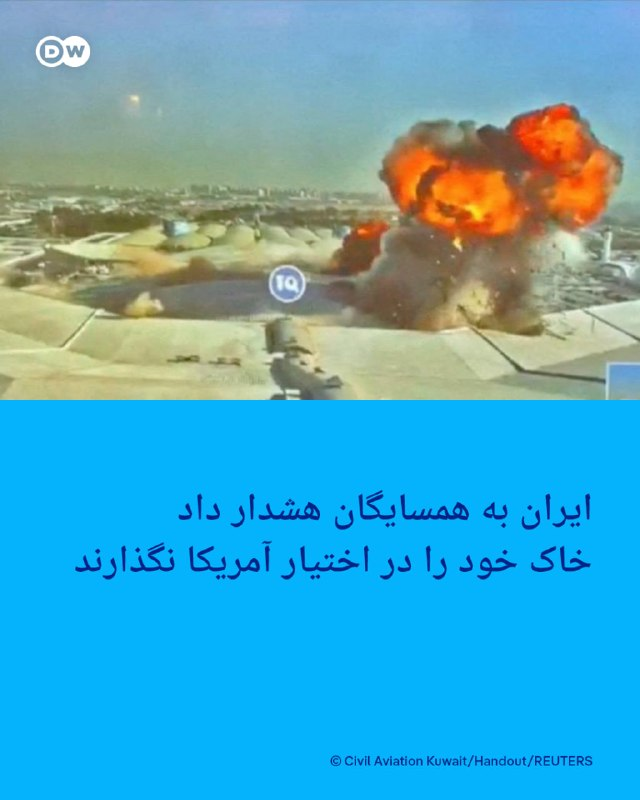
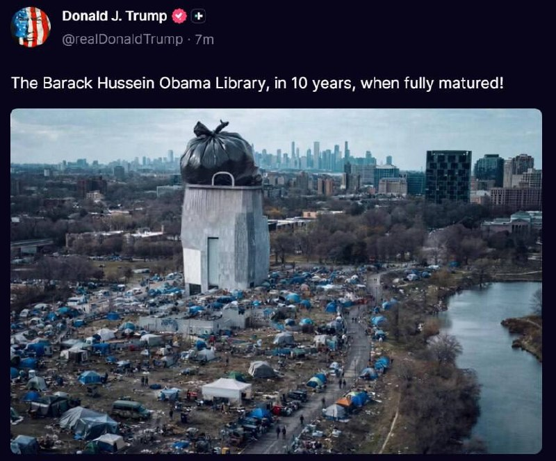
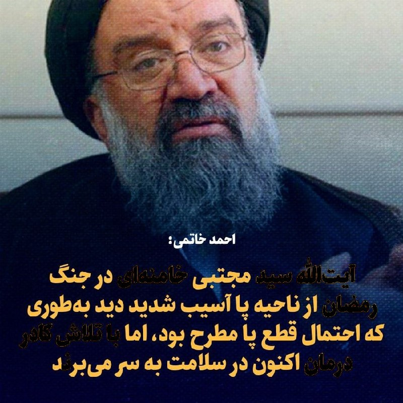
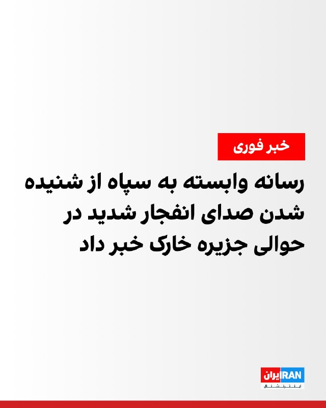
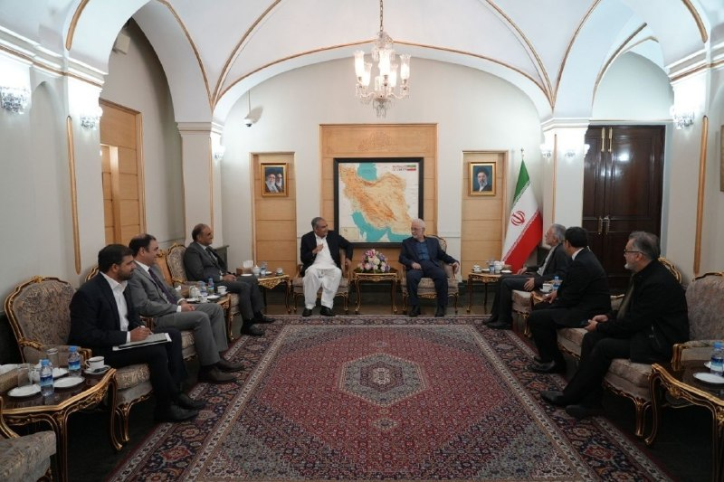
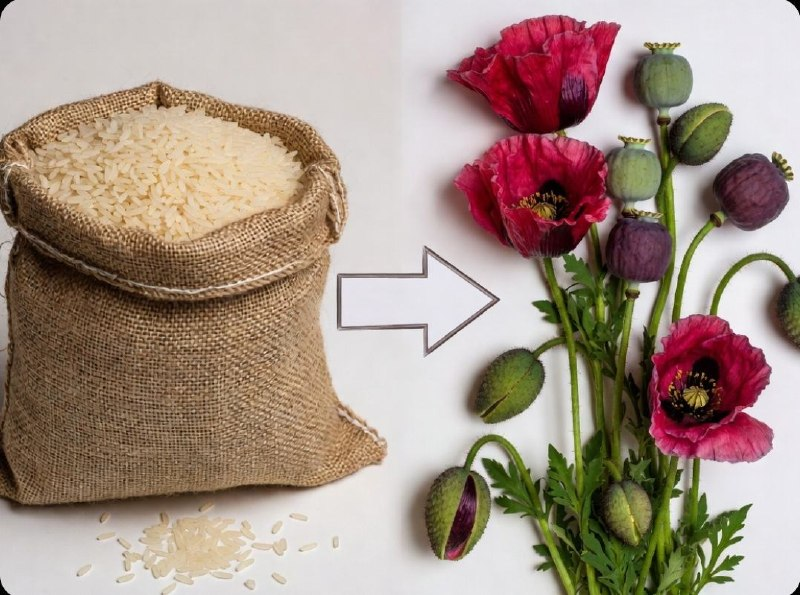

# خواننده تلگرام

<!-- TOP_NAV START -->

<a href="https://github.com/ProAlit/aio-downloader/blob/main/telegram/content/archive_1.md" style="display:inline-block; padding:6px 12px; margin:0 4px; background-color:#2ea44f; color:white; text-decoration:none; border-radius:4px; font-weight:bold;">صفحه بعد</a>

<!-- TOP_NAV END -->

<!-- MSG START -->

---
📅 بروزرسانی: 1405/03/16 23:14
---

## VahidOOnLine — post 243997

  

محمدجواد لاریجانی، مدیر پژوهشگاه دانش‌های بنیادی، در صداوسیمای جمهوری اسلامی گفت: «سایه ترورها وجود دارد، آن‌ها هم باید بدانند که حتما بهایش را می‌پردازند و ترور، ترور دارد. ما ترور را با ترور متوقف خواهیم کرد. در انجام ترورها آمریکا و اسرائیل هیچ مانعی را باقی نگذاشته‌اند.»

لاریجانی اضافه کرد: «اینکه فکر کنیم در صورت تحویل اورانیوم‌ها و حق غنی‌سازی جنگ تمام می‌شود، اشتباه محاسباتی است.»

او ادامه داد: «برای گرفتن پول خودمان از آمریکا التماس نخواهیم کرد.»
‌🏁 🇬🇧 IranintlTV

🤖 @VahidOOnLine

## VahidOOnLine — post 243996

  <a href="telegram/content/VahidOOnLine_243996_1780775054.mp4" target="_blank">🎬 Download video</a>

♦️خانواده مرجان ساتراپی برای توضیح علت مرگ او از عبارتی غیرمعمول استفاده کردند: «او از غم مرد.»

هیچ توضیح پزشکی مفصلی ارائه نشد. نه سخنی از یک بیماری طولانی در میان بود و نه جزئیاتی درباره یک عارضه جسمی. زنی که انقلاب ، مهاجرت، تبعید و دهه‌ها فعالیت هنری و سیاسی را پشت سر گذاشته بود، به گفته نزدیکانش نتوانست فقدان همسرش را تاب بیاورد.

مرجان ساتراپی، نویسنده و فیلمساز ایرانی، بیش از همه با کتاب مصور «پرسپولیس» شناخته می‌شود؛ اثری که تجربه کودکی و نوجوانی او در سال‌های انقلاب و جنگ را روایت کرد و به یکی از مهم‌ترین کتاب‌های قرن بیست‌ویکم تبدیل شد. او ۱۴ خرداد ۱۴۰۵ در ۵۶ سالگی درگذشت.

بخش مهمی از این روایت به زندگی مشترک او با ماتیاس ریپا بازمی‌گردد. ساتراپی در میانه دهه ۱۹۹۰ در پاریس با ریپا، بازیگر و نویسنده سوئدی، آشنا شد. آن‌ها نزدیک به سه دهه در کنار یکدیگر زندگی کردند. ریپا تنها همسر ساتراپی نبود؛ در بسیاری از پروژه‌های هنری او نیز حضور داشت، آثار ساتراپی را ترجمه می‌کرد، در فیلم‌هایش بازی می‌کرد. اما در ۸ آوریل ۲۰۲۵ ماتیاس در ۵۳ سالگی درگذشت.
‌🇸🇦 Indypersian

🤖 @VahidOOnLine

## VahidOOnLine — post 243995

  

محمدجواد لاریجانی، مدیر پژوهشگاه دانش‌های بنیادی به صداوسیما گفت: «وقتی با آمریکا مذاکره می‌کنیم، داریم سیگنال می‌دهیم که می‌توانیم کنار بیاییم؛ رفتن جمهوری اسلامی و محمدباقر قالیباف به اسلام‌آباد غلط و یک هزینه بزرگ بود.»

لاریجانی افزود: «نخست‌وزیر پاکستان، آدم خوبی است، اما لازم نیست ما و آمریکایی‌ها را مقابل هم قرار دهد تا مذاکره کنیم، باید میانجی‌گری بلد باشد. اگر ما بخواهیم خودمان با آمریکا صحبت می‌کنیم، نیازی به میانجی‌ نداریم.»

او گفت: «مردم خیالشان جمع باشد که جمهوری اسلامی برنامه هسته‌ای خودش را به هیچ وجه از دست نمی‌دهد.»
‌🏁 🇬🇧 IranintlTV

🤖 @VahidOOnLine

## mwarmonitor — post 10230

🔴وزیر امور خارجه عراق، فؤاد حسین: ما برای مقابله با بحران مالی به چاپ ۲۵ تریلیون دینار روی آورده‌ایم و اگر جنگ ادامه پیدا کند، کشور ممکن است با یک فاجعه مالی روبه‌رو شود.

@mwarmonitor

## pm_afshaa — post 92407

  <a href="telegram/content/pm_afshaa_92407_1780775056.webm" target="_blank">🎬 Download video</a>

🔴محسن نقوی، وزیر کشور پاکستان وارد تهران شد و پس از ورود با اسکندر مومنی، وزیر کشور دیدار کرد. 
💧 Rainbet.com the #1 Non-KYC Crypto Casino & Sportsbook @rainbetcom 
😁 @Pm_Afshaa

## IranIntlTV — post 340878

  

محمدجواد لاریجانی، مدیر پژوهشگاه دانش‌های بنیادی، در صداوسیمای جمهوری اسلامی گفت: «سایه ترورها وجود دارد، آن‌ها هم باید بدانند که حتما بهایش را می‌پردازند و ترور، ترور دارد. ما ترور را با ترور متوقف خواهیم کرد. در انجام ترورها آمریکا و اسرائیل هیچ مانعی را باقی نگذاشته‌اند.»

لاریجانی اضافه کرد: «اینکه فکر کنیم در صورت تحویل اورانیوم‌ها و حق غنی‌سازی جنگ تمام می‌شود، اشتباه محاسباتی است.»

او ادامه داد: «برای گرفتن پول خودمان از آمریکا التماس نخواهیم کرد.»
https://iranintl.com/202606065748

## FarsiVOA — post 219804

🔺بازداشت سه مرد در ایالت‌های کانزاس و کالیفرنیا به اتهام حمایت از داعش؛ یکی از متهمان خواستار بریدن سر یک سرباز زن آمریکایی شده بود

▪️وزارت دادگستری آمریکا اعلام کرد سه مرد روز جمعه ۱۵ خرداد در ایالت‌های کانزاس و کالیفرنیا به اتهام توطئه برای ارائه حمایت مادی از گروه «دولت اسلامی» یا داعش، بازداشت شده‌اند.

⬇️ بیشتر بخوانید:
https://ir.voanews.com/a/three-charged-over-isis-support/8158020.html
@FarsiVOA

## Persian_Trend_Official — post 15824

تا دقایقی دیگه لایو آغاز میشه

## BBCPersian — post 283000

  <a href="telegram/content/BBCPersian_283000_1780775057.mp4" target="_blank">🎬 Download video</a>

🔻آخرین خبرهای هم روز شنبه ۱۶ خرداد ۱۴۰۵
@BBCPersian

## alonews — post 125644

  <a href="telegram/content/alonews_125644_1780775059.webm" target="_blank">🎬 Download video</a>

👈 وزیر دفاع اسرائیل کاتس: سربازان ارتش اسرائیل همچنان با شجاعت در لبنان علیه سازمان تروریستی حزب‌الله برای حذف تهدیدها، محافظت از جوامع شمالی و تضمین امنیت شهروندان اسرائیلی عمل می‌کنند.

🔴هزینه سنگین و دردناک است، اما در کنار این، عزم و شجاعت سربازان ما برای تکمیل مأموریت قوی‌تر از هر چیزی است.

✅ @AloNews خبر جنگ

## alonews — post 125643

  <a href="telegram/content/alonews_125643_1780775060.webm" target="_blank">🎬 Download video</a>

👈رئیس شورای شهر تهران: رایگان شدن حمل‌ونقل عمومی بدون تأمین منابع مالی به توسعه آن آسیب می‌زند

✅ @AloNews خبر جنگ

## alonews — post 125642

✅ با سابقه ۵ سال فعالیت مداوم 
🛡 حتی بدون قطعی تو دوران جنگ 
🔥 آتیش زدم به مالم به خاطر عیالم بقیه هنوز VPN حجمی میفروشن اونم با قیمتای نجومی 
🚀 ما چی؟ 
💯
💥 VPN نامحدود واقعی فقط 190 تومن
🏷️ 
💥 بدون محدودیت حجم @NetAazaadBot @NetAazaadBot

## alonews — post 125641

  

✅ با سابقه ۵ سال فعالیت مداوم

🛡 حتی بدون قطعی تو دوران جنگ

🔥 آتیش زدم به مالم به خاطر عیالم

بقیه هنوز VPN حجمی میفروشن
اونم با قیمتای نجومی 
🚀

ما چی؟ 
💯
💥 VPN نامحدود واقعی فقط 190 تومن
🏷️

💥 بدون محدودیت حجم

@NetAazaadBot
@NetAazaadBot

---
📅 بروزرسانی: 1405/03/16 23:04
---

## mwarmonitor — post 10229

  

🔴 ارتش اسرائیل از کشته شدن سروان شاحر گاملا، ۲۳ ساله، و گروهبان اوهاد یاری، ۲۱ ساله، در دو حادثه جداگانه در لبنان خبر داد.

@mwarmonitor

## IranIntlTV — post 340877

  

محمدجواد لاریجانی، مدیر پژوهشگاه دانش‌های بنیادی به صداوسیما گفت: «وقتی با آمریکا مذاکره می‌کنیم، داریم سیگنال می‌دهیم که می‌توانیم کنار بیاییم؛ رفتن جمهوری اسلامی و محمدباقر قالیباف به اسلام‌آباد غلط و یک هزینه بزرگ بود.»

لاریجانی افزود: «نخست‌وزیر پاکستان، آدم خوبی است، اما لازم نیست ما و آمریکایی‌ها را مقابل هم قرار دهد تا مذاکره کنیم، باید میانجی‌گری بلد باشد. اگر ما بخواهیم خودمان با آمریکا صحبت می‌کنیم، نیازی به میانجی‌ نداریم.»

او گفت: «مردم خیالشان جمع باشد که جمهوری اسلامی برنامه هسته‌ای خودش را به هیچ وجه از دست نمی‌دهد.»
https://iranintl.com/202606062045

## IranIntlTV — post 340876

  <a href="telegram/content/IranIntlTV_340876_1780774460.mp4" target="_blank">🎬 Download video</a>

🔻در فاصله پنج روز تا آغاز جام جهانی ۲۰۲۶، تیم ملی فوتبال ایران سرانجام پس از جنجال‌های فراوان، ویزای آمریکا را دریافت کرد و راهی تیخوانا در مکزیک شد تا در کمپ اصلی خود مستقر شود.

🔹هرچند وزارت خارجه آمریکا برای تمامی بازیکنان، سرمربی و دستیاران اصلی امیر قلعه‌نویی مجوز ورود به خاک این کشور را صادر کرده است، اما درخواست ۱۵ نفر از فهرست اعلامی فدراسیون فوتبال ایران برای دریافت ویزا رد شد؛ از جمله مهدی تاج، رئیس فدراسیون فوتبال، مهدی محمدنبی، مدیر تیم ملی، هدایت ممبینی، دبیرکل فدراسیون، و همچنین برخی مقام‌های فدراسیون که دارای مسئولیت یا سوابق امنیتی هستند.

🔹یک مقام دولت آمریکا به وب‌سایت «اتلتیک» گفته است «ویزاهای لازم» برای حضور تیم ملی فوتبال و «کادر پشتیبانی ضروری» آن پیش از جام جهانی صادر شده، اما دولت دونالد ترامپ «اجازه نخواهد داد از این سازوکار سوءاستفاده شود تا تحت عناوین نادرست، تروریست‌ها را به ایالات متحده وارد کنند.»

🔹رضا محدث، خبرنگار ایران اینترنشنال، گزارش می‌دهد.

@iranintltvsport

## FarsiVOA — post 219803

⚡️فوتبالیست ها ویزای آمریکا گرفتند؛ چندین همراه حکومتی تیم فوتبال ایران نه

@FarsiVOA

## RadioFarda — post 157984

  <a href="https://t.me/radiofarda/157984" target="_blank">📎 Download file</a>

گفت‌گو با کامران متین پیرامون تلاش جدید برای شکستن بن‌بست مذاکرات ایران و آمریکا

🔸مذاکرات ایران و آمریکا بر سر رفع انسداد دارایی‌های خارجی ایران، بازگشایی تنگه هرمز و اختلافات هسته‌ای ظاهراً همچنان با بن‌بست روبه‌رو است. در همین حال، محسن نقوی، وزیر کشور پاکستان، روز شنبه ۱۶ خرداد با آن‌چه «بسته پیشنهادی جدید» برای پیشبرد گفت‌وگوها توصیف شده، به تهران سفر می‌کند. این سفر در شرایطی انجام می‌شود که اسلام‌آباد در ماه‌های اخیر تلاش کرده نقشی میانجی‌گرانه میان تهران و واشینگتن ایفا کند و هنوز جزئیات پیشنهاد تازهٔ پاکستان منتشر نشده است. در این باره، ارزیابی کامران متین، استاد روابط بین‌الملل در دانشگاه ساسکس، را جویا شده‌ایم.

@RadioFarda

## IranianMinds — post 21523

  <a href="telegram/content/IranianMinds_21523_1780774462.mp4" target="_blank">🎬 Download video</a>

🔴ارتش اسرائیل در طول آخر هفته، ۱۵۰ زیرساخت تروریستی حزب‌الله در جنوب لبنان را مورد هدف قرار داد.

@IranianMinds

## Hranews — post 113434

  

اعتراضات ۱۴۰۴؛ گزارشی تازه از وضعیت پرنیان هاشم پور در زندان اوین

❗️
❗️
❗️
❗️
❗️– پرنیان(فاطمه) هاشم پور، از بازداشت‌شدگان اعتراضات ۱۴۰۴، دوران محکومیت خود را در زندان اوین سپری می‌کند. وی توسط دستگاه قضایی به تحمل پنج سال حبس محکوم شده است.

به گزارش خبرگزاری هرانا، ارگان خبری مجموعه فعالان حقوق بشر در ایران، پرنیان (فاطمه) هاشم پور، در زندان اوین محبوس است.

بر اساس اطلاعات دریافتی هرانا، خانم هاشم پور در رابطه با اعتراضات سراسری ۱۴۰۴ بازداشت شد و پس از چند روز حبس در سلول انفرادی، مورخ ۱۰ دی ماه سال همان سال به بند زنان زندان اوین منتقل شد. این شهروند در مرحله بدوی توسط دستگاه قضایی به پنج سال حبس محکوم شده است.

ادامه مطلب

#پرنیان_هاشم‌پور (#فاطمه_هاشم‌پور)

↘️
@hranews_bot تماس ✉️ - @Hranews کانال هرانا 🆑

## alonews — post 125640

  <a href="telegram/content/alonews_125640_1780774463.webm" target="_blank">🎬 Download video</a>

👈 ماجرا و محتوای این پست بسیار دردناک و ناراحت کننده‌اس، اگه بیماری قلبی دارین به هیچ وجه نخونین. توی سنندج یه زن و شوهر از هم طلاق میگیرن، بعدش مَرده حضانت بچه هارو به عهده میگیره و میره یه زن دیگه میگیره. دیشب همسایه‌ها بعد از شنیدن صدای جیغ وارد این خونه…

## alonews — post 125639

  <a href="telegram/content/alonews_125639_1780774464.webm" target="_blank">🎬 Download video</a>

👈نیویورک تایمز: ترامپ از اینکه حزب الله و اسرائیل حاظر به قبول آتش بس ترامپ نیست و به نبرد با همدیگر ادامه میدهند ناراحت است

✅ @AloNews خبر جنگ

---
📅 بروزرسانی: 1405/03/16 22:54
---

## WithYashar — post 13645

مهر: صدای انفجار در خارگ مربوط به خنثی سازی مهمات است @withyashar

## mwarmonitor — post 10228

  

✈️۴ فروند هواپیمای سوخت‌رسان هوایی نیروی هوایی ایالات متحده از تل‌آویو به پرواز درآمده‌اند و اکنون به سمت خلیج فارس در حرکت هستند.

✈️همچنین یک فروند هواپیمای گشت دریایی P-8A پوزیدون نیروی دریایی آمریکا از پایگاه هوایی شیخ عیسی در بحرین به پرواز درآمده است.

@mwarmonitor

## mwarmonitor — post 10227

🔴وزارت دفاع روسیه اعلام کرد که پدافند هوایی این کشور طی ۱۳ ساعت گذشته ۳۳۹ پهپاد اوکراینی را بر فراز چندین منطقه، از جمله مسکو، رهگیری کرده است.

@mwarmonitor

## IranIntlTV — post 340875

سازمان حقوق بشری کارون هشدار داد که حکم اعدام پنج زندانی سیاسی محبوس در زندان شیبان اهواز تایید و به آنان ابلاغ شده است و این زندانیان در خطر اجرای حکم قرار دارند.

محمد اولیایی‌فرد، وکیل دادگستری، به ایران‌اینترنشنال گفت که جمهوری اسلامی از زمانی که مانع ورود گزارشگران حقوق بشر به ایران شد، می‌دانست تمرکز کشورهای غربی بیش از حقوق بشر بر پرونده هسته‌ای ایران است.
@iranintltv

## IranIntlTV — post 340874

  <a href="telegram/content/IranIntlTV_340874_1780773859.mp4" target="_blank">🎬 Download video</a>

دو ویدیو از یک شهروند در شبکه‌های اجتماعی منتشر شده است که نشان می‌دهد جمهوری اسلامی برای پیشبرد اهداف خود، در موضوعاتی همچون حجاب اختیاری، پیش از آتش‌بس از شهروندان استفاده ابزاری کرده است.

ویدیوهای منتشرشده حاکی است این شهروند پس از آتش‌بس، در موضوع حجاب اجباری، از حامیان حکومتی تذکر برای «امر به معروف و نهی از منکر» دریافت کرده است.

جست‌وجو در فضای مجازی نشان می‌دهد فاصله زمانی انتشار این دو ویدیو تنها نُه هفته است.
@iranintltv

## IranIntlTV — post 340873

  <a href="telegram/content/IranIntlTV_340873_1780773860.mp4" target="_blank">🎬 Download video</a>

افزایش تنش‌های امنیتی در اروپا و تغییر معادلات دفاعی ناتو، فرصت تازه‌ای برای صنایع نظامی ترکیه ایجاد کرده است. براساس گزارش رویترز، صادرات دفاعی ترکیه از سال ۲۰۲۱ تاکنون با سه برابر افزایش به ۱۰ میلیارد دلار رسیده است.

گزارش فرزیا ثابتی، خبرنگار ایران‌اینترنشنال
@iranintltv

## IranIntlTV — post 340872

  <a href="telegram/content/IranIntlTV_340872_1780773862.mp4" target="_blank">🎬 Download video</a>

در حالی که کمتر از یک هفته تا آغاز رقابت‌های جام جهانی باقی مانده است، آمریکا برای همه بازیکنان تیم ملی فوتبال ایران ویزا صادر کرده، اما درخواست ویزای ۱۵ نفر از اعضای کادر فنی، اجرایی و مدیریتی تیم را رد کرده است. با این حال، کاروان تیم ملی فوتبال ایران ترکیه را به مقصد مکزیک ترک کرد.

گزارشی از رضا محدث، خبرنگار ایران‌اینترنشنال
@iranintltv

## FarsiVOA — post 219802

🔺وزیر کشور پاکستان برای دیدار و گفت‌وگو با مقامات جمهوری اسلامی به ایران رفت

▪️وزیر کشور پاکستان، محسن نقوی روز شنبه ۱۶ خرداد برای دیدار با مسئولان جمهوری اسلامی وارد تهران شد.

⬇️ بیشتر بخوانید:
https://ir.voanews.com/a/iran-pakistan-naghavi-ceasefire-interior-us/8158021.html
@FarsiVOA

## RadioFarda — post 157983

  <a href="https://t.me/radiofarda/157983" target="_blank">📎 Download file</a>

تنش کم‌سابقه میان حکومت ایران و دولت لبنان؛ حزب‌الله در کانون اختلاف

🔸درگیری‌های اسرائیل و حزب‌الله بار دیگر جنوب لبنان را به میدان نبرد تبدیل کرده و رهبران لبنان با لحنی کم‌سابقه جمهوری اسلامی را متهم کرده‌اند که از لبنان به‌عنوان اهرم فشار در مذاکراتش با آمریکا استفاده می‌کند. نواف سلام، نخست‌وزیر لبنان، از تهران خواسته «به جنوب لبنان رحم کند» و ژوزف عون، رئیس‌جمهور این کشور، نیز هشدار داده ایران نباید لبنان را به «برگه معامله» تبدیل کند. این موضع‌گیری‌ها هم‌زمان با مخالفت حزب‌الله با طرح جدید آتش‌بس و تأکید تهران بر پیوند جنگ لبنان با مذاکرات ایران و آمریکا مطرح شده است. نقطه‌نظرات علی معموری، تحلیل‌گر مسائل منطقه، را در این زمینه می‌شنوید.

@RadioFarda

#رادیوفردا

## RadioFarda — post 157982

پارگراف اول؛ هما میرافشار، ترانه‌سرایی که «هرگز به شعر کلاسیک خیانت نکرد»

🔸هما میرافشار ترانه‌سرایی بود که در سال ۱۳۵۵ به پرکارترین نام در ادبیات آهنگین ایران تبدیل شد و تقریباً تا یک دهه پیش از رسیدن به ایستگاه پایانی زندگی‌اش در ۸۹ سالگی کوتاه نیامد تا نشان دهد که حضورش در این عرصه از سر اتفاق نبوده است.

🔸پاییز ۱۳۸۹ در گفت‌وگوی کوتاهی که در برنامهٔ رادیویی «صبحانه با خبر» رادیو فردا با او داشتیم، از دلتنگی‌هایش برای ایران، جایگاه زبان فارسی در مهاجرت گفت.
در آن سال او گفت که ترجیح داده تا با ورود ترانه‌سرایان جوان، زمینه را به آنان واگذارد، چنان‌که دیگر همکارانش چنین کرده‌اند.

🔸این گفت‌وگو در زمانی انجام شد که به‌گفتۀ خودش تنها «در مواردی خاص و برای خوانندگانی که دوست‌شان داشت یا آهنگسازان مورد علاقه‌اش» دست به قلم می‌برد.

🔸اما این تصمیم را اتفاقی در موسیقی لس‌آنجلس پررنگ‌تر می‌کرد؛ «تغییرات نسلی» که فضای بینابینی ایران تا دورانی که هنرمندانی مانند او را در جغرافیایی به نام تبعید کنار هم قرار می‌داد، با خود نداشت.

🔸هما میرافشار که از بستر ادبیات کلاسیک ایران برخاسته بود، جوانانی را در عصر خود می‌دید که به تعبیری با ادبیات فارسی بیگانه بودند و این «ادامه دادن همان زبان و ترکیباتی که در ترانه‌های گذشته رایج بود» را برای او «دشوار» می‌کرد.

🔸بنابراین از دههٔ ۹۰ خورشیدی، هما میرافشاری را می‌بینیم که میان تولید انبوه و «حفظ جایگاه هنری» خود، دومی را انتخاب می‌کند.

🔸در بخش زیادی از ترانه‌های کارنامهٔ او «ایران» حضوری ناملموس دارد که گاه در شمایل محاکاتی عاشقانه، شنونده را با خود همراه می‌کند، بی‌آن‌که بداند روی سخن شاعر با سرزمینی است که میانشان «غربتی طولانی» فاصله انداخته است.

🔸شاعری که خانه‌اش تا اقیانوس فاصلهٔ اندکی داشت، اما می‌گفت سال‌هاست که به کنار دریا نرفته و هنوز چمخاله تا دریای شمال را قدم می‌زند؛ «کنار دریاس شمال/ دلم می‌خواد داد بکشم/ نفس برام تنگه دیگه/ یک نفس آزاد بکشم.»

🔸هما میرافشار را می‌توان ادامه‌ای بر لعبت والا، منیر طه و سیمین بهبهانی دانست، ترانه‌سرایی که می‌گوید در سروده‌هایش تلاش کرده تا قصه‌ای را با آغاز و میانه و پایان بازگو کند. بازآفرینی فضاهای شاعرانهٔ ترکیبی با کمک گرفتن از اندوخته‌ها و ظرفیت‌های ادبیات کلاسیک و زبان و زندگی روزمره، مخاطبان ترانه‌اش را در مرز باریکی بین امروز و دیروز نگه می‌داشت، بی‌آن‌که هویت زبان فارسی را مخدوش کند. می‌نوشت: «صبحت بخیر عزیزم/ با آن‌که گفته بودی/ دیشب خدا نگهدار...» تا برسد به «خوکردهٔ قفس را/ میل رها شدن نیست.»

🔸ترانه‌سرایان عصری که مردان و زنان ادبیات آهنگینش قفس تنگ ملودی‌های دشوار را با نوشتن ترانه‌هایی بر بستر این ملودی‌ها می‌شکستند و خوانندگان‌شان را ماندگار می‌کردند، «اون نگاه گرم تو، اون نگاه گرم تو/ جام شرابه اما سرابه/ زندگی بی چشم تو رنج و عذابه/ رنج و عذابه.»

🔸در برنامهٔ رادیویی «پاراگراف اول» فرید زلاند، آهنگسازی که ترانه‌های «شما»، «ثبات»، «گلای لاله عباسی» و چندین و چند همکاری دیگر با هما میرافشار داشته است، به همراه مهدی ذکایی، روزنامه‌نگار قدیمی و ناشر مجلهٔ جوانان امروز لس‌آنجلس، از سرایندهٔ «گلپونه‌ها» گفته‌اند.

🔸 گزارش کامل را در وب‌سایت رادیوفردا بخوانید.

@RadioFarda

## idfinfarsi — post 11784

‼️ارتش اسرائیل یک تروریست از سازمان تروریستی حماس را که در حال پیشبرد طرح‌های تروریستی علیه نیروهای ما بود، به هلاکت رساند

⭕️نیروهای ارتش اسرائیل تحت فرماندهی جنوب، شب گذشته (شنبه) در جنوب نوار غزه حمله کرده و مهند عثمان یاسین فروانه، فرمانده یک سلول تروریستی در شاخه نظامی سازمان تروریستی حماس را به هلاکت رساندند.

⭕️فروانه در طول جنگ و در دوره اخیر، طرح‌های تروریستی متعددی را علیه نیروهای ارتش اسرائیل و کشور اسرائیل پیش می‌برد و تهدیدی فوری برای نیروهای ارتش اسرائیل که در منطقه فعالیت می‌کنند محسوب می‌شد.

⭕️این تروریست در یک حمله دقیق هوایی با هدف رفع تهدید به هلاکت رسید.

⭕️نیروهای ارتش اسرائیل تحت فرماندهی جنوب مطابق با توافق در منطقه مستقر هستند و به فعالیت برای رفع هرگونه تهدید فوری ادامه خواهند داد.

## Dirty_Kids — post 391159

  <a href="telegram/content/Dirty_Kids_391159_1780773864.mp4" target="_blank">🎬 Download video</a>

فکر کردم ایران نیست بعد چشمم به ماشین‌های پشتش افتاد!

لاشیا بگید تو کدوم مناطق انقلاب شده ما هم بریم اونجا خونه بگیریم

@Dirty_Kids 👻

## alonews — post 125638

  <a href="telegram/content/alonews_125638_1780773867.webm" target="_blank">🎬 Download video</a>

👈مونا آذر، بازیگر ایرانی و مشهور هالیوود اعلام کرد که بزودی وارد ایران میشود تا از خاک ایران حمایت کند

✅ @AloNews خبر جنگ

## alonews — post 125637

  <a href="telegram/content/alonews_125637_1780773868.webm" target="_blank">🎬 Download video</a>

👈کانال ۱۲ عبری: افزایش تعداد سربازان و افسران اسرائیلی کشته شده از زمان آتش‌بس در لبنان به ۱۶ نفر

✅ @AloNews خبر جنگ

## alonews — post 125636

  <a href="telegram/content/alonews_125636_1780773868.webm" target="_blank">🎬 Download video</a>

👈طبق گزارش صدا و سیمای جمهوری اسلامی، معاون سیاسی، امنیتی و اجتماعی استاندار هرمزگان اعلام کرد که عملیات خنثی‌سازی و انفجار کنترل‌شده مهمات منفجر نشده باقی‌مانده از جنگ اخیر امروز، ششم ژوئن، در بندرعباس آغاز شد.

🔴عملیات پاکسازی تا سه‌شنبه، دهم ژوئن ادامه خواهد داشت و در این مدت صدای انفجار در سراسر شهر شنیده خواهد شد.

✅ @AloNews خبر جنگ

---
📅 بروزرسانی: 1405/03/16 22:44
---

## VahidOOnLine — post 243994

  

خبرگزاری ایسنا نوشت که محسن نقوی، وزیر کشور پاکستان، در جریان سفر به تهران حامل پیام ویژه‌ای از عاصم منیر، رییس ستاد کل ارتش پاکستان، به مجتبی خامنه‌ای است.

محسن نقوی، شنبه وارد تهران شد و رسانه‌های ایران اعلام کردند او قرار است با برخی مقام‌ها از جمله عباس عراقچی دیدار کند.
‌🏁 🇬🇧 IranintlTV

🤖 @VahidOOnLine

## WithYashar — post 13644

https://www.instagram.com/reel/DZQWuJ8xbfy/?igsh=eW9zZ3MxeTk3bWc=

پست جدید اینستاگرام ، کیا منتظر شب‌حمله هستن ؟!

## WithYashar — post 13643

نیویورک‌تایمز: اسرائیل مکالمات مربوط به مذاکرات آمریکا با جمهوری اسلامی رو شنود کرده.

اسرائیل تلاش‌های خود برای شنود مقام‌های ارشد آمریکایی از جمله ویتکاف و البریج کولبی، معاون وزیر جنگ آمریکا، رو افزایش داده.
@withyashar

## pm_afshaa — post 92406

  <a href="telegram/content/pm_afshaa_92406_1780773251.webm" target="_blank">🎬 Download video</a>

🔴ارتش اسرائیل: در طول آخر هفته حدود 150 زیرساخت حزب‌الله رو در جنوب لبنان مورد حمله قرار دادیم.

💧 Rainbet.com the #1 Non-KYC Crypto Casino & Sportsbook @rainbetcom

😁 @Pm_Afshaa

## pm_afshaa — post 92405

  <a href="telegram/content/pm_afshaa_92405_1780773252.webm" target="_blank">🎬 Download video</a>

🔴آخوند احمد خاتمی:
پای مجتبی خامنه‌ای روز اول جنگ آسیب دید و احتمال قطع شدنش مطرح بود ولی با تلاش کادر درمان الان رو به بهبودی قرار داره.

💧 Rainbet.com the #1 Non-KYC Crypto Casino & Sportsbook @rainbetcom

😁 @Pm_Afshaa

## DEJradio — post 5406

  <a href="telegram/content/DEJradio_5406_1780773252.mp4" target="_blank">🎬 Download video</a>

🔺📢 رقصی برای زندگی و انتقام؛

*پژمان گلچین، پژوهشگر فلسفه

#دی۱۴۰۴ #رقص_سوگ
@DEJradio

## DEJradio — post 5405

🚨
🔸 خبر ۲۱
شنبه ۱۶ خرداد ۱۴۰۵

#خبر۲۱
@DEJradio

## IranIntlTV — post 340871

  

خبرگزاری ایسنا نوشت که محسن نقوی، وزیر کشور پاکستان، در جریان سفر به تهران حامل پیام ویژه‌ای از عاصم منیر، رییس ستاد کل ارتش پاکستان، به مجتبی خامنه‌ای است.

محسن نقوی، شنبه وارد تهران شد و رسانه‌های ایران اعلام کردند او قرار است با برخی مقام‌ها از جمله عباس عراقچی دیدار کند.
https://iranintl.com/202606060795

## FarsiVOA — post 219801

  <a href="telegram/content/FarsiVOA_219801_1780773255.mp4" target="_blank">🎬 Download video</a>

⚡️اینترنت برگشت؛ تصاویر تازه، خشونت جمهوری اسلامی را عریان‌تر کرد
@FarsiVOA

## DW_Farsi — post 125586

  

🔶 ایران به همسایگان هشدار داد خاک خود را در اختیار آمریکا نگذارند

ایران بار دیگر به کشورهای منطقه هشدار داد که اجازه ندهند از قلمرو یا امکانات آنها برای عملیات نظامی آمریکا علیه جمهوری اسلامی استفاده شود.

وزارت خارجه ایران روز شنبه ۱۶ خرداد (۶ ژوئن) در بیانیه‌ای اعلام کرد کشورهای منطقه باید به اصل "حسن همجواری" پایبند باشند و از استفاده از خاک خود برای اقدامات "تجاوزکارانه" علیه ایران جلوگیری کنند.

این هشدار پس از حملات بامداد شنبه آمریکا به تاسیسات راداری در منطقه سیریک و جزیره قشم مطرح شده است. تهران این حملات را "نقض آشکار آتش‌بس" برقرارشده در آوریل ۲۰۲۶ و "تجاوز نظامی علیه تمامیت ارضی ایران" توصیف کرده است.

وزارت خارجه ایران همچنین از شورای امنیت سازمان ملل خواست نسبت به آنچه "نقض آشکار آتش‌بس" و "اقدامات غیرقانونی آمریکا" خوانده، واکنش نشان دهد.

این بیانیه در حالی منتشر شده که تنش‌ها میان تهران و واشنگتن با وجود آتش‌بس برقرارشده از ۸ آوریل همچنان ادامه دارد.
*عکس آرشیوی از انفجار در فرودگاه بین‌المللی کویت پس از حمله پهپادی
@dw_farsi

## Dirty_Kids — post 391158

  <a href="telegram/content/Dirty_Kids_391158_1780773257.mp4" target="_blank">🎬 Download video</a>

ویدیو وایرال شده از دعوای چندتا پسر جوگیر که تو این درگیری یکیش به قتل رسیده
تو حرکت اخر راحت گردنش شکست😐

@Dirty_Kids 👻

## Dirty_Kids — post 391157

  <a href="telegram/content/Dirty_Kids_391157_1780773258.mp4" target="_blank">🎬 Download video</a>

دلیل مهلت ۶۰ روزه ترامپ مشخص شد:

خوش به حالتون عقل ندارید راحتید🤦🏻‍♂

@Dirty_Kids 👻

## alonews — post 125635

  <a href="telegram/content/alonews_125635_1780773260.webm" target="_blank">🎬 Download video</a>

👈شاه چارلز سوم به همراه جمعی از اعضای ارشد خانواده سلطنتی بریتانیا، روز شنبه ۱۶ خردادماه در مراسم ازدواج شاهزاده پیتر فیلیپس، نوه ارشد ملکه الیزابت دوم، در جنوب غربی انگلستان شرکت کردند.

این مراسم خصوصی در کلیسای «All Saints» در منطقه کمبل برگزار شد و در آن، شاهدخت آن، مادر داماد، به همراه همسرش تیموتی لارنس حضور داشتند. همچنین  ویلیام وهسرش کیت شاهزاده و شاهزاده خانم ولز، ملکه کامیلا و دیگر اعضای خانواده سلطنتی از جمله شاهدان این مراسم بودند.

شاهزاده پیتر فیلیپس، که در حال حاضر در رتبه نوزدهم خط جانشینی تاج‌وتخت بریتانیا قرار دارد، در حوزه مدیریت ورزشی فعالیت می‌کند و نقشی رسمی در ساختار سلطنتی ندارد. همسر او، هریت اسپرلینگ، پرستار کودکان است. این ازدواج پس از پایان ازدواج قبلی فیلیپس در سال ۲۰۲۱ صورت گرفته است.


✅ @AloNews خبر جنگ

## alonews — post 125634

  <a href="telegram/content/alonews_125634_1780773260.webm" target="_blank">🎬 Download video</a>

👈نیویورک‌تایمز: اسرائیل مکالمات مربوط به مذاکرات آمریکا با جمهوری اسلامی رو شنود کرده.

🔴اسرائیل تلاش‌های خود برای شنود مقام‌های ارشد آمریکایی از جمله استیو ویتکاف و البریج کولبی، معاون وزیر جنگ آمریکا، رو افزایش داده.

✅ @AloNews خبر جنگ

---
📅 بروزرسانی: 1405/03/16 22:34
---

## VahidOOnLine — post 243993

یکی از مخاطبان ایران‌اینترنشنال با اشاره به افزایش شهریه مدارس غیرانتفاعی گفت شهریه یک مدرسه از ۱۳۰ میلیون تومان در سال گذشته به ۲۳۰ میلیون تومان در سال جاری رسیده است.

او با انتقاد از شرایط آموزش در مدارس دولتی و تراکم بالای دانش‌آموزان در کلاس‌ها افزود خانواده‌ها میان هزینه‌های سنگین مدارس غیرانتفاعی و کیفیت پایین مدارس دولتی گرفتار شده‌اند.
‌🏁 🇬🇧 IranintlTV

🤖 @VahidOOnLine

## IranIntlTV — post 340870

یک شهروند با ارسال پیامی به ایران اینترنشنال و نشان دادن یک کارت بانکی گفت که مقام‌های جمهوری اسلامی به حامیان حکومت در تجمعات کارت پول می‌دهند.

## DW_Farsi — post 125585

  

🔶 ان‌بی‌سی: پنتاگون تهدید جاسوسی اسرائیل را به سطح بحرانی افزایش داد

شبکه ان‌بی‌سی نیوز گزارش داده است که پنتاگون در هفته‌های اخیر سطح هشدار درباره تهدیدهای ضدجاسوسی مرتبط با اسرائیل را به بالاترین درجه، موسوم به "بحرانی"، افزایش داده است.

بر اساس این گزارش، این تصمیم در پی افزایش اختلاف‌نظرها میان واشنگتن و تل‌آویو درباره نحوه مدیریت جنگ‌ها در ایران و لبنان اتخاذ شده است.

ان‌بی‌سی به نقل از مقامات کنونی و پیشین آمریکا نوشته است که نگرانی اصلی پنتاگون احتمال تلاش اسرائیل برای جمع‌آوری اطلاعات از مقام‌های ارشد آمریکایی و آگاهی از بحث‌ها و تصمیم‌گیری‌های داخلی دولت آمریکا درباره تحولات منطقه است.

یکی از مقام‌های آمریکایی به این شبکه گفته است که ارزیابی پنتاگون در قالب سندی هفت صفحه‌ای تنظیم شده که در آن به موارد مشخصی اشاره شده که باعث افزایش نگرانی‌ها شده‌اند.

کاخ سفید و سفارت اسرائیل در آمریکا این گزارش را رد کرده‌اند؛ همچنین پنتاگون نیز از اظهار نظر درباره آن خودداری کرده است.
@dw_farsi

## IranianMinds — post 21522

  

🔴 اکونومیست :

انتظار می رود که جمعیت هند در چند دهه آینده شروع به کاهش کند زیرا باروری به حدود 2 تولد در هر زن کاهش یافته است

خانواده هایی که زمانی معمولاً 6 تا 11 فرزند داشتند، اکنون اغلب انتخاب می کنند که فقط یک یا دو فرزند داشته باشند و بسیاری از آنها در یکی متوقف می شوند.

@IranianMinds

## alonews — post 125633

  <a href="telegram/content/alonews_125633_1780772686.mp4" target="_blank">🎬 Download video</a>

👈پویان مختاری شروع کرد به قرآن خوندن!

✅ @AloNews خبر جنگ

## alonews — post 125632

  <a href="telegram/content/alonews_125632_1780772689.webm" target="_blank">🎬 Download video</a>

👈یه زوج اندونزیایی اسم بچه تازه متولد شده‌شون رو "علی خامنه‌ای" گذاشتن.

✅ @AloNews خبر جنگ

## alonews — post 125631

  

🇵🇹🇨🇱تو بازی دوستانه پرتغال و شیلی لیائو اینطوری بازیکن شیلی رو زد و اخراج شد😂😂
@AloSport

## alonews — post 125630

  <a href="telegram/content/alonews_125630_1780772690.webm" target="_blank">🎬 Download video</a>

👈خان‌یونس ، لبنان

✅ @AloNews خبر جنگ

## alonews — post 125629

  <a href="telegram/content/alonews_125629_1780772690.mp4" target="_blank">🎬 Download video</a>

💔 جاویدنام مجیدرضا رهنورد ، وقتی جلوی دوربین ازش پرسيدند وصیتی داری ، گفت سر مزارم قرآن نخونید ، شادی کنید و آهنگ شاد پخش‌ کنید ؛ او یک آدم عادی نبود ، یک قهرمان و اسطوره بود...

🤔عرزشی حرام زاده بعد تو سمت مردمت اسلحه گرفتی.

✅@AloNews

## alonews — post 125628

  <a href="telegram/content/alonews_125628_1780772694.webm" target="_blank">🎬 Download video</a>

⚫
🏆 به دنیای هیجان‌انگیز فوتبال خوش اومدی!

⭐️اینجا قراره باهم لحظه‌به‌لحظه‌ی جام جهانی رو زندگی کنیم؛
از بازی‌های حساس و نتایج داغ گرفته تا حاشیه‌ها، کری‌خونی‌ها و اتفاقاتی که همه درباره‌ش حرف میزنن! 
🔥
🔥

✅ پوشش کامل مسابقات

💀ترول تیم‌ها و بازیکن‌ها

🎥ویدیوها و لحظه‌های فان فوتبالی

📊آمار، ترکیب‌ها و اخبار فوری

🌍حواشی جذاب از سراسر جام جهانی

📢اینجا فقط یک کانال خبری نیست؛
یک جمع فوتبالیه برای کسایی که فوتبال رو با هیجان، شوخی و احساس واقعی دنبال میکنن 
📛
💟

🆘
🔞 آماده باش چون قراره جام جهانی رو متفاوت تجربه کنیم!

⚡ @Vaarzesh_Plus

⚡ @Vaarzesh_Plus

---
📅 بروزرسانی: 1405/03/16 22:23
---

## DEJradio — post 5404

  <a href="telegram/content/DEJradio_5404_1780772039.mp4" target="_blank">🎬 Download video</a>

🔺📢 تخریب کلیسای انجیلی مشهد؛ تقابل حاکمیت با اماکن مقدس اقلیت‌ها

گزارش: اشکان خسروپور

#مشهد #کلیسای_انجیلی
@DEJradio

## FarsiVOA — post 219800

  <a href="telegram/content/FarsiVOA_219800_1780772041.mp4" target="_blank">🎬 Download video</a>

دست‌درازی دولت جمهوری اسلامی به صندوق تأمین اجتماعی؛ بحران ساختاری یا چپاول منابع؟؛ گفت‌وگو با آلان توفیقی

## FarsiVOA — post 219799

در پی انتشار گزارش‌هایی درباره تخریب کلیسای تاریخی انجیلی مشهد، میراث فرهنگی خراسان رضوی از توقف عملیات تخریب خبر داد. با این حال، رسانه‌های داخل ایران گزارش دادند این بنا نابود شده است.

## RadioFarda — post 157981

سفر وزیر کشور پاکستان به ایران؛ فرمانده ارتش لبنان به اسلام‌آباد رفت

🔸رسانه‌های ایران روز شنبه گزارش دادند محسن نقوی، وزیر کشور پاکستان، بار دیگر وارد تهران شد.

🔸این چندمین سفر مقام ارشد دولت اسلام‌آباد به تهران برای دیدار با مسئولان جمهوری اسلامی است و پاکستان همچنان به عنوان میانجی اصلی در مذاکرات ایران و آمریکا نقش‌آفرینی می‌کند.

🔸نقوی پس از ورود به تهران با اسکندر مومنی، وزیر کشور ایران دیدار کرد و خبرگزاری تسنیم، نزدیک به سپاه پاسداران خبر داده که این مقام پاکستانی قرار است با عباس عراقچی، وزیر خارحه جمهوری اسلامی نیز دیدار کند.

🔸از سوی دیگر، ارتش لبنان روز شنبه اعلام کرد که ‌رودولف هیکل، فرمانده ارتش لبنان، این کشور را به مقصد پاکستان ترک کرده و او قرار است با عاصم منیر، همتای پاکستانی خود، دیدار و گفت‌وگو کند.

🔸در بیانیه ارتش لبنان آمده است که هیکل به دعوت همتای پاکستانی خود، فیلدمارشال سید عاصم منیر، راهی پاکستان شده است.

🔸یک منبع آگاه که نخواست نامش فاش شود، به خبرگزاری فرانسه گفت که سفر فرمانده ارتش لبنان «با تلاش‌های میانجی‌گرانه پاکستان برای حل‌وفصل مسائل میان ایالات متحده و ایران» مرتبط است.

🔸این منبع افزود: «لبنان بخش مهمی از این مذاکرات به شمار می‌رود.»

@RadioFarda

## IranianMinds — post 21521

  

🔴پست ترامپ:

کتابخانه باراک حسین اوباما، در ده سال، وقتی که کاملأ به بلوغ رسید!

@IranianMinds

## Hranews — post 113433

صدور حکم شلاق برای یک متهم به تعرض جنسی در تهران

❗️
❗️
❗️
❗️
❗️– مردی در تهران که متهم است یک پسر نوجوان را مورد تعرض جنسی قرار داده، توسط شعبه ۹ دادگاه کیفری این استان به تحمل ضربات #شلاق محکوم شد.

ادامه مطلب

↘️
@hranews_bot تماس ✉️ - @Hranews کانال هرانا 🆑

## alonews — post 125627

  <a href="telegram/content/alonews_125627_1780772043.webm" target="_blank">🎬 Download video</a>

👈ادعای ایسنا: وزیر کشور پاکستان در جریان سفر به تهران حامل پیام ویژه‌ای از فیلد مارشال ژنرال عاصم منیر به سید مجتبی خامنه‌ای است.

✅ @AloNews خبر جنگ

---
📅 بروزرسانی: 1405/03/16 22:14
---

## WithYashar — post 13642

  <a href="telegram/content/WithYashar_13642_1780771444.mp4" target="_blank">🎬 Download video</a>

نورتروپ گرومن سامانه دفاعی
«AN/AAQ-24 LAIRCM»
را برای هواگردها توسعه داده است؛ سامانه‌ای که برای مقابله با موشک‌های حرارتی و دوش‌پرتاب طراحی شده و به‌صورت خودکار با استفاده از لیزر، جستجوگر موشک را منحرف می‌کند تا به هدف نرسد.
رسانه‌ها آن را به تهدیدهای منطقه‌ای علیه هواگردهای آمریکایی و اسرائیلی در خاورمیانه وصل می‌کنند. نورتروپ گرومن می‌گوید همکنون این فناوری روی بیش از ۱۵۰۰ هواگرد از ۸۵ نوع مختلف به کار رفته است.
@withyashar

## VahidOnline — post 75975

تسنیم،‌ منبع وابسته به سپاه:
"روابط عمومی نیروی دریایی سپاه: صدای انفجار شنیده شده از اطراف جزیره خارک مربوط به خنثی‌سازی مهمات باقی‌مانده از جنگ تحمیلی سوم در منطقه بهرگان است."

📡 @VahidOnline

## VahidOnline — post 75974

  

احمد خاتمی، عضو مجلس خبرگان، در دیدار با اعضای شورای اداری شهرستان سیرجان با اشاره به وضعیت جسمانی مجتبی خامنه‌ای، گفت: در جریان حمله روز نخست جنگ، او از ناحیه پا دچار آسیب‌دیدگی شد؛ به‌گونه‌ای که احتمال قطع پا نیز مطرح بوده، اما این اتفاق رخ نداد و او هم‌اکنون در سلامت به سر می‌برد.

این در حالی است که از روز ۹ اسفند سال ۱۴۰۴ و حمله به دفتر علی خامنه‌ای، هیچ تصویر یا فایل صوتی از مجتبی خامنه‌ای منتشر نشده است.
@VahidOOnLine

📡 @VahidOnline

## FarsiVOA — post 219798

🔺تیم ملی فوتبال ایران راهی مکزیک شد؛ یک مقام کاخ سفید: اجازه سوءاستفاده از «جام‌ جهانی» را به جمهوری اسلامی نمی‌دهیم

▪️تیم ملی فوتبال ایران روز شنبه، ۱۶ خرداد، از اردوی آماده‌سازی خود در آنتالیای ترکیه عازم تیخوانا در مکزیک شد؛ شهری که قرار است پایگاه تمرینی آن‌ها در آستانه رقابت‌های جام جهانی ۲۰۲۶ باشد. این سفر در حالی انجام شد که گزارش‌ها حاکی است شماری از مقام‌ها و اعضای کادر اجرایی فدراسیون فوتبال جمهوری اسلامی هنوز ویزای ورود به آمریکا را دریافت نکرده‌اند.

⬇️ بیشتر بخوانید:

https://ir.voanews.com/a/iran-team-faces-visa-uncertainty/8158010.html/?nocach=1

## Persian_Trend_Official — post 15823

📢 دوستان عزیز،

الان که وضعیت اینترنت تا حدی بهتر شده، حتماً زمانی را برای به‌روزرسانی دستگاه‌ها و اپلیکیشن‌هایتان اختصاص دهید. 🔒

✅ قدم اول:
سیستم‌عامل گوشی هوشمندتان را از بخش تنظیمات به آخرین نسخه موجود آپدیت کنید.

✅ قدم دوم:
تلگرام را از منبع رسمی دانلود و به‌روزرسانی کنید:
🔗 https://telegram.org/android

✅ قدم سوم:
اپلیکیشن‌های VPN خود را به آخرین نسخه ارتقا دهید.

📱 آخرین نسخه V2rayNG برای اندروید:
🔗 https://github.com/2dust/v2rayNG/releases/tag/2.2.3

🍏 آخرین نسخه Happ برای iOS:
🔗 https://apps.apple.com/us/app/happ-proxy-utility/id6504287215

⚠️ به‌روزرسانی‌ها فقط قابلیت‌های جدید اضافه نمی‌کنند؛ بسیاری از آن‌ها حفره‌های امنیتی و آسیب‌پذیری‌های مهم را نیز برطرف می‌کنند.

🚨 این موضوع را به هیچ عنوان پشت گوش نیندازید.
🔐 امنیت دیجیتال شما باید در اولویت باشد.

📝 Nick

📌 @persian_trend_official
پرشین ترند | متفاوت‌ترین کانال نظامی

## alonews — post 125626

  <a href="telegram/content/alonews_125626_1780771446.webm" target="_blank">🎬 Download video</a>

👈 روابط عمومی نیروی دریایی سپاه: صدای انفجار شنیده شده از اطراف جزیره خارک مربوط به خنثی‌سازی مهمات باقی‌مانده از جنگ تحمیلی سوم در منطقه بهرگان است.

✅ @AloNews خبر جنگ

## alonews — post 125625

  <a href="telegram/content/alonews_125625_1780771446.webm" target="_blank">🎬 Download video</a>

👈 محمد جمالیان، عضو کمیسیون بهداشت و درمان:

🔴بعد از اون پیامکی که برای مردم فرستاده شد کشت خشخاش تو کشور زیادتر شده!

🔴کشت خشخاش تو یه سال 246 درصد افزایش پیدا کرده و مردم فهمیدن فروش تریاک سود آورتره

✅ @AloNews خبر جنگ

---
📅 بروزرسانی: 1405/03/16 22:04
---

## VahidOOnLine — post 243992

  

خبرگزاری فارس وابسته به سپاه پاسداران، از شنیده‌شدن صدای انفجار شدید در حوالی جزیره خارک خبر داد.

این خبرگزاری نوشت: «دقایقی پیش ساکنان جزیره خارک متوجه صدای یک انفجار نسبتا شدید شدند. هنوز محل دقیق و منشا این انفجار مشخص نیست اما بررسی‌ها نشان می‌دهد این انفجار خارج از جزیره رخ داده است.»

دقایقی قبل از آن، خبرگزاری مهر از شنیده شدن صدای انفجار در جزیره خارک خبر داد و نوشت که این صداها مربوط به خنثی‌سازی مهمات در منطقه نفتی بهرگان است که در جزیره شنیده شده است.
‌🏁 🇬🇧 IranintlTV

🤖 @VahidOOnLine

## mwarmonitor — post 10226

🔴مایک پامپئو «بله، خب عایشه، این [توافق] امکان‌پذیر نیست. به هر حال، جهت شفاف‌سازی، ایرانی‌ها همیشه می‌گفتند که حزب‌الله مستقل است و ما هیچ ارتباطی با آن‌ها نداریم؛ اما اکنون به چیزی اعتراف کرده‌اند که همه ما از قبل می‌دانستیم: اینکه آن‌ها حامی و تأمین‌کننده مالی اصلی هستند. حزب‌الله یعنی خودِ ایران؛ این در واقع اشغال لبنان توسط این رژیم است.
من دیروز توافق‌نامه بین ایالات متحده، لبنان و اسرائیل را خواندم. اما طرفی که واقعاً در آنجا اهمیت دارد—یعنی حزب‌الله که یک بازیگر دولتی (ملی) محسوب نمی‌شود—از انجام یک کار ساده سر باز زده است، که همان برقراری آتش‌بس و متوقف کردن درگیری‌ها در آنجاست.
بنابراین اسرائیل اقدامات لازم را انجام خواهد داد. شهروندان آن‌ها هنوز نمی‌توانند به بخش‌های شمالی کشورشان بازگردند. می‌دانید، اگر شهروندان ما مجبور می‌شدند خانه‌های خود را ترک کنند، ما هرگز چنین وضعیتی را نمی‌پذیرفتیم. اسرائیل کاری را که لازم است انجام خواهد داد و شما هم دیده‌اید که نخست‌وزیر نتانیاهو تایید کرده که این روند ادامه خواهد یافت.
پس اگر ایرانی‌ها همچنان به این ایده پایبند باشند که آتش‌بس در آنجا بخشی از این توافق است، من هیچ راهی نمی‌بینم که توافقی بین ایالات متحده و ایران شکل بگیرد که بتواند بحران امروز در تنگه [هرمز] را حل کند.»

@mwarmonitor

## mwarmonitor — post 10225

  <a href="telegram/content/mwarmonitor_10225_1780770840.mp4" target="_blank">🎬 Download video</a>

🎬 Video

## mwarmonitor — post 10224

🔴 یک منبع پاکستانی به الجزیره: وزیر کشور که امروز به ایران سفر می‌کند، پیامی از سوی پاکستان برای رهبر ایران حمل خواهد کرد. @mwarmonitor

## mwarmonitor — post 10223

🚨 رئیس موساد، رومن گوفمن، معاون خود را برکنار کرد. باراک راوید @mwarmonitor

## mwarmonitor — post 10222

🚨 رئیس موساد، رومن گوفمن، معاون خود را برکنار کرد. باراک راوید

@mwarmonitor

## pm_afshaa — post 92404

  <a href="telegram/content/pm_afshaa_92404_1780770843.webm" target="_blank">🎬 Download video</a>

🔴نیویورک‌تایمز:
اسرائیل مکالمات مربوط به مذاکرات آمریکا با جمهوری اسلامی رو شنود کرده.

اسرائیل تلاش‌های خود برای شنود مقام‌های ارشد آمریکایی از جمله ویتکاف و البریج کولبی، معاون وزیر جنگ آمریکا، رو افزایش داده.

💧 Rainbet.com the #1 Non-KYC Crypto Casino & Sportsbook @rainbetcom

😁 @Pm_Afshaa

## IranIntlTV — post 340869

  

خبرگزاری فارس وابسته به سپاه پاسداران، از شنیده‌شدن صدای انفجار شدید در حوالی جزیره خارک خبر داد.

این خبرگزاری نوشت: «دقایقی پیش ساکنان جزیره خارک متوجه صدای یک انفجار نسبتا شدید شدند. هنوز محل دقیق و منشا این انفجار مشخص نیست اما بررسی‌ها نشان می‌دهد این انفجار خارج از جزیره رخ داده است.»

دقایقی قبل از آن، خبرگزاری مهر از شنیده شدن صدای انفجار در جزیره خارک خبر داد و نوشت که این صداها مربوط به خنثی‌سازی مهمات در منطقه نفتی بهرگان است که در جزیره شنیده شده است.
https://iranintl.com/202606063830

## FarsiVOA — post 219794

پیت هگست، وزیر جنگ آمریکا، با انتشار این تصاویر هشتاد و دومین سالگرد «نبرد نرماندی» در فرانسه، را گرامی داشت.

او نوشت ۸۲ سال پیش نیروهای متفقین برای دفاع از آزادی، به سواحل نرماندی یورش بردند و در یکی از سرنوشت‌سازترین نبردهای جنگ جهانی دوم شرکت کردند.

هگست افزود امروز شجاعت و فداکاری آن سربازان گرامی داشته می‌شود و آن آزادی‌ که آنها برای نسل‌های آینده به ارمغان آوردند، همچنان مورد قدردانی است.

@FarsiVOA

## RadioFarda — post 157980

جمهوری آذربایجان در میانهٔ درگیری‌های اسرائیل و ایران کجا ایستاده است؟

🔸جمهوری آذربایجان گزارش شبکهٔ سی‌ان‌ان در مورد حضور نیروهای نظامی و اطلاعاتی اسرائیل در خاک این کشور در جریان جنگ ۴۰ روزه اسرائیل و آمریکا با ایران را تکذیب کرده است.

🔸سی‌ان‌ان ۱۵ خرداد گزارش داده بود اسرائیل در جریان جنگ اخیر «شبکه‌ای مخفی» در جمهوری آذربایجان، عراق، امارات متحده عربی و سومالی‌لند ایجاد کرده و نیروهای نخبه نظامی و اطلاعاتی خود را به آن‌ها فرستاده بود.

🔸به‌نوشتهٔ سی‌ان‌ان، قرار بود نیروهای اعزامی اسرائیل ابتدا نقش تیم‌های احتمالی برای نجات خلبانان اسرائیلی در شرایط اضطراری را ایفا کنند اما بعداً دامنهٔ مأموریت آن‌ها گسترش یافت و به گردآوری اطلاعات و فعالیت نظامی پرداختند.

🔸سفارت جمهوری آذربایجان در واشینگتن این گزارش را «ادعاهای بی‌اساس در مورد استفاده ادعایی از خاک آذربایجان برای عملیات علیه کشور ثالث» خواند و آن را «قاطعانه» تکذیب کرد.

🔸آیتان حاجی‌زاده، سخنگوی وزارت خارجه این کشور، نیز در باکو به یورونیوز گفت کشورش «هرگز خاک خود را برای هیچ اقدام زیان‌باری علیه کشور ثالث، از جمله ایران، در اختیار کسی نگذاشته است».

🔸ارتش اسرائیل و دفتر نخست‌وزیر اسرائیل در واکنش به گزارش سی‌ان‌ان سکوت کردند.

🔸 گزارش کامل را در وب‌سایت رادیوفردا بخوانید.

@RadioFarda

## IranianMinds — post 21520

فارس:

شنیده‌شدن صدای انفجار در حوالی جزیره خارک

@IranianMinds

## IranianMinds — post 21519

  

تصویری از وزیر کشور پاکستان در تهران

@IranianMinds

## Dirty_Kids — post 391156

  

🔴خبرگزاری دانشجو:

تو یکی استان‌ها که قبلا برنج میکاشتن، تازگی دارن به‌جاش خشخاش (تریاک) پرورش میدن.

@Dirty_Kids 👻

## Dirty_Kids — post 391155

  <a href="telegram/content/Dirty_Kids_391155_1780770846.mp4" target="_blank">🎬 Download video</a>

صحبت‌های جالب عمو مانوک درباره اتاق‌فکر حکومت و برگ شاهزاده رضا پهلوی

@Dirty_Kids 👻

## Dirty_Kids — post 391154

  <a href="telegram/content/Dirty_Kids_391154_1780770849.mp4" target="_blank">🎬 Download video</a>

تصاویر جدید و هولناک از جاویدنامان اراک🖤

@Dirty_Kids 👻

## alonews — post 125624

  <a href="telegram/content/alonews_125624_1780770850.mp4" target="_blank">🎬 Download video</a>

👈نیکزاد، نایب رییس مجلس: تنگه هرمز طبق قانون مجلس به حالت قبل برنخواهد گشت/ تنگه هرمز برای ما از بمب اتم مهم‌تر است

✅ @AloNews خبر جنگ

## alonews — post 125623

  <a href="telegram/content/alonews_125623_1780770852.webm" target="_blank">🎬 Download video</a>

👈یک سرباز اسرائیلی، بر اثر جراحات وارده در نبرد در لبنان کشته شد

✅ @AloNews خبر جنگ

## alonews — post 125622

  <a href="telegram/content/alonews_125622_1780770852.webm" target="_blank">🎬 Download video</a>

👈احتمال شنیده شدن صداهای شدید انفجار به مدت ۵ روز در بندرعباس

✅ @AloNews خبر جنگ

<!-- MSG END -->

<!-- NAV START -->

<a href="https://github.com/ProAlit/aio-downloader/blob/main/telegram/content/archive_1.md" style="display:inline-block; padding:6px 12px; margin:0 4px; background-color:#2ea44f; color:white; text-decoration:none; border-radius:4px; font-weight:bold;">صفحه بعد</a>

<!-- NAV END -->
