# خواننده تلگرام

<!-- TOP_NAV START -->

<!-- TOP_NAV END -->

<!-- MSG START -->

---
📅 بروزرسانی: 1405/03/17 15:22
---

## VahidOOnLine — post 244094

  <a href="telegram/content/VahidOOnLine_244094_1780833174.mp4" target="_blank">🎬 Download video</a>

گزارش اخیر رویترز از بررسی استفاده از دارایی‌های ایران برای جبران خسارت‌های واردشده به کشورهای خلیج فارس، یک واقعیت تلخ را دوباره نشان می‌دهد، جمهوری اسلامی بحران می‌سازد، اما هزینه آن را مردم ایران می‌پردازند. سیاستی که قرار بود قدرت بیاورد، در عمل ایران را فقیرتر، منزوی‌تر و ناامن‌تر کرده است.
‌🏁 🇬🇧 ManotoTV

🤖 @VahidOOnLine

## VahidOOnLine — post 244084

  <a href="telegram/content/VahidOOnLine_244084_1780833174.mp4" target="_blank">🎬 Download video</a>

موضع ترامپ درباره برنامه هسته‌ای جمهوری اسلامی بارها تغییر کرده است. ابتدا گفت ایران نباید به سلاح هسته‌ای برسد. بعد از «عدم غنی‌سازی» و خروج اورانیوم غنی‌شده سخن گفت. سپس اعلام کرد برای توافق عجله‌ای ندارد و بعد هم گفت اورانیوم «مدفون شده» و لزوماً نیازی به توافق نیست.
حالا گزارش‌ها از مشورت تیم او با کارشناسان هسته‌ای درباره محدودیت‌های غنی‌سازی و راستی‌آزمایی خبر می‌دهند.
شاید این یک تاکتیک مذاکره باشد. شاید هم نشانه نرم‌تر شدن مواضع.
اما پرسش اصلی برای ایرانیان همچنان باقی است: آیا هر توافقی واقعاً جمهوری اسلامی را تضعیف می‌کند، یا فقط تهدید هسته‌ای آن را مدیریت می‌کند؟
‌🏁 🇬🇧 ManotoTV

🤖 @VahidOOnLine

## VahidOOnLine — post 244083

  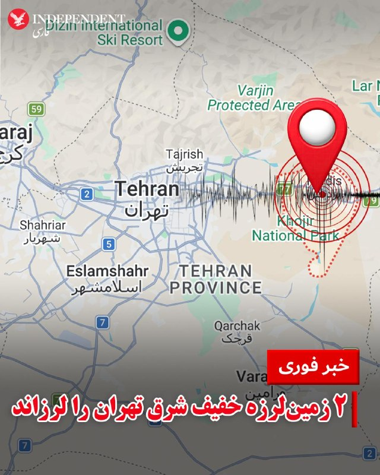

♦️ظهر یکشنبه ۱۶ خرداد ماه، وقوع ۲ زمین‌لرزه خفیف با فاصله زمانی دو دقیقه، شهرستان پردیس در شرق استان تهران را لرزاند.
بر اساس گزارش‌ رسانه‌های دولتی، نخستین زمین‌لرزه به بزرگی ۲.۶ در عمق ۹ کیلومتری زمین و دومین زمین‌لرزه به بزرگی ۲.۹ در عمق ۷ کیلومتری زمین رخ داده است.
شرق تهران در روز ۲۲ اردیبهشت ماه گذشته نیز ۹ بار لرزیده بود.
‌🇸🇦 Indypersian

🤖 @VahidOOnLine

## WithYashar — post 13675

  <a href="https://t.me/withyashar/13675" target="_blank">📎 Download file</a>

🌐 instagram.com/yashar

🌐 t.me/withyashar

## WithYashar — post 13674

## ManotoTV — post 105944

  <a href="telegram/content/ManotoTV_105944_1780833176.mp4" target="_blank">🎬 Download video</a>

گزارش اخیر رویترز از بررسی استفاده از دارایی‌های ایران برای جبران خسارت‌های واردشده به کشورهای خلیج فارس، یک واقعیت تلخ را دوباره نشان می‌دهد، جمهوری اسلامی بحران می‌سازد، اما هزینه آن را مردم ایران می‌پردازند. سیاستی که قرار بود قدرت بیاورد، در عمل ایران را فقیرتر، منزوی‌تر و ناامن‌تر کرده است.

## ManotoTV — post 105934

  <a href="telegram/content/ManotoTV_105934_1780833177.mp4" target="_blank">🎬 Download video</a>

موضع ترامپ درباره برنامه هسته‌ای جمهوری اسلامی بارها تغییر کرده است. ابتدا گفت ایران نباید به سلاح هسته‌ای برسد. بعد از «عدم غنی‌سازی» و خروج اورانیوم غنی‌شده سخن گفت. سپس اعلام کرد برای توافق عجله‌ای ندارد و بعد هم گفت اورانیوم «مدفون شده» و لزوماً نیازی به توافق نیست.
حالا گزارش‌ها از مشورت تیم او با کارشناسان هسته‌ای درباره محدودیت‌های غنی‌سازی و راستی‌آزمایی خبر می‌دهند.
شاید این یک تاکتیک مذاکره باشد. شاید هم نشانه نرم‌تر شدن مواضع.
اما پرسش اصلی برای ایرانیان همچنان باقی است: آیا هر توافقی واقعاً جمهوری اسلامی را تضعیف می‌کند، یا فقط تهدید هسته‌ای آن را مدیریت می‌کند؟

## FarsiVOA — post 219847

🔺حکم زندان و محدودیت‌های دیگر جعفر پناهی عیناً تأیید شد

▪️وکیل جعفر پناهی گفت که شعبه ٢۶ دادگاه انقلاب تهران به ریاست قاضی ایمان افشاری ضمن رد واخواهی، حکم غیابی صادرشده علیه این کارگردان سینما را عیناً تأیید کرد.

▪️مصطفی نیلی روز یکشنبه به وبسایت امتداد گفت: «بر اساس حکم اولیه، پناهی به اتهام فعالیت تبلیغی علیه نظام جمهوری اسلامی ایران به یک سال حبس تعزیری محکوم شده بود.»

▪️به گفته آقای نیلی «همچنین دو سال ممنوعیت خروج از کشور و ممنوعیت عضویت در گروه‌ها و دستجات سیاسی و اجتماعی برای او در نظر گرفته شده است.»

⬇️ بیشتر بخوانید:
https://ir.voanews.com/a/8158181.html

## FarsiVOA — post 219846

  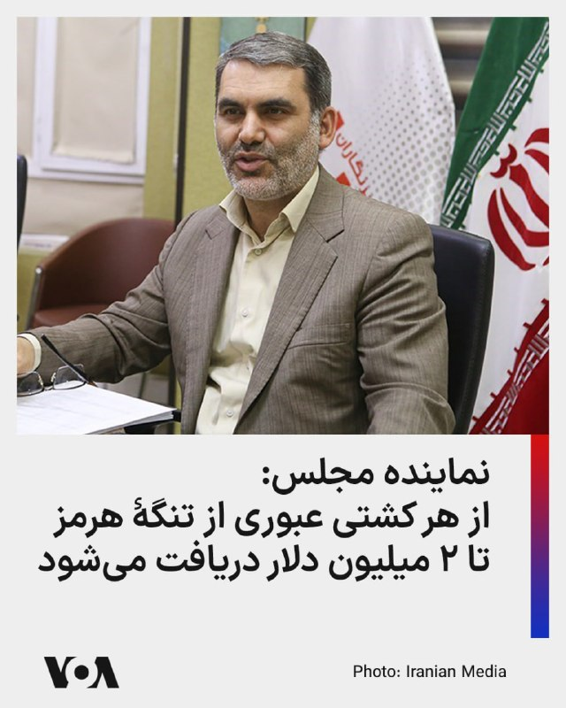

محسن زنگنه، عضو کمیسیون برنامه‌ و بودجهٔ مجلس شورای اسلامی، روز یکشنبه به خبرگزاری فارس گفت: «درحال‌حاضر از هر کشتی عبوری از تنگهٔ هرمز به‌طور میانگین بین ۱.۵ تا ۲ میلیون دلار دریافت می‌شود.»

این اظهارات در حالی است که پیشتر کاظم غریب‌آبادی، معاون امور حقوقی و بین‌المللی وزیر خارجه جمهوری اسلامی، درباره تلاش جمهوری اسلامی برای مسدود کردن تنگه هرمز گفت: «جمهوری اسلامی دنبال این نیست که هزینه یا عوارض عبور یا حق ترانزیت بخواهد دریافت کند، بلکه ما به دنبال این هستیم که در ازای خدماتی که در آنجا به همراه عمان ارائه می‌دهیم، هزینه‌ها را دریافت کنیم.»

او افزود: «این خدمات شامل خدمات ناوبری، خدمات امداد و نجات، خدمات امنیتی و خدمات ایمنی است و یا خدماتی که اگر محیط در واقع آلوده شود از لحاظ زیست محیطی رفع آلودگی باید شود. بنابراین، این اقدامات مخالف حقوق بین‌الملل دریاها نیست.»

پیشتر دونالد ترامپ، رئیس‌جمهوری آمریکا و مقامات ارشد این کشور خواستار بازگشایی فوری تنگه هرمز و تامین امنیت کشتی‌رانی و آزادی عبور از این تنگه شده‌اند.
@FarsiVOA

## Persian_Trend_Official — post 15853

رسانه‌های دولتی کره شمالی گزارش جدیدی درباره بازدید کیم جونگ اون از یک کارخانه دفاعی محلی و اجرای برنامه‌ تولید موشک بالستیک هواسانگ-11 برای نیمه اول سال 2026 منتشر کردند.

📝 Amir

📌 @persian_trend_official
پرشین ترند | متفاوت‌ترین کانال نظامی

## RadioFarda — post 158004

  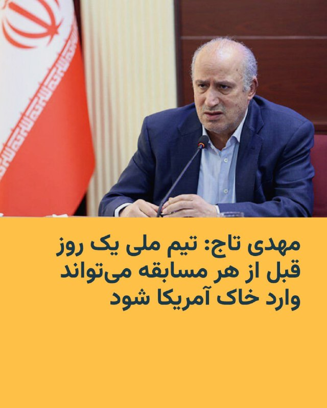

🔸برخلاف برخی گزارش‌ها درباره ورود و خروج تیم ملی فوتبال ایران به خاک آمریکا، رئیس فدراسیون فوتبال کشور روز یک‌شنبه توضیح داد که تیم ملی یک روز قبل از هر مسابقه اجازه ورود به خاک این کشور را دارد.

🔸پیشتر ابوالفضل پسندیده، سفیر جمهوری اسلامی ایران در مکزیک، گفته بود که بر اساس شرایط تعیین‌شده برای روادید اعضای تیم ملی فوتبال ایران، بازیکنان و کادر فنی تنها در روز برگزاری مسابقات خود اجازه ورود به خاک آمریکا را دارند و باید همان روز این کشور را ترک کنند.

🔸حال بر اساس توضیح مهدی تاج، رئیس فدراسیون، «یک روز قبل از مسابقه به‌ تیم ملی ما اجازه ورود داده‌اند.»

🔸این اولین بار است که یک کشور میزبان جام جهانی پذیرای تیمی از کشوری خواهد بود که با آن در جنگ است.

🔸به گزارش ایسنا، مهدی تاج که خود نتوانست ویزای آمریکا را دریافت کند روز یک‌شنبه همچنین گفت: «واقعا عجیب است که اینها تا این حد در حوزه اداره فوتبال دخالت می‌کنند. این کار نادر است.»

@RadioFarda

## IranianMinds — post 21554

  <a href="telegram/content/IranianMinds_21554_1780833179.mp4" target="_blank">🎬 Download video</a>

کمال پنحاسی/ سخنگوی فارسی‌زبان ارتش اسرائیل:

در حالی‌که ارتش اسرائیل در فکر آموزش و آماده‌سازی فرماندهان آینده است، رژیم ایران همچنان سرمایه‌‌گذاری بر روی نیروهای نیابتی و گسترش تروریسم ادامه می‌دهد.

@IranianMinds

## Hranews — post 113443

امروز یکشنبه ۱۷ خردادماه، جمعی از بازنشستگان تامین اجتماعی شوش، کرخه و هفت‌تپه، در مقابل ساختمان این سازمان در شهرستان شوش دست به راهپیمایی و تجمع اعتراضی زدند.

این #بازنشستگان، خواستار اجرای طرح همسان‌سازی، افزایش حقوق طبق تورم و رسیدگی به مشکلات درمانی و معیشتی خود هستند.

↘️
@hranews_bot تماس ✉️ - @Hranews کانال هرانا 🆑

## Hranews — post 113442

درخواست واخواهی جعفر پناهی توسط دادگاه انقلاب رد شد

❗️
❗️
❗️
❗️
❗️– حکم بدوی جعفر پناهی، کارگردان و فیلم‌ نامه‌ نویس که پیشتر توسط شعبه ۲۶ دادگاه انقلاب تهران به یک سال حبس، دو سال ممنوعیت خروج از کشور و دیگر مجازات‌ها محکوم شده بود، پس از رد درخواست واخواهی، عینا تایید شد.

ادامه مطلب

#جعفر_پناهی

↘️
@hranews_bot تماس ✉️ - @Hranews کانال هرانا 🆑

## manototv — post 105944

  <a href="telegram/content/manototv_105944_1780833182.mp4" target="_blank">🎬 Download video</a>

گزارش اخیر رویترز از بررسی استفاده از دارایی‌های ایران برای جبران خسارت‌های واردشده به کشورهای خلیج فارس، یک واقعیت تلخ را دوباره نشان می‌دهد، جمهوری اسلامی بحران می‌سازد، اما هزینه آن را مردم ایران می‌پردازند. سیاستی که قرار بود قدرت بیاورد، در عمل ایران را فقیرتر، منزوی‌تر و ناامن‌تر کرده است.

## manototv — post 105934

  <a href="telegram/content/manototv_105934_1780833183.mp4" target="_blank">🎬 Download video</a>

موضع ترامپ درباره برنامه هسته‌ای جمهوری اسلامی بارها تغییر کرده است. ابتدا گفت ایران نباید به سلاح هسته‌ای برسد. بعد از «عدم غنی‌سازی» و خروج اورانیوم غنی‌شده سخن گفت. سپس اعلام کرد برای توافق عجله‌ای ندارد و بعد هم گفت اورانیوم «مدفون شده» و لزوماً نیازی به توافق نیست.
حالا گزارش‌ها از مشورت تیم او با کارشناسان هسته‌ای درباره محدودیت‌های غنی‌سازی و راستی‌آزمایی خبر می‌دهند.
شاید این یک تاکتیک مذاکره باشد. شاید هم نشانه نرم‌تر شدن مواضع.
اما پرسش اصلی برای ایرانیان همچنان باقی است: آیا هر توافقی واقعاً جمهوری اسلامی را تضعیف می‌کند، یا فقط تهدید هسته‌ای آن را مدیریت می‌کند؟

## alonews — post 125744

  <a href="telegram/content/alonews_125744_1780833183.webm" target="_blank">🎬 Download video</a>

👈رشیدی کوچی: خطر فرقه پایداری به‌مراتب جدی‌تر از تهدیدات خارجی است

✅ @AloNews خبر جنگ

## alonews — post 125743

  <a href="telegram/content/alonews_125743_1780833184.mp4" target="_blank">🎬 Download video</a>

👈حزب‌الله پهپادهای انتحاری رو به سمت نیروها و خودروهای اسرائیلی تو جنوب لبنان شلیک کرد

✅ @AloNews خبر جنگ

---
📅 بروزرسانی: 1405/03/17 15:12
---

## VahidOOnLine — post 244082

  

محمدرضا محسنی‌ثانی، عضو کمیسیون امنیت ملی مجلس، به خبرگزاری ایسنا گفت: «وضعیت فعلی محاصره و تنش، به هیچ وجه پایدار نخواهد بود و در پاسخ به راهزنی‌های دریایی آمریکا، ما ظرفیت‌های خود را نشان داده‌ایم و کنترل تنگه هرمز را در اختیار داریم که این یک واقعیت راهبردی است.»

او اضافه کرد: «اسرائیل به دنبال آن است که کانون مقاومت در منطقه را در هر کجا که ممکن است، تضعیف کند. ما در یک تقابل جدی هستیم و هر دو طرف در حال استفاده از تمامی ظرفیت‌های خود برای رسیدن به اهدافشان هستند.»

این نماینده مجلس ادامه داد: «پیش‌بینی من این است که ظرف حداکثر یک تا دو هفته آینده، وضعیت مشخص خواهد شد. در نهایت، ایالات متحده یا مجبور خواهد شد منطقه را ترک کند و یا با شکستی بسیار سنگین و بی‌سابقه روبرو خواهد شد.»
iranintl
‌🏁 🇬🇧 IranintlTV

🤖 @VahidOOnLine

## FoxNewsTwitter — post 342688

  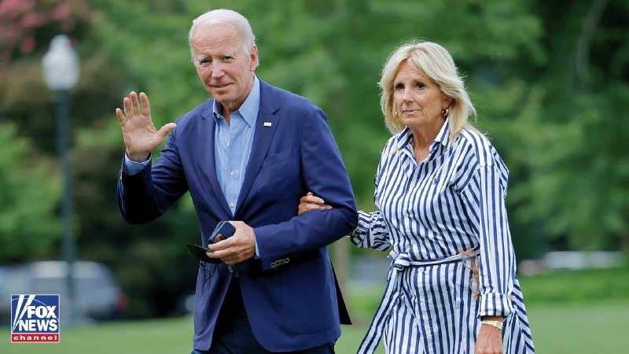

Fox News (Twitter/X)

Former First Lady Jill Biden shares an update on former President Joe Biden, saying that though the 83-year-old will live with cancer for the rest of his life, he remains busy.

"He keeps his schedule, but he’s slowed down," she said. "I mean, stage four cancer is — and he's 83 — so, I think the mix of everything and the medications that he's taken has made life a little more difficult these days."

## FoxNewsTwitter — post 342687

  <a href="telegram/content/FoxNewsTwitter_342687_1780832551.mp4" target="_blank">🎬 Download video</a>

Fox News (Twitter/X)

Rep. Nancy Mace tells Fox News Digital that she believes President Trump refused to endorse her in South Carolina's gubernatorial race because of her vote in Congress to push for the release of the Epstein files.

"If the price to pay for an endorsement was to not release those files, I would never pay it."

## IranIntlTV — post 340973

  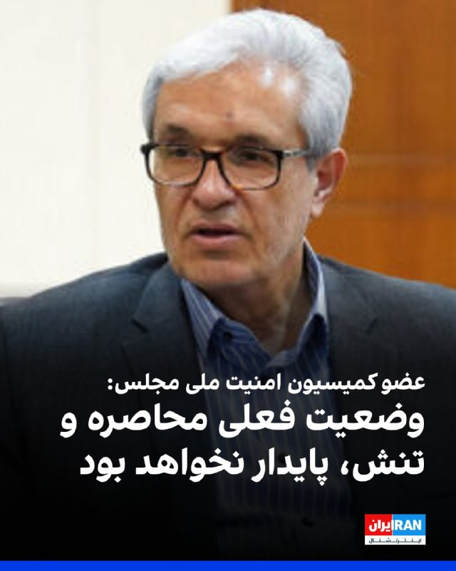

محمدرضا محسنی‌ثانی، عضو کمیسیون امنیت ملی مجلس، به خبرگزاری ایسنا گفت: «وضعیت فعلی محاصره و تنش، به هیچ وجه پایدار نخواهد بود و در پاسخ به راهزنی‌های دریایی آمریکا، ما ظرفیت‌های خود را نشان داده‌ایم و کنترل تنگه هرمز را در اختیار داریم که این یک واقعیت راهبردی است.»

او اضافه کرد: «اسرائیل به دنبال آن است که کانون مقاومت در منطقه را در هر کجا که ممکن است، تضعیف کند. ما در یک تقابل جدی هستیم و هر دو طرف در حال استفاده از تمامی ظرفیت‌های خود برای رسیدن به اهدافشان هستند.»

این نماینده مجلس ادامه داد: «پیش‌بینی من این است که ظرف حداکثر یک تا دو هفته آینده، وضعیت مشخص خواهد شد. در نهایت، ایالات متحده یا مجبور خواهد شد منطقه را ترک کند و یا با شکستی بسیار سنگین و بی‌سابقه روبرو خواهد شد.»
iranintl.com/202606071087

## FarsiVOA — post 219845

🔺یک نماینده مجلس به دانش‌آموزان معترض: اعتراضات فایده‌ای ندارد

▪️در حالی که اعتراضات سراسری دانش‌آموزان در ایران ادامه دارد، یک نماینده مجلس و عضو کمیسیون آموزش گفت: «دانش آموزان دست از اعتراضات بردارند و اعتراضات فایده‌ای ندارد.»

▪️در روزهای اخیر، شماری از دانش‌آموزان در چند شهر از جمله تهران، شیراز، خرم‌آباد، کرمانشاه، تبریز، مشهد، کرج، در اعتراض به سیاست‌های آموزشی و تأثیر قطعی معدل در کنکور تجمع کردند.

▪️معترضان می‌گویند تأثیر قطعی معدل، به‌ویژه نمرات پایه یازدهم، می‌تواند سرنوشت تحصیلی آنان را تحت تأثیر قرار دهد و فرصت برابر در رقابت کنکور را کاهش دهد.

▪️اما این نماینده مجلس می‌گوید: «دانش آموزان بروند درس شان را بخوانند، چون دیگر چاره‌ای نیست.»

⬇️ بیشتر بخوانید:
https://ir.voanews.com/a/8158179.html

## FarsiVOA — post 219844

🔺گزارش‌ها از مالکیت ویلای لوکس بانکدار تحریم‌شده مرتبط با مجتبی خامنه‌ای در اسپانیا

▪️وب‌سایت او‌سی‌سی‌آر‌پی گزارش داد علی‌اکبر انصاری، بانکدار و تاجر ایرانی مرتبط با مجتبی خامنه‌ای که بریتانیا او را به اتهام حمایت مالی از فعالیت‌های سپاه پاسداران تحریم کرده، از طریق یک شرکت بریتانیایی مالک یک ویلای لوکس در شهر ماربیا، در جنوب اسپانیا است.

▪️بر اساس این گزارش، مالکیت مستقیم ویلا به نام انصاری ثبت نشده، اما اسناد شرکتی نشان می‌دهد او با گذرنامه قبرسی خود فرد دارای کنترل مؤثر در شرکت بریتانیایی «وریتاس ریالس اینوستمنت لیمیتد» است.

▪️پیشتر رسانه‌ها گزارش‌هایی را در مورد دارایی‌های مجتبی خامنه‌ای رهبر کنونی جمهوری اسلامی که به واسطه انصاری در خارج از کشور تملک شده، منتشر کرده بودند.

⬇️ بیشتر بخوانید:
https://ir.voanews.com/a/sanctioned-iranian-banker-owns-luxury-spanish-villa-via-uk-company/8158178.html

## RadioFarda — post 158003

  <a href="https://t.me/radiofarda/158003" target="_blank">📎 Download file</a>

📻بشنوید: ساعت ۱۴ با رادیوفردا، هفدهم خرداد ۱۴۰۵‌

@RadioFarda

## RadioFarda — post 158002

  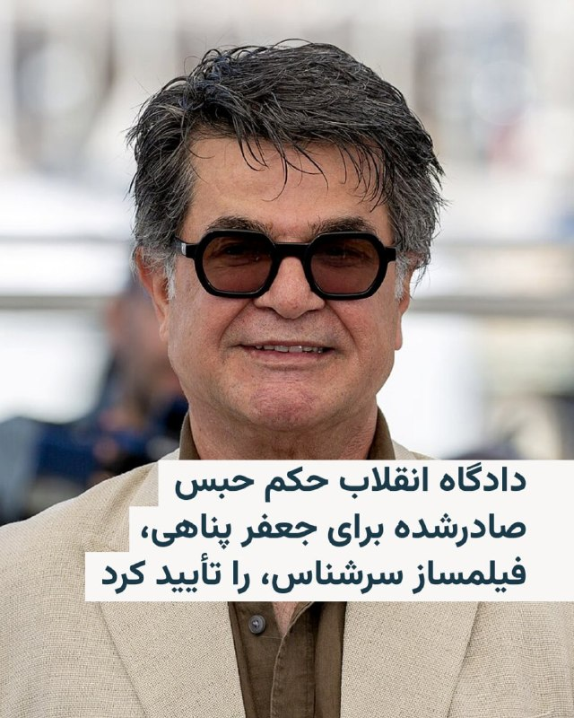

🔸مصطفی نیلی، وکیل جعفر پناهی، خبر داد که دادگاه انقلاب در تهران حکم یک سال حبس برای این فیلمساز سرشناس را تأیید کرده است. حکم قابل تجدیدنظرخواهی است.

🔸به گفته نیلی، پناهی «به اتهام فعالیت تبلیغی علیه نظام جمهوری اسلامی ایران به یک سال حبس تعزیری محکوم شده بود».

🔸او ادامه داد:‌ «همچنین دو سال ممنوعیت خروج از کشور و ممنوعیت عضویت در گروه‌ها و دستجات سیاسی و اجتماعی برای او [پناهی] در نظر گرفته شده است.»

🔸جعفرپناهی، نویسنده و کارگردان شناخته‌شده، روز ۹ فروردین از طریق مرز زمینی بازرگان پس از ماه‌ها سفر در خارج از کشور به ایران بازگشت.

🔸او این چند ماه را همزمان با نمایش فیلم آخرش «یک تصادف ساده» در اروپا و آمریکا به سر می‌برد. داستان این فیلم مستقیما به اعتراضات مردمی چند سال اخیر در کشور مربوط است.

🔸«ساخت فیلم زیرزمینی و مسئله‌دار علیه حاکمیت»‌ یکی از موارد اتهامی در پرونده پناهی بوده است.

🔸جعفر پناهی که از مخالفان حکومت ایران است پیشتر گفته بود که پس از پایان کارهایش به ایران بازخواهد گشت. او پارسال پس از ۱۴ سال ممنوع‌الخروجی اجازه پیدا کرد که از کشور خارج شود.

@RadioFarda

## alonews — post 125742

  <a href="telegram/content/alonews_125742_1780832554.webm" target="_blank">🎬 Download video</a>

👈خبرگزاری رویترز نوشت: اعضای اوپک پلاس در نشست امروز (یکشنبه) خود احتمالاً برای چهارمین بار در چند ماه، بر افزایش سهمیه تولید نفت توافق می‌کنند.

🔴این بحران با خروج امارات از این سازمان صادرکننده نفت پس از ۶۰ سال عضویت در این ائتلاف نفتی، عمیق‌تر شد.

✅ @AloNews خبر جنگ

---
📅 بروزرسانی: 1405/03/17 15:02
---

## VahidOOnLine — post 244081

  <a href="telegram/content/VahidOOnLine_244081_1780831972.mp4" target="_blank">🎬 Download video</a>

♦️محسن نقوی، وزیر کشور پاکستان، در سفر به تهران با سید عباس عراقچی، وزیر امور خارجه جمهوری اسلامی، دیدار و درباره مهم‌ترین موضوعات دوجانبه، تحولات منطقه و آخرین ابتکارات دیپلماتیک در مسیر گفتگوهای ایران و آمریکا رایزنی کرد.
بر اساس اعلام وزارت امور خارجه ایران، این دیدار در چارچوب ادامه تلاش‌های دیپلماتیک و رایزنی‌های منطقه‌ای انجام شده و دو طرف تازه‌ترین تحولات مرتبط با مذاکرات تهران و واشنگتن و همچنین مسائل امنیتی و سیاسی منطقه را مورد بررسی قرار دادند.
همزمان، رسانه‌های دولتی ایران تصاویری از دیدار محسن نقوی با عباس عراقچی و لحظه تحویل یک «نامه ویژه» منتشر کردند، نامه‌ای که به گفته وزیر کشور پاکستان از سوی ژنرال عاصم منیر، فرمانده ارتش پاکستان، ارسال شده است.
محسن نقوی که شامگاه شنبه وارد تهران شده بود، پیش از این به خبرنگاران گفته بود ماموریت دارد پیام ویژه‌ای از سوی ژنرال عاصم منیر و شهباز شریف، نخست‌وزیر پاکستان، درباره شرایط کنونی منطقه را به مقام‌های جمهوری اسلامی منتقل کند.
‌🇸🇦 Indypersian

🤖 @VahidOOnLine

## VahidOOnLine — post 244080

  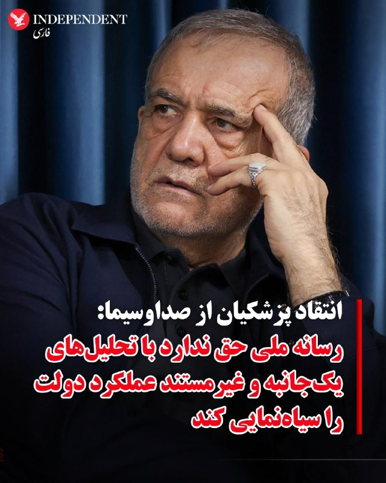

♦️مسعود پزشکیان، رئیس جمهوری ایران، روز یکشنبه ۱۶ خرداد ماه در جلسه شورای هماهنگی اقتصادی دولت با انتقاد از صداوسیما گفت، رسانه‌ ملی نباید با تحلیل‌های یک‌جانبه و غیرمستند عملکرد دولت را سیاه‌نمایی کند.
پزشکیان با اعتراف به تاثیر محاصره دریایی بر اقتصاد ایران افزود، با وجود جنگَ، تحریم‌ها و فشارهای تجاری از جمله محاصره دریایی نمی‌توان «تحولات قیمتی» را به عملکرد دولت ربط داد.
پزشکیان گفت: «در برخی روایت‌ها چنین القا می‌شود که گویی هیچ‌یک از این عوامل وجود ندارد و تمامی مشکلات کشور تنها ناشی از عملکرد دولت است.»
رئیس‌جمهوری ایران همچنین اعلام کرد: «دولت به دلیل ملاحظات ملی و امنیتی امکان بیان برخی واقعیت‌ها را ندارد» و رسانه ملی نیز حق ندارد با تحلیل‌های یک‌جانبه و فاقد مستندات، موجب تشویش افکار عمومی شده و به سیاه‌نمایی عملکرد دولت بپردازد.
‌🇸🇦 Indypersian

🤖 @VahidOOnLine

## VahidOOnLine — post 244079

  

مسعود پزشکیان، در جلسه با وزیر و معاونان وزارت اقتصاد، گفت: «در شرایطی که دولت به دلیل ملاحظات ملی و امنیتی امکان بیان برخی واقعیت‌ها را ندارد، صدا وسیما نیز حق ندارد با تحلیل‌های یک‌جانبه و غیرمستند، به تشویش افکار عمومی و سیاه‌نمایی نسبت به عملکرد دولت بپردازد.»

او ادامه داد: «در شرایطی که اقتصاد کشور تحت تاثیر مستقیم جنگ با آمریکا و اسرائیل، محدودیت‌های ناشی از تحریم‌های اقتصادی، فشارهای تجاری از جمله محاصره دریایی است نمی‌توان تمامی تحولات قیمتی را صرفا به عملکرد دولت نسبت داد.»

پزشکیان اضافه کرد: «در برخی روایت‌ها چنین القا می‌شود که گویی هیچ‌یک از این عوامل وجود ندارد و تمامی مشکلات ناشی از عملکرد دولت است.»
‌🏁 🇬🇧 IranintlTV

🤖 @VahidOOnLine

## WithYashar — post 13673

## IranIntlTV — post 340972

  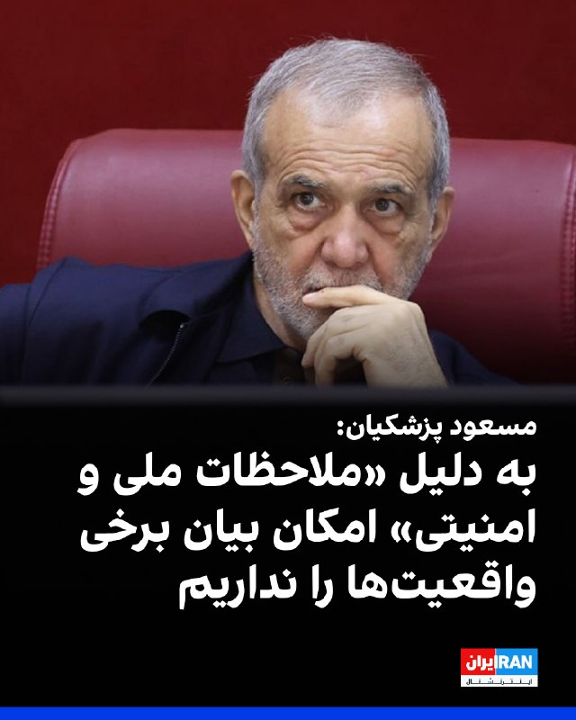

مسعود پزشکیان، در جلسه با وزیر و معاونان وزارت اقتصاد، گفت: «در شرایطی که دولت به دلیل ملاحظات ملی و امنیتی امکان بیان برخی واقعیت‌ها را ندارد، صدا وسیما نیز حق ندارد با تحلیل‌های یک‌جانبه و غیرمستند، به تشویش افکار عمومی و سیاه‌نمایی نسبت به عملکرد دولت بپردازد.»

او ادامه داد: «در شرایطی که اقتصاد کشور تحت تاثیر مستقیم جنگ با آمریکا و اسرائیل، محدودیت‌های ناشی از تحریم‌های اقتصادی، فشارهای تجاری از جمله محاصره دریایی است نمی‌توان تمامی تحولات قیمتی را صرفا به عملکرد دولت نسبت داد.»

پزشکیان اضافه کرد: «در برخی روایت‌ها چنین القا می‌شود که گویی هیچ‌یک از این عوامل وجود ندارد و تمامی مشکلات ناشی از عملکرد دولت است.»
https://iranintl.com/202606072336

## FarsiVOA — post 219843

  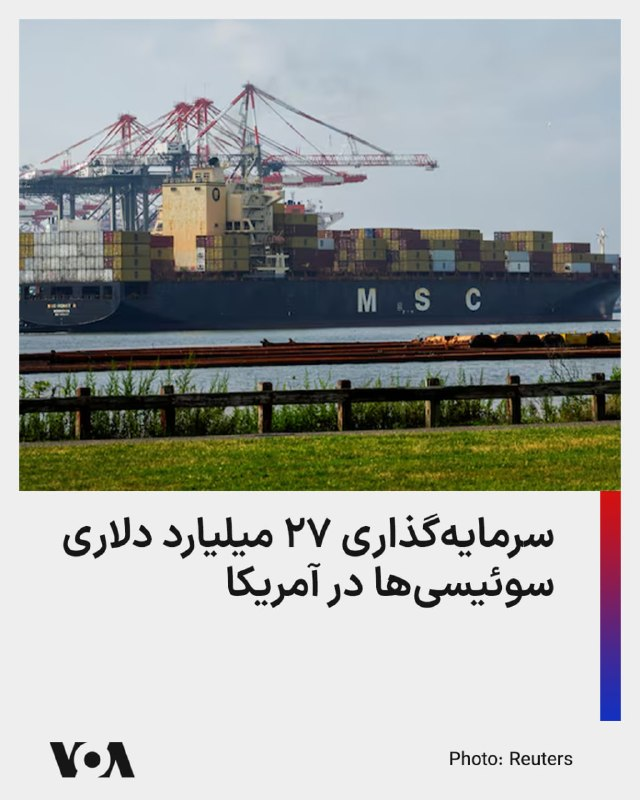

رویترز به نقل از یک روزنامه سوئیسی گزارش داد شرکت‌های سوئیسی بین ژانویه تا آوریل امسال ۲۷ میلیارد دلار در آمریکا سرمایه‌گذاری کرده‌اند.

بنابر این گزارش این اقدام بخشی از تلاش برای اجرای تعهدات این کشور پس از توافق تعرفه‌ای با واشینگتن است. این روزنامه نوشته این گزارش و ارقام را از ایمیلی داخلی از اتاق بازرگانی سوئیس و آمریکا که به اعضای آن ارسال شده به دست آورده است.

سوئیس و آمریکا ۱۴ نوامبر اعلام کردند شرکت‌های سوئیسی طی پنج سال ۲۰۰ میلیارد دلار در آمریکا سرمایه‌گذاری خواهند کرد. این تعهد بخشی از توافق اولیه‌ای بود که بر اساس آن دونالد ترامپ تعرفه بر کالاهای سوئیسی را از ۳۹ درصد به ۱۵ درصد کاهش داد.

هم‌زمان، آمریکا تعرفه‌های تازه‌ای را علیه کشورهایی اعلام کرده که به گفته واشنگتن برای مقابله با کار اجباری کافی اقدام نمی‌کنند.
@FarsiVOA

## DW_Farsi — post 125611

  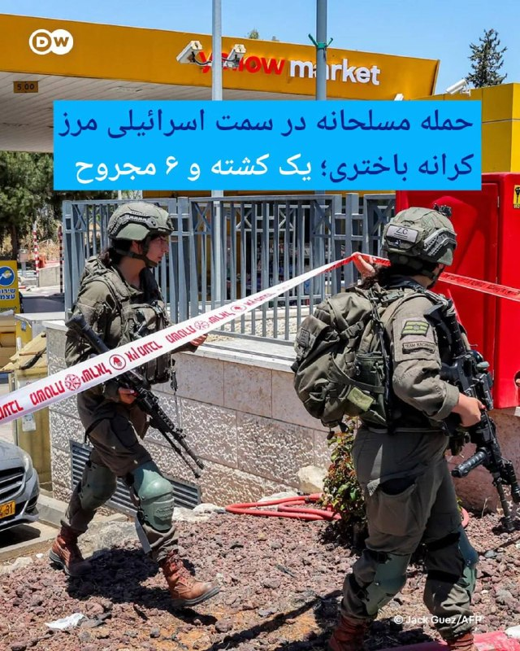

🔶 حمله مسلحانه در سمت اسرائیلی مرز کرانه باختری؛ یک کشته و ۶ مجروح

بر اساس اعلام سازمان امداد و نجات "ماگن دیوید آدوم" اسرائیل، دستکم یک نفر در چند تیراندازی همزمان در نزدیکی کرانه باختری کشته و ۶ نفر دیگر زخمی شدند.

پلیس اسرائیل اعلام کرد که دستکم یکی از مهاجمان را کشته و در حال جستجو برای یافتن مهاجمان احتمالی دیگر است. به ساکنان منطقه نیز دستور داده شد در خانه‌های خود بمانند.

بر اساس گزارش رسانه‌های اسرائیلی، ماگن دیوید آدوم اعلام کرد که نخستین گزارش‌ها درباره تیراندازی در یک پمپ بنزین در نزدیکی شهر کوخاو یائیر، واقع در سمت اسرائیلی مرز با کرانه باختری، حدود ساعت ۱۰:۳۰ صبح دریافت شد. طبق اعلام رسانه‌های اسرائیلی، اندکی بعد چند گزارش دیگر از تیراندازی نیز دریافت شد که یکی از آنها در داخل کرانه باختری رخ داده بود.

وزارت بهداشت فلسطینی پیش از این اعلام کرده بود که در آخر هفته جاری، نیروهای اسرائیلی به خودرویی در کرانه باختری تیراندازی کردند. در نتیجه این تیراندازی یک نوزاد هفت‌ماهه فلسطینی کشته و پدر و مادر او زخمی شدند. به گفته ارتش اسرائیل، این خودرو با سرعت به سمت نیروهای ارتش در حرکت بود.

@dw_farsi

## Persian_Trend_Official — post 15852

  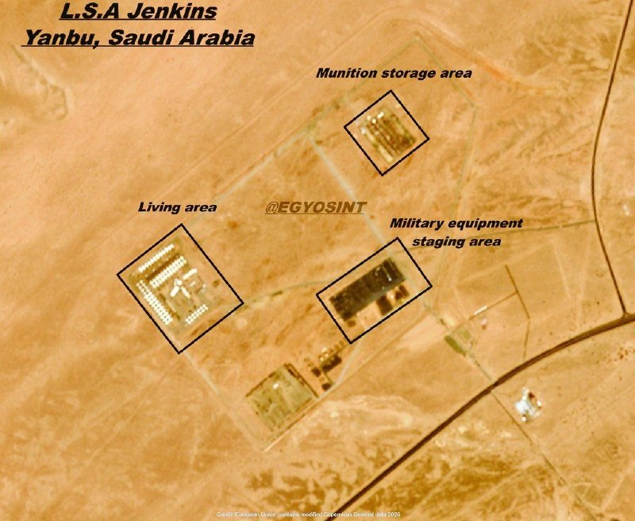

👀
🌎 گزارش ماهواره‌ای: توسعه گسترده حضور نظامی آمریکا در پایگاه لجستیکی ینبع عربستان

«ایجپت اینتل ابزرور» با انتشار تصاویر ماهواره‌ای گزارش داده است که از آوریل ۲۰۲۶، عملیات توسعه قابل توجهی در منطقه پشتیبانی لجستیکی ارتش آمریکا در ینبع عربستان سعودی (LSA Jenkins) آغاز شده است.

بر اساس این گزارش، طی این دوره شاهد افزایش استقرار نیروها و انتقال تجهیزات نظامی آمریکا به این پایگاه بوده‌ایم؛ موضوعی که از گسترش ظرفیت عملیاتی و تقویت زیرساخت‌های لجستیکی ایالات متحده در غرب عربستان حکایت دارد.

افزایش فعالیت در چنین مراکزی معمولاً در چارچوب آماده‌سازی برای پشتیبانی گسترده‌تر از عملیات منطقه‌ای و تقویت زنجیره لجستیک نظامی آمریکا در غرب آسیا ارزیابی می‌شود؛ به‌ویژه در شرایطی که سطح تنش‌های امنیتی در منطقه همچنان بالاست.

👺Phantom

📌 @persian_trend_official
پرشین ترند | متفاوت‌ترین کانال نظامی

## IranianMinds — post 21553

  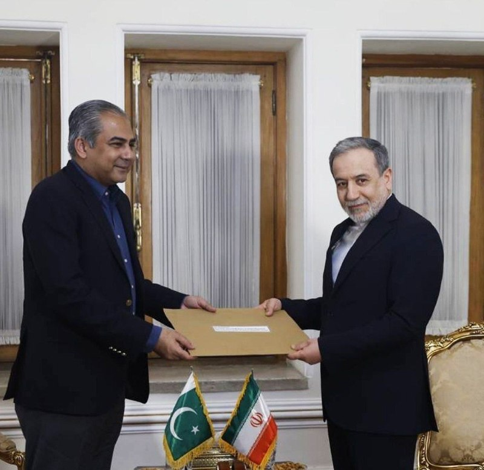

🔴نقوی، وزیر پاکستان🇵🇰 نامه‌ی مهمی که واسه مجتبی خامنه‌ای آورده بود رو تحویل عراقچی داد تا برسونن دست مجتبی؛

خیلی‌ها میگن این نامه یه هشدار مهم از طرف ترامپه!

+ متن روی پاکت :
His Eminence
Ayatollah Sayyed Mojtaba Hosseini Khamenei
The Supreme Leader of Islamic Republic of Iran
مقام معظم
حضرت آیت‌الله سیدمجتبی حسینی خامنه‌ای
رهبر معظم جمهوری اسلامی ایران.

@IranianMinds

## idfinfarsi — post 11786

  <a href="telegram/content/idfinfarsi_11786_1780831979.mp4" target="_blank">🎬 Download video</a>

در حالی که ارتش اسرائیل در فکر آموزش و آماده‌سازی فرماندهان آینده است، رژیم ایران همچنان به سرمایه‌گذاری یر روی نیروهای نیابتی و گسترش تروریسم ادامه می‌دهد.

## Dirty_Kids — post 391207

  <a href="telegram/content/Dirty_Kids_391207_1780831981.mp4" target="_blank">🎬 Download video</a>

مسخره کردن قلعه نویی و رختکن تیم جمهوری اسلامی توسط ساسی مانکن 😂

@Dirty_Kids 👻

## Dirty_Kids — post 391206

  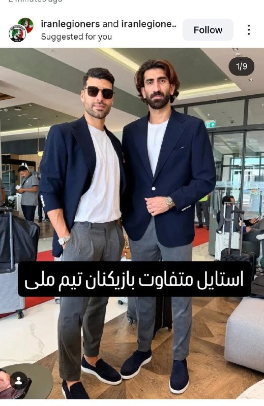

انگار نیسان رو اسپورت کردن

@Dirty_Kids 👻

## Hranews — post 113441

  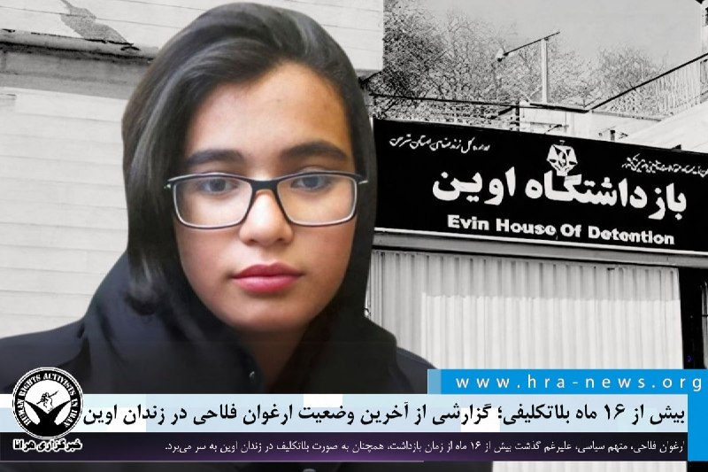

بیش از ۱۶ ماه بلاتکلیفی؛ گزارشی از آخرین وضعیت ارغوان فلاحی در زندان اوین

❗️
❗️
❗️
❗️
❗️– ارغوان فلاحی، متهم سیاسی، نزدیک به ۵۰۰ روز است که بازداشت شده و به صورت بلاتکلیف در زندان اوین به سر می‌برد. علیرغم برگزاری جلسات رسیدگی به اتهامات وی، تاکنون حکمی برای او صادر نشده است.

به گزارش خبرگزاری هرانا، ارگان خبری مجموعه فعالان حقوق بشر در ایران، ارغوان فلاحی کماکان در بازداشت است.

بر اساس اطلاعات دریافتی هرانا، خانم فلاحی با گذشت بیش از ۱۶ ماه از زمان بازداشت، کماکان به صورت بلاتکلیف در زندان اوین نگهداری می‌شود. علیرغم برگزاری چند جلسه دادگاه رسیدگی به اتهامات وی در شعبه ۱۵ دادگاه انقلاب تهران به ریاست قاضی ابوالقاسم صلواتی، تاکنون حکمی برای او صادر نشده است.

ادامه مطلب

#ارغوان_فلاحی

↘️
@hranews_bot تماس ✉️ - @Hranews کانال هرانا 🆑

## alonews — post 125741

  <a href="telegram/content/alonews_125741_1780831983.webm" target="_blank">🎬 Download video</a>

👈به گزارش بلومبرگ، با گذشت ۱۰۰ روز از آغاز جنگ توسط واشنگتن و اسرائیل، به نظر می‌رسد تلاش‌های ایران و آمریکا برای دستیابی به یک توافق موقت جهت پایان دادن به درگیری‌ها با پیشرفت ناچیزی همراه بوده است. همزمان، وقوع حملات جدید، فشار مضاعفی را بر آتش‌بس شکننده فعلی وارد کرده و دستیابی به صلح را دور از دسترس نشان می‌دهد.

✅ @AloNews خبر جنگ

## alonews — post 125740

  <a href="telegram/content/alonews_125740_1780831983.webm" target="_blank">🎬 Download video</a>

👈بقائی: وضعیت آتش‌بس فعلی بسیار شکننده و خطرناک است

🔴موضوع اصلی اختلافات ما، نپذیرفتن حقوق قانونی ایران از جمله «حق غنی‌سازی» توسط آمریکاست.

✅ @AloNews خبر جنگ

---
📅 بروزرسانی: 1405/03/17 14:52
---

## pm_afshaa — post 92443

  <a href="telegram/content/pm_afshaa_92443_1780831365.webm" target="_blank">🎬 Download video</a>

🔴زنگنه، عضو کمیسیون برنامه‌ و بودجهٔ مجلس: درحال‌ حاضر از هر کشتی عبوری از تنگهٔ هرمز به‌طور میانگین بین 1.5 تا 2 میلیون دلار دریافت میشه.

💧 Rainbet.com the #1 Non-KYC Crypto Casino & Sportsbook @rainbetcom

😁 @Pm_Afshaa

## Persian_Trend_Official — post 15851

  <a href="telegram/content/Persian_Trend_Official_15851_1780831365.webm" target="_blank">🎬 Download video</a>

📰 رویترز: افزایش نگرانی‌ها از درگیری نزدیک به تأسیسات هسته‌ای در جنگ روسیه و اوکراین

💥رویترز گزارش داده است که جنگ روسیه و اوکراین بار دیگر با حوادث مرتبط با زیرساخت‌های هسته‌ای گره خورده و سطح نگرانی‌ها درباره امنیت هسته‌ای در منطقه افزایش یافته است.

⚠️
🤬بر اساس این گزارش، یک پهپاد روسی به تأسیسات ذخیره سوخت هسته‌ای در نزدیکی نیروگاه غیرفعال چرنوبیل اصابت کرده است. مقام‌های اوکراینی اعلام کرده‌اند که بخشی از یک ساختمان دریافت کانتینر در این حمله آسیب دیده، اما تأکید کرده‌اند که در زمان حادثه هیچ سوخت هسته‌ای در محل وجود نداشته است.

در مقابل، اوکراین نیز در مقاطع مختلف روسیه را به هدف قرار دادن زیرساخت‌های مرتبط با نیروگاه زاپروژیا، بزرگ‌ترین نیروگاه هسته‌ای اروپا که اکنون تحت کنترل روسیه است، متهم کرده است.

با وجود عدم استفاده مستقیم از سلاح هسته‌ای، نزدیک شدن درگیری‌ها به تأسیسات اتمی می‌تواند سطح ریسک جنگ را به‌طور جدی افزایش دهد و نگرانی‌ها درباره امنیت هسته‌ای اروپا را تشدید کند.

💻Phantom

📌 @persian_trend_official
پرشین ترند | متفاوت‌ترین کانال نظامی

## IranianMinds — post 21552

🔴یک مقام ارشد و سابق موساد فاش کرد که استراتژی بلندمدت اسرائیل برای کمک به سرنگونی رژیم ایران، پیش از تکمیل تمامی مراحل و به دلیل متوقف کردن جنگ از سوی آمریکا، نیمه‌کاره ماند.

او گفت که اما در حال حاضر شرایطی ایجاد شده که فروپاشی نهایی این رژیم را اجتناب‌ناپذیر می‌کند؛ وی همچنین به عملیات‌های بی‌سابقه موساد در داخل ایران و همکاری با شرکای محلیِ مخالف رژیم اشاره کرد.
مبارزه‌ی مردم ایران برای آزادی هنوز تمام نشده است.

@IranianMinds

## alonews — post 125739

  <a href="telegram/content/alonews_125739_1780831366.webm" target="_blank">🎬 Download video</a>

👈ایمان صفا،بازیگر تلوزیون در صفحه اینستاگرام خود با هشتگ پخمگان نوشت:
جناب معاون گفتن در این جنگ‌های اخیر شاهد مهاجرت معکوس نخبگان بودیم. قیصر و صدف و یه سری بلاگرای دوزاری؟ اینا نخبه‌ان؟

✅ @AloNews خبر جنگ

## alonews — post 125738

  <a href="telegram/content/alonews_125738_1780831366.webm" target="_blank">🎬 Download video</a>

⚫
🏆 به دنیای هیجان‌انگیز فوتبال خوش اومدی!

⭐️اینجا قراره باهم لحظه‌به‌لحظه‌ی جام جهانی رو زندگی کنیم؛
از بازی‌های حساس و نتایج داغ گرفته تا حاشیه‌ها، کری‌خونی‌ها و اتفاقاتی که همه درباره‌ش حرف میزنن! 
🔥
🔥

✅ پوشش کامل مسابقات

💀ترول تیم‌ها و بازیکن‌ها

🎥ویدیوها و لحظه‌های فان فوتبالی

📊آمار، ترکیب‌ها و اخبار فوری

🌍حواشی جذاب از سراسر جام جهانی

📢اینجا فقط یک کانال خبری نیست؛
یک جمع فوتبالیه برای کسایی که فوتبال رو با هیجان، شوخی و احساس واقعی دنبال میکنن 
📛
💟

🆘
🔞 آماده باش چون قراره جام جهانی رو متفاوت تجربه کنیم!

⚡ @Vaarzesh_Plus

⚡ @Vaarzesh_Plus

---
📅 بروزرسانی: 1405/03/17 14:42
---

## VahidOOnLine — post 244078

  

♦️مصطفی نیلی، وکیل جعفر پناهی، روز یکشنبه ۱۷ خرداد ماه اعلام کرد شعبه ۲۶ دادگاه انقلاب اسلامی تهران به ریاست قاضی ایمان افشاری با رد «واخواهی»، حکم غیابی صادرشده علیه این فیلمساز را عینا تایید کرده است.

به گفته نیلی، جعفرپناهی بر اساس حکم اولیه به اتهام «فعالیت تبلیغی علیه نظام جمهوری اسلامی ایران» به یک سال حبس تعزیری محکوم شده است. همچنین دو سال ممنوعیت خروج از کشور و ممنوعیت عضویت در گروه‌ها و تشکل‌های سیاسی و اجتماعی نیز برای او در نظر گرفته شده است.

وکیل این فیلمساز برجسته و برنده نخل طلای جشنواره کن در گفتگو با رسانه «امتداد» اعلام کرد، ساخت فیلمی «زیرزمینی و مسئله‌دار علیه حاکمیت»، حمایت از زندانیان سیاسی از جمله فاطمه سپهری، راحله راحمی‌پور، حسین رونقی، محمد نوری‌زاد، مهدی محمودیان و ابوالفضل قدیانی، حمایت از اعتراضات، حمایت از شعار «زن، زندگی، آزادی»، امضا و انتشار بیانیه‌ای درباره اعتصاب کامیون‌داران، «سیاه‌نمایی» وضعیت کشور و بازنشر کلیپی از هم‌خوانی سرود «ای ایران» در اعتراض به صدور و اجرای احکام اعدام، از مستندات صدور این حکم عنوان شده‌اند.

جعفر پناهی پس از یک دوره اقامت در اروپا و آمریکا و حضور در جشنواره‌های کن و مراسم اسکار، یازدهم فروردین ۱۴۰۵ از طریق مرز زمینی بازرگان در ترکیه به ایران بازگشت. او پیش از سفر اعلام کرده بود که با وجود خطرات احتمالی و حکم یک سال حبس صادر شده از سوی دادگاه انقلاب، پس از پایان مراسم‌ها به کشور بازخواهد گشت.
‌🇸🇦 Indypersian

🤖 @VahidOOnLine

## mwarmonitor — post 10246

🔴وزارت امور خارجه ایران اعلام کرد که تهران و ایالات متحده همچنان از طریق میانجی‌های پاکستان در حال تبادل پیام هستند، اما هم‌زمان واشنگتن را متهم کرد که با تغییر مداوم مطالبات و بیانیه‌های متناقض، روند مذاکرات را دشوار می‌کند.

🔴سخنگوی وزارت امور خارجه ایران، آمریکا را متهم می‌کند که در موضوع دارایی‌های بلوکه‌شده ایران هیچ امتیازی نمی‌دهد و همچنین ادعا می‌کند که **آمریکا به کشتی‌های تجاری ایرانی در تنگه هرمز و در آب‌های آزاد حمله می‌کند.

🔴وزارت امور خارجه ایران هشدار داده نیروهای مسلحش آماده‌اند به هرگونه حمله با تمام قوا پاسخ دهند.

🔸 سی ان ان به نقل از منابع

@mwarmonitor

## pm_afshaa — post 92442

  <a href="telegram/content/pm_afshaa_92442_1780830747.webm" target="_blank">🎬 Download video</a>

https://t.me/proxy?server=87.248.129.223&port=4455&secret=ee1603010200010001fc030386e24c3add626973636f7474692e79656b74616e65742e636f6d پروکسی متصل سرعت بالا 
💧 Rainbet.com the #1 Non-KYC Crypto Casino & Sportsbook @rainbetcom 
😁 @Pm_Afshaa

## IranIntlTV — post 340971

  <a href="telegram/content/IranIntlTV_340971_1780830748.mp4" target="_blank">🎬 Download video</a>

تورم فزاینده، به‌ویژه در بخش خوراکی‌ها، بحران معیشت خانوارهای ایرانی را تشدید کرده است.

آرش آزرمی، دبیر بخش اقتصادی ایران‌اینترنشنال، با اشاره به موج تازه گرانی مواد غذایی گفت که تامین حتی یک سبد حداقلی خوراک برای بسیاری از خانواده‌ها عملا امکان‌پذیر نیست.
@iranintltv

## IranIntlTV — post 340970

  <a href="telegram/content/IranIntlTV_340970_1780830749.mp4" target="_blank">🎬 Download video</a>

🔻جاویدنام عرفان بزرگی، قهرمان مچ‌اندازی در استان فارس، در جریان اعتراضات مردم مرودشت با شلیک مستقیم نیروهای سرکوب جمهوری اسلامی کشته شد. عرفان بزرگی قهرمان مچ‌اندازی در دست چپ و دست راست در استان فارس بود

🔹فربد سروندی، عضو تحریریه ایران اینترنشنال گزارش می‌دهد

@iranintltvsport

## IranIntlTV — post 340969

  <a href="telegram/content/IranIntlTV_340969_1780830751.mp4" target="_blank">🎬 Download video</a>

یک شهروند با ارسال ویدیویی به ایران‌اینترنشنال درباره گرانی‌ها می‌گوید: «سه قلم جنس برای خانه خریده‌ام، شد ۶۷۵ هزار تومان. لعنت به جمهوری اسلامی.»

## FarsiVOA — post 219842

  

ارتش اسرائیل با صدور هشدار فوری از ساکنان شهر صور و اردوگاه‌ها و محله‌های اطراف آن خواست فوراً منطقه را ترک کرده و به شمال رودخانه زهرانی منتقل شوند.

در این هشدار، به‌طور مشخص از ساکنان شهر صور و اردوگاه‌های البص و زقوق المفدی خواسته شده از مناطقی که در نقشه اعلام‌شده مشخص شده‌اند، خارج شوند.

ارتش اسرائیل گفته این هشدار در پی نقض توافق آتش‌بس از سوی حزب‌الله صادر شده و تأکید کرده هدف آن آسیب رساندن به غیرنظامیان نیست.

در متن هشدار آمده است هر فردی که در نزدیکی نیروها، تأسیسات یا تجهیزات جنگی حزب‌الله باقی بماند، جان خود را در معرض خطر قرار می‌دهد.
@FarsiVOA

## FarsiVOA — post 219841

  

رئیس سازمان غذا و دارو می‌گوید، حدود ۱۰۰ تن ماده اولیه دارویی از زمان جنگ در منطقه جبل‌علی امارات باقی مانده و بخشی دیگر نیز در بندر کراچی پاکستان متوقف شده است.

مهدی پیرصالحی همچنین گفت بخش عمده مواد اولیه داروهای اعصاب و روان و همچنین برخی واکسن‌ها از هند تأمین می‌شود و هنوز بخشی از محموله‌ها به کشور نرسیده است.

طی هفته‌های گذشته گزارش‌های زیادی از کمبود و افزایش چشمگیر قیمت داروها در کشور منتشر شده است.

پیرصالحی می‌گوید بسیاری از مسیرهای حمل‌ونقل و واردات دارو با محدودیت مواجه هستند. او درباره افزایش قیمت داروها گفت بخشی از تأمین ارز دارو با ارز ترجیحی و بخش قابل توجهی با ارز غیرترجیحی انجام می‌شود. «نرخ ارز غیرترجیحی از حدود ۷۰ هزار تومان در دی‌ماه به حدود ۱۵۰ هزار تومان رسیده است».

رئیس سازمان غذا و دارو همچنین گفته است قیمت مواد بسته‌بندی و اقلام جانبی به‌ویژه محصولات وابسته به صنایع پتروشیمی طی این مدت بین دو تا پنج برابر افزایش یافته است.
@FarsiVOA

## Persian_Trend_Official — post 15850

  

⚫
📰الجزیره: جنبش جهاد اسلامی فلسطین در بیانیه‌ای در خصوص تیراندازی در منطقه کوخاو یائیر و کشته‌شدن یک صهیونیست، اعلام کرد، این عملیات پاسخی طبیعی به جنایت‌های رژیم اشغالگر بود.

👺Phantom

📌 @persian_trend_official
پرشین ترند | متفاوت‌ترین کانال نظامی

## BBCPersian — post 283059

🔻پلیس اسرائیل می‌گوید که در حمله مسلحانه در شهر کوخاو یائیر در مرکز اسرائیل یک نفر کشته و پنج نفر زخمی شده‌اند.

آنها می‌گویند که نیروهای امنیتی فرد مسلح را کشته‌اند که یک عرب اسرائیلی اهل شهر طیبه بود و از وسیله نقلیه‌ای با پلاک اسرائیلی استفاده می‌کرد.

ارتش اسرائیل می‌گوید که گذرگاهی به کرانه باختری در همان نزدیکی را بسته و چندین روستای فلسطینی را محاصره کرده است.

🎥Reuters/AP
@BBCPersian

## alonews — post 125737

  <a href="telegram/content/alonews_125737_1780830754.webm" target="_blank">🎬 Download video</a>

👈پزشکیان دستور داد که مبلغ کالابرگ افزایش پیدا کنه

✅ @AloNews خبر جنگ

## alonews — post 125736

  <a href="telegram/content/alonews_125736_1780830754.webm" target="_blank">🎬 Download video</a>

🔴فوری / ارتش اسرائیل : مردمِ شهر صور تو لبنان هرچی زودتر جمع کنن برن

✅ @AloNews خبر جنگ

---
📅 بروزرسانی: 1405/03/17 14:32
---

## VahidOOnLine — post 244077

  

مصطفی نیلی، وکیل جعفر پناهی، کارگردان سینما و زندانی سیاسی پیشین، به کانال امتداد گفت که شعبه ۲۶ دادگاه انقلاب تهران به ریاست قاضی ایمان افشاری، حکم غیابی صادرشده علیه جعفر پناهی را عینا تایید کرده است.

بر اساس حکم دادگاه، پناهی به یک سال حبس تعزیری، دو سال ممنوعیت خروج از کشور و ممنوعیت عضویت در گروه‌ها و دستجات سیاسی و اجتماعی محکوم شده است.

نیلی اعلام کرد که مستند صدور این رای، مواردی مانند «ساخت فیلم زیرزمینی و مسئله‌دار علیه حاکمیت، حمایت از برخی محکومان امنیتی از جمله فاطمه سپهری، راحله راحمی‌پور، حسین رونقی، محمد نوری‌زاد، مهدی محمودیان و ابوالفضل قدیانی، حمایت از اعتراضات، حمایت از شعار «زن، زندگی، آزادی»، امضا و انتشار بیانیه‌ای درباره اعتصاب کامیون‌داران، سیاه‌نمایی وضعیت کشور و بازنشر کلیپی با مضمون هم‌خوانی سرود ‌ای ایران در اعتراض به صدور و اجرای احکام اعدام» است.
iranintl
‌🏁 🇬🇧 IranintlTV

🤖 @VahidOOnLine

## VahidOOnLine — post 244076

♦️مسابقات قهرمانی اروپا در رشته «هابی هورس» یا اسب چوبی، با حضور ۲۴۳ شرکت‌کننده از ۱۱ کشور اروپایی در شهر پراگ، پایتخت جمهوری چک، برگزار شد؛ رقابتی متفاوت که در آن ورزشکاران با در دست داشتن اسب‌های چوبی، حرکات و رشته‌های مختلف سوارکاری را بدون حضور اسب واقعی اجرا می‌کنند.
شرکت‌کنندگان در این مسابقات در بخش‌هایی مانند پرش از مانع، درساژ (حرکات نمایشی و هماهنگ سوارکاری)، مسیر وسترن و نمایش پرش به رقابت پرداختند و تلاش کردند با اجرای دقیق حرکات، نظر داوران را جلب کنند.
آلیسا آرنیومکی، شرکت‌کننده فنلاندی این رقابت‌ها، درباره جذابیت این ورزش گفت: «من عاشق جامعه و فضای دوستانه‌ای هستم که پیرامون این ورزش شکل گرفته است، واقعا فوق‌العاده است.»
ورزش «هابی هورس» در اوایل دهه ۲۰۰۰ میلادی در فنلاند شکل گرفت و در ابتدا راهی کم‌هزینه برای علاقه‌مندان به سوارکاری بود که امکان نگهداری یا سواری با اسب واقعی را نداشتند. اما این فعالیت به مرور از یک سرگرمی به یک رشته رقابتی با قوانین مشخص تبدیل شد و امروز مسابقات ملی و بین‌المللی متعددی برای آن برگزار می‌شود.
‌🇸🇦 Indypersian

🤖 @VahidOOnLine

## VahidOOnLine — post 244075

  

اسماعیل بقائی، سخنگوی وزارت خارجه جمهوری اسلامی، در مصاحبه با سی‌ان‌ان گفت تبادل پیام‌ها از طریق میانجی‌گران پاکستانی ادامه دارد.

او افزود مشکل اصلی مذاکره با دولت دونالد ترامپ، رییس‌جمهوری آمریکا، این است که با مواضع بسیار متغیر، اظهارات متفاوت و سخنان متناقض مقام‌های مختلف روبه‌رو هستیم.

بقائی همچنین گفت آمریکا باید تحریم‌ها را متوقف کند و دارایی‌های مسدودشده را آزاد کند.

سخنگوی وزارت خارجه جمهوری اسلامی گفت وضعیت «بسیار بی‌ثبات و خطرناک» است و همه اینها به دلیل رویکرد «بی‌ملاحظه» آمریکا نسبت به منطقه و آتش‌بس است.
iranintl
‌🏁 🇬🇧 IranintlTV

🤖 @VahidOOnLine

## VahidOOnLine — post 244074

  

♦️ایتامار بن‌گویر، وزیر امنیت ملی اسرائیل، روز یکشنبه ۱۷ خرداد ماه، در واکنش به تیراندازی مرگبار در مرکز این کشور اعلام کرد اگر عامل این حمله زنده دستگیر شود، با مجازات اعدام روبه‌رو خواهد شد.
بن‌گویر در پیامی در شبکه اجتماعی ایکس نوشت: «اگر تروریست زنده دستگیر شود، اعدام خواهد شد.»
او در ادامه به قانونی اشاره کرد که اخیرا در پارلمان اسرائیل تصویب شده و برای فلسطینیانی که به انجام حملات مرگبار علیه اسرائیلی‌ها محکوم شوند، مجازات اعدام در نظر گرفته است.
وزیر امنیت ملی اسرائیل در ادامه نوشت: «خون یهودیان ارزان نیست. هر کسی یک یهودی را به قتل برساند، طناب دار را خواهد دید.»
این اظهارات پس از آن مطرح شد که در جریان یک تیراندازی در مرکز اسرائیل، دست‌کم یک نفر کشته و پنج نفر دیگر زخمی شدند. مقام‌های اسرائیلی اعلام کرده‌اند یکی از مهاجمان کشته شده و عملیات جست‌وجو برای یافتن مظنون دوم ادامه دارد.
سازمان رادیو و تلویزیون اسرائیل (کان) پیشتر اعلام کرده بود مظنونان این حمله شهروندان اسرائیلی عرب اهل شهر عرب‌نشین طیبه هستند.
‌🇸🇦 Indypersian

🤖 @VahidOOnLine

## FoxNewsTwitter — post 342686

  <a href="telegram/content/FoxNewsTwitter_342686_1780830169.mp4" target="_blank">🎬 Download video</a>

Fox News (Twitter/X)

"F--- you, first of all!"

Rep. Lauren Boebert unleashes against a Fox News Digital reporter after being asked about affair allegations between her and Rep. Thomas Massie, an incumbent critic of President Trump who lost his Kentucky primary race last month.

## pm_afshaa — post 92441

  <a href="telegram/content/pm_afshaa_92441_1780830171.webm" target="_blank">🎬 Download video</a>

🔴محسن نقوی، وزیر کشور پاکستان با عراقچی دیدار کرد و نامه ویژه پاکستان به مجتبی خامنه‌ای تحویل عراقچی شد.

💧 Rainbet.com the #1 Non-KYC Crypto Casino & Sportsbook @rainbetcom

😁 @Pm_Afshaa

## pm_afshaa — post 92440

  <a href="telegram/content/pm_afshaa_92440_1780830172.webm" target="_blank">🎬 Download video</a>

🔴بقائی، سخنگوی وزارت خارجه:
واشنگتن با حمله به کشتی‌های ما آتش‌بس رو نقض میکنه و ما به هرگونه حمله‌ای پاسخ خواهیم داد.

💧 Rainbet.com the #1 Non-KYC Crypto Casino & Sportsbook @rainbetcom

😁 @Pm_Afshaa

## pm_afshaa — post 92439

  <a href="telegram/content/pm_afshaa_92439_1780830173.webm" target="_blank">🎬 Download video</a>

🔴الحدث به نقل از یک منبع دیپلماتیک ارشد: وزیر کشور پاکستان حامل نامه‌ای درباره موافقت آمریکا با کاهش تحریم‌هاست.

💧 Rainbet.com the #1 Non-KYC Crypto Casino & Sportsbook @rainbetcom

😁 @Pm_Afshaa

## pm_afshaa — post 92438

  <a href="telegram/content/pm_afshaa_92438_1780830173.webm" target="_blank">🎬 Download video</a>

🔴فیاضی، عضو کمیسیون آموزش مجلس:
دانش‌آموزا دست از اعتراضات بردارن و برن درسشونو بخونن، چون دیگه چاره‌ای نیست و اعتراضات فایده‌ای نداره.

💧 Rainbet.com the #1 Non-KYC Crypto Casino & Sportsbook @rainbetcom

😁 @Pm_Afshaa

## IranIntlTV — post 340968

  

مصطفی نیلی، وکیل جعفر پناهی، کارگردان سینما و زندانی سیاسی پیشین، به کانال امتداد گفت که شعبه ۲۶ دادگاه انقلاب تهران به ریاست قاضی ایمان افشاری، حکم غیابی صادرشده علیه جعفر پناهی را عینا تایید کرده است.

بر اساس حکم دادگاه، پناهی به یک سال حبس تعزیری، دو سال ممنوعیت خروج از کشور و ممنوعیت عضویت در گروه‌ها و دستجات سیاسی و اجتماعی محکوم شده است.

نیلی اعلام کرد که مستند صدور این رای، مواردی مانند «ساخت فیلم زیرزمینی و مسئله‌دار علیه حاکمیت، حمایت از برخی محکومان امنیتی از جمله فاطمه سپهری، راحله راحمی‌پور، حسین رونقی، محمد نوری‌زاد، مهدی محمودیان و ابوالفضل قدیانی، حمایت از اعتراضات، حمایت از شعار «زن، زندگی، آزادی»، امضا و انتشار بیانیه‌ای درباره اعتصاب کامیون‌داران، سیاه‌نمایی وضعیت کشور و بازنشر کلیپی با مضمون هم‌خوانی سرود ‌ای ایران در اعتراض به صدور و اجرای احکام اعدام» است.
iranintl.com/202606072738

## IranIntlTV — post 340967

  

اسماعیل بقائی، سخنگوی وزارت خارجه جمهوری اسلامی، در مصاحبه با سی‌ان‌ان گفت تبادل پیام‌ها از طریق میانجی‌گران پاکستانی ادامه دارد.

او افزود مشکل اصلی مذاکره با دولت دونالد ترامپ، رییس‌جمهوری آمریکا، این است که با مواضع بسیار متغیر، اظهارات متفاوت و سخنان متناقض مقام‌های مختلف روبه‌رو هستیم.

بقائی همچنین گفت آمریکا باید تحریم‌ها را متوقف کند و دارایی‌های مسدودشده را آزاد کند.

سخنگوی وزارت خارجه جمهوری اسلامی گفت وضعیت «بسیار بی‌ثبات و خطرناک» است و همه اینها به دلیل رویکرد «بی‌ملاحظه» آمریکا نسبت به منطقه و آتش‌بس است.
iranintl.com/202606075935

## FarsiVOA — post 219840

🔺گستره آسیب به نیروگاه‌های برقی ایران در جنگ چقدر بود؟

▪️معاون برق و انرژی وزیر نیرو مدعی شده که بیش از ۷ هزار مگاوات از ظرفیت نیروگاهی کشور در جنگ اخیر آسیب دید و حدود ۴ هزار و ۵۰۰ مگاوات آن دچار آسیب جدی شد.

▪️مصطفی رجبی مشهدی در ادامه گفت تاکنون ۲ هزار و ۵۰۰ مگاوات از این ظرفیت به شبکه بازگشته و بقیه نیروگاه‌ها در حال بازسازی هستند.

▪️مقامات جمهوری اسلامی اظهارات ضد و نقیضی درباره میزان آسیب به بخش تولید برق کشور در جنگ ۳۹ روزه داشتند.

▪️رجبی دوم خرداد اعلام کرده بود که ۴۷۰۰ مگاوات نیروگاه برقی در جنگ آسیب دیده و وزیر نیرو نیز روز جمعه این رقم را ۴۲۰۰ مگاوات عنوان کرده و گفته بود این نیروگاه‌ها در تأسیسات فولاد و پتروشیمی اصفهان، ماهشهر و عسلویه بودند.

⬇️ بیشتر بخوانید:
https://ir.voanews.com/a/8158175.html

## RadioFarda — post 158001

آمریکا استفاده از اموال ایران برای جبران خسارات جنگ در کشورهای عربی را بررسی می‌کند

🔸چند رسانه در آمریکا و خارج از این کشور روز شنبه، ۱۶ خردادماه، از بررسی طرح استفاده از اموال ایران در خارج برای جبران و بازسازی خسارات ناشی از جنگ در کشورهای عربی خلیج فارس خبر دادند.

🔸به گفته منبع این گزارش که رسانه‌ها به نامش اشاره نکرده‌اند، اسکات بِسِنت، وزیر خزانه‌داری ایالات متحده، گروهی کارشناس را به عنوان مسئول بررسی این طرح تعیین کرده است.

🔸بر اساس این طرح، دارایی‌های ایران در خارج در اختیار متحدان عرب آمریکا در خلیج فارس قرار خواهد گرفت تا برای بازسازی و تعمیر خسارات‌ حملات جمهوری اسلامی، چه در گذشته و چه آینده، به‌ کار گرفته شود.

🔸از آغاز حمله مشترک اسرائیل و آمریکا به خاک ایران، سپاه پاسداران به عنوان تلافی حمله به خاک کشورهای عربی خلیج فارس را آغاز کرد، با این توجیه که این کشورها یا میزبان پایگاه‌های نظامی آمریکا بودند یا مبداء حملات موشکی به خاک ایران.

🔸طبق گزارش‌ها، امارات متحده عربی در این میان بیش از همه هدف حملات سپاه قرار گرفته،‌ اما عربستان سعودی، بحرین، قطر، کویت و عمان هم از جمله اهداف پهپادها و موشک‌های سپاه بوده‌اند.

🔸حمله به خاک این کشورها حتی در حال حاضر که ایران و آمریکا در میانه یک آتش‌بس طولانی هستند ادامه یافته است. سپاه پاسداران روز شنبه هفت موشک بالیستیک به سوی کویت و بحرین شلیک کرد.

🔸خبر تازه را خبرگزاری رویترز روز شنبه از قول «یک منبع آگاه»، و شبکه خبری سی‌بی‌اس در همین روز از قول «یک منبع آگاه از دیدگاه‌های اسکات بسنت، وزیر خزانه‌داری آمریکا» گزارش کرد.

🔸بنا بر این گزارش‌ها، وزیر خزانه‌داری آمریکا به گروهی دستور داده است هزینه خسارت‌هایی را که تاکنون از سوی ایران به متحدان خلیج فارس وارد شده، ارزیابی کنند.

🔸نسخه کامل این گزارش را در وب‌سایت رادیوفردا بخوانید.

@RadioFarda

## RadioFarda — post 158000

  

🔸گورستان تاریخی دارالسلام در شهر شیراز روز شنبه، ۱۶ خردادماه، برای چندمین بار طعمه آتش شد و دو هزار متر از آن در این آتش‌سوزی آسیب دید.

🔸به نوشته خبرگزاری رسمی ایرنا، آتش‌سوزی عصر شنبه در این گورستان «با حضور سریع نیروهای آتش‌نشانی مهار شد، اما بررسی‌های اولیه نشان می‌دهد حدود دو هزار مترمربع از عرصه» آن دچار آسیب شده است.

🔸ایرنا به نقل از یک مقام آتش‌نشانی در شیراز دلیل گسترش این حریق را «خشک شدن علف‌های هرز» و پوشش گیاهی عنوان کرده است.

🔸این نخستین بار نیست که آتش‌سوزی در این گورستان به آن صدمه می‌زند. پیشتر حتی از تخریب و آتش‌سوزی عمدی هم در این گورستان اخباری منتشر شده است.

🔸وقوع دوباره حریق در این مکان تاریخی انتقاد کاربران در شبکه‌های اجتماعی را به دنبال داشته است.

🔸دارالسلام شیراز از جمله گورستان‌های «تاریخی و ارزشمند» کشور به شمار می‌رود که علاوه بر دارا بودن سنگ‌قبرها و کتیبه‌های تاریخی، آرامگاه بسیاری از شخصیت‌های برجسته شیراز نیز هست.

@RadioFarda

## IranianMinds — post 21551

جوادی آملی: امروز ریختن خون ترامپ و نتانیاهو و صهیونیست‌ها خواستهٔ امام‌زمان است!

@IranianMinds

## IranianMinds — post 21550

‼️هم
0️⃣
0️⃣
5️⃣ هزار تومن برای ثبت نام تو سایت بگیر و هم برای هر واریز 
0️⃣
0️⃣
2️⃣ درصد شارژ اضافه دریافت کن و با خیال راحت پیش بینی کن
فرصت محدود
🙂

🔤 Winro.io

🔤 Winro.io

## IranianMinds — post 21549

  <a href="telegram/content/IranianMinds_21549_1780830176.webm" target="_blank">🎬 Download video</a>

🤩
🤩
🤩
🤩 بونوس اضافه به ازای هر واریز 
💰

🔴فرصت تکرارنشدنی به مناسبت افتتاحیه
🔴

⚡️هر چقدر شارژ کنی، بیشتر هدیه می‌گیری
⚡️

🔴تا سقف ۳ میلیون تومان
🔴

⌛ فقط برای مدت محدود

💣بالاترین بونوس‌ها فقط در سایت وینرو

پیش بینی کن و برنده شو
🎯

📺 تلویزیون لایو برای پوشش بازی ها

🛍بالاترین ضرایب ممکن
و هزاران امکانات خاص دیگه
💰

🚩
🚩 خرداد افتتاحیه بزرگ سایت وینرو
🟥 همین الان ثبت نام کن و علاوه بر ۵۰۰ هزار تومن بونوس ثبت نام با هر شارژ تا ۲۰۰ درصد شارژ اضافه از ما هدیه بگیر

🔤 Winro.io         معتبرترین سایت ایران

🔤 Winro.io

📱 کانال اخبار و هدایــا rr17
🌟

📱 @winro_io

## alonews — post 125734

  <a href="telegram/content/alonews_125734_1780830177.webm" target="_blank">🎬 Download video</a>

👈یک فلسطینی با مسلسل کارلو به شهرک نشینان اسرائیلی حمله کرد که دستگیر شد

🔴در جریان این حمله تاکنون یک اسرائیلی کشته و 6 تن زخمی شدند.

✅ @AloNews خبر جنگ

---
📅 بروزرسانی: 1405/03/17 14:22
---

## DW_Farsi — post 125610

🔶 انتقاد هگست در فرانسه از "تهاجم" مهاجران به سواحل اروپا

پیت هگست، وزیر دفاع آمریکا، روز شنبه ۶ ژوئن (۱۶ خرداد) همزمان با هشتادودومین سالگرد عملیات پیاده شدن متفقین در نرماندی در جنگ جهانی دوم، از اروپایی‌ها خواست با به گفته او "تهاجم" مهاجران به سواحل این قاره مقابله کنند.

هگست همچنین در سخنرانی خود در گورستان نظامی آمریکا در "کولویل-سور-مر" در منطقه نرماندی فرانسه، از کشورهای اروپایی خواست سهم بیشتری در تأمین امنیت و دفاع خود بر عهده بگیرند.

با این حال، عدم شرکت هگست در مراسم اصلی و بین‌المللی بزرگداشت سالگرد عملیات نویدبخش متفقین برای پایان جنگ جهانی دوم که بعدازظهر همان روز برگزار شد، توجه‌ها را به خود جلب کرد.

هگست در سخنرانی خود گفت: «متأسفانه امروز سواحل مختلف در اروپا هدف یورش ایدئولوژی‌های خطرناک گوناگونی قرار گرفته‌اند.» او افزود: «در سواحل اسپانیا، ایتالیا، یونان و بلغارستان، قایق‌ها و مردان از راه می‌رسند.» هگست ادامه داد: «پایتخت‌های اروپا چه زمانی در برابر این تهاجم اقدامی خواهند کرد؟ یا نکند خیلی دیر شده است؟»

@dw_farsi

## Persian_Trend_Official — post 15849

  <a href="telegram/content/Persian_Trend_Official_15849_1780829553.webm" target="_blank">🎬 Download video</a>

۲ زلزله پیاپی به قدرت ۲.۶ و ۲.۹ ریشتر  با عمق ۹ و ۷ کیلومتر پردیس را دقایقی پیش لرزاند.

👺Phantom

📌 @persian_trend_official
پرشین ترند | متفاوت‌ترین کانال نظامی

## IranianMinds — post 21546

  

🔴نامه‌ای که وزیر کشور پاکستان برای رهبری آورده بود، به عراقچی تحویل داده شد.

@IranianMinds

## alonews — post 125733

  <a href="telegram/content/alonews_125733_1780829554.webm" target="_blank">🎬 Download video</a>

👈عضو کمیسیون آموزش: اعتراض به مصوبه کنکور فایده‌ای نداره؛ دانش‌آموزا برن درسشونو بخونن

✅ @AloNews خبر جنگ

## alonews — post 125732

  <a href="telegram/content/alonews_125732_1780829554.webm" target="_blank">🎬 Download video</a>

👈 روند نزولی واردات نفت چین

✅ @AloNews خبر جنگ

---
📅 بروزرسانی: 1405/03/17 14:12
---

## VahidOOnLine — post 244073

  <a href="telegram/content/VahidOOnLine_244073_1780828957.mp4" target="_blank">🎬 Download video</a>

ویدیوهای رسیده به ایران‌اینترنشنال نشان می‌دهند ایرانیان مقیم بریتانیا شنبه ۱۶ خرداد علیه جمهوری اسلامی در خیابان‌های لندن راهپیمایی کرده و فریاد زدند: «سپاه تروریست است»
‌🏁 🇬🇧 IranintlTV

🤖 @VahidOOnLine

## mwarmonitor — post 10245

  

🚨 هشدار فوری به ساکنان شهر صور و اردوگاه‌ها و محله‌های اطراف شهر، مطابق آنچه در نقشه نمایش داده شده است

🔸 در پی نقض توافق آتش‌بس از سوی حزب‌الله، ارتش دفاعی اسرائیل ناچار است با قدرت علیه آن اقدام کند. ارتش دفاعی قصد آسیب رساندن به شما را ندارد.

🔸 بار دیگر هشدار می‌دهیم که برای حفظ جان خود، باید فوراً منازل‌تان را تخلیه کرده و به شمال رود زهرانی منتقل شوید.

🔸 به‌طور مشخص خطاب به ساکنان **شهر صور و اردوگاه‌های البص و زقوق المفدی: هر فردی که در نزدیکی نیروها، تأسیسات و تجهیزات رزمی حزب‌الله حضور داشته باشد، جان خود را در معرض خطر قرار می‌دهد.

@mwarmonitor

## IranIntlTV — post 340966

  <a href="telegram/content/IranIntlTV_340966_1780828959.mp4" target="_blank">🎬 Download video</a>

سرخط خبرهای یکشنبه ۱۷ خرداد

@iranintltv

## IranIntlTV — post 340965

  <a href="telegram/content/IranIntlTV_340965_1780828961.mp4" target="_blank">🎬 Download video</a>

ویدیوهای رسیده به ایران‌اینترنشنال نشان می‌دهند ایرانیان مقیم بریتانیا شنبه ۱۶ خرداد علیه جمهوری اسلامی در خیابان‌های لندن راهپیمایی کرده و فریاد زدند: «سپاه تروریست است»

## IranianMinds — post 21545

  <a href="telegram/content/IranianMinds_21545_1780828962.mp4" target="_blank">🎬 Download video</a>

🔴صف طولانی کشتی‌ها در تنگه‌هرمز از لنز دوربین یک گردشگر در عمان.

@IranianMinds

## alonews — post 125731

  <a href="telegram/content/alonews_125731_1780828964.webm" target="_blank">🎬 Download video</a>

👈سخنگوی وزارت خارجه در گفتگو با سی‌ان‌ان: مشکل اصلی مذاکره با این آمریکا این است که شما باید با مواضع متغیر زیادی روبه‌رو شوید؛ تغییر مداوم خط قرمزها، اظهارات متفاوت و متناقض مقامات مختلف

🔴 وقتی آنها در مورد دارایی های مسدود شده ما صحبت می‌کنند، هیچ امتیازی اعطا نمی‌کنند

🔴 تعداد قابل توجهی از مسائل اختلافی وجود دارد

✅ @AloNews خبر جنگ

## alonews — post 125730

  <a href="telegram/content/alonews_125730_1780828964.webm" target="_blank">🎬 Download video</a>

🔴فوری / ۲ زلزله پیاپی به قدرت ۲.۶ و ۲.۹ ریشتر  با عمق ۹ و ۷ کیلومتر پردیس را دقایقی پیش لرزاند

✅ @AloNews خبر جنگ

## alonews — post 125729

  <a href="telegram/content/alonews_125729_1780828964.webm" target="_blank">🎬 Download video</a>

👈 بانک مرکزی چین در ماه می بیش از ۱۰ تن طلا خریده است

✅ @AloNews خبر جنگ

---
📅 بروزرسانی: 1405/03/17 14:02
---

## VahidOOnLine — post 244072

  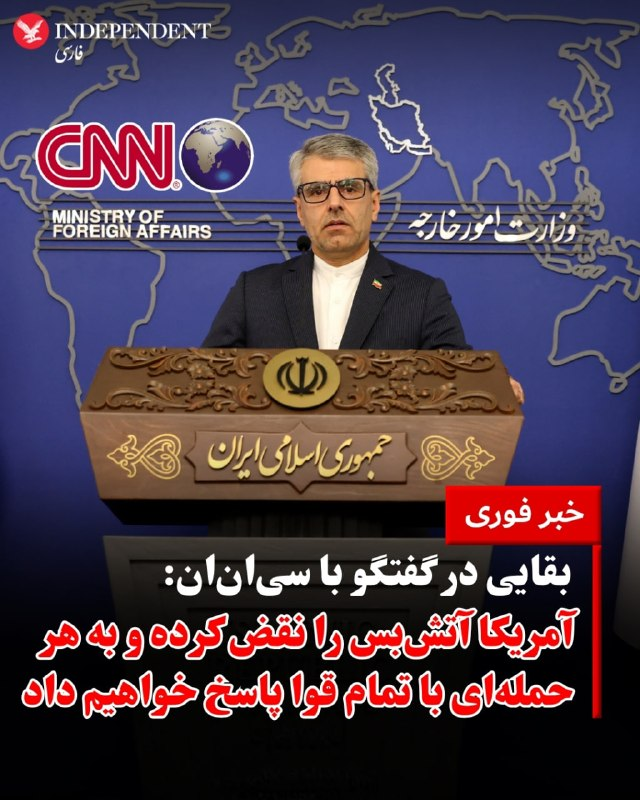

♦️اسماعیل بقایی، سخنگوی وزارت امور خارجه جمهوری اسلامی در گفتگو با شبکه سی‌ان‌ان با انتقاد از رویکرد دولت آمریکا، اعلام کرد بزرگ‌ترین مانع در روند مذاکرات، تغییر مداوم مواضع و اظهارات متناقض مقام‌های آمریکایی است.
بقایی گفت مذاکره با دولت کنونی آمریکا به دلیل «تغییر مداوم مواضع، جابه‌جا شدن خطوط قرمز و اظهارنظرهای متناقض مقام‌های مختلف» بسیار دشوار شده و این مسئله روند گفتگوها را پیچیده کرده است.
سخنگوی وزارت خارجه در بخش دیگری از این گفتگو، آمریکا را به نقض آتش‌بس متهم کرد و مدعی شد نیروهای آمریکایی با حمله به کشتی‌های تجاری ایران در تنگه هرمز و آب‌های آزاد، توافق آتش‌بس را زیر پا گذاشته‌اند.
بقایی با توصیف وضعیت منطقه به عنوان «بسیار شکننده و خطرناک» گفت سیاست‌های آمریکا عامل اصلی تشدید تنش‌هاست و هشدار داد که ادامه این روند می‌تواند پیامدهای جدی برای امنیت منطقه داشته باشد.
بقایی در پایان با تاکید بر آمادگی نیروهای مسلح جمهوری اسلامی اعلام کرد ایران در برابر هرگونه حمله، «با تمام قدرت» پاسخ خواهد داد و نیروهای مسلح برای مقابله با هرگونه اقدام نظامی آمادگی کامل دارند.
‌🇸🇦 Indypersian

🤖 @VahidOOnLine

## VahidOOnLine — post 244071

  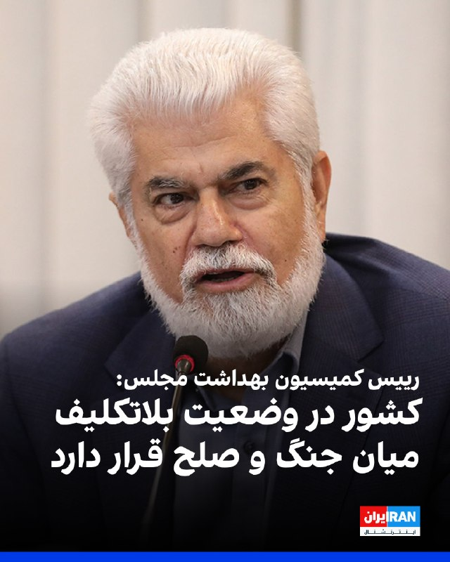

حسینعلی شهریاری، رییس کمیسیون بهداشت و درمان مجلس، به خبرگزاری ایلنا گفت کشور در شرایطی قرار دارد که نه می‌توان آن را جنگ کامل دانست و نه صلح پایدار.

او این وضعیت را «یکی از دشوارترین شرایط ممکن» توصیف کرد و افزود در شرایط جنگ، تکلیف بسیاری از امور روشن‌تر است، اما اکنون نوعی عدم قطعیت و ابهام نسبت به آینده وجود دارد و مشخص نیست چه تحولاتی در ادامه رخ خواهد داد.

شهریاری درباره نگرانی‌های عمومی گفت مردم نسبت به آینده کشور حساسیت بالایی دارند و در فضای عمومی نگرانی‌ها و مطالبات متعددی مطرح می‌شود.
‌🏁 🇬🇧 IranintlTV

🤖 @VahidOOnLine

## VahidOOnLine — post 244070

  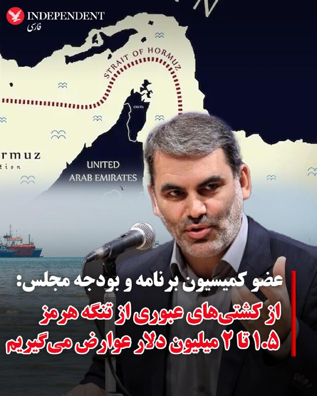

♦️جعفر زنگنه، عضو کمیسیون برنامه و بودجه مجلس شورای اسلامی اعلام کرد در حال حاضر از هر کشتی عبوری از تنگه هرمز به طور میانگین بین ۱.۵ تا ۲ میلیون دلار دریافت می‌شود.
این عضو مجلس شورای اسلامی، روز یکشنبه ۱۷ خرداد ماه، در گفتگو با خبرگزاری فارس گفت روند دریافت این مبالغ وارد فاز اجرایی شده و وجوه حاصل مطابق قانون بودجه به خزانه واریز می‌شود تا در محل‌های تعیین‌شده به مصرف برسد.
به گفته زنگنه، برای اجرای این طرح مجموعه‌ای با همکاری وزارت امور اقتصادی و دارایی و تحت نظارت شورای عالی امنیت ملی تشکیل شده است.
او همچنین اظهار داشت بخشی از پرداخت‌ها به صورت نقدی انجام نمی‌شود و در قالب تتر، کالا یا تهاتر صورت می‌گیرد. بر این اساس، برخی کشتی‌ها به جای پرداخت پول، کالا یا خدمات ارائه می‌کنند و ارزش آن از مبلغ قابل پرداخت کسر می‌شود.
پیش از این، علی نیکزاد، نایب‌رئیس مجلس، در جریان سفر اعضای کمیسیون عمران به بندرعباس و بازدید از تنگه هرمز از تدوین طرحی ۱۲ بندی برای مدیریت این گذرگاه راهبردی خبر داده بود.
‌🇸🇦 Indypersian

🤖 @VahidOOnLine

## FarsiVOA — post 219839

🔺یک کشته و دست‌کم پنج زخمی در تیراندازی مرگبار در اسرائیل؛ دو مهاجم کشته شدند

▪️ارتش اسرائیل اعلام کرد دو مهاجم حمله تیراندازی روز یکشنبه در مرکز اسرائیل، پس از عملیات نیروهای امنیتی کشته شدند؛ حمله‌ای که به گفته امدادگران، یک کشته و دست‌کم پنج زخمی برجای گذاشت.

▪️این حمله در چند نقطه در نزدیکی حصار امنیتی کرانه باختری رخ داد. امدادگران اسرائیلی گفتند قربانیان در سه محل جداگانه هدف قرار گرفتند.

▪️به گزارش تایمز اسرائیل، یک مرد ۳۱ ساله که نزدیک تزور ناتان هدف قرار گرفته بود جان باخت و یک مرد حدوداً ۴۰ ساله در وضعیت وخیم به بیمارستان منتقل شد. چند زخمی دیگر نیز با جراحات متوسط یا شدید به مراکز درمانی انتقال یافتند.

⬇️ بیشتر بخوانید:
https://ir.voanews.com/a/idf-says-both-terrorists-in-kochav-yair-attack-killed-by-security-forces/8158174.html

## IranianMinds — post 21544

🔴فوری:
یک مقام ایرانی تأیید کرد که در صورت استفاده از دارایی‌های ایران برای تعمیرات مناطق جنگ‌زده کشورهای خلیج‌فارس، دوباره به آن زیرساخت‌ها با شدت بیشتری حمله خواهیم کرد.

@IranianMinds

## Dirty_Kids — post 391205

  

یه دیالوگ بود تو متری شیش و نیم،میگف اینا عاشق بدبختیاشونن:)))))))))))

@Dirty_Kids 👻

## Dirty_Kids — post 391204

  <a href="telegram/content/Dirty_Kids_391204_1780828378.mp4" target="_blank">🎬 Download video</a>

بیژن عبدالکریمی، فردی که خود را فیلسوف می نامد، خواستار اعدام روشنفکران مخالف با آر پی جی و گیوتین شد

@Dirty_Kids 👻

## Dirty_Kids — post 391203

  <a href="telegram/content/Dirty_Kids_391203_1780828380.mp4" target="_blank">🎬 Download video</a>

حرف راستو از بچه بشنو. یه مجسمه غمگین نشونش دادن، بهش میگن چی به نظرت حالشو خوب می‌کنه؟

و اما جوابش:

@Dirty_Kids 👻

## Dirty_Kids — post 391202

‏رخت تنت غبار کیر عزیزم بس کن دیگه.

@Dirty_Kids 👻

## alonews — post 125728

  <a href="telegram/content/alonews_125728_1780828382.webm" target="_blank">🎬 Download video</a>

👈عضو کمیسیون برنامه و بودجه مجلس :
از کشتی های عبوری از تنگه هرمز ۱۰۵ تا ۲ میلیون دلار عوارض می گیریم

✅ @AloNews خبر جنگ

## alonews — post 125727

  <a href="telegram/content/alonews_125727_1780828383.webm" target="_blank">🎬 Download video</a>

👈 عضو هیئت‌رئیسۀ مجلس: وزارت نفت صراحتاً اعلام کرده که قصد افزایش قیمت بنزین را ندارد

✅ @AloNews خبر جنگ

---
📅 بروزرسانی: 1405/03/17 13:52
---

## VahidOOnLine — post 244069

  

خبرگزاری فارس، وابسته به سپاه پاسداران گزارش داد که «طرح دریافت بهای خدمات از کشتی‌های عبوری تنگه هرمز» اجرایی شده و برای اجرای این طرح، مجموعه‌ای با همکاری وزارت اقتصاد و تحت نظارت شورای عالی امنیت ملی تشکیل شده است.

به نوشته این رسانه وابسته به سپاه، مبالغ دریافتی به خزانه واریز و در محل‌های تعیین‌شده هزینه می‌شود.

فارس ادامه داد که بخشی از این پرداخت‌ها نقدی نیست و در قالب تتر، کالا یا تهاتر انجام می‌شود؛ به‌طوری که برخی کشتی‌ها به‌جای پرداخت پول، کالا یا خدمات ارائه می‌کنند و ارزش آن از مبلغ قابل پرداخت کسر می‌شود.

همچنین محسن زنگنه، نماینده تربت حیدریه در مجلس، به خبرگزاری فارس گفت که در حال حاضر از هر کشتی عبوری از تنگه هرمز به‌طور میانگین بین ۱.۵ تا دو میلیون دلار دریافت می‌شود.
iranintl
‌🏁 🇬🇧 IranintlTV

🤖 @VahidOOnLine

## IranIntlTV — post 340963

  

حسینعلی شهریاری، رییس کمیسیون بهداشت و درمان مجلس، به خبرگزاری ایلنا گفت کشور در شرایطی قرار دارد که نه می‌توان آن را جنگ کامل دانست و نه صلح پایدار.

او این وضعیت را «یکی از دشوارترین شرایط ممکن» توصیف کرد و افزود در شرایط جنگ، تکلیف بسیاری از امور روشن‌تر است، اما اکنون نوعی عدم قطعیت و ابهام نسبت به آینده وجود دارد و مشخص نیست چه تحولاتی در ادامه رخ خواهد داد.

شهریاری درباره نگرانی‌های عمومی گفت مردم نسبت به آینده کشور حساسیت بالایی دارند و در فضای عمومی نگرانی‌ها و مطالبات متعددی مطرح می‌شود.
https://iranintl.com/202606072918

## IranIntlTV — post 340962

  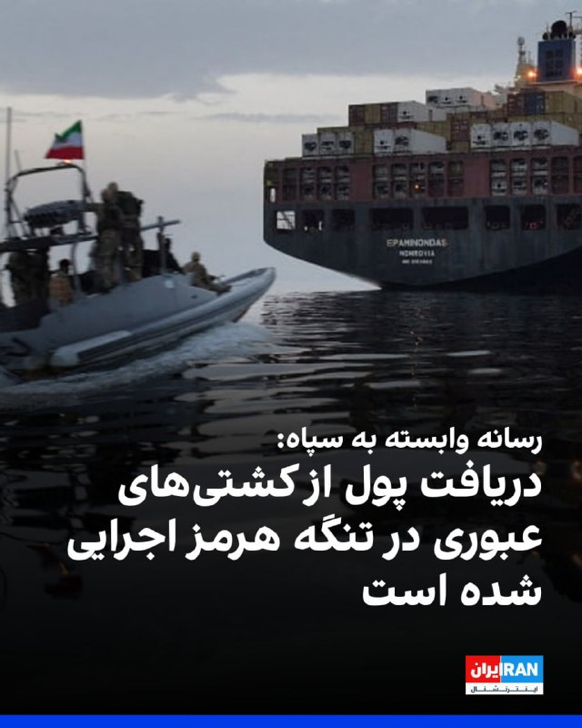

خبرگزاری فارس، وابسته به سپاه پاسداران گزارش داد که «طرح دریافت بهای خدمات از کشتی‌های عبوری تنگه هرمز» اجرایی شده و برای اجرای این طرح، مجموعه‌ای با همکاری وزارت اقتصاد و تحت نظارت شورای عالی امنیت ملی تشکیل شده است.

به نوشته این رسانه وابسته به سپاه، مبالغ دریافتی به خزانه واریز و در محل‌های تعیین‌شده هزینه می‌شود.

فارس ادامه داد که بخشی از این پرداخت‌ها نقدی نیست و در قالب تتر، کالا یا تهاتر انجام می‌شود؛ به‌طوری که برخی کشتی‌ها به‌جای پرداخت پول، کالا یا خدمات ارائه می‌کنند و ارزش آن از مبلغ قابل پرداخت کسر می‌شود.

همچنین محسن زنگنه، نماینده تربت حیدریه در مجلس، به خبرگزاری فارس گفت که در حال حاضر از هر کشتی عبوری از تنگه هرمز به‌طور میانگین بین ۱.۵ تا دو میلیون دلار دریافت می‌شود.
iranintl.com/202606078438

## IranIntlTV — post 340961

  <a href="telegram/content/IranIntlTV_340961_1780827769.mp4" target="_blank">🎬 Download video</a>

محسن نقوی، وزیر کشور پاکستان، در سفر به تهران نامه‌ای ویژه خطاب به مجتبی خامنه‌ای را به عباس عراقچی تحویل داد. او همچنین اعلام کرد این نامه به تحولات و شرایط کنونی مربوط است.

جزییات بیشتر با علی شیرازی، عضو تحریریه ایران‌اینترنشنال
@iranintltv

## RadioFarda — post 157999

🔸اورژانس و ارتش اسرائیل اعلام کردند که روز یکشنبه ۱۷ خرداد در پی چندین حمله مشکوک در مرکز اسرائیل، یک نفر کشته و دست‌کم چهار نفر دیگر زخمی شدند.

🔸خبرگزاری فرانسه تصاویری از محل تیراندازی و امدادگران اسرائیلی را که در حال ارائه خدمات اورژانس هستند، منتشر کرده است.

🔸بنا بر اعلام اورژانس اسرائیل امدادگران به محل‌های چندین حمله مشکوک به تیراندازی در اسرائیل اعزام شده‌اند.

🔸اورژانس اسرائیل اعلام کرد که مردی حدوداً ۳۰ ساله بدون هیچ نشانه‌ای از حیات در نزدیکی محله «تزور ناتان»، چند کیلومتری کرانه باختری، پیدا شده است.

🔸امدادگران به خبرگزاری فرانسه گفته‌اند که به دو مرد در یک تیراندازی دیگر، به ترتیب حدود ۵۰ و ۳۰ ساله، در یک پمپ بنزین در نزدیکی شهر «کوخاو یایر»، خدمات پزشکی ارائه داده است.

🔸ارتش اسرائیل هم اعلام کرد که «به دنبال گزارش‌هایی از چندین حادثه تیراندازی، سربازان ارتش به مناطق سلیت و تزور ییتزاک اعزام شدند».

🔸سازمان رادیو و تلویزیون اسرائیل اعلام کرده است که مظنون این حمله یک شهروند اسرائیلی عرب اهل شهر عرب‌نشین طیبه است و خودروی مورد استفاده در عملیات نیز پلاک اسرائیلی داشته است.

@RadioFarda

## IranianMinds — post 21543

🔴رویترز:

آمریکا قصد دارد که خسارت‌های کشورهای خلیج‌فارس را با استفاده دارایی‌های مسدود‌ شده جمهوری اسلامی ایران تأمین و جبران نماید.

@IranianMinds

## Hranews — post 113440

تداوم بازداشت؛ گزارشی از آخرین وضعیت علی احمدی در زندان عادل آباد شیراز

❗️
❗️
❗️
❗️
❗️– علی احمدی، معلم بازنشسته ساکن نورآباد ممسنی، بیش از سه ماه است که بازداشت شده و در زندان عادل آباد شیراز محبوس است. اکنون پرونده وی با طرح اتهامات امنیتی از جمله «افساد فی‌الارض» به شعبه ۱۰ دادسرای این شهر ارجاع شده است.

ادامه مطلب

#علی_احمدی

↘️
@hranews_bot تماس ✉️ - @Hranews کانال هرانا 🆑

## alonews — post 125726

  <a href="telegram/content/alonews_125726_1780827772.webm" target="_blank">🎬 Download video</a>

👈وزیر دارایی اسرائیل: حمله در مرکز اسرائیل هشداری خونین درباره ضرورت ایجاد تغییری عمیق در میان عرب‌های اسرائیل است

🔴اسموتریچ: گسترش جرم و افزایش افراط‌گرایی قومی در میان عرب‌ها در اسرائیل، خطری وجودی است

✅ @AloNews خبر جنگ

---
📅 بروزرسانی: 1405/03/17 13:42
---

## IranIntlTV — post 340960

  <a href="telegram/content/IranIntlTV_340960_1780827162.mp4" target="_blank">🎬 Download video</a>

پس از انتشار گزارش‌هایی درباره بررسی استفاده آمریکا از دارایی‌های بلوکه‌شده ایران برای جبران خسارات کشورهای خلیج فارس، معاون پیشین رییس ستاد کل ارتش آمریکا اعلام کرد واشینگتن قصد آزادسازی این دارایی‌ها را ندارد.

روح‌الله رحیم‌پور، تحلیل‌گر سیاسی، به ایران‌اینترنشنال گفت که آمریکا ممکن است از این دارایی‌ها به‌عنوان اهرم فشار استفاده کند و در صورت شکست مذاکرات، احتمال مصادره و اختصاص آن به کشورهای منطقه وجود دارد.
@iranintltv

## DW_Farsi — post 125609

🔶 عضو کمیسیون امنیت ملی مجلس: احتمال شروع جنگ جدید وجود دارد

وحید احمدی، عضو کمیسیون امنیت ملی و سیاست خارجی مجلس شورای اسلامی در گفتگو با خبرگزاری فرارو مدعی شد که بین جمهوری اسلامی و ایالات متحده آمریکا "هیچ آتش‌بسی برقرار نیست و هرگونه خطای محاسباتی می‌تواند به شعله‌ور شدن جنگی جدید در منطقه منجر شود".

احمدی با اشاره به اینکه برقراری صلح در لبنان و جبهه مقاومت از شروط اصلی ایران در دور جدید مذاکرات با آمریکا بود، گفت که اکنون آمریکا، اسرائیل و دولت لبنان با حمایت برخی کشورهای عربی به‌دنبال جداسازی پرونده لبنان هستند.

عضو کمیسیون امنیت ملی و سیاست خارجی مجلس افزود: «هدف اصلی این کار این است که بتوانند جمهوری اسلامی ایران را از موضوع لبنان منفک کنند تا به زعم خودشان، در شرایط به وجود آمده به حزب‌الله فشار وارد کرده و در نهایت ایده خلع سلاح حزب‌الله را پیاده کنند. البته این موضوع جدیدی نیست و از سال‌ها قبل، مسئله خلع سلاح حزب‌الله مطرح بوده است.»

ابن نماینده مجلس با بیان این ادعا که "مسئله خلع سلاح حزب‌الله تاکنون موفقیت‌آمیز نبوده و بعید است پس از این هم به نتیجه‌ای برسد" گفت: «حزب‌الله یک طیف گسترده در جامعه لبنان است.»

او همچنین مدعی شد که ارتش موجود در لبنان "حتی یک روز هم قادر نیست" در مقابل اسرائیل بایستد.

@dw_farsi

## alonews — post 125725

  <a href="telegram/content/alonews_125725_1780827164.webm" target="_blank">🎬 Download video</a>

👈طرح«بانک زمان» توی منطقه ۴ تهران اجرایی شده و بزودی به بقیه شهرا هم میرسه. حالا چی هست؟

🔴توی این طرح مردم به ازای پول، با زمانشون بهم دیگه خدمات میدن!

🔴مثلا شما یه ساعت به یه نفر، زبان آموزش میدین و به جای اینکه ازش پول بگیرین، اعتبار دریافت میکنین.

🔴با اون اعتبار مثلا میتونین ۱ ساعت ماساژ بگیرین، یا ۱ ساعت استخر برین و یا خدمات های دیگه...

✅ @AloNews خبر جنگ

## alonews — post 125724

  <a href="telegram/content/alonews_125724_1780827164.webm" target="_blank">🎬 Download video</a>

👈وزارت امور خارجه ایران: عراقچی و وزیر کشور پاکستان در مورد تحولات مسیر دیپلماتیک برای پایان دادن به جنگ تبادل نظر کردند

✅ @AloNews خبر جنگ

## alonews — post 125723

  <a href="telegram/content/alonews_125723_1780827164.webm" target="_blank">🎬 Download video</a>

👈سخنگوی وزارت امور خارجه ایران به سی‌ان‌ان: مشکل اصلی ایران در مذاکراتش با واشنگتن، مواضع متناقض آن است

✅ @AloNews خبر جنگ

---
📅 بروزرسانی: 1405/03/17 13:32
---

## VahidOOnLine — post 244068

  

محسن زنگنه، عضو کمیسیون اقتصادی مجلس، گفت: «زمانی می‌توان درباره اصلاح قیمت‌ها صحبت کرد که نرخ تورم در سطح قابل قبولی قرار داشته باشد، اما اکنون با تورم نقطه‌به‌نقطه بالای ۷۰ درصد و تورم مواد غذایی بیش از ۱۰۰ درصد مواجه هستیم.»

او ضافه کرد: «بنابراین هرگونه افزایش قیمت حامل‌های انرژی عملا فشار مضاعفی بر مردم وارد کرده و تاب‌آوری اقتصادی کشور را کاهش می‌دهد.»
‌🏁 🇬🇧 IranintlTV

🤖 @VahidOOnLine

## WithYashar — post 13672

نیویورک تایمز: در گزارش تازه‌ای آمده است که اسرائیل در ماه‌های اخیر جاسوسی از مقام‌های آمریکایی را، به‌ویژه آن‌هایی که درگیر پرونده ایران بوده‌اند، افزایش داده و پنتاگون سطح تهدید ضدجاسوسی را به بالاترین سطح رسانده است. طبق این گزارش، نگرانی اصلی آمریکا این است که تل‌آویو توانسته باشد گفت‌وگوهای محرمانه واشنگتن با ایران را شنود کند و از مواضع داخلی دولت ترامپ درباره مذاکرات و سیاست خاورمیانه‌ای او آگاه شود.در این گزارش نام چند مقام آمریکایی هم آمده است؛ از جمله استیو ویتکاف، فرستاده ویژه ترامپ، البریج کولبی، مقام ارشد سیاست‌گذاری پنتاگون، و مایکل دیمینو، معاون او. نیویورک تایمز می‌گوید افزایش این نوع شنود و ردیابی باعث شده پنتاگون محدودیت‌های سخت‌گیرانه‌تری برای اشتراک اطلاعات با طرف‌های اسرائیلی در نظر بگیرد
@withyashar

## IranIntlTV — post 340959

  <a href="telegram/content/IranIntlTV_340959_1780826580.mp4" target="_blank">🎬 Download video</a>

یک شهروند با ارسال ویدیویی به ایران‌اینترنشنال درباره گرانی‌های شدید در ایران می‌گوید یک هندوانه و حدود ۴۰۰ گرم گوجه‌سبز را به قیمت بیش از نیم میلیون تومان خریده است.

## IranIntlTV — post 340958

  

محسن زنگنه، عضو کمیسیون اقتصادی مجلس، گفت: «زمانی می‌توان درباره اصلاح قیمت‌ها صحبت کرد که نرخ تورم در سطح قابل قبولی قرار داشته باشد، اما اکنون با تورم نقطه‌به‌نقطه بالای ۷۰ درصد و تورم مواد غذایی بیش از ۱۰۰ درصد مواجه هستیم.»

او ضافه کرد: «بنابراین هرگونه افزایش قیمت حامل‌های انرژی عملا فشار مضاعفی بر مردم وارد کرده و تاب‌آوری اقتصادی کشور را کاهش می‌دهد.»
https://iranintl.com/202606074520

## FarsiVOA — post 219838

🔺اوکراین: پهپاد روسیه به تأسیسات سوخت هسته‌ای نزدیک چرنوبیل برخورد کرد

▪️مقام‌های اوکراینی اعلام کردند یک پهپاد روسیه به تأسیسات ذخیره سوخت هسته‌ای مصرف‌شده در نزدیکی نیروگاه متروکه چرنوبیل برخورد کرده است.

▪️ستاد کل ارتش اوکراین و آژانس دولتی انرژی اتمی این کشور گفتند در این حمله بخشی از ساختمان دریافت کانتینرها آسیب دیده، اما در زمان حمله هیچ سوخت هسته‌ای مصرف‌شده‌ای در آن محل نگهداری نمی‌شده است.

▪️مقام‌های اوکراینی همچنین اعلام کردند آتش‌سوزی ناشی از حمله مهار شده، کسی زخمی نشده و سطح تشعشعات در منطقه ثابت مانده است.

▪️روسیه هنوز درباره این ادعا واکنش علنی نشان نداده است.وزیر خارجه اوکراین، این حمله را بخشی از «تهدید سیستماتیک» روسیه علیه ایمنی هسته‌ای توصیف کرد.

⬇️ بیشتر بخوانید:
https://ir.voanews.com/a/8158173.html

## DW_Farsi — post 125608

🔶 تغییر معاون موساد پس از شروع به کار رئیس جدید این سازمان

رومن گوفمن، رئیس جدید موساد، روز شنبه اعلام کرد که معاون این سازمان با نام محرمانه "الف" پس از ۲۲ سال خدمت در این نهاد از سمت خود کنار گذاشته شده است.

در بیانیه‌ای که دفتر نخست‌وزیر اسرائیل منتشر کرد، آمده است: «رئیس موساد مایل بود قدردانی عمیق خود را از "الف" به دلیل ۲۲ سال خدمت عملیاتی در موساد و نقش مهم او در امنیت دولت اسرائیل ابراز کند.»

گوفمن پس از آنکه بنیامین نتانیاهو، نخست‌وزیر اسرائیل، او را برای این سمت معرفی کرد، روز سه‌شنبه کار خود را آغاز کرد.

"الف" نخستین مقام موساد نیست که از زمان تایید انتصاب گوفمن به این سمت، برکنار شده یا مقام خود را ترک کرده است. بر اساس گزارش کانال کان اسرائیل، رئیس بخش روابط بین‌الملل موساد با نام "دی" روز دوشنبه از سمت خود کناره‌گیری کرد. شبکه ۱۲ اسرائیل (کان) در آن زمان گزارش داد که انتظار می‌رود مقام‌های دیگری نیز در روزهای آینده همین مسیر را در پیش بگیرند.

سرلشکر رومن گوفمن، مشاور و دبیر نظامی نخست‌وزیر اسرائیل است که چند روز پیش رسما به‌عنوان رئیس جدید موساد معرفی و جایگزین دیوید بارنیا شد.

گوفمن، ۴۹ ساله و متولد بلاروس است و در ۱۴ سالگی به اسرائیل مهاجرت کرد. نتانیاهو در ماه دسامبر اعلام کرده بود که قصد دارد گوفمان را به ریاست موساد منصوب کند.

@dw_farsi

## Persian_Trend_Official — post 15848

  <a href="telegram/content/Persian_Trend_Official_15848_1780826583.mp4" target="_blank">🎬 Download video</a>

🎬 Video

## RadioFarda — post 157998

  

🔸اقدام به تخریب کلیسای انجیلی مشهد، یکی از معدود بناهای تاریخی مسیحیان در این شهر، با واکنش فعالان میراث فرهنگی و مقام‌های میراث فرهنگی خراسان رضوی روبه‌رو شده است.

🔸خبرگزاری کار ایران، ایلنا، روز شنبه ۱۶ خرداد تأکید کرد که فعالان میراث فرهنگی می‌گویند این بنای تاریخی که در سال ۱۳۸۴ در فهرست آثار ملی ثبت شده بود، بامداد چهارشنبه به‌طور ناگهانی و در مدت کوتاهی تخریب شده است.

🔸به گفته آنان، این کلیسا که قدمتش به دوره پهلوی اول بازمی‌گردد، یکی از دو کلیسای باقی‌مانده در مشهد و بخشی از میراث مذهبی و فرهنگی این شهر به شمار می‌رفت.

🔸در مقابل، اداره کل میراث فرهنگی خراسان رضوی اعلام کرده است که این بنا در سال‌های گذشته از فهرست آثار ملی خارج شده بود، اما همچنان به عنوان اثری واجد ارزش تاریخی تحت ضوابط حفاظتی قرار داشت. این نهاد می‌گوید با ورود یگان حفاظت، نیروی انتظامی و دستور مقام قضایی، عملیات تخریب متوقف شده و پیگیری حقوقی و مستندسازی خسارت‌ها در حال انجام است.

🔸مقام‌های میراث فرهنگی همچنین از طرح شکایت علیه عوامل دخیل در این پرونده خبر داده‌اند.

@RadioFarda

## BBCPersian — post 283058

🔻گزارش‌ها از نگرانی پنتاگون از «جاسوسی» اسرائیل

رسانه‌ها آمریکا گزارش می‌دهند که پنتاگون به دلیل نگرانی از فعالیت‌های جاسوسی، سطح تهدید ضداطلاعاتی برای اسرائیل را به بالاترین حد افزایش داده است.

شبکه خبری ان‌بی‌سی به نقل از مقام‌های آمریکایی گزارش داد که آژانس اطلاعات دفاعی پنتاگون هشدار داده است که توانایی اسرائیل برای «جاسوسی انسانی و جمع‌آوری اطلاعات با اتکا به فن‌آوری به حد 'بحرانی' رسیده است.»

ان‌بی‌سی می‌گوید که این تغییر سطح تهدید ضداطلاعاتی همزمان شده است با نگرانی‌هایی درباره تلاش اسرائیل برای جاسوسی از مقام‌های آمریکایی برای اطلاع یافتن از «بررسی‌ها و تصمیم‌گیری‌های داخلی دولت ترامپ درباره درگیری‌های خاورمیانه.»

در همین حال روزنامه نیویورک تایمز هم می‌گوید که نهادهای اطلاعاتی آمریکا در گزارش‌های اخیر خود از شنود اسرائیل از مقام‌های آمریکایی نگرانی کرده‌اند، از جمله شنود استیو ویتکاف، نماینده ارشد دونالد ترامپ در مذاکرات با ایران.

https://bbc.in/4xeGwvq
@BBCPersian

## alonews — post 125722

  <a href="telegram/content/alonews_125722_1780826586.webm" target="_blank">🎬 Download video</a>

🔴فوری / یک‌ مقام‌ ایرانی تایید کرد که در صورت استفاده از دارایی‌های ایران برای تعمیرات مناطق جنگ زده کشورهای خلیج فارس دوباره به آن زیر ساخت‌ها با شدت بیشتری حمله خواهیم کرد

✅ @AloNews خبر جنگ

## alonews — post 125721

  <a href="telegram/content/alonews_125721_1780826587.webm" target="_blank">🎬 Download video</a>

👈دستگاه‌های اجرایی موظف به استفاده از پیام‌رسان‌های داخلی شدند

✅ @AloNews خبر جنگ

---
📅 بروزرسانی: 1405/03/17 13:23
---

## VahidOOnLine — post 244067

  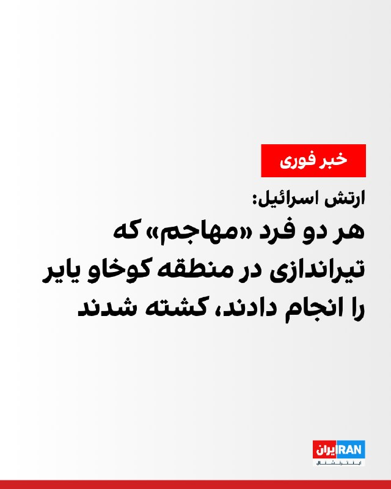

ارتش اسرائیل اعلام کرد هر دو فرد «مهاجم» که تیراندازی در منطقه کوخاو یایر را انجام دادند، به دست نیروهای امنیتی کشته شدند.

به گفته ارتش، یکی از این افراد در نزدیکی تسور ییتسحاک به ضرب گلوله پلیس کشته شد و فرد دوم زخمی شد و گریخت. ارتش اسرائیل افزود پس از عملیات تعقیب، فرد دوم در نزدیکی طیبَه کشته شد.

بر اساس اعلام ارتش، این افراد از خودرویی با پلاک اسرائیلی استفاده کردند که به‌صورت غیرقانونی در جاده تردد می‌کرد.

ارتش اسرائیل همچنین اعلام کرد چندین روستای فلسطینی در این منطقه را محاصره کرده و گذرگاه کرانه باختری در نزدیکی محل را بسته است.
‌🏁 🇬🇧 IranintlTV

🤖 @VahidOOnLine

## VahidOOnLine — post 244066

♦️پس از حاکمیت مجدد طالبان بر افغانستان، شمار گردشگران خارجی، ازجمله زنان، که به این کشور سفر می‌کنند، افزایش یافته است. یکی از دلایل این روند پایین‌بودن هزینه سفر و مخارج جانبی گردشگری در افغانستان در قیاس با کشورهای دیگر است. 

از سوی دیگر، افغانستان کشوری است که چندین دهه جنگ، ناامنی و خشونت را پشت سر گذاشته است. همین موضوع سبب می‌شود ویدیوها و گزارش‌های گردشگران خارجی از این کشور در رسانه‌های اجتماعی با استقبال و بازدید گسترده روبه‌رو شود. 

همچنین فرهنگ، مهمان‌نوازی و برخورد گرم افغان‌ها با مهمانان خارجی، به افزایش محبوبیت و بازدید ویدیوهای این گردشگران کمک می‌کند. 

اما آنچه اغلب از لنز دوربین بسیاری از این گردشگران پنهان می‌ماند، محدودیت‌های گسترده و سرکوب و اختناق حاکم بر زنان و دختران افغان است. این گردشگران اغلب طبیعت بکر، بناهای تاریخی و جاذبه‌های گردشگری افغانستان را به تصویر می‌کشند و کمتر به وضعیت حقوق بشر و محدودیت‌های اجتماعی موجود در کشور می‌پردازند.
‌🇸🇦 Indypersian

🤖 @VahidOOnLine

## VahidOOnLine — post 244065

  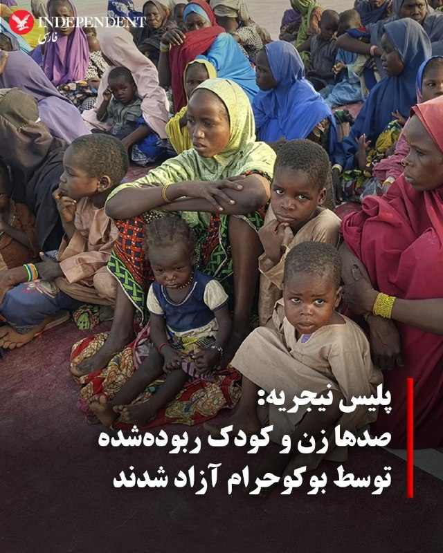

♦️مقام‌های محلی و نمایندگان سیاسی در نیجریه اعلام کردند صدها زن و کودک که اوایل سال جاری میلادی توسط گروه جهادی بوکوحرام از روستایی در ایالت بورنو در شمال‌شرق این کشور ربوده شده بودند، طی روزهای گذشته آزاد شده‌اند.
به گزارش خبرگزاری فرانسه، سامیلا کایگاما، رئیس ائتلاف جوانان جنوب بورنو گفت تمامی ۴۱۶ زن و کودک ربوده‌شده از منطقه «نگوشه» روز شنبه آزاد شدند. محمد علی ندومه، سناتور ایالت بورنو نیز این خبر را تایید کرد.
در همین حال، ارتش نیجریه اعلام کرد در جریان یک عملیات نجات مبتنی بر اطلاعات امنیتی موفق شده است ۳۶۰ گروگان را که در اسارت بوکوحرام بودند آزاد کرده است. به گفته ارتش، این افراد پس از ربوده شدن از چندین منطقه، به‌ویژه در محور نگوشه، تحت شرایط سخت نگهداری می‌شدند.
دنیل بوالا، سخنگوی رئیس‌جمهور بولا تینوبو، اعلام کرد دو نوزاد به دلیل فرسودگی ناشی از اسارت طولانی‌مدت و شرایط دشوار منطقه جان خود را از دست داده‌اند.
ارتش نیجریه اعلام کرد پیش از آغاز عملیات، با جمع‌آوری اطلاعات و اجرای عملیات روانی تلاش کرده بود میان اعضای بوکوحرام بی‌اعتمادی ایجاد کند تا زمینه برای اجرای مرحله تهاجمی عملیات فراهم شود.
گزارش‌ها حاکی است شبه‌نظامیان بوکوحرام برای آزادی گروگان‌های نگوشه درخواست میلیون‌ها نایرا (واحد پول نیجریه) باج کرده بودند. دولت نیجریه همواره پرداخت باج را رد کرده است، هرچند تحلیلگران می‌گویند پرداخت مبالغ در ازای آزادی گروگان‌ها در این کشور امری رایج است.
خبرگزاری فرانسه می‌نویسد، ربایش برای دریافت باج به یکی از مهم‌ترین منابع درآمد گروه‌های مسلح در نیجریه تبدیل شده است. بر اساس گزارش مؤسسه «اس‌بی‌ام اینتلیجنس»، بین ژوئیه ۲۰۲۴ تا ژوئن ۲۰۲۵ بیش از ۱.۶۶ میلیون دلار باج در پرونده‌های آدم‌ربایی در این کشور پرداخت شده است.
شورش بوکوحرام از سال ۲۰۰۹ آغاز شد و تاکنون ده‌ها هزار کشته و میلیون‌ها آواره بر جای گذاشته است. منطقه نگوشه در نزدیکی مرز کامرون و در یکی از پایگاه‌های سنتی این گروه قرار دارد و بارها هدف حملات شبه‌نظامیان قرار گرفته است.
‌🇸🇦 Indypersian

🤖 @VahidOOnLine

## mwarmonitor — post 10244

🚨 حمله تروریستی در منطقه کوخاو یائیر • تلفات: ۱ نفر تأیید شده جان باخته و چندین نفر دیگر در وضعیت وخیم و بحرانی پس از تیراندازی در چندین نقطه. • مهاجمان: یک تروریست خنثی شده (طبق منابع امنیتی، یک عرب اسرائیلی) و یک مظنون دیگر بازداشت شده است. • تعقیب و گریز:…

## IranIntlTV — post 340957

  <a href="telegram/content/IranIntlTV_340957_1780825985.mp4" target="_blank">🎬 Download video</a>

اعتراض دانش‌آموزان برای روشن شدن وضعیت امتحانات و کنکور همچنان در شهرهای مختلف ایران ادامه دارد.

صبا آلاله، روان‌تحلیل‌گر، اعتراض‌های دانش‌آموزان را از منظر روانشناختی و شرایط اجتماعی بررسی می‌کند
@iranintltv

## IranIntlTV — post 340956

  

ارتش اسرائیل اعلام کرد هر دو فرد «مهاجم» که تیراندازی در منطقه کوخاو یایر را انجام دادند، به دست نیروهای امنیتی کشته شدند.

به گفته ارتش، یکی از این افراد در نزدیکی تسور ییتسحاک به ضرب گلوله پلیس کشته شد و فرد دوم زخمی شد و گریخت. ارتش اسرائیل افزود پس از عملیات تعقیب، فرد دوم در نزدیکی طیبَه کشته شد.

بر اساس اعلام ارتش، این افراد از خودرویی با پلاک اسرائیلی استفاده کردند که به‌صورت غیرقانونی در جاده تردد می‌کرد.

ارتش اسرائیل همچنین اعلام کرد چندین روستای فلسطینی در این منطقه را محاصره کرده و گذرگاه کرانه باختری در نزدیکی محل را بسته است.
https://iranintl.com/202606076640

## IranIntlTV — post 340954

🔻پس از سه روز رأی‌گیری، مخاطبان ایران اینترنشنال پیش‌بینی کردند که تیم ملی فوتبال پرتغال و کریستیانو رونالدو، فوق‌ستاره این تیم، قهرمان جام جهانی ۲۰۲۶ خواهند شد.

🔹در پایان نظرسنجی فینال، پرتغال با کسب ۷۲ درصد آرا در برابر ۲۸ درصد آرای فرانسه، از نگاه مخاطبان ایران اینترنشنال شانس بیشتری برای قهرمانی در جام جهانی ۲۰۲۶ دارد.

🔹جام جهانی ۲۰۲۶ سه روز دیگر آغاز می‌شود.

@iranintltvsport

## FarsiVOA — post 219837

  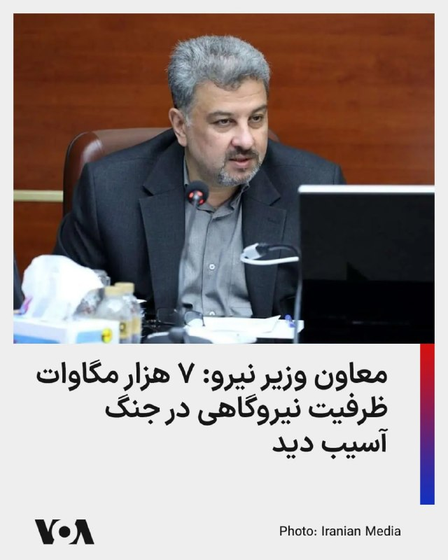

معاون برق و انرژی وزیر نیرو مدعی شده است که بیش از هفت هزار مگاوات از ظرفیت نیروگاهی کشور در جنگ اخیر آسیب دید و حدود چهار هزار و ۵۰۰ مگاوات آن دچار آسیب جدی شد.

مصطفی رجبی مشهدی در ادامه گفت تاکنون دو هزار و ۵۰۰ مگاوات از این ظرفیت به شبکه بازگشته و بقیه نیروگاه‌ها در حال بازسازی هستند.

مقامات جمهوری اسلامی اظهارات ضد و نقیضی درباره میزان آسیب به بخش تولید برق کشور در جنگ ۳۹ روزه داشتند.

اظهارات رجبی مشهدی در حالی است که روز جمعه وزیر نیرو اعلام کرده بود چهار هزار و ۲۰۰ مگاوات نیروگاه برقی در جریان جنگ آسیب دیده و این نیروگاه‌ها در تأسیسات فولاد و پتروشیمی اصفهان، ماهشهر و عسلویه بوده است.
@FarsiVOA

## RadioFarda — post 157997

  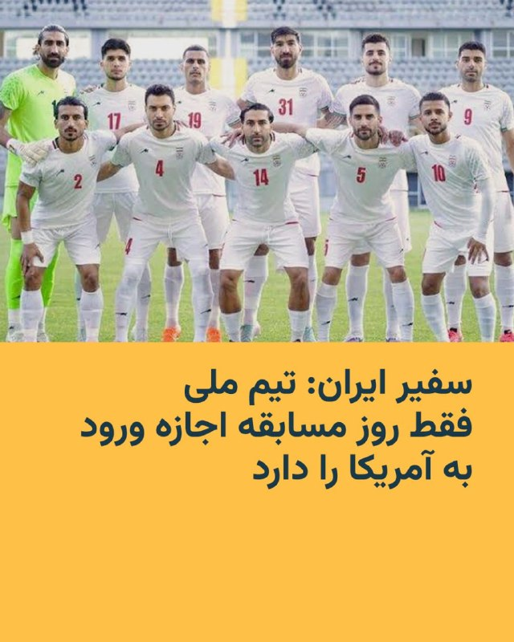

🔸خبرگزاری فرانسه گزارش داد ابوالفضل پسندیده، سفیر جمهوری اسلامی ایران در مکزیک، گفته است که بر اساس شرایط تعیین‌شده برای روادید اعضای تیم ملی فوتبال ایران، بازیکنان و کادر فنی تنها در روز برگزاری مسابقات خود اجازه ورود به خاک آمریکا را دارند و باید همان روز این کشور را ترک کنند.

🔸به گفته آقای پسندیده، تیم ملی می‌تواند صبح روز مسابقه وارد آمریکا شود و باید پس از پایان بازی خاک این کشور را ترک کند. این اظهارات در حالی مطرح شده که پیش‌تر سخنگوی تیم ملی گفته بود روادید صادرشده برای اعضای تیم از نوع چندبار ورود است و بازیکنان می‌توانند یک یا دو روز پیش از مسابقات وارد شهر محل برگزاری شوند.

🔸ایران قرار است سه بازی مرحله گروهی خود را در خاک آمریکا برگزار کند و این اولین جام جهانی است که یک کشور میزبان، میزبان تیمی از کشوری است که با آن در جنگ است. تیم ایران در اواخر ماه مه پایگاه خود را از پایگاه اصلی خود در توسان، آریزونا، به تیخوانا در مکزیک منتقل کرد.

@RadioFarda

## alonews — post 125720

  <a href="telegram/content/alonews_125720_1780825990.webm" target="_blank">🎬 Download video</a>

👈چین 200 بوئینگ می خرد

🔴مدیرعامل بوئینگ : این سفارش تنها «مرحله نخست» یک توافق بزرگ‌تر است و انتظار می‌رود در آینده سفارش‌های بیشتری از سوی چین ثبت شود

✅ @AloNews خبر جنگ

---
📅 بروزرسانی: 1405/03/17 13:12
---

## VahidOOnLine — post 244064

  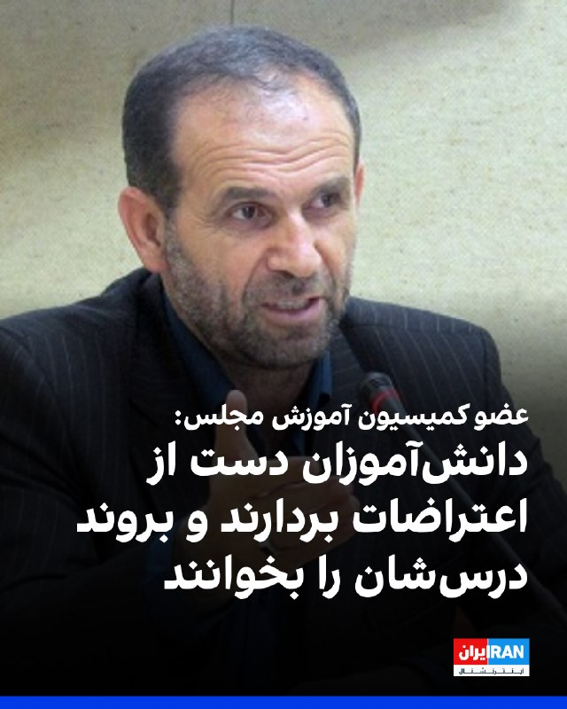

عبدالوحید فیاضی، عضو کمیسیون آموزش مجلس، درباره اعتراضات سراسری دانش‌آموزان به مصوبه تاثیر معدل در کنکور و سیاست‌های آموزشی جمهوری اسلامی، گفت که دانش‌آموزان دست از اعتراضات بردارند و بروند درس‌شان را بخوانند، چون دیگر چاره‌ای نیست و اعتراضات فایده‌ای ندارد.
‌🏁 🇬🇧 IranintlTV

🤖 @VahidOOnLine

## pm_afshaa — post 92437

https://t.me/proxy?server=87.248.129.223&port=4455&secret=ee1603010200010001fc030386e24c3add626973636f7474692e79656b74616e65742e636f6d

پروکسی متصل سرعت بالا

💧 Rainbet.com the #1 Non-KYC Crypto Casino & Sportsbook @rainbetcom

😁 @Pm_Afshaa

## IranIntlTV — post 340953

  

عبدالوحید فیاضی، عضو کمیسیون آموزش مجلس، درباره اعتراضات سراسری دانش‌آموزان به مصوبه تاثیر معدل در کنکور و سیاست‌های آموزشی جمهوری اسلامی، گفت که دانش‌آموزان دست از اعتراضات بردارند و بروند درس‌شان را بخوانند، چون دیگر چاره‌ای نیست و اعتراضات فایده‌ای ندارد.
https://iranintl.com/202606072159

## FarsiVOA — post 219836

  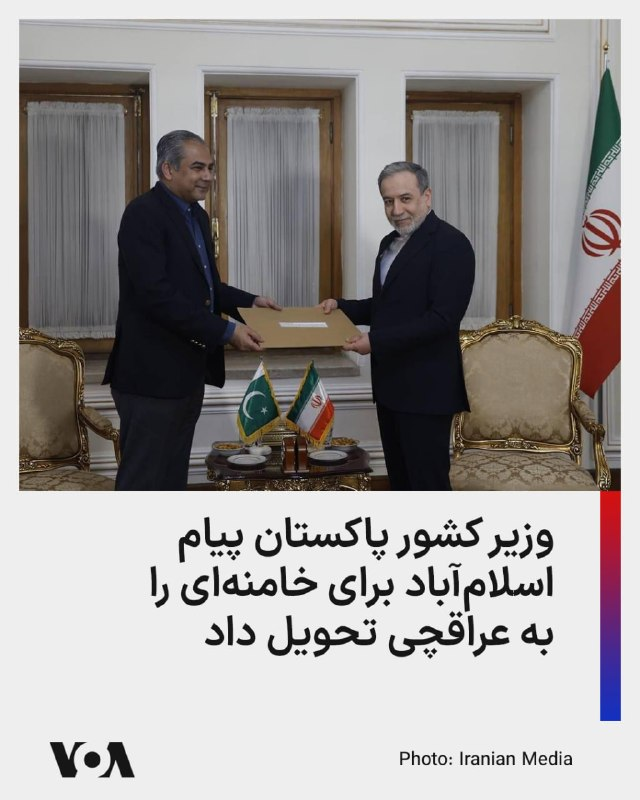

رسانه‌های ایران از تحویل پیام اسلام‌آباد برای مجتبی خامنه‌ای در جریان دیدار وزیر کشور پاکستان با وزیر خارجه جمهوری اسلامی خبر دادند.

چند خبرگزاری داخلی روز یکشنبه ۱۷ خرداد با انتشار تصاویری از دیدار محسن نقوی با عباس عراقچی نوشتند «نامه ویژه پاکستان» برای رهبر جمهوری اسلامی به عراقچی تحویل داده شد.

خبرگزاری دولتی ایرنا نیز نوشت: «در این دیدار دو طرف به بررسی تازه‌ترین تحولات دیپلماتیک در مسیر گفت‌وگوهای ایران و آمریکا و نیز تحولات منطقه پرداختند.»

نقوی شامگاه شنبه وارد تهران شد و در جریان دیدار با اسکندر مومنی وزیر کشور جمهوری اسلامی گفت که حامل «نامه ویژه» از سوی عاصم منیر فرمانده ارتش پاکستان و شهباز شریف، نخست‌وزیر این کشور برای مجتبی خامنه‌ای است. او گفت که این نامه حاوی «پیام مهمی» است.

پاکستان میانجی اصلی میان تهران و واشنگتن، در تلاش است به جنگ علیه جمهوری اسلامی پایان دهد.
@FarsiVOA

## IranianMinds — post 21542

  <a href="telegram/content/IranianMinds_21542_1780825367.mp4" target="_blank">🎬 Download video</a>

🔴علی شمخانی سال ۹۶:
هیچ تهدید امنیتی متوجه هیچ مسؤولی در جمهوری اسلامی نیست.
آقا من مسؤول امنیتی کشورم.

@IranianMinds

## alonews — post 125719

  <a href="telegram/content/alonews_125719_1780825370.webm" target="_blank">🎬 Download video</a>

👈لبنان

✅ @AloNews خبر جنگ

## alonews — post 125718

  <a href="telegram/content/alonews_125718_1780825370.webm" target="_blank">🎬 Download video</a>

👈معاون وزیر نیرو: در دوران جنگ اخیر بیش از ۷۰۰۰مگاوات نیروگاه ما دچار آسیب جدی شدند؛ البته همه آسیب‌ها و کمبود‌ها با صرفه‌جویی مردم حل می‌شود.

✅ @AloNews خبر جنگ

---
📅 بروزرسانی: 1405/03/17 13:02
---

## VahidOOnLine — post 244063

  

علی نیکزاد، نایب‌رییس مجلس، به خبرگزاری دانشجو گفت: «آمریکا و اسرائیل، پدر امت را شهید کردند و ما با آنها پدرکشتگی داریم و فراموش نمی‌کنیم و بالاخره یک روزی انتقام آقا را می‌گیریم.»

او اضافه کرد که علی خامنه‌ای، «با مظلومیت در خانه خودش» کشته شد و باید به اهل اسلام تسلیت بگوییم.
‌🏁 🇬🇧 IranintlTV

🤖 @VahidOOnLine

## VahidOOnLine — post 244062

  

♦️محسن نقوی، وزیر کشور پاکستان، روز یکشنبه ۱۷ خردادماه در سفر به تهران «نامه‌ای ویژه» از سوی ژنرال عاصم منیر، فرمانده ارتش پاکستان، را به عباس عراقچی، وزیر امور خارجه جمهوری اسلامی، تحویل داد.
رسانه‌های دولتی ایران، تصاویری از دیدار محسن نقوی با عباس عراقچی و لحظه تحویل این نامه منتشر کردند.
نقوی شامگاه شنبه وارد تهران شد و به خبرنگاران گفت: « اینجا هستم تا نامه ویژه‌ای را از سوی عاصم منیر، فرمانده ارتش پاکستان و نخست‌وزیر شهباز شریف، درباره شرایط فعلی به مجتبی خامنه‌ای تحویل دهم.»
در سه ماه گذشته و از زمان معرفی مجتبی خامنه‌ای به عنوان رهبر جمهوری اسلامی، صدا یا تصویری از او منتشر نشده و تاکنون نشانه‌ای رسمی از حضور عمومی او ارائه نشده است.
پاکستان در ماه‌های اخیر نقش میانجی میان ایران و آمریکا را بر عهده داشته و ژنرال عاصم منیر در کنار مقام‌های ارشد دولت پاکستان از بازیگران اصلی این روند بوده است. او در این مدت چندین بار به تهران سفر کرده و در رایزنی‌های مرتبط با این پرونده مشارکت داشته است.
‌🇸🇦 Indypersian

🤖 @VahidOOnLine

## WithYashar — post 13671

وکیل تتلو: امیر تتلو واسه ماه محرم درخواست مرخصی کرده تا بیاد مداحی کنه. @withyashar

## pm_afshaa — post 92436

vless://96eec36e-2c44-5b09-898e-6f0f0526e57f@146.75.117.91:80?security=none&allowInsecure=0&encryption=none&type=xhttp&path=/Tignal&mode=auto&extra=%7B%0A%20%20%22xPaddingBytes%22%20:%20%22100-1000%22%0A%7D#PMTV NEWS 🦁☀️

سرور نامحدود سرعت بالا مخصوص اینستا و یوتیوب

💧 Rainbet.com the #1 Non-KYC Crypto Casino & Sportsbook @rainbetcom

😁 @Pm_Afshaa

## pm_afshaa — post 92435

پروکسی سرعت بالا مخصوص دانلود

https://t.me/proxy?server=ghtash.co.uk&port=9965&secret=dd104462821249bd7ac519130220c25d09

💧 Rainbet.com the #1 Non-KYC Crypto Casino & Sportsbook @rainbetcom

😁 @Pm_Afshaa

## pm_afshaa — post 92434

  <a href="telegram/content/pm_afshaa_92434_1780824755.webm" target="_blank">🎬 Download video</a>

⚡️ کاهش قیمت بی‌سابقه در Glitch Config 
⚡️

از این پس تمامی کانفیگ‌ها با حجم دلخواه و دارای لینک ساب، با تخفیف ویژه ارائه می‌شوند. 
😈

📉 قیمت هر گیگابایت از ۱۸,۰۰۰ تومان به فقط ۱۰,۰۰۰ تومان کاهش یافت 
📉

🚀 سرعت فوق‌العاده و اتصال پایدار را با قیمتی بی‌رقیب تجربه کنید 
🚀

🛒 جهت سفارش و مشاوره به آیدی زیر پیام دهید: 
🛒

🔤 @Gliitch_Admin

🔤 @Gliitch_Admin

🔤 @Gliitch_Admin

## IranIntlTV — post 340952

  

علی نیکزاد، نایب‌رییس مجلس، به خبرگزاری دانشجو گفت: «آمریکا و اسرائیل، پدر امت را شهید کردند و ما با آنها پدرکشتگی داریم و فراموش نمی‌کنیم و بالاخره یک روزی انتقام آقا را می‌گیریم.»

او اضافه کرد که علی خامنه‌ای، «با مظلومیت در خانه خودش» کشته شد و باید به اهل اسلام تسلیت بگوییم.
https://iranintl.com/202606073340

## FarsiVOA — post 219835

  

عیسی فیضی، زندانی سیاسی سابق و همسر کژال رحمانی، پس از مراجعه به اداره اطلاعات کامیاران برای پیگیری وضعیت همسرش بازداشت شد.

یک روز پیش از بازداشت او، کژال رحمانی و دانیال رحمانی، خواهر و برادر، با خشونت از سوی مأموران اطلاعاتی بازداشت شده بودند.

بازداشت عیسی فیضی پس از مراجعه برای اطلاع از وضعیت همسرش، نگرانی‌ها درباره سرنوشت این خانواده و محل نگهداری بازداشت‌شدگان را افزایش داده است.

تاکنون جزئیات رسمی درباره اتهام‌ها، نهاد بازداشت‌کننده و وضعیت دسترسی آنان به وکیل یا تماس با خانواده منتشر نشده است.
@FarsiVOA

## FarsiVOA — post 219834

  

پلیس و نیروهای امدادی اسرائیل اعلام کردند در تیراندازی در نزدیکی شهرک کوخاو یائیر، در مرکز اسرائیل، یک نفر کشته و چند نفر دیگر زخمی شده‌اند.

به گزارش تایمز اسرائیل، این تیراندازی در چند نقطه در نزدیکی دیوار امنیتی کرانه باختری، رخ داده و مقام‌های اسرائیلی آن را یک حمله مشکوک تروریستی توصیف کرده‌اند.

سازمان امداد و نجات اسرائیل اعلام کرد نیروهایش چند زخمی را در سه محل درمان کرده‌اند. یکی از افراد هدف قرار گرفته مردی ۳۱ ساله است که بر اثر جراحات جان باخت و یک مرد دیگر حدوداً ۴۰ ساله در وضعیت وخیم به بیمارستان منتقل شد.

تا زمان انتشار آخرین گزارش‌ها، جزئیات بیشتری درباره هویت عامل یا عاملان حمله و انگیزه دقیق آن اعلام نشده است.
@FarsiVOA

## DW_Farsi — post 125607

🔶 هشدار رهبر کاتولیک‌های جهان نسبت به "شعله‌های دوقطبی‌سازی"

استقبال گرمی از پاپ لئو چهاردهم در اسپانیا به عمل آمد. ابتدا فیلیپه ششم، پادشاه اسپانیا، ملکه لتیسیا، و پدرو سانچز، نخست‌وزیر این کشور، و سپس ده‌ها هزار نفر در خیابان‌های مادرید، به استقبال رهبر کاتولیک‌های جهان رفتند.

پاپ لئو چهاردهم در سخنرانی خود در کاخ سلطنتی خواستار پایان دادن به تعمیق شکاف‌های اجتماعی شد. او گفت نباید "شعله‌های دوقطبی‌سازی" برافروخته شوند.
پاپ از مردم اسپانیا، به‌ویژه رهبران سیاسی این کشور، خواست از جدل‌های تند و تحریک‌آمیز پرهیز کنند و در آموزش نسل جوان سرمایه‌گذاری کنند تا آنان بتوانند برای تنوع و پیچیدگی‌های جامعه ارزش قائل شوند.

پاپ لئو چهاردهم گفت: «امروز به نظر می‌رسد وسوسه کسب محبوبیت از طریق دامن زدن به دوقطبی‌سازی به جای کاهش، افزایش یافته است و کرامت انسانی همچنان نقض می‌شود.»

او همچنین در سخنرانی خود از دولت اسپانیا به دلیل "تعهدش به صلح" قدردانی کرد؛ گرچه به گفته او "برخی امروز متأسفانه پیام صلح را ساده‌لوحانه تلقی می‌کنند."

@dw_farsi

## Persian_Trend_Official — post 15846

  <a href="telegram/content/Persian_Trend_Official_15846_1780824757.mp4" target="_blank">🎬 Download video</a>

🔴 تیراندازی همزمان در چند نقطه کرانه باختری؛ یک کشته و چند زخمی

رسانه‌های اسرائیلی از وقوع یک حمله تیراندازی در چند نقطه از منطقه «خط تماس» در کرانه باختری از جمله کوخاو یائیر، تسور یتسحاق و تسور ناتان خبر دادند.

بر اساس گزارش‌های اولیه، این حمله در سه محل مختلف انجام شده و در مجموع دست‌کم یک نفر کشته و چند نفر دیگر زخمی شده‌اند. نیروهای امنیتی اسرائیل اعلام کردند که بخشی از مهاجمان در صحنه درگیری «خنثی» شده‌اند و عملیات جست‌وجو برای فرد یا افراد احتمالی دیگر ادامه دارد.

در ادامه این رویداد، رسانه‌های اسرائیلی گزارش دادند که دو مهاجم در این عملیات نقش داشته‌اند که یکی کشته و دیگری پس از فرار در عملیات تعقیب و گریز از بین رفته است. همچنین استفاده از یک خودروی دارای پلاک اسرائیلی در این حمله گزارش شده است.

هم‌زمان برخی منابع اعلام کردند که یک گروه فلسطینی مسئولیت این عملیات را بر عهده گرفته است.

این خبر بروزرسانی میشود.......

👺Phantom

📌 @persian_trend_official
پرشین ترند | متفاوت‌ترین کانال نظامی

## Dirty_Kids — post 391201

  

کتابخون‌ها که فحش نمی‌دن؛
کتاب‌هایی که من می‌خونم:

@Dirty_Kids 👻

## Dirty_Kids — post 391200

  <a href="telegram/content/Dirty_Kids_391200_1780824758.mp4" target="_blank">🎬 Download video</a>

خلاصه که زیاد ندید😂😂

@Dirty_Kids 👻

## Dirty_Kids — post 391199

  <a href="https://t.me/Dirty_Kids/391199" target="_blank">📎 Download file</a>

ریتزوبت تنها سایت بین المللی میباشد ، که به صورت هفتگی پرومو کد دریافت میکنید ✅

♦️ آموزش شارژ حساب با کریپتو
♦️ آموزش شارژ حساب ریالی در ریتزوبت
#پیشبینی
🔵ریتزوبت برندی با لایسنس معتبر در صنعت شرطبندی و پیشبینی مسابقات ورزشی و کازینویی 👇

https://t.me/+LB508WZyIr8xNmY0

## Dirty_Kids — post 391198

  <a href="telegram/content/Dirty_Kids_391198_1780824760.webm" target="_blank">🎬 Download video</a>

🎁 می‌دونستین توی ریتزوبت هرکی شرط‌بندی کنه، هر هفته بین 1.000.000 تومن تا 100.000.000 تومان پروموکد می‌گیره 
‼️

💰 باحالیش اینجاست که فرقی نداره شرطت ببره یا ببازه، تو هر صورت پروموکد بهت میدن 
🔥

🚀 وقتی شرط ‌هاتون رو توی ریتزوبت ثبت کنین ، هم شانس برد دارین و هم هفتگی کسب درآمد میکنید 
🤑

🛸 لینک ورود به سایت 👉

🌐 کانال تلگرامی 
3️⃣
2️⃣
1️⃣
R17
https://t.me/+LB508WZyIr8xNmY0

## Hranews — post 113439

  

اعتراضات ۱۴۰۴؛ شقایق مکوندی به حبس محکوم شد

❗️
❗️
❗️
❗️
❗️ – شقایق مکوندی، از بازداشت شدگان اعتراضات دی ماه ۱۴۰۴، توسط شعبه اول دادگاه انقلاب ایذه به دو سال و یک روز #حبس محکوم شد.

به گزارش خبرگزاری هرانا، ارگان خبری مجموعه فعالان حقوق بشر در ایران، شقایق مکوندی به حبس محکوم شد.

بر اساس اطلاعات دریافتی هرانا، شعبه اول دادگاه انقلاب ایذه اخیرا خانم مکوندی را از بابت اتهام «اخلال در نظم عمومی» با استناد به تبصره ماده ۲۶۸ قانون مجازات اسلامی، به دو سال و یک روز حبس محکوم کرده است.

ادامه مطلب

#شقایق_مکوندی

↘️
@hranews_bot تماس ✉️ -  @Hranews  کانال هرانا 🆑

## alonews — post 125717

  <a href="telegram/content/alonews_125717_1780824761.webm" target="_blank">🎬 Download video</a>

👈وکیل: توبه «تتلو» از سوی دادگاه پذیرفته و برای طی مراحل نهایی پرونده به رییس قوه‌ قضائیه ارسال شد، ولی هنوز تصمیم نهایی اتخاذ نشده

🔴 اینکه موکلم برای ماه محرم درخواست مرخصی کرده تا بیرون از زندان مداحی کند، حقیقت ندارد

✅ @AloNews خبر جنگ

## alonews — post 125716

  <a href="telegram/content/alonews_125716_1780824761.mp4" target="_blank">🎬 Download video</a>

👈صف طولانی کشتی‌ها در هرمز از لنز دوربین یک گردشگر در عمان

✅ @AloNews خبر جنگ

---
📅 بروزرسانی: 1405/03/17 12:52
---

## VahidOOnLine — post 244061

  

پلیس اسرائیل اعلام کرد تیراندازی در منطقه شارون در مرکز اسرائیل ممکن است یک حمله «تروریستی» باشد.

مقام‌های امدادی اسرائیل اعلام کردند در این تیراندازی یک نفر کشته و شش نفر زخمی شدند.

رسانه‌های اسرائیل گزارش دادند فرد مهاجم شهروند عرب_اسرائیلی بوده است. دفتر نخست‌وزیر اسرائیل نیز اعلام کرد بنیامین نتانیاهو در حال بررسی جزئیات این تیراندازی است.

ارتش اسرائیل و پلیس اعلام کرد که فرد مهاجم «خنثی» و بازداشت شده و نیروهای امنیتی در حال جست‌وجو برای یافتن مهاجم احتمالی دوم هستند.
iranintl
‌🏁 🇬🇧 IranintlTV

🤖 @VahidOOnLine

## VahidOOnLine — post 244060

  <a href="telegram/content/VahidOOnLine_244060_1780824159.mp4" target="_blank">🎬 Download video</a>

♦️اورژانس اسرائیل، روز یکشنبه ۱۷ خرداد ماه اعلام کرد در پی تیراندازی احتمالا «تروریستی» در مرکز اسرائیل، یک نفر کشته و پنج تن دیگر زخمی شدند.
اگرچه پلیس اسرائیل اعلام کرده عامل این حمله «خنثی شده است»، شبکه ۱۲ اسرائیل می‌گوید مظنون به تیراندازی بازداشت و زخمی شده و نیروهای امنیتی در حال بازجویی میدانی از او هستند.
همچنین سازمان رادیو و تلویزیون اسرائیل (کان) اعلام کرد مظنون این حمله یک شهروند اسرائیلی عرب اهل شهر عرب‌نشین طیبه است و خودروی مورد استفاده در عملیات نیز پلاک اسرائیلی داشته است.
بنیامین نتانیاهو، نخست‌وزیر اسرائیل نیز اعلام کرد مقام‌های این کشور در حال انجام ارزیابی وضعیت پس از حادثه تیراندازی در مرکز اسرائیل هستند.
‌🇸🇦 Indypersian

🤖 @VahidOOnLine

## WithYashar — post 13670

  

وکیل تتلو: امیر تتلو واسه ماه محرم درخواست مرخصی کرده تا بیاد مداحی کنه.
@withyashar

## WithYashar — post 13669

  

‏ پاکستان اعتراضات شده و دولتِ پاکستان اینترنت رو تقریباً کامل قطع کرده. بعد اینا شدن عباس پیگیر واسه ما فاز شخصیت و حقوق بشر گرفتنو از طرفین می‌خوان خویشتن‌داری کنن!🧴🚿🧼🧽
@withyashar

## pm_afshaa — post 92433

  

ایمان صفا،بازیگر تلوزیون در صفحه اینستاگرام خود با هشتگ پخمگان نوشت:

جناب معاون گفتن در این جنگ‌های اخیر شاهد مهاجرت معکوس نخبگان بودیم. قیصر و صدف و یه سری بلاگرای دوزاری؟ اینا نخبه‌ان؟

💧 Rainbet.com the #1 Non-KYC Crypto Casino & Sportsbook @rainbetcom

😁 @Pm_Afshaa

## pm_afshaa — post 92432

🔴منابع امنیتی عراق از تحرکات مشکوک و گسترده هوایی ارتش آمریکا در نزدیکی گذرگاه مرزی عراق با عربستان در غرب استان الانبار خبر میدن

💧 Rainbet.com the #1 Non-KYC Crypto Casino & Sportsbook @rainbetcom

😁 @Pm_Afshaa

## IranIntlTV — post 340951

  

پلیس اسرائیل اعلام کرد تیراندازی در منطقه شارون در مرکز اسرائیل ممکن است یک حمله «تروریستی» باشد.

مقام‌های امدادی اسرائیل اعلام کردند در این تیراندازی یک نفر کشته و شش نفر زخمی شدند.

رسانه‌های اسرائیل گزارش دادند فرد مهاجم شهروند عرب_اسرائیلی بوده است. دفتر نخست‌وزیر اسرائیل نیز اعلام کرد بنیامین نتانیاهو در حال بررسی جزئیات این تیراندازی است.

ارتش اسرائیل و پلیس اعلام کرد که فرد مهاجم «خنثی» و بازداشت شده و نیروهای امنیتی در حال جست‌وجو برای یافتن مهاجم احتمالی دوم هستند.
iranintl.com/202606075912

## IranIntlTV — post 340950

  

🔻مهدی تاج، رییس فدراسیون فوتبال یک روز پس از رد درخواست ویزای خود و مدیران ارشد فدراسیون فوتبال برای ورود به آمریکا گفت: «آنقدر حاکمان آمریکا منفورند که هیچ‌کس دلش نمی‌خواهد به آن کشور برود، اما بالاخره جام جهانی در آن کشور برگزار می‌شود و به اجبار باید بازیکنان به آنجا بروند.»

🔹او با تایید محدودیت ویزا برای تیم ملی گفت: «یک روز قبل از مسابقات به تیم ملی فوتبال اجازه ورود دادند. این به معنای خباثت، جانبداری و نابرابری است. این درحالی است که شعار اصلی فیفا، فرپلی (بازی جوانمردانه) است.»

🔹هرچند وزارت خارجه آمریکا برای تمامی بازیکنان، سرمربی و دستیاران اصلی امیر قلعه‌نویی مجوز ورود به خاک این کشور و حضور در جام جهانی ۲۰۲۶ را صادر کرده است، اما درخواست ۱۵ نفر از فهرست اعلامی فدراسیون فوتبال ایران برای دریافت ویزا رد شد؛ از جمله مهدی تاج، رئیس فدراسیون فوتبال، مهدی محمدنبی، مدیر تیم ملی، هدایت ممبینی، دبیرکل فدراسیون، و همچنین برخی مقام‌های فدراسیون که دارای مسئولیت یا سوابق امنیتی هستند.

@iranintltvsport

## FarsiVOA — post 219833

  

احمد مقدسی، رئیس انجمن گاوداران ایران، می‌گوید مسئولان نباید گرانی امروز گوشت، مرغ، شیر و لبنیات را به جنگ نسبت دهند، زیرا جهش اصلی قیمت‌ها پیش از آغاز جنگ و هم‌زمان با حذف ارز ترجیحی رخ داده است.

او با انتقاد از سیاست حذف ارز ترجیحی گفت روزی که این ارز قطع شد، قیمت بسیاری از کالاهای اساسی و نهاده‌های تولید چند برابر شد؛ در حالی که آن زمان هنوز جنگی در کار نبود.

به گفته مقدسی، افزایش شدید قیمت نهاده‌های دامی، هزینه تولید را به‌شدت بالا برد و نتیجه آن مستقیماً در قیمت شیر، لبنیات، گوشت و مرغ دیده شد.

مقدسی تأکید کرد ایران سال‌هاست تحت تحریم قرار دارد و مسئولان نمی‌توانند گرانی کالاهای اساسی را به جنگ یا تحریم نسبت دهند. او عامل اصلی وضعیت فعلی را «سیاست اشتباه حذف ارز ترجیحی» دانست و گفت ترامپ‌ها و نتانیاهو‌های داخلی عامل اصلی مشکلات کشور هستند.

این اظهارات در شرایطی مطرح می‌شود که گزارش‌های رسمی از رشد شدید قیمت خوراکی‌ها، افت قدرت خرید خانوارها و افزایش فشار بر امنیت غذایی حکایت دارد.

منتقدان می‌گویند جنگ می‌تواند گرانی را تشدید کند، اما ریشه اصلی بحران، تصمیم‌های داخلی و سیاست‌های اقتصادی نادرست است.

## FarsiVOA — post 219832

🔺اسرائیل از کشتن یک فرمانده حماس مرتبط با حمله ۷ اکتبر خبر داد

▪️ارتش اسرائیل و شاباک اعلام کردند صقر ابوکریم، از فرماندهان نیروی نخبه حماس، در حمله‌ای در جنوب نوار غزه کشته شده است.

▪️به گفته ارتش اسرائیل، ابوکریم در حمله ۷ اکتبر ۲۰۲۳ فرمانده یورش حماس به منطقه کیسوفیم بود و پس از آن نیز در طراحی و اجرای حملات علیه نیروهای اسرائیلی در غزه نقش داشت.

▪️ارتش اسرائیل می‌گوید او اخیراً در تلاش برای بازسازی توان عملیاتی حماس، نگهداری سلاح و آموزش نیروها برای حملات تازه بوده است. در این حمله، یک عضو دیگر حماس که مسئولیت ارتباطات داشته نیز کشته شد.

▪️این عملیات در ادامه روندی انجام می‌شود که اسرائیل آن را تعقیب و حذف چهره‌های مرتبط با حمله ۷ اکتبر می‌داند.

⬇️ بیشتر بخوانید:
https://ir.voanews.com/a/8158172.html

## Persian_Trend_Official — post 15845

  

📰 العربیه: اولین اذعان رسمی به شدت جراحات مجتبی خامنه‌ای

شبکه العربیه به نقل از اظهارات احمد خاتمی، عضو مجلس خبرگان، گزارش داد که مجتبی خامنه‌ای در نخستین روز جنگ آمریکا و اسرائیل علیه ایران از ناحیه پا به‌شدت مجروح شده و شدت جراحت به حدی بوده که احتمال قطع عضو نیز مطرح شده بود.

این گزارش مدعی است که اظهارات خاتمی نخستین تأیید رسمی درباره وخامت جراحات رهبر ایران پس از حمله‌ای است که در جریان جنگ رخ داد. العربیه همچنین به غیبت مجتبی خامنه‌ای از زمان انتخابش در انظار عمومی اشاره کرده و نوشته است که با وجود ابهامات درباره وضعیت جسمانی او، نشانه‌هایی از ادامه نقش‌آفرینی وی در تصمیم‌گیری‌های کلان کشور مشاهده می‌شود.

پس از ماه‌ها گمانه‌زنی درباره وضعیت جسمانی و سیاسی مجتبی خامنه‌ای، رسانه‌های منطقه‌ای اکنون تلاش دارند تصویری روشن‌تر از شرایط او ارائه دهند. در عین حال، ادعاهای مطرح‌شده درباره میزان جراحات و نقش فعلی او در ساختار قدرت، همچنان نیازمند تأیید از سوی منابع رسمی جمهوری اسلامی است.

👺Phantom

📌 @persian_trend_official
پرشین ترند | متفاوت‌ترین کانال نظامی

## RadioFarda — post 157996

  

🔸وزیر کشور پاکستان که حامل «نامه‌ای ویژه» از طرف ژنرال عاصم منیر، فرمانده ارتش پاکستان، برای مجتبی خامنه‌ای است، روز یکشنبه ۱۷ خردادماه آن را به عباس عراقچی، وزیر خارجه جمهوری اسلامی تحویل داد.

🔸رسانه‌ها در ایران ازجمله خبرگزاری جمهوری اسلامی روز یکشنبه تصاویری از دیدار محسن نقوی، وزیر کشور پاکستان با عباس عراقچی و تحویل این «نامه‌ای ویژه» را منتشر کردند.

🔸 خبرگزاری فارس، نزدیک به سپاه پاسداران، روز یک‌شنبه، ۱۷ خردادماه، ویدئویی منتشر کرد که وزیر کشور پاکستان در آن می‌گوید حامل «نامه‌ای ویژه» از طرف ژنرال عاصم منیر، فرمانده ارتش پاکستان، برای مجتبی خامنه‌ای است که به عنوان جانشین پدرش، علی خامنه‌ای، معرفی شده است.

🔸در سه ماهی که از آغاز جنگ و معرفی مجتبی خامنه‌ای به عنوان رهبر می‌گذرد، نه فایلی صوتی از او منتشر شده و نه ویدئویی که نشان دهد او از حمله مرگبار به بیت پدرش در روز ۹ اسفندماه جان سالم به در برده است.

🔸از آغاز میانجی‌گری پاکستان میان ایران و آمریکا، عاصم منیر در کنار مقامات ارشد دولت این کشور نقشی ویژه در این روند داشته و خود بارها به تهران سفر کرده است.

@RadioFarda

## alonews — post 125715

  <a href="telegram/content/alonews_125715_1780824168.webm" target="_blank">🎬 Download video</a>

👈از زمان جنگ ایران خرید غلات و دانه‌های روغنی کشورهای خاورمیانه نصف شده است

✅ @AloNews خبر جنگ

## alonews — post 125714

  <a href="telegram/content/alonews_125714_1780824168.webm" target="_blank">🎬 Download video</a>

👈انبارهای موشکی کره شمالی

🔴 دولت کره شمالی برنامه ای برای چند برابر کردن ظرفیت تولید موشک های بالستیک برای سال جاری میلادی در دست اجرا دارد

✅ @AloNews خبر جنگ

## alonews — post 125713

  <a href="telegram/content/alonews_125713_1780824169.webm" target="_blank">🎬 Download video</a>

👈وزارت دفاع روسیه : تو ۲۴ ساعت گذشته ۵۰۰ پهپاد اوکراین رو منهدم کردیم

✅ @AloNews خبر جنگ

---
📅 بروزرسانی: 1405/03/17 12:42
---

## VahidOOnLine — post 244059

  <a href="telegram/content/VahidOOnLine_244059_1780823548.mp4" target="_blank">🎬 Download video</a>

♦️وزارت امر به معروف طالبان شمار محتسبان خود در بخش‌های پرجمعیت شهر هرات را افزایش داده است و زنان و دخترانی را که برقع و چادر نماز نپوشیده باشند، بازداشت می‌کند.

شنبه ۱۶ جوزا/خرداد محتسبان امر به معروف طالبان در شهر هرات چند زن و دختر را به این دلیل که برقع و چادر نماز نپوشیده بودند، بازداشت کردند. این درحالی است که آن‌ها مانتو بلند و گشاد به سبک عربی بر تن داشتند، با این حال بازداشت شدند.

این نوع عملکرد امر به معروف طالبان با انتقاد بسیار مواجه شده است.

بازداشت و پیگرد زنان و دختران در هرات به‌دلیل نوع پوشش‌ آنان سابقه ندارد، اما طالبان، برخلاف فرهنگ و ارزش‌های مردم، محدودیت بر زنان و دختران را تشدید کرده‌اند.

این درحالی است که بیشتر محتسبان امر به معروف طالبان در هرات افرادی‌اند که سواد کافی ندارند و روستانشین‌اند و به فرهنگ شهرنشینی و نوع پوشش زنان و دختران حساسیت دارند و می‌کوشند اعمال محدودیت بر زنان و دختران را افزایش دهند.
‌🇸🇦 Indypersian

🤖 @VahidOOnLine

## mwarmonitor — post 10243

🚨 حمله تروریستی در منطقه کوخاو یائیر

• تلفات: ۱ نفر تأیید شده جان باخته و چندین نفر دیگر در وضعیت وخیم و بحرانی پس از تیراندازی در چندین نقطه. • مهاجمان: یک تروریست خنثی شده (طبق منابع امنیتی، یک عرب اسرائیلی) و یک مظنون دیگر بازداشت شده است. • تعقیب و گریز: عملیات گسترده برای یافتن یک مظنون احتمالی دیگر در جریان است. نیروهای شاباک و بالگردهای پلیس در منطقه مستقر شده‌اند. • قرنطینه: ساکنان منطقه در خانه‌های خود محبوس شده‌اند و عملیات جست‌وجو ادامه دارد. کانال ۱۲ اسرائیل

@mwarmonitor

## mwarmonitor — post 10242

  

✈️نیروی هوایی آمریکا (USAF)

✈️۵ فروند هواپیمای سوخت‌رسان Boeing KC-135 Stratotanker در حال حرکت به سمت پایگاه هوایی RAF Mildenhall و احتمالاً پایگاه هوایی رامشتاین هستند. منشأ اصلی این پروازها عمدتاً از صوفیه (بلغارستان) گزارش شده است.

جزئیات شناسه‌ها:

58-0071 — REACH 320
63-7996 — REACH (این هواپیما از تل‌آویو آمده است)
62-3564 — REACH 343
63-7976 — REACH
60-0318 — REACH

📌طبق این گزارش، این جابجایی باعث می‌شود تعداد تانکرهای مستقر در صوفیه به حدود ۸ تا ۱۰ فروند کاهش پیدا کند.

@mwarmonitor

## pm_afshaa — post 92431

🔴حمله تروریستی در اسراییل 
💧 Rainbet.com the #1 Non-KYC Crypto Casino & Sportsbook @rainbetcom 
😁 @Pm_Afshaa

## pm_afshaa — post 92430

🔴نت‌بلاکس قطع گسترده اینترنت در کشمیرِ پاکستان را تایید کرد؛ این محدودیت‌ها در پی تشدید تدابیر امنیتی و اعتصابات پیش‌رو اعمال شده

💧 Rainbet.com the #1 Non-KYC Crypto Casino & Sportsbook @rainbetcom

😁 @Pm_Afshaa

## DW_Farsi — post 125606

🔶 معاون پزشکیان: قطعی اینترنت به کسب‌وکارهای روستایی آسیب زد

عبدالکریم حسین‌زاده، معاون رئیس‌ جمهور در امور توسعه روستایی و مناطق محروم در گفت‌وگو با ایرنا با اشاره به اهمیت اینترنت برای کسب‌وکارهای روستایی و همچنین خسارات وارد آمده به این بخش در جنگ اخیر گفت: «اگرچه برآورد دقیق خسارت‌ها نیازمند جمع‌بندی نهایی دستگاه‌های تخصصی است اما حقیقتا قطعی اینترنت به بخشی از کسب‌وکارهای خرد، کوچک، خانگی و کارگاه‌های روستایی آسیب زد.»

حسین‌زاده با اشاره به اهمیت اینترنت برای توسعه زیرساخت‌ها گفت: «واقعیتی که نمی‌توان آن را نادیده گرفت این است که اینترنت امروز صرفاً یک فناوری نیست؛ بخشی از نان سفره مردم است.»

او افزود: «همان‌طور که روزگاری جاده، برق و آب زیرساخت توسعه محسوب می‌شدند، امروز اینترنت نیز یکی از مهم‌ترین زیرساخت‌های توسعه است و توسعه روستایی در قرن بیست و یکم بدون اینترنت پایدار و پرسرعت، امکان‌پذیر نیست.»

معاون پزشکیان در ادامه به اهمیت اینترنت برای کسب‌وکارهای روستایی اشاره کرد و افزود: «امروز صحبت اینترنت، صحبت سفره بسیاری از خانواده‌های روستایی است؛ وقتی یک بوم‌گرد امکان دریافت رزرو ندارد، وقتی یک زن روستایی نمی‌تواند محصولات خود را عرضه کند، وقتی یک تولیدکننده کوچک ارتباطش با بازار و مشتریانش قطع می‌شود، طبیعی است که معیشت او تحت تأثیر قرار می‌گیرد.»

او که نماینده پیشین مجلس شورای اسلامی بود در بخش دیگری از اظهاراتش ضمن اشاره به اینکه "ملاحظات خاص شرایط جنگی و امنیتی قابل درک است" افزود: «اما تجربه اخیر یک درس مهم داشت؛ امنیت و اقتصاد را نباید در برابر یکدیگر قرار داد و باید راهکارهایی طراحی شود که کمترین آسیب به زندگی مردم وارد شود.»

پس از حملات آمریکا و اسرائیل به ایران در ۲۸ فوریه، طولانی‌ترین قطع سراسری اینترنت در تاریخ معاصر ایران رخ داد. مقام‌های جمهوری اسلامی دلیل این اقدام را مسائل امنیتی عنوان کردند، اما منتقدان می‌گویند حکومت سال‌هاست از این روش برای کنترل جریان اطلاعات و ارتباطات استفاده می‌کند.

@dw_farsi

## BBCPersian — post 283057

🔻تاج: نمی‌دانیم در فرودگاه چه شیطنت‌هایی انجام‌ خواهند داد

رئیس فدراسیون فوتبال ایران گفت نمی‌داند چه مشکلاتی ممکن است پیش روی تیم ملی ایران برای ورود و اقامت در آمریکا باشد.

به گزارش رسانه‌های ایران، مهدی تاج گفت که «یک روز قبل از مسابقه به‌ تیم ملی ما اجازه ورود داده‌اند» و «نمی‌دانیم کارشکنی آمریکایی‌ها تا کجا ادامه دارد.»

رئیس فدراسیون فوتبال همچنین گفت: «واقعا عجیب است که اینها تا این حد در حوزه اداره فوتبال دخالت می‌کنند. این کار نادر است. فدراسیون فوتبال اعتراض خود را به فیفا اعلام می‌کند. اداره فوتبال بر عهده فیفاست. پیش‌بینی‌ می‌کنیم خباثت‌هایی که انجام شده، ادامه داشته باشد.»

او از اینکه کمپ تیم ملی در مکزیک است ابراز رضایت کرد: «ما از اینکه در آمریکا حضور نداریم ناراحت نیستیم و این برای ما خوب است. به هر حال ما نمی‌دانیم در فرودگاه چه شیطنت‌هایی انجام‌ خواهند داد. اینها در جاهایی برابر مقاومت مردم شکست خوردند و این شکست‌ها را در زمین فوتبال جبران و عقده گشایی می‌کنند.»

https://bbc.in/4xeGwvq
@BBCPersian

## alonews — post 125712

  <a href="telegram/content/alonews_125712_1780823551.webm" target="_blank">🎬 Download video</a>

👈شاخص کل بورس در پایان معاملات امروز با جهش ۱۰۲ هزار واحدی به ۴ میلیون و ۴۹۴ هزار واحد رسید.

✅ @AloNews خبر جنگ

## alonews — post 125711

  <a href="telegram/content/alonews_125711_1780823551.webm" target="_blank">🎬 Download video</a>

👈 نت‌بلاکس قطع گسترده اینترنت در کشمیرِ پاکستان را تایید کرد؛ این محدودیت‌ها در پی تشدید تدابیر امنیتی و اعتصابات پیش‌رو اعمال شده است

✅ @AloNews خبر جنگ

---
📅 بروزرسانی: 1405/03/17 12:32
---

## WithYashar — post 13668

تلگراف : آمریکا در حال پرواز هلیکوپترها از سواحل عمان برای هدایت نفتکش ها به خارج از خلیج فارس از طریق تنگه هرمز است
شناورها سواحل عمان را در آغوش می گیرند و تا حد امکان از سواحل ایران و آب های بالقوه مین گذاری شده با اتکا به راهنمایی نیروهای آمریکا دور می مانند
@withyashar

## WithYashar — post 13667

وزیر کشور پاکستان(سناتور سید محسن رضا نقوی)امروز به تهران می‌آید تا تلاش کند در مسئله دارایی‌های ایرانی مسدود شده، پیشرفتی حاصل شود @withyashar

## mwarmonitor — post 10241

🔴مقامات اوکراینی اعلام کردند یک پهپاد روسی به یک تأسیسات ذخیره‌سازی سوخت هسته‌ای مصرف‌شده در نزدیکی نیروگاه چرنوبیل اوکراین اصابت کرده است. به گفته این مقامات، سطح تشعشعات در محل همچنان پایدار باقی مانده است — رویترز

@mwarmonitor

## pm_afshaa — post 92429

🔴2 تا از تروریست ها خنثی شدن 
💧 Rainbet.com the #1 Non-KYC Crypto Casino & Sportsbook @rainbetcom 
😁 @Pm_Afshaa

## pm_afshaa — post 92428

🔴حمله تروریستی در اسراییل 
💧 Rainbet.com the #1 Non-KYC Crypto Casino & Sportsbook @rainbetcom 
😁 @Pm_Afshaa

## pm_afshaa — post 92427

🔴حمله تروریستی در اسراییل

💧 Rainbet.com the #1 Non-KYC Crypto Casino & Sportsbook @rainbetcom

😁 @Pm_Afshaa

## IranIntlTV — post 340948

  <a href="telegram/content/IranIntlTV_340948_1780822956.mp4" target="_blank">🎬 Download video</a>

کانال ۱۲ تلویزیون اسرائیل به نقل از یک مقام ارشد پیشین موساد گزارش داد که طرح چند مرحله‌ای اسرائیل و موساد برای سرنگونی جمهوری اسلامی، به دلیل تصمیم آمریکا برای توقف جنگ در ماه آوریل، ناتمام مانده و به مرحله نهایی نرسیده است.

اشکان صفایی، خبرنگار ایران‌اینترنشنال، گزارش می‌دهد
@iranintltv

## IranIntlTV — post 340947

  <a href="telegram/content/IranIntlTV_340947_1780822958.mp4" target="_blank">🎬 Download video</a>

یک شهروند با ارسال ویدیویی به‌ ایران‌اینترنشنال، بازداشت خشن یک شهروند را به دست ماموران مسلح در یکی از خیابان‌های فردیس استان البرز در روز ۱۴ خرداد نشان می‌دهد. به گفته این شهروند، مرد جوان در برابر تجسس بازرسی بدنی و چک کردن محتوای گوشی همراهش مقاومت کرده بود.

## Persian_Trend_Official — post 15842

  <a href="telegram/content/Persian_Trend_Official_15842_1780822960.webm" target="_blank">🎬 Download video</a>

🇺🇸
🇵🇰
🇮🇷 نامه ویژه مقامات ارشد پاکستان به عراقچی تحویل داده شد.

وزیر کشور پاکستان که به تهران سفر کرده است، صبح امروز با سید عباس عراقچی دیدار و گفت‌وگو کرد. بر اساس گزارش‌ها، نامه ویژه مقامات ارشد پاکستان که قرار بود به رهبر انقلاب منتقل شود، در این دیدار به وزیر امور خارجه ایران تحویل داده شد.
این سفر در ادامه تلاش‌های اسلام‌آباد برای کمک به کاهش تنش‌ها و پیشبرد گفت‌وگوها میان ایران و آمریکا انجام شده است.

پاکستان در حال ایفای نقش فعال‌تری در تحولات اخیر منطقه است. تحویل یک «پیام ویژه» در شرایطی که مذاکرات تهران و واشنگتن با ابهام مواجه شده، می‌تواند نشانه تلاش برای باز نگه داشتن کانال‌های دیپلماتیک و جلوگیری از تشدید تنش‌ها باشد.

👺Phantom

📌 @persian_trend_official
پرشین ترند | متفاوت‌ترین کانال نظامی

## IranianMinds — post 21541

  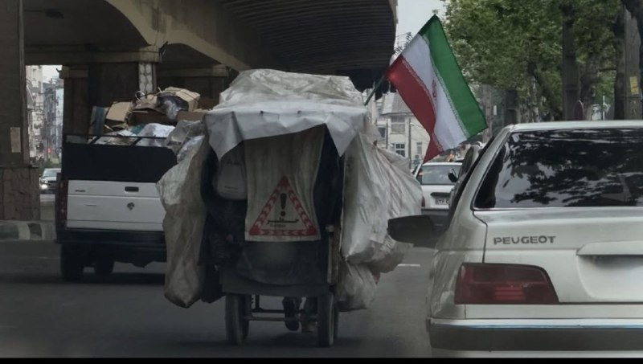

اکانت اسرائیل به فارسی:

علت و معلول

@IranianMinds

## BBCPersian — post 283056

🔻وزیر کشور پاکستان با عراقچی دیدار کرد

محسن نقوی با عباس عراقچی، وزیر خارجه ایران، در تهران دیدار کرد.

وزیر کشور پاکستان شنبه شب با اسکندر مومنی، همتای ایرانی خود، دیدار کرده بود.

به گزارش رسانه‌های ایران، پس از این دیدار، آقای نقوی گفت به تهران آمده است تا «نامه‌ ویژه» و پیام «مهم» فرمانده کل قوا و نخست‌وزیر پاکستان به مجتبی خامنه‌ای را تحویل دهد.

https://bbc.in/4xeGwvq
@BBCPersian

## BBCPersian — post 283055

🔻عضو کمیسیون امنیت ملی مجلس: با آمریکا آتش‌بس نداریم

وحید احمدی، عضو کمیسیون امنیت ملی مجلس، گفت که «احتمال شروع جنگی جدید وجود دارد.»

او به وبسایت خبری فرارو گفت: «این یک حقیقت است که ما با آمریکا آتش‌بس نداریم. در واقع ما مشغول توقف در درگیری‌ها هستیم. آمریکایی‌ها موفق نشده‌اند به هدفی که برای جنگ در میدان ترسیم کرده بودند برسند و حالا رو به محاصره دریایی آورده‌اند تا شاید بتوانند به لحاظ اقتصادی به ما فشار وارد کنند که اتفاقا در این بخش هم موفقیتی کسب نکرده‌اند.»

آقای احمدی همچنین گفت: «احتمال شروع جنگی جدید وجود دارد و ایران امکانات جدیدی را در راه دارد.»

او از کشورهای حاشیه خلیج فارس انتقاد کرد که سا‌ل‌هاست «هر چه داشتند در اختیار آمریکا گذاشتند و گدایی امنیت را از آمریکا می‌کنند. اما جنگ اخیر نشان داد امنیت این‌گونه به دست نمی‌آید.»

https://bbc.in/4xeGwvq
@BBCPersian

## alonews — post 125710

  <a href="telegram/content/alonews_125710_1780822961.webm" target="_blank">🎬 Download video</a>

👈وب سایت خبری «والا» ارتش اسرائیل عملیات زمینی را در حاشیه شهر النبطیه در جنوب لبنان آغاز کرده است.

🔴النبطیه یکی از شهرهای مهم جنوب لبنان است که در گزارش‌ها گفته شده نیروهای ارتش اسرائیل در اطراف آن در حال انجام عملیات زمینی هستند.

✅ @AloNews خبر جنگ

## alonews — post 125709

  <a href="telegram/content/alonews_125709_1780822961.webm" target="_blank">🎬 Download video</a>

👈نامه‌ای که وزیر کشور پاکستان آورده بود برای مجتبی خامنه‌ای، تحویل عراقچی داده شد 
✅ @AloNews خبر جنگ

## alonews — post 125708

  <a href="telegram/content/alonews_125708_1780822962.webm" target="_blank">🎬 Download video</a>

🔴فوری / خبرنگار الحدث: تیراندازی در ۴ نقطه اسرائیل رخ داده

🔴تعداد زخمی ها به ۶ نفر افزایش یافته و یک نفر کشته شده

✅ @AloNews خبر جنگ

---
📅 بروزرسانی: 1405/03/17 12:22
---

## IranIntlTV — post 340946

  <a href="telegram/content/IranIntlTV_340946_1780822350.mp4" target="_blank">🎬 Download video</a>

اعتراض دانش‌آموزان به وضعیت امتحانات و کنکور در شهرهای مختلف برای دومین روز متوالی در هفته جاری همچنان ادامه دارد. دانش‌آموزان در چند شهر تجمع اعتراضی برگزار کردند. تصاویر ارسالی به ایران‌اینترنشنال تجمع دانش‌آموزان در اصفهان و مشهد را نشان می‌دهد.

جزییات بیشتر با منصوره حسینی‌یگانه، عضو تحریریه ایران‌اینترنشنال
@iranintltv

## Persian_Trend_Official — post 15841

  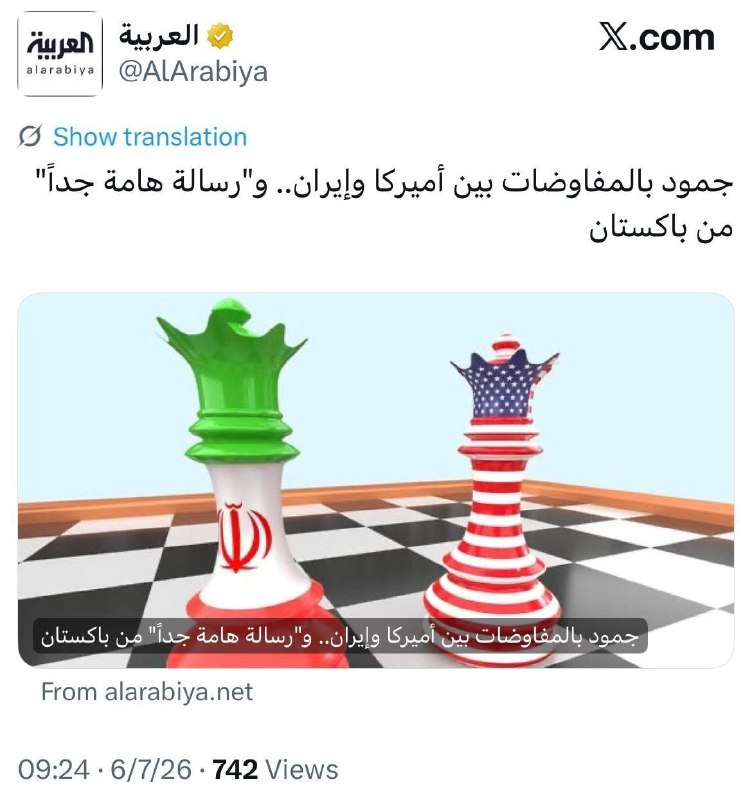

📰 العربیه: مذاکرات ایران و آمریکا متوقف شده؛ پاکستان حامل «پیامی بسیار مهم» برای تهران است:

شبکه العربیه گزارش داده است که روند مذاکرات میان ایران و آمریکا با وقفه مواجه شده و همزمان، سفر مقام‌های پاکستانی به تهران با هدف انتقال یک «پیام بسیار مهم» در کانون توجه قرار گرفته است.

🇺🇸
🇮🇷
🇵🇰این گزارش در حالی منتشر می‌شود که وزیر کشور پاکستان نیز پیش‌تر از سفر خود به ایران برای تحویل پیام ویژه فرمانده ارتش و نخست‌وزیر پاکستان به مقامات عالی‌رتبه جمهوری اسلامی خبر داده بود.

همزمانی توقف مذاکرات با سفر حاملان پیام از اسلام‌آباد، گمانه‌زنی‌ها درباره تحرکات دیپلماتیک پشت‌پرده را افزایش داده است. هرچند جزئیات این پیام هنوز منتشر نشده، اما به نظر می‌رسد تحولات روزهای آینده می‌تواند بر مسیر مذاکرات و معادلات منطقه‌ای تأثیرگذار باشد.

👺Phantom

📌 @persian_trend_official
پرشین ترند | متفاوت‌ترین کانال نظامی

## Dirty_Kids — post 391196

امیر قلعه نوعی دقیقا عین این ایموجی شده، حتی رنگ لباسش!🫄

@Dirty_Kids 👻

## alonews — post 125706

امیر قلعه نوعی دقیقا عین این ایموجی شده، حتی رنگ لباسش!🫄

@AloSport

## alonews — post 125705

  <a href="telegram/content/alonews_125705_1780822352.webm" target="_blank">🎬 Download video</a>

👈مهدی خراتیان، کارشناس حکومتی، در گفتگوی اختصاصی با برنامه «ایران‌تاک» با اشاره به دی‌ماه ۱۴۰۴، پایگاه مردمی شاهزاده رضا پهلوی را رد کرده و علت اعتراضات را افزایش قیمت اقلام خوراکی دانست. او با اذعان به اینکه در جریان اعتراضات حدود ۱۰۰ شهر در آستانه سقوط بودند یا سقوط کردند و برخی فرمانداری‌ها نیز «مانند آب خوردن» سقوط کردند، گفت: «ما دقیق اطلاع داریم که لیدرهای اعتراضات، جمعیت را طوری هل می‌دادند که سپر انسانی مقابل ماموران جمهوری اسلامی شوند».

✅ @AloNews خبر جنگ

## alonews — post 125704

  <a href="telegram/content/alonews_125704_1780822353.webm" target="_blank">🎬 Download video</a>

👈نامه‌ای که وزیر کشور پاکستان آورده بود برای مجتبی خامنه‌ای، تحویل عراقچی داده شد

✅ @AloNews خبر جنگ

---
📅 بروزرسانی: 1405/03/17 12:12
---

## VahidOOnLine — post 244058

  

مجید نقشی، وکیل امیرحسین مقصودلو، مشهور به تتلو، گفت: «موکلم جزو عفو شدگان اعیاد قربان و غدیر نبود.»

او افزود: «توبه تتلو از سوی دادگاه پذیرفته شد و برای طی مراحل نهایی پرونده به رییس قوه قضاییه ارسال شد اما هنوز تصمیم نهایی اتخاذ نشده است.»

نقشی اضافه کرد: «با توجه به ورود برخی از خواننده‌ها به کشور، امیداریم که از ظرفیت و هنر موکلم برای وطن استفاده شود.»
iranintl
‌🏁 🇬🇧 IranintlTV

🤖 @VahidOOnLine

## IranIntlTV — post 340945

  

🔻روزنامه کیهان امروز در یادداشتی با اشاره به رد درخواست ویزای ۱۵ عضو تیم ملی برای ورود به آمریکا نوشته است: «فقط یک لحظه تصور کنید، اهرم تنگه هرمز و باب‌المندب هم در اختیار آمریکا بود. دشمنی که از اهرم «ویزا» برای ورزشکاران کشورمان نمی‌گذرد، از این تنگه‌ها می‌گذشت؟!»

🔹روزنامه وابسته به رهبر جمهوری اسلامی در بخش دیگری نوشت: «بسته ماندن نصفه و نیمه تنگه هرمز و ته کشیدن ذخایر استراتژیک کشورها، اقتصاد حریف را تهدید می‌کند، با بستن مؤثر تنگه هرمز و باب‌المندب و صد البته واکنش‌های سریع و به موقع مسئولین به جنگ روانی ترامپ، می‌توان پیروز «جنگ تاب‌آوری» شد و بازی او را به هم ریخت. نفت که ۳۰۰ دلار شد، همین ترامپ جلوی نتانیاهو خواهد ایستاد.»

🔹این روزنامه در ادامه نوشته که احتمال دارد ماجرای پناهندگی بازیکنان تیم ملی زنان برای تیم ملی مردان هم تکرار شود: «درباره ماجرای ویزای تیم ملی فوتبال بد نیست یک احتمال را هم در نظر بگیریم. همان که برای تیم فوتبال زنان در استرالیا رخ داد. هیچ بعید نیست دشمن خواب‌هایی برای بازیکنان تیم فوتبال کشورمان دیده باشد.»

@iranintltvsport

## IranIntlTV — post 340944

  

مجید نقشی، وکیل امیرحسین مقصودلو، مشهور به تتلو، گفت: «موکلم جزو عفو شدگان اعیاد قربان و غدیر نبود.»

او افزود: «توبه تتلو از سوی دادگاه پذیرفته شد و برای طی مراحل نهایی پرونده به رییس قوه قضاییه ارسال شد اما هنوز تصمیم نهایی اتخاذ نشده است.»

نقشی اضافه کرد: «با توجه به ورود برخی از خواننده‌ها به کشور، امیداریم که از ظرفیت و هنر موکلم برای وطن استفاده شود.»
iranintl.com/202606072148

## Persian_Trend_Official — post 15840

  

ارتش و سازمان امنیت داخلی اسرائیل خبر دادند که صقر ابو کریم، فرمانده یک واحد حماس که از عوامل اصلی حمله به منطقه کیسوفیم در جریان حمله ۷ اکتبر بود، سه‌شنبه در جنوب نوار غزه کشته شده است.

📌 @persian_trend_official
پرشین ترند | متفاوت‌ترین کانال نظامی

## Persian_Trend_Official — post 15839

  <a href="telegram/content/Persian_Trend_Official_15839_1780821768.webm" target="_blank">🎬 Download video</a>

محسن نقوی، وزیر کشور پاکستان که به تهران سفر کرده، با عباس عراقچی، وزیر خارجه جمهوری اسلامی دیدار کرد.
او شامگاه شنبه و پس از ورود به تهران گفته بود: «من اینجا هستم تا نامه ویژه‌ای را از سوی عاصم منیر، فرمانده ارتش پاکستان و نخست‌وزیر شهباز شریف، درباره شرایط فعلی به مجتبی خامنه‌ای تحویل دهم.»

📌 @persian_trend_official
پرشین ترند | متفاوت‌ترین کانال نظامی

## Persian_Trend_Official — post 15838

  

سفیر ایران در مکزیک گفته تیم ملی برای حضور در ۳ مسابقهٔ گروهی جام جهانی در آمریکا ملزم شده در روز برگزاری مسابقه وارد آمریکا شود و بلافاصله پس از بازی به مکزیک برگردد.

📌 @persian_trend_official
پرشین ترند | متفاوت‌ترین کانال نظامی

## RadioFarda — post 157995

آمریکا در آستانه انتخابات ارمنستان بر حمایت از حاکمیت این کشور تأکید کرد

🔸ایالات متحده در آستانه انتخابات پارلمانی ارمنستان بار دیگر بر حمایت خود از حاکمیت و نهادهای دموکراتیک این کشور تأکید کرد؛ انتخاباتی که در غرب، همزمان با نگرانی‌ها از افزایش تلاش‌های روسیه برای تضعیف نیکول پاشینیان، نخست‌وزیر ارمنستان، با دقت دنبال می‌شود.

🔸یک سخنگوی وزارت خارجه آمریکا در پاسخ به پرسش رادیو اروپای آزاد/رادیو آزادی درباره گزارش‌های مربوط به دخالت خارجی در روند سیاسی ارمنستان گفت واشینگتن «از گزارش‌های رسانه‌ای درباره دخالت خارجی» آگاه است، اما «مردم ارمنستان حق دارند رهبری خود را تعیین کنند و آینده خود را رقم بزنند».

🔸انتخابات ۱۸ خرداد (هفتم ژوئن) در ارمنستان، که حزب «پیمان مدنی» به رهبری آقای پاشینیان در نظرسنجی‌ها پیشتاز آن است، از سوی بسیاری از ناظران آزمونی برای مسیر ژئوپلیتیک آینده این کشور تلقی می‌شود.

🔸این موضع‌گیری همزمان با گسترش روابط واشینگتن و ایروان صورت می‌گیرد. آرارات میرزویان، وزیر خارجه ارمنستان، روز ۱۵ خرداد اعلام کرد توافق چارچوب همکاری راهبردی میان ارمنستان و آمریکا درباره «مسیر ترامپ برای صلح و شکوفایی بین‌المللی» را امضا کرده است. این سند پیشتر از سوی مارکو روبیو، وزیر خارجه آمریکا، امضا شده بود.

🔸وزارت خارجه آمریکا این ابتکار را «بخشی مهم و پایدار» از تلاش برای آوردن صلح و شکوفایی به ارمنستان و قفقاز جنوبی توصیف کرده است.

🔸مارکو روبیو نیز روز ۱۴ خرداد در کمیته روابط خارجی سنای آمریکا گفت روسیه «از تعامل آمریکا با ارمنستان خرسند نیست» و شواهدی وجود دارد که مسکو خواهان شکست نخست‌وزیر کنونی در انتخابات است. او تأکید کرد هدف واشینگتن محدود کردن روابط ارمنستان با دیگر کشورها نیست، بلکه حمایت از توانایی این کشور برای داشتن سیاست خارجی مستقل است.

🔸نیکول پاشینیان از زمان به قدرت رسیدن در انقلاب مخملی سال ۲۰۱۸، به‌تدریج وابستگی ارمنستان به روسیه را کاهش داده است.

🔸نسخه کامل این گزارش را در وب‌سایت رادیوفردا بخوانید.

@RadioFarda

## BBCPersian — post 283048

🖊آلکس فون تونتسلمان, تاریخ‌نگار

در یکی از روزهای ابری آوریل ۱۹۱۹، زنی به نام اگلانتین جب وارد میدان ترافالگار، میدان اصلی لندن، شد.

موهای قرمزش را گوجه‌ای بسته بود. قد بلند، لاغر و رنگ‌پریده بود و چشمانی آبی، به رنگ گل‌های فراموشم‌مکن داشت.

میدان ترافالگار محلی بود که نارضایتی‌های اجتماعی در آن به شکل اعتراض بروز پیدا می‌کرد.
این میدان جایی بود که منشورگرایان (چارتیست‌ها) در سال ۱۸۴۸ برای مطالبه اصلاحات سیاسی به سود کارگران گرد هم آمدند و بعدها طرفدار حق رای زنان در آن تجمع کردند.

اگلانتین با هدفی مشخص آنجا بود: او میان رهگذران برگه‌ای پخش می‌کرد که روی آن تصویر دختربچه‌ای با بدنی کوچک و سری بسیار بزرگ دیده می‌شد.

او دختربچه‌ای اتریشی و دو سال و نیمه بود که باید می‌خندید، می‌دوید و دنبال پروانه‌ها می‌کرد، اما حتی نمی‌توانست به تنهایی روی پای خودش بایستد.

این بزرگی ظاهری سر در واقع پیامد سوءتغذیه‌ای بود که مانع رشد طبیعی بدن کودک شده بود.

مطلب کامل🔽
https://bbc.in/4ewjuYz
📷BBC/ SAM RODRIGUEZ/SAVE THE CHILDREN/ SAVE THE CHILDREN

## Dirty_Kids — post 391195

  

خانه‌های جالب شمال تهران

@Dirty_Kids 👻

## Dirty_Kids — post 391194

  <a href="telegram/content/Dirty_Kids_391194_1780821770.mp4" target="_blank">🎬 Download video</a>

«هویت ایرانی» ما بر روح و‌جان ما حک شده! غیر قابل نابودی است! هزاران درود بر شرفت مرادجان!

@Dirty_Kids 👻

## Dirty_Kids — post 391193

  

آقا این دیتابیس وزارت اطلاعت چرا تکمیل نمیشه؟

‌‌پ‌ن: عکس‌ و هرگونه اطلاعات از خودتون رو زیر هیچ توئیتی منشن نکنید

@Dirty_Kids 👻

## Hranews — post 113438

  

بلاتکلیفی محمد امین شکیبایی در زندان تربت حیدریه به ۱۰۰ روز رسید

❗️
❗️
❗️
❗️
❗️ – محمد امین شکیبایی، شهروند ساکن سبزوار، علیرغم گذشت ۱۰۰ روز از زمان #بازداشت، کماکان به‌صورت بلاتکلیف در زندان تربت حیدریه به‌سر می‌برد.

به گزارش خبرگزاری هرانا، ارگان خبری مجموعه فعالان حقوق بشر در ایران، محمد امین شکیبایی، همچنان در بازداشت است.

براساس اطلاعات دریافتی هرانا، آقای شکیبایی در تاریخ ۹ اسفند ۱۴۰۴ توسط نیروهای امنیتی در سبزوار بازداشت و به زندان تربت حیدریه منتقل شد. او بیش از سه ماه است که در بلاتکلیفی قضایی به‌سر می‌برد. همچنین تاکنون امکان آزادی موقت این شهروند با وثیقه نیز فراهم نشده است.

ادامه مطلب

#محمد_امین_شکیبایی

↘️
@hranews_bot تماس ✉️ -  @Hranews  کانال هرانا 🆑

## alonews — post 125703

  <a href="telegram/content/alonews_125703_1780821772.webm" target="_blank">🎬 Download video</a>

👈خسرو پناه:اونایی که اعتراض میکنن دانش آموز نیستن بلکه مافیای کنکور هستن

✅ @AloNews

---
📅 بروزرسانی: 1405/03/17 12:02
---

## VahidOOnLine — post 244057

  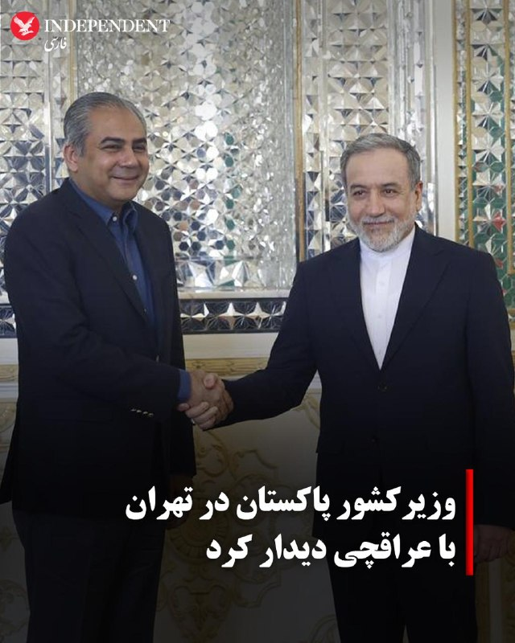

♦️محسن نقوی، وزیر کشور پاکستان که برای دومین بار در یک ماه گذشته به تهران سفر کرده است، روز یکشنبه ۱۷ خرداد ماه با عباس عراقچی، وزیر خارجه جمهوری اسلامی دیدار کرد.

نقوی شامگاه شنبه وارد تهران شد و به خبرنگاران گفت: « اینجا هستم تا نامه ویژه‌ای را از سوی عاصم منیر، فرمانده ارتش پاکستان و نخست‌وزیر شهباز شریف، درباره شرایط فعلی به مجتبی خامنه‌ای تحویل دهم.»

رهبران پاکستان نقش میانجی‌گران کلیدی در مذاکرات پایان جنگ میان تهران و واشنگتن ایفا می‌کنند.
‌🇸🇦 Indypersian

🤖 @VahidOOnLine

## WithYashar — post 13666

کانال 12 اسرائیل :طرح موساد هنوز می‌تواند به سقوط رژیم ایران منجر شود
@withyashar

## pm_afshaa — post 92426

🔴مهدی خراتیان کارشناس وابسته به جمهوری اسلامی تایید کرد که در اعتراضات دی ماه نزدیک به 100 شهر سقوط کردند !!

+فرمانداری ها به راحتی به دست مردم افتاد اما یگان ویژه وارد شد و کشتار رخ داد

💧 Rainbet.com the #1 Non-KYC Crypto Casino & Sportsbook @rainbetcom

😁 @Pm_Afshaa

## FarsiVOA — post 219831

  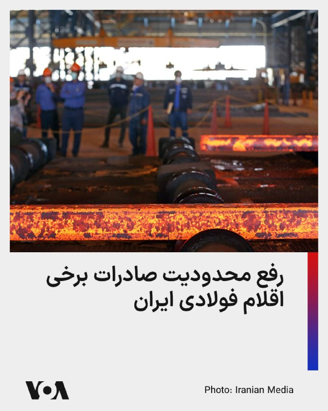

دو ماه پس از ممنوعیت صادرات محصولات فولادی در پی حملات اسرائیل به صنایع فولاد ایران در اصفهان و خوزستان، وزارت وزارت صنعت، معدن و تجارت ایران از رفع ممنوعیت صادرات اسلب و ورق فولادی خبر داد.

بهادر احرامیان، عضو هیئت مدیره انجمن تولیدکنندگان فولاد ایران اخیراً از کاهش تولید دست‌کم ۳۰ درصدی فولاد ایران در جریان حملات اسرائیل به این صنعت خبر داده بود.

طبق برآورد مجمع جهانی فولاد، ایران پارسال ۳۲ میلیون تن تولید فولاد داشت که ۱۱ میلیون تن آن، معادل تقریباً یک سوم، صادر و بقیه در بازار داخلی مصرف شده بود.

با توجه به افت ۳۰ درصدی تولید فولاد، قاعدتاً ایران توان صادرات آن را از دست داده و مشخص نیست چرا وزارت صمت صادرات اسلب و ورق فولادی، دو محصول اصلی صادراتی این صنعت، را آزاد کرده است.

جهش قیمت فولاد در بازار ایران نیز طی هفته‌های گذشته خبرساز شده است. احمد کرمی راد فعال صنعت سازه‌های فولادی هفته گذشته اعلام کرد قیمت برخی اقلام فولادی در بازار داخلی ایران از بازارهای جهانی نیز پیشی گرفته است.
@FarsiVOA

## DW_Farsi — post 125605

  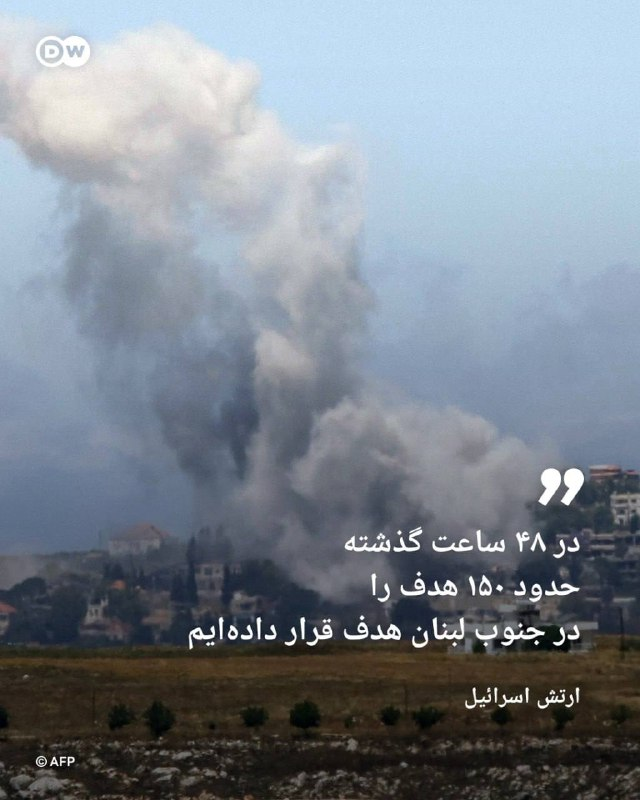

🔶 اسرائیل: هدف قرار گرفتن ۱۵۰ موضع حزب‌الله طی دو روز گذشته

ارتش اسرائیل اعلام کرد که در جریان عملیات نظامی خود علیه حزب‌الله لبنان، طی ۴۸ ساعت گذشته حدود ۱۵۰ هدف را در جنوب لبنان هدف حمله قرار داده است.
به گفته ارتش اسرائیل در این حملات، انبارهای تسلیحات، مراکز فرماندهی و سکوهای پرتاب موشک این گروه هدف قرار گرفته‌اند.

در همین حال، خبرگزاری تسنیم وابسته به سپاه پاسداران به نقل از بیانیه حزب‌الله مدعی شد که مقر فرماندهی ارتش اسرائیل در شهرک النّاقورة با یک فروند پهپاد انتحاری "ابابیل" هدف حمله پهپادی حزب‌الله قرار گرفته است.

به گزارش تسنیم، حزب‌الله لبنان همچنین در بیانیه چهارم امروز خود مدعی شده که تجمع نظامیان ارتش اسرائیل را "در حومه جنوبی شهرک حداثا با دو پهپاد تهاجمی ابابیل هدف قرار داده است".

در پنجمین بیانیه حزب‌الله نیز ادعا شده که که تجمع زرهی و محل استقرار نظامیان اسرائیلی در حومه جنوب شرقی شهرک "یحمر الشقیف" با موشک و گلوله‌های توپخانه هدف قرار گرفته است.

@dw_farsi

## DW_Farsi — post 125604

🔶 خواهر کیم موقعیت هسته‌ای کره شمالی را غیرقابل مذاکره دانست

کیم یو جونگ، خواهر کیم جونگ اون، رهبر کره شمالی، اعلام کرد که جایگاه کشورش به عنوان یک قدرت هسته‌ای قابل مذاکره نیست.

این زن ۳۸ ساله در بیانیه‌ای که از سوی خبرگزاری دولتی کره شمالی منتشر شد، گفت که موقعیت کره شمالی به عنوان یک کشور دارای سلاح هسته‌ای «واقعیتی بازگشت‌ناپذیر است؛ فارغ از اینکه دیگران آن را به رسمیت بشناسند یا نه.»

کیم در ادامه گفت نیروهای "متخاصم" باید "خیال‌پردازی‌های خود درباره خلع سلاح هسته‌ای را کنار بگذارند". او با این سخنان، به‌روشنی تلاش‌های دیپلماتیک برای خلع سلاح هسته‌ای کره شمالی را رد کرد.

روز جمعه گذشته ۵ ژوئن، سخنگوی وزارت خارجه آمریکا به خبرگزاری کره جنوبی "یونهاپ" گفته بود که ایالات متحده همچنان برای گفت‌وگو با کره شمالی "بدون هیچ پیش‌شرطی" آمادگی دارد و کماکان بر «هدف خلع سلاح کامل هسته‌ای کره شمالی تأکید می‌کند.»

@dw_farsi

## RadioFarda — post 157994

  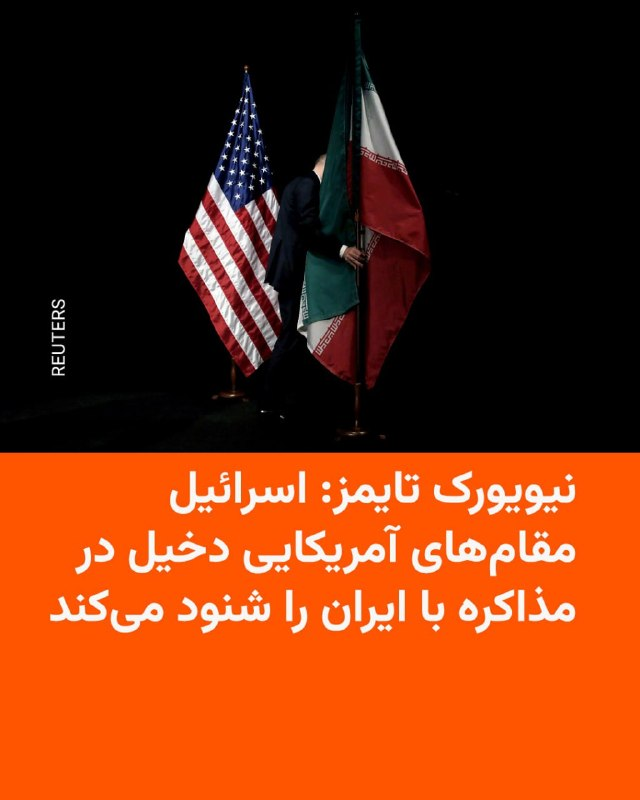

🔸روزنامه نیویورک تایمز روز شنبه در گزارشی به نقل از چند منبع خبر داد که سازمان‌های اطلاعاتی و جاسوسی اسرائیل مقام‌های آمریکایی دخیل در مذاکره با جمهوری اسلامی،‌ از جمله استیو ویتکاف، را شنود می‌کنند.

🔸آمریکا و اسرائیل روز ۹ اسفندماه سال گذشته به طور مشترک به ایران حمله کردند، رخدادی که رسانه‌های آمریکایی بارها از آن به عنوان رخدادی بی‌سابقه و تاریخی یاد کرده و نوشته‌اند که در تاریخ روابط دو کشور تاکنون چنین اتفاقی نیفتاده بود.

🔸با این حال، بر اساس گزارش‌های همین رسانه‌ها، از زمان برقراری آتش‌بس میان ایران و آمریکا و تلاش دولت دونالد ترامپ برای رسیدن به توافقی که پایان‌بخش جنگ باشد در رابطه رئیس جمهور آمریکا با نخست وزیر اسرائیل تنش بروز کرده است. بنیامین نتانیاهو علاقه دارد جنگ تا تغییر حکومت جمهوری اسلامی ادامه پیدا کند.

🔸حال نیویورک تایمز به نقل از چند مقام که به نام‌شان اشاره نکرد نوشته است که تلاش اسرائیل برای آگاهی یافتن از مواضع دولت آمریکا در مذاکره با جمهوری اسلامی «از حدود معمول گذشته است».

@RadioFarda

## alonews — post 125702

  <a href="telegram/content/alonews_125702_1780821153.mp4" target="_blank">🎬 Download video</a>

👈شعار تجمعات شبانه : ترام ترام حیا کن برو خونتون لالا کن!

✅ @AloNews خبر جنگ

---
📅 بروزرسانی: 1405/03/17 11:52
---

## VahidOOnLine — post 244056

  <a href="telegram/content/VahidOOnLine_244056_1780820540.mp4" target="_blank">🎬 Download video</a>

♦️پیت هگست، وزیر جنگ آمریکا، در مراسم هشتادودومین سالگرد عملیات «دی‌دی» (D-day) در نرماندی فرانسه، از کشورهای اروپایی خواست با آنچه «تهاجم» مهاجران به سواحل این قاره خواند، مقابله کنند و همزمان بر ضرورت افزایش سهم اروپا در تامین امنیت خود تاکید کرد.
هگست در سخنرانی خود در گورستان نظامی آمریکا در کولویل-سور-مر گفت: «متاسفانه امروز سواحل مختلف اروپا با ایدئولوژی‌های خطرناک دیگری مورد هجوم قرار گرفته‌اند.»
او با اشاره به ورود مهاجران از طریق دریای مدیترانه افزود: «در سواحل اسپانیا، ایتالیا، یونان و بلغارستان، قایق‌ها و مردانی از راه می‌رسند. چه زمانی پایتخت‌های اروپایی برای مقابله با این تهاجم اقدامی خواهند کرد؟ یا دیگر خیلی دیر شده است؟»
اظهارات وزیر دفاع آمریکا بازتاب‌دهنده مواضع دولت دونالد ترامپ درباره مهاجرت است. دولت ترامپ بارها مهاجرت گسترده را تهدیدی برای تمدن و امنیت کشورهای غربی توصیف کرده است.
«دی‌دی» (D-Day) نامی است که برای ۶ ژوئن ۱۹۴۴ به کار می‌رود. روزی که نیروهای متفقین در جریان جنگ جهانی دوم بزرگ‌ترین عملیات آبی‌ـ‌خاکی تاریخ را برای آزادسازی اروپای غربی از اشغال آلمان نازی آغاز کردند.
‌🇸🇦 Indypersian

🤖 @VahidOOnLine

## VahidOOnLine — post 244055

  

محسن نقوی، وزیر کشور پاکستان که به تهران سفر کرده، با عباس عراقچی، وزیر خارجه جمهوری اسلامی دیدار کرد.

او شامگاه شنبه و پس از ورود به تهران گفته بود: «من اینجا هستم تا نامه ویژه‌ای را از سوی عاصم منیر، فرمانده ارتش پاکستان و نخست‌وزیر شهباز شریف، درباره شرایط فعلی به مجتبی خامنه‌ای تحویل دهم.»
‌🏁 🇬🇧 IranintlTV

🤖 @VahidOOnLine

## VahidOOnLine — post 244054

  <a href="telegram/content/VahidOOnLine_244054_1780820543.mp4" target="_blank">🎬 Download video</a>

ویدیوهای رسیده به ایران‌اینترنشنال نشان می‌دهد گروهی از دانش‌آموزان در مشهد یکشنبه ۱۷ خرداد در اعتراض به تاثیر معدل در کنکور و شیوه برگزاری امتحانات به‌صورت حضوری تجمع کرده و شعار دادند: «وعده زیاد شنیدیم، نتیجه‌ای ندیدیم»
‌🏁 🇬🇧 IranintlTV

🤖 @VahidOOnLine

## VahidOOnLine — post 244053

  <a href="telegram/content/VahidOOnLine_244053_1780820544.mp4" target="_blank">🎬 Download video</a>

ویدیوهای رسیده به ایران‌اینترنشنال نشان می‌دهد گروهی از دانش‌آموزان در مشهد یکشنبه ۱۷ خرداد در اعتراض به تاثیر معدل در کنکور و شیوه برگزاری امتحانات به‌صورت حضوری تجمع کرده و شعار دادند: «مشکل‌مون حل نشه، هر روز تجمع می‌شه»
‌🏁 🇬🇧 IranintlTV

🤖 @VahidOOnLine

## VahidOOnLine — post 244052

♦️محمدرضا یزدی‌زاده، اقتصاددان ایرانی در اظهاراتی مدعی شد جمهوری اسلامی باید به ایالات متحده و اسرائیل نشان دهد که از توانمندی هسته‌ای برخوردار است و در صورت هرگونه حمله، قادر به پاسخ متقابل خواهد بود.
او در گفتگویی که در کانال یوتیوب «خیابان جمهوری» منتشر شده، با اشاره به ذخایر اورانیوم غنی‌شده ایران ادعا کرد که با حدود ۴۶۰ کیلوگرم اورانیوم با غنای بالا می‌توان ۱۰۰ موشک موسوم به «بمب کثیف» تولید کرد، موشک‌هایی که به گفته او حتی بدون ایجاد تخریب گسترده، می‌توانند به دلیل آلودگی رادیواکتیو، مناطق هدف را برای مدت طولانی غیرقابل سکونت کنند.
این اقتصاددان با دفاع از سیاست ایجاد بازدارندگی، اظهار داشت که صرف برخورداری از توان موشکی کافی نیست و ایران باید به آمریکا و اسرائیل نشان دهد که از توانمندی هسته‌ای نیز برخوردار است. او مدعی شد حتی استفاده از «بمب کثیف» می‌تواند به عنوان ابزاری برای بازدارندگی عمل کند.
اصطلاح «بمب کثیف» به سلاحی گفته می‌شود که با ترکیب مواد منفجره متعارف و مواد رادیواکتیو، باعث پراکندگی آلودگی پرتوزا در محیط می‌شود.
‌🇸🇦 Indypersian

🤖 @VahidOOnLine

## pm_afshaa — post 92425

🔴کانال 12 اسرائیل :طرح موساد هنوز می‌تواند به سقوط رژیم ایران منجر شود

💧 Rainbet.com the #1 Non-KYC Crypto Casino & Sportsbook @rainbetcom

😁 @Pm_Afshaa

## pm_afshaa — post 92424

🔴العربیه:مذاکرات بین ایالات متحده و ایران متوقف شده

💧 Rainbet.com the #1 Non-KYC Crypto Casino & Sportsbook @rainbetcom

😁 @Pm_Afshaa

## IranIntlTV — post 340943

  

محسن نقوی، وزیر کشور پاکستان که به تهران سفر کرده، با عباس عراقچی، وزیر خارجه جمهوری اسلامی دیدار کرد.

او شامگاه شنبه و پس از ورود به تهران گفته بود: «من اینجا هستم تا نامه ویژه‌ای را از سوی عاصم منیر، فرمانده ارتش پاکستان و نخست‌وزیر شهباز شریف، درباره شرایط فعلی به مجتبی خامنه‌ای تحویل دهم.»
https://iranintl.com/202606074267

## IranIntlTV — post 340942

  <a href="telegram/content/IranIntlTV_340942_1780820546.mp4" target="_blank">🎬 Download video</a>

ویدیوهای رسیده به ایران‌اینترنشنال نشان می‌دهد گروهی از دانش‌آموزان در مشهد یکشنبه ۱۷ خرداد در اعتراض به تاثیر معدل در کنکور و شیوه برگزاری امتحانات به‌صورت حضوری تجمع کرده و شعار دادند: «وعده زیاد شنیدیم، نتیجه‌ای ندیدیم»

## IranIntlTV — post 340941

  <a href="telegram/content/IranIntlTV_340941_1780820547.mp4" target="_blank">🎬 Download video</a>

ویدیوهای رسیده به ایران‌اینترنشنال نشان می‌دهد گروهی از دانش‌آموزان در مشهد یکشنبه ۱۷ خرداد در اعتراض به تاثیر معدل در کنکور و شیوه برگزاری امتحانات به‌صورت حضوری تجمع کرده و شعار دادند: «مشکل‌مون حل نشه، هر روز تجمع می‌شه»

## alonews — post 125701

  <a href="telegram/content/alonews_125701_1780820549.webm" target="_blank">🎬 Download video</a>

👈طرح رایگان‌شدن مترو برای ۵ دهک درآمدی در شورای شهر تهران رأی نیاورد.

✅ @AloNews خبر جنگ

## alonews — post 125700

  <a href="telegram/content/alonews_125700_1780820549.webm" target="_blank">🎬 Download video</a>

👈وزیر کشور پاکستان با عراقچی دیدار کرد

✅ @AloNews خبر جنگ

---
📅 بروزرسانی: 1405/03/17 11:42
---

## VahidOOnLine — post 244051

  

پلیس یونان خبر داد که یک مرد ۳۷ ساله فلسطینی را به اتهام ارتباط با حماس و برنامه‌ریزی برای یک حمله بازداشت کرده است.

رسانه‌ها گزارش دادند که این مرد در یک هتل در جزیره کرت، کار می‌کرد و قرار بوده یک کشتی کروز اسرائیلی را که سه‌شنبه وارد این جزیره می‌شود، هدف قرار دهد.
‌🏁 🇬🇧 IranintlTV

🤖 @VahidOOnLine

## IranIntlTV — post 340940

  

پلیس یونان خبر داد که یک مرد ۳۷ ساله فلسطینی را به اتهام ارتباط با حماس و برنامه‌ریزی برای یک حمله بازداشت کرده است.

رسانه‌ها گزارش دادند که این مرد در یک هتل در جزیره کرت، کار می‌کرد و قرار بوده یک کشتی کروز اسرائیلی را که سه‌شنبه وارد این جزیره می‌شود، هدف قرار دهد.
https://iranintl.com/202606077427

## IranIntlTV — post 340939

  <a href="https://t.me/IranintlTV/340939" target="_blank">📎 Download file</a>

🎧نسخه صوتی اخبار بامدادی | یکشنبه ۱۷ خرداد
@iranintlTV

## RadioFarda — post 157993

  

🔸در ادامه روایات ضد و نقیض مقامات حکومتی از وضعیت جسمی مجتبی خامنه‌ای که در پی مرگ پدرش به عنوان رهبر سوم جمهوری اسلامی معرفی شد، یک عضو مجلس خبرگان تأیید کرد که او در بمباران اسرائیل چنان آسیب دیده که احتمال داشته پای خود را از دست بدهد.

🔸احمد خاتمی، عضو مجلس خبرگان رهبری، روز شنبه در «نشست نخبگان فرهنگی، سیاسی و اعضای شورای اداری شهرستان سیرجان» گفت: «در جریان حمله روز نخست جنگ رمضان، ایشان [مجتبی خامنه‌ای] از ناحیه پا دچار آسیب‌دیدگی شدند؛ به‌گونه‌ای که احتمال قطع پا نیز مطرح بوده است.»

🔸او در ادامه ادعا کرد: «با تلاش کادر درمان، این اتفاق رخ نداد و آیت‌الله مجتبی خامنه‌ای هم‌اکنون در سلامت به سر می‌برند.»

🔸این در حالی است که ماه گذشته مدیر مرکز روابط عمومی و اطلاع‌رسانی وزارت بهداشت جمهوری اسلامی ادعا کرده بود که در حمله اسرائیل به بیت خامنه‌ای «اتفاق خاصی» برای مجتبی خامنه‌ای نیفتاده است.

🔸در روز ۹ اسفندماه سال گذشته که حمله اسرائیل به بیت علی خامنه‌ای در مرکز تهران جان او و ده‌ها مقام ارشد حکومت را گرفت، مجتبی خامنه‌ای نیز در این محل حضور داشت و به گفته حکومت زنده ماند.

@RadioFarda

## Hranews — post 113437

  

مدیرکل حفاظت #محیط_زیست کهگیلویه و بویراحمد، از کمبود شدید نیروی #محیط‌بان در این استان خبر داد و گفت که حفاظت از بیش از ۳۲۷ هزار هکتار مناطق تحت مدیریت تنها توسط ۷۵ محیط‌بان انجام می‌شود. وی خاطرنشان کرد که بر اساس استانداردهای موجود، به ازای هر یک‌هزار هکتار منطقه حفاظت ‌شده، باید یک محیط‌بان فعالیت کند، اما این استان در حال حاضر با کمبود ۲۵۲ محیط‌بان مواجه است.

عبدال دیانتی‌نسب، با اشاره به فعالیت ۱۴ پاسگاه محیط‌بانی از مجموع بیش از ۲۰ پاسگاه موجود در استان، محدودیت نیروی انسانی و مشکلات معیشتی را از مهم‌ترین چالش‌های محیط‌بانان عنوان کرد.

↘️
@hranews_bot تماس ✉️ -  @Hranews  کانال هرانا 🆑

## Hranews — post 113436

  

یک زندانی در زندان سپیدار اهواز اعدام شد

❗️
❗️
❗️
❗️
❗️ – سحرگاه روز شنبه ۱۶ خردادماه، حکم #اعدام یک زندانی که پیشتر از بابت اتهام قتل به اعدام محکوم شده بود، در زندان سپیدار اهواز اجرا شد.

به گزارش خبرگزاری هرانا، ارگان خبری مجموعه فعالان حقوق بشر در ایران، سحرگاه روز شنبه ۱۶ خرداد ۱۴۰۵، یک زندانی در زندان سپیدار اهواز اعدام شد.

هویت این زندانی، محمد عبیات، ۲۷ ساله احراز شده است.

ادامه مطلب

#محمد_عبیات

↘️
@hranews_bot تماس ✉️ -  @Hranews  کانال هرانا 🆑

---
📅 بروزرسانی: 1405/03/17 11:32
---

## VahidOOnLine — post 244050

  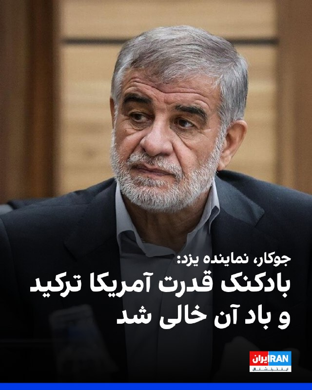

محمدصالح جوکار، نماینده یزد در مجلس، به سایت دیده‌بان ایران گفت: «با یک سوزنی، بادکنک قدرت آمریکا ترکید و باد آن خالی شد و تمام دنیا متوجه شدند که آمریکا نمی‌تواند از طریق نظامی هیچ غلطی بکند.»

او افزود: «آمریکایی‌ها اهل فریب و به دنبال امتیازگیری و تهدید هستند. ما باید به جایی برسیم که دیگر جرات تهدید نداشته باشند.»

این نماینده مجلس اضافه کرد: «درس خوبی به آمریکا می‌دهیم تا بداند که با بد کسی روبه‌رو شده است.»
‌🏁 🇬🇧 IranintlTV

🤖 @VahidOOnLine

## IranIntlTV — post 340938

  

محمدصالح جوکار، نماینده یزد در مجلس، به سایت دیده‌بان ایران گفت: «با یک سوزنی، بادکنک قدرت آمریکا ترکید و باد آن خالی شد و تمام دنیا متوجه شدند که آمریکا نمی‌تواند از طریق نظامی هیچ غلطی بکند.»

او افزود: «آمریکایی‌ها اهل فریب و به دنبال امتیازگیری و تهدید هستند. ما باید به جایی برسیم که دیگر جرات تهدید نداشته باشند.»

این نماینده مجلس اضافه کرد: «درس خوبی به آمریکا می‌دهیم تا بداند که با بد کسی روبه‌رو شده است.»
https://iranintl.com/202606071847

## DW_Farsi — post 125603

  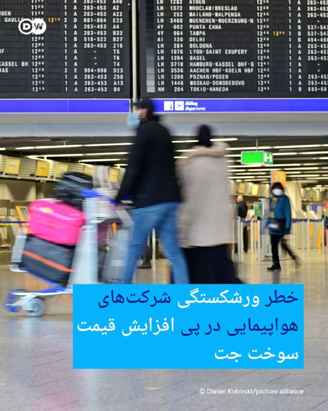

🔶 خطر ورشکستگی شرکت‌های هواپیمایی در پی افزایش قیمت سوخت جت

بر اساس اعلام انجمن بین‌المللی حمل‌ونقل هوایی (یاتا)، افزایش شدید قیمت سوخت جت در پی جنگ ایالات متحده آمریکا و اسرائیل با ایران، "احتمالا شرکت‌های هواپیمایی بیشتری را به ورشکستگی خواهد کشاند".

ویلی والش، مدیرکل یاتا، در حاشیه نشست سالانه این انجمن در ریودوژانیرو گفت: «متاسفانه نگرانم که برخی شرکت‌های هواپیمایی با این قیمت‌های بالای سوخت فقط با دشواری بسیار بتوانند از عهده آن برآیند.»

او همچنین اعلام کرد که انتظار می‌رود برخی شرکت‌ها ناچار شوند فعالیت خود را متوقف کنند و برخی دیگر نیز به مالکیت رقبای بزرگ‌تر درآیند.

@dw_farsi

## IranianMinds — post 21540

  <a href="telegram/content/IranianMinds_21540_1780819356.mp4" target="_blank">🎬 Download video</a>

وقتی تو میگویی وطن
بوی فلسطین میدهی

میان وطن پرستی ما و شما یک ایران با تمام تاریخ و تمدش فاصله است.

@IranianMinds

## alonews — post 125699

  <a href="telegram/content/alonews_125699_1780819358.webm" target="_blank">🎬 Download video</a>

👈الجزیره: ارتش اسرائیل در لبنان در وضعیت واقعی فرسایش و خستگی به سر می‌برد

🔴 معادله کاهش تنش و محدود کردن درگیری به منطقه جغرافیایی جنوب لبنان، همراه با محدود کردن عملیات تخریب اسرائیل، در عمل با هزینه بسیار بالایی اجرا می‌شود.

🔴 اعلام کشته شدن یک افسر و یک سرباز اسرائیلی در درگیری‌های اخیر، موجی از خشم شدید و گسترده را در محافل داخلی اسرائیل برانگیخته است و تأکید کرد که ارتش اسرائیل در جنوب لبنان در وضعیت واقعی فرسایش و خستگی به سر می‌برد.

✅ @AloNews خبر جنگ

## alonews — post 125698

  <a href="telegram/content/alonews_125698_1780819358.webm" target="_blank">🎬 Download video</a>

✅با سابقه ۵ سال فعالیت مداوم 
🛡حتی بدون قطعی تو دوران جنگ 
🌐 با ما همراه شو و در زمان قطعی وصل بمون 
😎 بقیه هنوز VPN حجمی میفروشن اونم با قیمتای نجومی 
🚀 
✅ از ما با کمترین قیمت ، بهترین سرویس رو بگیر 
👀
😍 💥بدون محدودیت حجم
⬇️
⬇️
⬇️ @NetAazaadBot @NetAazaadBot

## alonews — post 125697

  <a href="telegram/content/alonews_125697_1780819358.webm" target="_blank">🎬 Download video</a>

✅با سابقه ۵ سال فعالیت مداوم

🛡حتی بدون قطعی تو دوران جنگ

🌐 با ما همراه شو و در زمان قطعی
وصل بمون 
😎

بقیه هنوز VPN حجمی میفروشن
اونم با قیمتای نجومی 
🚀

✅ از ما با کمترین قیمت ، بهترین سرویس رو بگیر 
👀
😍

💥بدون محدودیت حجم
⬇️
⬇️
⬇️
@NetAazaadBot
@NetAazaadBot

---
📅 بروزرسانی: 1405/03/17 11:22
---

## FarsiVOA — post 219830

  

ارتش اسرائیل اعلام کرد که دو پرتابه را که روز یکشنبه از لبنان وارد قلمرو اسرائیل شده بودند، رهگیری کرده است. پیش از این اعلام، آژیرهای هشدار در مناطق یفتاح و راموت نفتالی در شمال اسرائیل به صدا درآمدند.

کمی قبل‌تر، ارتش اسرائیل اعلام کرد که چهار نیروی ذخیره این ارتش روز شنبه بر اثر پهپاد حزب‌الله در جنوب لبنان به‌طور متوسط مجروح شدند.

درگیری‌ها میان اسرائیل و حزب‌الله متوقف نشده و این گروه شبه‌نظامی تحت حمایت جمهوری اسلامی آتش‌بسی را که به خلع سلاح حزب‌الله مرتبط می‌کند رد کرده است.
@FarsiVOA

## DW_Farsi — post 125602

  

📸 عکس روز: تب فوتبال در مکزیک

در حالی که تنها چند روز به آغاز بیست و سومین دوره مسابقات جام جهانی فوتبال ۲۰۲۶ باقی مانده است، هواداران فوتبال در پایتخت مکزیک گرد هم آمده‌اند تا به استقبال این رویداد بزرگ بروند.

در این عکس یک رقصنده مکزیکی با پوشش و آرایش نمادین "کاترينا"، ‌ ‌مظهر روز مردگان در فرهنگ مکزیک، در خیابان معروف "پاسئو دِ لا رفورما" در مکزیکو سیتی به استقبال جام جهانی رفته است. جام جهانی فوتبال از پنج‌شنبه ۱۱ ژوئن به میزبانی مشترک سه کشور آمریکا، کانادا و مکزیک آغاز می‌شود.

@dw_farsi

## alonews — post 125696

  <a href="telegram/content/alonews_125696_1780818751.webm" target="_blank">🎬 Download video</a>

👈تتلو واسه ماه محرم درخواست مرخصی کرد که بیاد مداحی‌ کنه!

✅ @AloNews خبر جنگ

---
📅 بروزرسانی: 1405/03/17 11:12
---

## VahidOOnLine — post 244049

  

♦️محمدمسعود سمیعی‌نژاد، معاون وزیر صنعت، معدن و تجارت روز یکشنبه ۱۷ خرداد ماه، با هشدار نسبت به تشدید محدودیت‌های برق برای واحدهای فولادی اعلام کرد این روند می‌تواند به توقف خطوط تولید، کاهش صادرات و از دست رفتن بازارهای بین‌المللی ایران منجر شود.
این مقام مسئول، در گفتگو با خبرگزاری تسنیم با اشاره به تصمیم‌های اخیر برای اعمال محدودیت مصرف برق در صنایع بزرگ گفت، صنعت فولاد از نخستین بخش‌هایی است که در زمان کمبود برق با کاهش سهمیه انرژی مواجه می‌شود و این موضوعی که می‌تواند خسارت‌های سنگینی به تولیدکنندگان وارد کند.
سمیعی‌نژاد گفت: «از ۱۴ خردادماه برق بسیاری از واحدهای زنجیره فولاد کشور با محدودیت مواجه شده و این موضوع نگرانی‌‌های جدی را برای بخش معدن و صنایع معدنی به ویژه بازار محصولات فولادی ایجاد کرده است.»
او تاکید کرد صنعت فولاد یکی از مهم‌ترین بخش‌های صادراتی کشور است و اعمال محدودیت‌های گسترده برق می‌تواند موجب از دست رفتن مشتریان خارجی و تضعیف جایگاه ایران در بازارهای بین‌المللی شود.
معاون وزیر صمت همچنین خواستار بازنگری در نحوه مدیریت محدودیت‌های انرژی شد و تاکید کرد حفظ تولید و صادرات باید در تصمیم‌گیری‌های مربوط به توزیع برق مورد توجه قرار گیرد.
وزارت نیرو پیشتر اعلام کرده بود، با افزایش مصرف برق در فصل گرما و «تشدید ناترازی میان تولید و مصرف برق در کشور» محدودیت‌هایی را برای صنایع انرژی‌بر از جمله فولادسازان در نظر گرفته است.
‌🇸🇦 Indypersian

🤖 @VahidOOnLine

## VahidOOnLine — post 244048

  <a href="telegram/content/VahidOOnLine_244048_1780818145.mp4" target="_blank">🎬 Download video</a>

ویدیوهای رسیده به ایران‌اینترنشنال نشان می‌دهد گروهی از دانش‌اموزان در اصفهان یکشنبه ۱۷ خرداد در اعتراض به تاثیر معدل در کنکور و شیوه برگزاری امتحانات به‌صورت حضوری تجمع کرده و شعار دادند: «محصل داد بزن، حقتو فریاد بزن»
‌🏁 🇬🇧 IranintlTV

🤖 @VahidOOnLine

## IranIntlTV — post 340937

  

🔻محسن صالحی، ایران اینترنشنال؛ چهار روز دیگر جام جهانی ۲۰۲۶ آغاز خواهد شد و تیم ملی تحت کنترل جمهوری اسلامی در حال تجربه «تحقیرآمیزترین» دوران حضور خود در تاریخ این رقابت‌هاست؛ حضوری که با چاشنی تهدیدهای پوچ مهدی تاج، رئیس فدراسیون فوتبال جمهوری اسلامی و پاسخ‌های سخت مقامات آمریکایی همراه شد.

🔹مهدی تاج، رئیس فدراسیون فوتبال، بارها با ادبیاتی تهاجمی تهدید کرد: «به فیفا اعلام کرده‌ایم اگر ویزای برخی از اعضای تیم ملی صادر نشود، تصمیم‌های دیگری خواهیم گرفت.»

🔹اما پاسخ واشنگتن به این خط‌ونشان‌ها، ابطال گسترده ویزای کاروان همراه ایران بود.

🔹این وضعیت، کاروان تیم ملی را به زندانیانی شبیه کرده که تنها برای چند ساعت مرخصی مشروط برای حضور در مراسم خاکسپاری پدر و مادر خود گرفته‌اند؛ آن‌هم در شرایطی که سایه بازداشت و بازجویی‌های چندساعته، مشابه آنچه برای ایمن حسین، مهاجم عراقی در شیکاگو رخ داد، بر سر تک‌تک بازیکنان سنگینی می‌کند

🔹یادداشت کامل را در سایت بخوانید.

@iranintltvsport

## IranIntlTV — post 340936

  <a href="telegram/content/IranIntlTV_340936_1780818148.mp4" target="_blank">🎬 Download video</a>

پس از انتشار گزارش‌هایی درباره بررسی استفاده آمریکا از دارایی‌های بلوکه‌شده ایران برای جبران خسارات کشورهای خلیج فارس، معاون پیشین رییس ستاد کل ارتش آمریکا اعلام کرد واشینگتن قصد آزادسازی این دارایی‌ها را ندارد.

روح‌الله رحیم‌پور، تحلیل‌گر سیاسی، به ایران‌اینترنشنال گفت که آمریکا ممکن است از این دارایی‌ها به‌عنوان اهرم فشار استفاده کند و در صورت شکست مذاکرات، احتمال مصادره و اختصاص آن به کشورهای منطقه وجود دارد.
@iranintltv

## IranIntlTV — post 340935

  <a href="telegram/content/IranIntlTV_340935_1780818150.mp4" target="_blank">🎬 Download video</a>

ویدیوهای رسیده به ایران‌اینترنشنال نشان می‌دهد گروهی از دانش‌اموزان در اصفهان یکشنبه ۱۷ خرداد در اعتراض به تاثیر معدل در کنکور و شیوه برگزاری امتحانات به‌صورت حضوری تجمع کرده و شعار دادند: «محصل داد بزن، حقتو فریاد بزن»

## DW_Farsi — post 125601

  

🔶 "بازیکنان تیم ملی فقط در روزهای مسابقه اجازه ورود به آمریکا را دارند"

بر اساس اعلام سفیر جمهوری اسلامی در مکزیک، بازیکنان تیم ملی ایران فقط در روزهای برگزاری مسابقات خود در جام جهانی اجازه ورود به ایالات متحده آمریکا را خواهند داشت.

به گفته رسانه‌های شهر تیخوانا در مکزیک، ابوالفضل پسندیده، سفیر جمهوری اسلامی اعلام کرده است که بازیکنان باید در همان روز ایالات متحده آمریکا را ترک کنند و به محل اقامت خود در کشور همسایه، مکزیک، بازگردند.

پسندیده در جمع خبرنگاران در تیخوانا اعلام کرد که تاکنون ۱۵ نفر از مسئولان فدراسیون فوتبال جمهوری اسلامی برای ورود به آمریکا جهت حضور در جام جهانی که از روز پنجشنبه ۱۱ ژوئن آغاز می‌شود، ویزا دریافت نکرده‌اند.

او همچنین گفت که با این حال امیدوار است آن‌ها پیش از نخستین مسابقه ایران ویزا دریافت کنند. به گفته رسانه‌های ایرانی، مهدی تاج، رئیس فدراسیون فوتبال جمهوری اسلامی نیز در میان این افراد قرار دارد.

@dw_farsi

## Persian_Trend_Official — post 15837

🔴 بغداد: ادامه جنگ علیه ایران می‌تواند عراق را با بحران مالی مواجه کند

وزیر امور خارجه عراق هشدار داد که تداوم جنگ علیه ایران، پیامدهای اقتصادی سنگینی برای عراق به همراه خواهد داشت.

او گفت اگر این درگیری تا پایان سال ادامه پیدا کند، دولت عراق ممکن است در پرداخت حقوق کارمندان و تعهدات مالی خود با مشکلات جدی روبه‌رو شود.

این حرف‌ها دقیقاً همون چیزیه که آقای فرخ در روزهای اول آتش‌بس داخل لایو اتاق جنگ بهش اشاره کرده بود. عراق به‌شدت به صادرات نفت، ثبات بازار انرژی و مسیرهای تجاری منطقه وابسته است و هر جنگ طولانی‌مدتی می‌تونه اقتصاد این کشور رو تحت فشار قرار بده. حتی زمانی که تنگه هرمز با محدودیت مواجه شده بود، ایران به کشتی‌های عراقی اجازه عبور می‌داد تا اقتصاد عراق دچار بحران نشه؛ موضوعی که حالا با هشدار رسمی بغداد دوباره خودش رو نشون می‌ده.

👺Phantom

📌 @persian_trend_official
پرشین ترند | متفاوت‌ترین کانال نظامی

## Dirty_Kids — post 391192

تا حالا شده برای خجالت زده نشدن کسی وانمود کنی چیزی ندیدی؟

این یکی از نادرترین و عمیق ترین درجات شعوره

@Dirty_Kids 👻

## Dirty_Kids — post 391191

بابام صبح نشسته رو به روم میگه خب اگه مهاجرت نشه پلن B ت چیه؟
عزیزم بنده الان رو پلن Q هستم :))

@Dirty_Kids 👻

## Dirty_Kids — post 391190

  

‏از سری شات های مورد علاقم :

@Dirty_Kids 👻

## Dirty_Kids — post 391189

‏اگه دندونتون درد گرفت و فرداش رفتید دندونپزشکی

شما یه سرمایه داری

@Dirty_Kids 👻

## alonews — post 125695

  <a href="telegram/content/alonews_125695_1780818153.webm" target="_blank">🎬 Download video</a>

👈سخنگوی وزارت خارجه: در ۹ اسفند ۱۴۰۴، امریکا موشکی خوشه‌ای که با انفجار به ۱۸۰ هزار ترکش مرگ‌آور تبدیل می‌شد، به لامرد فارس شلیک کرد

🔴 این، صحنه‌ی آزمایش جدیدترین سلاح مرگ‌بار ایالات متحده بود

✅ @AloNews خبر جنگ

## alonews — post 125694

  <a href="telegram/content/alonews_125694_1780818153.webm" target="_blank">🎬 Download video</a>

👈شاخص بورس تهران در یک ساعت از آغاز معاملات امروز، ۸۶هزار واحد مثبت شد و به ۴میلیون و ۴۷۸هزار واحد صعود کرد!

✅ @AloNews خبر جنگ

---
📅 بروزرسانی: 1405/03/17 11:02
---

## VahidOOnLine — post 244047

  <a href="telegram/content/VahidOOnLine_244047_1780817546.mp4" target="_blank">🎬 Download video</a>

بر اساس ویدیوهای رسیده به ایران‌اینترنشنال، گروهی از ایرانیان مقیم سوئیس و آلمان شنبه ۱۶ خرداد در شهرهای برن و اشتوتگارت تجمع کرده و علیه جمهوری اسلامی شعار دادند.
‌🏁 🇬🇧 IranintlTV

🤖 @VahidOOnLine

## VahidOOnLine — post 244046

♦️مهدی دانشمند، از واعظان و روحانیون جنجالی، در روایتی طنزآمیز گفت که وقتی به شیراز رفته بود، هنگام تفأل به دیوان حافظ، با غزلی روبه‌رو شد که پاسخی مستقیم به شخص او بوده است. او گفت حافظ آبروی من را برد.
غزل با این ابیات مشهور آغاز می‌شود:
«واعظان کاین جلوه در محراب و منبر می‌کنند
چون به خلوت می‌روند آن کار دیگر می‌کنند
مشکلی دارم ز دانشمند مجلس باز پُرس
توبه‌فرمایان چرا خود توبه کمتر می‌کنند؟»
حافظ در این غزل، به ریاکاری و شکاف میان گفتار و کردار می‌تازد و با زبانی گزنده، کسانی را نقد می‌کند که دیگران را به اخلاق و پرهیزکاری دعوت می‌کنند اما خود به آنچه می‌گویند پایبند نیستند. در ادامه نیز با اشاره به «قلب و دغل»، این پرسش را مطرح می‌کند که اگر باور به روز داوری وجود داشته باشد، چرا فریب و دورویی رواج دارد.
شاید به همین دلیل است که این شعر، پس از حدود هفت قرن، همچنان یکی از پرارجاع‌ترین اشعار حافظ در نقد قدرت و ریاکاری به شمار می‌رود. بسیاری نیز معتقدند تجربه ۴۷ سال حکومت جمهوری اسلامی و حضور گسترده روحانیون در ساختار قدرت، باعث شده این ابیات بیش از هر زمان دیگری مصداق پیدا کند.
‌🇸🇦 Indypersian

🤖 @VahidOOnLine

## IranIntlTV — post 340934

  <a href="telegram/content/IranIntlTV_340934_1780817547.mp4" target="_blank">🎬 Download video</a>

بر اساس ویدیوهای رسیده به ایران‌اینترنشنال، گروهی از ایرانیان مقیم سوئیس و آلمان شنبه ۱۶ خرداد در شهرهای برن و اشتوتگارت تجمع کرده و علیه جمهوری اسلامی شعار دادند.

## DW_Farsi — post 125591

📸 سفری با توپ‌های جام جهانی؛ از تل‌استار تا تریوندا

از جام جهانی ۱۹۷۰ تا کنون شرکت آدیداس تولید و عرضه توپ رسمی مسابقات جام جهانی فوتبال را به‌طور انحصاری در اختیار دارد. توپ فوتبال در طول چند دهه گذشته روز‌ به روز گردتر شده است. توپ رسمی جام ۲۰۲۶ تریوندا نام دارد.

@dw_farsi

## alonews — post 125693

  <a href="telegram/content/alonews_125693_1780817549.webm" target="_blank">🎬 Download video</a>

👈احتمال شنیده شدن صدای انفجار کنترل شده در یزد

✅ @AloNews خبر جنگ

## alonews — post 125692

‏از وقتی اینترنت پاکستان قطع شده کانفیگ‌فروش‌های ایرانی خیلی جدی رفتن تو گروه‌های تلگرامی پاکستانی و دارن وی‌پی‌ان می‌فروشن.
‏توسعۀ صادرات و ارز آوری برای مملکت به معنای واقعی کلمه و آتش به‌اختیار.

[@AloTweet]

---
📅 بروزرسانی: 1405/03/17 10:52
---

## mwarmonitor — post 10240

🔴 وب سایت خبری «والا» ارتش اسرائیل عملیات زمینی را در حاشیه شهر النبطیه در جنوب لبنان آغاز کرده است.

📌النبطیه یکی از شهرهای مهم جنوب لبنان است که در گزارش‌ها گفته شده نیروهای ارتش اسرائیل در اطراف آن در حال انجام عملیات زمینی هستند.

@mwarmonitor

## IranIntlTV — post 340933

  <a href="telegram/content/IranIntlTV_340933_1780816968.mp4" target="_blank">🎬 Download video</a>

لس‌آنجلس که برخی آن را «تهران‌جلس» می‌نامند، میزبان دو بازی تیم فوتبال ایران در مرحله گروهی جام‌جهانی است و حال‌وهوای متفاوتی میان ایرانیان این شهر ایجاد کرده است. رضا محدث، خبرنگار ایران‌اینترنشنال، در محله وست‌وود این منطقه را معرفی کرده و نظر برخی ساکنان درباره حضور تیم فوتبال ایران را جویا شده است.
@iranintltv

## IranIntlTV — post 340932

  <a href="telegram/content/IranIntlTV_340932_1780816971.mp4" target="_blank">🎬 Download video</a>

کمیسیون انتخابات ارمنستان اعلام کرد رای‌گیری پارلمانی آغاز شده است. بر اساس نظرسنجی‌ها، حزب حاکم «پیمان مدنی» به رهبری نخست‌وزیر پیشتاز است. حزب «ارمنستان قدرتمند» که حامی نزدیکی به روسیه توصیف می‌شود، در جایگاه دوم قرار دارد.

گزارش شهناز کامل‌زاده، خبرنگار ایران‌اینترنشنال
@iranintltv

## RadioFarda — post 157992

🔸محسن قاصد، تصویربردار، فعال محیط زیست و دیده‌بان دریاچه ارومیه تصاویری از حضور و پرواز فلامینگوها در این پهنه آبی را منتشر کرده است.

🔸فلامینگوها که از نمادهای اصلی دریاچه ارومیه به شمار می‌روند پس از سال‌ها کاهش شدید سطح آب، با افزایش سطح آن به دریاچه ارومیه بازگشته‌اند.

🔸پیش از این نیز گزارش‌هایی از بازگشت و لانه‌گذاری کاکایی‌ها در جزایر حفاظت‌شده دریاچه ارومیه منتشر شده بود.

🔸در سال‌های گذشته و همزمان با خشک شدن بخش‌های وسیعی از دریاچه ارومیه، این پرندگان مهاجر به مناطق دیگری از جمله دریاچه وان ترکیه مهاجرت کرده بودند.

🔸رضا رحمانی، دبیر کارگروه نجات دریاچه ارومیه روز سه‌شنبه ۲۲ اردیبهشت گفت که تراز دریاچه ارومیه به بالاترین سطح خود در ۶ سال گذشته رسیده و موجب احیای حیات دوباره آن و بازگشت پرندگان مهاجر شده است.

🔸فلامینگو یکی از پرجمعیت‌ترین پرندگان مهاجر است که هر سال پس از طی مسافت طولانی از عرض شمالی به ایران وارد می‌شوند.

🔸جمعیت فلامینگوها در هر دور مهاجرت بین ۷۰ تا ۸۰ هزار بال است که وارد دریاچه ارومیه و دیگر تالاب‌های و آب‌بندان‌ها می‌شوند و تا پایان بهار مهمان ایران هستند.

@RadioFarda

## Hranews — post 113435

عیسی فیضی در پی مراجعه به اداره اطلاعات کامیاران بازداشت شد

❗️
❗️
❗️
❗️
❗️ – عیسی فیضی، شهروند ساکن کامیاران، توسط نیروهای امنیتی #بازداشت و به مکان نامعلومی منتقل شد. بازداشت وی، روز گذشته، پس از مراجعه به ستاد خبری اداره اطلاعات کامیاران برای پیگیری وضعیت کژال رحمانی و دانیال رحمانی، دو تن از بستگان بازداشت‌شده‌اش، صورت گرفت.

ادامه مطلب

#عیسی_فیضی

↘️
@hranews_bot تماس ✉️ -  @Hranews  کانال هرانا 🆑

## alonews — post 125691

  <a href="telegram/content/alonews_125691_1780816973.webm" target="_blank">🎬 Download video</a>

👈واشنگتن دارایی‌های مسدود شده ایران را برای حمایت از بازسازی و تعمیر خسارات در اختیار متحدان خود قرار خواهد داد. 
🔴رویترز خبر داد که وزیر خزانه‌داری آمریکا به تیم خود دستور داده خسارات واردشده به کشورهای خلیج‌فارس در حملات جمهوری اسلامی را بررسی کنند 
✅ @AloNews…

---
📅 بروزرسانی: 1405/03/17 10:42
---

## VahidOOnLine — post 244045

بر اساس ویدیوهای رسیده به ایران‌اینترنشنال، گروهی از ایرانیان مقیم نورنبرگ در آلمان شنبه ۱۶ خرداد پرفورمنسی را علیه اعدام‌های جمهوری اسلامی اجرا کردند.
‌🏁 🇬🇧 IranintlTV

🤖 @VahidOOnLine

## mwarmonitor — post 10239

🔴 حذف شد: سقر ابو کریم، فرمانده یک هسته از یگان «نُخبه» حماس که از جمله رهبران نفوذ به منطقه «کیسوفیم» در جریان کشتار ۷ اکتبر بود.

🔸ابوکریم در طول جنگ، برنامه‌ریزی و اجرای حملات علیه نیروهای ارتش اسرائیل را پیش برد و اخیراً نیز با تلاش برای بازسازی توان نیروهای حماس و نگهداری یک انبار بزرگ سلاح در منزلش، آتش‌بس را نقض کرده بود.

🔹در این حمله همچنین یک تروریست دیگر از حماس که به‌عنوان عامل ارتباطات فعالیت می‌کرد، از پای درآمد.

@mwarmonitor

## mwarmonitor — post 10238

  

🔸خواهر Kim Jong-un تلاش آمریکا برای خلع سلاح هسته‌ای کره شمالی را «رویایی کهنه و منسوخ» توصیف کرد. « نیویورک پست »

@mwarmonitor

## IranIntlTV — post 340931

  <a href="telegram/content/IranIntlTV_340931_1780816351.mp4" target="_blank">🎬 Download video</a>

بر اساس ویدیوهای رسیده به ایران‌اینترنشنال، گروهی از ایرانیان مقیم نورنبرگ در آلمان شنبه ۱۶ خرداد پرفورمنسی را علیه اعدام‌های جمهوری اسلامی اجرا کردند.

## IranianMinds — post 21539

  

🔴 آیت الله جوادی آملی :

ترامپ و نتانیاهو باید فورا کشته بشن و همه باید یه کاری بکنیم تا کشته بشن چون این خواسته و دستور امام زمانه !

@IranianMinds

## IranianMinds — post 21538

  

@IranianMinds

## alonews — post 125690

  <a href="telegram/content/alonews_125690_1780816353.webm" target="_blank">🎬 Download video</a>

👈معاون وزیر نیرو: هیچ برنامه‌ای تا امروز برای اعمال خاموشی‌ها نداریم

✅ @AloNews خبر جنگ

## alonews — post 125689

  <a href="telegram/content/alonews_125689_1780816354.webm" target="_blank">🎬 Download video</a>

👈واشنگتن دارایی‌های مسدود شده ایران را برای حمایت از بازسازی و تعمیر خسارات در اختیار متحدان خود قرار خواهد داد.

🔴رویترز خبر داد که وزیر خزانه‌داری آمریکا به تیم خود دستور داده خسارات واردشده به کشورهای خلیج‌فارس در حملات جمهوری اسلامی را بررسی کنند

✅ @AloNews خبر جنگ

---
📅 بروزرسانی: 1405/03/17 10:32
---

## VahidOOnLine — post 244044

  <a href="telegram/content/VahidOOnLine_244044_1780815757.mp4" target="_blank">🎬 Download video</a>

ویدیوهای رسیده به ایران‌اینترنشنال نشان می‌دهد گروهی از ایرانیان مقیم کانادا شنبه ۱۶ خرداد علیه اعدام‌ها در جمهوری اسلامی در شهر هلیفکس تجمع کردند.
‌🏁 🇬🇧 IranintlTV

🤖 @VahidOOnLine

## VahidOOnLine — post 244043

♦️ابوالفضل پسندیده، سفیر ایران در مکزیک، روز شنبه ۱۶ خرداد ماه (به وقت محلی) اعلام کرد کاروان تیم ملی فوتبال ایران مطلع شده است بر اساس شرایط تعیین‌شده، اعضای تیم ملی فقط در روز برگزاری مسابقات اجازه ورود به خاک آمریکا را خواهند داشت و باید همان روز این کشور را ترک کنند.
پسندیده روز شنبه به خبرنگاران گفت: «می‌توانیم صبح وارد آمریکا شویم و باید همان روز آنجا را ترک کنیم.»
اظهارات سفیر ایران در مکزیک در حالی مطرح می‌شود که پیش‌تر امیرمهدی علوی، مدیر روابط عمومی فدراسیون فوتبال ایران، اعلام کرده بود ویزاهای صادرشده برای تیم ملی از نوع چندبار ورود است و کاروان ایران مطابق برنامه یک یا دو روز پیش از هر مسابقه وارد شهرهای میزبان خواهد شد.
تیم ملی ایران که برای حضور در جام جهانی ۲۰۲۶ ناچار به انتخاب شهر تیخوانا در مکزیک به عنوان محل اقامت خود شده است است، قرار است تمامی دیدارهای مرحله گروهی خود را در خاک آمریکا برگزار کند.
این اظهارات در ادامه تنش‌های ایجادشده بر سر صدور ویزا برای کاروان ایران مطرح می‌شود. در حالی که تمامی ۲۶ بازیکن تیم ملی موفق به دریافت ویزای آمریکا شده‌اند، شماری از اعضای کادر مدیریتی، اجرایی و پشتیبانی تیم از جمله مهدی تاج، رئیس فدراسیون فوتبال ایران، تاکنون موفق به دریافت روادید نشده‌اند.
فدراسیون فوتبال ایران این اقدام را «رفتار تبعیض‌آمیز و هدفمند» خوانده و خواستار ورود فیفا به این پرونده شده است.
‌🇸🇦 Indypersian

🤖 @VahidOOnLine

## VahidOOnLine — post 244042

  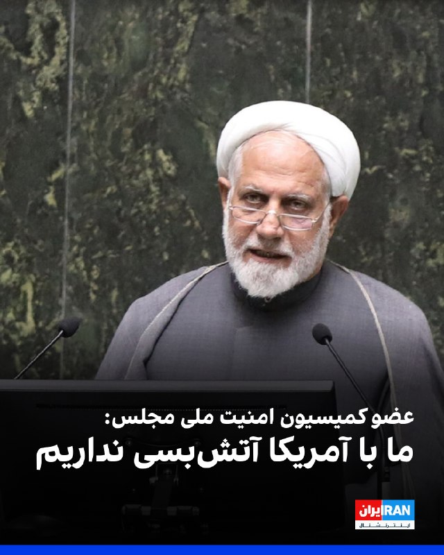

وحید احمدی، عضو کمیسیون امنیت ملی مجلس، به سایت خبری فرارو گفت: ««این یک حقیقت است که ما با آمریکا آتش‌بس نداریم. در واقع ما مشغول توقف درگیری‌ها هستیم. آمریکایی‌ها موفق نشده‌اند به هدفی که برای جنگ در میدان ترسیم کرده بودند، برسند و حالا رو به محاصره دریایی آورده‌اند.»

او با اشاره به درگیری‌های روزهای اخیر در جنوب ایران، ادامه داد: «آمریکا می‌خواهد آمادگی نیروهای ما را بسنجد. جمهوری اسلامی رسما و صادقانه اعلام کرده در برابر هر تهدیدی با قدرت ایستاده است.»

این نماینده مجلس افزود: «احتمال شروع جنگی جدید وجود دارد و جمهوری اسلامی امکانات جدیدی را در راه دارد.»
‌🏁 🇬🇧 IranintlTV

🤖 @VahidOOnLine

## WithYashar — post 13665

العربیه:مذاکرات متوقف شده بین ایالات متحده و ایران... و یک "پیام بسیار مهم" از پاکستان.
@withyashar

## mwarmonitor — post 10237

  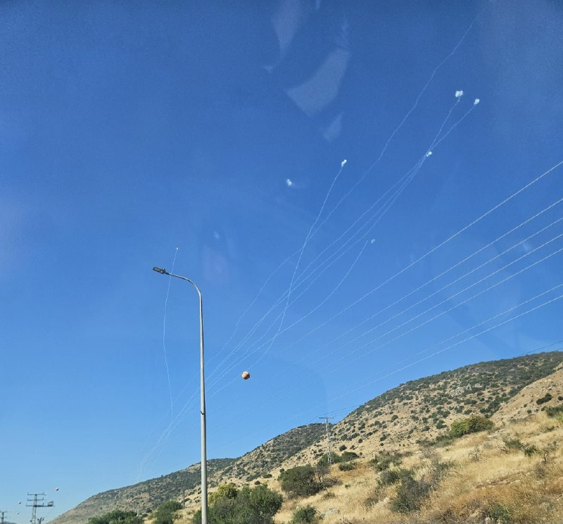

🔴یک نقض دیگر از سوی حزب‌الله: دو پرتابه که از لبنان وارد حریم سرزمینی اسرائیل شده بودند، رهگیری شدند. کانال ۱۲ اسرائیل @mwarmonitor

## IranIntlTV — post 340930

  <a href="telegram/content/IranIntlTV_340930_1780815761.mp4" target="_blank">🎬 Download video</a>

ویدیوهای رسیده به ایران‌اینترنشنال نشان می‌دهد گروهی از ایرانیان مقیم کانادا شنبه ۱۶ خرداد علیه اعدام‌ها در جمهوری اسلامی در شهر هلیفکس تجمع کردند.

## IranIntlTV — post 340929

  

وحید احمدی، عضو کمیسیون امنیت ملی مجلس، به سایت خبری فرارو گفت: ««این یک حقیقت است که ما با آمریکا آتش‌بس نداریم. در واقع ما مشغول توقف درگیری‌ها هستیم. آمریکایی‌ها موفق نشده‌اند به هدفی که برای جنگ در میدان ترسیم کرده بودند، برسند و حالا رو به محاصره دریایی آورده‌اند.»

او با اشاره به درگیری‌های روزهای اخیر در جنوب ایران، ادامه داد: «آمریکا می‌خواهد آمادگی نیروهای ما را بسنجد. جمهوری اسلامی رسما و صادقانه اعلام کرده در برابر هر تهدیدی با قدرت ایستاده است.»

این نماینده مجلس افزود: «احتمال شروع جنگی جدید وجود دارد و جمهوری اسلامی امکانات جدیدی را در راه دارد.»
https://iranintl.com/202606071120

## FarsiVOA — post 219829

  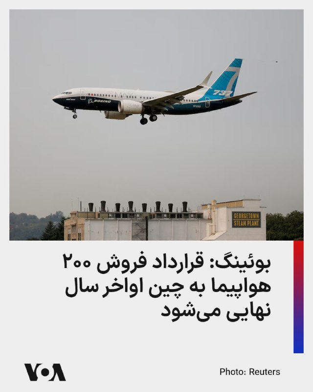

یک مدیر ارشد شرکت صنایع هوافضایی بوئینگ می‌گوید قرارداد فروش ۲۰۰ فروند هواپیمای تولیدی این شرکت آمریکایی به چین اواخر سال جاری نهایی می‌شود.

در جریان سفر اخیر دونالد ترامپ به چین، طرفین بر سر فروش هواپیما به توافق رسیده بودند، اما وزارت بازرگانی چین می‌گوید آمریکا باید تضمین‌هایی برای تأمین قطعات، موتورهای هواپیما و سایر اجزای مورد نیاز در اختیار چین قرار دهد. قرار است رهبران دو کشور دوباره در ماه سپتامبر دیدار کنند.

کریس ریموند، مدیرعامل بخش خدمات جهانی بوئینگ، به رویترز گفت بوئینگ یک انبار قطعات در چین دارد و دسترسی چین به قطعات مورد نیاز این قرارداد با مشکلی مواجه نخواهد شد؛ «البته به شرطی که آن قطعه جزو اقلامی باشد که ما مجاز به فروش آن در بازارهای جهانی هستیم».

مدیرعامل بوئینگ نیز گفته است این سفارش تنها «نخستین مرحله» از توافقی است که می‌تواند در آینده بسیار بزرگ‌تر شود.
@FarsiVOA

## BBCPersian — post 283038

🖊سانگ‌می هان, بخش کره‌ای بی‌بی‌سی در سئول

در میان اسرار فراوانی که کیم جونگ اون، رهبر کره شمالی را در هاله‌ای از ابهام فرو برده‌اند، پنهان‌کاری درباره مادرش بیش از همه جلب توجه می‌کند.

کیم جونگ اون در ۱۵ سال حضورش در قدرت حتی یک بار هم در انظار عمومی نام مادرش را بر زبان نیاورده است.
مشروعیت این دیکتاتوری موروثی بر «تبار کوه پکتو» استوار است. دودمانی که نام خود را از بلندترین کوه شبه‌جزیره کره گرفته است. کوهی که به عنوان زادگاه اسطوره‌ای مردم کره ستایش می‌شود و همچنین مکانی است که بنیان‌گذار کشور، کیم ایل سونگ، فعالیت‌های چریکی خود را علیه استعمارگران ژاپنی در آنجا انجام داد.

این رویکرد محتاطانه و سکوت‌آمیز درباره کو یونگ‌هوی ممکن است ناشی از آن چیزی باشد که به‌عنوان جایگاه اجتماعی «نامطلوب» او و موقعیتش به‌عنوان معشوقه تلقی می‌شود؛ مسائلی که به گفته تحلیلگران می‌تواند برای نظام حاکم تهدیدآمیز باشد.

مطلب کامل🔽
https://bbc.in/4xeJYpR
📸BBC/ Getty/ Cheong Seong-chang/ YojiGomi
@BBCPersian

## alonews — post 125688

  <a href="telegram/content/alonews_125688_1780815764.mp4" target="_blank">🎬 Download video</a>

👈در طول شب، پهپادهای اوکراینی به انبار نفت سیمیکولودیانسک در لنینه، کریمه حمله کردند.

✅ @AloNews خبر جنگ

## alonews — post 125687

  <a href="telegram/content/alonews_125687_1780815766.webm" target="_blank">🎬 Download video</a>

👈العربیه:مذاکرات متوقف شده بین ایالات متحده و ایران... و یک "پیام بسیار مهم" از پاکستان.

✅ @AloNews خبر جنگ

---
📅 بروزرسانی: 1405/03/17 10:22
---

## VahidOOnLine — post 244041

  <a href="telegram/content/VahidOOnLine_244041_1780815147.mp4" target="_blank">🎬 Download video</a>

ویدیوهای رسیده به ایران‌اینترنشنال نشان می‌دهد گروهی از ایرانیان مقیم آلمان شنبه ۱۶ خرداد علیه اعدام‌ها در جمهوری اسلامی در شهرهای دوسلدورف و هانوفر تجمع کردند.
‌🏁 🇬🇧 IranintlTV

🤖 @VahidOOnLine

## VahidOOnLine — post 244040

♦️علیرضا نیکبخت واحدی، بازیکن پیشین استقلال و پرسپولیس، در اظهاراتی مدعی شد در یکی از شهرآوردهای تهران، فردی که از او با عنوان «سردار طلایی» یاد کرده، وارد رختکن استقلال شده و از بازیکنان خواسته است بازی را با تساوی به پایان برسانند. احتمالا منظور او از «سردار طلایی»، مرتضی طلایی، رئیس پلیس پیشین تهران بزرگ است که در سرکوب اعتراضات مردمی در تهران در سال ۱۳۸۲ و اعتراضات دانشجویی ۱۳۸۲ نقش داشته است.
با توجه به روایت‌های پیشین نیکبخت واحدی، احتمال می‌رود منظور او شهرآورد مهرماه ۱۳۷۸ باشد؛ مسابقه‌ای که پس از ۹ نفره شدن پرسپولیس، فضای ورزشگاه آزادی به شدت ملتهب شد و نگرانی‌های امنیتی بر روند بازی سایه انداخت.
نیکبخت واحدی پیش‌تر در گفتگو با برنامه «رباط صلیبی» مدعی شده بود که در بین دو نیمه آن مسابقه، منصور پورحیدری و داریوش مصطفوی، رئیس وقت فدراسیون فوتبال، در رختکن استقلال حضور یافته و تاکید کرده‌اند که بازی باید با تساوی به پایان برسد.
‌🇸🇦 Indypersian

🤖 @VahidOOnLine

## mwarmonitor — post 10236

  <a href="telegram/content/mwarmonitor_10236_1780815149.mp4" target="_blank">🎬 Download video</a>

🔴 نیروی هوایی آمریکا یک فروند پهپاد را بر فراز یکی از پایگاه‌های حزب آزادیِ مخالف در شهر سوران، استان اربیل در شمال عراق، رهگیری کردند.

@mwarmonitor

## mwarmonitor — post 10235

🔴یک نقض دیگر از سوی حزب‌الله: دو پرتابه که از لبنان وارد حریم سرزمینی اسرائیل شده بودند، رهگیری شدند. کانال ۱۲ اسرائیل

@mwarmonitor

## IranIntlTV — post 340928

  <a href="telegram/content/IranIntlTV_340928_1780815151.mp4" target="_blank">🎬 Download video</a>

ویدیوهای رسیده به ایران‌اینترنشنال نشان می‌دهد گروهی از ایرانیان مقیم آلمان شنبه ۱۶ خرداد علیه اعدام‌ها در جمهوری اسلامی در شهرهای دوسلدورف و هانوفر تجمع کردند.

## FarsiVOA — post 219828

🔺پت فالون، نماینده جمهوری‌خواه: حمله ترامپ به جمهوری اسلامی اجتناب‌ناپذیر است

▪️پت فالون، نماینده جمهوری‌خواه ایالت تگزاس، گفت که معتقد است تصمیم دونالد ترامپ برای انجام حملات علیه جمهوری اسلامی «اجتناب‌ناپذیر» است.

▪️آقای فالون روز شنبه درباره جمهوری اسلامی به فاکس نیوز گفت: «آن‌ها تندروتر و متعصب هستند و از اورانیوم غنی‌شده دست نخواهند کشید و تنگه [هرمز] را باز نخواهند کرد، بنابراین متأسفانه فکر می‌کنم زور تنها گزینه‌ای است که برای رئیس‌جمهور باقی مانده است.»

▪️او همچنین با اشاره به این که حکومت ایران هرگز با حسن نیت مذاکره نکرده است، گفت: «متأسفانه این موضوع باید یا به شکل آسان یا به شکل سخت پایان یابد و من فکر می‌کنم به شکل سخت پایان خواهد یافت.»

⬇️ بیشتر بخوانید:
https://ir.voanews.com/a/8158171.html

## RadioFarda — post 157991

  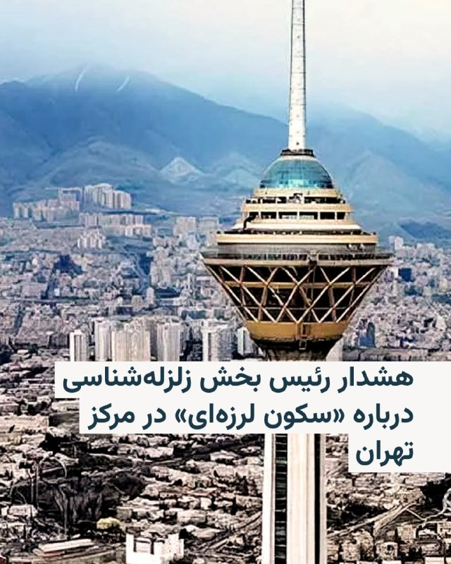

🔸رئیس بخش زلزله‌شناسی و خطرپذیری مرکز تحقیقات راه، مسکن و شهرسازی ایران می‌گوید سکون لرزه‌ای در محدوده شهری تهران با توجه به وجود گسل‌های فعال، «نگران‌کننده» است و نباید نشانه‌ای خوش‌بینانه تلقی شود.

🔸علی بیت‌الهی روز شنبه ۱۶ خرداد در گفت‌وگو با ایلنا گفت در محدوده شهری تهران و پیرامون نزدیک آن رخدادهای لرزه‌ای بسیار کم است، اما در غرب تهران، به‌سوی کرج و ملارد، و در شرق آن، به‌سوی پردیس، بومهن و دماوند، شمار زلزله‌ها بیشتر است.

🔸به گفته او، از سال ۱۹۰۰ تاکنون در اطراف تهران حدود ۲۴ زلزله با بزرگی پنج ریشتر و بالاتر ثبت شده و در ۱۵ سال گذشته نیز حدود ۹۹۰ زلزله کوچک‌تر در تهران و اطراف آن رخ داده که بیش از ۷۵ درصد آنها در محدوده شرق تهران و بیرون از بافت شهری بوده است.

🔸این مقام لرزه‌شناسی گفت افزایش زمین‌لرزه‌های کوچک و متوسط می‌تواند بخشی از تنش انباشته‌شده در لایه‌های زمین را آزاد کند، اما سکون طولانی‌مدت در منطقه‌ای که دارای گسل‌های شناخته‌شده است، نیازمند احتیاط بیشتری است.

@RadioFarda

## IranianMinds — post 21537

برخی نام‌ها را نمی‌توان از حافظه یک دانشگاه پاک کرد. ایلیا بخشایی تنها یک نام در یک پرونده نیست؛ او بخشی از نسلی است که برای آینده این سرزمین درس خوانده، اندیشیده، جنگیده و زندگی کرده است. ماه‌ها گذشته است، اما زمان نه سؤال‌ها را خاموش کرده و نه مسئولیت‌ها…

## IranianMinds — post 21536

  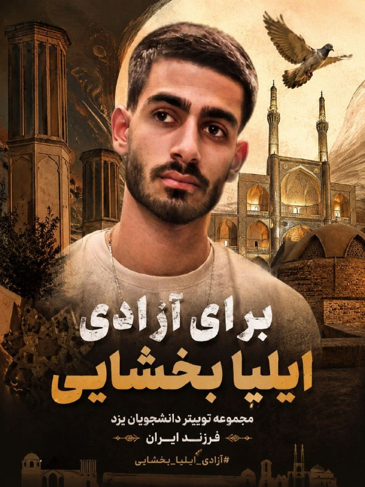

برخی نام‌ها را نمی‌توان از حافظه یک دانشگاه پاک کرد.

ایلیا بخشایی تنها یک نام در یک پرونده نیست؛ او بخشی از نسلی است که برای آینده این سرزمین درس خوانده، اندیشیده، جنگیده و زندگی کرده است.

ماه‌ها گذشته است، اما زمان نه سؤال‌ها را خاموش کرده و نه مسئولیت‌ها را از میان برده است. سکوت، حقیقت را تغییر نمی‌دهد. فراموشی، عدالت را نمی‌سازد

امروز نام ایلیا بخشایی را تکرار می‌کنیم؛ نه از سر عادت، بلکه از سر مسئولیت. زیرا دانشگاه فقط ساختمان و کلاس نیست؛ دانشگاه یعنی ایستادن کنار اعضای خود در روزهایی که حضورشان بیش از همیشه احساس می‌شود

تا زمانی که سرنوشت ایلیا روشن نشود، این نام در ذهن‌ها باقی خواهد ماند. پرونده‌ها ممکن است در بایگانی‌ها خاک بخورند، اما حافظه مردم هرگز بایگانی نمی‌شود

نام ایلیا بخشایی باید شنیده شود.
بارها و بارها

تا آن روز که دیگر یک نام در انتظار نباشد

#ایلیا_بخشایی

توییتر دانشجویان یزد | @TUTYAZD

## BBCPersian — post 283037

🔻کره شمالی: برنامه هسته‌ای ما کاملا غیرقابل مذاکره است

کیم یو جونگ، خواهر رهبر کره شمالی، در بیانیه‌ای گفته است که برنامه هسته‌ای این کشور «کاملاً غیرقابل مذاکره» است.

او در این بیانیه که در روزنامه رسمی «رودونگ سینمون» متعلق به حزب حاکم منتشر شد، گفت: «جایگاه ما به‌عنوان یک قدرت هسته‌ای به هیچ وجه قابل مذاکره نیست.»

او همچنین افزود که کره شمالی «هیچ‌گونه تهدیدی را تحمل نخواهد کرد.»

کیم یو جونگ که از چهره‌های کلیدی در حوزه ارتباطات و سیاست خارجی کره شمالی به شمار می‌رود، این اظهارات را در آستانه سفر شی جین‌پینگ، رئیس‌جمور چین به کره شمالی مطرح کرد. رسانه‌های دولتی اعلام کرده‌اند که سفر او از روز دوشنبه آغاز شده و تا سه‌شنبه ادامه خواهد داشت.

سفر شی جین‌پینگ به پیونگ‌یانگ نخستین سفر او به کره شمالی در هفت سال گذشته خواهد بود. این سفر پس از آن انجام می‌شود که رئیس‌جمهور چین ماه گذشته به‌طور متوالی میزبان نشست‌هایی با دونالد ترامپ، رئیس‌جمهور آمریکا، و ولادیمیر پوتین، رئیس‌جمهور روسیه، بود.

چین یکی از مهم‌ترین حامیان سیاسی و اقتصادی کره شمالی محسوب می‌شود.

https://bbc.in/4xeGwvq
@BBCPersian

## alonews — post 125686

  <a href="telegram/content/alonews_125686_1780815154.webm" target="_blank">🎬 Download video</a>

👈روزنامه اسرائیلی «یدیعوت آحارونوت» مدعی شد: خانواده بشار اسد رئیس جمهور مخلوع سوریه خواستار خروج از روسیه و سفر به امارات و بطور خاص امارت نشین ابوظبی شده بودند، اما مقامات اماراتی این درخواست را رد کرده‌اند

✅ @AloNews خبر جنگ

---
📅 بروزرسانی: 1405/03/17 10:12
---

## VahidOOnLine — post 244039

  <a href="telegram/content/VahidOOnLine_244039_1780814538.mp4" target="_blank">🎬 Download video</a>

ویدیوی ارسال شده به ایران‌اینترنشنال نشان می‌دهد گروهی از ایرانیان شنبه ۱۶ خرداد در سن‌خوزه کالیفرنیا در آمریکا، علیه جمهوری اسلامی در خیابان‌های شهر کاروان خودرویی به راه انداختند و پرچم‌های شیروخورشید به دست گرفتند.
‌🏁 🇬🇧 IranintlTV

🤖 @VahidOOnLine

## IranIntlTV — post 340927

  <a href="telegram/content/IranIntlTV_340927_1780814540.mp4" target="_blank">🎬 Download video</a>

ویدیوی ارسال شده به ایران‌اینترنشنال نشان می‌دهد گروهی از ایرانیان شنبه ۱۶ خرداد در سن‌خوزه کالیفرنیا در آمریکا، علیه جمهوری اسلامی در خیابان‌های شهر کاروان خودرویی به راه انداختند و پرچم‌های شیروخورشید به دست گرفتند.

## IranianMinds — post 21535

تخریب کلیسای تاریخی انجیلی مشهد به‌دست عوامل ناشناس تاریخ ساخت این کلیسا به دوره پهلوی اول می‌رسه و ثبت ملی بود ... @IranianMinds

## IranianMinds — post 21533

تخریب کلیسای تاریخی انجیلی مشهد به‌دست عوامل ناشناس

تاریخ ساخت این کلیسا به دوره پهلوی اول می‌رسه و ثبت ملی بود ...

@IranianMinds

## IranianMinds — post 21532

  <a href="telegram/content/IranianMinds_21532_1780814542.mp4" target="_blank">🎬 Download video</a>

🔴 وقتی بچه رو کنترل نمیکنید و فاز گنگستری و لات بازی میگیره نتیجه اش میشه همین !

چند مدت پیش چن تا بچه 14 15 ساله واسه خودشون قرار دعوا گذاشته بودن و با زنجیر و هرچی داشتن ریخته بودن سر همدیگه و داشتن همو میزدن که یکیشون اون وسط میاد یه حرکتی میزنه که گردن یکی دیگرو میشکونه.

@IranianMinds

## idfinfarsi — post 11785

‼️ پس از تلاش برای پیشبرد طرح‌های تروریستی علیه نیروهای ما: ارتش اسرائیل و شاباک یک تروریست را که از عوامل اصلی حمله به منطقه کیسوفیم در جریان کشتار ۷ اکتبر بود، به هلاکت رساندند

❌ارتش اسرائیل و شاباک هفته گذشته (سه‌شنبه) در جنوب نوار غزه حمله کرده و صقر ابو کریم، فرمانده یک سلول نخبه در سازمان تروریستی حماس را به هلاکت رساندند. کریم از عوامل اصلی حمله به منطقه کیسوفیم در جریان کشتار ۷ اکتبر بود.

⭕️در طول جنگ، کریم به پیشبرد و اجرای طرح‌های تروریستی علیه نیروهای ارتش اسرائیل که در نوار غزه فعالیت می‌کردند ادامه داد. در دوره اخیر، وی با نقض توافق آتش‌بس، مقادیر زیادی سلاح در منزل خود نگهداری کرده و در تلاش برای بازسازی سازمان و برگزاری آموزش‌های تروریستی به منظور پیشبرد عملیات‌های بیشتر بود.

❌همراه با صقر ابو کریم، یک تروریست دیگر که به‌عنوان عامل ارتباطات در سازمان تروریستی حماس فعالیت می‌کرد نیز در این حمله به هلاکت رسید.

⭕️پیش از حمله، اقداماتی برای کاهش آسیب به غیرنظامیان انجام شد، از جمله استفاده از مهمات دقیق و رصد هوایی.

⭕️نیروهای ارتش اسرائیل تحت فرماندهی جنوب مطابق با توافق در منطقه مستقر هستند و به فعالیت برای رفع هرگونه تهدید فوری ادامه خواهند داد.

## Dirty_Kids — post 391187

🔴 پرامپت جدیدی که حسابی تو فضایِ مجازی ترند و محبوب شده؛
این پرامپت از هوش مصنوعی بهت نشون میده که چه پارتنری بهت میاد.

1 - وارد Chat GPT یا Gemini میشی
2 - این پرامپت رو همراه با عکس خودت واسش میفرستی :

Analyze my face,age heignt -outfit, and overall vibe as reference.
Step 2: Design a partner
• Create a complementary partner that matches my style and personality
Output only the partners image. do NOT place them next to me The partner's face.age height clothing, and pose should look natural and realistic
• Ensure the partner's style includes facial expression,body language, and outfit that harmonizes with mine
• Use cinematic lighting, realistic textures, and high-quality rendering
Background is optional but should fit the partner's style and mood.

@Dirty_Kids 👻

## Dirty_Kids — post 391186

  <a href="telegram/content/Dirty_Kids_391186_1780814544.mp4" target="_blank">🎬 Download video</a>

اندی اگه بیاد ایران مجوز بگیره

@Dirty_Kids 👻

---
📅 بروزرسانی: 1405/03/17 10:02
---

## VahidOOnLine — post 244038

♦️ویدیوی تازه‌ای که محسن قاصد، تصویربردار و فعال محیط زیست، از دریاچه ارومیه منتشر کرده، حضور هزاران فلامینگو در این پهنه آبی را نشان می‌دهد؛ اتفاقی که پس از سال‌ها خشکسالی و کاهش شدید سطح آب دریاچه، از سوی فعالان محیط زیست نشانه‌ای امیدوارکننده برای احیای این زیست‌بوم ارزشمند ارزیابی می‌شود.
فلامینگوها که از نمادهای اصلی دریاچه ارومیه به شمار می‌روند، در سال‌های گذشته و همزمان با خشک شدن بخش‌های وسیعی از دریاچه، زیستگاه خود را ترک کرده و به مناطق دیگری از جمله دریاچه وان ترکیه مهاجرت کرده بودند.
افزایش سطح آب دریاچه در سال جاری، شرایط مناسب‌تری را برای بازگشت پرندگان مهاجر فراهم کرده است. پیش از این نیز گزارش‌هایی از لانه‌گذاری کاکایی‌ها در جزایر حفاظت‌شده دریاچه منتشر شده بود.
تصاویر ثبت‌شده توسط محسن قاصد، یکی از پرشمارترین حضورهای فلامینگوها در سال‌های اخیر را به نمایش می‌گذارد، صحنه‌ای که برای بسیاری از دوستداران محیط زیست یادآور روزهای پررونق «نگین فیروزه‌ای آذربایجان» است.
‌🇸🇦 Indypersian

🤖 @VahidOOnLine

## mwarmonitor — post 10234

🔴ایالات متحده از ابزارهایی برای در دسترس قرار دادن دارایی‌های ایران جهت استفاده متحدانش در خلیج فارس برای حمایت از بازسازی و تعمیر خسارت‌های احتمالی آینده ناشی از ایران استفاده خواهد کرد. 🔸وزیر خزانه‌داری آمریکا، بسنت، به تیم خود دستور داده است تا شرایط میان…

## IranIntlTV — post 340926

سناریویی که در قسمت سوم چرتکه برای تورم ۱۴۰۵ پیش‌بینی کرده بودیم، اکنون به گواه آمار رسمی اردیبهشت تحقق یافته است. تورم ماهانه به ۸.۸ درصد رسید؛ بالاترین نرخی که ایرانیان تجربه کرده‌اند. اگر این مسیر ادامه یابد، تا پایان سال قیمت کالاهای اساسی نزدیک به سه برابر و تورم سالانه سه‌رقمی خواهد شد.

نسخه کامل «چرتکه» در یوتیوب ایران‌اینترنشنال: https://youtu.be/xrdOJfvnPuI

@iranintltv

## alonews — post 125685

  <a href="telegram/content/alonews_125685_1780813945.webm" target="_blank">🎬 Download video</a>

👈 ذخایر سوخت تقطیری آمریکا به پایین‌ترین سطح از سال ۲۰۰۳ رسید

✅ @AloNews خبر جنگ

---
📅 بروزرسانی: 1405/03/17 09:52
---

## pm_afshaa — post 92423

🔴سی‌ان‌ان:دولت کوبا شروع به توزیع سلاح به شهروندان عادی کرده و رسماً از آنها خواسته است برای یک تهاجم نظامی آمریکایی قریب‌الوقوع آماده شوند،حکومت نظامی در پایتخت کوبا اعمال شده

💧 Rainbet.com the #1 Non-KYC Crypto Casino & Sportsbook @rainbetcom

😁 @Pm_Afshaa

## IranIntlTV — post 340925

جاویدنامان انقلاب ملی ایرانیان
«مهدی قدیمی» شامگاه ۱۹ دی‌ماه در جریان اعتراضات مردمی، با شلیک مستقیم نیروهای سرکوب جمهوری اسلامی در شهر بابل کشته شد. نامش در حافظه‌ی این سرزمین می‌ماند و یادش چراغ راه آزادی‌خواهان است.
@iranintltv

## DW_Farsi — post 125590

  

🔶 ارتش اسرائیل: یکی از فرماندهان حماس هدف قرار گرفته و کشته شد

ارتش اسرائیل اعلام کرد که نیروهای این کشور "یکی از فرماندهان یک هسته تروریستی حماس" را در جنوب نوار غزه هدف قرار داده و کشته‌اند.

بر اساس اعلام نیروهای دفاعی اسرائیل، این فرمانده حماس به نام "مهند عثمان یاسین فروانه"، "در طراحی چند طرح حمله علیه غیرنظامیان اسرائیلی و سربازان ارتش اسرائیل مشارکت داشت و همچنین تهدیدی فوری برای نیروهای اسرائیلی به شمار می‌رفت".

به گفته ارتش اسرائیل، این فرد "در یک حمله دقیق هوایی با هدف رفع تهدید" کشته شد. در بیانیه ارتش اسرائیل همچنین آمده است: «نیروهای ارتش اسرائیل تحت فرماندهی جنوب مطابق با توافق در منطقه مستقر هستند و به فعالیت برای رفع هرگونه تهدید فوری ادامه خواهند داد.»

@dw_farsi

## RadioFarda — post 157990

🔸ارتش اسرائیل روز شنبه اعلام کرد که طی دو روز گذشته حدود ۱۵۰ هدف حزب‌الله را در جنوب لبنان هدف قرار داده است.

🔸ارتش اسرائیل در بیانیه‌ای گفت: «در آخر هفته، ارتش اسرائیل انبارهای سلاح، مراکز فرماندهی، سکوی‌های پرتاب راکت و زیرساخت‌های تروریستی دیگر حزب‌الله را هدف قرار داد.» این بیانیه افزود که از این مکان‌ها «برای پیشبرد و اجرای حملات تروریستی علیه سربازان ارتش اسرائیل» استفاده می‌شد.

🔸همزمان، ارتش لبنان اعلام کرد در حمله‌ای اسرائیلی در جنوب لبنان، دو افسر و یک سرباز این کشور هنگام حرکت یک خودروی نظامی در جاده میان خردلی و نبطیه کشته شدند. ارتش اسرائیل گفت این خودرو در «منطقهٔ عملیاتی فعال» و به‌گونه‌ای «مشکوک» در حال حرکت بود، اما تأکید کرد که عملیاتش علیه حزب‌الله است، نه ارتش لبنان، و این رخداد را بررسی می‌کند.

🔸مقام‌های لبنان، از جمله جوزف عون، رئیس‌جمهور، و نواف سلام، نخست‌وزیر، این حمله را نقض آشکار حاکمیت لبنان و حمله به همهٔ مردم لبنان خواندند؛ نیروهای حافظ صلح سازمان ملل نیز آن را نقض جدی حاکمیت لبنان دانستند.

@RadioFarda

## BBCPersian — post 283036

🔻سپاه: انفجار‌های کنترل‌شده در اصفهان انجام می‌شود

سپاه پاسداران از احتمال شنیده شدن صدای انفجارهای کنترل‌شده در صفه و محدوده جنوب اصفهان خبر داد.

بنا به خبرگزاری میزان، این انفجارها امروز یکشنبه از ساعت ۹ صبح تا ۲ بعد از شهر به وقت محلی انجام خواهد.

سپاه گفته است که «هیچ جای نگرانی برای مردم عزیز نخواهد بود.»

انفجارهای کنترل شده مهمات منفجرنشده از جنگ اخیر آمریکا و اسرائیل علیه ایران در هفته‌های اخیر بارها در شهرهای مختلف انجام شده است.

پیشتر معاون سیاسی، امنیتی و اجتماعی استانداری هرمزگان نیز خبر داد که تا روز چهارشنبه این هفته در اطراف شهر بندرعباس انفجارهای کنترل شده مهمات انجام خواهد شد.

https://bbc.in/4xeGwvq
@BBCPersian

## alonews — post 125684

  <a href="telegram/content/alonews_125684_1780813347.webm" target="_blank">🎬 Download video</a>

👈 الجزیره: در پی جنگ علیه ایران، ۱۴۶ کشور قیمت بنزین را افزایش دادند

🔴 نرخ مواد غذایی نیز همگام با قیمت انرژی تغییر کرده؛ این موضوع بر هر مرحله از زنجیره تأمین، از کود‌ مزارع تا کامیون‌هایی که مواد را از مزارع به قفسه‌های سوپرمارکت‌ها حمل می‌کنند، تأثیر گذاشته

🔴 اگر قیمت‌ها همچنان بالا بمانند، خطر سقوط اقتصاد وجود دارد

✅ @AloNews خبر جنگ

---
📅 بروزرسانی: 1405/03/17 09:42
---

## FarsiVOA — post 219827

🔺کالابرگ از گرانی جا ماند؛ افزایش ۹۵ درصدی هزینه سبدکالا در ۵ ماه

▪️در حالی که قیمت کالاهای اساسی در ایران با سرعتی بالاتر از حمایت‌های دولتی افزایش یافته، گزارش روزنامه همشهری نشان می‌دهد هزینه سبد کالابرگ در فاصله آذر ۱۴۰۴ تا اردیبهشت امسال ۹۵ درصد رشد کرده است.

▪️روزنامه همشهری در گزارشی در ۱۵ خرداد نوشت هزینه سبد کالابرگ تک‌نفره که در آذر ۱۴۰۴ حدود ۲ میلیون و ۵۷۶ هزار تومان بود، در اردیبهشت امسال به حدود ۵ میلیون و ۳۴ هزار تومان رسیده است.

▪️به نوشته این روزنامه، قیمت تمام‌شده همین سبد در اردیبهشت ۲ میلیون و ۴۵۷ هزار تومان بیشتر از آذر سال گذشته بوده، اما دولت فقط یک میلیون تومان از این اختلاف را پرداخت می‌کند.

⬇️ بیشتر بخوانید:
https://ir.voanews.com/a/8158170.html

## FarsiVOA — post 219826

  

ارتش اسرائیل اعلام کرد که چهار نیروی ذخیره این ارتش روز شنبه بر اثر پهپاد حزب‌الله در جنوب لبنان به‌طور متوسط مجروح شدند.

ارتش اسرائیل روز یکشنبه اعلام کرد که این نیروها بر اثر یک پهپاد انتحاری از نوع «نمای اول‌شخص» مجروح شدند.

بر اساس این گزارش، این نیروها به بیمارستان منتقل شدند و به خانواده‌هایشان اطلاع داده شد.
@FarsiVOA

## Persian_Trend_Official — post 15836

📍 بولتن تحلیلی ۲۴ ساعت اخیر پرشین ترند

🗓 ۱۷ خرداد ۱۴۰۵

🇮🇷 ایران | فشار هم‌زمان جنگ، دیپلماسی و اقتصاد

◾️ وزیر خارجه عراق هشدار داده ادامه جنگ علیه ایران می‌تواند عراق را وارد بحران پرداخت حقوق و شوک اقتصادی کند؛ نشانه‌ای از سرریز شدن تنش به اقتصاد کشورهای همسایه

◾️ گزارش الجزیره: پیش‌نویس توافق ایران و آمریکا در تهران در حال بررسی نهایی است؛ اما تصمیم‌گیری نهایی هنوز قطعی نشده و اختلاف بر سر سازوکارهای مالی پابرجاست

◾️ سپاه از ادامه درگیری‌های مستقیم در خلیج فارس خبر داده و مدعی هدف قرار دادن پایگاه‌های آمریکا در کویت و بحرین شده است؛ هم‌زمان آمریکا نیز از اقدامات متقابل سخن گفته

◾️ وزارت خارجه ایران، واشنگتن را به نقض آتش‌بس متهم کرده؛ نشان‌دهنده شکنندگی شدید هرگونه توافق یا توقف درگیری

◾️ گزارش آژانس انرژی اتمی: ادعای ۱۷ موج حمله به تأسیسات هسته‌ای ایران؛ اگر تأیید شود، سطح درگیری را از «تنش محدود» به «درگیری زیرساختی» ارتقا می‌دهد.

🇮🇱 اسرائیل و خاورمیانه
◾️ نیویورک‌تایمز: ادعای شنود مکالمات مقامات آمریکایی توسط اسرائیل در جریان مذاکرات با ایران؛ اگر درست باشد، نشان‌دهنده اختلاف عمیق اطلاعاتی میان متحدان غربی است

◾️ لبنان: کشته شدن یک افسر ارتش در حمله هوایی منتسب به اسرائیل؛ نشانه تداوم درگیری فراتر از غزه و ورود به لایه‌های دولتی

◾️ کویت: ادعای رهگیری چند موشک بالستیک در جریان تبادل حملات منطقه‌ای؛ افزایش ریسک در خلیج فارس

◾️ پاکستان: ورود وزیر کشور به تهران با پیام‌های رسمی درباره دارایی‌های بلوکه‌شده؛ نقش اسلام‌آباد در میانجی‌گری پررنگ‌تر شده

🇺🇸🌍 آمریکا و جهان

◾️ رویترز: بررسی استفاده از دارایی‌های بلوکه‌شده ایران برای بازسازی خسارات کشورهای خلیج فارس؛ یک ابزار فشار مالی جدید در مذاکرات

◾️ بلومبرگ: بازار جهانی نفت با وجود تنش‌ها هنوز از شوک قیمتی شدید جلوگیری کرده؛ نشان‌دهنده مداخله و ظرفیت‌های جایگزین عرضه

◾️ گاردین: تحلیل وضعیت ایران پس از جنگ در قالب «صلح پرتنش»؛ با هشدار درباره بحران‌های اقتصادی و اجتماعی هم‌زمان

◾️ اوکراین/روسیه: حمله پهپادی به پالایشگاه تیومن و آتش‌سوزی گسترده؛ ادامه فرسایش زیرساخت انرژی روسیه

◾️ آمریکا/نیوزیلند: قرارداد ۱.۵ میلیارد دلاری تسلیحاتی؛ ادامه تقویت محور نظامی آمریکا در اقیانوس آرام

◾️ گزارش اطلاعاتی: ادعای شنود اسرائیل از مکالمات مقامات آمریکایی؛ در صورت صحت، یک بحران اعتماد درون ائتلافی محسوب می‌شود

جمع بندی آخر:

◾️ خاورمیانه وارد فاز «درگیری محدود اما چندجبهه‌ای» شده
◾️ ایران هم‌زمان درگیر سه فشار است: نظامی، اقتصادی و دیپلماتیک
◾️ آمریکا تلاش دارد جنگ را از سطح نظامی به سطح مالی و مدیریتی منتقل کند
◾️ اسرائیل درگیر جنگ اطلاعاتی و فشار امنیتی چندلایه است
◾️ بازار جهانی فعلاً موفق شده شوک انرژی را مهار کند، اما شکننده است

👺 Phantom

📌 @persian_trend_official
پرشین ترند | متفاوت‌ترین کانال نظامی

## alonews — post 125683

  <a href="telegram/content/alonews_125683_1780812745.webm" target="_blank">🎬 Download video</a>

👈فرار هالیوودی با خودروی پلیس؛ متهم دستبندش را باز کرد و پشت فرمان نشست!

🔴 یک متهم بازداشت‌شده در آمریکا موفق شد دستبند خود را باز کند، از صندلی عقب به جلوی خودروی پلیس برود و کنترل خودرو را به دست بگیرد.

🔴 در نهایت واکنش سریع مأموران، این فرار جنجالی را ناکام گذاشت

✅ @AloNews خبر جنگ

## alonews — post 125682

  <a href="telegram/content/alonews_125682_1780812745.webm" target="_blank">🎬 Download video</a>

👈یدیعوت آحارونوت: هنوز برای اعلام پایان توافق آتش‌بس در لبنان زود است

🔴با وجود اعلام حزب‌الله مبنی بر رد توافق آتش‌بس، اما حملات به شهرهای ما متوقف شده

✅ @AloNews خبر جنگ

---
📅 بروزرسانی: 1405/03/17 09:32
---

## IranIntlTV — post 340924

  <a href="telegram/content/IranIntlTV_340924_1780812170.mp4" target="_blank">🎬 Download video</a>

حسین آقایی، عضو تحریریه ایران‌اینترنشنال، گفت که پهپادهای فیبر نوری حزب‌الله به تهدیدی جدی برای اسرائیل بدل شده‌اند و مقابله با آن‌ها، در کنار پیشروی در جنوب لبنان، از اولویت‌های دولت نتانیاهو است.
@iranintltv

## IranIntlTV — post 340923

  <a href="telegram/content/IranIntlTV_340923_1780812173.mp4" target="_blank">🎬 Download video</a>

دانش‌آموزان شنبه در شهرهای مختلف ایران در اعتراض به سیاست‌های آموزشی حکومت، از جمله تاثیر معدل در کنکور و شیوه برگزاری امتحانات، تجمع کردند.

امید معماریان، روزنامه‌نگار و تحلیل‌گر سیاسی، به ایران‌اینترنشنال گفت ناامنی جامعه پس از جنگ و نگرانی‌ها درباره آینده نامشخص، باعث اعتراض دانش‌آموزان شده است.
@iranintltv

## Persian_Trend_Official — post 15835

  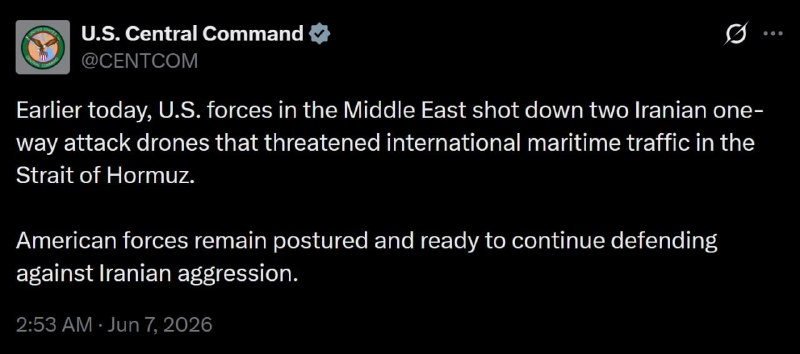

🇮🇷
🇺🇸
〰️ فرماندهی مرکزی ایالات متحده (سنتکام):

اوایل امروز، نیروهای آمریکایی در خاورمیانه دو پهپاد تهاجمی یک طرفه ایرانی را که ترافیک دریایی بین‌المللی را در تنگه هرمز تهدید می‌کرد، سرنگون کردند.
نیروهای آمریکایی مستقر و آماده ادامه دفاع در برابر تجاوز ایران هستند.

👺Phantom

📌 @persian_trend_official
پرشین ترند | متفاوت‌ترین کانال نظامی

## RadioFarda — post 157989

  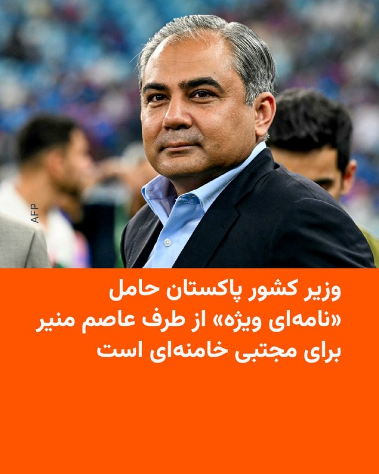

🔸خبرگزاری فارس، نزدیک به سپاه پاسداران، روز یک‌شنبه، ۱۷ خردادماه، ویدئویی منتشر کرد که وزیر کشور پاکستان در آن می‌گوید حامل «نامه‌ای ویژه» از طرف ژنرال عاصم منیر، فرمانده ارتش پاکستان، برای مجتبی خامنه‌ای است که به عنوان جانشین پدرش، علی خامنه‌ای، معرفی شده است.

🔸در سه ماهی که از آغاز جنگ و معرفی مجتبی خامنه‌ای به عنوان رهبر می‌گذرد، نه فایلی صوتی از او منتشر شده و نه ویدئویی که نشان دهد او از حمله مرگبار به بیت پدرش در روز ۹ اسفندماه جان سالم به در برده است.

🔸از آغاز میانجی‌گری پاکستان میان ایران و آمریکا، عاصم منیر در کنار مقامات ارشد دولت این کشور نقشی ویژه در این روند داشته و خود بارها به تهران سفر کرده است.

🔸رسانه‌های ایران روز شنبه گزارش دادند محسن نقوی، وزیر کشور پاکستان، بار دیگر وارد تهران شد.

🔸این چندمین سفر مقام ارشد دولت اسلام‌آباد به تهران برای دیدار با مسئولان جمهوری اسلامی است و پاکستان همچنان به عنوان میانجی اصلی در مذاکرات ایران و آمریکا نقش‌آفرینی می‌کند.

@RadioFarda

## alonews — post 125681

  <a href="telegram/content/alonews_125681_1780812177.webm" target="_blank">🎬 Download video</a>

👈 آخرین قیمت نفت ۹۳.۰۹ دلار

✅ @AloNews خبر جنگ

## alonews — post 125680

  <a href="telegram/content/alonews_125680_1780812177.webm" target="_blank">🎬 Download video</a>

👈 ترامپ با انتشار تصویری با عنوان بندر پهپاد نوشت:این روزی واشنگتن را نجات خواهد داد.

✅ @AloNews خبر جنگ

---
📅 بروزرسانی: 1405/03/17 09:22
---

## IranIntlTV — post 340922

  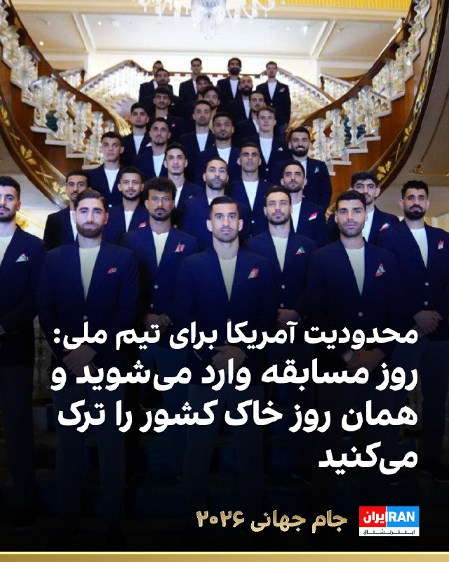

🔻خبرگزاری رویترز به نقل از سفیر جمهوری اسلامی در مکزیک گزارش داد که به اعضای تیم ملی فوتبال اطلاع داده شده که باید در روز برگزاری مسابقات خود در ایالات متحده، وارد خاک آمریکا شوند و همان روز نیز آن را ترک کنند.

🔹ابوالفضل پسندیده در توضیح محدودیت‌های ویزا به خبرنگاران گفت: «ما می‌توانیم صبح وارد شویم و باید همان روز خارج شویم.»

🔹این درحالی است که روز گذشته، امیرمهدی علوی، سخنگوی فدراسیون فوتبال درباره نوع ویزای تیم ملی گفت: «ویزاهای صادر شده برای تیم ملی، ویزای مولتی است و تیم ملی یک روز قبل از بازی اول و بازی‌های بعدی، دو روز قبل از بازی در محل مسابقه حاضر خواهد شد.»

🔹سفیر جمهوری اسلامی درباره این محدودیت گفت: «این رفت‌وآمدهای طولانی و پروازهای مکرر باعث خستگی بازیکنان می‌شود. مشکلات هماهنگی و اتلاف زمان می‌تواند بر عملکرد تیم ملی ما تأثیر بگذارد.»

🔹تیم ایران سه مسابقه مرحله گروهی خود را در ایالات متحده و در شهرهای لس‌آنجلس و سیاتل برگزار خواهد کرد.

@iranintltvsport

## alonews — post 125679

  <a href="telegram/content/alonews_125679_1780811555.webm" target="_blank">🎬 Download video</a>

👈 کیم یو جونگ، خواهر کیم جونگ اون، اعلام کرد که کره شمالی هرگز از جایگاه خود به‌عنوان یک قدرت هسته‌ای دست نخواهد کشید.

✅ @AloNews خبر جنگ

---
📅 بروزرسانی: 1405/03/17 09:12
---

## VahidOOnLine — post 244037

  

یاسر عربی، نماینده گرمسار در مجلس، در تجمع حامیان حکومت در این شهر، گفت: «مردم ایران در برابر تهدیدها، تحریم‌ها و فشارهای دشمنان تسلیم نمی‌شوند و با اتکا به ظرفیت‌های داخلی و روحیه مقاومت، از آرمان‌های خود دفاع می‌کنند.»

او اضافه کرد: «دو رهبر پیشین ما همواره بر ایستادگی در برابر زیاده‌خواهی دشمنان تاکید داشتند و معتقد بودند عقب‌نشینی در برابر فشارهای خارجی راهگشا نیست؛ رویکردی که امروز نیز در سیاست‌ها و رفتار ملت ایران تداوم یافته است.»
‌🏁 🇬🇧 IranintlTV

🤖 @VahidOOnLine

## IranIntlTV — post 340921

  <a href="telegram/content/IranIntlTV_340921_1780810938.mp4" target="_blank">🎬 Download video</a>

جمعی از ایرانیان مقیم ایالات متحده، شنبه ۱۶ خرداد، در اعتراض به بازداشت و اعدام معترضان در ایران، در واشینگتن دی‌سی تجمع کردند.

اردوان روزبه، خبرنگار ایران‌اینترنشنال، از محل این تجمع گزارش می‌دهد
@iranintltv

## IranIntlTV — post 340920

  <a href="telegram/content/IranIntlTV_340920_1780810939.mp4" target="_blank">🎬 Download video</a>

رویترز گزارش داد ایالات متحده در حال بررسی استفاده از دارایی‌های بلوکه‌شده ایران برای جبران خسارات متحدان خود در خلیج فارس ناشی از حملات جمهوری اسلامی است. این ارزیابی شامل امکان انتقال این دارایی‌ها به کشورهای منطقه می‌شود.

گفت‌وگو با امیر گیتی، عضو تحریریه ایران‌اینترنشنال
@iranintltv

## IranIntlTV — post 340919

  <a href="telegram/content/IranIntlTV_340919_1780810940.mp4" target="_blank">🎬 Download video</a>

جمهوری اسلامی در ماه‌های اخیر اعدام‌ها و مجازات‌های سنگین را تشدید کرده است.

پگاه بنی هاشمی، پژوهشگر ارشد حقوق، به ایران‌اینترنشنال گفت که جمهوری اسلامی پس از اعتراضات گسترده دی‌ماه ۱۴۰۴ از مجازات اعدام برای انتقام‌گیری و نشان دادن خطوط قرمز به مردم استفاده می‌کند.
@iranintltv

## IranIntlTV — post 340918

  

یاسر عربی، نماینده گرمسار در مجلس، در تجمع حامیان حکومت در این شهر، گفت: «مردم ایران در برابر تهدیدها، تحریم‌ها و فشارهای دشمنان تسلیم نمی‌شوند و با اتکا به ظرفیت‌های داخلی و روحیه مقاومت، از آرمان‌های خود دفاع می‌کنند.»

او اضافه کرد: «دو رهبر پیشین ما همواره بر ایستادگی در برابر زیاده‌خواهی دشمنان تاکید داشتند و معتقد بودند عقب‌نشینی در برابر فشارهای خارجی راهگشا نیست؛ رویکردی که امروز نیز در سیاست‌ها و رفتار ملت ایران تداوم یافته است.»
https://iranintl.com/202606077171

## FarsiVOA — post 219825

🔺تابستان گرم‌تر در راه ایران؛ هشدار آبی از تهران تا همدان

▪️رئیس سازمان هواشناسی ایران هشدار داده که تابستان پیش‌رو گرم‌تر از میانگین بلندمدت خواهد بود و موج‌های گرمایی از مناطق مختلف کشور عبور خواهد کرد؛ هشداری که در کنار کاهش منابع آب، بحران تابستان را جدی‌تر می‌کند.

▪️سحر تاجبخش تأکید کرده استان‌های تهران، مرکزی، همدان، مشهد و بخش‌هایی از دامنه جنوبی البرز با محدودیت منابع آب و شرایط نامناسب بارشی روبه‌رو هستند.

▪️اما بحران آب فقط نتیجه پیش‌بینی یک تابستان گرم نیست. گزارش‌های ماه‌های گذشته نشان می‌دهد کم‌آبی در برخی مناطق، به‌ویژه تهران، ریشه‌ای‌تر و ساختاری‌تر از آن است که با چند بارش بهاری جبران شود.

⬇️ بیشتر بخوانید:
https://ir.voanews.com/a/8158169.html

## DW_Farsi — post 125589

🔶 سنتکام از سرنگونی دو پهپاد تهاجمی ایرانی خبر داد

ستاد فرماندهی مرکزی ایالات متحده آمریکا (سنتکام)، شنبه‌شب به وقت واشنگتن با صدور بیانیه‌ای اعلام کرد که نیروهای آمریکایی مستقر در خاورمیانه، دو پهپاد تهاجمی انتحاری جمهوری اسلامی را که "تهدیدی برای تردد دریایی بین‌المللی در تنگه هرمز محسوب می‌شدند"، سرنگون کردند.

در بیانیه سنتکام تاکید شده است: «نیروهای آمریکایی همچنان آمادگی دارند به دفاع در برابر اقدامات تهاجمی ایران ادامه دهند.»

فرماندهی مرکزی ارتش آمریکا پیش از این، صبح روز شنبه ۱۶ خرداد (۶ ژوئن) در بیانیه‌ای از رهگیری و انهدام چندین موشک بالستیک و پهپاد ایرانی خبر داده بود.

طبق داده‌های سنتکام، همه این پهپادها و موشک‌ها از سوی ایران به سمت تنگه هرمز و کشورهای همسایه حوزه خلیج فارس (کویت و بحرین) شلیک شده بودند.

خبرگزاری رویترز نیز هم‌زمان با بیانیه سنتکام گزارش داده بود که وزارت کشور بحرین بامداد شنبه آژیر حمله هوایی را فعال کرد. وزارت کشور بحرین از شهروندان خود خواسته بود به نزدیک‌ترین محل امن بروند.

خبرگزاری فرانسه نیز بامداد روز شنبه گزارش داده بود که صدای چندین انفجار در کویت شنیده شده است. بر اساس این گزارش، چندین انفجار در مناطق نزدیک فرودگاه بین‌المللی کویت شنیده شد.

@dw_farsi

## BBCPersian — post 283035

  

🔻مقام‌ها در چین می‌گویند که یکشنبه، ۷ ژوئن/ ۱۷ خرداد عینک‌های میلیون‌ها دانش‌آموزی که در آزمون‌های ورودی دانشگاه‌های ملی شرکت می‌کنند را بررسی خواهند کرد تا مطمئن شوند که عینک هوشمند ندارند.

برخی از این عینک‌ها می‌توانند به دوربین، اینترنت و قابلیت‌های هوش مصنوعی مجهز باشند. مسئولان در چندین استان هشدار داده‌اند که بررسی‌های بیشتری برای شناسایی افرادی که سعی در تقلب داشته باشند، انجام خواهد شد.

آنها گفته‌اند هر کسی که با چنین عینکی دست به تقلب بزند، تمام نمرات امتحانی‌اش باطل خواهد شد.
این آزمون‌های ورودی از پرشمارترین آزمون‌های جهان هستند و انتظار می‌رود امسال حدود ۱۳ میلیون دانش‌آموز در آنها شرکت کنند.

📸Future Publishing via Getty Images
@BBCPersian

## alonews — post 125678

  <a href="telegram/content/alonews_125678_1780810943.webm" target="_blank">🎬 Download video</a>

👈یک تیراندازی جمعی در یک جشنواره در تولدو، اوهایو رخ داده است که در آن چندین نفر مورد اصابت گلوله قرار گرفته‌اند.

🔴 قربانیان به بیمارستان منتقل شده‌اند، همراه با تیرانداز که در بازداشت نیست.

✅ @AloNews خبر جنگ

## alonews — post 125677

  <a href="telegram/content/alonews_125677_1780810944.webm" target="_blank">🎬 Download video</a>

👈سفیر ایران در مکزیک: تیم ملی فوتبال ایران اطلاع یافته‌ که باید در همان روز مسابقه وارد خاک آمریکا شده و پس از پایان بازی، از خاک آمریکا خارج شود!

✅ @AloNews خبر جنگ

## alonews — post 125676

  <a href="telegram/content/alonews_125676_1780810944.webm" target="_blank">🎬 Download video</a>

👈شنیده شدن صدای انفجار در اربیل منابع خبری عراق از شنیده شدن صدای انفجار در استان اربیل در شمال عراق خبر دادند.

✅ @AloNews خبر جنگ

## alonews — post 125675

  <a href="telegram/content/alonews_125675_1780810944.webm" target="_blank">🎬 Download video</a>

👈امتحانات دانشگاه جامع علمی کاربردی غیرحضوری شد

✅ @AloNews خبر جنگ

---
📅 بروزرسانی: 1405/03/17 09:02
---

## DW_Farsi — post 125588

🔶 طرح استفاده آمریکا از دارایی‌های ایران برای جبران خسارت کشورهای منطقه

خبرگزاری رویترز با استناد به اظهارات یک منبع آگاه گزارش داد که دولت آمریکا در حال بررسی طرحی به منظور استفاده از دارایی‌های ایران، برای جبران خسارت‌هایی است که در جنگ به کشورهای متحد واشنگتن در خلیج فارس وارد شده است.

در همین راستا یک منبع آگاه از مواضع اسکات بسنت، وزیر خزانه‌داری آمریکا نیز به شبکه سی‌بی‌اس نیوز گفته که وزارت خزانه‌داری قصد دارد از تمامی اختیارات در دسترس استفاده کند تا دارایی‌های ایران را "برای بازسازی هرگونه خسارت در حملات آینده ایران، در دسترس قرار دهد".

این منبع همچنین گفته که بسنت به وزارت خزانه‌داری دستور داده است برآوردهای جامعی از متحدان خلیج فارس درباره هزینه‌های مرتبط با تعمیر خسارت‌هایی که ایران از زمان آغاز درگیری وارد کرده است، دریافت کند.

این منبع افزود که وزارت خزانه‌داری همچنین بررسی بیشتری انجام خواهد داد تا مشخص شود آیا دارایی‌های ایران می‌تواند برای تامین مالی تعمیر خسارت‌هایی که متحدان خلیج فارس تاکنون در جریان این درگیری متحمل شده‌اند نیز استفاده شود یا خیر.

مشخص نیست که چه دارایی‌هایی برای تامین مالی بازسازی مورد استفاده قرار خواهند گرفت؛ برای مثال، پول نقد ایران در حساب‌های بانکی مسدودشده یا دارایی‌های فیزیکی مانند نفتکش‌ها.

@dw_farsi

## BBCPersian — post 283034

🔻حزب‌الله می‌گوید که به مواضع اسرائیل در جنوب لبنان حمله کرده است

حزب‌الله لبنان در بیانیه‌ای اعلام کرد که با استفاده از پهپادهای «ابابیل» یک «مقر فرماندهی» متعلق به ارتش اسرائیل را در شهر ناقوره در جنوب لبنان هدف قرار داده است.

حزب‌الله همچنین مدعی شد که نیروهایش به تجمعی از نظامیان اسرائیلی را در حومه جنوبی شهر حداثا با دو پهپاد و در نزدیکی قلعه بوفور، نیز با شلیک راکت و گلوله‌های توپخانه‌ای حمله کرده‌اند.

این در حالی است که شب گذشته ارتش اسرائیل گفت طی ۴۸ ساعت اخیر، ۱۵۰ حمله به جنوب لبنان کرده و در این حملات، مواضع مرتبط با حزب‌الله را هدف قرار داده است.

صلح‌بانان سازمان ملل مستقر در جنوب لبنان، حمله اسرائیل به یک خودروی ارتش لبنان در نبطیه که طی آن سه سرباز کشته شدند را محکوم کردند.

https://bbc.in/4xeGwvq
@BBCPersian

## alonews — post 125674

  <a href="telegram/content/alonews_125674_1780810372.webm" target="_blank">🎬 Download video</a>

👈کره شمالی: سلاح هسته‌ای، حق حاکمیتی غیر قابل مذاکره است

🔴«حتی به اندازه یک سر انگشت» در این موضوع عقب‌نشینی نخواهیم کرد

✅ @AloNews خبر جنگ

## alonews — post 125673

  <a href="telegram/content/alonews_125673_1780810372.webm" target="_blank">🎬 Download video</a>

👈سنتکام مدعی شد امروز دو پهپاد ایرانی را بر فراز تنگه هرمز رهگیری و منهدم کرده است

✅ @AloNews خبر جنگ

## alonews — post 125672

  <a href="telegram/content/alonews_125672_1780810372.webm" target="_blank">🎬 Download video</a>

👈پولیتیکو: راه‌هایی وجود دارد که ترامپ می‌تواند توافق آینده با ایران را به نفع خودش تبلیغ و توجیه کند

🔴اگر ایران موافقت کند که برای دسترسی به دارایی‌های مالی خود از یک خط اعتباری استفاده کند، ترامپ می‌تواند ادعا کند که بر خلاف اوباما، هیچ پول نقدی مبادله نشده است.

🔴 اگر ترامپ اجازه دهد ایران به نحوی از تردد کشتی‌ها در تنگه درآمد کسب کند بدون اینکه به طور رسمی عوارضی دریافت کند، می‌تواند آن را به عنوان یک مصالحه قابل قبول معرفی کند.

🔴اگر ایران به عنوان بخشی از یک یادداشت تفاهم درباره چگونگی پیشبرد مذاکرات، تکرار کند که هرگز به دنبال سلاح هسته‌ای نخواهد بود، ترامپ می‌تواند آن را یک امتیاز اولیه بنامد

✅ @AloNews خبر جنگ

---
📅 بروزرسانی: 1405/03/17 08:52
---

## VahidOOnLine — post 244036

  

روزنامه کیهان که زیر نظر نماینده رهبری جمهوری اسلامی منتشر می‌شود، با اشاره به اینکه «آمریکا در تدارک قطعنامه‌ای برای محکومیت جمهوری اسلامی در شورای حکام آژانس بین‌المللی انرژی اتمی است»، نوشت: «این حرکت آمریکا بیرون از تاکتیک‌های حریف در جنگ اخیر نیست و برای مقابله با آن باید دست به کاری کارستان و پشیمان‌کننده بزنیم.»

این روزنامه مجددا رافائل گروسی، مدیرکل آژانس انرژی اتمی را «جاسوس» خواند و اضافه کرد: «گروسی کشف مراکز حساس و استراتژیک ایران، برای حمله نظامی آمریکا و اسرائیل به این مراکز را ضروری می‌داند.»
‌🏁 🇬🇧 IranintlTV

🤖 @VahidOOnLine

## VahidOOnLine — post 244035

  <a href="telegram/content/VahidOOnLine_244035_1780809748.mp4" target="_blank">🎬 Download video</a>

⭕️ روز پرچم در تقویم ایران و جایگاه خدشه‌ناپذیر نماد شیر و خورشید در قلب آن

🖊پادکست

♦️پرچم شیر و خورشید که نزد ایرانیان ملی‌گرا نماد آزادگی، شجاعت و ایستادگی است، حافظه تاریخی ملتی را نمایندگی می‌کند که پیشینه‌اش به هزاران سال پیش در فلات ایران بازمی‌گردد.

ایرانیان باستان خورشید را مظهر فروغ ایزدی و شیر را به‌سبب دلاوری، قرینه‌ زمینی آن می‌دانستند. به گواهی اسناد، «شیر و خورشید» ریشه در جهان‌بینی تمدن‌های باستانی دارد و نشانه‌ای از جایگاه خورشید در صورت فلکی شیر است.

بر مبنای این دیدگاه، خورشید به‌عنوان منبع نور و حیات در صورت فلکی اسد (شیر) خانه دارد. این پیوند حامل معنایی نمادین است؛ خورشید در برج شیر در بالاترین نقطه اقتدار تابستانی خود قرار می‌گیرد. بنابراین، تصویر خورشید در پشت شیر، قدرت، پیروزی نور و نظم را نمایندگی می‌کند.

پادکست را از اینجا بشنوید

‌🇸🇦 Indypersian

🤖 @VahidOOnLine

## IranIntlTV — post 340917

  

روزنامه کیهان که زیر نظر نماینده رهبری جمهوری اسلامی منتشر می‌شود، با اشاره به اینکه «آمریکا در تدارک قطعنامه‌ای برای محکومیت جمهوری اسلامی در شورای حکام آژانس بین‌المللی انرژی اتمی است»، نوشت: «این حرکت آمریکا بیرون از تاکتیک‌های حریف در جنگ اخیر نیست و برای مقابله با آن باید دست به کاری کارستان و پشیمان‌کننده بزنیم.»

این روزنامه مجددا رافائل گروسی، مدیرکل آژانس انرژی اتمی را «جاسوس» خواند و اضافه کرد: «گروسی کشف مراکز حساس و استراتژیک ایران، برای حمله نظامی آمریکا و اسرائیل به این مراکز را ضروری می‌داند.»
https://iranintl.com/202606079410

## IranIntlTV — post 340916

  <a href="telegram/content/IranIntlTV_340916_1780809752.mp4" target="_blank">🎬 Download video</a>

سرخط خبرهای یکشنبه ۱۷ خرداد
@iranintltv

## IranIntlTV — post 340915

  <a href="telegram/content/IranIntlTV_340915_1780809753.mp4" target="_blank">🎬 Download video</a>

سرخط خبرهای یکشنبه ۱۷ خرداد
@iranintltv

## Persian_Trend_Official — post 15834

  

وزیر کشور پاکستان وارد تهران شد! محسن نقوی، وزیر کشور پاکستان دقایقی پیش وارد تهران شد. وی قرار است در این سفر با مقامات جمهوری اسلامی ایران از جمله سید عباس عراقچی، وزیر امور خارجه کشورمان دیدار و رایزنی کند. نقوی پیش از سفر به تهران با شهباز شریف، نخست…

## IranianMinds — post 21531

  

نخبگان :

@IranianMinds

## BBCPersian — post 283033

🔻وزیر کشور پاکستان در تهران: اینجا هستم تا پیام ویژه‌ای به رهبر ایران بدهم

محسن نقوی، وزیر کشور پاکستان گفته است که برای تحویل نامه ویژه‌ سران کشورش به رهبر ایران، به تهران سفر کرده است.

آقای نقوی که در تهران صحبت می‌کرد، پیام شهباز شریف، نخست‌وزیر و ژنرال عاصم منیر، فرمانده ستاد ارتش پاکستان را «مهم» خواند.

محسن نقوی هم‌زمان با تشدید درگیری در خلیج فارس به ایران سفر کرده است.

او شنبه شب با اسکندر مومنی، همتای ایرانی خود دیدار کرد.

با توجه به نقش پاکستان به‌عنوان میانجی اصلی در گفت‌وگوهای ایران و آمریکا، رسانه‌ها سفرهای وزیر کشور پاکستان به ایران را از نزدیک دنبال می‌کنند.

آقای نقوی ۳۰ اردیبهشت هم برای دومین بار در یک هفته به ایران رفته بود و در این سفرها با رئیس‌جمهور‌، رئیس مجلس، وزیر خارجه و وزیر کشور ایران ملاقات کرده بود.

در همین حال رودولف هیکل، فرمانده ارتش لبنان، هم به پاکستان رفته است.

ارتش لبنان گفت که این سفر به دعوت فیلد مارشال عاصم منیر، فرمانده کل نیروهای مسلح پاکستان، انجام شده است.

ارتش لبنان توضیح بیشتری در مورد اهداف این سفر ارائه نکرده است اما تلاش‌های پاکستان برای پایان دادن به جنگ آمریکا و اسرائیل با ایران، عملا به وضعیت لبنان گره خورده است.

https://bbc.in/4xeGwvq
@BBCPersian

## BBCPersian — post 283032

🔻احتمال شنیده شدن صداهای شدید انفجار تا روز چهارشنبه در بندرعباس

به گفته معاون سیاسی، امنیتی و اجتماعی استانداری هرمزگان، تا روز چهارشنبه این هفته در اطراف شهر بندرعباس انفجارهای کنترل شده مهمات انجام خواهد شد.

احمد نفیسی گفته است که صدای انفجار بعضی از این مهمات ممکن است شدید باشد.

این مهمات از جنگ اخیر آمریکا و اسرائیل با ایران به صورت عمل‌نکرده باقی مانده‌اند.

به گزارش خبرگزاری جمهوری اسلامی، ایرنا، آقای نفیسی گفته است که انفجارها «کاملا کنترل شده است و جای هیچ گونه نگرانی وجود ندارد.»

پیش‌تر هم منابع خبری در ایران گزارش دادند که در حوالی جزیره خارگ صدای انفجار شدیدی شنیده شده است.

نیروی دریایی سپاه پاسداران انقلاب اسلامی گفت که این صدا به خنثی‌سازی مهمات در منطقه نفتی بهرگان مربوط بوده است.

روابط عمومی نیروی دریایی سپاه گفت که این مهمات، از جنگ اخیر باقی مانده است.

https://bbc.in/4xeGwvq
@BBCPersian

## alonews — post 125671

  <a href="telegram/content/alonews_125671_1780809756.webm" target="_blank">🎬 Download video</a>

👈ایجپت اینتل ابزرور: تصاویر ماهواره‌ای تأیید می‌کند که از آوریل ۲۰۲۶، عملیات توسعه قابل‌توجهی در «منطقه پشتیبانی لجستیک ارتش ایالات متحده» در ینبع عربستان سعودی، معروف به LSA Jenkins، آغاز شده است.

🔴به نظر می‌رسد که نیروها و تجهیزات نظامی بیشتری از آمریکا به این مکان اعزام شده‌اند.

✅ @AloNews خبر جنگ

## alonews — post 125670

  <a href="telegram/content/alonews_125670_1780809756.webm" target="_blank">🎬 Download video</a>

👈وزیر خارجه عراق: یک فاجعه اقتصادی ممکن است رخ دهد؛ اگر جنگ علیه ایران تا پایان سال ادامه یابد، با مشکل پرداخت حقوق مواجه می‌شویم

✅ @AloNews خبر جنگ

---
📅 بروزرسانی: 1405/03/17 08:42
---

## mamlekate — post 103626

📝 گلف‌نیوز: ۱۰۰ روز پس از آغاز جنگ، نه ترامپ به همه اهدافش رسیده و نه ایران شکست خورده است

صد روز پس از آغاز جنگ میان آمریکا، اسرائیل و جمهوری اسلامی، خاورمیانه همچنان میان جنگ و صلح معلق مانده است. گلف نیوز در تحلیلی می نویسد با وجود خسارت های سنگین نظامی به حکومت ایران، نه توافقی جامع میان تهران و واشینگتن حاصل شده و نه بحران تنگه هرمز و لبنان حل وفصل شده است.

@mamlekate

## mamlekate — post 103625

  

📞 کهریزک یکشنبه ۱۷ خردادماه به نظر میرسه انبار نفت شهرری دوباره آتش گرفته

🚀 امروز صبح ۱۷ خرداد ساعت ۴ صبح، سه تا موشک از داراب رفت

📝 نیروهای آمریکایی دو پهپاد دیگر جمهوری اسلامی را سرنگون کردند

@mamlekate

## Persian_Trend_Official — post 15833

  

🇮🇱
🇺🇸 اسرائیل به‌طور خصوصی آمریکا را برای ترور مذاکره‌کننده ارشد ایران و ازسرگیری حملات تحت فشار قرار داده است:

به گزارش سایت Capital&Empire، مقام‌های اسرائیلی در هفته‌های اخیر به‌صورت محرمانه از دولت آمریکا خواسته‌اند ضمن کنار گذاشتن مسیر دیپلماتیک، حملات نظامی علیه ایران را از سر بگیرد و برخی چهره‌های کلیدی جمهوری اسلامی را هدف قرار دهد.

در این گزارش ادعا شده که اسرائیل به‌طور مشخص خواستار ترور محمدباقر قالیباف، رئیس مجلس شورای اسلامی و یکی از چهره‌های مؤثر در ساختار تصمیم‌گیری جمهوری اسلامی، شده است. همچنین گفته می‌شود تل‌آویو از واشنگتن خواسته فشارهای نظامی و عملیات‌های هدفمند علیه ایران را ادامه دهد.

این گزارش می‌افزاید که دولت ترامپ با بخشی از این درخواست‌ها مخالفت کرده و در مقطع فعلی ترجیح می‌دهد مسیر مذاکرات و حفظ آتش‌بس را دنبال کند، هرچند اختلاف‌نظر میان واشنگتن و تل‌آویو بر سر نحوه مواجهه با ایران همچنان ادامه دارد.

اگر این گزارش دقیق باشد، اسرائیل همچنان به دنبال تداوم راهبرد فشار حداکثری و حذف فیزیکی چهره‌های کلیدی جمهوری اسلامی است؛ در حالی که آمریکا فعلاً از ورود دوباره به یک رویارویی گسترده با ایران اجتناب می‌کند.

👺Phantom

📌 @persian_trend_official
پرشین ترند | متفاوت‌ترین کانال نظامی

## alonews — post 125669

  <a href="telegram/content/alonews_125669_1780809144.webm" target="_blank">🎬 Download video</a>

👈طبق گزارش CNN: دولت کوبا شروع به توزیع سلاح به شهروندان عادی کرده و رسماً از آنها خواسته است برای یک تهاجم نظامی آمریکایی قریب‌الوقوع آماده شوند،
حکومت نظامی در پایتخت کوبا اعمال شده است

✅ @AloNews خبر جنگ

## alonews — post 125668

  <a href="telegram/content/alonews_125668_1780809144.webm" target="_blank">🎬 Download video</a>

👈 سرچ گوگل یک سرباز کشته شده اوکراینی: مذاکرات اوکراین و روسیه

🔴مذاکرات زلنسکی

🔴جنگ در تابستان به پایان می‌رسد؟

🔴چه زمانی جنگ به پایان می‌رسد؟

✅ @AloNews خبر جنگ

## alonews — post 125667

  <a href="telegram/content/alonews_125667_1780809145.webm" target="_blank">🎬 Download video</a>

👈کیهان: چرا از NPT خارج نمی‌شویم؟

✅ @AloNews خبر جنگ

---
📅 بروزرسانی: 1405/03/17 08:32
---

## VahidOOnLine — post 244034

  

پولیتیکو در تحلیلی نوشت اگر دولت دونالد ترامپ و جمهوری اسلامی واقعاً به دنبال دستیابی به توافق باشند، احتمالاً ناچار خواهند شد از راه‌حل‌های سیاسی و حقوقی مبهمی استفاده کنند که به هر دو طرف امکان دهد بدون عقب‌نشینی علنی از مواضع خود، توافق را به عنوان یک پیروزی معرفی کنند.

پولیتیکو در تحلیلی درباره مذاکرات جاری میان تهران و واشینگتن نوشت هرگونه توافق احتمالی میان دو طرف احتمالاً نیازمند سطحی از «ابهام‌سازی دیپلماتیک» و تفسیرهای متفاوت از مفاد توافق خواهد بود؛ رویکردی که در بسیاری از توافق‌های مهم بین‌المللی سابقه داشته است.

این تحلیل با اشاره به اظهارات اخیر مارکو روبیو، وزیر امور خارجه آمریکا، یادآور شد که او در کنگره تاکید کرده بود واشینگتن در ازای بازگشایی تنگه هرمز، نه تحریم‌های ایران را لغو خواهد کرد و نه به تهران اجازه دسترسی به دارایی‌های مسدودشده‌اش را خواهد داد.

با این حال، پولیتیکو معتقد است میان دارایی‌های «مسدودشده» و منابع مالی «محدودشده» تفاوت وجود دارد و همین موضوع می‌تواند راهی برای مصالحه باز کند.

‌🏁 🇬🇧 IranintlTV

🤖 @VahidOOnLine

## VahidOOnLine — post 244033

  

مقام‌های پلیس شهر «تولدو» در ایالت اوهایو اعلام کردند در پی تبادل آتش میان دو فرد مسلح در نزدیکی یک جشنواره محلی، دست‌کم ۱۲ نفر زخمی شدند. حال دو نفر از مجروحان وخیم گزارش شده و تحقیقات برای شناسایی و بازداشت عاملان این حادثه ادامه دارد.

پلیس تولدو شامگاه شنبه ۱۶ خرداد اعلام کرد دست‌کم ۱۲ نفر در جریان تیراندازی در نزدیکی جشنواره «اولد وست اِند» در این شهر زخمی شدند.

به گفته مقام‌های پلیس، این حادثه زمانی رخ داد که دو فرد مسلح به سوی یکدیگر آتش گشودند و شماری از حاضران در محل هدف گلوله قرار گرفتند. قربانیان این حادثه بین ۱۴ تا ۶۱ سال سن دارند و دو نفر از آن‌ها در وضعیت بحرانی قرار دارند.

ستوان دن گرکن، از مقام‌های پلیس تولدو، در یک نشست خبری گفت: «در طول خدمتم صحنه‌های زیادی دیده‌ام، اما این حادثه واقعاً فراتر از حد معمول بود.»

جوزف هفرنان، معاون رییس پلیس تولدو، اعلام کرد تحقیقات درباره این پرونده همچنان ادامه دارد و ماموران در حال بررسی شواهد و دنبال کردن سرنخ‌های موجود هستند. او این پرونده را «تحقیقی بسیار فعال» توصیف کرد.
‌🏁 🇬🇧 IranintlTV

🤖 @VahidOOnLine

## IranIntlTV — post 340914

  

پولیتیکو در تحلیلی نوشت اگر دولت دونالد ترامپ و جمهوری اسلامی واقعاً به دنبال دستیابی به توافق باشند، احتمالاً ناچار خواهند شد از راه‌حل‌های سیاسی و حقوقی مبهمی استفاده کنند که به هر دو طرف امکان دهد بدون عقب‌نشینی علنی از مواضع خود، توافق را به عنوان یک پیروزی معرفی کنند.

پولیتیکو در تحلیلی درباره مذاکرات جاری میان تهران و واشینگتن نوشت هرگونه توافق احتمالی میان دو طرف احتمالاً نیازمند سطحی از «ابهام‌سازی دیپلماتیک» و تفسیرهای متفاوت از مفاد توافق خواهد بود؛ رویکردی که در بسیاری از توافق‌های مهم بین‌المللی سابقه داشته است.

این تحلیل با اشاره به اظهارات اخیر مارکو روبیو، وزیر امور خارجه آمریکا، یادآور شد که او در کنگره تاکید کرده بود واشینگتن در ازای بازگشایی تنگه هرمز، نه تحریم‌های ایران را لغو خواهد کرد و نه به تهران اجازه دسترسی به دارایی‌های مسدودشده‌اش را خواهد داد.

با این حال، پولیتیکو معتقد است میان دارایی‌های «مسدودشده» و منابع مالی «محدودشده» تفاوت وجود دارد و همین موضوع می‌تواند راهی برای مصالحه باز کند.

https://iranintl.com/202606061008

## IranIntlTV — post 340913

  

مقام‌های پلیس شهر «تولدو» در ایالت اوهایو اعلام کردند در پی تبادل آتش میان دو فرد مسلح در نزدیکی یک جشنواره محلی، دست‌کم ۱۲ نفر زخمی شدند. حال دو نفر از مجروحان وخیم گزارش شده و تحقیقات برای شناسایی و بازداشت عاملان این حادثه ادامه دارد.

پلیس تولدو شامگاه شنبه ۱۶ خرداد اعلام کرد دست‌کم ۱۲ نفر در جریان تیراندازی در نزدیکی جشنواره «اولد وست اِند» در این شهر زخمی شدند.

به گفته مقام‌های پلیس، این حادثه زمانی رخ داد که دو فرد مسلح به سوی یکدیگر آتش گشودند و شماری از حاضران در محل هدف گلوله قرار گرفتند. قربانیان این حادثه بین ۱۴ تا ۶۱ سال سن دارند و دو نفر از آن‌ها در وضعیت بحرانی قرار دارند.

ستوان دن گرکن، از مقام‌های پلیس تولدو، در یک نشست خبری گفت: «در طول خدمتم صحنه‌های زیادی دیده‌ام، اما این حادثه واقعاً فراتر از حد معمول بود.»

جوزف هفرنان، معاون رییس پلیس تولدو، اعلام کرد تحقیقات درباره این پرونده همچنان ادامه دارد و ماموران در حال بررسی شواهد و دنبال کردن سرنخ‌های موجود هستند. او این پرونده را «تحقیقی بسیار فعال» توصیف کرد.
https://iranintl.com/202606078086

## RadioFarda — post 157988

  

🔸«منابع آگاه» می‌گویند ایالات متحده دارایی‌های ایران را در اختیار متحدان خود در خلیج فارس قرار خواهد داد تا برای بازسازی و تعمیر خسارت‌های احتمالی آینده ناشی از ایران به‌کار گرفته شود.

🔸این منابع افزوده‌اند آمریکا همچنین استفاده از این دارایی‌ها را برای کمک به جبران خسارت‌های گذشته بررسی خواهد کرد.

🔸بنابر این گزارش‌ها، وزیر خزانه‌داری آمریکا به گروهی دستور داده است هزینه‌های خسارت‌هایی را که تاکنون از سوی ایران به متحدان خلیج فارس وارد شده، ارزیابی کنند.

🔸به گفته منبع سی‌بی‌اس، وزارت خزانه‌داری آمریکا در نظر دارد از تمامی اختیارات قانونی موجود برای در دسترس قرار دادن دارایی‌های ایران به منظور تأمین هزینه‌های بازسازی و تعمیر خسارت‌هایی که ایران ممکن است در آینده وارد کند، بهره بگیرد.

🔸این خبر یک روز پس از آن منتشر می‌شود که محسن رضایی، مشاور رهبر جمهوری اسلامی ایران، به شبکه خبری ‌ سی‌ان‌ان گفت دستیابی به توافق صلح منوط به آزادسازی ۲۴ میلیارد دلار از دارایی‌های ایران است که توسط ایالات متحده مسدود شده‌اند

@RadioFarda

---
📅 بروزرسانی: 1405/03/17 08:22
---

## VahidOOnLine — post 244032

  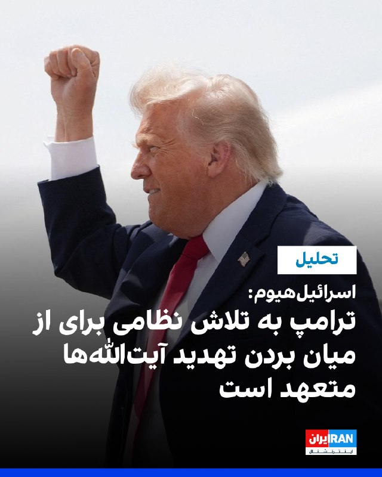

اسرائیل‌هیوم در تحلیلی نوشت با وجود اظهارات متناقض ترامپ درباره جمهوری اسلامی و آتش‌بس او با حکومت ایران، کارنامه عملی رییس‌جمهوری آمریکا نشان می‌دهد که او همچنان به ادامه فشار بر تهران و تلاش نظامی برای از میان بردن تهدید آیت‌الله‌ها متعهد است.
این تحلیل به قلم دیوید واینبرگ، مدیر ارشد پژوهشی موسسه میسگاو اسرائیل، نوشت ترامپ درگیری کنونی را در اصل نوعی جنگ جهانی علیه بزرگ‌ترین رقبای راهبردی آمریکا، از جمله چین و روسیه به عنوان متحدان جمهوری اسلامی، محسوب می‌کند و در نتیجه بسیار بعید است که او میدان نبرد را بدون مهار قابل‌توجه‌تر تهران ترک کند.
این مطلب با تاکید بر اینکه آمریکا صرفا یک «پیروزی» مصنوعی اعلام نخواهد کرد و نیروهایش را عقب نخواهد کشید، افزود ترامپ ممکن است به دلایل گوناگون مدتی صبر کند، اما در نهایت تلاش نظامی را برای از میان بردن تهدید آیت‌الله‌ها علیه کشورهای عرب خلیج فارس، اسرائیل و جهان غرب ادامه خواهد داد.
‌🏁 🇬🇧 IranintlTV

🤖 @VahidOOnLine

## Persian_Trend_Official — post 15832

  <a href="telegram/content/Persian_Trend_Official_15832_1780807942.webm" target="_blank">🎬 Download video</a>

🇺🇸 امریکا اعلام کرد که امروز صبح یک کشتی مظنون به قاچاق مواد مخدر در اقیانوس آرام شرقی را هدف قرار داده است.

🔹سه قاچاقچی مواد مخدر در این حمله کشته شدند.

📌 @persian_trend_official
پرشین ترند | متفاوت‌ترین کانال نظامی

---
📅 بروزرسانی: 1405/03/17 08:12
---

## IranIntlTV — post 340912

  

اسرائیل‌هیوم در تحلیلی نوشت با وجود اظهارات متناقض ترامپ درباره جمهوری اسلامی و آتش‌بس او با حکومت ایران، کارنامه عملی رییس‌جمهوری آمریکا نشان می‌دهد که او همچنان به ادامه فشار بر تهران و تلاش نظامی برای از میان بردن تهدید آیت‌الله‌ها متعهد است.
این تحلیل به قلم دیوید واینبرگ، مدیر ارشد پژوهشی موسسه میسگاو اسرائیل، نوشت ترامپ درگیری کنونی را در اصل نوعی جنگ جهانی علیه بزرگ‌ترین رقبای راهبردی آمریکا، از جمله چین و روسیه به عنوان متحدان جمهوری اسلامی، محسوب می‌کند و در نتیجه بسیار بعید است که او میدان نبرد را بدون مهار قابل‌توجه‌تر تهران ترک کند.
این مطلب با تاکید بر اینکه آمریکا صرفا یک «پیروزی» مصنوعی اعلام نخواهد کرد و نیروهایش را عقب نخواهد کشید، افزود ترامپ ممکن است به دلایل گوناگون مدتی صبر کند، اما در نهایت تلاش نظامی را برای از میان بردن تهدید آیت‌الله‌ها علیه کشورهای عرب خلیج فارس، اسرائیل و جهان غرب ادامه خواهد داد.
https://iranintl.com/202606076855

## Persian_Trend_Official — post 15831

  <a href="telegram/content/Persian_Trend_Official_15831_1780807342.webm" target="_blank">🎬 Download video</a>

🕸️ پنتاگون سطح تهدید جاسوسی اسرائیل علیه آمریکا را به بالاترین درجه رساند!

آژانس اطلاعات دفاعی آمریکا (DIA) در هفته‌های اخیر سطح تهدید ضداطلاعاتی اسرائیل را به درجه «بحرانی» بالاترین سطح ممکن ارتقا داده است. این تصمیم پس از نگرانی‌های فزاینده از شنود مکالمات مقامات ارشد آمریکایی، از جمله فرستاده ویژه ترامپ استیو ویتکاف، معاون وزیر دفاع البریج کولبی و معاون او مایکل دیمینو، اتخاذ شده.

📺بر اساس گزارش NBC News، کارمندان آمریکایی مستقر در اسرائیل گزارش داده‌اند نرم‌افزار شنود به‌صورت مخفیانه روی گوشی‌هایشان نصب شده بوده. ارزیابی DIA در یک سند هفت‌صفحه‌ای تهیه شده که توانایی اسرائیل در جاسوسی انسانی و فنی را در «سطح بحرانی» توصیف می‌کند.اما اسرائیل و کاخ سفید هر دو این گزارش را رد کردند.

شکاف واشنگتن و تل‌آویو بر سر آینده جنگ با ایران به مرحله‌ای رسیده که اسرائیل دیگر به کانال‌های رسمی اطلاعاتی بسنده نمی‌کند و مستقیماً روی تصمیم‌سازان آمریکایی جاسوسی می‌کند. این سطح از بی‌اعتمادی میان دو متحد سنتی، بی‌سابقه است.

👺Phantom

📌 @persian_trend_official
پرشین ترند | متفاوت‌ترین کانال نظامی

## Persian_Trend_Official — post 15830

  <a href="telegram/content/Persian_Trend_Official_15830_1780807342.mp4" target="_blank">🎬 Download video</a>

صبحتون بخیر 🌄
TU-95 Bear

📌 @persian_trend_official
پرشین ترند | متفاوت‌ترین کانال نظامی

## BBCPersian — post 283031

  

🔻ارتش آمریکا می‌گوید دو پهپاد تهاجمی ایران را بر فراز تنگه هرمز سرنگون کرده است.

سرنگون شدن این پهپادها علیرغم آتش‌بسی است که میان دو کشور در جریان است.

پیش‌تر، در روز شنبه هم موجی از حملات ایران به بحرین و کویت گزارش شد.

به گفته تهران، این حمله‌ها به تلافی حملات آمریکا به تجهیزات راداری ایران در خط ساحلی‌ این کشور صورت گرفته است.

سپاه پاسداران گفت که در واکنش به حمله آمریکا به دکل‌های مخابراتی جزیره قشم و سیریک، «دو پایگاه هوایی آمریکا در کویت به نام‌های علی‌السالم و تاسیسات مهم باقی مانده در ناوگان پنجم نیروی دریایی آمریکا در بحرین هدف آتش موشک های بالستیک نیروی هوافضای سپاه واقع شدند.»

آمریکا هم گفت به فعالیت‌های پهپادی ایران علیه کشتی‌هایی که سعی داشته‌اند از تنگه هرمز عبور کنند، پاسخ داده است.

📸AFP via Getty Images عکس تزیینی
https://bbc.in/4xeGwvq
@BBCPersian

---
📅 بروزرسانی: 1405/03/17 08:02
---

## RadioFarda — post 157987

  

🔸ارتش آمریکا شامگاه شنبه اعلام کرد دو پهپاد تهاجمی ایرانی را که کشتیرانی در تنگه هرمز را تهدید می‌کردند سرنگون کرده است.

🔸ستاد فرماندهی مرکزی آمریکا (سنتکام) در حساب خود در شبکه اجتماعی ایکس نوشت: «بامداد امروز، نیروهای آمریکایی در خاورمیانه دو پهپاد انتحاری ایرانی را که کشتیرانی بین‌المللی در تنگه هرمز را تهدید می‌کردند سرنگون کردند.»

🔸این فرماندهی افزود: «نیروهای آمریکایی همچنان در آماده‌باش کامل قرار دارند و آماده‌اند به دفاع در برابر اقدامات تهاجمی ایران ادامه دهند.»

🔸 سنتکام همچنین اعلام کرده بود که نیروهایش شامگاه جمعه چهار پهپاد تهاجمی ایرانی را که به سوی تنگه هرمز پرتاب شده بودند سرنگون کردند و سپس چند پایگاه راداری مراقبت ساحلی ایران را هدف قرار دادند.

🔸این حملات و ضدحملات، از جمله شلیک چندین موشک ایرانی به سوی بحرین و کویت، متحدان آمریکا، در روز شنبه، در حالی انجام می‌شود که واشینگتن و تهران طی هفته‌های گذشته در گفت‌وگوهای غیرمستقیم برای پایان دادن به جنگ مشارکت داشته‌اند.

@RadioFarda

---
📅 بروزرسانی: 1405/03/17 07:52
---

## FarsiVOA — post 219824

Farsi VOA pinned an audio file

## FarsiVOA — post 219823

  <a href="https://t.me/farsivoa/219823" target="_blank">📎 Download file</a>

🔴📢‌ پادکست خبری شنبه ۱۷خرداد ۱۴۰۵

🛜در صورتی که با مشکل اینترنت مواجه هستید میتوانید اخبار صدای آمریکا را از نسخه‌های پادکست خبری ما روزانه دنبال کنید و یا اخبار را از نسخه سبک وب‌سایت ما پیگیر باشید:
https://ir.voanews.com/lite

📡بروزترین فرکانسهای ماهواره‌ای را نیز میتوانید از صفحه زیر پیگیری کنید:
https://ir.voanews.com/satellite

🔔دیگر شبکه‌های اجتماعی ما را هم دنبال کنید:
https://linktr.ee/voafarsi

ما را به اشتراک بگذارید
@farsivoa

---
📅 بروزرسانی: 1405/03/17 07:42
---

## RadioFarda — post 157986

  <a href="https://t.me/radiofarda/157986" target="_blank">📎 Download file</a>

📻بشنوید: سرخط خبرها با رادیوفردا، ۱۷ خرداد ۱۴۰۵‌

@RadioFarda

---
📅 بروزرسانی: 1405/03/17 07:32
---

## BBCPersian — post 283030

  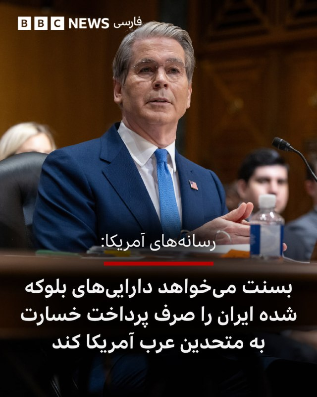

🔻رسانه‌های آمریکا گزارش داده‌اند که وزیر دارایی این کشور در نظر دارد از دارایی‌های بلوکه شده ایران برای پرداخت خساراتی استفاده کند که حملات ایران ممکن است به کشورهای عربی خلیج فارس وارد کرده باشد.

بنابر این گزارش‌ها که هنوز تایید نشده‌اند، اسکات بسنت، وزیر دارایی آمریکا همچنین تیمی را مامور برآورد هزینه تعمیر خرابی‌هایی کرده که در اثر حملات ایران ایجاد شده است.

ایران خواهان آن است که آمریکا بیش از ۲۰ میلیارد دلار از دارایی‌های بلوکه شده‌اش را آزاد کند.

کاظم غریب‌آبادی، معاون وزارت خارجه ایران و از اعضای گروه مذاکره‌کننده با آمریکا گفته است که «اصرار جمهوری اسلامی ایران این است که ۵۰ درصد از اموال بلوکه شده‌اش بلافاصله با امضای یادداشت تفاهم، در اختیارش قرار گیرد.»

به نظر می‌رسد پیشنهاد استفاده از دارایی‌های بلوکه شده ایران برای پرداخت خسارات جنگ به متحدان عرب آمریکا بر اساس پیشنهادهایی باشد که قبلا در زمینه استفاده از دارایی‌های روسیه برای پرداخت هزینه‌های بازسازی اوکراین مطرح شده بود.

📸Anadolu via Getty Images
https://bbc.in/4xafp4A
@BBCPersian

## alonews — post 125666

  <a href="telegram/content/alonews_125666_1780804959.webm" target="_blank">🎬 Download video</a>

👈ارزش یک میلیون تومن وجه رایج مملکت از سال 97 تا کنون

✅ @AloNews خبر جنگ

---
📅 بروزرسانی: 1405/03/17 07:22
---

## FarsiVOA — post 219822

  

🎯مصاحبه جذاب فهیمه خضر حیدری با هوشنگ امیر احمدی را در برنامه عمق میدان از لینک زیر مشاهده کنید:
https://www.youtube.com/watch?v=pvEjPVNpVPE

🔴یوتیوب صدای آمریکا را هم سابسکرایب کنید
👇👇👇👇
https://youtube.com/@voafarsi

---
📅 بروزرسانی: 1405/03/17 07:12
---

## VahidOOnLine — post 244031

♦️هم‌زمان با آغاز رویدادهای مرتبط با جام جهانی فوتبال، جمعی از ایرانیان روز شنبه، ۱۶ خردادماه، با تجمع مقابل بنای یادبود واشنگتن دی‌سی بار دیگر علیه موج گسترده اعدام‌ها در کشور اعتراض کردند. تجمع‌کنندگان در این منطقه پرتردد، خواستار آزادی فوری تمامی زندانیان سیاسی و لغو محدودیت‌های شدید علیه اینترنت در ایران شدند.
‌🇸🇦 Indypersian

🤖 @VahidOOnLine

## BBCPersian — post 283029

  

🔻در کرانه باختری اشغالی، برای تشییع جنازه یک نوزاد هفته ماهه فلسطینی که روز جمعه به ضرب گلوله یک سرباز اسرائیلی کشته شد، جمعیت بزرگی جمع شدند.

پدر و مادر سام فهد ابوهیکل در نزدیکی منطقه تل رومیدا در جنوب الخلیل با تیراندازی سرباز اسرائیلی به ماشینشان مجروح شدند.

فهد، پدر سام گفت یک گلوله، از شیشه جلوی ماشین رد شد و به سر بچه‌اش اصابت کرد.

ارتش اسرائیل ضمن ابراز « تاسف عمیق» از این واقعه، گفته است که دراین باره تحقیق می‌کند.
ادامه مطلب⬇️

📸Anadolu via Getty Images
https://bbc.in/4uihYyQ
@BBCPersian

## alonews — post 125665

  <a href="telegram/content/alonews_125665_1780803773.webm" target="_blank">🎬 Download video</a>

👈تصاویر ماهواره‌ای جدید نشان می‌دهد که انبار متعلق به شرکت فناوری انرژی آمریکایی بیکر هیوز در اربیل، کردستان عراق، کاملاً تخریب شده است.

🔴این تأسیسات در جریان حمله پهپاد کامی‌کازه در اول آوریل هدف قرار گرفت و تصاویر نشان می‌دهد که ساختار آن به طور کامل نابود شده و هیچ اثری از انبار باقی نمانده است.

✅ @AloNews خبر جنگ

---
📅 بروزرسانی: 1405/03/17 07:02
---

هیچ پیام جدیدی در این بروزرسانی ارسال نشد.

---
📅 بروزرسانی: 1405/03/17 06:52
---

هیچ پیام جدیدی در این بروزرسانی ارسال نشد.

---
📅 بروزرسانی: 1405/03/17 06:42
---

## VahidOOnLine — post 244030

  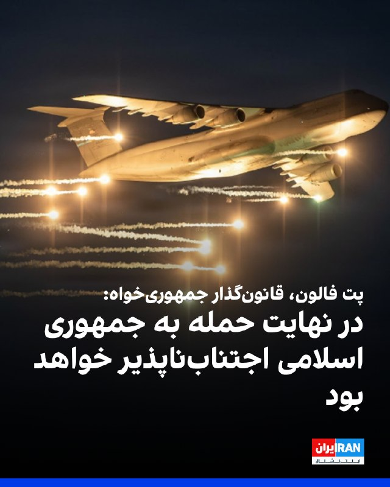

پت فالون، عضو جمهوری‌خواه مجلس نمایندگان آمریکا، در پاسخ به پرسش فاکس‌نیوز درباره احتمال لغو مذاکرات با حکومت ایران از سوی ترامپ گفت که فکر می‌کند در نهایت حمله به جمهوری اسلامی اجتناب‌ناپذیر خواهد بود. او تاکید کرد جمهوری اسلامی هرگز با حسن نیت مذاکره نکرده است.
فالون گفت سپاه پاسداران «منطقی نیست» و این گروه را برای مذاکره «بیش از حد رادیکال» توصیف کرد.

‌🏁 🇬🇧 IranintlTV

🤖 @VahidOOnLine

---
📅 بروزرسانی: 1405/03/17 06:32
---

## IranIntlTV — post 340911

  

پت فالون، عضو جمهوری‌خواه مجلس نمایندگان آمریکا، در پاسخ به پرسش فاکس‌نیوز درباره احتمال لغو مذاکرات با حکومت ایران از سوی ترامپ گفت که فکر می‌کند در نهایت حمله به جمهوری اسلامی اجتناب‌ناپذیر خواهد بود. او تاکید کرد جمهوری اسلامی هرگز با حسن نیت مذاکره نکرده است.
فالون گفت سپاه پاسداران «منطقی نیست» و این گروه را برای مذاکره «بیش از حد رادیکال» توصیف کرد.

https://iranintl.com/202606077792

## BBCPersian — post 283021

🖋سورانجانا تواری
خبرنگار تجاری آسیادر,پکن و هفی

خودروسازان بزرگ جهان با واقعیتی تازه و نگران‌کننده مواجه شده‌اند؛ برندهای آمریکایی، اروپایی و ژاپنی به‌تدریج جایگاه خود را در برابر رقبای چینی از دست می‌دهند؛ رقبایی که نه‌ تنها در تولید خودروهای برقی، بلکه در فناوری باتری، طراحی صنعتی و سامانه‌های نرم‌افزاری نیز به پیشگامان این صنعت تبدیل شده‌اند.

در جریان نمایشگاه خودروی چین ۲۰۲۶، که بزرگ‌ترین رویداد خودروی جهان به شمار می‌رود، خبرنگاران بی‌بی‌سی از کارخانه‌های تولید خودرو در پکن و هفی بازدید کردند. آنچه بیش از همه جلب توجه می‌کرد، سطح خیره‌کننده خودکارسازی خطوط تولید و سرعت بالای توسعه فناوری‌های دیجیتال بود؛ پیشرفتی که موجب شده بسیاری از برندهای خارجی که روزگاری بر بازار چین تسلط داشتند، اکنون برای همگام شدن با رقبا به سختی تلاش کنند.

ادامه مطلب⬇️
📸BBC/ GettyImages/ AFP via Getty Images/ VCG via Getty Images/ /Bloomberg via Getty Images
https://bbc.in/4e6v5gp
@BBCPersian

---
📅 بروزرسانی: 1405/03/17 06:22
---

هیچ پیام جدیدی در این بروزرسانی ارسال نشد.

---
📅 بروزرسانی: 1405/03/17 06:12
---

## VahidOOnLine — post 244029

  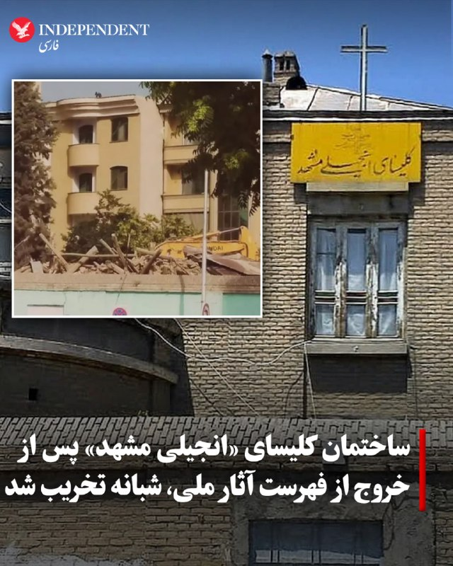

♦️بامداد سه‌شنبه، ۱۴ خرداد، کلیسای تاریخی «انجیلی مشهد» به عنوان یکی از بناهای هویت‌بخش معماری دوره رضاشاه پهلوی، در اقدامی ناگهانی به طور کامل با بولدوزر تخریب شد و به تلی از خاک بدل گشت. این گنجینه بی‌بدیل که در سال ۱۳۸۴ با شماره ۱۳۳۷۵ به عنوان یکی از آثار ملی ایران به ثبت رسیده بود، یادآور هویت چندفرهنگی مشهد و حضور کشیش «لوئیس اسلستین» (نخستین مبلغ میسیونری کلیسای پرزبیتری در اواخر عصر ناصری) بود. گزارش‌های واصله از منابع حوزه میراث فرهنگی نشان می‌دهد که این بنای ارزشمند، سال گذشته در روندی مجهول و با هدف هموارسازی مسیر برای خریداران و مالکان خصوصی، از فهرست آثار ملی خارج شده بود تا در سایه این اقدام، شرایط برای نابودی بی‌صدای بخشی از حافظه تاریخی آب و خاک مشهد بدون هیچ مانع قانونی فراهم شود.
نکته قابل تامل، واکنش «نوش‌دارو پس از مرگ سهراب» از سوی متولیان امر است؛ چرا که ساعتی پس از ویرانی کامل بنا و زمانی که دیگر چیزی برای بازسازی باقی نمانده بود، سرپرست معاونت میراث‌فرهنگی خراسان رضوی از «توقف عملیات تخریب» خبر داد. او با تایید ضمنی این روند مجهول گفت که این بنای تاریخی با وجود خروج از فهرست آثار ملی در سال گذشته، همچنان در اسناد مصوب شهری به عنوان اثری واجد ارزش شناسایی می‌شده و هرگونه اقدام عمرانی در آن غیرقانونی بوده است. فعالان این حوزه، خروج پنهانی آثار از ثبت ملی و سپردن آن‌ها به تیغ بولدوزرها را حاصل نفوذ جریان‌های منفعت‌طلب و غفلت سنگین وزارت میراث فرهنگی می‌دانند که هویت تاریخی کشور را قربانی پروژه‌های مافیایی تجاری می‌کنند.
‌🇸🇦 Indypersian

🤖 @VahidOOnLine

---
📅 بروزرسانی: 1405/03/17 06:02
---

## VahidOOnLine — post 244028

  

♦️به گزارش فارس، خبرگزاری وابسته به سپاه پاسداران، طرح انتقال آب دریای خزر به میانکاله که از آن به‌عنوان «طرح نجات میانکاله» یاد می‌شود، علی‌رغم تاکید سال گذشته مسئولان سازمان حفاظت محیط‌زیست بر ضرورت احداث فوری ایستگاه پمپاژ، همچنان «معطل» و در «مرحله انتظار» باقی مانده است. متخصصان و کارشناسان پافشاری می‌کنند که این طرح نقشی حیاتی در تامین آب تالاب و جلوگیری از تکرار بحران‌های زیست‌محیطی سال‌های اخیر دارد. این در حالی است که فعالان محیط‌زیست با هشدار نسبت به خسارت‌های جبران‌ناپذیر ادامه‌ این روند برای شمال کشور، تاکید دارند که خشک شدن این زیستگاه ارزشمند نه تنها حیات گونه‌های منحصربه‌فرد گیاهی و جانوری را با تهدید جدی روبرو می‌کند، بلکه معیشت جوامع محلی وابسته به صیادی و صنعت گردشگری منطقه را نیز به سمت نابودی سوق می‌دهد.
‌🇸🇦 Indypersian

🤖 @VahidOOnLine

---
📅 بروزرسانی: 1405/03/17 05:52
---

## BBCPersian — post 283020

  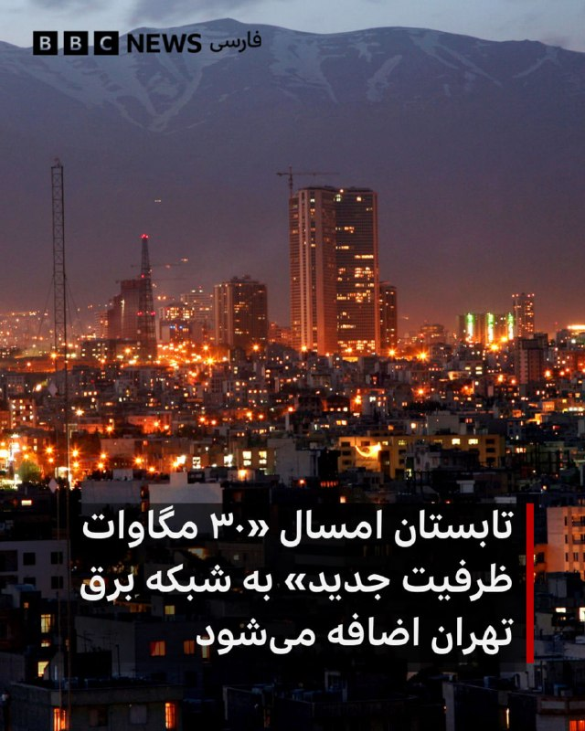

🔻فرهاد شبیهی، مدیرعامل شرکت برق منطقه‌ای تهران، امروز گفت: «تابستان امسال ۳۰ مگاوات ظرفیت جدید با سرمایه‌گذاری بیش از ۹۰۳ میلیارد تومان به شبکه برق تهران افزوده می‌شود.»

او همچنین گفت: «دو نیروگاه در نصیرآباد و طرشت با مجموع ظرفیت ۱۰ مگاوات به بهره‌برداری رسیده و به شبکه پیوسته‌اند.

به گفته آقای شبیهی، «سه نیروگاه دیگر در کاله، پاکدشت و صفادشت با پیشرفت فیزیکی بالای ۸۴ درصد، تا اوایل تابستان امسال وارد مدار می‌شوند.»

این در حالیست که محمد صادق کریمی، رئیس امور انرژی سازمان برنامه و بودجه، در مورد قطع برق گفت:

«بخشی از ظرفیت نیروگاهی کشور به دلیل آسیب از مدار خارج شده و بخشی از تأمین سوخت نیروگاه‌ها نیز دچار مشکل است. از سوی دیگر، به دلیل محدودیت گاز در زمستان، نیروگاه‌ها ناچار به استفاده از سوخت جایگزین می‌شوند، بنابراین لازم است بخشی از سوخت از تابستان ذخیره شود.»
ادامه مطلب⬇️

📸GettyImages
https://bbc.in/3S8ZzXP
@BBCPersian

---
📅 بروزرسانی: 1405/03/17 05:42
---

## FoxNewsTwitter — post 342685

  <a href="telegram/content/FoxNewsTwitter_342685_1780798340.mp4" target="_blank">🎬 Download video</a>

Fox News (Twitter/X)

"I was told the food was bad, so I sat in the cafeteria right along with the detainees."

Border czar Tom Homan says he made a surprise lunch visit to an ICE detention facility after hearing complaints about the food. He says he had spaghetti and meat sauce, green beans, rolls and butter, and a fruit drink, but skipped the cake for dessert.

"I couldn't finish it all," he said during an interview with @LaraLeaTrump.

---
📅 بروزرسانی: 1405/03/17 05:33
---

## WithYashar — post 13664

  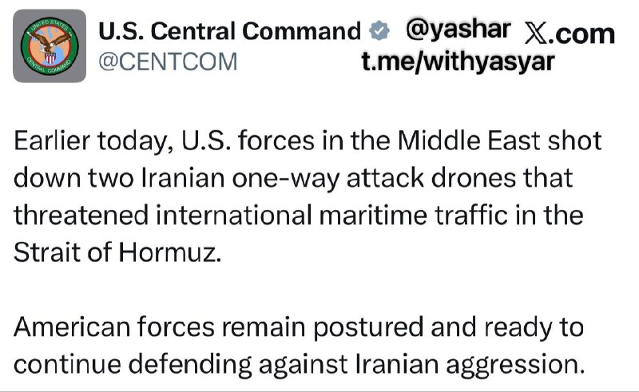

اتاق جنگ با یاشار : خدای‌دریا @withyashar

---
📅 بروزرسانی: 1405/03/17 05:22
---

## BBCPersian — post 283019

💢جام‌جهانی فوتبال در لس‌آنجلس: شوری که نیست و هیجانی که وجود ندارد
🖌سام فرزانه، خبرنگار بی‌بی‌سی در لس‌آنجلس

همکاری که تجربه پوشش خبری اتفاق‌های بزرگ ورزشی را در چهارگوشه جهان دارد چند دقیقه‌ای بعد از ورود به آمریکا و در فرودگاه لس‌آنجلس از من پرسید: «دیدی هیچ تبلیغ و بیلبوردی از جام جهانی نیست؟»

مشاهده جالبی بود. او چیزی را دیده بود که وجود نداشت و در کشورهای دیگر به وفور دیده بود: «شور و هیجان جام جهانی فوتبال.»

جام جهانی فوتبال یکی از پربیننده‌ترین رویدادهای ورزشی جهان است و مایه شهرت کشورهای میزبان. میزبانان جام جهانی از مدت‌ها قبل از شروع مسابقات به هر شیوه‌ ممکن این تورنمنت را جشن گرفته، آن را برای گردشگران به خاطره‌ای تکرار نشدنی تبدیل می‌کنند.

اما به نظر می‌رسد که دست کم اینجا در آمریکا هنوز این شور پا نگرفته است. وقتی که برای گرفتن کارت‌های خبرنگاری‌مان به استادیوم سوفی (سوفای) رفتیم، در خیابان‌های اطراف ورزشگاه اثری از بیلبوردهای جام جهانی نبود. (از آنجا که ورودی مخصوص را پیدا نمی‌کردیم مجبور شدیم دور ساختمان بچرخیم و فرصت شد که اطراف را خوب تماشا کنیم.)

ورزش در آمریکا یکی از بهترین موضوع‌های گپ و گفت بین آدم‌هایی است که در موضوع‌های سیاسی و اجتماعی اختلافات اساسی دارند. بسیاری از دوستی‌ها و روابط خانوادگی در این کشور بر مبنای عشق مشترک به یک ورزش پا گرفته است. پس چرا در این کشور جام جهانی فوتبال آن طور که انتظار می‌رود در یکی از شهرهای محل برگزاری مسابقات به چشم نمی‌آید؟ شاید بتوان دو دلیل در توضیح این سوال بیان کرد.

اول اینکه فوتبال در آمریکا با فاصله‌ای قابل توجه از فوتبال آمریکایی، بیس‌بال، و بسکتبال چهارمین ورزش پرطرفدار در کشور است. بیشتر هواداران این ورزش هم نسل‌های اول و دوم مهاجرانی هستند که از کشورهای مختلف جهان از جمله از آمریکای لاتین به ایالات متحده مهاجرت کرده‌اند.

از سوی دیگر آمریکا، یکی از سه میزبان جام‌جهانی سال ۲۰۲۶، قوانین سخت‌گیرانه‌ای برای صدور روادید دارد و بسیاری از طرفداران تیم‌های شرکت‌کننده نتوانسته‌اند برای تماشای مسابقات به این کشور بیایند. به جز آن هزینه‌های سفر، اقامت و گذران زندگی در این کشور برای مردم بسیاری از کشورها بالا و پرداختش سخت است.

https://bbc.in/4e9jf5u
@BBCPersian

---
📅 بروزرسانی: 1405/03/17 05:12
---

## VahidOnline — post 75978

  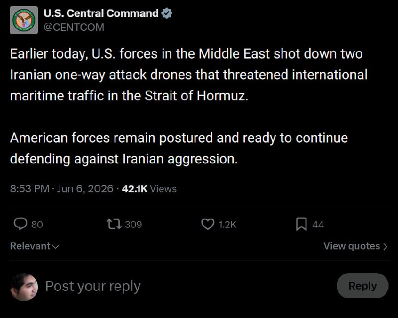

ستاد فرماندهی مرکزی آمریکا، شنبه‌شب به وقت واشنگتن در بیانیه‌ای گفت اوایل امروز، نیروهای ایالات متحده در خاورمیانه دو پهپاد تهاجمی یک‌طرفه ایران را که تهدیدی برای تردد دریایی بین‌المللی در تنگه هرمز محسوب می‌شدند، سرنگون کردند.
سنتکام افزود که نیروهای آمریکایی همچنان آماده در برابر اقدامات تهاجمی جمهوری اسلامی هستند.
@VahidHeadline

📡 @VahidOnline

## BBCPersian — post 283018

💢اهمیت لابراتوار اوک‌ریج که فرستادگان ترامپ از آن بازدید کردند، در چیست؟
🖌شیدا هوشمندی، بی‌بی‌سی، واشنگتن

آزمایشگاه ملی اوک‌ریج یکی از مهم‌ترین مراکز تخصصی هسته‌ای آمریکا است و نقش تاریخی و فنی مهمی در برنامه هسته‌ای این کشور دارد.

اوک‌ریج یکی از محرمانه‌ترین و مهم‌ترین مراکز هسته‌ای آمریکا بود که برای تولید اورانیوم غنی‌شده مورد استفاده در نخستین بمب اتمی جهان ساخته شد.شهر اوک‌ریج در ایالت تنسی عملاً از دل یک پروژه هسته‌ای متولد شد؛ هزاران نفر در دوران جنگ جهانی دوم در اوک‌ریج مشغول کار بودند، بی‌آنکه بدانند در حال مشارکت در برنامه ساخت سلاح هسته‌ای هستند. امروز هم این مرکز یکی از مهم‌ترین پایگاه‌های علمی و فنی آمریکا در حوزه فناوری هسته‌ای، انرژی و امنیت ملی محسوب می‌شود.

بنابر گزارش‌ها، استیو ویتکاف و جرد کوشنر، فرستادگان دونالد ترامپ، روز پنجشنبه برای رایزنی با گروهی از کارشناسان فنی به این آزمایشگاه سفر کردند.

انتخاب این مرکز برای رایزنی با کارشناسان فنی نشان می‌دهد که دولت دونالد ترامپ هم‌زمان با تلاش برای دستیابی به یک تفاهم اولیه با تهران، در حال آماده‌سازی تیم‌های تخصصی برای بررسی جزئیات پیچیده برنامه هسته‌ای ایران و بحث‌های فنی است.

https://bbc.in/4uliHPM
@BBCPersian

## BBCPersian — post 283017

  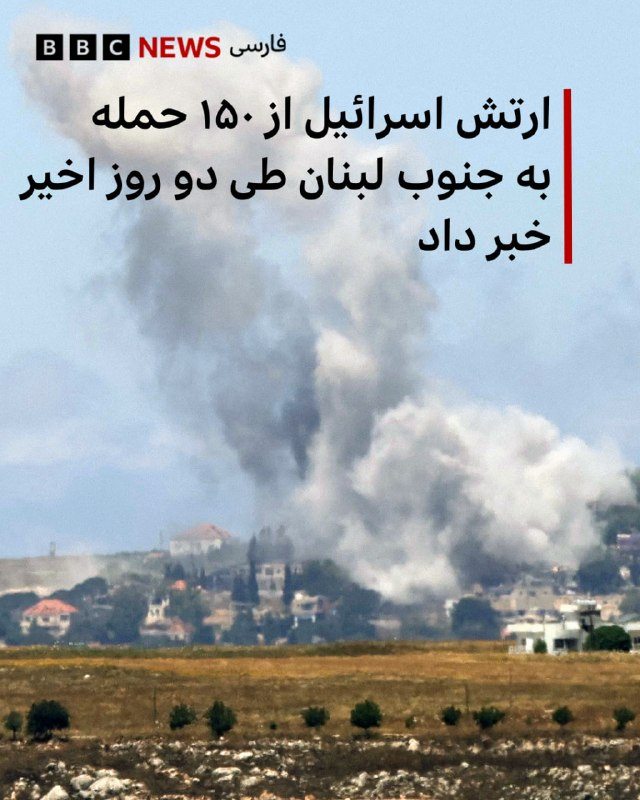

🔻ارتش اسرائیل می‌گوید طی ۴۸ ساعت اخیر، ۱۵۰ حمله به جنوب لبنان کرده و در این حملات، مواضع مرتبط با حزب‌الله را هدف قرار داده است.

صلح‌بانان سازمان ملل مستقر در جنوب لبنان، حمله اسرائیل به یک خودروی ارتش لبنان در نبطیه که طی آن سه سرباز کشته شدند را محکوم کردند.

یونیفیل، نیروهای حافظ صلح سازمان ملل، این حمله را «نقض بزرگ» حاکمیت لبنان خواندند.

ارتش لبنان، اسرائیل را به تجاوز «بی‌رحمانه، عمدی و مکرر» متهم کرد و گفت این موضوع، تلاش‌های مربوط به برقراری یک آتش‌بس پایدار را از بین می‌برد.

از زمان آغاز جنگ آمریکا و اسرائیل با ایران در اوایل اسفند، حملات اسرائیل منجر به کشته شدن بیش از ۳۵۰۰ نفر در لبنان شده است.

صدها نفر از این افراد، علیرغم آن کشته شده‌اند که آمریکا و اسرائیل اعلام آتش‌بس کرده‌اند.

وزارت خارجه آمریکا دو روز قبل گفت که اسرائیل و لبنان توافق کرده‌اند تا آتش‌بس شکنندهٔ خود را تمدید کنند و چندین «منطقهٔ امنیتی آزمایشی» در داخل لبنان ایجاد کنند که در آن حضور نیروهای حزب‌الله ممنوع خواهد بود.
ادامه مطلب⬇️

📸AFP via Getty Images
https://bbc.in/4eolvXH
@BBCPersian

---
📅 بروزرسانی: 1405/03/17 05:02
---

## VahidOOnLine — post 244027

  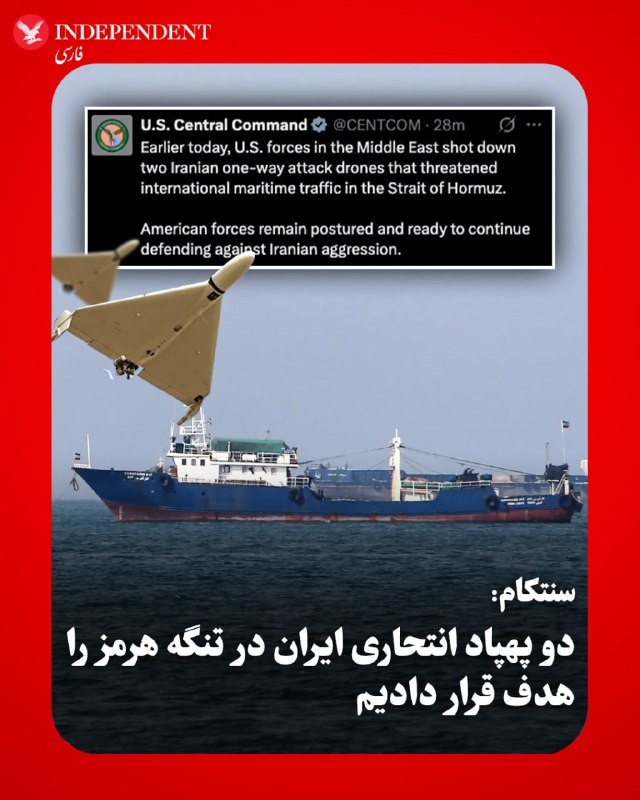

♦️فرماندهی مرکزی ایالات متحده، سنتکام، بامداد یکشنبه، ۱۷ خردادماه، با انتشار بیانیه‌ای رسمی اعلام کرد که نیروهای نظامی این کشور دو پهپاد انتحاری و تهاجمی ایران را سرنگون کرده‌اند. سنتکام در تشریح این عملیات نوشت: «ساعات پیش، نیروهای ایالات متحده در خاورمیانه دو پهپاد تهاجمی یک‌طرفه (انتحاری) ایران را که ترافیک بین‌المللی دریانوردی و کشتیرانی در تنگه هرمز را تهدید می‌کردند، هدف قرار داده و سرنگون کردند.» فرماندهی مرکزی آمریکا در پایان این بیانیه با هشدار نسبت به تداوم رفتارهای بی‌ثبات‌کننده در این آبراه حیاتی تاکید کرد: «نیروهای آمریکایی همچنان در وضعیت تدافعی قرار دارند و برای ادامه دفاع در برابر اقدامات تهاجمی ایران کاملا آماده و مستقر هستند.»
‌🇸🇦 Indypersian

🤖 @VahidOOnLine

## VahidOOnLine — post 244026

  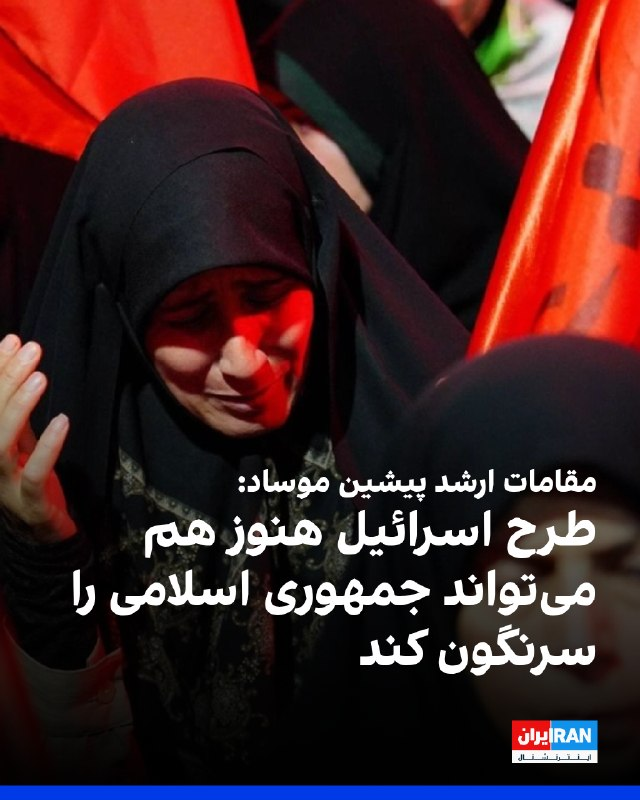

یکی از مقامات ارشد پیشین موساد با نام مستعار «الف» به کانال تلویزیونی ۱۲ اسرائیل گفت: «نقشه‌ای که از سوی اسرائیل و موساد تدوین شده، هنوز هم می‌تواند به سقوط جمهوری اسلامی منجر شود، اما پس از تصمیم آمریکا برای توقف جنگ، در تمام مراحل خود دنبال نشده است.»
الف با اشاره به اینکه این طرح چند مرحله‌ای است، ابراز امیدواری کرد که در مقطعی، مراحل بعدی طرح عملیاتی تصویب شود.
او با تاکید بر اینکه شرایط به گونه‌ای ایجاد شده است که در نهایت جمهوری اسلامی قدرتش را از دست خواهد داد، گفت: «نمی‌توانم پیش‌بینی کنم که رژیم ایران طی شش ماه و یا طی سه سال سرنگون خواهد شد، اما درنهایت این موضوع اتفاق خواهد افتاد.»

‌🏁 🇬🇧 IranintlTV

🤖 @VahidOOnLine

## IranIntlTV — post 340910

  

یکی از مقامات ارشد پیشین موساد با نام مستعار «الف» به کانال تلویزیونی ۱۲ اسرائیل گفت: «نقشه‌ای که از سوی اسرائیل و موساد تدوین شده، هنوز هم می‌تواند به سقوط جمهوری اسلامی منجر شود، اما پس از تصمیم آمریکا برای توقف جنگ، در تمام مراحل خود دنبال نشده است.»
الف با اشاره به اینکه این طرح چند مرحله‌ای است، ابراز امیدواری کرد که در مقطعی، مراحل بعدی طرح عملیاتی تصویب شود.
او با تاکید بر اینکه شرایط به گونه‌ای ایجاد شده است که در نهایت جمهوری اسلامی قدرتش را از دست خواهد داد، گفت: «نمی‌توانم پیش‌بینی کنم که رژیم ایران طی شش ماه و یا طی سه سال سرنگون خواهد شد، اما درنهایت این موضوع اتفاق خواهد افتاد.»

https://iranintl.com/202606078745

---
📅 بروزرسانی: 1405/03/17 04:52
---

## VahidOOnLine — post 244025

  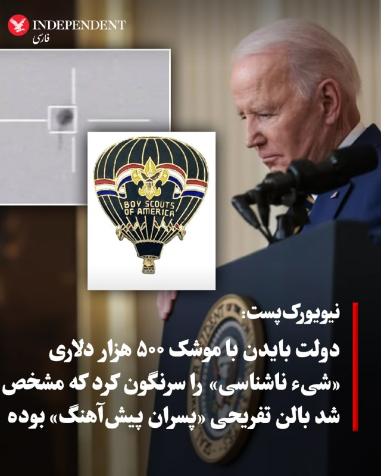

♦️روزنامه «نیویورک پست» در گزارشی نوشت که دولت جو بایدن در جریان موج اضطراب ناشی از ماجرای بالن جاسوسی چین در اوایل سال ۲۰۲۳، با یک موشک ۵۰۰ هزار دلاری «سایدمیندر» که از جنگنده اف-۱۶ شلیک شد، یک «شیء پرنده ناشناس» (UFO) را بر فراز دریاچه «هورن» منهدم کرد که بعدا مشخص شد متعلق به یک گروه از «پسران پیش‌آهنگ» بوده است. مقامات سابق سازمان ردیابی ناهنجاری‌های وزارت دفاع آمریکا (AARO) تایید کرده‌اند که پنتاگون پس از تاخیر در پاسخ به بالن چینی، به شدت دستپاچه شده بود و دستور داشت به هر شیء مشکوکی در آسمان شلیک کند. به طوری که این بالن تفریحی پیش از آنکه با موشک نیم‌میلیون دلاری تکه‌تکه شود، هشت بار کره زمین را دور زده بود. نیویورک پست با اتکا به اسناد خارج‌شده از طبقه‌بندی فاش کرد که ارتش آمریکا در موارد مشابه دیگر نیز مهمات گران‌قیمت خود را هدر داده است. از جمله شلیک موشک ۴۳۹ هزار دلاری جنگنده اف-۲۲ به یک بالن تحقیقاتی ۱۲ دلاری و حتی شلیک به یک بادکنک فویلی ستاره‌شکلِ «تولدت مبارک» خریداری‌شده از فروشگاه والمارت که اپراتورهای پهپاد «ریپر» به اشتباه آن‌ها را به عنوان اشیاء ناشناس پرنده با قابلیت‌های پنهان‌کاری گزارش کرده بودند.
‌🇸🇦 Indypersian

🤖 @VahidOOnLine

## VahidOOnLine — post 244024

  

ستاد فرماندهی مرکزی آمریکا، سنتکام، اعلام کرد نیروهای آمریکا در خاورمیانه دو پهپاد انتحاری جمهوری اسلامی را که تردد دریایی بین‌المللی در تنگه هرمز را تهدید می‌کردند، سرنگون کردند.
سنتکام تاکید کرد نیروهای آمریکایی همچنان در موقعیت آماده‌باش قرار دارند و آماده‌اند به دفاع در برابر اقدام‌های تهاجمی جمهوری اسلامی ادامه دهند.

‌🏁 🇬🇧 IranintlTV

🤖 @VahidOOnLine

## pm_afshaa — post 92422

  <a href="telegram/content/pm_afshaa_92422_1780795359.webm" target="_blank">🎬 Download video</a>

🔴سنتکام: اوایل امروز، نیروهای آمریکایی در خاورمیانه دو پهپاد تهاجمی یک طرفه ایرانی که ترافیک دریایی بین‌المللی رو در تنگه هرمز تهدید میکرد، سرنگون کردن.

نیروهای آمریکایی مستقر و آماده ادامه دفاع در برابر تجاوز ایران هستند.

💧 Rainbet.com the #1 Non-KYC Crypto Casino & Sportsbook @rainbetcom

😁 @Pm_Afshaa

---
📅 بروزرسانی: 1405/03/17 04:43
---

## IranIntlTV — post 340909

  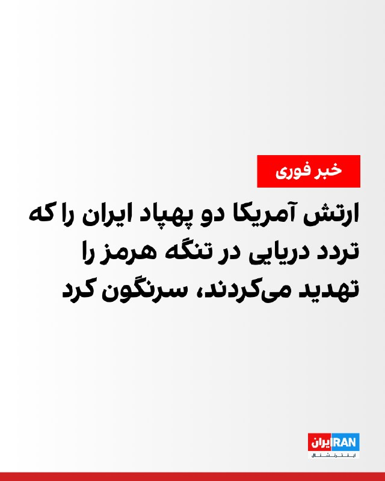

ستاد فرماندهی مرکزی آمریکا، سنتکام، اعلام کرد نیروهای آمریکا در خاورمیانه دو پهپاد انتحاری جمهوری اسلامی را که تردد دریایی بین‌المللی در تنگه هرمز را تهدید می‌کردند، سرنگون کردند.
سنتکام تاکید کرد نیروهای آمریکایی همچنان در موقعیت آماده‌باش قرار دارند و آماده‌اند به دفاع در برابر اقدام‌های تهاجمی جمهوری اسلامی ادامه دهند.

https://iranintl.com/202606071453

## FarsiVOA — post 219821

  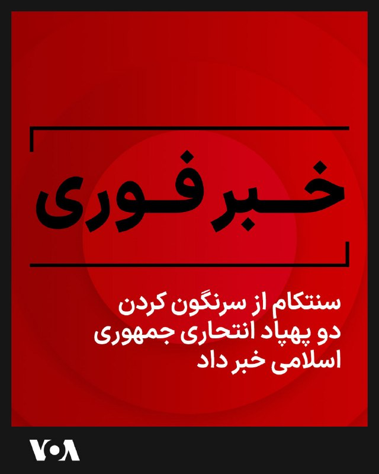

⚡️ستاد فرماندهی مرکزی آمریکا، شنبه‌شب به وقت واشنگتن در بیانیه‌ای گفت «اوایل امروز، نیروهای ایالات متحده در خاورمیانه دو پهپاد تهاجمی یک‌طرفه [جمهوری اسلامی] ایران را که تهدیدی برای تردد دریایی بین‌المللی در تنگه هرمز محسوب می‌شدند، سرنگون کردند.»
سنتکام افزود که نیروهای آمریکایی همچنان آماده در برابر اقدامات تهاجمی جمهوری اسلامی هستند.

@FarsiVOA

## BBCPersian — post 283016

  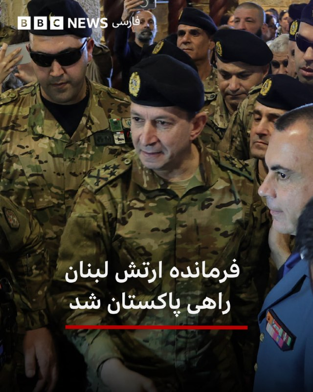

🔻رودولف هیکل، فرمانده ارتش لبنان به دعوت همتای پاکستانی خود راهی آن کشور شده است. ارتش لبنان اعلام کرد که او در این سفر با فیلد مارشال عاصم منیر، فرمانده کل نیروهای مسلح پاکستان، دیدار و گفت‌وگو خواهد کرد.

یک منبع آگاه به خبرگزاری فرانسه گفته است که این سفر در چارچوب تلاش‌های میانجی‌گرانه پاکستان میان ایران و آمریکا انجام می‌شود.

به گفته این منبع، لبنان یکی از محورهای مهم مذاکرات میان تهران و واشنگتن برای پایان دادن به جنگ و تنش‌های منطقه‌ای به شمار می‌رود.

عاصم منیر در ماه‌های اخیر نقش پررنگی در میانجی‌گری میان ایران و آمریکا ایفا کرده و پاکستان تلاش کرده است از طریق گفت‌وگوهای دیپلماتیک، زمینه کاهش تنش‌ها و دستیابی به توافق میان دو طرف را فراهم کند.

در همین حال، جوزف عون، رئیس‌جمهور لبنان، دیروز در گفت‌وگویی تلویزیونی تأکید کرد که ایران نباید در امور داخلی لبنان دخالت کند. او با اشاره به مذاکرات مستقیم بیروت با اسرائیل گفت: «لبنان متعلق به مردم لبنان است و هیچ کشوری نباید در تصمیمات آن مداخله کند.»
ادامه مطلب⬇️

📸GettyImages
https://bbc.in/4oibSgK
@BBCPersian

---
📅 بروزرسانی: 1405/03/17 04:32
---

## FoxNewsTwitter — post 342684

  

Fox News (Twitter/X)

Just weeks after winning the Kentucky Derby, Golden Tempo has won big again.

The colt captured the 158th Belmont Stakes on Saturday at Saratoga, after his team chose to skip the Preakness Stakes and give him extra time to rest rather than pursue horse racing's Triple Crown.

## Shin_Persian — post 6587

Shin ✓ @hey_itsmyturn
Sun, 07 Jun 2026 00:54:08 UTC

U.S. forces in the Middle East shot down two Iranian one-way attack drones that threatened international maritime traffic in the Strait of Hormuz.

Source: @CENTCOM
https://x.com/CENTCOM/status/2063424127508037983

فارسی

نیروهای ایالات متحده در خاورمیانه دو پهپاد تهاجمی یک‌طرفه ایرانی را که ترافیک دریایی بین‌المللی در تنگه هرمز را تهدید می‌کردند، سرنگون کردند.

منبع: @CENTCOM
https://x.com/CENTCOM/status/2063424127508037983

𝕏 · @shin_persian

---
📅 بروزرسانی: 1405/03/17 04:22
---

هیچ پیام جدیدی در این بروزرسانی ارسال نشد.

---
📅 بروزرسانی: 1405/03/17 04:12
---

هیچ پیام جدیدی در این بروزرسانی ارسال نشد.

---
📅 بروزرسانی: 1405/03/17 04:02
---

هیچ پیام جدیدی در این بروزرسانی ارسال نشد.

---
📅 بروزرسانی: 1405/03/17 03:52
---

## VahidOOnLine — post 244023

♦️صفحه اینستاگرام «بلوچستانی‌ها» تصاویری از آبگیری «چاه‌نیمه‌های سیستان» منتشر کرد. براساس این گزارش، پس از سال‌ها خشکسالی پیاپی، بحران شدید کم‌آبی و انباشت نگرانی‌ها در میان ساکنان منطقه، «چاه‌نیمه‌های سیستان» به عنوان شریان حیاتی و اصلی تامین آب این جغرافیا بار دیگر رنگ مملو شدن از آب و احیا را به خود دیدند. ورود مجدد جریان آب به این مخازن طبیعی که سال‌ها تصاویری تلخ از خشکی، تشنگی و هجوم گردوغبار را روایت می‌کردند، موجی از امید، آرامش و خوشحالی را در میان مردم ایجاد کرده است. مردم بومی این رویداد را نویدبخش روزهایی بهتر برای کشاورزی و زیست منطقه می‌دانند و امیدوارند تداوم جریان این روان‌آب‌ها بتواند بخشی از آسیب‌های عمیق ناشی از پدیده خشکسالی‌های طولانی‌مدت را در این بخش از کشور جبران کند.
‌🇸🇦 Indypersian

🤖 @VahidOOnLine

## BBCPersian — post 283015

  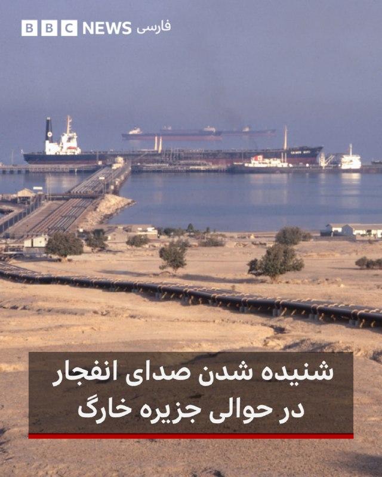

🔻بنابر گزارش‌ منابع خبری در ایران، در حوالی جزیره خارگ ایران صدای انفجار شدیدی شنیده شده است.

نیروی دریایی سپاه پاسداران انقلاب اسلامی گفته است که این صدا به خنثی‌سازی مهمات در منطقه بهرگان مربوط بوده است.

روابط عمومی نیروی دریایی سپاه گفته است که این مهمات، از جنگ اخیر باقی مانده است.

بهرگان از مناطق نفتی استان بوشهر است و حدود ۶۰ کیلومتر با جزیره خارگ فاصله دارد.

پیش‌تر، سپاه پاسداران اعلام کرد که با موشک و پهپاد به پایگاه هوایی آمریکا در کویت و مقر ناوگان پنجم آمریکا در بحرین حمله کرده است.

ارتش آمریکا، کویت و بحرین گفتند همه پرتابه‌ها را رهگیری کرده‌اند.

سپاه پاسداران گفت که در واکنش به حمله آمریکا به دکل‌های مخابراتی جزیره قشم و سیریک، «دو پایگاه هوایی آمریکا در کویت به نام‌های علی‌السالم و تاسیسات مهم باقی مانده در ناوگان پنجم نیروی دریایی آمریکا در بحرین هدف آتش موشک های بالستیک نیروی هوافضای سپاه واقع شدند.»

📸Gamma-Rapho via Getty Images
https://bbc.in/4e5cQbk
@BBCPersian

---
📅 بروزرسانی: 1405/03/17 03:42
---

## VahidOOnLine — post 244022

  

وزارت خارجه فلسطین حمله موشکی جمهوری اسلامی به بحرین و کویت در بامداد شنبه را به شدت محکوم کرد و این اقدام را نقض آشکار حاکمیت این دو کشور، تخطی صریح از قوانین بین‌المللی و تهدید امنیت و ثبات منطقه خلیج‌فارس دانست.
جمهوری اسلامی بامداد شنبه هفت موشک بالستیک به سوی کویت و بحرین شلیک کرد که نیروهای آمریکا شش موشک را رهگیری کردند و موشک هفتم به هدف نرسید.

‌🏁 🇬🇧 IranintlTV

🤖 @VahidOOnLine

## VahidOOnLine — post 244013

بعضی از این جوانان در آخرین روز زندگی‌شان سر کار بودند. بعضی در حال ساختن کسب‌وکارشان، بعضی در فکر آینده و بعضی کنار خانواده‌هایشان.<
هیچ‌کدام نمی‌دانستند چند ساعت بعد، نامشان به فهرست جان‌باختگان اضافه خواهد شد.<
محمد مصطفی‌زاده، علی رحیمی، امیر عباسپور، امیرحسین صفری، سروش صادقی‌زاده، امیرمحمد زمردی، امیرحسین رفیعی و عارف نظرپور
آنچه در این چند خط می‌خوانیم، پایان زندگی آن‌هاست؛ اما آنچه از دست رفت سال‌ها تلاش، آرزو، دوستی، عشق و آینده‌ای بود که که هنوز فرصت شکوفا شدن پیدا نکرد.<
#جاویدنامان_انقلاب_ملی_ایرانیان
‌🏁 🇬🇧 IranintlTV

🤖 @VahidOOnLine

## WithYashar — post 13663

## IranIntlTV — post 340908

  

وزارت خارجه فلسطین حمله موشکی جمهوری اسلامی به بحرین و کویت در بامداد شنبه را به شدت محکوم کرد و این اقدام را نقض آشکار حاکمیت این دو کشور، تخطی صریح از قوانین بین‌المللی و تهدید امنیت و ثبات منطقه خلیج‌فارس دانست.
جمهوری اسلامی بامداد شنبه هفت موشک بالستیک به سوی کویت و بحرین شلیک کرد که نیروهای آمریکا شش موشک را رهگیری کردند و موشک هفتم به هدف نرسید.

https://iranintl.com/202606078492

## IranIntlTV — post 340907

  <a href="telegram/content/IranIntlTV_340907_1780791146.mp4" target="_blank">🎬 Download video</a>

صدها نفر روز شنبه ۱۶ خرداد در بلوار «پاسئو د لا رفورما» در مکزیکوسیتی گرد هم آمدند تا رکورد جهانی بزرگ‌ترین «موج مکزیکی» را ثبت کنند. این رویداد به مناسبت چهلمین سالگرد مشهور شدن این حرکت در جام جهانی ۱۹۸۶ برگزار شد، اما گینس هنوز شکسته شدن این رکورد را تایید نکرده است.
@iranintltv

## IranIntlTV — post 340898

بعضی از این جوانان در آخرین روز زندگی‌شان سر کار بودند. بعضی در حال ساختن کسب‌وکارشان، بعضی در فکر آینده و بعضی کنار خانواده‌هایشان.
هیچ‌کدام نمی‌دانستند چند ساعت بعد، نامشان به فهرست جان‌باختگان اضافه خواهد شد.
محمد مصطفی‌زاده، علی رحیمی، امیر عباسپور، امیرحسین صفری، سروش صادقی‌زاده، امیرمحمد زمردی، امیرحسین رفیعی و عارف نظرپور
آنچه در این چند خط می‌خوانیم، پایان زندگی آن‌هاست؛ اما آنچه از دست رفت سال‌ها تلاش، آرزو، دوستی، عشق و آینده‌ای بود که که هنوز فرصت شکوفا شدن پیدا نکرد.
#جاویدنامان_انقلاب_ملی_ایرانیان

## FarsiVOA — post 219820

  <a href="telegram/content/FarsiVOA_219820_1780791147.mp4" target="_blank">🎬 Download video</a>

⚡️«اینجا کشور شما نیست!» واکنش رئیس‌جمهوری لبنان به دخالت‌های جمهوری اسلامی
@FarsiVOA

---
📅 بروزرسانی: 1405/03/17 03:33
---

هیچ پیام جدیدی در این بروزرسانی ارسال نشد.

---
📅 بروزرسانی: 1405/03/17 03:22
---

## FarsiVOA — post 219819

🔺هواپیمایی اماراتی اتحاد بدون ارزان کردن بلیت اوج می‌گیرد؛ تقاضا از قبل از درگیری با جمهوری اسلامی هم فراتر می‌رود

▪️شرکت اماراتی هواپیمایی اتحاد اعلام کرد که در چند هفته آینده ظرفیت پروازهای خود را به سطحی بالاتر از قبل از عملیات نظامی آمریکا و اسرائيل علیه جمهوری اسلامی خواهد رساند.

⬇️ بیشتر بخوانید:
https://ir.voanews.com/a/8158036.html
@FarsiVOA

---
📅 بروزرسانی: 1405/03/17 03:12
---

## IranIntlTV — post 340897

  <a href="telegram/content/IranIntlTV_340897_1780789370.mp4" target="_blank">🎬 Download video</a>

محسن قاصد، کنشگر و همیار محیط‌زیست، با انتشار ویدیویی در اینستاگرام از بازگشت فلامینگوها به دریاچه ارومیه پس از سال‌ها خبر داد.

به گفته این مستندساز، فلامینگوها به‌دلیل خشکی دریاچه ارومیه مهاجرت کرده بودند و مقصدشان دریاچه وانِ ترکیه شده بود.
@iranintltv

## FarsiVOA — post 219818

⚡️نخست‌وزیر عراق از برنامه سفر رسمی به آمریکا با هدف جذب سرمایه‌گذاری‌های مشترک خبر داد
@FarsiVOA

## BBCPersian — post 283007

🖋دالیا ونتورا
بی‌بی‌سی موندو

روی صندلی خود در ورزشگاه نشسته‌اید، به سمت راست خود نگاه می‌کنید و می‌بینید در حال نزدیک شدن است. لحظه‌به‌لحظه اوج می‌گیرد. موج در راه است.

وقتی به شما می‌رسد، از جا بلند می‌شوید، دست‌هایتان را بالا می‌برید و هر صدایی که به نظرتان مناسب می‌آید از خودتان درمی‌آورید. سپس دوباره می‌نشینید و موج به مسیر خود ادامه می‌دهد؛ گویی زندگی مستقلی پیدا کرده است.

این سنتی است که در ورزشگاه‌های سراسر جهان و در رشته‌های ورزشی گوناگون تکرار می‌شود.

بر اساس رکوردهای جهانی گینس، بزرگ‌ترین موج انسانی ثبت‌شده در سال ۲۰۰۸ و در جریان یک مسابقه اتومبیل‌رانی نسکار در شهر بریستول آمریکا شکل گرفت. در آن رویداد، موجی متشکل از ۱۵۷ هزار و ۵۷۴ نفر سراسر ورزشگاه را درنوردید، هرچند دوام آن به اندازه برخی موج‌های دیگر نبود.
ادامه مطلب⬇️

📸GettyImages/ AFP via Getty Images/ NurPhoto via Getty Images/ FIFA via Getty Images/ UEFA via Getty Images
https://bbc.in/4xf0Z35
@BBCPersian

---
📅 بروزرسانی: 1405/03/17 03:02
---

## WithYashar — post 13662

  

امروز تقریباً ۱۱۳ فروند قایق تندروی نیروی دریایی سپاه در مناطق مختلف تنگه هرمز درحال گشت زنی بوده اند
@withyashar

## FarsiVOA — post 219817

⚡️گزارش‌ها از دستگیری فعالان چپ‌گرا و نویسندگان مستقل
@FarsiVOA

## FarsiVOA — post 219816

  <a href="telegram/content/FarsiVOA_219816_1780788749.mp4" target="_blank">🎬 Download video</a>

⚡️حواشی حضور تیم ملی فوتبال جمهوری اسلامی در مکزیک؛ گفت‌وگو با کوشا دلشاد
@FarsiVOA

---
📅 بروزرسانی: 1405/03/17 02:52
---

## VahidOOnLine — post 244012

  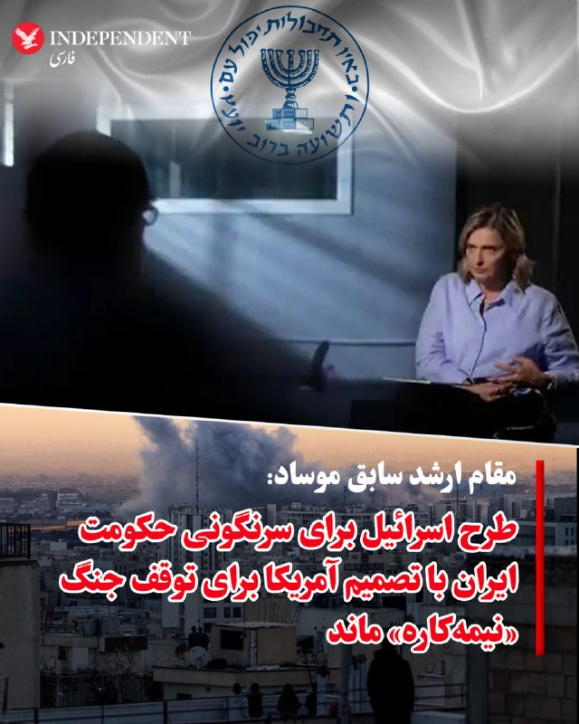

♦️به گزارش «تایمز اسرائیل»، یک مقام ارشد و سابق سازمان اطلاعات و عملیات ویژه اسرائیل، موساد، که با نام مستعار «الف» معرفی شده، در گفتگو با «کانال ۱۲» تلویزیون این کشور اعلام کرد طرح مشترک و چندمرحله‌ای اسرائیل و موساد برای سرنگونی حکومت ایران به دلیل تصمیم ماه آوریل ایالات متحده مبنی بر توقف جنگ، نیمه‌کاره رها شده است. این مامور باسابقه با تاکید بر اینکه حکومت ایران «دیر یا زود سقوط خواهد کرد» گفت: «ما تمام مسیر را طی نکردیم و در میانه راه متوقف شدیم. این یک طرح بلندمدت و گام‌به‌گام بود که به مرور زمان آماده شد اما در حال حاضر به حالت تعلیق درآمده است؛ ما در این جنگ با یک قدرت استراتژیک (آمریکا) به عنوان شریک وارد شدیم که در نقطه‌ای نبرد را متوقف کرد، اما مراحلی از جمله استفاده از شرکای کرد با هدف جایگزینی حکومت آغاز شده و توسعه یافته بود.» این مقام امنیتی همچنین انتقادهای تند جان راتکلیف، رئیس سیا و مارکو روبیو، وزیر خارجه آمریکا را رد کرد و گفت آن‌ها تجربه ۲۸ ساله او را در موساد ندارند، چرا که در این سازمان «تخیل به واقعیت تبدیل می‌شود».
«الف» در بخش دیگری از این مصاحبه به تشریح جزئیات بی‌سابقه‌ای از عملکرد موساد در جریان جنگ ۱۲ روزه در تابستان ۱۴۰۴ پرداخت و فاش کرد که یگان‌های عملیاتی این سازمان با تجهیزات پیشرفته نظامی، تسلیحات، دوربین‌های دید در شب و قابلیت هدایت موشک‌ها، مستقیما در داخل خاک ایران فعالیت می‌کردند. امری که به گفته او تا چند سال پیش غیرقابل تصور بود. وی با اشاره به تحول بزرگ در موساد، به افزایش چشمگیر جذب و آموزش ماموران بومی در کشورهای دشمن اشاره کرد و افزود که در ایران، بسیاری از این افراد به دلیل مخالفت شدید با حکومت، دفاع از حقوق زنان و همسرانشان و یا حس انتقام‌جویی برای آسیب‌هایی که به خانواده‌هایشان وارد شده، انگیزه بالایی برای همکاری با اسرائیل دارند. این مقام سابق همچنین در پاسخ به سوالی درباره وضعیت مجتبی خامنه‌ای، رهبر جدید جمهوری اسلامی که پس از زخمی شدن در حملات ۹ اسفندماه (روزی که پدرش در آن کشته شد) در انظار عمومی دیده نشده است، گفت: «بسیار غافلگیر خواهم شد اگر اسرائیل دقیقا نداند که او در چه وضعیتی قرار دارد.»
‌🇸🇦 Indypersian

🤖 @VahidOOnLine

---
📅 بروزرسانی: 1405/03/17 02:42
---

## FoxNewsTwitter — post 342683

Fox News (Twitter/X)

BREAKING: Golden Tempo wins the Belmont Stakes

---
📅 بروزرسانی: 1405/03/17 02:32
---

## VahidOOnLine — post 244011

  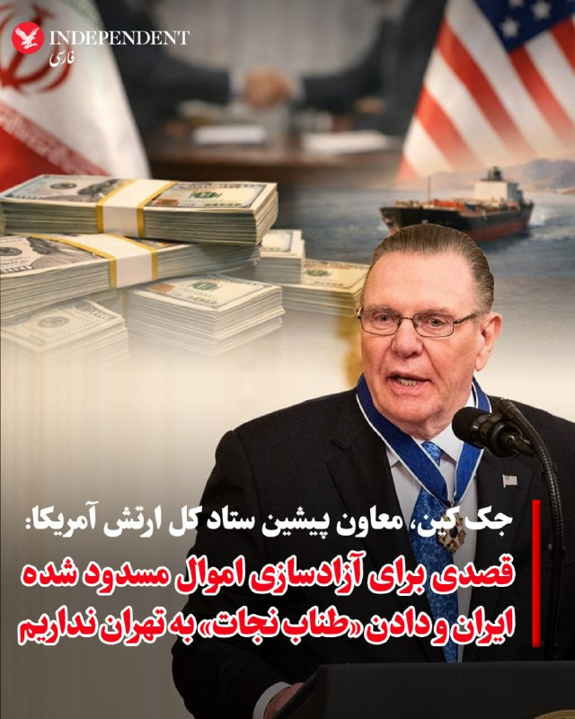

♦️جک کین، معاون پیشین ستاد کل ارتش آمریکا و تحلیل‌گر ارشد نظامی، روز شنبه در گفتگو با «فاکس‌نیوز» با رد قاطعانه درخواست تهران برای آزادسازی ۲۴ میلیارد دلار از دارایی‌های مسدودشده به عنوان شرط توافق، صراحتا اعلام کرد واشنگتن هیچ قصدی برای دادن «طناب نجات» به حکومت ایران ندارد. کین با تاکید بر اینکه صبر استراتژیک دولت دونالد ترامپ پس از هشت هفته مذاکره به پایان رسیده است، گفت: «مقامات تهران فکر می‌کنند با چه کسی طرف هستند؟ آیا ما احمق هستیم که دارایی‌های منجمدشده را آزاد کنیم و میلیاردها دلار به آن‌ها بدهیم تا خود را بازسازی کنند؟» این ژنرال بازنشسته آمریکایی با پافشاری بر اینکه واشنگتن از اهداف حداکثری خود عقب‌نشینی نخواهد کرد، افزود: «معادله روی میز بسیار ساده است. ایران یا باید تمام شروطی را که ما از طریق فشار اقتصادی و ابزار نظامی به دنبالش بودیم بپذیرد، یا اینکه ما مجددا به گزینه نظامی بازخواهیم گشت و با تشدید اهرم‌های پولی، این کشور را در مسیر فروپاشی کامل اقتصادی قرار می‌دهیم.»
‌🇸🇦 Indypersian

🤖 @VahidOOnLine

## FarsiVOA — post 219815

  <a href="telegram/content/FarsiVOA_219815_1780786977.mp4" target="_blank">🎬 Download video</a>

⚡️تازه‌ترین مواضع قانون‌گذاران آمریکایی درباره سیاست واشنگتن در قبال جمهوری اسلامی
@FarsiVOA

## Persian_Trend_Official — post 15829

  <a href="telegram/content/Persian_Trend_Official_15829_1780786979.mp4" target="_blank">🎬 Download video</a>

شبتون بخیر 🌃
Mig-29 Fulcrum

📌 @persian_trend_official
پرشین ترند | متفاوت‌ترین کانال نظامی

## Persian_Trend_Official — post 15828

فایل صوتی لایو امشب در اسپاتیفای

https://open.spotify.com/show/1Wv2tRjfITkTGqyxcHHA2m

## BBCPersian — post 283006

🔻تیم ملی فوتبال ایران از ترکیه راهی مکزیک شده تا در بازی‌های جام جهانی شرکت کند.

این مسابقات، پنج روز دیگر آغاز می‌شود و هر سه بازی ایران در مرحله گروهی، در آمریکا برگزار می‌شود، اما اقامت آنها در مکزیک خواهد بود. آمریکا برای بازیکنان و همراهان ضروری تیم ملی، ویزا صادر کرده، اما به رئیس فدراسیون و ۱۴ همراه دیگر که گفته میشود سوابق سپاهی و امنیتی دارند اجازه ورود نداده. فدراسیون فوتبال ایران، دولت آمریکا را به رفتار تبعیض‌آمیز متهم کرده.

گفت و گو با سام فرزانه از لس‌آنجلس⠀
@BBCPersian

---
📅 بروزرسانی: 1405/03/17 02:22
---

## WithYashar — post 13661

## WithYashar — post 13660

https://t.me/boost/withyashar

## VahidOnline — post 75977

  

خبرگزاری فرانسه گزارش داد، ابوالفضل پسندیده، سفیر جمهوری اسلامی در مکزیک به خبرنگاران گفته است بر اساس شروط تعیین‌شده برای ویزای اعضای تیم ملی، بازیکنان و کادر فنی تنها در روز برگزاری مسابقات خود اجازه ورود به خاک ایالات متحده را دارند و باید بلافاصله پس از پایان بازی، این کشور را ترک کنند.

این محدودیت سخت‌گیرانه در شرایطی ابلاغ شده است که کاروان تیم ملی ایران روز شنبه، تحت سایه یک بحران دیپلماتیک شدید میان تهران و واشنگتن، اردوی تمرینی خود در ترکیه را به مقصد مقر جدید خود در شهر تیخوانای مکزیک ترک کرد. براساس این گزارش، با توجه به اینکه هر سه بازی مرحله گروهی ایران قرار است در خاک آمریکا برگزار شود، این اولین بار در تاریخ جام جهانی است که یک کشور میزبان، پذیرای تیم ملی کشوری می‌شود که با آن در وضعیت جنگی قرار دارد.
این دستورالعمل جدید واشنگتن در تضاد کامل با اظهارات قبلی امیرمهدی علوی، سخنگوی تیم ملی قرار دارد که پیش‌تر مدعی شده بود ویزاها «چندبار ورود» هستند و تیم یک یا دو روز پیش از مسابقات به محل بازی‌ها خواهد رسید. پیش از این نیز ایالات متحده از صدور ویزا برای ۱۵ نفر از همراهان و کادر مدیریتی تیم خودداری کرد و سفارت ایران در ترکیه با «تبعیض‌آمیز» خواندن این رفتار، از فیفا خواسته است تا آمریکا را به دلیل نقض صریح قوانین جام جهانی، که شامل ضرورت حضور سرمربی در کنفرانس مطبوعاتی یک روز پیش از بازی است، پاسخگو کند.
@VahidOOnLine

📡 @VahidOnline

## FarsiVOA — post 219814

⚡️عراق وارد «فاز عملیاتی» پایان دادن به فعالیت‌های شبه‌نظامیان وابسته به جمهوری اسلامی شد
@FarsiVOA

## IranianMinds — post 21530

  <a href="telegram/content/IranianMinds_21530_1780786353.mp4" target="_blank">🎬 Download video</a>

🔴 خسروپناه؛ بعد از چندین روز اعتراض دانش آموزا:

اکثر دانش آموزا به من میگن ما کلی زحمت کشیدیم و یازدهم درس خوندیم. یعنی چی تأثیر معدل حذف بشه؟! این ناعدالتیه.
ایناییم که میان اعتراض میکنن یه تعداد خیلی کمی هستن و بیشترشون پشت کنکورین.
بدین ترتیب تاثیر معدل یازدهم در کنکور قطعیه.

@IranianMinds

## IranianMinds — post 21529

  <a href="telegram/content/IranianMinds_21529_1780786353.webm" target="_blank">🎬 Download video</a>

🤩
🤩
🤩
🤩 بونوس اضافه به ازای هر واریز 
💰

🔴فرصت تکرارنشدنی به مناسبت افتتاحیه
🔴

⚡️هر چقدر شارژ کنی، بیشتر هدیه می‌گیری
⚡️

🔴تا سقف ۳ میلیون تومان
🔴

⌛ فقط برای مدت محدود

💣بالاترین بونوس‌ها فقط در سایت وینرو

پیش بینی کن و برنده شو
🎯

📺 تلویزیون لایو برای پوشش بازی ها

🛍بالاترین ضرایب ممکن
و هزاران امکانات خاص دیگه
💰

🚩
🚩 خرداد افتتاحیه بزرگ سایت وینرو
🟥 همین الان ثبت نام کن و علاوه بر ۵۰۰ هزار تومن بونوس ثبت نام با هر شارژ تا ۲۰۰ درصد شارژ اضافه از ما هدیه بگیر

🔤 Winro.io         معتبرترین سایت ایران

🔤 Winro.io

📱 کانال اخبار و هدایــا aa16
🌟

📱 @winro_io

---
📅 بروزرسانی: 1405/03/17 02:12
---

## VahidOOnLine — post 244010

  

فداحسین مالکی، عضو کمیسیون امنیت ملی مجلس، به تابناک گفت: «حتی اگر توافقی بین جمهوری اسلامی و آمریکا حاصل شود، با توجه به شرایط موجود و رفتارهای متناقض آمریکا، این توافق در مرحله نخست توافقی محدود و نیم‌بند خواهد بود و مسیر گفت‌وگوها در مراحل بعدی ادامه خواهد یافت.»
او گفت: «رفتار‌های متناقض واشنگتن از یک سو با طرح مذاکره و از سوی دیگر با اقدامات نظامی، فضای گفت‌و‌گو‌ها را پیچیده کرده است. میز مذاکره همچنان برقرار است، اما طرف ایرانی به دلیل بی‌اعتمادی به آمریکا، رغبت چندانی برای پیشبرد مذاکرات نشان نمی‌دهد.»

‌🏁 🇬🇧 IranintlTV

🤖 @VahidOOnLine

## WithYashar — post 13659

سی‌ان‌ان: اسرائیل پرسنل نظامی و اطلاعاتی خود را به‌صورت پنهانی در طول درگیری با ایران به جمهوری آذربایجان اعزام کرده @withyashar

## IranIntlTV — post 340896

  <a href="https://t.me/IranintlTV/340896" target="_blank">📎 Download file</a>

🎧نسخه صوتی سیاست با مراد ویسی: جمهوری‌اسلامی؛ کنسرسیوم جنایتکاران، فاسدان و اشغالگران
@iranintlTV

## IranIntlTV — post 340895

  <a href="telegram/content/IranIntlTV_340895_1780785765.mp4" target="_blank">🎬 Download video</a>

دیوان عالی کشور حکم اعدام پنج زندانی سیاسی محبوس در زندان شیبان اهواز را تایید کرد. سه تن از این زندانیان، مسعود جامعی، علیرضا مرداسی و فرشاد اعتمادی‌فر، به اتهام افساد فی‌الارض و عضویت در گروه‌های مخالف جمهوری اسلامی به اعدام محکوم شده‌اند.

گفت‌وگو با رقیه رضایی، روزنامه‌نگار
@iranintltv

## IranIntlTV — post 340894

  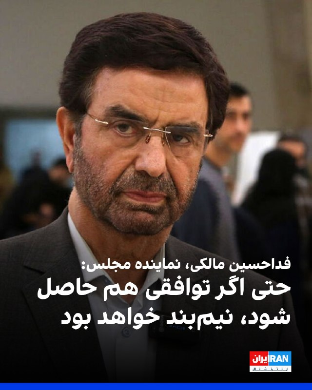

فداحسین مالکی، عضو کمیسیون امنیت ملی مجلس، به تابناک گفت: «حتی اگر توافقی بین جمهوری اسلامی و آمریکا حاصل شود، با توجه به شرایط موجود و رفتارهای متناقض آمریکا، این توافق در مرحله نخست توافقی محدود و نیم‌بند خواهد بود و مسیر گفت‌وگوها در مراحل بعدی ادامه خواهد یافت.»
او گفت: «رفتار‌های متناقض واشنگتن از یک سو با طرح مذاکره و از سوی دیگر با اقدامات نظامی، فضای گفت‌و‌گو‌ها را پیچیده کرده است. میز مذاکره همچنان برقرار است، اما طرف ایرانی به دلیل بی‌اعتمادی به آمریکا، رغبت چندانی برای پیشبرد مذاکرات نشان نمی‌دهد.»

https://iranintl.com/202606063723

## IranIntlTV — post 340893

  <a href="telegram/content/IranIntlTV_340893_1780785769.mp4" target="_blank">🎬 Download video</a>

مراد ویسی، تحلیل‌گر ارشد ایران‌اینترنشنال، گفت: «جمهوری اسلامی به جنایت به‌عنوان روشی برای تحکیم و ماندگاری نظام نگاه می‌کند. جنایت، جزیی از روش بقای حکومت است.»
@iranintltv

---
📅 بروزرسانی: 1405/03/17 02:02
---

## IranIntlTV — post 340892

  <a href="telegram/content/IranIntlTV_340892_1780785150.mp4" target="_blank">🎬 Download video</a>

مهدی خراتیان، کارشناس وابسته به حکومت، در گفت‌وگو با محمد فاضلی، جامعه‌شناس، در برنامه «ایران‌تاک»، با رد پایگاه اجتماعی شاهزاده رضا پهلوی در اعتراضات ۱۸ و ۱۹ دی‌ماه ۱۴۰۴، این اعتراضات را ناشی از افزایش قیمت روغن و سایر محصولات دانست.

او در ادامه افزود ما دقیق اطلاع داریم که لیدرهای اعتراضات، جمعیت را طوری هُل می‌دادند که سپر انسانی مقابل ماموران جمهوری اسلامی شوند.

خراتیان در این گفت‌وگو اذعان می‌کند که حدود ۱۰۰ شهر در آستانه سقوط بودند یا سقوط کردند و برخی فرمانداری‌ها نیز به‌راحتی سقوط کردند. به گفته او، بعد از آن نیروهای یگان ویژه وارد شدند و تعداد کشته‌شدگان افزایش یافت.
@iranintltv

## IranianMinds — post 21528

  <a href="telegram/content/IranianMinds_21528_1780785151.mp4" target="_blank">🎬 Download video</a>

تظاهرات بزرگ ایرانیان مقیم آلمان در شهر دوسلدورف، شنبه ۱۶ خرداد ۱۴۰۵.
همصدا با مردم دلیر ایران و صدای بی‌صدای زندانیان در ایران.

@IranianMinds

## BBCPersian — post 283005

  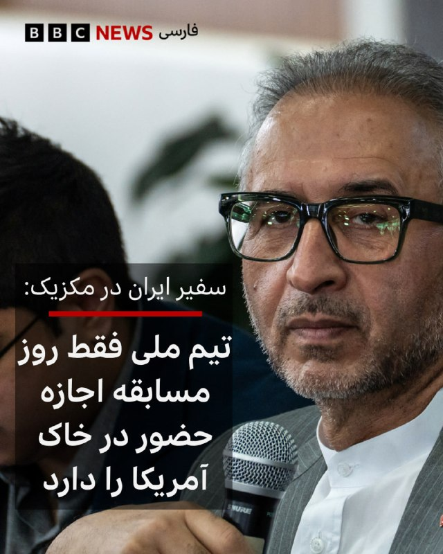

🔻سفیر ایران در مکزیک گفته است که تیم ملی فوتبال ایران برای حضور در مسابقات جام جهانی ملزم شده است در روز برگزاری هر مسابقه وارد خاک آمریکا شود و همان روز هم خاک آن کشور را ترک کند.

ابوالفضل پسندیده، روز شنبه به خبرنگاران گفت: «ما می‌توانیم صبح وارد آمریکا شویم، اما باید همان روز خاک این کشور را ترک کنیم.»

در پی تنش‌ها و درگیری‌های جاری میان آمریکا و ایران، محل استقرار تیم ملی ایران از شهر توسان در ایالت آریزونا به تیخوانا در مکزیک منتقل شده است.

اعضای تیم ملی ایران ساعاتی پیش ترکیه را به مقصد مکزیک ترک کردند.

📸AFP via Getty Images
https://bbc.in/4odjwZr
@BBCPersian

---
📅 بروزرسانی: 1405/03/17 01:52
---

## VahidOOnLine — post 244009

  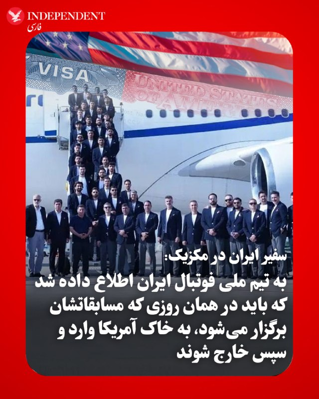

♦️چند روز پس از گزارش اختصاصی ایندیپندنت فارسی درباره صدور نوعی مجوز ورود بسیار محدود و کوتاه‌مدت برای تیم ملی فوتبال ایران، خبرگزاری فرانسه گزارش داد، ابوالفضل پسندیده، سفیر جمهوری اسلامی در مکزیک به خبرنگاران گفته است بر اساس شروط تعیین‌شده برای ویزای اعضای تیم ملی، بازیکنان و کادر فنی تنها در روز برگزاری مسابقات خود اجازه ورود به خاک ایالات متحده را دارند و باید بلافاصله پس از پایان بازی، این کشور را ترک کنند. این محدودیت سخت‌گیرانه در شرایطی ابلاغ شده است که کاروان تیم ملی ایران روز شنبه، تحت سایه یک بحران دیپلماتیک شدید میان تهران و واشنگتن، اردوی تمرینی خود در ترکیه را به مقصد مقر جدید خود در شهر تیخوانای مکزیک ترک کرد. براساس این گزارش، با توجه به اینکه هر سه بازی مرحله گروهی ایران قرار است در خاک آمریکا برگزار شود، این اولین بار در تاریخ جام جهانی است که یک کشور میزبان، پذیرای تیم ملی کشوری می‌شود که با آن در وضعیت جنگی قرار دارد.
این دستورالعمل جدید واشنگتن در تضاد کامل با اظهارات قبلی امیرمهدی علوی، سخنگوی تیم ملی قرار دارد که پیش‌تر مدعی شده بود ویزاها «چندبار ورود» هستند و تیم یک یا دو روز پیش از مسابقات به محل بازی‌ها خواهد رسید. پیش از این نیز ایالات متحده از صدور ویزا برای ۱۵ نفر از همراهان و کادر مدیریتی تیم خودداری کرد و سفارت ایران در ترکیه با «تبعیض‌آمیز» خواندن این رفتار، از فیفا خواسته است تا آمریکا را به دلیل نقض صریح قوانین جام جهانی، که شامل ضرورت حضور سرمربی در کنفرانس مطبوعاتی یک روز پیش از بازی است، پاسخگو کند.
‌🇸🇦 Indypersian

🤖 @VahidOOnLine

## WithYashar — post 13658

  <a href="telegram/content/WithYashar_13658_1780784574.mp4" target="_blank">🎬 Download video</a>

اتاق جنگ با یاشار : خدای‌دریا
@withyashar

## WithYashar — post 13657

## IranIntlTV — post 340891

  <a href="telegram/content/IranIntlTV_340891_1780784577.mp4" target="_blank">🎬 Download video</a>

رسانه‌های حکومتی در ایران گزارش دادند وزیر کشور پاکستان برای تحویل نامه‌ای ویژه از سوی رییس ستاد کل ارتش و نخست‌وزیر این کشور به مجتبی خامنه‌ای به تهران رفته است.

جزییات بیشتر با امیر گیتی، عضو تحریریه ایران‌اینترنشنال
@iranintltv

## Persian_Trend_Official — post 15827

  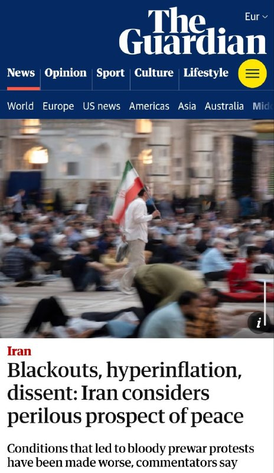

⭕️ گاردین در گزارشی با اشاره به وضعیت شکننده ایران پس از جنگ، نوشت جمهوری اسلامی خود را برای دوره‌ای از «صلحِ پرتنش» آماده می‌کند؛ دوره‌ای که به‌گفته تحلیلگران می‌تواند با بحران‌های هم‌زمان اقتصادی، ساختاری و اجتماعی همراه باشد. در این گزارش تأکید شده که حتی در صورت رسیدن به توافق یا کاهش تنش‌ها، مشکلاتی مانند ابرتورم، قطعی‌های مکرر برق، رکود اقتصادی و نارضایتی‌های عمومی همچنان پابرجا خواهند ماند و فشار بیشتری بر جامعه وارد خواهند کرد.

به‌نوشته گاردین، شرایط امروز ایران از جهات مختلف از فضای پیش از جنگ هم دشوارتر شده و همین موضوع نگرانی‌ها درباره بروز ناآرامی‌های تازه را افزایش داده است. این روزنامه همچنین گزارش داده که در سطوحی از ساختار قدرت، بحث‌هایی درباره آینده کشور در جریان است و حاکمان ایران به‌خوبی می‌دانند که مسئله اصلی فقط عبور از جنگ نیست، بلکه حفظ ثبات و کنترل در دوران پس از آن است.

جمله محوری گزارش این است که ایران، حتی اگر از مرحله درگیری مستقیم عبور کند، همچنان با مجموعه‌ای از بحران‌های درهم‌تنیده روبه‌رو خواهد بود؛ بحران‌هایی که می‌توانند نارضایتی اجتماعی را عمیق‌تر و چشم‌انداز سیاسی کشور را پیچیده‌تر کنند.

📝 Nick

📌 @persian_trend_official
پرشین ترند | متفاوت‌ترین کانال نظامی

## Dirty_Kids — post 391185

⚽️ جام جهانی داره شروع میشه و بازار شرطبندی و پیشبینی از همیشه داغ تر هستش 
🔥 https://t.me/+lCR7HeYTU15iNjM0 https://t.me/+lCR7HeYTU15iNjM0 A16 
⚡️ اگر میخوای با آنالیز های رضا کینگ کونگ پول دربیاری توی این جام حتما عضو کانال شو ✅

## Dirty_Kids — post 391184

  

⚽️ جام جهانی داره شروع میشه و بازار شرطبندی و پیشبینی از همیشه داغ تر هستش 
🔥

https://t.me/+lCR7HeYTU15iNjM0
https://t.me/+lCR7HeYTU15iNjM0
A16

⚡️ اگر میخوای با آنالیز های رضا کینگ کونگ پول دربیاری توی این جام حتما عضو کانال شو ✅

## Dirty_Kids — post 391183

  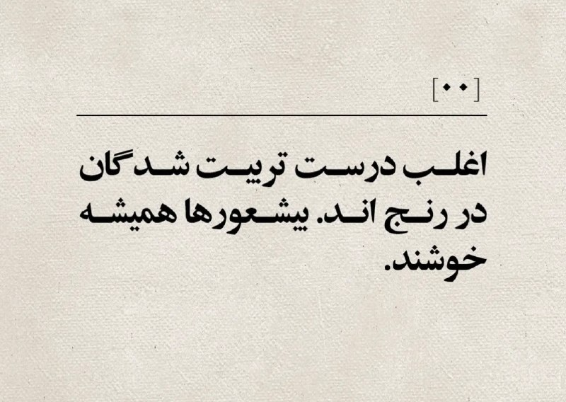

#بخوابیم

@Dirty_Kids 👻

## Dirty_Kids — post 391182

  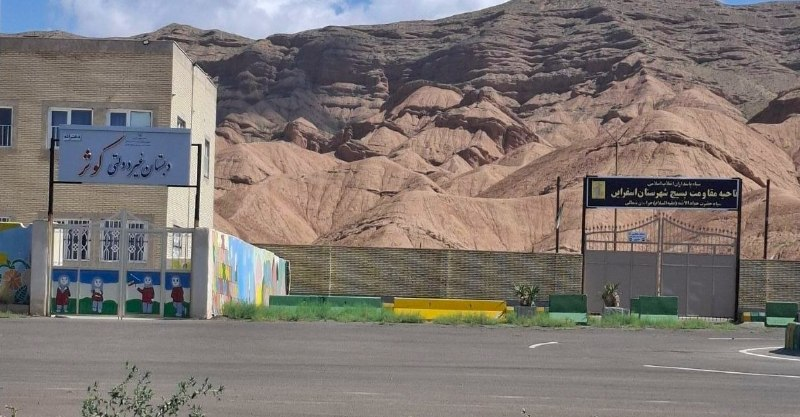

یک مدرسه دیگر در کنار پایگاه نظامی

@Dirty_Kids 👻

## Dirty_Kids — post 391181

‏پاکستان برا چی اعتراض میکنن؟ حموم اجباری شده؟

@Dirty_Kids 👻

## Dirty_Kids — post 391179

اینکارا خوب نیست ادامه بدید

@Dirty_Kids 👻

## Dirty_Kids — post 391178

  <a href="telegram/content/Dirty_Kids_391178_1780784582.mp4" target="_blank">🎬 Download video</a>

لعنت بهت فکر کردم لاکپشته🐢

@Dirty_Kids 👻

## Dirty_Kids — post 391177

  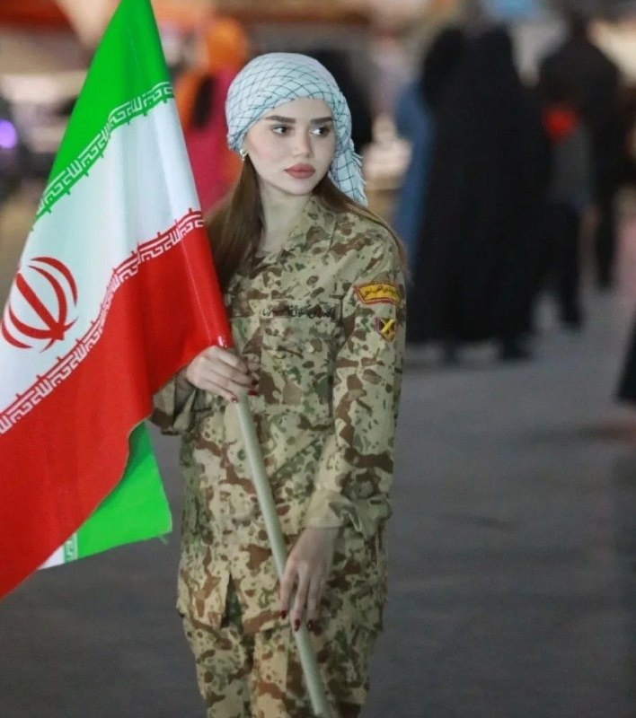

دیده شده در تجمعات شبانه عرزشی‌ها
سرباز صفرم هست امشب قراره صفر0شو آزاد کنن درجه بگیره

@Dirty_Kids 👻

## Dirty_Kids — post 391176

  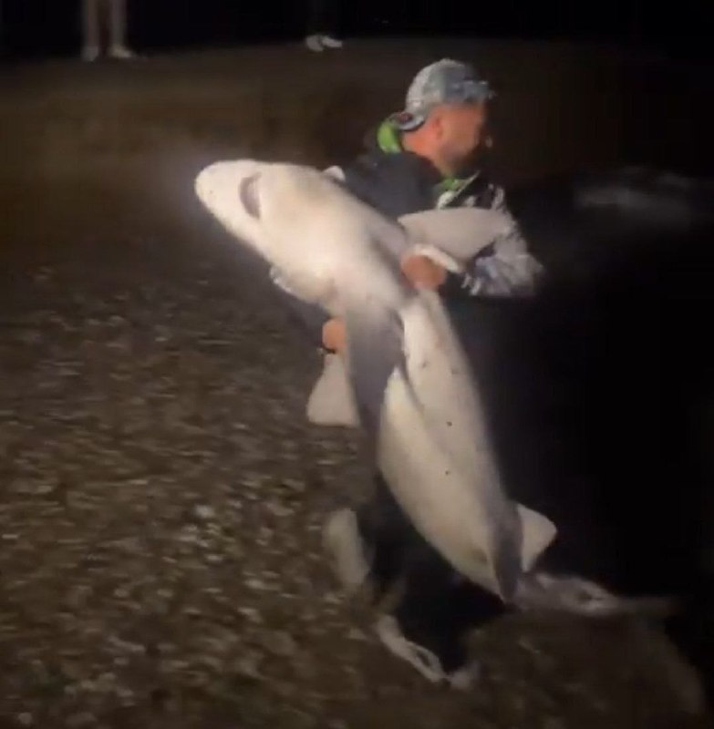

من 12 ساله وقتی خودمو به خواب میزدم که بابام از ماشین تا اتاقم بغلم کنه:

@Dirty_Kids 👻

---
📅 بروزرسانی: 1405/03/17 01:42
---

## Persian_Trend_Official — post 15826

آمریکا در فکر بالاکشیدن اموال ایران برای بازسازی کشورهای عربی

## alonews — post 125664

  

🌐نامحدود فقط 90 تومن 😍
فقط ۵۰ نفر اول 
❤️

✅با سابقه ۵ سال فعالیت مداوم

🛡حتی بدون قطعی تو دوران جنگ

بقیه هنوز VPN حجمی میفروشن
اونم با قیمتای نجومی 
🚀

ما چی؟ 
💯
💥 VPN نامحدود واقعی فقط 90 تومن
🏷️

💥بدون محدودیت حجم
⬇️
⬇️
⬇️
@NetAazaadBot
@NetAazaadBot

---
📅 بروزرسانی: 1405/03/17 01:32
---

## VahidOOnLine — post 244008

  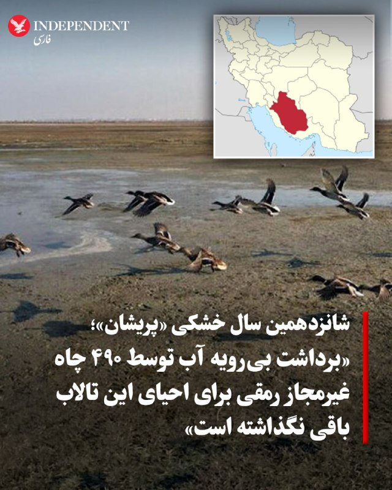

♦️تالاب پریشان، به عنوان یکی از بزرگ‌ترین تالاب‌های آب شیرین ایران، در حالی شانزدهمین سال خشکی مداوم خود را سپری می‌کند که به گفته لاهیجان‌زاده، معاون سازمان حفاظت محیط‌زیست، برداشت بی‌رویه آب توسط ۴۹۰ چاه غیرمجاز و همچنین فراتر از ظرفیت چاه‌های مجاز منطقه، رمقی برای احیای آن باقی نگذاشته است. بحرانی که مسئولان مربوطه تاکید دارند تا زمان تعیین‌تکلیف نهایی این چاه‌ها و توقف دزدی آب از حق‌آبه محیط‌زیستی، هرگونه تلاش برای احیای این تالاب بین‌المللی عملا ناممکن خواهد بود.
‌🇸🇦 Indypersian

🤖 @VahidOOnLine

## pm_afshaa — post 92421

🔴رومن گافمن، رئیس موساد، معاون اول خود را برکنار کرد

💧 Rainbet.com the #1 Non-KYC Crypto Casino & Sportsbook @rainbetcom

😁 @Pm_Afshaa

## pm_afshaa — post 92420

چقدر همه ی اخبار شبیه قبل موج دوم جنگه

## pm_afshaa — post 92419

https://t.me/proxy?server=141.95.135.243&port=443&secret=ddfb2ebf06b1c708b06f46137a4faed9be

پروکسی مخصوص دانلود

💧 Rainbet.com the #1 Non-KYC Crypto Casino & Sportsbook @rainbetcom

😁 @Pm_Afshaa

## pm_afshaa — post 92418

🔴تهدید رسمی سپاه به کشورهای خلیج فارس: اجازه ندهید آمریکا در کشور شما پایگاه تأسیس کند چون روزی آن‌ها خواهند رفت و شما و ما باقی خواهیم ماند

💧 Rainbet.com the #1 Non-KYC Crypto Casino & Sportsbook @rainbetcom

😁 @Pm_Afshaa

## IranIntlTV — post 340890

  <a href="telegram/content/IranIntlTV_340890_1780783377.mp4" target="_blank">🎬 Download video</a>

مراد ویسی، تحلیل‌گر ارشد ایران‌اینترنشنال، گفت: «جمهوری اسلامی از همان روزهای نخست شکل‌گیری با خشونت و سرکوب همراه بود و این خشونت‌ها بخش مهمی از هویت سیاسی آن است. از آتش زدن سینما رکس آبادان تا اعدام‌های اوایل انقلاب، سپس کشتار زندانیان در سال ۶۷ و کشتارهای اخیر خیابانی، همگی نشانگر وجود عنصر قوی جنایت در ساختار نظام سیاسی جمهوری اسلامی است.»
@iranintltv

## IranIntlTV — post 340889

  <a href="telegram/content/IranIntlTV_340889_1780783380.mp4" target="_blank">🎬 Download video</a>

در حاشیه تجمع اعتراضی ایرانیان در واشینگتن، سیامک آرام، برگزارکننده، به اردوان روزبه، خبرنگار ایران‌اینترنشنال، گفت: «مبارزه یک امر مستمر است و باید ادامه پیدا کند. بخش مهمی از این مبارزه، آگاهی‌رسانی است. اگر می‌خواهیم همراهی مردم کشورهای مختلف، افکار عمومی، رسانه‌ها و سیاستمداران را داشته باشیم، باید آن‌ها را نسبت به اهمیت این موضوع آگاه کنیم.»
@iranintltv

## alonews — post 125663

  <a href="telegram/content/alonews_125663_1780783383.webm" target="_blank">🎬 Download video</a>

👈نورالدین الدغیر خبرنگار الجزیره در تهران:
پیش‌نویس یادداشت تفاهم ایران و آمریکا در اختیار نهادی در تهران قرار دارد تا در آن بررسی شود.

🔴این پیش‌نویس برای اینکه بدون مشکل به سمت اعلام توافق پیش برود، به آرای اکثریت مطلق نیاز دارد.

🔴ممکن است در اواسط هفته شاهد تحولاتی استثنایی باشیم؛ البته به شرطی که دولت آمریکا مانند دو هفته پیش که تشریفات اعلام توافق آماده بود، در لحظه آخر نظرش را تغییر ندهد.

✅ @AloNews خبر جنگ

---
📅 بروزرسانی: 1405/03/17 01:22
---

## pm_afshaa — post 92417

پروکسی پر سرعت مخصوص دانلود

https://t.me/proxy?server=116.202.35.160&port=25565&secret=FgMBAgABAAH8AxOG4kw63Q

💧 Rainbet.com the #1 Non-KYC Crypto Casino & Sportsbook @rainbetcom

😁 @Pm_Afshaa

## IranIntlTV — post 340888

  <a href="telegram/content/IranIntlTV_340888_1780782758.mp4" target="_blank">🎬 Download video</a>

مراد ویسی، تحلیل‌گر ارشد ایران‌اینترنشنال، گفت: «زمان به نفع جمهوری اسلامی نمی‌گذرد؛ هرچه تصمیم‌گیری درباره توافق بیشتر به تعویق بیفتد، هزینه‌ها برای جمهوری اسلامی سنگین‌تر می‌شود.»
@iranintltv

## IranianMinds — post 21527

🔴سفیر جمهوری اسلامی در مکزیک اعلام کرد:

تیم فوتبال جمهوری اسلامی ایران اطلاع یافته که باید در همان روز مسابقه وارد خاک آمریکا بشود و پس از پایان بازی، از خاک آمریکا خارج و به مکزیک برگردد.

@IranianMinds

## BBCPersian — post 283004

  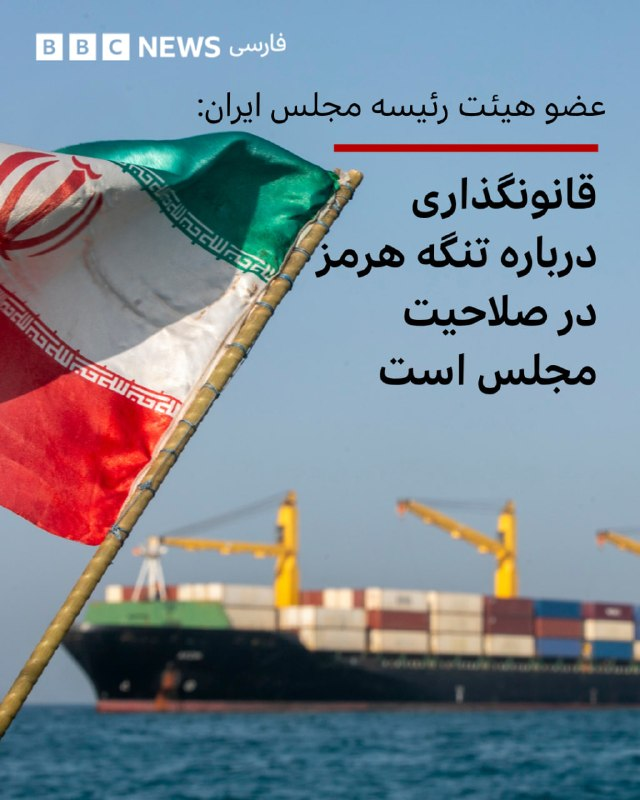

🔻یک عضو هیئت رئیسه مجلس ایران گفته است که «قانونگذاری» درباره تنگه هرمز در «صلاحیت مجلس» است.

علیرضا سلیمی گفت که «تنگه هرمز بخشی از قلمرو حاکمیتی ایران» محسوب می‌شود و در زمره «آب‌های آزاد قرار ندارد»؛ بنابراین وضع هرگونه قانون و مقررات در این محدوده، تنها در «صلاحیت مجلس» است.

او در واکنش به برخی انتقادها درباره صلاحیت مجلس برای قانون‌گذاری درباره تنگه هرمز گفت: «ای کاش برخی به جای تخریب و توهین، با مطالعه سخن گویند تا دچار چنین اشتباهاتی نشوند.»

این عضو هیأت رئیسه مجلس افزود هدف مجلس این است که «چارچوب اعمال حاکمیت ایران بر این آبراه راهبردی را در قالب قانون مشخص و مدون کند.»

آقای سلیمی همچنین با اشاره به این که نحوه بررسی این طرح در مجلس، اعم از عادی یا فوری بودن آن، موضوعی جداگانه است، گفت اما «زیر سؤال بردن اصل حق قانون‌گذاری مجلس درباره تنگه هرمز، رویکردی منصفانه نیست.»

ایران از زمان شروع جنگ در ۲۸ فوریه (نهم اسفند ۱۴۰۴) تنگه هرمز را به روی عبور و مرور کشتی ها بسته است.
📸GettyImages
https://bbc.in/4fqL9vW
@BBCPersian

---
📅 بروزرسانی: 1405/03/17 01:12
---

## VahidOOnLine — post 244007

  

♦️خبرگزاری رویترز به نقل از یک منبع آگاه، روز شنبه گزارش داد، ایالات متحده در نظر دارد دارایی‌های مسدود شده ایران را در اختیار متحدان خود در حاشیه خلیج فارس قرار دهد تا از آن برای «بازسازی و جبران خسارت‌های احتمالی آینده و همچنین صدمات گذشته ناشی از اقدامات ایران» استفاده شود. در همین راستا، این منبع اعلام کرده است که اسکات بسنت، وزیر خزانه‌داری آمریکا، به تیمی ماموریت داده تا میزان خسارت‌هایی را که تاکنون از سوی ایران به متحدان منطقه‌ای واشنگتن وارد شده است، برآورد و ارزیابی کنند.
‌🇸🇦 Indypersian

🤖 @VahidOOnLine

## WithYashar — post 13656

گزارش صدای انفجار در حوالی سیریک🚨
@withyashar

## iaghapour — post 2659

  

⭕️ نصب خودکار داکر روی سرورهای ایران

اگر روی سرورهای داخل ایران داکر نصب می‌کنید، حتماً می‌دانید که به خاطر تحریم‌ها و اختلالات شبکه، باز کردن مخازن داکر و دانلود ایمیج‌ها مکافات است. این اسکریپت متن‌باز و امن، کل فرآیند نصب داکر را خودکار کرده و در انتها به شما اجازه می‌دهد از بین ۶ میرور ایرانی (ابرآروان، داکر آی‌آر، لیارا و...) بهترین را برای رفع تحریم انتخاب کنید.

💻 روش اجرا: کد زیر رو کپی کنید و در سرور اجرا کنید:

curl -fsSL https://gist.githubusercontent.com/ShahinDadashpour/35892443c09d582e53b36d09fb5a5df6/raw/install-docker.sh | sudo bash

🔗 لینک سورس کد در گیت‌هاب جهت بررسی

🆔 @iAghapour

## Dirty_Kids — post 391174

عکسای امروز آنا د آرمس مخصوص فوت فتیشا

@Dirty_Kids 👻

## Dirty_Kids — post 391173

  

عمویم قیصر!

@Dirty_Kids 👻

## Dirty_Kids — post 391172

  <a href="telegram/content/Dirty_Kids_391172_1780782145.mp4" target="_blank">🎬 Download video</a>

🔴 محسن عراقی، خواننده حکومتی، خطاب به جمهوری اسلامی:

تو رستم تهمتنی چرا دیگه نمیزنی؟
تو شیر پیل افکنی چرا دیگه نمیزنی؟
برنده‌ی صد درصدی، چرا دیگه نمیزنی؟
خدایی تویی که انقدره خوب میزدی، چرا دیگه نمیزنی؟


@Dirty_Kids 👻

## alonews — post 125662

  <a href="telegram/content/alonews_125662_1780782146.webm" target="_blank">🎬 Download video</a>

👈کنعانی: حاضریم تو زمین بمیریم اما پرچم جمهوری اسلامی بالا باشه

✅ @AloNews خبر جنگ

---
📅 بروزرسانی: 1405/03/17 01:02
---

## FoxNewsTwitter — post 342682

  

Fox News (Twitter/X)

Todd Blanche is reacting to President Trump's decision to nominate him as attorney general after serving in the role on an acting basis since April.

Blanche says he's focused on the Justice Department's work as the DOJ continues to pursue a series of high-profile investigations and arrests.

If confirmed by the Senate, the former Trump defense attorney would officially become the nation's top law enforcement official.

---
📅 بروزرسانی: 1405/03/17 00:52
---

## VahidOOnLine — post 244006

  

رویترز شنبه به نقل از یک منبع آگاه گزارش داد که آمریکا در حال بررسی تحویل دارایی‌های بلوکه شده ایران به کشورهای خلیج فارس برای بازسازی و جبران خسارات ناشی از حمله‌های جمهوری اسلامی است.
این منبع افزود آمریکا همچنین استفاده از این دارایی‌ها برای جبران خسارت‌های گذشته را بررسی خواهد کرد. به گفته او، اسکات بسنت، وزیر خزانه‌داری آمریکا، به تیمی دستور داده است هزینه خسارت‌هایی را که پیش‌تر از سوی جمهوری اسلامی به کشورهای خلیج فارس وارد شده، ارزیابی کند.

‌🏁 🇬🇧 IranintlTV

🤖 @VahidOOnLine

## VahidOOnLine — post 244005

  <a href="telegram/content/VahidOOnLine_244005_1780780938.mp4" target="_blank">🎬 Download video</a>

♦️فارس، خبرگزاری وابسته به سپاه، شنبه‌شب، تصاویری از وزیر کشور پاکستان در بدو ورود به ایران را منتشر کرد. محسن نقوی از تحویل پیام‌های کلیدی کشورش به رهبر جمهوری اسلامی خبر داد و گفت: «من در ایران هستم تا نامه ویژه‌ای را از طرف فرمانده ارتش و نخست‌وزیر پاکستان به مجتبی خامنه‌ای تحویل دهم».
‌🇸🇦 Indypersian

🤖 @VahidOOnLine

## WithYashar — post 13655

از روی استوری تو اینستا وارد کامنت میشی کامنت دیده میشه ولی از پیج خود شاهزاده وارد میشی دیده نمیشه تقریبا هم ۶ هزارتا لایک خورده. من فکر کنم همه به ادمین پیج باید اعتراض کنن چون من خودم زیر یک پست دیگه اعتراض کردم اونم هیدن شد الان دوباره کامنت گذاشتم که…

## WithYashar — post 13654

از روی استوری تو اینستا وارد کامنت میشی کامنت دیده میشه ولی از پیج خود شاهزاده وارد میشی دیده نمیشه تقریبا هم ۶ هزارتا لایک خورده.
من فکر کنم همه به ادمین پیج باید اعتراض کنن چون من خودم زیر یک پست دیگه اعتراض کردم اونم هیدن شد
الان دوباره کامنت گذاشتم که این جور ادمین بودن خودش دیکتاتوریه

## WithYashar — post 13653

رویترز: ایالات متحده در حال بررسی راه‌هایی است تا دارایی‌های ایرانی را در اختیار متحدان خلیج فارس قرار دهد تا به تأمین مالی بازسازی و تعمیرات ناشی از حملات ایران کمک کند
@withyashar

## FoxNewsTwitter — post 342681

  

Fox News (Twitter/X)

Todd Blanche is reacting to President Trump's decision to nominate him as attorney general after serving in the role on an acting basis since April.

Blanche says he's focused on the Justice Department's work as the DOJ continues to pursue a series of high-profile investigations and arrests.

If confirmed by the Senate, the former Trump defense attorney would officially become the nation's top law enforcement official.

## pm_afshaa — post 92416

  <a href="telegram/content/pm_afshaa_92416_1780780941.webm" target="_blank">🎬 Download video</a>

🔴سفیر ایران در مکزیک:
تیم ملی فوتبال ایران اطلاع یافته‌ که باید در همان روز مسابقه وارد خاک آمریکا بشه و پس از پایان بازی، از خاک آمریکا خارج بشه و به مکزیک برگرده.

💧 Rainbet.com the #1 Non-KYC Crypto Casino & Sportsbook @rainbetcom

😁 @Pm_Afshaa

## VahidOnline — post 75976

👀 رویترز به نقل از منبعی آگاه گزارش داد که آمریکا در حال بررسی تحویل دارایی‌های بلوکه شده ایران به کشورهای خلیج فارس جهت بازسازی و جبران خسارات ناشی از حملات جمهوری اسلامی است

رویترز خبر داد که وزیر خزانه‌داری آمریکا به تیم خود دستور داده خسارات واردشده به کشورهای خلیج‌فارس در حملات جمهوری اسلامی را بررسی کنند

رویترز به نقل از یک منبع آگاه خبر داد که آمریکا دارایی‌های ایران را برای حمایت از بازسازی و جبران خسارات آینده ناشی از حملات جمهوری اسلامی را در اختیار کشورهای خلیج فارس قرار خواهد داد

رویترز به نقل از این منبع نوشت که آمریکا همچنین بررسی خواهد کرد که آیا می‌توان از دارایی‌های ایران برای جبران خسارات گذشته نیز استفاده کرد یا نه
IranIntlbrk

📡 @VahidOnline

## IranIntlTV — post 340887

  

رویترز شنبه به نقل از یک منبع آگاه گزارش داد که آمریکا در حال بررسی تحویل دارایی‌های بلوکه شده ایران به کشورهای خلیج فارس برای بازسازی و جبران خسارات ناشی از حمله‌های جمهوری اسلامی است.
این منبع افزود آمریکا همچنین استفاده از این دارایی‌ها برای جبران خسارت‌های گذشته را بررسی خواهد کرد. به گفته او، اسکات بسنت، وزیر خزانه‌داری آمریکا، به تیمی دستور داده است هزینه خسارت‌هایی را که پیش‌تر از سوی جمهوری اسلامی به کشورهای خلیج فارس وارد شده، ارزیابی کند.

https://iranintl.com/202606066591

## FarsiVOA — post 219813

🔺احتمال استفاده از دارایی‌های ایران برای تامین پول بازسازی خسارات حملات جمهوری اسلامی به کشورهای جنوب خلیج فارس

▪️خبرگزاری رویترز به نقل از یک «منبع آگاه» گزارش داد که ایالات متحده از ابزارهایی استفاده خواهد کرد تا هزینه تعمیر و بازسازی خسارات آینده ناشی از حملات احتمالی جمهوری اسلامی به متحدان آمریکا در خلیج فارس، با دارایی‌های جمهوری اسلامی ایران تامین شود.

⬇️ بیشتر بخوانید:
https://ir.voanews.com/a/8158027.html
@FarsiVOA

## Dirty_Kids — post 391171

توو پاکستان اعتراضات شده و دولتِ پاکستان اینترنت رو تقریباً کامل قطع کرده.
بعد این برای ما فاز شخصیت و حقوق بشر گرفته بود از طرفین می‌خواست خویشتن‌داری کنن.
برو خدا روزیتو جای دیگه بده.

@Dirty_Kids 👻

## Dirty_Kids — post 391170

  

سپهر خلسه ؛ من رپر حکومتی نیستم من عاشق شاهزاده ام

@Dirty_Kids 👻

## alonews — post 125661

  <a href="telegram/content/alonews_125661_1780780943.mp4" target="_blank">🎬 Download video</a>

👈آخوند، اسماعیل رمضانی : بالاخره یه جایی باید مشخص بشه تا کِی می‌خوایم مذاکره کنیم
و باید چه اتفاقی بیفتهِ که بعد بگیم دیگه مذاکره فایده‌ای نداره و ادامه نمی‌دیم؟

✅ @AloNews خبر جنگ

---
📅 بروزرسانی: 1405/03/17 00:42
---

## pm_afshaa — post 92415

  <a href="telegram/content/pm_afshaa_92415_1780780368.webm" target="_blank">🎬 Download video</a>

🔴رویترز: آمریکا اقداماتی رو برای آزادسازی دارایی‌های ایران و انتقال آن‌ به متحدانش در خلیج فارس انجام خواهد داد تا پس از خسارات احتمالی وارد شده به ایران، این منابع صرف بازسازی و ترمیم بشن.

💧 Rainbet.com the #1 Non-KYC Crypto Casino & Sportsbook @rainbetcom

😁 @Pm_Afshaa

## FarsiVOA — post 219812

  

⚡️یک مقام ارشد موساد که سال ۲۰۲۵ بازنشسته شد می‌گوید با اینکه نقشه اسرائيل برای سرنگونی جمهوری اسلامی پس از تصمیم ایالات متحده برای آتش‌بس تمام مراحل خود را پیگیری نکرد، همچنان جمهوری اسلامی را می‌توان سرنگون کرد.

به گزارش تایمز اسرائيل، این مقام که «الف» معرفی شد، به کانال ۱۲ اسرائیل گفت طرح موساد چند مرحله‌ای است و ابراز امیدواری کرد که در مقطعی، اجازه اجرای عملیاتی مراحل بعدی آن داده شود.
@FarsiVOA

## BBCPersian — post 283003

  

🔻رئیس مرکز امور بین‌الملل وزارت نیرو از آمادگی روسیه برای همکاری در بازسازی زیرساخت‌های آسیب‌دیده ایران در جنگ خبر داد.

محمدولی علاءالدینی گفت: «به دنبال وارد آمدن خسارت به زیرساخت‌های حیاتی کشور در جریان این جنگ، مارشاوین، معاون وزیر انرژی روسیه، آمادگی کشورش را برای مشارکت در بازسازی این زیرساخت‌ها اعلام کرده است.»

او گفت که با توجه به توان فنی و ظرفیت بالای شرکت‌های روسیه در حوزه انرژی و برق، اعلام آمادگی مسکو برای مشارکت در بازسازی و نوسازی زیرساخت‌های آسیب‌دیده و تأمین تجهیزات مورد نیاز حائز اهمیت است.

آقای علاءالدینی ابراز امیدواری کرد که این همکاری‌ها بتواند زمینه‌ساز تقویت و گسترش همکاری‌های فنی و اجرایی دو کشور در حوزه‌های آب و برق شود.

📸Anadolu via Getty Images
https://bbc.in/4fvggqm
@BBCPersian

## Dirty_Kids — post 391168

نخبه … 😂😂😂😂😂😂😂 صدف طاهریان 😂😂😂😂😂😂😂

عکس هم تزئینیه. اصلا هم ما نفهمیدیم داره چه اتفاقی میوفته.

@Dirty_Kids 👻

## Dirty_Kids — post 391167

  

🔴 توی فروشگاه اسنپ دارن شورت پروتز جلو زنونه میفروشن تا ناحیه تناسلی خانما برجسته تر به نظر بیاد!

@Dirty_Kids 👻

---
📅 بروزرسانی: 1405/03/17 00:33
---

## mwarmonitor — post 10233

🔴ایالات متحده از ابزارهایی برای در دسترس قرار دادن دارایی‌های ایران جهت استفاده متحدانش در خلیج فارس برای حمایت از بازسازی و تعمیر خسارت‌های احتمالی آینده ناشی از ایران استفاده خواهد کرد.

🔸وزیر خزانه‌داری آمریکا، بسنت، به تیم خود دستور داده است تا شرایط میان متحدان خلیج فارس را بررسی کرده و هزینه خسارات واردشده از سوی ایران را ارزیابی کنند.

🔹آمریکا همچنین بررسی خواهد کرد که آیا دارایی‌های ایران می‌توانند برای تأمین هزینه‌های تعمیر خسارات گذشته مورد استفاده قرار گیرند یا خیر. رویترز

@mwarmonitor

## FarsiVOA — post 219811

  

⚡️خبرنامه امیرکبیر اعلام کرد دانشجویان و دانش‌آموختگان دانشگاه یزد ضمن اعتراض به تداوم بازداشت ایلیا بخشایی، آزادی فوری او را خواستار شدند. ایلیا بخشایی، دانشجوی رشته علوم ورزشی و ورودی سال ۱۴۰۱ دانشگاه یزد، در جریان اعتراضات سراسری ۱۴۰۴ در تهران بازداشت شد و هم اکنون نیز در بازداشت به سر می‌برد.
دانشجویان و دانش‌آموختگان دانشگاه یزد همچنین حکومت جمهوری اسلامی را مسئول «مستقیم و آگاهانه» کشتار مردم و دانشجویان و «قاتل همکلاسی‌های خود» دانستند و تاکید کردند «حکومتی که به دانشجویان شلیک می‌کند، فاقد هرگونه مشروعیت برای ادامه حکمرانی» است.

این دانشجویان گفتند که «داغدار و اندوه دیده» از کشته شدن دانشجویان معترض هستند و یاد جان‌باختگان اعتراضات دی‌ماه ۱۴۰۴، مصطفی سرافراز، متین رنجکش، گلناز شریفی و رضا ریزوندی را گرامی می‌دارند.
@FarsiVOA

## IranianMinds — post 21526

  

بس کن مردک

چرا زنش نمیزنه تو سرش بگه اینکارارو نکن؟

@IranianMinds

## Dirty_Kids — post 391166

  

🔴خبرکوتاه بود و دردناک:

طبق کشف جدید دانشمندا، پرنده‌ها هم جق میزنن!

@Dirty_Kids 👻
euronews persian

## alonews — post 125660

  

👈درپی درگیری میان پنج دوست صمیمی در ورامین بخاطر یک دختر، چهار نفر از آنها به قتل رسیدند

✅ @AloNews خبر جنگ

## alonews — post 125659

  

👈ترامپ به انتشار پست های عجیب با هوش مصنوعی ادامه میدهد

✅ @AloNews خبر جنگ

---
📅 بروزرسانی: 1405/03/17 00:22
---

## VahidOOnLine — post 244004

♦️ماموستا هیوا پالانی، امام جمعه الیاسی از توابع سرپل ذهاب، در واکنشی تند به بازتاب اخبار آسیب شدید دو دختربچه سنندجی، خواستار مداخله فوری دستگاه‌های ذی‌ربط برای تعیین تکلیف حضانت این کودکان شد. او با تقبیح شدید رفتار پدر و نامادری و اشاره به جزییات هولناک آزارها نظیر شکستن فک و سوزاندن پای بچه‌ها، بر لزوم بازگرداندن فوری حضانت به مادر تاکید کرد. این روحانی با «انسان‌نما» خواندن عاملان این جنایت خانگی، تصریح کرد که نباید از خطای این پدر و نامادری گذشت و مراجع قضایی باید آن‌ها را به «اشد مجازات» محکوم کنند.
پیش از این، مادر نارین (۱۵ ساله) و آیلین (۷ ساله)، در گفتگوی اختصاصی با «هفت صبح» پرده از ماه‌ها اسارت و شکنجه پنهان فرزندانش در سرویس بهداشتی خانه برداشت. او با رد شایعات تجاوز، تایید کرد که همسر سابقش با شلنگ و لگد فک و پوست سر دختر بزرگتر را مجروح کرده و موهای او را فروریخته است. این مادر که پیش از این دو بار درخواست بی‌نتیجه برای حضانت داده بود، ضمن تقدیر از همسایگان و اورژانس اجتماعی برای مداخله به موقع، با قاطعیت خواستار اشد مجازات، شکنجه و اعدام همسر سابق و نامادری بچه‌ها شد.
‌🇸🇦 Indypersian

🤖 @VahidOOnLine

## VahidOOnLine — post 244003

  

اسکان‌نیوز در گزارشی با عنوان «انفجار قیمت مواد غذایی در یک سال» نوشت: بررسی‌ها از بازه اردیبهشت ۱۴۰۴ تا اردیبهشت سال جاری نشان می‌دهد که برخی اقلام اساسی با «جهش قیمتی بی‌سابقه‌ای» مواجه شده‌اند.

بر اساس این گزارش، قیمت شماری از اقلام اساسی بیش از ۳۰۰ درصد افزایش یافته است. برای مثال، قیمت روغن نباتی در این مدت ۴۳۱ درصد افزایش یافته و روغن مایع نیز رشد ۳۵۳ درصدی را ثبت کرده است.

همچنین قیمت تخم‌مرغ به عنوان یکی از اصلی‌ترین منابع پروتئین خانوارهای کم‌درآمد، ۳۴۲ درصد افزایش داشته است.

قیمت مرغ نیز در همین بازه زمانی رشدی ۳۴۲.۹ درصدی را تجربه کرده است.
‌🏁 🇬🇧 IranintlTV

🤖 @VahidOOnLine

## WithYashar — post 13652

  

پست جدید ترامپ در تروث شبیه آخر ویدیوی هست که پست کردم شبه حمله 😃
@withyashar

## IranIntlTV — post 340886

  <a href="telegram/content/IranIntlTV_340886_1780779159.mp4" target="_blank">🎬 Download video</a>

ارتش اسرائیل با صدور هشداری فوری از ساکنان چند شهر و روستا در جنوب لبنان خواست خانه‌های خود را ترک کنند. این ارتش اعلام کرد این اقدام در پی نقض آتش‌بس از سوی حزب‌الله و ادامه فعالیت‌های نظامی این گروه صورت گرفته است.

گفت‌وگو با منشه امیر، کارشناس امور خاورمیانه
@iranintltv

## IranIntlTV — post 340885

  

اسکان‌نیوز در گزارشی با عنوان «انفجار قیمت مواد غذایی در یک سال» نوشت: بررسی‌ها از بازه اردیبهشت ۱۴۰۴ تا اردیبهشت سال جاری نشان می‌دهد که برخی اقلام اساسی با «جهش قیمتی بی‌سابقه‌ای» مواجه شده‌اند.

بر اساس این گزارش، قیمت شماری از اقلام اساسی بیش از ۳۰۰ درصد افزایش یافته است. برای مثال، قیمت روغن نباتی در این مدت ۴۳۱ درصد افزایش یافته و روغن مایع نیز رشد ۳۵۳ درصدی را ثبت کرده است.

همچنین قیمت تخم‌مرغ به عنوان یکی از اصلی‌ترین منابع پروتئین خانوارهای کم‌درآمد، ۳۴۲ درصد افزایش داشته است.

قیمت مرغ نیز در همین بازه زمانی رشدی ۳۴۲.۹ درصدی را تجربه کرده است.
https://iranintl.com/202606068705

## FarsiVOA — post 219810

Farsi VOA pinned an audio file

## FarsiVOA — post 219809

  <a href="https://t.me/farsivoa/219809" target="_blank">📎 Download file</a>

🔴📢‌ پادکست خبری شنبه ۱۷خرداد ۱۴۰۵

🛜در صورتی که با مشکل اینترنت مواجه هستید میتوانید اخبار صدای آمریکا را از نسخه‌های پادکست خبری ما روزانه دنبال کنید و یا اخبار را از نسخه سبک وب‌سایت ما پیگیر باشید:
https://ir.voanews.com/lite

📡بروزترین فرکانسهای ماهواره‌ای را نیز میتوانید از صفحه زیر پیگیری کنید:
https://ir.voanews.com/satellite

🔔دیگر شبکه‌های اجتماعی ما را هم دنبال کنید:
https://linktr.ee/voafarsi

ما را به اشتراک بگذارید
@farsivoa

## Dirty_Kids — post 391165

  <a href="https://t.me/Dirty_Kids/391165" target="_blank">📎 Download file</a>

📎 Document

## Dirty_Kids — post 391163

  <a href="telegram/content/Dirty_Kids_391163_1780779161.mp4" target="_blank">🎬 Download video</a>

🔴 ایرانیِ بی‌درد، اگه نمی‌دونی بدون؛ اون چالش مزخرف روسیِ کون نشون دادن دیگه تموم شده؛

الان این ریمیکس آهنگ ترکی (Ta Ki Seni Görene Kadar) مثل خوره افتاده به جون فضای مجازی، مخصوصاً اینستاگرام، ملت هم با این آهنگ از خودشون، بدنشون، ماشینشون و هر چیز دیگه‌ای فیلم می‌گیرن و پست می‌کنن :


@Dirty_Kids 👻

## alonews — post 125658

  <a href="telegram/content/alonews_125658_1780779163.webm" target="_blank">🎬 Download video</a>

👈ثبت ۵۰۰ مورد ابتلا به ابولا در آفریقا!

🔴سازمان بهداشت جهانی در بحبوحه نگرانی‌های فزاینده در مورد گسترش بیماری همه‌گیر گزارش داد که تاکنون نزدیک به ۵۰۰ مورد ابتلا به ابولا در منطقه مرکزی آفریقا تأیید شده است.

✅ @AloNews خبر جنگ

---
📅 بروزرسانی: 1405/03/17 00:12
---

## mwarmonitor — post 10232

  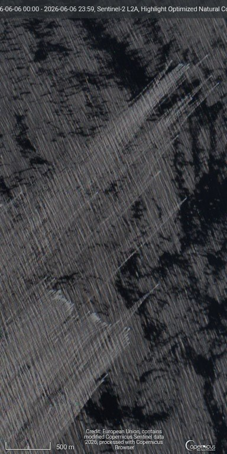

🔴حدود ۸۰ قایق تندرو نیروی دریایی سپاه پاسداران انقلاب اسلامی بر اساس تصاویر ماهواره‌ای Sentinel-2 در حال گشت‌زنی در تنگه هرمز مشاهده شده‌اند (06/06/2026).

📌مختصات: 26.73572, 56.77468

@mwarmonitor

## pm_afshaa — post 92414

  <a href="telegram/content/pm_afshaa_92414_1780778580.webm" target="_blank">🎬 Download video</a>

🔴محمدجواد لاریجانی: مردم بدونن که به هیچ وجه برنامه هسته‌ای رو رها نمی‌کنیم.

💧 Rainbet.com the #1 Non-KYC Crypto Casino & Sportsbook @rainbetcom

😁 @Pm_Afshaa

## pm_afshaa — post 92413

  <a href="telegram/content/pm_afshaa_92413_1780778580.webm" target="_blank">🎬 Download video</a>

🔴محسن نقوی، وزیر کشور پاکستان وارد تهران شد و پس از ورود با اسکندر مومنی، وزیر کشور دیدار کرد. 
💧 Rainbet.com the #1 Non-KYC Crypto Casino & Sportsbook @rainbetcom 
😁 @Pm_Afshaa

## FarsiVOA — post 219808

⚡️مراسم هشتادودومین سالگرد عملیات نورماندی
@FarsiVOA

## RadioFarda — post 157985

  <a href="https://t.me/radiofarda/157985" target="_blank">📎 Download file</a>

📻بشنوید: سرخط خبرهای نیمه‌شب با رادیوفردا، ۱۷ خرداد ۱۴۰۵‌

@RadioFarda

## alonews — post 125657

  <a href="telegram/content/alonews_125657_1780778582.webm" target="_blank">🎬 Download video</a>

👈پست جدید ترامپ در تروث سوشال

✅ @AloNews خبر جنگ

---
📅 بروزرسانی: 1405/03/17 00:02
---

## WithYashar — post 13651

## FoxNewsTwitter — post 342680

  

Fox News (Twitter/X)

82 years after D-Day, WWII veteran Arthur Rose returned to Normandy and read a letter he wrote to his family just days after the invasion.

As Allied forces prepared for the assault, Rose recalled the massive buildup taking place across the English Channel.

"Thousands of ships and landing craft of every description filled the harbor. Everyone worked day and night preparing fuel, provisions, ammunition and secret material."

As the operation drew closer, Rose recalled: "Then came the word: D-Day will be June 6th."

When the fleet finally sailed for France, "everyone expected bombing, submarines, battleships, and all hell to break loose at any moment."

Near the French coast, Rose remembered, "We could see flashes in the distance and hear the explosions continuously."

## IranIntlTV — post 340884

  <a href="telegram/content/IranIntlTV_340884_1780777963.mp4" target="_blank">🎬 Download video</a>

علی نیکزاد، نایب‌ رییس مجلس جمهوری اسلامی، مواضع آمریکایی‌ها درباره آتش‌بس و تنگه هرمز را متناقض خواند و گفت جمهوری اسلامی در این‌باره مبنای فکری مشخصی دارد.

او افزود: «بمب اتم جمهوری اسلامی، تنگه هرمز است.»
@iranintltv

## BBCPersian — post 283002

  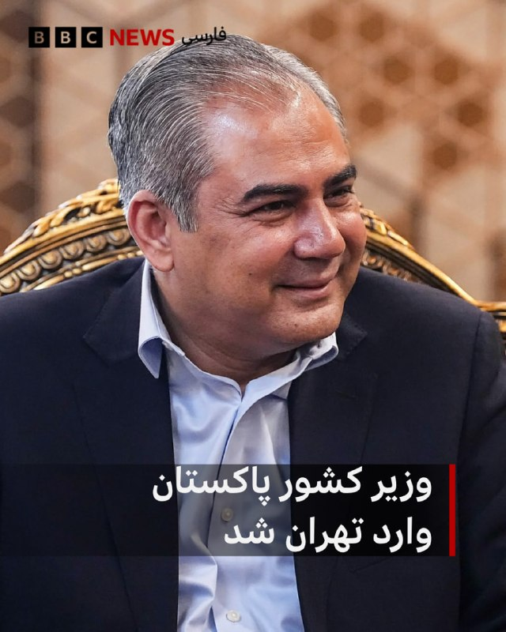

🔻همزمان با تشدید درگیری در خلیج فارس وزیر کشور پاکستان به تهران سفر کرده است.

با توجه نقش پاکستان به‌عنوان میانجی اصلی در گفت‌وگوهای ایران و آمریکا، دیدارهایش از تهران زیر ذره بین رسانه‌هاست.

به گفته رسانه‌های ایران او مقام‌های ایران از جمله عباس عراقچی دیدار می‌کند.

برخی رسانه‌ها در ایران می‌گویند محسن نقوی حامل پیامی برای مجتبی خامنه‌ای رهبر جمهوری اسلامی است.

آقای نقوی ۳۰ اردیبهشت هم برای دومین بار در یک هفته به ایران رفته بود و در این سفرها با رئیس‌جمهور‌، رئیس مجلس، وزیر خارجه و وزیر کشور ایران ملاقات کرده بود.

پاکستان میانجی اصلی در گفت‌وگوهای ایران و آمریکاست.

پیش از سفر امروز، آقای نقوی با شهباز شریف، نخست‌وزیر پاکستان دیدار کرد و دستوالعمل‌هایی برای سفر به تهران دریافت کرد.

او همچنین گزارشی از سفرش به نشست وزرای کشور سازمان همکاری شانگهای در قرقیزستان داد.

در حاشیه آن سفر آقای نقوی دوبار در روزهای پنج‌شنبه و جمعه با اسکندر مومنی وزیر کشور ایران دیدار کرد.

📸ICANA News Agency via Getty Images
https://bbc.in/4uTPCvX
@BBCPersian

## Dirty_Kids — post 391162

  <a href="telegram/content/Dirty_Kids_391162_1780777965.mp4" target="_blank">🎬 Download video</a>

قشنگ ترین ویدیویی که در طول سال دیدم .هزار بار هم‌این ویدیو را ببینی خسته نخواهی شد

@Dirty_Kids 👻

## Dirty_Kids — post 391160

مونا آذر، پورن استار معروف ایرانی اعلام کرد به زودی برمیگرده ایران پیش بکناش

@Dirty_Kids 👻

## alonews — post 125655

  <a href="telegram/content/alonews_125655_1780777966.webm" target="_blank">🎬 Download video</a>

👈اسرائیل اعلام کرد امروز دو سرباز دیگرش در جنوب لبنان توسط حزب الله کشته شدند

✅ @AloNews خبر جنگ

## alonews — post 125654

  <a href="telegram/content/alonews_125654_1780777966.webm" target="_blank">🎬 Download video</a>

👈تصویر ماهواره‌ای پایگاه دریایی شهید محلاتی بوشهر قبل و بعد از حمله

🔴 تصویر توسط پهپاد Q4 تریتون امریکایی از فاصله ۶۰ کیلومتری گرفته شده است

✅ @AloNews خبر جنگ

<!-- MSG END -->

<!-- NAV START -->

<!-- NAV END -->
